## BPA8616P&TNY276P对比测试 (5V/0.2A, 12V/0.4A @85\~265Vac)

上海晶丰明源半导体股份有限公司

Shanghai Bright Power Semiconductor Co., Ltd.

陈耀兵

2022 05 27

## 测试数据对比

电源规格：85\~265Vac输入， 5V/0.2A，12V/0.4A输出。

<table><tr><td colspan="2"></td><td>BPA8616P</td><td>TNY276P</td><td></td></tr><tr><td colspan="2">待机功耗</td><td>701mW</td><td>683mW</td><td>230VAC</td></tr><tr><td rowspan="2">效率(满载整机)</td><td>115Vac</td><td>72.6%</td><td>71.68%</td><td>满载</td></tr><tr><td>230Vac</td><td>70.73%</td><td>70.25%</td><td>满载</td></tr><tr><td rowspan="2">输出电压纹波</td><td>85Vac</td><td>5V-63.8mV/12V-96mV</td><td>5V-66mV/12V-86mV</td><td>满载</td></tr><tr><td>265Vac</td><td>5V-39.8mV/12V-96mV</td><td>5V-40mV/12V-94mV</td><td>满载</td></tr><tr><td rowspan="2">动态负载性能(5V)</td><td>50%-100%</td><td> $74mV_{PK\_PK}$ </td><td> $90mV_{PK\_PK}$ </td><td>85VAC, 12V-0.4A</td></tr><tr><td>10%-90%</td><td> $227mV_{PK\_PK}$ </td><td> $283mV_{PK\_PK}$ </td><td>85VAC, 12V-0.4A</td></tr><tr><td rowspan="2">MOSFET应力</td><td> $V_{DS}$ </td><td>547V</td><td>548V</td><td>265VAC, 输出短路</td></tr><tr><td> $I_{DS}$ </td><td>0.95A</td><td>0.75A</td><td>265VAC, 输出短路</td></tr><tr><td>二极管应力(5V输出)</td><td>VRR</td><td>56V</td><td>54.3V</td><td>265VAC, 输出短路</td></tr><tr><td>二极管应力(12V输出)</td><td>VRR</td><td>109V</td><td>87V</td><td>265VAC, 输出短路</td></tr><tr><td colspan="2">温升测试</td><td>44.8°C (环温 38°C)</td><td>52.7°C (环温 38.5°C)</td><td>85VAC, 5V-0.2A, 12V-0.4A</td></tr><tr><td colspan="2">传导EMI</td><td>无余量 (详见测试波形)</td><td>无余量 (详见测试波形)</td><td>230VAC, 5V-0.2A, 12V-0.4A</td></tr></table>

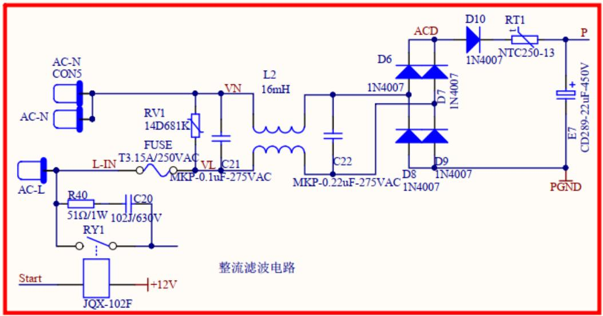

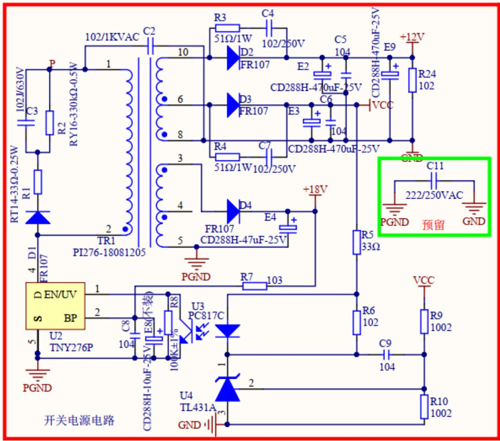

正面  
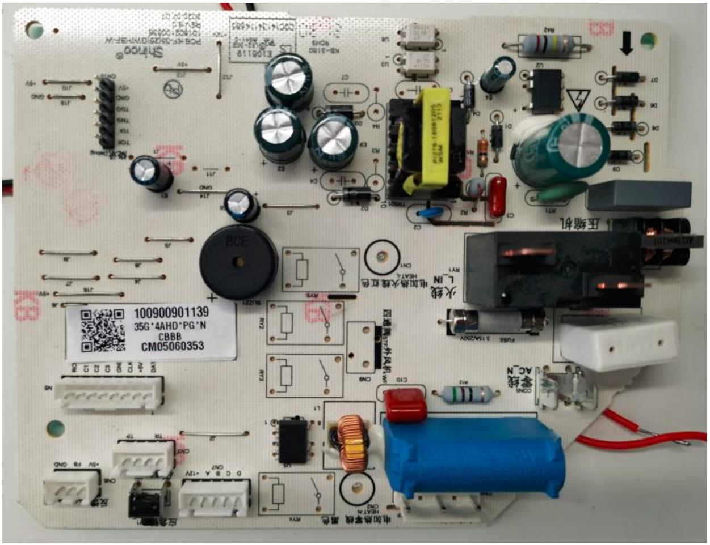

背面  
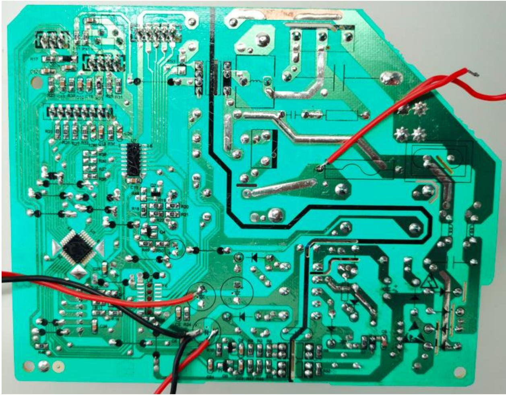

待机功耗  
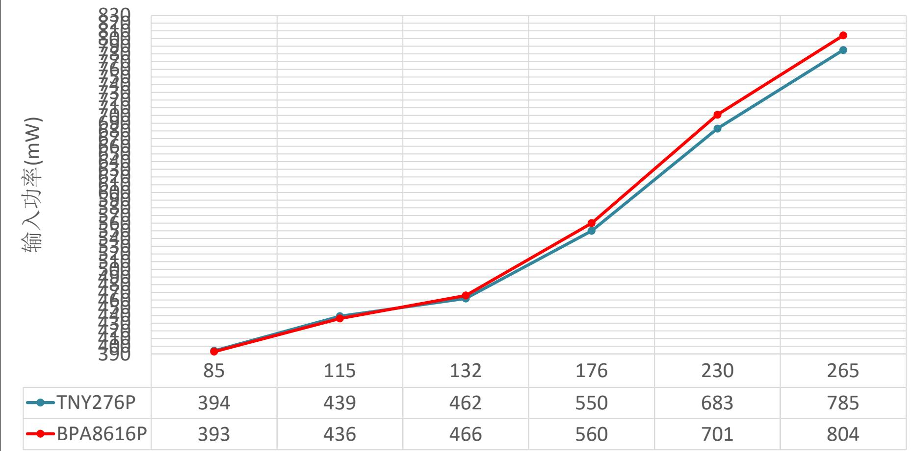

输入电压(Vac)

测试条件：带客户板上负载

效率曲线  
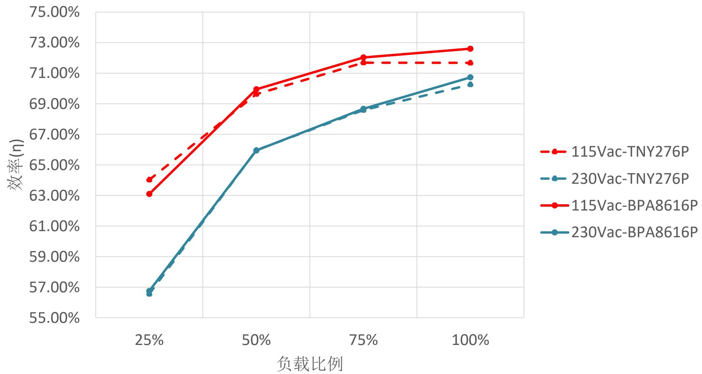

测试时未考虑客户板本身负载对效率的影响。

## 输出电压交叉调整率

BPA8616P

<table><tr><td> $V_{OUT}(V)$  $I_{OUT}(A)$ </td><td></td><td>5V</td><td>12V</td></tr><tr><td rowspan="4"> $I_{O\_5V}=0A$  $I_{O\_12V}=0A$ </td><td>85VAC</td><td>5.0072</td><td>13.1438</td></tr><tr><td>115VAC</td><td>5.0072</td><td>13.1552</td></tr><tr><td>230VAC</td><td>5.0072</td><td>13.17</td></tr><tr><td>265VAC</td><td>5.0072</td><td>13.1818</td></tr><tr><td rowspan="4"> $I_{O\_5V}=0.2A$  $I_{O\_12V}=0A$ </td><td>85VAC</td><td>5.0056</td><td>15.3112</td></tr><tr><td>115VAC</td><td>5.0057</td><td>15.3026</td></tr><tr><td>230VAC</td><td>5.0057</td><td>15.2454</td></tr><tr><td>265VAC</td><td>5.0057</td><td>15.2605</td></tr><tr><td rowspan="4"> $I_{O\_5V}=0A$  $I_{O\_12V}=0.4A$ </td><td>85VAC</td><td>5.0068</td><td>12.2592</td></tr><tr><td>115VAC</td><td>5.0069</td><td>12.2708</td></tr><tr><td>230VAC</td><td>5.007</td><td>12.3075</td></tr><tr><td>265VAC</td><td>5.007</td><td>12.321</td></tr><tr><td rowspan="4"> $I_{O\_5V}=0.2A$  $I_{O\_12V}=0.4A$ </td><td>85VAC</td><td>5.0053</td><td>13.2537</td></tr><tr><td>115VAC</td><td>5.0054</td><td>13.233</td></tr><tr><td>230VAC</td><td>5.0055</td><td>13.2585</td></tr><tr><td>265VAC</td><td>5.0055</td><td>13.2725</td></tr></table>

测试条件：Io=0A为只带客户板上负载

TNY276P

<table><tr><td> $V_{OUT}(V)$  $I_{OUT}(A)$ </td><td></td><td>5V</td><td>12V</td></tr><tr><td rowspan="4"> $I_{O\_5V}=0A$  $I_{O\_12V}=0A$ </td><td>85VAC</td><td>5.0074</td><td>13.1287</td></tr><tr><td>115VAC</td><td>5.0073</td><td>13.1414</td></tr><tr><td>230VAC</td><td>5.0073</td><td>13.1787</td></tr><tr><td>265VAC</td><td>5.0077</td><td>13.1936</td></tr><tr><td rowspan="4"> $I_{O\_5V}=0.2A$  $I_{O\_12V}=0A$ </td><td>85VAC</td><td>5.006</td><td>15.2818</td></tr><tr><td>115VAC</td><td>5.0059</td><td>15.2757</td></tr><tr><td>230VAC</td><td>5.0061</td><td>15.24</td></tr><tr><td>265VAC</td><td>5.0062</td><td>15.276</td></tr><tr><td rowspan="4"> $I_{O\_5V}=0A$  $I_{O\_12V}=0.4A$ </td><td>85VAC</td><td>5.0071</td><td>12.2585</td></tr><tr><td>115VAC</td><td>5.0071</td><td>12.2709</td></tr><tr><td>230VAC</td><td>5.0072</td><td>12.3028</td></tr><tr><td>265VAC</td><td>5.0072</td><td>12.3158</td></tr><tr><td rowspan="4"> $I_{O\_5V}=0.2A$  $I_{O\_12V}=0.4A$ </td><td>85VAC</td><td>5.0052</td><td>13.2436</td></tr><tr><td>115VAC</td><td>5.0055</td><td>13.2275</td></tr><tr><td>230VAC</td><td>5.0057</td><td>13.2542</td></tr><tr><td>265VAC</td><td>5.0057</td><td>13.2683</td></tr></table>

测试条件：Io=0A为只带客户板上负载

## 输出电压纹波

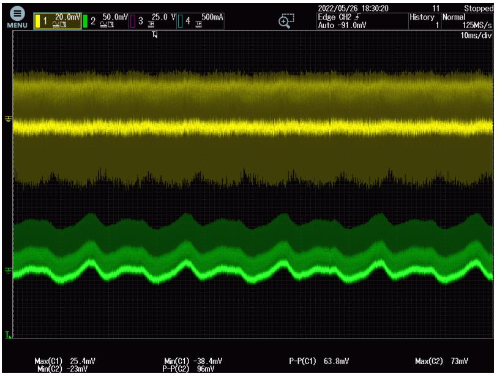

85 VAC

CH1 $\mathsf { V } _ { \mathsf { O U T } \_ 5 \mathsf { V } }$ Ripple $V _ { \mathsf { P K - P K } } { = } 6 3 . 8 \mathsf { m V }$  
CH2 $\mathsf { V } _ { \mathsf { O U T } \_ 1 2 \mathsf { V } }$ Ripple $V _ { \mathsf { P K - P K } } { = } 9 6 ~ \mathsf { m V }$

Test Condition:  
➢ Full Load  
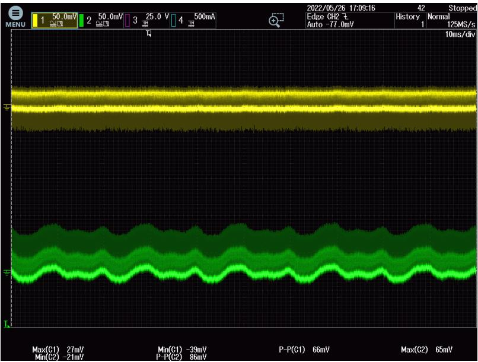

85 VAC

CH1 $\mathsf { V } _ { \mathsf { O U T } \_ 5 \mathsf { V } }$ Ripple $\mathsf { V } _ { \mathsf { P K - P K } } { = } 6 6 \mathsf { m V }$  
CH2 $\mathsf { V } _ { \mathsf { O U T } \_ 1 2 \mathsf { V } }$ Ripple $\mathsf { V } _ { \mathsf { P K - P K } } { = } 8 6 \mathsf { m V }$

Test Condition:  
➢ Full Load  
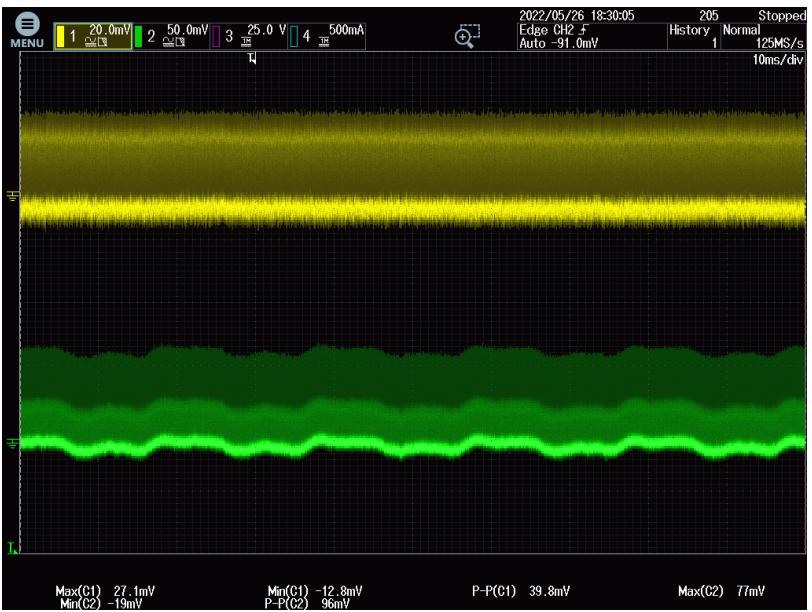

265 VAC

CH1 $\mathsf { V } _ { \mathsf { O U T } \_ 5 \mathsf { V } }$ Ripple $V _ { \mathsf { P K - P K } } { = } 3 9 . 8 ~ \mathsf { m v }$  
CH2 $\mathsf { V } _ { \mathsf { O U T } \_ 1 2 \mathsf { V } }$ Ripple $V _ { p | k \mathrm { - } P K } = 9 6 m v$

Test Condition:  
➢ Full Load  
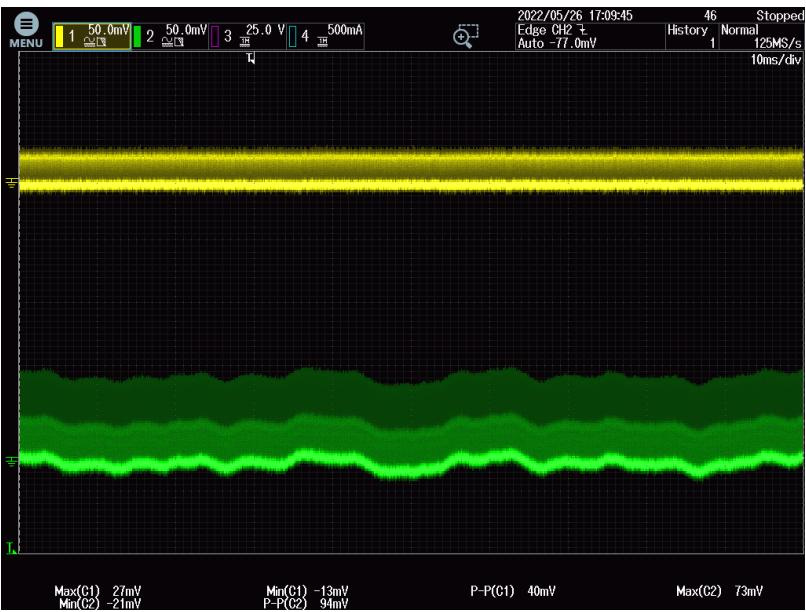

265 VAC

CH1 $\mathsf { V } _ { \mathsf { O U T } \_ 5 \mathsf { V } }$ Ripple $V _ { p | k - P K } = 4 0 m v$  
CH2 $\mathsf { V } _ { \mathsf { O U T } \_ 1 2 \mathsf { V } }$ Ripple $\mathsf { V } _ { \mathsf { P K - P K } } { = } 9 4 \mathsf { m } \mathsf { v }$

Test Condition:

➢ Full Load

## (50%-100%)-5V

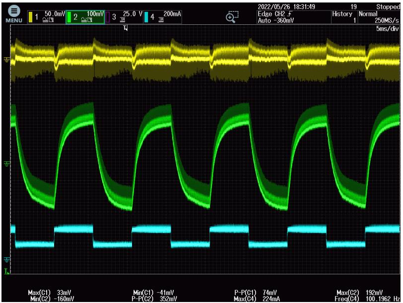

85 VAC

$\begin{array} { r l } & { \mathsf { C H 1 V } _ { \mathsf { O U T } \_ 5 \mathsf { V } } } \\ & { \mathsf { V } _ { \mathsf { P K - P K } } \equiv 7 4 \mathsf { m v } } \end{array}$  
$\begin{array} { r l } & { \mathsf { C H } 2 \mathsf { V } _ { \mathsf { O U T } } } \\ & { \mathsf { V } _ { \mathsf { P K } \cdot \mathsf { P K } } = 3 5 2 \mathsf { m v } } \end{array}$  
CH4 IOUT\_5V $\mathsf { I } _ { \mathsf { O U T } \_ 5 \mathsf { V } }$

## Test Condition:

➢ $5 \mathsf { V } \colon 0 . 1 \mathsf { A } \ – 0 . 2 \mathsf { A } – 0 . 1 \mathsf { A }$  
➢ 12V: 0.4A  
➢ Slew Rate: 0.5 A/μS  
➢ Frequency: 100 Hz

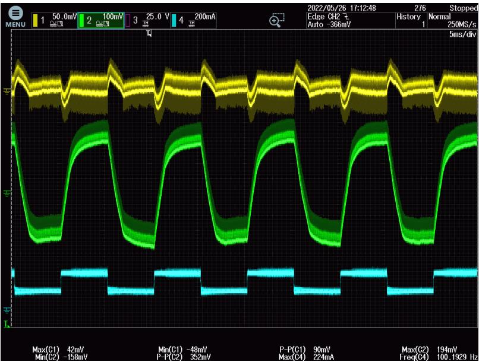

85 VAC

$\begin{array} { r l } & { \mathsf { C H 1 } \mathsf { V _ { O U T } } _ { \mathsf { 5 V } } } \\ & { \mathsf { V _ { P K - P K } } \mathsf { = 9 0 } \mathsf { m v } } \end{array}$  
CH2 V $v _ { P K - P K } = 3 5 2 m v$  
CH4 IOUT\_5V

## Test Condition:

➢ $5 \mathsf { V } ; 0 . 1 \mathsf { A } - 0 . 2 \mathsf { A } - 0 . 1 \mathsf { A }$  
➢ 12V: 0.4A  
➢ Slew Rate: 0.5 A/μS  
➢ Frequency: 100 Hz

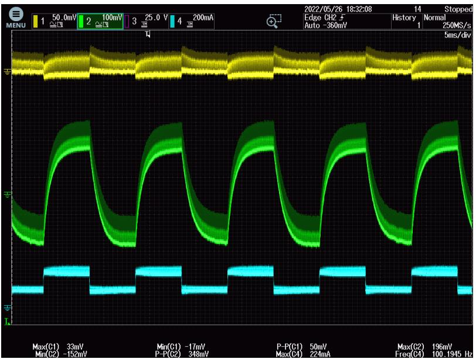

265 VAC

$\begin{array} { r l } & { \mathsf { C H 1 } \mathsf { V _ { O U T } } _ { \mathsf { 5 V } } } \\ & { \mathsf { V _ { P K - P K } } \mathsf { = 5 0 ~ m v } } \end{array}$  
$\begin{array} { r l } & { \mathsf { C H } 2 \mathsf { V } _ { \mathsf { O U T } } } \\ & { \mathsf { V } _ { \mathsf { P K } \cdot \mathsf { P K } } = 3 4 8 \mathsf { m V } } \end{array}$  
CH4 IOUT\_5V $\mathsf { I } _ { 0 \cup \mathsf { T } _ { - } 5 \mathsf { V } }$

## Test Condition:

➢ $5 \mathsf { V } ; 0 . 1 \mathsf { A } \mathsf { - } 0 . 2 \mathsf { A } \mathsf { - } 0 . 1 \mathsf { A }$  
➢ 12V: 0.4A  
➢ Slew Rate: 0.5 A/μS  
➢ Frequency: 100 Hz

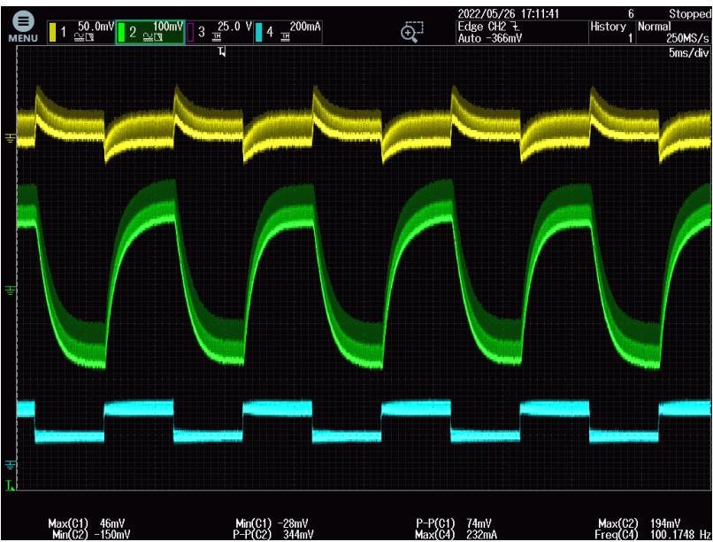

265 VAC

$\begin{array} { r l } & { \mathsf { C H 1 } \mathsf { V _ { O u T } } _ { \mathsf { 5 V } } } \\ & { \mathsf { V _ { P K - P K } } \equiv 7 4 \mathsf { m v } } \end{array}$  
$\begin{array} { r l } & { \mathsf { C H 2 } \mathsf { V _ { O U T } } } \\ & { \mathsf { V _ { P K - P K } } \mathsf { = } 3 4 4 \mathsf { m } \mathsf { v } } \end{array}$  
CH4 IOUT\_5V $\mathsf { C H } 4 \mathsf { I } _ { 0 \mathsf { U T } \_ 5 \mathsf { V } }$

## Test Condition:

➢ 5V: 0.1A-0.2A-0.1A  
➢ $1 2 \mathsf { V } \colon 0 . 4 \mathsf { A }$  
➢ Slew Rate: 0.5 A/μS  
➢ Frequency: 100 Hz

## (10%-90%)- 5V

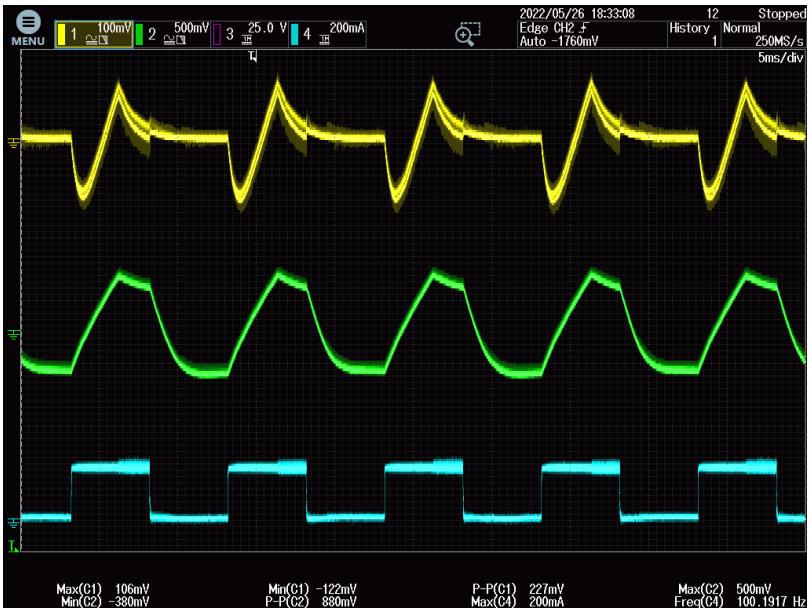

85 VAC

CH1 V OUT\_5VVPK-PK= 227 mV  
$\begin{array} { r l } & { \mathsf { C H } 2 \mathsf { V } _ { \mathsf { O U T } } \imath _ { 2 \mathsf { V } } } \\ & { \mathsf { V } _ { \mathsf { P K } \to \mathsf { P K } } = 8 8 0 \mathsf { m V } } \end{array}$  
CH4 IOUT\_5V $\mathsf { I } _ { \mathsf { O U T } \_ 5 \mathsf { V } }$

## Test Condition:

➢ 5V: 0.02A-0.18A-0.02A  
➢ 12V: 0.4A  
➢ Slew Rate: 0.5 A/μS  
➢ Frequency: 100 Hz

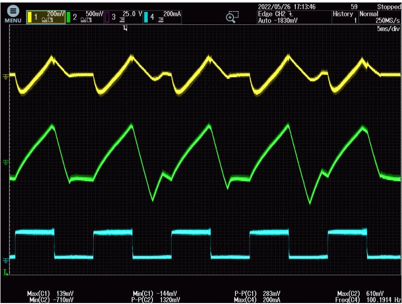  
85 VAC

$\mathtt { C H 1 V _ { \mathtt { O U T } } } _ { \mathtt { N _ { P K - P K } } } = 2 8 3 \mathtt { V _ { m V } }$  
$\begin{array} { r l } & { \mathsf { C H 2 } \mathsf { V _ { O U T } } } \\ & { \mathsf { V _ { P K - P K } } \mathsf { = } \mathsf { 1 3 2 0 m v } } \end{array}$  
CH4 IOUT\_5V

## Test Condition:

➢ 5V: 0.02A-0.18A-0.02A  
➢ 12V: 0.4A  
➢ Slew Rate: 0.5 A/μS  
➢ Frequency: 100 Hz

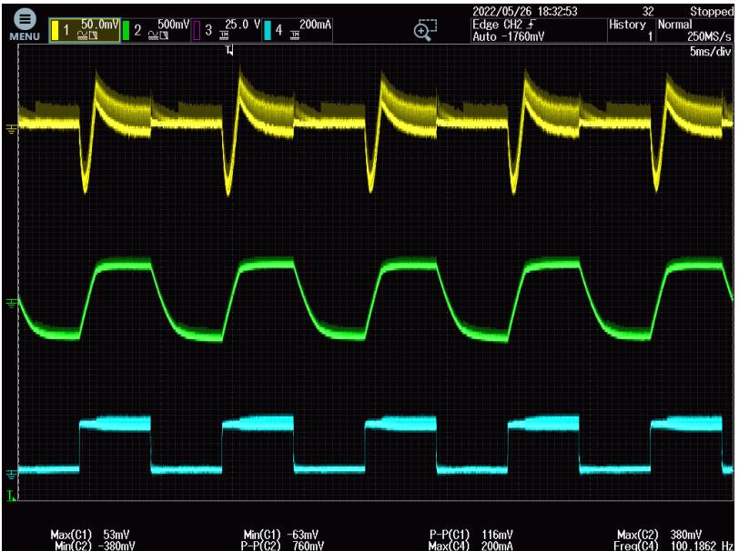

265 VAC

CH1 V OUT\_5VV = 116 mV  
$\mathtt { C H 2 } \mathtt { V _ { 0 \sqcup T } } _ { \mathtt { V _ { P K } } = 7 6 0 \mathtt { m V } }$  
CH4 IOUT\_5V $\mathsf { I } _ { 0 \cup \mathsf { T } _ { - } 5 \mathsf { V } }$

## Test Condition:

➢ 5V: 0.02A-0.18A-0.02A  
➢ 12V: 0.4A  
➢ Slew Rate: 0.5 A/μS  
➢ Frequency: 100 Hz

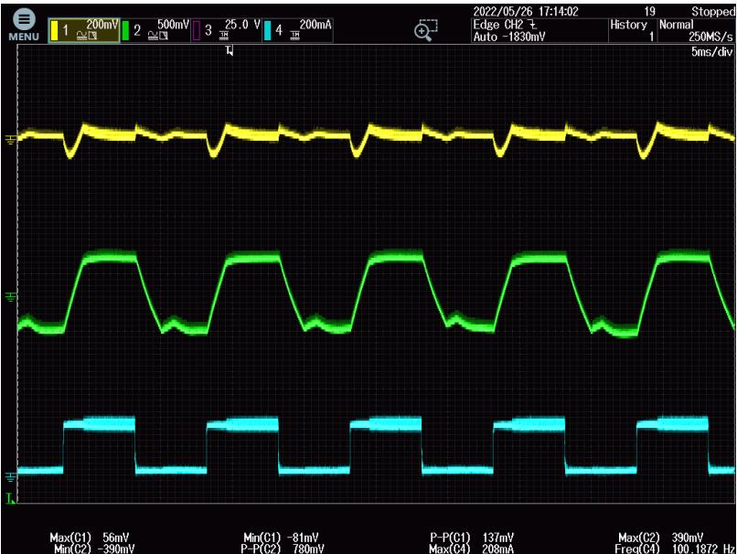

265 VAC

$\mathsf { C H 1 V } _ { \mathsf { o u r } } \mathsf { \Pi } _ { \mathsf { m v } }$  
$\mathsf { C H } 2 \mathsf { V } _ { \mathsf { O U T } } \mathsf { 1 } 2 \mathsf { V } _ { \mathsf { m V } }$  
CH4 IOUT\_5V

## Test Condition:

➢ 5V: 0.02A-0.18A-0.02A  
➢ 12V: 0.4A  
➢ Slew Rate: 0.5 A/μS  
➢ Frequency: 100 Hz

## (50%-100%)- 12V

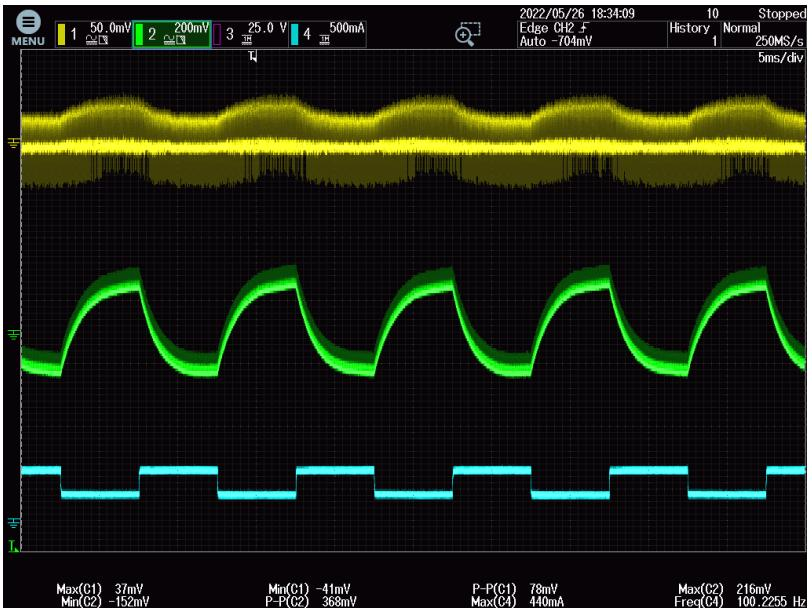

85 VAC

$\begin{array} { r l } & { \mathsf { C H 1 V } _ { \mathsf { O \cup T } _ { \mathsf { S \subseteq V } } } } \\ & { \mathsf { V } _ { \mathsf { P K - P K } } \equiv 7 8 \mathsf { m v } } \end{array}$  
$\begin{array} { r l } & { \mathsf { C H 2 } \mathsf { V _ { O U T } } _ { 1 2 \mathsf { V } } } \\ & { \mathsf { V _ { P K - P K } } \mathsf { = } 3 6 8 \mathsf { m v } } \end{array}$  
CH4 IOUT\_12V $\mathsf { I } _ { \mathsf { O U T } _ { - } 1 2 \mathsf { V } }$

## Test Condition:

➢ 5V: 0.2A  
➢ 12V: 0.2A-0.4A-0.2A  
➢ Slew Rate: 0.5 A/μS  
➢ Frequency: 100 Hz

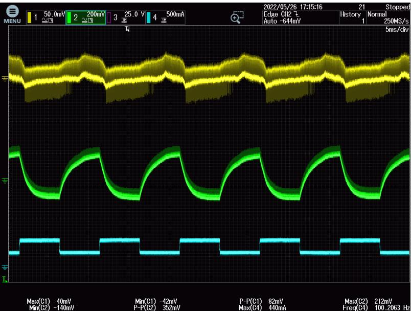

85 VAC

$\begin{array} { r l } & { \mathsf { C H 1 } \mathsf { V _ { O u T \_ 5 v } } } \\ & { \mathsf { V _ { P K \circ P K } } \mathsf { = } 8 2 \mathsf { \Pi m v } } \end{array}$  
$\mathtt { C H 2 } \mathtt { V _ { 0 \sqcup T } } _ { \mathtt { V _ { P K } } = 3 5 2 \ m v }$  
CH4 IOUT\_12V

## Test Condition:

➢ 5V: 0.2A  
➢ 12V: 0.2A-0.4A-0.2A  
➢ Slew Rate: 0.5 A/μS  
➢ Frequency: 100 Hz

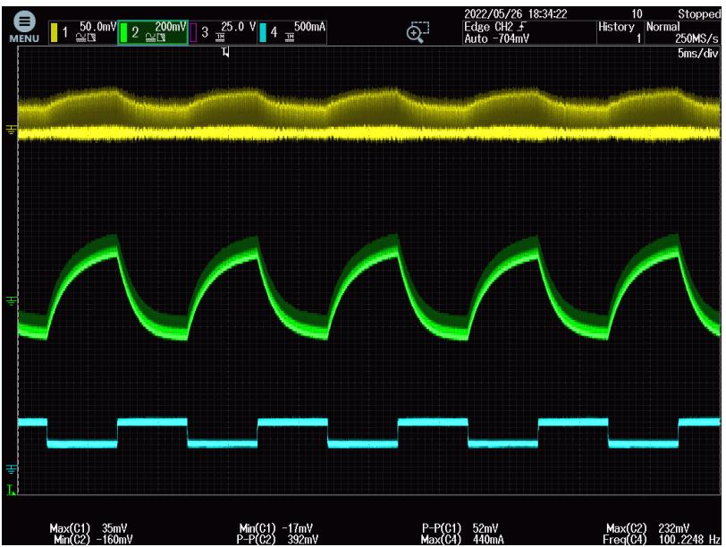

265 VAC

$\stackrel { \mathsf { C H 1 } } { \boldsymbol { \mathsf { V } } } _ { \mathsf { P K - P K } } ^ { \mathsf { 1 } } = \stackrel { \mathsf { U T } } { 5 } \stackrel { 5 \mathsf { V } } { 2 } \mathsf { m } \boldsymbol { \mathsf { V } }$  
$\begin{array} { r l } & { \mathsf { C H } 2 \mathsf { V } _ { \mathsf { O U T } } } \\ & { \mathsf { V } _ { \mathsf { P K } \cdot \mathsf { P K } } = 3 9 2 \mathsf { m V } } \end{array}$  
CH4 IOUT\_12V $\mathsf { I } _ { \mathsf { O U T } _ { - } 1 2 \mathsf { V } }$

## Test Condition:

➢ 5V: 0.2A  
➢ 12V: 0.2A-0.4A-0.2A  
➢ Slew Rate: 0.5 A/μS  
➢ Frequency: 100 Hz

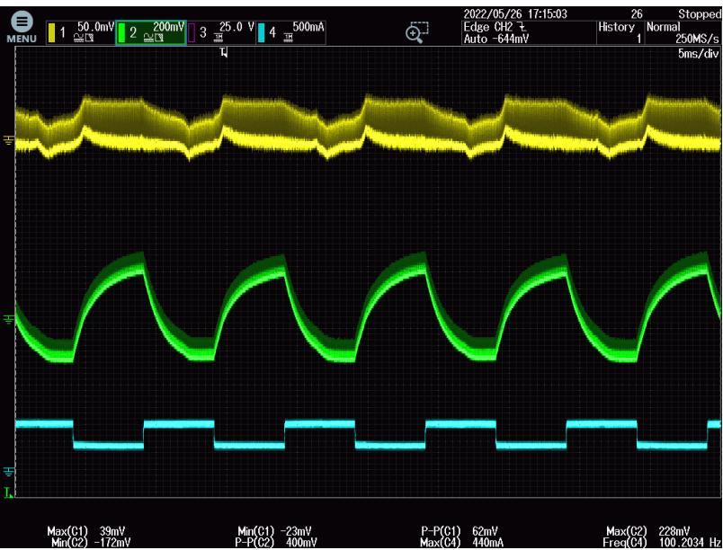

265 VAC

$\begin{array} { r l } & { \mathsf { C H 1 } \mathsf { V _ { O U T } } _ { \mathsf { S V } } } \\ & { \mathsf { V _ { P K - P K } } \mathsf { = } 6 2 \mathsf { m v } } \end{array}$  
$\begin{array} { r l } & { \mathsf { C H 2 V } _ { \mathsf { O U T } } \mathsf { 1 2 V } } \\ & { \mathsf { V } _ { \mathsf { P K - P K } } \mathsf { = 4 0 0 \mathsf { m V } } } \end{array}$  
CH4 IOUT\_12V $\mathsf { C H } 4 \mathsf { I } _ { 0 \mathsf { U T } _ { - } 1 2 \mathsf { V } }$

## Test Condition:

➢ 5V: 0.2A  
➢ 12V: 0.2A-0.4A-0.2A  
➢ Slew Rate: 0.5 A/μS  
➢ Frequency: 100 Hz

## (10%-90%)- 12V

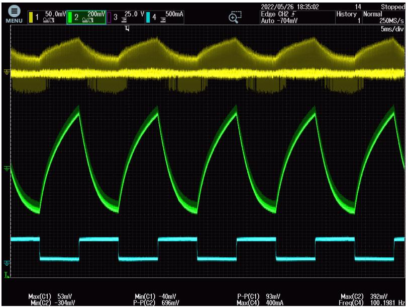

85 VAC

$\begin{array} { r l } & { \mathsf { C H 1 V } _ { \mathsf { O U T } \_ 5 \mathsf { V } } } \\ & { \mathsf { V } _ { \mathsf { P K - P K } } \equiv \ 9 3 \mathsf { m V } } \end{array}$  
$\begin{array} { r l } & { \mathsf { C H } 2 \mathsf { V } _ { \mathsf { O U T } } \mathsf { 1 } 2 \mathsf { V } } \\ & { \mathsf { V } _ { \mathsf { P K - P K } } = 6 9 6 \mathsf { m V } } \end{array}$  
CH4 IOUT\_12V $\mathsf { I } _ { \mathsf { O U T } _ { - } 1 2 \mathsf { V } }$

## Test Condition:

➢ 5V: 0.2A  
➢ 12V: 0.04A-0.36A-0.04A  
➢ Slew Rate: 0.5 A/μS  
➢ Frequency: 100 Hz

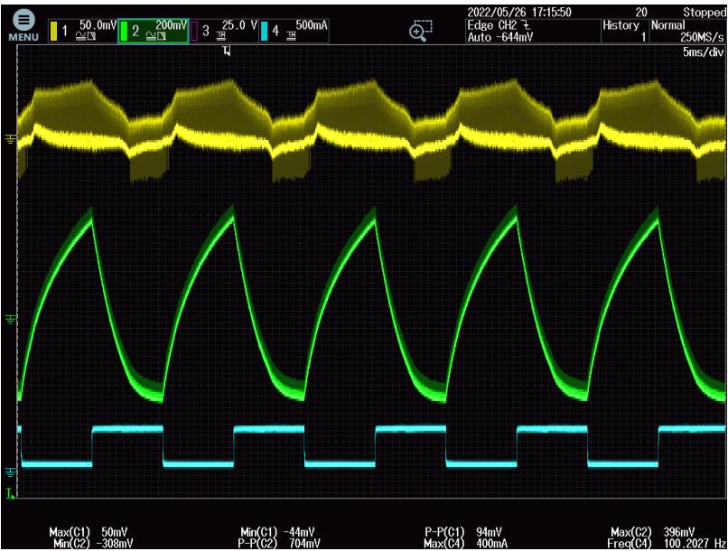

85 VAC

$\begin{array} { r l } & { \mathsf { C H 1 V } _ { \mathsf { O U T } \_ 5 \mathsf { V } } } \\ & { \mathsf { V } _ { \mathsf { P K - P K } } \equiv 9 4 \mathsf { m v } } \end{array}$  
$\begin{array} { r l } & { \mathsf { C H 2 V } _ { \mathsf { O U T } _ { \mathsf { P A } _ { \mathsf { m V } } } } } \\ & { \mathsf { V } _ { \mathsf { P K - P K } } \equiv 7 0 4 \mathsf { m v } } \end{array}$  
CH4 IOUT\_12V

## Test Condition:

➢ 5V: 0.2A  
➢ 12V: 0.04A-0.36A-0.04A  
➢ Slew Rate: 0.5 A/μS  
➢ Frequency: 100 Hz

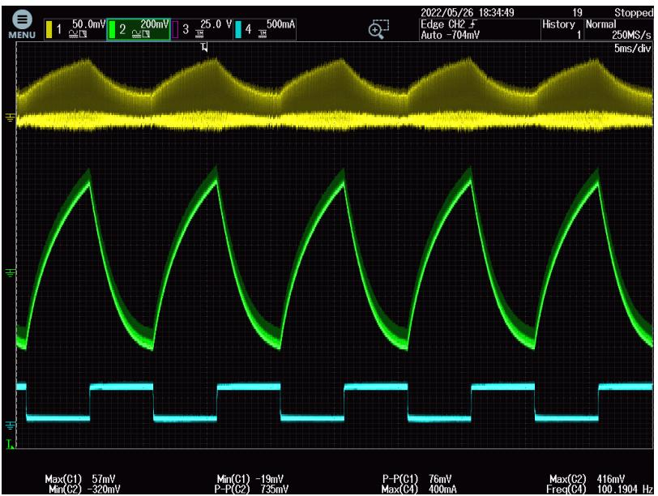

265 VAC

$\begin{array} { r l } & { \mathsf { C H 1 } \mathsf { V _ { O u T } } _ { \mathsf { S V } } } \\ & { \mathsf { V _ { P K - P K } } \equiv 7 6 \mathsf { m v } } \end{array}$  
$\mathtt { C H 2 } \mathtt { V _ { 0 \sqcup T } } _ { \mathtt { V _ { P K } } = 7 3 5 \mathtt { m v } }$  
CH4 IOUT\_12V $\mathsf { I } _ { \mathsf { O U T } _ { - } 1 2 \mathsf { V } }$

## Test Condition:

➢ 5V: 0.2A  
➢ 12V: 0.04A-0.36A-0.04A  
➢ Slew Rate: 0.5 A/μS  
➢ Frequency: 100 Hz

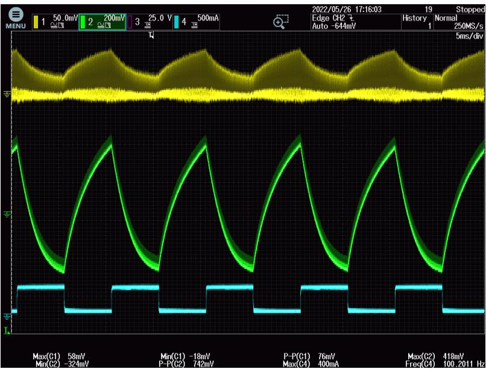

265 VAC

$\begin{array} { r l } & { \mathsf { C H 1 } \mathsf { V _ { O u T } } _ { \mathsf { S V } } } \\ & { \mathsf { V _ { P K - P K } } \mathsf { = 7 6 m v } } \end{array}$  
$\mathsf { C H } 2 \mathsf { V } _ { \mathsf { O U T } } \mathsf { 1 } 2 \mathsf { v }$  
CH4 IOUT\_12V

## Test Condition:

➢ 5V: 0.2A  
➢ 12V: 0.04A-0.36A-0.04A  
➢ Slew Rate: 0.5 A/μS  
➢ Frequency: 100 Hz

## 输出电压开机波形

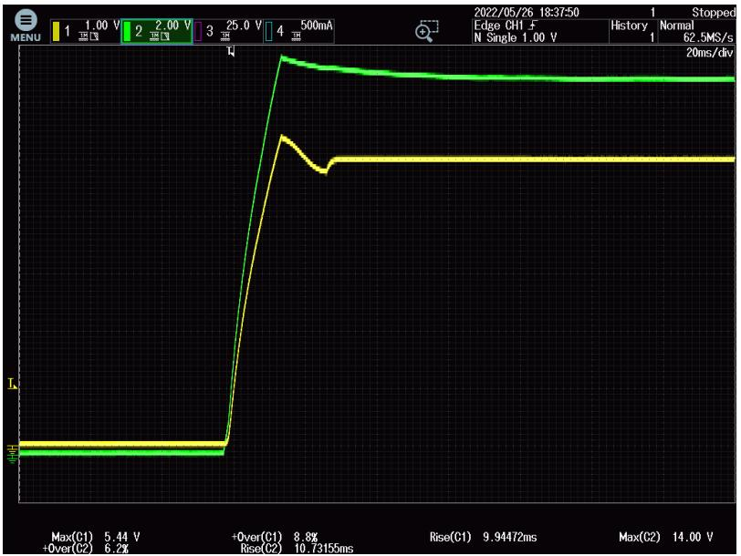

85 VAC

$\begin{array} { r } { \mathsf { C H 1 V _ { 0 \cup \mathsf { T } \_ 5 \vee } } } \\ { \mathsf { t } _ { \mathrm { r i s e } } = 9 . 9 ~ \mathsf { m S } } \end{array}$ CH1 VOUT\_5V  
$\begin{array} { r l } & { \mathsf { C H 2 } \mathsf { V _ { 0 \cup \mathsf { T _ { - } 1 } 2 \mathsf { V } } } } \\ & { \mathsf { t } _ { \mathsf { r i s e } } \mathsf { = 1 0 } . 7 \mathsf { m s } } \end{array}$ CH2 V

Test Condition:  
➢ No Load  
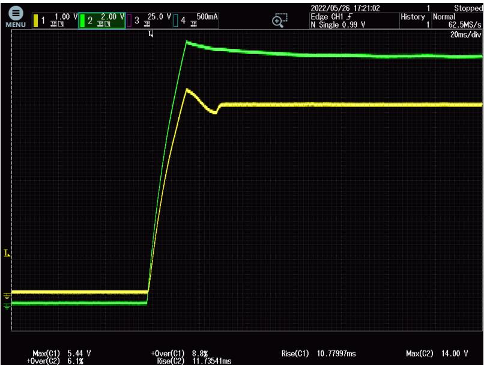

85 VAC

$\begin{array} { l } { \mathsf { C H 1 V _ { 0 \cup \mathsf { T } \_ 5 \vee } } } \\ { \displaystyle \mathfrak { t } _ { \mathsf { r i s e } } = 1 0 . 8 \mathsf { m s } } \end{array}$ CH1 VOUT\_5V  
$\begin{array} { r l } & { \mathsf { C H 2 } \mathsf { V _ { 0 \cup \mathsf { T _ { - } 1 } 2 \mathsf { V } } } } \\ & { \mathsf { t } _ { \mathsf { r i s e } } \mathsf { = } \pm \pm \pmb { 1 } \mathsf { 1 } . 7 \mathsf { m s } } \end{array}$ CH2 VOUT\_12V

Test Condition:  
➢ No Load  
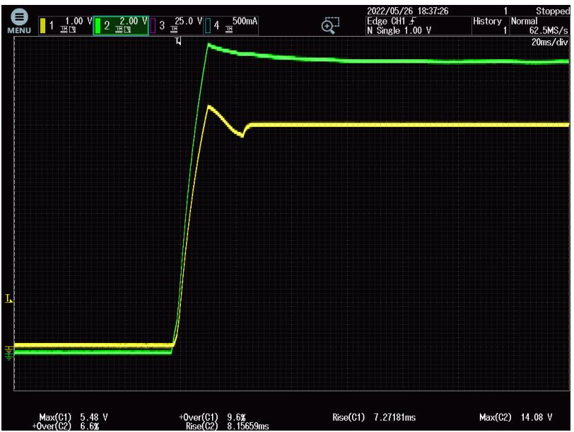

265 VAC

$\begin{array} { r } { \mathsf { C H 1 } \mathsf { V _ { 0 \cup \mathsf { T } \_ 5 \vee } } } \\ { \mathsf { t } _ { \mathrm { r i s e } } \equiv 7 . 3 ~ \mathsf { m S } } \end{array}$ CH1 V  
$\begin{array} { l l } { { \mathbb { C } } { \mathbb { H } } 2 { \mathbb { V } } _ { 0 \cup { \mathbb { T } } _ { - } 1 2 \vee } } \\ { { \mathbb { t } } _ { \mathrm { r i s e } } { = } 8 . 2 ~ \mathrm { m } 5 } \end{array}$ CH2 VOUT\_12V

Test Condition:  
➢ No Load  
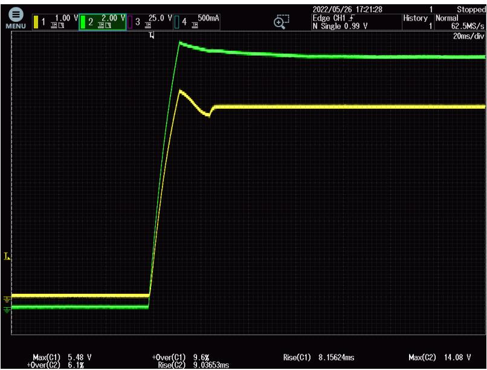

265 VAC

$\begin{array} { r } { \mathsf { C H 1 V _ { 0 \cup \mathsf { T } \_ 5 \vee } } } \\ { \mathsf { t } _ { \mathrm { r i s e } } = 8 . 2 \mathsf { m s } } \end{array}$ CH1 V  
$\begin{array} { l l } { { \mathsf { C H 2 } } { \mathsf { V } } _ { 0 \cup \mathsf { T } _ { - } 1 2 \vee } } \\ { { \mathsf { t } } _ { \mathsf { r i s e } } { = } 9 . 0 ~ \mathsf { m S } } \end{array}$ CH2 V

Test Condition:

➢ No Load

## 输出电压开机波形

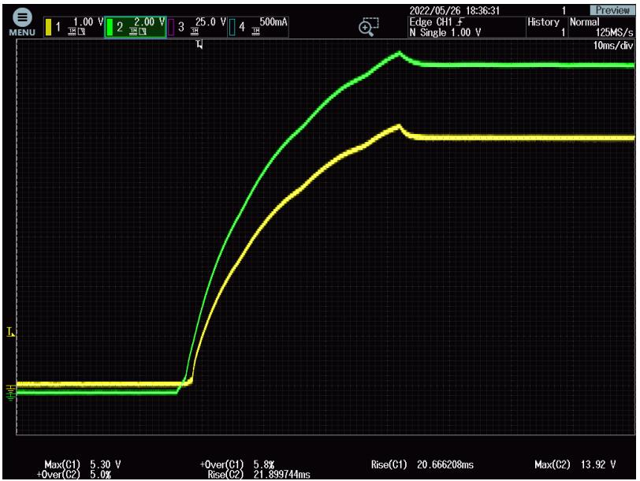

85 VAC

CH1 VOUT\_5V t = 20.7 mS  
CH2 V trise= 21.9 mS

Test Condition:  
➢ Full Load  
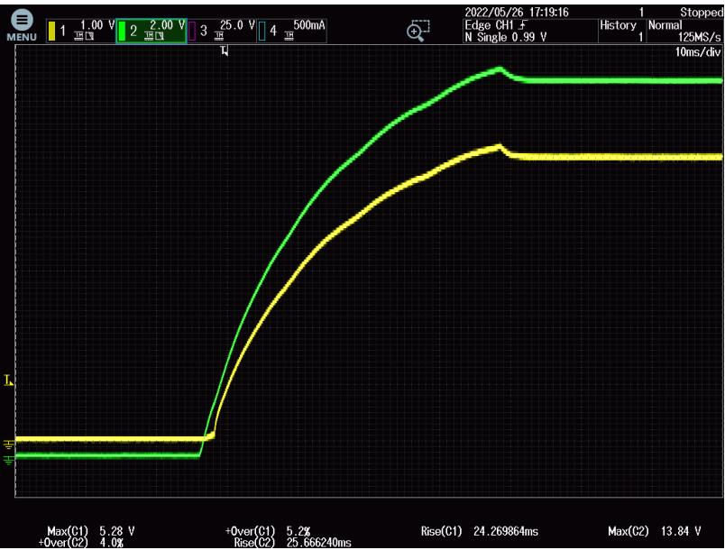

85 VAC

CH1 VOUT\_5V trise= 24.3 mS  
CH2 V trise= 25.7 mS

Test Condition:  
➢ Full Load  
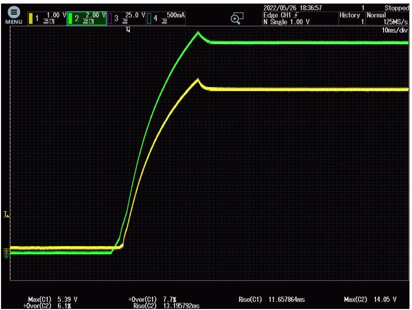

265 VAC

CH1 VOUT\_5V t = 11.7 mS  
CH2 V t = 13.2 mS

Test Condition:  
➢ Full Load  
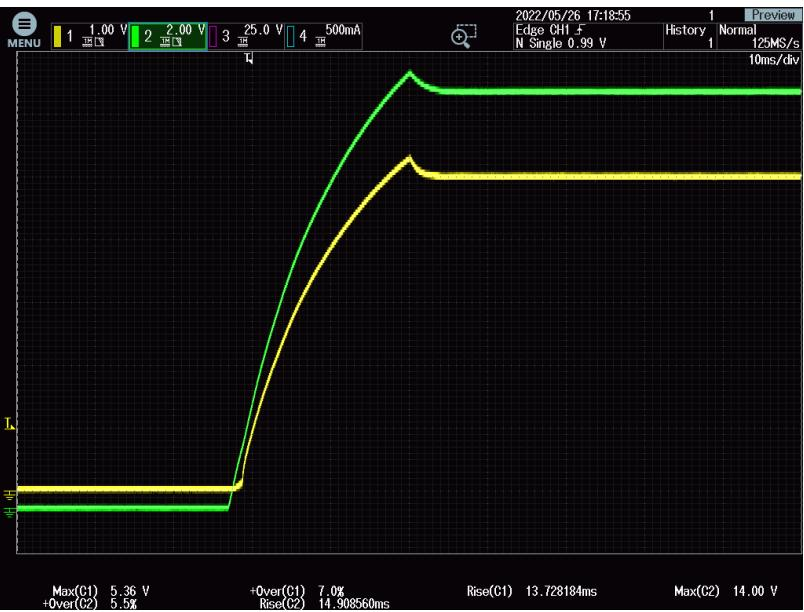

265 VAC

CH1 VOUT\_5V trise= 13.7 mS  
CH2 V t = 14.9 mS

Test Condition:

➢ Full Load

## MOSFET

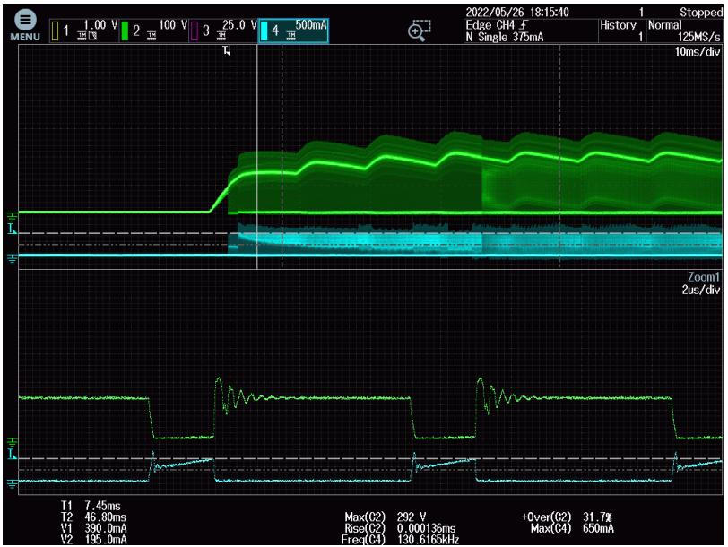

85 VAC  
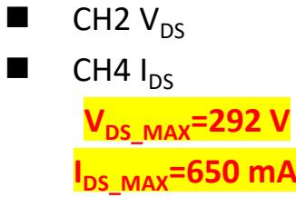

Test Condition:  
➢ Full Load

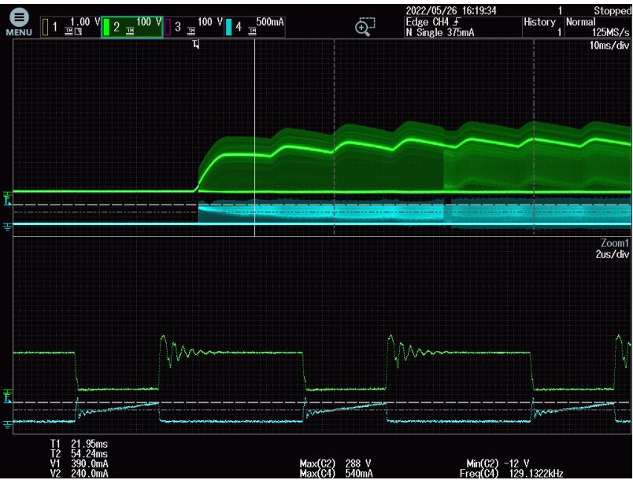

85 VAC  
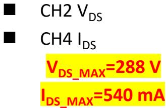

Test Condition:  
➢ Full Load

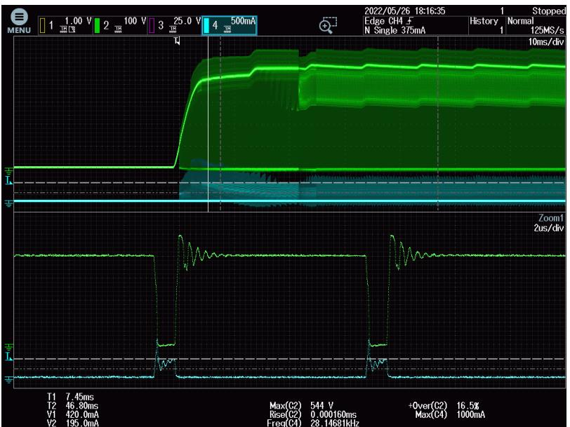

265 VAC  
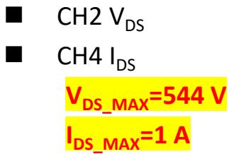

Test Condition:  
➢ Full Load

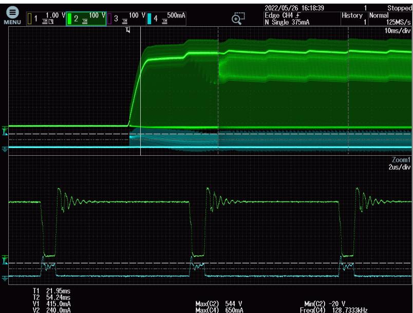

265 VAC  
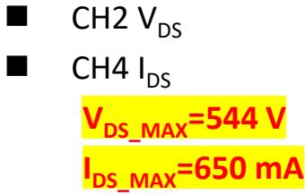

Test Condition:  
➢ Full Load

## MOSFET

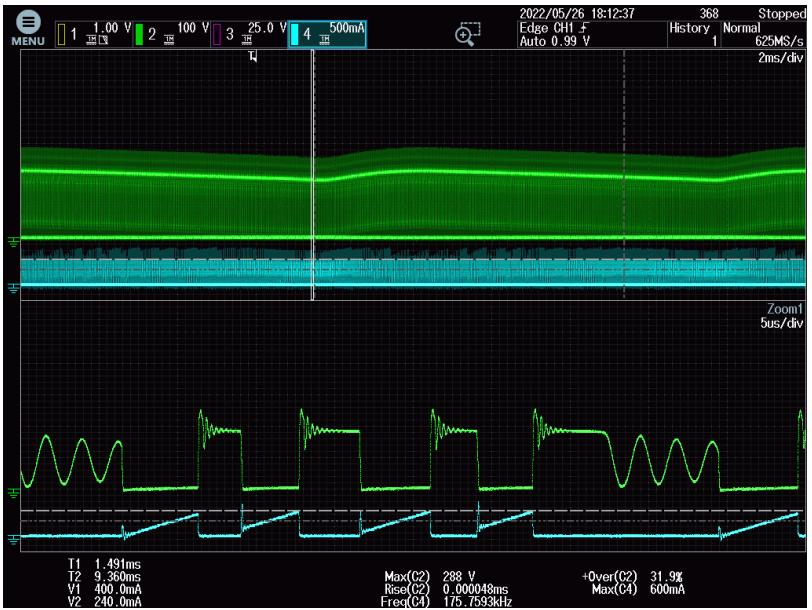

85 VAC  
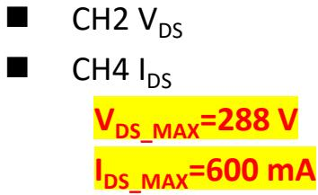

Test Condition:  
➢ Full Load

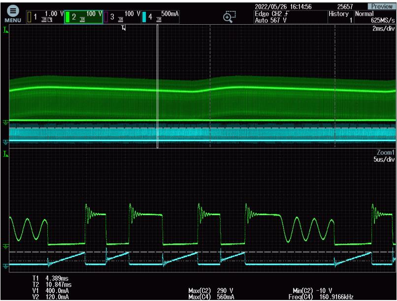

85 VAC  

Test Condition:  
➢ Full Load

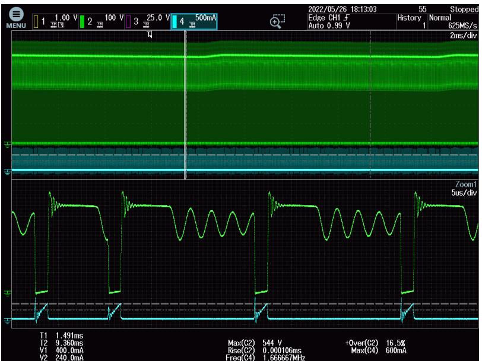

265 VAC  
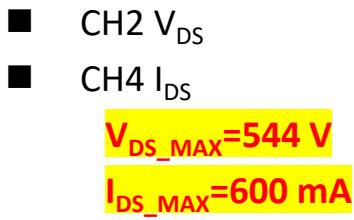

Test Condition:  
➢ Full Load

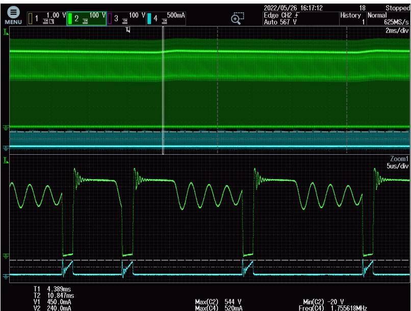

265 VAC  

Test Condition:  
➢ Full Load

## 输出二极管开机波形

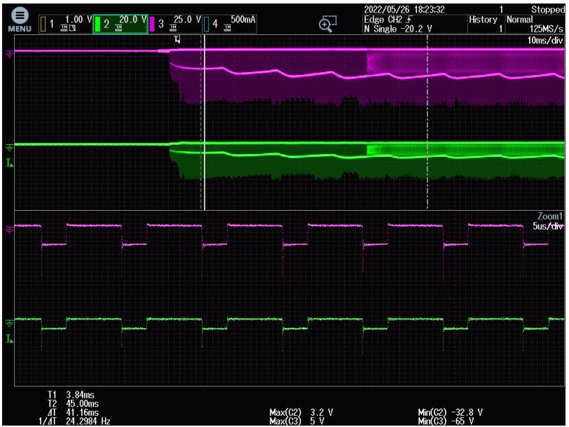

85 VAC  

Test Condition:  
➢ Full Load

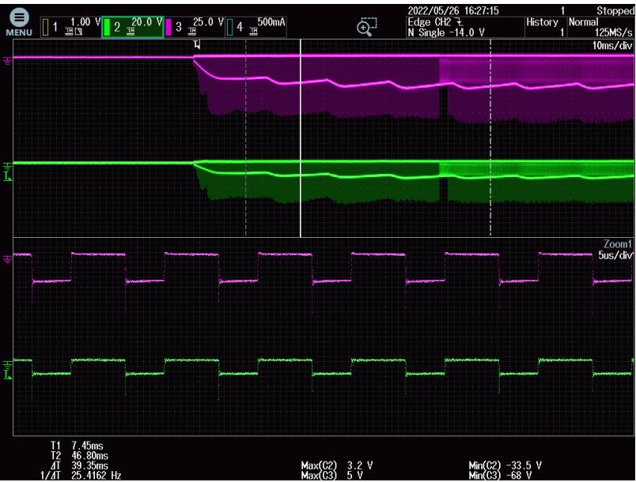

85 VAC  


Test Condition:  
➢ Full Load


265 VAC  


Test Condition:  
➢ Full Load


265 VAC  


Test Condition:  
➢ Full Load

## 输出二极管稳态波形


85 VAC  


Test Condition:  
➢ Full Load


85 VAC  


Test Condition:  
➢ Full Load


265 VAC  


Test Condition:  
➢ Full Load


265 VAC  


Test Condition:  
➢ Full Load

## MOSFET


85 VAC  

Test Condition:  
➢ Full Load


85 VAC  

Test Condition:  
➢ Full Load


265 VAC  


Test Condition:  
➢ Full Load


265 VAC  


Test Condition:  
➢ Full Load

## 输出短路保护 (输出二极管波形)


85 VAC

CH2 VR\_5V  
CH3 VR\_12V

$$
\begin{array}{l} \mathrm {V_ {R - 5V\_MAX}} = 3 3. 4 \mathrm{V} \\ \mathrm {V_ {R - 12V\_MAX}} = 6 4 \mathrm{V} \end{array}
$$

## Test Condition:

➢ Full Load


85 VAC

CH2 VR\_5V  
CH3 VR\_12V

$$
\begin{array}{l} \mathrm {V_ {R - 5V\_MAX}} = 3 6 \mathrm{V} \\ \mathrm {V_ {R - 12V\_MAX}} = 5 9 \mathrm{V} \end{array}
$$

## Test Condition:

➢ Full Load


265 VAC

CH2 VR\_5V  
CH3 VR\_12V

$$
\begin{array}{l} \mathrm {V_ {R - 5V\_MAX}} = 5 6 \mathrm{V} \\ \mathrm {V_ {R - 12V\_MAX}} = 1 0 9 \mathrm{V} \end{array}
$$

## Test Condition:

➢ Full Load


265 VAC

CH2 VR\_5V  
CH3 VR\_12V

$$
\begin{array}{l} \mathrm {V_ {R - 5V\_MAX}} = 5 4. 3 \mathrm{V} \\ \mathrm {V_ {R - 12V\_MAX}} = 8 7 \mathrm{V} \end{array}
$$

## Test Condition:

➢ Full Load

## Brown In


## Brown In

CH3 ${ \sf V } _ { 0 }$  
CH1 VDCIN  
CH2 $\mathsf { V } _ { \mathrm { d } s }$

$$
V _ {\text { Brown\_In }} = 8 9. 5 \mathrm{V}
$$

## Test Condition:

➢ No Load


## Brown In

CH3 ${ \sf V } _ { 0 }$  
CH1 VDCIN  
CH2 $\mathsf { V } _ { \mathrm { d } s }$

$$
V _ {\text { Brown\_In }} = 8 6 \mathrm{V}
$$

## Test Condition:

➢ Half Load

TNY276P欠压保护需外加电阻，本设计未考虑

## 输入过压保护及恢复波形


## 输入过压

CH1 VIN\_DC $V _ { \mathsf { I N \_ D C } }$  
CH2 $\mathsf { V } _ { \mathrm { d } s }$  
CH3 VO ${ \sf V } _ { 0 }$ $\mathsf { V } _ { \mathsf { D S \_ m a x } } { = } 6 7 0 \lor$ $V _ { _ { \vert \mathsf { N _ { - } D C } } } ^ { \mathrm { ~ - ~ } } { = } 4 9 4 \ \mathsf { V }$

## Test Condition:

➢ Full Load


## 输入过压

CH1 VIN\_DC $V _ { \mathsf { I N \_ D C } }$  
CH2 $\mathsf { V } _ { \mathsf { d } s }$  
CH3 ${ \sf V } _ { 0 }$

$$
V _ {I N \_ D C} = 4 4 6 \mathrm{V}
$$

## Test Condition:

➢ Full Load

TNY276P过压保护需外加电阻，本设计未考虑

## 温升测试

BPA8616P

<table><tr><td rowspan="2">项目</td><td>85VAC</td><td>265VAC</td></tr><tr><td>温度(°C)</td><td>温度(°C)</td></tr><tr><td>环境温度</td><td>38</td><td>38.6</td></tr><tr><td>BPA8616P (U2)</td><td>82.8</td><td>83.7</td></tr><tr><td>5V整流二极管(D3)</td><td>64.6</td><td>64.5</td></tr><tr><td>12V整流二极管(D2)</td><td>76</td><td>761</td></tr><tr><td>变压器绕组(TR1)</td><td>64.2</td><td>68.1</td></tr><tr><td>变压器磁芯(TR1)</td><td>63.8</td><td>68.9</td></tr></table>

TNY276P

<table><tr><td rowspan="2">项目</td><td>85VAC</td><td>265VAC</td></tr><tr><td>温度(°C)</td><td>温度(°C)</td></tr><tr><td>环境温度</td><td>38.5</td><td>38.1</td></tr><tr><td>TNY276P(U2)</td><td>91.2</td><td>94.2</td></tr><tr><td>5V整流二极管(D3)</td><td>64.4</td><td>65</td></tr><tr><td>12V整流二极管(D2)</td><td>75.4</td><td>75</td></tr><tr><td>变压器绕组(TR1)</td><td>64.3</td><td>68.9</td></tr><tr><td>变压器磁芯(TR1)</td><td>63.4</td><td>69.4</td></tr></table>


115VAC Line


115VAC Neutral


115VAC Line


115VAC Neutral

230VAC Line  


230VAC Line


115VAC Neutral  


115VAC Neutral


空载功耗

➢ 未断开客户后端负载情况下，空载功耗基本一致，差异很小;

启动波形

BPA8616P IC

工作开关波形无差异

欠压保护

➢ BPA861X系列芯片内置输入欠压保护(UV)功能，因此无需外部上拉检测电阻,欠压保护时间固定

<table><tr><td> $V_{IN\_BR}$ </td><td>Brown-in 电压</td><td></td><td>80</td><td>85</td><td>90</td><td>V</td></tr><tr><td> $t_{BR}$ </td><td>Brown-in 持续检测时间</td><td></td><td></td><td>30</td><td></td><td>us</td></tr></table>

EMI

传导两款芯片基本一致

❑ BPA861X OVP( )

<table><tr><td> $V_{DRAIN\_OV}$ </td><td>MOSFET 漏极过压保护的电压阈值</td><td></td><td>570</td><td>600</td><td>630</td><td>V</td></tr><tr><td> $t_{D\_OV}$ </td><td>漏极电压检测延时,MOSFET 关断开始计时</td><td></td><td></td><td>1.2</td><td></td><td>us</td></tr><tr><td> $V_{HYS\_OV}$ </td><td>漏极过压保护迟滞</td><td></td><td>142</td><td>150</td><td>158</td><td>V</td></tr></table>

开机过冲比较高，后续建议调整一下431的Rc常数

## THANK YOU FOR WATCHING
