# BPA8616P & TNY276P 对比测试（12V0.55A&5V0.2A）

上海晶丰明源半导体股份有限公司

Shanghai Bright Power Semiconductor Co., Ltd.

王岩

时间：08/15/2021

## 内容

参考电路  
特性参数对比  
电路及实物图  
性能测试对比  
结论和建议

TNY276P  
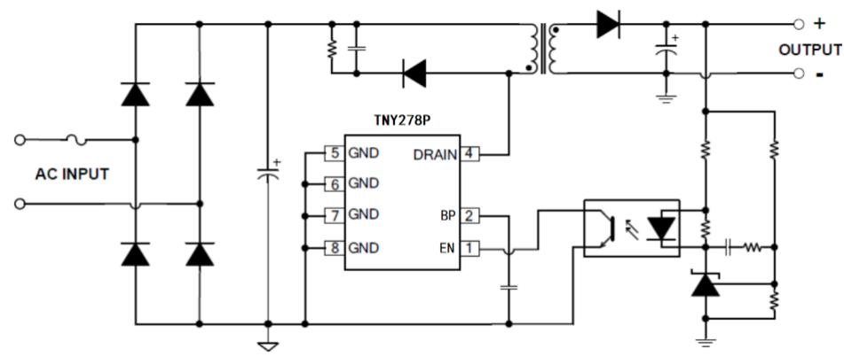

◼ 开关式控制技术，IC集成700V高压MOSFET、高压启动电路和自供电电路，开关频率132KHz；  
◼ 输入欠压保护：通过Vbus串电阻到EN脚实现欠压保护；  
输出过压保护：当流入BP脚电流大于Isd时，IC停止MOSFET开关动作，并锁住，直到BP电压低于4.9V或者AC掉电，才可重启；

BPA8616P  

◼ 开关式控制技术，IC集成700V高压MOSFET、高压启动电路和自供电电路，开关频率132KHz；  
◼ 输入过/欠压保护：Drain脚内置输入过/欠压保护功能，无需上拉电阻；  
输出过压保护：当流入Vcc脚电流大于Isd时，IC停止MOSFET开关动作，等待TAR-OFF时间后自动重启，直到故障消除；  
◼ 输出软起动功能：IC内置软起动功能，降低输出二极管在起机时刻的电压电流应力；

## 电气特性对比

<table><tr><td></td><td>TNY276P</td><td>BPA8616P</td></tr><tr><td>开关频率</td><td>132KHz</td><td>132KHz</td></tr><tr><td>Mosfet BV</td><td>700V</td><td>700V</td></tr><tr><td> $R_{DS\_ON}$ </td><td>14Ω</td><td>11Ω</td></tr><tr><td>限流点</td><td>275mA/350mA/450mA</td><td>350mA</td></tr><tr><td>软启动</td><td>无</td><td>有(降低限流点,40%限流点)</td></tr><tr><td>输出过压保护</td><td>有</td><td>有</td></tr><tr><td>输出短路保护</td><td>有</td><td>有</td></tr><tr><td>输出过载保护</td><td>有</td><td>有</td></tr><tr><td>反馈开路保护</td><td>有</td><td>有</td></tr><tr><td>输入过压保护</td><td>无</td><td>有</td></tr><tr><td>输出软启动功能</td><td>无</td><td>有</td></tr><tr><td>输出过压保护模式</td><td>锁住</td><td>自动重启</td></tr><tr><td>过温保护</td><td>有</td><td>有</td></tr></table>

## TNY276P

◼ 开关式控制方式：使用简单的脉冲数调整输出电压，具有较高的环路带宽和快速动态响应，无需外部环路补偿电路，该方式可以实现低待机功耗、高轻载效率以及优异EMI性能；

## BPA8616P

◼ 开关式控制方式：使用简单的脉冲数调整输出电压，具有较高的环路带宽和快速动态响应，无需外部环路补偿电路，该方式可以实现低待机功耗、高轻载效率以及优异EMI性能；◼ 软启动： $0 . 4 ^ { * } \vert _ { \mathrm { \vert i m i t } }$ 限流点启动，256个开关周期后增加到最大限流点，以降低启动过程中MOSFET和整流二极管电流应力。

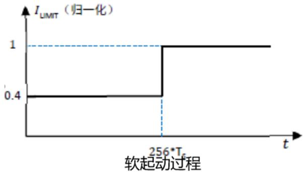

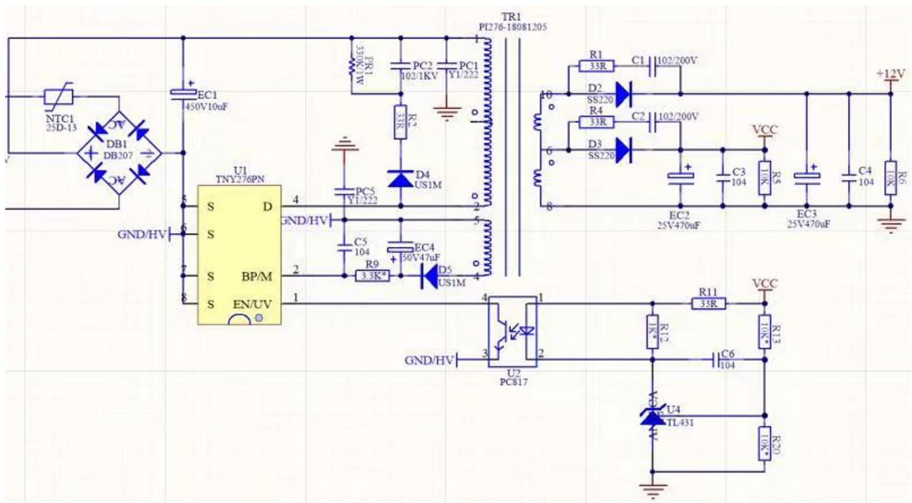

## 待机功耗对比

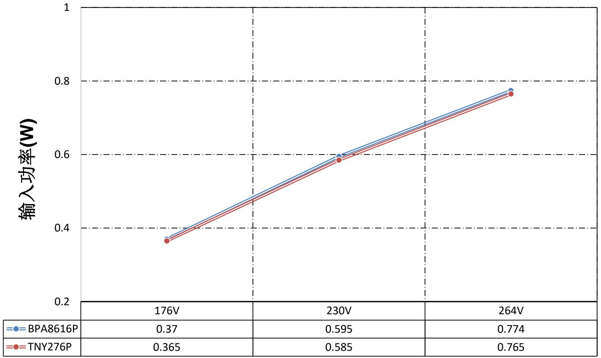

输入电压(VAC)  
基于整机AC输入电路和部分输出侧小信号电路

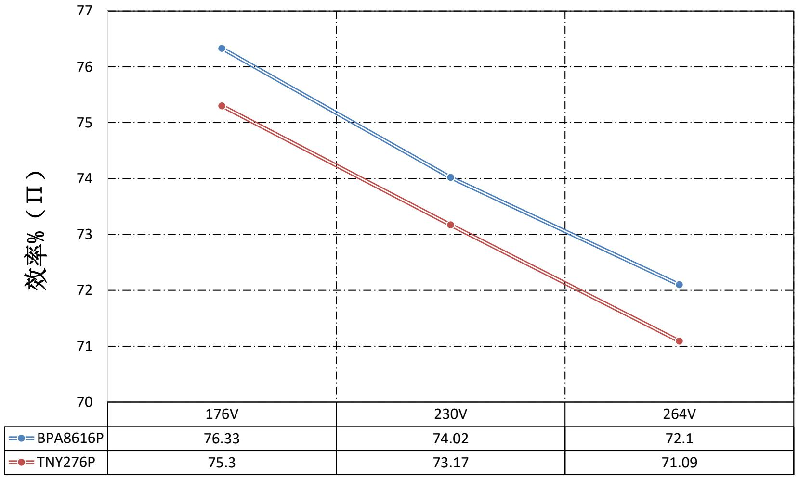

输入电压(VAC)  
基于整机AC输入电路和部分输出侧小信号电路

## 输出电压交叉调整率

TNY276P

<table><tr><td rowspan="2" colspan="2">Vin(vac)OPV (V)Load(A)</td><td colspan="2">176</td><td colspan="2">230</td><td colspan="2">265</td></tr><tr><td>12V</td><td>5V</td><td>12V</td><td>5V</td><td>12V</td><td>5V</td></tr><tr><td rowspan="2">空载</td><td>12V0A</td><td rowspan="2">13.034</td><td rowspan="2">4.986</td><td rowspan="2">13.056</td><td rowspan="2">4.986</td><td rowspan="2">13.065</td><td rowspan="2">4.986</td></tr><tr><td>5V0A</td></tr><tr><td rowspan="2">交叉负载</td><td>12V0.55A</td><td rowspan="2">10.174</td><td rowspan="2">4.874</td><td rowspan="2">10.921</td><td rowspan="2">4.973</td><td rowspan="2">11.118</td><td rowspan="2">4.973</td></tr><tr><td>5V0A</td></tr><tr><td rowspan="2">交叉负载</td><td>12V0A</td><td rowspan="2">16.151</td><td rowspan="2">4.915</td><td rowspan="2">16.366</td><td rowspan="2">4.903</td><td rowspan="2">16.475</td><td rowspan="2">4.896</td></tr><tr><td>5V0.2A</td></tr><tr><td rowspan="2">满载</td><td>12V0.55A</td><td rowspan="2">12.642</td><td rowspan="2">4.868</td><td rowspan="2">12.658</td><td rowspan="2">4.868</td><td rowspan="2">12.668</td><td rowspan="2">4.870</td></tr><tr><td>5V0.2A</td></tr></table>

BPA8616P

<table><tr><td rowspan="2" colspan="2">Vin(vac)OPV (V)Load(A)</td><td colspan="2">176</td><td colspan="2">230</td><td colspan="2">265</td></tr><tr><td>12V</td><td>5V</td><td>12V</td><td>5V</td><td>12V</td><td>5V</td></tr><tr><td rowspan="2">空载</td><td>12V0A</td><td rowspan="2">13.020</td><td rowspan="2">4.987</td><td rowspan="2">13.038</td><td rowspan="2">4.987</td><td rowspan="2">13.052</td><td rowspan="2">4.988</td></tr><tr><td>5V0A</td></tr><tr><td rowspan="2">交叉负载</td><td>12V0.55A</td><td rowspan="2">10.684</td><td rowspan="2">4.985</td><td rowspan="2">11.178</td><td rowspan="2">4.986</td><td rowspan="2">11.222</td><td rowspan="2">4.986</td></tr><tr><td>5V0A</td></tr><tr><td rowspan="2">交叉负载</td><td>12V0A</td><td rowspan="2">16.540</td><td rowspan="2">4.902</td><td rowspan="2">16.720</td><td rowspan="2">4.893</td><td rowspan="2">16.340</td><td rowspan="2">4.926</td></tr><tr><td>5V0.2A</td></tr><tr><td rowspan="2">满载</td><td>12V0.55A</td><td rowspan="2">12.935</td><td rowspan="2">4.980</td><td rowspan="2">12.932</td><td rowspan="2">4.982</td><td rowspan="2">12.930</td><td rowspan="2">4.982</td></tr><tr><td>5V0.2A</td></tr></table>

## 输出电压纹波

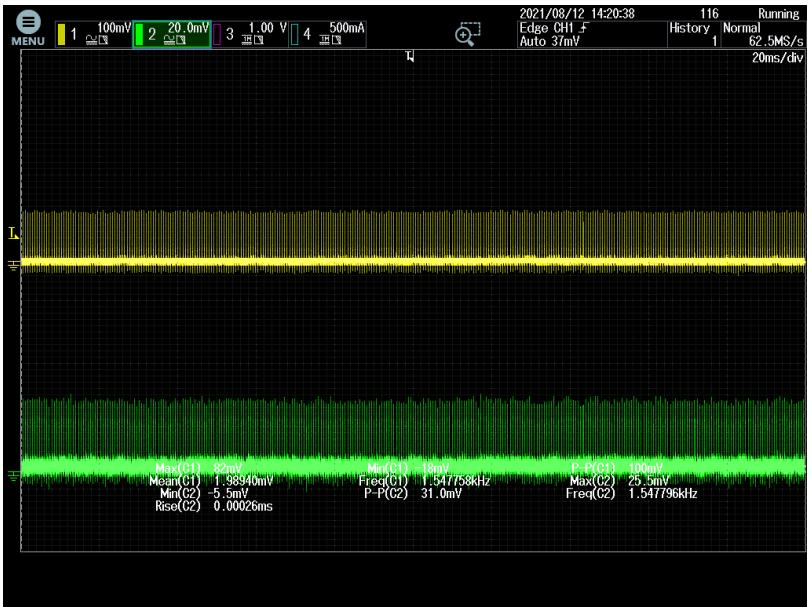

## TNY276P

176 VAC

CH1 $\mathsf { V } _ { \mathsf { O U T } \_ 1 2 \mathsf { V } }$ Ripple $\mathsf { V } _ { \mathsf { P K - P K } } { = } 1 0 0 \mathsf { m V }$  
CH2 $\mathsf { V } _ { \mathsf { O U T } \_ 5 \mathsf { V } }$ Ripple $\mathtt { V } _ { \mathtt { P K - P K } } = 3 1 \mathtt { m V }$

Test Condition:

➢ No Load

## TNY276P

265 VAC

CH1 $\mathsf { V } _ { \mathsf { O U T } \_ 1 2 \mathsf { V } }$ Ripple VPK-PK=132mV  
$\begin{array} { r l } & { \mathsf { C H 2 } \mathsf { V _ { \mathrm { 0 } \cup \mathsf { T } \_ 5 \vee } } \mathsf { R i p p l e } } \\ & { \mathsf { V _ { P K - P K } } \mathsf { = } 3 6 . 8 \mathsf { m V } } \end{array}$

➢ No Load

Test Condition:  
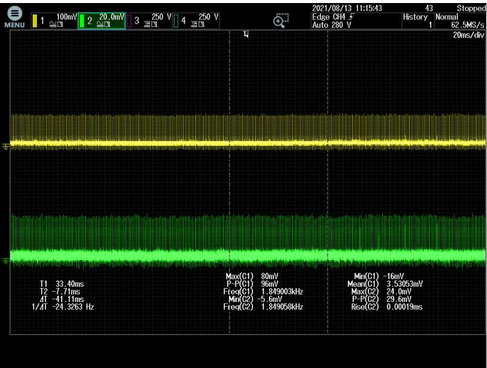

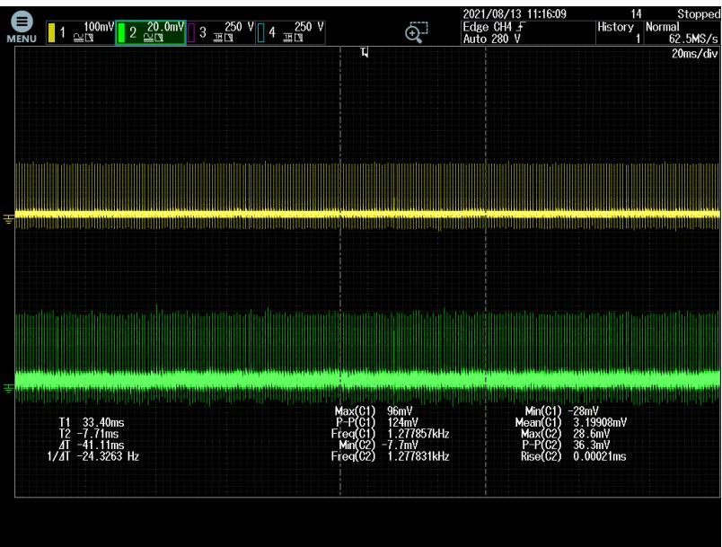

Test Condition:

## BPA8616P

176 VAC

CH1 $\mathsf { V } _ { \mathsf { O U T } \_ 1 2 \mathsf { V } }$ Ripple $V _ { P K - P K } = 9 6 m V$  
CH2 $\mathsf { V } _ { 0 \mathsf { U T } \_ 5 \vee } \mathsf { R i p p l e }$ $V _ { \mathsf { P K - P K } } { = } 2 9 . 6 \mathsf { m V }$

➢ No Load

## BPA8616P

265 VAC

CH1 $\mathsf { V } _ { \mathsf { o u r \_ 1 2 v } }$ Ripple $\mathsf { V } _ { \mathsf { P K - P K } } { = } 1 2 4 \mathsf { m V }$  
$\begin{array} { r l } & { \mathsf { C H 2 } \mathsf { V _ { \mathrm { 0 } \cup \mathsf { T } \_ 5 \vee } } \mathsf { R i p p l e } } \\ & { \mathsf { V _ { P K - P K } } \mathsf { = } 3 6 . 3 \mathsf { m V } } \end{array}$

Test Condition:

➢ No Load

## 输出电压纹波

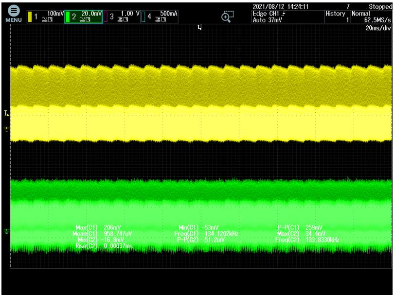

## TNY276P

176 VAC

CH1 $\mathsf { V } _ { \mathsf { O U T } \_ 1 2 \mathsf { V } }$ Ripple $\mathsf { V } _ { \mathsf { P K - P K } } { = } 2 5 \mathsf { 9 m V }$  
CH2 $\mathsf { V } _ { 0 \mathsf { U T } \_ 5 \vee } \mathsf { R i p p l e }$ $V _ { \mathsf { P K - P K } } { = } 5 1 . 2 \mathsf { m V }$

Test Condition:

➢ Full Load

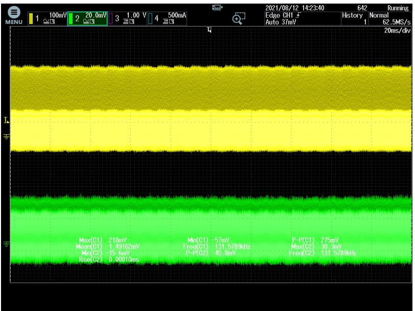

## TNY276P

265 $\mathsf { v } _ { \mathsf { A C } }$

CH1 $\mathsf { V } _ { \mathsf { O U T } \_ 1 2 \mathsf { V } }$ Ripple $\mathsf { V } _ { \mathsf { P K - P K } } { = } 2 7 5 \mathsf { m V }$  
CH2 $\mathsf { V } _ { \mathsf { O U T } \_ 5 \mathsf { V } }$ Ripple $V _ { P K - P K } = 4 5 . 8 m V$

➢ Full Load

Test Condition:  
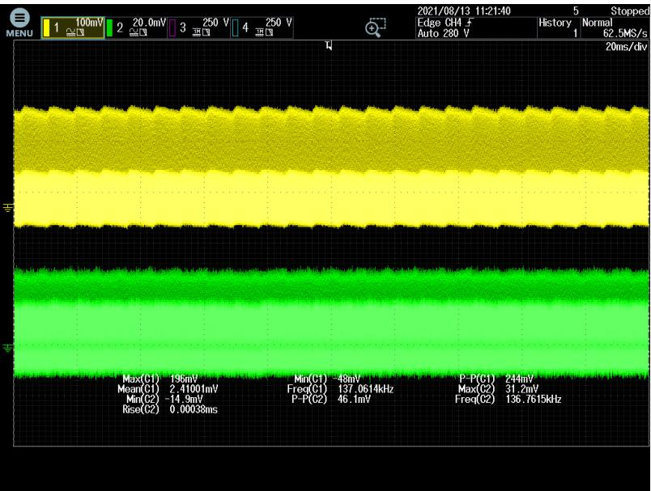

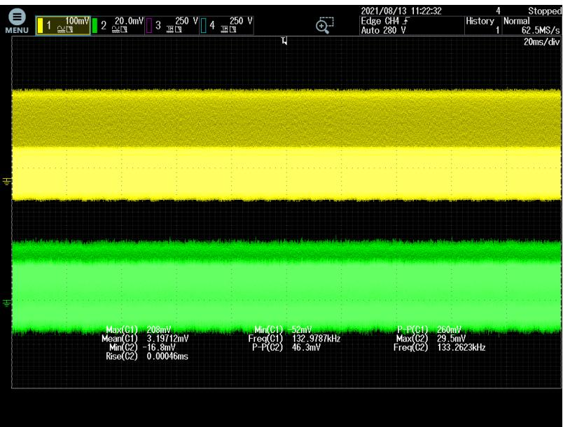

Test Condition:

## BPA8616P

176 VAC

CH1 $\mathsf { V } _ { \mathsf { O U T } \_ 1 2 \mathsf { V } }$ Ripple $V _ { p | k \mathrm { - } P K } = 2 4 4 \mathrm { { m V } }$

$\begin{array} { r l } & { \mathsf { C H 2 V _ { O U T \_ 5 v } R i p p l e } } \\ & { \mathsf { V _ { P K - P K } } \mathsf { = } 4 6 . 1 \mathsf { m v } } \end{array}$

➢ Full Load

## BPA8616P

265 $\mathsf { v } _ { \mathsf { A C } }$

$\begin{array} { r } { \mathsf { C H 1 V } _ { \mathsf { O U T } \_ { 1 2 \vee } } \mathsf { R } } \\ { \mathsf { V } _ { \mathsf { P K - P K } } \equiv 2 6 0 \mathsf { m V } } \end{array}$ ipple  
CH2 $\mathsf { V } _ { 0 \mathsf { U T } \_ 5 \vee } \mathsf { R i p p l e }$ $V _ { P K - P K } = 4 6 . 3 m V$

Test Condition:

➢ Full Load

## 动态负载(50%-100%)

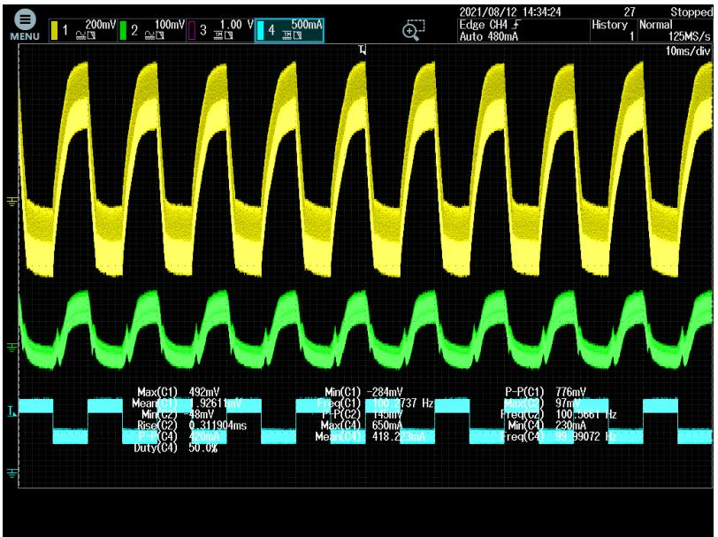

## TNY276P

## 176 VAC

CH1 V V Ripple VPK-PK=776mV  
$\begin{array} { r } { \mathsf { C H 2 \mathsf { V _ { 0 u T \_ 5 v } R i p p l e } } } \\ { \mathsf { V _ { P K - P K } } \equiv 1 4 5 \mathsf { m V } } \end{array}$  
CH4 ${ \mathsf { I } } _ { 0 \cup \mathsf { T } }$

## Test Condition:

➢ CH1 0.275 A-0.55 A-0.275 A  
➢ CH2 0.1 A-0.2 A-0.1 A  
➢ Slew Rate: 0.5 A/μS  
➢ Frequency: 100 Hz

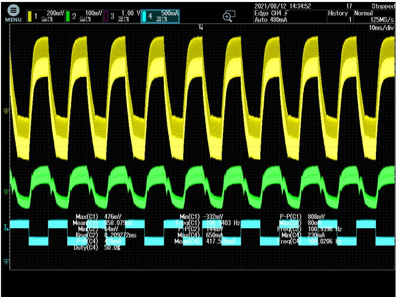

## TNY276P

## 265 VAC

CH1 V Ripple VPK-PK=808mV  
$\begin{array} { r } { \mathsf { C H 2 \Delta V _ { o u r \_ s v } R i p p l e } } \\ { \mathsf { V _ { P K - P K } } \equiv 1 4 4 \mathsf { m V } } \end{array}$  
$\mathsf { C H 4 } \mathsf { I } _ { \mathsf { O U T } }$

## Test Condition:

➢ CH1 0.275 A-0.55 A-0.275 A  
➢ CH2 0.1 A-0.2 A-0.1 A  
➢ Slew Rate: 0.5 A/μS  
➢ Frequency: 100 Hz

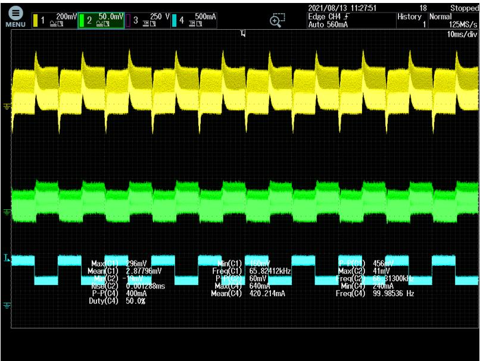

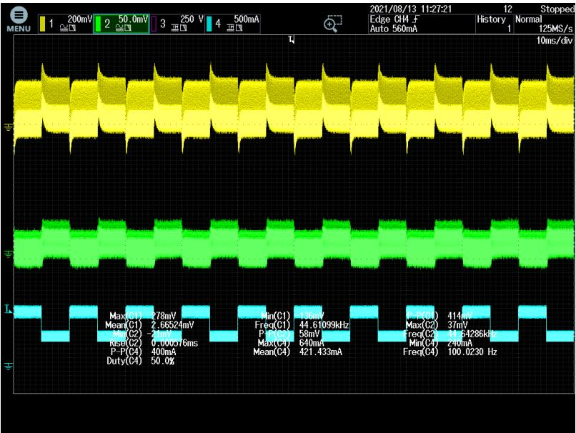

## BPA8616P

## 176 VAC

CH1 V V Ripple VPK-PK=456mV  
CH2 V V Ripple $v _ { p \kappa \mathrm { - } P \kappa } { = } 6 0 m v$  
$\mathsf { C H 4 } \mathsf { I } _ { \mathsf { O U T } }$

## Test Condition:

➢ CH1 0.275 A-0.55 A-0.275 A  
➢ $\mathsf { C H 2 0 . 1 A - 0 . 2 A - 0 . 1 A }$  
➢ Slew Rate: 0.5 A/μS  
➢ Frequency: 100 Hz

## BPA8616P

## 265 VAC

$\begin{array} { r } { \mathsf { C H 1 V } _ { \mathsf { O U T } } \imath _ { 2 \vee } { \mathsf { I } } } \\ { \mathsf { V } _ { \mathsf { P K - P K } } \equiv 4 1 4 \mathsf { m l } } \end{array}$ Ripple V  
$\begin{array} { r } { \mathsf { C H 2 \vee _ { O \cup T \_ 5 \vee } } \mathsf { 1 } } \\ { \mathsf { V } _ { \mathsf { P K - P K } } \mathsf { = } 5 8 \mathsf { m V } } \end{array}$ Ripple  
$\mathsf { C H 4 } \mathsf { I } _ { \mathsf { O U T } }$

## Test Condition:

➢ CH1 0.275 A-0.55 A-0.275 A  
➢ CH2 0.1 A-0.2 A-0.1 A  
➢ Slew Rate: 0.5 A/μS  
➢ Frequency: 100 Hz

## 动态负载(10%-90%)

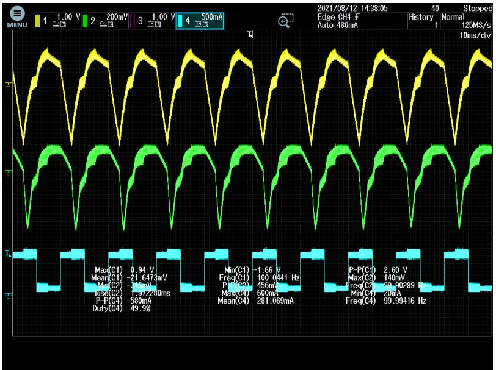

## TNY276P

## 176 VAC

$\stackrel { \mathsf { C H 1 } } { \boldsymbol { \mathsf { V } } } _ { \mathsf { P K - P K } } ^ { \mathsf { 1 2 V } } _ { = 2 . 6 \mathsf { V } } ^ { \mathsf { 1 2 V } }$ Ripple  
$\begin{array} { r } { \mathsf { C H 2 \breve { V } } _ { \mathsf { O U T } \thinspace 5 \mathsf { V } } \mathsf { R i p p l e } } \\ { \mathsf { V } _ { \mathsf { P K - P K } } { = } 4 5 6 \mathsf { m V } } \end{array}$  
CH4 ${ \mathsf { I } } _ { 0 \cup \mathsf { T } }$

## Test Condition:

➢ CH1 0.055 A-0.495 A-0.055 A  
➢ CH2 0.02 A-0.18 A-0.02A  
➢ Slew Rate: 0.5 A/μS  
➢ Frequency: 100 Hz

## TNY276P

## 265 VAC

VPK-P CH1 $\begin{array} { r } { \mathsf { V } _ { 0 \mathsf { U T } _ { 1 } 2 \mathsf { V } } } \\ { \kappa ^ { = 2 . 3 2 \mathsf { V } } } \end{array}$ Ripple  
$\begin{array} { r } { \mathsf { C H 2 \Delta V _ { o u r \_ s u } R i p p l e } } \\ { \mathsf { V _ { P K - P K } } \equiv 3 8 4 \mathsf { m V } } \end{array}$  
CH4 $\mathsf { I } _ { 0 \mathsf { U T } }$

## Test Condition:

➢ CH1 0.055 A-0.495 A-0.055 A  
➢ CH2 0.02 A-0.18 A-0.02A  
➢ Slew Rate: 0.5 A/μS  
➢ Frequency: 100 Hz

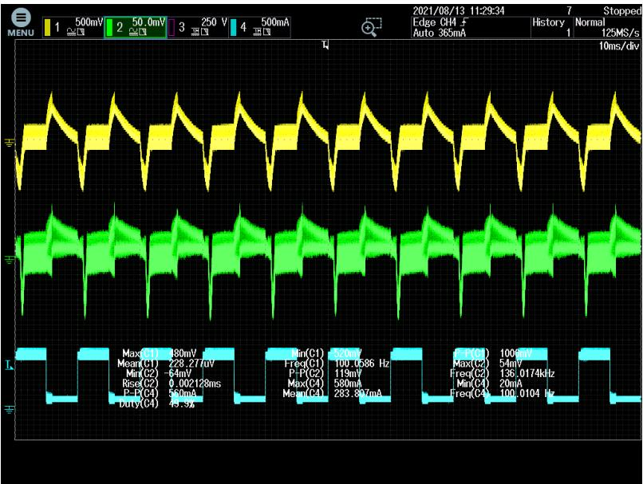

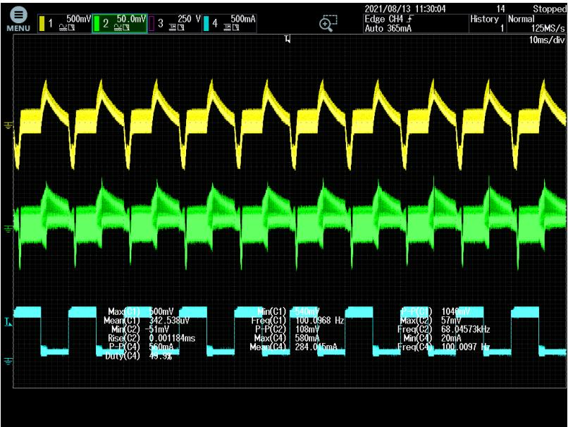

## BPA8616P

## 176 VAC

$\mathsf { C H 1 V _ { o u T \_ 1 2 v } }$ $\mathsf { R i p p l e }$  
CH2 V Ripple $v _ { p \vert k \cdot P K } = 1 1 9 m v$  
CH4 $\mathsf { I } _ { 0 \mathsf { U T } }$

## Test Condition:

➢ CH1 0.055 A-0.495 A-0.055 A  
➢ CH2 0.02 A-0.18 A-0.02 A  
➢ Slew Rate: 0.5 A/μS  
➢ Frequency: 100 Hz

## BPA8616P

## 265 VAC

$\begin{array} { r } { \mathsf { C H 1 V } _ { \mathsf { O U T } _ { \mathsf { 1 2 V } } } } \\ { \mathsf { V _ { P K - P K } } = \mathsf { 1 . 0 4 V } } \end{array}$ Ripple  
CH2 V Ripple$V _ { P K - P K } = 1 0 8 m V$ ！  
CH4 $\mathsf { I } _ { 0 \mathsf { U T } }$

## Test Condition:

➢ CH1 0.055 A-0.495 A-0.055 A  
➢ CH2 0.02 A-0.18 A-0.02 A  
➢ Slew Rate: 0.5 A/μS  
➢ Frequency: 100 Hz

## 输出电压开机波形

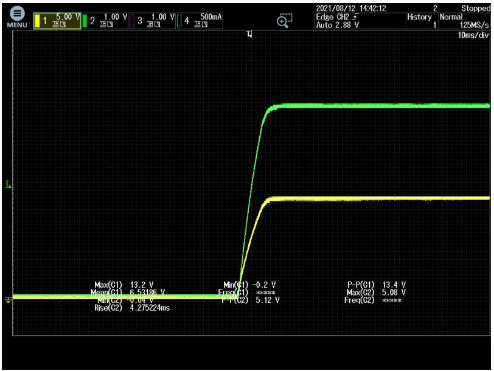

TNY276P  
176 VAC

CH1 VOUT\_12V $\mathsf { V } _ { \mathsf { O U T } \_ 1 2 \mathsf { V } }$  
CH2 VOUT\_5V $\mathsf { V } _ { \mathsf { O U T } \_ 5 \mathsf { V } }$ $\mathrm { t } _ { \mathrm { r i s e } } { = } 4 . 2 \ m s$

Test Condition:  
➢ No Load  
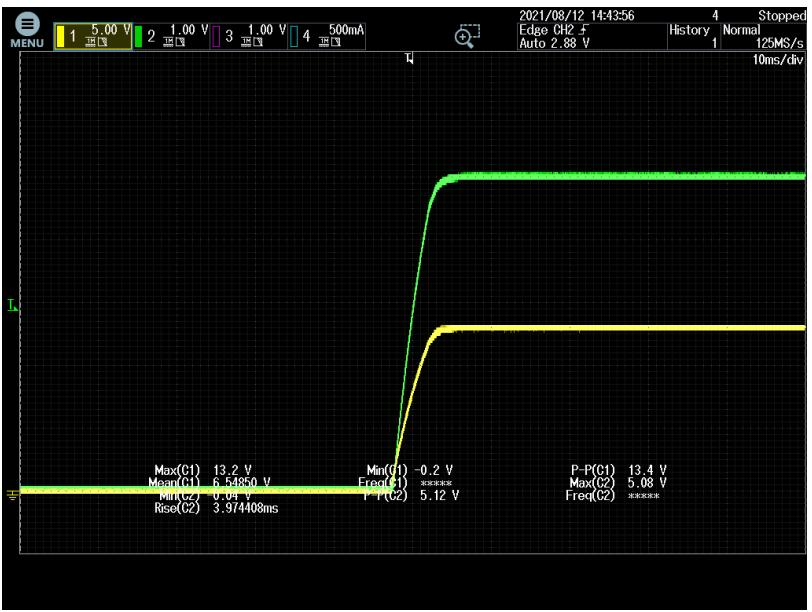

TNY276P  
265 $\mathsf { v } _ { \mathsf { A C } }$

CH1 VOUT\_12V $\mathsf { V } _ { \mathsf { O U T } \_ 1 2 \mathsf { V } }$  
$\begin{array} { r } { \mathsf { C H 2 } \mathsf { V _ { 0 \cup \mathsf { T } \_ 5 \vee } } } \\ { \mathsf { t } _ { \mathrm { r i s e } } \equiv 3 . 9 \mathsf { m s } } \end{array}$ CH2 VOUT\_5V

Test Condition:  
➢ No Load  
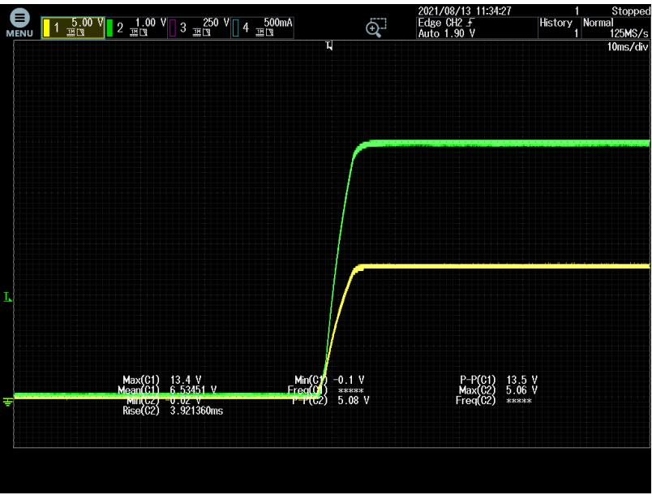

BPA8616P

176 VAC

CH1 VOUT\_12V $\mathsf { V } _ { \mathsf { O U T } \_ 1 2 \mathsf { V } }$  
$\begin{array} { r } { \mathsf { C H 2 } \mathsf { V _ { 0 \cup \mathsf { T } \_ 5 \vee } } } \\ { \mathsf { t } _ { \mathsf { r i s e } } \equiv 3 . 9 \mathsf { m s } } \end{array}$ CH2 V

Test Condition:  
➢ No Load  
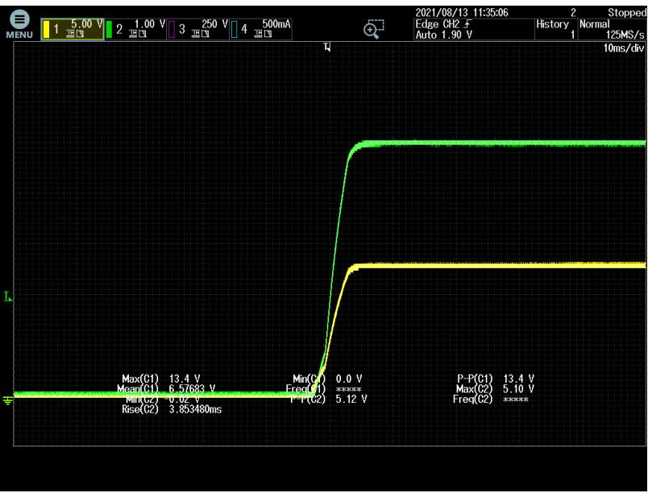

BPA8616P  
265 $\mathsf { v } _ { \mathsf { A C } }$

CH1 VOUT\_12V $\mathsf { C H 1 V _ { o u r \_ 1 2 V } }$  
$\begin{array} { r } { \mathsf { C H 2 } \mathsf { V _ { 0 \cup \mathsf { T } \_ 5 \vee } } } \\ { \mathsf { t } _ { \mathrm { r i s e } } \equiv 3 . 8 \mathsf { m s } } \end{array}$ CH2 VOUT\_5V

Test Condition:

➢ No Load

## 输出电压开机波形

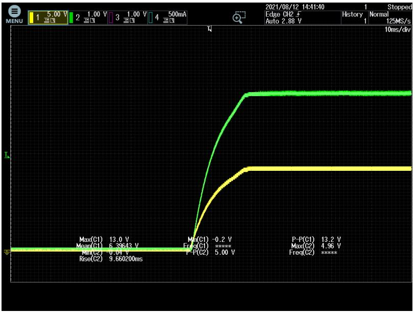

TNY276P  
176 VAC

CH1 VOUT\_12V $\mathsf { V } _ { \mathsf { O U T } \_ 1 2 \mathsf { V } }$  
CH2 VOUT\_5V $\mathsf { V } _ { \mathsf { O U T } \_ 5 \mathsf { V } }$ t = 9.6 mS

Test Condition:  
➢ Full Load  
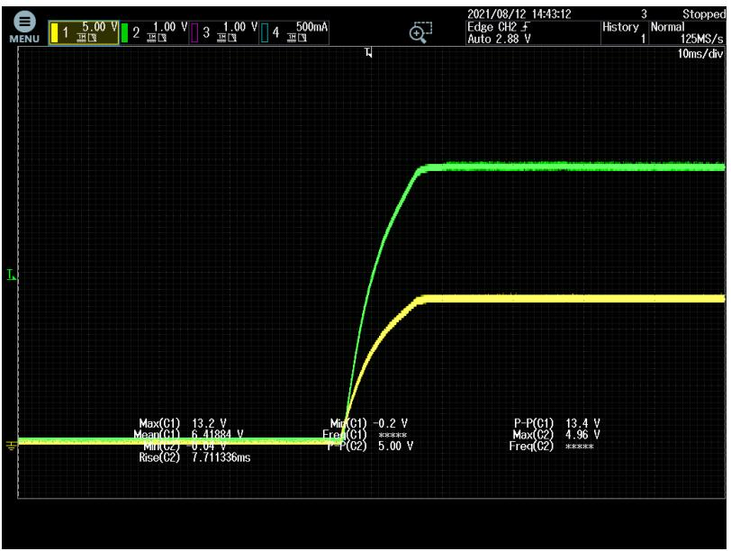

TNY276P  
265 $\mathsf { v } _ { \mathsf { A C } }$

CH1 VOUT\_12V $\mathsf { V } _ { \mathsf { O U T } \_ 1 2 \mathsf { V } }$  
$\begin{array} { r } { \mathsf { C H 2 \vee _ { \mathsf { O U T \_ 5 V } } } } \\ { \mathsf { t _ { r i s e } = 7 . 7 ~ m S } } \end{array}$ CH2 VOUT\_5V

Test Condition:  
➢ Full Load  
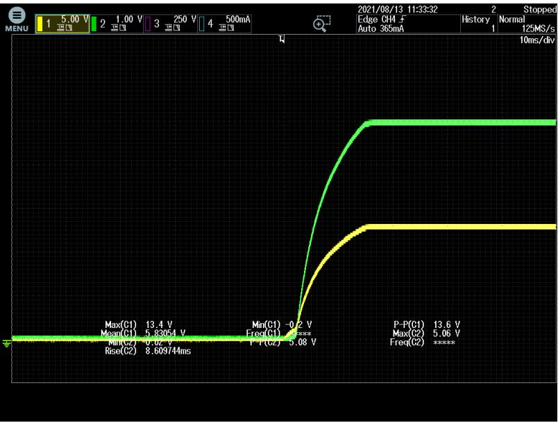

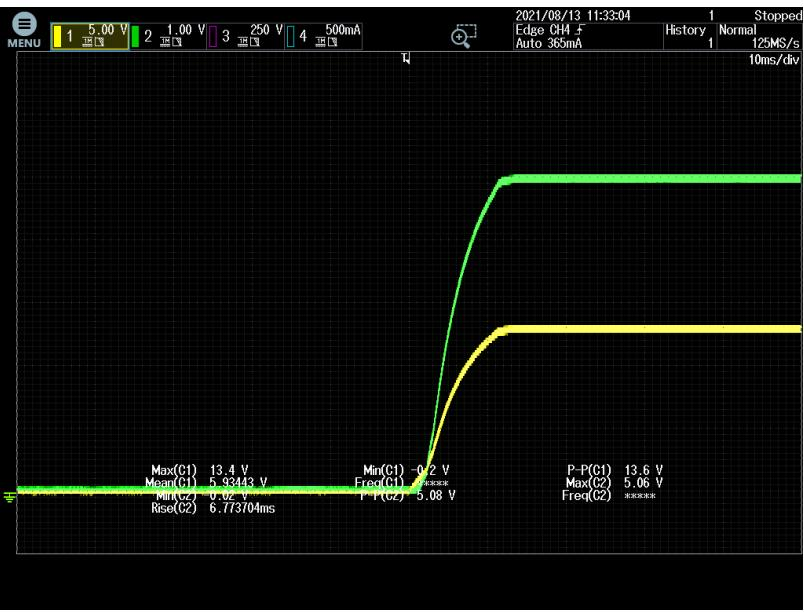

Test Condition:  
➢ Full Load

## BPA8616P

## 176 VAC

CH1 VOUT\_12V $\mathsf { V } _ { \mathsf { O U T } \_ 1 2 \mathsf { V } }$  
$\begin{array} { r } { \mathsf { C H 2 } \mathsf { V _ { 0 \cup \mathsf { T } \_ 5 \vee } } } \\ { \mathsf { t } _ { \mathrm { r i s e } } \equiv 8 . 6 \mathsf { m s } } \end{array}$ CH2 V

## BPA8616P

## 265 VAC

CH1 VOUT\_12V $\mathsf { C H 1 V _ { o u r \_ 1 2 V } }$  
$\begin{array} { r } { \mathsf { C H 2 } \mathsf { V _ { 0 \cup \mathsf { T } \_ 5 \vee } } } \\ { \mathsf { t } _ { \mathrm { r i s e } } \equiv 6 . 7 \mathsf { m s } } \end{array}$ CH2 VOUT\_5V

Test Condition:

➢ Full Load

## MOSFET开机波形—空载

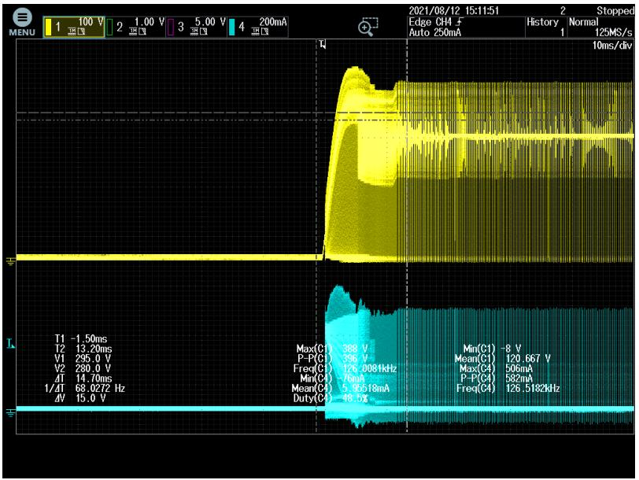

TNY276P

176 VAC

CH1 VDS  
CH4 IDS

$$
\begin{array}{l} \mathrm {V_ {DS\_MAX}} = 3 8 8 \mathrm{V} \\ \mathrm {I_ {DS\_MAX}} = 0. 5 0 6 \mathrm{A} \end{array}
$$

Test Condition:

➢ No Load

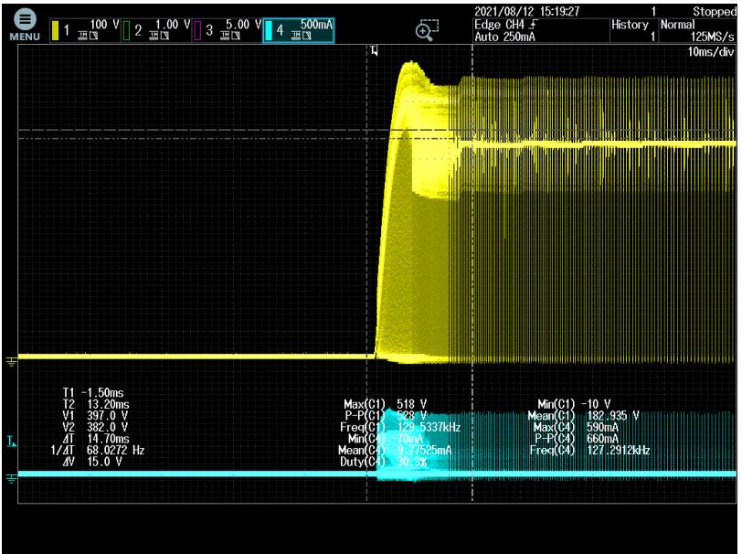

TNY276P

265 VAC

CH1 VDS  
CH4 IDS

$$
V _ {D S \_ M A X} = 5 1 8 V
$$

$$
I _ {D S \_ M A X} = 0. 5 9 \mathrm{A}
$$

➢ No Load

Test Condition:  
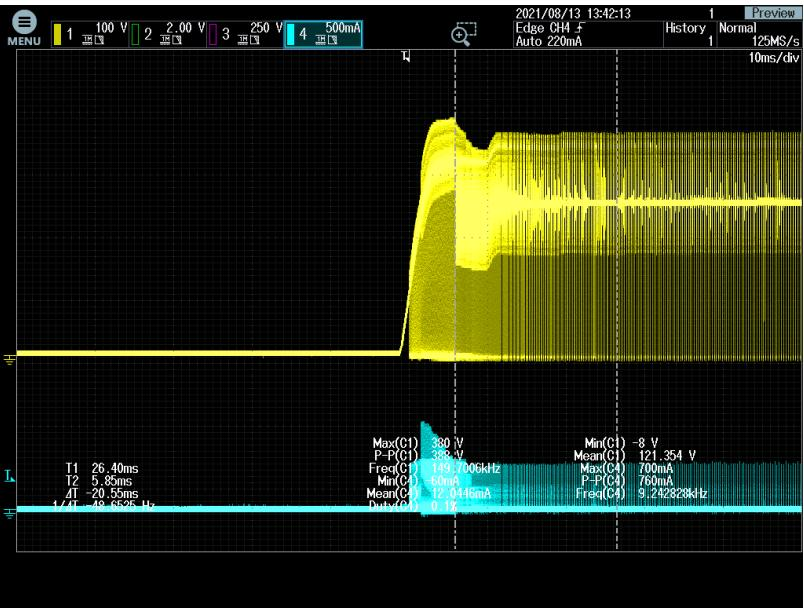

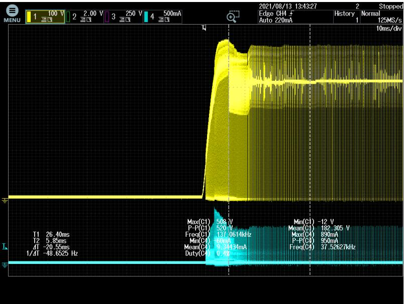

BPA8616P  
Test Condition:

176 VAC

CH1 VDS  
CH4 IDS

$$
V _ {D S \_ M A X} = 3 8 0 V
$$

$$
I _ {D S \_ M A X} = 0. 7 \mathrm{mA}
$$

➢ No Load

BPA8616P

265 VAC

CH1 VDS  
CH4 IDS

$$
V _ {D S \_ M A X} = 5 0 8 V
$$

$$
I _ {D S \_ M A X} = 0. 8 9 \mathrm{A}
$$

Test Condition:

➢ No Load

## MOSFET开机波形—满载

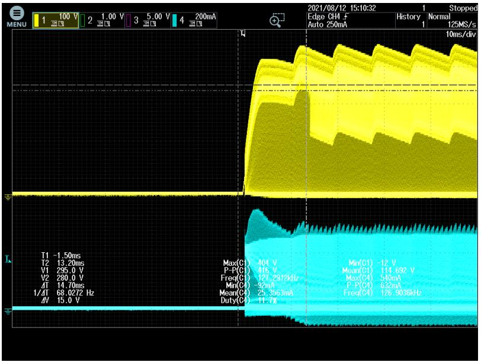

TNY276P

176 VAC  
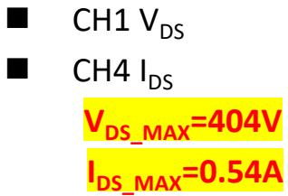

Test Condition:  
➢ Full Load

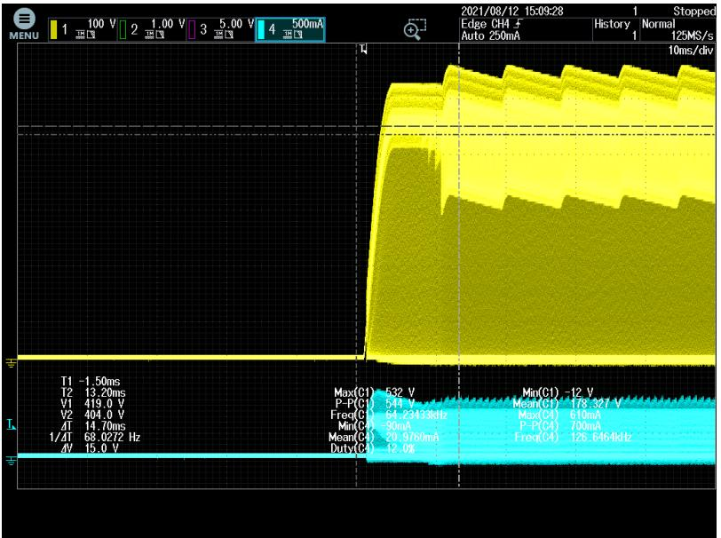

TNY276P

265 VAC  

Test Condition:  
➢ Full Load

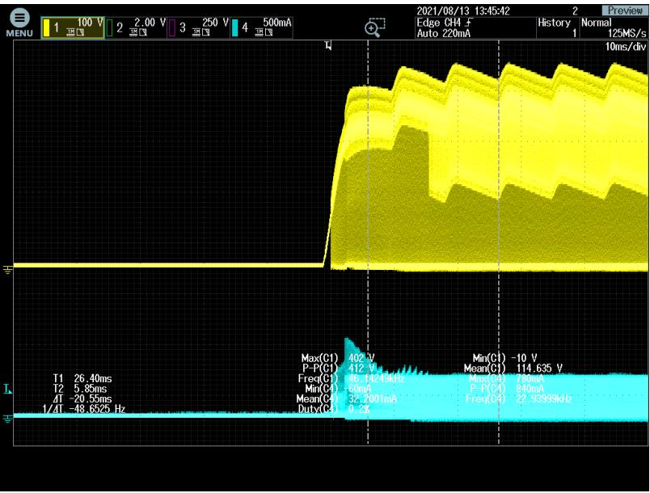

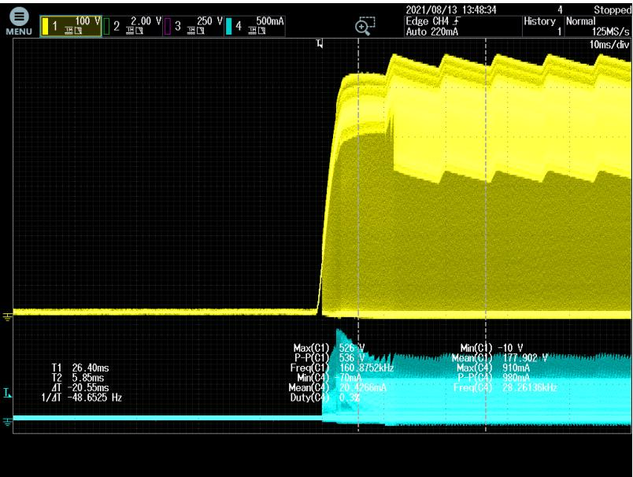

## BPA8616P

## 176 VAC

Test Condition:  
➢ Full Load

## BPA8616P

265 VAC  
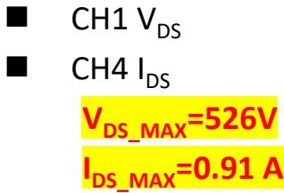

Test Condition:  
➢ Full Load

## MOSFET开机波形—空载

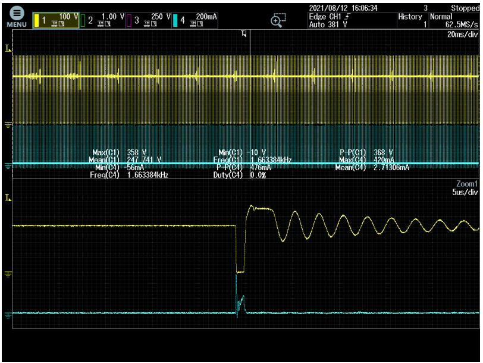

TNY276P

176 VAC  

Test Condition:

➢ No Load  
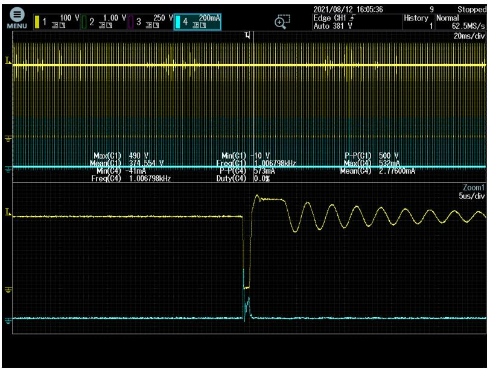

TNY276P

265 VAC  
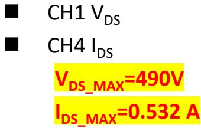

Test Condition:  
➢ No Load

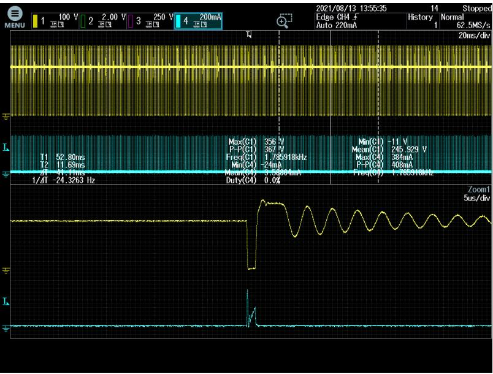

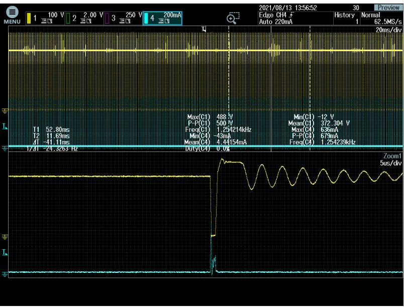

## BPA8616P

## 176 VAC

CH1 VDS  
CH4 IDS

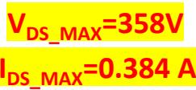  
Test Condition:  
➢ No Load

## BPA8616P

265 VAC

CH1 VDS  
CH4 IDS

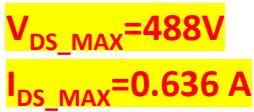  
Test Condition:  
➢ No Load

## MOSFET稳态波形—稳态

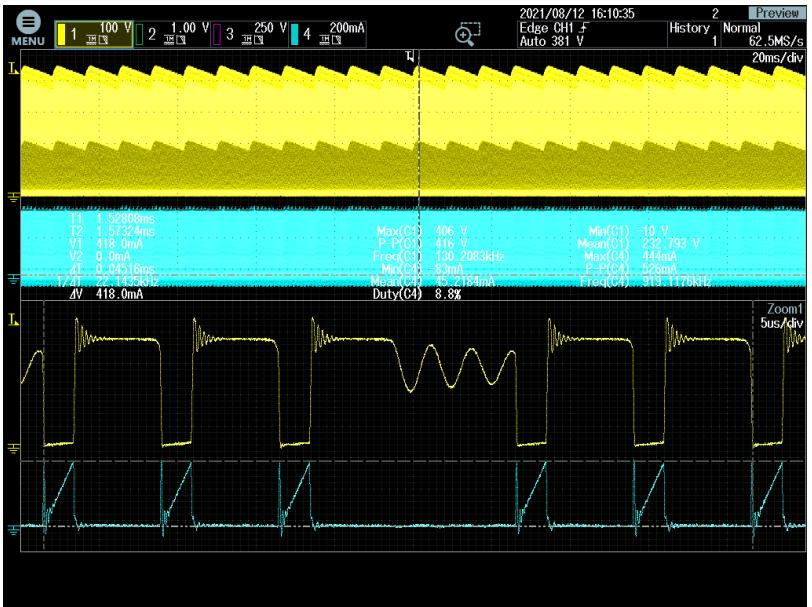

TNY276P

176 VAC  
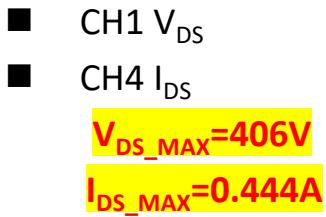

Test Condition:  
➢ Full Load

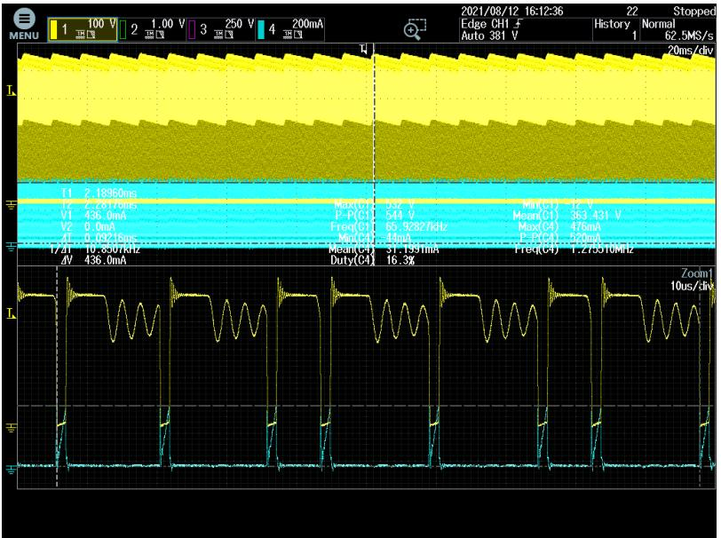

TNY276P

265 VAC  
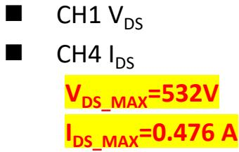

Test Condition:  
➢ Full Load

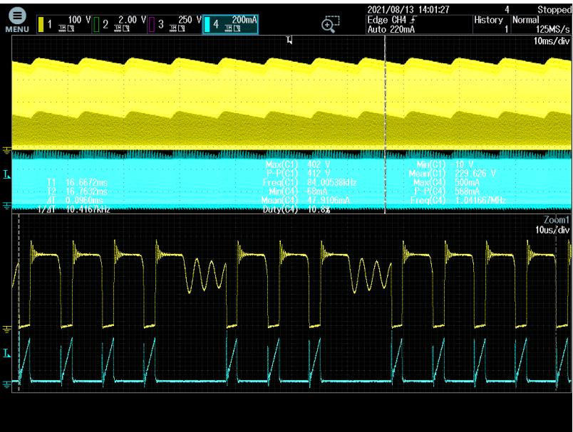

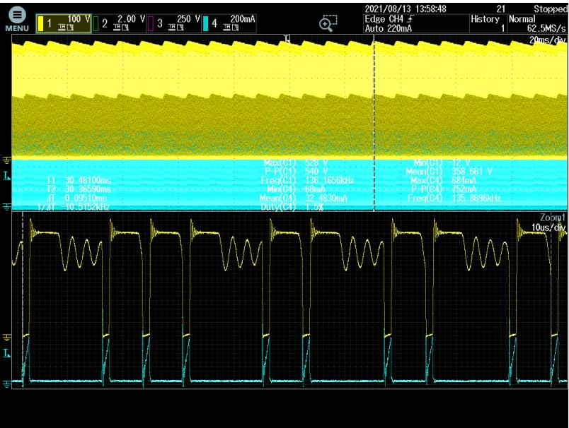

## BPA8616P

## 176 VAC


Test Condition:  
➢ Full Load

## BPA8616P

265 VAC  


Test Condition:  
➢ Full Load

## 短路保护(短路双绕组)


TNY276P

176 VAC

CH1 $\mathsf { V } _ { \mathsf { D } \mathsf { S } }$  
CH4 $\mathsf { I } _ { \mathsf { D } \mathsf { S } }$

$$
\begin{array}{l} \mathrm {V_ {DS\_MAX}} = 4 0 7 \mathrm{V} \\ \mathrm {I_ {DS\_MAX}} = 0. 7 7 \mathrm{A} \end{array}
$$

## Test Condition:

➢ Output Short 5V/12V


TNY276P

265 $\mathsf { v } _ { \mathsf { A C } }$

CH1 $\mathsf { V } _ { \mathsf { D } \mathsf { S } }$  
CH4 $\mathsf { I } _ { \mathsf { D } \mathsf { S } }$ $V _ { \mathsf { D S \_ M A X } } { = } 5 3 2 \mathsf { V }$ $\mathsf { I } _ { \mathsf { D S \_ M A X } } { = } \mathsf { 0 } . 7 8 \mathsf { A }$

## Test Condition:

➢ Output Short 5V/12V


## BPA8616P

176 VAC

CH1 $\mathsf { V } _ { \mathsf { D } \mathsf { S } }$  
CH4 IDS $\mathsf { I } _ { \mathsf { D } \mathsf { S } }$ $V _ { \mathsf { D S \_ M A X } } { = } 4 0 2 \mathsf { V }$ $\mathsf { I } _ { \mathsf { D S \_ M A X } } { = } \mathsf { 0 } . 8 7 \mathrm { \Delta A }$

## Test Condition:

➢ Output Short 5V/12V

## BPA8616P

265 $\mathsf { v } _ { \mathsf { A C } }$

${ \mathsf { C H 1 } } \mathsf { V } _ { \mathsf { D S } }$  
CH4 I $\mathsf { I } _ { \mathsf { D } \mathsf { S } }$ $V _ { \mathsf { D S \_ M A X } } { = } 5 2 6 V$ $\mathsf { I } _ { \mathsf { D S \_ M A X } } { = } 0 . 9 2 \mathsf { A }$

➢ Output Short 5V/12V

## 输出二极管反向电压和电流启机波形—空载


TNY276P  
176 VAC  


Test Condition:  
➢ No Load


BPA8616P  
176 VAC  


Test Condition:  
➢ No Load


TNY276P  
265 VAC  


Test Condition:  
➢ No Load


BPA8616P  
265 VAC  


Test Condition:  
➢ No Load

## 输出二极管反向电压和电流启机波形—空载


TNY276P  
176 VAC

CH1 VR\_12V $V _ { \textsf { R } }$  
CH2 $V _ { R \_ 5 \vee }$  
CH3 IR\_12V  
CH4 $1 _ { \mathsf { R } _ { - } 5 \mathsf { V } }$ $\mathsf { V } _ { \mathsf { R } \_ 1 2 \mathsf { V } \_ \mathsf { M A X } } = 5 6 \mathsf { V }$ $V _ { R \_ 5 \vee \_ { \mathsf { M A X } } } = 2 3 \vee$ IR\_12V\_MAX=3.52A $\mathsf { I } _ { \mathsf { R } _ { - } 1 2 \mathsf { V } _ { - } \mathsf { M A X } } = 3 . 5 2 \mathsf { A }$ IR\_5V\_MAX=1.55A $\mathsf { I } _ { \mathsf { R } _ { - } 5 \mathsf { V } _ { - } \mathsf { M A X } } = \mathsf { 1 } . 5 5 \mathsf { A }$

Test Condition:  
➢ Full Load  


BPA8616P  
176 VAC

CH1 VR\_12V  
$\mathsf { C H } 2 \mathsf { V } _ { \mathsf { R } \_ \mathsf { 5 V } }$  
CH3 IR\_12V  
CH4 IR\_5V


Test Condition:  
➢ Full Load


TNY276P  
265 VAC

CH1 VR\_12V  
CH2 $V _ { R \_ 5 \vee }$  
CH3 IR\_12V $1 _ { \mathsf { R } _ { - } 1 2 \mathsf { V } }$  
CH4 $1 _ { \mathsf { R } _ { - } 5 \mathsf { V } }$ $\mathsf { V } _ { \mathsf { R } \_ 1 2 \mathsf { V } \_ \mathsf { M A X } } = 7 6 \mathsf { V }$ $V _ { \Rphantom { - } 5 \vee \_ M A X } = 3 1 \vee$ IR\_12V\_MAX=3.68A $\mathsf { I } _ { \mathsf { R } _ { - } 1 2 \mathsf { V } _ { - } \mathsf { M A X } } = 3 . 6 8 \mathsf { A }$ IR\_5V\_MAX=1.67A $\mathsf { I } _ { \mathsf { R } _ { - } 5 \mathsf { V } _ { - } \mathsf { M A X } } = \mathsf { 1 } . 6 7 \mathsf { A }$

Test Condition:  
➢ Full Load  


BPA8616P  
265 VAC

$\mathsf { C H 1 V } _ { \mathsf { R } _ { - } 1 2 \mathsf { V } }$  
CH2 VR\_5V $\mathsf { C H } 2 \mathsf { V } _ { \mathsf { R } \_ \mathsf { S V } }$  
CH3 IR\_12V $1 _ { \mathsf { R } _ { - } 1 2 \mathsf { V } }$  
${ \mathsf { C H } } 4 \mid _ { _ { \mathsf { R } } { \mathsf { \scriptsize ~ 5 } } \mathsf { V } }$


Test Condition:  
➢ Full Load

## 输出二极管反向电压和电流稳态波形—空载


TNY276P  
176 VAC

CH1 VR\_12V  
CH2 $V _ { R \_ 5 \vee }$  
CH3 IR\_12V  
CH4 $1 _ { \mathsf { R } _ { - } 5 \mathsf { V } }$ $\mathsf { V } _ { \mathsf { R } \_ 1 2 \mathsf { V } \_ \mathsf { M A X } } = 5 6 \mathsf { V }$ $V _ { R \_ 5 \vee \_ { \mathsf { M A X } } } = 2 3 \vee$ IR\_12V\_MAX=1.1A $\mathsf { I } _ { \mathsf { R } _ { - } 1 2 \mathsf { V } _ { - } \mathsf { M A X } } = \mathsf { 1 } . 1 \mathsf { A }$ $\mathsf { I } _ { \mathsf { R } \_ 5 \mathsf { V } \_ \mathsf { M A X } } = 0 . 4 8 \mathsf { A }$

Test Condition:  
➢ No Load  


BPA8616P  
176 VAC

CH1 VR\_12V  
$\mathsf { C H } 2 \mathsf { V } _ { \mathsf { R } \_ \mathsf { 5 V } }$  
CH3 IR\_12V  
CH4 I $\mathsf { V } _ { \mathsf { R } \_ 1 2 \mathsf { V } \_ \mathsf { M A X } } = 5 5 \mathsf { V }$ $V _ { R \_ 5 \vee \_ { \mathsf { M A X } } } = 2 3 \vee$ IR\_12V\_MAX=1.07A $\scriptstyle \mathtt { R \_ 1 2 V \_ M A X } ^ { = 1 . 0 7 \mathbb { A } }$ $\mathsf { I } _ { \mathsf { R } \_ 5 \mathsf { V } \_ { \mathsf { M A X } } = 0 . 4 5 6 \mathsf { A } }$

Test Condition:  
➢ No Load  


TNY276P  
265 VAC

CH1 VR\_12V  
CH2 VR\_5V $V _ { R \_ 5 \vee }$  
CH3 IR\_12V $1 _ { \mathsf { R } _ { - } 1 2 \mathsf { V } }$  
CH4 I $\mathsf { V } _ { \mathsf { R } \_ 1 2 \mathsf { V } \_ \mathsf { M A X } } = 7 6 \mathsf { V }$ VR\_5V\_MAX=31V IR\_12V\_MAX=1.46A I =0.58A

Test Condition:  
➢ No Load  


BPA8616P  
265 VAC

CH1 VR\_12V  
CH2 VR\_5V $\mathsf { C H } 2 \mathsf { V } _ { \mathsf { R } \_ \mathsf { S V } }$  
CH3 IR\_12V $1 _ { \mathsf { R } _ { - } 1 2 \mathsf { V } }$  
${ \mathsf { C H } } 4 \mid _ { _ { \mathsf { R } } { \mathsf { \scriptsize ~ 5 } } \mathsf { V } }$

$$
\begin{array}{rl} & V_{R\_12V\_MAX} = 77V\\ & V_{R\_5V\_MAX} = 31V\\ & I_{R\_12V\_MAX} = 1.33A\\ & I_{R\_5V\_MAX} = 0.536A \end{array}
$$

Test Condition:

➢ No Load

## 输出二极管反向电压和电流稳态波形—满载


TNY276P  
176 VAC

CH1 VR\_12V $V _ { \mathsf { R } \_ 1 2 \mathsf { V } }$  
CH2 $V _ { R \_ 5 \vee }$  
CH3 IR\_12V $u _ { \mathsf { R } _ { - } 1 2 \mathsf { V } }$  
CH4 I $1 _ { \mathsf { R } _ { - } 5 \mathsf { V } }$ $\mathsf { V } _ { \mathsf { R } \_ 1 2 \mathsf { V } \_ \mathsf { M A X } } = 5 6 \mathsf { V }$ $V _ { R \_ 5 \vee \_ { \mathsf { M A X } } } = 2 3 \vee$ IR\_12V\_MAX=3.56A $\mathsf { I } _ { \mathsf { R } _ { - } 1 2 \mathsf { V } _ { - } \mathsf { M A X } } = 3 . 5 6 \mathsf { A }$ IR\_5V\_MAX=0.92A $\mathsf { I } _ { \mathsf { R } \_ 5 \mathsf { V } \_ \mathsf { M A X } } = \mathsf { 0 } . 9 2 \mathsf { A }$

Test Condition:  
➢ Full Load  


BPA8616P  
176 VAC

CH1 VR\_12V $\mathsf { C H 1 V } _ { \mathsf { R } _ { - } 1 2 \mathsf { V } }$  
$\mathsf { C H } 2 \mathsf { V } _ { \mathsf { R } \_ \mathsf { 5 V } }$  
CH3 IR\_12V $1 _ { \mathsf { R } _ { - } 1 2 \mathsf { V } }$  
CH4 IR\_5V

$$
\begin{array}{rl} & V_{R\_12V\_MAX} = 56V\\ & V_{R\_5V\_MAX} = 23V\\ & I_{R\_12V\_MAX} = 3.47A\\ & I_{R\_5V\_MAX} = 0.86A \end{array}
$$

Test Condition:  
➢ Full Load  


TNY276P  
265 VAC

CH1 VR\_12V  
CH2 VR\_5V $V _ { R \_ 5 \vee }$  
CH3 IR\_12V $1 _ { \mathsf { R } _ { - } 1 2 \mathsf { V } }$  
CH4 $1 _ { \mathsf { R } _ { - } 5 \mathsf { V } }$ $\mathsf { V } _ { \mathsf { R } \_ 1 2 \mathsf { V } \_ \mathsf { M A X } } = 7 4 \mathsf { V }$ $V _ { \ R \_ { 5 } \tt V \_ M A X } = 3 1 \tt V$ IR\_12V\_MAX=3.8A $\mid _ { \mathsf { R } \_ 1 2 \mathsf { V } \_ \mathsf { M A X } } = 3 . 8 \mathsf { A }$ $\mathsf { I } _ { \mathsf { R } \_ 5 \mathsf { V } \_ { \mathsf { M A X } } = \mathsf { O } \_ 9 6 \mathsf { A } }$

Test Condition:  
➢ Full Load  


BPA8616P  
265 VAC

CH1 VR\_12V  
CH2 VR\_5V $\mathsf { C H } 2 \mathsf { V } _ { \mathsf { R } \_ \mathsf { S V } }$  
CH3 IR\_12V $1 _ { \mathsf { R } _ { - } 1 2 \mathsf { V } }$  
${ \mathsf { C H } } 4 \mid _ { _ { \mathsf { R } } { \mathsf { \scriptsize ~ 5 } } \mathsf { V } }$


Test Condition:  
➢ Full Load

## 短路保护（输出二极管电压和电流波形）


TNY276P  
176 VAC

CH1 VR\_12V $V _ { \mathsf { R } \_ 1 2 \mathsf { V } }$  
CH2 $V _ { R \_ 5 \vee }$  
CH3 IR\_12V $u _ { \mathsf { R } _ { - } 1 2 \mathsf { V } }$  
CH4 $1 _ { \mathsf { R } _ { - } 5 \mathsf { V } }$ $\mathsf { V } _ { \mathsf { R } \_ 1 2 \mathsf { V } \_ \mathsf { M A X } } = 5 6 \mathsf { V }$ $V _ { R \_ 5 \vee \_ { \mathsf { M A X } } } = 2 3 \vee$ IR\_12V\_MAX=4.1A $\mid _ { { \mathsf { R } } _ { - } 1 2 { \mathsf { V } } _ { - } { \mathsf { M A X } } } = 4 . 1 { \mathsf { A } }$ I =8.4A

Test Condition:  
5V Short  


BPA8616P  
176 VAC

CH1 VR\_12V  
$\mathsf { C H } 2 \mathsf { V } _ { \mathsf { R } \_ \mathsf { 5 V } }$  
CH3 IR\_12V $1 _ { \mathsf { R } _ { - } 1 2 \mathsf { V } }$  
CH4 I $\mathsf { V } _ { \mathsf { R } \_ 1 2 \mathsf { V } \_ \mathsf { M A X } } = 5 7 \mathsf { V }$ $V _ { R \_ 5 \vee \_ { \mathsf { M A X } } } = 2 3 \vee$ IR\_12V\_MAX=3.7A $R \_ { 1 2 } = 1 2 V \_ M A X = 3 . 7 A$ $1 _ { R \_ 5 V \_ M A X } = 8 . 5 A$

Test Condition:  
5V Short  


TNY276P  
265 VAC

CH1 VR\_12V  
CH2 $V _ { R \_ 5 \vee }$  
CH3 IR\_12V $1 _ { \mathsf { R } _ { - } 1 2 \mathsf { V } }$  
CH4 I $\mathsf { V } _ { \mathsf { R } \_ 1 2 \mathsf { V } \_ \mathsf { M A X } } = 7 6 \mathsf { V }$ $V _ { \ R \_ { 5 } \tt V \_ M A X } = 3 1 \tt V$ IR\_12V\_MAX=4.8A $\mid _ { \mathsf { R } \_ 1 2 \mathsf { V } \_ \mathsf { M A X } } = 4 . 8 \mathsf { A }$ IR\_5V\_MAX=9A $1 _ { R \_ 5 V \_ M A X } = 9 A$

Test Condition:  
5V Short  


BPA8616P  
265 VAC

CH1 VR\_12V  
CH2 VR\_5V $\mathsf { C H } 2 \mathsf { V } _ { \mathsf { R } \_ \mathsf { S V } }$  
CH3 IR\_12V $\mathsf { C H 3 } \mathsf { I } _ { \mathsf { R } _ { - } 1 2 \mathsf { V } }$  
CH4 IR\_5V $C H 4 \mid _ { _ { \mathsf { R } } _ { } 5 \mathsf { V } }$


Test Condition:  
5V Short

## 短路保护（输出二极管电压和电流波形）


TNY276P  
176 VAC

CH1 VR\_12V $V _ { \mathsf { R } \_ 1 2 \mathsf { V } }$  
CH2 $V _ { R \_ 5 \vee }$  
CH3 IR\_12V $u _ { \mathsf { R } _ { - } 1 2 \mathsf { V } }$  
CH4 $1 _ { \mathsf { R } _ { - } 5 \mathsf { V } }$ $\mathsf { V } _ { \mathsf { R } \_ 1 2 \mathsf { V } \_ \mathsf { M A X } } = 5 6 \mathsf { V }$ $V _ { R \_ 5 \vee \_ { \mathsf { M A X } } } = 2 3 \vee$ IR\_12V\_MAX=5A $\mathsf { I } _ { \mathsf { R } _ { - } 1 2 \mathsf { V } _ { - } \mathsf { M A X } } = 5 \mathsf { A }$ $\mathsf { I } _ { \mathsf { R } \_ 5 \mathsf { V } \_ \mathsf { M A X } } = \mathsf { 1 } . 0 9 \mathsf { A }$

Test Condition:  
12V Short  


BPA8616P  
176 VAC

CH1 VR\_12V  
$\mathsf { C H } 2 \mathsf { V } _ { \mathsf { R } \_ \mathsf { 5 V } }$  
CH3 IR\_12V $1 _ { \mathsf { R } _ { - } 1 2 \mathsf { V } }$  
CH4 I $\mathsf { V } _ { \mathsf { R } \_ 1 2 \mathsf { V } \_ \mathsf { M A X } } = 5 5 \mathsf { V }$ $V _ { R \_ 5 \vee \_ { \mathsf { M A X } } } = 2 3 \vee$ IR\_12V\_MAX=4.6A $R \_ { 1 2 } v \_ { M A X } = 4 . 6 A$ I $\mathtt { \backslash } \mathtt { S V \_ M A X } ^ { = 1 . 0 4 A }$

Test Condition:  
12V Short  


TNY276P  
265 VAC

CH1 VR\_12V  
CH2 $V _ { R \_ 5 \vee }$  
CH3 IR\_12V $1 _ { \mathsf { R } _ { - } 1 2 \mathsf { V } }$  
CH4 I $\mathsf { V } _ { \mathsf { R } \_ 1 2 \mathsf { V } \_ \mathsf { M A X } } = 7 4 \mathsf { V }$ $V _ { \ R \_ { 5 } \tt V \_ M A X } = 3 1 \tt V$ IR\_12V\_MAX=5.1A $\mathsf { I } _ { \mathsf { R } _ { - } 1 2 \mathsf { V } _ { - } \mathsf { M A X } } = 5 . 1 \mathsf { A }$ IR\_5V\_MAX=1.17A $\mathsf { I } _ { \mathsf { R } \_ 5 \mathsf { V } \_ \mathsf { M A X } } = \mathsf { 1 } . \mathsf { 1 7 A }$

Test Condition:  
12V Short  


BPA8616P  
265 VAC

CH1 VR\_12V  
$\mathsf { C H } 2 \mathsf { V } _ { \mathsf { R } \mathsf { \Sigma } , \mathsf { S V } }$  
CH3 $u _ { \mathsf { R } _ { - } 1 2 \mathsf { V } }$  
CH4 $1 _ { \textsf { R } \textsf { 5 V } }$

  
Test Condition:  
12V Short

## 短路保护（输出二极管电压和电流波形）


TNY276P  
176 VAC

CH1 VR\_12V $V _ { \mathsf { R } \_ 1 2 \mathsf { V } }$  
CH2 $V _ { R \_ 5 \vee }$  
CH3 IR\_12V $u _ { \mathsf { R } _ { - } 1 2 \mathsf { V } }$  
CH4 $1 _ { \mathsf { R } _ { - } 5 \mathsf { V } }$ $\mathsf { V } _ { \mathsf { R } \_ 1 2 \mathsf { V } \_ \mathsf { M A X } } = 5 6 \mathsf { V }$ $V _ { R \_ 5 \vee \_ { \mathsf { M A X } } } = 2 3 \vee$ IR\_12V\_MAX=5.1A $\mathsf { I } _ { \mathsf { R } _ { - } 1 2 \mathsf { V } _ { - } \mathsf { M A X } } = 5 . 1 \mathsf { A }$ $\mathsf { I } _ { \mathsf { R } \_ 5 \mathsf { V } \_ { \mathsf { M A X } } = 1 . 1 \mathsf { A } }$

Test Condition:  
All Short  


TNY276P  
265 VAC

CH1 VR\_12V $V _ { \textsf { R } }$  
CH2 $V _ { R \_ 5 \vee }$  
CH3 IR\_12V $1 _ { \mathsf { R } _ { - } 1 2 \mathsf { V } }$  
CH4 $1 _ { \mathsf { R } _ { - } 5 \mathsf { V } }$ $\mathsf { V } _ { \mathsf { R } \_ 1 2 \mathsf { V } \_ \mathsf { M A X } } = 7 6 \mathsf { V }$ $V _ { \ R \_ { 5 } \tt V \_ M A X } = 3 1 \tt V$ IR\_12V\_MAX=5.2A $R _ { - } 1 2 V _ { - } M A X ^ { = 5 . 2 A }$ $\mathsf { I } _ { \mathsf { R } \_ 5 \mathsf { V } \_ \mathsf { M A X } } = \mathsf { 1 } . 2 5 \mathsf { A }$

Test Condition:  
All Short  


## BPA8616P

## 176 VAC

CH1 VR\_12V $V _ { \mathsf { R } _ { - } 1 2 \mathsf { V } }$  
$\mathsf { C H } 2 \mathsf { V } _ { \mathsf { R } \_ \mathsf { 5 V } }$  
CH3 $1 _ { \mathsf { R } _ { - } 1 2 \mathsf { V } }$  
CH4 IR\_5V ${ \mathsf { C H } } 4 \mid _ { _ { \mathsf { R } } { \mathsf { \scriptsize ~ 5 } } \mathsf { V } }$

  
Test Condition:  
All Short

## BPA8616P

265 $\mathsf { v } _ { \mathsf { A C } }$

CH1 VR\_12V  
CH2 VR\_5V $\mathsf { C H } 2 \mathsf { V } _ { \mathsf { R } \_ \mathsf { S V } }$  
CH3 IR\_12V $1 _ { \mathsf { R } _ { - } 1 2 \mathsf { V } }$  
${ \mathsf { C H } } 4 \mid _ { _ { \mathsf { R } } { \mathsf { \scriptsize ~ 5 } } \mathsf { V } }$


Test Condition:  
All Short

TNY276P  


备注：BPA8616P输入欠压功能无需外接采样电阻

BPA8616P  


CH3 VDC\_IN  
CH1 Vo  
CH2 Vo  
VDC\_IN\_STARTUP=90 V

Test Condition:

➢ No Load

TNY276P  


CH3 VDC\_IN  
CH1 Vo  
CH2 Vo  
CH4 VDS


Test Condition:

➢ Full Load

备注：BPA8616P输入欠压功能无需外接采样电阻

BPA8616P  


CH3 VDC\_IN  
CH1 Vo  
CH2 Vo  
CH4 VDS

Test Condition:

➢ Full Load

TNY276P

<table><tr><td rowspan="2">输入电压(VAC)</td><td colspan="2">12V</td><td colspan="2">5V</td><td rowspan="2">输入功率(W)</td></tr><tr><td>输出电压(V)</td><td>输出电流(A)</td><td>输出电压(V)</td><td>输出电流(A)</td></tr><tr><td rowspan="4">176</td><td>9.62</td><td>0.95</td><td>4.841</td><td>0</td><td>12.4</td></tr><tr><td>21.59</td><td>0</td><td>4.407</td><td>2</td><td>13.52</td></tr><tr><td>12.28</td><td>0.85</td><td>4.84</td><td>0.05</td><td>14.04</td></tr><tr><td>12.53</td><td>0.78</td><td>4.845</td><td>0.2</td><td>14.13</td></tr><tr><td rowspan="4">230</td><td>10.06</td><td>1.02</td><td>4.843</td><td>0</td><td>14.46</td></tr><tr><td>21.59</td><td>0</td><td>4.415</td><td>2.2</td><td>15.26</td></tr><tr><td>12.535</td><td>0.85</td><td>4.854</td><td>0.18</td><td>15.41</td></tr><tr><td>12.562</td><td>0.82</td><td>4.855</td><td>0.2</td><td>15.09</td></tr><tr><td rowspan="4">265</td><td>10.137</td><td>1.05</td><td>4.848</td><td>0</td><td>15.4</td></tr><tr><td>21.67</td><td>0</td><td>4.41</td><td>2.3</td><td>16.37</td></tr><tr><td>12.614</td><td>0.85</td><td>4.852</td><td>0.31</td><td>16.7</td></tr><tr><td>12.554</td><td>0.88</td><td>4.856</td><td>0.2</td><td>16.39</td></tr></table>

PA8616P

<table><tr><td rowspan="2">输入电压(VAC)</td><td colspan="2">12V</td><td colspan="2">5V</td><td rowspan="2">输入功率(W)</td></tr><tr><td>输出电压(V)</td><td>输出电流(A)</td><td>输出电压(V)</td><td>输出电流(A)</td></tr><tr><td rowspan="4">176</td><td>9.981</td><td>0.95</td><td>4.983</td><td>0</td><td>13.485</td></tr><tr><td>21.26</td><td>0</td><td>4.526</td><td>1.9</td><td>13.01</td></tr><tr><td>11.452</td><td>0.85</td><td>4.987</td><td>0.005</td><td>13.25</td></tr><tr><td>12.865</td><td>0.7</td><td>4.981</td><td>0.2</td><td>12.98</td></tr><tr><td rowspan="4">230</td><td>10.518</td><td>1</td><td>4.985</td><td>0</td><td>14.61</td></tr><tr><td>21.288</td><td>0</td><td>4.485</td><td>2.1</td><td>14.57</td></tr><tr><td>12.628</td><td>0.85</td><td>4.976</td><td>0.06</td><td>14.51</td></tr><tr><td>12.844</td><td>0.78</td><td>4.976</td><td>0.2</td><td>14.53</td></tr><tr><td rowspan="4">265</td><td>10.607</td><td>1.05</td><td>4.985</td><td>0</td><td>15.79</td></tr><tr><td>21.511</td><td>0</td><td>4.538</td><td>2.15</td><td>15.22</td></tr><tr><td>12.78</td><td>0.85</td><td>4.973</td><td>0.14</td><td>15.5</td></tr><tr><td>12.856</td><td>0.82</td><td>4.98</td><td>0.2</td><td>15.51</td></tr></table>


230VAC Line TNY276P  


230VAC Neutral TNY276P


230VAC Line BPA8616P  


230VAC Neutral BPA8616P


230VAC Line TNY276P


230VAC Neutral TNY276P


230VAC Line BPA8616P


230VAC Neutral BPA8616P

## 温度测试（12V/0.55A+5V0.2A）


## 测试说明

➢常温下密闭纸箱中进行测试；  
➢电路板放在一个封闭的盒子内；  
➢热电偶连接到各个测量点；  
➢等测量点温度达到稳定后记录数据；

<table><tr><td rowspan="2">项目\输入电压</td><td colspan="2">176VAC</td><td colspan="2">265VAC</td></tr><tr><td>温度</td><td>温升</td><td>温度</td><td>温升</td></tr><tr><td>环境温度</td><td colspan="2">27.6</td><td colspan="2">27.3</td></tr><tr><td>TNY276P</td><td>79.3</td><td>51.7</td><td>91.1</td><td>63.8</td></tr><tr><td>变压器Core</td><td>59.6</td><td>32</td><td>63.6</td><td>36.3</td></tr><tr><td>变压器Wire</td><td>60.8</td><td>33.2</td><td>64.6</td><td>37.3</td></tr><tr><td>5V输出电解电容EC2</td><td>34.5</td><td>6.9</td><td>34.8</td><td>7.5</td></tr><tr><td>12V输出电解电容EC3</td><td>32</td><td>4.4</td><td>32.1</td><td>4.8</td></tr><tr><td>12V输出二极管D2</td><td>76.2</td><td>48.6</td><td>79.5</td><td>52.2</td></tr><tr><td>5V输出二极管D3</td><td>55.9</td><td>28.3</td><td>57.8</td><td>30.5</td></tr></table>

<table><tr><td rowspan="2">项目\输入电压</td><td colspan="2">176VAC</td><td colspan="2">265VAC</td></tr><tr><td>温度</td><td>温升</td><td>温度</td><td>温升</td></tr><tr><td>环境温度</td><td colspan="2">27.5</td><td colspan="2">28.1</td></tr><tr><td>BPA8616P</td><td>73.1</td><td>45.6</td><td>82.7</td><td>54.6</td></tr><tr><td>变压器Core</td><td>59.1</td><td>31.6</td><td>62.9</td><td>34.8</td></tr><tr><td>变压器Wire</td><td>59.5</td><td>32</td><td>62.9</td><td>34.8</td></tr><tr><td>5V输出电解电容EC2</td><td>34</td><td>6.5</td><td>35.8</td><td>7.7</td></tr><tr><td>12V输出电解电容EC3</td><td>31.2</td><td>3.7</td><td>33.2</td><td>5.1</td></tr><tr><td>12V输出二极管D2</td><td>72.3</td><td>44.8</td><td>76.8</td><td>48.7</td></tr><tr><td>5V输出二极管D3</td><td>60</td><td>32.5</td><td>58.9</td><td>30.8</td></tr></table>

## 温度测试（12V/0.55A+5V0.3A）

## 测试说明

➢常温下密闭纸箱中进行测试；  
➢电路板放在一个封闭的盒子内；  
➢热电偶连接到各个测量点；  
➢等测量点温度达到稳定后记录数据；

<table><tr><td rowspan="2">项目\输入电压</td><td colspan="2">176VAC</td><td colspan="2">265VAC</td></tr><tr><td>温度</td><td>温升</td><td>温度</td><td>温升</td></tr><tr><td>环境温度</td><td colspan="2">27.2</td><td colspan="2">27.1</td></tr><tr><td>TNY276P</td><td>82.2</td><td>55</td><td>93</td><td>65.9</td></tr><tr><td>变压器Core</td><td>61.8</td><td>34.6</td><td>65.3</td><td>38.2</td></tr><tr><td>变压器Wire</td><td>62.9</td><td>35.7</td><td>66.6</td><td>39.5</td></tr><tr><td>5V输出电解电容EC2</td><td>35</td><td>7.8</td><td>35.3</td><td>8.2</td></tr><tr><td>12V输出电解电容EC3</td><td>32.1</td><td>4.9</td><td>32.1</td><td>5</td></tr><tr><td>12V输出二极管D2</td><td>77.1</td><td>49.9</td><td>80.4</td><td>53.3</td></tr><tr><td>5V输出二极管D3</td><td>61.8</td><td>34.6</td><td>63.6</td><td>36.5</td></tr></table>

<table><tr><td rowspan="2">项目\输入电压</td><td colspan="2">176VAC</td><td colspan="2">265VAC</td></tr><tr><td>温度</td><td>温升</td><td>温度</td><td>温升</td></tr><tr><td>环境温度</td><td colspan="2">27.9</td><td colspan="2">28.1</td></tr><tr><td>BPA8616P</td><td>75</td><td>47.1</td><td>85.2</td><td>57.1</td></tr><tr><td>变压器Core</td><td>62</td><td>33.4</td><td>65</td><td>36.9</td></tr><tr><td>变压器Wire</td><td>62.4</td><td>34.5</td><td>65.2</td><td>37.1</td></tr><tr><td>5V输出电解电容EC2</td><td>34.8</td><td>6.9</td><td>36.7</td><td>8.6</td></tr><tr><td>12V输出电解电容EC3</td><td>31.9</td><td>4</td><td>33.5</td><td>5.4</td></tr><tr><td>12V输出二极管D2</td><td>74.7</td><td>46.8</td><td>78.2</td><td>50.1</td></tr><tr><td>5V输出二极管D3</td><td>63.5</td><td>35.6</td><td>64.6</td><td>36.5</td></tr></table>

## 测试数据对比总结

<table><tr><td colspan="2"></td><td>TNY276P</td><td>BPA8616P</td><td></td></tr><tr><td colspan="2">待机功耗@230Vac</td><td>585mW</td><td>595mW</td><td>外供电</td></tr><tr><td rowspan="2">效率</td><td>176Vac</td><td>73.17%</td><td>74.0%</td><td>满载效率</td></tr><tr><td>230Vac</td><td>75.3%</td><td>76.3%</td><td>满载效率</td></tr><tr><td rowspan="4">输出电压纹波</td><td rowspan="2">176Vac</td><td>259mV</td><td>244mV</td><td>12V0.55A满载</td></tr><tr><td>51.2mV</td><td>46.1mV</td><td>5V0.2A满载</td></tr><tr><td rowspan="2">265Vac</td><td>275mV</td><td>260mV</td><td>15V0.75A满载</td></tr><tr><td>45.8mV</td><td>46.3mV</td><td>8.3V0.15A满载</td></tr><tr><td rowspan="8">动态负载性能</td><td rowspan="4">50%-100%</td><td> $776mV_{PK\_PK}$ </td><td> $456mV_{PK\_PK}$ </td><td rowspan="2">12V/5V@176Vac</td></tr><tr><td> $145mV_{PK\_PK}$ </td><td> $60mV_{PK\_PK}$ </td></tr><tr><td> $808mV_{PK\_PK}$ </td><td> $414mV_{PK\_PK}$ </td><td rowspan="2">12V/5V@265Vac</td></tr><tr><td> $144mV_{PK\_PK}$ </td><td> $58mV_{PK\_PK}$ </td></tr><tr><td rowspan="4">10%-90%</td><td> $2.6V_{PK\_PK}$ </td><td> $1V_{PK\_PK}$ </td><td rowspan="2">12V/5V@176Vac</td></tr><tr><td> $456mV_{PK\_PK}$ </td><td> $119mV_{PK\_PK}$ </td></tr><tr><td> $2.32V_{PK\_PK}$ </td><td> $1.04V_{PK\_PK}$ </td><td rowspan="2">12V/5V@265Vac</td></tr><tr><td> $384mV_{PK\_PK}$ </td><td> $108mV_{PK\_PK}$ </td></tr><tr><td rowspan="2">MOSFET应力</td><td> $V_{DS}$ </td><td>532V</td><td>528V</td><td>@265Vac,满载</td></tr><tr><td> $I_{DS}$ </td><td>0.476A</td><td>0.684A</td><td>@265Vac,满载</td></tr><tr><td colspan="2">传导EMI</td><td>&gt;6dB裕量</td><td>&gt;6dB裕量</td><td></td></tr></table>

电源规格：176\~265Vac输，12V/0.55A+5V0.2A双路输出；  
本报告的所有测试均基于整机AC输入电路和部分输出侧小信号电路，以至于待机功耗较高：

## ❑ 空载功耗

待机状态两款芯片输入功耗基本一样（BPA8616P 效率较高）

## ❑ 启动波形

➢ BPA8616P内置软起动功能，连续快速启动时减少启动时IC电流应力

## ❑ 输入过欠压保护

➢ BPA861X系列芯片内置输入欠压保护(UV)功能，因此无需外部上拉检测电阻；

<table><tr><td> $V_{IN\_BR}$ </td><td>Brown-in 电压</td><td></td><td>80</td><td>85</td><td>90</td><td>V</td></tr><tr><td> $t_{BR}$ </td><td>Brown-in 持续检测时间</td><td></td><td></td><td>30</td><td></td><td>us</td></tr></table>

BPA861X系列内置输入OVP(过压保护)功能；

<table><tr><td> $V_{DRAIN\_OV}$ </td><td>MOSFET 漏极过压保护的电压阈值</td><td></td><td>570</td><td>600</td><td>630</td><td>V</td></tr><tr><td> $t_{D\_OV}$ </td><td>漏极电压检测延时,MOSFET 关断开始计时</td><td></td><td></td><td>1.2</td><td></td><td>us</td></tr><tr><td> $V_{HYS\_OV}$ </td><td>漏极过压保护迟滞</td><td></td><td>142</td><td>150</td><td>158</td><td>V</td></tr></table>

## ❑ PCBlayout建议：

➢ 辅助绕组经整流后滤波电容的地直接回到Vbus电容地；  
➢ 光耦以及VCC电容地紧贴IC的地放置，然后通过IC的地回到Vbus电容地；  
➢ FB/UV、VCC引脚连线远离输入AC侧、Drain脚、主/辅助绕组变压器引脚等干扰源；布线如下示意图，以上布局优化可以降低ESD、雷击等干扰，增强产品可靠性；


## THANK YOU FOR WATCHING
