## BPA8616P&TNY276P对比测试

## (12V/0.7A@85\~265Vac)

上海晶丰明源半导体股份有限公司

Shanghai Bright Power Semiconductor Co., Ltd.

WHX

时间：2020年12月

## 电气参数对比

<table><tr><td></td><td>BPA8616P</td><td>TNY276P</td></tr><tr><td>开关频率</td><td>132KHz</td><td>132KHz</td></tr><tr><td>Mosfet BV</td><td>700V</td><td>700V</td></tr><tr><td> $R_{DS\_ON}$ </td><td>11Ω</td><td>14Ω</td></tr><tr><td>限流点</td><td>350mA</td><td>350mA</td></tr><tr><td>软启动</td><td>有</td><td>无</td></tr><tr><td>输入过压保护</td><td>有</td><td>无</td></tr><tr><td>输入欠压保护</td><td>内置</td><td>外加</td></tr><tr><td>输出过压保护</td><td>自动重启</td><td>锁死</td></tr><tr><td>过载保护</td><td>有</td><td>有</td></tr><tr><td>封装</td><td>DIP7, SOP7</td><td>DIP7, SMD8C</td></tr></table>

## 测试数据对比

电源规格：85\~265Vac输入，12V/0.7A输出

<table><tr><td colspan="2"></td><td>BPA8616P</td><td>TNY276P</td><td></td></tr><tr><td colspan="2">待机功耗</td><td>53mW</td><td>76mW</td><td>包含输入电压检测电阻损耗</td></tr><tr><td rowspan="2">效率</td><td>115Vac</td><td>78.60%</td><td>78.50%</td><td></td></tr><tr><td>230Vac</td><td>79.20%</td><td>79.90%</td><td></td></tr><tr><td rowspan="2">输出电压纹波</td><td>85Vac</td><td>134mV</td><td>138mV</td><td></td></tr><tr><td>265Vac</td><td>124mV</td><td>134mV</td><td></td></tr><tr><td rowspan="2">动态负载性能</td><td>50%-100%</td><td> $148mV_{PK\_PK}$ </td><td> $200mV_{PK\_PK}$ </td><td></td></tr><tr><td>10%-90%</td><td> $196mV_{PK\_PK}$ </td><td> $272mV_{PK\_PK}$ </td><td></td></tr><tr><td rowspan="2">MOSFET应力</td><td> $V_{DS}$ </td><td>540V</td><td>540V</td><td></td></tr><tr><td> $I_{DS}$ </td><td>0.68A</td><td>0.62A</td><td></td></tr><tr><td rowspan="2">二极管应力</td><td>VRR</td><td>67.2V</td><td>70.4V</td><td></td></tr><tr><td> $I_{PK}$ </td><td>4.64A</td><td>4.92A</td><td></td></tr><tr><td colspan="2">温升测试(环温50°C)</td><td>108°C</td><td>110°C</td><td></td></tr><tr><td colspan="2">传导EMI</td><td>&gt;6dB裕量</td><td>&gt;6dB裕量</td><td></td></tr><tr><td colspan="2">Surge</td><td>Pass</td><td>Pass</td><td>共模2kV,差模4kV</td></tr><tr><td colspan="2">EFT群脉冲</td><td>Pass</td><td>Pass</td><td>4kV,5kHz/38kHz/100kHz</td></tr><tr><td colspan="2">ESD</td><td>Pass</td><td>Pass</td><td>8kV接触放电/15kV空气放电</td></tr></table>

## 电路及实物图

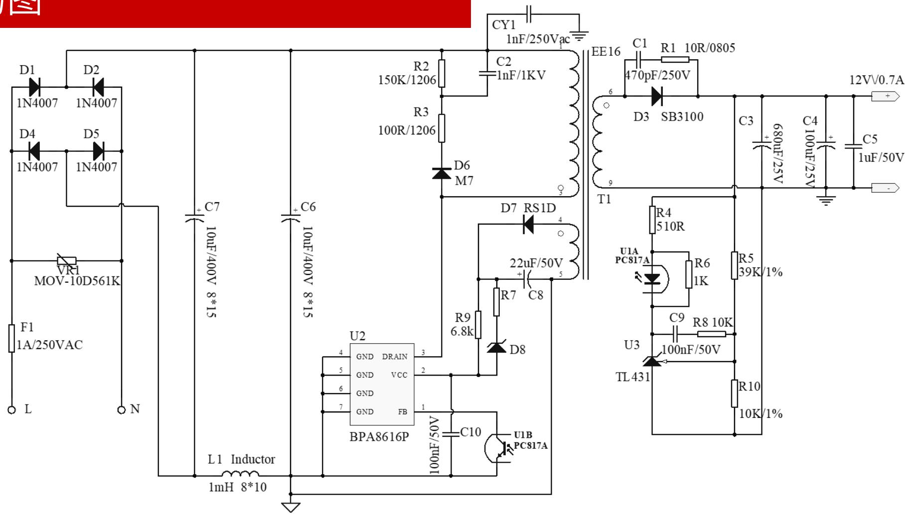

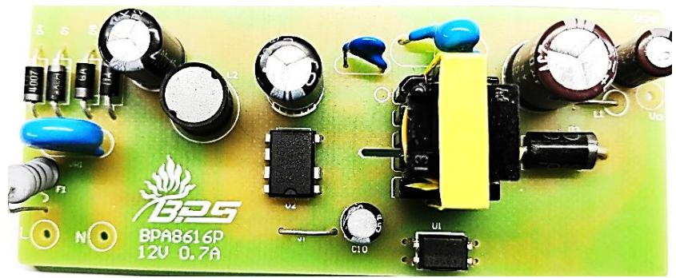

空载功耗  
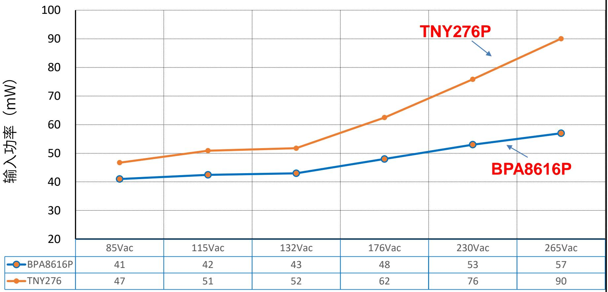

输入电压

备注：TNY276P在FB pin脚接一串电阻到Bulk电压做UVP，阻值4M；BPA8616P内部集成UVP功能，无需外部电阻

效率测试  
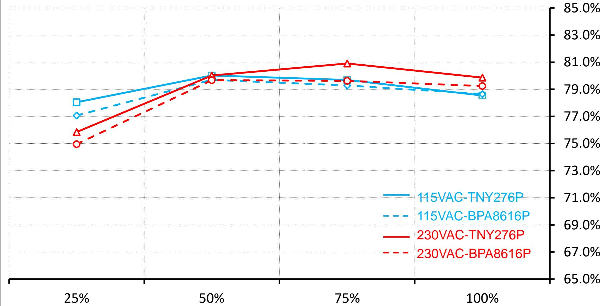

负载

## 输出电压调整率

BPA8616P

<table><tr><td> $V_{IN}(VAC)$ Load(%)</td><td>85</td><td>115</td><td>132</td><td>176</td><td>230</td><td>265</td><td>平均值</td><td>线调整率</td></tr><tr><td>0</td><td>12.203</td><td>12.203</td><td>12.206</td><td>12.206</td><td>12.211</td><td>12.211</td><td>12.21</td><td>0.07%</td></tr><tr><td>20%</td><td>12.201</td><td>12.201</td><td>12.205</td><td>12.204</td><td>12.208</td><td>12.208</td><td>12.20</td><td>0.06%</td></tr><tr><td>40%</td><td>12.203</td><td>12.203</td><td>12.203</td><td>12.201</td><td>12.208</td><td>12.204</td><td>12.20</td><td>0.06%</td></tr><tr><td>60%</td><td>12.210</td><td>12.200</td><td>12.201</td><td>12.203</td><td>12.206</td><td>12.201</td><td>12.20</td><td>0.08%</td></tr><tr><td>80%</td><td>12.196</td><td>12.198</td><td>12.198</td><td>12.199</td><td>12.205</td><td>12.203</td><td>12.20</td><td>0.07%</td></tr><tr><td>100%</td><td>12.195</td><td>12.196</td><td>12.196</td><td>12.196</td><td>12.201</td><td>12.200</td><td>12.20</td><td>0.05%</td></tr><tr><td>平均值</td><td>12.20</td><td>12.20</td><td>12.20</td><td>12.20</td><td>12.21</td><td>12.20</td><td rowspan="2" colspan="2"></td></tr><tr><td>负载调整率</td><td>0.12%</td><td>0.06%</td><td>0.08%</td><td>0.08%</td><td>0.08%</td><td>0.09%</td></tr></table>

计算方法：调整率=100%\*(最大值-最小值)/平均值  
测试条件：无假负载

TNY276P

<table><tr><td> $V_{IN}(VAC)$ Load(%)</td><td>85</td><td>115</td><td>132</td><td>176</td><td>230</td><td>265</td><td>平均值</td><td>线调整率</td></tr><tr><td>0</td><td>12.204</td><td>12.203</td><td>12.203</td><td>12.203</td><td>12.203</td><td>12.201</td><td>12.20</td><td>0.02%</td></tr><tr><td>20%</td><td>12.203</td><td>12.203</td><td>12.201</td><td>12.201</td><td>12.200</td><td>12.200</td><td>12.20</td><td>0.02%</td></tr><tr><td>40%</td><td>12.201</td><td>12.201</td><td>12.200</td><td>12.200</td><td>12.199</td><td>12.199</td><td>12.20</td><td>0.02%</td></tr><tr><td>60%</td><td>12.200</td><td>12.199</td><td>12.199</td><td>12.198</td><td>12.198</td><td>12.198</td><td>12.20</td><td>0.02%</td></tr><tr><td>80%</td><td>12.198</td><td>12.198</td><td>12.196</td><td>12.196</td><td>12.196</td><td>12.195</td><td>12.20</td><td>0.02%</td></tr><tr><td>100%</td><td>12.195</td><td>12.196</td><td>12.195</td><td>12.195</td><td>12.194</td><td>12.194</td><td>12.19</td><td>0.02%</td></tr><tr><td>平均值</td><td>12.20</td><td>12.20</td><td>12.20</td><td>12.20</td><td>12.20</td><td>12.20</td><td rowspan="2" colspan="2"></td></tr><tr><td>负载调整率</td><td>0.07%</td><td>0.06%</td><td>0.07%</td><td>0.07%</td><td>0.07%</td><td>0.06%</td></tr></table>

## 输出电压纹波

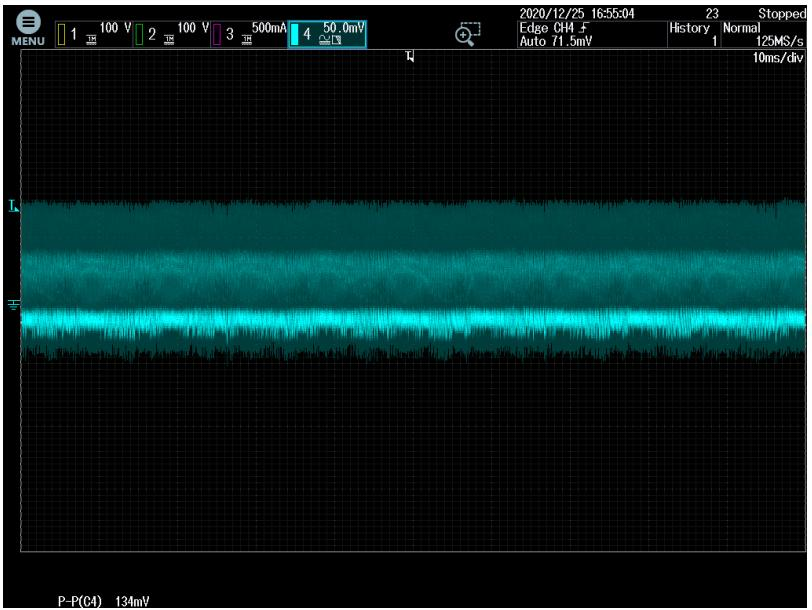

85 VAC  
  
Test Condition:  
➢ Full Load

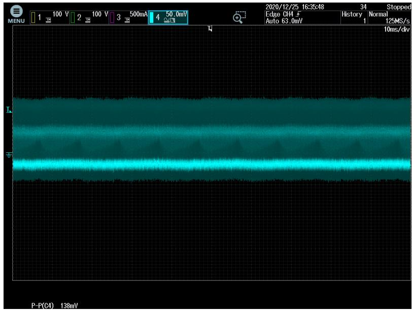

85 VAC  
  
Test Condition:  
➢ Full Load

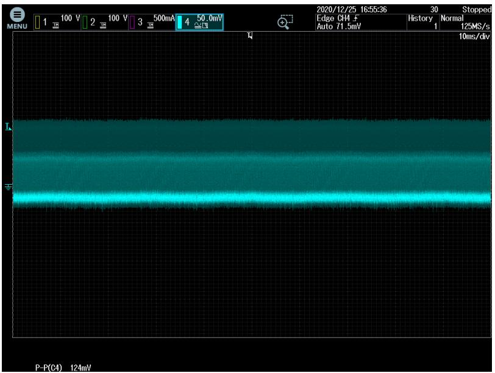

265 VAC  
  
Test Condition:  
➢ Full Load

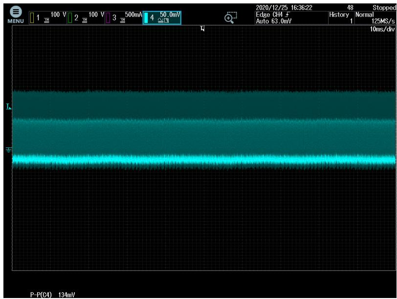

265 VAC  
  
Test Condition:  
➢ Full Load

## (50%-100%)

85 VAC

CH4 $\mathsf { V } _ { \mathsf { O U T } }$ $V _ { p | c - P K } = 1 4 8 ~ \mathsf { m V }$  
CH3 ${ \mathsf I } _ { 0 \mathsf U \top }$

## Test Condition:

➢ 0.35 A-0.7 A-0.35 A  
➢ Slew Rate: 0.5 A/μS  
➢ Frequency: 100 Hz

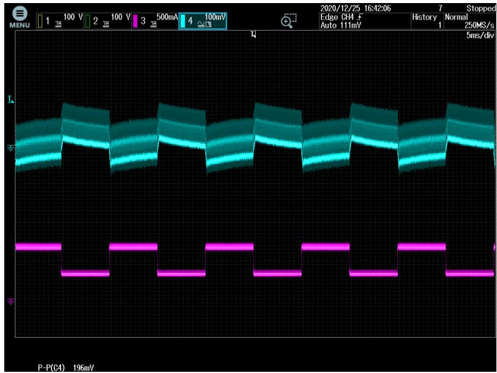

85 VAC

$\mathsf { C H } 4 \mathsf { V } _ { \mathsf { O U T } }$ $V _ { \mathsf { P K - P K } } { = } 1 9 6 ~ \mathsf { m V }$  
$\mathsf { C H 3 } \mathsf { I _ { 0 \mathsf { U T } } }$

## Test Condition:

➢ 0.35 A-0.7 A-0.35 A  
➢ Slew Rate: 0.5 A/μS  
➢ Frequency: 100 Hz

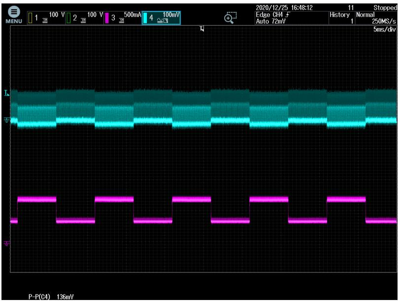

265 VAC

CH4 $\mathsf { V } _ { \mathsf { O U T } }$ $v _ { p _ { \vert k - P K } } = 1 3 6 ~ \mathsf { m v }$  
CH3 $\mathsf { I } _ { 0 \mathsf { U T } }$

## Test Condition:

➢ 0.35 A-0.7 A-0.35 A  
➢ Slew Rate: 0.5 A/μS  
➢ Frequency: 100 Hz

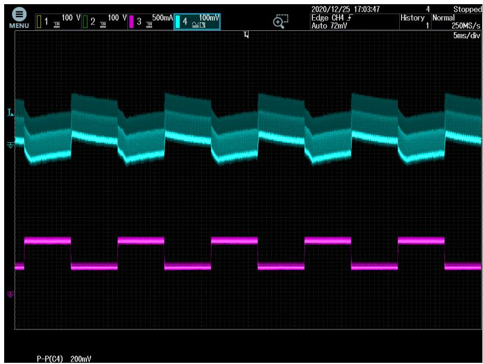

265 VAC

$\mathsf { C H } 4 \mathsf { V } _ { \mathsf { O U T } }$ $v _ { p _ { \vert k - P K } } = 2 0 0 ~ \mathsf { m V }$  
$\mathsf { C H 3 } \mathsf { I _ { 0 \mathsf { U T } } }$

## Test Condition:

➢ 0.35 A-0.7 A-0.35 A  
➢ Slew Rate: 0.5 A/μS  
➢ Frequency: 100 Hz

## (10%-90%)

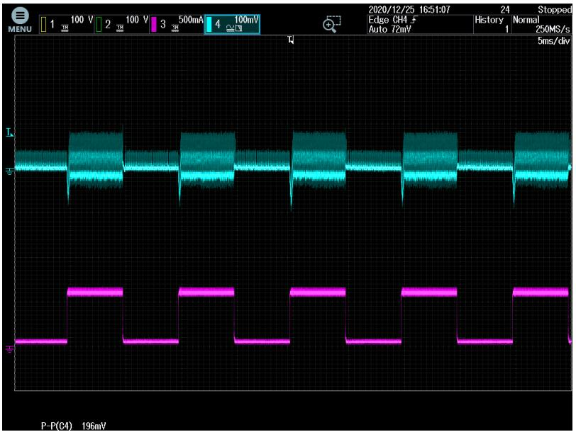

85 VAC

CH4 $\mathsf { V } _ { \mathsf { O U T } }$ $V _ { \mathsf { P K - P K } } { = } 1 9 6 \mathsf { m V }$  
CH3 ${ \mathsf I } _ { 0 \mathsf U \top }$

## Test Condition:

➢ 0.07A-0.63 A-0.07 A  
➢ Slew Rate: 0.5 A/μS  
➢ Frequency: 100 Hz

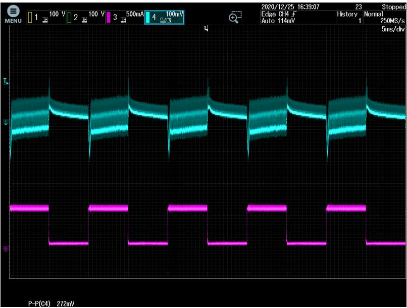

85 VAC

CH4 VOUT $\mathsf { C H } 4 \mathsf { V } _ { \mathsf { O U T } }$ $V _ { P K - P K } = 2 7 2 m v$  
$\mathsf { C H 3 } \mathsf { I _ { 0 \mathsf { U T } } }$

## Test Condition:

➢ 0.07A-0.63 A-0.07 A  
➢ Slew Rate: 0.5 A/μS  
➢ Frequency: 100 Hz

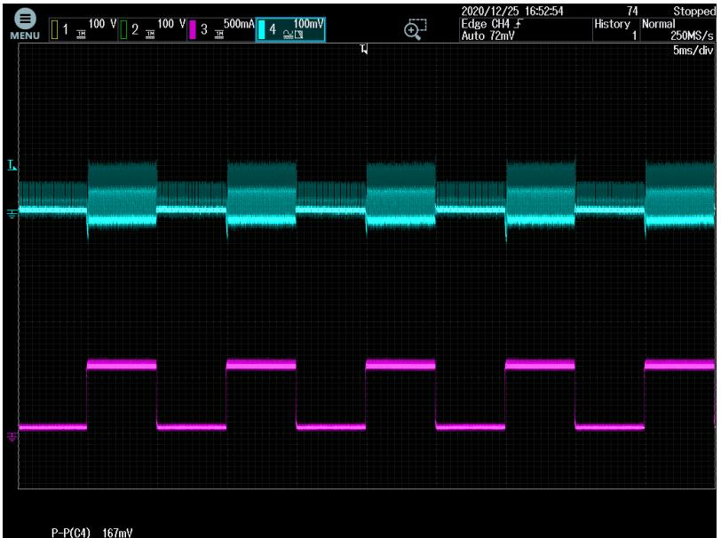

265 VAC

CH4 V $\mathsf { V } _ { \mathsf { O U T } }$ $\mathsf { V } _ { \mathsf { P K - P K } } { = } 1 6 7 \mathsf { m V }$  
$\mathsf { C H 3 } \mathsf { I _ { 0 \mathsf { U T } } }$

## Test Condition:

➢ 0.07A-0.63 A-0.07 A  
➢ Slew Rate: 0.5 A/μS  
➢ Frequency: 100 Hz

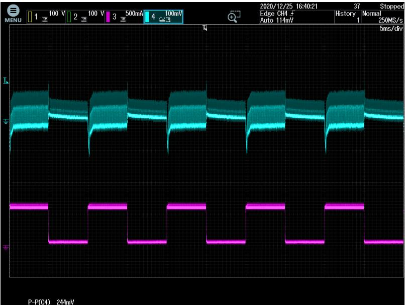

265 VAC

$\mathsf { C H } 4 \mathsf { V } _ { \mathsf { O U T } }$ $V _ { P K - P K } = 2 4 4 m v$  
$\mathsf { C H 3 } \mathsf { I _ { 0 \mathsf { U T } } }$

## Test Condition:

➢ 0.07A-0.63 A-0.07 A  
➢ Slew Rate: 0.5 A/μS  
➢ Frequency: 100 Hz

## 输出电压开机波形

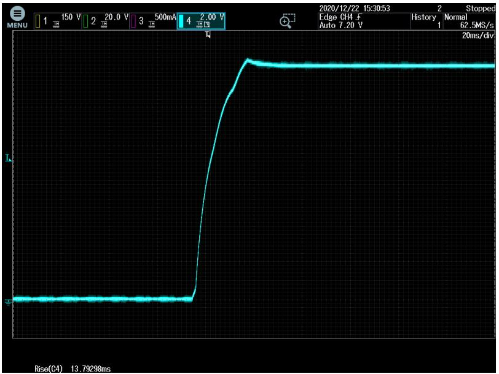

85 VAC  
  
Test Condition:  
➢ Full Load

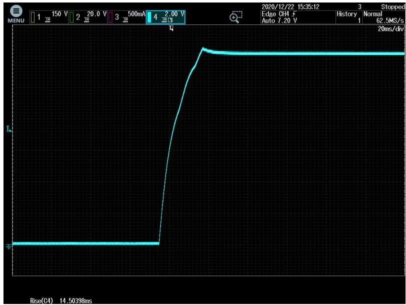

85 VAC  
  
Test Condition:  
➢ Full Load

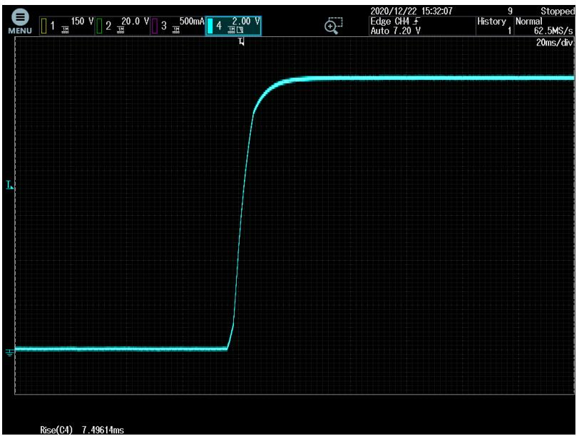

265 VAC  
  
Test Condition:  
➢ Full Load

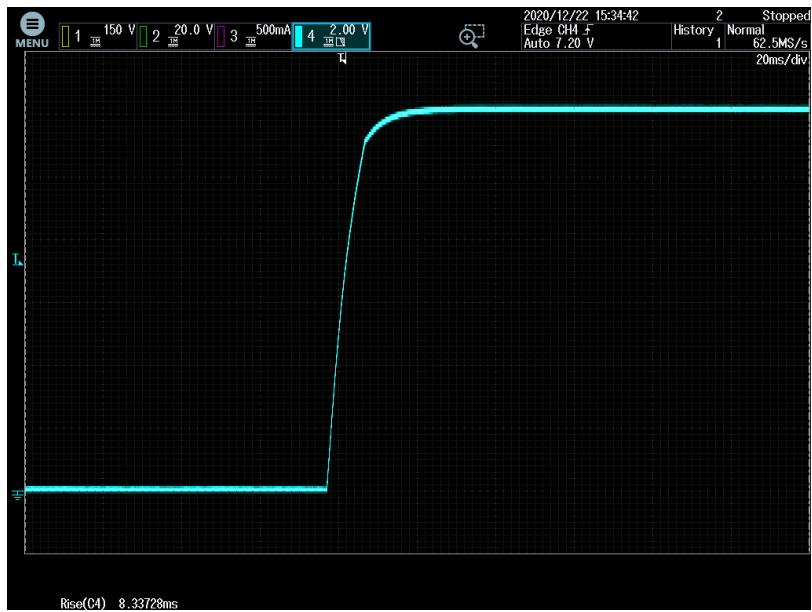

265 VAC  
  
Test Condition:  
➢ Full Load

## MOSFET

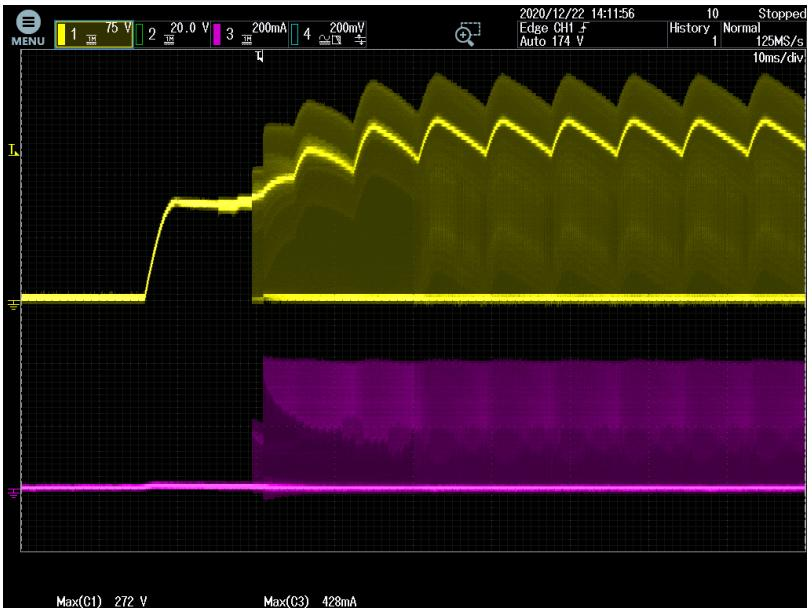

85 VAC

CH1 VDS  
CH3 IDS

$$
\begin{array}{l} \mathrm {V_ {DS\_MAX}} = 2 7 2 \mathrm{V} \\ \mathrm {I_ {DS\_MAX}} = 0. 4 3 \mathrm{A} \end{array}
$$

## Test Condition:

➢ Full Load

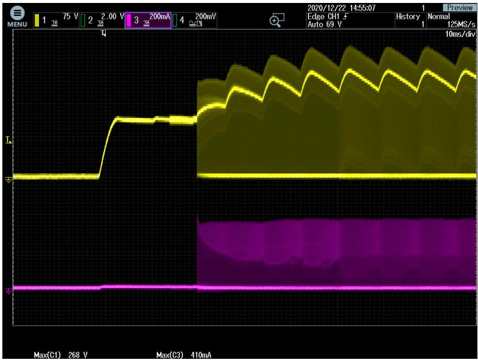

85 VAC

CH1 VDS  
CH3 IDS

$$
\begin{array}{l} \mathrm {V_ {DS\_MAX}} = 2 6 8 \mathrm{V} \\ \mathrm {I_ {DS\_MAX}} = 0. 4 1 \mathrm{A} \end{array}
$$

## Test Condition:

➢ Full Load

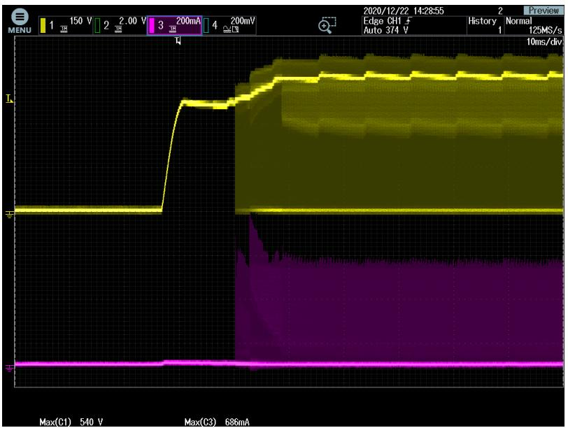

265 VAC

CH1 VDS  
CH3 IDS

$$
\begin{array}{l} \mathrm {V_ {DS\_MAX}} = 5 4 0 \mathrm{V} \\ \mathrm {I_ {DS\_MAX}} = 0. 6 8 \mathrm{A} \end{array}
$$

## Test Condition:

➢ Full Load

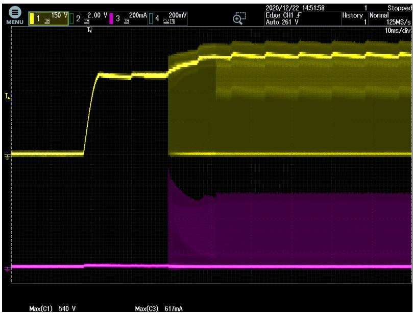

265 VAC

CH1 VDS

$$
\begin{array}{l} \mathrm {V_ {DS\_MAX}} = 5 4 0 \mathrm{V} \\ \mathrm {I_ {DS\_MAX}} = 0. 6 2 \mathrm{A} \end{array}
$$

## Test Condition:

➢ Full Load

## MOSFET

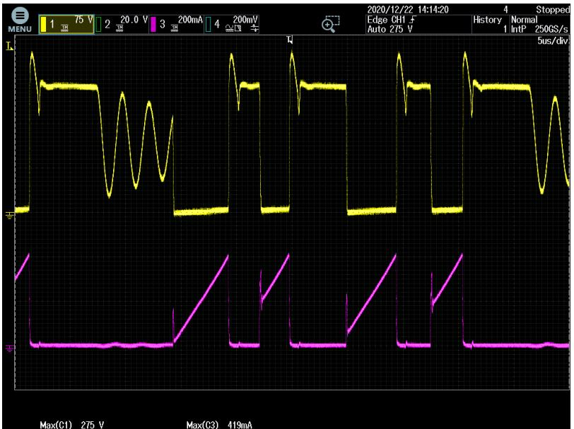

85 VAC

CH1 VDS  
CH3 IDS

$$
\begin{array}{l} \mathrm {V_ {DS\_MAX}} = 2 7 5 \mathrm{V} \\ \mathrm {I_ {DS\_MAX}} = 0. 4 2 \mathrm{A} \end{array}
$$

## Test Condition:

➢ Full Load

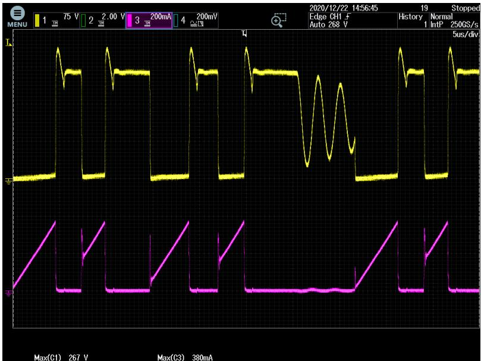

85 VAC

CH1 VDS  
CH3 IDS

$$
\begin{array}{l} \mathrm {V_ {DS\_MAX}} = 2 6 7 \mathrm{V} \\ \mathrm {I_ {DS\_MAX}} = 0. 3 8 \mathrm{A} \end{array}
$$

## Test Condition:

➢ Full Load

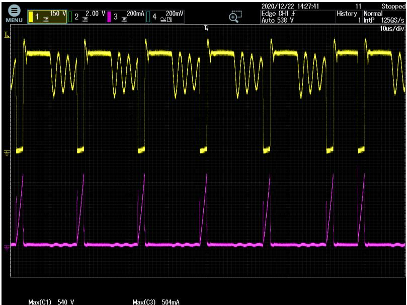

265 VAC

CH1 VDS  
CH3 IDS

$$
V _ {D S \_ M A X} = 5 4 0 V
$$

$$
I _ {D S \_ M A X} = 0. 5 \mathrm{A}
$$

## Test Condition:

➢ Full Load

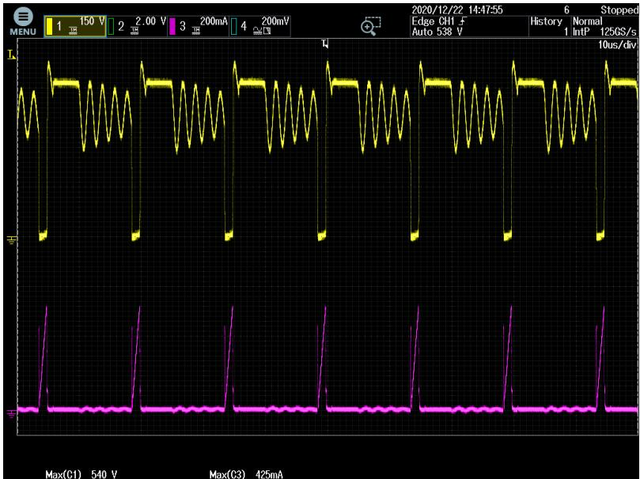

265 VAC

CH1 VDS

$$
V _ {D S \_ M A X} = 5 4 0 V
$$

$$
I _ {D S \_ M A X} = 0. 4 3 7 \mathrm{A}
$$

## Test Condition:

➢ Full Load

## 输出二极管开机波形

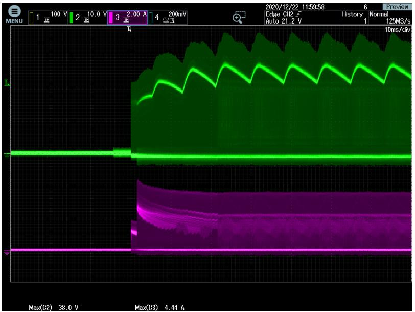

85 VAC  
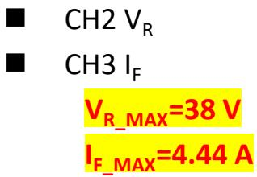

Test Condition:  
➢ Full Load

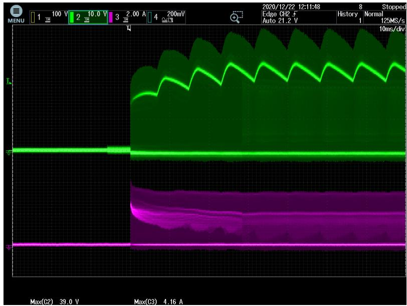

85 VAC  
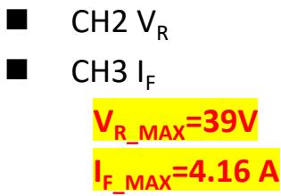

Test Condition:  
➢ Full Load

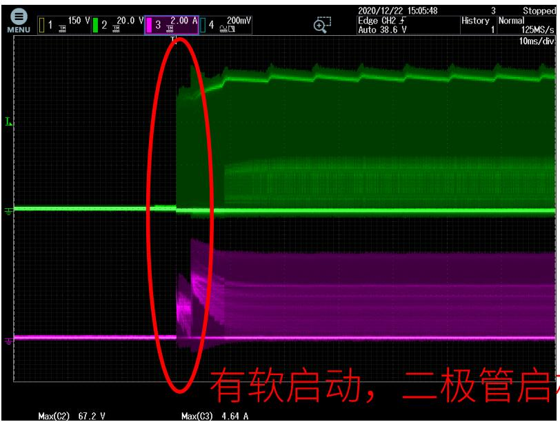

265 VAC  
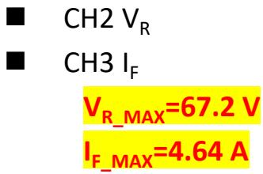

Test Condition:  
➢ Full Load

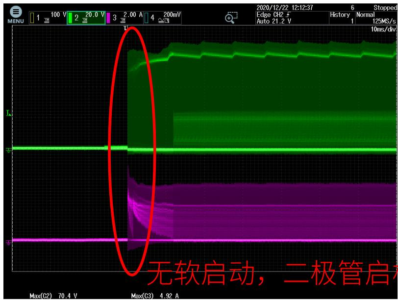

265 VAC  
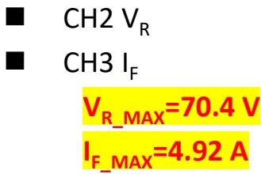

Test Condition:  
➢ Full Load

机电流电压应力小

TNY276P

几电流电压应力大

## 输出二极管稳态波形

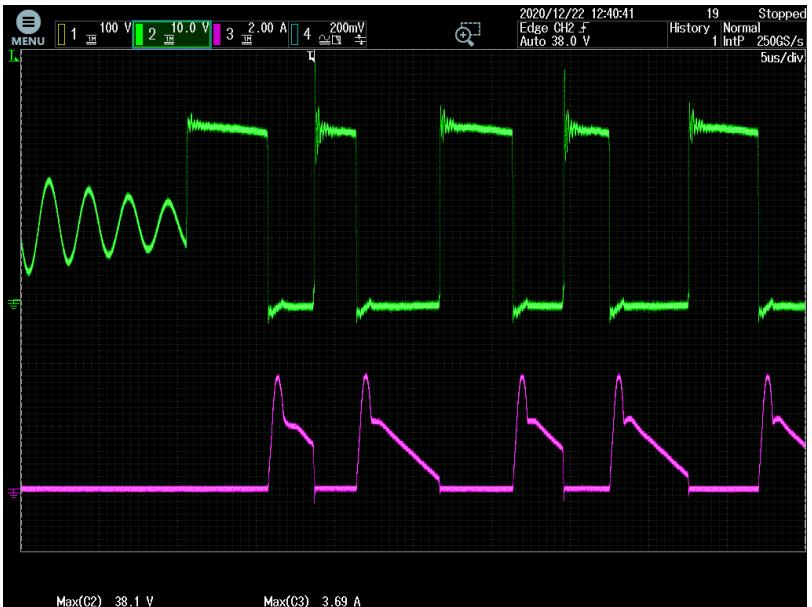

85 VAC

CH2 VR  
CH3 IF

$$
\begin{array}{l} \mathrm {V_ {R\_MAX}} = 3 8. 1 \mathrm{V} \\ \mathrm {I_ {F\_MAX}} = 3. 6 9 \mathrm{A} \end{array}
$$

## Test Condition:

➢ Full Load

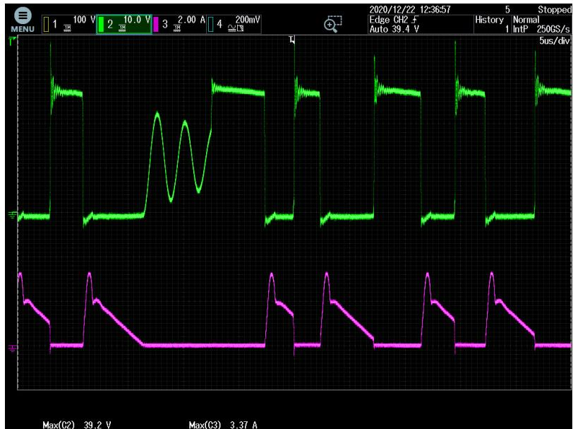

85 VAC

CH2 VR  
CH3 IF

$$
\begin{array}{l} \mathrm {V_ {R\_MAX}} = 3 9. 2 \mathrm{V} \\ \mathrm {I_ {F\_MAX}} = 3. 3 7 \mathrm{A} \end{array}
$$

## Test Condition:

➢ Full Load

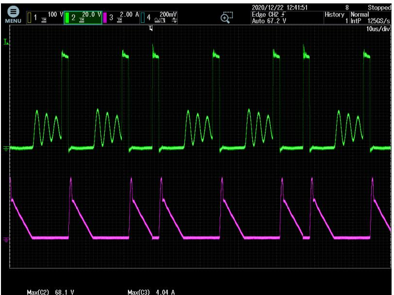

265 VAC

CH2 VR  
CH3 IF

$$
\begin{array}{l} \mathrm {V_ {R\_MAX}} = 6 8. 1 \mathrm{V} \\ \mathrm {I_ {F\_MAX}} = 4. 0 4 \mathrm{A} \end{array}
$$

## Test Condition:

➢ Full Load

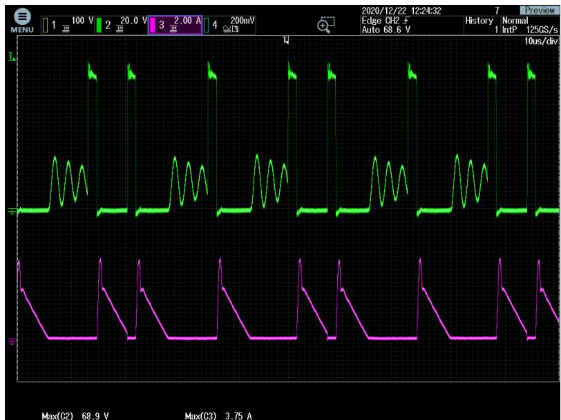

265 VAC

CH2 VR  
CH3 IF

$$
\begin{array}{l} \mathrm {V_ {R\_MAX}} = 6 8. 9 \mathrm{V} \\ \mathrm {I_ {F\_MAX}} = 3. 7 5 \mathrm{A} \end{array}
$$

## Test Condition:

➢ Full Load

## MOSFET

BPA8616P  
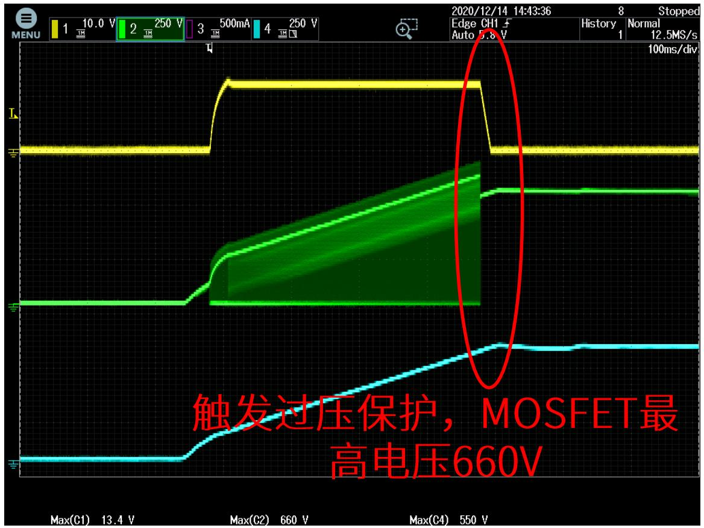

CH1 VO  
CH2 VDS  
CH4 VDC\_IN

$$
V _ {D S \_ M A X} = 6 6 0 \mathrm{V}
$$

$$
V _ {D C I N} = 5 5 0 \mathrm{V}
$$

Test Condition:

➢ Full Load

TNY276P  
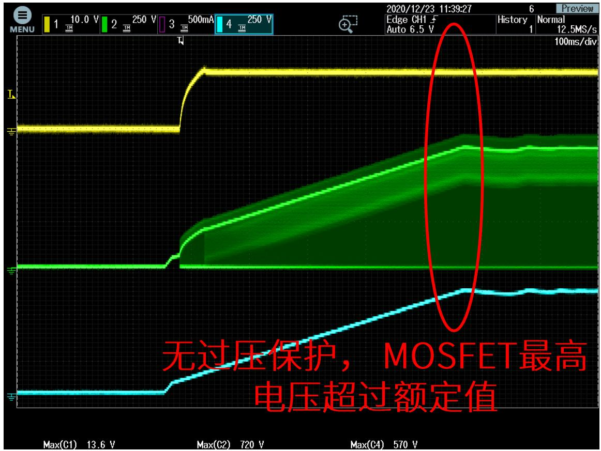

CH1 VO  
CH2 VDS  
CH4 VDC\_IN

$$
V _ {D S \_ M A X} = 7 2 0 \mathrm{V}
$$

$$
V _ {D C \_ I N} = 5 5 0 \mathrm{V}
$$

Test Condition:

➢ Full Load

BPA8616P  
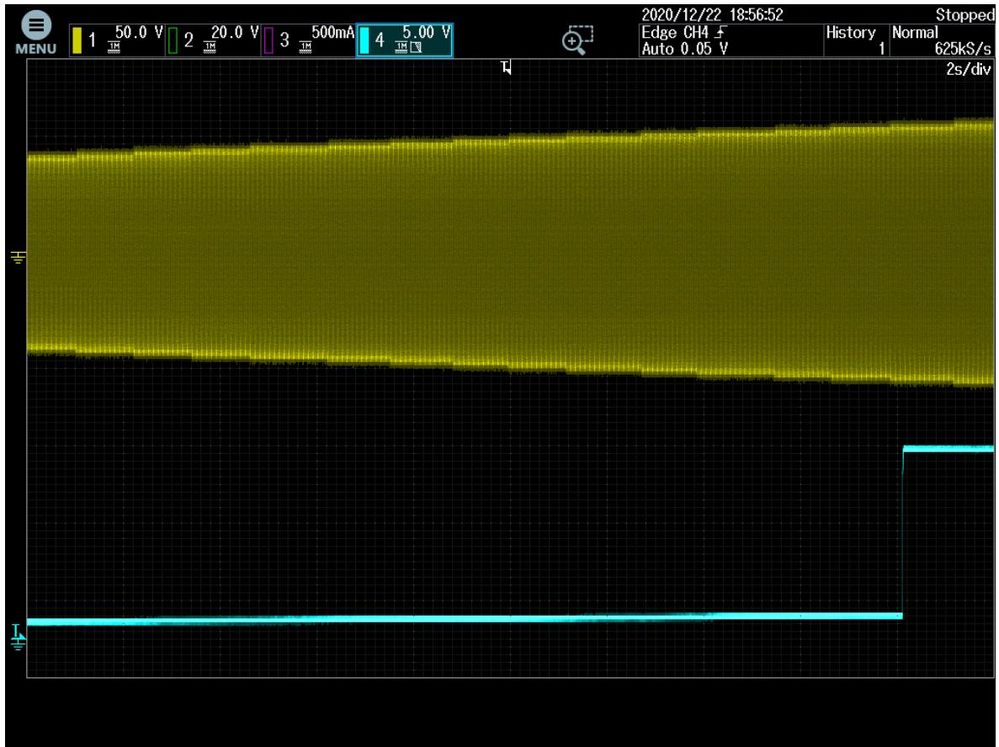

CH1 VAC\_IN  
CH4 Vo

VAC\_IN\_STARTUP=60 V

Test Condition:

➢ No Load

TNY276P  
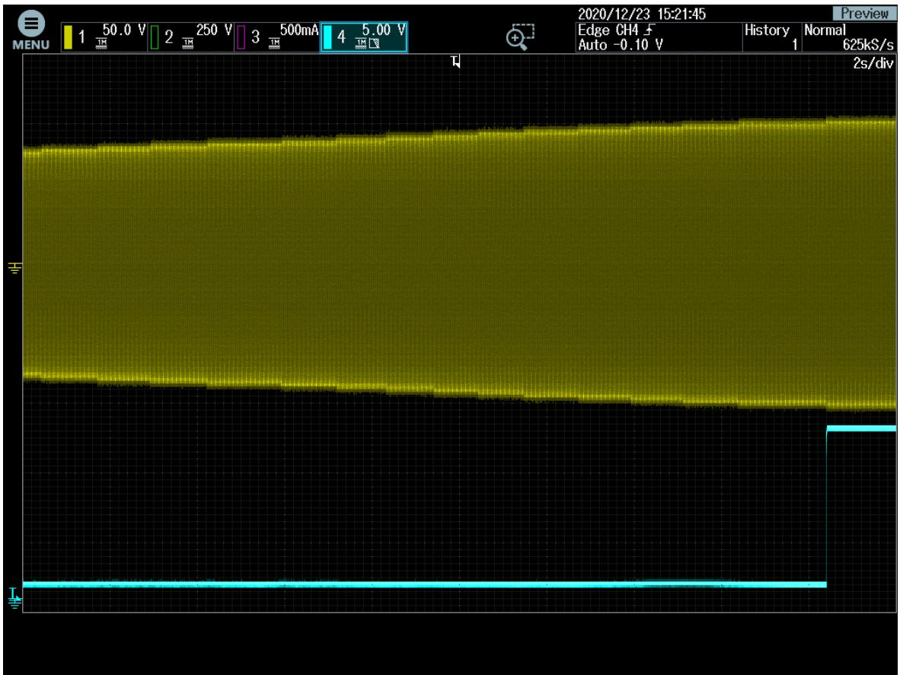

CH1 VAC\_IN  
CH4 Vo

VAC\_IN\_STARTUP=72 V

Test Condition:

➢ No Load

备注：TNY276P在FB pin脚接一串电阻到Bulk电压做UVP，阻值4M；BPA8616P内部集成UVP功能，无需外部电阻

## MOSFET

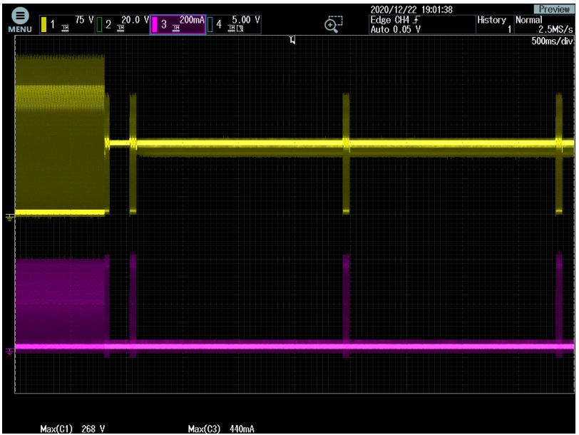

85 VAC

${ \mathsf { C H 1 } } \mathsf { V _ { D S } }$  
CH3 IDS

$$
\begin{array}{l} \mathrm {V_ {DS\_MAX}} = 2 6 8 \mathrm{V} \\ \mathrm {I_ {DS\_MAX}} = 0. 4 4 \mathrm{A} \end{array}
$$

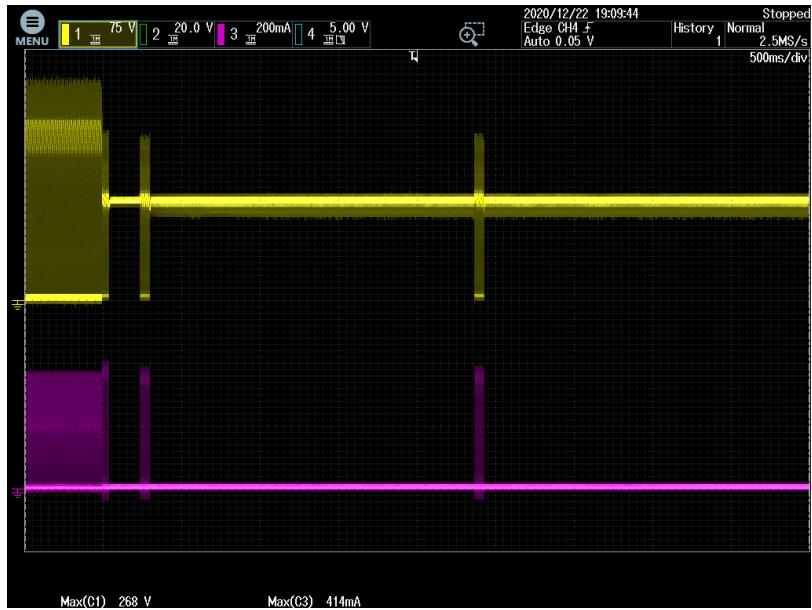

85 VAC

CH1 VDS  
CH3 IDS

$$
\begin{array}{l} \mathrm {V_ {DS\_MAX}} = 2 6 8 \mathrm{V} \\ \mathrm {I_ {DS\_MAX}} = 0. 4 1 \mathrm{A} \end{array}
$$

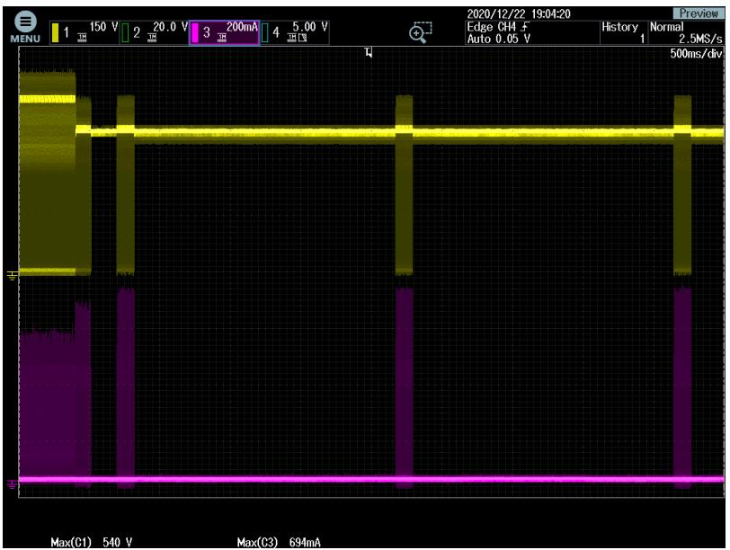

265 VAC

CH1 VDS  
CH3 IDS

$$
V _ {D S \_ M A X} = 5 4 0 \mathrm{V}
$$

$$
I _ {D S \_ M A X} = 0. 7 \mathrm{A}
$$

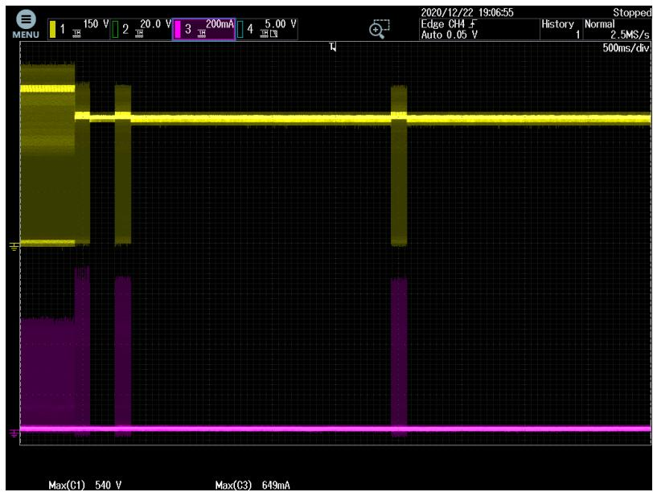

265 VAC

CH1 VDS

$$
V _ {D S \_ M A X} = 5 4 0 \mathrm{V}
$$

$$
I _ {D S \_ M A X} = 0. 6 5 \mathrm{A}
$$

## 温升测试

BPA8616P

<table><tr><td rowspan="2">项目</td><td>85VAC</td><td>115VAC</td><td>230VAC</td><td>265VAC</td></tr><tr><td>温度(°C)</td><td>温度(°C)</td><td>温度(°C)</td><td>温度(°C)</td></tr><tr><td>环境温度</td><td>50</td><td>50</td><td>50</td><td>50</td></tr><tr><td>BP8616P (U2)</td><td>108.57</td><td>96.74</td><td>92.34</td><td>93.97</td></tr><tr><td>变压器绕组(T1)</td><td>77.67</td><td>77.36</td><td>78.96</td><td>80</td></tr><tr><td>变压器磁芯(T1)</td><td>73.54</td><td>73.73</td><td>75.96</td><td>77</td></tr><tr><td>整流二极管(D3)</td><td>80.24</td><td>79.98</td><td>80.05</td><td>80.36</td></tr><tr><td>整流桥(D1)</td><td>67.06</td><td>62.71</td><td>58.56</td><td>58.19</td></tr><tr><td>输入电解电容(C4)</td><td>73.73</td><td>69.79</td><td>67.49</td><td>67.77</td></tr><tr><td>输出电解电容(EC1)</td><td>52.85</td><td>52.62</td><td>52.39</td><td>52.42</td></tr></table>

TNY276P

<table><tr><td rowspan="2">项目</td><td>85VAC</td><td>115VAC</td><td>230VAC</td><td>265VAC</td></tr><tr><td>温度(°C)</td><td>温度(°C)</td><td>温度(°C)</td><td>温度(°C)</td></tr><tr><td>环境温度</td><td>50</td><td>50</td><td>50</td><td>50</td></tr><tr><td>TNY276 (U2)</td><td>110.24</td><td>97.09</td><td>91.38</td><td>92.82</td></tr><tr><td>变压器绕组(T1)</td><td>76.8</td><td>76.77</td><td>77.54</td><td>78.6</td></tr><tr><td>变压器磁芯(T1)</td><td>75.82</td><td>74.93</td><td>76.64</td><td>77.5</td></tr><tr><td>整流二极管(D3)</td><td>80.19</td><td>79.72</td><td>79.79</td><td>80.07</td></tr><tr><td>整流桥(D1)</td><td>67.76</td><td>62.79</td><td>57.88</td><td>57.38</td></tr><tr><td>输入电解电容(C4)</td><td>73.23</td><td>69.1</td><td>66.61</td><td>66.9</td></tr><tr><td>输出电解电容(EC1)</td><td>61.85</td><td>61.52</td><td>61.65</td><td>61.76</td></tr></table>

备注：增大芯片Source散热铜箔面积可以降低芯片温度

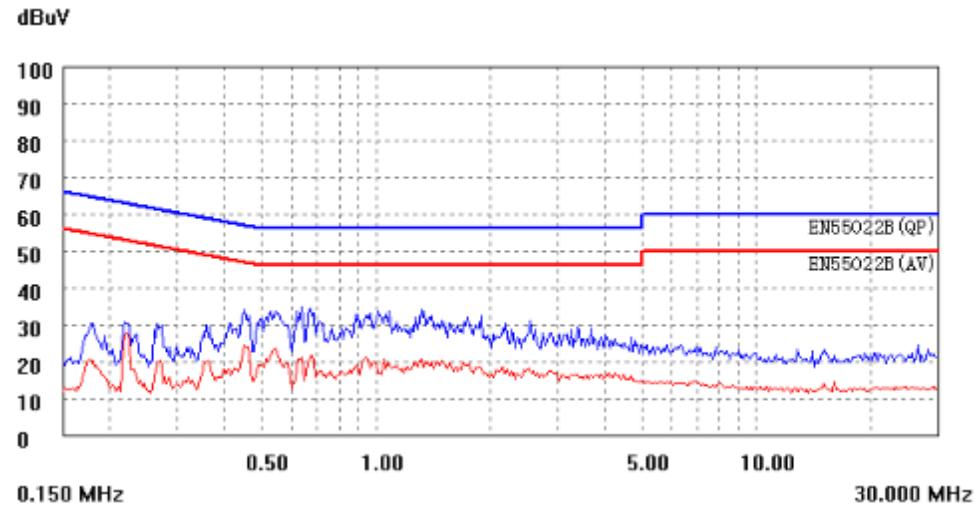

115Vac Line  
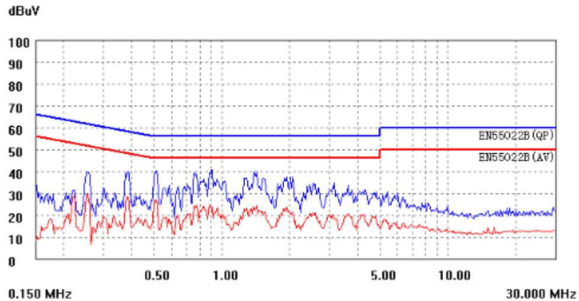

230Vac Line

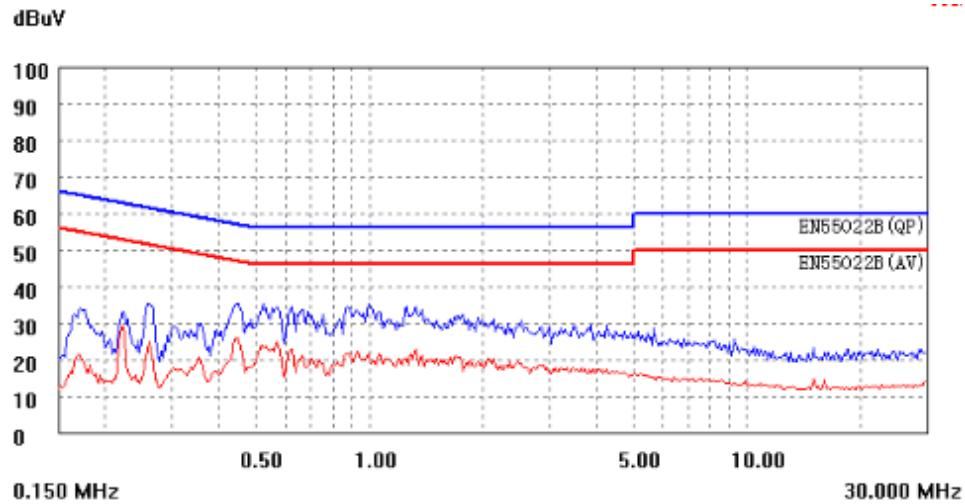

115Vac Neutral

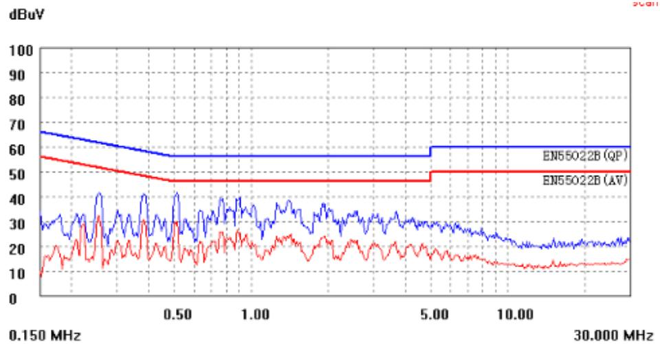

230Vac Neutral

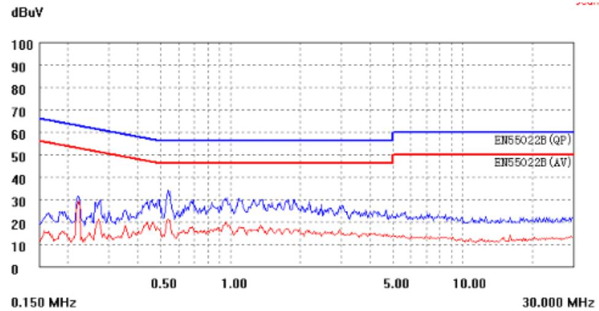

115Vac Line  
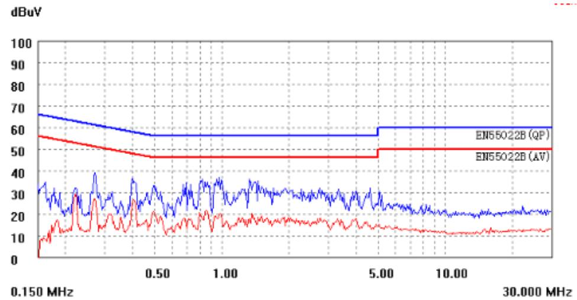

230Vac Line

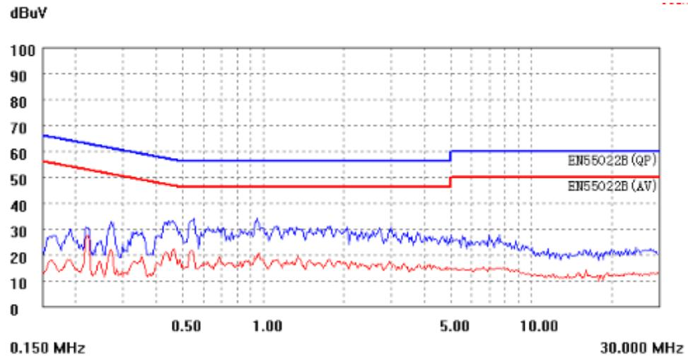

115Vac Neutral

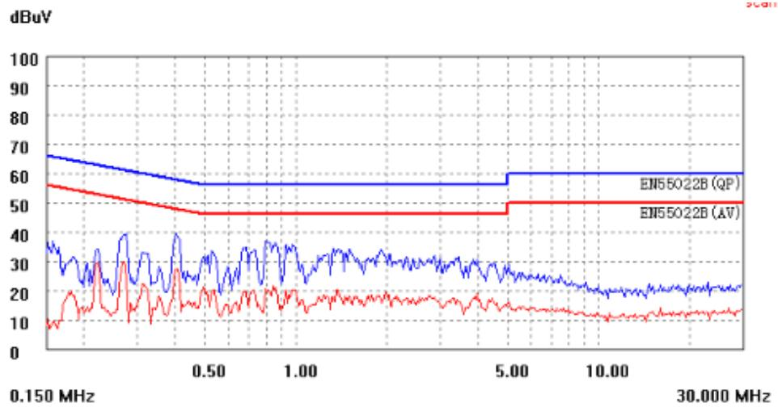

230Vac Neutral

## Surge

BPA8616P

<table><tr><td>差模</td><td>电压</td><td>相位角</td><td>发生器阻抗</td><td>测试次数</td><td>测试结果</td></tr><tr><td>L to N</td><td>+2kV</td><td>0/90/180/270</td><td>2</td><td>10</td><td>Pass</td></tr><tr><td>L to N</td><td>-2kV</td><td>0/90/180/270</td><td>2</td><td>10</td><td>Pass</td></tr><tr><td>L to PE</td><td>+4kV</td><td>0/90/180/270</td><td>12</td><td>10</td><td>Pass</td></tr><tr><td>L to PE</td><td>-4kV</td><td>0/90/180/270</td><td>12</td><td>10</td><td>Pass</td></tr><tr><td>N to PE</td><td>+4kV</td><td>0/90/180/270</td><td>12</td><td>10</td><td>Pass</td></tr><tr><td>N to PE</td><td>-4kV</td><td>0/90/180/270</td><td>12</td><td>10</td><td>Pass</td></tr></table>

TNY276P

<table><tr><td>差模</td><td>电压</td><td>相位角</td><td>发生器阻抗</td><td>测试次数</td><td>测试结果</td></tr><tr><td>L to N</td><td>+2kV</td><td>0/90/180/270</td><td>2</td><td>10</td><td>Pass</td></tr><tr><td>L to N</td><td>-2kV</td><td>0/90/180/270</td><td>2</td><td>10</td><td>Pass</td></tr><tr><td>L to PE</td><td>+4kV</td><td>0/90/180/270</td><td>12</td><td>10</td><td>Pass</td></tr><tr><td>L to PE</td><td>-4kV</td><td>0/90/180/270</td><td>12</td><td>10</td><td>Pass</td></tr><tr><td>N to PE</td><td>+4kV</td><td>0/90/180/270</td><td>12</td><td>10</td><td>Pass</td></tr><tr><td>N to PE</td><td>-4kV</td><td>0/90/180/270</td><td>12</td><td>10</td><td>Pass</td></tr></table>

## EFT

BPA8616P

<table><tr><td>差模</td><td>电压</td><td>脉冲群持续时间</td><td>脉冲频率</td><td>测试时间</td><td>测试结果</td></tr><tr><td>L to N</td><td>+4kV</td><td>15ms</td><td>5kHz</td><td>120s</td><td>Pass</td></tr><tr><td>L to N</td><td>-4kV</td><td>15ms</td><td>5kHz</td><td>120s</td><td>Pass</td></tr><tr><td>L to N</td><td>+4kV</td><td>0.75ms</td><td>100kHz</td><td>120s</td><td>Pass</td></tr><tr><td>L to N</td><td>-4kV</td><td>0.75ms</td><td>100kHz</td><td>120s</td><td>Pass</td></tr><tr><td>L to N</td><td>+2kV</td><td>2ms</td><td>38kHz</td><td>120s</td><td>Pass</td></tr><tr><td>L to N</td><td>-2kV</td><td>2ms</td><td>38kHz</td><td>120s</td><td>Pass</td></tr><tr><td>L to N</td><td>+4kV</td><td>2ms</td><td>38kHz</td><td>120s</td><td>Pass</td></tr><tr><td>L to N</td><td>-4kV</td><td>2ms</td><td>38kHz</td><td>120s</td><td>Pass</td></tr></table>

TNY276P

<table><tr><td>差模</td><td>电压</td><td>脉冲群持续时间</td><td>脉冲频率</td><td>测试时间</td><td>测试结果</td></tr><tr><td>L to N</td><td>+4kV</td><td>15ms</td><td>5kHz</td><td>120s</td><td>Pass</td></tr><tr><td>L to N</td><td>-4kV</td><td>15ms</td><td>5kHz</td><td>120s</td><td>Pass</td></tr><tr><td>L to N</td><td>+4kV</td><td>0.75ms</td><td>100kHz</td><td>120s</td><td>Pass</td></tr><tr><td>L to N</td><td>-4kV</td><td>0.75ms</td><td>100kHz</td><td>120s</td><td>Pass</td></tr><tr><td>L to N</td><td>+2kV</td><td>2ms</td><td>38kHz</td><td>120s</td><td>Pass</td></tr><tr><td>L to N</td><td>-2kV</td><td>2ms</td><td>38kHz</td><td>120s</td><td>Pass</td></tr><tr><td>L to N</td><td>+4kV</td><td>2ms</td><td>38kHz</td><td>120s</td><td>Pass</td></tr><tr><td>L to N</td><td>-4kV</td><td>2ms</td><td>38kHz</td><td>120s</td><td>Pass</td></tr></table>

BPA8616P

<table><tr><td>测试点</td><td>电压(V)</td><td>放电类型</td><td>放电次数</td><td>测试结果</td></tr><tr><td>Vo</td><td>+8kV</td><td>接触放电</td><td>10</td><td>Pass</td></tr><tr><td>Vo</td><td>-8kV</td><td>接触放电</td><td>10</td><td>Pass</td></tr><tr><td>GND</td><td>+8kV</td><td>接触放电</td><td>10</td><td>Pass</td></tr><tr><td>GND</td><td>-8kV</td><td>接触放电</td><td>10</td><td>Pass</td></tr><tr><td>Vo</td><td>+15kV</td><td>空气放电</td><td>10</td><td>Pass</td></tr><tr><td>Vo</td><td>-15kV</td><td>空气放电</td><td>10</td><td>Pass</td></tr><tr><td>GND</td><td>+15kV</td><td>空气放电</td><td>10</td><td>Pass</td></tr><tr><td>GND</td><td>-15kV</td><td>空气放电</td><td>10</td><td>Pass</td></tr></table>

TNY276P

<table><tr><td>测试点</td><td>电压(V)</td><td>放电类型</td><td>放电次数</td><td>测试结果</td></tr><tr><td>Vo</td><td>+8kV</td><td>接触放电</td><td>10</td><td>Pass</td></tr><tr><td>Vo</td><td>-8kV</td><td>接触放电</td><td>10</td><td>Pass</td></tr><tr><td>GND</td><td>+8kV</td><td>接触放电</td><td>10</td><td>Pass</td></tr><tr><td>GND</td><td>-8kV</td><td>接触放电</td><td>10</td><td>Pass</td></tr><tr><td>Vo</td><td>+15kV</td><td>空气放电</td><td>10</td><td>Pass</td></tr><tr><td>Vo</td><td>-15kV</td><td>空气放电</td><td>10</td><td>Pass</td></tr><tr><td>GND</td><td>+15kV</td><td>空气放电</td><td>10</td><td>Pass</td></tr><tr><td>GND</td><td>-15kV</td><td>空气放电</td><td>10</td><td>Pass</td></tr></table>

## THANK YOU FOR WATCHING
