## BPA8616P隔离参考设计

## (12V0.35A;5V0.4A)

上海晶丰明源半导体股份有限公司

Shanghai Bright Power Semiconductor Co., Ltd.

梁 惠

时间： 2022年11月

## 内容

BPA861XP简介  
电源规格  
电路及实物图  
◼ BOM  
PCB Layout图  
变压器  
性能测试数据

## 产品特点：

➢ 集成 700V 高压 MOSFET  
➢ ON/OFF控制模式，低输出纹波  
➢ 内置软启动功能  
➢ 集成高压启动、自供电电路  
➢ 低音频噪声  
➢ 集成输入过/欠压保护

## 应用领域：

➢ 家用电器辅助电源  
➢ 电机驱动辅助电源  
➢ IOT/智能家居/智能照明  
➢ 工业控制辅助电源

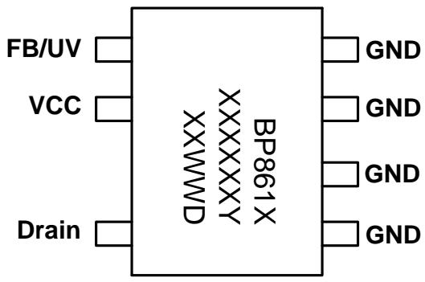

<table><tr><td>项目描述</td><td>符号</td><td>最小</td><td>典型</td><td>最大</td><td>单位</td><td>备注</td></tr><tr><td colspan="7">输入</td></tr><tr><td>电压</td><td> $V_{IN}$ </td><td>85</td><td>115/230</td><td>264</td><td> $V_{AC}$ </td><td></td></tr><tr><td>频率</td><td> $f_{LINE}$ </td><td>47</td><td>50/60</td><td>63</td><td>Hz</td><td></td></tr><tr><td colspan="7">输出</td></tr><tr><td>输出电压1</td><td> $V_{OUT1}$ </td><td></td><td>12</td><td></td><td>V</td><td></td></tr><tr><td>输出电流1</td><td> $I_{OUT1}$ </td><td></td><td>350</td><td></td><td>mA</td><td></td></tr><tr><td>输出电压2</td><td> $V_{OUT2}$ </td><td></td><td>5</td><td></td><td>V</td><td></td></tr><tr><td>输出电流2</td><td> $I_{OUT2}$ </td><td></td><td>400</td><td></td><td>mA</td><td></td></tr><tr><td>输出电压纹波1</td><td> $V_{RIPPLE}$ </td><td></td><td></td><td>610</td><td>mV</td><td>20MHz带宽</td></tr><tr><td>输出电压纹波2</td><td> $V_{RIPPLE}$ </td><td></td><td></td><td>110</td><td>mV</td><td>20MHz带宽</td></tr><tr><td>连续输出功率</td><td> $P_{OUT}$ </td><td></td><td>6.2</td><td></td><td>W</td><td></td></tr><tr><td colspan="7">效率</td></tr><tr><td>待机功耗</td><td> $P_{STDBY}$ </td><td></td><td></td><td>437</td><td>mW</td><td>230VAC,包含假负载</td></tr><tr><td>满载效率</td><td>η</td><td></td><td></td><td>71.5</td><td>%</td><td></td></tr><tr><td colspan="7">环境</td></tr><tr><td>传导EMI</td><td></td><td colspan="4">满足CISPR22/EN55022 Class B,至少6dB 裕量</td><td></td></tr><tr><td>Surge</td><td></td><td></td><td>2</td><td></td><td>kV</td><td>差模</td></tr><tr><td>EFT</td><td></td><td></td><td>4</td><td></td><td>kV</td><td>5kHz/100kHz/38kHz</td></tr><tr><td>ESD</td><td></td><td></td><td>15</td><td>20</td><td>kV</td><td>空气放电</td></tr><tr><td>工作环境温度</td><td> $T_{AMP}$ </td><td>0</td><td></td><td>50</td><td>°C</td><td></td></tr></table>

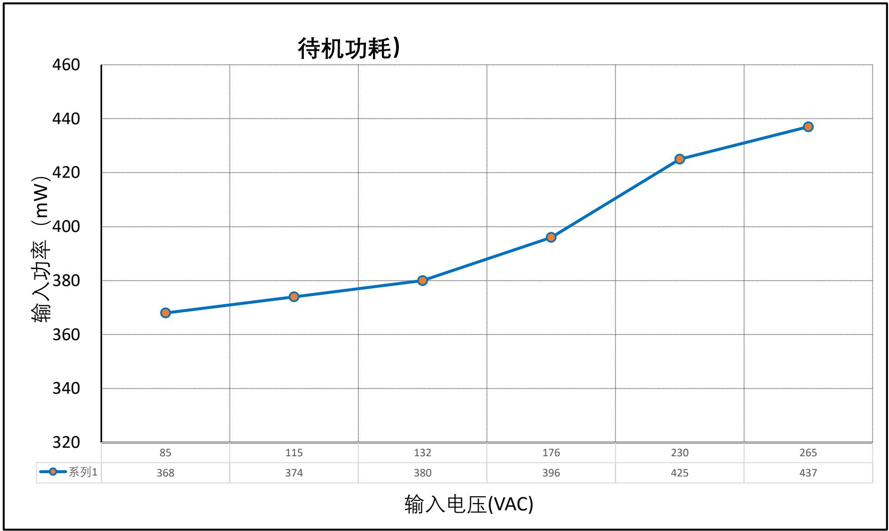

效率测试  
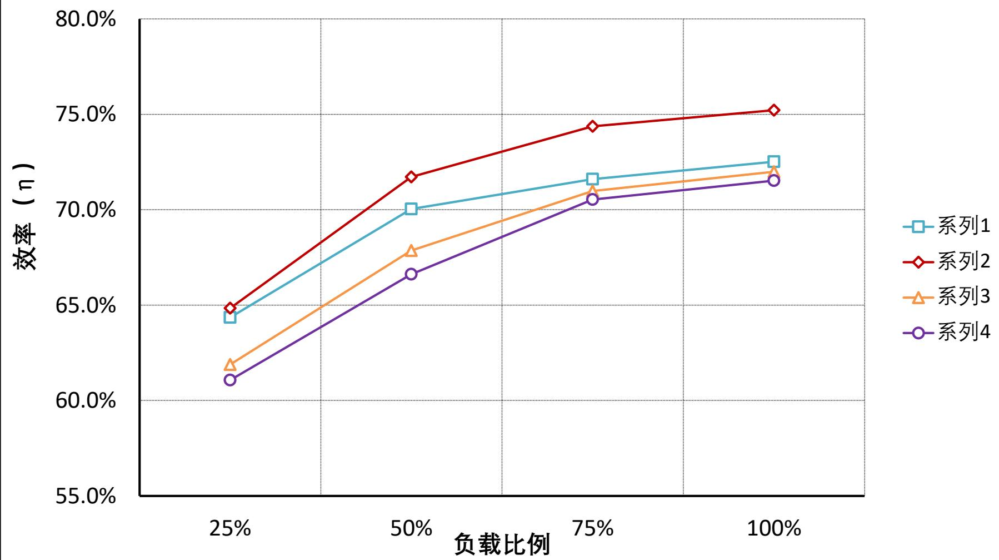

## 输出电压交叉调整率

<table><tr><td>输入电压AC (V)</td><td>输出电流1(A)</td><td>输出电压1(V)</td><td>输出电流2(A)</td><td>输出电压2(V)</td></tr><tr><td rowspan="2">115</td><td>0</td><td>16.3</td><td>0.4</td><td>4.94</td></tr><tr><td>0.35</td><td>11.94</td><td>0</td><td>4.98</td></tr><tr><td rowspan="2">230</td><td>0</td><td>16.59</td><td>0.4</td><td>4.94</td></tr><tr><td>0.35</td><td>11.93</td><td>0</td><td>4.98</td></tr></table>

## 输出电压纹波

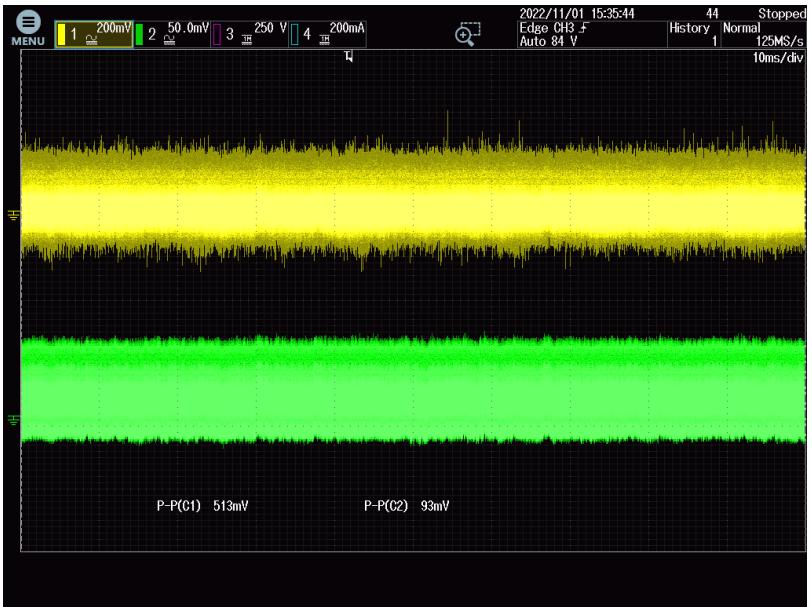

85 $\mathsf { v } _ { \mathsf { A C } }$

CH1 $\mathsf { V } _ { \mathsf { O U T } } \mathsf { R i p p l e }$ $\mathsf { V } _ { \mathsf { P K - P K } } { = } 5 1 3 \mathsf { m V }$  
CH2 $\mathsf { V } _ { \mathsf { O U T } } \mathsf { R i p p l e }$ $\mathbf { V } _ { \mathsf { P K - P K } = } \mathsf { S 3 m V }$

## Test Condition:

➢ Full Load

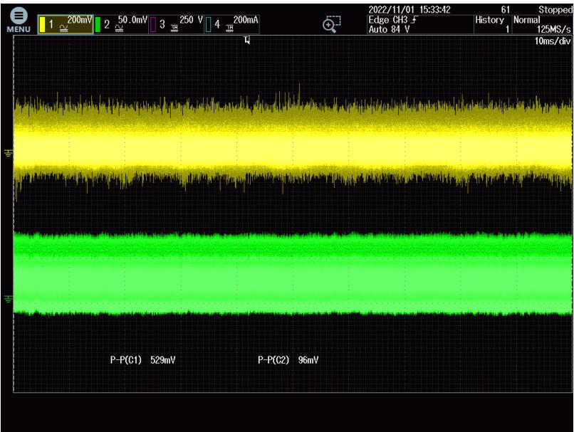

115 VAC

CH1 $\mathsf { V } _ { \mathsf { O U T } }$ Ripple $\mathsf { V } _ { \mathsf { P K - P K } } { = } 5 2 9 \mathsf { m V }$  
CH2 $\mathsf { V } _ { \mathsf { O U T } }$ Ripple $\mathbf { V } _ { \mathsf { P K - P K } } { = } 9 6 \mathsf { m } \mathbf { V }$

## Test Condition:

➢ Full Load

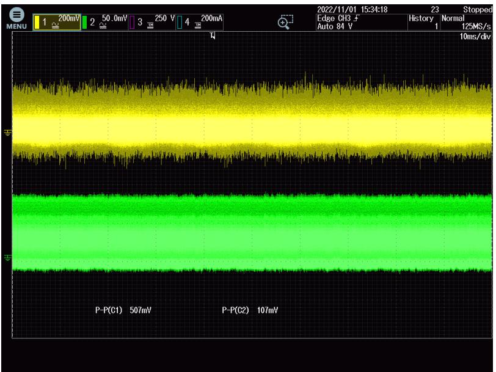

230 $\mathsf { v } _ { \mathsf { A C } }$

CH1 $\mathsf { V } _ { \mathsf { O U T } } \mathsf { R i p p l e }$ $\mathsf { V } _ { \mathsf { P K - P K } } { = } 5 0 7 \mathsf { m V }$  
CH2 $\mathsf { V } _ { \mathsf { O U T } } \mathsf { R i p p l e }$ $\mathsf { V } _ { \mathsf { P K - P K } } { = } 1 0 7 \mathsf { m V }$

## Test Condition:

➢ Full Load

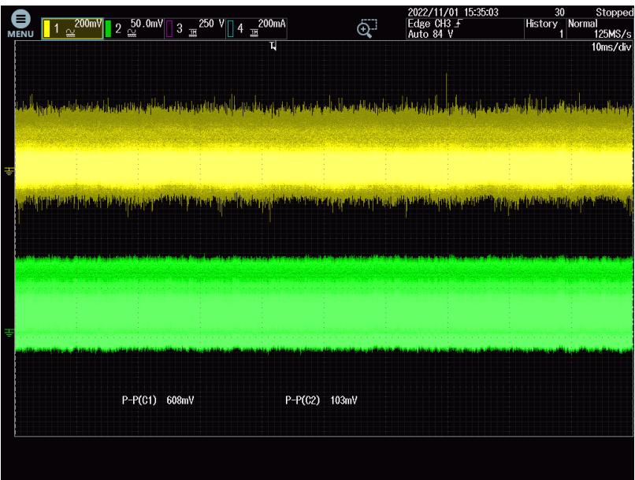

265 $\mathsf { v } _ { \mathsf { A C } }$

CH1 $\mathsf { V } _ { \mathsf { O U T } }$ Ripple $\mathsf { V } _ { \mathsf { P K - P K } } { = } 6 0 8 \mathsf { m V }$  
CH2 $\mathsf { V } _ { \mathsf { O U T } } \mathsf { R i p p l e }$ $\mathsf { V } _ { \mathsf { P K - P K } } { = } \mathsf { 1 0 3 m V }$

## Test Condition:

➢ Full Load

## 动态负载(50%-100%)

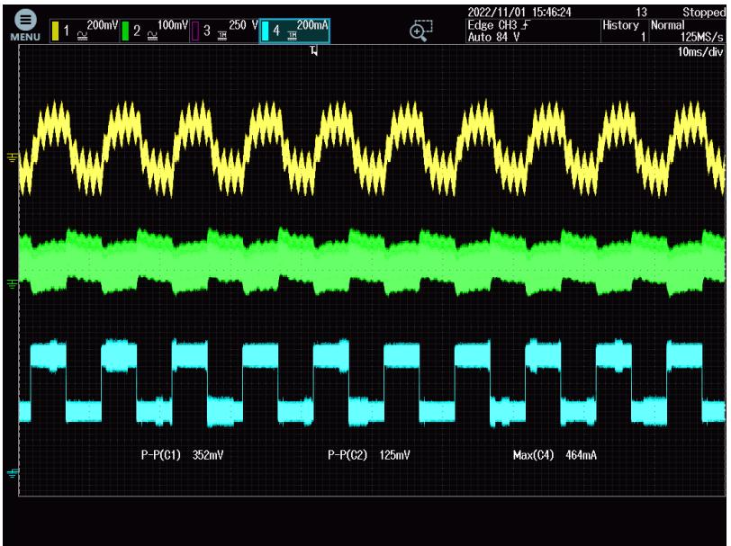

85 VAC

CH1 VOUT $\mathsf { V } _ { \mathsf { O U T } }$ $V _ { P K - P K } = 3 5 2 m v$  
CH2 VOUT $\mathsf { V } _ { \mathsf { O U T } }$ VPK-PK=125mV $v _ { p \kappa \mathrm { - } P \kappa } { = } 1 2 5 m v$

## Test Condition:

➢ 0.175 A-0.35 A-0.175A  
➢ $0 . 2 \mathsf { A } \mathsf { - } 0 . 4 \mathsf { A } \mathsf { - } 0 . 2 \mathsf { A }$  
➢ Slew Rate: 0.5 A/μS  
➢ Frequency: 100 Hz

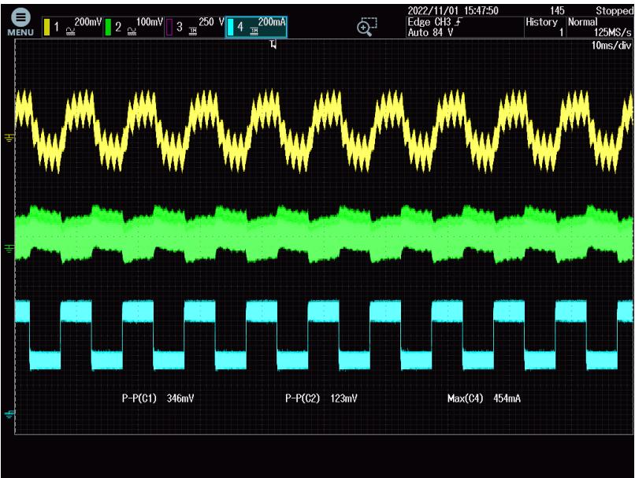

115 VAC

CH1 VOUT $\mathsf { V } _ { \mathsf { O U T } }$ $\mathsf { V } _ { \mathsf { P K - P K } } = \widetilde { 3 } \dot { 4 } \ 6$ mV  
CH2 VOUT ${ \mathsf { C H } } 2 { \mathsf { V } } _ { \mathsf { O U T } }$ $\mathsf { V } _ { \mathsf { P K - P K } } \mathsf { = } \bar { \pmb { 1 } } 2 3$ mV

## Test Condition:

➢ 0.175 A-0.35 A-0.175A  
➢ $0 . 2 \mathsf { A } \mathsf { - } 0 . 4 \mathsf { A } \mathsf { - } 0 . 2 \mathsf { A }$  
➢ Slew Rate: 0.5 A/μS  
➢ Frequency: 100 Hz

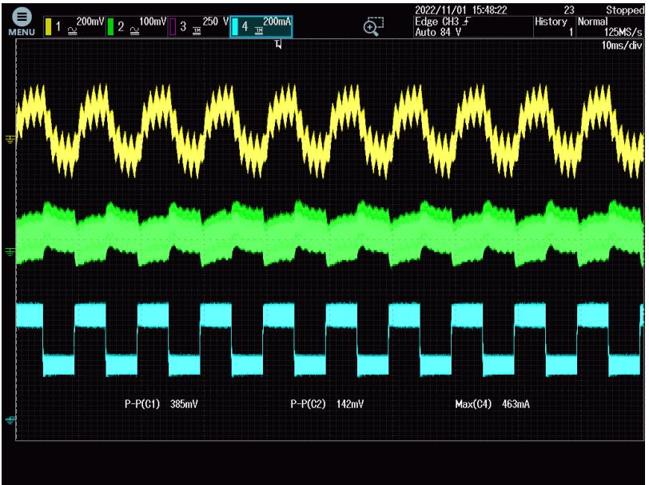

230 VAC

CH1 VOUT ${ \mathsf { C H 1 } } { \mathsf { V } } _ { \mathsf { O U T } }$ $v _ { p k - P K } = 3 8 5 m v$  
CH2 VOUT $\mathsf { V } _ { \mathsf { O U T } }$ $v _ { p k \mathrm { - } P K } = 1 4 2 m v$

## Test Condition:

➢ 0.175 A-0.35 A-0.175A  
➢ $0 . 2 \mathsf { A } \mathsf { - } 0 . 4 \mathsf { A } \mathsf { - } 0 . 2 \mathsf { A }$  
➢ Slew Rate: 0.5 A/μS  
➢ Frequency: 100 Hz

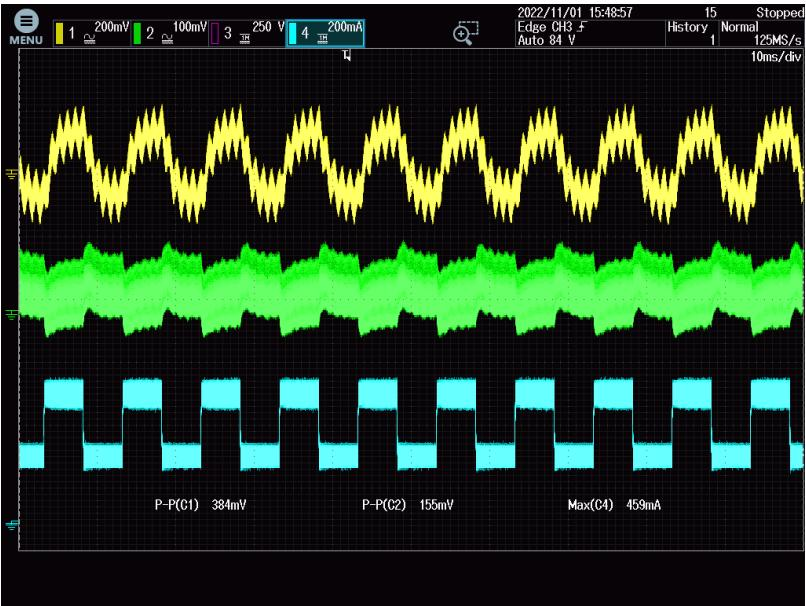

265 VAC

CH1 VOUT ${ \mathsf { C H 1 } } { \mathsf { V } } _ { \mathsf { O U T } }$ $\mathsf { V } _ { \mathsf { P K - P K } } \mathsf { = }$ 384mV  
CH2 VOUT ${ \mathsf { C H } } 2 { \mathsf { V } } _ { \mathsf { O U T } }$ $\mathsf { v } _ { \mathsf { P K - P K } } \mathsf { = }$ 155 mV

## Test Condition:

➢ 0.175 A-0.35 A-0.175A  
➢ $0 . 2 \mathsf { A } \mathsf { - } 0 . 4 \mathsf { A } \mathsf { - } 0 . 2 \mathsf { A }$  
➢ Slew Rate: 0.5 A/μS  
➢ Frequency: 100 Hz

## 动态负载(10%-90%)

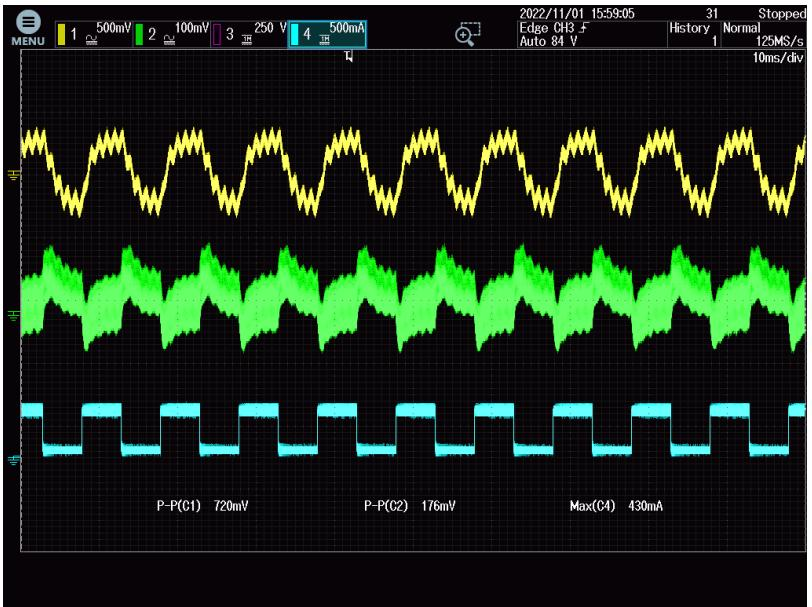

85 VAC

CH1 VOUT $\mathsf { V } _ { \mathsf { O U T } }$ $v _ { P K - P K } = 7 2 0 m v$  
CH2 VOUT $\mathsf { V } _ { \mathsf { O U T } }$ $v _ { p \vert k - P K } = 1 7 6 m v$

## Test Condition:

➢ 0.035 A-0. 315A-0.035A  
➢ 0.04 A-0.36 A-0.04 A  
➢ Slew Rate: 0.5 A/μS  
➢ Frequency: 100 Hz

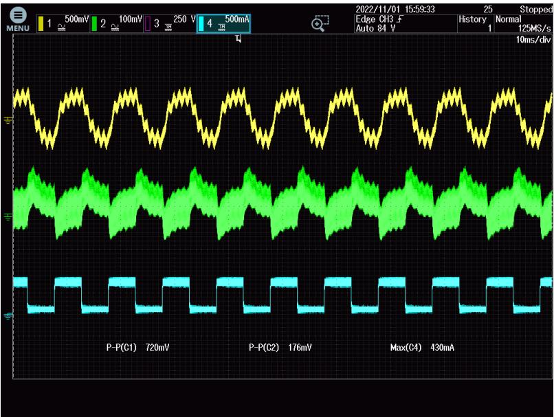

115 VAC

CH1 VOUT $\mathsf { V } _ { \mathsf { O U T } }$ VPK-PK=720mV $v _ { P K - P K } = 7 2 0 m v$  
CH2 VOUT ${ \mathsf { C H } } 2 { \mathsf { V } } _ { \mathsf { O U T } }$ $v _ { p \vert k - P K } = 1 7 6 m v$

## Test Condition:

➢ 0.035 A-0. 315A-0.035A  
➢ 0.04 A-0.36 A-0.04 A  
➢ Slew Rate: 0.5 A/μS  
➢ Frequency: 100 Hz

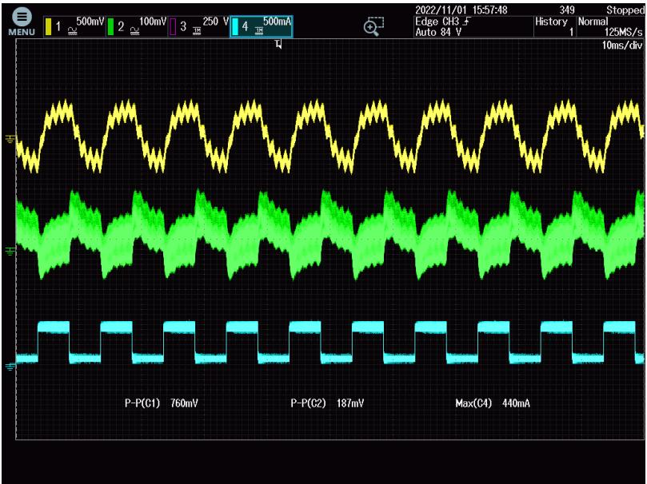

230 VAC

CH1 VOUT ${ \mathsf { C H 1 } } { \mathsf { V } } _ { \mathsf { O U T } }$ $v _ { p \vert k - P K } = 7 6 0 m v$  
CH2 VOUT $\mathsf { V } _ { \mathsf { O U T } }$ $v _ { p \kappa - P K } = 1 8 7 ~ m v$

## Test Condition:

➢ 0.035 A-0. 315A-0.035A  
➢ 0.04 A-0.36 A-0.04 A  
➢ Slew Rate: 0.5 A/μS  
➢ Frequency: 100 Hz

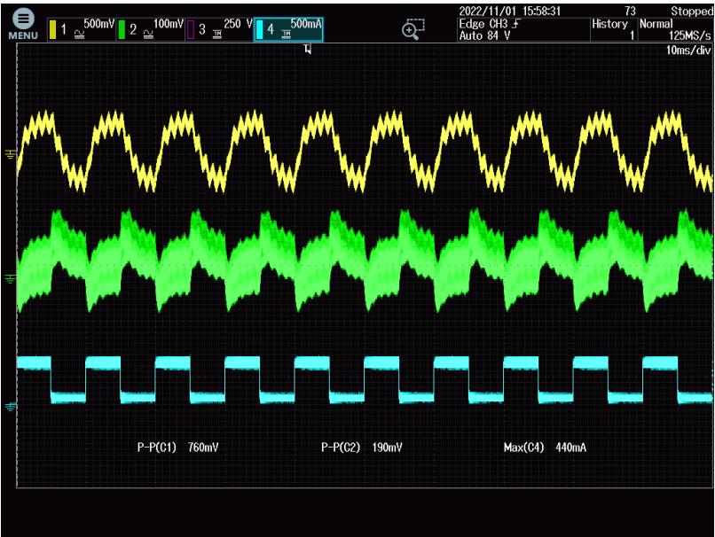

265 VAC

CH1 V $\mathsf { V } _ { \mathsf { O U T } }$ VPK-PK=760 mV  
CH2 VOUT ${ \mathsf { C H } } 2 { \mathsf { V } } _ { \mathsf { O U T } }$ $\mathsf { v } _ { \mathsf { P K - P K } } \mathsf { = }$ 190mV

## Test Condition:

➢ 0.035 A-0. 315A-0.035A  
➢ 0.04 A-0.36 A-0.04 A  
➢ Slew Rate: 0.5 A/μS  
➢ Frequency: 100 Hz

## 输出电压开机波形

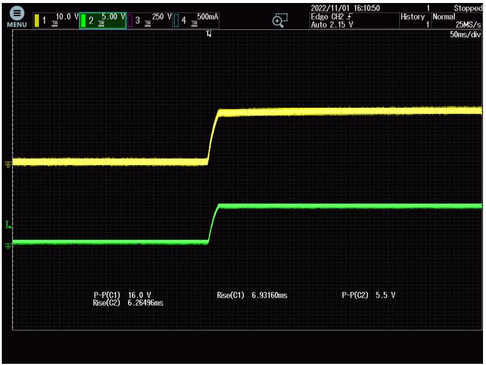

85 $\mathsf { v } _ { \mathsf { A C } }$

CH1 VOUT $\mathsf { V } _ { \mathsf { O U T } }$ ${ \sf T } _ { \sf R I S E } .$ 6.93mS  
CH2 VOUT $\mathsf { V } _ { \mathsf { O U T } }$ ${ \sf T } _ { \sf R I S E } .$ 6.26mS

Test Condition:  
➢ No Load  
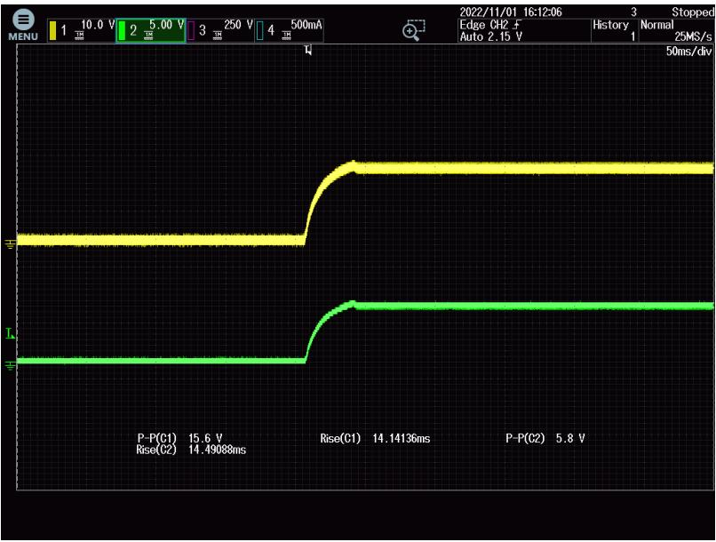

85 VAC

CH1 VOUT $\mathsf { V } _ { \mathsf { O U T } }$ ${ \sf T } _ { \sf R I S E } .$ 14.14mS  
CH2 VOUT $\mathsf { V } _ { \mathsf { O U T } }$ ${ \sf T } _ { \sf R I S E } .$ 14.49mS

Test Condition:  
➢ Full Load  
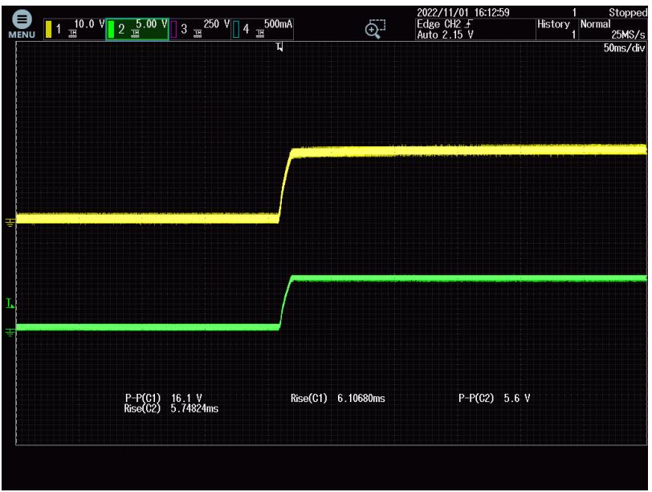

265 $\mathsf { v } _ { \mathsf { A C } }$

CH1 VOUT $\mathsf { V } _ { \mathsf { O U T } }$ ${ \sf T } _ { \sf R I S E } .$ 6.10 mS  
CH2 VOUT $\mathsf { V } _ { \mathsf { O U T } }$ ${ \sf T } _ { \sf R I S E } .$ 5.74mS

Test Condition:  
➢ No Load  
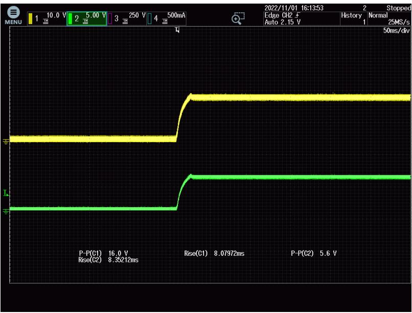

265 $\mathsf { v } _ { \mathsf { A C } }$

CH1 VOUT $\mathsf { V } _ { \mathsf { O U T } }$ ${ \sf T } _ { \sf R I S E } .$ 8.07 mS  
CH2 VOUT $\mathsf { V } _ { \mathsf { O U T } }$ ${ \sf T } _ { \sf R I S E } .$ 8.35mS

Test Condition:

➢ Full Load

## 启动延迟时间

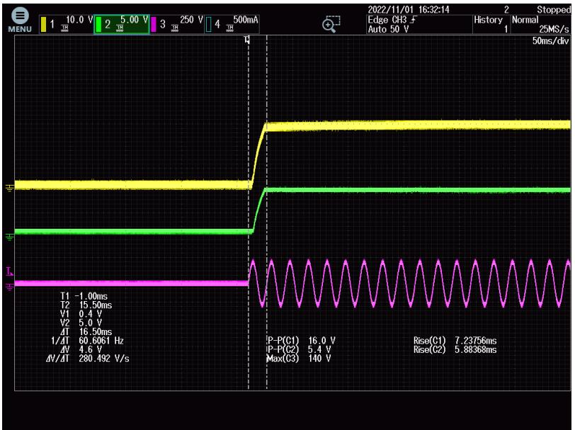

85 VAC

CH1 $\mathsf { V } _ { \mathsf { O U T } }$  
CH2 $\mathsf { V } _ { \mathsf { O U T } }$  
CH3 VINNAC $\mathsf { V I N } _ { \mathsf { N A C } }$ ${ \mathsf { T } } _ { \mathsf { D E L A Y } } .$ 16.5 mS ${ \mathsf { T } } _ { \mathsf { D E L A Y } } .$ 16.5mS

Test Condition:  
➢ $\mathsf { N o } \mathsf { L o } \mathsf { a d }$  
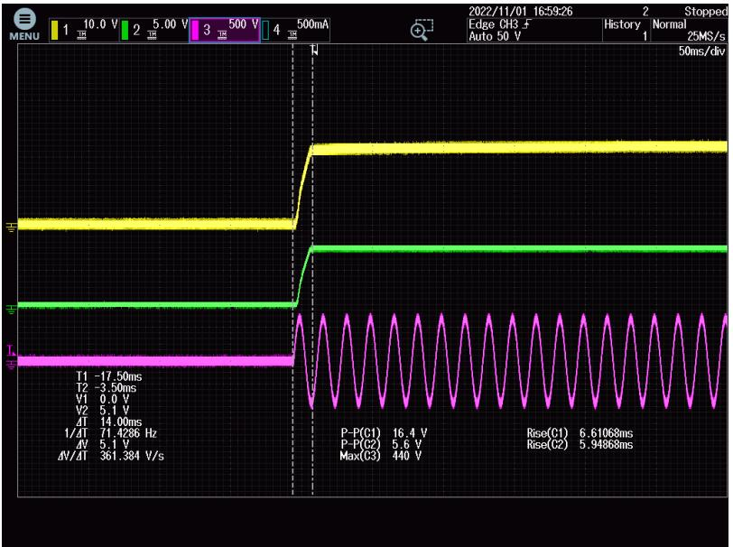

265 $\mathsf { v } _ { \mathsf { A C } }$

CH1 $\mathsf { V } _ { \mathsf { O U T } }$  
CH2 $\mathsf { V } _ { \mathsf { O U T } }$  
CH3 $\mathsf { V I N } _ { \mathsf { N A C } }$  
TDELAY: 14mS  
${ \sf T } _ { \sf D E L A Y } .$ 14mS

Test Condition:  
➢ No Load  
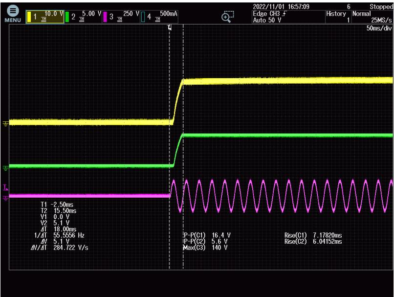

85 VAC

CH1 $\mathsf { V } _ { \mathsf { O U T } }$  
CH2 $\mathsf { V } _ { \mathsf { O U T } }$  
CH3 $\mathsf { V I N } _ { \mathsf { N A C } }$  
$\mathsf { T } _ { \mathsf { D E L A Y } } .$ 18mS  
$\mathsf { T } _ { \mathsf { D E L A Y } } .$ 18mS

Test Condition:  
➢ $\mathsf { F u l l \mathsf { L o a d } }$  
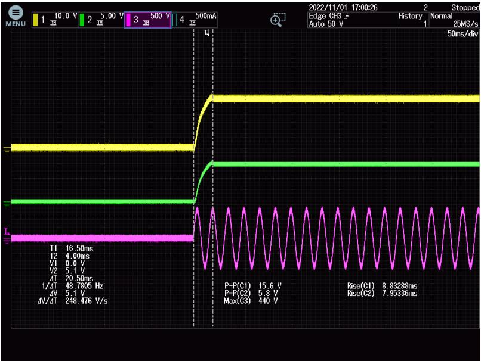

265 $\mathsf { v } _ { \mathsf { A C } }$

${ \mathsf { C H 1 } } { \mathsf { V } } _ { \mathsf { O U T } }$  
${ \mathsf { C H } } 2 { \mathsf { V } } _ { \mathsf { O U T } }$  
CH3 VINNAC $\mathsf { V I N } _ { \mathsf { N A C } }$  
TDELAY: 20.5mS  
TDELAY: 20.5 mS

Test Condition:

➢ Full Load

## 输入过压保护

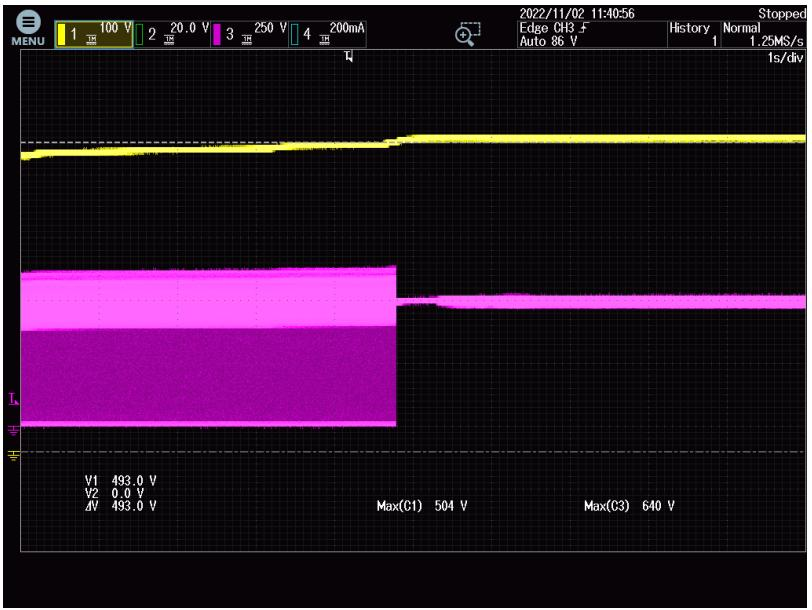

## 输入OVP

CH1 $\mathsf { V I N } _ { \mathsf { D C } }$  
CH3 VIN VDS $\mathsf { V I N V } _ { \mathsf { D S } }$ VBROWN-IN: 493V

## 测试条件:

➢ No Load

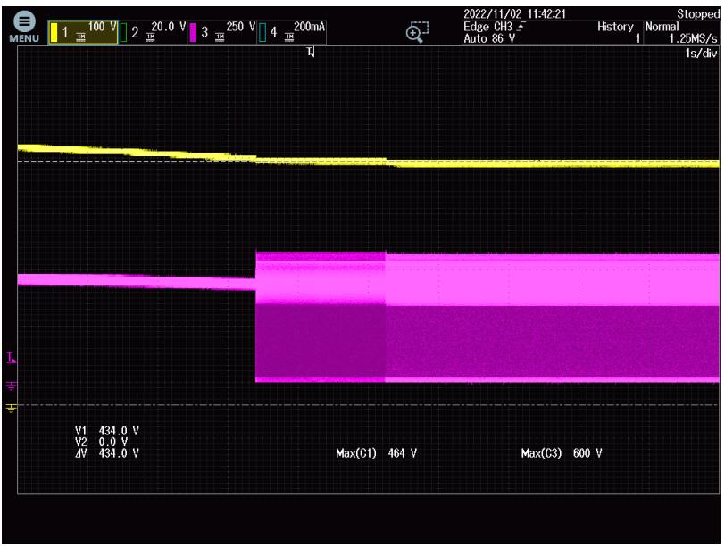

## 退出输入OVP

CH1 $\mathsf { V I N } _ { \mathsf { D C } }$  
CH3 VIN VDS $\mathsf { V I N } \mathsf { V } _ { \mathsf { D S } }$ VBROWN-OUT:434V

## 测试条件:

➢ No Load

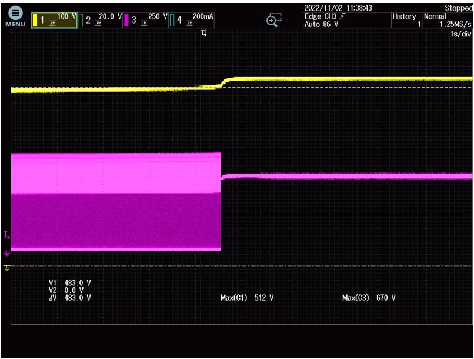

## 输入OVP

${ \mathsf { C H 1 } } { \mathsf { V I N } } _ { \mathsf { D C } }$  
CH3 VIN V $\mathsf { C H 3 } \mathsf { V I N } \mathsf { V } _ { \mathsf { D S } }$ VBROWN-IN: 483 V

## 测试条件:

➢ Full Load

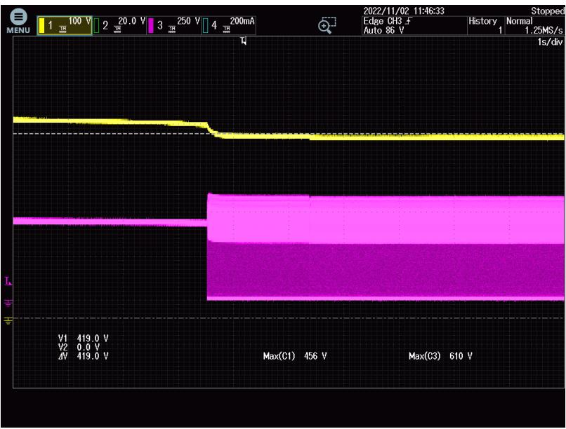

## 退出输入OVP

CH1 $\mathsf { V I N } _ { \mathsf { D C } }$  
CH3 VIN VDS $\mathsf { V I N } \mathsf { V } _ { \mathsf { D S } }$ VBROWN-OUT: 419V

## 测试条件:

➢ Full Load

## 输入欠压保护

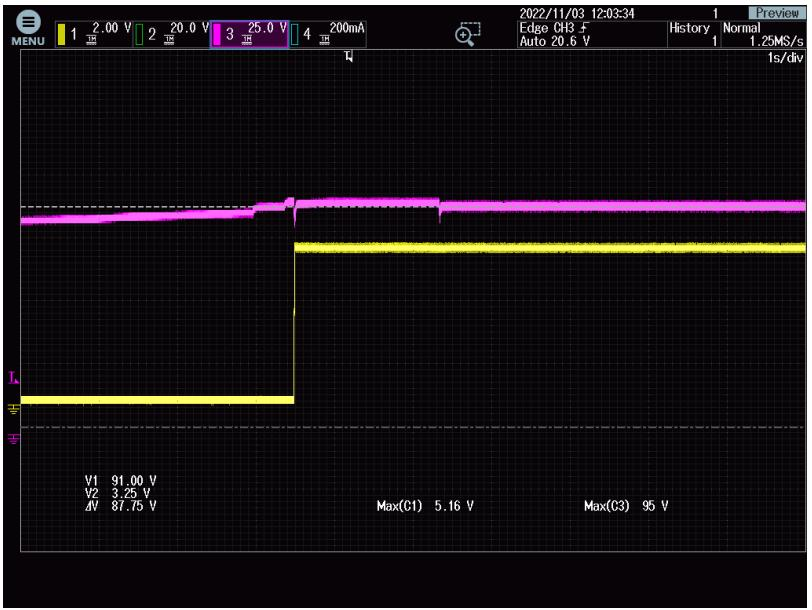

## BROWN-IN

CH1 $\mathsf { V I N } _ { \mathsf { D C } }$  
CH3 VIN VDS $\mathsf { V } _ { \mathsf { D } \mathsf { S } }$ VBROWN-IN: 87.5V

## 测试条件:

➢ No Load

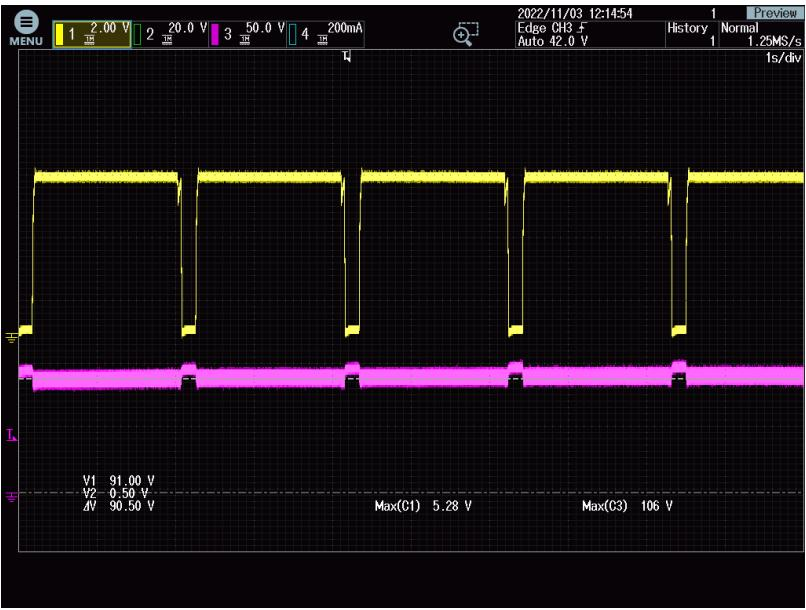

## BROWN-IN

CH1 $\mathsf { V I N } _ { \mathsf { D C } }$  
CH3 VIN V $\mathsf { V I N } \mathsf { V } _ { \mathsf { D S } }$ VBROWN-IN: 90.5V

## 测试条件:

➢ Full Load

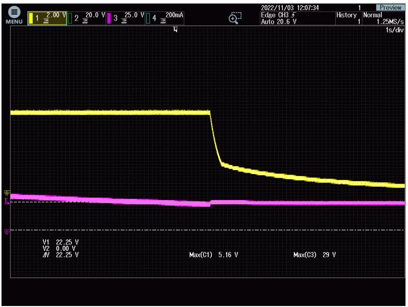

## BROWN-OUT

CH1 $\mathsf { V I N } _ { \mathsf { D C } }$  
CH3 VIN VDS $\mathsf { V } _ { \mathsf { D } \mathsf { S } }$ VBROWN-OUT: 22.5V

## 测试条件:

➢ No Load

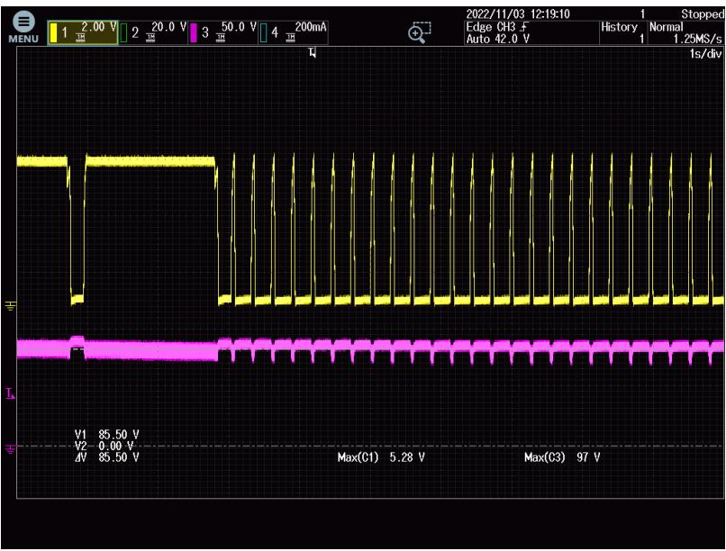

## BROWN-OUT

CH1 $\mathsf { V I N } _ { \mathsf { D C } }$  
CH3 VIN VDS $\mathsf { V } _ { \mathsf { D } \mathsf { S } }$ VBROWN-OUT: 85.5V

## 测试条件:

➢ Full Load

## 短路保护 （MOSFET波形）

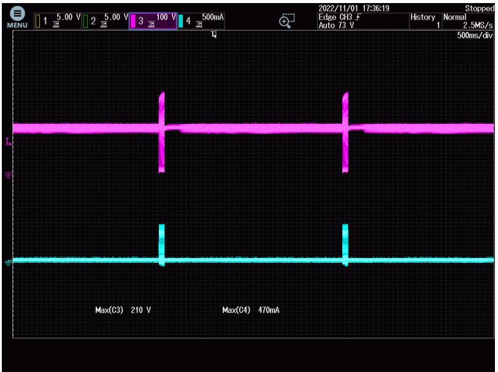

85 VAC

CH3 VDS：  
CH4 ID：

$$
\begin{array}{l} I _ {D S \_ M A X} = 0. 4 7 A \\ V _ {D S \_ M A X} = 2 1 0 V \end{array}
$$

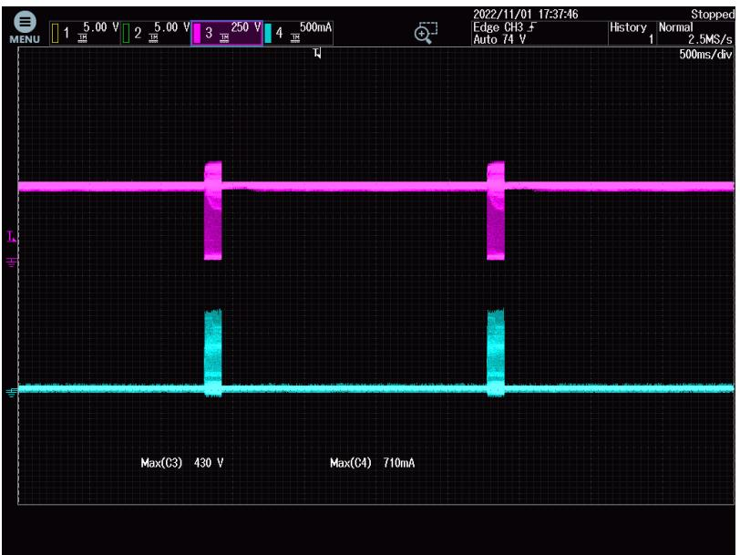

230 VAC

CH3 VDS：  
CH4 ID：

$$
\begin{array}{l} I _ {D S \_ M A X} = 0. 7 1 A \\ V _ {D S \_ M A X} = 4 3 0 V \end{array}
$$

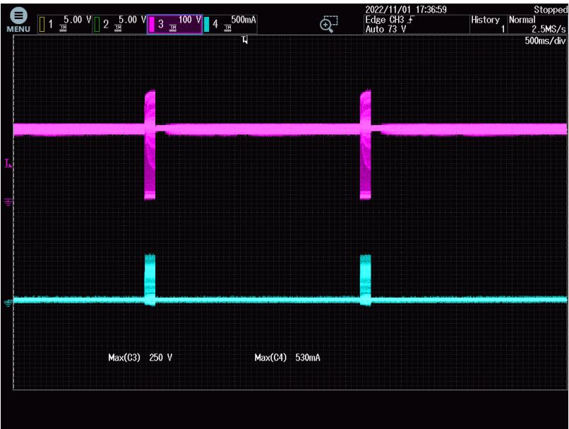

115 VAC

CH3 VDS：  
CH4 ID：

$$
I _ {D S \_ M A X} = 0. 5 3 A
$$

$$
V _ {D S \_ M A X} = 2 5 0 V
$$

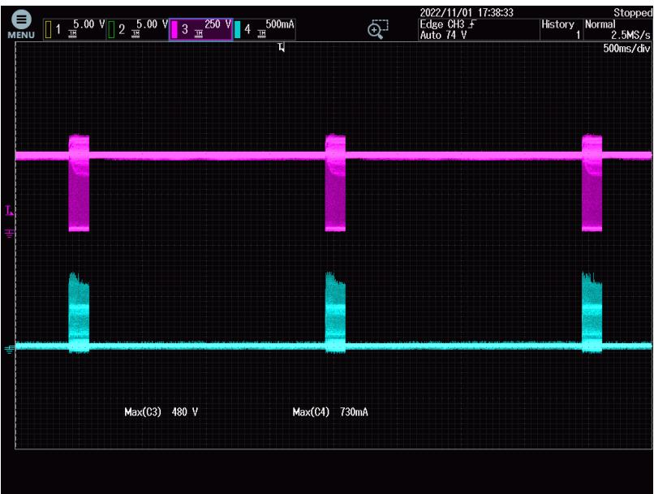

265 VAC

CH3 VDS：  
CH4 ID：

$$
I _ {D S \_ M A X} = 0. 7 3 A
$$

$$
V _ {D S \_ M A X} = 4 8 0 V
$$

## MOSFET稳态波形

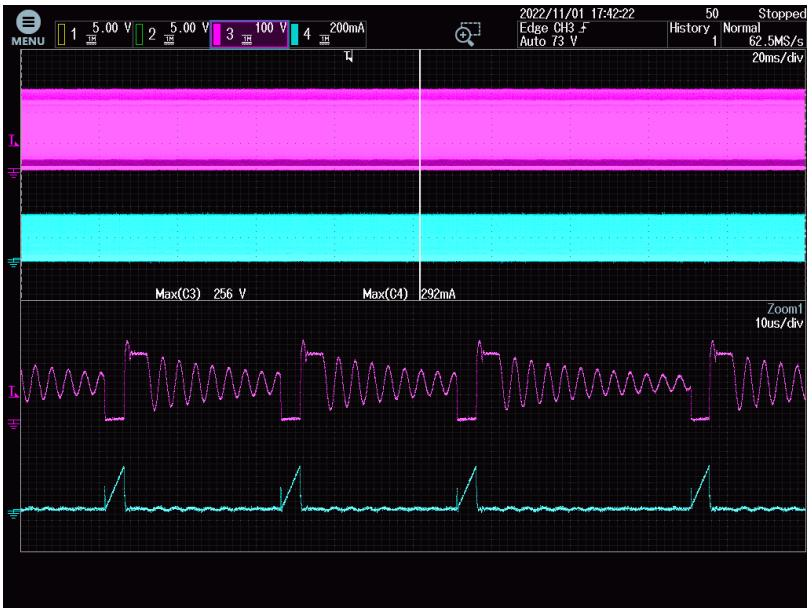

85 VAC

CH1 VDS  
CH3 IDS

$$
\begin{array}{l} \mathrm {V_ {DS\_MAX}} = 2 5 6 \mathrm{V} \\ \mathrm {I_ {DS\_MAX}} = 0. 2 9 2 \mathrm{A} \end{array}
$$

## Test Condition:

➢ No Load

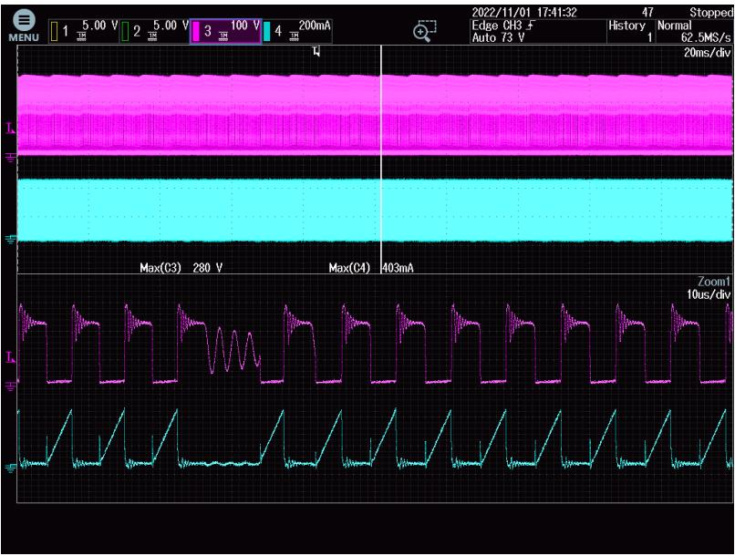

85 VAC

CH1 VDS  
CH3 IDS

$$
\begin{array}{l} \mathrm {V_ {DS\_MAX}} = 2 8 0 \mathrm{V} \\ \mathrm {I_ {DS\_MAX}} = 0. 4 0 3 \mathrm{A} \end{array}
$$

## Test Condition:

➢ Full Load

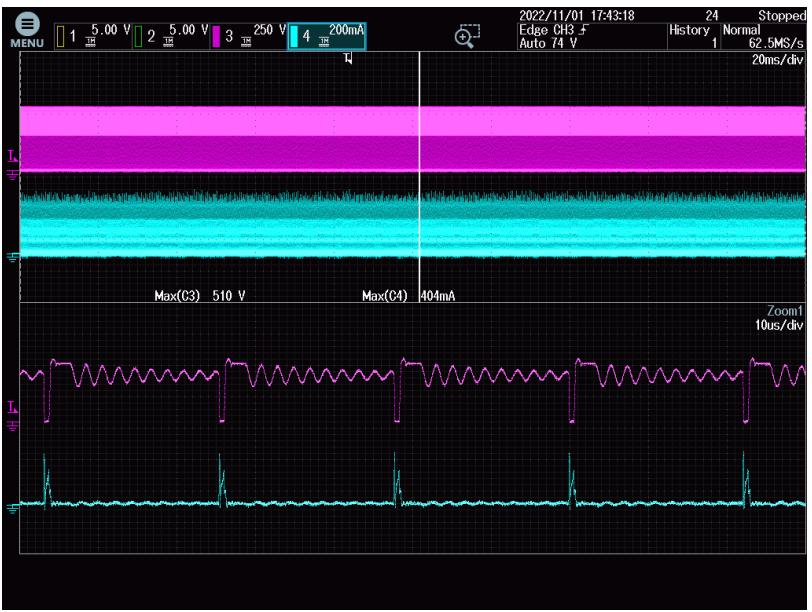

265 VAC

CH1 VDS  
CH3 IDS

$$
\begin{array}{l} \mathrm {V_ {DS\_MAX}} = 5 1 0 \mathrm{V} \\ \mathrm {I_ {DS\_MAX}} = 0. 4 0 4 \mathrm{A} \end{array}
$$

## Test Condition:

➢ No Load

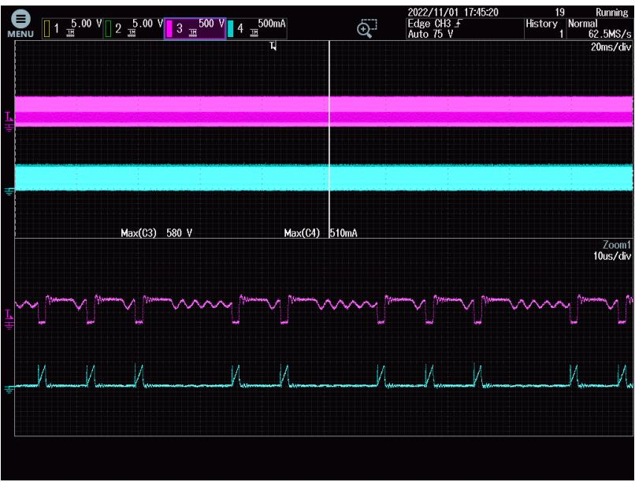

265 VAC

CH1 VDS  
CH3 IDS

$$
\begin{array}{l} \mathrm {V_ {DS\_MAX}} = 5 8 0 \mathrm{V} \\ \mathrm {I_ {DS\_MAX}} = 0. 5 1 \mathrm{A} \end{array}
$$

## Test Condition:

➢ Full Load

## 漏极电流波形

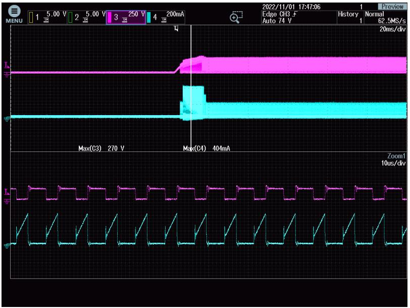

${ \otimes 5 } \mathsf { V } _ { \mathsf { A C } }$

CH1 VOUTPUT $\mathsf { V } _ { \mathsf { O U T P U T } }$  
CH4 IDRAIN $\mathsf { I } _ { \mathsf { D R A I N } }$ IDS\_MAX=0.404A $\mathsf { I } _ { \mathsf { D S \_ M A X } } { = } 0 . 4 0 4 \mathsf { A }$ $V _ { \mathsf { D S \_ M A X } } = 2 7 0$

Test Condition:  
➢ 空载启动  
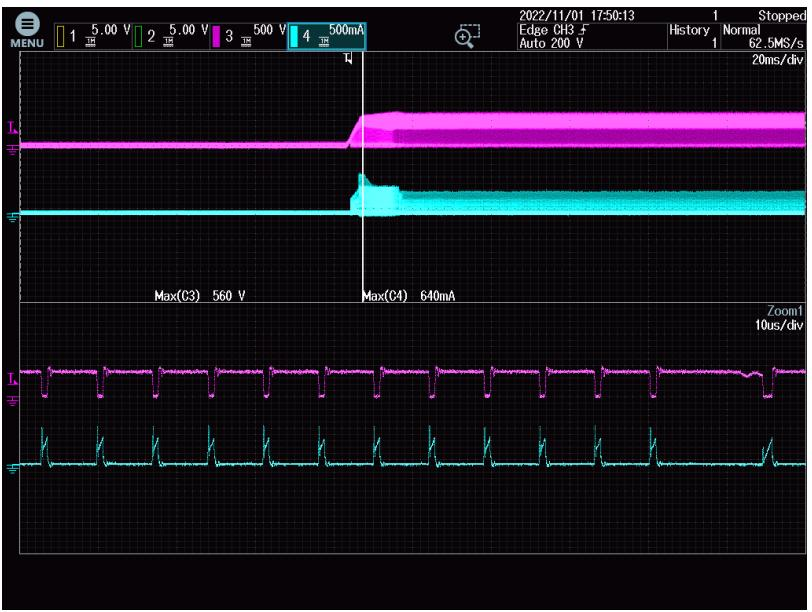

$2 6 5 \ : \mathsf { V } _ { \mathsf { A C } }$

CH1 $\mathsf { V } _ { \mathsf { O U T P U T } }$  
CH4 IDRAIN $\mathsf { I } _ { \mathsf { D S \_ M A X } } { = } 0 . 6 4 \mathsf { A }$ $V _ { \mathsf { D S \_ M A X } } \equiv 5 6 0 \mathsf { V }$

Test Condition:  
➢ 空载启动  
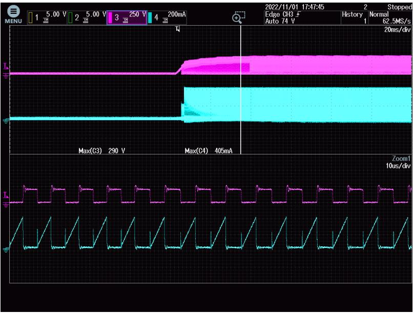

${ \tt S 5 V } _ { \sf A C }$

CH1 $\mathsf { V } _ { \mathsf { O U T P U T } }$  
$\mathsf { C H 4 } \mathsf { I } _ { \mathsf { D R A I N } }$ CH4 IDRAIN IDS\_MAX=0.405A $\mathsf { I } _ { \mathsf { D S \_ M A X } } { = } 0 . 4 0 5 \mathsf { A }$ $V _ { \mathsf { D S \_ M A X } } \equiv 2 9 0 \mathsf { V }$

Test Condition:  
➢ 满载启动  
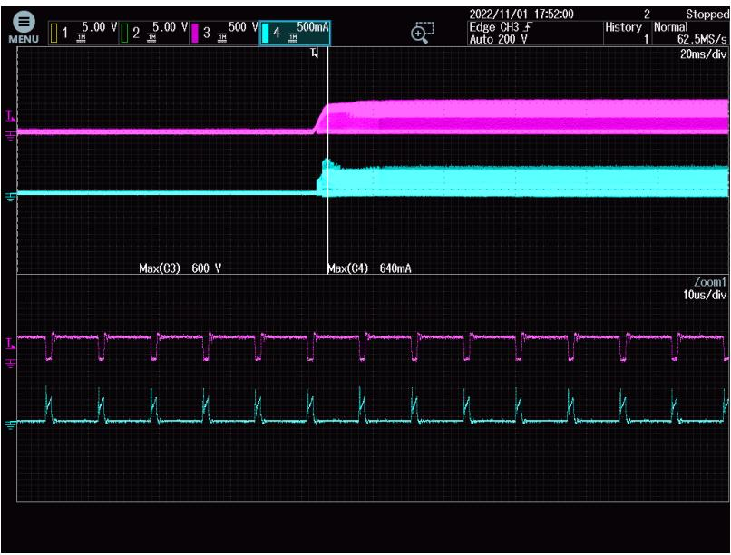

$2 6 5 \ : \mathsf { V } _ { \mathsf { A C } }$

${ \mathsf { C H 1 } } { \mathsf { V } } _ { { \mathsf { 0 U T P U T } } }$  
$\mathsf { C H 4 } \mathsf { I } _ { \mathsf { D R A I N } }$ CH4 IDRAIN $\mathsf { I } _ { \mathsf { D S \_ M A X } } { = } 0 . 6 4 \mathsf { A }$ $V _ { \mathsf { D S \_ M A X } } = 6 0 0 \mathsf { V }$

Test Condition:

➢ 满载启动

## D-S电压波形

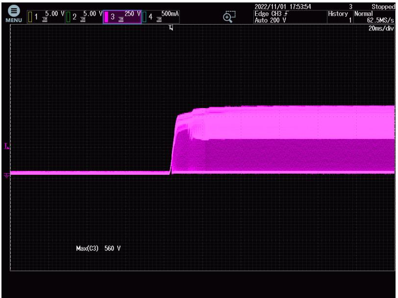

265 VAC

CH2 VDS VDSMAX: 560 V

Test Condition:

➢ 满载开机

极限参数(注3)

<table><tr><td>符号</td><td>参数</td><td>参数范围</td><td>单位</td></tr><tr><td> $V_{DRAIN}$ </td><td>内部高压 MOSFET 漏极到源极电压</td><td>-0.3~700</td><td>V</td></tr><tr><td> $V_{CC}$ </td><td> $V_{CC}$  电压</td><td>-0.3~9</td><td>V</td></tr><tr><td> $I_{CC\_MAX}$ </td><td> $V_{CC}$  引脚最大电流</td><td>20</td><td>mA</td></tr><tr><td> $V_{FB}$ </td><td>输出反馈端电压</td><td>-0.3~9</td><td>V</td></tr><tr><td> $P_{DMAX}$ </td><td>功耗(注 4)</td><td>1.5</td><td>W</td></tr><tr><td> $\theta_{JA}$ </td><td>结到环境的热阻(注 5)</td><td>80</td><td>°C/W</td></tr><tr><td> $\theta_{JC}$ </td><td>结到芯片表面的热阻(注 5)</td><td>20</td><td>°C/W</td></tr><tr><td> $T_{J}$ </td><td>工作结温范围</td><td>-40 to 150</td><td>°C</td></tr><tr><td> $T_{STG}$ </td><td>储存温度范围</td><td>-55 to 150</td><td>°C</td></tr><tr><td>ESD</td><td>人体模型 ESD(注 6)</td><td>2</td><td>kV</td></tr></table>

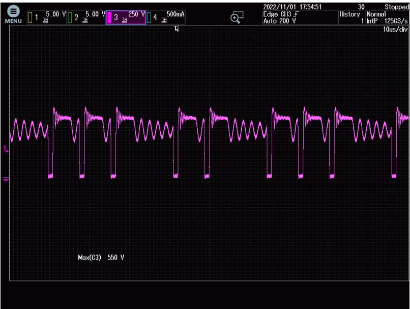

265 VAC

CH2 VDS VDSMAX: 550 V

Test Condition:满载正常工作

## 满载开机

$D e r a t i n g { = } 5 6 0 \vee / 7 0 0 \vee = 8 0 \%$

## 满载正常工作

Derating = 550V / 700 V = 78.57 %

## 12V输出肖特基反压波形

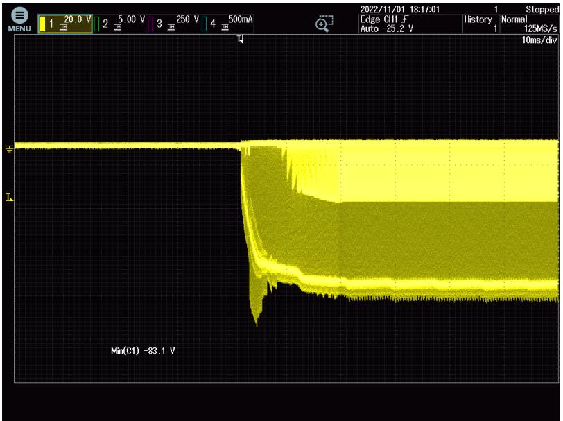

265 VAC

CH1 VDIODE VDSMAX:83.1V

## Test Condition:

满载启动

<table><tr><td>PARAMETER</td><td>SYMBOL</td><td>MB54</td><td>MB54A</td><td>MB55</td><td>MB56</td><td>MB58</td><td>MB59</td><td>MB510</td><td>MB515</td><td>MB520</td><td>UNITS</td></tr><tr><td>Maximum Recurrent Peak Reverse Voltage</td><td> $V_{RRM}$ </td><td>40</td><td>45</td><td>50</td><td>60</td><td>80</td><td>90</td><td>100</td><td>150</td><td>200</td><td>V</td></tr><tr><td>Maximum RMS Voltage</td><td> $V_{RMS}$ </td><td>28</td><td>31.5</td><td>35</td><td>42</td><td>56</td><td>63</td><td>70</td><td>105</td><td>140</td><td>V</td></tr><tr><td>Maximum DC Blocking Voltage</td><td> $V_{DC}$ </td><td>40</td><td>45</td><td>50</td><td>60</td><td>80</td><td>90</td><td>100</td><td>150</td><td>200</td><td>V</td></tr><tr><td>Average Rectified Output Current (See Figure 1)</td><td> $I_{F(AV)}$ </td><td colspan="9">5</td><td>A</td></tr><tr><td>Non-Repetitive Peak Forward Surge Current : 8.3ms single half sine-wave superimposed on rated load</td><td> $I_{FSM}$ </td><td colspan="9">100</td><td>A</td></tr><tr><td>Forward Voltage at 5A (Note 1)</td><td> $V_F$ </td><td colspan="2">0.7</td><td colspan="2">0.74</td><td colspan="3">0.8</td><td colspan="2">0.9</td><td>V</td></tr><tr><td>Peak Reverse Current at Rated DC Blocking Voltage  $T_J=25°C$  $T_J=100°C$ </td><td> $I_R$ </td><td colspan="9">0.0510</td><td>mA</td></tr><tr><td>Typical Thermal Resistance (Note 2)</td><td> $R_{BJA}$  $R_{BJL}$ </td><td colspan="9">5517</td><td>°C /W</td></tr><tr><td>Operating Junction and Storage Temperature Range</td><td> $T_J,T_{STG}$ </td><td>-55 to +150</td><td colspan="8">-65 to +175</td><td>°C</td></tr></table>

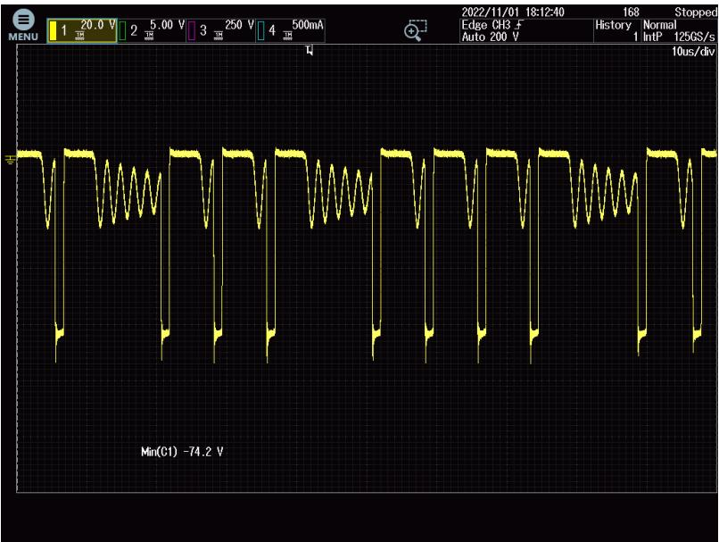

265 VAC

CH1 VDDIODE VMAX: 74.2V

## Test Condition:

满载正常工作

## 满载开机

$\mathrm { D e r a t i n g } = 8 3 . 1 \lor / 2 0 0 \lor = 4 1 . 5 5 \ \%$

## 满载正常工作

Derating = 74.2 V / 200V = 37.1 %

<table><tr><td rowspan="2">项目</td><td colspan="2">85VAC</td><td colspan="2">265VAC</td></tr><tr><td>温度(°C)</td><td>温升(°C)</td><td>温度(°C)</td><td>温升(°C)</td></tr><tr><td>环境温度</td><td colspan="2">26</td><td colspan="2">25</td></tr><tr><td>BPA8616P (U1)</td><td>64</td><td>38</td><td>75</td><td>50</td></tr><tr><td>变压器绕组(T1)</td><td>51</td><td>25</td><td>54</td><td>29</td></tr><tr><td>变压器磁芯(T1)</td><td>49</td><td>23</td><td>53</td><td>28</td></tr><tr><td>整流桥(BD1)</td><td>44</td><td>18</td><td>40</td><td>15</td></tr><tr><td>输出肖特基(D3)</td><td>58</td><td>32</td><td>60</td><td>35</td></tr><tr><td>输入电解电容(E2)</td><td>36</td><td>10</td><td>36</td><td>11</td></tr><tr><td>输出电解电容(E7)</td><td>35</td><td>9</td><td>35</td><td>10</td></tr></table>

## 测试说明

➢ 在温箱中进行测试  
➢ 电路板放在一个封闭的盒子内  
➢ 热电偶连接到各个测量点  
➢ 等测量点温度达到稳定后记录数据

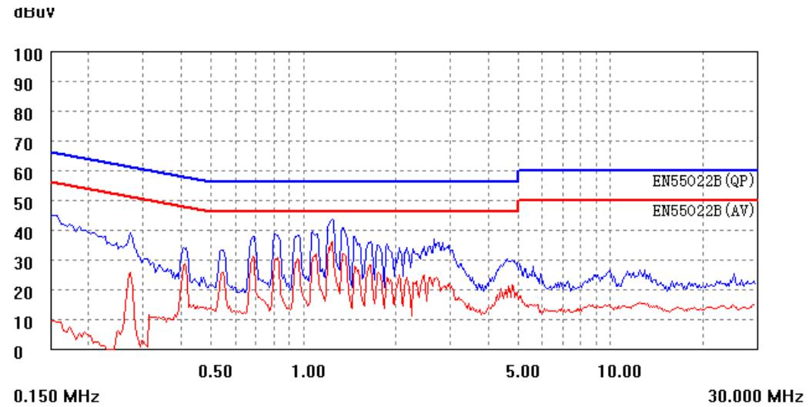

115VAC Line

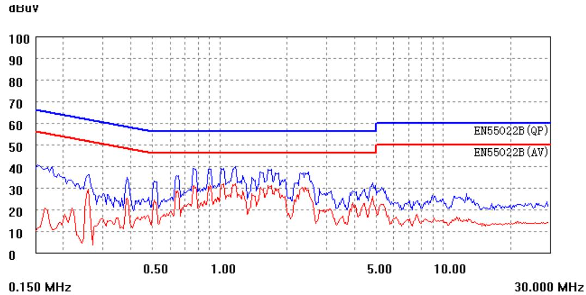

230VAC Line

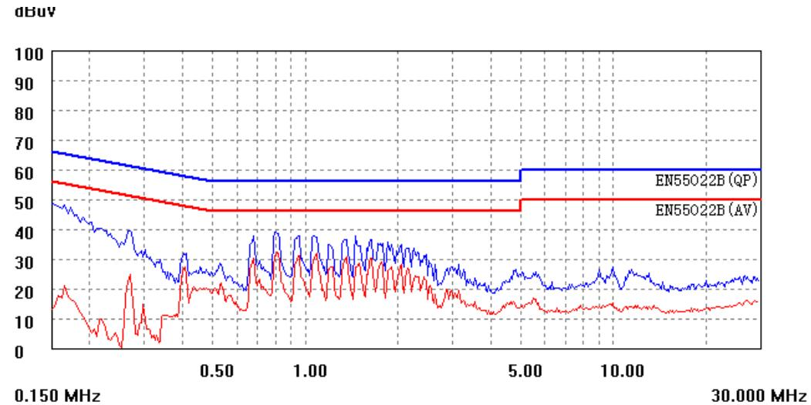

115VAC Neutral

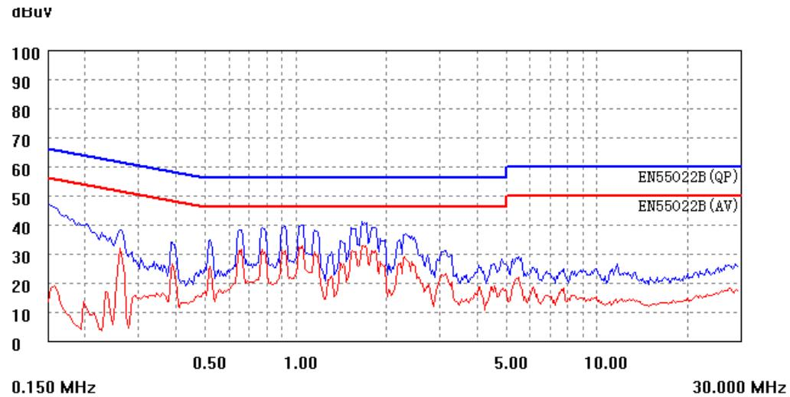

230VAC Neutral

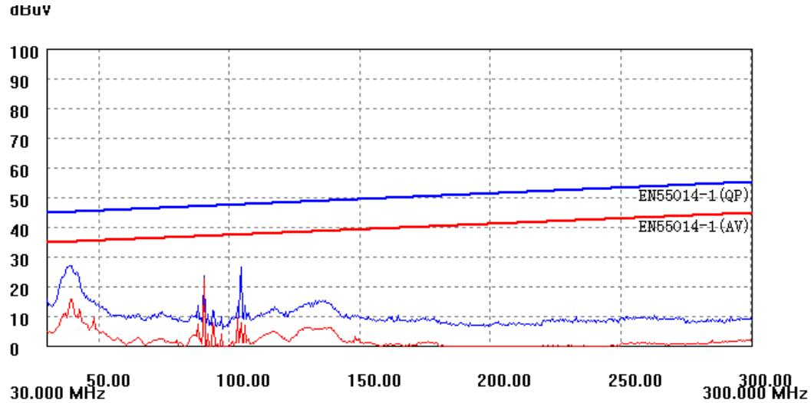

115VAC 空载  
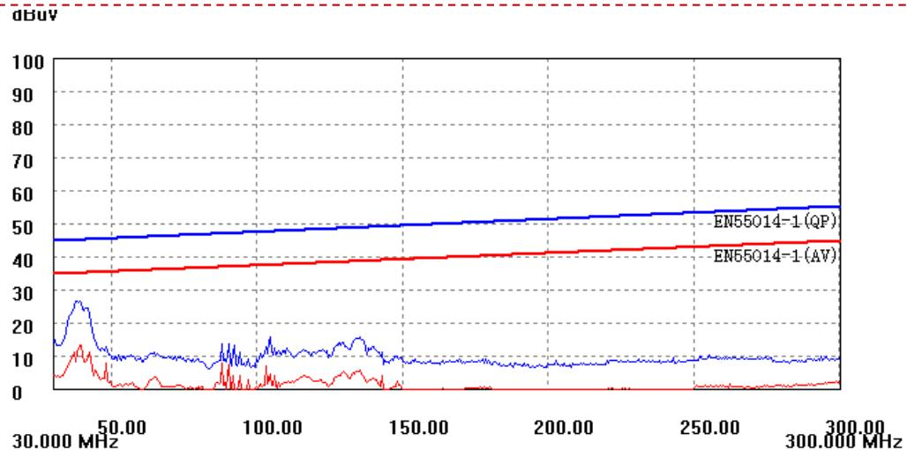

230VAC 空载

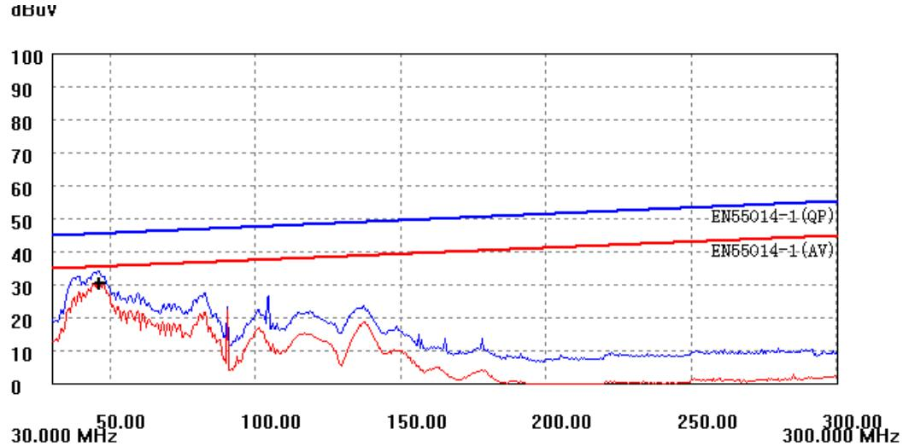

115VAC 满载

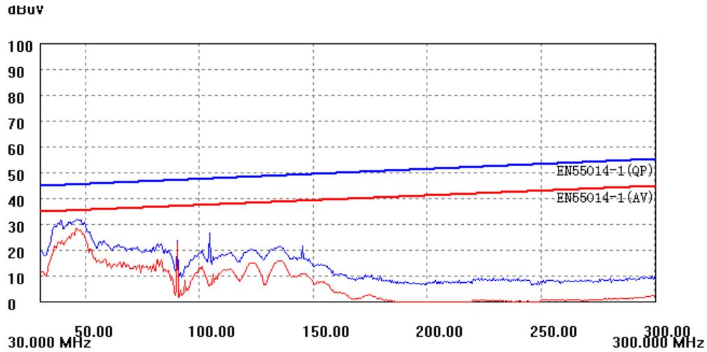

230VAC 满载

<table><tr><td>差模</td><td>电压</td><td>相位角</td><td>发生器阻抗</td><td>测试次数</td><td>测试结果</td></tr><tr><td>L to N</td><td>+2kV</td><td>0</td><td>2</td><td>10</td><td>Pass</td></tr><tr><td>L to N</td><td>-2kV</td><td>0</td><td>2</td><td>10</td><td>Pass</td></tr><tr><td>L to N</td><td>+2kV</td><td>90</td><td>2</td><td>10</td><td>Pass</td></tr><tr><td>L to N</td><td>-2kV</td><td>90</td><td>2</td><td>10</td><td>Pass</td></tr><tr><td>L to N</td><td>+2kV</td><td>180</td><td>2</td><td>10</td><td>Pass</td></tr><tr><td>L to N</td><td>-2kV</td><td>180</td><td>2</td><td>10</td><td>Pass</td></tr><tr><td>L to N</td><td>+2kV</td><td>270</td><td>2</td><td>10</td><td>Pass</td></tr><tr><td>L to N</td><td>-2kV</td><td>270</td><td>2</td><td>10</td><td>Pass</td></tr></table>

## 测试说明

➢ 按照GB/T17626.5和IEC61000-4-5的最新版本要求进行测试  
➢ 室温环境，230VAC输入，满载条件  
➢ 输入1.2/50us组合波浪涌电压  
➢ 每个测试点重复10次  
➢ 每次间隔时间1分钟  
➢ 试验时样机输出正常（符合A类标准）视为Pass

<table><tr><td>差模</td><td>电压</td><td>脉冲群持续时间</td><td>脉冲频率</td><td>测试时间</td><td>测试结果</td></tr><tr><td>L to N</td><td>+4kV</td><td>15ms</td><td>5kHz</td><td>120s</td><td>Pass</td></tr><tr><td>L to N</td><td>-4kV</td><td>15ms</td><td>5kHz</td><td>120s</td><td>Pass</td></tr><tr><td>L to N</td><td>+4kV</td><td>0.75ms</td><td>100kHz</td><td>120s</td><td>Pass</td></tr><tr><td>L to N</td><td>-4kV</td><td>0.75ms</td><td>100kHz</td><td>120s</td><td>Pass</td></tr><tr><td>L to N</td><td>+2kV</td><td>2ms</td><td>38kHz</td><td>120s</td><td>Pass</td></tr><tr><td>L to N</td><td>-2kV</td><td>2ms</td><td>38kHz</td><td>120s</td><td>Pass</td></tr><tr><td>L to N</td><td>+4kV</td><td>2ms</td><td>38kHz</td><td>120s</td><td>Pass</td></tr><tr><td>L to N</td><td>-4kV</td><td>2ms</td><td>38kHz</td><td>120s</td><td>Pass</td></tr></table>

## 测试说明

➢ 按照GB/T17626.4和IEC61000-4-4的最新版本要求进行测试  
➢ 室温环境，230VAC输入满载条件  
➢ 分别测试5kHz/100kHz/38kHz脉冲频率  
➢ 脉冲群周期为300ms  
➢ 每个测试条件测试时间120s  
➢ 试验时样机输出正常（符合A类标准）视为Pass

<table><tr><td>测试</td><td>电压(V)</td><td>放电类型</td><td>放电次数</td><td>测试结果</td></tr><tr><td>Vo</td><td>+15kV</td><td>空气放电</td><td>10</td><td>Pass</td></tr><tr><td>Vo</td><td>-15kV</td><td>空气放电</td><td>10</td><td>Pass</td></tr><tr><td>GND</td><td>+15kV</td><td>空气放电</td><td>10</td><td>Pass</td></tr><tr><td>GND</td><td>-15kV</td><td>空气放电</td><td>10</td><td>Pass</td></tr><tr><td>Vo</td><td>+20kV</td><td>空气放电</td><td>10</td><td>Pass</td></tr><tr><td>Vo</td><td>-20kV</td><td>空气放电</td><td>10</td><td>Pass</td></tr><tr><td>GND</td><td>+20kV</td><td>空气放电</td><td>10</td><td>Pass</td></tr><tr><td>GND</td><td>-20kV</td><td>空气放电</td><td>10</td><td>Pass</td></tr></table>

## 测试说明

➢ 按照GB/T17626.2和IEC61000-4-2的最新版本要求进行测试  
➢ 室温环境，230VAC输入满载条件  
➢ 每个测试点重复10次  
➢ 分别对输出正端和地进行空气放电  
➢ 试验时样机输出正常（符合A类标准）视为Pass

## THANK YOU FOR WATCHING
