## BPA8616P 参考设计

## (15V/0.5A)

上海晶丰明源半导体股份有限公司

Shanghai Bright Power Semiconductor Co., Ltd.

陈耀兵

2021 6 4

BPA861X  
电源规格  
电路图  
◼BOM  
◼PCB Layout  
电路实物图  
变压器规格书  
性能测试数据

## 产品特点:

➢ 700V MOSFET  
➢ ON/OFF  
》内置软启动功能  
》集成高压启动、自供电电路  
〉低音频噪声  
》输入过/欠压保护

## 应用领域:

》家用电器辅助电源  
》电机驱动辅助电源  
➢ IOT/ /  
》工业控制辅助电源

## 电源规格

<table><tr><td>项目描述</td><td>符号</td><td>最小</td><td>典型</td><td>最大</td><td>单位</td><td>备注</td></tr><tr><td colspan="7">输入</td></tr><tr><td>电压</td><td> $V_{IN}$ </td><td>90</td><td>115/230</td><td>264</td><td> $V_{AC}$ </td><td></td></tr><tr><td>频率</td><td> $f_{LINE}$ </td><td>47</td><td>50/60</td><td>63</td><td>Hz</td><td></td></tr><tr><td colspan="7">输出</td></tr><tr><td>输出电压</td><td> $V_{OUT}$ </td><td></td><td>15</td><td></td><td>V</td><td>±3%</td></tr><tr><td>输出电流</td><td> $I_{OUT}$ </td><td></td><td>0.5</td><td></td><td>A</td><td></td></tr><tr><td>输出电压纹波</td><td> $V_{RIPPLE}$ </td><td></td><td></td><td>150</td><td>mV</td><td>20MHz带宽</td></tr><tr><td>连续输出功率</td><td> $P_{OUT}$ </td><td></td><td>7.5</td><td></td><td>W</td><td></td></tr><tr><td colspan="7">效率</td></tr><tr><td>待机功耗</td><td> $P_{STDBY}$ </td><td></td><td></td><td>100</td><td>mW</td><td>230VAC</td></tr><tr><td>满载效率</td><td>η</td><td>79</td><td></td><td></td><td>%</td><td>115VAC/230VAC</td></tr><tr><td colspan="7">环境</td></tr><tr><td>传导EMI</td><td></td><td colspan="4">满足CISPR22/EN55022 Class B,至少6dB 裕量</td><td></td></tr><tr><td>Surge</td><td></td><td></td><td>2</td><td></td><td>kV</td><td>差模</td></tr><tr><td>EFT</td><td></td><td></td><td>4</td><td></td><td>kV</td><td>5kHz/100kHz/38kHz</td></tr><tr><td>ESD</td><td></td><td></td><td>15</td><td></td><td>kV</td><td>接触8kV,空气15kV</td></tr><tr><td>工作环境温度</td><td> $T_{AMP}$ </td><td>0</td><td></td><td>50</td><td>°C</td><td></td></tr></table>

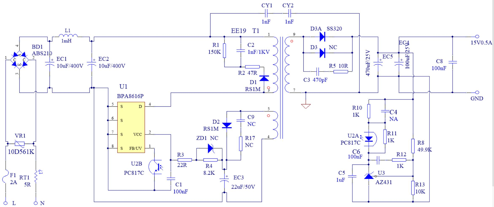

<table><tr><td>序号</td><td>元件标号</td><td>参数描述</td><td>封装尺寸</td><td>数量</td></tr><tr><td>1</td><td>BD1</td><td>ABS210</td><td>BD_SMD (bs210)</td><td>1</td></tr><tr><td>2</td><td>C1, C6, C8</td><td>100nF/50V</td><td>0805-C</td><td>3</td></tr><tr><td>3</td><td>C2</td><td>1nF/1KV</td><td>1206-C</td><td>1</td></tr><tr><td>4</td><td>C3</td><td>470pF/50V</td><td>0805-C</td><td>1</td></tr><tr><td>5</td><td>C5</td><td>1uF/50V</td><td>0805-C</td><td>1</td></tr><tr><td>6</td><td>CY1, CY2</td><td>1nF/400V Y1</td><td>CY</td><td>2</td></tr><tr><td>7</td><td>D1, D2</td><td>RS1M</td><td>SMA</td><td>2</td></tr><tr><td>8</td><td>D3A</td><td>SS320</td><td>SMC</td><td>1</td></tr><tr><td>9</td><td>EC1, EC2</td><td>10uF/400V</td><td>EC 8.5 P3.5</td><td>2</td></tr><tr><td>10</td><td>EC3</td><td>22uF/50V</td><td>EC 5 P2.5</td><td>1</td></tr><tr><td>11</td><td>EC4</td><td>100uF/25V</td><td>EC 8.5 P3.5</td><td>1</td></tr><tr><td>12</td><td>EC5</td><td>470uF/25V</td><td>EC 8.5 P3.5</td><td>1</td></tr><tr><td>13</td><td>F1</td><td>T 2A/250V</td><td>F-8.5X4-P5</td><td>1</td></tr><tr><td>14</td><td>L1</td><td>1mH/0.2A</td><td>L/D 6 P3.0</td><td>1</td></tr><tr><td>15</td><td>R1</td><td>150K</td><td>1206-R</td><td>1</td></tr><tr><td>16</td><td>R2</td><td>47R</td><td>1206-R</td><td>1</td></tr><tr><td>17</td><td>R3</td><td>22R</td><td>0805-R</td><td>1</td></tr><tr><td>18</td><td>R4</td><td>8.2K</td><td>0805-R</td><td>1</td></tr><tr><td>19</td><td>R5</td><td>10R</td><td>0805-R</td><td>1</td></tr><tr><td>20</td><td>R8</td><td>49.9K</td><td>0805-R</td><td>1</td></tr></table>

<table><tr><td>序号</td><td>元件标号</td><td>参数描述</td><td>封装尺寸</td><td>数量</td></tr><tr><td>21</td><td>R10, R11, R12</td><td>1K</td><td>0805-R</td><td>3</td></tr><tr><td>22</td><td>R13</td><td>10K</td><td>0805-R</td><td>1</td></tr><tr><td>23</td><td>RT1</td><td>5R</td><td>NTC-7.6X3-P5</td><td>1</td></tr><tr><td>24</td><td>T1</td><td>EE19</td><td>T EE19 P13</td><td>1</td></tr><tr><td>25</td><td>U1</td><td>BPA8616P</td><td>DIP8</td><td>1</td></tr><tr><td>26</td><td>U2</td><td>PC817C</td><td>DIP4</td><td>1</td></tr><tr><td>27</td><td>U3</td><td>AZ431</td><td>SOT23</td><td>1</td></tr><tr><td>28</td><td>VR1</td><td>10D561K</td><td>V-10X5.5-P7.5 -</td><td>1</td></tr><tr><td>29</td><td>PCB</td><td>69mm*37mm CEM-1</td><td></td><td>1</td></tr></table>

69.00mm  
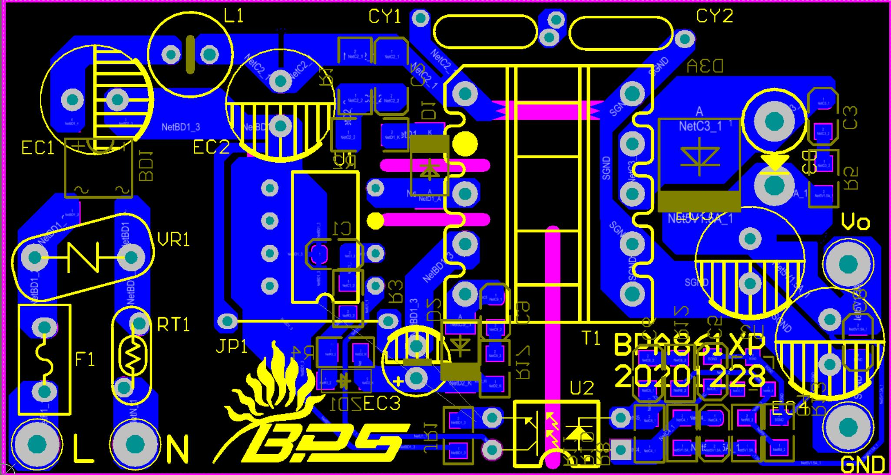

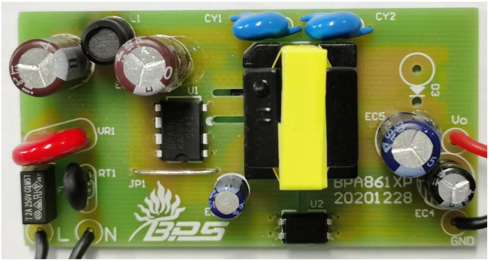

TOP SIDE

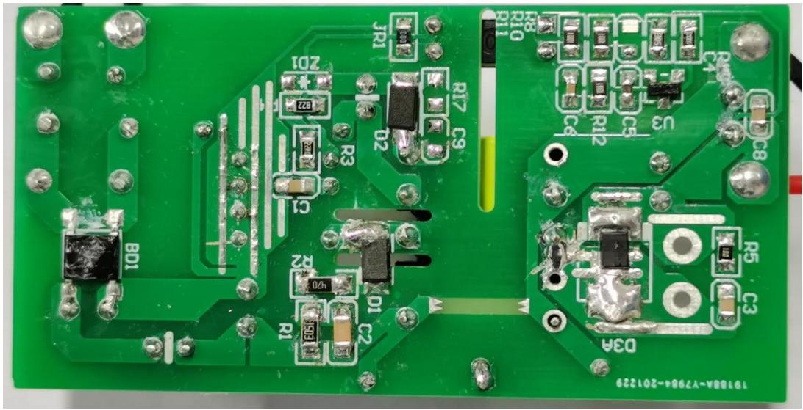

BOTTOM SIDE

## 变压器规格书

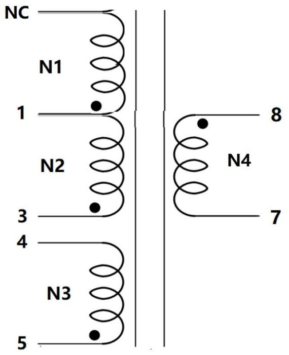

<table><tr><td>序号</td><td>起始脚</td><td>终止脚</td><td>绕制规则</td><td>匝数</td><td>绕线方式</td></tr><tr><td>N1</td><td>1</td><td>NC</td><td>2UEWφ0.18*1P</td><td>41Ts</td><td>密绕一层</td></tr><tr><td>胶带</td><td></td><td></td><td></td><td>2Ts</td><td></td></tr><tr><td>N2</td><td>3</td><td>1</td><td>2UEWφ0.18*1P</td><td>83Ts</td><td>密绕两层</td></tr><tr><td>胶带</td><td></td><td></td><td></td><td>2Ts</td><td></td></tr><tr><td>N3</td><td>5</td><td>4</td><td>2UEWφ0.18*3P</td><td>14Ts</td><td>均匀绕一层</td></tr><tr><td>胶带</td><td></td><td></td><td></td><td>3Ts</td><td></td></tr><tr><td>N4</td><td>8</td><td>7</td><td>TEX-E φ0.4*1P</td><td>14Ts</td><td>密绕一层</td></tr><tr><td>胶带</td><td></td><td></td><td></td><td>3Ts</td><td></td></tr></table>

## 规格参数：

1）骨架：EE19（5+5PIN），磁芯材质：EE19 PC40 或同等材质 ， $\mathsf { A } \mathsf { e } = 2 3 \mathsf { m } \mathsf { m } ^ { 2 }$ ；  
2）N1、N2: 2UEW 漆包线；N3: 三层绝缘线；  
3）绝缘胶带:3M900 或同等材质；  
4）初级绕组感量Lp：1.33mH±5%（测试条件： 0.3V，100kHz）；  
5）漏感量Llk：要求控制在初级绕组的4%以内(测试条件： 0.3 V，100kHz）；  
6）耐压测试= 3KV 5mA 1Min；  
7）成品要求：浸凡立水；

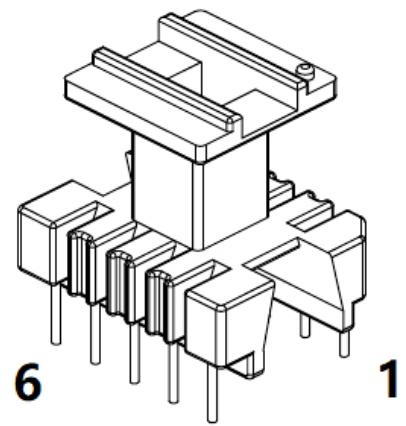

待机功耗  
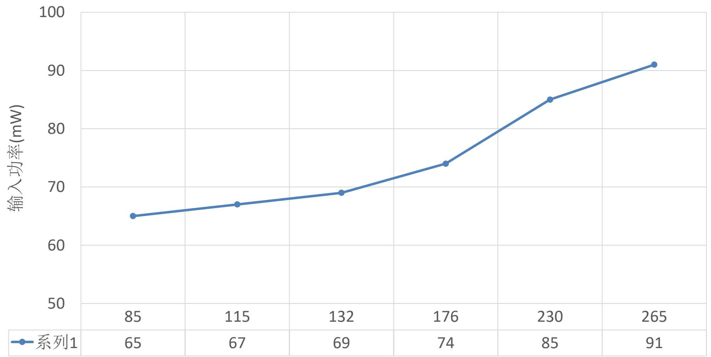

输入电压(Vac)

效率曲线  
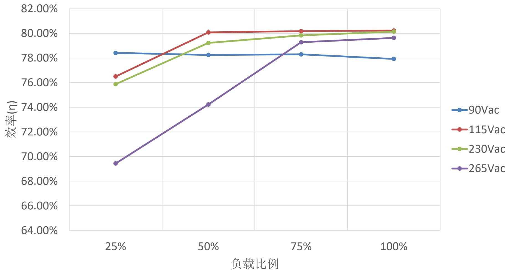

<table><tr><td> $V_{IN}(VAC)$ </td><td>Load(%)</td><td> $P_{IN}(W)$ </td><td> $V_{OUT}(V)$ </td><td>线端</td><td> $I_{OUT}(A)$ </td><td> $P_{OUT}(W)$ </td><td>Eff(%)</td><td>AVG Eff(%)</td></tr><tr><td rowspan="6">85</td><td>空载</td><td></td><td></td><td></td><td></td><td>0</td><td></td><td></td></tr><tr><td>10%</td><td>1.05</td><td>15.057</td><td></td><td>0.05</td><td>0.75285</td><td>71.70%</td><td></td></tr><tr><td>25%</td><td>2.4</td><td>15.056</td><td></td><td>0.125</td><td>1.882</td><td>78.42%</td><td rowspan="4">78.22%</td></tr><tr><td>50%</td><td>4.81</td><td>15.055</td><td></td><td>0.25</td><td>3.76375</td><td>78.25%</td></tr><tr><td>75%</td><td>7.21</td><td>15.054</td><td></td><td>0.375</td><td>5.64525</td><td>78.30%</td></tr><tr><td>100%</td><td>9.66</td><td>15.055</td><td></td><td>0.5</td><td>7.5275</td><td>77.92%</td></tr><tr><td rowspan="6">115</td><td>空载</td><td></td><td></td><td></td><td></td><td>0</td><td></td><td></td></tr><tr><td>10%</td><td>1.06</td><td>15.056</td><td></td><td>0.05</td><td>0.7528</td><td>71.02%</td><td></td></tr><tr><td>25%</td><td>2.46</td><td>15.055</td><td></td><td>0.125</td><td>1.881875</td><td>76.50%</td><td rowspan="4">79.25%</td></tr><tr><td>50%</td><td>4.7</td><td>15.055</td><td></td><td>0.25</td><td>3.76375</td><td>80.08%</td></tr><tr><td>75%</td><td>7.04</td><td>15.053</td><td></td><td>0.375</td><td>5.644875</td><td>80.18%</td></tr><tr><td>100%</td><td>9.38</td><td>15.051</td><td></td><td>0.5</td><td>7.5255</td><td>80.23%</td></tr><tr><td rowspan="6">230</td><td>空载</td><td></td><td></td><td></td><td></td><td>0</td><td></td><td></td></tr><tr><td>10%</td><td>1.15</td><td>15.055</td><td></td><td>0.05</td><td>0.75275</td><td>65.46%</td><td></td></tr><tr><td>25%</td><td>2.48</td><td>15.054</td><td></td><td>0.125</td><td>1.88175</td><td>75.88%</td><td rowspan="4">78.77%</td></tr><tr><td>50%</td><td>4.75</td><td>15.053</td><td></td><td>0.25</td><td>3.76325</td><td>79.23%</td></tr><tr><td>75%</td><td>7.07</td><td>15.052</td><td></td><td>0.375</td><td>5.6445</td><td>79.84%</td></tr><tr><td>100%</td><td>9.39</td><td>15.051</td><td></td><td>0.5</td><td>7.5255</td><td>80.14%</td></tr><tr><td rowspan="6">265</td><td>空载</td><td></td><td></td><td></td><td></td><td>0</td><td></td><td></td></tr><tr><td>10%</td><td>1.19</td><td>15.055</td><td></td><td>0.05</td><td>0.75275</td><td>63.26%</td><td></td></tr><tr><td>25%</td><td>2.71</td><td>15.054</td><td></td><td>0.125</td><td>1.88175</td><td>69.44%</td><td rowspan="4">75.64%</td></tr><tr><td>50%</td><td>5.07</td><td>15.053</td><td></td><td>0.25</td><td>3.76325</td><td>74.23%</td></tr><tr><td>75%</td><td>7.12</td><td>15.052</td><td></td><td>0.375</td><td>5.6445</td><td>79.28%</td></tr><tr><td>100%</td><td>9.45</td><td>15.051</td><td></td><td>0.5</td><td>7.5255</td><td>79.63%</td></tr></table>

## 输出电压调整率

<table><tr><td> $V_{IN}(VAC)$  $I_{OUT}(A)$ </td><td>90</td><td>115</td><td>132</td><td>176</td><td>230</td><td>265</td><td>平均值</td><td>线调整率</td></tr><tr><td>0</td><td>15.061</td><td>15.061</td><td>15.061</td><td>15.061</td><td>15.061</td><td>15.061</td><td>15.061</td><td>0.00%</td></tr><tr><td>20%</td><td>15.06</td><td>15.06</td><td>15.06</td><td>15.06</td><td>15.06</td><td>15.06</td><td>15.060</td><td>0.00%</td></tr><tr><td>40%</td><td>15.059</td><td>15.059</td><td>15.059</td><td>15.059</td><td>15.059</td><td>15.059</td><td>15.059</td><td>0.00%</td></tr><tr><td>60%</td><td>15.058</td><td>15.058</td><td>15.058</td><td>15.058</td><td>15.058</td><td>15.058</td><td>15.058</td><td>0.00%</td></tr><tr><td>80%</td><td>15.057</td><td>15.057</td><td>15.057</td><td>15.057</td><td>15.057</td><td>15.057</td><td>15.057</td><td>0.00%</td></tr><tr><td>100%</td><td>15.055</td><td>15.055</td><td>15.055</td><td>15.055</td><td>15.055</td><td>15.055</td><td>15.055</td><td>0.00%</td></tr><tr><td>平均值</td><td>15.058</td><td>15.058</td><td>15.058</td><td>15.058</td><td>15.058</td><td>15.058</td><td></td><td></td></tr><tr><td>负载调整率</td><td>0.04%</td><td>0.04%</td><td>0.04%</td><td>0.04%</td><td>0.04%</td><td>0.04%</td><td></td><td></td></tr></table>

◼ 计算方法：调整率=100%\*(最大值-最小值)/平均值

## 输出电压纹波

20MHz带宽，去掉示波器探头正端夹子和地线环，10uF/50V 0.1uF/50V

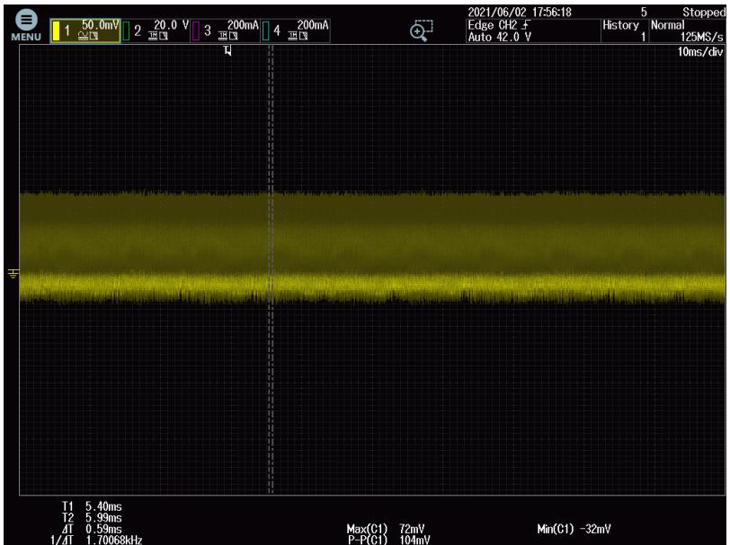

85 $\mathsf { v } _ { \mathsf { A C } }$

CH1 VOUT $\mathsf { V } _ { \mathsf { O U T } }$ Ripple $V _ { \mathsf { P K - P K } } { = } 1 0 4 ~ \mathsf { m V }$

Test Condition:

➢ Full Load

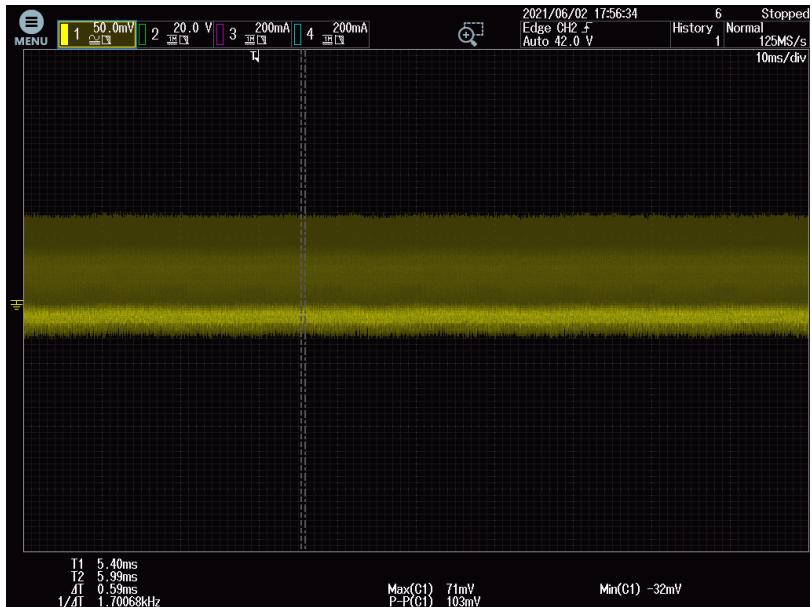

115 VAC

CH1 VOUT $\mathsf { V } _ { \mathsf { O U T } }$ Ripple $v _ { p _ { \mathrm { K - P K } } } { = } 1 0 3 ~ \mathsf { m V }$

Test Condition:

➢ Full Load

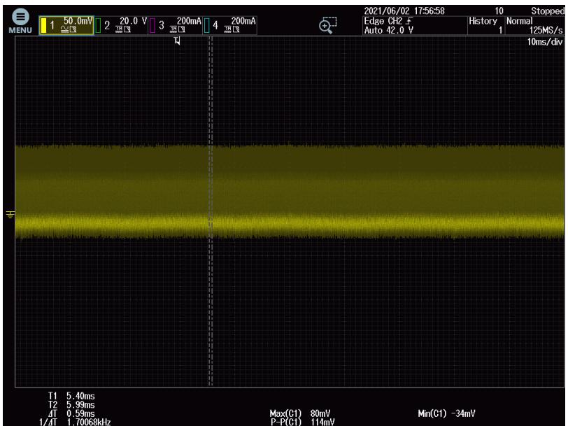

230 $\mathsf { v } _ { \mathsf { A C } }$

CH1 VOUT $\mathsf { V } _ { \mathsf { O U T } }$ Ripple $\mathtt { V } _ { \mathtt { P K - P K } } { = } 1 1 4 \mathsf { m V }$

Test Condition:

➢ Full Load

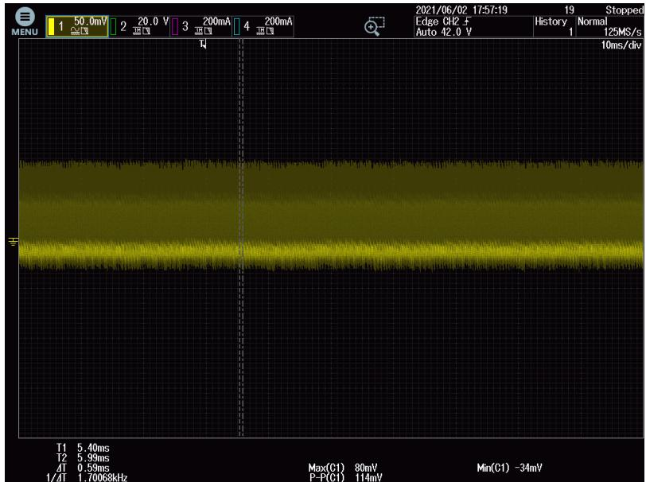

265 $\mathsf { v } _ { \mathsf { A C } }$

CH1 VOUT $\mathsf { V } _ { \mathsf { O U T } }$ Ripple $\mathsf { V } _ { \mathsf { P K - P K } } { = } 1 1 4 \mathsf { m V }$

Test Condition:

➢ Full Load

## (50%-100%)

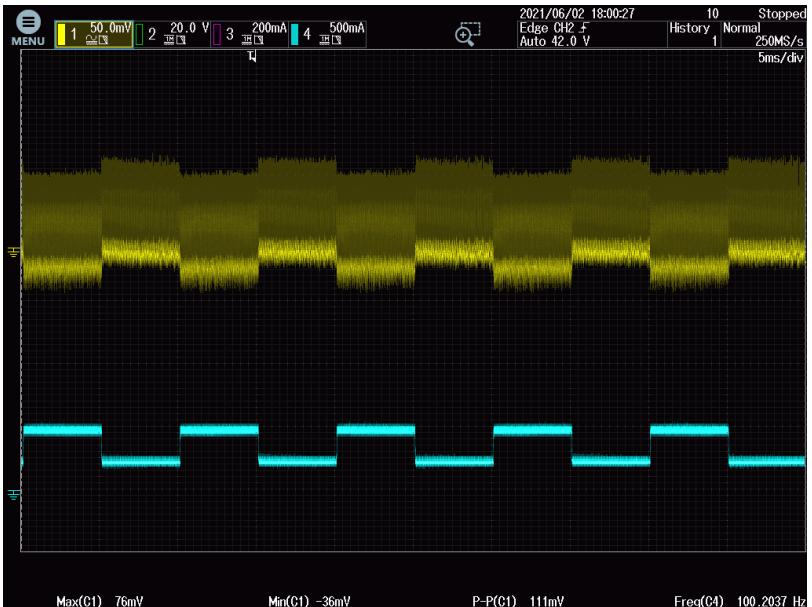

85 VAC

CH1 VOUT ${ \mathsf { C H 1 } } { \mathsf { V } } _ { \mathsf { O U T } }$ $\mathtt { V } _ { \mathtt { P K - P K } } { = } 1 1 1 \mathtt { m V }$  
$\mathsf { C H 4 } \mathsf { I } _ { \mathsf { O U T } }$

## Test Condition:

➢ $0 . 2 5 \ : \mathsf { A } – 0 . 5 \ : \mathsf { A } – 0 . 2 5 \ : \mathsf { A }$  
➢ Slew Rate: 0.5 A/μS  
➢ Frequency: 100 Hz

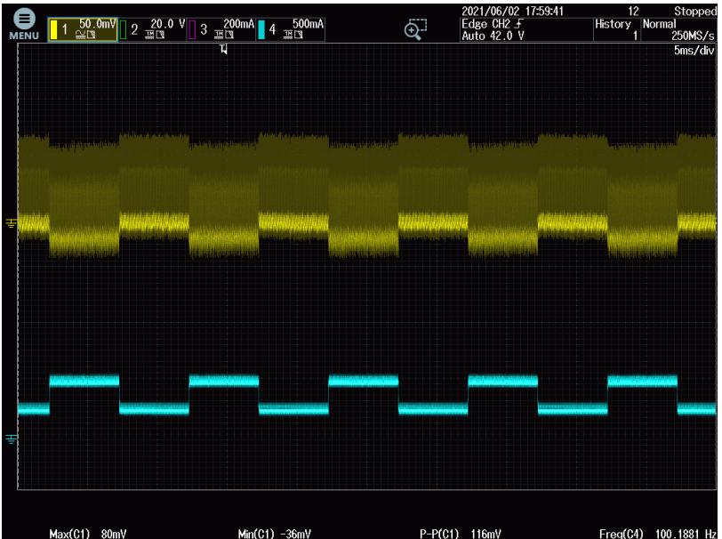

230 VAC

CH1 VOUT $\mathsf { V } _ { \mathsf { O U T } }$ $\mathsf { V } _ { \mathsf { P K - P K } } =$ 116 mV  
$\mathsf { C H 4 } \mathsf { l } _ { \mathsf { O U T } }$

## Test Condition:

➢ 0.25 A-0.5 A-0.25 A  
➢ Slew Rate: 0.5 $\mathsf { A } / \mu \mathsf { S }$  
➢ Frequency: 100 Hz

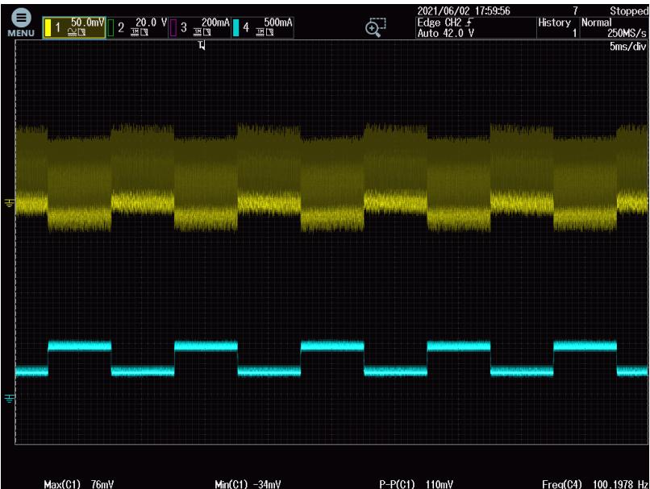

115 VAC

CH1 VOUT ${ \mathsf { C H 1 } } { \mathsf { V } } _ { \mathsf { O U T } }$ $V _ { \mathsf { P K - P K } } = \pm 1 1 0 \mathsf { m V }$  
$\mathsf { C H 4 } \mathsf { I } _ { \mathsf { O U T } }$

## Test Condition:

➢ 0.25 A-0.5 A-0.25 A  
➢ Slew Rate: 0.5 A/μS  
➢ Frequency: 100 Hz

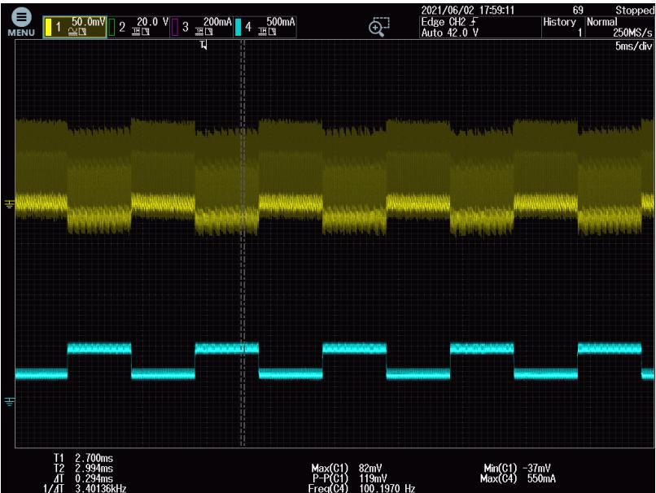

265 VAC

CH1 VOUT ${ \mathsf { C H 1 } } { \mathsf { V } } _ { \mathsf { O U T } }$ $\mathsf { V } _ { \mathsf { P K - P K } } { = } \pmb { 1 } \pmb { 1 } \mathsf { 9 m V }$  
$\mathsf { C H 4 } \mathsf { I } _ { \mathsf { O U T } }$

## Test Condition:

➢ 0.25 A-0.5 A-0.25 A  
➢ Slew Rate: 0.5 A/μS  
➢ Frequency: 100 Hz

## (10%-90%)

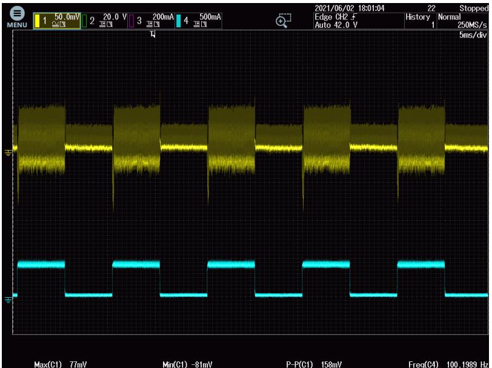

85 VAC

CH1 VOUT ${ \mathsf { C H 1 } } { \mathsf { V } } _ { \mathsf { O U T } }$ $v _ { p _ { \mathrm { K - P K } } = 1 5 8 \mathrm { \ m V } }$  
$\mathsf { C H 4 } \mathsf { I } _ { \mathsf { O U T } }$

## Test Condition:

➢ $0 . 0 5 \ : \mathsf { A } – 0 . 4 5 \mathsf { A } – 0 . 0 5 \ : \mathsf { A }$  
➢ Slew Rate: 0.5 A/μS  
➢ Frequency: 100 Hz

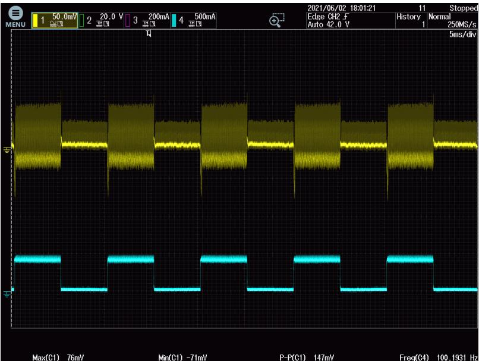

115 VAC

CH1 VOUT ${ \mathsf { C H 1 } } { \mathsf { V } } _ { \mathsf { O U T } }$ $v _ { p \vert k - P K } = 1 4 7 m v$  
$\mathsf { C H 4 } \mathsf { I } _ { \mathsf { O U T } }$

## Test Condition:

➢ $0 . 0 5 \ : \mathsf { A } – 0 . 4 5 \mathsf { A } – 0 . 0 5 \ : \mathsf { A }$  
➢ Slew Rate: 0.5 A/μS  
➢ Frequency: 100 Hz

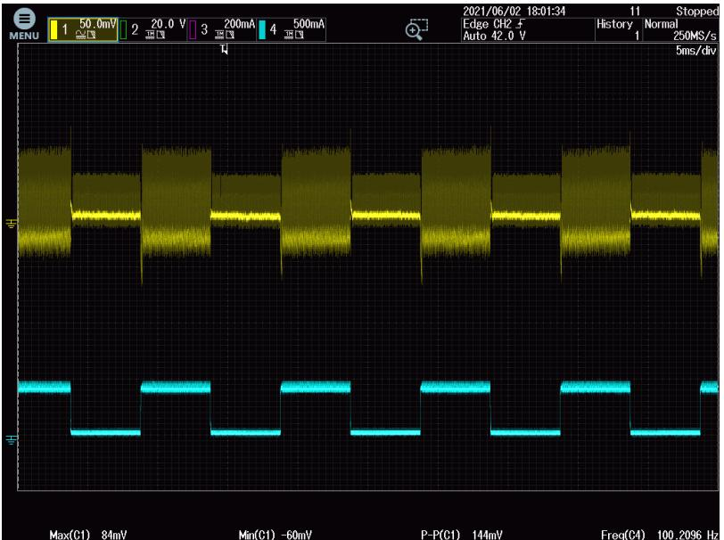

230 VAC

CH1 VOUT ${ \mathsf { C H 1 } } { \mathsf { V } } _ { \mathsf { O U T } }$ $V _ { p | c - P K } = 1 4 4 m v$  
$\mathsf { C H 4 } \mathsf { l } _ { \mathsf { O U T } }$

## Test Condition:

➢ 0.05 A-0.45A-0.05 A  
➢ Slew Rate: 0.5 $\mathsf { A } / \mu \mathsf { S }$  
➢ Frequency: 100 Hz

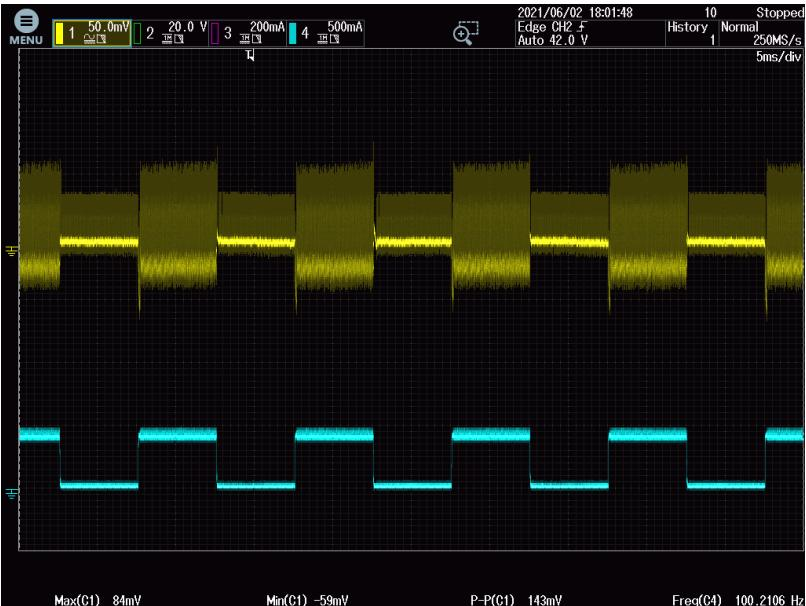

265 VAC

CH1 VOUT ${ \mathsf { C H 1 } } { \mathsf { V } } _ { \mathsf { O U T } }$ $\mathsf { V } _ { \mathsf { P K - P K } } { = } \pm 4 3 \mathsf { m V }$  
$\mathsf { C H 4 } \mathsf { I } _ { \mathsf { O U T } }$

## Test Condition:

➢ 0.05 A-0.45A-0.05 A  
➢ Slew Rate: 0.5 A/μS  
➢ Frequency: 100 Hz

## 启动延时时间

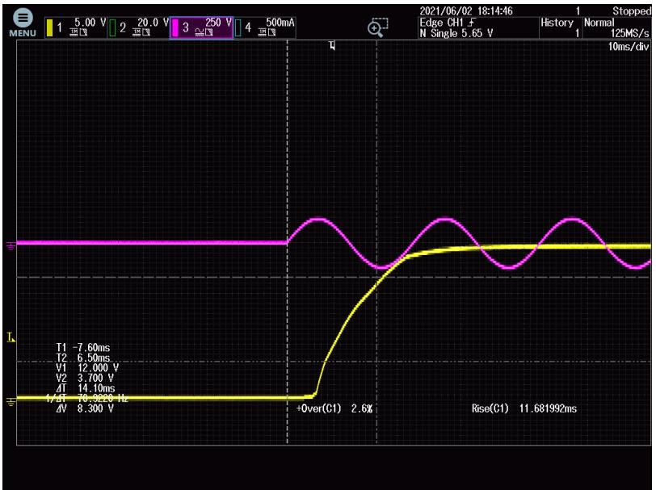

85VAC

CH1 VOUT  
CH3 Vin

Tdelay=14.1mS

Test Condition:

➢ Full Load

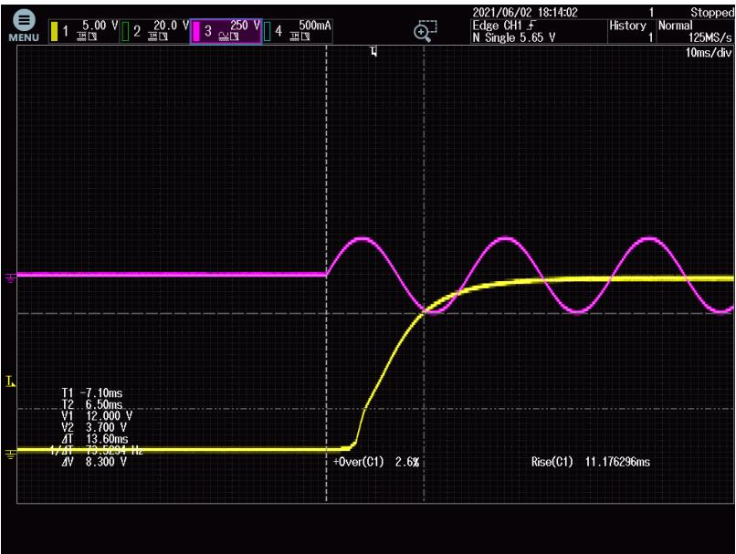

115 VAC

CH1 VOUT  
CH3 Vin

Tdelay=13.6mS

Test Condition:

➢ Full Load

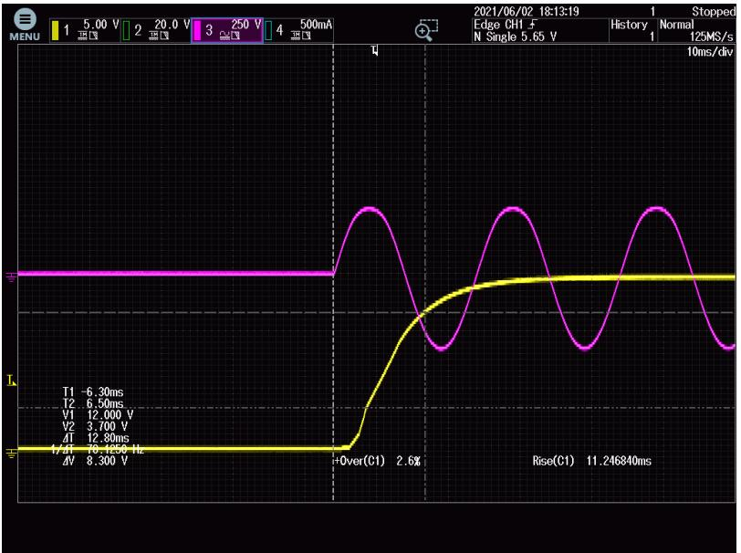

230 VAC

CH1 VOUT  
CH3 Vin

Tdelay=12.8mS

Test Condition:

➢ Full Load

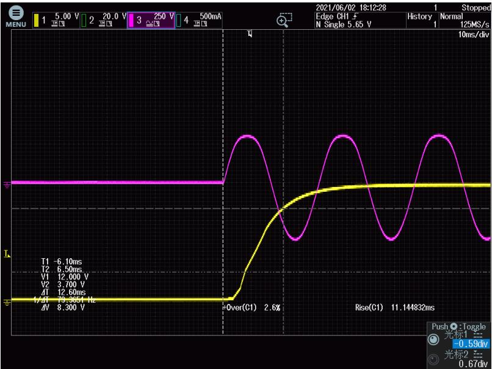

265 VAC

CH1 VOUT  
CH3 Vin

Tdelay=12.6mS

Test Condition:

➢ Full Load

## 输出电压开机波形

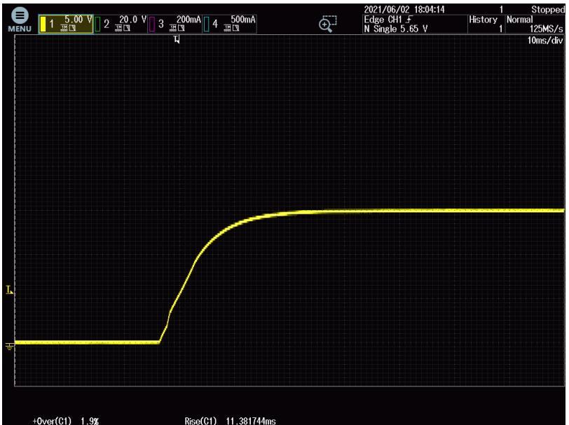

85 VAC

CH1 VOUT TRISE: 11.4 mS

## Test Condition:

➢ No Load

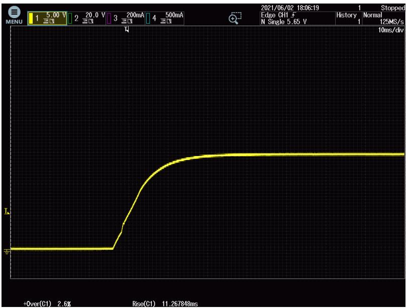

265 VAC

CH1 VOUT TRISE: 11.3 mS

## Test Condition:

➢ No Load

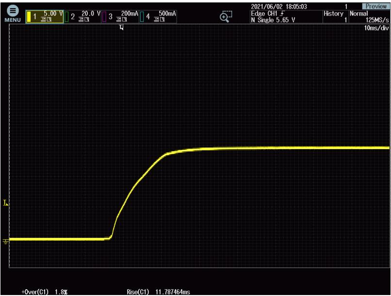

85 VAC

CH1 VOUT TRISE: 11.8 mS

## Test Condition:

➢ Full Load

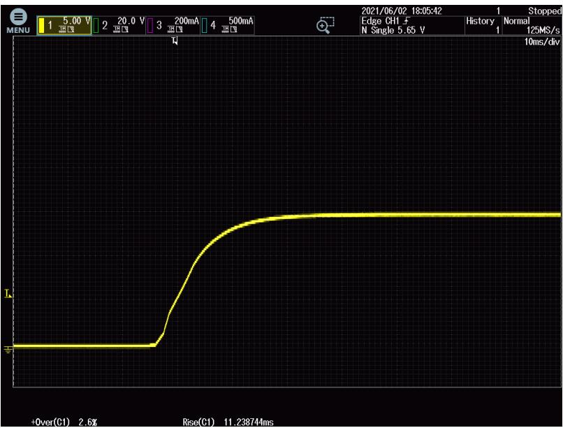

265 VAC

CH1 VOUT TRISE: 11.2 mS

## Test Condition:

➢ Full Load

## MOs漏源极电压电流波形 (启机)

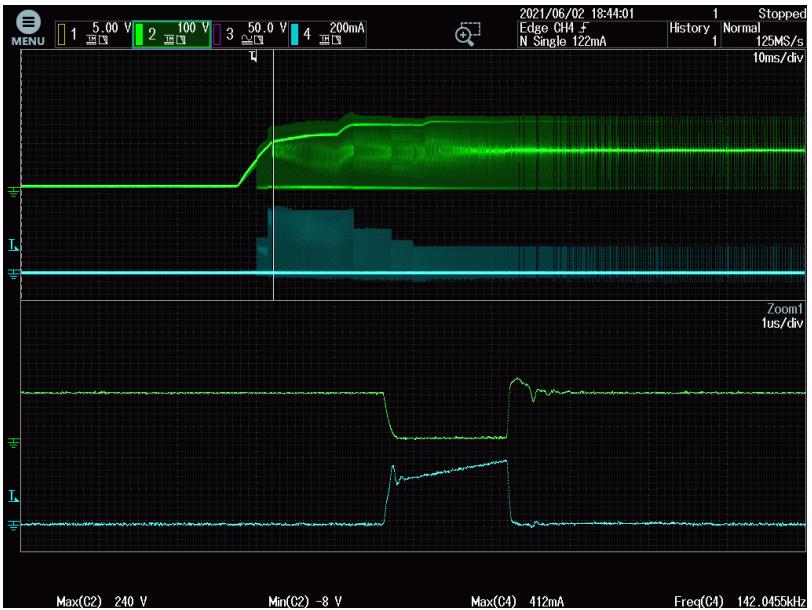

85 VAC

${ \mathsf { C H } } 2 { \mathsf { V } } _ { \mathsf { D S } }$  
$C H 4 1 _ { \mathsf { D } }$ $V _ { \mathsf { D S } } { = } 2 4 0 \mathsf { V }$ IMAX= 412 mA $\mathsf { I } _ { \mathsf { M A X } } { = } 4 1 2 \mathsf { m } \mathsf { A }$

Test Condition:  
➢ No Load  
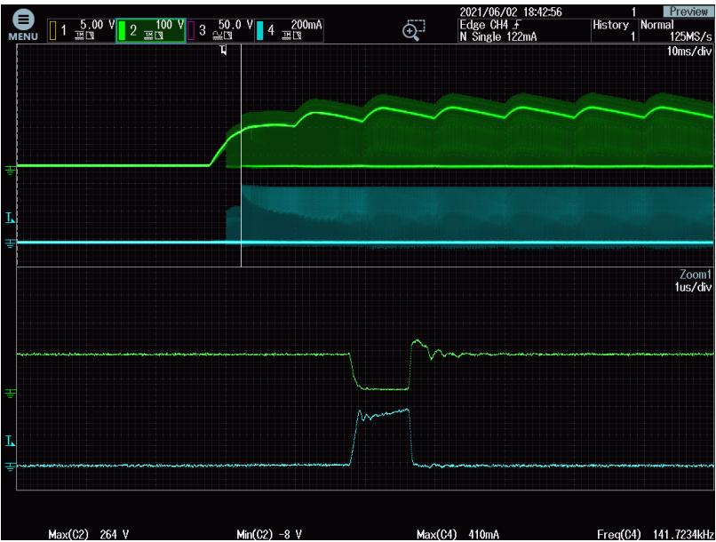

85 VAC

${ \mathsf { C H } } 2 { \mathsf { V } } _ { \mathsf { D S } }$  
$C H 4 1 _ { \mathsf { D } }$ $V _ { \mathrm { D S } } { = } 2 6 4 \mathrm { V }$ IMAX= 410 mA $\mathsf { I } _ { \mathsf { M A X } } { = } 4 1 0 \mathsf { m } \mathsf { A }$

Test Condition:  
➢ Full Load  
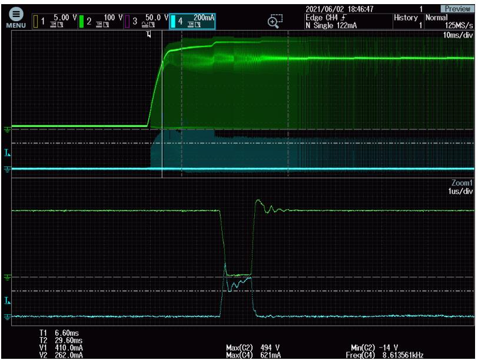

265 VAC

${ \mathsf { C H } } 2 \ { \mathsf { V } } _ { \mathsf { D S } }$  
$C H 4 1 _ { \mathsf { D } }$ $\mathtt { V } _ { \mathtt { D S } } mathtt { = } 4 9 4 \mathtt { V }$ $\mathsf { I } _ { \mathsf { M A X } } { = } 6 2 1 \mathsf { m } \mathsf { A }$

Test Condition:  
➢ No Load  
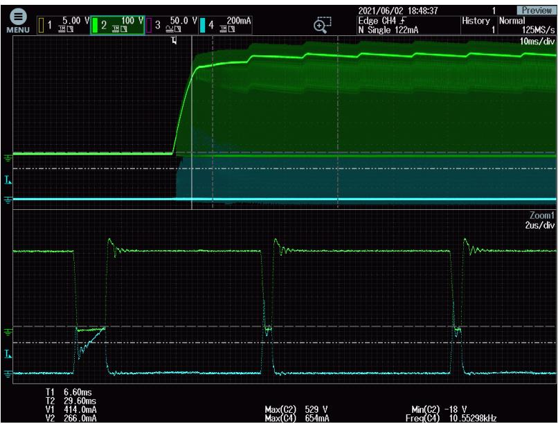

265 VAC

${ \mathsf { C H } } 2 { \mathsf { V } } _ { \mathsf { D S } }$  
$C H 4 1 _ { \mathsf { D } }$ $V _ { \mathsf { D S } } { = } 5 2 9 \mathsf { V }$ $\mathsf { I } _ { \mathsf { M A X } } { = } 6 5 4 ~ \mathsf { m A }$

Test Condition:

➢ Full Load

## MOS漏源极电压电流波形 (正常工作)

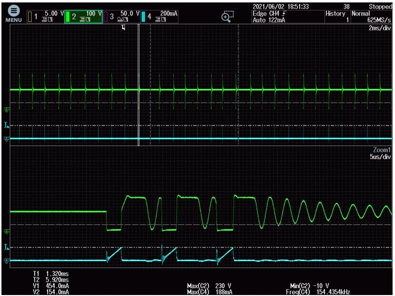

85 VAC

${ \mathsf { C H } } 2 { \mathsf { V } } _ { \mathsf { D S } }$  
$C H 4 1 _ { \mathsf { D } }$ $V _ { \mathsf { D S } } { = } 2 3 0 \mathsf { V }$ IMAX= 188 mA $\mathsf { I } _ { \mathsf { M A X } } { = } 1 8 8 \mathsf { m } \mathsf { A }$

Test Condition:  
➢ No Load  
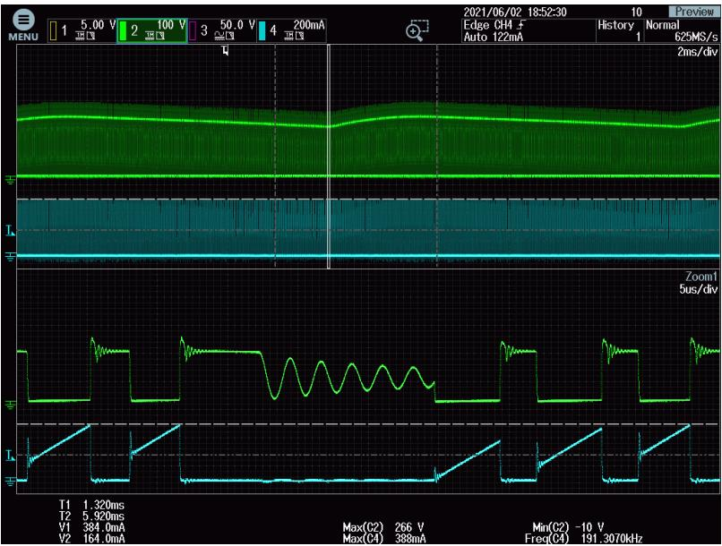

85 VAC

${ \mathsf { C H } } 2 { \mathsf { V } } _ { \mathsf { D S } }$  
$C H 4 1 _ { \mathsf { D } }$ $V _ { \mathrm { D S } } { = } 2 6 6 V$ $\mathsf { I } _ { \mathsf { M A X } } { = } 3 8 8 \mathsf { m } \mathsf { A }$ IMAX=

Test Condition:  
➢ Full Load  
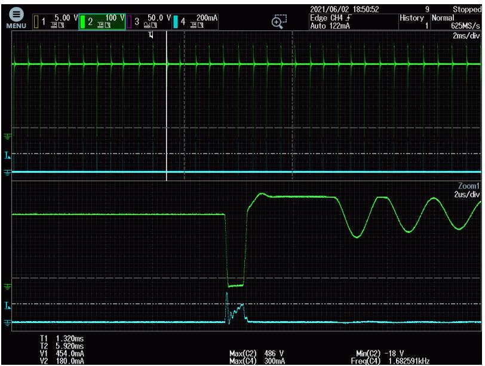

265 VAC

${ \mathsf { C H } } 2 \ { \mathsf { V } } _ { \mathsf { D S } }$  
$C H 4 1 _ { \mathsf { D } }$ $V _ { \mathsf { D } \mathsf { S } } \mathsf { = } 4 8 6 \mathsf { V }$ IMAX=300 mA $\mathsf { I } _ { \mathsf { M A X } } { = } 3 0 0 \mathsf { m } \mathsf { A }$

Test Condition:  
➢ No Load  
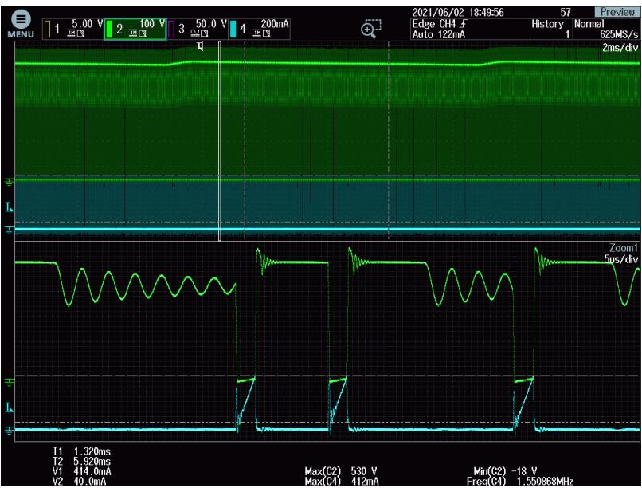

265 VAC

${ \mathsf { C H } } 2 { \mathsf { V } } _ { \mathsf { D S } }$  
$C H 4 1 _ { \mathsf { D } }$ $V _ { \mathrm { D S } } { = } 5 3 0 \mathrm { V }$ IMAX=412 $\mathsf { I } _ { \mathsf { M A X } } { = } 4 1 2 \mathsf { m } \mathsf { A }$

Test Condition:

➢ Full Load

## 输出二极管电压波形

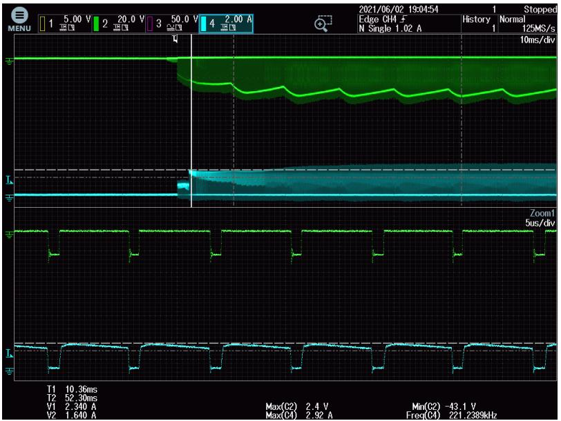

85 VAC

$C H 2 V _ { \mathsf { D } }$  
$C H 4 1 _ { \mathsf { D } }$ $\mathsf { V } _ { \mathsf { D } } { = } 4 3 . 1 \mathsf { V }$ $\mathsf { I } _ { \mathsf { D m a x } } = 2 . 9 2 \ \mathsf { A }$ Dmax

## Test Condition:

➢ Full Load  
➢ 开机

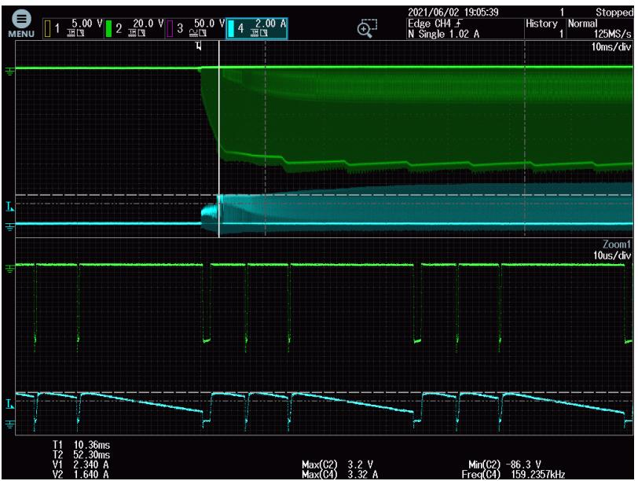

265 VAC

CH2 VD  
$C H 4 1 _ { \mathsf { D } }$ $\mathtt { V } _ { \mathtt { D } } mathtt { = } 8 6 . 3 \mathtt { V }$ $\mathsf { I } _ { \mathsf { D m a x } } { = } 3 . 3 2 \ \mathsf { A }$ Dmax

## Test Condition:

➢ Full Load  
➢ 开机

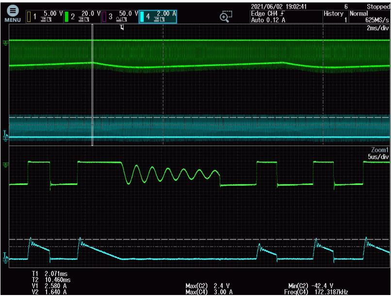

85 VAC

$C H 2 V _ { \mathsf { D } }$  
$C H 4 1 _ { \mathsf { D } }$ $V _ { \mathrm { D } } { = } 4 2 . 4  V$ $\mathsf { I } _ { \mathsf { D m a x } } = 3 \mathsf { A }$ IDmax

## Test Condition:

➢ Full Load

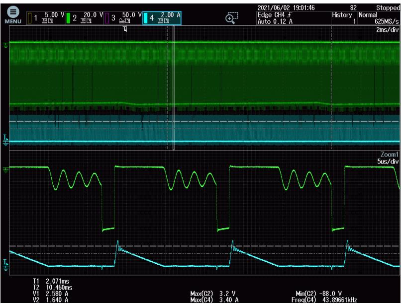

265 VAC

$C H 2 V _ { \mathsf { D } }$  
CH4 ID $C H 4 1 _ { \mathsf { D } }$ $\mathtt { V } _ { \mathtt { D } } \mathtt { = } 8 8 \mathtt { V }$ IDmax=3.4 A $\mathsf { I } _ { \mathsf { D m a x } } { = } 3 . 4 ~ \mathsf { A }$

## Test Condition:

➢ Full Load

## 输出短路时MOs和二极管波形

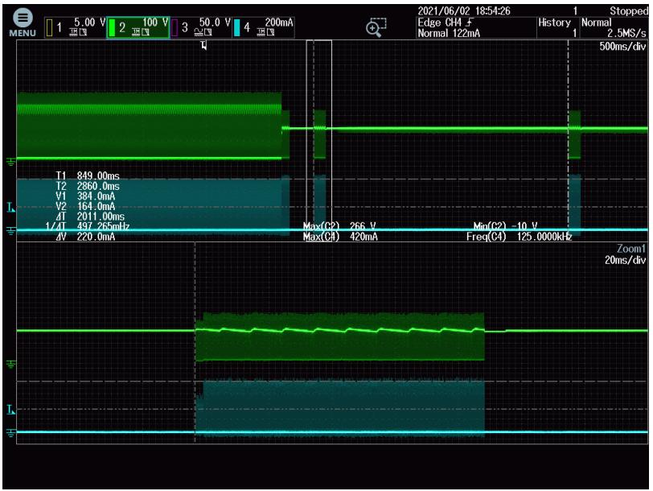

85 VAC

${ \mathsf { C H } } 2 { \mathsf { V } } _ { \mathsf { D S } }$  
$C H 4 1 _ { \mathsf { D } }$ $\begin{array} { r l } { } & { { \mathsf { V } } _ { \mathsf { D S \_ m a x } } = 2 6 6 { \mathsf { V } } } \\ { } & { { \mathsf { I } } _ { \mathsf { D S \_ m a x } } = 4 2 0 \mathsf { m A } } \end{array}$

## MOS

## Test Condition:

➢ Full Load

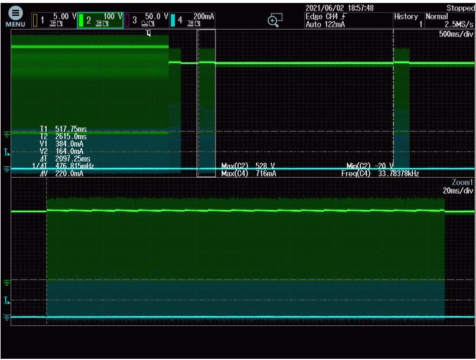

265 VAC

CH2 VDS  
CH4 ID $\mathtt { V _ { D S \_ m a x } } = 5 2 8 \lor$ $\mathsf { I } _ { \mathsf { D } \mathsf { S } \_ \mathsf { m a x } } = 7 1 6 \mathsf { m } \mathsf { A }$

## MOS

## Test Condition:

➢ Full Load

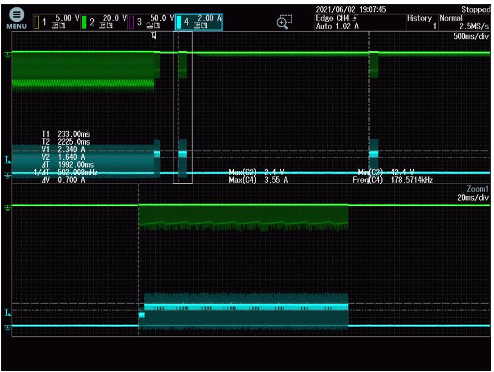

85 VAC

CH2 VD  
CH4 ID $V _ { \mathrm { D } } { = } 4 2 . 4  V$ Dmax =3.55 A

## Test Condition:

➢ Full Load

## 二极管

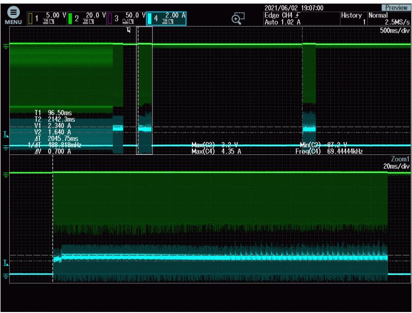

265 VAC

CH2 VD  
CH4 ID$\mathtt { V } _ { \mathtt { D } } mathtt { = } 8 7 . 2 \mathtt { V }$ $\mathsf { I } _ { \mathsf { D m a x } } { = } 4 . 3 5 ~ \mathsf { A }$ IDmax

## Test Condition:

➢ Full Load

## 二极管

## Brown In—Brown Out

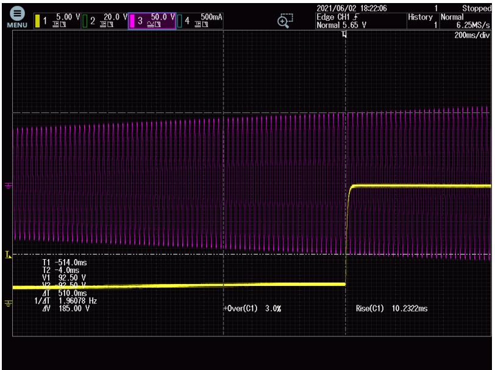

## Brown In

CH1 ${ \sf V } _ { 0 }$  
CH3 VIN $\mathsf { V } _ { \mathsf { I N } }$ $\mathsf { V } _ { \mathsf { B r o w n \_ l n } } = 6 5 . 4 \mathsf { V }$

## Test Condition:

➢ No Load

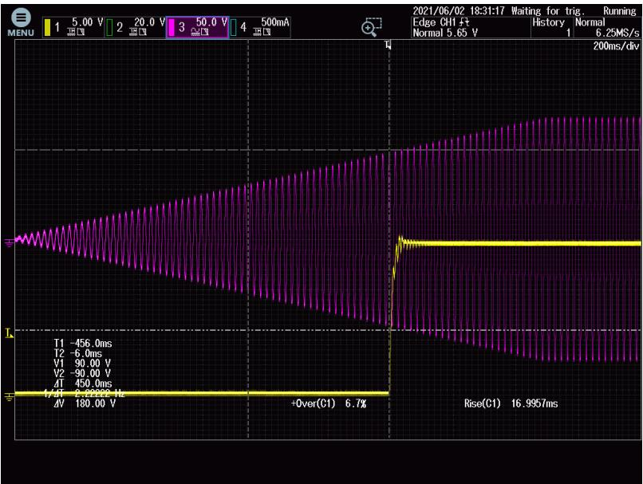

## Brown In

CH1 ${ \sf V } _ { 0 }$  
CH3 VIN $\mathsf { V } _ { \mathsf { I N } }$ $\mathsf { V } _ { \mathsf { B r o w n \_ l n } } { = } 6 6 \mathsf { V }$

## Test Condition:

➢ Full Load

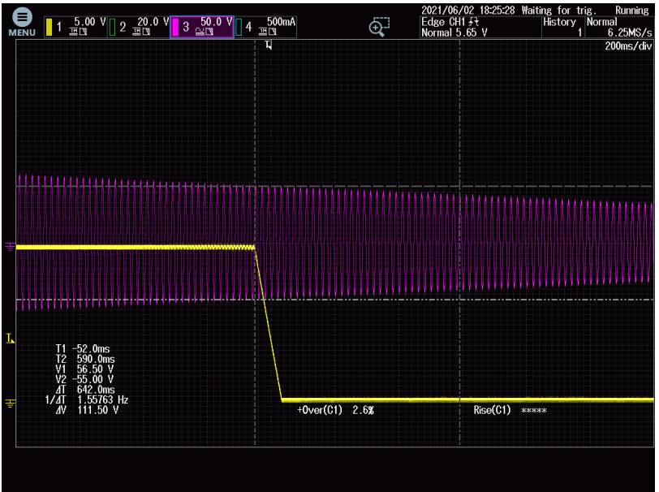

## Brown OUT

CH1 ${ \sf V } _ { 0 }$  
CH3 VIN $\mathsf { V } _ { \mathsf { I N } }$ $\mathsf { V } _ { \mathsf { B r o w n \_ o u t } } = 3 8 . 9 \mathsf { V }$

## Test Condition:

➢ $\mathsf { I } _ { 0 } { = } 0 . 1 \mathsf { A }$

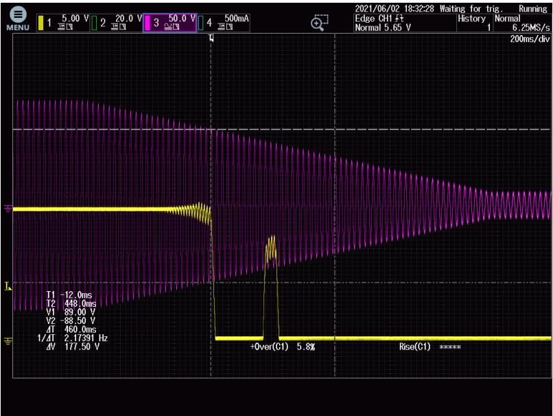

## Brown OUT

CH1 ${ \sf V } _ { 0 }$  
CH3 VIN $\mathsf { V } _ { \mathsf { I N } }$ $\mathsf { V } _ { \mathsf { B r o w n \_ o u t } } = 6 2 \mathsf { V }$

## 触发OCP

## Test Condition:

➢ Full Load

## 输入过压保护波形

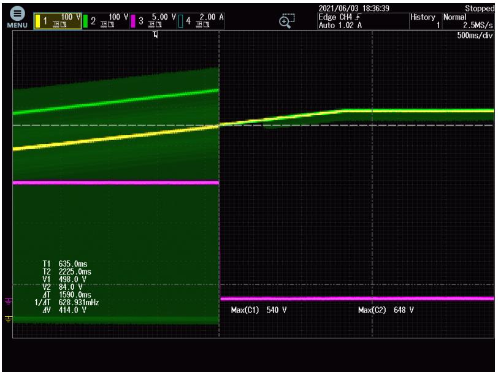

## 输入过压

CH1 VIN\_DC $\mathsf { C H 1 } \mathsf { V } _ { \mathsf { I N \_ D C } }$  
${ \mathsf { C H } } 2 { \mathsf { V } } _ { \mathsf { d s } }$  
CH3 VO $\mathsf { C H 3 } \mathsf { V } _ { 0 }$ $\mathtt { V _ { D S \_ m a x } } = 6 4 8 \lor$ $V _ { _ { \mathrm { I N _ { - } D C } } } ^ { \mathrm { ~ - ~ } } = 4 9 8 \ : \mathsf { V }$

## Test Condition:

➢ $\mathsf { I } _ { 0 } { = } 0 . 5 \mathsf { A }$

## 温升测试

<table><tr><td rowspan="2">项目</td><td colspan="4">温度(°C)</td></tr><tr><td>90VAC</td><td>115VAC</td><td>230VAC</td><td>264VAC</td></tr><tr><td>环境温度</td><td>50.3</td><td>49.7</td><td>49.8</td><td>49.8</td></tr><tr><td>BPA8616P (U1)</td><td>99.4</td><td>88.9</td><td>86.2</td><td>89</td></tr><tr><td>SS320 (D3A)</td><td>73.6</td><td>73.7</td><td>74.4</td><td>75.1</td></tr><tr><td>变压器绕组 (T1)</td><td>72.9</td><td>73.1</td><td>75.7</td><td>76.9</td></tr><tr><td>变压器磁芯 (T1)</td><td>69.9</td><td>70.6</td><td>73.8</td><td>75.2</td></tr><tr><td>输入电解电容(EC2)</td><td>70.9</td><td>67.3</td><td>65.2</td><td>66.1</td></tr><tr><td>输出电解电容(EC5)</td><td>62.8</td><td>63.1</td><td>63.6</td><td>64.2</td></tr><tr><td>整流桥 (BD1)</td><td>67</td><td>63.4</td><td>59.8</td><td>60.1</td></tr></table>

## 测试说明

➢ 在温箱中进行测试  
➢ 电路板放在一个封闭的盒子内  
➢ 热电偶连接到各个测量点  
➢ 等测量点温度达到稳定后记录数据

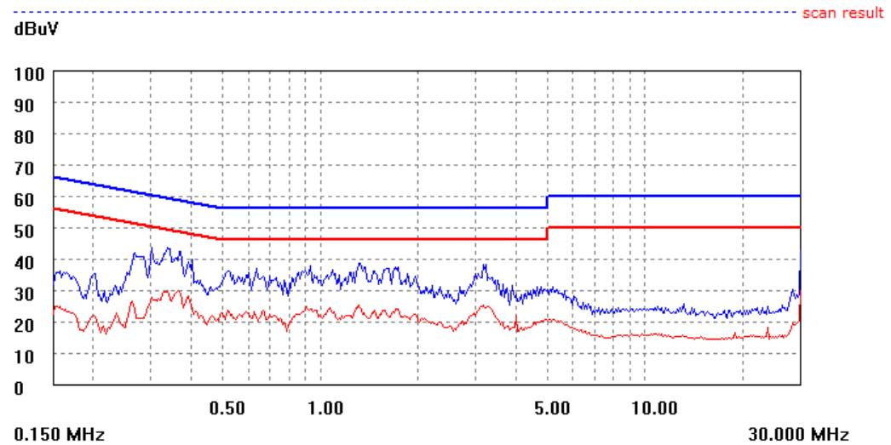

115VAC Line

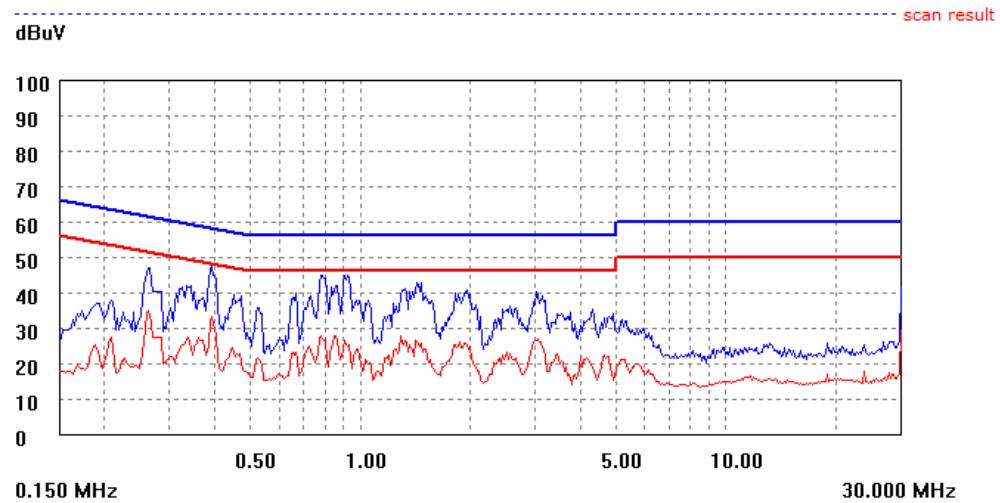

230VAC Line

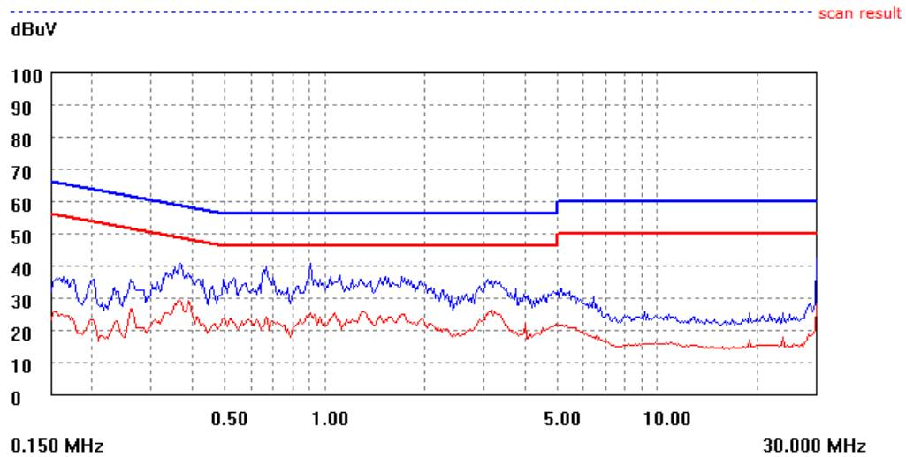

115VAC Neutral

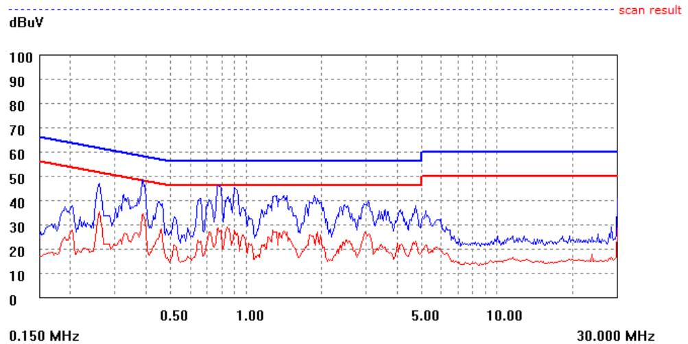

230VAC Neutral

## EMI (模拟)

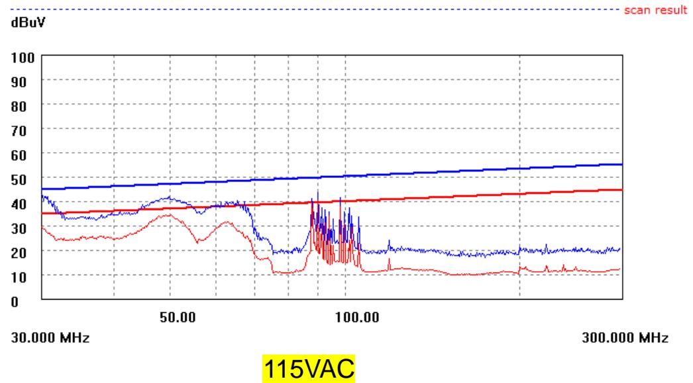

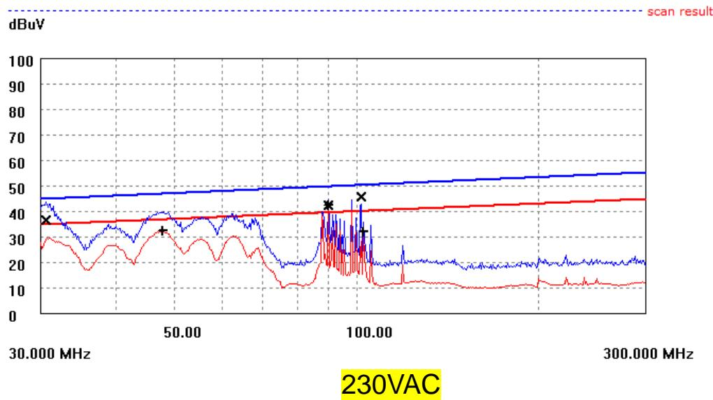

<table><tr><td>差模</td><td>电压</td><td>相位角</td><td>发生器阻抗</td><td>测试次数</td><td>测试结果</td></tr><tr><td>L to N</td><td>+2kV</td><td>0</td><td>2</td><td>10</td><td>Pass</td></tr><tr><td>L to N</td><td>-2kV</td><td>0</td><td>2</td><td>10</td><td>Pass</td></tr><tr><td>L to N</td><td>+2kV</td><td>90</td><td>2</td><td>10</td><td>Pass</td></tr><tr><td>L to N</td><td>-2kV</td><td>90</td><td>2</td><td>10</td><td>Pass</td></tr><tr><td>L to N</td><td>+2kV</td><td>180</td><td>2</td><td>10</td><td>Pass</td></tr><tr><td>L to N</td><td>-2kV</td><td>180</td><td>2</td><td>10</td><td>Pass</td></tr><tr><td>L to N</td><td>+2kV</td><td>270</td><td>2</td><td>10</td><td>Pass</td></tr><tr><td>L to N</td><td>-2kV</td><td>270</td><td>2</td><td>10</td><td>Pass</td></tr></table>

## 测试说明

➢ 按照GB/T17626.5和IEC61000-4-5的最新版本要求进行测试  
➢ 室温环境，230VAC输入，满载条件  
➢ 输入1.2/50us组合波浪涌电压  
➢ 每个测试点重复10次  
➢ 每次间隔时间1分钟  
➢ 试验时样机输出正常（符合A类标准）视为Pass

<table><tr><td>测试点</td><td>电压(V)</td><td>放电类型</td><td>放电次数</td><td>测试结果</td></tr><tr><td>Vo</td><td>+15kV</td><td>空气放电</td><td>10</td><td>Pass</td></tr><tr><td>Vo</td><td>-15kV</td><td>空气放电</td><td>10</td><td>Pass</td></tr><tr><td>GND</td><td>+15kV</td><td>空气放电</td><td>10</td><td>Pass</td></tr><tr><td>GND</td><td>-15kV</td><td>空气放电</td><td>10</td><td>Pass</td></tr><tr><td>Vo</td><td>+8kV</td><td>接触放电</td><td>10</td><td>Pass</td></tr><tr><td>Vo</td><td>-8kV</td><td>接触放电</td><td>10</td><td>Pass</td></tr><tr><td>GND</td><td>+8kV</td><td>接触放电</td><td>10</td><td>Pass</td></tr><tr><td>GND</td><td>-8kV</td><td>接触放电</td><td>10</td><td>Pass</td></tr></table>

## 测试说明

➢ 按照GB/T17626.2和IEC61000-4-2的最新版本要求进行测试  
➢ 室温环境，230VAC输入满载条件  
➢ 每个测试点重复10次  
➢ 分别对输出正端和地进行空气放电  
➢ 试验时样机输出正常（符合A类标准）视为Pass

## THANK YOU FOR WATCHING
