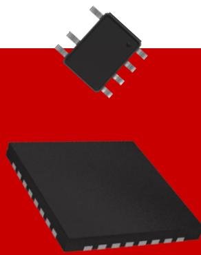

## BPA8616P非隔反激参考设计

## (12V/0.7A)

上海晶丰明源半导体股份有限公司

Shanghai Bright Power Semiconductor Co., Ltd.

夏奇林

2021 3

## 内容

BPA8616P  
电源规格  
电路及实物图  
BOM  
PCB Layout  
变压器设计  
性能测试数据

## 产品特点:

➢ 700V MOSFET  
》集成高压启动、自供电电路  
》低待机功耗  
》集成输入欠压/过压保护  
》内置软启动  
》优异的动态响应速度，无输出过冲

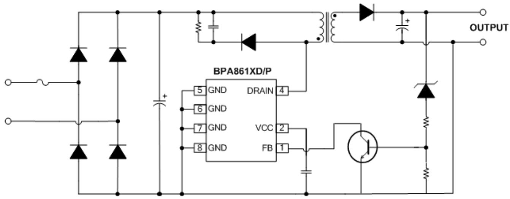

## 应用领域：

》家用电器辅助电源  
➢ PC  
》通信、工业控制辅助电源  
》适配器、充电器

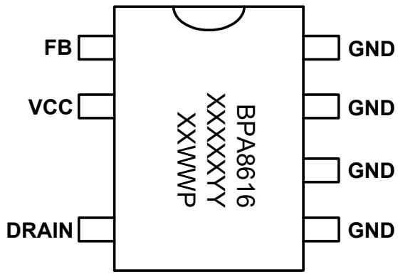

DIP7

<table><tr><td>项目描述</td><td>符号</td><td>最小</td><td>典型</td><td>最大</td><td>单位</td><td>备注</td></tr><tr><td colspan="7">输入</td></tr><tr><td>电压</td><td> $V_{IN}$ </td><td>85</td><td>115/230</td><td>265</td><td> $V_{AC}$ </td><td></td></tr><tr><td>频率</td><td> $f_{LINE}$ </td><td>47</td><td>50/60</td><td>63</td><td>Hz</td><td></td></tr><tr><td colspan="7">输出</td></tr><tr><td>输出电压</td><td> $V_{OUT}$ </td><td>11.4</td><td>12</td><td>12.6</td><td>V</td><td>±5%</td></tr><tr><td>输出电流</td><td> $I_{OUT}$ </td><td></td><td>0.7</td><td></td><td>A</td><td></td></tr><tr><td>输出电压纹波</td><td> $V_{RIPPLE}$ </td><td></td><td></td><td>120</td><td>mV</td><td>20MHz带宽</td></tr><tr><td>连续输出功率</td><td> $P_{OUT}$ </td><td></td><td>8.4</td><td></td><td>W</td><td></td></tr><tr><td colspan="7">效率</td></tr><tr><td>待机功耗</td><td> $P_{STDBY}$ </td><td></td><td></td><td>50</td><td>mW</td><td>230VAC</td></tr><tr><td>满载效率</td><td>η</td><td>78</td><td></td><td></td><td>%</td><td></td></tr><tr><td colspan="7">环境</td></tr><tr><td>传导EMI</td><td></td><td colspan="4">满足CISPR22/EN55022 Class B,至少6dB 裕量</td><td></td></tr><tr><td rowspan="2">Surge</td><td></td><td></td><td>±2</td><td></td><td>kV</td><td>差模</td></tr><tr><td></td><td></td><td>±4</td><td></td><td>kV</td><td>共模</td></tr><tr><td>EFT</td><td></td><td></td><td>±4</td><td></td><td>kV</td><td>5kHz/100kHz/38kHz</td></tr><tr><td rowspan="2">ESD</td><td></td><td></td><td>±8</td><td></td><td>kV</td><td>接触放电</td></tr><tr><td></td><td></td><td>±15</td><td></td><td>kV</td><td>空气放电</td></tr><tr><td>工作环境温度</td><td> $T_{AMP}$ </td><td></td><td></td><td>50</td><td>°C</td><td></td></tr></table>

## 电路及实物图

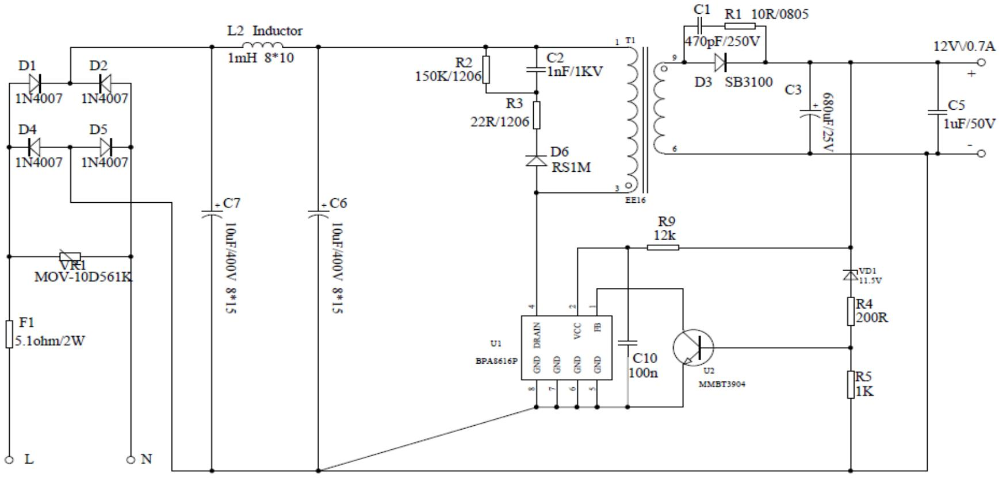

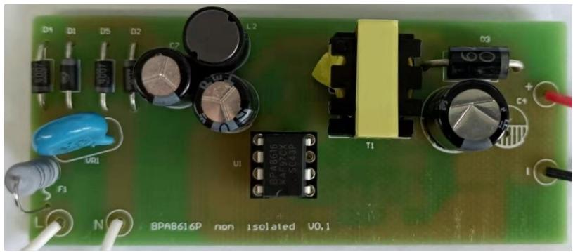

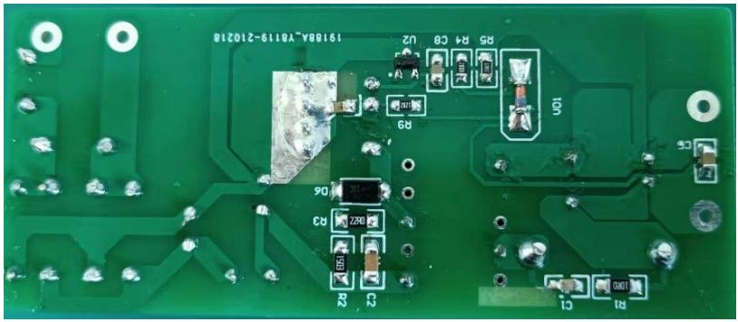

<table><tr><td>序号</td><td>原件标号</td><td>参数描述</td><td>封装尺寸</td><td>数量</td></tr><tr><td>1</td><td>PCB</td><td>CEM-1, 单面板</td><td>85mm*36mm</td><td>1</td></tr><tr><td>2</td><td>F1</td><td>5.1R/2W</td><td>DIP/2W</td><td>1</td></tr><tr><td>3</td><td>VR1</td><td>560V压敏电阻</td><td>Through Hole, P=7mm</td><td>1</td></tr><tr><td>4</td><td>D1,D2,D4,D5</td><td>1N4007, 1A/1000V</td><td>DO-41</td><td>4</td></tr><tr><td>5</td><td>D3</td><td>SB3100, 肖特基二极管, 100V/3A</td><td>DO-201AD</td><td>1</td></tr><tr><td>6</td><td>D6</td><td>RS1M, 1000V/1A</td><td>SMA</td><td>1</td></tr><tr><td>7</td><td>L2</td><td>1mH, 工字电感</td><td>8mm*10mm</td><td>1</td></tr><tr><td>8</td><td>U2</td><td>BPA8616P</td><td>DIP-7</td><td>1</td></tr><tr><td>9</td><td>T1</td><td>1.7mH, EE16立式</td><td>EE16/5pin+5pin</td><td>1</td></tr><tr><td>10</td><td>R1</td><td>10R, ±5%</td><td>SMD0805</td><td>1</td></tr><tr><td>11</td><td>R2</td><td>150k, ±5%</td><td>SMD1206</td><td>1</td></tr><tr><td>12</td><td>R3</td><td>22R, ±5%</td><td>SMD1206</td><td>1</td></tr><tr><td>13</td><td>R4</td><td>200R, ±5%</td><td>SMD0805</td><td>1</td></tr><tr><td>14</td><td>R5</td><td>1k, ±5%</td><td>SMD0805</td><td>1</td></tr><tr><td>15</td><td>R9</td><td>12k, ±5%</td><td>SMD0805</td><td>1</td></tr><tr><td>16</td><td>C1</td><td>470pF/250V, X7R</td><td>SMD0805</td><td>1</td></tr><tr><td>17</td><td>C2</td><td>1nF/1000V, 高压瓷片电容</td><td>SMD0805</td><td>1</td></tr><tr><td>18</td><td>C3</td><td>680uF/25V, 电解电容/LESR</td><td>10mm*16mm</td><td>1</td></tr><tr><td>19</td><td>C5</td><td>1uF/50V, X7R</td><td>SMD0805</td><td>1</td></tr><tr><td>20</td><td>C6, C7</td><td>10uF/400V, 电解电容</td><td>8mm*12mm</td><td>2</td></tr><tr><td>21</td><td>C10</td><td>0.1uF/50V, X7R</td><td>SMD0805</td><td>1</td></tr><tr><td>22</td><td>VD1</td><td>11.5V/0.5W</td><td>SOD-123</td><td>1</td></tr><tr><td>23</td><td>U2</td><td>MMBT3904</td><td>SOT-23</td><td>1</td></tr><tr><td></td><td></td><td></td><td>Total</td><td>27</td></tr></table>

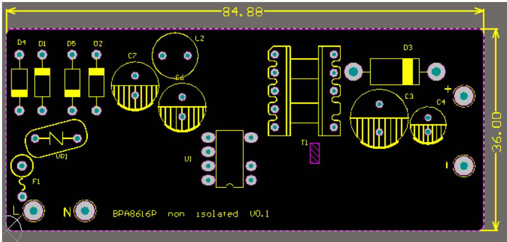

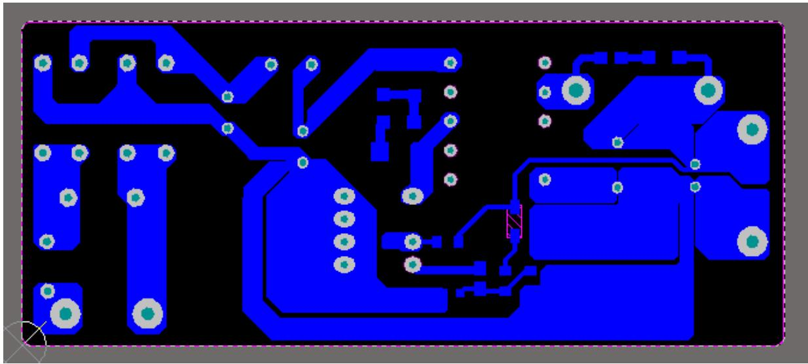

## 原理图

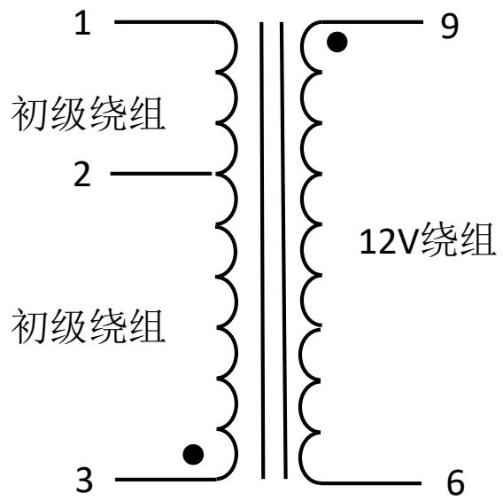

## 绕线方式

<table><tr><td>绕组</td><td>起始脚</td><td>终止脚</td><td>材料</td><td>匝数</td><td>绕线方式</td></tr><tr><td>N1</td><td>3</td><td>2</td><td> $\phi 0.16^{*}1P$ </td><td>87Ts</td><td>密绕2层(PIN脚朝外)</td></tr><tr><td colspan="4">胶带</td><td>2Ts</td><td></td></tr><tr><td>N2</td><td>9</td><td>6</td><td> $\phi 0.4^{*}1P$ </td><td>18Ts</td><td>密绕一层(PIN脚朝外)</td></tr><tr><td colspan="4">胶带</td><td>2Ts</td><td></td></tr><tr><td>N3</td><td>2</td><td>1</td><td> $\phi 0.16^{*}1P$ </td><td>43Ts</td><td>密绕一层(PIN脚朝外)</td></tr><tr><td colspan="4">胶带</td><td>2Ts</td><td></td></tr></table>

## 规格与材料

》初级绕组感量 $\mathsf { L } _ { \mathsf { p } } { = } 1 . 7 \mathsf { m } \mathsf { H } \pm 1 0 \%$ （测试条件:0.3V，50kHz)  
》漏感量 $L _ { \mathrm { { 1 k } } } { < } 7 5 \mathrm { { u H } }$  
》骨架：EE16 (5+5PIN)  
》磁芯：EE16 PC40或同等材质， $\mathsf { A e } { = } 1 9 \mathsf { m m } ^ { 2 }$  
》 N1、N2、N3:2UEW漆包线  
》绝缘胶带:3M900或同等材质  
》耐压测试:1KV,50/60Hz,1Min  
》成品要求：浸凡立水

## 脚位图

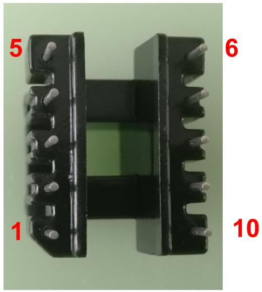

空载功耗  
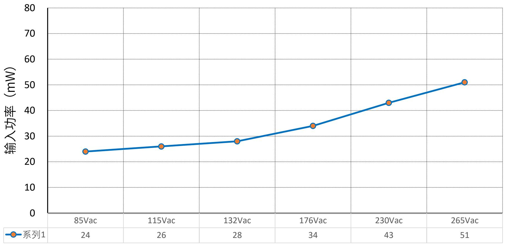

输入电压

效率测试  
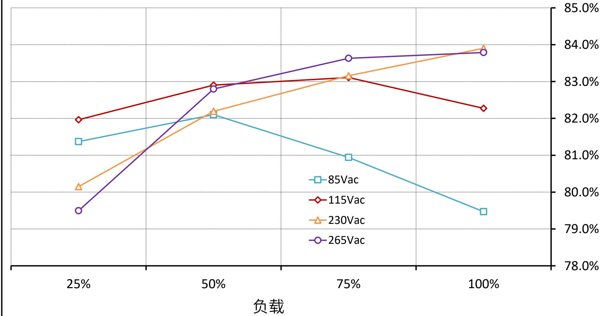

## 输出电压调整率

<table><tr><td> $V_{IN}(VAC)$ Load(%)</td><td>85</td><td>115</td><td>132</td><td>176</td><td>230</td><td>265</td><td>平均值</td><td>线调整率</td></tr><tr><td>0</td><td>12.044</td><td>12.045</td><td>12.044</td><td>12.047</td><td>12.045</td><td>12.047</td><td>12.05</td><td>0.02%</td></tr><tr><td>20%</td><td>12.043</td><td>12.046</td><td>12.047</td><td>12.050</td><td>12.049</td><td>12.051</td><td>12.05</td><td>0.07%</td></tr><tr><td>40%</td><td>12.051</td><td>12.055</td><td>12.051</td><td>12.059</td><td>12.053</td><td>12.050</td><td>12.05</td><td>0.07%</td></tr><tr><td>60%</td><td>12.018</td><td>12.054</td><td>12.051</td><td>12.058</td><td>12.055</td><td>12.059</td><td>12.05</td><td>0.34%</td></tr><tr><td>80%</td><td>12.016</td><td>12.056</td><td>12.054</td><td>12.060</td><td>12.057</td><td>12.059</td><td>12.05</td><td>0.37%</td></tr><tr><td>100%</td><td>12.012</td><td>12.017</td><td>12.018</td><td>12.030</td><td>12.030</td><td>12.033</td><td>12.02</td><td>0.17%</td></tr><tr><td>平均值</td><td>12.03</td><td>12.05</td><td>12.04</td><td>12.05</td><td>12.05</td><td>12.05</td><td rowspan="2" colspan="2"></td></tr><tr><td>负载调整率</td><td>0.32%</td><td>0.32%</td><td>0.30%</td><td>0.25%</td><td>0.22%</td><td>0.22%</td></tr></table>

◼ 计算方法：调整率=100%\*(最大值-最小值)/平均值  
测试条件：无假负载

## 输出电压纹波

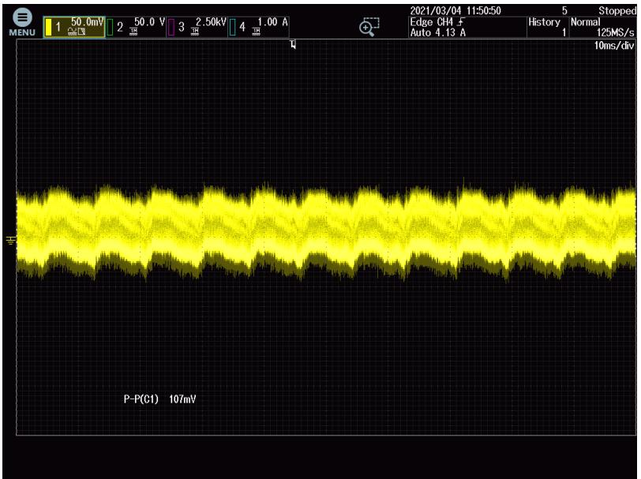

85 VAC  
  
Test Condition:  
➢ Full Load

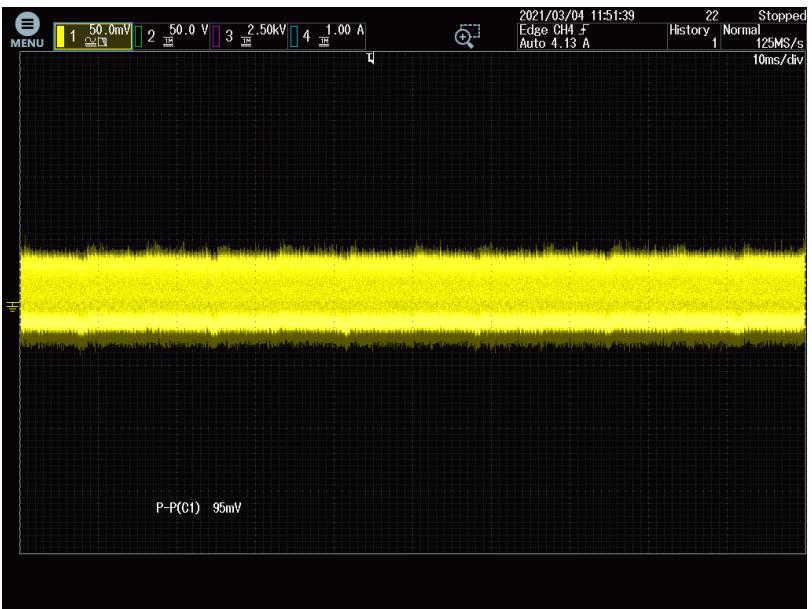

230 VAC  
  
Test Condition:  
➢ Full Load

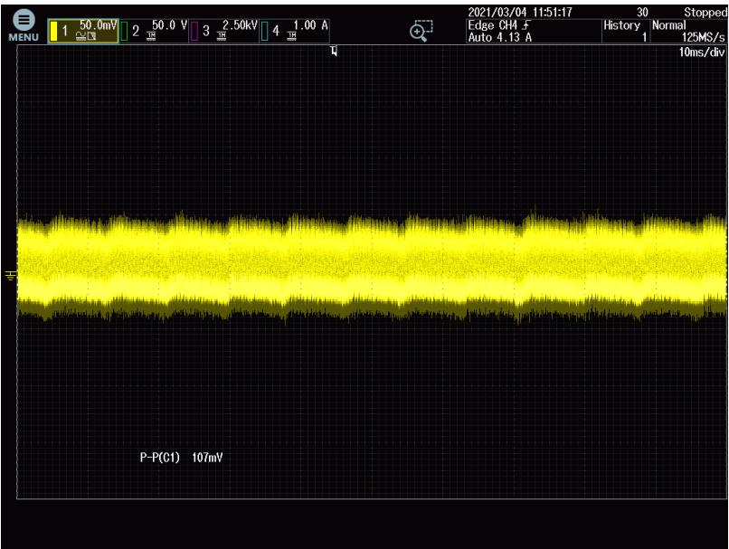

115 VAC  
  
Test Condition:  
➢ Full Load

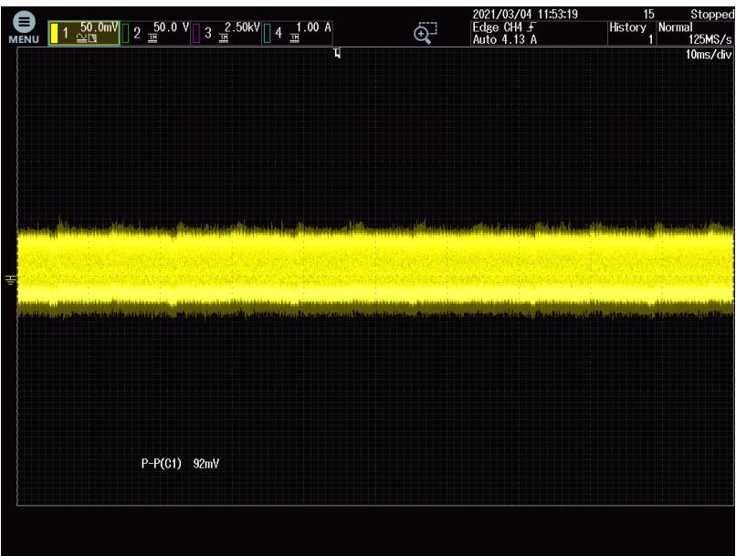

265 VAC  
  
Test Condition:  
➢ Full Load

## (50%-100%)

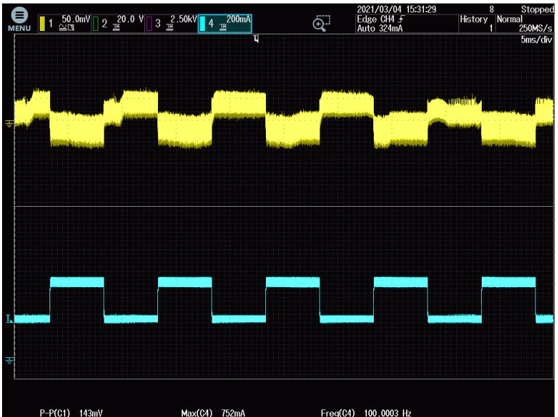

85 VAC

CH4 $\mathsf { V } _ { \mathsf { O U T } }$ $V _ { p | c - P K } = 1 4 3 ~ \mathsf { m V }$  
$\mathsf { C H 3 } \mathsf { I _ { 0 \mathsf { U } \mathsf { T } } }$

## Test Condition:

➢ 0.35 A-0.7 A-0.35 A  
➢ Slew Rate: 0.5 A/μS  
➢ Frequency: 100 Hz

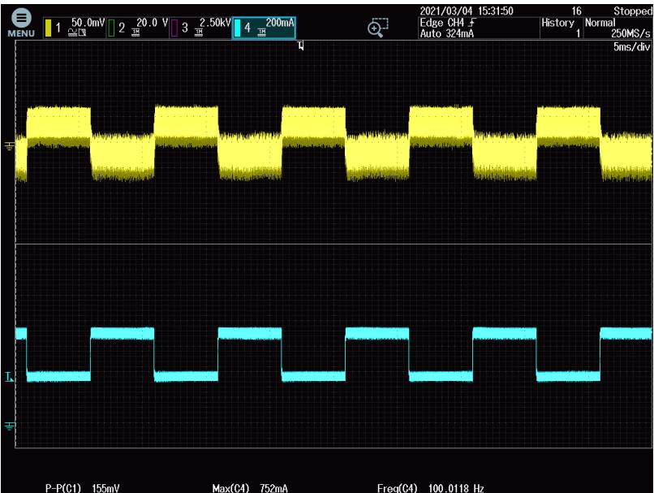

115 VAC

$\mathsf { C H } 4 \mathsf { V } _ { \mathsf { O U T } }$ CH4 VOUT $v _ { p _ { \mathrm { K - P K } } } { = } 1 5 5 m v$  
$\mathsf { C H 3 } \mathsf { I _ { 0 \mathsf { U T } } }$

## Test Condition:

➢ 0.35 A-0.7 A-0.35 A  
➢ Slew Rate: 0.5 A/μS  
➢ Frequency: 100 Hz

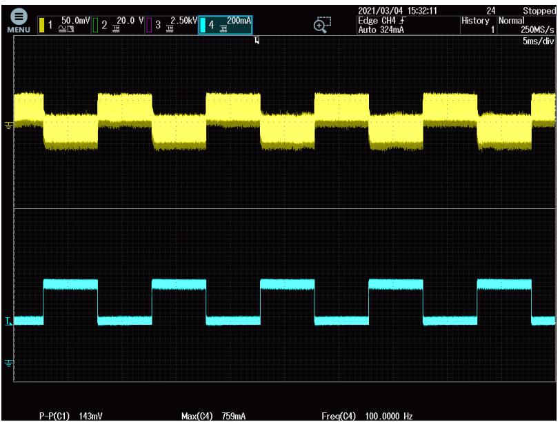

230 VAC

CH4 $\mathsf { V } _ { \mathsf { O U T } }$ $V _ { p | c - P K } = 1 4 3 ~ \mathsf { m V }$  
$\mathsf { C H 3 } \mathsf { I _ { 0 \mathsf { U T } } }$

## Test Condition:

➢ 0.35 A-0.7 A-0.35 A  
➢ Slew Rate: 0.5 A/μS  
➢ Frequency: 100 Hz

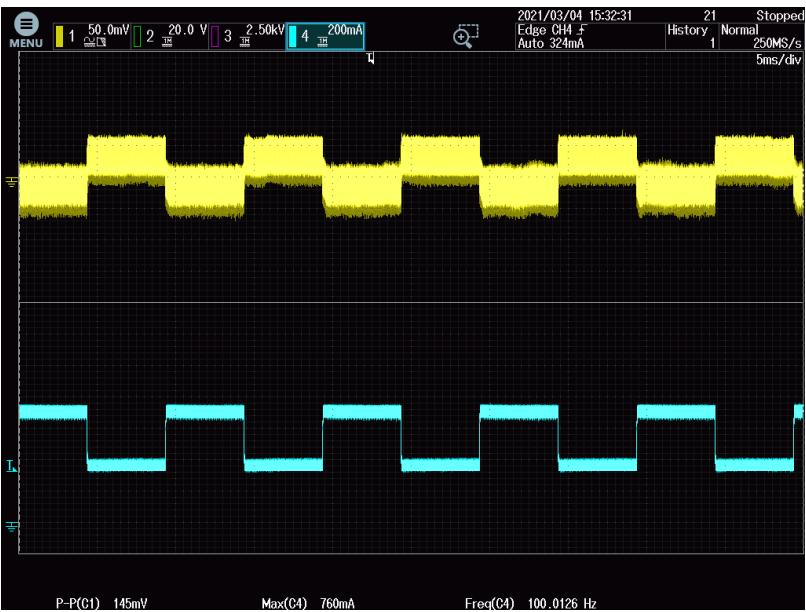

265 VAC

$\mathsf { C H } 4 \mathsf { V } _ { \mathsf { O U T } }$ $V _ { p | c - P K } = 1 4 5 ~ \mathsf { m V }$  
$\mathsf { C H 3 } \mathsf { I _ { 0 \mathsf { U T } } }$

## Test Condition:

➢ 0.35 A-0.7 A-0.35 A  
➢ Slew Rate: 0.5 A/μS  
➢ Frequency: 100 Hz

## (10%-90%)

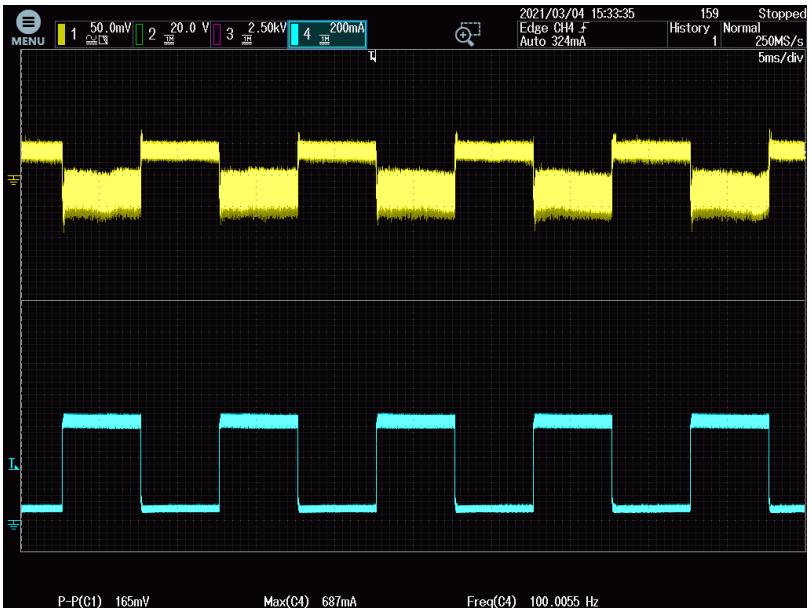

85 VAC

CH4 VOUT $\mathsf { V } _ { \mathsf { O U T } }$ $v _ { p _ { k - P K } } { = } 1 6 5 ~ \mathsf { m V }$  
$\mathsf { C H 3 } \mathsf { I _ { 0 \mathsf { U } \mathsf { T } } }$

## Test Condition:

➢ 0.07A-0.63 A-0.07 A  
➢ Slew Rate: 0.5 A/μS  
➢ Frequency: 100 Hz

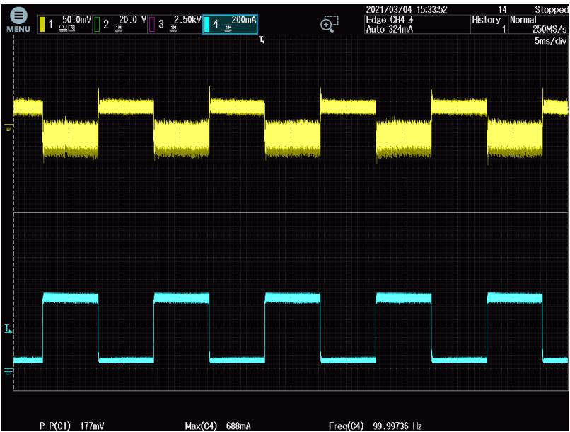

115 VAC

CH4 VOUT $\mathsf { C H } 4 \mathsf { V } _ { \mathsf { O U T } }$ $v _ { p \vert k - P K } { = } 1 7 7 m v$  
$\mathsf { C H 3 } \mathsf { I _ { 0 \mathsf { U T } } }$

## Test Condition:

➢ 0.07A-0.63 A-0.07 A  
➢ Slew Rate: 0.5 A/μS  
➢ Frequency: 100 Hz

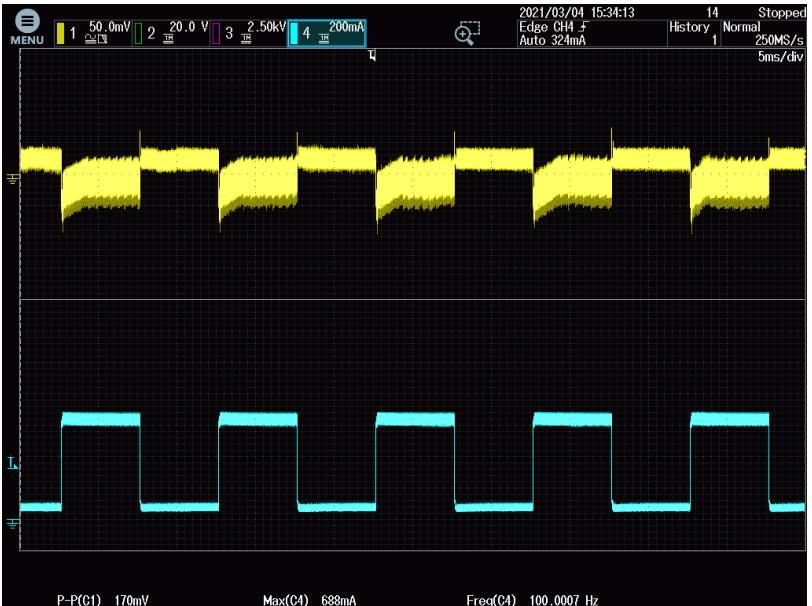

230 VAC

CH4 $\mathsf { V } _ { \mathsf { O U T } }$ $v _ { p _ { \mathrm { K - P K } } } { = } 1 7 0 ~ \mathrm { m V }$  
$\mathsf { C H 3 } \mathsf { I _ { 0 \mathsf { U T } } }$

## Test Condition:

➢ 0.07A-0.63 A-0.07 A  
➢ Slew Rate: 0.5 A/μS  
➢ Frequency: 100 Hz

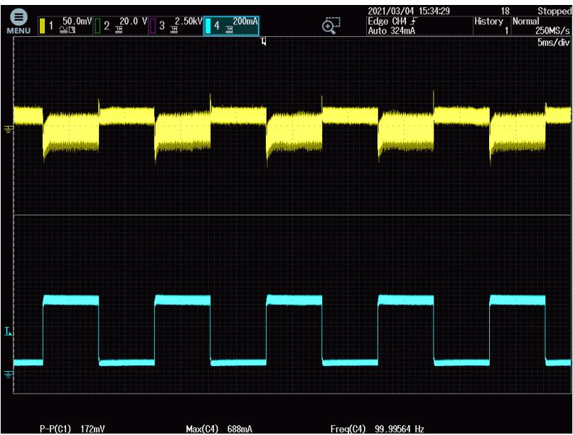

265 VAC

$\mathsf { C H } 4 \mathsf { V } _ { \mathsf { O U T } }$ $v _ { p _ { k - P K } } { = } 1 7 2 m v$  
$\mathsf { C H 3 } \mathsf { I _ { 0 \mathsf { U T } } }$

## Test Condition:

➢ 0.07A-0.63 A-0.07 A  
➢ Slew Rate: 0.5 A/μS  
➢ Frequency: 100 Hz

## 输出电压开机波形

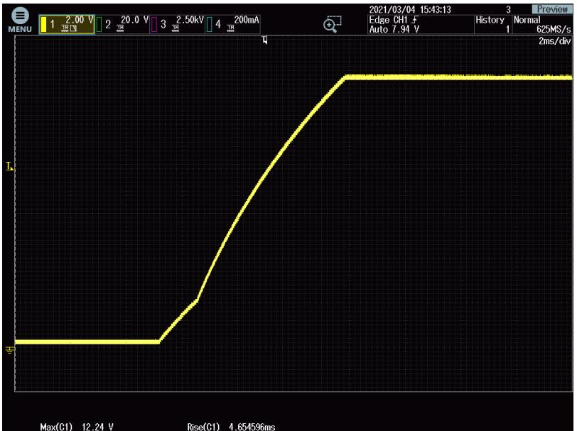

85 VAC  
  
Test Condition:  
➢ No Load

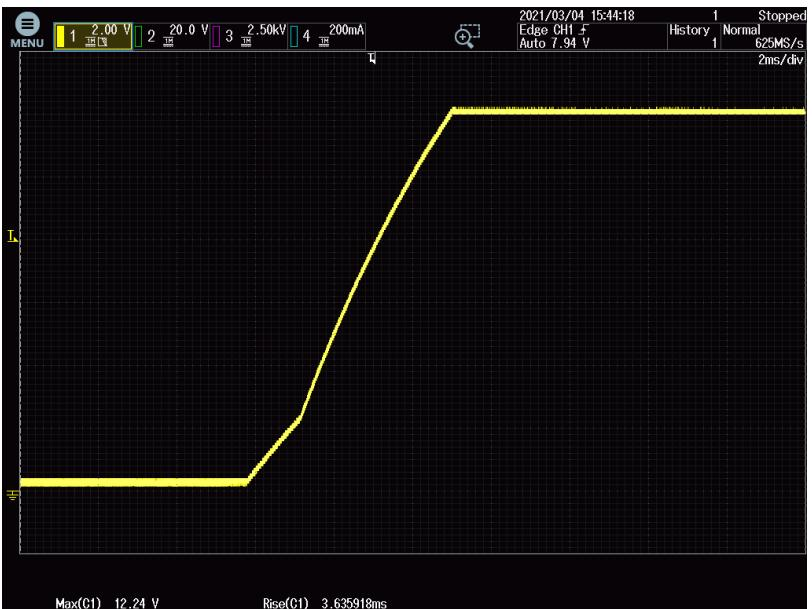

265 VAC  
  
Test Condition:  
➢ No Load

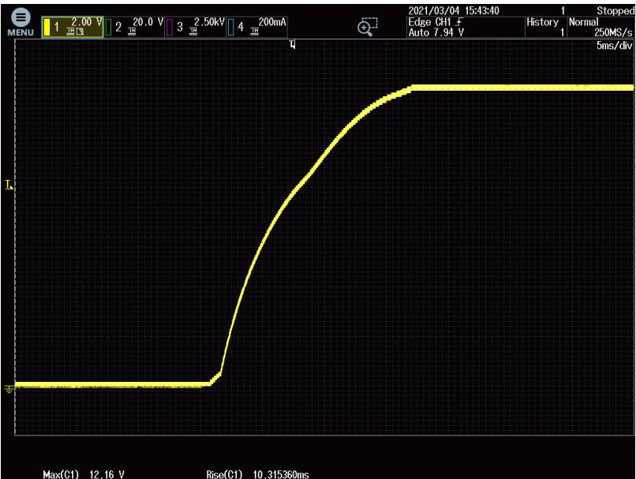

85 VAC  
  
Test Condition:  
➢ Full Load

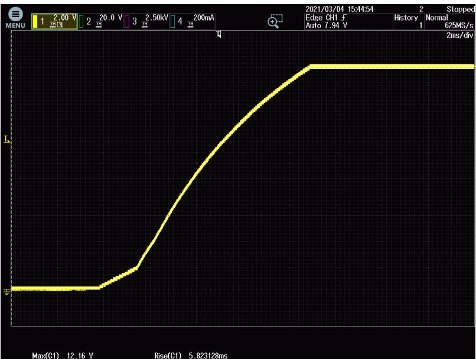

265 VAC  
  
Test Condition:  
➢ Full Load

## MOSFET

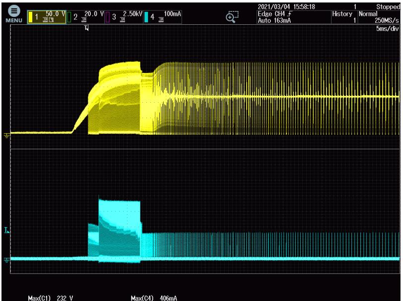

85 VAC

CH1 VDS  
CH3 IDS

$$
\begin{array}{l} \mathrm {V_ {DS\_MAX}} = 2 3 2 \mathrm{V} \\ \mathrm {I_ {DS\_MAX}} = 0. 4 1 \mathrm{A} \end{array}
$$

## Test Condition:

➢ No Load

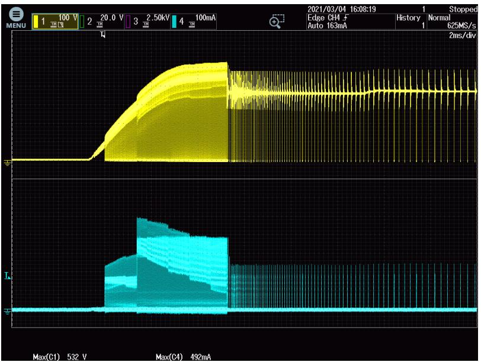

265 VAC

CH1 VDS  
CH3 IDS

$$
\begin{array}{l} \mathrm {V_ {DS\_MAX}} = 5 3 2 \mathrm{V} \\ \mathrm {I_ {DS\_MAX}} = 0. 4 9 \mathrm{A} \end{array}
$$

## Test Condition:

➢ No Load

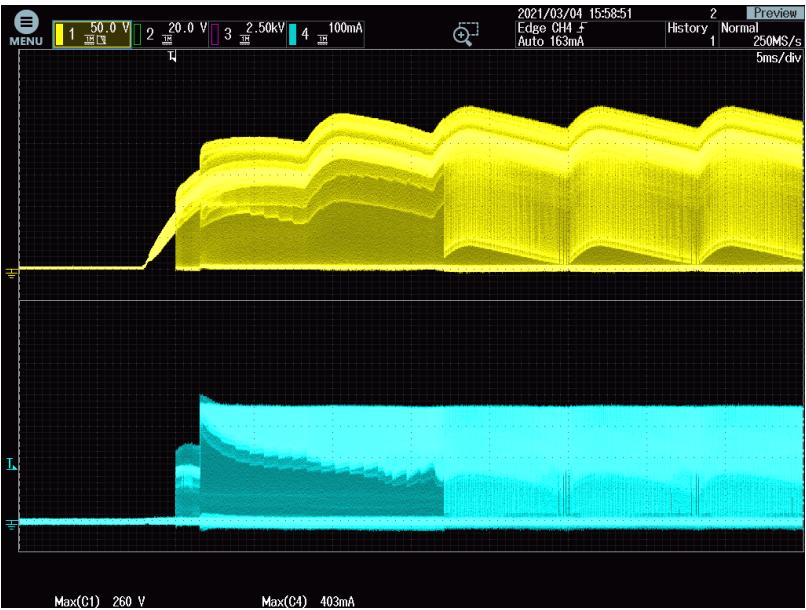

85 VAC

CH1 VDS  
CH3 IDS

$$
\begin{array}{l} \mathrm {V_ {DS\_MAX}} = 2 6 0 \mathrm{V} \\ \mathrm {I_ {DS\_MAX}} = 0. 4 1 \mathrm{A} \end{array}
$$

## Test Condition:

➢ Full Load

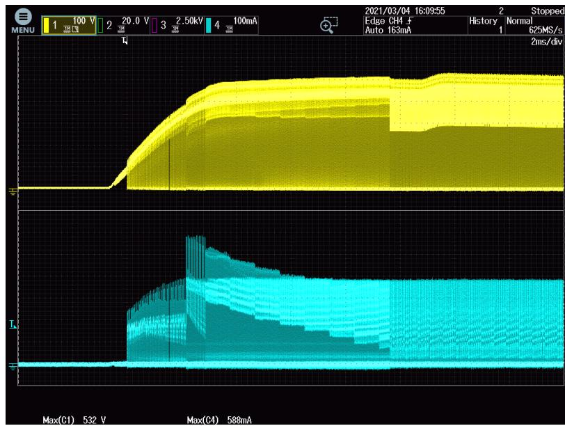

265 VAC

CH1 VDS

$$
\begin{array}{l} \mathrm {V_ {DS\_MAX}} = 5 3 2 \mathrm{V} \\ \mathrm {I_ {DS\_MAX}} = 0. 5 9 \mathrm{A} \end{array}
$$

## Test Condition:

➢ Full Load

## MOSFET

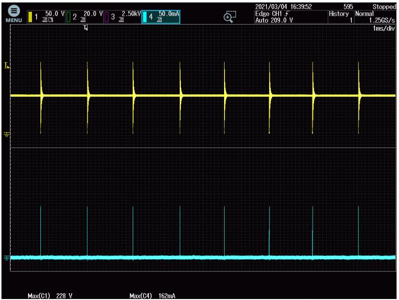

85 VAC

CH1 VDS  
CH3 IDS

$$
\begin{array}{l} \mathrm {V_ {DS\_MAX}} = 2 2 8 \mathrm{V} \\ \mathrm {I_ {DS\_MAX}} = 0. 1 6 \mathrm{A} \end{array}
$$

## Test Condition:

➢ No Load

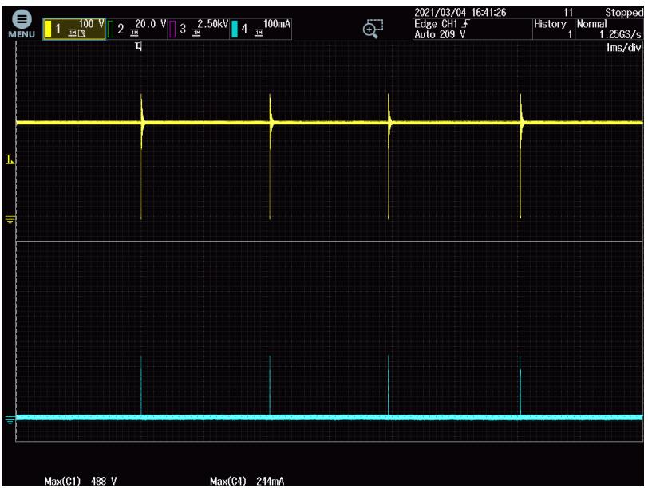

265 VAC

CH1 VDS  
CH3 IDS

$$
V _ {D S \_ M A X} = 4 8 8 V
$$

$$
I _ {D S \_ M A X} = 0. 2 4 \mathrm{A}
$$

## Test Condition:

➢ No Load

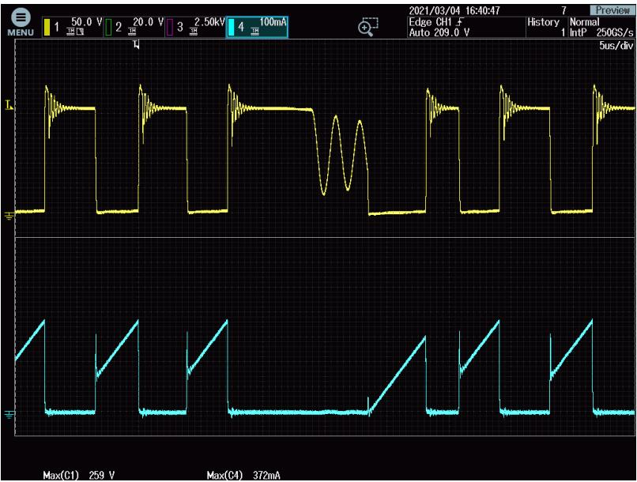

85 VAC

CH1 VDS  
CH3 IDS

$$
\begin{array}{l} \mathrm {V_ {DS\_MAX}} = 2 5 9 \mathrm{V} \\ \mathrm {I_ {DS\_MAX}} = 0. 3 7 \mathrm{A} \end{array}
$$

## Test Condition:

➢ Full Load

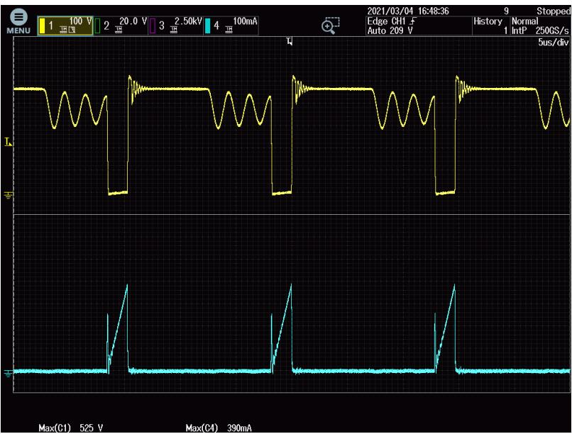

265 VAC

CH1 VDS  
CH3 IDS

$$
\begin{array}{l} \mathrm {V_ {DS\_MAX}} = 5 2 5 \mathrm{V} \\ \mathrm {I_ {DS\_MAX}} = 0. 3 9 \mathrm{A} \end{array}
$$

## Test Condition:

➢ Full Load

## 输出二极管开机波形

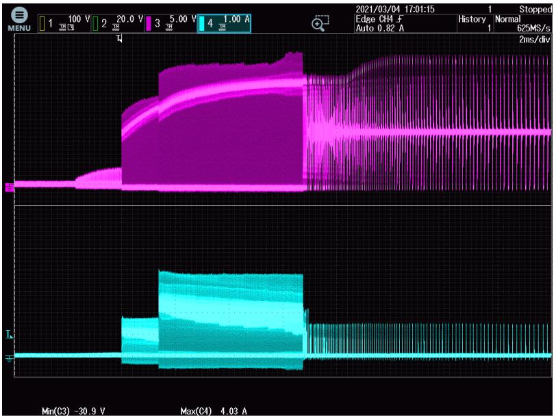

85 VAC

CH2 VR  
CH3 IF

$$
V _ {R \_ M A X} = 3 0. 9 \mathrm{V}
$$

$$
I _ {F \_ M A X} = 4. 0 3 A
$$

## Test Condition:

➢ No Load

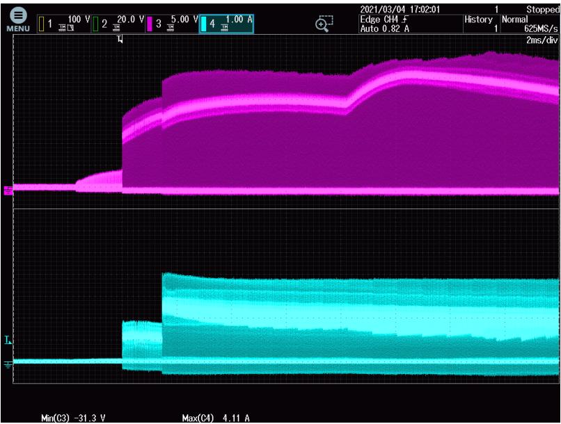

85 VAC

CH2 VR  
CH3 IF

$$
V _ {R \_ M A X} = 3 1. 3 \mathrm{V}
$$

$$
I _ {F \_ M A X} = 4. 1 1 \mathrm{A}
$$

## Test Condition:

➢ Full Load

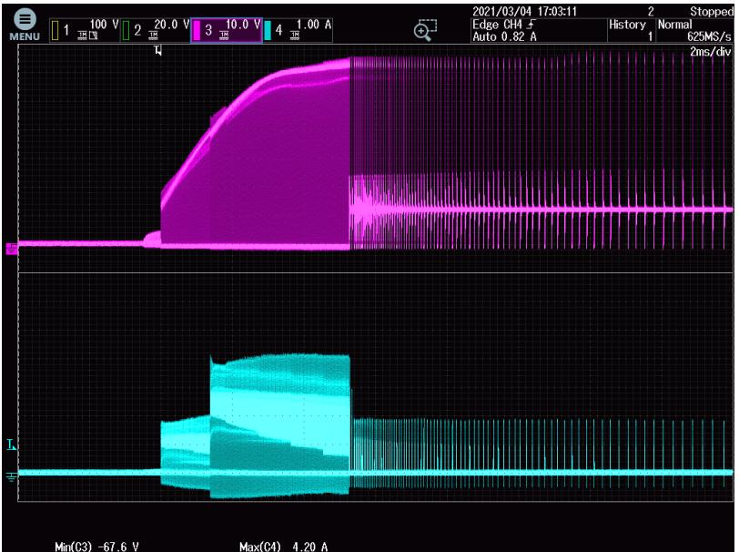

265 VAC

CH2 VR  
CH3 IF

$$
V _ {R \_ M A X} = 6 7. 6 \mathrm{V}
$$

$$
I _ {F \_ M A X} = 4. 2 \mathrm{A}
$$

## Test Condition:

➢ No Load

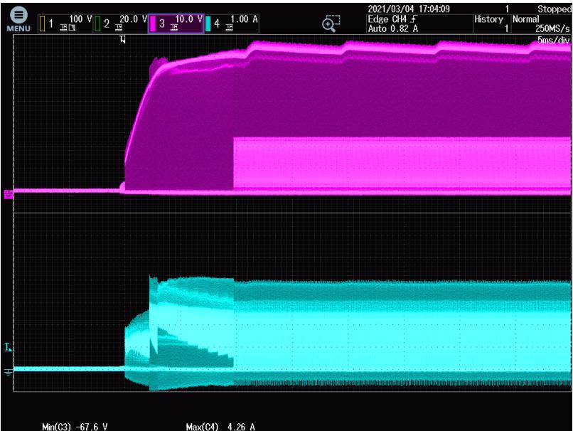

265 VAC

CH2 VR  
CH3 IF

$$
V _ {R \_ M A X} = 6 7. 6 \mathrm{V}
$$

$$
I _ {F \_ M A X} = 4. 2 6 \mathrm{A}
$$

## Test Condition:

➢ Full Load

## 输出二极管稳态波形

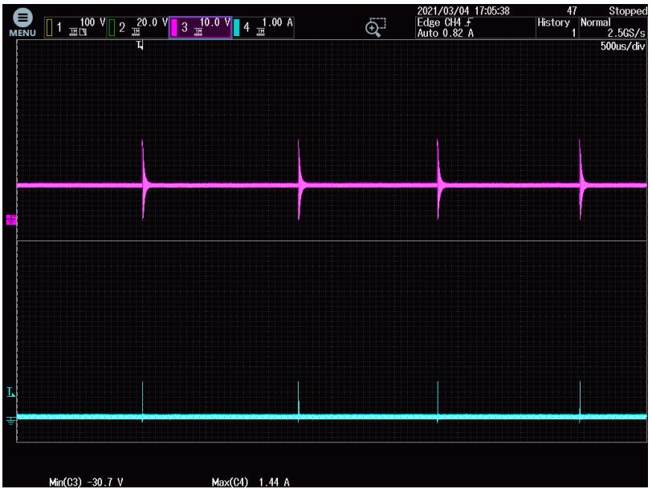

85 VAC

CH2 VR  
CH3 IF

$$
V _ {R \_ M A X} = 3 0. 7 \mathrm{V}
$$

$$
I _ {F \_ M A X} = 1. 4 4 \mathrm{A}
$$

## Test Condition:

➢ No Load

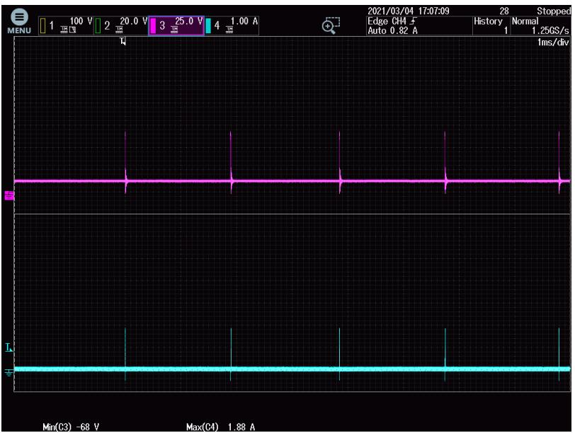

265 VAC

CH2 VR  
CH3 IF

$$
V _ {R \_ M A X} = 6 8 \mathrm{V}
$$

$$
I _ {F \_ M A X} = 1. 8 8 \mathrm{A}
$$

## Test Condition:

➢ No Load

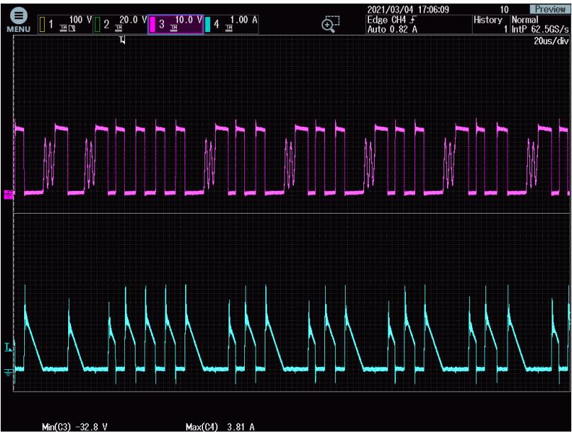

85 VAC

CH2 VR  
CH3 IF

$$
V _ {R \_ M A X} = 3 2. 8 \mathrm{V}
$$

$$
I _ {F \_ M A X} = 3. 8 1 \mathrm{A}
$$

## Test Condition:

➢ Full Load

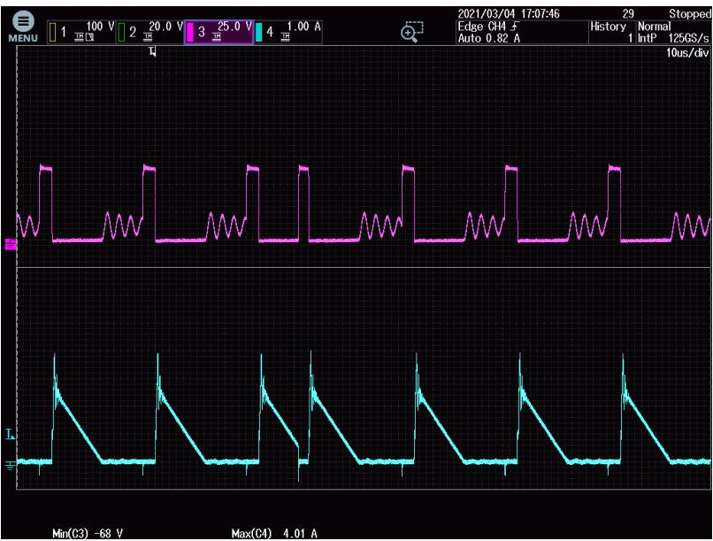

265 VAC

CH2 VR  
CH3 IF

$$
V _ {R \_ M A X} = 6 8 V
$$

$$
I _ {F \_ M A X} = 4 \mathrm{A}
$$

## Test Condition:

➢ Full Load

## MOSFET

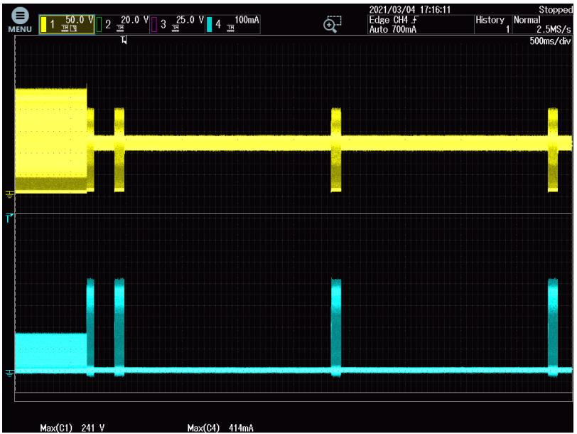

85 VAC

${ \mathsf { C H 1 } } \mathsf { V _ { D S } }$  
$C H 3 \mid _ { \mathsf { D S } }$

$$
\begin{array}{l} \mathrm {V_ {DS\_MAX}} = 2 4 1 \mathrm{V} \\ \mathrm {I_ {DS\_MAX}} = 0. 4 2 \mathrm{A} \end{array}
$$

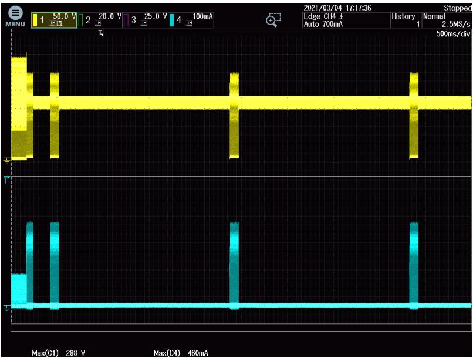

115 VAC

CH1 VDS  
CH3 IDS

$$
\begin{array}{l} \mathrm {V_ {DS\_MAX}} = 2 8 8 \mathrm{V} \\ \mathrm {I_ {DS\_MAX}} = 0. 4 6 \mathrm{A} \end{array}
$$

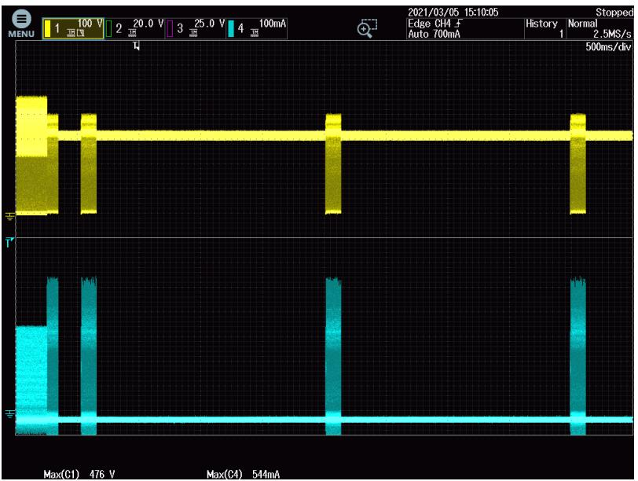

230 V

CH1 VDS  
CH3 IDS

$$
V _ {D S \_ M A X} = 4 7 6 \mathrm{V}
$$

$$
I _ {D S \_ M A X} = 0. 5 4 A
$$

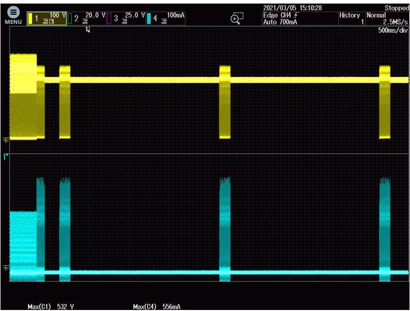

265 VAC

CH1 VDS

$$
V _ {D S \_ M A X} = 5 3 2 \mathrm{V}
$$

$$
I _ {D S \_ M A X} = 0. 5 6 \mathrm{A}
$$

## 温升测试

<table><tr><td rowspan="2">项目</td><td>85VAC</td><td>115VAC</td><td>230VAC</td><td>265VAC</td></tr><tr><td>温度(°C)</td><td>温度(°C)</td><td>温度(°C)</td><td>温度(°C)</td></tr><tr><td>环境温度</td><td>54.8</td><td>53.77</td><td>53.13</td><td>53.14</td></tr><tr><td>BP8616P(U2)</td><td>91.33</td><td>78.19</td><td>72.95</td><td>75.03</td></tr><tr><td>变压器绕组(T1)</td><td>76.68</td><td>74.25</td><td>74.43</td><td>75.3</td></tr><tr><td>变压器磁芯(T1)</td><td>73.48</td><td>71.5</td><td>72.15</td><td>72.9</td></tr><tr><td>整流二极管(D3)</td><td>80.21</td><td>78.73</td><td>78.6</td><td>78.81</td></tr><tr><td>钳位二极管(D6)</td><td>77.34</td><td>70.8</td><td>68.59</td><td>69.78</td></tr><tr><td>输入电解电容(C6)</td><td>70.66</td><td>64.2</td><td>60.78</td><td>61.38</td></tr><tr><td>输出电解电容(C3)</td><td>63.18</td><td>61.7</td><td>61.36</td><td>61.5</td></tr></table>

备注：增大芯片Source散热铜箔面积可以降低芯片温度

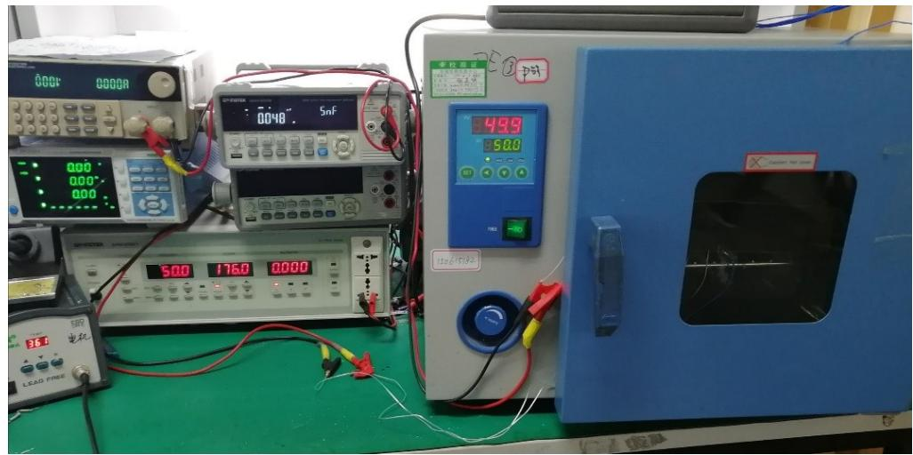

## 测试说明

➢ 在温箱中进行测试  
➢ 电路板放在一个封闭的盒子内  
热电偶连接到各个测量点  
➢ 等测量点温度达到稳定后记录数据

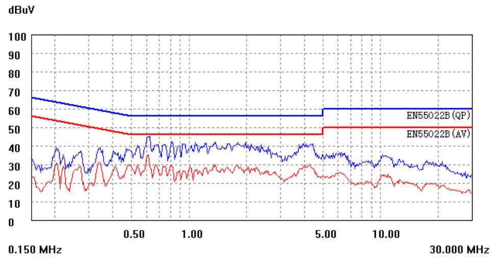

115Vac Line  
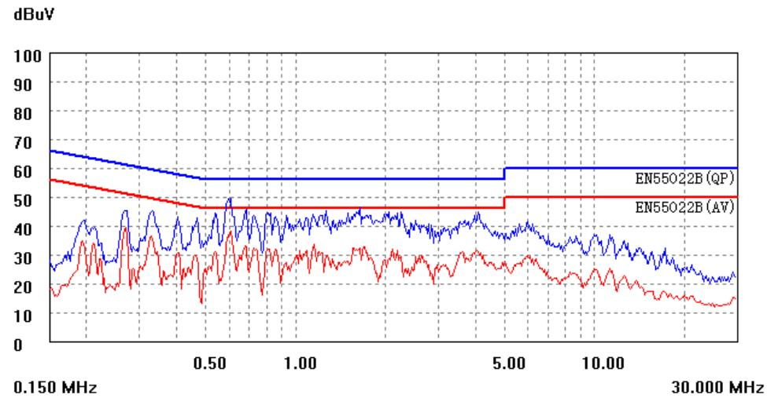

230Vac Line

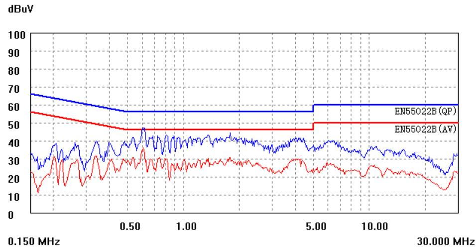

115Vac Neutral

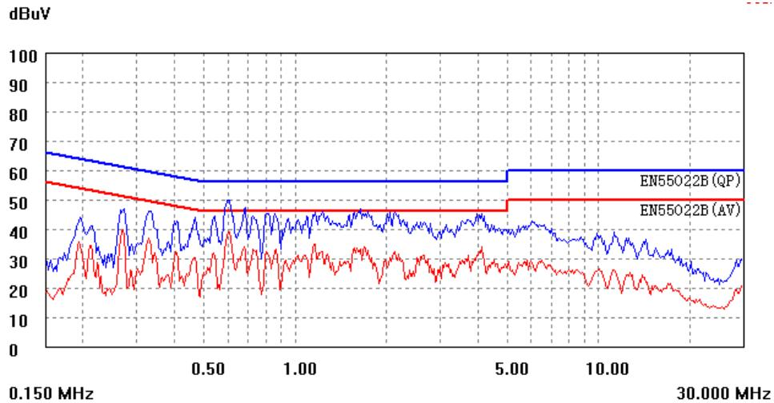

230Vac Neutral

<table><tr><td>差模</td><td>电压</td><td>相位角</td><td>发生器阻抗</td><td>测试次数</td><td>测试结果</td></tr><tr><td>L to N</td><td>+2kV</td><td>0</td><td>2</td><td>10</td><td>Pass (B类)</td></tr><tr><td>L to N</td><td>-2kV</td><td>0</td><td>2</td><td>10</td><td>Pass (B类)</td></tr><tr><td>L to N</td><td>+2kV</td><td>90</td><td>2</td><td>10</td><td>Pass (B类)</td></tr><tr><td>L to N</td><td>-2kV</td><td>90</td><td>2</td><td>10</td><td>Pass (B类)</td></tr><tr><td>L to N</td><td>+2kV</td><td>180</td><td>2</td><td>10</td><td>Pass (B类)</td></tr><tr><td>L to N</td><td>-2kV</td><td>180</td><td>2</td><td>10</td><td>Pass (B类)</td></tr><tr><td>L to N</td><td>+2kV</td><td>270</td><td>2</td><td>10</td><td>Pass (B类)</td></tr><tr><td>L to N</td><td>-2kV</td><td>270</td><td>2</td><td>10</td><td>Pass (B类)</td></tr></table>

## 测试说明

➢ 按照GB/T17626.5和IEC61000-4-5的最新版本要求进行测试  
➢ 室温环境，230VAC输入，满载条件  
➢ 输入1.2/50us组合波浪涌电压  
➢ 每个测试点重复10次  
➢ 每次间隔时间1分钟  
➢ 试验时样机输出符合B类标准（触发芯片过压保护）

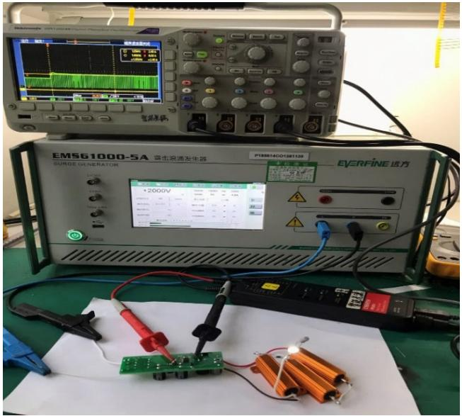

<table><tr><td>差模</td><td>电压</td><td>脉冲群持续时间</td><td>脉冲频率</td><td>测试时间</td><td>测试结果</td></tr><tr><td>L to N</td><td>+4kV</td><td>15ms</td><td>5kHz</td><td>120s</td><td>Pass</td></tr><tr><td>L to N</td><td>-4kV</td><td>15ms</td><td>5kHz</td><td>120s</td><td>Pass</td></tr><tr><td>L to N</td><td>+4kV</td><td>0.75ms</td><td>100kHz</td><td>120s</td><td>Pass</td></tr><tr><td>L to N</td><td>-4kV</td><td>0.75ms</td><td>100kHz</td><td>120s</td><td>Pass</td></tr><tr><td>L to N</td><td>+2kV</td><td>2ms</td><td>38kHz</td><td>120s</td><td>Pass</td></tr><tr><td>L to N</td><td>-2kV</td><td>2ms</td><td>38kHz</td><td>120s</td><td>Pass</td></tr><tr><td>L to N</td><td>+4kV</td><td>2ms</td><td>38kHz</td><td>120s</td><td>Pass</td></tr><tr><td>L to N</td><td>-4kV</td><td>2ms</td><td>38kHz</td><td>120s</td><td>Pass</td></tr></table>

## 测试说明

➢ 按照GB/T17626.4和IEC61000-4-4的最新版本要求进行测试  
➢ 室温环境，230VAC输入满载条件  
➢ 分别测试5kHz/100kHz/38kHz脉冲频率  
脉冲群周期为300ms  
➢ 每个测试条件测试时间120s  
➢ 试验时样机输出正常（符合A类标准）视为Pass

<table><tr><td>测试点</td><td>电压(V)</td><td>放电类型</td><td>放电次数</td><td>测试结果</td></tr><tr><td>Vo</td><td>+8kV</td><td>接触放电</td><td>10</td><td>Pass</td></tr><tr><td>Vo</td><td>-8kV</td><td>接触放电</td><td>10</td><td>Pass</td></tr><tr><td>GND</td><td>+8kV</td><td>接触放电</td><td>10</td><td>Pass</td></tr><tr><td>GND</td><td>-8kV</td><td>接触放电</td><td>10</td><td>Pass</td></tr><tr><td>Vo</td><td>+15kV</td><td>空气放电</td><td>10</td><td>Pass</td></tr><tr><td>Vo</td><td>-15kV</td><td>空气放电</td><td>10</td><td>Pass</td></tr><tr><td>GND</td><td>+15kV</td><td>空气放电</td><td>10</td><td>Pass</td></tr><tr><td>GND</td><td>-15kV</td><td>空气放电</td><td>10</td><td>Pass</td></tr></table>

## 测试说明

➢ 按照GB/T17626.2和IEC61000-4-2的最新版本要求进行测试  
➢ 室温环境，230VAC输入满载条件  
➢ 每个测试点重复10次  
➢ 分别对输出正端和地进行空气放电  
➢ 试验时样机输出正常（符合A类标准）视为Pass

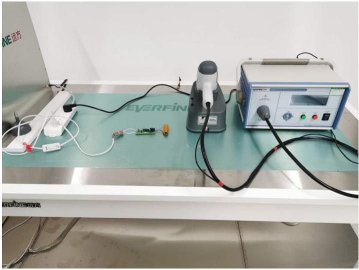

## THANK YOU FOR WATCHING
