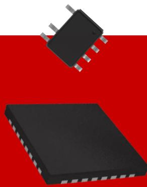

## BPA8616P\_Stack FET隔离参考设计(85VAC\~456VAC， 12V/500mA)

上海晶丰明源半导体股份有限公司

Shanghai Bright Power Semiconductor Co., Ltd.

王岩

时间： 2021年9月

## 内容

BPA861X简介  
电源规格  
电路及实物图  
BOM  
PCB Layout图  
性能测试数据

## 产品特点：

➢ 集成 700V 高压 MOSFET  
➢ ON/OFF控制模式，低输出纹波  
➢ 内置软启动功能  
➢ 集成高压启动、自供电电路  
➢ 低音频噪声  
➢ 输入过/欠压保护

## 应用领域：

➢ 家用电器辅助电源  
➢ 电机驱动辅助电源  
➢ IOT/智能家居/智能照明  
➢ 工业控制辅助电源

<table><tr><td>项目描述</td><td>符号</td><td>最小</td><td>典型</td><td>最大</td><td>单位</td><td>备注</td></tr><tr><td colspan="7">输入</td></tr><tr><td>电压</td><td> $V_{IN}$ </td><td>85</td><td>115/230</td><td>456</td><td> $V_{AC}$ </td><td></td></tr><tr><td>频率</td><td> $f_{LINE}$ </td><td>47</td><td>50/60</td><td>63</td><td>Hz</td><td></td></tr><tr><td colspan="7">输出</td></tr><tr><td>输出电压</td><td> $V_{OUT}$ </td><td></td><td>12</td><td></td><td>V</td><td>±5%</td></tr><tr><td>输出电流</td><td> $I_{OUT}$ </td><td>0</td><td></td><td>500</td><td>mA</td><td></td></tr><tr><td>输出电压纹波</td><td> $V_{RIPPLE}$ </td><td></td><td></td><td>200</td><td>mV</td><td>20MHz带宽</td></tr><tr><td>连续输出功率</td><td> $P_{OUT}$ </td><td></td><td>6</td><td></td><td>W</td><td></td></tr><tr><td colspan="7">效率</td></tr><tr><td>待机功耗</td><td> $P_{STDBY}$ </td><td></td><td></td><td>500</td><td>mW</td><td>456VAC</td></tr><tr><td>满载效率</td><td>η</td><td>70</td><td></td><td></td><td>%</td><td></td></tr><tr><td colspan="7">环境</td></tr><tr><td>传导EMI</td><td></td><td colspan="4">满足CISPR22/EN55022 Class B,至少6dB 裕量</td><td></td></tr><tr><td>Surge</td><td></td><td></td><td>2</td><td></td><td>kV</td><td>差模</td></tr><tr><td>EFT</td><td></td><td></td><td>4</td><td></td><td>kV</td><td>5kHz/100kHz/38kHz</td></tr><tr><td>ESD</td><td></td><td></td><td>15</td><td>20</td><td>kV</td><td>空气放电</td></tr><tr><td>工作环境温度</td><td> $T_{AMP}$ </td><td></td><td></td><td>40</td><td>°C</td><td></td></tr></table>

## 电路及实物图

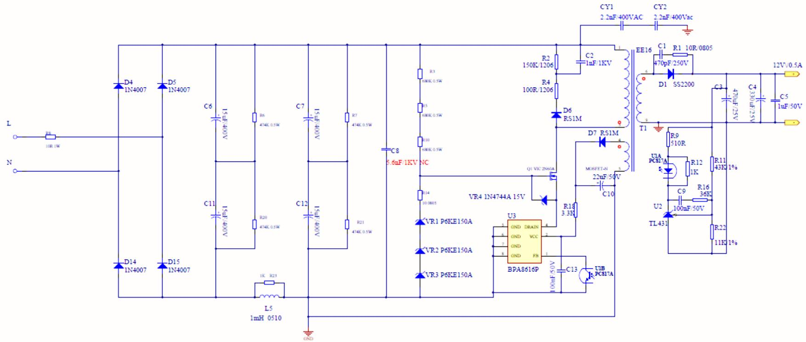

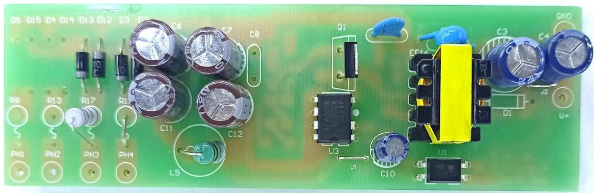

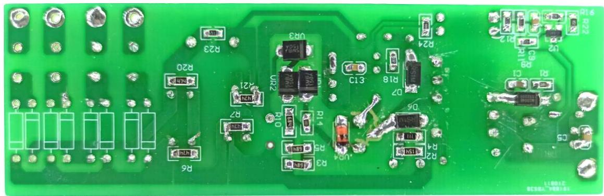

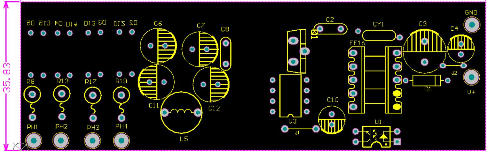

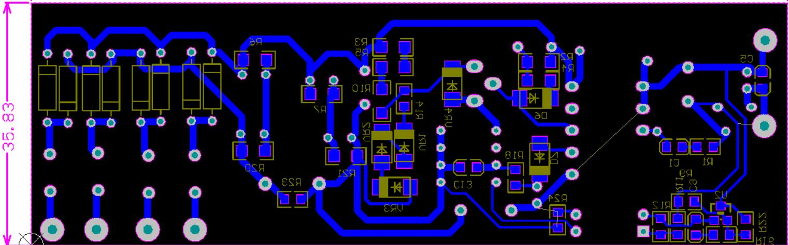

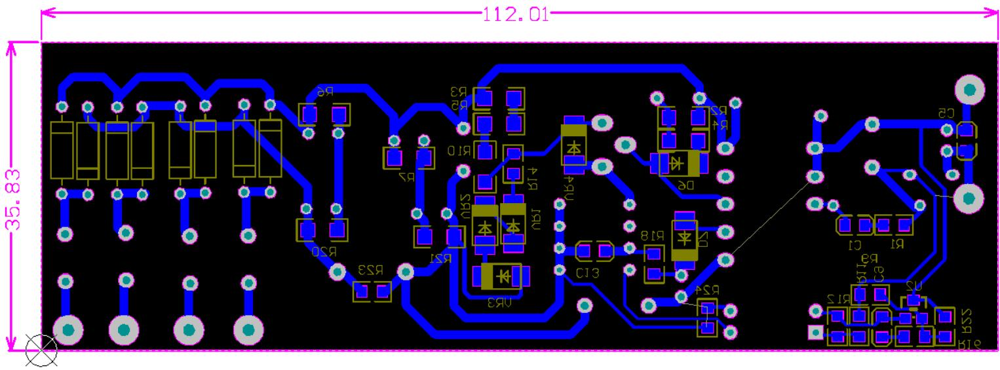

<table><tr><td>序号</td><td>元件标号</td><td>参数描述</td><td>封装尺寸</td><td>数量</td></tr><tr><td>1</td><td>PCB</td><td>CEM-1, 单面板</td><td>112mm*35.8mm</td><td>1</td></tr><tr><td>2</td><td>F1</td><td>10R 慢断绕线电阻保险丝,3W</td><td>DIP,PD 5.5mm</td><td>1</td></tr><tr><td>3</td><td>D4,D5,D14,D15</td><td>1A/1000V, 1N4007</td><td>DIP,DO-41</td><td>4</td></tr><tr><td>4</td><td>L5</td><td>1mH, 0510</td><td>0510</td><td>1</td></tr><tr><td>5</td><td>CY1,CY2</td><td>2.2nF, Y电容</td><td>Y1</td><td>2</td></tr><tr><td>6</td><td>EC6,EC7,EC11,EC12</td><td>15uF/400V, 电解电容</td><td> $\phi 8*13mm$ </td><td>4</td></tr><tr><td>7</td><td>EC3</td><td>470uF/25V, 电解电容</td><td> $\phi 8*12mm$ </td><td>1</td></tr><tr><td>8</td><td>EC4</td><td>330uF/25V, 电解电容</td><td> $\phi 8*12mm$ </td><td>1</td></tr><tr><td>9</td><td>EC10</td><td>22uF/50V, 电解电容</td><td> $\phi 6*10mm$ </td><td>1</td></tr><tr><td>10</td><td>VR1,VR2,VR3</td><td>SMBJ150A,  $\pm 1\%$ </td><td>SMA</td><td>3</td></tr><tr><td>11</td><td>C2</td><td>1nF/1KV, 瓷片电容</td><td>SMD0805</td><td>1</td></tr><tr><td>12</td><td>C1</td><td>470pF/200V, 瓷片电容</td><td>DIP</td><td>1</td></tr><tr><td>13</td><td>C5</td><td>1uF/25V, X7R, 瓷片电容</td><td>SMD0805</td><td>1</td></tr><tr><td>14</td><td>C9,C13</td><td>100nF/50V, X7R, 瓷片电容</td><td>SMD0805</td><td>2</td></tr><tr><td>15</td><td>D1</td><td>SS2200, 2A/200V,肖特基</td><td>SMA</td><td>1</td></tr><tr><td>16</td><td>D6,D7</td><td>RS1M, 1A/1000V</td><td>SMA</td><td>2</td></tr><tr><td>17</td><td>R1</td><td>10R,  $\pm 5\%$ </td><td>SMD0805</td><td>1</td></tr><tr><td>18</td><td>R2</td><td>150K,  $\pm 5\%$ </td><td>SMD0805</td><td>1</td></tr></table>

<table><tr><td>序号</td><td>元件标号</td><td>参数描述</td><td>封装尺寸</td><td>数量</td></tr><tr><td>19</td><td>R3,R5,R10</td><td>680K, ±5%, 0.5W</td><td>SMD0805</td><td>3</td></tr><tr><td>20</td><td>R4</td><td>100R, ±5%</td><td>SMD0805</td><td>1</td></tr><tr><td>21</td><td>R6,R7,R20,R21</td><td>470K, ±5%, 0.5W</td><td>SMD0805</td><td>4</td></tr><tr><td>22</td><td>R9</td><td>510R, ±5%</td><td>SMD0805</td><td>1</td></tr><tr><td>23</td><td>R11</td><td>43K, ±1%</td><td>SMD0805</td><td>1</td></tr><tr><td>24</td><td>R12</td><td>1K, ±5%</td><td>SMD0805</td><td>1</td></tr><tr><td>25</td><td>R14</td><td>10R, ±5%</td><td>SMD0805</td><td>1</td></tr><tr><td>26</td><td>R16</td><td>36K, ±5%</td><td>SMD0805</td><td>1</td></tr><tr><td>27</td><td>R18</td><td>3.3K, ±5%</td><td>SMD0805</td><td>1</td></tr><tr><td>28</td><td>R22</td><td>11K, ±1%</td><td>SMD0805</td><td>1</td></tr><tr><td>29</td><td>R23</td><td>1.1K, ±5%</td><td>SMD0805</td><td>1</td></tr><tr><td>30</td><td>ZD1</td><td>15V, ±5%, 稳压管,1N4744A</td><td>SMA</td><td>1</td></tr><tr><td>31</td><td>T1</td><td>EE16,5+5PIN</td><td>EE16</td><td>1</td></tr><tr><td>32</td><td>U1</td><td>BP8616P</td><td>DIP-7</td><td>1</td></tr><tr><td>33</td><td>U2</td><td>PC817A,光耦</td><td>DIP-4</td><td>1</td></tr><tr><td>34</td><td>U3</td><td>TL431, 2.5V</td><td>SOT23-3</td><td>1</td></tr><tr><td>35</td><td>Q1</td><td>2N600V</td><td>TO-251</td><td>1</td></tr><tr><td></td><td></td><td></td><td>Total</td><td>51</td></tr></table>

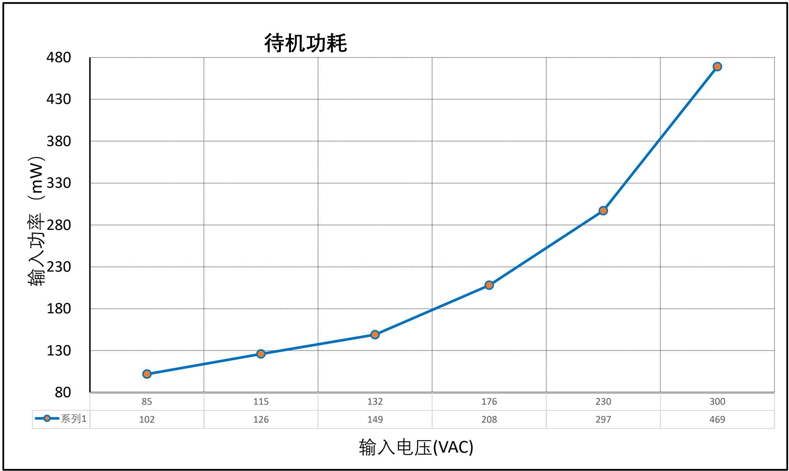

效率测试  
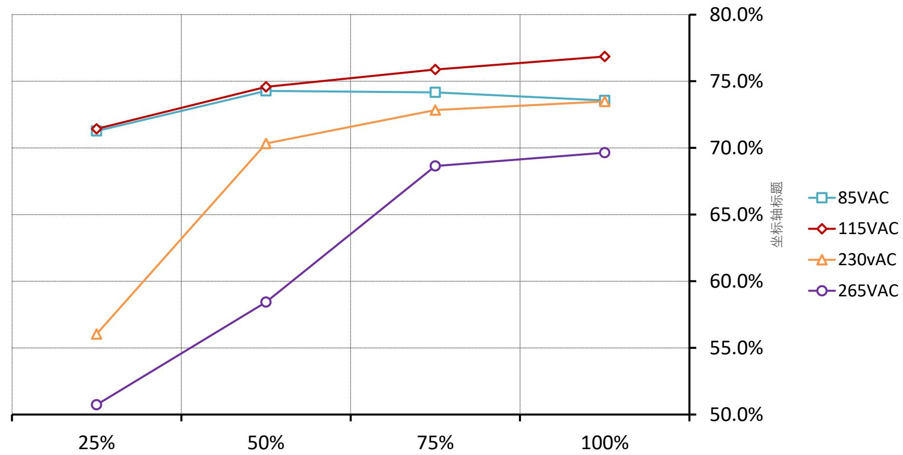

坐标轴标题

## 输出电压调整率

<table><tr><td> $V_{IN}(VAC)$ Load(%)</td><td>85</td><td>178</td><td>230</td><td>300</td><td>380</td><td>456</td><td>平均值</td><td>线调整率</td></tr><tr><td>0</td><td>12.241</td><td>12.241</td><td>12.241</td><td>12.241</td><td>12.241</td><td>12.241</td><td>12.241</td><td>0.00%</td></tr><tr><td>20%</td><td>12.240</td><td>12.239</td><td>12.239</td><td>12.238</td><td>12.238</td><td>12.239</td><td>12.239</td><td>0.02%</td></tr><tr><td>40%</td><td>12.239</td><td>12.239</td><td>12.238</td><td>12.238</td><td>12.238</td><td>12.239</td><td>12.239</td><td>0.01%</td></tr><tr><td>60%</td><td>12.239</td><td>12.238</td><td>12.238</td><td>12.238</td><td>12.237</td><td>12.238</td><td>12.238</td><td>0.02%</td></tr><tr><td>80%</td><td>12.239</td><td>12.238</td><td>12.238</td><td>12.237</td><td>12.237</td><td>12.238</td><td>12.238</td><td>0.02%</td></tr><tr><td>100%</td><td>12.238</td><td>12.238</td><td>12.237</td><td>12.237</td><td>12.237</td><td>12.238</td><td>12.238</td><td>0.01%</td></tr><tr><td>平均值</td><td>12.24</td><td>12.24</td><td>12.24</td><td>12.24</td><td>12.24</td><td>12.24</td><td rowspan="2" colspan="2"></td></tr><tr><td>负载调整率</td><td>0.02%</td><td>0.02%</td><td>0.03%</td><td>0.03%</td><td>0.03%</td><td>0.02%</td></tr></table>

◼ 计算方法：调整率=100%\*(最大值-最小值)/平均值

## 原理图

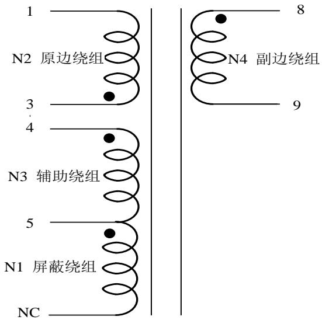

## 绕线方式

<table><tr><td></td><td></td><td></td><td></td><td></td><td></td></tr><tr><td>绕组</td><td>起始脚</td><td>终止脚</td><td>材料</td><td>匝数</td><td>绕线方式</td></tr><tr><td>N1</td><td>1</td><td>NC</td><td> $\phi 0.16*2P$ </td><td>21</td><td>密绕一层(PIN脚朝外)</td></tr><tr><td colspan="4">胶带</td><td>2Ts</td><td></td></tr><tr><td>N2</td><td>3</td><td>1</td><td> $\phi 0.16*1P$ </td><td>72Ts</td><td>密绕三层(PIN脚朝外)</td></tr><tr><td colspan="4">胶带</td><td>2Ts</td><td></td></tr><tr><td>N3</td><td>4</td><td>5</td><td> $\phi 0.16*2P$ </td><td>7Ts</td><td>均匀绕一层(PIN脚朝外)</td></tr><tr><td colspan="4">胶带</td><td>3Ts</td><td></td></tr><tr><td>N4</td><td>8</td><td>9</td><td>三层绝缘线 $\phi 0.4*1P$ </td><td>9Ts</td><td>密绕一层(PIN脚朝外)</td></tr></table>

## 规格与材料

➢ 初级绕组感量 $\mathsf { L } _ { \mathsf { p } } { = } 1 . 1 \mathsf { m } \mathsf { H } { \pm } 7 \%$ （测试条件: 0.3V，50kHz）  
➢ 漏感量 $\cdot L _ { | k } < 9 0 \mathsf { u } H$  
➢ 骨架：EE16加高（5+5PIN）  
➢ 磁芯：EE16 PC40 或同等材质 ， $\mathsf { A } \mathsf { e } = 1 9 \mathsf { m } \mathsf { m } ^ { 2 }$  
➢ N1、N2、N3: 2UEW 漆包线  
➢ N4: 三层绝缘线  
➢ 绝缘胶带:3M900 或同等材质  
➢ 耐压测试: 3KV, 50/60Hz, 1Min  
➢ 成品要求：浸凡立水

## 脚位图

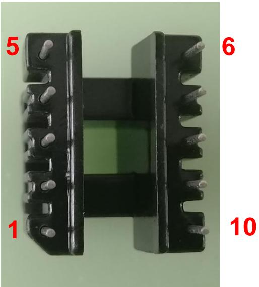

## 输出电压纹波—空载

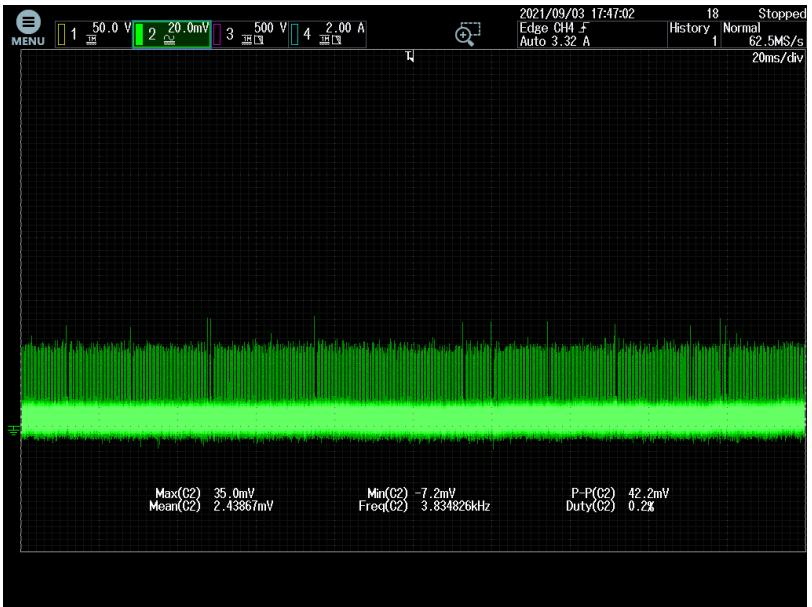

85 VAC

CH2 $\mathsf { V } _ { \mathsf { O U T } }$ Ripple $V _ { P K - P K } = 4 2 . 2 m v$

## Test Condition:

➢ No Load

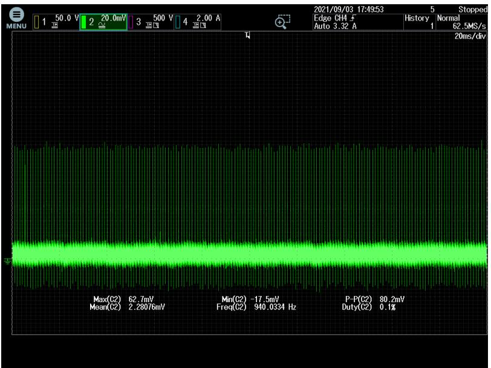

380 VAC

CH2 $\mathsf { V } _ { \mathsf { O U T } }$ Ripple VPK-PK=80.2mV

## Test Condition:

➢ No Load

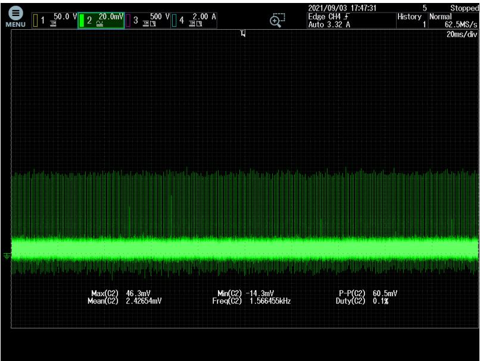

265 VAC

CH2 $\mathsf { V } _ { \mathsf { O U T } }$ Ripple $V _ { P K - P K } = 6 0 . 5 m v$

## Test Condition:

➢ No Load

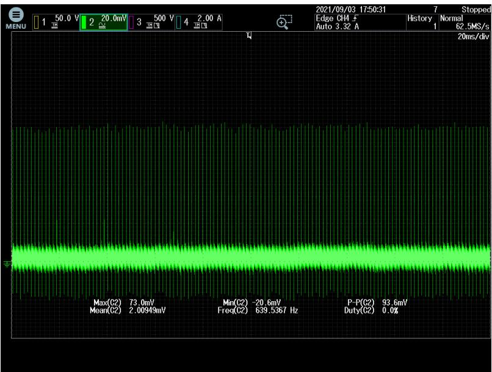

456 VAC

CH2 $\mathsf { V } _ { \mathsf { O U T } }$ Ripple VPK-PK=93.6mV

## Test Condition:

➢ No Load

## 输出电压纹波—满载

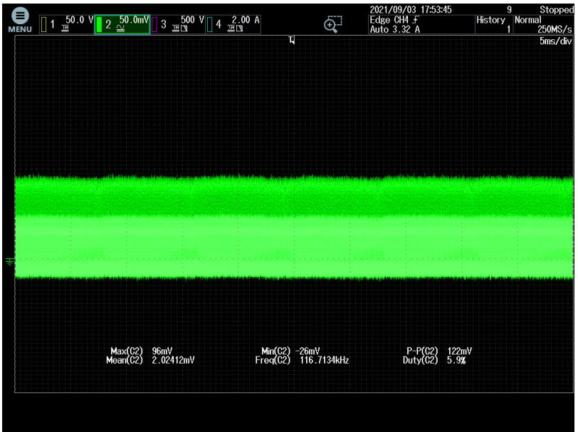

85 VAC

$\begin{array} { r l } & { \mathsf { C H 2 } \mathsf { V _ { O U T } R i p p l e } } \\ & { \mathsf { V _ { P K - P K } } \mathsf { = } 1 2 2 \mathsf { m V } } \end{array}$

## Test Condition:

➢ Full Load

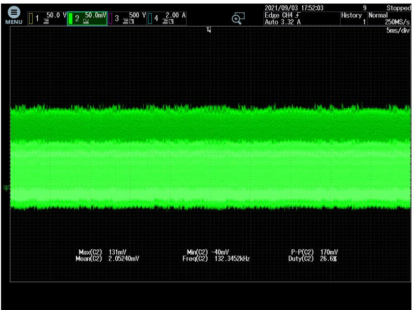

380 VAC

$\begin{array} { r l } { \mathbf { u } } & { { } \mathsf { C H 2 } \mathsf { V _ { \mathrm { 0 u T } } R i p p l e } } \\ { \quad } & { { } \mathsf { V _ { P K - P K } = 1 7 0 m v } } \end{array}$

## Test Condition:

➢ Full Load

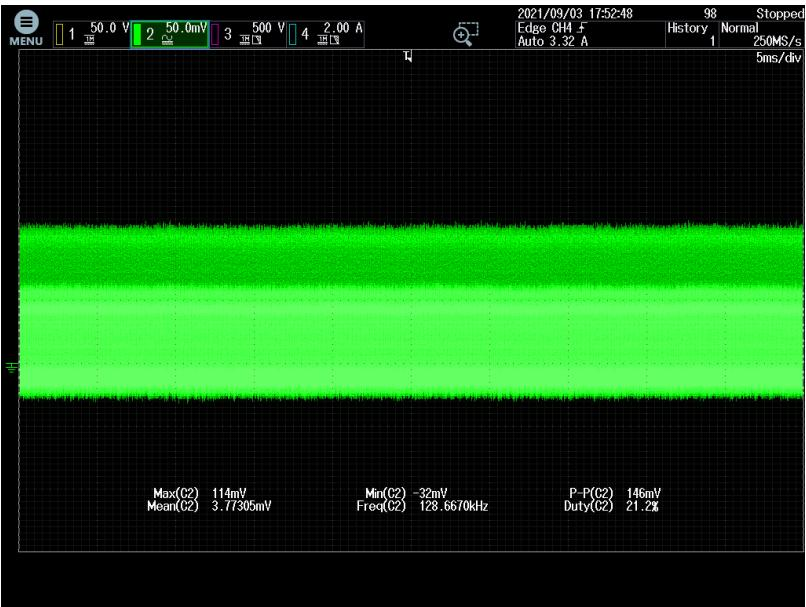

265 VAC

CH2 $\mathsf { V } _ { \mathsf { O U T } }$ Ripple $\mathsf { V } _ { \mathsf { P K - P K } } { = } \pm 4 6 \mathsf { m V }$

## Test Condition:

➢ Full Load

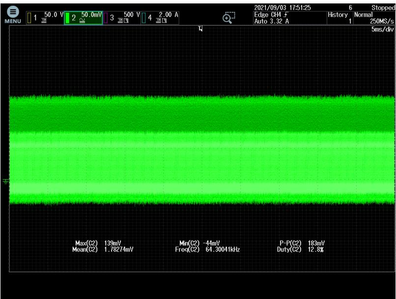

456 VAC

$\begin{array} { r l } & { \mathsf { C H 2 } \mathsf { V _ { o u T } R i p p l e } } \\ & { \mathsf { V _ { P K - P K } } \mathsf { = } \mathsf { 1 8 3 m v } } \end{array}$

## Test Condition:

➢ Full Load

## 动态负载(50%-100%)

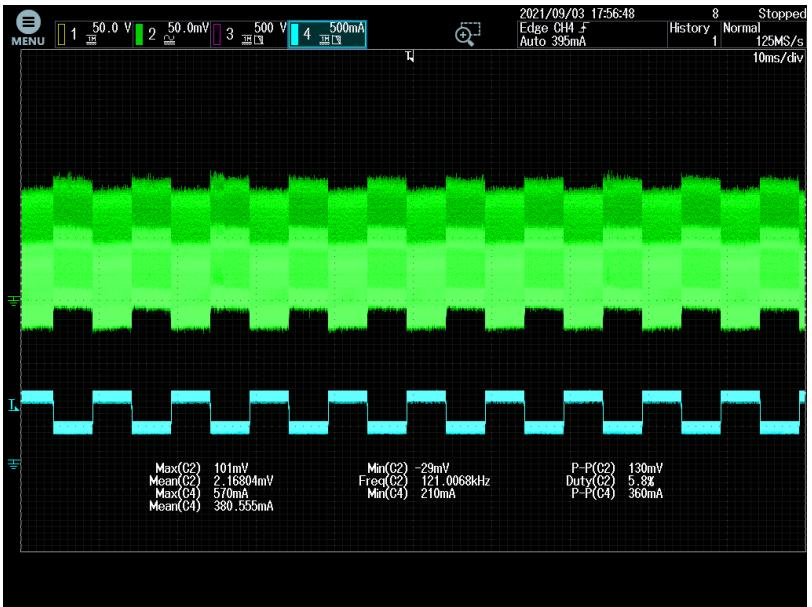

85 VAC

CH2 VOUT ${ \mathsf { C H } } 2 { \mathsf { V } } _ { \mathsf { O U T } }$ $v _ { p | c - P K } { = } 1 3 0 m v$  
$\mathsf { C H 4 } \mathsf { I } _ { \mathsf { O U T } }$

## Test Condition:

➢ $0 . 2 5 \ : \mathsf { A } – 0 . 5 \ : \mathsf { A } – 0 . 2 5 \ : \mathsf { A }$  
➢ Slew Rate: 0.5 A/μS  
➢ Frequency: 100 Hz

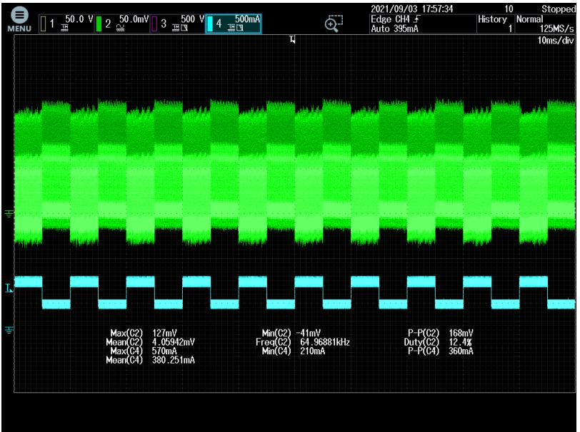

380 VAC

CH2 VOUT ${ \mathsf { C H } } 2 { \mathsf { V } } _ { \mathsf { O U T } }$ $v _ { p \vert k - P K } { = } 1 6 8 ~ \mathsf { m V }$  
$\mathsf { C H 4 } \mathsf { l } _ { \mathsf { O U T } }$

## Test Condition:

➢ 0.25 A-0.5 A-0.25 A  
➢ Slew Rate: 0.5 A/μS  
➢ Frequency: 100 Hz

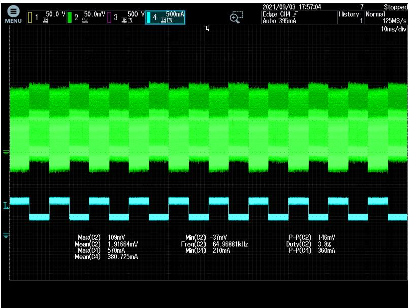

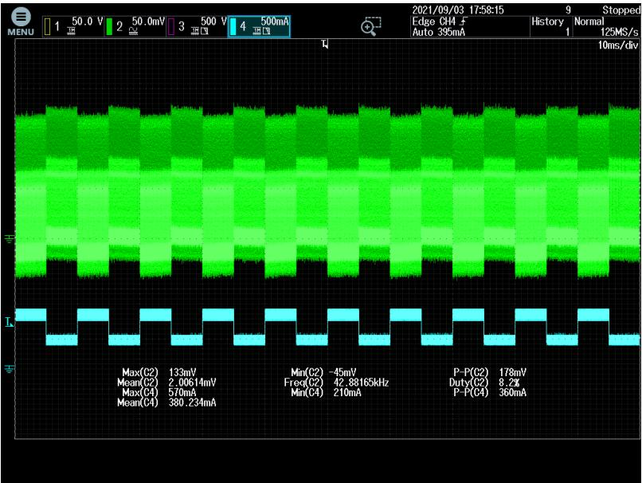

265 VAC

CH2 VOUT ${ \mathsf { C H } } { 2 } { \mathsf { V } } _ { \mathsf { O U T } }$ $V _ { \mathsf { P K - P K } } { = } 1 4 6 ~ \mathsf { m V }$  
$\mathsf { C H 4 } \mathsf { I } _ { \mathsf { O U T } }$

## Test Condition:

➢ 0.25 A-0.5 A-0.25 A  
➢ Slew Rate: 0.5 A/μS  
➢ Frequency: 100 Hz

456 VAC

CH2 VOUT ${ \mathsf { C H } } 2 { \mathsf { V } } _ { \mathsf { O U T } }$ $v _ { p _ { \mathrm { K - P K } } } { = } 1 7 8 \mathrm { m V }$  
$\mathsf { C H 4 } \mathsf { I } _ { \mathsf { O U T } }$

## Test Condition:

➢ 0.25 A-0.5 A-0.25 A  
➢ Slew Rate: 0.5 A/μS  
➢ Frequency: 100 Hz

## 动态负载(10%-90%)

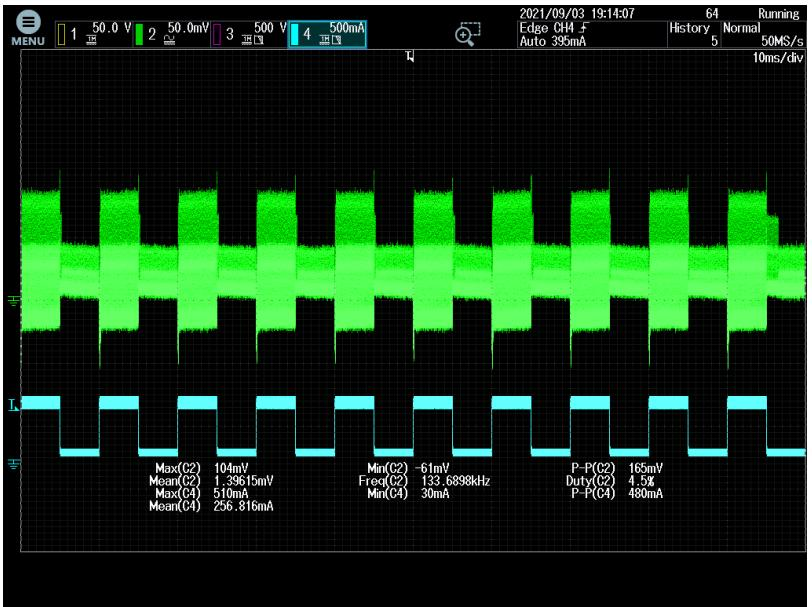

85 VAC

CH2 VOUT ${ \mathsf { C H } } 2 { \mathsf { V } } _ { \mathsf { O U T } }$ $\mathsf { V } _ { \mathsf { P K - P K } } { = } 1 6 5 \mathsf { m V }$  
$\mathsf { C H 4 } \mathsf { I } _ { \mathsf { O U T } }$

## Test Condition:

➢ 0.05A-0.45 A-0.05 A  
➢ Slew Rate: 0.5 A/μS  
➢ Frequency: 100 Hz

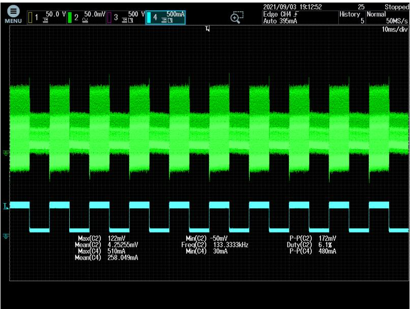

265 VAC

CH2 VOUT ${ \mathsf { C H } } { 2 } { \mathsf { V } } _ { \mathsf { O U T } }$ $\mathsf { V } _ { \mathsf { P K - P K } } { = } \pm 7 2 \mathsf { m V }$  
$\mathsf { C H 4 } \mathsf { I } _ { \mathsf { O U T } }$

## Test Condition:

➢ 0.05A-0.45 A-0.05 A  
➢ Slew Rate: 0.5 A/μS  
➢ Frequency: 100 Hz

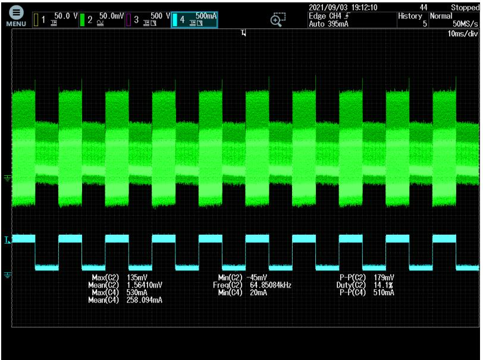

380 VAC

CH2 VOUT ${ \mathsf { C H } } 2 { \mathsf { V } } _ { \mathsf { O U T } }$ $\mathsf { V } _ { \mathsf { P K - P K } } { = } 1 7 9 \mathsf { m V }$  
$\mathsf { C H 4 } \mathsf { l } _ { \mathsf { O U T } }$

## Test Condition:

➢ 0.05A-0.45 A-0.05 A  
➢ Slew Rate: 0.5 $\mathsf { A } / \mu \mathsf { S }$  
➢ Frequency: 100 Hz

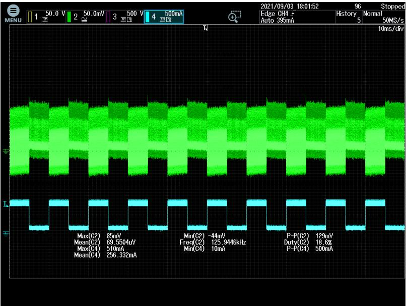

456 VAC

CH2 VOUT ${ \mathsf { C H } } 2 { \mathsf { V } } _ { \mathsf { O U T } }$ $\mathsf { V } _ { \mathsf { P K - P K } } { = } 1 2 9 \mathsf { m V }$  
$\mathsf { C H 4 } \mathsf { I } _ { \mathsf { O U T } }$

## Test Condition:

➢ 0.05A-0.45 A-0.05 A  
➢ Slew Rate: 0.5 A/μS  
➢ Frequency: 100 Hz

## 输出电压开机波形—空载

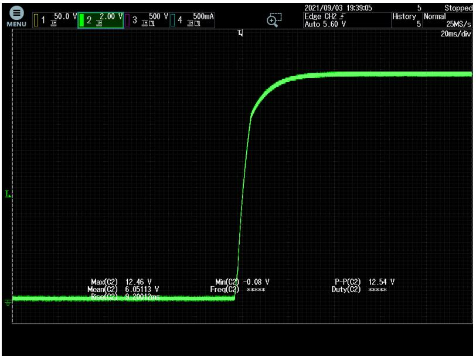

85 VAC

CH2 VOUT TRISE: 9.2 mS

## Test Condition:

➢ No Load

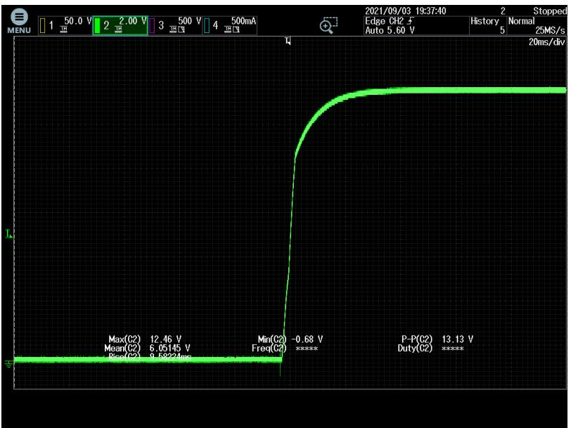

380 VAC

CH2 VOUT TRISE: 9.5 mS

## Test Condition:

➢ No Load

265 VAC

CH2 VOUT TRISE: 9.7 mS

## Test Condition:

➢ No Load

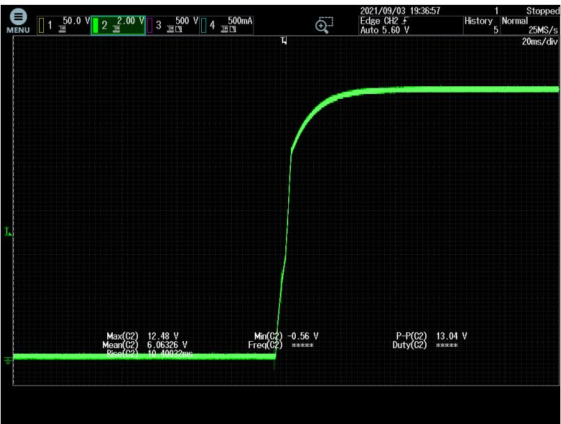

456 VAC

CH2 VOUT TRISE: 10.4 mS

## Test Condition:

➢ No Load

## 输出电压开机波形—满载

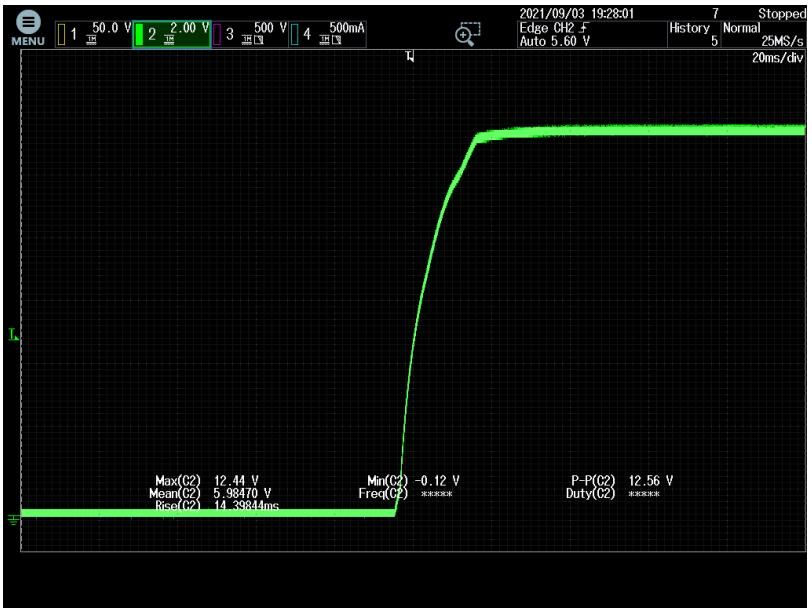

85 VAC

CH2 VOUT TRISE: 14.3 mS

## Test Condition:

➢ Full Load

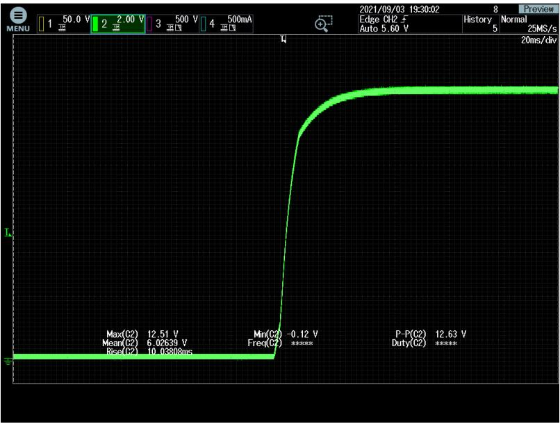

265 VAC

CH2 VOUT TRISE: 10 mS

## Test Condition:

➢ Full Load

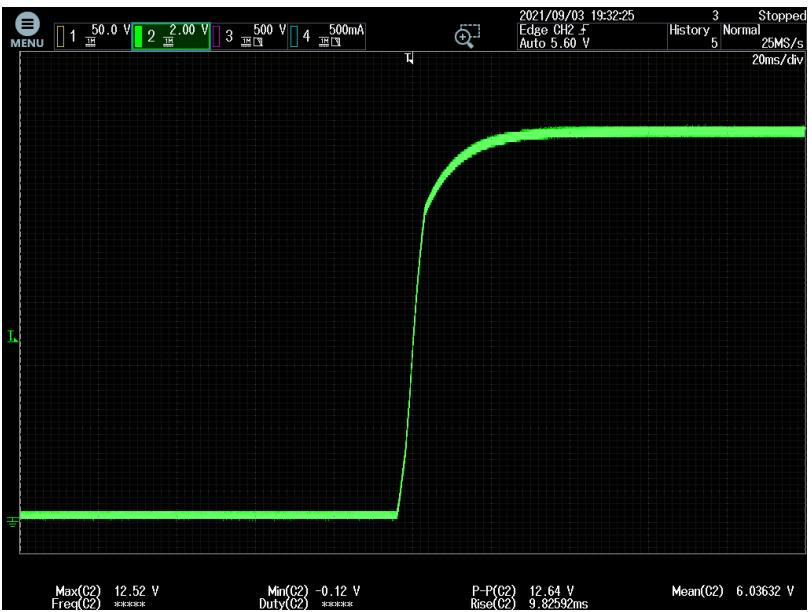

380 VAC

CH2 VOUT TRISE: 9.8 mS

## Test Condition:

➢ Full Load

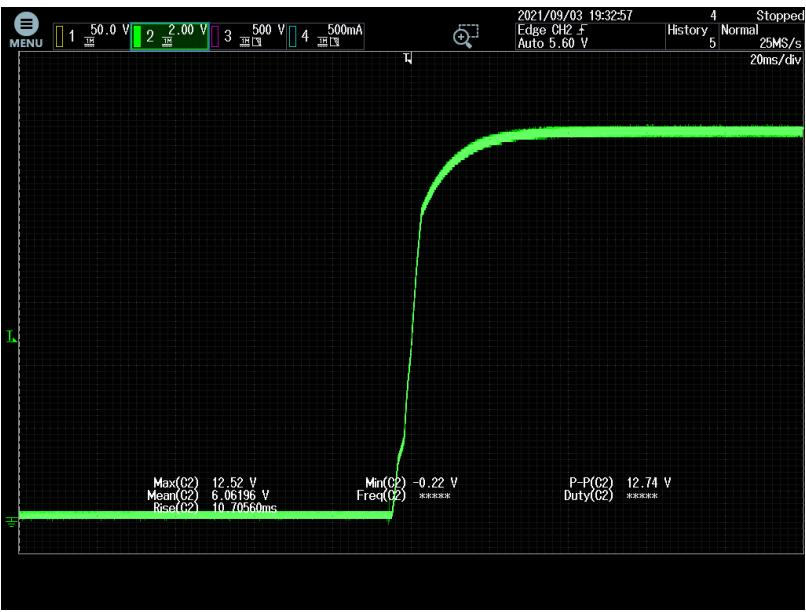

456 VAC

CH2 VOUT TRISE: 10.7 mS

## Test Condition:

➢ Full Load

## 漏源极电压和电流开机空载波形—IC

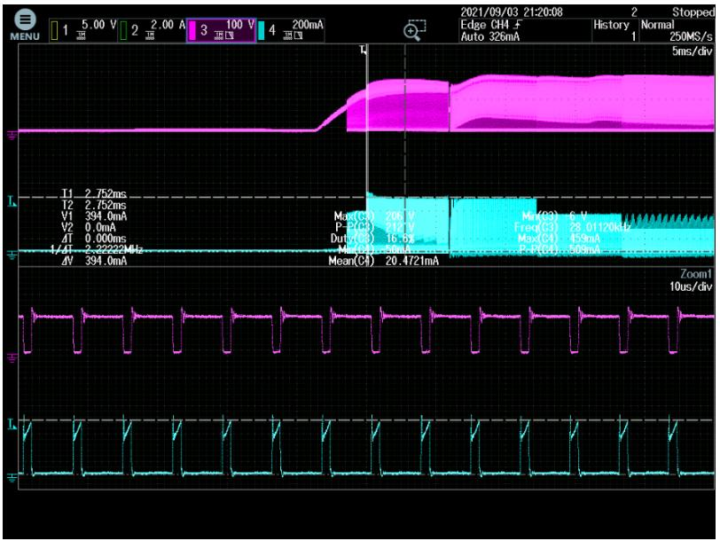

85 VAC

CH3 VDS  
CH4 IDS

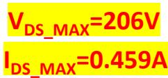  
Test Condition:

➢ No Load

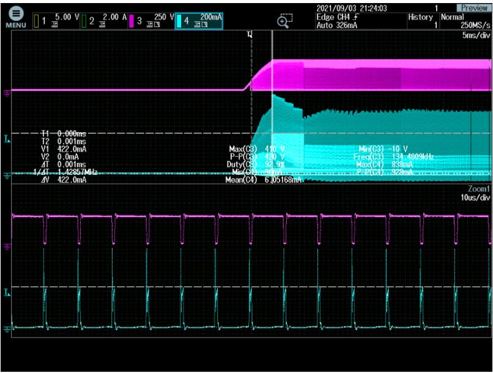

265 VAC

CH3 VDS  
CH4 IDS

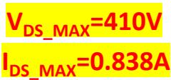  
Test Condition:

➢ No Load

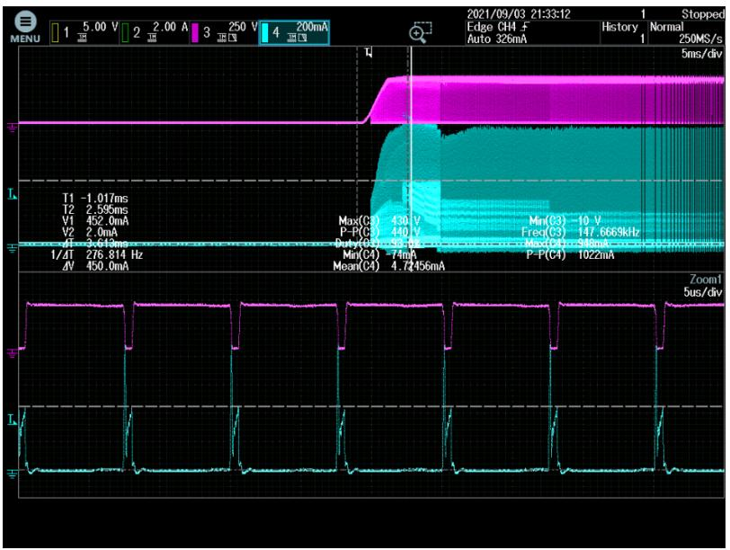

380 VAC

CH3 VDS  
CH4 IDS

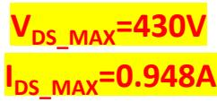  
Test Condition:

➢ No Load

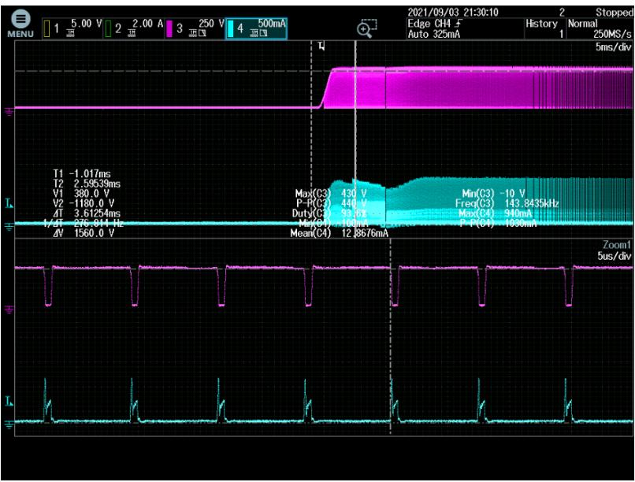

456 VAC

CH3 VDS  
CH4 IDS

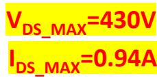  
Test Condition:

➢ No Load

## 漏源极电压和电流开机波形—FET

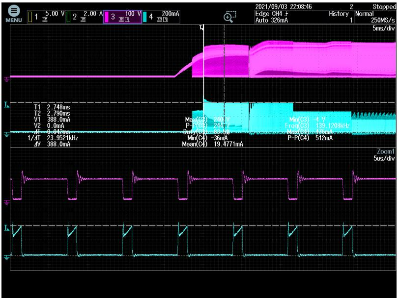

85 VAC  
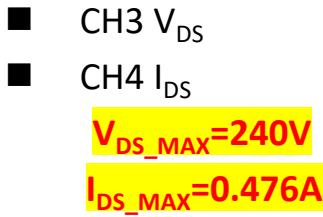

Test Condition:  
➢ No Load

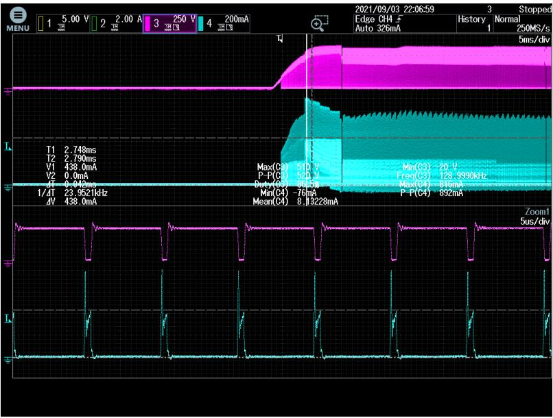

265 VAC  
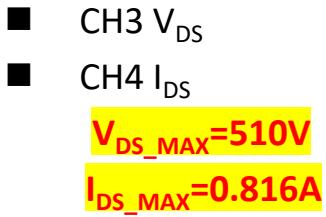

Test Condition:  
➢ No Load

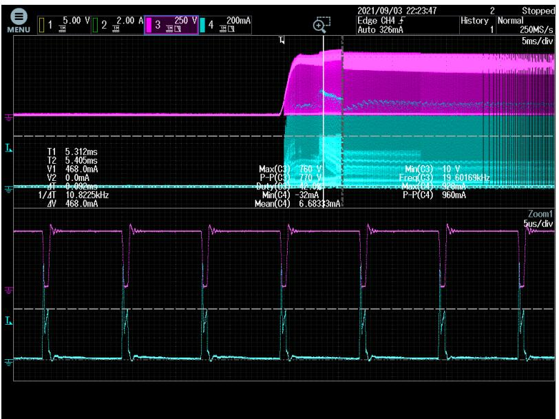

380 VAC  

Test Condition:  
➢ No Load

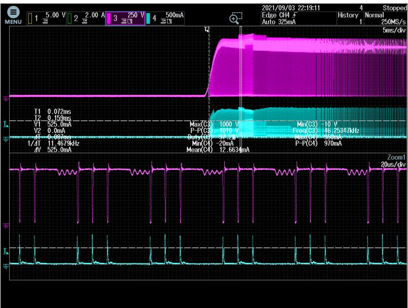

456 VAC  
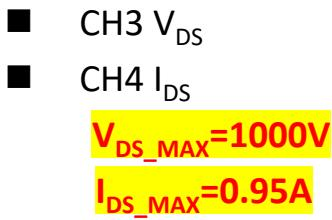

Test Condition:  
➢ No Load

## 漏源极电压和电流开机波形—IC

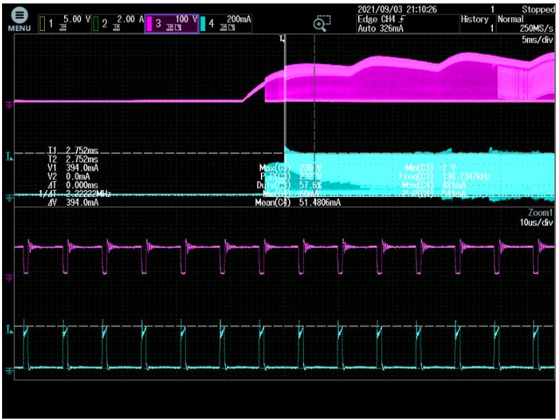

85 VAC  

Test Condition:  
➢ Full Load


265 VAC  


Test Condition:  
➢ Full Load


380 VAC  


Test Condition:  
➢ Full Load


456 VAC  

Test Condition:  
➢ Full Load

## 漏源极电压和电流开机波形—FET


85 VAC

CH3 VDS  
CH4 IDS

  
Test Condition:

➢ Full Load


265 VAC

CH3 VDS  
CH4 IDS

  
Test Condition:

➢ Full Load


380 VAC

CH3 VDS  
CH4 IDS

  
Test Condition:

➢ Full Load


456 VAC

CH3 VDS  
CH4 IDS

  
Test Condition:

➢ Full Load

## 漏源极电压和电流稳态空载波形—IC


85 VAC

CH3 VDS  
CH4 IDS

$$
\begin{array}{l} \mathrm {V_ {DS\_MAX}} = 1 8 2 \mathrm{V} \\ \mathrm {I_ {DS\_MAX}} = 0. 2 2 4 \mathrm{A} \end{array}
$$

## Test Condition:

➢ Full Load


380 VAC

CH3 VDS  
CH4 IDS

$$
\begin{array}{l} \mathrm {V_ {DS\_MAX}} = 4 2 0 \mathrm{V} \\ \mathrm {I_ {DS\_MAX}} = 0. 9 3 6 \mathrm{A} \end{array}
$$

## Test Condition:

➢ Full Load


265 VAC

CH3 VDS  
CH4 IDS

$$
\begin{array}{l} \mathrm {V_ {DS\_MAX}} = 4 2 0 \mathrm{V} \\ \mathrm {I_ {DS\_MAX}} = 0. 6 6 \mathrm{A} \end{array}
$$

## Test Condition:

➢ Full Load


456 VAC

CH3 VDS  
CH4 IDS

$$
\begin{array}{l} \mathrm {V_ {DS\_MAX}} = 4 2 0 \mathrm{V} \\ \mathrm {I_ {DS\_MAX}} = 0. 9 1 \mathrm{A} \end{array}
$$

## Test Condition:

➢ Full Load

## 漏源极电压和电流稳态空载波形—FET


85 VAC

CH3 VDS  
CH4 IDS


## Test Condition:

➢ No Load


265 VAC

CH3 VDS  
CH4 IDS


## Test Condition:

➢ No Load


380 VAC

CH3 VDS  
CH4 IDS

## Test Condition:

➢ No Load


456 VAC

CH3 VDS  
CH4 IDS

## Test Condition:

➢ No Load

## 漏源极电压和电流稳态波形—IC


85 VAC

CH3 VDS  
CH4 IDS

$$
\begin{array}{l} \mathrm {V_ {DS\_MAX}} = 2 3 2 \mathrm{V} \\ \mathrm {I_ {DS\_MAX}} = 0. 4 2 4 \mathrm{A} \end{array}
$$

## Test Condition:

➢ Full Load


380 VAC

CH3 VDS  
CH4 IDS

$$
\begin{array}{l} \mathrm {V_ {DS\_MAX}} = 4 3 2 \mathrm{V} \\ \mathrm {I_ {DS\_MAX}} = 0. 8 2 8 \mathrm{A} \end{array}
$$

## Test Condition:

➢ Full Load


265 VAC

CH3 VDS  
CH4 IDS

$$
\begin{array}{l} \mathrm {V_ {DS\_MAX}} = 3 3 0 \mathrm{V} \\ \mathrm {I_ {DS\_MAX}} = 0. 5 2 0 \mathrm{A} \end{array}
$$

## Test Condition:

➢ Full Load


456 VAC

CH3 VDS  
CH4 IDS

$$
\begin{array}{l} \mathrm {V_ {DS\_MAX}} = 4 3 2 \mathrm{V} \\ \mathrm {I_ {DS\_MAX}} = 0. 7 6 5 \mathrm{A} \end{array}
$$

## Test Condition:

➢ Full Load

## 漏源极电压和电流稳态波形—FET


85 VAC  

Test Condition:  
➢ Full Load


265 VAC  

Test Condition:  
➢ Full Load


380 VAC  

Test Condition:  
➢ Full Load


456 VAC  

Test Condition:  
➢ Full Load

## 漏源极电压和电流稳态波形—IC+FET


85 VAC  


Test Condition:  
➢ Full Load


265 VAC  


Test Condition:  
➢ Full Load


380 VAC  


Test Condition:  
➢ Full Load


456 VAC  


Test Condition:  
➢ Full Load

## 漏源极电压启机波形—IC+FET


85 VAC

CH1 VDS\_FET $V _ { \mathsf { D S } _ { \mathsf { \Gamma } } \mathsf { F E T } }$  
$\mathsf { C H 3 } \mathsf { V _ { D S \_ K } }$ $V _ { \mathsf { D S \_ I C \_ M A X } } = 1 8 2 \mathsf { V }$ $V _ { \mathsf { D S } \_ F E T \_ M A X } = 2 3 2 \mathsf { V }$

Test Condition:  
➢ No Load  


380 VAC

CH1 VDS\_FET $V _ { \mathsf { D S } _ { \mathsf { \Gamma } } \mathsf { F E T } }$  
CH3 $V _ { \mathsf { D S } \_ \mathsf { I C } }$ $V _ { \mathsf { D S \_ I C \_ M A X } } = 4 2 6 V$ $\mathsf { V } _ { \mathsf { D S } _ { - } \mathsf { F E T \_ M A X } } = 6 6 2 \mathsf { V }$

Test Condition:  
➢ No Load  


265 VAC

CH1 VDS\_FET $\mathsf { V } _ { \mathsf { D S \_ F E T } }$  
$V _ { \mathsf { D S } \bot \mathsf { C } }$ $V _ { \mathsf { D S \_ I C \_ M A X } } = 4 1 8 V$ $\mathsf { V } _ { \mathsf { D S \_ F E T \_ M A X } } { = } 4 9 1 \mathsf { V }$

Test Condition:  
➢ No Load  


456 VAC

CH1 VDS\_FET $\mathsf { V } _ { \mathsf { D S \_ F E T } }$  
CH3 $V _ { \mathsf { D S } \bot \mathsf { C } }$ $V _ { \mathsf { D S \_ F } \mathsf { M A X } } = 4 3 6 V$ $\mathsf { V } _ { \mathsf { D S } \_ \mathsf { F E T \_ M A X } } = 7 7 0 \mathsf { V }$

Test Condition:

➢ No Load

## 漏源极电压稳态波形—IC+FET


85 VAC

CH1 VDS\_FET $V _ { \mathsf { D S } _ { \mathsf { \Gamma } } \mathsf { F E T } }$  
CH3 $V _ { \mathsf { D S } \bot \mathsf { C } }$ $V _ { \mathsf { D S \_ I C \_ M A X } } = 2 3 2 V$ $\mathsf { V } _ { \mathsf { D S } _ { - } \mathsf { F E T \_ M A X } } = 2 6 0 \mathsf { V }$

Test Condition:  
➢ Full Load  


380 VAC

CH1 VDS\_FET $V _ { \mathsf { D S } _ { \mathsf { \Gamma } } \mathsf { F E T } }$  
CH3 $v _ { \scriptscriptstyle \mathsf { D S } _ { - } }$ $V _ { \mathsf { D S \_ I C \_ M A X } } = 4 3 4 V$ $V _ { D S \_ F E T \_ M A X } = 7 0 2 V$

Test Condition:  
➢ Full Load  


265 VAC

CH1 VDS\_FET $\mathsf { V } _ { \mathsf { D S \_ F E T } }$  
$V _ { \mathsf { D S } \bot \mathsf { C } }$ VDS\_IC\_MAX=410V VDS\_FET\_MAX=524V

Test Condition:  
➢ Full Load  
  
456 VAC

CH1 VDS\_FET ${ \mathsf { C H 1 } } \mathsf { V _ { D S \_ F E T } }$  
CH3 $V _ { \mathsf { D S } \bot \mathsf { C } }$ $V _ { \mathsf { D S \_ F } \mathsf { M A X } } = 4 4 0 V$ $\mathsf { V } _ { \mathsf { D S } \_ \mathsf { F E T \_ M A X } } = 8 1 0 \mathsf { V }$

Test Condition:

➢ Full Load

## 漏源极电压空载启机波形—IC+FET


85 VAC

CH1 VDS\_FET $V _ { \mathsf { D S } _ { \mathsf { \Gamma } } \mathsf { F E T } }$  
CH3 $V _ { \mathsf { D S } \bot \mathsf { C } }$ $V _ { \mathsf { D S \_ F } \mathsf { M A X } } = 2 0 3 \mathsf { V }$ $V _ { \mathsf { D S } _ { - } \mathsf { F E T \_ M A X } } = 2 3 8 \mathsf { V }$

Test Condition:  
➢ No Load  


265 VAC

CH1 VDS\_FET $\mathsf { V } _ { \mathsf { D S \_ F E T } }$  
CH3 $V _ { \mathsf { D S } \bot \mathsf { C } }$ $V _ { \mathsf { D S \_ I C \_ M A X } } = 4 1 8 V$ $\mathsf { V } _ { \mathsf { D S } \_ \mathsf { F E T \_ M A X } } = 5 0 5 \mathsf { V }$

Test Condition:  
➢ No Load  


380 VAC

CH1 VDS\_FET $V _ { \mathsf { D S } _ { \mathsf { \Gamma } } \mathsf { F E T } }$  
CH3 $V _ { \mathsf { D S \_ I C \_ M A X } } = 4 3 2 \mathsf { V }$ $\mathsf { V } _ { \mathsf { D } \mathsf { S } _ { - } \mathsf { F } \mathsf { E } \mathsf { T } _ { - } \mathsf { M } \mathsf { A } \mathsf { X } } = 6 9 0 \mathsf { V }$

Test Condition:  
➢ No Load  


456 VAC

CH1 VDS\_FET $\mathsf { V } _ { \mathsf { D S \_ F E T } }$  
CH3 $V _ { \mathsf { D S } \bot \mathsf { C } }$ $V _ { \mathsf { D S \_ F } \mathsf { M A X } } = 4 3 6 V$ $\mathsf { V } _ { \mathsf { D S } \_ \mathsf { F E T \_ M A X } } = 8 7 0 \mathsf { V }$

Test Condition:

➢ No Load

## 漏源极电压满载启机波形—IC+FET


85 VAC

CH1 VDS\_FET $V _ { \mathsf { D S } _ { \mathsf { \Gamma } } \mathsf { F E T } }$  
CH3 $V _ { \mathsf { D S } \bot \mathsf { C } }$ $V _ { \mathsf { D S \_ i c \_ M A X } } = 2 2 9 V$ $V _ { \mathsf { D S } \_ F E T \_ M A X } = 2 5 8 V$

Test Condition:  
➢ Full Load  


380 VAC

CH1 VDS\_FET $V _ { \mathsf { D S } _ { \mathsf { \Gamma } } \mathsf { F E T } }$  
CH3 $\mathsf { V } _ { \mathsf { D S } \_ \mathsf { I } ( }$ $V _ { \mathsf { D S \_ I C \_ M A X } } = 4 3 4 V$ $V _ { D S \_ F E T \_ M A X } = 7 0 2 V$

Test Condition:  
➢ Full Load  


265 VAC

CH1 $\mathsf { V } _ { \mathsf { D S \_ F E T } }$  
CH3 $V _ { \mathsf { D S } \bot \mathsf { C } }$ $V _ { \mathsf { D S \_ I C \_ M A X } } = 4 1 4 V$ $\mathsf { V } _ { \mathsf { D S } \_ \mathsf { F E T \_ M A X } } = 5 2 6 \mathsf { V }$

Test Condition:  
➢ Full Load  
  
456 VAC

CH1 VDS\_FET ${ \mathsf { C H 1 } } \mathsf { V _ { D S \_ F E T } }$  
$V _ { \mathsf { D S } \bot \mathsf { C } }$ $V _ { \mathsf { D S \_ F } \mathsf { M A X } } = 4 4 0 V$ $\mathsf { V } _ { \mathsf { D S } \_ \mathsf { F E T } \_ \mathsf { M A X } } = 9 8 0 \mathsf { V }$

Test Condition:

➢ Full Load

## 输出二极管反向电压和电流稳态波形—空载


85 VAC

CH1 VR  
CH4 IR

  
Test Condition:

➢ No Load


265 VAC

CH1 VR  
CH4 IR

  
Test Condition:

➢ No Load


380 VAC

CH1 VR  
CH4 IR

  
Test Condition:

➢ No Load


456 VAC

CH1 VR  
CH4 IR

  
Test Condition:

➢ No Load

## 输出二极管反向电压和电流稳态波形—满载


85 VAC

CH1 VR  
CH4 IR

  
Test Condition:

➢ Full Load


265 VAC

CH1 VR  
CH4 IR

  
Test Condition:

➢ Full Load


380 VAC

CH1 VR  
CH4 IR

  
Test Condition:

➢ Full Load


456 VAC

CH1 VR  
CH4 IR

  
Test Condition:

➢ Full Load

## 输出二极管反向电压和电流启机波形—空载


85 VAC

CH1 VR  
CH4 IR

$$
\begin{array}{l} \mathrm {V_ {R\_MAX}} = 3 0. 2 \mathrm{V} \\ \mathrm {I_ {R\_MAX}} = 3. 7 3 \mathrm{A} \end{array}
$$

Test Condition:

➢ No Load


265 VAC

CH1 VR  
CH4 IR

$$
\begin{array}{l} \mathrm {V_ {R\_MAX}} = 6 6. 4 \mathrm{V} \\ \mathrm {I_ {R\_MAX}} = 4. 3 6 \mathrm{A} \end{array}
$$

Test Condition:

➢ No Load


380 VAC

CH1 VR  
CH4 IR

$$
V _ {R \_ M A X} = 1 0 0. 4 V
$$

$$
I _ {R \_ M A X} = 4. 9 6 A
$$

Test Condition:

➢ No Load


456 VAC

CH1 VR  
CH4 IR

$$
V _ {R \_ M A X} = 1 2 2 V
$$

$$
I _ {R \_ M A X} = 5. 6 8 A
$$

Test Condition:

➢ No Load

## 输出二极管反向电压和电流启机波形--满载


85 VAC

CH1 VR  
CH4 IR

$$
\begin{array}{l} \mathrm {V_ {R\_MAX}} = 3 0. 8 \mathrm{V} \\ \mathrm {I_ {R\_MAX}} = 3. 8 2 \mathrm{A} \end{array}
$$

## Test Condition:

➢ Full Load


265 VAC

CH1 VR  
CH4 IR

$$
\begin{array}{l} \mathrm {V_ {R\_MAX}} = 6 7. 1 \mathrm{V} \\ \mathrm {I_ {R\_MAX}} = 4. 4 4 \mathrm{A} \end{array}
$$

## Test Condition:

➢ Full Load


380 VAC

CH1 VR  
CH4 IR

$$
\begin{array}{r l} & V _ {R \_ M A X} = 9 2. 5 V \\ & I _ {R \_ M A X} = 4. 6 A \end{array}
$$

## Test Condition:

➢ Full Load


456 VAC

CH1 VR  
CH4 IR

$$
\begin{array}{l} V _ {R \_ M A X} = 1 1 8 V \\ I _ {R \_ M A X} = 7. 1 2 A \end{array}
$$

## Test Condition:

➢ Full Load

## 短路保护（MOSFET电压和电流波形）IC


85 VAC

CH3 VDS  
CH4 IDS

$$
\begin{array}{l} \mathrm {V_ {DS\_MAX}} = 2 4 0 \mathrm{V} \\ \mathrm {I_ {DS\_MAX}} = 0. 4 9 4 \mathrm{A} \end{array}
$$


265 VAC

CH3 VDS  
CH4 IDS

$$
\begin{array}{l} \mathrm {V_ {DS\_MAX}} = 4 1 0 \mathrm{V} \\ \mathrm {I_ {DS\_MAX}} = 0. 9 5 \mathrm{A} \end{array}
$$

380 VAC

CH3 VDS  
CH4 IDS

$$
\begin{array}{l} \mathrm {V_ {DS\_MAX}} = 4 3 0 \mathrm{V} \\ \mathrm {I_ {DS\_MAX}} = 1. 0 3 \mathrm{A} \end{array}
$$


456 VAC

CH3 VDS  
CH4 IDS

$$
\begin{array}{l} \mathrm {V_ {DS\_MAX}} = 4 4 0 \mathrm{V} \\ \mathrm {I_ {DS\_MAX}} = 1. 0 7 \mathrm{A} \end{array}
$$

## 短路保护（MOSFET电压和电流波形）FET


85 VAC

CH3 VDS  
CH4 IDS

$$
V _ {D S \_ M A X} = 2 6 0 V
$$

$$
I _ {D S \_ M A X} = 0. 4 9 2 A
$$


265 VAC

CH3 VDS  
CH4 IDS

$$
\begin{array}{l} \mathrm {V_ {DS\_MAX}} = 5 2 0 \mathrm{V} \\ \mathrm {I_ {DS\_MAX}} = 0. 9 0 8 \mathrm{A} \end{array}
$$


380 VAC

CH3 VDS  
CH4 IDS

$$
V _ {D S \_ M A X} = 7 2 0 V
$$

$$
I _ {D S \_ M A X} = 0. 9 8 A
$$


456 VAC

CH3 VDS  
CH4 IDS

$$
V _ {D S \_ M A X} = 8 1 0 V
$$

$$
I _ {D S \_ M A X} = 1. 0 7 A
$$

## 短路保护（输出二极管电压和电流波形）


85 VAC

CH1 VR  
CH4 IR

$$
\begin{array}{l} \mathrm {V_ {R\_MAX}} = 3 0. 8 \mathrm{V} \\ \mathrm {I_ {R\_MAX}} = 4. 2 8 \mathrm{A} \end{array}
$$


265 VAC

CH1 VR  
CH4 IR

$$
\begin{array}{l} \mathrm {V_ {R\_MAX}} = 6 8 \mathrm{V} \\ \mathrm {I_ {R\_MAX}} = 6. 3 5 \mathrm{A} \end{array}
$$


380 VAC

CH1 VR  
CH4 IR

$$
V _ {R \_ M A X} = 9 3 V
$$

$$
I _ {R \_ M A X} = 7. 2 6 A
$$


456 VAC

CH1 VR  
CH4 IR

$$
V _ {R \_ M A X} = 1 0 5 V
$$

$$
I _ {R \_ M A X} = 9. 8 A
$$

## 温升测试—12V0.5A满载

<table><tr><td rowspan="2">项目</td><td colspan="2">85VAC</td><td colspan="2">300VAC</td><td colspan="2">456VAC</td></tr><tr><td>温度(°C)</td><td>温升(°C)</td><td>温度(°C)</td><td>温升(°C)</td><td>温度(°C)</td><td>温升(°C)</td></tr><tr><td>环境温度</td><td colspan="2">27.8</td><td colspan="2">28.1</td><td colspan="2">28.3</td></tr><tr><td>BPA8616P (U1)</td><td>64.8</td><td>37</td><td>77.2</td><td>49.1</td><td>98.2</td><td>69.9</td></tr><tr><td>Stack FET (Q1) 2N60</td><td>54</td><td>26.2</td><td>61.9</td><td>33.8</td><td>88.4</td><td>60.1</td></tr><tr><td>变压器线包 (T1)</td><td>57.4</td><td>29.6</td><td>67.3</td><td>39.2</td><td>77</td><td>48.7</td></tr><tr><td>变压器磁芯 (T1)</td><td>56.9</td><td>29.1</td><td>67.9</td><td>39.8</td><td>77.2</td><td>48.9</td></tr><tr><td>TVS管 (D3A)</td><td>47.7</td><td>19.9</td><td>59.1</td><td>31</td><td>77.1</td><td>48.8</td></tr><tr><td>输出二极管 (D3A)</td><td>64.2</td><td>36.4</td><td>69.2</td><td>41.1</td><td>75.8</td><td>47.5</td></tr><tr><td>稳压二极管 (D3A)</td><td>50.4</td><td>22.6</td><td>58.3</td><td>30.2</td><td>76.7</td><td>48.4</td></tr><tr><td>钳位二极管 (D1)</td><td>54.7</td><td>26.9</td><td>61.2</td><td>33.1</td><td>82.1</td><td>53.8</td></tr><tr><td>输出电解电容 (EC5)</td><td>48.2</td><td>20.4</td><td>52</td><td>23.9</td><td>57.1</td><td>28.8</td></tr><tr><td>输入电解电容 (EC2)</td><td>39.5</td><td>11.7</td><td>46.4</td><td>18.3</td><td>60.2</td><td>31.9</td></tr></table>

## 测试说明

➢ 在密闭纸箱中进行测试  
➢ 电路板放在一个封闭的盒子内  
➢ 热电偶连接到各个测量点  
等测量点温度达到稳定后记录数据  
PCB为单面板

## 温升测试—12V0.5A满载

<table><tr><td rowspan="2">项目</td><td colspan="2">300VAC</td><td colspan="2">456VAC</td></tr><tr><td>温度(°C)</td><td>温升(°C)</td><td>温度(°C)</td><td>温升(°C)</td></tr><tr><td>环境温度</td><td colspan="2">27.5</td><td colspan="2">28.3</td></tr><tr><td>BPA8616P (U1)</td><td>76.1</td><td>48.6</td><td>92.7</td><td>64.4</td></tr><tr><td>Stack FET (Q1) 4N65</td><td>62.6</td><td>35.1</td><td>87.4</td><td>59.1</td></tr><tr><td>变压器线包 (T1)</td><td>70</td><td>42.5</td><td>78.8</td><td>50.5</td></tr><tr><td>变压器磁芯 (T1)</td><td>70.4</td><td>42.9</td><td>79.3</td><td>51</td></tr><tr><td>TVS管 (D3A)</td><td>60.1</td><td>32.6</td><td>80.5</td><td>52.2</td></tr><tr><td>输出二极管 (D3A)</td><td>71.8</td><td>44.3</td><td>77.6</td><td>49.3</td></tr><tr><td>稳压二极管 (D3A)</td><td>57.1</td><td>29.6</td><td>75.2</td><td>46.9</td></tr><tr><td>钳位二极管 (D1)</td><td>61.8</td><td>34.3</td><td>79.7</td><td>51.4</td></tr><tr><td>输出电解电容 (EC5)</td><td>53.6</td><td>26.1</td><td>57.8</td><td>29.5</td></tr><tr><td>输入电解电容 (EC2)</td><td>46.5</td><td>19</td><td>62.7</td><td>34.4</td></tr></table>


## 测试说明

➢ 在密闭纸箱中进行测试  
➢ 电路板放在一个封闭的盒子内  
➢ 热电偶连接到各个测量点  
等测量点温度达到稳定后记录数据  
PCB为单面板


115VAC Line


230VAC Line


115VAC Neutral


230VAC Neutral


115VAC Line


230VAC Line


115VAC Neutral


230VAC Neutral

## THANK YOU FOR WATCHING
