## BPA8618D&TNY288D对比测试

## (12V/1A@85\~265Vac)

上海晶丰明源半导体股份有限公司

Shanghai Bright Power Semiconductor Co., Ltd.

WHX

时间：2021年4月

## 电气参数对比

<table><tr><td></td><td>BPA8618D</td><td>TNY288D</td></tr><tr><td>开关频率</td><td>132KHz</td><td>132KHz</td></tr><tr><td>Mosfet BV</td><td>700V</td><td>725V</td></tr><tr><td> $R_{DS\_ON}$ </td><td>4.7Ω</td><td>5.2Ω</td></tr><tr><td>限流点</td><td>550mA</td><td>550mA</td></tr><tr><td>软启动</td><td>有</td><td>无</td></tr><tr><td>输入过压保护</td><td>有</td><td>无</td></tr><tr><td>输入欠压保护</td><td>内置</td><td>外加</td></tr><tr><td>输出过压保护</td><td>自动重启</td><td>锁死</td></tr><tr><td>过载保护</td><td>有</td><td>有</td></tr><tr><td>恒功率输出</td><td>无</td><td>有</td></tr><tr><td>封装</td><td>DIP-7, SOP-7</td><td>DIP-7, SOP-7</td></tr></table>

## 测试数据对比

电源规格:85\~265Vac输入，12V/1A输出

<table><tr><td colspan="2"></td><td>BPA8618D</td><td>TNY288D</td><td></td></tr><tr><td colspan="2">待机功耗</td><td>49mW</td><td>67mW</td><td>包含输入电压检测电阻损耗</td></tr><tr><td rowspan="2">效率</td><td>115Vac</td><td>81.2%</td><td>81.4%</td><td></td></tr><tr><td>230Vac</td><td>82.6%</td><td>82.6%</td><td></td></tr><tr><td rowspan="2">输出电压纹波</td><td>85Vac</td><td>239mV</td><td>224mV</td><td></td></tr><tr><td>265Vac</td><td>208mV</td><td>184mV</td><td></td></tr><tr><td rowspan="2">动态负载性能</td><td>50%-100%</td><td> $263mV_{PK\_PK}$ </td><td> $267mV_{PK\_PK}$ </td><td></td></tr><tr><td>10%-90%</td><td> $315mV_{PK\_PK}$ </td><td> $364mV_{PK\_PK}$ </td><td></td></tr><tr><td rowspan="2">MOSFET应力</td><td> $V_{DS}$ </td><td>560V</td><td>550V</td><td></td></tr><tr><td> $I_{DS}$ </td><td>0.72A</td><td>0.97A</td><td></td></tr><tr><td rowspan="2">二极管应力</td><td>VRR</td><td>68.8V</td><td>74.5V</td><td></td></tr><tr><td> $I_{PK}$ </td><td>6.26A</td><td>7.54A</td><td></td></tr><tr><td colspan="2">温升测试(环温50°C)</td><td>110.46°C</td><td>108.27°C</td><td></td></tr><tr><td colspan="2">传导EMI</td><td>&gt;6dB裕量</td><td>&gt;6dB裕量</td><td></td></tr><tr><td colspan="2">Surge</td><td>Pass</td><td>Pass</td><td>共模2kV,差模4kV</td></tr><tr><td colspan="2">EFT群脉冲</td><td>Pass</td><td>Pass</td><td>4kV,5kHz/38kHz/100kHz</td></tr><tr><td colspan="2">ESD</td><td>Pass</td><td>Pass</td><td>8kV接触放电/15kV空气放电</td></tr></table>

## 电路及实物图

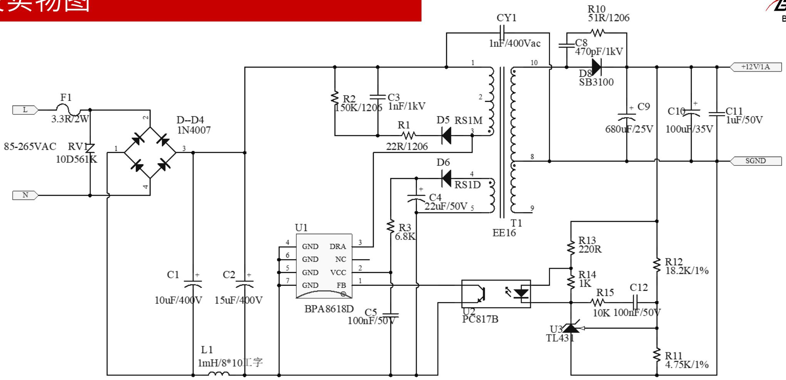

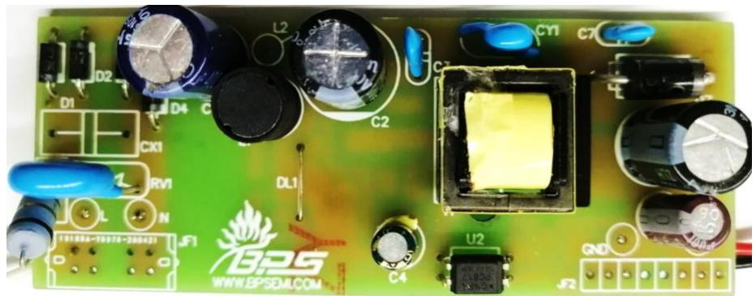

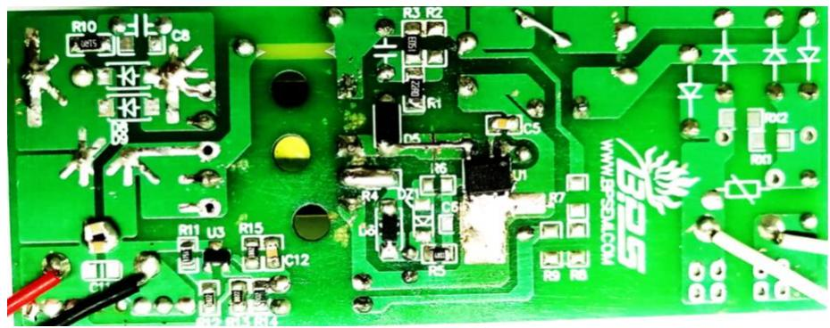

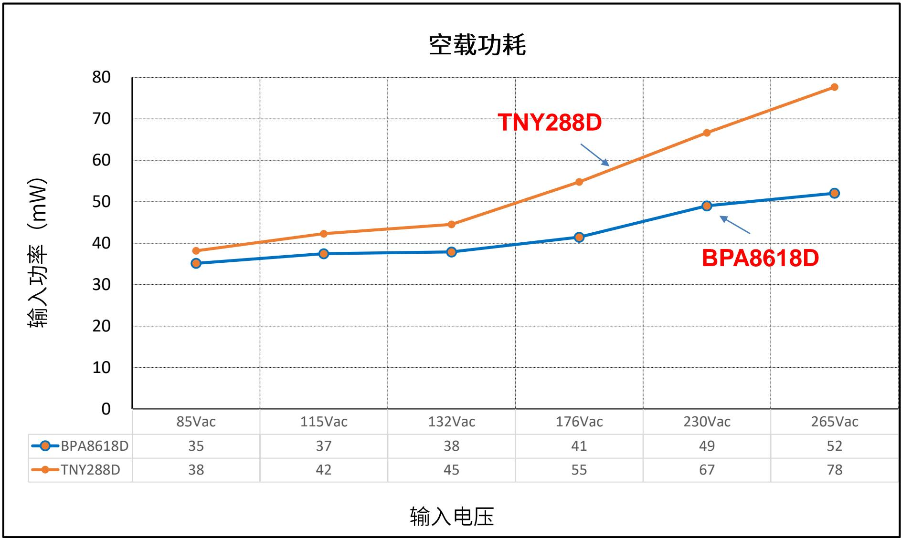

备注：TNY288D在FB pin脚上拉一串电阻做UVL，阻值4M；BPA8618D内部集成UVL功能，无需外部电阻。

效率测试  
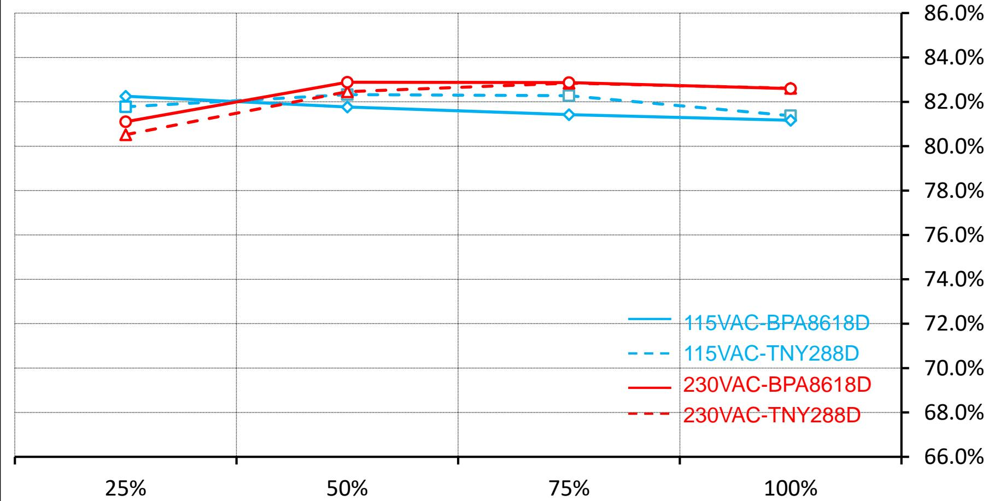

负载

## 输出电压调整率

BPA8618D

<table><tr><td> $V_{IN}(VAC)$ Load(%)</td><td>85</td><td>115</td><td>132</td><td>176</td><td>230</td><td>265</td><td>平均值</td><td>线调整率</td></tr><tr><td>0</td><td>12.073</td><td>12.071</td><td>12.071</td><td>12.070</td><td>12.069</td><td>12.069</td><td>12.07</td><td>0.03%</td></tr><tr><td>20%</td><td>12.070</td><td>12.070</td><td>12.070</td><td>12.069</td><td>12.069</td><td>12.066</td><td>12.07</td><td>0.03%</td></tr><tr><td>40%</td><td>12.069</td><td>12.069</td><td>12.069</td><td>12.069</td><td>12.068</td><td>12.065</td><td>12.07</td><td>0.03%</td></tr><tr><td>60%</td><td>12.069</td><td>12.069</td><td>12.068</td><td>12.068</td><td>12.066</td><td>12.063</td><td>12.07</td><td>0.05%</td></tr><tr><td>80%</td><td>12.068</td><td>12.068</td><td>12.068</td><td>12.065</td><td>12.063</td><td>12.061</td><td>12.07</td><td>0.06%</td></tr><tr><td>100%</td><td>12.065</td><td>12.068</td><td>12.065</td><td>12.064</td><td>12.061</td><td>12.060</td><td>12.06</td><td>0.07%</td></tr><tr><td>平均值</td><td>12.07</td><td>12.07</td><td>12.07</td><td>12.07</td><td>12.07</td><td>12.06</td><td rowspan="2" colspan="2"></td></tr><tr><td>负载调整率</td><td>0.07%</td><td>0.02%</td><td>0.05%</td><td>0.05%</td><td>0.07%</td><td>0.07%</td></tr></table>

计算方法：调整率=100%\*(最大值-最小值)/平均值  
测试条件：无假负载

TNY288D

<table><tr><td> $V_{IN}(VAC)$ Load(%)</td><td>85</td><td>115</td><td>132</td><td>176</td><td>230</td><td>265</td><td>平均值</td><td>线调整率</td></tr><tr><td>0</td><td>12.075</td><td>12.075</td><td>12.076</td><td>12.076</td><td>12.075</td><td>12.074</td><td>12.08</td><td>0.02%</td></tr><tr><td>20%</td><td>12.074</td><td>12.074</td><td>12.075</td><td>12.074</td><td>12.073</td><td>12.069</td><td>12.07</td><td>0.05%</td></tr><tr><td>40%</td><td>12.074</td><td>12.073</td><td>12.074</td><td>12.073</td><td>12.071</td><td>12.069</td><td>12.07</td><td>0.04%</td></tr><tr><td>60%</td><td>12.073</td><td>12.071</td><td>12.073</td><td>12.071</td><td>12.069</td><td>12.068</td><td>12.07</td><td>0.04%</td></tr><tr><td>80%</td><td>12.069</td><td>12.069</td><td>12.070</td><td>12.069</td><td>12.066</td><td>12.063</td><td>12.07</td><td>0.06%</td></tr><tr><td>100%</td><td>12.065</td><td>12.065</td><td>12.066</td><td>12.064</td><td>12.063</td><td>12.060</td><td>12.06</td><td>0.05%</td></tr><tr><td>平均值</td><td>12.07</td><td>12.07</td><td>12.07</td><td>12.07</td><td>12.07</td><td>12.07</td><td rowspan="2" colspan="2"></td></tr><tr><td>负载调整率</td><td>0.08%</td><td>0.08%</td><td>0.08%</td><td>0.10%</td><td>0.10%</td><td>0.12%</td></tr></table>

## 输出电压纹波

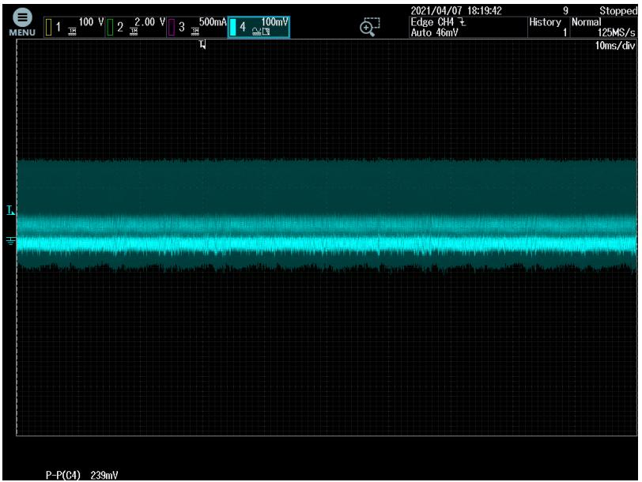

85 VAC  
  
Test Condition:  
➢ Full Load

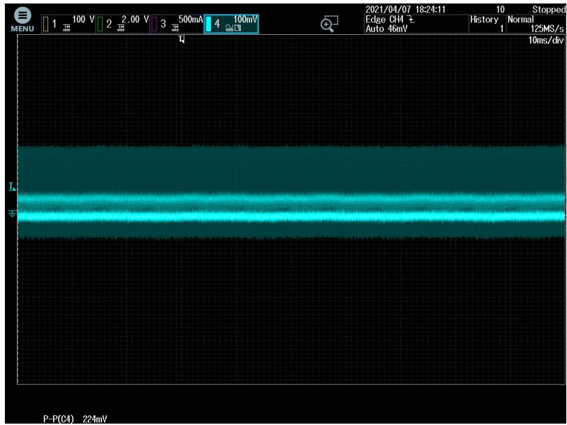

85 VAC  
  
Test Condition:  
➢ Full Load

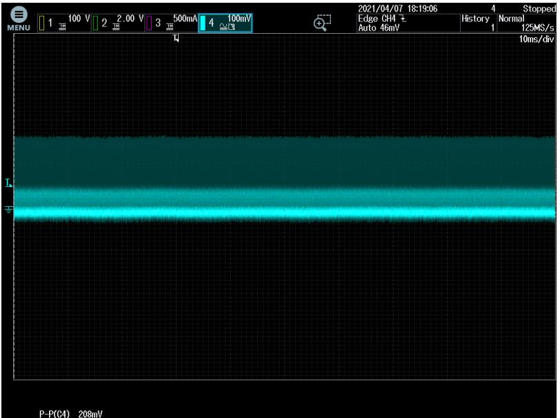

265 VAC  
  
Test Condition:  
➢ Full Load

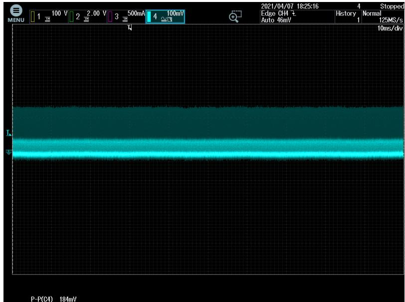

265 VAC  
  
Test Condition:  
➢ Full Load

## (50%-100%)

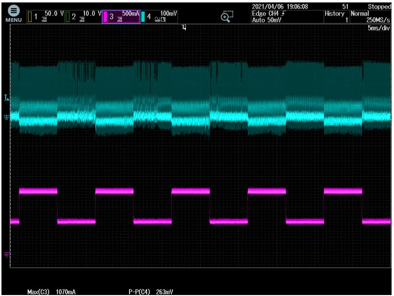

85 VAC

CH4 $\mathsf { V } _ { \mathsf { O U T } }$ $V _ { P K - P K } = 2 6 3 ~ \mathsf { m V }$  
CH3 ${ \mathsf I } _ { 0 \mathsf U \top }$

## Test Condition:

➢ 0.5 A-1 A-0.5 A  
➢ Slew Rate: 0.5 A/μS  
➢ Frequency: 100 Hz

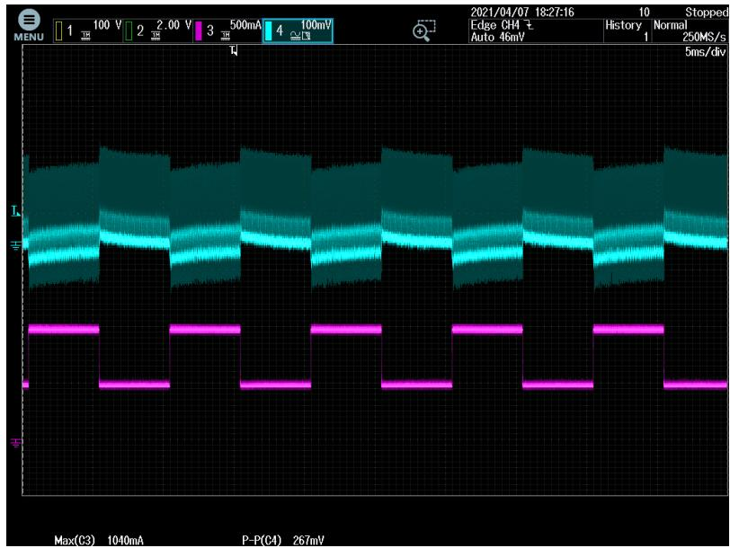

85 VAC

$\mathsf { C H } 4 \mathsf { V } _ { \mathsf { O U T } }$ $V _ { P K - P K } = 2 6 7 ~ \mathsf { m V }$  
$\mathsf { C H 3 } \mathsf { I _ { 0 \mathsf { U T } } }$

## Test Condition:

➢ 0.5 A-1 A-0.5 A  
➢ Slew Rate: 0.5 A/μS  
➢ Frequency: 100 Hz

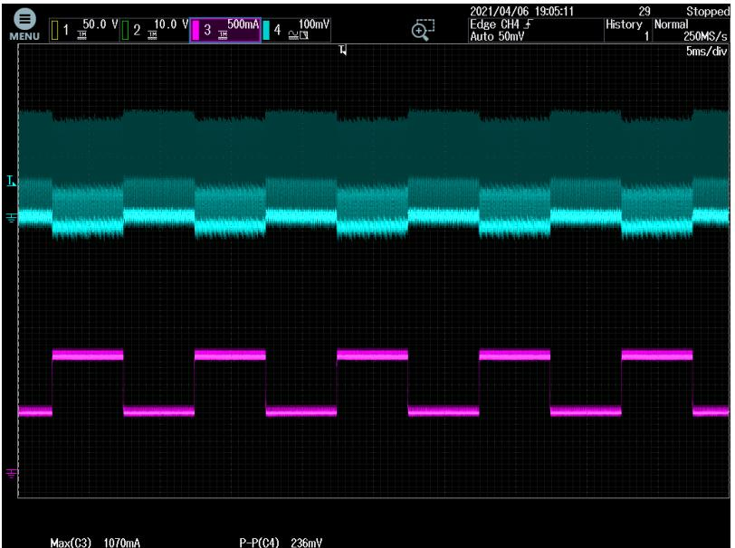

265 VAC

CH4 $\mathsf { V } _ { \mathsf { O U T } }$ $V _ { \mathsf { P K - P K } } = 2 3 6 ~ \mathsf { m V }$  
$\mathsf { C H 3 } \mathsf { I _ { 0 \mathsf { U T } } }$

## Test Condition:

➢ 0.5 A-1 A-0.5 A  
➢ Slew Rate: 0.5 A/μS  
➢ Frequency: 100 Hz

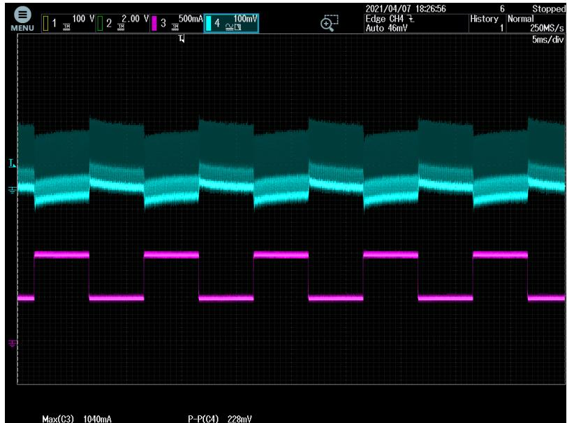

265 VAC

$\mathsf { C H } 4 \mathsf { V } _ { \mathsf { O U T } }$ $v _ { p _ { \vert k - P K } } = 2 2 8 ~ \mathsf { m V }$  
$\mathsf { C H 3 } \mathsf { I _ { 0 \mathsf { U T } } }$

## Test Condition:

➢ 0.5 A-1 A-0.5 A  
➢ Slew Rate: 0.5 A/μS  
➢ Frequency: 100 Hz

## (10%-90%)

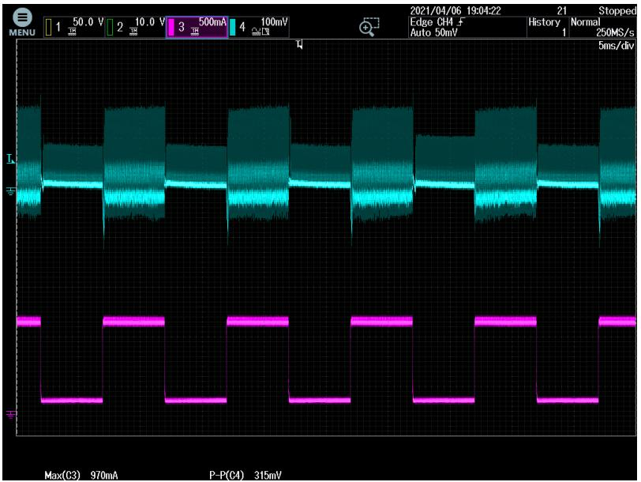

85 VAC

CH4 VOUT $\mathsf { V } _ { \mathsf { O U T } }$ $\mathsf { V } _ { \mathsf { P K - P K } } { = } 3 1 5 \mathsf { m V }$  
$\mathsf { C H 3 } \mathsf { I _ { 0 \mathsf { U } \mathsf { T } } }$

## Test Condition:

➢ 0.1A-0.9 A-0.1 A  
➢ Slew Rate: 0.5 A/μS  
➢ Frequency: 100 Hz

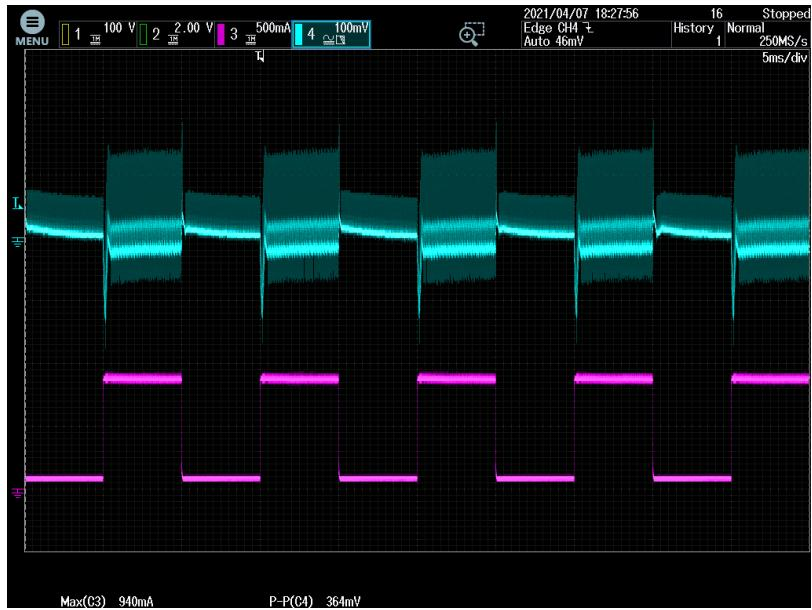

85 VAC

CH4 $\mathsf { V } _ { \mathsf { O U T } }$ $V _ { \mathsf { P K - P K } } { = } 3 6 4 ~ \mathsf { m V }$  
$\mathsf { C H 3 } \mathsf { I _ { 0 \mathsf { U T } } }$

## Test Condition:

➢ 0.1A-0.9 A-0.1 A  
➢ Slew Rate: 0.5 A/μS  
➢ Frequency: 100 Hz

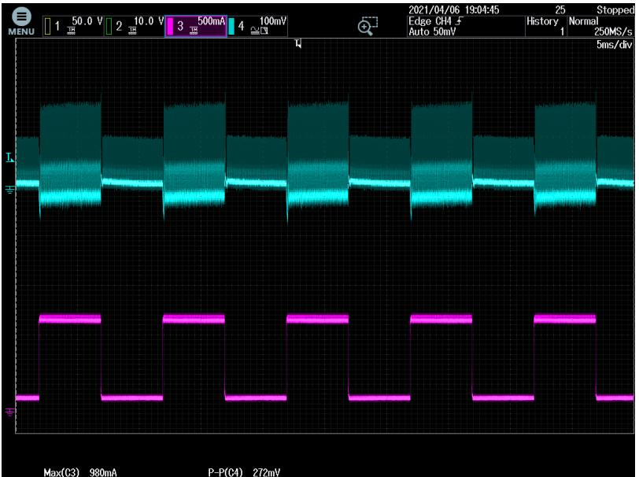  
265 VAC

CH4 V $\mathsf { V } _ { \mathsf { O U T } }$ $V _ { P K - P K } = 2 7 2 m v$  
$\mathsf { C H 3 } \mathsf { I _ { 0 \mathsf { U T } } }$

## Test Condition:

➢ 0.1A-0.9 A-0.1 A  
➢ Slew Rate: 0.5 A/μS  
➢ Frequency: 100 Hz

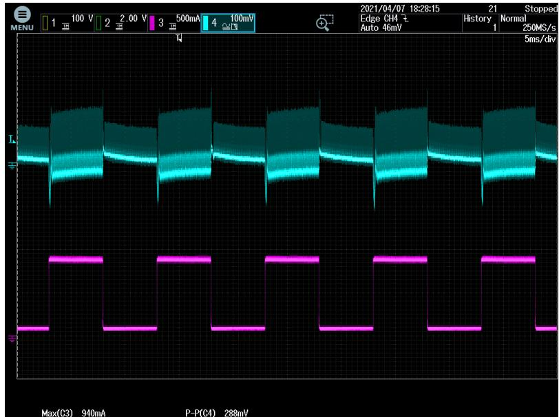

265 VAC

CH4 VOUT $v _ { p _ { \mathrm { K - P K } } } { = } 2 8 8 ~ \mathsf { m V }$  
$\mathsf { C H 3 } \mathsf { I _ { 0 \mathsf { U T } } }$

## Test Condition:

➢ 0.1A-0.9 A-0.1 A  
➢ Slew Rate: 0.5 A/μS  
➢ Frequency: 100 Hz

## 输出电压开机波形

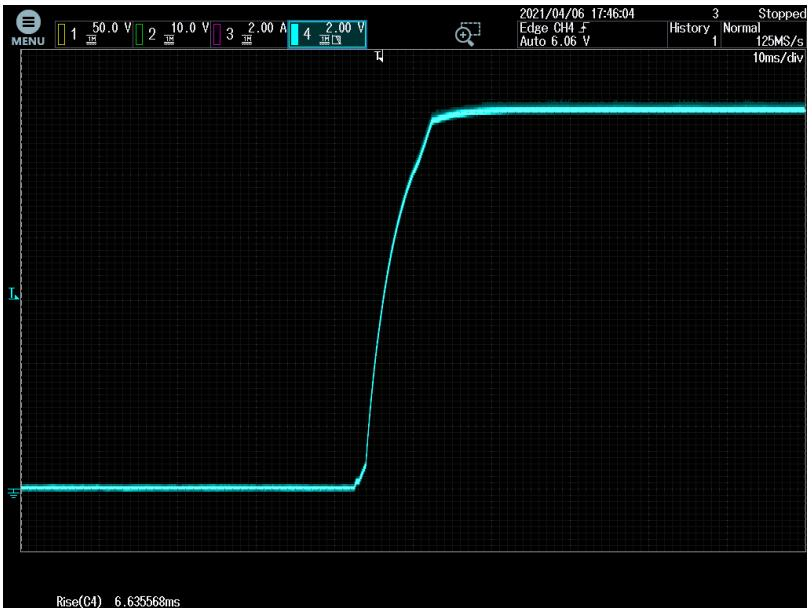

85 VAC  
  
Test Condition:  
➢ Full Load

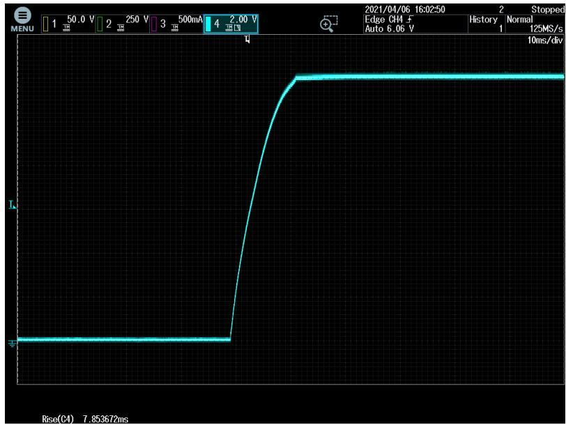

85 VAC  
  
Test Condition:  
➢ Full Load

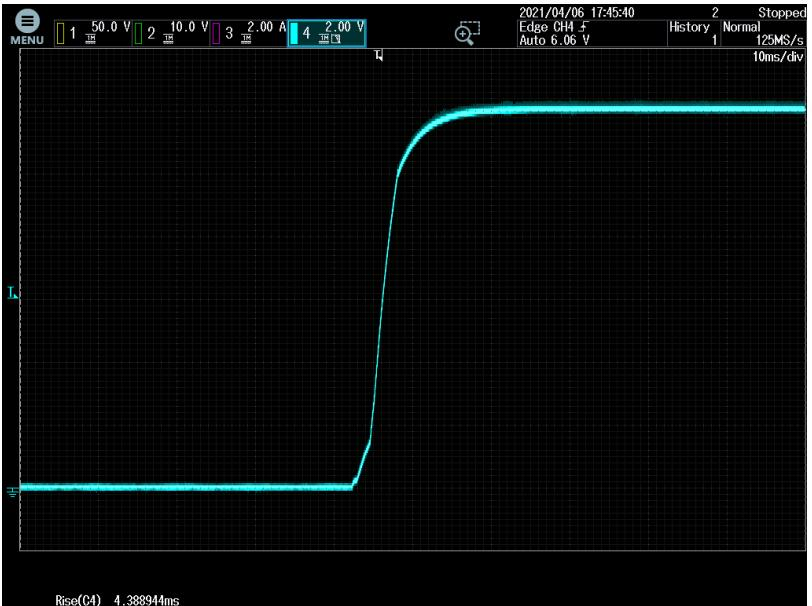

265 VAC  
  
Test Condition:  
➢ Full Load

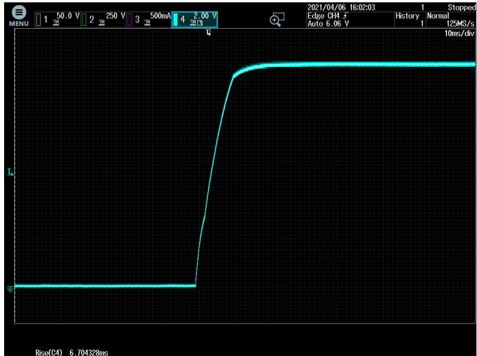

265 VAC  
  
Test Condition:  
➢ Full Load

## MOSFET

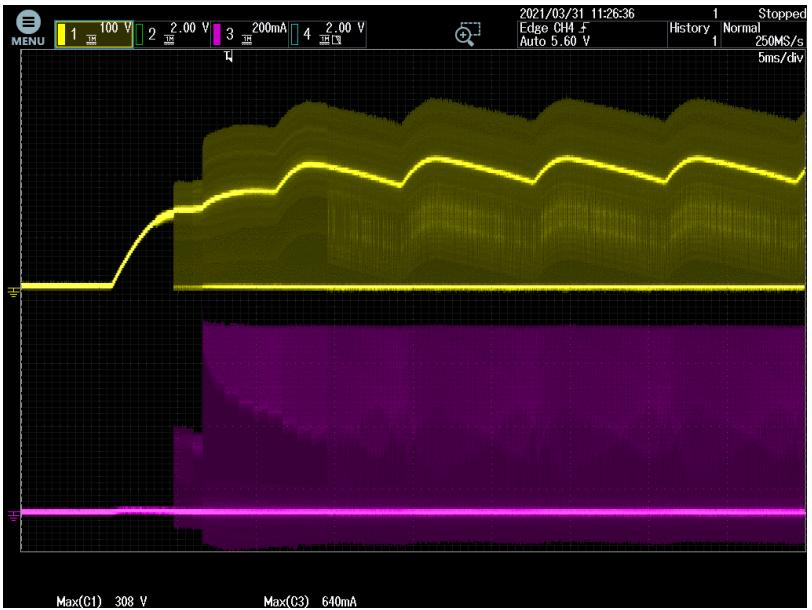

85 VAC

CH1 VDS  
CH3 IDS

$$
\begin{array}{l} \mathrm {V_ {DS\_MAX}} = 3 0 8 \mathrm{V} \\ \mathrm {I_ {DS\_MAX}} = 0. 6 4 \mathrm{A} \end{array}
$$

## Test Condition:

➢ Full Load

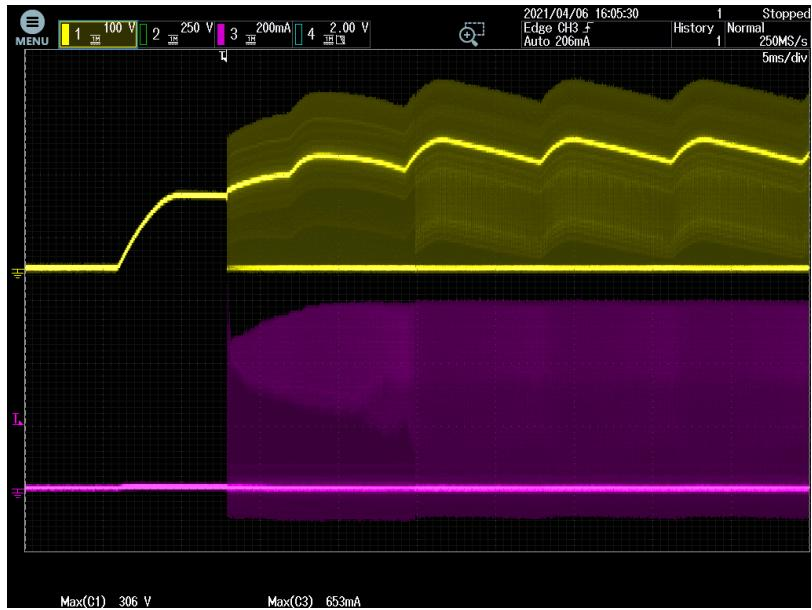

85 VAC

CH1 VDS  
CH3 IDS

$$
\begin{array}{l} \mathrm {V_ {DS\_MAX}} = 3 0 6 \mathrm{V} \\ \mathrm {I_ {DS\_MAX}} = 0. 6 5 \mathrm{A} \end{array}
$$

## Test Condition:

➢ Full Load

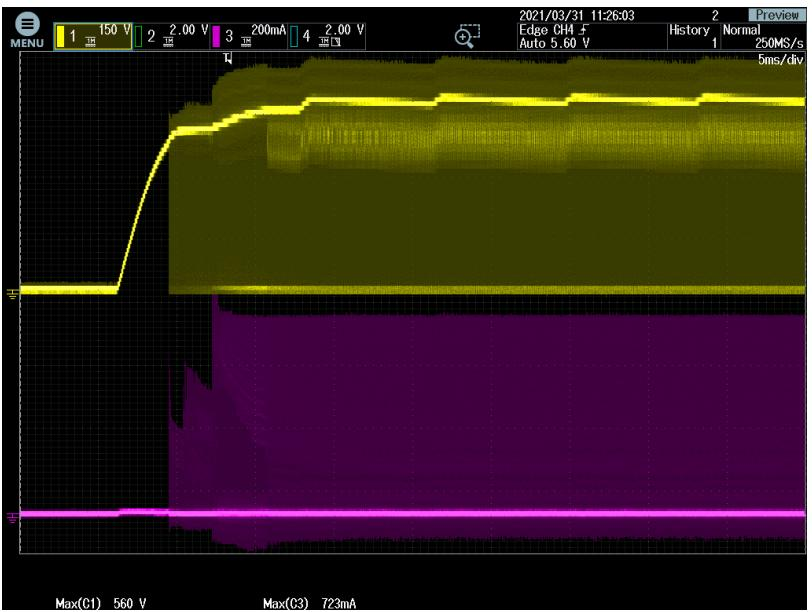

265 VAC

CH1 VDS  
CH3 IDS

$$
\begin{array}{l} V _ {D S \_ M A X} = 5 6 0 V \\ I _ {D S \_ M A X} = 0. 7 2 3 A \end{array}
$$

## Test Condition:

➢ Full Load

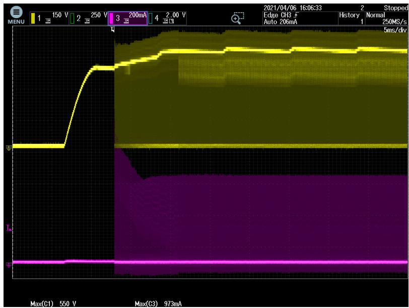

265 VAC

CH1 VDS  
CH3 IDS

$$
\begin{array}{l} V _ {D S \_ M A X} = 5 5 0 V \\ I _ {D S \_ M A X} = 0. 9 7 A \end{array}
$$

## Test Condition:

➢ Full Load

## MOSFET

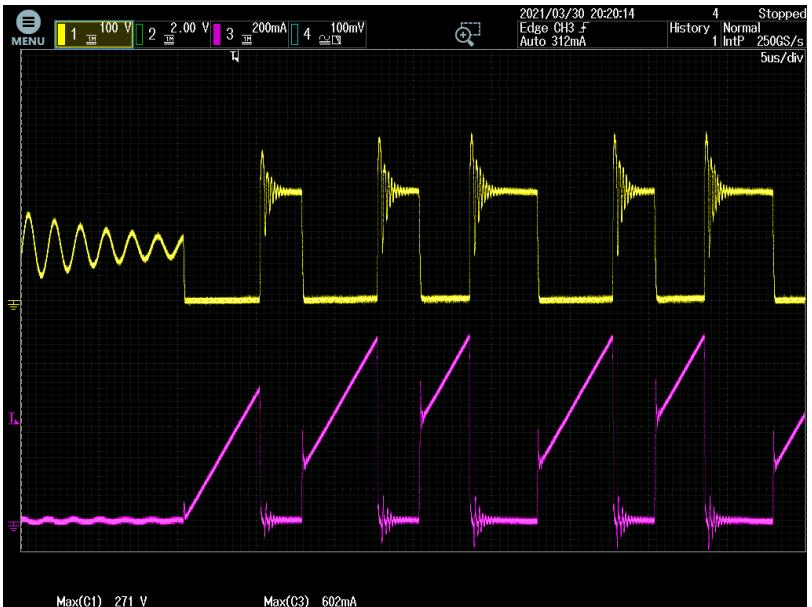

85 VAC

CH1 VDS  
CH3 IDS

$$
\begin{array}{l} \mathrm {V_ {DS\_MAX}} = 2 7 1 \mathrm{V} \\ \mathrm {I_ {DS\_MAX}} = 0. 6 \mathrm{A} \end{array}
$$

## Test Condition:

➢ Full Load

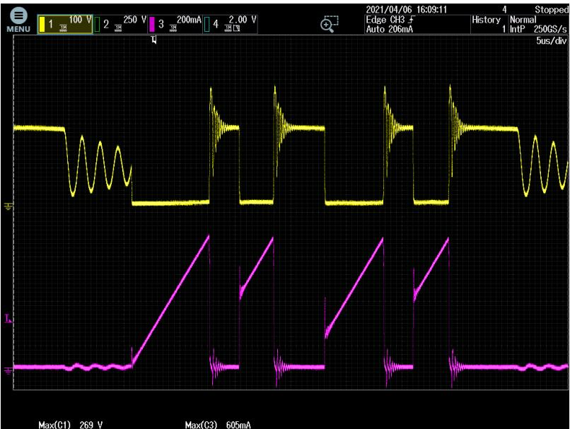

85 VAC

CH1 VDS  
CH3 IDS

$$
\begin{array}{l} \mathrm {V_ {DS\_MAX}} = 2 6 9 \mathrm{V} \\ \mathrm {I_ {DS\_MAX}} = 0. 6 \mathrm{A} \end{array}
$$

## Test Condition:

➢ Full Load

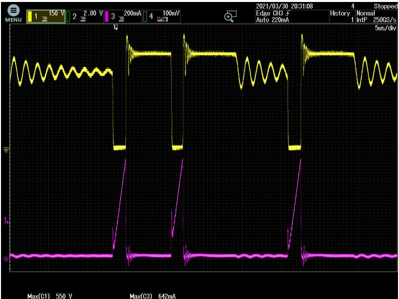

265 VAC

CH1 VDS  
CH3 IDS

$$
V _ {D S \_ M A X} = 5 5 0 V
$$

$$
I _ {D S \_ M A X} = 0. 6 4 \mathrm{A}
$$

## Test Condition:

➢ Full Load

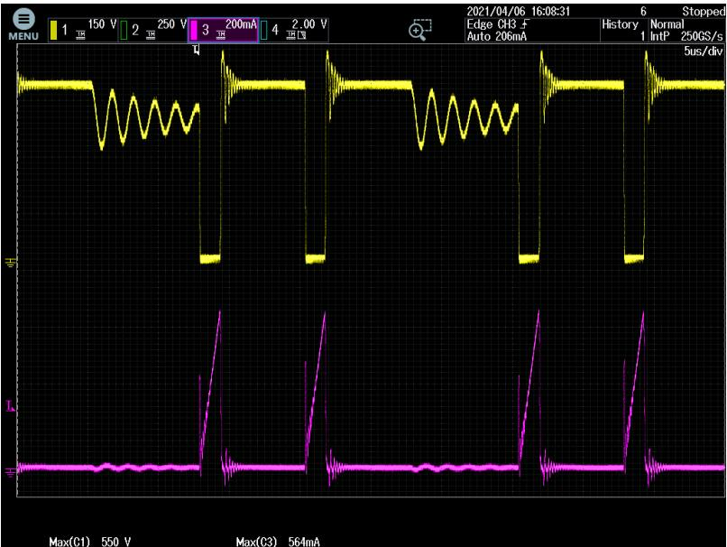

265 VAC

CH1 VDS  
CH3 IDS

$$
V _ {D S \_ M A X} = 5 5 0 V
$$

$$
I _ {D S \_ M A X} = 0. 5 6 \mathrm{A}
$$

## Test Condition:

➢ Full Load

## 输出二极管开机波形

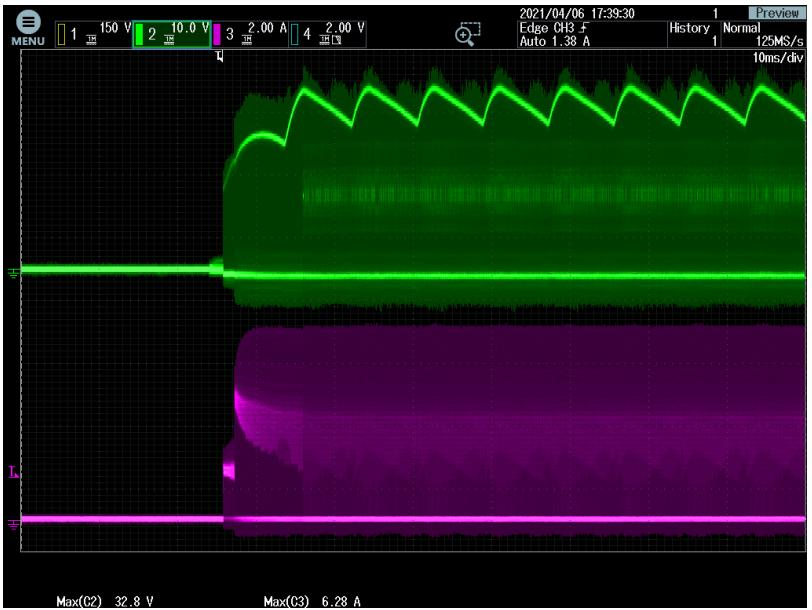

85 VAC

CH2 VR  
CH3 IF

$$
\begin{array}{l} \mathrm {V_ {R\_MAX}} = 3 2. 8 \mathrm{V} \\ \mathrm {I_ {F\_MAX}} = 6. 2 8 \mathrm{A} \end{array}
$$

## Test Condition:

➢ Full Load

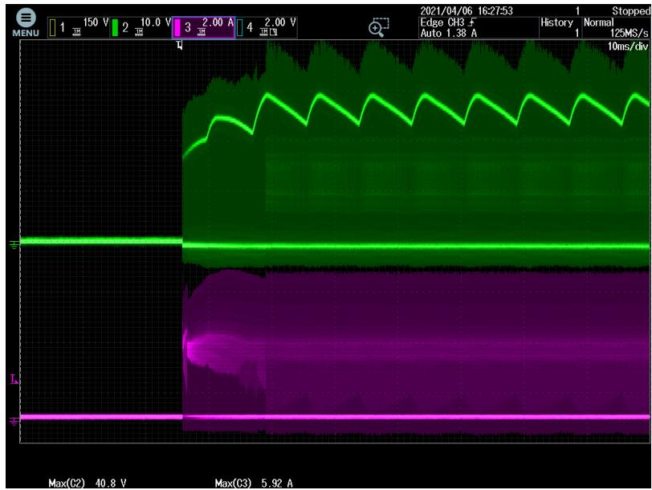

85 VAC

CH2 VR  
CH3 IF

$$
\begin{array}{l} \mathrm {V_ {R\_MAX}} = 4 0. 8 \mathrm{V} \\ \mathrm {I_ {F\_MAX}} = 5. 9 \mathrm{A} \end{array}
$$

## Test Condition:

➢ Full Load

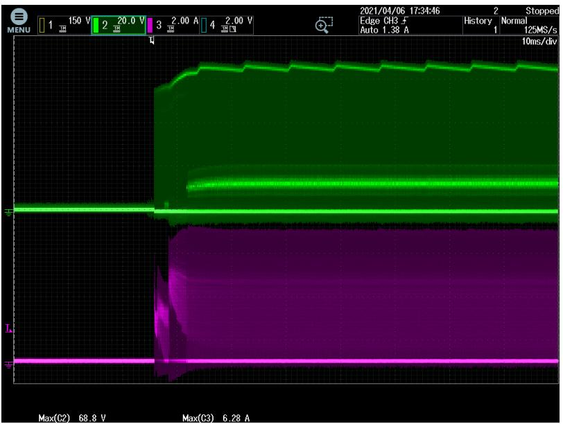

265 VAC

CH2 VR  
CH3 IF

$$
\begin{array}{l} \mathrm {V_ {R\_MAX}} = 6 8. 8 \mathrm{V} \\ \mathrm {I_ {F\_MAX}} = 6. 2 6 \mathrm{A} \end{array}
$$

## Test Condition:

➢ Full Load

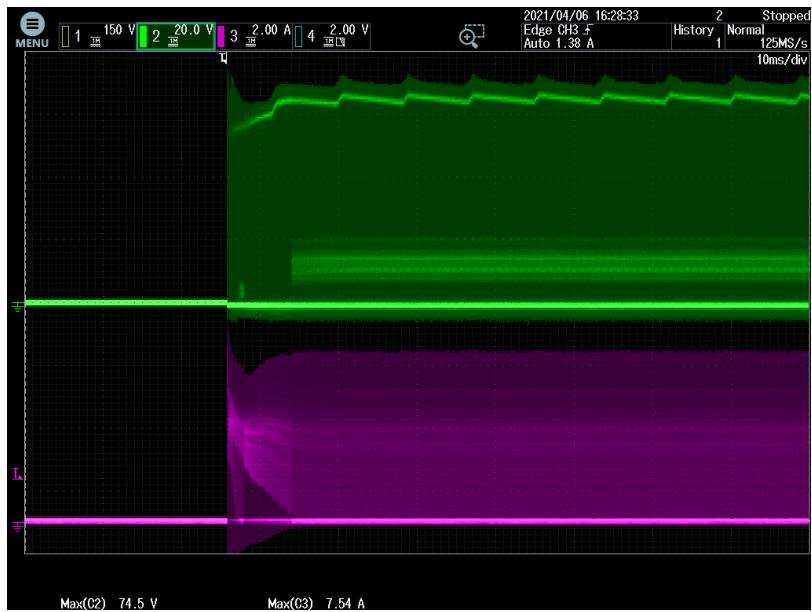

265 VAC

CH2 VR  
CH3 IF

$$
\begin{array}{l} \mathrm {V_ {R\_MAX}} = 7 4. 5 \mathrm{V} \\ \mathrm {I_ {F\_MAX}} = 7. 5 4 \mathrm{A} \end{array}
$$

## Test Condition:

➢ Full Load

## 输出二极管稳态波形

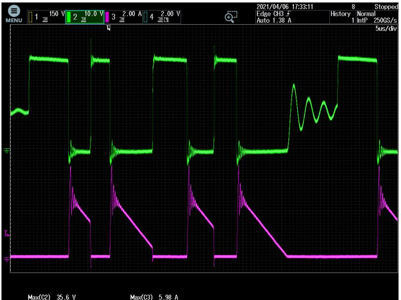

85 VAC

CH2 VR  
CH3 IF

$$
V _ {R \_ M A X} = 3 5. 6 \mathrm{V}
$$

$$
I _ {F \_ M A X} = 5. 9 8 \mathrm{A}
$$

## Test Condition:

➢ Full Load

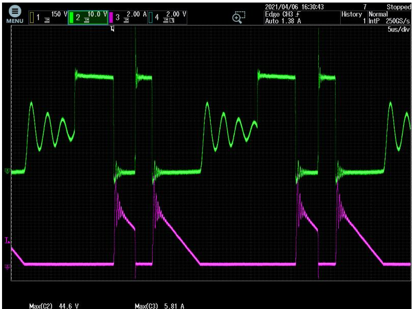

85 VAC

CH2 VR  
CH3 IF

$$
V _ {R \_ M A X} = 4 4. 6 \mathrm{V}
$$

$$
I _ {F \_ M A X} = 5. 8 1 \mathrm{A}
$$

## Test Condition:

➢ Full Load

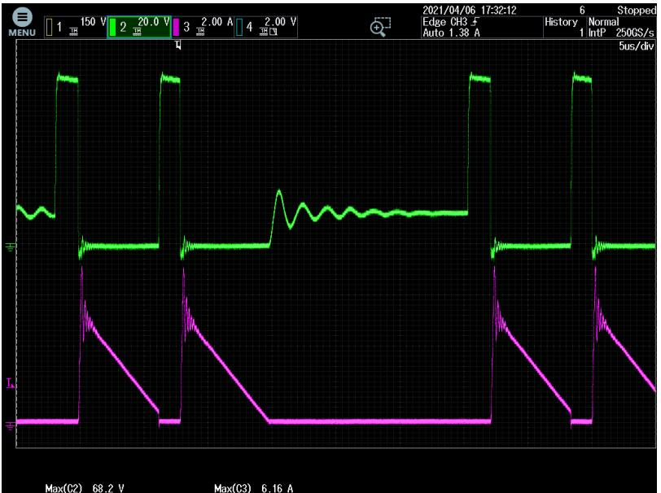

265 VAC

CH2 VR  
CH3 IF

$$
V _ {R \_ M A X} = 6 8. 2 \mathrm{V}
$$

$$
I _ {F \_ M A X} = 6. 1 6 \mathrm{A}
$$

## Test Condition:

➢ Full Load

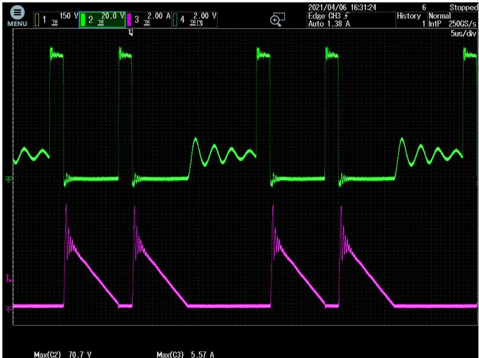

265 VAC

CH2 VR  
CH3 IF

$$
V _ {R \_ M A X} = 7 0. 7 \mathrm{V}
$$

$$
I _ {F \_ M A X} = 5. 5 7 \mathrm{A}
$$

## Test Condition:

➢ Full Load

## MOSFET

BPA8618D  
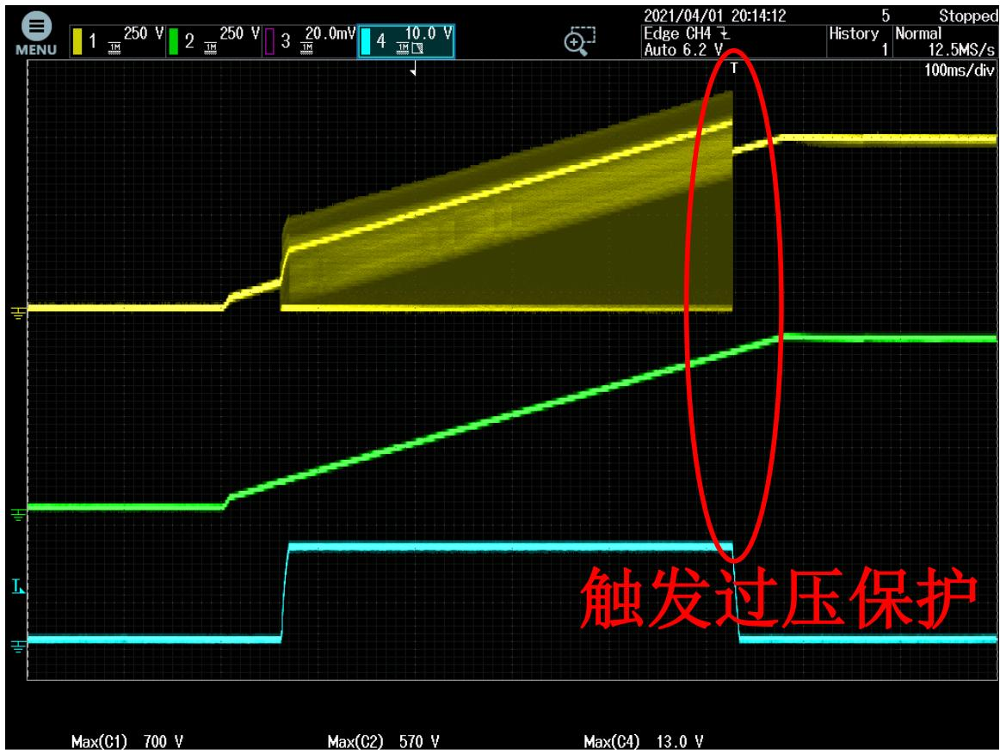

CH1 VDS  
CH2 VDC\_IN  
CH4 VO

$$
V _ {D S \_ M A X} = 7 0 0 \mathrm{V}
$$

$$
V _ {D C I N} = 5 7 0 \mathrm{V}
$$

Test Condition:

➢ Full Load

TNY288D  
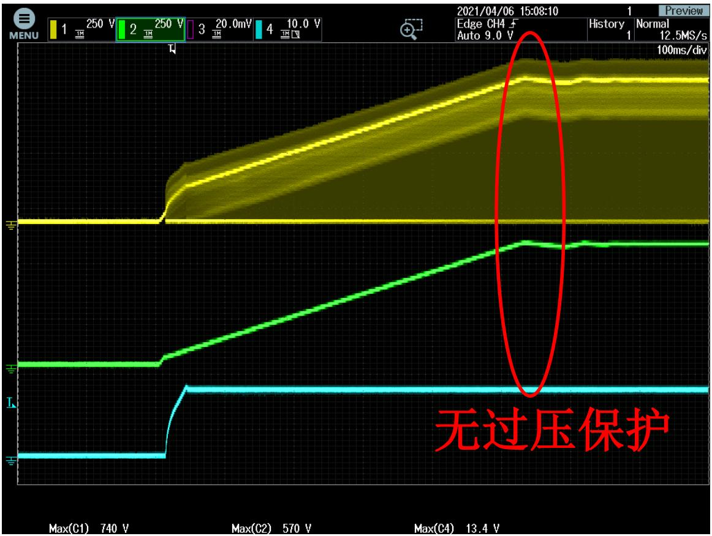

CH1 VDS  
CH2 VDC\_IN  
CH4 VO

$$
V _ {D S \_ M A X} = 7 4 0 \mathrm{V}
$$

$$
V _ {D C \_ I N} = 5 7 0 V
$$

Test Condition:

➢ Full Load

BPA8618D  
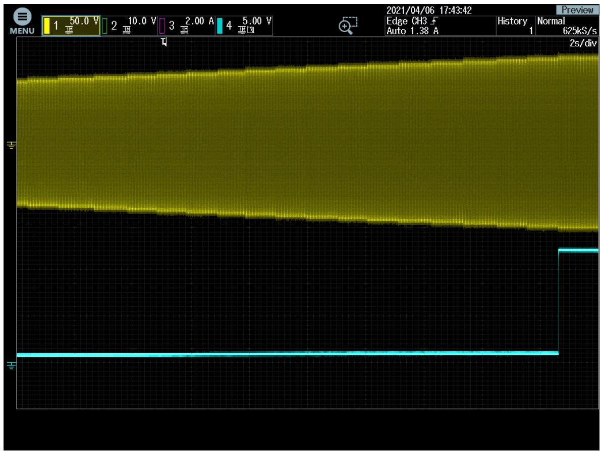

CH1 VAC\_IN  
CH4 Vo

VAC\_IN\_STARTUP=65 V

Test Condition:

➢ No Load

TNY288D  
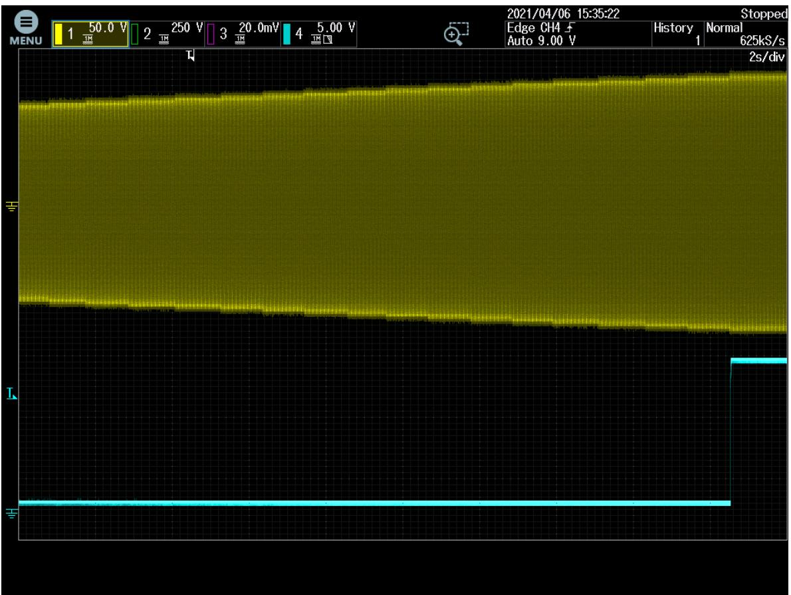

CH1 VAC\_IN  
CH4 Vo

VAC\_IN\_STARTUP=73 V

Test Condition:

➢ No Load

备注：TNY288D在FB pin脚上拉一串电阻做UVL，阻值4M；BPA8618D内部集成UVL功能，无需外部电阻。

## MOSFET

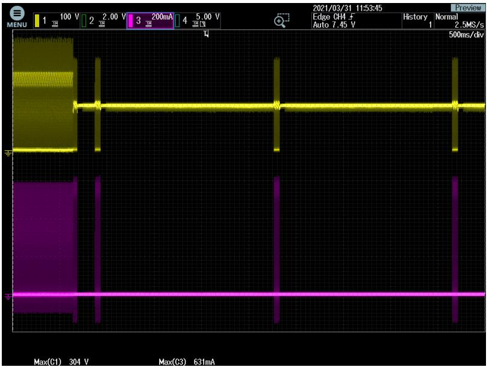

85 VAC

${ \mathsf { C H 1 } } \mathsf { V _ { D S } }$  
CH3 IDS

$$
\begin{array}{l} \mathrm {V_ {DS\_MAX}} = 3 0 4 \mathrm{V} \\ \mathrm {I_ {DS\_MAX}} = 0. 6 3 \mathrm{A} \end{array}
$$

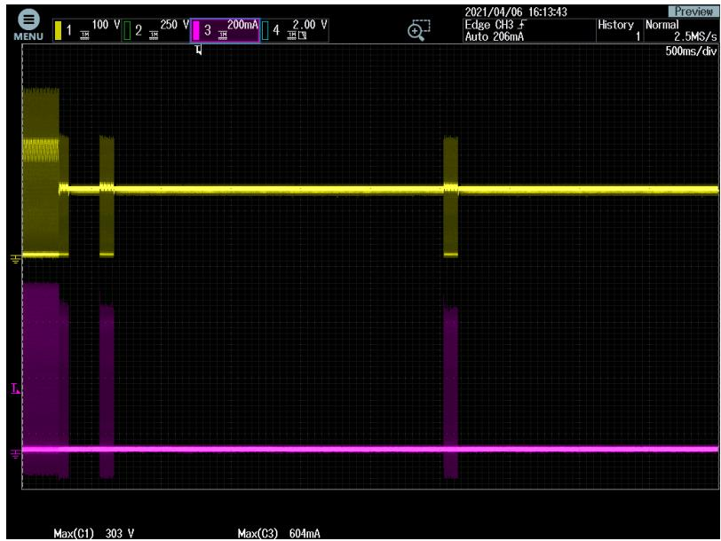

85 VAC

CH1 VDS  
CH3 IDS

$$
\begin{array}{l} \mathrm {V_ {DS\_MAX}} = 3 0 3 \mathrm{V} \\ \mathrm {I_ {DS\_MAX}} = 0. 6 \mathrm{A} \end{array}
$$

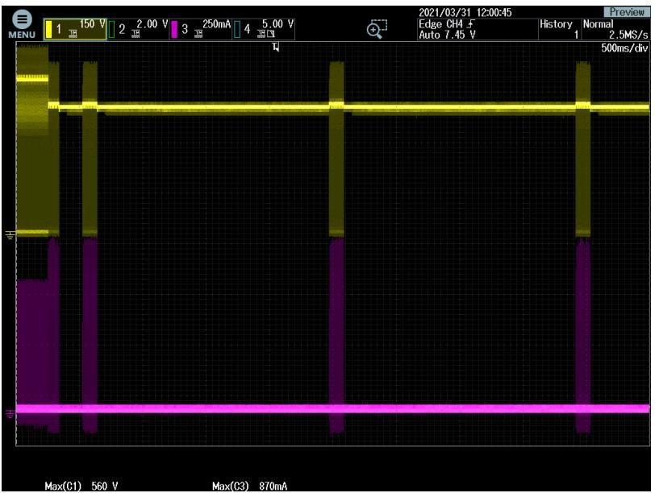

265 VAC

CH1 VDS  
CH3 IDS

$$
V _ {D S \_ M A X} = 5 6 0 \mathrm{V}
$$

$$
I _ {D S \_ M A X} = 0. 8 7 \mathrm{A}
$$

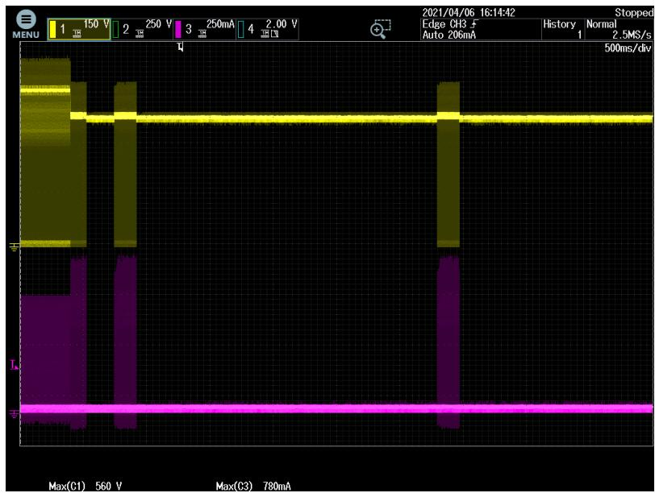

265 VAC

CH1 VDS

$$
V _ {D S \_ M A X} = 5 6 0 \mathrm{V}
$$

$$
I _ {D S \_ M A X} = 0. 7 8 \mathrm{A}
$$

## 温升测试

BPA8618D

<table><tr><td rowspan="2">项目</td><td>85VAC</td><td>115VAC</td><td>230VAC</td><td>265VAC</td></tr><tr><td>温度(°C)</td><td>温度(°C)</td><td>温度(°C)</td><td>温度(°C)</td></tr><tr><td>环境温度</td><td>50</td><td>50</td><td>50</td><td>50</td></tr><tr><td>BPA8618D (U2)</td><td>110.46</td><td>96.06</td><td>91.7</td><td>93.22</td></tr><tr><td>变压器绕组(T1)</td><td>83.4</td><td>82.05</td><td>83.81</td><td>84.24</td></tr><tr><td>变压器磁芯(T1)</td><td>83.35</td><td>82</td><td>84.22</td><td>84.84</td></tr><tr><td>整流二极管(D3)</td><td>87.97</td><td>88.12</td><td>89.7</td><td>89.8</td></tr><tr><td>整流桥(D1)</td><td>66.98</td><td>61.8</td><td>56.54</td><td>55.38</td></tr><tr><td>输入电解电容(C6)</td><td>70.37</td><td>66.67</td><td>64.41</td><td>63.98</td></tr><tr><td>输出电解电容(C3)</td><td>69.09</td><td>69.31</td><td>70.7</td><td>70.62</td></tr></table>

TNY288D

<table><tr><td rowspan="2">项目</td><td>85VAC</td><td>115VAC</td><td>230VAC</td><td>265VAC</td></tr><tr><td>温度(°C)</td><td>温度(°C)</td><td>温度(°C)</td><td>温度(°C)</td></tr><tr><td>环境温度</td><td>50</td><td>50</td><td>50</td><td>50</td></tr><tr><td>TNY288D (U2)</td><td>108.27</td><td>94.66</td><td>92.28</td><td>95.43</td></tr><tr><td>变压器绕组(T1)</td><td>85.32</td><td>82.51</td><td>83.2</td><td>84.42</td></tr><tr><td>变压器磁芯(T1)</td><td>86.48</td><td>83.69</td><td>85.07</td><td>86.47</td></tr><tr><td>整流二极管(D3)</td><td>90.9</td><td>90.03</td><td>90.41</td><td>91.04</td></tr><tr><td>整流桥(D1)</td><td>68.04</td><td>62.77</td><td>57.05</td><td>56.52</td></tr><tr><td>输入电解电容(C6)</td><td>71.07</td><td>66.91</td><td>64.12</td><td>64.42</td></tr><tr><td>输出电解电容(C3)</td><td>70.21</td><td>69.69</td><td>69.96</td><td>70.35</td></tr></table>

备注：增大芯片Source散热铜箔面积可以降低芯片温度。

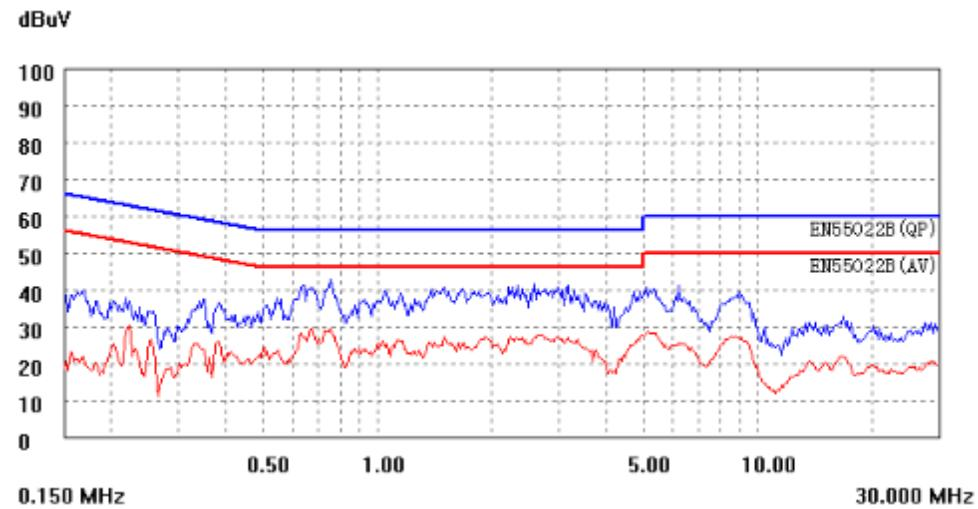

115Vac Line  
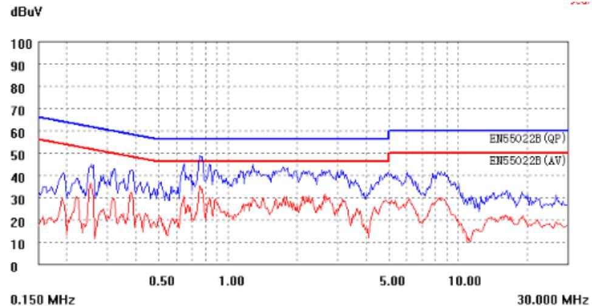

230Vac Line

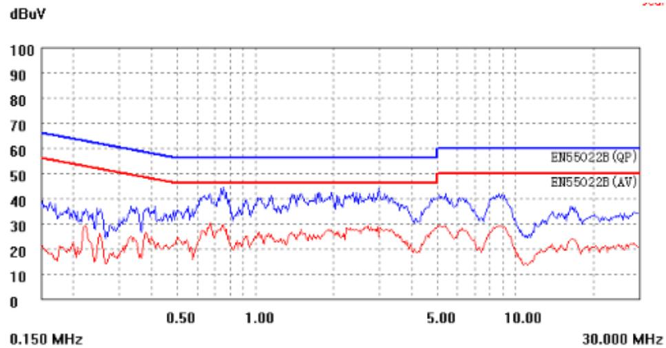

115Vac Neutral

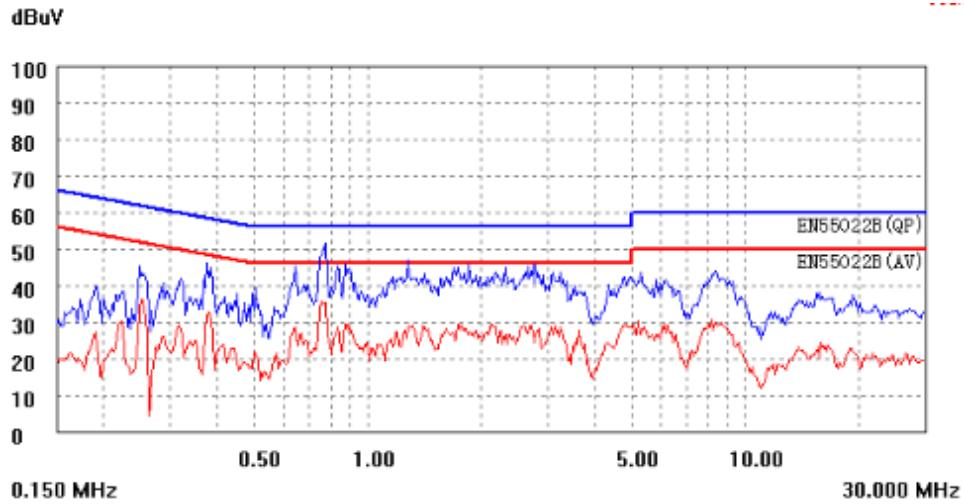

230Vac Neutral

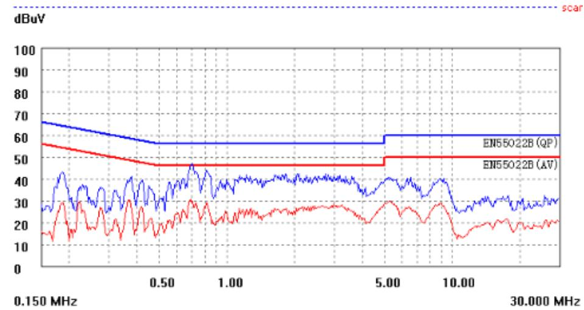

115Vac Line  
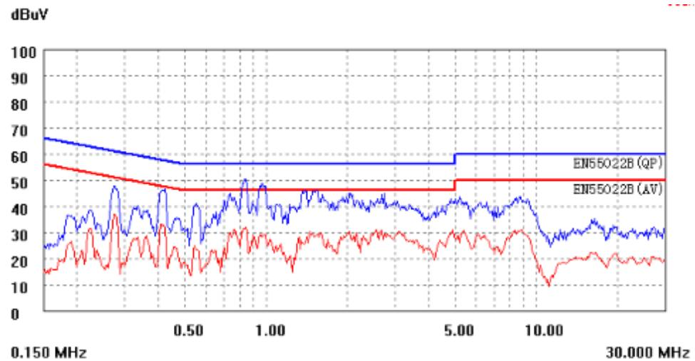

230Vac Line

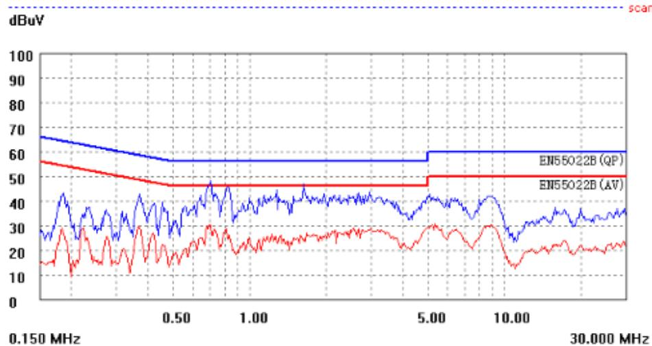

115Vac Neutral

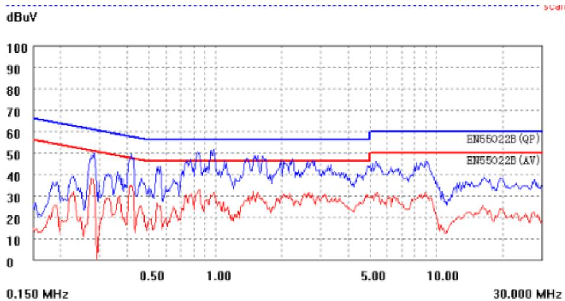

230Vac Neutral

## Surge

BPA8618D

<table><tr><td>差模</td><td>电压</td><td>相位角</td><td>发生器阻抗</td><td>测试次数</td><td>测试结果</td></tr><tr><td>L to N</td><td>+2kV</td><td>0/90/180/270</td><td>2</td><td>10</td><td>Pass</td></tr><tr><td>L to N</td><td>-2kV</td><td>0/90/180/270</td><td>2</td><td>10</td><td>Pass</td></tr><tr><td>L to PE</td><td>+4kV</td><td>0/90/180/270</td><td>12</td><td>10</td><td>Pass</td></tr><tr><td>L to PE</td><td>-4kV</td><td>0/90/180/270</td><td>12</td><td>10</td><td>Pass</td></tr><tr><td>N to PE</td><td>+4kV</td><td>0/90/180/270</td><td>12</td><td>10</td><td>Pass</td></tr><tr><td>N to PE</td><td>-4kV</td><td>0/90/180/270</td><td>12</td><td>10</td><td>Pass</td></tr></table>

TNY288D

<table><tr><td>差模</td><td>电压</td><td>相位角</td><td>发生器阻抗</td><td>测试次数</td><td>测试结果</td></tr><tr><td>L to N</td><td>+2kV</td><td>0/90/180/270</td><td>2</td><td>10</td><td>Pass</td></tr><tr><td>L to N</td><td>-2kV</td><td>0/90/180/270</td><td>2</td><td>10</td><td>Pass</td></tr><tr><td>L to PE</td><td>+4kV</td><td>0/90/180/270</td><td>12</td><td>10</td><td>Pass</td></tr><tr><td>L to PE</td><td>-4kV</td><td>0/90/180/270</td><td>12</td><td>10</td><td>Pass</td></tr><tr><td>N to PE</td><td>+4kV</td><td>0/90/180/270</td><td>12</td><td>10</td><td>Pass</td></tr><tr><td>N to PE</td><td>-4kV</td><td>0/90/180/270</td><td>12</td><td>10</td><td>Pass</td></tr></table>

## EFT

BPA8618D

<table><tr><td>差模</td><td>电压</td><td>脉冲群持续时间</td><td>脉冲频率</td><td>测试时间</td><td>测试结果</td></tr><tr><td>L to N</td><td>+4kV</td><td>15ms</td><td>5kHz</td><td>120s</td><td>Pass</td></tr><tr><td>L to N</td><td>-4kV</td><td>15ms</td><td>5kHz</td><td>120s</td><td>Pass</td></tr><tr><td>L to N</td><td>+4kV</td><td>0.75ms</td><td>100kHz</td><td>120s</td><td>Pass</td></tr><tr><td>L to N</td><td>-4kV</td><td>0.75ms</td><td>100kHz</td><td>120s</td><td>Pass</td></tr><tr><td>L to N</td><td>+2kV</td><td>2ms</td><td>38kHz</td><td>120s</td><td>Pass</td></tr><tr><td>L to N</td><td>-2kV</td><td>2ms</td><td>38kHz</td><td>120s</td><td>Pass</td></tr><tr><td>L to N</td><td>+4kV</td><td>2ms</td><td>38kHz</td><td>120s</td><td>Pass</td></tr><tr><td>L to N</td><td>-4kV</td><td>2ms</td><td>38kHz</td><td>120s</td><td>Pass</td></tr></table>

TNY288D

<table><tr><td>差模</td><td>电压</td><td>脉冲群持续时间</td><td>脉冲频率</td><td>测试时间</td><td>测试结果</td></tr><tr><td>L to N</td><td>+4kV</td><td>15ms</td><td>5kHz</td><td>120s</td><td>Pass</td></tr><tr><td>L to N</td><td>-4kV</td><td>15ms</td><td>5kHz</td><td>120s</td><td>Pass</td></tr><tr><td>L to N</td><td>+4kV</td><td>0.75ms</td><td>100kHz</td><td>120s</td><td>Pass</td></tr><tr><td>L to N</td><td>-4kV</td><td>0.75ms</td><td>100kHz</td><td>120s</td><td>Pass</td></tr><tr><td>L to N</td><td>+2kV</td><td>2ms</td><td>38kHz</td><td>120s</td><td>Pass</td></tr><tr><td>L to N</td><td>-2kV</td><td>2ms</td><td>38kHz</td><td>120s</td><td>Pass</td></tr><tr><td>L to N</td><td>+4kV</td><td>2ms</td><td>38kHz</td><td>120s</td><td>Pass</td></tr><tr><td>L to N</td><td>-4kV</td><td>2ms</td><td>38kHz</td><td>120s</td><td>Pass</td></tr></table>

BPA8618D

<table><tr><td>测试点</td><td>电压(V)</td><td>放电类型</td><td>放电次数</td><td>测试结果</td></tr><tr><td>Vo</td><td>+8kV</td><td>接触放电</td><td>10</td><td>Pass</td></tr><tr><td>Vo</td><td>-8kV</td><td>接触放电</td><td>10</td><td>Pass</td></tr><tr><td>GND</td><td>+8kV</td><td>接触放电</td><td>10</td><td>Pass</td></tr><tr><td>GND</td><td>-8kV</td><td>接触放电</td><td>10</td><td>Pass</td></tr><tr><td>Vo</td><td>+15kV</td><td>空气放电</td><td>10</td><td>Pass</td></tr><tr><td>Vo</td><td>-15kV</td><td>空气放电</td><td>10</td><td>Pass</td></tr><tr><td>GND</td><td>+15kV</td><td>空气放电</td><td>10</td><td>Pass</td></tr><tr><td>GND</td><td>-15kV</td><td>空气放电</td><td>10</td><td>Pass</td></tr></table>

TNY288D

<table><tr><td>测试点</td><td>电压(V)</td><td>放电类型</td><td>放电次数</td><td>测试结果</td></tr><tr><td>Vo</td><td>+8kV</td><td>接触放电</td><td>10</td><td>Pass</td></tr><tr><td>Vo</td><td>-8kV</td><td>接触放电</td><td>10</td><td>Pass</td></tr><tr><td>GND</td><td>+8kV</td><td>接触放电</td><td>10</td><td>Pass</td></tr><tr><td>GND</td><td>-8kV</td><td>接触放电</td><td>10</td><td>Pass</td></tr><tr><td>Vo</td><td>+15kV</td><td>空气放电</td><td>10</td><td>Pass</td></tr><tr><td>Vo</td><td>-15kV</td><td>空气放电</td><td>10</td><td>Pass</td></tr><tr><td>GND</td><td>+15kV</td><td>空气放电</td><td>10</td><td>Pass</td></tr><tr><td>GND</td><td>-15kV</td><td>空气放电</td><td>10</td><td>Pass</td></tr></table>

## THANK YOU FOR WATCHING
