## BPA8618D 方案电性能测试报告(12V/0.3A 18V/40mA W12V/30mA)

上海晶丰明源半导体股份有限公司

Shanghai Bright Power Semiconductor Co., Ltd.

陈耀兵

2022 5 6

BPA861X  
电源规格  
电路图  
◼BOM  
◼PCB Layout  
电路实物图  
变压器规格书  
性能测试数据

## 产品特点:

➢ 700V MOSFET  
➢ ON/OFF  
》内置软启动功能  
》集成高压启动、自供电电路  
》低音频噪声  
》输入过/欠压保护

## 应用领域:

》家用电器辅助电源  
》电机驱动辅助电源  
➢ IOT/ /  
》工业控制辅助电源

<table><tr><td>项目描述</td><td>符号</td><td>最小</td><td>典型</td><td>最大</td><td>单位</td><td>备注</td></tr><tr><td colspan="7">输入</td></tr><tr><td>电压</td><td> $V_{IN}$ </td><td>176</td><td>230</td><td>264</td><td> $V_{AC}$ </td><td></td></tr><tr><td>频率</td><td> $f_{LINE}$ </td><td>47</td><td>50/60</td><td>63</td><td>Hz</td><td></td></tr><tr><td colspan="7">输出</td></tr><tr><td>输出电压1</td><td> $V_{OUT1}$ </td><td></td><td>12</td><td></td><td>V</td><td>±3%</td></tr><tr><td>输出电流1</td><td> $I_{OUT1}$ </td><td></td><td>0.3</td><td></td><td>A</td><td></td></tr><tr><td>输出电压纹波1</td><td> $V_{RIPPLE1}$ </td><td></td><td></td><td>200</td><td>mV</td><td>20MHz带宽</td></tr><tr><td>输出电压2</td><td> $V_{OUT2}$ </td><td></td><td>18</td><td></td><td>V</td><td></td></tr><tr><td>输出电流2</td><td> $I_{OUT2}$ </td><td></td><td>40</td><td></td><td>mA</td><td></td></tr><tr><td>输出电压纹波2</td><td> $V_{RIPPLE2}$ </td><td></td><td></td><td>-</td><td>mV</td><td></td></tr><tr><td>输出电压3</td><td> $V_{OUT3}$ </td><td></td><td>12</td><td></td><td>V</td><td></td></tr><tr><td>输出电流3</td><td> $I_{OUT3}$ </td><td></td><td>0.24</td><td></td><td>mA</td><td></td></tr><tr><td>输出电压纹波3</td><td> $V_{RIPPLE3}$ </td><td></td><td></td><td>-</td><td>mV</td><td></td></tr><tr><td>连续输出功率</td><td> $P_{OUT}$ </td><td></td><td>4.68</td><td></td><td>W</td><td></td></tr></table>

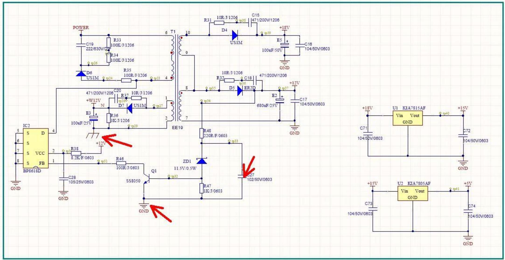

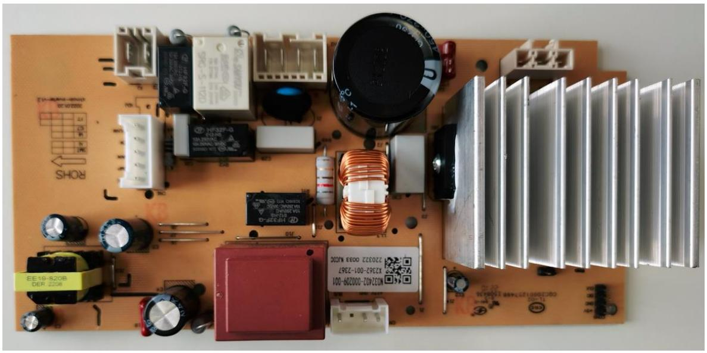

TOP SIDE

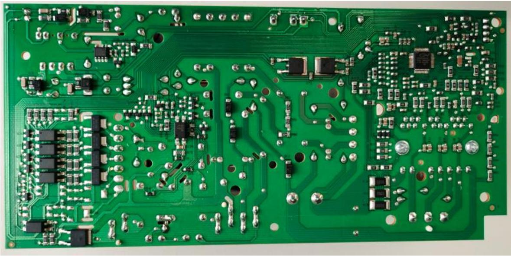

BOTTOM SIDE

待机功耗  
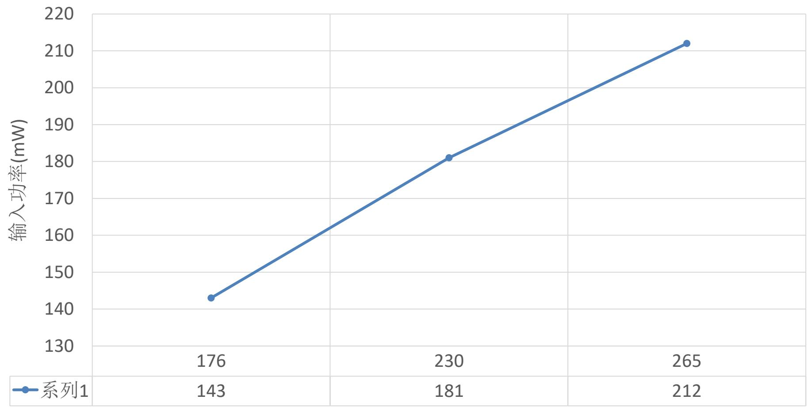

输入电压(Vac)

注：测试时断开12V和18V负载，W12V负载未断开

## 输出电压调整率

<table><tr><td> $V_{OUT}(V)$  $I_{OUT}(A)$ </td><td></td><td>12V</td><td>18V</td><td>W12V</td></tr><tr><td rowspan="4"> $I_{O\_12V}=0A$  $I_{O\_18V}=0A$  $I_{O\_W12V}=0A$ </td><td>85VAC</td><td>12.4</td><td>19.2831</td><td>10.694</td></tr><tr><td>115VAC</td><td>12.403</td><td>19.3028</td><td>10.677</td></tr><tr><td>230VAC</td><td>12.403</td><td>19.3094</td><td>10.644</td></tr><tr><td>265VAC</td><td>12.402</td><td>19.3183</td><td>10.632</td></tr><tr><td rowspan="4"> $I_{O\_12V}=0.3A$  $I_{O\_18V}=0A$  $I_{O\_W12V}=0A$ </td><td>85VAC</td><td>12.419</td><td>20.93</td><td>13.43</td></tr><tr><td>115VAC</td><td>12.41</td><td>20.74</td><td>13.363</td></tr><tr><td>230VAC</td><td>12.397</td><td>21.31</td><td>13.39</td></tr><tr><td>265VAC</td><td>12.39</td><td>20.98</td><td>13.451</td></tr><tr><td rowspan="4"> $I_{O\_12V}=0A$  $I_{O\_18V}=40mA$  $I_{O\_W12V}=30mA$ </td><td>85VAC</td><td>12.417</td><td>16.13</td><td>10.1</td></tr><tr><td>115VAC</td><td>12.417</td><td>16.22</td><td>10.16</td></tr><tr><td>230VAC</td><td>12.416</td><td>16.12</td><td>10.111</td></tr><tr><td>265VAC</td><td>12.41</td><td>16.09</td><td>10.09</td></tr><tr><td rowspan="4"> $I_{O\_12V}=0.3A$  $I_{O\_18V}=40mA$  $I_{O\_W12V}=30mA$ </td><td>85VAC</td><td>12.392</td><td>18.81</td><td>12.147</td></tr><tr><td>115VAC</td><td>12.408</td><td>18.85</td><td>12.158</td></tr><tr><td>230VAC</td><td>12.406</td><td>18.87</td><td>12.191</td></tr><tr><td>265VAC</td><td>12.41</td><td>18.88</td><td>12.207</td></tr></table>

黄色标注为最大值

  
注：测试时断开12V和18V负载，W12V负载未断开

蓝色标注为最小值

## (12V)

20MHz带宽，去掉示波器探头正端夹子和地线环，10uF/50V 0.1uF/50V

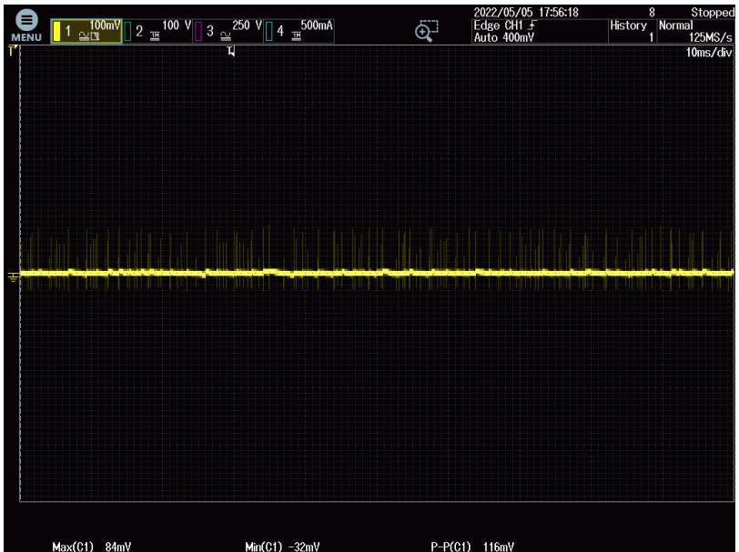

176 VAC

CH1 VOUT\_12V Ripple

$\mathsf { V } _ { \mathsf { P K - P K \_ 1 2 V } } { = } 1 1 6 \mathsf { m V }$

Test Condition:

➢ No Load

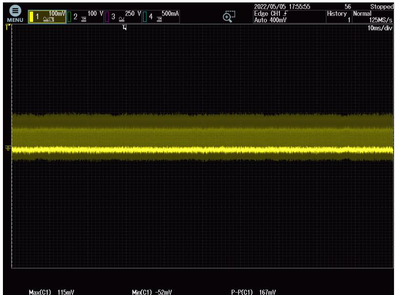

$1 7 6 \ : \mathsf { V } _ { \mathsf { A C } }$

CH1 VOUT\_12V Ripple

VPK-PK\_12V=167 mV

Test Condition:

➢ Full Load

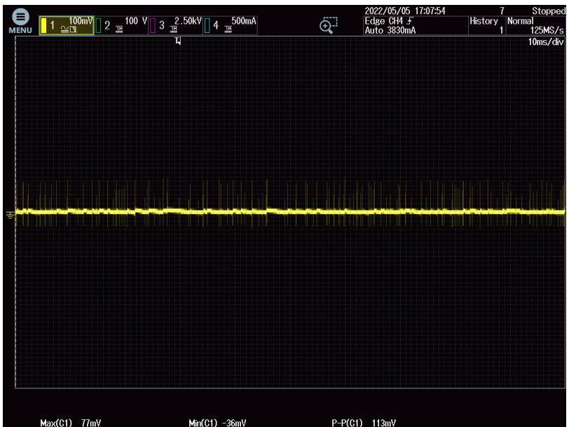

230 VAC

CH1 VOUT\_12V Ripple

$\mathsf { V } _ { \mathsf { P K - P K \_ 1 2 V } } { = } 1 1 3 \mathsf { m V }$

Test Condition:

➢ No Load

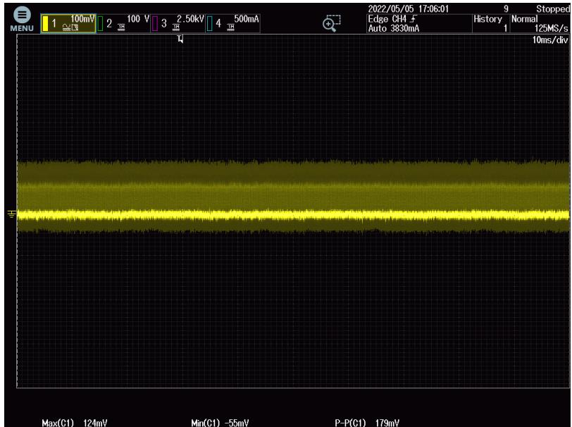

230 VAC

CH1 VOUT\_12V Ripple

$V _ { \mathsf { P K - P K \_ 1 2 V } } { = } 1 7 9 \mathsf { m V }$ VPK-PK\_12V=179 mV

Test Condition:

➢ Full Load

## (12V)

20MHz带宽，去掉示波器探头正端夹子和地线环，10uF/50V 0.1uF/50V

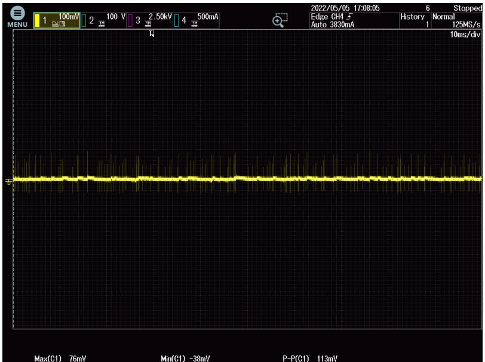

265 VAC

CH1 VOUT\_12V Ripple

VPK-PK\_12V=113 mV

Test Condition:

➢ No Load

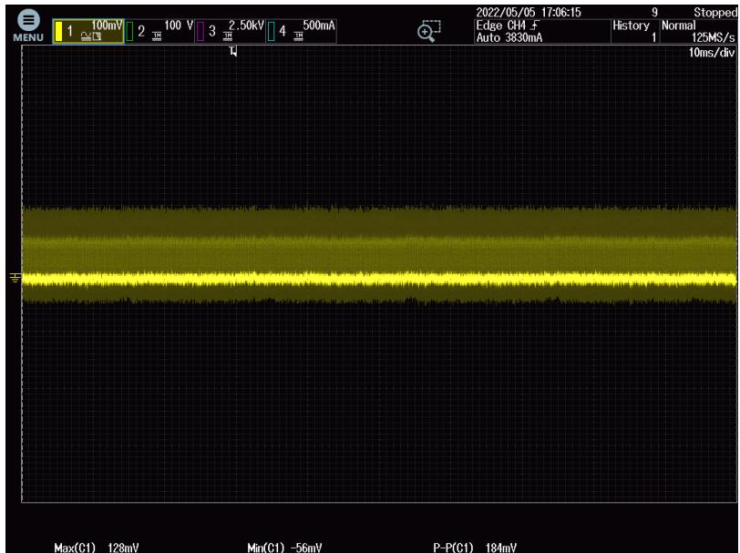

265 VAC

CH1 VOUT\_12V Ripple

$V _ { \mathsf { P K - P K \_ 1 2 V } } { = } 1 8 4 ~ \mathsf { m V }$ VPK-PK\_12V=184 mV

Test Condition:

➢ Full Load

## (10%-90%) (12V)

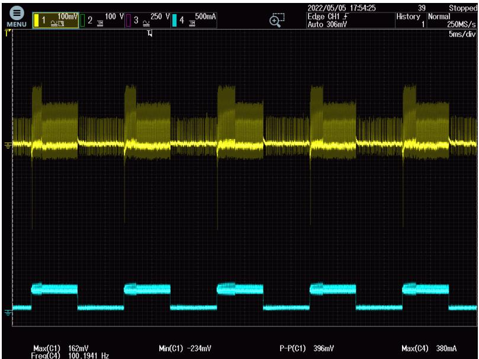

176 VAC

CH1 VOUT\_12V $\mathsf { V } _ { \mathsf { o u r } _ { - } 1 2 \mathsf { V } }$  
CH4 IOUT\_12V $\mathsf { I } _ { \mathsf { O U T } _ { - } 1 2 \mathsf { V } }$

$$
V _ {P K - P K} = 3 9 6 \mathrm{mV}
$$

## Test Condition:

➢ 12V: 0.03 A-0.27 A-0.03A  
➢ 18V-40mA, W12V-30mA  
➢ Slew Rate: 0.5 A/μS  
➢ Frequency: 100 Hz

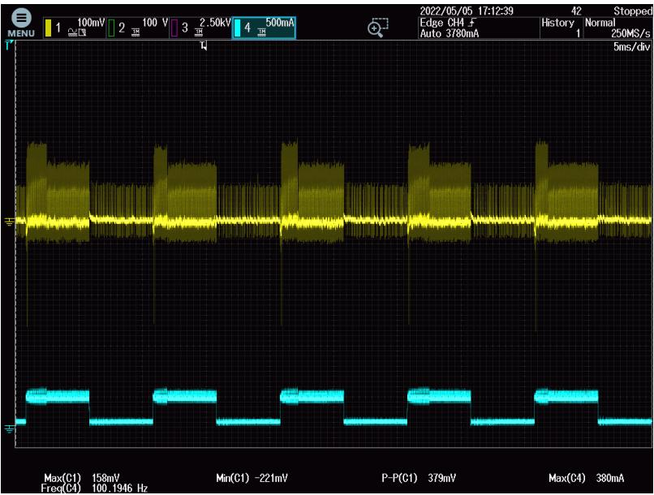

230 VAC

CH1 VOUT\_12V  
CH4 IOUT\_12V

VPK-PK=379 mV

## Test Condition:

➢ 12V: 0.03 A-0.27 A-0.03A  
➢ 18V-40mA, W12V-30mA  
➢ Slew Rate: 0.5 A/μS  
➢ Frequency: 100 Hz

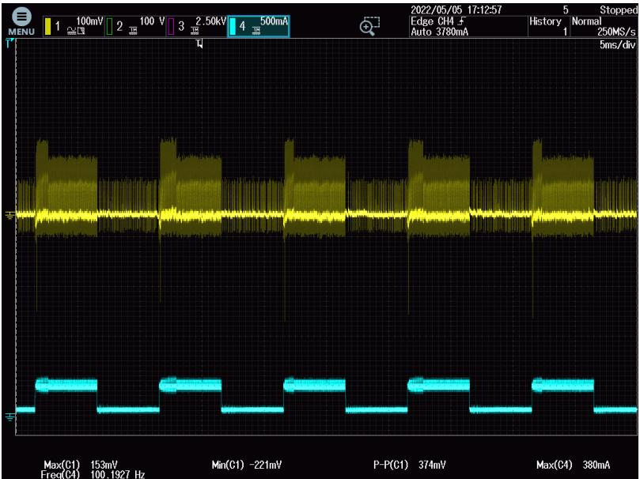

265 VAC

CH1 VOUT\_12V $\mathsf { V } _ { \mathsf { O U T } _ { - } 1 2 \mathsf { V } }$  
CH4 IOUT\_12V $\mathsf { I } _ { \mathsf { O U T } _ { - } 1 2 \mathsf { V } }$

$$
V _ {P K - P K} = 3 7 4 \mathrm{mV}
$$

## Test Condition:

➢ 12V: 0.03 A-0.27 A-0.03A  
➢ 18V-40mA, W12V-30mA  
➢ Slew Rate: 0.5 A/μS  
➢ Frequency: 100 Hz

## (12V)

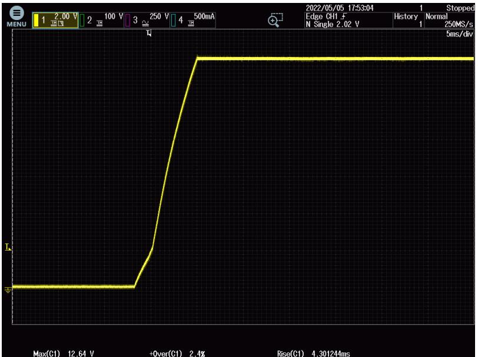

176 VAC

CH1 VOUT\_12V TRISE\_12V: 4.3 mS

## Test Condition:

➢ No Load

230 VAC

CH1 VOUT\_12V TRISE\_12V: 4.6 mS

## Test Condition:

➢ No Load

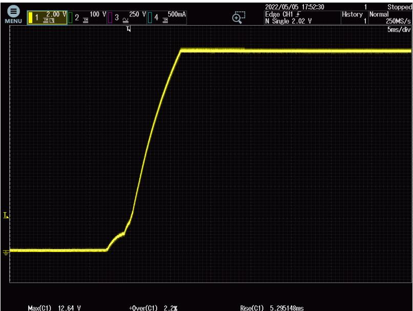

176 VAC

CH1 VOUT\_12V TRISE\_12V: 5.3 mS

## Test Condition:

➢ Full Load

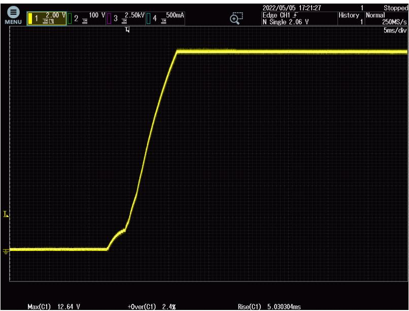

230 VAC

CH1 VOUT\_12V TRISE\_12V: 5 mS

## Test Condition:

➢ Full Load

## (12V)

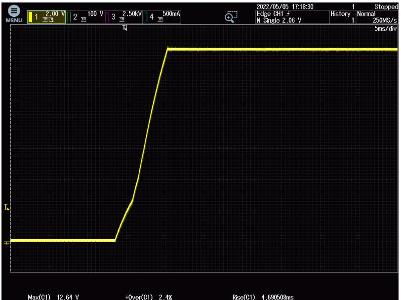

265 VAC

CH1 VOUT\_12V TRISE\_12V: 4.7 mS

Test Condition: No Load

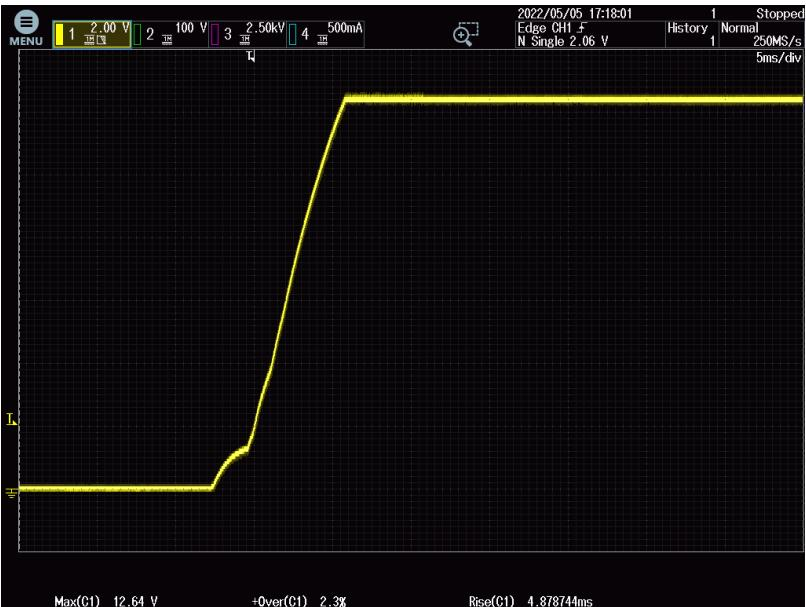

265 VAC

CH1 VOUT\_12V TRISE\_12V: 4.9 mS

Test Condition: Full Load

## (12V)

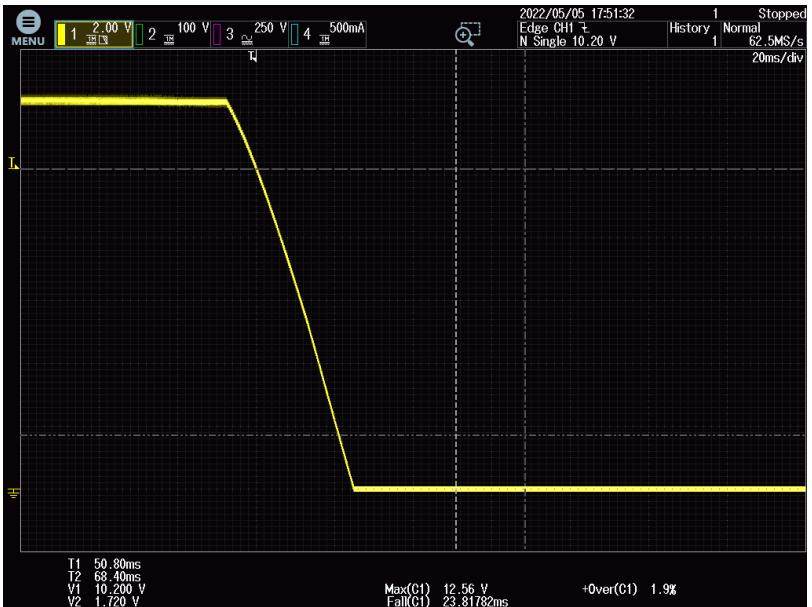

176 VAC  

Test Condition:  
➢ Full Load

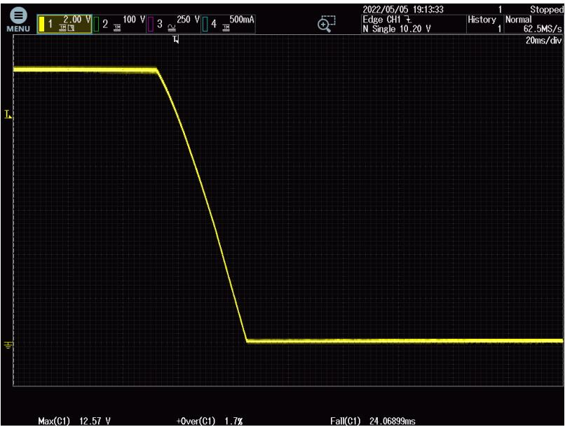

230 VAC  

Test Condition:  
➢ Full Load

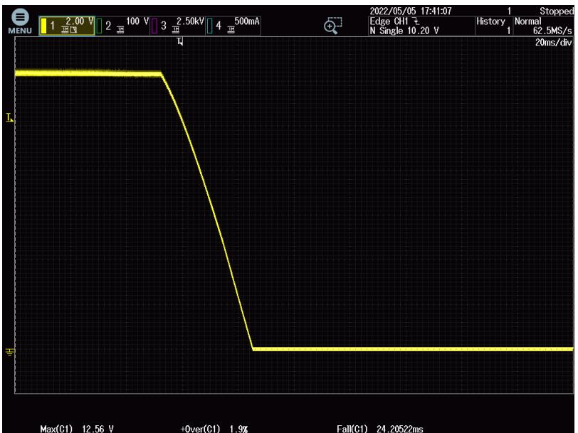

265 VAC  
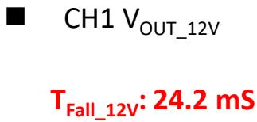

Test Condition:  
➢ Full Load

## (12V)

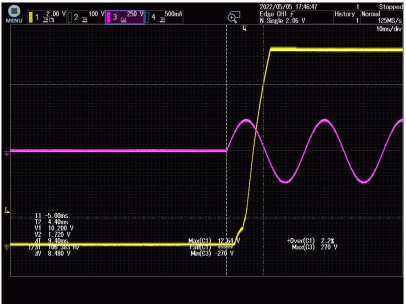

176 VAC

CH1 VOUT\_12V $\mathsf { V } _ { \mathsf { O U T } \_ 1 2 \mathsf { V } }$  
CH3 VAC\_IN $\mathsf { V } _ { \mathsf { A C \_ I N } }$  
$\mathsf { T } _ { \mathsf { D e l a y \_ 1 2 V } } \colon 9 . 4 \mathsf { m s }$

## Test Condition:

➢ Full Load

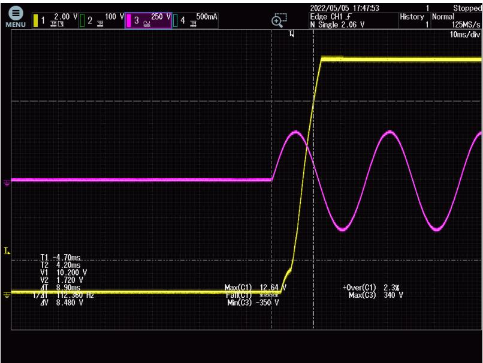

230 VAC

CH1 VOUT\_12V $\mathsf { V } _ { \mathsf { O U T } \_ 1 2 \mathsf { V } }$  
CH3 VAC\_IN $\mathsf { V } _ { \mathsf { A C \_ I N } }$

TDelay\_12V: 8.9 mS

## Test Condition:

➢ Full Load

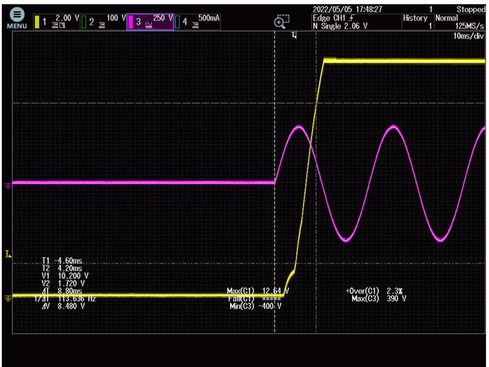

265 VAC

CH1 VOUT\_12V $\mathsf { V } _ { \mathsf { O U T } \_ 1 2 \mathsf { V } }$  
CH3 VAC\_IN $\mathsf { V } _ { \mathsf { A C \_ I N } }$

TDelay\_12V: 8.8 mS

## Test Condition:

➢ Full Load

## MOs漏源极电压电流波形

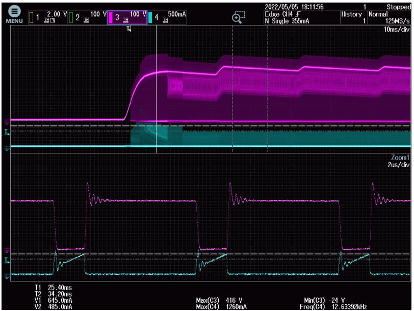

176 VAC

${ \mathsf { C H } } 2 { \mathsf { V } } _ { \mathsf { D S } }$  
$C H 4 1 _ { \mathsf { D } }$ $V _ { \mathsf { D } \mathsf { S } } { = } 4 1 6 \mathsf { V }$ $V _ { \mathrm { M A X } } = 1 . 2 6 ~ \mathsf { A }$

## Test Condition:

➢ Full Load  
➢ 开机

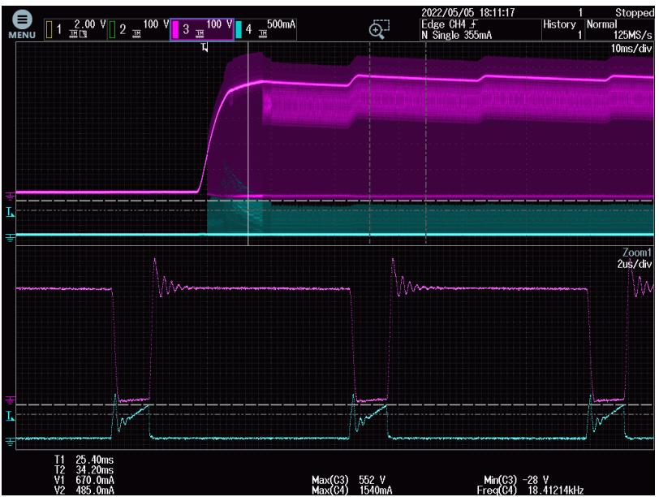

265 VAC

${ \mathsf { C H } } 2 \ { \mathsf { V } } _ { \mathsf { D S } }$  
$C H 4 1 _ { \mathsf { D } }$ $V _ { \mathsf { D S } } { = } 5 5 2 \ \mathsf { V }$ $\mathsf { I } _ { \mathsf { M A X } } { = } 1 . 5 4 ~ \mathsf { A }$

## Test Condition:

➢ Full Load  
➢ 开机

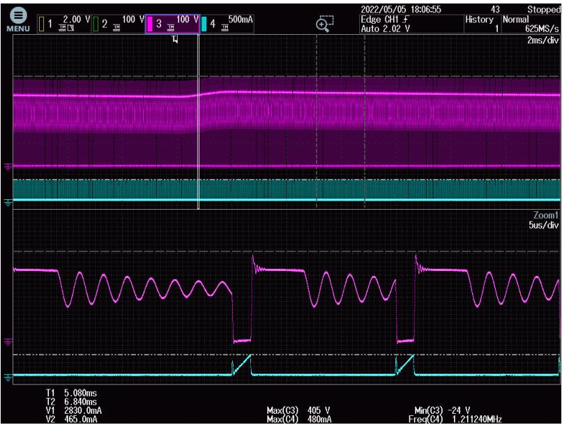

176 VAC

${ \mathsf { C H } } 2 { \mathsf { V } } _ { \mathsf { D S } }$  
$C H 4 1 _ { \mathsf { D } }$ $\mathtt { V } _ { \mathsf { D } \mathsf { S } } mathtt { = } 4 0 5 \mathtt { V }$ IMAX= 480 mA $\mathsf { I } _ { \mathsf { M A X } } { = } 4 8 0 \mathsf { m } \mathsf { A }$

## Test Condition:

➢ Full Load

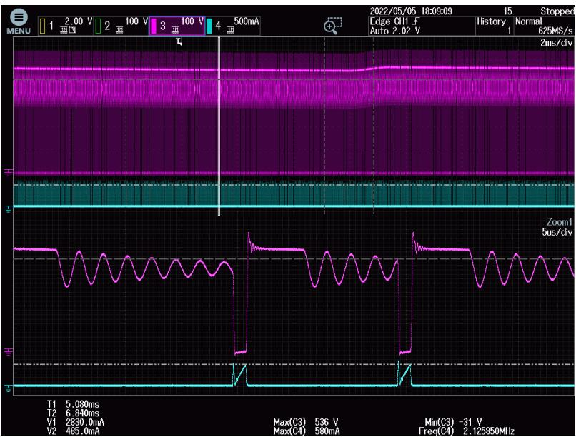

265 VAC

${ \mathsf { C H } } 2 { \mathsf { V } } _ { \mathsf { D S } }$  
$C H 4 1 _ { \mathsf { D } }$ $\mathtt { V } _ { \mathtt { D S } } mathtt { = } 5 8 0 \mathtt { V }$ IMAX=580 mA $\mathsf { I } _ { \mathsf { M A X } } { = } 5 8 0 \mathsf { m } \mathsf { A }$

## Test Condition:

➢ Full Load

## 输出短路时MOs和输出电压波形

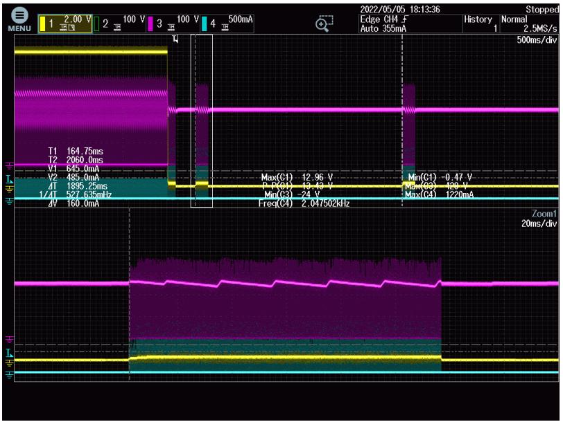

176 VAC

CH1 ${ \sf V } _ { 0 }$  
CH2 $\mathsf { V } _ { \mathsf { D } \mathsf { S } }$  
CH4 ${ \sf I } _ { \sf D }$

$$
\begin{array}{l} \mathrm {V_ {DS\_max}} = 4 2 0 \mathrm{V} \\ \mathrm {I_ {DS\_max}} = 1. 2 2 \mathrm{A} \end{array}
$$

## Test Condition:

➢ Full Load  
➢ 输出短路

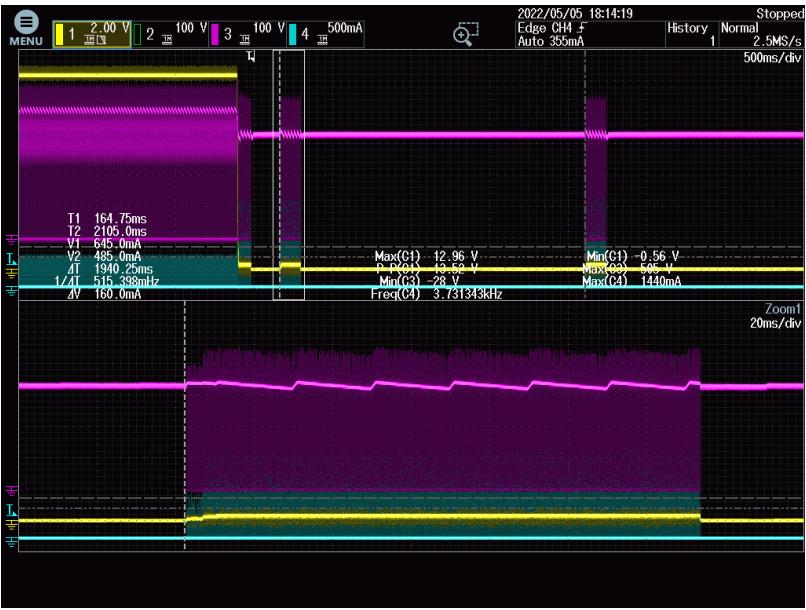

230 VAC

CH1 ${ \sf V } _ { 0 }$  
${ \mathsf { C H } } 2 { \mathsf { V } } _ { \mathsf { D S } }$  
$C H 4 1 _ { \mathsf { D } }$  
$\begin{array} { r } { V _ { \mathsf { D S \_ m a x } } = 5 8 5 \vee } \\ { \mathsf { I _ { D S \_ m a x } } = 1 . 4 4 \mathsf { A } } \end{array}$ DS \_max

## Test Condition:

➢ Full Load  
➢ 输出短路

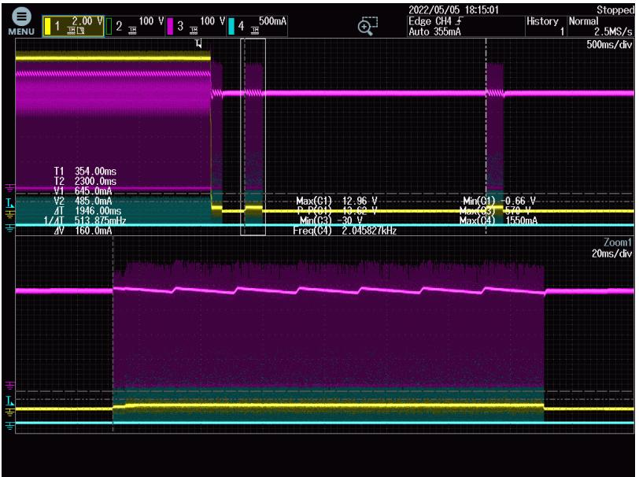  
265 VAC

CH1 ${ \sf V } _ { 0 }$  
CH2 $\mathsf { V } _ { \mathsf { D } \mathsf { S } }$  
CH4 ${ \sf I } _ { \sf D }$

$$
\begin{array}{l} \mathrm {V_ {DS\_max}} = 5 7 0 \mathrm{V} \\ \mathrm {I_ {DS\_max}} = 1. 5 5 \mathrm{A} \end{array}
$$

## Test Condition:

➢ Full Load  
➢ 输出短路

## 输出过流时Mos和输出电压波形

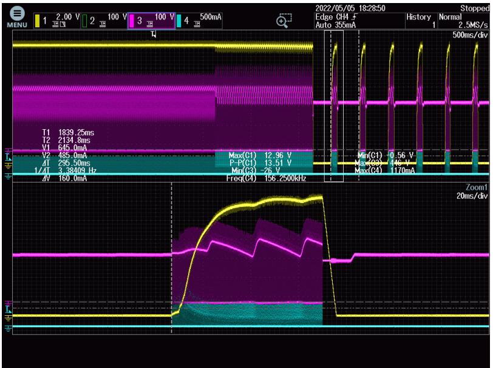

176 VAC

CH1 ${ \sf V } _ { 0 }$  
CH2 $\mathsf { V } _ { \mathsf { D } \mathsf { S } }$  
CH4 ID

$$
V _ {D S \max} = 4 4 6 \mathrm{V}
$$

$$
I _ {D S \_ m a x} = 1. 1 7 A
$$

## Test Condition:

➢ OCP 12V-1.4A  
➢ 18V-40mA  
➢ W12V-30mA

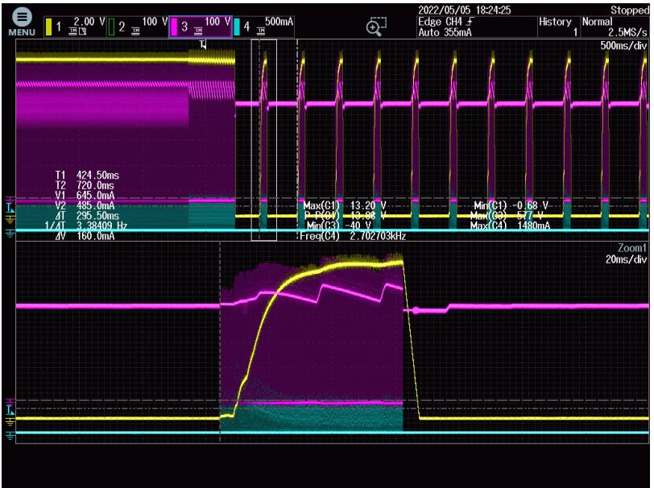

265 VAC

CH1 ${ \sf V } _ { 0 }$  
CH2 $\mathsf { V } _ { \mathsf { D } \mathsf { S } }$  
CH4 ${ \sf I } _ { \sf D }$

$$
V _ {D S \max} = 5 7 7 \mathrm{V}
$$

$$
I _ {D S \_ m a x} = 1. 4 8 A
$$

## Test Condition:

➢ OCP 12V-1.5A  
➢ 18V-40mA  
➢ W12V-30mA

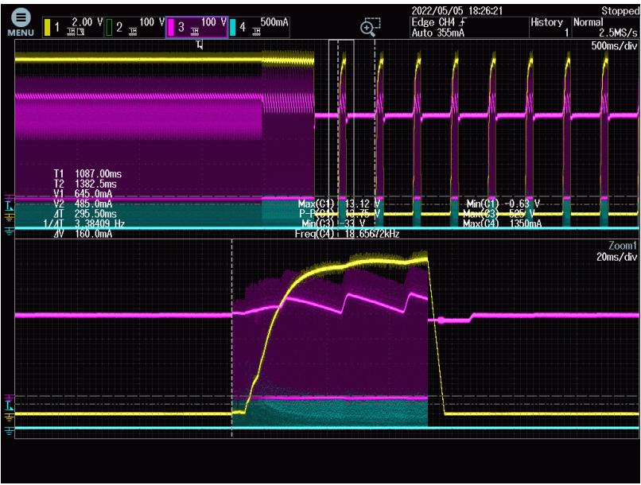

230 VAC

CH1 ${ \sf V } _ { 0 }$  
CH2 $\mathsf { V } _ { \mathsf { D } \mathsf { S } }$  
CH4 ID  
$\begin{array} { r } { V _ { \mathsf { D S \_ m a x } } { = } 5 2 5 \vee } \\ { \mathsf { I _ { D S \_ m a x } } { = } 1 . 3 5 \mathsf { A } } \end{array}$

## Test Condition:

➢ OCP 12V-1.45A  
➢ 18V-40mA  
➢ W12V-30mA

## 输入高低压工作波形

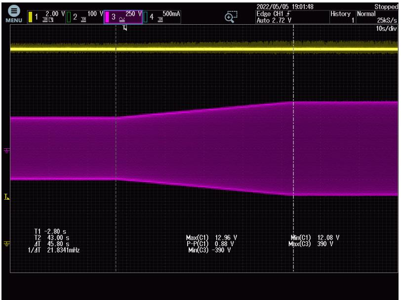

176 VAC-265 VAC

CH1 VO  
CH3 VAC\_IN

输出电压稳定

Test Condition:

➢ Full Load

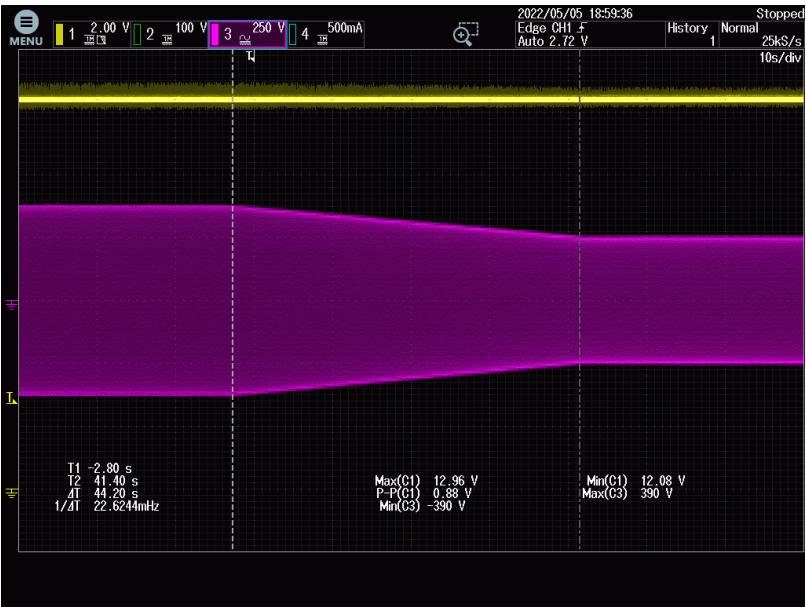

265 VAC-176 VAC

CH1 VO  
CH3 VAC\_IN  
输出电压稳定

Test Condition:

➢ Full Load

## 温升测试

<table><tr><td rowspan="2">项目</td><td colspan="3">温度(°C)</td></tr><tr><td>176VAC</td><td>230VAC</td><td>265VAC</td></tr><tr><td>环境温度</td><td>48.4</td><td>48.1</td><td>48.9</td></tr><tr><td>BPA8618D (IC2)</td><td>79.1</td><td>95.1</td><td>100.7</td></tr><tr><td>ER2D (D5)</td><td>72.2</td><td>75.4</td><td>78</td></tr><tr><td>变压器绕组 (T1)</td><td>65.2</td><td>67.9</td><td>70</td></tr><tr><td>变压器磁芯 (T1)</td><td>63.2</td><td>65.5</td><td>67.3</td></tr></table>

## 测试说明

➢ 在温箱中进行测试  
➢ 电路板放在一个封闭的盒子内  
➢ 热电偶连接到各个测量点  
➢ 等测量点温度达到稳定后记录数据

## THANK YOU FOR WATCHING
