## BPA8618P & PN8732对比测试

## （12V/1A)

上海晶丰明源半导体股份有限公司

Shanghai Bright Power Semiconductor Co., Ltd.

陈耀兵

2022 12 7

## 内容

电气特性对比  
工作模式对比  
测试数据对比  
电路图  
实物图  
性能测试对比  
对比总结

## 电气特性对比

<table><tr><td></td><td>PN8732</td><td>BPA8618P</td></tr><tr><td>开关频率</td><td>100KHz(最大)</td><td>132KHz(最大)</td></tr><tr><td>Mosfet BV</td><td>800V</td><td>700V</td></tr><tr><td> $R_{DS\_ON}$ </td><td>2.8Ω</td><td>4.5Ω</td></tr><tr><td>限流点</td><td>外部电阻调整限流点</td><td>550mA(内部固定)</td></tr><tr><td>软启动</td><td>有(限流点从最小限流点逐渐增大,时间8ms)</td><td>有(40%限流点,192个周期后到最大限流点)</td></tr><tr><td>输入过欠压保护</td><td>有(需外加电阻)</td><td>有(无需外加电阻)</td></tr><tr><td>输出短路保护</td><td>有</td><td>有</td></tr><tr><td>输出过载保护</td><td>有</td><td>有</td></tr><tr><td>反馈开路保护</td><td>有</td><td>有</td></tr><tr><td>过温保护</td><td>有</td><td>有</td></tr><tr><td>封装</td><td>DIP8</td><td>DIP8</td></tr></table>

## ◼ PN8732

◼ PWM/PFM COMP 于 $V _ { \mathsf { C O M P \_ E c o } }$ 2.2V 式，开关频率随负载降低而降低，直至最 小频率 $2 5 k \mathsf { H } z _ { \mathsf { C } }$

## BPA8618P

■脉冲数控制，通过控制脉冲的个数实现输出电压的调整，在每个时钟周期上升沿,比较流程FB脚的电流与阈值电流 $1 _ { F B \_ D 1 S }$ 115uA FB $1 _ { F B \_ D 1 S }$ 时，开通MOS MOS

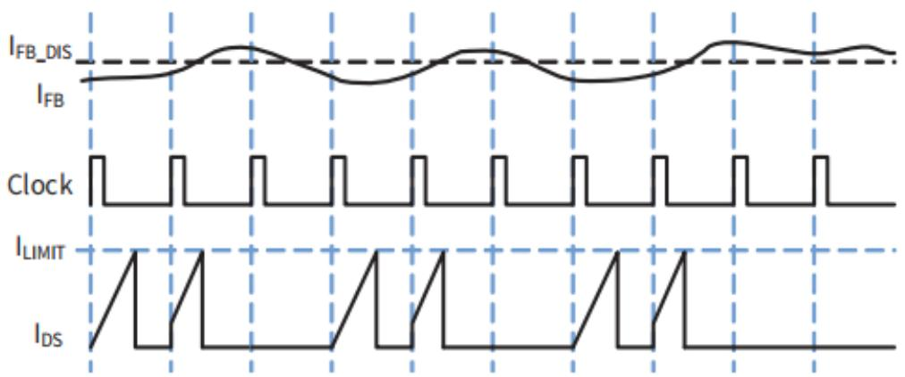

## 测试数据对比

<table><tr><td colspan="2"></td><td>PN8732</td><td>BPA8618P</td><td></td></tr><tr><td colspan="2">待机功耗@230Vac</td><td>192mW</td><td>114mW</td><td></td></tr><tr><td>效率</td><td>230Vac</td><td>81.23%</td><td>81.94%</td><td>平均效率</td></tr><tr><td rowspan="2">输出电压纹波</td><td>165Vac</td><td>117mV</td><td>168.2mV</td><td>满载</td></tr><tr><td>265Vac</td><td>123.6mV</td><td>163.4mV</td><td>满载</td></tr><tr><td rowspan="2">动态负载性能</td><td>50%-100%</td><td> $168.1mV_{PK\_PK}$ </td><td> $181mV_{PK\_PK}$ </td><td>@265Vac</td></tr><tr><td>10%-90%</td><td> $219.4mV_{PK\_PK}$ </td><td> $208mV_{PK\_PK}$ </td><td>@265Vac</td></tr><tr><td rowspan="2">MOSFET应力</td><td> $V_{DS}$ </td><td>806.9V</td><td>548.3V</td><td>@265Vac,输出短路</td></tr><tr><td> $I_{DS}$ </td><td>2.421A</td><td>0.934A</td><td>@265Vac,输出短路</td></tr><tr><td colspan="2">温升测试(环温40°C)</td><td>51.7°C</td><td>33.3°C</td><td>@265Vac,满载</td></tr><tr><td colspan="2">传导EMI</td><td>&gt;6dB裕量</td><td>&gt;6dB裕量</td><td></td></tr></table>

## BPA8618P

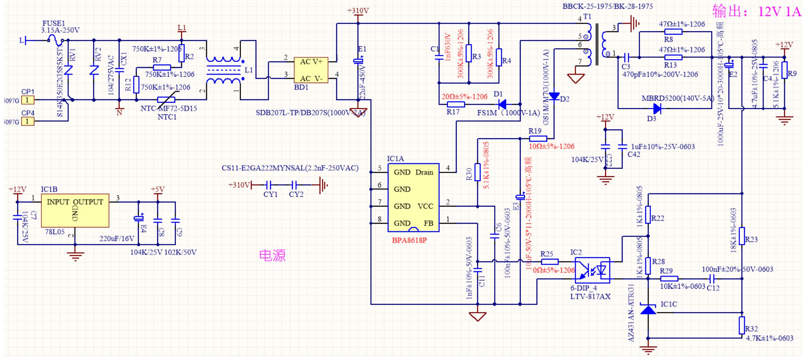

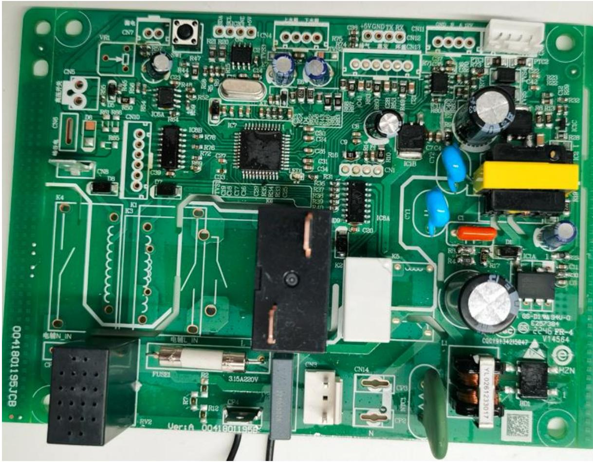

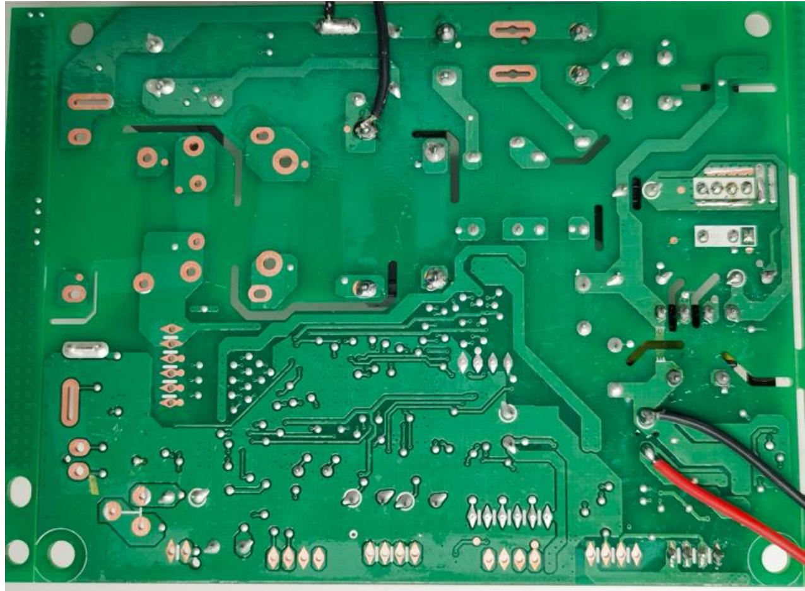

## 变压器规格 BPA8618P

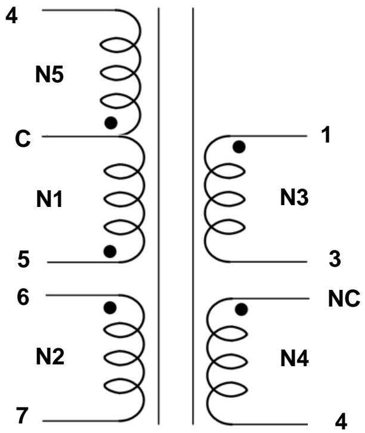

## 规格与材料

初级绕组感量 $\ L _ { \mathrm { o } } = 0 . 8 8 \mathsf { m H \pm 7 } \%$ (测试条件：0.3V，50kHz)  
漏感量 $L _ { \mathrm { | k } } < 3 \% ^ { \frac { 1 } { x } } L _ { P }$  
➢ 骨架：EE19立式加高骨架 (4+3PIN)  
磁芯：EE19 PC40 或同等材质， $\mathsf { A e { = } } 2 2 . 7 \mathsf { m m } ^ { 2 }$  
》N1、N2、N4、N5:2UEW漆包线  
➢ N3：三层绝缘线  
➢ 绝缘胶带:3M900或同等材质  
耐压测试:3KV,50/60Hz,1Min  
成品要求：浸凡立水

<table><tr><td>序号</td><td>起始脚</td><td>终止脚</td><td>绕制规则</td><td>匝数</td><td>绕线方式</td></tr><tr><td>N1</td><td>5</td><td>C</td><td>2UEW φ0.23*1P</td><td>60Ts</td><td>密绕2层(PIN脚朝外)</td></tr><tr><td>胶带</td><td></td><td></td><td></td><td>2Ts</td><td></td></tr><tr><td>N2</td><td>6</td><td>7</td><td>2UEW φ0.19*3P</td><td>12Ts</td><td>密绕一层(PIN脚朝外)</td></tr><tr><td>胶带</td><td></td><td></td><td></td><td>2Ts</td><td></td></tr><tr><td>N3</td><td>1</td><td>3</td><td>TEX-E φ0.45*1P</td><td>12Ts</td><td>密绕一层(PIN脚朝外)</td></tr><tr><td>胶带</td><td></td><td></td><td></td><td>2Ts</td><td></td></tr><tr><td>N4</td><td>NC</td><td>4</td><td>2UEW φ0.19*3P</td><td>12Ts</td><td>密绕一层(PIN脚朝外)</td></tr><tr><td>胶带</td><td></td><td></td><td></td><td>2Ts</td><td></td></tr><tr><td>N5</td><td>C</td><td>4</td><td>2UEW φ0.23*1P</td><td>24Ts</td><td>密绕一层(PIN脚朝外)</td></tr><tr><td>胶带</td><td></td><td></td><td></td><td>3Ts</td><td></td></tr></table>

底视图

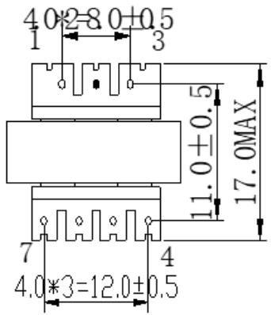

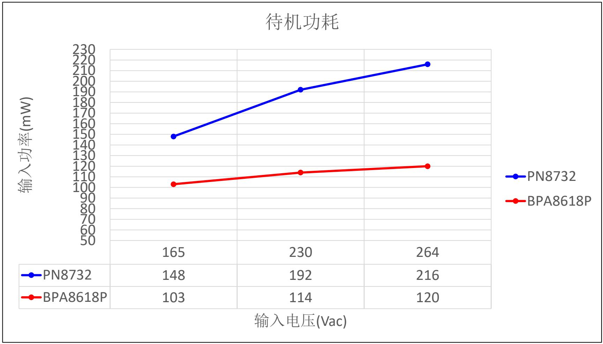

断开板上后端负载

效率曲线  
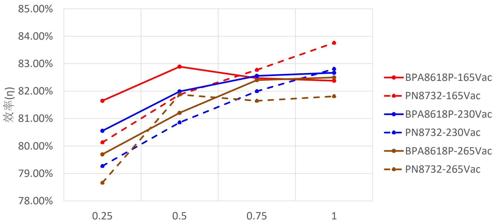

负载比例

实线为BPA8618P  
虚线为PN8732

PN8732

<table><tr><td> $V_{IN}(VAC)$ Load(%)</td><td>165</td><td>230</td><td>265</td><td>平均值</td><td>线调整率</td></tr><tr><td>0</td><td>12.042</td><td>12.042</td><td>12.042</td><td>12.042</td><td>0.00%</td></tr><tr><td>20%</td><td>12.041</td><td>12.041</td><td>12.041</td><td>12.041</td><td>0.00%</td></tr><tr><td>40%</td><td>12.042</td><td>12.042</td><td>12.042</td><td>12.042</td><td>0.00%</td></tr><tr><td>60%</td><td>12.043</td><td>12.043</td><td>12.043</td><td>12.043</td><td>0.00%</td></tr><tr><td>80%</td><td>12.044</td><td>12.044</td><td>12.045</td><td>12.044</td><td>0.01%</td></tr><tr><td>100%</td><td>12.046</td><td>12.046</td><td>12.046</td><td>12.046</td><td>0.00%</td></tr><tr><td>平均值</td><td>12.043</td><td>12.043</td><td>12.043</td><td></td><td></td></tr><tr><td>负载调整率</td><td>0.04%</td><td>0.04%</td><td>0.04%</td><td></td><td></td></tr></table>

=100%\*( - )/

BPA8618P

<table><tr><td> $V_{IN}(VAC)$ Load(%)</td><td>165</td><td>230</td><td>265</td><td>平均值</td><td>线调整率</td></tr><tr><td>0</td><td>11.987</td><td>11.987</td><td>11.987</td><td>11.987</td><td>0.00%</td></tr><tr><td>20%</td><td>11.987</td><td>11.987</td><td>11.987</td><td>11.987</td><td>0.00%</td></tr><tr><td>40%</td><td>11.987</td><td>11.987</td><td>11.987</td><td>11.987</td><td>0.00%</td></tr><tr><td>60%</td><td>11.987</td><td>11.987</td><td>11.987</td><td>11.987</td><td>0.00%</td></tr><tr><td>80%</td><td>11.987</td><td>11.987</td><td>11.987</td><td>11.987</td><td>0.00%</td></tr><tr><td>100%</td><td>11.988</td><td>11.988</td><td>11.987</td><td>11.987</td><td>0.00%</td></tr><tr><td>平均值</td><td>11.987</td><td>11.987</td><td>11.987</td><td></td><td></td></tr><tr><td>负载调整率</td><td>0.01%</td><td>0.01%</td><td>0.01%</td><td></td><td></td></tr></table>

=100%\*( - )/

PN8732

<table><tr><td>Vin</td><td>165VAC</td><td>230VAC</td><td>265VAC</td></tr><tr><td>OLP点</td><td>1.8A</td><td>1.85A</td><td>1.95A</td></tr></table>

BPA8618P

<table><tr><td>Vin</td><td>165VAC</td><td>230VAC</td><td>265VAC</td></tr><tr><td>OLP点</td><td>1.7A</td><td>1.8A</td><td>1.85A</td></tr></table>

## 输出电压纹波

PN8732  
165 VAC  
  
Test Condition:  
➢ Full Load

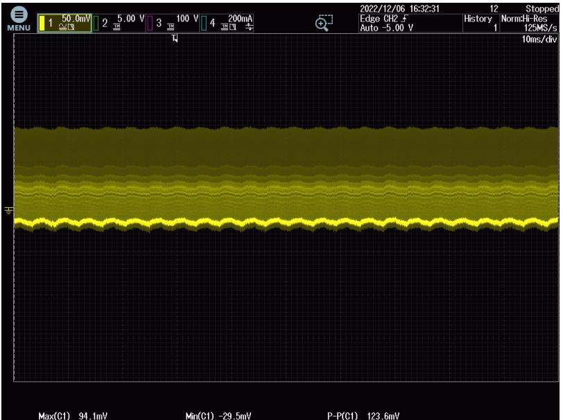

PN8732  
265 VAC  
  
Test Condition:  
➢ Full Load

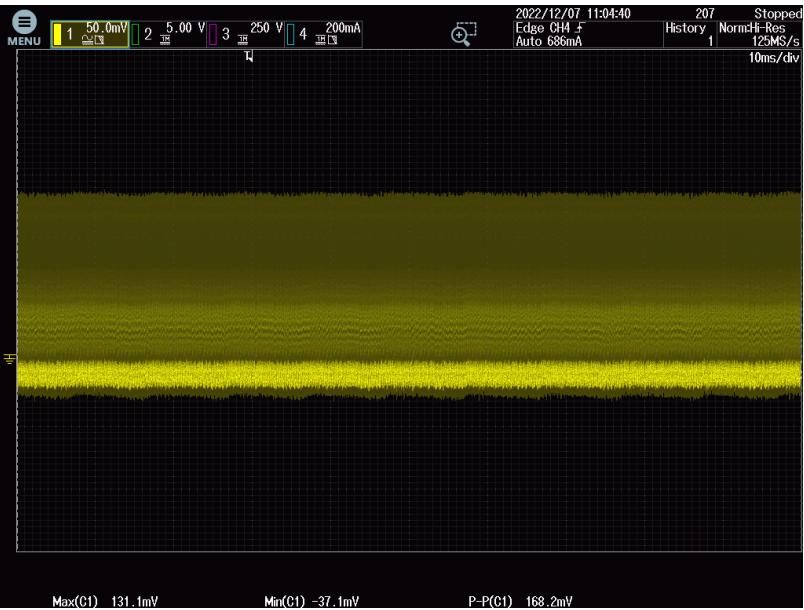

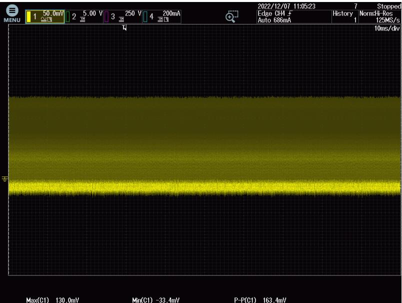

BPA8618P  
165 VAC  
  
Test Condition:  
➢ Full Load

BPA8618P  
265 VAC  
  
Test Condition:  
➢ Full Load

## (50%-100%)

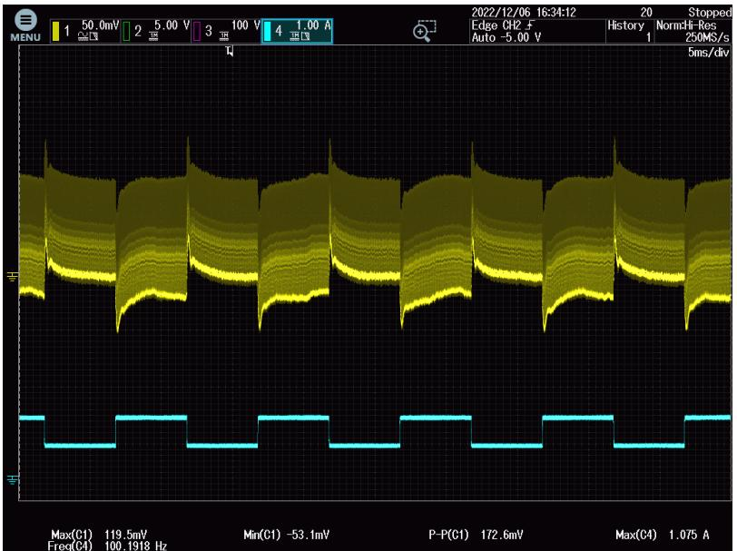

PN8732  
165 VAC

CH1 $\mathsf { V } _ { \mathsf { O U T } }$ $V _ { \mathsf { P K - P K } } { = } 1 7 2 . 6 ~ \mathsf { m V }$  
CH4 ${ \mathsf I } _ { 0 \mathsf U \top }$

## Test Condition:

➢ 0. 5 A-1 A-0. 5 A  
➢ Slew Rate: 0.5 A/μS  
➢ Frequency: 100 Hz

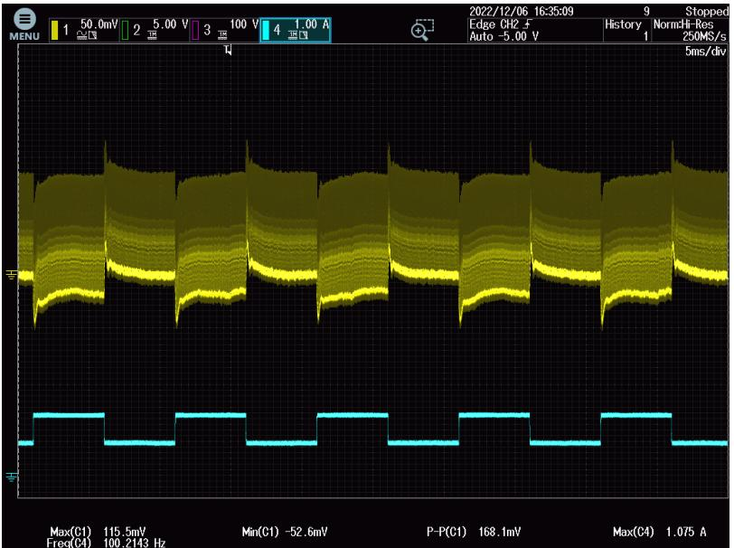

PN8732  
265 VAC

CH1 $\mathsf { V } _ { \mathsf { O U T } }$ $V _ { \mathsf { P K - P K } } { = } 1 6 8 . 1 \mathsf { m V }$  
CH4 IOUT

## Test Condition:

➢ 0. 5 A-1 A-0. 5 A  
➢ Slew Rate: 0.5 A/μS  
➢ Frequency: 100 Hz

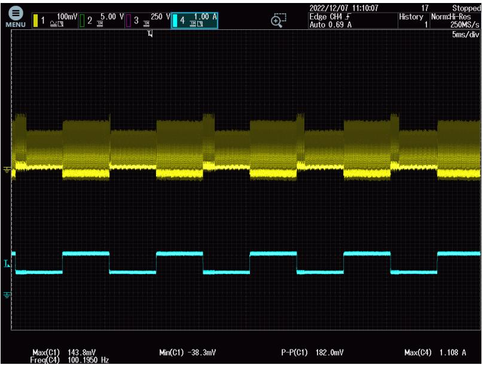

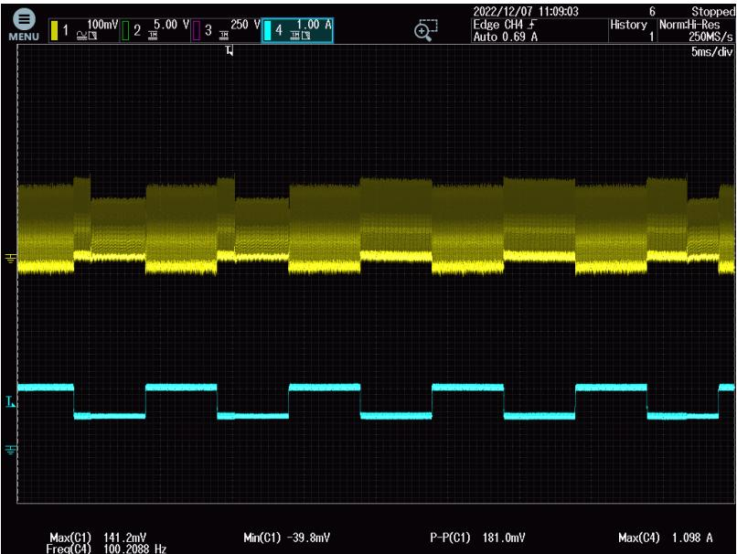

## BPA8618P

## 165 VAC

CH1 $\mathsf { V } _ { \mathsf { O U T } }$ $V _ { \mathsf { P K - P K } } = 1 8 2 ~ \mathsf { m V }$  
$\mathsf { C H 4 } \mathsf { I } _ { \mathsf { O U T } }$

## Test Condition:

➢ 0. 5 A-1 A-0. 5 A  
➢ Slew Rate: 0.5 A/μS  
➢ Frequency: 100 Hz

## BPA8618P

## 265 VAC

CH1 VOUT $\mathsf { V } _ { \mathsf { P K - P K } } \equiv 1 8 1 \mathsf { m V }$  
$\mathsf { C H 4 } \mathsf { I } _ { \mathsf { O U T } }$

## Test Condition:

➢ 0. 5 A-1 A-0. 5 A  
➢ Slew Rate: 0.5 A/μS  
➢ Frequency: 100 Hz

## (10%-90%)

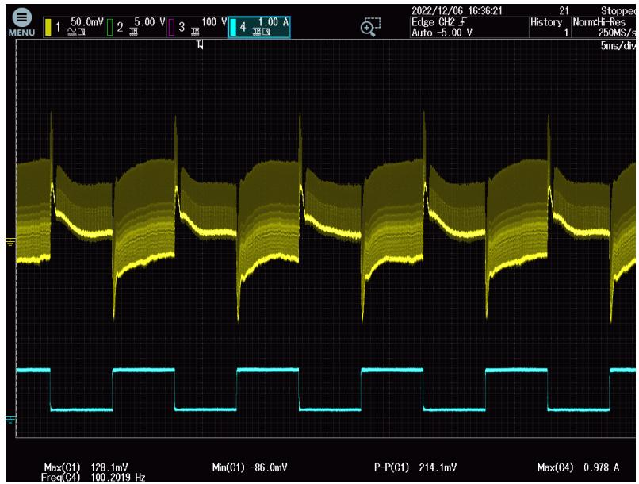

## PN8732

## 165 VAC

CH1 $\mathsf { V } _ { \mathsf { O U T } }$ $\mathsf { V } _ { \mathsf { P K - P K } } { = } 2 1 4 . 1 \mathsf { m V }$  
CH4 ${ \mathsf I } _ { 0 \mathsf U \top }$

## Test Condition:

➢ 0.1 A-0.9A-0.1 A  
➢ Slew Rate: 0.5 A/μS  
➢ Frequency: 100 Hz

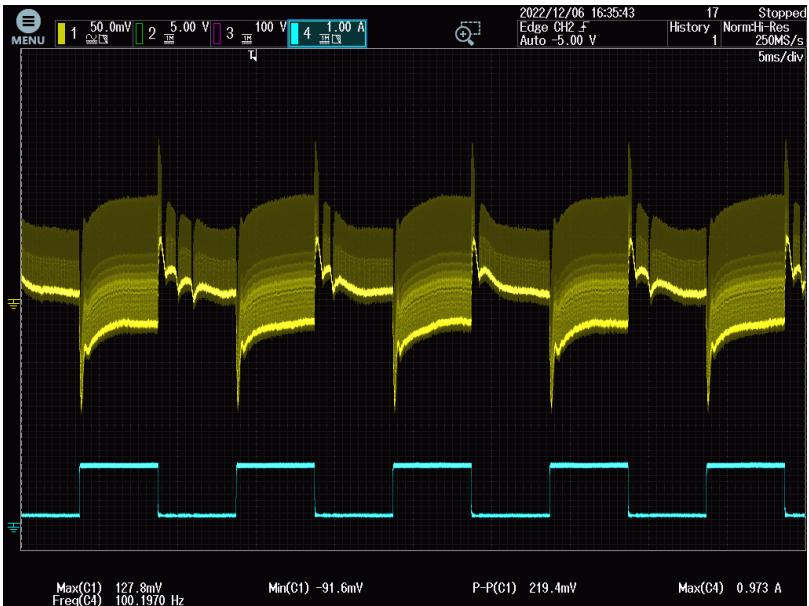

## PN8732

## 265 VAC

CH1 $\mathsf { V } _ { \mathsf { O U T } }$ $\mathsf { V } _ { \mathsf { P K - P K } } { = } 2 1 9 . 4 \mathsf { m V }$  
CH4 IOUT

## Test Condition:

➢ 0.1 A-0.9A-0.1 A  
➢ Slew Rate: 0.5 A/μS  
➢ Frequency: 100 Hz

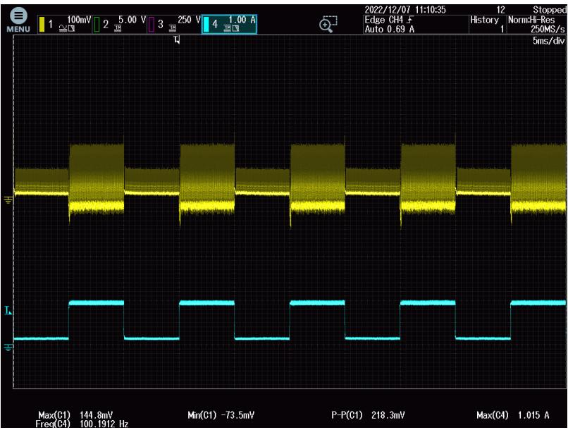

## BPA8618P

## 165 VAC

CH1 $\mathsf { V } _ { \mathsf { O U T } }$ $\mathsf { V } _ { \mathsf { P K - P K } } { = } 2 1 8 . 3 \mathsf { m V }$  
CH4 IOUT $\mathsf { I } _ { 0 \mathsf { U T } }$

## Test Condition:

➢ 0.1 A-0.9A-0.1 A  
➢ Slew Rate: 0.5 A/μS  
➢ Frequency: 100 Hz

## BPA8618P

## 265 VAC

CH1 $\mathsf { V } _ { \mathsf { O U T } }$ $V _ { P K - P K } = 2 0 8 m v$  
CH4 IOUT

## Test Condition:

➢ 0.1 A-0.9A-0.1 A  
➢ Slew Rate: 0.5 A/μS  
➢ Frequency: 100 Hz

## 输出电压开机波形

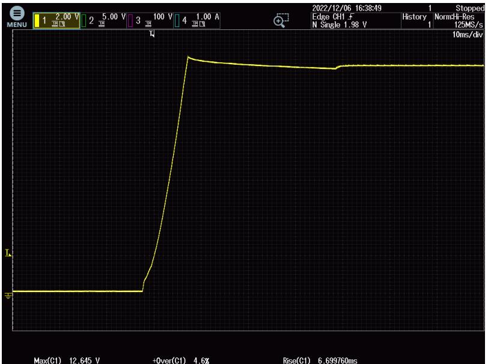

PN8732  
165 VAC  
  
Test Condition:  
➢ NO Load

PN8732  
265 VAC  
  
Test Condition:  
➢ NO Load

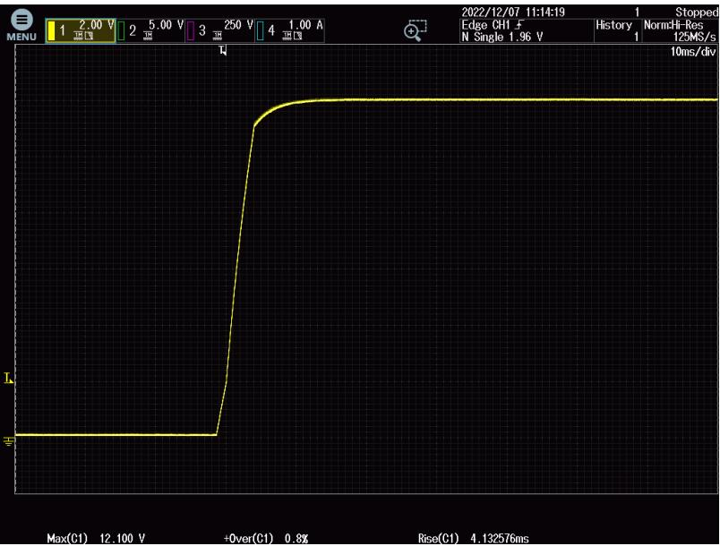

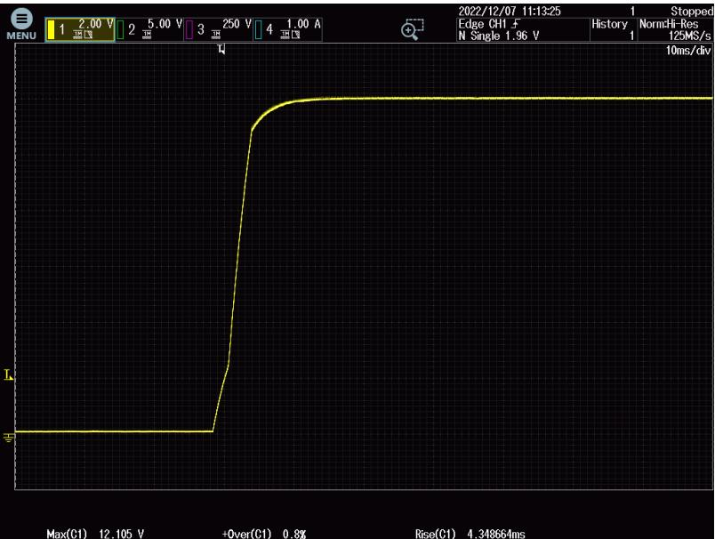

## BPA8618P

## 165 VAC

  
Test Condition:  
➢ NO Load

BPA8618P  
265 VAC  
  
Test Condition:  
➢ NO Load

## 输出电压开机波形

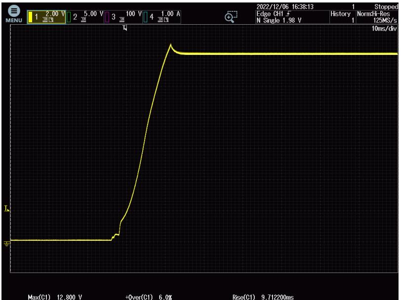

PN8732  
165 VAC  
  
Test Condition:  
➢ Full Load

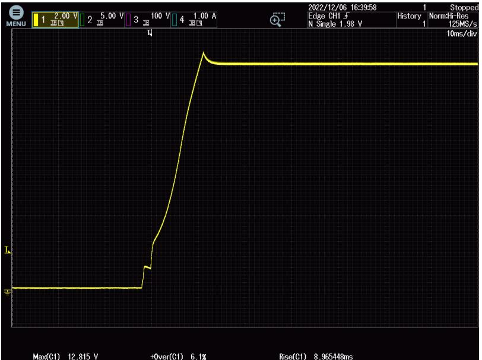

PN8732

265 VAC  
  
Test Condition:  
➢ Full Load

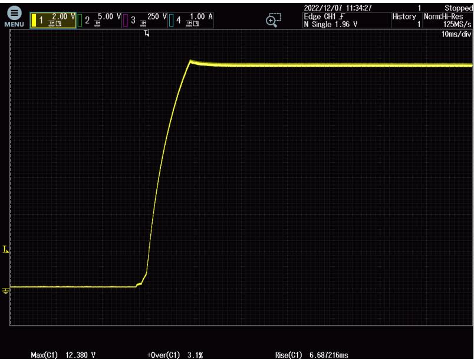

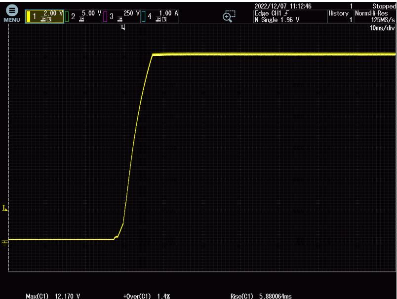

## BPA8618P

## 165 VAC

  
Test Condition:  
➢ Full Load

BPA8618P  
265 VAC  
  
Test Condition:  
➢ Full Load

## 开机延迟时间波形

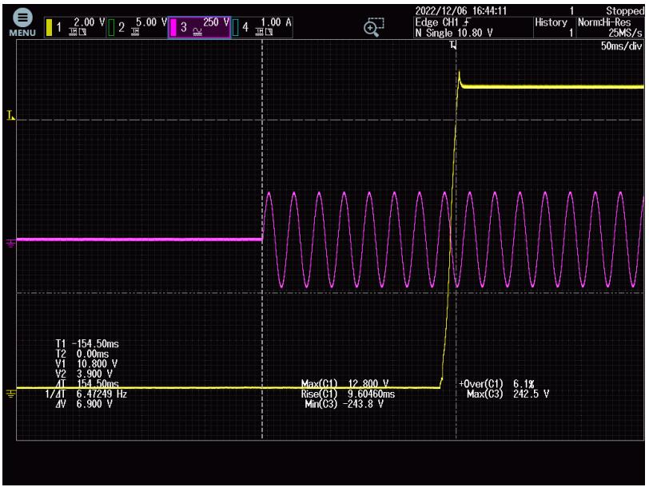

PN8732

165 VAC

CH1 $\mathsf { V } _ { \mathsf { O U T } }$  
$\begin{array} { r l } & { \mathsf { C H 3 } \mathsf { V } _ { \mathsf { | N _ { - } A C } } } \\ & { \mathsf { t } _ { \mathsf { D e l a y } } = 1 5 4 . 5 \mathsf { m s } } \end{array}$ CH3 VIN\_AC

Test Condition:

➢ Full Load

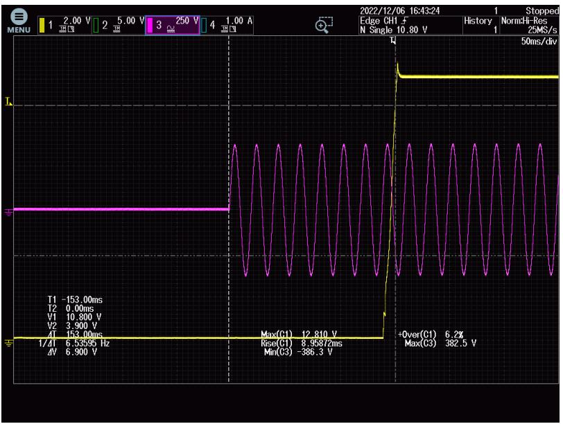

PN8732

265 $\mathsf { v } _ { \mathsf { A C } }$

${ \mathsf { C H 1 } } { \mathsf { V } } _ { \mathsf { O U T } }$  
CH3 VIN\_AC $\mathsf { V } _ { \mathsf { I N \_ A C } }$ tDelay= 153 mS

➢ Full Load

Test Condition:  
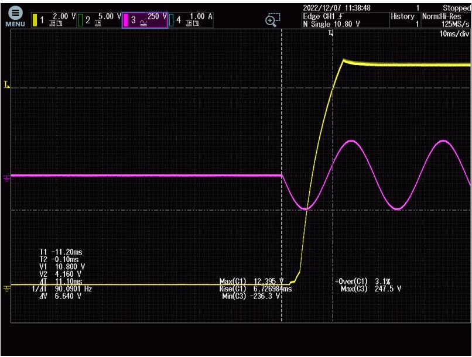

Test Condition:

## BPA8618P

165 VAC

${ \mathsf { C H 1 } } { \mathsf { V } } _ { \mathsf { O U T } }$  
CH3 V $\mathsf { V } _ { \mathsf { I N \_ A C } }$ $\mathfrak { t } _ { \mathsf { D e l a y } } \equiv 1 1 . 1 \mathsf { m s }$

➢ Full Load

BPA8618P

265 $\mathsf { v } _ { \mathsf { A C } }$

CH1 VOUT ${ \mathsf { C H 1 } } { \mathsf { V } } _ { \mathsf { O U T } }$  
$\begin{array} { l } { { \mathsf { C H 3 } } { \mathsf { V } } _ { \mathsf { 1 N \_ A C } } } \\ { { \mathsf { t } } _ { \mathsf { D e l a y } } { = } 9 . 5 ~ \mathsf { m s } } \end{array}$ CH3 VIN\_AC

Test Condition:

➢ Full Load

## MOSFET

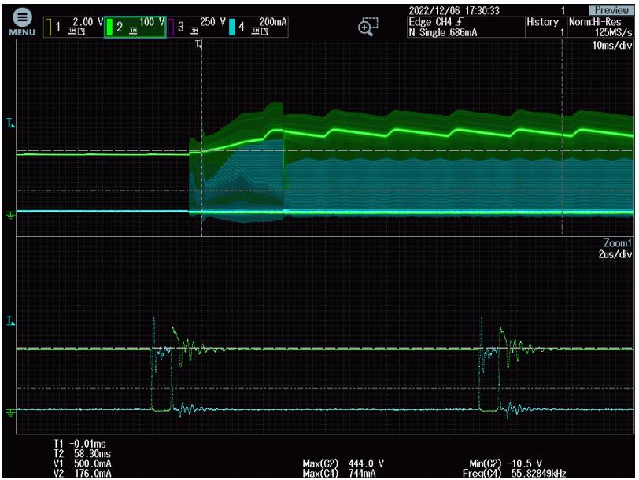

PN8732  
165 VAC

CH2 VDS  
CH4 IDS

$$
\begin{array}{l} \mathrm {V_ {DS\_MAX}} = 4 4 4 \mathrm{V} \\ \mathrm {I_ {DS\_MAX}} = 7 4 4 \mathrm{mA} \end{array}
$$

Test Condition:  
➢ Full Load  
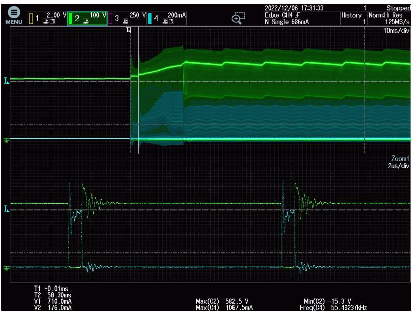

PN8732  
265 VAC

CH2 VDS  
CH4 IDS

$$
V _ {D S \_ M A X} = 5 8 2. 5 \mathrm{V}
$$

$$
I _ {D S \_ M A X} = 1 0 6 7. 5 \mathrm{mA}
$$

Test Condition:  
➢ Full Load  
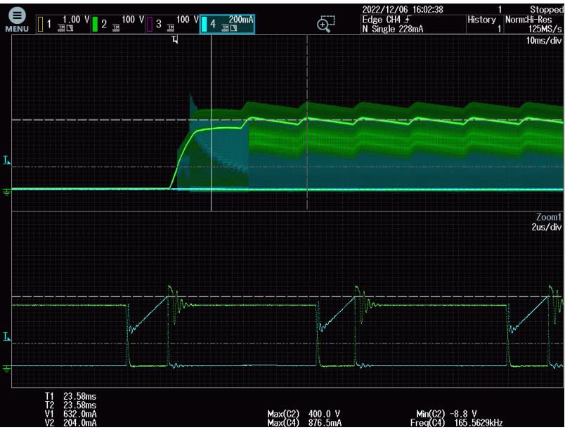

BPA8618P  
165 VAC  
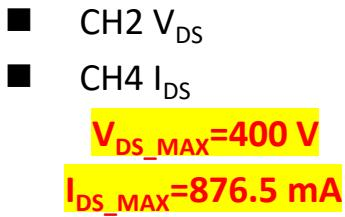

Test Condition:

➢ Full Load  
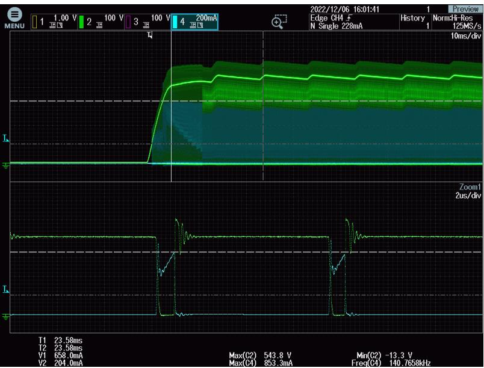

BPA8618P  
265 VAC

CH2 VDS  
CH4 IDS

$$
V _ {D S \_ M A X} = 5 4 3. 8 \mathrm{V}
$$

$$
I _ {D S \_ M A X} = 8 5 3. 3 \mathrm{mA}
$$

Test Condition:

➢ Full Load

## MOSFET

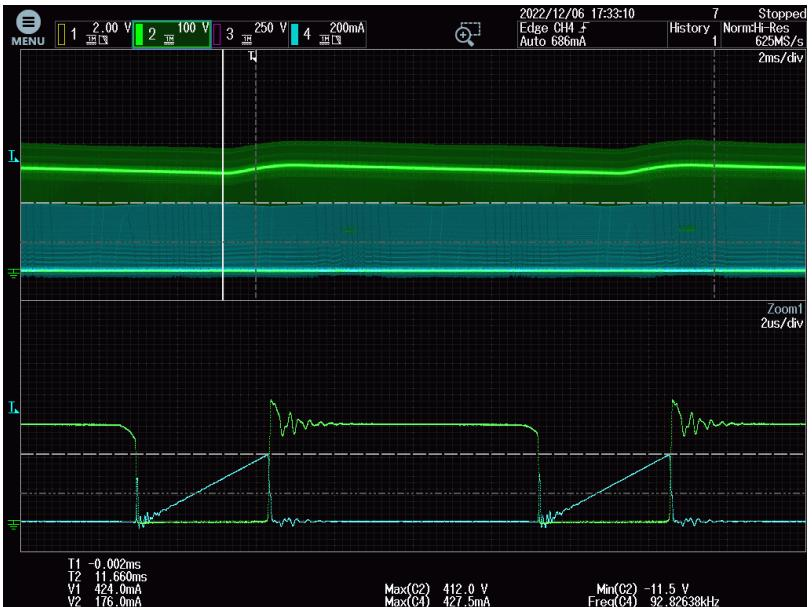

PN8732  
165 VAC  
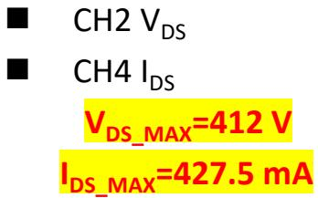

Test Condition:

➢ Full Load  
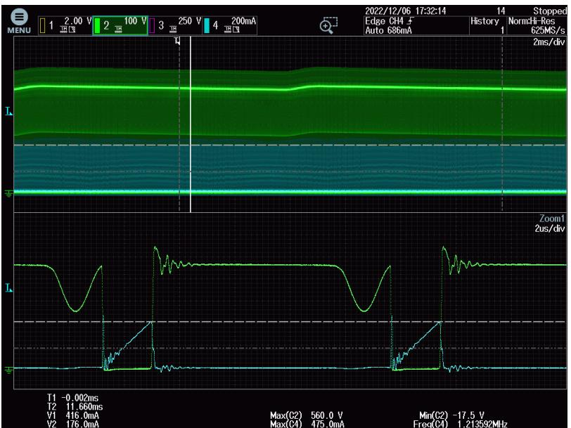

PN8732  
265 VAC  
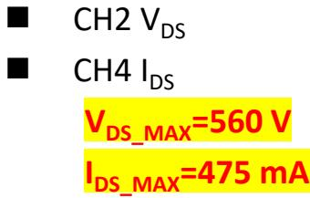

Test Condition:  
➢ Full Load

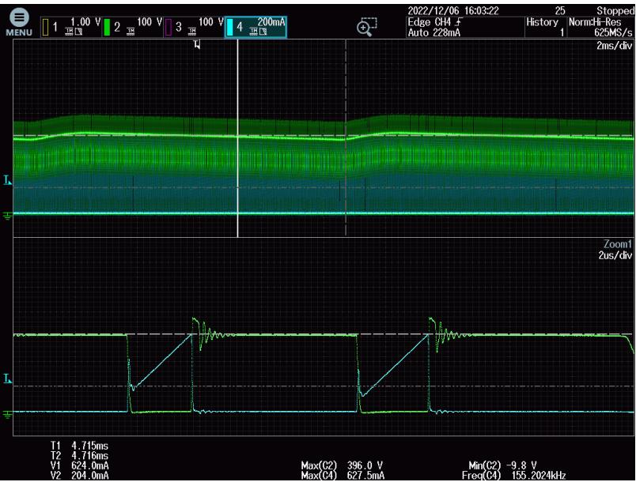

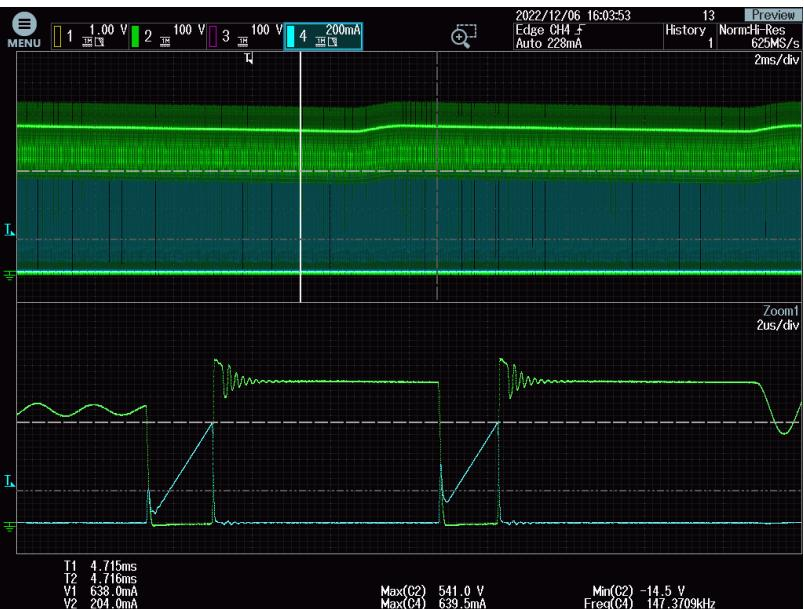

## BPA8618P

## 165 VAC

Test Condition:  
➢ Full Load

## BPA8618P

## 265 VAC

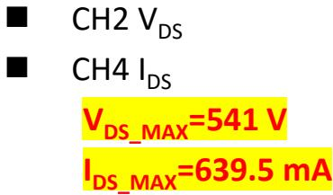

Test Condition:  
➢ Full Load

## 输出二极管开机波形

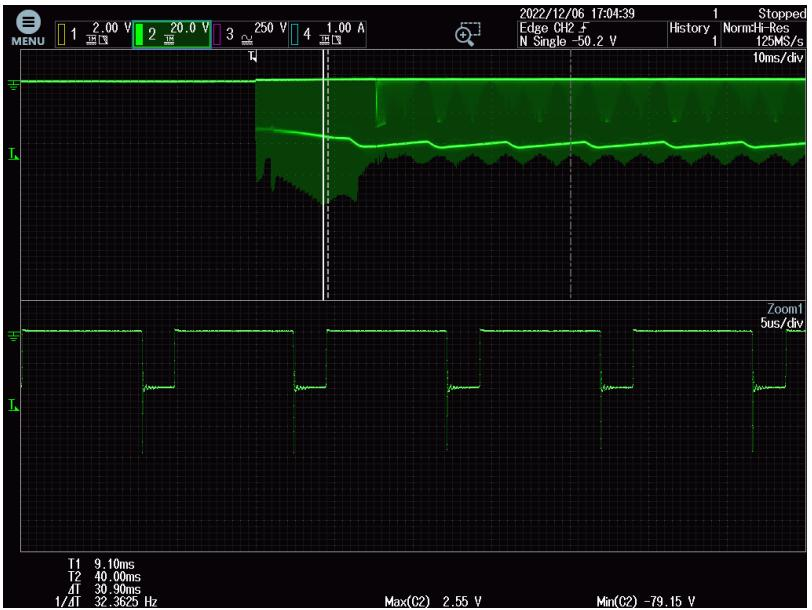

PN8732  
165 VAC  
CH2 VR

  
Test Condition:  
➢ Full Load

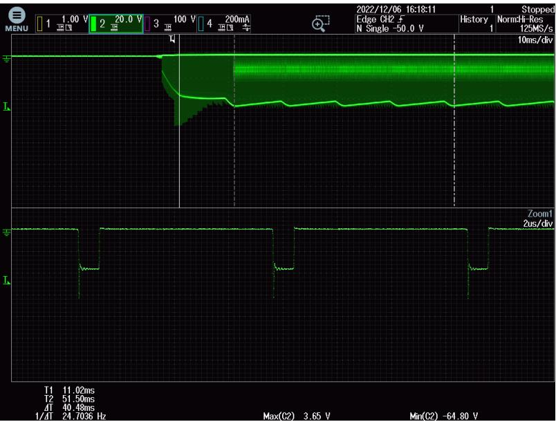

BPA8618P  
165 VAC  
CH2 VR

  
Test Condition:  
➢ Full Load

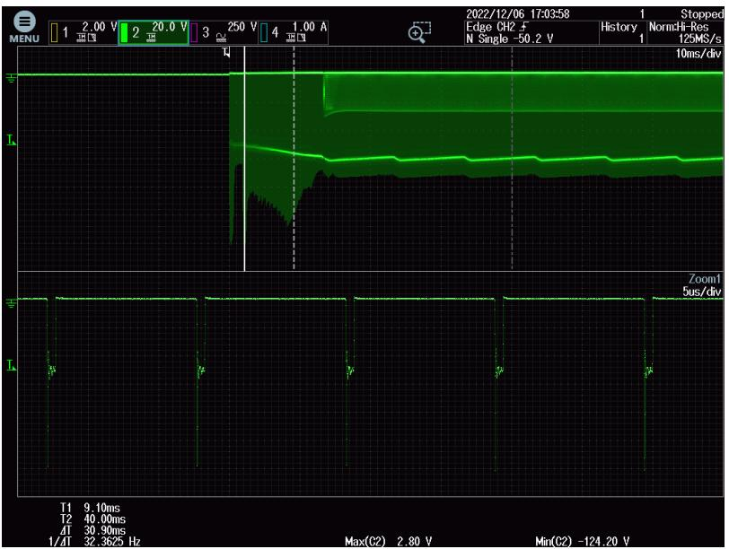

PN8732  
265 VAC  
CH2 VR

  
Test Condition:  
➢ Full Load

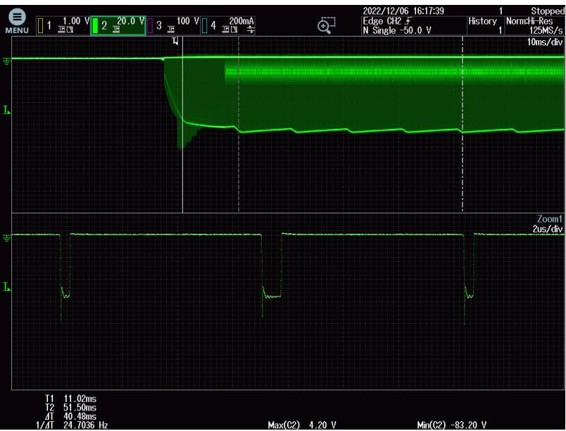

BPA8618P  
265 VAC  
CH2 VR

  
Test Condition:  
➢ Full Load

## 输出二极管正常工作波形

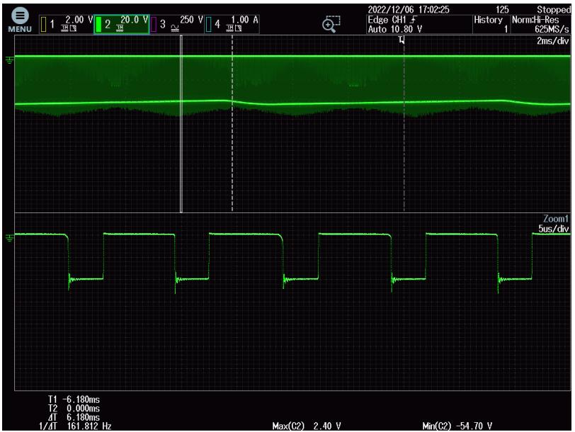

PN8732  
165 VAC  
CH2 VR

  
Test Condition:

➢ Full Load  
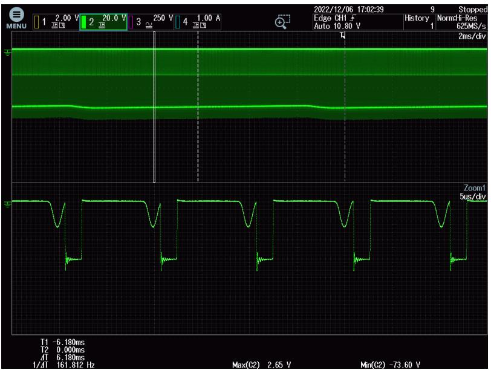

PN8732  
265 VAC  
CH2 VR

  
Test Condition:  
➢ Full Load

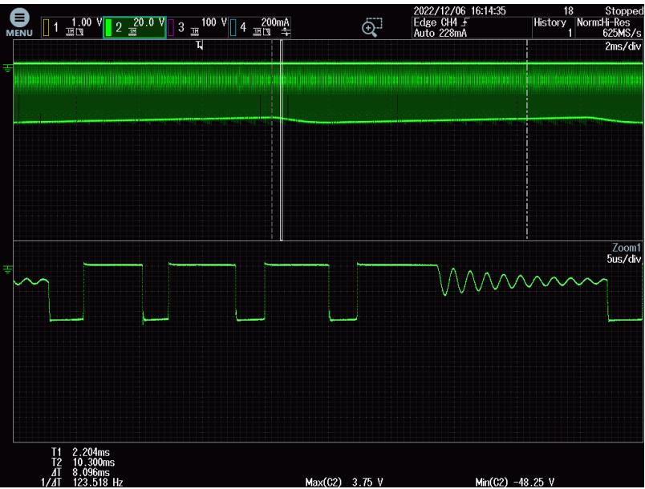

BPA8618P  
165 VAC  
CH2 VR

  
Test Condition:

➢ Full Load  
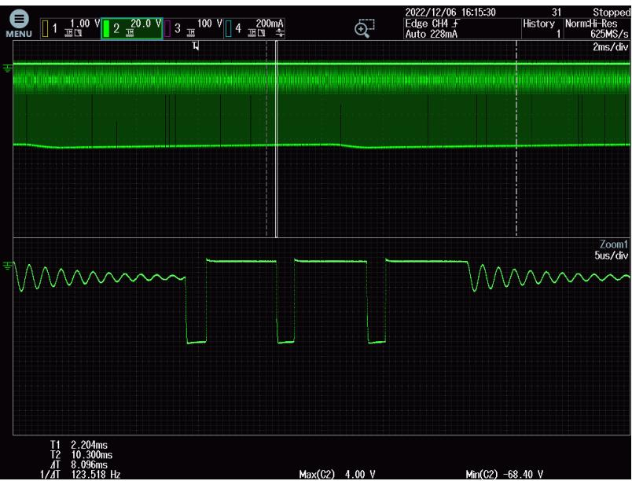

BPA8618P  
265 VAC  
CH2 VR

  
Test Condition:  
➢ Full Load

## (MOSFET )

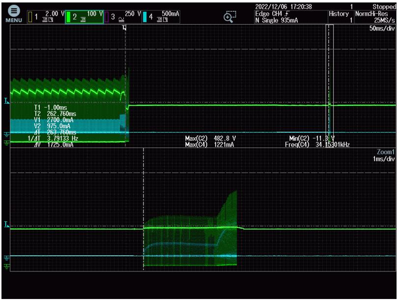

PN8732  
165 VAC  
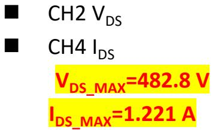

Test Condition:

➢ Output Short  


PN8732

265 VAC  


Test Condition:  
➢ Output Short


## BPA8618P

## 165 VAC


Test Condition:  
➢ Output Short

## BPA8618P

265 VAC  


Test Condition:  
➢ Output Short

## 短路保护 (输出二极管波形)


PN8732  
165 VAC  
CH2 VR

  
Test Condition:  
➢ Output Short


BPA8618P  
165 VAC  
CH2 VR

  
Test Condition:  
➢ Output Short


PN8732  
265 VAC  
CH2 VR

  
Test Condition:  
➢ Output Short


BPA8618P  
265 VAC  
CH2 VR

  
Test Condition:  
➢ Output Short

## Brown-in


PN8732  
165 VAC

CH1 VIN\_DC  
CH2 $\mathsf { V } _ { \mathsf { d } s }$  
CH3 $\mathsf { V } _ { \mathsf { o u t } }$

$$
V _ {I N \_ D C} = 1 0 9 \mathrm{V}
$$

Test Condition:  
➢ No Load  


PN8732  
265 $\mathsf { v } _ { \mathsf { A C } }$

CH1 VIN\_DC $\mathsf { V } _ { \mathsf { I N \_ D C } }$  
CH2 $\mathsf { V } _ { \mathsf { d } s }$  
CH3 $\mathsf { V } _ { \mathsf { o u t } }$

$$
V _ {I N \_ D C} = 1 3 4. 5 \mathrm{V}
$$

Test Condition:  
➢ Half Load  


BPA8618P  
Brown In

CH1 VIN\_DC $\mathsf { V } _ { \mathsf { I N \_ D C } }$  
CH2 $\mathsf { V } _ { \mathrm { d } s }$  
CH3 $\mathsf { V } _ { \mathsf { o u t } }$

$$
V _ {I N \_ D C} = 9 3 V
$$

Test Condition:  
➢ No Load  


BPA8618P  
Brown In

CH1 VIN\_DC  
CH2 $\mathsf { V } _ { \mathrm { d } s }$  
CH3 Vout $\mathsf { V } _ { \mathsf { o u t } }$

$$
V _ {I N \_ D C} = 8 9. 5 \mathrm{V}
$$

Test Condition:

➢ Half Load

## 输入过压保护及恢复波形


PN8732  
输入过压保护

CH1 VIN\_DC  
CH3 $\mathsf { V } _ { \mathrm { d } s }$

$$
\begin{array}{l} \mathrm {V_ {DS\_max}} = 8 3 2. 5 \mathrm{V} \\ \mathrm {V_ {IN\_DC}} = 6 2 2. 5 \mathrm{V} \end{array}
$$

Test Condition:

➢ Full Load

## 理论计算最大输入整流后OVP电压为548V

实测 $v _ { \scriptscriptstyle { \mathrm { I N } } \scriptscriptstyle \mathrm { D C } } = 6 2 2 1$ 还未保护，此时MOS的 $\pmb { \mathrm { D } } \pmb { \mathrm { S } }$ 电压已为832.5V，已超出800V

## BPA8618P

## 输入过压保护

CH1 VIN\_DC $V _ { \mathsf { I N \_ D C } }$  
CH2 $\mathsf { V } _ { \mathrm { d } s }$  
CH3 ${ \sf V } _ { 0 }$

$$
\begin{array}{l} \mathrm {V_ {DS\_max}} = 7 0 0 \mathrm{V} \\ \mathrm {V_ {IN\_DC}} = 5 2 6 \mathrm{V} \end{array}
$$

## Test Condition:

➢ Full Load


## BPA8618P

## 输入过压恢复

CH1 VIN\_DC $\mathsf { V } _ { \mathsf { I N \_ D C } }$  
CH2 $\mathsf { V } _ { \mathrm { d } s }$  
CH3 ${ \sf V } _ { 0 }$

$$
V _ {I N \_ D C} = 4 6 1 V
$$

## Test Condition:

➢ Full Load

PN8732

<table><tr><td rowspan="2">项目</td><td colspan="2">165VAC</td><td colspan="2">265VAC</td></tr><tr><td>温度(°C)</td><td>温升(°C)</td><td>温度(°C)</td><td>温升(°C)</td></tr><tr><td>环境温度</td><td colspan="2">39</td><td colspan="2">38.2</td></tr><tr><td>PN8732 (IC1A)</td><td>69</td><td>30</td><td>89.9</td><td>51.7</td></tr><tr><td>MBRD5200 (D3)</td><td>74</td><td>35</td><td>76.2</td><td>38</td></tr><tr><td>变压器绕组 (T1)</td><td>72.8</td><td>33.8</td><td>70.1</td><td>31.9</td></tr><tr><td>变压器磁芯 (T1)</td><td>69.8</td><td>30.8</td><td>74.8</td><td>36.6</td></tr><tr><td>输入电解电容(C1)</td><td>50.1</td><td>11.1</td><td>51.8</td><td>13.6</td></tr><tr><td>输出电解电容(C2)</td><td>56.8</td><td>17.8</td><td>57.6</td><td>19.4</td></tr></table>

BPA8618P

<table><tr><td rowspan="2">项目</td><td colspan="2">165VAC</td><td colspan="2">265VAC</td></tr><tr><td>温度(°C)</td><td>温升(°C)</td><td>温度(°C)</td><td>温升(°C)</td></tr><tr><td>环境温度</td><td colspan="2">39.3</td><td colspan="2">38.9</td></tr><tr><td>BPA8618P (IC1A)</td><td>72</td><td>32.7</td><td>72.2</td><td>33.3</td></tr><tr><td>MBRD5200 (D3)</td><td>77.3</td><td>38</td><td>77.1</td><td>38.2</td></tr><tr><td>变压器绕组 (T1)</td><td>72.2</td><td>32.9</td><td>73.7</td><td>34.8</td></tr><tr><td>变压器磁芯 (T1)</td><td>71.7</td><td>32.4</td><td>74.2</td><td>35.3</td></tr><tr><td>输入电解电容(C1)</td><td>54.7</td><td>15.4</td><td>53.5</td><td>14.6</td></tr><tr><td>输出电解电容(C2)</td><td>59.2</td><td>19.9</td><td>58.7</td><td>19.8</td></tr></table>

## EMI-12Ω


230VAC Line PN8732  


230VAC Neutral PN8732


230VAC Line BPA8618P  


230VAC Neutral BPA8618P

PN8732

<table><tr><td>差模</td><td>电压</td><td>相位角</td><td>发生器阻抗</td><td>测试次数</td><td>测试结果</td></tr><tr><td>L to N</td><td>+2kV</td><td>0</td><td>2</td><td>10</td><td>Pass</td></tr><tr><td>L to N</td><td>-2kV</td><td>0</td><td>2</td><td>10</td><td>Pass</td></tr><tr><td>L to N</td><td>+2kV</td><td>90</td><td>2</td><td>10</td><td>Pass</td></tr><tr><td>L to N</td><td>-2kV</td><td>90</td><td>2</td><td>10</td><td>Pass</td></tr><tr><td>L to N</td><td>+2kV</td><td>180</td><td>2</td><td>10</td><td>Pass</td></tr><tr><td>L to N</td><td>-2kV</td><td>180</td><td>2</td><td>10</td><td>Pass</td></tr><tr><td>L to N</td><td>+2kV</td><td>270</td><td>2</td><td>10</td><td>Pass</td></tr><tr><td>L to N</td><td>-2kV</td><td>270</td><td>2</td><td>10</td><td>Pass</td></tr></table>

## 测试说明

➢ 按照GB/T17626.5和IEC61000-4-5的最新版本要求进行测试  
➢ 室温环境，230VAC输入，满载条件

BPA8618P

<table><tr><td>差模</td><td>电压</td><td>相位角</td><td>发生器阻抗</td><td>测试次数</td><td>测试结果</td></tr><tr><td>L to N</td><td>+2kV</td><td>0</td><td>2</td><td>10</td><td>Pass</td></tr><tr><td>L to N</td><td>-2kV</td><td>0</td><td>2</td><td>10</td><td>Pass</td></tr><tr><td>L to N</td><td>+2kV</td><td>90</td><td>2</td><td>10</td><td>Pass</td></tr><tr><td>L to N</td><td>-2kV</td><td>90</td><td>2</td><td>10</td><td>Pass</td></tr><tr><td>L to N</td><td>+2kV</td><td>180</td><td>2</td><td>10</td><td>Pass</td></tr><tr><td>L to N</td><td>-2kV</td><td>180</td><td>2</td><td>10</td><td>Pass</td></tr><tr><td>L to N</td><td>+2kV</td><td>270</td><td>2</td><td>10</td><td>Pass</td></tr><tr><td>L to N</td><td>-2kV</td><td>270</td><td>2</td><td>10</td><td>Pass</td></tr></table>

## 测试说明

➢ 按照GB/T17626.5和IEC61000-4-5的最新版本要求进行测试  
➢ 室温环境，230VAC输入，满载条件

PN8732

<table><tr><td>差模</td><td>电压</td><td>脉冲群持续时间</td><td>脉冲频率</td><td>测试时间</td><td>测试结果</td></tr><tr><td>L to N</td><td>+2kV</td><td>15ms</td><td>5kHz</td><td>120s</td><td>Pass</td></tr><tr><td>L to N</td><td>-2kV</td><td>15ms</td><td>5kHz</td><td>120s</td><td>Pass</td></tr><tr><td>L to N</td><td>+2kV</td><td>0.75ms</td><td>100kHz</td><td>120s</td><td>Pass</td></tr><tr><td>L to N</td><td>-2kV</td><td>0.75ms</td><td>100kHz</td><td>120s</td><td>Pass</td></tr><tr><td>L to N</td><td>+2kV</td><td>2ms</td><td>38kHz</td><td>120s</td><td>Pass</td></tr><tr><td>L to N</td><td>-2kV</td><td>2ms</td><td>38kHz</td><td>120s</td><td>Pass</td></tr><tr><td>L to N</td><td>+2kV</td><td>2ms</td><td>38kHz</td><td>120s</td><td>Pass</td></tr><tr><td>L to N</td><td>-2kV</td><td>2ms</td><td>38kHz</td><td>120s</td><td>Pass</td></tr></table>

## 测试说明

➢ 按照GB/T17626.4和IEC61000-4-4的最新版本要求进行测试  
➢ 室温环境，230VAC输入满载条件  
➢ 脉冲群周期为300ms  
➢ 试验时样机输出正常（符合A类标准）视为Pass

BPA8618P

<table><tr><td>差模</td><td>电压</td><td>脉冲群持续时间</td><td>脉冲频率</td><td>测试时间</td><td>测试结果</td></tr><tr><td>L to N</td><td>+2kV</td><td>15ms</td><td>5kHz</td><td>120s</td><td>Pass</td></tr><tr><td>L to N</td><td>-2kV</td><td>15ms</td><td>5kHz</td><td>120s</td><td>Pass</td></tr><tr><td>L to N</td><td>+2kV</td><td>0.75ms</td><td>100kHz</td><td>120s</td><td>Pass</td></tr><tr><td>L to N</td><td>-2kV</td><td>0.75ms</td><td>100kHz</td><td>120s</td><td>Pass</td></tr><tr><td>L to N</td><td>+2kV</td><td>2ms</td><td>38kHz</td><td>120s</td><td>Pass</td></tr><tr><td>L to N</td><td>-2kV</td><td>2ms</td><td>38kHz</td><td>120s</td><td>Pass</td></tr><tr><td>L to N</td><td>+2kV</td><td>2ms</td><td>38kHz</td><td>120s</td><td>Pass</td></tr><tr><td>L to N</td><td>-2kV</td><td>2ms</td><td>38kHz</td><td>120s</td><td>Pass</td></tr></table>

## 测试说明

➢ 按照GB/T17626.4和IEC61000-4-4的最新版本要求进行测试  
➢ 室温环境，230VAC输入满载条件  
➢ 脉冲群周期为300ms  
➢ 试验时样机输出正常（符合A类标准）视为Pass

## 空载功耗和效率

BPA8618P PN8732  
➢ BPA8618P PN8732 PN8732

## ❑ MOs和二极管电压电流应力

BPA8618P MOS PN8732

## ❑ 启动波形

➢ BPA8618P 165VAC  
➢ PN8732在满载和空载启动时输出均有较大过冲

## ❑ 温升

165VAC BPA8618P PN8732 2.7  
265VAC BPA8618P PN8732 18.4

## ❑ EMI

BPA8618P EMI PN8732

## THANK YOU FOR WATCHING
