## BPA8618P&TNY278P对比测试

## (12V/0.6A 5V0.3A @85\~265Vac)

上海晶丰明源半导体股份有限公司

Shanghai Bright Power Semiconductor Co., Ltd.

文长川

时间：06/09/2021

## 内容

参考电路  
特性参数对比  
电路及实物图  
性能测试对比  
结论和建议

BPA8618P  
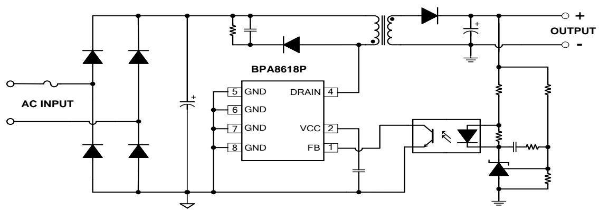

低待机功耗，<50mW@230VAC辅助供电， <150mW@230VAC自供电  
优异的动态响应速度，无输出过冲  
输入过欠保护无需电阻检测  
输出过压保护为自动重启

TNY278P  
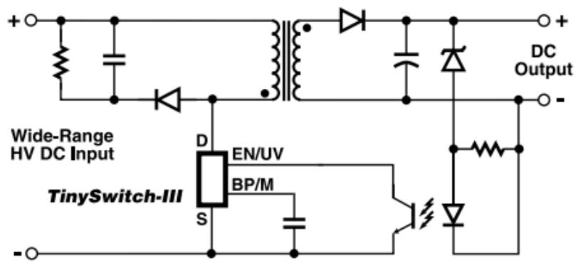

◼ 低待机功耗，<50mW@230VAC辅助供电， <150mW@230VAC自供电  
优异的动态响应速度，无输出过冲  
无输入过压保护，需电阻检测  
输出过压保大于4.7mA,30ms锁死

## 电气参数对比

<table><tr><td></td><td>BPA8618P</td><td>TNY278P</td></tr><tr><td>开关频率</td><td>132KHz</td><td>132KHz</td></tr><tr><td>Mosfet BV</td><td>700V</td><td>700V</td></tr><tr><td> $R_{DS\_ON}$ </td><td>4.7Ω</td><td>5.2Ω</td></tr><tr><td>限流点</td><td>550mA</td><td>550mA</td></tr><tr><td>软启动</td><td>有</td><td>无</td></tr><tr><td>输入过压保护</td><td>有</td><td>无</td></tr><tr><td>输入欠压保护</td><td>内置</td><td>外加</td></tr><tr><td>输出过压保护</td><td>自动重启</td><td>锁死</td></tr><tr><td>过载保护</td><td>有</td><td>有</td></tr><tr><td>封装</td><td>DIP7, SOP7</td><td>DIP7, SMD8C</td></tr></table>

## BPA8618P

◼ 采用简单的脉冲数控制无需外部环路补偿电路，具有较高的环路带宽和快速的动态响应  
◼ 高集成度和优化的控制技术极大地减少了外围器件数量，节省了系统成本和体积，同时提高了可靠性

## TNY278P

◼ 采用简单的脉冲数控制无需外部环路补偿电路，具有较高的环路带宽和快速的动态响应  
◼ 高集成度和优化的控制技术极大地减少了外围器件数量，节省了系统成本和体积，同时提高了可靠性

## 元件面

## 贴片面

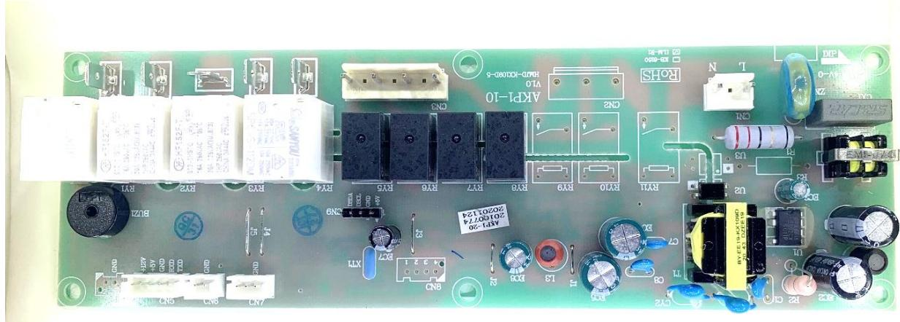

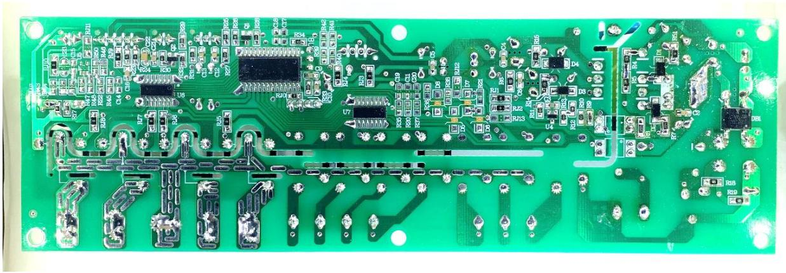

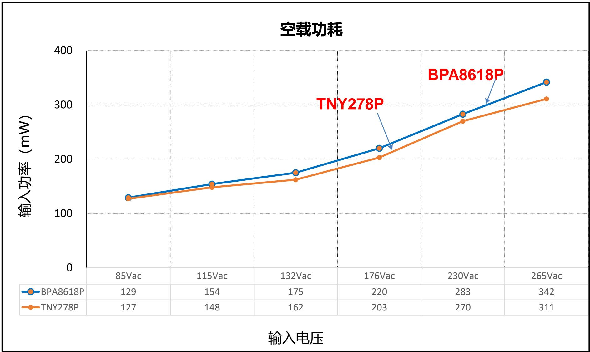

备注：TNY278P在V pin脚上拉一串电阻做过欠压，阻值4M；BPA8618P内部集成过欠压功能，无需外部电阻

效率测试  
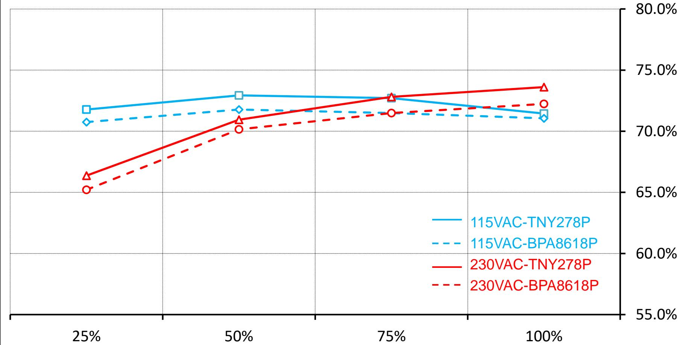

负载

BPA8618P

<table><tr><td>输入电压AC (V)</td><td>输出电流1(A)</td><td>输出电压1(V)</td><td>输出电流2(A)</td><td>输出电压2(V)</td></tr><tr><td rowspan="2">115</td><td>0</td><td>5.01</td><td>0</td><td>12.61</td></tr><tr><td>0.3</td><td>4.99</td><td>0.6</td><td>11.82</td></tr><tr><td rowspan="2">230</td><td>0</td><td>5.01</td><td>0</td><td>12.67</td></tr><tr><td>0.3</td><td>5</td><td>0.6</td><td>11.93</td></tr></table>

计算方法：  
测试条件：所有负载空载和满载

TNY278P

<table><tr><td>输入电压AC (V)</td><td>输出电流1(A)</td><td>输出电压1(V)</td><td>输出电流2(A)</td><td>输出电压2(V)</td></tr><tr><td rowspan="2">115</td><td>0</td><td>5.01</td><td>0</td><td>12.66</td></tr><tr><td>0.3</td><td>4.99</td><td>0.6</td><td>11.97</td></tr><tr><td rowspan="2">230</td><td>0</td><td>5.01</td><td>0</td><td>12.7</td></tr><tr><td>0.3</td><td>4.99</td><td>0.6</td><td>11.96</td></tr></table>

计算方法：  
测试条件：所有负载空载和满载

## 输出电压纹波

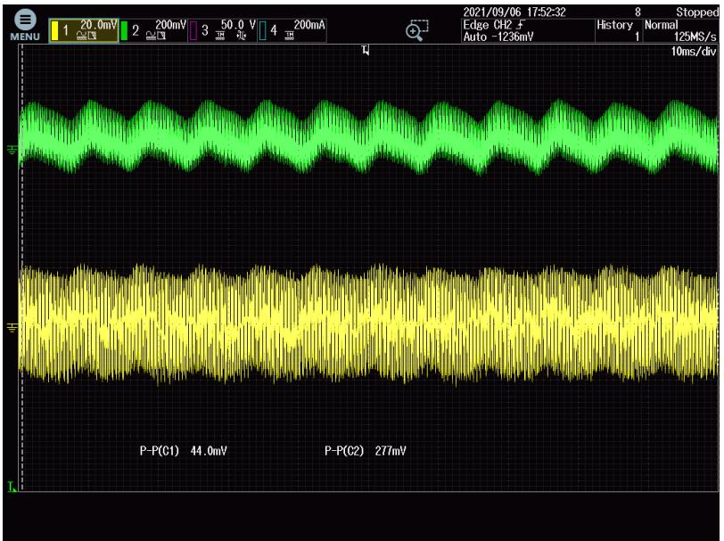

## BPA8618P

85 VAC

CH1 $\mathsf { V } _ { \mathsf { O U T - S V } }$ Ripple $V _ { p | x - P K } = 4 4 m v$  
CH2 $\mathsf { V } _ { \mathsf { O U T } - 1 2 \mathsf { V } }$ Ripple $\mathsf { V } _ { \mathsf { P K - P K } } { = } 2 7 7 \mathsf { m V }$

## Test Condition:

➢ Full Load

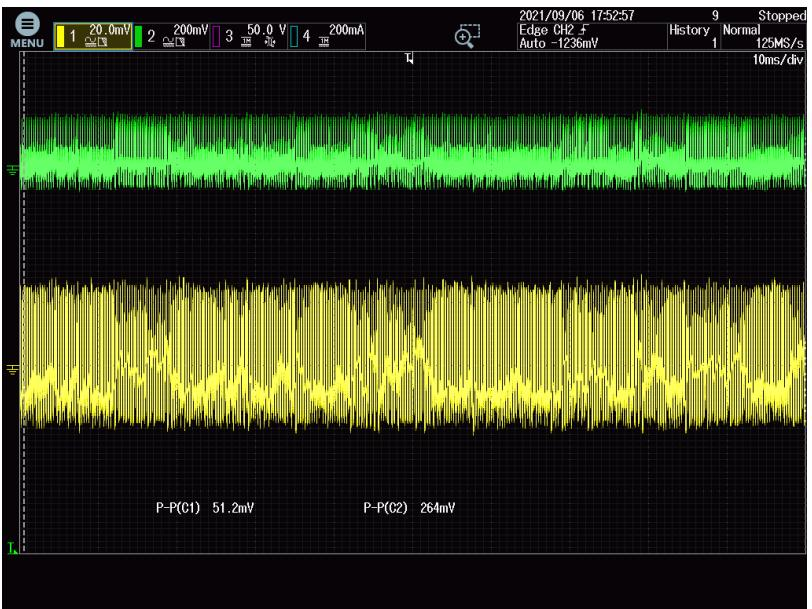

## BPA8618P

265 $\mathsf { v } _ { \mathsf { A C } }$

CH1 $\mathsf { V } _ { \mathsf { O U T - S V } }$ Ripple $\mathtt { V } _ { \mathtt { P K - P K } } { = } 5 1 \mathsf { m V }$  
CH2 $\mathsf { V } _ { \mathsf { O U T } - 1 2 \mathsf { V } }$ Ripple $V _ { p | k - P K } = 2 6 4 \Omega$

## Test Condition:

➢ Full Load

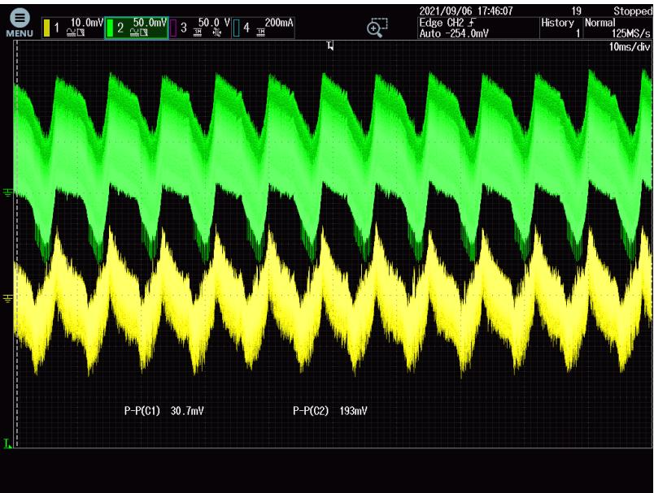

## TNY278P

85 VAC

CH1 $\mathsf { V } _ { \mathsf { O U T - 5 V } }$ Ripple $V _ { \mathsf { P K - P K } } { = } 3 0 . 7 \mathsf { m V }$  
CH2 $\mathsf { V } _ { \mathsf { O U T - 1 } 2 \mathsf { V } }$ Ripple $\mathsf { V } _ { \mathsf { P K - P K } } { = } \pmb { 1 9 3 } \mathsf { m V }$

## Test Condition:

➢ Full Load

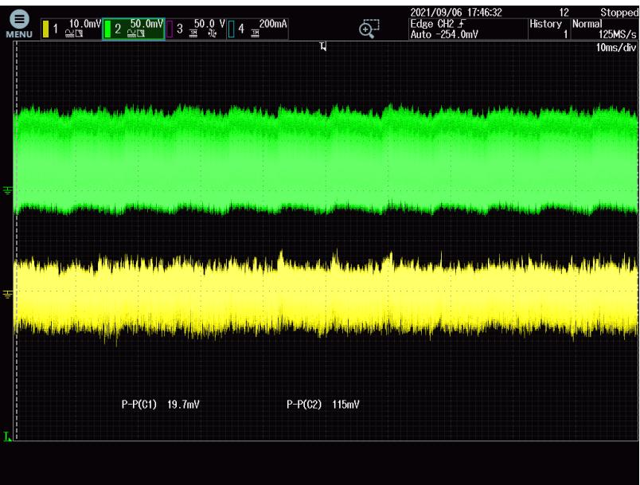

## TNY278P

265 $\mathsf { v } _ { \mathsf { A C } }$

CH1 $\mathsf { V } _ { \mathsf { O U T - S V } }$ Ripple $V _ { \mathsf { P K - P K } } { = } 1 9 . 7 \mathsf { m V }$  
CH2 $\mathsf { V } _ { \mathsf { O U T - 1 } 2 \mathsf { V } }$ Ripple $\mathsf { V } _ { \mathsf { P K - P K } } { = } \pmb { 1 } \pmb { 1 } 5 \mathsf { m V }$

## Test Condition:

➢ Full Load

## 动态负载(50%-100%)

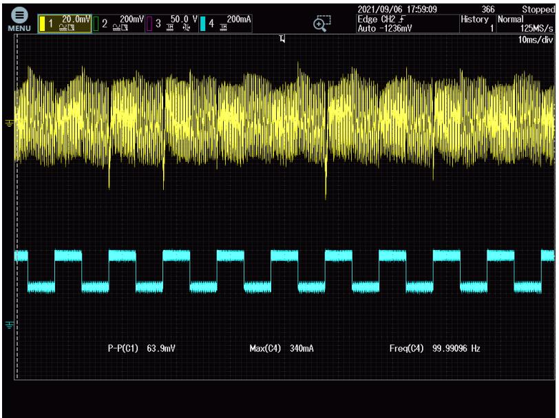

## BPA8618P

85 VAC

CH1 VOUT-5v $\mathsf { V } _ { \mathsf { O U T - 5 v } }$ $V _ { \mathsf { P K - P K } } { = } 6 3 . 9 \mathsf { m V }$  
CH4 ${ \mathsf I } _ { 0 \mathsf U \top }$

## Test Condition:

➢ 0.15 A-0.3 A-0.15 A  
➢ Slew Rate: 0.5 A/μS  
➢ Frequency: 100 Hz

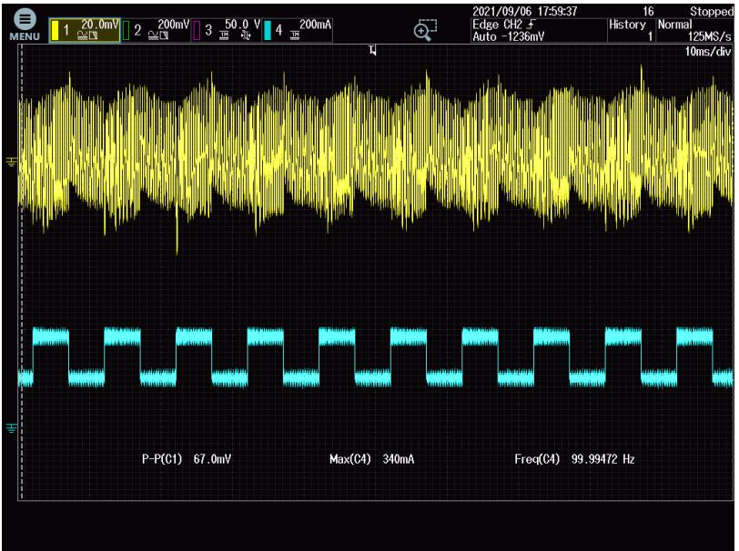

## BPA8618P

265 VAC

CH1 VOUT-5v $\mathsf { V } _ { \mathsf { O U T - 5 v } }$ $\mathsf { V } _ { \mathsf { P K - P K } } { = } 6 7 \mathsf { m V }$  
CH4 IOUT

## Test Condition:

➢ 0.15 A-0.3 A-0.15 A  
➢ Slew Rate: 0.5 A/μS  
➢ Frequency: 100 Hz

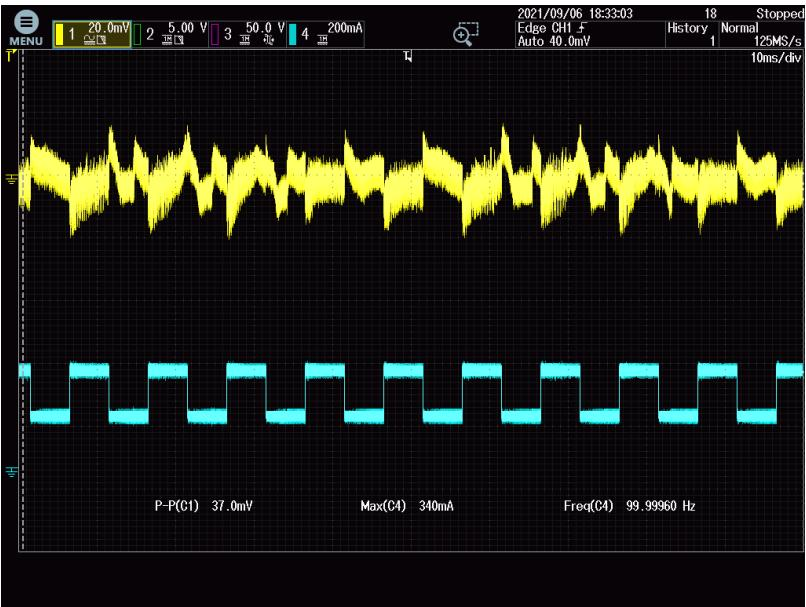

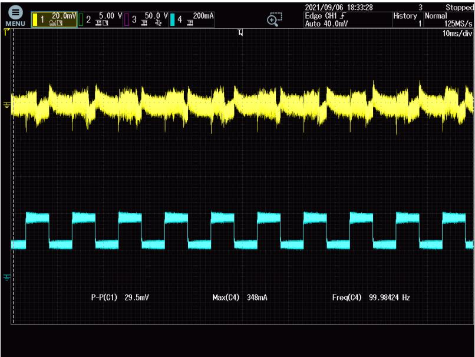

## TNY278P

85 VAC

CH1 VOUT-5v $\mathsf { V } _ { \mathsf { O U T - 5 v } }$ $v _ { p _ { k - P K } } = 3 7 ~ \mathsf { m V }$  
$\mathsf { C H 4 } \mathsf { I } _ { \mathsf { O U T } }$

## Test Condition:

➢ 0.15 A-0.3 A-0.15 A  
➢ Slew Rate: 0.5 A/μS  
➢ Frequency: 100 Hz

## TNY278P

265 VAC

CH1 VOUT $\mathbf { V } _ { \mathsf { P K - P K } } { = } 2 9 \mathsf { m V }$  
CH4 IOUT-5v $\mathsf { C H } 4 \mathsf { I } _ { 0 \mathsf { U T } - 5 \mathsf { v } }$

## Test Condition:

➢ 0.15 A-0.3 A-0.15 A  
➢ Slew Rate: 0.5 A/μS  
➢ Frequency: 100 Hz

## 动态负载(10%-90%)

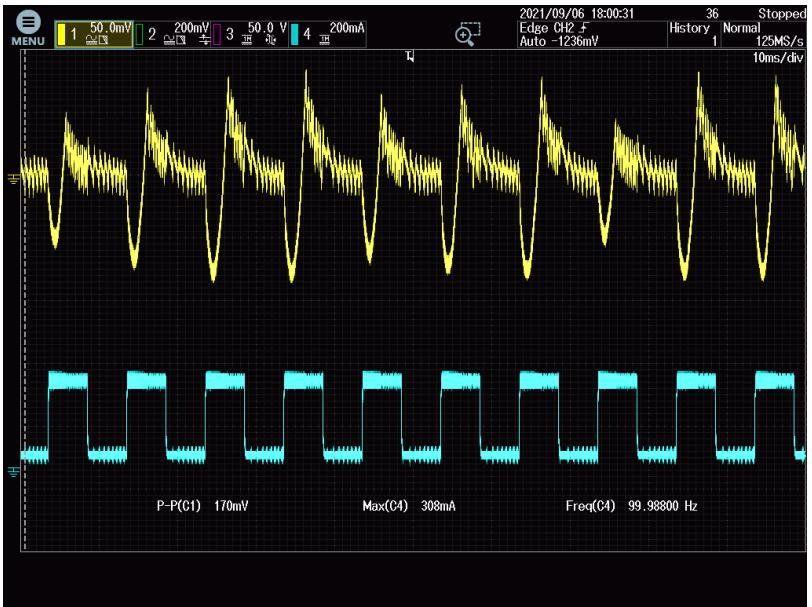

## BPA8618P

85 VAC

CH1 VOUT-5v $\mathsf { V } _ { \mathsf { O U T - 5 v } }$ $v _ { p _ { \mathrm { K - P K } } } { = } 1 7 0 \ m v$  
CH4 IOUT

## Test Condition:

➢ 0.03A-0.27A-0.03 A  
➢ Slew Rate: 0.5 A/μS  
➢ Frequency: 100 Hz

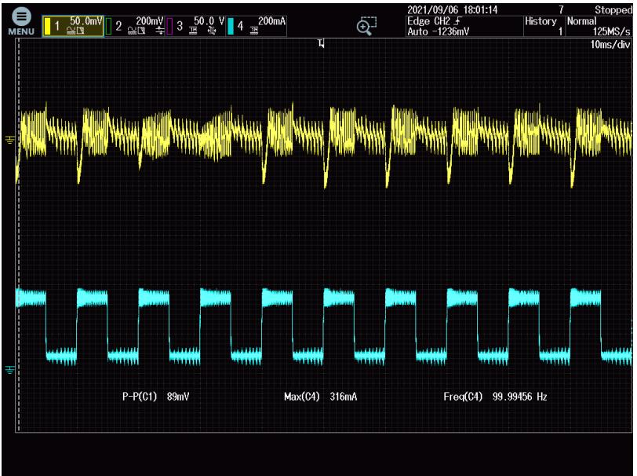

## BPA8618P

265 VAC

CH1 VOUT-5v VPK-PK=89mV

CH4 IOUT

## Test Condition:

➢ 0.03A-0.27A-0.03 A  
➢ Slew Rate: 0.5 A/μS  
➢ Frequency: 100 Hz

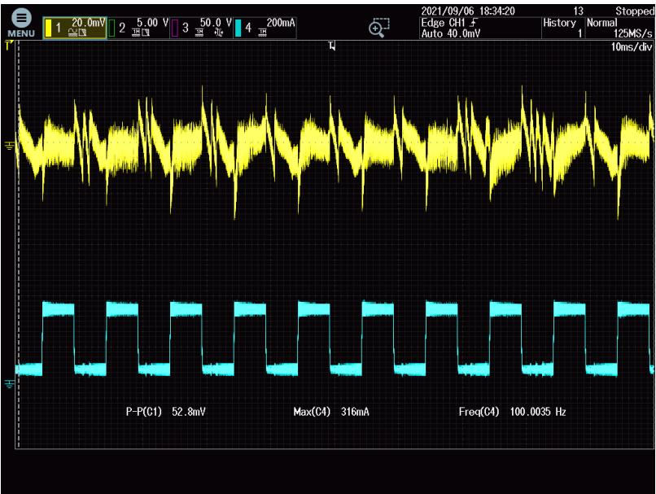

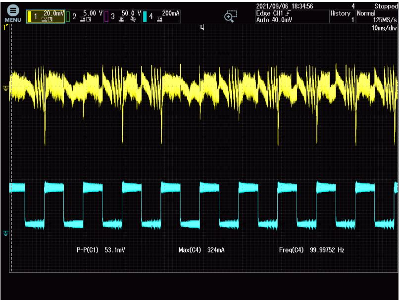

## TNY278P

85 VAC

CH1 VOUT-5v $\mathsf { V } _ { \mathsf { O U T - 5 v } }$ $\mathbf { V } _ { \mathsf { P K - P K } } { = } 5 2 \mathsf { m V }$  
CH4 IOUT

## Test Condition:

➢ 0.03A-0.27A-0.03 A  
➢ Slew Rate: 0.5 A/μS  
➢ Frequency: 100 Hz

## TNY278P

265 VAC

CH1 VOUT-5v V =53 mV  
CH4 IOUT

## Test Condition:

➢ 0.03A-0.27A-0.03 A  
➢ Slew Rate: 0.5 A/μS  
➢ Frequency: 100 Hz

## 输出电压开机波形

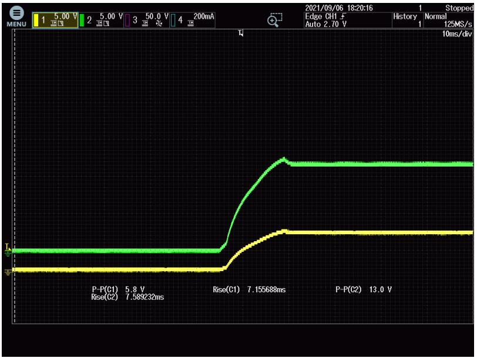

## BPA8618P

85 VAC

CH1 VOUT-5v  
CH2 VOUT-12v

$$
\mathbf {t} _ {\text { r   i   s   e }} = 7. 1 5 \mathrm{mS}
$$

$$
t _ {\text { r   i   s   e }} = 7. 5 9 \mathrm{mS}
$$

## Test Condition:

➢ Full Load

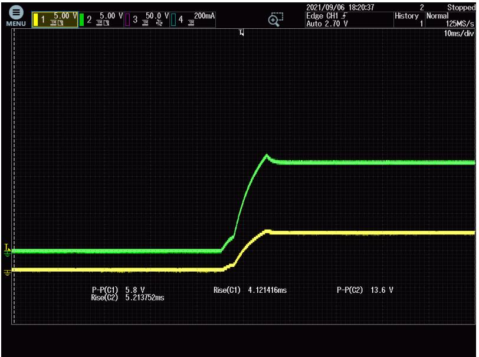

## BPA8618P

265 VAC

CH1 VOUT-5v  
CH2 VOUT-12v

$$
\mathbf {t} _ {\text { r   i   s   e }} = 4. 1 2 \mathrm{mS}
$$

$$
t _ {\text { r   i   s   e }} = 5. 2 1 \mathrm{mS}
$$

## Test Condition:

➢ Full Load

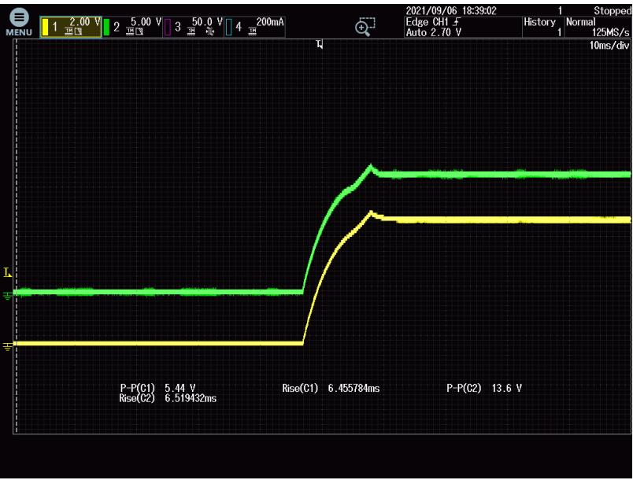

## TNY278P

85 VAC

$\begin{array} { l l } { { \mathsf { C H 1 V } _ { 0 \cup \mathsf { T } - 5 \mathsf { v } } } } \\ { { \mathsf { t } _ { \mathsf { r i s e } } } { = } 6 . 4 5 \mathsf { m s } } \end{array}$ CH1 VOUT-5v

$\begin{array} { r l } { \mathbf { \eta } } & { { } \mathsf { C H 2 V } _ { 0 \sqcup \mathsf { T } - 1 2 v } } \\ { \mathbf { \eta } } & { { } \mathbf { t } _ { \mathsf { r i s e } } = 6 . 5 1 \mathsf { m s } } \end{array}$ CH2 VOUT-12v

## Test Condition:

➢ Full Load

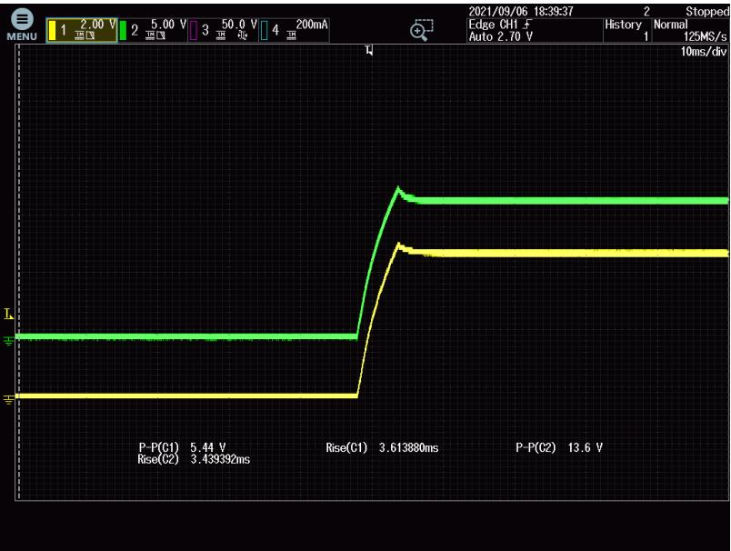

## TNY278P

265 VAC

$\begin{array} { l l } { \mathsf { C H 1 V _ { 0 \cup T - 5 v } } } \\ { \mathsf { t } _ { \mathsf { r i s e } } = 3 . 6 1 \mathsf { m s } } \end{array}$ CH1 VOUT-5v  
CH2 VOUT-12v trise= 3.43mS

## Test Condition:

➢ Full Load

## MOSFET开机波形

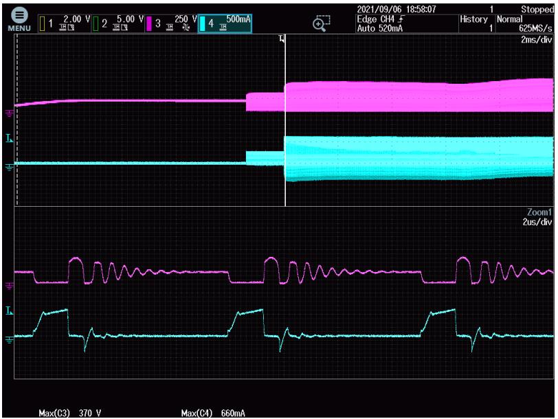

## BPA8618P

85 VAC

CH3 VDS  
CH4 IDS

$$
\begin{array}{l} \mathrm {V_ {DS\_MAX}} = 3 7 0 \mathrm{V} \\ \mathrm {I_ {DS\_MAX}} = 0. 6 6 \mathrm{A} \end{array}
$$

## Test Condition:

➢ Full Load

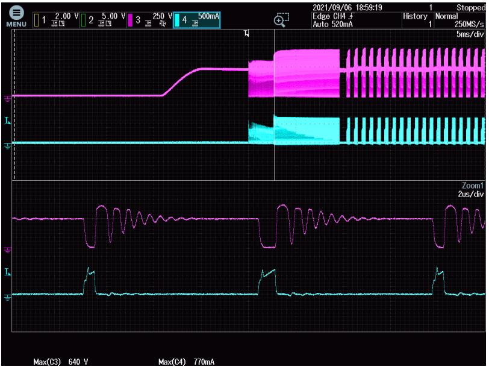

## BPA8618P

265 VAC

CH3 VDS  
CH4 IDS

$$
V _ {D S \_ M A X} = 6 4 0 V
$$

$$
I _ {D S \_ M A X} = 0. 7 7 \mathrm{A}
$$

## Test Condition:

➢ Full Load

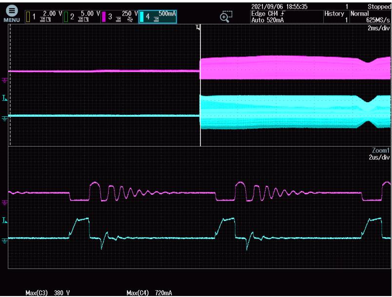

## TNY278P

85 VAC

CH3 VDS  
CH4 IDS

$$
\begin{array}{l} \mathrm {V_ {DS\_MAX}} = 3 8 0 \mathrm{V} \\ \mathrm {I_ {DS\_MAX}} = 0. 7 2 \mathrm{A} \end{array}
$$

## Test Condition:

➢ Full Load

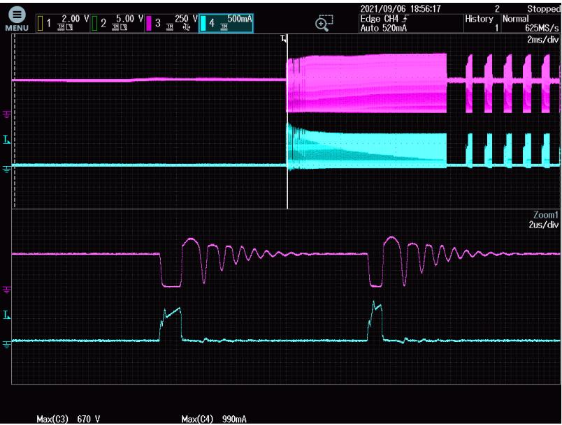

## TNY278P

265 VAC

CH3 VDS  
CH4 IDS

$$
V _ {D S \_ M A X} = 6 7 0 V
$$

$$
I _ {D S \_ M A X} = 0. 9 9 A
$$

## Test Condition:

➢ Full Load

## MOSFET稳态波形

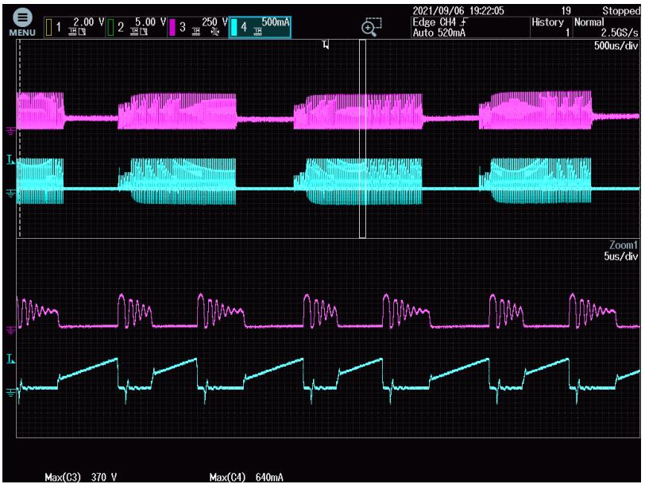

## BPA8618P

85 VAC

CH3 VDS  
CH4 IDS

$$
\begin{array}{l} \mathrm {V_ {DS\_MAX}} = 3 7 0 \mathrm{V} \\ \mathrm {I_ {DS\_MAX}} = 0. 6 4 \mathrm{A} \end{array}
$$

## Test Condition:

➢ Full Load

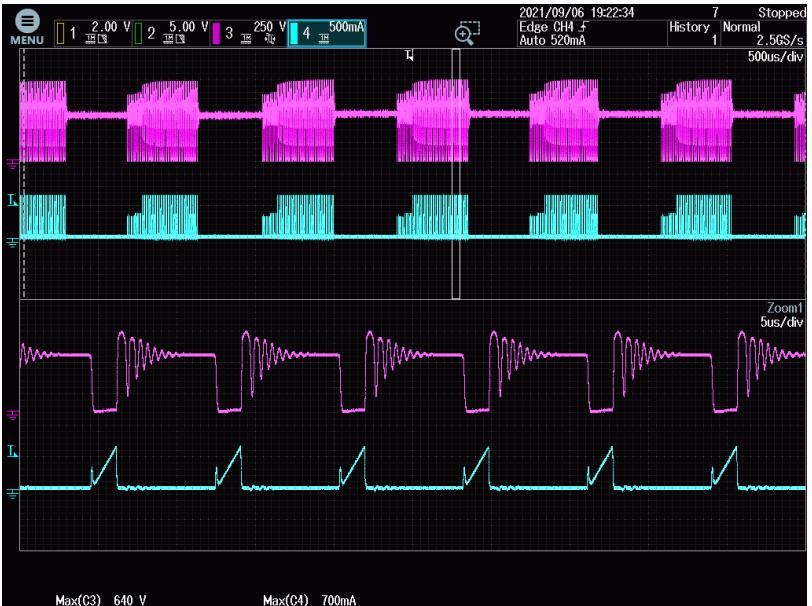

## BPA8618P

265 VAC

CH3 VDS  
CH4 IDS

$$
V _ {D S \_ M A X} = 6 4 0 V
$$

I =0.7 A

## Test Condition:

➢ Full Load

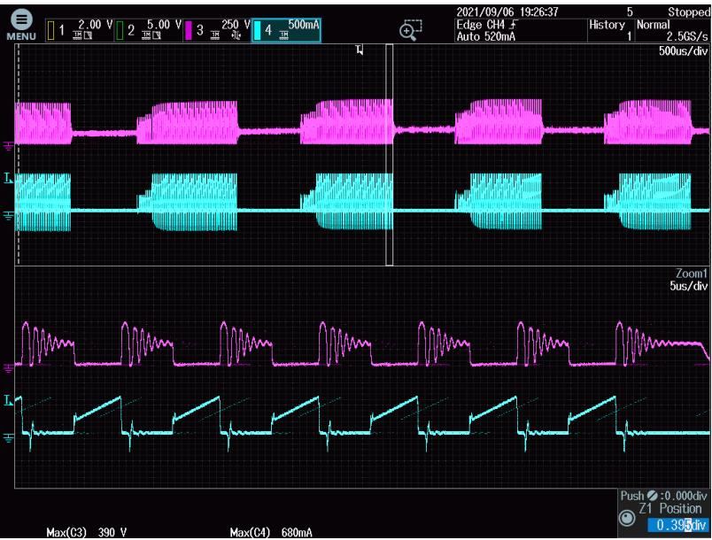

## TNY278P

85 VAC

CH3 VDS  
CH4 IDS

$$
\begin{array}{l} \mathrm {V_ {DS\_MAX}} = 3 9 0 \mathrm{V} \\ \mathrm {I_ {DS\_MAX}} = 0. 6 8 \mathrm{A} \end{array}
$$

## Test Condition:

➢ Full Load

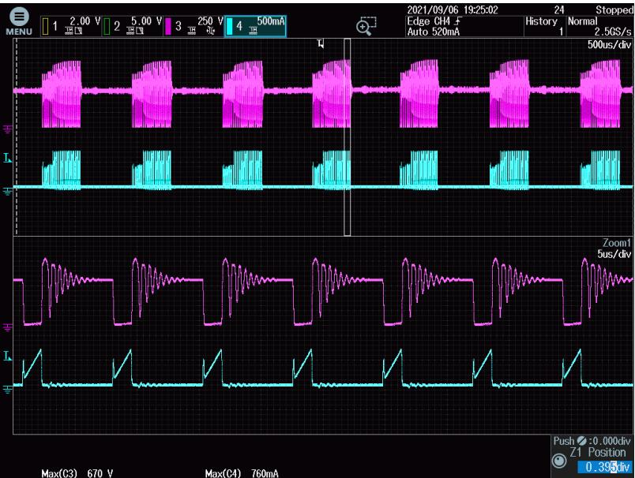

## TNY278P

265 VAC

CH3 VDS  
CH4 IDS

$$
V _ {D S \_ M A X} = 6 7 0 V
$$

$$
I _ {D S \_ M A X} = 0. 7 6 A
$$

## Test Condition:

➢ Full Load

## 输入过压保护（MOSFET波形）

BPA8618P  
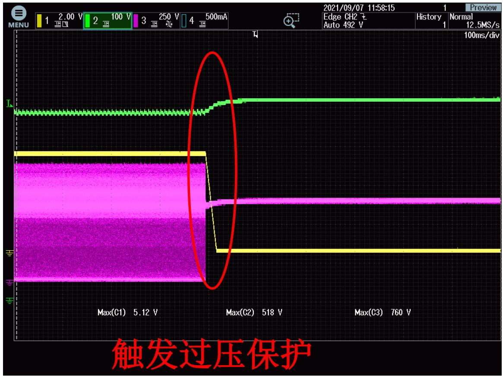

CH1 VO  
CH2 VDC\_IN $\mathsf { V } _ { \mathsf { D C } \_ \mathsf { I N } }$  
CH3 VDs

$$
V _ {D S \_ M A X} = 7 6 0 \mathrm{V}
$$

$$
V _ {D C I N} = 5 0 0 \mathrm{V}
$$

Test Condition:

➢ Full Load

TNY278P  
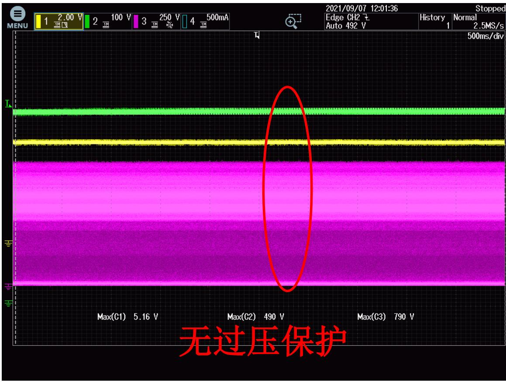

H1 VO  
CH2 VDC\_IN  
CH3 VDs

$$
V _ {D S \_ M A X} = 7 9 0 \mathrm{V}
$$

$$
V _ {D C \_ I N} = 4 9 0 \mathrm{V}
$$

Test Condition:

➢ Full Load

BPA8618P  
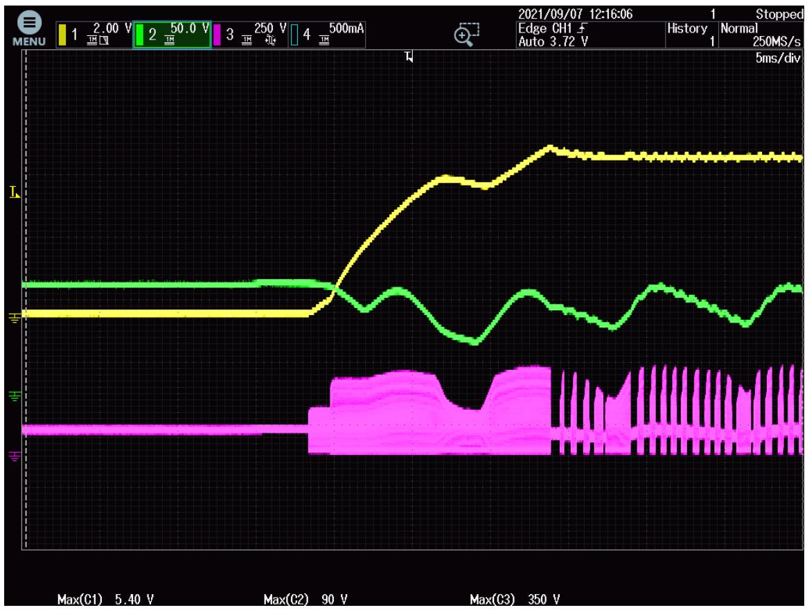

CH1 VO  
CH2 VDC\_IN  
CH3 VDs

$$
V _ {D C \_ I N} = 9 0 \mathrm{V}
$$

Test Condition:

➢ No Load

TNY278P  
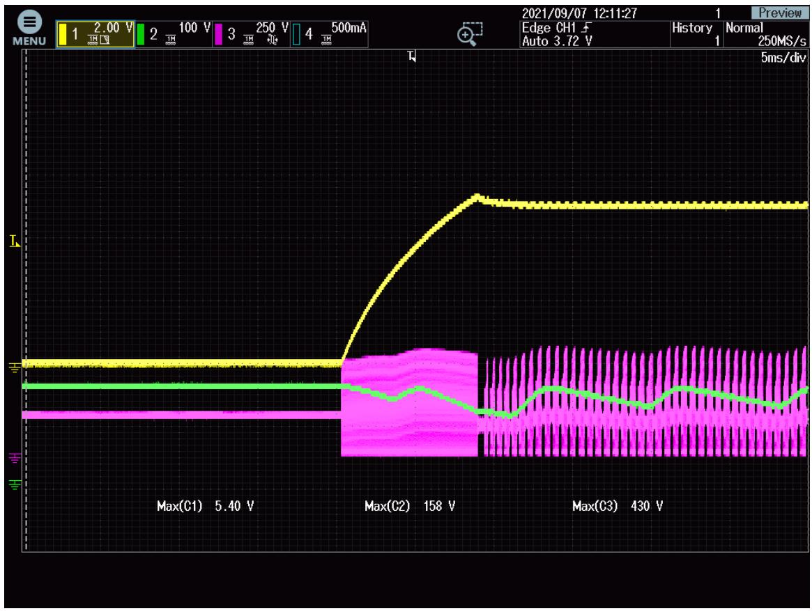

CH1 VO  
CH2 VDC\_IN  
CH3 VDs

$$
V _ {D C \_ I N} = 1 5 8 \mathrm{V}
$$

Test Condition:

➢ No Load

备注：TNY278 Vpin脚上拉一串电阻做UVL，阻值4M,EN到地放了200K电阻，电压检测就会偏大；

## 输出短路保护（MOSFET波形）

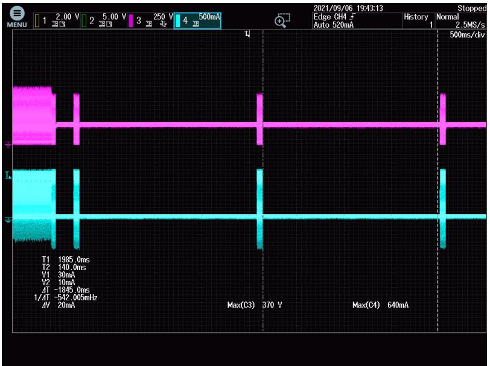

## BPA8618P

85 VAC

CH2 VDS  
CH4 IDS

$$
\begin{array}{l} \mathrm {V_ {DS\_MAX}} = 3 7 0 \mathrm{V} \\ \mathrm {I_ {DS\_MAX}} = 0. 6 4 \mathrm{A} \end{array}
$$

## Test Condition:

➢ Full Load

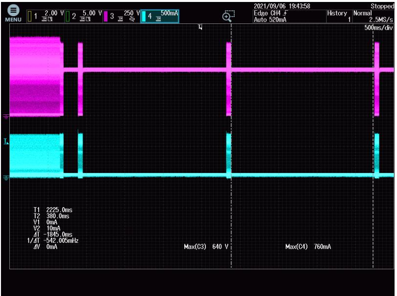

## BPA8618P

265 VAC

CH2 VDS  
CH4 IDS

$$
V _ {D S \_ M A X} = 6 4 0 V
$$

$$
I _ {D S \_ M A X} = 0. 7 6 \mathrm{A}
$$

## Test Condition:

➢ Full Load

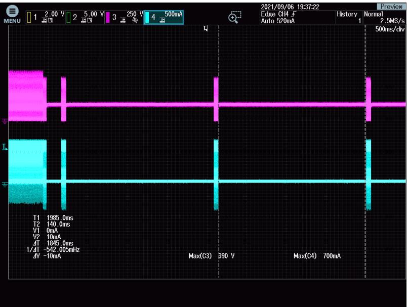

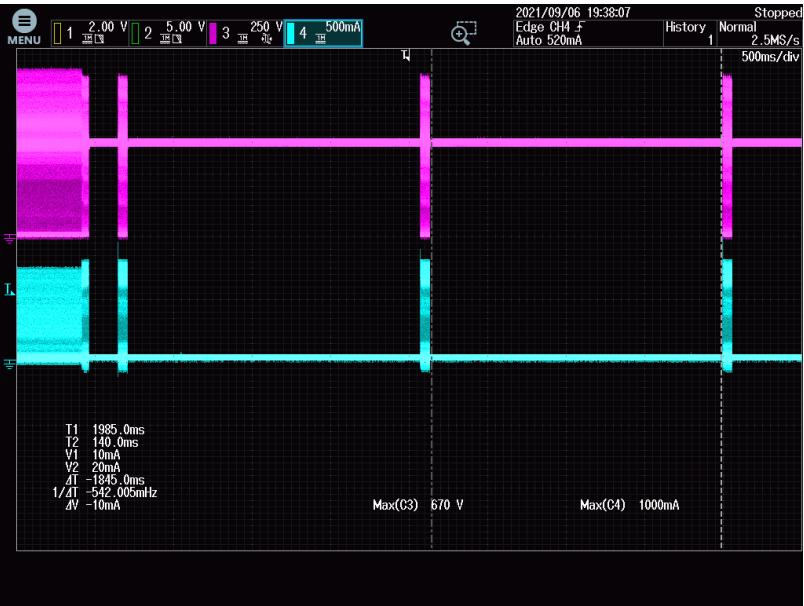

## TNY278P

85 VAC

CH2 VDS  
CH4 IDS

$$
\begin{array}{l} \mathrm {V_ {DS\_MAX}} = 3 9 0 \mathrm{V} \\ \mathrm {I_ {DS\_MAX}} = 0. 7 \mathrm{A} \end{array}
$$

## Test Condition:

➢ Full Load

## TNY278P

265 VAC

CH2 VDS  
CH4 IDS

$$
V _ {D S \_ M A X} = 6 7 0 V
$$

$$
I _ {D S \_ M A X} = 1 \mathrm{A}
$$

## Test Condition:

➢ Full Load

## 温升测试

BPA8618P

<table><tr><td rowspan="2">项目</td><td colspan="2">85VAC</td><td colspan="2">265VAC</td></tr><tr><td>温度(°C)</td><td>温升(°C)</td><td>温度(°C)</td><td>温升(°C)</td></tr><tr><td>环境温度</td><td colspan="2">28.56</td><td colspan="2">28.72</td></tr><tr><td>BPA8618P (U1)</td><td>86.87</td><td>58.31</td><td>93.08</td><td>64.36</td></tr><tr><td>变压器绕组(T1)</td><td>71.76</td><td>43.2</td><td>71.51</td><td>42.79</td></tr><tr><td>变压器磁芯(T1)</td><td>65.04</td><td>36.48</td><td>67.53</td><td>38.81</td></tr><tr><td>输入电解电容(EC2)</td><td>57.05</td><td>28.49</td><td>54.16</td><td>25.44</td></tr><tr><td>输出电解电容(EC4)</td><td>46.19</td><td>17.63</td><td>46.73</td><td>18.01</td></tr><tr><td>整流桥(BD1)</td><td>57.06</td><td>28.5</td><td>45.82</td><td>17.1</td></tr></table>

TNY278P

<table><tr><td rowspan="2">项目</td><td colspan="2">85VAC</td><td colspan="2">265VAC</td></tr><tr><td>温度(°C)</td><td>温升(°C)</td><td>温度(°C)</td><td>温升(°C)</td></tr><tr><td>环境温度</td><td colspan="2">29</td><td colspan="2">29.11</td></tr><tr><td>TNY278P (U1)</td><td>79.28</td><td>50.28</td><td>88.71</td><td>59.6</td></tr><tr><td>变压器绕组(T1)</td><td>70.72</td><td>41.72</td><td>71.63</td><td>42.52</td></tr><tr><td>变压器磁芯(T1)</td><td>65.35</td><td>36.35</td><td>67.24</td><td>38.13</td></tr><tr><td>输入电解电容(EC2)</td><td>55.39</td><td>26.39</td><td>54.89</td><td>25.78</td></tr><tr><td>输出电解电容(EC4)</td><td>45.79</td><td>16.79</td><td>46.89</td><td>17.78</td></tr><tr><td>整流桥(BD1)</td><td>56.29</td><td>27.29</td><td>47.84</td><td>18.73</td></tr></table>

备注：增大芯片Source散热铜箔面积可以降低芯片温度

## ❑ 更换BPA8618P调整

L3电感去掉，用跳线短接；  
R9 0805 510R更改为0805 220R  
R7 1206 200K更改为1206 4.7K  
R8 1206 200K更改为 1206 100PF 25V  
R51 1206 0R更改为1206 75R  
R4,R5 1206 2M 不装

➢ VCC位置10uF对应TNY278P是升限流点， BPA8618P只有标准限流电，过流保护点会低

待机功耗（4.7K电阻外供电）  
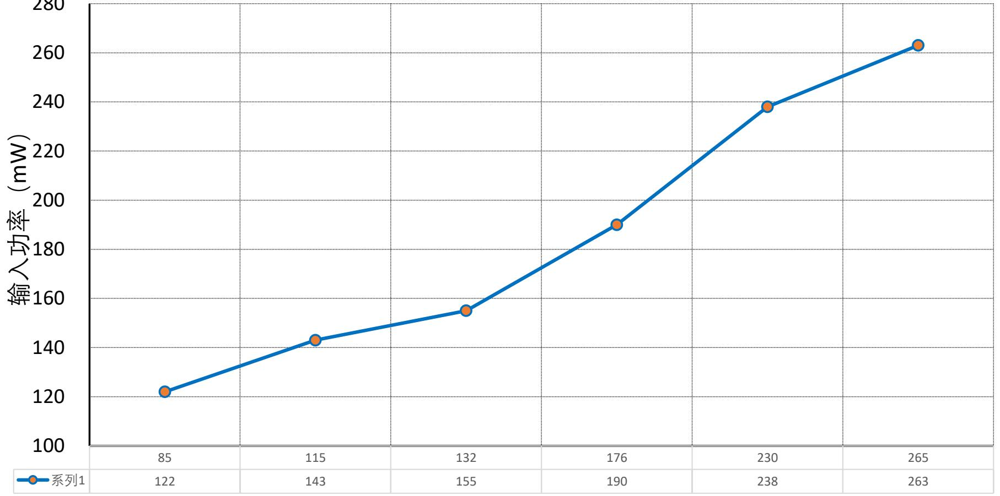

输入电压(VAC)

效率测试  
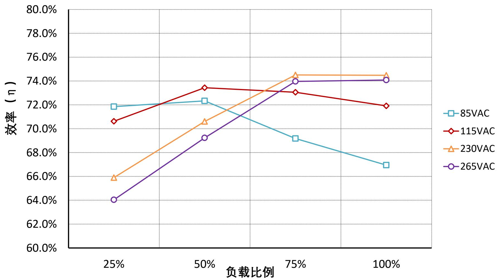

## 输出电压调整率

<table><tr><td>输入电压AC (V)</td><td>输出电流1(A)</td><td>输出电压1(V)</td><td>输出电流2(A)</td><td>输出电压2(V)</td></tr><tr><td rowspan="2">115</td><td>0</td><td>5.01</td><td>0</td><td>12.59</td></tr><tr><td>0.3</td><td>4.99</td><td>0.6</td><td>11.97</td></tr><tr><td rowspan="2">230</td><td>0</td><td>5.01</td><td>0</td><td>12.62</td></tr><tr><td>0.3</td><td>4.99</td><td>0.6</td><td>12.06</td></tr></table>

◼ 计算方法：调整率=100%\*(最大值-最小值)/平均值  
测试条件：

## 输出电压纹波

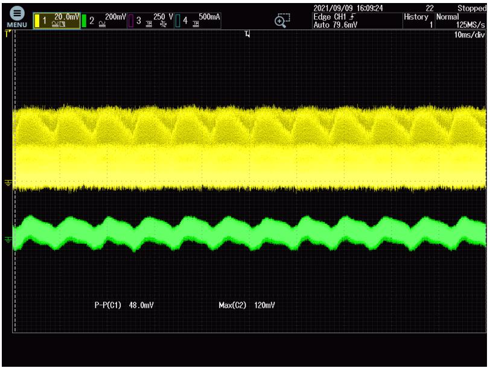

85 VAC

CH1 $\mathsf { V } _ { \mathsf { O U T - S V } }$ Ripple $\mathsf { V } _ { \mathsf { P K - P K } } { = } 4 8 \mathsf { m V }$  
CH2 $\mathsf { V } _ { \mathsf { O U T } - 1 2 \mathsf { V } }$ Ripple $\mathsf { V } _ { \mathsf { P K - P K } } \mathsf { = } \mathsf { 1 } 2 0 \mathsf { m V }$

## Test Condition:

➢ Full Load

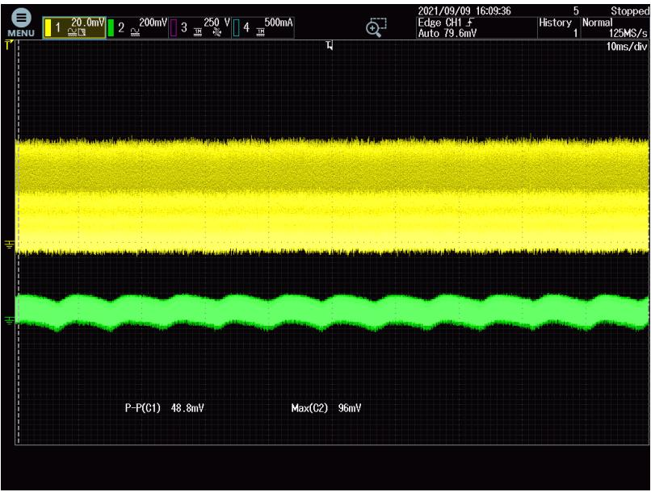

115 VAC

CH1 $\mathsf { V } _ { \mathsf { O U T - 5 V } }$ Ripple $V _ { P K - P K } = 4 8 m V$  
${ \mathsf { C H } } 2 { \mathsf { V } } _ { 0 \cup \mathsf { T } - 1 2 { \mathsf { V } } }$ Ripple $\mathbf { V } _ { \mathsf { P K - P K } } { = } 9 6 \mathsf { m V }$

## Test Condition:

➢ Full Load

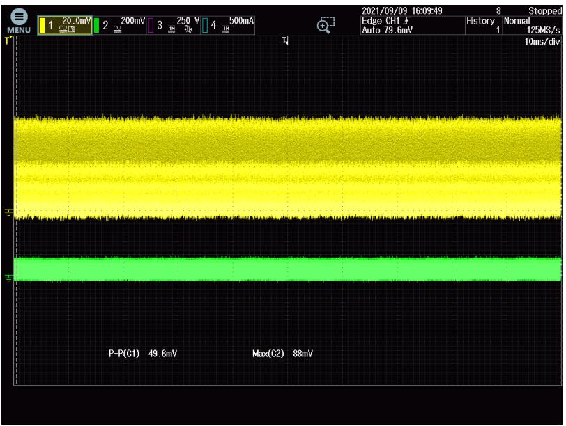

230 VAC

CH1 $\mathsf { V } _ { \mathsf { O U T - S V } }$ Ripple $\mathsf { V } _ { \mathsf { P K - P K } } { = } 4 9 \mathsf { m V }$  
$\begin{array} { r l } & { \mathsf { C H 2 V _ { O U T - 1 2 V } R i p p l e } } \\ & { \mathsf { V _ { P K - P K } } \mathsf { = } 8 8 \mathsf { m V } } \end{array}$

## Test Condition:

➢ Full Load

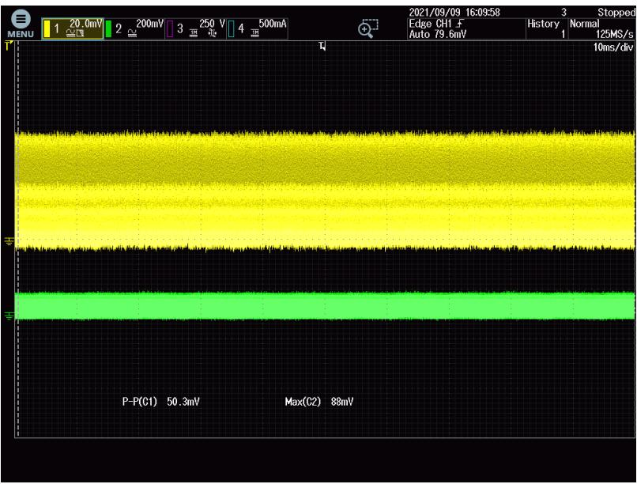

265 $\mathsf { v } _ { \mathsf { A C } }$

CH1 $\mathsf { V } _ { \mathsf { O U T - S V } }$ Ripple $\mathsf { V } _ { \mathsf { P K - P K } } { = } 5 0 \mathsf { m V }$  
$\begin{array} { r l } & { \mathsf { C H 2 V _ { O U T - 1 2 V } R i p p l e } } \\ & { \mathsf { V _ { P K - P K } } \mathsf { = } 8 8 \mathsf { m V } } \end{array}$

## Test Condition:

➢ Full Load

## 动态负载(50%-100%)

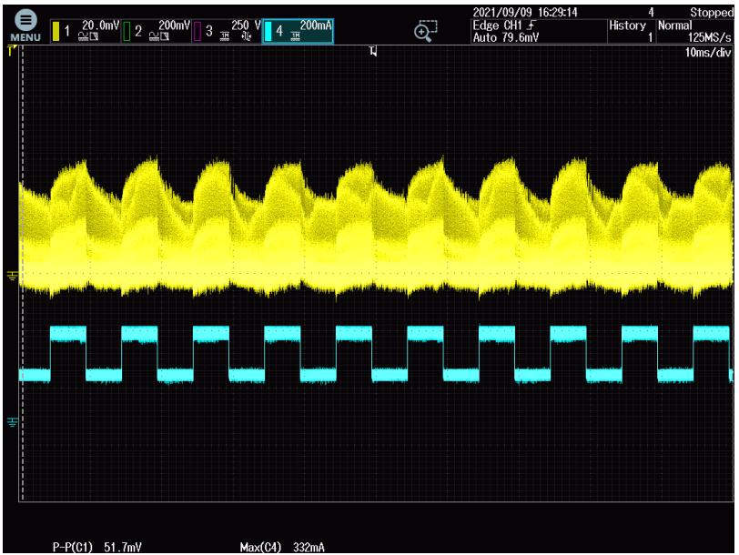

85 VAC

$\begin{array} { r l } & { \mathsf { C H 1 } \mathsf { V _ { 0 \cup T - 5 \mathsf { V } } } } \\ & { \mathsf { V _ { P K - P K } } \mathsf { = } 5 1 . 7 \mathsf { m v } } \end{array}$ CH1 VOUT-5V

## Test Condition:

➢ 0.15 A-0.3 A-0.15 A  
➢ Slew Rate: 0.5 A/μS  
➢ Frequency: 100 Hz

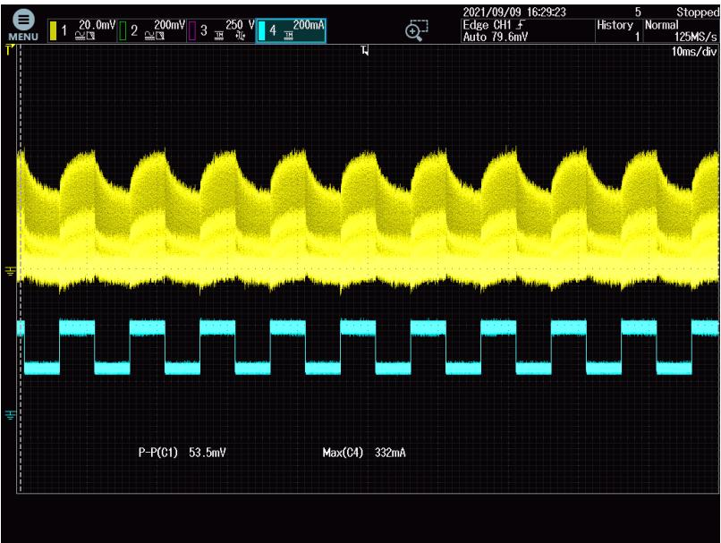

115 VAC

CH1 VOUT-5V VPK-PK=53.5 mV

## Test Condition:

➢ 0.15 A-0.3 A-0.15 A  
➢ Slew Rate: 0.5 A/μS  
➢ Frequency: 100 Hz

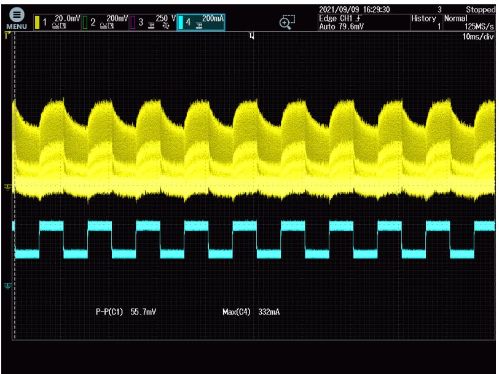

230 VAC

CH1 VOUT-5V VPK-PK=55.7mV

## Test Condition:

➢ 0.15 A-0.3 A-0.15 A  
➢ Slew Rate: 0.5 A/μS  
➢ Frequency: 100 Hz

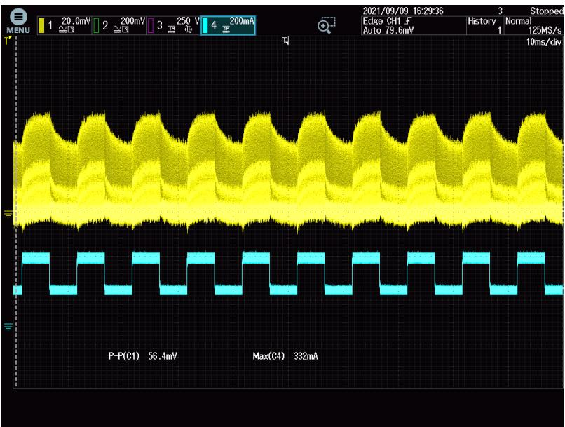

264 VAC

CH1 VOUT-5V VPK-PK=56.4 mV

## Test Condition:

➢ 0.15 A-0.3 A-0.15 A  
➢ Slew Rate: 0.5 A/μS  
➢ Frequency: 100 Hz

## 动态负载(10%-90%)

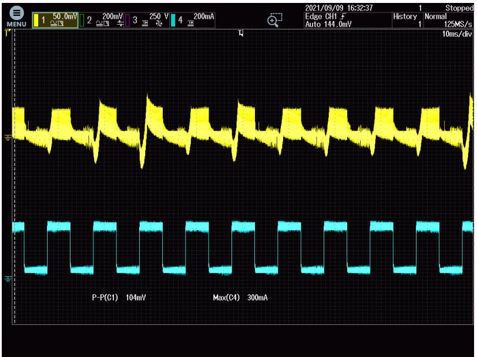

85 VAC

$\begin{array} { r l } & { \mathsf { C H 1 V _ { O U T - 5 V } } } \\ & { \mathsf { V _ { P K - P K } } \mathsf { = } \mathsf { 1 0 4 m v } } \end{array}$ CH1 VOUT-5V

## Test Condition:

➢ 0.03 A-0.27A-0.03A  
➢ Slew Rate: 0.5 A/μS  
➢ Frequency: 100 Hz

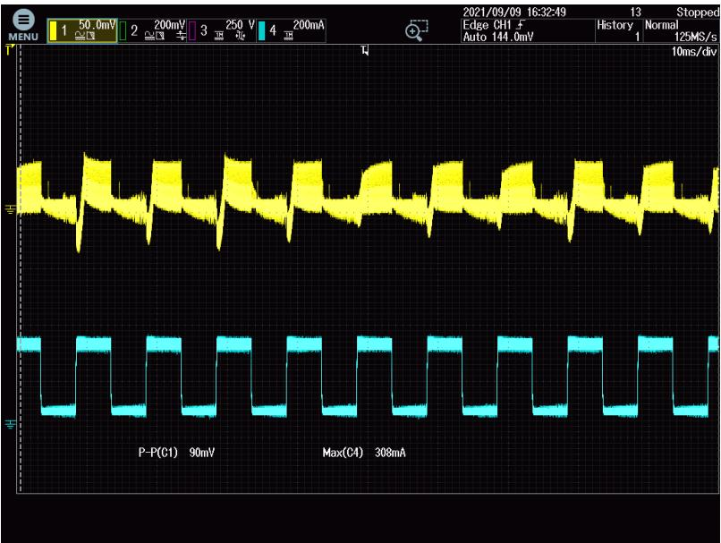

115 VAC

CH1 VOUT-5V $\mathsf { V } _ { \mathsf { O U T - 5 V } }$ VPK-PK=90 mV

## Test Condition:

➢ 0.03 A-0.27A-0.03A  
➢ Slew Rate: 0.5 A/μS  
➢ Frequency: 100 Hz

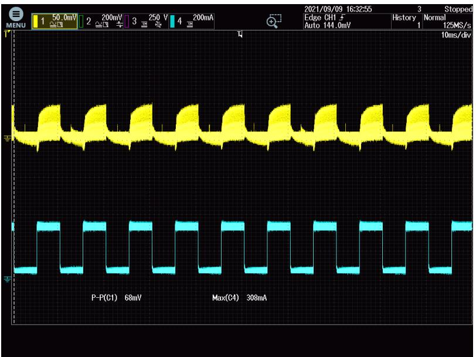

230 VAC

CH1 VOUT-5V $\mathsf { V } _ { \mathsf { O U T - 5 V } }$ $\mathsf { V } _ { \mathsf { P K - P K } } { = } 6 8 \mathsf { m V }$

## Test Condition:

➢ 0.03 A-0.27A-0.03A  
➢ Slew Rate: 0.5 A/μS  
➢ Frequency: 100 Hz

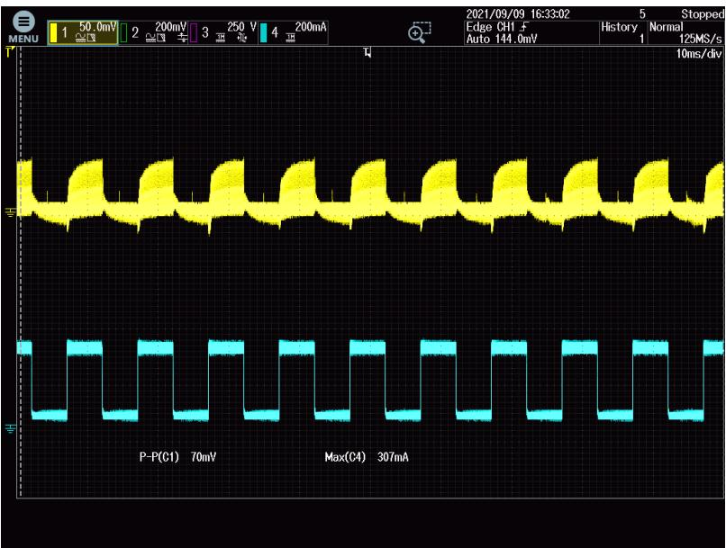

264VAC

$\begin{array} { l } { \mathsf { C H 1 V _ { 0 \cup \mathsf { T } - 5 \mathsf { V } } } } \\ { \mathsf { V _ { P K - P K } } \equiv 7 0 \mathsf { m v } } \end{array}$ CH1 VOUT-5V

## Test Condition:

➢ 0.03 A-0.27A-0.03A  
➢ Slew Rate: 0.5 A/μS  
➢ Frequency: 100 Hz

## 输出电压开机波形

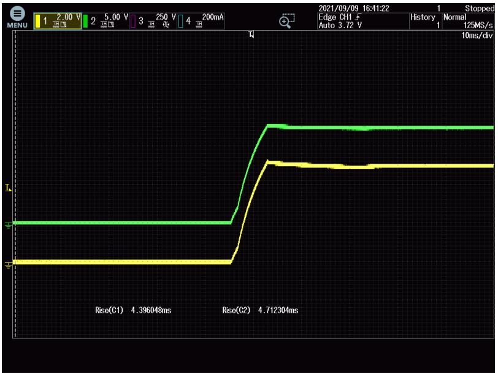

${ \otimes 5 } \mathsf { V } _ { \mathsf { A C } }$

$\begin{array} { r } { \mathsf { C H 1 V _ { 0 \downarrow \downarrow \uparrow - 5 v } } } \\ { \mathsf { t } _ { \mathrm { r i s e } } = 4 . 3 \mathsf { m s } } \end{array}$ CH1 VOUT-5v  
$\begin{array} { l l } { { \mathsf { C H 2 } } { \mathsf { V } } _ { \mathrm { 0 U T - 1 2 v } } } \\ { { \mathsf { t } } _ { \mathrm { r i s e } } { = } 4 . 7 \mathrm { m s } } \end{array}$ CH2 VOUT-12v

## Test Condition:

➢ No Load

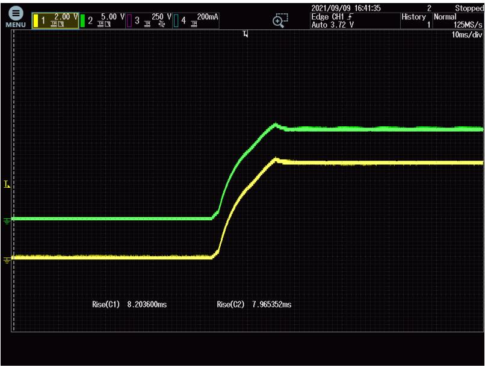

${ \tt S 5 V } _ { \sf A C }$

$\begin{array} { r } { \mathsf { C H 1 V _ { 0 \downarrow \downarrow \uparrow - 5 v } } } \\ { \mathsf { t } _ { \mathrm { r i s e } } = 8 . 2 \mathsf { m s } } \end{array}$ CH1 VOUT-5v  
$\begin{array} { r } { \mathsf { C H 2 \vee _ { \mathsf { O U T - 1 2 v } } } } \\ { \mathsf { t } _ { \mathsf { r i s e } } \ l \mathbf { = 7 . 9 m S } } \end{array}$ CH2 VOUT-12v

## Test Condition:

➢ Full Load

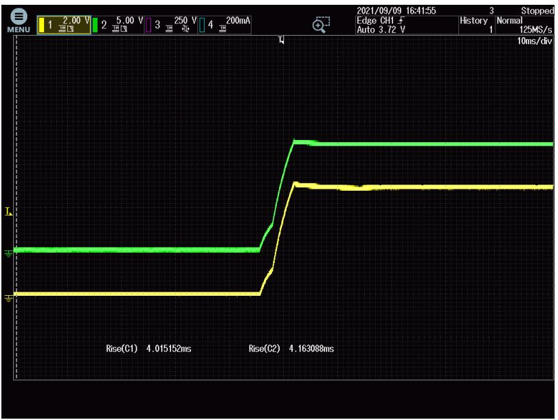

265 VAC

$\begin{array} { l l } { { \mathbb { C } } { \mathbb { H } } 1 \vee _ { \mathsf { O U T - 5 v } } } \\ { \mathfrak { t } _ { \mathsf { r i s e } } { = } { 4 . 0 1 \mathsf { m s } } } \end{array}$ CH1 VOUT-5v  
CH2 VOUT-12v $\begin{array} { r l } & { \mathsf { C H 2 V } _ { \mathsf { O U T - 1 2 v } } } \\ & { \mathsf { t } _ { \mathsf { r i s e } } \equiv 4 . 1 6 \mathsf { m s } } \end{array}$

## Test Condition:

➢ No Load

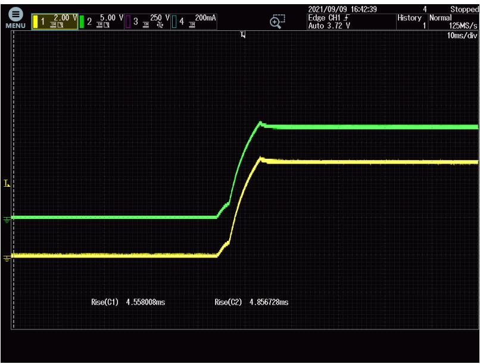

$2 6 5 \ : \mathsf { V } _ { \mathsf { A C } }$

$\begin{array} { l } { \mathsf { C H 1 V _ { o u T - 5 v } } } \\ { \mathsf { t } _ { \mathsf { r i s e } } \equiv 4 . 5 5 \mathsf { m s } } \end{array}$ CH1 VOUT-5v  
CH2 VOUT-12v t = 4.85mS

## Test Condition:

➢ Full Load

## 输入欠压保护

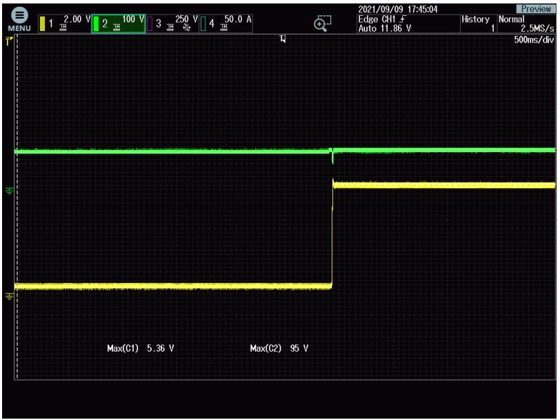

## BROWN-IN

$\mathsf { C H 1 \vee O U T _ { D C } }$  
CH2 VINDC ${ \mathsf { C H } } { 2 } { \mathsf { V I N } } _ { \mathsf { D C } }$ VBROWN-IN: 90 V

## 测试条件:

➢ No Load

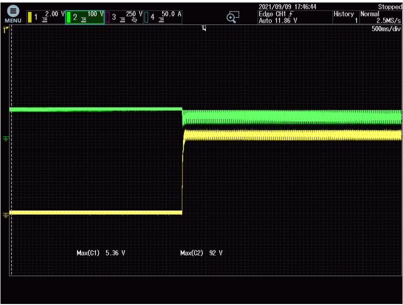

## BROWN-IN

$\mathsf { C H 1 \vee O U T _ { D C } }$  
CH2 VINDC ${ \mathsf { C H } } { 2 } { \mathsf { V I N } } _ { \mathsf { D C } }$ VBROWN-IN: 92 V

## 测试条件:

➢ Full Load

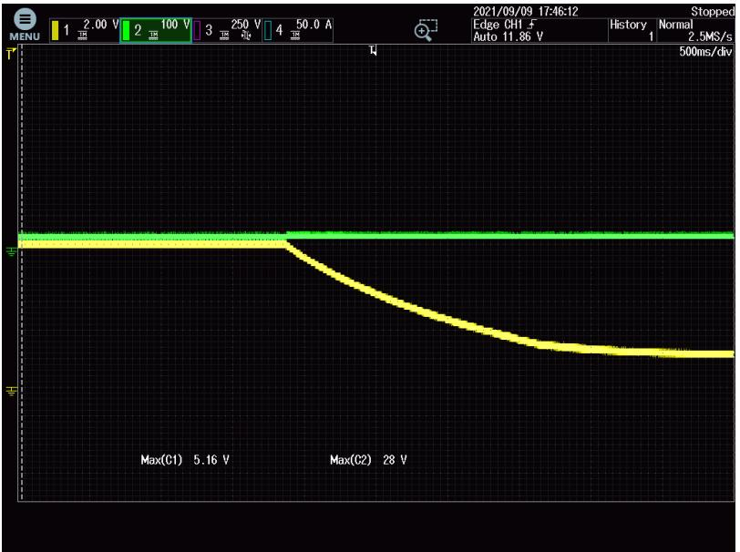

## BROWN-OUT

CH1 $\mathsf { V O U T } _ { \mathsf { D C } }$  
CH2 VINDC $\mathsf { V I N } _ { \mathsf { D C } }$ VBROWN-OUT:28 V

## 测试条件:

➢ No Load

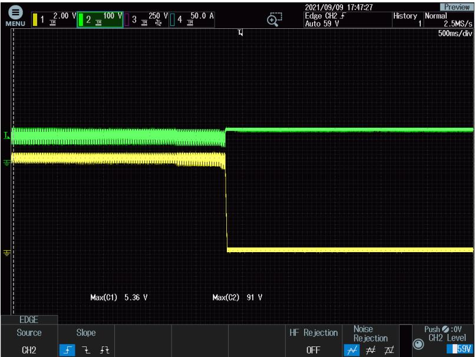

## BROWN-OUT

CH1 $\mathsf { V O U T } _ { \mathsf { D C } }$  
CH2 VINDC $\mathsf { V I N } _ { \mathsf { D C } }$ VBROWN-OUT: 80V

## 测试条件:

➢ Full Load

## 输入过压保护

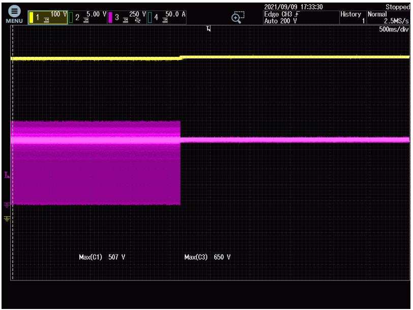

## 输入OVP

${ \mathsf { C H 1 } } { \mathsf { V I N } } _ { \mathsf { D C } }$  
CH3 VIN VDS $\mathsf { C H 3 } \mathsf { V I N } \mathsf { V } _ { \mathsf { D S } }$ VBROWN-IN: 500V

## 测试条件:

➢ No Load

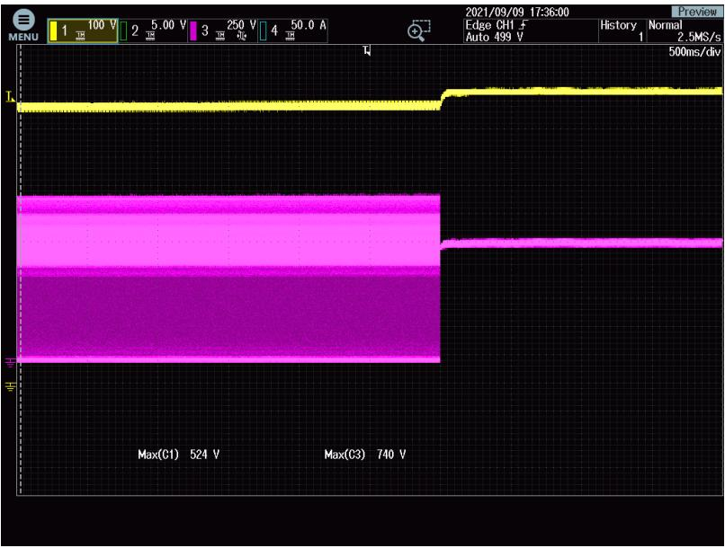

## 输入OVP

${ \mathsf { C H 1 } } { \mathsf { V I N } } _ { \mathsf { D C } }$  
CH3 VIN VDS $\mathsf { C H 3 } \mathsf { V I N } \mathsf { V } _ { \mathsf { D S } }$ VBROWN-IN: 502 V

## 测试条件:

➢ Full Load

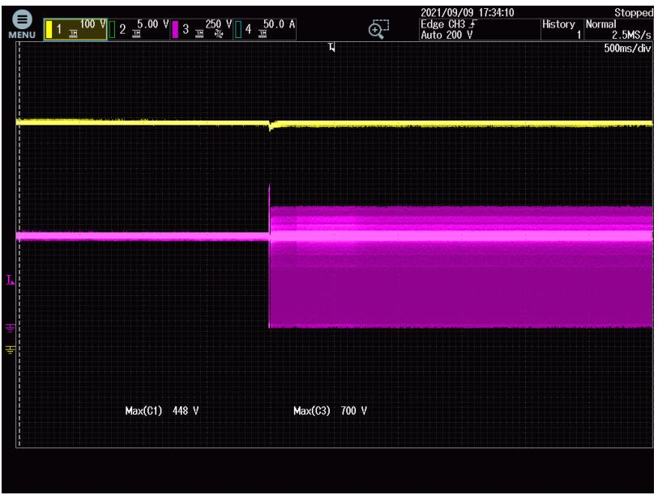

## 退出输入OVP

CH1 $\mathsf { V I N } _ { \mathsf { D C } }$  
CH3 VIN VDS $\mathsf { V I N } \mathsf { V } _ { \mathsf { D S } }$ VBROWN-OUT:448 V

## 测试条件:

➢ No Load

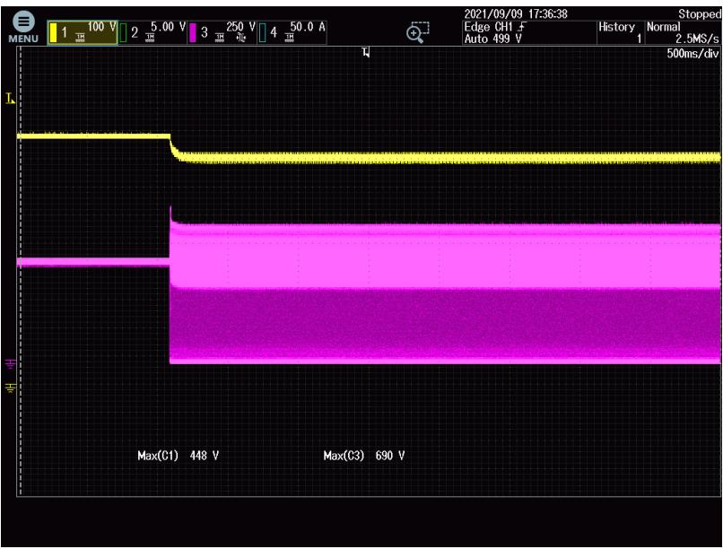

## 退出输入OVP

CH1 $\mathsf { V I N } _ { \mathsf { D C } }$  
CH3 VIN VDS $\mathsf { V I N } \mathsf { V } _ { \mathsf { D S } }$ VBROWN-OUT: 448V

## 测试条件:

➢ Full Load

## 短路保护 （MOSFET波形）

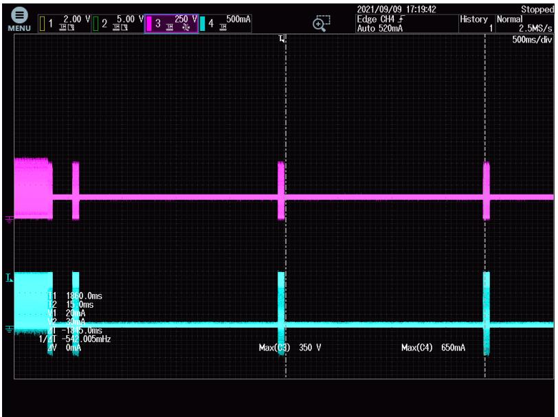

85 VAC

CH3 VDS  
CH4 ID

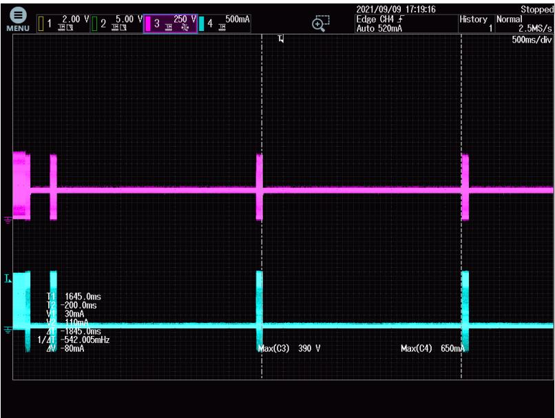

115 VAC

CH3 VDS  
CH4 ID

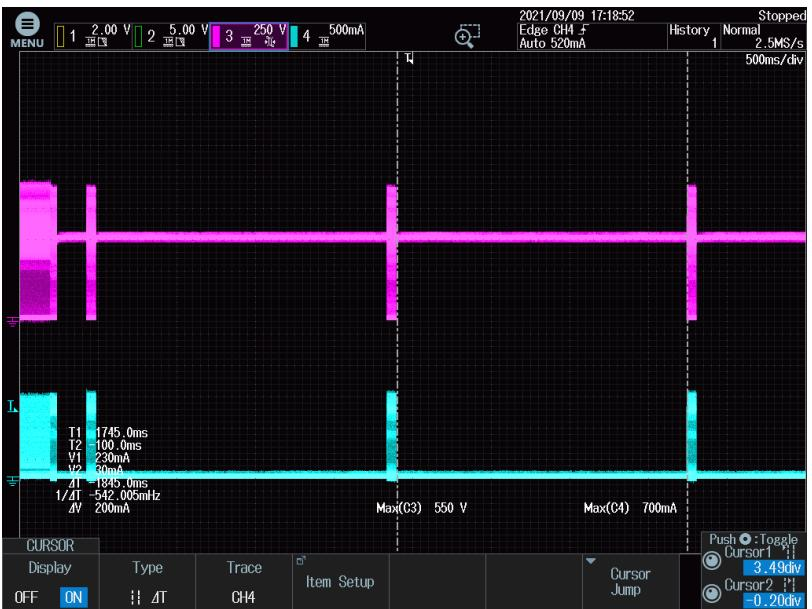

230 VAC

CH3 $\mathsf { V } _ { \mathsf { D } \mathsf { S } }$  
CH4 ID

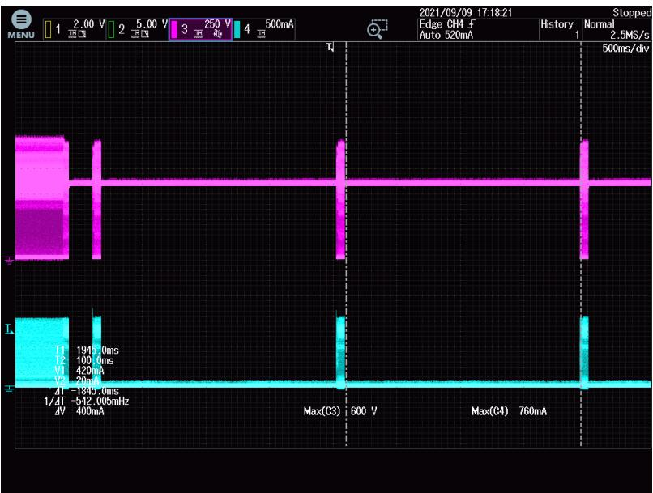

265 VAC

CH3 VDS  
CH4 ID

## 漏极电流波形

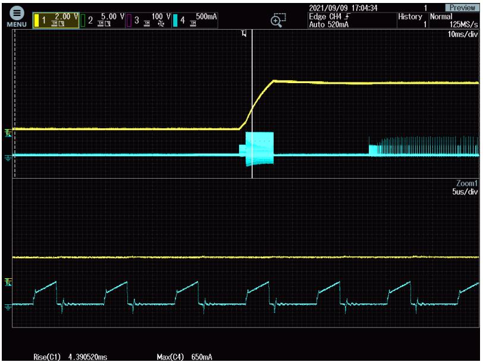

85 VAC

CH1 VOUTPUT-5V  
CH4 IDRAIN

Test Condition:

➢ 空载启动

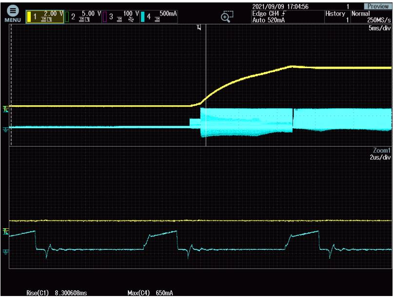

85 VAC

CH1 VOUTPUT-5V  
CH4 IDRAIN

Test Condition:

满载启动

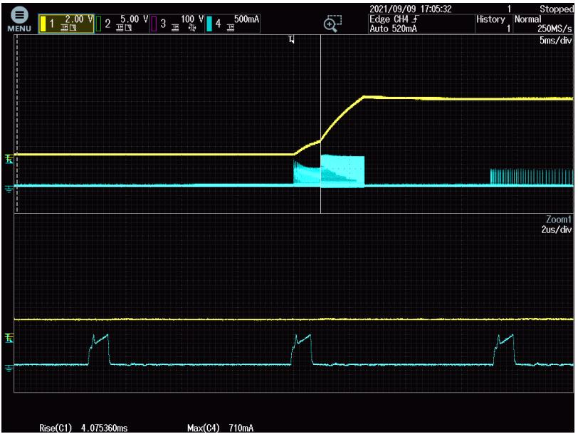

265 VAC

CH1 VOUTPUT-5V  
CH4 IDRAIN

Test Condition:

➢ 空载启动

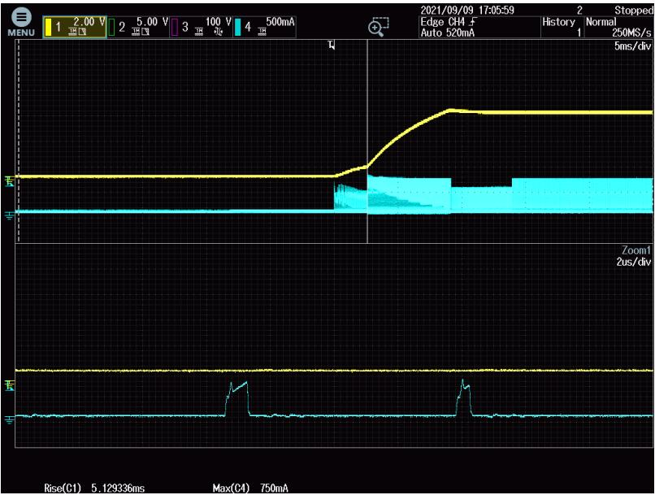

265 VAC

CH1 VOUTPUT-5V  
CH4 IDRAIN

Test Condition:

满载启动

## D-S电压波形

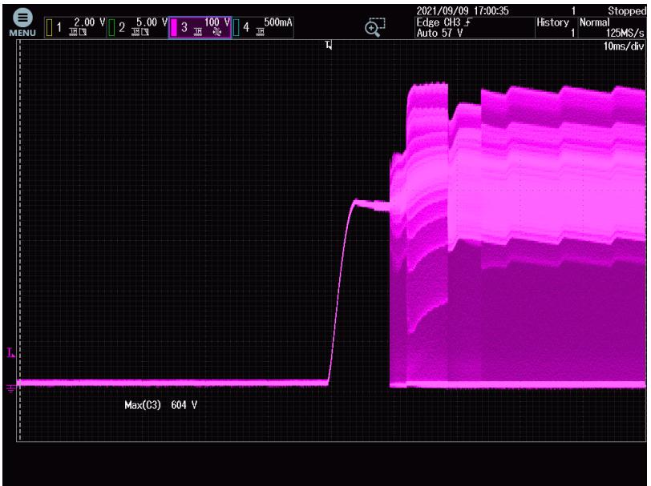

265 VAC

CH3 VDS VDSMAX: 604 V

Test Condition:

➢ 满载开机

极限参数(注3)

<table><tr><td>符号</td><td>参数</td><td>参数范围</td><td>单位</td></tr><tr><td> $V_{DRAIN}$ </td><td>内部高压 MOSFET 漏极到源极电压</td><td>-0.3~700</td><td>V</td></tr><tr><td> $V_{CC}$ </td><td> $V_{CC}$  电压</td><td>-0.3~9</td><td>V</td></tr><tr><td> $I_{CC\_MAX}$ </td><td> $V_{CC}$  引脚最大电流</td><td>20</td><td>mA</td></tr><tr><td> $V_{FB}$ </td><td>输出反馈端电压</td><td>-0.3~9</td><td>V</td></tr><tr><td> $P_{DMAX}$ </td><td>功耗(注 4)</td><td>1.5</td><td>W</td></tr><tr><td> $\theta_{JA}$ </td><td>结到环境的热阻(注 5)</td><td>80</td><td>°C/W</td></tr><tr><td> $\theta_{JC}$ </td><td>结到芯片表面的热阻(注 5)</td><td>20</td><td>°C/W</td></tr><tr><td> $T_{J}$ </td><td>工作结温范围</td><td>-40 to 150</td><td>°C</td></tr><tr><td> $T_{STG}$ </td><td>储存温度范围</td><td>-55 to 150</td><td>°C</td></tr><tr><td>ESD</td><td>人体模型 ESD(注 6)</td><td>2</td><td>kV</td></tr></table>

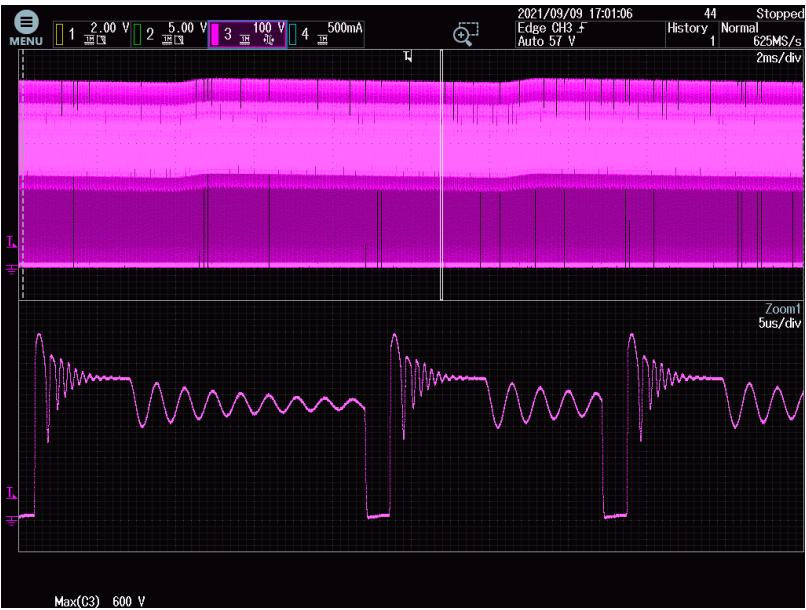

265 VAC

CH3 VDS $\mathsf { V } _ { \mathsf { D } \mathsf { S } }$ VDSMAX: 600 V

Test Condition:

满载正常工作

## 满载开机

Derating= 604 V / 700 V = 86.28 %

## 满载正常工作

Derating = 600V / 700 V = 85.71 %

<table><tr><td rowspan="2">项目</td><td colspan="2">85VAC</td><td colspan="2">265VAC</td></tr><tr><td>温度(°C)</td><td>温升(°C)</td><td>温度(°C)</td><td>温升(°C)</td></tr><tr><td>环境温度</td><td colspan="2">27.73</td><td colspan="2">27.34</td></tr><tr><td>BPA8618P (U1)</td><td>81.22</td><td>53.49</td><td>74.32</td><td>46.98</td></tr><tr><td>变压器绕组(T1)</td><td>68.8</td><td>41.07</td><td>66.53</td><td>39.19</td></tr><tr><td>变压器磁芯(T1)</td><td>63.12</td><td>35.39</td><td>63.61</td><td>36.27</td></tr><tr><td>输入电解电容(EC2)</td><td>54.87</td><td>27.14</td><td>48.78</td><td>21.44</td></tr><tr><td>输出电解电容(EC4)</td><td>46.47</td><td>18.74</td><td>45.12</td><td>17.78</td></tr><tr><td>整流桥(BD1)</td><td>53.77</td><td>26.04</td><td>41.5</td><td>14.16</td></tr></table>

## 测试说明

➢ 在温箱中进行测试  
➢ 电路板放在一个封闭的盒子内  
➢ 热电偶连接到各个测量点  
➢ 等测量点温度达到稳定后记录数据

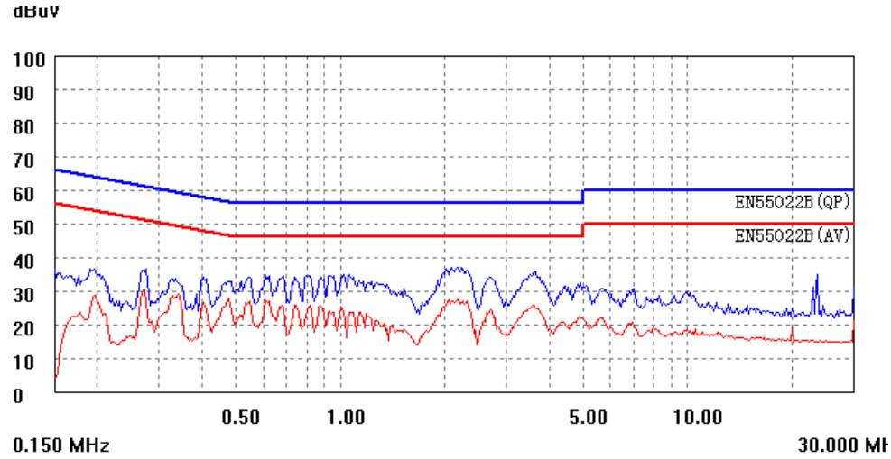

115VAC Line  
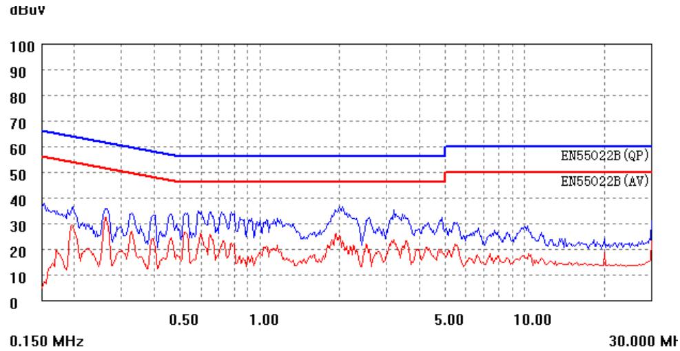

230VAC Line

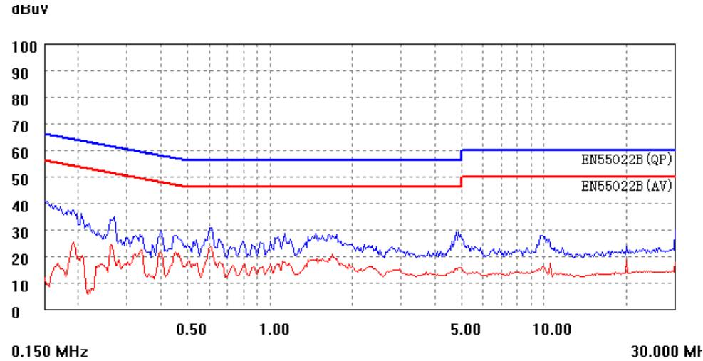

115VAC Neutral  
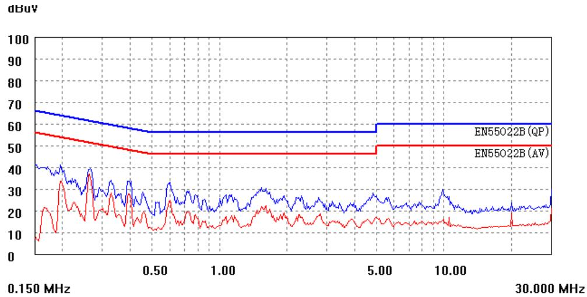

230VAC Neutral

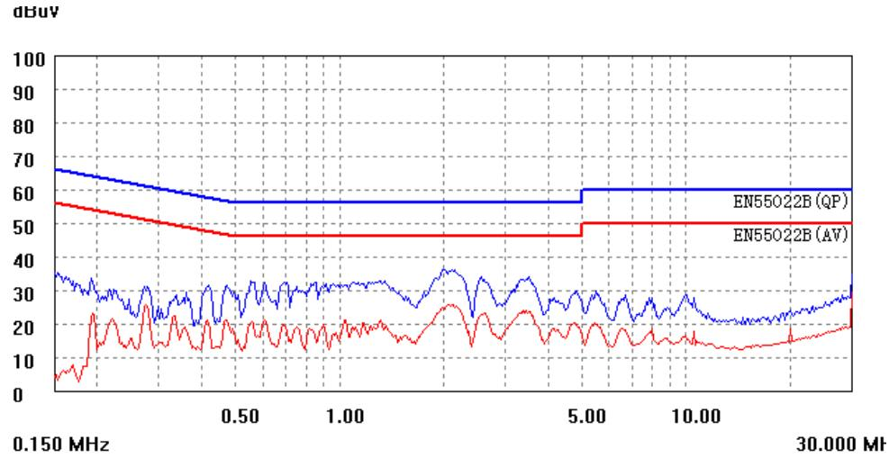

115VAC Line  
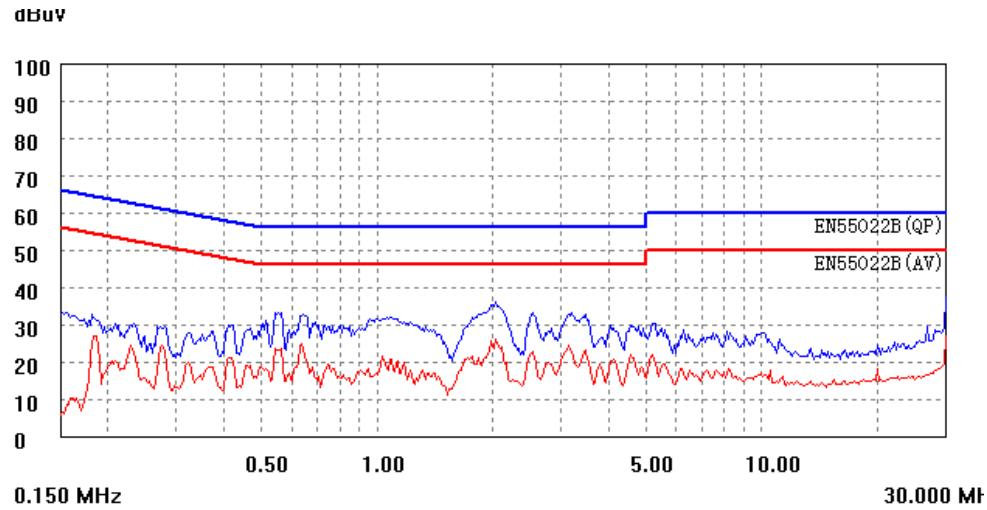

230VAC Line

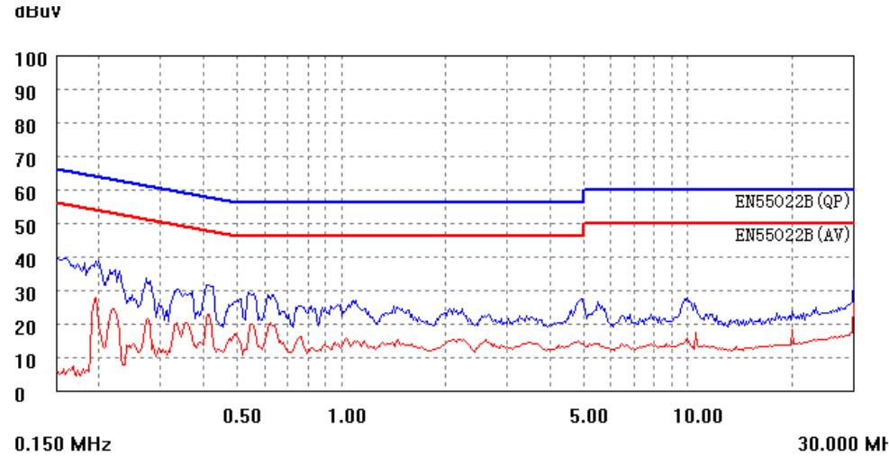

115VAC Neutral  
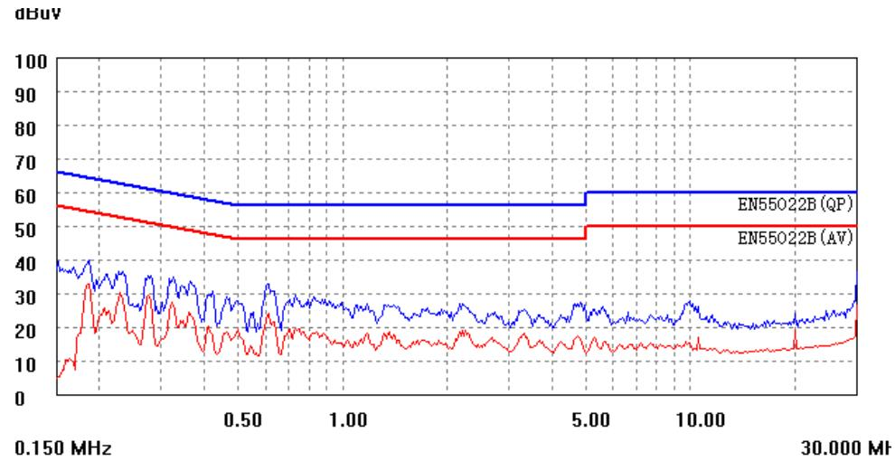

230VAC Neutral

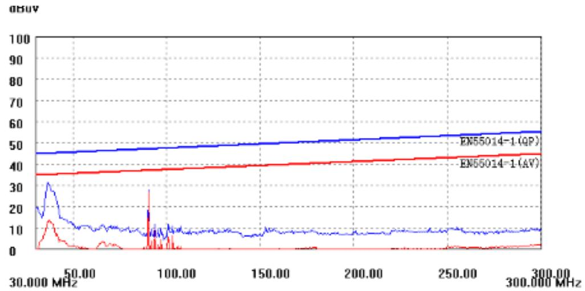

115VAC 空载  
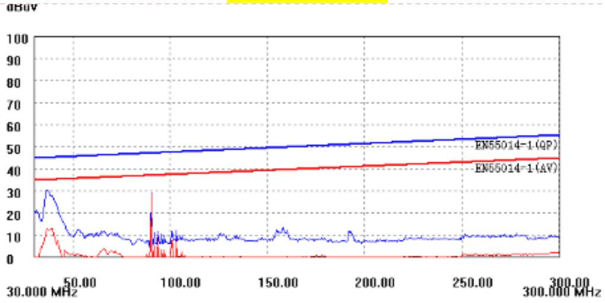

230VAC 空载

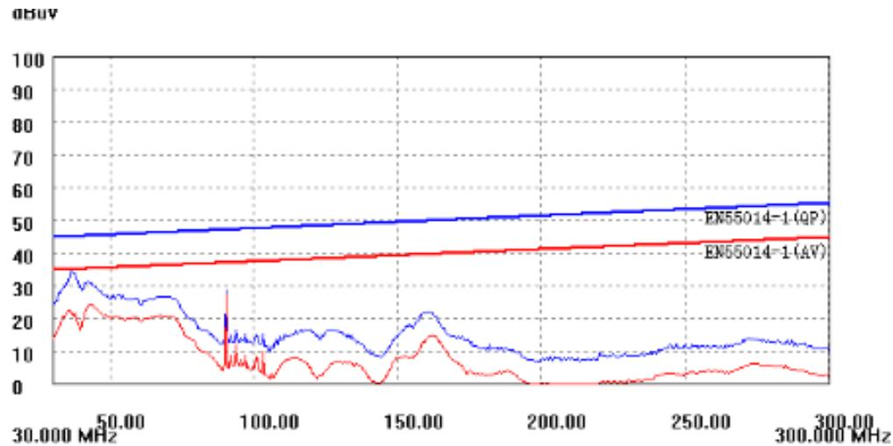

115VAC 满载

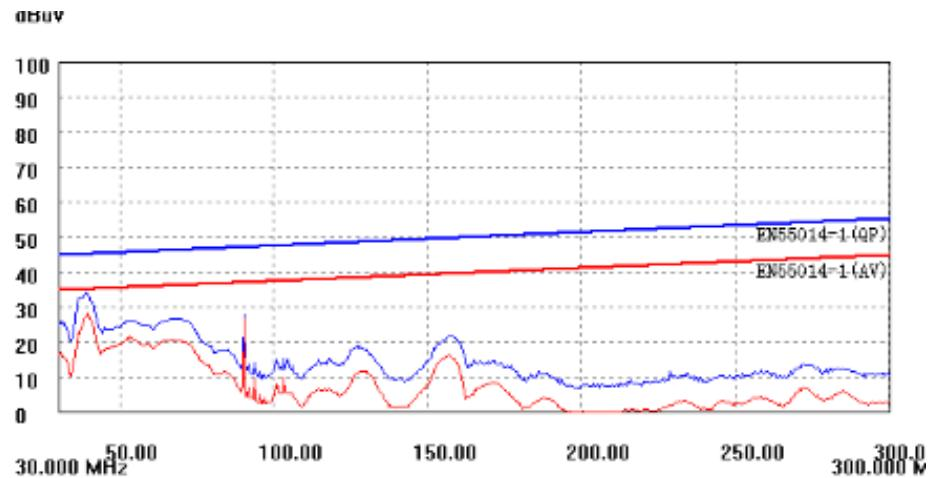

230VAC 满载

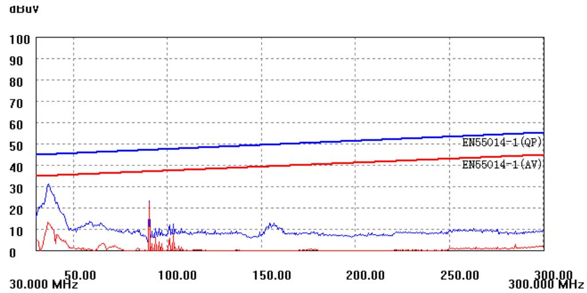

115VAC 空载  
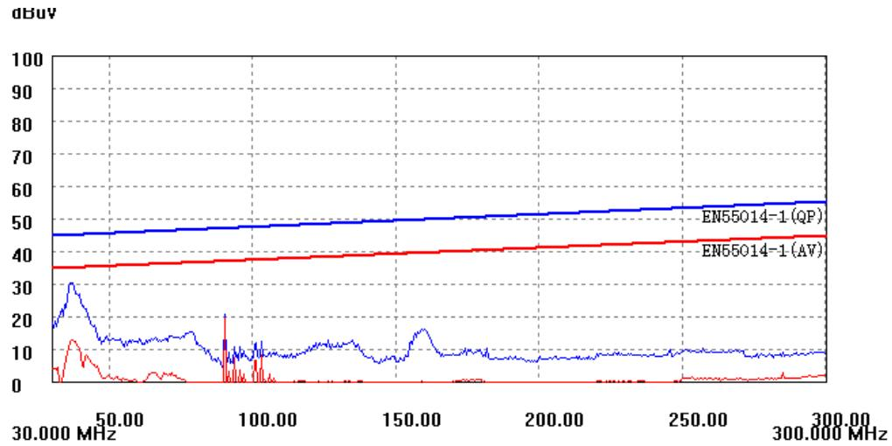

230VAC 空载

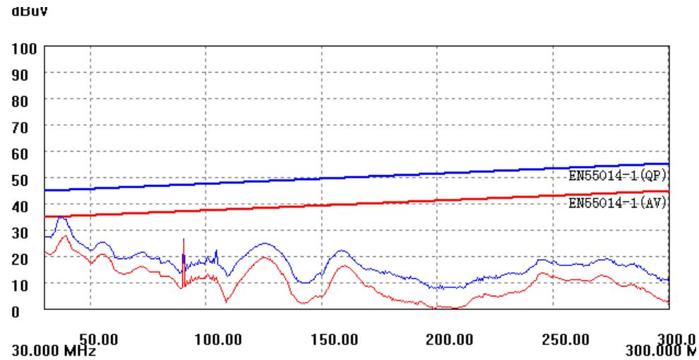

115VAC 满载  
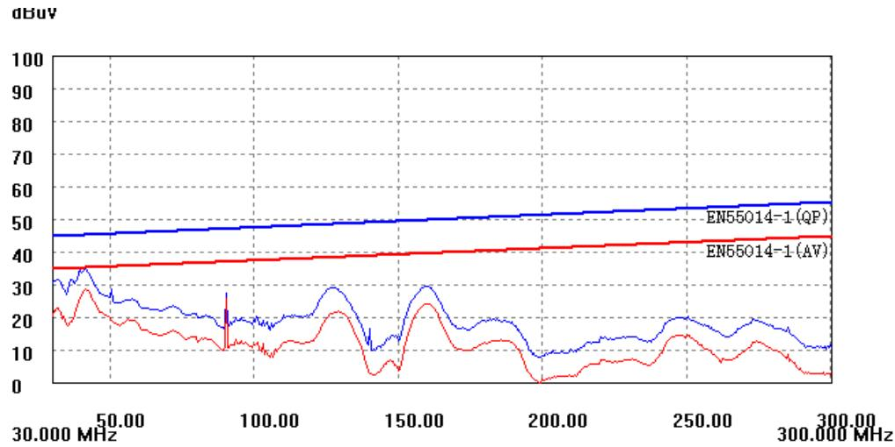

230VAC 满载

BPA8618P

<table><tr><td>差模</td><td>电压</td><td>相位角</td><td>发生器阻抗</td><td>测试次数</td><td>测试结果</td></tr><tr><td>L to N</td><td>+2kV</td><td>0</td><td>2</td><td>10</td><td>Pass</td></tr><tr><td>L to N</td><td>-2kV</td><td>0</td><td>2</td><td>10</td><td>Pass</td></tr><tr><td>L to N</td><td>+2kV</td><td>90</td><td>2</td><td>10</td><td>Pass</td></tr><tr><td>L to N</td><td>-2kV</td><td>90</td><td>2</td><td>10</td><td>Pass</td></tr><tr><td>L to N</td><td>+2kV</td><td>180</td><td>2</td><td>10</td><td>Pass</td></tr><tr><td>L to N</td><td>-2kV</td><td>180</td><td>2</td><td>10</td><td>Pass</td></tr><tr><td>L to N</td><td>+2kV</td><td>270</td><td>2</td><td>10</td><td>Pass</td></tr><tr><td>L to N</td><td>-2kV</td><td>270</td><td>2</td><td>10</td><td>Pass</td></tr></table>

## 测试说明

➢ 按照GB/T17626.5和IEC61000-4-5的最新版本要求进行测试  
➢ 室温环境，230VAC输入，满载条件

TNY278P

<table><tr><td>差模</td><td>电压</td><td>相位角</td><td>发生器阻抗</td><td>测试次数</td><td>测试结果</td></tr><tr><td>L to N</td><td>+2kV</td><td>0</td><td>2</td><td>10</td><td>Pass</td></tr><tr><td>L to N</td><td>-2kV</td><td>0</td><td>2</td><td>10</td><td>Pass</td></tr><tr><td>L to N</td><td>+2kV</td><td>90</td><td>2</td><td>10</td><td>Pass</td></tr><tr><td>L to N</td><td>-2kV</td><td>90</td><td>2</td><td>10</td><td>Pass</td></tr><tr><td>L to N</td><td>+2kV</td><td>180</td><td>2</td><td>10</td><td>Pass</td></tr><tr><td>L to N</td><td>-2kV</td><td>180</td><td>2</td><td>10</td><td>Pass</td></tr><tr><td>L to N</td><td>+2kV</td><td>270</td><td>2</td><td>10</td><td>Pass</td></tr><tr><td>L to N</td><td>-2kV</td><td>270</td><td>2</td><td>10</td><td>Pass</td></tr></table>

## 测试说明

➢ 按照GB/T17626.5和IEC61000-4-5的最新版本要求进行测试  
➢ 室温环境，230VAC输入，满载条件

BPA8618P

<table><tr><td>差模</td><td>电压</td><td>脉冲群持续时间</td><td>脉冲频率</td><td>测试时间</td><td>测试结果</td></tr><tr><td>L to N</td><td>+4kV</td><td>15ms</td><td>5kHz</td><td>120s</td><td>Pass</td></tr><tr><td>L to N</td><td>-4kV</td><td>15ms</td><td>5kHz</td><td>120s</td><td>Pass</td></tr><tr><td>L to N</td><td>+4kV</td><td>0.75ms</td><td>100kHz</td><td>120s</td><td>Pass</td></tr><tr><td>L to N</td><td>-4kV</td><td>0.75ms</td><td>100kHz</td><td>120s</td><td>Pass</td></tr><tr><td>L to N</td><td>+2kV</td><td>2ms</td><td>38kHz</td><td>120s</td><td>Pass</td></tr><tr><td>L to N</td><td>-2kV</td><td>2ms</td><td>38kHz</td><td>120s</td><td>Pass</td></tr><tr><td>L to N</td><td>+4kV</td><td>2ms</td><td>38kHz</td><td>120s</td><td>Pass</td></tr><tr><td>L to N</td><td>-4kV</td><td>2ms</td><td>38kHz</td><td>120s</td><td>Pass</td></tr></table>

## 测试说明

➢ 按照GB/T17626.4和IEC61000-4-4的最新版本要求进行测试  
➢ 室温环境，230VAC输入满载条件  
➢ 脉冲群周期为300ms  
➢ 试验时样机输出正常（符合A类标准）视为Pass

TNY278P

<table><tr><td>差模</td><td>电压</td><td>脉冲群持续时间</td><td>脉冲频率</td><td>测试时间</td><td>测试结果</td></tr><tr><td>L to N</td><td>+4kV</td><td>15ms</td><td>5kHz</td><td>120s</td><td>Pass</td></tr><tr><td>L to N</td><td>-4kV</td><td>15ms</td><td>5kHz</td><td>120s</td><td>Pass</td></tr><tr><td>L to N</td><td>+4kV</td><td>0.75ms</td><td>100kHz</td><td>120s</td><td>Pass</td></tr><tr><td>L to N</td><td>-4kV</td><td>0.75ms</td><td>100kHz</td><td>120s</td><td>Pass</td></tr><tr><td>L to N</td><td>+2kV</td><td>2ms</td><td>38kHz</td><td>120s</td><td>Pass</td></tr><tr><td>L to N</td><td>-2kV</td><td>2ms</td><td>38kHz</td><td>120s</td><td>Pass</td></tr><tr><td>L to N</td><td>+4kV</td><td>2ms</td><td>38kHz</td><td>120s</td><td>Pass</td></tr><tr><td>L to N</td><td>-4kV</td><td>2ms</td><td>38kHz</td><td>120s</td><td>Pass</td></tr></table>

## 测试说明

➢ 按照GB/T17626.4和IEC61000-4-4的最新版本要求进行测试  
➢ 室温环境，230VAC输入满载条件  
➢ 脉冲群周期为300ms  
➢ 试验时样机输出正常（符合A类标准）视为Pass

## 芯片替代对比

<table><tr><td>型号</td><td>AC 230V待机 (W)</td><td>AC 230V效率</td><td>AC264V温升 (°C)</td><td>AC264V对应VDS(V)</td></tr><tr><td>TNY278P整改参数前</td><td>0.27</td><td>73.60%</td><td>59.6</td><td>670</td></tr><tr><td>BPA8618P整改参数前</td><td>0.283</td><td>72.70%</td><td>64.36</td><td>640</td></tr><tr><td>BPA8618P整改参数后</td><td>0.238</td><td>74.50%</td><td>46.98</td><td>604</td></tr></table>

## THANK YOU FOR WATCHING
