## BPA8618P非隔离参考设计

## (15V0.1A;12V0.8A)

上海晶丰明源半导体股份有限公司

Shanghai Bright Power Semiconductor Co., Ltd.

梁 惠

时间： 2022年5月10日

## 内容

BPA861XP简介  
电源规格  
电路及实物图  
◼ BOM  
PCB Layout图  
变压器  
性能测试数据

## 产品特点：

➢ 集成 700V 高压 MOSFET  
➢ ON/OFF控制模式，低输出纹波  
内置软启动功能  
➢ 集成高压启动、自供电电路  
➢ 低音频噪声  
➢ 集成输入过/欠压保护

## 应用领域：

➢ 家用电器辅助电源  
➢ 电机驱动辅助电源  
➢ IOT/智能家居/智能照明  
➢ 工业控制辅助电源

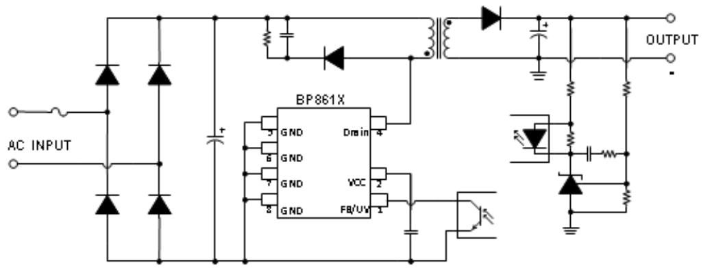

<table><tr><td>项目描述</td><td>符号</td><td>最小</td><td>典型</td><td>最大</td><td>单位</td><td>备注</td></tr><tr><td colspan="7">输入</td></tr><tr><td>电压</td><td> $V_{IN}$ </td><td>85</td><td>115/230</td><td>264</td><td> $V_{AC}$ </td><td></td></tr><tr><td>频率</td><td> $f_{LINE}$ </td><td>47</td><td>50/60</td><td>63</td><td>Hz</td><td></td></tr><tr><td colspan="7">输出</td></tr><tr><td>输出电压1</td><td> $V_{OUT1}$ </td><td>14.25</td><td>15</td><td>15.75</td><td>V</td><td>±5%</td></tr><tr><td>输出电流1</td><td> $I_{OUT1}$ </td><td>0</td><td>100</td><td></td><td>mA</td><td></td></tr><tr><td>输出电压2</td><td> $V_{OUT2}$ </td><td>11.4</td><td>12</td><td>12.6</td><td>V</td><td>±5%</td></tr><tr><td>输出电流2</td><td> $I_{OUT2}$ </td><td>0</td><td>800</td><td></td><td>mA</td><td></td></tr><tr><td>输出电压纹波1</td><td> $V_{RIPPLE}$ </td><td></td><td></td><td>100</td><td>mV</td><td>20MHz带宽</td></tr><tr><td>输出电压纹波2</td><td> $V_{RIPPLE}$ </td><td></td><td></td><td>100</td><td>mV</td><td>20MHz带宽</td></tr><tr><td>连续输出功率</td><td> $P_{OUT}$ </td><td></td><td>11.1</td><td></td><td>W</td><td></td></tr><tr><td colspan="7">效率</td></tr><tr><td>待机功耗</td><td> $P_{STDBY}$ </td><td></td><td></td><td>200</td><td>mW</td><td>230VAC,包含假负载</td></tr><tr><td>满载效率</td><td>η</td><td></td><td></td><td>81</td><td>%</td><td></td></tr><tr><td colspan="7">环境</td></tr><tr><td>传导EMI</td><td></td><td colspan="4">满足CISPR22/EN55022 Class B,至少6dB 裕量</td><td></td></tr><tr><td>Surge</td><td></td><td></td><td>2</td><td></td><td>kV</td><td>差模</td></tr><tr><td>EFT</td><td></td><td></td><td>4</td><td></td><td>kV</td><td>5kHz/100kHz/38kHz</td></tr><tr><td>ESD</td><td></td><td></td><td>15</td><td>20</td><td>kV</td><td>空气放电</td></tr><tr><td>工作环境温度</td><td> $T_{AMP}$ </td><td>0</td><td></td><td>50</td><td>°C</td><td></td></tr></table>

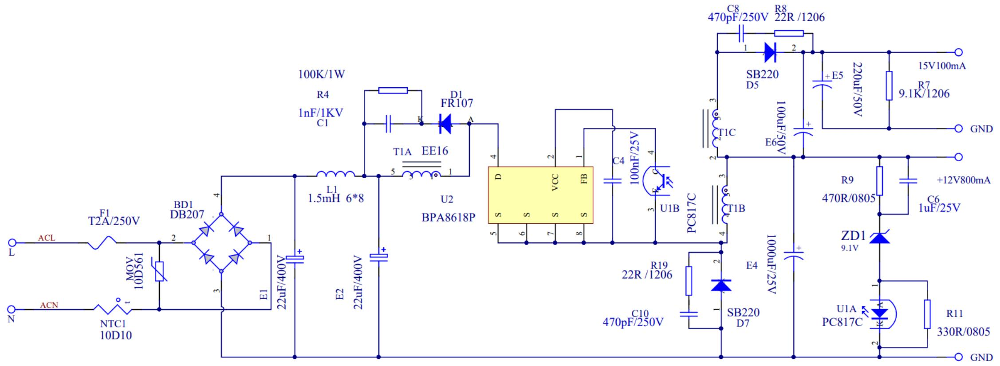

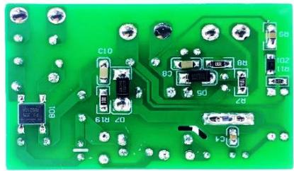

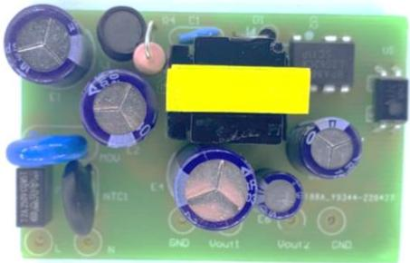

<table><tr><td>序号</td><td>元件标号</td><td>参数描述</td><td>封装尺寸</td><td>数量</td></tr><tr><td>1</td><td>PCB</td><td>CEM-1, 单面板</td><td>56.8mm*35mm</td><td>1</td></tr><tr><td>2</td><td>F1</td><td>T2A/250A 保险丝</td><td>DIP</td><td>1</td></tr><tr><td>3</td><td>ROV1</td><td>10D561, 压敏电阻</td><td>10D561</td><td>1</td></tr><tr><td>4</td><td>NTC</td><td>10D10</td><td>DIP</td><td>1</td></tr><tr><td>5</td><td>EC1、EC2</td><td>400V22uF电解电容</td><td> $\phi 5*10$ </td><td>1</td></tr><tr><td>6</td><td>L1</td><td>1.5mH 工字电感</td><td> $\phi 6*8$ </td><td>2</td></tr><tr><td>7</td><td>C1</td><td>1nF/1kv</td><td>DIP</td><td>1</td></tr><tr><td>8</td><td>D1</td><td>FR107</td><td>DIP</td><td>1</td></tr><tr><td>9</td><td>U2</td><td>BPA8618P</td><td>DIP</td><td>1</td></tr><tr><td>10</td><td>U1</td><td>PC817C光耦</td><td>DIP</td><td>1</td></tr><tr><td>11</td><td>E4</td><td>25V1000uF电解电容</td><td> $\phi 5*10$ </td><td>1</td></tr><tr><td>12</td><td>E5</td><td>50V220uF电解电容</td><td> $\phi 6.5*2.5$ </td><td>1</td></tr><tr><td>13</td><td>E6</td><td>50V100uF电解电容</td><td> $\phi 6.5*2.5$ </td><td>1</td></tr><tr><td>14</td><td>T1</td><td>EE16(5+5)</td><td>DIP</td><td>1</td></tr></table>

<table><tr><td>序号</td><td>元件标号</td><td>参数描述</td><td>封装尺寸</td><td>数量</td></tr><tr><td>15</td><td>BD1</td><td>DB207</td><td>SMD</td><td>1</td></tr><tr><td>16</td><td>C4</td><td>100nF/25V</td><td>SMD0805</td><td>1</td></tr><tr><td>17</td><td>C6</td><td>1uF/ 25V</td><td>SMD0805</td><td>1</td></tr><tr><td>18</td><td>C8</td><td>470pF/1kv</td><td>SMD1206</td><td>1</td></tr><tr><td>19</td><td>C10</td><td>470pF/250V</td><td>SMD0805</td><td>1</td></tr><tr><td>20</td><td>R8、R19</td><td>22R, ±5%</td><td>SMD1206</td><td>2</td></tr><tr><td>21</td><td>R4</td><td>100K/1W</td><td>DIP</td><td>1</td></tr><tr><td>22</td><td>D5、D7</td><td>SB220 2A200V</td><td>SMB</td><td>2</td></tr><tr><td>23</td><td>R7</td><td>9.1K,±5% X7R</td><td>SMD1206</td><td>1</td></tr><tr><td>24</td><td>R4</td><td>100R ,±5%,X7R</td><td>SMD1206</td><td>1</td></tr><tr><td>25</td><td>R9</td><td>470R, ±5%,X7R</td><td>SMD1206</td><td>1</td></tr><tr><td>26</td><td>R11</td><td>330R,±5%,X7R</td><td>SMD0805</td><td>1</td></tr><tr><td>27</td><td>ZD1</td><td>9.1V稳压管</td><td>SMD0805</td><td>1</td></tr><tr><td>28</td><td></td><td></td><td>Total</td><td>30</td></tr></table>

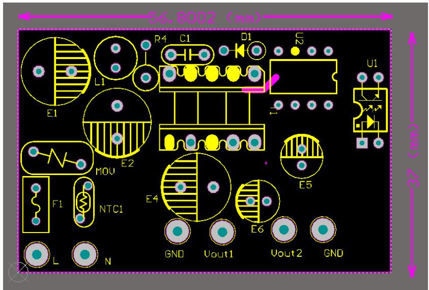

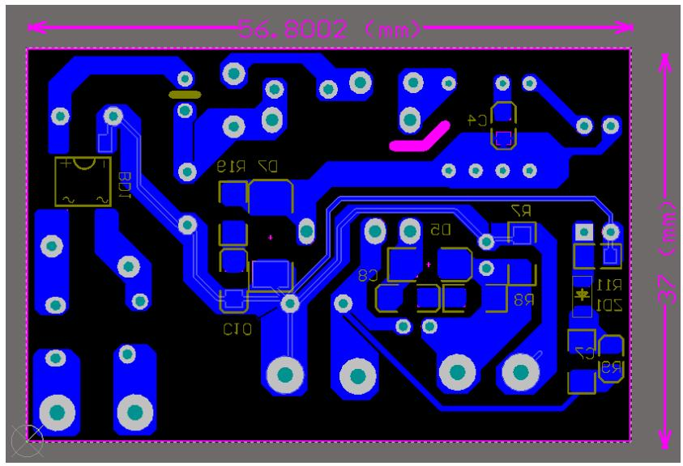

## 原理图

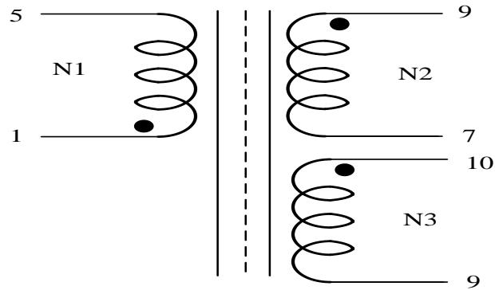

## 绕线方式

<table><tr><td>绕组</td><td>起始脚</td><td>终止脚</td><td>材料</td><td>匝数</td><td>绕线方式</td></tr><tr><td>N1</td><td>1</td><td>5</td><td> $\phi 0.21*1P$ </td><td>98Ts</td><td>密绕(PIN脚朝外)</td></tr><tr><td colspan="4">胶带</td><td>2.1Ts</td><td></td></tr><tr><td>N2</td><td>9</td><td>7</td><td> $\phi 0.4*1P$ </td><td>16Ts</td><td>密绕(PIN脚朝外)</td></tr><tr><td colspan="4">胶带</td><td>2.1Ts</td><td></td></tr><tr><td>N3</td><td>10</td><td>9</td><td> $\phi 0.27*2P$ </td><td>5Ts</td><td>密绕(PIN脚朝外)</td></tr><tr><td colspan="4">胶带</td><td>3Ts</td><td></td></tr></table>

## 规格与材料

➢ 初级绕组感量 $\mathsf { L } _ { \mathsf { p } } = 7 1 0 \mathsf { u } \mathsf { H } \pm 7 \%$ （测试条件： 0.3V，100kHz）  
➢ 漏感量 $\mathrm { \cdot L _ { | k } } < 5 0 \mathrm { u } \mathrm { H }$  
➢ 骨架：EE16（5+5PIN）  
➢ 磁芯：EE16 PC40 或同等材质 ， ${ \mathsf { A } } { \mathsf { e } } = 1 9 . 2 { \mathsf { m m } } ^ { 2 }$  
➢ N1、N2、N3 ： 2UEW 漆包线  
➢ 绝缘胶带:3M900 或同等材质  
➢ 成品要求：浸凡立水

## 脚位图

待机功耗（包含25mW假负载）  
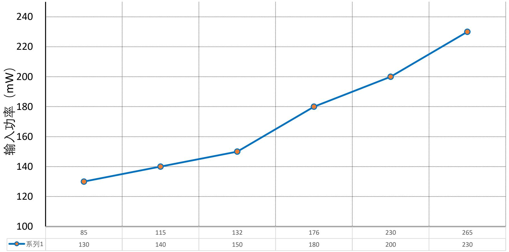

输入电压(VAC)

效率测试  
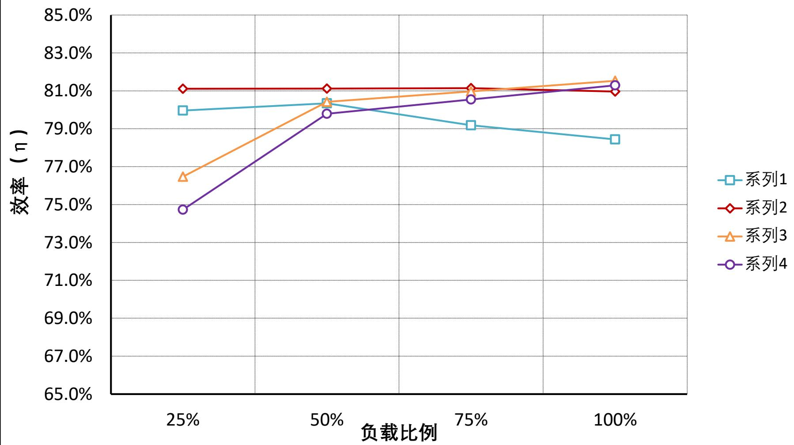

## 输出电压交叉调整率

<table><tr><td>输入电压AC (V)</td><td>输出电流1(A)</td><td>输出电压1(V)</td><td>输出电流2(A)</td><td>输出电压2(V)</td></tr><tr><td rowspan="2">115</td><td>0</td><td>11.84</td><td>0.1</td><td>14.87</td></tr><tr><td>0.8</td><td>11.73</td><td>0</td><td>15.25</td></tr><tr><td rowspan="2">230</td><td>0</td><td>11.84</td><td>0.1</td><td>14.89</td></tr><tr><td>0.8</td><td>11.73</td><td>0</td><td>15.26</td></tr></table>

## 输出电压纹波

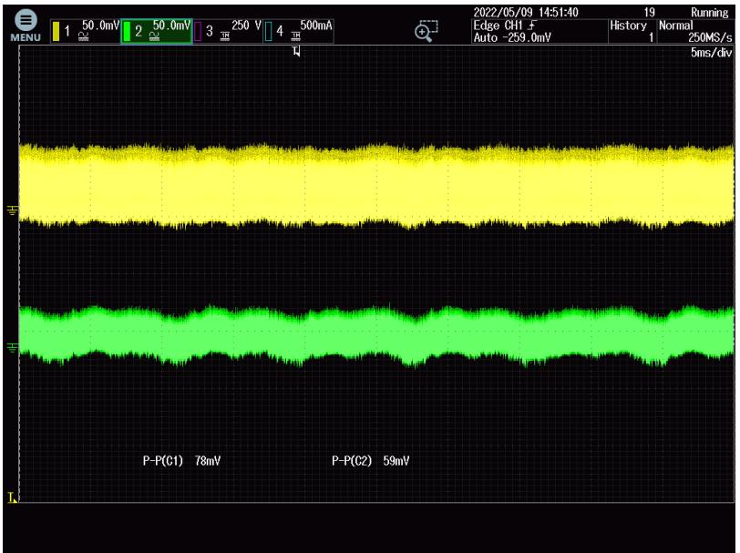

85 VAC

CH1 $\mathsf { V } _ { \mathsf { O U T } } \mathsf { R i p p l e }$ $\mathsf { V } _ { \mathsf { P K - P K } } { = } 7 8 \mathsf { m } \mathsf { v }$  
CH2 $\mathsf { V } _ { \mathsf { O U T } } \mathsf { R i p p l e }$ $\mathsf { V } _ { \mathsf { P K - P K } } 5 9 \mathsf { m V }$

Test Condition:  
➢ Full Load  
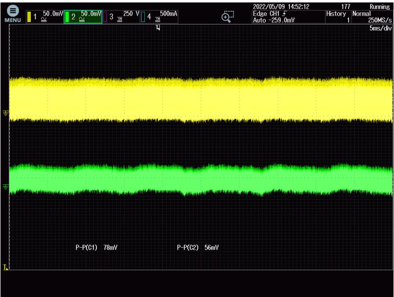

115 VAC

CH1 $\mathsf { V } _ { \mathsf { O U T } }$ Ripple $\mathbf { V } _ { \mathsf { P K - P K } } { = } 7 8 \mathsf { m V }$  
CH2 $\mathsf { V } _ { \mathsf { O U T } }$ Ripple $\mathtt { V } _ { \mathtt { P K - P K } } = 5 6 \mathsf { m v }$

Test Condition:  
➢ Full Load  
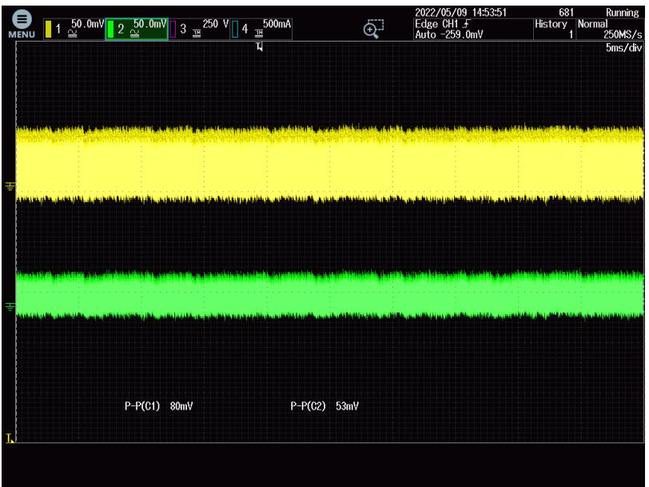

230 $\mathsf { v } _ { \mathsf { A C } }$

CH1 $\mathsf { V } _ { \mathsf { O U T } } \mathsf { R i p p l e }$ $\mathtt { V } _ { \mathtt { P K - P K } } { = } 8 0 \mathsf { m V }$  
CH2 $\mathsf { V } _ { \mathsf { O U T } } \mathsf { R i p p l e }$ $\mathtt { V } _ { \mathtt { P K - P K } } = 5 3 \mathtt { m V }$

Test Condition:  
➢ Full Load  

265 $\mathsf { v } _ { \mathsf { A C } }$

CH1 $\mathsf { V } _ { \mathsf { O U T } }$ Ripple $\mathtt { V } _ { \mathtt { P K - P K } } = 8 1 \mathsf { m V }$  
$\mathsf { C H } 2 \mathsf { V } _ { \mathsf { O U T } } \mathsf { R i p p l e }$ $\mathsf { V } _ { \mathsf { P K - P K } } { = } 5 4 \mathsf { m } \mathsf { v }$

Test Condition:

➢ Full Load

## 动态负载(50%-100%)

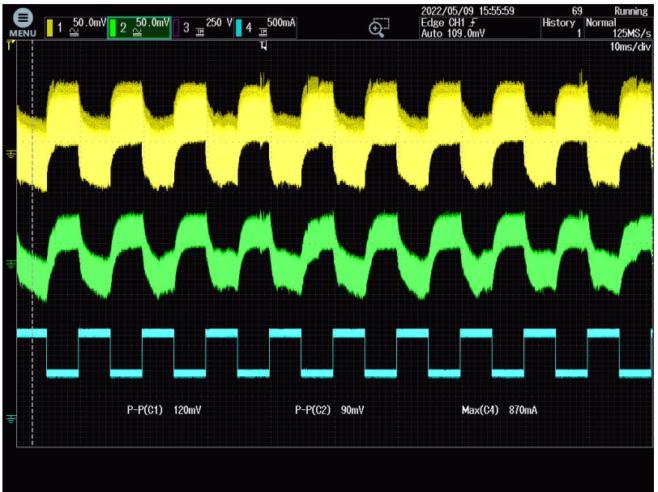

85 VAC

${ \mathsf { C H 1 } } { \mathsf { V } } _ { \mathsf { O U T } }$ CH1 VOUT $v _ { p _ { \mathrm { K - P K } } } { = } 1 2 0 ~ \mathsf { m V }$  
CH2 VOUT ${ \mathsf { C H } } 2 { \mathsf { V } } _ { \mathsf { O U T } }$ $\mathsf { V } _ { \mathsf { P K - P K } } { = } 9 0 \mathsf { m } \mathsf { v }$

## Test Condition:

➢ 0.4 A-0.8 A-0.4 A  
➢ 0.05A-0.1 A-0.05 A  
➢ Slew Rate: 0.5 A/μS  
➢ Frequency: 100 Hz

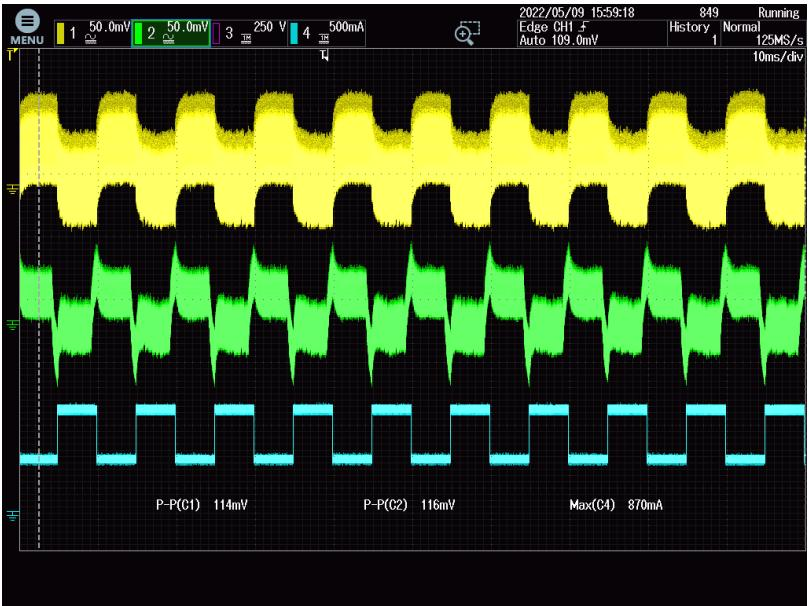

230 VAC

CH1 VOUT ${ \mathsf { C H 1 } } { \mathsf { V } } _ { \mathsf { O U T } }$ $\mathtt { V } _ { \mathtt { P K - P K } } { = } 1 1 4 \mathsf { m V }$  
CH2 VOUT ${ \mathsf { C H } } 2 { \mathsf { V } } _ { \mathsf { O U T } }$ VPK-PK=116 mV $\mathtt { V } _ { \mathtt { P K - P K } } = \mathtt { 1 } \mathtt { 1 } 6 \mathtt { m v }$

## Test Condition:

➢ 0.4A-0.8A-0.4A  
➢ 0.05 A-0.1 A-0.05 A  
➢ Slew Rate: 0.5 A/μS  
➢ Frequency: 100 Hz

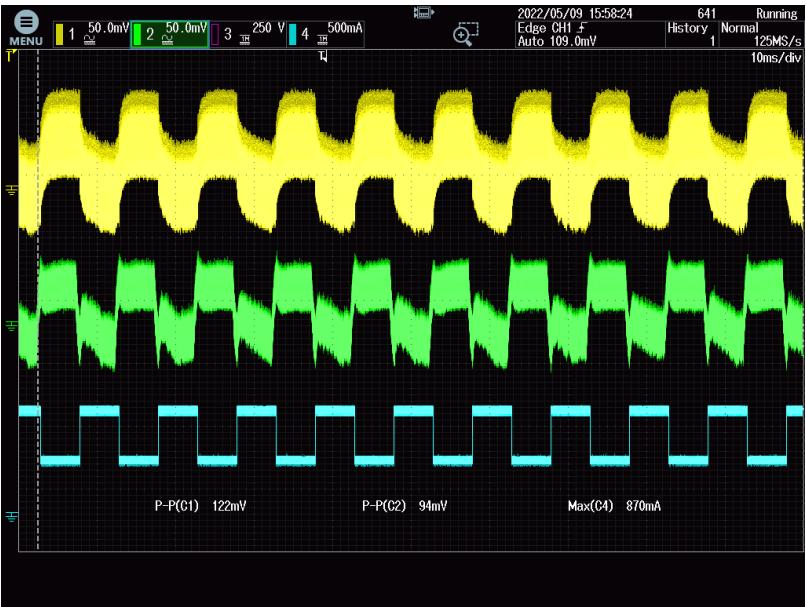

115 VAC

${ \mathsf { C H 1 } } { \mathsf { V } } _ { \mathsf { O U T } }$ CH1 VOUT $v _ { p | \mathrm { x } \mathrm { . } p | } { = } 1 2 2 \ m v$  
CH2 VOUT ${ \mathsf { C H } } 2 { \mathsf { V } } _ { \mathsf { O U T } }$ VPK-PK=94 mV $\mathsf { V } _ { \mathsf { P K - P K } } { = } 9 4 \mathsf { m } \mathsf { v }$

## Test Condition:

➢ 0.4 A-0.8A-0.4A  
➢ 0.05 A-0.1 A-0.05 A  
➢ Slew Rate: 0.5 A/μS  
➢ Frequency: 100 Hz

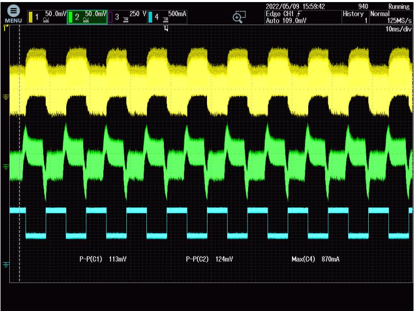

265 VAC

CH1 VOUT ${ \mathsf { C H 1 } } { \mathsf { V } } _ { \mathsf { O U T } }$ $\mathsf { V } _ { \mathsf { P K - P K } } { = } \pmb { 1 } \pmb { 1 } 3 \mathsf { m V }$  
CH2 VOUT ${ \mathsf { C H } } 2 { \mathsf { V } } _ { \mathsf { O U T } }$ VPK-PK=124 mV $\mathsf { V } _ { \mathsf { P K - P K } } { = } 1 2 4 \mathsf { m V }$

## Test Condition:

➢ 0.4 A-0.8 A-0.4 A  
➢ 0.05A-0.1 A-0.05 A  
➢ Slew Rate: 0.5 A/μS  
➢ Frequency: 100 Hz

## 动态负载(10%-90%)

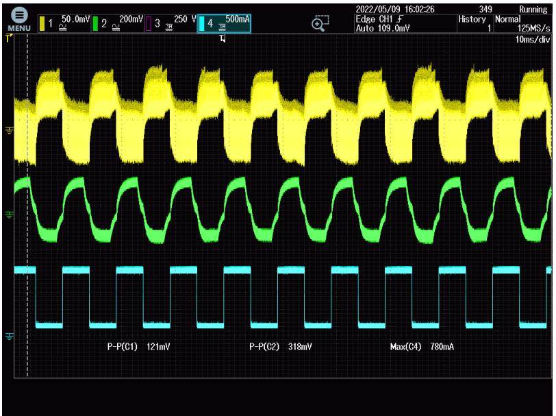

85 VAC

${ \mathsf { C H 1 } } { \mathsf { V } } _ { \mathsf { O U T } }$ CH1 VOUT $\mathsf { V } _ { \mathsf { P K - P K } } { = } 1 2 1 \mathsf { m V }$  
CH2 VOUT ${ \mathsf { C H } } 2 { \mathsf { V } } _ { \mathsf { O U T } }$ $\mathsf { V } _ { \mathsf { P K - P K } } { = } 3 1 8 \mathsf { m V }$

## Test Condition:

➢ 0.08 A-0. 72A-0.08A  
➢ 0.01 A-0.09 A-0.01 A  
➢ Slew Rate: 0.5 A/μS  
➢ Frequency: 100 Hz

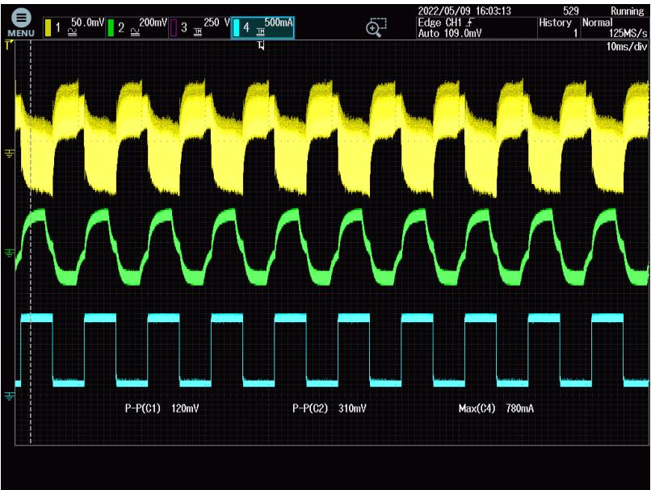

115 VAC

CH1 VOUT ${ \mathsf { C H 1 } } { \mathsf { V } } _ { \mathsf { O U T } }$ VPK-PK=120 mV  
CH2 VOUT ${ \mathsf { C H } } 2 { \mathsf { V } } _ { \mathsf { O U T } }$ $\mathsf { V } _ { \mathsf { P K - P K } } { = } 3 1 0 \mathsf { m V }$

## Test Condition:

➢ $0 . 0 8 \ A { - } 0 . 7 2 \ A { - } 0 . 0 8 \ A$  
➢ 0.01 A-0.09 A-0.01 A  
➢ Slew Rate: 0.5 A/μS  
➢ Frequency: 100 Hz

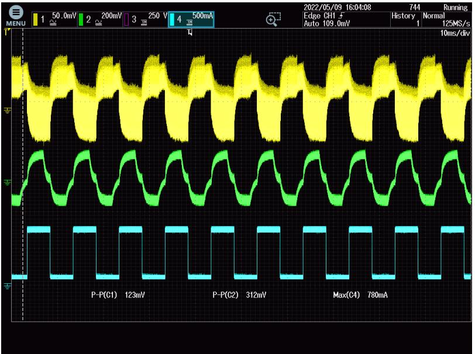

230 VAC

CH1 VOUT ${ \mathsf { C H 1 } } { \mathsf { V } } _ { \mathsf { O U T } }$ $v _ { p _ { k - P K } } = 1 2 3 ~ \mathsf { m v }$  
CH2 VOUT ${ \mathsf { C H } } 2 { \mathsf { V } } _ { \mathsf { O U T } }$ VPK-PK=312 mV $\mathsf { V } _ { \mathsf { P K - P K } } { = } 3 1 2 \mathsf { m V }$

## Test Condition:

➢ 0.08 A-0.72 A-0.08A  
➢ 0.01 A-0.09 A-0.01 A  
➢ Slew Rate: 0.5 A/μS  
➢ Frequency: 100 Hz

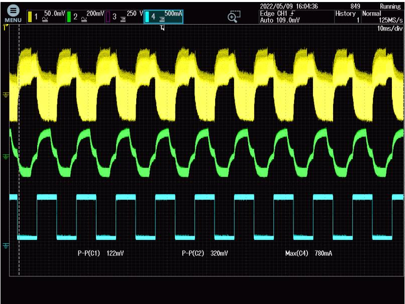

265 VAC

CH1 VOUT ${ \mathsf { C H 1 } } { \mathsf { V } } _ { \mathsf { O U T } }$ $v _ { p | \mathrm { x } \mathrm { . } p | } { = } 1 2 2 \ m v$  
CH2 VOUT ${ \mathsf { C H } } 2 { \mathsf { V } } _ { \mathsf { O U T } }$ VPK-PK=320mV $\mathsf { V } _ { \mathsf { P K - P K } } { = } 3 2 0 \mathsf { m V }$

## Test Condition:

➢ 0.08 A-0.72 A-0.08 A  
➢ 0.01 A-0.09A-0.01 A  
➢ Slew Rate: 0.5 A/μS  
➢ Frequency: 100 Hz

## 输出电压开机波形

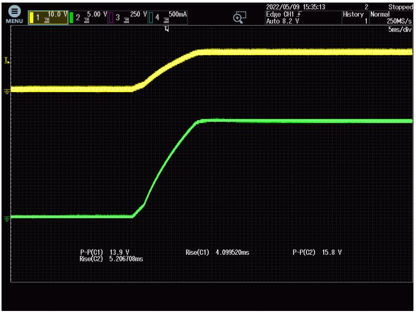

85 VAC

CH1 VOUT $\mathsf { V } _ { \mathsf { O U T } }$ ${ \sf T } _ { \sf R I S E } .$ 4.09mS  
CH2 VOUT $\mathsf { V } _ { \mathsf { O U T } }$ ${ \sf T } _ { \sf R I S E } .$ 5.2mS

Test Condition:  
➢ No Load  
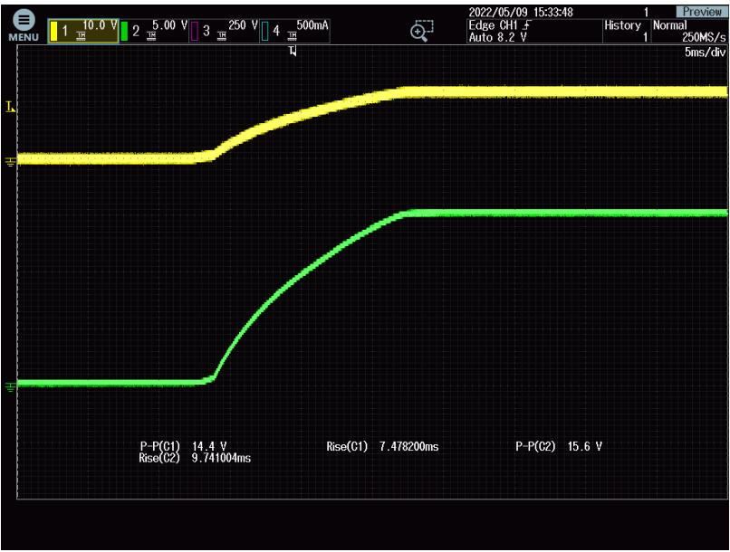

85 VAC

CH1 VOUT $\mathsf { V } _ { \mathsf { O U T } }$ ${ \sf T } _ { \sf R I S E } .$ 7.47mS  
CH2 VOUT $\mathsf { V } _ { \mathsf { O U T } }$ TRISE: 9.74mS ${ \sf T } _ { \sf R I S E } .$

Test Condition:  
➢ Full Load  
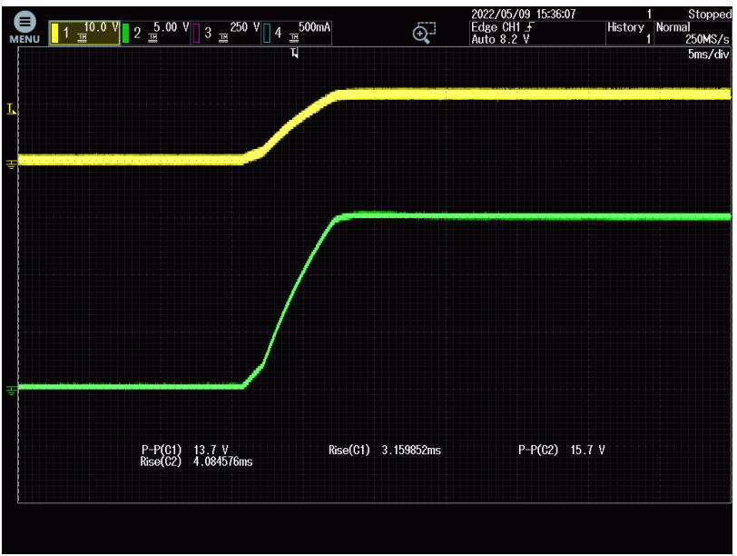

265 $\mathsf { v } _ { \mathsf { A C } }$

CH1 VOUT $\mathsf { V } _ { \mathsf { O U T } }$ ${ \sf T } _ { \sf R I S E } .$ 3.15 mS  
CH2 VOUT $\mathsf { V } _ { \mathsf { O U T } }$ ${ \sf T } _ { \sf R I S E } .$ 4.08mS

Test Condition:  
➢ No Load  
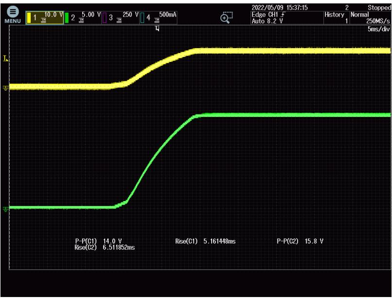

265 $\mathsf { v } _ { \mathsf { A C } }$

CH1 VOUT $\mathsf { V } _ { \mathsf { O U T } }$ ${ \sf T } _ { \sf R I S E } .$ 5.16 mS  
CH2 VOUT $\mathsf { V } _ { \mathsf { O U T } }$ ${ \sf T } _ { \sf R I S E } .$ 6.51mS

Test Condition:

➢ Full Load

## 启动延迟时间

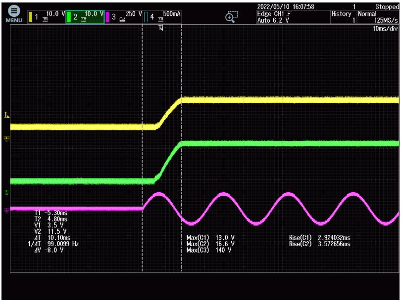

85 VAC

CH1 $\mathsf { V } _ { \mathsf { O U T } }$  
CH2 $\mathsf { V } _ { \mathsf { O U T } }$  
CH3 VINNAC $\mathsf { V I N } _ { \mathsf { N A C } }$ ${ \mathsf { T } } _ { \mathsf { D E L A Y } } .$ 10.1 mS ${ \mathsf { T } } _ { \mathsf { D E L A Y } } .$ 10.1 mS

Test Condition:  
➢ No Load  
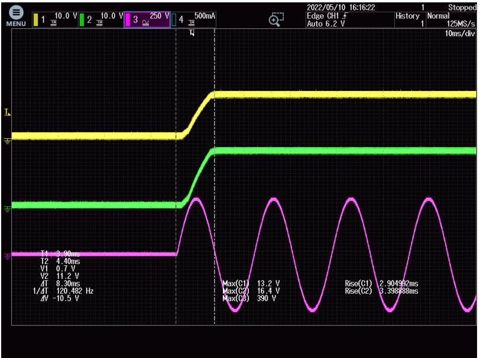

265 $\mathsf { v } _ { \mathsf { A C } }$

CH1 VOUT $\mathsf { V } _ { \mathsf { O U T } }$  
CH2 $\mathsf { V } _ { \mathsf { O U T } }$  
CH3 VINNAC $\mathsf { V I N } _ { \mathsf { N A C } }$ ${ \sf T } _ { \sf D E L A Y } .$ 8.3mS ${ \sf T } _ { \sf D E L A Y } .$ 8.3mS

Test Condition:  
➢ No Load  
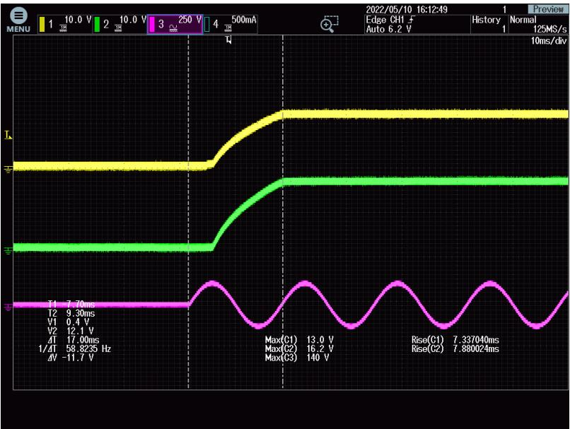

85 VAC

CH1 $\mathsf { V } _ { \mathsf { O U T } }$  
CH2 $\mathsf { V } _ { \mathsf { O U T } }$  
CH3 VINNAC $\mathsf { V I N } _ { \mathsf { N A C } }$ $\mathsf { T } _ { \mathsf { D E L A Y } } .$ 17 mS $\mathsf { T } _ { \mathsf { D E L A Y } } .$ 17mS

Test Condition:  
➢ Full Load  
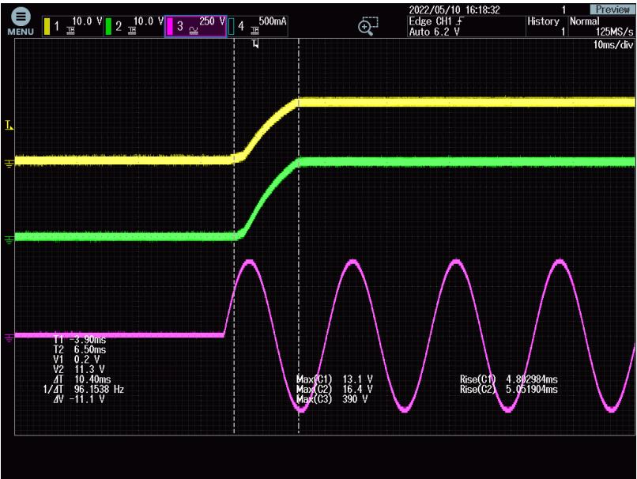

265 $\mathsf { v } _ { \mathsf { A C } }$

${ \mathsf { C H 1 } } { \mathsf { V } } _ { \mathsf { O U T } }$  
${ \mathsf { C H } } 2 { \mathsf { V } } _ { \mathsf { O U T } }$  
CH3 VINNAC $\mathsf { V I N } _ { \mathsf { N A C } }$ $\mathsf { T } _ { \mathsf { D E L A Y } } .$ 10.4 mS $\mathsf { T } _ { \mathsf { D E L A Y } } .$ 10.4 mS

Test Condition:

➢ Full Load

## 输入过压保护

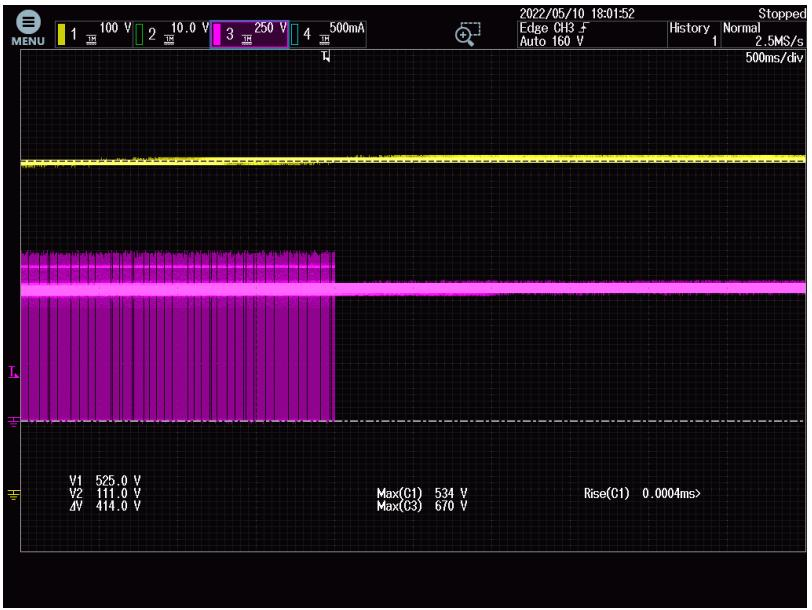

## 输入OVP

CH1 $\mathsf { V I N } _ { \mathsf { D C } }$  
CH3 VIN VDS $\mathsf { V I N V } _ { \mathsf { D S } }$ VBROWN-IN: 534V

## 测试条件:

➢ No Load

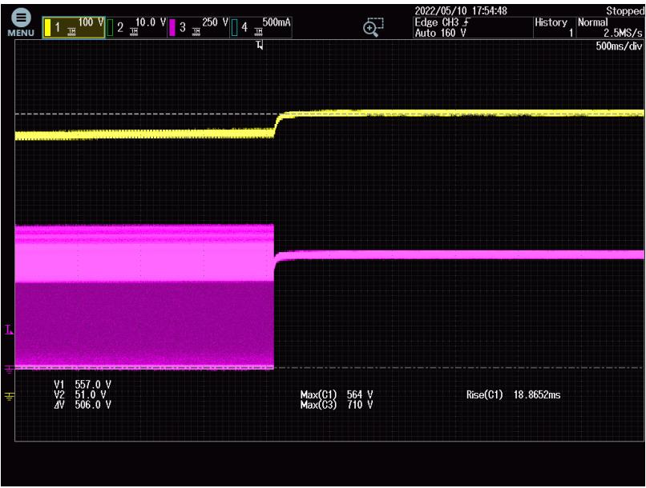

## 输入OVP

${ \mathsf { C H 1 } } { \mathsf { V I N } } _ { \mathsf { D C } }$  
CH3 VIN V $\mathsf { C H 3 } \mathsf { V I N } \mathsf { V } _ { \mathsf { D S } }$ VBROWN-IN: 564 V

## 测试条件:

➢ Full Load

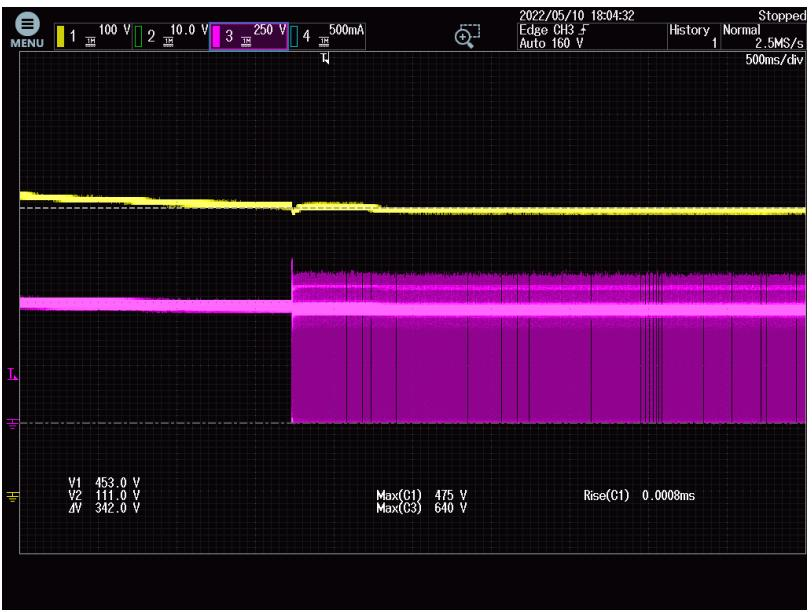

## 退出输入OVP

CH1 $\mathsf { V I N } _ { \mathsf { D C } }$  
CH3 VIN VDS $\mathsf { V I N } \mathsf { V } _ { \mathsf { D S } }$ VBROWN-OUT:475 V

## 测试条件:

➢ No Load

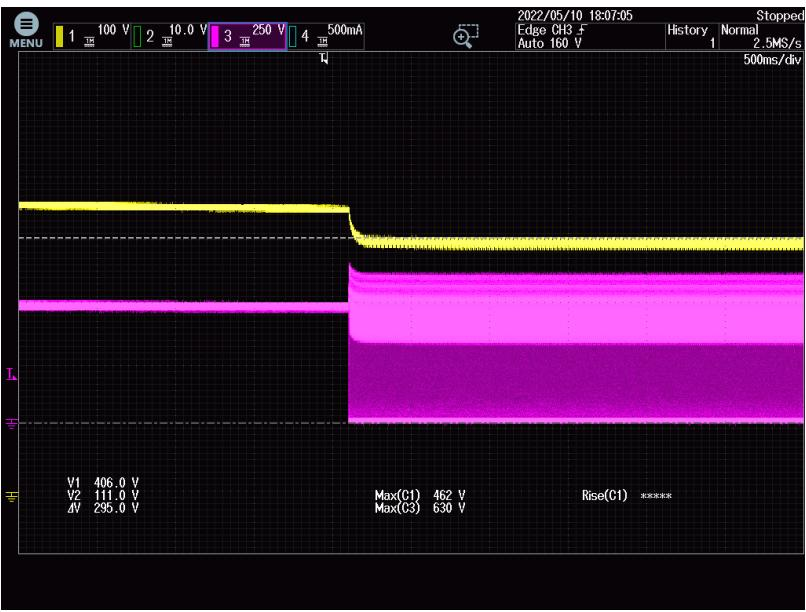

## 退出输入OVP

CH1 $\mathsf { V I N } _ { \mathsf { D C } }$  
CH3 VIN VDS $\mathsf { V I N } \mathsf { V } _ { \mathsf { D S } }$ VBROWN-OUT: 462V

## 测试条件:

➢ Full Load

## 输入欠压保护

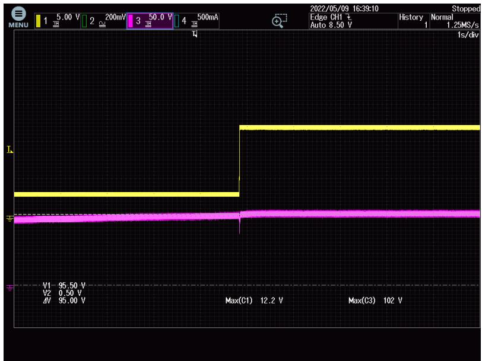

## BROWN-IN

CH1 $\mathsf { V I N } _ { \mathsf { D C } }$  
CH3 VIN VDS $\mathsf { V } _ { \mathsf { D } \mathsf { S } }$ VBROWN-IN: 90V

## 测试条件:

➢ No Load

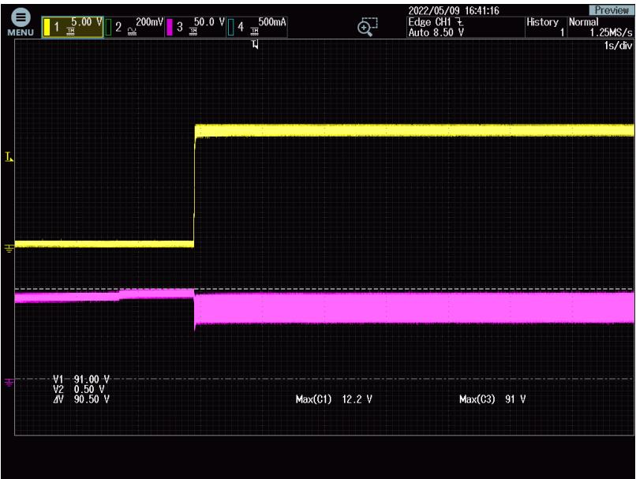

## BROWN-IN

CH1 $\mathsf { V I N } _ { \mathsf { D C } }$  
CH3 VIN V $\mathsf { V I N } \mathsf { V } _ { \mathsf { D S } }$ VBROWN-IN: 90.5V

## 测试条件:

➢ Full Load

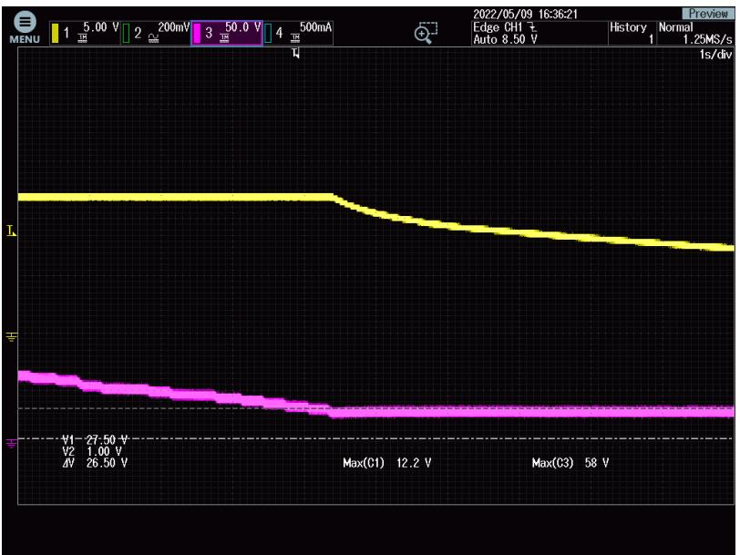

## BROWN-OUT

CH1 $\mathsf { V I N } _ { \mathsf { D C } }$  
CH3 VIN VDS $\mathsf { V } _ { \mathsf { D } \mathsf { S } }$ VBROWN-OUT: 26.5V

## 测试条件:

➢ No Load

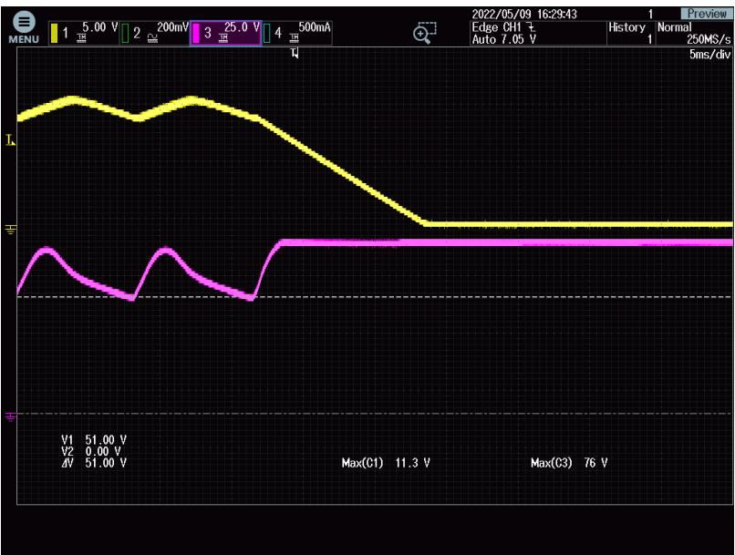

## BROWN-OUT

CH1 $\mathsf { V I N } _ { \mathsf { D C } }$  
CH3 VIN VDS $\mathsf { V } _ { \mathsf { D } \mathsf { S } }$ VBROWN-OUT: 51V

## 测试条件:

➢ Full Load

## 短路保护 （MOSFET波形）

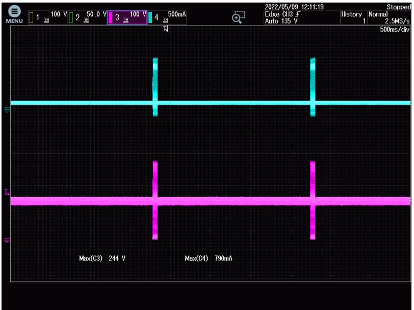

85 VAC

${ \mathsf { C H 3 } } \mathsf { V } _ { \mathsf { D S } } .$  
CH4 ${ \sf I } _ { \sf D } \colon$

$$
\begin{array}{l} I _ {D S \_ M A X} = 0. 7 9 A \\ V _ {D S \_ M A X} = 2 4 4 V \end{array}
$$

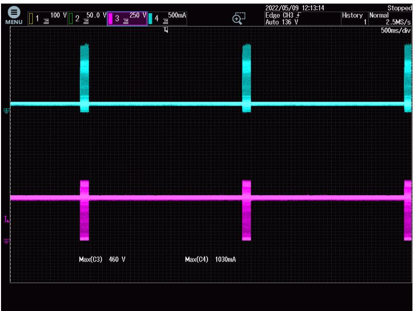

230 VAC

CH3 $\mathsf { V } _ { \mathsf { D S } } .$  
CH4 $\mathsf { I } _ { \mathsf { D } } \colon$

$$
\begin{array}{l} I _ {D S \_ M A X} = 1. 0 3 A \\ V _ {D S \_ M A X} = 4 6 0 V \end{array}
$$

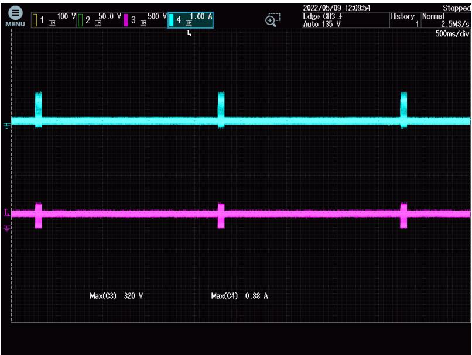

115 VAC

CH3 $\mathsf { V } _ { \mathsf { D } \mathsf { S } } .$  
CH4 $\mathsf { I } _ { \mathsf { D } } \colon$

$$
I _ {D S \_ M A X} = 0. 8 3 A
$$

$$
V _ {D S \_ M A X} = 2 8 7 V
$$

265 VAC

CH3 $\mathsf { V } _ { \mathsf { D } \mathsf { S } } .$  
CH4 ${ \sf I } _ { \sf D } \colon$

$$
I _ {D S \_ M A X} = 1. 0 9 A
$$

$$
V _ {D S \_ M A X} = 5 2 0 V
$$

## MOSFET稳态波形

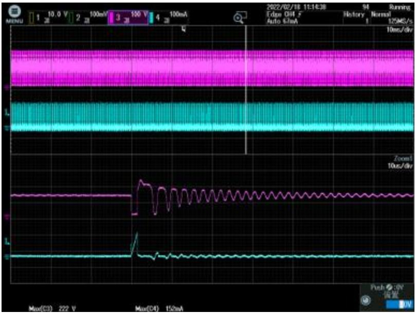

85 VAC

CH1 VDS  
CH3 IDS

$$
\begin{array}{l} \mathrm {V_ {DS\_MAX}} = 2 2 2 \mathrm{V} \\ \mathrm {I_ {DS\_MAX}} = 0. 1 5 2 \mathrm{A} \end{array}
$$

## Test Condition:

➢ No Load

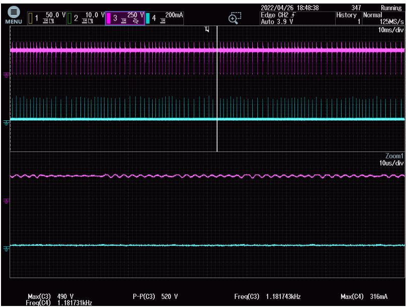

265 VAC

CH1 VDS  
CH3 IDS

$$
\begin{array}{l} \mathrm {V_ {DS\_MAX}} = 4 9 0 \mathrm{V} \\ \mathrm {I_ {DS\_MAX}} = 0. 3 1 6 \mathrm{A} \end{array}
$$

## Test Condition:

➢ No Load

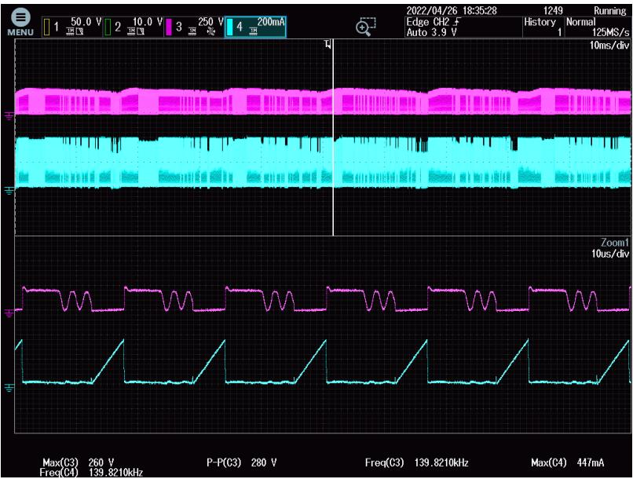

85 VAC

CH1 VDS  
CH3 IDS

$$
\begin{array}{l} \mathrm {V_ {DS\_MAX}} = 2 6 0 \mathrm{V} \\ \mathrm {I_ {DS\_MAX}} = 0. 4 4 7 \mathrm{A} \end{array}
$$

## Test Condition:

➢ Full Load

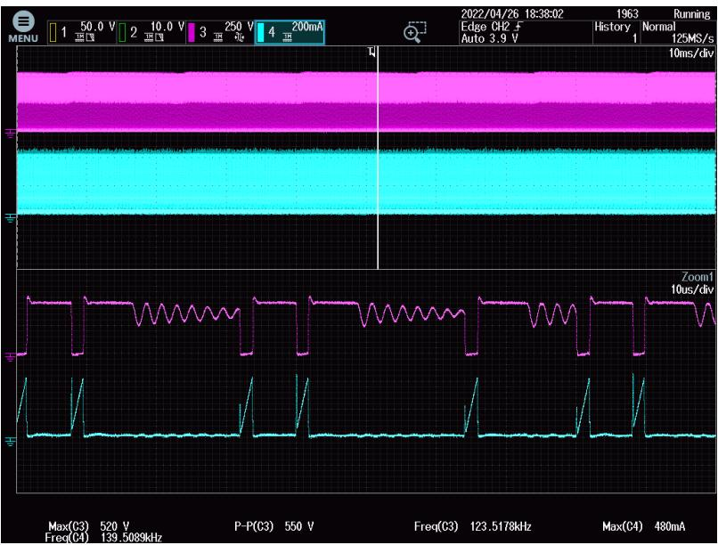

265 VAC

CH1 VDS  
CH3 IDS

$$
\begin{array}{l} \mathrm {V_ {DS\_MAX}} = 5 2 0 \mathrm{V} \\ \mathrm {I_ {DS\_MAX}} = 0. 4 8 \mathrm{A} \end{array}
$$

## Test Condition:

➢ Full Load

## 漏极电流波形

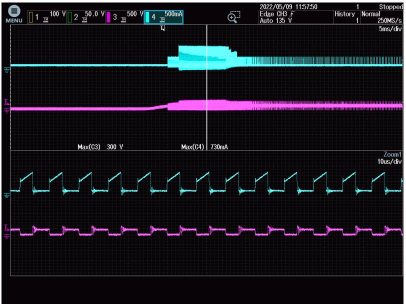

${ \otimes 5 } \mathsf { V } _ { \mathsf { A C } }$

CH1 VOUTPUT $\mathsf { V } _ { \mathsf { O U T P U T } }$  
CH4 IDRAIN $\mathsf { I } _ { \mathsf { D R A I N } }$ $\mathsf { I } _ { \mathsf { D S \_ M A X } } { = } \mathsf { 0 } . 7 3 \mathsf { A }$ $V _ { \mathsf { D S \_ M A X } } \equiv 3 0 0 \mathsf { V }$

Test Condition:

➢ 空载启动

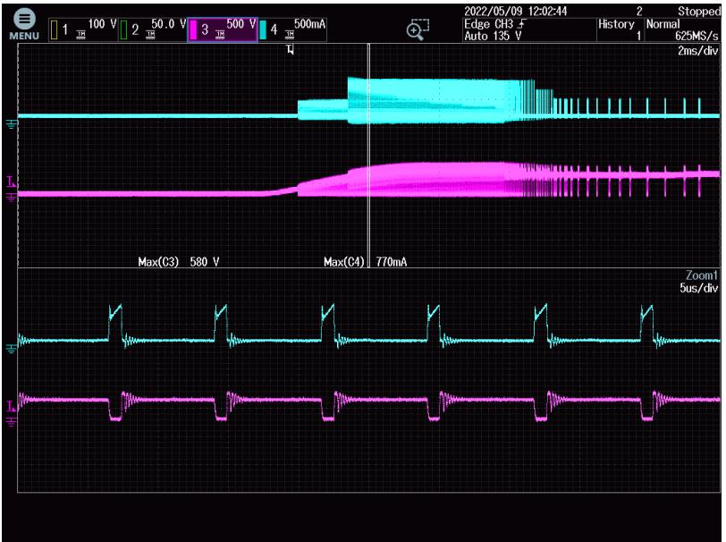

265 $\mathsf { v } _ { \mathsf { A C } }$

CH1 VOUTPUT ${ \mathsf { C H 1 V _ { \mathsf { 0 U T P U T } } } }$  
CH4 IDRAIN IDS\_MAX=0.77A VDS\_MAX= 580V

➢ 空载启动

Test Condition:  
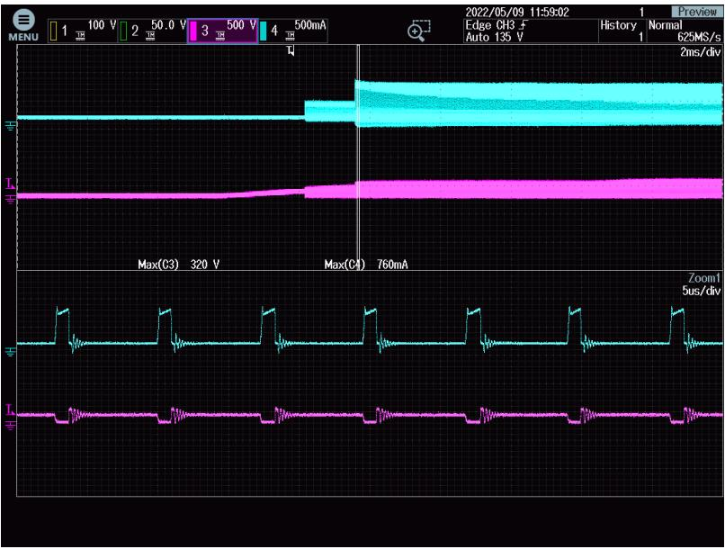

85 VAC

CH1 $\mathsf { V } _ { \mathsf { O U T P U T } }$  
$\mathsf { C H 4 } \mathsf { I } _ { \mathsf { D R A I N } }$ CH4 IDRAIN $\mathsf { I } _ { \mathsf { D S \_ M A X } } { = } 0 . 7 6 \mathsf { A }$ $V _ { \mathsf { D S \_ M A X } } \equiv 3 2 0 \mathsf { V }$

Test Condition:

➢ 满载启动

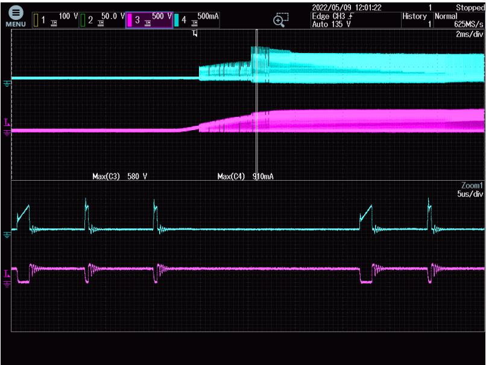

$2 6 5 \ : \mathsf { V } _ { \mathsf { A C } }$

CH1 VOUTPUT ${ \mathsf { C H 1 } } { \mathsf { V } } _ { { \mathsf { 0 U T P U T } } }$  
CH4 IDRAIN $\mathsf { I } _ { \mathsf { D S \_ M A X } } { = } 0 . 9 1 \mathsf { A }$ VDS\_MAX= 0V

Test Condition:

➢ 满载启动

## D-S电压波形

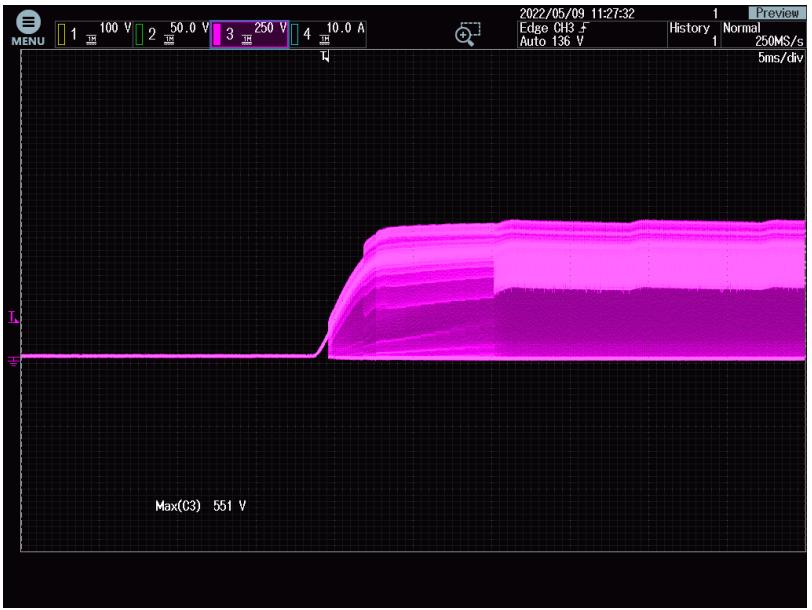

265 VAC

CH2 VDS VDSMAX: 551 V

## Test Condition:

➢ 满载开机

极限参数(注3)

<table><tr><td>符号</td><td>参数</td><td>参数范围</td><td>单位</td></tr><tr><td> $V_{DRAIN}$ </td><td>内部高压 MOSFET 漏极到源极电压</td><td>-0.3~700</td><td>V</td></tr><tr><td> $V_{CC}$ </td><td> $V_{CC}$  电压</td><td>-0.3~9</td><td>V</td></tr><tr><td> $I_{CC\_MAX}$ </td><td> $V_{CC}$  引脚最大电流</td><td>20</td><td>mA</td></tr><tr><td> $V_{FB}$ </td><td>输出反馈端电压</td><td>-0.3~9</td><td>V</td></tr><tr><td> $P_{DMAX}$ </td><td>功耗(注 4)</td><td>1.5</td><td>W</td></tr><tr><td> $\theta_{JA}$ </td><td>结到环境的热阻(注 5)</td><td>80</td><td>°C/W</td></tr><tr><td> $\theta_{JC}$ </td><td>结到芯片表面的热阻(注 5)</td><td>20</td><td>°C/W</td></tr><tr><td> $T_{J}$ </td><td>工作结温范围</td><td>-40 to 150</td><td>°C</td></tr><tr><td> $T_{STG}$ </td><td>储存温度范围</td><td>-55 to 150</td><td>°C</td></tr><tr><td>ESD</td><td>人体模型 ESD(注 6)</td><td>2</td><td>kV</td></tr></table>

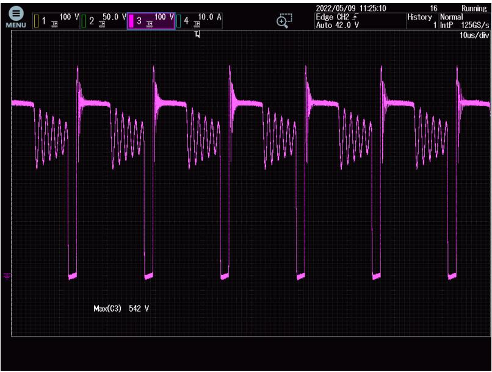

265 VAC

CH2 VDS VDSMAX: 542 V

Test Condition:满载正常工作

## 满载开机

Derating= 551 V / 700 V = 78.71 %

## 满载正常工作

Derating = 542V / 700 V = 77.42 %

## 15V输出肖特基反压波形

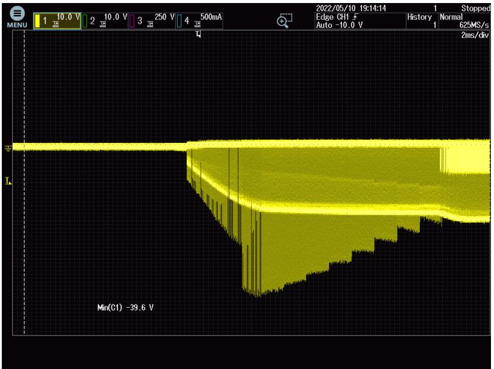

265 VAC

CH1 VDIODE VDSMAX:39.6V

Test Condition:

➢ 满载启动

<table><tr><td>PARAMETER</td><td>SYMBOL</td><td>MB54</td><td>MB54A</td><td>MB55</td><td>MB56</td><td>MB58</td><td>MB59</td><td>MB510</td><td>MB515</td><td>MB520</td><td>UNITS</td></tr><tr><td>Maximum Recurrent Peak Reverse Voltage</td><td> $V_{RRM}$ </td><td>40</td><td>45</td><td>50</td><td>60</td><td>80</td><td>90</td><td>100</td><td>150</td><td>200</td><td>V</td></tr><tr><td>Maximum RMS Voltage</td><td> $V_{RMS}$ </td><td>28</td><td>31.5</td><td>35</td><td>42</td><td>56</td><td>63</td><td>70</td><td>105</td><td>140</td><td>V</td></tr><tr><td>Maximum DC Blocking Voltage</td><td> $V_{DC}$ </td><td>40</td><td>45</td><td>50</td><td>60</td><td>80</td><td>90</td><td>100</td><td>150</td><td>200</td><td>V</td></tr><tr><td>Average Rectified Output Current (See Figure 1)</td><td> $I_{F(AV)}$ </td><td colspan="9">5</td><td>A</td></tr><tr><td>Non-Repetitive Peak Forward Surge Current : 8.3ms single half sine-wave superimposed on rated load</td><td> $I_{FSM}$ </td><td colspan="9">100</td><td>A</td></tr><tr><td>Forward Voltage at 5A (Note 1)</td><td> $V_{F}$ </td><td colspan="2">0.7</td><td colspan="2">0.74</td><td colspan="3">0.8</td><td colspan="2">0.9</td><td>V</td></tr><tr><td>Peak Reverse Current at Rated DC Blocking Voltage  $T_J=25°C$  $T_J=100°C$ </td><td> $I_R$ </td><td colspan="9">0.0510</td><td>mA</td></tr><tr><td>Typical Thermal Resistance (Note 2)</td><td> $R_{\theta JA}$  $R_{\theta JL}$ </td><td colspan="9">5517</td><td>°C /W</td></tr><tr><td>Operating Junction and Storage Temperature Range</td><td> $T_J,T_{STG}$ </td><td>-55 to +150</td><td colspan="8">-65 to +175</td><td>°C</td></tr></table>

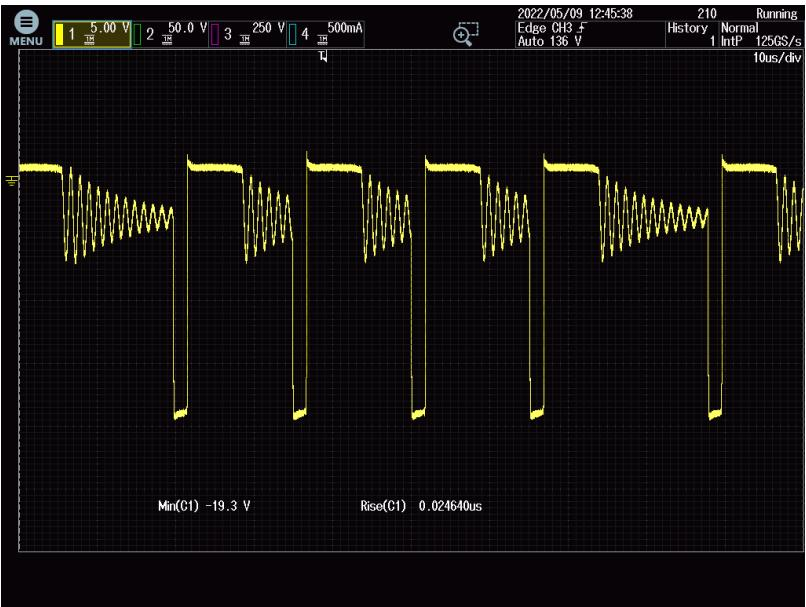

265 VAC

CH1 VDDIODE VMAX: 19.3V

Test Condition:

满载正常工作

## 满载开机

$\mathrm { D e r a t i n g } = 3 9 . 6 \vee / 2 0 0 \vee = 1 9 . 8 \%$

## 满载正常工作

Derating = 19.3 V / 200V = 9.65 %

## 12V输出肖特基反压波形

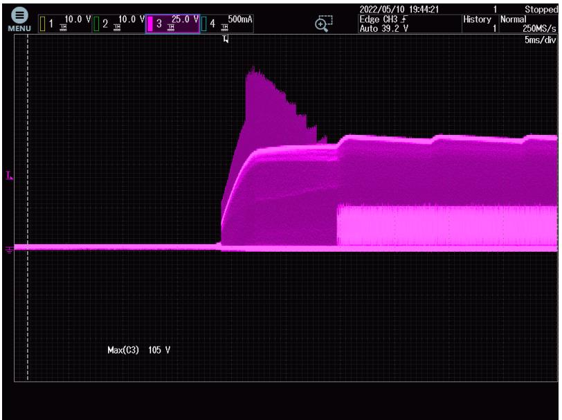

265 VAC

CH3 VDIODE VDSMAX: 105V

Test Condition:

➢ 满载启动

<table><tr><td>Parameter</td><td>Symbols</td><td>SS22</td><td>SS24</td><td>SS26</td><td>SS28</td><td>SS210</td><td>SS212</td><td>SS215</td><td>SS220</td><td>Units</td></tr><tr><td>Maximum Repetitive Peak Reverse Voltage</td><td> $V_{RRM}$ </td><td>20</td><td>40</td><td>60</td><td>80</td><td>100</td><td>120</td><td>150</td><td>200</td><td>V</td></tr><tr><td>Maximum RMS voltage</td><td> $V_{RMS}$ </td><td>14</td><td>28</td><td>42</td><td>56</td><td>70</td><td>84</td><td>105</td><td>140</td><td>V</td></tr><tr><td>Maximum DC Blocking Voltage</td><td> $V_{DC}$ </td><td>20</td><td>40</td><td>60</td><td>80</td><td>100</td><td>120</td><td>150</td><td>200</td><td>V</td></tr><tr><td>Maximum Average Forward Rectified Current</td><td> $I_{F(AV)}$ </td><td colspan="8">2.0</td><td>A</td></tr><tr><td>Peak Forward Surge Current,8.3msSingle Half Sine-wave Superimposedon Rated Load (JEDEC method)</td><td> $I_{FSM}$ </td><td colspan="8">50</td><td>A</td></tr><tr><td>Max Instantaneous Forward Voltage at 2 A</td><td> $V_{F}$ </td><td colspan="2">0.55</td><td colspan="2">0.70</td><td colspan="2">0.85</td><td colspan="2">0.95</td><td>V</td></tr><tr><td>Maximum DC Reverse Current  $T_{B} = 25^{\circ}C$ at Rated DC Reverse Voltage  $T_{B} = 100^{\circ}C$ </td><td> $I_{R}$ </td><td colspan="3">0.55</td><td colspan="5">0.33</td><td>mA</td></tr><tr><td>Typical Junction Capacitance $^{(1)}$ </td><td> $C_{j}$ </td><td colspan="2">220</td><td colspan="6">80</td><td>pF</td></tr><tr><td>Typical Thermal Resistance $^{(2)}$ </td><td> $R_{\theta JA}$ </td><td colspan="8">80</td><td>°C/W</td></tr><tr><td>Operating Junction Temperature Range</td><td> $T_{j}$ </td><td colspan="8">-55 ~ +125</td><td>°C</td></tr><tr><td>Storage Temperature Range</td><td> $T_{stg}$ </td><td colspan="8">-55 ~ +150</td><td>°C</td></tr></table>

265 VAC

CH3 VDDIODE VMAX: 6 4V

Test Condition:

满载正常工作

## 满载开机

Derating = 105 V / 200 V = 52.5 %

## 满载正常工作

Derating = 64 V / 200 V = 32%

<table><tr><td rowspan="2">项目</td><td colspan="2">85VAC</td><td colspan="2">265VAC</td></tr><tr><td>温度(°C)</td><td>温升(°C)</td><td>温度(°C)</td><td>温升(°C)</td></tr><tr><td>环境温度</td><td colspan="2">28.46</td><td colspan="2">26.92</td></tr><tr><td>BPA8618P (U1)</td><td>75.71</td><td>47.25</td><td>71.55</td><td>44.63</td></tr><tr><td>变压器绕组(T1)</td><td>76.8</td><td>48.34</td><td>77.78</td><td>50.86</td></tr><tr><td>变压器磁芯(T1)</td><td>68.05</td><td>39.59</td><td>68.48</td><td>41.56</td></tr><tr><td>整流桥(BD3)</td><td>61.44</td><td>32.98</td><td>43.59</td><td>16.67</td></tr><tr><td>输出肖特基(D5)</td><td>70.59</td><td>42.13</td><td>59.61</td><td>32.69</td></tr><tr><td>输入电解电容(E2)</td><td>62.72</td><td>34.26</td><td>53.71</td><td>26.79</td></tr><tr><td>输出电解电容(E5)</td><td>55.32</td><td>26.86</td><td>52.67</td><td>25.75</td></tr></table>

## 测试说明

➢ 在温箱中进行测试  
➢ 电路板放在一个封闭的盒子内  
➢ 热电偶连接到各个测量点  
➢ 等测量点温度达到稳定后记录数据

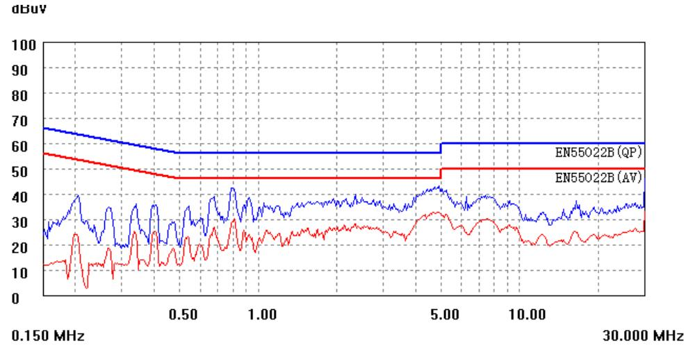

115VAC Line  
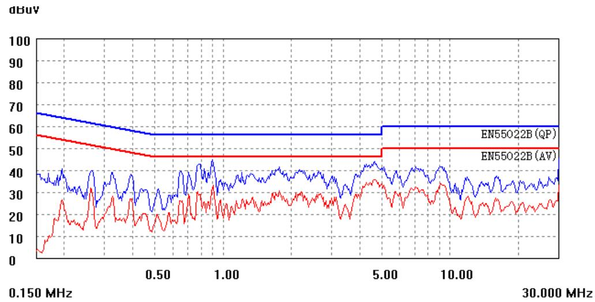

230VAC Line

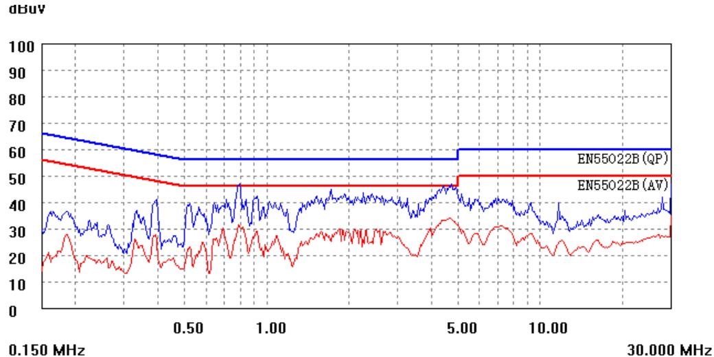

115VAC Neutral

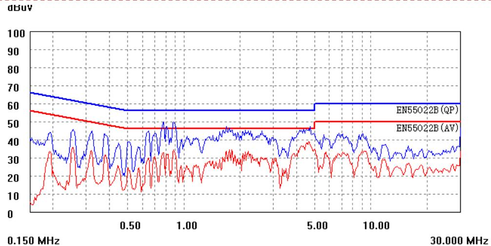

230VAC Neutral

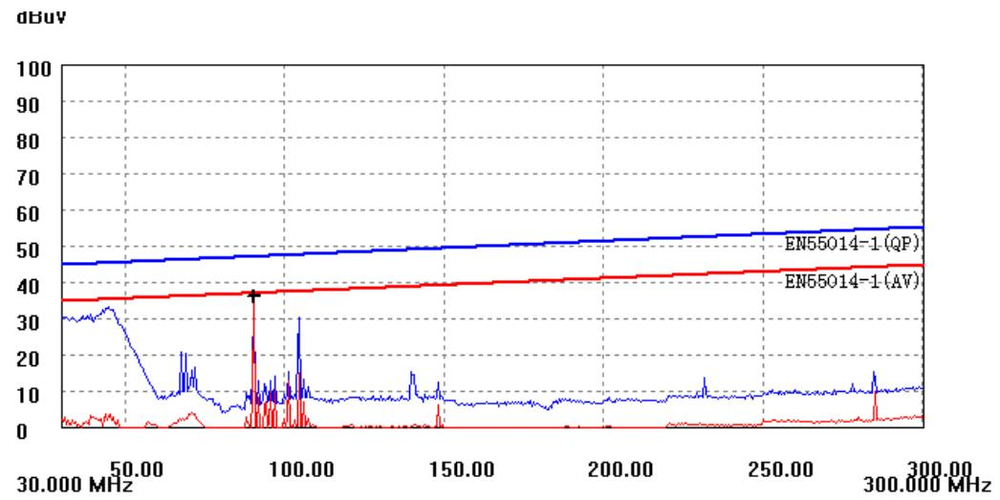

115VAC 空载

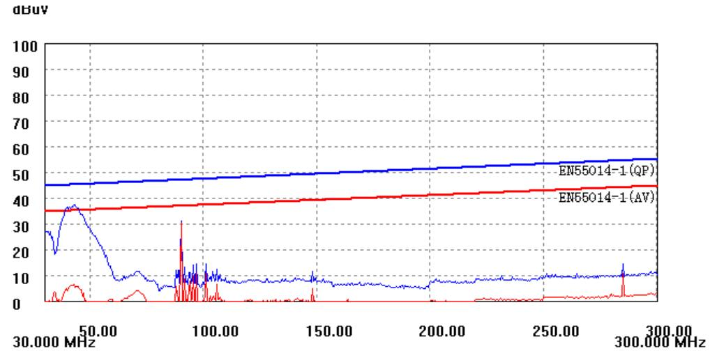

230VAC 空载

115VAC 满载

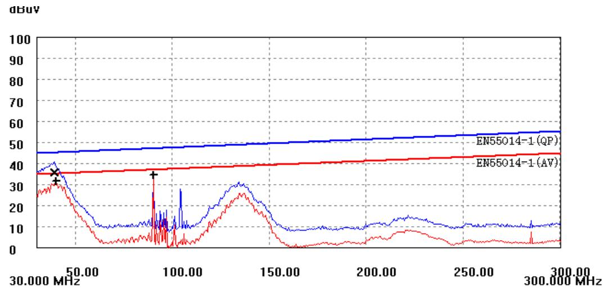

230VAC 满载

<table><tr><td>差模</td><td>电压</td><td>相位角</td><td>发生器阻抗</td><td>测试次数</td><td>测试结果</td></tr><tr><td>L to N</td><td>+2kV</td><td>0</td><td>2</td><td>10</td><td>Pass</td></tr><tr><td>L to N</td><td>-2kV</td><td>0</td><td>2</td><td>10</td><td>Pass</td></tr><tr><td>L to N</td><td>+2kV</td><td>90</td><td>2</td><td>10</td><td>Pass</td></tr><tr><td>L to N</td><td>-2kV</td><td>90</td><td>2</td><td>10</td><td>Pass</td></tr><tr><td>L to N</td><td>+2kV</td><td>180</td><td>2</td><td>10</td><td>Pass</td></tr><tr><td>L to N</td><td>-2kV</td><td>180</td><td>2</td><td>10</td><td>Pass</td></tr><tr><td>L to N</td><td>+2kV</td><td>270</td><td>2</td><td>10</td><td>Pass</td></tr><tr><td>L to N</td><td>-2kV</td><td>270</td><td>2</td><td>10</td><td>Pass</td></tr></table>

## 测试说明

➢ 按照GB/T17626.5和IEC61000-4-5的最新版本要求进行测试  
➢ 室温环境，230VAC输入，满载条件  
➢ 输入1.2/50us组合波浪涌电压  
➢ 每个测试点重复10次  
➢ 每次间隔时间1分钟  
➢ 试验时样机输出正常（符合A类标准）视为Pass

<table><tr><td>差模</td><td>电压</td><td>脉冲群持续时间</td><td>脉冲频率</td><td>测试时间</td><td>测试结果</td></tr><tr><td>L to N</td><td>+4kV</td><td>15ms</td><td>5kHz</td><td>120s</td><td>Pass</td></tr><tr><td>L to N</td><td>-4kV</td><td>15ms</td><td>5kHz</td><td>120s</td><td>Pass</td></tr><tr><td>L to N</td><td>+4kV</td><td>0.75ms</td><td>100kHz</td><td>120s</td><td>Pass</td></tr><tr><td>L to N</td><td>-4kV</td><td>0.75ms</td><td>100kHz</td><td>120s</td><td>Pass</td></tr><tr><td>L to N</td><td>+2kV</td><td>2ms</td><td>38kHz</td><td>120s</td><td>Pass</td></tr><tr><td>L to N</td><td>-2kV</td><td>2ms</td><td>38kHz</td><td>120s</td><td>Pass</td></tr><tr><td>L to N</td><td>+4kV</td><td>2ms</td><td>38kHz</td><td>120s</td><td>Pass</td></tr><tr><td>L to N</td><td>-4kV</td><td>2ms</td><td>38kHz</td><td>120s</td><td>Pass</td></tr></table>

## 测试说明

➢ 按照GB/T17626.4和IEC61000-4-4的最新版本要求进行测试  
➢ 室温环境，230VAC输入满载条件  
➢ 分别测试5kHz/100kHz/38kHz脉冲频率  
➢ 脉冲群周期为300ms  
➢ 每个测试条件测试时间120s  
➢ 试验时样机输出正常（符合A类标准）视为Pass

<table><tr><td>测试</td><td>电压(V)</td><td>放电类型</td><td>放电次数</td><td>测试结果</td></tr><tr><td>Vo</td><td>+15kV</td><td>空气放电</td><td>10</td><td>Pass</td></tr><tr><td>Vo</td><td>-15kV</td><td>空气放电</td><td>10</td><td>Pass</td></tr><tr><td>GND</td><td>+15kV</td><td>空气放电</td><td>10</td><td>Pass</td></tr><tr><td>GND</td><td>-15kV</td><td>空气放电</td><td>10</td><td>Pass</td></tr><tr><td>Vo</td><td>+20kV</td><td>空气放电</td><td>10</td><td>Pass</td></tr><tr><td>Vo</td><td>-20kV</td><td>空气放电</td><td>10</td><td>Pass</td></tr><tr><td>GND</td><td>+20kV</td><td>空气放电</td><td>10</td><td>Pass</td></tr><tr><td>GND</td><td>-20kV</td><td>空气放电</td><td>10</td><td>Pass</td></tr></table>

## 测试说明

➢ 按照GB/T17626.2和IEC61000-4-2的最新版本要求进行测试  
➢ 室温环境，230VAC输入满载条件  
➢ 每个测试点重复10次  
➢ 分别对输出正端和地进行空气放电  
➢ 试验时样机输出正常（符合A类标准）视为Pass

## THANK YOU FOR WATCHING
