## BPA 8618P 隔离参考设计

## 12V 1.25A

上海晶丰明源半导体股份有限公司

Shanghai Bright Power Semiconductor Co., Ltd.

文长川

时间： 2021年08月24日

## 内容

BPA8618P简介  
电源规格  
电路及实物图  
BOM  
PCB Layout图  
变压器  
性能测试数据

## 产品特点：

➢ 集成 700V 高压 MOSFET  
➢ ON/OFF控制模式，低输出纹波  
➢ 内置软启动功能  
➢ 集成高压启动、自供电电路  
➢ 低音频噪声  
➢ 集成输入过/欠压保护

## 应用领域：

➢ 家用电器辅助电源  
➢ 电机驱动辅助电源  
➢ IOT/智能家居/智能照明  
➢ 工业控制辅助电源

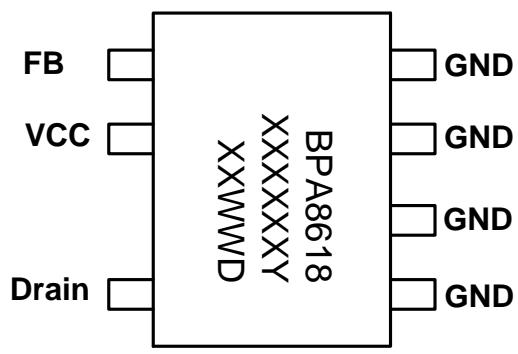

<table><tr><td>项目描述</td><td>符号</td><td>最小</td><td>典型</td><td>最大</td><td>单位</td><td>备注</td></tr><tr><td colspan="7">输入</td></tr><tr><td>电压</td><td> $V_{IN}$ </td><td>85</td><td>120/230</td><td>264</td><td> $V_{AC}$ </td><td></td></tr><tr><td>频率</td><td> $f_{LINE}$ </td><td>47</td><td>50/60</td><td>63</td><td>Hz</td><td></td></tr><tr><td colspan="7">输出</td></tr><tr><td>输出电压</td><td> $V_{OUT}$ </td><td></td><td>12</td><td></td><td>V</td><td>±5%</td></tr><tr><td>输出电流</td><td> $I_{OUT}$ </td><td></td><td>1250</td><td></td><td>mA</td><td></td></tr><tr><td>输出电压纹波</td><td> $V_{RIPPLE}$ </td><td></td><td></td><td>200</td><td>mV</td><td>20MHz带宽</td></tr><tr><td>连续输出功率</td><td> $P_{OUT}$ </td><td></td><td>15</td><td></td><td>W</td><td></td></tr><tr><td colspan="7">效率</td></tr><tr><td>待机功耗</td><td> $P_{STDBY}$ </td><td></td><td></td><td>100</td><td>mW</td><td>230VAC,包含假负载</td></tr><tr><td>满载效率</td><td>η</td><td></td><td>80</td><td></td><td>%</td><td></td></tr><tr><td colspan="7">环境</td></tr><tr><td>传导EMI</td><td></td><td colspan="4">满足CISPR22/EN55022 Class B,至少6dB 裕量</td><td></td></tr><tr><td>Surge</td><td></td><td></td><td>2</td><td></td><td>kV</td><td>差模</td></tr><tr><td>EFT</td><td></td><td></td><td>4</td><td></td><td>kV</td><td>5kHz/100kHz/38kHz</td></tr><tr><td>ESD</td><td></td><td></td><td>15</td><td>20</td><td>kV</td><td>空气放电</td></tr><tr><td>工作环境温度</td><td> $T_{AMP}$ </td><td></td><td></td><td>50</td><td>°C</td><td></td></tr></table>

## 电路及实物图

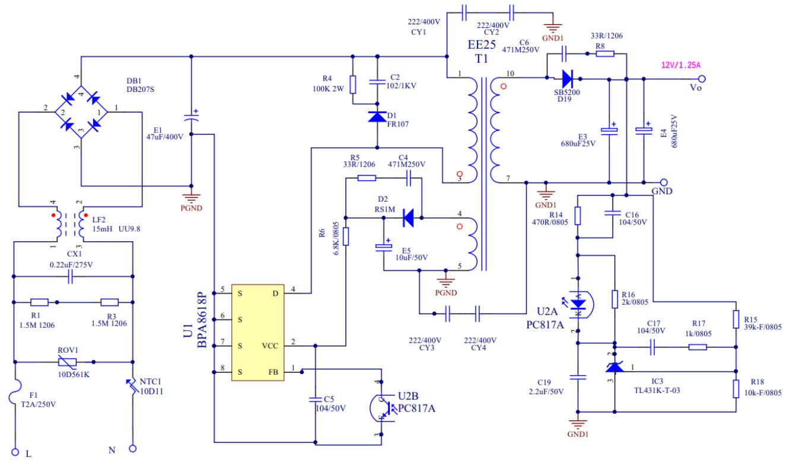

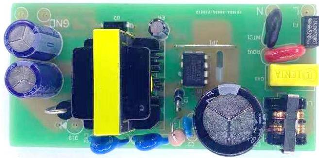

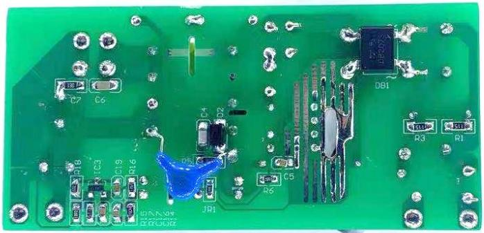

<table><tr><td>序号</td><td>元件标号</td><td>参数描述</td><td>封装尺寸</td><td>数量</td></tr><tr><td>1</td><td>PCB</td><td>CEM-1,双面板</td><td>89mm*42mm</td><td>1</td></tr><tr><td>2</td><td>F1</td><td>T2A 250V保险丝</td><td>DIP</td><td>1</td></tr><tr><td>3</td><td>ROV1</td><td>10D561,压敏电阻</td><td>10D561</td><td>1</td></tr><tr><td>4</td><td>NTC1</td><td>10D11,热敏电阻</td><td>10D11</td><td>1</td></tr><tr><td>5</td><td>CX1</td><td>0.22uF 275v X电容</td><td>7*13.5</td><td>1</td></tr><tr><td>6</td><td>E1</td><td>400V47uF电解电容</td><td>ø13*18</td><td>1</td></tr><tr><td>7</td><td>LF2</td><td>UU9.8 15mH</td><td>DIP</td><td>1</td></tr><tr><td>8</td><td>E5</td><td>50V10uF</td><td>ø5*11</td><td>1</td></tr><tr><td>9</td><td>DB1</td><td>DB207S 2A 1KV</td><td>SMD</td><td>1</td></tr><tr><td>10</td><td>JP1</td><td>跳线 0.6*7.5</td><td>DIP</td><td>1</td></tr><tr><td>11</td><td>R4</td><td>2W 100K炭膜电阻</td><td>DIP</td><td>1</td></tr><tr><td>12</td><td>C2</td><td>1nf 1kv瓷片电容</td><td>DIP</td><td>1</td></tr><tr><td>13</td><td>D1</td><td>FR107 1A 1KV</td><td>D0-41</td><td>1</td></tr><tr><td>14</td><td>D20</td><td>SB5200 5A 200V</td><td>D0-201AD</td><td>1</td></tr><tr><td>15</td><td>U2</td><td>PC817A光耦</td><td>DIP</td><td>1</td></tr><tr><td>16</td><td>CY1,CY2,CY3,CY4</td><td>2200PF 400V AC Y1</td><td>DIP</td><td>4</td></tr><tr><td>17</td><td>T1</td><td>EE25加高 960uH</td><td>DIP</td><td>1</td></tr><tr><td>18</td><td>E3,E4</td><td>25V/680uF电解电容,高频低阻</td><td>ø10*12mm</td><td>2</td></tr><tr><td>19</td><td>U1</td><td>BPA8618P</td><td>DIP7</td><td>1</td></tr></table>

<table><tr><td>序号</td><td>元件标号</td><td>参数描述</td><td>封装尺寸</td><td>数量</td></tr><tr><td>20</td><td>IC3</td><td>TL431</td><td>SOT23-3</td><td>1</td></tr><tr><td>21</td><td>D2</td><td>RS1M 1A 1KV</td><td>SMA</td><td>1</td></tr><tr><td>22</td><td>R5,C7</td><td>33R, ±5%</td><td>SMD1206</td><td>2</td></tr><tr><td>23</td><td>R3,R1</td><td>1.5M, ±5%</td><td>SMD1206</td><td>2</td></tr><tr><td>24</td><td>C6,C4</td><td>470pF, 1KV X7R</td><td>SMD1206</td><td>1</td></tr><tr><td>25</td><td>C17,C16,C5</td><td>100nF, 25V X7R</td><td>SMD0805</td><td>3</td></tr><tr><td>26</td><td>C19</td><td>2.2uF/16V,X7R</td><td>SMD0805</td><td>1</td></tr><tr><td>27</td><td>R6</td><td>6.8K, ±5%</td><td>SMD0805</td><td>1</td></tr><tr><td>28</td><td>R16</td><td>2k, ±5%</td><td>SMD0805</td><td>1</td></tr><tr><td>29</td><td>R18</td><td>10k, ±5%</td><td>SMD0805</td><td>3</td></tr><tr><td>30</td><td>R15</td><td>39K, ±5%</td><td>SMD0805</td><td>2</td></tr><tr><td>31</td><td>R17</td><td>1K, ±5%</td><td>SMD0805</td><td>1</td></tr><tr><td>32</td><td>R14</td><td>470R, ±5%</td><td>SMD0805</td><td>1</td></tr><tr><td></td><td></td><td></td><td>Total</td><td>43</td></tr></table>

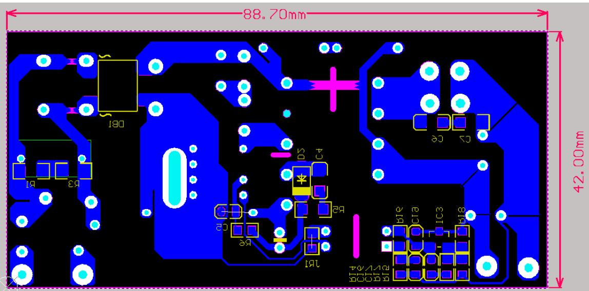

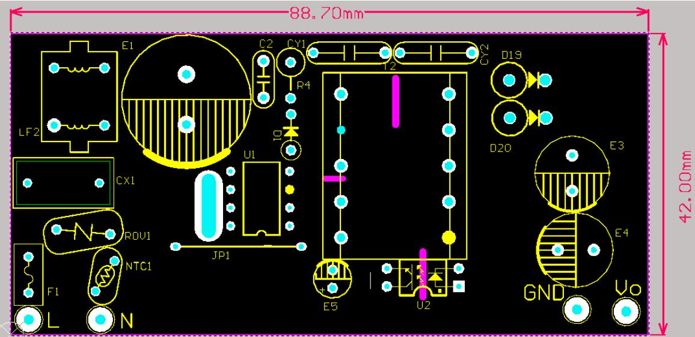

## 原理图

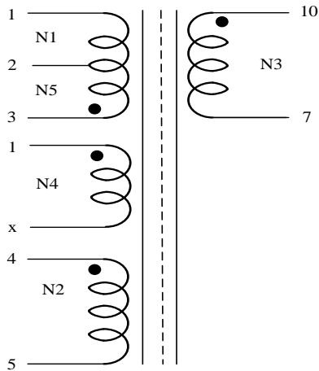

## 绕线方式

<table><tr><td>绕组</td><td>起始脚</td><td>终止脚</td><td>材料</td><td>匝数</td><td>绕线方式</td></tr><tr><td>N1</td><td>3</td><td>2</td><td> $\phi 0.25*1P$ </td><td>38Ts</td><td>密绕一层(PIN脚朝外)</td></tr><tr><td colspan="4">胶带</td><td>1.5Ts</td><td></td></tr><tr><td>N2</td><td>4</td><td>5</td><td> $\phi 0.25*3P$ </td><td>11Ts</td><td>密绕一层(PIN脚朝外)</td></tr><tr><td colspan="4">胶带</td><td>2.1Ts</td><td></td></tr><tr><td>N3</td><td>10</td><td>7</td><td>三层绝缘线 $\phi 0.6*1P$ </td><td>10Ts</td><td>密绕一层(PIN脚朝外)</td></tr><tr><td colspan="4">胶带</td><td>2.1Ts</td><td></td></tr><tr><td>N4</td><td>1</td><td>X</td><td> $\phi 0.3*3P$ </td><td>9Ts</td><td>密绕一层(PIN脚朝外)</td></tr><tr><td colspan="4">胶带</td><td>1.5Ts</td><td></td></tr><tr><td>N5</td><td>2</td><td>1</td><td> $\phi 0.25*1P$ </td><td>34Ts</td><td>密绕一层(PIN脚朝外)</td></tr><tr><td colspan="4">胶带</td><td>3Ts</td><td></td></tr></table>

## 规格与材料

➢ 初级绕组感量 $L _ { p } { = } 1 2 5 0 \mathrm { u } \mathsf { H } { \pm } 7 \%$ （测试条件： 0.3V，100kHz）  
➢ 漏感量 $\mathrm { \ L _ { | k } } < 3 0 \mathrm { u } \mathrm { H }$  
➢ 骨架：EE25底部加高（5+5PIN）  
➢ 磁芯：EE25 PC40 或同等材质 ， $\mathsf { A } \mathsf { e } = 4 0 \mathsf { m } \mathsf { m } ^ { 2 }$  
➢ N1、N2、N4、N5: 2UEW 漆包线  
➢ N3: 三层绝缘线  
➢ 绝缘胶带:3M900 或同等材质  
➢ 耐压测试: 3KV, 50/60Hz, 1Min  
➢ 成品要求：浸凡立水

## 脚位图

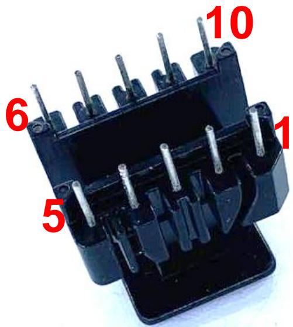

待机功耗（6.8K电阻外供电）  
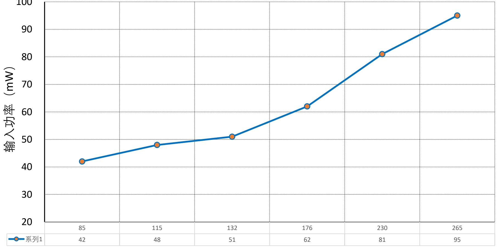

输入电压(VAC)

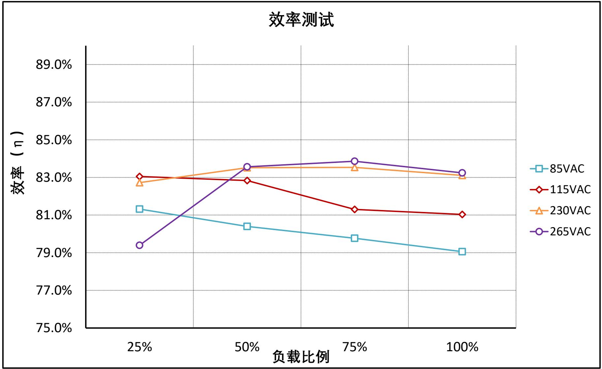

## 输出电压调整率

<table><tr><td> $V_{IN}(VAC)$ Load(%)</td><td>85</td><td>115</td><td>132</td><td>176</td><td>230</td><td>265</td><td>平均值</td><td>线调整率</td></tr><tr><td>0</td><td>12.23</td><td>12.23</td><td>12.23</td><td>12.23</td><td>12.23</td><td>12.23</td><td>12.23</td><td>0.00%</td></tr><tr><td>20%</td><td>12.23</td><td>12.23</td><td>12.23</td><td>12.23</td><td>12.23</td><td>12.23</td><td>12.23</td><td>0.00%</td></tr><tr><td>40%</td><td>12.22</td><td>12.22</td><td>12.22</td><td>12.22</td><td>12.22</td><td>12.22</td><td>12.22</td><td>0.00%</td></tr><tr><td>60%</td><td>12.21</td><td>12.21</td><td>12.21</td><td>12.21</td><td>12.21</td><td>12.21</td><td>12.21</td><td>0.00%</td></tr><tr><td>80%</td><td>12.21</td><td>12.21</td><td>12.21</td><td>12.21</td><td>12.21</td><td>12.21</td><td>12.21</td><td>0.00%</td></tr><tr><td>100%</td><td>12.2</td><td>12.2</td><td>12.2</td><td>12.19</td><td>12.19</td><td>12.19</td><td>12.20</td><td>0.08%</td></tr><tr><td>平均值</td><td>12.22</td><td>12.22</td><td>12.22</td><td>12.22</td><td>12.22</td><td>12.22</td><td rowspan="2" colspan="2"></td></tr><tr><td>负载调整率</td><td>0.25%</td><td>0.25%</td><td>0.25%</td><td>0.33%</td><td>0.33%</td><td>0.33%</td></tr></table>

◼ 计算方法：调整率=100%\*(最大值-最小值)/平均值  
测试条件：

## 输出电压纹波

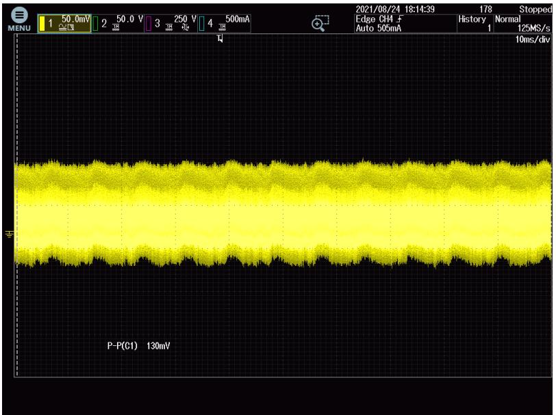

85 VAC

$\begin{array} { r l } { \mathbf { 1 } } & { \mathsf { C H 1 V } _ { \mathsf { O U T - 1 2 V } } \mathsf { R i p p l e } } \\ & { \mathsf { V } _ { \mathsf { P K - P K } } \mathbf { = } \mathbf { 1 } 3 0 \mathsf { m V } } \end{array}$

## Test Condition:

➢ Full Load

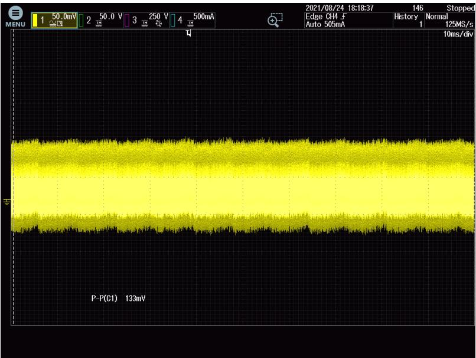

115 VAC

CH1 $\mathsf { V } _ { \mathsf { O U T - 1 } 2 \mathsf { V } }$ Ripple $\mathsf { V } _ { \mathsf { P K - P K } } { = } \pm 3 3 \mathsf { m V }$

## Test Condition:

➢ Full Load

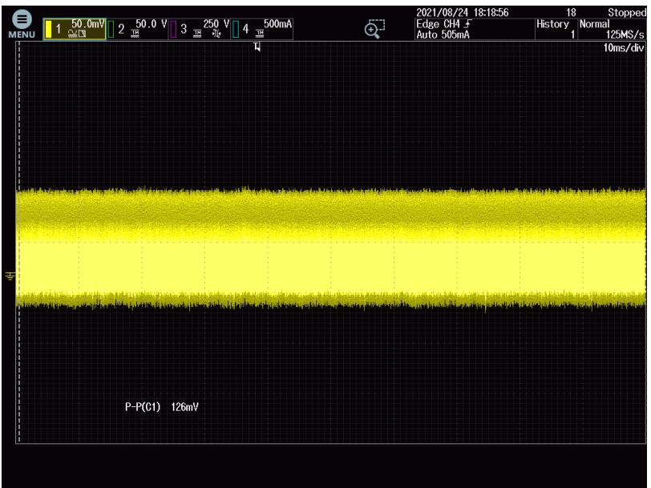

230 VAC

$\begin{array} { r l } { \mathbf { 1 } } & { \mathsf { C H 1 V } _ { \mathsf { O U T - 1 2 V } } \mathsf { R i p p l e } } \\ & { \mathsf { V } _ { \mathsf { P K - P K } } { = } \mathbf { 1 } 2 6 \mathsf { m V } } \end{array}$

## Test Condition:

➢ Full Load

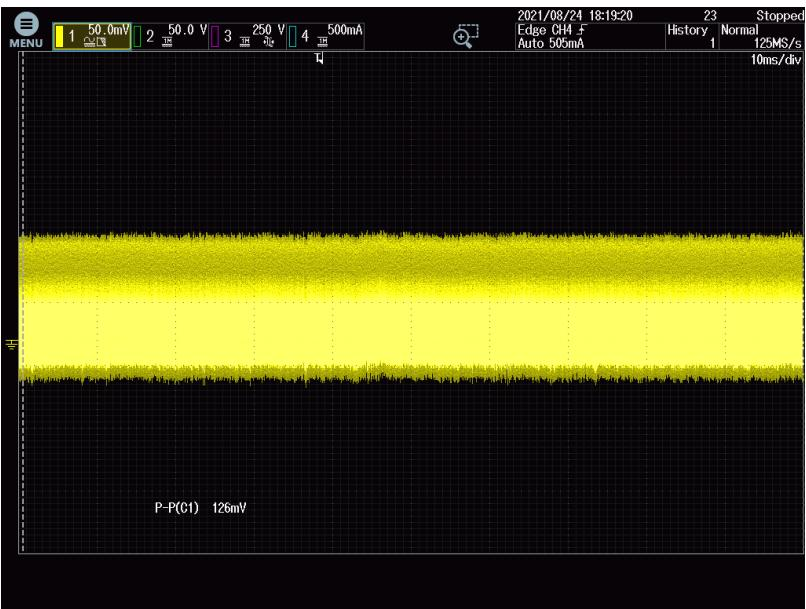

265 VAC

CH1 $\mathsf { V } _ { \mathsf { O U T } - 1 2 \mathsf { V } }$ Ripple $\mathsf { V } _ { \mathsf { P K - P K } } { = } \pm 2 6 \mathsf { m V }$

## Test Condition:

➢ Full Load

## 动态负载(50%-100%)

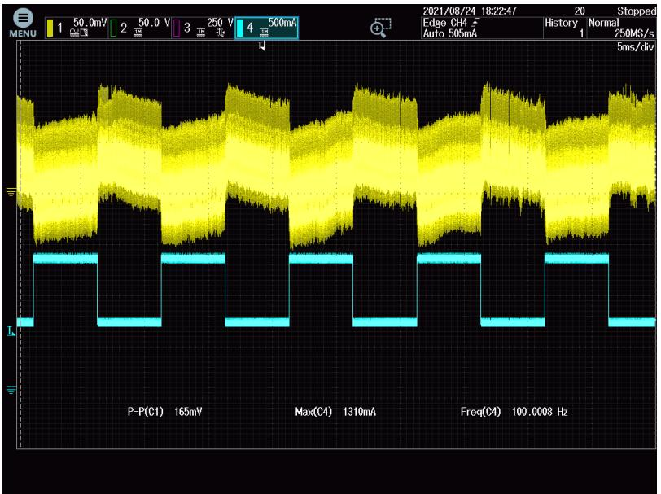

85 VAC

CH1 VOUT-12V VPK-PK=165 mV

## Test Condition:

➢ 0.625 A-1 .25A-0.625A  
➢ Slew Rate: 0.5 A/μS  
➢ Frequency: 100 Hz

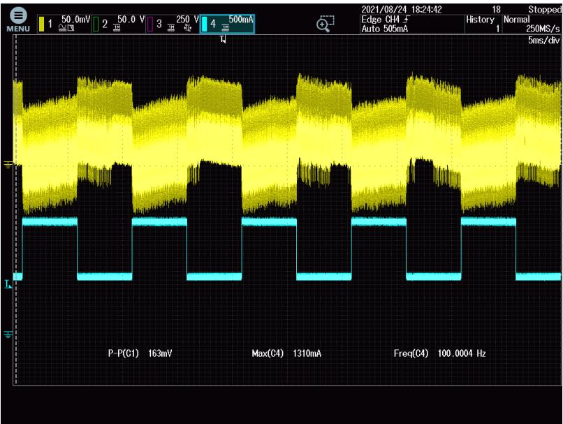

115 VAC

CH1 VOUT-12V $\mathsf { V } _ { \mathsf { O U T - 1 } 2 \mathsf { V } }$ VPK-PK=163 mV

## Test Condition:

➢ 0.625 A-1 .25A-0.625A  
➢ Slew Rate: 0.5 A/μS  
➢ Frequency: 100 Hz

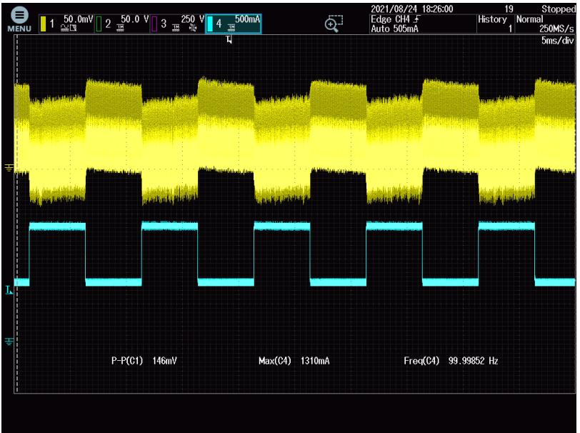

230 VAC

CH1 VOUT-12V $\mathsf { V } _ { \mathsf { O U T - 1 } 2 \mathsf { V } }$ VPK-PK=146mV

## Test Condition:

➢ 0.625 A-1 .25A-0.625A  
➢ Slew Rate: 0.5 A/μS  
➢ Frequency: 100 Hz

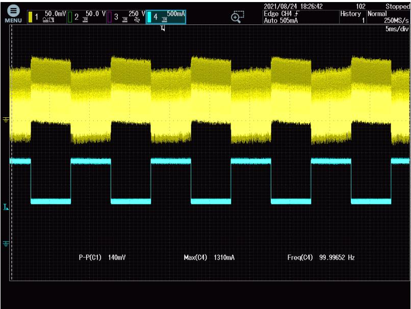

264 VAC

CH1 VOUT-12V $V _ { \mathsf { P K - P K } } { = } 1 4 0 ~ \mathsf { m V }$

## Test Condition:

➢ 0.625 A-1 .25A-0.625A  
➢ Slew Rate: 0.5 A/μS  
➢ Frequency: 100 Hz

## 动态负载(10%-90%)

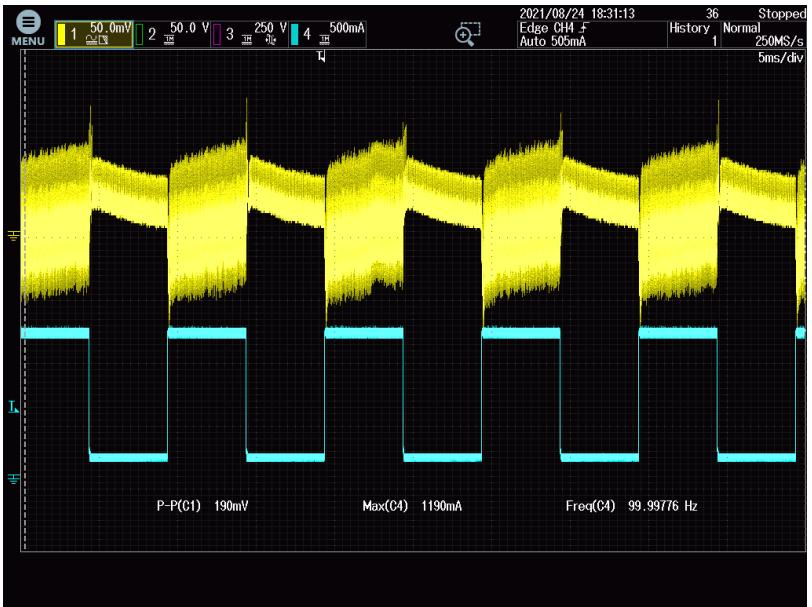

85 VAC

$\begin{array} { r l } & { \mathsf { C H 1 V _ { O U T - 1 2 V } } } \\ & { \mathsf { V _ { P K - P K } } \mathsf { = } \mathsf { 1 9 0 ~ m v } } \end{array}$ CH1 VOUT-12V

## Test Condition:

➢ 0.125 A-1.125 A-0.125A  
➢ Slew Rate: 0.5 A/μS  
➢ Frequency: 100 Hz

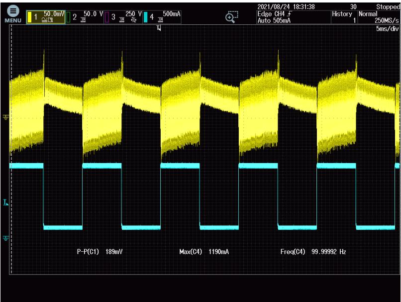

115 VAC

CH1 VOUT-12V $\mathsf { V } _ { \mathsf { O U T - 1 } 2 \mathsf { V } }$ $v _ { p _ { \mathrm { K - P K } } = 1 8 9 \mathrm { \ m V } }$

## Test Condition:

➢ 0.125 A-1.125 A-0.125A  
➢ Slew Rate: 0.5 A/μS  
➢ Frequency: 100 Hz

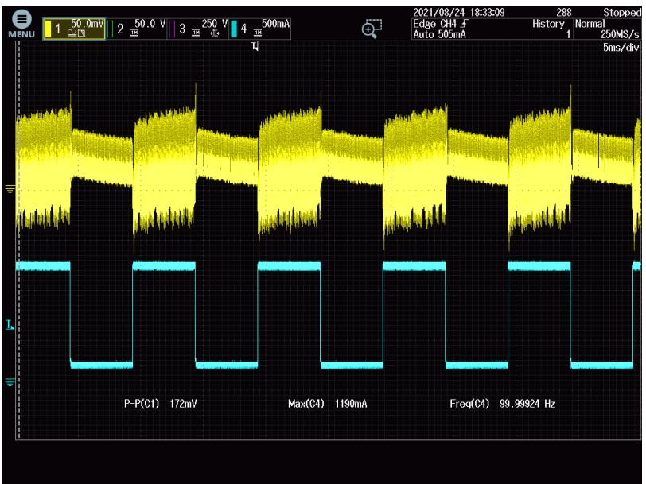

230 VAC

CH1 VOUT-12V $\mathsf { V } _ { \mathsf { O U T - 1 } 2 \mathsf { V } }$ VPK-PK=172 mV

## Test Condition:

➢ 0.125 A-1.125 A-0.125A  
➢ Slew Rate: 0.5 A/μS  
➢ Frequency: 100 Hz

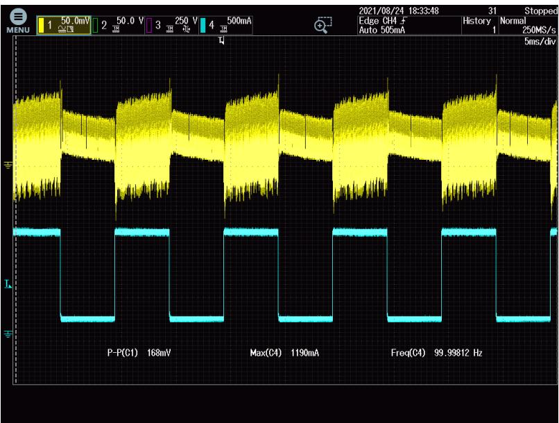

264VAC

CH1 VOUT-12V $v _ { p \kappa \mathrm { - } P \kappa } { = } 1 6 8 ~ \mathsf { m V }$

## Test Condition:

➢ 0.125 A-1.125 A-0.125A  
➢ Slew Rate: 0.5 A/μS  
➢ Frequency: 100 Hz

## 输出电压开机波形

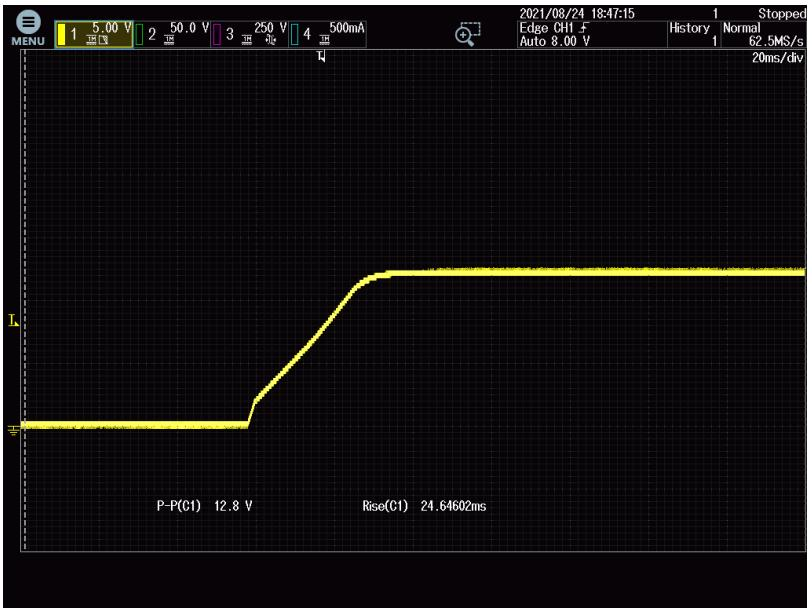

85 VAC

CH1 VOUT-12V TRISE: 24.64 mS

## Test Condition:

➢ No Load

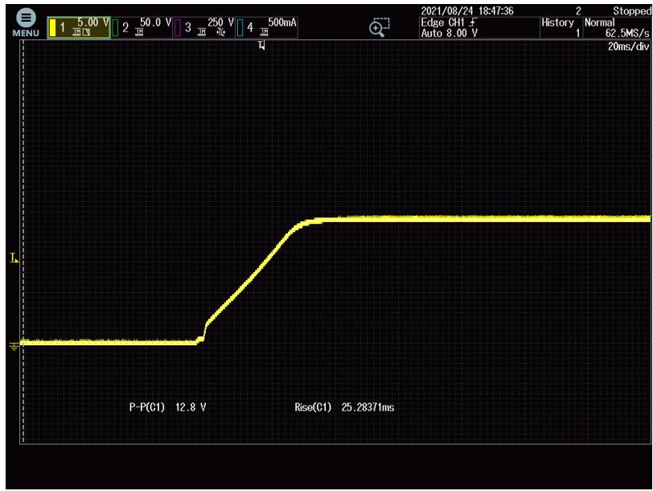

85 VAC

CH1 VOUT-12V TRISE: 25.28 mS

## Test Condition:

➢ Full Load

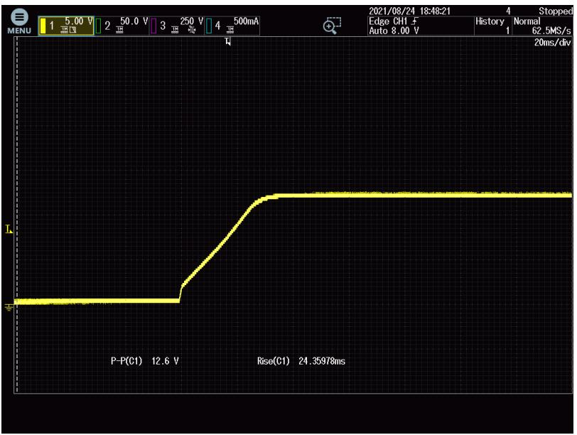

265 VAC

CH1 VOUT-12V TRISE: 24.39 mS

## Test Condition:

➢ No Load

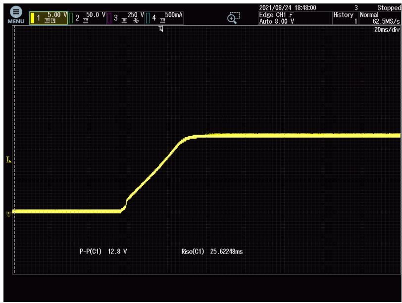

265 VAC

CH1 VOUT-12V TRISE: 25.62 mS

## Test Condition:

➢ Full Load

## 启动延迟时间

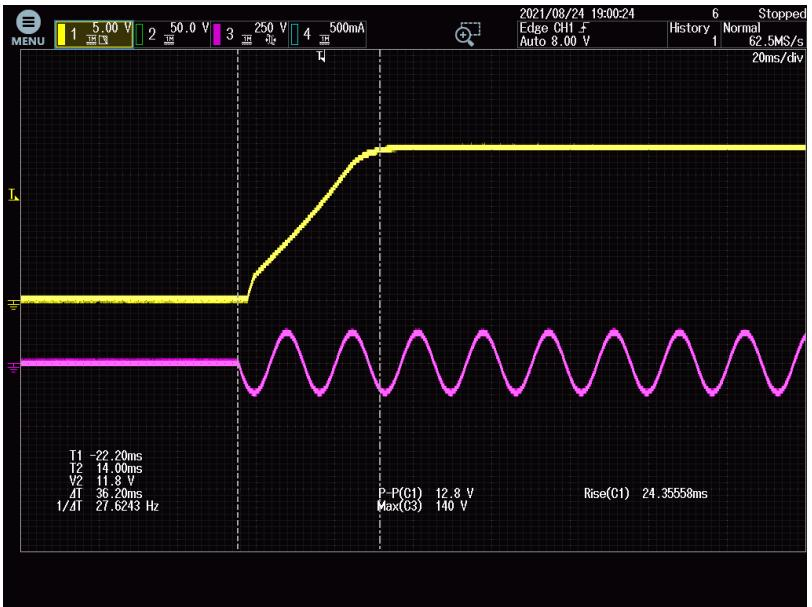

85 VAC

CH1 VOUT-12V $\mathsf { V } _ { \mathsf { O U T } - 1 2 \mathsf { V } }$  
CH3 $\mathsf { V I N } _ { \mathsf { A C } }$  
TDELAY: 36.2 mS

Test Condition:  
➢ No Load  
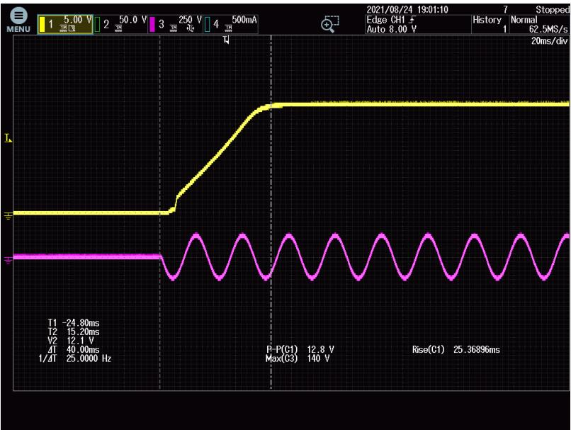

85 VAC

CH1 VOUT-12V $\mathsf { V } _ { \mathsf { O U T - 1 } 2 \mathsf { V } }$  
CH3 VINAC $\mathsf { V I N } _ { \mathsf { A C } }$ TDELAY: 40mS

Test Condition:  
➢ Full Load  
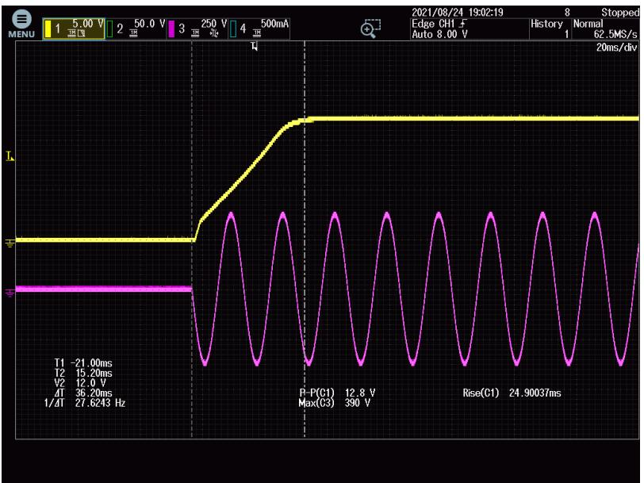

265 VAC

CH1 VOUT-12V $\mathsf { V } _ { \mathsf { O U T } - 1 2 \mathsf { V } }$  
CH3 VINNAC TDELAY: 36.2 mS

Test Condition:  
➢ No Load  
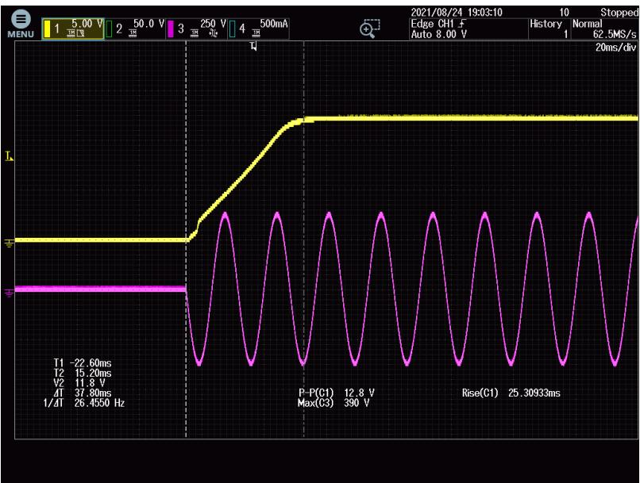

265 VAC

CH1 VOUT-12V $\mathsf { V } _ { \mathsf { O U T } - 1 2 \mathsf { V } }$  
CH3 VINNAC $\mathsf { V I N } _ { \mathsf { N A C } }$ TDELAY: 37.8 mS

Test Condition:

➢ Full Load

## 输入欠压保护

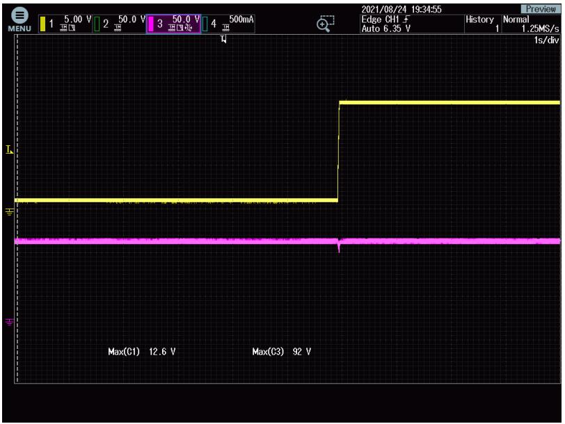

## BROWN-IN

CH1 $\mathsf { V I N } _ { \mathsf { D C } }$  
CH3 VIN VDS $\mathsf { V } _ { \mathsf { D } \mathsf { S } }$ VBROWN-IN: 92 V

## 测试条件:

➢ No Load

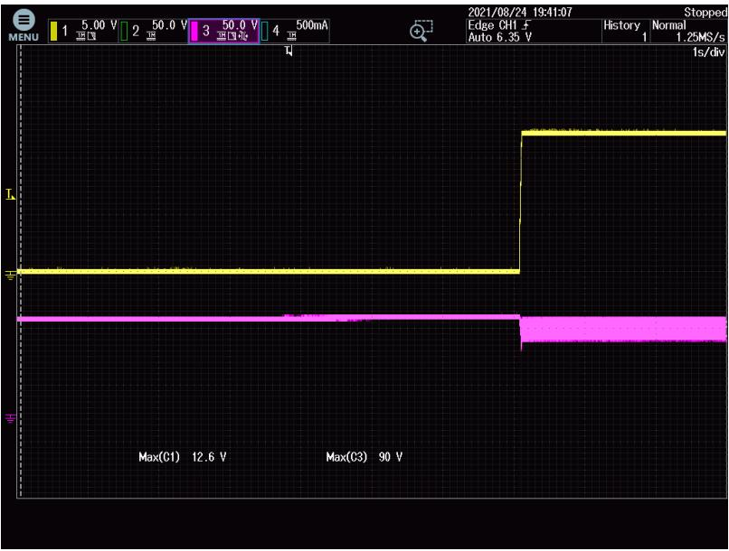

## BROWN-IN

CH1 $\mathsf { V I N } _ { \mathsf { D C } }$  
CH3 VIN VDS $\mathsf { V I N } \mathsf { V } _ { \mathsf { D S } }$ VBROWN-IN: 90 V

## 测试条件:

➢ Full Load

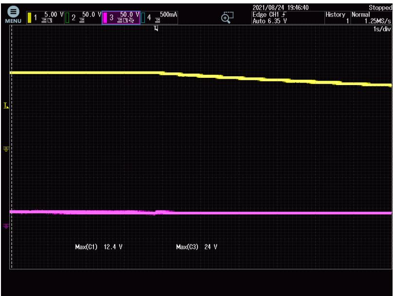

## BROWN-OUT

CH1 $\mathsf { V I N } _ { \mathsf { D C } }$  
CH3 VIN VDS $\mathsf { V } _ { \mathsf { D } \mathsf { S } }$ VBROWN-OUT:24 V

## 测试条件:

➢ No Load

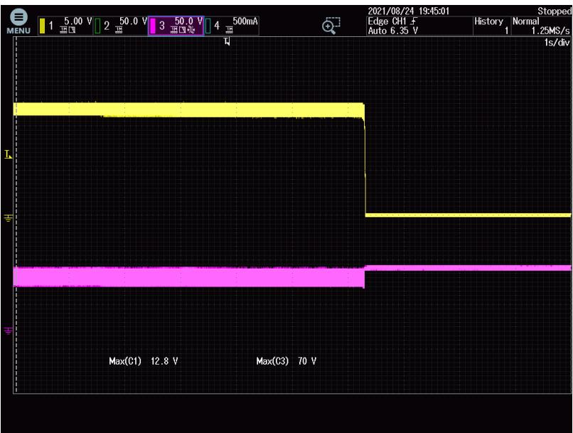

## BROWN-OUT

CH1 $\mathsf { V I N } _ { \mathsf { D C } }$  
CH3 VIN V $\mathsf { V I N } \mathsf { V } _ { \mathsf { D S } }$ VBROWN-OUT: 70V

## 测试条件:

➢ Full Load

## 输入过压保护

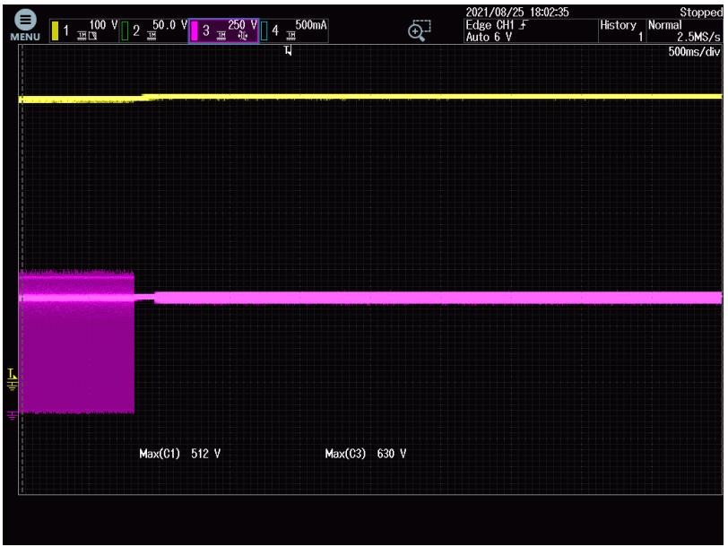

## 输入OVP

${ \mathsf { C H 1 } } { \mathsf { V I N } } _ { \mathsf { D C } }$  
CH3 VIN VDS $\mathsf { C H 3 } \mathsf { V I N } \mathsf { V } _ { \mathsf { D S } }$ VBROWN-IN: 507V

## 测试条件:

➢ No Load

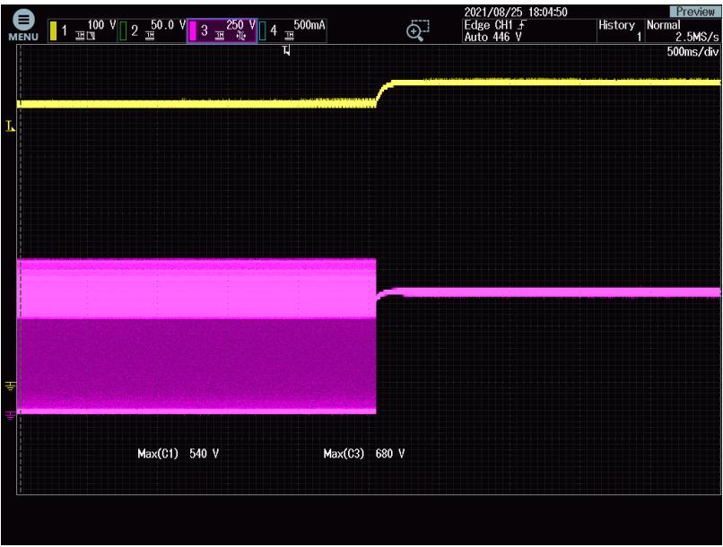

## 输入OVP

${ \mathsf { C H 1 } } { \mathsf { V I N } } _ { \mathsf { D C } }$  
CH3 VIN V $\mathsf { C H 3 } \mathsf { V I N } \mathsf { V } _ { \mathsf { D S } }$ VBROWN-IN: 505 V

## 测试条件:

➢ Full Load

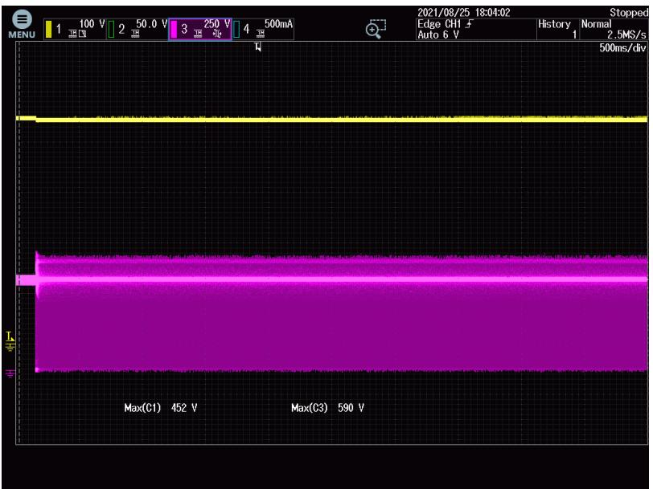

## 退出输入OVP

${ \mathsf { C H 1 } } { \mathsf { V I N } } _ { \mathsf { D C } }$  
CH3 VIN VDS $\mathsf { C H 3 } \mathsf { V I N } \mathsf { V } _ { \mathsf { D S } }$ VBROWN-OUT:452 V

## 测试条件:

➢ No Load

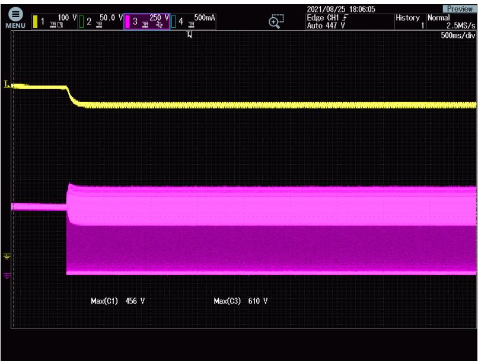

## 退出输入OVP

CH1 $\mathsf { V I N } _ { \mathsf { D C } }$  
CH3 VIN VDS $\mathsf { V I N } \mathsf { V } _ { \mathsf { D S } }$ VBROWN-OUT: 451V

## 测试条件:

➢ Full Load

## 短路保护 （MOSFET波形）

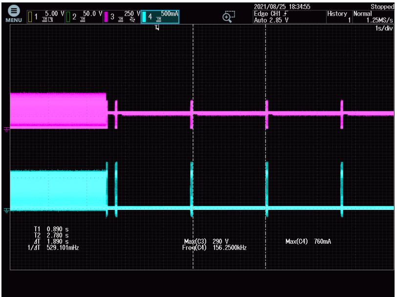

85 VAC

CH3 VDS  
CH4 ID

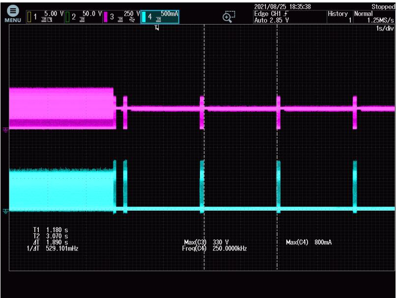

115 VAC

CH3 VDS  
CH4 ID

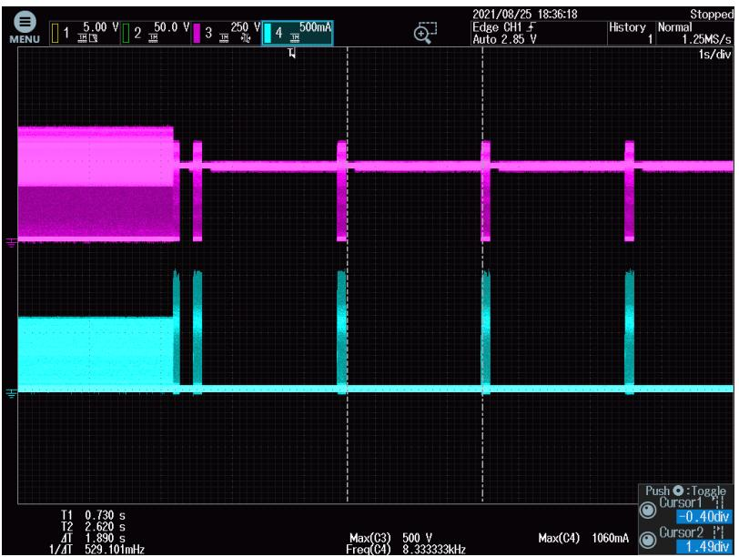

230 VAC

CH3 VDS  
CH4 ID

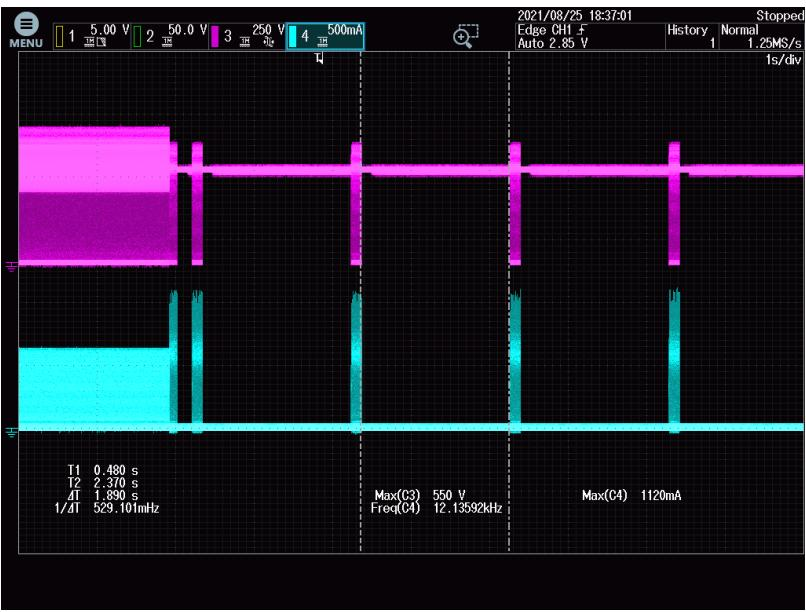

265 VAC

CH3 VDS  
CH4 ID

## 漏极电流波形

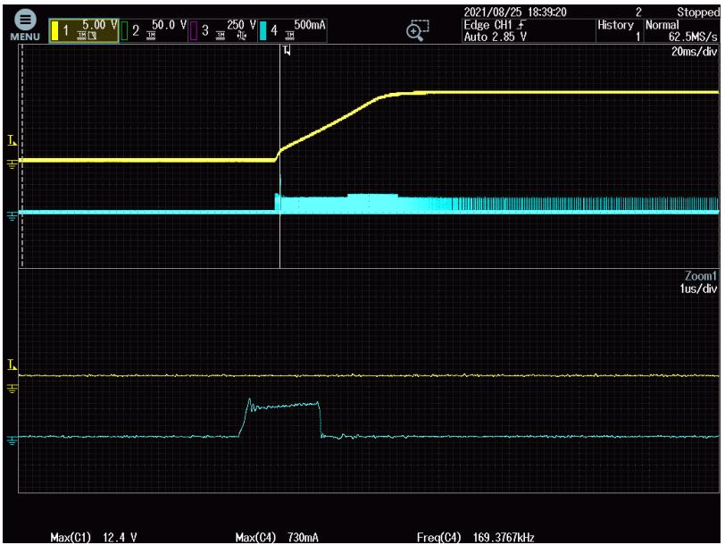

85 VAC

CH1 VOUTPUT-12V  
CH4 IDRAIN

Test Condition:

➢ 空载启动

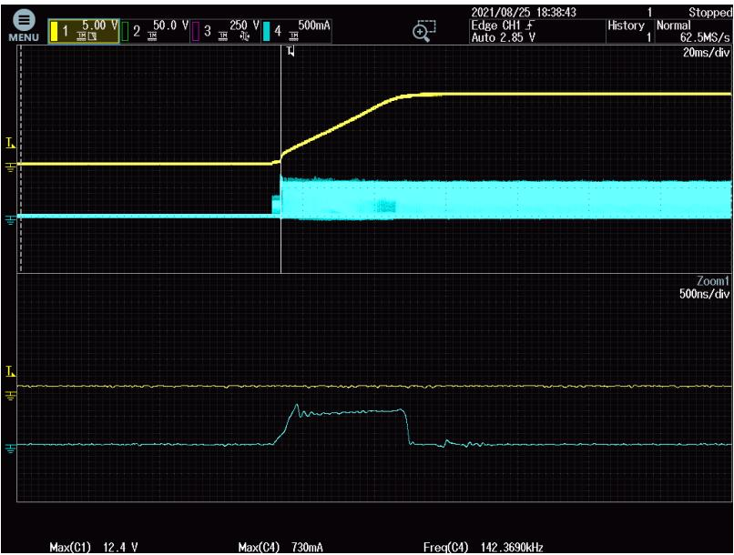

85 VAC

CH1 VOUTPUT-12V  
CH4 IDRAIN

Test Condition:

满载启动

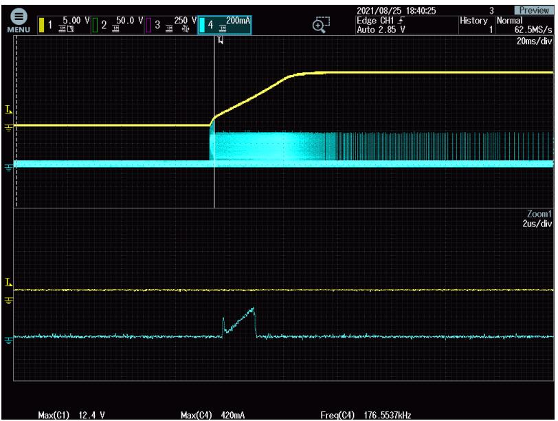

265 VAC

CH1 VOUTPUT-12V  
CH4 IDRAIN

Test Condition:

➢ 空载启动

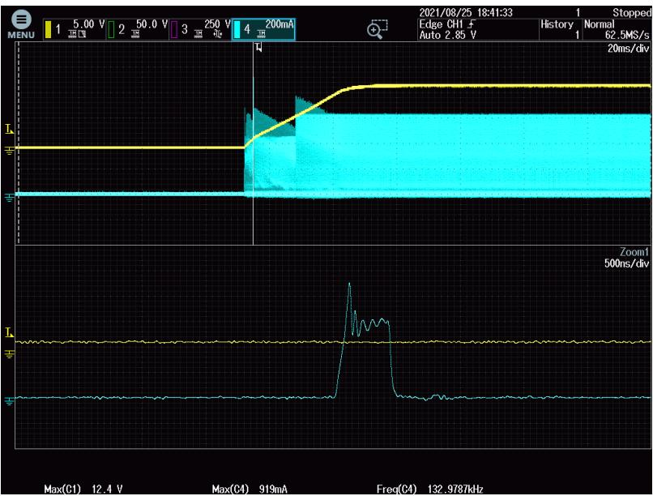

265 VAC

CH1 VOUTPUT-12V  
CH4 IDRAIN

Test Condition:

满载启动

## D-S电压波形

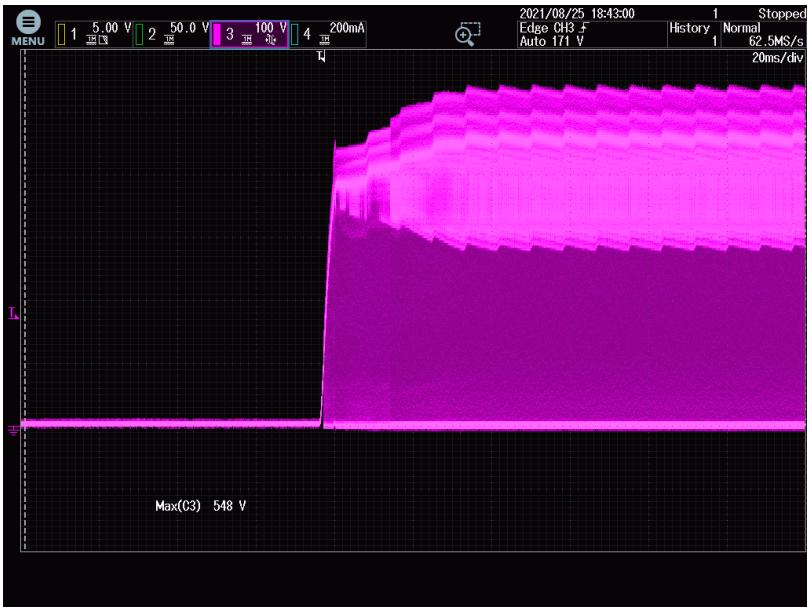

265 VAC

CH2 VDS VDSMAX: 548 V

## Test Condition:

满载开机

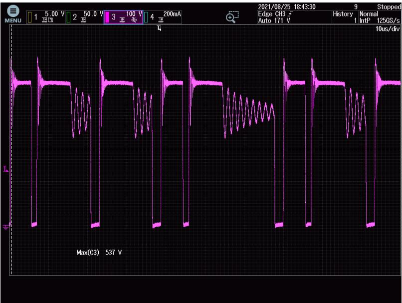

265 VAC

CH2 VDS $\begin{array} { r l } & { \mathsf { C H 2 } \mathsf { V } _ { \mathsf { D S } } } \\ & { \mathsf { V D S } _ { \mathsf { M A X } } \colon 5 4 4 \mathsf { V } } \end{array}$

Test Condition:满载正常工作

极限参数(注3)

<table><tr><td>符号</td><td>参数</td><td>参数范围</td><td>单位</td></tr><tr><td> $V_{DRAIN}$ </td><td>内部高压 MOSFET 漏极到源极电压</td><td>-0.3~700</td><td>V</td></tr><tr><td> $V_{CC}$ </td><td> $V_{CC}$  电压</td><td>-0.3~9</td><td>V</td></tr><tr><td> $I_{CC\_MAX}$ </td><td> $V_{CC}$  引脚最大电流</td><td>20</td><td>mA</td></tr><tr><td> $V_{FB}$ </td><td>输出反馈端电压</td><td>-0.3~9</td><td>V</td></tr><tr><td> $P_{DMAX}$ </td><td>功耗(注 4)</td><td>1.5</td><td>W</td></tr><tr><td> $\theta_{JA}$ </td><td>结到环境的热阻(注 5)</td><td>80</td><td>°C/W</td></tr><tr><td> $\theta_{JC}$ </td><td>结到芯片表面的热阻(注 5)</td><td>20</td><td>°C/W</td></tr><tr><td> $T_{J}$ </td><td>工作结温范围</td><td>-40 to 150</td><td>°C</td></tr><tr><td> $T_{STG}$ </td><td>储存温度范围</td><td>-55 to 150</td><td>°C</td></tr><tr><td>ESD</td><td>人体模型 ESD(注 6)</td><td>2</td><td>kV</td></tr></table>

## 满载开机

$0 e r a t i n g { = } 5 4 8 \lor / 7 0 0 \lor = 7 8 . 7 2 \%$

## 满载正常工作

Derating = 544 V / 700 V = 77.71 %

## 12V输出肖特基反压波形

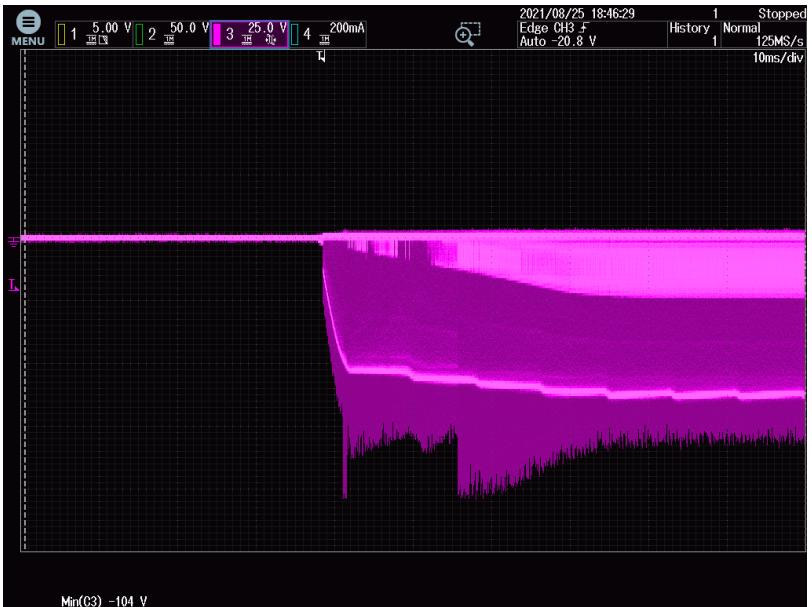

265 VAC

CH2 VDIODE VDSMAX: 104 V

Test Condition:

➢ 满载启动

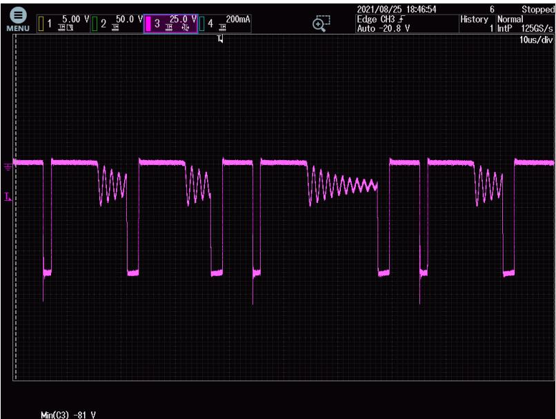

265 VAC

$\begin{array} { l } { { \mathsf { C H } } { 2 } \mathsf { V } _ { \mathsf { D D } | \mathsf { O D E } } } \\ { { \mathsf { V } } _ { \mathsf { M A X } } { \boldsymbol { : } } { 8 } { 1 } \mathsf { V } } \end{array}$ CH2 VDDIODE

Test Condition:

满载正常工作

<table><tr><td>PARAMETER</td><td>SYMBOL</td><td>MB54</td><td>MB54A</td><td>MB55</td><td>MB56</td><td>MB58</td><td>MB59</td><td>MB510</td><td>MB515</td><td>MB520</td><td>UNITS</td></tr><tr><td>Maximum Recurrent Peak Reverse Voltage</td><td> $V_{RRM}$ </td><td>40</td><td>45</td><td>50</td><td>60</td><td>80</td><td>90</td><td>100</td><td>150</td><td>200</td><td>V</td></tr><tr><td>Maximum RMS Voltage</td><td> $V_{RMS}$ </td><td>28</td><td>31.5</td><td>35</td><td>42</td><td>56</td><td>63</td><td>70</td><td>105</td><td>140</td><td>V</td></tr><tr><td>Maximum DC Blocking Voltage</td><td> $V_{DC}$ </td><td>40</td><td>45</td><td>50</td><td>60</td><td>80</td><td>90</td><td>100</td><td>150</td><td>200</td><td>V</td></tr><tr><td>Average Rectified Output Current (See Figure 1)</td><td> $I_{F(AV)}$ </td><td colspan="9">5</td><td>A</td></tr><tr><td>Non-Repetitive Peak Forward Surge Current : 8.3ms single half sine-wave superimposed on rated load</td><td> $I_{FSM}$ </td><td colspan="9">100</td><td>A</td></tr><tr><td>Forward Voltage at 5A (Note 1)</td><td> $V_F$ </td><td colspan="2">0.7</td><td colspan="2">0.74</td><td colspan="3">0.8</td><td colspan="2">0.9</td><td>V</td></tr><tr><td>Peak Reverse Current at Rated DC Blocking Voltage  $T_J=25°C$  $T_J=100°C$ </td><td> $I_R$ </td><td colspan="9">0.0510</td><td>mA</td></tr><tr><td>Typical Thermal Resistance (Note 2)</td><td> $R_{BJA}$  $R_{BJL}$ </td><td colspan="9">5517</td><td>°C /W</td></tr><tr><td>Operating Junction and Storage Temperature Range</td><td> $T_J,T_{STG}$ </td><td>-55 to +150</td><td colspan="8">-65 to +175</td><td>°C</td></tr></table>

## 满载开机

Derating = 104 V / 200 V = 52 %

## 满载正常工作

Derating = 81 V / 200V = 40.5 %

<table><tr><td rowspan="2">项目</td><td colspan="2">85VAC</td><td colspan="2">265VAC</td></tr><tr><td>温度(°C)</td><td>温升(°C)</td><td>温度(°C)</td><td>温升(°C)</td></tr><tr><td>环境温度</td><td colspan="2">29.22</td><td colspan="2">28.76</td></tr><tr><td>BPA8618P (U1)</td><td>93.27</td><td>64.05</td><td>72.74</td><td>43.98</td></tr><tr><td>变压器绕组(T2)</td><td>64.93</td><td>35.71</td><td>61.83</td><td>33.07</td></tr><tr><td>变压器磁芯(T2)</td><td>58.39</td><td>29.17</td><td>59.73</td><td>30.97</td></tr><tr><td>输出肖特基(D19)</td><td>84.92</td><td>55.7</td><td>82.91</td><td>54.15</td></tr><tr><td>输入电解电容(E1)</td><td>52.42</td><td>23.2</td><td>44.99</td><td>16.23</td></tr><tr><td>输出电解电容(E3)</td><td>47.51</td><td>18.29</td><td>47.19</td><td>18.43</td></tr><tr><td>整流桥(DB1)</td><td>61.12</td><td>31.9</td><td>46.8</td><td>18.04</td></tr></table>

## 测试说明

➢ 在温箱中进行测试  
➢ 电路板放在一个封闭的盒子内  
➢ 热电偶连接到各个测量点  
➢ 等测量点温度达到稳定后记录数据

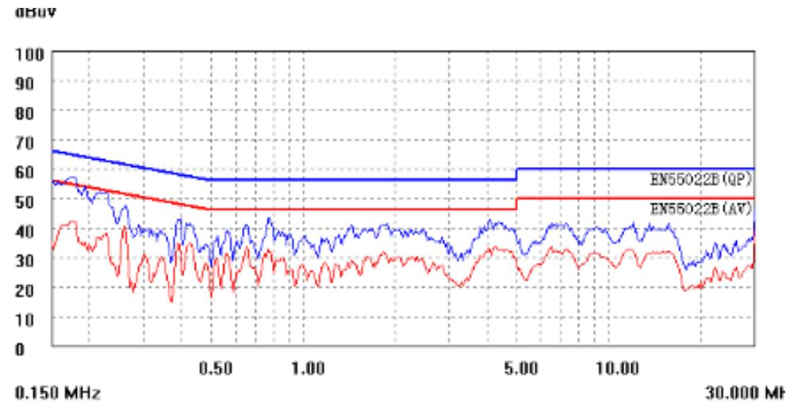

115VAC Line

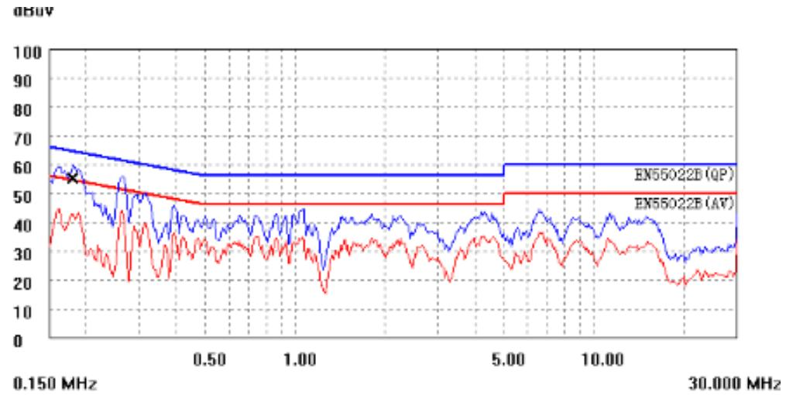

230VAC Line

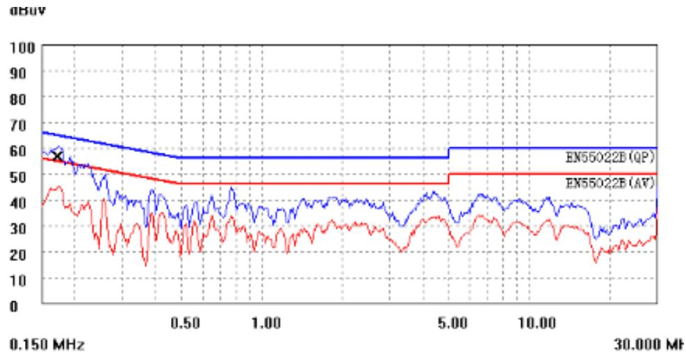

115VAC Neutral

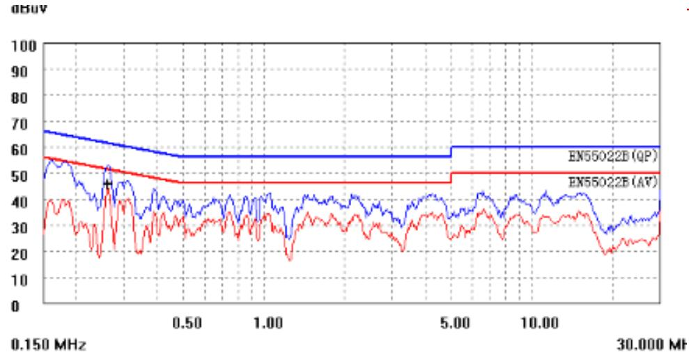

230VAC Neutral

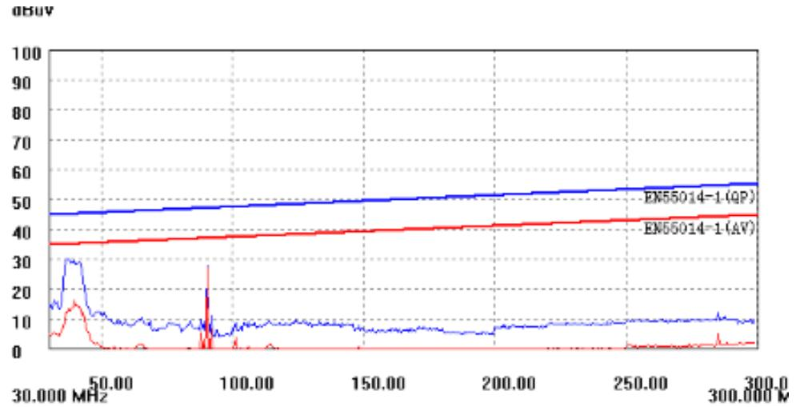

115VAC 空载

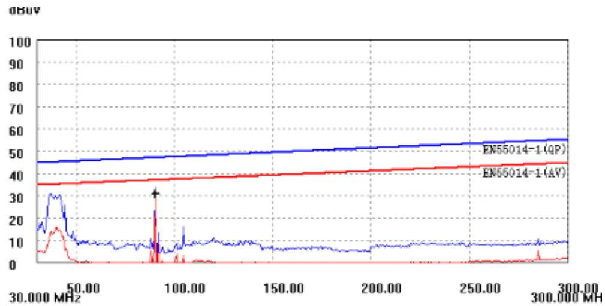

230VAC 空载

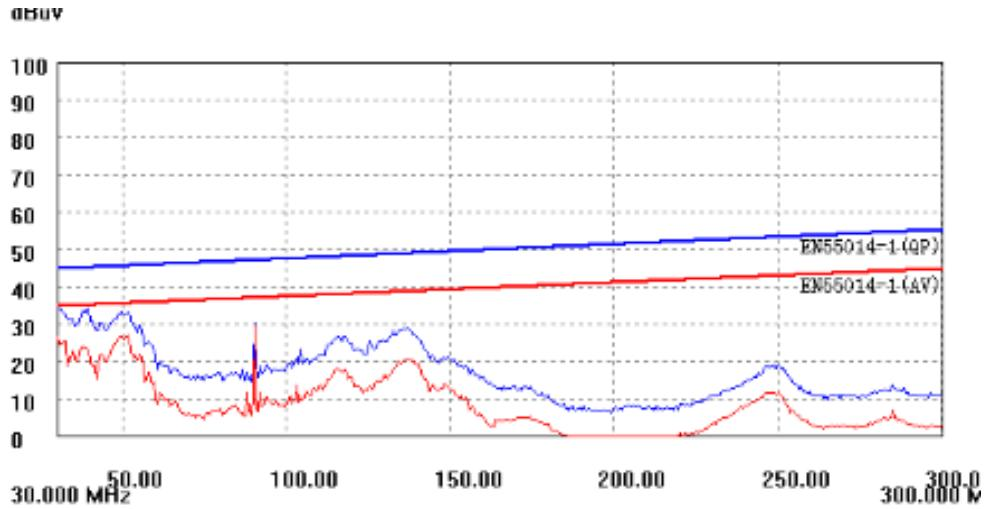

115VAC 满载

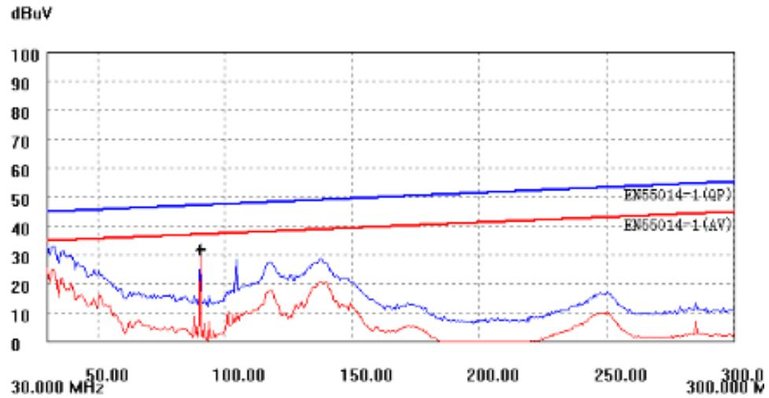

230VAC 满载

<table><tr><td>差模</td><td>电压</td><td>相位角</td><td>发生器阻抗</td><td>测试次数</td><td>测试结果</td></tr><tr><td>L to N</td><td>+2kV</td><td>0</td><td>2</td><td>10</td><td>Pass</td></tr><tr><td>L to N</td><td>-2kV</td><td>0</td><td>2</td><td>10</td><td>Pass</td></tr><tr><td>L to N</td><td>+2kV</td><td>90</td><td>2</td><td>10</td><td>Pass</td></tr><tr><td>L to N</td><td>-2kV</td><td>90</td><td>2</td><td>10</td><td>Pass</td></tr><tr><td>L to N</td><td>+2kV</td><td>180</td><td>2</td><td>10</td><td>Pass</td></tr><tr><td>L to N</td><td>-2kV</td><td>180</td><td>2</td><td>10</td><td>Pass</td></tr><tr><td>L to N</td><td>+2kV</td><td>270</td><td>2</td><td>10</td><td>Pass</td></tr><tr><td>L to N</td><td>-2kV</td><td>270</td><td>2</td><td>10</td><td>Pass</td></tr></table>

## 测试说明

➢ 按照GB/T17626.5和IEC61000-4-5的最新版本要求进行测试  
➢ 室温环境，230VAC输入，满载条件  
➢ 输入1.2/50us组合波浪涌电压  
➢ 每个测试点重复10次  
➢ 每次间隔时间1分钟  
➢ 试验时样机输出正常（符合A类标准）视为Pass

<table><tr><td>差模</td><td>电压</td><td>脉冲群持续时间</td><td>脉冲频率</td><td>测试时间</td><td>测试结果</td></tr><tr><td>L to N</td><td>+4kV</td><td>15ms</td><td>5kHz</td><td>120s</td><td>Pass</td></tr><tr><td>L to N</td><td>-4kV</td><td>15ms</td><td>5kHz</td><td>120s</td><td>Pass</td></tr><tr><td>L to N</td><td>+4kV</td><td>0.75ms</td><td>100kHz</td><td>120s</td><td>Pass</td></tr><tr><td>L to N</td><td>-4kV</td><td>0.75ms</td><td>100kHz</td><td>120s</td><td>Pass</td></tr><tr><td>L to N</td><td>+2kV</td><td>2ms</td><td>38kHz</td><td>120s</td><td>Pass</td></tr><tr><td>L to N</td><td>-2kV</td><td>2ms</td><td>38kHz</td><td>120s</td><td>Pass</td></tr><tr><td>L to N</td><td>+4kV</td><td>2ms</td><td>38kHz</td><td>120s</td><td>Pass</td></tr><tr><td>L to N</td><td>-4kV</td><td>2ms</td><td>38kHz</td><td>120s</td><td>Pass</td></tr></table>

## 测试说明

➢ 按照GB/T17626.4和IEC61000-4-4的最新版本要求进行测试  
➢ 室温环境，230VAC输入满载条件  
➢ 分别测试5kHz/100kHz/38kHz脉冲频率  
➢ 脉冲群周期为300ms  
➢ 每个测试条件测试时间120s  
➢ 试验时样机输出正常（符合A类标准）视为Pass

## THANK YOU FOR WATCHING
