## BPA8618P 隔离参考设计

## 12V 850mA

上海晶丰明源半导体股份有限公司

Shanghai Bright Power Semiconductor Co., Ltd.

梁惠

时间： 2022年05月25日

## 内容

BPA8618P简介  
电源规格  
电路及实物图  
BOM  
PCB Layout图  
变压器  
性能测试数据

## 产品特点：

➢ 集成 700V 高压 MOSFET  
➢ ON/OFF控制模式，低输出纹波  
➢ 内置软启动功能  
➢ 集成高压启动、自供电电路  
➢ 低音频噪声  
➢ 集成输入过/欠压保护

## 应用领域：

➢ 家用电器辅助电源  
➢ 电机驱动辅助电源  
➢ IOT/智能家居/智能照明  
➢ 工业控制辅助电源

<table><tr><td>项目描述</td><td>符号</td><td>最小</td><td>典型</td><td>最大</td><td>单位</td><td>备注</td></tr><tr><td colspan="7">输入</td></tr><tr><td>电压</td><td> $V_{IN}$ </td><td>85</td><td>120/230</td><td>264</td><td> $V_{AC}$ </td><td></td></tr><tr><td>频率</td><td> $f_{LINE}$ </td><td>47</td><td>50/60</td><td>63</td><td>Hz</td><td></td></tr><tr><td colspan="7">输出</td></tr><tr><td>输出电压</td><td> $V_{OUT}$ </td><td></td><td>12</td><td></td><td>V</td><td>±5%</td></tr><tr><td>输出电流</td><td> $I_{OUT}$ </td><td></td><td>850</td><td></td><td>mA</td><td></td></tr><tr><td>输出电压纹波</td><td> $V_{RIPPLE}$ </td><td></td><td></td><td>200</td><td>mV</td><td>20MHz带宽</td></tr><tr><td>连续输出功率</td><td> $P_{OUT}$ </td><td></td><td>10.2</td><td></td><td>W</td><td></td></tr><tr><td colspan="7">效率</td></tr><tr><td>待机功耗</td><td> $P_{STDBY}$ </td><td></td><td></td><td>160</td><td>mW</td><td>230VAC,包含假负载</td></tr><tr><td>满载效率</td><td>η</td><td></td><td>77.1</td><td></td><td>%</td><td></td></tr><tr><td colspan="7">环境</td></tr><tr><td>传导EMI</td><td></td><td colspan="4">满足CISPR22/EN55022 Class B,至少6dB 裕量</td><td></td></tr><tr><td>Surge</td><td></td><td></td><td>2</td><td></td><td>kV</td><td>差模</td></tr><tr><td>EFT</td><td></td><td></td><td>4</td><td></td><td>kV</td><td>5kHz/100kHz/38kHz</td></tr><tr><td>ESD</td><td></td><td></td><td>15</td><td>20</td><td>kV</td><td>空气放电</td></tr><tr><td>工作环境温度</td><td> $T_{AMP}$ </td><td></td><td></td><td>50</td><td>°C</td><td></td></tr></table>

## 电路及实物图

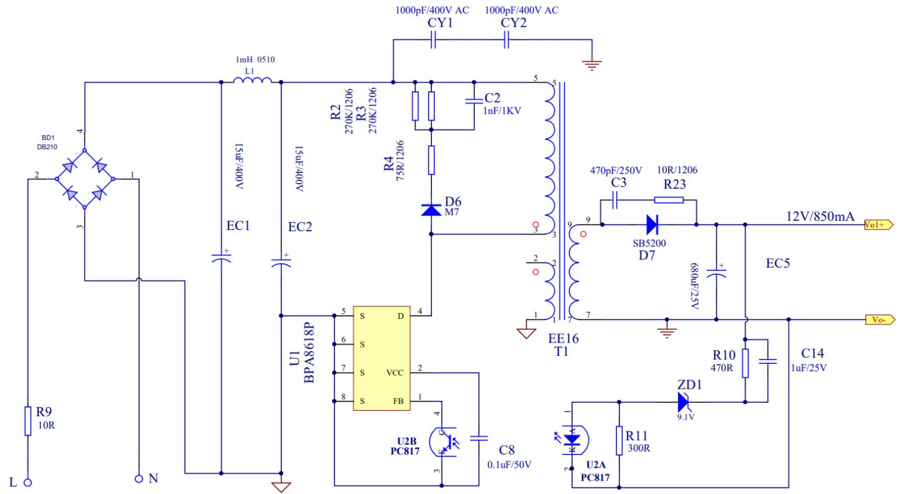

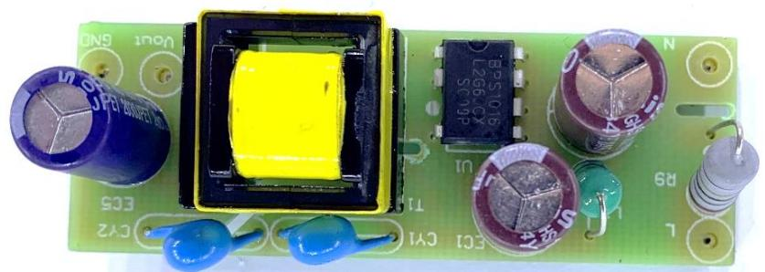

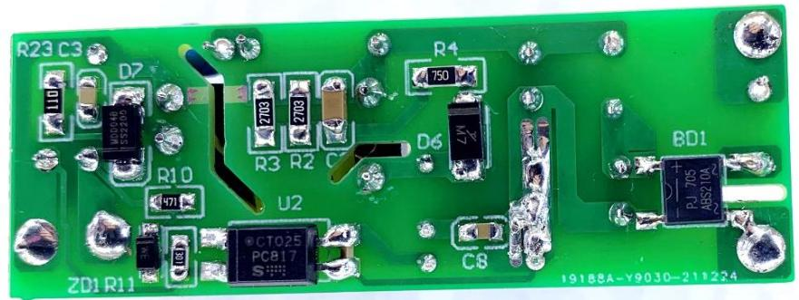

<table><tr><td>序号</td><td>元件标号</td><td>参数描述</td><td>封装尺寸</td><td>数量</td></tr><tr><td>1</td><td>PCB</td><td>FR-4, 单面板</td><td>60mm*21mm</td><td>1</td></tr><tr><td>2</td><td>F1</td><td>10R 2W 绕线保险丝电阻</td><td>DIP</td><td>1</td></tr><tr><td>3</td><td>E1</td><td>400V15uF电解电容</td><td> $\phi 8*18$ </td><td>2</td></tr><tr><td>4</td><td>L1</td><td>1mH 色环电感</td><td>510</td><td>1</td></tr><tr><td>5</td><td>EC5</td><td>25V680uF 电解电容, 高频低阻</td><td> $\phi 10*12$ </td><td>1</td></tr><tr><td>6</td><td>CY1,CY2</td><td>1000PF 400V AC Y1</td><td>DIP</td><td>2</td></tr><tr><td>7</td><td>BD1</td><td>ABS210 2A 1KV</td><td>SMD</td><td>1</td></tr><tr><td>8</td><td>D7</td><td>SB5200 肖特基5A 200V</td><td>SMA</td><td>1</td></tr><tr><td>9</td><td>U2</td><td>PC817C 光耦</td><td>SMD</td><td>1</td></tr><tr><td>10</td><td>T1</td><td>EE16卧式 700uH</td><td>DIP</td><td>1</td></tr><tr><td>11</td><td>U1</td><td>BPA8618P</td><td>DIP7</td><td>1</td></tr><tr><td>12</td><td>D6</td><td>M7 1A 1KV</td><td>SMA</td><td>1</td></tr><tr><td>13</td><td>ZD1</td><td>9.1V 稳压管</td><td>SOD123</td><td>1</td></tr><tr><td>14</td><td>R3,R2</td><td>270K,  $\pm 5\%$ </td><td>SMD1206</td><td>2</td></tr><tr><td>15</td><td>R4</td><td>75R,  $\pm 5\%$ </td><td>SMD1206</td><td>1</td></tr><tr><td>16</td><td>R23</td><td>10R,  $\pm 5\%$ </td><td>SMD1206</td><td>1</td></tr><tr><td>17</td><td>C2</td><td>1nF, 1KV X7R</td><td>SMD1206</td><td>1</td></tr><tr><td>18</td><td>C8</td><td>100nF, 25V X7R</td><td>SMD0805</td><td>1</td></tr><tr><td>19</td><td>C14</td><td>1uF, 25V X7R</td><td>SMD0805</td><td>1</td></tr><tr><td>20</td><td>C3</td><td>470pF, 250V X7R</td><td>SMD0805</td><td>1</td></tr><tr><td>21</td><td>R10</td><td>470R,  $\pm 5\%$ </td><td>SMD0805</td><td>1</td></tr><tr><td>22</td><td>R11</td><td>300R,  $\pm 5\%$ </td><td>SMD0805</td><td>1</td></tr><tr><td colspan="2"></td><td></td><td>Total</td><td>25</td></tr></table>

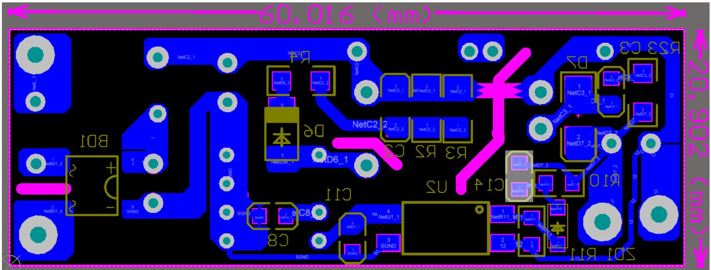

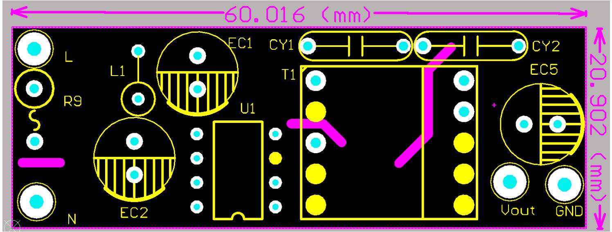

## 原理图

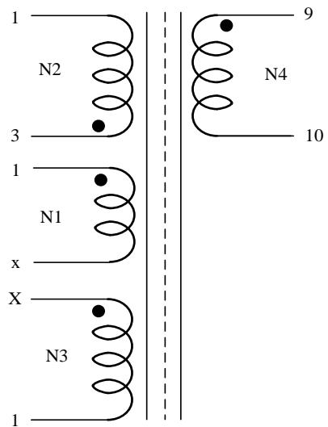

## 绕线方式

<table><tr><td>绕组</td><td>起始脚</td><td>终止脚</td><td>材料</td><td>匝数</td><td>绕线方式</td></tr><tr><td>N1</td><td>1</td><td>NC</td><td> $\phi 0.18*2P$ </td><td>19Ts</td><td>密绕一层(PIN脚朝外)</td></tr><tr><td colspan="4">胶带</td><td>2.1Ts</td><td></td></tr><tr><td>N2</td><td>3</td><td>1</td><td> $\phi 0.18*1P$ </td><td>80Ts</td><td>密绕二层(PIN脚朝外)</td></tr><tr><td colspan="4">胶带</td><td>2.1Ts</td><td></td></tr><tr><td>N3</td><td>NC</td><td>1</td><td> $\phi 0.3*2P$ </td><td>11Ts</td><td>居中密绕一层(PIN脚朝外)</td></tr><tr><td colspan="4">胶带</td><td>2.1Ts</td><td></td></tr><tr><td>N4</td><td>9</td><td>10</td><td>三层绝缘线 $\phi 0.35*1P$ </td><td>12Ts</td><td>密绕一层(PIN脚朝外)</td></tr><tr><td colspan="4">胶带</td><td>3Ts</td><td></td></tr></table>

## 规格与材料

初级绕组感量 $\mathsf { L } _ { \mathsf { p } } { = } 7 0 0 \mathsf { u } \mathsf { H } { \pm } 7 \%$ （测试条件： 0.3V，100kHz）  
➢ 漏感量 $\mathrm { \cdot L _ { | k } } < 5 0 \mathrm { u } \mathrm { H }$  
➢ 骨架：EE16卧式加宽（5+5PIN）  
➢ 磁芯：EE16 PC40 或同等材质 ， ${ \mathsf { A } } { \mathsf { e } } = 1 9 . 2 { \mathsf { m m } } ^ { 2 }$  
➢ N1、N2、N3: 2UEW 漆包线  
➢ N4: 三层绝缘线  
➢ 绝缘胶带:3M900 或同等材质  
➢ 耐压测试: 3KV, 50/60Hz, 1Min  
➢ 成品要求：浸凡立水

## 脚位图

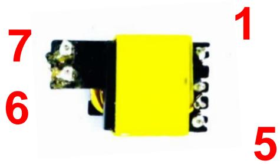

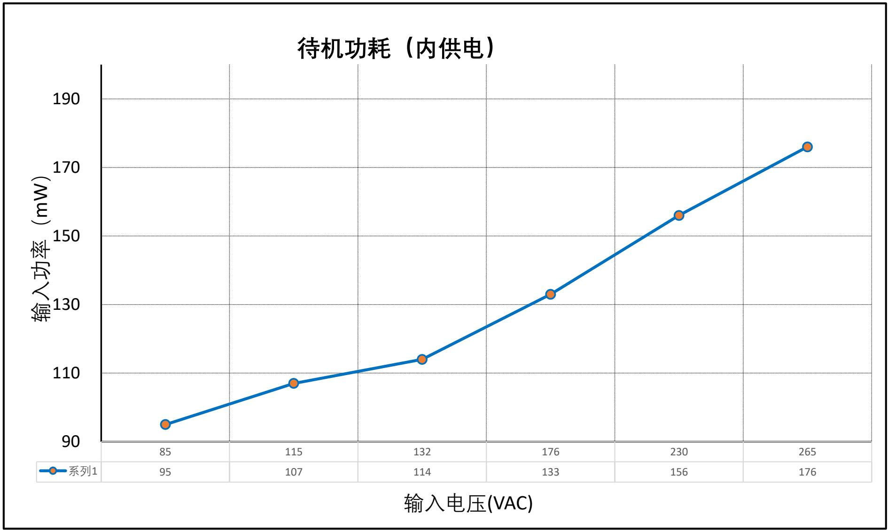

效率测试  
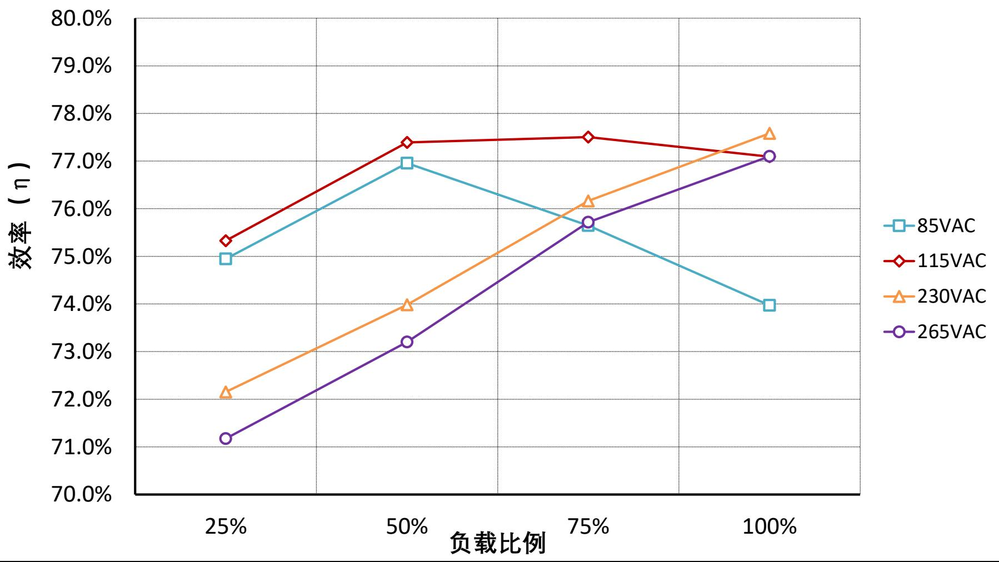

## 输出电压调整率

<table><tr><td> $V_{IN}(VAC)$ Load(%)</td><td>85</td><td>115</td><td>132</td><td>176</td><td>230</td><td>265</td><td>平均值</td><td>线调整率</td></tr><tr><td>0</td><td>11.91</td><td>11.90</td><td>11.90</td><td>11.90</td><td>11.9</td><td>11.9</td><td>11.90</td><td>0.08%</td></tr><tr><td>20%</td><td>11.87</td><td>11.87</td><td>11.87</td><td>11.87</td><td>11.87</td><td>11.87</td><td>11.87</td><td>0.04%</td></tr><tr><td>40%</td><td>11.85</td><td>11.82</td><td>11.82</td><td>11.82</td><td>11.82</td><td>11.82</td><td>11.83</td><td>0.25%</td></tr><tr><td>60%</td><td>11.75</td><td>11.75</td><td>11.75</td><td>11.76</td><td>11.76</td><td>11.76</td><td>11.76</td><td>0.09%</td></tr><tr><td>80%</td><td>11.73</td><td>11.73</td><td>11.73</td><td>11.74</td><td>11.74</td><td>11.74</td><td>11.74</td><td>0.09%</td></tr><tr><td>100%</td><td>11.71</td><td>11.71</td><td>11.71</td><td>11.73</td><td>11.73</td><td>11.73</td><td>11.72</td><td>0.17%</td></tr><tr><td>平均值</td><td>11.80</td><td>11.80</td><td>11.80</td><td>11.80</td><td>11.80</td><td>11.80</td><td rowspan="2" colspan="2"></td></tr><tr><td>负载调整率</td><td>1.69%</td><td>1.61%</td><td>1.61%</td><td>1.44%</td><td>1.44%</td><td>1.44%</td></tr></table>

◼ 计算方法：调整率=100%\*(最大值-最小值)/平均值  
测试条件：

## 输出电压纹波

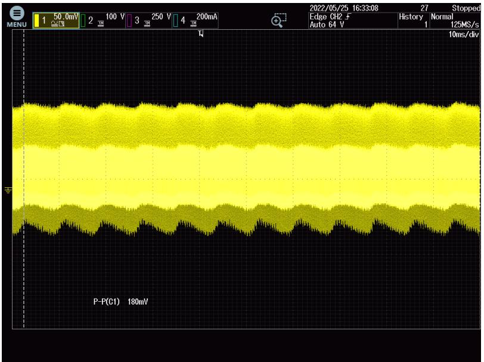

85 VAC

CH1 $\mathsf { V } _ { \mathsf { O U T } - 1 2 \mathsf { V } }$ Ripple $\mathsf { V } _ { \mathsf { P K - P K } } \mathsf { = } \mathsf { 1 8 0 m V }$

## Test Condition:

➢ Full Load

115 VAC

CH1 $\mathsf { V } _ { \mathsf { O U T - 1 } 2 \mathsf { V } }$ Ripple $\mathsf { V } _ { \mathsf { P K - P K } } { = } \pm 1 5 6 \mathsf { m V }$

## Test Condition:

➢ Full Load

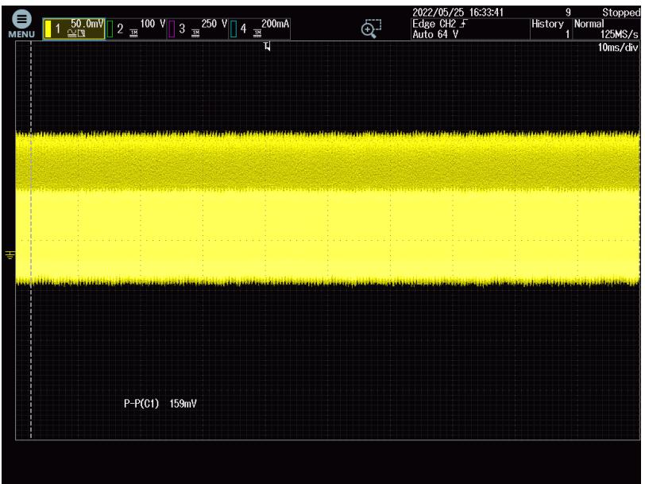

230 VAC

CH1 $\mathsf { V } _ { \mathsf { O U T } - 1 2 \mathsf { V } }$ Ripple $\mathsf { V } _ { \mathsf { P K - P K } } { = } 1 5 9 \mathsf { m V }$

## Test Condition:

➢ Full Load

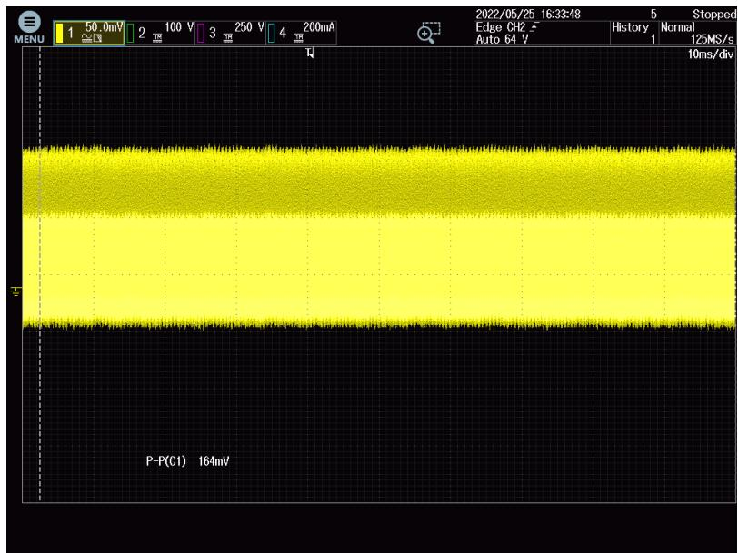

265 VAC

CH1 $\mathsf { V } _ { \mathsf { O U T } - 1 2 \mathsf { V } }$ Ripple $\mathsf { V } _ { \mathsf { P K - P K } } { = } 1 6 4 \mathsf { m V }$

## Test Condition:

➢ Full Load

## 动态负载(50%-100%)

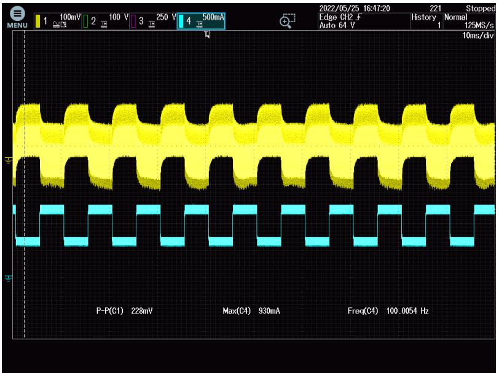

85 VAC

CH1 VOUT-12V VPK-PK=228 mV

## Test Condition:

➢ 0.425A-0.85A-0. 425A  
➢ Slew Rate: 0.5 A/μS  
➢ Frequency: 100 Hz

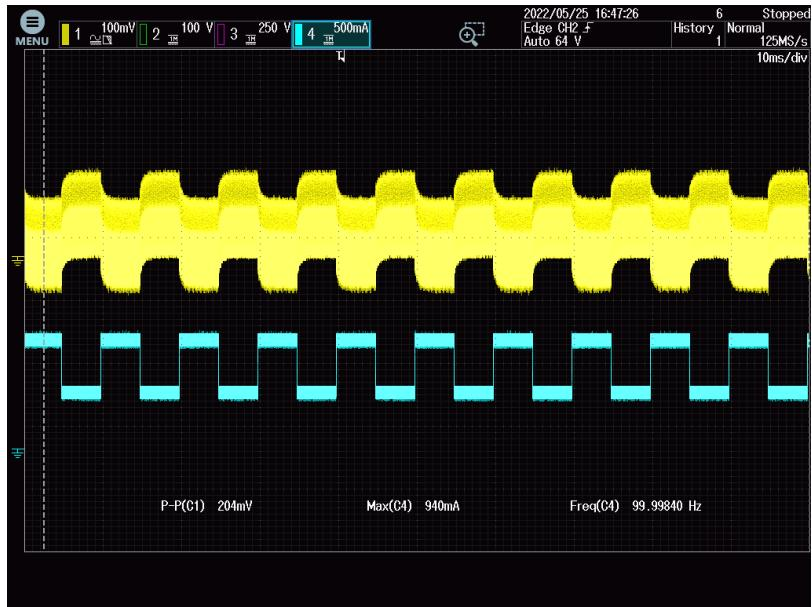

115 VAC

CH1 VOUT-12V $\mathsf { V } _ { \mathsf { O U T - 1 } 2 \mathsf { V } }$ $V _ { P K - P K } = 2 0 4 m v$

## Test Condition:

➢ 0.425A-0.85A-0. 425A  
➢ Slew Rate: 0.5 A/μS  
➢ Frequency: 100 Hz

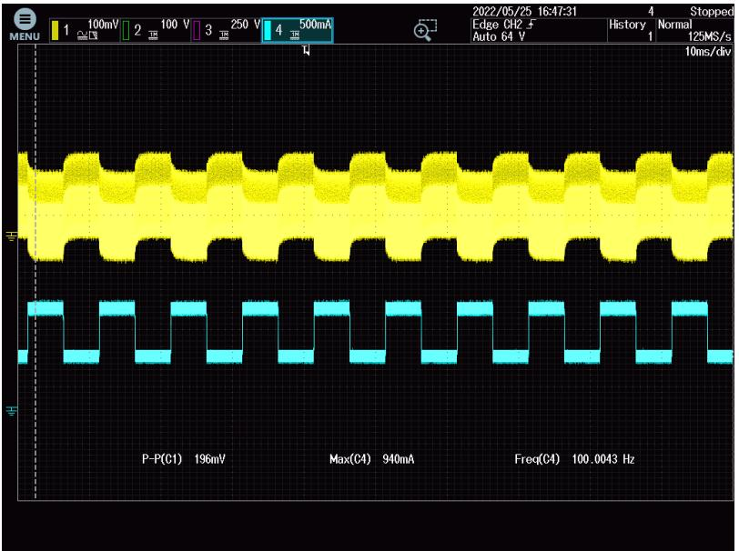

230 VAC

CH1 VOUT-12V $\mathsf { V } _ { \mathsf { O U T - 1 } 2 \mathsf { V } }$ VPK-PK=196mV

## Test Condition:

➢ 0.425A-0.85A-0. 425A  
➢ Slew Rate: 0.5 A/μS  
➢ Frequency: 100 Hz

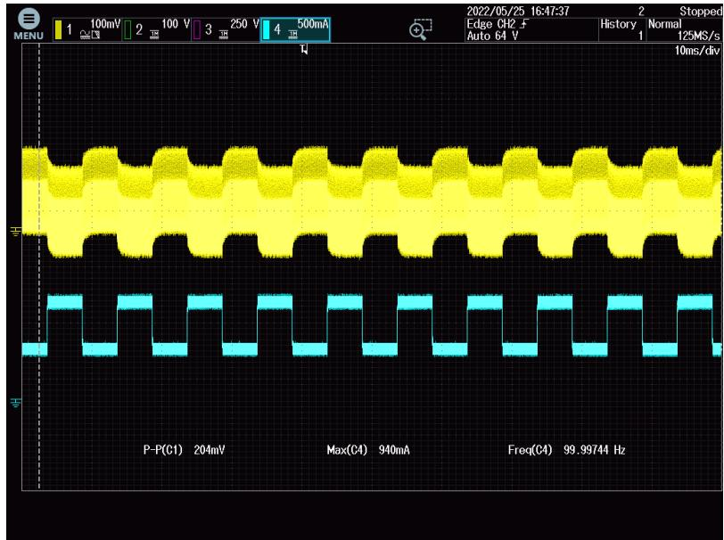

264 VAC

CH1 VOUT-12V $V _ { P K - P K } = 2 0 4 m v$

## Test Condition:

➢ 0.425A-0.85A-0. 425A  
➢ Slew Rate: 0.5 A/μS  
➢ Frequency: 100 Hz

## 动态负载(10%-90%)

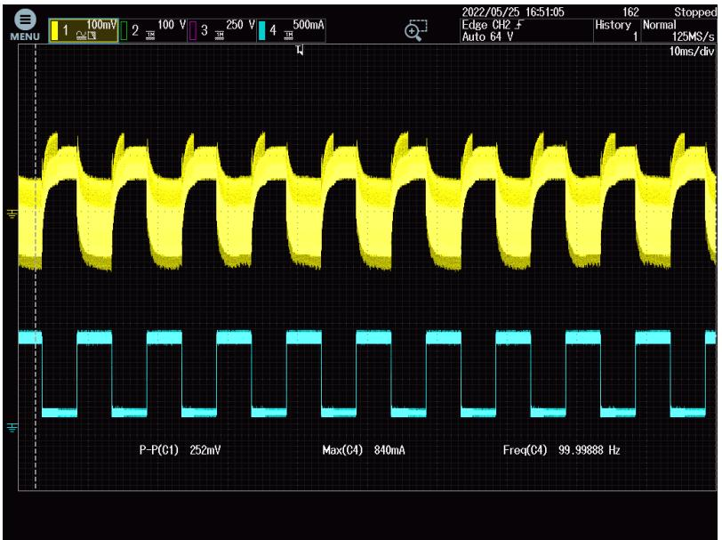

85 VAC

CH1 VOUT-12V VPK-PK=252 mV

## Test Condition:

➢ 0.085 A-0.765A-0.085A  
➢ Slew Rate: 0.5 A/μS  
➢ Frequency: 100 Hz

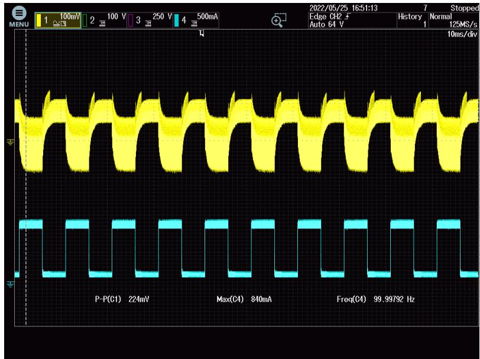

115 VAC

CH1 VOUT-12V VPK-PK=224 mV

## Test Condition:

➢ 0.085 A-0.765A-0.085A  
➢ Slew Rate: 0.5 A/μS  
➢ Frequency: 100 Hz

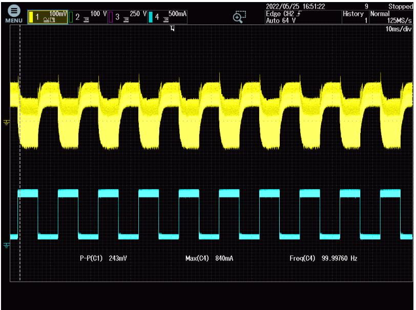

230 VAC

CH1 VOUT-12V VPK-PK=243 mV

## Test Condition:

➢ 0.085 A-0.765A-0.085A  
➢ Slew Rate: 0.5 A/μS  
➢ Frequency: 100 Hz

264VAC

CH1 VOUT-12V VPK-PK=252 mV

## Test Condition:

➢ 0.085 A-0.765A-0.085A  
➢ Slew Rate: 0.5 A/μS  
➢ Frequency: 100 Hz

## 输出电压开机波形

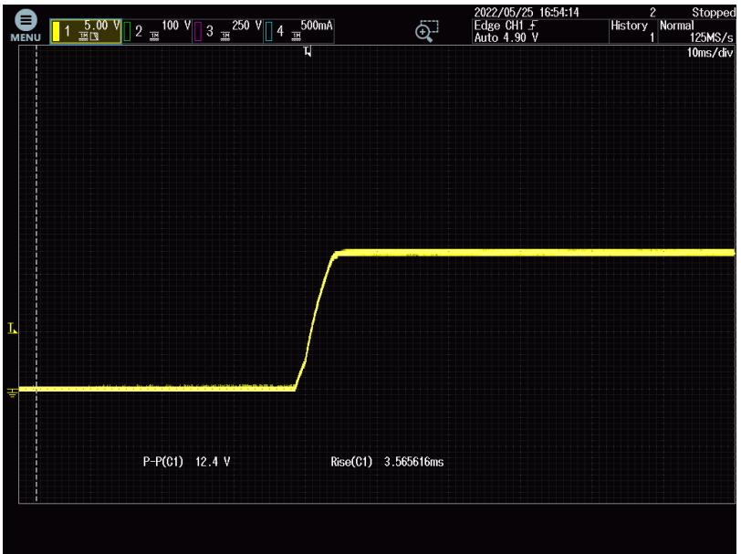

85 VAC

CH1 VOUT-12V TRISE: 3.56 mS

## Test Condition:

➢ No Load

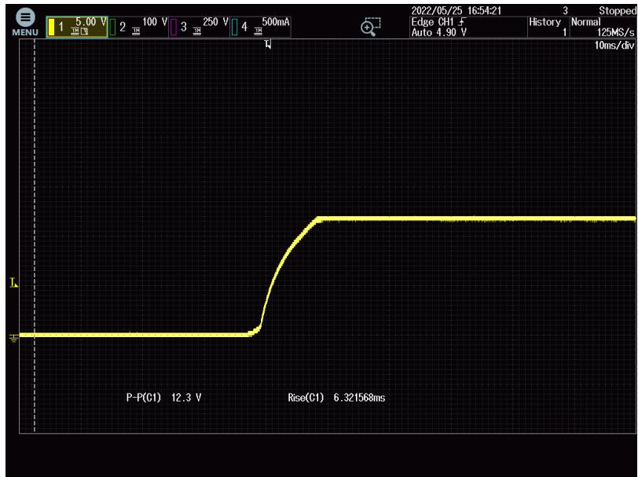

85 VAC

CH1 VOUT-12V TRISE: 6.32 mS

## Test Condition:

➢ Full Load

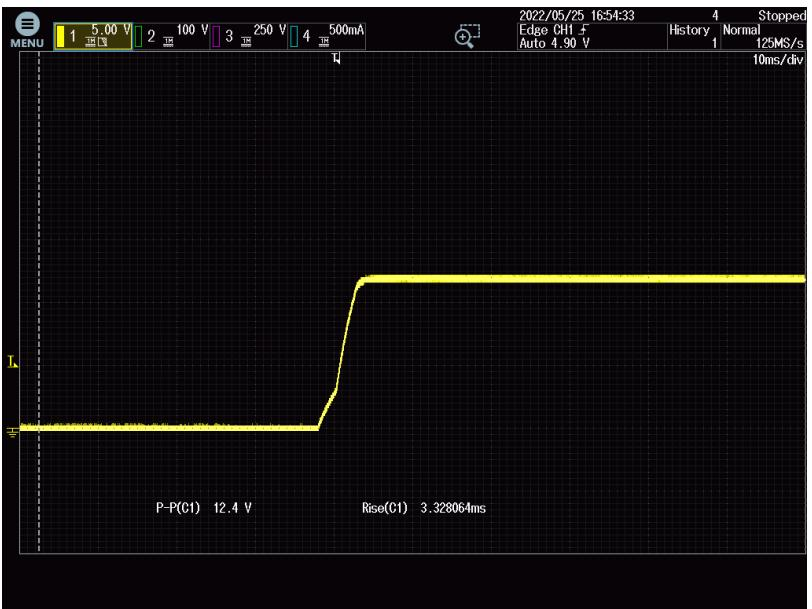

265 VAC

CH1 VOUT-12V TRISE: 3.32 mS

## Test Condition:

➢ No Load

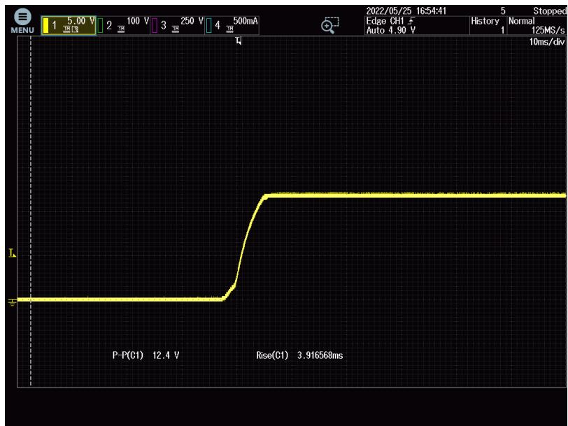

265 VAC

CH1 VOUT-12V TRISE: 3.91 mS

## Test Condition:

➢ Full Load

## 启动延迟时间

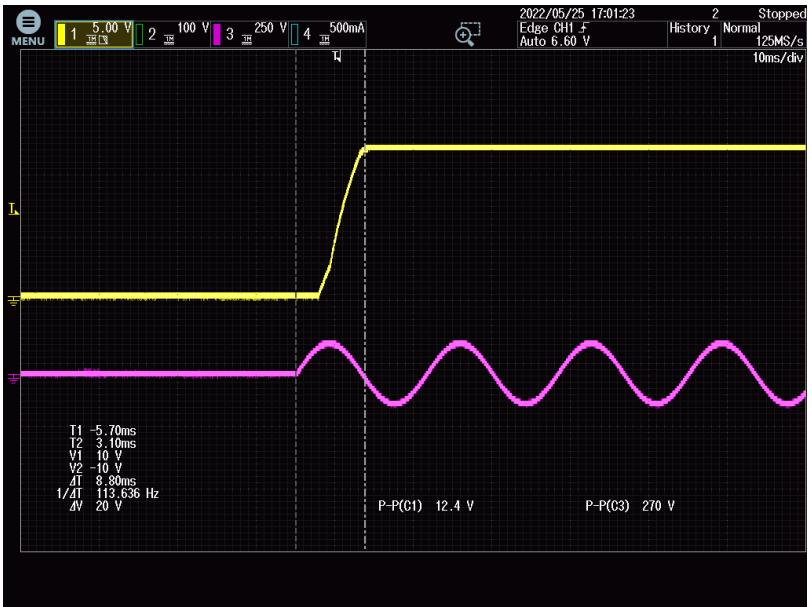

85 VAC

CH1 VOUT-12V $\mathsf { V } _ { \mathsf { O U T } - 1 2 \mathsf { V } }$  
CH3 $\mathsf { V I N } _ { \mathsf { A C } }$  
${ \mathsf { T } } _ { \mathsf { D E L A Y } } .$ 8.8 mS

Test Condition:  
➢ No Load  
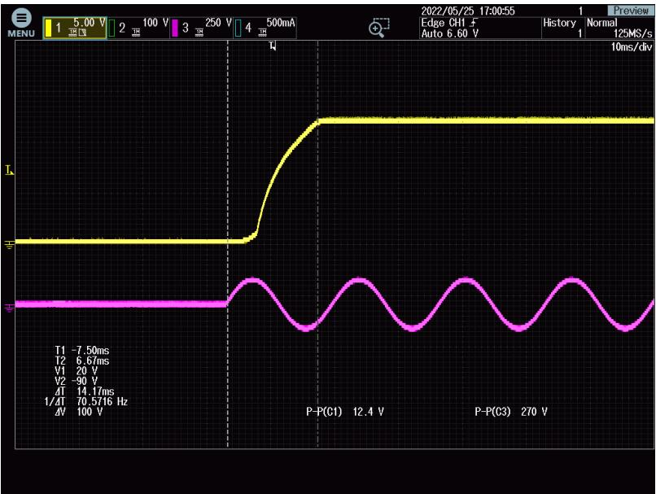

85 VAC

CH1 VOUT-12V $\mathsf { V } _ { \mathsf { O U T - 1 } 2 \mathsf { V } }$  
CH3 VINAC $\mathsf { V I N } _ { \mathsf { A C } }$ $\mathsf { T } _ { \mathsf { D E L A Y } } .$ 14.17mS

Test Condition:  
➢ Full Load  
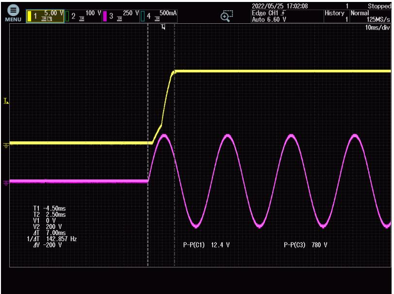

265 VAC

CH1 VOUT-12V $\mathsf { V } _ { \mathsf { O U T } - 1 2 \mathsf { V } }$  
CH3 VINNAC $\mathsf { V I N } _ { \mathsf { N A C } }$  
TDELAY: 7 mS

Test Condition:  
➢ No Load  
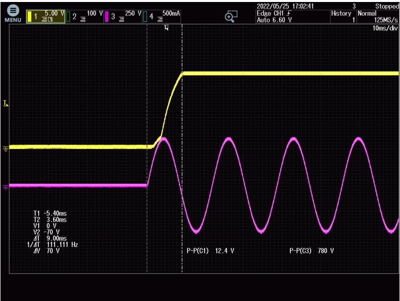

265 VAC

CH1 VOUT-12V $\mathsf { V } _ { \mathsf { O U T } - 1 2 \mathsf { V } }$  
CH3 VINNAC $\mathsf { V I N } _ { \mathsf { N A C } }$  
$\mathsf { T } _ { \mathsf { D E L A Y } } \colon 9$ mS

Test Condition:

➢ Full Load

## 输入欠压保护

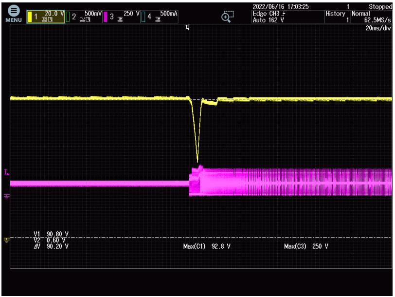

## BROWN-IN

CH1 $\mathsf { V I N } _ { \mathsf { D C } }$  
CH3 VIN VDS $\mathsf { V I N V } _ { \mathsf { D S } }$ VBROWN-IN: 90.2 V

## 测试条件:

➢ No Load

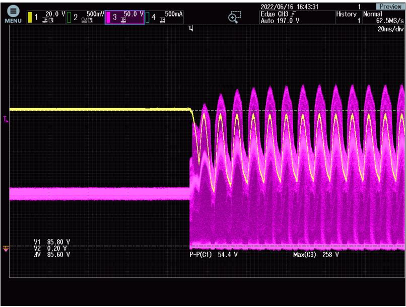

## BROWN-IN

${ \mathsf { C H 1 } } { \mathsf { V I N } } _ { \mathsf { D C } }$  
CH3 VIN VDS $\mathsf { V I N } \mathsf { V } _ { \mathsf { D S } }$ BROWN-IN: 85.6 V

## 测试条件:

➢ Full Load

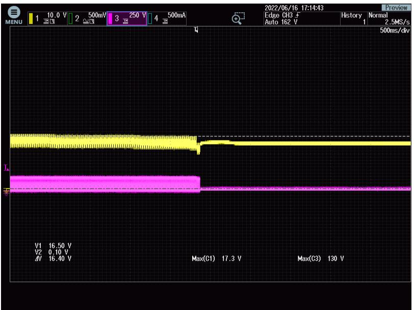

## BROWN-OUT

CH1 $\mathsf { V I N } _ { \mathsf { D C } }$  
CH3 VIN VDS $\mathsf { V I N } \mathsf { V } _ { \mathsf { D S } }$ VBROWN-OUT:16.4V

## 测试条件:

➢ No Load

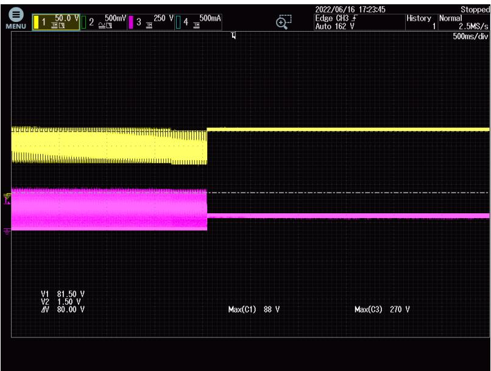

## BROWN-OUT

${ \mathsf { C H 1 } } \mathsf { V I N } _ { \mathsf { D C } }$  
CH3 VIN VDS $\mathsf { V I N } \mathsf { V } _ { \mathsf { D S } }$ VBROWN-OUT: 80V

## 测试条件:

➢ Full Load

## 输入过压保护

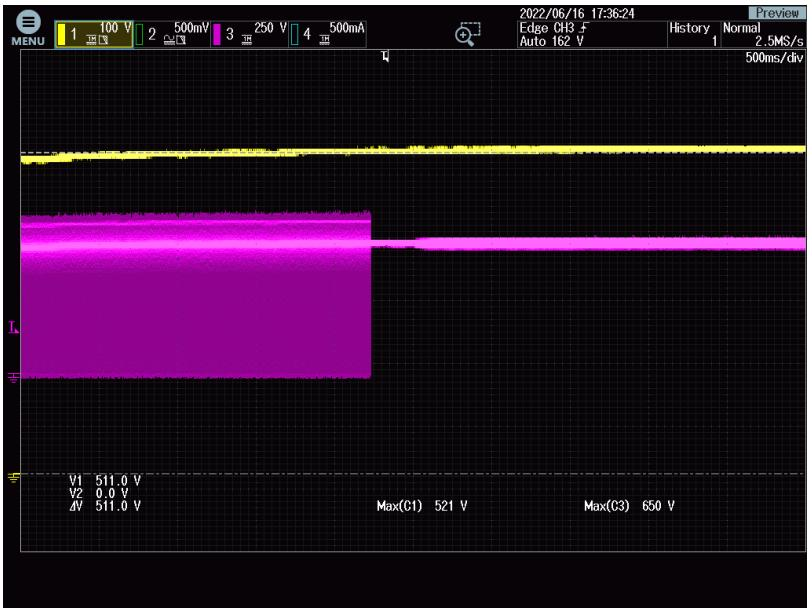

## 输入OVP

CH1 $\mathsf { V I N } _ { \mathsf { D C } }$  
CH3 VIN VDS $\mathsf { V I N V } _ { \mathsf { D S } }$ VBROWN-IN: 511V

## 测试条件:

➢ No Load

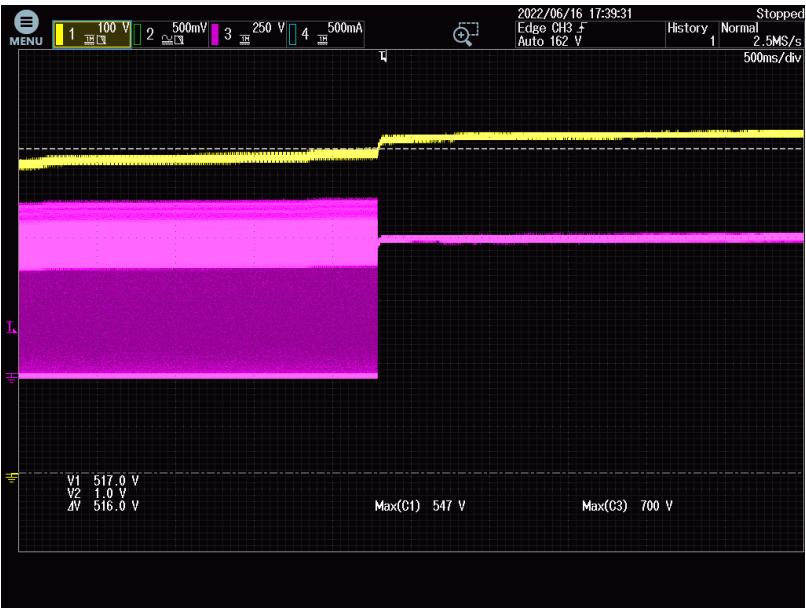

## 输入OVP

${ \mathsf { C H 1 } } { \mathsf { V I N } } _ { \mathsf { D C } }$  
CH3 $\mathsf { V I N } \mathsf { V } _ { \mathsf { D S } }$ VBROWN-IN: 516V

## 测试条件:

➢ Full Load

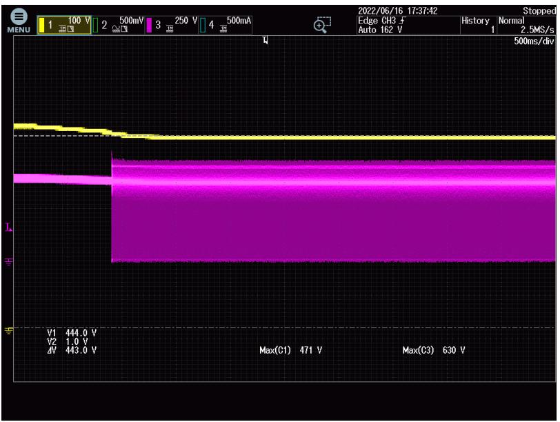

## 退出输入OVP

CH1 $\mathsf { V I N } _ { \mathsf { D C } }$  
CH3 VIN VDS $\mathsf { V } _ { \mathsf { D } \mathsf { S } }$ VBROWN-OUT:443 V

## 测试条件:

➢ No Load

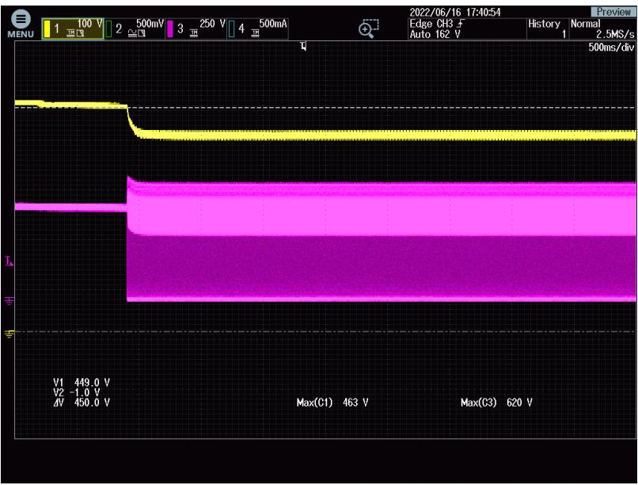

## 退出输入OVP

CH1 $\mathsf { V I N } _ { \mathsf { D C } }$  
CH3 VIN VDS $\mathsf { V I N } \mathsf { V } _ { \mathsf { D S } }$ VBROWN-OUT: 450V

## 测试条件:

➢ Full Load

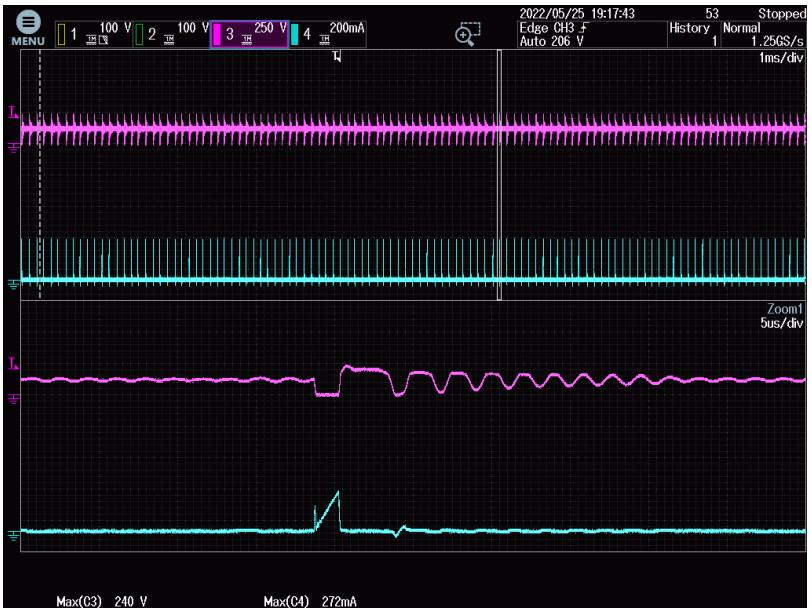

85 VAC

CH3 VDS

$$
\mathrm{CH4I} _ {\mathrm{D}}
$$

$$
V _ {D S \_ M A X} = 2 4 0 \mathrm{V}
$$

$$
I _ {D S \_ M A X} = 2 7 2 \mathrm{mA}
$$

## Test Condition:

➢ No Load

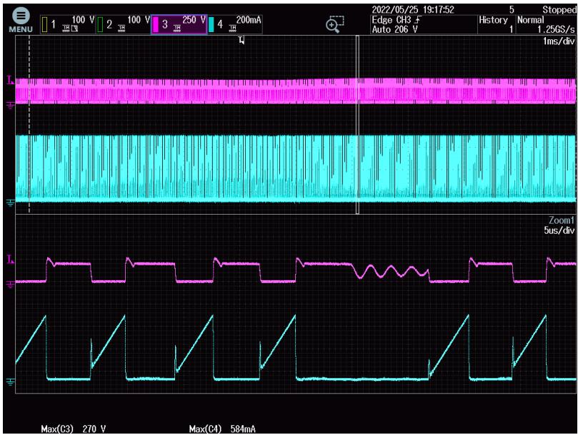

85 VAC

CH3 VDS

$$
\mathrm{CH4I} _ {\mathrm{D}}
$$

$$
V _ {D S \_ M A X} = 2 7 0 \mathrm{V}
$$

$$
I _ {D S \_ M A X} = 5 8 4 \mathrm{mA}
$$

## Test Condition:

➢ Full Load

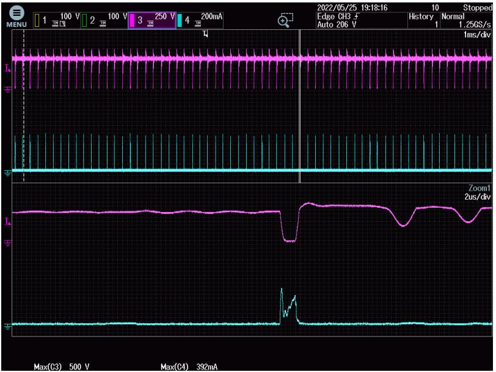

265 VAC

CH3 VDS  
CH4 ID

$$
V _ {D S \_ M A X} = 5 0 0 \mathrm{V}
$$

$$
I _ {D S \_ M A X} = 3 9 2 \mathrm{mA}
$$

## Test Condition:

➢ No Load

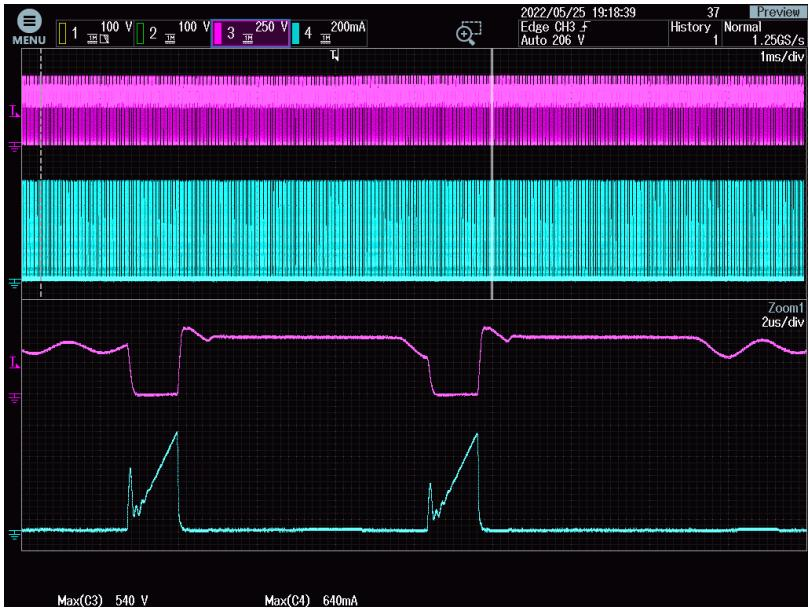

265 VAC

CH3 VDS

$$
\mathrm{CH4I} _ {\mathrm{D}}
$$

$$
V _ {D S \_ M A X} = 5 4 0 \mathrm{V}
$$

$$
I _ {D S \_ M A X} = 6 4 0 \mathrm{mA}
$$

## Test Condition:

➢ Full Load

## 短路保护 （MOSFET波形）

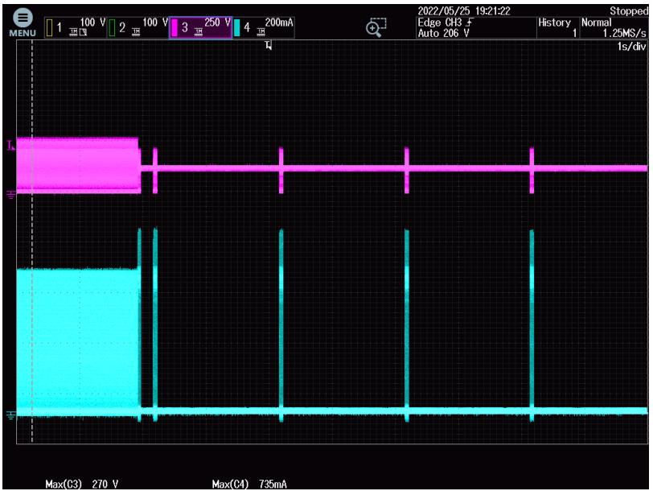

85 VAC

CH3 VDS  
CH4 ID

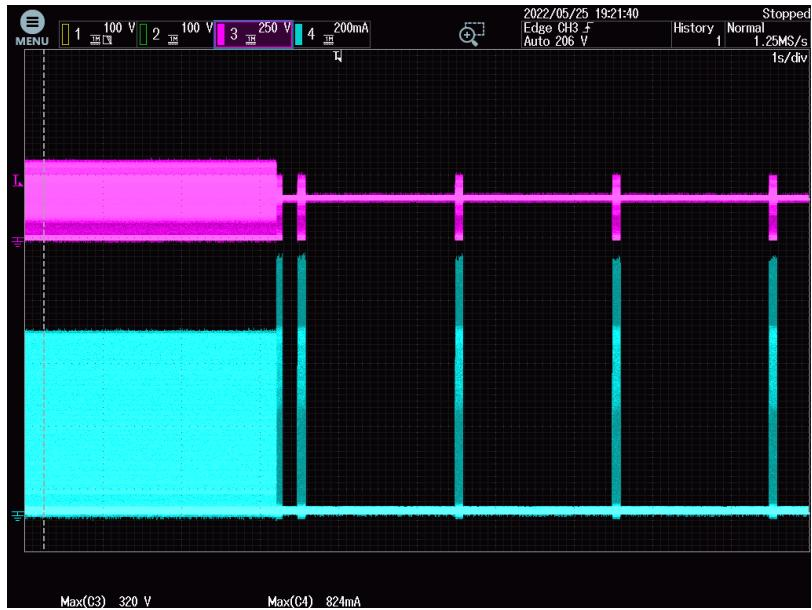

115 VAC

CH3 VDS  
CH4 ID

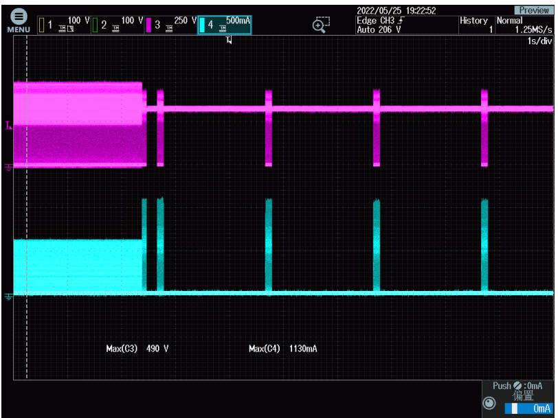

230 VAC

CH3 VDS  
CH4 ID

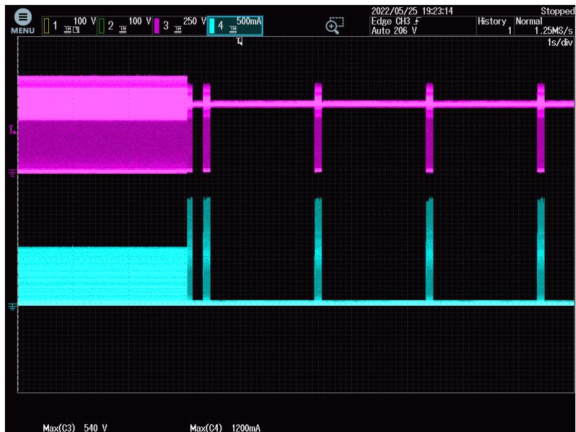

265 VAC

CH3 VDS  
CH4 ID

## 漏极电流波形

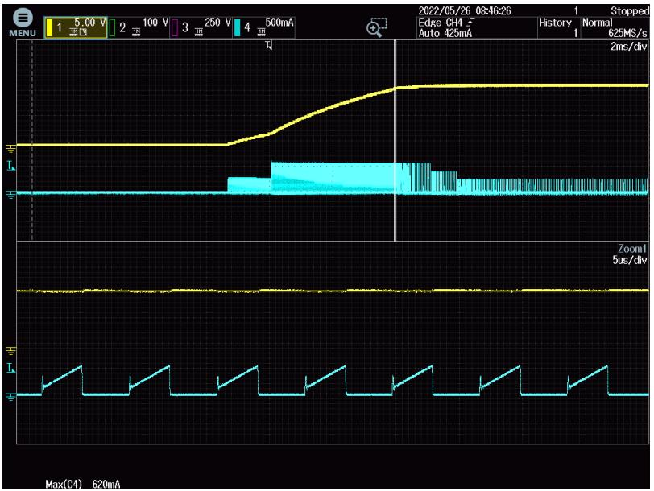

85 VAC

CH1 VOUTPUT-12V  
CH4 IDRAIN

Test Condition:

➢ 空载启动

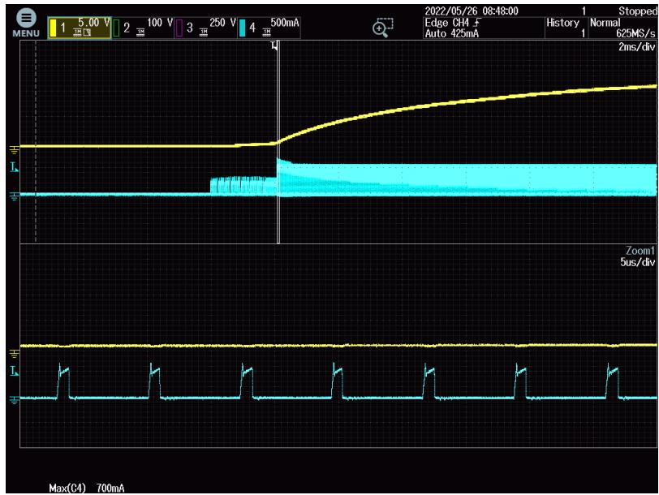

85 VAC

CH1 VOUTPUT-12V  
CH4 IDRAIN

Test Condition:

满载启动

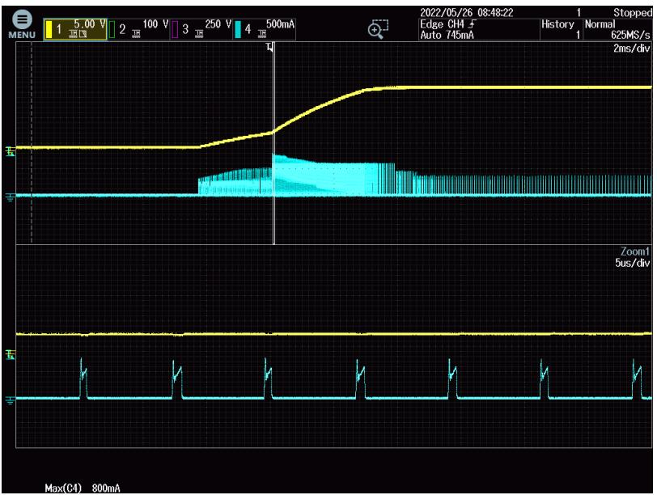

265 VAC

CH1 VOUTPUT-12V  
CH4 IDRAIN

Test Condition:

➢ 空载启动

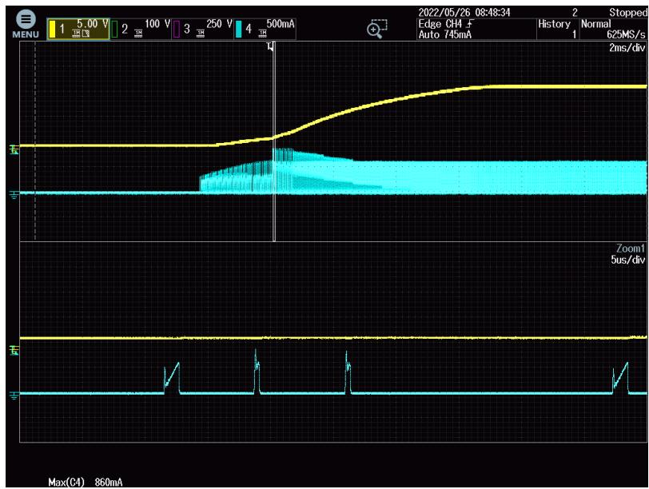

265 VAC

CH1 VOUTPUT-12V  
CH4 IDRAIN

Test Condition:

满载启动

## D-S电压波形(加前馈电容105）

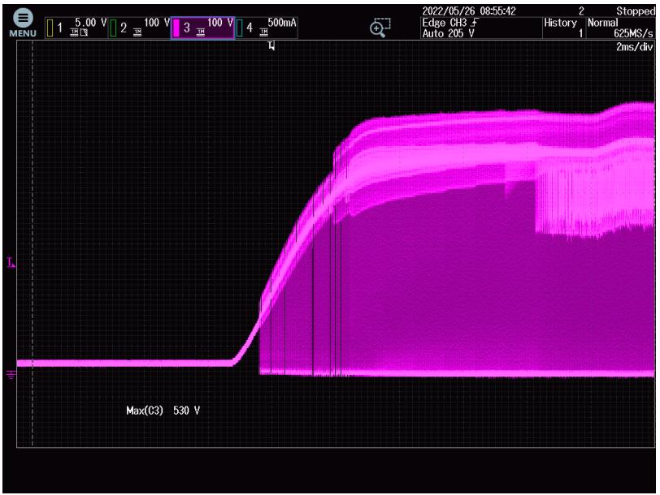

265 VAC

CH2 VDS VDSMAX: 530 V

Test Condition:

➢ 满载开机

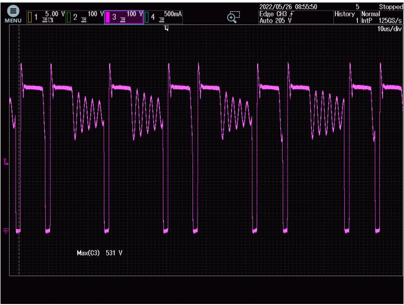

265 VAC

CH2 VDS VDSMAX: 534 V

Test Condition:满载正常工作

极限参数(注3)

<table><tr><td>符号</td><td>参数</td><td>参数范围</td><td>单位</td></tr><tr><td> $V_{DRAIN}$ </td><td>内部高压 MOSFET 漏极到源极电压</td><td>-0.3~700</td><td>V</td></tr><tr><td> $V_{CC}$ </td><td> $V_{CC}$  电压</td><td>-0.3~9</td><td>V</td></tr><tr><td> $I_{CC\_MAX}$ </td><td> $V_{CC}$  引脚最大电流</td><td>20</td><td>mA</td></tr><tr><td> $V_{FB}$ </td><td>输出反馈端电压</td><td>-0.3~9</td><td>V</td></tr><tr><td> $P_{DMAX}$ </td><td>功耗(注 4)</td><td>1.5</td><td>W</td></tr><tr><td> $\theta_{JA}$ </td><td>结到环境的热阻(注 5)</td><td>80</td><td>°C/W</td></tr><tr><td> $\theta_{JC}$ </td><td>结到芯片表面的热阻(注 5)</td><td>20</td><td>°C/W</td></tr><tr><td> $T_{J}$ </td><td>工作结温范围</td><td>-40 to 150</td><td>°C</td></tr><tr><td> $T_{STG}$ </td><td>储存温度范围</td><td>-55 to 150</td><td>°C</td></tr><tr><td>ESD</td><td>人体模型 ESD(注 6)</td><td>2</td><td>kV</td></tr></table>

## 满载开机

Derating= 530 V / 700 V = 75.71 %

## 满载正常工作

Derating = 534 V / 700 V = 76.28 %

## D-S电压波形(无前馈电容105）

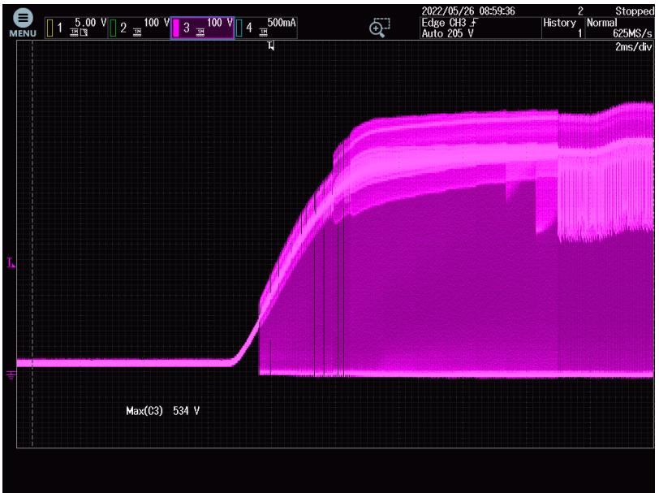

265 VAC

CH2 VDS VD SMAX: 534 V

Test Condition:

满载开机

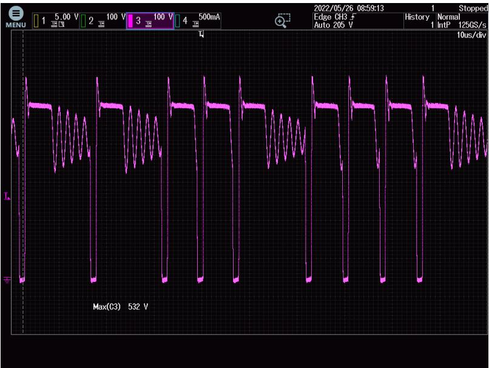

265 VAC

CH2 VDS VDSMAX: 532 V

Test Condition:满载正常工作

极限参数(注3)

<table><tr><td>符号</td><td>参数</td><td>参数范围</td><td>单位</td></tr><tr><td> $V_{DRAIN}$ </td><td>内部高压 MOSFET 漏极到源极电压</td><td>-0.3~700</td><td>V</td></tr><tr><td> $V_{CC}$ </td><td> $V_{CC}$  电压</td><td>-0.3~9</td><td>V</td></tr><tr><td> $I_{CC\_MAX}$ </td><td> $V_{CC}$  引脚最大电流</td><td>20</td><td>mA</td></tr><tr><td> $V_{FB}$ </td><td>输出反馈端电压</td><td>-0.3~9</td><td>V</td></tr><tr><td> $P_{DMAX}$ </td><td>功耗(注 4)</td><td>1.5</td><td>W</td></tr><tr><td> $\theta_{JA}$ </td><td>结到环境的热阻(注 5)</td><td>80</td><td>°C/W</td></tr><tr><td> $\theta_{JC}$ </td><td>结到芯片表面的热阻(注 5)</td><td>20</td><td>°C/W</td></tr><tr><td> $T_{J}$ </td><td>工作结温范围</td><td>-40 to 150</td><td>°C</td></tr><tr><td> $T_{STG}$ </td><td>储存温度范围</td><td>-55 to 150</td><td>°C</td></tr><tr><td>ESD</td><td>人体模型 ESD(注 6)</td><td>2</td><td>kV</td></tr></table>

## 满载开机

Derating= 534 V / 700 V = 76.28 %

## 满载正常工作

Derating = 532 V / 700 V = 76%

## 12V输出肖特基反压波形

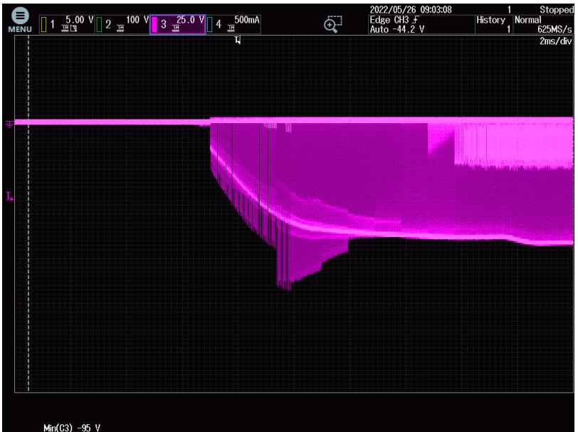

265 VAC

CH2 VDIODE VDSMAX: 95 V

Test Condition:

➢ 满载启动

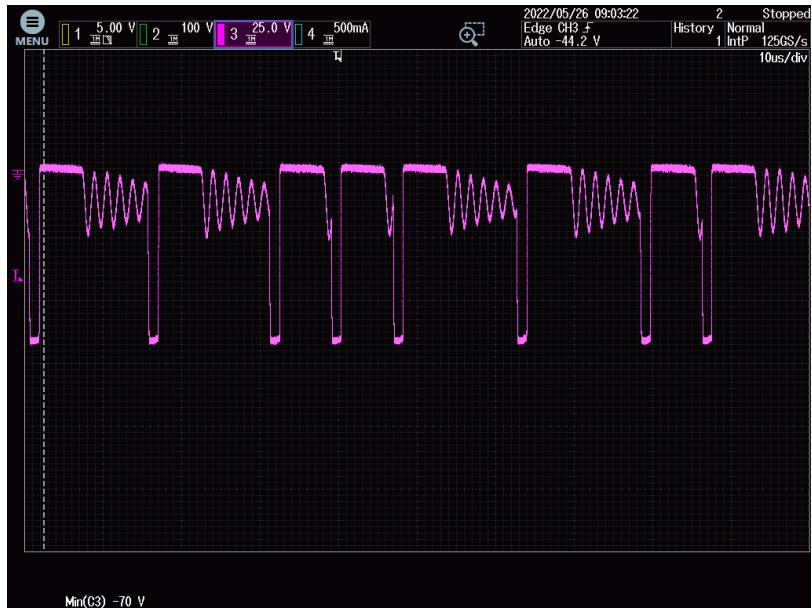

265 VAC

CH2 VDDIODE VMAX: 70 V

Test Condition:

满载正常工作

<table><tr><td>PARAMETER</td><td>SYMBOL</td><td>MB54</td><td>MB54A</td><td>MB55</td><td>MB56</td><td>MB58</td><td>MB59</td><td>MB510</td><td>MB515</td><td>MB520</td><td>UNITS</td></tr><tr><td>Maximum Recurrent Peak Reverse Voltage</td><td> $V_{RRM}$ </td><td>40</td><td>45</td><td>50</td><td>60</td><td>80</td><td>90</td><td>100</td><td>150</td><td>200</td><td>V</td></tr><tr><td>Maximum RMS Voltage</td><td> $V_{RMS}$ </td><td>28</td><td>31.5</td><td>35</td><td>42</td><td>56</td><td>63</td><td>70</td><td>105</td><td>140</td><td>V</td></tr><tr><td>Maximum DC Blocking Voltage</td><td> $V_{DC}$ </td><td>40</td><td>45</td><td>50</td><td>60</td><td>80</td><td>90</td><td>100</td><td>150</td><td>200</td><td>V</td></tr><tr><td>Average Rectified Output Current (See Figure 1)</td><td> $I_{F(AV)}$ </td><td colspan="9">5</td><td>A</td></tr><tr><td>Non-Repetitive Peak Forward Surge Current : 8.3ms single half sine-wave superimposed on rated load</td><td> $I_{FSM}$ </td><td colspan="9">100</td><td>A</td></tr><tr><td>Forward Voltage at 5A (Note 1)</td><td> $V_F$ </td><td colspan="2">0.7</td><td colspan="2">0.74</td><td colspan="3">0.8</td><td colspan="2">0.9</td><td>V</td></tr><tr><td>Peak Reverse Current at Rated DC Blocking Voltage  $T_J=25°C$  $T_J=100°C$ </td><td> $I_R$ </td><td colspan="9">0.0510</td><td>mA</td></tr><tr><td>Typical Thermal Resistance (Note 2)</td><td> $R_{BJA}$  $R_{BJL}$ </td><td colspan="9">5517</td><td>°C /W</td></tr><tr><td>Operating Junction and Storage Temperature Range</td><td> $T_J,T_{STG}$ </td><td>-55 to +150</td><td colspan="8">-65 to +175</td><td>°C</td></tr></table>

## 满载开机

$\mathrm { D e r a t i n g } = 9 5 \ : \forall \ : / \ : 2 0 0 \ : \forall = 4 7 . 5 \ : \%$

## 满载正常工作

Derating = 70 V / 200V = 35 %

## 温升测试(有前馈电容 0.85A）

<table><tr><td rowspan="2">项目</td><td colspan="2">85VAC</td><td colspan="2">265VAC</td></tr><tr><td>温度(°C)</td><td>温升(°C)</td><td>温度(°C)</td><td>温升(°C)</td></tr><tr><td>环境温度</td><td colspan="2">28.13</td><td colspan="2">28.83</td></tr><tr><td>BPA8618P (U1)</td><td>103.66</td><td>75.53</td><td>122</td><td>93.17</td></tr><tr><td>变压器绕组(T1)</td><td>84.67</td><td>56.54</td><td>91.38</td><td>62.55</td></tr><tr><td>变压器磁芯(T1)</td><td>77.71</td><td>49.58</td><td>85.04</td><td>56.21</td></tr><tr><td>输出肖特基(D7)</td><td>86.23</td><td>58.1</td><td>88.89</td><td>60.06</td></tr><tr><td>输入电解电容(EC1)</td><td>65.09</td><td>36.96</td><td>65.63</td><td>36.8</td></tr><tr><td>输出电解电容(E3)</td><td>57.87</td><td>29.74</td><td>59.47</td><td>30.64</td></tr><tr><td>整流桥(DB1)</td><td>71.62</td><td>43.49</td><td>60.9</td><td>32.07</td></tr></table>

## 测试说明

➢ 在温箱中进行测试  
➢ 电路板放在一个封闭的盒子内  
➢ 热电偶连接到各个测量点  
➢ 等测量点温度达到稳定后记录数据

## 温升测试(有前馈电容 0.7A）

<table><tr><td rowspan="2">项目</td><td colspan="2">85VAC</td><td colspan="2">265VAC</td></tr><tr><td>温度(°C)</td><td>温升(°C)</td><td>温度(°C)</td><td>温升(°C)</td></tr><tr><td>环境温度</td><td colspan="2">28.15</td><td colspan="2">28.98</td></tr><tr><td>BPA8618P (U1)</td><td>0</td><td>-28.15</td><td>105.8</td><td>76.82</td></tr><tr><td>变压器绕组(T1)</td><td>0</td><td>-28.15</td><td>84.19</td><td>55.21</td></tr><tr><td>变压器磁芯(T1)</td><td>0</td><td>-28.15</td><td>78.72</td><td>49.74</td></tr><tr><td>输出肖特基(D7)</td><td>0</td><td>-28.15</td><td>81.55</td><td>52.57</td></tr><tr><td>输入电解电容(EC1)</td><td>0</td><td>-28.15</td><td>60.19</td><td>31.21</td></tr><tr><td>输出电解电容(E3)</td><td>0</td><td>-28.15</td><td>56.3</td><td>27.32</td></tr><tr><td>整流桥(DB1)</td><td>0</td><td>-28.15</td><td>55.42</td><td>26.44</td></tr></table>

## 测试说明

➢ 在温箱中进行测试  
➢ 电路板放在一个封闭的盒子内  
➢ 热电偶连接到各个测量点  
➢ 等测量点温度达到稳定后记录数据

## 温升测试(无前馈电容 0.7A）

<table><tr><td rowspan="2">项目</td><td colspan="2">85VAC</td><td colspan="2">265VAC</td></tr><tr><td>温度(°C)</td><td>温升(°C)</td><td>温度(°C)</td><td>温升(°C)</td></tr><tr><td>环境温度</td><td colspan="2">28.15</td><td colspan="2">30.1</td></tr><tr><td>BPA8618P (U1)</td><td>0</td><td>-28.15</td><td>111.16</td><td>81.06</td></tr><tr><td>变压器绕组(T1)</td><td>0</td><td>-28.15</td><td>83.15</td><td>53.05</td></tr><tr><td>变压器磁芯(T1)</td><td>0</td><td>-28.15</td><td>76.96</td><td>46.86</td></tr><tr><td>输出肖特基(D7)</td><td>0</td><td>-28.15</td><td>73.37</td><td>43.27</td></tr><tr><td>输入电解电容(EC1)</td><td>0</td><td>-28.15</td><td>66.14</td><td>36.04</td></tr><tr><td>输出电解电容(E3)</td><td>0</td><td>-28.15</td><td>52.48</td><td>22.38</td></tr><tr><td>整流桥(DB1)</td><td>0</td><td>-28.15</td><td>55.9</td><td>25.8</td></tr></table>

## 测试说明

➢ 在温箱中进行测试  
➢ 电路板放在一个封闭的盒子内  
➢ 热电偶连接到各个测量点  
➢ 等测量点温度达到稳定后记录数据

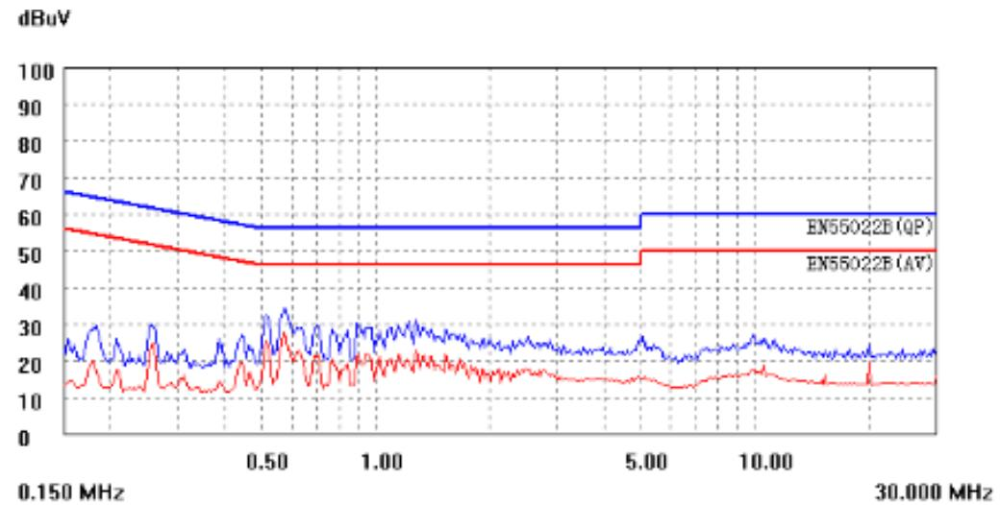

115VAC Line

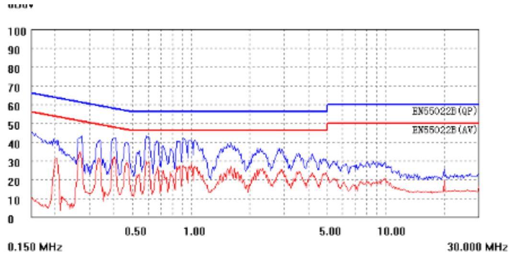

230VAC Line

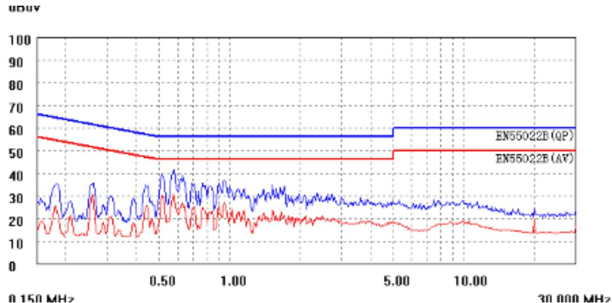

115VAC Neutral

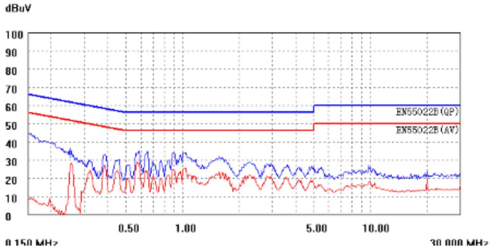

230VAC Neutral

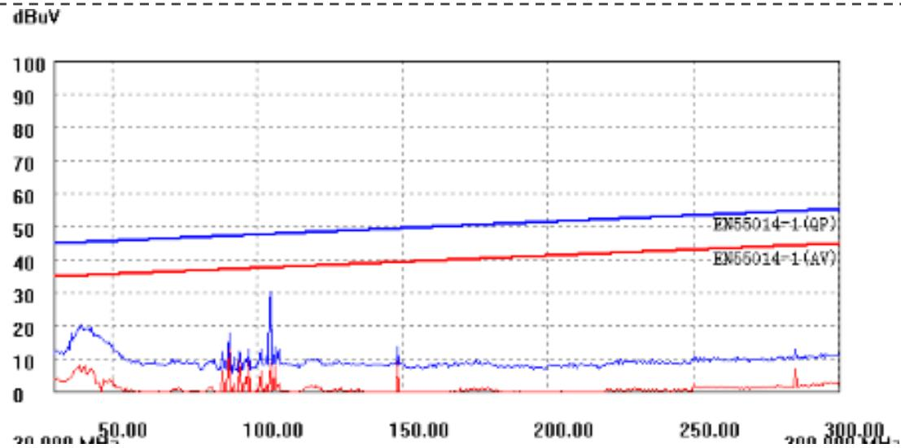

115VAC 空载

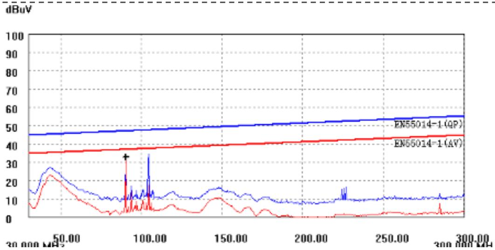

115VAC 满载

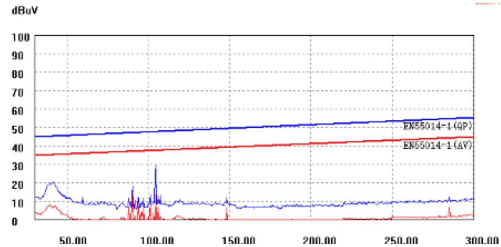

230VAC 空载

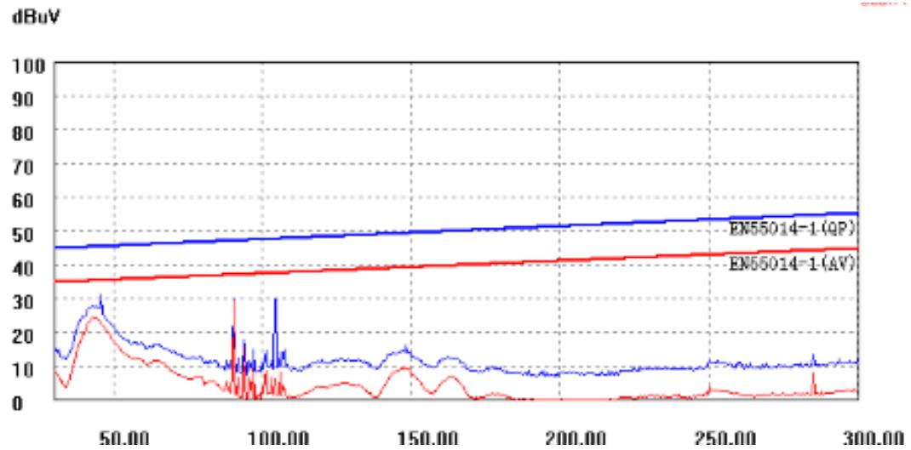

230VAC 满载

<table><tr><td>差模</td><td>电压</td><td>相位角</td><td>发生器阻抗</td><td>测试次数</td><td>测试结果</td></tr><tr><td>L to N</td><td>+2kV</td><td>0</td><td>2</td><td>10</td><td>Pass</td></tr><tr><td>L to N</td><td>-2kV</td><td>0</td><td>2</td><td>10</td><td>Pass</td></tr><tr><td>L to N</td><td>+2kV</td><td>90</td><td>2</td><td>10</td><td>Pass</td></tr><tr><td>L to N</td><td>-2kV</td><td>90</td><td>2</td><td>10</td><td>Pass</td></tr><tr><td>L to N</td><td>+2kV</td><td>180</td><td>2</td><td>10</td><td>Pass</td></tr><tr><td>L to N</td><td>-2kV</td><td>180</td><td>2</td><td>10</td><td>Pass</td></tr><tr><td>L to N</td><td>+2kV</td><td>270</td><td>2</td><td>10</td><td>Pass</td></tr><tr><td>L to N</td><td>-2kV</td><td>270</td><td>2</td><td>10</td><td>Pass</td></tr></table>

## 测试说明

➢ 按照GB/T17626.5和IEC61000-4-5的最新版本要求进行测试  
➢ 室温环境，230VAC输入，满载条件  
➢ 输入1.2/50us组合波浪涌电压  
➢ 每个测试点重复10次  
➢ 每次间隔时间1分钟  
➢ 试验时样机输出正常（符合A类标准）视为Pass

<table><tr><td>差模</td><td>电压</td><td>脉冲群持续时间</td><td>脉冲频率</td><td>测试时间</td><td>测试结果</td></tr><tr><td>L to N</td><td>+4kV</td><td>15ms</td><td>5kHz</td><td>120s</td><td>Pass</td></tr><tr><td>L to N</td><td>-4kV</td><td>15ms</td><td>5kHz</td><td>120s</td><td>Pass</td></tr><tr><td>L to N</td><td>+4kV</td><td>0.75ms</td><td>100kHz</td><td>120s</td><td>Pass</td></tr><tr><td>L to N</td><td>-4kV</td><td>0.75ms</td><td>100kHz</td><td>120s</td><td>Pass</td></tr><tr><td>L to N</td><td>+2kV</td><td>2ms</td><td>38kHz</td><td>120s</td><td>Pass</td></tr><tr><td>L to N</td><td>-2kV</td><td>2ms</td><td>38kHz</td><td>120s</td><td>Pass</td></tr><tr><td>L to N</td><td>+4kV</td><td>2ms</td><td>38kHz</td><td>120s</td><td>Pass</td></tr><tr><td>L to N</td><td>-4kV</td><td>2ms</td><td>38kHz</td><td>120s</td><td>Pass</td></tr></table>

## 测试说明

➢ 按照GB/T17626.4和IEC61000-4-4的最新版本要求进行测试  
➢ 室温环境，230VAC输入满载条件  
➢ 分别测试5kHz/100kHz/38kHz脉冲频率  
➢ 脉冲群周期为300ms  
➢ 每个测试条件测试时间120s  
➢ 试验时样机输出正常（符合A类标准）视为Pass

<table><tr><td>测试点</td><td>电压(V)</td><td>放电类型</td><td>放电次数</td><td>测试结果</td></tr><tr><td>Vo</td><td>+15kV</td><td>空气放电</td><td>10</td><td>Pass</td></tr><tr><td>Vo</td><td>-15kV</td><td>空气放电</td><td>10</td><td>Pass</td></tr><tr><td>GND</td><td>+15kV</td><td>空气放电</td><td>10</td><td>Pass</td></tr><tr><td>GND</td><td>-15kV</td><td>空气放电</td><td>10</td><td>Pass</td></tr><tr><td>Vo</td><td>+20kV</td><td>空气放电</td><td>10</td><td>Pass</td></tr><tr><td>Vo</td><td>-20kV</td><td>空气放电</td><td>10</td><td>Pass</td></tr><tr><td>GND</td><td>+20kV</td><td>空气放电</td><td>10</td><td>Pass</td></tr><tr><td>GND</td><td>-20kV</td><td>空气放电</td><td>10</td><td>Pass</td></tr></table>

## 测试说明

➢ 按照GB/T17626.2和IEC61000-4-2的最新版本要求进行测试  
➢ 室温环境，230VAC输入满载条件  
➢ 每个测试点重复10次  
➢ 分别对输出正端和地进行空气放电  
➢ 试验时样机输出正常（符合A类标准）视为Pass

## THANK YOU FOR WATCHING
