## BPA8618P非隔离参考设计

## (16V1.4A)

上海晶丰明源半导体股份有限公司

Shanghai Bright Power Semiconductor Co., Ltd.

文长川

时间： 2021年11月15日

## 内容

BPA8618P简介  
电源规格  
电路及实物图  
BOM  
PCB Layout图  
变压器  
性能测试数据

## 产品特点：

➢ 集成 700V 高压 MOSFET  
➢ ON/OFF控制模式，低输出纹波  
内置软启动功能  
➢ 集成高压启动、自供电电路  
➢ 低音频噪声  
➢ 集成输入过/欠压保护

## 应用领域：

➢ 家用电器辅助电源  
➢ 电机驱动辅助电源  
➢ IOT/智能家居/智能照明  
➢ 工业控制辅助电源

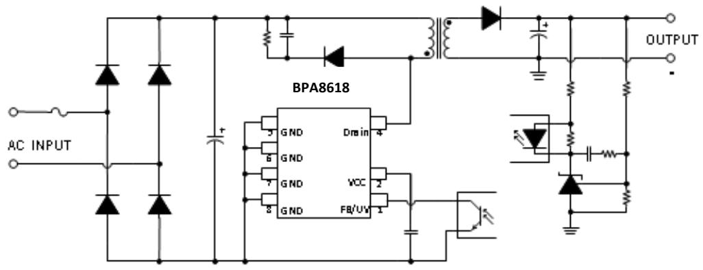

<table><tr><td>项目描述</td><td>符号</td><td>最小</td><td>典型</td><td>最大</td><td>单位</td><td>备注</td></tr><tr><td colspan="7">输入</td></tr><tr><td>电压</td><td> $V_{IN}$ </td><td>176</td><td>230</td><td>264</td><td> $V_{AC}$ </td><td></td></tr><tr><td>频率</td><td> $f_{LINE}$ </td><td>47</td><td>50/60</td><td>63</td><td>Hz</td><td></td></tr><tr><td colspan="7">输出</td></tr><tr><td>输出电压</td><td> $V_{OUT}$ </td><td></td><td>16</td><td></td><td>V</td><td>±5%</td></tr><tr><td>输出电流</td><td> $I_{OUT}$ </td><td></td><td></td><td>1400</td><td>mA</td><td></td></tr><tr><td>输出电压纹波</td><td> $V_{RIPPLE}$ </td><td></td><td></td><td>200</td><td>mV</td><td>20MHz带宽</td></tr><tr><td>连续输出功率</td><td> $P_{OUT}$ </td><td></td><td></td><td>22.4</td><td>W</td><td></td></tr><tr><td colspan="7">效率</td></tr><tr><td>待机功耗</td><td> $P_{STDBY}$ </td><td></td><td></td><td>100</td><td>mW</td><td>230VAC,包含假负载</td></tr><tr><td>满载效率</td><td>η</td><td>85</td><td></td><td></td><td>%</td><td>230VAC</td></tr><tr><td colspan="7">环境</td></tr><tr><td>传导EMI</td><td></td><td colspan="4">满足CISPR22/EN55022 Class B,至少6dB 裕量</td><td></td></tr><tr><td>Surge</td><td></td><td></td><td>2</td><td></td><td>kV</td><td>差模</td></tr><tr><td>EFT</td><td></td><td></td><td>4</td><td></td><td>kV</td><td>5kHz/100kHz/38kHz</td></tr><tr><td>ESD</td><td></td><td></td><td>15</td><td>20</td><td>kV</td><td>空气放电</td></tr><tr><td>工作环境温度</td><td> $T_{AMP}$ </td><td></td><td></td><td>50</td><td>°C</td><td></td></tr></table>

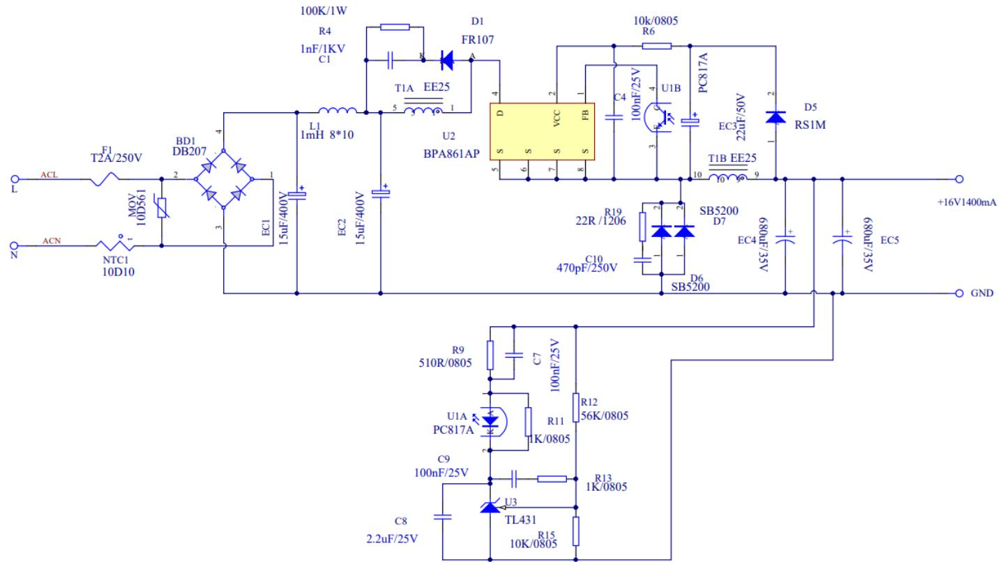

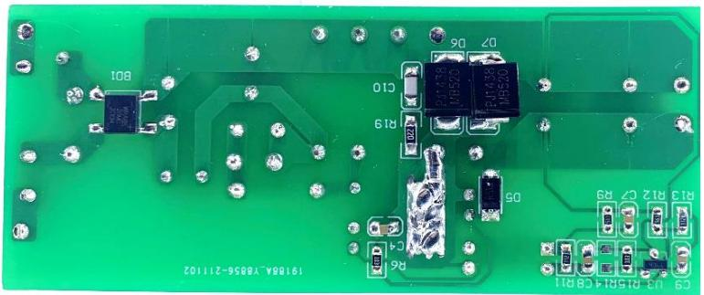

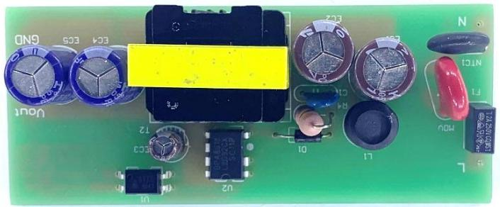

<table><tr><td>序号</td><td>元件标号</td><td>参数描述</td><td>封装尺寸</td><td>数量</td></tr><tr><td>1</td><td>PCB</td><td>FR-4, 单面板</td><td>89.4mm*36.5mm</td><td>1</td></tr><tr><td>2</td><td>F1</td><td>T2A 250V 保险丝</td><td>DIP</td><td>1</td></tr><tr><td>3</td><td>VR1</td><td>10D561, 压敏电阻</td><td>DIP</td><td>1</td></tr><tr><td>4</td><td>RT1</td><td>10D-11,热敏电阻</td><td>DIP</td><td>1</td></tr><tr><td>5</td><td>L1</td><td>工字电感8*10 1mH</td><td>DIP</td><td>1</td></tr><tr><td>6</td><td>R4</td><td>100K 1W 金属膜电阻</td><td>DIP</td><td>1</td></tr><tr><td>7</td><td>EC1,EC2</td><td>400V15uF电解电容</td><td> $\phi 10*14$ </td><td>2</td></tr><tr><td>8</td><td>EC4,CE5</td><td>25V680uF 电解电容</td><td> $\phi 10*12$ </td><td>2</td></tr><tr><td>9</td><td>CE3</td><td>50V22uF 电解电容</td><td> $\phi 5*7$ </td><td>1</td></tr><tr><td>10</td><td>U2</td><td>BPA8618P</td><td>DIP</td><td>1</td></tr><tr><td>11</td><td>IC1</td><td>PC817A 光耦</td><td>DIP</td><td>1</td></tr><tr><td>12</td><td>T1</td><td>EE25 850uH</td><td>DIP</td><td>1</td></tr><tr><td>13</td><td>C1</td><td>瓷片电容1KV 102</td><td>DIP</td><td>1</td></tr><tr><td>14</td><td>D1</td><td>FR107,1A 1000V</td><td>D0-41</td><td>1</td></tr></table>

<table><tr><td>序号</td><td>元件标号</td><td>参数描述</td><td>封装尺寸</td><td>数量</td></tr><tr><td>15</td><td>D5</td><td>RS1M,1A 1000V</td><td>SMA</td><td>1</td></tr><tr><td>16</td><td>D6,D7</td><td>5A 200V 肖特基</td><td>SMC</td><td>2</td></tr><tr><td>17</td><td>IC5</td><td>AZ431</td><td>SOT-23</td><td>1</td></tr><tr><td>18</td><td>BD1</td><td>ABS210 2A1KV整流桥</td><td>SMD</td><td>1</td></tr><tr><td>19</td><td>R19</td><td>22R, ±5%</td><td>SMD1206</td><td>1</td></tr><tr><td>20</td><td>R6,R15</td><td>10K, ±5%</td><td>SMD0805</td><td>2</td></tr><tr><td>21</td><td>R9</td><td>510R, ±5%</td><td>SMD0805</td><td>1</td></tr><tr><td>22</td><td>R12</td><td>56K, ±5%</td><td>SMD0805</td><td>1</td></tr><tr><td>23</td><td>R11,R13</td><td>1K, ±5%</td><td>SMD0805</td><td>2</td></tr><tr><td>24</td><td>R12</td><td>2.4K, ±5%</td><td>SMD0805</td><td>1</td></tr><tr><td>25</td><td>C9,C7,C4</td><td>100nF/16V,X7R</td><td>SMD0805</td><td>3</td></tr><tr><td>26</td><td>C10</td><td>470PF/200V</td><td>SMD1206</td><td>1</td></tr><tr><td>27</td><td>C8</td><td>2.2uF/25V,X7R</td><td>SMD0805</td><td>1</td></tr><tr><td colspan="2"></td><td></td><td>Total</td><td>34</td></tr></table>

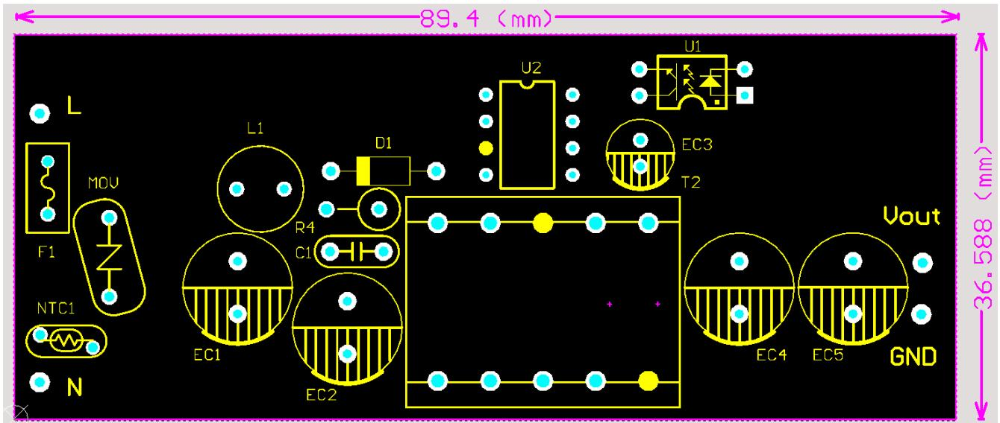

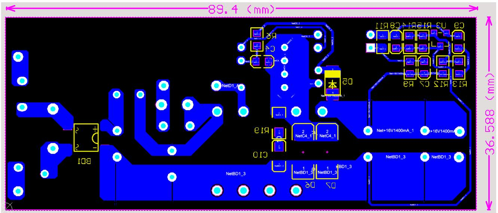

## 原理图

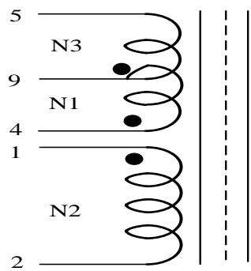

## 绕线方式

<table><tr><td>绕组</td><td>起始脚</td><td>终止脚</td><td>材料</td><td>匝数</td><td>绕线方式</td></tr><tr><td>N1</td><td>4</td><td>9</td><td> $\phi 0.35*1P$ </td><td>48.5Ts</td><td>密绕二层(PIN脚朝外)</td></tr><tr><td colspan="4">胶带</td><td>2.1Ts</td><td></td></tr><tr><td>N2</td><td>1</td><td>2</td><td> $\phi 0.5*2P$ </td><td>16Ts</td><td>密绕二层(PIN脚朝外)</td></tr><tr><td colspan="4">胶带</td><td>2.1Ts</td><td></td></tr><tr><td>N3</td><td>9</td><td>5</td><td> $\phi 0.35*1P$ </td><td>22.5Ts</td><td>密绕一层(PIN脚朝外)</td></tr><tr><td colspan="4">胶带</td><td>3Ts</td><td></td></tr></table>

## 规格与材料

➢ 初级绕组感量 $\mathsf { L } _ { \mathsf { p } } = 8 5 0 \mathsf { u } \mathsf { H } \pm 7 \%$ （测试条件： 0.3V，100kHz）  
➢ 漏感量 $\mathrm { \cdot L _ { | k } } < 5 0 \mathrm { u } \mathrm { H }$  
➢ 骨架：EE25立式次级（5+5PIN）  
➢ 磁芯：EE25 PC40 或同等材质 ， $\mathsf { A } \mathsf { e } = 4 0 \mathsf { m } \mathsf { m } ^ { 2 }$  
➢ N1、N2、N3、: 2UEW 漆包线  
➢ 绝缘胶带:3M900 或同等材质  
➢ 耐压测试:  
➢ 成品要求：浸凡立水

## 脚位图

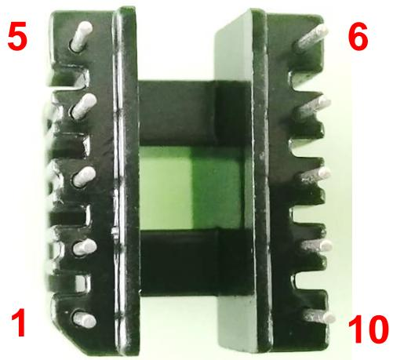

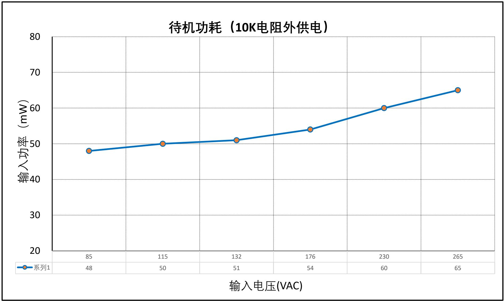

效率测试  
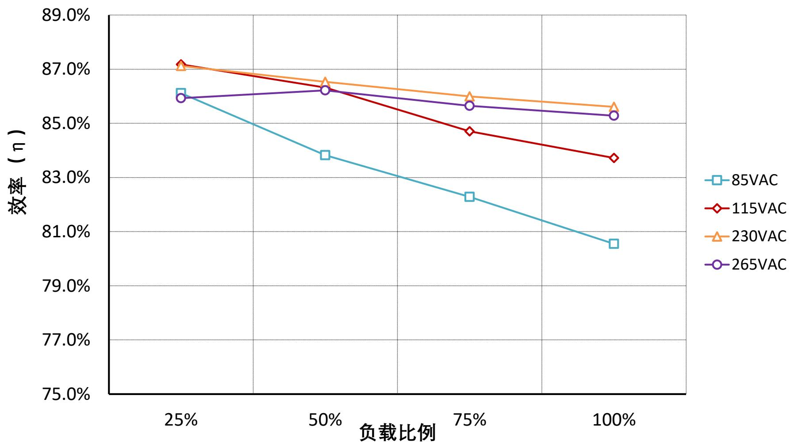

## 输出电压调整率

<table><tr><td> $V_{IN}(VAC)$ Load(%)</td><td>85</td><td>115</td><td>132</td><td>176</td><td>230</td><td>265</td><td>平均值</td><td>线调整率</td></tr><tr><td>0</td><td>16.14</td><td>16.14</td><td>16.14</td><td>16.14</td><td>16.14</td><td>16.14</td><td>16.14</td><td>0.00%</td></tr><tr><td>20%</td><td>16.13</td><td>16.13</td><td>16.13</td><td>16.13</td><td>16.13</td><td>16.13</td><td>16.13</td><td>0.00%</td></tr><tr><td>40%</td><td>16.12</td><td>16.12</td><td>16.12</td><td>16.12</td><td>16.12</td><td>16.12</td><td>16.12</td><td>0.00%</td></tr><tr><td>60%</td><td>16.11</td><td>16.11</td><td>16.11</td><td>16.11</td><td>16.11</td><td>16.11</td><td>16.11</td><td>0.00%</td></tr><tr><td>80%</td><td>16.11</td><td>16.11</td><td>16.11</td><td>16.11</td><td>16.1</td><td>16.1</td><td>16.11</td><td>0.06%</td></tr><tr><td>100%</td><td>16.1</td><td>16.1</td><td>16.1</td><td>16.1</td><td>16.1</td><td>16.1</td><td>16.10</td><td>0.00%</td></tr><tr><td>平均值</td><td>16.12</td><td>16.12</td><td>16.12</td><td>16.12</td><td>16.12</td><td>16.12</td><td rowspan="2" colspan="2"></td></tr><tr><td>负载调整率</td><td>0.25%</td><td>0.25%</td><td>0.25%</td><td>0.25%</td><td>0.25%</td><td>0.25%</td></tr></table>

◼ 计算方法：调整率=100%\*(最大值-最小值)/平均值  
测试条件：

## 输出电压纹波

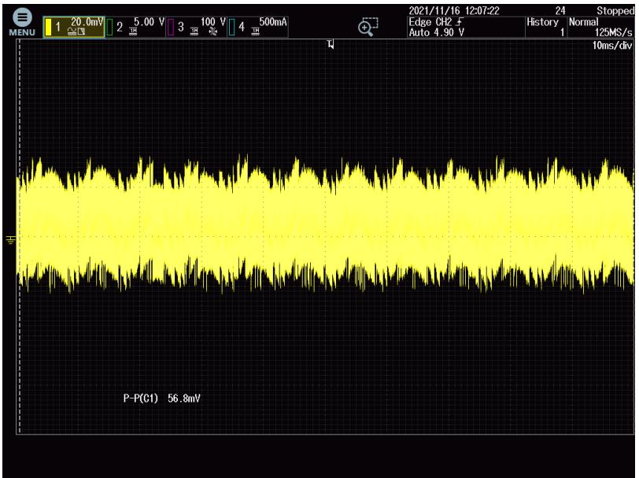

176 VAC

$\begin{array} { r l } { \mathbf { 1 } } & { \mathsf { C H 1 V } _ { \mathsf { O U T - 1 6 V } } \mathsf { R i p p l e } } \\ & { \mathsf { V } _ { \mathsf { P K - P K } } = 5 6 . 8 \mathsf { m V } } \end{array}$

## Test Condition:

➢ Full Load

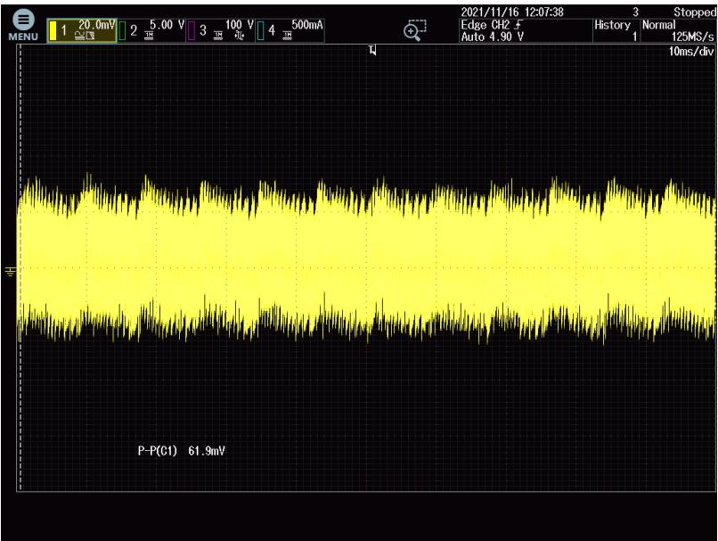

$20 0 \mathsf { V } _ { \mathsf { A C } }$

$\begin{array} { r l } { \mathbf { \Pi } } & { \mathsf { C H 1 V } _ { \mathsf { O U T - 1 6 V } } \mathsf { R i p p l e } } \\ & { \mathsf { V } _ { \mathsf { P K - P K } } = 6 1 . 9 \mathsf { m V } } \end{array}$

## Test Condition:

➢ Full Load

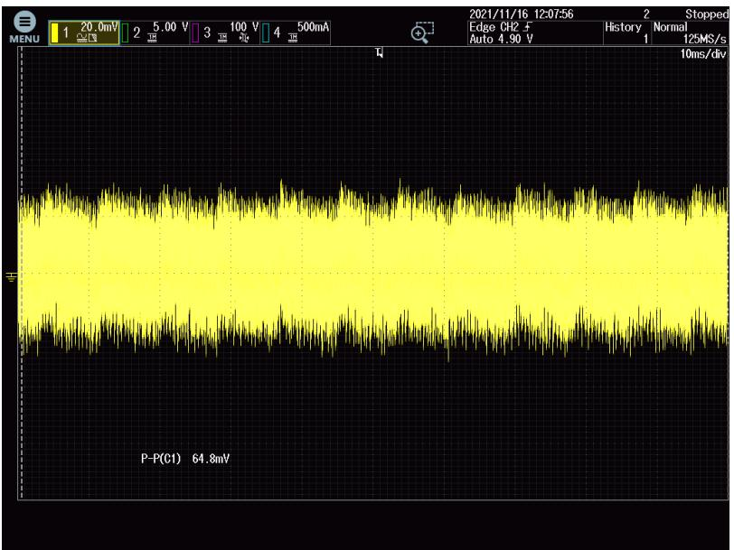

230 VAC

$\begin{array} { r l } { \mathbf { 1 } } & { \mathsf { C H 1 V } _ { \mathsf { O U T - 1 6 V } } \mathsf { R i p p l e } } \\ & { \mathsf { V } _ { \mathsf { P K - P K } } { = } 6 4 . 8 \mathsf { m V } } \end{array}$

## Test Condition:

➢ Full Load

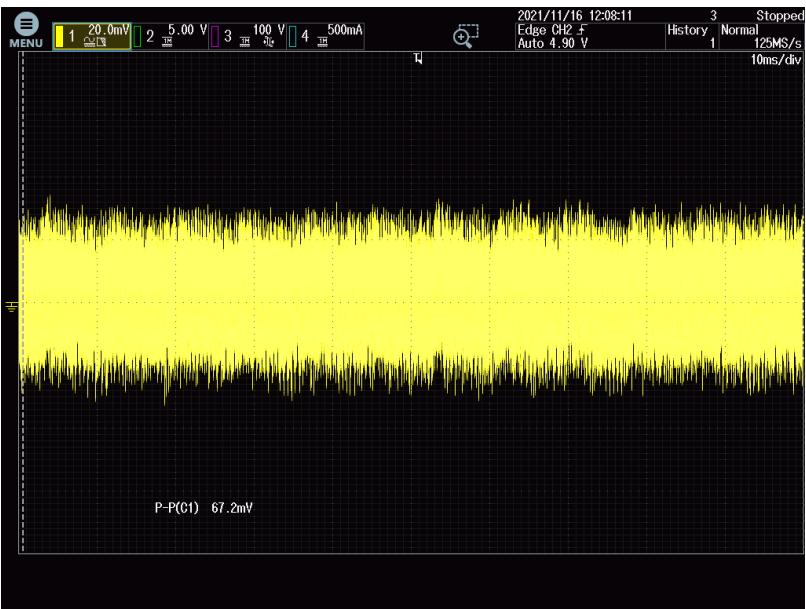

265 VAC

$\begin{array} { r l } { \mathbf { \Pi } } & { \mathsf { C H 1 V } _ { \mathsf { O U T - 1 6 V } } \mathsf { R i p p l e } } \\ & { \mathsf { V } _ { \mathsf { P K - P K } } = 6 7 . 2 \mathsf { m V } } \end{array}$

## Test Condition:

➢ Full Load

## 动态负载(50%-100%)

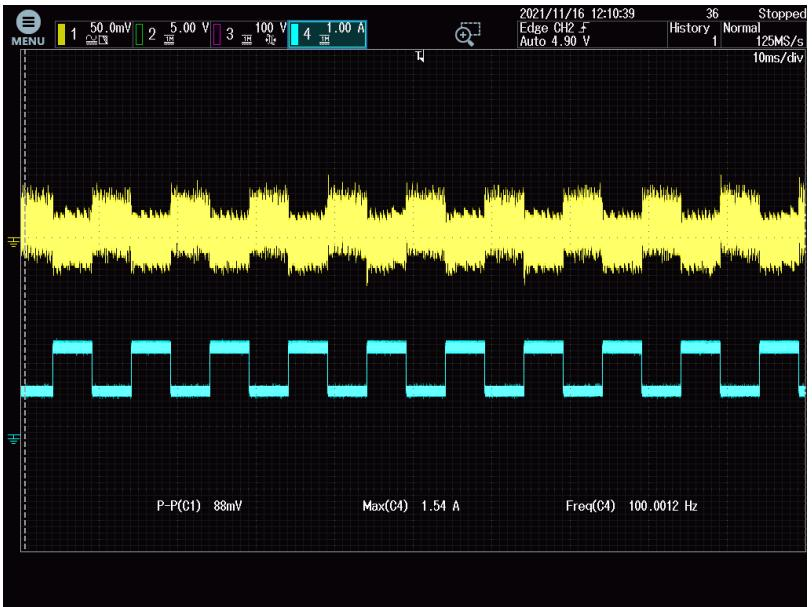

176 VAC

CH1 VOUT-16V VPK-PK=88 mV

## Test Condition:

➢ 0.7 A-1.4 A-0.7A  
➢ Slew Rate: 0.5 A/μS  
➢ Frequency: 100 Hz

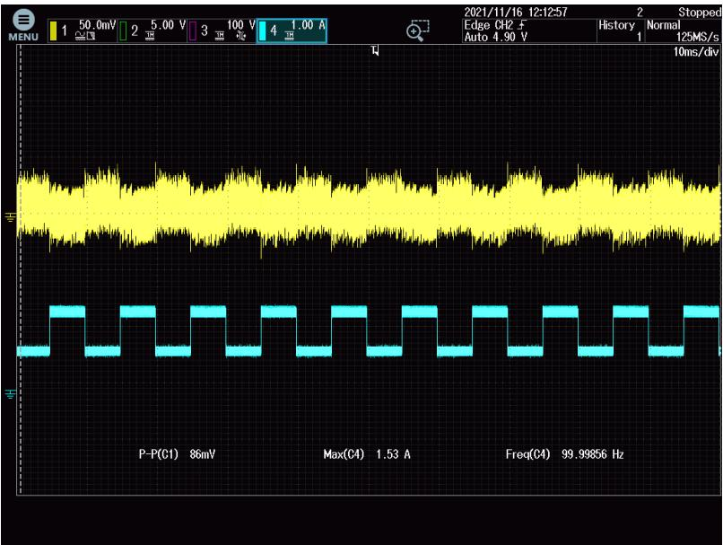

200 VAC

CH1 VOUT-16V VPK-PK=86 mV

## Test Condition:

➢ 0.7 A-1.4 A-0.7A  
➢ Slew Rate: 0.5 A/μS  
➢ Frequency: 100 Hz

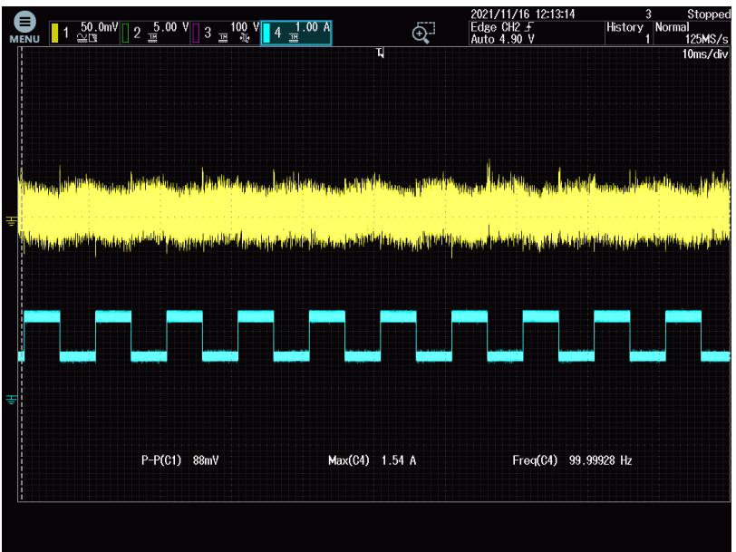

230 VAC

CH1 VOUT-16V VPK-PK=88mV

## Test Condition:

➢ 0.7 A-1.4 A-0.7A  
➢ Slew Rate: 0.5 A/μS  
➢ Frequency: 100 Hz

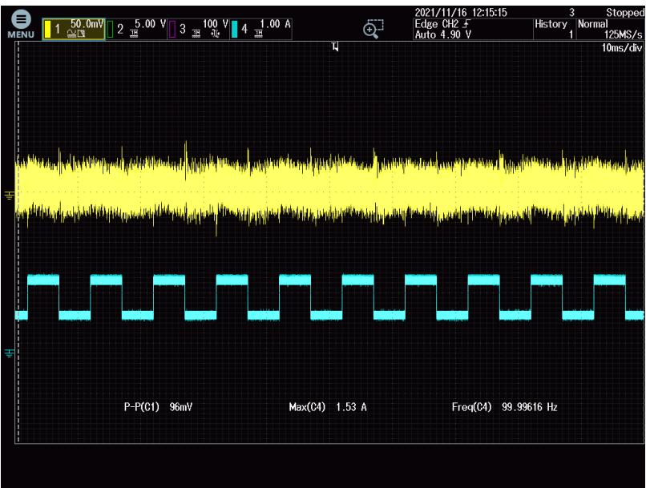

264 VAC

CH1 VOUT-16V VPK-PK=96 mV

## Test Condition:

➢ 0.7 A-1.4 A-0.7A  
➢ Slew Rate: 0.5 A/μS  
➢ Frequency: 100 Hz

## 动态负载(10%-90%)

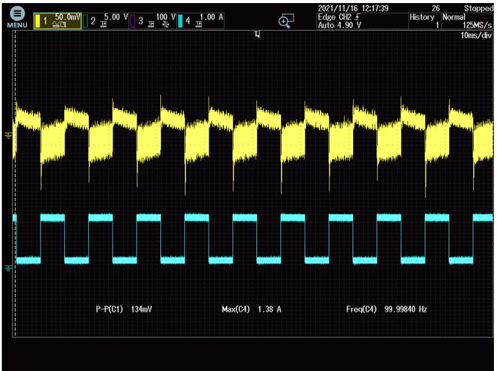

176 VAC

CH1 VOUT-16V VPK-PK=134 mV

## Test Condition:

➢ 0.14 A-1.26A-0.14A  
➢ Slew Rate: 0.5 A/μS  
➢ Frequency: 100 Hz

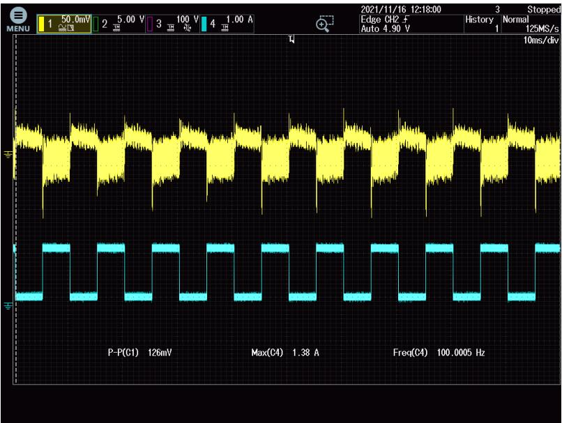

200 VAC

CH1 VOUT-16V VPK-PK=126 mV

## Test Condition:

➢ 0.14 A-1.26A-0.14A  
➢ Slew Rate: 0.5 A/μS  
➢ Frequency: 100 Hz

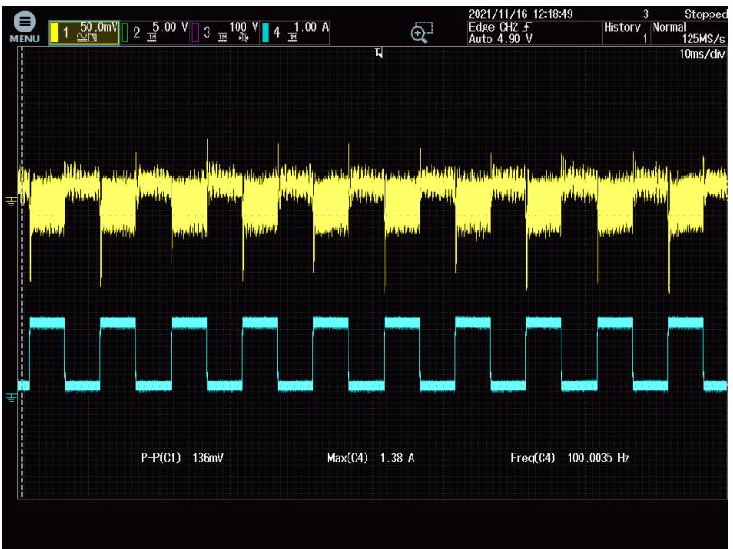

230 VAC

CH1 VOUT-16V VPK-PK=136 mV

## Test Condition:

➢ 0.14 A-1.26A-0.14A  
➢ Slew Rate: 0.5 A/μS  
➢ Frequency: 100 Hz

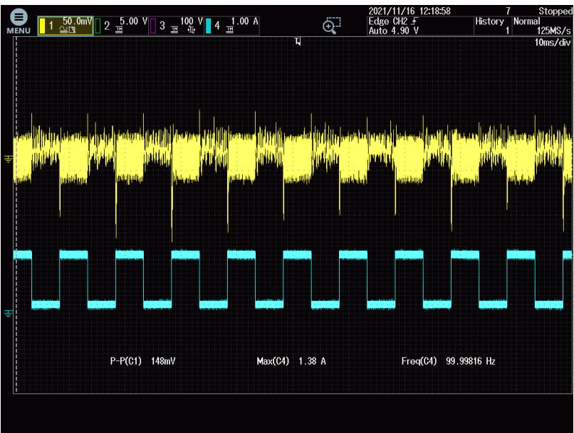

264VAC

CH1 VOUT-12V VPK-PK=148 mV

## Test Condition:

➢ 0.14 A-1.26A-0.14A  
➢ Slew Rate: 0.5 A/μS  
➢ Frequency: 100 Hz

## 输出电压开机波形

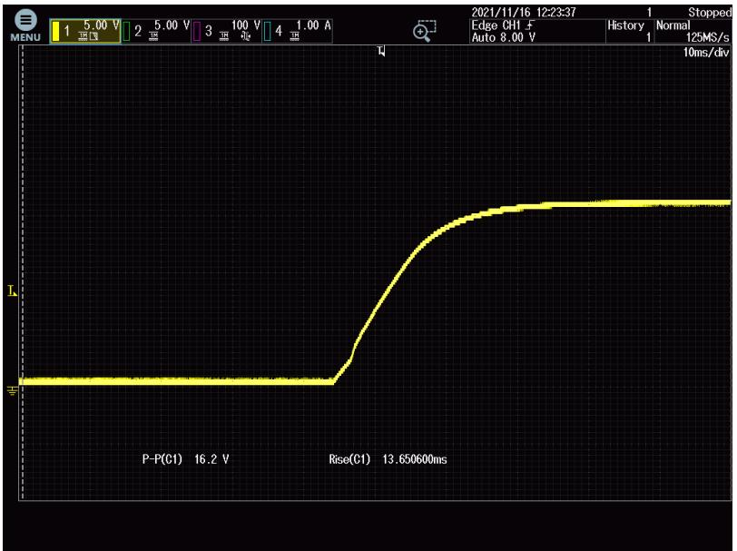

176 VAC

CH1 VOUT-12V TRISE: 13.65 mS

## Test Condition:

➢ No Load

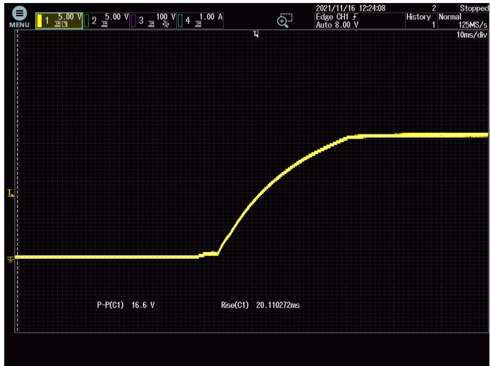

200 VAC

CH1 VOUT-12V TRISE: 20.11 mS

## Test Condition:

➢ Full Load

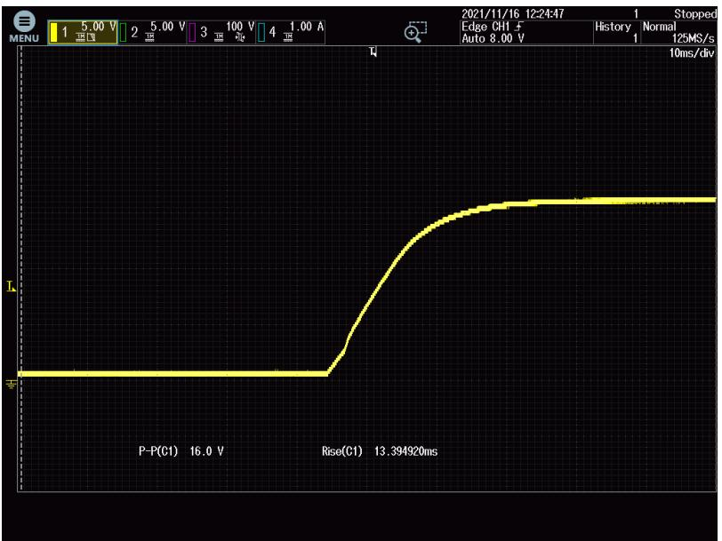

230 VAC

CH1 VOUT-12V TRISE: 13.39 mS

## Test Condition:

➢ No Load

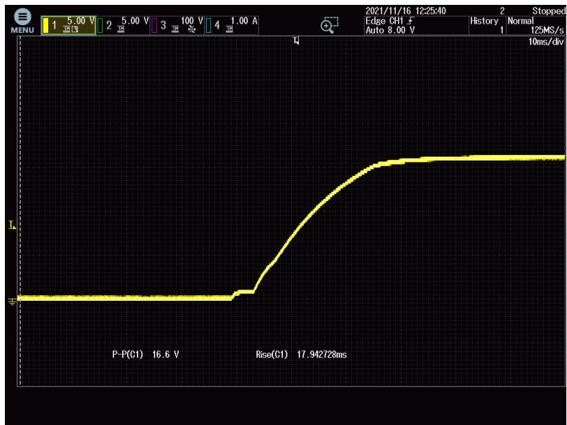

265 VAC

CH1 VOUT-12V TRISE: 17.94 mS

## Test Condition:

➢ Full Load

## 启动延迟时间

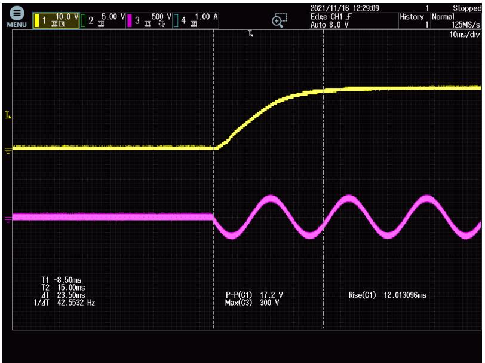

176 VAC

CH1 VOUT-16V $\mathsf { V } _ { \mathsf { O U T - 1 6 V } }$  
CH3 VINAC $\mathsf { V I N } _ { \mathsf { A C } }$ ${ \mathsf { T } } _ { \mathsf { D E L A Y } } .$ 23.5 mS

Test Condition:  
➢ No Load  
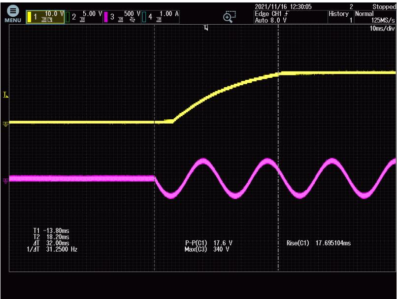

200 VAC

CH1 VOUT-16V $\mathsf { V } _ { \mathsf { O U T - 1 6 V } }$  
CH3 VINAC $\mathsf { V I N } _ { \mathsf { A C } }$ $\mathsf { T } _ { \mathsf { D E L A Y } } .$ 32 mS

Test Condition:  
➢ Full Load  
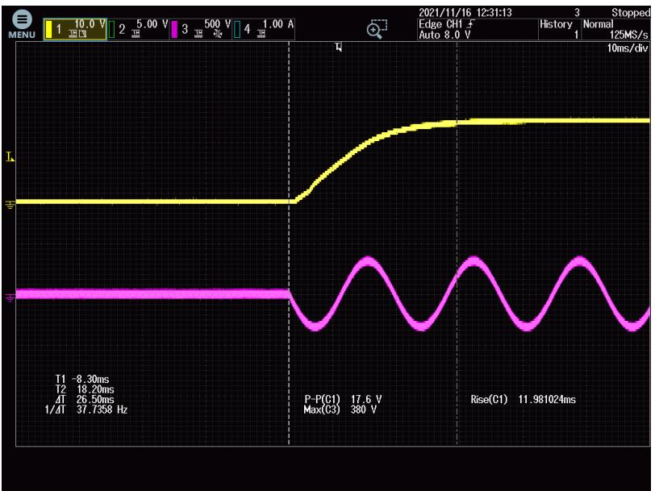

230 VAC

CH1 VOUT-16V $\mathsf { V } _ { \mathsf { O U T - 1 6 V } }$  
CH3 VINNAC $\mathsf { V I N } _ { \mathsf { N A C } }$ TDELAY:26.5 mS

Test Condition:  
➢ No Load  
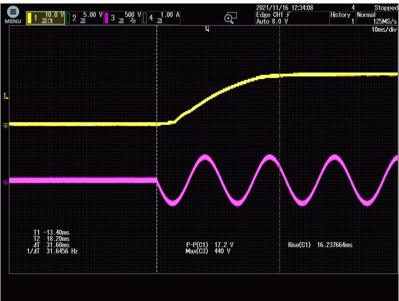

265 VAC

CH1 VOUT-16V $\mathsf { V } _ { \mathsf { O U T - 1 6 V } }$  
CH3 VINNAC $\mathsf { V I N } _ { \mathsf { N A C } }$ TDELAY: 31.6 mS

Test Condition:

➢ Full Load

## 输入欠压保护

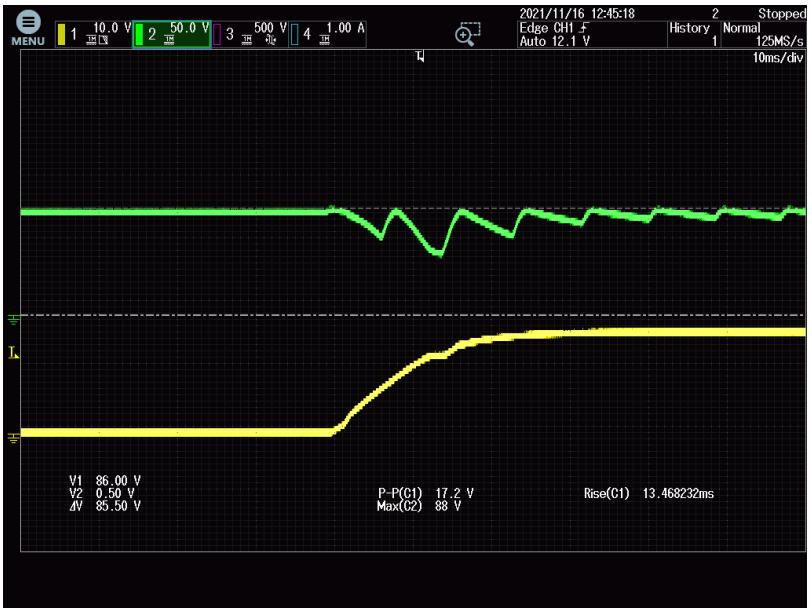

## BROWN-IN

$\mathsf { C H 1 \vee O U T _ { D C } }$  
CH2 VINDC $\mathsf { V I N } _ { \mathsf { D C } }$ VBROWN-IN: 85 V

## 测试条件:

➢ No Load

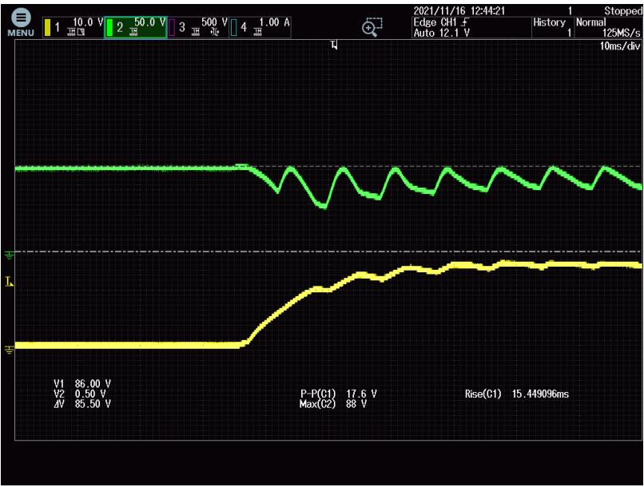

## BROWN-IN

CH1 $\mathsf { V O U T } _ { \mathsf { D C } }$  
CH2 VINDC ${ \mathsf { C H } } { 2 } { \mathsf { V I N } } _ { \mathsf { D C } }$ VBROWN-IN: 86 V

## 测试条件:

➢ Full Load

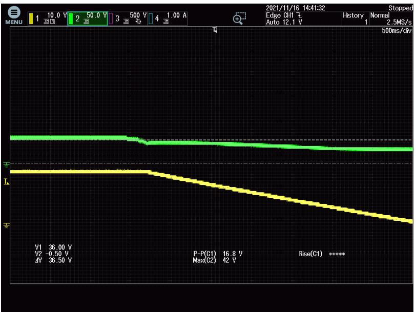

## BROWN-OUT

CH1 $\mathsf { V O U T } _ { \mathsf { D C } }$  
CH2 VINDC $\mathsf { V I N } _ { \mathsf { D C } }$ VBROWN-OUT:36 V

## 测试条件:

➢ No Load

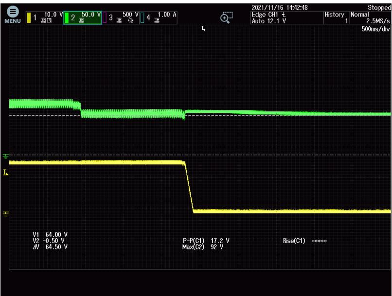

## BROWN-OUT

CH1 $\mathsf { V O U T } _ { \mathsf { D C } }$  
CH2 VINDC $\mathsf { V I N } _ { \mathsf { D C } }$ VBROWN-OUT: 64V

## 测试条件:

➢ Full Load

## 输入过压保护

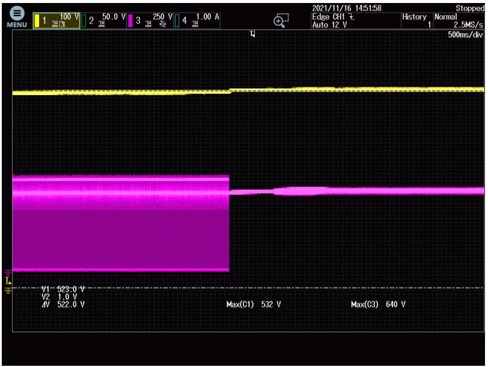

## 输入OVP

${ \mathsf { C H 1 } } { \mathsf { V I N } } _ { \mathsf { D C } }$  
CH3 VIN VDS $\mathsf { C H 3 } \mathsf { V I N } \mathsf { V } _ { \mathsf { D S } }$ VBROWN-IN: 522V

## 测试条件:

➢ No Load

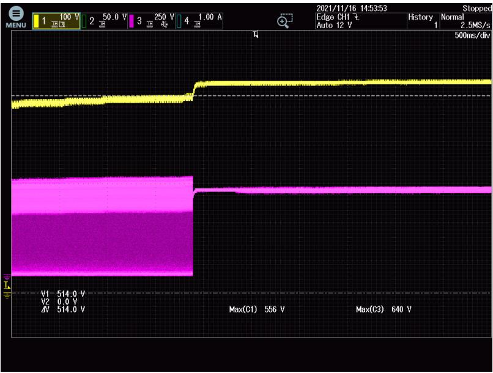

## 输入OVP

${ \mathsf { C H 1 } } { \mathsf { V I N } } _ { \mathsf { D C } }$  
CH3 VIN V $\mathsf { C H 3 } \mathsf { V I N } \mathsf { V } _ { \mathsf { D S } }$ $I _ { \mathsf { B R O W N - I N } } \colon 5 1 4 { \mathsf { V } }$

## 测试条件:

➢ Full Load

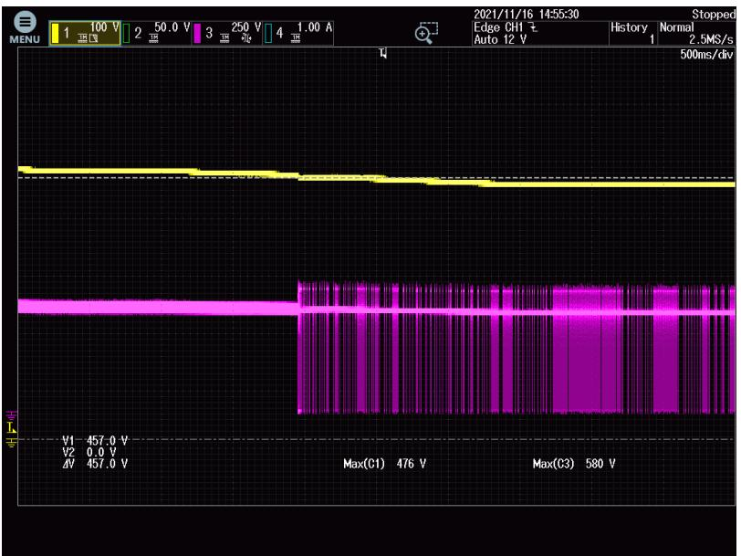

## 退出输入OVP

CH1 $\mathsf { V I N } _ { \mathsf { D C } }$  
CH3 VIN VDS $\mathsf { V I N } \mathsf { V } _ { \mathsf { D S } }$ VBROWN-OUT:457 V

## 测试条件:

➢ No Load

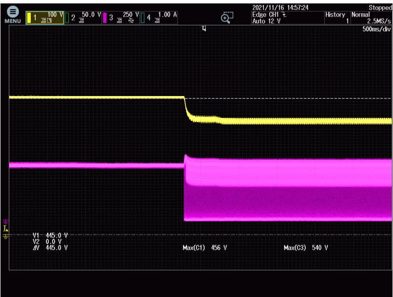

## 退出输入OVP

CH1 $\mathsf { V I N } _ { \mathsf { D C } }$  
CH3 VIN VDS $\mathsf { V I N } \mathsf { V } _ { \mathsf { D S } }$ VBROWN-OUT: 445V

## 测试条件:

➢ Full Load

## 短路保护 （MOSFET波形）

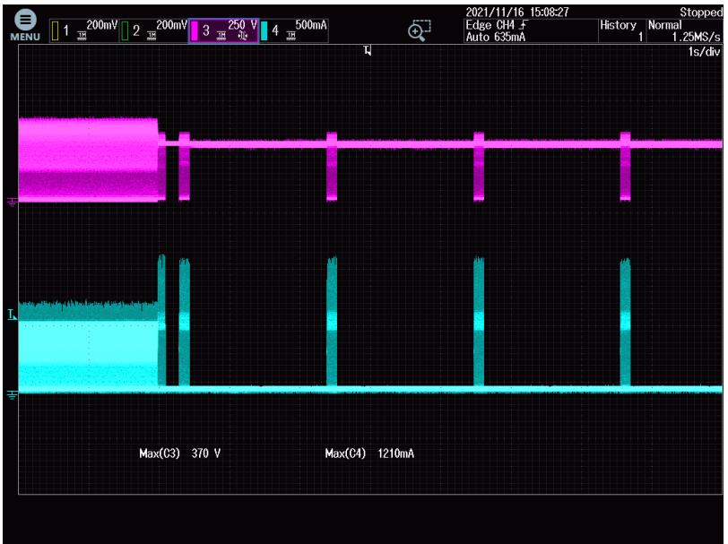

176 VAC

CH3 VDS  
CH4 ID

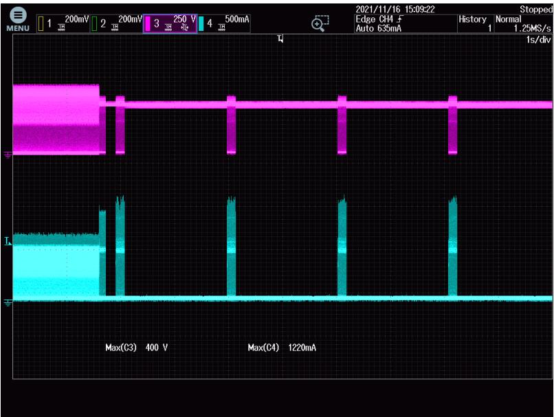

200 VAC

CH3 VDS  
CH4 ID

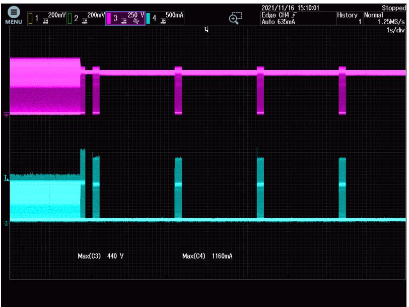

230 VAC

CH3 VDS  
CH4 ID

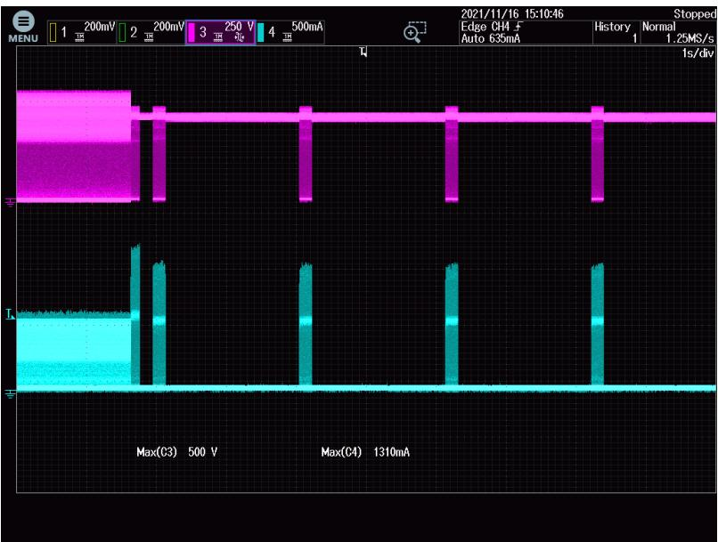

265 VAC

CH3 VDS  
CH4 ID

## 漏极电流波形

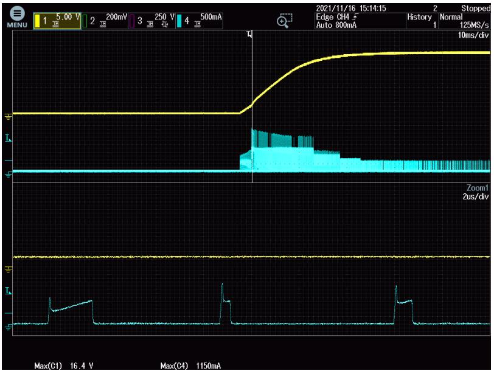

176 VAC

CH1 VOUTPUT-16V  
CH4 IDRAIN

Test Condition:

➢ 空载启动

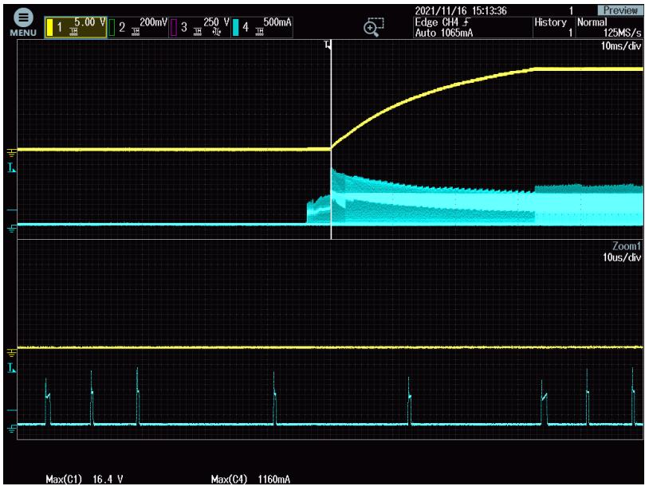

176 VAC

CH1 VOUTPUT-16V  
CH4 IDRAIN

Test Condition:

满载启动

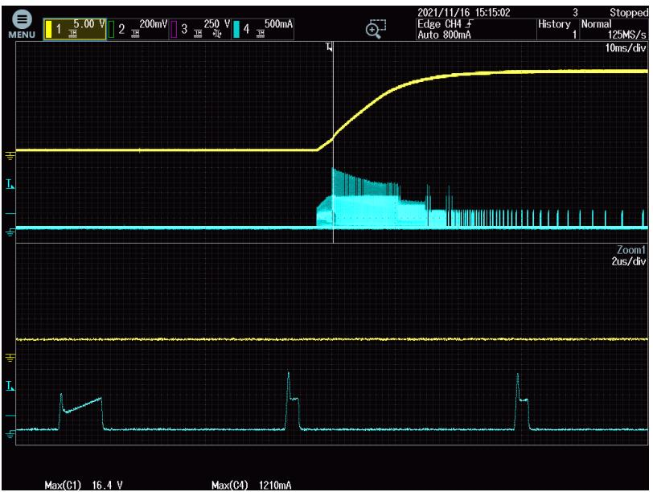

265 VAC

CH1 VOUTPUT-16V  
CH4 IDRAIN

Test Condition:

➢ 空载启动

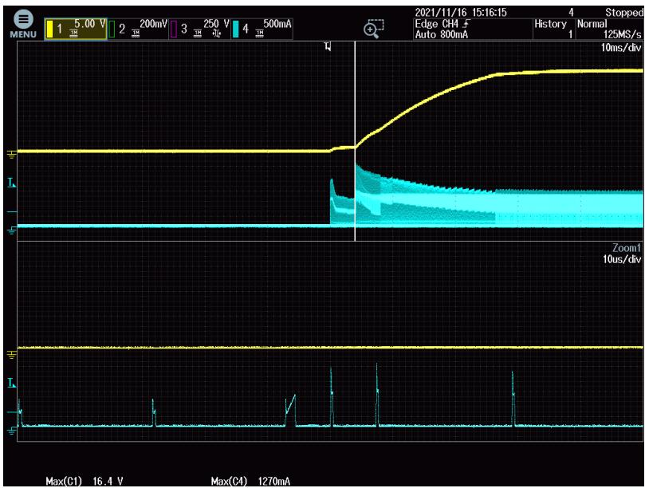

265 VAC

CH1 VOUTPUT-16V  
CH4 IDRAIN

Test Condition:

满载启动

## D-S电压波形

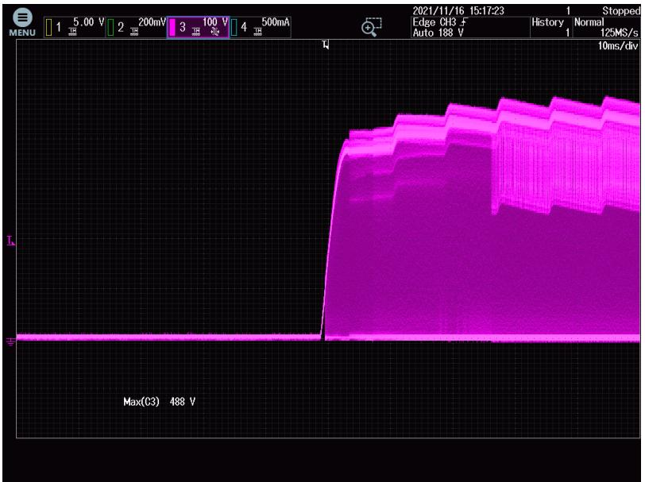

265 VAC

CH3 VDS VDSMAX: 488 V

## Test Condition:

满载开机

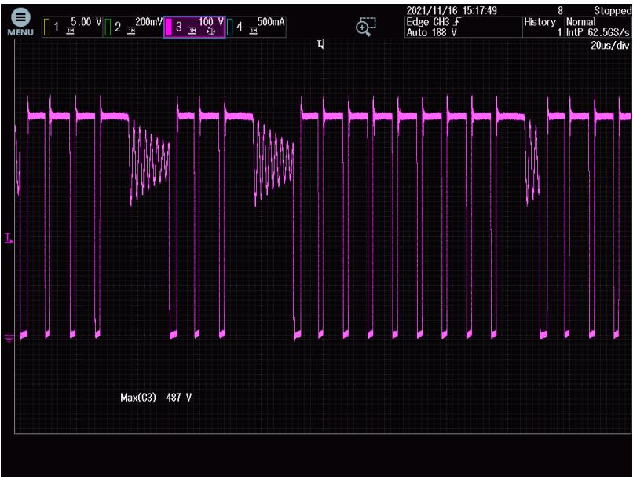

265 VAC

CH3 VDS $\mathsf { V } _ { \mathsf { D } \mathsf { S } }$ VDSMAX: 487 V

Test Condition:满载正常工作

极限参数(注3)

<table><tr><td>符号</td><td>参数</td><td>参数范围</td><td>单位</td></tr><tr><td> $V_{DRAIN}$ </td><td>内部高压 MOSFET 漏极到源极电压</td><td>-0.3~700</td><td>V</td></tr><tr><td> $V_{CC}$ </td><td> $V_{CC}$  电压</td><td>-0.3~9</td><td>V</td></tr><tr><td> $I_{CC\_MAX}$ </td><td> $V_{CC}$  引脚最大电流</td><td>20</td><td>mA</td></tr><tr><td> $V_{FB}$ </td><td>输出反馈端电压</td><td>-0.3~9</td><td>V</td></tr><tr><td> $P_{DMAX}$ </td><td>功耗(注 4)</td><td>1.5</td><td>W</td></tr><tr><td> $\theta_{JA}$ </td><td>结到环境的热阻(注 5)</td><td>80</td><td>°C/W</td></tr><tr><td> $\theta_{JC}$ </td><td>结到芯片表面的热阻(注 5)</td><td>20</td><td>°C/W</td></tr><tr><td> $T_{J}$ </td><td>工作结温范围</td><td>-40 to 150</td><td>°C</td></tr><tr><td> $T_{STG}$ </td><td>储存温度范围</td><td>-55 to 150</td><td>°C</td></tr><tr><td>ESD</td><td>人体模型 ESD(注 6)</td><td>2</td><td>kV</td></tr></table>

## 满载开机

$\mathrm { D e r a t i n g } { = 4 8 8 \vee / 7 0 0 \vee } = 6 9 . 7 1 \%$

## 满载正常工作

Derating = 487V / 700 V = 69.57 %

## 16V输出肖特基反压波形

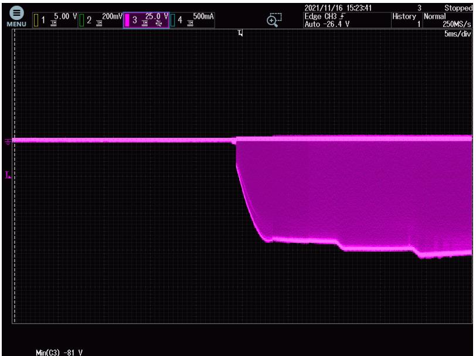

265 VAC

CH2 VDIODE VDSMAX: 81 V

Test Condition:

➢ 满载启动

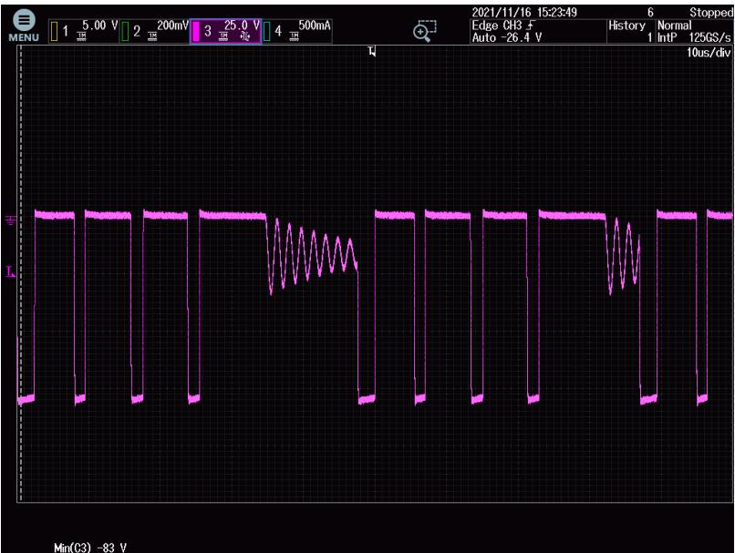

265 VAC

CH2 VDDIODE VMAX: 83V

Test Condition:

满载正常工作

<table><tr><td>PARAMETER</td><td>SYMBOL</td><td>MB54</td><td>MB54A</td><td>MB55</td><td>MB56</td><td>MB58</td><td>MB59</td><td>MB510</td><td>MB515</td><td>MB520</td><td>UNITS</td></tr><tr><td>Maximum Recurrent Peak Reverse Voltage</td><td> $V_{RRM}$ </td><td>40</td><td>45</td><td>50</td><td>60</td><td>80</td><td>90</td><td>100</td><td>150</td><td>200</td><td>V</td></tr><tr><td>Maximum RMS Voltage</td><td> $V_{RMS}$ </td><td>28</td><td>31.5</td><td>35</td><td>42</td><td>56</td><td>63</td><td>70</td><td>105</td><td>140</td><td>V</td></tr><tr><td>Maximum DC Blocking Voltage</td><td> $V_{DC}$ </td><td>40</td><td>45</td><td>50</td><td>60</td><td>80</td><td>90</td><td>100</td><td>150</td><td>200</td><td>V</td></tr><tr><td>Average Rectified Output Current (See Figure 1)</td><td> $I_{F(AV)}$ </td><td colspan="9">5</td><td>A</td></tr><tr><td>Non-Repetitive Peak Forward Surge Current : 8.3ms single half sine-wave superimposed on rated load</td><td> $I_{FSM}$ </td><td colspan="9">100</td><td>A</td></tr><tr><td>Forward Voltage at 5A (Note 1)</td><td> $V_F$ </td><td colspan="2">0.7</td><td colspan="2">0.74</td><td colspan="3">0.8</td><td colspan="2">0.9</td><td>V</td></tr><tr><td>Peak Reverse Current at Rated DC Blocking Voltage  $T_J=25°C$  $T_J=100°C$ </td><td> $I_R$ </td><td colspan="9">0.0510</td><td>mA</td></tr><tr><td>Typical Thermal Resistance (Note 2)</td><td> $R_{\theta JA}$  $R_{\theta JL}$ </td><td colspan="9">5517</td><td>°C /W</td></tr><tr><td>Operating Junction and Storage Temperature Range</td><td> $T_J,T_{STG}$ </td><td>-55 to +150</td><td colspan="8">-65 to +175</td><td>°C</td></tr></table>

## 满载开机

$ { \mathrm { D e r a t i n g } } = 8 1 \vee / 2 0 0 \vee = 4 0 . 5 \%$

## 满载正常工作

Derating = 83V / 200V = 41.5 %

<table><tr><td rowspan="2">项目</td><td colspan="2">176VAC</td><td colspan="2">265VAC</td></tr><tr><td>温度(°C)</td><td>温升(°C)</td><td>温度(°C)</td><td>温升(°C)</td></tr><tr><td>环境温度</td><td colspan="2">30.1</td><td colspan="2">29.9</td></tr><tr><td>BPA8618P (U1)</td><td>95.6</td><td>65.5</td><td>102.91</td><td>73.01</td></tr><tr><td>变压器绕组(T1)</td><td>68.5</td><td>38.4</td><td>70.9</td><td>41</td></tr><tr><td>变压器磁芯(T1)</td><td>62.2</td><td>32.1</td><td>64.11</td><td>34.21</td></tr><tr><td>输出肖特基(D6,D7)</td><td>82.8</td><td>52.7</td><td>85.29</td><td>55.39</td></tr><tr><td>输入电解电容(EC2)</td><td>46.44</td><td>16.34</td><td>48.26</td><td>18.36</td></tr><tr><td>输出电解电容(EC4)</td><td>52.37</td><td>22.27</td><td>54.17</td><td>24.27</td></tr><tr><td>整流桥(BD1)</td><td>44.38</td><td>14.28</td><td>46.07</td><td>16.17</td></tr></table>

## 测试说明

➢ 在温箱中进行测试  
➢ 电路板放在一个封闭的盒子内  
➢ 热电偶连接到各个测量点  
➢ 等测量点温度达到稳定后记录数据

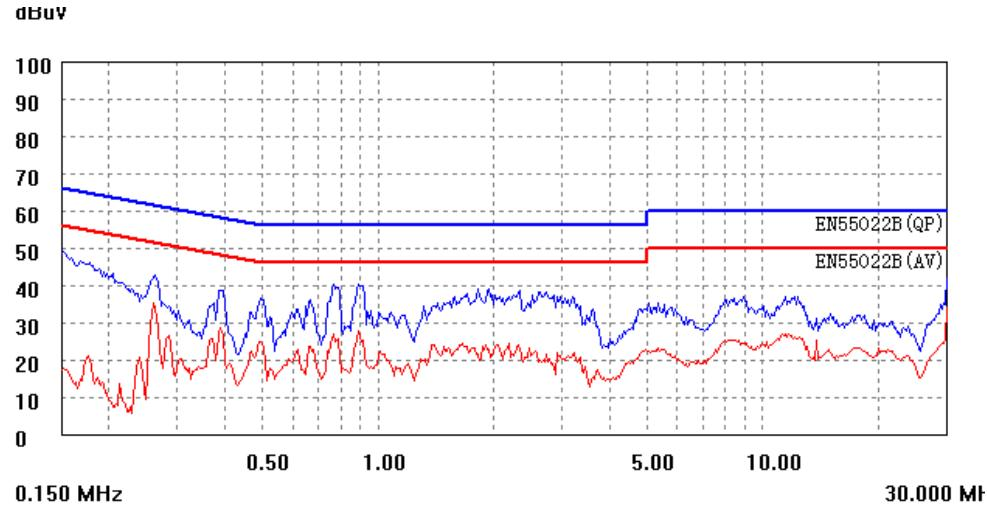

230VAC Line  
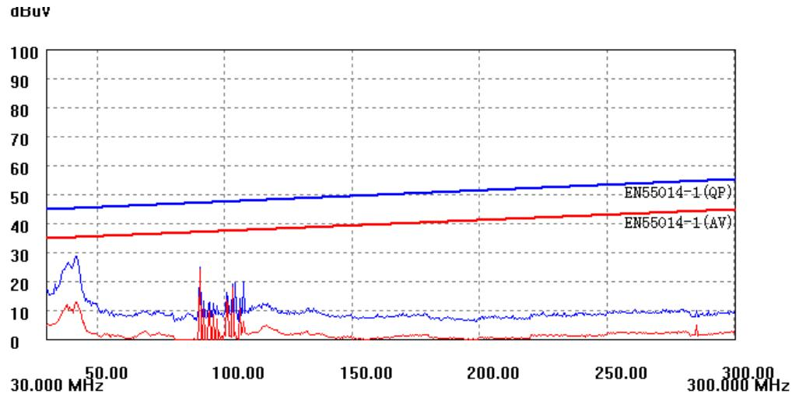

230VAC 满载

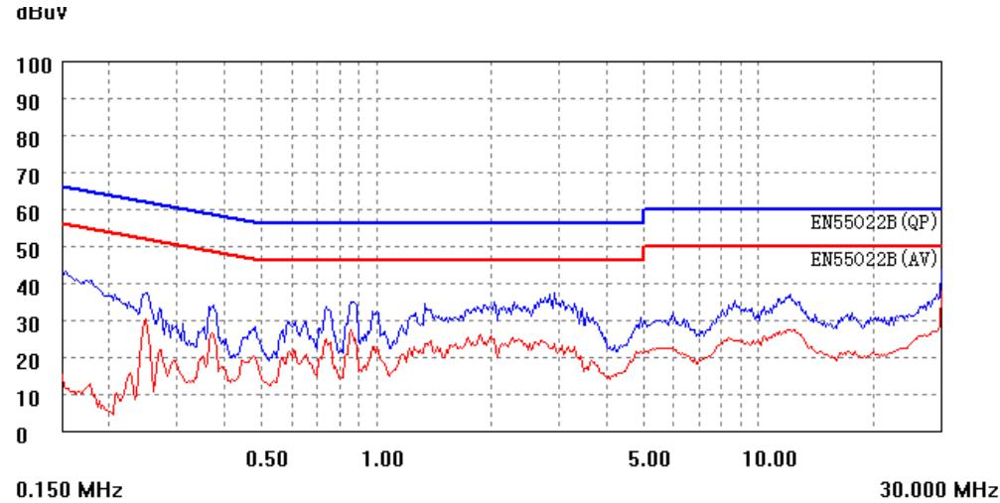

230VAC Neutral

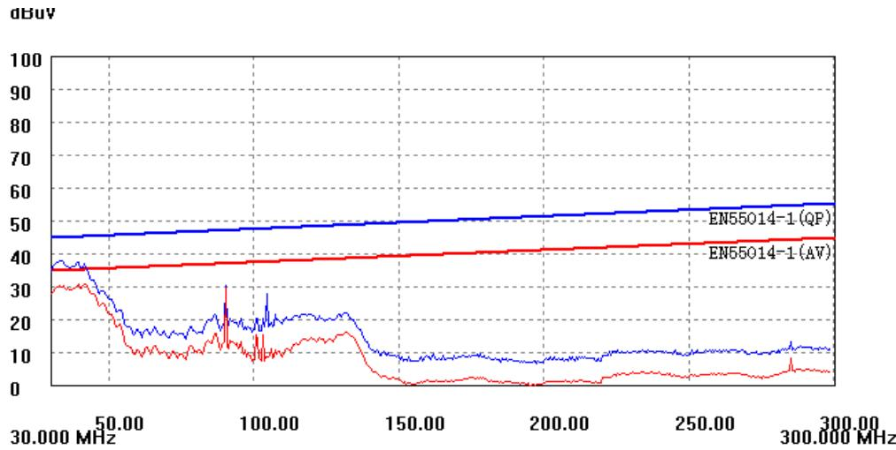

230VAC 空载载

<table><tr><td>差模</td><td>电压</td><td>相位角</td><td>发生器阻抗</td><td>测试次数</td><td>测试结果</td></tr><tr><td>L to N</td><td>+2kV</td><td>0</td><td>2</td><td>10</td><td>Pass</td></tr><tr><td>L to N</td><td>-2kV</td><td>0</td><td>2</td><td>10</td><td>Pass</td></tr><tr><td>L to N</td><td>+2kV</td><td>90</td><td>2</td><td>10</td><td>Pass</td></tr><tr><td>L to N</td><td>-2kV</td><td>90</td><td>2</td><td>10</td><td>Pass</td></tr><tr><td>L to N</td><td>+2kV</td><td>180</td><td>2</td><td>10</td><td>Pass</td></tr><tr><td>L to N</td><td>-2kV</td><td>180</td><td>2</td><td>10</td><td>Pass</td></tr><tr><td>L to N</td><td>+2kV</td><td>270</td><td>2</td><td>10</td><td>Pass</td></tr><tr><td>L to N</td><td>-2kV</td><td>270</td><td>2</td><td>10</td><td>Pass</td></tr></table>

## 测试说明

➢ 按照GB/T17626.5和IEC61000-4-5的最新版本要求进行测试  
➢ 室温环境，230VAC输入，满载条件  
➢ 输入1.2/50us组合波浪涌电压  
➢ 每个测试点重复10次  
➢ 每次间隔时间1分钟  
➢ 试验时样机输出正常（符合A类标准）视为Pass

<table><tr><td>差模</td><td>电压</td><td>脉冲群持续时间</td><td>脉冲频率</td><td>测试时间</td><td>测试结果</td></tr><tr><td>L to N</td><td>+4kV</td><td>15ms</td><td>5kHz</td><td>120s</td><td>Pass</td></tr><tr><td>L to N</td><td>-4kV</td><td>15ms</td><td>5kHz</td><td>120s</td><td>Pass</td></tr><tr><td>L to N</td><td>+4kV</td><td>0.75ms</td><td>100kHz</td><td>120s</td><td>Pass</td></tr><tr><td>L to N</td><td>-4kV</td><td>0.75ms</td><td>100kHz</td><td>120s</td><td>Pass</td></tr><tr><td>L to N</td><td>+2kV</td><td>2ms</td><td>38kHz</td><td>120s</td><td>Pass</td></tr><tr><td>L to N</td><td>-2kV</td><td>2ms</td><td>38kHz</td><td>120s</td><td>Pass</td></tr><tr><td>L to N</td><td>+4kV</td><td>2ms</td><td>38kHz</td><td>120s</td><td>Pass</td></tr><tr><td>L to N</td><td>-4kV</td><td>2ms</td><td>38kHz</td><td>120s</td><td>Pass</td></tr></table>

## 测试说明

➢ 按照GB/T17626.4和IEC61000-4-4的最新版本要求进行测试  
➢ 室温环境，230VAC输入满载条件  
➢ 分别测试5kHz/100kHz/38kHz脉冲频率  
➢ 脉冲群周期为300ms  
➢ 每个测试条件测试时间120s  
➢ 试验时样机输出正常（符合A类标准）视为Pass

<table><tr><td>测试点</td><td>电压(V)</td><td>放电类型</td><td>放电次数</td><td>测试结果</td></tr><tr><td>Vo</td><td>+15kV</td><td>空气放电</td><td>10</td><td>Pass</td></tr><tr><td>Vo</td><td>-15kV</td><td>空气放电</td><td>10</td><td>Pass</td></tr><tr><td>GND</td><td>+15kV</td><td>空气放电</td><td>10</td><td>Pass</td></tr><tr><td>GND</td><td>-15kV</td><td>空气放电</td><td>10</td><td>Pass</td></tr><tr><td>Vo</td><td>+20kV</td><td>空气放电</td><td>10</td><td>Pass</td></tr><tr><td>Vo</td><td>-20kV</td><td>空气放电</td><td>10</td><td>Pass</td></tr><tr><td>GND</td><td>+20kV</td><td>空气放电</td><td>10</td><td>Pass</td></tr><tr><td>GND</td><td>-20kV</td><td>空气放电</td><td>10</td><td>Pass</td></tr></table>

## 测试说明

➢ 按照GB/T17626.2和IEC61000-4-2的最新版本要求进行测试  
➢ 室温环境，230VAC输入满载条件  
➢ 每个测试点重复10次  
➢ 分别对输出正端和地进行空气放电  
➢ 试验时样机输出正常（符合A类标准）视为Pass

## THANK YOU FOR WATCHING
