## BPA8618P隔离参考设计

## (5V0.5A;12V0.8A)

上海晶丰明源半导体股份有限公司

Shanghai Bright Power Semiconductor Co., Ltd.

文长川

时间： 2021年06月15日

## 内容

BPA861XP简介  
电源规格  
电路及实物图  
BOM  
PCB Layout图  
变压器  
性能测试数据

## 产品特点：

➢ 集成 700V 高压 MOSFET  
➢ ON/OFF控制模式，低输出纹波  
内置软启动功能  
➢ 集成高压启动、自供电电路  
➢ 低音频噪声  
➢ 集成输入过/欠压保护

## 应用领域：

➢ 家用电器辅助电源  
➢ 电机驱动辅助电源  
➢ IOT/智能家居/智能照明  
➢ 工业控制辅助电源

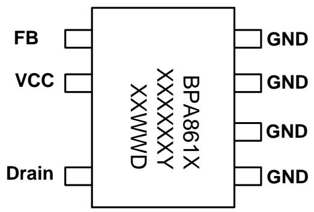

<table><tr><td>项目描述</td><td>符号</td><td>最小</td><td>典型</td><td>最大</td><td>单位</td><td>备注</td></tr><tr><td colspan="7">输入</td></tr><tr><td>电压</td><td> $V_{IN}$ </td><td>85</td><td>115/230</td><td>264</td><td> $V_{AC}$ </td><td></td></tr><tr><td>频率</td><td> $f_{LINE}$ </td><td>47</td><td>50/60</td><td>63</td><td>Hz</td><td></td></tr><tr><td colspan="7">输出</td></tr><tr><td>输出电压1</td><td> $V_{OUT1}$ </td><td>4.75</td><td>5</td><td>5.25</td><td>V</td><td>±5%</td></tr><tr><td>输出电流1</td><td> $I_{OUT1}$ </td><td>0</td><td></td><td>500</td><td>mA</td><td></td></tr><tr><td>输出电压2</td><td> $V_{OUT2}$ </td><td>11.4</td><td>12</td><td>13.8</td><td>V</td><td>+15%/-5%</td></tr><tr><td>输出电流2</td><td> $I_{OUT2}$ </td><td>0</td><td></td><td>800</td><td>mA</td><td></td></tr><tr><td>输出电压纹波1</td><td> $V_{RIPPLE}$ </td><td></td><td></td><td>200</td><td>mV</td><td>20MHz带宽</td></tr><tr><td>输出电压纹波2</td><td> $V_{RIPPLE}$ </td><td></td><td></td><td>200</td><td>mV</td><td>20MHz带宽</td></tr><tr><td>连续输出功率</td><td> $P_{OUT}$ </td><td></td><td>12</td><td></td><td>W</td><td></td></tr><tr><td colspan="7">效率</td></tr><tr><td>待机功耗</td><td> $P_{STDBY}$ </td><td></td><td></td><td>100</td><td>mW</td><td>230VAC,包含假负载</td></tr><tr><td>满载效率</td><td>η</td><td></td><td></td><td>75</td><td>%</td><td></td></tr><tr><td colspan="7">环境</td></tr><tr><td>传导EMI</td><td></td><td colspan="4">满足CISPR22/EN55022 Class B,至少6dB 裕量</td><td></td></tr><tr><td>Surge</td><td></td><td></td><td>2</td><td></td><td>kV</td><td>差模</td></tr><tr><td>EFT</td><td></td><td></td><td>4</td><td></td><td>kV</td><td>5kHz/100kHz/38kHz</td></tr><tr><td>ESD</td><td></td><td></td><td>15</td><td>20</td><td>kV</td><td>空气放电</td></tr><tr><td>工作环境温度</td><td> $T_{AMP}$ </td><td>0</td><td></td><td>50</td><td>°C</td><td></td></tr></table>

## 电路及实物图

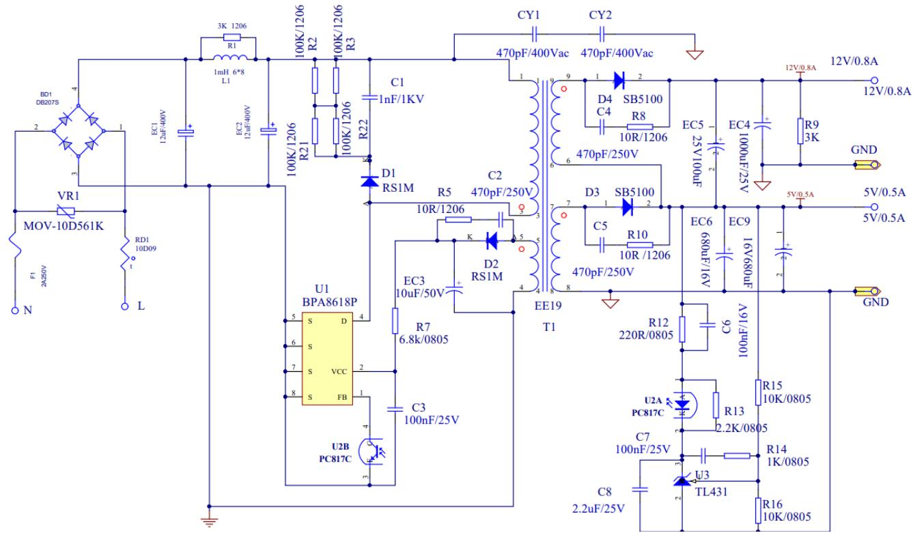

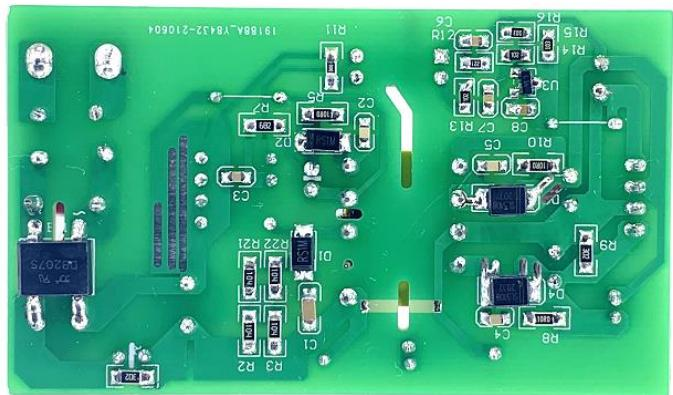

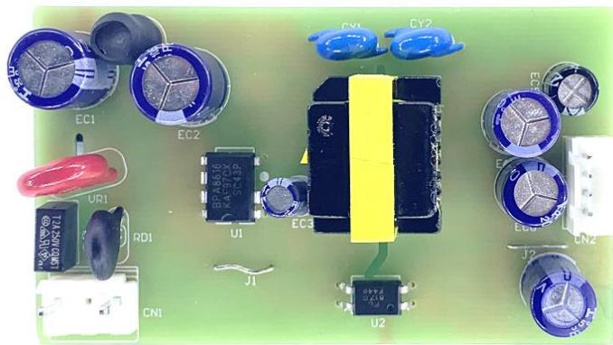

<table><tr><td>序号</td><td>元件标号</td><td>参数描述</td><td>封装尺寸</td><td>数量</td></tr><tr><td>1</td><td>PCB</td><td>CEM-1, 单面板</td><td>77.5mm*45.5mm</td><td>1</td></tr><tr><td>2</td><td>RD1</td><td>10-11,热敏电阻</td><td>DIP</td><td>1</td></tr><tr><td>3</td><td>VDR1</td><td>10D561,压敏电阻</td><td>10D561</td><td>1</td></tr><tr><td>4</td><td>EC1,EC2</td><td>400V12uF电解电容</td><td> $\phi 10*13$ </td><td>2</td></tr><tr><td>5</td><td>L2</td><td>工字电感1mH</td><td>6*8</td><td>1</td></tr><tr><td>6</td><td>JP1,JP2</td><td>跳线0.6*7</td><td>DIP</td><td>1</td></tr><tr><td>7</td><td>U3</td><td>BPA8618P</td><td>DIP</td><td>1</td></tr><tr><td>8</td><td>EC3</td><td>50V10uF电解电容</td><td> $\phi 5*11$ </td><td>1</td></tr><tr><td>9</td><td>U2</td><td>PC817C 光耦</td><td>DIP</td><td>1</td></tr><tr><td>10</td><td>T1</td><td>EE19加高 1mH</td><td>DIP</td><td>1</td></tr><tr><td>11</td><td>EC4</td><td>16V/1000uF电解电容</td><td> $\phi 8*16mm$ </td><td>1</td></tr><tr><td>12</td><td>EC6, EC9</td><td>16V/680uF电解电容</td><td> $\phi 8*12mm$ </td><td>1</td></tr><tr><td>13</td><td>EC5</td><td>25V/100uF电解电容</td><td> $\phi 6*11mm$ </td><td>1</td></tr><tr><td>14</td><td>CY1,CY2</td><td>470PF 400V AC Y1</td><td>DIP</td><td>2</td></tr><tr><td>15</td><td>BD1</td><td>DB207S 2A1KV整流桥</td><td>SMD</td><td>1</td></tr><tr><td>16</td><td>D2,D1</td><td>RS1M 1A,1KV快速二极管</td><td>SMA</td><td>1</td></tr><tr><td>17</td><td>D4,D3</td><td>SB510 5A100V肖特基二极管</td><td>SMB</td><td>2</td></tr><tr><td>18</td><td>U1</td><td>AZ431</td><td>SOT23-3</td><td>1</td></tr></table>

<table><tr><td>序号</td><td>元件标号</td><td>参数描述</td><td>封装尺寸</td><td>数量</td></tr><tr><td>19</td><td>R1,R9</td><td>3K, ±5%</td><td>SMD1206</td><td>1</td></tr><tr><td>20</td><td>R2,R3,R21,R22</td><td>100K, ±5%</td><td>SMD1206</td><td>4</td></tr><tr><td>21</td><td>R5,R8,R10</td><td>10R, ±5%</td><td>SMD1206</td><td>1</td></tr><tr><td>22</td><td>R11</td><td>0R, ±5%</td><td>SMD1206</td><td>2</td></tr><tr><td>23</td><td>R7</td><td>6.8K, ±5%</td><td>SMD1206</td><td>1</td></tr><tr><td>24</td><td>R15,R16</td><td>10K, ±1%</td><td>SMD0805</td><td>1</td></tr><tr><td>25</td><td>R14</td><td>1K, ±5%</td><td>SMD0805</td><td>2</td></tr><tr><td>26</td><td>R13</td><td>2.2K,±5%</td><td>SMD0805</td><td>1</td></tr><tr><td>27</td><td>R12</td><td>220R,±5%</td><td>SMD0805</td><td>1</td></tr><tr><td>28</td><td>C3,C6,C7</td><td>100nF/16V,X7R</td><td>SMD0805</td><td>3</td></tr><tr><td>29</td><td>C1</td><td>1nF/1KV,X7R</td><td>SMD0805</td><td>1</td></tr><tr><td>30</td><td>C4,C5,C2</td><td>470pF/250V,X7R</td><td>SMD0805</td><td>3</td></tr><tr><td>31</td><td>C9</td><td>2.2uF/16V,X7R</td><td>SMD0805</td><td>1</td></tr><tr><td colspan="2"></td><td></td><td>Total</td><td>43</td></tr></table>

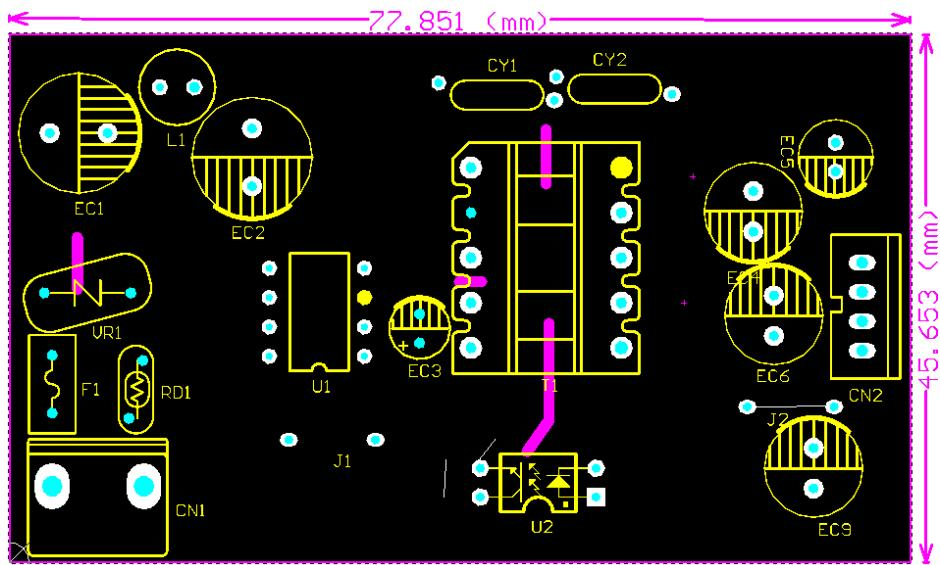

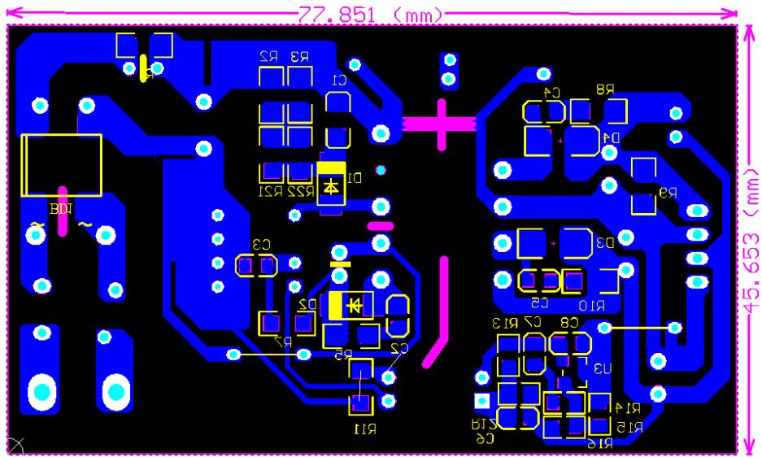

## 原理图

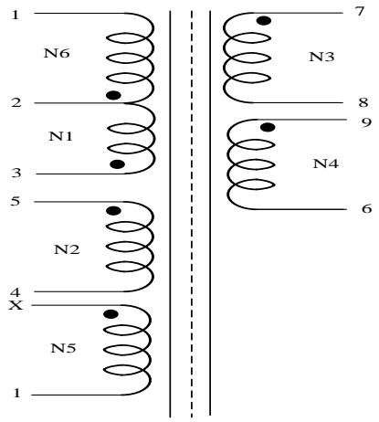

## 绕线方式

<table><tr><td>绕组</td><td>起始脚</td><td>终止脚</td><td>材料</td><td>匝数</td><td>绕线方式</td></tr><tr><td>N1</td><td>3</td><td>2</td><td> $\phi 0.23*1P$ </td><td>70Ts</td><td>密绕二层(PIN脚朝外)</td></tr><tr><td colspan="4">胶带</td><td>2.1Ts</td><td></td></tr><tr><td>N2</td><td>5</td><td>4</td><td> $\phi 0.16*2P$ </td><td>20Ts</td><td>密绕一层(PIN脚朝外)</td></tr><tr><td colspan="4">胶带</td><td>2.1Ts</td><td></td></tr><tr><td>N3</td><td>7</td><td>8</td><td>三层绝缘线 $\phi 0.35*2P$ </td><td>7Ts</td><td>密绕绕一层(PIN脚朝外)</td></tr><tr><td colspan="4">胶带</td><td>2.1Ts</td><td></td></tr><tr><td>N4</td><td>9</td><td>6</td><td>三层绝缘线 $\phi 0.28*2P$ </td><td>9Ts</td><td>密绕一层(PIN脚朝外)</td></tr><tr><td colspan="4">胶带</td><td>2.1Ts</td><td></td></tr><tr><td>N5</td><td>X</td><td>1</td><td> $\phi 0.35*2P$ </td><td>8Ts</td><td>居中一层(PIN脚朝外)</td></tr><tr><td colspan="4">胶带</td><td>2.1Ts</td><td></td></tr><tr><td>N6</td><td>2</td><td>1</td><td> $\phi 0.23*1P$ </td><td>31Ts</td><td>密绕一层(PIN脚朝外)</td></tr><tr><td colspan="4">胶带</td><td>3Ts</td><td></td></tr></table>

## 规格与材料

➢ 初级绕组感量 $\mathsf { L } _ { \mathsf { p } } = 1 0 0 0 \mathsf { u H } \pm 7 \%$ （测试条件： 0.3V，$1 0 0 \boldsymbol { \mathsf { k } } \boldsymbol { \mathsf { H z } } )$ ）  
➢ 漏感量 $\ L _ { | | k } < 5 0 \mathsf { u } \mathsf { H }$  
➢ 骨架：EE19底部加高（5+5PIN）  
➢ 磁芯：EE19 PC40 或同等材质 ， $\mathsf { A } \mathsf { e } = 2 3 \mathsf { m } \mathsf { m } ^ { 2 }$  
➢ N1、N2、N5、N6: 2UEW 漆包线  
➢ N3 、N4 : 三层绝缘线  
➢ 绝缘胶带:3M900 或同等材质  
➢ 耐压测试: 3KV, 50/60Hz, 1Min  
➢ 成品要求：浸凡立水

## 脚位图

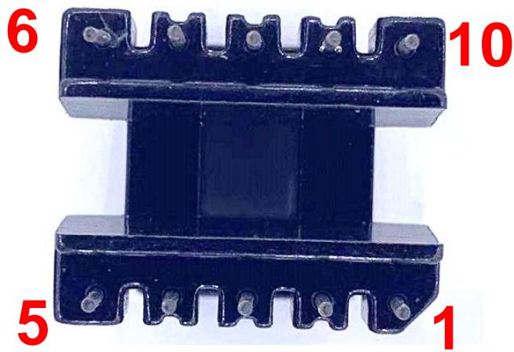

待机功耗（包含48mW假负载，6.8K电阻外供电）  
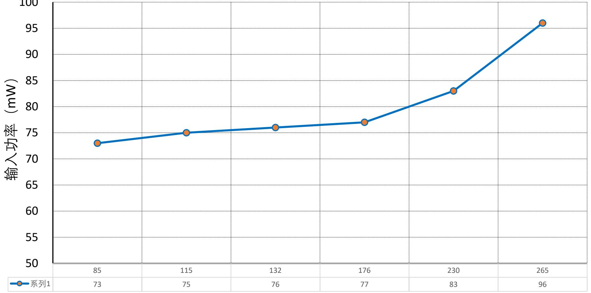

输入电压(VAC)

效率测试  
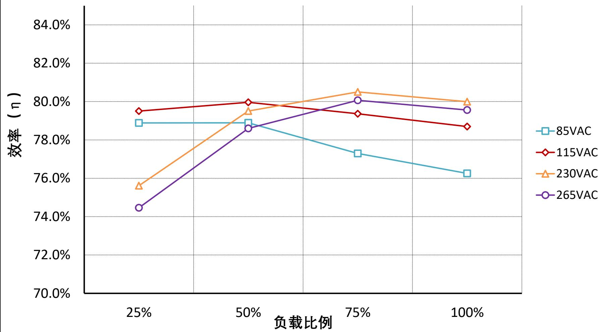

## 输出电压交叉调整率

<table><tr><td>输入电压AC (V)</td><td>输出电流1(A)</td><td>输出电压1(V)</td><td>输出电流2(A)</td><td>输出电压2(V)</td></tr><tr><td rowspan="2">115</td><td>0</td><td>4.99</td><td>0.8</td><td>11.41</td></tr><tr><td>0.5</td><td>4.99</td><td>0</td><td>13.50</td></tr><tr><td rowspan="2">230</td><td>0</td><td>4.99</td><td>0.8</td><td>11.4</td></tr><tr><td>0.5</td><td>4.99</td><td>0</td><td>13.8</td></tr></table>

## 输出电压纹波

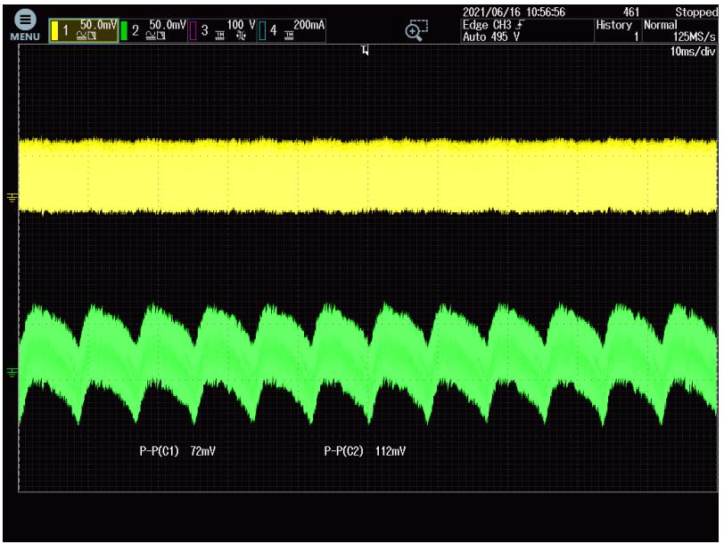

85 $\mathsf { v } _ { \mathsf { A C } }$

CH1 $\mathsf { V } _ { \mathsf { O U T - 5 V } }$ $\mathsf { R i p p l e }$ $\mathbf { V } _ { \mathsf { P K - P K } } { = } 7 2 \mathsf { m } \mathbf { V }$  
CH2 $\mathsf { V } _ { \mathsf { O U T - 1 } 2 \mathsf { V } }$ Ripple $\mathsf { V } _ { \mathsf { P K - P K } } { = } 1 1 2 \mathsf { m V }$

## Test Condition:

➢ Full Load

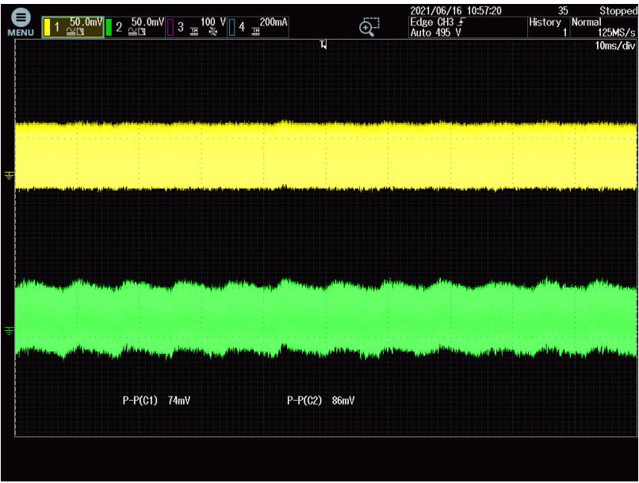

115 VAC

CH1 $\mathsf { V } _ { \mathsf { O U T - S V } }$ Ripple $\mathsf { V } _ { \mathsf { P K - P K } } { = } 7 4 \mathsf { m } \mathsf { v }$  
${ \mathsf { C H } } 2 { \mathsf { V } } _ { 0 \mathsf { U T } - 1 2 { \mathsf { V } } }$ Ripple $\mathsf { V } _ { \mathsf { P K - P K } } { = } 8 6 \mathsf { m } \mathsf { v }$

## Test Condition:

➢ Full Load

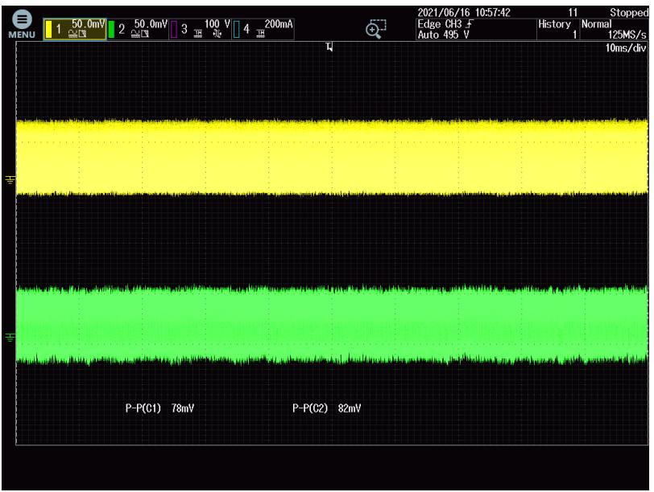

230 $\mathsf { v } _ { \mathsf { A C } }$

CH1 $\mathsf { V } _ { \mathsf { O U T - 5 V } }$ $\mathsf { R i p p } | \mathsf { e }$ $\mathsf { V } _ { \mathsf { P K - P K } } { = } 7 8 \mathsf { m } \mathsf { v }$  
CH2 $\mathsf { V } _ { \mathsf { O U T } - 1 2 \mathsf { V } }$ Ripple $\mathbf { V } _ { \mathsf { P K - P K } } { = } 8 2 \mathsf { m } \mathbf { V }$

## Test Condition:

➢ Full Load

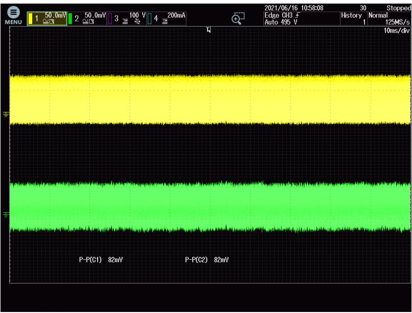

265 $\mathsf { v } _ { \mathsf { A C } }$

CH1 $\mathsf { V } _ { \mathsf { O U T - 5 V } }$ Ripple $\mathbf { V } _ { \mathsf { P K - P K } } { = } 8 2 \mathsf { m } \mathbf { V }$  
CH2 $\mathsf { V } _ { \mathsf { O U T } - 1 2 \mathsf { V } }$ Ripple $\mathbf { V } _ { \mathsf { P K - P K } } { = } 8 2 \mathsf { m } \mathbf { V }$

## Test Condition:

➢ Full Load

## 动态负载(50%-100%)

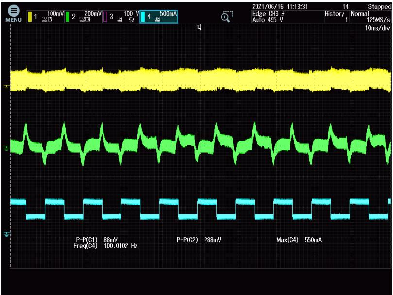

85 VAC

${ \mathsf { C H 1 } } \mathsf { V } _ { \mathsf { O U T } - { \mathsf { 5 v } } }$ CH1 VOUT-5V $\mathsf { V } _ { \mathsf { P K - P K } } { = } 8 8 \mathsf { m V }$  
${ \mathsf { C H } } 2 { \mathsf { V } } _ { 0 \cup \mathsf { T } - 1 2 { \mathsf { V } } }$ CH2 VOUT-12V $v _ { p _ { \mathrm { K - P K } } } { = } 2 8 8 ~ \mathsf { m V }$

## Test Condition:

➢ $0 . 2 5 \ : \mathsf { A } – 0 . 5 \ : \mathsf { A } – 0 . 2 5 \ : \mathsf { A }$  
➢ $0 . 4 \ A { - } 0 . 8 \ A { - } 0 . 4 \ A$  
➢ Slew Rate: 0.5 A/μS  
➢ Frequency: 100 Hz

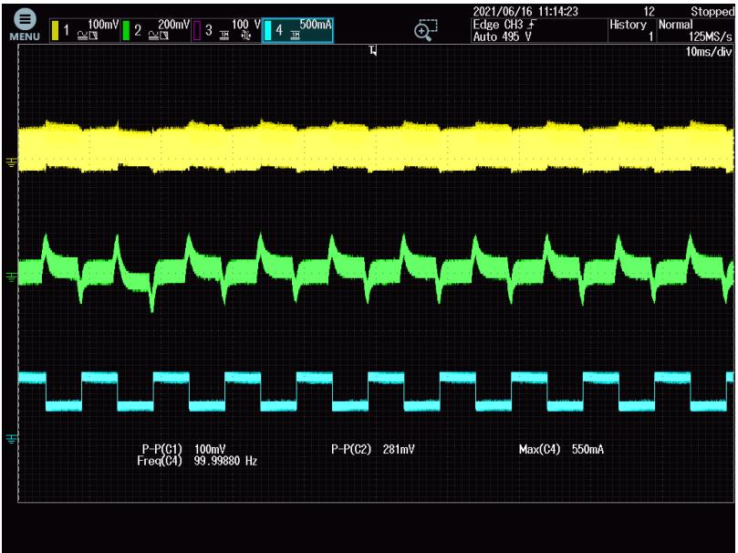

230 VAC

CH1 VOUT-5V $\mathsf { V } _ { \mathsf { O U T - 5 V } }$ $v _ { p \kappa \mathrm { - } P \kappa } { = } 1 0 0 ~ \mathsf { m V }$  
CH2 VOUT-12V $\mathsf { V } _ { \mathsf { O U T } - 1 2 \mathsf { V } }$ VPK-PK=281 mV $v _ { p _ { \mathrm { K - P K } } } { = } 2 8 1 \mathsf { m v }$

## Test Condition:

➢ 0.25 A-0.5 A-0.25 A  
➢ $0 . 4 \ A { - } 0 . 8 \ A { - } 0 . 4 \ A$  
➢ Slew Rate: 0.5 A/μS  
➢ Frequency: 100 Hz

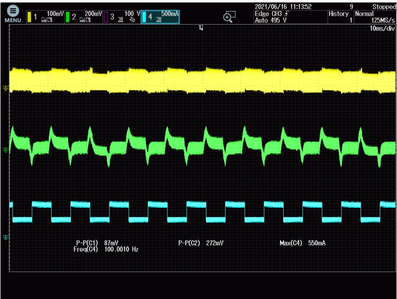

115 VAC

${ \mathsf { C H 1 } } { \mathsf { V } } _ { { \mathsf { O U T } } - { \mathsf { 5 v } } }$ CH1 VOUT-5V $\mathsf { V } _ { \mathsf { P K - P K } } { = } 8 7 \mathsf { m } \mathsf { v }$  
$\mathsf { C H 2 V _ { O U T - 1 2 V } }$ CH2 VOUT-12V VPK-PK=272 mV $V _ { P K - P K } = 2 7 2 m v$

## Test Condition:

➢ $0 . 2 5 \ : \mathsf { A } – 0 . 5 \ : \mathsf { A } – 0 . 2 5 \ : \mathsf { A }$  
➢ 0.4 A-0.8 A-0.4 A  
➢ Slew Rate: 0.5 A/μS  
➢ Frequency: 100 Hz

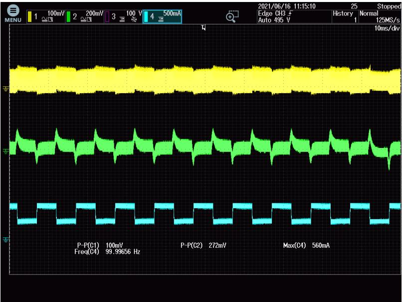

265 VAC

${ \mathsf { C H 1 } } \mathsf { V } _ { \mathsf { O U T } - 5 \mathsf { V } }$ CH1 VOUT-5V VPK-PK=100 mV $v _ { p _ { \mathrm { K - P K } } } { = } 1 0 0 ~ \mathsf { m V }$  
${ \mathsf { C H } } 2 { \mathsf { V } } _ { 0 \cup \mathsf { T } - 1 2 { \mathsf { V } } }$ CH2 VOUT-12V $V _ { P K - P K } = 2 7 2 m v$

## Test Condition:

➢ 0.25 A-0.5 A-0.25 A  
➢ 0.4 A-0.8 A-0.4 A  
➢ Slew Rate: 0.5 A/μS  
➢ Frequency: 100 Hz

## 动态负载(10%-90%)

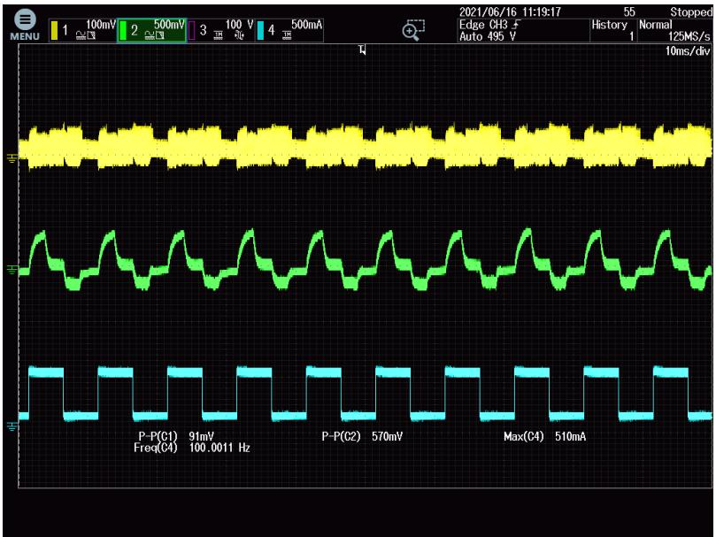

85 VAC

CH1 VOUT-5V ${ \mathsf { C H 1 } } \mathsf { V } _ { \mathsf { O U T } - { \mathsf { 5 v } } }$ $\mathsf { V } _ { \mathsf { P K - P K } } { = } \mathsf { S } \mathsf { 1 } \mathsf { m } \mathsf { v }$  
CH2 VOUT-12V $\mathsf { V } _ { \mathsf { O U T - 1 2 V } }$ VPK-PK=570 mV $v _ { p _ { \mathrm { K - P K } } } { = } 5 7 0 ~ \mathsf { m V }$

## Test Condition:

➢ 0.05 A-0.45 A-0.05 A  
➢ 0.08 A-0.72 A-0.08 A  
➢ Slew Rate: 0.5 A/μS  
➢ Frequency: 100 Hz

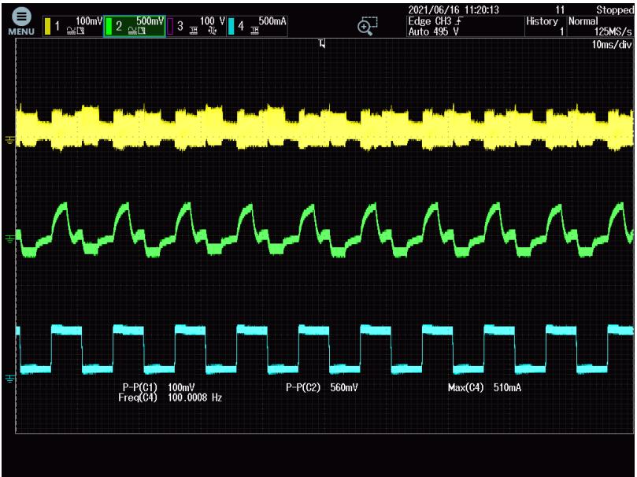

230 VAC

CH1 VOUT-5V $\mathsf { V } _ { \mathsf { O U T - 5 V } }$ $v _ { p \kappa \mathrm { - } P \kappa } { = } 1 0 0 ~ \mathsf { m V }$  
CH2 VOUT-12V $\mathsf { V } _ { \mathsf { O U T } - 1 2 \mathsf { V } }$ VPK-PK=560 mV $v _ { p _ { \mathrm { K - P K } } } { = } 5 6 0 ~ \mathsf { m V }$

## Test Condition:

➢ 0.05 A-0.45 A-0.05 A  
➢ 0.08 A-0.72 A-0.08 A  
➢ Slew Rate: 0.5 A/μS  
➢ Frequency: 100 Hz

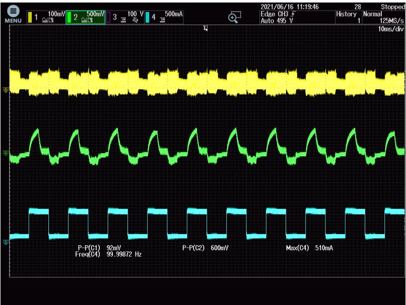

115 VAC

${ \mathsf { C H 1 } } { \mathsf { V } } _ { { \mathsf { O U T } } - { \mathsf { 5 v } } }$ CH1 VOUT-5V $\mathsf { V } _ { \mathsf { P K - P K } } { = } \mathsf { S } 2 \mathsf { m } \mathsf { v }$  
CH2 VOUT-12V $\mathsf { C H 2 V _ { O U T - 1 2 V } }$ VPK-PK=600 mV $\mathsf { V } _ { \mathsf { P K - P K } } { = } 6 0 0 \mathsf { m V }$

## Test Condition:

➢ 0.05 A-0.45 A-0.05 A  
➢ 0.08 A-0.72 A-0.08 A  
➢ Slew Rate: 0.5 A/μS  
➢ Frequency: 100 Hz

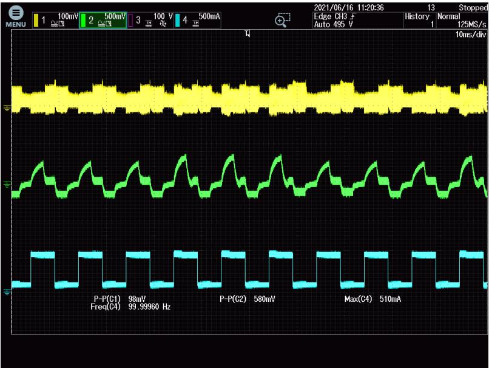

265 VAC

${ \mathsf { C H 1 } } \mathsf { V } _ { \mathsf { O U T } - 5 \mathsf { V } }$ CH1 VOUT-5V $\mathsf { V } _ { \mathsf { P K - P K } } { = } 9 8 \mathsf { m v }$  
${ \mathsf { C H } } 2 { \mathsf { V } } _ { 0 \cup \mathsf { T } - 1 2 { \mathsf { V } } }$ CH2 VOUT-12V $V _ { \mathsf { P K - P K } } { = } 5 8 0 ~ \mathsf { m V }$

## Test Condition:

➢ 0.05 A-0.45 A-0.05 A  
➢ 0.08 A-0.72 A-0.08 A  
➢ Slew Rate: 0.5 A/μS  
➢ Frequency: 100 Hz

## 输出电压开机波形

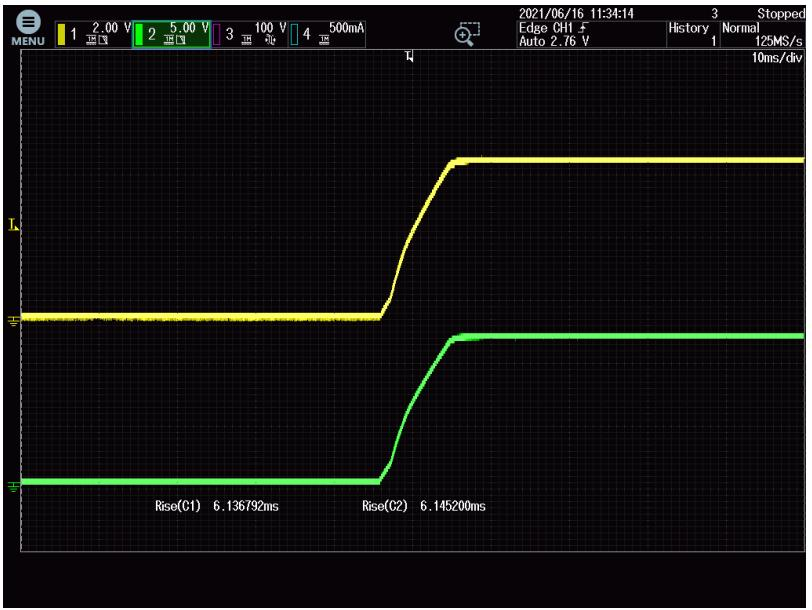

85 VAC

CH1 VOUT-5V $\mathsf { V } _ { \mathsf { O U T - 5 V } }$ ${ \sf T } _ { \sf R I S E } .$ 6.13 mS  
CH2 VOUT-12V $\mathsf { V } _ { \mathsf { O U T - 1 } 2 \mathsf { V } }$ ${ \sf T } _ { \sf R I S E } .$ 6.14mS

Test Condition:  
➢ No Load  
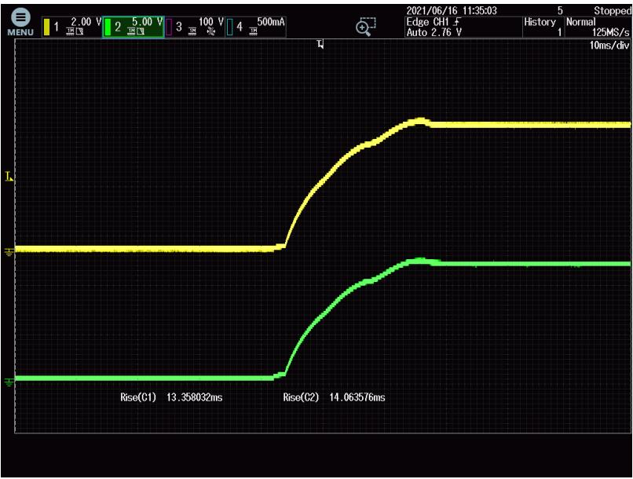

85 VAC

CH1 VOUT-5V $\mathsf { V } _ { \mathsf { O U T - S V } }$ ${ \sf T } _ { \sf R I S E } .$ 13.35 mS  
CH2 VOUT-12V $\mathsf { V } _ { \mathsf { O U T } - 1 2 \mathsf { V } }$ ${ \sf T } _ { \sf R I S E } .$ 14.06mS

Test Condition:  
➢ Full Load  
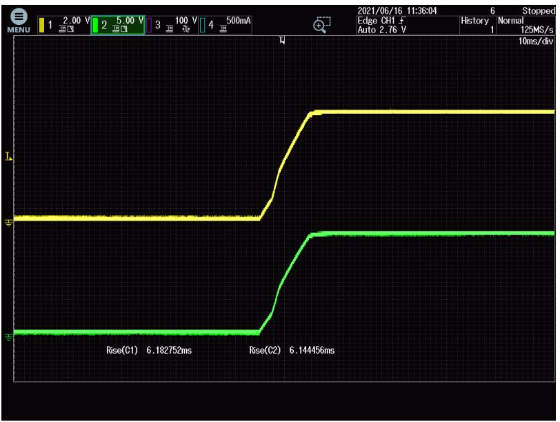

265 $\mathsf { v } _ { \mathsf { A C } }$

CH1 VOUT-5V $\mathsf { V } _ { \mathsf { O U T - 5 V } }$ ${ \sf T } _ { \sf R I S E } .$ 6.18 mS  
CH2 VOUT-12V $\mathsf { V } _ { \mathsf { O U T } - 1 2 \mathsf { V } }$ ${ \sf T } _ { \sf R I S E } .$ 6.14mS

Test Condition:  
➢ No Load  
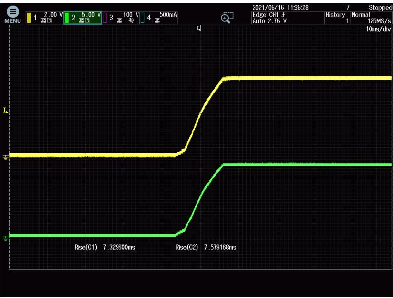

265 $\mathsf { v } _ { \mathsf { A C } }$

CH1 VOUT-5V $\mathsf { V } _ { \mathsf { O U T - 5 V } }$ TRISE: 7.32 mS ${ \sf T } _ { \sf R I S E } .$  
CH2 VOUT-12V $\mathsf { V } _ { \mathsf { O U T } - 1 2 \mathsf { V } }$ ${ \sf T } _ { \sf R I S E } .$ 7.57mS

Test Condition:

➢ Full Load

## 启动延迟时间

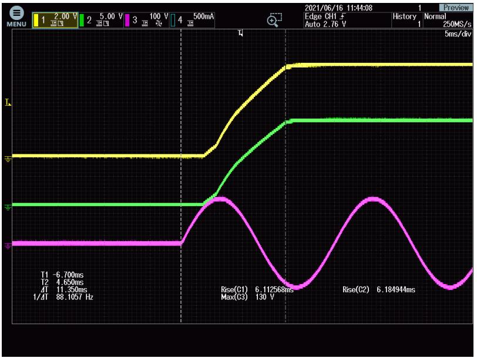

85 VAC

CH1 VOUT-5V $\mathsf { V } _ { \mathsf { O U T - 5 V } }$  
CH2 VOUT-12V $\mathsf { V } _ { \mathsf { O U T - 1 } 2 \mathsf { V } }$  
CH3 $\mathsf { V I N } _ { \mathsf { A C } }$  
TDELAY: 11.35 mS

## Test Condition:

➢ No Load

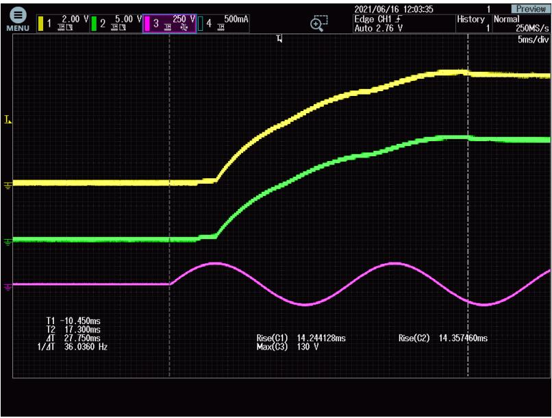

85 VAC

CH1 VOUT-5V $\mathsf { V } _ { \mathsf { O U T - S V } }$  
CH2 VOUT-12V $\mathsf { V } _ { \mathsf { O U T } - 1 2 \mathsf { V } }$  
CH3 VINAC $\mathsf { V I N } _ { \mathsf { A C } }$ $\mathsf { T } _ { \mathsf { D E L A Y } } .$ 27.25 mS

## Test Condition:

➢ Full Load

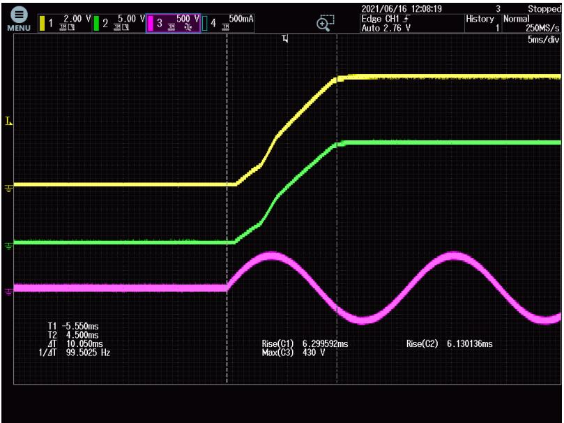

265 VAC

CH1 $\mathsf { V } _ { \mathsf { O U T - 5 V } }$  
CH2 VOUT-12V $\mathsf { V } _ { \mathsf { O U T } - 1 2 \mathsf { V } }$  
CH3 VINNAC $\mathsf { V I N } _ { \mathsf { N A C } }$ $\mathsf { T } _ { \mathsf { D E L A Y } } \colon 1 0 . 0 5$ mS

## Test Condition:

➢ No Load

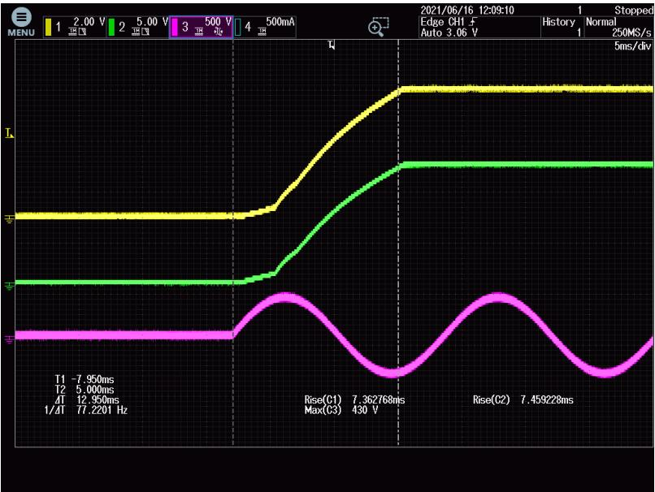

265 VAC

CH1 VOUT-5V $\mathsf { V } _ { \mathsf { O U T - 5 V } }$  
CH2 VOUT-12V $\mathsf { V } _ { \mathsf { O U T } - 1 2 \mathsf { V } }$  
CH3 VINNAC $\mathsf { V I N } _ { \mathsf { N A C } }$ ${ \mathsf { T } } _ { \mathsf { D E L A Y } } .$ 12.95 mS

## Test Condition:

➢ Full Load

## 输入欠压保护

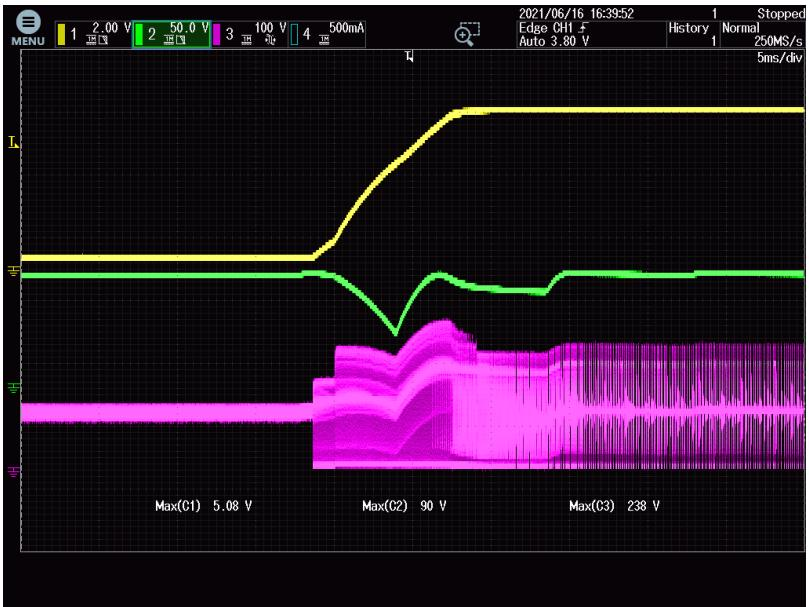

## BROWN-IN

CH1 VOUT-5V $\mathsf { V } _ { \mathsf { O U T - 5 V } }$  
${ \mathsf { C H } } { 2 } { \mathsf { V I N } } _ { \mathsf { D C } }$  
CH3 VIN VDS $\mathsf { C H 3 } \mathsf { V I N } \mathsf { V } _ { \mathsf { D S } }$ VBROWN-IN: 90 V

## 测试条件:

➢ No Load

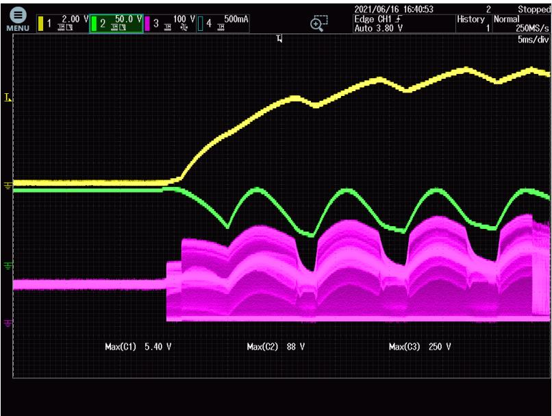

## BROWN-IN

CH1 VOUT-5V $\mathsf { V } _ { \mathsf { O U T - S V } }$  
${ \mathsf { C H } } { 2 } { \mathsf { V I N } } _ { \mathsf { D C } }$  
CH3 VIN V $\mathsf { C H 3 } \mathsf { V I N } \mathsf { V } _ { \mathsf { D S } }$ $V _ { \mathsf { B R O W N - I N } } \colon 8 8 \ \mathsf { V }$

## 测试条件:

➢ Full Load

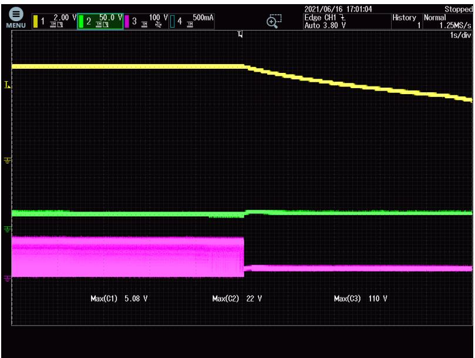

## BROWN-OUT

CH1 VOUT-5V $\mathsf { V } _ { \mathsf { O U T - 5 V } }$  
CH2 $\mathsf { V I N } _ { \mathsf { D C } }$  
CH3 VIN VDS $\mathsf { V I N } \mathsf { V } _ { \mathsf { D S } }$ $\mathsf { V } _ { \mathsf { B R O W N - O U T } } \colon 2 2 \mathsf { V }$

## 测试条件:

➢ No Load

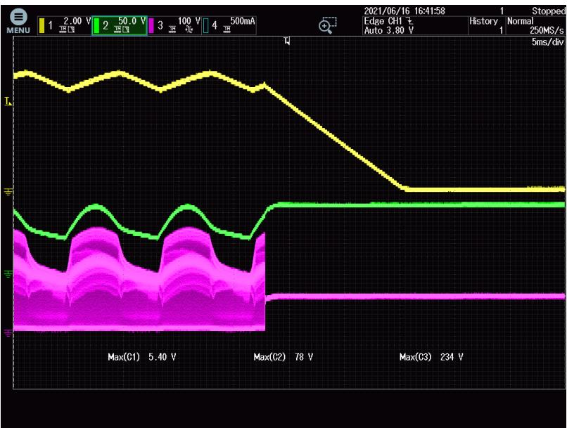

## BROWN-OUT

CH1 VOUT-5V $\mathsf { V } _ { \mathsf { O U T - 5 V } }$  
${ \mathsf { C H } } { 2 } { \mathsf { V I N } } _ { \mathsf { D C } }$  
CH3 VIN VDS $\mathsf { V I N } \mathsf { V } _ { \mathsf { D S } }$ VBROWN-OUT: 78V

## 测试条件:

➢ Full Load

## 输入过压保护

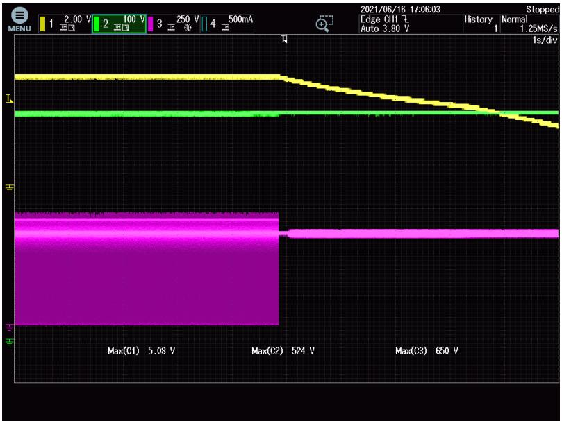

## 输入OVP

CH1 VOUT-5V $\mathsf { V } _ { \mathsf { O U T - 5 V } }$  
CH2 $\mathsf { V I N } _ { \mathsf { D C } }$  
CH3 VIN VDS $\mathsf { C H 3 } \mathsf { V I N } \mathsf { V } _ { \mathsf { D S } }$ $V _ { \mathsf { D C - I N } } .$ VDC-IN: 524V

## 测试条件:

➢ No Load

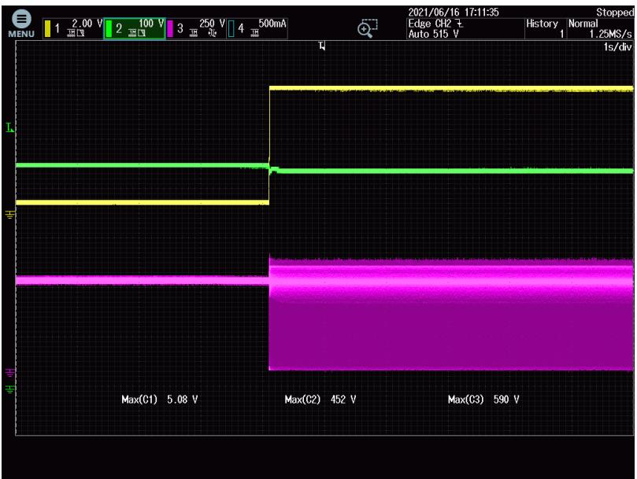

## 退出输入OVP

CH1 $\mathsf { V } _ { \mathsf { O U T - 5 V } }$  
CH2 $\mathsf { V I N } _ { \mathsf { D C } }$  
CH3 VIN VDS $\mathsf { V I N } \mathsf { V } _ { \mathsf { D S } }$ VDC-OUT:452 V

## 测试条件:

➢ No Load

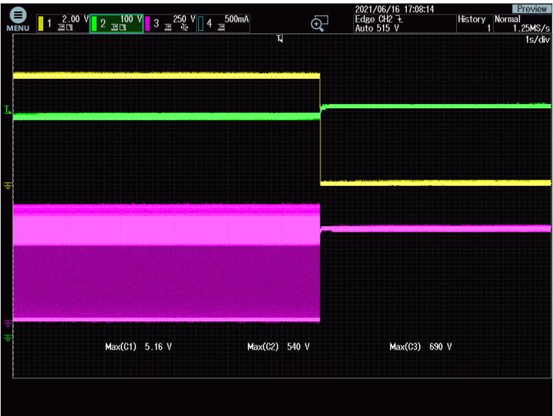

## 输入OVP

CH1 VOUT-5V $\mathsf { V } _ { \mathsf { O U T - S V } }$  
CH2 $\mathsf { V I N } _ { \mathsf { D C } }$  
CH3 VIN V $\mathsf { V I N } \mathsf { V } _ { \mathsf { D S } }$ VDC-IN: 518V

## 测试条件:

➢ Full Load

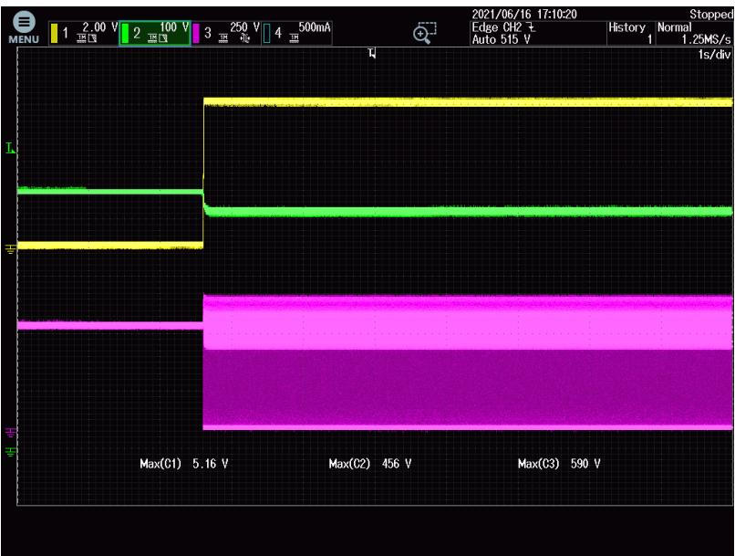

## 退出输入OVP

CH1 VOUT-5V $\mathsf { V } _ { \mathsf { O U T - 5 V } }$  
CH2 $\mathsf { V I N } _ { \mathsf { D C } }$  
CH3 VIN VDS $\mathsf { V I N } \mathsf { V } _ { \mathsf { D S } }$ $\mathsf { v } _ { \mathsf { D C - O U T } } .$ 456V

## 测试条件:

➢ Full Load

## 短路保护 （MOSFET波形）

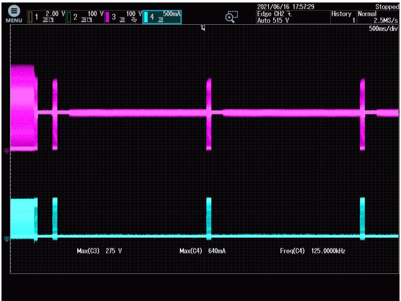

85 VAC

CH3 VDS  
CH4 ID

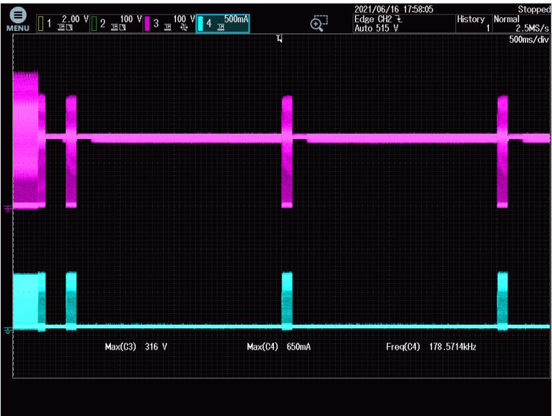

115 VAC

CH3 VDS  
CH4 ID

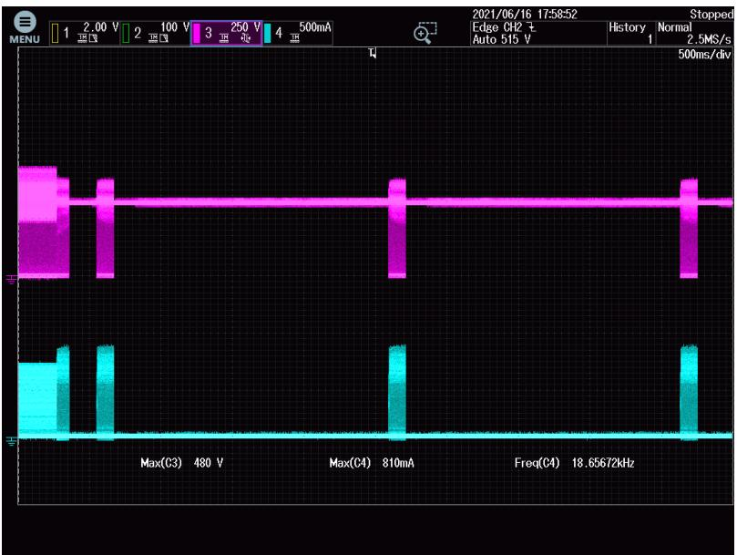

230 VAC

CH3 VDS  
CH4 ID

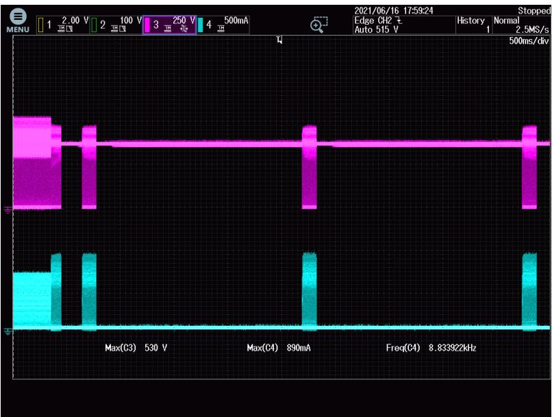

265 VAC

CH3 VDS  
CH4 ID

## 漏极电流波形

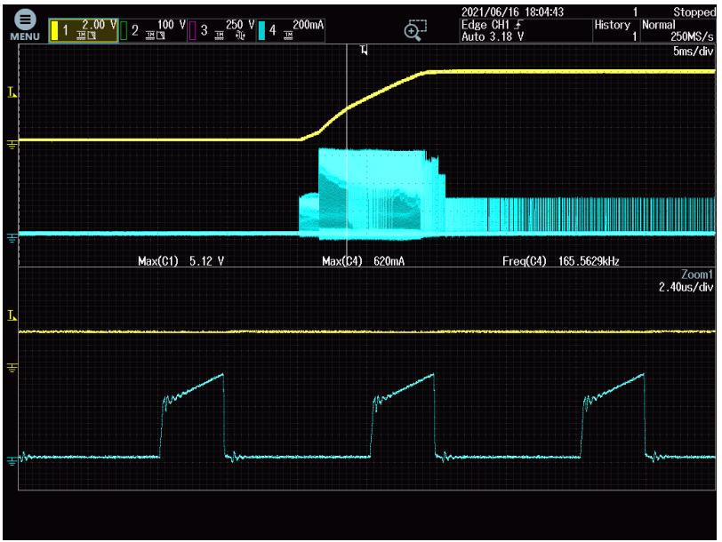

85 VAC

CH1 VOUTPUT-5V  
CH4 IDRAIN

Test Condition:

➢ 空载启动

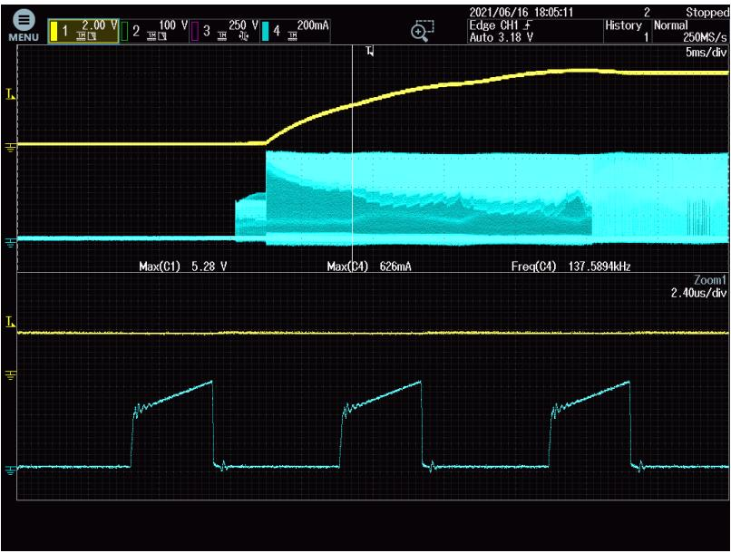

85 VAC

CH1 VOUTPUT-5V  
CH4 IDRAIN

Test Condition:

满载启动

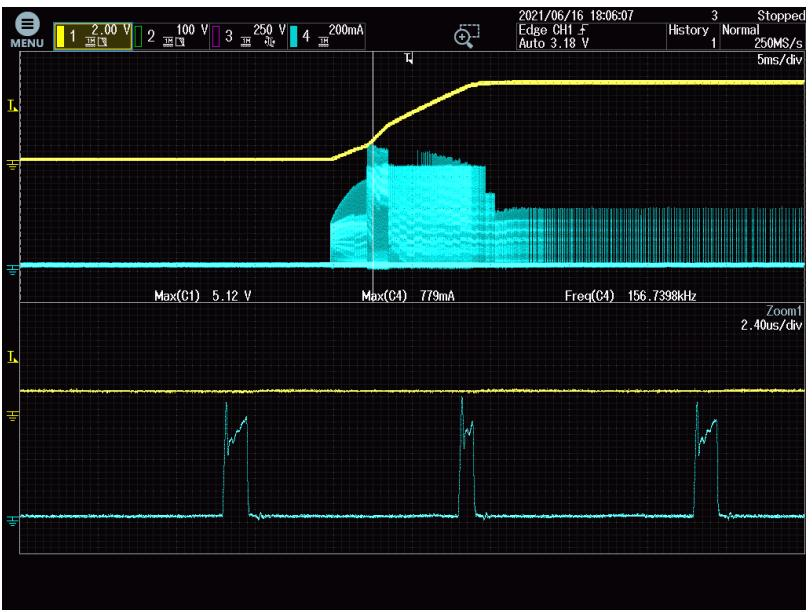

265 VAC

CH1 VOUTPUT-5V  
CH4 IDRAIN

Test Condition:

➢ 空载启动

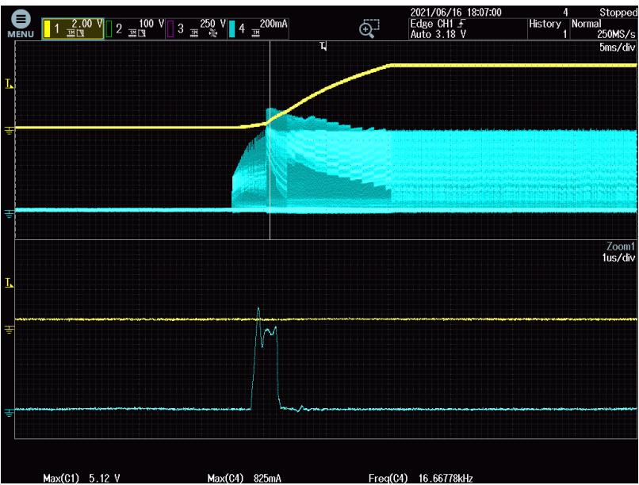

265 VAC

CH1 VOUTPUT-5V  
CH4 IDRAIN

Test Condition:

满载启动

## D-S电压波形

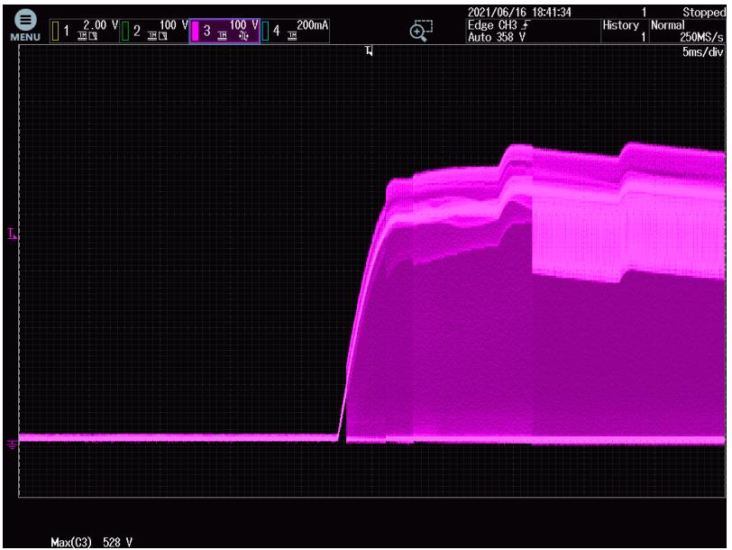

265 VAC

CH3 VDS $\mathsf { V } _ { \mathsf { D } \mathsf { S } }$ VDSMAX: 528 V

Test Condition:

满载开机

极限参数(注3)

<table><tr><td>符号</td><td>参数</td><td>参数范围</td><td>单位</td></tr><tr><td> $V_{DRAIN}$ </td><td>内部高压 MOSFET 漏极到源极电压</td><td>-0.3~700</td><td>V</td></tr><tr><td> $V_{CC}$ </td><td> $V_{CC}$  电压</td><td>-0.3~9</td><td>V</td></tr><tr><td> $I_{CC\_MAX}$ </td><td> $V_{CC}$  引脚最大电流</td><td>20</td><td>mA</td></tr><tr><td> $V_{FB}$ </td><td>输出反馈端电压</td><td>-0.3~9</td><td>V</td></tr><tr><td> $P_{DMAX}$ </td><td>功耗(注 4)</td><td>1.5</td><td>W</td></tr><tr><td> $\theta_{JA}$ </td><td>结到环境的热阻(注 5)</td><td>80</td><td>°C/W</td></tr><tr><td> $\theta_{JC}$ </td><td>结到芯片表面的热阻(注 5)</td><td>20</td><td>°C/W</td></tr><tr><td> $T_{J}$ </td><td>工作结温范围</td><td>-40 to 150</td><td>°C</td></tr><tr><td> $T_{STG}$ </td><td>储存温度范围</td><td>-55 to 150</td><td>°C</td></tr><tr><td>ESD</td><td>人体模型 ESD(注 6)</td><td>2</td><td>kV</td></tr></table>

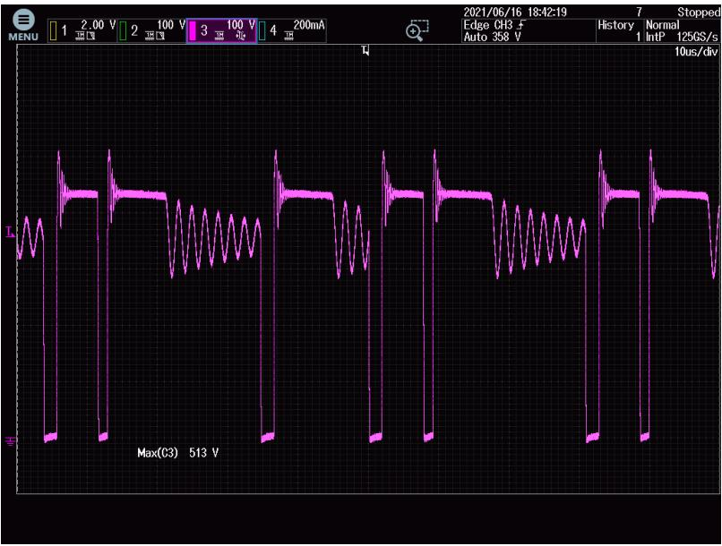

265 VAC

CH3 VDS $\mathsf { V } _ { \mathsf { D } \mathsf { S } }$ $\mathsf { V D S } _ { \mathsf { M A X } } \colon 5 1 3 \mathrm { ~ V ~ }$

Test Condition:

满载正常工作

## 满载开机

${ \mathsf { D e r a t i n g } } { = } 5 2 8 \lor / 7 0 0 \lor { = 7 5 . 4 2 \% }$

## 满载正常工作

Derating = 513V / 700 V = 73.28 %

## 5V输出肖特基反压波形

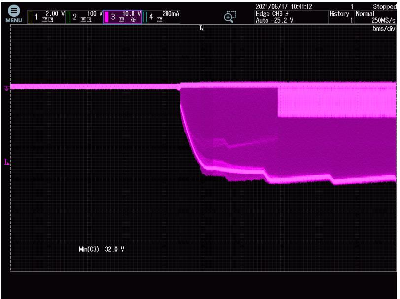

265 VAC

CH3 VDIODE VDSMAX: 32 V

Test Condition:

满载启动

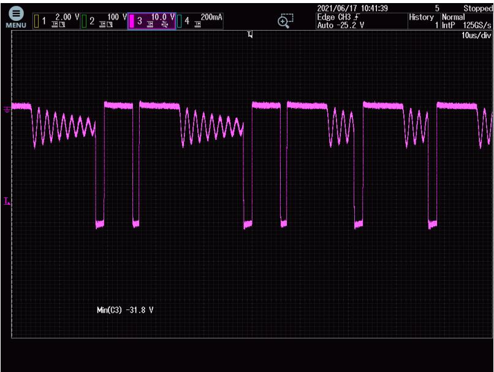

265 VAC

CH3 VDDIODE VMAX: 31.8V

Test Condition:

满载正常工作

<table><tr><td>Parameter</td><td>Symbols</td><td>SS22</td><td>SS24</td><td>SS26</td><td>SS28</td><td>SS210</td><td>SS212</td><td>SS215</td><td>SS220</td><td>Units</td></tr><tr><td>Maximum Repetitive Peak Reverse Voltage</td><td> $V_{RRM}$ </td><td>20</td><td>40</td><td>60</td><td>80</td><td>100</td><td>120</td><td>150</td><td>200</td><td>V</td></tr><tr><td>Maximum RMS voltage</td><td> $V_{RMS}$ </td><td>14</td><td>28</td><td>42</td><td>56</td><td>70</td><td>84</td><td>105</td><td>140</td><td>V</td></tr><tr><td>Maximum DC Blocking Voltage</td><td> $V_{DC}$ </td><td>20</td><td>40</td><td>60</td><td>80</td><td>100</td><td>120</td><td>150</td><td>200</td><td>V</td></tr><tr><td>Maximum Average Forward Rectified Current</td><td> $I_{F(AV)}$ </td><td colspan="8">2.0</td><td>A</td></tr><tr><td>Peak Forward Surge Current,8.3msSingle Half Sine-wave Superimposedon Rated Load (JEDEC method)</td><td> $I_{FSM}$ </td><td colspan="8">50</td><td>A</td></tr><tr><td>Max Instantaneous Forward Voltage at 2 A</td><td> $V_F$ </td><td colspan="2">0.55</td><td colspan="2">0.70</td><td colspan="2">0.85</td><td colspan="2">0.95</td><td>V</td></tr><tr><td>Maximum DC Reverse Current  $T_a = 25°C$ at Rated DC Reverse Voltage  $T_a = 100°C$ </td><td> $I_R$ </td><td colspan="3">0.55</td><td colspan="5">0.33</td><td>mA</td></tr><tr><td>Typical Junction Capacitance $^{(1)}$ </td><td> $C_j$ </td><td colspan="2">220</td><td colspan="6">80</td><td>pF</td></tr><tr><td>Typical Thermal Resistance $^{(2)}$ </td><td> $R_{\theta JA}$ </td><td colspan="8">80</td><td>°C/W</td></tr><tr><td>Operating Junction Temperature Range</td><td> $T_j$ </td><td colspan="8">-55 ~ +125</td><td>°C</td></tr><tr><td>Storage Temperature Range</td><td> $T_{stg}$ </td><td colspan="8">-55 ~ +150</td><td>°C</td></tr></table>

## 满载开机

$D e r a t i n g = 3 2 \vee / 1 0 0 \vee = 3 2 \%$

## 满载正常工作

Derating = 31.8 V / 100V = 31.8 %

## 12V输出肖特基反压波形

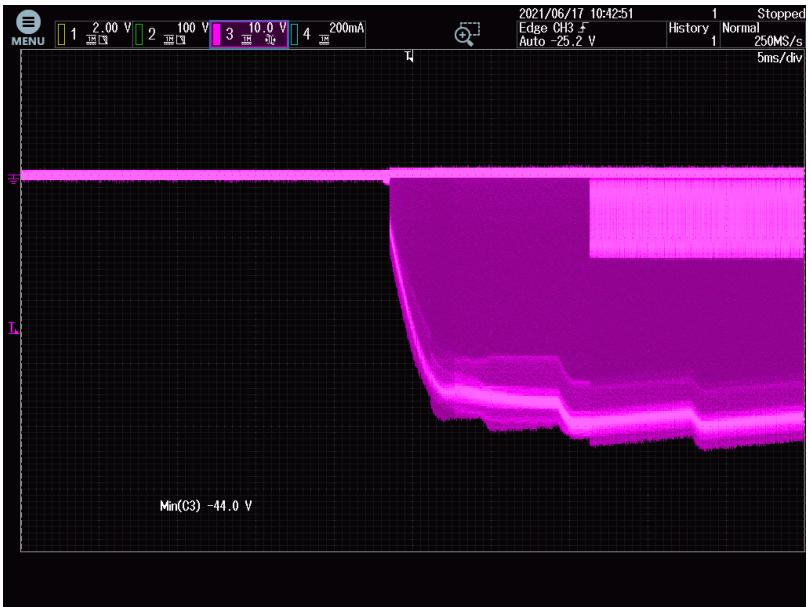

265 VAC

CH2 VDIODE VDSMAX: 44 V

Test Condition:

➢ 满载启动

<table><tr><td>Parameter</td><td>Symbols</td><td>SS22</td><td>SS24</td><td>SS26</td><td>SS28</td><td>SS210</td><td>SS212</td><td>SS215</td><td>SS220</td><td>Units</td></tr><tr><td>Maximum Repetitive Peak Reverse Voltage</td><td> $V_{RRM}$ </td><td>20</td><td>40</td><td>60</td><td>80</td><td>100</td><td>120</td><td>150</td><td>200</td><td>V</td></tr><tr><td>Maximum RMS voltage</td><td> $V_{RMS}$ </td><td>14</td><td>28</td><td>42</td><td>56</td><td>70</td><td>84</td><td>105</td><td>140</td><td>V</td></tr><tr><td>Maximum DC Blocking Voltage</td><td> $V_{DC}$ </td><td>20</td><td>40</td><td>60</td><td>80</td><td>100</td><td>120</td><td>150</td><td>200</td><td>V</td></tr><tr><td>Maximum Average Forward Rectified Current</td><td> $I_{F(AV)}$ </td><td colspan="8">2.0</td><td>A</td></tr><tr><td>Peak Forward Surge Current,8.3ms Single Half Sine-wave Superimposed on Rated Load (JEDEC method)</td><td> $I_{FSM}$ </td><td colspan="8">50</td><td>A</td></tr><tr><td>Max Instantaneous Forward Voltage at 2 A</td><td> $V_F$ </td><td colspan="2">0.55</td><td colspan="2">0.70</td><td colspan="2">0.85</td><td colspan="2">0.95</td><td>V</td></tr><tr><td>Maximum DC Reverse Current  $T_a = 25°C$ at Rated DC Reverse Voltage  $T_a = 100°C$ </td><td> $I_R$ </td><td colspan="3">0.55</td><td colspan="5">0.33</td><td>mA</td></tr><tr><td>Typical Junction Capacitance $^{(1)}$ </td><td> $C_j$ </td><td colspan="2">220</td><td colspan="6">80</td><td>pF</td></tr><tr><td>Typical Thermal Resistance $^{(2)}$ </td><td> $R_{\theta JA}$ </td><td colspan="8">80</td><td>°C/W</td></tr><tr><td>Operating Junction Temperature Range</td><td> $T_j$ </td><td colspan="8">-55 ~ +125</td><td>°C</td></tr><tr><td>Storage Temperature Range</td><td> $T_{stg}$ </td><td colspan="8">-55 ~ +150</td><td>°C</td></tr></table>

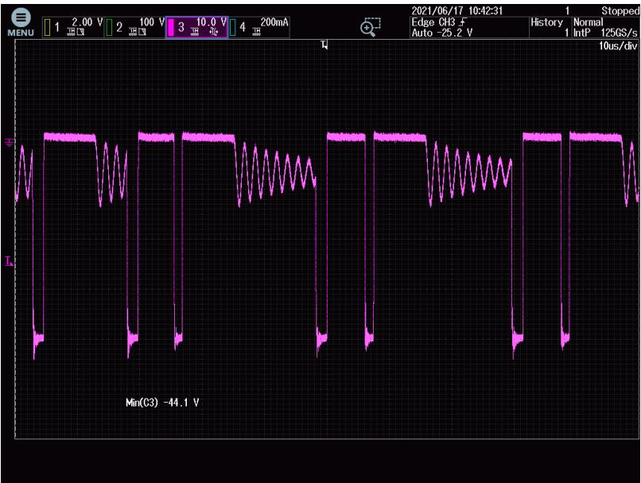

265 VAC

$\begin{array} { r l } & { \mathsf { C H } 2 \mathsf { V } _ { \mathsf { D D } \mathsf { I O D E } } } \\ & { \mathsf { V } _ { \mathsf { M A X } } \colon 4 4 . 1 \mathsf { V } } \end{array}$ CH2 VDDIODE

Test Condition:

满载正常工作

## 满载开机

Derating = 44 V / 100 V = 44 %

## 满载正常工作

Derating = 44.1 V / 100 V = 44.1 %

<table><tr><td rowspan="2">项目</td><td colspan="2">85VAC</td><td colspan="2">265VAC</td></tr><tr><td>温度(°C)</td><td>温升(°C)</td><td>温度(°C)</td><td>温升(°C)</td></tr><tr><td>环境温度</td><td colspan="2">30.29</td><td colspan="2">28.7</td></tr><tr><td>BPA8616P (U1)</td><td>88.47</td><td>58.18</td><td>77.58</td><td>48.88</td></tr><tr><td>变压器绕组 (T1)</td><td>71.1</td><td>40.81</td><td>68.85</td><td>40.15</td></tr><tr><td>变压器磁芯 (T1)</td><td>66.27</td><td>35.98</td><td>65.79</td><td>37.09</td></tr><tr><td>输出肖特基 (D3)</td><td>86.58</td><td>56.29</td><td>85.64</td><td>56.94</td></tr><tr><td>输出肖特基 (D4)</td><td>66.88</td><td>36.59</td><td>65.8</td><td>37.1</td></tr><tr><td>输入电解电容(EC4)</td><td>54.64</td><td>24.35</td><td>53.82</td><td>25.12</td></tr><tr><td>输出电解电容(EC6)</td><td>53.3</td><td>23.01</td><td>52.61</td><td>23.91</td></tr></table>

## 测试说明

➢ 在温箱中进行测试  
➢ 电路板放在一个封闭的盒子内  
➢ 热电偶连接到各个测量点  
➢ 等测量点温度达到稳定后记录数据

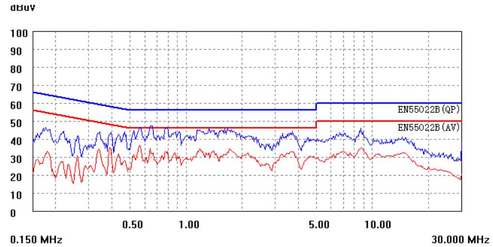

115VAC Line  
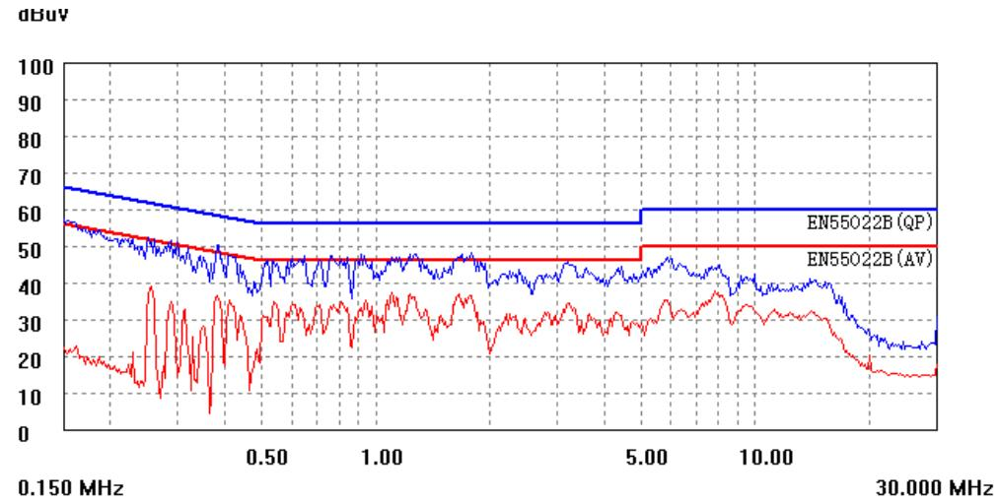

230VAC Line

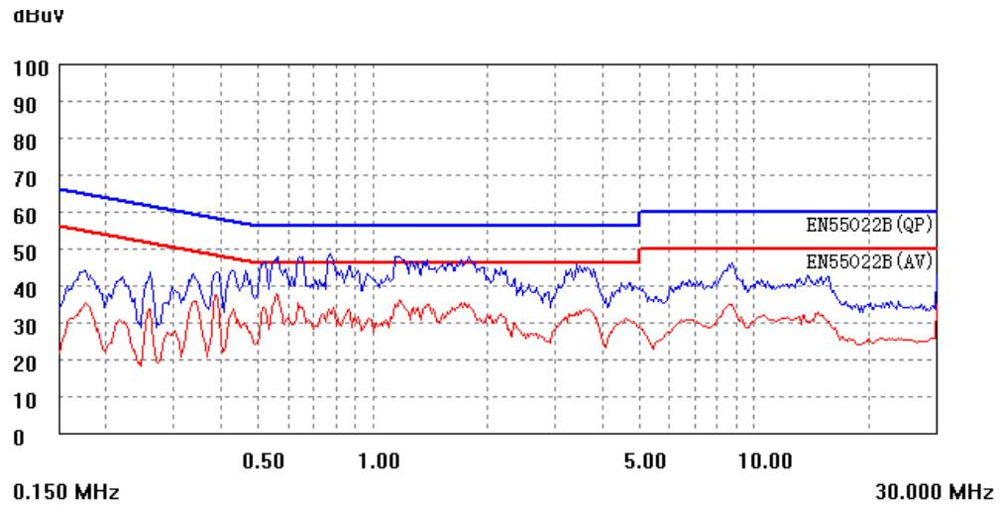

115VAC Neutral

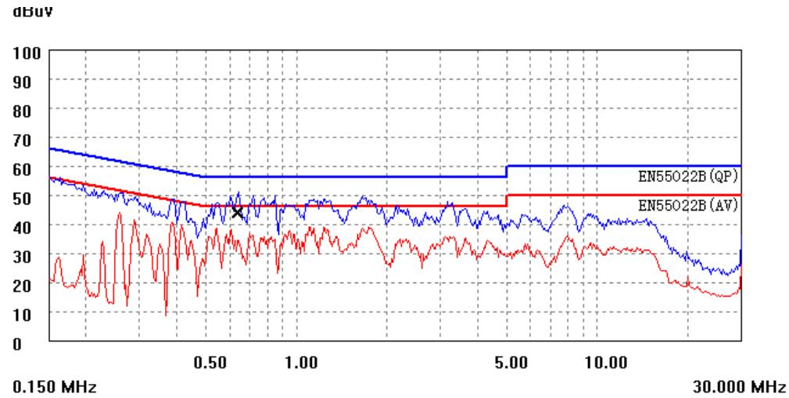

230VAC Neutral

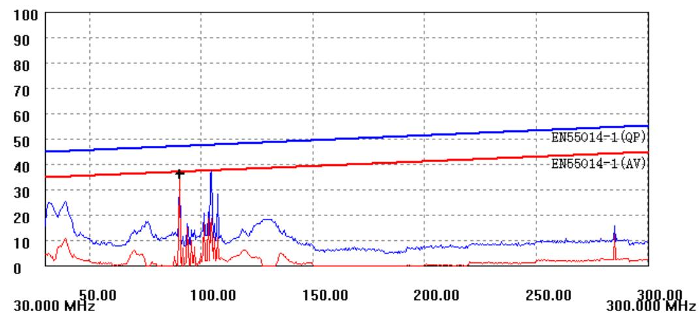

115VAC 空载  
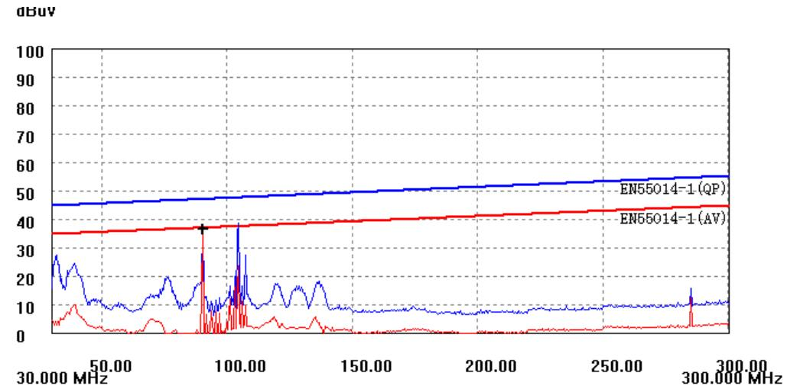

230VAC 空载

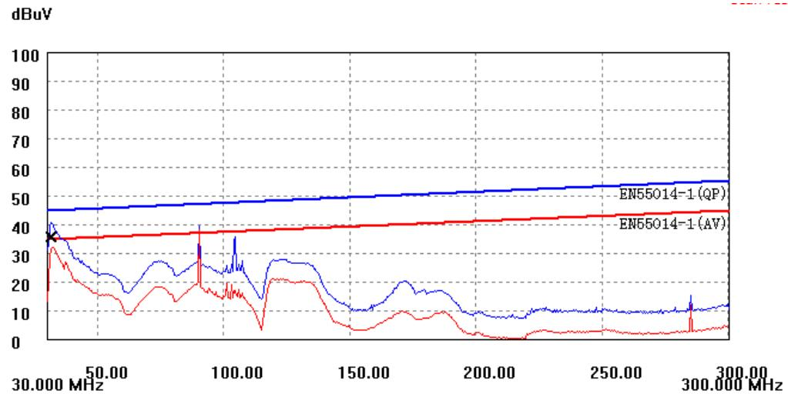

115VAC 满载

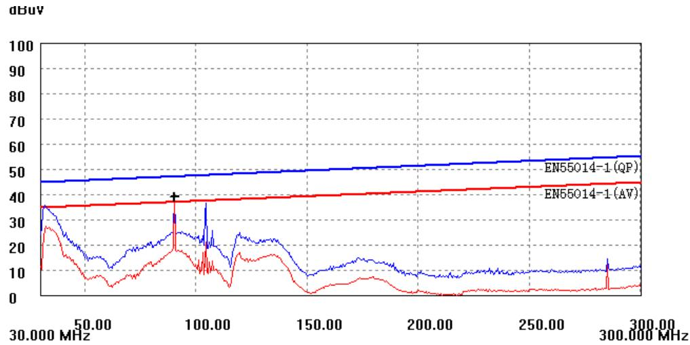

230VAC 满载

<table><tr><td>差模</td><td>电压</td><td>相位角</td><td>发生器阻抗</td><td>测试次数</td><td>测试结果</td></tr><tr><td>L to N</td><td>+2kV</td><td>0</td><td>2</td><td>10</td><td>Pass</td></tr><tr><td>L to N</td><td>-2kV</td><td>0</td><td>2</td><td>10</td><td>Pass</td></tr><tr><td>L to N</td><td>+2kV</td><td>90</td><td>2</td><td>10</td><td>Pass</td></tr><tr><td>L to N</td><td>-2kV</td><td>90</td><td>2</td><td>10</td><td>Pass</td></tr><tr><td>L to N</td><td>+2kV</td><td>180</td><td>2</td><td>10</td><td>Pass</td></tr><tr><td>L to N</td><td>-2kV</td><td>180</td><td>2</td><td>10</td><td>Pass</td></tr><tr><td>L to N</td><td>+2kV</td><td>270</td><td>2</td><td>10</td><td>Pass</td></tr><tr><td>L to N</td><td>-2kV</td><td>270</td><td>2</td><td>10</td><td>Pass</td></tr></table>

## ◼ 测试说明

➢ 按照GB/T17626.5和IEC61000-4-5的最新版本要求进行测试  
➢ 室温环境，230VAC输入，满载条件  
➢ 输入1.2/50us组合波浪涌电压  
➢ 每个测试点重复10次  
➢ 每次间隔时间1分钟  
➢ 试验时样机输出正常（符合A类标准）视为Pass

<table><tr><td>差模</td><td>电压</td><td>脉冲群持续时间</td><td>脉冲频率</td><td>测试时间</td><td>测试结果</td></tr><tr><td>L to N</td><td>+4kV</td><td>15ms</td><td>5kHz</td><td>120s</td><td>Pass</td></tr><tr><td>L to N</td><td>-4kV</td><td>15ms</td><td>5kHz</td><td>120s</td><td>Pass</td></tr><tr><td>L to N</td><td>+4kV</td><td>0.75ms</td><td>100kHz</td><td>120s</td><td>Pass</td></tr><tr><td>L to N</td><td>-4kV</td><td>0.75ms</td><td>100kHz</td><td>120s</td><td>Pass</td></tr><tr><td>L to N</td><td>+2kV</td><td>2ms</td><td>38kHz</td><td>120s</td><td>Pass</td></tr><tr><td>L to N</td><td>-2kV</td><td>2ms</td><td>38kHz</td><td>120s</td><td>Pass</td></tr><tr><td>L to N</td><td>+4kV</td><td>2ms</td><td>38kHz</td><td>120s</td><td>Pass</td></tr><tr><td>L to N</td><td>-4kV</td><td>2ms</td><td>38kHz</td><td>120s</td><td>Pass</td></tr></table>

## 测试说明

➢ 按照GB/T17626.4和IEC61000-4-4的最新版本要求进行测试  
➢ 室温环境，230VAC输入满载条件  
➢ 分别测试5kHz/100kHz/38kHz脉冲频率  
➢ 脉冲群周期为300ms  
➢ 每个测试条件测试时间120s  
➢ 试验时样机输出正常（符合A类标准）视为Pass

## THANK YOU FOR WATCHING
