## BPA8618P对比TNY277P测试报告(12V/1A， 18V/0.1A)

上海晶丰明源半导体股份有限公司

Shanghai Bright Power Semiconductor Co., Ltd.

夏奇林

2021 1

## 内容

性能测试数据  
测试总结

空载功耗  
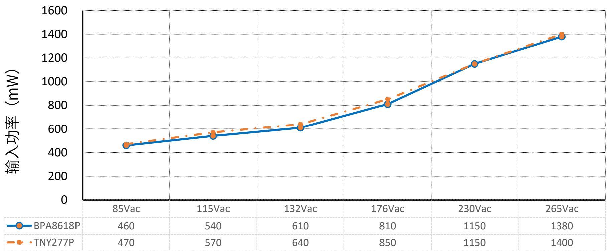

输入电压

测试条件：空调版实际待机负载

效率测试  
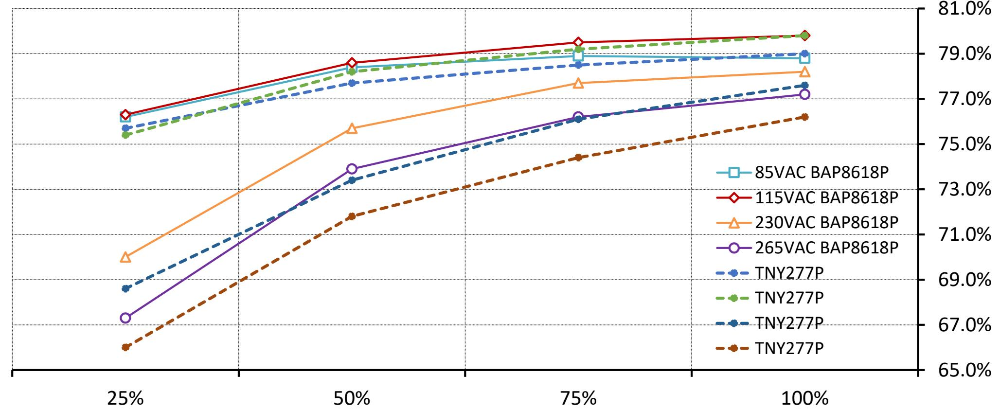

负载  
◼ 测试条件：BPA8618P 满载：12V/1A 18V/0.1A P277满载：12V/0.8A 18V/0.1A

## (BPA8618P)

<table><tr><td> $V_{IN}(VAC)$ Load(%)</td><td>85</td><td>115</td><td>132</td><td>176</td><td>230</td><td>265</td><td>平均值</td><td>线调整率</td></tr><tr><td>0</td><td>12.202</td><td>12.203</td><td>12.204</td><td>12.206</td><td>12.205</td><td>12.205</td><td>12.20</td><td>0.03%</td></tr><tr><td>20%</td><td>12.201</td><td>12.198</td><td>12.198</td><td>12.204</td><td>12.200</td><td>12.200</td><td>12.20</td><td>0.05%</td></tr><tr><td>40%</td><td>12.200</td><td>12.193</td><td>12.193</td><td>12.201</td><td>12.194</td><td>12.195</td><td>12.20</td><td>0.07%</td></tr><tr><td>60%</td><td>12.198</td><td>12.188</td><td>12.187</td><td>12.189</td><td>12.189</td><td>12.189</td><td>12.19</td><td>0.09%</td></tr><tr><td>80%</td><td>12.197</td><td>12.183</td><td>12.182</td><td>12.183</td><td>12.184</td><td>12.184</td><td>12.19</td><td>0.12%</td></tr><tr><td>100%</td><td>12.179</td><td>12.176</td><td>12.176</td><td>12.178</td><td>12.179</td><td>12.179</td><td>12.18</td><td>0.02%</td></tr><tr><td>平均值</td><td>12.20</td><td>12.19</td><td>12.19</td><td>12.19</td><td>12.19</td><td>12.19</td><td rowspan="2" colspan="2"></td></tr><tr><td>负载调整率</td><td>0.19%</td><td>0.22%</td><td>0.23%</td><td>0.23%</td><td>0.21%</td><td>0.21%</td></tr></table>

◼ 计算方法：调整率=100%\*(最大值-最小值)/平均值  
测试条件：18V稳定负载100mA，12V满载1A

## (TNY277P)

<table><tr><td> $V_{IN}(VAC)$ Load(%)</td><td>85</td><td>115</td><td>132</td><td>176</td><td>230</td><td>265</td><td>平均值</td><td>线调整率</td></tr><tr><td>0</td><td>12.199</td><td>12.199</td><td>12.199</td><td>12.199</td><td>12.199</td><td>12.198</td><td>12.20</td><td>0.01%</td></tr><tr><td>20%</td><td>12.199</td><td>12.198</td><td>12.198</td><td>12.198</td><td>12.198</td><td>12.198</td><td>12.20</td><td>0.01%</td></tr><tr><td>40%</td><td>12.197</td><td>12.197</td><td>12.197</td><td>12.197</td><td>12.197</td><td>12.198</td><td>12.20</td><td>0.01%</td></tr><tr><td>60%</td><td>12.197</td><td>12.198</td><td>12.197</td><td>12.197</td><td>12.197</td><td>12.197</td><td>12.20</td><td>0.01%</td></tr><tr><td>80%</td><td>12.197</td><td>12.198</td><td>12.197</td><td>12.197</td><td>12.197</td><td>12.197</td><td>12.20</td><td>0.01%</td></tr><tr><td>100%(0.8A)</td><td>12.195</td><td>12.195</td><td>12.195</td><td>12.195</td><td>12.196</td><td>12.196</td><td>12.20</td><td>0.01%</td></tr><tr><td>平均值</td><td>12.20</td><td>12.20</td><td>12.20</td><td>12.20</td><td>12.20</td><td>12.20</td><td rowspan="2" colspan="2"></td></tr><tr><td>负载调整率</td><td>0.03%</td><td>0.03%</td><td>0.03%</td><td>0.03%</td><td>0.02%</td><td>0.02%</td></tr></table>

◼ 计算方法：调整率=100%\*(最大值-最小值)/平均值  
测试条件：18V空载

## (BPA8618P)

<table><tr><td rowspan="2" colspan="2"> $V_{IN}(VAC)$ Load</td><td colspan="2">85</td><td colspan="2">115</td><td colspan="2">176</td><td colspan="2">230</td><td colspan="2">265</td></tr><tr><td>12V</td><td>18V</td><td>12V</td><td>18V</td><td>12V</td><td>18V</td><td>12V</td><td>18V</td><td>12V</td><td>18V</td></tr><tr><td rowspan="2">空载</td><td>12V/0A</td><td rowspan="2">12.200</td><td rowspan="2">17.780</td><td rowspan="2">12.200</td><td rowspan="2">17.760</td><td rowspan="2">12.200</td><td rowspan="2">17.700</td><td rowspan="2">12.200</td><td rowspan="2">17.700</td><td rowspan="2">12.200</td><td rowspan="2">17.700</td></tr><tr><td>18V/0A</td></tr><tr><td rowspan="2">交叉负载</td><td>12V/1A</td><td rowspan="2">12.190</td><td rowspan="2">23.170</td><td rowspan="2">12.190</td><td rowspan="2">23.260</td><td rowspan="2">12.194</td><td rowspan="2">23.180</td><td rowspan="2">12.200</td><td rowspan="2">23.210</td><td rowspan="2">12.195</td><td rowspan="2">23.140</td></tr><tr><td>18V/0A</td></tr><tr><td rowspan="2">交叉负载</td><td>12V/0A</td><td rowspan="2">12.203</td><td rowspan="2">15.500</td><td rowspan="2">12.203</td><td rowspan="2">16.300</td><td rowspan="2">12.203</td><td rowspan="2">16.090</td><td rowspan="2">12.203</td><td rowspan="2">15.930</td><td rowspan="2">12.203</td><td rowspan="2">15.880</td></tr><tr><td>18V/0.1A</td></tr><tr><td rowspan="2">满载</td><td>12V/1A</td><td rowspan="2">12.200</td><td rowspan="2">19.560</td><td rowspan="2">12.200</td><td rowspan="2">19.450</td><td rowspan="2">12.200</td><td rowspan="2">19.400</td><td rowspan="2">12.200</td><td rowspan="2">19.380</td><td rowspan="2">12.198</td><td rowspan="2">19.380</td></tr><tr><td>18V/0.1A</td></tr></table>

## (TNY277P)

<table><tr><td rowspan="2" colspan="2"> $V_{IN}(VAC)$ Load</td><td colspan="2">85</td><td colspan="2">115</td><td colspan="2">176</td><td colspan="2">230</td><td colspan="2">265</td></tr><tr><td>12V</td><td>18V</td><td>12V</td><td>18V</td><td>12V</td><td>18V</td><td>12V</td><td>18V</td><td>12V</td><td>18V</td></tr><tr><td rowspan="2">空载</td><td>12V/0A</td><td rowspan="2">12.200</td><td rowspan="2">17.780</td><td rowspan="2">12.200</td><td rowspan="2">17.800</td><td rowspan="2">12.200</td><td rowspan="2">17.800</td><td rowspan="2">12.200</td><td rowspan="2">17.700</td><td rowspan="2">12.200</td><td rowspan="2">17.700</td></tr><tr><td>18V/0A</td></tr><tr><td rowspan="2">交叉负载</td><td>12V/1A</td><td rowspan="2">12.190</td><td rowspan="2">21.100</td><td rowspan="2">12.170</td><td rowspan="2">22.100</td><td rowspan="2">12.170</td><td rowspan="2">22.100</td><td rowspan="2">12.170</td><td rowspan="2">22.300</td><td rowspan="2">12.170</td><td rowspan="2">22.200</td></tr><tr><td>18V/0A</td></tr><tr><td rowspan="2">交叉负载</td><td>12V/0A</td><td rowspan="2">12.200</td><td rowspan="2">0~20(不稳)</td><td rowspan="2">12.203</td><td rowspan="2">0~20(不稳)</td><td rowspan="2">12.203</td><td rowspan="2">0~20(不稳)</td><td rowspan="2">12.203</td><td rowspan="2">0~20(不稳)</td><td rowspan="2">12.203</td><td rowspan="2">0~20(不稳)</td></tr><tr><td>18V/0.1A</td></tr><tr><td rowspan="2">满载</td><td>12V/0.8A</td><td rowspan="2">12.190</td><td rowspan="2">19.300</td><td rowspan="2">12.190</td><td rowspan="2">19.300</td><td rowspan="2">12.170</td><td rowspan="2">19.200</td><td rowspan="2">12.190</td><td rowspan="2">19.200</td><td rowspan="2">12.190</td><td rowspan="2">19.200</td></tr><tr><td>18V/0.1A</td></tr></table>

## (BPA8618P)

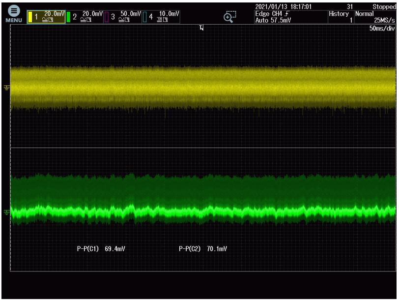

85 VAC

CH1 $\mathsf { V } _ { \mathsf { O U T } }$ Ripple $V _ { P K - P K } = 6 9 . 4 m v$  
CH2 VOUT $\mathsf { V } _ { \mathsf { O U T } }$ Ripple $V _ { P K - P K } = 7 0 . 1 m V$

## 测试条件：

➢ Full Load

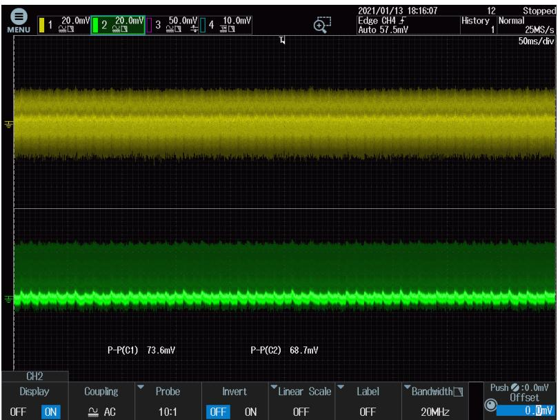

230 VAC

CH1 $\mathsf { V } _ { \mathsf { O U T } }$ Ripple $V _ { P K - P K } = 7 3 . 6 m V$  
CH2 $\mathsf { V } _ { \mathsf { O U T } }$ Ripple $V _ { P K - P K } { = } 6 8 . 7 m V$

## 测试条件：

➢ Full Load

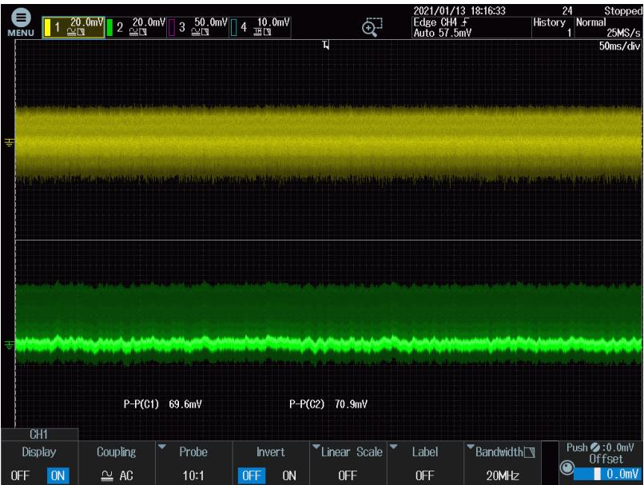

115 VAC

CH1 $\mathsf { V } _ { \mathsf { O U T } }$ Ripple $V _ { \mathsf { P K - P K } } { = } 6 9 . 6 \mathsf { m V }$  
CH2 $\mathsf { V } _ { \mathsf { O U T } }$ Ripple $V _ { P K - P K } = 7 0 . 1 m V$

## 测试条件：

➢ Full Load

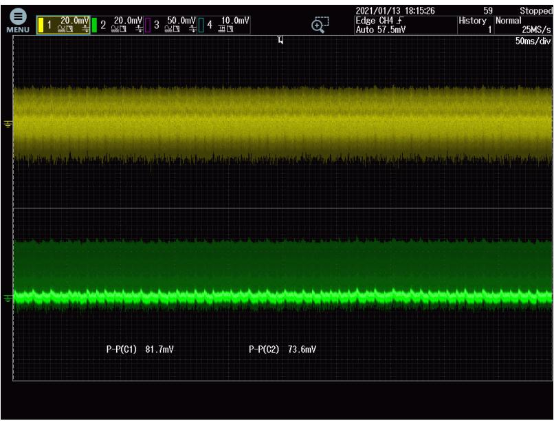

265 VAC

CH1 $\mathsf { V } _ { \mathsf { O U T } }$ Ripple $\mathsf { V } _ { \mathsf { P K - P K } } { = } 8 1 . 7 \mathsf { m V }$  
CH2 $\mathsf { V } _ { \mathsf { O U T } }$ Ripple $V _ { P K - P K } = 7 3 . 6 m V$

## 测试条件：

➢ Full Load

## (TNY277P)

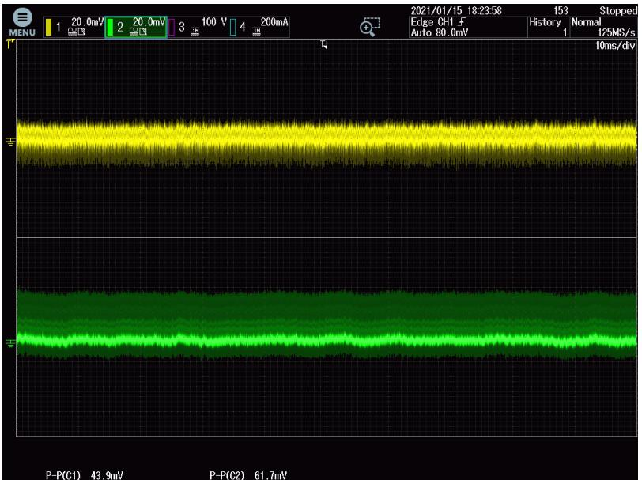  
85 VAC

CH1 $\mathsf { V } _ { \mathsf { O U T } } \mathsf { R i p p l e }$ $V _ { P K - P K } = 4 3 . 9 m V$  
CH2 $\mathsf { V } _ { \mathsf { O U T } } \mathsf { R i p p l e }$ $\mathsf { V } _ { \mathsf { P K - P K } } { = } 6 1 . 7 \mathsf { m V }$

## 测试条件：

➢ 80% Load

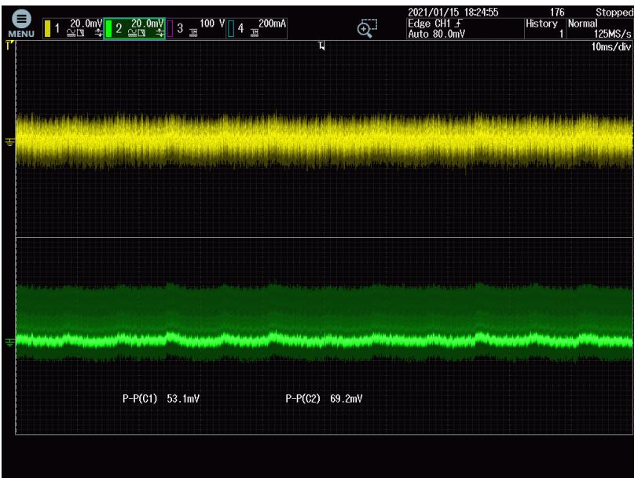

230 VAC

CH1 $\mathsf { V } _ { \mathsf { O U T } }$ Ripple $V _ { \mathsf { P K - P K } } { = } 5 3 . 1 \mathsf { m V }$  
CH2 $\mathsf { V } _ { \mathsf { O U T } }$ Ripple $V _ { \mathsf { P K - P K } } { = } 6 9 . 2 \mathsf { m V }$

## 测试条件：

➢ 80% Load

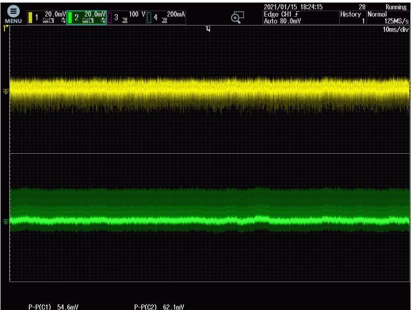

115 VAC

CH1 $\mathsf { V } _ { \mathsf { O U T } }$ Ripple $V _ { P K - P K } = 5 4 . 6 m V$  
CH2 $\mathsf { V } _ { \mathsf { O U T } }$ Ripple $V _ { \mathsf { P K - P K } } { = } 6 2 . 1 \mathsf { m V }$

## 测试条件：

➢ 80% Load

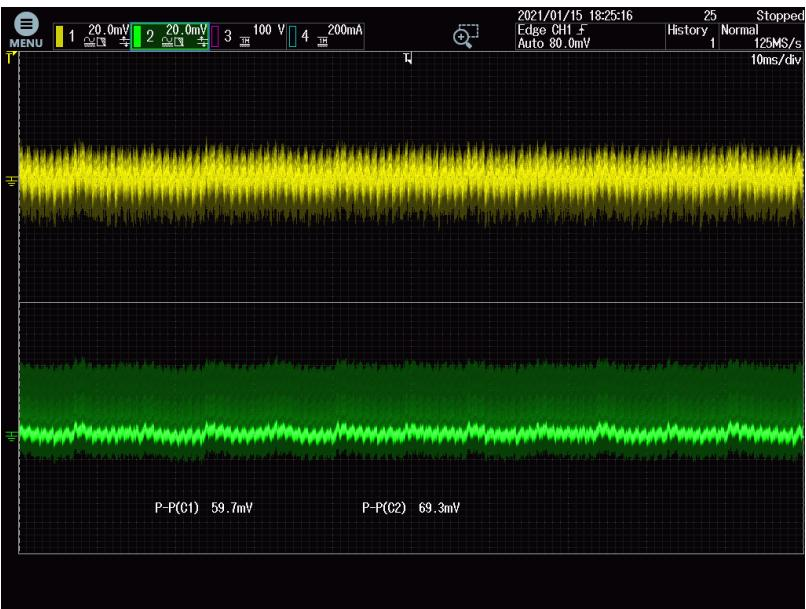

265 VAC

CH1 $\mathsf { V } _ { \mathsf { O U T } }$ Ripple $V _ { P K - P K } = 5 9 . 7 m V$  
CH2 $\mathsf { V } _ { \mathsf { O U T } }$ Ripple $V _ { P K - P K } { = } 6 9 . 3 m V$

## 测试条件：

➢ 80% Load

## (50%-100%,18V/100mA BPA8618P)

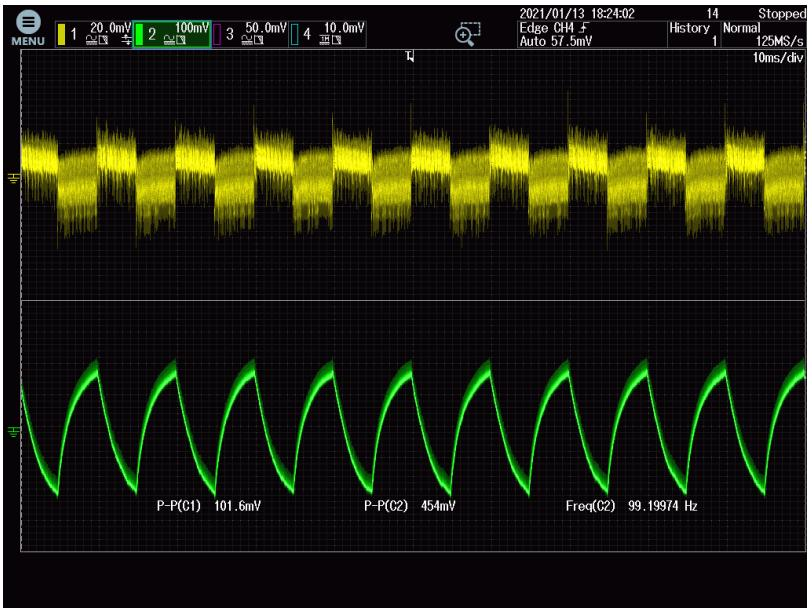

85 VAC

CH1 VOUT $\mathsf { V } _ { \mathsf { O U T } }$ $\mathtt { V } _ { \mathtt { P K - P K } } = 1 0 1 . 6 \ m \vee$  
CH2 VOUT ${ \mathsf { C H } } 2 { \mathsf { V } } _ { \mathsf { O U T } }$ $V _ { P K - P K } = 4 5 4 m v$

## 测试条件：

➢ $0 . 5 \mathsf { A } \mathsf { - } 1 \mathsf { A } \mathsf { - } 0 . 5 \mathsf { A }$  
➢ Slew Rate: 0.5 A/μS  
➢ Frequency: 100 Hz

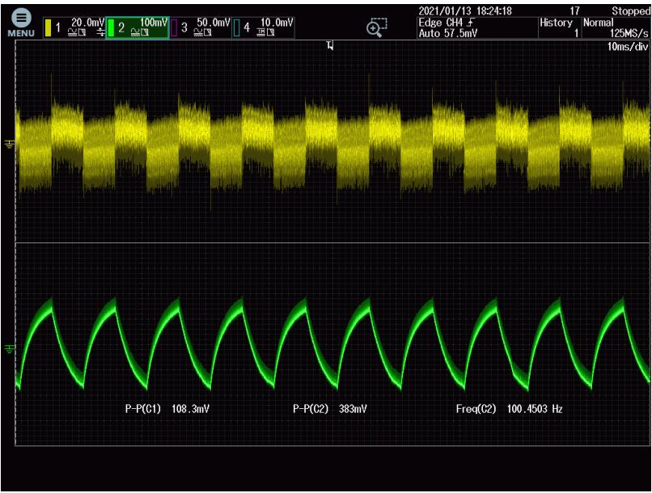

115 VAC

CH1 VOUT ${ \mathsf { C H 1 } } { \mathsf { V } } _ { \mathsf { O U T } }$ $V _ { \mathsf { P K - P K } } { = } 1 0 8 . 3 \mathsf { m v }$  
CH2 VOUT ${ \mathsf { C H } } 2 { \mathsf { V } } _ { \mathsf { O U T } }$ $V _ { P K - P K } = 3 8 3 ~ \mathsf { m V }$

## 测试条件：

➢ $0 . 5 \mathsf { A } \mathsf { - } 1 \mathsf { A } \mathsf { - } 0 . 5 \mathsf { A }$  
➢ Slew Rate: 0.5 A/μS  
➢ Frequency: 100 Hz

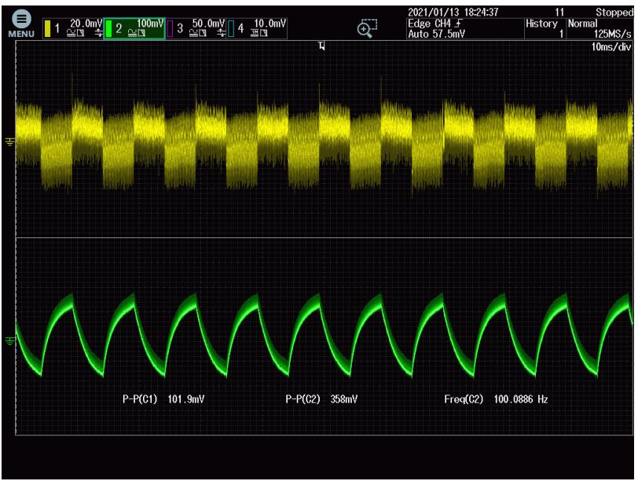

230 VAC

CH1 VOUT $\mathsf { V } _ { \mathsf { O U T } }$ $\mathsf { V } _ { \mathsf { P K - P K } } \mathsf { = } \mathsf { 1 0 1 } . 9 \mathsf { m V }$  
CH2 VOUT ${ \mathsf { C H } } 2 { \mathsf { V } } _ { \mathsf { O U T } }$ $V _ { P K - P K } = 3 5 8 m v$

## 测试条件：

➢ $0 . 5 \mathsf { A } \mathsf { - } 1 \mathsf { A } \mathsf { - } 0 . 5 \mathsf { A }$  
➢ Slew Rate: 0.5 A/μS  
➢ Frequency: 100 Hz

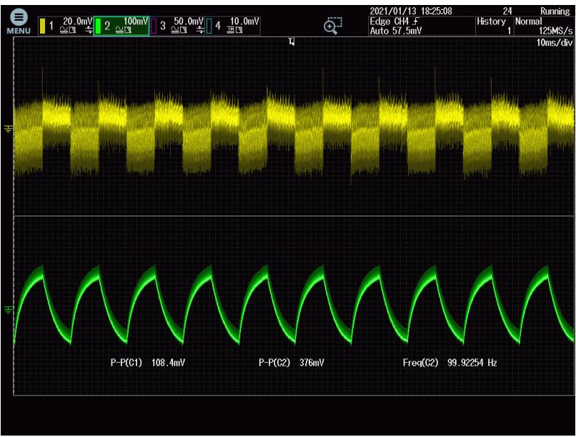

265 VAC

CH1 VOUT ${ \mathsf { C H 1 } } { \mathsf { V } } _ { \mathsf { O U T } }$ $V _ { \mathsf { P K - P K } } { = } 1 0 8 . 4 \mathsf { m v }$ VPK-PK= 108.4 mV  
CH2 VOUT ${ \mathsf { C H } } { 2 } { \mathsf { V } } _ { \mathsf { O U T } }$ $V _ { P K - P K } = 3 7 6 m v$

## 测试条件：

➢ 0.5 A-1 A-0.5 A  
➢ Slew Rate: 0.5 A/μS  
➢ Frequency: 100 Hz

## (50%-100%,18V/100mA TNY277P)

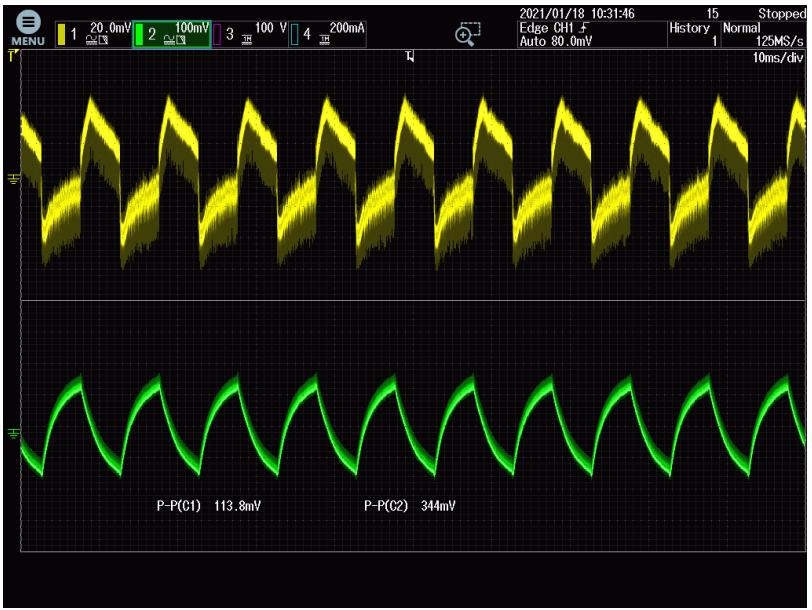

85 VAC

CH1 VOUT $\mathsf { V } _ { \mathsf { O U T } }$ $\mathsf { V } _ { \mathsf { P K - P K } } \mathsf { = } \pmb { 1 } \pmb { 1 } 3 . 8 \mathsf { m V }$  
CH2 VOUT ${ \mathsf { C H } } 2 { \mathsf { V } } _ { \mathsf { O U T } }$ $V _ { P K - P K } = 3 4 4 m v$

## 测试条件：

➢ $0 . 4 \ A { - } 0 . 8 \ A { - } 0 . 4 \ A$  
➢ Slew Rate: 0.5 A/μS  
➢ Frequency: 100 Hz

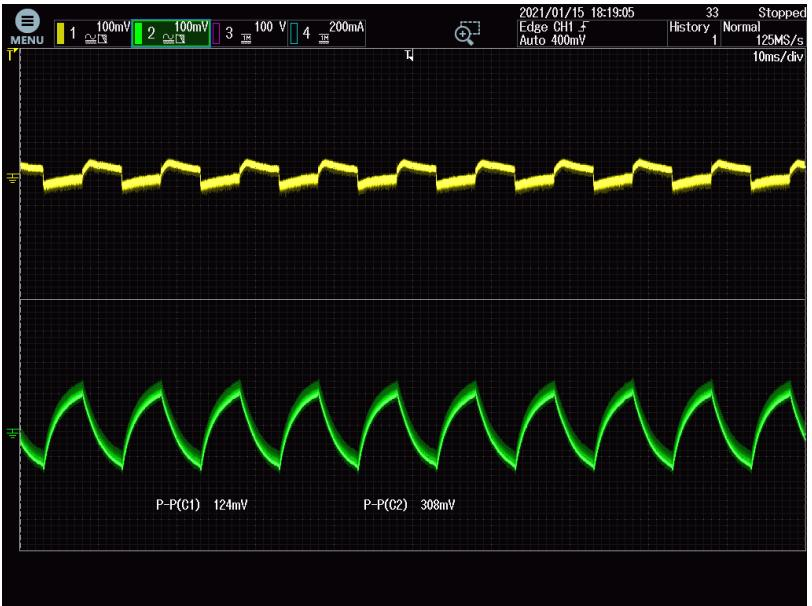

230 VAC

CH1 VOUT $\mathsf { V } _ { \mathsf { O U T } }$ $v _ { p \vert k \cdot P K } = 1 2 4 \Omega$  
CH2 VOUT ${ \mathsf { C H } } 2 { \mathsf { V } } _ { \mathsf { O U T } }$ $V _ { P K - P K } = 3 0 8 m v$

## 测试条件：

➢ $0 . 5 \mathsf { A } \mathsf { - } 1 \mathsf { A } \mathsf { - } 0 . 5 \mathsf { A }$  
➢ Slew Rate: 0.5 A/μS  
➢ Frequency: 100 Hz

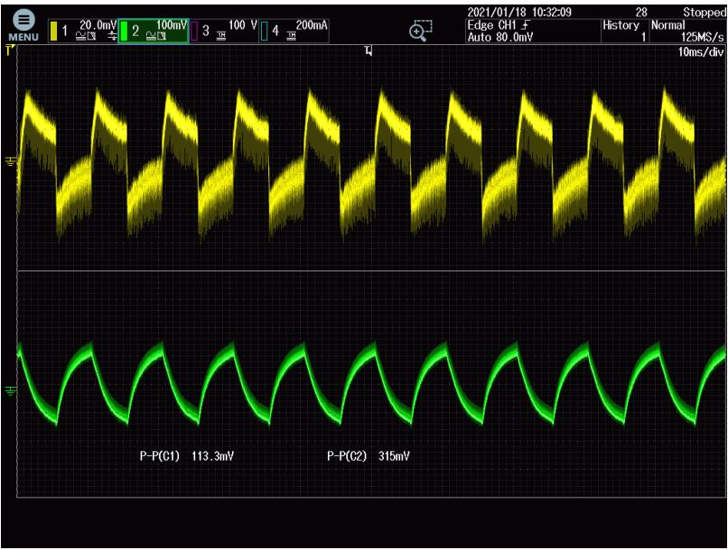

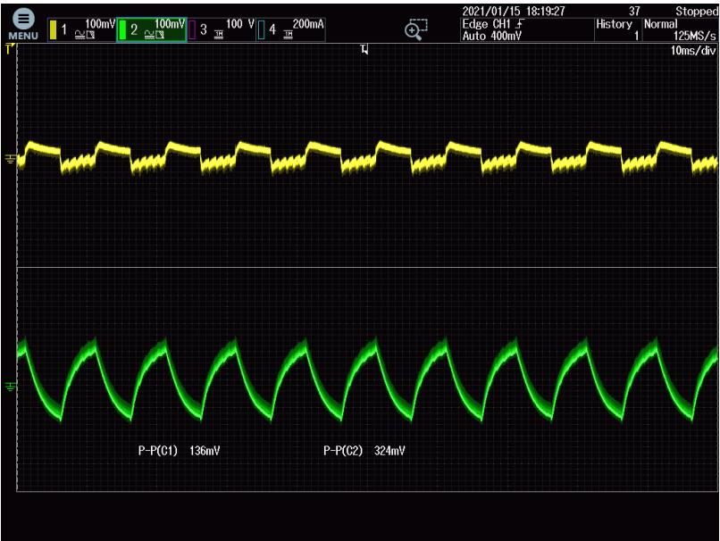

115 VAC

CH1 VOUT ${ \mathsf { C H 1 } } { \mathsf { V } } _ { \mathsf { O U T } }$ $\mathsf { V } _ { \mathsf { P K - P K } } \equiv \pmb { 1 } \pmb { 1 } 3 . 3 \mathsf { m V }$  
CH2 VOUT ${ \mathsf { C H } } 2 { \mathsf { V } } _ { \mathsf { O U T } }$ $\mathsf { V } _ { \mathsf { P K - P K } } { = } 3 1 5 \mathsf { m V }$

## 测试条件：

➢ 0.4 A-0.8 A-0.4 A  
➢ Slew Rate: 0.5 A/μS  
➢ Frequency: 100 Hz

265 VAC

CH1 VOUT ${ \mathsf { C H 1 } } { \mathsf { V } } _ { \mathsf { O U T } }$ $v _ { p _ { \mathrm { K - P K } } } { = } 1 3 6 ~ \mathsf { m v }$ VPK-PK= 136 mV  
CH2 VOUT ${ \mathsf { C H } } { 2 } { \mathsf { V } } _ { \mathsf { O U T } }$ $V _ { p | k - P K } = 3 2 4 m v$

## 测试条件：

➢ 0.5 A-1 A-0.5 A  
➢ Slew Rate: 0.5 A/μS  
➢ Frequency: 100 Hz

## (10%-90% 18V/100mA BPA8618P)

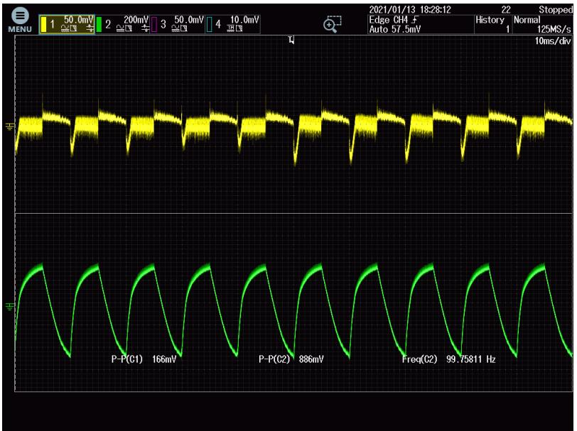

85 VAC

CH1 VOUT $\mathsf { V } _ { \mathsf { O U T } }$ $v _ { p \vert k - P K } { = } 1 6 6 ~ \mathsf { m V }$  
CH2 VOUT ${ \mathsf { C H } } 2 { \mathsf { V } } _ { \mathsf { O U T } }$ $V _ { \mathsf { P K - P K } } { = } 8 8 6 \mathsf { m V }$

## 测试条件：

➢ $0 . 1 \mathsf { A } \mathsf { - } 0 . 9 \mathsf { A } \mathsf { - } 0 . 1 \mathsf { A }$  
➢ Slew Rate: 0.5 A/μS  
➢ Frequency: 100 Hz

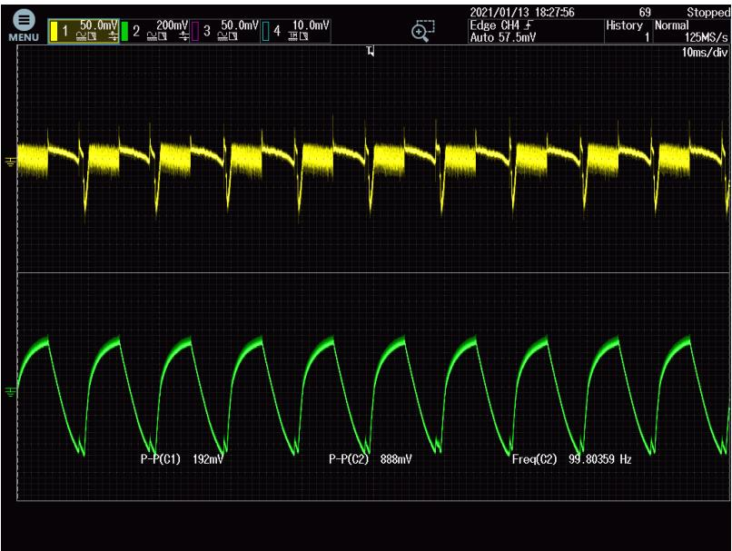

115 VAC

CH1 VOUT ${ \mathsf { C H 1 } } { \mathsf { V } } _ { \mathsf { O U T } }$ $v _ { p \vert k - P K } { = } 1 9 2 m v$  
CH2 VOUT ${ \mathsf { C H } } 2 { \mathsf { V } } _ { \mathsf { O U T } }$ $V _ { \mathsf { P K - P K } } { = } 8 8 8 \mathsf { m V }$

## 测试条件：

➢ 0.1 A-0.9A-0.1 A  
➢ Slew Rate: $0 . 5 \mathsf { A } / \mu \mathsf { S }$  
➢ Frequency: 100 Hz

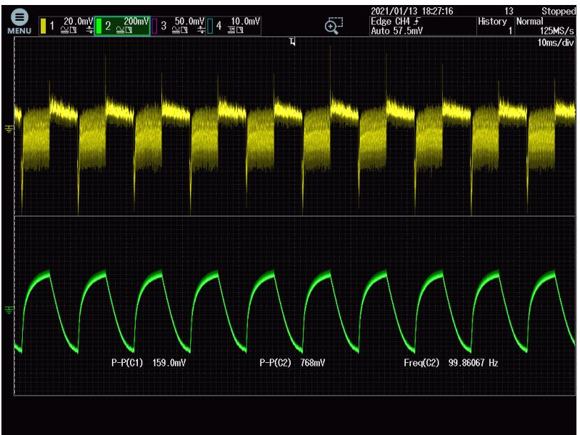

230 VAC

CH1 VOUT $\mathsf { V } _ { \mathsf { O U T } }$ $v _ { p _ { \mathrm { K - P K } } = 1 5 9 \mathrm { \ m V } }$  
CH2 VOUT ${ \mathsf { C H } } 2 { \mathsf { V } } _ { \mathsf { O U T } }$ $v _ { p _ { k - P K } } { = } 7 6 8 ~ \mathsf { m V }$

## 测试条件：

➢ 0.1 A-0.9A-0.1 A  
➢ Slew Rate: 0.5 $\mathsf { A } / \mu \mathsf { S }$  
➢ Frequency: 100 Hz

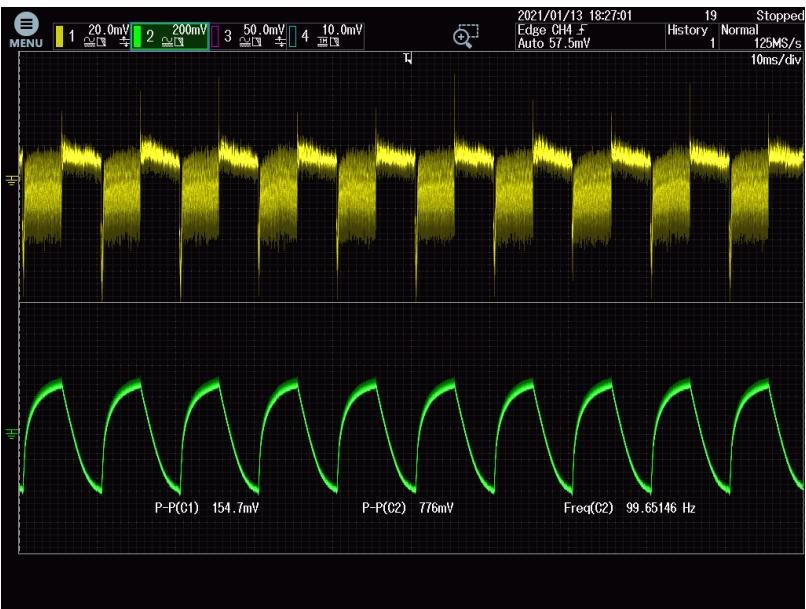

265 VAC

CH1 VOUT ${ \mathsf { C H 1 } } { \mathsf { V } } _ { \mathsf { O U T } }$ $\mathsf { V } _ { \mathsf { P K - P K } } { = } 1 5 4 . 7 \mathsf { m V }$ VPK-PK=154.7 mV  
CH2 VOUT ${ \mathsf { C H } } { 2 } { \mathsf { V } } _ { \mathsf { O U T } }$ $V _ { P K - P K } = 7 7 6 m v$

## 测试条件：

➢ 0.1 A-0.9A-0.1 A  
➢ Slew Rate: 0.5 A/μS  
➢ Frequency: 100 Hz

## (10%-90% 18V/100mA TNY277P)

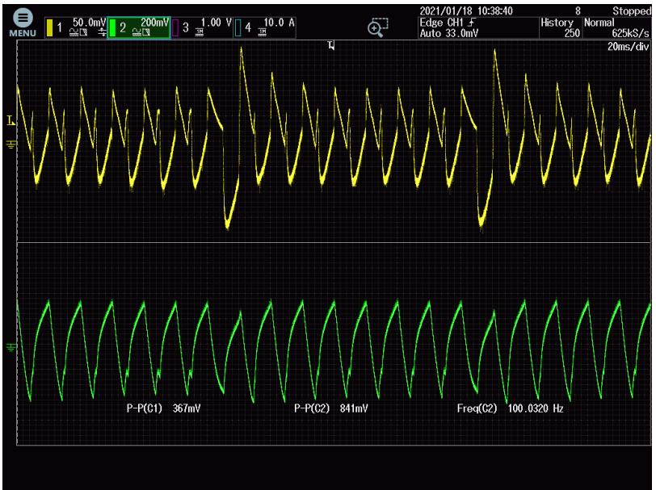

85 VAC

CH1 VOUT $\mathsf { V } _ { \mathsf { O U T } }$ $\mathsf { V } _ { \mathsf { P K - P K } } { = } 3 6 7 \mathsf { m V }$  
CH2 VOUT ${ \mathsf { C H } } 2 { \mathsf { V } } _ { \mathsf { O U T } }$ $\mathsf { V } _ { \mathsf { P K - P K } } { = } 8 4 1 \mathsf { m V }$

## 测试条件：

➢ $0 . 0 8 \mathsf { A } – 0 . 8 \mathsf { A } – 0 . 0 8 \mathsf { A }$  
➢ Slew Rate: 0.5 A/μS  
➢ Frequency: 100 Hz

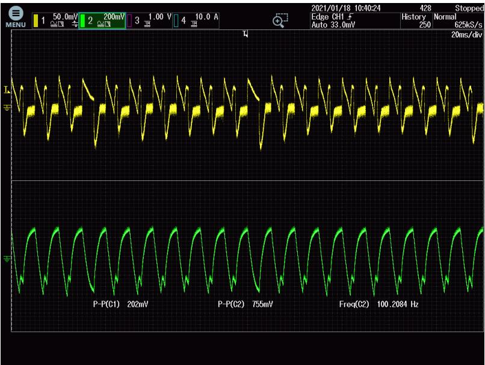

115 VAC

CH1 VOUT ${ \mathsf { C H 1 } } { \mathsf { V } } _ { \mathsf { O U T } }$ $V _ { P K - P K } = 2 0 2 m v$  
CH2 VOUT ${ \mathsf { C H } } 2 { \mathsf { V } } _ { \mathsf { O U T } }$ $v _ { p _ { k - P K } } { = } 7 5 5 m v$

## 测试条件：

➢ $0 . 0 8 \mathsf { A } – 0 . 8 \mathsf { A } – 0 . 0 8 \mathsf { A }$  
➢ Slew Rate: 0.5 A/μS  
➢ Frequency: 100 Hz

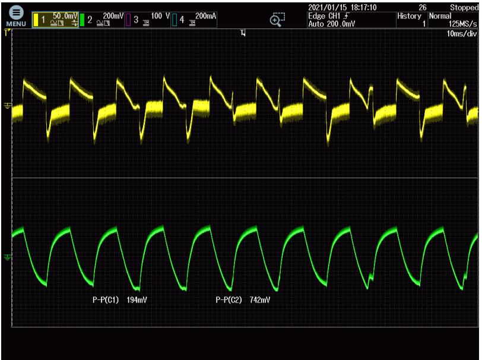

230 VAC

CH1 VOUT $\mathsf { V } _ { \mathsf { O U T } }$ $V _ { \mathsf { P K - P K } } { = } 1 9 4 \mathsf { m V }$  
CH2 VOUT ${ \mathsf { C H } } 2 { \mathsf { V } } _ { \mathsf { O U T } }$ $V _ { P K - P K } = 7 4 2 m v$

## 测试条件：

➢ 0.1 A-0.9A-0.1 A  
➢ Slew Rate: 0.5 $\mathsf { A } / \mu \mathsf { S }$  
➢ Frequency: 100 Hz

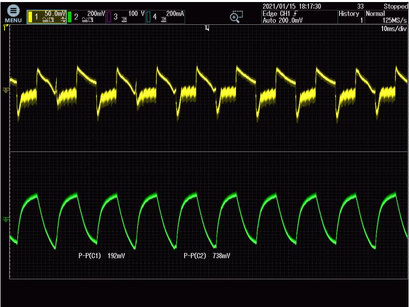

265 VAC

CH1 VOUT ${ \mathsf { C H 1 } } { \mathsf { V } } _ { \mathsf { O U T } }$ $v _ { p \vert k - P K } { = } 1 9 2 m v$ VPK-PK=192 mV  
CH2 VOUT ${ \mathsf { C H } } { 2 } { \mathsf { V } } _ { \mathsf { O U T } }$ $V _ { P K - P K } = 7 3 8 m V$

## 测试条件：

➢ 0.1 A-0.9A-0.1 A  
➢ Slew Rate: 0.5 A/μS  
➢ Frequency: 100 Hz

## (BPA8618P)

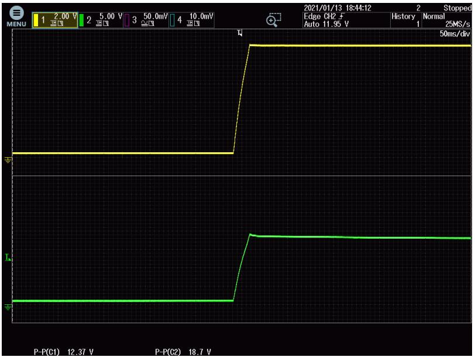

85 VAC

CH1 12V $\mathsf { V } _ { \mathsf { O U T } }$  
CH2 18V $\mathsf { V } _ { \mathsf { O U T } }$

## 测试条件：

➢ No Load

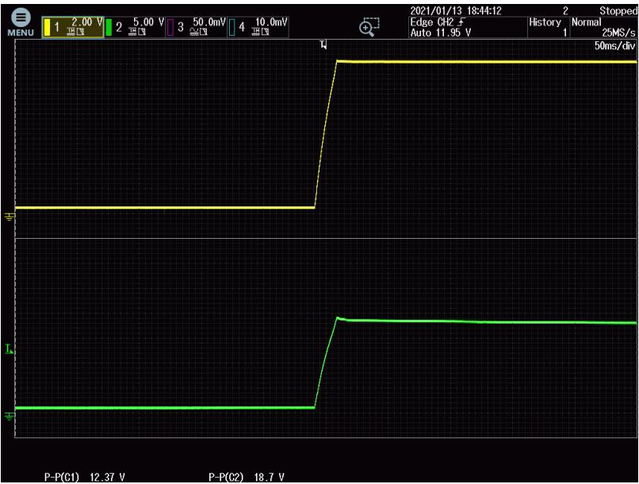

85 VAC

CH1 12V $\mathsf { V } _ { \mathsf { O U T } }$  
CH2 18V $\mathsf { V } _ { \mathsf { O U T } }$

## 测试条件：

➢ 90%Full Load

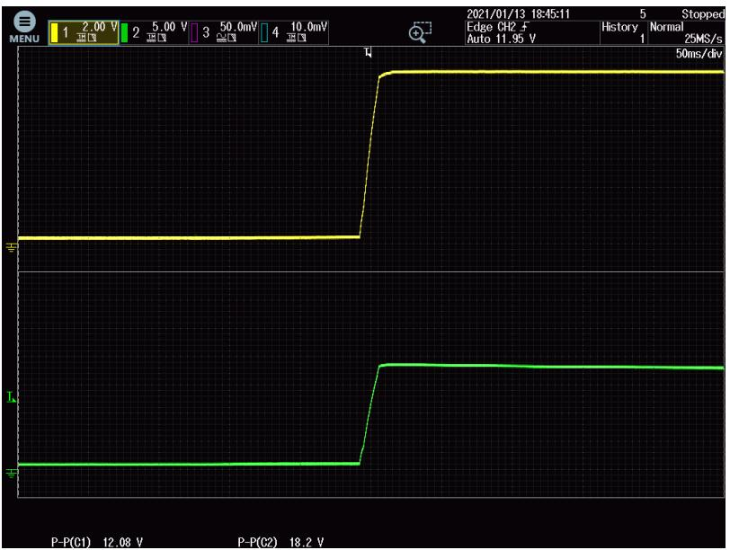

265 VAC

CH1 12V $\mathsf { V } _ { \mathsf { O U T } }$  
CH2 18V $\mathsf { V } _ { \mathsf { O U T } }$

## 测试条件：

➢ No Load

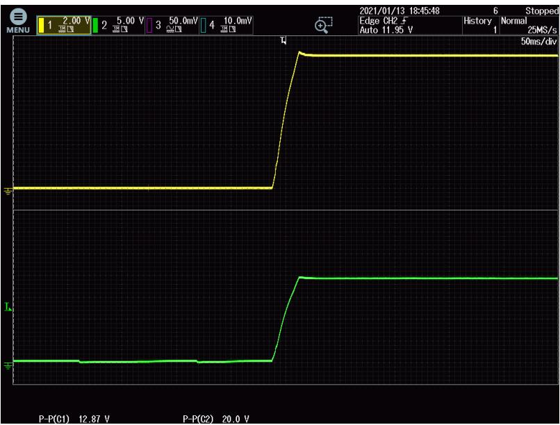

265 VAC

CH1 12V $\mathsf { V } _ { \mathsf { O U T } }$  
CH2 18V VOUT $\mathsf { V } _ { \mathsf { O U T } }$

## 测试条件：

➢ 90%Full Load

## (TNY277P)

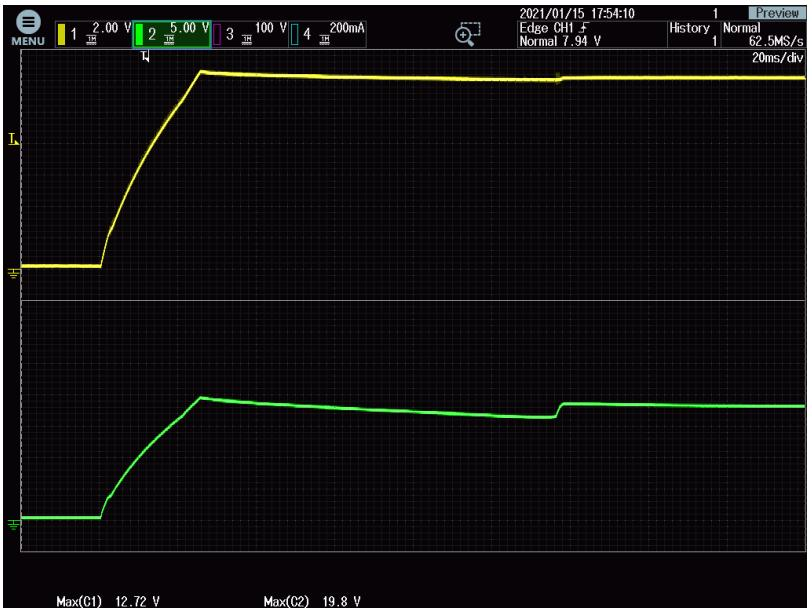

85 VAC

CH1 12V VOUT  
CH2 18V VOUT

## 测试条件：

➢ No Load

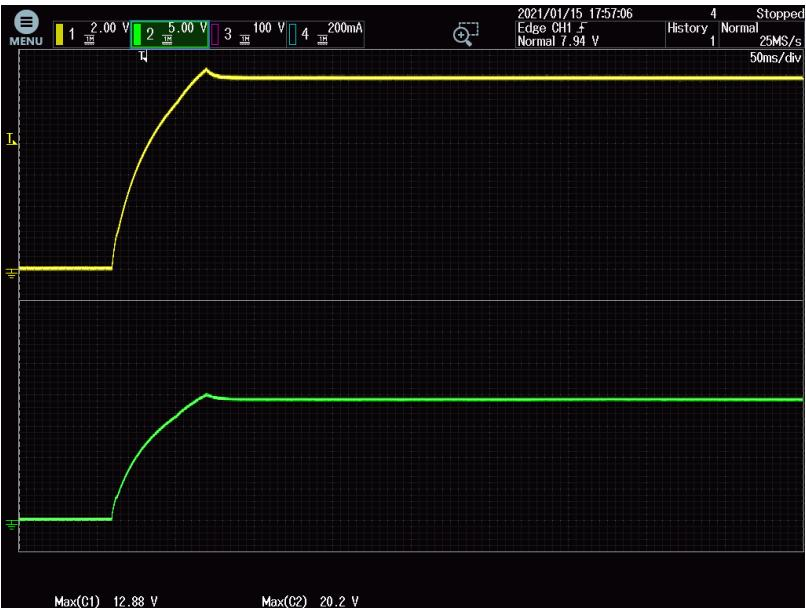

85 VAC

CH1 12V VOUT  
CH2 18V VOUT

## 测试条件：

➢ 60%Full Load

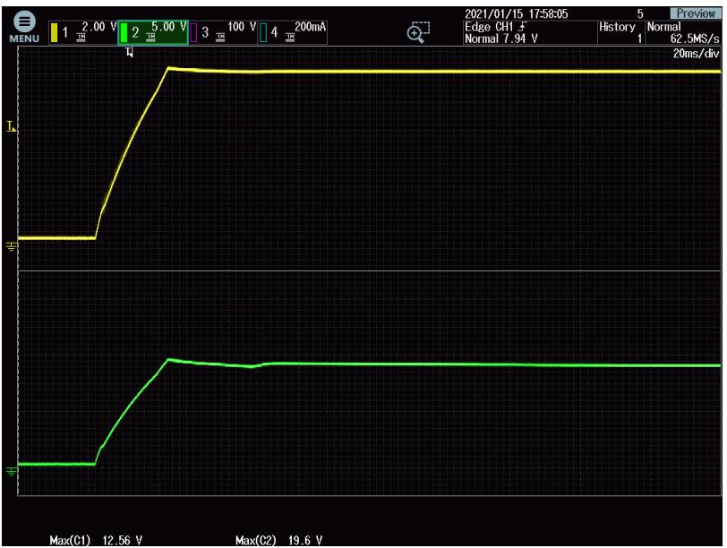

265 VAC

CH1 12V VOUT  
CH2 18V VOUT

## 测试条件：

➢ No Load

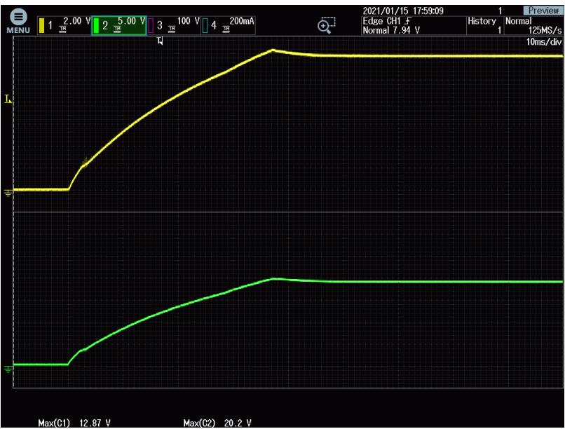

265 VAC

CH1 12V VOUT  
CH2 18V VOUT

## 测试条件：

➢ 60%Full Load

## (BPA8618P)

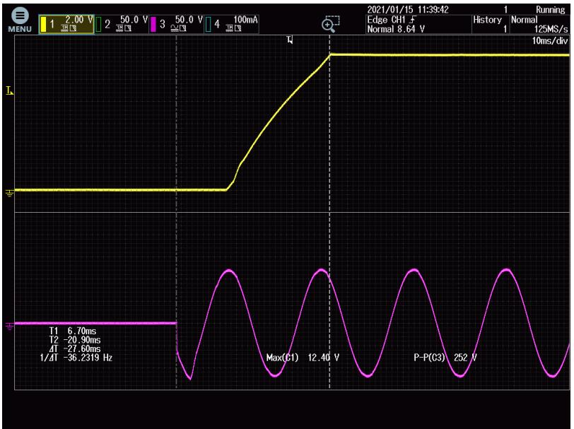

85 VAC

CH1 $\mathsf { V } _ { \mathsf { O U T } }$  
CH3 VINAC $\mathsf { V I N } _ { \mathsf { A C } }$ TDELAY: 27.6 mS

## 测试条件：

➢ No Load

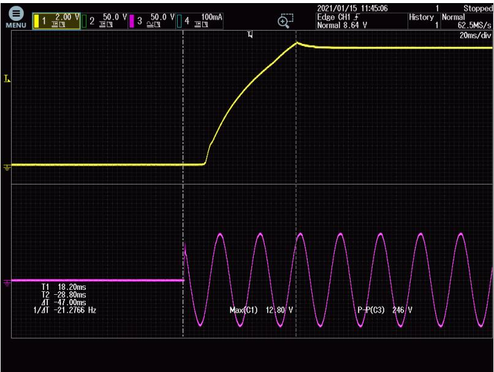

85 VAC

CH1 $\mathsf { V } _ { \mathsf { O U T } }$  
CH3 VINAC $\mathsf { V I N } _ { \mathsf { A C } }$ TDELAY: 47 mS

## 测试条件：

➢ 80% Load

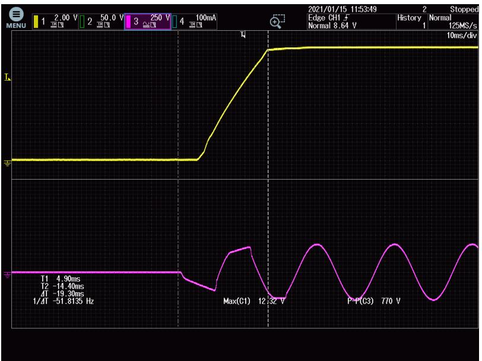

265 VAC

CH1 $\mathsf { V } _ { \mathsf { O U T } }$  
CH3 VINAC TDELAY:19.3mS

## 测试条件：

➢ No Load

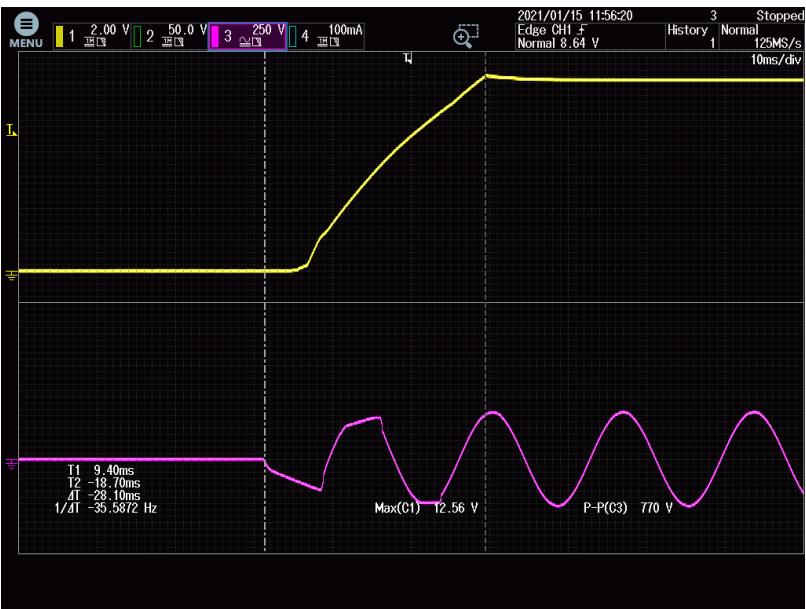

265 VAC

CH1 $\mathsf { V } _ { \mathsf { O U T } }$  
CH3 VINAC TDELAY: 28.1 mS

## 测试条件：

➢ 80% Load

## (TNY277P)

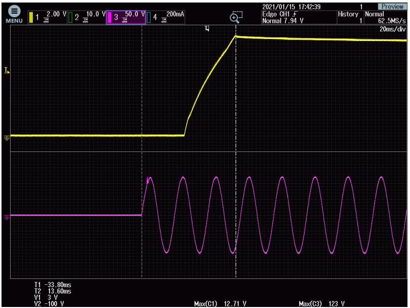

85 VAC

CH1 $\mathsf { V } _ { \mathsf { O U T } }$  
CH3 VINAC $\mathsf { V I N } _ { \mathsf { A C } }$ 47.4 mS

## 测试条件：

➢ No Load

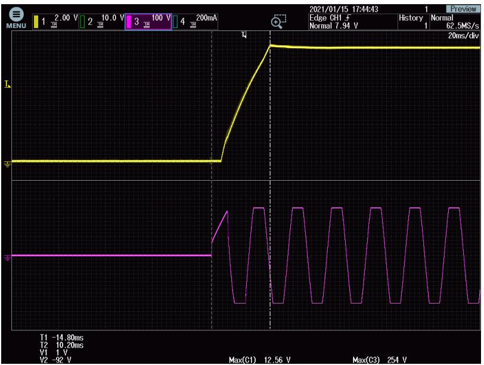

265 VAC

CH1 $\mathsf { V } _ { \mathsf { O U T } }$  
CH3 VINAC $\mathsf { V I N } _ { \mathsf { A C } }$ TDELAY: 25 mS

## 测试条件：

➢ No Load

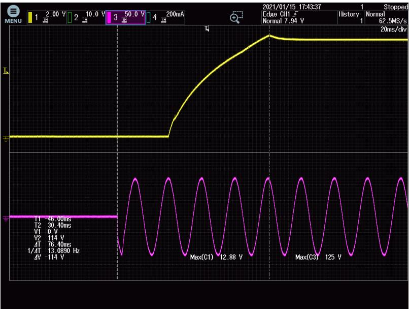

85 VAC

${ \mathsf { C H 1 } } { \mathsf { V } } _ { \mathsf { O U T } }$  
CH3 VINAC $\mathsf { V I N } _ { \mathsf { A C } }$ TDELAY: 76.4 mS

## 测试条件：

➢ 80% Load

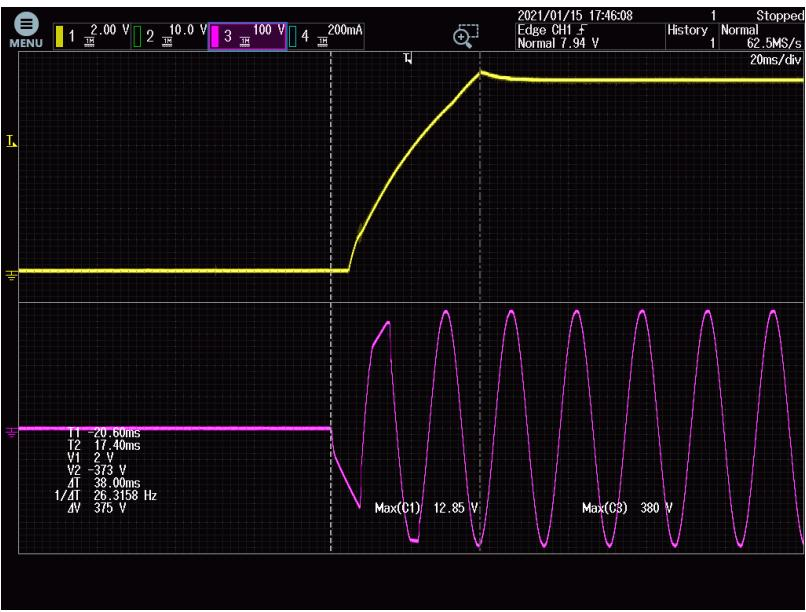

265 VAC

CH1 $\mathsf { V } _ { \mathsf { O U T } }$  
CH3 VINAC $\mathsf { V I N } _ { \mathsf { A C } }$ TDELAY: 38 mS

## 测试条件：

➢ 80% Load

## Brown In – Brown Out (BPA8618P)

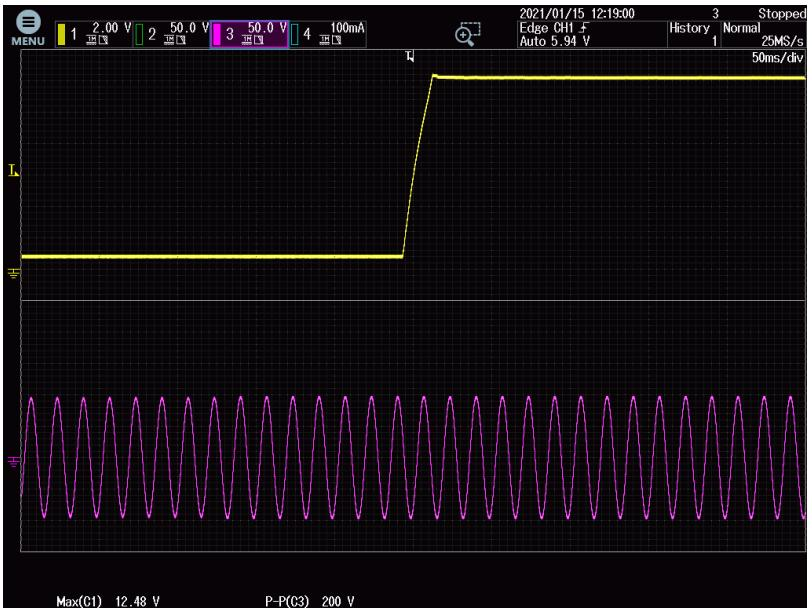

## BROWN-IN

CH1 $\mathsf { V } _ { \mathsf { O U T } }$  
CH3 VINAC $\mathsf { V I N } _ { \mathsf { A C } }$ VBROWN-IN: 65.5 Vac

## 测试条件：

➢ 空载

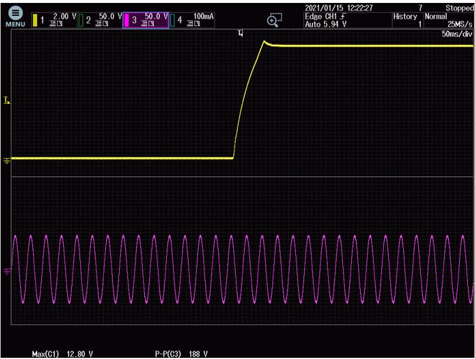

## BROWN-IN

${ \mathsf { C H 1 } } { \mathsf { V } } _ { \mathsf { O U T } }$  
CH3 VINAC $\mathsf { V I N } _ { \mathsf { A C } }$ VBROWN-IN: 64 Vac

## 测试条件：

➢ 50% Load

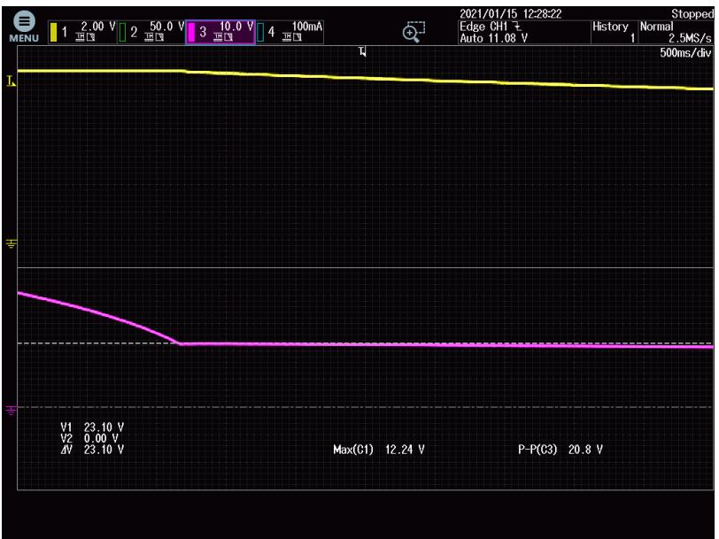

## BROWN-OUT

CH1 $\mathsf { V } _ { \mathsf { O U T } }$  
CH3 Vbus  
VBROWN-OUT: 23.1Vdc

## 测试条件：

➢ 空载

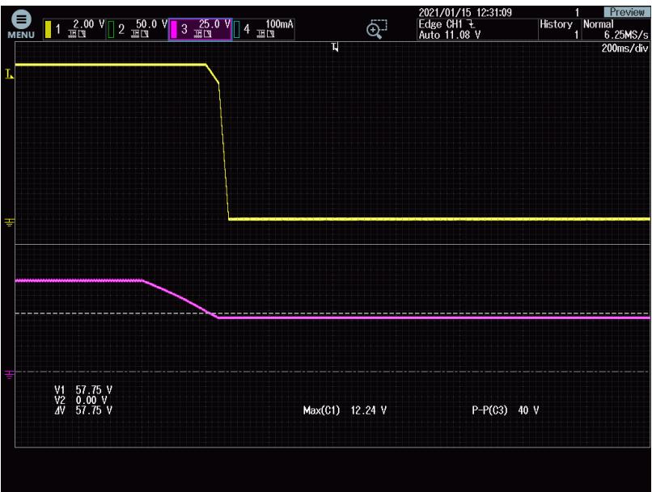

## BROWN-OUT

${ \mathsf { C H 1 } } { \mathsf { V } } _ { \mathsf { O U T } }$  
CH3 Vbus  
VBROWN-OUT: 57.8 V

## 测试条件：

➢ 50% Load

## Brown In – Brown Out (TNY277P)

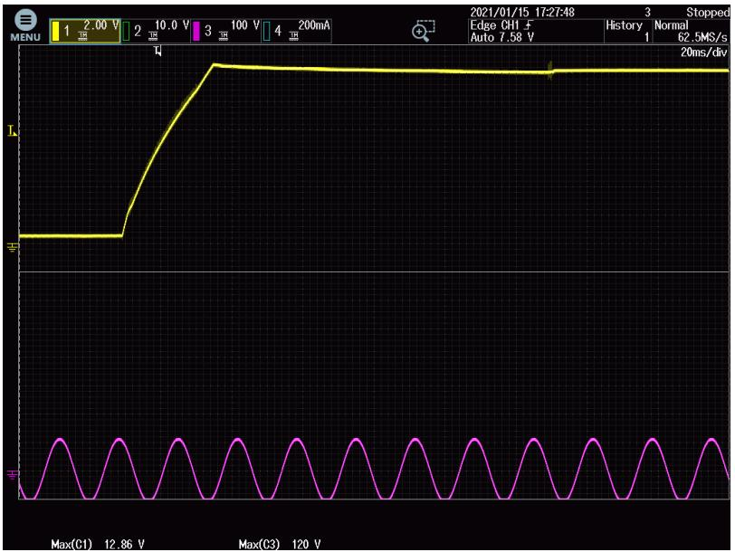

## BROWN-IN

CH1 $\mathsf { V } _ { \mathsf { O U T } }$  
CH3 VINAC VBROWN-IN: 78.5 Vac

## 测试条件：

➢ 空载

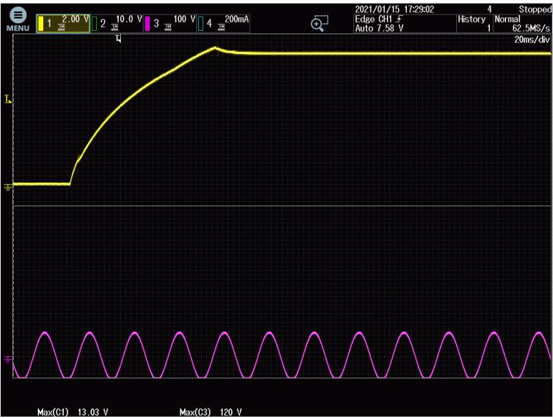

## BROWN-IN

CH1 $\mathsf { V } _ { \mathsf { O U T } }$  
CH3 VINAC $\mathsf { V I N } _ { \mathsf { A C } }$ VBROWN-IN: 78 Vac

## 测试条件：

➢ 50% Load

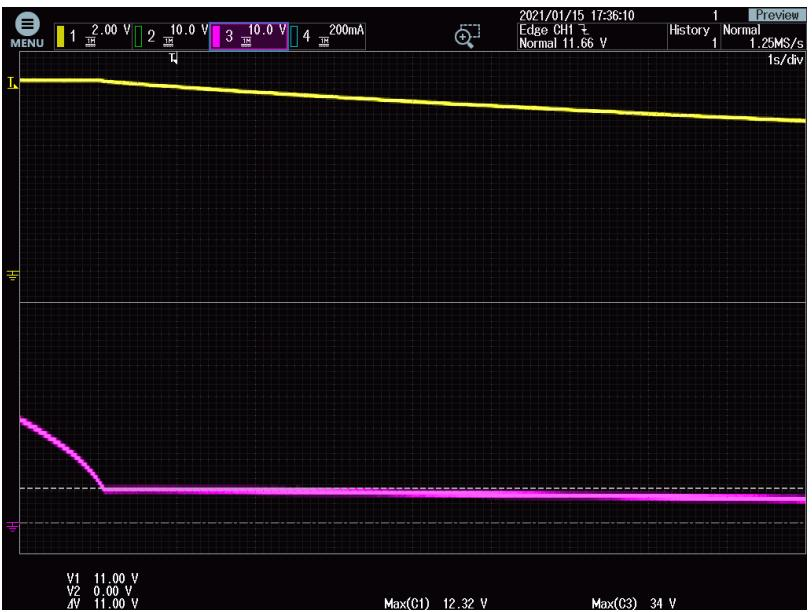

## BROWN-OUT

CH1 VOUT  
CH3 Vbus VBROWN-OUT: 11Vdc

## 测试条件：

➢ 空载

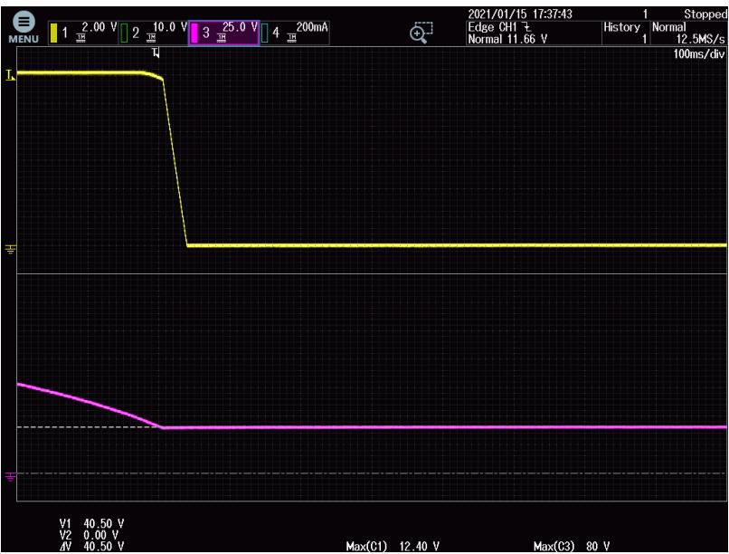

## BROWN-OUT

CH1 $\mathsf { V } _ { \mathsf { O U T } }$  
CH3 Vbus VBROWN-OUT: 40.5 V

## 测试条件：

➢ 50% Load

## BPA8618P MOSFET


85 VAC

CH3 VDS  
CH4 ID


115 VAC

CH3 VDS  
CH4 ID


230 VAC

CH3 VDS  
CH4 ID


265 VAC

CH3 VDS  
CH4 ID

## TNY277P MOSFET


85 VAC

${ \mathsf { C H 3 } } \mathsf { V _ { D S } }$  
$C H 4 1 _ { \mathsf { D } }$


115 VAC

${ \mathsf { C H 3 } } \mathsf { V _ { D S } }$  
$C H 4 1 _ { \mathsf { D } }$


230 VAC

CH3 VDS  
CH4 ID


265 VAC

CH3 VDS  
CH4 ID

## (BPA8618P)


85VAC

CH1 VOUTPUT  
CH4 IDRAIN

## 测试条件：

➢ 空载启动


85 VAC

CH1 VOUTPUT  
CH4 IDRAIN

## 测试条件：

➢ 90% Load


265 VAC

CH1 VOUTPUT  
CH4 IDRAIN

## 测试条件：

➢ 空载启动


265 VAC

CH1 VOUTPUT  
CH4 IDRAIN

## 测试条件：

➢ 90% Load

## (TNY277P)


85VAC

CH1 VOUTPUT  
CH4 IDRAIN

## 测试条件：

➢ 空载启动


265 VAC

CH1 VOUTPUT  
CH4 IDRAIN

## 测试条件：

➢ 空载启动


85 VAC

CH1 VOUTPUT  
CH4 IDRAIN

## 测试条件：

➢ 50% Load


265 VAC

CH1 VOUTPUT  
CH4 IDRAIN

## 测试条件：

➢ 50% Load

## D-S (BPA8618P/TNY277P)


265 VAC

CH3 VDS VDSMAX: 537 V

## (BPA8618P):

➢ 满载开机


265 VAC

CH3 VDS VDSMAX: 536 V

## (BPA8618P):

满载正常工作


265 VAC

CH3 VDS VDSMAX: 527 V

## (TNY277P):

➢ 满载开机


265 VAC

CH3 VDS VDSMAX: 526 V

## (TNY277P):

满载正常工作

## (BPA8618P/TNY277P)


265 VAC

CH1(u203 18v)  
CH3(u202 12v)  
CH1 Vmax=94V  
CH3 Vmax=60.8V

## (BPA8618P):

➢ 满载启动


265 VAC

CH1(u203 18v)  
CH3(u202 12v)  
CH1 Vmax=168V  
CH3 Vmax=62.5V

## (TNY277P):

➢ 满载启动


265 VAC

CH1(u203 18v)  
CH3(u202 12v)  
CH1 Vmax=93.3V  
CH3 Vmax=60.8V

## (BPA8618P):

➢ 满载正常工作


265 VAC

CH1(u203 18v)  
CH3(u202 12v)  
CH1 Vmax=97V  
CH3 Vmax=62.1V

## (TNY277P):

满载正常工作

## 温升测试 BPA8618P)

<table><tr><td rowspan="2">项目</td><td colspan="2">90VAC</td><td colspan="2">280VAC</td></tr><tr><td>温度(°C)</td><td>温升(°C)</td><td>温度(°C)</td><td>温升(°C)</td></tr><tr><td>环境温度</td><td colspan="2">27.8</td><td colspan="2">28.85</td></tr><tr><td>BPA8618P (U1)</td><td>66.62</td><td>38.82</td><td>74.3</td><td>45.45</td></tr><tr><td>变压器磁芯(L3)</td><td>53.78</td><td>25.98</td><td>63.35</td><td>34.5</td></tr><tr><td>变压器绕组(L3)</td><td>55.3</td><td>27.5</td><td>60.8</td><td>31.95</td></tr><tr><td>12V二极管(D5)</td><td>74.6</td><td>46.8</td><td>79.71</td><td>50.86</td></tr></table>

## 测试说明

➢ 常温下密闭纸箱中进行测试  
➢ 电路板放在一个封闭的盒子内  
➢ 热电偶连接到各个测量点  
➢ 等测量点温度达到稳定后记录数据

## 温升测试 TNY277P)

<table><tr><td rowspan="2">项目</td><td colspan="2">90VAC</td><td colspan="2">280VAC</td></tr><tr><td>温度(°C)</td><td>温升(°C)</td><td>温度(°C)</td><td>温升(°C)</td></tr><tr><td>环境温度</td><td colspan="2">28.4</td><td colspan="2">29.5</td></tr><tr><td>BPA8618P (U1)</td><td>68.8</td><td>40.4</td><td>71.75</td><td>42.25</td></tr><tr><td>变压器磁芯 (L3)</td><td>52.7</td><td>24.3</td><td>60.25</td><td>30.75</td></tr><tr><td>变压器绕组 (L3)</td><td>54.2</td><td>25.8</td><td>59.84</td><td>30.34</td></tr><tr><td>12V二极管 (D5)</td><td>75.5</td><td>47.1</td><td>78.8</td><td>49.3</td></tr></table>


## 测试说明

➢ 常温下密闭纸箱中进行测试  
➢ 电路板放在一个封闭的盒子内  
➢ 热电偶连接到各个测量点  
➢ 等测量点温度达到稳定后记录数据


115VAC Line


230VAC Line


115VAC Neutral


230VAC Neutral


115VAC Line


230VAC Line


115VAC Neutral


230VAC Neutral

◼ BPA8618P  
BPA8618P TNY277P $\mathtt { B m a x } { = } \mathtt { L } ^ { * } | \mathsf { p } / ( \mathsf { N p } ^ { * } \mathsf { A e } )$ ，需要理论Bmax 3000  
◼ BPA8618P 12V/1A 18V/0.1A. P277 12V/0.8A 18V/0.1A.  
BPA8618 P277外BPA8618P软启动降低电压电流应力，内置过欠压保护功能外围简洁

## THANK YOU FOR WATCHING
