## BPA8619P&TNY279P对比测试

## (12V/1.25A@85\~265Vac)

上海晶丰明源半导体股份有限公司

Shanghai Bright Power Semiconductor Co., Ltd.

WHX

时间：2021年6月

## 电气参数对比

<table><tr><td></td><td>BPA8619P</td><td>TNY279P</td></tr><tr><td>开关频率</td><td>132KHz</td><td>132KHz</td></tr><tr><td>Mosfet BV</td><td>700V</td><td>700V</td></tr><tr><td> $R_{DS\_ON}$ </td><td>2.6Ω</td><td>3.9Ω</td></tr><tr><td>限流点</td><td>650mA</td><td>650mA</td></tr><tr><td>软启动</td><td>有</td><td>无</td></tr><tr><td>输入过压保护</td><td>有</td><td>无</td></tr><tr><td>输入欠压保护</td><td>内置</td><td>外加</td></tr><tr><td>输出过压保护</td><td>自动重启</td><td>锁死</td></tr><tr><td>过载保护</td><td>有</td><td>有</td></tr><tr><td>封装</td><td>DIP7, SOP7</td><td>DIP7, SMD8C</td></tr></table>

## 测试数据对比

电源规格：85\~265Vac输入，12V/1.25A输出

<table><tr><td colspan="2"></td><td>BPA8619P</td><td>TNY279P</td><td></td></tr><tr><td colspan="2">待机功耗</td><td>51mW</td><td>69mW</td><td>包含输入电压检测电阻损耗</td></tr><tr><td rowspan="2">效率</td><td>115Vac</td><td>84%</td><td>81.9%</td><td></td></tr><tr><td>230Vac</td><td>84.6%</td><td>83.8%</td><td></td></tr><tr><td rowspan="2">输出电压纹波</td><td>85Vac</td><td>236mV</td><td>236mV</td><td></td></tr><tr><td>265Vac</td><td>202mV</td><td>204mV</td><td></td></tr><tr><td rowspan="2">动态负载性能</td><td>50%-100%</td><td> $240mV_{PK\_PK}$ </td><td> $259mV_{PK\_PK}$ </td><td></td></tr><tr><td>10%-90%</td><td> $287mV_{PK\_PK}$ </td><td> $340mV_{PK\_PK}$ </td><td></td></tr><tr><td rowspan="2">MOSFET应力</td><td> $V_{DS}$ </td><td>530V</td><td>540V</td><td></td></tr><tr><td> $I_{DS}$ </td><td>1.1A</td><td>1.42A</td><td></td></tr><tr><td rowspan="2">二极管应力</td><td>VRR</td><td>67.2V</td><td>69.9V</td><td></td></tr><tr><td> $I_{PK}$ </td><td>7A</td><td>7.16A</td><td></td></tr><tr><td colspan="2">温升测试(环温50°C)</td><td>99.02°C</td><td>98.93°C</td><td></td></tr><tr><td colspan="2">传导EMI</td><td>&gt;6dB裕量</td><td>&gt;6dB裕量</td><td></td></tr><tr><td colspan="2">Surge</td><td>Pass</td><td>Pass</td><td>共模4kV,差模2kV</td></tr><tr><td colspan="2">EFT群脉冲</td><td>Pass</td><td>Pass</td><td>4kV,5kHz/38kHz/100kHz</td></tr><tr><td colspan="2">ESD</td><td>Pass</td><td>Pass</td><td>8kV接触放电/15kV空气放电</td></tr></table>

## 电路及实物图

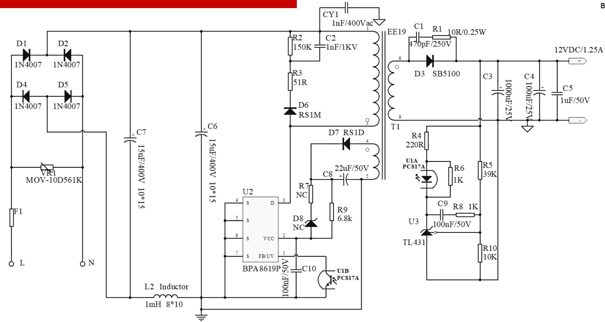

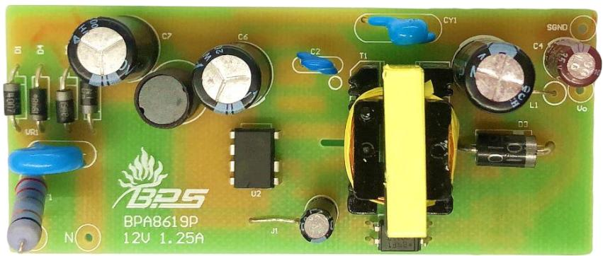

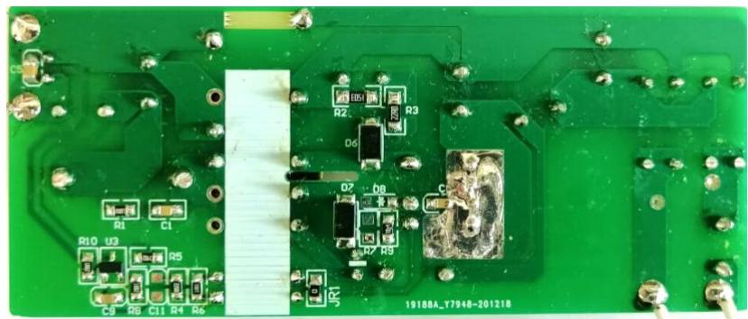

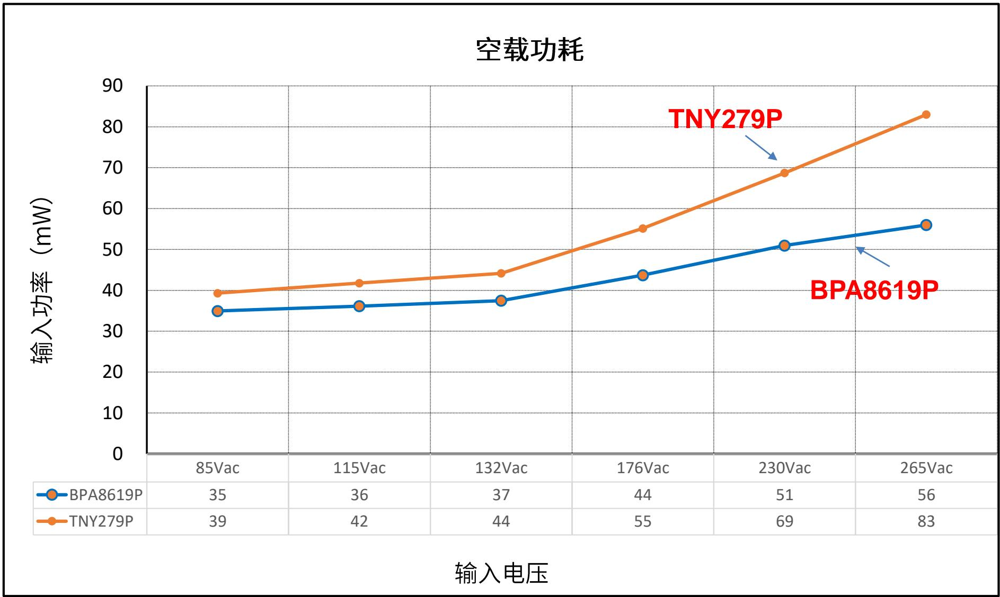

备注：TNY279P在FB pin脚上拉一串电阻做UVL，阻值4M；BPA8619P内部集成UVL功能，无需外部电阻

效率测试  
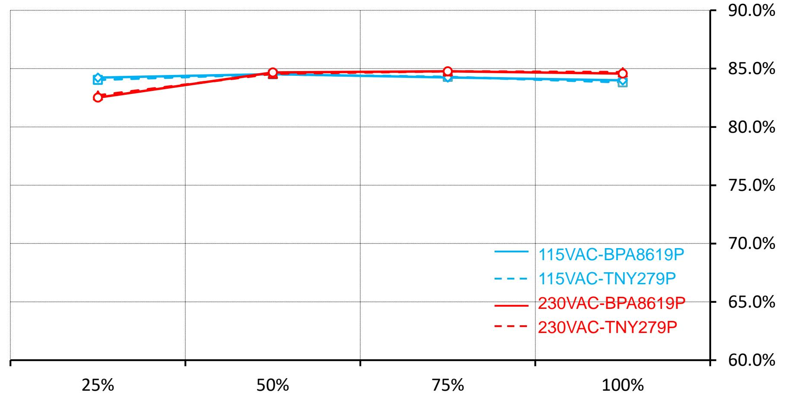

负载

## 输出电压调整率

BPA8619P

<table><tr><td> $V_{IN}(VAC)$ Load(%)</td><td>85</td><td>115</td><td>132</td><td>176</td><td>230</td><td>265</td><td>平均值</td><td>线调整率</td></tr><tr><td>0</td><td>12.191</td><td>12.191</td><td>12.190</td><td>12.189</td><td>12.188</td><td>12.188</td><td>12.19</td><td>0.02%</td></tr><tr><td>20%</td><td>12.190</td><td>12.190</td><td>12.189</td><td>12.188</td><td>12.188</td><td>12.186</td><td>12.19</td><td>0.03%</td></tr><tr><td>40%</td><td>12.190</td><td>12.189</td><td>12.189</td><td>12.188</td><td>12.186</td><td>12.185</td><td>12.19</td><td>0.04%</td></tr><tr><td>60%</td><td>12.189</td><td>12.188</td><td>12.188</td><td>12.188</td><td>12.186</td><td>12.183</td><td>12.19</td><td>0.05%</td></tr><tr><td>80%</td><td>12.188</td><td>12.186</td><td>12.186</td><td>12.186</td><td>12.185</td><td>12.181</td><td>12.19</td><td>0.06%</td></tr><tr><td>100%</td><td>12.186</td><td>12.186</td><td>12.185</td><td>12.185</td><td>12.184</td><td>12.180</td><td>12.18</td><td>0.05%</td></tr><tr><td>平均值</td><td>12.19</td><td>12.19</td><td>12.19</td><td>12.19</td><td>12.19</td><td>12.18</td><td rowspan="2" colspan="2"></td></tr><tr><td>负载调整率</td><td>0.04%</td><td>0.04%</td><td>0.04%</td><td>0.03%</td><td>0.03%</td><td>0.07%</td></tr></table>

计算方法：调整率=100%\*(最大值-最小值)/平均值  
测试条件：无假负载

TNY279P

<table><tr><td> $V_{IN}(VAC)$ Load(%)</td><td>85</td><td>115</td><td>132</td><td>176</td><td>230</td><td>265</td><td>平均值</td><td>线调整率</td></tr><tr><td>0</td><td>12.190</td><td>12.191</td><td>12.195</td><td>12.195</td><td>12.196</td><td>12.196</td><td>12.19</td><td>0.05%</td></tr><tr><td>20%</td><td>12.189</td><td>12.191</td><td>12.194</td><td>12.195</td><td>12.195</td><td>12.196</td><td>12.19</td><td>0.06%</td></tr><tr><td>40%</td><td>12.188</td><td>12.190</td><td>12.193</td><td>12.194</td><td>12.195</td><td>12.195</td><td>12.19</td><td>0.06%</td></tr><tr><td>60%</td><td>12.186</td><td>12.189</td><td>12.191</td><td>12.193</td><td>12.193</td><td>12.195</td><td>12.19</td><td>0.07%</td></tr><tr><td>80%</td><td>12.185</td><td>12.188</td><td>12.191</td><td>12.193</td><td>12.193</td><td>12.193</td><td>12.19</td><td>0.07%</td></tr><tr><td>100%</td><td>12.183</td><td>12.185</td><td>12.188</td><td>12.191</td><td>12.191</td><td>12.192</td><td>12.19</td><td>0.07%</td></tr><tr><td>平均值</td><td>12.19</td><td>12.19</td><td>12.19</td><td>12.19</td><td>12.19</td><td>12.19</td><td rowspan="2" colspan="2"></td></tr><tr><td>负载调整率</td><td>0.06%</td><td>0.05%</td><td>0.06%</td><td>0.03%</td><td>0.04%</td><td>0.03%</td></tr></table>

## 输出电压纹波

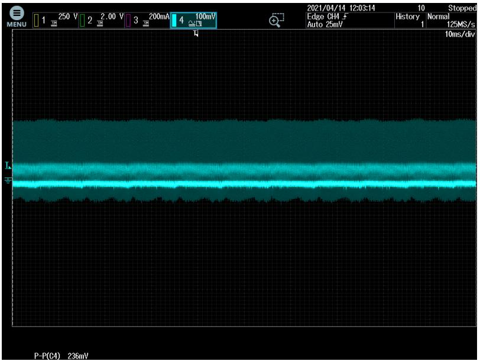

85 VAC  
  
Test Condition:  
➢ Full Load

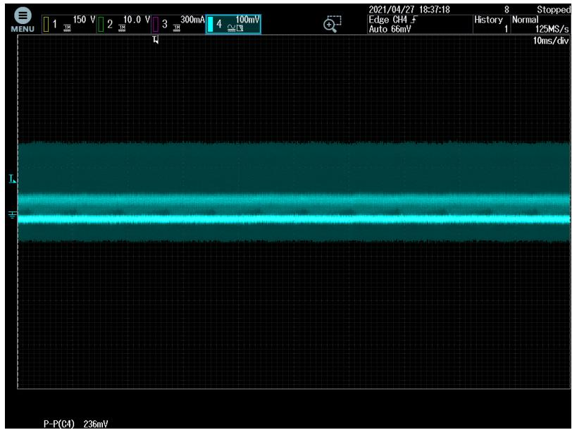

85 VAC  
  
Test Condition:  
➢ Full Load

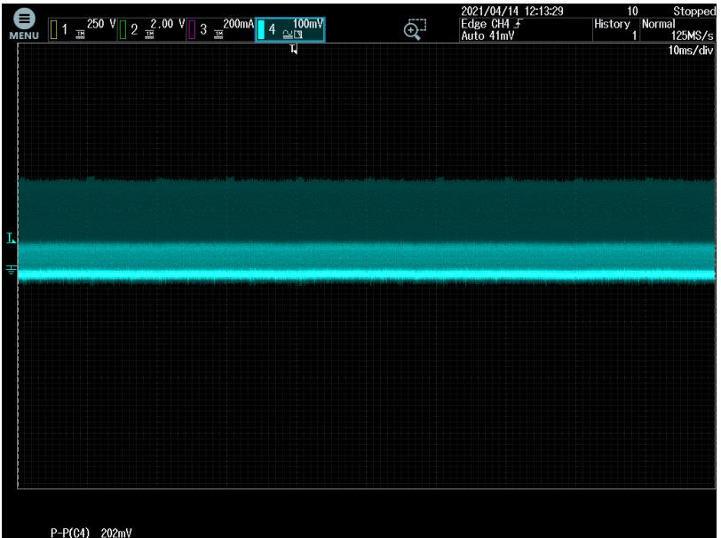

265 VAC  
  
Test Condition:  
➢ Full Load

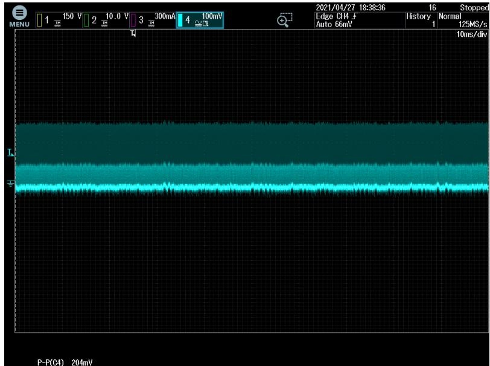

265 VAC  
  
Test Condition:  
➢ Full Load

## (50%-100%)

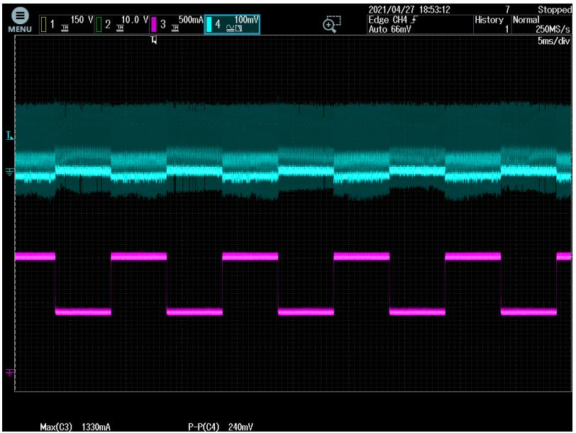  
85 VAC

CH4 $\mathsf { V } _ { \mathsf { O U T } }$ $V _ { P K - P K } = 2 4 0 m v$  
CH3 IOUT $\mathsf { C H 3 } \mathsf { I _ { 0 \mathsf { U T } } }$

## Test Condition:

➢ 0.625 A-1.25 A-0.625 A  
➢ Slew Rate: 0.5 A/μS  
➢ Frequency: 100 Hz

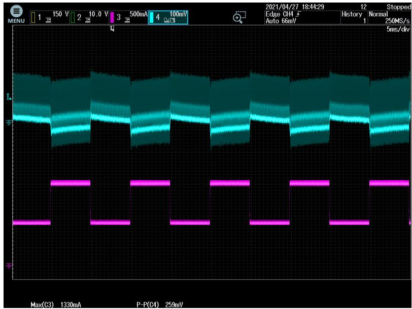

85 VAC

CH4 $\mathsf { V } _ { \mathsf { O U T } }$ $V _ { P K - P K } = 2 5 9 m v$  
CH3 IOUT $\mathsf { C H 3 } \mathsf { I } _ { 0 \mathsf { U T } }$

## Test Condition:

➢ 0.625 A-1.25 A-0.625 A  
➢ Slew Rate: 0.5 A/μS  
➢ Frequency: 100 Hz

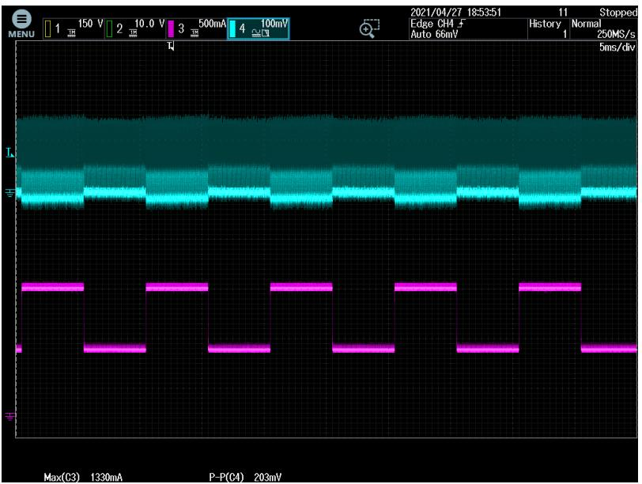

265 VAC

CH4 $\mathsf { V } _ { \mathsf { O U T } }$ $V _ { \mathsf { P K - P K } } = 2 0 3 ~ \mathsf { m V }$  
CH3 IOUT $\mathsf { I } _ { 0 \mathsf { U T } }$

## Test Condition:

➢ 0.625 A-1.25 A-0.625 A  
➢ Slew Rate: 0.5 $\mathsf { A } / \mu \mathsf { S }$  
➢ Frequency: 100 Hz

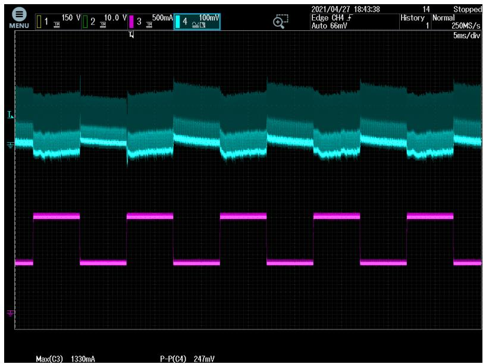

265 $\mathsf { v } _ { \mathsf { A C } }$

CH4 $\mathsf { V } _ { \mathsf { O U T } }$ $v _ { p _ { k - P K } } = 2 4 7 m v$  
$\mathsf { C H 3 } \mathsf { I _ { 0 \mathsf { U T } } }$

## Test Condition:

➢ 0.625 A-1.25 A-0.625 A  
➢ Slew Rate: 0.5 A/μS  
➢ Frequency: 100 Hz

## (10%-90%)

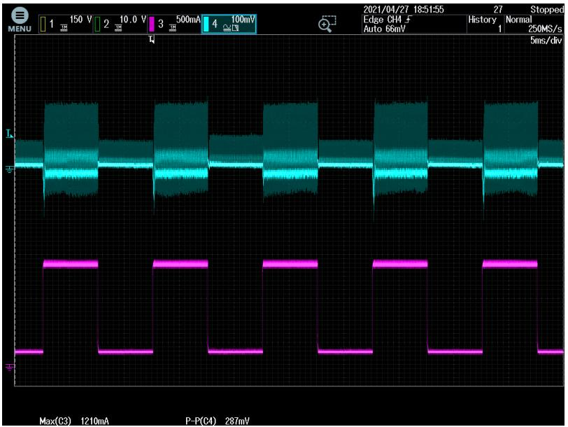

85 VAC

CH4 $\mathsf { V } _ { \mathsf { O U T } }$ $V _ { P K - P K } = 2 8 7 ~ \mathsf { m V }$  
CH3 IOUT $\mathsf { C H 3 } \mathsf { I _ { 0 \mathsf { U T } } }$

## Test Condition:

➢ 0.125A-1.125 A-0.125 A  
➢ Slew Rate: 0.5 A/μS  
➢ Frequency: 100 Hz

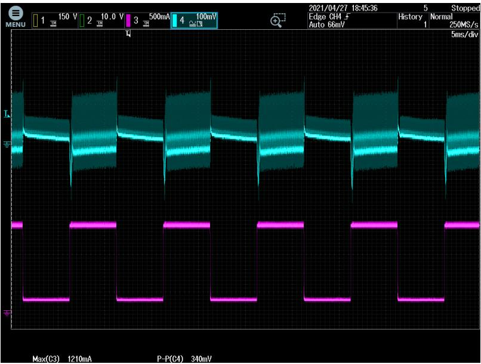

85 VAC

CH4 $\mathsf { V } _ { \mathsf { O U T } }$ $V _ { \mathsf { P K - P K } } { = } 3 4 0 ~ \mathsf { m V }$  
CH3 IOUT $\mathsf { C H 3 } \mathsf { I } _ { 0 \mathsf { U T } }$

## Test Condition:

➢ 0.125A-1.125 A-0.125 A  
➢ Slew Rate: 0.5 A/μS  
➢ Frequency: 100 Hz

265 VAC

CH4 $\mathsf { V } _ { \mathsf { O U T } }$ $V _ { P K - P K } = 2 4 3 ~ \mathsf { m V }$  
CH3 IOUT $\mathsf { I } _ { 0 \mathsf { U T } }$

## Test Condition:

➢ 0.125A-1.125 A-0.125 A  
➢ Slew Rate: 0.5 A/μS  
➢ Frequency: 100 Hz

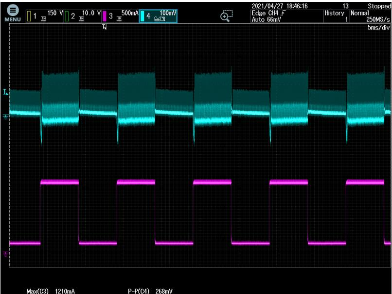

265 $\mathsf { v } _ { \mathsf { A C } }$

CH4 $\mathsf { V } _ { \mathsf { O U T } }$ $V _ { P K - P K } = 2 6 8 m v$  
$\mathsf { C H 3 } \mathsf { I _ { 0 \mathsf { U T } } }$

## Test Condition:

➢ 0.125A-1.125 A-0.125 A  
➢ Slew Rate: 0.5 A/μS  
➢ Frequency: 100 Hz

## 输出电压开机波形

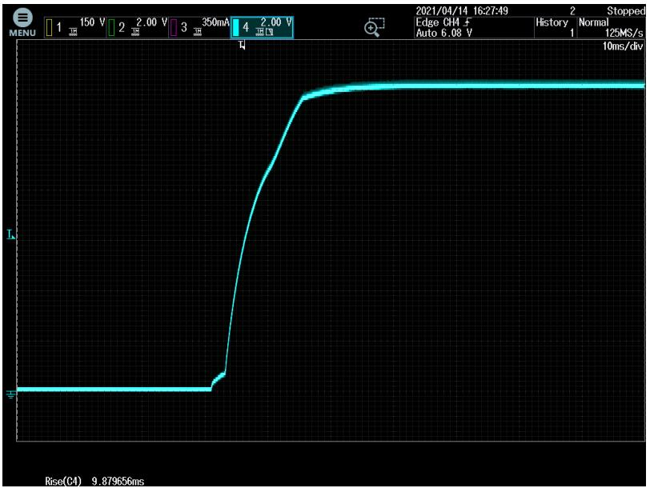

85 VAC  
  
Test Condition:  
➢ Full Load

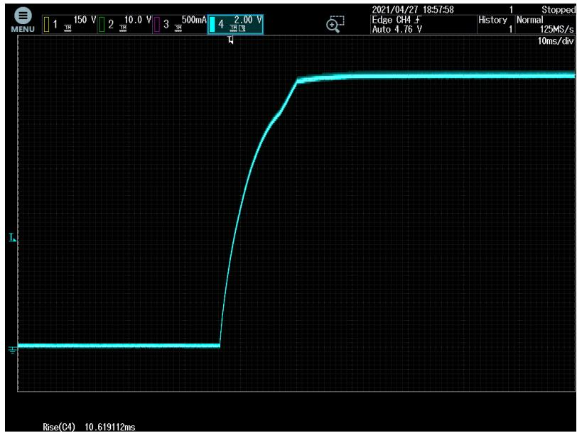

85 VAC  
  
Test Condition:  
➢ Full Load

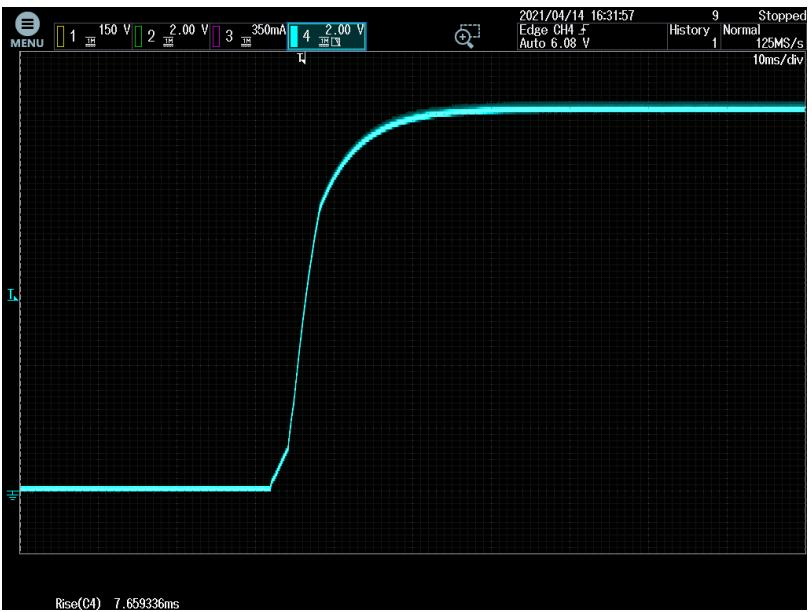

265 VAC  
  
Test Condition:  
➢ Full Load

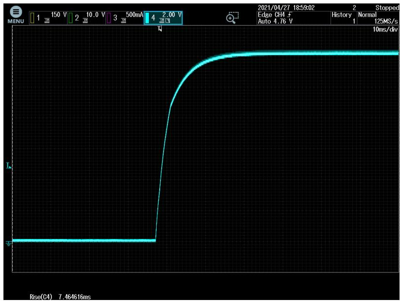

265 VAC  
  
Test Condition:  
➢ Full Load

## MOSFET

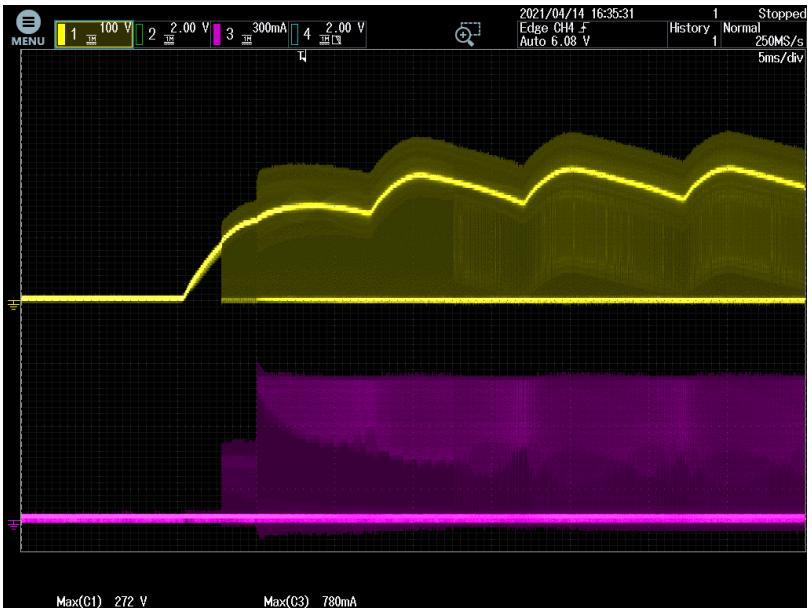

85 VAC

CH1 VDS  
CH3 IDS

$$
\begin{array}{l} \mathrm {V_ {DS\_MAX}} = 2 7 2 \mathrm{V} \\ \mathrm {I_ {DS\_MAX}} = 0. 7 8 \mathrm{A} \end{array}
$$

## Test Condition:

➢ Full Load

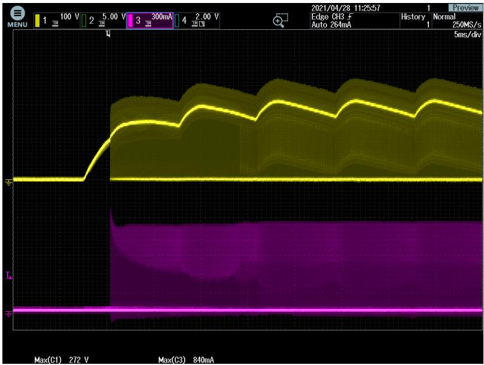

85 VAC

CH1 VDS  
CH3 IDS

$$
\begin{array}{l} \mathrm {V_ {DS\_MAX}} = 2 7 2 \mathrm{V} \\ \mathrm {I_ {DS\_MAX}} = 0. 8 4 \mathrm{A} \end{array}
$$

## Test Condition:

➢ Full Load

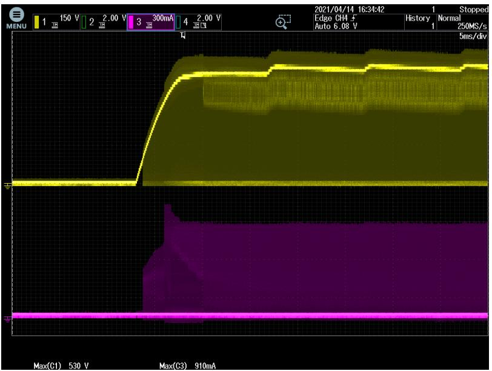

265 VAC

CH1 VDS  
CH3 IDS

$$
\begin{array}{l} \mathrm {V_ {DS\_MAX}} = 5 3 0 \mathrm{V} \\ \mathrm {I_ {DS\_MAX}} = 0. 9 1 \mathrm{A} \end{array}
$$

## Test Condition:

➢ Full Load

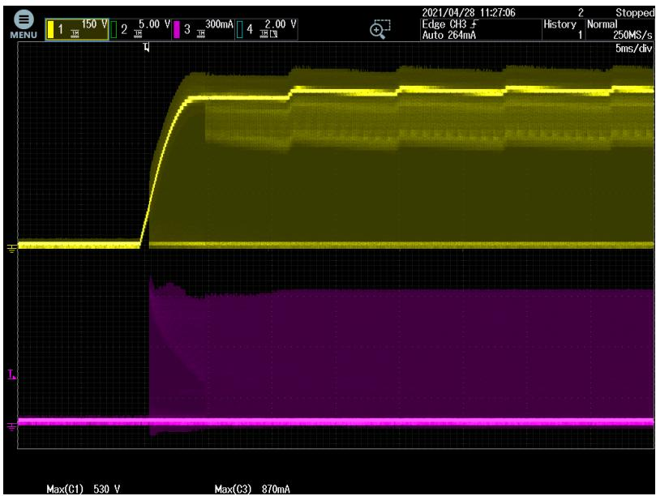

265 VAC

CH1 VDS  
CH3 IDS

$$
\begin{array}{l} \mathrm {V_ {DS\_MAX}} = 5 3 0 \mathrm{V} \\ \mathrm {I_ {DS\_MAX}} = 0. 8 7 \mathrm{A} \end{array}
$$

## Test Condition:

➢ Full Load

## MOSFET

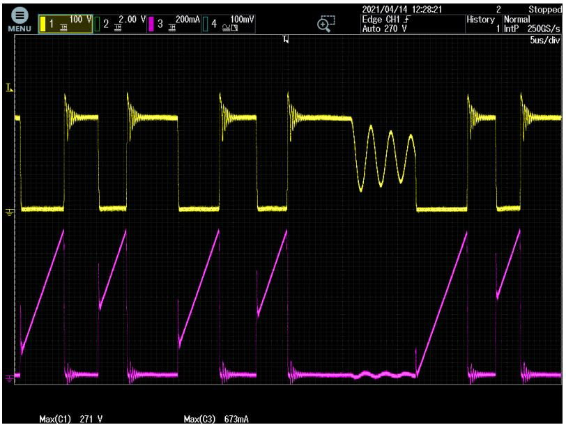

85 VAC

CH1 VDS  
CH3 IDS

$$
\begin{array}{l} \mathrm {V_ {DS\_MAX}} = 2 7 1 \mathrm{V} \\ \mathrm {I_ {DS\_MAX}} = 0. 6 7 \mathrm{A} \end{array}
$$

## Test Condition:

➢ Full Load

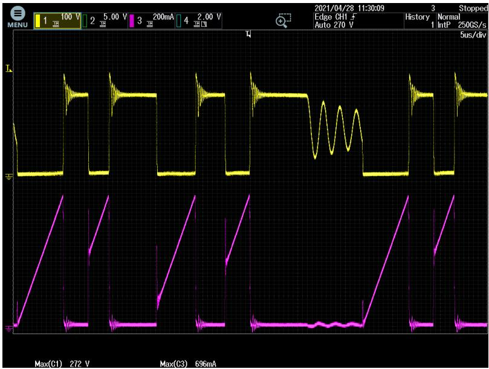

85 VAC

CH1 VDS  
CH3 IDS

$$
\begin{array}{l} \mathrm {V_ {DS\_MAX}} = 2 7 2 \mathrm{V} \\ \mathrm {I_ {DS\_MAX}} = 0. 6 9 \mathrm{A} \end{array}
$$

## Test Condition:

➢ Full Load

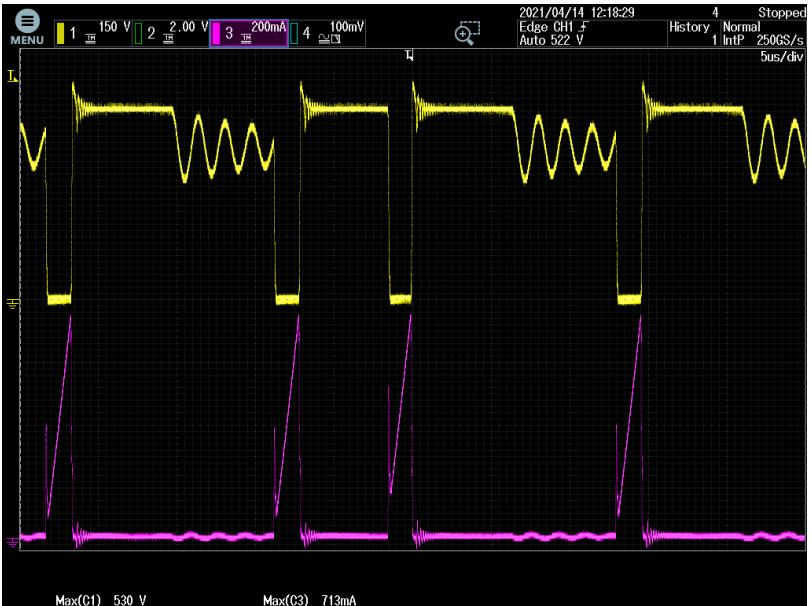

265 VAC

CH1 VDS  
CH3 IDS

$$
V _ {D S \_ M A X} = 5 3 0 V
$$

$$
I _ {D S \_ M A X} = 0. 7 1 \mathrm{A}
$$

## Test Condition:

➢ Full Load

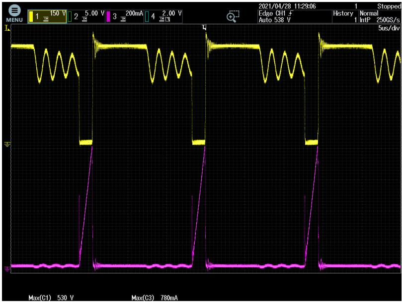

265 VAC

CH1 VDS  
CH3 IDS

$$
V _ {D S \_ M A X} = 5 3 0 V
$$

$$
I _ {D S \_ M A X} = 0. 7 8 \mathrm{A}
$$

## Test Condition:

➢ Full Load

## 输出二极管开机波形

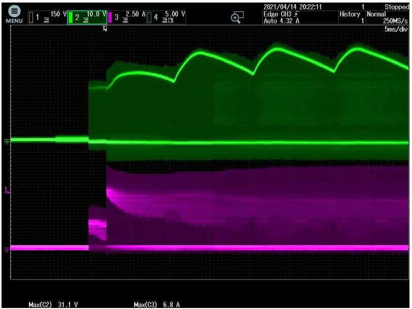

85 VAC

CH2 VR  
CH3 IF

$$
\begin{array}{l} \mathrm {V_ {R\_MAX}} = 3 1. 1 \mathrm{V} \\ \mathrm {I_ {F\_MAX}} = 6. 8 \mathrm{A} \end{array}
$$

## Test Condition:

➢ Full Load

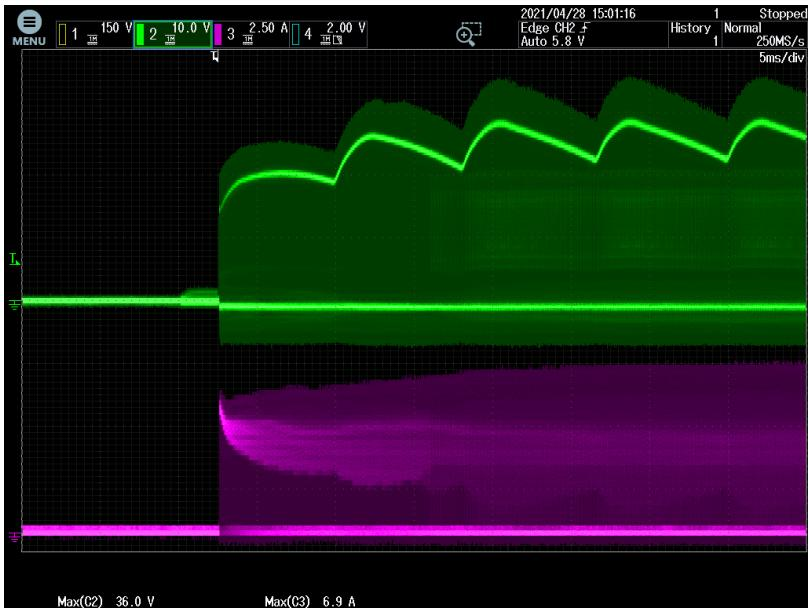

85 VAC

CH2 VR  
CH3 IF

$$
\begin{array}{l} \mathrm {V_ {R\_MAX}} = 3 6 \mathrm{V} \\ \mathrm {I_ {F\_MAX}} = 6. 9 \mathrm{A} \end{array}
$$

## Test Condition:

➢ Full Load

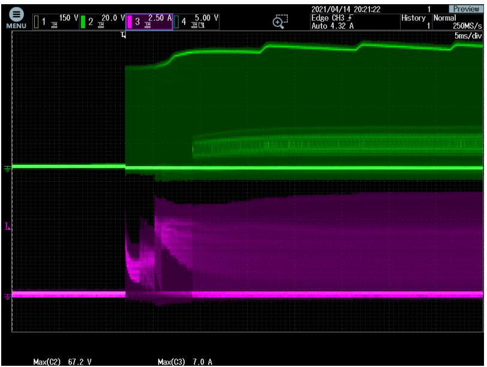

265 VAC

CH2 VR  
CH3 IF

$$
\begin{array}{l} \mathrm {V_ {R\_MAX}} = 6 7. 2 \mathrm{V} \\ \mathrm {I_ {F\_MAX}} = 7 \mathrm{A} \end{array}
$$

## Test Condition:

➢ Full Load

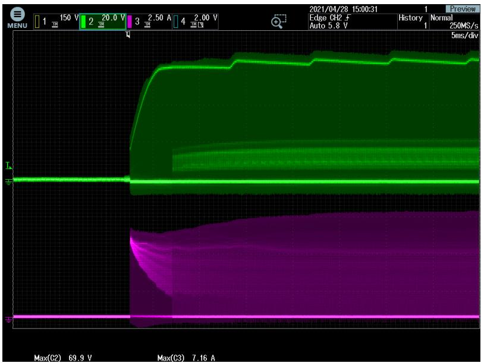

265 VAC

CH2 VR  
CH3 IF

$$
\begin{array}{l} \mathrm {V_ {R\_MAX}} = 6 9. 9 \mathrm{V} \\ \mathrm {I_ {F\_MAX}} = 7. 1 6 \mathrm{A} \end{array}
$$

## Test Condition:

➢ Full Load

## 输出二极管稳态波形

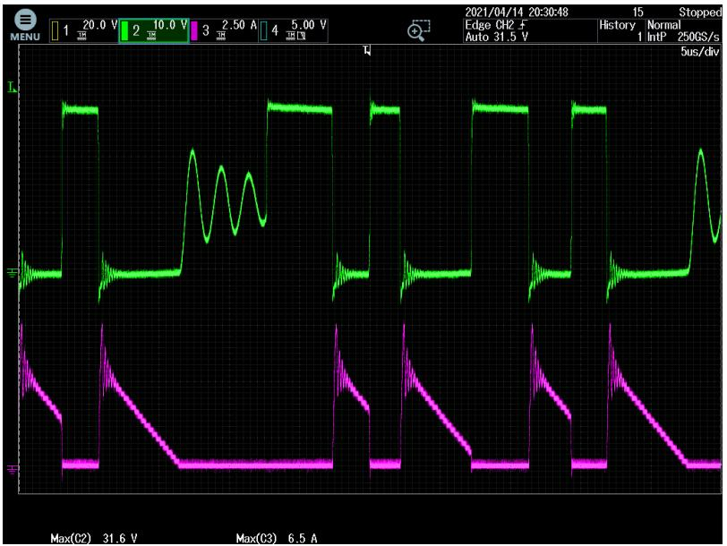

85 VAC

CH2 VR  
CH3 IF

$$
\begin{array}{l} \mathrm {V_ {R\_MAX}} = 3 1. 6 \mathrm{V} \\ \mathrm {I_ {F\_MAX}} = 6. 5 \mathrm{A} \end{array}
$$

## Test Condition:

➢ Full Load

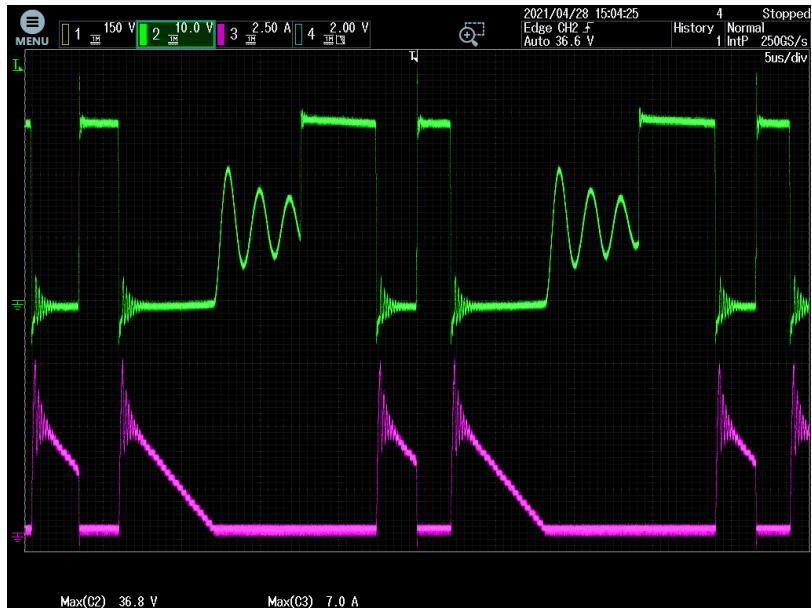

85 VAC

CH2 VR  
CH3 IF

$$
\begin{array}{l} \mathrm {V_ {R\_MAX}} = 3 6. 8 \mathrm{V} \\ \mathrm {I_ {F\_MAX}} = 7 \mathrm{A} \end{array}
$$

## Test Condition:

➢ Full Load

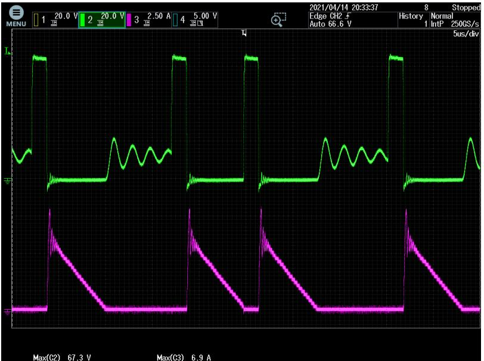

265 VAC

CH2 VR  
CH3 IF

$$
\begin{array}{l} \mathrm {V_ {R\_MAX}} = 6 7. 3 \mathrm{V} \\ \mathrm {I_ {F\_MAX}} = 6. 9 \mathrm{A} \end{array}
$$

## Test Condition:

➢ Full Load

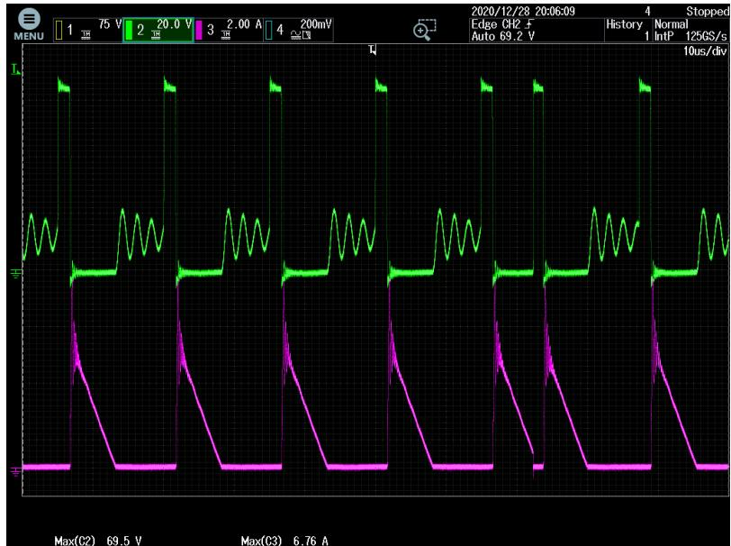

265 VAC

CH2 VR  
CH3 IF

$$
\begin{array}{l} \mathrm {V_ {R\_MAX}} = 6 9. 5 \mathrm{V} \\ \mathrm {I_ {F\_MAX}} = 6. 7 6 \mathrm{A} \end{array}
$$

## Test Condition:

➢ Full Load

## MOSFET

BPA8619P  
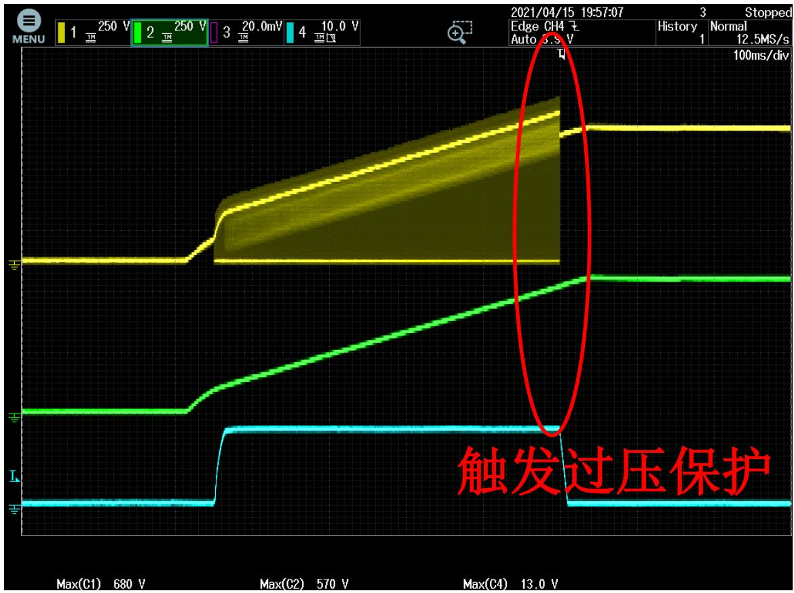

CH1 VDS  
CH2 VDC\_IN  
CH4 VO

$$
V _ {D S \_ M A X} = 6 8 0 \mathrm{V}
$$

$$
V _ {D C I N} = 5 5 0 \mathrm{V}
$$

Test Condition:

➢ Full Load

TNY279P  
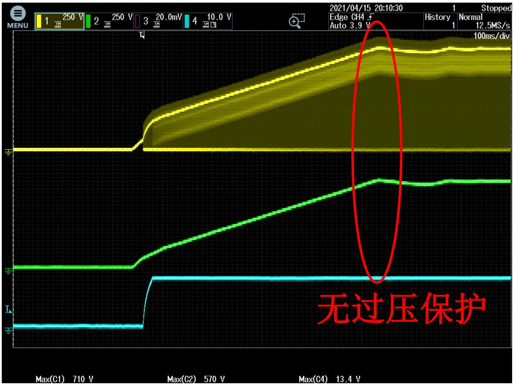

CH1 VDS  
CH2 VDC\_IN  
CH4 VO

$$
V _ {D S \_ M A X} = 7 1 0 \mathrm{V}
$$

$$
V _ {D C \_ I N} = 5 5 0 \mathrm{V}
$$

Test Condition:

➢ Full Load

BPA8619P  

CH1 VAC\_IN  
CH4 Vo

VAC\_IN\_STARTUP=65 V

Test Condition:

➢ No Load

TNY279P  
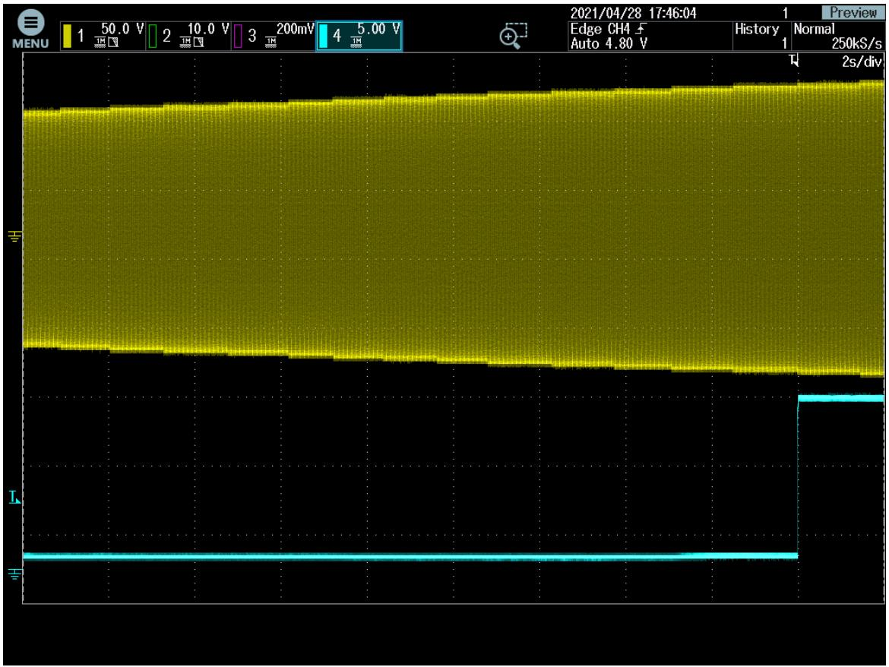

CH1 VAC\_IN  
CH4 Vo

VAC\_IN\_STARTUP=74 V

Test Condition:

➢ No Load

备注：TNY279P在FB pin脚上拉一串电阻做UVL，阻值4M；BPA8619P内部集成UVL功能，无需外部电阻

## MOSFET

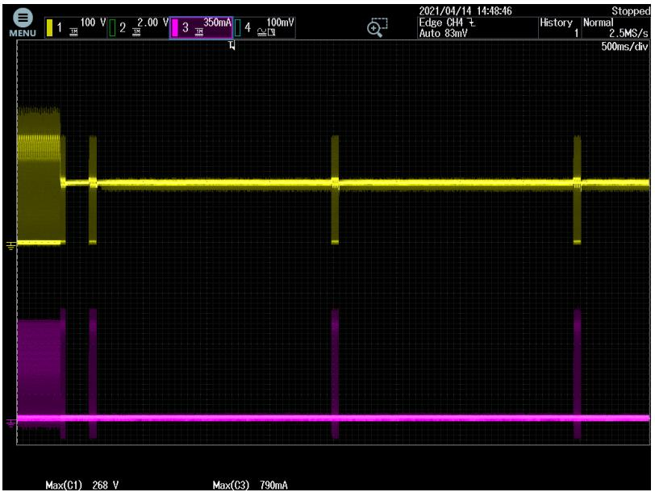

85 VAC

${ \mathsf { C H 1 } } \mathsf { V _ { D S } }$  
CH3 IDS

$$
\begin{array}{l} \mathrm {V_ {DS\_MAX}} = 2 6 8 \mathrm{V} \\ \mathrm {I_ {DS\_MAX}} = 0. 7 9 \mathrm{A} \end{array}
$$

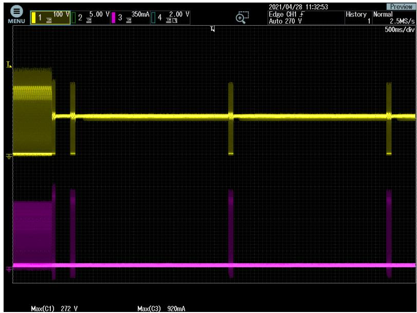

85 VAC

CH1 VDS  
CH3 IDS

$$
\begin{array}{l} \mathrm {V_ {DS\_MAX}} = 2 7 2 \mathrm{V} \\ \mathrm {I_ {DS\_MAX}} = 0. 9 2 \mathrm{A} \end{array}
$$

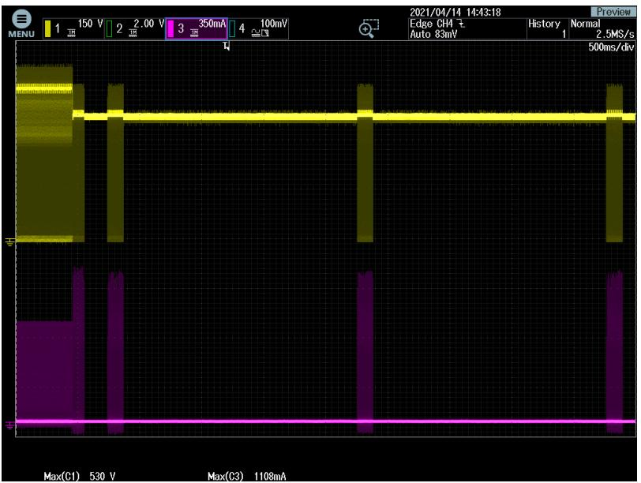

265 VAC

CH1 VDS  
CH3 IDS

$$
V _ {D S \_ M A X} = 5 3 0 \mathrm{V}
$$

$$
I _ {D S \_ M A X} = 1. 1 \mathrm{A}
$$

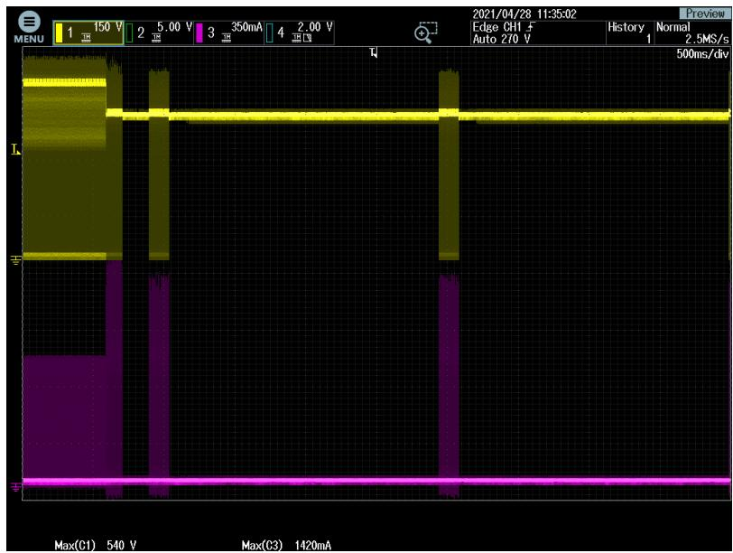

265 VAC

CH1 VDS  
CH3 IDS

$$
V _ {D S \_ M A X} = 5 4 0 \mathrm{V}
$$

$$
I _ {D S \_ M A X} = 1. 4 2 \mathrm{A}
$$

## 温升测试

BPA8619P

<table><tr><td rowspan="2">项目</td><td>85VAC</td><td>115VAC</td><td>230VAC</td><td>265VAC</td></tr><tr><td>温度(°C)</td><td>温度(°C)</td><td>温度(°C)</td><td>温度(°C)</td></tr><tr><td>环境温度</td><td>50</td><td>50</td><td>50</td><td>50</td></tr><tr><td>BP8619P (U2)</td><td>98.96</td><td>91.77</td><td>93.69</td><td>99.02</td></tr><tr><td>变压器绕组(T1)</td><td>77.54</td><td>77.28</td><td>80.37</td><td>82.04</td></tr><tr><td>变压器磁芯(T1)</td><td>72.56</td><td>72.83</td><td>76.14</td><td>77.71</td></tr><tr><td>整流二极管(D3)</td><td>96.85</td><td>96.5</td><td>97.6</td><td>98.37</td></tr><tr><td>整流桥(D1)</td><td>72.85</td><td>67.16</td><td>61.75</td><td>61.23</td></tr><tr><td>输入电解电容(C6)</td><td>72.22</td><td>68.71</td><td>67.4</td><td>68.54</td></tr><tr><td>输出电解电容(C3)</td><td>65.86</td><td>65.71</td><td>66.43</td><td>66.99</td></tr></table>

TNY279P

<table><tr><td rowspan="2">项目</td><td>85VAC</td><td>115VAC</td><td>230VAC</td><td>265VAC</td></tr><tr><td>温度(°C)</td><td>温度(°C)</td><td>温度(°C)</td><td>温度(°C)</td></tr><tr><td>环境温度</td><td>50</td><td>50</td><td>50</td><td>50</td></tr><tr><td>TNY279 (U2)</td><td>98.93</td><td>90.86</td><td>89.6</td><td>91.42</td></tr><tr><td>变压器绕组(T1)</td><td>77.92</td><td>77.48</td><td>80.43</td><td>81.6</td></tr><tr><td>变压器磁芯(T1)</td><td>75.94</td><td>76.15</td><td>79.95</td><td>81.3</td></tr><tr><td>整流二极管(D3)</td><td>96.92</td><td>96.44</td><td>97.61</td><td>98.23</td></tr><tr><td>整流桥(D1)</td><td>72.06</td><td>66.34</td><td>60.23</td><td>59.64</td></tr><tr><td>输入电解电容(C6)</td><td>72.71</td><td>68.65</td><td>66.25</td><td>66.52</td></tr><tr><td>输出电解电容(C3)</td><td>67.82</td><td>67.47</td><td>68.3</td><td>68.7</td></tr></table>

备注：增大芯片Source散热铜箔面积可以降低芯片温度

115Vac Line

230Vac Line

115Vac Neutral

230Vac Neutral

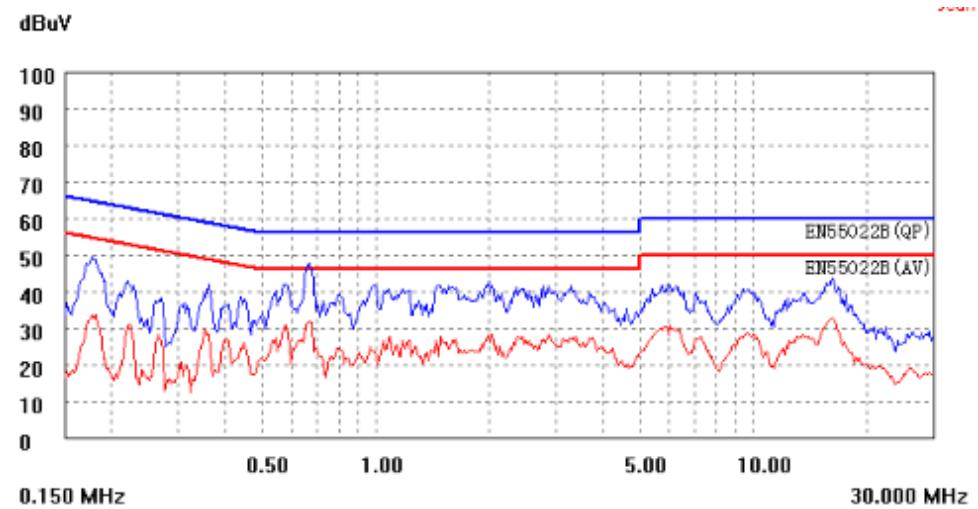

115Vac Line  
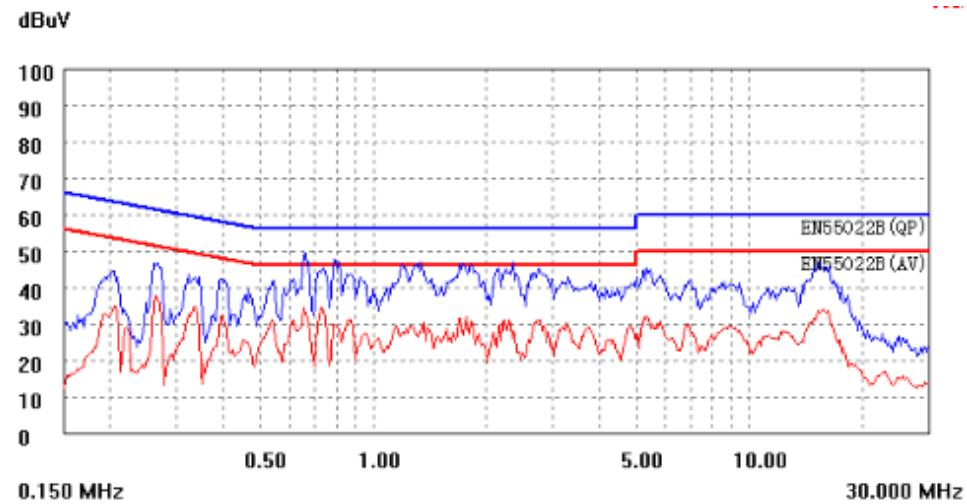

230Vac Line

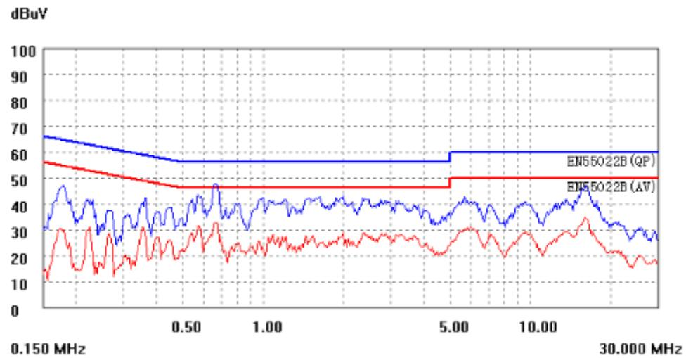

115Vac Neutral

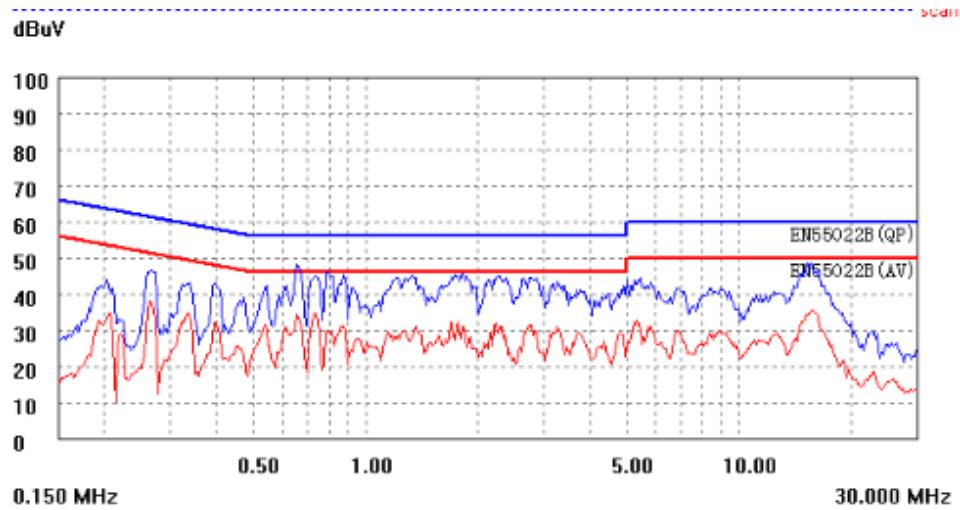

230Vac Neutral

## Surge

BPA8619P

<table><tr><td>差模</td><td>电压</td><td>相位角</td><td>发生器阻抗</td><td>测试次数</td><td>测试结果</td></tr><tr><td>L to N</td><td>+2kV</td><td>0/90/180/270</td><td>2</td><td>10</td><td>Pass</td></tr><tr><td>L to N</td><td>-2kV</td><td>0/90/180/270</td><td>2</td><td>10</td><td>Pass</td></tr><tr><td>L to PE</td><td>+4kV</td><td>0/90/180/270</td><td>12</td><td>10</td><td>Pass</td></tr><tr><td>L to PE</td><td>-4kV</td><td>0/90/180/270</td><td>12</td><td>10</td><td>Pass</td></tr><tr><td>N to PE</td><td>+4kV</td><td>0/90/180/270</td><td>12</td><td>10</td><td>Pass</td></tr><tr><td>N to PE</td><td>-4kV</td><td>0/90/180/270</td><td>12</td><td>10</td><td>Pass</td></tr></table>

TNY279P

<table><tr><td>差模</td><td>电压</td><td>相位角</td><td>发生器阻抗</td><td>测试次数</td><td>测试结果</td></tr><tr><td>L to N</td><td>+2kV</td><td>0/90/180/270</td><td>2</td><td>10</td><td>Pass</td></tr><tr><td>L to N</td><td>-2kV</td><td>0/90/180/270</td><td>2</td><td>10</td><td>Pass</td></tr><tr><td>L to PE</td><td>+4kV</td><td>0/90/180/270</td><td>12</td><td>10</td><td>Pass</td></tr><tr><td>L to PE</td><td>-4kV</td><td>0/90/180/270</td><td>12</td><td>10</td><td>Pass</td></tr><tr><td>N to PE</td><td>+4kV</td><td>0/90/180/270</td><td>12</td><td>10</td><td>Pass</td></tr><tr><td>N to PE</td><td>-4kV</td><td>0/90/180/270</td><td>12</td><td>10</td><td>Pass</td></tr></table>

## EFT

BPA8619P

<table><tr><td>差模</td><td>电压</td><td>脉冲群持续时间</td><td>脉冲频率</td><td>测试时间</td><td>测试结果</td></tr><tr><td>L to N</td><td>+4kV</td><td>15ms</td><td>5kHz</td><td>120s</td><td>Pass</td></tr><tr><td>L to N</td><td>-4kV</td><td>15ms</td><td>5kHz</td><td>120s</td><td>Pass</td></tr><tr><td>L to N</td><td>+4kV</td><td>0.75ms</td><td>100kHz</td><td>120s</td><td>Pass</td></tr><tr><td>L to N</td><td>-4kV</td><td>0.75ms</td><td>100kHz</td><td>120s</td><td>Pass</td></tr><tr><td>L to N</td><td>+2kV</td><td>2ms</td><td>38kHz</td><td>120s</td><td>Pass</td></tr><tr><td>L to N</td><td>-2kV</td><td>2ms</td><td>38kHz</td><td>120s</td><td>Pass</td></tr><tr><td>L to N</td><td>+4kV</td><td>2ms</td><td>38kHz</td><td>120s</td><td>Pass</td></tr><tr><td>L to N</td><td>-4kV</td><td>2ms</td><td>38kHz</td><td>120s</td><td>Pass</td></tr></table>

TNY279P

<table><tr><td>差模</td><td>电压</td><td>脉冲群持续时间</td><td>脉冲频率</td><td>测试时间</td><td>测试结果</td></tr><tr><td>L to N</td><td>+4kV</td><td>15ms</td><td>5kHz</td><td>120s</td><td>Pass</td></tr><tr><td>L to N</td><td>-4kV</td><td>15ms</td><td>5kHz</td><td>120s</td><td>Pass</td></tr><tr><td>L to N</td><td>+4kV</td><td>0.75ms</td><td>100kHz</td><td>120s</td><td>Pass</td></tr><tr><td>L to N</td><td>-4kV</td><td>0.75ms</td><td>100kHz</td><td>120s</td><td>Pass</td></tr><tr><td>L to N</td><td>+2kV</td><td>2ms</td><td>38kHz</td><td>120s</td><td>Pass</td></tr><tr><td>L to N</td><td>-2kV</td><td>2ms</td><td>38kHz</td><td>120s</td><td>Pass</td></tr><tr><td>L to N</td><td>+4kV</td><td>2ms</td><td>38kHz</td><td>120s</td><td>Pass</td></tr><tr><td>L to N</td><td>-4kV</td><td>2ms</td><td>38kHz</td><td>120s</td><td>Pass</td></tr></table>

BPA8619P

<table><tr><td>测试点</td><td>电压(V)</td><td>放电类型</td><td>放电次数</td><td>测试结果</td></tr><tr><td>Vo</td><td>+8kV</td><td>接触放电</td><td>10</td><td>Pass</td></tr><tr><td>Vo</td><td>-8kV</td><td>接触放电</td><td>10</td><td>Pass</td></tr><tr><td>GND</td><td>+8kV</td><td>接触放电</td><td>10</td><td>Pass</td></tr><tr><td>GND</td><td>-8kV</td><td>接触放电</td><td>10</td><td>Pass</td></tr><tr><td>Vo</td><td>+15kV</td><td>空气放电</td><td>10</td><td>Pass</td></tr><tr><td>Vo</td><td>-15kV</td><td>空气放电</td><td>10</td><td>Pass</td></tr><tr><td>GND</td><td>+15kV</td><td>空气放电</td><td>10</td><td>Pass</td></tr><tr><td>GND</td><td>-15kV</td><td>空气放电</td><td>10</td><td>Pass</td></tr></table>

TNY279P

<table><tr><td>测试点</td><td>电压(V)</td><td>放电类型</td><td>放电次数</td><td>测试结果</td></tr><tr><td>Vo</td><td>+8kV</td><td>接触放电</td><td>10</td><td>Pass</td></tr><tr><td>Vo</td><td>-8kV</td><td>接触放电</td><td>10</td><td>Pass</td></tr><tr><td>GND</td><td>+8kV</td><td>接触放电</td><td>10</td><td>Pass</td></tr><tr><td>GND</td><td>-8kV</td><td>接触放电</td><td>10</td><td>Pass</td></tr><tr><td>Vo</td><td>+15kV</td><td>空气放电</td><td>10</td><td>Pass</td></tr><tr><td>Vo</td><td>-15kV</td><td>空气放电</td><td>10</td><td>Pass</td></tr><tr><td>GND</td><td>+15kV</td><td>空气放电</td><td>10</td><td>Pass</td></tr><tr><td>GND</td><td>-15kV</td><td>空气放电</td><td>10</td><td>Pass</td></tr></table>

## THANK YOU FOR WATCHING
