## BPA8619P 参考设计

## (24V/0.8A)

上海晶丰明源半导体股份有限公司

Shanghai Bright Power Semiconductor Co., Ltd.

陈耀兵

2022 3 24

BPA861X  
电源规格  
电路图  
◼BOM  
◼PCB Layout  
电路实物图  
变压器规格书  
性能测试数据

## 产品特点:

➢ 700V MOSFET  
➢ ON/OFF  
》内置软启动功能  
》集成高压启动、自供电电路  
》低音频噪声  
》输入过/欠压保护

## 应用领域:

》家用电器辅助电源  
》电机驱动辅助电源  
➢ IOT/ /  
》工业控制辅助电源

## 电源规格

<table><tr><td>项目描述</td><td>符号</td><td>最小</td><td>典型</td><td>最大</td><td>单位</td><td>备注</td></tr><tr><td colspan="7">输入</td></tr><tr><td>电压</td><td> $V_{IN}$ </td><td>90</td><td>115/230</td><td>264</td><td> $V_{AC}$ </td><td></td></tr><tr><td>频率</td><td> $f_{LINE}$ </td><td>47</td><td>50/60</td><td>63</td><td>Hz</td><td></td></tr><tr><td colspan="7">输出</td></tr><tr><td>输出电压</td><td> $V_{OUT}$ </td><td></td><td>24</td><td></td><td>V</td><td>±3%</td></tr><tr><td>输出电流</td><td> $I_{OUT}$ </td><td></td><td>0.8</td><td></td><td>A</td><td></td></tr><tr><td>输出电压纹波</td><td> $V_{RIPPLE}$ </td><td></td><td></td><td>200</td><td>mV</td><td>20MHz带宽</td></tr><tr><td>连续输出功率</td><td> $P_{OUT}$ </td><td></td><td>19.2</td><td></td><td>W</td><td></td></tr><tr><td colspan="7">效率</td></tr><tr><td>待机功耗</td><td> $P_{STDBY}$ </td><td></td><td></td><td>130</td><td>mW</td><td>230VAC</td></tr><tr><td>满载效率</td><td>η</td><td>82</td><td></td><td></td><td>%</td><td>115VAC/230VAC</td></tr><tr><td colspan="7">环境</td></tr><tr><td>传导EMI</td><td></td><td colspan="4">满足CISPR22/EN55022 Class B,至少6dB 裕量</td><td></td></tr><tr><td>Surge</td><td></td><td></td><td>2</td><td></td><td>kV</td><td>差模</td></tr><tr><td>EFT</td><td></td><td></td><td>4</td><td></td><td>kV</td><td>5kHz/100kHz/38kHz</td></tr><tr><td>ESD</td><td></td><td></td><td>15</td><td></td><td>kV</td><td>接触8kV,空气15kV</td></tr><tr><td>工作环境温度</td><td> $T_{AMP}$ </td><td>0</td><td></td><td>40</td><td>°C</td><td></td></tr></table>

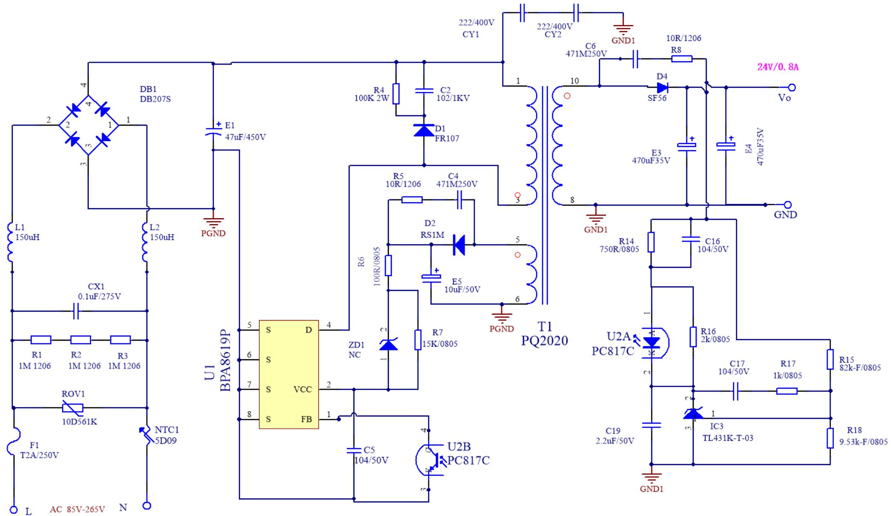

<table><tr><td>序号</td><td>元件标号</td><td>参数描述</td><td>封装尺寸</td><td>数量</td></tr><tr><td>1</td><td>C2</td><td>102/1KV</td><td>C CAP5A</td><td>1</td></tr><tr><td>2</td><td>C4, C6</td><td>471M250V</td><td>1206-C</td><td>2</td></tr><tr><td>3</td><td>C5, C16, C17</td><td>104/50V</td><td>0805-C</td><td>3</td></tr><tr><td>4</td><td>C19</td><td>2.2uF/50V</td><td>0805-C</td><td>1</td></tr><tr><td>5</td><td>CX1</td><td>0.1uF/275VAC</td><td>CX 14*7 P10</td><td>1</td></tr><tr><td>6</td><td>CY1, CY2</td><td>222/400V</td><td>CY10</td><td>2</td></tr><tr><td>7</td><td>D1</td><td>FR107</td><td>DO-41-P5-2</td><td>1</td></tr><tr><td>8</td><td>D2</td><td>RS1M</td><td>D SMA</td><td>1</td></tr><tr><td>9</td><td>D4</td><td>SF56</td><td>DO-201AD</td><td>1</td></tr><tr><td>10</td><td>DB1</td><td>ABS210</td><td>BD_SMD (bs210)</td><td>1</td></tr><tr><td>11</td><td>E1</td><td>47uF/450V</td><td>EC 18 P5.0</td><td>1</td></tr><tr><td>12</td><td>E3, E4</td><td>470uF/35V</td><td>EC 10 P5.0</td><td>2</td></tr><tr><td>13</td><td>E5</td><td>10uF/50V</td><td>EC 5 P2.5</td><td>1</td></tr><tr><td>14</td><td>F1</td><td>T2A/250V</td><td>F-8.5X4-P5</td><td>1</td></tr><tr><td>15</td><td>IC3</td><td>TL431K-T-03</td><td>SOT23</td><td>1</td></tr><tr><td>16</td><td>L1, L2</td><td>150uH</td><td>6*8</td><td>2</td></tr><tr><td>17</td><td>NTC1</td><td>5D09</td><td>NTC-7.6X3-P5</td><td>1</td></tr><tr><td>18</td><td>R1, R2, R3</td><td>1M 1206</td><td>1206-r</td><td>3</td></tr><tr><td>19</td><td>R4</td><td>100K 2W</td><td>R-1W-P5</td><td>1</td></tr></table>

<table><tr><td>序号</td><td>元件标号</td><td>参数描述</td><td>封装尺寸</td><td>数量</td></tr><tr><td>20</td><td>R5, R8</td><td>10R/1206</td><td>1206-r</td><td>2</td></tr><tr><td>21</td><td>R6</td><td>100R/0805</td><td>0805-r</td><td>1</td></tr><tr><td>22</td><td>R7</td><td>4.3K/0805</td><td>0805-r</td><td>1</td></tr><tr><td>23</td><td>R14</td><td>750R/0805</td><td>0805-r</td><td>1</td></tr><tr><td>24</td><td>R15</td><td>82k-F/0805</td><td>0805-R</td><td>1</td></tr><tr><td>25</td><td>R16</td><td>2k/0805</td><td>0805-r</td><td>1</td></tr><tr><td>26</td><td>R17</td><td>1k/0805</td><td>0805-r</td><td>1</td></tr><tr><td>27</td><td>R18</td><td>9.53k-F/0805</td><td>0805-r</td><td>1</td></tr><tr><td>28</td><td>ROV1</td><td>10D561K</td><td>MOV-10X5.5-P7.5</td><td>1</td></tr><tr><td>29</td><td>T1</td><td>PQ2020</td><td>T</td><td>1</td></tr><tr><td>30</td><td>U1</td><td>BPA8619P</td><td>DIP8</td><td>1</td></tr><tr><td>31</td><td>U2</td><td>PC817C</td><td>DIP4</td><td>1</td></tr></table>

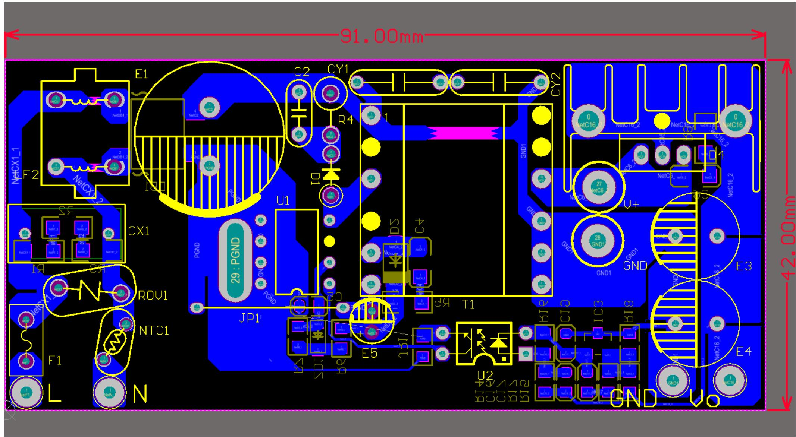

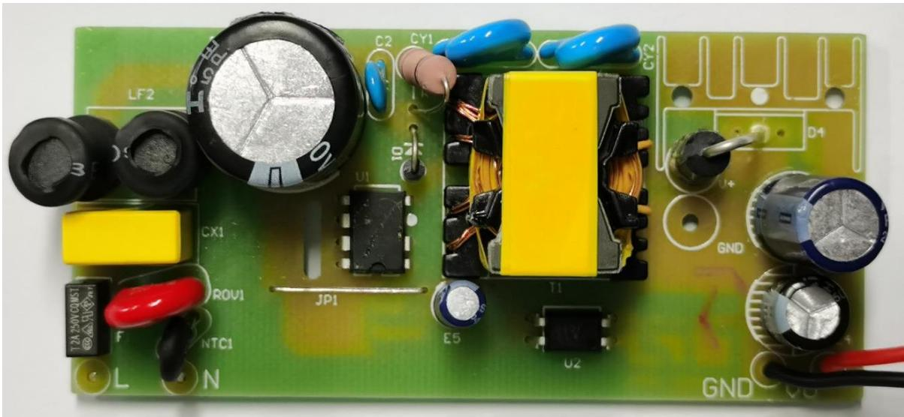

TOP SIDE

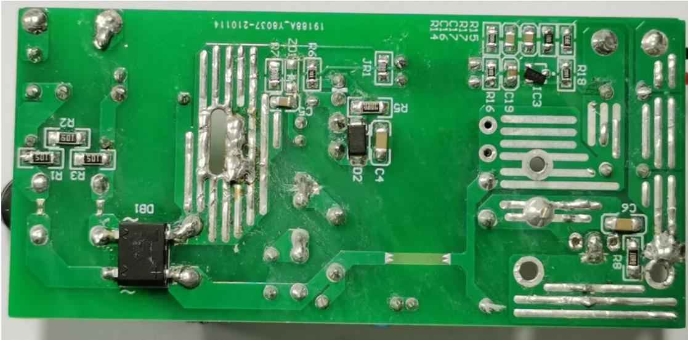

BOTTOM SIDE

## 变压器规格书

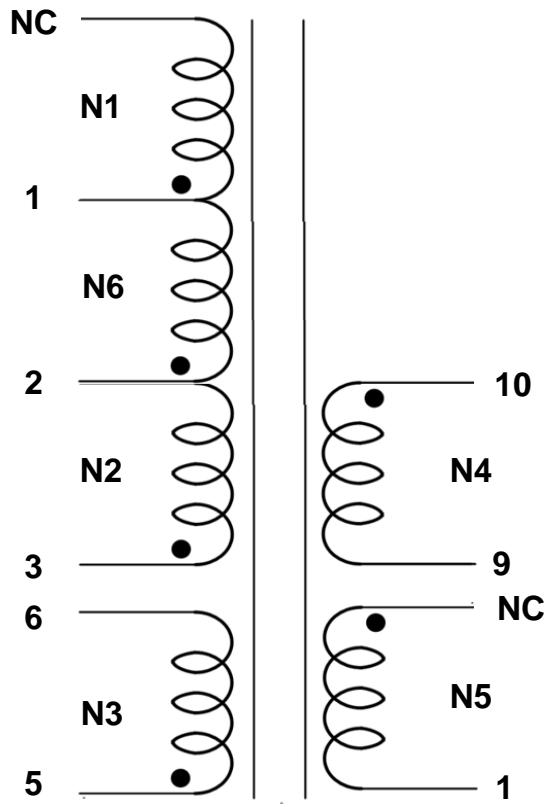

<table><tr><td>序号</td><td>起始脚</td><td>终止脚</td><td>绕制规则</td><td>匝数</td><td>绕线方式</td></tr><tr><td>N1</td><td>1</td><td>NC</td><td>2UEW φ0.25*2P</td><td>20Ts</td><td>密绕一层(PIN脚朝外)</td></tr><tr><td>胶带</td><td></td><td></td><td></td><td>2Ts</td><td></td></tr><tr><td>N2</td><td>3</td><td>2</td><td>2UEW φ0.29*1P</td><td>35Ts</td><td>密绕一层(PIN脚朝外)</td></tr><tr><td>胶带</td><td></td><td></td><td></td><td>2Ts</td><td></td></tr><tr><td>N3</td><td>5</td><td>6</td><td>2UEW φ0.16*3P</td><td>19Ts</td><td>均匀绕一层(PIN脚朝外)</td></tr><tr><td>胶带</td><td></td><td></td><td></td><td>3Ts</td><td></td></tr><tr><td>N4</td><td>10</td><td>9</td><td>TEX-E φ0.4*1P</td><td>19Ts</td><td>均匀绕一层(PIN脚朝外)</td></tr><tr><td>胶带</td><td></td><td></td><td></td><td>3Ts</td><td></td></tr><tr><td>N5</td><td>NC</td><td>1</td><td>2UEW φ0.16*3P</td><td>19Ts</td><td>均匀绕一层(PIN脚朝外)</td></tr><tr><td>胶带</td><td></td><td></td><td></td><td>2Ts</td><td></td></tr><tr><td>N6</td><td>2</td><td>1</td><td>2UEW φ0.29*1P</td><td>34Ts</td><td>密绕一层(PIN脚朝外)</td></tr><tr><td>胶带</td><td></td><td></td><td></td><td>3Ts</td><td></td></tr></table>

## 规格参数：

1）骨架：PQ2020立式（6+6PIN），磁芯材质：PQ2020 PC40 或同等材质 ， $\mathsf { A e } = 6 2 \mathsf { m m } ^ { 2 }$ ；  
2）N1、N2、N4、N5: 2UEW 漆包线；N3: 三层绝缘线；  
3）绝缘胶带:3M900 或同等材质；  
4）初级绕组感量Lp：1.7mH±5%（测试条件： 0.3V，100kHz）；  
5）漏感量Llk：要求控制在初级绕组的1.5%以内(测试条件： 0.3 V，100kHz）；  
6）耐压测试= 3KV 2mA 1Min；  
7）成品要求：浸凡立水；

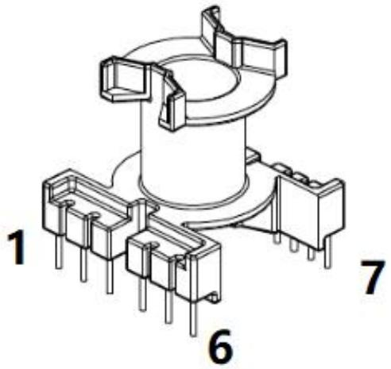

待机功耗  
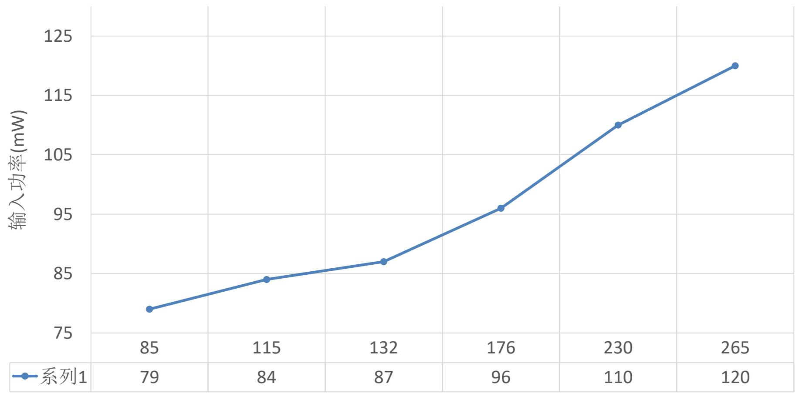

输入电压(Vac)

效率曲线  
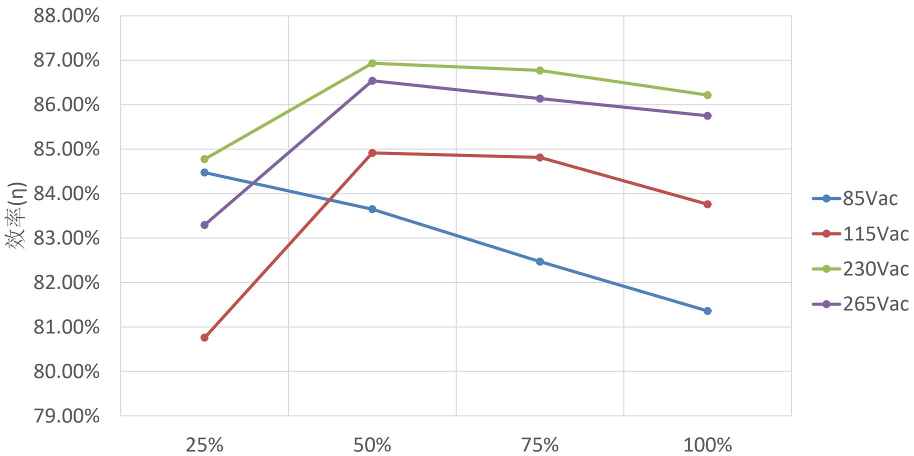

负载比例

<table><tr><td> $V_{IN}(VAC)$ </td><td>Load(%)</td><td> $P_{IN}(W)$ </td><td> $V_{OUT}(V)$ </td><td>线端</td><td> $I_{OUT}(A)$ </td><td> $P_{OUT}(W)$ </td><td>Eff(%)</td><td>AVG Eff(%)</td></tr><tr><td rowspan="6">85</td><td>空载</td><td></td><td></td><td></td><td>0</td><td>0</td><td></td><td></td></tr><tr><td>10%</td><td>2.34</td><td>23.865</td><td></td><td>0.08</td><td>1.9092</td><td>81.59%</td><td></td></tr><tr><td>25%</td><td>5.65</td><td>23.864</td><td></td><td>0.2</td><td>4.7728</td><td>84.47%</td><td rowspan="4">82.99%</td></tr><tr><td>50%</td><td>11.41</td><td>23.861</td><td></td><td>0.4</td><td>9.5444</td><td>83.65%</td></tr><tr><td>75%</td><td>17.36</td><td>23.861</td><td></td><td>0.6</td><td>14.3166</td><td>82.47%</td></tr><tr><td>100%</td><td>23.46</td><td>23.859</td><td></td><td>0.8</td><td>19.0872</td><td>81.36%</td></tr><tr><td rowspan="6">115</td><td>空载</td><td></td><td></td><td></td><td></td><td>0</td><td></td><td></td></tr><tr><td>10%</td><td>2.38</td><td>23.865</td><td></td><td>0.08</td><td>1.9092</td><td>80.22%</td><td></td></tr><tr><td>25%</td><td>5.91</td><td>23.864</td><td></td><td>0.2</td><td>4.7728</td><td>80.76%</td><td rowspan="4">83.56%</td></tr><tr><td>50%</td><td>11.24</td><td>23.861</td><td></td><td>0.4</td><td>9.5444</td><td>84.91%</td></tr><tr><td>75%</td><td>16.88</td><td>23.861</td><td></td><td>0.6</td><td>14.3166</td><td>84.81%</td></tr><tr><td>100%</td><td>22.79</td><td>23.861</td><td></td><td>0.8</td><td>19.0888</td><td>83.76%</td></tr><tr><td rowspan="6">230</td><td>空载</td><td></td><td></td><td></td><td></td><td>0</td><td></td><td></td></tr><tr><td>10%</td><td>2.52</td><td>23.865</td><td></td><td>0.08</td><td>1.9092</td><td>75.76%</td><td></td></tr><tr><td>25%</td><td>5.63</td><td>23.864</td><td></td><td>0.2</td><td>4.7728</td><td>84.77%</td><td rowspan="4">86.17%</td></tr><tr><td>50%</td><td>10.98</td><td>23.863</td><td></td><td>0.4</td><td>9.5452</td><td>86.93%</td></tr><tr><td>75%</td><td>16.5</td><td>23.862</td><td></td><td>0.6</td><td>14.3172</td><td>86.77%</td></tr><tr><td>100%</td><td>22.14</td><td>23.86</td><td></td><td>0.8</td><td>19.088</td><td>86.21%</td></tr><tr><td rowspan="6">265</td><td>空载</td><td></td><td></td><td></td><td></td><td>0</td><td></td><td></td></tr><tr><td>10%</td><td>2.62</td><td>23.865</td><td></td><td>0.08</td><td>1.9092</td><td>72.87%</td><td></td></tr><tr><td>25%</td><td>5.73</td><td>23.864</td><td></td><td>0.2</td><td>4.7728</td><td>83.29%</td><td rowspan="4">85.43%</td></tr><tr><td>50%</td><td>11.03</td><td>23.863</td><td></td><td>0.4</td><td>9.5452</td><td>86.54%</td></tr><tr><td>75%</td><td>16.62</td><td>23.86</td><td></td><td>0.6</td><td>14.316</td><td>86.14%</td></tr><tr><td>100%</td><td>22.26</td><td>23.86</td><td></td><td>0.8</td><td>19.088</td><td>85.75%</td></tr></table>

## 输出电压调整率

<table><tr><td> $V_{IN}(VAC)$  $I_{OUT}(A)$ </td><td>90</td><td>115</td><td>132</td><td>176</td><td>230</td><td>265</td><td>平均值</td><td>线调整率</td></tr><tr><td>0</td><td>23.862</td><td>23.861</td><td>23.86</td><td>23.861</td><td>23.861</td><td>23.861</td><td>23.861</td><td>0.01%</td></tr><tr><td>20%</td><td>23.859</td><td>23.859</td><td>23.859</td><td>23.859</td><td>23.858</td><td>23.859</td><td>23.859</td><td>0.00%</td></tr><tr><td>40%</td><td>23.858</td><td>23.858</td><td>23.858</td><td>23.858</td><td>23.858</td><td>23.858</td><td>23.858</td><td>0.00%</td></tr><tr><td>60%</td><td>23.857</td><td>23.857</td><td>23.857</td><td>23.857</td><td>23.858</td><td>23.856</td><td>23.857</td><td>0.01%</td></tr><tr><td>80%</td><td>23.857</td><td>23.858</td><td>23.857</td><td>23.858</td><td>23.858</td><td>23.858</td><td>23.858</td><td>0.00%</td></tr><tr><td>100%</td><td>23.859</td><td>23.859</td><td>23.858</td><td>23.857</td><td>23.857</td><td>23.858</td><td>23.858</td><td>0.01%</td></tr><tr><td>平均值</td><td>23.859</td><td>23.859</td><td>23.858</td><td>23.858</td><td>23.858</td><td>23.858</td><td></td><td></td></tr><tr><td>负载调整率</td><td>0.02%</td><td>0.02%</td><td>0.01%</td><td>0.02%</td><td>0.02%</td><td>0.02%</td><td></td><td></td></tr></table>

◼ 计算方法：调整率=100%\*(最大值-最小值)/平均值

## 输出电压纹波

20MHz带宽，去掉示波器探头正端夹子和地线环，10uF/50V 0.1uF/50V

85 VAC  
CH1 VOUT $\mathsf { V } _ { \mathsf { O U T } }$ Ripple $v _ { p | c - P K } { = } 1 3 0 m v$  
➢ Full Load

Test Condition:

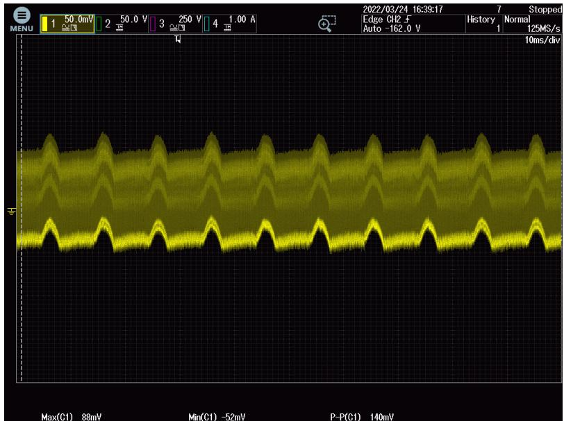

115 VAC  
CH1 VOUT ${ \mathsf { C H 1 } } { \mathsf { V } } _ { \mathsf { O U T } }$ Ripple $V _ { \mathsf { P K - P K } } { = } 1 4 0 ~ \mathsf { m V }$  
➢ Full Load

Test Condition:

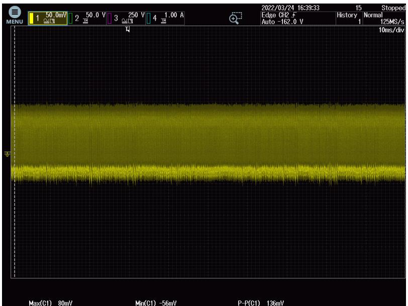

230 $\mathsf { v } _ { \mathsf { A C } }$  
CH1 VOUT $\mathsf { V } _ { \mathsf { O U T } }$ Ripple $v _ { p _ { \mathrm { K - P K } } } { = } 1 3 6 ~ \mathsf  m v$  
➢ Full Load

Test Condition:

265 $\mathsf { v } _ { \mathsf { A C } }$  
CH1 VOUT $\mathsf { V } _ { \mathsf { O U T } }$ Ripple $v _ { p _ { \mathrm { K - P K } } } { = } 1 2 8 ~ \mathsf { m V }$  
➢ Full Load

Test Condition:

## (50%-100%)

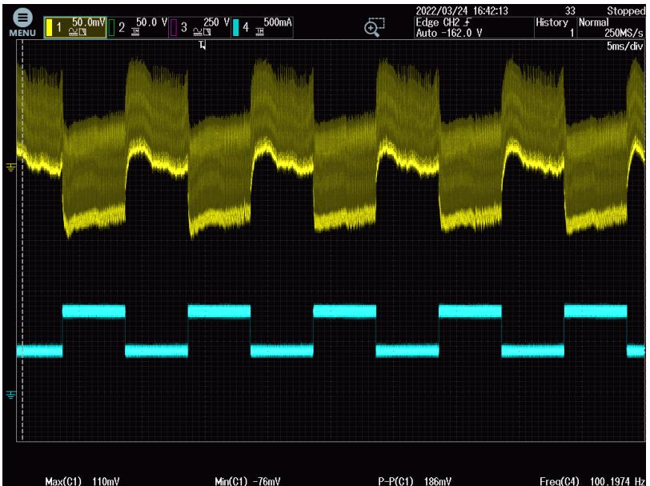

85 VAC

CH1 VOUT ${ \mathsf { C H 1 } } { \mathsf { V } } _ { \mathsf { O U T } }$ $V _ { \mathsf { P K - P K } } { = } 1 8 6 ~ \mathsf { m V }$  
$\mathsf { C H 4 } \mathsf { I } _ { \mathsf { O U T } }$

## Test Condition:

➢ $0 . 4 \ A { - } 0 . 8 \ A { - } 0 . 4 \ A$  
➢ Slew Rate: 0.5 A/μS  
➢ Frequency: 100 Hz

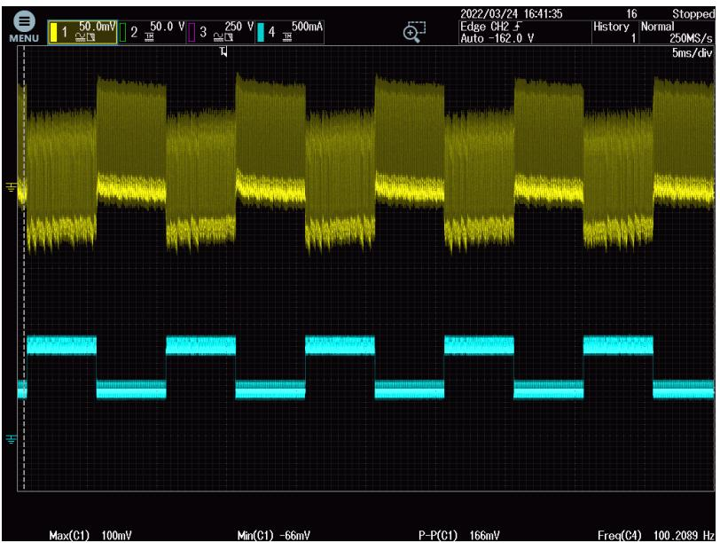

230 VAC

CH1 VOUT $\mathsf { V } _ { \mathsf { O U T } }$ $\mathsf { V } _ { \mathsf { P K - P K } } \equiv 1 6 6 \mathsf { m v }$

$\mathsf { C H 4 } \mathsf { l } _ { \mathsf { O U T } }$

## Test Condition:

➢ 0.4 A-0.8 A-0.4 A  
➢ Slew Rate: 0.5 $\mathsf { A } / \mu \mathsf { S }$  
➢ Frequency: 100 Hz

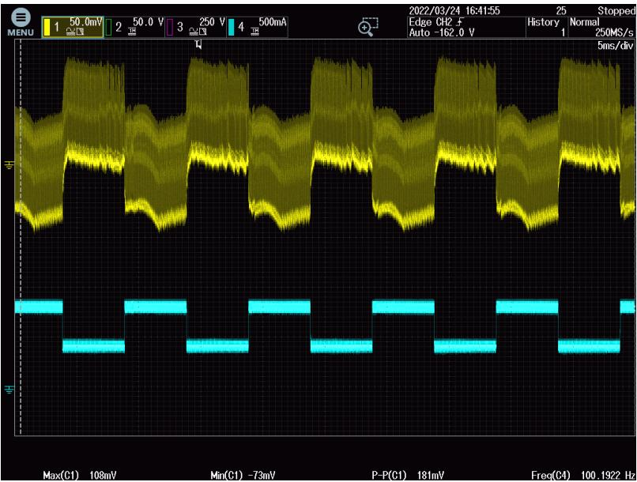

115 VAC

CH1 VOUT ${ \mathsf { C H 1 } } { \mathsf { V } } _ { \mathsf { O U T } }$ $v _ { p | c \cdot p | c } = 1 8 1 m v$  
$\mathsf { C H 4 } \mathsf { I } _ { \mathsf { O U T } }$

## Test Condition:

➢ $0 . 4 \ A { - } 0 . 8 \ A { - } 0 . 4 \ A$  
➢ Slew Rate: $0 . 5 \mathsf { A } / \mu \mathsf { S }$  
➢ Frequency: 100 Hz

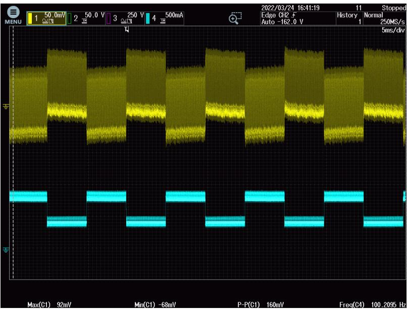

265 VAC

CH1 VOUT ${ \mathsf { C H 1 } } { \mathsf { V } } _ { \mathsf { O U T } }$ $v _ { p \vert k - P K } { = } 1 6 0 ~ \mathsf { m V }$  
$\mathsf { C H 4 } \mathsf { I } _ { \mathsf { O U T } }$

## Test Condition:

➢ 0.4 A-0.8 A-0.4 A  
➢ Slew Rate: $0 . 5 \mathsf { A } / \mu \mathsf { S }$  
➢ Frequency: 100 Hz

## (10%-90%)

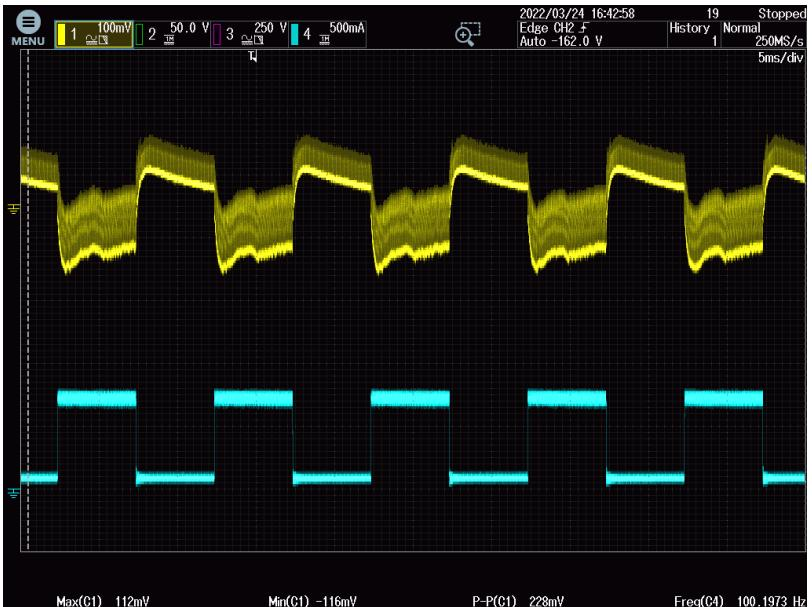

85 VAC

CH1 VOUT ${ \mathsf { C H 1 } } { \mathsf { V } } _ { \mathsf { O U T } }$ $v _ { p _ { k - P K } } = 2 2 8 m v$  
$\mathsf { C H 4 } \mathsf { I } _ { \mathsf { O U T } }$

## Test Condition:

➢ $0 . 0 8 \mathsf { A } \mathsf { - } 0 . 7 2 \mathsf { A } \mathsf { - } 0 . 0 8 \mathsf { A }$  
➢ Slew Rate: 0.5 A/μS  
➢ Frequency: 100 Hz

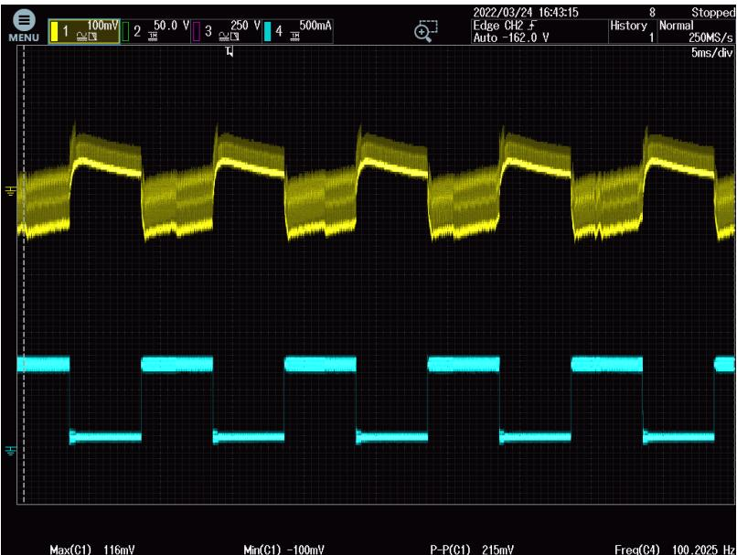

115 VAC

CH1 VOUT ${ \mathsf { C H 1 } } { \mathsf { V } } _ { \mathsf { O U T } }$ $v _ { p _ { \mathrm { K - P K } } } = 2 1 5 m v$  
$\mathsf { C H 4 } \mathsf { I } _ { \mathsf { O U T } }$

## Test Condition:

➢ $0 . 0 8 \mathsf { A } \mathsf { - } 0 . 7 2 \mathsf { A } \mathsf { - } 0 . 0 8 \mathsf { A }$  
➢ Slew Rate: 0.5 A/μS  
➢ Frequency: 100 Hz

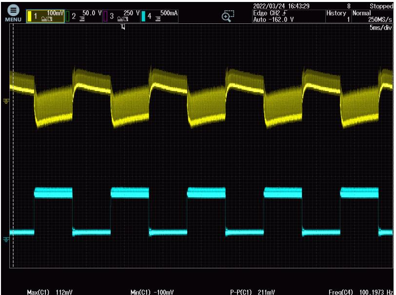

230 VAC

CH1 VOUT $\mathsf { V } _ { \mathsf { O U T } }$ $\mathsf { V } _ { \mathsf { P K - P K } } \equiv 2 1 1 \mathsf { m V }$  
$\mathsf { C H 4 } \mathsf { l } _ { \mathsf { O U T } }$

## Test Condition:

➢ $0 . 0 8 \ : \mathsf { A } – 0 . 7 2 \mathsf { A } – 0 . 0 8 \ : \mathsf { A }$  
➢ Slew Rate: 0.5 $\mathsf { A } / \mu \mathsf { S }$  
➢ Frequency: 100 Hz

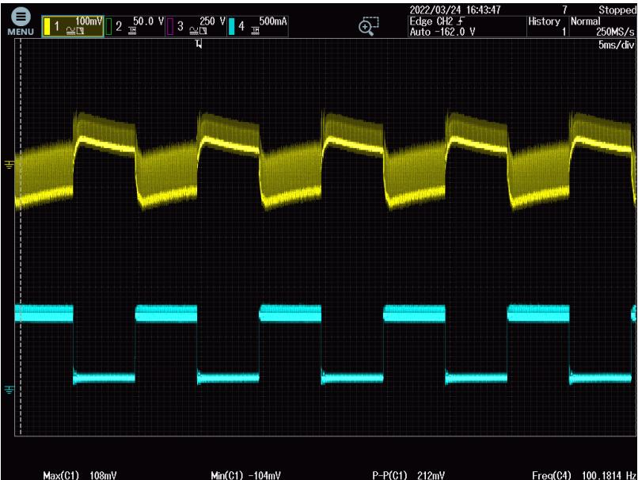

265 VAC

CH1 VOUT ${ \mathsf { C H 1 } } { \mathsf { V } } _ { \mathsf { O U T } }$ $\mathsf { V } _ { \mathsf { P K - P K } } { = } 2 1 2 \mathsf { m V }$  
$\mathsf { C H 4 } \mathsf { I } _ { \mathsf { O U T } }$

## Test Condition:

➢ 0.08 A-0.72A-0.08 A  
➢ Slew Rate: 0.5 A/μS  
➢ Frequency: 100 Hz

## 启动延时时间

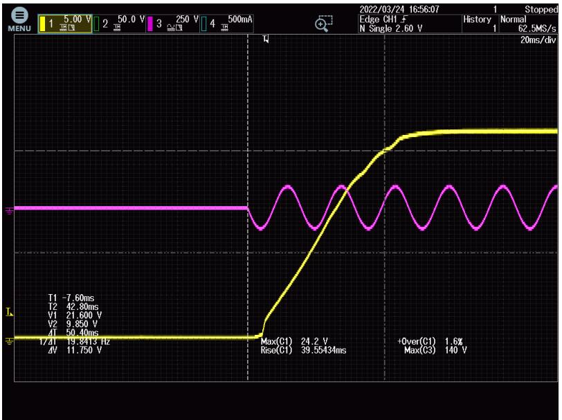

85VAC

CH1 VOUT  
CH3 Vin

Tdelay=50.4mS

Test Condition:

➢ Full Load

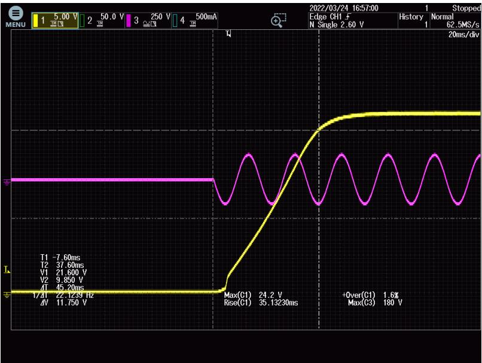

115 VAC

CH1 VOUT  
CH3 Vin

Tdelay=45.2mS

Test Condition:

➢ Full Load

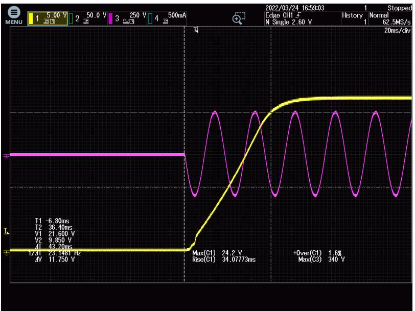

230 VAC

CH1 VOUT  
CH3 Vin

Tdelay=43.2mS

Test Condition:

➢ Full Load

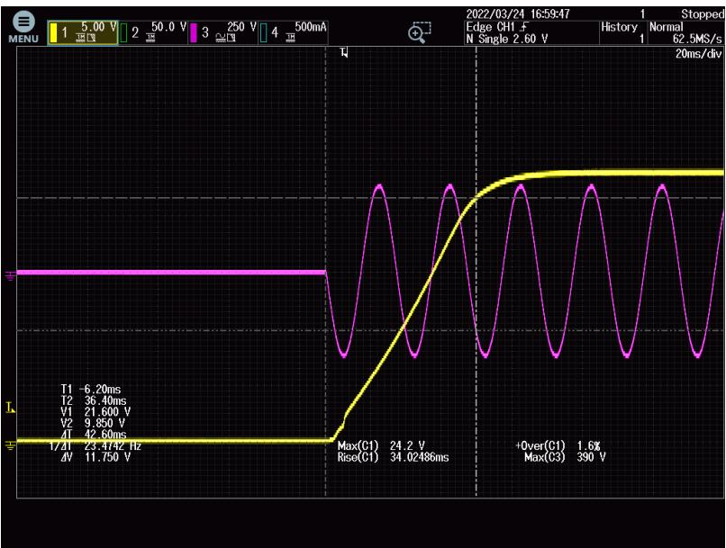

265 VAC

CH1 VOUT  
CH3 Vin

Tdelay=42.6mS

Test Condition:

➢ Full Load

## 输出电压开机波形

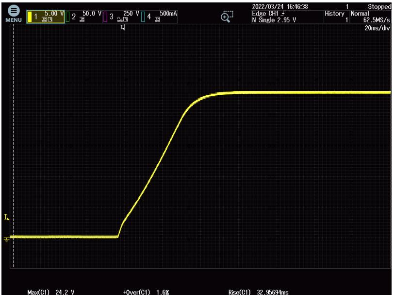

85 VAC

CH1 VOUT TRISE: 33 mS

## Test Condition:

➢ No Load

265 VAC

CH1 VOUT TRISE: 32.1 mS

## Test Condition:

➢ No Load

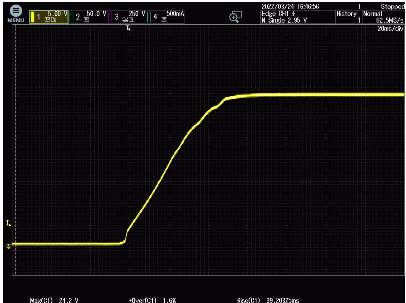

85 VAC

CH1 VOUT TRISE: 39.2 mS

## Test Condition:

➢ Full Load

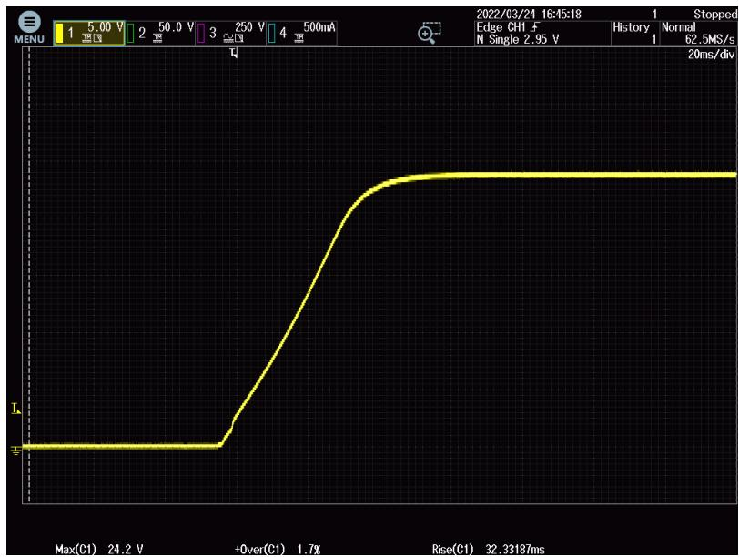

265 VAC

CH1 VOUT TRISE: 32.3 mS

## Test Condition:

➢ Full Load

## MOs漏源极电压电流波形 (启机)

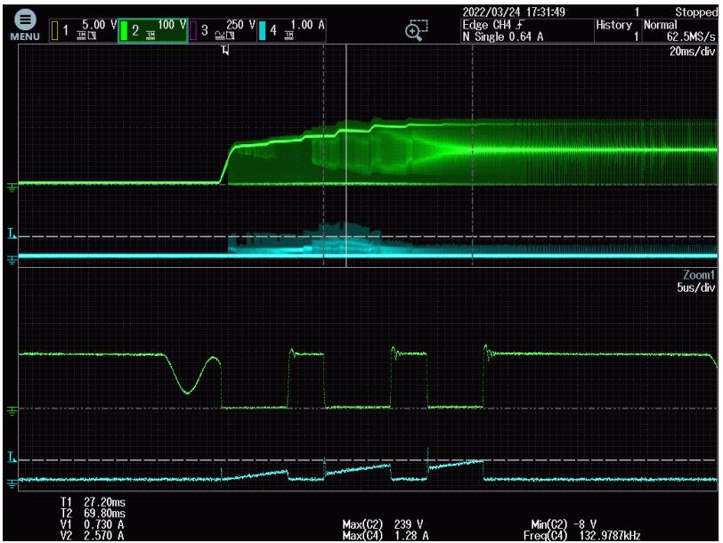

85 VAC

${ \mathsf { C H } } 2 { \mathsf { V } } _ { \mathsf { D S } }$  
$C H 4 1 _ { \mathsf { D } }$ $V _ { \mathsf { D S } } { = } 2 3 9 \ V$ IMAX=1.28 A $\mathsf { I } _ { \mathsf { M A X } } { = } 1 . 2 8 ~ \mathsf { A }$

Test Condition:  
➢ No Load  
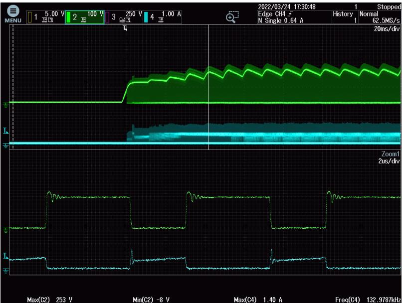

85 VAC

${ \mathsf { C H } } 2 { \mathsf { V } } _ { \mathsf { D S } }$  
$C H 4 1 _ { \mathsf { D } }$ $V _ { \mathsf { D S } } { = } 2 5 3 \mathsf { V }$ IMAX= 1.4 A $\mathsf { I } _ { \mathsf { M A X } } { = } 1 . 4 \mathsf { A }$

Test Condition:  
➢ Full Load  
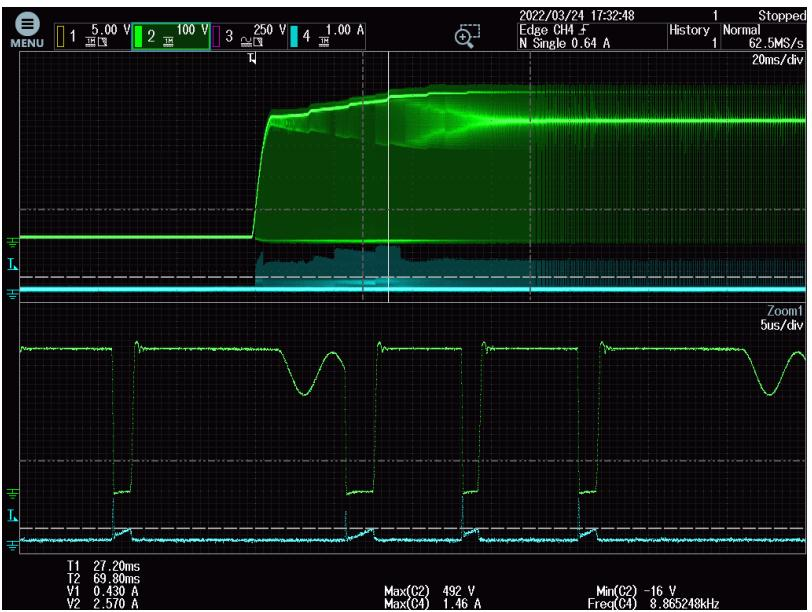

265 VAC

${ \mathsf { C H } } 2 \ { \mathsf { V } } _ { \mathsf { D S } }$  
$C H 4 1 _ { \mathsf { D } }$ $V _ { \mathsf { D } \mathsf { S } } { = } 4 9 2 \mathsf { V }$ $\mathsf { I } _ { \mathsf { M A X } } { = } 1 . 4 6 ~ \mathsf { A }$

Test Condition:  
➢ No Load  
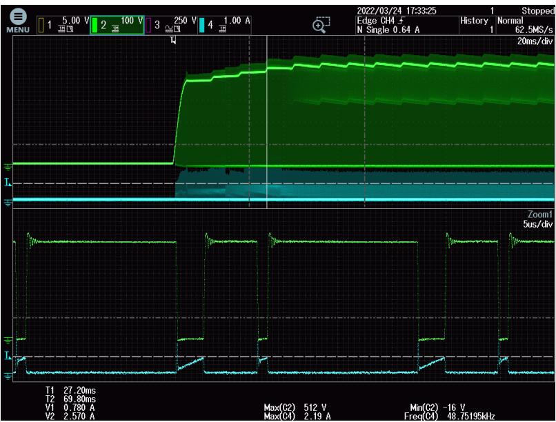

265 VAC

${ \mathsf { C H } } 2 { \mathsf { V } } _ { \mathsf { D S } }$  
CH4 ID $C H 4 1 _ { \mathsf { D } }$ $\mathtt { V } _ { \mathtt { D S } } mathtt { = } 5 1 2 \mathrm { V }$ $1 _ { \mathrm { { M A X } } } = 2 . 1 9 \cdot \mathsf { A }$

Test Condition:

➢ Full Load

## MOS漏源极电压电流波形 (正常工作)

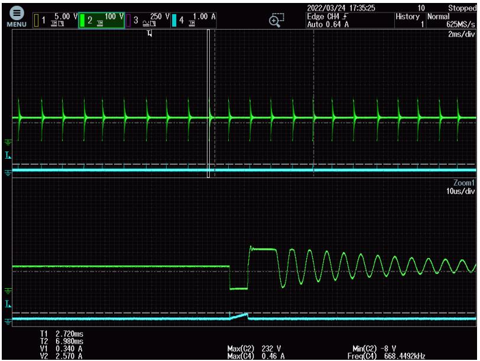

85 VAC

${ \mathsf { C H } } 2 { \mathsf { V } } _ { \mathsf { D S } }$  
$C H 4 1 _ { \mathsf { D } }$ $V _ { \mathsf { D } \mathsf { S } } = 2 3 2 \mathsf { V }$ IMAX= 460 mA $\mathsf { I } _ { \mathsf { M A X } } { = } 4 6 0 \mathsf { m } \mathsf { A }$

Test Condition:  
➢ No Load  
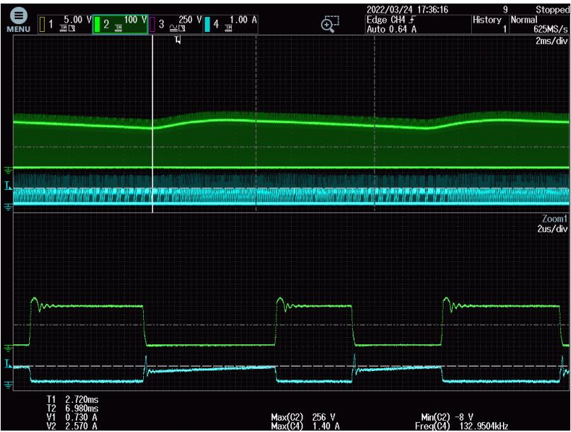

85 VAC

${ \mathsf { C H } } 2 { \mathsf { V } } _ { \mathsf { D S } }$  
$C H 4 1 _ { \mathsf { D } }$ $V _ { \mathrm { D S } } { = } 2 5 6 V$ $\mathsf { I } _ { \mathsf { M A X } } { = } 1 . 4 \mathsf { A }$

Test Condition:  
➢ Full Load  
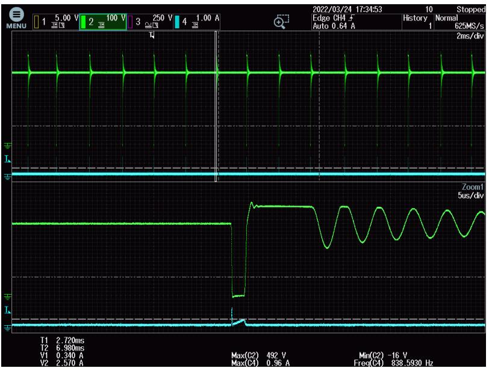

265 VAC

${ \mathsf { C H } } 2 \ { \mathsf { V } } _ { \mathsf { D S } }$  
$C H 4 1 _ { \mathsf { D } }$ $V _ { \mathsf { D } \mathsf { S } } { = } 4 9 2 \mathsf { V }$ IMAX=960 mA $\mathsf { I } _ { \mathsf { M A X } } { = } 9 6 0 ~ \mathsf { m A }$

Test Condition:  
➢ No Load  
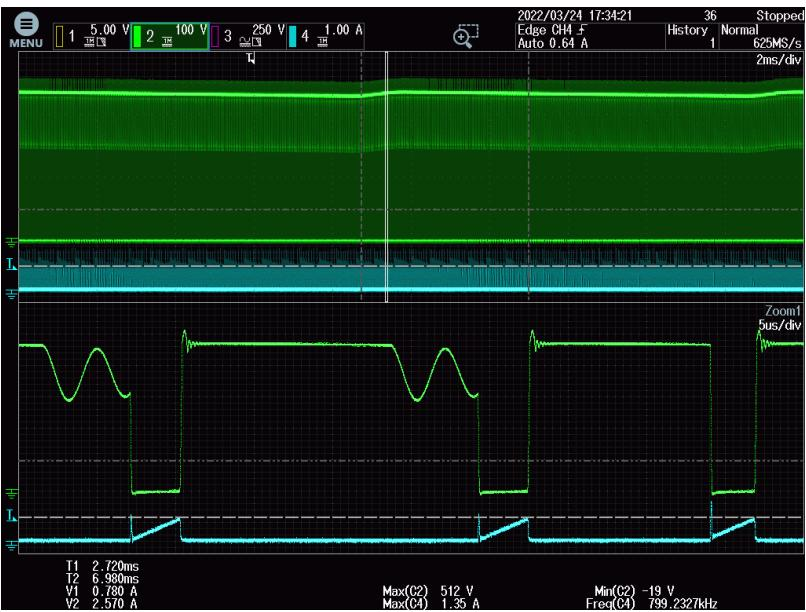

$2 6 5 \ : \mathsf { V } _ { \mathsf { A C } }$

${ \mathsf { C H } } 2 { \mathsf { V } } _ { \mathsf { D S } }$  
$C H 4 1 _ { \mathsf { D } }$ $\mathtt { V } _ { \mathsf { D } \mathsf { S } } mathtt { = } 5 1 2 \mathtt { V }$ $\mathsf { I } _ { \mathsf { M A X } } { = } 1 . 3 5 ~ \mathsf { A }$

Test Condition:

➢ Full Load

## 输出二极管电压波形

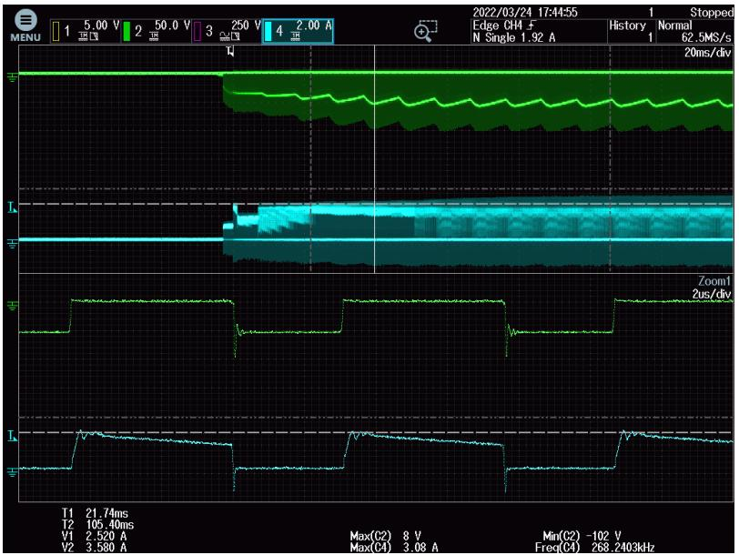

85 VAC

$C H 2 V _ { \mathsf { D } }$  
$C H 4 1 _ { \mathsf { D } }$ $\mathtt { V } _ { \mathsf { D } } mathtt { = } 1 0 2 \mathtt { V }$ $\mathsf { I } _ { \mathsf { D } } { = } 3 . 0 8 \mathsf { A }$

## Test Condition:

➢ Full Load  
➢ 开机

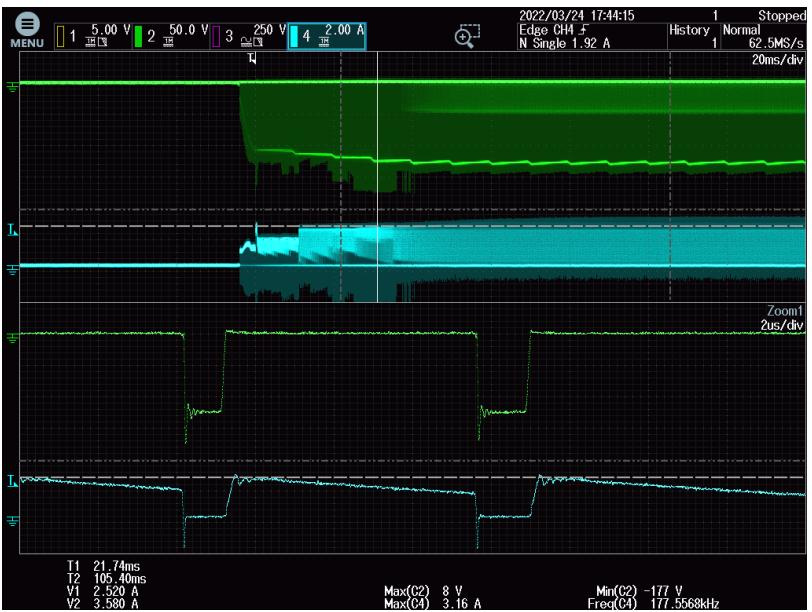

265 VAC

CH2 ${ \mathsf { V } } _ { \mathsf { D } }$  
CH4 ${ \sf I } _ { \sf D }$ $\mathtt { V } _ { \mathsf { D } } mathtt { = } 1 7 7 \mathtt { V }$ $\mathsf { I } _ { \mathsf { D } } { = } 3 . 1 6 \mathsf { A }$

## Test Condition:

➢ Full Load  
➢ 开机

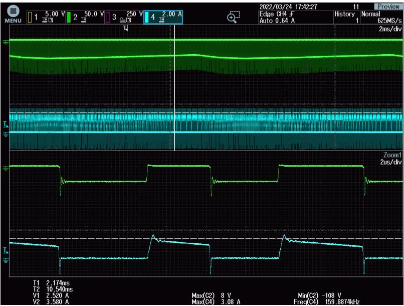

85 VAC

$C H 2 V _ { \mathsf { D } }$  
$C H 4 1 _ { \mathsf { D } }$ $\mathtt { V } _ { \mathtt { D } } \mathtt { = } 1 0 8 \mathtt { V }$ $\mathsf { I } _ { \mathsf { D } } { = } 3 . 0 8 \mathsf { A }$

## Test Condition:

➢ Full Load

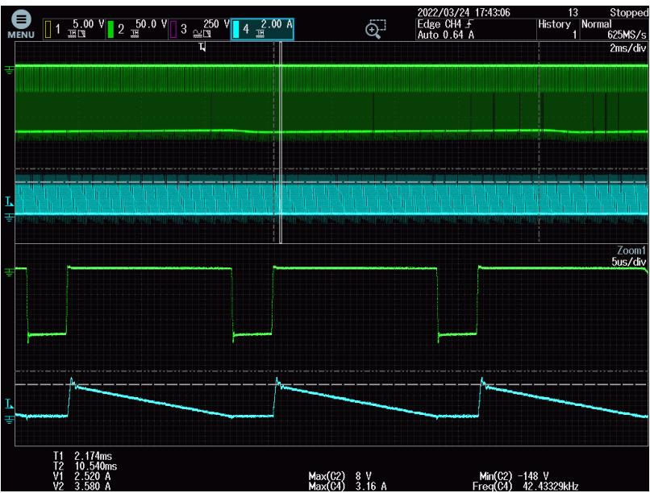

265 VAC

$C H 2 V _ { \mathsf { D } }$  
$C H 4 1 _ { \mathsf { D } }$ $\mathtt { V } _ { \mathtt { D } } { = } 1 4 8 \mathtt { V }$ $1 _ { \mathsf { D } } { = } 3 . 1 6 ~ \mathsf { A }$

## Test Condition:

➢ Full Load

## 输出短路时MOs和二极管波形

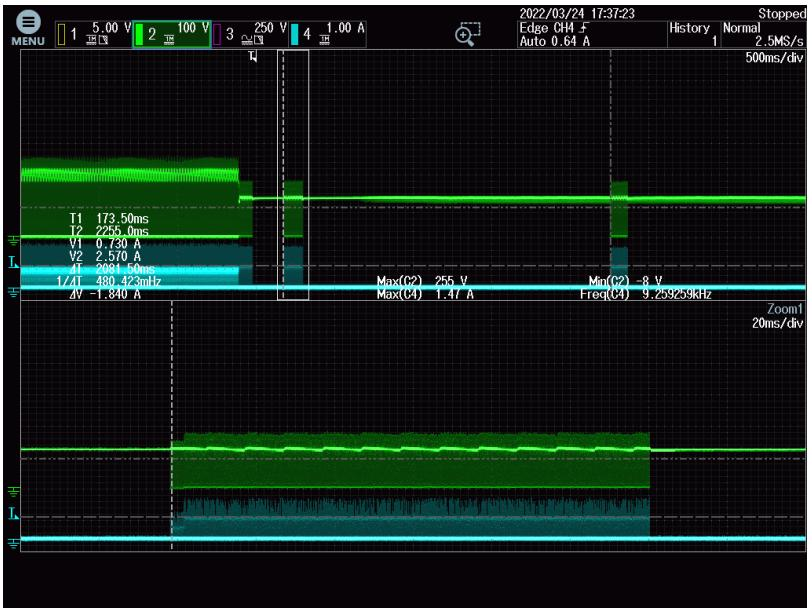

85 VAC

CH2 VDS  
CH4 ID $\begin{array} { r } { V _ { \mathsf { D S \_ m a x } } = 2 5 5 \mathsf { V } } \\ { \mathsf { I _ { D S \_ m a x } } = 1 . 4 7 \mathsf { A } } \end{array}$

MOS

Test Condition:

➢ Full Load

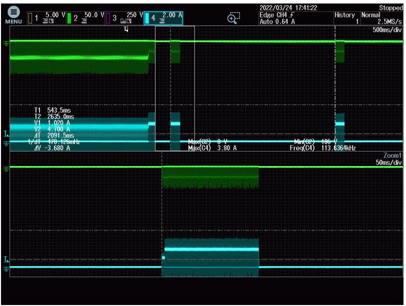

85 VAC

CH2 VD  
CH4 ID $\begin{array} { l } { { \mathsf { V } _ { \mathsf { D } \_ \mathsf { m a x } } = 1 0 6 \mathsf { V } } } \\ { { \mathsf { I } _ { \mathsf { D } \_ \mathsf { m a x } } = 3 . 8 \mathsf { A } } } \end{array}$ VD

➢ Full Load

二极管  
Test Condition:  
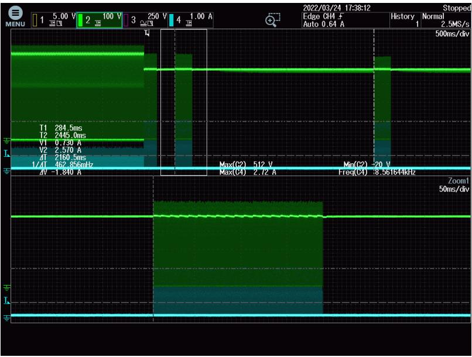

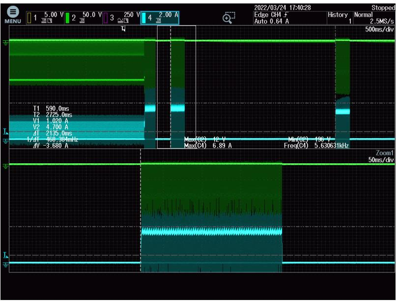

265 VAC  
MOS  
Test Condition:

CH2 VDS  
CH4 ID $\begin{array} { r } { \mathsf { V } _ { \mathsf { D S \_ m a x } } = 5 1 2 \mathsf { V } } \\ { \mathsf { I _ { D S \_ m a x } } = 2 . 7 2 \mathsf { A } } \end{array}$

➢ Full Load

265 VAC

CH2 VD  
CH4 ID $\begin{array} { r l } & { \mathsf { V } _ { \mathsf { D \_ m a x } } = 1 9 6 \mathsf { V } } \\ & { \mathsf { I } _ { \mathsf { D \_ m a x } } = 6 . 8 9 \mathsf { A } } \end{array}$

二极管

Test Condition:

➢ Full Load

## Brown In

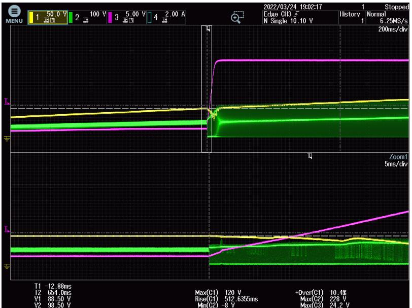

## Brown In

CH3 ${ \sf V } _ { 0 }$  
CH1 $V _ { \mathsf { D C I N } }$  
CH2 $\mathsf { V } _ { \mathrm { d } s }$

$$
V _ {\text { Brown\_In }} = 8 8. 5 \mathrm{V}
$$

## Test Condition:

➢ No Load

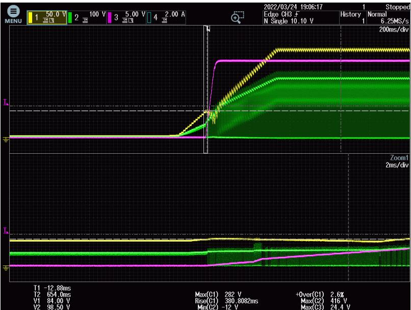

## Brown In

CH3 ${ \sf V } _ { 0 }$  
CH1 $V _ { \mathsf { D C I N } }$  
CH2 $\mathsf { V } _ { \mathrm { d } s }$

$$
V _ {\text { Brown\_In }} = 8 4 V
$$

## Test Condition:

➢ Half Load

## 输入过压保护及恢复波形

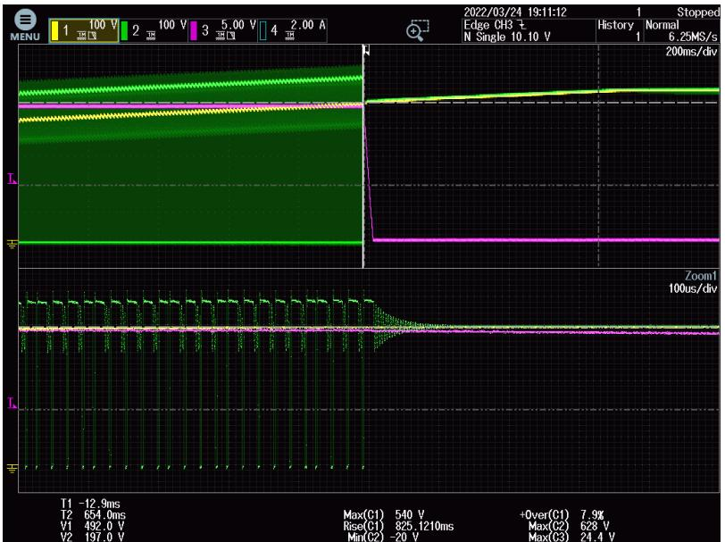

## 输入过压

CH1 VIN\_DC $V _ { \mathsf { I N \_ D C } }$  
CH2 $\mathsf { V } _ { \mathrm { d } s }$  
CH3 VO ${ \sf V } _ { 0 }$ $\mathtt { V _ { D S \_ m a x } } = 6 2 8 \lor$ $V _ { _ { \mathrm { I N _ { - } D C } } } ^ { \mathrm { ~ ~ - ~ } } = 4 9 2 \mathrm { ~ V ~ }$

## Test Condition:

➢ Full Load

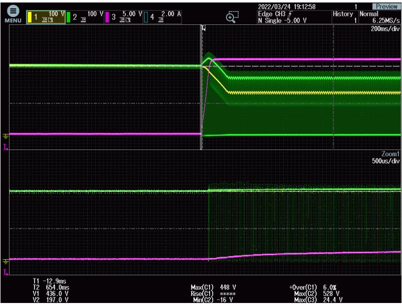

## 过压恢复

CH1 VIN\_DC  
CH2 $\mathsf { V } _ { \mathsf { d } s }$  
CH3 ${ \sf V } _ { 0 }$

$$
V _ {I N \_ D C} = 4 3 6 \mathrm{V}
$$

## Test Condition:

➢ Full Load

## 温升测试

<table><tr><td rowspan="2">项目</td><td colspan="4">温度(°C)</td></tr><tr><td>85VAC</td><td>115VAC</td><td>230VAC</td><td>264VAC</td></tr><tr><td>环境温度</td><td>39.6</td><td>39.5</td><td>39.6</td><td>39.7</td></tr><tr><td>BPA8619P (U1)</td><td>112</td><td>102.1</td><td>98.3</td><td>99.9</td></tr><tr><td>SF56 (D4)</td><td>88.9</td><td>85.3</td><td>79</td><td>78.1</td></tr><tr><td>变压器绕组 (T1)</td><td>73.1</td><td>70.9</td><td>69.5</td><td>70</td></tr><tr><td>变压器磁芯 (T1)</td><td>66</td><td>64.7</td><td>65.3</td><td>65.6</td></tr><tr><td>输入电解电容(E1)</td><td>66.7</td><td>62.3</td><td>57.9</td><td>57.9</td></tr><tr><td>输出电解电容(E3)</td><td>57.4</td><td>55.8</td><td>53.8</td><td>53.7</td></tr><tr><td>整流桥 (DB1)</td><td>73.7</td><td>67.1</td><td>60.3</td><td>60.2</td></tr></table>

## 测试说明

➢ 在温箱中进行测试  
➢ 电路板放在一个封闭的盒子内  
➢ 热电偶连接到各个测量点  
➢ 等测量点温度达到稳定后记录数据

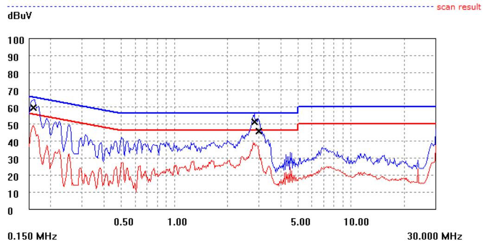

115VAC Line

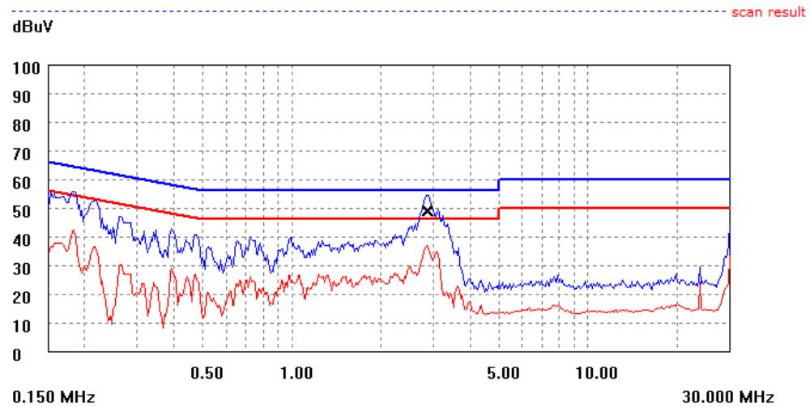

230VAC Line

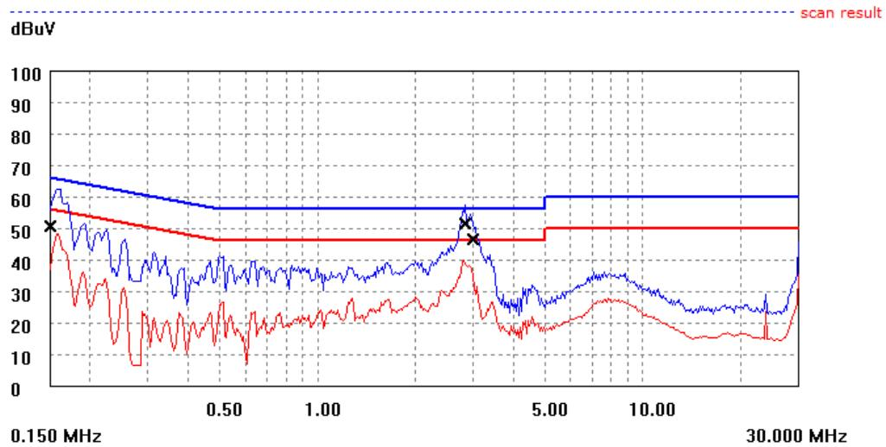

115VAC Neutral

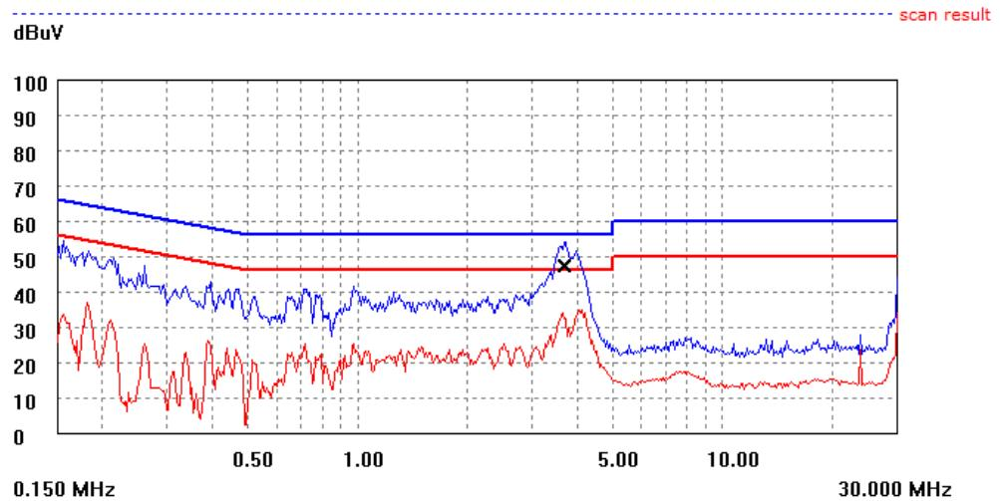

230VAC Neutral

<table><tr><td>差模</td><td>电压</td><td>相位角</td><td>发生器阻抗</td><td>测试次数</td><td>测试结果</td></tr><tr><td>L to N</td><td>+2kV</td><td>0</td><td>2</td><td>10</td><td>Pass</td></tr><tr><td>L to N</td><td>-2kV</td><td>0</td><td>2</td><td>10</td><td>Pass</td></tr><tr><td>L to N</td><td>+2kV</td><td>90</td><td>2</td><td>10</td><td>Pass</td></tr><tr><td>L to N</td><td>-2kV</td><td>90</td><td>2</td><td>10</td><td>Pass</td></tr><tr><td>L to N</td><td>+2kV</td><td>180</td><td>2</td><td>10</td><td>Pass</td></tr><tr><td>L to N</td><td>-2kV</td><td>180</td><td>2</td><td>10</td><td>Pass</td></tr><tr><td>L to N</td><td>+2kV</td><td>270</td><td>2</td><td>10</td><td>Pass</td></tr><tr><td>L to N</td><td>-2kV</td><td>270</td><td>2</td><td>10</td><td>Pass</td></tr></table>

## 测试说明

➢ 按照GB/T17626.5和IEC61000-4-5的最新版本要求进行测试  
➢ 室温环境，230VAC输入，满载条件  
➢ 输入1.2/50us组合波浪涌电压  
➢ 每个测试点重复10次  
➢ 每次间隔时间1分钟  
➢ 试验时样机输出正常（符合A类标准）视为Pass

<table><tr><td>测试点</td><td>电压(V)</td><td>放电类型</td><td>放电次数</td><td>测试结果</td></tr><tr><td>Vo</td><td>+15kV</td><td>空气放电</td><td>10</td><td>Pass</td></tr><tr><td>Vo</td><td>-15kV</td><td>空气放电</td><td>10</td><td>Pass</td></tr><tr><td>GND</td><td>+15kV</td><td>空气放电</td><td>10</td><td>Pass</td></tr><tr><td>GND</td><td>-15kV</td><td>空气放电</td><td>10</td><td>Pass</td></tr><tr><td>Vo</td><td>+8kV</td><td>接触放电</td><td>10</td><td>Pass</td></tr><tr><td>Vo</td><td>-8kV</td><td>接触放电</td><td>10</td><td>Pass</td></tr><tr><td>GND</td><td>+8kV</td><td>接触放电</td><td>10</td><td>Pass</td></tr><tr><td>GND</td><td>-8kV</td><td>接触放电</td><td>10</td><td>Pass</td></tr></table>

## 测试说明

➢ 按照GB/T17626.2和IEC61000-4-2的最新版本要求进行测试  
➢ 室温环境，230VAC输入满载条件  
➢ 每个测试点重复10次  
➢ 分别对输出正端和地进行空气放电  
➢ 试验时样机输出正常（符合A类标准）视为Pass

## THANK YOU FOR WATCHING
