'BPS易丰明源

## BPA8620PD 反激式参考设计

--12V/1.5A

时间：2023年9月

'BPS

晶丰明源

## 内容

BPA8620PD简介  
电源规格  
电路原理图  
BOM  
PCB Layout图  
变压器设计  
性能测试数据

## 产品特点：

集成 750V 高压 MOSFET  
集成高压启动、 自供电电路  
低待机功耗  
集成输入欠压/过压保护  
内置软启动  
 优异的动态响应速度，无输出过冲

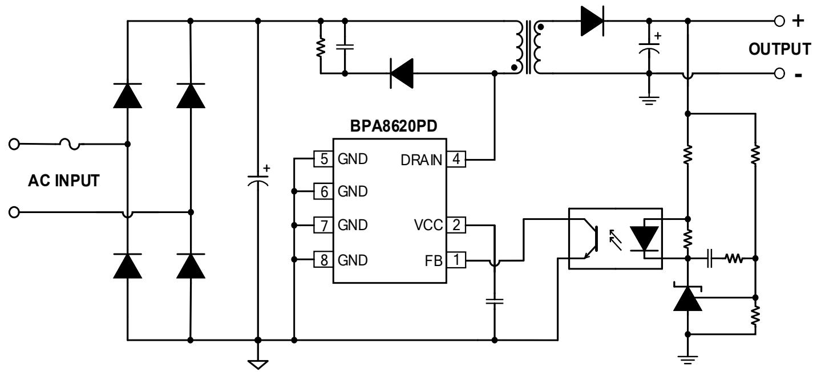

## 应用领域：

家用电器辅助电源  
 PC待机电源  
 通信、工业控制辅助电源  
适配器、充电器

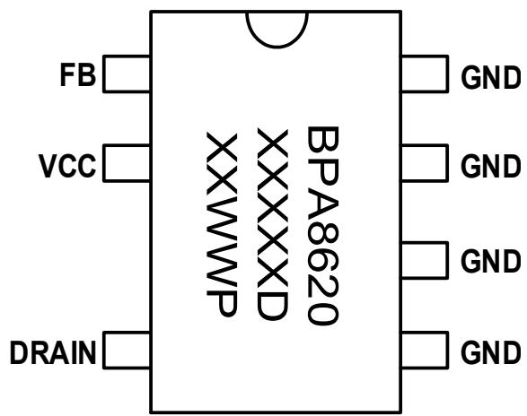

DIP7封装

<table><tr><td>项目描述</td><td>符号</td><td>最小</td><td>典型</td><td>最大</td><td>单位</td><td>备注</td></tr><tr><td colspan="7">输入</td></tr><tr><td>电压</td><td> $V_{IN}$ </td><td>85</td><td>115/230</td><td>265</td><td> $V_{AC}$ </td><td></td></tr><tr><td>频率</td><td> $f_{LINE}$ </td><td>47</td><td>50/60</td><td>63</td><td>Hz</td><td></td></tr><tr><td colspan="7">输出</td></tr><tr><td>输出电压</td><td> $V_{OUT}$ </td><td></td><td>12</td><td></td><td>V</td><td>±5%</td></tr><tr><td>输出电流</td><td> $I_{OUT}$ </td><td></td><td>1.5</td><td></td><td>A</td><td></td></tr><tr><td>输出电压纹波</td><td> $V_{RIPPLE}$ </td><td></td><td></td><td>250</td><td>mV</td><td>20MHz带宽</td></tr><tr><td>连续输出功率</td><td> $P_{OUT}$ </td><td></td><td>18</td><td></td><td>W</td><td></td></tr><tr><td colspan="7">效率</td></tr><tr><td>待机功耗</td><td> $P_{STDBY}$ </td><td></td><td></td><td>60</td><td>mW</td><td>230VAC</td></tr><tr><td>满载效率</td><td>η</td><td>80</td><td></td><td></td><td>%</td><td></td></tr><tr><td colspan="7">环境</td></tr><tr><td>传导EMI</td><td></td><td colspan="4">满足CISPR22/EN55022 Class B,至少6dB 裕量</td><td></td></tr><tr><td rowspan="2">Surge</td><td></td><td></td><td>±2</td><td></td><td>kV</td><td>差模</td></tr><tr><td></td><td></td><td>±4</td><td></td><td>kV</td><td>共模</td></tr><tr><td>EFT</td><td></td><td></td><td>±4</td><td></td><td>kV</td><td>5kHz/100kHz/38kHz</td></tr><tr><td rowspan="2">ESD</td><td></td><td></td><td>±8</td><td></td><td>kV</td><td>接触放电</td></tr><tr><td></td><td></td><td>±15</td><td></td><td>kV</td><td>空气放电</td></tr><tr><td>工作环境温度</td><td> $T_{AMP}$ </td><td></td><td></td><td>50</td><td>°C</td><td></td></tr></table>

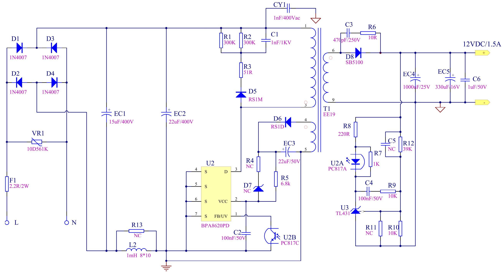

<table><tr><td>序号</td><td>原件标号</td><td>参数描述</td><td>封装尺寸</td><td>数量</td></tr><tr><td>1</td><td>PCB</td><td>CEM-1, 单面板</td><td>97mm*39mm</td><td>1</td></tr><tr><td>2</td><td>F1</td><td>2.2ohm, 绕线电阻</td><td>Through Hole, 2W</td><td>1</td></tr><tr><td>3</td><td>VR1</td><td>7D561压敏电阻</td><td>Through Hole, P=7mm</td><td>1</td></tr><tr><td>4</td><td>D1,D2,D3,D4</td><td>1N4007, 1A/1000V</td><td>DO-41</td><td>4</td></tr><tr><td>5</td><td>D5</td><td>M7, 普通二极管, 1KV/1A</td><td>SMA</td><td>1</td></tr><tr><td>6</td><td>D6</td><td>RS1D, 快恢复二极管, 200V/1A</td><td>SMA</td><td>1</td></tr><tr><td>7</td><td>D8</td><td>SB5100, 肖特基二极管, 100V/3A</td><td>DO-201AD</td><td>1</td></tr><tr><td>8</td><td>L2</td><td>1mH, 工字电感</td><td>8mm*10mm</td><td>1</td></tr><tr><td>9</td><td>U1</td><td>BPA8620PD</td><td>DIP-4</td><td>1</td></tr><tr><td>10</td><td>U2</td><td>光耦, PC817A</td><td>DIP-7</td><td>1</td></tr><tr><td>11</td><td>U3</td><td>基准稳压源, TL431</td><td>SOT-23</td><td>1</td></tr><tr><td>12</td><td>T1</td><td>760uH, EE25立式加高</td><td>EE19/5pin+5pin</td><td>1</td></tr><tr><td>13</td><td>R1,R2</td><td>300k, ±5%</td><td>SMD1206</td><td>2</td></tr><tr><td>14</td><td>R3</td><td>51R, ±5%</td><td>SMD1206</td><td>1</td></tr><tr><td>15</td><td>R5</td><td>6.8k, ±5%</td><td>SMD0805</td><td>1</td></tr><tr><td>16</td><td>R6</td><td>22R, ±5%</td><td>SMD1206</td><td>1</td></tr><tr><td>17</td><td>R7</td><td>1k, ±5%</td><td>SMD0805</td><td>1</td></tr><tr><td>18</td><td>R8</td><td>220R, ±5%</td><td>SMD0805</td><td>1</td></tr><tr><td>19</td><td>R9,R10</td><td>10k, ±1%</td><td>SMD0805</td><td>2</td></tr><tr><td>20</td><td>R12</td><td>39K, ±1%</td><td>SMD0805</td><td>1</td></tr><tr><td>21</td><td>JR1</td><td>0R, 5%</td><td>SMD0805</td><td>1</td></tr><tr><td>22</td><td>C1</td><td>1nF/1KV, 高压瓷片电容</td><td>DIP pitch=5mm</td><td>1</td></tr><tr><td>23</td><td>C2,C4</td><td>0.1uF/50V, X7R</td><td>SMD0805</td><td>2</td></tr><tr><td>24</td><td>C3</td><td>470PF/250V, X7R</td><td>SMD0805</td><td>1</td></tr><tr><td>25</td><td>C6</td><td>1uF/50V, X7R</td><td>SMD0805</td><td>1</td></tr><tr><td>26</td><td>CY1</td><td>Y1电容, 1nF</td><td>pitch=10mm</td><td>1</td></tr><tr><td>27</td><td>EC1</td><td>15uF/400V, 电解电容</td><td>10mm*16mm</td><td>1</td></tr><tr><td>28</td><td>EC2</td><td>22uF/400V, 电解电容</td><td>13mm*20mm</td><td>1</td></tr><tr><td>29</td><td>EC3</td><td>22uF/50V, 电解电容</td><td>5mm*11mm</td><td>1</td></tr><tr><td>30</td><td>EC4</td><td>1000uF/25V, 电解电容</td><td>10mm*17mm</td><td>1</td></tr><tr><td>31</td><td>EC5</td><td>330uF/16V, 电解电容</td><td>6.3mm*12mm</td><td>1</td></tr><tr><td>32</td><td>J1,J2</td><td>跳线</td><td></td><td>2</td></tr><tr><td></td><td></td><td></td><td>Total</td><td>39</td></tr></table>

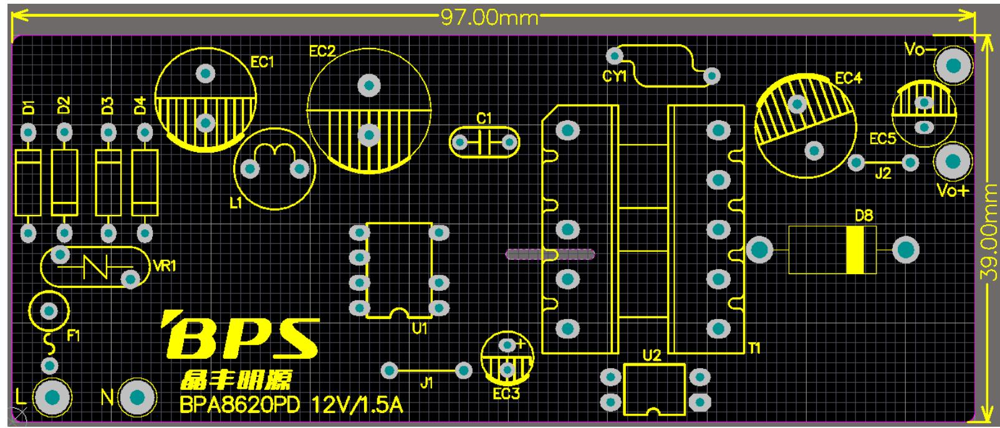

Top View

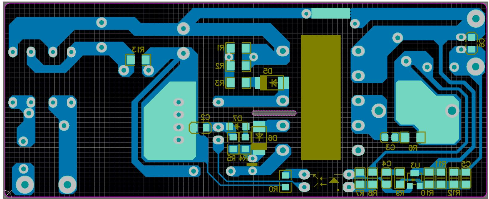

Bottom View

## 原理图

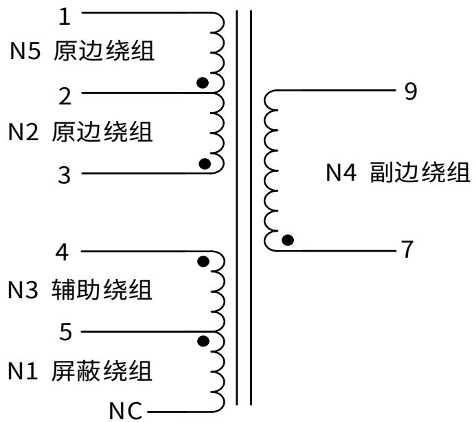

## 规格与材料

 初级绕组感量L(Pin1\~3)=760uH±10%（测试条件:1V，100kHz）  
漏感量 $L _ { | \mathrm { k } } < 2 0 \mathrm { u } \mathsf { H }$  
骨架：EE25立式加高（5+5PIN）  
 磁芯：EE19 PC40 或同等材质 ， $\mathsf { A } \mathsf { e } = 4 0 \mathsf { m } \mathsf { m } ^ { 2 }$  
 N1、N2、N3、N5：2UEW 漆包线  
 N4：三层绝缘线  
绝缘胶带：3M900 或同等材质  
耐压测试：3KV, 50/60Hz, 1Min  
成品要求：浸凡立水

## 绕线方式

<table><tr><td>绕组</td><td>起始脚</td><td>终止脚</td><td>材料</td><td>匝数</td><td>绕线方式</td></tr><tr><td>N1</td><td>5</td><td>NC</td><td> $\phi 0.38*1P$ </td><td>25Ts</td><td>密绕一层(PIN脚朝外)</td></tr><tr><td colspan="4">胶带</td><td>1Ts</td><td></td></tr><tr><td>N2</td><td>3</td><td>2</td><td> $\phi 0.38*1P$ </td><td>29Ts</td><td>密绕三层(PIN脚朝外)</td></tr><tr><td colspan="4">胶带</td><td>1Ts</td><td></td></tr><tr><td>N3</td><td>4</td><td>5</td><td> $\phi 0.38*2P$ </td><td>6Ts</td><td>均匀绕一层(PIN脚朝外)</td></tr><tr><td colspan="4">胶带</td><td>2Ts</td><td></td></tr><tr><td>N4</td><td>7</td><td>9</td><td>三层绝缘线 $\phi 0.45*2P$ </td><td>8Ts</td><td>密绕一层(PIN脚朝外)</td></tr><tr><td colspan="4">胶带</td><td>2Ts</td><td></td></tr><tr><td>N5</td><td>2</td><td>1</td><td> $\phi 0.38*1P$ </td><td>29Ts</td><td>密绕三层(PIN脚朝外)</td></tr><tr><td colspan="4">胶带</td><td>1Ts</td><td></td></tr></table>

## 脚位图

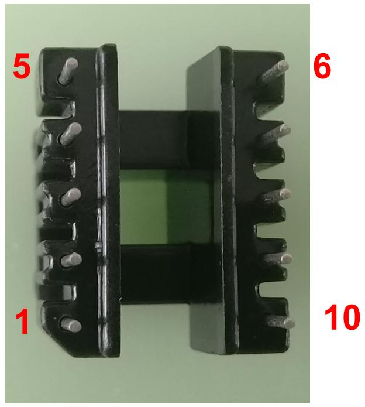

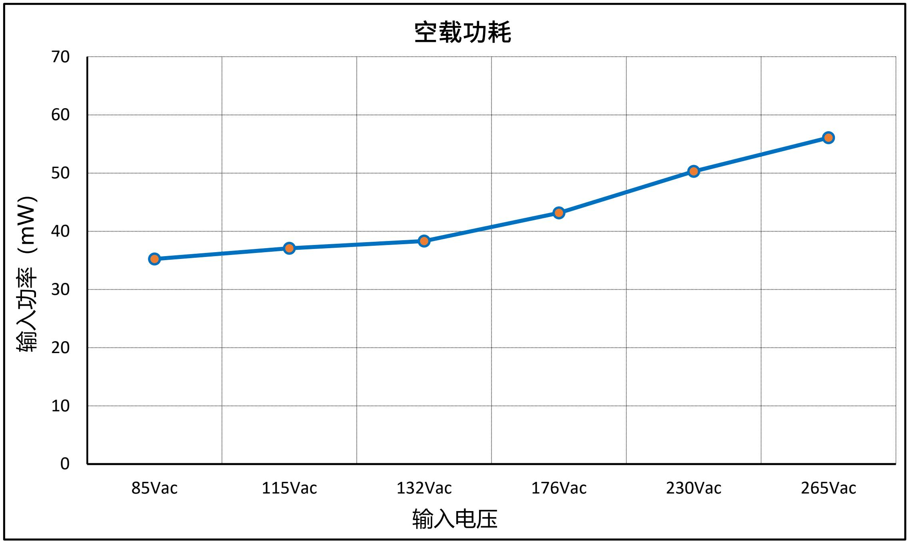

效率  
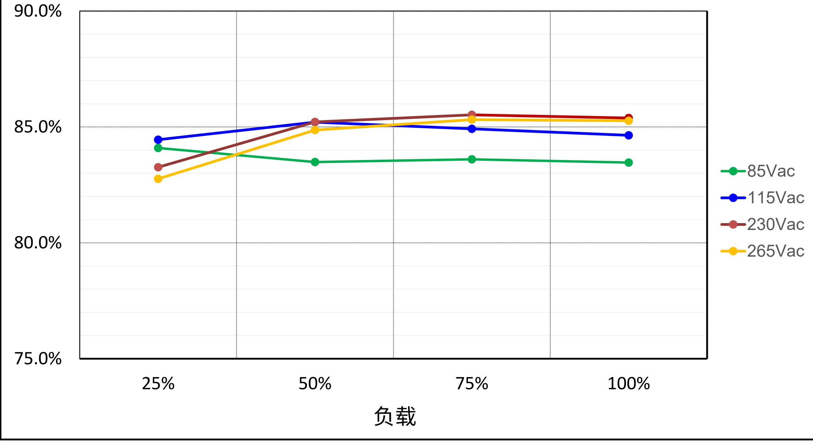

<table><tr><td> $V_{IN}(VAC)$ Load(%)</td><td>85</td><td>115</td><td>132</td><td>176</td><td>230</td><td>265</td><td>平均值</td><td>线调整率</td></tr><tr><td>0</td><td>12.18</td><td>12.18</td><td>12.18</td><td>12.18</td><td>12.18</td><td>12.18</td><td>12.181</td><td>0.01%</td></tr><tr><td>20%</td><td>12.18</td><td>12.18</td><td>12.18</td><td>12.18</td><td>12.18</td><td>12.18</td><td>12.179</td><td>0.01%</td></tr><tr><td>40%</td><td>12.18</td><td>12.18</td><td>12.18</td><td>12.18</td><td>12.18</td><td>12.18</td><td>12.178</td><td>0.01%</td></tr><tr><td>60%</td><td>12.18</td><td>12.18</td><td>12.18</td><td>12.18</td><td>12.18</td><td>12.18</td><td>12.176</td><td>0.02%</td></tr><tr><td>80%</td><td>12.17</td><td>12.18</td><td>12.18</td><td>12.18</td><td>12.18</td><td>12.18</td><td>12.174</td><td>0.03%</td></tr><tr><td>100%</td><td>12.17</td><td>12.17</td><td>12.17</td><td>12.17</td><td>12.17</td><td>12.17</td><td>12.171</td><td>0.01%</td></tr><tr><td>平均值</td><td>12.176</td><td>12.177</td><td>12.177</td><td>12.177</td><td>12.177</td><td>12.177</td><td rowspan="2" colspan="2"></td></tr><tr><td>负载调整率</td><td>0.09%</td><td>0.07%</td><td>0.08%</td><td>0.08%</td><td>0.07%</td><td>0.08%</td></tr></table>

 计算方法：调整率=100%\*(最大值-最小值)/平均值  
测试条件：无假负载

## 输出电压纹波

$8 5 V _ { A C }$

CH1 $\mathsf { V } _ { \mathsf { O U T } }$ Ripple $V _ { P | \mathrm { X } \mathrm { - } P | \mathrm { k } } { = } 2 3 6 \mathrm { m V }$

## Test Condition:

Full Load

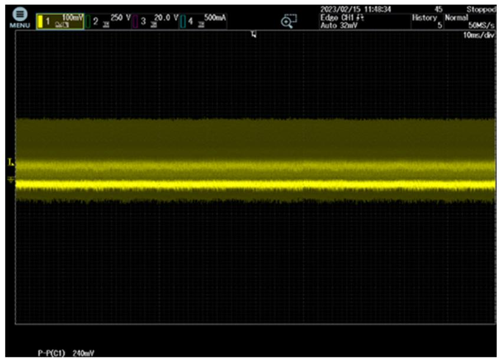

$1 1 5 \ : \mathsf { V } _ { \mathsf { A C } }$ 115 VAC

CH1 $\mathsf { V } _ { \mathsf { O U T } }$ Ripple $V _ { \mathsf { P K - P K } } { = } 2 4 0 \mathsf { m V }$

## Test Condition:

Full Load

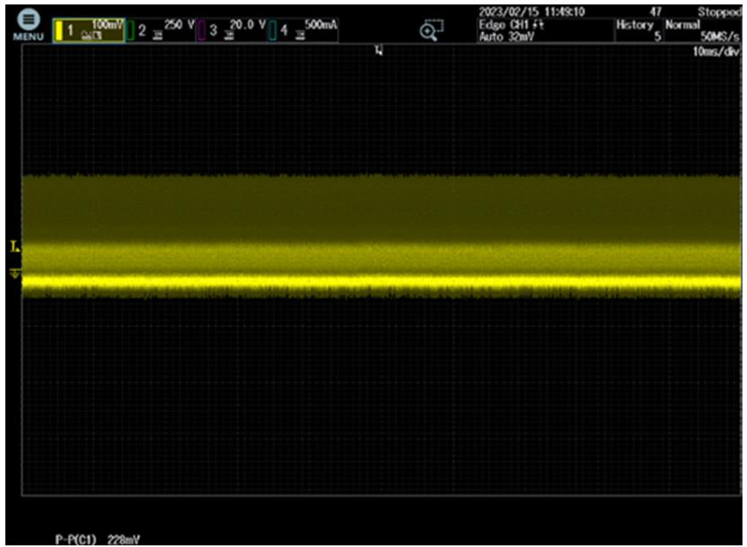

$230 v _ { \mathsf { A C } }$

CH1 $\mathsf { V } _ { \mathsf { O U T } }$ Ripple $V _ { P K - P K } = 2 2 8 m V$

## Test Condition:

Full Load

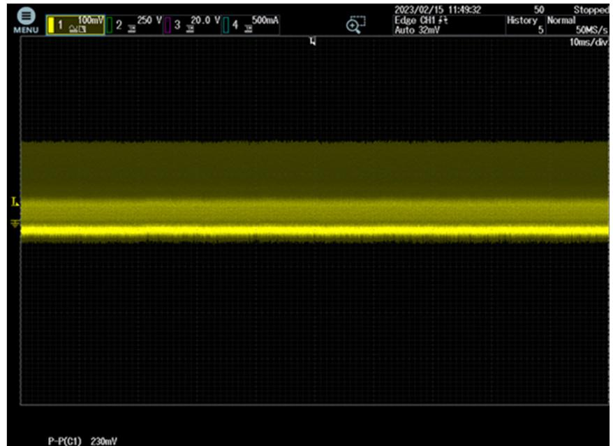

265 VAC $\mathsf { V } _ { \mathsf { A C } }$

CH1 $\mathsf { V } _ { \mathsf { O U T } }$ Ripple $V _ { p | k - P K } = 2 3 0 5 m v$

## Test Condition:

Full Load

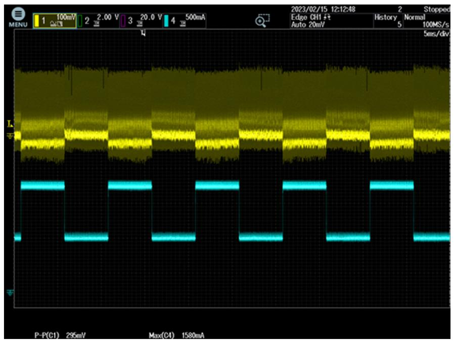

$8 5 V _ { A C }$

${ \mathsf { C H 1 } } { \mathsf { V } } _ { \mathsf { O U T } }$  
$\mathsf { C H 4 } \mathsf { I } _ { \mathsf { O U T } }$ CH4 IOUT

$$
V _ {P K - P K} = 2 9 5 \mathrm{mV}
$$

## Test Condition:

 $1 . 5 \mathsf { A } \mathsf { - } 0 . 7 5 \mathsf { A } \mathsf { - } 1 . 5 \mathsf { A }$  
 Slew Rate: 0.5 A/μS  
 Frequency: 100 Hz

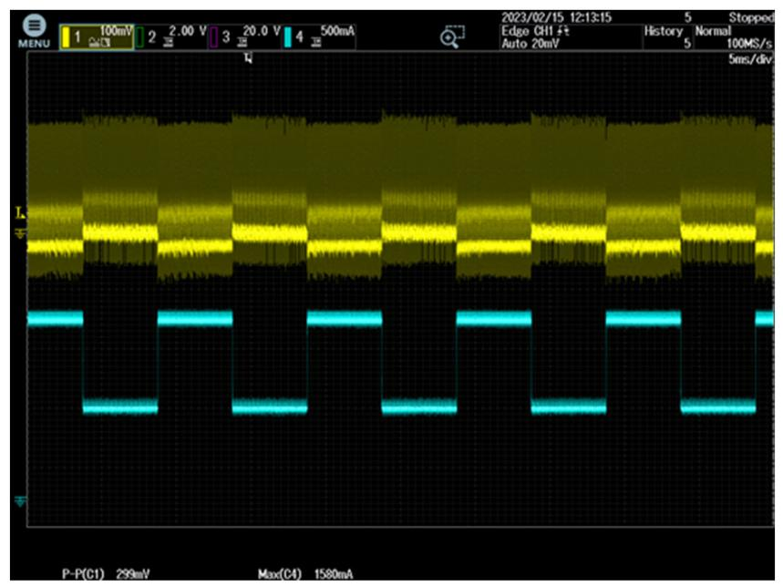

$1 1 5 \ : \mathsf { V } _ { \mathsf { A C } }$

${ \mathsf { C H 1 } } { \mathsf { V } } _ { \mathsf { O U T } }$  
$\mathsf { C H 4 } \mathsf { I } _ { \mathsf { O U T } }$ CH4 IOUT

$$
V _ {P K - P K} = 2 9 9 \mathrm{mV}
$$

## Test Condition:

 $1 . 5 \mathsf { A } \mathsf { - } 0 . 7 5 \mathsf { A } \mathsf { - } 1 . 5 \mathsf { A }$  
 Slew Rate: 0.5 A/μS  
 Frequency: 100 Hz

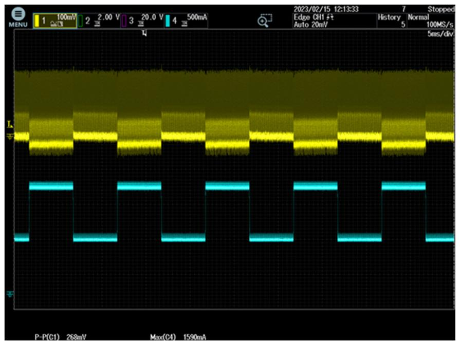

$230 v _ { \mathsf { A C } }$

${ \mathsf { C H 1 } } { \mathsf { V } } _ { \mathsf { O U T } }$  
$\mathsf { C H 4 } \mathsf { l } _ { \mathsf { O U T } }$

$$
V _ {P K - P K} = 2 6 8 \mathrm{mV}
$$

## Test Condition:

 $1 . 5 \mathsf { A } \mathsf { - } 0 . 7 5 \mathsf { A } \mathsf { - } 1 . 5 \mathsf { A }$  
 Slew Rate: 0.5 A/μS  
 Frequency: 100 Hz

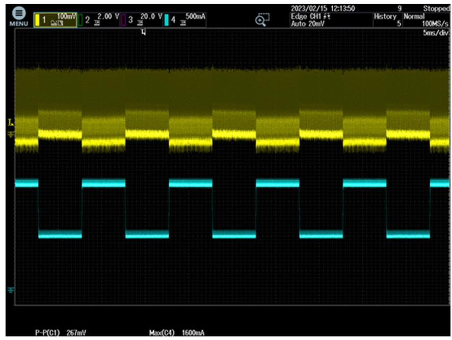

$2 6 5 \ : \mathsf { V } _ { \mathsf { A C } }$

${ \mathsf { C H 1 } } { \mathsf { V } } _ { \mathsf { O U T } }$  
$\mathsf { C H 4 } \mathsf { I } _ { \mathsf { O U T } }$ CH4 IOUT

$$
V _ {P K - P K} = 2 6 7 \mathrm{mV}
$$

## Test Condition:

 $1 . 5 \mathsf { A } \mathsf { - } 0 . 7 5 \mathsf { A } \mathsf { - } 1 . 5 \mathsf { A }$  
 Slew Rate: 0.5 A/μS  
 Frequency: 100 Hz

## 动态负载(10%-90%)

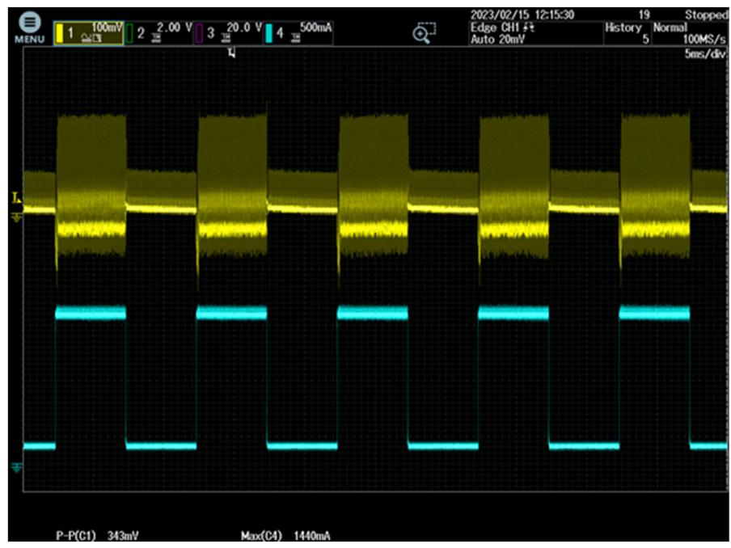

## $8 5 V _ { A C }$

$\mathsf { C H 1 } \mathsf { V } _ { \mathsf { O U T } }$ $V _ { P K - P K } = 3 4 3 ~ \mathsf { m V }$  
CH4 IOUT $\mathsf { C H 4 } \mathsf { l } _ { \mathsf { O U T } }$

## Test Condition:

 $0 . 1 5 \mathsf { A } – 1 . 3 5 \mathsf { A } – 0 . 1 5 \mathsf { A }$  
 Slew Rate: 0.5 A/μS  
 Frequency: 100 Hz

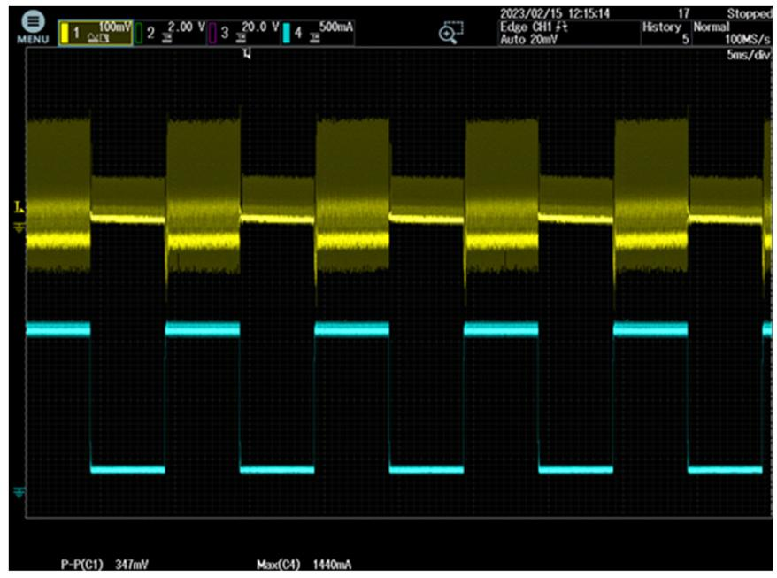

## $1 1 5 \ : \mathsf { V } _ { \mathsf { A C } }$

$\mathsf { C H 1 } \mathsf { V } _ { \mathsf { O U T } }$ $V _ { P K - P K } = 3 4 7 ~ m V$  
CH4 IOUT $\mathsf { C H 4 } \mathsf { I } _ { \mathsf { O U T } }$

## Test Condition:

 $0 . 1 5 \mathsf { A } – 1 . 3 5 \mathsf { A } – 0 . 1 5 \mathsf { A }$  
 Slew Rate: 0.5 A/μS  
 Frequency: 100 Hz

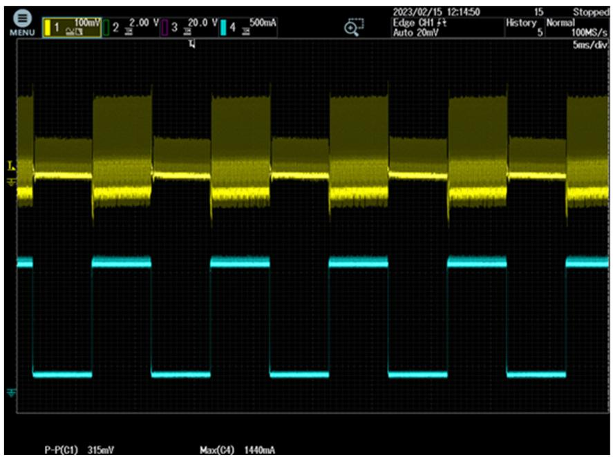

## $230 v _ { \mathsf { A C } }$

${ \mathsf { C H 1 } } { \mathsf { V } } _ { \mathsf { O U T } }$ $V _ { P | \mathrm { K \mathrm { - } P K } } { = } 3 1 5 ~ \mathrm { m V }$  
CH4 IOUT $\mathsf { C H 4 } \mathsf { I } _ { \mathsf { O U T } }$

## Test Condition:

 $0 . 1 5 \mathsf { A } – 1 . 3 5 \mathsf { A } – 0 . 1 5 \mathsf { A }$  
 Slew Rate: 0.5 A/μS  
 Frequency: 100 Hz

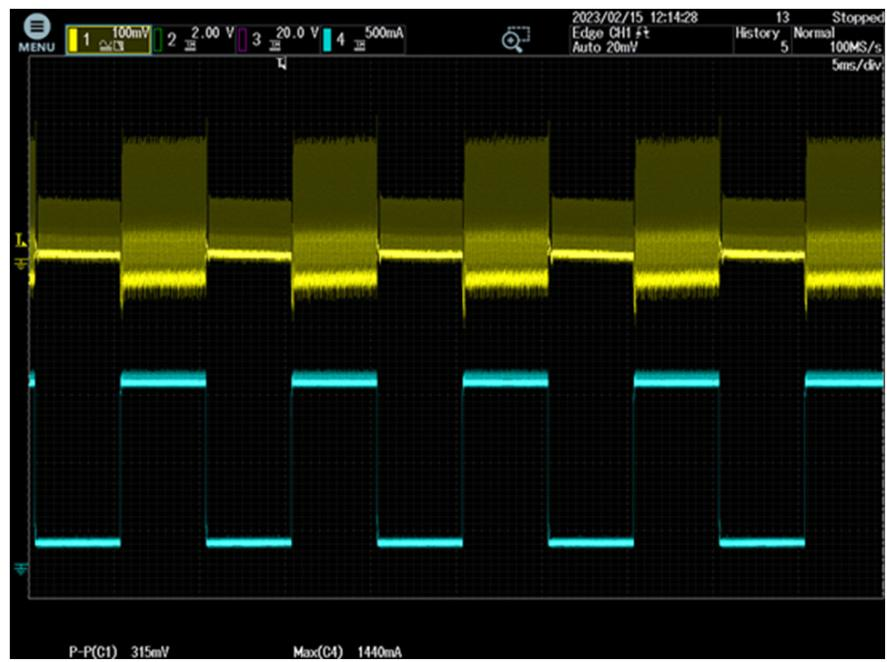

## $2 6 5 \ : \mathsf { V } _ { \mathsf { A C } }$ 265 VAC

$\mathsf { C H 1 } \mathsf { V } _ { \mathsf { O U T } }$ $\mathsf { V } _ { \mathsf { P K - P K } } { = } 3 1 5 \mathsf { m V }$  
CH4 IOUT $\mathsf { C H 4 } \mathsf { I } _ { \mathsf { O U T } }$

## Test Condition:

 $0 . 1 5 \mathsf { A } – 1 . 3 5 \mathsf { A } – 0 . 1 5 \mathsf { A }$  
 Slew Rate: 0.5 A/μS  
 Frequency: 100 Hz

## 输出电压开机波形

85 VAC  
  
Test Condition:  
 No Load

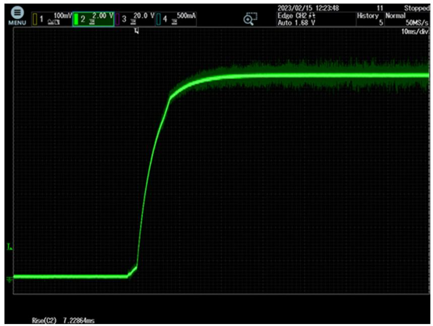

85 VAC  
  
Test Condition:  
Full Load

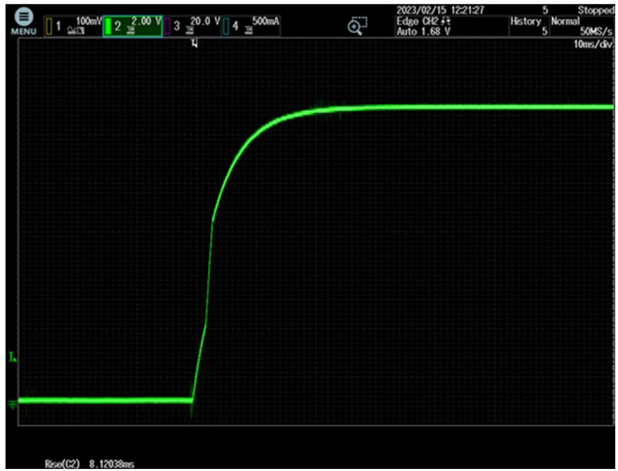

265 VAC  
  
Test Condition:  
 No Load

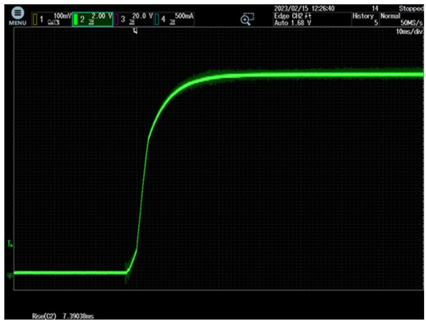

265 VAC  
  
Test Condition:  
Full Load

## MOSFET开、 关机波形

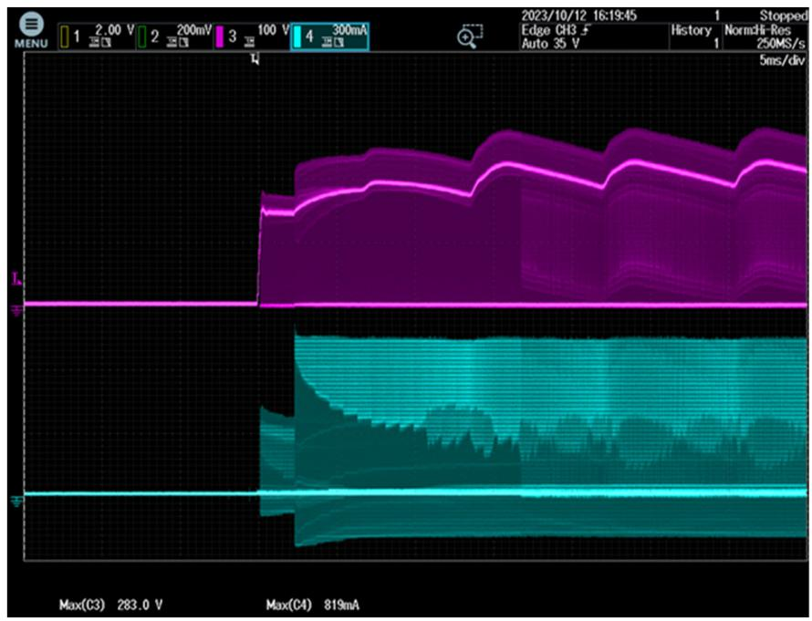

## 85 VAC开机

CH3 VDS  
CH4 IDS

$$
\begin{array}{l} \mathrm {V_ {DS\_MAX}} = 2 8 4 \mathrm{V} \\ \mathrm {I_ {DS\_MAX}} = 0. 8 2 \mathrm{A} \end{array}
$$

Test Condition:

 Full Load

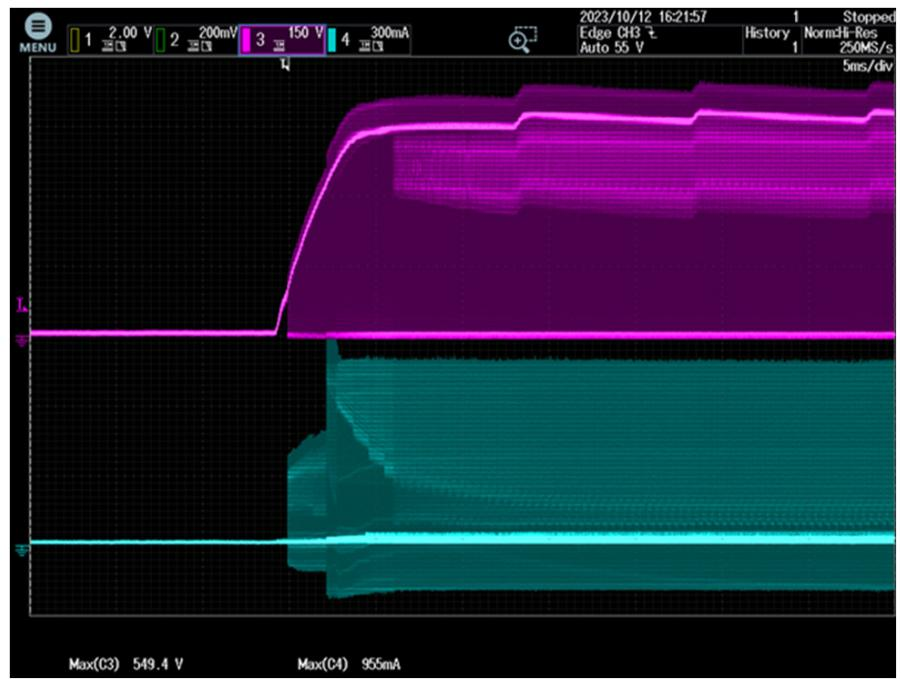

## 265 VAC开机

CH3 VDS  
CH4 IDS

$$
\begin{array}{l} V _ {D S \_ M A X} = 5 4 9 V \\ I _ {D S \_ M A X} = 0. 9 6 A \end{array}
$$

Test Condition:

 Full Load

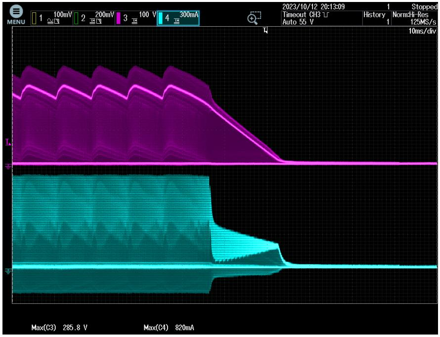

## 85 $\mathsf { v } _ { \mathsf { A C } }$ 关机

CH3 VDS  
CH4 IDS

$$
\begin{array}{l} \mathrm {V_ {DS\_MAX}} = 2 8 6 \mathrm{V} \\ \mathrm {I_ {DS\_MAX}} = 0. 8 2 \mathrm{A} \end{array}
$$

Test Condition:

 Full Load

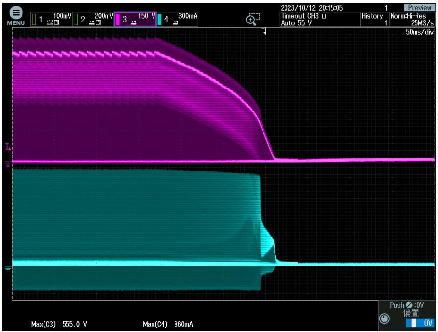

## 265 $\mathsf { v } _ { \mathsf { A C } }$ 关机

CH3 VDS  
CH4 IDS

$$
\begin{array}{l} \mathrm {V_ {DS\_MAX}} = 5 5 5 \mathrm{V} \\ \mathrm {I_ {DS\_MAX}} = 0. 8 6 \mathrm{A} \end{array}
$$

Test Condition:

 Full Load

## MOSFET稳态波形

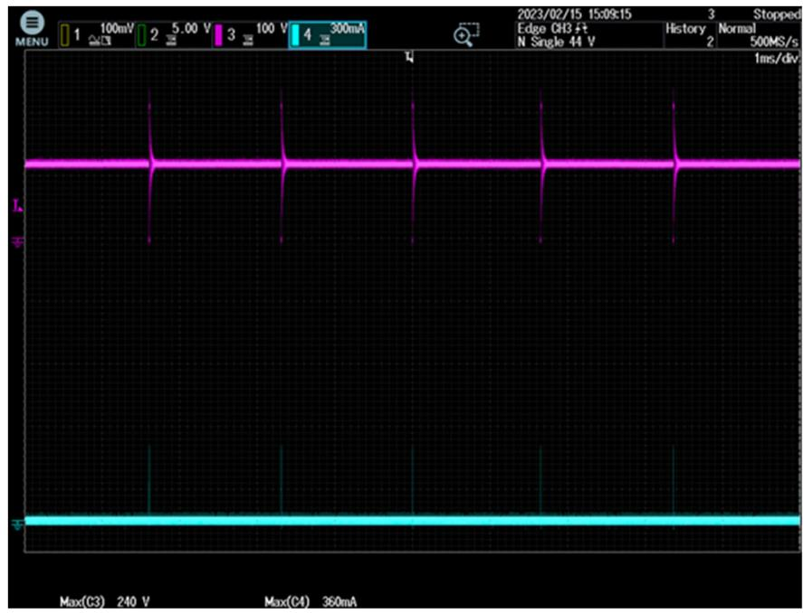

## 85 VAC

CH3 VDS  
CH4 IDS

$$
\begin{array}{l} \mathrm {V_ {DS\_MAX}} = 2 4 0 \mathrm{V} \\ \mathrm {I_ {DS\_MAX}} = 0. 3 6 \mathrm{A} \end{array}
$$

Test Condition:

 No Load

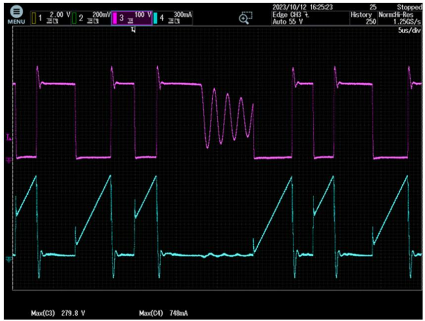

## 85 VAC

CH3 VDS  
CH4 $\mathsf { I } _ { \mathsf { D } \mathsf { S } }$

$$
\begin{array}{l} \mathrm {V_ {DS\_MAX}} = 2 8 0 \mathrm{V} \\ \mathrm {I_ {DS\_MAX}} = 0. 7 5 \mathrm{A} \end{array}
$$

Test Condition:

 Full Load

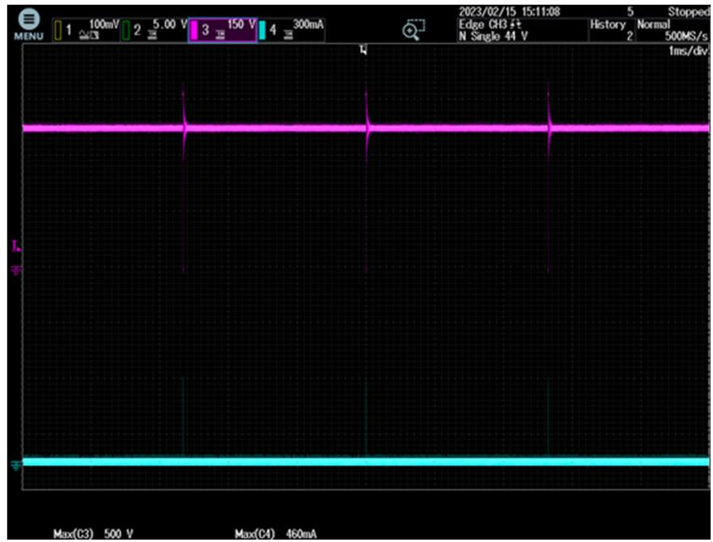

## 265 $\mathsf { v } _ { \mathsf { A C } }$

${ \mathsf { C H 3 } } \mathsf { V } _ { \mathsf { D S } }$  
CH4 $| _ { \mathsf { D } \mathsf { S } }$

$$
\begin{array}{l} \mathrm {V_ {DS\_MAX}} = 5 0 0 \mathrm{V} \\ \mathrm {I_ {DS\_MAX}} = 0. 4 6 \mathrm{A} \end{array}
$$

Test Condition:

 No Load

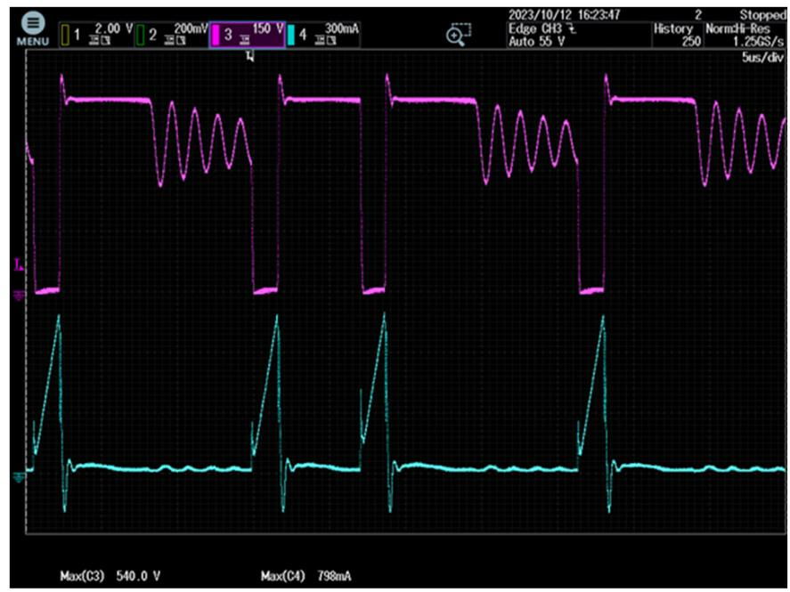

## 265 VAC

CH3 VDS  
CH4 IDS

$$
\begin{array}{l} \mathrm {V_ {DS\_MAX}} = 5 4 0 \mathrm{V} \\ \mathrm {I_ {DS\_MAX}} = 0. 8 \mathrm{A} \end{array}
$$

Test Condition:

 Full Load

## 输出二极管开、 关机波形

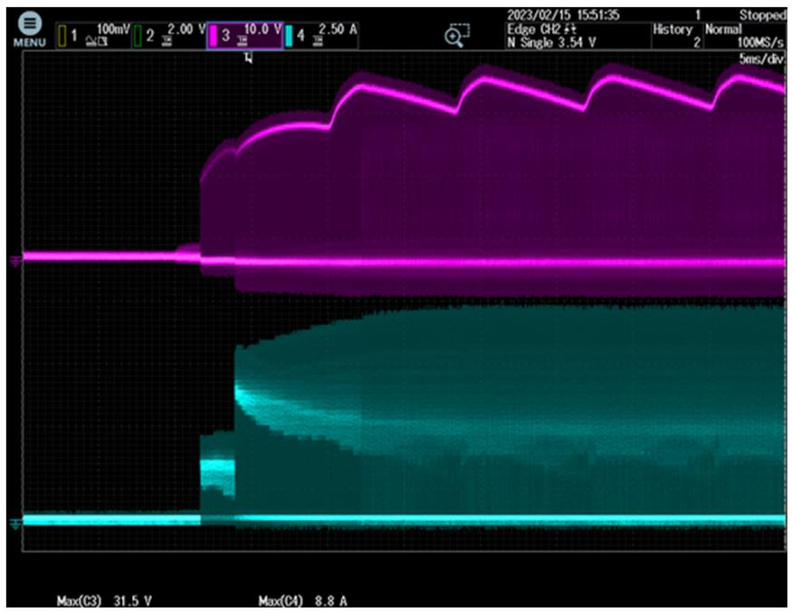

## 85 VAC开机

CH3 VR  
CH4 IF

$$
\begin{array}{l} \mathrm {V_ {R\_MAX}} = 3 1. 5 \mathrm{V} \\ \mathrm {I_ {F\_MAX}} = 8. 8 \mathrm{A} \end{array}
$$

Test Condition:

 Full Load

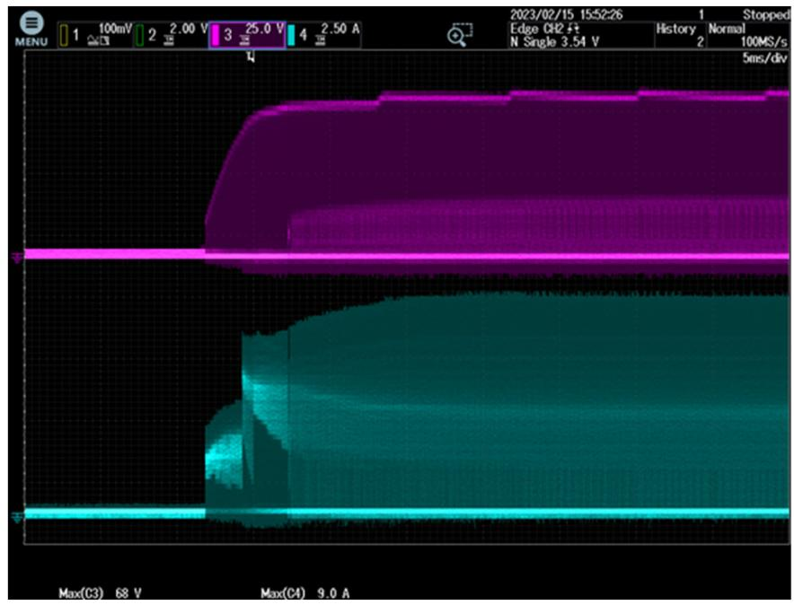

## 265 VAC开机

CH3 VR  
CH4 IF

$$
\begin{array}{l} \mathrm {V_ {R\_MAX}} = 6 8 \mathrm{V} \\ \mathrm {I_ {F\_MAX}} = 9 \mathrm{A} \end{array}
$$

Test Condition:

 Full Load

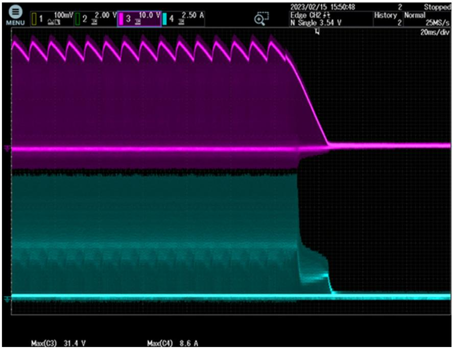

## 85 VAC关机

CH3 VR  
CH4 IF

$$
\begin{array}{l} \mathrm {V_ {R\_MAX}} = 3 1. 4 \mathrm{V} \\ \mathrm {I_ {F\_MAX}} = 8. 6 \mathrm{A} \end{array}
$$

Test Condition:

 Full Load

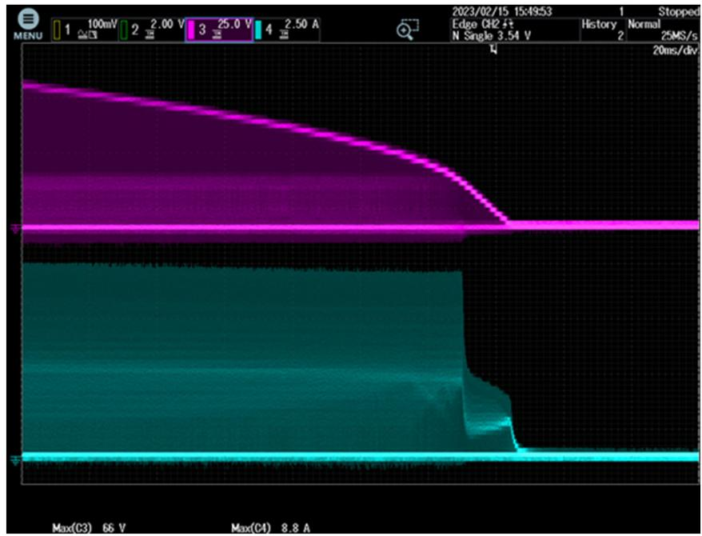

## 265 VAC关机

CH3 VR  
CH4 IF

$$
\begin{array}{l} \mathrm {V_ {R\_MAX}} = 6 6 \mathrm{V} \\ \mathrm {I_ {F\_MAX}} = 8. 8 \mathrm{A} \end{array}
$$

Test Condition:

 Full Load

## 输出二极管稳态波形

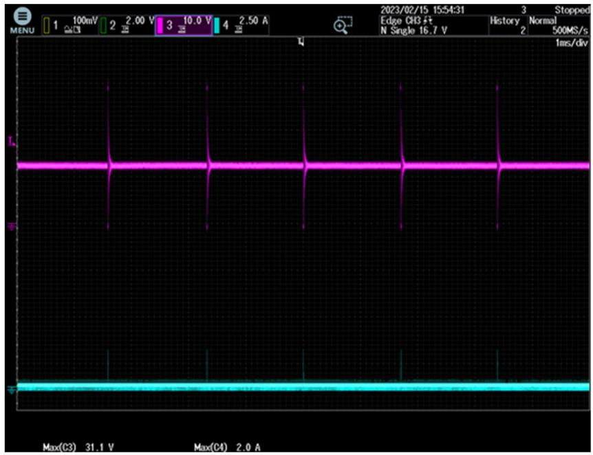

85 VAC

CH3 VR  
CH4 IF

$$
\begin{array}{l} \mathrm {V_ {R\_MAX}} = 3 1. 1 \mathrm{V} \\ \mathrm {I_ {F\_MAX}} = 2 \mathrm{A} \end{array}
$$

Test Condition:  
 No Load  
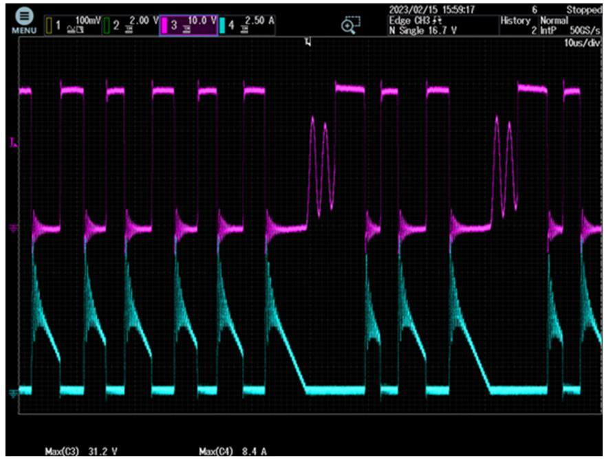

85 VAC

CH3 VR  
CH4 IF

$$
\begin{array}{l} \mathrm {V_ {R\_MAX}} = 3 1. 2 \mathrm{V} \\ \mathrm {I_ {F\_MAX}} = 8. 4 \mathrm{A} \end{array}
$$

Test Condition:  
 Full Load  
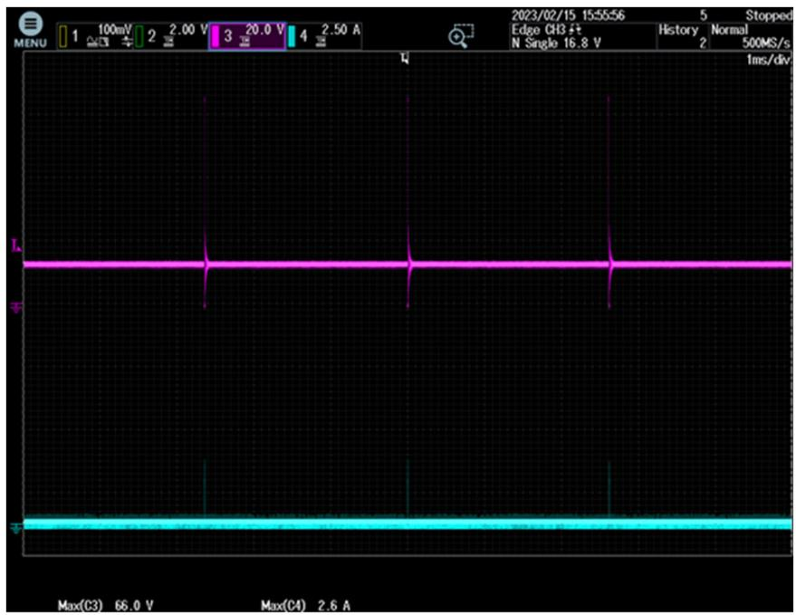

265 VAC

CH3 VR  
CH4 IF

$$
\begin{array}{l} \mathrm {V_ {R\_MAX}} = 6 6 \mathrm{V} \\ \mathrm {I_ {F\_MAX}} = 2. 6 \mathrm{A} \end{array}
$$

Test Condition:  
 No Load  
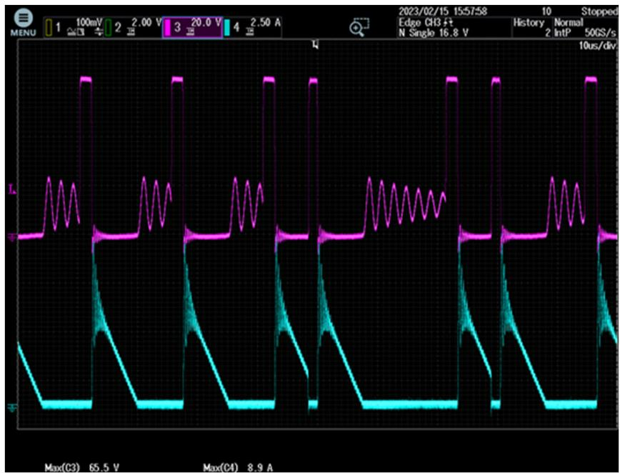

265 VAC

CH3 VR  
CH4 IF

$$
\begin{array}{l} \mathrm {V_ {R\_MAX}} = 6 5. 5 \mathrm{V} \\ \mathrm {I_ {F\_MAX}} = 8. 9 \mathrm{A} \end{array}
$$

Test Condition:

 Full Load

## 输入过压保护 （MOSFET波形）

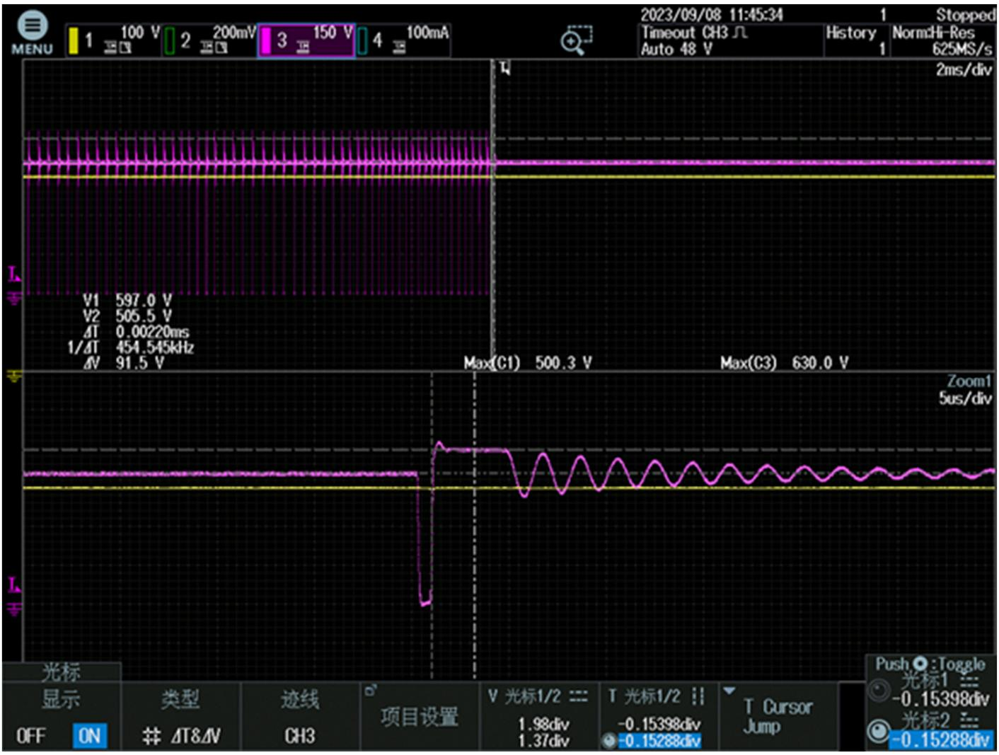

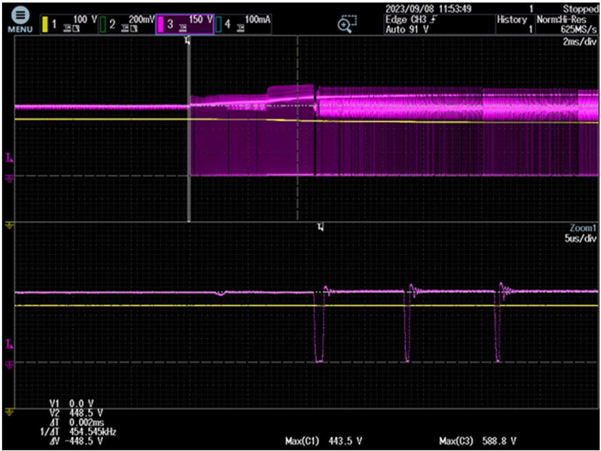

备注：以上测试需将输入400V电解电容更换成两个400V电容串联以提高耐压能力

CH1 VIN\_DC  
CH3 $\mathsf { V } _ { \mathsf { D } \mathsf { S } }$

Test Condition:

Light Load

$$
\begin{array}{l} V _ {I N \_ O V P} = 5 0 0 V D C \\ V _ {D R A I N S \_ O V} = 5 9 7 V \end{array}
$$

CH1 VIN\_DC  
CH3 VDS

Test Condition:

Light Load

$$
V _ {H Y S \_ O V} = 5 9 7 - 4 4 8. 5 = 1 4 8. 5 V
$$

## 输出短路保护（MOSFET&输出Diode波形）

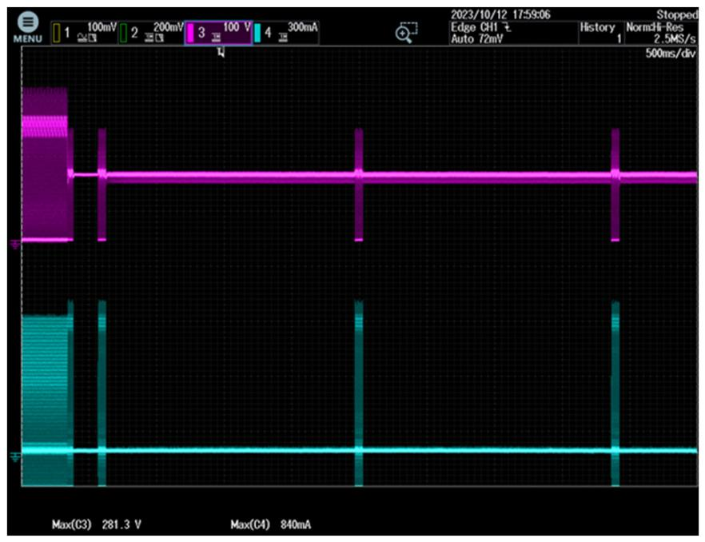

## 85 VACMOSFET波形

CH3 $\mathsf { V } _ { \mathsf { D } \mathsf { S } }$  
CH4 $\mathsf { I } _ { \mathsf { D } \mathsf { S } }$

$$
\begin{array}{l} \mathrm {V_ {DS\_MAX}} = 2 8 1 \mathrm{V} \\ \mathrm {I_ {DS\_MAX}} = 0. 8 4 \mathrm{A} \end{array}
$$

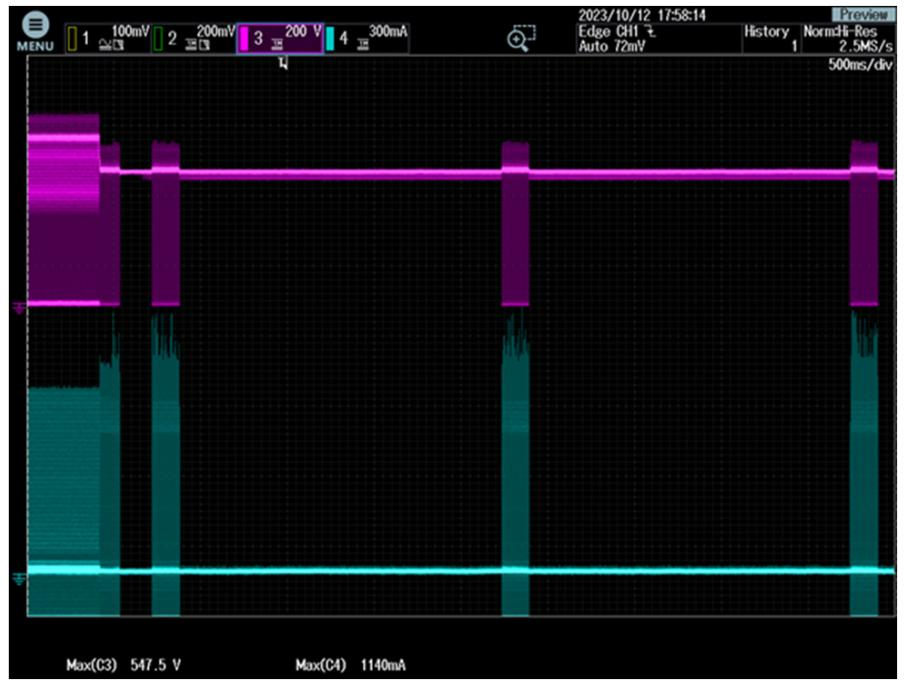

## 265 VACMOSFET波形

CH3 $\mathsf { V } _ { \mathsf { D } \mathsf { S } }$  
CH4 $\mathsf { I } _ { \mathsf { D } \mathsf { S } }$

$$
\begin{array}{l} V _ {D S \_ M A X} = 5 4 8 \mathrm{V} \\ I _ {D S \_ M A X} = 1. 1 4 \mathrm{A} \end{array}
$$

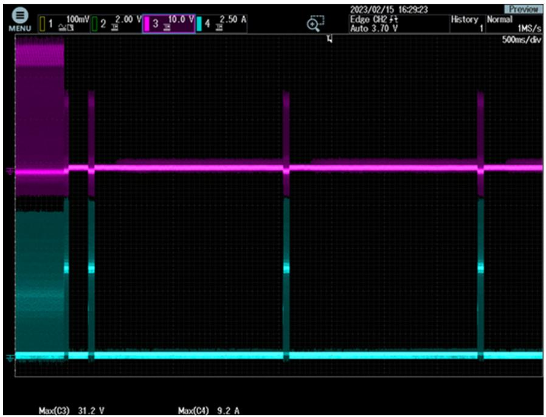

## 85 VAC输出diode波形

CH3 $V _ { \textsf { R } }$  
$C H 4 1 _ { F }$

$$
\begin{array}{l} \mathrm {V_ {DS\_MAX}} = 3 1. 2 \mathrm{V} \\ \mathrm {I_ {DS\_MAX}} = 9. 2 \mathrm{A} \end{array}
$$

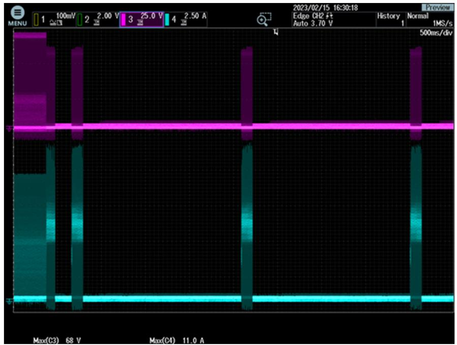

## 265 VAC输出diode波形

CH3 $V _ { \textsf { R } }$  
CH4 IF

$$
\begin{array}{l} \mathrm {V_ {DS\_MAX}} = 6 8 \mathrm{V} \\ \mathrm {I_ {DS\_MAX}} = 1 1 \mathrm{A} \end{array}
$$

<table><tr><td rowspan="2">项目</td><td>85VAC</td><td>115VAC</td><td>230VAC</td><td>265VAC</td></tr><tr><td>温度(°C)</td><td>温度(°C)</td><td>温度(°C)</td><td>温度(°C)</td></tr><tr><td>环境温度</td><td>51.1</td><td>51.3</td><td>51.1</td><td>51.1</td></tr><tr><td>BP8620PD (U2)</td><td>107.8</td><td>101.8</td><td>101.8</td><td>104.9</td></tr><tr><td>变压器绕组(T1)</td><td>74.5</td><td>74.1</td><td>74.7</td><td>75.4</td></tr><tr><td>变压器磁芯(T1)</td><td>69.4</td><td>69.8</td><td>71.8</td><td>72.9</td></tr><tr><td>整流二极管(D3)</td><td>103.4</td><td>103.5</td><td>104.0</td><td>104.4</td></tr><tr><td>整流桥(D1)</td><td>81.4</td><td>74.3</td><td>66.4</td><td>65.5</td></tr><tr><td>输入电解电容(C6)</td><td>75.4</td><td>71.3</td><td>70.1</td><td>71.8</td></tr><tr><td>输出电解电容(C3)</td><td>69.2</td><td>68.9</td><td>68.4</td><td>69.0</td></tr></table>

备注：增大芯片Source散热铜箔面积可以降低芯片温度

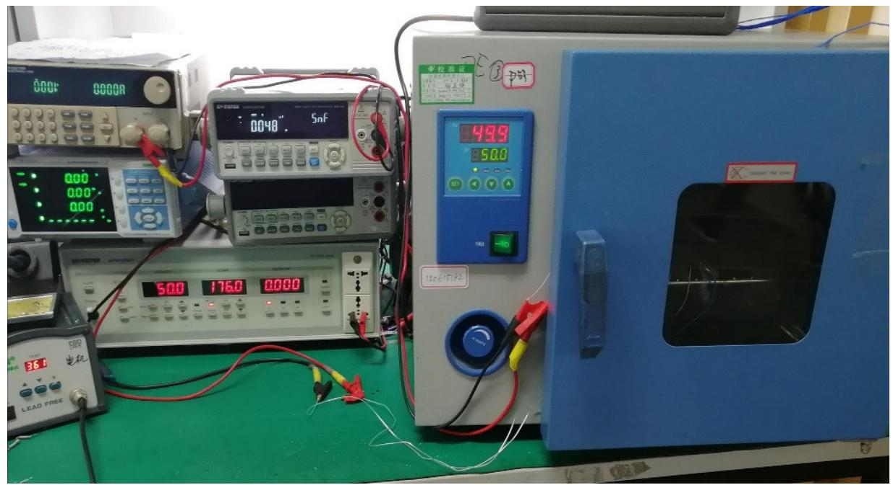

## 测试说明

在温箱中进行测试  
电路板放在一个封闭的盒子内  
热电偶连接到各个测量点  
等测量点温度达到稳定后记录数据

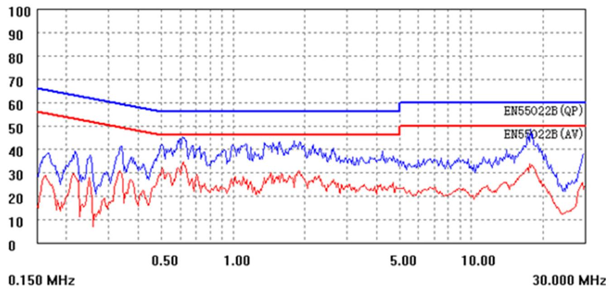

115Vac Line

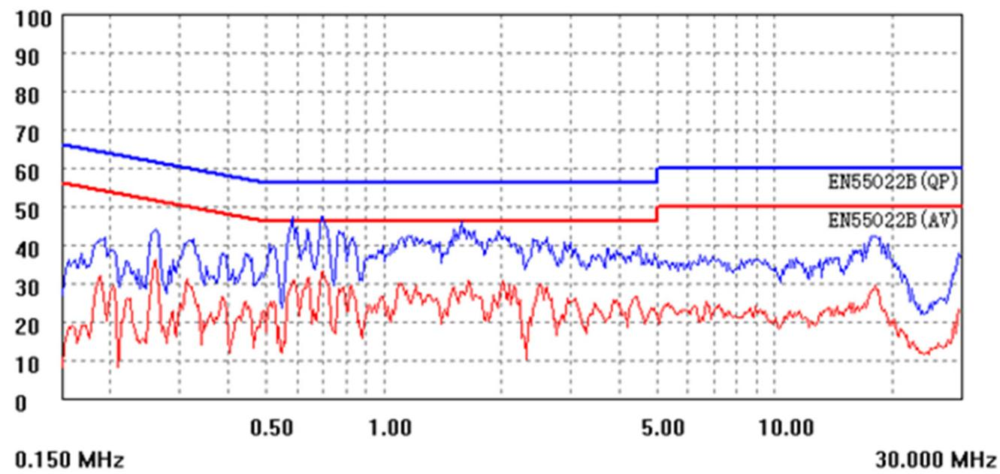

230Vac Line

115Vac Neutral

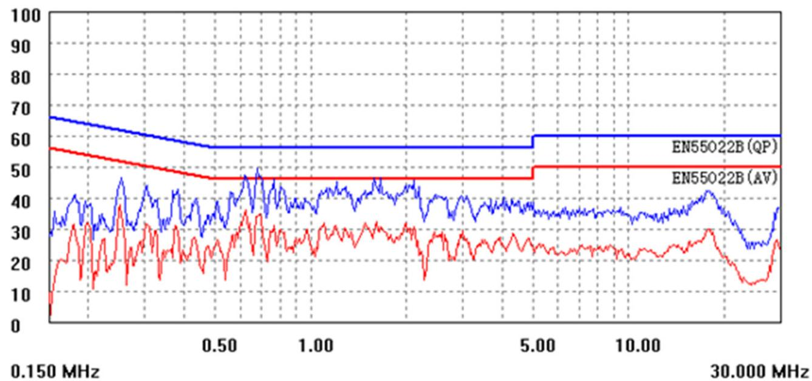

230Vac Neutral

<table><tr><td>差模/共模</td><td>电压</td><td>相位角</td><td>发生器阻抗</td><td>测试次数</td><td>测试结果</td></tr><tr><td>L to N</td><td>+2kV</td><td>0/90/180/270</td><td>2</td><td>10</td><td>Pass</td></tr><tr><td>L to N</td><td>-2kV</td><td>0/90/180/270</td><td>2</td><td>10</td><td>Pass</td></tr><tr><td>L to PE</td><td>+4kV</td><td>0/90/180/270</td><td>12</td><td>10</td><td>Pass</td></tr><tr><td>L to PE</td><td>-4kV</td><td>0/90/180/270</td><td>12</td><td>10</td><td>Pass</td></tr><tr><td>N to PE</td><td>+4kV</td><td>0/90/180/270</td><td>12</td><td>10</td><td>Pass</td></tr><tr><td>N to PE</td><td>-4kV</td><td>0/90/180/270</td><td>12</td><td>10</td><td>Pass</td></tr></table>

## 测试说明

 按照GB/T17626.5和IEC61000-4-5的最新版本要求进行测试  
室温环境，230VAC输入，满载条件  
输入1.2/50us组合波浪涌电压  
每个测试点重复10次  
每次间隔时间1分钟  
 试验时样机输出正常（符合A类标准）视为Pass

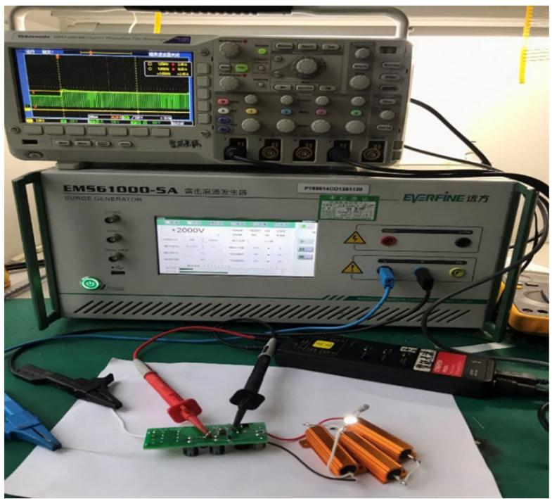

<table><tr><td>共模</td><td>电压</td><td>脉冲群持续时间</td><td>脉冲频率</td><td>测试时间</td><td>测试结果</td></tr><tr><td>L/N to PE</td><td>+4kV</td><td>15ms</td><td>5kHz</td><td>120s</td><td>Pass</td></tr><tr><td>L/N to PE</td><td>-4kV</td><td>15ms</td><td>5kHz</td><td>120s</td><td>Pass</td></tr><tr><td>L/N to PE</td><td>+4kV</td><td>0.75ms</td><td>100kHz</td><td>120s</td><td>Pass</td></tr><tr><td>L/N to PE</td><td>-4kV</td><td>0.75ms</td><td>100kHz</td><td>120s</td><td>Pass</td></tr><tr><td>L/N to PE</td><td>+2kV</td><td>2ms</td><td>38kHz</td><td>120s</td><td>Pass</td></tr><tr><td>L/N to PE</td><td>-2kV</td><td>2ms</td><td>38kHz</td><td>120s</td><td>Pass</td></tr><tr><td>L/N to PE</td><td>+4kV</td><td>2ms</td><td>38kHz</td><td>120s</td><td>Pass</td></tr><tr><td>L/N to PE</td><td>-4kV</td><td>2ms</td><td>38kHz</td><td>120s</td><td>Pass</td></tr></table>

## 测试说明

 按照GB/T17626.4和IEC61000-4-4的最新版本要求进行测试  
室温环境，230VAC输入满载条件  
分别测试5kHz/100kHz/38kHz脉冲频率  
脉冲群周期为300ms  
每个测试条件测试时间120s  
 试验时样机输出正常（符合A类标准）视为Pass

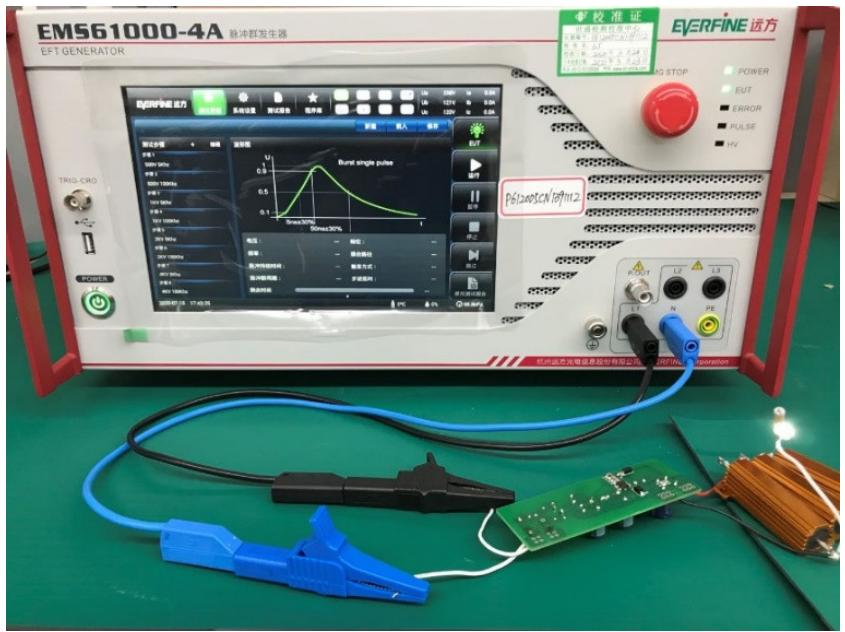

<table><tr><td>测试点</td><td>电压(V)</td><td>放电类型</td><td>放电次数</td><td>测试结果</td></tr><tr><td>Vo</td><td>+8kV</td><td>接触放电</td><td>10</td><td>Pass</td></tr><tr><td>Vo</td><td>-8kV</td><td>接触放电</td><td>10</td><td>Pass</td></tr><tr><td>GND</td><td>+8kV</td><td>接触放电</td><td>10</td><td>Pass</td></tr><tr><td>GND</td><td>-8kV</td><td>接触放电</td><td>10</td><td>Pass</td></tr><tr><td>Vo</td><td>+15kV</td><td>空气放电</td><td>10</td><td>Pass</td></tr><tr><td>Vo</td><td>-15kV</td><td>空气放电</td><td>10</td><td>Pass</td></tr><tr><td>GND</td><td>+15kV</td><td>空气放电</td><td>10</td><td>Pass</td></tr><tr><td>GND</td><td>-15kV</td><td>空气放电</td><td>10</td><td>Pass</td></tr></table>

## 测试说明

 按照GB/T17626.2和IEC61000-4-2的最新版本要求进行测试  
室温环境，230VAC输入满载条件  
每个测试点重复10次  
分别对输出正端和地进行空气放电  
 试验时样机输出正常（符合A类标准）视为Pass

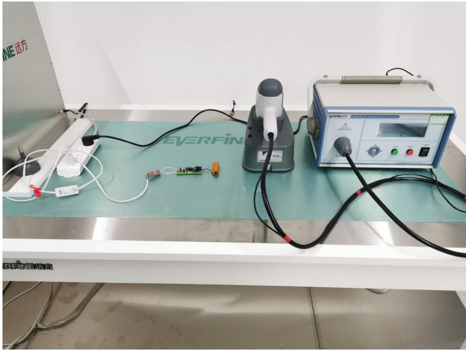

## THANK YOU FOR WATCHING
