BPA8620PD\_12V1.5A 反激式开关电源驱动芯片推 广资料V0.1

时间：2023年9月

## 典型应用图（Flyback）

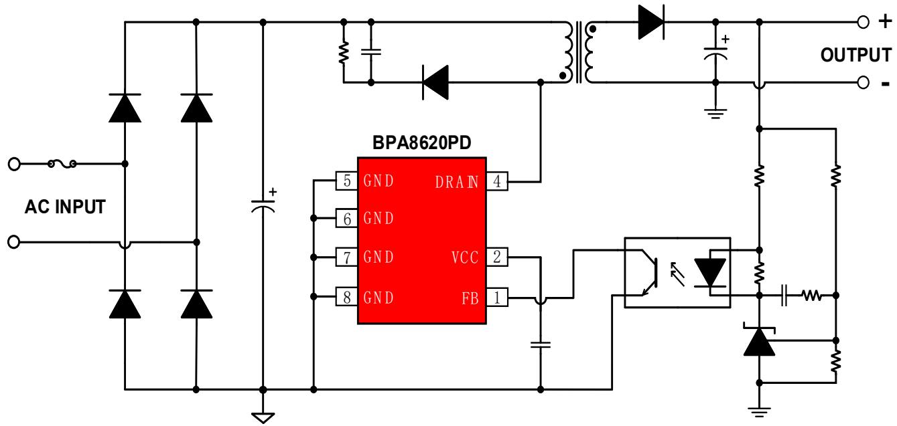

## 产品特点

集成 750V 高压 MOSFET  
集成高压启动和自供电电路  
优异的动态响应速度，无输出过冲  
内置软启动功能  
改善EMI性能的频率调制技术  
保护功能齐全：

输入欠压保护、输入过压保护  
输出短路、过载、过压保护  
反馈开路保护  
迟滞过温保护

封装脚位  
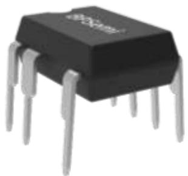

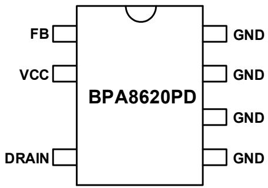

## 产品规格

<table><tr><td colspan="5">输出功率表</td></tr><tr><td rowspan="2">型号</td><td colspan="2">230VAC ±15%</td><td colspan="2">85 ~ 265VAC</td></tr><tr><td>适配器(注1)</td><td>开放式(注2)</td><td>适配器(注1)</td><td>开放式(注2)</td></tr><tr><td>BPA8620PD</td><td>20W</td><td>32W</td><td>14W</td><td>25W</td></tr></table>

注1： 最小连续输出功率，测试条件为封闭式塑料外壳，环境温度为50℃。  
注2： 最小连续输出功率，测试条件为开放式环境，环境温度为50℃。

## 目标应用

家用电器辅助电源  
➢ PC待机电源  
➢ 通信、工业控制辅助电源  
适配器、充电器

BPA8620PD兼容BPA8620P

<table><tr><td></td><td>BPA8620PD</td><td>BPA8620P</td><td>TNY280P</td></tr><tr><td>开关频率</td><td colspan="2">132KHz</td><td>132KHz</td></tr><tr><td>Mosfet BV</td><td>750V</td><td>700V</td><td>700V</td></tr><tr><td> $R_{DS\_ON}$ </td><td colspan="2">2.5Ω</td><td>2.6Ω</td></tr><tr><td>限流点</td><td colspan="2">750mA</td><td>750mA</td></tr><tr><td>软启动</td><td colspan="2">有</td><td>无</td></tr><tr><td>输入过压保护</td><td colspan="2">有</td><td>无</td></tr><tr><td>输入欠压保护</td><td colspan="2">内置</td><td>外加</td></tr><tr><td>输出过压保护</td><td colspan="2">自动重启</td><td>锁死</td></tr><tr><td>过载保护</td><td colspan="2">有</td><td>有</td></tr><tr><td>封装</td><td colspan="2">DIP7</td><td>DIP7</td></tr></table>

备注：对比BPA8620P，BPA8620PD除了BVdss高50V以外，其他参数全部保持一致，因此BPA8620PD可完美兼容BPA8620P。

## 待机功耗

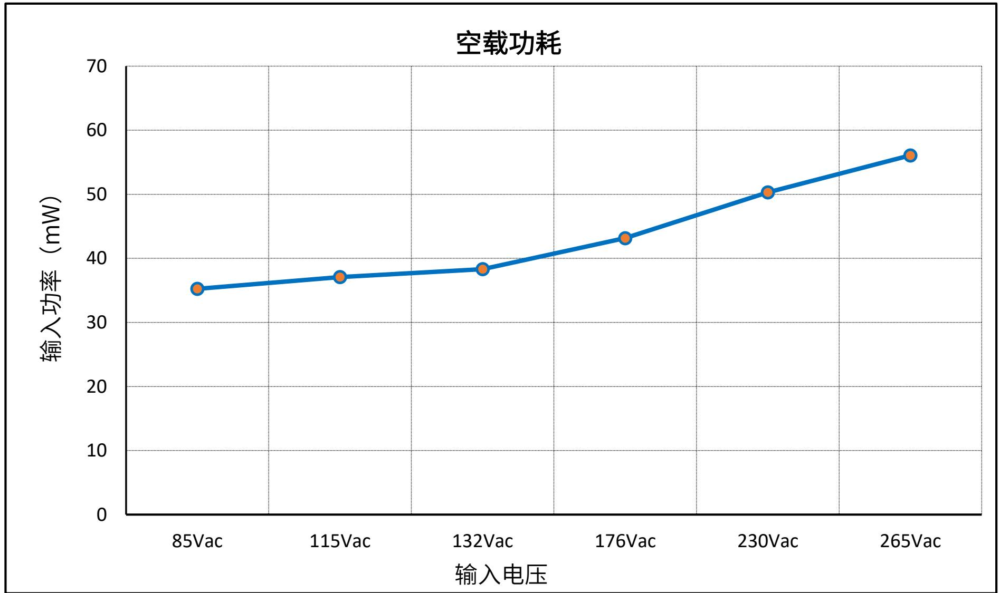

效率  
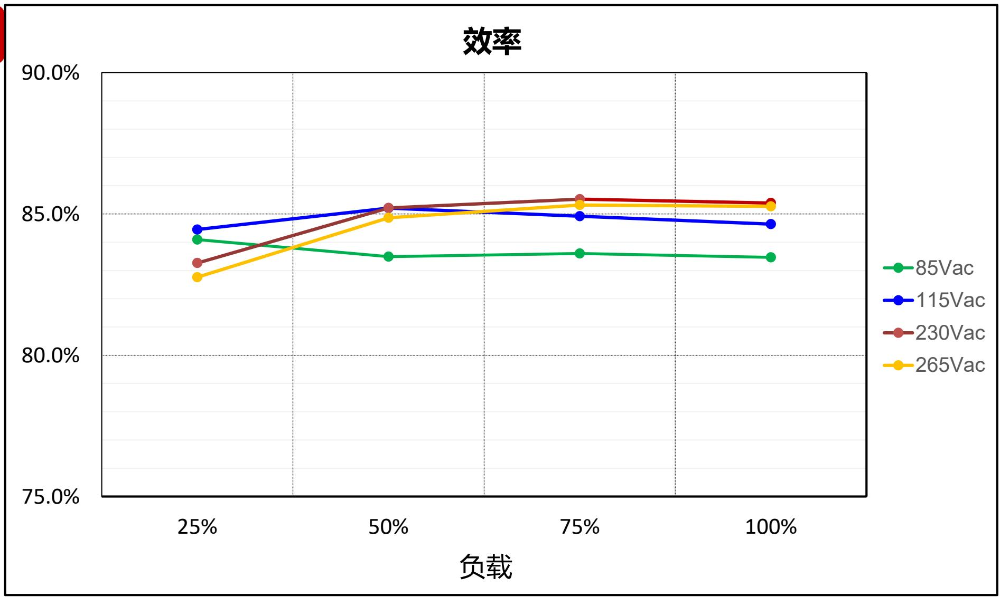

## 输出电压纹波

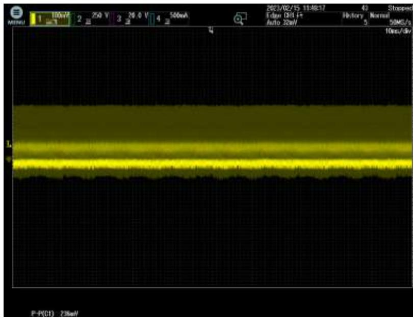

## 85VAC

CH1 VOUT VPK-PK=236mV

## Test Condition:

➢ Full Load

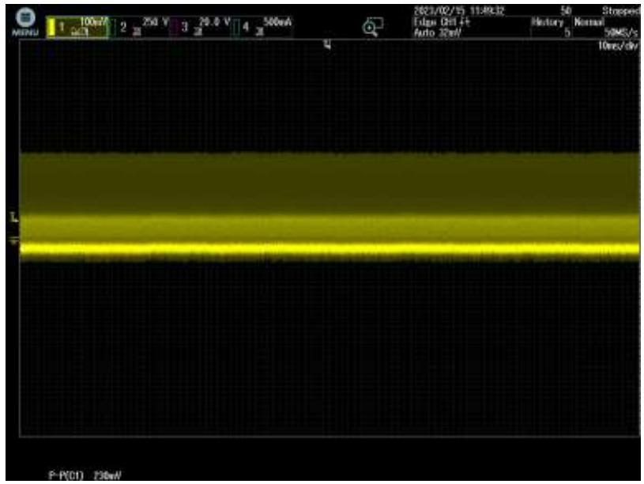

## 265VAC

CH1 VOUT $\mathsf { V } _ { \mathsf { O U T } }$ VPK-PK=230mV

## Test Condition:

➢ Full Load

## 动态纹波（50%-100%）

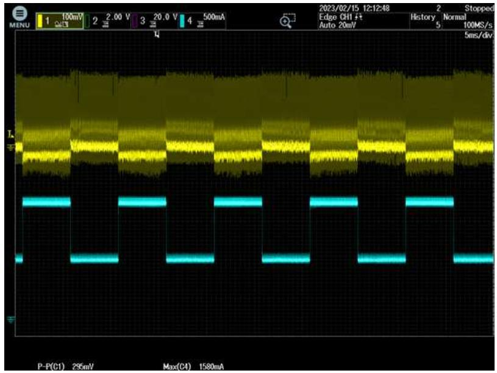

## 85VAC

${ \mathsf { C H 1 } } { \mathsf { V } } _ { \mathsf { O U T } }$  
$\mathsf { V } _ { \mathsf { P K - P K } } { = } 2 9 5 \mathsf { m V }$  
$\mathsf { C H 4 } \mathsf { l } _ { \mathsf { O U T } }$

## Test Condition:

➢ $0 . 7 5 { \tt A } – 1 . 5 { \tt A } – 0 . 7 5 { \tt A }$  
➢ Slew Rate: 0.5 $\mathsf { A } / \mu \mathsf { S }$  
➢ Frequency: 100 Hz

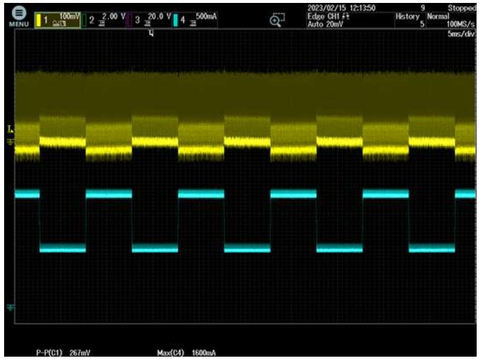

## 265VAC

${ \mathsf { C H 1 } } { \mathsf { V } } _ { \mathsf { O U T } }$  
VPK-PK=267mV  
CH4 IOUT $\mathsf { C H 4 } \mathsf { I } _ { \mathsf { O U T } }$

## Test Condition:

➢ $0 . 7 5 { \tt A } – 1 . 5 { \tt A } – 0 . 7 5 { \tt A }$  
➢ Slew Rate: 0.5 $\mathsf { A } / \mu \mathsf { S }$  
➢ Frequency: 100 Hz

## 输出短路保护

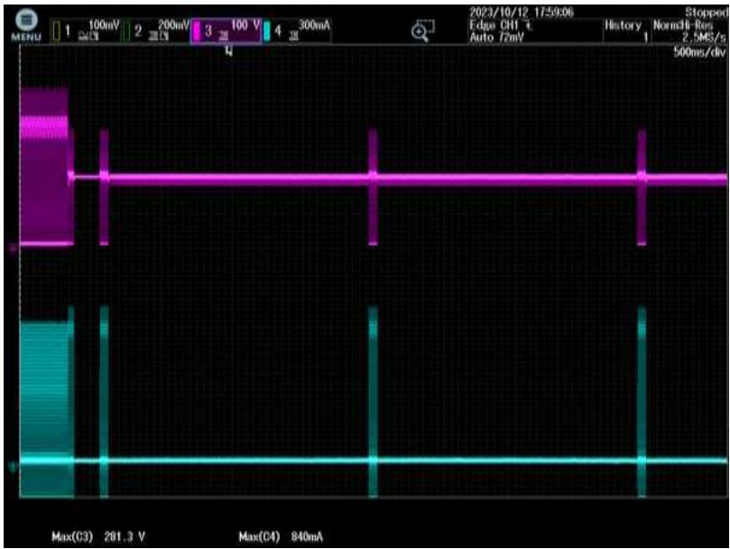

## 85VAC

${ \mathsf { C H 3 } } \mathsf { V _ { D S } }$  
CH4 IDS $C H 4 \mid _ { \mathrm { { D S } } }$ $\mathsf { I } _ { \mathsf { M A X } } \colon 0 . 8 4 \mathsf { A }$ VMAX: 281V

## Test Condition:

➢ 输出短路

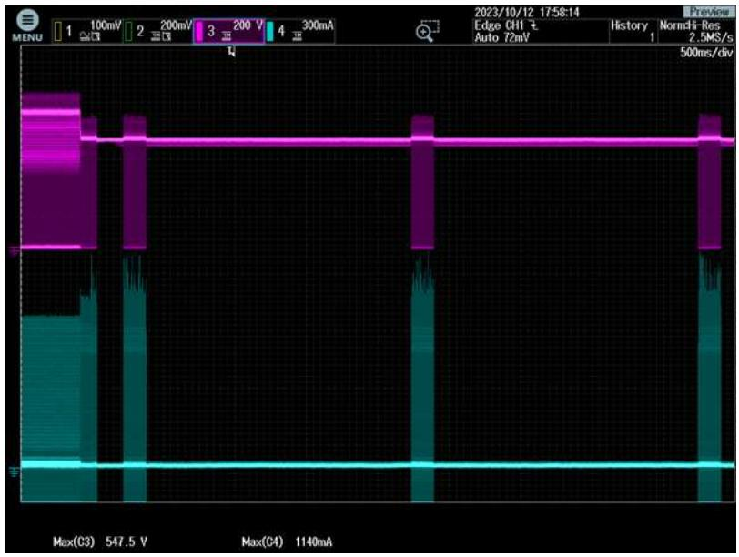

## 265VAC

${ \mathsf { C H 3 } } \mathsf { V _ { D S } }$  
CH4 IDS $C H 4 \mid _ { \mathrm { { D S } } }$ $\mathsf { I } _ { \mathsf { M A X } } \colon 1 . 1 4 \mathsf { A }$ $\mathsf { V } _ { \mathsf { M A X } } \colon 5 4 8 \mathsf { V }$

## Test Condition:

➢ 输出短路

## 输入过压保护

进入过压保护  
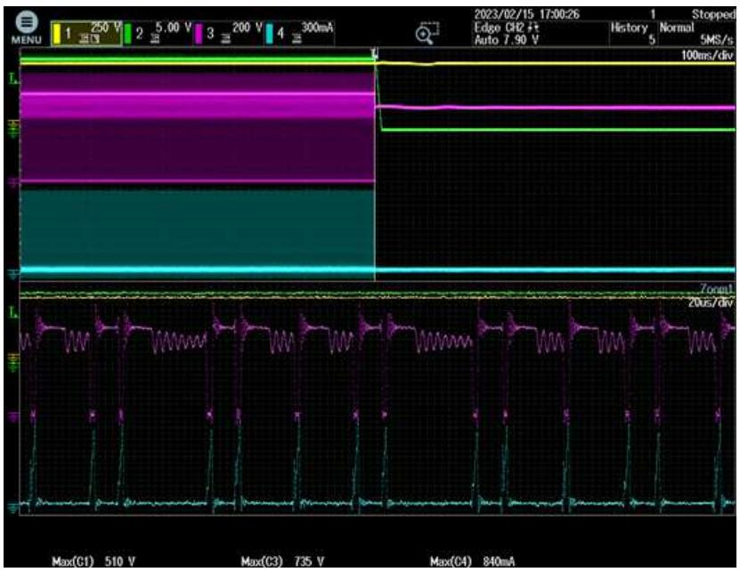

CH1 VinDC  
${ \mathsf { C H } } 2 { \mathsf { V } } _ { \mathsf { O U T } }$  
${ \mathsf { C H 3 } } \mathsf { V _ { D S } }$  
$C H 4 \mid _ { \mathrm { D S } }$  
$\mathsf { V } _ { \mathsf { I N \_ O V P } } { = } 4 9 3 \mathsf { V }$  
$\mathsf { V } _ { \mathsf { D S } \_ \mathsf { P K } } = 7 3 5 \mathsf { V }$

退出过压保护  
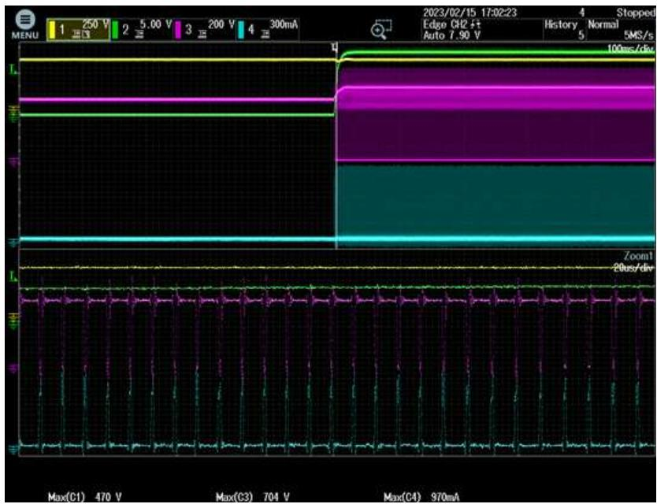

CH1 VinDC  
CH2 VOUT  
CH3 VDS  
CH4 IDS  
VOVP\_RESTART=459V

传导EMI  
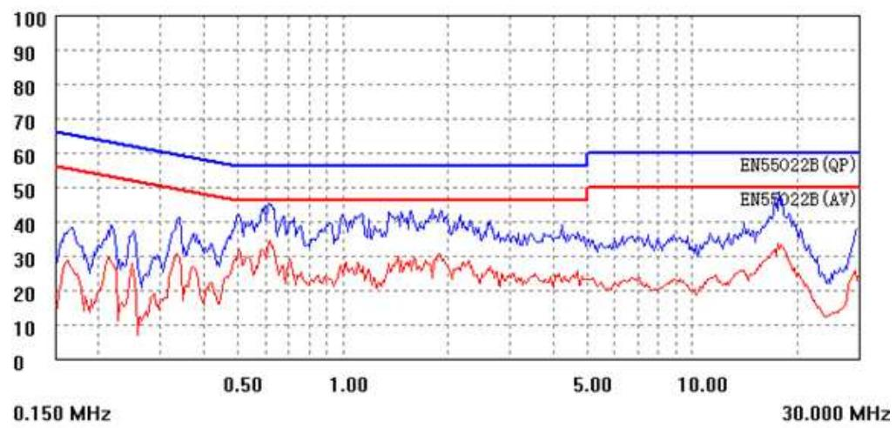

115VAC Line

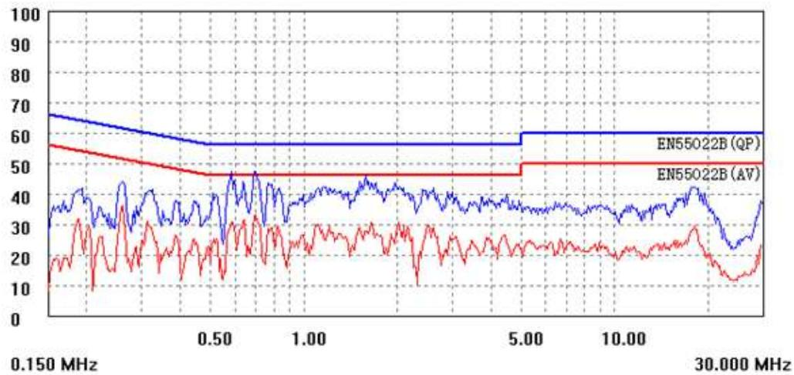

230VAC Line

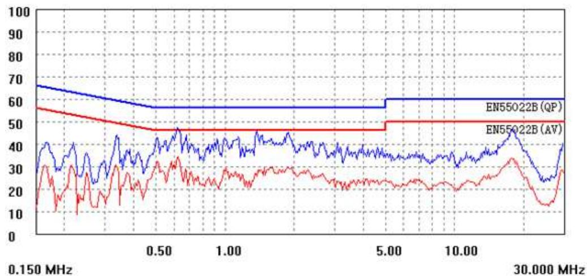

115VAC Neutral

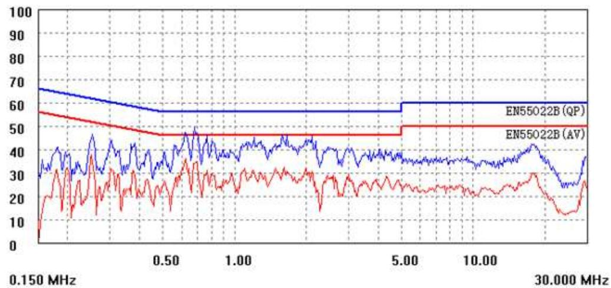

230VAC Neutral

## THANK YOU FOR WATCHING
