## BPA8620P 洗碗机电源(5V/1A 12V/1A 18V/0.23A)

上海晶丰明源半导体股份有限公司

Shanghai Bright Power Semiconductor Co., Ltd.

陈耀兵

2022 10 25

BPA861X  
电源规格  
电路图  
◼BOM  
◼PCB Layout  
电路实物图  
变压器规格书  
性能测试数据

## 产品特点:

➢ 700V MOSFET  
➢ ON/OFF  
》内置软启动功能  
》集成高压启动、自供电电路  
》低音频噪声  
》输入过/欠压保护

## 应用领域:

》家用电器辅助电源  
》电机驱动辅助电源  
➢ IOT/ /  
》工业控制辅助电源

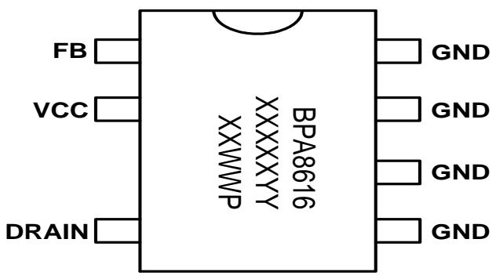

## 电源规格

<table><tr><td>项目描述</td><td>符号</td><td>最小</td><td>典型</td><td>最大</td><td>单位</td><td>备注</td></tr><tr><td colspan="7">输入</td></tr><tr><td>电压</td><td> $V_{IN}$ </td><td>176</td><td>230</td><td>264</td><td> $V_{AC}$ </td><td></td></tr><tr><td>频率</td><td> $f_{LINE}$ </td><td>47</td><td>50</td><td>53</td><td>Hz</td><td></td></tr><tr><td colspan="7">输出</td></tr><tr><td>输出电压1</td><td> $V_{OUT1}$ </td><td></td><td>5</td><td></td><td>V</td><td>±3%</td></tr><tr><td>输出电流1</td><td> $I_{OUT1}$ </td><td></td><td>1</td><td></td><td>A</td><td></td></tr><tr><td>输出电压纹波1</td><td> $V_{RIPPLE1}$ </td><td></td><td></td><td>100</td><td>mV</td><td>20MHz带宽</td></tr><tr><td>输出电压2</td><td> $V_{OUT1}$ </td><td></td><td>12</td><td></td><td>V</td><td>±3%</td></tr><tr><td>输出电流2</td><td> $I_{OUT1}$ </td><td></td><td>1</td><td></td><td>A</td><td></td></tr><tr><td>输出电压纹波2</td><td> $V_{RIPPLE1}$ </td><td></td><td></td><td>120</td><td>mV</td><td>20MHz带宽</td></tr><tr><td>输出电压3</td><td> $V_{OUT1}$ </td><td></td><td>18</td><td></td><td>V</td><td>±3%</td></tr><tr><td>输出电流3</td><td> $I_{OUT1}$ </td><td></td><td>0.23</td><td></td><td>A</td><td></td></tr><tr><td>输出电压纹波3</td><td> $V_{RIPPLE1}$ </td><td></td><td></td><td>180</td><td>mV</td><td>20MHz带宽</td></tr><tr><td>连续输出功率</td><td> $P_{OUT}$ </td><td></td><td>21.14</td><td></td><td>W</td><td></td></tr><tr><td colspan="7">效率</td></tr><tr><td>待机功耗</td><td> $P_{STDBY}$ </td><td></td><td></td><td>1.35</td><td>W</td><td>230VAC,未断开板端负载</td></tr><tr><td>满载效率</td><td>η</td><td>77</td><td></td><td></td><td>%</td><td>230VAC,未断开板端负载</td></tr><tr><td colspan="7">环境</td></tr><tr><td>传导EMI</td><td></td><td colspan="4">满足CISPR22/EN55022 Class B,至少6dB 裕量</td><td></td></tr><tr><td>Surge</td><td></td><td></td><td>4</td><td></td><td>kV</td><td>差模</td></tr><tr><td>EFT</td><td></td><td></td><td>4</td><td></td><td>kV</td><td>5kHz/100kHz/38kHz</td></tr><tr><td>ESD</td><td></td><td></td><td>15</td><td></td><td>kV</td><td>接触8kV,空气15kV</td></tr><tr><td>工作环境温度</td><td> $T_{AMP}$ </td><td>0</td><td></td><td>40</td><td>°C</td><td></td></tr></table>

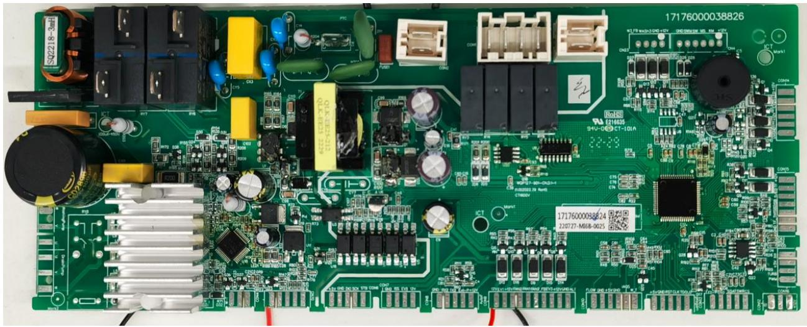

TOP SIDE

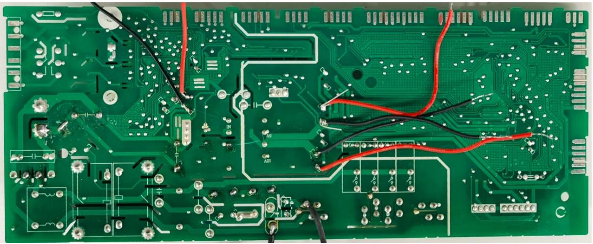

BOTTOM SIDE

## 原理图

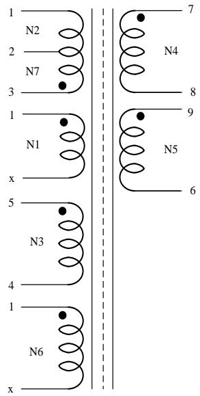

## 规格与材料

》初级绕组感量 $L _ { p } = 8 5 0 \mathrm { u H } \pm 7 \%$ （测试条件：0.3V，100kHz）  
》漏感量 $L _ { | \mathrm { k } } { } ^ { < } 3 0 \mathrm { u } \mathrm { H }$  
》骨架：EE25底部加高 (5+5PIN)  
》磁芯：EE25PC40或同等材质， $\mathsf { A e } { = } 4 0 \mathsf { m m } ^ { 2 }$  
》 N1、N2、N3、N6、N7:2UEW漆包线  
》 N4、N5:三层绝缘线  
》绝缘胶带:3M900或同等材质  
》耐压测试:3KV,50/60Hz,1Min  
》成品要求：浸凡立水

## 绕线方式

<table><tr><td>N1</td><td>1</td><td>X</td><td> $\Phi 0.2^{7*}2P$ </td><td>17Ts</td><td>密绕一层(PI N脚朝外)</td></tr><tr><td colspan="4">胶带</td><td>1.5Ts</td><td></td></tr><tr><td>N2</td><td>3</td><td>2</td><td> $\Phi 0.2^{5*}1P$ </td><td>33Ts</td><td>密绕一层(PI N脚朝外)</td></tr><tr><td colspan="4">胶带</td><td>1.5Ts</td><td></td></tr><tr><td>Nβ</td><td>5</td><td>4</td><td> $\Phi 0.2^{1*}2P$ </td><td>18Ts</td><td>密绕一层(PI N脚朝外)</td></tr><tr><td colspan="4">胶带</td><td>2.1Ts</td><td></td></tr><tr><td>N4</td><td>7</td><td>8</td><td>三层绝缘线 $\Phi 0.4*3P$ </td><td>5Ts</td><td>密绕一层(PI N脚朝外)</td></tr><tr><td colspan="4">胶带</td><td>2.1Ts</td><td></td></tr><tr><td>N5</td><td>9</td><td>6</td><td>三层绝缘线 $\Phi 0.4*2P$ </td><td>7Ts</td><td>密绕一层(PI N脚朝外)</td></tr><tr><td colspan="4">胶带</td><td>3Ts</td><td></td></tr><tr><td>N6</td><td>1</td><td>X</td><td> $\Phi 0.4*3P$ </td><td>6Ts</td><td>密绕一层(PI N脚朝外)</td></tr><tr><td colspan="4">胶带</td><td>3Ts</td><td></td></tr><tr><td>N7</td><td>2</td><td>1</td><td> $\Phi 0.2^{5*}1P$ </td><td>32Ts</td><td>密绕一层(PI N脚朝外)</td></tr><tr><td colspan="4">胶带</td><td>3Ts</td><td></td></tr></table>

## 脚位图

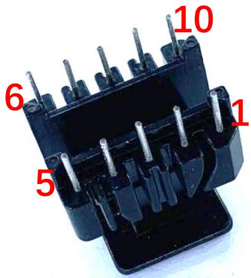

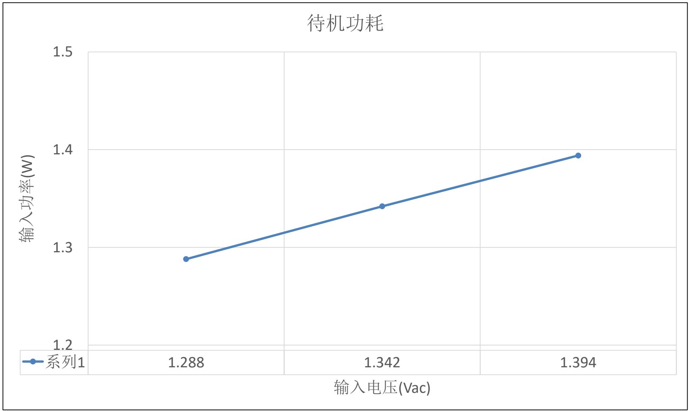

注：未断开客户板上负载

效率曲线  
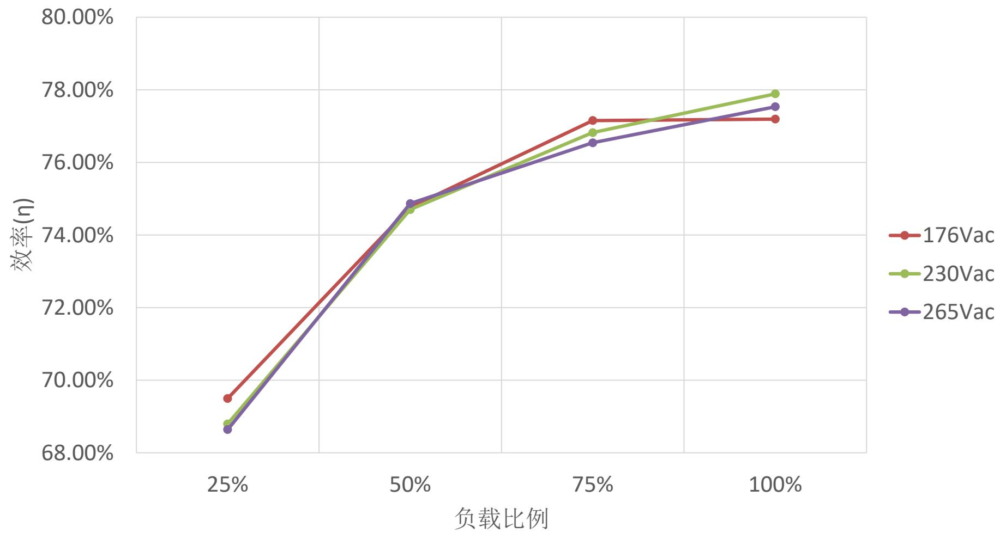

注：未断开客户板上负载

<table><tr><td> $V_{IN}(VAC)$ </td><td>Load(%)</td><td> $P_{IN}(W)$ </td><td> $V_{OUT1}(V)$ </td><td> $V_{OUT2}(V)$ </td><td> $V_{OUT3}(V)$ </td><td> $I_{OUT1}(A)$ </td><td> $I_{OUT2}(A)$ </td><td> $I_{OUT3}(A)$ </td><td> $P_{OUT}(W)$ </td><td>Eff(%)</td><td>AVG Eff(%)</td></tr><tr><td rowspan="6">176</td><td>空载</td><td></td><td></td><td></td><td></td><td></td><td></td><td></td><td></td><td></td><td></td></tr><tr><td>10%</td><td>3.99</td><td>5.0011</td><td>12.369</td><td>19.68</td><td>0.1</td><td>0.1</td><td>0.023</td><td>2.18965</td><td>54.88%</td><td></td></tr><tr><td>25%</td><td>7.88</td><td>5.005</td><td>12.342</td><td>19.82</td><td>0.25</td><td>0.25</td><td>0.0575</td><td>5.4764</td><td>69.50%</td><td rowspan="4">74.65%</td></tr><tr><td>50%</td><td>14.65</td><td>4.9985</td><td>12.326</td><td>19.92</td><td>0.5</td><td>0.5</td><td>0.115</td><td>10.95305</td><td>74.76%</td></tr><tr><td>75%</td><td>21.23</td><td>4.9992</td><td>12.27</td><td>19.87</td><td>0.75</td><td>0.75</td><td>0.1725</td><td>16.37948</td><td>77.15%</td></tr><tr><td>100%</td><td>28.22</td><td>4.9998</td><td>12.221</td><td>19.84</td><td>1</td><td>1</td><td>0.23</td><td>21.784</td><td>77.19%</td></tr><tr><td rowspan="6">230</td><td>空载</td><td></td><td></td><td></td><td></td><td></td><td></td><td></td><td></td><td></td><td></td></tr><tr><td>10%</td><td>4.05</td><td>5.0008</td><td>12.367</td><td>19.75</td><td>0.1</td><td>0.1</td><td>0.023</td><td>2.19103</td><td>54.10%</td><td></td></tr><tr><td>25%</td><td>7.96</td><td>5.0012</td><td>12.327</td><td>19.9</td><td>0.25</td><td>0.25</td><td>0.0575</td><td>5.4763</td><td>68.80%</td><td rowspan="4">74.55%</td></tr><tr><td>50%</td><td>14.64</td><td>4.9987</td><td>12.338</td><td>19.72</td><td>0.5</td><td>0.5</td><td>0.115</td><td>10.93615</td><td>74.70%</td></tr><tr><td>75%</td><td>21.3</td><td>4.9993</td><td>12.28</td><td>19.73</td><td>0.75</td><td>0.75</td><td>0.1725</td><td>16.3629</td><td>76.82%</td></tr><tr><td>100%</td><td>27.94</td><td>5.004</td><td>12.22</td><td>19.73</td><td>1</td><td>1</td><td>0.23</td><td>21.7619</td><td>77.89%</td></tr><tr><td rowspan="6">265</td><td>空载</td><td></td><td></td><td></td><td></td><td></td><td></td><td></td><td></td><td></td><td></td></tr><tr><td>10%</td><td>4.09</td><td>5.002</td><td>12.349</td><td>19.31</td><td>0.1</td><td>0.1</td><td>0.023</td><td>2.17923</td><td>53.28%</td><td></td></tr><tr><td>25%</td><td>7.94</td><td>5.0008</td><td>12.319</td><td>19.48</td><td>0.25</td><td>0.25</td><td>0.0575</td><td>5.45005</td><td>68.64%</td><td rowspan="4">74.39%</td></tr><tr><td>50%</td><td>14.57</td><td>4.9989</td><td>12.3</td><td>19.64</td><td>0.5</td><td>0.5</td><td>0.115</td><td>10.90805</td><td>74.87%</td></tr><tr><td>75%</td><td>21.33</td><td>4.9993</td><td>12.247</td><td>19.66</td><td>0.75</td><td>0.75</td><td>0.1725</td><td>16.32608</td><td>76.54%</td></tr><tr><td>100%</td><td>28.02</td><td>5.0004</td><td>12.2</td><td>19.67</td><td>1</td><td>1</td><td>0.23</td><td>21.7245</td><td>77.53%</td></tr></table>

注：未断开客户板上负载

## 输出电压调整率

<table><tr><td> $V_{OUT}(V)$  $I_{OUT}(A)$ </td><td></td><td>5V</td><td>12V</td><td>18V</td></tr><tr><td> $I_{O\_5V}=0A$ </td><td>176VAC</td><td>5.0007</td><td>13.794</td><td>19.41</td></tr><tr><td> $I_{O\_12V}=0A$ </td><td>230VAC</td><td>5.0011</td><td>13.842</td><td>19.42</td></tr><tr><td> $I_{O\_18V}=0A$ </td><td>265VAC</td><td>5.0008</td><td>13.88</td><td>18.89</td></tr><tr><td> $I_{O\_5V}=1A$ </td><td>176VAC</td><td>4.9959</td><td>14.656</td><td>20.09</td></tr><tr><td> $I_{O\_12V}=0A$ </td><td>230VAC</td><td>4.9945</td><td>14.514</td><td>20.14</td></tr><tr><td> $I_{O\_18V}=0A$ </td><td>265VAC</td><td>4.9942</td><td>14.428</td><td>20.17</td></tr><tr><td> $I_{O\_5V}=0A$ </td><td>176VAC</td><td>5.0015</td><td>12.102</td><td>19.46</td></tr><tr><td> $I_{O\_12V}=1A$ </td><td>230VAC</td><td>5.0013</td><td>12.103</td><td>19.46</td></tr><tr><td> $I_{O\_18V}=0.23A$ </td><td>265VAC</td><td>5.0011</td><td>12.098</td><td>19.47</td></tr><tr><td> $I_{O\_5V}=1A$ </td><td>176VAC</td><td>4.9995</td><td>12.232</td><td>19.88</td></tr><tr><td> $I_{O\_12V}=1A$ </td><td>230VAC</td><td>5</td><td>12.225</td><td>19.72</td></tr><tr><td> $I_{O\_18V}=0.23A$ </td><td>265VAC</td><td>4.9995</td><td>12.233</td><td>19.75</td></tr></table>

注：未断开客户板上负载

## (5V+12V)

20MHz带宽，去掉示波器探头正端夹子和地线环，10uF/50V 0.1uF/50V

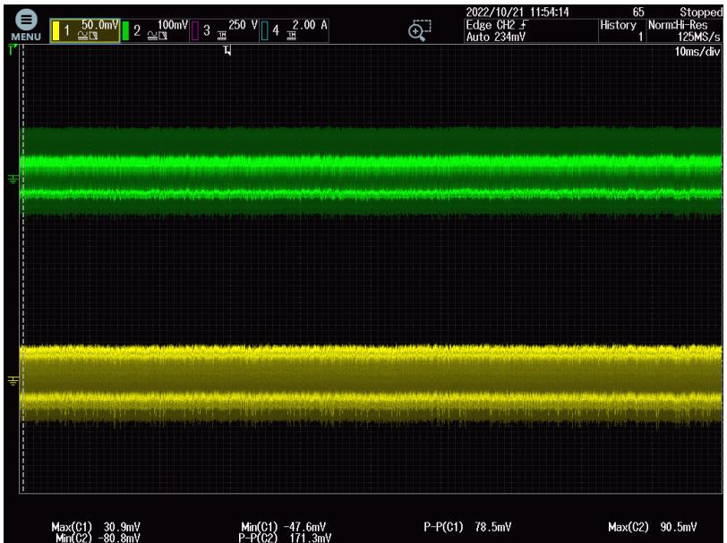

## 176 VAC

CH1 $\mathsf { V } _ { \mathsf { O U T } \_ 5 \mathsf { V } }$ Ripple  
CH2 $\mathsf { V } _ { \mathsf { O U T } _ { - } 1 2 \mathsf { V } }$ Ripple

$$
V _ {P K - P K \_ 5 V} = 7 8. 5 m V
$$

$$
V _ {P K - P K \_ 1 2 V} = 1 7 1. 3 m V
$$

## Test Condition:

➢ Full Load

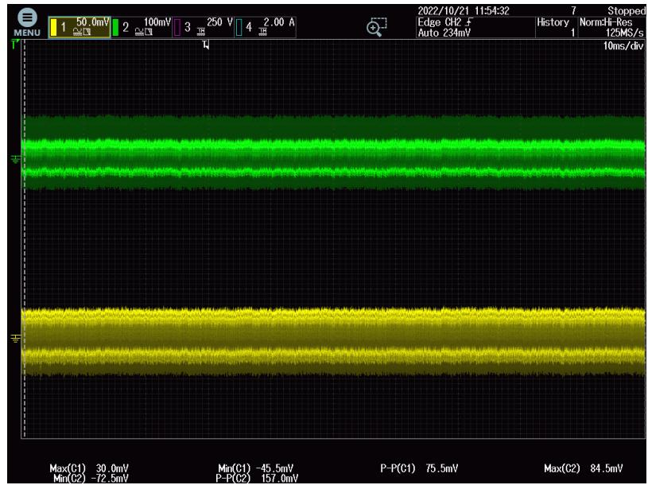

## 230 VAC

CH1 $\mathsf { V } _ { \mathsf { O U T } \_ 5 \mathsf { V } }$ Ripple  
CH2 $\mathsf { V } _ { \mathsf { O U T } _ { - } 1 2 \mathsf { V } }$ Ripple

$$
V _ {P K - P K \_ 5 V} = 7 5. 5 m V
$$

$$
V _ {P K - P K \_ 1 2 V} = 1 5 7 m V
$$

## Test Condition:

➢ Full Load

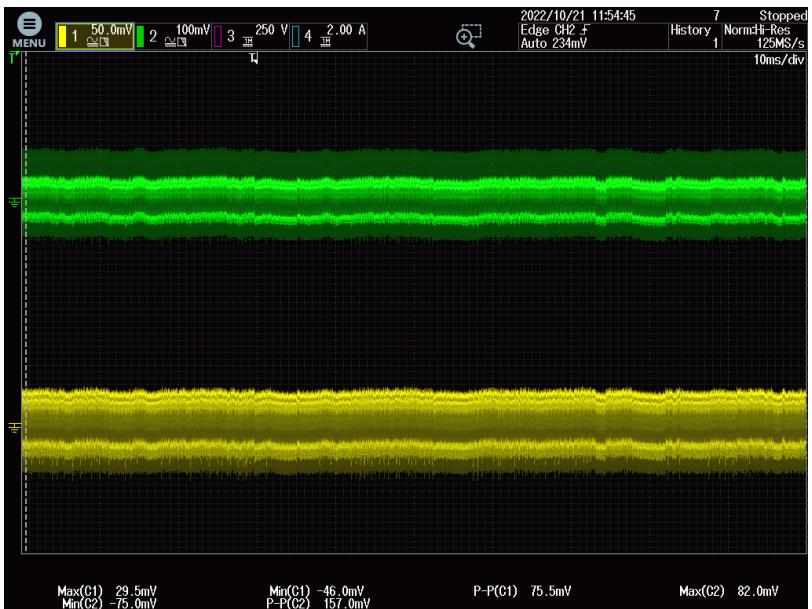

## 265 VAC

CH1 $\mathsf { V } _ { \mathsf { O U T } \_ 5 \mathsf { V } }$ Ripple  
CH2 $\mathsf { V } _ { \mathsf { o u r } _ { - } 1 2 \mathsf { V } }$ Ripple

$$
V _ {P K - P K \_ 5 V} = 7 5. 5 m V
$$

$$
V _ {P K - P K \_ 1 2 V} = 1 5 7 m V
$$

## Test Condition:

➢ Full Load

## (18V)

20MHz带宽，去掉示波器探头正端夹子和地线环，10uF/50V 0.1uF/50V

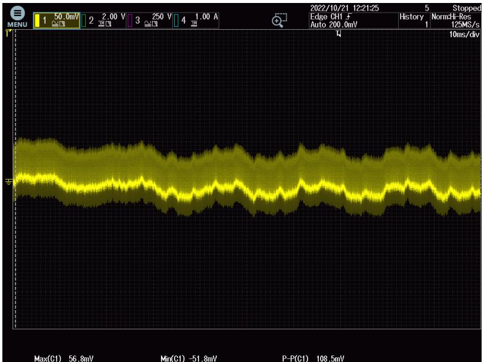

176 VAC  
$\mathsf { R i p p l e } ^ { \mathsf { C H 1 } \mathsf { V _ { 0 \mathsf { U _ { - } 1 8 \mathsf { V } } } } }$ CH1 VOUT\_18V $V _ { p | k - P K } = 1 0 8 . 5$ VPK-PK=108.5 mV  
➢ Full Load

Test Condition:

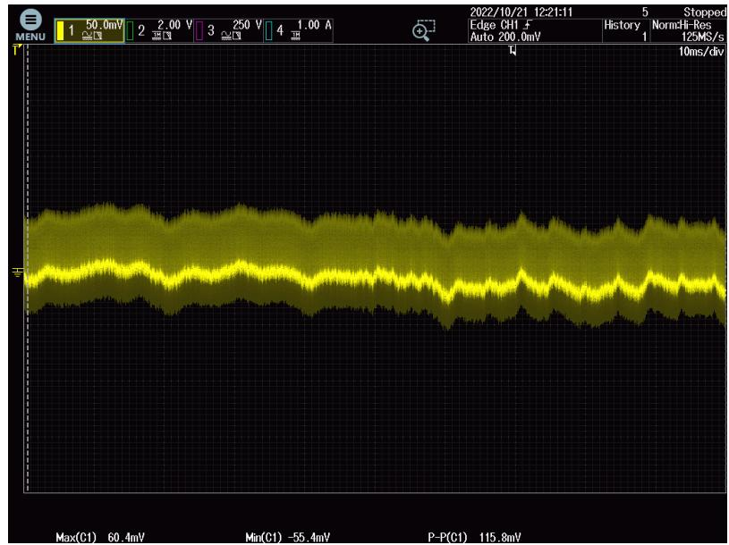

230 VAC  
$\mathsf { R i p p l e } ^ { \mathsf { C H 1 } \mathsf { V _ { 0 \mathsf { U T } _ { - } 1 8 \mathsf { V } } } }$ CH1 VOUT\_18V $V _ { p | _ { \mathsf { R } - \mathsf { P K } } } = \pm 1 1 5 . 8$ mV  
➢ Full Load

Test Condition:

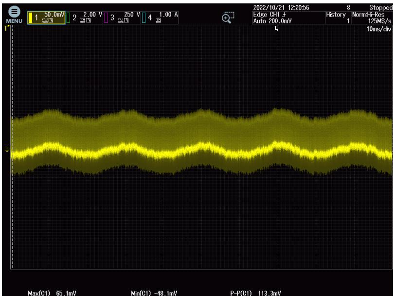

265 VAC  
CH1 VOUT\_18V Ripple V VPK-PK=113.3 mV  
➢ Full Load

Test Condition:

## (50%-100%) (5V+12V)

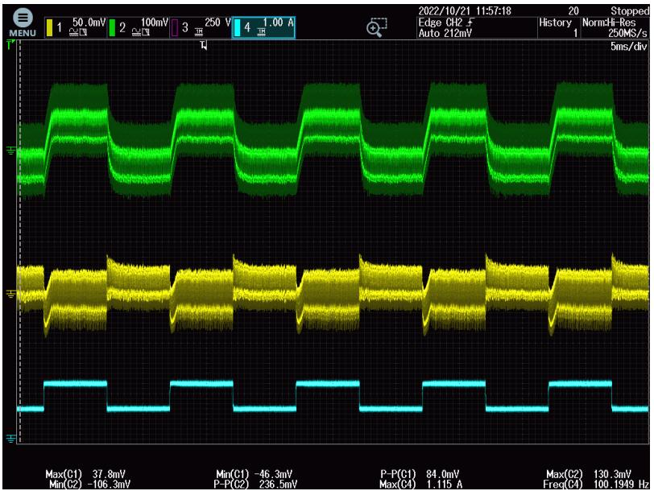

176 VAC

CH1 VOUT\_5V $\mathsf { V } _ { \mathsf { O U T } \ 5 \mathsf { V } }$ $V _ { P K - P K } = 8 4 m v$  
CH1 VOUT\_12V $\mathsf { V } _ { \mathsf { O U T } \ 1 2 \mathsf { V } }$ VPK-PK=236.5 mV $V _ { P K - P K } = 2 3 6 . 5 m v$  
CH4 IOUT\_5V $\mathsf { I } _ { \mathsf { O U T } \_ 5 \mathsf { V } }$

## Test Condition:

➢ $5 \mathsf { V } \colon 0 . 5 \mathsf { A } \substack { - 1 \mathsf { A } - 0 . 5 \mathsf { A } }$  
➢ 12V-1A, 18V-0.23A  
➢ Slew Rate: 0.5 A/μS  
➢ Frequency: 100 Hz

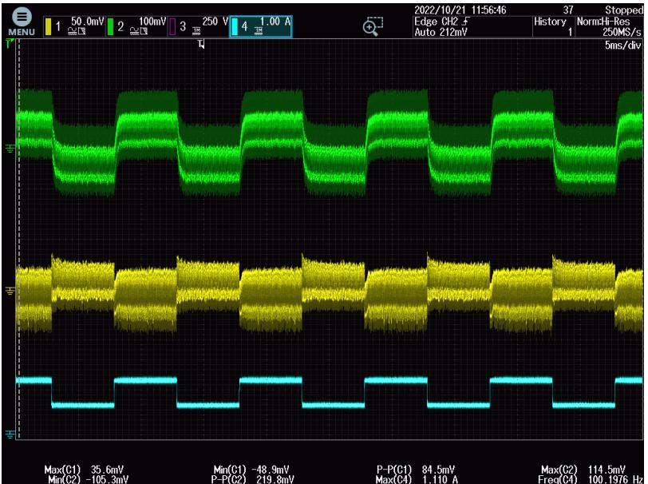

265 VAC

$\mathtt { C H 1 V _ { 0 \sqcup T } } _ { \mathtt { V _ { P K - P K } } } = 8 4 . 5 \mathtt { V _ { m V } }$ CH1 VOUT\_5V VPK-PK=84.5 mV  
CH1 VOUT\_12V $\mathsf { V } _ { \mathsf { O U T } \ 1 2 \mathsf { V } }$ VPK-PK=219.8 mV $V _ { P K - P K } = 2 1 9 . 8 m v$  
CH4 IOUT\_5V $\mathsf { C H } 4 \mathsf { I } _ { 0 \mathsf { U T } \_ 5 \mathsf { V } }$

## Test Condition:

➢ $5 \mathsf { V } \colon 0 . 5 \mathsf { A } \ – 1 \mathsf { A } – 0 . 5 \mathsf { A }$  
➢ $1 2 \mathsf { V } { - } 1 \mathsf { A } , 1 8 \mathsf { V } { - } 0 . 2 3 \mathsf { A }$  
➢ Slew Rate: 0.5 A/μS  
➢ Frequency: 100 Hz

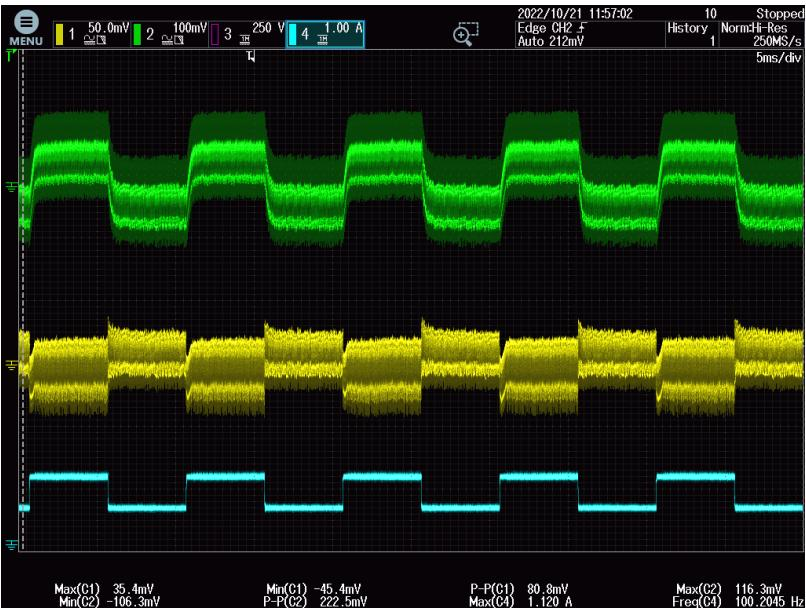

230 VAC

CH1 VOUT\_5V $\mathsf { V } _ { \mathsf { O U T } \ 5 \mathsf { V } }$ VPK-PK=80.8 mV $V _ { P K - P K } = 8 0 . 8 m v$  
$\mathsf { C H 1 V _ { O U T \ 1 2 \vee } }$ CH1 VOUT\_12V VPK-PK=222.5 mV $V _ { P K - P K } = 2 2 2 . 5 m v$  
CH4 IOUT\_5V $\mathsf { C H } 4 \mathsf { I } _ { 0 \mathsf { U T } \_ 5 \mathsf { V } }$

## Test Condition:

➢ $5 \mathsf { V } \colon 0 . 5 \mathsf { A } \substack { - 1 \mathsf { A } - 0 . 5 \mathsf { A } }$  
➢ $1 2 \mathsf { V } { - } 1 \mathsf { A } , 1 8 \mathsf { V } { - } 0 . 2 3 \mathsf { A }$  
➢ Slew Rate: 0.5 A/μS  
➢ Frequency: 100 Hz

## (50%-100%) (18V)

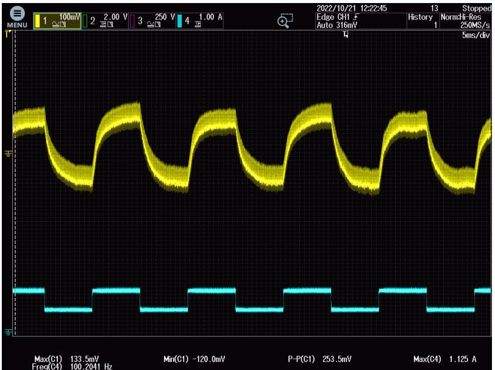

176 VAC

CH1 VOUT\_18V $V _ { p | k - P K } = 2 5 3 . 5 m v$  
CH4 IOUT\_5V $\mathsf { I } _ { \mathsf { O U T } \_ 5 \mathsf { V } }$

## Test Condition:

➢ 5V: 0.5 A-1 A-0.5 A  
➢ 12V-1A, 18V-0.23A  
➢ Slew Rate: 0.5 A/μS  
➢ Frequency: 100 Hz

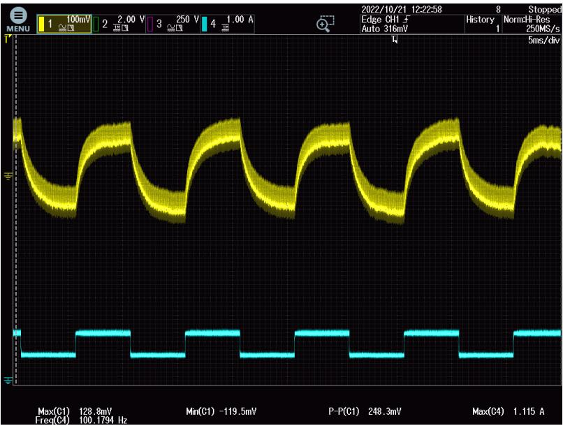

230 VAC

CH1 VOUT\_18V $\mathsf { V } _ { \mathsf { O U T } \_ 1 8 \mathsf { V } }$  
CH4 IOUT\_5V $\mathsf { I } _ { \mathsf { O U T } \_ 5 \mathsf { V } }$

$$
V _ {P K - P K} = 2 4 8. 3 \mathrm{mV}
$$

## Test Condition:

➢ 5V: 0.5 A-1 A-0.5 A  
➢ 12V-1A, 18V-0.23A  
➢ Slew Rate: 0.5 A/μS  
➢ Frequency: 100 Hz

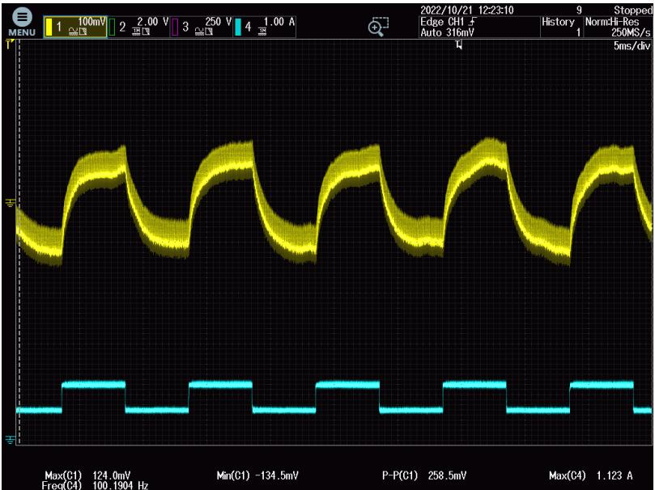  
265 VAC

$\begin{array} { r l } & { \mathsf { C H 1 V } _ { \mathsf { O U T } } \mathsf { 1 8 V } } \\ & { \mathsf { V _ { P K - P K } } \mathsf { = 2 5 8 . 5 m v } } \end{array}$ CH1 VOUT\_18V  
CH4 IOUT\_5V $\mathsf { C H } 4 \mathsf { I } _ { 0 \mathsf { U T } \_ 5 \mathsf { V } }$

## Test Condition:

➢ 5V: 0.5 A-1 A-0.5 A  
➢ 12V-1A, 18V-0.23A  
➢ Slew Rate: 0.5 A/μS  
➢ Frequency: 100 Hz

## (10%-90%) (5V+12V)

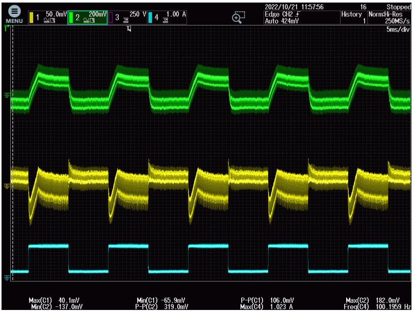

176 VAC

CH1 VOUT\_5V $\mathsf { V } _ { \mathsf { O U T } \ 5 \mathsf { V } }$ VPK-PK=106 mV $v _ { p k \mathrm { - } P K } = 1 0 5 m v$  
$\mathsf { C H 1 V _ { O U T \ 1 2 \vee } }$ CH1 VOUT\_12V VPK-PK=319 mV $v _ { p _ { k - P K } } = 3 1 9 m v$  
CH4 IOUT\_5V $\mathsf { C H } 4 \mathsf { I } _ { 0 \mathsf { U T } \_ 5 \mathsf { V } }$

## Test Condition:

➢ ${ 5 \mathsf { V } } \colon 0 . 1 { \mathsf { A } } – 0 . 9 { \mathsf { A } } – 0 . 1 { \mathsf { A } }$  
➢ $1 2 \mathsf { V } { - } 1 \mathsf { A } , 1 8 \mathsf { V } { - } 0 . 2 3 \mathsf { A }$  
➢ Slew Rate: 0.5 A/μS  
➢ Frequency: 100 Hz

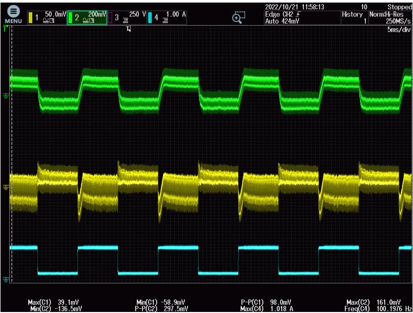

230 VAC

$\mathsf { C H 1 V _ { 0 \cup \mathsf { T } } } _ { 5 \mathsf { V } }$ CH1 VOUT\_5V $V _ { P K - P K } = 9 8 m v$  
CH1 VOUT\_12V $\mathsf { C H 1 V _ { O U T \ 1 2 \vee } }$ VPK-PK=297.5 mV $V _ { P K - P K } = 2 9 7 . 5 m v$  
CH4 IOUT\_5V

## Test Condition:

➢ ${ 5 \mathsf { V } } \colon 0 . 1 { \mathsf { A } } – 0 . 9 { \mathsf { A } } – 0 . 1 { \mathsf { A } }$  
➢ $1 2 \mathsf { V } { - } 1 \mathsf { A } , 1 8 \mathsf { V } { - } 0 . 2 3 \mathsf { A }$  
➢ Slew Rate: 0.5 A/μS  
➢ Frequency: 100 Hz

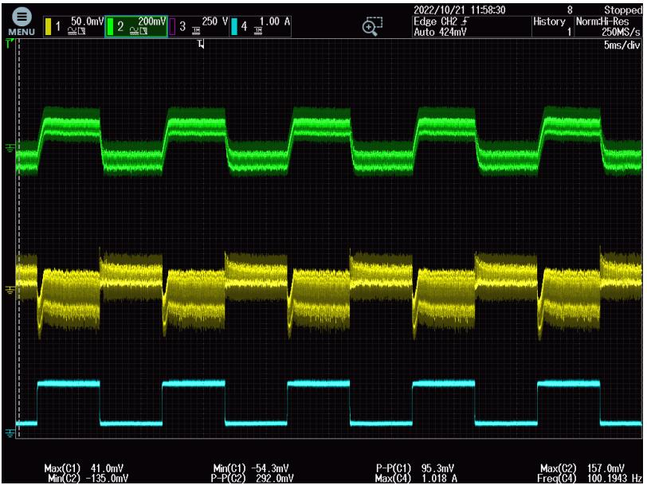

265 VAC

$\mathtt { C H 1 } \mathtt { V _ { 0 \sqcup T } } _ { = 9 6 . 3 \ \mathrm { m v } }$ CH1 VOUT\_5V VPK-PK=96.3 mV  
CH1 VOUT\_12V $\mathsf { V } _ { \mathsf { O U T } \ 1 2 \mathsf { V } }$ VPK-PK=292 mV $V _ { P K - P K } = 2 9 2 m v$  
CH4 IOUT\_5V $\mathsf { C H } 4 \mathsf { I } _ { 0 \mathsf { U T } \_ 5 \mathsf { V } }$

## Test Condition:

➢ ${ 5 \mathsf { V } } \colon 0 . 1 { \mathsf { A } } – 0 . 9 { \mathsf { A } } – 0 . 1 { \mathsf { A } }$  
➢ $1 2 \mathsf { V } { - } 1 \mathsf { A } , 1 8 \mathsf { V } { - } 0 . 2 3 \mathsf { A }$  
➢ Slew Rate: 0.5 A/μS  
➢ Frequency: 100 Hz

## (10%-90%) (18V)

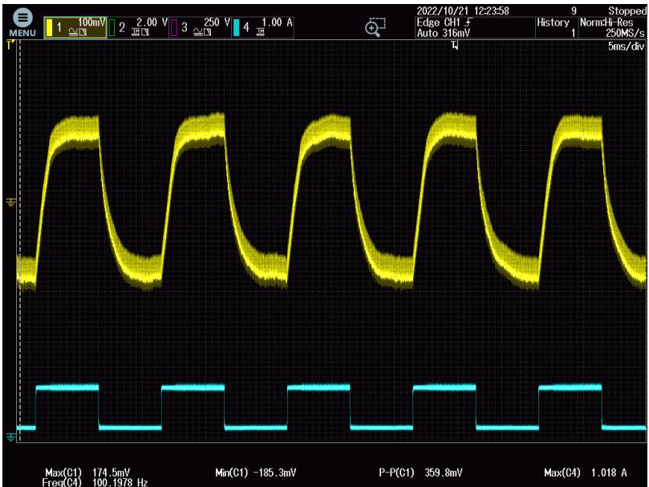

176 VAC

CH1 VOUT\_18V $\mathsf { V } _ { \mathsf { O U T } \_ 1 8 \mathsf { V } }$ $V _ { \mathsf { P K - P K } } = 3 5 9 . 8 ~ \mathsf { m V }$  
CH4 IOUT\_5V $\mathsf { I } _ { 0 \mathsf { U T } \_ 5 \mathsf { V } }$

## Test Condition:

➢ 5V: 0.1 A-0.9 A-0.1 A  
➢ 12V-1A, 18V-0.23A  
➢ Slew Rate: 0.5 A/μS  
➢ Frequency: 100 Hz

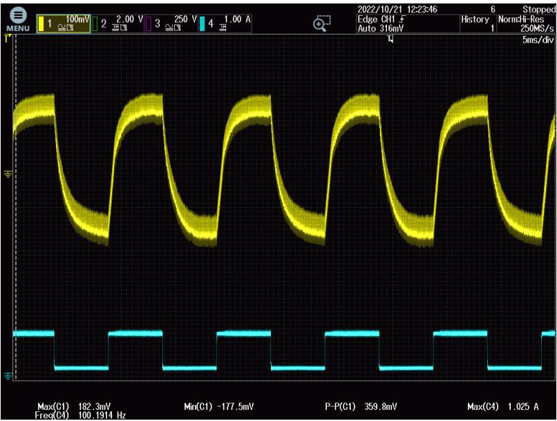

230 VAC

CH1 VOUT\_18V $\mathsf { C H 1 V _ { O U T \_ 1 8 \vee } }$  
CH4 IOUT\_5V

$$
V _ {P K - P K} = 3 5 9. 8 \mathrm{mV}
$$

## Test Condition:

➢ 5V: 0.1 A-0.9 A-0.1 A  
➢ 12V-1A, 18V-0.23A  
➢ Slew Rate: 0.5 A/μS  
➢ Frequency: 100 Hz

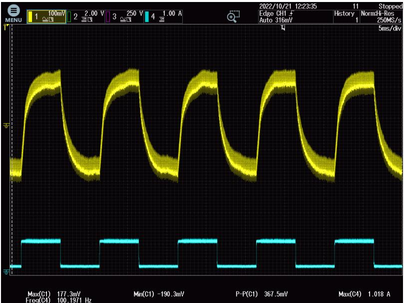

265 VAC

CH1 VOUT\_18V $\mathsf { V } _ { \mathsf { O U T } \_ 1 8 \mathsf { V } }$ $\mathsf { V } _ { \mathsf { P K - P K } } { = } 3 6 7 . 5 \mathsf { m v }$  
CH4 IOUT\_5V

## Test Condition:

➢ 5V: 0.1 A-0.9 A-0.1 A  
➢ 12V-1A, 18V-0.23A  
➢ Slew Rate: 0.5 A/μS  
➢ Frequency: 100 Hz

## 输出电压开机波形

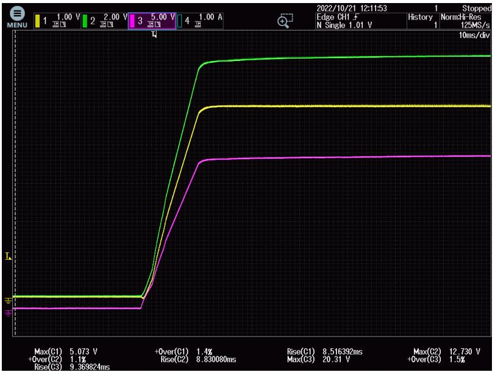

176 VAC

CH1 VOUT\_5V $\mathsf { V } _ { \mathsf { O U T } \_ 5 \mathsf { V } }$  
CH2 VOUT\_12V $\mathsf { V } _ { \mathsf { O U T } \_ 1 2 \mathsf { V } }$  
CH3 VOUT\_18V $\mathsf { V } _ { \mathsf { O U T } \_ 1 8 \mathsf { V } }$

TRISE\_5V: 8.5 mS TRISE\_12V: 8.8 mS

## Test Condition:

➢ No Load

265 VAC

CH1 VOUT\_5V $\mathsf { V } _ { \mathsf { O U T } \_ 5 \mathsf { V } }$  
CH2 VOUT\_12V $\mathsf { V } _ { \mathsf { O U T } \_ 1 2 \mathsf { V } }$  
CH3 VOUT\_18V $\mathsf { V } _ { \mathsf { O U T } \_ 1 8 \mathsf { V } }$

TRISE\_5V: 8.5 mS TRISE\_12V: 8.8 mS

## Test Condition:

➢ No Load

176 VAC

CH1 VOUT\_5V $\mathsf { V } _ { \mathsf { O U T } \_ 5 \mathsf { V } }$  
CH2 VOUT\_12V $\mathsf { V } _ { \mathsf { 0 } \mathsf { U T } _ { - } \mathsf { 1 } 2 \mathsf { V } }$  
CH3 VOUT\_18V $\mathsf { V } _ { \mathsf { O U T } \_ 1 8 \mathsf { V } }$

TRISE\_5V: 21.9 mS

TRISE\_12V: 22.3 mS

## Test Condition:

➢ Full Load

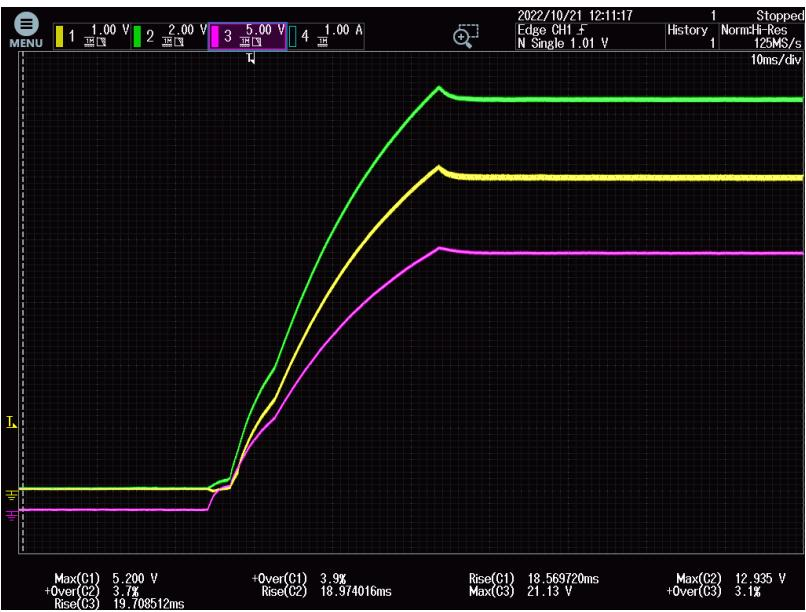

265 VAC

CH1 VOUT\_5V $\mathsf { V } _ { \mathsf { O U T } \_ 5 \mathsf { V } }$  
CH2 VOUT\_12V $\mathsf { V } _ { \mathsf { O U T } \_ 1 2 \mathsf { V } }$  
CH3 VOUT\_18V $\mathsf { V } _ { \mathsf { O U T } \_ 1 8 \mathsf { V } }$

TRISE\_5V: 18.6 mS TRISE\_12V: 19 mS

## Test Condition:

➢ Full Load

## MOs漏源极电压电流波形 (启机)

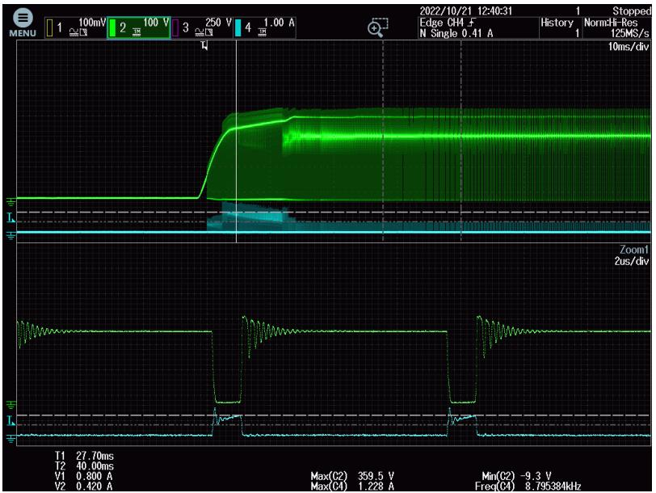

176 VAC

${ \mathsf { C H } } 2 { \mathsf { V } } _ { \mathsf { D S } }$  
$C H 4 1 _ { \mathsf { D } }$ $\mathtt { V } _ { \mathsf { D } 5 } mathtt { = } 3 5 9 . 5 \mathtt { V }$ IMAX= 1.228 A $\mathsf { I } _ { \mathsf { M A X } } = 1 . 2 2 8 \mathsf { A }$

Test Condition:  
➢ No Load  
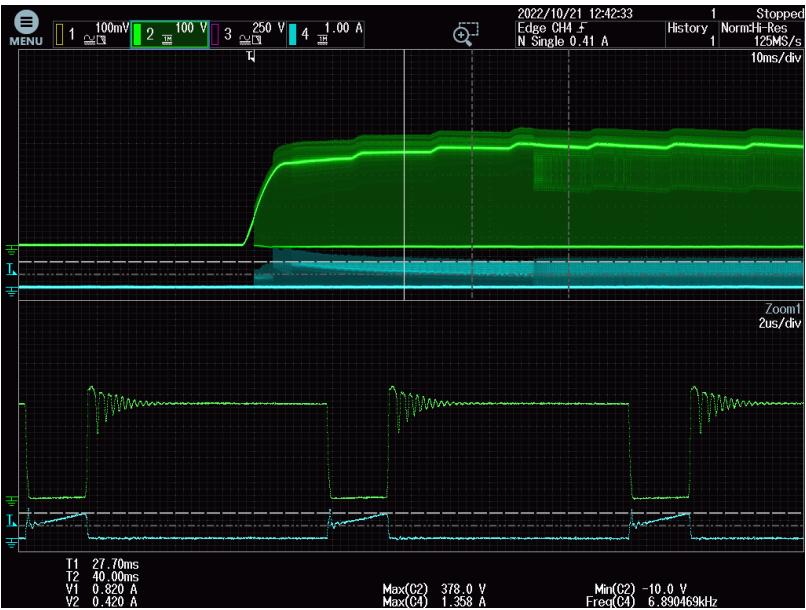

176 VAC

${ \mathsf { C H } } 2 { \mathsf { V } } _ { \mathsf { D S } }$  
$C H 4 1 _ { \mathsf { D } }$ $\mathtt { V _ { D S } } \mathtt { = } 3 7 8 \mathtt { V }$ $\mathsf { I } _ { \mathsf { M A X } } { = } 1 . 3 5 8 \mathsf { A }$

Test Condition:  
➢ Full Load  
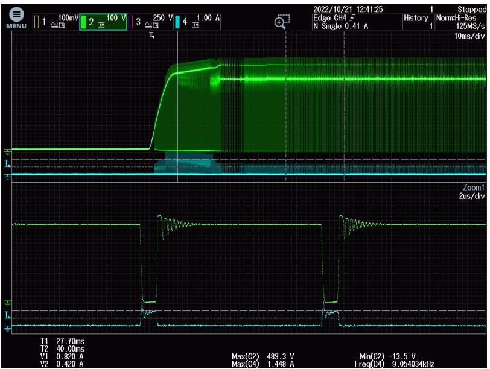

265 VAC

${ \mathsf { C H } } 2 \ { \mathsf { V } } _ { \mathsf { D S } }$  
$C H 4 1 _ { \mathsf { D } }$ $\mathtt { V } _ { \mathtt { D S } } mathtt { = } 4 8 9 . 3 \mathtt { V }$ $\mathsf { I } _ { \mathsf { M A X } } { = } \pmb { 1 } . 4 4 8 \mathsf { A }$

Test Condition:  
➢ No Load  
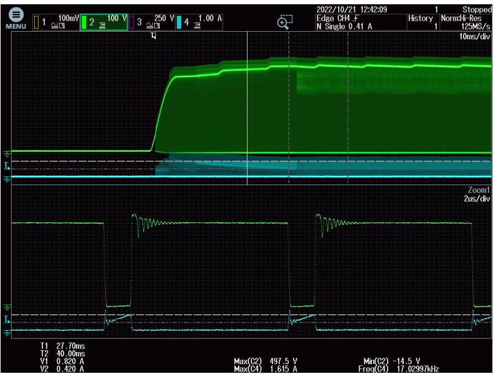

265 VAC

${ \mathsf { C H } } 2 { \mathsf { V } } _ { \mathsf { D S } }$  
CH4 ID $C H 4 1 _ { \mathsf { D } }$ $\mathtt { V } _ { \mathsf { D S } } mathtt { = } 4 9 7 . 5 \mathsf { V }$ IMAX=\`.615 A $\mathsf { I } _ { \mathsf { M A X } } = \mathsf { \cdot } 6 1 5 \mathsf { A }$

Test Condition:

➢ Full Load

## MOS漏源极电压电流波形 (正常工作)

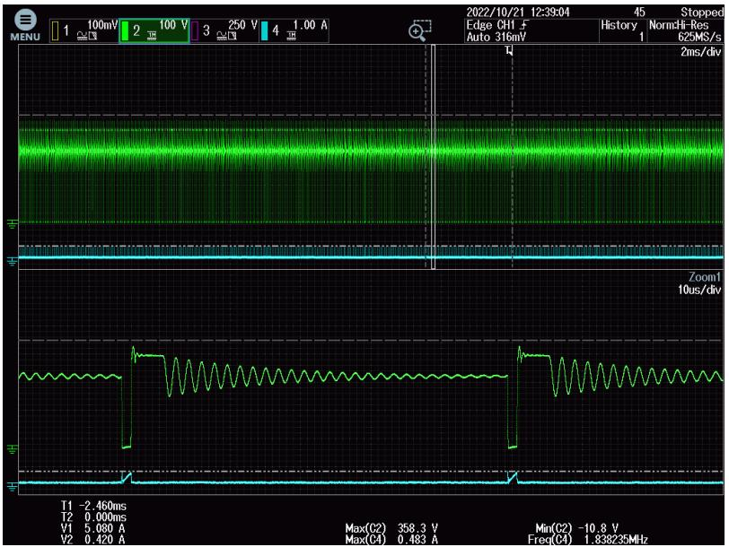

176 VAC

${ \mathsf { C H } } 2 { \mathsf { V } } _ { \mathsf { D S } }$  
$C H 4 1 _ { \mathsf { D } }$ $\mathtt { V } _ { \mathtt { D S } } mathtt { = } 3 5 8 . 3 \mathtt { V }$ IMAX= 485 mA $\mathsf { I } _ { \mathsf { M A X } } { = } 4 8 5 ~ \mathsf { m A }$

Test Condition:  
➢ No Load  
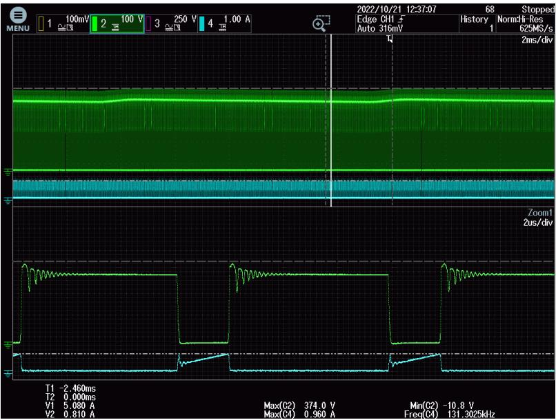

176 VAC

${ \mathsf { C H } } 2 { \mathsf { V } } _ { \mathsf { D S } }$  
$C H 4 1 _ { \mathsf { D } }$ $\mathtt { V _ { D S } } \mathtt { = } 3 7 4 \mathtt { V }$ IMAX= 960 mA $\mathsf { I } _ { \mathsf { M A X } } { = } 9 6 0 \mathsf { m } \mathsf { A }$

Test Condition:  
➢ Full Load  
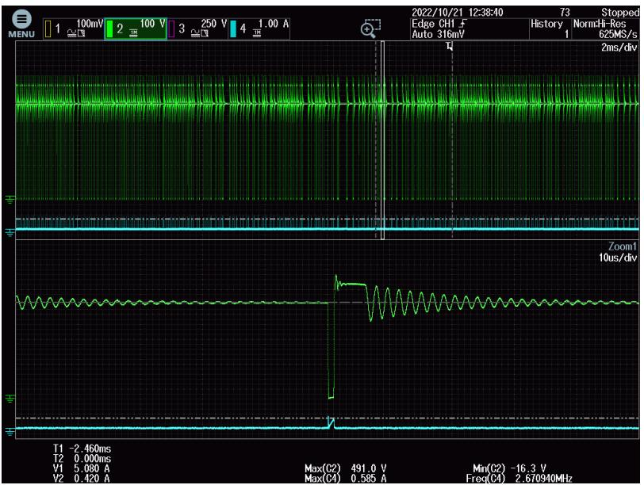

265 $\mathsf { v } _ { \mathsf { A C } }$

${ \mathsf { C H } } 2 \ { \mathsf { V } } _ { \mathsf { D S } }$  
$C H 4 1 _ { \mathsf { D } }$ $\mathsf { V } _ { \mathsf { D } \mathsf { S } } { = } 4 9 1 \mathsf { V }$ $\mathsf { I } _ { \mathsf { M A X } } { = } 5 8 5 \mathsf { m A }$

Test Condition:  
➢ No Load  
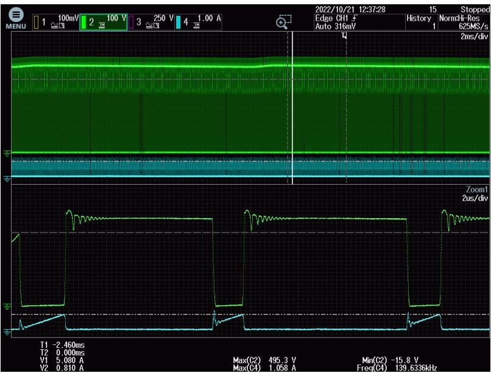

265 VAC

${ \mathsf { C H } } 2 { \mathsf { V } } _ { \mathsf { D S } }$  
$C H 4 1 _ { \mathsf { D } }$ $\mathsf { V } _ { \mathsf { D } \mathsf { S } } { = } 4 9 5 . 3 \mathrm { V }$ $\mathsf { I } _ { \mathsf { M A X } } { = } \pmb { 1 } . 0 5 8 \mathsf { A }$

Test Condition:

➢ Full Load

## (D4+D1)

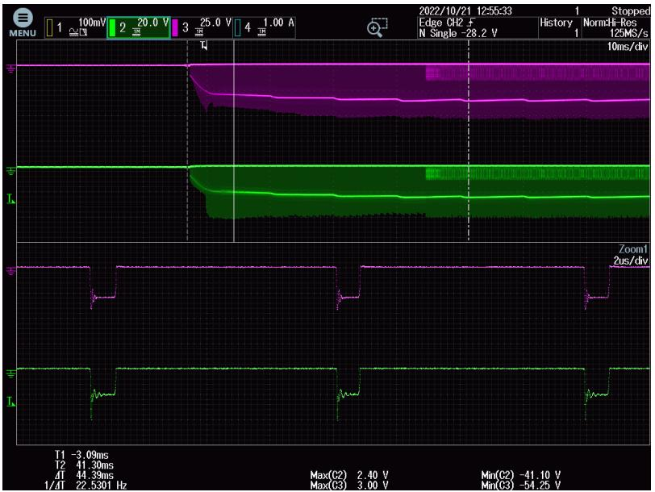

176 VAC

CH2 VD4  
CH3 VD1  
◼

$$
\begin{array}{r l} & V _ {D 4} = 4 1. 1 \mathrm{V} \\ & V _ {D 1} = 5 4. 2 5 \mathrm{V} \end{array}
$$

## Test Condition:

➢ Full Load  
➢ 开机

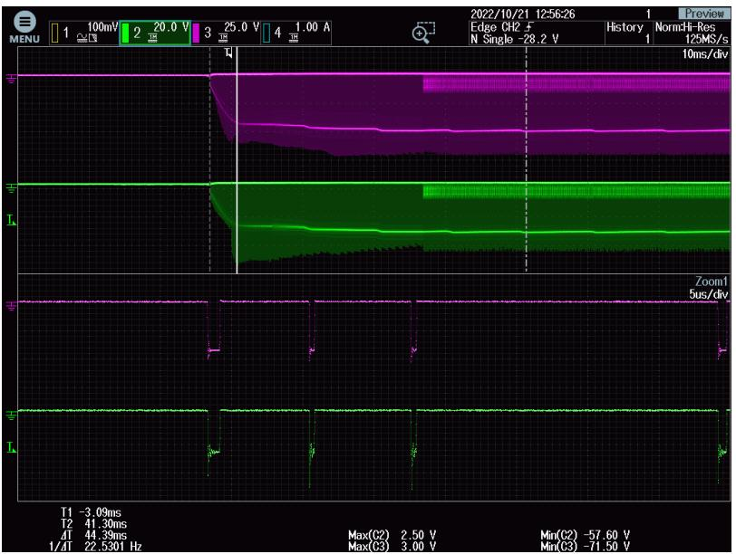

265 VAC

CH2 VD4  
CH3 VD1

$$
V _ {D 4} = 5 7. 6 \mathrm{V}
$$

$$
V _ {D 1} = 7 1. 5 \mathrm{V}
$$

## Test Condition:

➢ Full Load  
➢ 开机

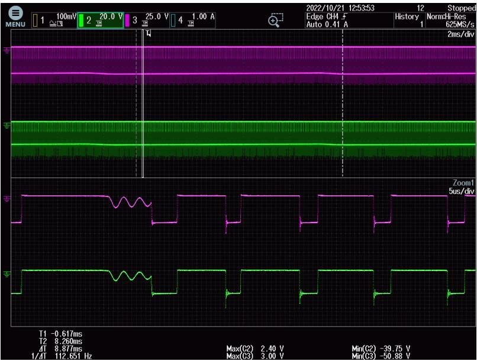

265 VAC

176 VAC

CH2 VD4  
CH3 VD1  
◼

$$
V _ {D 4} = 3 9. 7 5 \mathrm{V}
$$

$$
V _ {D 1} = 5 0. 8 8 \mathrm{V}
$$

## Test Condition:

➢ Full Load

CH2 VD4  
CH3 VD1

$$
\begin{array}{r l} & \mathrm {V_ {D4} = 46.9 V} \\ & \mathrm {V_ {D1} = 66.63 V} \end{array}
$$

## Test Condition:

➢ Full Load

## (D5)

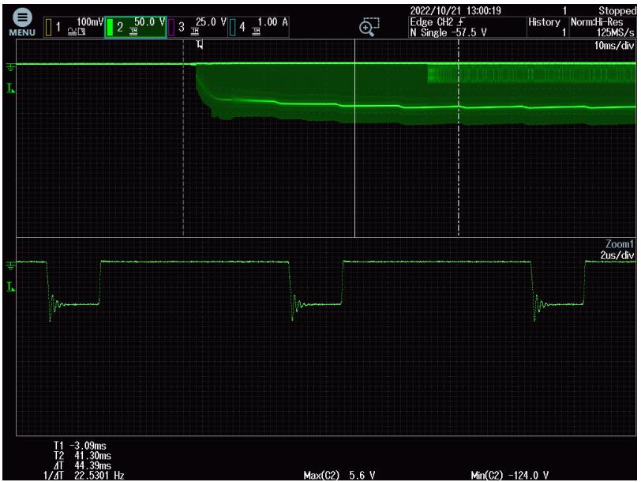

176 VAC  
CH2 VD5 VD5=124 V

Test Condition:

➢ Full Load  
》开机

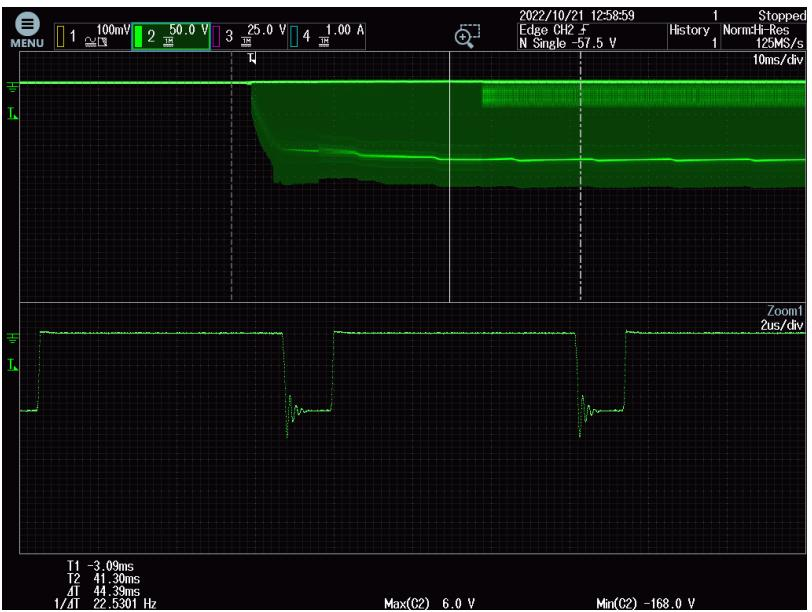

265 VAC  
CH2 VD5 VD5=168 V

➢ Full Load  
➢ 开机

Test Condition:  
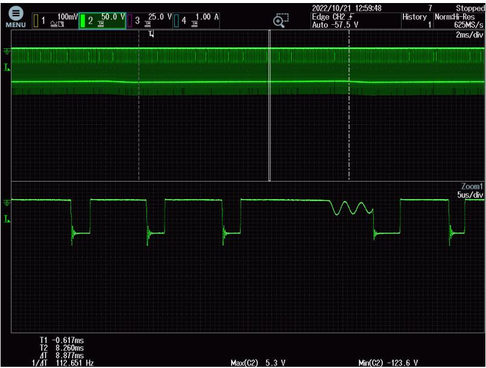

176 VAC

CH2 VD5 $\mathtt { V } _ { \mathsf { D } 5 } mathtt { = } 1 2 3 . 6 \ \mathsf { V }$

Test Condition:

➢ Full Load

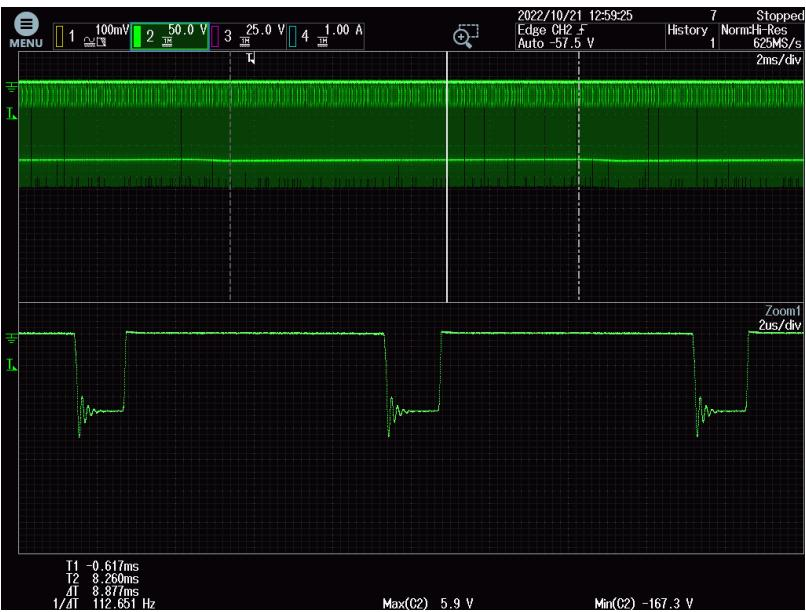

265 VAC  
CH2 VD5 VD5=167.3 V  
➢ Full Load

Test Condition:

## MOS (D4+D1)

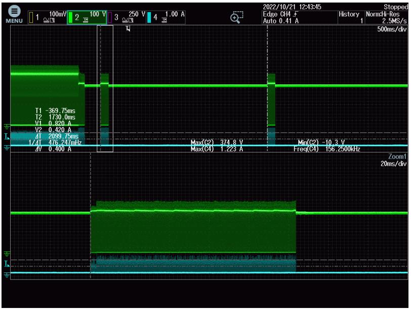

176 VAC

${ \mathsf { C H } } 2 { \mathsf { V } } _ { \mathsf { D S } }$  
$C H 4 1 _ { \mathsf { D } }$ $\begin{array} { r } { V _ { \mathsf { D S \_ m a x } } = 3 7 4 . 8 \ V } \\ { \mathsf { I _ { D S \_ m a x } } = 1 . 2 2 3 \ A } \end{array}$

## MOS

## Test Condition:

➢ Full Load

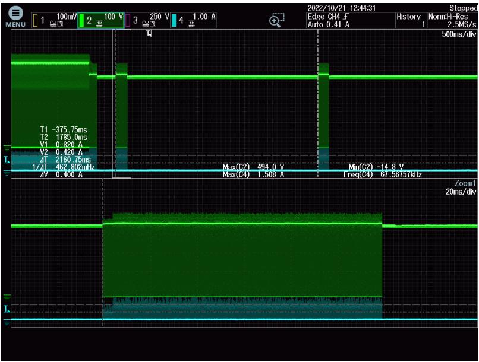

265 VAC

CH2 VDS  
CH4 ID $\mathsf { V } _ { \mathsf { D S \_ m a x } } { = } 4 9 4 \lor$ $\mathsf { I } _ { \mathsf { D } \mathsf { S } \_ \mathsf { m a x } } = \mathsf { 1 } . 5 0 8 \mathsf { A }$

## MOS

## Test Condition:

➢ Full Load

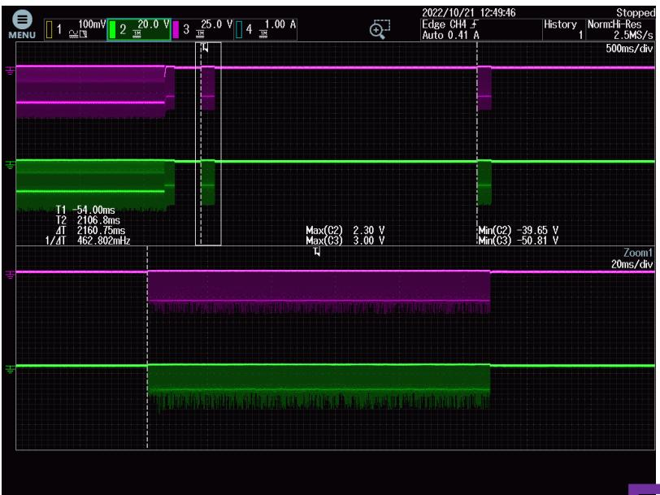

176 VAC

CH2 VD4  
CH3 VD1

$$
V _ {D 4} = 3 9. 6 5 \mathrm{V}
$$

$$
V _ {D 1} = 5 0. 8 1 \mathrm{V}
$$

## Test Condition:

➢ Full Load  
➢ 5V

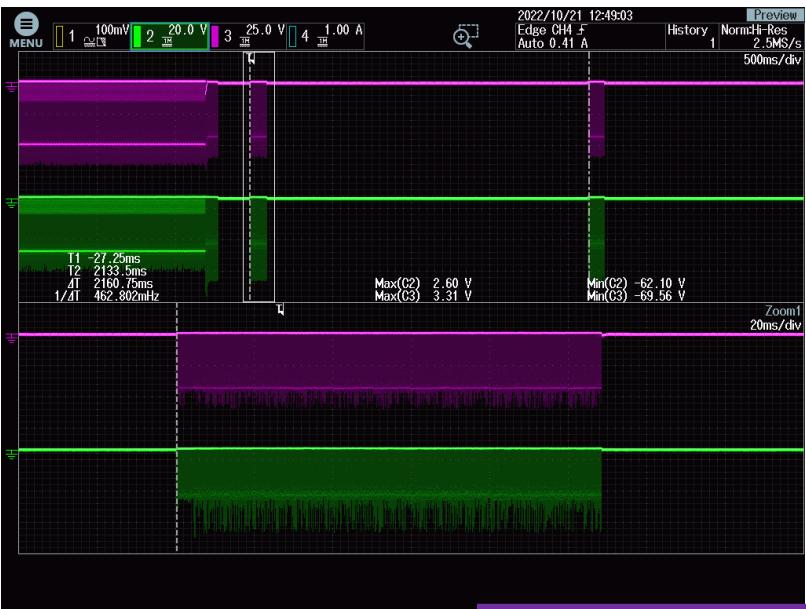

265 VAC

CH2 VD4  
CH3 VD1  
$\mathtt { V } _ { \mathtt { D 4 } } \mathtt { = } 6 2 . 1 \mathtt { V }$ $\mathsf { V } _ { \mathsf { D 1 } } = 6 9 . 5 6 \ : \mathsf { V }$

## Test Condition:

➢ Full Load  
➢ 5V

## 二极管 $\pm \infty 1$

## 二极管D4 +D1

## (D4+D1) (D5)

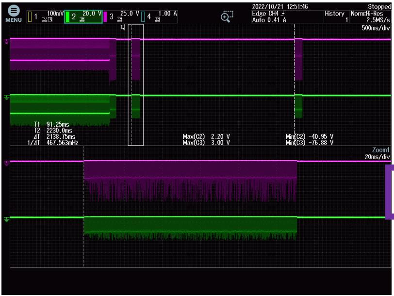

176 VAC

CH2 VD4  
CH3 VD1

$$
V _ {D 4} = 4 0. 9 5 \mathrm{V}
$$

$$
V _ {D 1} = 7 6. 8 8 \mathrm{V}
$$

## 二极管D4+D1

## Test Condition:

➢ Full Load  
➢ 12V

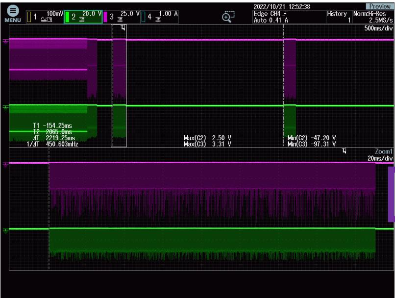

265 VAC

CH2 VD4  
CH3 VD1

$$
V _ {D 4} = 4 7. 2 \mathrm{V}
$$

$$
V _ {D 1} = 9 7. 3 1 \mathrm{V}
$$

## 二极管D4+D1

## Test Condition:

➢ Full Load  
➢ 12V

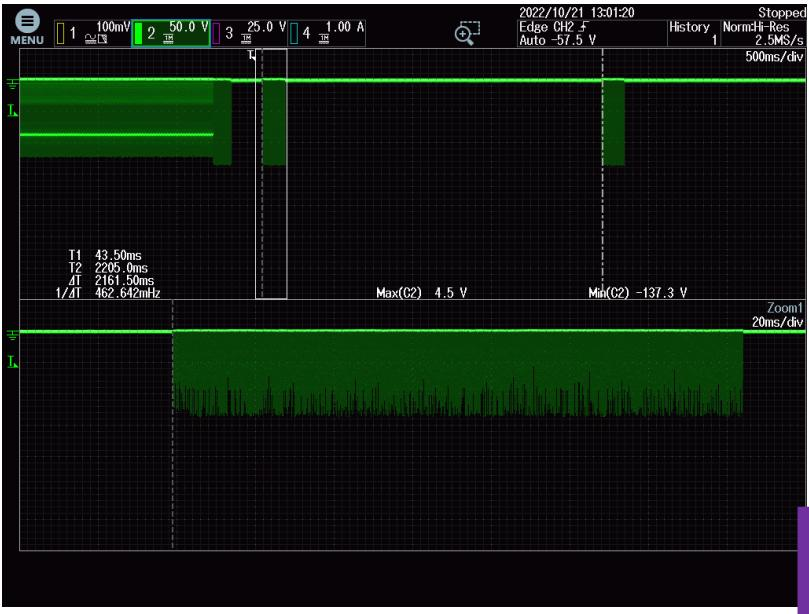

176 VAC

CH2 VD5

$$
V _ {D 5} = 1 3 7. 3 \mathrm{V}
$$

## Test Condition:

➢ Full Load  
➢ 18V

## 二极管D5

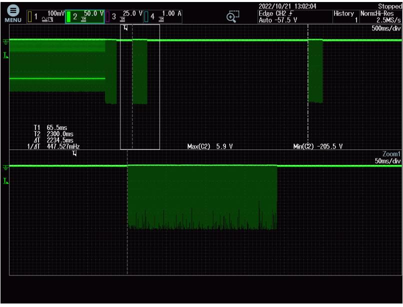

265 VAC

CH2 VD5

$$
V _ {D 5} = 2 0 5. 5 \mathrm{V}
$$

## Test Condition:

➢ Full Load  
➢ 18V

## 二极管D5

## (D5 ES2J)

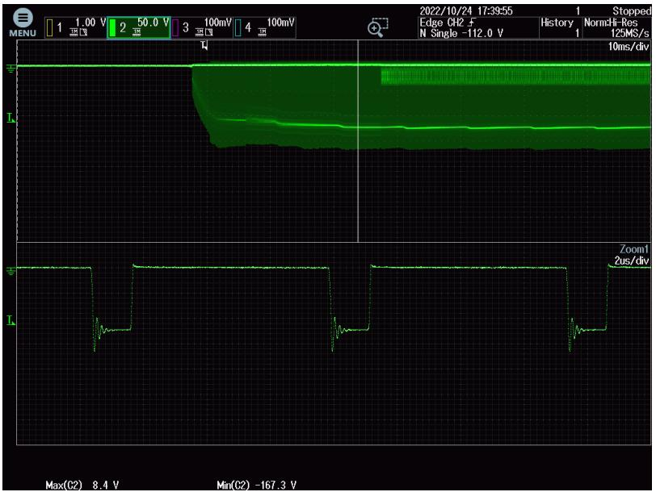

265 VAC  
${ \mathsf { C H } } 2 { \mathsf { V } } _ { \mathsf { D } 5 }$ $\mathtt { V } _ { \mathtt { D } 5 } mathtt { = } 1 6 7 . 3 \mathtt { V }$

## Test Condition:

➢ Full Load  
》开机

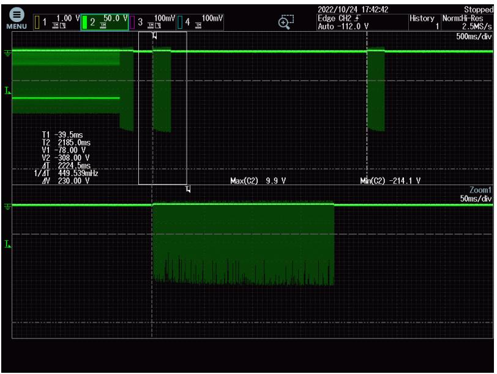

265 VAC  
${ \mathsf { C H } } 2 { \mathsf { V } } _ { \mathsf { D } 5 }$ $\mathsf { V } _ { \mathsf { D } 5 } { = } 2 1 4 . 1 \lor$

## Test Condition:

➢ Full Load  
➢ 18V

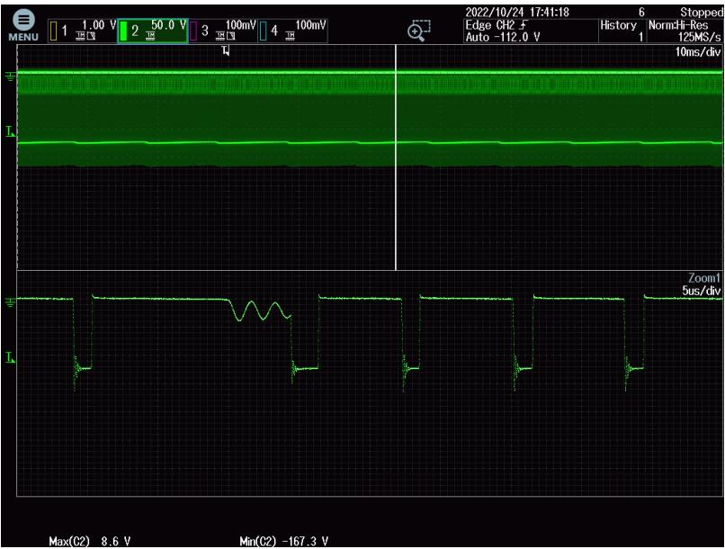

265 VAC

${ \mathsf { C H } } 2 { \mathsf { V } } _ { \mathsf { D } 5 }$ $\mathtt { V } _ { \mathtt { D } 5 } mathtt { = } 1 6 7 . 3 \mathtt { V }$

## Test Condition:

➢ Full Load

## Brown In—Brown Out

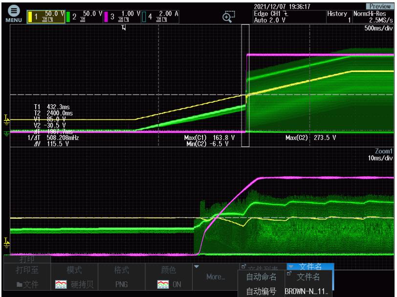

## Brown In

CH1 VIN\_DC $V _ { \mathsf { I N \_ D C } }$  
${ \mathsf { C H } } 2 { \mathsf { V } } _ { \mathrm { d s } }$  
CH3 VO\_5V $\mathsf { V } _ { 0 \_ 5 \mathsf { V } }$ $V _ { \mathsf { B r o w n \_ l n } } = 8 5 { \mathsf { V } }$

## Test Condition:

➢ 10% Load

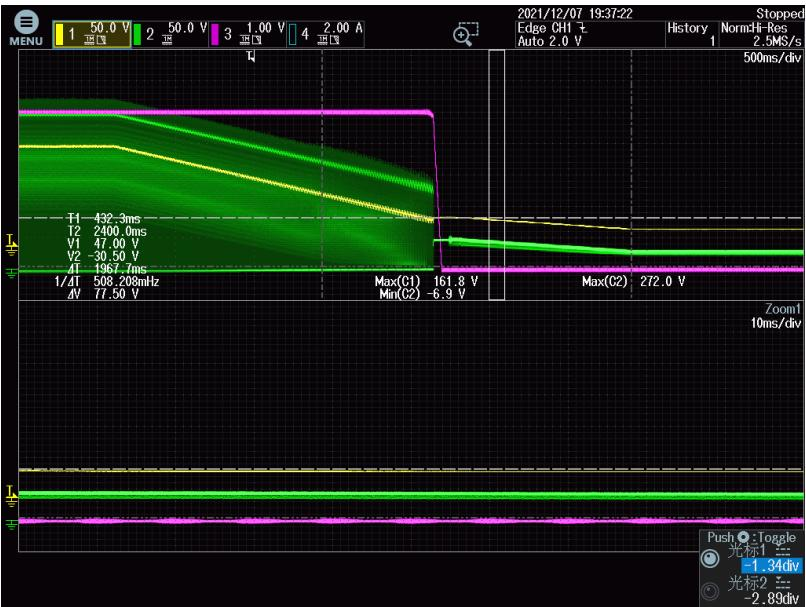

## Brown Out

CH1 $V _ { \mathsf { I N \_ D C } }$  
${ \mathsf { C H } } 2 { \mathsf { V } } _ { \mathsf { d s } }$  
CH3 VO\_5V $\mathsf { V } _ { 0 \_ 5 \mathsf { V } }$ $\mathsf { V } _ { \mathsf { B r o w n \_ o u t } } = 4 7 \mathsf { V }$

## Test Condition:

➢ 10% Load

## 输入过压保护波形

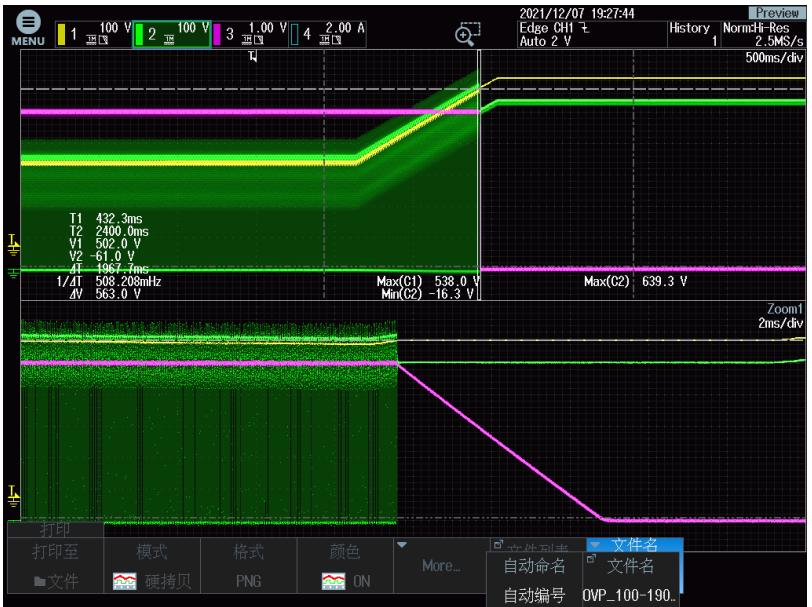

## 输入过压

CH1 VIN\_DC $\mathsf { C H 1 } \mathsf { V } _ { \mathsf { I N \_ D C } }$  
${ \mathsf { C H } } 2 { \mathsf { V } } _ { \mathsf { d s } }$  
CH3 VO $\mathsf { C H 3 } \mathsf { V } _ { 0 }$ $\mathsf { V } _ { \mathsf { D } \mathsf { S } \_ \mathsf { m a x } } = 6 3 9 . 3 \ : \mathsf { V }$ $v _ { _ { \mathrm { | N _ { - } D C } } } ^ { \mathrm { ~ ~ - ~ } } = 5 0 2 \mathrm { ~ V ~ }$

## Test Condition:

➢ Full Load

## 温升测试

<table><tr><td rowspan="3">项目</td><td colspan="4">负载5V1A, 12V1A, 18V0.23A</td><td colspan="2">负载5V1A, 12V1A, 18V0.13A</td></tr><tr><td colspan="2">176VAC</td><td colspan="2">264VAC</td><td colspan="2">264VAC</td></tr><tr><td>T (°C)</td><td>ΔT (°C)</td><td>T (°C)</td><td>ΔT (°C)</td><td>T (°C)</td><td>ΔT (°C)</td></tr><tr><td>环境温度</td><td colspan="2">38.8</td><td colspan="2">39.9</td><td colspan="2">39.6</td></tr><tr><td>BPA8620P (U1)</td><td>92.3</td><td>53.5</td><td>104.8</td><td>64.9</td><td>99.6</td><td>60</td></tr><tr><td>SM3150C (D4)</td><td>105.9</td><td>67.1</td><td>106.3</td><td>66.4</td><td></td><td></td></tr><tr><td>SM3150C (D1)</td><td>85.8</td><td>47</td><td>86.6</td><td>46.7</td><td></td><td></td></tr><tr><td>变压器绕组 (T1)</td><td>71.7</td><td>32.9</td><td>73.1</td><td>33.2</td><td></td><td></td></tr><tr><td>变压器磁芯 (T1)</td><td>71.9</td><td>33.1</td><td>74</td><td>34.1</td><td></td><td></td></tr><tr><td>输入电解电容(E1)</td><td>42.3</td><td>3.5</td><td>42.9</td><td>3</td><td></td><td></td></tr><tr><td>输出电解电容(E4)</td><td>63.5</td><td>24.7</td><td>63.9</td><td>24</td><td></td><td></td></tr></table>

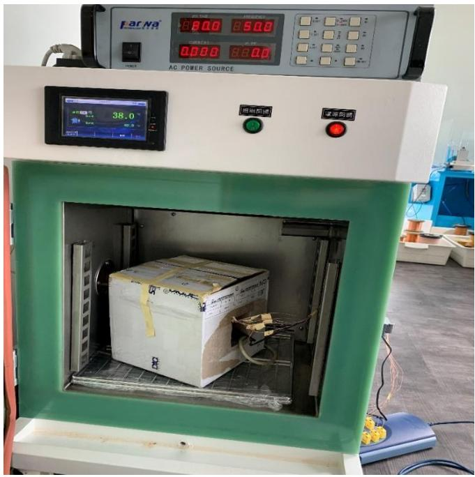

## 测试说明

➢ 在温箱中进行测试  
➢ 电路板放在一个封闭的盒子内  
➢ 热电偶连接到各个测量点  
等测量点温度达到稳定后记录 数据

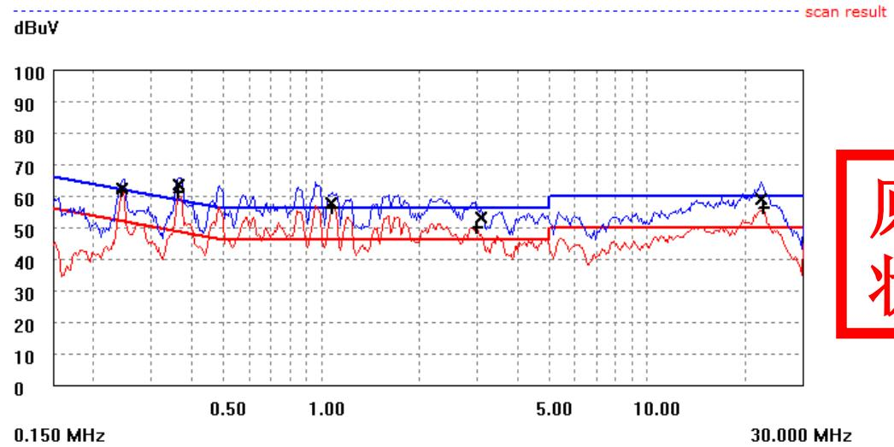

230VAC Line

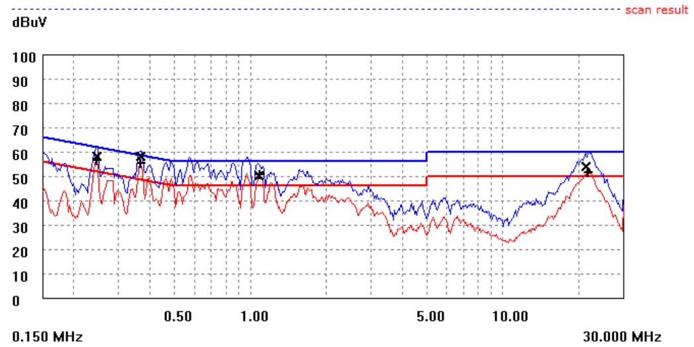

原始状态  
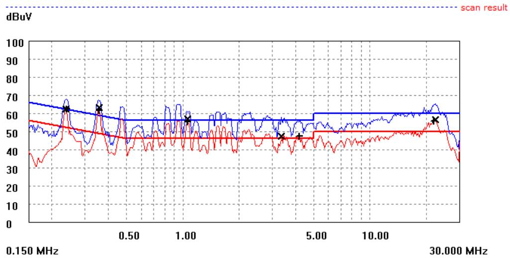

230VAC Neutral

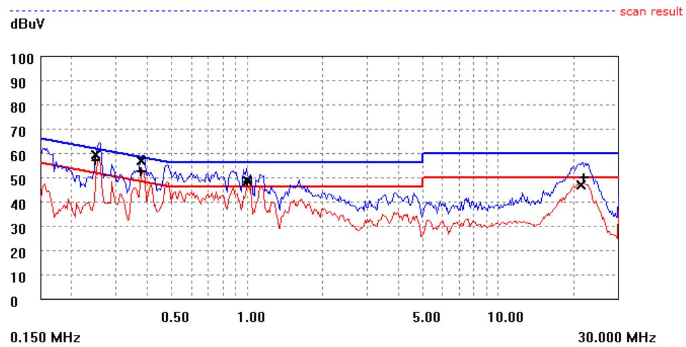

230VAC Line

230VAC Neutral

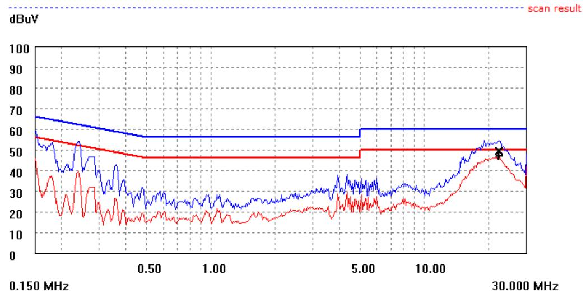

230VAC Line

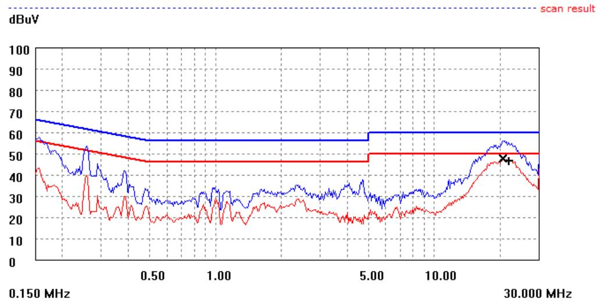

230VAC Neutral

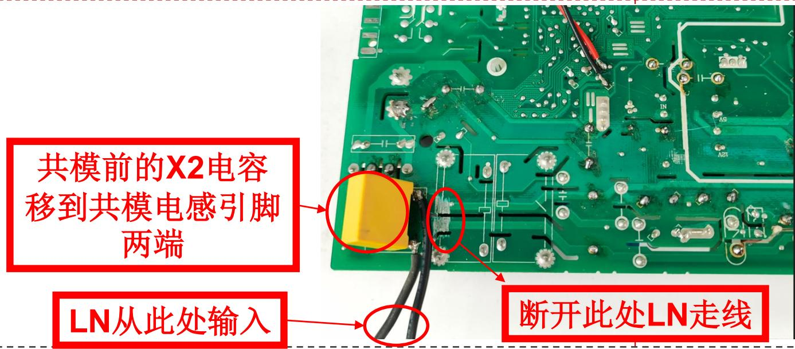

如图所示更改输入位置 后测试EMI明显改善

<table><tr><td>差模</td><td>电压</td><td>脉冲群持续时间</td><td>脉冲频率</td><td>测试时间</td><td>测试结果</td></tr><tr><td>L to N</td><td>+4kV</td><td>15ms</td><td>5kHz</td><td>120s</td><td>Pass</td></tr><tr><td>L to N</td><td>-4kV</td><td>15ms</td><td>5kHz</td><td>120s</td><td>Pass</td></tr><tr><td>L to N</td><td>+4kV</td><td>0.75ms</td><td>100kHz</td><td>120s</td><td>Pass</td></tr><tr><td>L to N</td><td>-4kV</td><td>0.75ms</td><td>100kHz</td><td>120s</td><td>Pass</td></tr><tr><td>L to N</td><td>+2kV</td><td>2ms</td><td>38kHz</td><td>120s</td><td>Pass</td></tr><tr><td>L to N</td><td>-2kV</td><td>2ms</td><td>38kHz</td><td>120s</td><td>Pass</td></tr><tr><td>L to N</td><td>+4kV</td><td>2ms</td><td>38kHz</td><td>120s</td><td>Pass</td></tr><tr><td>L to N</td><td>-4kV</td><td>2ms</td><td>38kHz</td><td>120s</td><td>Pass</td></tr></table>

## 测试说明

➢ 按照GB/T17626.4和IEC61000-4-4的最新版本要求进行测试  
➢ 室温环境，230VAC输入满载条件  
➢ 分别测试5kHz/100kHz/38kHz脉冲频率  
➢ 脉冲群周期为300ms  
➢ 每个测试条件测试时间120s  
➢ 试验时样机输出正常（符合A类标准）视为Pass

## THANK YOU FOR WATCHING
