# BPA86525PC 参考设计隔离12V 2A+非隔离16V0.1A

# INPUT:176VAC-265VAC

王岩

时间：2024年07月

BPS

晶丰明源

## 内容

BPA86525PC简介  
电源规格  
电路及实物图  
BOM  
PCB Layout图  
变压器  
性能测试数据

## BPA86525PC简介

高低压脚之间爬电距离＞3mm  
集成 800V 高压 MOSFET  
通过BR脚可调节burst mode深度  
低待机功耗(<50mW@辅助绕组供电)  
内置峰值电流补偿功能  
内置软启动功能  
◼ 丰富的保护功能（输入过压和欠压保护，输出过压和过载保护，反馈开路保护，过温保护）

应用领域：

家用电器辅助电源  
➢ PC待机电源  
适配器、充电器  
通信、工业控制辅助电源

典型电路-Flyback:  
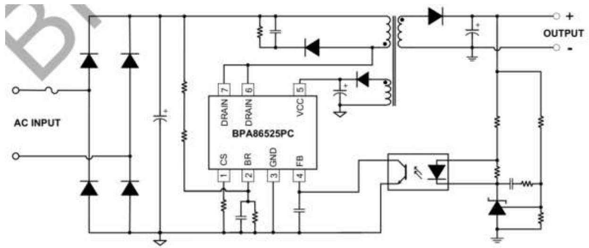

BPA86525PC典型反激应用电路

封装管脚图-DIP7:  
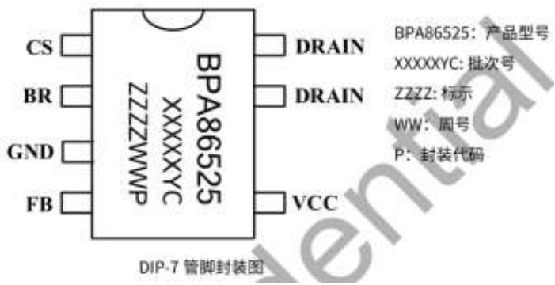

电源规格

<table><tr><td>项目描述</td><td>符号</td><td>最小</td><td>典型</td><td>最大</td><td>单位</td><td>备注</td></tr><tr><td colspan="7">输入</td></tr><tr><td>电压</td><td> $V_{IN}$ </td><td>176</td><td>120/230</td><td>264</td><td> $V_{AC}$ </td><td></td></tr><tr><td>频率</td><td> $f_{LINE}$ </td><td>47</td><td>50</td><td>53</td><td>Hz</td><td></td></tr><tr><td colspan="7">输出</td></tr><tr><td>输出电压1</td><td> $V_{OUT}$ </td><td></td><td>12</td><td></td><td>V</td><td>±5%</td></tr><tr><td>输出电流1</td><td> $I_{OUT}$ </td><td></td><td>2000</td><td></td><td>mA</td><td></td></tr><tr><td>输出电压2</td><td> $V_{OUT}$ </td><td></td><td>16</td><td></td><td>V</td><td>±5%</td></tr><tr><td>输出电流2</td><td> $I_{OUT}$ </td><td></td><td>100</td><td></td><td>mA</td><td></td></tr><tr><td>输出电压1纹波</td><td> $V_{RIPPLE}$ </td><td></td><td></td><td>170</td><td>mV</td><td>20MHz带宽</td></tr><tr><td>输出电压2纹波</td><td> $V_{RIPPLE}$ </td><td></td><td></td><td>140</td><td>mV</td><td>20MHz带宽</td></tr><tr><td>连续输出功率</td><td> $P_{OUT}$ </td><td></td><td>25.6</td><td></td><td>W</td><td></td></tr><tr><td colspan="7">效率</td></tr><tr><td>待机功耗</td><td> $P_{STDBY}$ </td><td></td><td></td><td>90</td><td>mW</td><td>230VAC,包含假负载</td></tr><tr><td>满载效率</td><td>η</td><td>86</td><td></td><td></td><td>%</td><td></td></tr><tr><td colspan="7">环境</td></tr><tr><td>传导EMI</td><td></td><td colspan="4">满足CISPR22/EN55022 Class B,至少6dB 裕量</td><td></td></tr><tr><td>Surge</td><td></td><td></td><td>2</td><td></td><td>kV</td><td>差模</td></tr><tr><td>EFT</td><td></td><td></td><td>4</td><td></td><td>kV</td><td>5kHz/100kHz/38kHz</td></tr><tr><td>ESD</td><td></td><td></td><td>±20KV</td><td></td><td>kV</td><td>空气放电</td></tr><tr><td>工作环境温度</td><td> $T_{AMP}$ </td><td></td><td>40</td><td>55</td><td>°C</td><td></td></tr></table>

## 原理图

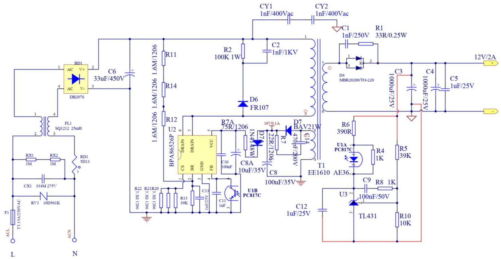

## 样机图片

## 元件面

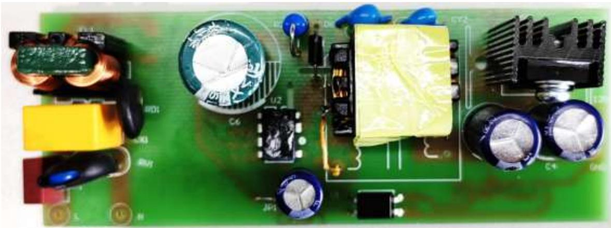

## 贴片面

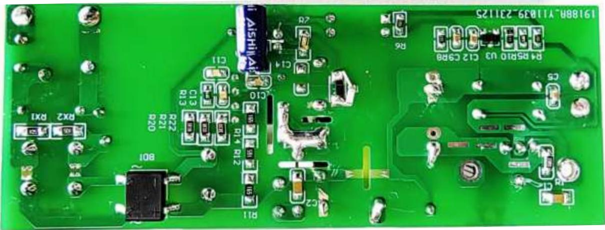

<table><tr><td>序号</td><td>元件标号</td><td>参数描述</td><td>封装尺寸</td><td>数量</td></tr><tr><td>1</td><td>PCB</td><td>CEM-1,双面板</td><td>106.5mm*40mm</td><td>1</td></tr><tr><td>2</td><td>F1</td><td>T3.15A 250V 保险丝</td><td>DIP</td><td>1</td></tr><tr><td>3</td><td>RV1</td><td>10D561,压敏电阻</td><td>10D561</td><td>1</td></tr><tr><td>4</td><td>NTC1</td><td>10D11,热敏电阻</td><td>5D13</td><td>1</td></tr><tr><td>5</td><td>CX1</td><td>0.33uF 275v X电容</td><td>7*13.5</td><td>1</td></tr><tr><td>6</td><td>C6</td><td>450V33uF电解电容</td><td> $\phi 13*25$ </td><td>1</td></tr><tr><td>7</td><td>LF1</td><td>SQAT1315-30mH-排距8*脚距7mm</td><td>DIP</td><td>1</td></tr><tr><td>8</td><td>C8</td><td>35V100uF</td><td> $\phi 8*11$ </td><td>1</td></tr><tr><td>9</td><td>C8A</td><td>35V10uF</td><td> $\phi 5*11$ </td><td>1</td></tr><tr><td>10</td><td>DB1</td><td>DB207S 2A 1KV</td><td>SMD</td><td>1</td></tr><tr><td>11</td><td>JP1</td><td>跳线 0.6*7.5</td><td>DIP</td><td>1</td></tr><tr><td>12</td><td>R2</td><td>1W 100K 炭膜电阻</td><td>DIP</td><td>1</td></tr><tr><td>13</td><td>D6</td><td>FR107 1A 1KV</td><td>D0-41</td><td>1</td></tr><tr><td>14</td><td>D4</td><td>MBR20200CT</td><td>TO-220</td><td>1</td></tr><tr><td>15</td><td>U1</td><td>PC817C 光耦</td><td>DIP</td><td>1</td></tr><tr><td>16</td><td>CY1,CY2</td><td>2200PF 400V AC Y1</td><td>DIP</td><td>2</td></tr><tr><td>17</td><td>T1</td><td>EE1610 800uH, AE36平方毫米</td><td>DIP</td><td>1</td></tr><tr><td>18</td><td>C3,C4</td><td>35V/1000uF电解电容,高频低</td><td> $\phi 10*18mm$ </td><td>2</td></tr><tr><td>19</td><td>U1</td><td>BPA86525PC</td><td>DIP7</td><td>1</td></tr><tr><td>20</td><td>U3</td><td>TL431</td><td>SOT23-3</td><td>1</td></tr><tr><td>21</td><td>D7A</td><td>1N4148</td><td>SOD-123</td><td>1</td></tr></table>

<table><tr><td>序号</td><td>元件标号</td><td>参数描述</td><td>封装尺寸</td><td>数量</td></tr><tr><td>22</td><td>R11,R12,R14</td><td>1.6M, ±5%</td><td>SMD1206</td><td>3</td></tr><tr><td>23</td><td>D7</td><td>BAV21W 0.2A 200V</td><td>SOD-123</td><td>1</td></tr><tr><td>24</td><td>R1</td><td>33R, ±5%</td><td>SMD1206</td><td>1</td></tr><tr><td>25</td><td>R7</td><td>22R, ±5%</td><td>SMD1206</td><td>1</td></tr><tr><td>26</td><td>RX1,RX2</td><td>1.1M, ±5%</td><td>SMD1206</td><td>2</td></tr><tr><td>27</td><td>C1</td><td>1nF, 250V X7R</td><td>SMD0805</td><td>1</td></tr><tr><td>28</td><td>C2</td><td>1000pF, 1KV X7R</td><td>SMD1206</td><td>1</td></tr><tr><td>29</td><td>C10</td><td>100nF, 25V X7R</td><td>SMD0805</td><td>1</td></tr><tr><td>30</td><td>C9</td><td>100nF, 25V X7R</td><td>SMD0805</td><td>1</td></tr><tr><td>31</td><td>C11,C13</td><td>1nF, 25V X7R</td><td>SMD0805</td><td>2</td></tr><tr><td>32</td><td>C14</td><td>220pF, 200V X7R</td><td>SMD0805</td><td>1</td></tr><tr><td>33</td><td>C5,C12</td><td>1uF, 25V X7R</td><td>SMD0805</td><td>2</td></tr><tr><td>34</td><td>R13</td><td>39K, ±5%</td><td>SMD0805</td><td>1</td></tr><tr><td>35</td><td>R4,R8</td><td>1k, ±5%</td><td>SMD0805</td><td>2</td></tr><tr><td>36</td><td>R10</td><td>10k, ±1%</td><td>SMD0805</td><td>1</td></tr><tr><td>37</td><td>R5</td><td>39K, ±1%</td><td>SMD0805</td><td>1</td></tr><tr><td>38</td><td>R20,R21,R22</td><td>3.3R, ±1%</td><td>SMD1206</td><td>3</td></tr><tr><td>39</td><td>R6</td><td>390R, ±5%</td><td>SMD0805</td><td>1</td></tr><tr><td>40</td><td>R7A</td><td>75R, ±5%</td><td>SMD1206</td><td>1</td></tr><tr><td colspan="2"></td><td></td><td>Total</td><td>50</td></tr></table>

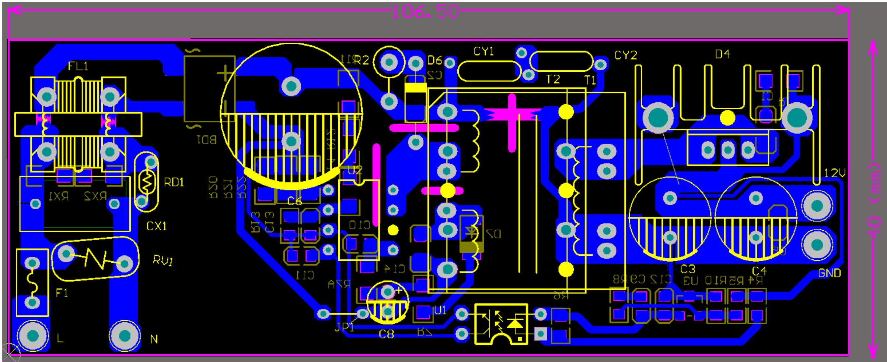

## 变压器规格

## 原理图

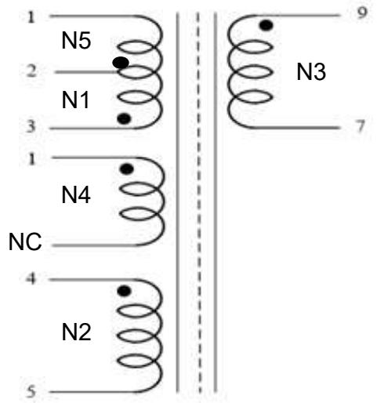

## 绕线方式

<table><tr><td>绕组</td><td>起始脚</td><td>终止脚</td><td>材料</td><td>匝数</td><td>绕线方式</td></tr><tr><td>N1</td><td>3</td><td>2</td><td> $\phi 0.19*1P$ </td><td>38Ts</td><td>密绕一层(PI N脚朝外)</td></tr><tr><td colspan="4">胶带</td><td>2Ts</td><td></td></tr><tr><td>N2</td><td>5</td><td>4</td><td> $\phi 0.19*2P$ </td><td>13Ts</td><td>密绕一层(PI N脚朝外)</td></tr><tr><td colspan="4">胶带</td><td>2Ts</td><td></td></tr><tr><td>N3</td><td>7</td><td>6</td><td>三层绝缘线 $\phi 0.6*1P$ </td><td>10Ts</td><td>密绕一层(PI N脚朝外)</td></tr><tr><td colspan="4">胶带</td><td>2Ts</td><td></td></tr><tr><td>N4</td><td>4</td><td>NC</td><td> $\phi 0.19*2P$ </td><td>8Ts</td><td>密绕一层(PI N脚朝外)</td></tr><tr><td colspan="4">胶带</td><td>2Ts</td><td></td></tr><tr><td>N5</td><td>2</td><td>1</td><td> $\phi 0.19*1P$ </td><td>36Ts</td><td>密绕一层(PI N脚朝外)</td></tr><tr><td colspan="4">胶带</td><td>3Ts</td><td></td></tr></table>

## 规格与材料

➢ 初级绕组感量Lp=800uH±7%（测试条件： 0.3V，100kHz）  
➢ 漏感量 $L _ { | k } { < } 1 1 \mu { \sf H }$  
➢ 骨架：EE1610立式次级加宽（5+2PIN）  
➢ 磁芯：EE1610 PC44 或同等材质 ， $_ { A e } = 3 6 \mathsf { m m } ^ { 2 }$ ， $\mathsf { B w = 9 m m }$  
➢ N1、N2、N4、N5: 2UEW 漆包线  
➢ N3: 三层绝缘线  
➢ 绝缘胶带:3M900 或同等材质  
➢ 耐压测试: 3KV, 50/60Hz, 1Min  
➢ 成品要求：浸凡立水

## 脚位图

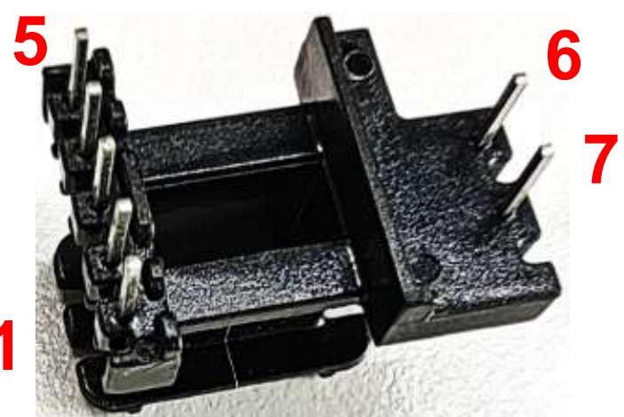

## 变压器Bmax评估

原理图  
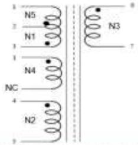

绕线方式

<table><tr><td>绕组</td><td>起始脚</td><td>终止脚</td><td>材料</td><td>纸张</td><td>绕线方式</td></tr><tr><td>11</td><td>2</td><td>2</td><td> $\pm {0.19} \times {1P}$ </td><td>38T4</td><td>密绕一星(723脚额外)</td></tr><tr><td></td><td></td><td>胶带</td><td></td><td>27s</td><td></td></tr><tr><td>12</td><td>3</td><td>4</td><td> $\pm {0.19} \times {2F}$ </td><td>33T4</td><td>密绕一星(723脚额外)</td></tr><tr><td></td><td></td><td>胶带</td><td></td><td>27s</td><td></td></tr><tr><td>13</td><td>7</td><td>6</td><td>三星滤波线 $\pm$  ${0.6} \times {1P}$ </td><td>10T4</td><td>密绕一星(723脚额外)</td></tr><tr><td></td><td></td><td>胶带</td><td></td><td>27s</td><td></td></tr><tr><td>14</td><td>4</td><td>NC</td><td> $\pm {0.19} \times {2F}$ </td><td>8T4</td><td>密绕一星(723脚额外)</td></tr><tr><td></td><td></td><td>胶带</td><td></td><td>27s</td><td></td></tr><tr><td>15</td><td>1</td><td>1</td><td> $\pm {0.19} \times {1P}$ </td><td>36T4</td><td>密绕一星(723脚额外)</td></tr><tr><td></td><td></td><td>胶带</td><td></td><td>3T4</td><td></td></tr></table>

## 规格与材料

初级绕组感量L=800uH±7%（测试条件：0.3V，100kHz）  
量L<11uH  
骨架：E1610立式次级加（5+2PIN）  
磁芯：EE1610PC44或同等材质，Ae=36mm2，Bw=9mm  
N1、N2、N4、N5:2UEW包线  
>N3三层绝线  
绝缘胶带：3M900或同等材质  
>耐压测试：3KV,50/60Hz,1Min  
成品要求：湿凡立水

脚位图  
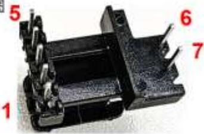

BPA86525PC方案变压器：  
$L { = } 8 0 0 \mathsf { u H } \pm 7 \%$ ，实测 $\mathsf { I } _ { | \mathrm { i m t } } = 0 . 9 8 \mathsf { A }$  
${ \mathsf { N P } } { = } 7 4 7 , \quad \mathsf { A E } { = } 3 6 \mathsf { m m } ^ { 2 }$  
$\mathtt { B m a x } { = } 0 . 3 1 5 \top$

## 待机功耗对比

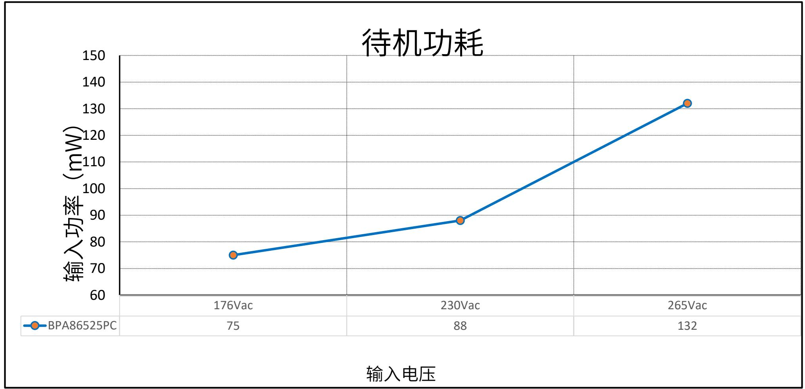

◼ 备注：包含BR管脚对BUS检测电阻损耗和安规电容放电电阻损耗。

## 效率

效率测试  
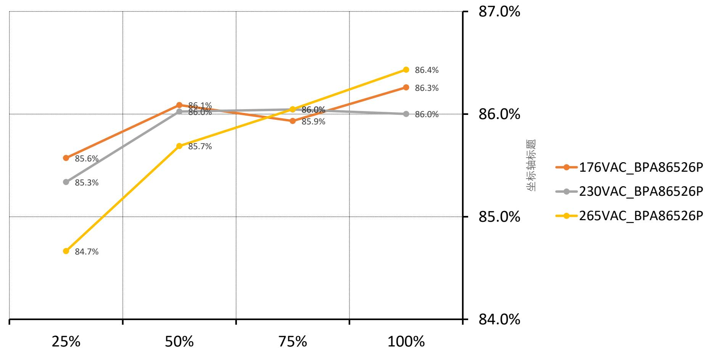

输入电压VAC

输出电压交叉调整率

<table><tr><td>输入电压AC (V)</td><td>12输出电流(A)</td><td>12输出电压(V)</td><td>16输出电流(A)</td><td>16输出电压(V)</td></tr><tr><td rowspan="5">176</td><td>0</td><td>12.158</td><td>0</td><td>14.98</td></tr><tr><td>2</td><td>12.139</td><td>0</td><td>25.2</td></tr><tr><td>0</td><td>12.165</td><td>0.1</td><td>波动6.8V-10V</td></tr><tr><td>2</td><td>12.138</td><td>0.1</td><td>16.5</td></tr><tr><td>2</td><td>12.138</td><td>0.06</td><td>17.2</td></tr><tr><td rowspan="5">230</td><td>0</td><td>12.161</td><td>0</td><td>14.944</td></tr><tr><td>2</td><td>12.138</td><td>0</td><td>25.1</td></tr><tr><td>0</td><td>12.163</td><td>0.1</td><td>波动4V-9V</td></tr><tr><td>2</td><td>12.138</td><td>0.1</td><td>16.52</td></tr><tr><td>2</td><td>12.138</td><td>0.06</td><td>17.3</td></tr><tr><td rowspan="5">265</td><td>0</td><td>12.16</td><td>0</td><td>14.915</td></tr><tr><td>2</td><td>12.139</td><td>0</td><td>25.1</td></tr><tr><td>0</td><td>12.158</td><td>0.1</td><td>波动3.2V-8V</td></tr><tr><td>2</td><td>12.138</td><td>0.1</td><td>16.53</td></tr><tr><td>2</td><td>12.138</td><td>0.06</td><td>17.24</td></tr></table>

## OCP测试\_16V0.1A固定负载，12V负载电流增加

<table><tr><td>输入电压</td><td>12V输出电压(V)</td><td>12V OLP电流(A)</td><td>16V输出电压(V)</td><td>16V 输出电流(A)</td><td>输出功率(W)</td></tr><tr><td>176VAC</td><td>12.138</td><td>2.5</td><td>16.73</td><td>0.1</td><td>32</td></tr><tr><td>265VAC</td><td>12.138</td><td>2.6</td><td>16.79</td><td>0.1</td><td>33.2</td></tr></table>

## 输出电压纹波-空载&满载

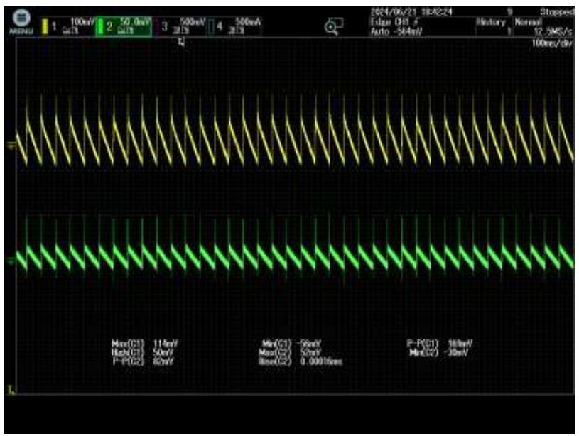

BPA86525PC  
176 VAC

$\mathsf { C H 1 } \mathsf { V _ { 0 \cup \mathsf { T } \_ 1 6 } }$ Ripple  
$\mathsf { C H } 2 \mathsf { V } _ { \mathsf { O U T } \_ 1 2 }$ CH2 VOUT\_12 Ripple $\mathsf { V } _ { \mathsf { P K - P K \_ 1 6 } } \mathsf { = } \mathsf { 1 6 9 m V }$  
$V _ { p | \mathrm { K - P K \_ 1 } 2 } = 8 2 \mathsf { m V }$

Test Condition:

➢ No Load

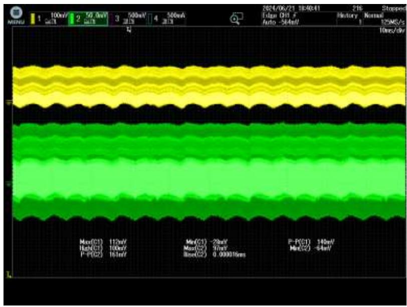

## BPS

## 晶丰明源

BPA86525PC

176 VAC

$\mathsf { C H 1 V } _ { \mathsf { 0 } \mathsf { U T } _ { - } 1 6 }$ Ripple  
$\mathsf { C H } 2 \mathsf { V } _ { \mathsf { O U T } \_ 1 2 }$ CH2 VOUT\_12 Ripple $\mathsf { V } _ { \mathsf { P K - P K \_ 1 6 } } { = } 1 4 0 \mathsf { m V }$  
$\mathtt { V } _ { \mathtt { P K - P K \_ 1 2 } } = 1 6 1 \mathtt { m V }$  
➢ Full Load

Test Condition:

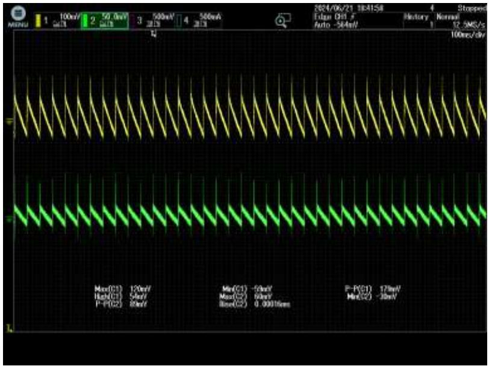

BPA86525PC  
265 VAC

CH1 $\mathsf { V } _ { \mathsf { O U T } \_ 1 6 }$ Ripple  
CH2 VOUT\_12 $\mathsf { V } _ { \mathsf { O U T } \_ 1 2 }$ Ripple $\mathsf { V } _ { \mathsf { P K - P K \_ 1 6 } } { = } 1 7 9 \mathsf { m V }$  
$V _ { p | \mathrm { K - P K } \_ 1 2 } = 8 9 \min$

Test Condition:

➢ No Load

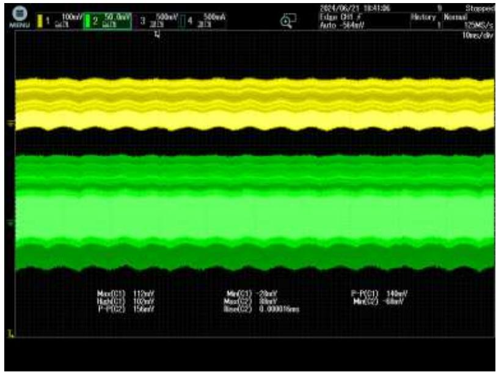

BPA86525PC  
265 VAC

$\mathsf { C H 1 V } _ { \mathsf { 0 } \mathsf { U T } _ { - } 1 6 }$ Ripple  
$\mathsf { C H } 2 \mathsf { V } _ { \mathsf { o u r } \_ 1 2 }$ CH2 VOUT\_12 Ripple $\mathsf { V } _ { \mathsf { P K - P K \_ 1 6 } } { = } 1 4 0 \mathsf { m V }$  
$\mathsf { V } _ { \mathsf { P K - P K \_ 1 2 } } { = } 1 5 6 \mathsf { m v }$

Test Condition:

➢ Full Load

BPS Confidential

## 动态负载(50%-100%)& (10%-90%) $1 K { + } 1 0 4 \rho \mathsf { F }$

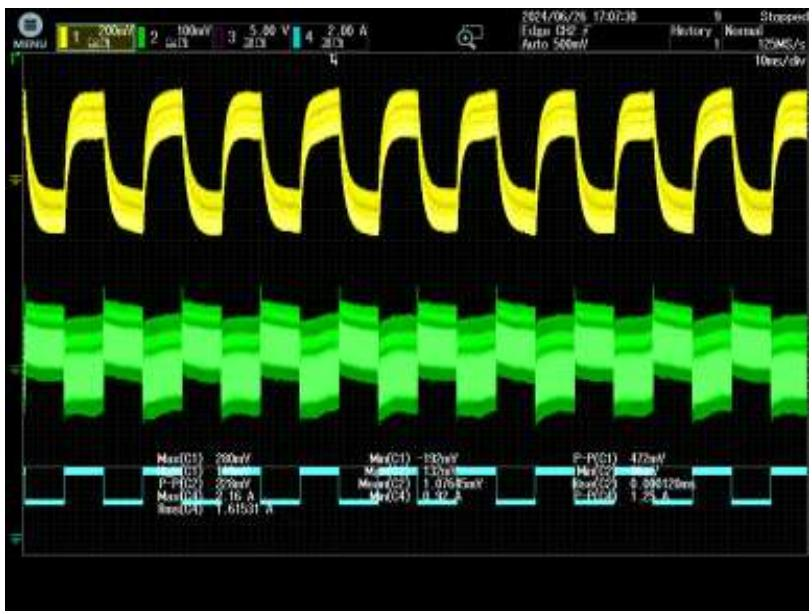

## BPA86525PC

## 176 VAC

CH1 $\mathsf { V } _ { \mathsf { O U T } \_ 1 6 }$ Ripple  
CH2 $\mathsf { V } _ { \mathsf { O U T } \_ 1 2 }$ Ripple $V _ { p \vert k - P K \_ 1 6 } = 4 7 2 m v$  
$V _ { \mathsf { P K - P K \_ 1 2 } } { = } 2 2 8 \mathsf { m V }$

$\mathsf { C H 4 } \mathsf { I } _ { \mathsf { O U T } }$

## Test Condition:

➢ $1 2 \mathsf { V } \colon 1 \mathsf { A } { - } 2 \mathsf { A } { - } 1 \mathsf { A }$  
➢ Slew Rate: 0.5 A/μS  
➢ Frequency: 100 Hz

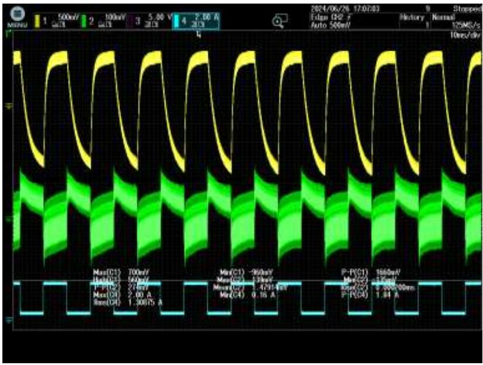

## BPS

## 晶丰明源

## BPA86525PC

## 176VAC

$\mathsf { C H 1 V } _ { \mathsf { 0 } \mathsf { U T } _ { - } 1 6 }$ Ripple  
$\mathsf { C H } 2 \mathsf { V } _ { \mathsf { O U T } 1 2 }$ CH2 VOUT\_12 Ripple $V _ { \mathsf { P K - P K \_ 1 6 } } { = } 1 6 6 0 \mathsf { m v }$  
$V _ { p \vert k - P \vert k _ { - } 1 2 } = 2 7 4 m v$

$\mathsf { C H 4 } \mathsf { I } _ { \mathsf { O U T } }$ CH4 IOUT

## Test Condition:

➢ 12V: 0.2 A-1.8 A-0.2 A  
➢ Slew Rate: 0.5 A/μS  
➢ Frequency: 100 Hz

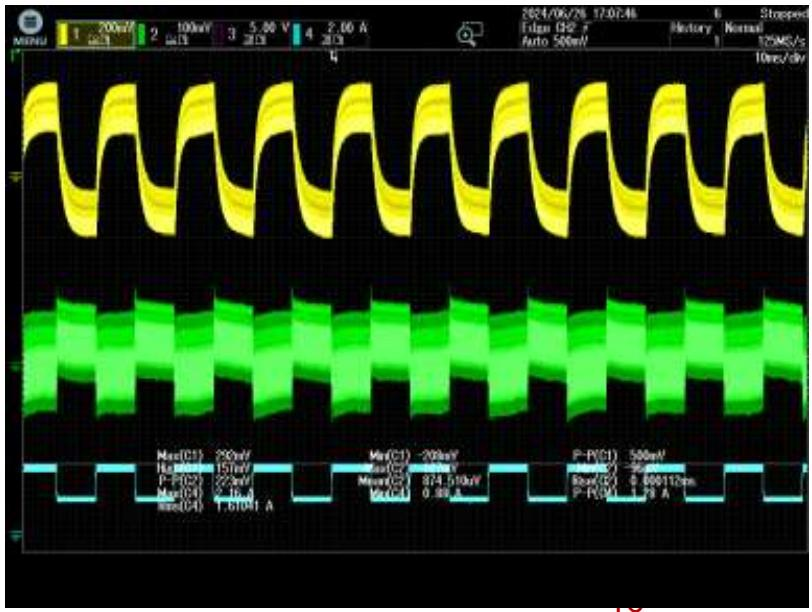

## BPA86525PC

## 265 VAC

CH1 $\mathsf { V } _ { \mathsf { O U T } \_ 1 6 }$ Ripple  
CH2 $\mathsf { V } _ { \mathsf { O U T } \_ 1 2 }$ Ripple $V _ { \mathsf { P K - P K \_ 1 6 } } { = } \bar { 5 } 0 0 \mathsf { m v }$  
$\mathsf { V } _ { \mathsf { P K - P K \_ 1 2 } } { = } 2 2 3 \mathsf { m V }$

$\mathsf { C H 4 } \mathsf { l } _ { \mathsf { O U T } }$

## Test Condition:

➢ $1 2 \mathsf { V } \colon 1 \mathsf { A } { - } 2 \mathsf { A } { - } 1 \mathsf { A }$  
➢ Slew Rate: 0.5 A/μS  
➢ Frequency: 100 Hz

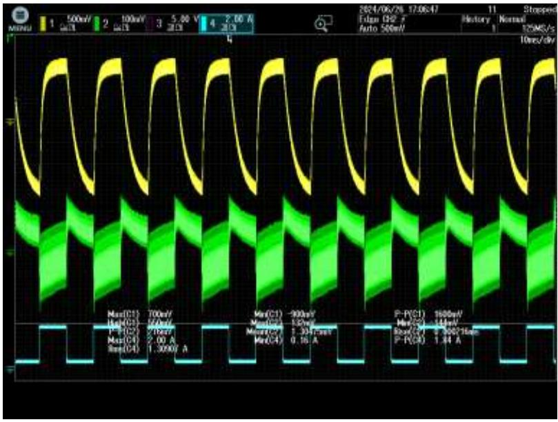

## BPA86525PC

## 265 VAC

$\mathsf { C H 1 V } _ { \mathsf { 0 } \mathsf { U T } _ { - } 1 6 }$ Ripple  
$C \mathsf { H } 2 \mathsf { V } _ { \mathsf { O U T } 1 2 }$ CH2 VOUT\_12 Ripple $V _ { \mathsf { P K - P K \_ 1 6 } } { = } \bar { 1 } \bar { 6 } 0 0 \mathsf { m v }$  
$V _ { \mathsf { P K - P K } _ { - } 1 2 } { = } 2 7 6 \mathsf { m v }$

$\mathsf { C H 4 } \mathsf { I } _ { \mathsf { O U T } }$ CH4 IOUT

## Test Condition:

➢ $1 2 \mathsf { V } \colon 0 . 2 \mathsf { A } – 1 . 8 \mathsf { A } – 0 . 2$ A  
➢ Slew Rate: 0.5 A/μS  
➢ Frequency: 100 Hz

## 输出电压开机波形

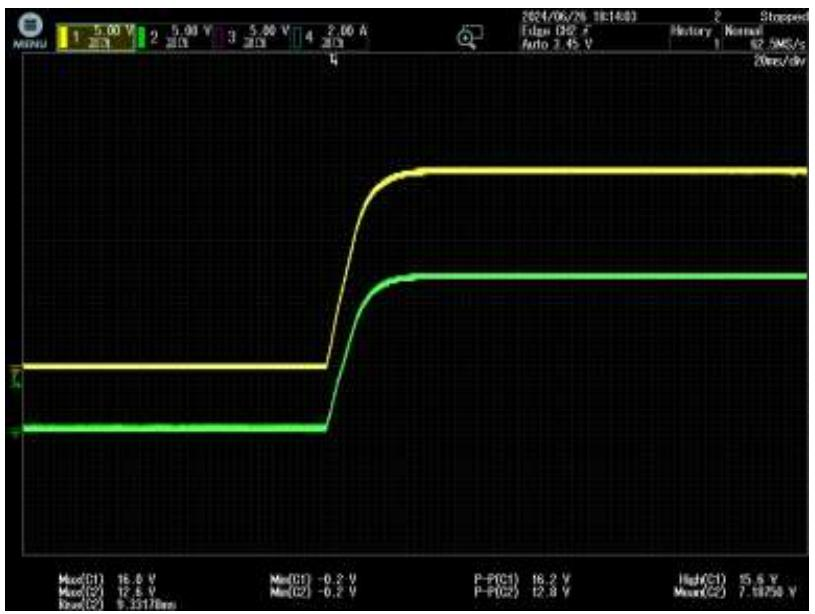

BPA86525PC  
176 VAC

CH1 VOUT\_16V  
CH2 VOUT\_12V

$$
t _ {\text { r   i   s   e }} = 9. 3 \mathrm{mS}
$$

Test Condition:  
➢ No Load  
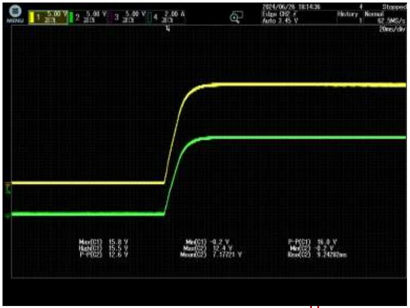

BPA86525PC  
265 VAC

CH1 VOUT\_16V  
CH2 VOUT\_12V

$$
t _ {\text { rise }} = 9. 3 \mathrm{mS}
$$

Test Condition:  
➢ No Load  
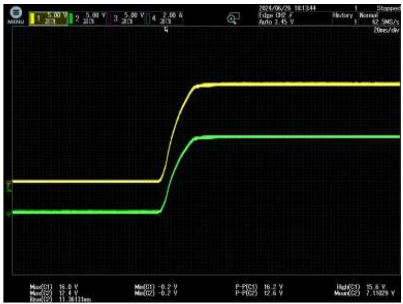

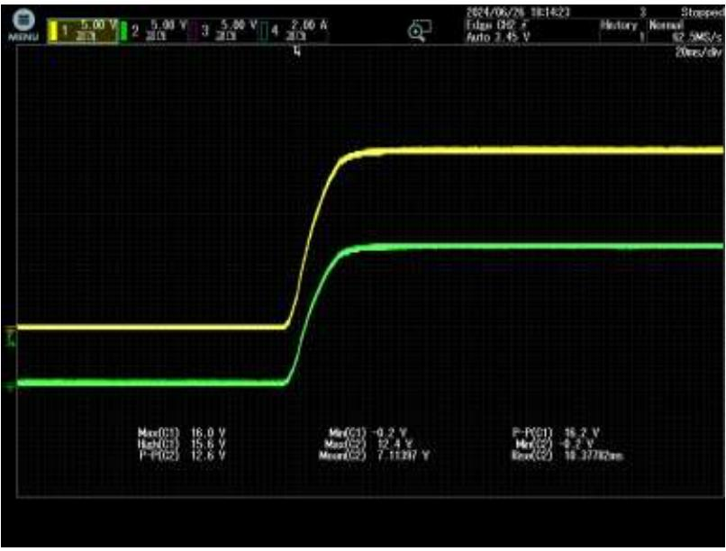

BPA86525PC  
176 VAC  
Test Condition:  
➢ Full Load

## BPS

## 晶丰明源

CH1 VOUT\_16V  
CH2 VOUT\_12V

$$
t _ {\text { rise }} = 1 1. 4 \mathrm{mS}
$$

BPA86525PC

265 VAC

CH1 VOUT\_16V  
CH2 VOUT\_12V

$$
t _ {\text { rise }} = 1 0. 4 \mathrm{mS}
$$

Test Condition:

➢ Full Load BPS Confidential

## VCC电压开机波形-空载&满载

## BPS

晶丰明源

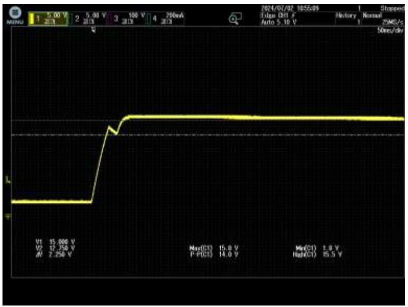

BPA86525PC

176 VAC

CH1 $\mathsf { V } _ { \mathsf { C C } }$ $\mathsf { V } _ { \mathsf { C C \_ M I N } } { = } 1 2 . 7 5 \mathsf { V }$ $\mathsf { V } _ { \mathsf { C C } \_ \mathsf { M A X } } = 1 5 . 8 \mathsf { V }$

Test Condition:

➢ No Load

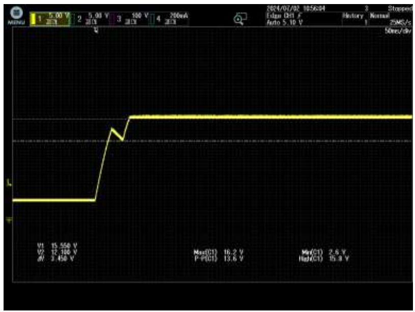

BPA86525PC

176 VAC

CH1 $\mathsf { V } _ { \mathsf { C C } }$ $\mathsf { V } _ { \mathsf { C C } \_ \mathsf { M I N } } = 1 2 . 1 \mathsf { V }$ $\mathsf { V } _ { \mathsf { C C } \_ \mathsf { M A X } } = 1 6 . 2 \mathsf { V }$

Test Condition:

➢ Full Load

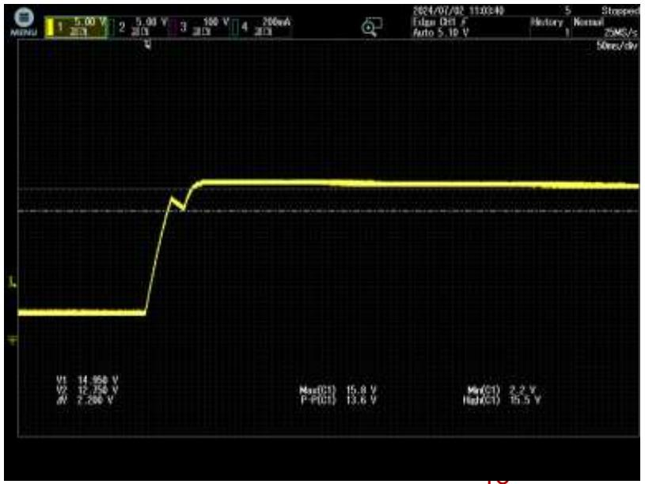

BPA86525PC

265 VAC

CH1 $\mathsf { V } _ { \mathsf { C C } }$ $\mathsf { V } _ { \mathsf { C C \_ M I N } } { = } 1 2 . 7 5 \mathsf { V }$ $\mathsf { V } _ { \mathsf { C C } \_ \mathsf { M A X } } = 1 5 . 8 \mathsf { V }$

Test Condition:

➢ No Load

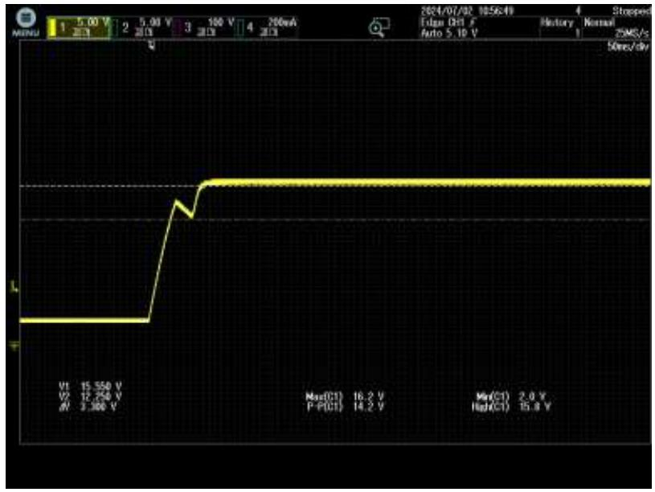

BPA86525PC

265 VAC

CH1 $\mathsf { V } _ { \mathsf { C C } }$ $\mathsf { V } _ { \mathsf { C C \_ M I N } } { = } 1 2 . 2 5 \mathsf { V }$ $\mathsf { V } _ { \mathsf { C C } \_ \mathsf { M A X } } = 1 6 . 2 \mathsf { V }$

Test Condition:

➢ Full Load

BPS Confidential

## VCC电压开机波形-满载

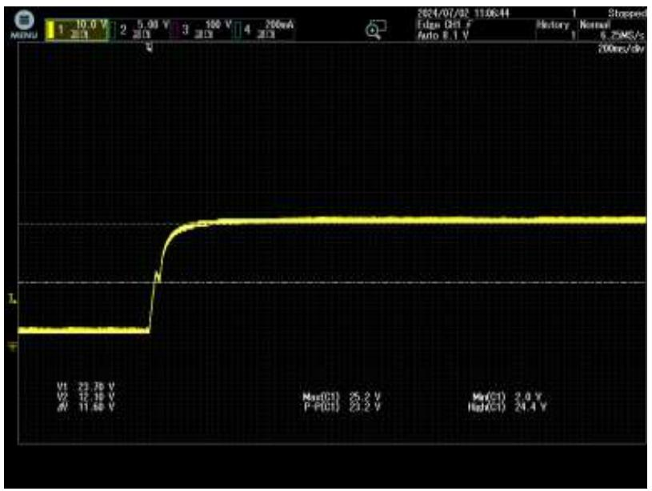

BPA86525PC  
176 VAC

CH1 VCC

$$
V _ {C C \_ M I N} = 1 2. 1 V
$$

$$
V _ {C C \_ M A X} = 2 5. 2 V
$$

## Test Condition:

➢ 12V2.8A Load

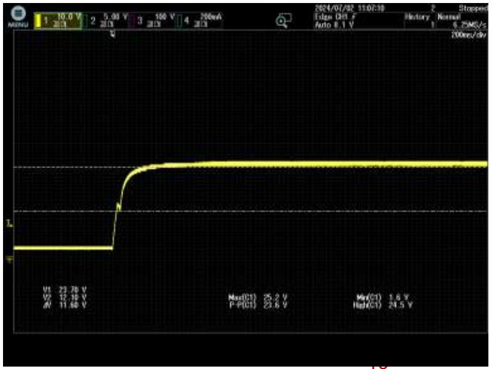

BPA86525PC  
265 VAC

CH1 VCC VCC\_MIN=12.1V VCC\_MAX=25.2V

## Test Condition:

➢ 12V2.8A Load

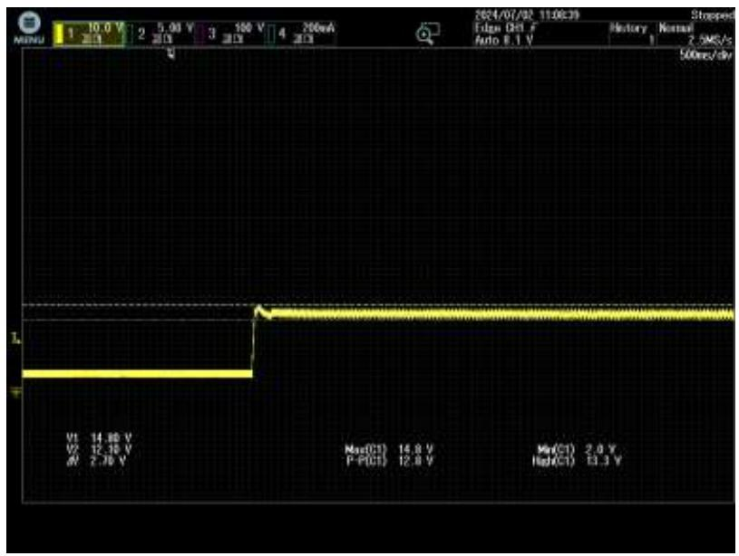

## BPS

## 晶丰明源

BPA86525PC

176 VAC

CH1 VCC

$$
V _ {C C \_ M I N} = 1 2. 1 V
$$

$$
V _ {C C \_ M A X} = 1 4. 8 V
$$

## Test Condition:

➢ 16V0.1A Load

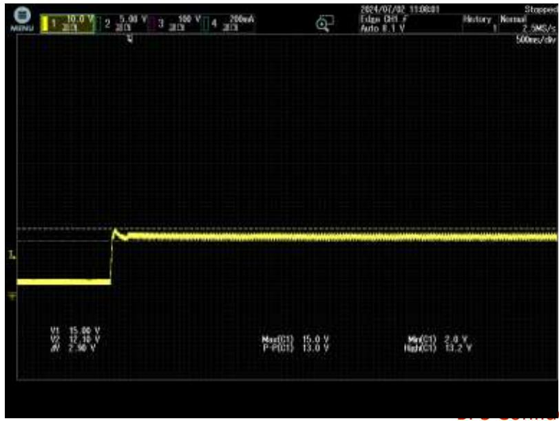

BPA86525PC  
265 VAC

CH1 VCC

$$
V _ {C C \_ M I N} = 1 2. 1 V
$$

$$
V _ {C C \_ M A X} = 1 5 V
$$

## Test Condition:

➢ 16V0.1A Load

## MOSFET开机电压、电流波形-空载&满载

## BPS

晶丰明源

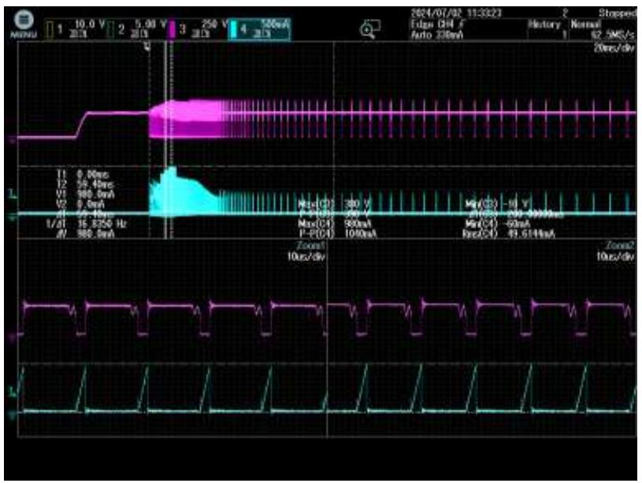

BPA86525PC  
176 VAC

CH3 $\mathsf { V } _ { \mathsf { D } \mathsf { S } }$  
CH4 IDS  
VDS\_MAX=380V I =0.98A

Test Condition:  
➢ No Load  
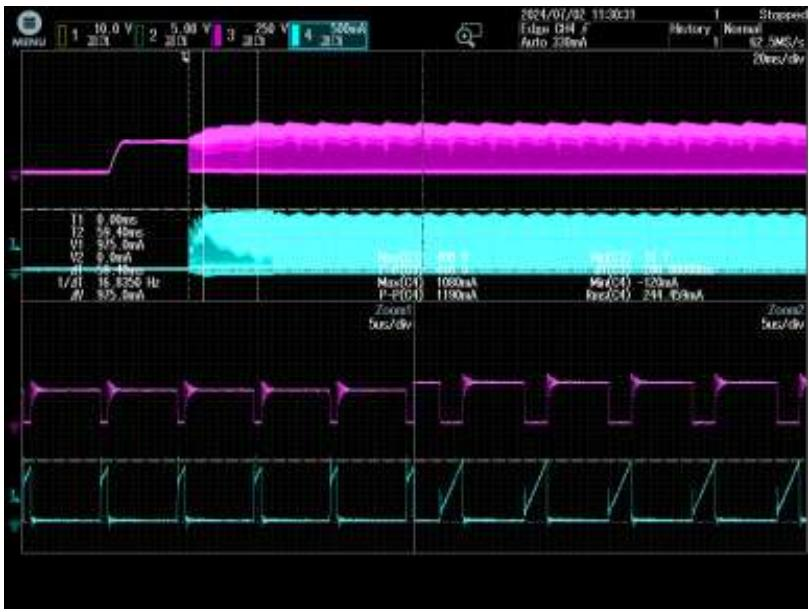

BPA86525PC  
176 VAC

CH3 $\mathsf { V } _ { \mathsf { D } \mathsf { S } }$  
CH4 $\mathsf { I } _ { \mathsf { D } \mathsf { S } }$  
VDS\_MAX=400V $\mathsf { I } _ { \mathsf { D S \_ M A X } } = 1 . 0 8 \mathsf { A }$

Test Condition:  
➢ Full Load  
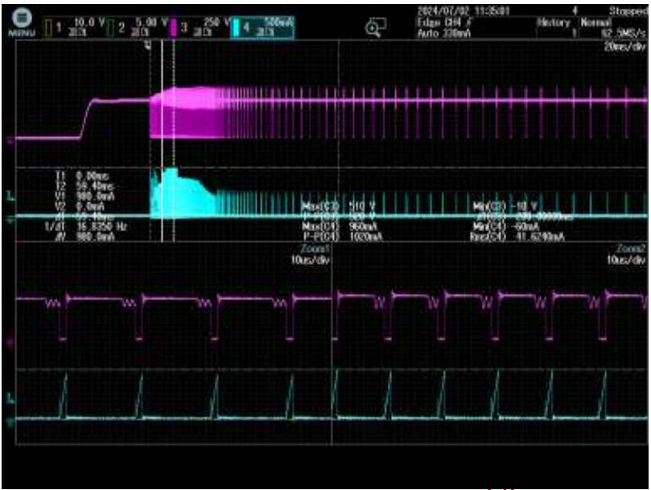

BPA86525PC  
265 VAC

CH3 VDS  
CH4 IDS  
◼ VDS\_MAX=510V IDS\_MAX =0.96A

Test Condition:  
➢ No Load  
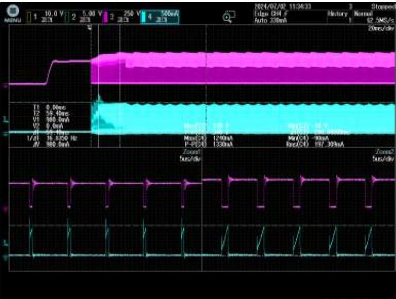

BPA86525PC  
265 VAC

CH3 VDS  
CH4 IDS  
◼ VDS\_MAX=530V IDS\_MAX =1.24A $\mathsf { I } _ { \mathsf { D S \_ M A X } } = 1 . 2 4 \mathsf { A }$

Test Condition:

➢ Full Load

## MOSFET稳态电压、电流波形-空载&满载

## BPS

晶丰明源

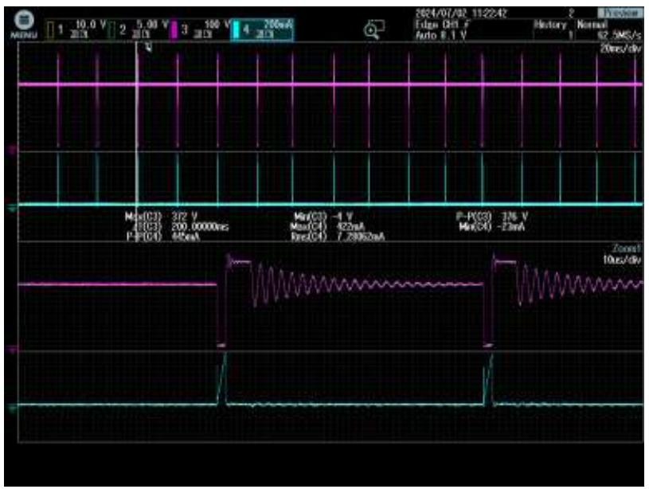

BPA86525PC  
87 VAC

CH3 $\mathsf { V } _ { \mathsf { D } \mathsf { S } }$  
$C H 4 1 _ { \mathrm { D S } }$  
$V _ { \mathsf { D S \_ M A X } } { = } 3 7 2 \mathsf { V }$ $\mathsf { I } _ { \mathsf { D S \_ M A X } } = 0 . 4 2 2 \mathsf { A }$

Test Condition:  
➢ No Load  
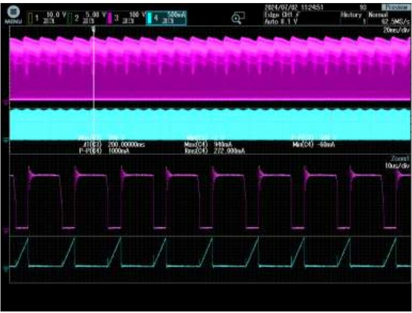

BPA86525PC  
176 VAC

${ \mathsf { C H 3 } } \mathsf { V _ { D S } }$  
$C H 4 1 _ { \mathrm { D S } }$  
$V _ { \mathsf { D S \_ M A X } } { = } 3 9 8 \mathsf { V }$ $\mathsf { I } _ { \mathsf { D S \_ M A X } } = 0 . 9 4 \mathsf { A }$

Test Condition:  
➢ Full Load  
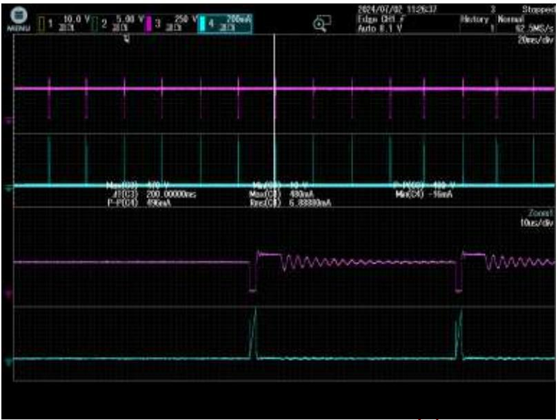

BPA86525PC  
265 $\mathsf { v } _ { \mathsf { A C } }$

${ \mathsf { C H 3 } } \mathsf { V _ { D S } }$  
$C H 4 \mid _ { \mathrm { D S } }$  
$V _ { \mathsf { D S \_ M A X } } { = } 4 7 0 \mathsf { V }$ I =0.48A $\mathsf { I } _ { \mathsf { D S \_ M A X } } = 0 . 4 8 \mathsf { A }$

Test Condition:  
➢ No Load  
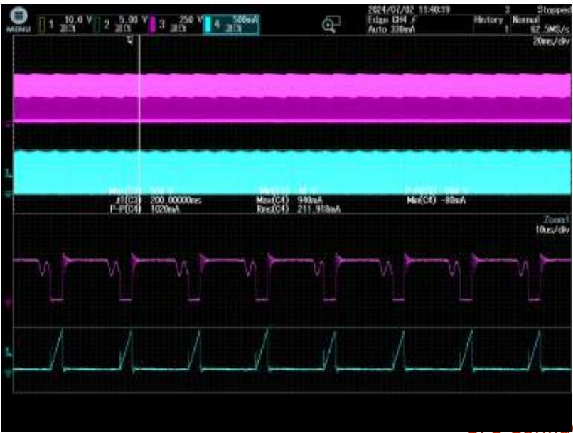

BPA86525PC  
265 $\mathsf { v } _ { \mathsf { A C } }$

${ \mathsf { C H 1 } } \mathsf { V } _ { \mathsf { D S } }$  
$C H 4 \mid _ { \mathrm { { D S } } }$  
$V _ { \mathsf { D S \_ M A X } } { = } 5 5 0 \mathsf { V }$ $\mathsf { I } _ { \mathsf { D S \_ M A X } } = 0 . 9 4 \mathsf { A }$

Test Condition:

➢ Full Load

## 输出二极管开机反向电压波形（稳态和开机）

## BPS

晶丰明源

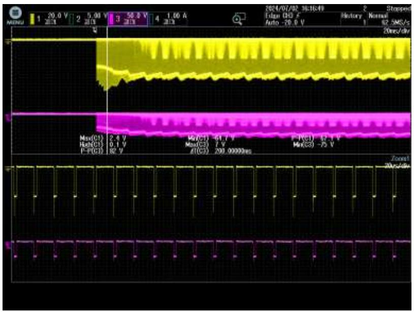

BPA86525PC176 VAC

$\mathsf { C H 1 V _ { o u r \_ 1 2 V } }$ CH1 VOUT\_12V  
$\mathsf { C H 3 } \mathsf { V _ { O U T \_ 1 6 \vee } }$ CH3 VOUT\_16V  
$\mathsf { V } _ { \mathsf { R } \_ \mathsf { M A X } \_ 1 2 \mathsf { V } } { = } 6 4 . 7 \mathsf { V }$  
$V _ { \mathrm { R \_ M A X \_ 1 6 V } } { = } 7 5 V$

Test Condition:

➢ 12V2A 16V0A Load

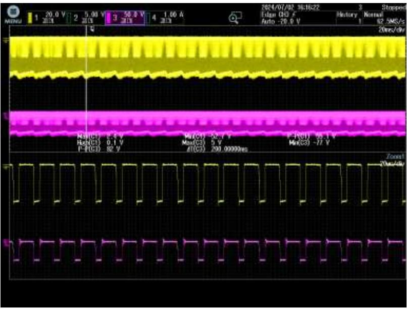

BPA86525PC176 VAC

$\mathsf { C H 1 V _ { o u r \_ 1 2 v } }$ CH1 VOUT\_12V  
$\mathsf { C H 3 } \mathsf { V _ { O U T \_ 1 6 \vee } }$ CH3 VOUT\_16V  
$\mathsf { V } _ { \mathbb { R } \_ \mathsf { M A X } \_ 1 2 \mathsf { V } } { = } 5 2 . 7 \mathsf { V }$ $\mathsf { V } _ { \mathrm { R } \_ \mathrm { M A X } \_ 1 6 \vee } { = } 7 7 \vee$

Test Condition:

➢ 12V2A 16V0A Load

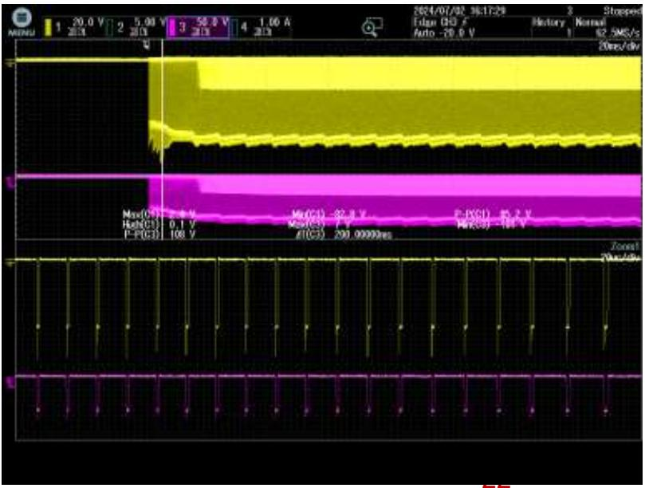

BPA86525PC265 VAC

$\mathsf { C H 1 V _ { O U T \_ 1 2 V } }$ CH1 VOUT\_12V  
CH3 VOUT\_16V $\mathsf { C H 3 } \mathsf { V _ { O U T \_ 1 6 \vee } }$  
$\mathsf { V } _ { \mathbb { R } \_ \mathsf { M A X } \_ 1 2 \mathsf { V } } { = } 8 2 . 8 \mathsf { V }$  
$\mathsf { V } _ { \mathbb { R } \_ \mathsf { M A X \_ 1 6 } \mathsf { v } } \mathsf { = 1 0 1 V }$

Test Condition:

➢ 12V2A 16V0A Load

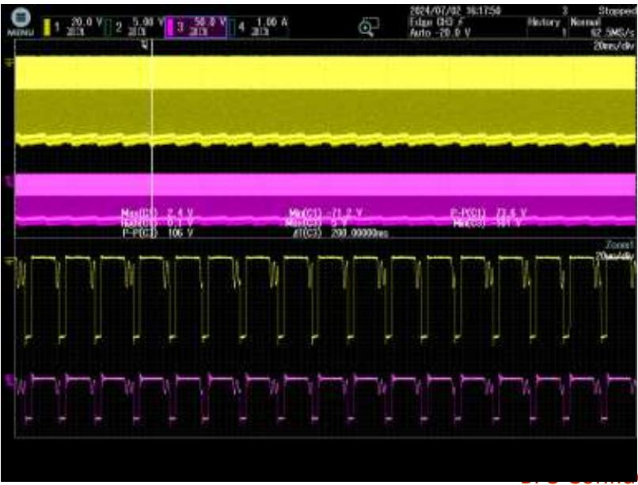

BPA86525PC265 VAC

$\mathsf { C H 1 V _ { o u r \_ 1 2 V } }$ CH1 VOUT\_12V  
CH3 VOUT\_16V $\mathsf { C H 3 } \mathsf { V _ { O U T \_ 1 6 \vee } }$  
$\mathsf { V } _ { \mathbb { R } \_ \mathsf { M A X } \_ 1 2 \mathsf { V } } { = } 7 1 . 2 \mathsf { V }$  
$\mathtt { V _ { R \_ M A X \_ 1 6 V } } = 1 0 1 \mathtt { V }$

Test Condition:

➢ 12V2A 16V0A Load

## 输出二极管开机反向电压波形（稳态和开机）

## BPS

晶丰明源

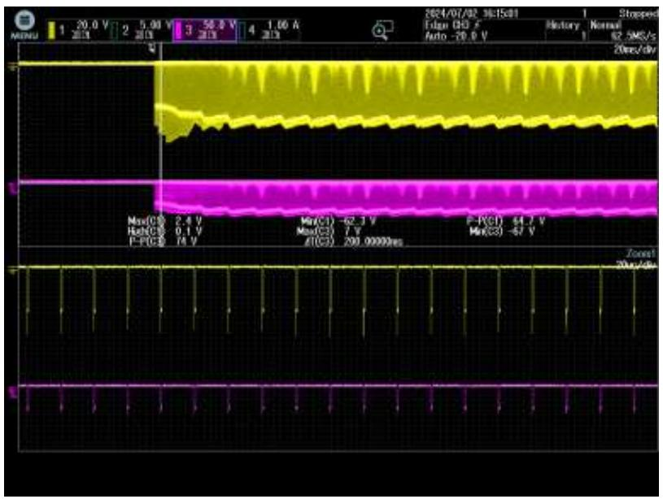

BPA86525PC  
176 VAC

$\mathsf { C H 1 V _ { O U T \_ 1 2 V } }$ CH1 VOUT\_12V  
$\mathsf { C H 3 } \mathsf { V _ { O U T \_ 1 6 \vee } }$ CH3 VOUT\_16V  
$\mathsf { V } _ { \mathsf { R } \_ \mathsf { M A X } \_ 1 2 \mathsf { V } } { = } 6 2 . 3 \mathsf { V }$  
◼ $\mathsf { V } _ { \mathrm { R } \_ \mathrm { M A X } \_ 1 6 \vee } { = } 6 7 \vee$

Test Condition:

➢ 12V2A+16V0.1A Load

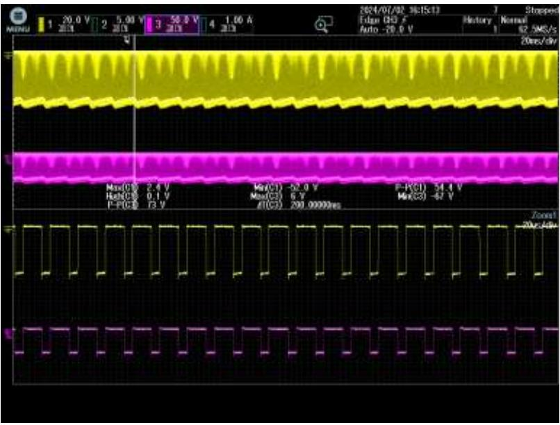

BPA86525PC  
265 VAC

$\mathsf { C H 1 V _ { O U T \_ 1 2 V } }$ CH1 VOUT\_12V  
CH3 VOUT\_16V $\mathsf { C H 3 } \mathsf { V _ { o u r \_ 1 6 \vee } }$

$\mathsf { V } _ { \mathrm { R } \_ \mathrm { M A X } \_ 1 2 \mathsf { V } } { = } 5 2 \mathsf { V }$  
◼ $\mathsf { V } _ { \mathrm { R } \_ \mathrm { M A X } \_ 1 6 \vee } { = } 6 7 \vee$

Test Condition:

➢ $1 2 \mathsf { V } 2 \mathsf { A } + 1 6 \mathsf { V } 0 . 1 \mathsf { A } \mathsf { L } 0 \mathsf { a d }$

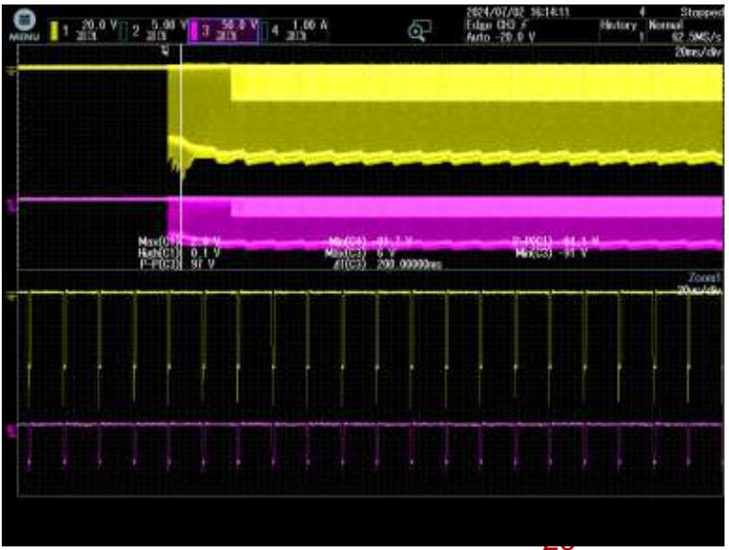

BPA86525PC  
265 VAC

$\mathsf { C H 1 V _ { O U T \_ 1 2 V } }$ CH1 VOUT\_12V  
CH3 VOUT\_16V $\mathsf { C H 3 } \mathsf { V _ { O U T \_ 1 6 \vee } }$

$\mathsf { V } _ { \mathbb { R } \_ \mathrm { M A X } \_ 1 2 \mathsf { v } } { = } 8 1 . 7 \mathsf { V }$  
◼ $\mathsf { V } _ { \mathsf { R } \_ \mathsf { M A X } \_ 1 6 \mathsf { V } } { = } 9 1 \mathsf { V }$

Test Condition:

➢ $1 2 \mathsf { V } 2 \mathsf { A } + 1 6 \mathsf { V } 0 . 1 \mathsf { A } \mathsf { L } 0 \mathsf { a d }$

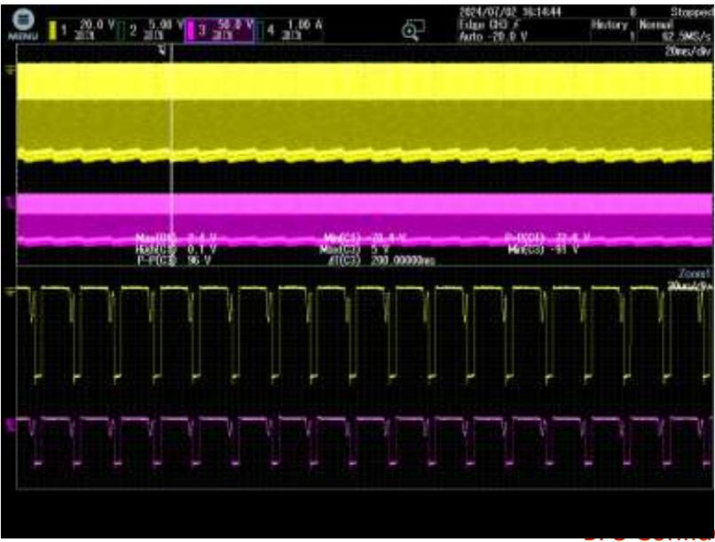

BPA86525PC  
265 VAC

$\mathsf { C H 1 V _ { o u r \_ 1 2 V } }$ CH1 VOUT\_12V  
$\mathsf { C H 3 } \mathsf { V _ { O U T \_ 1 6 \vee } }$ CH3 VOUT\_16V

$\mathsf { V } _ { \mathrm { R } \_ \mathrm { M A X } \_ 1 2 \mathsf { V } } { = } 7 0 . 4 \mathsf { V }$  
◼ $\mathsf { V } _ { \mathsf { R } \_ \mathsf { M A X } \_ 1 6 \mathsf { V } } { = } 9 1 \mathsf { V }$

Test Condition:

➢ 12V2A+16V0.1A Load

## 输出二极管开机反向电压波形（开机）

## BPS

晶丰明源

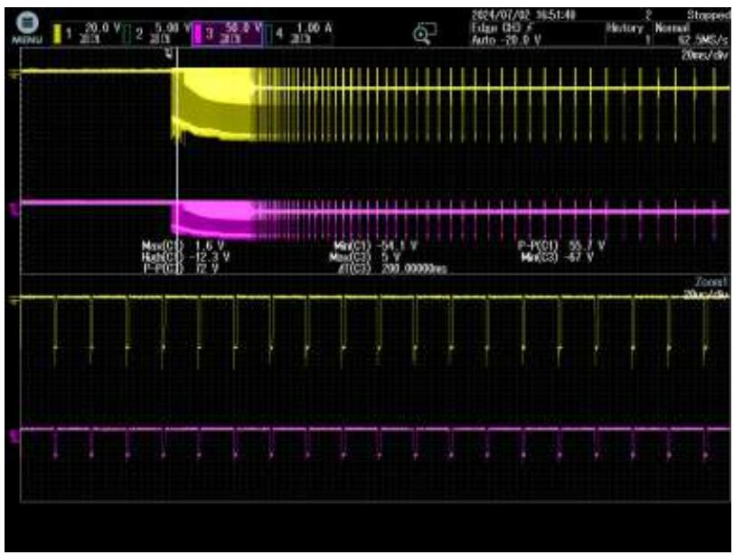

BPA86525PC  
176 VAC

$\mathsf { C H 1 V _ { O U T \_ 1 2 V } }$ CH1 VOUT\_12V  
CH3 VOUT\_16V  
$\mathsf { V } _ { \mathbb { R } \_ \mathsf { M A X } \_ 1 2 \mathsf { V } } { = } 5 4 . 1 \mathsf { V }$ $V _ { \mathrm { R \_ M A X \_ 1 6 V } } = 6 7 V$

Test Condition:  
➢ No Load  
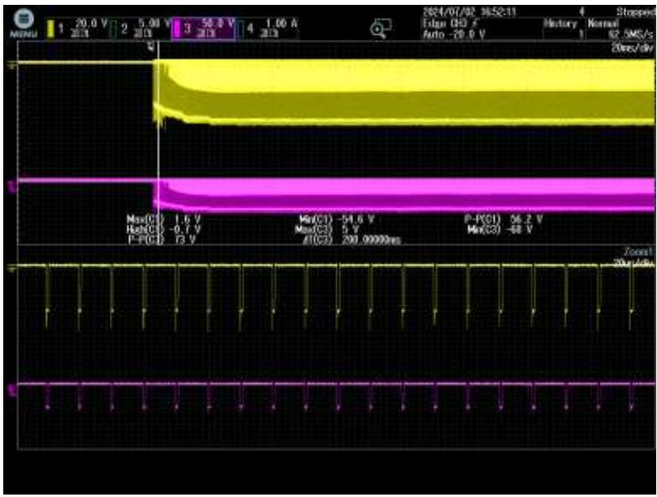

BPA86525PC  
176 VAC

$\mathsf { C H 1 V _ { O U T \_ 1 2 V } }$ CH1 VOUT\_12V  
CH3 VOUT\_16V $\mathsf { C H 3 } \mathsf { V _ { O U T \_ 1 6 \vee } }$  
$\mathsf { V } _ { \mathsf { R } \_ \mathsf { M A X } \_ 1 2 \mathsf { V } } { = } 5 4 . 6 \mathsf { V }$ $V _ { \mathrm { R \_ M A X \_ 1 6 V } } { = } 6 8 V$

Test Condition:  
➢ 16V0.1A Load  
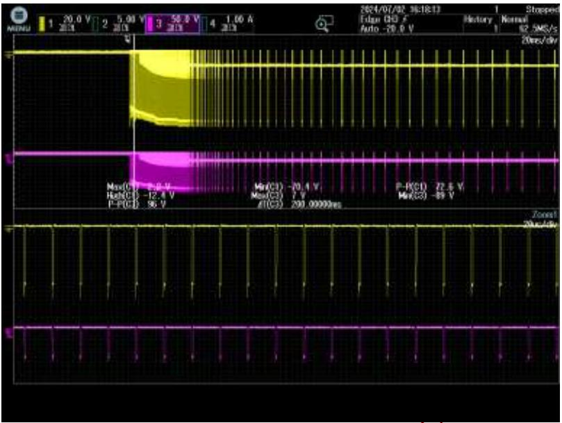

BPA86525PC  
265 VAC

$\mathsf { C H 1 V _ { O U T \_ 1 2 V } }$ CH1 VOUT\_12V  
CH3 VOUT\_16V $\mathsf { V } _ { \mathsf { O U T } \_ 1 6 \vee }$  
$\mathsf { V } _ { \mathsf { R } \_ \mathsf { M A X } \_ 1 2 \mathsf { V } } { = } 7 0 . 4 \mathsf { V }$  
$V _ { \mathrm { R \_ M A X \_ 1 6 V } } = 8 9 V$

Test Condition:  
➢ No Load  
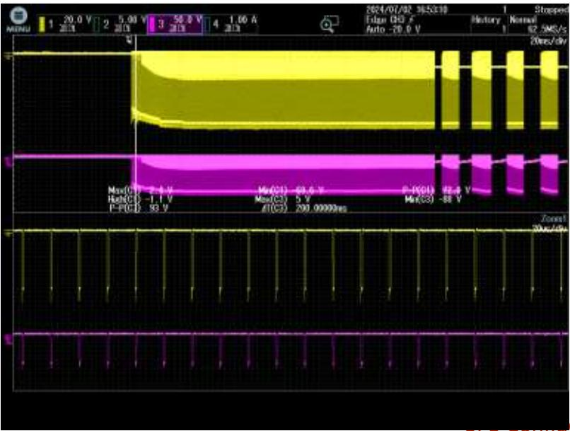

BPA86525PC  
265 VAC

CH1 VOUT\_12V $\mathsf { V } _ { \mathsf { O U T } \_ 1 2 \mathsf { V } }$  
CH3 VOUT\_16V $\mathsf { V } _ { \mathsf { O U T } \_ 1 6 \vee }$  
$\mathsf { V } _ { \mathsf { R } \_ \mathsf { M A X } \_ 1 2 \mathsf { V } } { = } 6 9 . 6 \mathsf { V }$  
◼ $V _ { \mathrm { R \_ M A X \_ 1 6 V } } { = } 8 8 V$

Test Condition:

➢ 16V0.1A Load

## 短路保护 （初级侧MOSFET电压电流波形）

## BPS

晶丰明源

BPA86525PC

176 VAC  
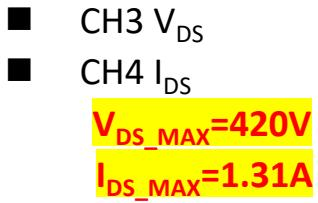

## Test Condition:

➢ Output Short 12V  
➢ 12V2A+16V0A

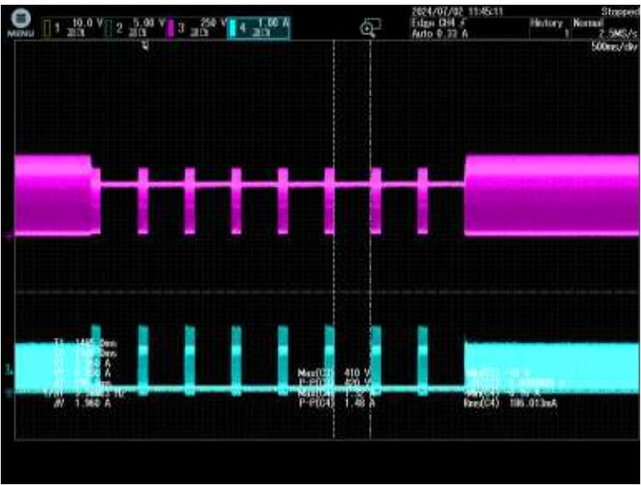

BPA86525PC

176 VAC  
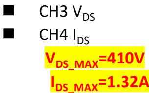

## Test Condition:

➢ Output Short 12V  
➢ 12V2A+16V0.1A

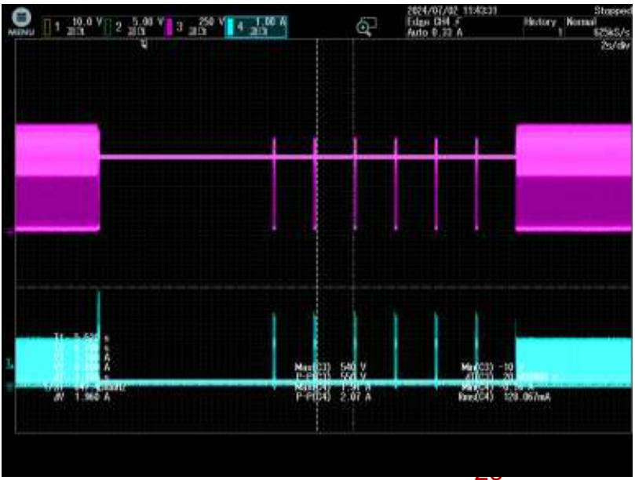

BPA86525PC

265 VAC  
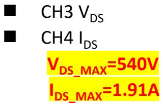

## Test Condition:

➢ Output Short 12V  
➢ 12V2A+16V0A

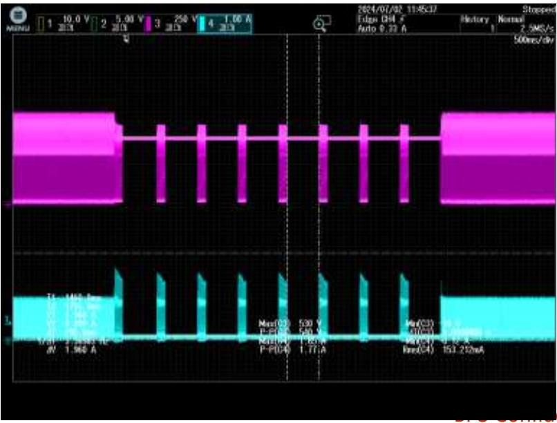

BPA86525PC

265 VAC  
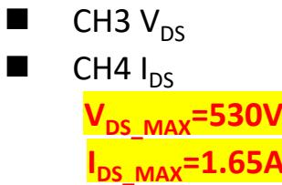

## Test Condition:

➢ Output Short 12V  
➢ 12V2A+16V0.1A

## 短路保护 （初级侧MOSFET电压电流波形）

## BPS

晶丰明源

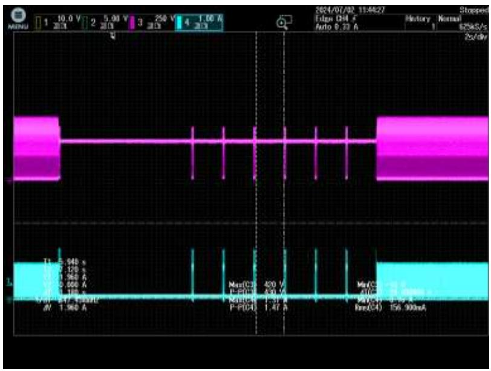

BPA86525PC

176 VAC  

## Test Condition:

➢ Output Short 12V  
➢ 12V2A+16V0A

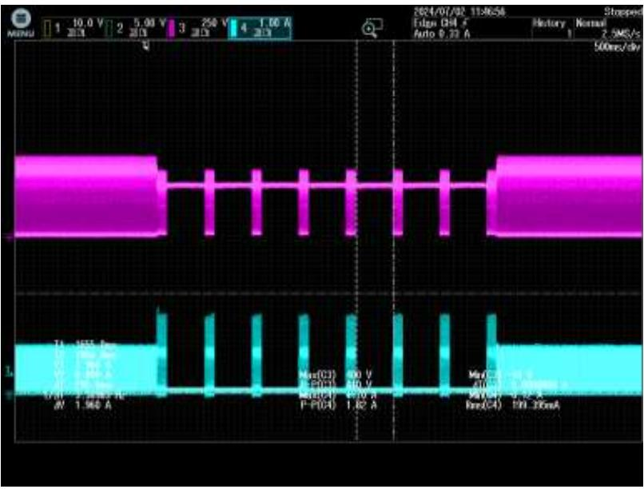

BPA86525PC

176 VAC  
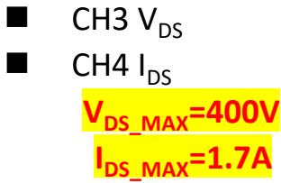

## Test Condition:

➢ Output Short 16V  
➢ 12V2A+16V0.1A

BPA86525PC

265 VAC  
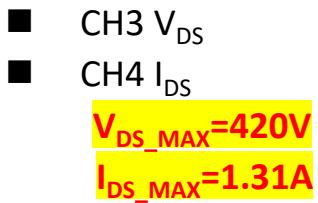

## Test Condition:

➢ Output Short 12V  
➢ 12V2A+16V0A

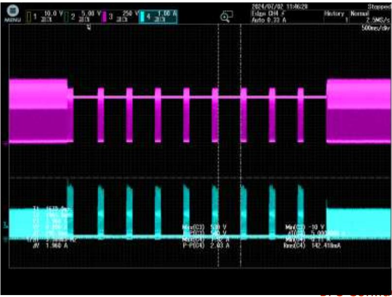

BPA86525PC

265 VAC  
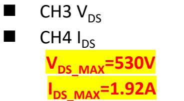

## Test Condition:

➢ Output Short 16V  
➢ 12V2A+16V0.1A

## 短路保护（次级侧输出二极管电压波形）

## BPS

晶丰明源

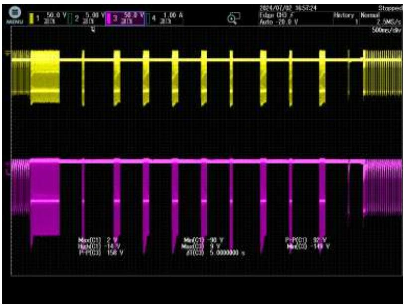

## BPA86525PC265VAC

$\mathsf { C H 1 V _ { o u r \_ 1 2 V } }$ CH1 VOUT\_12V

$\mathsf { C H 3 } \mathsf { V _ { O U T \_ 1 6 \vee } }$ CH3 VOUT\_16V

$\mathsf { V } _ { \mathsf { R } \_ \mathsf { M A X } \_ 1 2 \mathsf { V } } { = } 9 0 \mathsf { V }$ $V _ { \mathrm { R \_ M A X \_ 1 6 V } } { = } 1 4 9 V$

## Test Condition:

➢ Output Short 16V  
$1 2 \mathsf { V } 0 \mathsf { A } + 1 6 \mathsf { V } 0 . 1 \mathsf { A }$

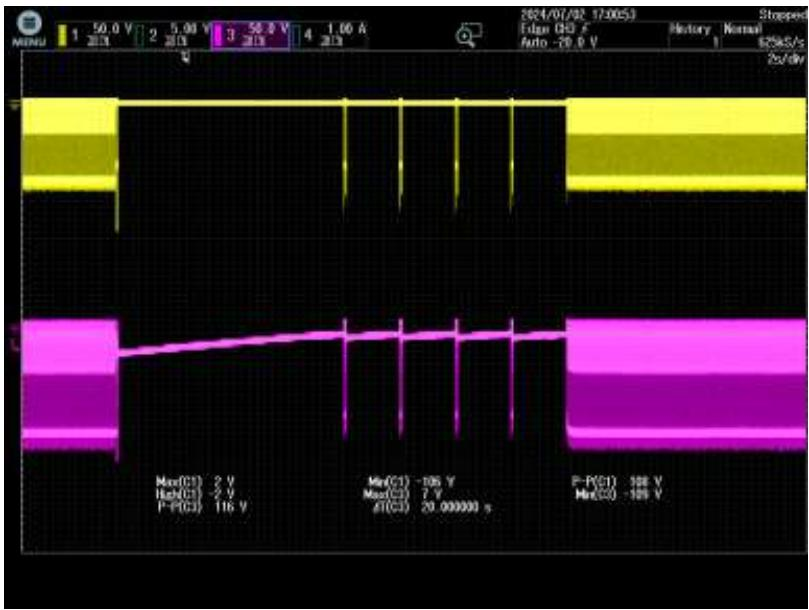

## BPA86525PC265 VAC

$\mathsf { C H 1 V _ { o u r \_ 1 2 v } }$ CH1 VOUT\_12V  
$\mathsf { C H 3 } \mathsf { V _ { O U T \_ 1 6 \vee } }$ CH3 VOUT\_16V

$\mathsf { V } _ { \mathbb { R } _ { - } \mathbf { M A X } \_ 1 2 \mathsf { V } } { = } 1 0 6 \mathsf { V }$ $V _ { \mathrm { R _ { - } M A X _ { - } 1 6 V } } = 1 0 9 V$ ！

## Test Condition:

➢ Output Short 12V  
$1 2 \mathsf { V } 2 \mathsf { A } + 1 6 \mathsf { V } 0 \mathsf { A }$

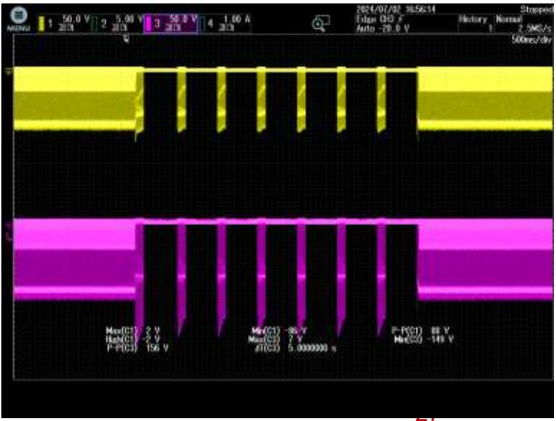

## BPA86525PC265 VAC

CH1 VOUT\_12V $\mathsf { V } _ { \mathsf { O U T } _ { - } 1 2 \mathsf { V } }$  
$\mathsf { C H 3 } \mathsf { V _ { O U T \_ 1 6 \vee } }$ CH3 VOUT\_16V

$V _ { \mathrm { R \_ M A X \_ 1 2 V } } { = } 8 6 V$ $V _ { \mathrm { R \_ M A X \_ 1 6 V } } { = } 1 4 9 V$

## Test Condition:

➢ Output Short 16V  
$1 2 \mathsf { V } 2 \mathsf { A } { + } 1 6 \mathsf { V } 0 . 1 \mathsf { A }$

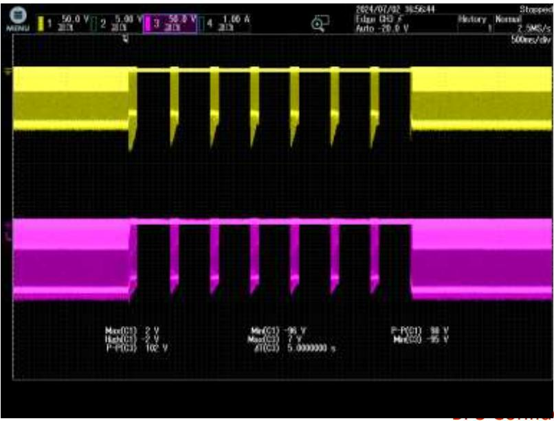

## BPA86525PC265 VAC

$\mathsf { C H 1 V _ { O U T \_ 1 2 V } }$ CH1 VOUT\_12V  
CH3 VOUT\_16V $\mathsf { C H 3 } \mathsf { V _ { O U T \_ 1 6 \vee } }$

$\mathsf { V } _ { \mathsf { R } \_ \mathsf { M A X } \_ 1 2 \mathsf { V } } { = } 9 6 \mathsf { V }$ $V _ { R \_ M A X \_ 1 6 V } = 9 5 V$

## Test Condition:

➢ Output Short 12V  
$1 2 \mathsf { V } 2 \mathsf { A } { + } 1 6 \mathsf { V } 0 . 1 \mathsf { A }$

## 输入欠压保护-空载&满载

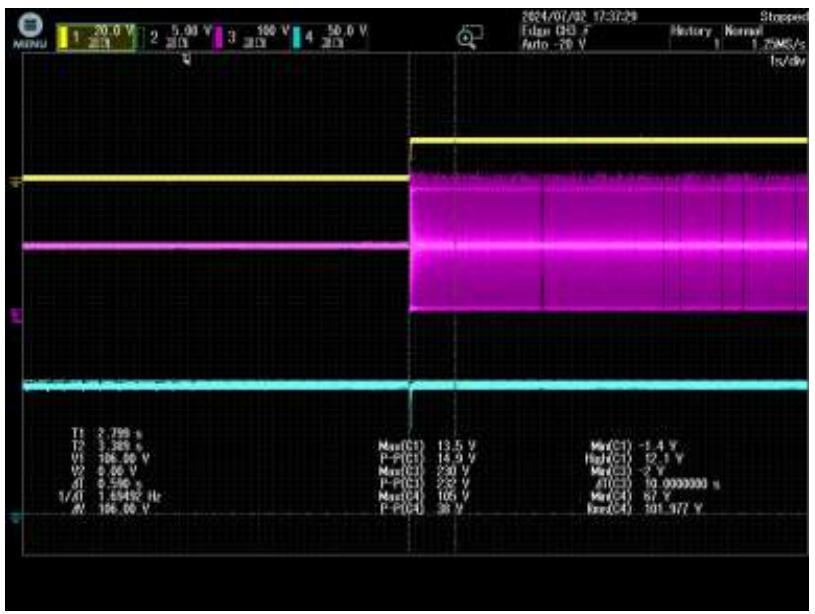

BPA86525PC  
BROWN-IN

${ \mathsf { C H 1 } } { \mathsf { V } } _ { 0 \mathsf { U T } - 1 2 \mathsf { V } }$ CH1 VOUT-12V  
${ \mathsf { C H 3 } } \mathsf { V _ { D S } }$  
$\mathsf { C H 4 } \mathsf { V I N } _ { \mathsf { D C } }$ CH4 VINDC VBROWN-IN: 105V

Test Condition:  
➢ No Load  
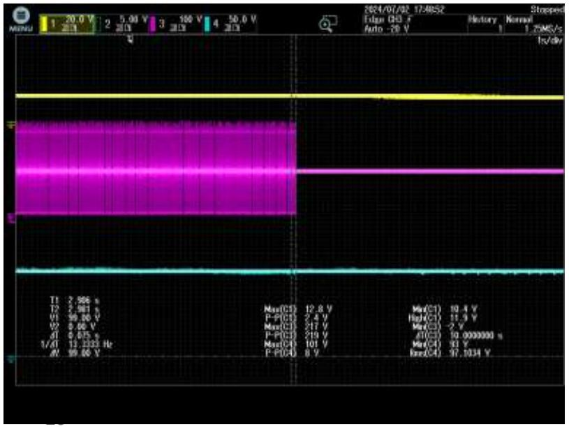

BPA86525PC  
BROWN-OUT

CH1 VOUT-12V $\mathsf { V } _ { \mathsf { O U T } - 1 2 \mathsf { V } }$  
${ \mathsf { C H 3 } } \mathsf { V _ { D S } }$  
$\mathsf { C H 4 } \mathsf { V I N } _ { \mathsf { D C } }$ CH4 VINDC VBROWN-OUT:99 V

Test Condition:  
➢ No Load  
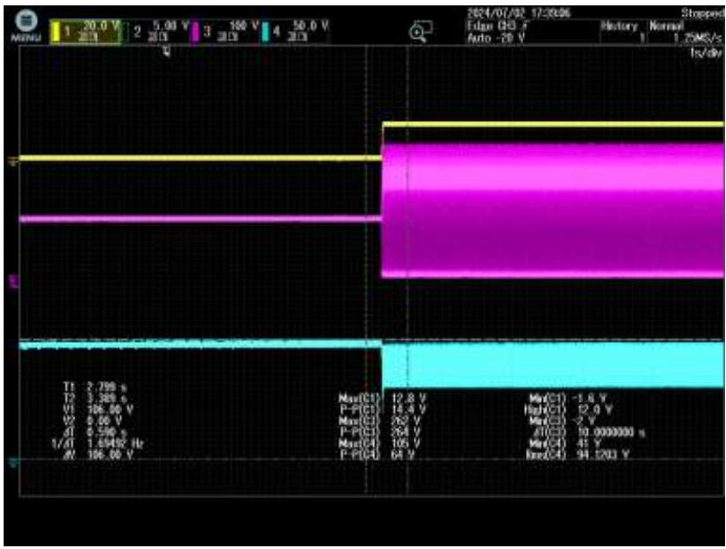

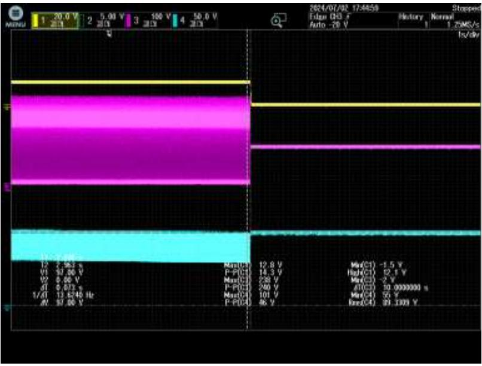

BPA86525PC  
BROWN-IN  
Test Condition:  
➢ Full Load

## BPS

## 晶丰明源

CH1 VOUT-12V $\mathsf { V } _ { \mathsf { O U T - 1 } 2 \mathsf { V } }$  
${ \mathsf { C H 3 } } \mathsf { V _ { D S } }$  
$\mathsf { C H } 4 \mathsf { V I N } _ { \mathsf { D C } }$ CH4 VINDC $\mathsf { V } _ { \mathsf { B R O W N - I N } } \mathrm { : } \mathsf { 1 0 5 V }$

BPA86525PC

BROWN-OUT

CH1 VOUT-12V ${ \mathsf { C H 1 } } { \mathsf { V } } _ { 0 \mathsf { U T } - 1 2 \mathsf { V } }$  
${ \mathsf { C H 3 } } \mathsf { V } _ { \mathsf { D S } }$  
${ \mathsf { C H } } 4 { \mathsf { V I N } } _ { \mathsf { D C } }$ CH4 VINDC VBROWN-OUT: 97V

Test Condition:

➢ Full Load BPS Confidential

## 输入过压保护-空载&满载

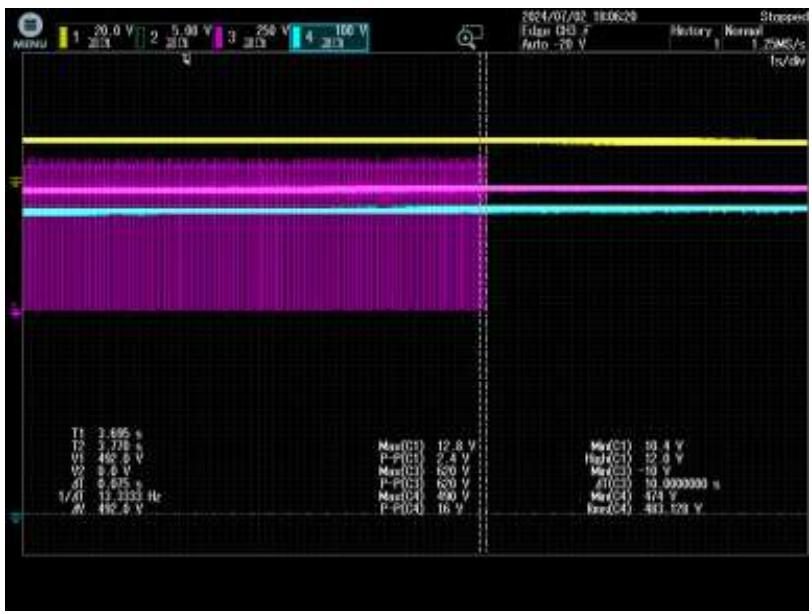

## BPA86525PC

## 输入OVP

${ \mathsf { C H 1 } } { \mathsf { V } } _ { 0 \mathsf { U T } - 1 2 \mathsf { V } }$ CH1 VOUT-12V  
${ \mathsf { C H 3 } } \mathsf { V _ { D S } }$  
$\mathsf { C H 4 } \mathsf { V I N } _ { \mathsf { D C } }$ CH4 VINDC $V _ { \mathsf { L O V P - I N } } : 4 9 0 \mathsf { V }$

## Test Condition:

➢ No Load

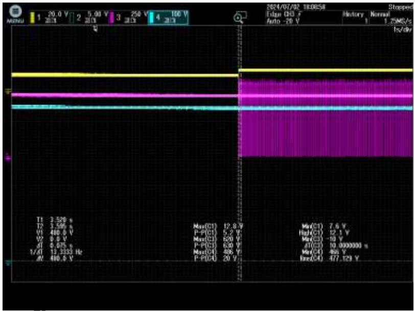

## BPA86525PC

## 退出输入OVP

CH1 VOUT-12V ${ \mathsf { C H 1 } } { \mathsf { V } } _ { 0 \mathsf { U T } - 1 2 \mathsf { V } }$  
${ \mathsf { C H 3 } } \mathsf { V _ { D S } }$  
$\mathsf { C H 4 } \mathsf { V I N } _ { \mathsf { D C } }$ CH4 VINDC VLOVP-OUT: 480 V

## Test Condition:

➢ No Load

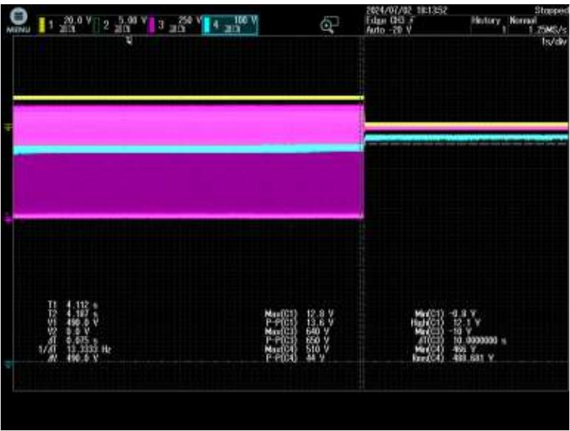

## BPA86525PC

## 输入OVP

CH1 VOUT-12V ${ \mathsf { C H 1 } } { \mathsf { V } } _ { 0 \mathsf { U T } - 1 2 \mathsf { V } }$  
${ \mathsf { C H 3 } } \mathsf { V _ { D S } }$  
${ \mathsf { C H } } 4 { \mathsf { V I N } } _ { \mathsf { D C } }$ CH4 VINDC $V _ { \mathsf { D C - I N } } \colon 4 9 0 \mathsf { V }$ VDC-IN:

## Test Condition:

➢ Full Load

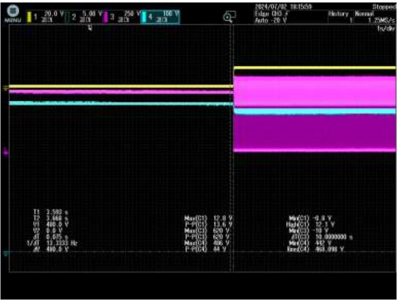

## BPA86525PC

## 退出输入OVP

CH1 VOUT-12V ${ \mathsf { C H 1 } } { \mathsf { V } } _ { 0 \mathsf { U T } - 1 2 \mathsf { V } }$  
${ \mathsf { C H 3 } } \mathsf { V _ { D S } }$  
CH4 VINDC ${ \mathsf { C H } } 4 { \mathsf { V I N } } _ { \mathsf { D C } }$ VDC-OUT: 480V

## Test Condition:

➢ Full Load

## 温升测试 12V2A+16V0.06A

<table><tr><td rowspan="2">项目</td><td colspan="2">176VAC</td><td colspan="2">230VAC</td><td colspan="2">265VAC</td></tr><tr><td>温度(°C)</td><td>温升(°C)</td><td>温度(°C)</td><td>温升(°C)</td><td>温度(°C)</td><td>温升(°C)</td></tr><tr><td>环境温度</td><td colspan="2">29.1</td><td colspan="2">29.7</td><td colspan="2">33.4</td></tr><tr><td>BPA86525PC</td><td>84.6</td><td>55.5</td><td>84.3</td><td>54.6</td><td>83.3</td><td>49.9</td></tr><tr><td>变压器磁芯</td><td>70.7</td><td>41.6</td><td>72.5</td><td>42.8</td><td>72.2</td><td>38.8</td></tr><tr><td>变压器线包</td><td>76.2</td><td>47.1</td><td>77.5</td><td>47.8</td><td>77.1</td><td>43.7</td></tr><tr><td>12V输出二极管(D3)</td><td>80.4</td><td>51.3</td><td>82.5</td><td>52.8</td><td>82.4</td><td>49</td></tr><tr><td>输出电解电容(E3)</td><td>58.2</td><td>29.1</td><td>59.7</td><td>30</td><td>59.4</td><td>26</td></tr><tr><td>RCD钳位二极管(D4)</td><td>68.3</td><td>39.2</td><td>68.3</td><td>38.6</td><td>67.2</td><td>33.8</td></tr><tr><td>16V输出二极管(D7)</td><td>79.1</td><td>50</td><td>71.5</td><td>41.8</td><td>71.4</td><td>38</td></tr></table>

## 测试说明

➢ 在温箱中进行测试  
➢ 电路板放在一个封闭的盒子内  
➢ 热电偶连接到各个测量点  
➢ 等测量点温度达到稳定后记录数据  
备注：常温下的封闭环境测试。

## 温升测试 12V2A+16V0.1A

<table><tr><td rowspan="2">项目</td><td colspan="2">176VAC</td><td colspan="2">230VAC</td><td colspan="2">265VAC</td></tr><tr><td>温度(°C)</td><td>温升(°C)</td><td>温度(°C)</td><td>温升(°C)</td><td>温度(°C)</td><td>温升(°C)</td></tr><tr><td>环境温度</td><td colspan="2">31.84</td><td colspan="2">29.8</td><td colspan="2">31.86</td></tr><tr><td>BPA86525PC</td><td>89.2</td><td>57.36</td><td>86.4</td><td>56.6</td><td>85.3</td><td>53.44</td></tr><tr><td>变压器磁芯</td><td>72.3</td><td>40.46</td><td>72.9</td><td>43.1</td><td>73.3</td><td>41.44</td></tr><tr><td>变压器线包</td><td>77.7</td><td>45.86</td><td>78</td><td>48.2</td><td>78.2</td><td>46.34</td></tr><tr><td>12V输出二极管(D3)</td><td>80.7</td><td>48.86</td><td>82.3</td><td>52.5</td><td>82.6</td><td>50.74</td></tr><tr><td>输出电解电容(E3)</td><td>58.7</td><td>26.86</td><td>59.5</td><td>29.7</td><td>59.7</td><td>27.84</td></tr><tr><td>RCD钳位二极管(D4)</td><td>70.6</td><td>38.76</td><td>69.1</td><td>39.3</td><td>68.4</td><td>36.54</td></tr><tr><td>16V输出二极管(D7)</td><td>74.7</td><td>42.86</td><td>75.9</td><td>46.1</td><td>76.3</td><td>44.44</td></tr></table>

## 测试说明

➢ 在温箱中进行测试  
➢ 电路板放在一个封闭的盒子内  
➢ 热电偶连接到各个测量点  
➢ 等测量点温度达到稳定后记录数据  
备注：常温下的封闭环境测试。

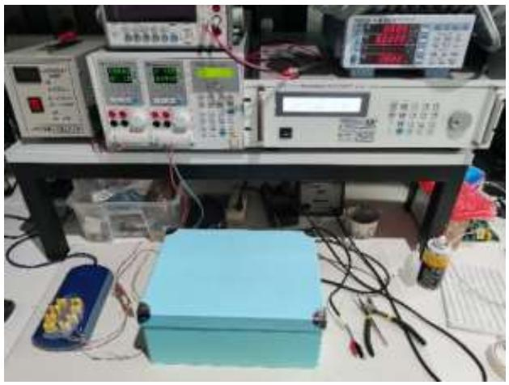

## 温升测试 12V2.2A+16V0A

<table><tr><td rowspan="2">项目</td><td colspan="2">176VAC</td><td colspan="2">230VAC</td><td colspan="2">265VAC</td></tr><tr><td>温度(°C)</td><td>温升(°C)</td><td>温度(°C)</td><td>温升(°C)</td><td>温度(°C)</td><td>温升(°C)</td></tr><tr><td>环境温度</td><td colspan="2">29.9</td><td colspan="2">30</td><td colspan="2">30</td></tr><tr><td>BPA86525PC</td><td>96.5</td><td>66.6</td><td>88.1</td><td>58.1</td><td>90.1</td><td>60.1</td></tr><tr><td>变压器磁芯</td><td>76</td><td>46.1</td><td>76.5</td><td>46.5</td><td>77.2</td><td>47.2</td></tr><tr><td>变压器线包</td><td>82.4</td><td>52.5</td><td>82.3</td><td>52.3</td><td>82.9</td><td>52.9</td></tr><tr><td>12V输出二极管(D3)</td><td>86</td><td>56.1</td><td>86.9</td><td>56.9</td><td>87.8</td><td>57.8</td></tr><tr><td>输出电解电容(E3)</td><td>62.1</td><td>32.2</td><td>62.7</td><td>32.7</td><td>63</td><td>33</td></tr><tr><td>RCD钳位二极管(D4)</td><td>76.9</td><td>47</td><td>73.9</td><td>43.9</td><td>74.5</td><td>44.5</td></tr><tr><td>16V输出二极管(D7)</td><td>69</td><td>39.1</td><td>68.7</td><td>38.7</td><td>70.3</td><td>40.3</td></tr></table>

## 测试说明

➢ 在温箱中进行测试  
➢ 电路板放在一个封闭的盒子内  
➢ 热电偶连接到各个测量点  
➢ 等测量点温度达到稳定后记录数据  
备注：常温下的封闭环境测试。

## 传导EMI&功率骚扰

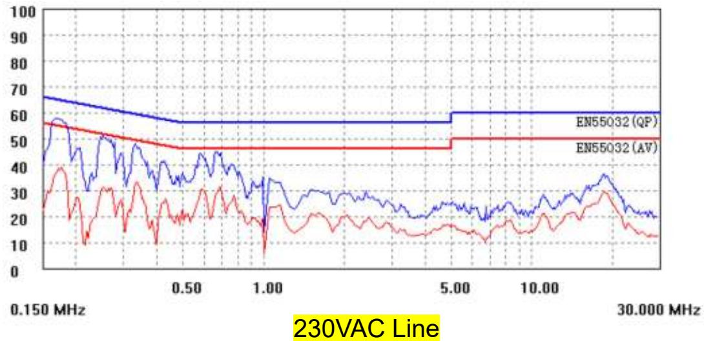

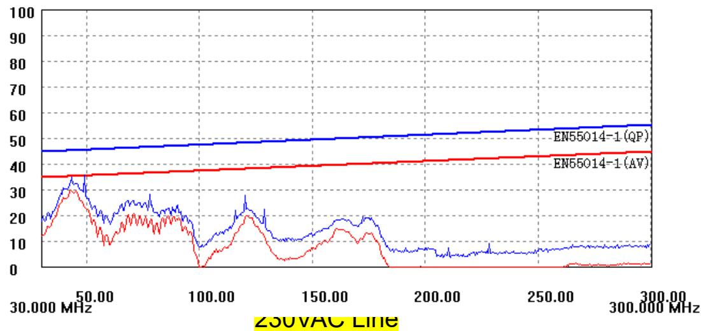

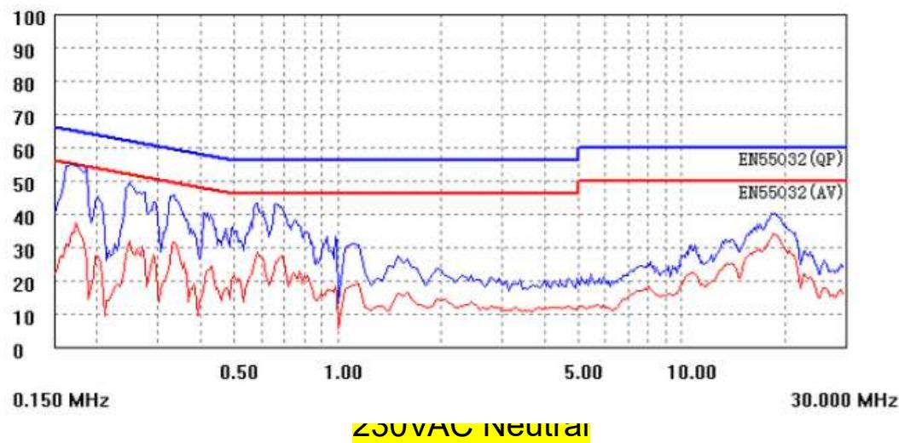

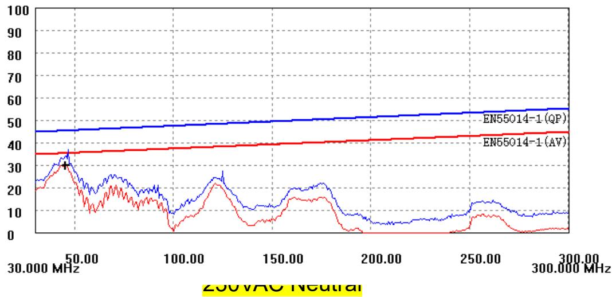

## Surge 浪涌测试

<table><tr><td>差模</td><td>电压</td><td>相位角</td><td>发生器阻抗</td><td>测试次数</td><td>测试结果</td></tr><tr><td>L to N</td><td>+2kV</td><td>0</td><td>2</td><td>10</td><td>Pass</td></tr><tr><td>L to N</td><td>-2kV</td><td>0</td><td>2</td><td>10</td><td>Pass</td></tr><tr><td>L to N</td><td>+2kV</td><td>90</td><td>2</td><td>10</td><td>Pass</td></tr><tr><td>L to N</td><td>-2kV</td><td>90</td><td>2</td><td>10</td><td>Pass</td></tr><tr><td>L to N</td><td>+2kV</td><td>180</td><td>2</td><td>10</td><td>Pass</td></tr><tr><td>L to N</td><td>-2kV</td><td>180</td><td>2</td><td>10</td><td>Pass</td></tr><tr><td>L to N</td><td>+2kV</td><td>270</td><td>2</td><td>10</td><td>Pass</td></tr><tr><td>L to N</td><td>-2kV</td><td>270</td><td>2</td><td>10</td><td>Pass</td></tr></table>

## 测试说明

➢ 按照GB/T17626.5和IEC61000-4-5的最新版本要求进行测试  
➢ 室温环境，230VAC输入，满载条件  
➢ 输入1.2/50us组合波浪涌电压  
➢ 每个测试点重复10次  
➢ 每次间隔时间1分钟  
➢ 试验时样机输出正常（符合A类标准）视为Pass

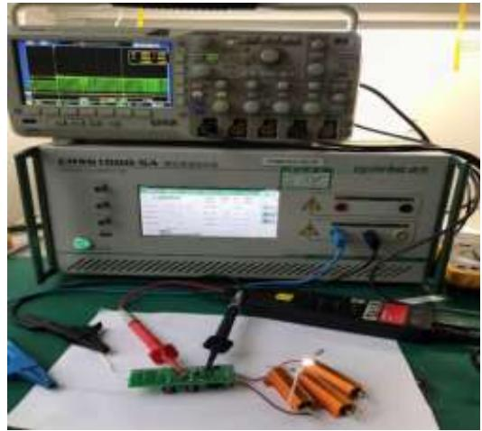

## EFT脉冲群测试

<table><tr><td>差模</td><td>电压</td><td>脉冲群持续时间</td><td>脉冲频率</td><td>测试时间</td><td>测试结果</td></tr><tr><td>L to N</td><td>+4kV</td><td>15ms</td><td>5kHz</td><td>120s</td><td>Pass</td></tr><tr><td>L to N</td><td>-4kV</td><td>15ms</td><td>5kHz</td><td>120s</td><td>Pass</td></tr><tr><td>L to N</td><td>+4kV</td><td>0.75ms</td><td>100kHz</td><td>120s</td><td>Pass</td></tr><tr><td>L to N</td><td>-4kV</td><td>0.75ms</td><td>100kHz</td><td>120s</td><td>Pass</td></tr><tr><td>L to N</td><td>+2kV</td><td>2ms</td><td>38kHz</td><td>120s</td><td>Pass</td></tr><tr><td>L to N</td><td>-2kV</td><td>2ms</td><td>38kHz</td><td>120s</td><td>Pass</td></tr><tr><td>L to N</td><td>+4kV</td><td>2ms</td><td>38kHz</td><td>120s</td><td>Pass</td></tr><tr><td>L to N</td><td>-4kV</td><td>2ms</td><td>38kHz</td><td>120s</td><td>Pass</td></tr></table>

## 测试说明

➢ 按照GB/T17626.4和IEC61000-4-4的最新版本要求进行测试  
➢ 室温环境，230VAC输入满载条件  
➢ 分别测试5kHz/100kHz/38kHz脉冲频率  
➢ 脉冲群周期为300ms  
➢ 每个测试条件测试时间120s  
➢ 试验时样机输出正常（符合A类标准）视为Pass

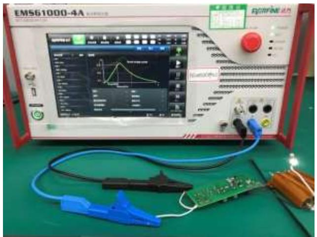

## ESD测试

<table><tr><td>测试</td><td>电压(V)</td><td>放电类型</td><td>放电次数</td><td>测试结果</td></tr><tr><td>Vo</td><td>+15kV</td><td>空气放电</td><td>10</td><td>PASS</td></tr><tr><td>Vo</td><td>-15kV</td><td>空气放电</td><td>10</td><td>PASS</td></tr><tr><td>GND</td><td>+15kV</td><td>空气放电</td><td>10</td><td>PASS</td></tr><tr><td>GND</td><td>-15kV</td><td>空气放电</td><td>10</td><td>PASS</td></tr><tr><td>Vo</td><td>+20kV</td><td>空气放电</td><td>10</td><td>PASS</td></tr><tr><td>Vo</td><td>-20kV</td><td>空气放电</td><td>10</td><td>PASS</td></tr><tr><td>GND</td><td>+20kV</td><td>空气放电</td><td>10</td><td>PASS</td></tr><tr><td>GND</td><td>-20kV</td><td>空气放电</td><td>10</td><td>PASS</td></tr></table>

## 测试说明

➢ 按照GB/T17626.2和IEC61000-4-2的最新版本要求进行测试  
➢ 室温环境，230VAC输入满载条件  
➢ 每个测试点重复10次  
➢ 分别对输出正端和地进行空气放电  
➢ 试验时样机输出正常（符合A类标准）视为Pass

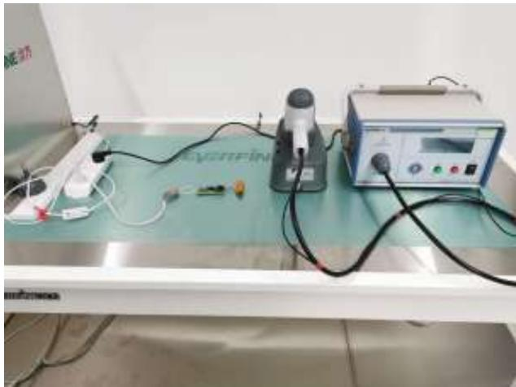

上海市浦东新区申江路5005弄星创科技广场3号楼9层

+86-21-51870166

hello@bpsemi.com

www.bpsemi.com

  
微信公众号

  
微信视频号
