# BPA86526PC \_85VAC-276VAC \_5V14W\_烤箱

邓文妤

时间：2025年9月

## 内容

BPA86526PC简介  
电源规格  
电路及实物图  
PCB Layout图  
变压器  
性能测试数据

## BPA86528PC简介

## 产品特点：

➢ 内部集成 800V 高压 MOSFET  
➢ 集成高压启动、内置软启动功能  
➢ 低待机功耗  
➢ 输入欠\过压保护  
输出短路保护、输出过压保护、输出过载保护、反馈开路保护、 逐周期限流、迟滞过温保护(OTP)

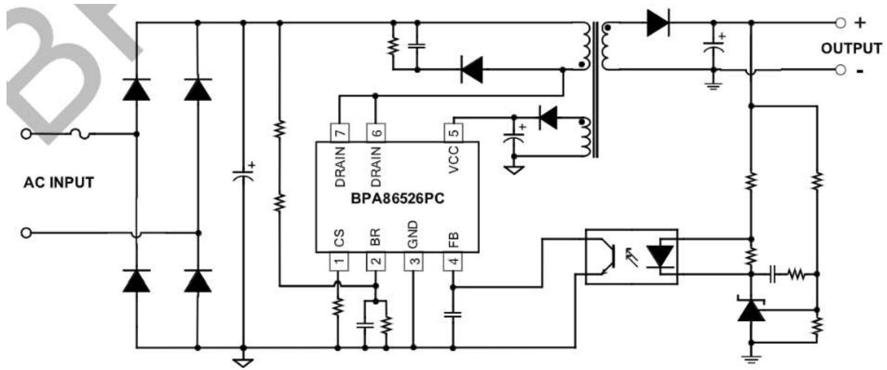

## 应用领域：

➢ 家用电器辅助电源  
➢ PC待机电源  
➢ 适配器、充电器  
➢ 通讯、工业控制辅助电源

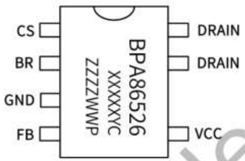

## 产品规格

输出功率推荐表

<table><tr><td colspan="5">输出功率表</td></tr><tr><td rowspan="2">型号</td><td colspan="2">230VAC ±15%</td><td colspan="2">85~265VAC</td></tr><tr><td>适配器(注 1)</td><td>开放式(注 2)</td><td>适配器(注 1)</td><td>开放式(注 2)</td></tr><tr><td>BPA86526PC</td><td>24W</td><td>32W</td><td>18W</td><td>24W</td></tr></table>

注1：最小连续输出功率，测试条件为封闭式塑料外壳，环境温度为50℃。  
注2：最小连续输出功率，测试条件为开放式环境，环境温度为50℃。

## 目标应用

家用电器辅助电源  
PC待机电源  
通讯、工业控制辅助电源  
适配器、充电器

<table><tr><td>项目描述</td><td>符号</td><td>最小</td><td>典型</td><td>最大</td><td>单位</td><td>备注</td></tr><tr><td colspan="7">输入</td></tr><tr><td>电压</td><td> $V_{IN}$ </td><td>85</td><td>230</td><td>276</td><td> $V_{AC}$ </td><td></td></tr><tr><td>频率</td><td> $f_{LINE}$ </td><td>47</td><td>50/60</td><td>67</td><td>Hz</td><td></td></tr><tr><td colspan="7">输出</td></tr><tr><td>输出电压1</td><td> $V_{OUT}$ </td><td></td><td>5</td><td></td><td>V</td><td>±5%</td></tr><tr><td>输出电流1</td><td> $I_{OUT}$ </td><td></td><td>2800</td><td></td><td>mA</td><td></td></tr><tr><td>输出电压1纹波</td><td> $V_{RIPPLE}$ </td><td></td><td>195</td><td></td><td>mV</td><td>20MHz带宽</td></tr><tr><td>连续输出功率</td><td> $P_{OUT}$ </td><td></td><td>14</td><td></td><td>W</td><td></td></tr><tr><td colspan="7">效率</td></tr><tr><td>待机功耗</td><td> $P_{STDBY}$ </td><td></td><td>89</td><td></td><td>mW</td><td>230VAC,包含假负载</td></tr><tr><td>满载效率</td><td>η</td><td></td><td>76</td><td></td><td>%</td><td>同步整流效率83.5%</td></tr><tr><td colspan="7">环境</td></tr><tr><td>传导EMI</td><td></td><td colspan="4">满足CISPR22/EN55022 Class B,至少6dB 裕量</td><td></td></tr><tr><td>Surge</td><td></td><td></td><td>2</td><td></td><td>kV</td><td>差模</td></tr><tr><td>EFT</td><td></td><td></td><td>4</td><td></td><td>kV</td><td>5kHz/100kHz/38kHz</td></tr><tr><td>ESD</td><td></td><td></td><td>20</td><td></td><td>kV</td><td>空气放电</td></tr><tr><td>工作环境温度</td><td> $T_{AMP}$ </td><td></td><td></td><td></td><td>°C</td><td></td></tr></table>

## 1.原理图

共模电感改为20mH  
C15改为2.2uF

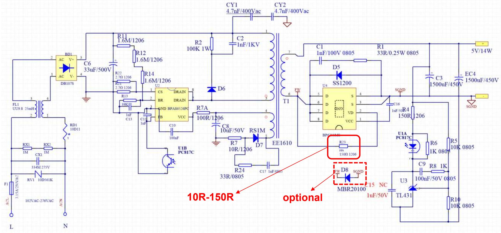

<table><tr><td>序号</td><td>元件标号</td><td>参数</td><td>描述</td><td>封装</td><td>数量</td></tr><tr><td>1</td><td>PCB</td><td>CEM-1</td><td>单面板</td><td>113*47mm</td><td>1</td></tr><tr><td>2</td><td>BD1</td><td>DB107S</td><td>整流桥</td><td>DB(DB107G)</td><td>1</td></tr><tr><td>3</td><td>C1</td><td>470pF/100V</td><td>贴片电容</td><td>SMD0805</td><td>1</td></tr><tr><td>4</td><td>C2</td><td>1nF/1KV</td><td>贴片电容</td><td>SMD1206</td><td>1</td></tr><tr><td>5</td><td>C3, EC4</td><td>1500uF/16V</td><td>电解电容</td><td>10*21mm</td><td>2</td></tr><tr><td>6</td><td>C6</td><td>33uF/450V</td><td>电解电容</td><td>18*21mm</td><td>1</td></tr><tr><td>7</td><td>C8</td><td>10uF/50V</td><td>电解电容</td><td>5*12mm</td><td>1</td></tr><tr><td>8</td><td>C9</td><td>100nF/50V</td><td>贴片电容</td><td>SMD0805</td><td>1</td></tr><tr><td>9</td><td>C10</td><td>100nF</td><td>贴片电容</td><td>SMD0805</td><td>1</td></tr><tr><td>10</td><td>C13</td><td>1nF/50V</td><td>贴片电容</td><td>SMD0805</td><td>1</td></tr><tr><td>11</td><td>C15NC</td><td>1uF/50V</td><td>贴片电容</td><td>SMD0805</td><td>1</td></tr><tr><td>13</td><td>C16</td><td>1uF/50V</td><td>贴片电容</td><td>SMD0805</td><td>1</td></tr><tr><td>14</td><td>C17</td><td>1nF/50V</td><td>贴片电容</td><td>SMD0805</td><td>1</td></tr><tr><td>15</td><td>CX1</td><td>224M/275V</td><td>X电容</td><td>14*7mm</td><td>1</td></tr><tr><td>16</td><td>CY1, CY2</td><td>2.2nF/400Vac</td><td>Y电容</td><td>12.5mm</td><td>2</td></tr><tr><td>16</td><td>D5</td><td>SS1200</td><td>贴片二极管</td><td>Sma</td><td>1</td></tr><tr><td>17</td><td>D6</td><td>FR107</td><td>插件二极管</td><td>DIP</td><td>1</td></tr><tr><td>18</td><td>D7</td><td>RS1M</td><td>贴片二极管</td><td>Sma</td><td>1</td></tr><tr><td>19</td><td>D8</td><td>MBR20100</td><td>二极管</td><td>TO220-散热器</td><td>1</td></tr><tr><td>20</td><td>F1</td><td>3.15A/250VAC</td><td>保险丝</td><td>8.5*4*8.5mm</td><td>1</td></tr><tr><td>21</td><td>FL1</td><td>UU9.8/25mH</td><td>电感</td><td>UU9.8</td><td>1</td></tr><tr><td>22</td><td>R1</td><td>33R</td><td>贴片电阻</td><td>1206-R</td><td>1</td></tr><tr><td>23</td><td>R2</td><td>100K 1W</td><td>插件电阻</td><td>DIP</td><td>1</td></tr></table>

<table><tr><td>24</td><td>R4</td><td>150R</td><td>贴片电阻</td><td>SMD0805</td><td>1</td></tr><tr><td>25</td><td>R5, R10</td><td>10K</td><td>贴片电阻</td><td>SMD0805</td><td>2</td></tr><tr><td>26</td><td>R6</td><td>1K</td><td>贴片电阻</td><td>SMD0805</td><td>1</td></tr><tr><td>27</td><td>R7</td><td>10R</td><td>贴片电阻</td><td>SMD1206</td><td>1</td></tr><tr><td>28</td><td>R7A</td><td>100R</td><td>贴片电阻</td><td>SMD0805</td><td>1</td></tr><tr><td>29</td><td>R8</td><td>1K</td><td>贴片电阻</td><td>SMD0805</td><td>1</td></tr><tr><td>30</td><td>R11, R14</td><td>1.6M</td><td>贴片电阻</td><td>SMD1206</td><td>2</td></tr><tr><td>31</td><td>R12</td><td>1.6M</td><td>贴片电阻</td><td>SMD1206</td><td>1</td></tr><tr><td>32</td><td>R13</td><td>39K</td><td>贴片电阻</td><td>SMD1206</td><td>1</td></tr><tr><td>33</td><td>R21, R22</td><td>2.7Ω</td><td>贴片电阻</td><td>SMD1206</td><td>2</td></tr><tr><td>34</td><td>R23</td><td>150Ω</td><td>贴片电阻</td><td>SMD0805</td><td>1</td></tr><tr><td>35</td><td>R24</td><td>33Ω</td><td>贴片电阻</td><td>SMD0805</td><td>1</td></tr><tr><td>36</td><td>RD1</td><td>10D11</td><td>NTC</td><td>DIP</td><td>1</td></tr><tr><td>37</td><td>RV1</td><td>10D561K</td><td>压敏电阻</td><td>DIP</td><td>1</td></tr><tr><td>38</td><td>RX1, RX2</td><td>1M</td><td>贴片电阻</td><td>SMD1206</td><td>2</td></tr><tr><td>39</td><td>T1</td><td>T1</td><td>变压器</td><td>EE1610骨架</td><td>1</td></tr><tr><td>40</td><td>U1</td><td>PC817C</td><td>光耦</td><td>DIP4-光耦</td><td>1</td></tr><tr><td>41</td><td>U2</td><td>BPA86526PC</td><td>芯片</td><td>DIP8-1</td><td>1</td></tr><tr><td>42</td><td>U3</td><td>TL431</td><td>稳压器</td><td>SOT-23</td><td>1</td></tr><tr><td>43</td><td>U4</td><td>BP6211MS</td><td>芯片</td><td>SOP-8</td><td>1</td></tr><tr><td>44</td><td>C11</td><td>1nF</td><td>贴片电容</td><td>SMD0805</td><td>1</td></tr><tr><td colspan="5">总计</td><td>50</td></tr></table>

## 原理图

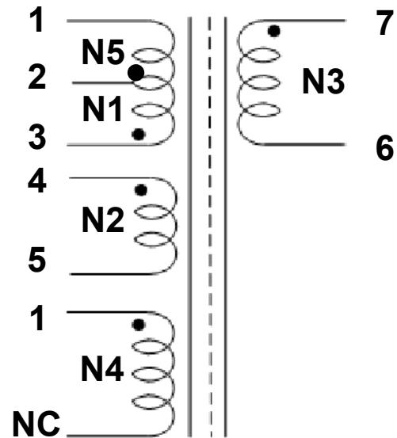

## 绕线方式

<table><tr><td>绕组</td><td>起始脚</td><td>终止脚</td><td>材料</td><td>匝数</td><td>绕线方式</td></tr><tr><td> $N^1$ </td><td>3</td><td>2</td><td> $\phi 0.25*1P$ </td><td> $31_{TS}$ </td><td>密绕一层(PI N脚朝外)</td></tr><tr><td colspan="4">胶带</td><td> $2_{TS}$ </td><td></td></tr><tr><td> $N^2$ </td><td>4</td><td>5</td><td> $\phi 0.25*2P$ </td><td> $14_{TS}$ </td><td>密绕一层(PI N脚朝外)</td></tr><tr><td colspan="4">胶带</td><td> $2_{TS}$ </td><td></td></tr><tr><td> $N^3$ </td><td>7</td><td>6</td><td>三层绝缘线 $\phi 0.7*2P$ </td><td> $4_{TS}$ </td><td>密绕一层(PI N脚朝外)</td></tr><tr><td colspan="4">胶带</td><td> $3_{TS}$ </td><td></td></tr><tr><td> $N^4$ </td><td>1</td><td>NC</td><td> $\phi 0.25*2P$ </td><td> $8_{TS}$ </td><td>匀绕一层(PI N脚朝外)</td></tr><tr><td colspan="4">胶带</td><td> $2_{TS}$ </td><td></td></tr><tr><td> $N^5$ </td><td>2</td><td>1</td><td> $\phi 0.25*1P$ </td><td> $31_{TS}$ </td><td>密绕一层(PI N脚朝外)</td></tr><tr><td colspan="4">胶带</td><td> $3_{TS}$ </td><td></td></tr></table>

## 规格与材料

➢ 初级绕组感量 $\mathsf { L } _ { \mathsf { p } } { = } 7 6 0 \mathsf { u H } \pm 7 \%$ （测试条件： 0.3V，100kHz）  
➢ 漏感量 $L _ { \mathsf { I k } } { < } 2 0 \mathsf { u H }$  
➢ 骨架：EE1610骨架加宽 $( 5 + 2 \mathsf { P } | \mathsf { N } )$  
➢ 磁芯：EE1710 PC40 或同等材质 ， $\mathsf { A e } { = } 4 0 \mathsf { m m } ^ { 2 }$ ， $\mathsf { B w = 9 m m }$  
➢ N1、N2、N4: 2UEW 漆包线  
➢ N3: 三层绝缘线  
➢ 绝缘胶带:3M900 或同等材质  
➢ 耐压测试: 3KV, 50/60Hz, 1Min  
➢ 成品要求：浸凡立水

## 脚位图

## 3-2.变压器Bmax计算：PQ2620

BPA86526PC方案变压器：  
◼ $L = 7 6 0 u H \pm 7 \%$ ，实测 $| _ { \mathrm { l i m t } } = 0 . 8 2 \mathsf { A }$  
$N P { = } G 2 \top$ ， 实测 $\mathsf { A E } { = } 4 0 \mathsf { m } \mathsf { m } ^ { 2 }$  
Bmax=0.269T

## TOP

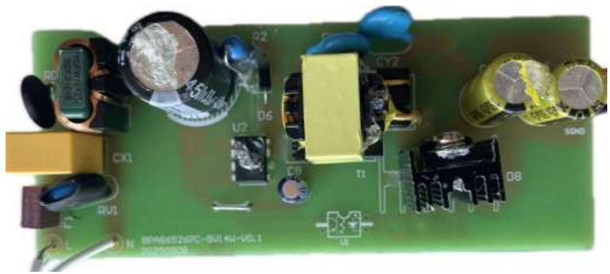

## Bottom

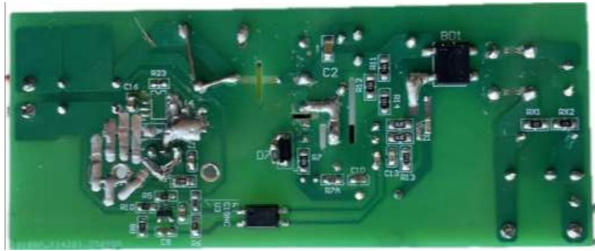

## TOP

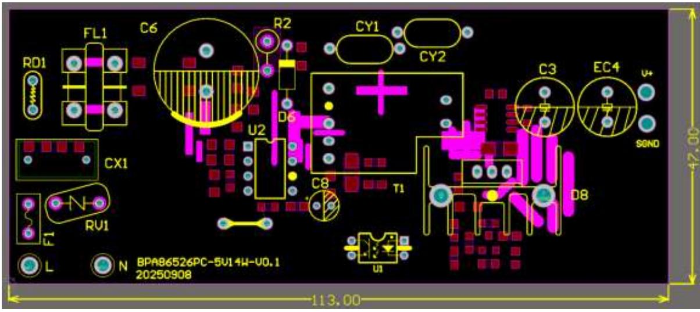

## Bottom

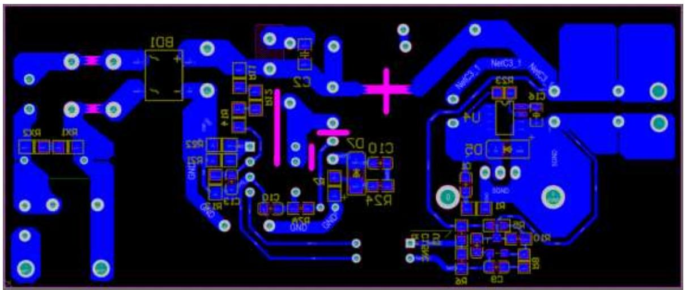

待机功耗  
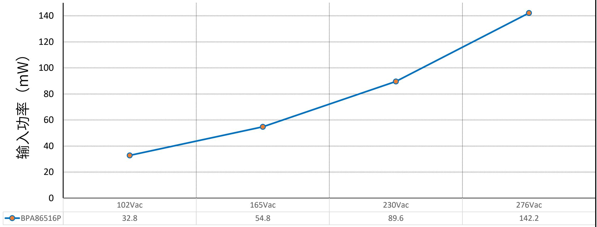

输入电压

<table><tr><td>输入电压</td><td>输出电压(V)</td><td>输出电流(A)</td><td>输入功率(W)</td><td>效率(%)</td></tr><tr><td>85VAC</td><td>4.99</td><td>2.8</td><td>18.31</td><td>76.0</td></tr><tr><td>230VAC</td><td>4.99</td><td>2.8</td><td>18.38</td><td>76.0</td></tr><tr><td>276VAC</td><td>4.99</td><td>2.8</td><td>18.54</td><td>75.4</td></tr></table>

<table><tr><td>输入电压</td><td>输出电压(V)</td><td>输出电流(A)</td><td>输出功率(W)</td></tr><tr><td rowspan="2">102VAC</td><td>4.84</td><td>3.9</td><td>25.99</td></tr><tr><td>OLP</td><td>4.0</td><td></td></tr><tr><td rowspan="2">230VAC</td><td>4.85</td><td>4.1</td><td>26.81</td></tr><tr><td>OLP</td><td>4.2</td><td></td></tr><tr><td rowspan="2">265VAC</td><td>4.85</td><td>4.2</td><td>27.66</td></tr><tr><td>OLP</td><td>4.3</td><td></td></tr></table>

## 7. 输出电压纹波-空载

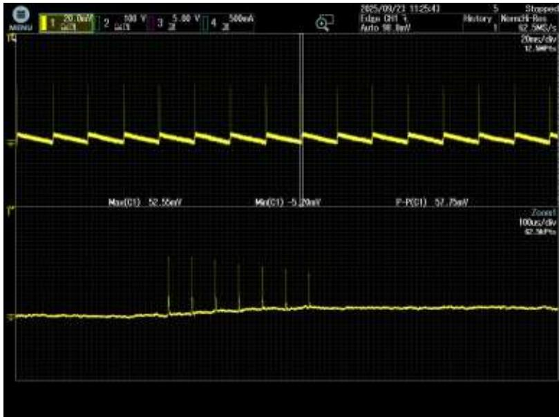

85Vac  
CH1 VOUT\_24 Ripple  
VPK-PK\_24=58mV  
测试条件：  
➢ No Load

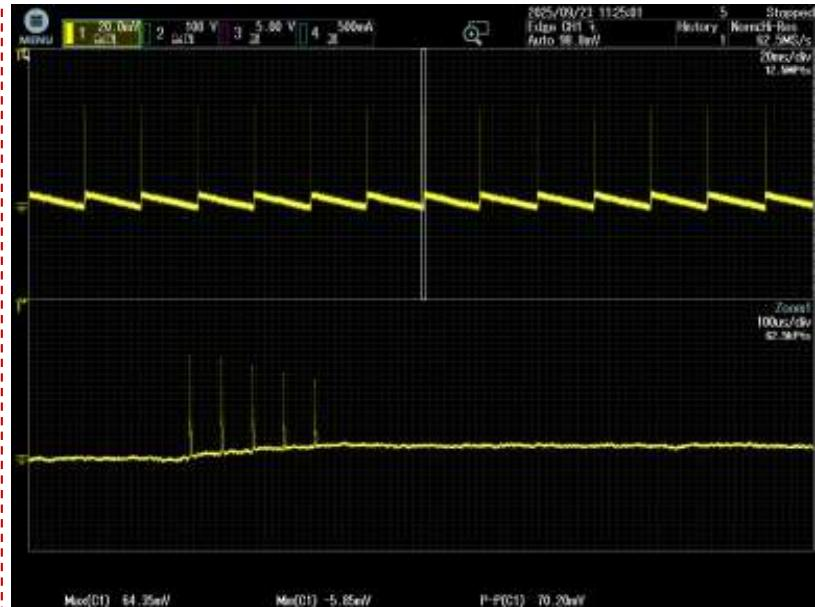

165Vac  
CH1 VOUT\_24 Ripple  
VPK-PK\_24=71mV  
测试条件：  
➢ No Load

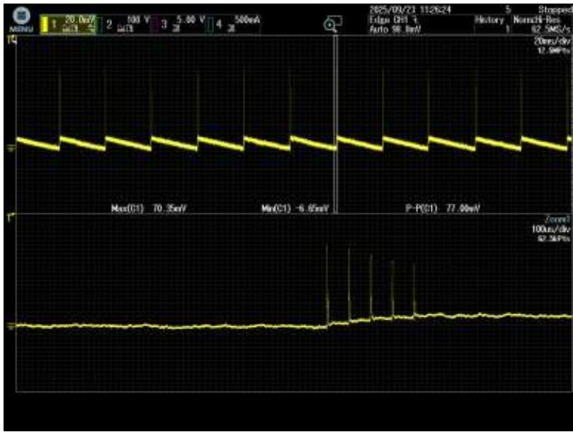

230Vac  
CH1 VOUT\_24 Ripple  
VPK-PK\_24=77mV  
测试条件：  
➢ No Load

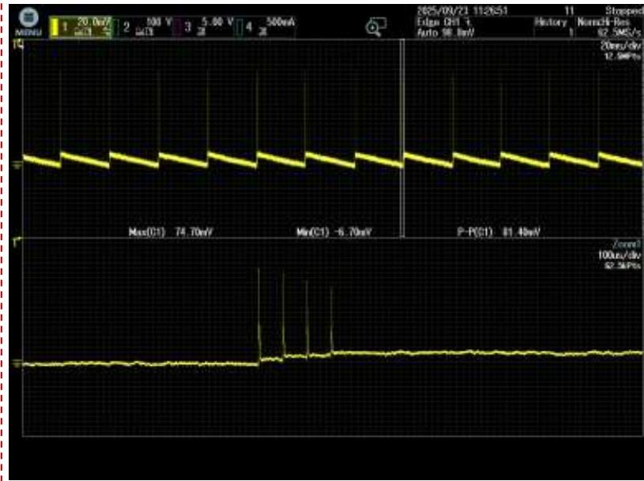

276Vac  
CH1 VOUT\_24 Ripple  
VPK-PK\_24=82mV  
测试条件：  
➢ No Load

## 7. 输出电压纹波-满载

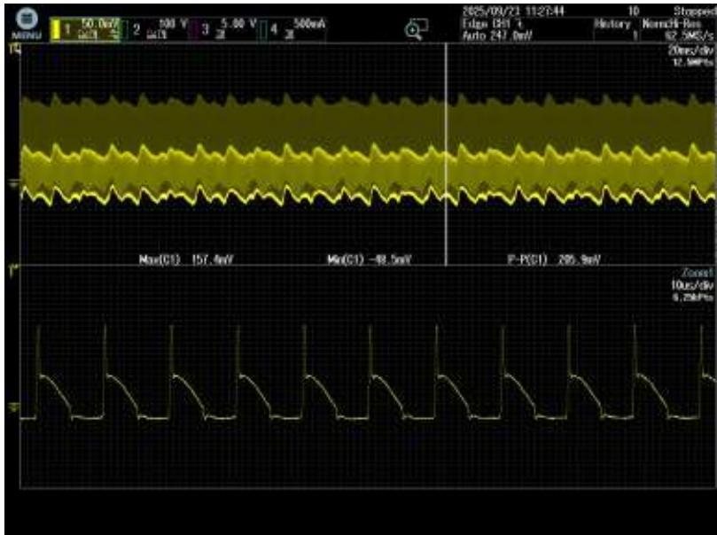

## 85Vac

CH1 VOUT\_24 Ripple  
$V _ { \mathsf { P K - P K \_ 2 4 } } { = } 2 0 6 \mathsf { m v }$  
测试条件：  
➢ Full Load

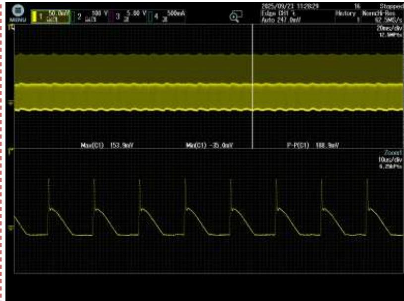

## 165Vac

CH1 $\mathsf { V } _ { \mathsf { O U T } \_ 2 4 }$ Ripple  
$V _ { \mathsf { P K - P K \_ 2 4 } } { = } 1 8 9 \mathsf { m V }$  
测试条件：  
➢ Full Load

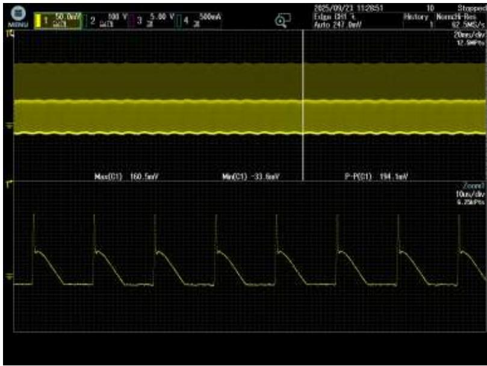

## 230Vac

CH1 $\mathsf { V } _ { \mathsf { O U T } \_ 2 4 }$ Ripple  
$V _ { \mathsf { P K - P K \_ 2 4 } } { = } 1 9 5 \mathsf { m V }$  
测试条件：  
➢ Full Load

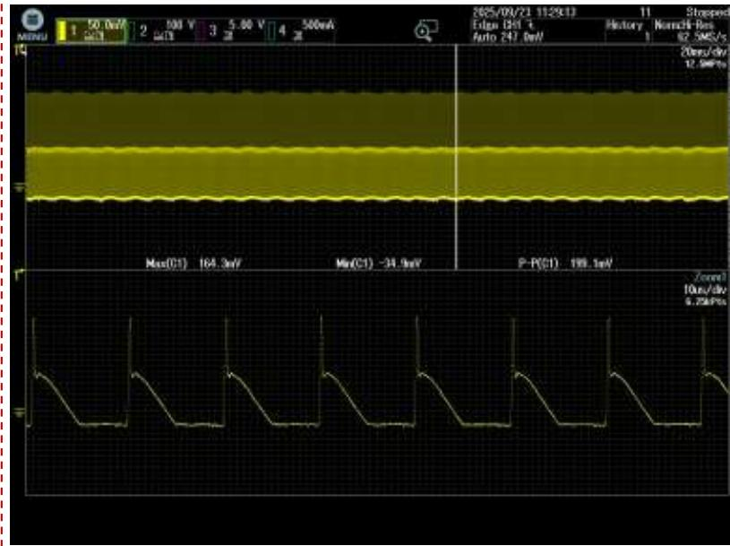

## 276Vac

CH1 $\mathsf { V } _ { \mathsf { O U T } \_ 2 4 }$ Ripple  
$V _ { \mathsf { P K - P K \_ 2 4 } } { = } 1 9 9 \mathsf { m V }$  
测试条件：  
➢ Full Load

## 8. 50%-100%动态负载输出电压纹波

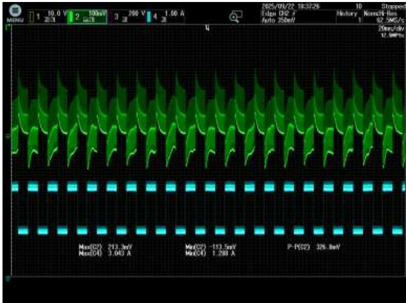

## 85Vac

$\mathsf { C H } 2 \mathsf { V } _ { \mathsf { O U T } } \mathsf { R i p p l e }$ $\mathsf { V } _ { \mathsf { P K - P K } } { = } 3 2 7 \mathsf { m V }$  
$\mathsf { C H 4 } \mathsf { I } _ { \mathsf { O U T } }$ CH4 IOUT  
测试条件：

➢ $\mathsf { V } \colon 1 . 4 \mathsf { A } - 2 . 8 \mathsf { A } - 1 . 4 \mathsf { A }$  
➢ $\mathsf { S l e w R a t e } \colon 0 . 5 \mathsf { A } / \mu \mathsf { S }$  
➢ Frequency: 100 Hz

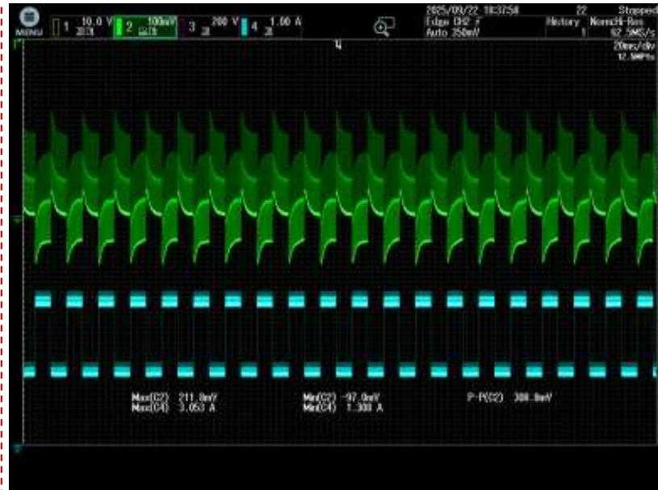

## 165Vac

$\mathsf { C H } 2 \mathsf { V } _ { \mathsf { O U T } } \mathsf { R i p p l e }$ $\mathsf { V } _ { \mathsf { P K - P K } } { = } 3 0 9 \mathsf { m V }$  
$\mathsf { C H 4 } \mathsf { I } _ { \mathsf { O U T } }$  
测试条件：

➢ $\mathsf { V } \colon 1 . 4 \mathsf { A } - 2 . 8 \mathsf { A } - 1 . 4 \mathsf { A }$  
➢ $\mathsf { S l e w R a t e } \colon 0 . 5 \mathsf { A } / \mu \mathsf { S }$  
➢ Frequency: 100 Hz

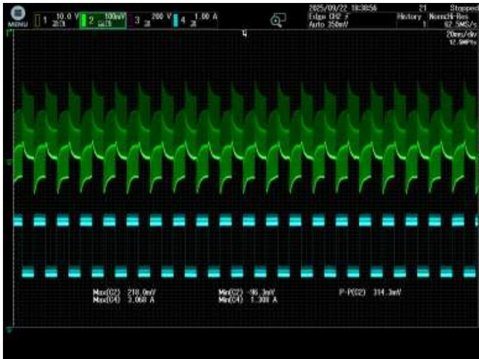

## 230Va

$\mathsf { C H } 2 \mathsf { V } _ { \mathsf { O U T } } \mathsf { R i p p l e }$ $\mathsf { V } _ { \mathsf { P K - P K } } { = } 3 1 5 \mathsf { m V }$  
CH4 IOUT $\mathsf { C H 4 } \mathsf { I } _ { \mathsf { O U T } }$  
测试条件：

➢ $\mathsf { V } \colon 1 . 4 \mathsf { A } - 2 . 8 \mathsf { A } - 1 . 4 \mathsf { A }$  
➢ $\mathsf { S l e w R a t e } \colon 0 . 5 \mathsf { A } / \mu \mathsf { S }$  
➢ $\mathsf { F r e q u e n c y : } 1 0 0 \mathsf { H z }$

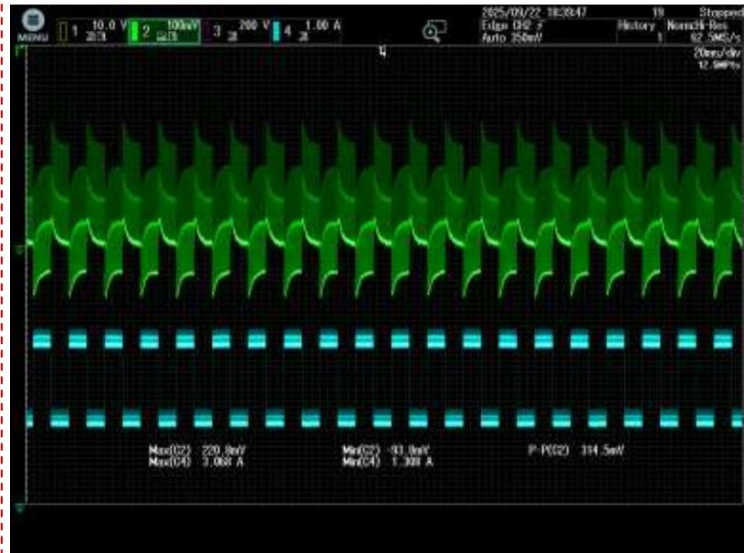

## 276Va

$\mathsf { C H } 2 \mathsf { V } _ { \mathsf { O U T } } \mathsf { R i p p l e }$ $\mathsf { V } _ { \mathsf { P K - P K } } { = } 3 1 5 \mathsf { m V }$  
$\mathsf { C H 4 } \mathsf { I } _ { \mathsf { O U T } }$  
测试条件：

➢ $\mathsf { V } \colon 1 . 4 \mathsf { A } - 2 . 8 \mathsf { A } - 1 . 4 \mathsf { A }$  
➢ $\mathsf { S l e w R a t e } \colon 0 . 5 \mathsf { A } / \mu \mathsf { S }$  
➢ Frequency: 100 Hz

## 8. 10%-90%动态负载输出电压纹波

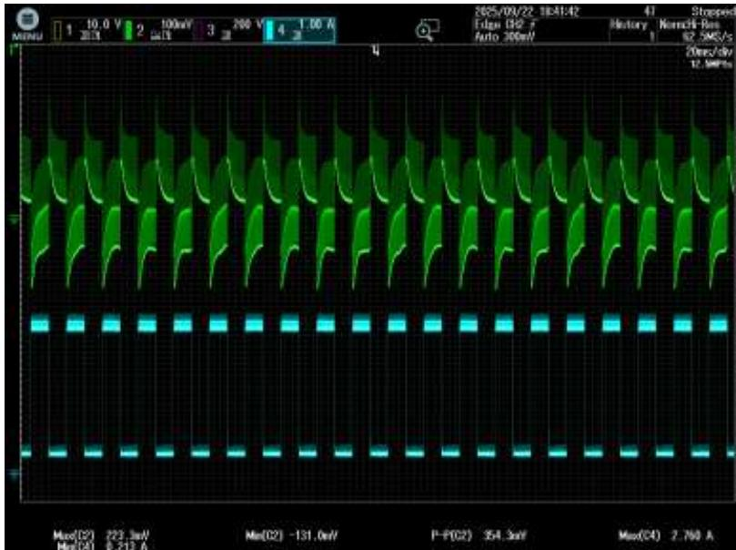

## 85Vac

$\mathsf { C H } 2 \mathsf { V } _ { \mathsf { O U T } } \mathsf { R i p p l e }$ $\mathsf { V } _ { \mathsf { P K - P K } } { = } 3 5 5 \mathsf { m V }$  
CH4 IOUT $\mathsf { C H 4 } \mathsf { I } _ { \mathsf { O U T } }$  
测试条件：  
➢ $\mathsf { V } \colon 0 . 2 8 \mathsf { A } - 2 . 5 2 \mathsf { A } -$ 0.28A  
➢ $\mathsf { S l e w R a t e } \colon 0 . 5 \mathsf { A } / \mu \mathsf { S }$  
➢ Frequency: 100 Hz

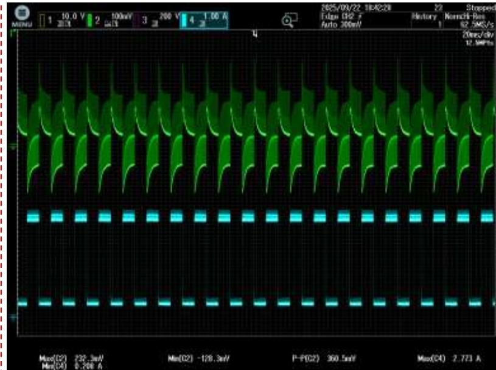

## 165Vac

$\mathsf { C H } 2 \mathsf { V } _ { \mathsf { O U T } } \mathsf { R i p p l e }$ $\mathsf { V } _ { \mathsf { P K - P K } } { = } 3 6 1 \mathsf { m V }$  
CH4 IOUT $\mathsf { C H 4 } \mathsf { I } _ { \mathsf { O U T } }$  
测试条件：  
➢ $\mathsf { V } : 0 . 2 8 \mathsf { A } - 2 . 5 2 \mathsf { A } -$ 0.28A  
➢ $\mathsf { S l e w R a t e } \colon 0 . 5 \mathsf { A } / \mu \mathsf { S }$  
➢ Frequency: 100 Hz

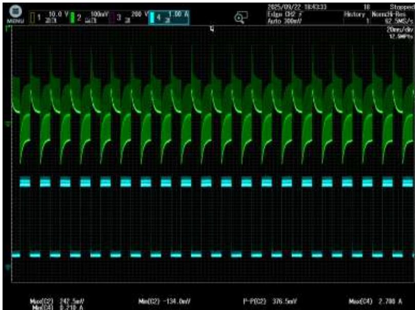

## 230Va

$\mathsf { C H } 2 \mathsf { V } _ { \mathsf { O U T } } \mathsf { R i p p l e }$ $\mathsf { V } _ { \mathsf { P K - P K } } { = } 3 7 7 \mathsf { m V }$  
CH4 IOUT $\mathsf { C H 4 } \mathsf { I } _ { \mathsf { O U T } }$  
测试条件：  
➢ $\mathsf { V } : 0 . 2 8 \mathsf { A } - 2 . 5 2 \mathsf { A } -$ 0.28A  
➢ $\mathsf { S l e w R a t e } \colon 0 . 5 \mathsf { A } / \mu \mathsf { S }$  
➢ Frequency: 100 Hz

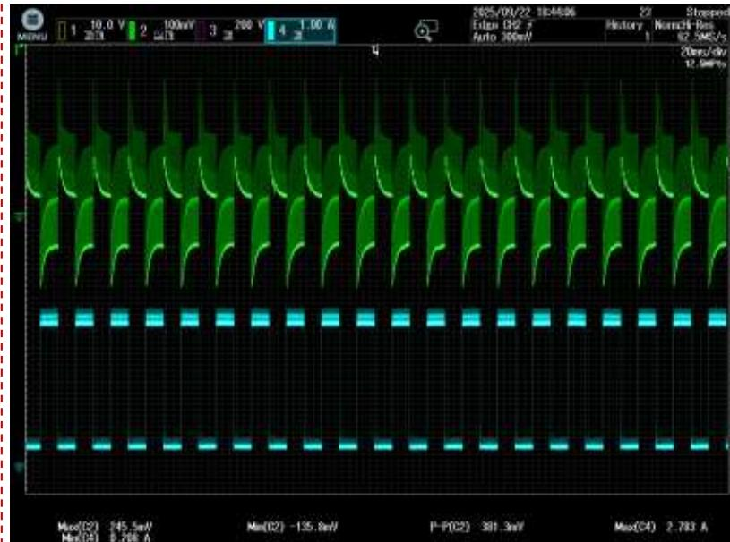

## $2 7 6 \mathtt { V a }$

$\mathsf { C H } 2 \mathsf { V } _ { \mathsf { O U T } } \mathsf { R i p p l e }$ $\mathsf { V } _ { \mathsf { P K - P K } } { = } 3 8 1 \mathsf { m V }$  
$\mathsf { C H 4 } \mathsf { I } _ { \mathsf { O U T } }$  
测试条件：  
➢ $\mathsf { V } : 0 . 2 8 \mathsf { A } - 2 . 5 2 \mathsf { A } -$ 0.28A  
➢ $\mathsf { S l e w R a t e } \colon 0 . 5 \mathsf { A } / \mu \mathsf { S }$  
➢ Frequency: 100 Hz

## 9.1输出电压开机波形

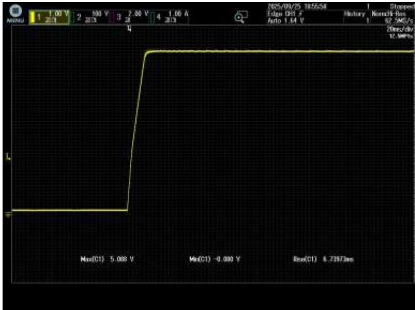

102Vac  
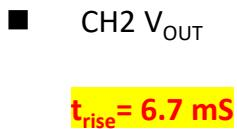

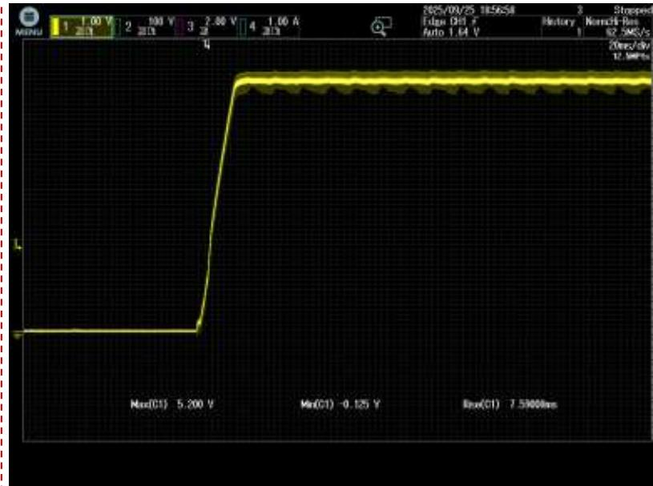

102Vac  
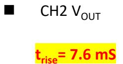

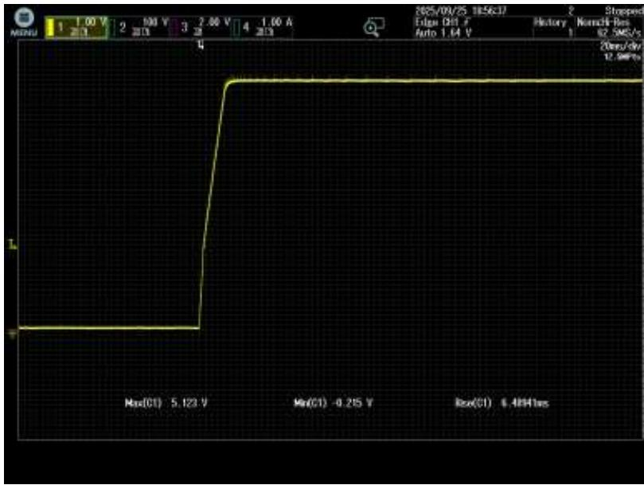

276Vac  
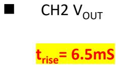

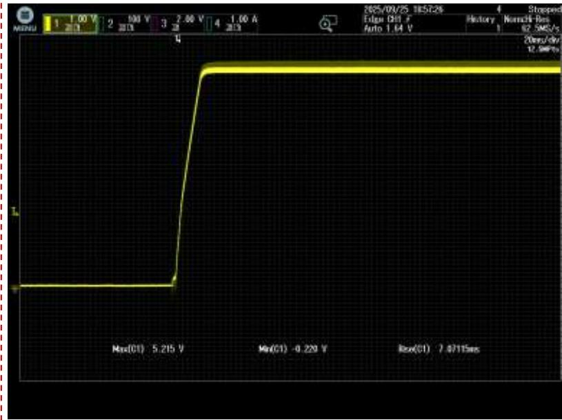

276Vac  
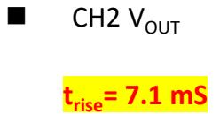

## 10. 1VCC电压开机波形

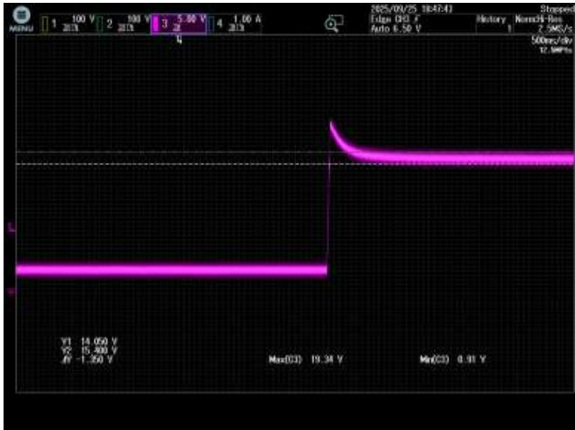

85Vac  
CH3 VCC $\mathsf { C H 3 } \mathsf { V } _ { \mathsf { C C } }$ $\mathsf { V } _ { \mathsf { C C } \_ \mathsf { M I N } } = 1 5 . 4 \mathsf { V }$ $\mathsf { V } _ { \mathsf { C C } \_ \mathsf { M A X } } = 1 4 \mathsf { V }$  
➢ No Load

Test Condition:

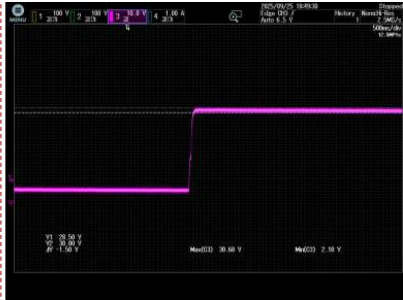

85Vac  
CH1 $\mathsf { V } _ { \mathsf { C C } }$ $\mathsf { V } _ { \mathsf { C C } \_ \mathsf { M I N } } = 3 0 \mathsf { V }$ $\mathsf { V } _ { \mathsf { C C } \_ \mathsf { M A X } } = 2 8 . 5 \mathsf { V }$  
➢ Full Load

Test Condition:

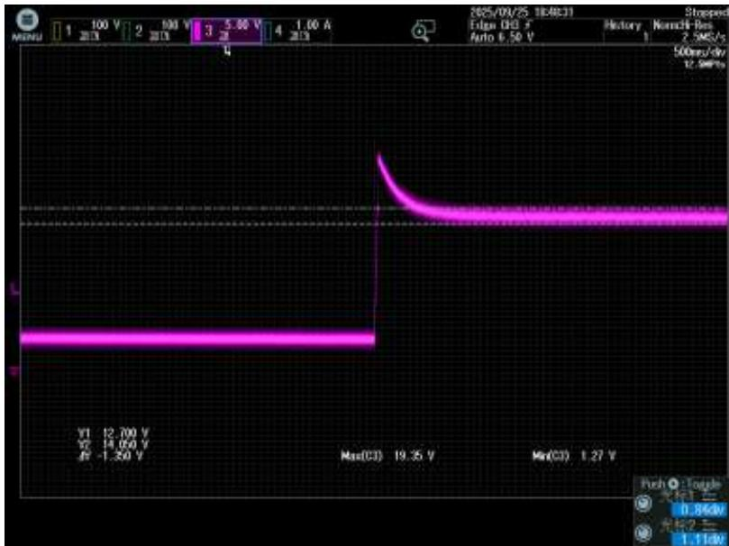

276Vac  
CH1 $\mathsf { V } _ { \mathsf { C C } }$ $\mathsf { V } _ { \mathsf { C C } \_ \mathsf { M I N } } = 1 4 \mathsf { V }$ $\mathsf { V } _ { \mathsf { C C } \_ \mathsf { M A X } } = 1 2 . 7 \mathsf { V }$  
➢ No Load

Test Condition:

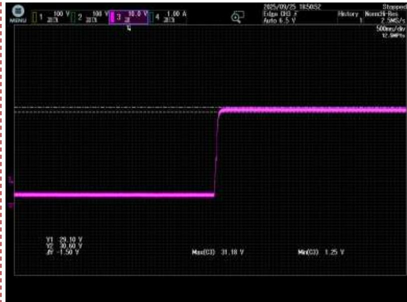

276Vac  
CH1 VCC $\mathsf { V } _ { \mathsf { C C } }$ $\mathsf { V } _ { \mathsf { C C } \_ \mathsf { M I N } } = 2 9 . 1 \mathsf { V }$ $\mathsf { V } _ { \mathsf { C C } \_ \mathsf { M A X } } = 3 0 . 6 \mathsf { V }$  
➢ Full Load

Test Condition:

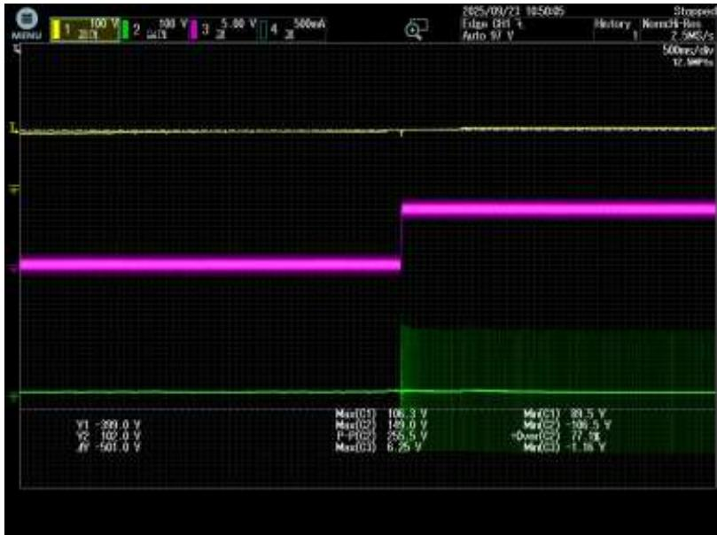

## BROWN-IN

CH1 VINDC  
CH2 VDS  
CH3 VOUT  
VBROWN\_IN=102V  
Test Condition:  
No Load

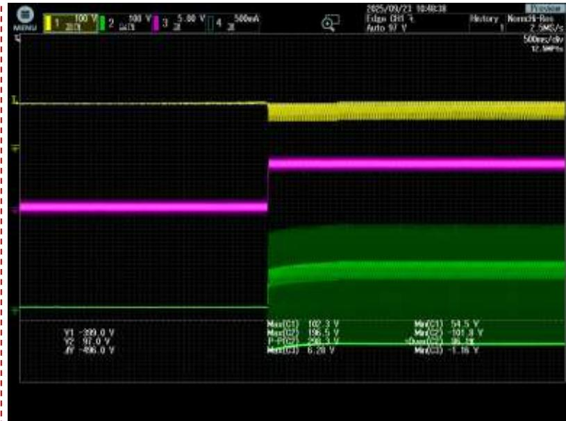

## BROWN-IN

CH1 VINDC  
CH2 VDS  
CH3 VOUT  
➢ VBROWN\_IN=97V  
Test Condition:  
➢ Full Load

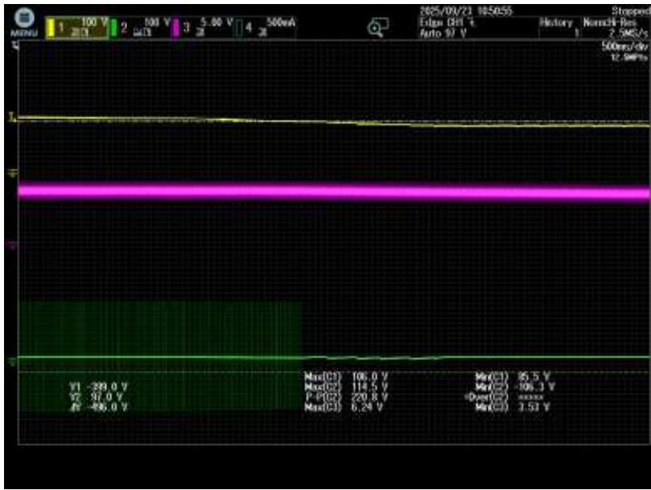

## BROWN-OUT

CH1 VINDC  
CH2 VDS  
CH3 VOUT  
➢ VBROWN\_OUT=97V  
Test Condition:  
➢ No Load

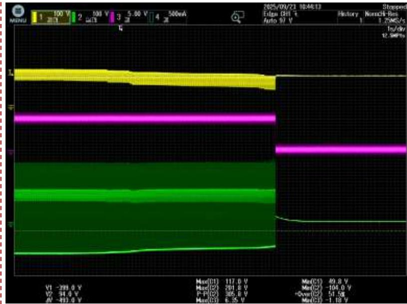

## BROWN-OUT

CH1 VINDC  
CH2 VDS  
CH3 VOUT  
➢ VBROWN\_OUT=94V  
Test Condition:  
➢ Full Load

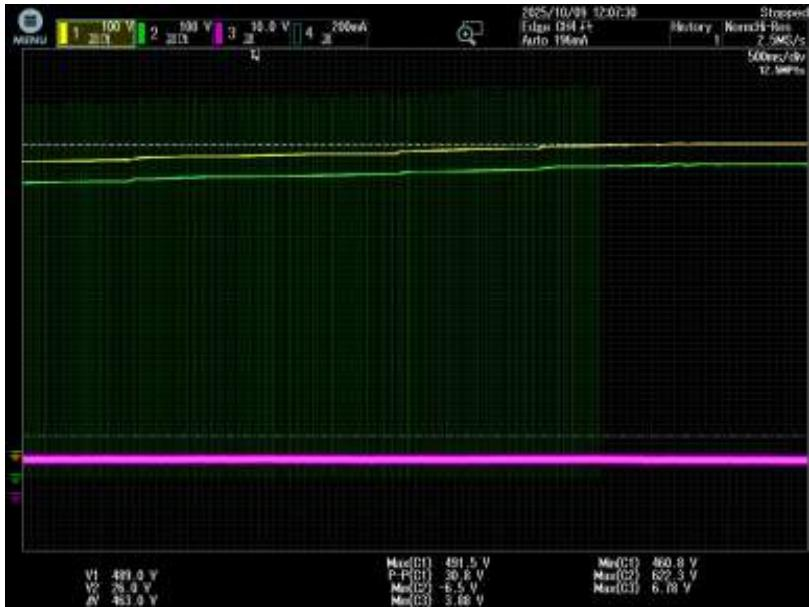

## 输入OVP

CH1 VINDC  
CH2 VDS  
CH3 VOUT  
VDC\_MAX=489V  
Test Condition:  
No Load

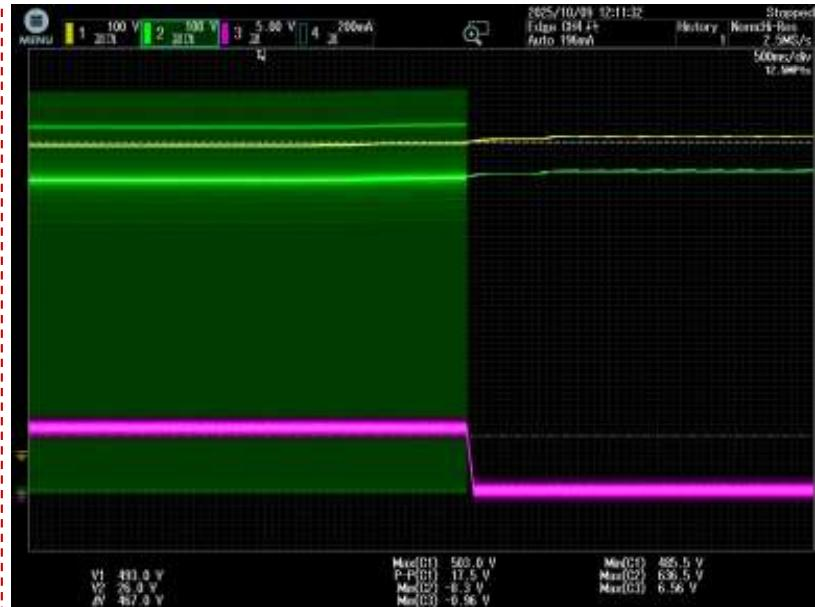

## 输入OVP

CH1 VINDC  
CH2 VDS  
CH3 VOUT  
➢ VDC\_MAX=493V  
Test Condition:  
➢ Full Load

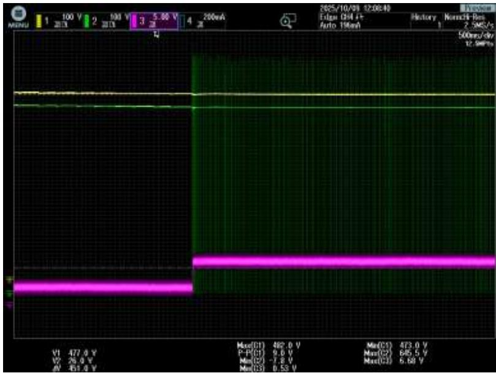

## 退出输入OVP

CH1 VINDC  
CH2 VDS  
CH3 VOUT  
➢ VDC\_MAX=477V  
Test Condition:  
➢ No Load

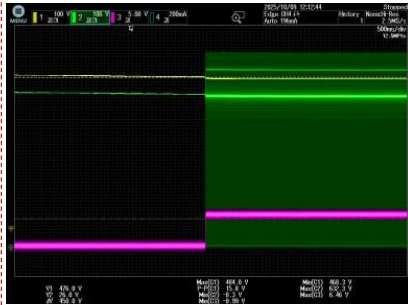

## 退出输入OVP

CH1 VINDC  
CH2 VDS  
CH3 VOUT  
➢ VDC\_MAX=476V  
Test Condition:  
➢ Full Load

## 11-1.输出启动开机MOS电压电流-空载

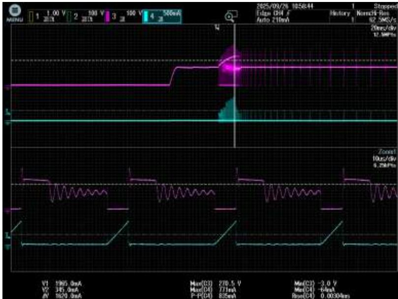

85Vac

CH3 VDS  
CH4 IDS  
VDS\_MAX=270V I =0.77A  
测试条件：  
➢ No Load

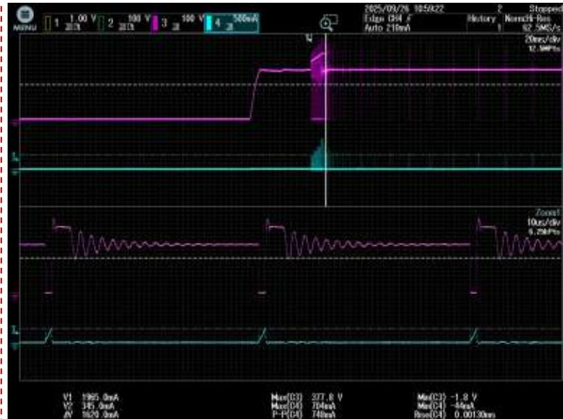

165Vac

CH3 VDS  
CH4 IDS  
VDS\_MAX=377V IDS\_MAX =0.7A  
测试条件：  
➢ No Load

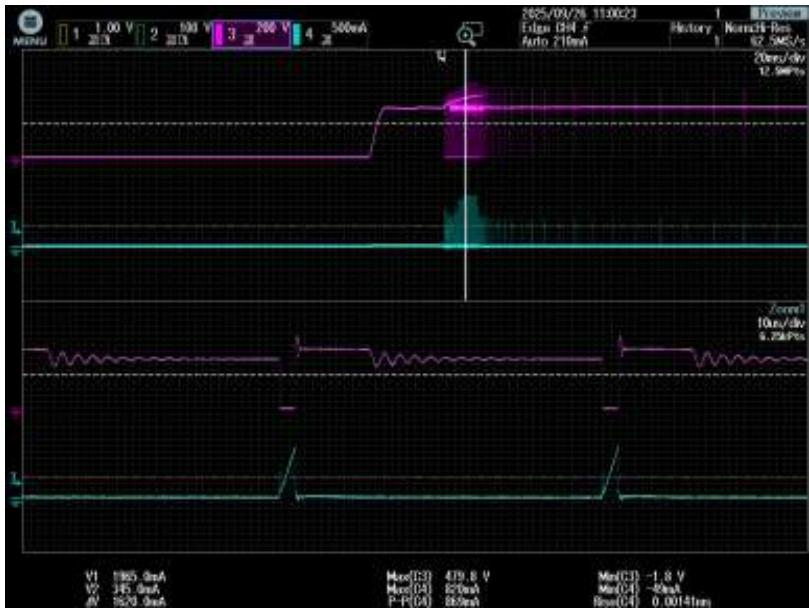

230Vac

CH3 VDS  
CH4 IDS  
VDS\_MAX=479V I \_ =0.82A  
测试条件：  
➢ No Load

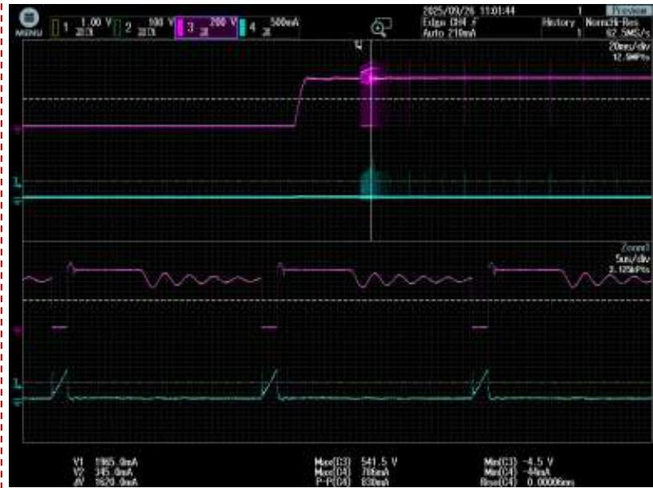

276Vac

CH3 VDS  
CH4 IDS  
VDS\_MAX=541V I \_ =0.79A  
测试条件：  
➢ No Load

## 11-1.输出启动开机MOS电压电流-满载

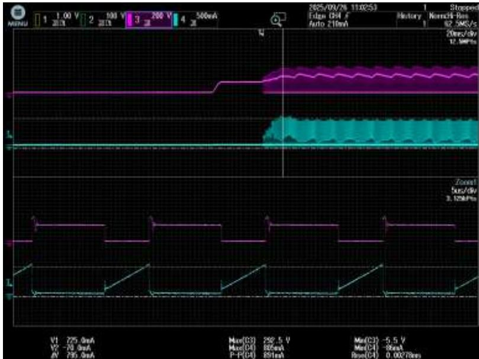

85Vac

CH3 VDS  
CH4 IDS  
VDS\_MAX=292V IDS\_MAX =0.8A  
测试条件：  
➢ Full Load

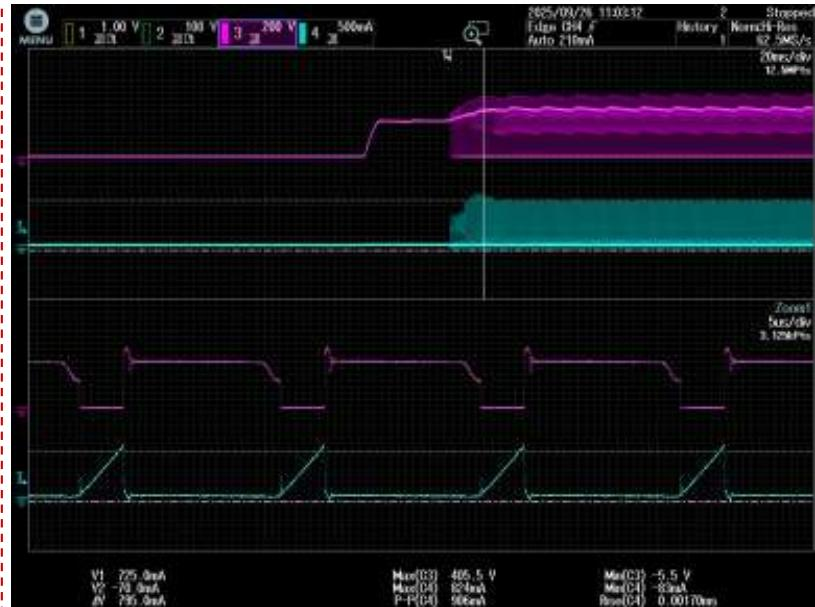

165Vac

CH3 VDS  
CH4 IDS  
VDS\_MAX=405V IDS\_MAX =0.82A  
测试条件：  
➢ Full Load

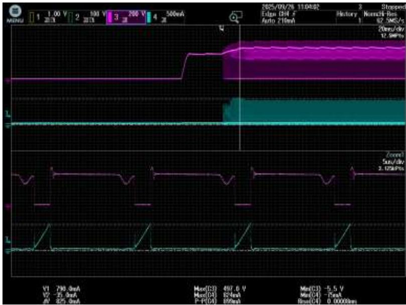

230Vac

CH3 VDS  
CH4 IDS  
VDS\_MAX=497V I \_ =0.82A  
测试条件：  
➢ Full Load

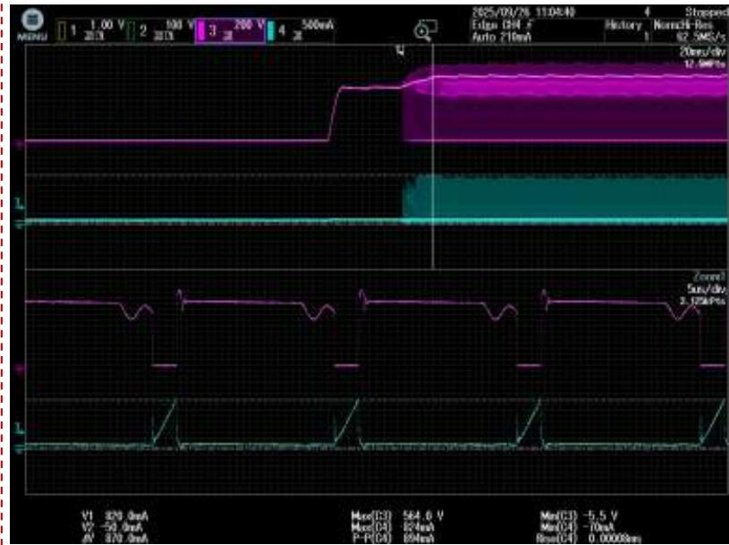

276Vac

CH3 VDS  
CH4 IDS  
V =564V I \_ =0.82A  
测试条件：  
➢ Full Load

## 11-1.MOS电压电流稳态波形-空载

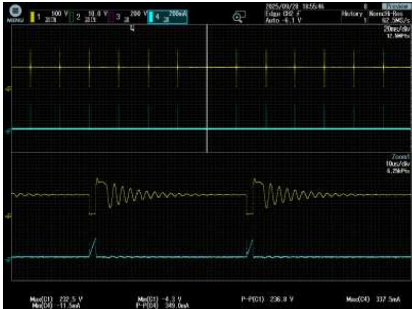

85Vac

${ \mathsf { C H 3 } } \mathsf { V _ { D S } }$  
$C H 4 \mid _ { \mathrm { { D S } } }$  
$V _ { \mathsf { D S \_ M A X } } { = } 2 3 3 \mathsf { V }$ $\mathsf { I } _ { \mathsf { D S \_ M A X } } = \mathsf { 0 } . 3 4 \mathsf { A }$  
测试条件：  
➢ Full Load

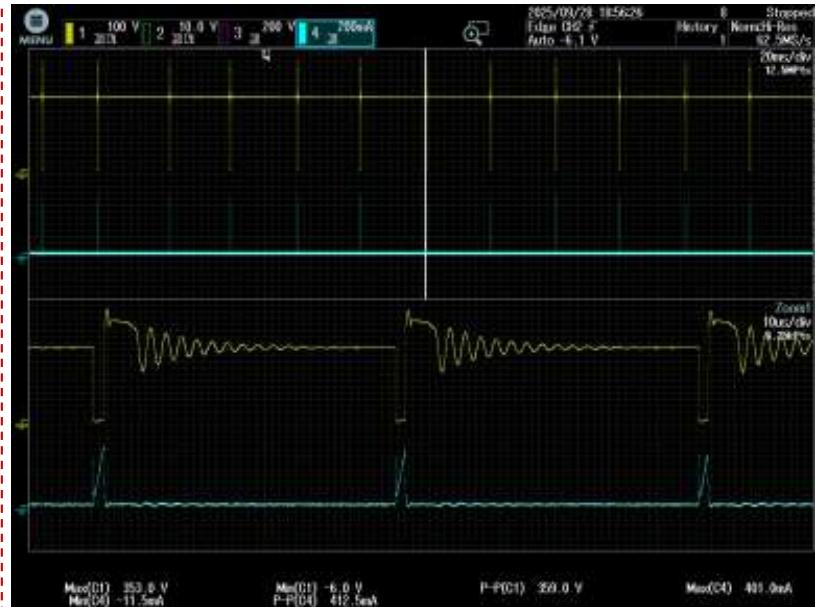

165Vac

${ \mathsf { C H 3 } } \mathsf { V _ { D S } }$  
$C H 4 \mid _ { \mathrm { { D S } } }$  
$\mathsf { V } _ { \mathsf { D S \_ M A X } } { = } 3 5 3 \mathsf { V }$ $\mathsf { I } _ { \mathsf { D S \_ M A X } } = \mathsf { 0 } . 4 \mathsf { A }$  
测试条件：  
➢ Full Load

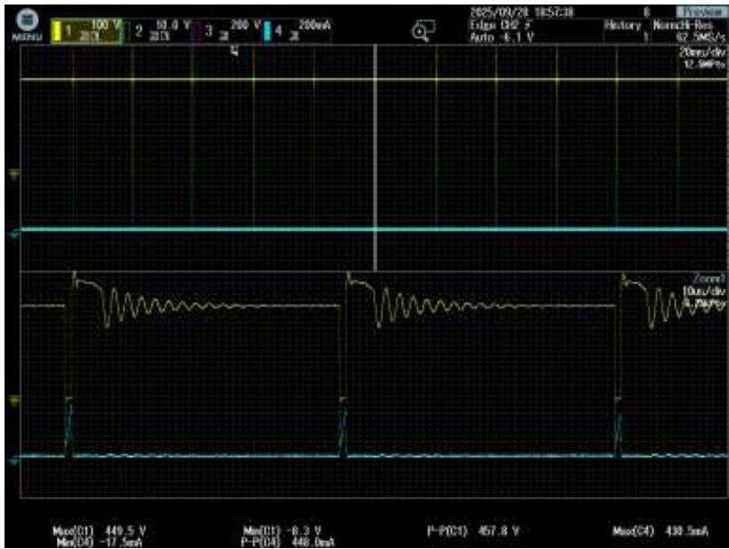

230Vac

${ \mathsf { C H 3 } } \mathsf { V _ { D S } }$  
$C H 4 \mid _ { \mathrm { { D S } } }$  
$V _ { \mathsf { D S \_ M A X } } { = } 4 4 9 \mathsf { V }$ $\mathsf { I } _ { \mathsf { D S \_ M A X } } = \mathsf { 0 } . 4 3 \mathsf { A }$  
测试条件：  
➢ Full Load

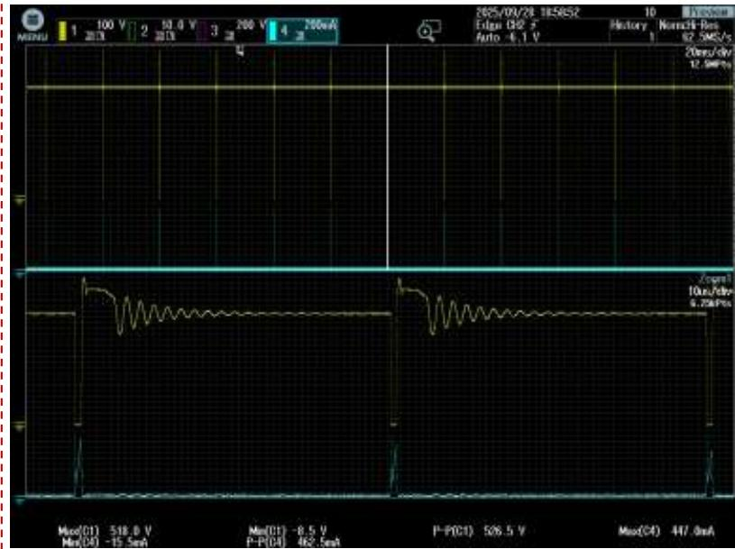

276Vac

${ \mathsf { C H 3 } } \mathsf { V _ { D S } }$  
$C H 4 \mid _ { \mathrm { { D S } } }$  
$V _ { \mathsf { D S \_ M A X } } { = } 5 2 6 V$ $\mathsf { I } _ { \mathsf { D S \_ M A X } } = 0 . 4 5 \mathsf { A }$  
测试条件：  
➢ Full Load

## 11-1.MOS电压电流稳态波形-满载

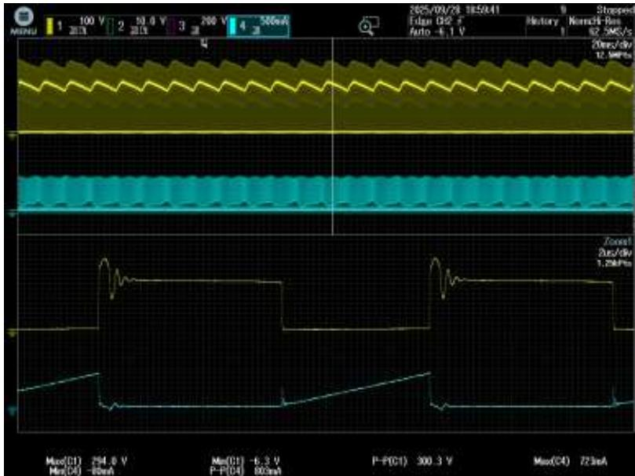

85Vac

${ \mathsf { C H 3 } } \mathsf { V _ { D S } }$  
$C H 4 \mid _ { \mathrm { { D S } } }$  
$V _ { \mathsf { D S \_ M A X } } { = } 2 9 4 \mathsf { V }$ $\mathsf { I } _ { \mathsf { D S \_ M A X } } = \mathsf { 0 } . 7 2 \mathsf { A }$  
测试条件：  
➢ Full Load

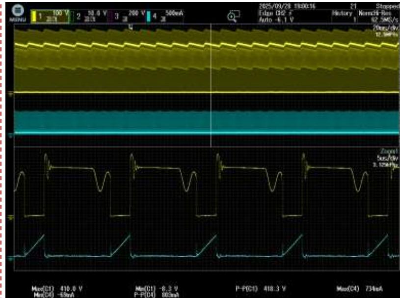

165Vac

${ \mathsf { C H 3 } } \mathsf { V _ { D S } }$  
$C H 4 \mid _ { \mathrm { { D S } } }$  
$\mathsf { V } _ { \mathsf { D S \_ M A X } } { = } 4 1 0 \mathsf { V }$ $\mathsf { I } _ { \mathsf { D S \_ M A X } } = \mathsf { 0 } . 7 3 \mathsf { A }$  
测试条件：  
➢ Full Load

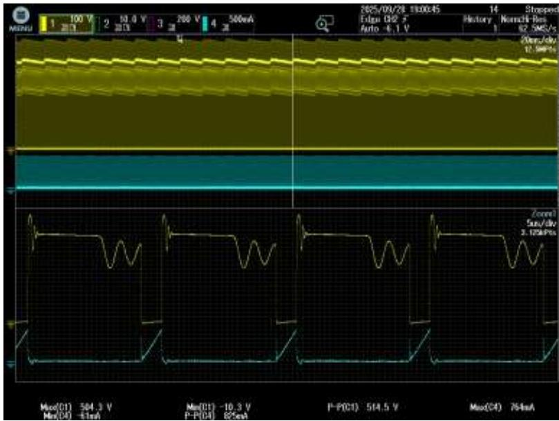

230Vac

${ \mathsf { C H 3 } } \mathsf { V _ { D S } }$  
$C H 4 \mid _ { \mathrm { { D S } } }$  
$V _ { \mathsf { D S \_ M A X } } { = } 5 0 4 \mathsf { V }$ $\mathsf { I } _ { \mathsf { D S \_ M A X } } = \mathsf { 0 } . 7 6 \mathsf { A }$  
测试条件：  
➢ Full Load

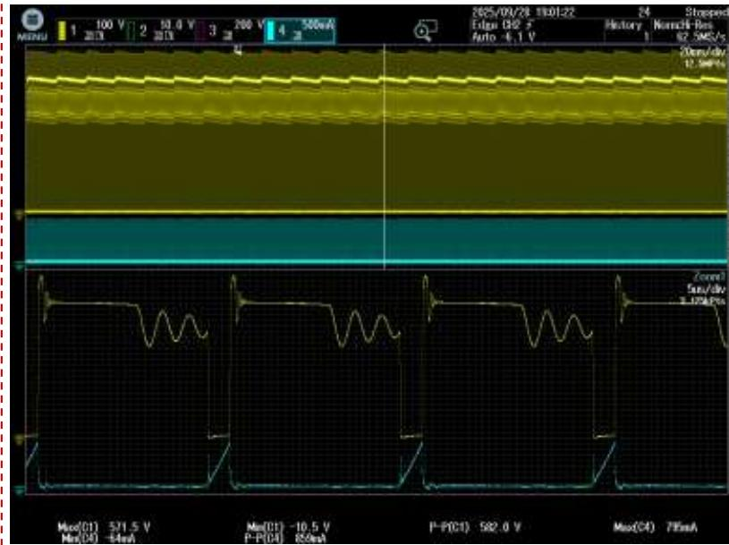

276Vac

${ \mathsf { C H 3 } } \mathsf { V _ { D S } }$  
$C H 4 \mid _ { \mathrm { { D S } } }$  
$V _ { \mathsf { D S \_ M A X } } { = } 5 7 2 \mathsf { V }$ $\mathsf { I } _ { \mathsf { D S \_ M A X } } = 0 . 8 0 \mathsf { A }$  
测试条件：  
➢ Full Load

## 11-3.保护稳态MOS电压电流波形

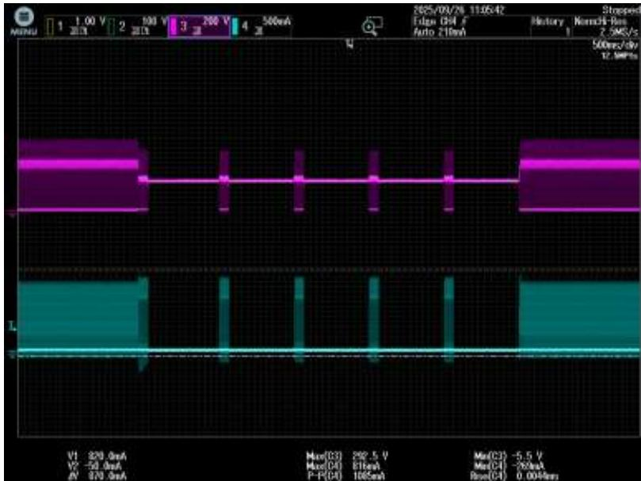

85Vac

${ \mathsf { C H 3 } } \mathsf { V _ { D S } }$  
$C H 4 \mid _ { \mathrm { { D S } } }$  
$V _ { \mathsf { D S \_ M A X } } { = } 2 9 2 \mathsf { V }$ $\mathsf { I } _ { \mathsf { D S \_ M A X } } = 0 . 8 2 \mathsf { A }$  
测试条件：  
➢ SCP

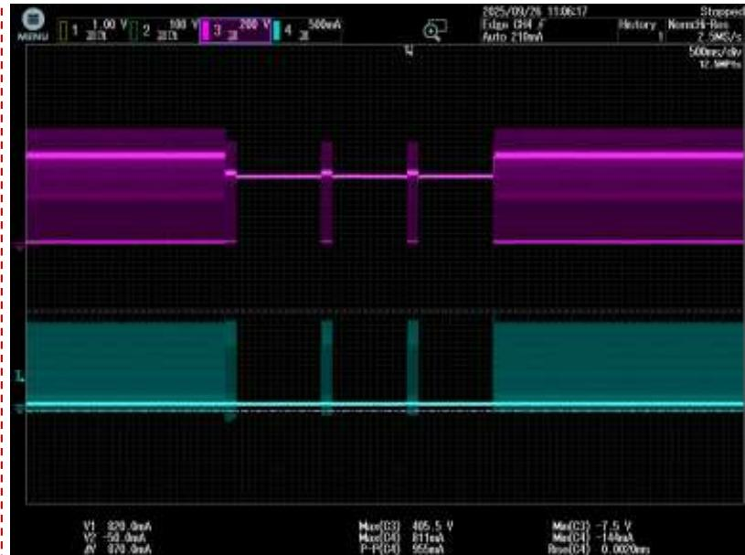

165Vac

${ \mathsf { C H 3 } } \mathsf { V _ { D S } }$  
$C H 4 \mid _ { \mathrm { { D S } } }$  
$V _ { \mathsf { D S \_ M A X } } { = } 4 0 6 \mathsf { V }$ $\mathsf { I } _ { \mathsf { D S \_ M A X } } = 0 . 8 1 \mathsf { A }$  
测试条件：  
➢ ${ \mathsf { S C P } }$

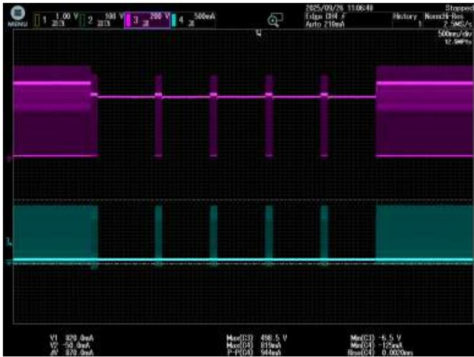

230Vac

${ \mathsf { C H 3 } } \mathsf { V _ { D S } }$  
$C H 4 \mid _ { \mathrm { { D S } } }$  
$V _ { \mathsf { D S \_ M A X } } { = } 4 9 8 \mathsf { V }$ $\mathsf { I } _ { \mathsf { D S \_ M A X } } = 0 . 8 2 \mathsf { A }$  
测试条件：  
SCP

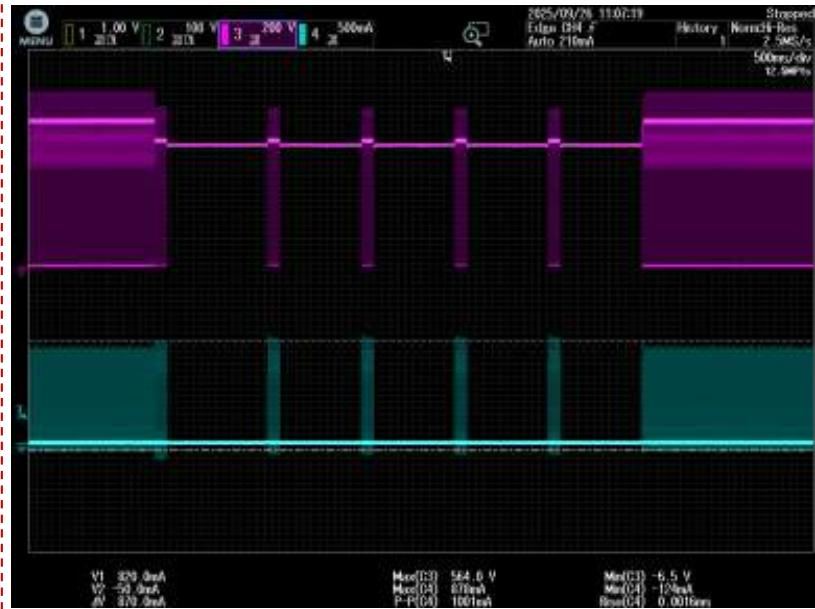

$2 7 6 \mathsf { V a c }$

${ \mathsf { C H 3 } } \mathsf { V _ { D S } }$  
$C H 4 \mid _ { \mathrm { { D S } } }$  
$V _ { \mathsf { D S \_ M A X } } { = } 5 6 4 \lor$ $\mathsf { I } _ { \mathsf { D S \_ M A X } } = 0 . 8 8 \mathsf { A }$  
测试条件：  
➢ ${ \mathsf { S C P } }$

## 24.输出整流管电压波形

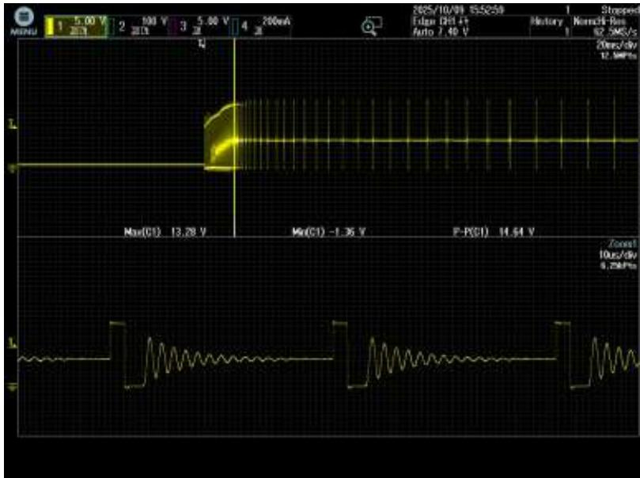

85Vac

$C H 3 \lor _ { \lor \mathsf { D } }$  
$\mathsf { V } _ { \mathsf { V D \_ M A X } } \mathsf { = } \mathsf { 1 } 3 . 3 \mathsf { V }$  
测试条件：  
➢ No Load

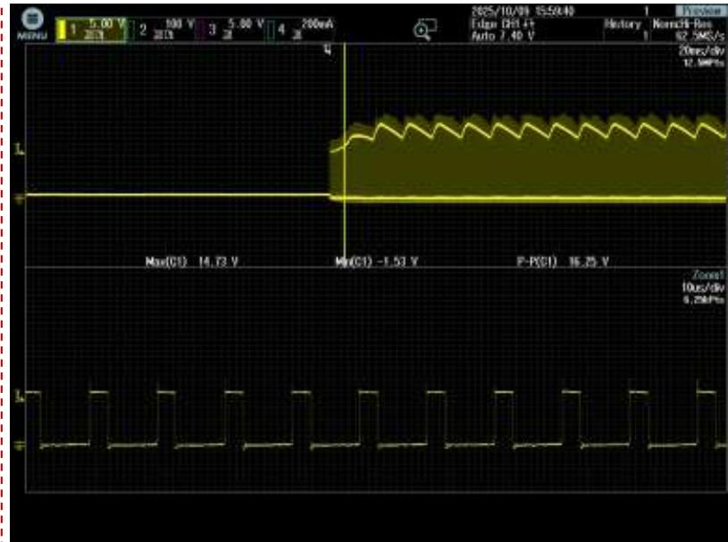

85Vac

CH3 VVD  
$V _ { \mathsf { V D \_ M A X } } { = } 1 4 . 7 \lor$  
测试条件：  
Full Load

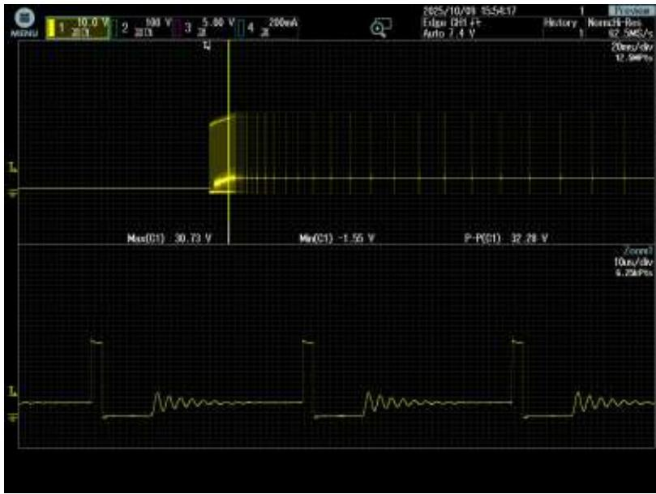

276Vac

CH3 $\mathsf { V } _ { \mathsf { V D } }$  
$V _ { \mathsf { V D \_ M A X } } { = } 3 0 . 5 \mathsf { V }$  
测试条件：  
➢ No Load

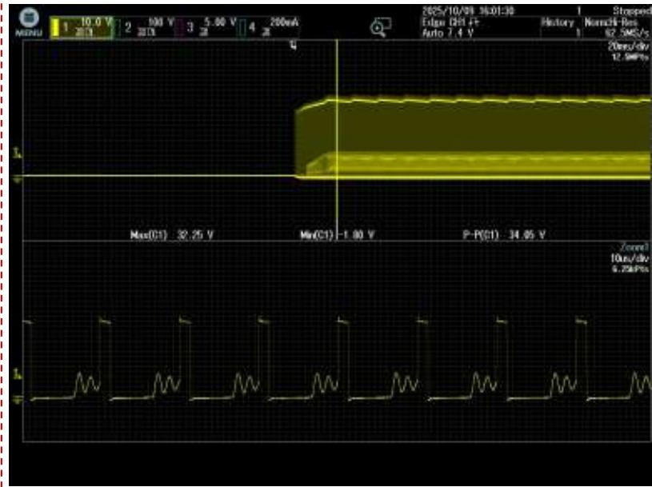

276Vac

CH3 VVD  
$V _ { \mathsf { V D \_ M A X } } { = } 3 2 . 2 \mathsf { V }$  
测试条件：  
Full Load

## 24.输出整流管稳态电压波形

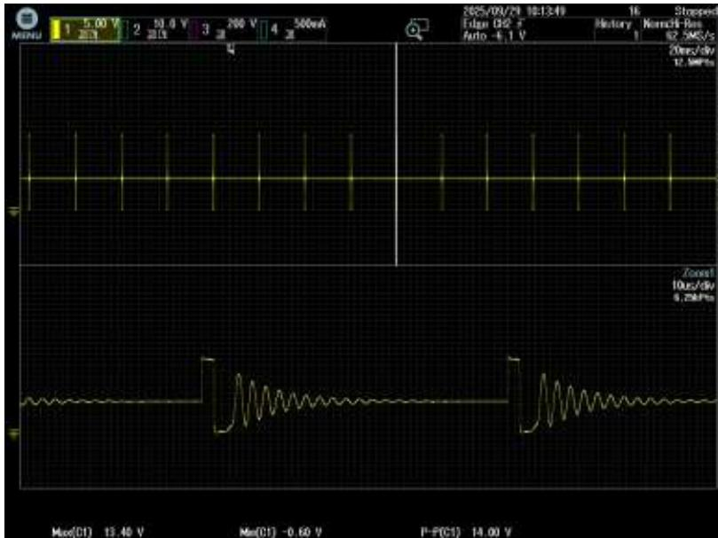

85Vac

$C H 3 \lor _ { \lor \mathsf { D } }$  
$V _ { \mathsf { V D \_ M A X } } { = } 1 3 . 4 \mathsf { V }$  
测试条件：  
➢ $\mathsf { N o } \mathsf { L o } \mathsf { a d }$

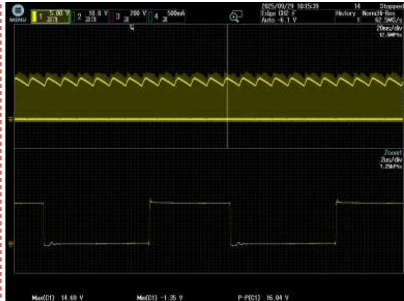

85Vac

$C H 3 \lor _ { \lor \mathsf { D } }$  
$V _ { \mathsf { V D \_ M A X } } { = } 1 4 . 7 \lor$  
测试条件：  
$\mathsf { F u l l \mathsf { L o a d } }$

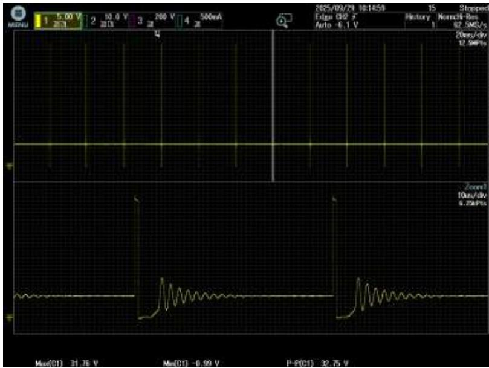

276Vac

$C H 3 \lor _ { \lor \mathsf { D } }$  
$\mathsf { V } _ { \mathsf { V D \_ M A X } } { = } 3 1 . 8 \mathsf { V }$  
测试条件：  
➢ No Load

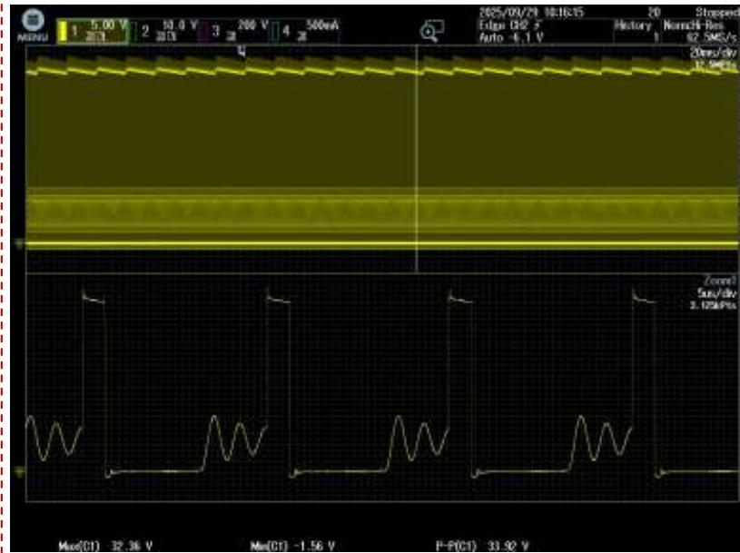

276Vac

$C H 3 \lor _ { \lor \mathsf { D } }$  
$V _ { \mathsf { V D \_ M A X } } { = } 3 2 . 4 \mathsf { V }$  
测试条件：  
Full Load

## 11.输出整流管短路波形

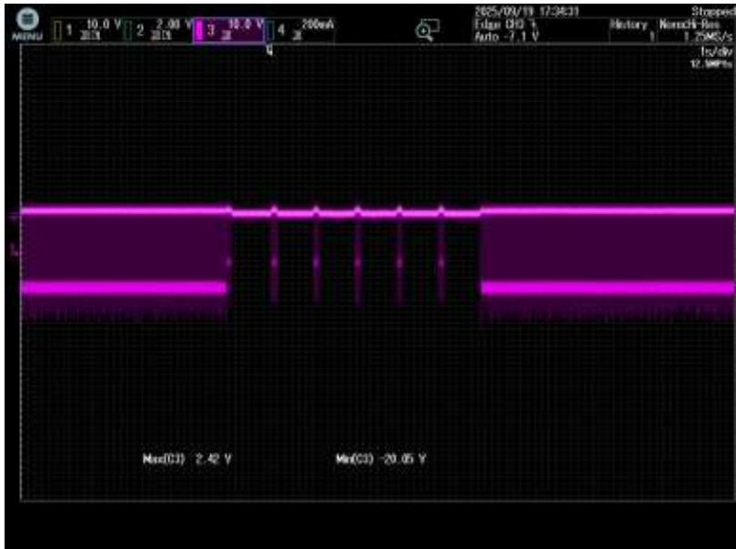

102Vac

$C H 3 \lor _ { \lor \mathsf { D } }$  
$V _ { \mathrm { v o } } = 2 0 V$  
测试条件：  
SCP

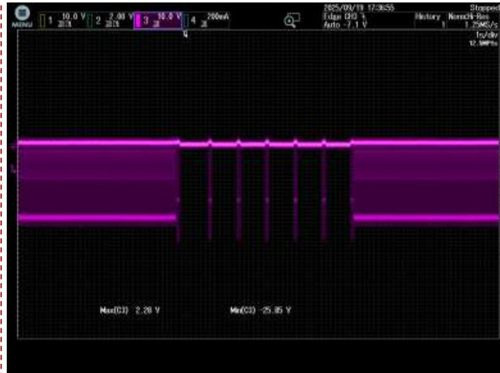

165Vac

$C H 3 \lor _ { \lor \mathsf { D } }$  
$V _ { \mathrm { v p } } { = } 2 5 . 9 V$  
测试条件：  
SCP

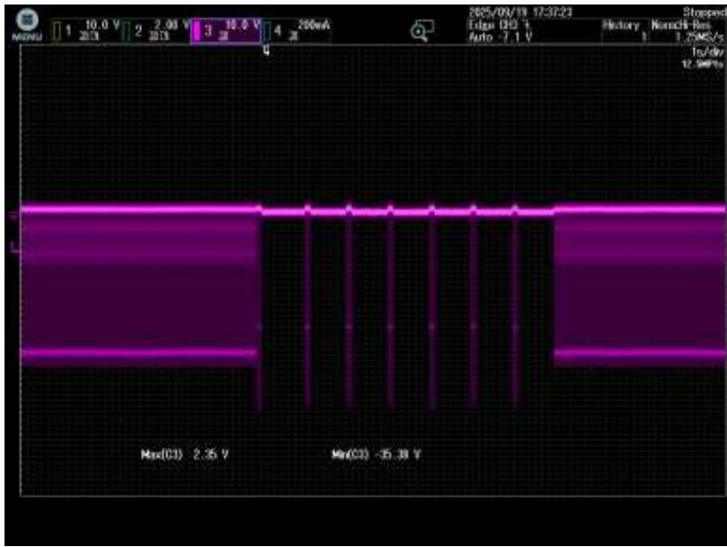

230Vac

$C H 3 \lor _ { \lor \mathsf { D } }$  
$V _ { \mathsf { V D } } { = } 3 5 . 4 \mathsf { V }$  
测试条件：  
SCP

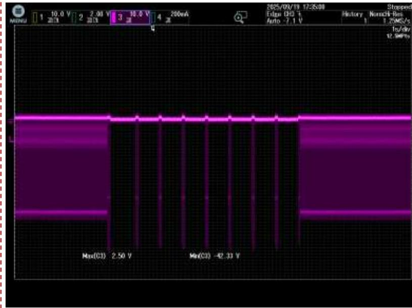

276Vac

$C H 3 \lor _ { \lor \mathsf { D } }$  
$\mathsf { V } _ { \mathsf { V D } } { = } 4 2 . 3 \mathsf { V }$  
测试条件：  
SCP

<table><tr><td rowspan="2">项目</td><td colspan="2">85VAC</td><td colspan="2">276VAC</td></tr><tr><td>温度(°C)</td><td>温升(°C)</td><td>温度(°C)</td><td>温升(°C)</td></tr><tr><td>环境温度</td><td colspan="2">29.2</td><td colspan="2">29.2</td></tr><tr><td>BPA86526PC</td><td>85.2</td><td>56</td><td>86.2</td><td>57</td></tr><tr><td>钳位二极管D18</td><td>66.7</td><td>37.5</td><td>65.4</td><td>36.2</td></tr><tr><td>输出二极管</td><td>82.8</td><td>53.6</td><td>85</td><td>55.8</td></tr><tr><td>变压器 Core</td><td>60</td><td>30.8</td><td>65.4</td><td>36.2</td></tr><tr><td>变压器 Wire</td><td>62.3</td><td>33.1</td><td>67.2</td><td>38</td></tr><tr><td>输出电容</td><td>48.5</td><td>19.3</td><td>49.9</td><td>20.7</td></tr></table>

## 测试说明

➢ 在温箱中进行测试  
电路板放在一个封闭的盒子内  
➢ 热电偶连接到各个测量点  
➢ 等测量点温度达到稳定后记录数据  
备注：常温下的封闭环境测试

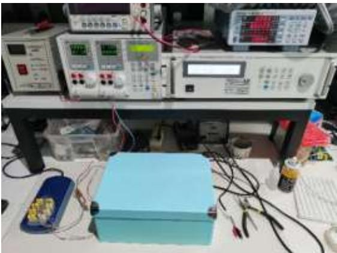

## 15.传导EMI&功率骚扰

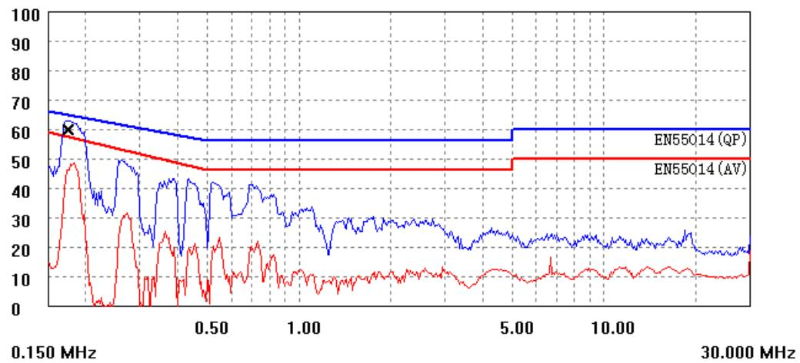

115VAC Line  
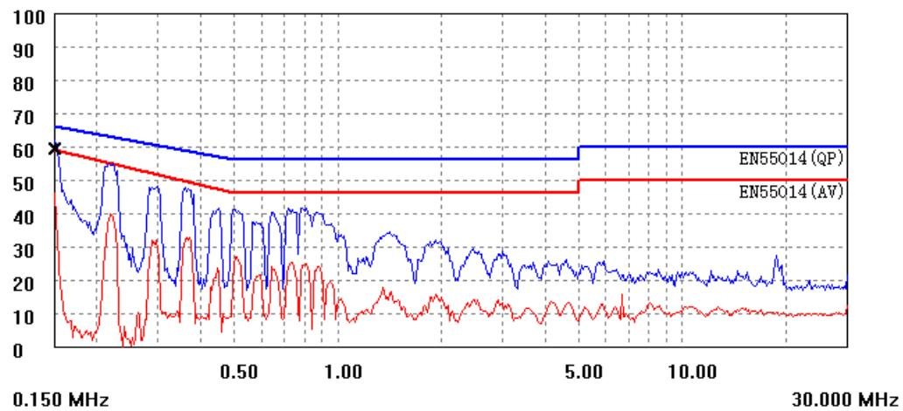

230VAC Line

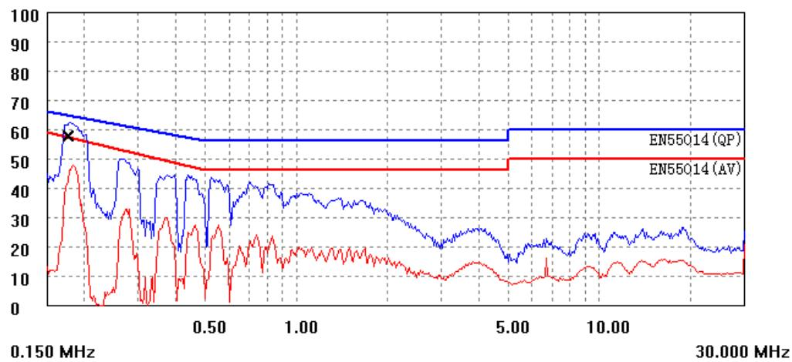

115VAC Neutral

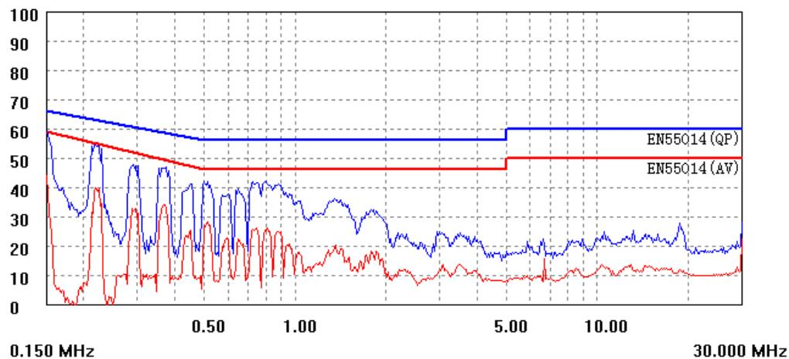

230VAC Neutral

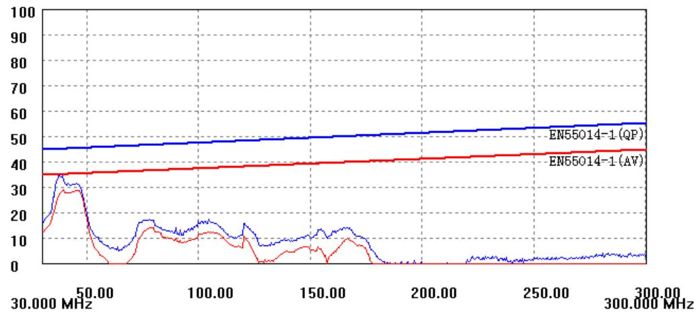

110VAC Line  
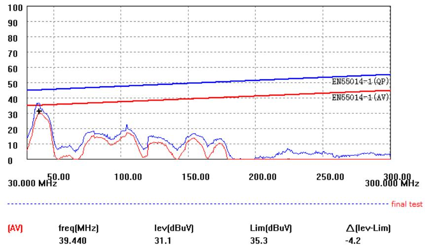

230VAC Line

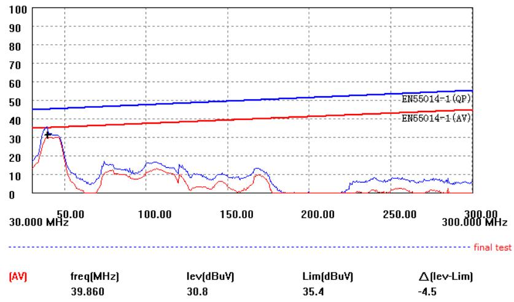

110VAC Neutral  
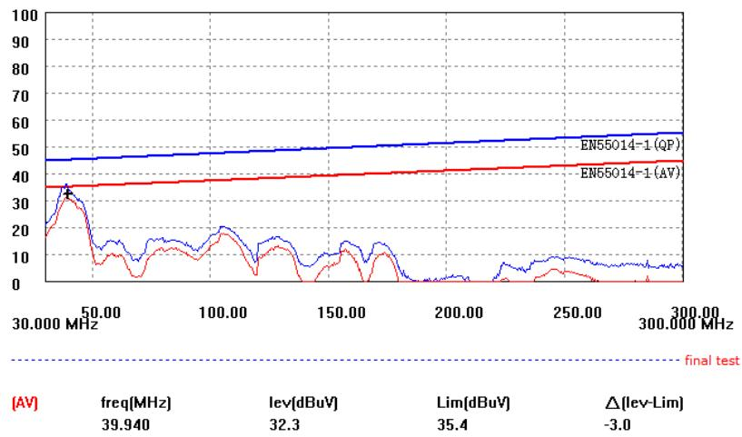

230VAC Neutral

<table><tr><td>差模</td><td>电压</td><td>相位角</td><td>发生器阻抗</td><td>测试次数</td><td>测试结果</td></tr><tr><td>L to N</td><td>+2kV</td><td>0</td><td>2</td><td>10</td><td>Pass</td></tr><tr><td>L to N</td><td>-2kV</td><td>0</td><td>2</td><td>10</td><td>Pass</td></tr><tr><td>L to N</td><td>+2kV</td><td>90</td><td>2</td><td>10</td><td>Pass</td></tr><tr><td>L to N</td><td>-2kV</td><td>90</td><td>2</td><td>10</td><td>Pass</td></tr><tr><td>L to N</td><td>+2kV</td><td>180</td><td>2</td><td>10</td><td>Pass</td></tr><tr><td>L to N</td><td>-2kV</td><td>180</td><td>2</td><td>10</td><td>Pass</td></tr><tr><td>L to N</td><td>+2kV</td><td>270</td><td>2</td><td>10</td><td>Pass</td></tr><tr><td>L to N</td><td>-2kV</td><td>270</td><td>2</td><td>10</td><td>Pass</td></tr></table>

## 测试说明

➢ 按照GB/T17626.5和IEC61000-4-5的最新版本要求进行测试  
➢ 室温环境，230VAC输入，满载条件  
➢ 输入1.2/50us组合波浪涌电压  
➢ 每个测试点重复10次  
➢ 每次间隔时间1分钟  
➢ 试验时样机输出正常（符合A类标准）视为Pass

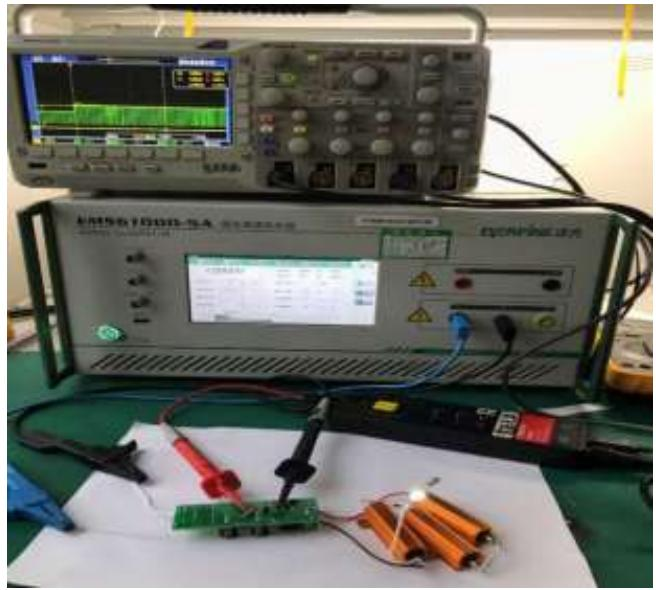

## EFT脉冲群测试\_差模2KV共模（L-PE）4KV

<table><tr><td>差模</td><td>电压</td><td>脉冲群持续时间</td><td>脉冲频率</td><td>测试时间</td><td>测试结果</td></tr><tr><td>L to N</td><td>+4kV</td><td>15ms</td><td>5kHz</td><td>120s</td><td>Pass</td></tr><tr><td>L to N</td><td>-4kV</td><td>15ms</td><td>5kHz</td><td>120s</td><td>Pass</td></tr><tr><td>L to N</td><td>+4kV</td><td>0.75ms</td><td>100kHz</td><td>120s</td><td>Pass</td></tr><tr><td>L to N</td><td>-4kV</td><td>0.75ms</td><td>100kHz</td><td>120s</td><td>Pass</td></tr><tr><td>L to N</td><td>+2kV</td><td>2ms</td><td>38kHz</td><td>120s</td><td>Pass</td></tr><tr><td>L to N</td><td>-2kV</td><td>2ms</td><td>38kHz</td><td>120s</td><td>Pass</td></tr><tr><td>L to N</td><td>+4kV</td><td>2ms</td><td>38kHz</td><td>120s</td><td>Pass</td></tr><tr><td>L to N</td><td>-4kV</td><td>2ms</td><td>38kHz</td><td>120s</td><td>Pass</td></tr></table>

## 测试说明

➢ 按照GB/T17626.4和IEC61000-4-4的最新版本要求进行测试  
➢ 室温环境，230VAC输入满载条件  
➢ 分别测试5kHz/100kHz/38kHz脉冲频率  
➢ 脉冲群周期为300ms  
➢ 每个测试条件测试时间120s  
➢ 试验时样机输出正常（符合A类标准）视为Pass

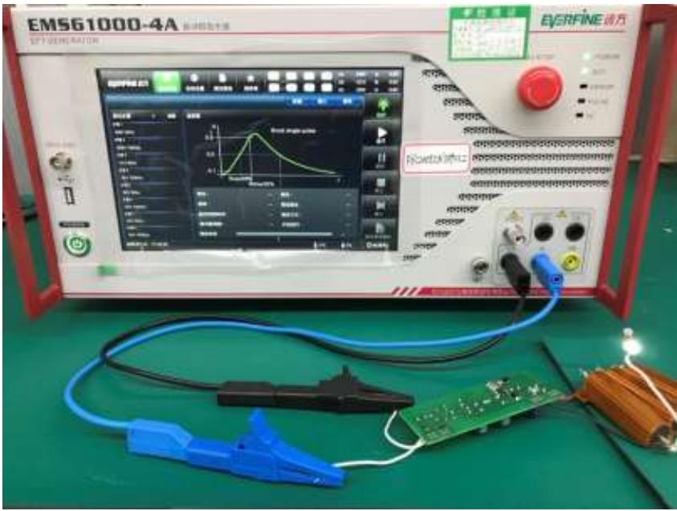

<table><tr><td>测试</td><td>电压(V)</td><td>放电类型</td><td>放电次数</td><td>测试结果</td></tr><tr><td>Vo</td><td>+15kV</td><td>空气放电</td><td>10</td><td>Pass</td></tr><tr><td>Vo</td><td>-15kV</td><td>空气放电</td><td>10</td><td>Pass</td></tr><tr><td>GND</td><td>+15kV</td><td>空气放电</td><td>10</td><td>Pass</td></tr><tr><td>GND</td><td>-15kV</td><td>空气放电</td><td>10</td><td>Pass</td></tr><tr><td>Vo</td><td>+20kV</td><td>空气放电</td><td>10</td><td>Pass</td></tr><tr><td>Vo</td><td>-20kV</td><td>空气放电</td><td>10</td><td>Pass</td></tr><tr><td>GND</td><td>+20kV</td><td>空气放电</td><td>10</td><td>Pass</td></tr><tr><td>GND</td><td>-20kV</td><td>空气放电</td><td>10</td><td>Pass</td></tr></table>

## 测试说明

➢ 按照GB/T17626.2和IEC61000-4-2的最新版本要求进行测试  
➢ 室温环境，230VAC输入满载条件  
➢ 每个测试点重复10次  
➢ 分别对输出正端和地进行空气放电  
➢ 试验时样机输出正常（符合A类标准）视为Pass

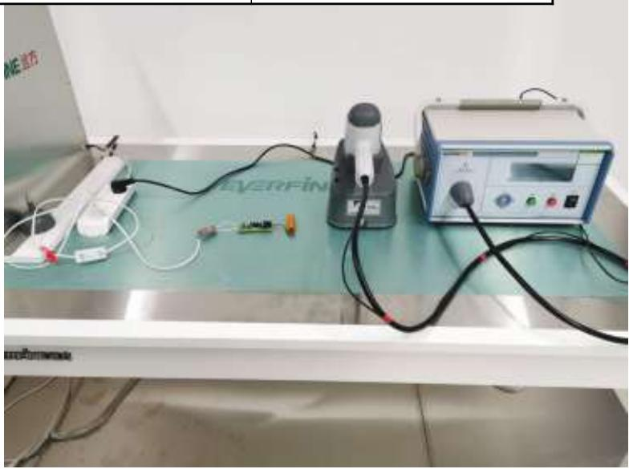

## 上海晶丰明源半导体股份有输出整流为同步整流

时间：

