## BPA86526P & STR6A1 61 H对比测试 (1 2V/1 . 5A@85 \~ 265Vac)

上海晶丰明源半导体股份有限公司

S h a n g h a i B ri g ht Powe r Se m i co n d u cto r Co., Ltd .

吴生红

时间 ： 2022年1 2月

## 内容

电源规格  
电路及实物图  
 PC B Layo ut 图  
变压器设计  
性能测试数据

## 电源规格

<table><tr><td>项目描述</td><td>符号</td><td>最小</td><td>典型</td><td>最大</td><td>单位</td><td>备注</td></tr><tr><td colspan="7">输入</td></tr><tr><td>电压</td><td> $V_{IN}$ </td><td>85</td><td>115/230</td><td>265</td><td> $V_{AC}$ </td><td></td></tr><tr><td>频率</td><td> $f_{LINE}$ </td><td>47</td><td>50/60</td><td>63</td><td>Hz</td><td></td></tr><tr><td colspan="7">输出</td></tr><tr><td>输出电压</td><td> $V_{OUT}$ </td><td></td><td>12</td><td></td><td>V</td><td>±5%</td></tr><tr><td>输出电流</td><td> $I_{OUT}$ </td><td></td><td>1.5</td><td></td><td>A</td><td></td></tr><tr><td>输出电压纹波</td><td> $V_{RIPPLE}$ </td><td></td><td></td><td>600</td><td>mV</td><td>20MHz带宽</td></tr><tr><td>连续输出功率</td><td> $P_{OUT}$ </td><td></td><td>18</td><td></td><td>W</td><td></td></tr><tr><td colspan="7">效率</td></tr><tr><td>待机功耗</td><td> $P_{STDBY}$ </td><td></td><td></td><td>60</td><td>mW</td><td>230VAC</td></tr><tr><td>满载效率</td><td>η</td><td>84</td><td></td><td></td><td>%</td><td></td></tr><tr><td colspan="7">环境</td></tr><tr><td>传导EMI</td><td></td><td colspan="4">满足CISPR22/EN55022 Class B,至少3dB 裕量</td><td>EMI裕量不足6dB,待优化</td></tr><tr><td rowspan="2">Surge</td><td></td><td></td><td>±2</td><td></td><td>kV</td><td>差模</td></tr><tr><td></td><td></td><td>±4</td><td></td><td>kV</td><td>共模</td></tr><tr><td>EFT</td><td></td><td></td><td>±4</td><td></td><td>kV</td><td>5kHz/100kHz/38kHz</td></tr><tr><td>工作环境温度</td><td> $T_{AMP}$ </td><td></td><td></td><td>50</td><td>°C</td><td></td></tr></table>

## 电路及实物图

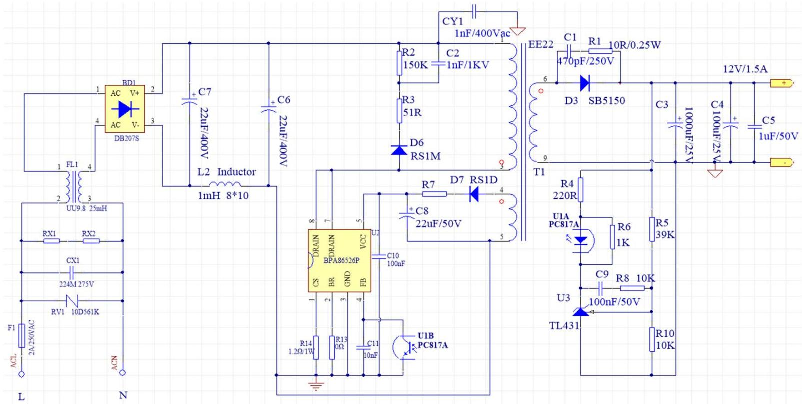

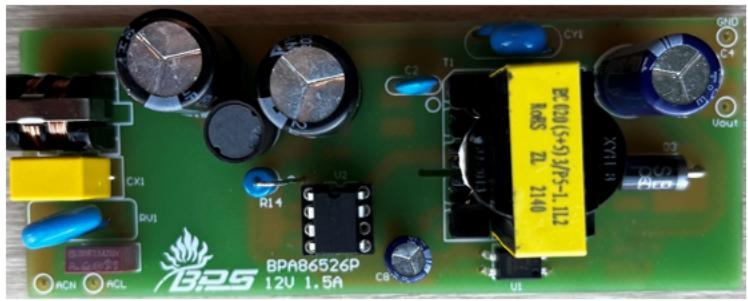

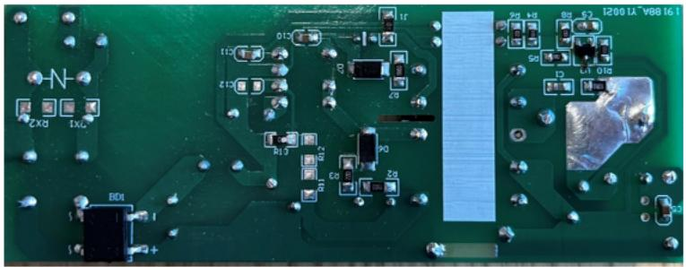

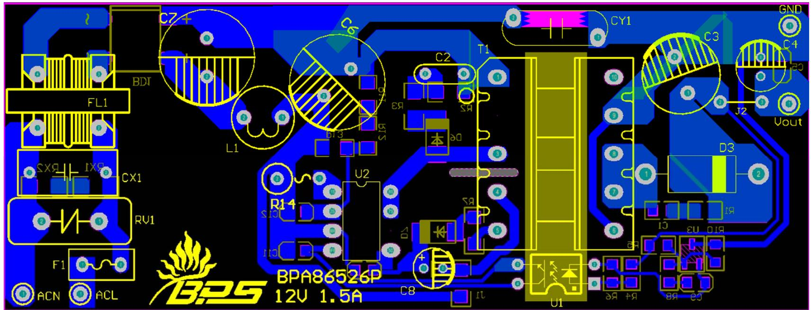

## 变压器设计

## 原理图

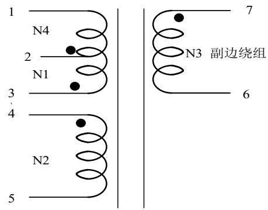

## 绕线方式

<table><tr><td>绕组</td><td>起始脚</td><td>终止脚</td><td>材料</td><td>匝数</td><td>绕线方式</td></tr><tr><td>N1</td><td>3</td><td>2</td><td>1UEW Φ0.26*1P</td><td>35Ts</td><td>密绕</td></tr><tr><td colspan="4">胶带</td><td>1Ts</td><td></td></tr><tr><td>N2</td><td>5</td><td>4</td><td>1UEW Φ0.26*2P</td><td>14Ts</td><td>密绕</td></tr><tr><td colspan="4">胶带</td><td>1Ts</td><td></td></tr><tr><td>N3</td><td>6</td><td>7</td><td>三层绝缘线Φ0.40*2P</td><td>10Ts</td><td>密绕</td></tr><tr><td colspan="4">胶带</td><td>1Ts</td><td></td></tr><tr><td>N4</td><td>2</td><td>1</td><td>1UEW Φ0.26*1P</td><td>34Ts</td><td>密绕</td></tr><tr><td colspan="4">胶带</td><td>1Ts</td><td></td></tr></table>

## 规格与材料

 初级绕组感量L = 1 1 m H ± 1 0% （测试条件: 0 3V 50kHz）  
 漏感量 $\cdot L _ { | | k } < 2 5 \mathsf { u H }$  
 骨架 ： E E 2 5  (立式 5 +5 )  
 磁芯 ： PC40  
 N 1 、 N 2、 N4: 1 U EW 漆包线  
 N3: 三层绝缘线  
 绝缘胶带:3M900 或同等材质  
 耐压测试: 3 KV, 50/60 Hz, 1 M i n  
 成品要求： 浸凡立水

## 脚位图

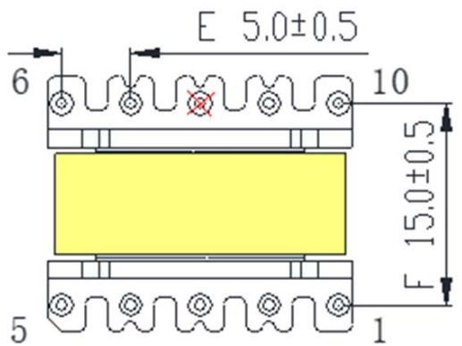

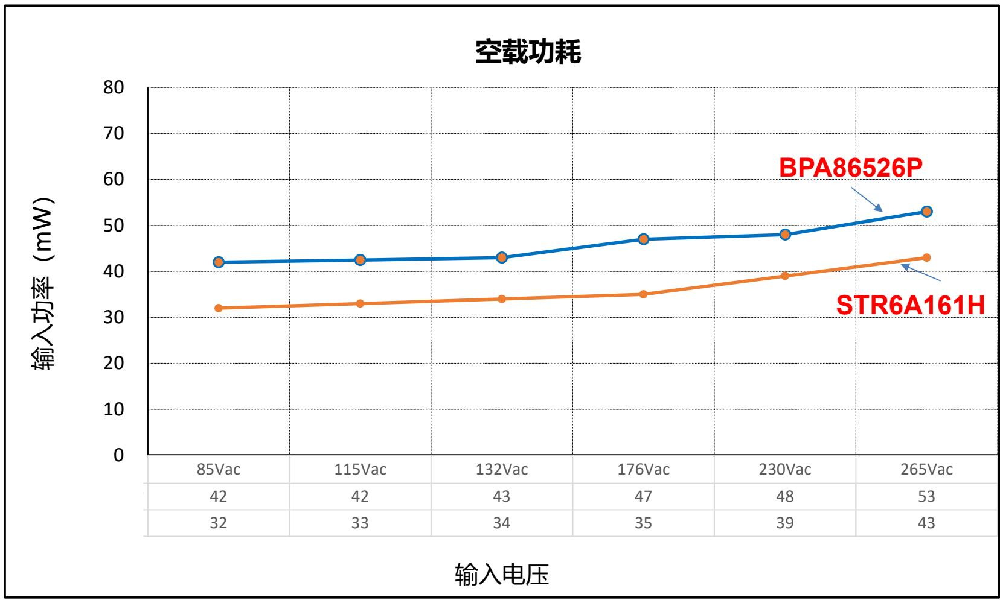

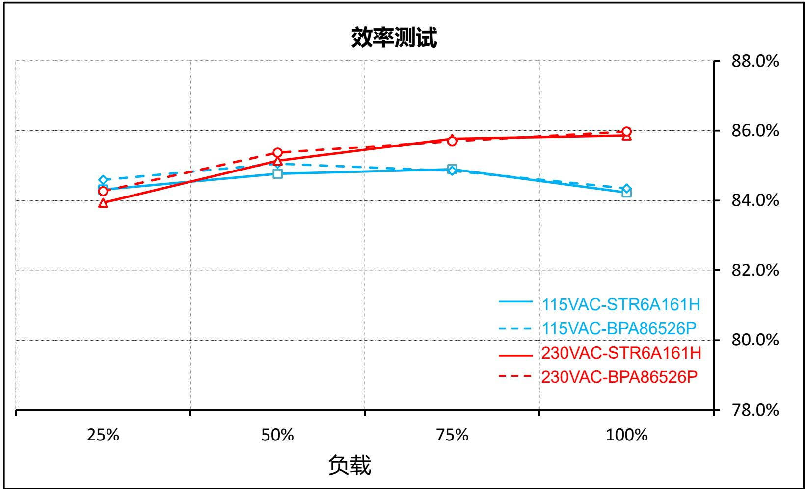

## 输出电压调整率

BPA86526P

<table><tr><td> $V_{IN}(VAC)$ Load(%)</td><td>85</td><td>115</td><td>132</td><td>176</td><td>230</td><td>265</td><td>平均值</td><td>线调整率</td></tr><tr><td>0</td><td>12.236</td><td>12.235</td><td>12.235</td><td>12.234</td><td>12.235</td><td>12.235</td><td>12.24</td><td>0.02%</td></tr><tr><td>20%</td><td>12.233</td><td>12.233</td><td>12.231</td><td>12.233</td><td>12.233</td><td>12.231</td><td>12.23</td><td>0.02%</td></tr><tr><td>40%</td><td>12.231</td><td>12.231</td><td>12.233</td><td>12.231</td><td>12.231</td><td>12.233</td><td>12.23</td><td>0.02%</td></tr><tr><td>60%</td><td>12.230</td><td>12.231</td><td>12.230</td><td>12.231</td><td>12.231</td><td>12.230</td><td>12.23</td><td>0.01%</td></tr><tr><td>80%</td><td>12.230</td><td>12.230</td><td>12.228</td><td>12.230</td><td>12.230</td><td>12.228</td><td>12.23</td><td>0.02%</td></tr><tr><td>100%</td><td>12.261</td><td>12.230</td><td>12.225</td><td>12.230</td><td>12.230</td><td>12.226</td><td>12.23</td><td>0.29%</td></tr><tr><td>平均值</td><td>12.24</td><td>12.23</td><td>12.23</td><td>12.23</td><td>12.23</td><td>12.23</td><td rowspan="2" colspan="2"></td></tr><tr><td>负载调整率</td><td>0.25%</td><td>0.04%</td><td>0.08%</td><td>0.03%</td><td>0.04%</td><td>0.07%</td></tr></table>

 计算方法： 调整率=1 00%\*(最大值-最小值)/平均值  
 测试条件： 无假负载

STR6A1 61 H

<table><tr><td> $V_{IN}(VAC)$ Load(%)</td><td>85</td><td>115</td><td>132</td><td>176</td><td>230</td><td>265</td><td>平均值</td><td>线调整率</td></tr><tr><td>0</td><td>12.246</td><td>12.245</td><td>12.245</td><td>12.239</td><td>12.236</td><td>12.243</td><td>12.24</td><td>0.08%</td></tr><tr><td>20%</td><td>12.243</td><td>12.239</td><td>12.231</td><td>12.238</td><td>12.233</td><td>12.236</td><td>12.24</td><td>0.10%</td></tr><tr><td>40%</td><td>12.231</td><td>12.239</td><td>12.233</td><td>12.231</td><td>12.231</td><td>12.236</td><td>12.23</td><td>0.07%</td></tr><tr><td>60%</td><td>12.231</td><td>12.237</td><td>12.233</td><td>12.231</td><td>12.230</td><td>12.234</td><td>12.23</td><td>0.06%</td></tr><tr><td>80%</td><td>12.231</td><td>12.237</td><td>12.228</td><td>12.235</td><td>12.231</td><td>12.229</td><td>12.23</td><td>0.07%</td></tr><tr><td>100%</td><td>12.251</td><td>12.233</td><td>12.229</td><td>12.230</td><td>12.230</td><td>12.226</td><td>12.23</td><td>0.20%</td></tr><tr><td>平均值</td><td>12.24</td><td>12.24</td><td>12.23</td><td>12.23</td><td>12.23</td><td>12.23</td><td rowspan="2" colspan="2"></td></tr><tr><td>负载调整率</td><td>0.16%</td><td>0.10%</td><td>0.14%</td><td>0.07%</td><td>0.05%</td><td>0.14%</td></tr></table>

## 输出电压纹波

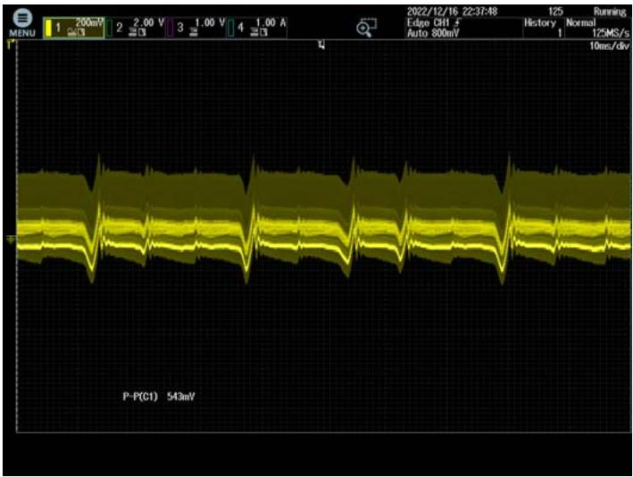

85 VAC

CH 1 $\mathsf { V } _ { \mathsf { O U T } } \mathsf { R i p p l e }$ $V _ { P K - P K } = 5 4 3 m V$

Test Co n d iti o n :

 F u l l  Lo a d

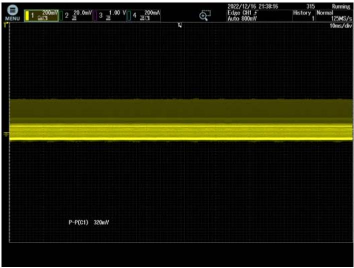

$2 6 5 \ : \mathsf { V } _ { \mathsf { A C } }$

$\begin{array} { r } { \mathsf { C H 1 V _ { 0 \cup \top } R i p p l e } } \\ { \mathsf { V _ { P K - P K } } { = } 3 2 0 \mathsf { m V } } \end{array}$

Test Co n d iti o n :

 F u l l  Lo a d

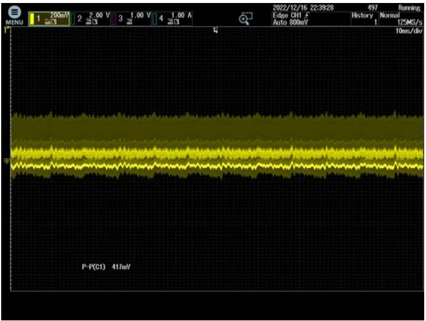

85 VAC

CH 1 $\mathsf { V } _ { \mathsf { O U T } }$ R i p p l e $\mathsf { V } _ { \mathsf { P K - P K } } { = } 4 0 7 \mathsf { m V }$

Test Co n d iti o n :

 F u l l Lo a d

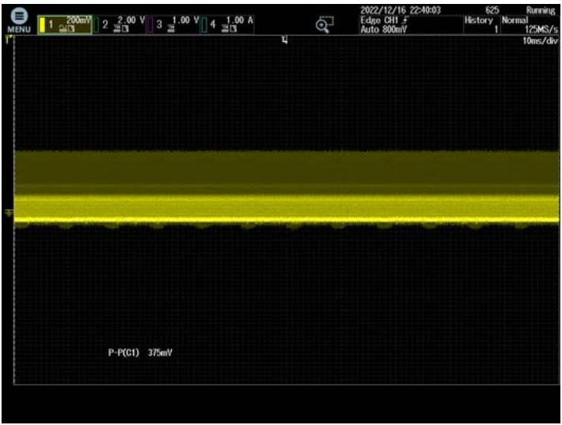

$2 6 5 \ : \mathsf { V } _ { \mathsf { A C } }$

CH 1 $\mathsf { V } _ { \mathsf { O U T } }$ R i p p l e $\mathsf { V } _ { \mathsf { P K - P K } } { = } 3 7 4 \mathsf { m V }$

Test Co n d iti o n :

 F u l l  Lo a d

## 动态负载(50%‐100%)

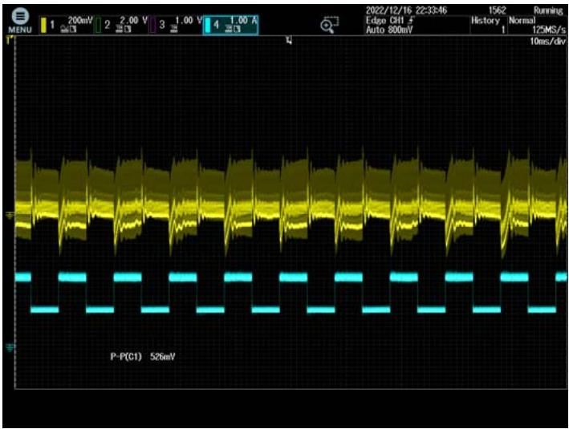

85 VAC

${ \mathsf { C H 1 } } { \mathsf { V } } _ { \mathsf { O U T } }$ $v _ { p _ { \vert k - P K } } = 5 2 6 ~ \mathsf { m V }$  
$\mathsf { C H 4 } \mathsf { I } _ { \mathsf { O U T } }$

## Test Co n d iti o n :

 $0 . 7 5 \ : \mathsf { A } – 1 . 5 \ : \mathsf { A } – 0 . 7 5 \ : \mathsf { A }$  
 S l ew Rate : 0 . 5 A/μ S  
 F re q u e n cy : 100 H z

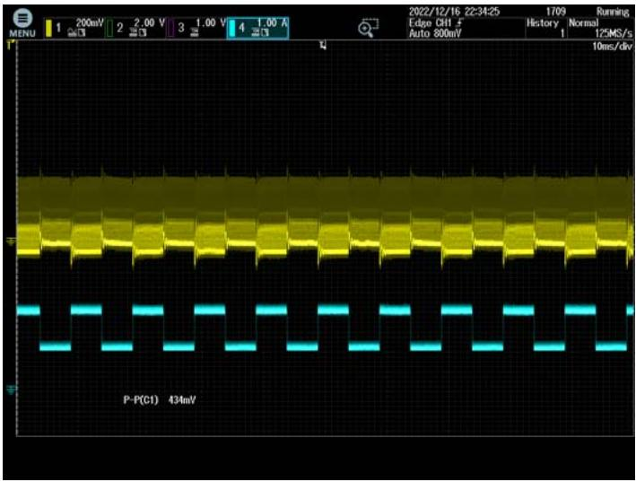

265 VAC

CH 1 $\mathsf { V } _ { \mathsf { O U T } }$ $\mathsf { V } _ { \mathsf { P K - P K } } { = } 4 3 1 \mathsf { m V }$  
$\mathsf { C H 4 } \mathsf { I } _ { \mathsf { O U T } }$

## Test Cond ition :

 $0 . 7 5 \ : \mathsf { A } – 1 . 5 \ : \mathsf { A } – 0 . 7 5 \ : \mathsf { A }$  
 S l ew Rate : 0 . 5 A/μ S  
 F re q u e n cy : 100 H z

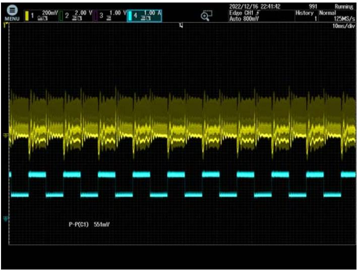

B晶丰明源  
Bright Power Semiconductor  
85 VAC  
265 $\mathsf { v } _ { \mathsf { A C } }$

C H 1 VOUT ${ \mathsf { C H 1 } } { \mathsf { V } } _ { \mathsf { O U T } }$ $v _ { p _ { \mathsf { K - P K } } } { = } 5 5 1 \mathsf { m V }$  
$\mathsf { C H 4 } \mathsf { I } _ { \mathsf { O U T } }$

## Test Co n d iti o n :

 $0 . 7 5 \ : \mathsf { A } – 1 . 5 \ : \mathsf { A } – 0 . 7 5 \ : \mathsf { A }$  
 S l ew Rate : 0 . 5 A/μ S  
 F re q u e n cy : 100 H z

$\mathsf { C H 1 } \mathsf { V } _ { \mathsf { O U T } }$ $V _ { P K - P K } = 4 8 7 ~ \mathsf { m V }$  
$\mathsf { C H 4 } \mathsf { I } _ { \mathsf { O U T } }$

## Test Cond ition :

 0 . 75 A‐ 1 . 5 A‐0 . 75 A  
 S l ew Rate : 0 . 5 A/μ S  
 F re q u e n cy : 100 H z

## 动态负载( 10%‐90%)

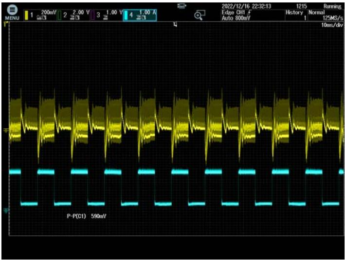

85 VAC

C H 1 VOUT $\mathsf { V } _ { \mathsf { O U T } }$ $V _ { \mathsf { P K - P K } } { = } 5 9 0 ~ \mathsf { m V }$  
$\mathsf { C H 4 } \mathsf { I } _ { \mathsf { O U T } }$

## Test Co n d iti o n :

 $0 . 1 5 \mathsf { A } – 1 . 3 5 \mathsf { A } – 0 . 1 5 \mathsf { A }$  
 S l ew Rate : 0 . 5 A/μ S  
 F re q u e n cy : 100 H z

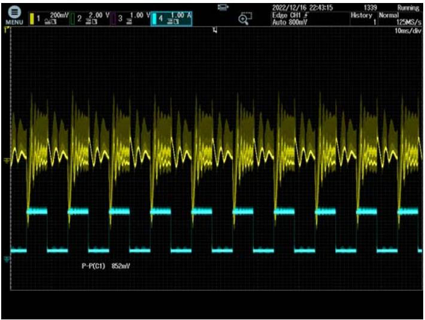

B晶丰明源  
Bright Power Semiconductor  
85 VAC

C H 1 VOUT $\mathsf { V } _ { \mathsf { O U T } }$ $V _ { \mathsf { P K - P K } } { = } 8 5 2 ~ \mathsf { m V }$  
$\mathsf { C H 4 } \mathsf { I } _ { \mathsf { O U T } }$

## Test Co n d iti o n :

 $0 . 1 5 \mathsf { A } – 1 . 3 5 \mathsf { A } – 0 . 1 5 \mathsf { A }$  
 S l ew Rate : 0 . 5 A/μ S  
 F re q u e n cy : 100 H z

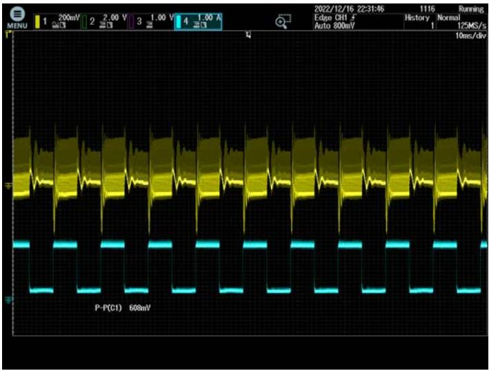

265 VAC

CH 1 $\mathsf { V } _ { \mathsf { O U T } }$ $V _ { P | \mathrm { X } \mathrm { - } P | \mathrm { K } } { = } 6 0 8 ~ \mathsf { m V }$ $\mathsf { C H 4 } \mathsf { I } _ { \mathsf { O U T } }$

## Test Cond ition :

 0 . 1 5A‐ 1 . 3 5 A‐0 . 1 5 A  
 S l ew Rate : 0 . 5 A/μ S  
 F re q u e n cy : 100 H z

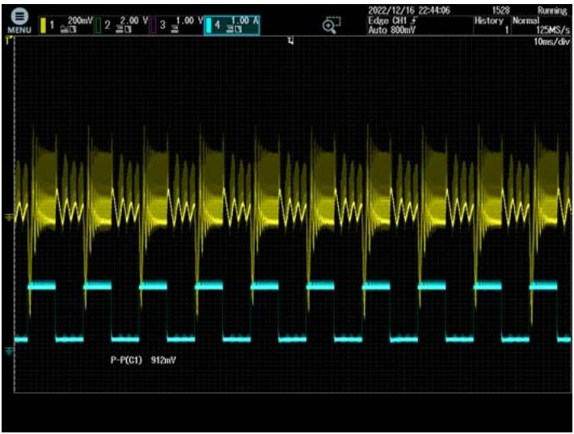

265 VAC

CH 1 $\mathsf { V } _ { \mathsf { O U T } }$ $\mathsf { V } _ { \mathsf { P K - P K } } { = } \mathsf { S } \mathsf { 1 } 2 \mathsf { m } \mathsf { v }$  
$\mathsf { C H 4 } \mathsf { I } _ { \mathsf { O U T } }$

## Test Cond ition :

 0 . 1 5A‐ 1 . 3 5 A‐0 . 1 5 A  
 S l ew Rate : 0 . 5 A/μ S  
 F re q u e n cy : 100 H z

## 输出电压开机波形

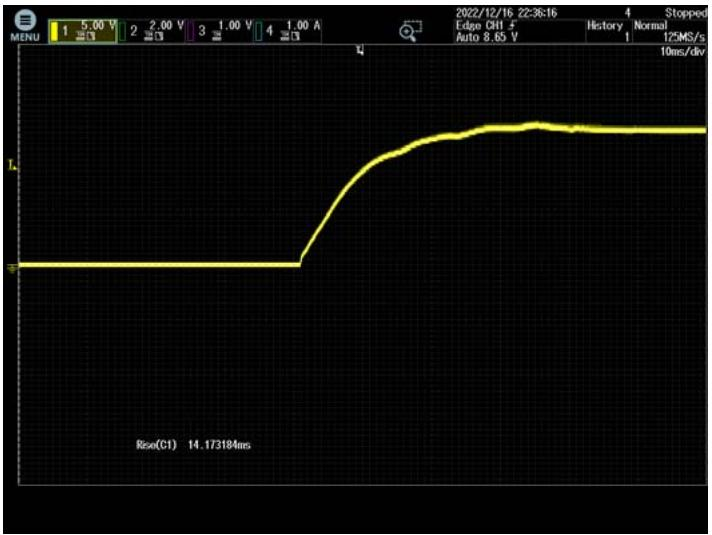

85 VAC  
  
Test Co n d iti o n :  
 F u l l Lo a d

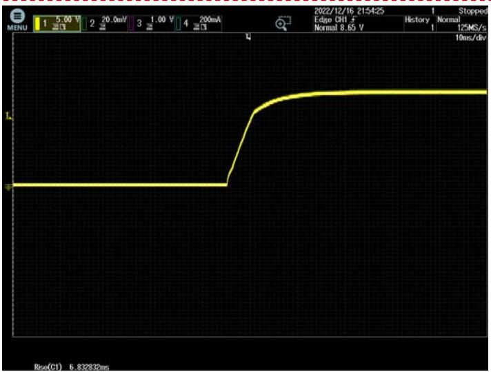

265 VAC  
  
Test Co n d iti o n :  
 F u l l Lo a d

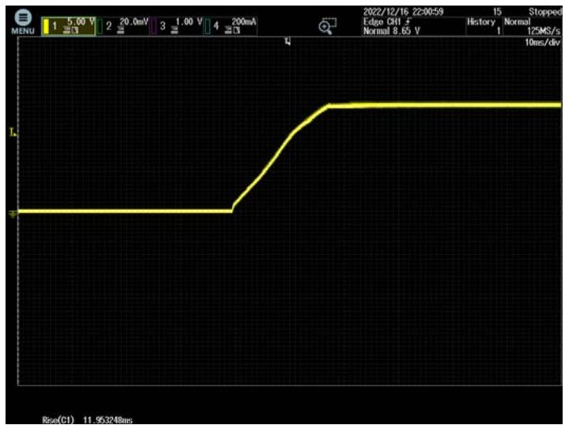

85 VAC  
  
Test Co n d iti o n :  
 F u l l Lo a d

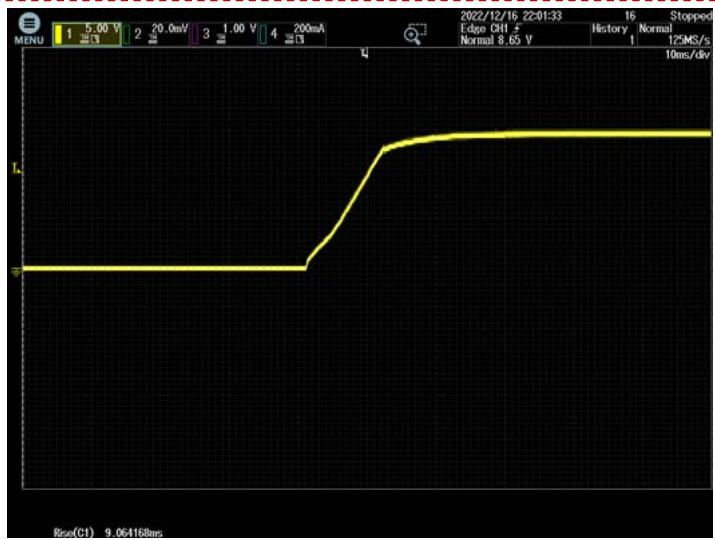

265 VAC  
  
Test Co n d iti o n :  
 F u l l  Lo a d

## 温升测试

BPA86526P

<table><tr><td rowspan="2">项目</td><td>85VAC</td><td>115VAC</td><td>230VAC</td><td>265VAC</td></tr><tr><td>温度(°C)</td><td>温度(°C)</td><td>温度(°C)</td><td>温度(°C)</td></tr><tr><td>环境温度</td><td>50</td><td>50</td><td>50</td><td>50</td></tr><tr><td>BPA86526P(U2)</td><td>92.78</td><td>84.03</td><td>80.23</td><td>74.4</td></tr><tr><td>变压器磁芯(T1)</td><td>62.09</td><td>61.93</td><td>64.54</td><td>65.2</td></tr><tr><td>变压器绕组(T1)</td><td>64.66</td><td>63.47</td><td>64.66</td><td>65.09</td></tr><tr><td>电感(L1)</td><td>63.16</td><td>58.55</td><td>54.2</td><td>53.6</td></tr><tr><td>输入电解电容(C6)</td><td>57.19</td><td>55.39</td><td>53.76</td><td>53.37</td></tr><tr><td>输出电解电容(EC1)</td><td>57.82</td><td>57.03</td><td>56.87</td><td>56.85</td></tr><tr><td>整流二极管(D3)</td><td>87.7</td><td>85.86</td><td>84.72</td><td>85.09</td></tr></table>

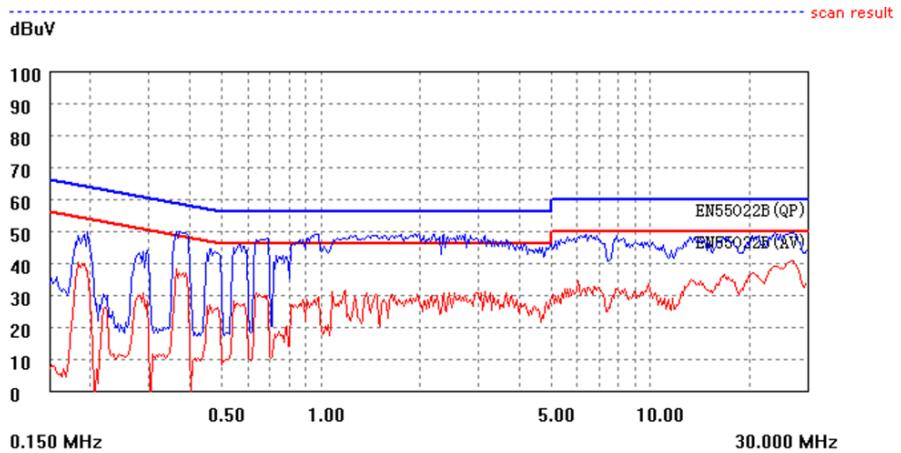

1 1 5Va c Li n e

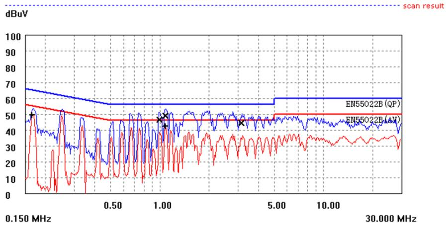

2 3 0Va c Li n e

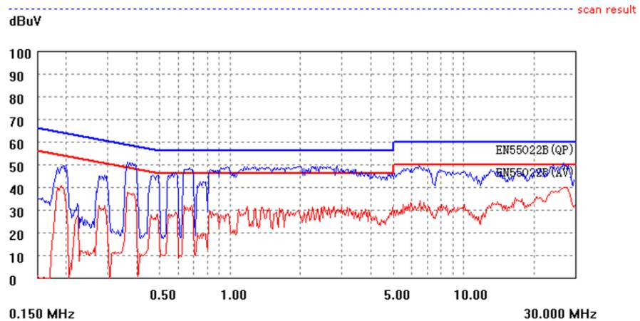

1 1 5Va c N e ut ra l

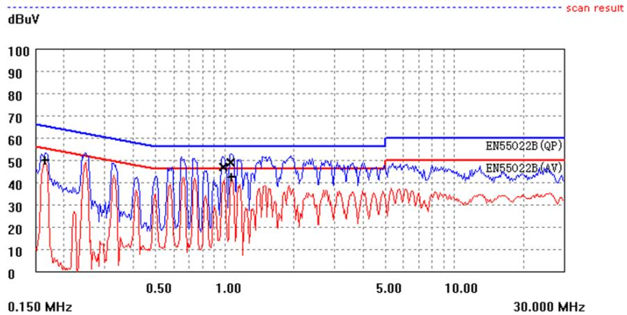

2 3 0Va c N e ut ra l

BPA86526P

<table><tr><td>差/共模</td><td>电压</td><td>相位角</td><td>发生器阻抗</td><td>测试次数</td><td>测试结果</td></tr><tr><td>L to N</td><td>+2kV</td><td>0/90/180/270</td><td>2</td><td>10</td><td>Pass</td></tr><tr><td>L to N</td><td>-2kV</td><td>0/90/180/270</td><td>2</td><td>10</td><td>Pass</td></tr><tr><td>L to PE</td><td>+4kV</td><td>0/90/180/270</td><td>12</td><td>10</td><td>Pass</td></tr><tr><td>L to PE</td><td>-4kV</td><td>0/90/180/270</td><td>12</td><td>10</td><td>Pass</td></tr><tr><td>N to PE</td><td>+4kV</td><td>0/90/180/270</td><td>12</td><td>10</td><td>Pass</td></tr><tr><td>N to PE</td><td>-4kV</td><td>0/90/180/270</td><td>12</td><td>10</td><td>Pass</td></tr></table>

## EFT 群脉冲测试

BPA86526P

<table><tr><td>差模</td><td>电压</td><td>脉冲群持续时间</td><td>脉冲频率</td><td>测试时间</td><td>测试结果</td></tr><tr><td>L to N</td><td>+4kV</td><td>15ms</td><td>5kHz</td><td>120s</td><td>Pass</td></tr><tr><td>L to N</td><td>-4kV</td><td>15ms</td><td>5kHz</td><td>120s</td><td>Pass</td></tr><tr><td>L to N</td><td>+4kV</td><td>0.75ms</td><td>100kHz</td><td>120s</td><td>Pass</td></tr><tr><td>L to N</td><td>-4kV</td><td>0.75ms</td><td>100kHz</td><td>120s</td><td>Pass</td></tr><tr><td>L to N</td><td>+2kV</td><td>2ms</td><td>38kHz</td><td>120s</td><td>Pass</td></tr><tr><td>L to N</td><td>-2kV</td><td>2ms</td><td>38kHz</td><td>120s</td><td>Pass</td></tr><tr><td>L to N</td><td>+4kV</td><td>2ms</td><td>38kHz</td><td>120s</td><td>Pass</td></tr><tr><td>L to N</td><td>-4kV</td><td>2ms</td><td>38kHz</td><td>120s</td><td>Pass</td></tr></table>

## THANK YOU FOR WATCHING
