BPA86526P 12V/1.5A反激式开关电源推广资料

时间：2023年10月

## 产品特点

高低压脚之间爬电距离＞3mm  
集成 800V 高压 MOSFET  
集成高压启动、自供电电路  
通过BR脚可调节burst mode深度  
低待机功耗(<50mW@辅助绕组供电)  
峰值电流补偿功能  
内置软启动功能  
丰富的保护功能（输入过压和欠压保护，输出过压和过载保护，反馈开路保护，过温保护等）

典型应用图（Flyback）  
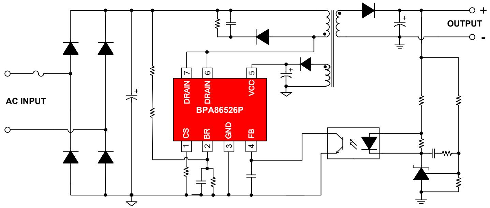

DIP-7封装

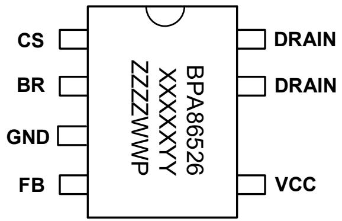

## 产品规格

<table><tr><td colspan="5">输出功率表</td></tr><tr><td rowspan="2">型号</td><td colspan="2">230VAC ±15%</td><td colspan="2">85~265VAC</td></tr><tr><td>适配器(注1)</td><td>开放式(注2)</td><td>适配器(注1)</td><td>开放式(注2)</td></tr><tr><td>BPA86526P</td><td>21W</td><td>35W</td><td>18W</td><td>24W</td></tr></table>

注1： 最小连续输出功率，测试条件为封闭式塑料外壳，环境温度为50℃。  
注2： 最小连续输出功率，测试条件为开放式环境，环境温度为50℃。

## 目标应用

家用电器辅助电源  
➢ PC待机电源  
通信、工业控制辅助电源  
适配器、充电器

主要竞品参数对比

<table><tr><td>参数</td><td>BPA86526P</td><td>STR6A161HX</td><td>SDH8654</td><td>PN8733PN6623H</td></tr><tr><td>开关频率</td><td>100kHz</td><td>100kHz</td><td>100kHz</td><td>100kHz</td></tr><tr><td>Mosfet BV</td><td>800V</td><td>700V</td><td>700V</td><td>800V</td></tr><tr><td> $R_{DS\_ON}$  (Max)</td><td>2.1Ω(Typical)2.6Ω(Max)</td><td>3.95Ω</td><td>3.95Ω</td><td>2.0Ω(Typical)</td></tr><tr><td>输出功率</td><td>18W~24W</td><td>15W~23.5W</td><td>15W~23.5W</td><td>18W~24W</td></tr><tr><td>Burst Mode调节</td><td>电容四档调节</td><td>电阻四档调节</td><td>无</td><td>无</td></tr><tr><td>VCC耐压</td><td>40V</td><td>32V</td><td>28.5V</td><td>34V</td></tr><tr><td>VCC OVP</td><td>38.5V重启模式</td><td>29.1V锁定模式</td><td>26.7V锁定模式</td><td>32V重启模式</td></tr><tr><td>软启动</td><td>有</td><td>有</td><td>有</td><td>有</td></tr><tr><td>输入OVP保护</td><td>有</td><td>无</td><td>有</td><td>有</td></tr><tr><td>Brown in/out</td><td>有</td><td>无</td><td>有</td><td>有</td></tr><tr><td>过载保护</td><td>有</td><td>有</td><td>有</td><td>有</td></tr><tr><td>OTP保护</td><td>重启</td><td>锁定</td><td>锁定</td><td>重启</td></tr><tr><td>封装</td><td>DIP-7</td><td>DIP-7, SMD7</td><td>DIP-7, SMD7</td><td>DIP-7, SMD7</td></tr></table>

## 输出电压调整率

<table><tr><td> $V_{IN}(VAC)$ Load(%)</td><td>85</td><td>115</td><td>132</td><td>176</td><td>230</td><td>265</td><td>平均值</td><td>线调整率</td></tr><tr><td>0</td><td>12.235</td><td>12.235</td><td>12.235</td><td>12.234</td><td>12.235</td><td>12.235</td><td>12.23</td><td>0.01%</td></tr><tr><td>20%</td><td>12.234</td><td>12.233</td><td>12.233</td><td>12.233</td><td>12.233</td><td>12.231</td><td>12.23</td><td>0.02%</td></tr><tr><td>40%</td><td>12.232</td><td>12.232</td><td>12.233</td><td>12.231</td><td>12.231</td><td>12.233</td><td>12.23</td><td>0.02%</td></tr><tr><td>60%</td><td>12.231</td><td>12.232</td><td>12.230</td><td>12.231</td><td>12.231</td><td>12.230</td><td>12.23</td><td>0.02%</td></tr><tr><td>80%</td><td>12.230</td><td>12.230</td><td>12.228</td><td>12.230</td><td>12.230</td><td>12.228</td><td>12.23</td><td>0.02%</td></tr><tr><td>100%</td><td>12.255</td><td>12.230</td><td>12.225</td><td>12.230</td><td>12.230</td><td>12.226</td><td>12.23</td><td>0.25%</td></tr><tr><td>平均值</td><td>12.24</td><td>12.23</td><td>12.23</td><td>12.23</td><td>12.23</td><td>12.23</td><td rowspan="2" colspan="2"></td></tr><tr><td>负载调整率</td><td>0.20%</td><td>0.04%</td><td>0.08%</td><td>0.03%</td><td>0.04%</td><td>0.07%</td></tr></table>

◼ 调整率计算方法：调整率=100%\*(最大值-最小值)/平均值

## 待机功耗

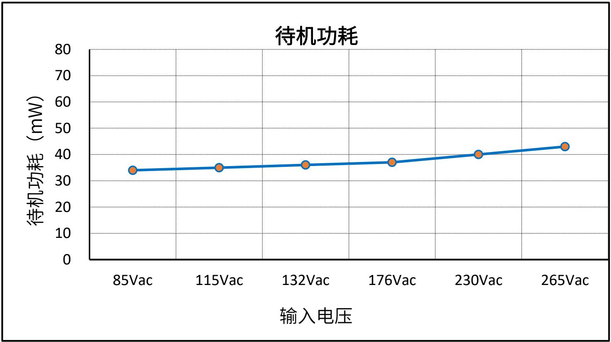

◼ 注：以上待机功耗数据，在BR pin接地和无X电容放电电阻情况下测试。

## 输出电压纹波

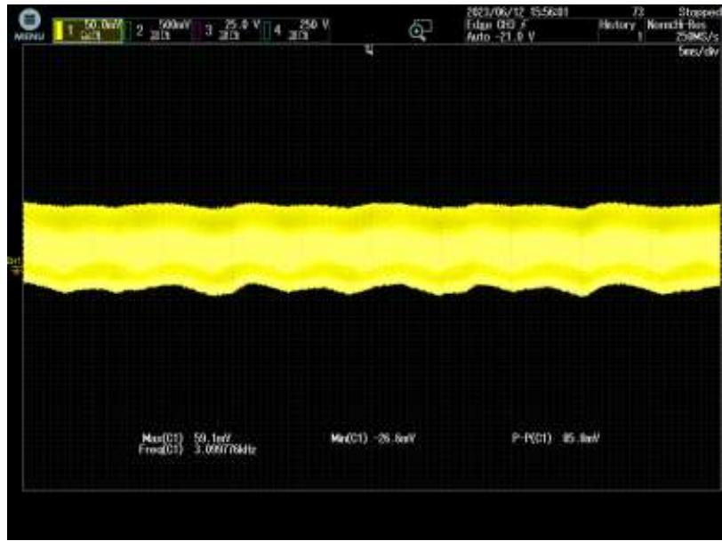

## 85VAC

$\begin{array} { l } { \mathsf { C H 1 V _ { O U T } } } \\ { \mathsf { V _ { P K - P K } } \equiv 8 5 . 8 \mathsf { m v } } \end{array}$ CH1 VOUT

## Test Condition:

➢ Full Load(1.5A)

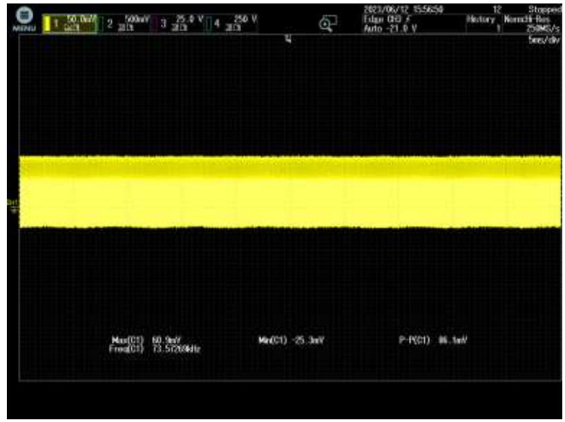

## 265VAC

CH1 VOUT $\begin{array} { r l } & { \mathsf { C H 1 V } _ { \mathsf { O U T } } } \\ & { \mathsf { V } _ { \mathsf { P K - P K } } \equiv 8 6 . 1 \mathsf { m v } } \end{array}$

## Test Condition:

➢ Full Load(1.5A)

## 动态纹波（ $( \mathrm { \bar { 6 } 0 9 6 - 1 0 0 9 0 } )$

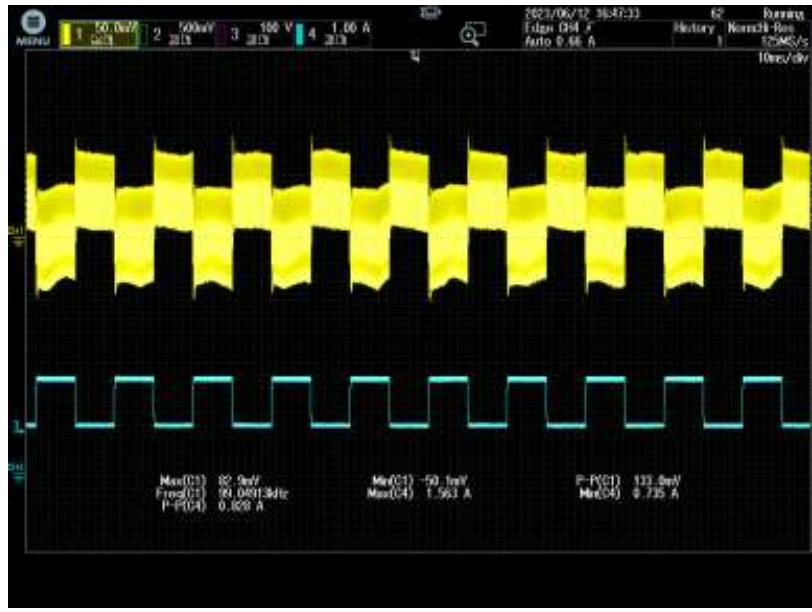

## 85VAC

CH1 VOUT ${ \mathsf { C H 1 } } { \mathsf { V } } _ { \mathsf { O U T } }$  
$v _ { p _ { k - P K } } = 1 3 3 ~ \mathsf { m V }$  
CH4 IOUT $\mathsf { C H 4 } \mathsf { I } _ { \mathsf { O U T } }$

## Test Condition:

➢ $0 . 7 5 \ : \mathsf { A } – 1 . 5 \ : \mathsf { A } – 0 . 7 5 \ : \mathsf { A }$  
➢ Slew Rate: 0.5 A/μS  
➢ Frequency: 100 Hz

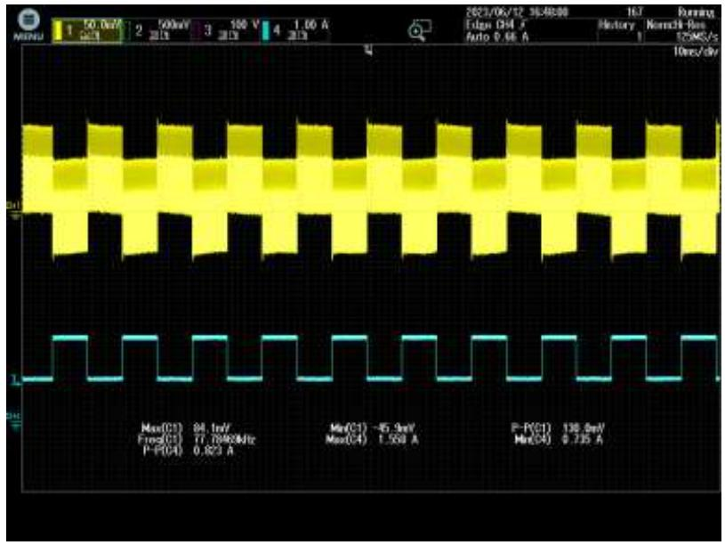

## 265VAC

CH1 VOUT ${ \mathsf { C H 1 } } { \mathsf { V } } _ { \mathsf { O U T } }$  
$v _ { p _ { \mathrm { K - P K } } } { = } 1 3 0 \ : \mathrm { m V }$  
CH4 IOUT $\mathsf { C H 4 } \mathsf { I } _ { \mathsf { O U T } }$

## Test Condition:

➢ $0 . 7 5 \ : \mathsf { A } – 1 . 5 \ : \mathsf { A } – 0 . 7 5 \ : \mathsf { A }$  
➢ Slew Rate: 0.5 $\mathsf { A } / \mu \mathsf { S }$  
➢ Frequency: 100 Hz

## 动态纹波（ $( ( 1 1 0 ) \% = ( 0 . 0 0 0 )$

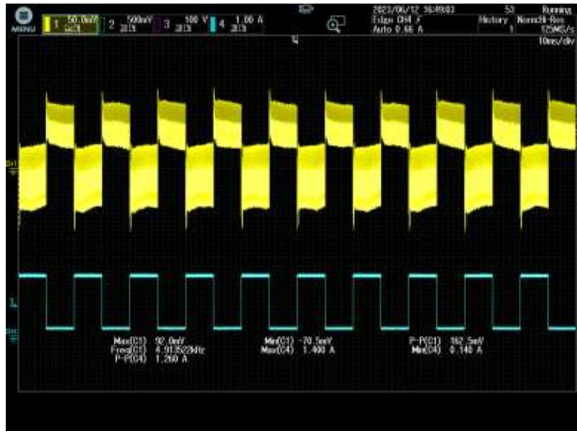

## 85VAC

CH1 VOUT ${ \mathsf { C H 1 } } { \mathsf { V } } _ { \mathsf { O U T } }$  
$\mathsf { V } _ { \mathsf { P K - P K } } \equiv 1 6 3 \mathsf { m V }$  
CH4 IOUT $\mathsf { C H 4 } \mathsf { I } _ { \mathsf { O U T } }$

## Test Condition:

➢ $0 . 1 5 \mathsf { A } – 1 . 3 5 \mathsf { A } – 0 . 1 5 \mathsf { A }$  
➢ Slew Rate: 0.5 A/μS  
➢ Frequency: 100 Hz

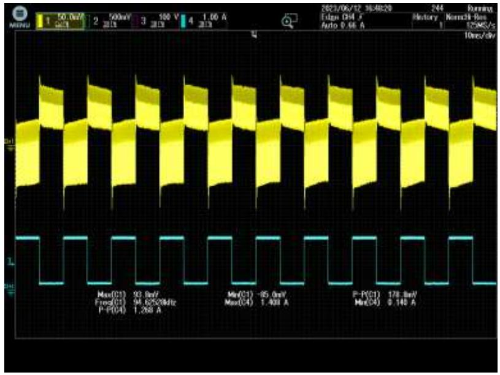

## 265VAC

CH1 VOUT ${ \mathsf { C H 1 } } { \mathsf { V } } _ { \mathsf { O U T } }$  
$v _ { p _ { \mathrm { K - P K } } } { = } 1 7 9 \mathsf { m v }$  
CH4 IOUT $\mathsf { C H 4 } \mathsf { I } _ { \mathsf { O U T } }$

## Test Condition:

➢ 0.15 A-1.35 A-0.15A  
➢ Slew Rate: 0.5 $\mathsf { A } / \mu \mathsf { S }$  
➢ Frequency: 100 Hz

## 短路保护 （MOSFET波形）

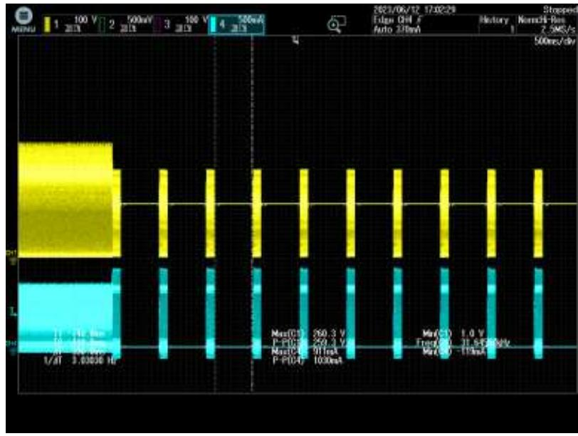

## 85VAC

${ \mathsf { C H 3 } } \mathsf { V _ { D S } }$  
CH4 ID

$$
V _ {D S \_ M A X} = 2 6 0 \mathrm{V}
$$

$$
I _ {D S \_ M A X} = 0. 9 1 1 \mathrm{A}
$$

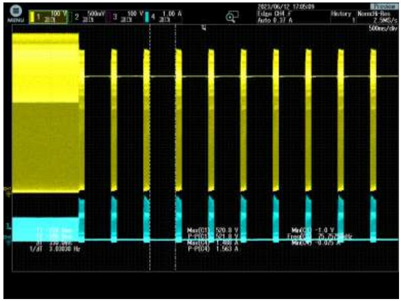

## 265VAC

${ \mathsf { C H 3 } } \mathsf { V _ { D S } }$  
CH4 I $\mathsf { V } _ { \mathsf { D S \_ M A X } } = 5 2 1 \mathsf { V }$ $\mathsf { I } _ { \mathsf { D S \_ M A X } } = \mathsf { 1 } . 4 8 8 \mathsf { A }$

## 推广注意事项

关于OCP时的VCS\_clamp：  
规格书中VCS\_clamp=1.24V，此值不包含输入线电压补偿和斜坡补偿，叠加这两个补偿后的Vcs\_clamp在0.9V-1.0V之间，和Ton相关。（后续给出测试值或者估算公式）  
◼ BR脚上拉电阻需要用两颗2MΩ左右1206电阻串联，通常1206电阻的耐压为200V。电阻阻值不宜过小，会影响待机功耗。  
◼ FB电容典型值可以用1nF-2.2nF，加大FB电容会影响动态响应。  
◼ VCC脚串10Ω-47Ω电阻可以改善ESD，可根据实际layout情况看是否需要加，有空间的话建议预留位置。

## THANK YOU FOR WATCHING
