# BPA86526P 12V/2A参考设计(开放式)

时间：2023年10月

'BPS

晶丰明源

## 内容

BPA86526P简介  
电源规格  
电路原理图  
 PCB Layout和实物图  
BOM  
变压器参数  
性能测试数据  
重要声明

## BPA86526P简介

高低压脚之间爬电距离＞3mm  
集成 800V 高压 MOSFET  
通过BR脚可调节burst mode深度  
低待机功耗(<50mW@辅助绕组供电)  
内置峰值电流补偿功能  
内置软启动功能  
 丰富的保护功能（输入过压和欠压保护，输出过压和过载保护，反馈开路保护，过温保护）

应用领域：

家用电器辅助电源  
 PC待机电源  
 适配器、充电器  
 通信、工业控制辅助电源

典型电路-Flyback:  
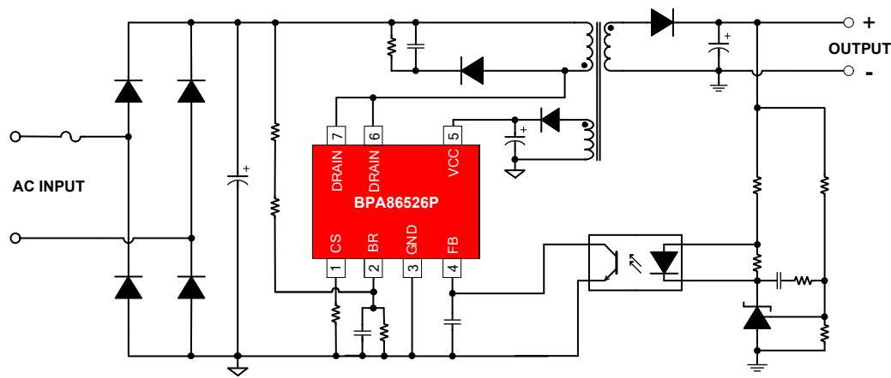

封装管脚图-DIP7:  
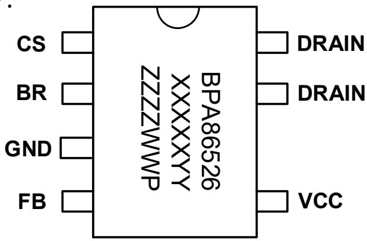

## 电源规格

<table><tr><td>项目描述</td><td>符号</td><td>最小</td><td>典型</td><td>最大</td><td>单位</td><td>备注</td></tr><tr><td colspan="7">输入</td></tr><tr><td>电压</td><td> $V_{IN}$ </td><td>85</td><td></td><td>265</td><td> $V_{AC}$ </td><td></td></tr><tr><td>频率</td><td> $f_{LINE}$ </td><td>47</td><td>50/60</td><td>63</td><td>Hz</td><td></td></tr><tr><td colspan="7">输出</td></tr><tr><td>输出电压</td><td> $V_{OUT}$ </td><td>11.4</td><td>12</td><td>12.6</td><td>V</td><td>±5%</td></tr><tr><td>输出电流</td><td> $I_{OUT}$ </td><td></td><td>2</td><td></td><td>A</td><td></td></tr><tr><td>输出电压纹波</td><td> $V_{RIPPLE}$ </td><td></td><td></td><td>83.45</td><td>mV</td><td>稳态,20MHz带宽</td></tr><tr><td>连续输出功率</td><td> $P_{OUT}$ </td><td></td><td></td><td>24W</td><td>W</td><td></td></tr><tr><td colspan="7">效率</td></tr><tr><td>待机功耗</td><td> $P_{STDBY}$ </td><td></td><td></td><td>96.65</td><td>mW</td><td>230VAC</td></tr><tr><td>满载效率</td><td>η</td><td>81.28</td><td></td><td></td><td>%</td><td></td></tr><tr><td colspan="7">环境</td></tr><tr><td>传导EMI</td><td></td><td colspan="4">满足CISPR22/EN55022 Class B,至少6dB 裕量</td><td></td></tr><tr><td>Surge</td><td></td><td></td><td>4</td><td></td><td>kV</td><td>差模 /共模</td></tr><tr><td>EFT</td><td></td><td></td><td>4</td><td></td><td>KV</td><td>5kHz/100kHz/38kHz</td></tr><tr><td>ESD</td><td></td><td></td><td>15</td><td>20</td><td>KV</td><td>空气放电</td></tr><tr><td>工作环境温度</td><td>TAMP</td><td></td><td></td><td>50</td><td>°C</td><td></td></tr></table>

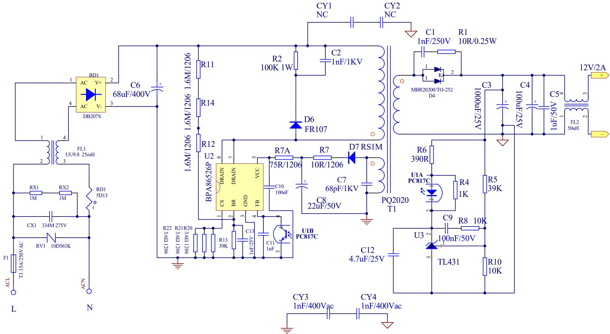

实物图插件面  
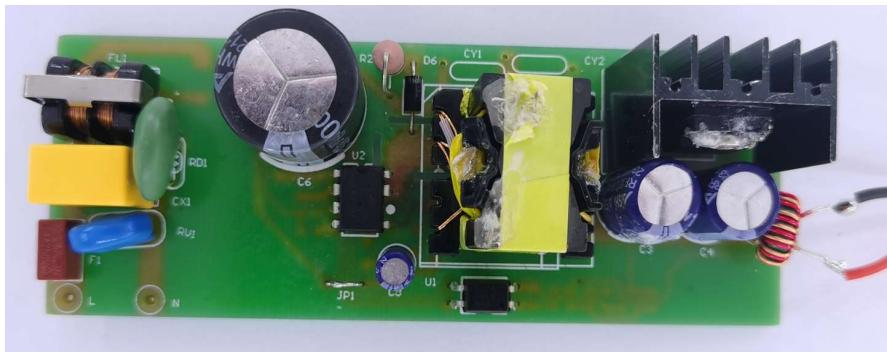

实物图贴片面  
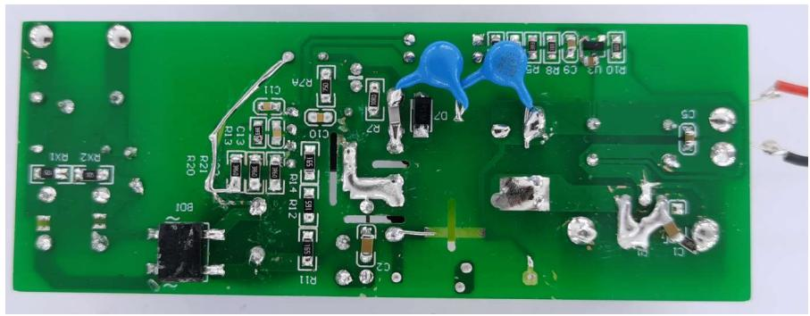

PCB实物图  
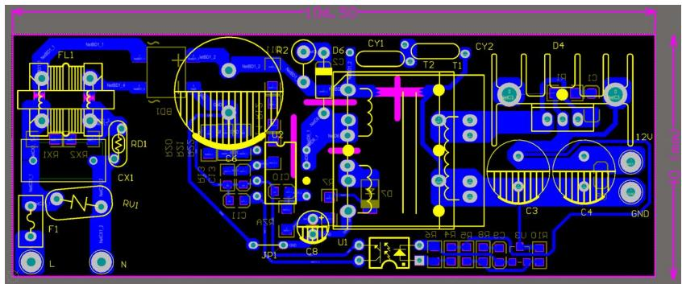

<table><tr><td>序号</td><td>元件标号</td><td>参数描述</td><td>封装尺寸</td><td>数量</td></tr><tr><td>1</td><td>PCB</td><td>CEM-1, 单面板</td><td>100mm*40m</td><td>1</td></tr><tr><td>2</td><td>F1</td><td>T4A 250V 保险丝</td><td>DIP</td><td>1</td></tr><tr><td>3</td><td>RV1</td><td>10D561, 压敏电阻</td><td>10D561</td><td>1</td></tr><tr><td>4</td><td>NTC1</td><td>5D13,热敏电阻</td><td>5D13</td><td>1</td></tr><tr><td>5</td><td>CX1</td><td>0.33uF 275v X电容</td><td>7*13.5</td><td>1</td></tr><tr><td>6</td><td>RX1,RX2</td><td>1M, ±5%</td><td>SMD1206</td><td>2</td></tr><tr><td>7</td><td>CY3,CY4</td><td>4700PF 400V AC Y1</td><td>DIP</td><td>2</td></tr><tr><td>8</td><td>LF1</td><td>UU9.8 25mH &amp; SQAT1515-30mH-排距8*脚距7mm</td><td>DIP</td><td>1</td></tr><tr><td>9</td><td>DB1</td><td>DB207S 2A 1KV</td><td>SMD</td><td>1</td></tr><tr><td>10</td><td>JP1</td><td>跳线 0.6*7.5</td><td>DIP</td><td>1</td></tr><tr><td>11</td><td>D2</td><td>RS1M 1A 1KV</td><td>SMA</td><td>1</td></tr><tr><td>12</td><td>D4</td><td>DB10200 10A 200V</td><td>TO-252</td><td>1</td></tr><tr><td>13</td><td>D6</td><td>FR107 1A 1KV</td><td>D0-41</td><td>1</td></tr><tr><td>14</td><td>T1</td><td>PQ2020 950uH</td><td>DIP</td><td>1</td></tr><tr><td>15</td><td>U1</td><td>PC817C 光耦</td><td>DIP</td><td>1</td></tr><tr><td>16</td><td>U2</td><td>BPA86526P</td><td>DIP7</td><td>1</td></tr><tr><td>17</td><td>U3</td><td>TL431</td><td>SOT23-3</td><td>1</td></tr><tr><td>18</td><td>C1</td><td>1nF, 250V X7R</td><td>SMD1206</td><td>1</td></tr><tr><td>19</td><td>C2</td><td>1000pF, 1KV X7R</td><td>SMD1206</td><td>1</td></tr><tr><td>20</td><td>C3,C4</td><td>25V/1000uF电解电容,高频低</td><td>ø10*12mm</td><td>2</td></tr></table>

<table><tr><td>序号</td><td>元件标号</td><td>参数描述</td><td>封装尺寸</td><td>数量</td></tr><tr><td>21</td><td>C5</td><td>1uF, 25V X7R</td><td>SMD0805</td><td>1</td></tr><tr><td>22</td><td>C6</td><td>400V68uF电解电容</td><td>ø13*18</td><td>1</td></tr><tr><td>23</td><td>C7</td><td>68pF, 1KV X7R</td><td>SMD1206</td><td>1</td></tr><tr><td>24</td><td>C8</td><td>50V22uF</td><td>ø5*11</td><td>1</td></tr><tr><td>25</td><td>C9,C10</td><td>100nF, 25V X7R</td><td>SMD0805</td><td>2</td></tr><tr><td>26</td><td>C11,C13</td><td>1nF, 25V X7R</td><td>SMD0805</td><td>2</td></tr><tr><td>27</td><td>C12</td><td>4.7uF, 25V X7R</td><td>SMD0805</td><td>1</td></tr><tr><td>28</td><td>R1</td><td>10R, ±5%</td><td>SMD1206</td><td>1</td></tr><tr><td>29</td><td>R2</td><td>1W 100K 炭膜电阻</td><td>DIP</td><td>1</td></tr><tr><td>30</td><td>R4</td><td>1K, ±5%</td><td>SMD0805</td><td>1</td></tr><tr><td>31</td><td>R5,R13</td><td>39K, ±1%</td><td>SMD0805</td><td>2</td></tr><tr><td>32</td><td>R6</td><td>390R, ±5%</td><td>SMD0805</td><td>1</td></tr><tr><td>33</td><td>R7</td><td>10R, ±5%</td><td>SMD1206</td><td>1</td></tr><tr><td>34</td><td>R7A</td><td>75R, ±5%</td><td>SMD1206</td><td>1</td></tr><tr><td>35</td><td>R8</td><td>10k, ±5%</td><td>SMD0805</td><td>1</td></tr><tr><td>36</td><td>R10</td><td>10k, ±1%</td><td>SMD0805</td><td>1</td></tr><tr><td>37</td><td>R11,R12,R14</td><td>1.6M, ±5%</td><td>SMD1206</td><td>3</td></tr><tr><td>38</td><td>R20,R21,R22</td><td>3.6R, ±1%</td><td>SMD1206</td><td>3</td></tr><tr><td colspan="2"></td><td></td><td>Total</td><td>48</td></tr></table>

## 变压器参数

## 原理图

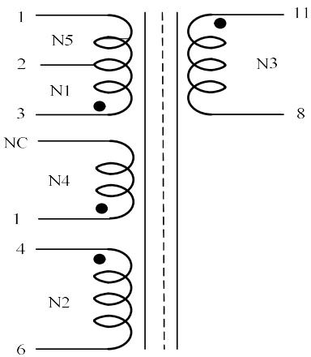

## 规格与材料

初级绕组感量L =950uH±7%（测试条件： 0.3V，100kHz）  
 漏感量L < 30uH  
 骨架：PQ2020（6+8PIN）次级加长  
 磁芯：PQ2020 PC40 或同等材质 ，Ae＝62mm²  
 N1、N2、N4、N5: 2UEW 漆包线  
 N3: 三层绝缘线  
 绝缘胶带:3M900 或同等材质  
 耐压测试: 3KV, 50/60Hz, 1Min  
 成品要求：浸凡立水

## 绕线方式

<table><tr><td>绕组</td><td>起始脚</td><td>终止脚</td><td>材料</td><td>匝数</td><td>绕线方式</td></tr><tr><td>N1</td><td>3</td><td>2</td><td> $\phi 0.35*1P$ </td><td>30Ts</td><td>密绕一层(PIN脚朝外)</td></tr><tr><td colspan="4">胶带</td><td>2.1Ts</td><td></td></tr><tr><td>N2</td><td>4</td><td>6</td><td> $\phi 0.22*2P$ </td><td>10Ts</td><td>疏绕一层(PIN脚朝外)</td></tr><tr><td colspan="4">胶带</td><td>2.1Ts</td><td></td></tr><tr><td>N3</td><td>11</td><td>8</td><td>三层绝缘线 $\phi 0.5*2P$ </td><td>7Ts</td><td>密绕一层(PIN脚朝外)</td></tr><tr><td colspan="4">胶带</td><td>2.1Ts</td><td></td></tr><tr><td>N4</td><td>1</td><td>X</td><td> $\phi 0.22*2P$ </td><td>22Ts</td><td>密绕一层(PIN脚朝外)</td></tr><tr><td colspan="4">胶带</td><td>2.1Ts</td><td></td></tr><tr><td>N5</td><td>2</td><td>1</td><td> $\phi 0.35*1P$ </td><td>29Ts</td><td>密绕一层(PIN脚朝外)</td></tr><tr><td colspan="4">胶带</td><td>3Ts</td><td></td></tr></table>

## 脚位图

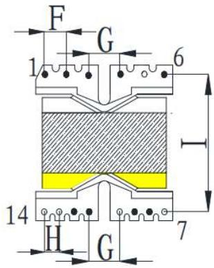

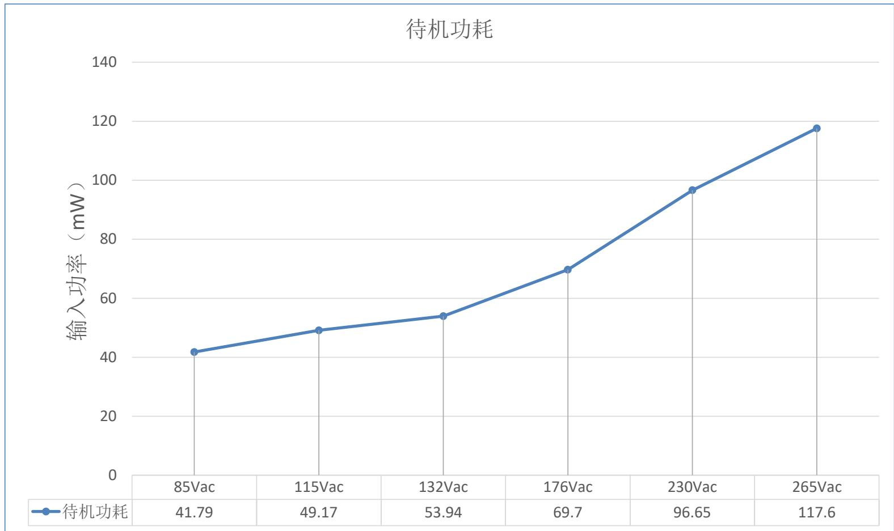

 备注：包含BR管脚对BUS检测电阻损耗和安规电容放电电阻损耗。

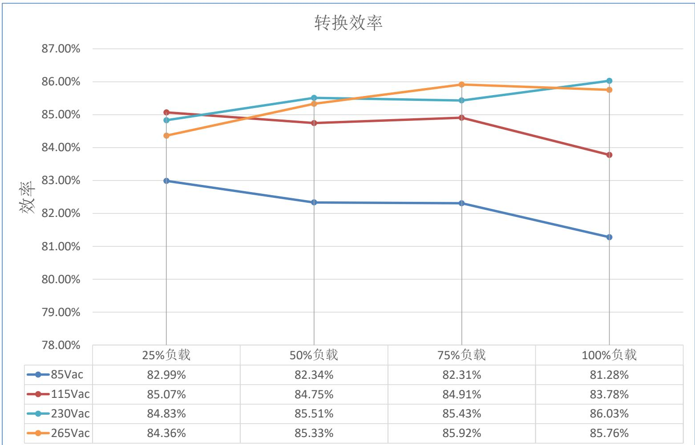

  
调整率- （负载和线性调整率）

<table><tr><td colspan="9">输出电压调整率(单位:V)</td></tr><tr><td>VIN(VAC) $I_{OUT}(mA)$ </td><td>85Vac</td><td>115Vac</td><td>132Vac</td><td>176Vac</td><td>230Vac</td><td>265Vac</td><td>平均值</td><td>线调整率</td></tr><tr><td>0%负载(0mA)</td><td>12.171</td><td>12.169</td><td>12.170</td><td>12.170</td><td>12.169</td><td>12.171</td><td>12.17</td><td>0.02%</td></tr><tr><td>25%负载(500mA)</td><td>12.166</td><td>12.165</td><td>12.165</td><td>12.165</td><td>12.165</td><td>12.165</td><td>12.17</td><td>0.01%</td></tr><tr><td>50%负载(1000mA)</td><td>12.161</td><td>12.161</td><td>12.161</td><td>12.161</td><td>12.160</td><td>12.160</td><td>12.16</td><td>0.01%</td></tr><tr><td>75%负载(1500mA)</td><td>12.160</td><td>12.159</td><td>12.159</td><td>12.160</td><td>12.160</td><td>12.160</td><td>12.16</td><td>0.01%</td></tr><tr><td>100%负载(2000mA)</td><td>12.155</td><td>12.156</td><td>12.155</td><td>12.155</td><td>12.156</td><td>12.156</td><td>12.16</td><td>0.01%</td></tr><tr><td>负载调整率</td><td>0.13%</td><td>0.11%</td><td>0.12%</td><td>0.12%</td><td>0.11%</td><td>0.12%</td><td colspan="2">/</td></tr></table>

 调整率计算方法：调整率=100%\*(最大值-最小值)/平均值  
 测试条件：无假负载

## 输出电压纹波

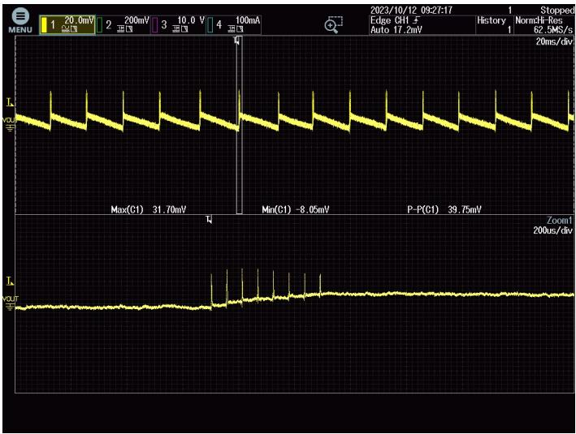

85 VAC

CH1 VOUT $\mathsf { V } _ { \mathsf { O U T } }$ $V _ { p | c - P K } = 3 9 . 7 5 m v$

Test Condition:

 No Full Load

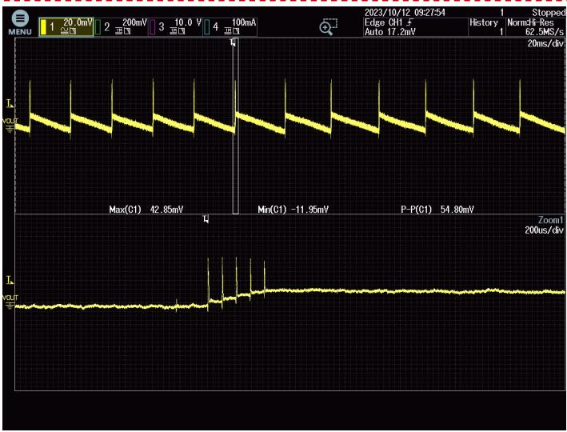

265 VAC

CH1 VOUT $\mathsf { V } _ { \mathsf { O U T } }$ $V _ { p | \mathrm { X - P K } } = 5 4 . 8 0 \mathrm { m V }$

 No Full Load

Test Condition:  
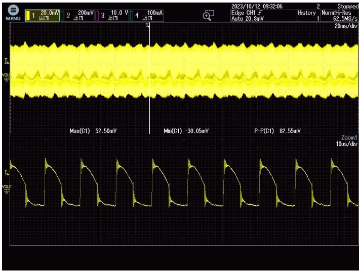

85 VAC

CH1 VOUT $\mathsf { V } _ { \mathsf { O U T } }$ $V _ { p | c - P K } = 8 2 . 5 5 m v$

Test Condition:

 Full Load (2A)

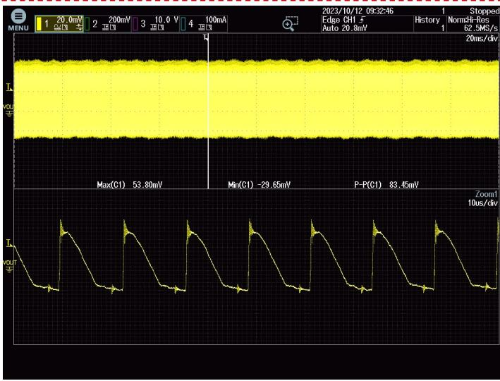

265 VAC

CH1 VOUT $\mathsf { V } _ { \mathsf { O U T } }$ $V _ { p | c - P K } = 8 3 . 4 5 m v$

Test Condition:

 Full Load (2A)

动态负载（50%-100%）  
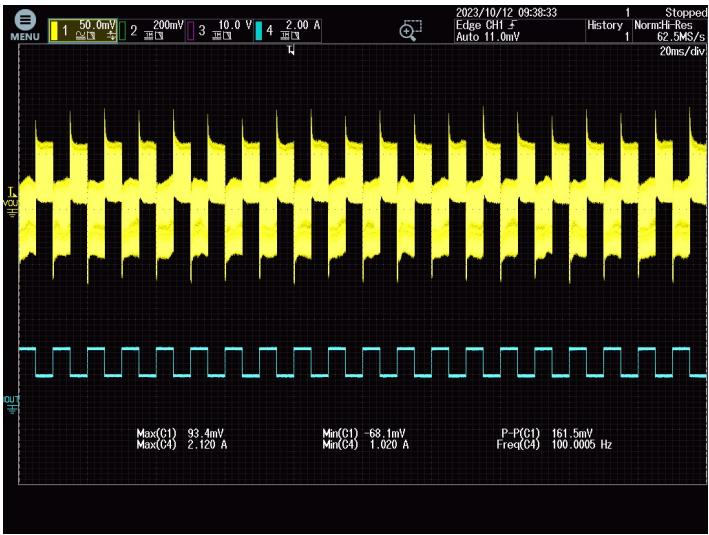

85 VAC

CH1 VOUT  
VPK-PK=161.5mV  
CH4 IOUT

## Test Condition:

 1 A-2A-1A  
 Slew Rate: 0.5 A/μS  
 Frequency: 100 Hz

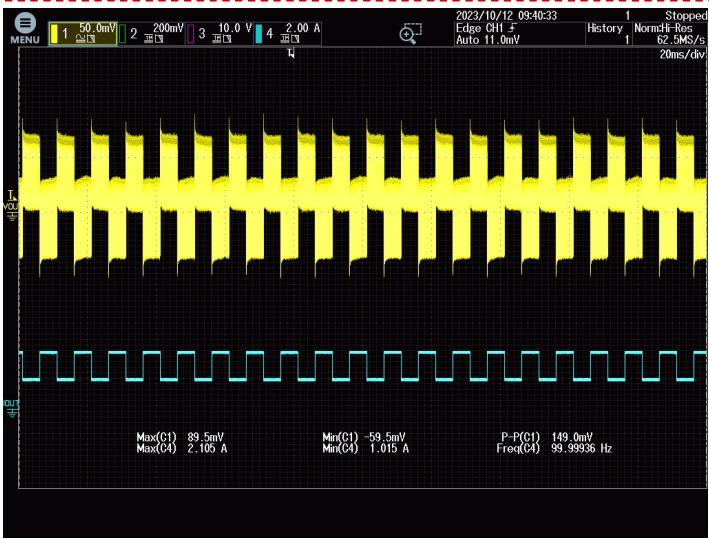

230 VAC

CH1 VOUT  
$V _ { \mathsf { P K - P K } } { = } 1 4 9 . 0 \mathsf { m V }$  
CH4 IOUT

## Test Condition:

 1 A-2A-1A  
 Slew Rate: 0.5 A/μS  
 Frequency: 100 Hz

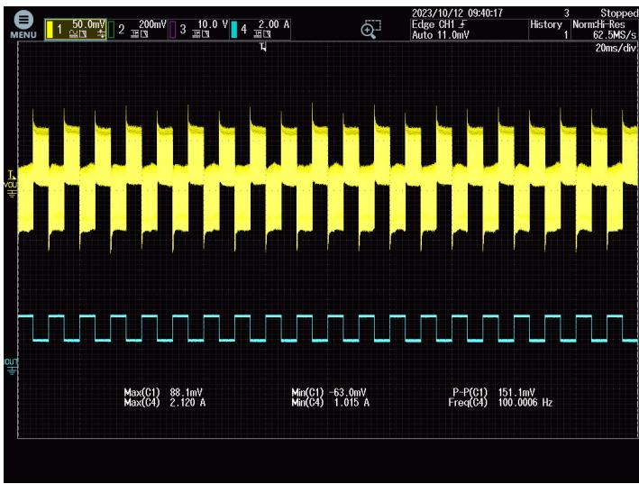

115 VAC

CH1 $\mathsf { V } _ { \mathsf { O U T } }$  
VPK-PK=151.1mV  
$\mathsf { C H 4 } \mathsf { I } _ { \mathsf { O U T } }$

## Test Condition:

 1 A-2A-1A  
 Slew Rate: 0.5 A/μS  
 Frequency: 100 Hz

265 VAC

CH1 VOUT $\mathsf { V } _ { \mathsf { O U T } }$ $V _ { \mathsf { P K - P K } } { = } 1 5 0 . 9 \mathsf { m V }$ VPK-PK=150.9mV  
CH4 IOUT

## Test Condition:

 1 A-2A-1A  
 Slew Rate: 0.5 A/μS  
 Frequency: 100 Hz

动态负载（10%-90%）  
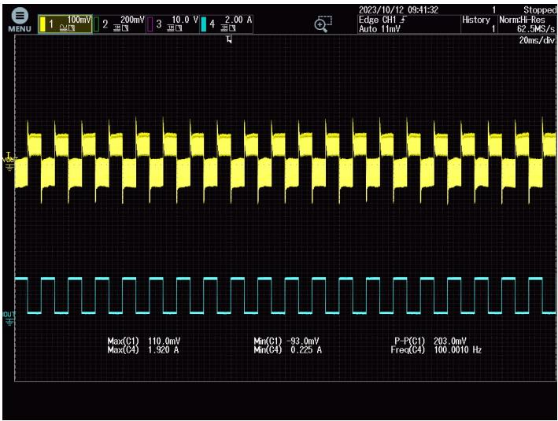

85 VAC

CH1 VOUT  
VPK-PK=203.0mV  
CH4 IOUT

## Test Condition:

 0.2A-1.8A-0.2A  
 Slew Rate: 0.5 A/μS  
 Frequency: 100 Hz

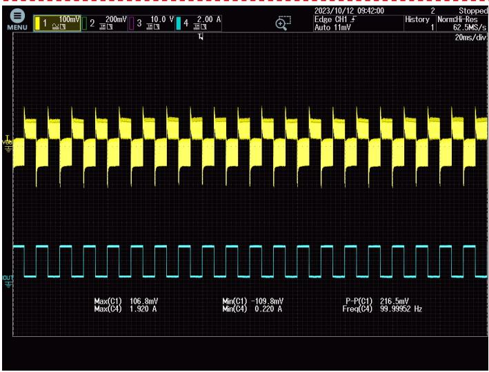

230 VAC

CH1 VOUT  
V =216.5mV  
CH4 IOUT

## Test Condition:

 0.2A-1.8A-0.2A  
 Slew Rate: 0.5 A/μS  
 Frequency: 100 Hz

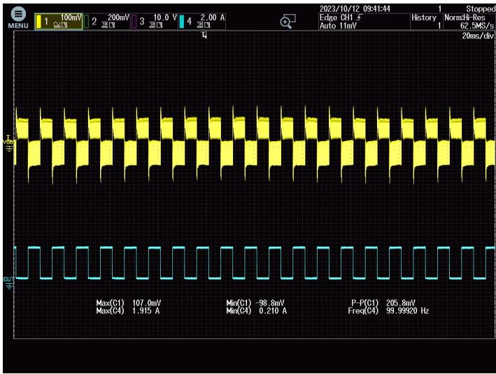

115 VAC

CH1 VOUT  
V =205.8mV  
CH4 IOUT

## Test Condition:

 0.2A-1.8A-0.2A  
 Slew Rate: 0.5 A/μS  
 Frequency: 100 Hz

265 VAC

CH1 VOUT  
VPK-PK=219.5mV  
CH4 IOUT

## Test Condition:

 0.2A-1.8A-0.2A  
 Slew Rate: 0.5 A/μS  
 Frequency: 100 Hz

## 输出电压开机波形

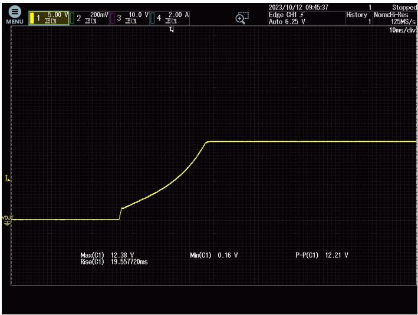

85 VAC

CH1 VOUT $\mathsf { V } _ { \mathsf { O U T } }$ TRISE: 19.56mS

Test Condition:  No Load(0mA)

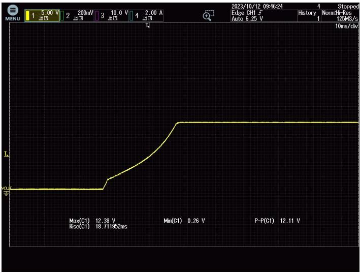

265 VAC

CH1 VOUT $\mathsf { V } _ { \mathsf { O U T } }$ T DELAY : 18.71mS

Test Condition:  No Load(0mA)

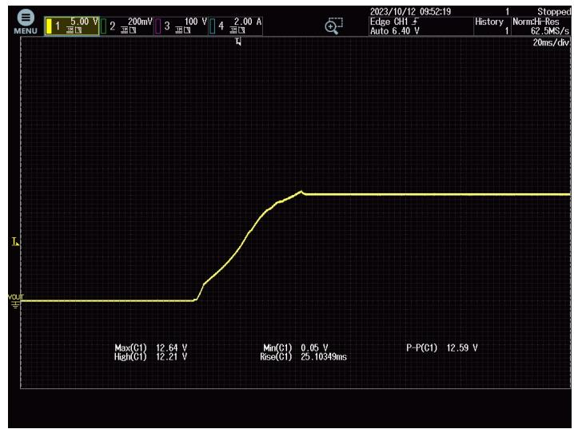

85 VAC

CH1 VOUT $\mathsf { V } _ { \mathsf { O U T } }$ T : 25.10mS

Test Condition:  Full Load(2A)

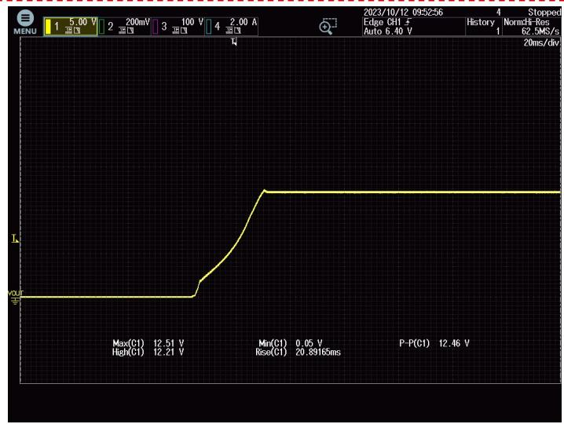

265 VAC

CH1 VOUT $\mathsf { V } _ { \mathsf { O U T } }$ TRISE: 20.89mS

Test Condition: Full Load(2A)

## 启动延时

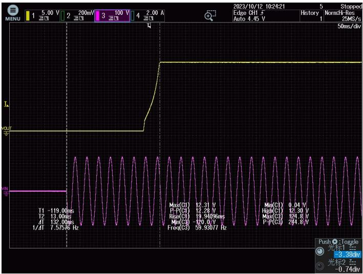

85 VAC

CH1 $\mathsf { V } _ { \mathsf { O U T } }$  
CH3 V $\mathsf { V } _ { \mathsf { I N } }$ $\mathsf { T } _ { \mathsf { D E L A Y } } .$ TDELAY: 132mS

Test Condition:  
 No Load(0mA)  
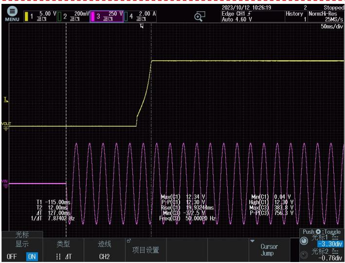

265 $\mathsf { v } _ { \mathsf { A C } }$

CH1 $\mathsf { V } _ { \mathsf { O U T } }$  
CH3 V $\mathsf { V } _ { \mathsf { I N } }$ T DELAY :127mS

Test Condition:  
 No Load(0mA)  
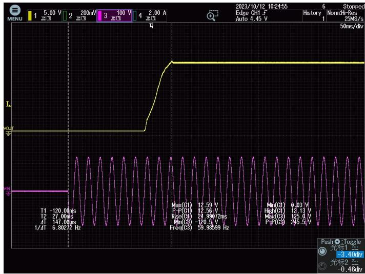

85 VAC

CH1 $\mathsf { V } _ { \mathsf { O U T } }$  
CH3 V $\mathsf { V } _ { \mathsf { I N } }$ $\mathsf { T } _ { \mathsf { D E L A Y } } : 1 4 7$ mS

Test Condition:  
 Full Load(2A)  
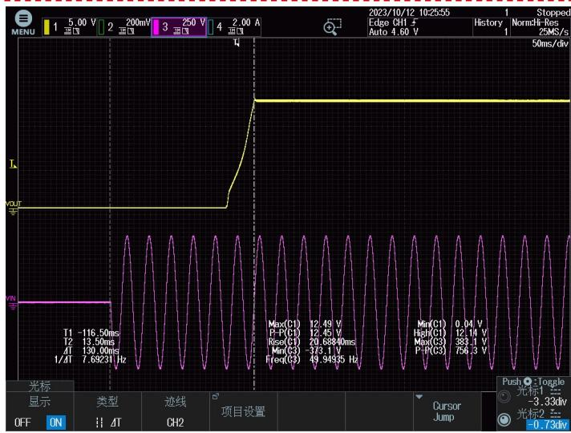

265 $\mathsf { v } _ { \mathsf { A C } }$

CH1 $\mathsf { V } _ { \mathsf { O U T } }$  
CH3 VIN $\mathsf { V } _ { \mathsf { I N } }$ $\mathsf { T } _ { \mathsf { D E L A Y } } .$ 130mS

Test Condition:

 Full Load(2A)

## 输出电压关机波形

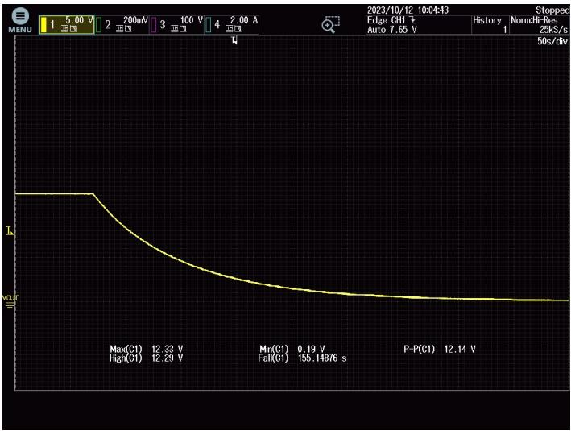

85 VAC

CH1 $\mathsf { V } _ { \mathsf { O U T } }$ T : 155.15S

## Test Condition:

 No Load(0mA)

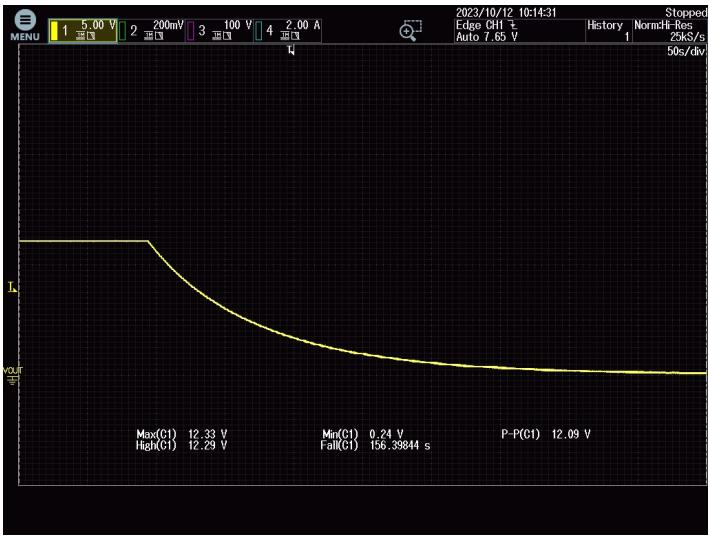

265 VAC

CH1 VOUT $\mathsf { V } _ { \mathsf { O U T } }$ ${ \mathsf { T } } _ { \mathtt { F A L L } } :$ 156.40S

## Test Condition:

 No Load(0mA)

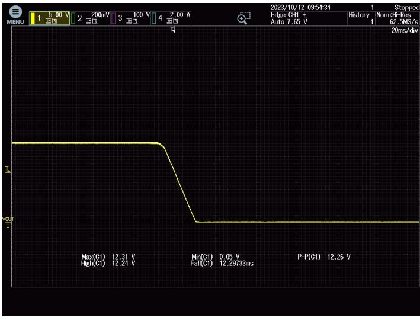

85 VAC

CH1 VOUT $\mathsf { V } _ { \mathsf { O U T } }$ ${ \mathsf { T } } _ { \mathtt { F A L L } } :$ 12.30mS

## Test Condition:

 Full Load(2A)

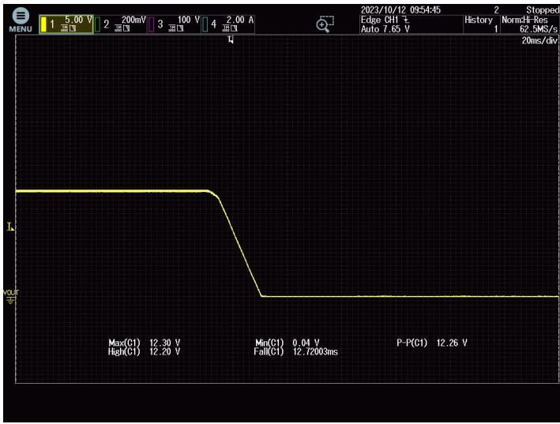

265 VAC

CH1 VOUT $\mathsf { V } _ { \mathsf { O U T } }$ ${ \mathsf { T } } _ { \mathtt { F A L L } } :$ 12.72mS

## Test Condition:

 Full Load(2A)

## VCC电压波形

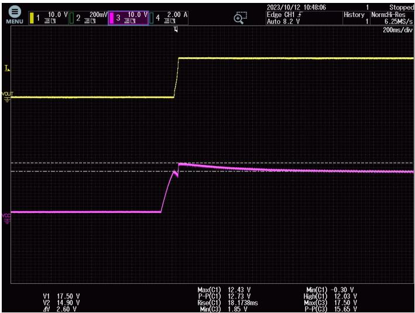

85 VAC

CH1 $\mathsf { V } _ { \mathsf { O U T } }$  
CH3 $\mathsf { V } _ { \mathsf { C C } }$

Vvcc-max=17.5V

Vvcc=14.9V

Test Condition:

 No Load(0mA)

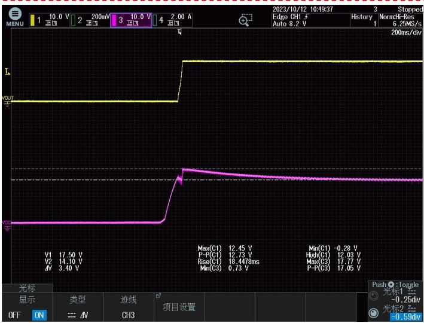

265 $\mathsf { v } _ { \mathsf { A C } }$

CH1 $\mathsf { V } _ { \mathsf { O U T } }$  
CH3 $\mathsf { V } _ { \mathsf { C C } }$

Vvcc-max=17.5V

Vvcc=14.1V

Test Condition:

 No Load(0mA)

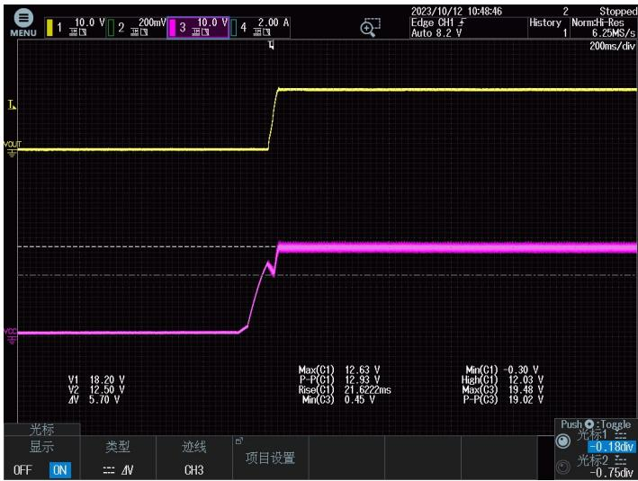

85 $\mathsf { v } _ { \mathsf { A C } }$

CH1 $\mathsf { V } _ { \mathsf { O U T } }$  
CH3 $\mathsf { V } _ { \mathsf { C C } }$  
Vvcc-max=19.48V  
Vvcc=18.2V

Test Condition:

 Full Load(2A)

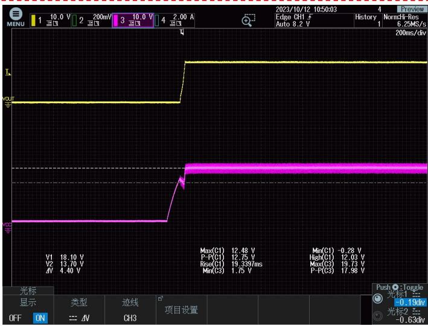

265 $\mathsf { v } _ { \mathsf { A C } }$

CH1 $\mathsf { V } _ { \mathsf { O U T } }$  
CH3 $\mathsf { V } _ { \mathsf { C C } }$  
Vvcc-max=19.73V  
Vvcc=18.1V

Test Condition:

 Full Load(2A)

## MOSFET开机电压和电流波形

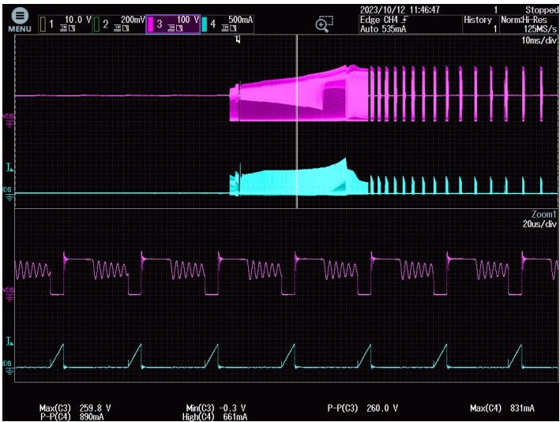

85 VAC

CH3 $\mathsf { V } _ { \mathsf { D } \mathsf { S } }$  
CH4 $\mathsf { I } _ { \mathsf { D } \mathsf { S } }$ IMAX: 0.831A $\mathsf { I } _ { \mathsf { M A X } } \colon 0 . 8 3 1 \mathsf { A }$ $V _ { \mathrm { \sf M A X } } : 2 5 9 . 8 \mathrm { V }$

Test Condition:

 No Load(0mA)

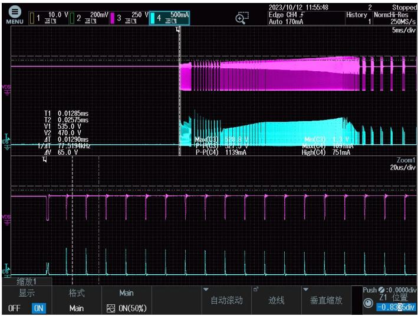

265 $\mathsf { v } _ { \mathsf { A C } }$

CH3 $\mathsf { V } _ { \mathsf { D } \mathsf { S } }$ CH4 IDS $\mathsf { I } _ { \mathsf { D } \mathsf { S } }$ IMAX: 1.091A $\mathsf { I } _ { \mathsf { M A X } } .$ $V _ { \mathrm { M A X } } : 5 2 8 . 8 \mathsf { V }$

 No Load(0mA)

Test Condition:  
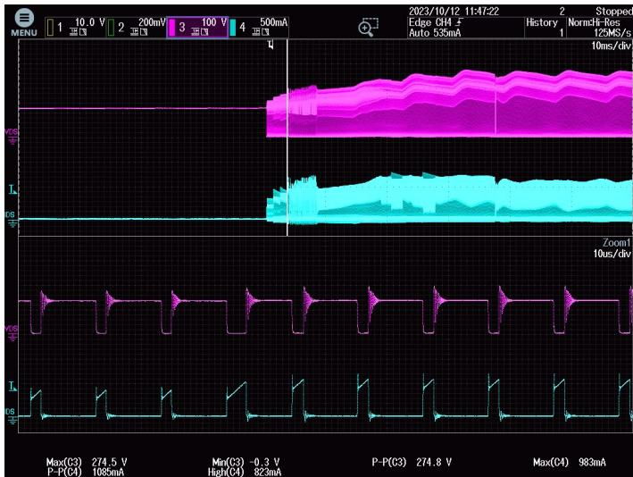

85 $\mathsf { v } _ { \mathsf { A C } }$

CH3 $\mathsf { V } _ { \mathsf { D } \mathsf { S } }$  
CH4 IDS $\mathsf { I } _ { \mathsf { D } \mathsf { S } }$ IMAX: 0.983A $\mathsf { I } _ { \mathsf { M A X } } \colon \mathsf { 0 } . \mathsf { 9 8 3 A }$ $V _ { \sf M A X } : 2 7 4 . 8 \sf V$

Test Condition:

 Full Load(2A)

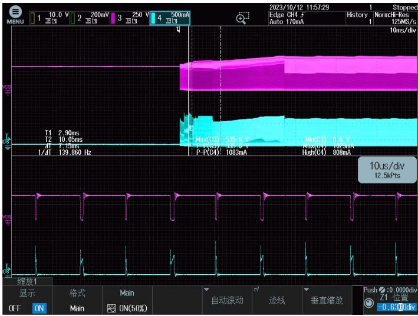

265 $\mathsf { v } _ { \mathsf { A C } }$

CH3 $\mathsf { V } _ { \mathsf { D } \mathsf { S } }$  
CH4 $\mathsf { I } _ { \mathsf { D } \mathsf { S } }$ IMAX: 1.029A $\mathsf { I } _ { \mathsf { M A X } } \colon 1 . 0 2 9 \mathsf { A }$ VMAX: 535.6V

Test Condition:

 Full Load(2A)

## MOSFET稳态电压和电流波形

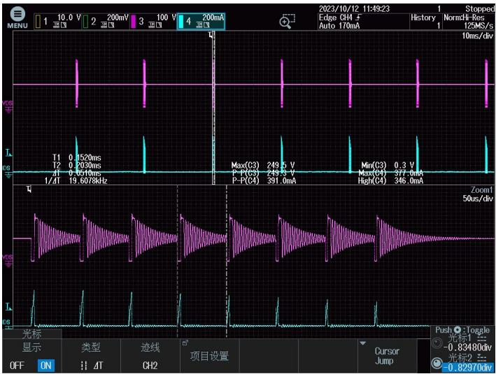

85 VAC

CH3 $\mathsf { V } _ { \mathsf { D } \mathsf { S } }$  
CH4 IDS $\mathsf { I } _ { \mathsf { D } \mathsf { S } }$ IMAX: 0.377A $\mathsf { I } _ { \mathsf { M A X } } \colon \mathsf { 0 } . 3 7 7 \mathsf { A }$ $V _ { \max } : 2 4 9 . 5 V$

## Test Condition:

 No Load(0mA)

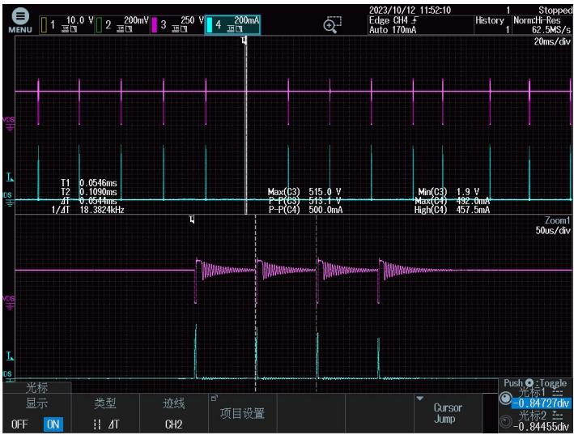

265 $\mathsf { v } _ { \mathsf { A C } }$

CH3 $\mathsf { V } _ { \mathsf { D } \mathsf { S } }$  
CH4 $\mathsf { I } _ { \mathsf { D } \mathsf { S } }$ IMAX: 0.492A $\mathsf { I } _ { \mathsf { M A X } } .$ $\mathsf { V } _ { \mathsf { M A X } } \colon 5 1 5 . 0 \mathsf { V }$

## Test Condition:

 No Load(0mA)

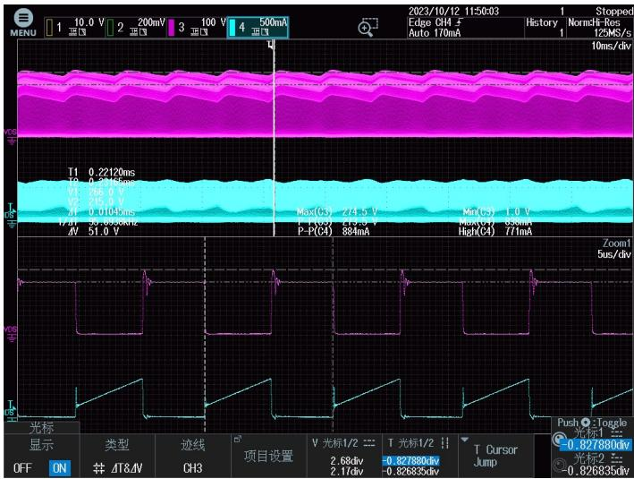

85 $\mathsf { v } _ { \mathsf { A C } }$

CH3 $\mathsf { V } _ { \mathsf { D } \mathsf { S } }$  
CH4 IDS $\mathsf { I } _ { \mathsf { D } \mathsf { S } }$ IMAX: 0.838A $\mathsf { I } _ { \mathsf { M A X } } \colon 0 . 8 3 8 \mathsf { A }$ ${ \mathsf { V } } _ { { \mathsf { M A X } } } .$ 274.5V

## Test Condition:

 Full Load(2A)

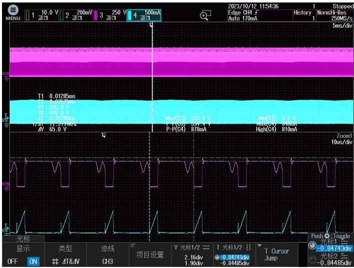

265 $\mathsf { v } _ { \mathsf { A C } }$

CH3 $\mathsf { V } _ { \mathsf { D } \mathsf { S } }$  
CH4 IDS $\mathsf { I } _ { \mathsf { D } \mathsf { S } }$ $\mathsf { I } _ { \mathsf { M A X } } .$ 0.848mA ${ \mathsf { V } } _ { { \mathsf { M A X } } } .$ 535.0V

## Test Condition:

 Full Load(2A)

## 输出短路保护

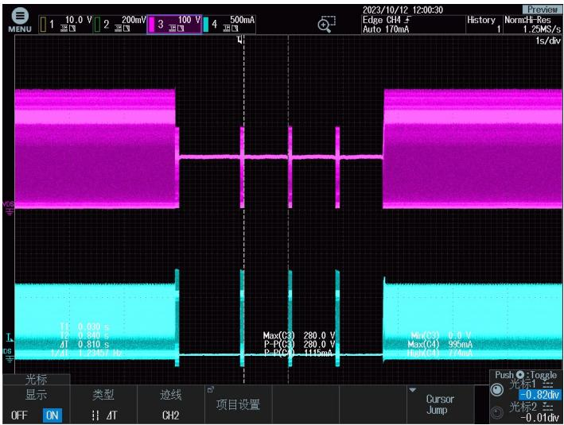

85 VAC

${ \mathsf { C H 3 } } \cup _ { \mathsf { D S } }$  
$C H 4 1 _ { \tt D S }$ IMAX: 0.995A $\mathsf { I } _ { \mathsf { M A X } } \colon \mathsf { 0 } . \mathsf { 9 9 5 A }$ $V _ { \mathrm { M A X } } : 2 8 0 . 0 \mathsf { V }$

保护间隔时间：0.814S

## Test Condition:

 输出短路

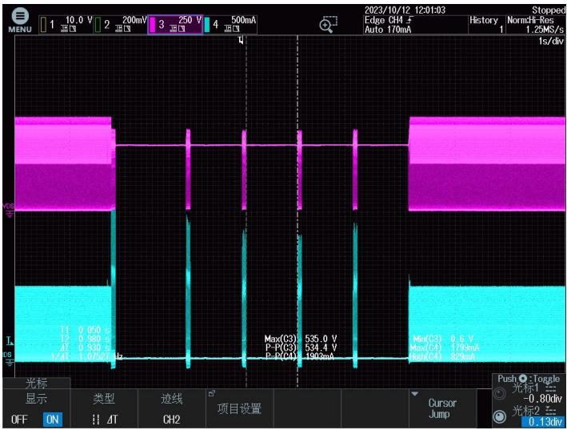

265 VAC

${ \mathsf { C H 3 } } \cup _ { \mathsf { D S } }$  
$C H 4 \mid _ { \mathrm { D S } }$ IMAX: 1.799A $\mathsf { I } _ { \mathsf { M A X } } \colon 1 . 7 9 9 \mathsf { A }$ $V _ { \mathrm { M A X } } : 5 3 5 . 0 \mathsf { V }$

保护间隔时间：1.13S

## Test Condition:

 输出短路

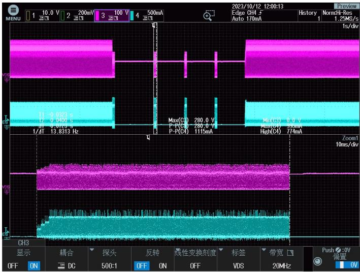

${ \tt S } 5 { \tt V } _ { \sf A C }$

${ \mathsf { C H 3 } } \mathsf { V _ { D S } }$  
CH4 IDS $C H 4 1 _ { \tt D S }$ IMAX: 0.995A $\mathsf { I } _ { \mathsf { M A X } } \colon \mathsf { 0 } . \mathsf { 9 9 5 A }$ $V _ { \mathrm { M A X } } : 2 8 0 . 0 \mathsf { V }$

保护触发时间：0.072S

## Test Condition:

 输出短路

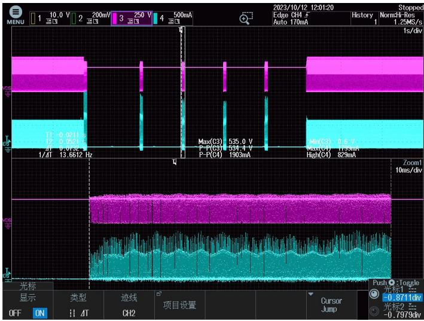

265 VAC

${ \mathsf { C H 3 } } \mathsf { V _ { D S } }$  
CH4 IDS $C H 4 1 _ { \tt D S }$ IMAX: 1.799A $\mathsf { I } _ { \mathsf { M A X } } \colon 1 . 7 9 9 \mathsf { A }$ $V _ { \mathrm { M A X } } : 5 3 5 . 0 \mathsf { V }$

保护触发时间：0.073S

## Test Condition:

 输出短路

## 输入欠压保护

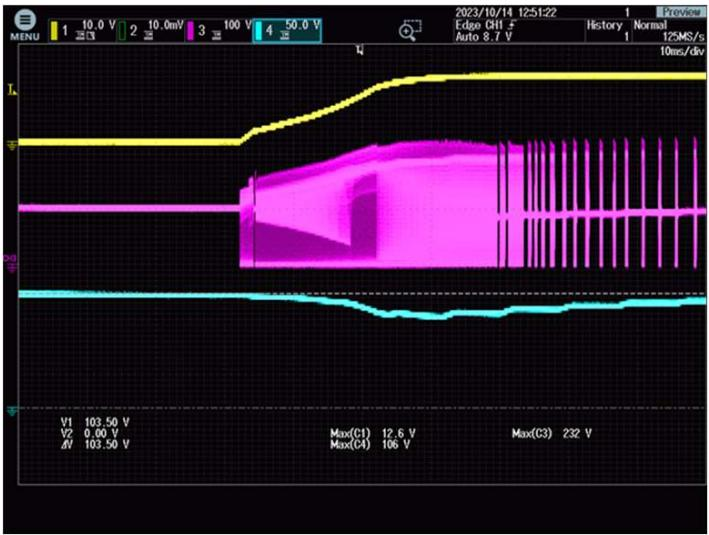

## 输出空载

## BROWN-IN

CH1 $\mathsf { V } _ { \mathsf { O U T } }$  
CH3 $\mathsf { V } _ { \mathsf { D } \mathsf { S } }$  
CH4 VIN $\mathsf { V I N } _ { \mathsf { D C } }$ VBROWN-IN:103V

## Test Condition:

 No Load

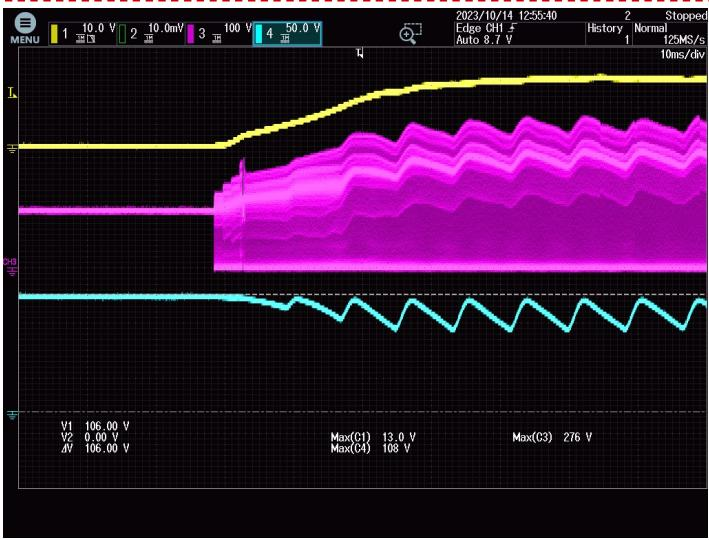

## 输出满载

## BROWN-IN

CH1 $\mathsf { V } _ { \mathsf { O U T } }$  
CH3 $\mathsf { V } _ { \mathsf { D } \mathsf { S } }$  
CH4 VIN $\mathsf { V I N } _ { \mathsf { D C } }$ VBROWN-IN: 106 V

## Test Condition:

 Full Load

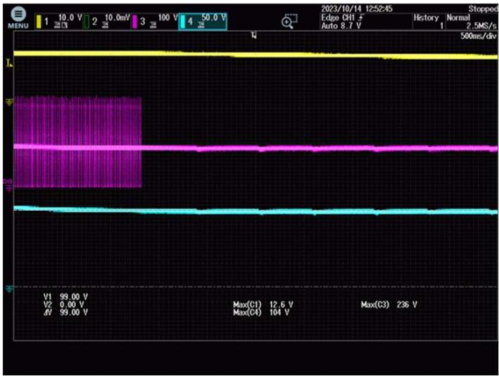

## 输出空载

## BROWN-OUT

CH1 $\mathsf { V } _ { \mathsf { O U T } }$  
CH3 $\mathsf { V } _ { \mathsf { D } \mathsf { S } }$  
CH4 VIN $\mathsf { V I N } _ { \mathsf { D C } }$ VBROWN-OUT: 99V

## Test Condition:

 No Load

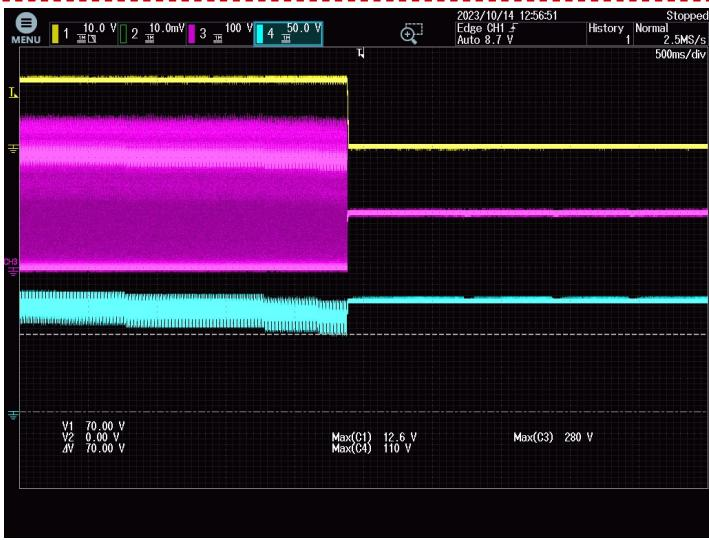

## 输出满载

## BROWN-OUT

CH1 $\mathsf { V } _ { \mathsf { O U T } }$  
CH3 $\mathsf { V } _ { \mathsf { D } \mathsf { S } }$  
CH4 VIN $\mathsf { V I N } _ { \mathsf { D C } }$ VBROWN-OUT: 70V

## Test Condition:

 Full Load

## 输入过压保护

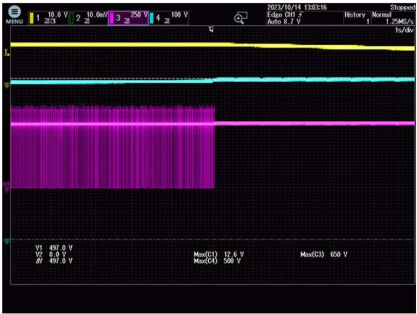

## 输出空载 进入输入OVP

CH1 $\mathsf { V } _ { \mathsf { O U T } }$  
CH3 $\mathsf { V } _ { \mathsf { D } \mathsf { S } }$  
CH4 VINDC $\mathsf { V I N } _ { \mathsf { D C } }$ $V _ { \mathsf { D C - I N } } .$ 497V

## Test Condition:

 No Load

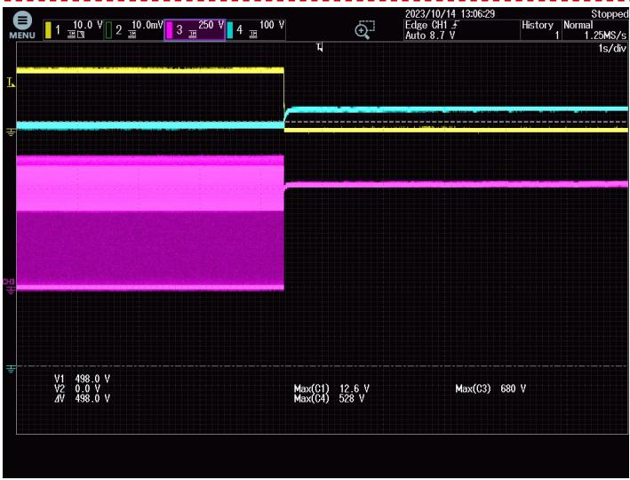

## 输出满载 进入输入OVP

CH1 $\mathsf { V } _ { \mathsf { O U T } }$  
CH3 $\mathsf { V } _ { \mathsf { D } \mathsf { S } }$  
CH4 VINDC $\mathsf { V I N } _ { \mathsf { D C } }$ $v _ { \scriptscriptstyle \mathsf { D C } - \| \mathsf { N } } .$ 498V

## Test Condition:

 Full Load

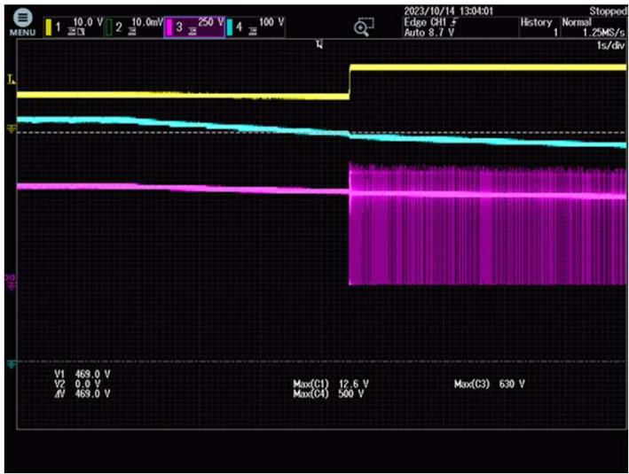

## 输出空载

## 退出输入OVP

CH1 $\mathsf { V } _ { \mathsf { O U T } }$  
CH3 $\mathsf { V } _ { \mathsf { D } \mathsf { S } }$  
CH4 VINDC $\mathsf { V I N } _ { \mathsf { D C } }$ $\mathsf { v } _ { \mathsf { D C - O U T } } .$ 469V

## Test Condition:

 No Load

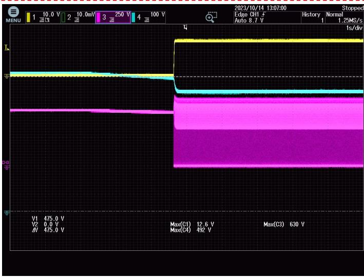

## 输出满载

## 退出输入OVP

CH1 $\mathsf { V } _ { \mathsf { O U T } }$  
CH3 $\mathsf { V } _ { \mathsf { D } \mathsf { S } }$  
CH4 VINDC $\mathsf { V I N } _ { \mathsf { D C } }$ VDC-OUT: 475V

## Test Condition:

 Full Load

## 输出二极管反向电压波形（稳态和开机）

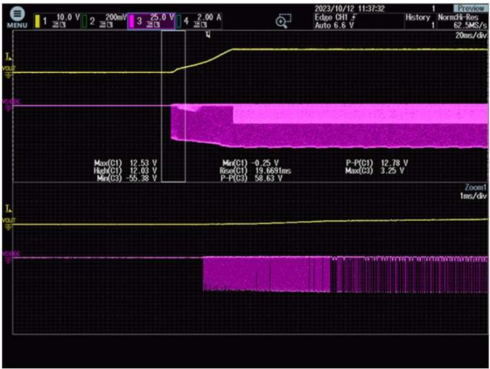

## 265Vac

CH1 $\mathsf { V } _ { \mathsf { O U T } }$  
CH3 VDIODE $\mathsf { V } _ { \mathsf { D I O D E } }$ $\mathsf { V } _ { \mathsf { D I O D E } } \colon 5 5 . 3 8 \mathsf { V }$

## Test Condition:

 Full Load(2A)  
 启动瞬间

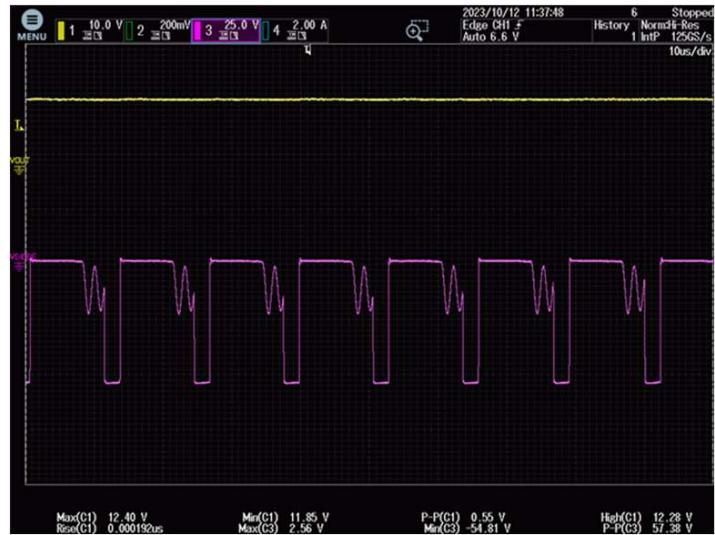

## 265Vac

CH1 $\mathsf { V } _ { \mathsf { O U T } }$  
CH3 VDIODE $\mathsf { V } _ { \mathsf { D I O D E } }$ $\mathsf { V } _ { \mathsf { D I O D E } } \mathsf { i }$ 54.81V

## Test Condition:

 Full Load(2A)  
 稳态工作

## 温升测试 （开放式）

<table><tr><td colspan="9">满载温升测试</td></tr><tr><td rowspan="2">项目</td><td colspan="2">85Vac</td><td colspan="2">115Vac</td><td colspan="2">230Vac</td><td colspan="2">265Vac</td></tr><tr><td>温度(°C)</td><td>温升(°C)</td><td>温度(°C)</td><td>温升(°C)</td><td>温度(°C)</td><td>温升(°C)</td><td>温度(°C)</td><td>温升(°C)</td></tr><tr><td>环境温度</td><td colspan="2">50.32</td><td colspan="2">50.25</td><td colspan="2">50.14</td><td colspan="2">50.04</td></tr><tr><td>BPA86526P(U2)</td><td>124.12</td><td>73.80</td><td>105.80</td><td>55.55</td><td>102.24</td><td>52.10</td><td>94.58</td><td>44.54</td></tr><tr><td>输出二极管(D4)</td><td>75.50</td><td>25.18</td><td>74.32</td><td>24.07</td><td>79.20</td><td>29.06</td><td>74.58</td><td>24.54</td></tr><tr><td>电感磁芯(T1)</td><td>67.63</td><td>17.31</td><td>66.87</td><td>16.62</td><td>74.29</td><td>24.15</td><td>69.23</td><td>19.19</td></tr><tr><td>电感线圈(T1)</td><td>69.61</td><td>19.29</td><td>68.51</td><td>18.26</td><td>74.59</td><td>24.45</td><td>70.05</td><td>20.01</td></tr><tr><td>整流桥(BD1)</td><td>87.01</td><td>36.69</td><td>76.35</td><td>26.10</td><td>69.10</td><td>18.96</td><td>63.25</td><td>13.21</td></tr><tr><td>输入电解电容(C6)</td><td>68.75</td><td>18.43</td><td>63.78</td><td>13.53</td><td>65.09</td><td>14.95</td><td>59.18</td><td>9.14</td></tr><tr><td>输出电解电容(C3)</td><td>64.25</td><td>13.93</td><td>63.22</td><td>12.97</td><td>65.89</td><td>15.75</td><td>63.35</td><td>13.31</td></tr></table>

## 测试说明

 在温箱中进行测试,电路板放在一个开放式的盒子内，采用热电偶连接到各个测量点，等测量点温度达到稳定后记录数据。  
可根据实际PCB面积增加DRAIN端铜箔面积来加强散热。

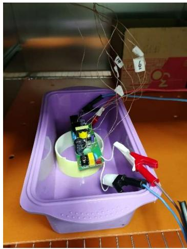

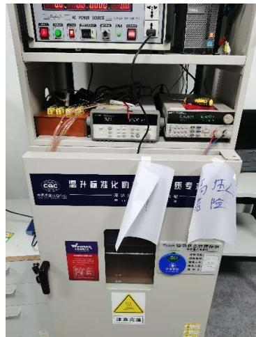

高低温试验箱

## 过温保护点测试 （芯片表面测试）

<table><tr><td>芯片表面温度</td><td>过温保护现象</td></tr><tr><td>135.8°C</td><td>芯片达到过温点后,输出关断,当温度恢复到110°C左右后重启。</td></tr></table>

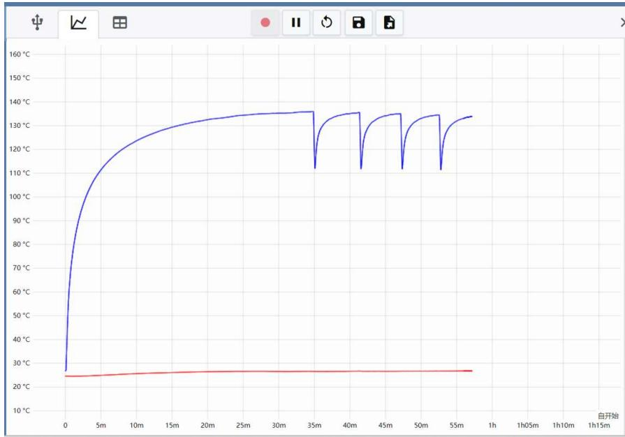

## 测试说明

 在常温下,电路板放在一个密闭式的盒子内，采用热电偶连接到芯片表面（ MOS管位置）。  
 输入电压85Vac,输出带载12V/2.2A。

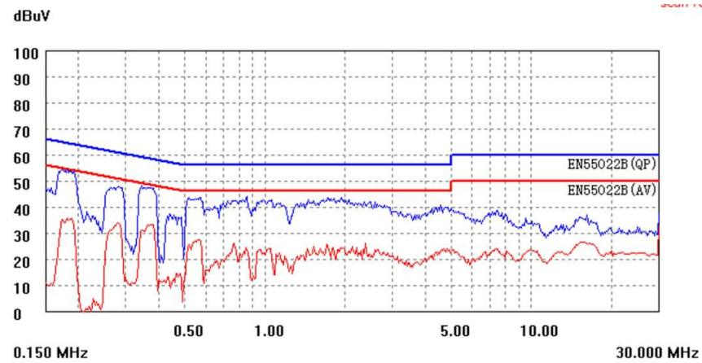

115VAC Line  
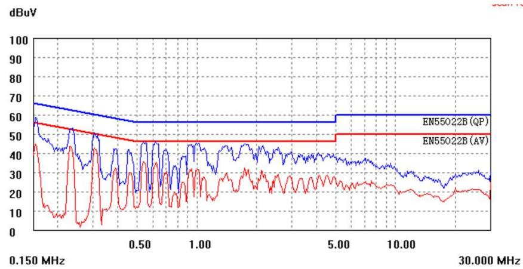

230VAC Line

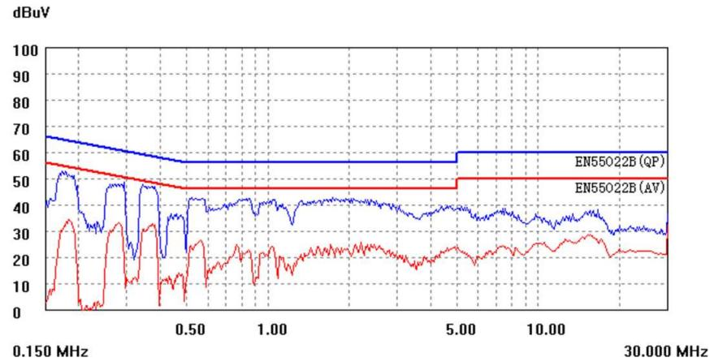

115VAC Neutral

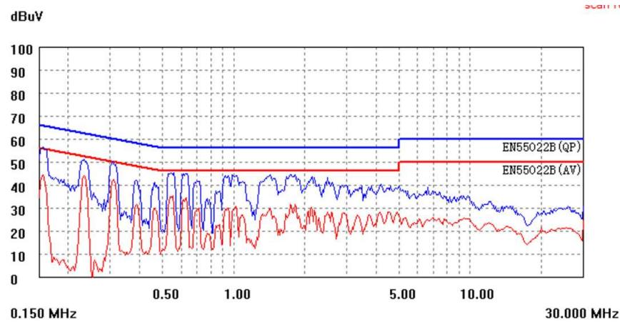

230VAC Neutral

## Surge浪涌测试

<table><tr><td>差模/共模</td><td>电压</td><td>相位角</td><td>发生器阻抗</td><td>测试次数</td><td>测试结果</td></tr><tr><td>L to N</td><td>+2kV</td><td>0°/90°/180°/270°</td><td>2</td><td>10</td><td>Pass</td></tr><tr><td>L to N</td><td>-2kV</td><td>0°/90°/180°/270°</td><td>2</td><td>10</td><td>Pass</td></tr><tr><td>L to N</td><td>+4kV</td><td>0°/90°/180°/270°</td><td>2</td><td>10</td><td>Pass</td></tr><tr><td>L to N</td><td>-4kV</td><td>0°/90°/180°/270°</td><td>2</td><td>10</td><td>Pass</td></tr><tr><td>L to PE</td><td>+4kV</td><td>0°/90°/180°/270°</td><td>12</td><td>10</td><td>Pass</td></tr><tr><td>L to PE</td><td>-4kV</td><td>0°/90°/180°/270°</td><td>12</td><td>10</td><td>Pass</td></tr><tr><td>N to PE</td><td>+4kV</td><td>0°/90°/180°/270°</td><td>12</td><td>10</td><td>Pass</td></tr><tr><td>N to PE</td><td>-4kV</td><td>0°/90°/180°/270°</td><td>12</td><td>10</td><td>Pass</td></tr></table>

## 测试说明

 按照GB/T17626.5和IEC61000-4-5的最新版本要求进行测试  
 室温环境，230VAC输入，满载条件  
 输入1.2/50us组合波浪涌电压  
 每个测试点重复10次  
 每次间隔时间1分钟  
 试验时样机输出正常（符合A类标准）视为Pass

EFT脉冲群测试

<table><tr><td>共模</td><td>电压</td><td>脉冲群持续时间</td><td>脉冲频率</td><td>测试时间</td><td>测试结果</td></tr><tr><td>L/N to PE</td><td>+4kV</td><td>15ms</td><td>5kHz</td><td>120s</td><td>Pass</td></tr><tr><td>L/N to PE</td><td>-4kV</td><td>15ms</td><td>5kHz</td><td>120s</td><td>Pass</td></tr><tr><td>L/N to PE</td><td>+4kV</td><td>0.75ms</td><td>100kHz</td><td>120s</td><td>Pass</td></tr><tr><td>L/N to PE</td><td>-4kV</td><td>0.75ms</td><td>100kHz</td><td>120s</td><td>Pass</td></tr><tr><td>L/N to PE</td><td>+2kV</td><td>2ms</td><td>38kHz</td><td>120s</td><td>Pass</td></tr><tr><td>L/N to PE</td><td>-2kV</td><td>2ms</td><td>38kHz</td><td>120s</td><td>Pass</td></tr><tr><td>L/N to PE</td><td>+4kV</td><td>2ms</td><td>38kHz</td><td>120s</td><td>Pass</td></tr><tr><td>L/N to PE</td><td>-4kV</td><td>2ms</td><td>38kHz</td><td>120s</td><td>Pass</td></tr></table>

## 测试说明

 按照GB/T17626.4和IEC61000-4-4的最新版本要求进行测试  
 室温环境，230VAC输入满载条件  
 分别测试5kHz/100kHz/38kHz脉冲频率  
 脉冲群周期为300ms  
 每个测试条件测试时间120s  
 试验时样机输出正常（符合A类标准）视为Pass

## ESD测试

<table><tr><td>测试点</td><td>电压(V)</td><td>放电类型</td><td>放电次数</td><td>测试结果</td></tr><tr><td>Vout</td><td>+15kV</td><td>空气放电</td><td>10</td><td>Pass</td></tr><tr><td>Vout</td><td>-15kV</td><td>空气放电</td><td>10</td><td>Pass</td></tr><tr><td>GND</td><td>+15kV</td><td>空气放电</td><td>10</td><td>Pass</td></tr><tr><td>GND</td><td>-15kV</td><td>空气放电</td><td>10</td><td>Pass</td></tr><tr><td>Vout</td><td>+20kV</td><td>空气放电</td><td>10</td><td>Pass</td></tr><tr><td>Vout</td><td>-20kV</td><td>空气放电</td><td>10</td><td>Pass</td></tr><tr><td>GND</td><td>+20kV</td><td>空气放电</td><td>10</td><td>Pass</td></tr><tr><td>GND</td><td>-20kV</td><td>空气放电</td><td>10</td><td>Pass</td></tr></table>

## 测试说明

 按照GB/T17626.2和IEC61000-4-2的最新版本要求进行测试  
 室温环境，230VAC输入满载条件  
 每个测试点重复10次  
 分别对输出正端和地进行空气放电  
 试验时样机输出正常（符合A类标准）视为Pass

本文档中的数据和信息仅供参考，不构成任何形式的建议、验收标准或保证。实际测试数据和结果可能同文档中列出的数据和结果存在差异，请用户自行确认产品的适用性，此文档供参考评估。

## THANK YOU FOR WATCHING
