## BPA86526P 隔离参考设计\_12V 1.5A

## INPUT:85VAC\~265VAC

上海晶丰明源半导体股份有限公司

Shanghai Bright Power Semiconductor Co., Ltd.

王岩

时间： 2023年06月12日

## 内容

BPA86526P简介  
电源规格  
电路及实物图  
BOM  
PCB Layout图  
变压器  
性能测试数据

## 产品特点：

➢ 集成 750V 高压 MOSFET  
➢ PWM+PFM模式，低输出纹波  
➢ 内置软启动功能  
➢ 集成高压启动、自供电电路  
➢ 低音频噪声  
➢ 输入过/欠压保护

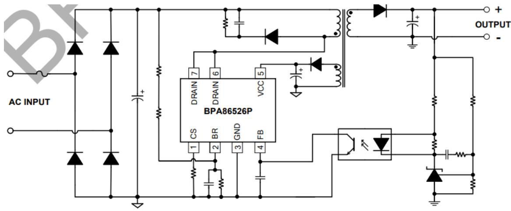

## 应用领域：

➢ 家用电器辅助电源  
➢ 电机驱动辅助电源  
➢ IOT/智能家居/智能照明  
➢ 工业控制辅助电源

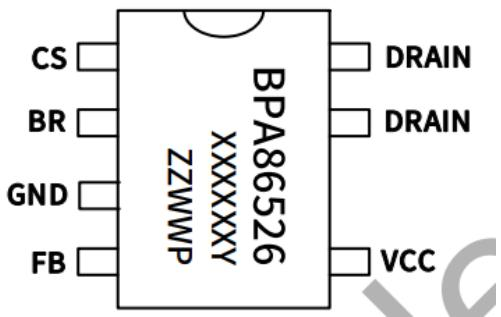

<table><tr><td>项目描述</td><td>符号</td><td>最小</td><td>典型</td><td>最大</td><td>单位</td><td>备注</td></tr><tr><td colspan="7">输入</td></tr><tr><td>电压</td><td> $V_{IN}$ </td><td>85</td><td>120/230</td><td>264</td><td> $V_{AC}$ </td><td></td></tr><tr><td>频率</td><td> $f_{LINE}$ </td><td>47</td><td>50/60</td><td>63</td><td>Hz</td><td></td></tr><tr><td colspan="7">输出</td></tr><tr><td>输出电压</td><td> $V_{OUT}$ </td><td></td><td>12</td><td></td><td>V</td><td>±5%</td></tr><tr><td>输出电流</td><td> $I_{OUT}$ </td><td></td><td>1500</td><td></td><td>mA</td><td></td></tr><tr><td>输出电压纹波</td><td> $V_{RIPPLE}$ </td><td></td><td></td><td>100</td><td>mV</td><td>20MHz带宽</td></tr><tr><td>连续输出功率</td><td> $P_{OUT}$ </td><td></td><td>18</td><td></td><td>W</td><td></td></tr><tr><td colspan="7">效率</td></tr><tr><td>待机功耗</td><td> $P_{STDBY}$ </td><td></td><td></td><td>110</td><td>mW</td><td>230VAC,包含假负载</td></tr><tr><td>满载效率</td><td>η</td><td>81</td><td></td><td></td><td>%</td><td></td></tr><tr><td colspan="7">环境</td></tr><tr><td>传导EMI</td><td></td><td colspan="4">满足CISPR22/EN55022 Class B,至少6dB 裕量</td><td></td></tr><tr><td>Surge</td><td></td><td></td><td>2</td><td></td><td>kV</td><td>差模</td></tr><tr><td>EFT</td><td></td><td></td><td>4</td><td></td><td>kV</td><td>5kHz/100kHz/38kHz</td></tr><tr><td>ESD</td><td></td><td></td><td></td><td></td><td>kV</td><td>空气放电</td></tr><tr><td>工作环境温度</td><td> $T_{AMP}$ </td><td></td><td>40</td><td>55</td><td>°C</td><td></td></tr></table>

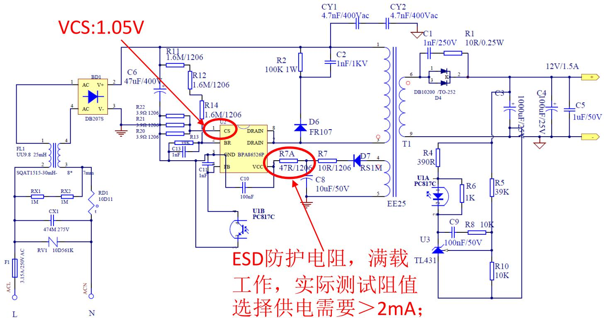

典型值3.88mA  
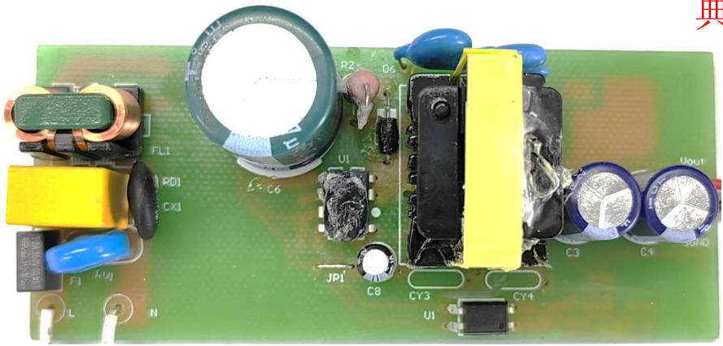

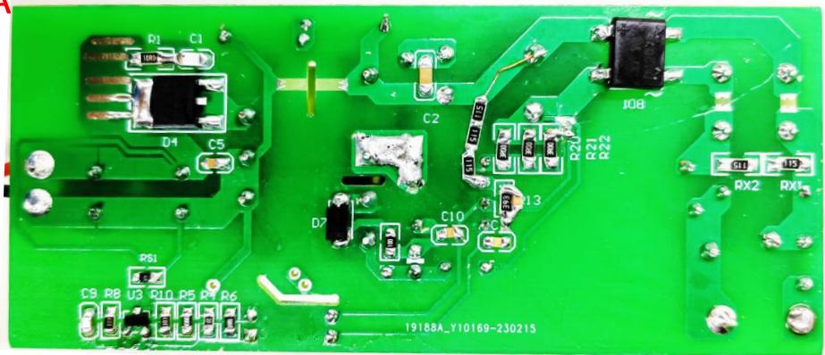

<table><tr><td>序号</td><td>元件标号</td><td>参数描述</td><td>封装尺寸</td><td>数量</td></tr><tr><td>1</td><td>PCB</td><td>CEM-1,双面板</td><td>100mm*40mm</td><td>1</td></tr><tr><td>2</td><td>F1</td><td>T3.15A 250V保险丝</td><td>DIP</td><td>1</td></tr><tr><td>3</td><td>RV1</td><td>10D561,压敏电阻</td><td>10D561</td><td>1</td></tr><tr><td>4</td><td>NTC1</td><td>10D11,热敏电阻</td><td>10D11</td><td>1</td></tr><tr><td>5</td><td>CX1</td><td>0.47uF 275v X电容</td><td>7*13.5</td><td>1</td></tr><tr><td>6</td><td>C6</td><td>400V47uF电解电容</td><td> $\phi 13*18$ </td><td>1</td></tr><tr><td>7</td><td>LF1</td><td>UU9.8 25mH &amp; SQAT1515-30mH-排距8*脚距7mm</td><td>DIP</td><td>1</td></tr><tr><td>8</td><td>C8</td><td>50V10uF</td><td> $\phi 5*11$ </td><td>1</td></tr><tr><td>9</td><td>DB1</td><td>DB207S 2A 1KV</td><td>SMD</td><td>1</td></tr><tr><td>10</td><td>JP1</td><td>跳线 0.6*7.5</td><td>DIP</td><td>1</td></tr><tr><td>11</td><td>R2</td><td>1W 100K炭膜电阻</td><td>DIP</td><td>1</td></tr><tr><td>12</td><td>D6</td><td>FR107 1A 1KV</td><td>D0-41</td><td>1</td></tr><tr><td>13</td><td>D4</td><td>DB10200 10A 200V</td><td>TO-252</td><td>1</td></tr><tr><td>14</td><td>U1</td><td>PC817C 光耦</td><td>DIP</td><td>1</td></tr><tr><td>15</td><td>CY1,CY2</td><td>4700PF 400V AC Y1</td><td>DIP</td><td>2</td></tr><tr><td>16</td><td>T1</td><td>EE25加高 900uH</td><td>DIP</td><td>1</td></tr><tr><td>17</td><td>C3,C4</td><td>25V/1000uF电解电容,高频低阻</td><td> $\phi 10*12mm$ </td><td>2</td></tr><tr><td>18</td><td>U1</td><td>BPA86526P</td><td>DIP7</td><td>1</td></tr><tr><td>19</td><td>U3</td><td>TL431</td><td>SOT23-3</td><td>1</td></tr></table>

<table><tr><td>序号</td><td>元件标号</td><td>参数描述</td><td>封装尺寸</td><td>数量</td></tr><tr><td>20</td><td>R11,R12,R14</td><td>1.6M, ±5%</td><td>SMD1206</td><td>3</td></tr><tr><td>21</td><td>D7</td><td>RS1M 1A 1KV</td><td>SMA</td><td>1</td></tr><tr><td>22</td><td>R1,R7</td><td>10R, ±5%</td><td>SMD1206</td><td>2</td></tr><tr><td>23</td><td>RX1,RX2</td><td>1.1M, ±5%</td><td>SMD1206</td><td>2</td></tr><tr><td>24</td><td>C1</td><td>1nF, 250V X7R</td><td>SMD0805</td><td>1</td></tr><tr><td>25</td><td>C2</td><td>1000pF, 1KV X7R</td><td>SMD1206</td><td>1</td></tr><tr><td>26</td><td>C10</td><td>100nF, 25V X7R</td><td>SMD0805</td><td>1</td></tr><tr><td>27</td><td>C9</td><td>100nF, 25V X7R</td><td>SMD0805</td><td>1</td></tr><tr><td>28</td><td>C11,C13</td><td>1nF, 25V X7R</td><td>SMD0805</td><td>2</td></tr><tr><td>29</td><td>C5</td><td>1uF, 25V X7R</td><td>SMD0805</td><td>1</td></tr><tr><td>30</td><td>R13</td><td>39K, ±5%</td><td>SMD0805</td><td>1</td></tr><tr><td>31</td><td>R6</td><td>1k, ±5%</td><td>SMD0805</td><td>1</td></tr><tr><td>32</td><td>R10,R8</td><td>10k, ±5%</td><td>SMD0805</td><td>2</td></tr><tr><td>33</td><td>R5</td><td>39K, ±5%</td><td>SMD0805</td><td>1</td></tr><tr><td>34</td><td>R20,R21,R22</td><td>3.9R, ±5%</td><td>SMD1206</td><td>3</td></tr><tr><td>35</td><td>R4</td><td>390R, ±5%</td><td>SMD0805</td><td>1</td></tr><tr><td>36</td><td>R7A</td><td>47R, ±5%</td><td>SMD1206</td><td>1</td></tr><tr><td colspan="2"></td><td></td><td>Total</td><td>46</td></tr></table>

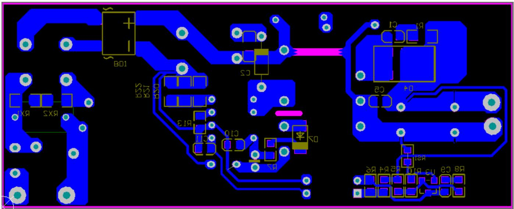

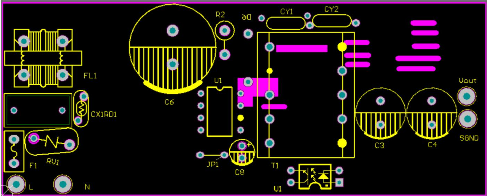

## 原理图

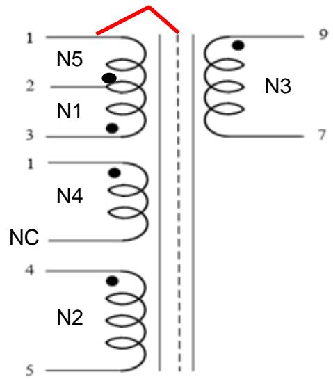

## 绕线方式

<table><tr><td>绕组</td><td>起始脚</td><td>终止脚</td><td>材料</td><td>匝数</td><td>绕线方式</td></tr><tr><td>N1</td><td>3</td><td>2</td><td> $\phi 0.23*1P$ </td><td>39Ts</td><td>密绕一层(PIN脚朝外)</td></tr><tr><td colspan="4">胶带</td><td>2Ts</td><td></td></tr><tr><td>N2</td><td>4</td><td>5</td><td> $\phi 0.23*2P$ </td><td>14Ts</td><td>密绕一层(PIN脚朝外)</td></tr><tr><td colspan="4">胶带</td><td>2Ts</td><td></td></tr><tr><td>N3</td><td>9</td><td>7</td><td>三层绝缘线 $\phi 0.55*1P$ </td><td>12Ts</td><td>密绕一层(PIN脚朝外)</td></tr><tr><td colspan="4">胶带</td><td>2Ts</td><td></td></tr><tr><td>N4</td><td>1</td><td>NC</td><td> $\phi 0.23*2P$ </td><td>8Ts</td><td>密绕一层(PIN脚朝外)</td></tr><tr><td colspan="4">胶带</td><td>2Ts</td><td></td></tr><tr><td>N5</td><td>2</td><td>1</td><td> $\phi 0.23*1P$ </td><td>38Ts</td><td>密绕一层(PIN脚朝外)</td></tr><tr><td colspan="4">胶带</td><td>3Ts</td><td></td></tr></table>

## 规格与材料

➢ 初级绕组感量 $\mathsf { L } _ { \mathsf { p } } = 9 0 0 \mathsf { u H } \pm 7 \%$ （测试条件： 0.3V，100kHz）  
➢ 漏感量 $\mathsf { L } _ { | \mathsf { k } } < 3 0 \mathsf { \dot { u } H }$  
➢ 骨架：EE25底部加高（5+5PIN）  
➢ 磁芯：EE25 PC40 或同等材质 ， $\mathsf { A } \mathsf { e } = 4 0 \mathsf { m } \mathsf { m } ^ { 2 }$  
➢ N1、N2、N4、N5: 2UEW 漆包线  
➢ N3: 三层绝缘线  
➢ 绝缘胶带:3M900 或同等材质  
➢ 耐压测试: 3KV, 50/60Hz, 1Min  
➢ 成品要求：浸凡立水  
磁芯接变压器1脚

## 脚位图

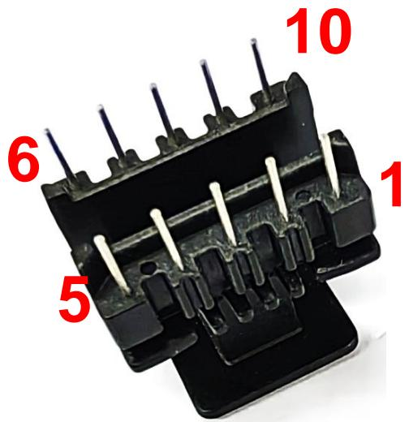

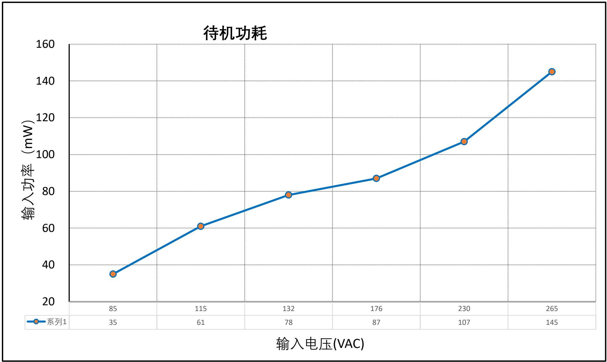

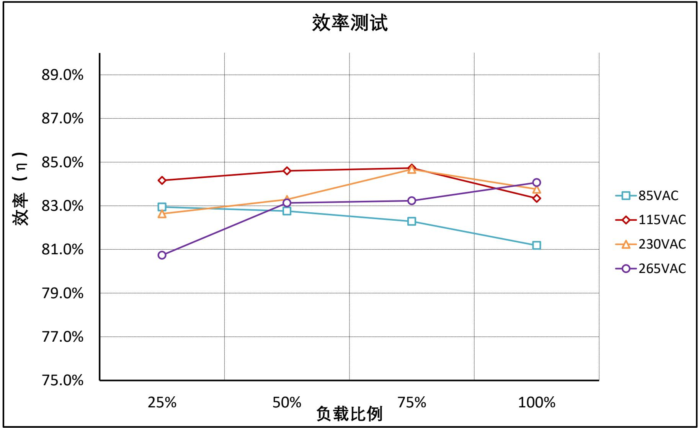

## 输出电压调整率

<table><tr><td> $V_{IN}(VAC)$ Load(%)</td><td>85</td><td>115</td><td>132</td><td>176</td><td>230</td><td>265</td><td>平均值</td><td>线调整率</td></tr><tr><td>0</td><td>12.13</td><td>12.13</td><td>12.13</td><td>12.13</td><td>12.13</td><td>12.13</td><td>12.13</td><td>0.00%</td></tr><tr><td>20%</td><td>12.12</td><td>12.12</td><td>12.12</td><td>12.12</td><td>12.12</td><td>12.12</td><td>12.12</td><td>0.00%</td></tr><tr><td>40%</td><td>12.11</td><td>12.11</td><td>12.11</td><td>12.11</td><td>12.11</td><td>12.11</td><td>12.11</td><td>0.00%</td></tr><tr><td>60%</td><td>12.1</td><td>12.1</td><td>12.1</td><td>12.1</td><td>12.1</td><td>12.1</td><td>12.10</td><td>0.00%</td></tr><tr><td>80%</td><td>12.09</td><td>12.09</td><td>12.09</td><td>12.09</td><td>12.09</td><td>12.09</td><td>12.09</td><td>0.00%</td></tr><tr><td>100%</td><td>12.09</td><td>12.09</td><td>12.09</td><td>12.09</td><td>12.09</td><td>12.09</td><td>12.09</td><td>0.00%</td></tr><tr><td>平均值</td><td>12.11</td><td>12.11</td><td>12.11</td><td>12.11</td><td>12.11</td><td>12.11</td><td rowspan="2" colspan="2"></td></tr><tr><td>负载调整率</td><td>0.33%</td><td>0.33%</td><td>0.33%</td><td>0.33%</td><td>0.33%</td><td>0.33%</td></tr></table>

◼ 计算方法：调整率=100%\*(最大值-最小值)/平均值  
测试条件：

## 输出OLP保护电（暂无输入线电压补偿）

<table><tr><td>输出电流\VIN(VAC)</td><td>85</td><td>264</td></tr><tr><td>1.5A</td><td>12.09</td><td>12.09</td></tr><tr><td>1.6A</td><td>12.09</td><td>12.09</td></tr><tr><td>1.7A</td><td>12.09</td><td>12.09</td></tr><tr><td>1.8A</td><td>12.09</td><td>12.09</td></tr><tr><td>1.9A</td><td>OLP</td><td>12.09</td></tr><tr><td>2.3A</td><td>OLP</td><td>12.05</td></tr><tr><td>2.4A</td><td>OLP</td><td>OLP</td></tr></table>

## FB开短路测试（北美50V以内）

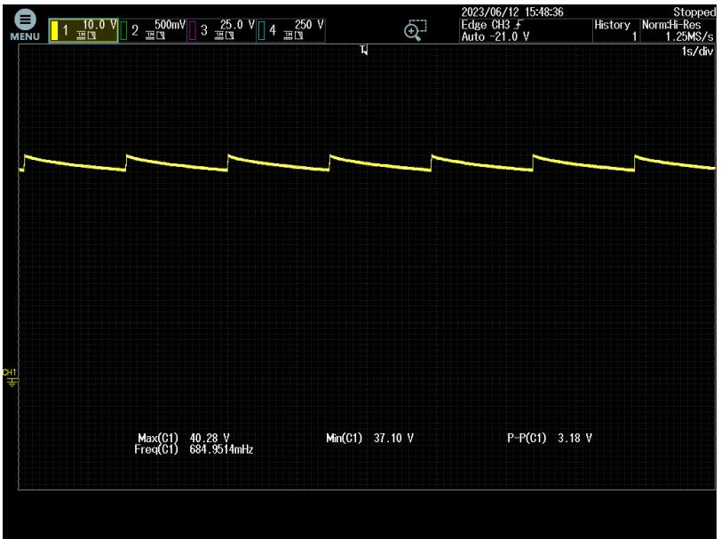

120 VAC

CH1 $\mathsf { V } _ { \mathsf { O U T } }$ Ripple =40.2V

Test Condition:  
R4开路  
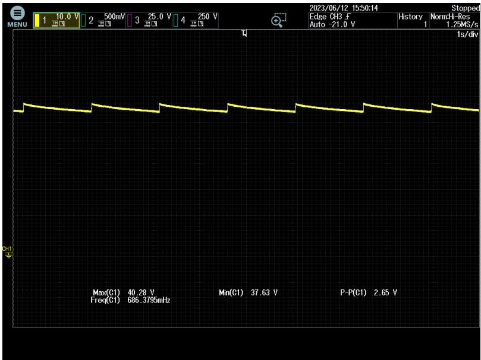

120 VAC

CH1 $\mathsf { V } _ { \mathsf { O U T } }$ Ripple V =40.2V max

Test Condition:  
R5开路  
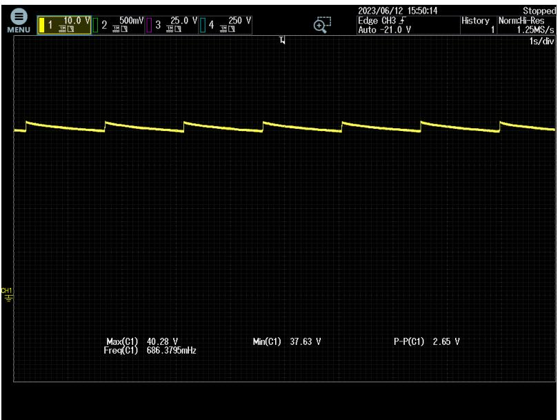

120 VAC

CH1 VOUT Ripple V =40.2V max

Test Condition:  
R5短路  
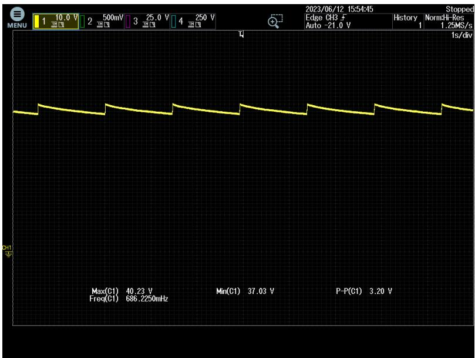

120 VAC

CH1 $\mathsf { V } _ { \mathsf { O U T } }$ Ripple V =40.2V max

Test Condition:

R10短路

## 输出电压纹波

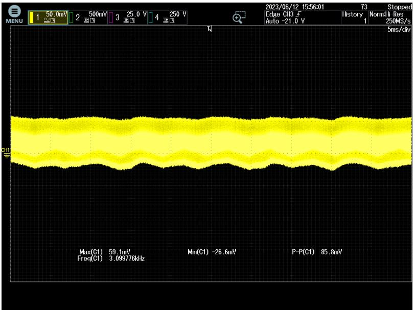

85 VAC

$\begin{array} { r l } { \mathbf { \Pi } } & { \mathsf { C H 1 V } _ { \mathsf { O U T - 1 2 V } } \mathsf { R i p p l e } } \\ & { \mathsf { V _ { P K - P K } } = 8 5 . 8 \mathsf { m V } } \end{array}$

## Test Condition:

➢ Full Load

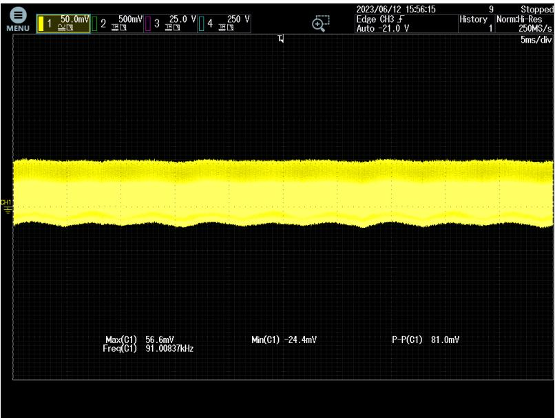

115 VAC

CH1 $\mathsf { V } _ { \mathsf { O U T - 1 } 2 \mathsf { V } }$ Ripple $\mathtt { V } _ { \mathtt { P K - P K } } { = } 8 1 \mathsf { m V }$

## Test Condition:

➢ Full Load

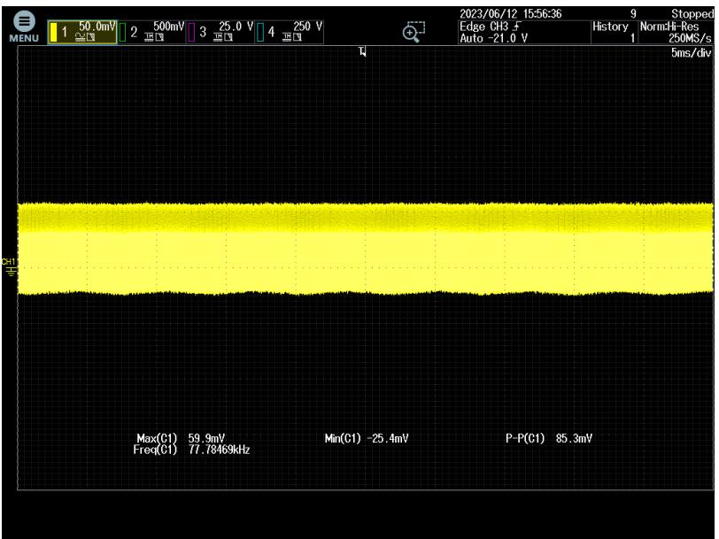

230 VAC

CH1 $\mathsf { V } _ { \mathsf { O U T } - 1 2 \mathsf { V } }$ Ripple $V _ { P K - P K } = 8 5 . 3 m V$

## Test Condition:

➢ Full Load

265 VAC

$\begin{array} { r l } & { \mathsf { C H 1 V _ { O U T - 1 2 V } R i p p l e } } \\ & { \mathsf { V _ { P K - P K } } \mathsf { = } 8 6 . 1 \mathsf { m V } } \end{array}$

## Test Condition:

➢ Full Load

## 动态负载(50%-100%)

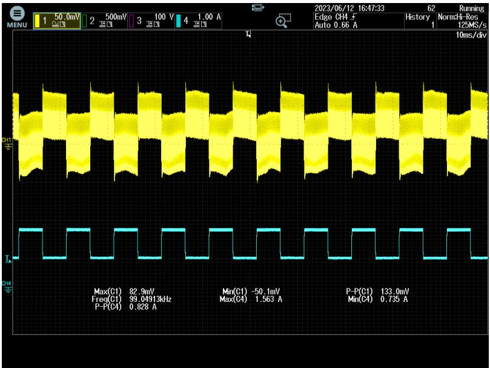

85 VAC

$\begin{array} { r l } & { \mathsf { C H 1 V _ { O U T - 1 2 V } } } \\ & { \mathsf { V _ { P K - P K } } \equiv \pm 1 3 3 \mathsf { m v } } \end{array}$ CH1 VOUT-12V

## Test Condition:

➢ 0.75 A-1 .5A-0.75A  
➢ Slew Rate: 0.5 A/μS  
➢ Frequency: 100 Hz

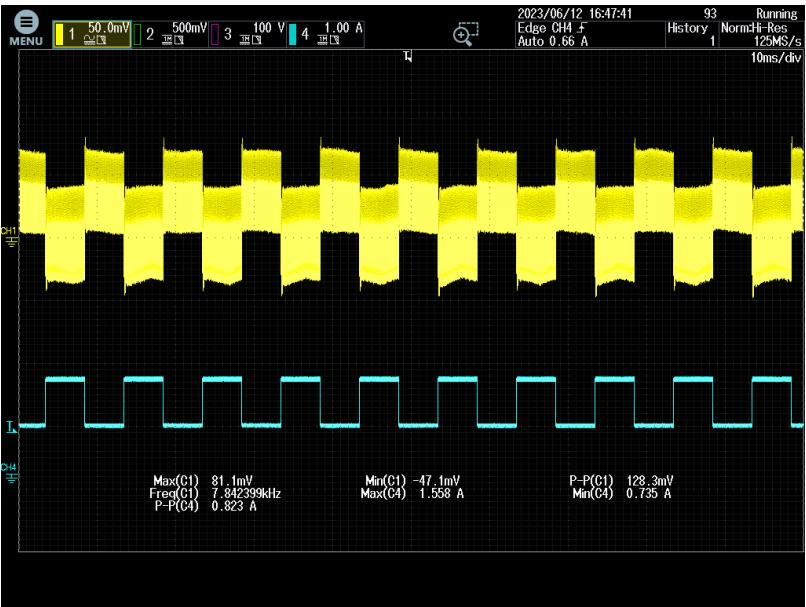

115 VAC

CH1 VOUT-12V VPK-PK=128.3 mV

## Test Condition:

➢ 0.75 A-1 .5A-0.75A  
➢ Slew Rate: 0.5 A/μS  
➢ Frequency: 100 Hz

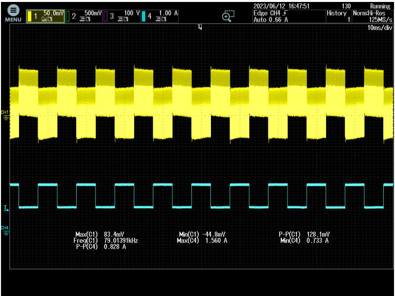

230 VAC

CH1 VOUT-12V VPK-PK=128.1mV

## Test Condition:

➢ 0.75 A-1 .5A-0.75A  
➢ Slew Rate: 0.5 A/μS  
➢ Frequency: 100 Hz

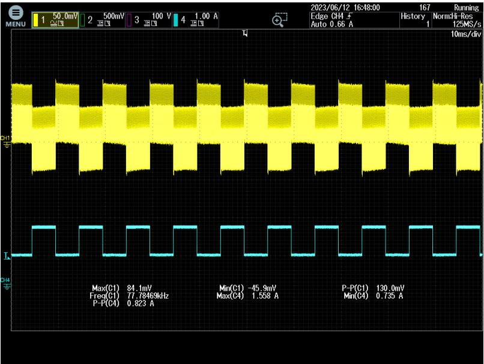

264 VAC

CH1 VOUT-12V VPK-PK=130 mV

## Test Condition:

➢ 0.75 A-1 .5A-0.75A  
➢ Slew Rate: 0.5 A/μS  
➢ Frequency: 100 Hz

## 动态负载(10%-90%)

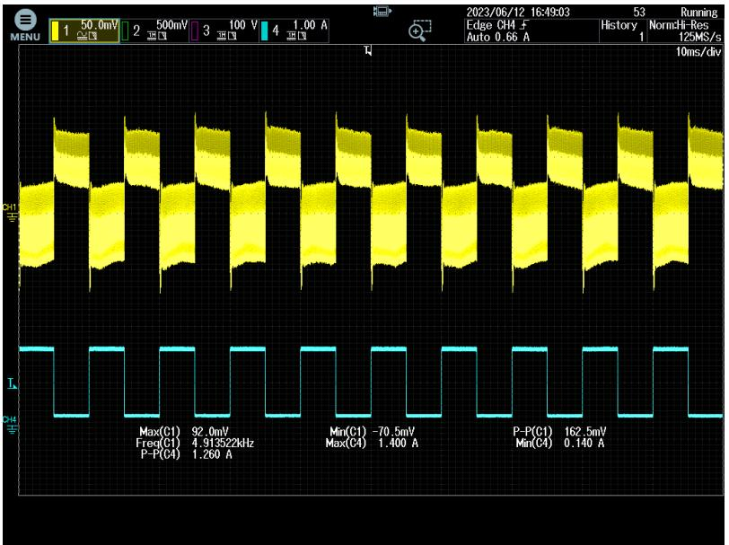

85 VAC

CH1 VOUT-12V VPK-PK=162.5 mV

## Test Condition:

➢ 0.15 A-1.35 A-0.15A  
➢ Slew Rate: 0.5 A/μS  
➢ Frequency: 100 Hz

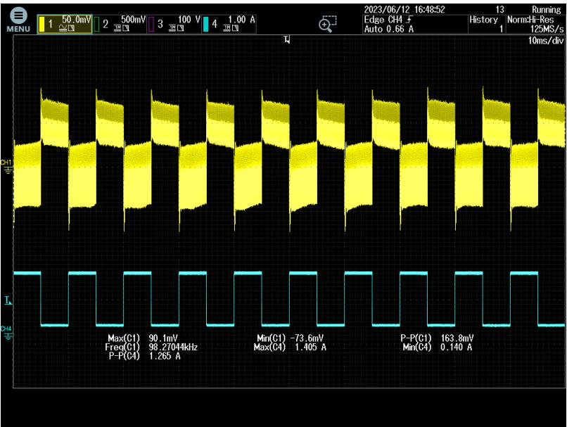

115 VAC

CH1 VOUT-12V VPK-PK=163.8 mV

## Test Condition:

➢ 0.15 A-1.35 A-0.15A  
➢ Slew Rate: 0.5 A/μS  
➢ Frequency: 100 Hz

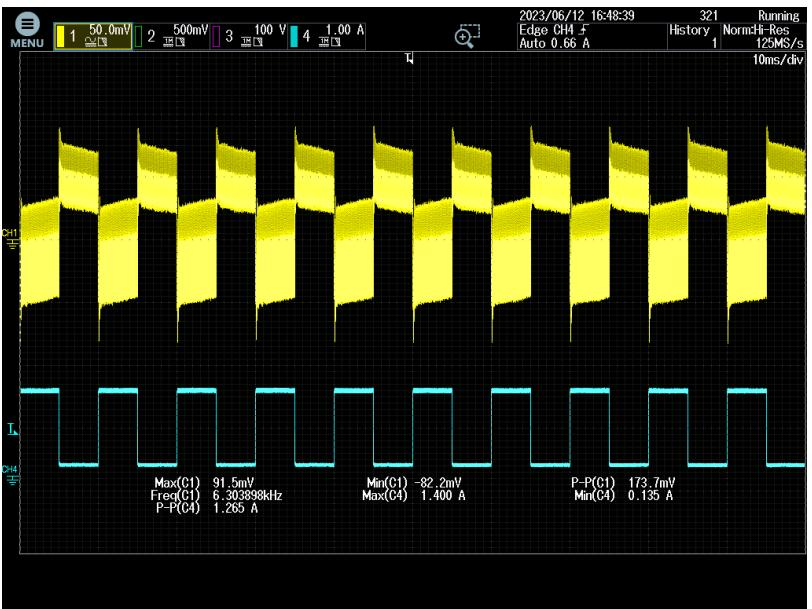

230 VAC

CH1 VOUT-12V VPK-PK=173.7 mV

## Test Condition:

➢ 0.15 A-1.35 A-0.15A  
➢ Slew Rate: 0.5 A/μS  
➢ Frequency: 100 Hz

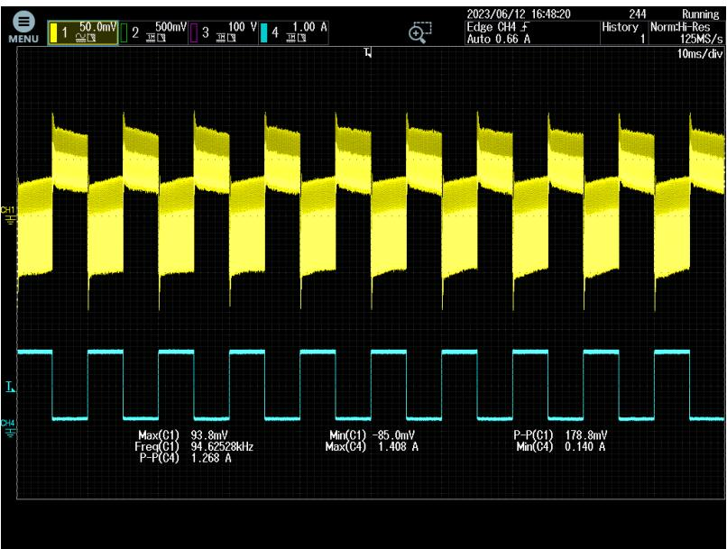

264VAC

CH1 VOUT-12V VPK-PK=178.8 mV

## Test Condition:

➢ 0.15 A-1.35 A-0.15A  
➢ Slew Rate: 0.5 A/μS  
➢ Frequency: 100 Hz

## 输出电压开机波形

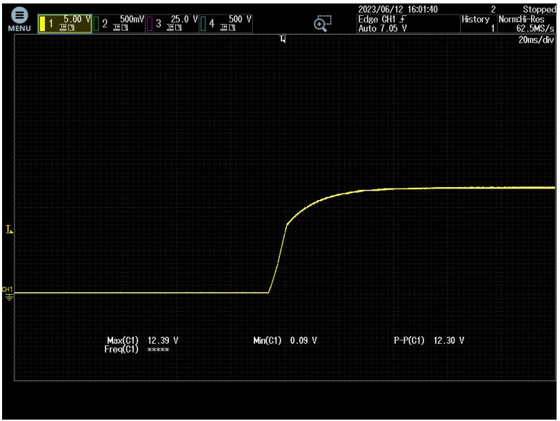

85 VAC

CH1 VOUT-12V TRISE: 16 mS

## Test Condition:

➢ No Load

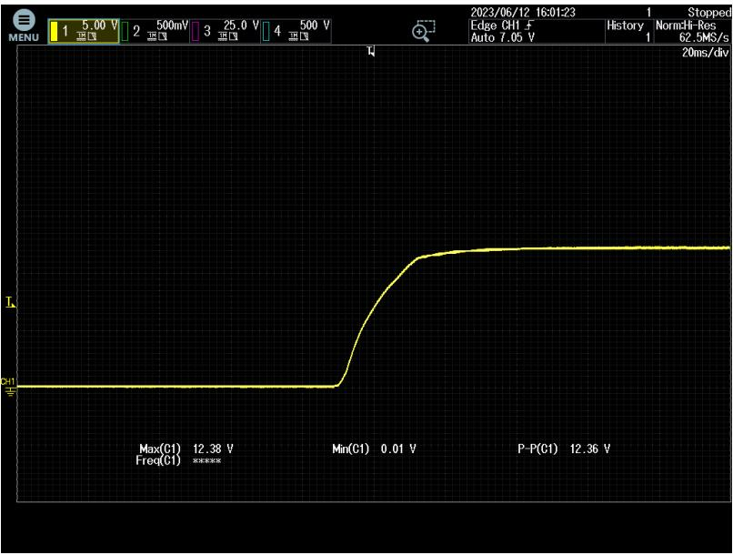

85 VAC

CH1 VOUT-12V TRISE: 17 mS

## Test Condition:

➢ Full Load

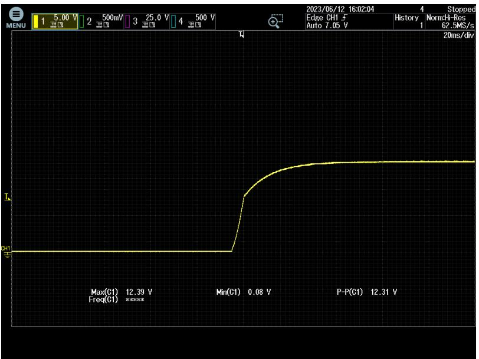

265 VAC

CH1 VOUT-12V TRISE: 15.88 mS

## Test Condition:

➢ No Load

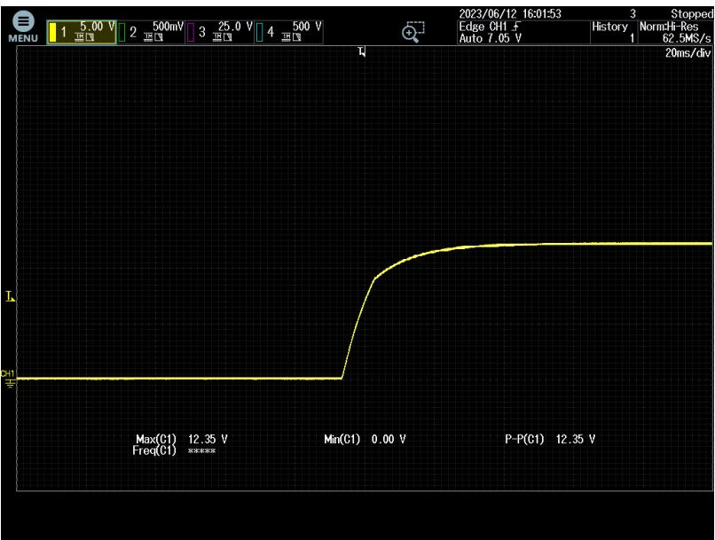

265 VAC

CH1 VOUT-12V TRISE: 16.37 mS

## Test Condition:

➢ Full Load

## 启动延迟时间

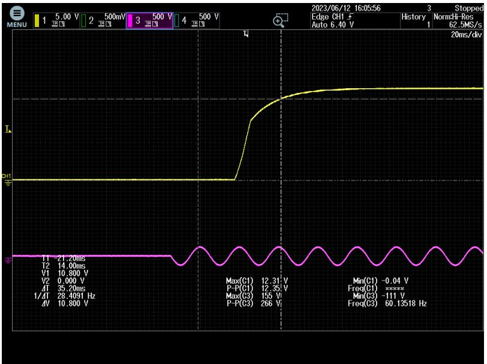

85 VAC

CH1 VOUT-12V $\mathsf { V } _ { \mathsf { O U T } - 1 2 \mathsf { V } }$  
CH3 $\mathsf { V I N } _ { \mathsf { A C } }$  
TDELAY: 47 mS

Test Condition:

➢ No Load

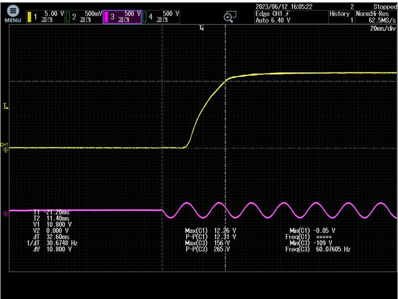

85 VAC

CH1 VOUT-12V $\mathsf { V } _ { \mathsf { O U T - 1 } 2 \mathsf { V } }$  
CH3 VINAC $\mathsf { V I N } _ { \mathsf { A C } }$ ${ \mathsf { T } } _ { \mathsf { D E L A Y } } .$ 32.6mS

Test Condition:

➢ Full Load

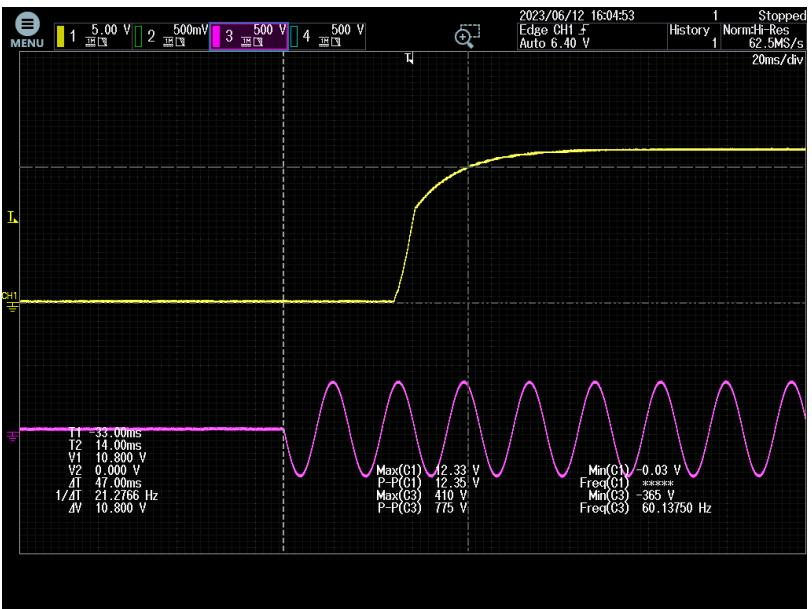

265 VAC

CH1 VOUT-12V $\mathsf { V } _ { \mathsf { O U T } - 1 2 \mathsf { V } }$  
CH3 VINNAC $\mathsf { V I N } _ { \mathsf { N A C } }$ TDELAY: 47 mS

Test Condition:

➢ No Load

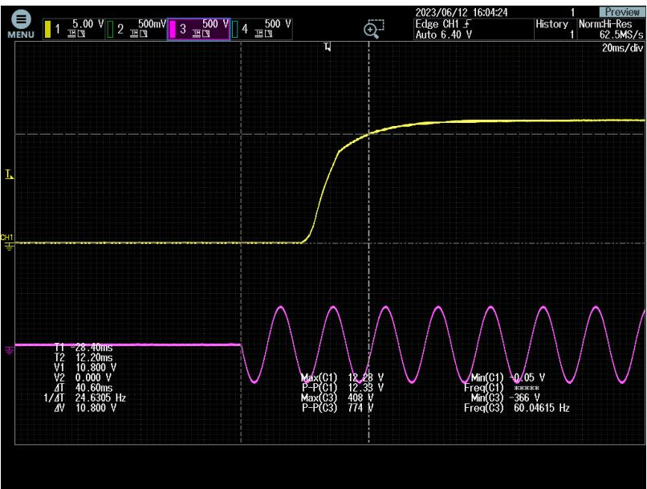

265 VAC

CH1 VOUT-12V $\mathsf { V } _ { \mathsf { O U T } - 1 2 \mathsf { V } }$  
CH3 VINNAC $\mathsf { V I N } _ { \mathsf { N A C } }$ TDELAY: 40.6mS

Test Condition:

➢ Full Load

## VCC电压开机波形

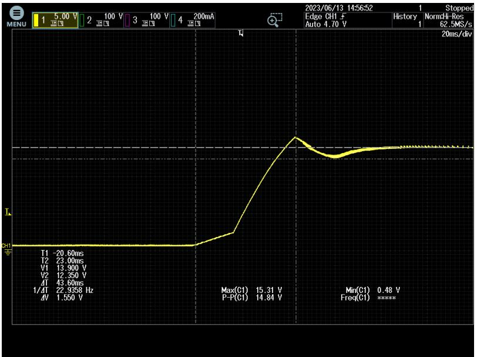

85 VAC

${ \mathsf { C H 1 } } \mathsf { V } _ { \mathsf { v c c } }$  
$\mathsf { V } _ { \mathsf { V C C - M A X } } = 1 5 . 3 \mathsf { V }$  
$\mathsf { V } _ { \mathsf { V C C } } = 1 2 . 3 \mathsf { V }$

Test Condition:  
➢ No Load  
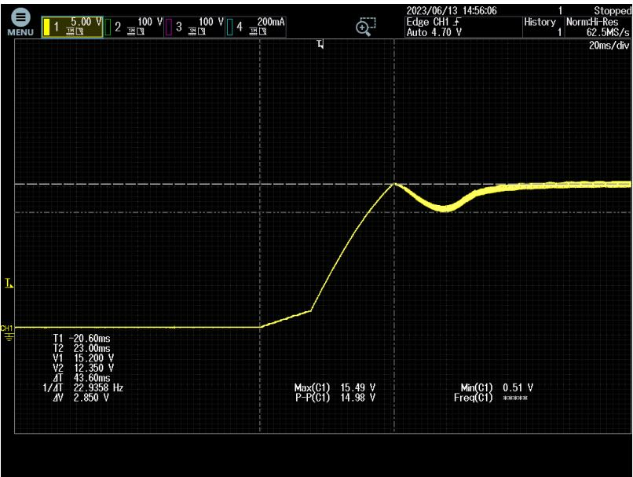

85 VAC

${ \mathsf { C H 1 } } \mathsf { V } _ { \mathsf { v c c } }$  
$V _ { \tt V C C - M A X } = 1 5 . 5 V$  
$\mathsf { V } _ { \mathsf { V C C } } = 1 5 . 2 \mathsf { V }$

Test Condition:  
➢ Full Load  
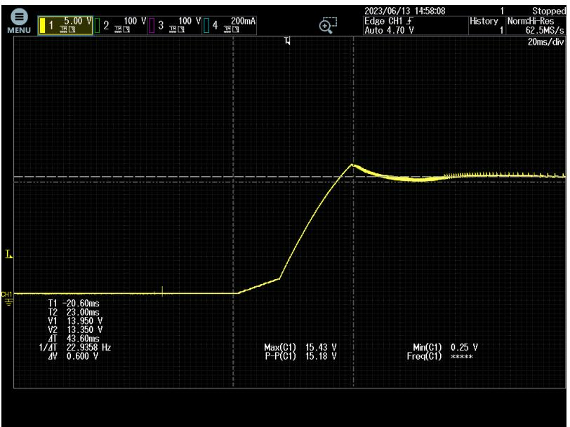

265 VAC

CH1 $\mathsf { V } _ { \mathsf { V C C } }$  
$V _ { \mathsf { V C C - M A X } } = 1 5 . 4 \lor$  
$\mathsf { V } _ { \mathsf { V C C } } = 1 3 . 9 \mathsf { V }$

Test Condition:  
➢ No Load  
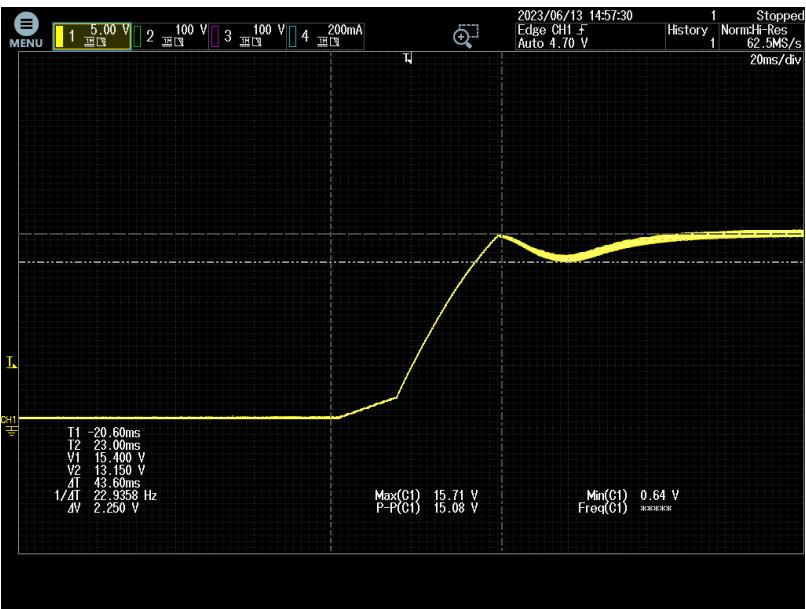

265 VAC

${ \mathsf { C H 1 } } \mathsf { V } _ { \mathsf { v c c } }$  
$V _ { \mathsf { V C C - M A X } } = 1 5 . 7 \lor$  
$\mathsf { V } _ { \mathsf { V C C } } { = } 1 5 . 7 \mathsf { V }$

Test Condition:

➢ Full Load

## 漏极电压电流波形

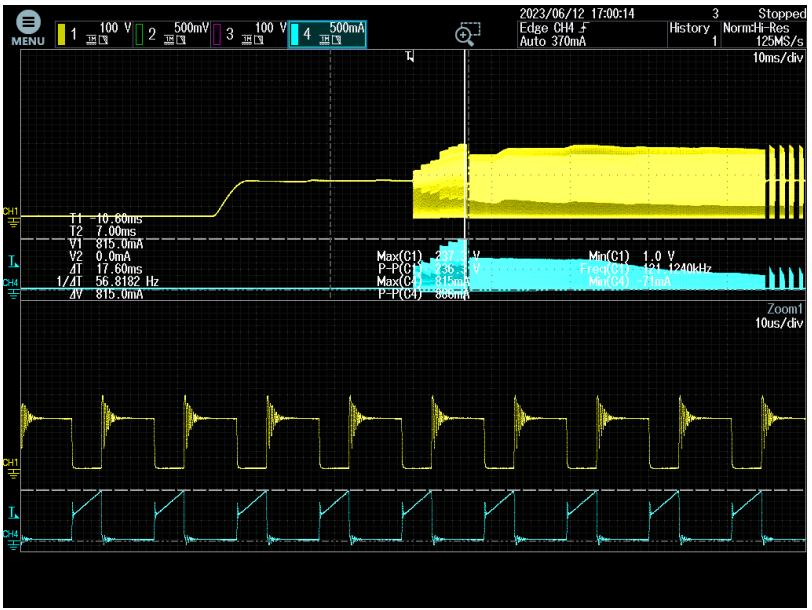

85 VAC

CH1 VDS  
CH3 IDS

$$
V _ {D S \_ M A X} = 2 3 7 \mathrm{V}
$$

$$
I _ {D S \_ M A X} = 0. 8 1 5 A
$$

## Test Condition:

➢ No Load

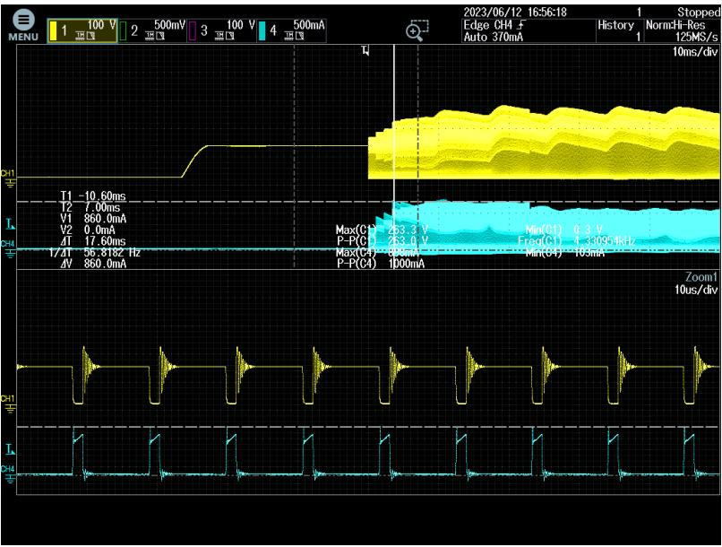

85 VAC

CH1 VDS  
CH3 IDS

$$
V _ {D S \_ M A X} = 2 6 3. 3 \mathrm{V}
$$

$$
I _ {D S \_ M A X} = 0. 8 9 8 A
$$

## Test Condition:

➢ Full Load

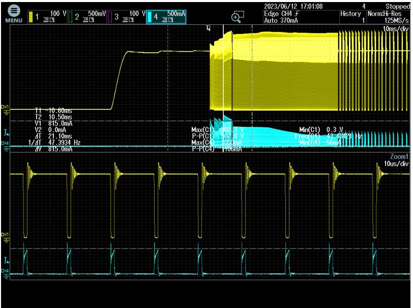

265 VAC

CH1 VDS  
CH3 IDS

$$
V _ {D S \_ M A X} = 5 0 2. 3 \mathrm{V}
$$

$$
I _ {D S \_ M A X} = 1. 0 5 A
$$

## Test Condition:

➢ No Load

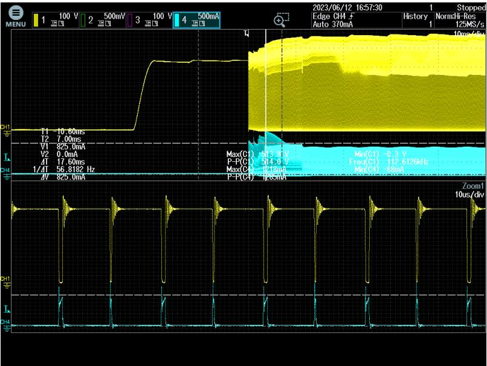

265 VAC

CH1 VDS  
CH3 IDS

$$
V _ {D S \_ M A X} = 5 1 4 \mathrm{V}
$$

$$
I _ {D S \_ M A X} = 1. 2 1 8 A
$$

## Test Condition:

➢ Full Load

## MOSFET稳态波形

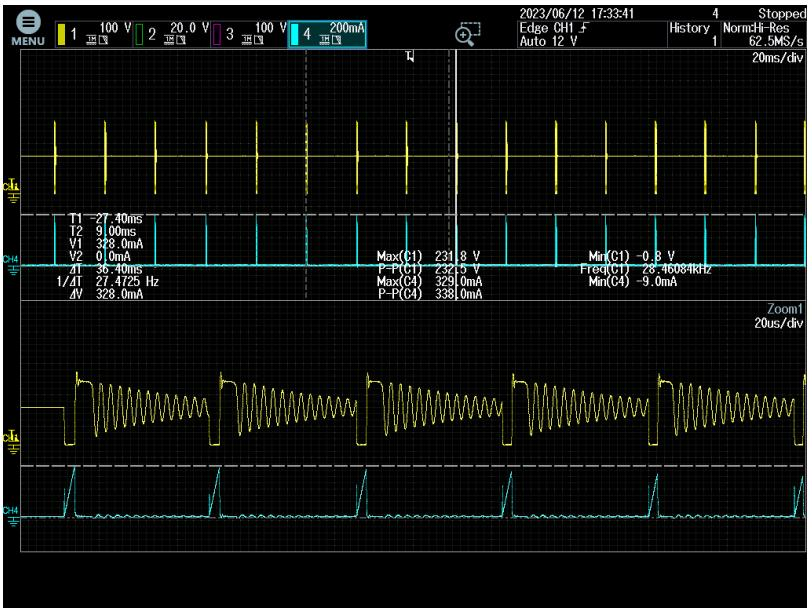

85 VAC  
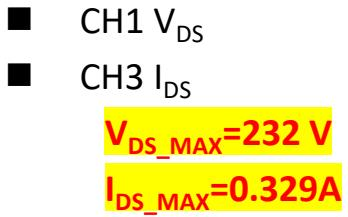

Test Condition:  
➢ No Load

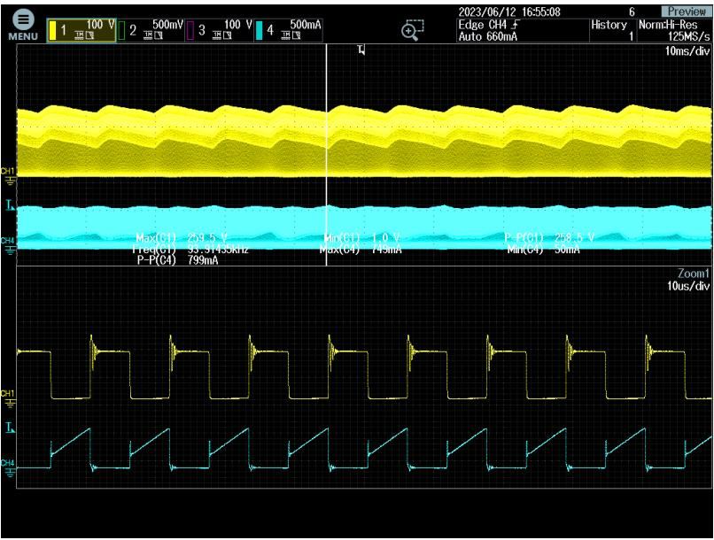

85 VAC  
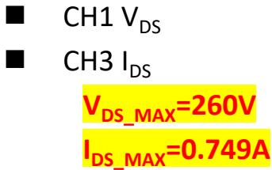

Test Condition:  
➢ Full Load

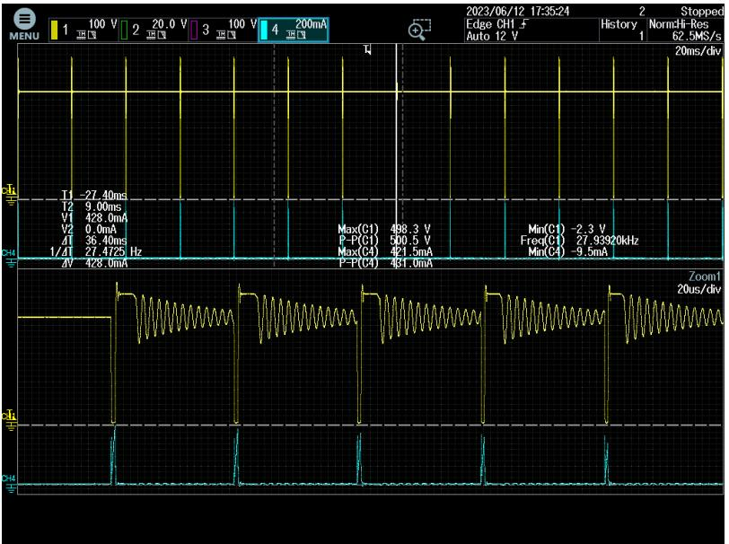

265 VAC  
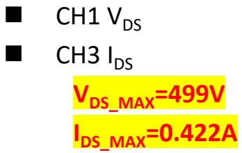

Test Condition:  
➢ No Load

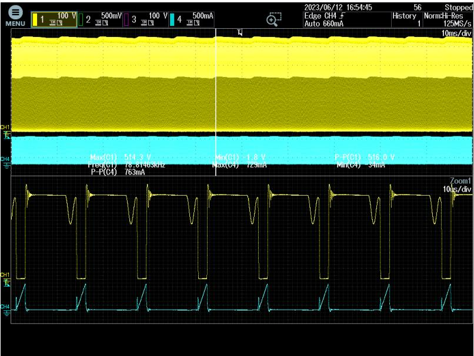

265 VAC  
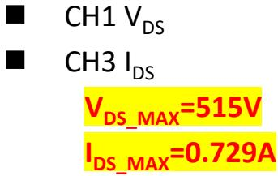

Test Condition:  
➢ Full Load

欠压保护  
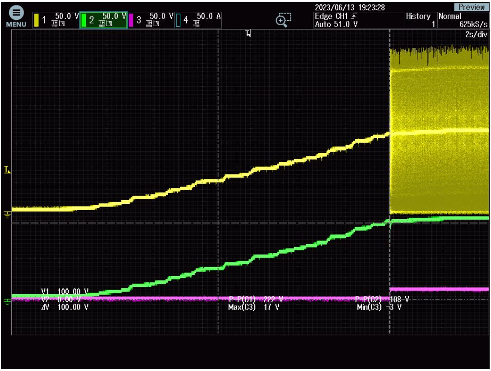

CH1 VDS  
CH2 VDC\_IN  
CH4 VO

VDC\_IN\_STARTUP=100 VDC

Test Condition:

➢ No Load

过压保护  
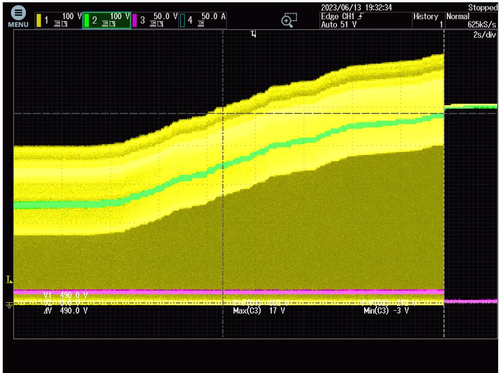

CH1 VDS  
CH2 VDC\_IN  
CH4 VO

VDC\_IN\_STARTUP=490 VDC

Test Condition:

➢ No Load

## 短路保护 （MOSFET波形）

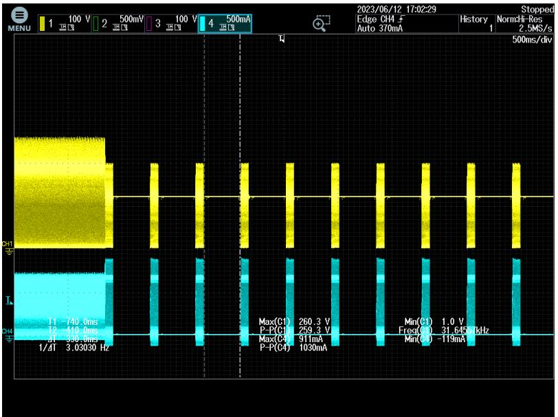

85 VAC

CH3 $\mathsf { V } _ { \mathsf { D } \mathsf { S } }$  
CH4 ${ \sf I } _ { \sf D }$ $V _ { \mathsf { D S \_ M A X } } { = } 2 6 0 \lor$ $\mathsf { I } _ { \mathsf { D S \_ M A X } } { = } 0 . 9 1 1 \mathsf { A }$

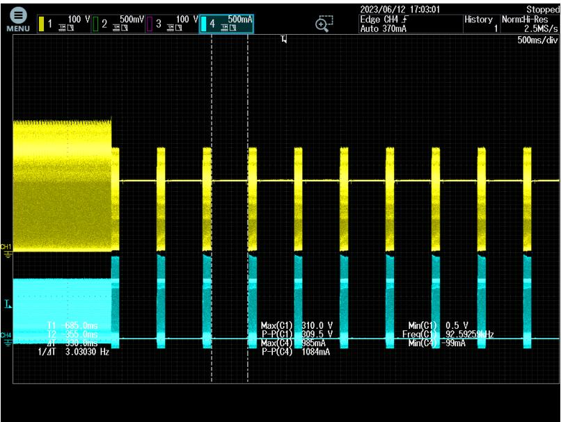

115 VAC

${ \mathsf { C H 3 } } \mathsf { V _ { D S } }$  
CH4 ${ \sf I } _ { \sf D }$ $\mathsf { V } _ { \mathsf { D S \_ M A X } } { = } 3 1 0 \mathsf { V }$ $\mathsf { I } _ { \mathsf { D S \_ M A X } } { = } 0 . 9 8 5 \mathsf { A }$

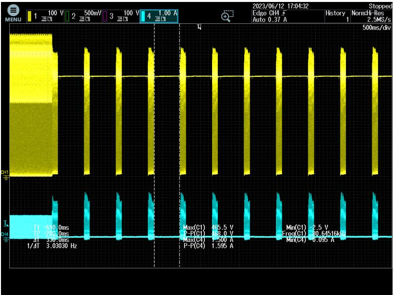

230 VAC

${ \mathsf { C H 3 } } \mathsf { V _ { D S } }$  
$C H 4 1 _ { \mathsf { D } }$

$$
V _ {D S \_ M A X} = 4 6 6 \mathrm{V}
$$

$$
I _ {D S \_ M A X} = 1. 5 A
$$

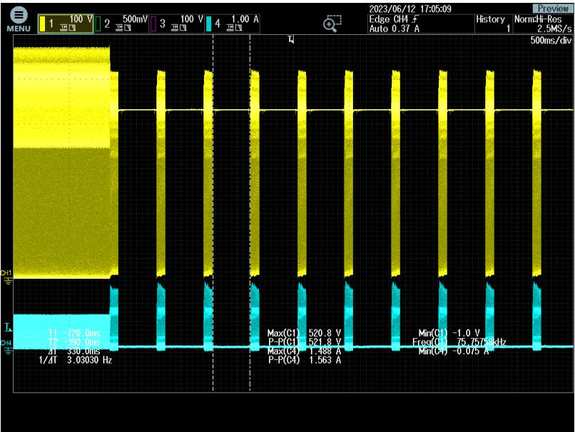

265 VAC

CH3 $\mathsf { V } _ { \mathsf { D } \mathsf { S } }$  
CH4 I $V _ { \mathsf { D S \_ M A X } } { = } 5 2 1 \lor$ $\mathsf { I } _ { \mathsf { D S \_ M A X } } { = } 1 . 4 8 8 \mathsf { A }$

## D-S电压波形

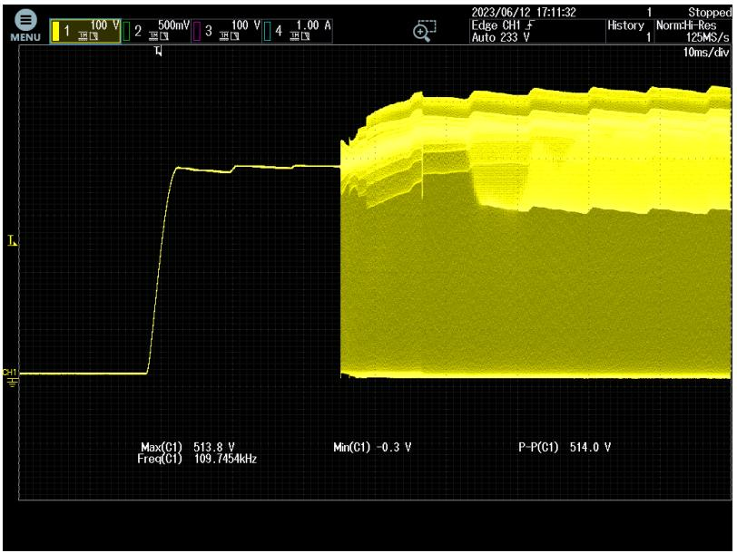

265 VAC

CH2 VDS VDSMAX: 514 V

## Test Condition:

满载开机

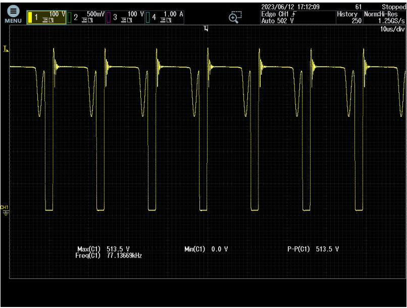

265 VAC

CH2 VDS VDSMAX: 514V

Test Condition:满载正常工作

极限参数(注3） (无特别说明情况下，TA=25℃)

<table><tr><td>符号</td><td>参数</td><td>参数范围</td><td>单位</td></tr><tr><td> $V_{DRAIN}$ </td><td>高压 MOSFET 漏极到源极电压</td><td>-0.3~800</td><td>V</td></tr><tr><td> $I_{DM}$ </td><td>漏极连续电流</td><td>4</td><td>A</td></tr><tr><td> $I_{D}$ </td><td>漏电电流脉冲</td><td>16</td><td>A</td></tr><tr><td> $V_{CC}$ </td><td> $V_{CC}$  电压</td><td>-0.3~40</td><td>V</td></tr><tr><td> $I_{CC\_MAX}$ </td><td> $V_{CC}$  引脚最大电流</td><td>20</td><td>mA</td></tr></table>

## 满载开机

$\mathrm { D e r a t i n g } { = 5 1 4 \vee / 8 0 0 \vee } = 6 4 . 3 \%$

## 满载正常工作

Derating = 514 V / 800 V = 64.3 %

## 12V输出肖特基反压波形

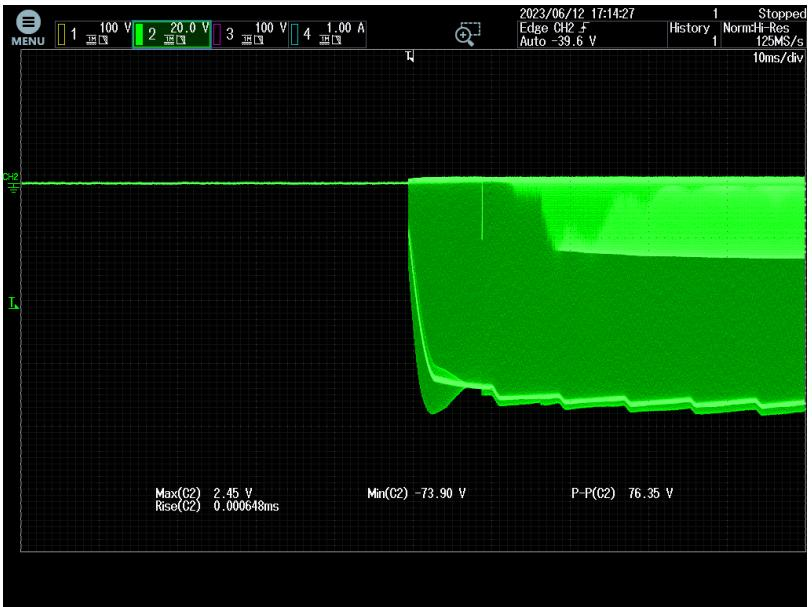

265 VAC

CH2 VDIODE VDSMAX: 73.9 V

Test Condition:

➢ 满载启动

<table><tr><td>PARAMETER</td><td>SYMBOL</td><td>MB54</td><td>MB54A</td><td>MB55</td><td>MB56</td><td>MB58</td><td>MB59</td><td>MB510</td><td>MB515</td><td>MB520</td><td>UNITS</td></tr><tr><td>Maximum Recurrent Peak Reverse Voltage</td><td> $V_{RRM}$ </td><td>40</td><td>45</td><td>50</td><td>60</td><td>80</td><td>90</td><td>100</td><td>150</td><td>200</td><td>V</td></tr><tr><td>Maximum RMS Voltage</td><td> $V_{RMS}$ </td><td>28</td><td>31.5</td><td>35</td><td>42</td><td>56</td><td>63</td><td>70</td><td>105</td><td>140</td><td>V</td></tr><tr><td>Maximum DC Blocking Voltage</td><td> $V_{DC}$ </td><td>40</td><td>45</td><td>50</td><td>60</td><td>80</td><td>90</td><td>100</td><td>150</td><td>200</td><td>V</td></tr><tr><td>Average Rectified Output Current (See Figure 1)</td><td> $I_{F(AV)}$ </td><td colspan="9">5</td><td>A</td></tr><tr><td>Non-Repetitive Peak Forward Surge Current : 8.3ms single half sine-wave superimposed on rated load</td><td> $I_{FSM}$ </td><td colspan="9">100</td><td>A</td></tr><tr><td>Forward Voltage at 5A (Note 1)</td><td> $V_F$ </td><td colspan="2">0.7</td><td colspan="2">0.74</td><td colspan="3">0.8</td><td colspan="2">0.9</td><td>V</td></tr><tr><td>Peak Reverse Current at Rated DC Blocking Voltage  $T_J=25°C$  $T_J=100°C$ </td><td> $I_R$ </td><td colspan="9">0.0510</td><td>mA</td></tr><tr><td>Typical Thermal Resistance (Note 2)</td><td> $R_{\theta JA}$  $R_{\theta JL}$ </td><td colspan="9">5517</td><td>°C / W</td></tr><tr><td>Operating Junction and Storage Temperature Range</td><td> $T_J,T_{STG}$ </td><td>-55 to +150</td><td colspan="8">-65 to +175</td><td>°C</td></tr></table>

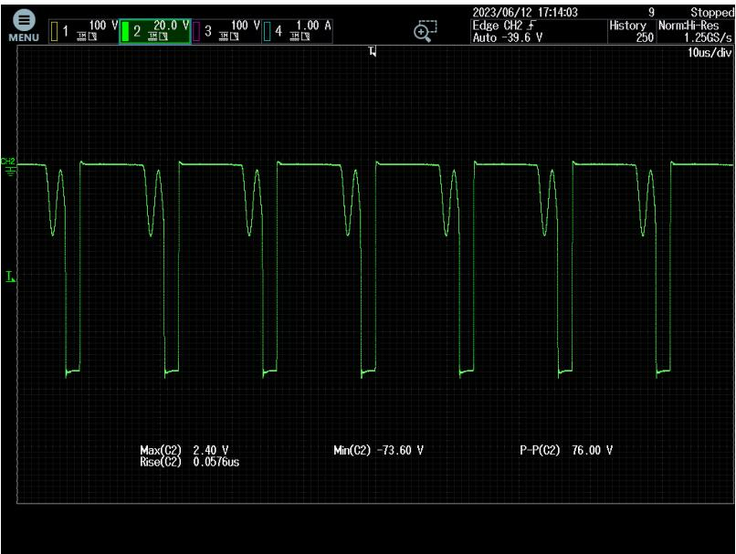

265 VAC

$\begin{array} { r l } & { \mathsf { C H } 2 \mathsf { V } _ { \mathsf { D D } \mathsf { I O D E } } } \\ & { \mathsf { V } _ { \mathsf { M A X } } \colon 7 3 . 9 \mathsf { V } } \end{array}$ CH2 VDDIODE

Test Condition:

满载正常工作

## 满载开机

Derating = 73.9 V / 200 V = 37 %

## 满载正常工作

Derating = 73.9 V / 200V = 37 %

<table><tr><td rowspan="2">项目</td><td colspan="2">85VAC</td><td colspan="2">265VAC</td></tr><tr><td>温度(°C)</td><td>温升(°C)</td><td>温度(°C)</td><td>温升(°C)</td></tr><tr><td>环境温度</td><td colspan="2">28.3</td><td colspan="2">28</td></tr><tr><td>BPA86526P (U1)</td><td>79.2</td><td>50.9</td><td>68.2</td><td>40.2</td></tr><tr><td>变压器磁芯(T1)</td><td>55.2</td><td>26.9</td><td>57.7</td><td>29.7</td></tr><tr><td>变压器绕组(T1)</td><td>60.3</td><td>32</td><td>60.6</td><td>32.6</td></tr><tr><td>输出肖特基(D4)</td><td>79</td><td>50.7</td><td>78.4</td><td>50.4</td></tr><tr><td>钳位二极管(D6)</td><td>72.5</td><td>44.2</td><td>70.6</td><td>42.6</td></tr><tr><td>输出电解电容(C3)</td><td>50.8</td><td>22.5</td><td>50.8</td><td>22.8</td></tr><tr><td>钳位消耗电阻(R2)</td><td>53.7</td><td>25.4</td><td>49.2</td><td>21.2</td></tr></table>

## 测试说明

➢ 在温箱中进行测试  
➢ 电路板放在一个封闭的盒子内  
➢ 热电偶连接到各个测量点  
➢ 等测量点温度达到稳定后记录数据

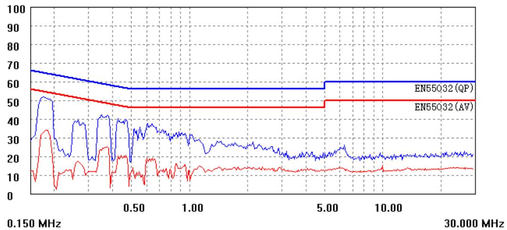

115VAC Line  
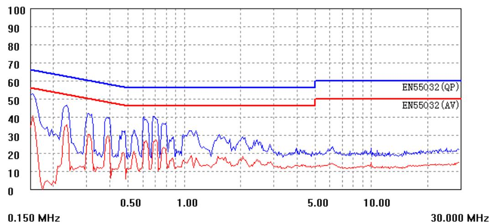

230VAC Line

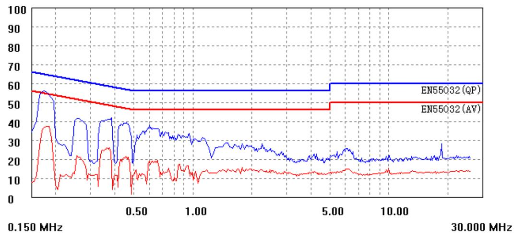

115VAC Neutral

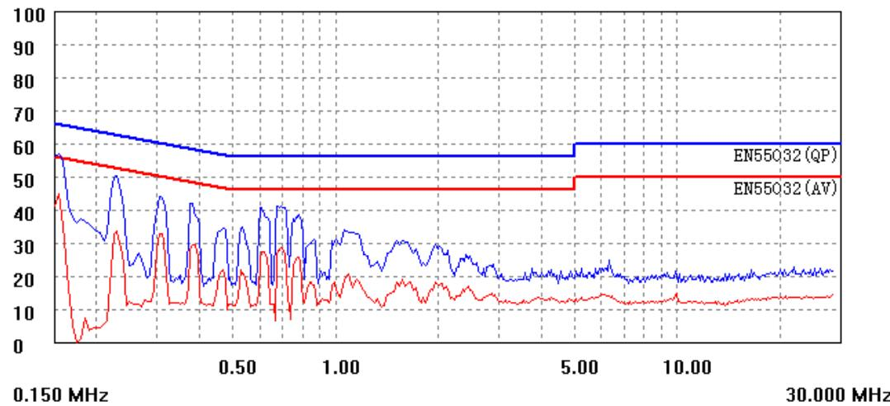

230VAC Neutral

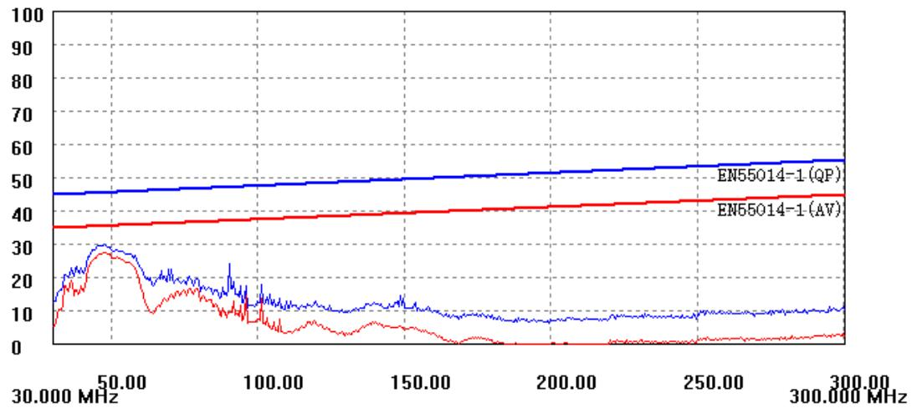

115VAC Line  
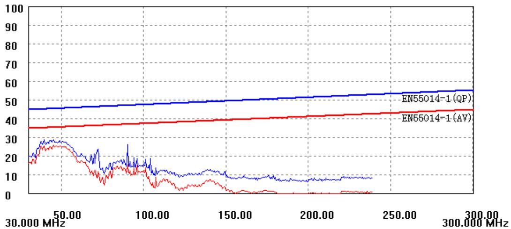

230VAC Line

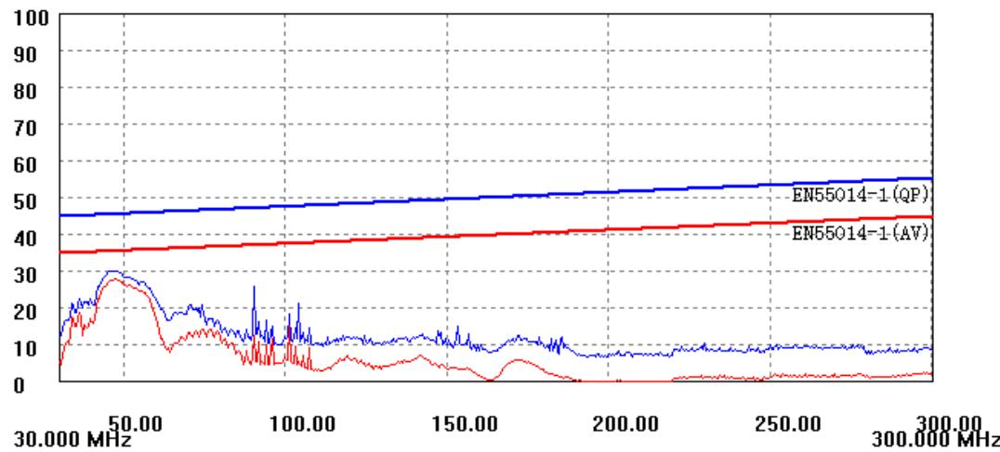

115VAC Neutral

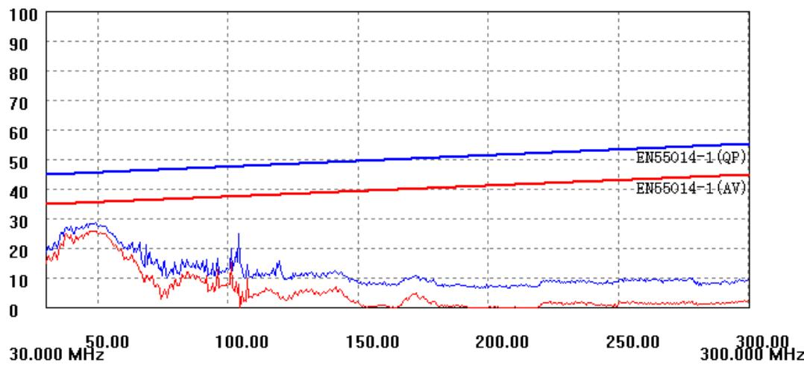

230VAC Neutral

<table><tr><td>差模</td><td>电压</td><td>相位角</td><td>发生器阻抗</td><td>测试次数</td><td>测试结果</td></tr><tr><td>L to N</td><td>+2kV</td><td>0</td><td>2</td><td>10</td><td>Pass</td></tr><tr><td>L to N</td><td>-2kV</td><td>0</td><td>2</td><td>10</td><td>Pass</td></tr><tr><td>L to N</td><td>+2kV</td><td>90</td><td>2</td><td>10</td><td>Pass</td></tr><tr><td>L to N</td><td>-2kV</td><td>90</td><td>2</td><td>10</td><td>Pass</td></tr><tr><td>L to N</td><td>+2kV</td><td>180</td><td>2</td><td>10</td><td>Pass</td></tr><tr><td>L to N</td><td>-2kV</td><td>180</td><td>2</td><td>10</td><td>Pass</td></tr><tr><td>L to N</td><td>+2kV</td><td>270</td><td>2</td><td>10</td><td>Pass</td></tr><tr><td>L to N</td><td>-2kV</td><td>270</td><td>2</td><td>10</td><td>Pass</td></tr></table>

## 测试说明

➢ 按照GB/T17626.5和IEC61000-4-5的最新版本要求进行测试  
➢ 室温环境，230VAC输入，满载条件  
➢ 输入1.2/50us组合波浪涌电压  
➢ 每个测试点重复10次  
➢ 每次间隔时间1分钟  
➢ 试验时样机输出正常（符合A类标准）视为Pass

<table><tr><td>差模</td><td>电压</td><td>脉冲群持续时间</td><td>脉冲频率</td><td>测试时间</td><td>测试结果</td></tr><tr><td>L to N</td><td>+4kV</td><td>15ms</td><td>5kHz</td><td>120s</td><td>Pass</td></tr><tr><td>L to N</td><td>-4kV</td><td>15ms</td><td>5kHz</td><td>120s</td><td>Pass</td></tr><tr><td>L to N</td><td>+4kV</td><td>0.75ms</td><td>100kHz</td><td>120s</td><td>Pass</td></tr><tr><td>L to N</td><td>-4kV</td><td>0.75ms</td><td>100kHz</td><td>120s</td><td>Pass</td></tr><tr><td>L to N</td><td>+2kV</td><td>2ms</td><td>38kHz</td><td>120s</td><td>Pass</td></tr><tr><td>L to N</td><td>-2kV</td><td>2ms</td><td>38kHz</td><td>120s</td><td>Pass</td></tr><tr><td>L to N</td><td>+4kV</td><td>2ms</td><td>38kHz</td><td>120s</td><td>Pass</td></tr><tr><td>L to N</td><td>-4kV</td><td>2ms</td><td>38kHz</td><td>120s</td><td>Pass</td></tr></table>

## 测试说明

➢ 按照GB/T17626.4和IEC61000-4-4的最新版本要求进行测试  
➢ 室温环境，230VAC输入满载条件  
➢ 分别测试5kHz/100kHz/38kHz脉冲频率  
➢ 脉冲群周期为300ms  
➢ 每个测试条件测试时间120s  
➢ 试验时样机输出正常（符合A类标准）视为Pass

<table><tr><td>测试</td><td>电压(V)</td><td>放电类型</td><td>放电次数</td><td>测试结果</td></tr><tr><td>Vo</td><td>+15kV</td><td>空气放电</td><td>10</td><td>PASS</td></tr><tr><td>Vo</td><td>-15kV</td><td>空气放电</td><td>10</td><td>PASS</td></tr><tr><td>GND</td><td>+15kV</td><td>空气放电</td><td>10</td><td>PASS</td></tr><tr><td>GND</td><td>-15kV</td><td>空气放电</td><td>10</td><td>PASS</td></tr><tr><td>Vo</td><td>+20kV</td><td>空气放电</td><td>10</td><td>PASS</td></tr><tr><td>Vo</td><td>-20kV</td><td>空气放电</td><td>10</td><td>PASS</td></tr><tr><td>GND</td><td>+20kV</td><td>空气放电</td><td>10</td><td>PASS</td></tr><tr><td>GND</td><td>-20kV</td><td>空气放电</td><td>10</td><td>PASS</td></tr></table>

## 测试说明

➢ 按照GB/T17626.2和IEC61000-4-2的最新版本要求进行测试  
➢ 室温环境，230VAC输入满载条件  
➢ 每个测试点重复10次  
➢ 分别对输出正端和地进行空气放电  
➢ 试验时样机输出正常（符合A类标准）视为Pass

## THANK YOU FOR WATCHING
