## BPA86528D 隔离参考设计 \_12V 3A

## INPUT:85VAC\~265VAC

上海晶丰明源半导体股份有限公司

Shanghai Bright Power Semiconductor Co., Ltd.

王岩

时间： 2023年08月03日

## 内容

BPA86528D简介  
电源规格  
电路及实物图  
BOM  
PCB Layout图  
变压器  
性能测试数据

## 产品特点：

➢ 集成 800V 高压 MOSFET  
➢ PWM+PFM模式，低输出纹波  
➢ 内置软启动功能  
➢ 集成高压启动、自供电电路  
➢ 低音频噪声  
➢ 输入过/欠压保护

## 应用领域：

➢ 家用电器辅助电源  
➢ PC待机电源  
➢ 适配器、充电器  
➢ 通讯、工业控制辅助电源

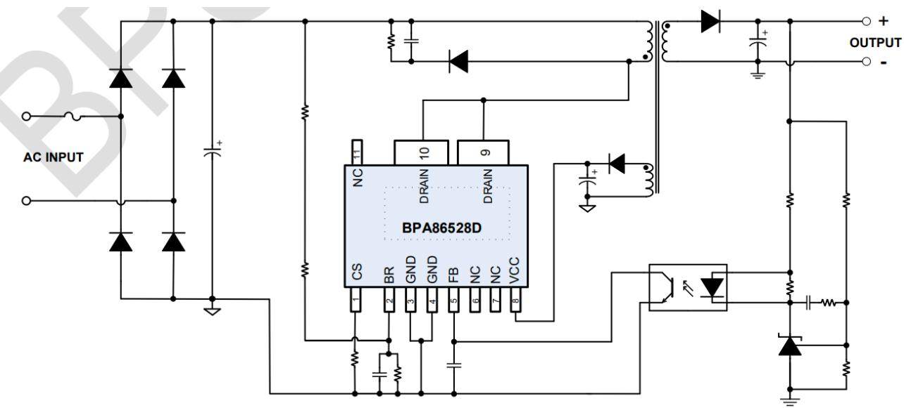

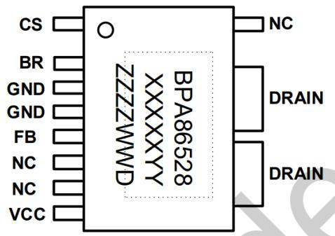

<table><tr><td>项目描述</td><td>符号</td><td>最小</td><td>典型</td><td>最大</td><td>单位</td><td>备注</td></tr><tr><td colspan="7">输入</td></tr><tr><td>电压</td><td> $V_{IN}$ </td><td>85</td><td>120/230</td><td>264</td><td> $V_{AC}$ </td><td></td></tr><tr><td>频率</td><td> $f_{LINE}$ </td><td>47</td><td>50/60</td><td>63</td><td>Hz</td><td></td></tr><tr><td colspan="7">输出</td></tr><tr><td>输出电压</td><td> $V_{OUT}$ </td><td></td><td>12</td><td></td><td>V</td><td>±5%</td></tr><tr><td>输出电流</td><td> $I_{OUT}$ </td><td></td><td>3000</td><td></td><td>mA</td><td></td></tr><tr><td>输出电压纹波</td><td> $V_{RIPPLE}$ </td><td></td><td></td><td>130</td><td>mV</td><td>20MHz带宽</td></tr><tr><td>连续输出功率</td><td> $P_{OUT}$ </td><td></td><td>36</td><td></td><td>W</td><td></td></tr><tr><td colspan="7">效率</td></tr><tr><td>待机功耗</td><td> $P_{STDBY}$ </td><td></td><td></td><td>120</td><td>mW</td><td>230VAC,包含假负载</td></tr><tr><td>满载效率</td><td>η</td><td>86</td><td></td><td></td><td>%</td><td></td></tr><tr><td colspan="7">环境</td></tr><tr><td>传导EMI</td><td></td><td colspan="4">满足CISPR22/EN55022 Class B,至少6dB 裕量</td><td></td></tr><tr><td>Surge</td><td></td><td></td><td>2</td><td></td><td>kV</td><td>差模</td></tr><tr><td>EFT</td><td></td><td></td><td>4</td><td></td><td>kV</td><td>5kHz/100kHz/38kHz</td></tr><tr><td>ESD</td><td></td><td></td><td></td><td></td><td>kV</td><td>空气放电</td></tr><tr><td>工作环境温度</td><td> $T_{AMP}$ </td><td></td><td>40</td><td>55</td><td>°C</td><td></td></tr></table>

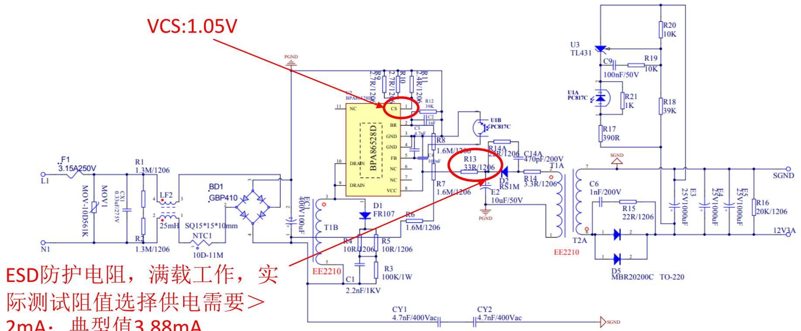

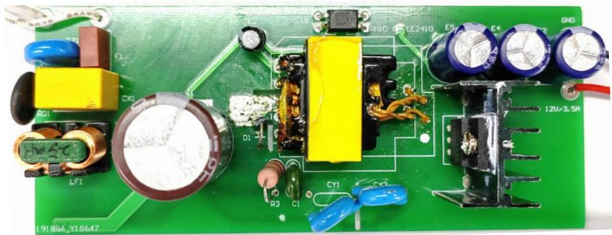

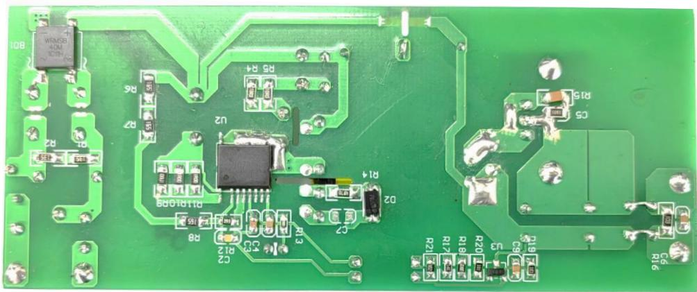

<table><tr><td>序号</td><td>元件标号</td><td>参数描述</td><td>封装尺寸</td><td>数量</td></tr><tr><td>1</td><td>PCB</td><td>CEM-1,双面板</td><td>117mm*48mm</td><td>1</td></tr><tr><td>2</td><td>F1</td><td>T3.15A 250V 保险丝</td><td>DIP</td><td>1</td></tr><tr><td>3</td><td>TZ1</td><td>10D561,压敏电阻</td><td>10D561</td><td>1</td></tr><tr><td>4</td><td>NTC1</td><td>10D11,热敏电阻</td><td>10D11</td><td>1</td></tr><tr><td>5</td><td>CX1</td><td>0.33uF 275v X电容</td><td>7*13.5</td><td>1</td></tr><tr><td>6</td><td>E1</td><td>400V100uF电解电容</td><td> $\phi 18*30$ </td><td>1</td></tr><tr><td>7</td><td>LF1</td><td>SQAT1515-25mH-排距8*脚距7mm</td><td>DIP</td><td>1</td></tr><tr><td>8</td><td>E2</td><td>50V10uF</td><td> $\phi 5*11$ </td><td>1</td></tr><tr><td>9</td><td>DB1</td><td>DB40M 4A 1KV</td><td>SMD</td><td>1</td></tr><tr><td>10</td><td>R1,R2</td><td>1.3M, $\pm 5\%$ </td><td>1206</td><td>2</td></tr><tr><td>11</td><td>R3</td><td>1W 100K 炭膜电阻</td><td>DIP</td><td>1</td></tr><tr><td>12</td><td>D1</td><td>FR107 1A 1KV</td><td>D0-41</td><td>1</td></tr><tr><td>13</td><td>U1</td><td>PC817C 光耦</td><td>DIP</td><td>1</td></tr><tr><td>14</td><td>CY1,CY2</td><td>4700PF 400V AC Y1</td><td>DIP</td><td>2</td></tr><tr><td>15</td><td>T1</td><td>EE2210次级加宽 830uH  $\pm 7\%$ </td><td>DIP</td><td>1</td></tr><tr><td>16</td><td>E3,E4,E5</td><td>25V/1000uF电解电容,高频低阻</td><td> $\phi 10*12mm$ </td><td>3</td></tr><tr><td>17</td><td>U1</td><td>BPA86528D</td><td>ESOP-10</td><td>1</td></tr><tr><td>18</td><td>U3</td><td>TL431</td><td>SOT23-3</td><td>1</td></tr><tr><td>19</td><td>D2</td><td>RS1M 1A 1KV</td><td>SMA</td><td>1</td></tr><tr><td>20</td><td>R14A,R15</td><td>22R, $\pm 5\%$ </td><td>SMD1206</td><td>2</td></tr><tr><td>21</td><td>R4,R5</td><td>10R, $\pm 5\%$ </td><td>SMD1206</td><td>2</td></tr><tr><td>22</td><td>R6,R7,R8</td><td>1.6M, $\pm 5\%$ </td><td>SMD1206</td><td>3</td></tr><tr><td>23</td><td>R9,R10</td><td>2.7R, $\pm 1\%$ </td><td>SMD1206</td><td>2</td></tr><tr><td>24</td><td>R11</td><td>2.4R, $\pm 1\%$ </td><td>SMD1206</td><td>1</td></tr><tr><td>25</td><td>R12</td><td>39K, $\pm 5\%$ </td><td>SMD0805</td><td>1</td></tr><tr><td>26</td><td>R13</td><td>33R, $\pm 5\%$ </td><td>SMD0805</td><td>1</td></tr><tr><td>27</td><td>R14</td><td>3.3R, $\pm 5\%$ </td><td>SMD1206</td><td>1</td></tr><tr><td>28</td><td>C14A</td><td>470pF,200V,X7R</td><td>SMD0805</td><td>1</td></tr><tr><td>29</td><td>C2</td><td>1nF,25V,X7R</td><td>SMD0805</td><td>1</td></tr><tr><td>30</td><td>C3</td><td>4.7nF,25V,X7R</td><td>SMD0805</td><td>1</td></tr><tr><td>31</td><td>C4</td><td>100nF,25V,X7R</td><td>SMD0805</td><td>1</td></tr><tr><td></td><td></td><td></td><td>Total</td><td>40</td></tr></table>

<table><tr><td>序号</td><td>元件标号</td><td>参数描述</td><td>封装尺寸</td><td>数量</td></tr><tr><td>32</td><td>R18</td><td>39K, ±1%</td><td>SMD0805</td><td>1</td></tr><tr><td>33</td><td>R20</td><td>10K, ±1%</td><td>SMD0805</td><td>1</td></tr><tr><td>34</td><td>R19</td><td>10K, ±5%</td><td>SMD0805</td><td>1</td></tr><tr><td>35</td><td>R16</td><td>20K, ±5%</td><td>SMD1206</td><td>1</td></tr><tr><td>36</td><td>C5</td><td>1nF, 250V X7R</td><td>SMD0805</td><td>1</td></tr><tr><td>37</td><td>R21</td><td>1K, ±5%</td><td>SMD0805</td><td>1</td></tr><tr><td>38</td><td>R17</td><td>390R, ±5%</td><td>SMD0805</td><td>1</td></tr><tr><td>39</td><td>C9</td><td>100nF, 25V X7R</td><td>SMD0805</td><td>1</td></tr><tr><td>40</td><td>D5</td><td>MBR20200 20A 200V</td><td>TO-220</td><td>1</td></tr><tr><td>41</td><td>C1</td><td>2.2nF, 1KV 涤纶电容</td><td>DIP</td><td>1</td></tr><tr><td></td><td></td><td></td><td>Total</td><td>10</td></tr></table>

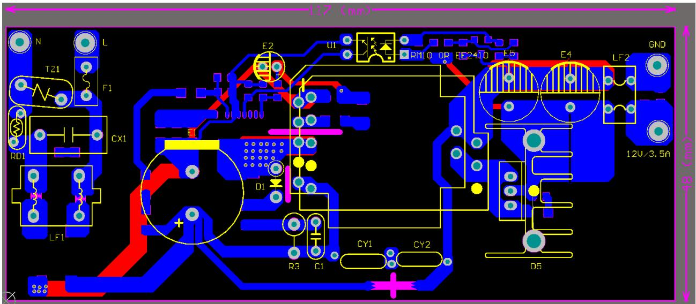

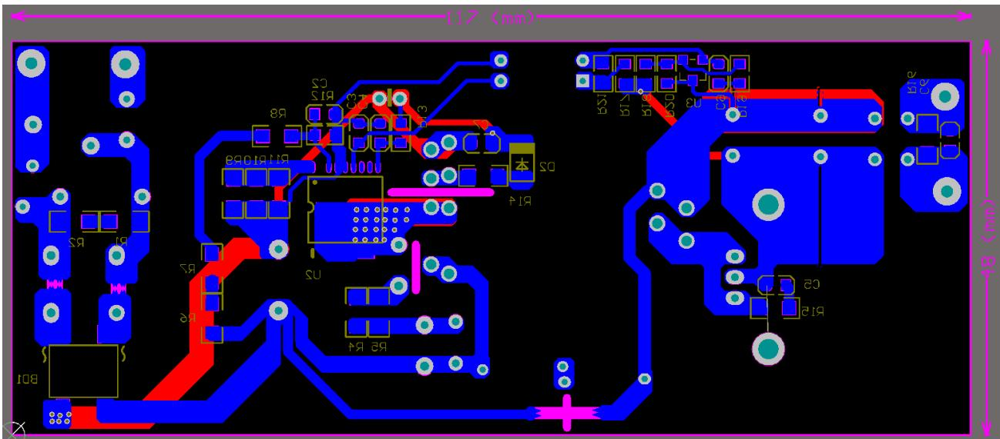

## 原理图

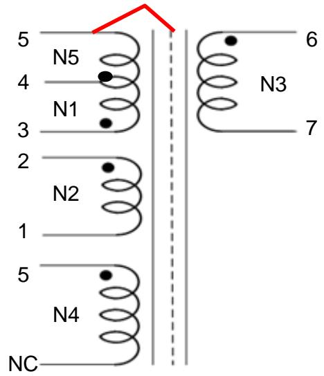

## 绕线方式

<table><tr><td>绕组</td><td>起始脚</td><td>终止脚</td><td>材料</td><td>匝数</td><td>绕线方式</td></tr><tr><td>N1</td><td>3</td><td>4</td><td> $\phi 0.28*1P$ </td><td>28Ts</td><td>密绕一层(PIN脚朝外)</td></tr><tr><td colspan="4">胶带</td><td>2Ts</td><td></td></tr><tr><td>N2</td><td>2</td><td>1</td><td> $\phi 0.28*3P$ </td><td>6Ts</td><td>密绕一层(PIN脚朝外)</td></tr><tr><td colspan="4">胶带</td><td>2Ts</td><td></td></tr><tr><td>N3</td><td>6</td><td>7</td><td>三层绝缘线 $\phi 0.55*2P$ </td><td>5Ts</td><td>密绕一层(PIN脚朝外)</td></tr><tr><td colspan="4">胶带</td><td>2Ts</td><td></td></tr><tr><td>N4</td><td>5</td><td>NC</td><td> $\phi 0.28*3P$ </td><td>8Ts</td><td>密绕一层(PIN脚朝外)</td></tr><tr><td colspan="4">胶带</td><td>2Ts</td><td></td></tr><tr><td>N5</td><td>4</td><td>5</td><td> $\phi 0.28*1P$ </td><td>25Ts</td><td>密绕一层(PIN脚朝外)</td></tr><tr><td colspan="4">胶带</td><td>3Ts</td><td></td></tr></table>

## 规格与材料

➢ 初级绕组感量 $L _ { \mathrm { p } } { = } 8 3 0 \mathrm { u } \mathsf { H } { \pm } 7 \%$ （测试条件： 0.3V，100kHz）  
➢ 漏感量 $\mathsf { L } _ { | \mathsf { k } } < 3 0 \mathsf { \dot { u } H }$  
➢ 骨架：EE2210次级加宽（5+2PIN）  
➢ 磁芯：EE2210 PC40 或同等材质 ， $\mathsf { A e } = 6 6 . 8 \mathsf { m m } ^ { 2 }$  
➢ N1、N2、N4、N5: 2UEW 漆包线  
➢ N3: 三层绝缘线  
➢ 绝缘胶带:3M900 或同等材质  
➢ 耐压测试: 3KV, 50/60Hz, 1Min  
➢ 成品要求：浸凡立水  
磁芯接变压器5脚

## 脚位图

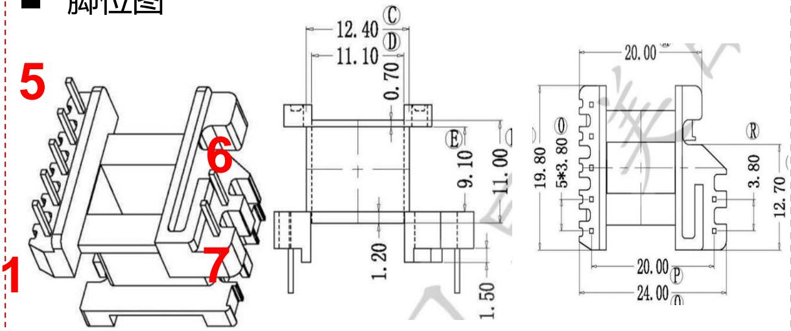

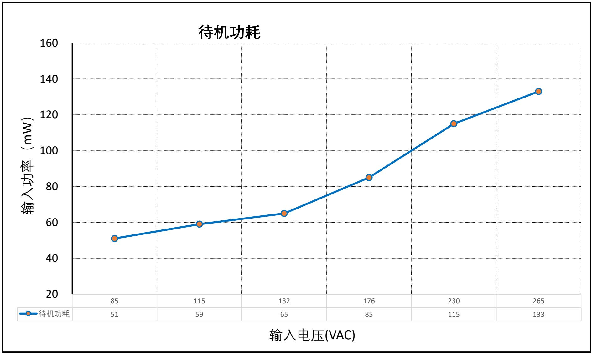

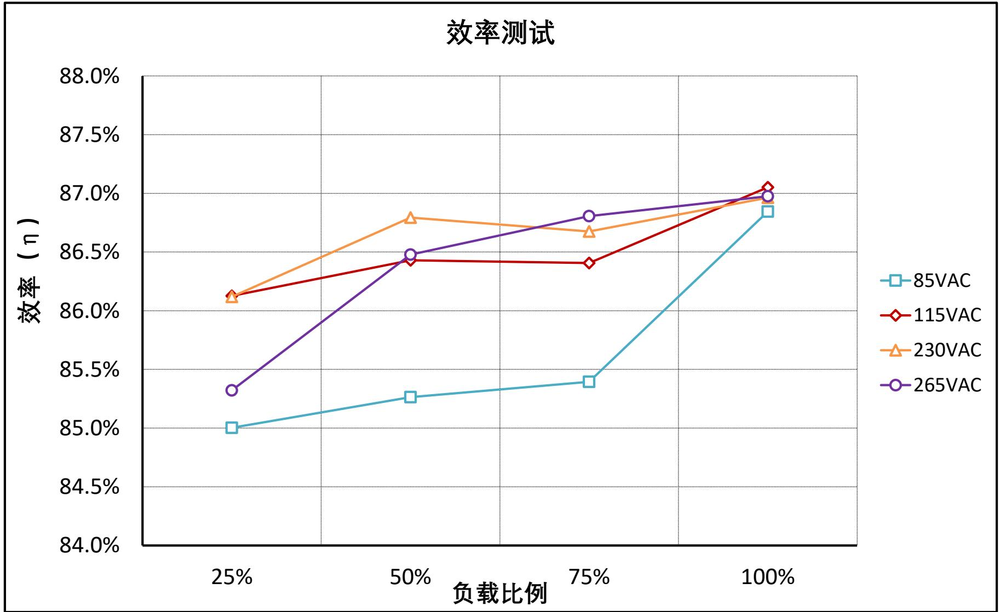

## 输出电压调整率

<table><tr><td> $V_{IN}(VAC)$ Load(%)</td><td>85</td><td>115</td><td>132</td><td>176</td><td>230</td><td>265</td><td>平均值</td><td>线调整率</td></tr><tr><td>0</td><td>12.170</td><td>12.170</td><td>12.171</td><td>12.170</td><td>12.170</td><td>12.170</td><td>12.170</td><td>0.01%</td></tr><tr><td>20%</td><td>12.165</td><td>12.164</td><td>12.157</td><td>12.164</td><td>12.164</td><td>12.164</td><td>12.163</td><td>0.07%</td></tr><tr><td>40%</td><td>12.158</td><td>12.158</td><td>12.157</td><td>12.158</td><td>12.157</td><td>12.157</td><td>12.158</td><td>0.01%</td></tr><tr><td>60%</td><td>12.152</td><td>12.151</td><td>12.145</td><td>12.151</td><td>12.151</td><td>12.151</td><td>12.150</td><td>0.06%</td></tr><tr><td>80%</td><td>12.146</td><td>12.145</td><td>12.145</td><td>12.144</td><td>12.144</td><td>12.144</td><td>12.145</td><td>0.02%</td></tr><tr><td>100%</td><td>12.140</td><td>12.139</td><td>12.138</td><td>12.138</td><td>12.138</td><td>12.138</td><td>12.139</td><td>0.02%</td></tr><tr><td>平均值</td><td>12.155</td><td>12.155</td><td>12.152</td><td>12.154</td><td>12.154</td><td>12.154</td><td rowspan="2" colspan="2"></td></tr><tr><td>负载调整率</td><td>0.25%</td><td>0.26%</td><td>0.27%</td><td>0.26%</td><td>0.26%</td><td>0.26%</td></tr></table>

◼ 计算方法：调整率=100%\*(最大值-最小值)/平均值  
测试条件：

<table><tr><td>输出电流\VIN(VAC)</td><td>85</td><td>264</td></tr><tr><td>3.3A</td><td>12.15</td><td>12.13</td></tr><tr><td>3.4A</td><td>12.14</td><td>12.13</td></tr><tr><td>3.5A</td><td>OLP</td><td>12.13</td></tr><tr><td>3.7A</td><td>OLP</td><td>12.13</td></tr><tr><td>3.9A</td><td>OLP</td><td>12.13</td></tr><tr><td>4.1A</td><td>OLP</td><td>12.13</td></tr><tr><td>4.3A</td><td>OLP</td><td>12.13</td></tr><tr><td>4.5A</td><td>OLP</td><td>12.12</td></tr><tr><td>4.7A</td><td>OLP</td><td>12.12</td></tr><tr><td>4.8A</td><td>OLP</td><td>12.12</td></tr><tr><td>4.9A</td><td>OLP</td><td>OLP</td></tr></table>

## FB开短路测试（北美50V以内）

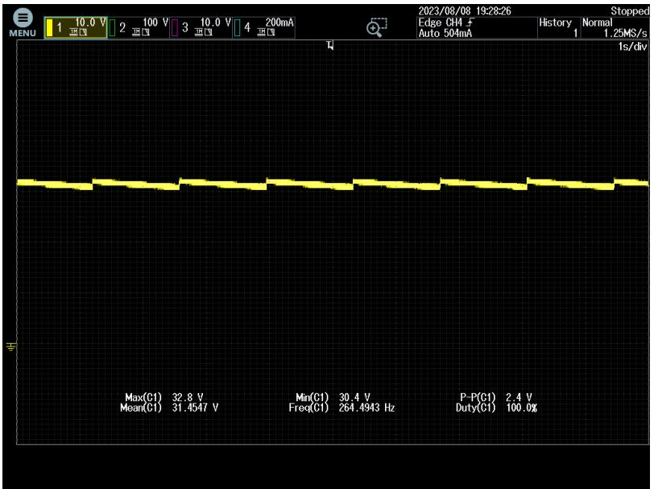

120 VAC

CH1 VOUT Ripple Vmax=32.8V

Test Condition:

R17开路

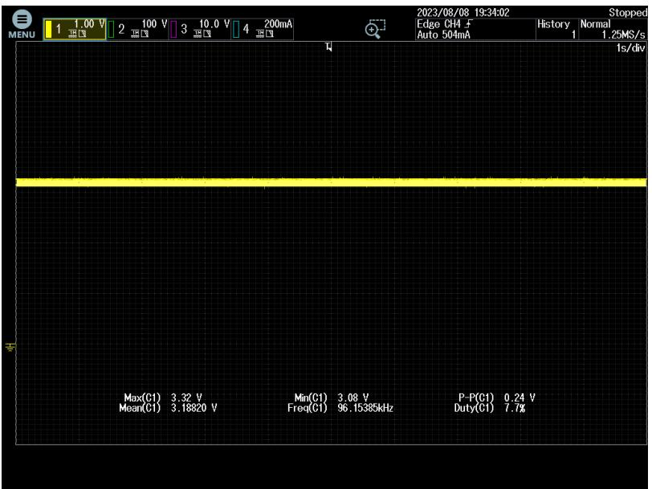

120 VAC

$\stackrel { \mathsf { C H 1 } } { \boldsymbol { v } } _ { \mathsf { m a x } } = 4 0 . 2 \mathsf { v } ^ { \mathsf { R i p p l e } }$

Test Condition:

R18短路

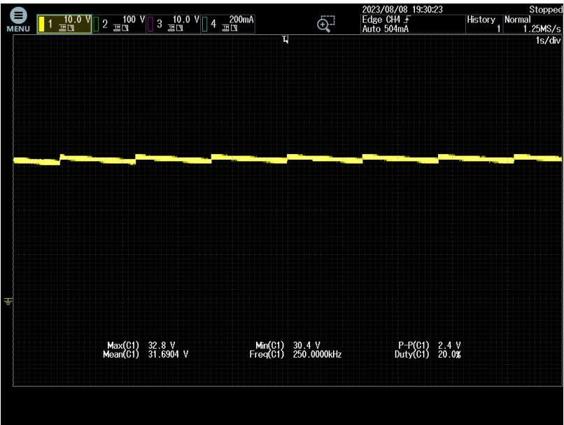

120 VAC

CH1 $\mathsf { V } _ { \mathsf { O U T } }$ Ripple Vmax=32.8V

Test Condition:

R18开路

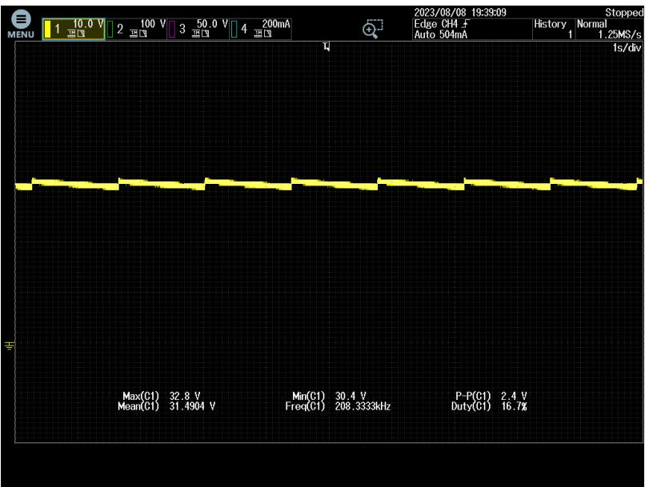

120 VAC

CH1 VOUT Ripple =32.8V

Test Condition:

R20短路

## 输出电压纹波

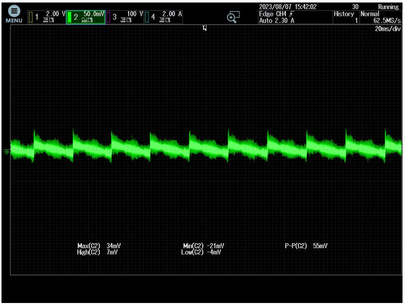

85 VAC

CH2 VOUT-12V Ripple VPK-PK=55mV

## Test Condition:

➢ No Load

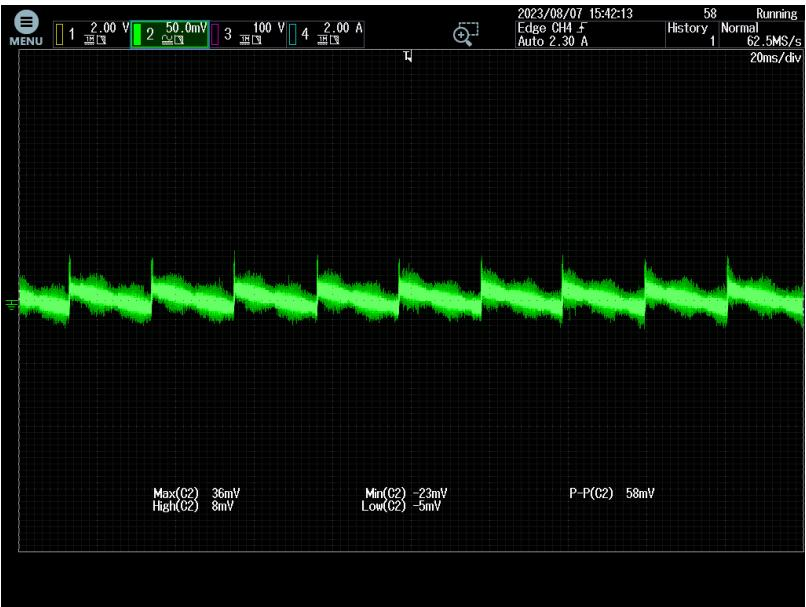

115 VAC

CH2 VOUT-12V Ripple $\mathtt { V } _ { \mathtt { P K - P K } } = 5 8 \mathsf { m V }$

## Test Condition:

➢ No Load

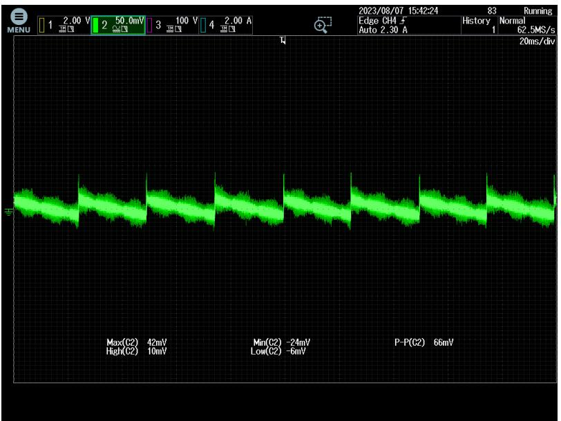

230 VAC

CH2 VOUT-12V Ripple VPK-PK=66mV

## Test Condition:

➢ No Load

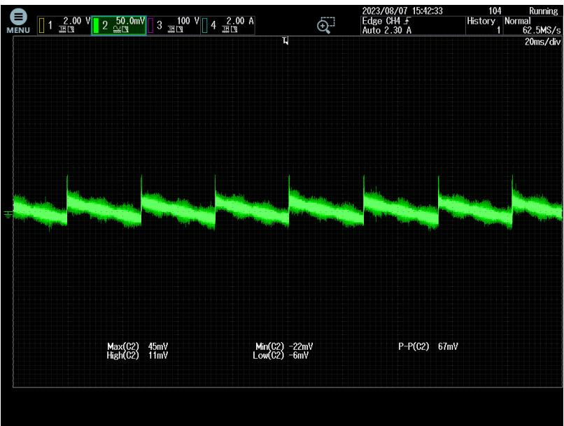

265 VAC

CH2 VOUT-12V Ripple VPK-PK=67mV

## Test Condition:

➢ No Load

## 输出电压纹波

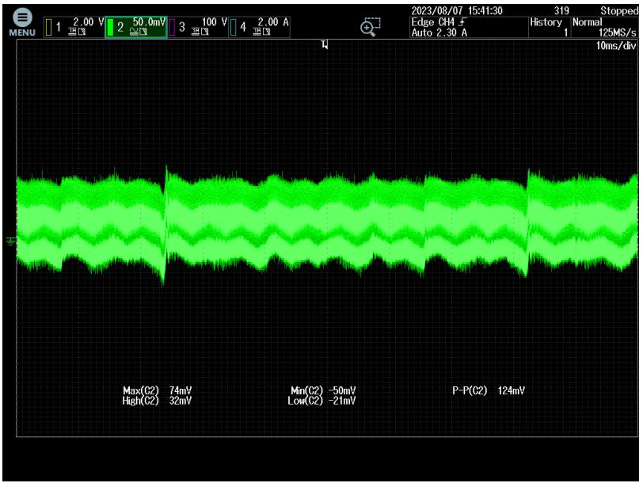

85 VAC

CH2 VOUT-12V Ripple $\mathsf { V } _ { \mathsf { P K - P K } } { = } 1 2 4 \mathsf { m V }$

## Test Condition:

➢ Full Load

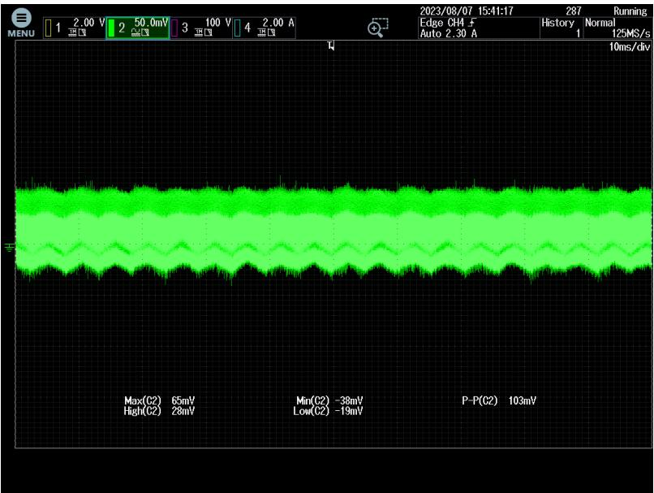

115 VAC

CH2 VOUT-12V Ripple $\mathsf { V } _ { \mathsf { P K - P K } } { = } 1 0 3 \mathsf { m V }$

## Test Condition:

➢ Full Load

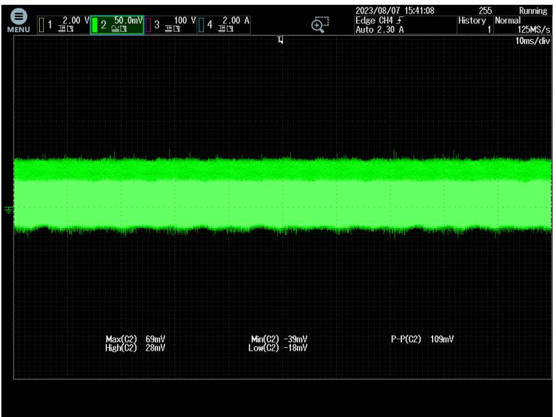

230 VAC

CH2 VOUT-12V Ripple $\mathsf { V } _ { \mathsf { P K - P K } } { = } 1 0 9 \mathsf { m V }$

## Test Condition:

➢ Full Load

265 VAC

CH2 VOUT-12V Ripple $\mathsf { V } _ { \mathsf { P K - P K } } { = } \mathsf { 1 0 3 m V }$

## Test Condition:

➢ Full Load

## 动态负载(50%-100%)

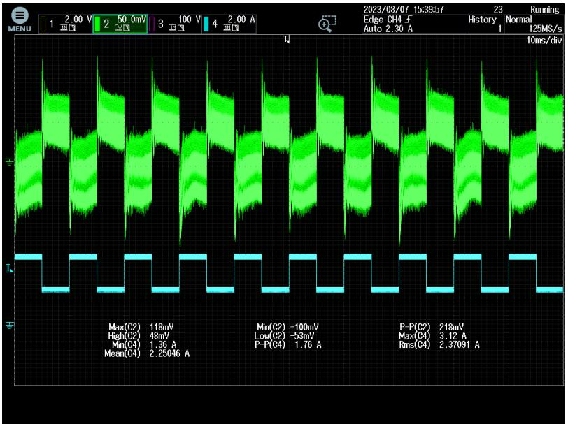

85 VAC

CH2 VOUT-12V VPK-PK=218 mV

## Test Condition:

➢ 1.5 A-3A-1.5A  
➢ Slew Rate: 0.5 A/μS  
➢ Frequency: 100 Hz

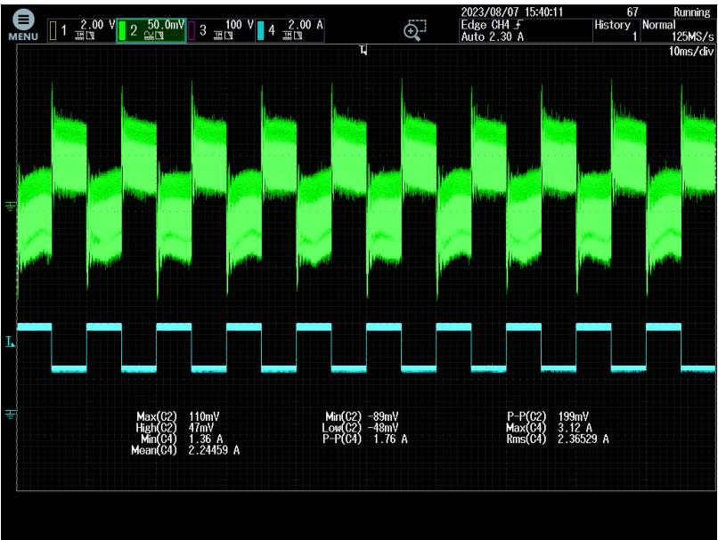

115 VAC

CH2 VOUT-12V VPK-PK=199 mV

## Test Condition:

➢ 1.5 A-3A-1.5A  
➢ Slew Rate: 0.5 A/μS  
➢ Frequency: 100 Hz

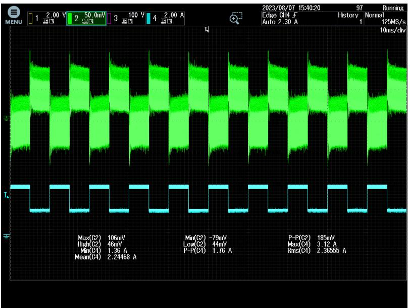

230 VAC

CH2 VOUT-12V VPK-PK=185 mV

## Test Condition:

➢ 1.5 A-3A-1.5A  
➢ Slew Rate: 0.5 A/μS  
➢ Frequency: 100 Hz

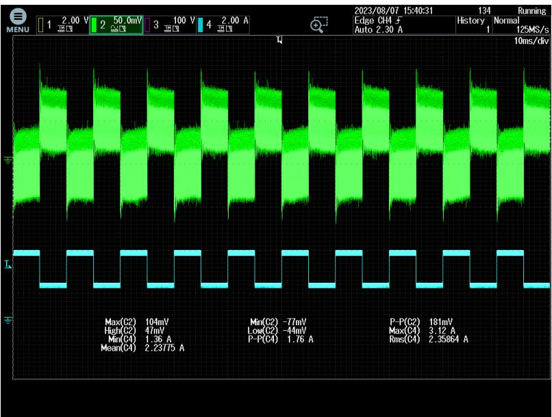

264 VAC

CH2 VOUT-12V VPK-PK=181 mV

## Test Condition:

➢ 1.5 A-3A-1.5A  
➢ Slew Rate: 0.5 A/μS  
➢ Frequency: 100 Hz

## 动态负载(10%-90%)

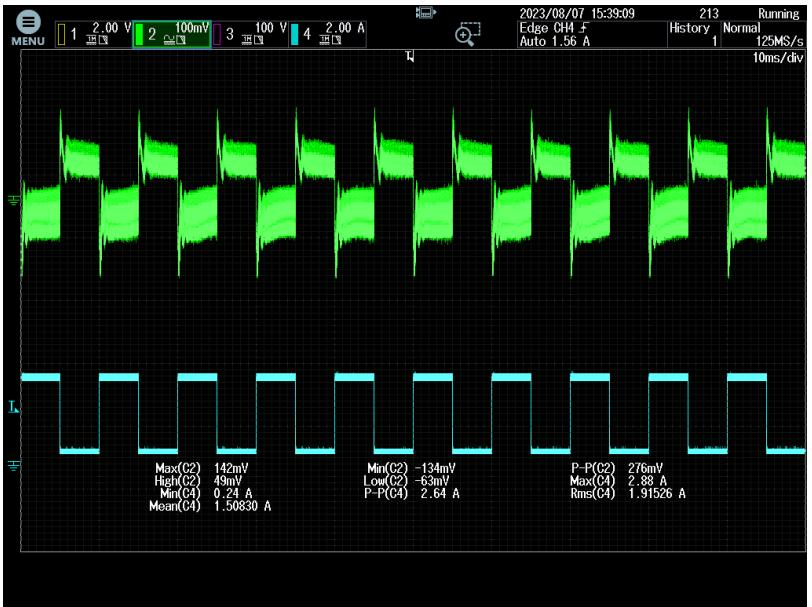

85 VAC

$\begin{array} { r l } & { \mathsf { C H 2 } \mathsf { V _ { O U T - 1 2 V } } } \\ & { \mathsf { V _ { P K - P K } } \mathsf { = } 2 7 6 \mathsf { m v } } \end{array}$ CH2 VOUT-12V

## Test Condition:

➢ 0.3 A-2.7 A-0.3 A  
➢ Slew Rate: 0.5 A/μS  
➢ Frequency: 100 Hz

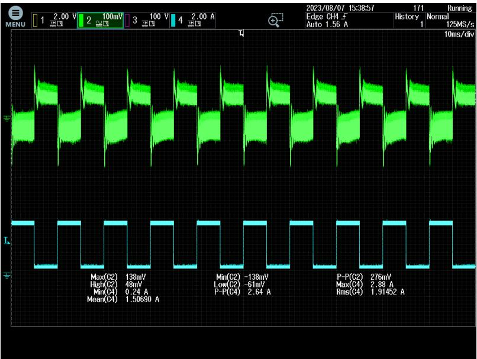

115 VAC

CH2 VOUT-12V $\begin{array} { r l } & { \mathsf { C H 2 } \mathsf { V _ { O U T - 1 2 V } } } \\ & { \mathsf { V _ { P K - P K } } \mathsf { = } 2 7 6 \mathsf { m v } } \end{array}$

## Test Condition:

➢ 0.3 A-2.7 A-0.3 A  
➢ Slew Rate: 0.5 A/μS  
➢ Frequency: 100 Hz

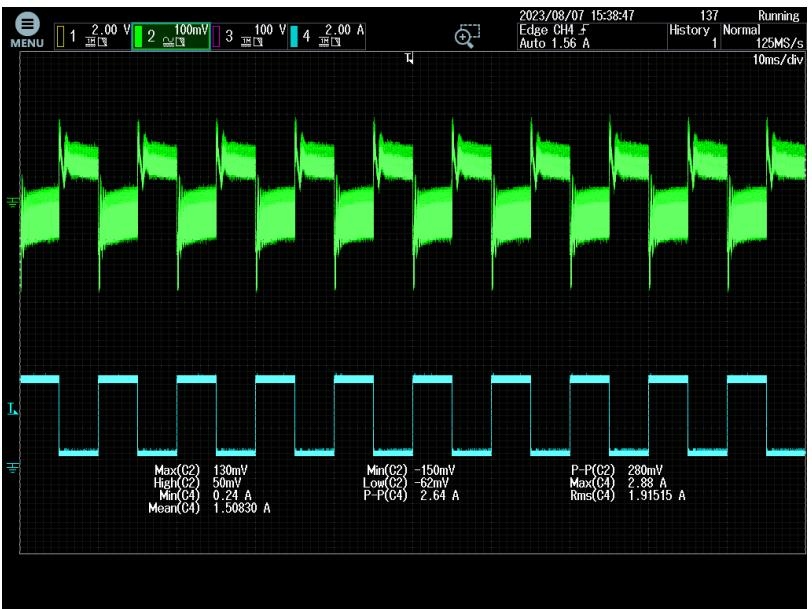

230 VAC

CH2 VOUT-12V VPK-PK=280 mV

## Test Condition:

➢ 0.3 A-2.7 A-0.3 A  
➢ Slew Rate: 0.5 A/μS  
➢ Frequency: 100 Hz

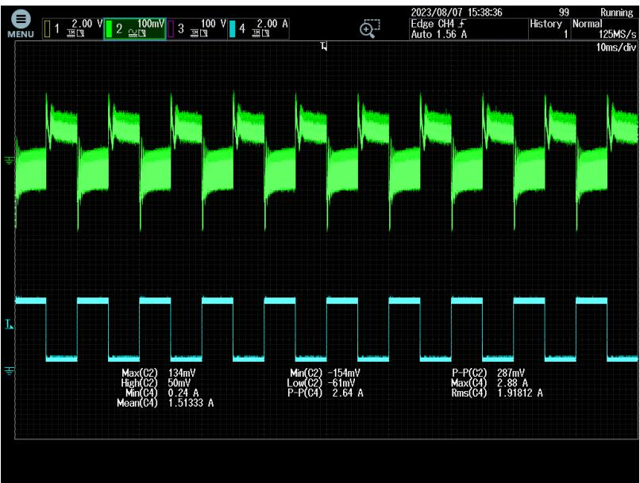

264VAC

CH2 VOUT-12V VPK-PK=287 mV

## Test Condition:

➢ 0.3 A-2.7 A-0.3 A  
➢ Slew Rate: 0.5 A/μS  
➢ Frequency: 100 Hz

## 输出电压开机波形\_Fb有4.7nF电容，低压满载过冲

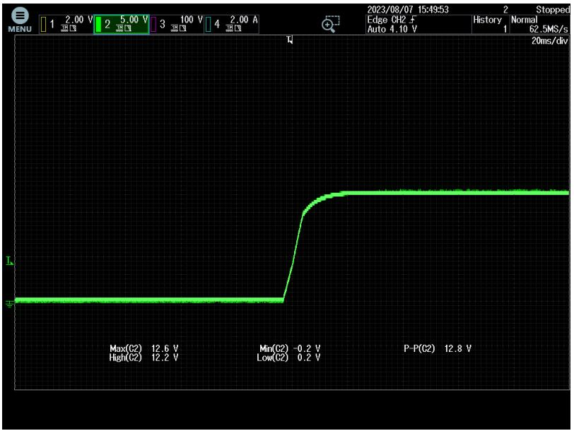

85 VAC

CH2 VOUT-12V TRISE: 10 mS

## Test Condition:

➢ No Load

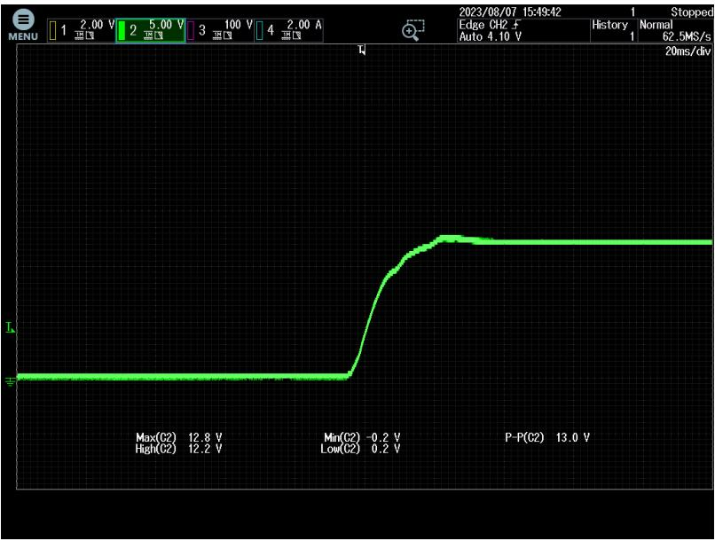

85 VAC

CH2 VOUT-12V TRISE: 16 mS

## Test Condition:

➢ Full Load

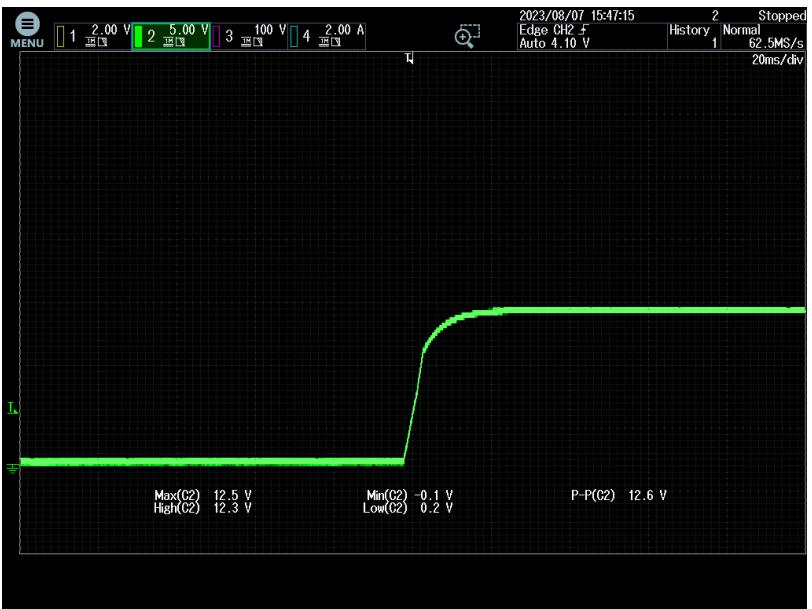

265 VAC

CH2 VOUT-12V TRISE: 9 mS

## Test Condition:

➢ No Load

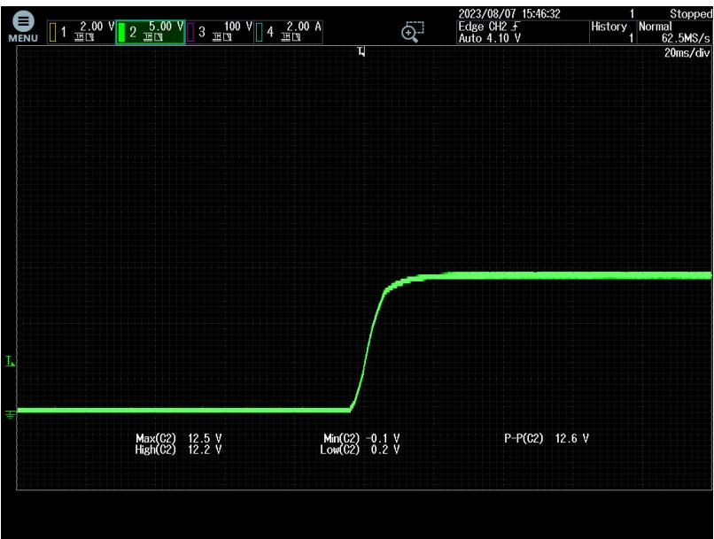

265 VAC

CH2 VOUT-12V TRISE: 10 mS

## Test Condition:

➢ Full Load

## 启动延迟时间

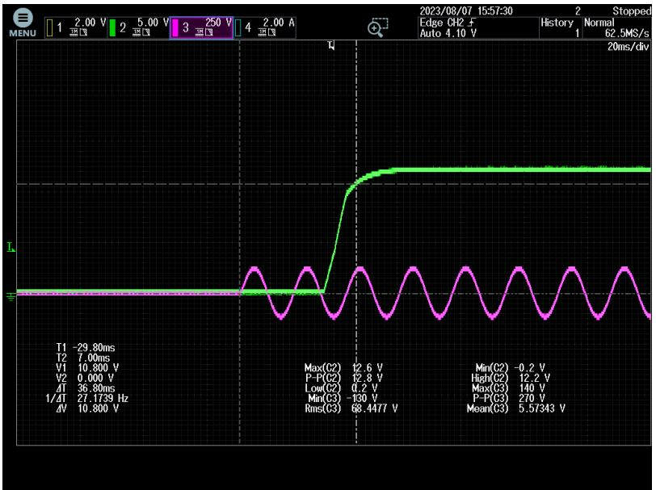

85 VAC

CH2 VOUT-12V $\mathsf { V } _ { \mathsf { O U T } - 1 2 \mathsf { V } }$  
CH3 $\mathsf { V I N } _ { \mathsf { A C } }$  
TDELAY: 36.8 mS

Test Condition:  
➢ No Load  
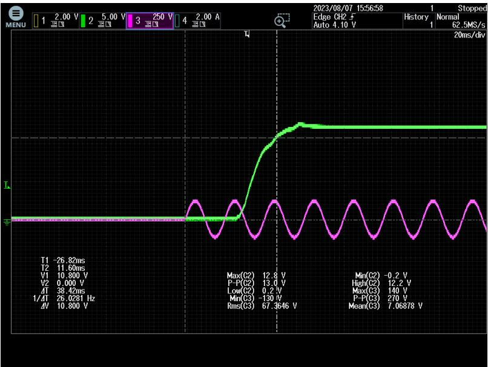

85 VAC

CH2 VOUT-12V $\mathsf { V } _ { \mathsf { O U T - 1 } 2 \mathsf { V } }$  
CH3 VINAC $\mathsf { V I N } _ { \mathsf { A C } }$ 38.4mS

Test Condition:  
➢ Full Load  
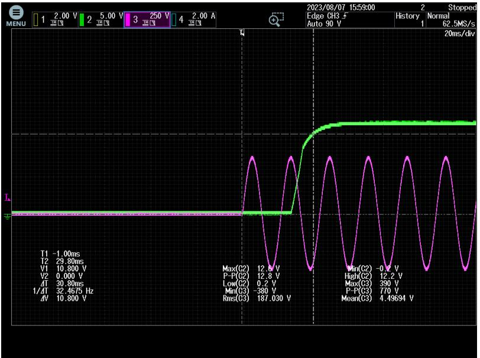

265 VAC

CH2 VOUT-12V $\mathsf { V } _ { \mathsf { O U T } - 1 2 \mathsf { V } }$  
CH3 VINNAC TDELAY: 30.8 mS

Test Condition:  
➢ No Load  
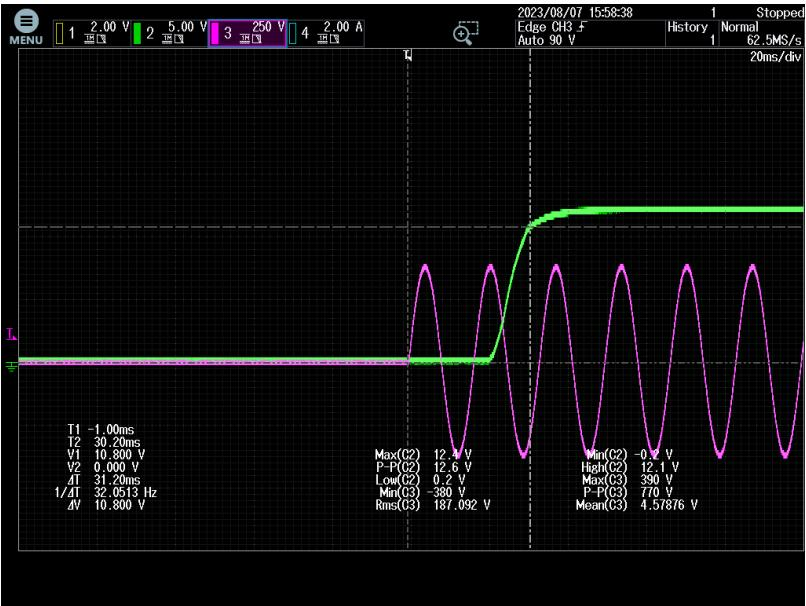

265 VAC

CH2 VOUT-12V  
CH3 VINNAC $\mathsf { V I N } _ { \mathsf { N A C } }$ TDELAY : 31.2mS

Test Condition:

➢ Full Load

## VCC电压开机波形

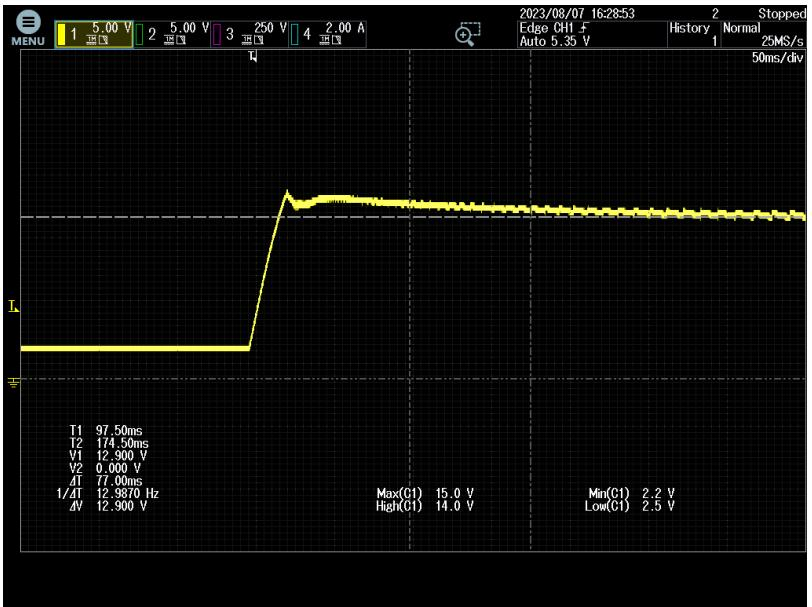

${ \otimes 5 } \mathsf { V } _ { \mathsf { A C } }$

${ \mathsf { C H 1 } } \mathsf { V } _ { \mathsf { v c c } }$  
$V _ { \mathsf { V C C - M A X } } = 1 5 \mathsf { V }$  
$\mathsf { V } _ { \mathsf { V C C } } = 1 2 . 9 \mathsf { V }$

Test Condition:  
➢ No Load  
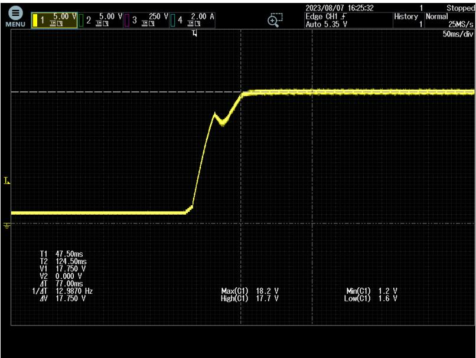

85 VAC

${ \mathsf { C H 1 } } \mathsf { V } _ { \mathsf { v c c } }$  
$V _ { \mathsf { V C C - M A X } } = 1 8 . 2 \mathsf { V }$  
$\mathsf { V } _ { \mathsf { V C C } } { = } 1 7 . 7 \mathsf { V }$

Test Condition:  
➢ Full Load  
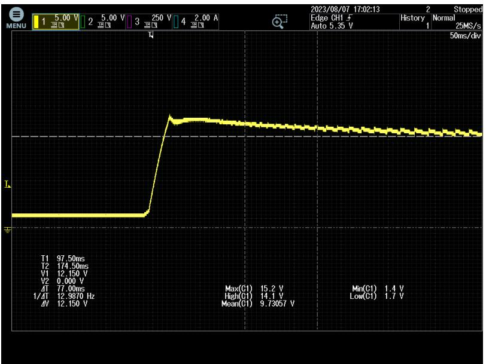

265 VAC

${ \mathsf { C H 1 } } \mathsf { V } _ { \mathsf { v c c } }$  
$V _ { \mathsf { V C C - M A X } } = 1 5 . 2 \mathsf { V }$  
$\mathsf { V } _ { \mathsf { V C C } } { = } 1 2 . 1 \mathsf { V }$

Test Condition:  
➢ No Load  
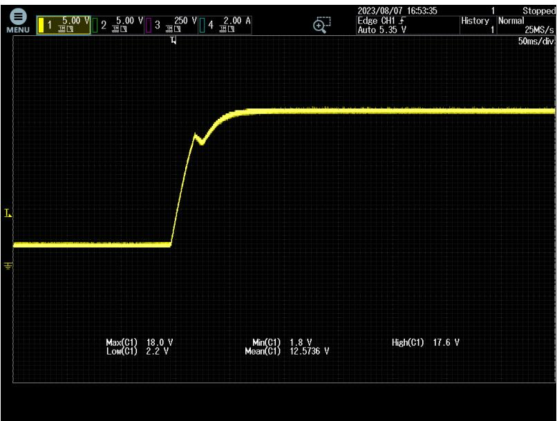

265 VAC

${ \mathsf { C H 1 } } \mathsf { V } _ { \mathsf { v c c } }$  
$V _ { \mathsf { V C C - M A X } } = 1 8 V$  
$\mathsf { V } _ { \mathsf { V C C } } = 1 8 \mathsf { V }$

Test Condition:

➢ Full Load

## VCC电压开机波形

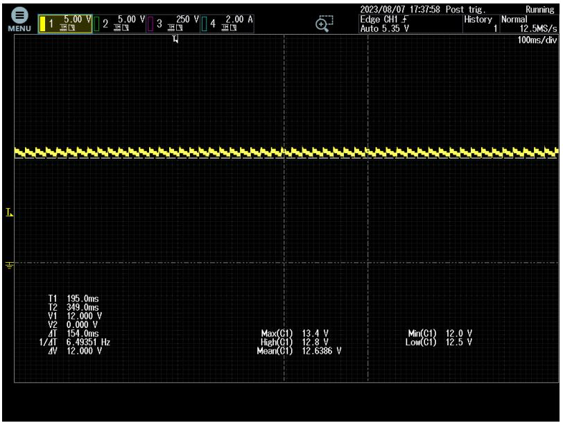

85 VAC

${ \mathsf { C H 1 } } \mathsf { V } _ { \mathsf { v c c } }$  
$V _ { \mathsf { V C C - M A X } } = 1 3 . 4 \lor$  
$\mathsf { V } _ { \mathsf { V C C } } = 1 2 \mathsf { V }$

Test Condition:  
➢ No Load  
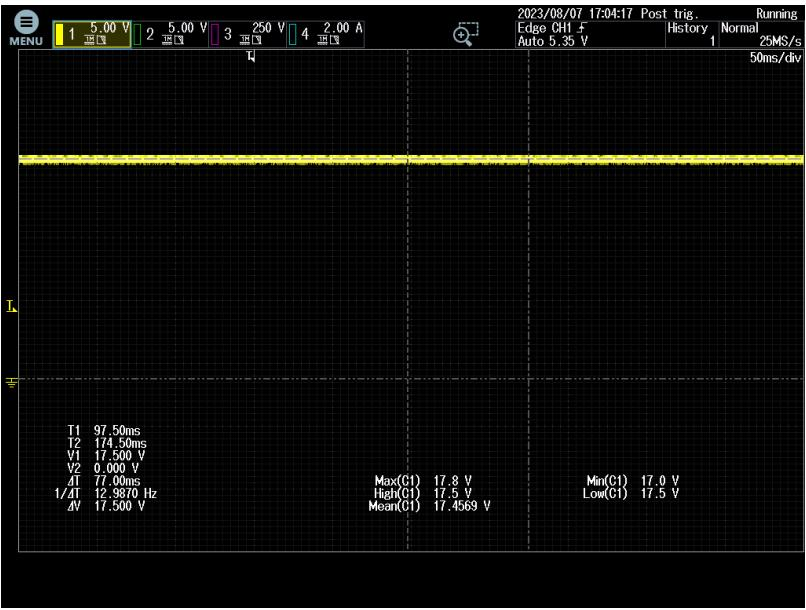

${ \tt S 5 V } _ { \sf A C }$

${ \mathsf { C H 1 } } \mathsf { V } _ { \mathsf { v c c } }$  
$V _ { \mathsf { V C C - M A X } } = 1 7 . 8 V$  
$\mathsf { V } _ { \mathsf { V C C } } { = } 1 7 . 5 \mathsf { V }$

Test Condition:  
➢ Full Load  
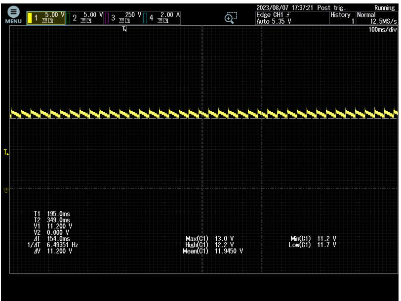

265 VAC

${ \mathsf { C H 1 } } \mathsf { V } _ { \mathsf { v c c } }$  
$V _ { \mathsf { V C C - M A X } } = 1 3 \mathsf { V }$  
$\mathsf { V } _ { \mathsf { V C C } } { = } 1 1 . 2 \mathsf { V }$

Test Condition:  
➢ No Load  
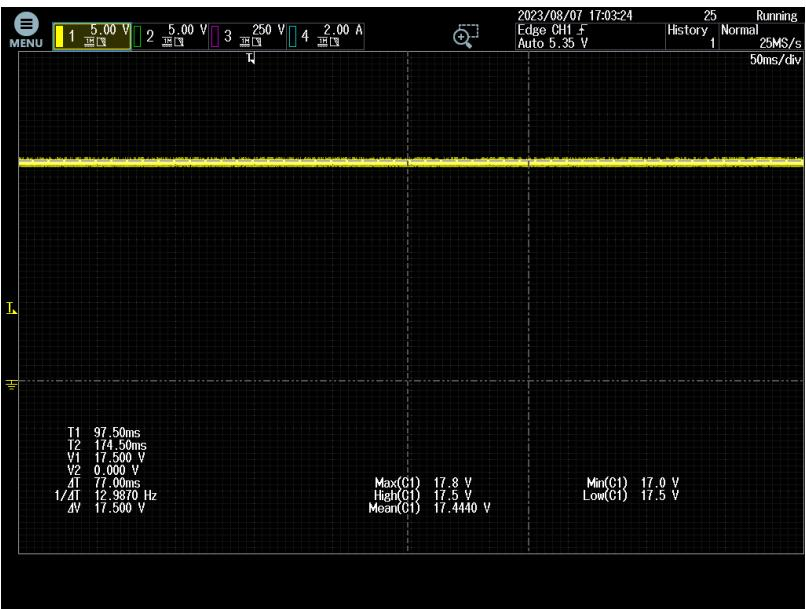

$2 6 5 \ : \mathsf { V } _ { \mathsf { A C } }$

${ \mathsf { C H 1 } } \mathsf { V } _ { \mathsf { v c c } }$  
$V _ { \mathsf { V C C - M A X } } = 1 7 . 8 V$  
$\mathsf { V } _ { \mathsf { V C C } } { = } 1 7 . 5 \mathsf { V }$

Test Condition:

➢ Full Load

## MOSFET稳态波形

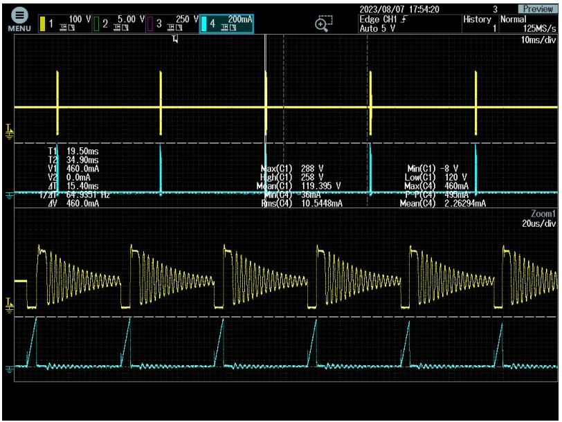

85 VAC

CH1 VDS  
CH4 IDS

$$
\begin{array}{l} \mathrm {V_ {DS\_MAX}} = 2 8 8 \mathrm{V} \\ \mathrm {I_ {DS\_MAX}} = 0. 4 6 \mathrm{A} \end{array}
$$

## Test Condition:

➢ No Load

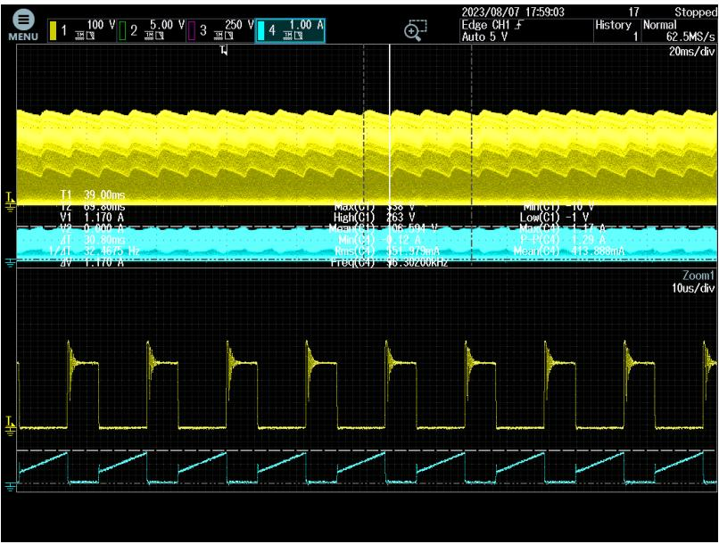

85 VAC

CH1 VDS  
CH4 IDS

$$
\begin{array}{l} \mathrm {V_ {DS\_MAX}} = 3 3 8 \mathrm{V} \\ \mathrm {I_ {DS\_MAX}} = 1. 1 7 \mathrm{A} \end{array}
$$

## Test Condition:

➢ Full Load

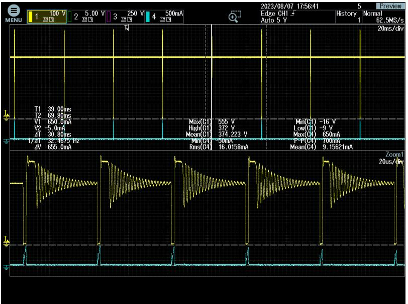

265 VAC

CH1 VDS  
CH4 IDS

$$
\begin{array}{l} \mathrm {V_ {DS\_MAX}} = 5 5 5 \mathrm{V} \\ \mathrm {I_ {DS\_MAX}} = 0. 6 5 0 \mathrm{A} \end{array}
$$

## Test Condition:

➢ No Load

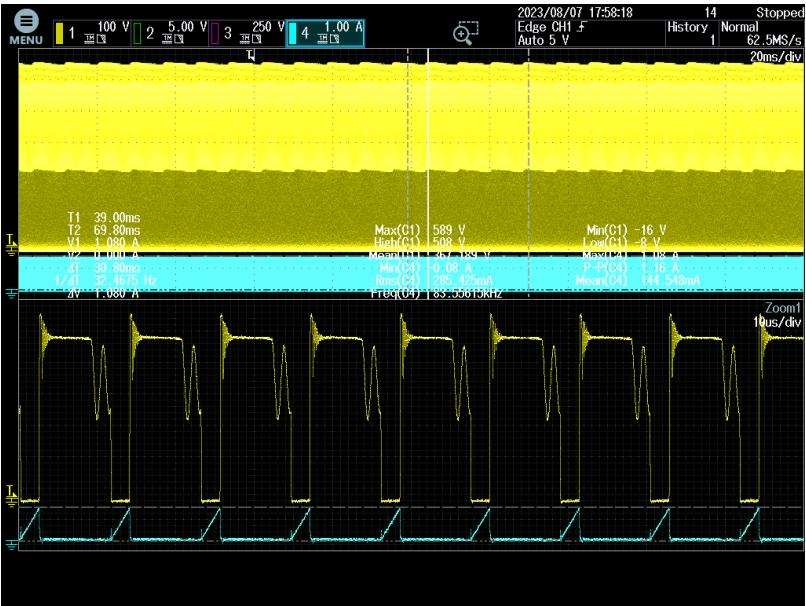

265 VAC

CH1 VDS  
CH4 IDS

$$
\begin{array}{l} \mathrm {V_ {DS\_MAX}} = 5 8 9 \mathrm{V} \\ \mathrm {I_ {DS\_MAX}} = 1. 0 8 \mathrm{A} \end{array}
$$

## Test Condition:

➢ Full Load

## 漏极电压电流波形

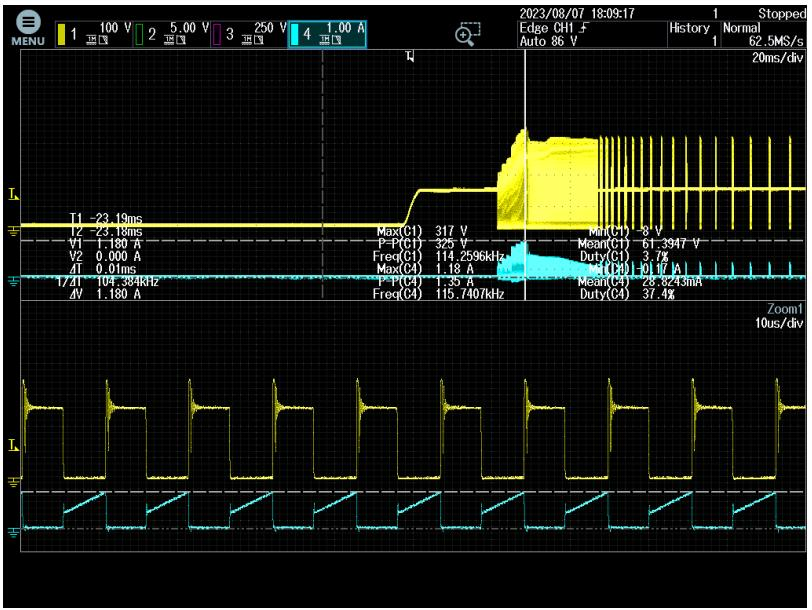

85 VAC

CH1 VDS  
CH4 IDS

$$
V _ {D S \_ M A X} = 3 1 7 \mathrm{V}
$$

$$
I _ {D S \_ M A X} = 1. 1 8 A
$$

## Test Condition:

➢ No Load

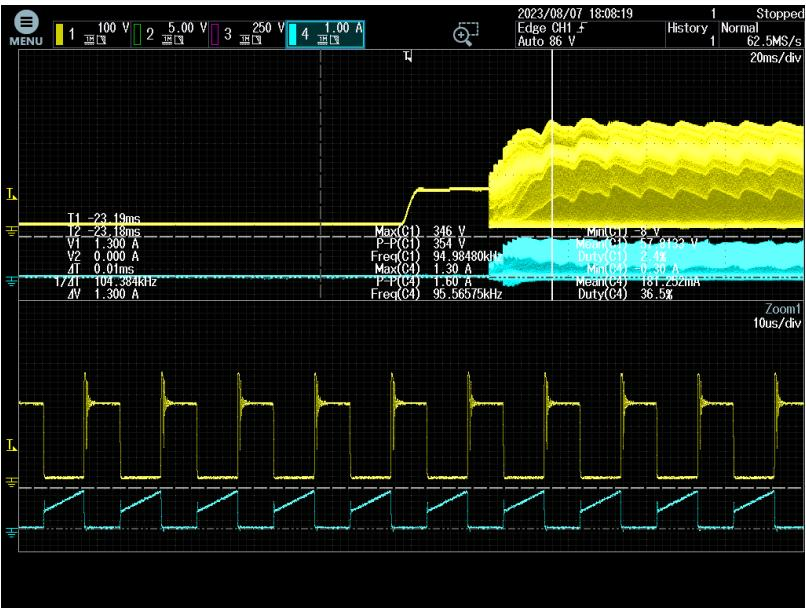

85 VAC

CH1 VDS  
CH4 IDS

$$
V _ {D S \_ M A X} = 3 4 6 \mathrm{V}
$$

$$
I _ {D S \_ M A X} = 1. 3 A
$$

## Test Condition:

➢ Full Load

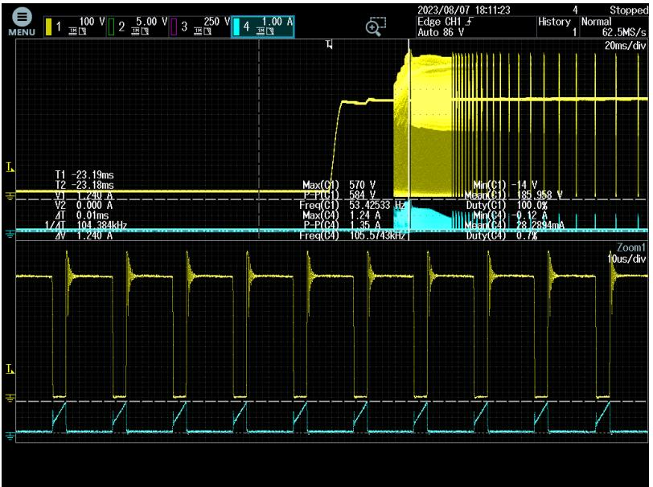

265 VAC

CH1 VDS  
CH4 IDS

$$
V _ {D S \_ M A X} = 5 7 0 \mathrm{V}
$$

$$
I _ {D S \_ M A X} = 1. 2 4 A
$$

## Test Condition:

➢ No Load

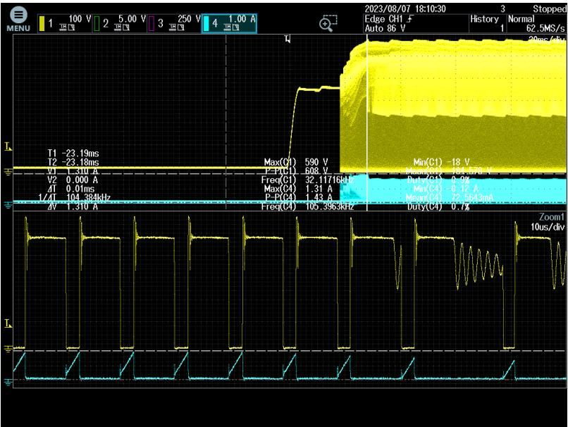

265 VAC

CH1 VDS  
CH4 IDS

$$
V _ {D S \_ M A X} = 5 9 0 \mathrm{V}
$$

$$
I _ {D S \_ M A X} = 1. 3 1 A
$$

## Test Condition:

➢ Full Load

## D-S电压波形

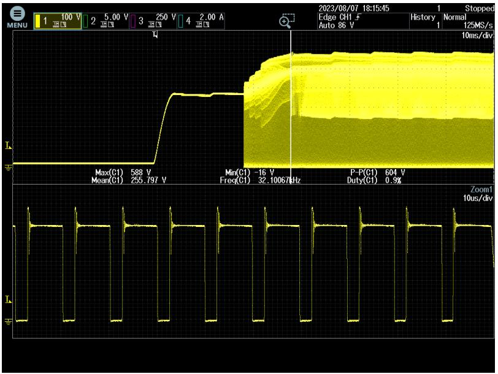

265 VAC  
CH1 VDS VDSMAX: 588 V  
➢ 满载开机

Test Condition:

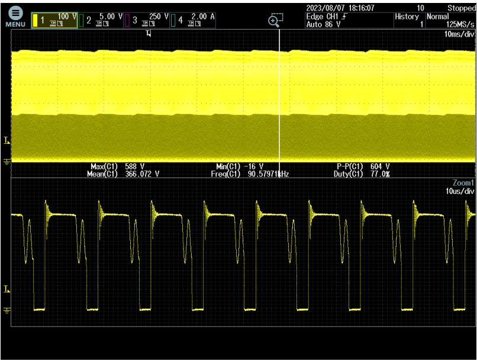

265 VAC  
CH1 VDS VDSMAX: 588V

Test Condition:满载正常工作  
极限参数(注3） (无特别说明情况下，TA=25℃)

<table><tr><td>符号</td><td>参数</td><td>参数范围</td><td>单位</td></tr><tr><td> $V_{DRAIN}$ </td><td>高压 MOSFET 漏极到源极电压</td><td>-0.3~800</td><td>V</td></tr><tr><td> $I_{DM}$ </td><td>漏极连续电流</td><td>4</td><td>A</td></tr><tr><td> $I_{D}$ </td><td>漏电电流脉冲</td><td>16</td><td>A</td></tr><tr><td> $V_{CC}$ </td><td> $V_{CC}$  电压</td><td>-0.3~40</td><td>V</td></tr><tr><td> $I_{CC\_MAX}$ </td><td> $V_{CC}$  引脚最大电流</td><td>20</td><td>mA</td></tr></table>

## 满载开机

$\mathsf { D e r a t i n g { = } 5 8 8 \vee / 8 0 0 \vee = 7 3 . 5 \% }$

## 满载正常工作

Derating = 588 V / 800 V = 73.5 %

## 12V输出肖特基反压波形

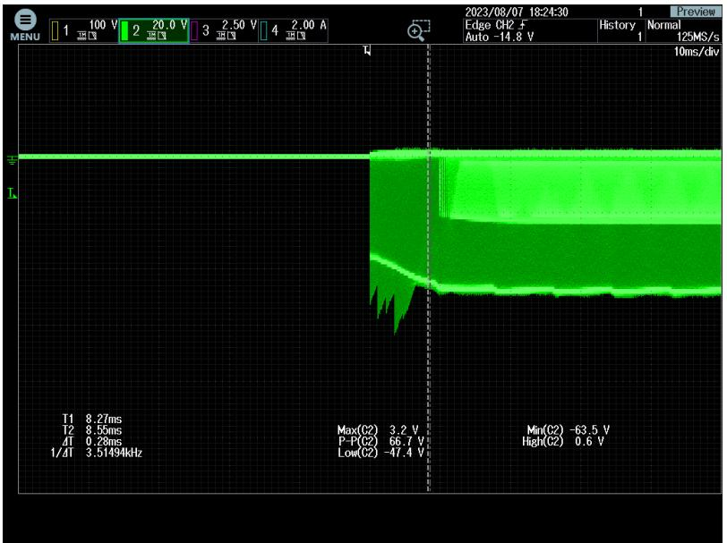

265 VAC

CH2 VDIODE VRMAX: 63.5 V

Test Condition:

➢ 满载启动

<table><tr><td>PARAMETER</td><td>SYMBOL</td><td>MB54</td><td>MB54A</td><td>MB55</td><td>MB56</td><td>MB58</td><td>MB59</td><td>MB510</td><td>MB515</td><td>MB520</td><td>UNITS</td></tr><tr><td>Maximum Recurrent Peak Reverse Voltage</td><td> $V_{RRM}$ </td><td>40</td><td>45</td><td>50</td><td>60</td><td>80</td><td>90</td><td>100</td><td>150</td><td>200</td><td>V</td></tr><tr><td>Maximum RMS Voltage</td><td> $V_{RMS}$ </td><td>28</td><td>31.5</td><td>35</td><td>42</td><td>56</td><td>63</td><td>70</td><td>105</td><td>140</td><td>V</td></tr><tr><td>Maximum DC Blocking Voltage</td><td> $V_{DC}$ </td><td>40</td><td>45</td><td>50</td><td>60</td><td>80</td><td>90</td><td>100</td><td>150</td><td>200</td><td>V</td></tr><tr><td>Average Rectified Output Current (See Figure 1)</td><td> $I_{F(AV)}$ </td><td colspan="9">5</td><td>A</td></tr><tr><td>Non-Repetitive Peak Forward Surge Current : 8.3ms single half sine-wave superimposed on rated load</td><td> $I_{FSM}$ </td><td colspan="9">100</td><td>A</td></tr><tr><td>Forward Voltage at 5A (Note 1)</td><td> $V_F$ </td><td colspan="2">0.7</td><td colspan="2">0.74</td><td colspan="3">0.8</td><td colspan="2">0.9</td><td>V</td></tr><tr><td>Peak Reverse Current at Rated DC Blocking Voltage  $T_J=25°C$  $T_J=100°C$ </td><td> $I_R$ </td><td colspan="9">0.0510</td><td>mA</td></tr><tr><td>Typical Thermal Resistance (Note 2)</td><td> $R_{BJA}$  $R_{BJL}$ </td><td colspan="9">5517</td><td>°C /W</td></tr><tr><td>Operating Junction and Storage Temperature Range</td><td> $T_J,T_{STG}$ </td><td>-55 to +150</td><td colspan="8">-65 to +175</td><td>°C</td></tr></table>

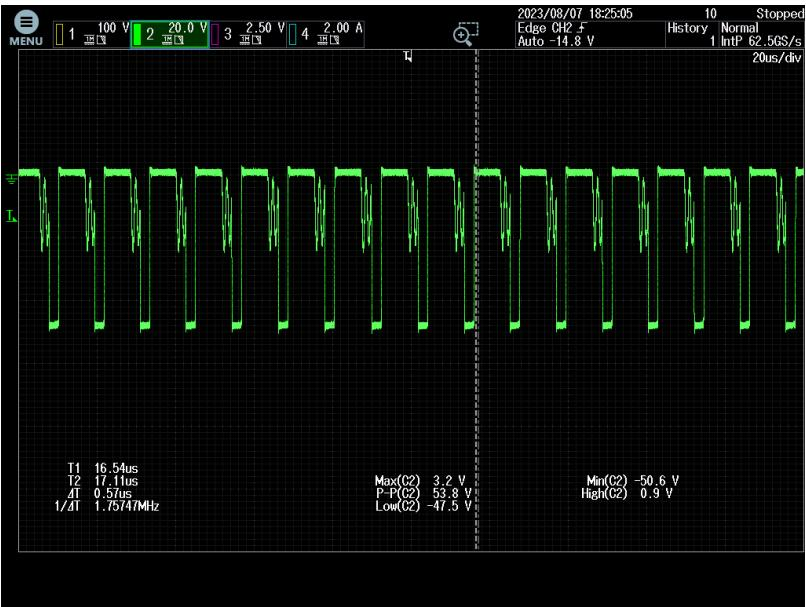

265 VAC

$\begin{array} { r l } & { \mathsf { C H } 2 \mathsf { V } _ { \mathsf { D D } \mathsf { I O D E } } } \\ & { \mathsf { V } _ { \mathsf { M A X } } \colon 5 0 . 6 \mathsf { V } } \end{array}$ CH2 VDDIODE

Test Condition:满载正常工作

## 满载开机

Derating = 63.5 V / 200 V = 31.8 %

## 满载正常工作

Derating = 50.6 V / 200V = 25.3 %

欠压保护  
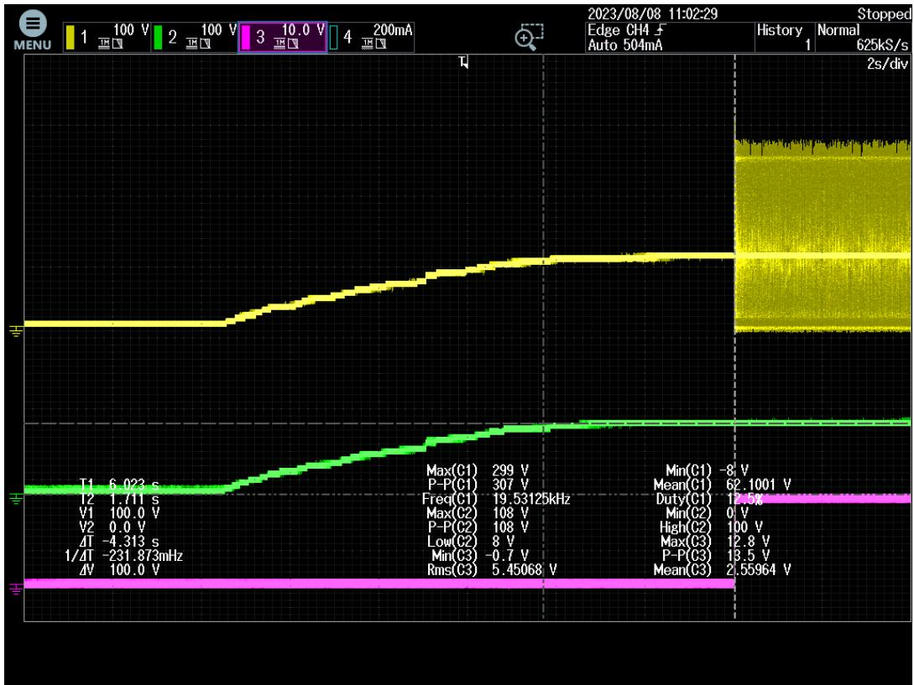

CH1 VDS  
CH2 VDC\_IN  
CH4 V

VDC\_IN\_STARTUP=100 VDC

## Test Condition:

➢ No Load

过压保护  
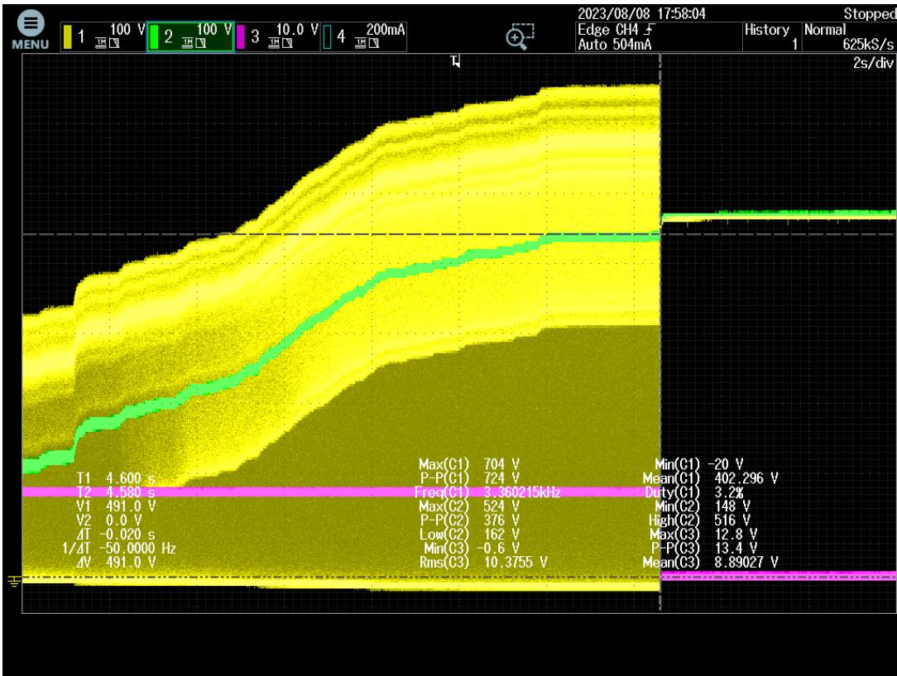

CH1 VDS  
CH2 VDC\_IN  
CH4 VO

VDC\_IN\_STARTUP=491 VDC

## Test Condition:

➢ No Load

## 短路保护 （MOSFET波形）

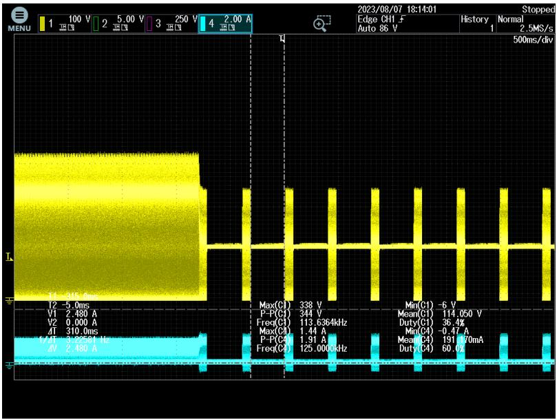

85 VAC

${ \mathsf { C H 1 } } \mathsf { V _ { D S } }$  
$\begin{array} { r l } & { \mathsf { C H 4 1 } _ { \mathsf { D } } } \\ & { \mathsf { V } _ { \mathsf { D S \_ M A X } } = 3 3 8 \mathsf { V } } \\ & { \phantom { \mathsf { V } _ { \mathsf { D S \_ M A X } } = 1 } \mathsf { I } _ { \mathsf { D S \_ M A X } } = 1 . 4 4 \mathsf { A } } \end{array}$

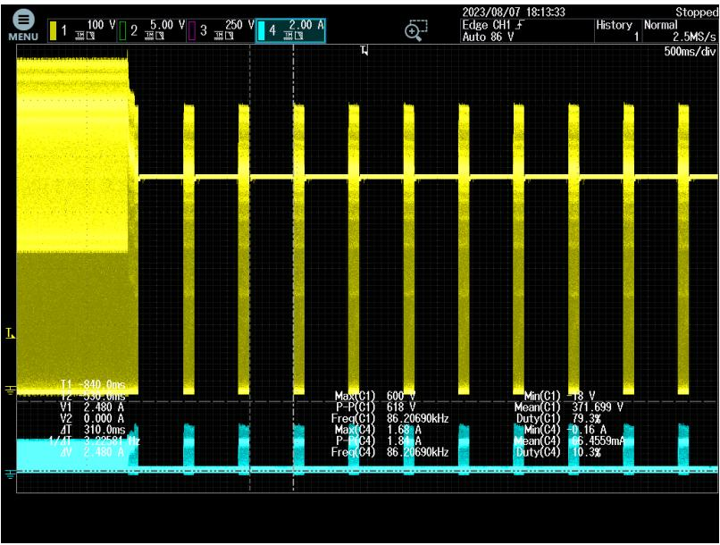

265 VAC

CH1 VDS  
CH4 I $\mathsf { V } _ { \mathsf { D S \_ M A X } } { = } 6 0 0 \mathsf { V }$ $\mathsf { I } _ { \mathsf { D S \_ M A X } } { = } 1 . 6 8 \mathsf { A }$

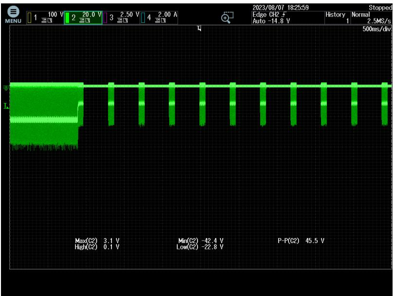

85 VAC

CH2 VR  
$V _ { \mathsf { R \_ M A X } } { = } 4 2 . 4 \ V$

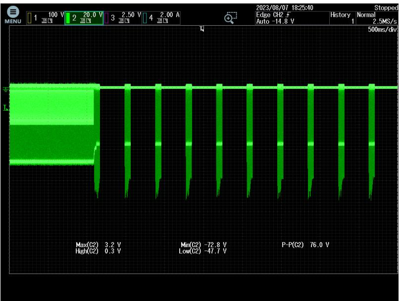

265 VAC

CH2 VR  
$V _ { \mathrm { R \_ M A X } } = 7 2 . 8 ~ \forall$

<table><tr><td rowspan="2">项目</td><td colspan="2">85VAC</td><td colspan="2">265VAC</td></tr><tr><td>温度(°C)</td><td>温升(°C)</td><td>温度(°C)</td><td>温升(°C)</td></tr><tr><td>环境温度</td><td colspan="2">30.9</td><td colspan="2">29.5</td></tr><tr><td>BPA86528D (U1)</td><td>89.6</td><td>58.7</td><td>78.9</td><td>49.4</td></tr><tr><td>变压器磁芯(T1)</td><td>55.8</td><td>24.9</td><td>54.9</td><td>25.4</td></tr><tr><td>变压器绕组(T1)</td><td>75.4</td><td>44.5</td><td>74</td><td>44.5</td></tr><tr><td>输出电解电容(E5)</td><td>59.5</td><td>28.6</td><td>57.5</td><td>28</td></tr><tr><td>输出肖特基(D5)</td><td>82.8</td><td>51.9</td><td>79.3</td><td>49.8</td></tr><tr><td>共模电感(LF1)</td><td>76.6</td><td>45.7</td><td>46.9</td><td>17.4</td></tr><tr><td>输入电解电容(E1)</td><td>56.1</td><td>25.2</td><td>46.4</td><td>16.9</td></tr></table>

## 测试说明

➢ 在温箱中进行测试  
➢ 电路板放在一个封闭的盒子内  
➢ 热电偶连接到各个测量点  
➢ 等测量点温度达到稳定后记录数据

<table><tr><td rowspan="2">项目</td><td colspan="2">85VAC</td><td colspan="2">265VAC</td></tr><tr><td>温度(°C)</td><td>温升(°C)</td><td>温度(°C)</td><td>温升(°C)</td></tr><tr><td>环境温度</td><td colspan="2">30.3</td><td colspan="2">29</td></tr><tr><td>BPA86528D (U1)</td><td>84</td><td>53.7</td><td>71.1</td><td>42.1</td></tr><tr><td>变压器磁芯(T1)</td><td>52.3</td><td>22</td><td>52.8</td><td>23.8</td></tr><tr><td>变压器绕组(T1)</td><td>71.2</td><td>40.9</td><td>70.9</td><td>41.9</td></tr><tr><td>输出电解电容(E5)</td><td>57.1</td><td>26.8</td><td>55.6</td><td>26.6</td></tr><tr><td>输出肖特基(D5)</td><td>78.7</td><td>48.4</td><td>76.2</td><td>47.2</td></tr><tr><td>共模电感(LF1)</td><td>72.2</td><td>41.9</td><td>45.2</td><td>16.2</td></tr><tr><td>输入电解电容(E1)</td><td>53.3</td><td>23</td><td>44.4</td><td>15.4</td></tr></table>

## 测试说明

➢ 在温箱中进行测试  
➢ 电路板放在一个封闭的盒子内  
➢ 热电偶连接到各个测量点  
➢ 等测量点温度达到稳定后记录数据

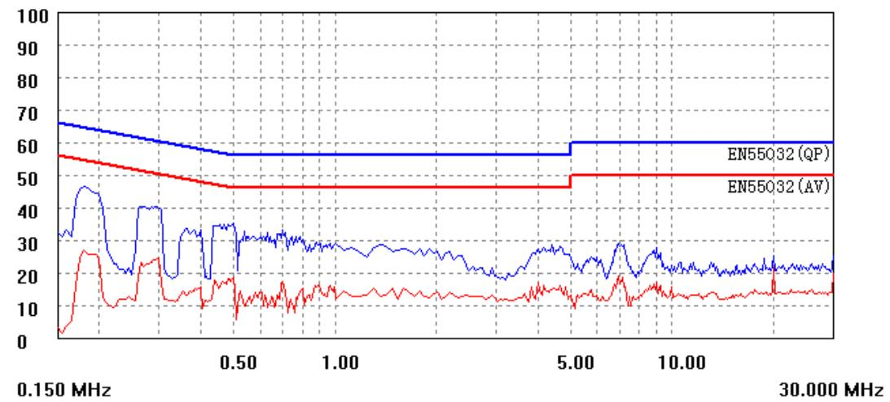

115VAC Line  
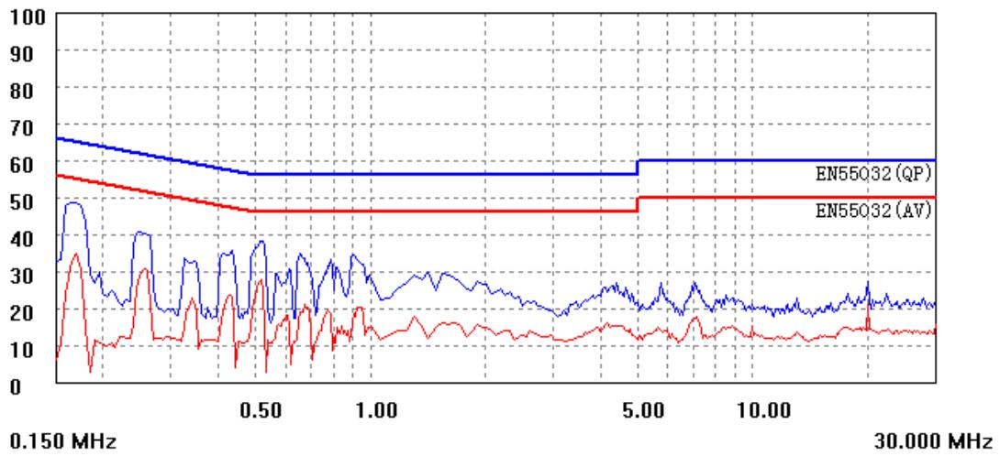

230VAC Line

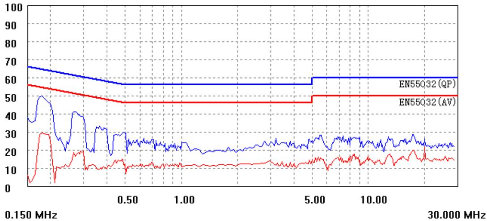

115VAC Neutral

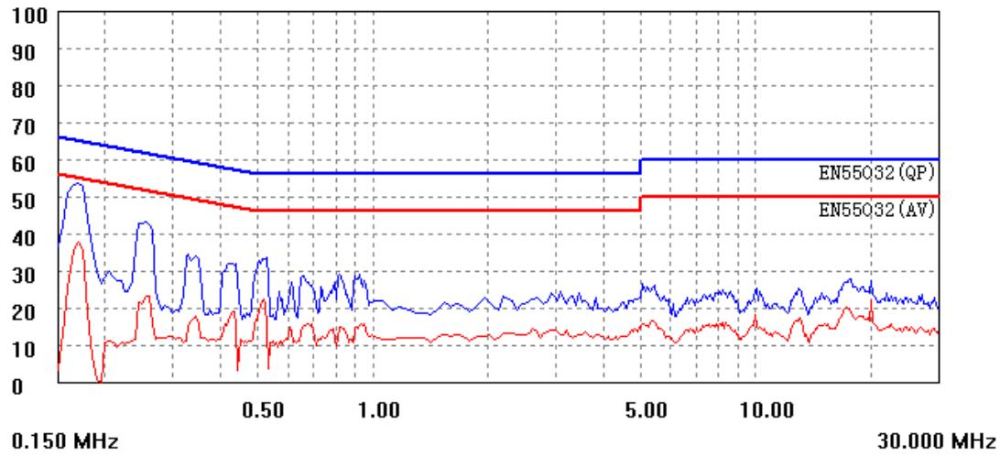

230VAC Neutral

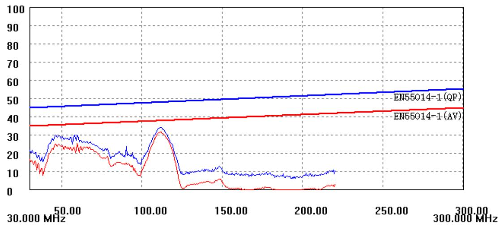

115VAC Line  
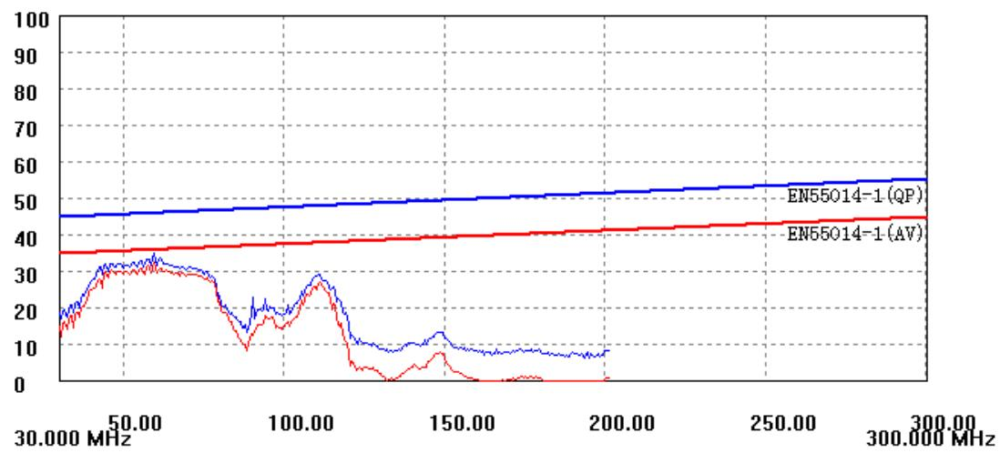

230VAC Line

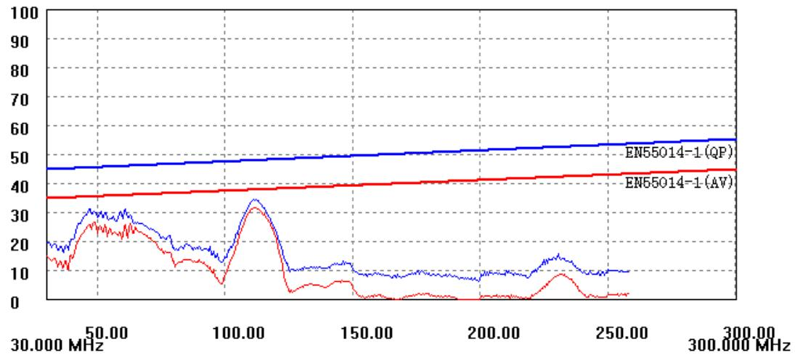

115VAC Neutral

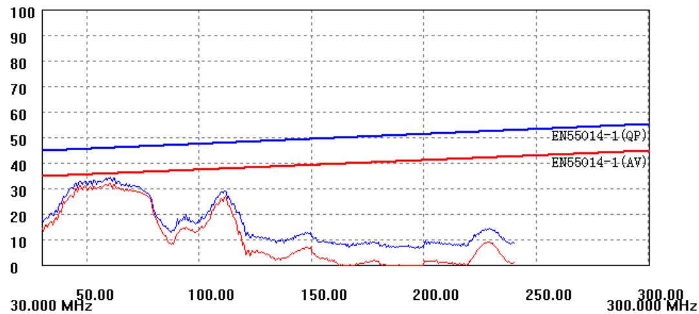

230VAC Neutral

<table><tr><td>差模</td><td>电压</td><td>相位角</td><td>发生器阻抗</td><td>测试次数</td><td>测试结果</td></tr><tr><td>L to N</td><td>+2kV</td><td>0</td><td>2</td><td>10</td><td>Pass</td></tr><tr><td>L to N</td><td>-2kV</td><td>0</td><td>2</td><td>10</td><td>Pass</td></tr><tr><td>L to N</td><td>+2kV</td><td>90</td><td>2</td><td>10</td><td>Pass</td></tr><tr><td>L to N</td><td>-2kV</td><td>90</td><td>2</td><td>10</td><td>Pass</td></tr><tr><td>L to N</td><td>+2kV</td><td>180</td><td>2</td><td>10</td><td>Pass</td></tr><tr><td>L to N</td><td>-2kV</td><td>180</td><td>2</td><td>10</td><td>Pass</td></tr><tr><td>L to N</td><td>+2kV</td><td>270</td><td>2</td><td>10</td><td>Pass</td></tr><tr><td>L to N</td><td>-2kV</td><td>270</td><td>2</td><td>10</td><td>Pass</td></tr></table>

## 测试说明

➢ 按照GB/T17626.5和IEC61000-4-5的最新版本要求进行测试  
➢ 室温环境，230VAC输入，满载条件  
➢ 输入1.2/50us组合波浪涌电压  
➢ 每个测试点重复10次  
➢ 每次间隔时间1分钟  
➢ 试验时样机输出正常（符合A类标准）视为Pass

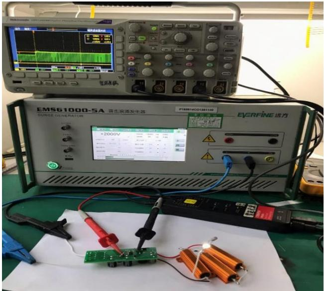

<table><tr><td>差模</td><td>电压</td><td>脉冲群持续时间</td><td>脉冲频率</td><td>测试时间</td><td>测试结果</td></tr><tr><td>L to N</td><td>+4kV</td><td>15ms</td><td>5kHz</td><td>120s</td><td>Pass</td></tr><tr><td>L to N</td><td>-4kV</td><td>15ms</td><td>5kHz</td><td>120s</td><td>Pass</td></tr><tr><td>L to N</td><td>+4kV</td><td>0.75ms</td><td>100kHz</td><td>120s</td><td>Pass</td></tr><tr><td>L to N</td><td>-4kV</td><td>0.75ms</td><td>100kHz</td><td>120s</td><td>Pass</td></tr><tr><td>L to N</td><td>+2kV</td><td>2ms</td><td>38kHz</td><td>120s</td><td>Pass</td></tr><tr><td>L to N</td><td>-2kV</td><td>2ms</td><td>38kHz</td><td>120s</td><td>Pass</td></tr><tr><td>L to N</td><td>+4kV</td><td>2ms</td><td>38kHz</td><td>120s</td><td>Pass</td></tr><tr><td>L to N</td><td>-4kV</td><td>2ms</td><td>38kHz</td><td>120s</td><td>Pass</td></tr></table>

## 测试说明

➢ 按照GB/T17626.4和IEC61000-4-4的最新版本要求进行测试  
➢ 室温环境，230VAC输入满载条件  
➢ 分别测试5kHz/100kHz/38kHz脉冲频率  
➢ 脉冲群周期为300ms  
➢ 每个测试条件测试时间120s  
➢ 试验时样机输出正常（符合A类标准）视为Pass

<table><tr><td>测试</td><td>电压(V)</td><td>放电类型</td><td>放电次数</td><td>测试结果</td></tr><tr><td>Vo</td><td>+15kV</td><td>空气放电</td><td>10</td><td>PASS</td></tr><tr><td>Vo</td><td>-15kV</td><td>空气放电</td><td>10</td><td>PASS</td></tr><tr><td>GND</td><td>+15kV</td><td>空气放电</td><td>10</td><td>PASS</td></tr><tr><td>GND</td><td>-15kV</td><td>空气放电</td><td>10</td><td>PASS</td></tr><tr><td>Vo</td><td>+20kV</td><td>空气放电</td><td>10</td><td>PASS</td></tr><tr><td>Vo</td><td>-20kV</td><td>空气放电</td><td>10</td><td>PASS</td></tr><tr><td>GND</td><td>+20kV</td><td>空气放电</td><td>10</td><td>PASS</td></tr><tr><td>GND</td><td>-20kV</td><td>空气放电</td><td>10</td><td>PASS</td></tr></table>

## 测试说明

➢ 按照GB/T17626.2和IEC61000-4-2的最新版本要求进行测试  
➢ 室温环境，230VAC输入满载条件  
➢ 每个测试点重复10次  
➢ 分别对输出正端和地进行空气放电  
➢ 试验时样机输出正常（符合A类标准）视为Pass

## THANK YOU FOR WATCHING
