## BPA86528D隔离参考设计

## (12V3.5A;18V0.1A)

上海晶丰明源半导体股份有限公司

Shanghai Bright Power Semiconductor Co., Ltd.

文长川

时间： 2024年02月21日

## 内容

BPA86528D简介  
电源规格  
电路及实物图  
变压器  
BOM  
PCB Layout图  
性能测试数据

## 产品特点：

➢ 集成 800V 高压 MOSFET  
➢ PWM+PFM模式，低输出纹波  
➢ 内置软启动功能  
➢ 集成高压启动、自供电电路  
➢ 低音频噪声  
➢ 输入过/欠压保护

## 应用领域：

➢ 家用电器辅助电源  
➢ PC待机电源  
➢ 适配器、充电器  
➢ 通讯、工业控制辅助电源

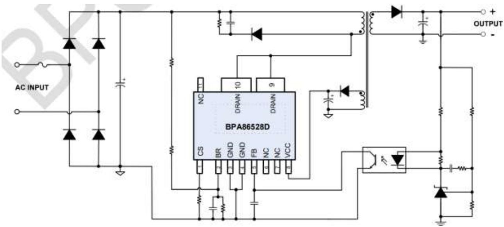

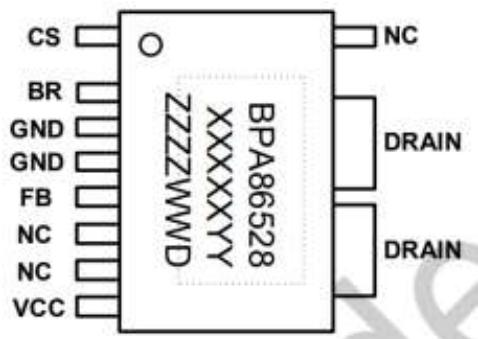

## 电源规格

<table><tr><td>项目描述</td><td>符号</td><td>最小</td><td>典型</td><td>最大</td><td>单位</td><td>备注</td></tr><tr><td colspan="7">输入</td></tr><tr><td>电压</td><td> $V_{IN}$ </td><td>85</td><td>115/230</td><td>300</td><td> $V_{AC}$ </td><td></td></tr><tr><td>频率</td><td> $f_{LINE}$ </td><td>47</td><td>50/60</td><td>63</td><td>Hz</td><td></td></tr><tr><td colspan="7">输出</td></tr><tr><td>输出电压1</td><td> $V_{OUT1}$ </td><td>11.4</td><td>12</td><td>12.6</td><td>V</td><td>±5%</td></tr><tr><td>输出电流1</td><td> $I_{OUT1}$ </td><td></td><td>3500</td><td></td><td>mA</td><td></td></tr><tr><td>输出电压2</td><td> $V_{OUT2}$ </td><td>17</td><td>18</td><td>22</td><td>V</td><td>±%</td></tr><tr><td>输出电流2</td><td> $I_{OUT2}$ </td><td></td><td>100</td><td></td><td>mA</td><td></td></tr><tr><td>输出电压纹波1</td><td> $V_{RIPPLE}$ </td><td></td><td></td><td>200</td><td>mV</td><td>20MHz带宽</td></tr><tr><td>输出电压纹波2</td><td> $V_{RIPPLE}$ </td><td></td><td></td><td>200</td><td>mV</td><td>20MHz带宽</td></tr><tr><td>连续输出功率</td><td> $P_{OUT}$ </td><td></td><td>45</td><td></td><td>W</td><td></td></tr><tr><td colspan="7">效率</td></tr><tr><td>待机功耗</td><td> $P_{STDBY}$ </td><td></td><td></td><td>200</td><td>mW</td><td>230VAC,包含假负载</td></tr><tr><td>满载效率</td><td>η</td><td>80</td><td></td><td></td><td>%</td><td></td></tr><tr><td colspan="7">环境</td></tr><tr><td>传导EMI</td><td></td><td colspan="4">满足CISPR22/EN55022 Class B,至少6dB 裕量</td><td></td></tr><tr><td>Surge</td><td></td><td></td><td>2</td><td></td><td>kV</td><td>差模</td></tr><tr><td>EFT</td><td></td><td></td><td>4</td><td></td><td>kV</td><td>5kHz/100kHz/38kHz</td></tr><tr><td>ESD</td><td></td><td></td><td>15</td><td>20</td><td>kV</td><td>空气放电</td></tr><tr><td>工作环境温度</td><td> $T_{AMP}$ </td><td>0</td><td></td><td>50</td><td>°C</td><td></td></tr></table>

## 原理图

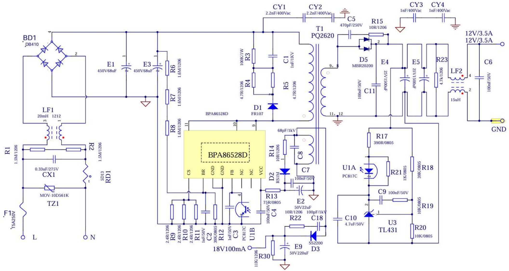

元件面  
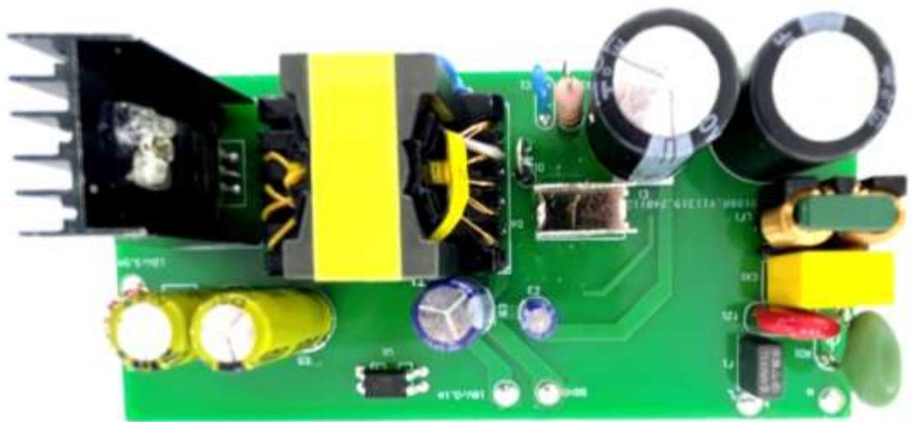

贴片面  
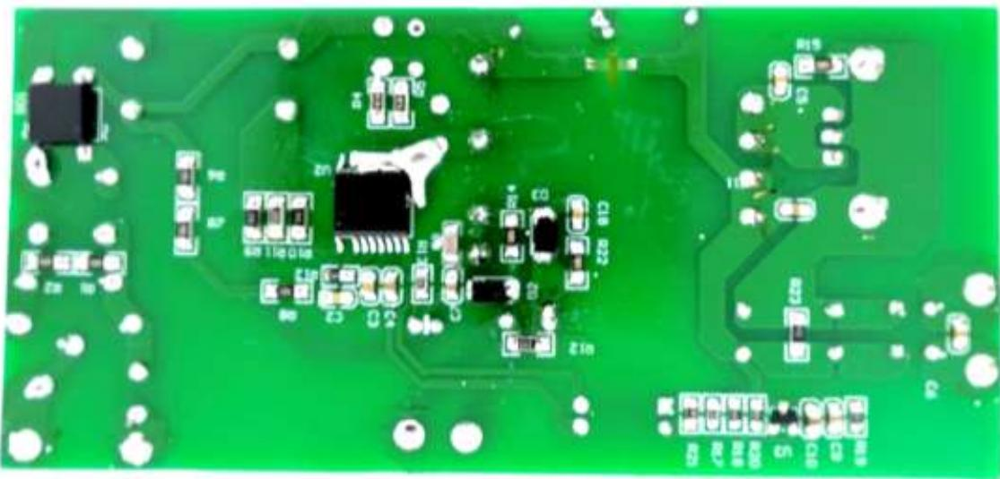

<table><tr><td>序号</td><td>元件标号</td><td>参数描述</td><td>封装尺寸</td><td>数量</td></tr><tr><td>1</td><td>PCB</td><td>CEM-1, 双面板</td><td>119mm*56mm</td><td>1</td></tr><tr><td>2</td><td>F1</td><td>T5A, 250V保险丝</td><td>DIP</td><td>1</td></tr><tr><td>3</td><td>RD1</td><td>5R, NTC热敏电阻</td><td>5D-13</td><td>1</td></tr><tr><td>4</td><td>TZ1</td><td>10D561, 压敏电阻</td><td>10D561</td><td>1</td></tr><tr><td>5</td><td>FL1</td><td>20mH 1212 扁平共模电感</td><td>DIP</td><td>1</td></tr><tr><td>6</td><td>FL2</td><td>15uH 镍锌共模电感3.5A</td><td>DIP</td><td>1</td></tr><tr><td>7</td><td>E1,E3</td><td>450V68uF电解电容</td><td> $\phi 16*20$ </td><td>2</td></tr><tr><td>8</td><td>D1</td><td>FR107, 1A/1000V 快速二极管</td><td>DO-41</td><td>1</td></tr><tr><td>9</td><td>R3</td><td>100K/1W,  $\pm 5\%$ , 金属氧化膜电阻</td><td>DIP</td><td>1</td></tr><tr><td>10</td><td>CX1</td><td>X2电容 0.33uF AC275V</td><td>DIP</td><td>1</td></tr><tr><td>11</td><td>CY1,CY2</td><td>Y1电容, 400AC 2.2nF</td><td>DIP</td><td>2</td></tr><tr><td>12</td><td>CY3,CY4</td><td>Y1电容, 400AC 1nF</td><td>DIP</td><td>2</td></tr><tr><td>13</td><td>T1</td><td>PQ2620 次级加宽 0.75mH 变压器</td><td>DIP</td><td>1</td></tr><tr><td>14</td><td>U2</td><td>BPA86528D</td><td>SOP10</td><td>1</td></tr><tr><td>15</td><td>E2</td><td>50V22uF电解电容</td><td> $\phi 5*11$ </td><td>1</td></tr><tr><td>16</td><td>E4,E5</td><td>25V/1500uF电解电容</td><td> $\phi 10*16mm$ </td><td>2</td></tr><tr><td>17</td><td>E9</td><td>50V/220uF电解电容</td><td> $\phi 10*12mm$ </td><td>1</td></tr><tr><td>18</td><td>C1</td><td>1nF/1KV,此片电容</td><td>DIP</td><td>1</td></tr><tr><td>19</td><td>U1</td><td>PC817C 光耦</td><td>DIP</td><td>1</td></tr><tr><td>20</td><td>BD1</td><td>DB410 4A1KV整流桥</td><td>SMD</td><td>1</td></tr><tr><td>21</td><td>D3</td><td>SB2200 2A 200V肖特基二极管</td><td>SMA</td><td>1</td></tr></table>

<table><tr><td>序号</td><td>元件标号</td><td>参数描述</td><td>封装尺寸</td><td>数量</td></tr><tr><td>22</td><td>D5</td><td>MBR20200 20A 200V肖特基二极管</td><td>TO-220AB</td><td>1</td></tr><tr><td>23</td><td>D2</td><td>RS1M 1A/1000V 快速二极管</td><td>SMA</td><td>1</td></tr><tr><td>24</td><td>U3</td><td>431 稳压器</td><td>SOT23</td><td>1</td></tr><tr><td>25</td><td>R1,R2</td><td>1.5M, ±5%</td><td>SMD1206</td><td>2</td></tr><tr><td>26</td><td>R6,R7,R8</td><td>1.6M, ±5%</td><td>SMD1206</td><td>3</td></tr><tr><td>27</td><td>R4,R5</td><td>4.7R, ±5%</td><td>SMD1206</td><td>2</td></tr><tr><td>28</td><td>R9,R10,R11</td><td>2.4R, ±5%</td><td>SMD1206</td><td>3</td></tr><tr><td>29</td><td>R14,R15,R22</td><td>10R, ±5%</td><td>SMD1206</td><td>3</td></tr><tr><td>30</td><td>R23</td><td>4.7K, ±5%</td><td>SMD1206</td><td>1</td></tr><tr><td>31</td><td>R30</td><td>11K, ±5%</td><td>SMD1206</td><td>1</td></tr><tr><td>32</td><td>C18</td><td>100pF/1KV,X7R</td><td>SMD1206</td><td>1</td></tr><tr><td>33</td><td>C8</td><td>68pF/1KV,X7R</td><td>SMD1206</td><td>1</td></tr><tr><td>34</td><td>C5</td><td>470pF/250V,X7R</td><td>SMD0805</td><td>1</td></tr><tr><td>35</td><td>C9,C7,C11,C6,C4</td><td>0.1uF/50V,X7R</td><td>SMD0805</td><td>5</td></tr><tr><td>36</td><td>C2,C3</td><td>1nF/50V,X7R</td><td>SMD0805</td><td>2</td></tr><tr><td>37</td><td>C10</td><td>4.7uF/50V,X7R</td><td>SMD0805</td><td>1</td></tr><tr><td>38</td><td>R19,R20</td><td>10K, ±5%</td><td>SMD0805</td><td>2</td></tr><tr><td>39</td><td>R21</td><td>1K, ±5%</td><td>SMD0805</td><td>1</td></tr><tr><td>40</td><td>R17</td><td>390R, ±5%</td><td>SMD0805</td><td>1</td></tr><tr><td>41</td><td>R18</td><td>39K, ±5%</td><td>SMD0805</td><td>1</td></tr><tr><td>42</td><td>R13</td><td>75R, ±5%</td><td>SMD0805</td><td>1</td></tr><tr><td colspan="2"></td><td></td><td>Total</td><td>60</td></tr></table>

贴片面  
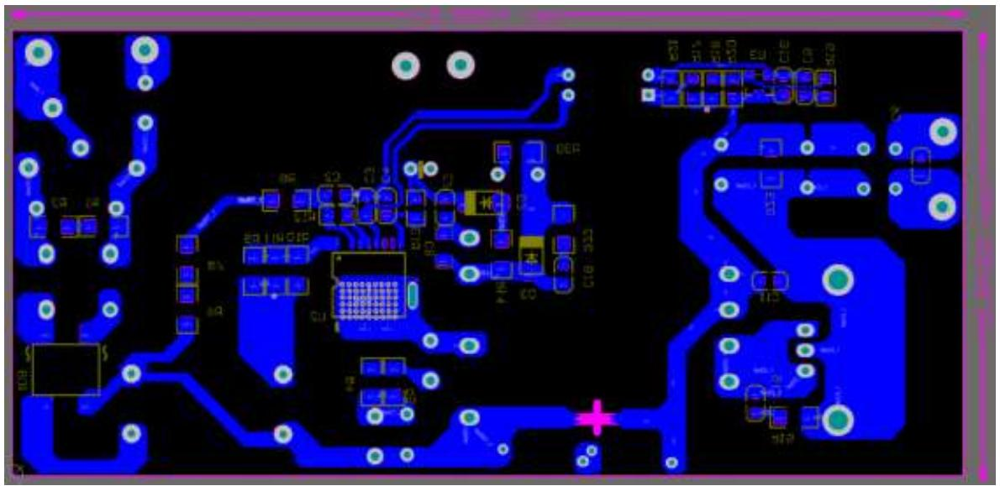

元件面  
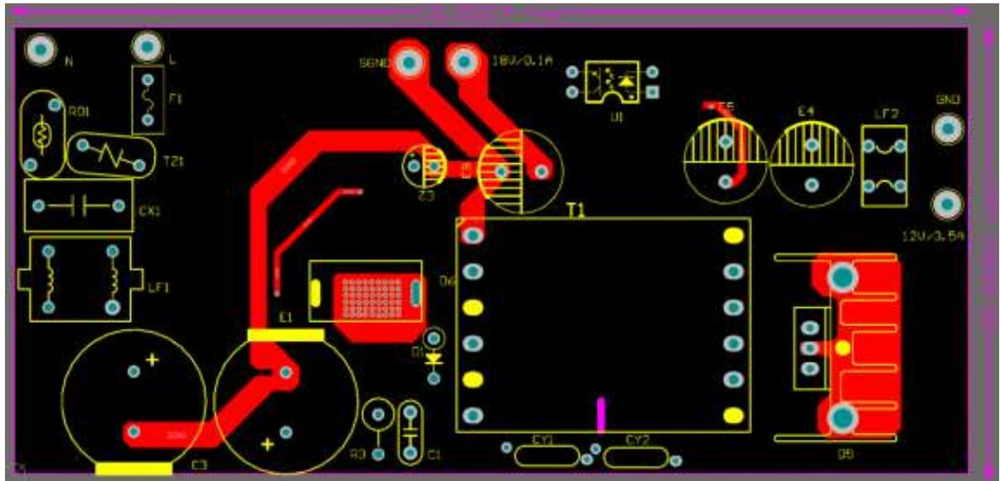

## 原理图

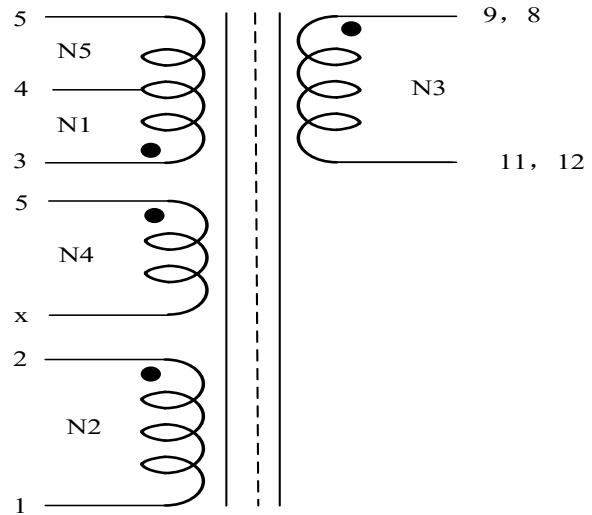

## 绕线方式

<table><tr><td>绕组</td><td>起始脚</td><td>终止脚</td><td>材料</td><td>匝数</td><td>绕线方式</td></tr><tr><td>N1</td><td>3</td><td>4</td><td> $\phi 0.4*1P$ </td><td> $19T_{S}$ </td><td>密绕一层(PI N脚朝外)</td></tr><tr><td colspan="4">胶带</td><td> $2.1T_{S}$ </td><td></td></tr><tr><td>N2</td><td>2</td><td>1</td><td> $\phi 0.3*2P$ </td><td> $8T_{S}$ </td><td>密绕一层(PI N脚朝外)</td></tr><tr><td colspan="4">胶带</td><td>2.1Ts</td><td></td></tr><tr><td>N3</td><td>9,8</td><td>11,12</td><td>三层绝缘线 $\phi 0.6*2P$ </td><td> $5T_{S}$ </td><td>密绕一层(PI N脚朝外)</td></tr><tr><td colspan="4">胶带</td><td> $2.1T_{S}$ </td><td></td></tr><tr><td>N4</td><td>5</td><td>X</td><td> $0.025mm*7mm背胶铜铂$ </td><td> $0.9T_{S}$ </td><td>密绕一层(PI N脚朝外)</td></tr><tr><td colspan="4">胶带</td><td> $1.5T_{S}$ </td><td></td></tr><tr><td>N5</td><td>4</td><td>5</td><td> $\phi 0.4*1P$ </td><td> $18T_{S}$ </td><td>密绕一层(PI N脚朝外)</td></tr><tr><td colspan="4">胶带</td><td>3Ts</td><td></td></tr></table>

## 规格与材料

➢ 初级绕组感量 $\mathsf { L } _ { \mathsf { p } } { = } 7 5 0 \mathsf { u } \mathsf { H } \pm 7 \%$ （测试条件： 0.3V，100kHz）  
➢ 漏感量 $L _ { \vert k } { < } 5 0 \mathsf { u H }$  
➢ 骨架：PQ2620次级加长（6+6PIN）  
➢ 磁芯：PQ2620 PC47 或同等材质 ， $\mathsf { A e } { = } 1 1 8 \mathsf { m m } ^ { 2 }$  
➢ N1、N2、N4、N5: 2UEW 漆包线  
➢ N3: 三层绝缘线  
➢ 绝缘胶带:3M900 或同等材质  
➢ 耐压测试: 3KV, 50/60Hz, 1Min  
➢ 成品要求：浸凡立水

## 脚位图

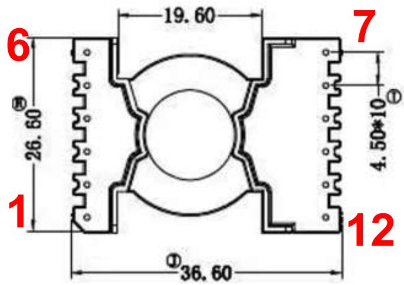

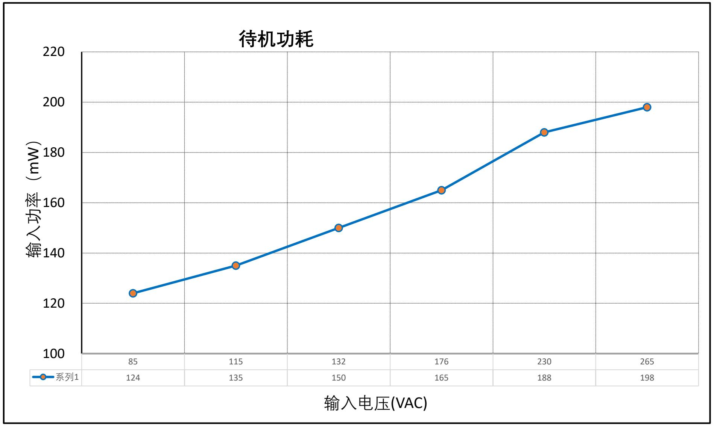

效率测试  
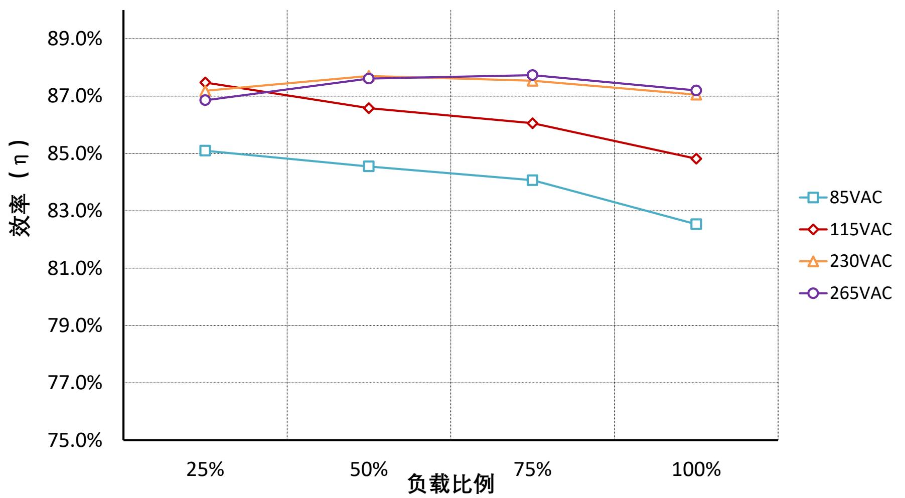

## OLP（18V100mA 12V加载）

<table><tr><td> $I_{OUT}(A)$  $V_{IN}(VAC)$ </td><td>85</td><td>264</td></tr><tr><td>3.5</td><td>12.16</td><td>12.16</td></tr><tr><td>3.6</td><td>12.16</td><td>12.16</td></tr><tr><td>3.7</td><td>12.16</td><td>12.16</td></tr><tr><td>3.8</td><td>OLP</td><td>12.16</td></tr><tr><td>4.4</td><td></td><td>12.12</td></tr><tr><td>4.8</td><td></td><td>12.11</td></tr><tr><td>4.9</td><td></td><td>OLP</td></tr></table>

## 交叉调整率

<table><tr><td>输入电压AC (V)</td><td>输出电流1(A)</td><td>输出电压1(V)</td><td>输出电流2(A)</td><td>输出电压2(V)</td></tr><tr><td rowspan="2">115</td><td>0</td><td>29</td><td>3.5</td><td>12.16</td></tr><tr><td>0.1</td><td>18</td><td>0</td><td>12.3</td></tr><tr><td rowspan="2">230</td><td>0</td><td>29.7</td><td>3.5</td><td>12.16</td></tr><tr><td>0.1</td><td>17.8</td><td>0</td><td>12.3</td></tr></table>

## VCC供电最大电压22V

## 输出电压纹波

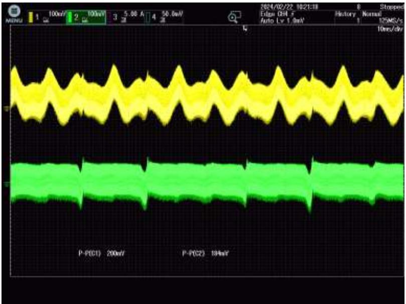

85 $\mathsf { v } _ { \mathsf { A C } }$

CH1 $\mathsf { V } _ { \mathsf { O U T } - 1 2 \mathsf { V } }$ Ripple $\mathsf { V } _ { \mathsf { P K - P K } } { = } 2 0 0 \mathsf { m V }$  
CH2 $\mathsf { V } _ { \mathsf { O U T } - 1 8 \mathsf { V } }$ Ripple $\mathsf { V } _ { \mathsf { P K - P K } } { = } 1 8 4 \mathsf { m V }$

## Test Condition:

➢ Full Load

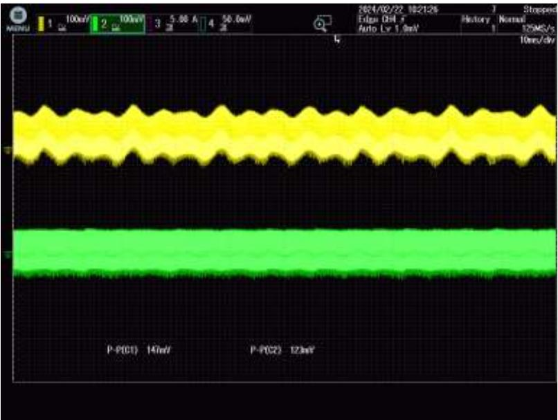

115 VAC

CH1 $\mathsf { V } _ { \mathsf { O U T - 1 } 2 \mathsf { V } }$ Ripple $\mathsf { V } _ { \mathsf { P K - P K } } { = } 1 4 7 \mathsf { m V }$  
$\mathsf { C H 2 } \mathsf { V _ { 0 \mathsf { U T } - 1 8 \mathsf { V } } }$ Ripple $\mathsf { V } _ { \mathsf { P K - P K } } { = } \pmb { 1 } 2 3 \mathsf { m V }$

## Test Condition:

➢ Full Load

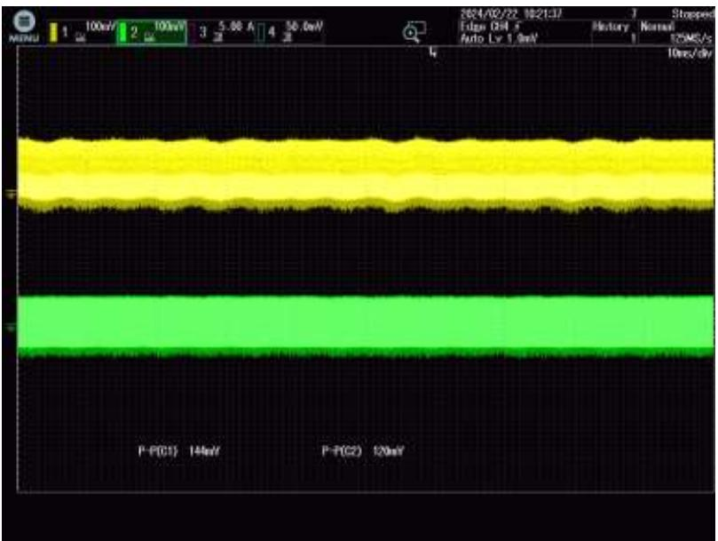

230 VAC

CH1 $\mathsf { V } _ { \mathsf { O U T } - 1 2 \mathsf { V } }$ Ripple $\mathsf { V } _ { \mathsf { P K - P K } } { = } 1 4 4 \mathsf { m V }$  
CH2 $\mathsf { V } _ { \mathsf { O U T - 1 8 V } }$ Ripple $\mathsf { V } _ { \mathsf { P K - P K } } { = } 1 2 0 \mathsf { m V }$

## Test Condition:

➢ Full Load

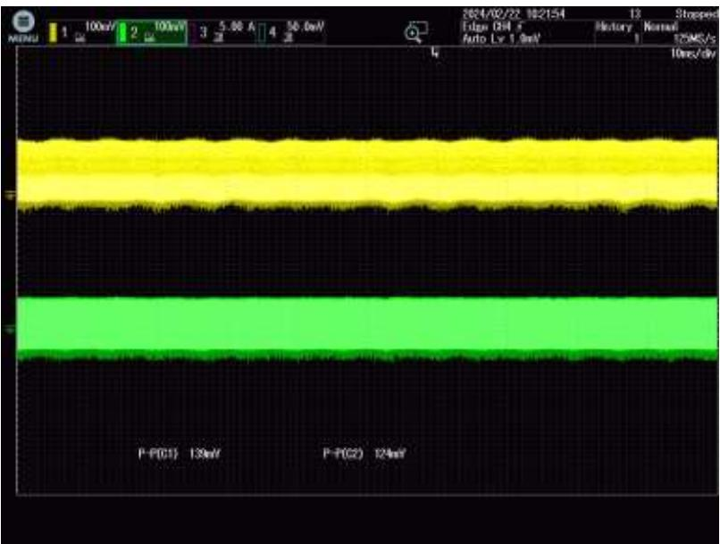

$2 6 5 \ : \mathsf { V } _ { \mathsf { A C } }$

$\mathsf { C H 1 V _ { o u r - 1 2 v } R i p p l e }$ $\mathsf { V } _ { \mathsf { P K - P K } } { = } \mathsf { 1 } 3 9 \mathsf { m V }$  
$\mathsf { C H } 2 \mathsf { V } _ { \mathsf { O U T } - 1 8 \mathsf { v } } \mathsf { R i p p l e }$ $\mathsf { V } _ { \mathsf { P K - P K } } { = } 1 2 4 \mathsf { m V }$

## Test Condition:

➢ Full Load

## 动态负载(50%-100%)

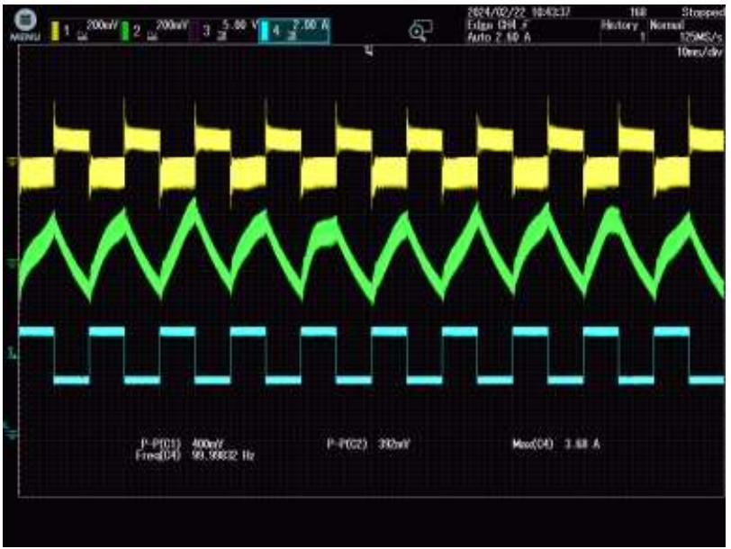

85 VAC

$\mathsf { C H 1 V _ { O U T - 1 2 V } }$ CH1 VOUT-12V VPK-PK=400 mV $V _ { P K - P K } = 4 0 0 m V$  
$\mathsf { C H 2 } \mathsf { V } _ { \mathsf { O U T - 1 8 V } }$ CH2 VOUT-18V VPK-PK=392 mV $V _ { \mathsf { P K - P K } } { = } 3 9 2 ~ \mathsf { m V }$

## Test Condition:

➢ $1 . 7 5 \ : \mathsf { A } \substack { - 3 . 5 \ : \mathsf { A } - 1 . 7 5 \ : \mathsf { A } }$  
➢ $0 . 0 5 \ A \substack { - 0 . 1 \ A - 0 . 0 5 \ A }$  
➢ Slew Rate: 0.5 A/μS  
➢ Frequency: 100 Hz

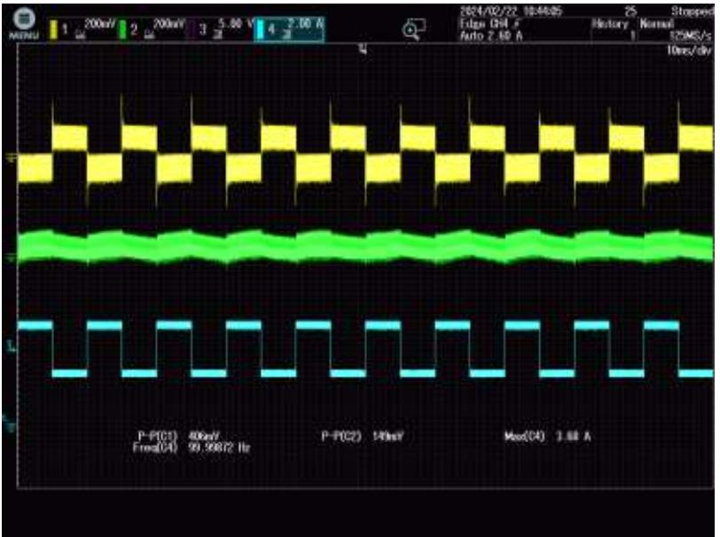

$230 v _ { \mathsf { A C } }$

CH1 VOUT-12V ${ \mathsf { C H 1 V } } _ { 0 \cup \mathsf { T } - 1 2 \mathsf { V } }$  
$\mathsf { C H 2 } \mathsf { V } _ { \mathsf { O U T } - \mathsf { 1 8 V } }$ CH2 VOUT-18V VPK-PK=149 mV $\mathsf { V } _ { \mathsf { P K - P K } } { = } 1 4 9 \mathsf { m V }$

$$
V _ {P K - P K} = 4 0 6 m V
$$

## Test Condition:

➢ $1 . 7 5 \ : \mathsf { A } \substack { - 3 . 5 \ : \mathsf { A } - 1 . 7 5 \ : \mathsf { A } }$  
➢ $0 . 0 5 \ A \substack { - 0 . 1 \ A - 0 . 0 5 \ A }$  
➢ Slew Rate: 0.5 A/μS  
➢ Frequency: 100 Hz

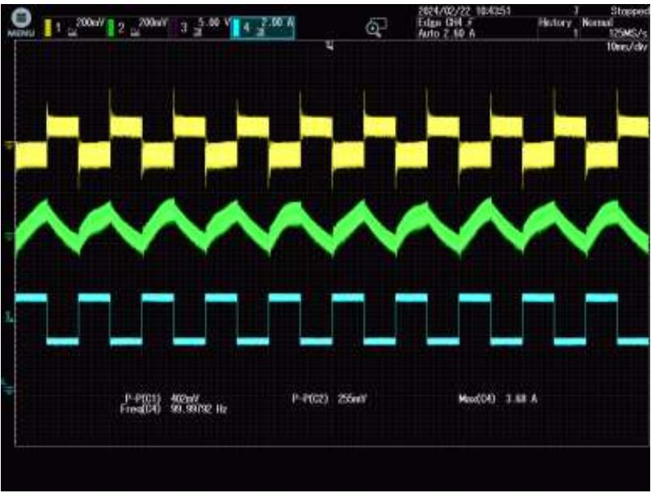

$1 1 5 \ : \mathsf { V } _ { \mathsf { A C } }$

${ \mathsf { C H 1 } } { \mathsf { V } } _ { 0 \mathsf { U T } - 1 2 \mathsf { V } }$ CH1 VOUT-12V VPK-PK=402 mV $V _ { P K - P K } = 4 0 2 ~ \mathsf { m V }$  
$\mathsf { C H 2 } \mathsf { V } _ { \mathsf { O U T - 1 8 V } }$ CH2 VOUT-18V VPK-PK=255 mV $v _ { p _ { k - P K } } { = } 2 5 5 m v$

## Test Condition:

➢ $1 . 7 5 \ : \mathsf { A } \substack { - 3 . 5 \ : \mathsf { A } - 1 . 7 5 \ : \mathsf { A } }$  
➢ 0.05 A-0.1 A-0.05 A  
➢ Slew Rate: 0.5 A/μS  
➢ Frequency: 100 Hz

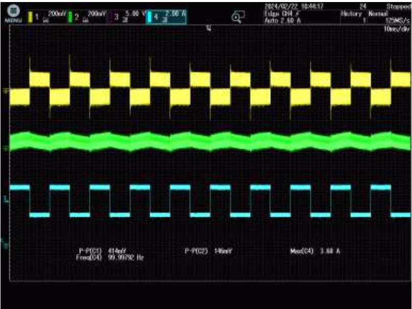

265 VAC

${ \mathsf { C H 1 } } { \mathsf { V } } _ { 0 \mathsf { U T } - 1 2 \mathsf { V } }$ CH1 VOUT-12V $\mathsf { V } _ { \mathsf { P K - P K } } { = } 4 1 4 \mathsf { m V }$  
$\mathsf { C H 2 } \mathsf { V _ { 0 \cup \mathsf { T } - 1 8 \mathsf { V } } }$ CH2 VOUT-18V $V _ { \mathsf { P K - P K } } { = } 1 4 6 ~ \mathsf { m V }$

## Test Condition:

➢ $1 . 7 5 \ : \mathsf { A } \substack { - 3 . 5 \ : \mathsf { A } - 1 . 7 5 \ : \mathsf { A } }$  
➢ $0 . 0 5 \ A \substack { - 0 . 1 \ A - 0 . 0 5 \ A }$  
➢ Slew Rate: 0.5 A/μS  
➢ Frequency: 100 Hz

## 动态负载(10%-90%)

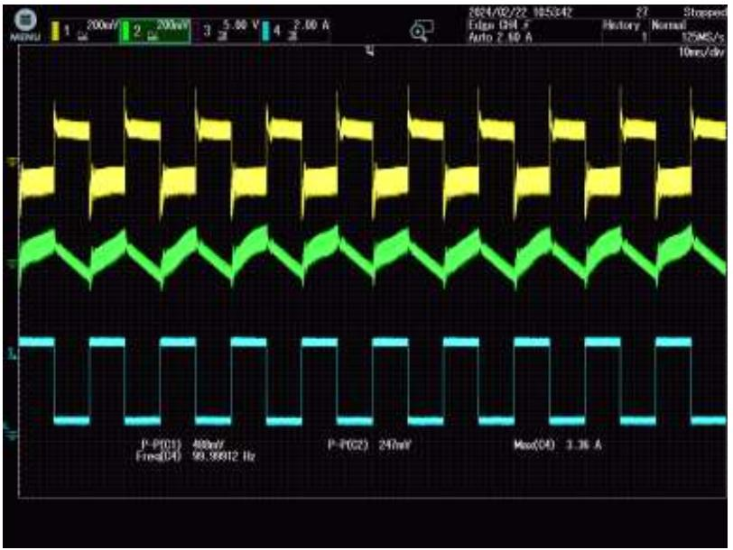

85 VAC

$\mathsf { C H 1 V _ { O U T - 1 2 V } }$ CH1 VOUT-12V VPK-PK=488 mV $V _ { \mathsf { P K - P K } } { = } 4 8 8 ~ \mathsf { m V }$  
$\mathsf { C H 2 } \mathsf { V _ { 0 \cup \mathsf { T } - 1 8 \mathsf { V } } }$ CH2 VOUT-18V VPK-PK=247 mV $\mathsf { V } _ { \mathsf { P K - P K } } { = } 2 4 7 \mathsf { m V }$

## Test Condition:

➢ $0 . 3 5 \ A - 3 . 1 5 \ A - 0 . 3 5 \ A$  
➢ $0 . 0 1 \ A - 0 . 0 9 \ A - 0 . 0 8 \ A$  
➢ Slew Rate: 0.5 A/μS  
➢ Frequency: 100 Hz

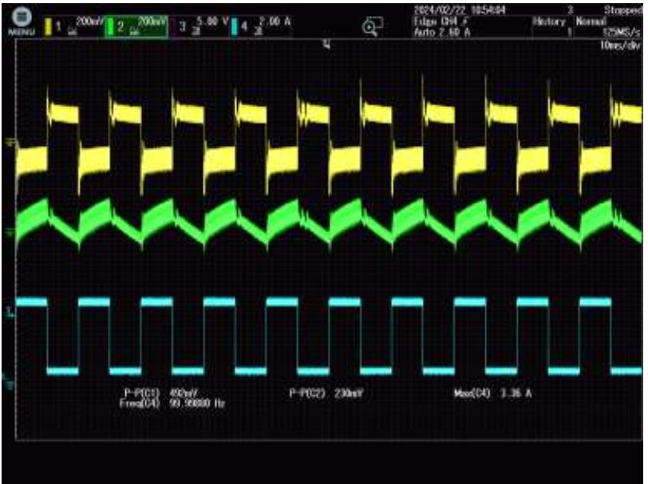

230 VAC

CH1 VOUT-12V $\mathsf { V } _ { \mathsf { O U T } - 1 2 \mathsf { V } }$ $V _ { P K - P K } = 4 9 2 m v$ VPK-PK=492 mV  
CH2 VOUT-18V VPK-PK=230mV $\mathsf { V } _ { \mathsf { P K - P K } } { = } 2 3 0 \mathsf { m V }$

## Test Condition:

➢ 0.35 A-3.15 A-0.35 A  
➢ $0 . 0 1 \ A - 0 . 0 9 \ A - 0 . 0 8 \ A$  
➢ Slew Rate: 0.5 A/μS  
➢ Frequency: 100 Hz

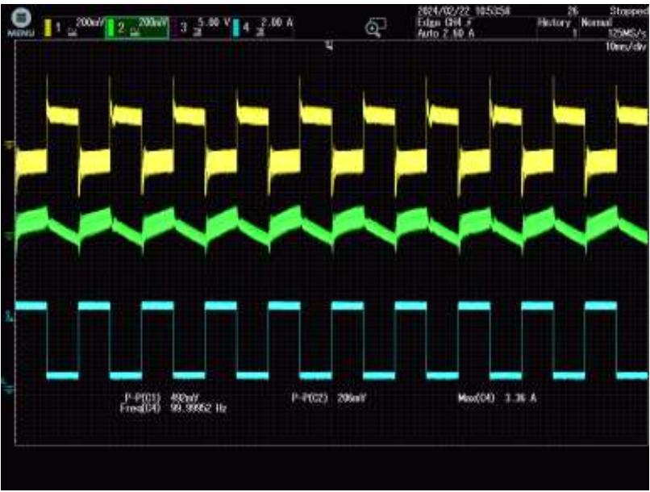

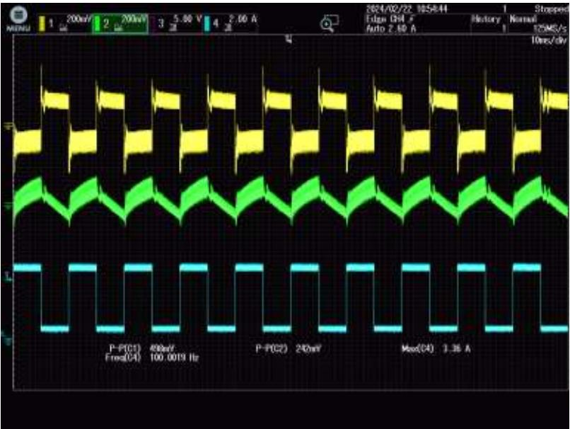

$1 1 5 \ : \mathsf { V } _ { \mathsf { A C } }$

${ \mathsf { C H 1 } } { \mathsf { V } } _ { 0 \mathsf { U T } - 1 2 \mathsf { V } }$ CH1 VOUT-12V VPK-PK=492 mV $V _ { P K - P K } { = } 4 9 2 ~ \mathsf { m V }$  
$\mathsf { C H 2 } \mathsf { V } _ { \mathsf { O U T - 1 8 V } }$ CH2 VOUT-18V VPK-PK=206mV $\mathsf { V } _ { \mathsf { P K - P K } } { = } 2 0 6 \mathsf { m V }$

## Test Condition:

➢ $0 . 3 5 \ A - 3 . 1 5 \ A - 0 . 3 5 \ A$  
➢ 0.01 A-0.09 A-0.08 A  
➢ Slew Rate: 0.5 A/μS  
➢ Frequency: 100 Hz

265 VAC

${ \mathsf { C H 1 } } { \mathsf { V } } _ { 0 \mathsf { U T } - 1 2 \mathsf { V } }$ CH1 VOUT-12V $V _ { P K - P K } { = } 4 9 8 ~ \mathsf { m V }$  
$\mathsf { C H 2 } \mathsf { V _ { 0 \cup \mathsf { T } - 1 8 \mathsf { V } } }$ CH2 VOUT-18V $V _ { P K - P K } = 2 4 2 m v$

## Test Condition:

➢ 0.35 A-3.15 A-0.35 A  
➢ $0 . 0 1 \ A - 0 . 0 9 \ A - 0 . 0 8 \ A$  
➢ Slew Rate: 0.5 A/μS  
➢ Frequency: 100 Hz

## 输出电压开机波形

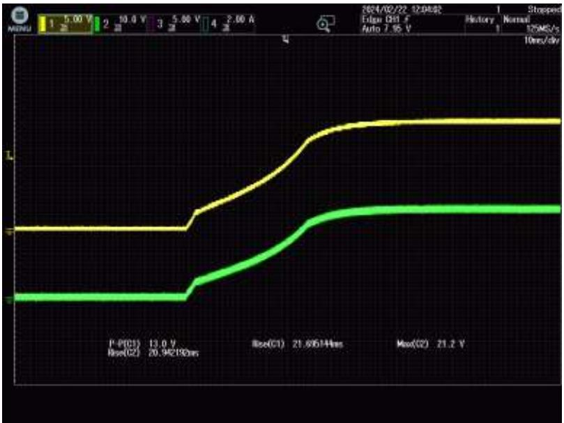

85 VAC

CH1 VOUT-12V $\mathsf { V } _ { \mathsf { O U T } - 1 2 \mathsf { V } }$  
${ \sf T } _ { \sf R I S E } \colon 2 1 . 6 9$ mS  
CH2 VOUT-18V $\mathsf { V } _ { \mathsf { O U T } - 1 8 \mathsf { V } }$  
${ \sf T } _ { \sf R I S E } .$ 20.94 mS

Test Condition:

➢ No Load

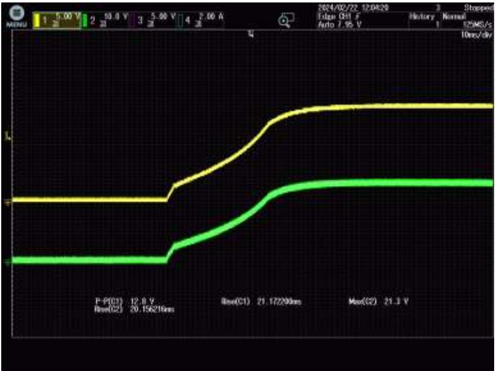

265 $\mathsf { v } _ { \mathsf { A C } }$

CH1 VOUT-12V $\mathsf { V } _ { \mathsf { O U T } - 1 2 \mathsf { V } }$  
$\mathsf { T } _ { \mathsf { R I S E } } \colon 2 1 . 1 7$ mS  
CH2 VOUT-18V $\mathsf { V } _ { \mathsf { O U T } - 1 8 \mathsf { V } }$  
${ \sf T } _ { \sf R I S E } .$ 20.15 mS

➢ No Load

Test Condition:  
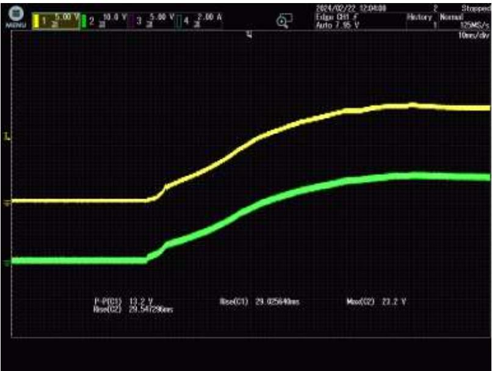

85 VAC

CH1 VOUT-12V $\mathsf { V } _ { \mathsf { O U T - 1 } 2 \mathsf { V } }$  
${ \sf T } _ { \sf R I S E } .$ 29.02 mS  
CH2 VOUT-18V $\mathsf { V } _ { \mathsf { O U T - 1 8 V } }$  
${ \sf T } _ { \sf R I S E } .$ 29.54 mS

Test Condition:

➢ Full Load

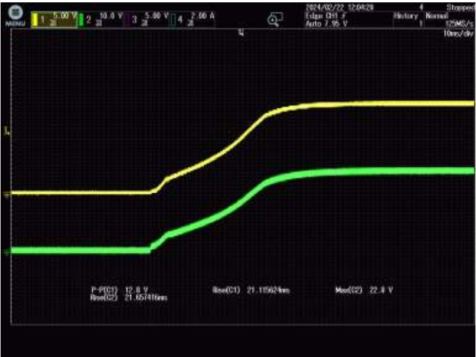

265 $\mathsf { v } _ { \mathsf { A C } }$

CH1 $\mathsf { V } _ { \mathsf { O U T } - 1 2 \mathsf { V } }$  
${ \sf T } _ { \sf R I S E } .$ 21.11mS  
CH2 VOUT-18V $\mathsf { V } _ { \mathsf { O U T - 1 8 V } }$  
T : 21.65mS

Test Condition:

➢ Full Load

## 输入欠压保护

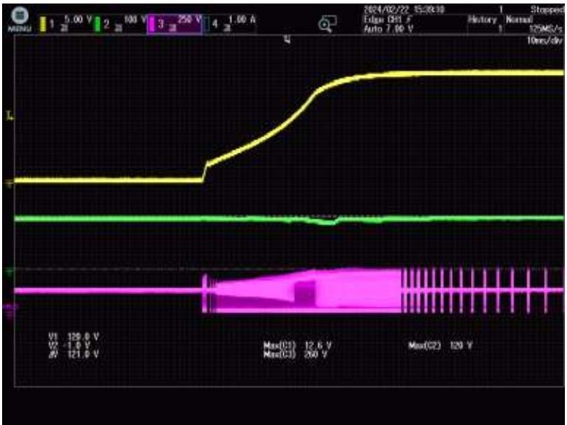

## BROWN-IN

CH1 VOUT-12V $\mathsf { V } _ { \mathsf { O U T } - 1 2 \mathsf { V } }$  
${ \mathsf { C H } } { 2 } { \mathsf { V I N } } _ { \mathsf { D C } }$  
CH3 VIN VDS $\mathsf { V I N V } _ { \mathsf { D S } }$ VBROWN-IN: 120 V

Test Condition:  
➢ No Load  
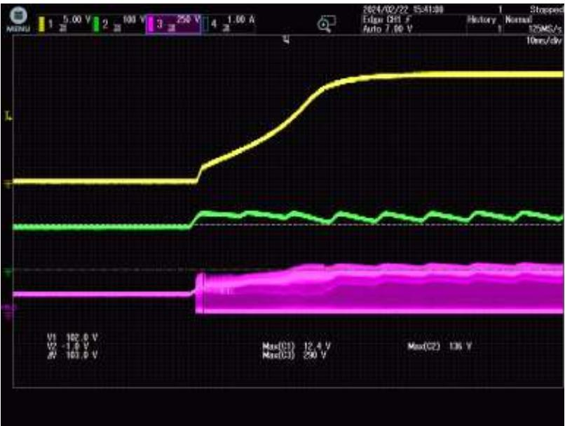

## BROWN-IN

CH1 VOUT-12V $\mathsf { V } _ { \mathsf { O U T - 1 } 2 \mathsf { V } }$  
CH2 $\mathsf { V I N } _ { \mathsf { D C } }$  
CH3 VIN VDS $\mathsf { V I N } \mathsf { V } _ { \mathsf { D S } }$ VBROWN-IN: 103 V

Test Condition:  
➢ Full Load  
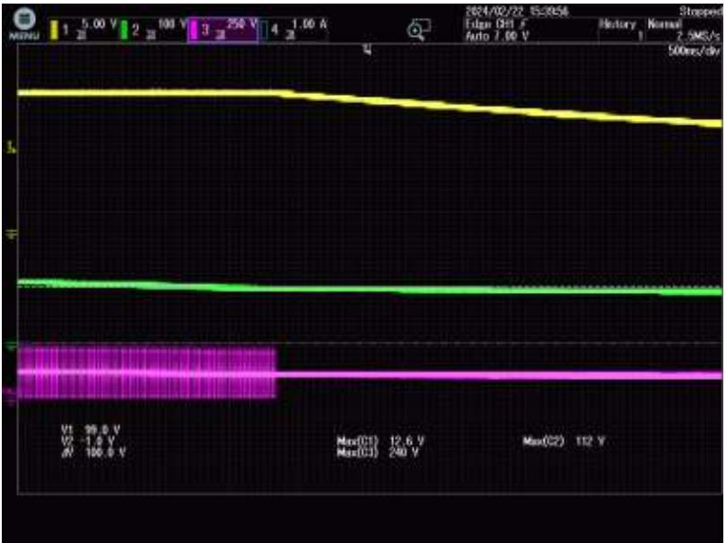

## BROWN-OUT

CH1 VOUT-12V $\mathsf { V } _ { \mathsf { O U T } - 1 2 \mathsf { V } }$  
CH2 $\mathsf { V I N } _ { \mathsf { D C } }$  
CH3 VIN VDS $\mathsf { V I N } \mathsf { V } _ { \mathsf { D S } }$ VBROWN-OUT:100 V

Test Condition:  
➢ No Load  
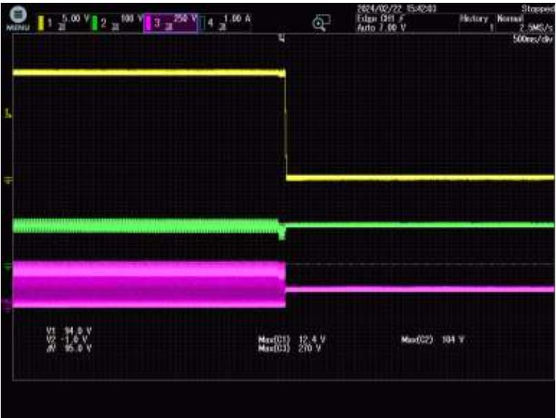

## BROWN-OUT

CH1 $\mathsf { V } _ { \mathsf { O U T } - 1 2 \mathsf { V } }$  
CH2 $\mathsf { V I N } _ { \mathsf { D C } }$  
CH3 VIN VDS $\mathsf { V I N } \mathsf { V } _ { \mathsf { D S } }$ VBROWN-OUT: 95V

Test Condition:

➢ Full Load

## 输入过压保护 （VDS电压点）

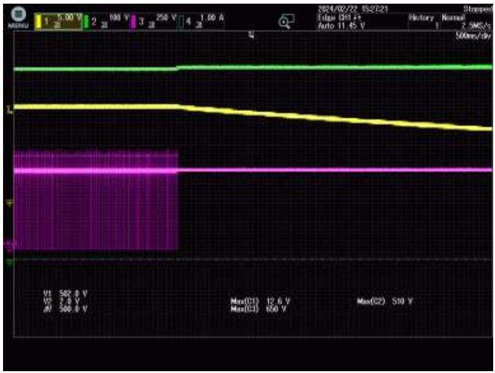

## 输入OVP

CH1 VOUT-12V $\mathsf { V } _ { \mathsf { O U T } - 1 2 \mathsf { V } }$  
CH3 $\mathsf { V I N } \mathsf { V } _ { \mathsf { D S } }$  
CH2 VINDC ${ \mathsf { C H } } { 2 } { \mathsf { V I N } } _ { \mathsf { D C } }$ $V \sb { D C - 1 N } .$ VDC-IN: 500V $\mathsf { v } _ { \mathsf { D S } } \mathsf { : }$ 510V

Test Condition:

➢ No Load

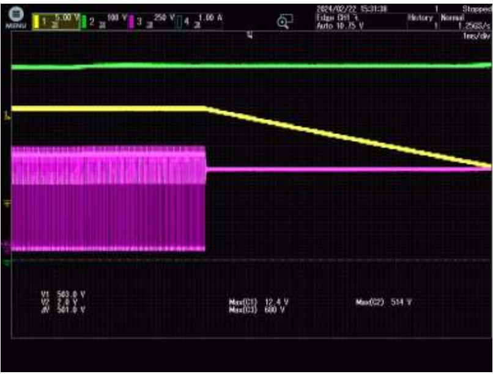

## 输入OVP

CH1 VOUT-12V $\mathsf { V } _ { \mathsf { O U T - 1 } 2 \mathsf { V } }$  
CH3 $\mathsf { V I N } \mathsf { V } _ { \mathsf { D S } }$  
${ \mathsf { C H } } { 2 } { \mathsf { V I N } } _ { \mathsf { D C } }$ CH2 VINDC $V \sb { D C - 1 N } .$ VDC-IN: 432V ${ \tt V } _ { \tt D S } \colon$ 501V

Test Condition:

➢ Full Load

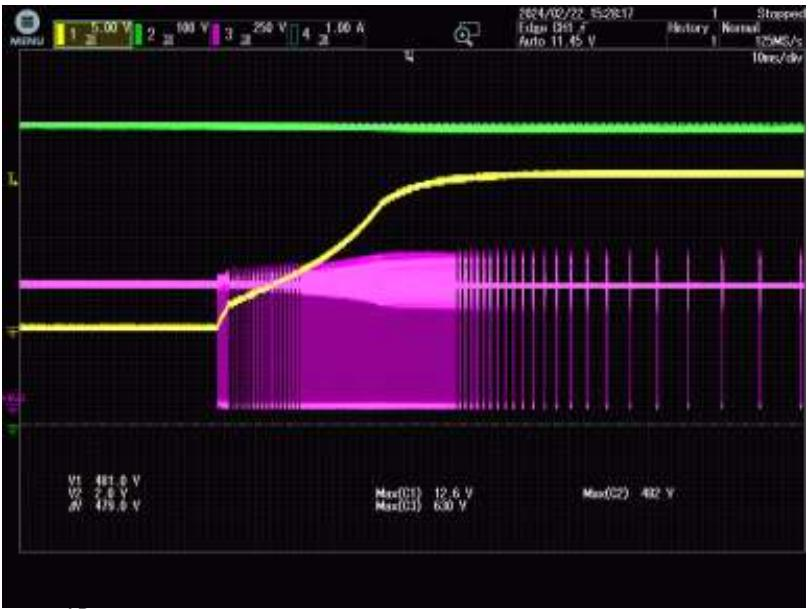

## 退出输入OVP

CH1 VOUT-12V $\mathsf { V } _ { \mathsf { O U T - 1 } 2 \mathsf { V } }$  
CH3 $\mathsf { V I N } \mathsf { V } _ { \mathsf { D S } }$  
CH2 VINDC ${ \mathsf { C H } } { 2 } { \mathsf { V I N } } _ { \mathsf { D C } }$ VDC-IN: 479V

Test Condition:

➢ No Load

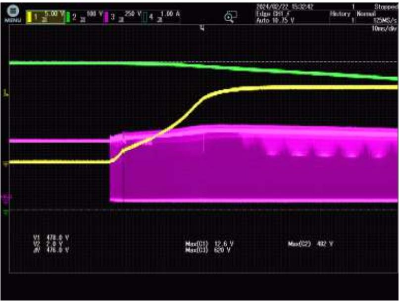

## 退出输入OVP

CH1 VOUT-12V $\mathsf { V } _ { \mathsf { O U T } - 1 2 \mathsf { V } }$  
CH3 $\mathsf { V I N } \mathsf { V } _ { \mathsf { D S } }$  
CH2 VINDC $\mathsf { V I N } _ { \mathsf { D C } }$ VDC-IN: 476V

Test Condition:

➢ Full Load

## 漏极电压电流波形

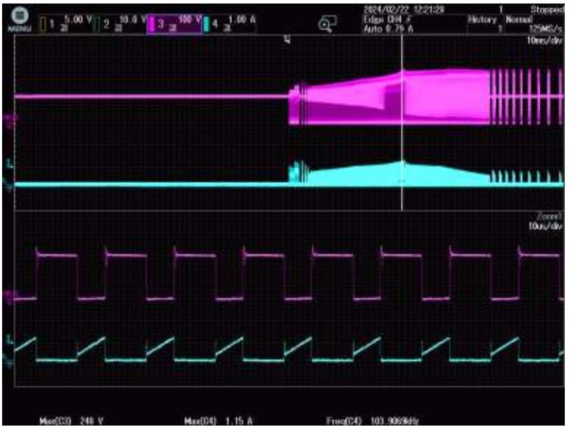

85 VAC

${ \mathsf { C H 3 } } \mathsf { V } _ { \mathsf { v D S } }$  
CH4 IDRAIN

Test Condition:

➢ No Load

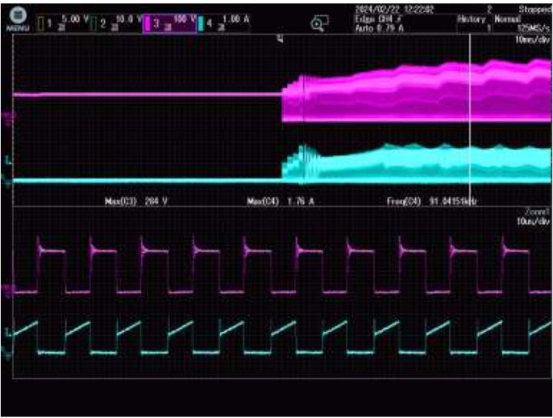

85 VAC

${ \mathsf { C H 3 } } \mathsf { V } _ { \mathsf { v D S } }$  
CH4 IDRAIN $C H 4 \mid _ { \mathsf { D R A I N } }$

Test Condition:

➢ Full Load

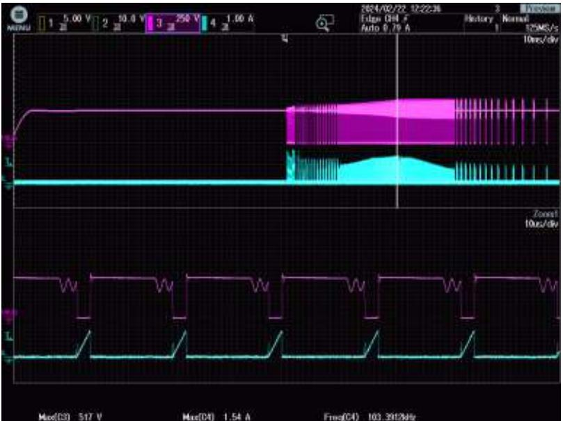

265 VAC

$\mathsf { C H 3 } \mathsf { V } _ { \mathsf { v o s } }$  
CH4 IDRAIN

Test Condition:

➢ No Load

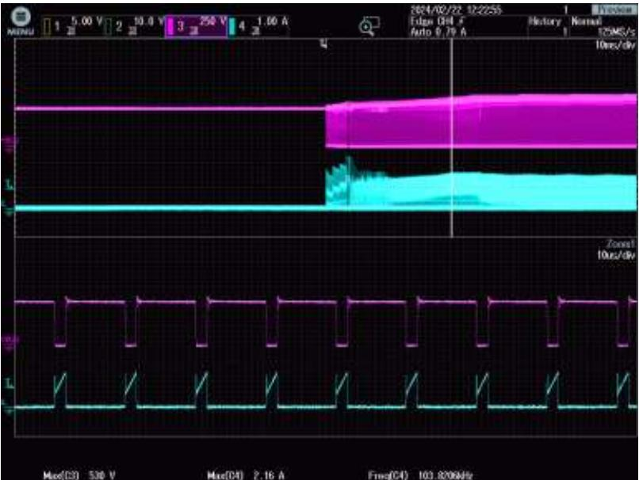

265 VAC

CH3 VVDS ${ \mathsf { C H 3 } } \mathsf { V } _ { \mathsf { v D S } }$  
$\mathsf { C H 4 } \mathsf { I } _ { \mathsf { D R A I N } }$

Test Condition:

➢ Full Load

## MOSFET稳态波形

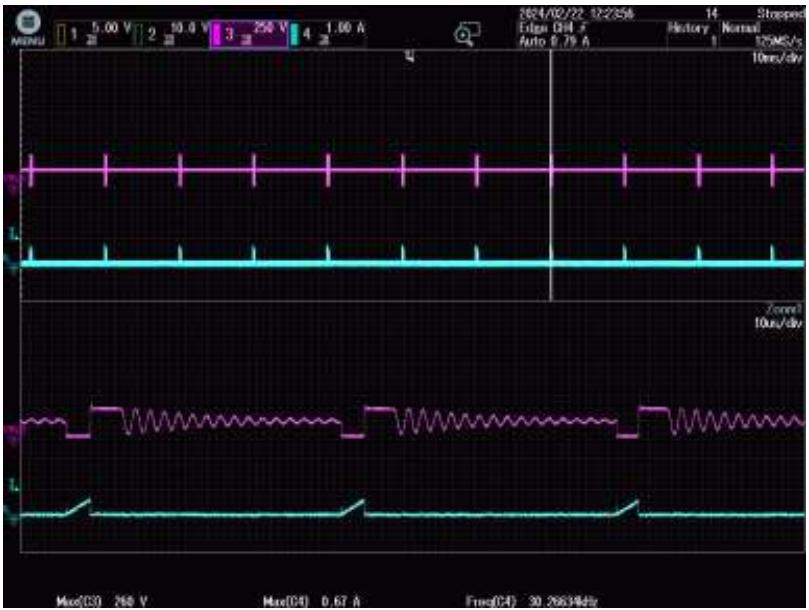

${ \otimes 5 } \mathsf { V } _ { \mathsf { A C } }$

${ \mathsf { C H 1 } } \mathsf { V _ { D S } }$  
$C H 3 \mid _ { \mathsf { D S } }$

$$
\begin{array}{l} \mathrm {V_ {DS\_MAX}} = 2 6 0 \mathrm{V} \\ \mathrm {I_ {DS\_MAX}} = 0. 6 7 \mathrm{A} \end{array}
$$

## Test Condition:

➢ No Load

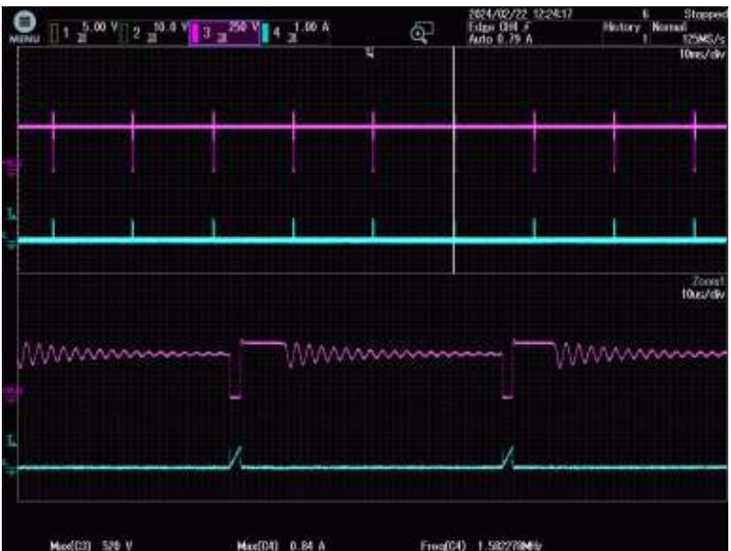

$2 6 5 \ : \mathsf { V } _ { \mathsf { A C } }$

${ \mathsf { C H 1 } } \mathsf { V _ { D S } }$  
$C H 3 \mid _ { \mathsf { D S } }$

$$
V _ {D S \_ M A X} = 5 2 0 V
$$

$$
I _ {D S \_ M A X} = 0. 8 4 A
$$

## Test Condition:

➢ No Load

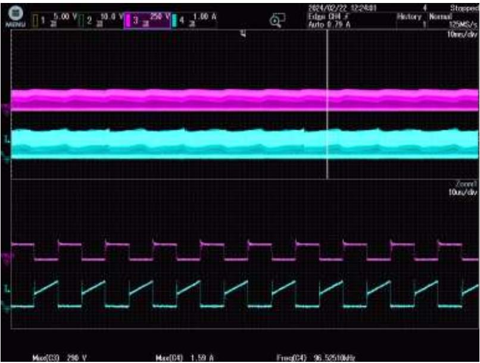

${ \tt S 5 V } _ { \sf A C }$

${ \mathsf { C H 1 } } \mathsf { V } _ { \mathsf { D S } }$  
$C H 3 \mid _ { \mathsf { D S } }$

$$
\begin{array}{l} \mathrm {V_ {DS\_MAX}} = 2 9 0 \mathrm{V} \\ \mathrm {I_ {DS\_MAX}} = 1. 5 9 \mathrm{A} \end{array}
$$

## Test Condition:

➢ Full Load

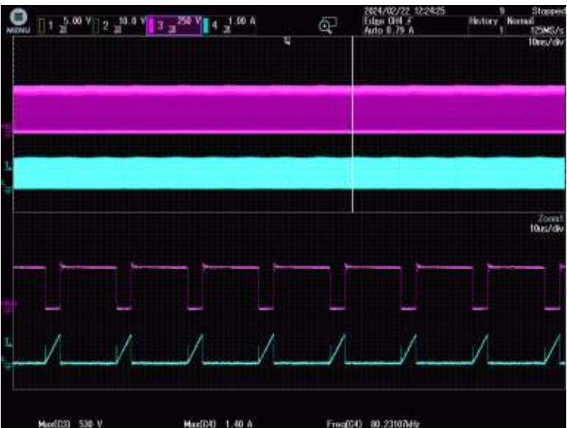

$2 6 5 \ : \mathsf { V } _ { \mathsf { A C } }$

${ \mathsf { C H 1 } } \mathsf { V } _ { \mathsf { D S } }$  
$C H 3 \mid _ { \mathsf { D S } }$

$$
V _ {D S \_ M A X} = 5 3 0 V
$$

$$
I _ {D S \_ M A X} = 1. 4 A
$$

## Test Condition:

➢ Full Load

## 短路保护 （MOSFET波形）

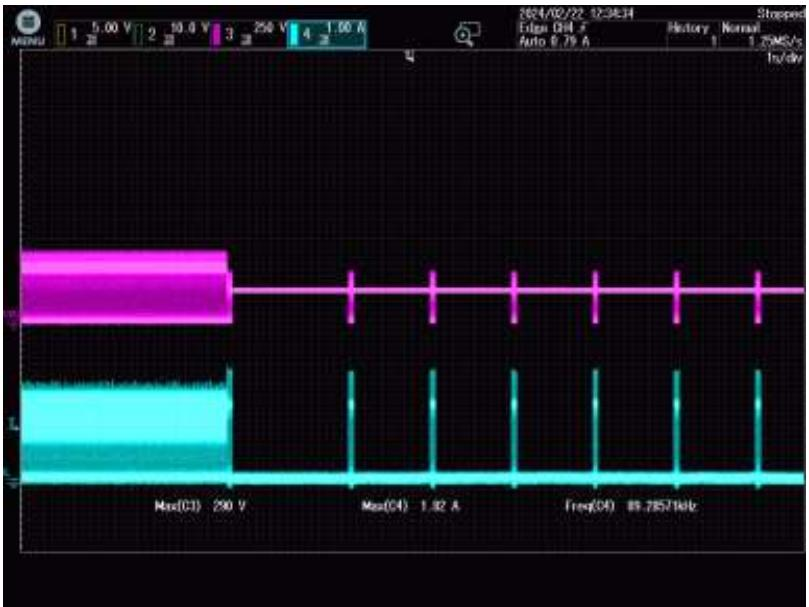

85 VAC

CH3 VDS  
CH4 ID

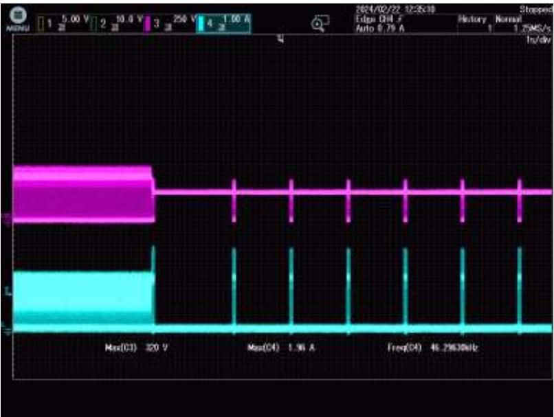

115 VAC

CH3 VDS  
CH4 ID

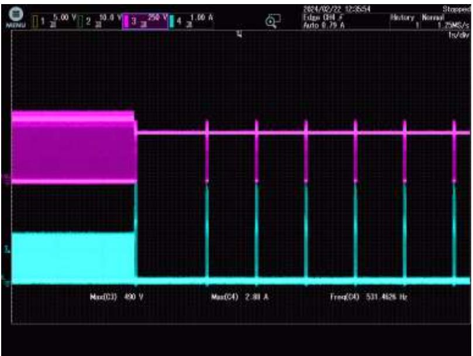

230 VAC

CH3 VDS  
CH4 ID

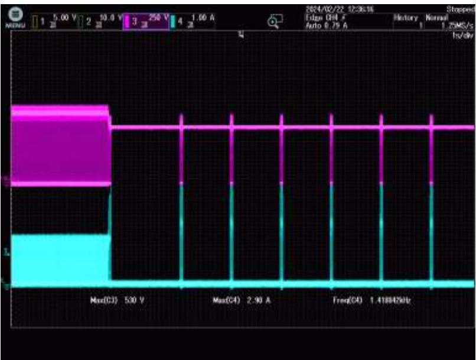

265 VAC

CH3 VDS  
CH4 ID

## D-S电压波形

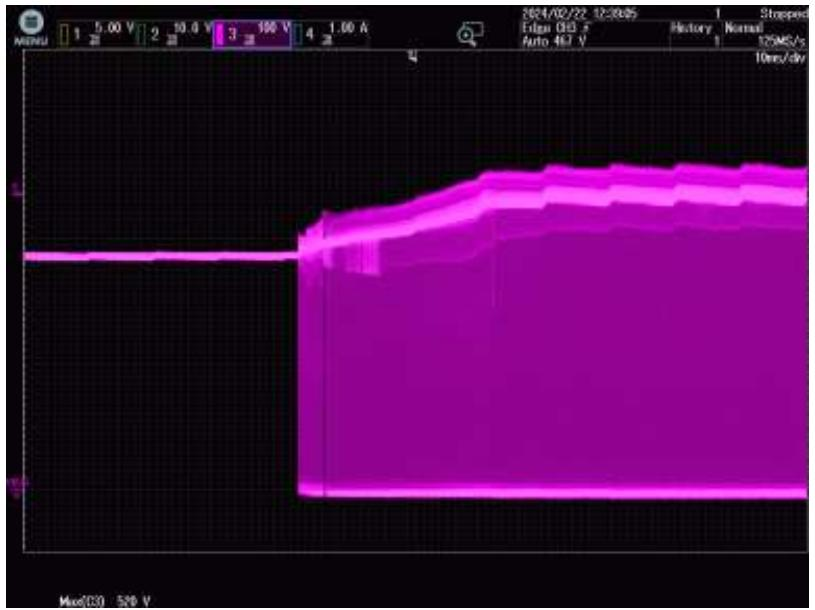

265 VAC

$\begin{array} { l } { \mathsf { C H 3 } \mathsf { V _ { D S } } } \\ { \mathsf { V D S _ { M A X } : 5 2 0 V } } \end{array}$ CH3 VDS

## Test Condition:

➢ 满载开机

<table><tr><td>符号</td><td>参数</td><td>参数范围</td><td>单位</td></tr><tr><td> $V_{DRAIN}$ </td><td>高压 MOSFET 漏极到源极电压</td><td>-0.3~800</td><td>V</td></tr><tr><td> $I_{DM}$ </td><td>漏极连续电流</td><td>4</td><td>A</td></tr><tr><td> $I_D$ </td><td>漏电电流脉冲</td><td>16</td><td>A</td></tr><tr><td> $V_{CC}$ </td><td> $V_{CC}$  电压</td><td>-0.3~40</td><td>V</td></tr><tr><td> $I_{CC\_MAX}$ </td><td> $V_{CC}$  引脚最大电流</td><td>20</td><td>mA</td></tr><tr><td> $V_{FB}$ </td><td>输出电压反馈端电压</td><td>-0.3~7</td><td>V</td></tr><tr><td> $V_{BR}$ </td><td>Burst mode 调节端电压</td><td>-0.3~7</td><td>V</td></tr></table>

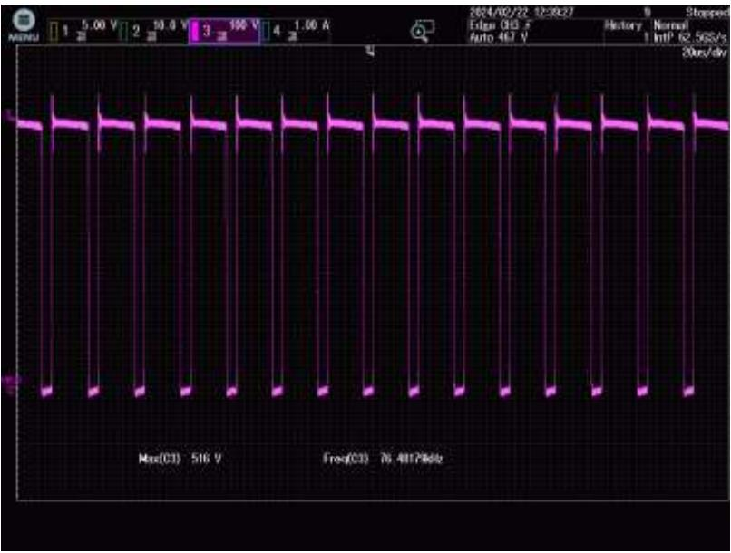

265 VAC

CH3 VDS $\mathsf { V } _ { \mathsf { D } \mathsf { S } }$ $V \mathsf { D S } _ { \mathsf { M A X } } \colon 5 1 6 \mathrm { ~ V ~ }$

Test Condition:满载正常工作

## 满载开机

$\scriptstyle \mathrm { D e r a t i n g } = 5 2 0 \lor / 8 0 0 \lor = 6 5 \%$

## 满载正常工作

$\mathrm { D e r a t i n g } = 5 1 6 \vee / 8 0 0 \vee = 6 4 . 5 \%$

## 12V输出肖特基反压波形

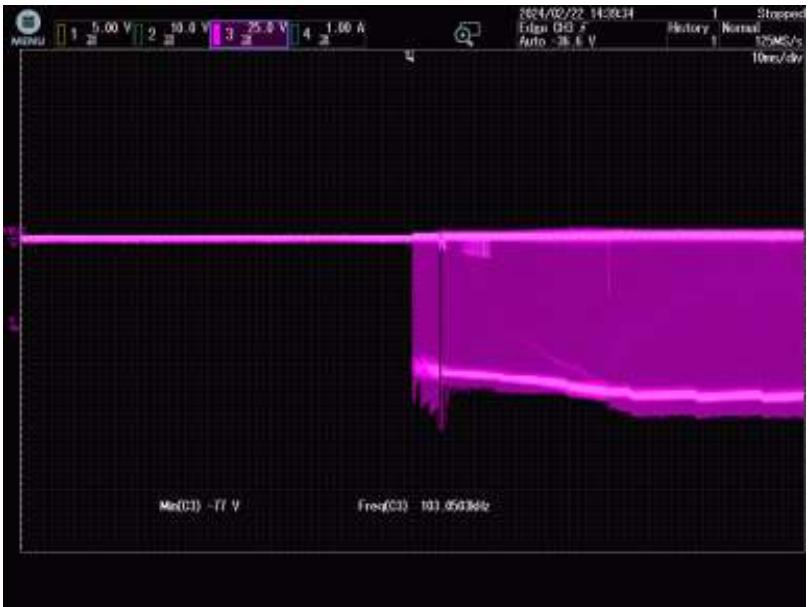

265 VAC

$\begin{array} { l } { \mathsf { C H 3 } \mathsf { V _ { D I O D E } } } \\ { \mathsf { V D S _ { M A X } : 7 7 V } } \end{array}$ CH3 VDIODE

## Test Condition:

➢ 满载启动

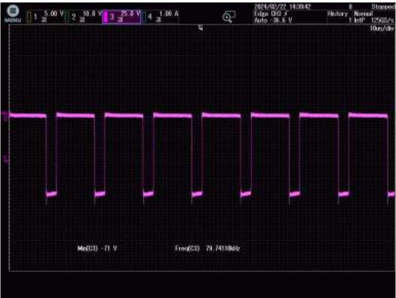

265 VAC

CH3 VDDIODE VMAX: 71V

## Test Condition:

满载正常工作

<table><tr><td>PARAMETER</td><td>SYMBOL</td><td>MB54</td><td>MB54A</td><td>MB55</td><td>MB56</td><td>MB58</td><td>MB59</td><td>MB510</td><td>MB515</td><td>MB520</td><td>UNITS</td></tr><tr><td>Maximum Recurrent Peak Reverse Voltage</td><td> $V_{RRM}$ </td><td>40</td><td>45</td><td>50</td><td>60</td><td>80</td><td>90</td><td>100</td><td>150</td><td>200</td><td>V</td></tr><tr><td>Maximum RMS Voltage</td><td> $V_{RMS}$ </td><td>28</td><td>31.5</td><td>35</td><td>42</td><td>56</td><td>63</td><td>70</td><td>105</td><td>140</td><td>V</td></tr><tr><td>Maximum DC Blocking Voltage</td><td> $V_{DC}$ </td><td>40</td><td>45</td><td>50</td><td>60</td><td>80</td><td>90</td><td>100</td><td>150</td><td>200</td><td>V</td></tr><tr><td>Average Rectified Output Current (See Figure 1)</td><td> $I_{F(AV)}$ </td><td colspan="9">5</td><td>A</td></tr><tr><td>Non-Repetitive Peak Forward Surge Current : 8.3ms single half sine-wave superimposed on rated load</td><td> $I_{FSM}$ </td><td colspan="9">100</td><td>A</td></tr><tr><td>Forward Voltage at 5A (Note 1)</td><td> $V_F$ </td><td colspan="2">0.7</td><td colspan="2">0.74</td><td colspan="3">0.8</td><td colspan="2">0.9</td><td>V</td></tr><tr><td>Peak Reverse Current at Rated DC Blocking Voltage  $T_j=25°C$  $T_j=100°C$ </td><td> $I_R$ </td><td colspan="9">0.0510</td><td>mA</td></tr><tr><td>Typical Thermal Resistance (Note 2)</td><td> $R_{BJA}$  $R_{BJL}$ </td><td colspan="9">5517</td><td>°C /W</td></tr><tr><td>Operating Junction and Storage Temperature Range</td><td> $T_J,T_{STG}$ </td><td>-55 to +150</td><td colspan="8">-65 to +175</td><td>°C</td></tr></table>

## 满载开机

$\mathsf { D e r a t i n g } = 7 1 \mathsf { V } / 2 0 0 \mathsf { V } = 3 5 . 5 \ \%$

## 满载正常工作

Derating = 77 V / 200V = 38.5 %

## 18V输出肖特基反压波形

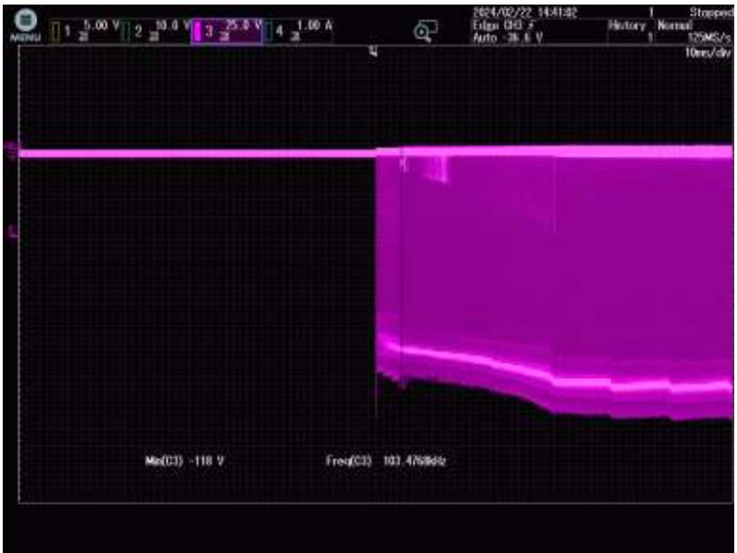

265 VAC

$\begin{array} { r l } & { \mathsf { C H } 2 \mathsf { V } _ { \mathsf { D I O D E } } } \\ & { \mathsf { V D S } _ { \mathsf { M A X } } \colon 1 1 8 \mathsf { V } } \end{array}$ CH2 VDIODE

## Test Condition:

➢ 满载启动

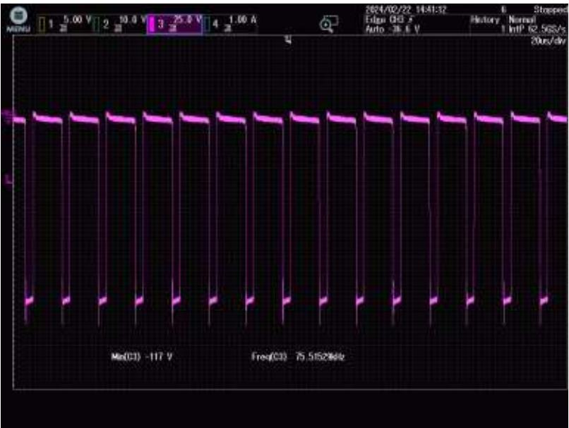

265 VAC

$\begin{array} { r } { \mathsf { C H } 2 \mathsf { V } _ { \mathsf { D D } \mathsf { I O D E } } } \\ { \mathsf { V } _ { \mathsf { M A X } } \colon \pm \pmb { 1 } \pmb { 1 } \mathsf { 7 V } } \end{array}$ CH2 VDDIODE

## Test Condition:

满载正常工作

<table><tr><td>PARAMETER</td><td>SYMBOL</td><td>MB54</td><td>MB54A</td><td>MB55</td><td>MB56</td><td>MB58</td><td>MB59</td><td>MB510</td><td>MB515</td><td>MB520</td><td>UNITS</td></tr><tr><td>Maximum Recurrent Peak Reverse Voltage</td><td> $V_{RRM}$ </td><td>40</td><td>45</td><td>50</td><td>60</td><td>80</td><td>90</td><td>100</td><td>150</td><td>200</td><td>V</td></tr><tr><td>Maximum RMS Voltage</td><td> $V_{RMS}$ </td><td>28</td><td>31.5</td><td>35</td><td>42</td><td>56</td><td>63</td><td>70</td><td>105</td><td>140</td><td>V</td></tr><tr><td>Maximum DC Blocking Voltage</td><td> $V_{DC}$ </td><td>40</td><td>45</td><td>50</td><td>60</td><td>80</td><td>90</td><td>100</td><td>150</td><td>200</td><td>V</td></tr><tr><td>Average Rectified Output Current (See Figure 1)</td><td> $I_{F(AV)}$ </td><td colspan="9">5</td><td>A</td></tr><tr><td>Non-Repetitive Peak Forward Surge Current : 8.3ms single half sine-wave superimposed on rated load</td><td> $I_{FSM}$ </td><td colspan="9">100</td><td>A</td></tr><tr><td>Forward Voltage at 5A (Note 1)</td><td> $V_F$ </td><td colspan="2">0.7</td><td colspan="2">0.74</td><td colspan="3">0.8</td><td colspan="2">0.9</td><td>V</td></tr><tr><td>Peak Reverse Current at Rated DC Blocking Voltage  $T_J=25°C$  $T_J=100°C$ </td><td> $I_R$ </td><td colspan="9">0.0510</td><td>mA</td></tr><tr><td>Typical Thermal Resistance (Note 2)</td><td> $R_{BJA}$  $R_{BJL}$ </td><td colspan="9">5517</td><td>°C /W</td></tr><tr><td>Operating Junction and Storage Temperature Range</td><td> $T_J,T_{STG}$ </td><td>-55 to +150</td><td colspan="8">-65 to +175</td><td>°C</td></tr></table>

## 满载开机

$D e r a t i n g = 1 1 8 \vee / 2 0 0 \vee = 5 9 \%$

## 满载正常工作

${ \mathsf { D e r a t i n g } } = 1 1 7 \vee / 2 0 0 \vee = 5 8 . 5 \ \%$

<table><tr><td rowspan="2">项目</td><td colspan="2">85VAC</td><td colspan="2">265VAC</td></tr><tr><td>温度(°C)</td><td>温升(°C)</td><td>温度(°C)</td><td>温升(°C)</td></tr><tr><td>环境温度</td><td colspan="2">29.5</td><td colspan="2">28.97</td></tr><tr><td>BPA86528D (U1)</td><td>90.77</td><td>61.27</td><td>76.23</td><td>47.26</td></tr><tr><td>输出肖特基 (D5)</td><td>85.23</td><td>55.73</td><td>80.21</td><td>51.24</td></tr><tr><td>输出肖特基 (D3)</td><td>62.23</td><td>32.73</td><td>62.05</td><td>33.08</td></tr><tr><td>变压器(磁芯)</td><td>59.28</td><td>29.78</td><td>61.52</td><td>32.55</td></tr><tr><td>变压器(线包)</td><td>67.23</td><td>37.73</td><td>65.36</td><td>36.39</td></tr><tr><td>输出电解电容(E5)</td><td>53.63</td><td>24.13</td><td>50.8</td><td>21.83</td></tr><tr><td>整流桥(BD1)</td><td>92.08</td><td>62.58</td><td>51.88</td><td>22.91</td></tr></table>

## 测试说明

➢ 在温箱中进行测试  
➢ 电路板放在一个封闭的盒子内  
➢ 热电偶连接到各个测量点  
➢ 等测量点温度达到稳定后记录数据

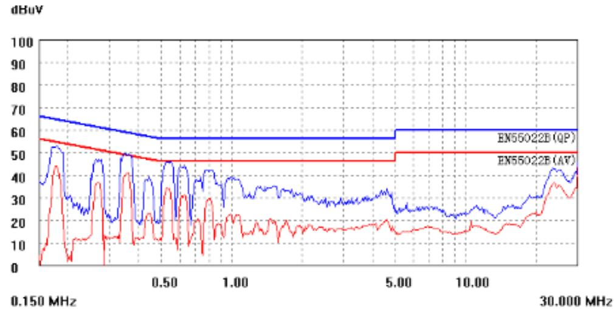

115VAC Line

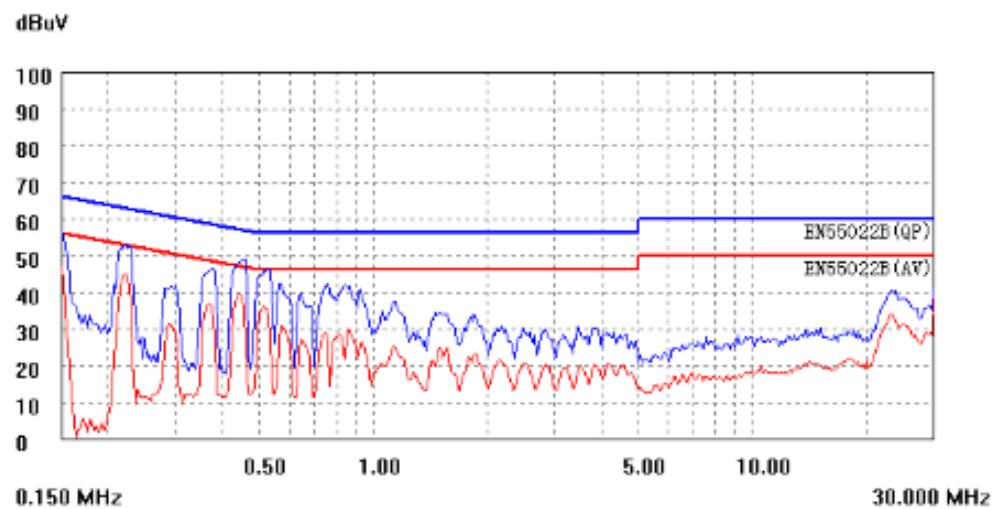

230VAC Line

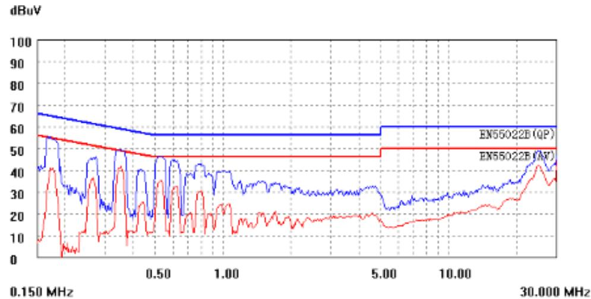

115VAC Neutral

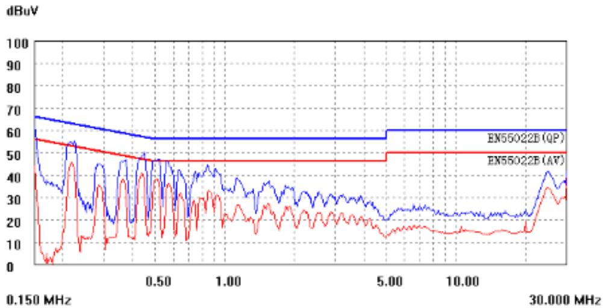

230VAC Neutral

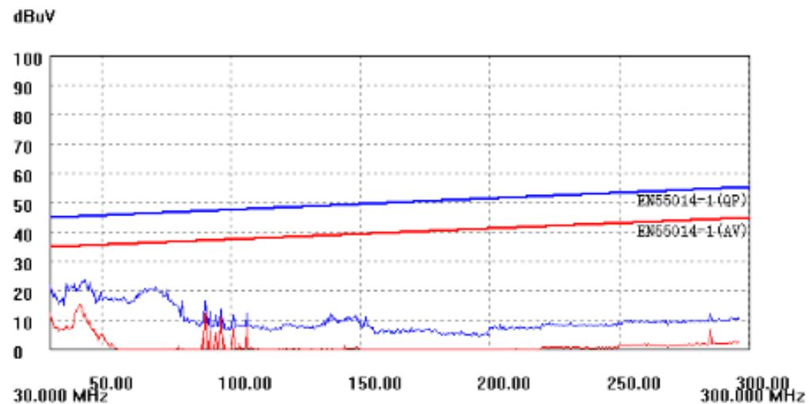

115VAC 空载

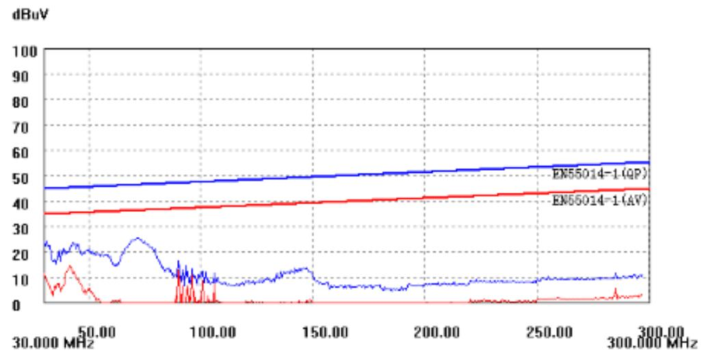

230VAC 空载

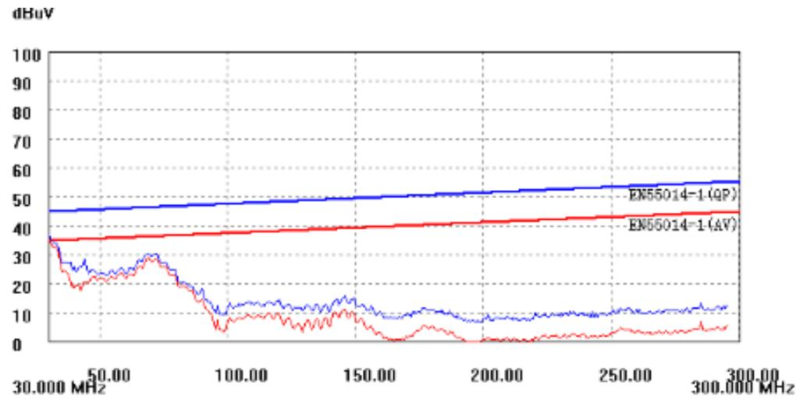

115VAC 满载

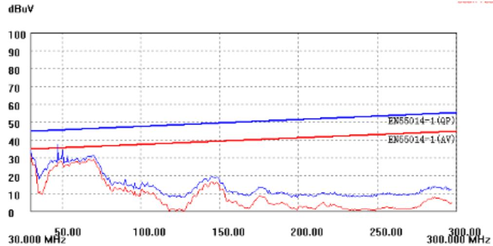

230VAC 满载

<table><tr><td>差模</td><td>电压</td><td>相位角</td><td>发生器阻抗</td><td>测试次数</td><td>测试结果</td></tr><tr><td>L to N</td><td>+2kV</td><td>0</td><td>2</td><td>10</td><td>Pass</td></tr><tr><td>L to N</td><td>-2kV</td><td>0</td><td>2</td><td>10</td><td>Pass</td></tr><tr><td>L to N</td><td>+2kV</td><td>90</td><td>2</td><td>10</td><td>Pass</td></tr><tr><td>L to N</td><td>-2kV</td><td>90</td><td>2</td><td>10</td><td>Pass</td></tr><tr><td>L to N</td><td>+2kV</td><td>180</td><td>2</td><td>10</td><td>Pass</td></tr><tr><td>L to N</td><td>-2kV</td><td>180</td><td>2</td><td>10</td><td>Pass</td></tr><tr><td>L to N</td><td>+2kV</td><td>270</td><td>2</td><td>10</td><td>Pass</td></tr><tr><td>L to N</td><td>-2kV</td><td>270</td><td>2</td><td>10</td><td>Pass</td></tr></table>

## 测试说明

➢ 按照GB/T17626.5和IEC61000-4-5的最新版本要求进行测试  
➢ 室温环境，230VAC输入，满载条件  
➢ 输入1.2/50us组合波浪涌电压  
➢ 每个测试点重复10次  
➢ 每次间隔时间1分钟  
➢ 试验时样机输出正常（符合A类标准）视为Pass

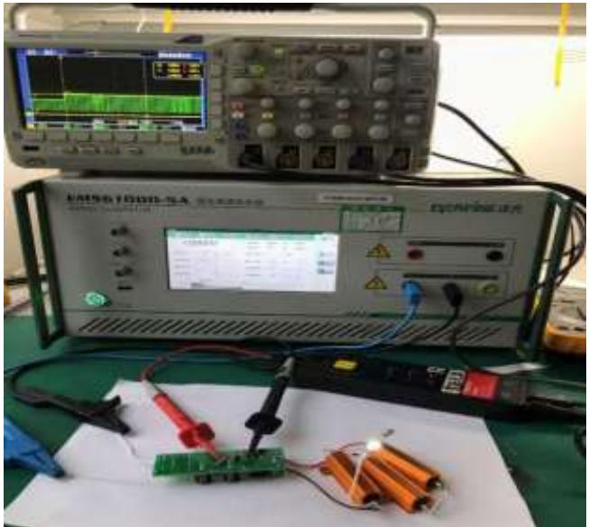

<table><tr><td>差模</td><td>电压</td><td>脉冲群持续时间</td><td>脉冲频率</td><td>测试时间</td><td>测试结果</td></tr><tr><td>L to N</td><td>+4kV</td><td>15ms</td><td>5kHz</td><td>120s</td><td>Pass</td></tr><tr><td>L to N</td><td>-4kV</td><td>15ms</td><td>5kHz</td><td>120s</td><td>Pass</td></tr><tr><td>L to N</td><td>+4kV</td><td>0.75ms</td><td>100kHz</td><td>120s</td><td>Pass</td></tr><tr><td>L to N</td><td>-4kV</td><td>0.75ms</td><td>100kHz</td><td>120s</td><td>Pass</td></tr><tr><td>L to N</td><td>+2kV</td><td>2ms</td><td>38kHz</td><td>120s</td><td>Pass</td></tr><tr><td>L to N</td><td>-2kV</td><td>2ms</td><td>38kHz</td><td>120s</td><td>Pass</td></tr><tr><td>L to N</td><td>+4kV</td><td>2ms</td><td>38kHz</td><td>120s</td><td>Pass</td></tr><tr><td>L to N</td><td>-4kV</td><td>2ms</td><td>38kHz</td><td>120s</td><td>Pass</td></tr></table>

## 测试说明

➢ 按照GB/T17626.4和IEC61000-4-4的最新版本要求进行测试  
➢ 室温环境，230VAC输入满载条件  
➢ 分别测试5kHz/100kHz/38kHz脉冲频率  
➢ 脉冲群周期为300ms  
➢ 每个测试条件测试时间120s  
➢ 试验时样机输出正常（符合A类标准）视为Pass

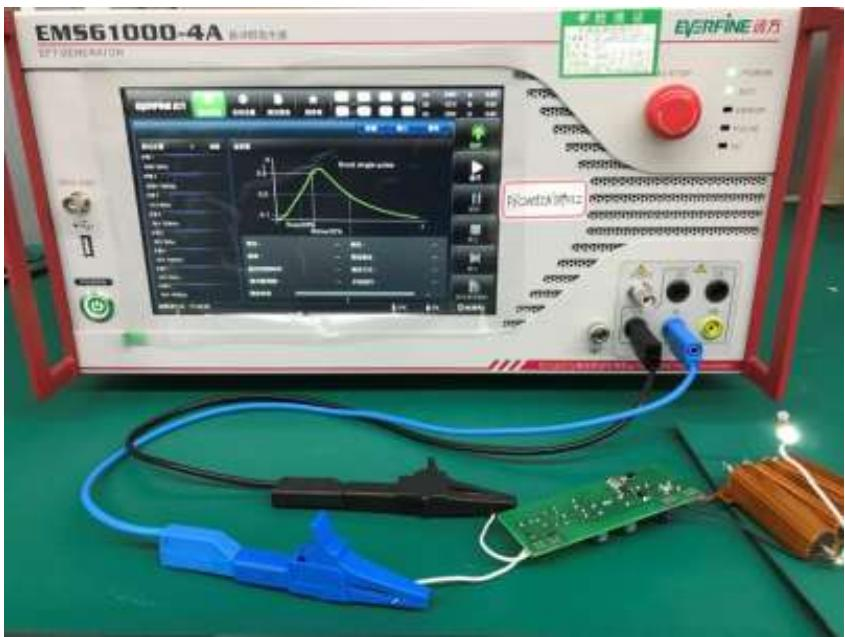

## THANK YOU FOR WATCHING
