## KP3116ESG & BPA8505D/BPA8506D对比测试

舒坚富

时间：2023年08月03日

'BPS

晶丰明源

## 内容

➢参考电路原理图  
➢特性参数对比  
➢测试数据对比  
➢性能测试数据  
➢其他事项

## 1.参考电路对比

KP3116ESG参考电路  
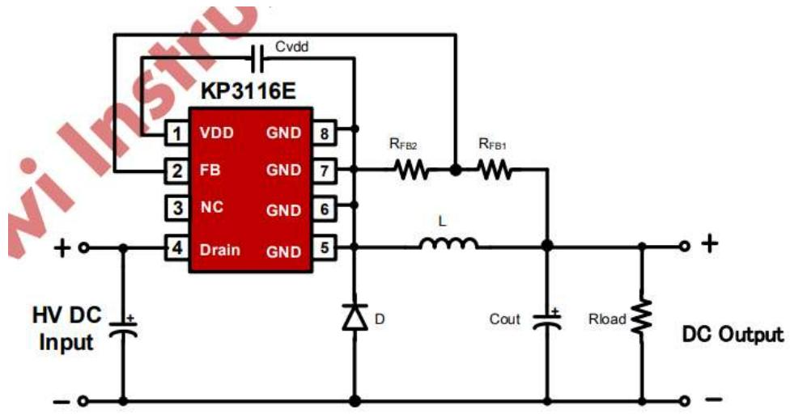

## 主要特点

·集成700V高压MOSFET和高压启动电路  
多模式控制、无异音工作  
支持反激、降压和升降压拓扑  
支持超低压输入（>20V）  
空载功耗低于100mW  
支持最高40kHz开关频率  
良好的线性调整率和负载调整率  
集成软启动电路  
内部保护功能：

过载保护（OLP）

逐周期电流限制（OCP）

异常过流保护（AOCP）

输出过压保护（OVP）

过温保护（OTP）

封装类型SOP-8

BPA850XD参考电路  
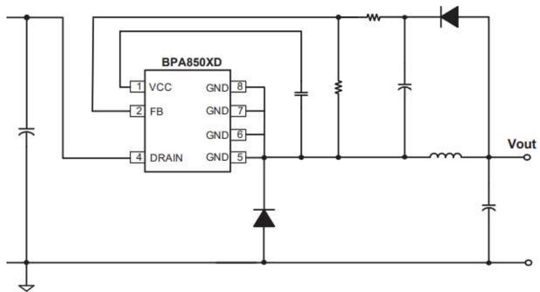

## 特点

内部集成650V高压MOSFET  
集成高压启动和自供电电路  
低待机功耗<100mW  
优异的动态响应速度，输出电压纹波小  
良好的负载调整率和线性调整率  
降低音频噪声的降幅调制技术  
自适应开关频率，最高45KHz  
改善EMI性能的频率调制技术  
内置软启动功能  
保护功能

输出短路保护（SCP）  
输出过压保护（OVP）  
输出过载保护（OLP）  
反馈开路保护  
逐周期限流（Cycle-by-Cycle）  
退滞过温保护（OTP）

2.电气主要参数对比

<table><tr><td></td><td>KP3116ESG</td><td>BPA8505D</td><td>BPA8506D</td></tr><tr><td>开关频率KHz</td><td>41.6</td><td>45</td><td>45</td></tr><tr><td>Mosfet BV V</td><td>700</td><td>650</td><td>650</td></tr><tr><td>Rds_on Ω</td><td>14</td><td>8.5</td><td>6</td></tr><tr><td>限流点 mA</td><td>500</td><td>440</td><td>700</td></tr><tr><td>软启动</td><td>有</td><td>有</td><td>有</td></tr><tr><td>输出过压保护</td><td>有</td><td>有</td><td>有</td></tr><tr><td>输出短路保护</td><td>有</td><td>有</td><td>有</td></tr><tr><td>输出过载保护</td><td>有</td><td>有</td><td>有</td></tr><tr><td>反馈开路保护</td><td>有</td><td>有</td><td>有</td></tr><tr><td>过温保护</td><td>有</td><td>有</td><td>有</td></tr><tr><td>封装</td><td>SOP-8</td><td>SOP-7</td><td>SOP-7</td></tr></table>

## 3.原理图对比

KP3116ESG 12V 250mA Max

BPA8505D 12V 250mA Max

BPA8506D 12V 400mA Max

<table><tr><td>Vin(Vac)</td><td>Load(%)</td><td>Pin(W)</td><td>Vout(V)</td><td>Iout(A)</td><td>Pout(W)</td><td>Eff(%)</td><td>Ave Eff(%)</td></tr><tr><td rowspan="6">85Vac/60Hz</td><td>100</td><td>4.377</td><td>12.054</td><td>0.2494</td><td>3.006268</td><td>68.68329</td><td rowspan="4">72.9845</td></tr><tr><td>75</td><td>3.106</td><td>12.119</td><td>0.1874</td><td>2.271101</td><td>73.11979</td></tr><tr><td>50</td><td>2.021</td><td>12.165</td><td>0.1249</td><td>1.519409</td><td>75.18102</td></tr><tr><td>25</td><td>1.016</td><td>12.204</td><td>0.0624</td><td>0.76153</td><td>74.9537</td></tr><tr><td>10</td><td>0.4228</td><td>12.237</td><td>0.025</td><td>0.305925</td><td>72.35691</td><td>72.3569</td></tr><tr><td>0</td><td>0.0529</td><td>12.345</td><td>0</td><td>0</td><td></td><td></td></tr><tr><td rowspan="6">115Vac/60Hz</td><td>100</td><td>4.078</td><td>12.175</td><td>0.2498</td><td>3.041315</td><td>74.57859</td><td rowspan="4">75.2578</td></tr><tr><td>75</td><td>3.017</td><td>12.229</td><td>0.1874</td><td>2.291715</td><td>75.96005</td></tr><tr><td>50</td><td>2.013</td><td>12.253</td><td>0.1249</td><td>1.5304</td><td>76.02582</td></tr><tr><td>25</td><td>1.027</td><td>12.256</td><td>0.0624</td><td>0.764774</td><td>74.46684</td></tr><tr><td>10</td><td>0.4513</td><td>12.289</td><td>0.025</td><td>0.307225</td><td>68.07556</td><td>68.0756</td></tr><tr><td>0</td><td>0.0624</td><td>12.315</td><td>0</td><td>0</td><td></td><td></td></tr><tr><td rowspan="6">230Vac/50Hz</td><td>100</td><td>4.045</td><td>12.079</td><td>0.2498</td><td>3.017334</td><td>74.59417</td><td rowspan="4">72.6478</td></tr><tr><td>75</td><td>3.028</td><td>12.124</td><td>0.1874</td><td>2.272038</td><td>75.03427</td></tr><tr><td>50</td><td>2.069</td><td>12.131</td><td>0.1249</td><td>1.515162</td><td>73.2316</td></tr><tr><td>25</td><td>1.119</td><td>12.146</td><td>0.0624</td><td>0.75791</td><td>67.73105</td></tr><tr><td>10</td><td>0.541</td><td>12.161</td><td>0.025</td><td>0.304025</td><td>56.19686</td><td>56.1969</td></tr><tr><td>0</td><td>0.1305</td><td>12.092</td><td>0</td><td>0</td><td></td><td></td></tr><tr><td rowspan="6">264Vac/50Hz</td><td>100</td><td>4.086</td><td>12.06</td><td>0.2498</td><td>3.012588</td><td>73.72952</td><td rowspan="4">71.3752</td></tr><tr><td>75</td><td>3.063</td><td>12.144</td><td>0.1874</td><td>2.275786</td><td>74.29924</td></tr><tr><td>50</td><td>2.109</td><td>12.154</td><td>0.1249</td><td>1.518035</td><td>71.97888</td></tr><tr><td>25</td><td>1.158</td><td>12.154</td><td>0.0624</td><td>0.75841</td><td>65.49306</td></tr><tr><td>10</td><td>0.592</td><td>12.182</td><td>0.025</td><td>0.30455</td><td>51.44426</td><td>51.4443</td></tr><tr><td>0</td><td>0.1589</td><td>12.065</td><td>0</td><td>0</td><td></td><td></td></tr><tr><td>备注</td><td colspan="4">系统中有2M泄放电阻&amp;7.5K假负载电阻</td><td></td><td></td><td></td></tr></table>

<table><tr><td>Vin(V ac)</td><td>Load(%)</td><td>Pin(W)</td><td>Vout(V)</td><td>Iout(A)</td><td>Pout(W)</td><td>Eff(%)</td><td>Ave Eff(%)</td></tr><tr><td rowspan="6">85Vac/60Hz</td><td>100</td><td>4.165</td><td>12.079</td><td>0.2498</td><td>3.017334</td><td>72.445</td><td rowspan="4">74.3333</td></tr><tr><td>75</td><td>3.039</td><td>12.093</td><td>0.1874</td><td>2.266228</td><td>74.57151</td></tr><tr><td>50</td><td>1.998</td><td>12.099</td><td>0.1249</td><td>1.511165</td><td>75.63389</td></tr><tr><td>25</td><td>1.013</td><td>12.124</td><td>0.0624</td><td>0.756538</td><td>74.68288</td></tr><tr><td>10</td><td>0.4503</td><td>12.284</td><td>0.025</td><td>0.3071</td><td>68.19898</td><td>68.199</td></tr><tr><td>0</td><td>0.0947</td><td>12.724</td><td>0</td><td>0</td><td></td><td></td></tr><tr><td rowspan="6">115Vac/60Hz</td><td>100</td><td>3.951</td><td>12.084</td><td>0.2498</td><td>3.018583</td><td>76.40049</td><td rowspan="4">75.9461</td></tr><tr><td>75</td><td>2.947</td><td>12.093</td><td>0.1874</td><td>2.266228</td><td>76.8995</td></tr><tr><td>50</td><td>1.978</td><td>12.101</td><td>0.1249</td><td>1.511415</td><td>76.41127</td></tr><tr><td>25</td><td>1.021</td><td>12.12</td><td>0.0624</td><td>0.756288</td><td>74.07326</td></tr><tr><td>10</td><td>0.464</td><td>12.273</td><td>0.025</td><td>0.306825</td><td>66.12608</td><td>66.1261</td></tr><tr><td>0</td><td>0.1092</td><td>12.719</td><td>0</td><td>0</td><td></td><td></td></tr><tr><td rowspan="6">230Vac/50Hz</td><td>100</td><td>3.962</td><td>12.078</td><td>0.2498</td><td>3.017084</td><td>76.15054</td><td rowspan="4">73.216</td></tr><tr><td>75</td><td>2.986</td><td>12.088</td><td>0.1874</td><td>2.265291</td><td>75.86374</td></tr><tr><td>50</td><td>2.051</td><td>12.081</td><td>0.1249</td><td>1.508917</td><td>73.56981</td></tr><tr><td>25</td><td>1.124</td><td>12.119</td><td>0.0624</td><td>0.756226</td><td>67.27986</td></tr><tr><td>10</td><td>0.552</td><td>12.246</td><td>0.025</td><td>0.30615</td><td>55.46196</td><td>55.462</td></tr><tr><td>0</td><td>0.1722</td><td>12.736</td><td>0</td><td>0</td><td></td><td></td></tr><tr><td rowspan="6">264Vac/50Hz</td><td>100</td><td>3.995</td><td>12.079</td><td>0.2498</td><td>3.017334</td><td>75.52776</td><td rowspan="4">71.8537</td></tr><tr><td>75</td><td>3.027</td><td>12.083</td><td>0.1874</td><td>2.264354</td><td>74.80523</td></tr><tr><td>50</td><td>2.096</td><td>12.083</td><td>0.1249</td><td>1.509167</td><td>72.00223</td></tr><tr><td>25</td><td>1.162</td><td>12.119</td><td>0.0624</td><td>0.756226</td><td>65.07966</td></tr><tr><td>10</td><td>0.585</td><td>12.234</td><td>0.025</td><td>0.30585</td><td>52.28205</td><td>52.2821</td></tr><tr><td>0</td><td>0.2064</td><td>12.745</td><td>0</td><td>0</td><td></td><td></td></tr><tr><td>备注</td><td colspan="4">系统中有2M泄放电阻&amp;6.8K假负载电阻</td><td></td><td></td><td></td></tr></table>

<table><tr><td>Vin(Vac)</td><td>Load(%)</td><td>Pin(W)</td><td>Vout(V)</td><td>Iout(A)</td><td>Pout(W)</td><td>Eff(%)</td><td>Ave Eff(%)</td></tr><tr><td rowspan="6">85Vac/60Hz</td><td>100</td><td>6.938</td><td>12.196</td><td>0.3997</td><td>4.874741</td><td>70.26148</td><td rowspan="4">74.469</td></tr><tr><td>75</td><td>4.919</td><td>12.229</td><td>0.2997</td><td>3.665031</td><td>74.50765</td></tr><tr><td>50</td><td>3.206</td><td>12.221</td><td>0.1999</td><td>2.442978</td><td>76.20018</td></tr><tr><td>25</td><td>1.588</td><td>12.225</td><td>0.0999</td><td>1.221278</td><td>76.90664</td></tr><tr><td>10</td><td>0.6692</td><td>12.269</td><td>0.04</td><td>0.49076</td><td>73.33533</td><td>73.3353</td></tr><tr><td>0</td><td>0.0696</td><td>12.591</td><td>0</td><td>0</td><td></td><td></td></tr><tr><td rowspan="6">115Vac/60Hz</td><td>100</td><td>6.363</td><td>12.174</td><td>0.3997</td><td>4.865948</td><td>76.47254</td><td rowspan="4">77.2923</td></tr><tr><td>75</td><td>4.719</td><td>12.224</td><td>0.2997</td><td>3.663533</td><td>77.63367</td></tr><tr><td>50</td><td>3.131</td><td>12.215</td><td>0.1999</td><td>2.441779</td><td>77.98718</td></tr><tr><td>25</td><td>1.584</td><td>12.221</td><td>0.0999</td><td>1.220878</td><td>77.07563</td></tr><tr><td>10</td><td>0.6824</td><td>12.264</td><td>0.04</td><td>0.49056</td><td>71.88746</td><td>71.8875</td></tr><tr><td>0</td><td>0.0834</td><td>12.591</td><td>0</td><td>0</td><td></td><td></td></tr><tr><td rowspan="6">230Vac/50Hz</td><td>100</td><td>6.269</td><td>12.165</td><td>0.3997</td><td>4.862351</td><td>77.56182</td><td rowspan="4">76.2768</td></tr><tr><td>75</td><td>4.682</td><td>12.204</td><td>0.2997</td><td>3.657539</td><td>78.11915</td></tr><tr><td>50</td><td>3.169</td><td>12.199</td><td>0.1998</td><td>2.43736</td><td>76.9126</td></tr><tr><td>25</td><td>1.682</td><td>12.209</td><td>0.0999</td><td>1.219679</td><td>72.51362</td></tr><tr><td>10</td><td>0.778</td><td>12.251</td><td>0.04</td><td>0.49004</td><td>62.98715</td><td>62.9871</td></tr><tr><td>0</td><td>0.157</td><td>12.594</td><td>0</td><td>0</td><td></td><td></td></tr><tr><td rowspan="6">264Vac/50Hz</td><td>100</td><td>6.295</td><td>12.165</td><td>0.3997</td><td>4.862351</td><td>77.24147</td><td rowspan="4">75.3933</td></tr><tr><td>75</td><td>4.711</td><td>12.2</td><td>0.2997</td><td>3.65634</td><td>77.61282</td></tr><tr><td>50</td><td>3.219</td><td>12.194</td><td>0.1999</td><td>2.437581</td><td>75.72478</td></tr><tr><td>25</td><td>1.718</td><td>12.209</td><td>0.0999</td><td>1.219679</td><td>70.99413</td></tr><tr><td>10</td><td>0.816</td><td>12.246</td><td>0.04</td><td>0.48984</td><td>60.02941</td><td>60.0294</td></tr><tr><td>0</td><td>0.182</td><td>12.601</td><td>0</td><td>0</td><td></td><td></td></tr><tr><td>备注</td><td colspan="4">系统中有2M泄放电阻&amp;6.8K假负载电阻</td><td></td><td></td><td></td></tr></table>

<table><tr><td>Vin(Vac) Load(%)</td><td>85</td><td>115</td><td>132</td><td>176</td><td>230</td><td>264</td><td>平均值</td><td>线电压调整率</td></tr><tr><td>0</td><td>12.345</td><td>12.315</td><td>12.259</td><td>12.186</td><td>12.092</td><td>12.065</td><td>12.2103333</td><td>2.29%</td></tr><tr><td>10%</td><td>12.237</td><td>12.289</td><td>12.232</td><td>12.216</td><td>12.161</td><td>12.182</td><td>12.2195</td><td>1.05%</td></tr><tr><td>20%</td><td>12.197</td><td>12.186</td><td>12.175</td><td>12.156</td><td>12.135</td><td>12.115</td><td>12.1606667</td><td>0.67%</td></tr><tr><td>40%</td><td>12.162</td><td>12.168</td><td>12.169</td><td>12.156</td><td>12.145</td><td>12.131</td><td>12.1551667</td><td>0.31%</td></tr><tr><td>60%</td><td>12.141</td><td>12.138</td><td>12.131</td><td>12.111</td><td>12.094</td><td>12.078</td><td>12.1155</td><td>0.52%</td></tr><tr><td>80%</td><td>12.052</td><td>12.093</td><td>12.102</td><td>12.094</td><td>12.079</td><td>12.061</td><td>12.0801667</td><td>0.41%</td></tr><tr><td>100%</td><td>11.964</td><td>12.047</td><td>12.045</td><td>12.032</td><td>11.998</td><td>11.978</td><td>12.0106667</td><td>0.69%</td></tr><tr><td>平均值</td><td>12.1568571</td><td>12.1765714</td><td>12.159</td><td>12.1358571</td><td>12.1005714</td><td>12.0871429</td><td></td><td></td></tr><tr><td>负载调整率</td><td>3.13%</td><td>2.20%</td><td>1.76%</td><td>1.52%</td><td>1.35%</td><td>1.69%</td><td></td><td></td></tr><tr><td></td><td></td><td></td><td></td><td></td><td></td><td></td><td></td><td></td></tr></table>

<table><tr><td>Vin(Vac) Load(%)</td><td>85</td><td>115</td><td>132</td><td>176</td><td>230</td><td>264</td><td>平均值</td><td>线电压调整率</td></tr><tr><td>0</td><td>12.724</td><td>12.719</td><td>12.703</td><td>12.714</td><td>12.736</td><td>12.745</td><td>12.7235</td><td>0.33%</td></tr><tr><td>10%</td><td>12.284</td><td>12.273</td><td>12.234</td><td>12.231</td><td>12.246</td><td>12.234</td><td>12.2503333</td><td>0.43%</td></tr><tr><td>20%</td><td>12.13</td><td>12.128</td><td>12.126</td><td>12.12</td><td>12.129</td><td>12.124</td><td>12.1261667</td><td>0.08%</td></tr><tr><td>40%</td><td>12.099</td><td>12.098</td><td>12.095</td><td>12.094</td><td>12.111</td><td>12.106</td><td>12.1005</td><td>0.14%</td></tr><tr><td>60%</td><td>12.093</td><td>12.094</td><td>12.093</td><td>12.09</td><td>12.086</td><td>12.083</td><td>12.0898333</td><td>0.09%</td></tr><tr><td>80%</td><td>12.091</td><td>12.091</td><td>12.093</td><td>12.09</td><td>12.083</td><td>12.084</td><td>12.0886667</td><td>0.08%</td></tr><tr><td>100%</td><td>12.079</td><td>12.084</td><td>12.09</td><td>12.089</td><td>12.078</td><td>12.079</td><td>12.0831667</td><td>0.10%</td></tr><tr><td>平均值</td><td>12.2142857</td><td>12.2124286</td><td>12.2048571</td><td>12.204</td><td>12.2098571</td><td>12.2078571</td><td></td><td></td></tr><tr><td>负载调整率</td><td>5.28%</td><td>5.20%</td><td>5.02%</td><td>5.12%</td><td>5.39%</td><td>5.46%</td><td></td><td></td></tr><tr><td></td><td></td><td></td><td></td><td></td><td></td><td></td><td></td><td></td></tr></table>

<table><tr><td>Vin(Vac)Load(%)</td><td>85</td><td>115</td><td>132</td><td>176</td><td>230</td><td>264</td><td>平均值</td><td>线电压调整率</td></tr><tr><td>0</td><td>12.591</td><td>12.591</td><td>12.581</td><td>12.581</td><td>12.594</td><td>12.601</td><td>12.58983</td><td>0.16%</td></tr><tr><td>10%</td><td>12.269</td><td>12.264</td><td>12.259</td><td>12.256</td><td>12.251</td><td>12.246</td><td>12.2575</td><td>0.19%</td></tr><tr><td>20%</td><td>12.24</td><td>12.234</td><td>12.231</td><td>12.226</td><td>12.22</td><td>12.219</td><td>12.22833</td><td>0.17%</td></tr><tr><td>40%</td><td>12.228</td><td>12.224</td><td>12.219</td><td>12.214</td><td>12.209</td><td>12.203</td><td>12.21617</td><td>0.20%</td></tr><tr><td>60%</td><td>12.234</td><td>12.229</td><td>12.228</td><td>12.219</td><td>12.213</td><td>12.21</td><td>12.22217</td><td>0.20%</td></tr><tr><td>80%</td><td>12.238</td><td>12.236</td><td>12.234</td><td>12.225</td><td>12.219</td><td>12.216</td><td>12.228</td><td>0.18%</td></tr><tr><td>100%</td><td>12.196</td><td>12.174</td><td>12.183</td><td>12.176</td><td>12.165</td><td>12.165</td><td>12.1765</td><td>0.25%</td></tr><tr><td>平均值</td><td>12.28514</td><td>12.27886</td><td>12.27643</td><td>12.271</td><td>12.26729</td><td>12.26571</td><td></td><td></td></tr><tr><td>负载调整率</td><td>3.22%</td><td>3.40%</td><td>3.24%</td><td>3.30%</td><td>3.50%</td><td>3.55%</td><td></td><td></td></tr><tr><td></td><td></td><td></td><td></td><td></td><td></td><td></td><td></td><td></td></tr></table>

计算方法

调整率=100%（最大值-最小值)/平均值

测试条件备注

实际有加7.5K假负载电阻

计算方法

调整率=100%（最大值-最小值)/平均值

测试条件备注

实际有加6.8K假负载电阻

计算方法

调整率=100%（最大值-最小值)/平均值

测试条件备注

实际有加6.8K假负载电阻

<table><tr><td colspan="2">输入电压V\输出电流A</td><td>KP3116ESG</td><td>BPA8505D</td><td>BPA8506D</td></tr><tr><td rowspan="7">60Hz</td><td>85</td><td>0.303</td><td>0.393</td><td>0.623</td></tr><tr><td>90</td><td>0.324</td><td>0.394</td><td>0.623</td></tr><tr><td>100</td><td>0.366</td><td>0.394</td><td>0.625</td></tr><tr><td>115</td><td>0.363</td><td>0.395</td><td>0.627</td></tr><tr><td>120</td><td>0.364</td><td>0.395</td><td>0.629</td></tr><tr><td>127</td><td>0.365</td><td>0.396</td><td>0.63</td></tr><tr><td>132</td><td>0.365</td><td>0.396</td><td>0.631</td></tr><tr><td rowspan="9">50Hz</td><td>165</td><td>0.366</td><td>0.399</td><td>0.637</td></tr><tr><td>175</td><td>0.371</td><td>0.399</td><td>0.639</td></tr><tr><td>185</td><td>0.372</td><td>0.399</td><td>0.641</td></tr><tr><td>200</td><td>0.373</td><td>0.4</td><td>0.642</td></tr><tr><td>220</td><td>0.377</td><td>0.4</td><td>0.649</td></tr><tr><td>230</td><td>0.379</td><td>0.405</td><td>0.654</td></tr><tr><td>240</td><td>0.38</td><td>0.405</td><td>0.654</td></tr><tr><td>254</td><td>0.383</td><td>0.407</td><td>0.654</td></tr><tr><td>264</td><td>0.385</td><td>0.409</td><td>0.654</td></tr></table>

KP3116ESG  
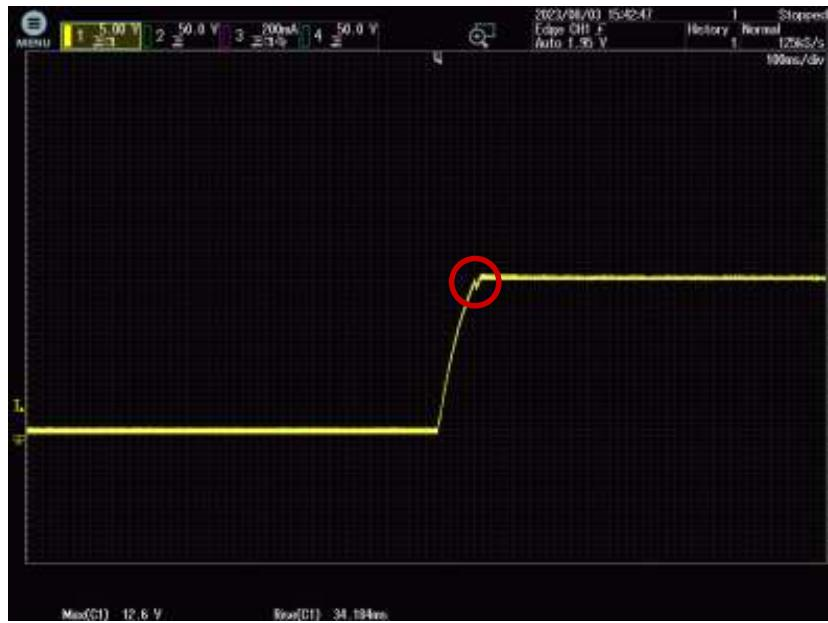

85Vac 60Hz

CH1 VOUT $\mathsf { V } _ { \mathsf { O U T } }$

Rise Time 34.184ms

Test Condition:

➢ 250mA Load

BPA8505D  
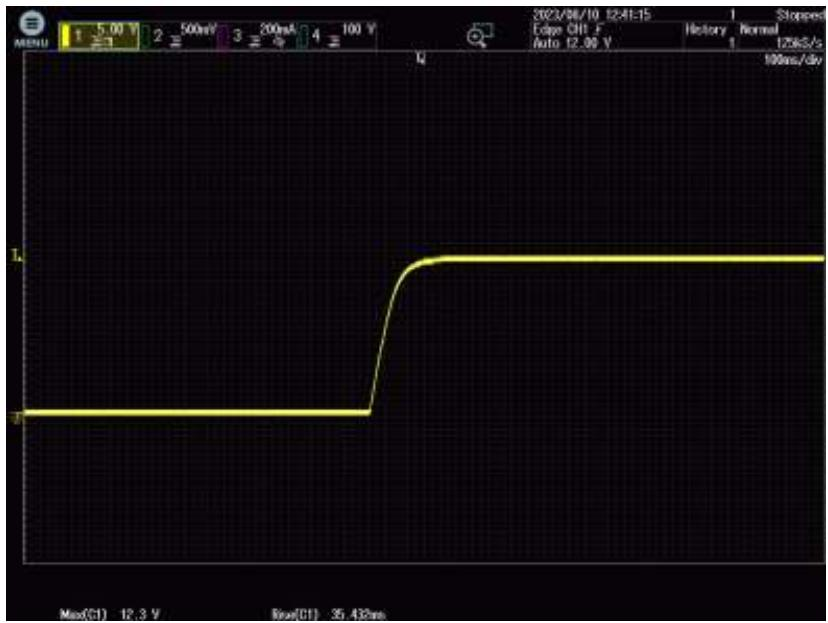

85Vac 60Hz

CH1 VOUT $\mathsf { V } _ { \mathsf { O U T } }$

Rise Time 35.432ms

Test Condition:

➢ 250mA Load

BPA8506D  
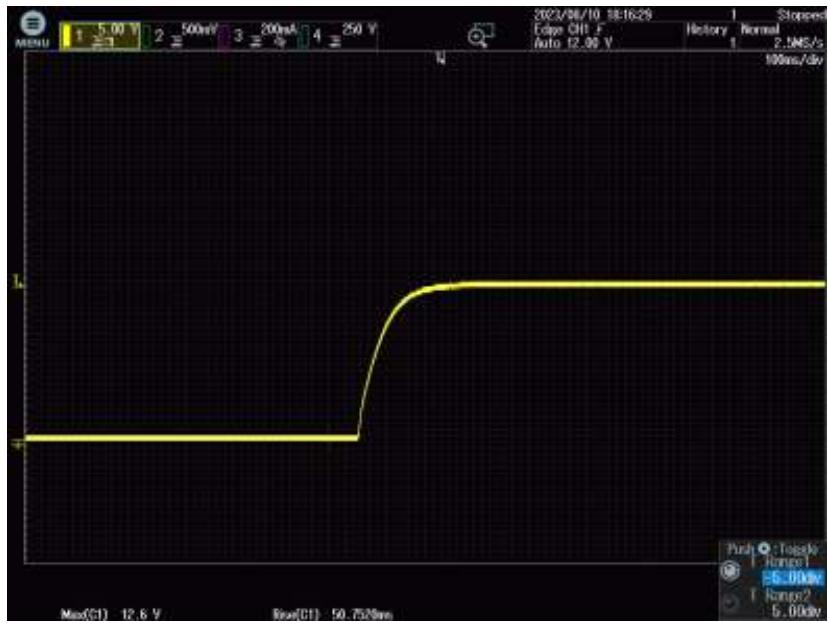

85Vac 60Hz

CH1 VOUT $\mathsf { V } _ { \mathsf { O U T } }$

Rise Time 50.752ms

Test Condition:

400mA Load

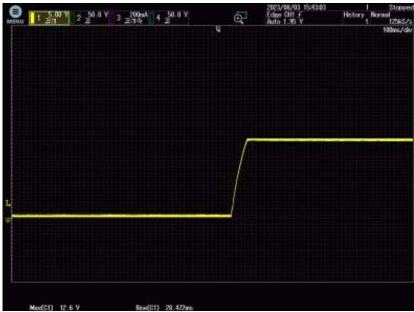

264Vac 50Hz

CH1 VOUT

Rise Time 28.472ms

Test Condition:

➢ 250mA Load

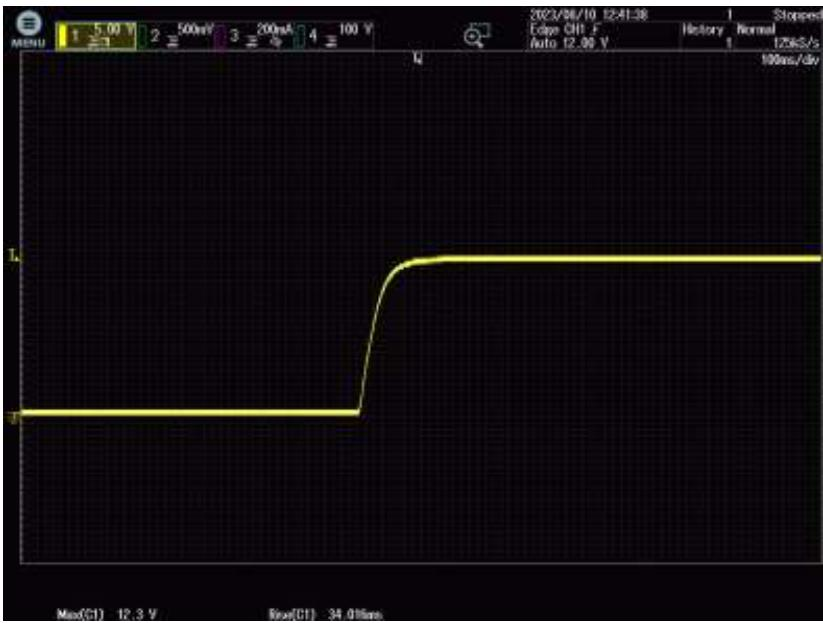

264Vac 50Hz

CH1 VOUT $\mathsf { V } _ { \mathsf { O U T } }$

Rise Time 34.016ms

Test Condition:

➢ 250mA Load

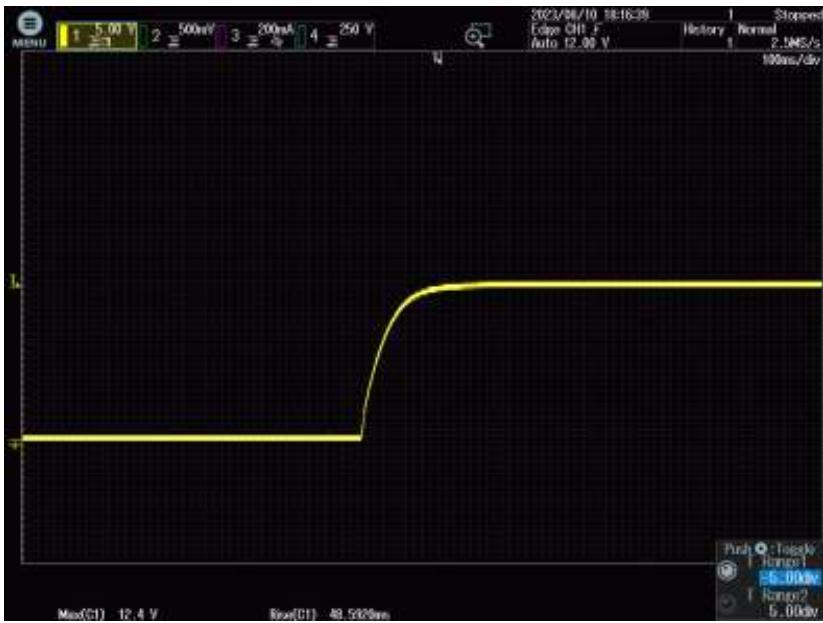

264Vac 50Hz

CH1 VOUT $\mathsf { V } _ { \mathsf { O U T } }$

Rise Time 48.592ms

Test Condition:

400mA Load

KP3116ESG  
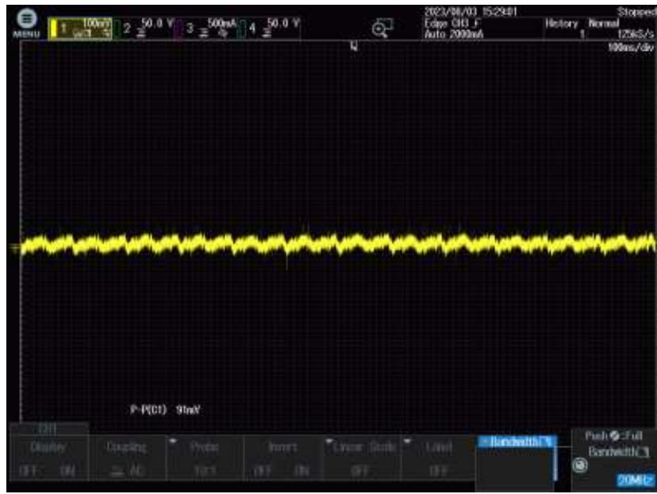

## 85Vac 60Hz

CH1 VOUT Vpk91mV

Test Condition:

➢ 250mA Load

BPA8505D  
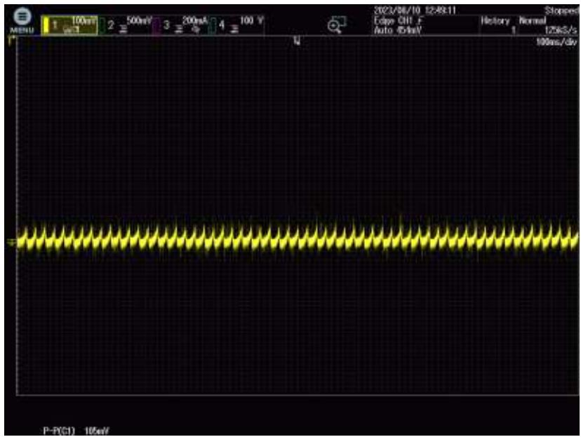

## 85Vac 60Hz

CH1 VOUT Vpk105mV

Test Condition:

➢ 250mA Load

BPA8506D  
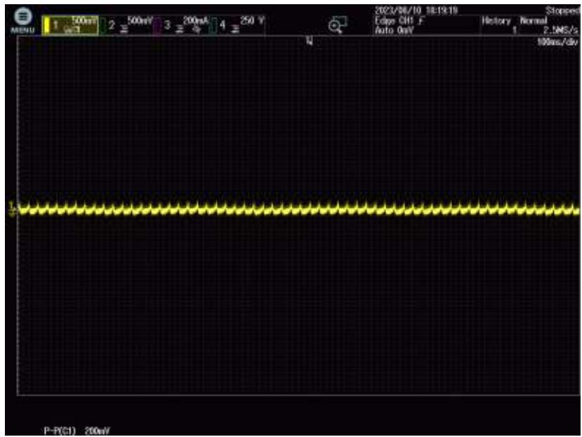

## 85Vac 60Hz

CH1 $\mathsf { V } _ { \mathsf { O U T } }$ Vpk200mV

Test Condition:

400mA Load

KP3116ESG  
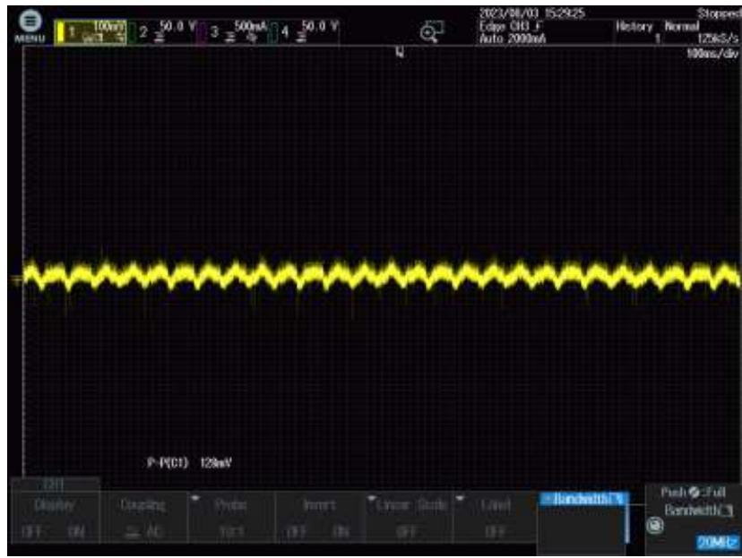

## 264Vac 50Hz

CH1 VOUT Vpk128mV

Test Condition: ➢ 250mA Load

BPA8505D  
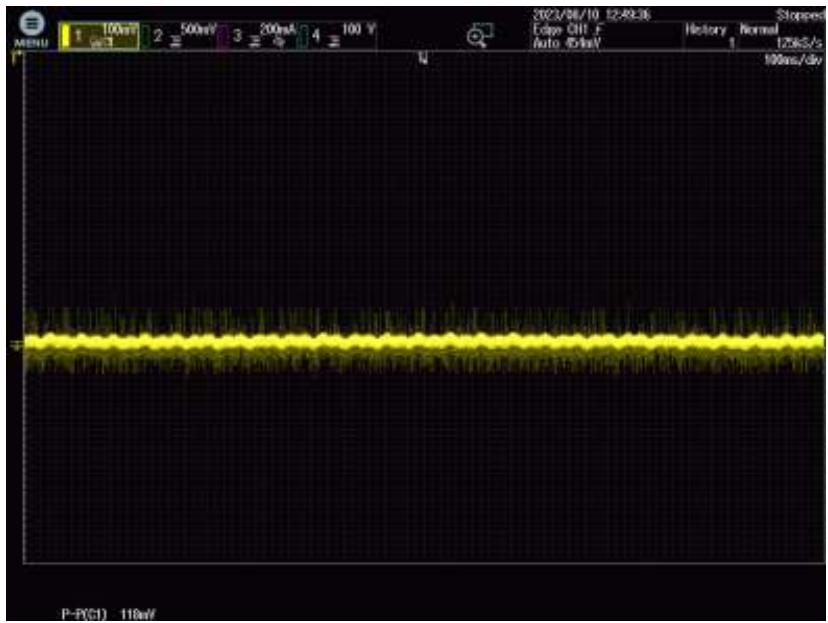

## 264Vac 50Hz

CH1 VOUT Vpk118mV

Test Condition:

➢ 250mA Load

BPA8506D  
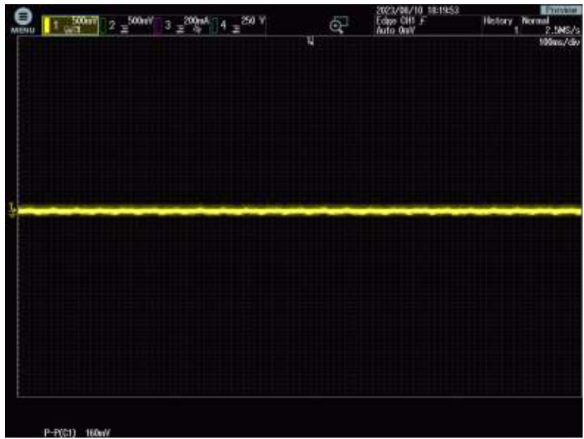

## 264Vac 50Hz

CH1 $\mathsf { V } _ { \mathsf { O U T } }$ Vpk160mV

Test Condition:

400mA Load

85Vac 60Hz

CH1 VOUT ${ \mathsf { C H 1 } } { \mathsf { V } } _ { \mathsf { O U T } }$ Vpk600mV

${ \mathsf { C H 3 } } \mathsf { I _ { 0 \cup \intercal } }$ 125mA 5ms 250mA 5ms

Test Condition:

➢ 125mA-250mA 100Hz Load

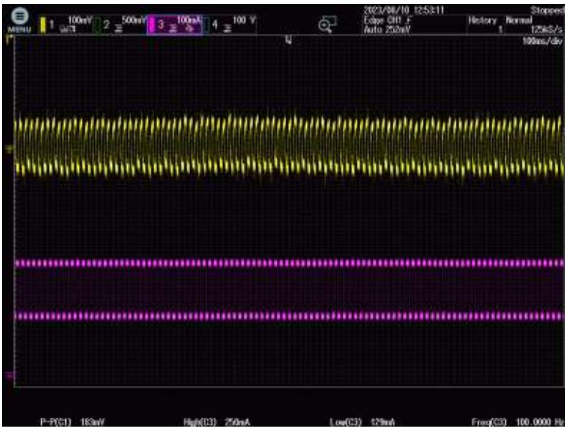

85Vac 60Hz

CH1 VOUT ${ \mathsf { C H 1 } } { \mathsf { V } } _ { \mathsf { O U T } }$ Vpk183mV  
$C H 3 \mathsf { I } _ { 0 \mathsf { U T } }$ 125mA 5ms 250mA 5ms  
Test Condition:  
➢ $1 2 5 \mathsf { m A } { - } 2 5 0 \mathsf { m A } 1 0 0 \mathsf { H z }$ Load

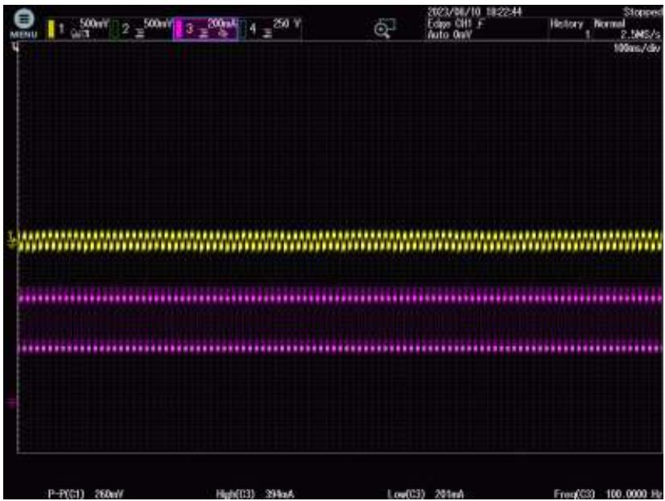

85Vac 60Hz

CH1 VOUT $\mathsf { V } _ { \mathsf { O U T } }$ Vpk260mV  
$C H 3 \mathsf { I } _ { 0 \mathsf { U T } }$ 200mA 5ms 400mA 5ms  
Test Condition:

200mA-400mA 100Hz Load

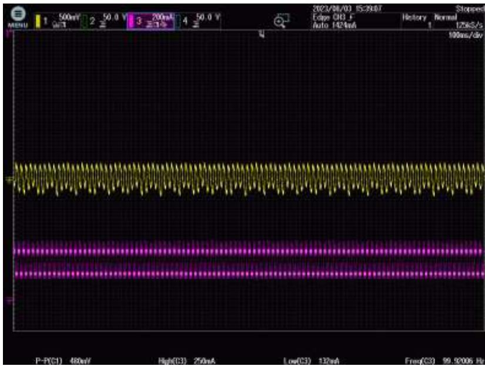

264Vac 50Hz

CH1 VOUT ${ \mathsf { C H 1 } } { \mathsf { V } } _ { \mathsf { O U T } }$ Vpk480mV

$C H 3 \mathsf { I } _ { 0 \mathsf { U T } }$ 125mA 5ms 250mA 5ms

Test Condition:

➢ 125mA-250mA 100Hz Load

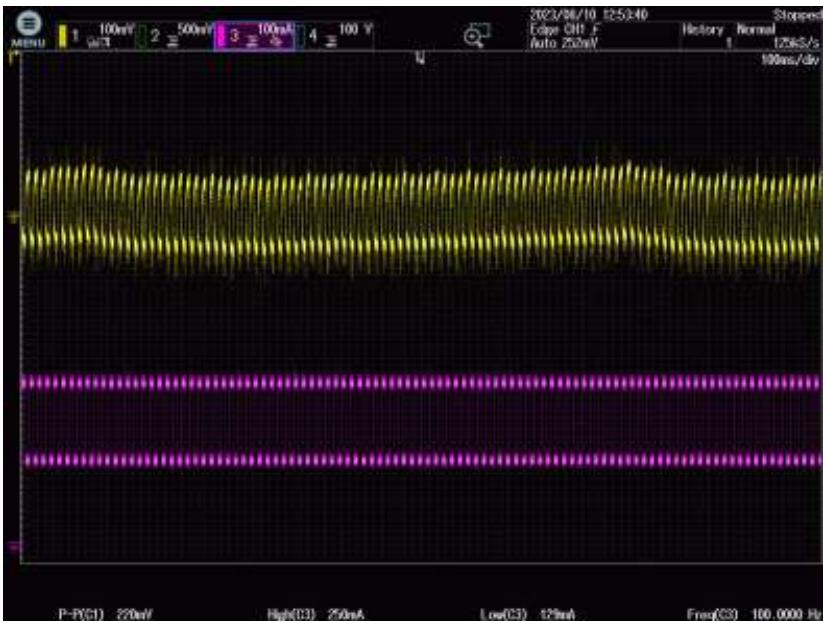

264Vac 50Hz

CH1 VOUT ${ \mathsf { C H 1 } } { \mathsf { V } } _ { \mathsf { O U T } }$ Vpk220mV  
$C H 3 \mathsf { I } _ { 0 \mathsf { U T } }$ 125mA 5ms 250mA 5ms  
Test Condition:  
➢ $1 2 5 \mathsf { m A } { - } 2 5 0 \mathsf { m A } 1 0 0 \mathsf { H z }$ Load

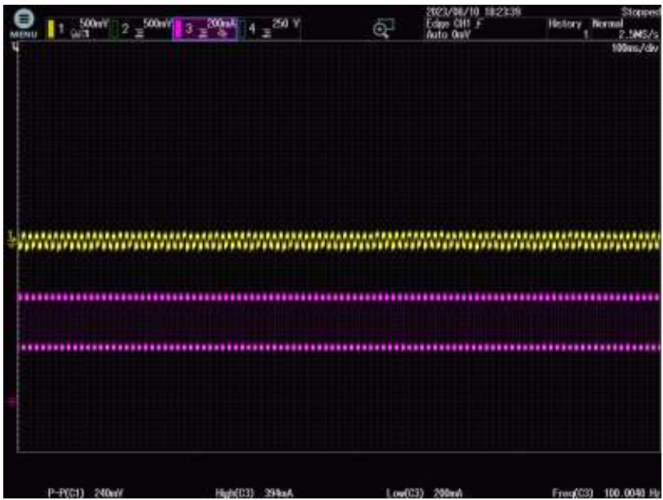

264Vac 50Hz

CH1 VOUT $\mathsf { V } _ { \mathsf { O U T } }$ $\mathsf { V p k 2 4 0 m V }$  
$C H 3 \mathsf { I } _ { 0 \mathsf { U T } }$ 200mA 5ms 400mA 5ms  
Test Condition:

200mA-400mA 100Hz Load

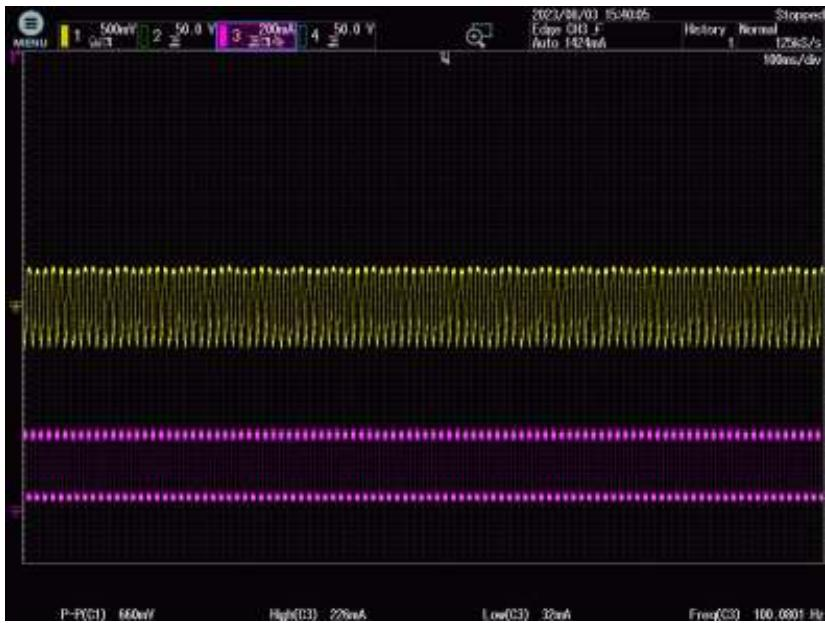

85Vac 60Hz

CH1 VOUT ${ \mathsf { C H 1 } } { \mathsf { V } } _ { \mathsf { O U T } }$ Vpk660mV

$C H 3 \mathsf { I } _ { 0 \mathsf { U T } }$ 25mA 5ms 225mA 5ms

Test Condition:

➢ 25mA-225mA 100Hz Load

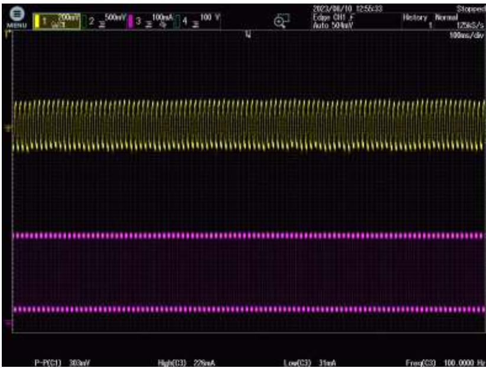

85Vac 60Hz

CH1 VOUT ${ \mathsf { C H 1 } } { \mathsf { V } } _ { \mathsf { O U T } }$ Vpk303mV  
$C H 3 \mathsf { I } _ { 0 \mathsf { U T } }$ 25mA 5ms 225mA 5ms  
Test Condition:  
➢ 25mA-225mA 100Hz Load

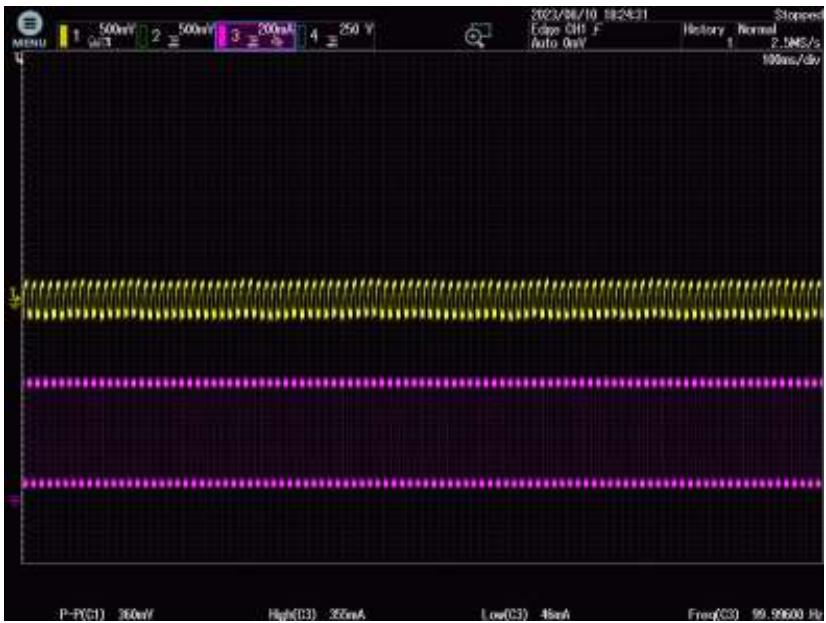

85Vac 60Hz

CH1 VOUT $\mathsf { V } _ { \mathsf { O U T } }$ Vpk360mV  
$C H 3 \mathsf { I } _ { 0 \mathsf { U T } }$ 40mA 5ms 360mA 5ms  
Test Condition:

40mA-360mA 100Hz Load

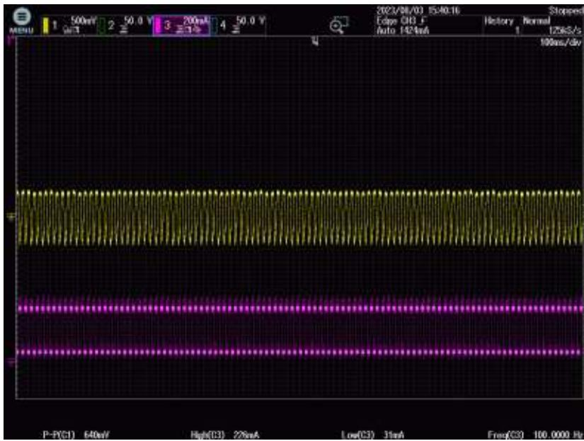

264Vac 50Hz

CH1 VOUT ${ \mathsf { C H 1 } } { \mathsf { V } } _ { \mathsf { O U T } }$ Vpk640mV

$C H 3 \mathsf { I } _ { 0 \mathsf { U T } }$ 25mA 5ms 225mA 5ms

Test Condition:

➢ 25mA-225mA 100Hz Load

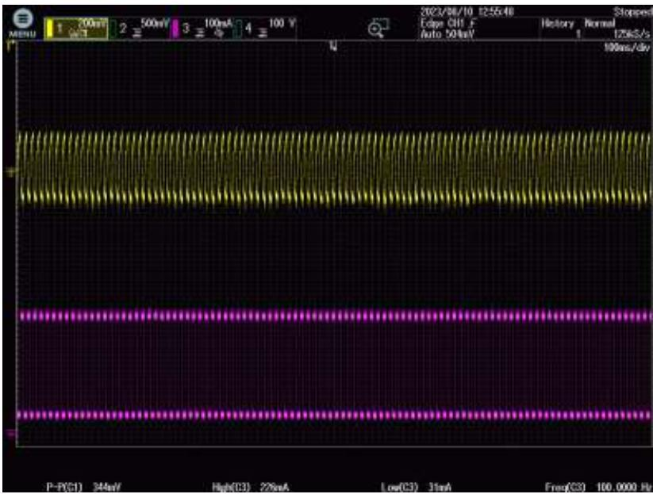

264Vac 50Hz

CH1 VOUT ${ \mathsf { C H 1 } } { \mathsf { V } } _ { \mathsf { O U T } }$ Vpk344mV  
$C H 3 \mathsf { I } _ { 0 \mathsf { U T } }$ 25mA 5ms 225mA 5ms  
Test Condition:  
➢ $2 5 m A - 2 2 5 m A 1 0 0 H z$ Load

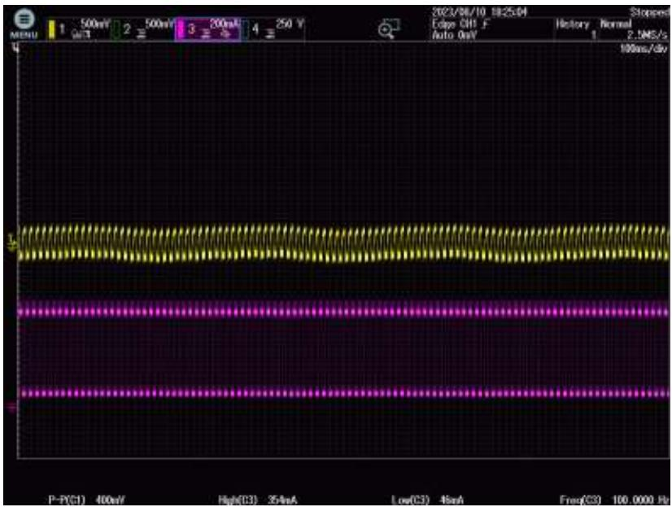

264Vac 50Hz

CH1 VOUT $\mathsf { V } _ { \mathsf { O U T } }$ Vpk400mV  
$C H 3 \mathsf { I } _ { 0 \mathsf { U T } }$ 40mA 5ms 360mA 5ms  
Test Condition:

40mA-360mA 100Hz Load

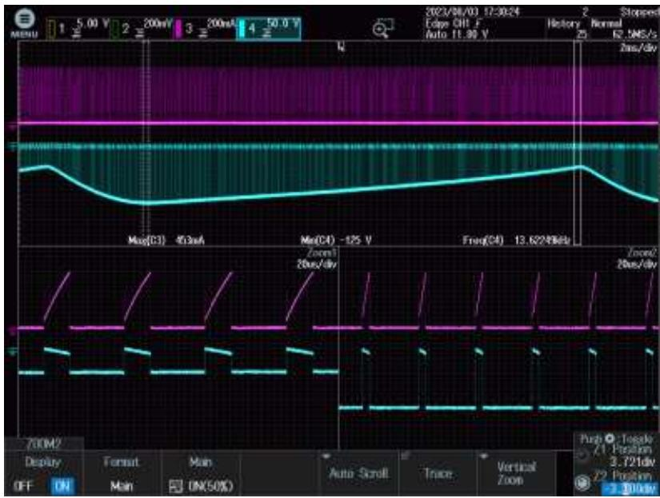

85Vac 60Hz

CH3IDS Max 453mA  
CH4VDS $C H 4 V _ { \mathrm { D S } }$ Vmax 125V

Test Condition:

➢ 250mA Load

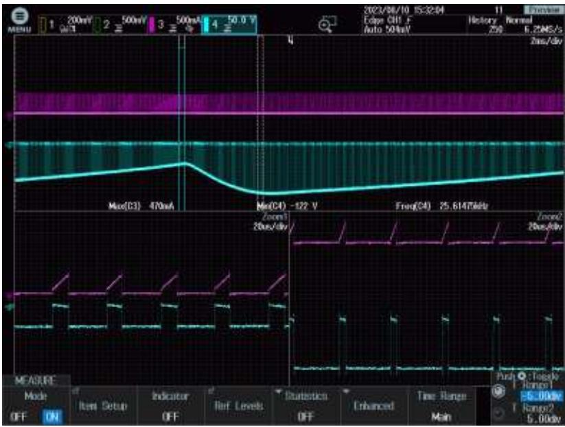

85Vac 60Hz

$C H 3 \vert _ { \mathsf { D S } }$ Max 470mA  
CH4VDS $C H 4 V _ { \mathrm { D S } }$ Vmax 122V

Test Condition:

➢ 250mA Load

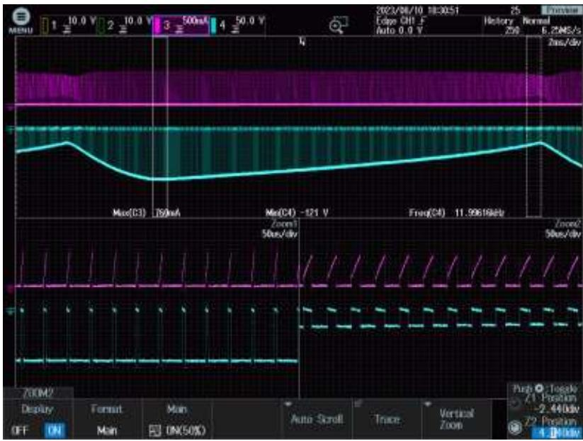

85Vac 60Hz

CH3IDS Max 760mA  
CH4VDS $1 4 \mathsf { V } _ { \mathsf { D S } }$ Vmax 121V

Test Condition:

400mA Load

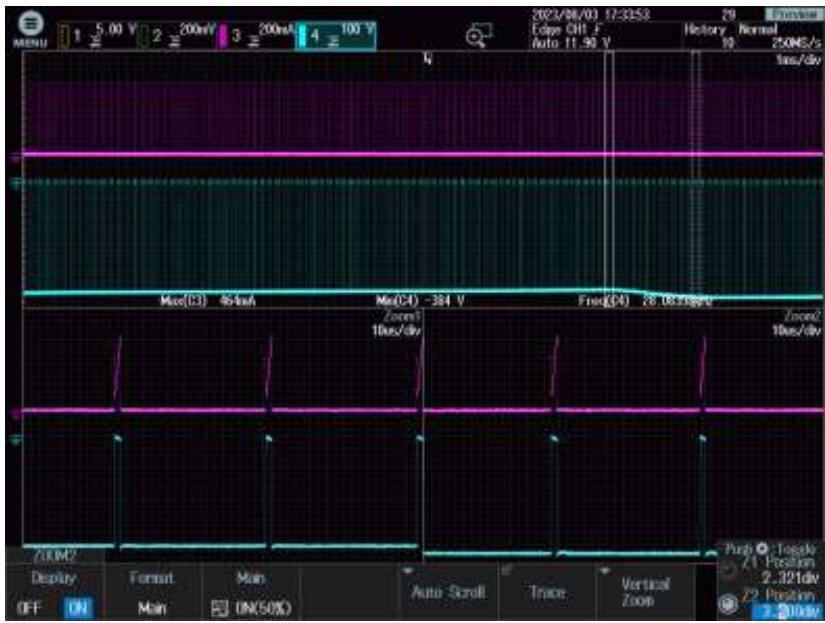

264Vac 50Hz

$C H 3 \vert _ { \mathsf { D S } }$ Max 464mA  
CH4VDS $C H 4 V _ { \mathrm { D S } }$ Vmax 384V

Test Condition:

➢ 250mA Load

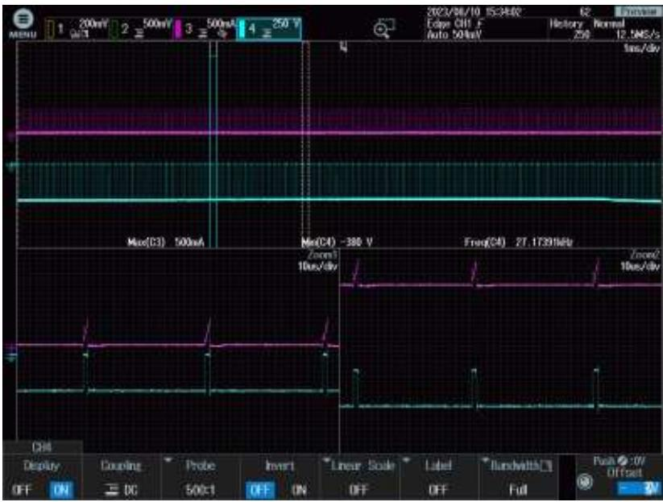

264Vac 50Hz

$C H 3 \vert _ { \mathsf { D S } }$ Max 500mA  
CH4VDS $C H 4 V _ { \mathrm { D S } }$ Vmax 380V

Test Condition:

➢ 250mA Load

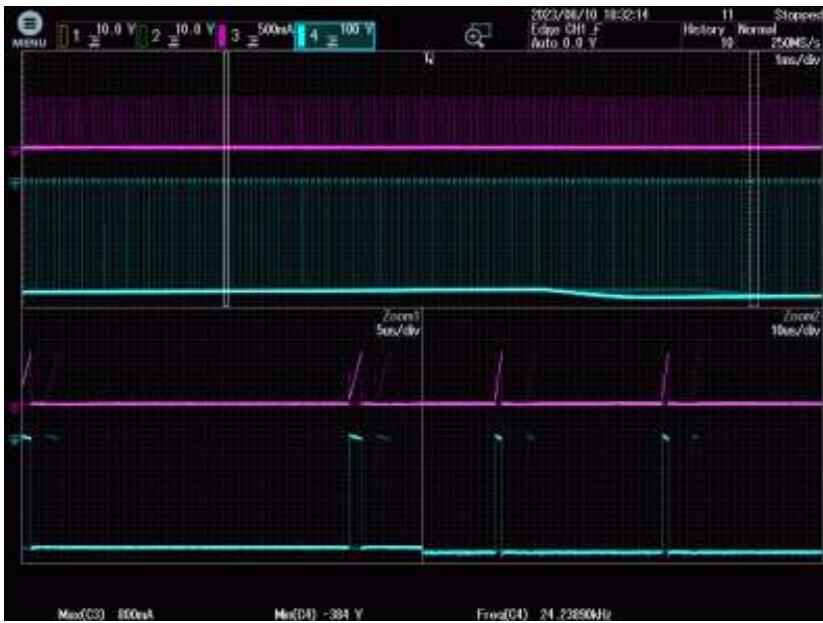

264Vac 50Hz

$C H 3 \vert _ { \mathsf { D S } }$ Max 800mA  
CH4VDS $C H 4 V _ { \mathrm { D S } }$ Vmax 384V

Test Condition:

400mA Load

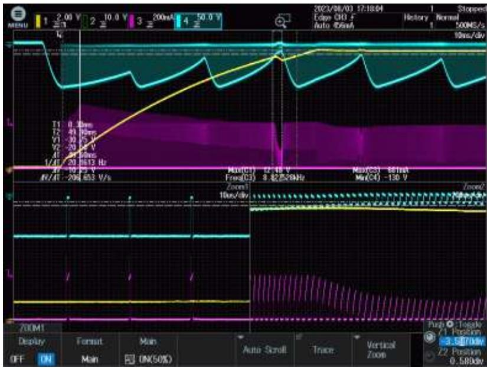

85Vac 60Hz

CH3IDS Max 681mA  
CH4VDS $C H 4 V _ { \mathrm { D S } }$ Vmax 130V

Test Condition:

➢ 250mA Load

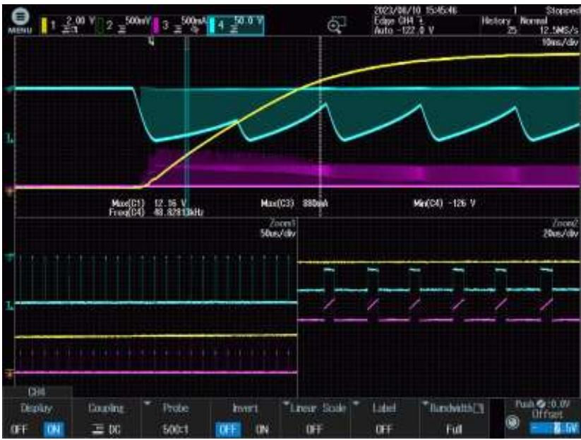

85Vac 60Hz

CH3IDS Max 880mA  
CH4VDS Vmax 126V

Test Condition:

➢ 250mA Load

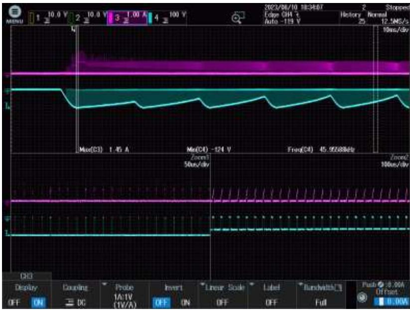

85Vac 60Hz

CH3IDS Max 1.45A  
CH4VDS Vmax 124V

Test Condition:

400mA Load

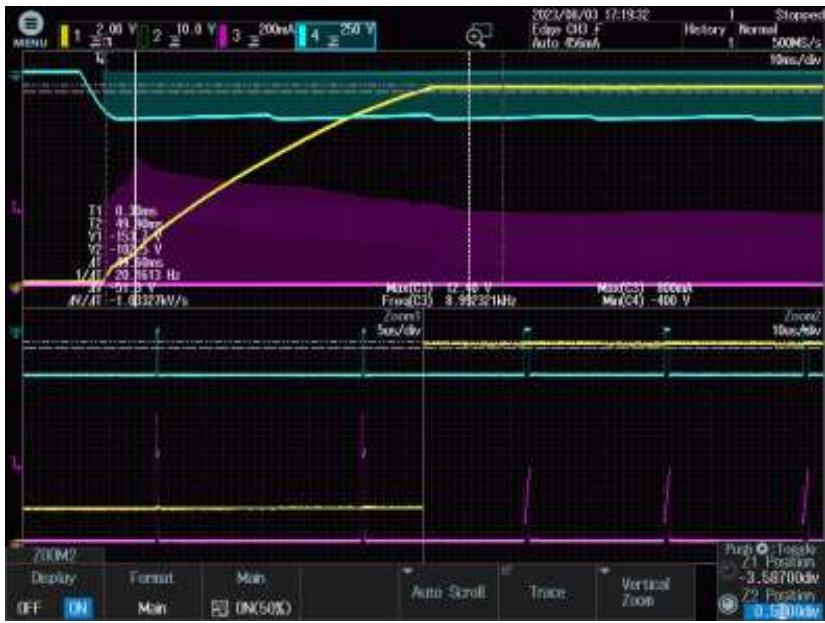

264Vac 50Hz

CH3IDS Max 800mA  
$C H 4 V _ { \mathrm { D S } }$ Vmax 400V

Test Condition:

➢ 250mA Load

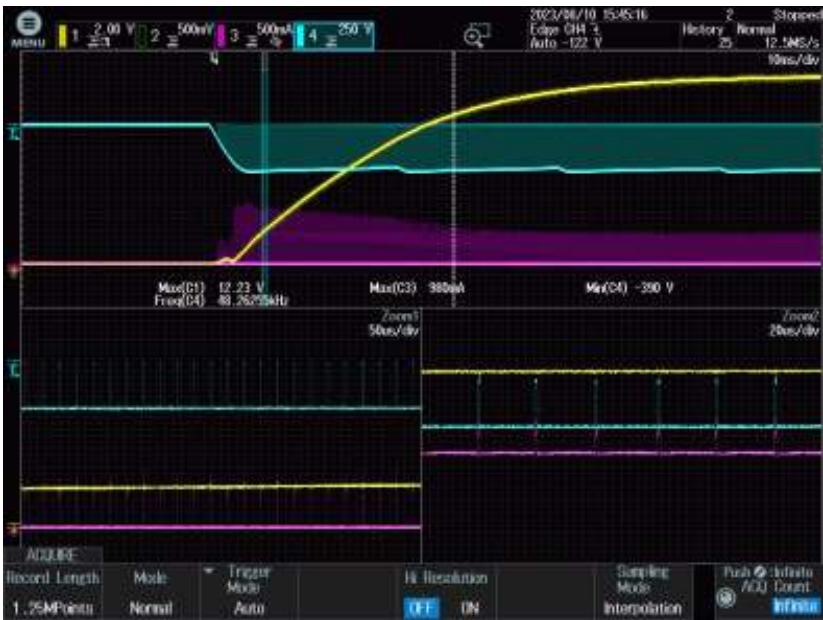

264Vac 50Hz

CH3IDS Max 980mA  
CH4VDS Vmax 390V

Test Condition:

➢ 250mA Load

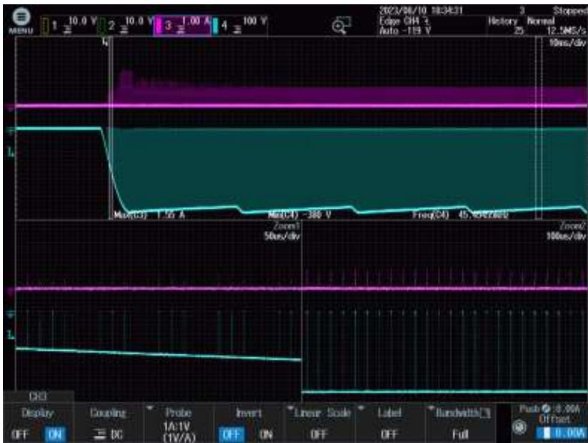

264Vac 50Hz

CH3IDS Max 1.55A  
CH4VDS Vmax 380V

Test Condition:

400mA Load

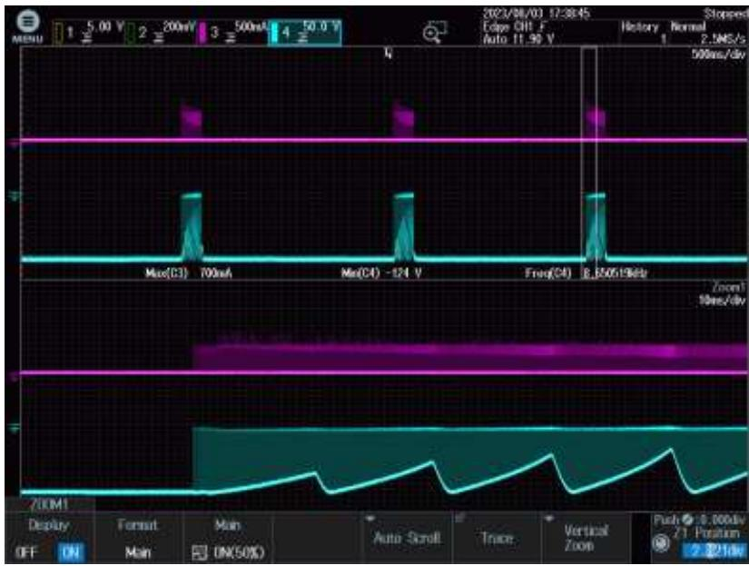

85Vac 60Hz

$C H 3 \vert _ { \mathsf { D S } }$ Max 700mA  
CH4VDS $C H 4 V _ { \mathrm { D S } }$ Vmax 124V

Test Condition:

➢ OCP

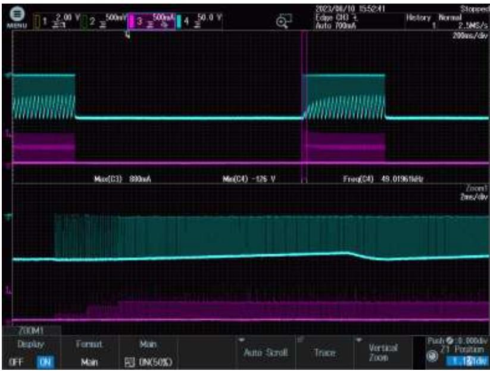

85Vac 60Hz

$C H 3 \vert _ { \mathsf { D S } }$ Max 880mA  
CH4VDS $C H 4 V _ { \mathrm { D S } }$ Vmax 126V

Test Condition:

➢ OCP

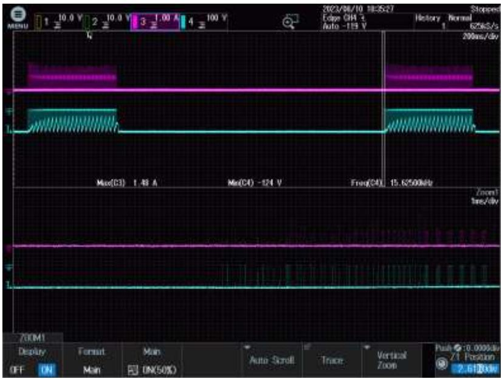

85Vac 60Hz

$C H 3 \vert _ { \mathsf { D S } }$ Max 1.48A  
CH4VDS $C H 4 V _ { \mathrm { D S } }$ Vmax 124V

Test Condition:

➢ OCP

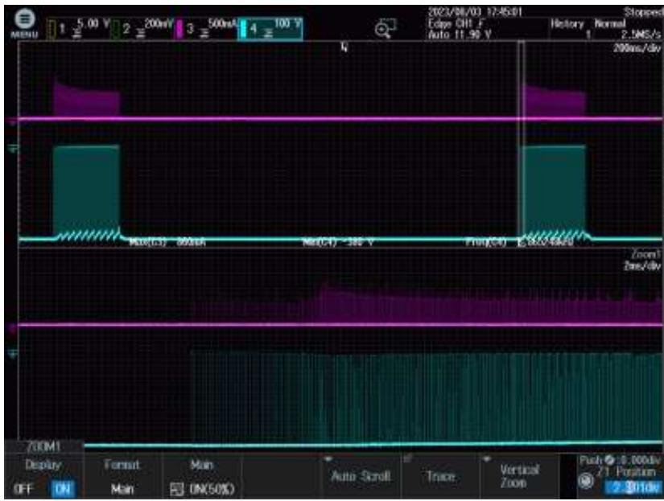

264Vac 50Hz

$C H 3 \vert _ { \mathsf { D S } }$ Max 860mA  
CH4VDS $C H 4 V _ { \mathrm { D S } }$ Vmax 380V

Test Condition:

➢ OCP

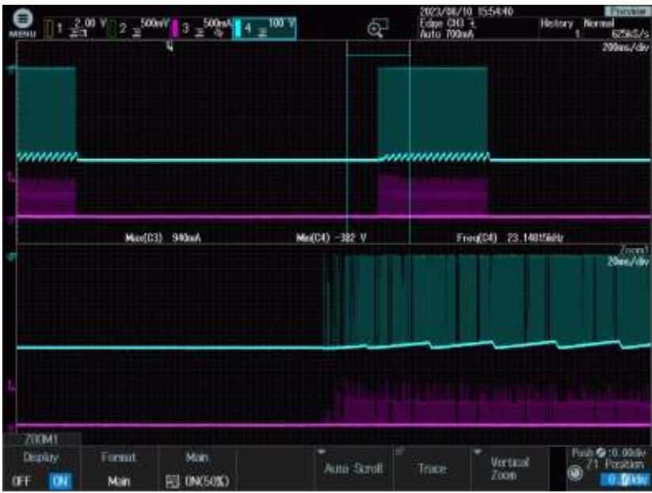

264Vac 50Hz

$C H 3 \vert _ { \mathsf { D S } }$ Max 940mA  
CH4VDS $C H 4 V _ { \mathrm { D S } }$ Vmax 382V

Test Condition:

➢ OCP

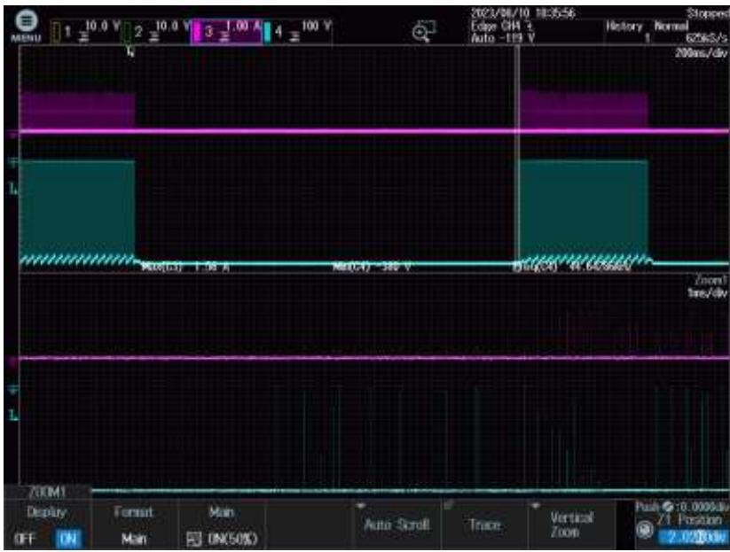

264Vac 50Hz

$C H 3 \vert _ { \mathsf { D S } }$ Max 1.56A  
CH4VDS $C H 4 V _ { \mathrm { D S } }$ Vmax 380V

Test Condition:

➢ OCP

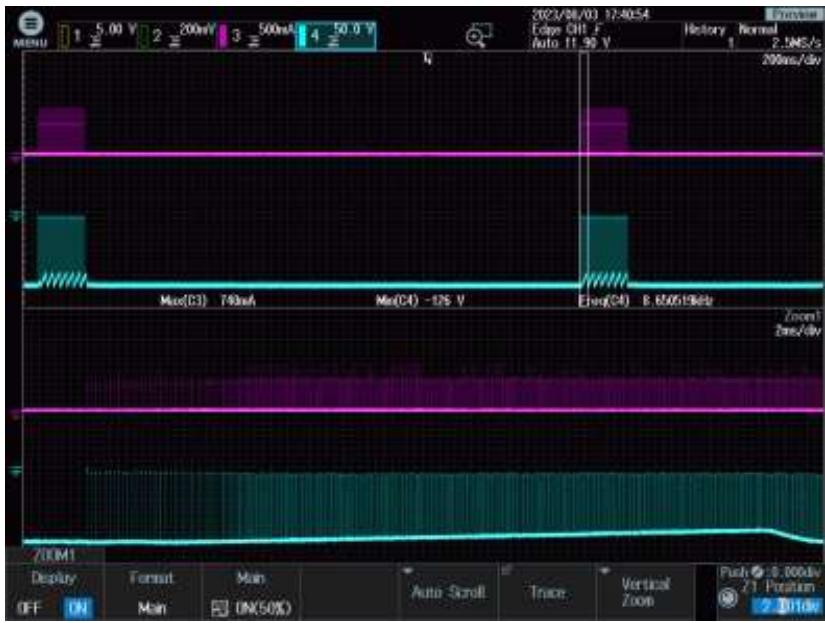

85Vac 60Hz

$C H 3 \vert _ { \mathsf { D S } }$ Max 740mA  
CH4VDS $C H 4 V _ { \mathrm { D S } }$ Vmax 126V

Test Condition:

输出短路

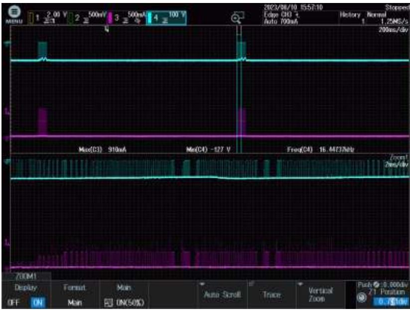

85Vac 60Hz

$C H 3 \vert _ { \mathsf { D S } }$ Max 910mA  
CH4VDS $C H 4 V _ { \mathrm { D S } }$ Vmax 127V

Test Condition:

输出短路

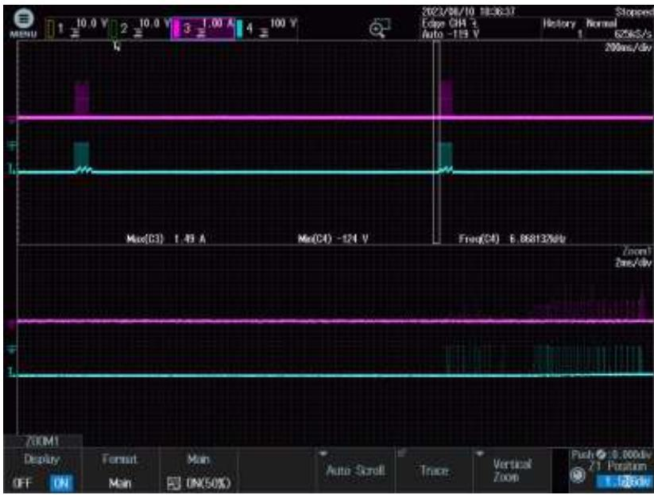

85Vac 60Hz

$C H 3 \vert _ { \mathsf { D S } }$ Max 1.49A  
CH4VDS $C H 4 V _ { \mathrm { D S } }$ Vmax 124V

Test Condition:

输出短路

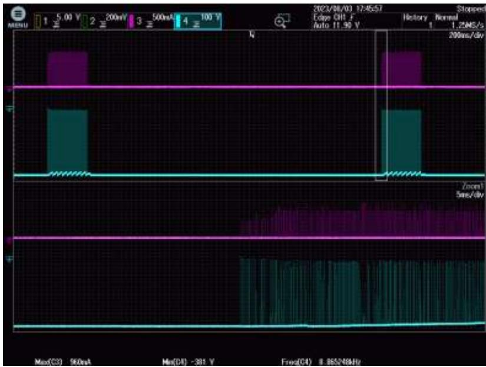

264Vac 50Hz

$C H 3 \vert _ { \mathsf { D S } }$ Max 960mA  
CH4VDS $C H 4 V _ { \mathrm { D S } }$ Vmax 381V

Test Condition:

输出短路

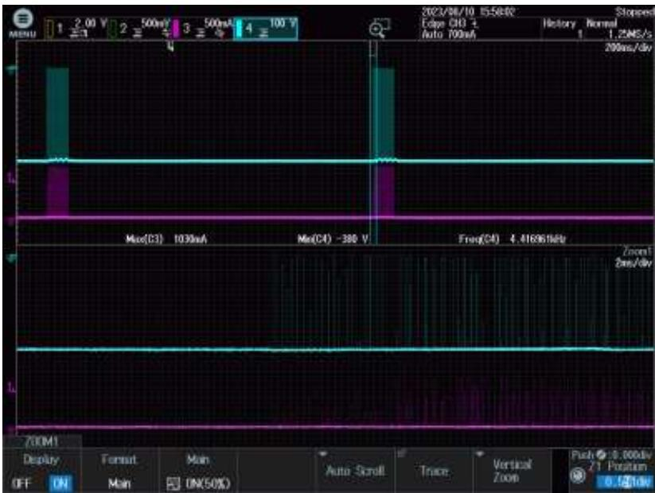

264Vac 50Hz

$C H 3 \vert _ { \mathsf { D S } }$ Max 1030mA  
CH4VDS $C H 4 V _ { \mathrm { D S } }$ Vmax 380V

Test Condition:

输出短路

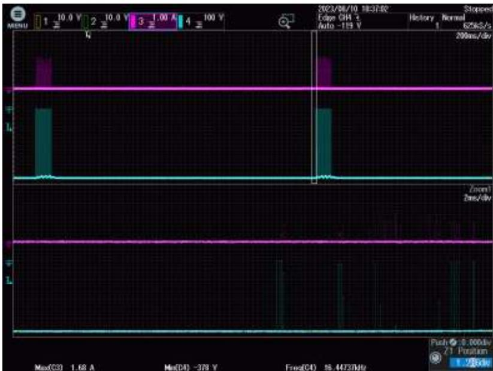

264Vac 50Hz

$C H 3 \vert _ { \mathsf { D S } }$ Max 1.68A  
CH4VDS $C H 4 V _ { \mathrm { D S } }$ Vmax 378V

Test Condition:

输出短路

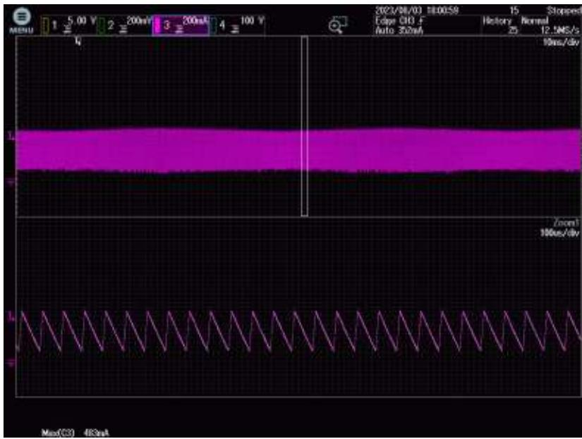

85Vac 60Hz


85Vac 60Hz


85Vac 60Hz

CH3IL Max 483mA

CH3IL Max 519mA

CH3IL Max 800mA

Test Condition: ➢ 250mA Load

Test Condition: ➢ 250mA Load

Test Condition: 400mA Load


264Vac 50Hz

264Vac 50Hz


264Vac 50Hz

CH3IL Max 499mA

CH3IL Max 537mA

CH3IL Max 900mA

Test Condition: ➢ 250mA Load

Test Condition: ➢ 250mA Load

Test Condition: 400mA Load


85Vac 60Hz

CH3IL Max 524mA  
CH4Vds Max 126V

Test Condition:

➢ 250mA Load


85Vac 60Hz

CH3IL Max 519mA  
CH4Vds Max 118V

Test Condition:

➢ 250mA Load


85Vac 60Hz

CH3IL Max 810mA  
CH4Vds Max 124V

Test Condition:

400mA Load


264Vac 50Hz

CH3IL Max 608mA  
CH4Vds Max 382V

Test Condition:

➢ 250mA Load


264Vac 50Hz

CH3IL Max 622mA  
CH4Vds Max 370V

Test Condition:

➢ 250mA Load


264Vac 50Hz

CH3IL Max 900mA  
CH4Vds Max 380V

Test Condition:

400mA Load


## 注意事项：

1.续流二极管&取样二极管压降差较大时会直接影响输出电压精度,续流二极管ES1J因不同品牌压降差异极大建议调整为ES2J或限定品牌ES1J。  
2.12V/400mA R2电阻测试报告为12.8K +/-1%精度0603取样电阻,反馈滤波电解为22uF/50V。12V/250mA R2电阻测试报告为12.8K +/-1%精度0603取样电阻,反馈滤波电容为10uF/50V 0805 X7R或10uF/50V电解。  
3.若要求输入85-265V交流，输出12V 400mA则输入电解电容需将4.7uF/450V两颗调整为6.8uF/450V。  
4.12V400mA对储能电感要求饱和电流>900mA.考量效率&饱和应力实际测试电感为R9\*12 680uH+/-10%, 0.29mm130T。12V250mA储能电感要求饱和电流>650mA.实际测试电感为R9\*12 1.2mH+/-10% 0.27mm 172T。  
5.BPA8505/6 满载时效率高于KP3116ESG芯片改善双85温升有帮助，动态响应纹波优于交流反馈，负载调整率精度稍低于KP3116ESG。

## THANK YOU FOR WATCHING
