# S7133B 参考设计

# (12V/0.4A)

上海晶丰明源半导体股份有限公司

Shanghai Bright Power Semiconductor Co., Ltd.

陈耀兵

2022 8 19

S7133B  
电源规格  
电路图  
◼BOM  
◼PCB Layout  
电路实物图  
变压器规格书  
性能测试数据

## 产品特点:

➢ 750V  
》准谐振工作模式，提高系统效率  
》低待机功耗  
》内置输入线电压补偿  
》具有输出过压、短路保护

## 应用领域:

》手机、无绳电话、PDA和其他便携设备等的适配器、充电器  
➢ PC TV

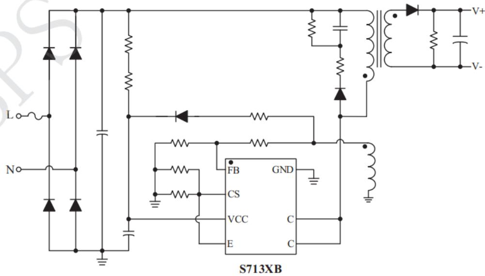

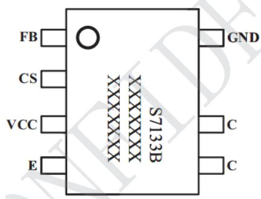

SOP-7

## 电源规格

<table><tr><td>项目描述</td><td>符号</td><td>最小</td><td>典型</td><td>最大</td><td>单位</td><td>备注</td></tr><tr><td colspan="7">输入</td></tr><tr><td>电压</td><td> $V_{IN}$ </td><td>85</td><td>115/230</td><td>264</td><td> $V_{AC}$ </td><td></td></tr><tr><td>频率</td><td> $f_{LINE}$ </td><td>47</td><td>50/60</td><td>63</td><td>Hz</td><td></td></tr><tr><td colspan="7">输出</td></tr><tr><td>输出电压</td><td> $V_{OUT}$ </td><td></td><td>12</td><td></td><td>V</td><td>±3%</td></tr><tr><td>输出电流</td><td> $I_{OUT}$ </td><td></td><td>0.4</td><td></td><td>A</td><td></td></tr><tr><td>输出电压纹波</td><td> $V_{RIPPLE}$ </td><td></td><td></td><td>150</td><td>mV</td><td>20MHz带宽</td></tr><tr><td>连续输出功率</td><td> $P_{OUT}$ </td><td></td><td>4.8</td><td></td><td>W</td><td></td></tr><tr><td colspan="7">效率</td></tr><tr><td>待机功耗</td><td> $P_{STDBY}$ </td><td></td><td></td><td>130</td><td>mW</td><td>230VAC</td></tr><tr><td>满载效率</td><td>η</td><td>77</td><td></td><td></td><td>%</td><td>115VAC/230VAC</td></tr><tr><td colspan="7">环境</td></tr><tr><td>传导EMI</td><td></td><td colspan="4">满足CISPR22/EN55022 Class B,至少6dB 裕量</td><td></td></tr><tr><td>Surge</td><td></td><td></td><td>2</td><td></td><td>kV</td><td>差模</td></tr><tr><td>EFT</td><td></td><td></td><td>4</td><td></td><td>kV</td><td>5kHz/100kHz/38kHz</td></tr><tr><td>ESD</td><td></td><td></td><td>15</td><td></td><td>kV</td><td>接触8kV,空气15kV</td></tr><tr><td>工作环境温度</td><td> $T_{AMP}$ </td><td>0</td><td></td><td>40</td><td>°C</td><td></td></tr></table>

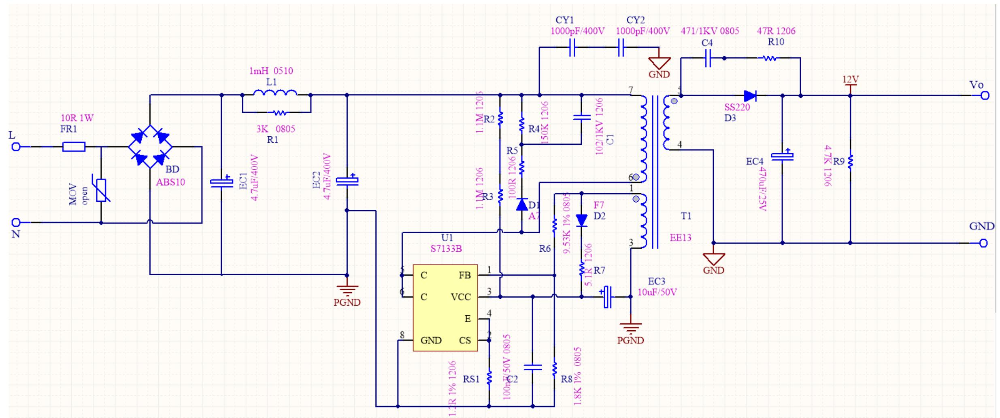

<table><tr><td>序号</td><td>元件标号</td><td>参数描述</td><td>封装尺寸</td><td>数量</td></tr><tr><td>1</td><td>BD</td><td>ABS10</td><td>BD_MB10S/MBF</td><td>1</td></tr><tr><td>2</td><td>C1</td><td>102/1KV 1206</td><td>1206-C</td><td>1</td></tr><tr><td>3</td><td>C2</td><td>100nF/50V 0805</td><td>0805-C</td><td>1</td></tr><tr><td>4</td><td>C4</td><td>471/1KV 0805</td><td>0805-C</td><td>1</td></tr><tr><td>5</td><td>CY1, CY2</td><td>1000pF/400V</td><td>CY</td><td>2</td></tr><tr><td>6</td><td>D1</td><td>A7</td><td>SMA</td><td>1</td></tr><tr><td>7</td><td>D2</td><td>F7</td><td>SMA</td><td>1</td></tr><tr><td>8</td><td>D3</td><td>SS220</td><td>SMB</td><td>1</td></tr><tr><td>9</td><td>EC1, EC2</td><td>4.7uF/400V</td><td>EC 10 P5.0</td><td>2</td></tr><tr><td>10</td><td>EC3</td><td>10uF/50V</td><td>EC 5 P2.5</td><td>1</td></tr><tr><td>11</td><td>EC4</td><td>470uF/25V</td><td>EC 10 P5.0</td><td>1</td></tr><tr><td>12</td><td>FR1</td><td>10R 1W</td><td>R-2WS-P15</td><td>1</td></tr><tr><td>13</td><td>L1</td><td>1mH/0510</td><td>L/D 6 P3.0</td><td>1</td></tr><tr><td>14</td><td>R1</td><td>3K 0805</td><td>1206-r</td><td>1</td></tr><tr><td>15</td><td>R2, R3</td><td>1.1M 1206</td><td>1206-r</td><td>2</td></tr><tr><td>16</td><td>R4</td><td>150K 1206</td><td>1206-r</td><td>1</td></tr><tr><td>17</td><td>R5</td><td>100R 1206</td><td>1206-r</td><td>1</td></tr><tr><td>18</td><td>R6</td><td>9.53K 1% 0805</td><td>0805-r</td><td>1</td></tr><tr><td>19</td><td>R7</td><td>5.1R 1206</td><td>1206-r</td><td>1</td></tr></table>

<table><tr><td>序号</td><td>元件标号</td><td>参数描述</td><td>封装尺寸</td><td>数量</td></tr><tr><td>20</td><td>R8</td><td>1.8K 1% 0805</td><td>0805-r</td><td>1</td></tr><tr><td>21</td><td>R9</td><td>4.7K 1206</td><td>1206-r</td><td>1</td></tr><tr><td>22</td><td>R10</td><td>47R 1206</td><td>1206-r</td><td>1</td></tr><tr><td>23</td><td>RS1</td><td>1.2R 1% 1206</td><td>1206-r</td><td>1</td></tr><tr><td>24</td><td>T1</td><td>EE13</td><td>EE13立式次级加长5+2 - duplicate</td><td>1</td></tr><tr><td>25</td><td>U1</td><td>S7133B</td><td>USOP-7(S7133)</td><td>1</td></tr></table>

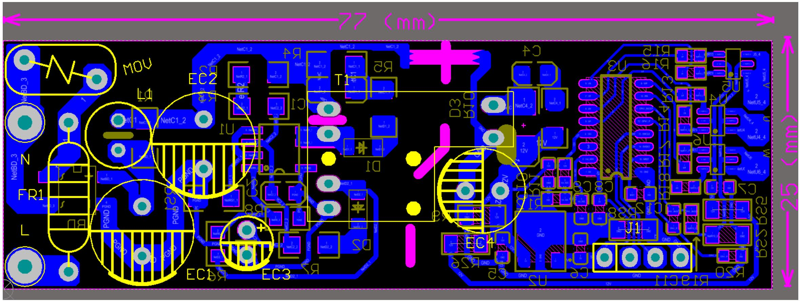

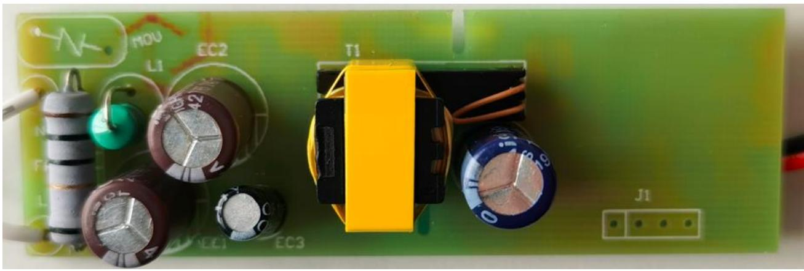

## TOP SIDE

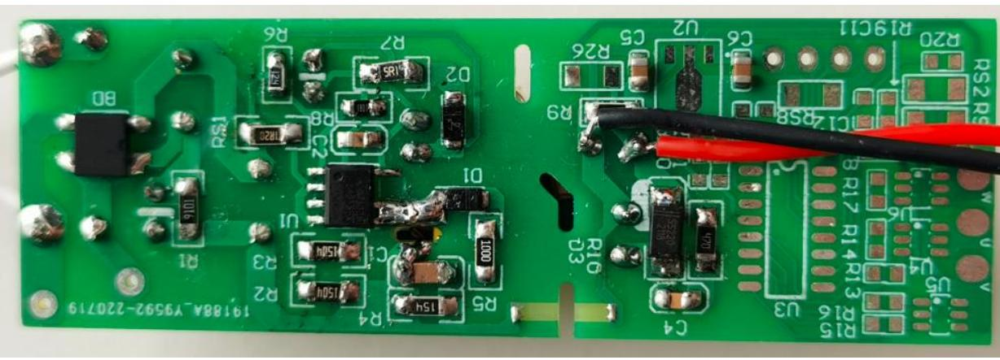

## BOTTOM SIDE

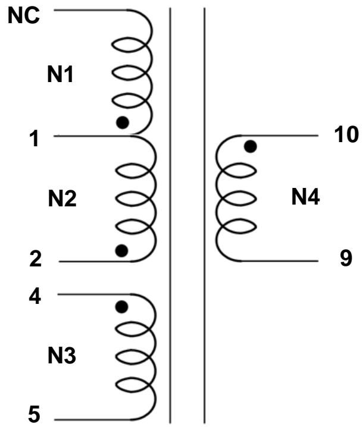

## 规格与材料

初级绕组感量L=1.75mH±7% (测试条件：0.3V，50kHz)  
漏感量 $L _ { | k } < 4 \% ^ { \frac { 1 } { x } } L _ { P }$  
➢ 骨架：EE13立式加宽骨架 $( 5 + 3 + 2 \mathsf { P } | \mathsf { N } )$  
磁芯：EE13加宽PC40或同等材质， $\mathsf { A e } { = } 1 7 \mathsf { m m } ^ { 2 }$  
➢ N1、N2、N3:2UEW漆包线  
➢ N4：三层绝缘线  
➢ 绝缘胶带:3M850或同等材质  
耐压测试:3KV,50/60Hz,1Min  
成品要求：浸凡立水

<table><tr><td>序号</td><td>起始脚</td><td>终止脚</td><td>绕制规则</td><td>匝数</td><td>绕线方式</td></tr><tr><td>N1</td><td>1</td><td>NC</td><td>2UEW φ0.17*2P</td><td>18Ts</td><td>密绕一层(PIN脚朝外)</td></tr><tr><td>胶带</td><td></td><td></td><td></td><td>2Ts</td><td></td></tr><tr><td>N2</td><td>2</td><td>1</td><td>2UEW φ0.17*1P</td><td>144Ts</td><td>密绕4层(PIN脚朝外)</td></tr><tr><td>胶带</td><td></td><td></td><td></td><td>2Ts</td><td></td></tr><tr><td>N3</td><td>4</td><td>5</td><td>2UEW φ0.17*1P</td><td>30Ts</td><td>密绕一层(PIN脚朝外)</td></tr><tr><td>胶带</td><td></td><td></td><td></td><td>3Ts</td><td></td></tr><tr><td>N4</td><td>10</td><td>9</td><td>TEX-E φ0.3*2P</td><td>28Ts</td><td>密绕两层(PIN脚朝外)</td></tr><tr><td>胶带</td><td></td><td></td><td></td><td>3Ts</td><td></td></tr></table>

底视图  
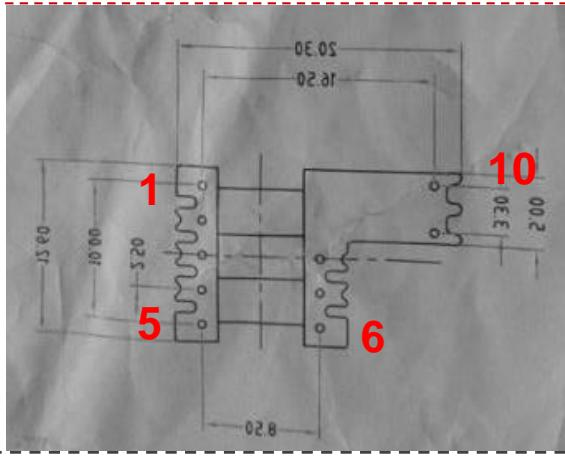

## 待机功耗

待机功耗  
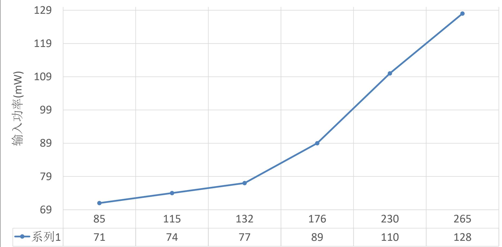

输入电压(Vac)

假负载电阻为4.7K

效率曲线  
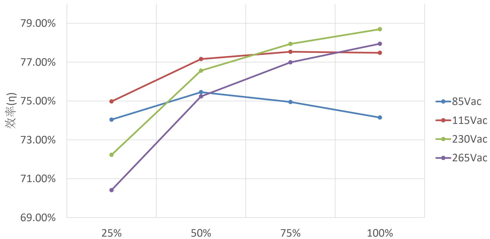

负载比例

<table><tr><td> $V_{IN}(VAC)$ </td><td>Load(%)</td><td> $P_{IN}(W)$ </td><td> $V_{OUT}(V)$ </td><td> $I_{OUT}(A)$ </td><td> $P_{OUT}(W)$ </td><td>Eff(%)</td><td>AVG Eff(%)</td></tr><tr><td rowspan="6">85</td><td>空载</td><td></td><td></td><td></td><td>0</td><td></td><td></td></tr><tr><td>10%</td><td>0.7</td><td>11.906</td><td>0.04</td><td>0.47624</td><td>68.03%</td><td></td></tr><tr><td>25%</td><td>1.61</td><td>11.921</td><td>0.1</td><td>1.1921</td><td>74.04%</td><td rowspan="4">74.65%</td></tr><tr><td>50%</td><td>3.17</td><td>11.96</td><td>0.2</td><td>2.392</td><td>75.46%</td></tr><tr><td>75%</td><td>4.81</td><td>12.017</td><td>0.3</td><td>3.6051</td><td>74.95%</td></tr><tr><td>100%</td><td>6.51</td><td>12.068</td><td>0.4</td><td>4.8272</td><td>74.15%</td></tr><tr><td rowspan="6">115</td><td>空载</td><td></td><td></td><td></td><td>0</td><td></td><td></td></tr><tr><td>10%</td><td>0.69</td><td>11.896</td><td>0.04</td><td>0.47584</td><td>68.96%</td><td></td></tr><tr><td>25%</td><td>1.59</td><td>11.922</td><td>0.1</td><td>1.1922</td><td>74.98%</td><td rowspan="4">76.79%</td></tr><tr><td>50%</td><td>3.1</td><td>11.96</td><td>0.2</td><td>2.392</td><td>77.16%</td></tr><tr><td>75%</td><td>4.65</td><td>12.018</td><td>0.3</td><td>3.6054</td><td>77.54%</td></tr><tr><td>100%</td><td>6.23</td><td>12.068</td><td>0.4</td><td>4.8272</td><td>77.48%</td></tr><tr><td rowspan="6">230</td><td>空载</td><td></td><td></td><td></td><td>0</td><td></td><td></td></tr><tr><td>10%</td><td>0.75</td><td>11.852</td><td>0.04</td><td>0.47408</td><td>63.21%</td><td></td></tr><tr><td>25%</td><td>1.65</td><td>11.918</td><td>0.1</td><td>1.1918</td><td>72.23%</td><td rowspan="4">76.36%</td></tr><tr><td>50%</td><td>3.12</td><td>11.944</td><td>0.2</td><td>2.3888</td><td>76.56%</td></tr><tr><td>75%</td><td>4.62</td><td>12.003</td><td>0.3</td><td>3.6009</td><td>77.94%</td></tr><tr><td>100%</td><td>6.14</td><td>12.08</td><td>0.4</td><td>4.832</td><td>78.70%</td></tr><tr><td rowspan="6">265</td><td>空载</td><td></td><td></td><td></td><td>0</td><td></td><td></td></tr><tr><td>10%</td><td>0.79</td><td>11.838</td><td>0.04</td><td>0.47352</td><td>59.94%</td><td></td></tr><tr><td>25%</td><td>1.69</td><td>11.9</td><td>0.1</td><td>1.19</td><td>70.41%</td><td rowspan="4">75.15%</td></tr><tr><td>50%</td><td>3.17</td><td>11.925</td><td>0.2</td><td>2.385</td><td>75.24%</td></tr><tr><td>75%</td><td>4.67</td><td>11.985</td><td>0.3</td><td>3.5955</td><td>76.99%</td></tr><tr><td>100%</td><td>6.2</td><td>12.082</td><td>0.4</td><td>4.8328</td><td>77.95%</td></tr></table>

## 输出电压调整率

<table><tr><td> $V_{IN}(VAC)$  $I_{OUT}(A)$ </td><td>85</td><td>115</td><td>132</td><td>176</td><td>230</td><td>265</td><td>平均值</td><td>线调整率</td></tr><tr><td>0</td><td>12.151</td><td>12.161</td><td>12.166</td><td>12.175</td><td>12.186</td><td>12.195</td><td>12.172</td><td>0.36%</td></tr><tr><td>20%</td><td>11.89</td><td>11.893</td><td>11.892</td><td>11.895</td><td>11.889</td><td>11.877</td><td>11.889</td><td>0.15%</td></tr><tr><td>40%</td><td>11.93</td><td>11.937</td><td>11.937</td><td>11.928</td><td>11.914</td><td>11.901</td><td>11.925</td><td>0.30%</td></tr><tr><td>60%</td><td>11.985</td><td>11.993</td><td>11.994</td><td>11.987</td><td>11.97</td><td>11.941</td><td>11.978</td><td>0.44%</td></tr><tr><td>80%</td><td>12.019</td><td>12.027</td><td>12.028</td><td>12.022</td><td>12.008</td><td>11.995</td><td>12.017</td><td>0.27%</td></tr><tr><td>100%</td><td>12.068</td><td>12.07</td><td>12.074</td><td>12.076</td><td>12.076</td><td>12.072</td><td>12.073</td><td>0.07%</td></tr><tr><td>平均值</td><td>12.007</td><td>12.014</td><td>12.015</td><td>12.014</td><td>12.007</td><td>11.997</td><td></td><td></td></tr><tr><td>负载调整率</td><td>2.17%</td><td>2.23%</td><td>2.28%</td><td>2.33%</td><td>2.47%</td><td>2.65%</td><td></td><td></td></tr></table>

◼ 计算方法：调整率=100%\*(最大值-最小值)/平均值  
假负载电阻4.7K

<table><tr><td> $V_{IN}(VAC)$ Vout(V)</td><td>85</td><td>115</td><td>230</td><td>264</td></tr><tr><td>CV11V</td><td>0.492A</td><td>0.491A</td><td>0.507A</td><td>0.521A</td></tr></table>

电子负载设置CV11V条件下测试

## 输出电压纹波

20MHz带宽，去掉示波器探头正端夹子和地线环，10uF/50V 0.1uF/50V

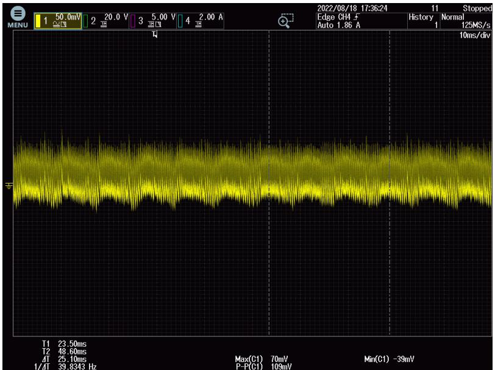

85 VAC  
CH1 VOUT $\mathsf { V } _ { \mathsf { O U T } }$ Ripple $v _ { p _ { \mathrm { K - P K } } } { = } 1 0 9 ~ \mathsf { m V }$  
➢ Full Load

Test Condition:

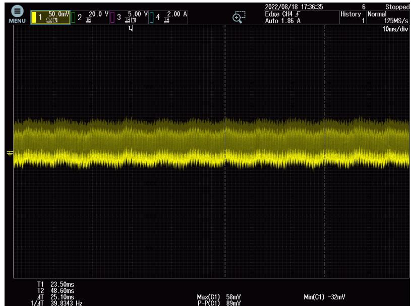

115 VAC  
CH1 VOUT $\mathsf { V } _ { \mathsf { O U T } }$ Ripple $\mathsf { V } _ { \mathsf { P K - P K } } { = } 8 9 \mathsf { m } \mathsf { v }$  
➢ Full Load

Test Condition:

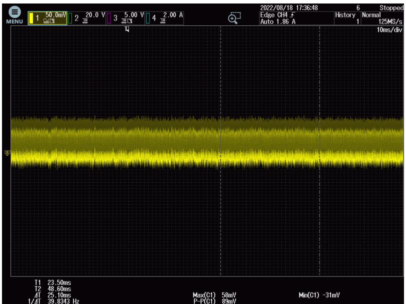

230 VAC  
CH1 VOUT Ripple $\mathsf { V } _ { \mathsf { P K - P K } } { = } 8 9 \mathsf { m } \mathsf { v }$  
➢ Full Load

Test Condition:

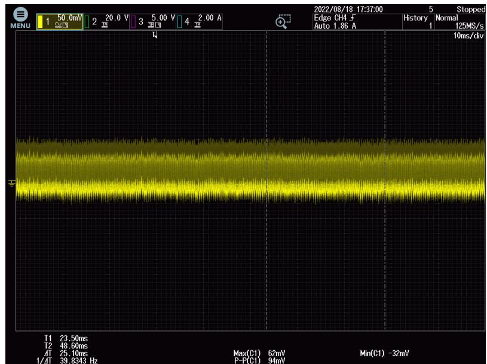

265 VAC  
CH1 VOUT Ripple $\mathsf { V } _ { \mathsf { P K - P K } } { = } 9 4 \mathsf { m } \mathsf { v }$  
➢ Full Load

Test Condition:

## (50%-100%)

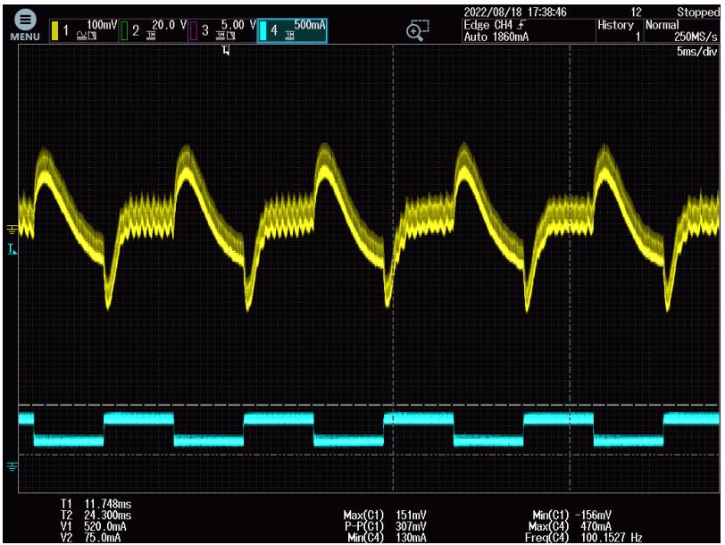

85 VAC

CH1 VOUT $\mathsf { V } _ { \mathsf { O U T } }$ $V _ { P K - P K } = 3 0 7 ~ \mathsf { m V }$  
$\mathsf { C H 4 } \mathsf { I } _ { \mathsf { O U T } }$

## Test Condition:

➢ $0 . 2 \ A { - } 0 . 4 \ A { - } 0 . 2 \ A$  
➢ Slew Rate: 0.5 A/μS  
➢ Frequency: 100 Hz

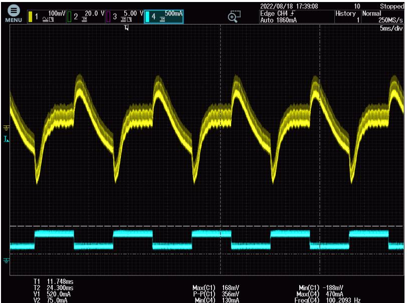

230 VAC

CH1 VOUT $\mathsf { V } _ { \mathsf { O U T } }$ $v _ { p _ { \vert k - P K } } = 3 5 6 ~ \mathsf { m v }$

$\mathsf { C H 4 } \mathsf { l } _ { \mathsf { O U T } }$

## Test Condition:

➢ $0 . 2 \ A { - } 0 . 4 \ A { - } 0 . 2 \ A$  
➢ Slew Rate: 0.5 $\mathsf { A } / \mu \mathsf { S }$  
➢ Frequency: 100 Hz

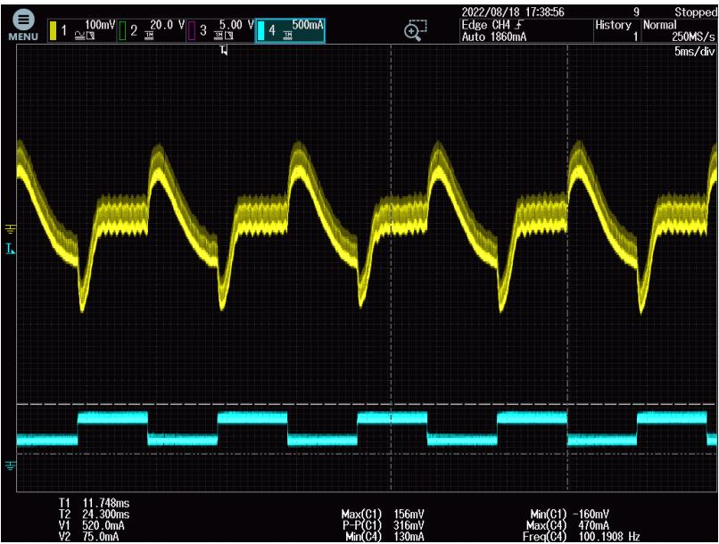

115 VAC

CH1 VOUT ${ \mathsf { C H 1 } } { \mathsf { V } } _ { \mathsf { O U T } }$ $V _ { \mathsf { P K - P K } } = 3 1 6 ~ \mathsf { m V }$  
$\mathsf { C H 4 } \mathsf { I } _ { \mathsf { O U T } }$

## Test Condition:

➢ $0 . 2 \ A { - } 0 . 4 \ A { - } 0 . 2 \ A$  
➢ Slew Rate: 0.5 A/μS  
➢ Frequency: 100 Hz

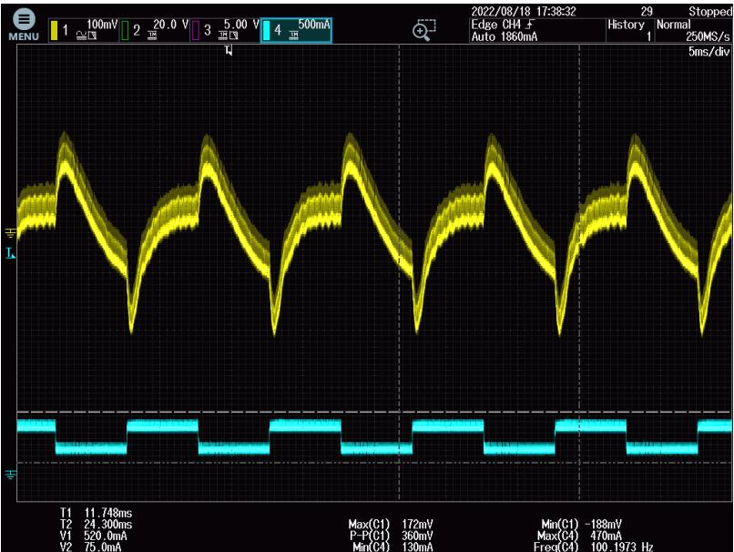

265 VAC

CH1 VOUT ${ \mathsf { C H 1 } } { \mathsf { V } } _ { \mathsf { O U T } }$ $V _ { \mathsf { P K - P K } } { = } 3 6 0 \mathsf { m V }$  
$\mathsf { C H 4 } \mathsf { I } _ { \mathsf { O U T } }$

## Test Condition:

➢ $0 . 2 \ A { - } 0 . 4 \ A { - } 0 . 2 \ A$  
➢ Slew Rate: 0.5 A/μS  
➢ Frequency: 100 Hz

## (10%-85%)

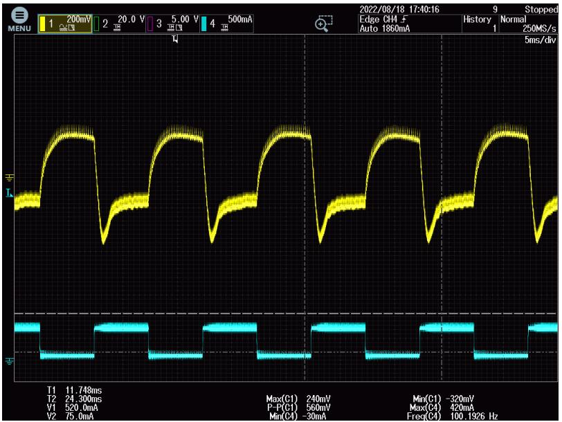

85 VAC

CH1 VOUT $\mathsf { V } _ { \mathsf { O U T } }$ $v _ { p _ { \mathrm { K - P K } } } { = } 5 6 0 ~ \mathsf { m V }$  
CH4 IOUT $\mathsf { C H 4 } \mathsf { I } _ { \mathsf { O U T } }$

## Test Condition:

➢ 0.04 A-0.36 A-0.04A  
➢ Slew Rate: 0.5 A/μS  
➢ Frequency: 100 Hz

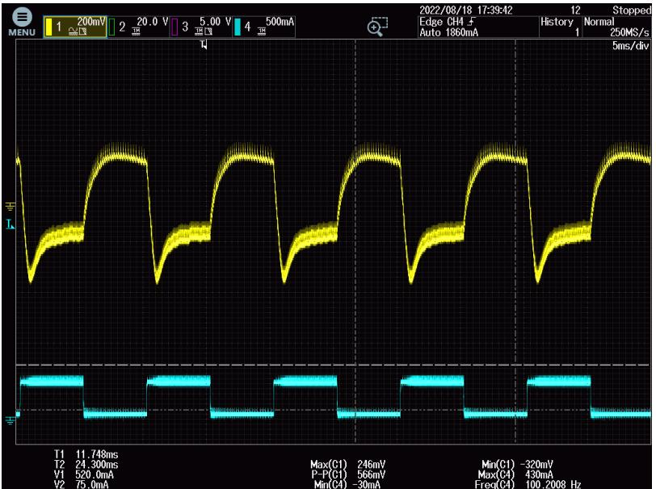

230 VAC

CH1 VOUT $\mathsf { V } _ { \mathsf { O U T } }$ $\mathsf { V } _ { \mathsf { P K - P K } } =$ 566 mV  
CH4 IOUT $\mathsf { C H 4 } \mathsf { I } _ { \mathsf { O U T } }$

## Test Condition:

➢ 0.04 A-0.36 A-0.04A  
➢ Slew Rate: 0.5 $\mathsf { A } / \mu \mathsf { S }$  
➢ Frequency: 100 Hz

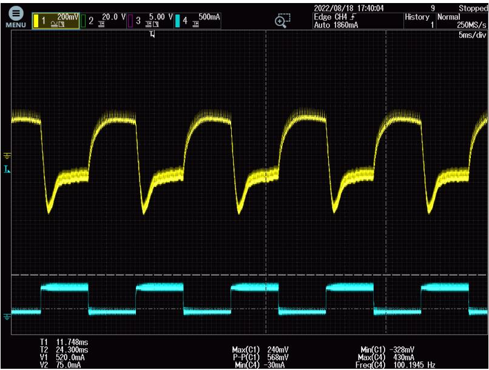

115 VAC

CH1 VOUT $\mathsf { V } _ { \mathsf { O U T } }$ $v _ { p _ { \mathrm { K - P K } } } { = } 5 6 8 \mathsf { m v }$  
CH4 IOUT $\mathsf { C H 4 } \mathsf { I } _ { \mathsf { O U T } }$

## Test Condition:

➢ 0.04 A-0.36 A-0.04A  
➢ Slew Rate: 0.5 A/μS  
➢ Frequency: 100 Hz

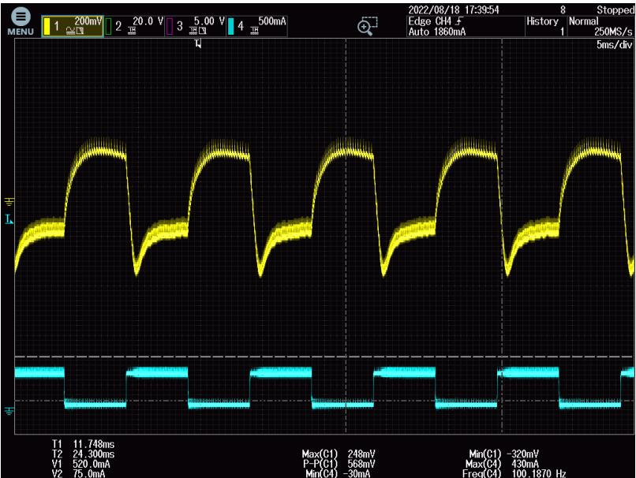

265 $\mathsf { v } _ { \mathsf { A C } }$

CH1 VOUT $\mathsf { V } _ { \mathsf { O U T } }$ $v _ { p _ { \mathrm { K - P K } } } { = } 5 6 8 ~ \mathsf { m V }$  
$\mathsf { C H 4 } \mathsf { I } _ { \mathsf { O U T } }$

## Test Condition:

➢ 0.04 A-0.36 A-0.04A  
➢ Slew Rate: $0 . 5 \mathsf { A } / \mu \mathsf { S }$  
➢ Frequency: 100 Hz

## 输出电压开机波形

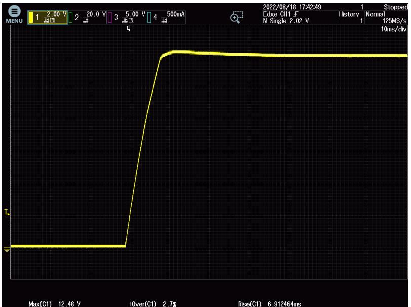

85 VAC

CH1 VOUT TRISE: 6.9 mS

## Test Condition:

➢ No Load

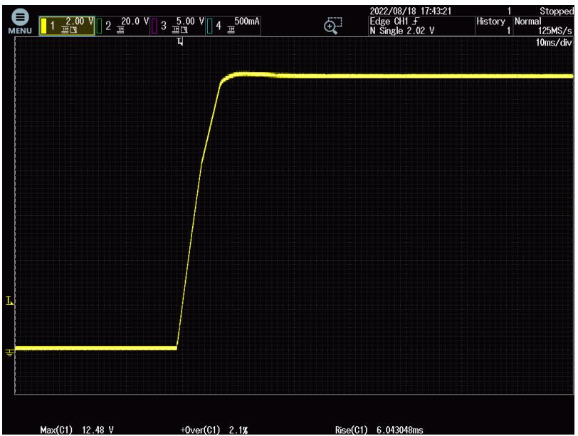

265 VAC

CH1 VOUT TRISE: 6 mS

## Test Condition:

➢ No Load

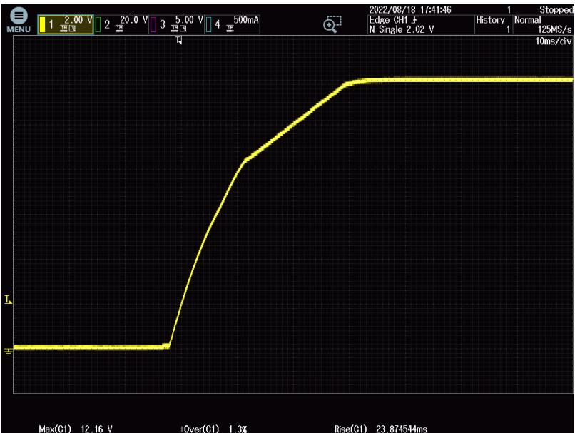

85 VAC

CH1 VOUT TRISE: 23.9 mS

## Test Condition:

➢ Full Load

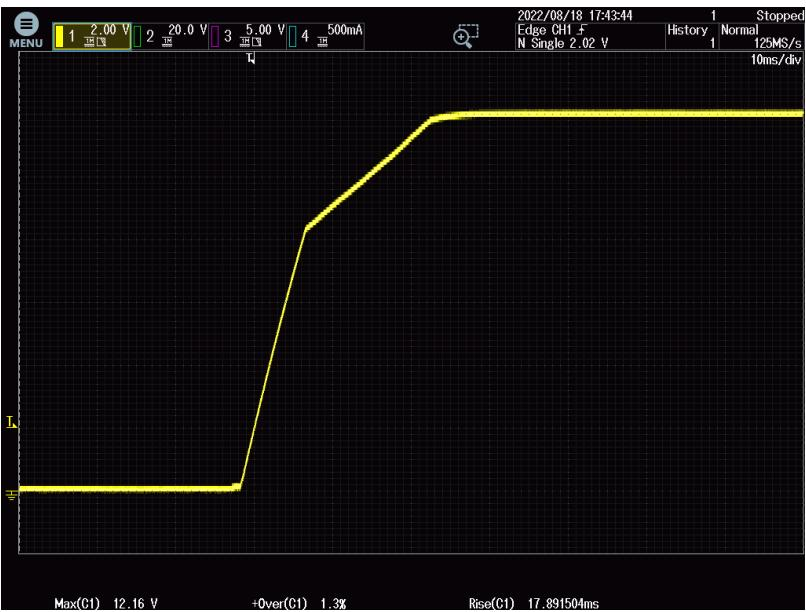

265 VAC

CH1 VOUT TRISE: 17.9 mS

## Test Condition:

➢ Full Load

## 开机延迟时间波形

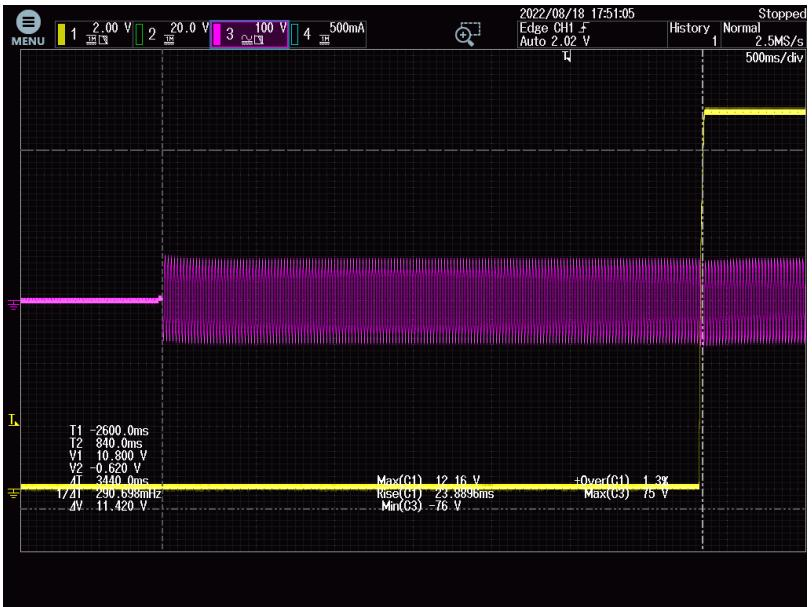

85 VAC

$\begin{array} { r l } { \mathbf { \bar { u } } } & { { } \mathsf { C H 1 } \mathbf { \bar { v } } _ { 0 \cup \mathsf { T } } } \\ { \mathbf { \bar { I } _ { D e l a y } : 3 . 4 4 ~ 5 } } \end{array}$ CH1 VOUT

## Test Condition:

➢ Full Load

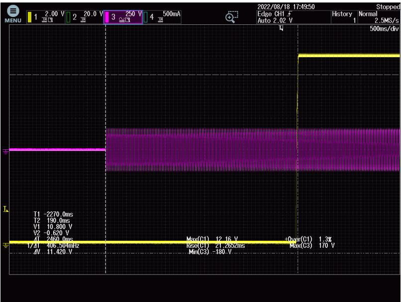

115 VAC

CH1 VOUT TDelay: 2.46 S

## Test Condition:

➢ Full Load

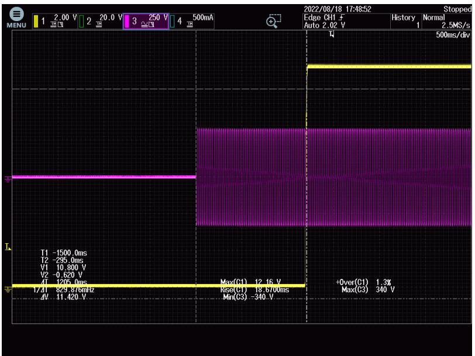

230 VAC

$\begin{array} { r l } { \mathbf { \bar { I } } } & { { } \mathsf { C H 1 } \mathsf { V _ { 0 \cup \intercal } } } \\ { \mathbf { \bar { I } _ { D e l a y } } : 1 . 2 0 5 \mathsf { S } } \end{array}$ CH1 VOUT

## Test Condition:

➢ Full Load

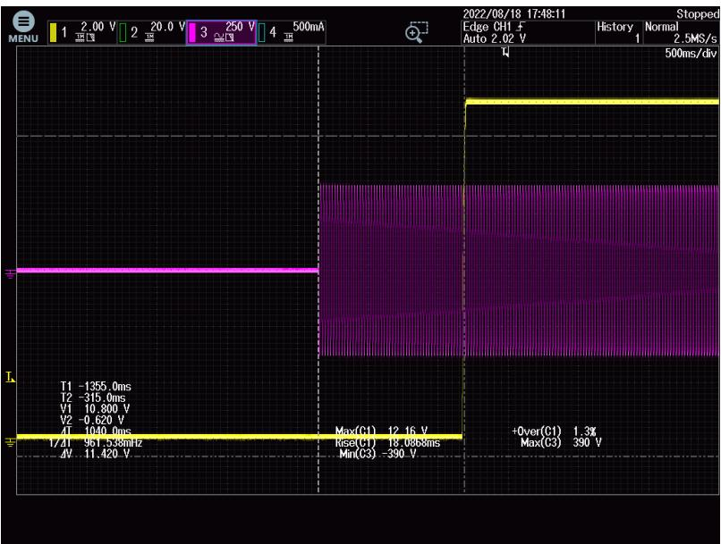

265 VAC

$\begin{array} { r l } { \mathbf { \Sigma } } & { \mathsf { C H 1 V _ { O U T } } } \\ & { \mathsf { T _ { D e l a y } } \mathbf { : 1 . 0 4 S } } \end{array}$ CH1 VOUT

## Test Condition:

➢ Full Load

## 开关管电压电流波形 (启机)

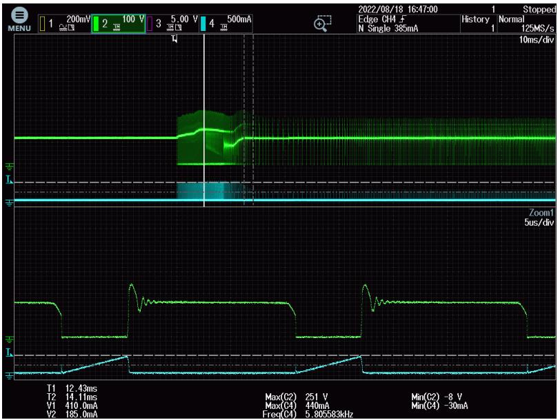

85 VAC

${ \mathsf { C H } } 2 { \mathsf { V } } _ { \mathsf { D S } }$  
$C H 4 1 _ { \mathsf { D } }$ $\mathtt { V } _ { \mathtt { D S } } mathtt { = } 2 5 1 \mathtt { V }$ IMAX= 440 mA $\mathsf { I } _ { \mathsf { M A X } } { = } 4 4 0 \mathsf { m } \mathsf { A }$

Test Condition:  
➢ No Load  
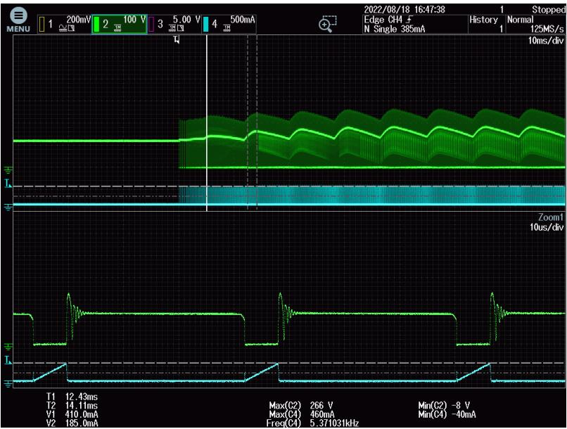

85 VAC

${ \mathsf { C H } } 2 { \mathsf { V } } _ { \mathsf { D S } }$  
$C H 4 1 _ { \mathsf { D } }$ $V _ { \mathsf { D S } } { = } 2 6 6 \ V$ IMAX= 460 mA $\mathsf { I } _ { \mathsf { M A X } } { = } 4 6 0 \mathsf { m } \mathsf { A }$

Test Condition:  
➢ Full Load  
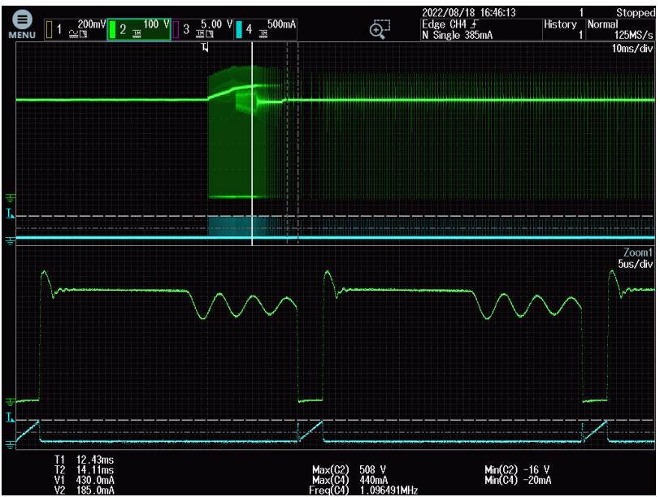

265 $\mathsf { v } _ { \mathsf { A C } }$

${ \mathsf { C H } } 2 \ { \mathsf { V } } _ { \mathsf { D S } }$  
$C H 4 1 _ { \mathsf { D } }$ $\mathtt { V } _ { \mathsf { D } \mathsf { S } } mathtt { = } 5 0 8 \mathtt { V }$ $\mathsf { I } _ { \mathsf { M A X } } { = } 4 4 0 \mathsf { m } \mathsf { A }$

Test Condition:  
➢ No Load  
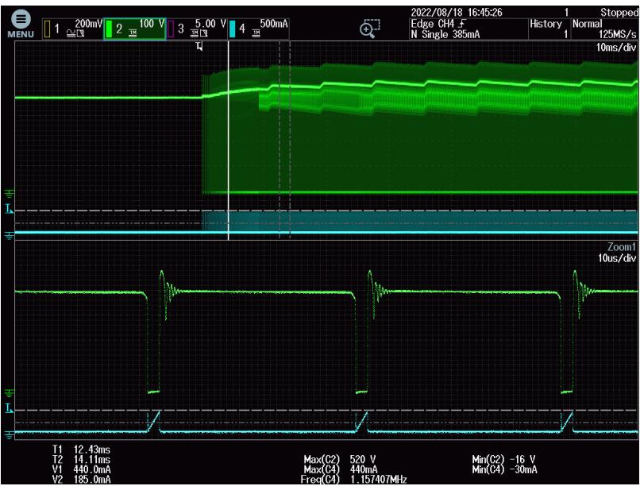

265 VAC

${ \mathsf { C H } } 2 { \mathsf { V } } _ { \mathsf { D S } }$  
$C H 4 1 _ { \mathsf { D } }$ $V _ { \mathsf { D S } } { = } 5 2 0 \mathsf { V }$ $\mathsf { I } _ { \mathsf { M A X } } { = } 4 4 0 \mathsf { m } \mathsf { A }$

Test Condition:

➢ Full Load

## 开关管电压电流波形 (正常工作)

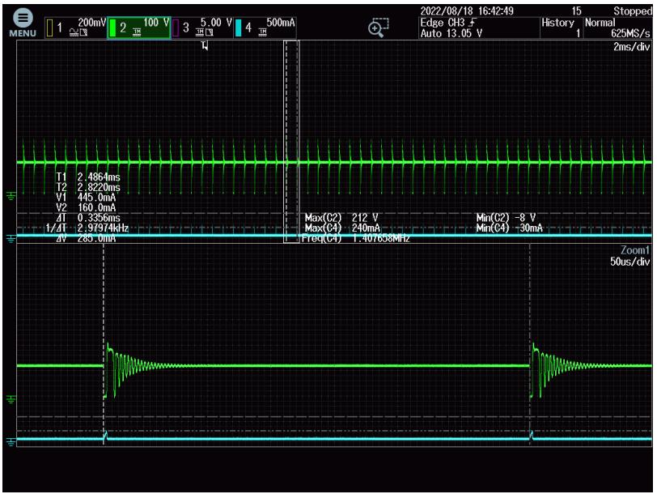

85 VAC

${ \mathsf { C H } } 2 { \mathsf { V } } _ { \mathsf { D S } }$  
$C H 4 1 _ { \mathsf { D } }$ $\mathtt { V } _ { \mathtt { D S } } mathtt { = } 2 1 2 \mathtt { V }$ IMAX= 240 mA $\mathsf { I } _ { \mathsf { M A X } } = 2 4 0 \mathsf { m A }$

Test Condition:  
➢ No Load  
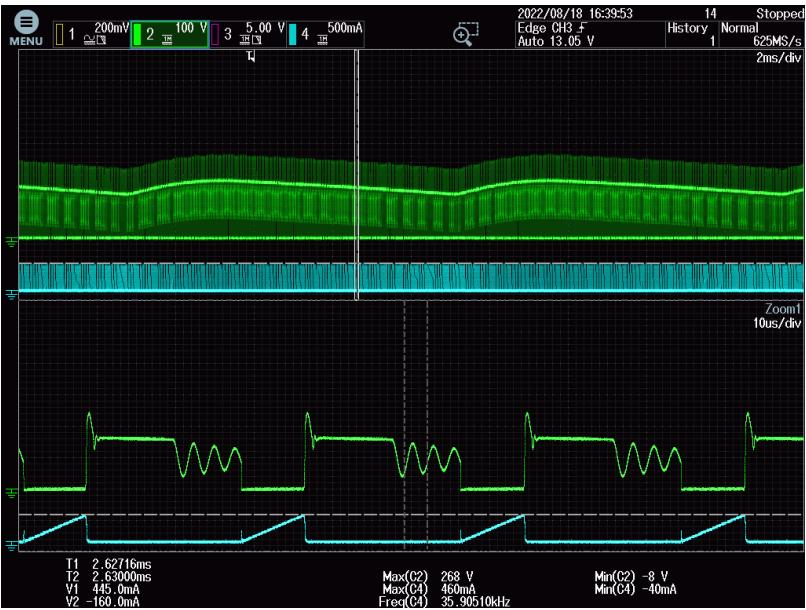

${ \tt S 5 V } _ { \sf A C }$

${ \mathsf { C H } } 2 { \mathsf { V } } _ { \mathsf { D S } }$  
$C H 4 1 _ { \mathsf { D } }$ $V _ { \mathsf { D S } } { = } 2 6 8 \ V$ IMAX= 460 mA $\mathsf { I } _ { \mathsf { M A X } } { = } 4 6 0 \mathsf { m } \mathsf { A }$

Test Condition:  
➢ Full Load  
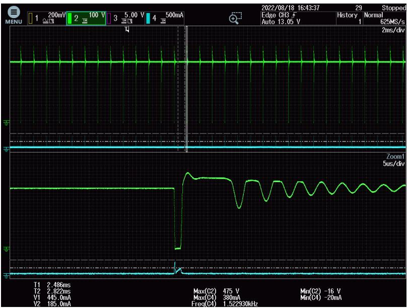

265 $\mathsf { v } _ { \mathsf { A C } }$

${ \mathsf { C H } } 2 \ { \mathsf { V } } _ { \mathsf { D S } }$  
$C H 4 1 _ { \mathsf { D } }$ $V _ { \mathsf { D S } } { \mathsf { = } } 4 7 5 \ \mathsf { V }$ IMAX=380 mA $\mathsf { I } _ { \mathsf { M A X } } { = } 3 8 0 \mathsf { m } \mathsf { A }$

Test Condition:  
➢ No Load  
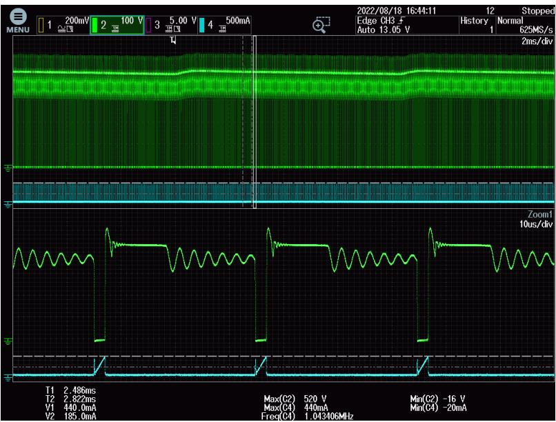

265 VAC

${ \mathsf { C H } } 2 { \mathsf { V } } _ { \mathsf { D S } }$  
$C H 4 1 _ { \mathsf { D } }$ $V _ { \mathsf { D S } } { = } 5 2 0 \mathsf { V }$ IMAX=440 mA $\mathsf { I } _ { \mathsf { M A X } } { = } 4 4 0 \mathsf { m } \mathsf { A }$

Test Condition:

➢ Full Load

## 输出二极管电压波形

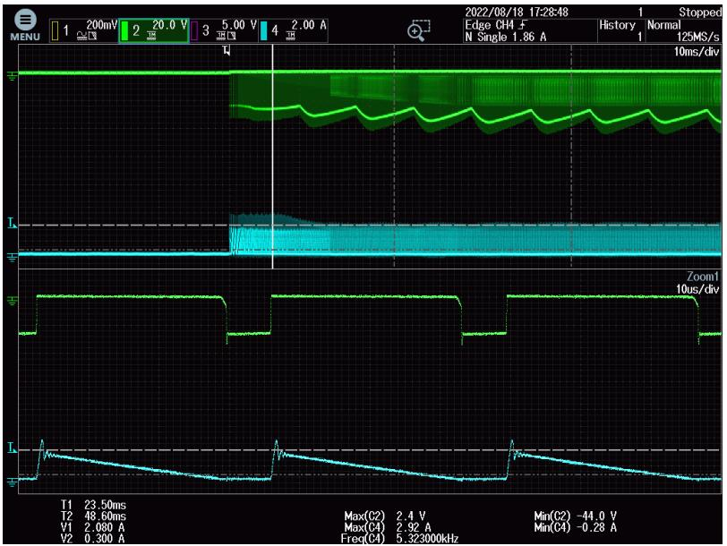

85 VAC

$C H 2 V _ { \mathsf { D } }$  
$C H 4 1 _ { \mathsf { D } }$ $\mathtt { V } _ { \mathtt { D } } { \ = } 4 4 \ \mathtt { V }$ $\mathsf { I } _ { \mathsf { D m a x } } = 2 . 9 2 \ \mathsf { A }$ Dmax

## Test Condition:

➢ Full Load  
➢ 开机

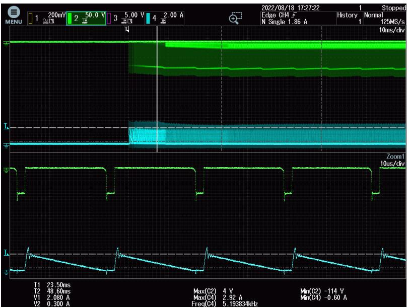

265 VAC

$C H 2 V _ { \mathsf { D } }$  
$C H 4 1 _ { \mathsf { D } }$ $\mathtt { V } _ { \mathtt { D } } { = } 1 1 4 \mathtt { V }$ $\mathsf { I } _ { \mathsf { D m a x } } = 2 . 9 2 \ \mathsf { A }$ IDmax

## Test Condition:

➢ Full Load  
➢ 开机

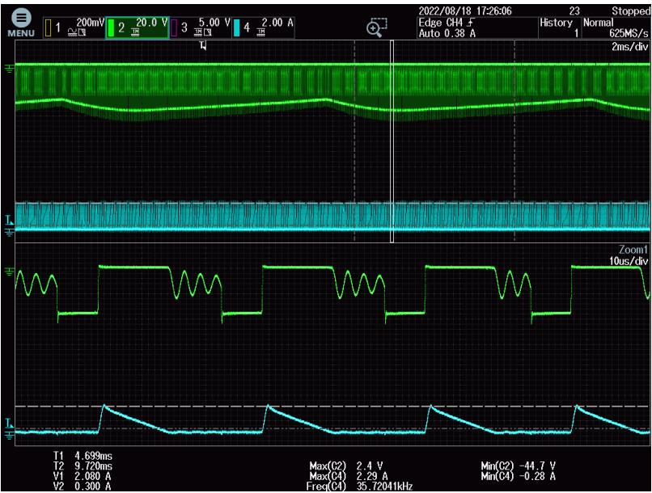

85 VAC

$C H 2 V _ { \mathsf { D } }$  
$C H 4 1 _ { \mathsf { D } }$ $V _ { \mathrm { D } } { = } 4 4 . 7 ~ \lor$ $\mathsf { I } _ { \mathsf { D m a x } } { = } 2 . 2 9 \mathsf { A }$ Dmax

## Test Condition:

➢ Full Load

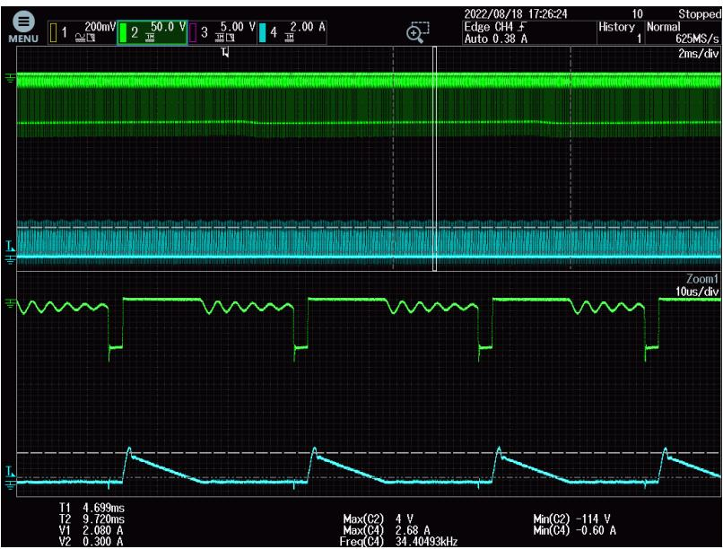

265 VAC

$C H 2 V _ { \mathsf { D } }$  
$C H 4 1 _ { \mathsf { D } }$ $\mathtt { V } _ { \mathtt { D } } { = } 1 1 4 \mathtt { V }$ $\mathsf { I } _ { \mathsf { D m a x } } { = } 2 . 6 8 ~ \mathsf { A }$

## Test Condition:

➢ Full Load

## 输出短路时开关管和二极管波形

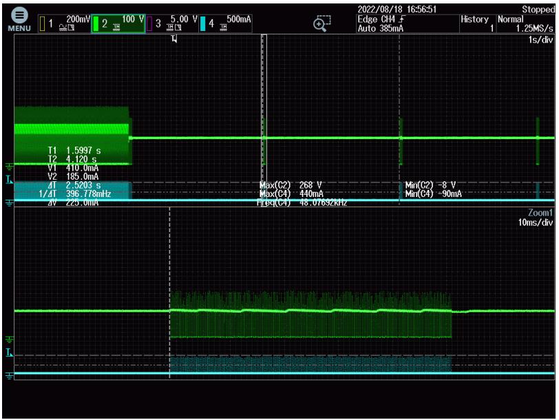

85 VAC

${ \mathsf { C H } } 2 { \mathsf { V } } _ { \mathsf { D S } }$  
CH4 ID $\begin{array} { r l } { } & { { \mathsf { V } } _ { \mathsf { D S \_ m a x } } { = } 2 6 8 { \mathsf { V } } } \\ { } & { { \mathsf { I } } _ { \mathsf { D S \_ m a x } } { = } 4 4 0 \mathsf { m A } } \end{array}$

## 开关管

## Test Condition:

➢ Full Load

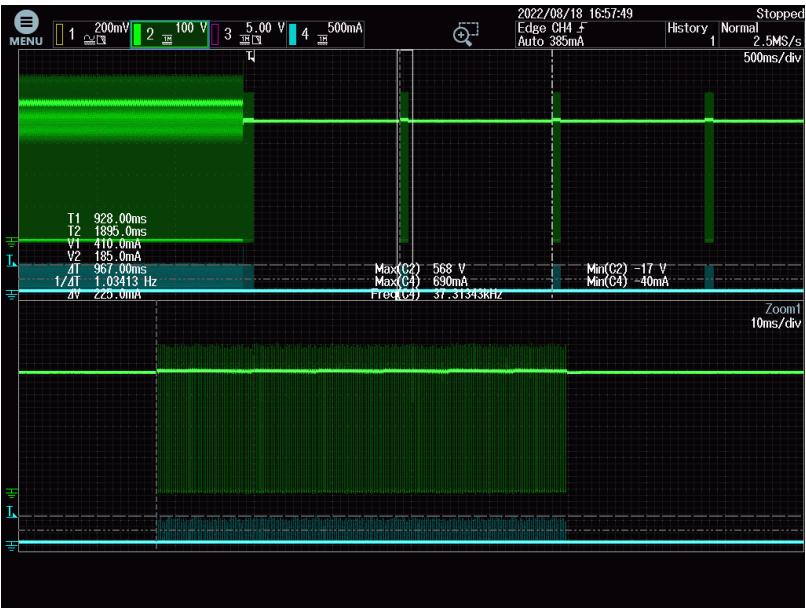

265 VAC

CH2 VDS  
CH4 ID $\mathtt { V _ { D S \_ m a x } } = 5 6 8 \lor$ $\mathsf { I } _ { \mathsf { D } \mathsf { S } \_ \mathsf { m a x } } = 6 9 0 \mathsf { m } \mathsf { A }$

## 开关管

## Test Condition:

➢ Full Load

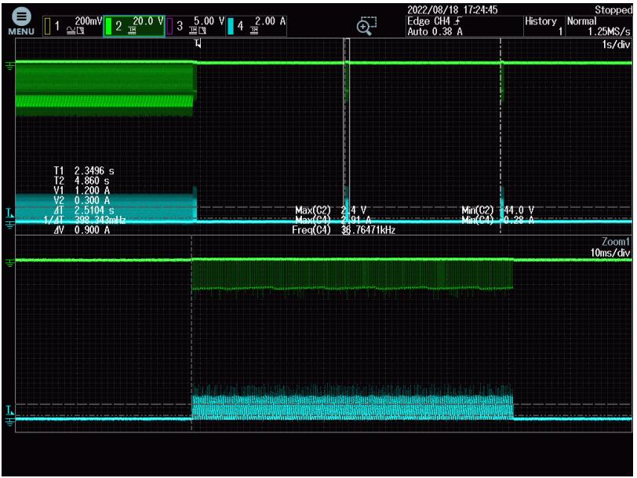

85 VAC

CH2 VD  
CH4 ID VD=44 V Dmax =2.91 A

## Test Condition:

➢ Full Load

## 二极管

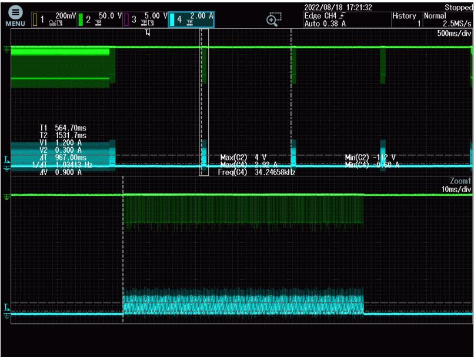

265 VAC

CH2 VD  
CH4 ID $\mathtt { V } _ { \mathsf { D } } mathtt { = } 1 1 2 \mathtt { V }$ $\mathsf { I } _ { \mathsf { D m a x } } = 2 . 9 2 \ \mathsf { A }$

## Test Condition:

➢ Full Load

## 二极管

## 温升测试

<table><tr><td rowspan="2">项目</td><td colspan="4">温度(°C)</td></tr><tr><td>85VAC</td><td>115VAC</td><td>230VAC</td><td>265VAC</td></tr><tr><td>环境温度</td><td>40.6</td><td>39.1</td><td>38.4</td><td>39.7</td></tr><tr><td>S7133B (U1)</td><td>85.6</td><td>76.5</td><td>66.5</td><td>79.4</td></tr><tr><td>SS220 (D3)</td><td>67.6</td><td>66.1</td><td>66.5</td><td>68.4</td></tr><tr><td>变压器绕组 (T1)</td><td>73.3</td><td>70.1</td><td>69.6</td><td>71.6</td></tr><tr><td>变压器磁芯 (T1)</td><td>71</td><td>68.7</td><td>68.5</td><td>70.2</td></tr><tr><td>输入电解电容(EC2)</td><td>61.3</td><td>55.9</td><td>52.2</td><td>53.6</td></tr><tr><td>输出电解电容(EC4)</td><td>56.2</td><td>54.9</td><td>54.5</td><td>55.7</td></tr><tr><td>保险丝电阻 (FR1)</td><td>63.2</td><td>54.6</td><td>47</td><td>47.3</td></tr></table>

## 测试说明

➢ 在温箱中进行测试  
➢ 电路板放在一个封闭的盒子内  
➢ 热电偶连接到各个测量点  
➢ 等测量点温度达到稳定后记录数据

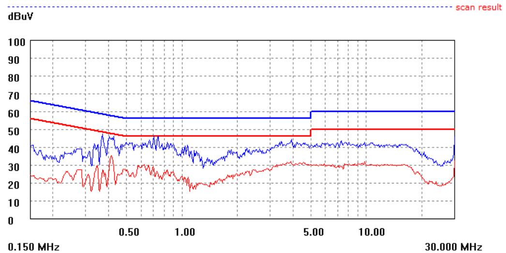

115VAC Line

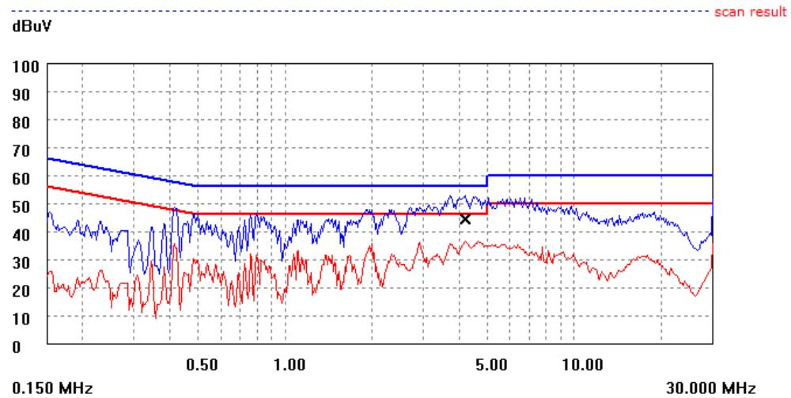

230VAC Line

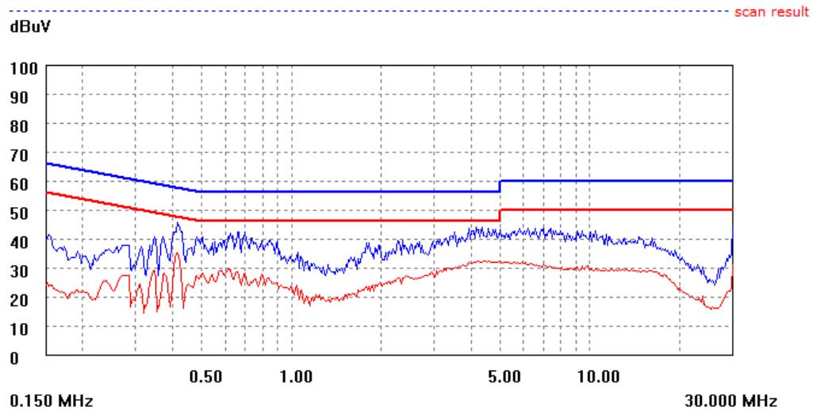

115VAC Neutral

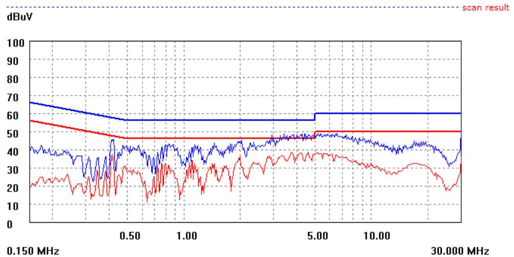

230VAC Neutral

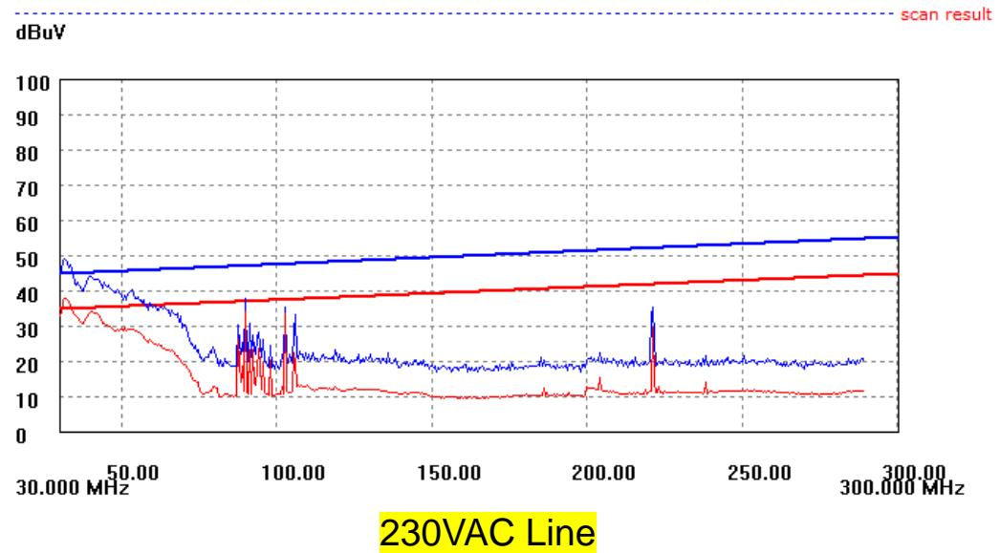

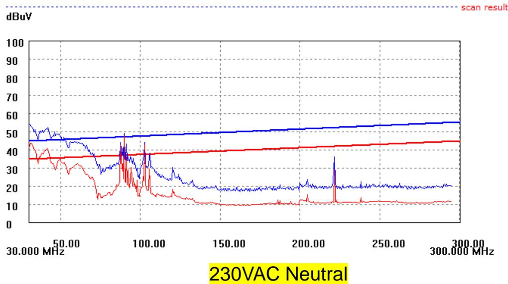

<table><tr><td>差模</td><td>电压</td><td>相位角</td><td>发生器阻抗</td><td>测试次数</td><td>测试结果</td></tr><tr><td>L to N</td><td>+2kV</td><td>0</td><td>2</td><td>10</td><td>Pass</td></tr><tr><td>L to N</td><td>-2kV</td><td>0</td><td>2</td><td>10</td><td>Pass</td></tr><tr><td>L to N</td><td>+2kV</td><td>85</td><td>2</td><td>10</td><td>Pass</td></tr><tr><td>L to N</td><td>-2kV</td><td>85</td><td>2</td><td>10</td><td>Pass</td></tr><tr><td>L to N</td><td>+2kV</td><td>180</td><td>2</td><td>10</td><td>Pass</td></tr><tr><td>L to N</td><td>-2kV</td><td>180</td><td>2</td><td>10</td><td>Pass</td></tr><tr><td>L to N</td><td>+2kV</td><td>270</td><td>2</td><td>10</td><td>Pass</td></tr><tr><td>L to N</td><td>-2kV</td><td>270</td><td>2</td><td>10</td><td>Pass</td></tr></table>

## 测试说明

➢ 按照GB/T17626.5和IEC61000-4-5的最新版本要求进行测试  
➢ 室温环境，230VAC输入，满载条件  
➢ 输入1.2/50us组合波浪涌电压  
➢ 每个测试点重复10次  
➢ 每次间隔时间1分钟  
➢ 试验时样机输出正常（符合A类标准）视为Pass

<table><tr><td>差模</td><td>电压</td><td>脉冲群持续时间</td><td>脉冲频率</td><td>测试时间</td><td>测试结果</td></tr><tr><td>L to N</td><td>+4kV</td><td>15ms</td><td>5kHz</td><td>120s</td><td>Pass</td></tr><tr><td>L to N</td><td>-4kV</td><td>15ms</td><td>5kHz</td><td>120s</td><td>Pass</td></tr><tr><td>L to N</td><td>+4kV</td><td>0.75ms</td><td>100kHz</td><td>120s</td><td>Pass</td></tr><tr><td>L to N</td><td>-4kV</td><td>0.75ms</td><td>100kHz</td><td>120s</td><td>Pass</td></tr><tr><td>L to N</td><td>+2kV</td><td>2ms</td><td>38kHz</td><td>120s</td><td>Pass</td></tr><tr><td>L to N</td><td>-2kV</td><td>2ms</td><td>38kHz</td><td>120s</td><td>Pass</td></tr><tr><td>L to N</td><td>+4kV</td><td>2ms</td><td>38kHz</td><td>120s</td><td>Pass</td></tr><tr><td>L to N</td><td>-4kV</td><td>2ms</td><td>38kHz</td><td>120s</td><td>Pass</td></tr></table>

## 测试说明

➢ 按照GB/T17626.4和IEC61000-4-4的最新版本要求进行测试  
➢ 室温环境，230VAC输入满载条件  
➢ 分别测试5kHz/100kHz/38kHz脉冲频率  
➢ 脉冲群周期为300ms  
➢ 每个测试条件测试时间120s  
➢ 试验时样机输出正常（符合A类标准）视为Pass

<table><tr><td>测试点</td><td>电压(V)</td><td>放电类型</td><td>放电次数</td><td>测试结果</td></tr><tr><td>Vo</td><td>+15kV</td><td>空气放电</td><td>10</td><td>Pass</td></tr><tr><td>Vo</td><td>-15kV</td><td>空气放电</td><td>10</td><td>Pass</td></tr><tr><td>GND</td><td>+15kV</td><td>空气放电</td><td>10</td><td>Pass</td></tr><tr><td>GND</td><td>-15kV</td><td>空气放电</td><td>10</td><td>Pass</td></tr><tr><td>Vo</td><td>+20kV</td><td>空气放电</td><td>10</td><td>Pass</td></tr><tr><td>Vo</td><td>-20kV</td><td>空气放电</td><td>10</td><td>Pass</td></tr><tr><td>GND</td><td>+20kV</td><td>空气放电</td><td>10</td><td>Pass</td></tr><tr><td>GND</td><td>-20kV</td><td>空气放电</td><td>10</td><td>Pass</td></tr></table>

## 测试说明

➢ 按照GB/T17626.2和IEC61000-4-2的最新版本要求进行测试  
➢ 室温环境，230VAC输入满载条件  
➢ 每个测试点重复10次  
➢ 分别对输出正端和地进行空气放电  
➢ 试验时样机输出正常（符合A类标准）视为Pass

## THANK YOU FOR WATCHING
