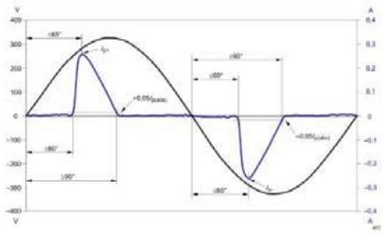
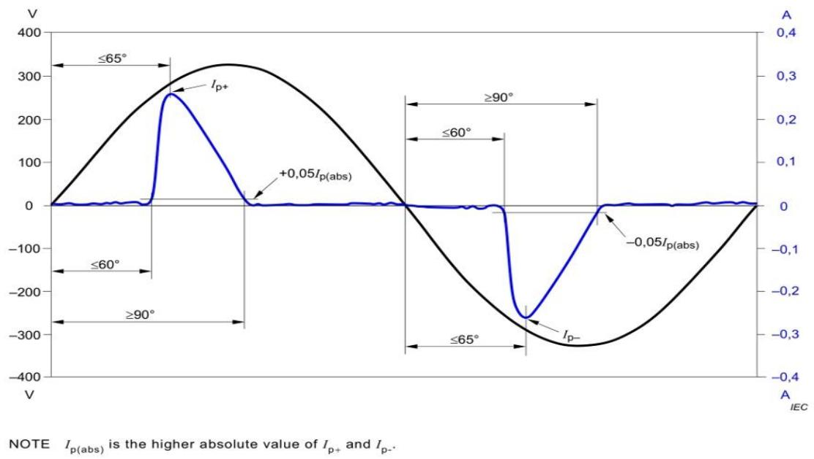
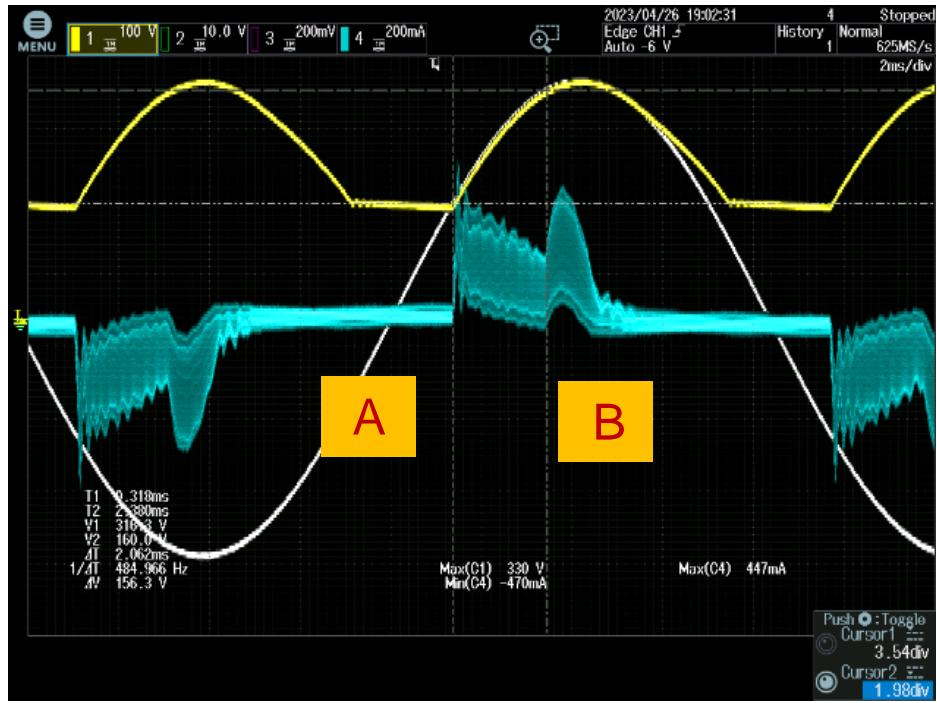
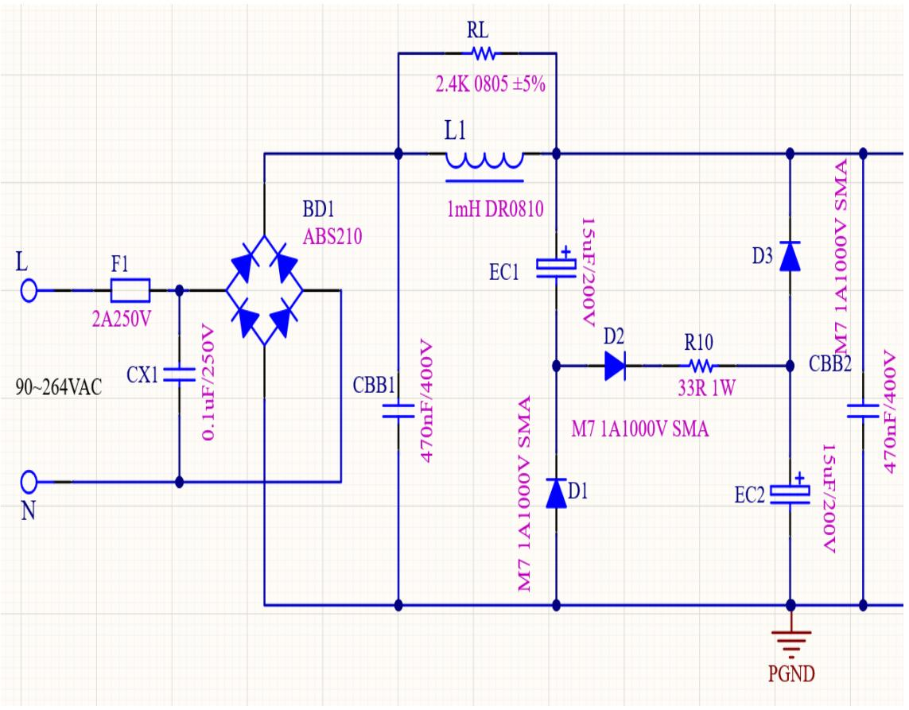
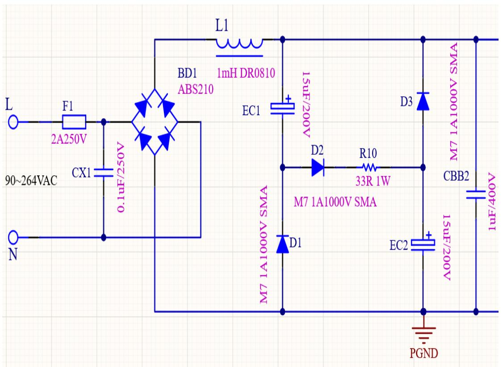
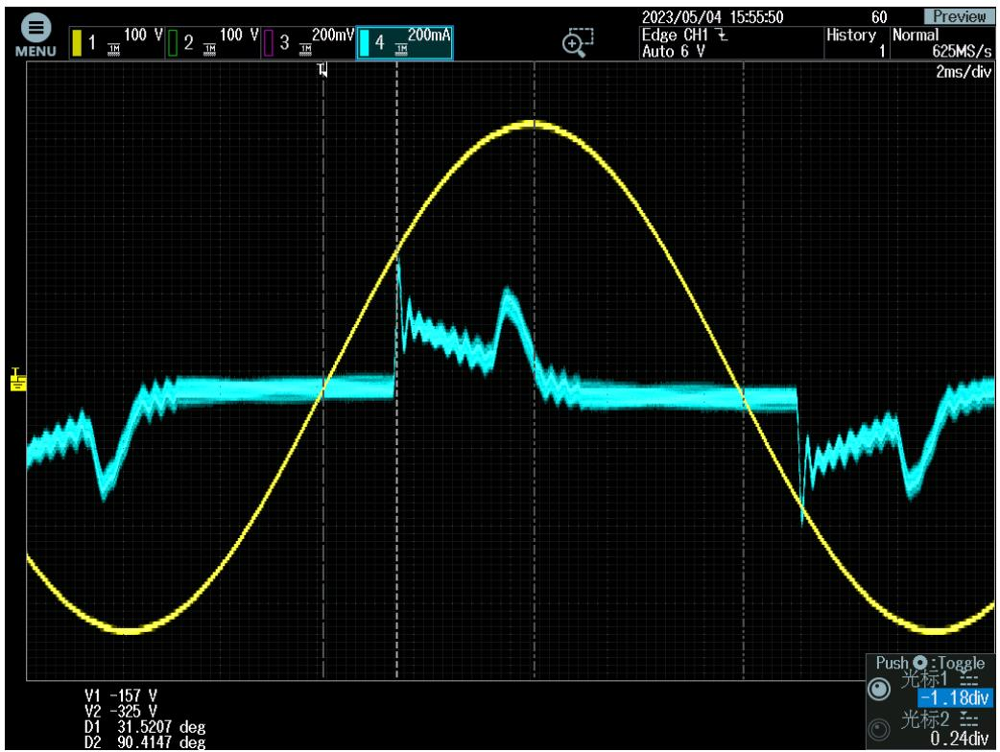
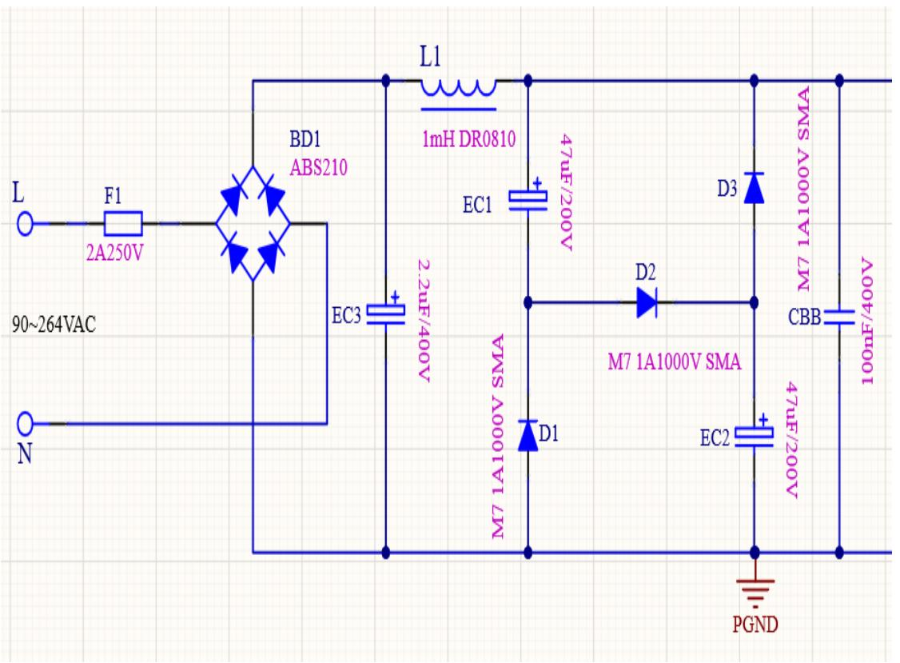
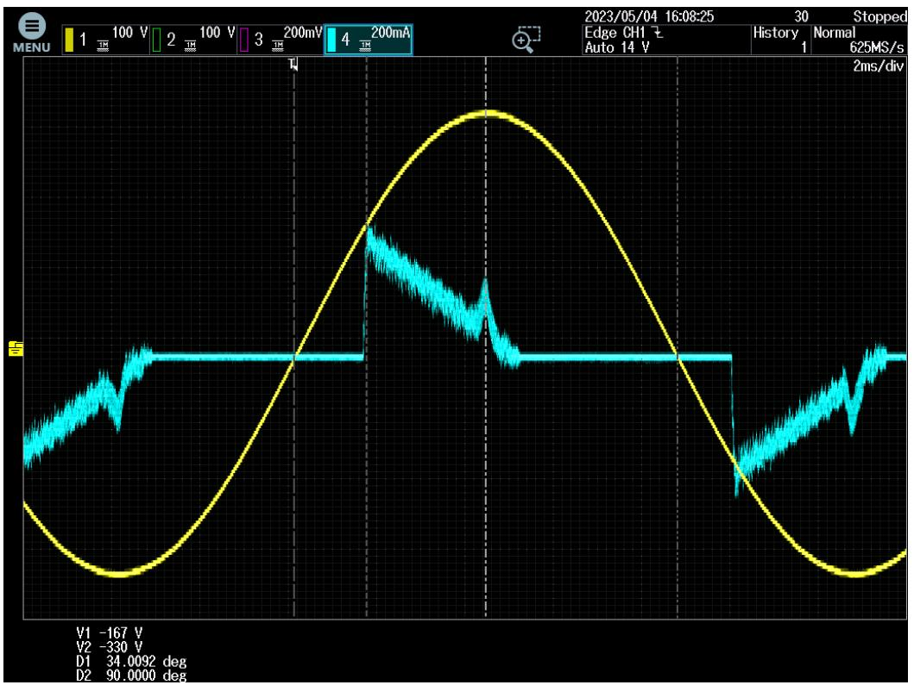

## S7134B&BP84147填谷PFC满足最新ERP谐波及电 流波形设计

刁文学

上海晶丰明源半导体股份有限公司

## 应用背景

## 》欧盟在2019年12月5日针对光源产品颁布新的ERP指令EU2019/2020

<table><tr><td></td><td>EU 2019/2020</td><td>EC244/2009、EC245/2009和EU1194/2012</td></tr><tr><td>公布实施日期</td><td>2019年12月5日</td><td>2009~2012</td></tr><tr><td>替代旧法规日期</td><td>2021年9月1日</td><td>--</td></tr></table>

## >欧盟在2019年发布“每相输入电流≤16A的设备谐波电流发射限值”的标准EN

<table><tr><td></td><td>EN IEC 61000-3-2:2019</td><td>EN IEC 61000-3-2:2014</td></tr><tr><td>公布实施日期</td><td>2019年9月1日</td><td>2014</td></tr><tr><td>替代旧法规日期</td><td>2022年3月1日</td><td>--</td></tr></table>

## 新版ErP标准就以下6方面对照明产品提出新要求

## 能效要求

光源宣传工作功率PON不超过最大允许功率

$$
P _ {\text { o   v   m   a   x }} = C \times (L + \Phi_ {\text { s   t   e }} / (F \times \eta)) \times R
$$

##

根据光效系数nrm判定能效等级 $\eta _ { T M } = ( \Phi _ { w e } / P _ { o u } ) * F _ { T M }$

<table><tr><td>Energy efficiency &lt; 100</td><td>Total min+efficiency (min·h)</td></tr><tr><td>A</td><td>2.00 ≤ max</td></tr><tr><td>B</td><td>1.87 ≤ max + 2.0</td></tr><tr><td>C</td><td>1.60 ≤ max + 3.05</td></tr><tr><td>D</td><td>1.37 ≤ max + 4.0</td></tr><tr><td>E</td><td>1.16 ≤ max + 5.05</td></tr><tr><td>F</td><td>1.07 ≤ max + 6.0</td></tr><tr><td>G</td><td>max &lt; 8</td></tr></table>

##

$\mathsf { P } _ { 0 N } \leqslant 5 W :$ 没有限制

$5 W { < } \mathsf { P } _ { \mathrm { O N } } { \leqslant } 1 0 W ;$ DF>0.5

$1 0 W { < } \mathsf { P } _ { 0 N } { \leqslant } 2 5 W ;$ DF>0.7

$\mathsf { P } _ { 0 \mathsf { N } } { > } 2 5 \mathsf { W } ;$

## 显色指数

CRI≥80，除有效光通量>4klm的HID、户外灯、工矿灯等特殊光源

##

Psb<0.5W

##

PST<1

SVM<0.4

## 额定功率>25W

## 满足分次谐波

Table 2-Limits for Class C equipment a

<table><tr><td>Harmonic order $h$ </td><td>Maximum permissible harmonic current expressed as a percentage of the input current at the fundamental frequency%</td></tr><tr><td>2</td><td>2</td></tr><tr><td>3</td><td> ${30} \cdot {\lambda }^{\mathrm{b}}$ </td></tr><tr><td>5</td><td>10</td></tr><tr><td>7</td><td>7</td></tr><tr><td>9</td><td>5</td></tr><tr><td> ${11} \leq k \leq {39}$ (odd harmonics only)</td><td>3</td></tr><tr><td colspan="2"> $^a$  For some Class C products, other emission limits apply (see 7.4). $^b$   $\lambda$  is the circuit power factor.</td></tr></table>

3次谐波<86%

5次谐波<61%

7.4.3Ratedpower25Wand525w  

Fgure2-utrationftheive psege andcurrenlparametersdescribedin7.4.3

## 5W≤额定功率≤25W

总THD<70%

3次谐波<35%

5次谐波<25%

7次谐波<30%

9,11次谐波<20%

2次谐波<5%

## 满足分次谐波电流

Table 3-Limits for Class Dequipment

<table><tr><td>Harmonic order $h$ </td><td>Maximum permissible harmonic current per wattmA/W</td><td>Maximum permissible harmonic currentA</td></tr><tr><td>3</td><td>3,4</td><td>2,30</td></tr><tr><td>5</td><td>1,9</td><td>1,14</td></tr><tr><td>7</td><td>1,0</td><td>0,77</td></tr><tr><td>9</td><td>0,5</td><td>0,40</td></tr><tr><td>11</td><td>0,35</td><td>0,33</td></tr><tr><td> $13 \leq h \leq 39$ (odd harmonics only)</td><td> $\frac{3,85}{h}$ </td><td>See Table 1</td></tr></table>

满足①\~③任意一项即可，难易程度：①<②<③，目前5\~25W方案采用①来满足谐波要求综合新版ErP EU 2019/2020指令+ IEC 61000-3-2:2019法规要求，照明产品需满足以下性能

<table><tr><td rowspan="4">位移因子</td><td> $P_{ON} \leqslant 5W$ : 没有限制</td></tr><tr><td> $5W < P_{ON} \leqslant 10W$ : DF&gt;0.5</td></tr><tr><td> $10W < P_{ON} \leqslant 25W$ : DF&gt;0.7</td></tr><tr><td> $P_{ON} >25W$ : DF&gt;0.9</td></tr><tr><td>频闪要求</td><td>PST&lt;1SVM&lt;0.4</td></tr><tr><td>分次谐波</td><td>3次谐波&lt;86%5次谐波&lt;61%</td></tr><tr><td>电流波形</td><td>相位角60°之前,输入电流&lt;5%相位角65°之前,输入电流达到100%相位角90°时,输入电流≥5%</td></tr></table>

## IEC6100-3-2 \_3 5

7.4.3Ratedpower≥5Wand≤25W  

Figure2-Illustrationoftherelativephaseangle andcurrentparametersdescribedin7.4.3

2）以基波电流的百分比来表示，三次谐波不应超过86%，五次谐波不应超过61%。另外，输入电流的波形应当满足以下要求：相对于基波供电电压的过零点，在60或之前应当达到5%的电流阈值，在65或之前出现峰值，在90°之前不应低于 5%的电流阈值。电流阈值等于出现在测量窗口中最大值绝对峰值电流的5%，相角测试也在包含该绝对值峰值的周期内进行测量（详见图2)。频率超过9 kHz的电流分量不应影响该评估（可使用类似于IEC61000-4-7:2002以及IEC 61000-4-7:2002/AMD1:2008 第5.3节所描述的滤波器）。

## 怎样满足电流导通相角--”在 $6 5 ^ { \circ }$ 或之前出现峰值”:

➢ 1. 在额定输出功率及额定测试电压下测试输入电流的波形  
➢ 2. 满足输出带载功能， 选定合适的填谷电容( EC1/EC2), EC1EC2的容量决定了Vbulk电压最低点(影响效率及最大输出功率)  
➢ 根据实测波形调节CBB或X-CAP电容的大小, 加大CBB电容，会提高 A点的电流尖峰， 加大串接在D2上的电阻，会限制 B点的尖峰电流。

## 填谷应用的注意事项

填谷电路的电解电容对EMI没有帮助， 因为有串联二极管的存在， 所以必须加薄膜电容来吸收EMI差模噪声；  
如果电路中D2串联有电阻， 会影响对雷击浪涌的吸收能力，最好加入压敏或者抗浪涌的保险电阻；  
输入功率10W\~25W的应用， 需要PF>0.7， 因此， 还需要考虑CBB电容的容量； CBB及X-CAP容量太大， 都会影响PF值；功率越小，影响越明显；  
D2中串联电阻， 是为了抑制给电解充电的电流峰值， 希望该峰值电流不要太高； 如果需要加电阻与D2串连， 必须考虑该电阻的浪涌冲击能力，例如2W小体积的插件电阻比较合适， 或者是绕线电阻。  
EMI传导实测效果比较依赖CBB和X-CAP的容量. 容量大，EMI传导改善明显， 但是容量大会影响PF值； 可以考虑加适当的差模电感协助改善EMI传导.

## 满足12W应用的参数设置

应用实例： 12V1A S7134X  
输入 100-240V PF>0.7@230Vac， Pin约14W  
输出: 12V1A

## PF>0.7

输入电流导通角为31 。

并且在31 °的电流峰值大于80 。 出现的填谷电流峰值；

并且，在90°之后， 仍然有>5%的电流流过整流器。

## 满足15W应用的参数设置

应用实例： 5V3A S7134X // BP84147  
输入 100-240V PF>0.7@230Vac Pin 约18W  
输出: 5V3A  
备注：EC3为电解电容

## PF>0.7

输入电流导通角为34

并且在31 °的电流峰值大于90 。 出现的填谷电流峰值；

并且，在90°之后， 仍然有>5%的电流流过整流器。

上海市浦东新区申江路5005弄星创科技广场3号楼9层

+86-21-51870166

sales@bpsemi.com

www.bpsemi.com

  
微信公众号

  
微信视频号
