## S7134B\_12V1A无Y无共模版本\_参考设计

上海晶丰明源半导体股份有限公司

Shanghai Bright Power Semiconductor Co., Ltd.

刁文学

时间：2021年10月

## 内容

■ S7134B简介  
■ 电源规格  
■ 电路及实物图  
BOM  
■ PCB Layout图  
■ 性能测试数据

## ■ 产品特点:

➢ 准谐振工作机制，提高系统效率  
峰值电流渐变抖动改善EMI  
内置功率三极管  
恒压、恒流精度高  
输出线损补偿可调  
内置输入线电压补偿  
输出过压、短路保护、过温保护  
VCC电压过压保护

## ■ 应用领域：

电源适配器、充电器  
LED驱动电源  
其他辅助电源

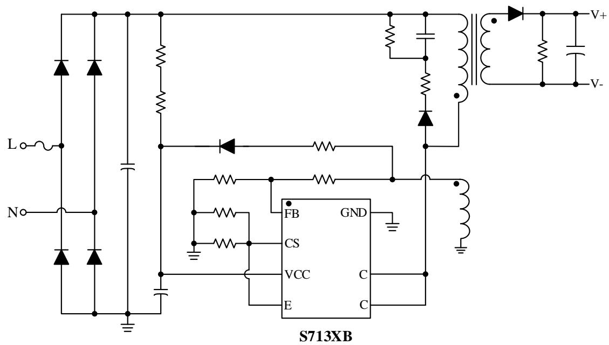

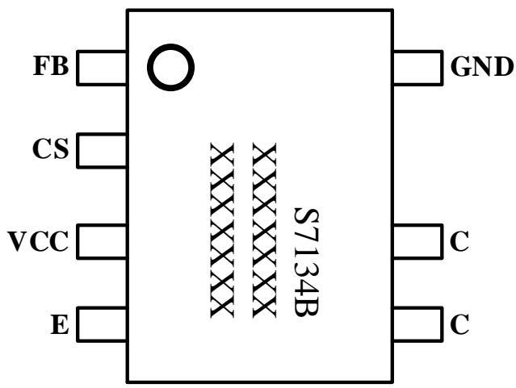

## 电源规格

<table><tr><td>项目描述</td><td>符号</td><td>最小</td><td>典型</td><td>最大</td><td>单位</td><td>备注</td></tr><tr><td colspan="7">输入</td></tr><tr><td>电压</td><td> $V_{IN}$ </td><td>90</td><td>115/230</td><td>264</td><td> $V_{AC}$ </td><td></td></tr><tr><td>功率</td><td>Pin</td><td></td><td>5</td><td></td><td>W</td><td></td></tr><tr><td>频率</td><td> $f_{LINE}$ </td><td>47</td><td>50/60</td><td>63</td><td>Hz</td><td></td></tr><tr><td colspan="7">输出</td></tr><tr><td>输出电压</td><td> $V_{OUT}$ </td><td>11.4</td><td>12</td><td>12.6</td><td>V</td><td>线端测试</td></tr><tr><td>输出电流</td><td> $I_{OUT}$ </td><td></td><td>1</td><td></td><td>A</td><td></td></tr><tr><td>输出电压纹波</td><td> $V_{RIPPLE}$ </td><td></td><td></td><td>200</td><td>mV</td><td>20MHz带宽</td></tr><tr><td colspan="7">效率</td></tr><tr><td>待机功耗</td><td> $P_{STDBY}$ </td><td></td><td></td><td>71</td><td>mW</td><td>230VAC,包含假负载</td></tr><tr><td>平均效率</td><td>η</td><td>84.3</td><td></td><td></td><td>%</td><td></td></tr><tr><td colspan="7">环境</td></tr><tr><td>传导辐射EMI</td><td></td><td colspan="4">满足CISPR22/EN55022 CLASS B</td><td></td></tr><tr><td>EFT</td><td></td><td></td><td>2</td><td></td><td>KV</td><td>38KHz/100KHz</td></tr><tr><td>ESD</td><td></td><td></td><td>12</td><td></td><td>KV</td><td>接触8KV,空气12KV</td></tr><tr><td>Surge</td><td></td><td></td><td>1</td><td></td><td>KV</td><td>差模2Ω</td></tr><tr><td>工作环境温度</td><td> $T_{AMP}$ </td><td>-20</td><td></td><td>45</td><td>°C</td><td></td></tr></table>

备注: 1 纹波是在 1 米的线端测试, 示波器设置为 20 MHz 带宽

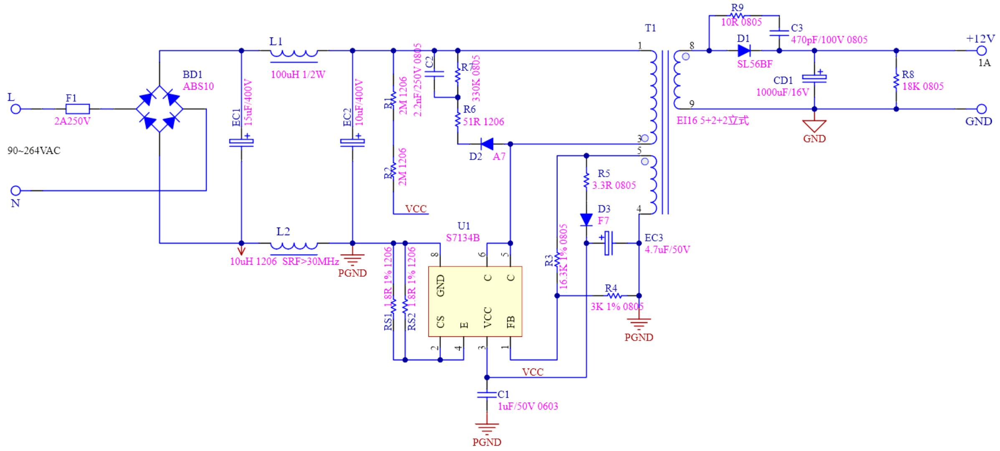

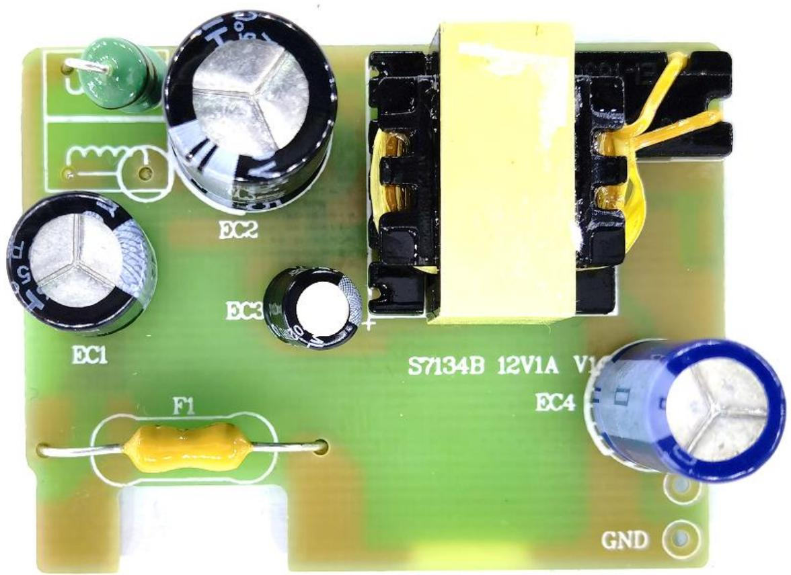

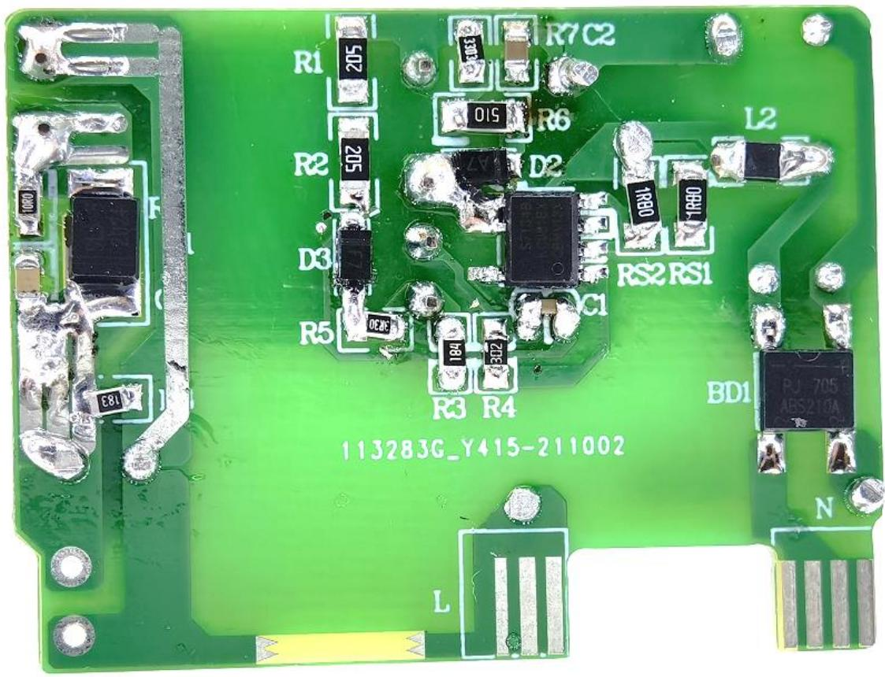

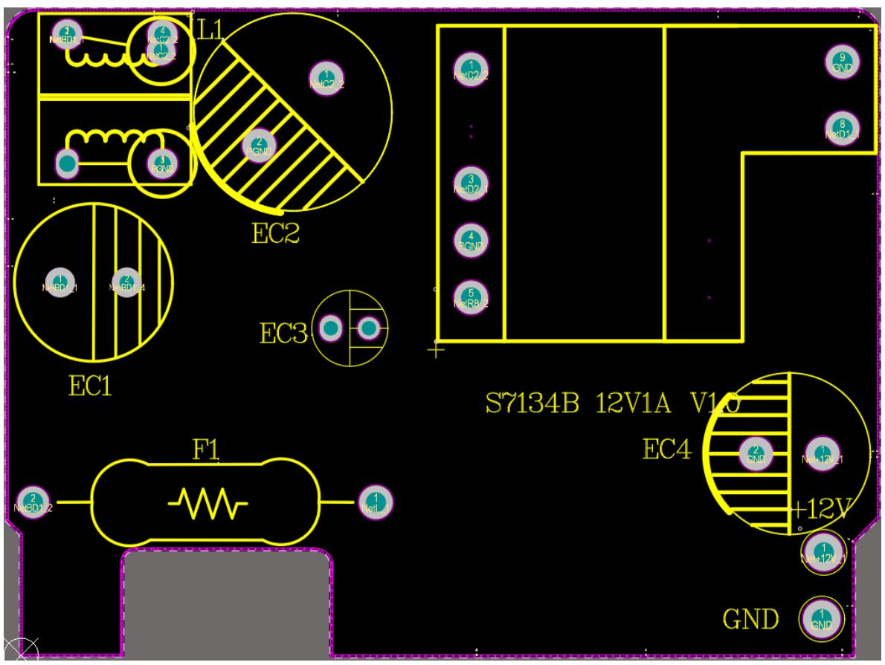

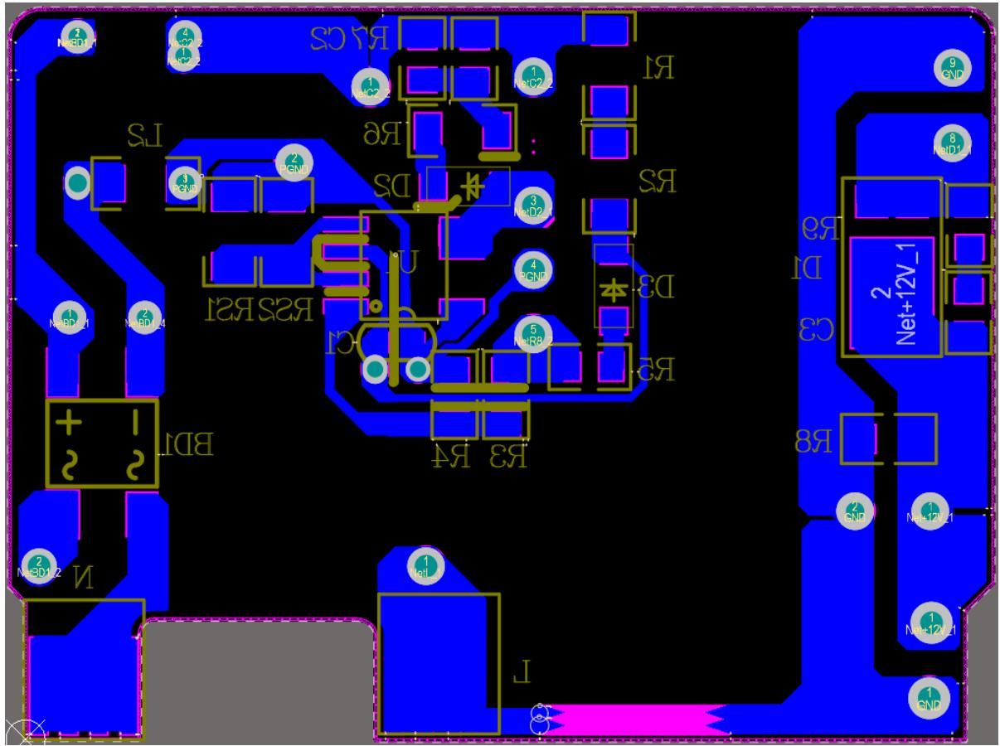

<table><tr><td>序号</td><td>物料名称</td><td>型号规格</td><td>用量</td><td>工位</td><td>备注</td></tr><tr><td colspan="6">SMD类</td></tr><tr><td>1</td><td>贴片电阻</td><td>2M 1206 ±5%</td><td>2</td><td>R1、R2</td><td></td></tr><tr><td>2</td><td>贴片电阻</td><td>16.3K 0805 ±1%</td><td>1</td><td>R3</td><td></td></tr><tr><td>3</td><td>贴片电阻</td><td>3K 0805 ±1%</td><td>1</td><td>R4</td><td></td></tr><tr><td>4</td><td>贴片电阻</td><td>3.3R 0805 ±5%</td><td>1</td><td>R5</td><td></td></tr><tr><td>5</td><td>贴片电阻</td><td>51R 1206 ±5%</td><td>1</td><td>R6</td><td></td></tr><tr><td>6</td><td>贴片电阻</td><td>330K 0805 ±5%</td><td>1</td><td>R7</td><td></td></tr><tr><td>7</td><td>贴片电阻</td><td>12K 0805 ±5%</td><td>1</td><td>R8</td><td></td></tr><tr><td>8</td><td>贴片电阻</td><td>10R 0805 ±5%</td><td>1</td><td>R9</td><td></td></tr><tr><td>9</td><td>贴片电阻</td><td>1.8R 1206 ±1%</td><td>1</td><td>RS1</td><td></td></tr><tr><td>10</td><td>贴片电阻</td><td>1.8R 1206 ±1%</td><td>1</td><td>RS2</td><td></td></tr><tr><td>11</td><td>贴片电容</td><td>1uF/50V 0603 ±10%</td><td>1</td><td>C1</td><td></td></tr><tr><td>12</td><td>贴片电容</td><td>2.2nF/250V 0805 ±10%</td><td>1</td><td>C2</td><td></td></tr><tr><td>13</td><td>贴片电容</td><td>470pF/100V 0805 ±10%</td><td>1</td><td>C3</td><td></td></tr><tr><td>14</td><td>贴片电感</td><td>10uH 1206 SRF&gt;30MHz</td><td>1</td><td>L2</td><td></td></tr><tr><td>15</td><td>IC</td><td>S7134B SOP7</td><td>1</td><td>U1</td><td></td></tr><tr><td>16</td><td>整流桥</td><td>ABS210 1A 1000V ABS</td><td>1</td><td>DB1</td><td></td></tr><tr><td>17</td><td>整流二极管</td><td>SL56B 5A/60V SMF</td><td>1</td><td>D1</td><td></td></tr><tr><td>18</td><td>整流二极管</td><td>A7 1A/1000V SOD123FL</td><td>1</td><td>D2</td><td></td></tr><tr><td>19</td><td>整流二极管</td><td>F7 1A/1000V SOD123FL</td><td>1</td><td>D3</td><td></td></tr><tr><td colspan="6">DIP类</td></tr><tr><td>20</td><td>电解电容</td><td>10uF/400V 105°C Φ8*17mm</td><td>1</td><td>EC1</td><td></td></tr><tr><td>21</td><td>电解电容</td><td>15uF/400V 105°C Φ10*13mm</td><td>1</td><td>EC2</td><td></td></tr><tr><td>22</td><td>电解电容</td><td>4.7uF/50V 105°C Φ4*10mm</td><td>1</td><td>EC3</td><td></td></tr><tr><td>23</td><td>电解电容</td><td>1000uF /16V 105°C LESR Φ8.3*13mm</td><td>1</td><td>EC4</td><td></td></tr><tr><td>24</td><td>变压器</td><td>EI16立式 5+2+2 AE=38mm^2 Lm=1.4mH</td><td>1</td><td>T1</td><td></td></tr><tr><td>25</td><td>色环电感</td><td>100uH 1/2W</td><td>1</td><td>L1</td><td></td></tr><tr><td>26</td><td>保险丝</td><td>2A250V</td><td>1</td><td>F1</td><td></td></tr></table>

元器件总数  
27

## ■ 原理图

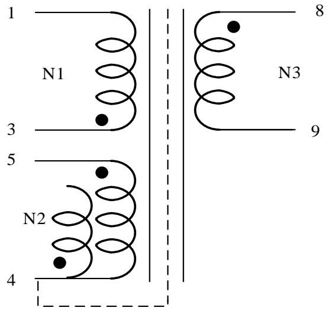

## ■ 规格与材料

➢ 初级绕组感量 $L_{p}=1.4mH\pm5\%$ （测试条件：1V，10kHz）  
漏感量 $L_{lk}<100uH$  
骨架：EI16立式（5+2+2PIN）  
磁芯：EE17.3 PC95 或同等材质，Ae=38.8mm²  
N1、N2: 2UEW 漆包线  
N3: 三层绝缘线  
绝缘胶带:3M900 或同等材质  
➢ 耐压测试: 3KV, 50/60Hz, 1Min  
成品要求：浸凡立水  
磁芯接PIN4  
PIN3 6 7剪脚

■ 绕线方式

<table><tr><td>绕组</td><td>起始脚</td><td>终止脚</td><td>材料</td><td>匝数</td><td>绕线方式</td></tr><tr><td>N1</td><td>3</td><td>1</td><td> $\phi 0.21*1P$ </td><td>66Ts</td><td>密绕3层(PIN脚朝内)</td></tr><tr><td colspan="4">胶带</td><td>2Ts</td><td></td></tr><tr><td rowspan="2">N2</td><td>5</td><td>4</td><td> $\phi 0.18*1P$ </td><td rowspan="2">6Ts</td><td rowspan="2">靠近管脚密绕半层(PIN脚朝内)</td></tr><tr><td>4</td><td>NC</td><td> $\phi 0.18*1P$ </td></tr><tr><td colspan="4">胶带</td><td>3Ts</td><td></td></tr><tr><td>N3</td><td>8</td><td>9</td><td>三层绝缘线 $\phi 0.6*1P$ </td><td>6Ts</td><td>密绕1层(PIN脚朝内)</td></tr><tr><td colspan="4">胶带</td><td>3Ts</td><td></td></tr></table>

## ■ 脚位图

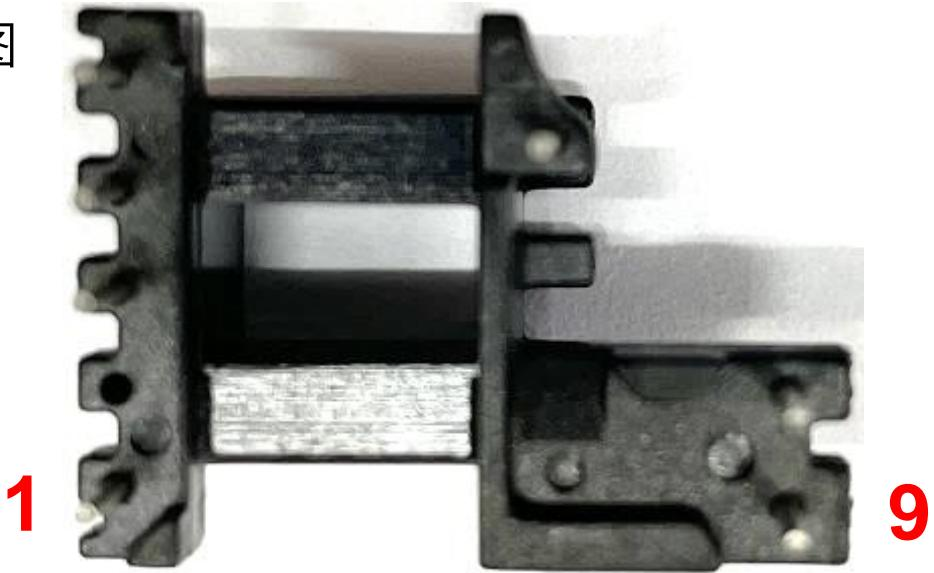

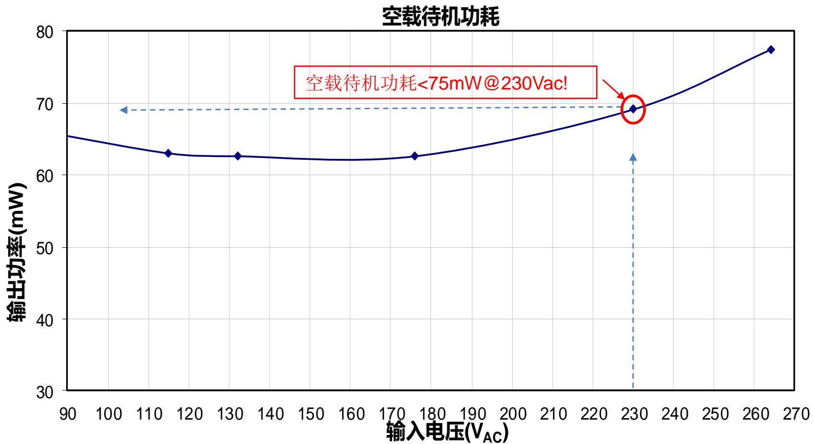

效率测试

<table><tr><td> $V_{IN}(VAC)$ </td><td>Load(%)</td><td> $P_{IN}(W)$ </td><td> $V_{OUT}(V)$ </td><td> $I_{OUT}(A)$ </td><td> $P_{OUT}(W)$ </td><td>Eff(%)</td><td>AVG Eff(%)</td><td>DoE VI</td><td>COC V5.0 Tier 2</td></tr><tr><td rowspan="6">90</td><td>空载</td><td>0.050</td><td>12.458</td><td>0</td><td>0.000</td><td></td><td></td><td></td><td></td></tr><tr><td>10%</td><td>1.496</td><td>11.848</td><td>0.1</td><td>1.185</td><td>79.20%</td><td></td><td></td><td></td></tr><tr><td>25%</td><td>3.603</td><td>11.970</td><td>0.25</td><td>2.993</td><td>83.06%</td><td rowspan="4">83.76%</td><td rowspan="4"></td><td rowspan="4"></td></tr><tr><td>50%</td><td>7.270</td><td>12.205</td><td>0.5</td><td>6.103</td><td>83.94%</td></tr><tr><td>75%</td><td>10.950</td><td>12.272</td><td>0.75</td><td>9.204</td><td>84.05%</td></tr><tr><td>100%</td><td>14.610</td><td>12.270</td><td>1</td><td>12.270</td><td>83.98%</td></tr><tr><td rowspan="6">115</td><td>空载</td><td>0.050</td><td>12.386</td><td>0</td><td>0.000</td><td></td><td></td><td>0.1</td><td>0.075</td></tr><tr><td>10%</td><td>1.490</td><td>11.852</td><td>0.1</td><td>1.185</td><td>79.54%</td><td></td><td></td><td>72.96%</td></tr><tr><td>25%</td><td>3.570</td><td>11.989</td><td>0.25</td><td>2.997</td><td>83.96%</td><td rowspan="4">85.18%</td><td rowspan="4">82.96%</td><td rowspan="4">83.26%</td></tr><tr><td>50%</td><td>7.170</td><td>12.233</td><td>0.5</td><td>6.117</td><td>85.31%</td></tr><tr><td>75%</td><td>10.750</td><td>12.285</td><td>0.75</td><td>9.214</td><td>85.71%</td></tr><tr><td>100%</td><td>14.330</td><td>12.290</td><td>1</td><td>12.290</td><td>85.76%</td></tr><tr><td rowspan="6">230</td><td>空载</td><td>0.070</td><td>12.168</td><td>0</td><td>0.000</td><td></td><td></td><td>0.1</td><td>0.075</td></tr><tr><td>10%</td><td>1.520</td><td>11.840</td><td>0.1</td><td>1.184</td><td>77.89%</td><td></td><td></td><td>72.96%</td></tr><tr><td>25%</td><td>3.580</td><td>11.973</td><td>0.25</td><td>2.993</td><td>83.61%</td><td rowspan="4">85.76%</td><td rowspan="4">82.96%</td><td rowspan="4">83.26%</td></tr><tr><td>50%</td><td>7.120</td><td>12.225</td><td>0.5</td><td>6.113</td><td>85.85%</td></tr><tr><td>75%</td><td>10.640</td><td>12.284</td><td>0.75</td><td>9.213</td><td>86.59%</td></tr><tr><td>100%</td><td>14.140</td><td>12.300</td><td>1</td><td>12.300</td><td>86.99%</td></tr><tr><td rowspan="6">265</td><td>空载</td><td>0.081</td><td>12.181</td><td>0</td><td>0.000</td><td></td><td></td><td></td><td></td></tr><tr><td>10%</td><td>1.550</td><td>11.835</td><td>0.1</td><td>1.184</td><td>76.35%</td><td></td><td></td><td></td></tr><tr><td>25%</td><td>3.620</td><td>11.987</td><td>0.25</td><td>2.997</td><td>82.78%</td><td rowspan="4">85.29%</td><td rowspan="4"></td><td rowspan="4"></td></tr><tr><td>50%</td><td>7.160</td><td>12.241</td><td>0.5</td><td>6.121</td><td>85.48%</td></tr><tr><td>75%</td><td>10.700</td><td>12.303</td><td>0.75</td><td>9.227</td><td>86.24%</td></tr><tr><td>100%</td><td>14.200</td><td>12.308</td><td>1</td><td>12.308</td><td>86.68%</td></tr></table>

■ 注：以上测试均为板端效率

效率对比  
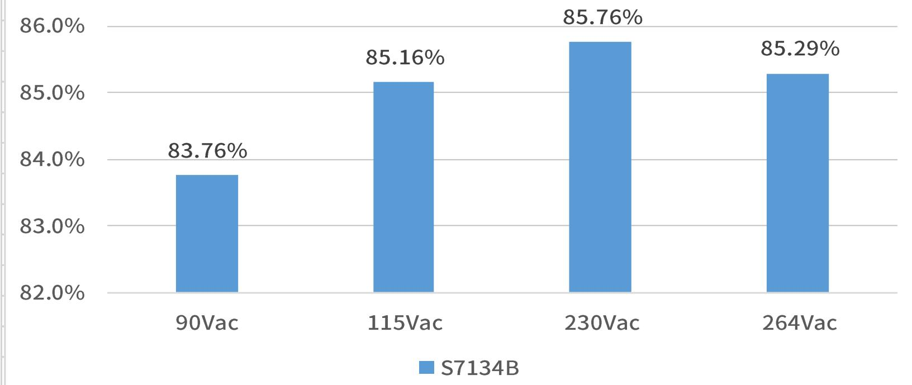

■ 注：以上测试均为板端效率

## 调整率

<table><tr><td colspan="6">电压调整率</td></tr><tr><td>lout (A)</td><td>90Vac</td><td>115Vac</td><td>230Vac</td><td>265Vac</td><td>线调整率</td></tr><tr><td>0</td><td>12.013</td><td>12.061</td><td>12.142</td><td>12.160</td><td>1.82%</td></tr><tr><td>20%</td><td>11.832</td><td>11.853</td><td>11.837</td><td>11.840</td><td>0.27%</td></tr><tr><td>40%</td><td>12.037</td><td>12.059</td><td>12.051</td><td>12.056</td><td>0.27%</td></tr><tr><td>60%</td><td>12.213</td><td>12.229</td><td>12.226</td><td>12.237</td><td>0.29%</td></tr><tr><td>80%</td><td>12.211</td><td>12.224</td><td>12.220</td><td>12.232</td><td>0.26%</td></tr><tr><td>100%</td><td>12.201</td><td>12.222</td><td>12.224</td><td>12.228</td><td>0.34%</td></tr><tr><td>负载调整率</td><td>3.15%</td><td>3.11%</td><td>3.21%</td><td>3.27%</td><td></td></tr></table>

## 输出电压纹波

100 V $_{AC}$

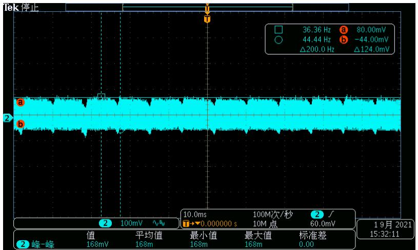

■ CH2 $V_{OUT}$ Ripple $V_{PK-PK}=124mV$

## 测试条件:

Full Load

115 V $_{AC}$

■ CH2 V $_{OUT}$ Ripple
V $_{PK-PK}$ =136mV

## 测试条件:

Full Load

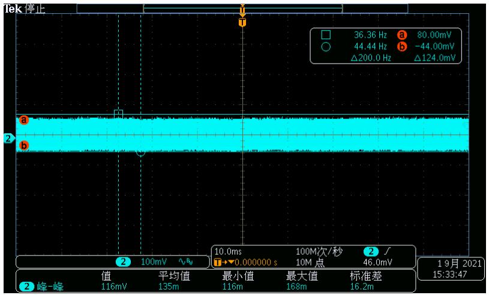

230 V $_{AC}$

■ CH2 $V_{OUT}$ Ripple $V_{PK-PK}=116mV$

## 测试条件:

Full Load

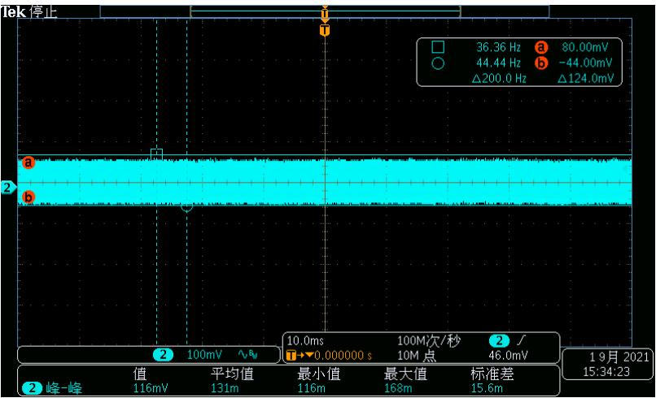

备注：以上纹波为线端测试，1.2m线

265 V $_{AC}$

■ CH2 $V_{OUT}$ Ripple $V_{PK-PK}=116mV$

## 测试条件:

Full Load

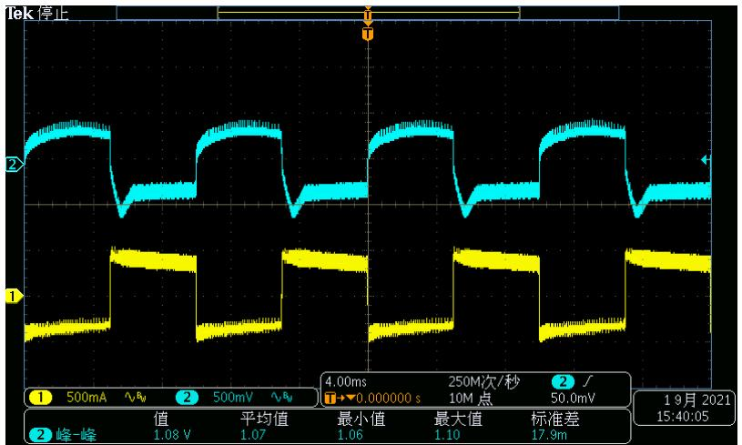

CH2 VOUT
CH1 IOUT

Vpk-pk=1.08V

## 测试条件:

90 V $_{AC}$  
10%\~90% 负载  
翻转速度:  
0.08A/μs  
频率: 100 Hz

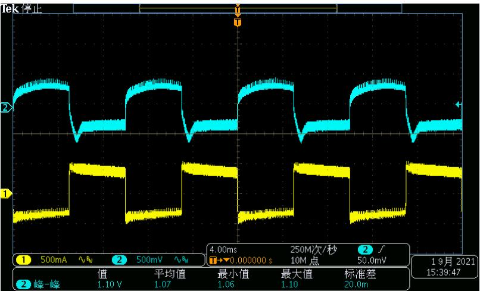

CH2 VOUT
CH1 IOUT

Vpk-pk=1.1V

## 测试条件:

115 V $_{AC}$  
10%\~90% 负载  
翻转速度:  
0.08A/μs  
频率: 100 Hz

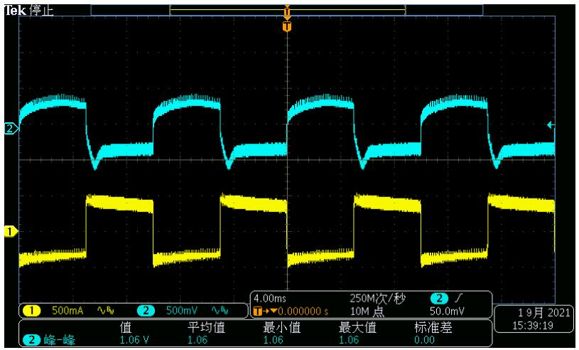

CH2 VOUT
CH1 IOUT

Vpk-pk=1.06V

## 测试条件:

230 V $_{AC}$  
10%\~90% 负载  
翻转速度:  
0.08A/μs  
频率: 100 Hz

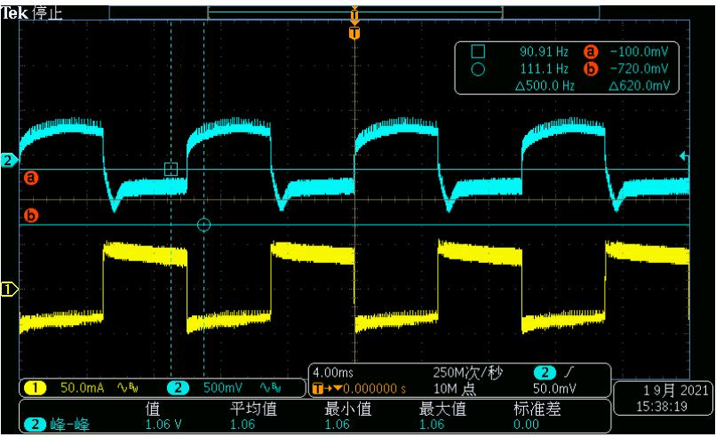

CH2 VOUT
CH1 IOUT

Vpk-pk=1.06V

## 测试条件:

265 V $_{AC}$  
10%\~90% 负载  
翻转速度:  
0.08A/μs  
频率: 100 Hz

## 启动及关机延迟时间

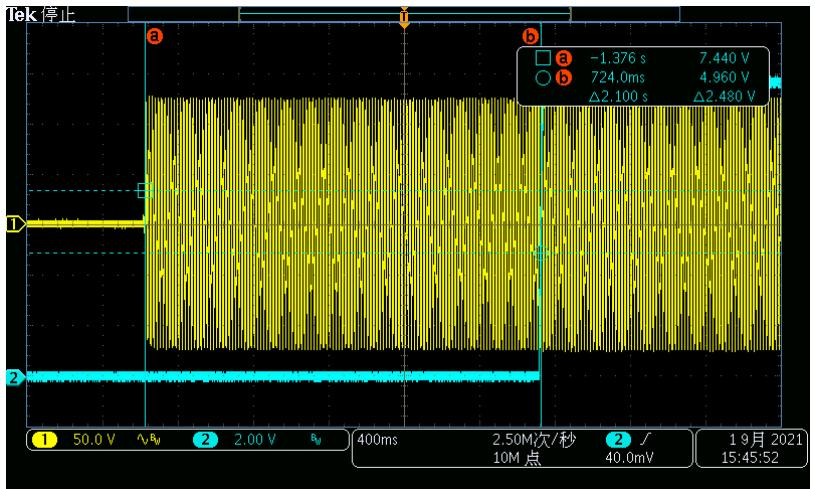

CH1 V $_{IN}$

CH2 V $_{OUT}$

$t_{delay}=2.1s$

## 测试条件:

90 V $_{AC}$  
满载

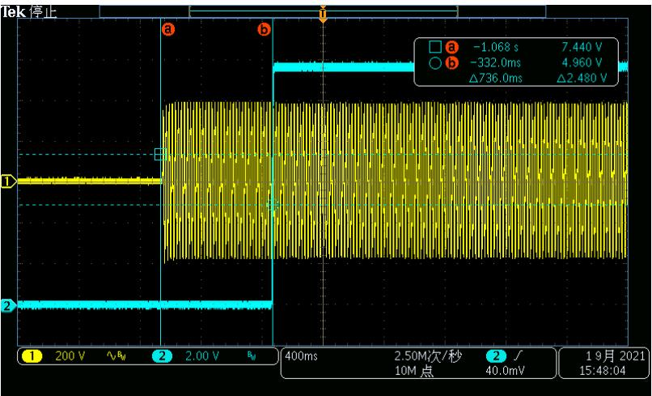

CH2 VOUT

CH1 V $_{IN}$

$t_{delay}=736ms$

## 测试条件:

264V $_{AC}$  
满载

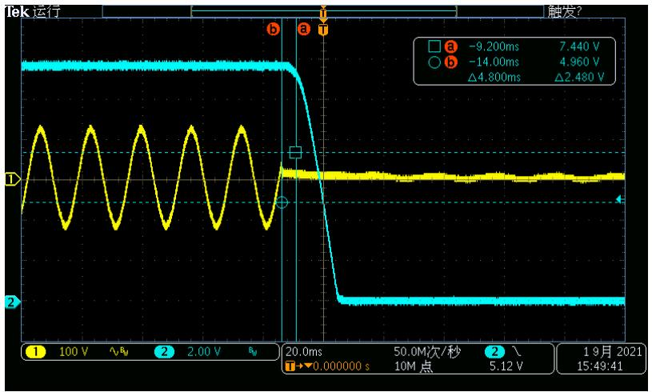

CH1 V $_{IN}$

CH2 VOUT

$t_{delay}=4.8ms$

## 测试条件:

90 V $_{AC}$  
满载

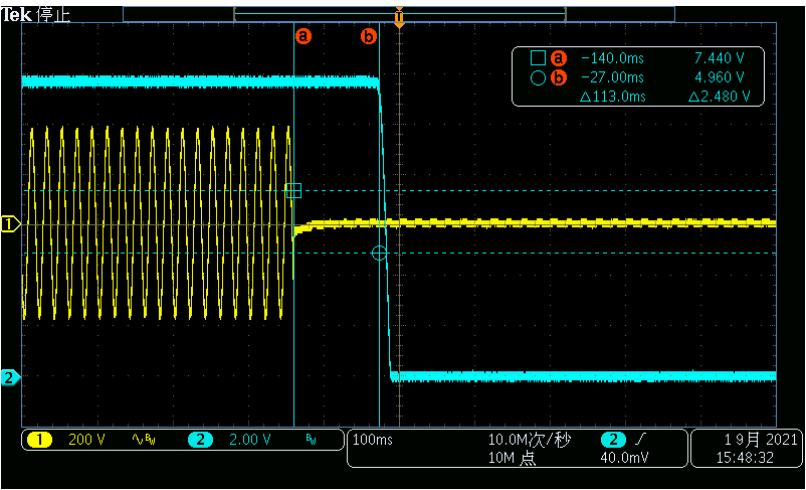

CH2 VOUT

CH1 V $_{IN}$

$t_{delay}=113ms$

## 测试条件:

264 V $_{AC}$  
满载

## VCC工作电压

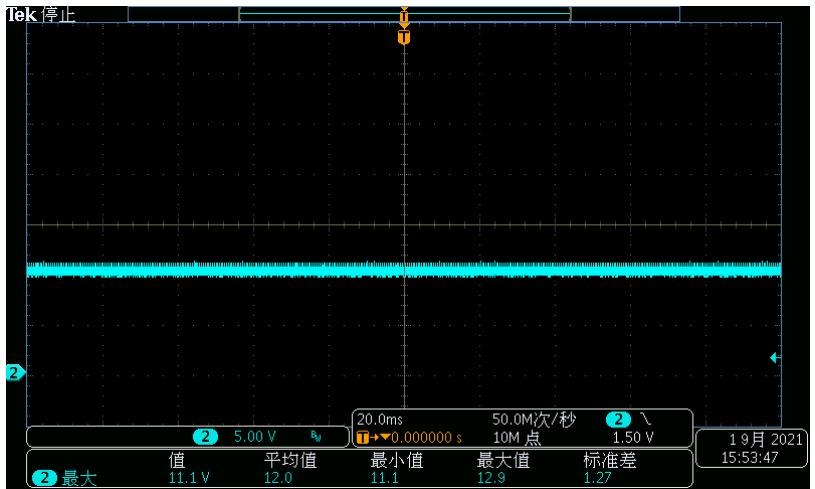

CH2 Vcc

$$
V _ {c c \_ m i n} = 1 1. 1 V
$$

## 测试条件:

No Load  
90Vac

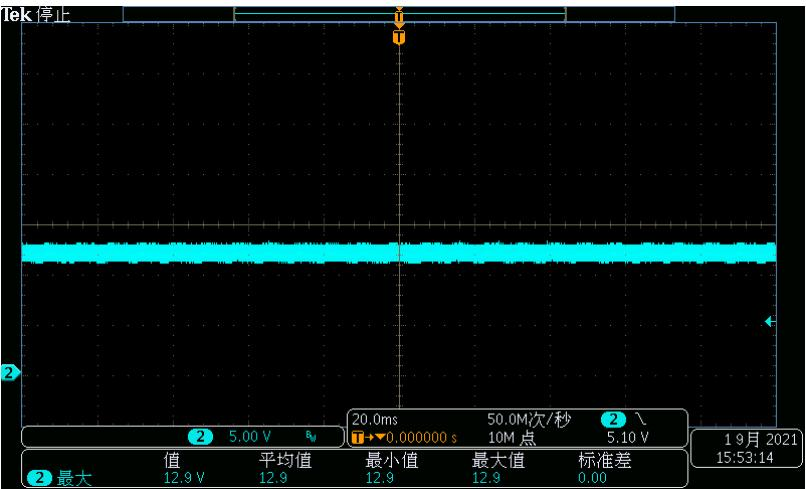

CH2 Vcc

$$
V _ {c c \_ m i n} = 1 2. 9 V
$$

## 测试条件:

Full Load  
90Vac

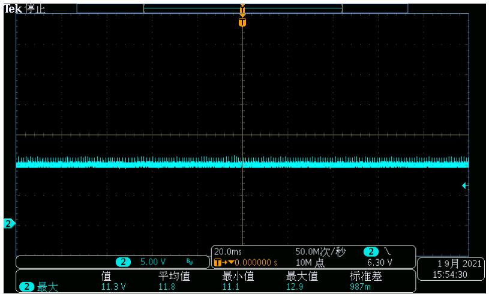

CH2 Vcc

$$
V _ {c c \_ m i n} = 1 1. 3 V
$$

## 测试条件:

No Load  
264Vac

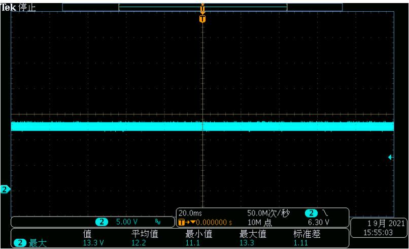

CH2 Vcc

$$
V _ {c c \_ m i n} = 1 3. 3 V
$$

## 测试条件:

Full Load  
264Vac

## 变压器磁通密度

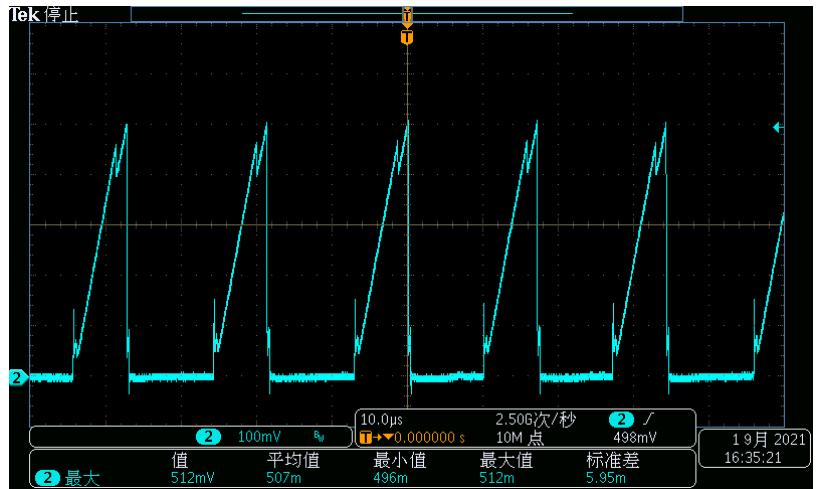

CH2 V $_{cs}$

$$
V _ {c s \_ m a x} = 5 1 2 m V
$$

## 测试条件:

full Load  
90Vac

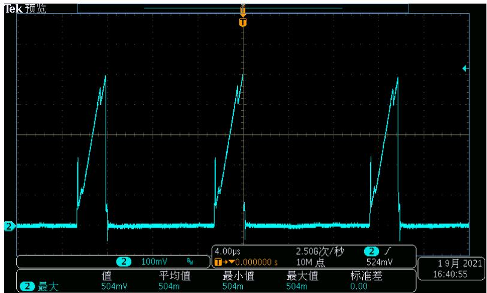

CH2 Vcc

$$
V _ {c s \_ m a x} = 5 0 4 m V
$$

## 测试条件:

最大负载（1.4A）  
230Vac

$$
I _ {P K} = \frac {V \mathrm{cs}}{R \mathrm{cs}} = \frac {5 1 2 m A}{0 . 9 R} = 0. 5 6 9 A
$$

$$
B _ {M A X} = \frac {L _ {P} \times I _ {P K}}{N _ {P} \times A _ {e}} = \frac {1 . 4 \times 0 . 5 6 9}{6 6 \times 3 8} = 0. 3 1 7 (T e s l a)
$$

$$
I _ {P K} = \frac {V \mathrm{cs}}{R \mathrm{cs}} = \frac {5 0 4 m A}{0 . 9 R} = 0. 5 6 0 A
$$

$$
B _ {M A X} = \frac {L _ {P} \times I _ {P K}}{N _ {P} \times A _ {e}} = \frac {1 . 4 \times 0 . 5 6 0}{6 6 \times 3 8} = 0. 3 1 2 (T e s l a)
$$

## C-E电压波形

265 V $_{AC}$

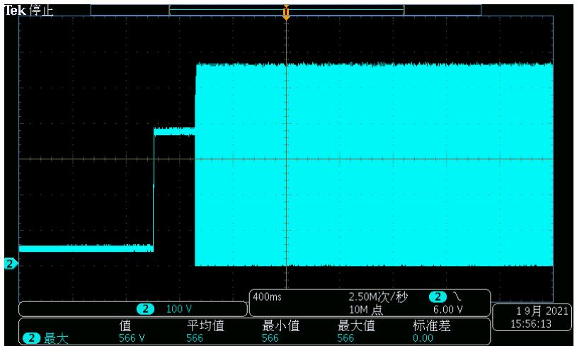

■ CH2 V $_{DS}$ VCE $_{MAX}$ : 566 V

## 测试条件:

满载开机

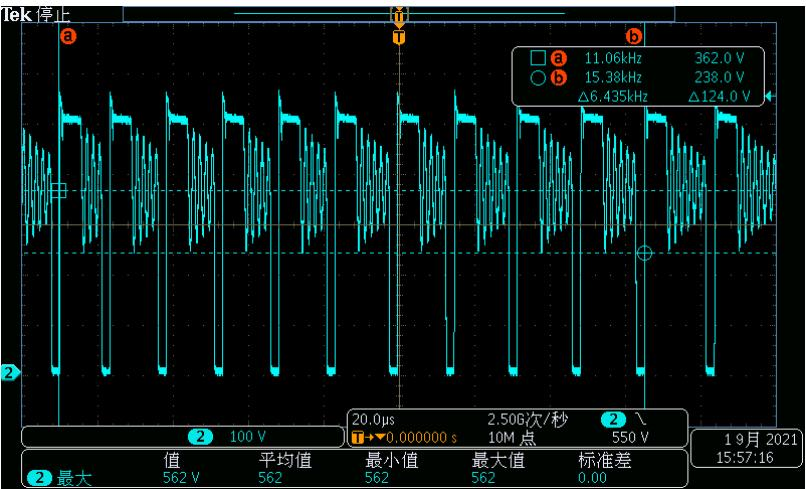

265 V $_{AC}$

■ CH2 V $_{DS}$ VCE $_{MAX}$ : 562V

## 测试条件:

满载  
正常工作

<table><tr><td rowspan="2">集电极-基极击穿电压</td><td rowspan="2">VCBO</td><td>S7132B</td><td></td><td>850</td><td></td><td></td><td>V</td></tr><tr><td>S7133B</td><td></td><td>750</td><td></td><td></td><td>V</td></tr><tr><td></td><td></td><td>S7134B</td><td></td><td>750</td><td></td><td></td><td>V</td></tr></table>

## 满载开机

Derating= 566V / 750 V = 75.46 %

## 满载正常工作

Derating = 562V / 750 V = 74.9%

## 续流二极管反向电压

265 V $_{AC}$

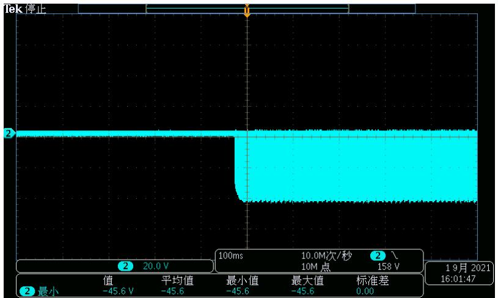

■ CH2 V $_{DIODE}$ VD $_{MAX}$ : 45.6V

## 测试条件:

满载启动

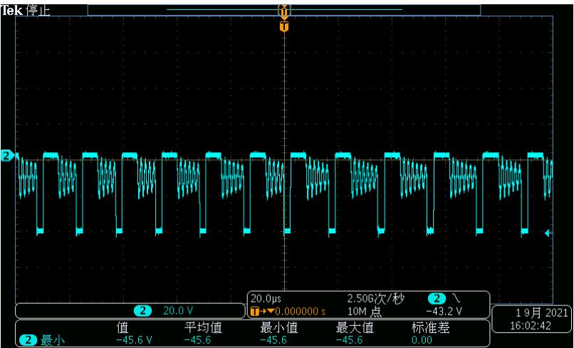

265 V $_{AC}$

■ CH2 V $_{DDIODE}$ VD $_{MAX}$ : 45.6V

## 测试条件:

满载  
正常工作

<table><tr><td colspan="12">MAXIMUM RATINGS (TA = 25 °C unless otherwise noted)</td></tr><tr><td>PARAMETER</td><td>SYMBOL</td><td>SL52B</td><td>SL53B</td><td>SL54B</td><td>SL55B</td><td>SL56B</td><td>SL57B</td><td>SL58B</td><td>SL59B</td><td>SL510B</td><td>UNIT</td></tr><tr><td>Maximum repetitive peak reverse voltage</td><td>VRRM</td><td>20</td><td>30</td><td>40</td><td>50</td><td>60</td><td>70</td><td>80</td><td>90</td><td>100</td><td>V</td></tr><tr><td>Maximum RMS voltage</td><td>VRMS</td><td>14</td><td>21</td><td>28</td><td>35</td><td>42</td><td>49</td><td>56</td><td>63</td><td>70</td><td>V</td></tr><tr><td>Maximum DC blocking voltage</td><td>VDC</td><td>20</td><td>30</td><td>40</td><td>50</td><td>60</td><td>70</td><td>80</td><td>90</td><td>100</td><td>V</td></tr><tr><td>Maximum average forward rectified current at TL(See Fig.1)</td><td>IF(AV)</td><td colspan="9">5</td><td>A</td></tr><tr><td>Peak forward surge current 8.3 ms single half sine-wave superimposed on rated load</td><td>IFSM</td><td colspan="5">120</td><td colspan="4">250</td><td>A</td></tr><tr><td>Operating junction temperature range</td><td>TJ</td><td colspan="3">-55 to +125</td><td colspan="6">-55 to +150</td><td>°C</td></tr><tr><td>Storage temperature range</td><td>TSTG</td><td colspan="9">-55 to +150</td><td>°C</td></tr></table>

## 满载开机

Derating = 45.6V / 60 V = 76 %

## 满载正常工作

Derating =45.6V / 60 V = 76 %

## 输出电压上升时间

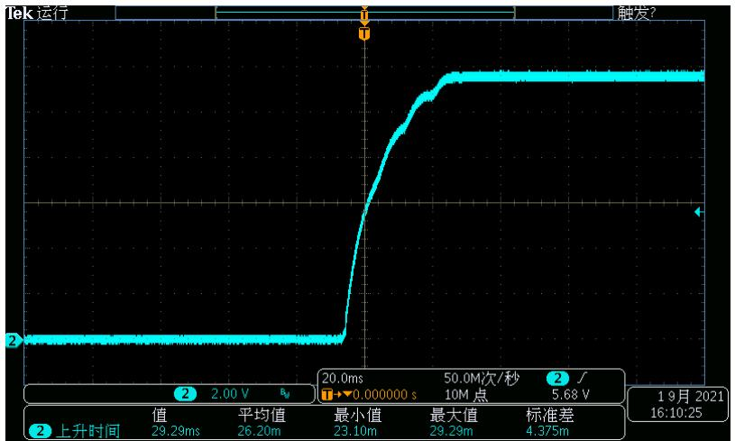

CH2 V $_{OUT}$

$t_{rise}=29.6ms$

## 测试条件:

90 V $_{AC}$  
满载

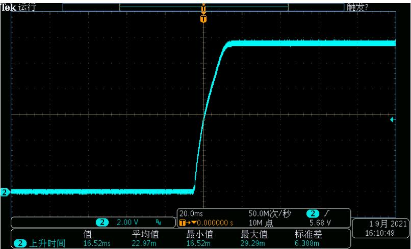

CH2 V $_{OUT}$

$t_{rise}=16.52ms$

## 测试条件:

115V $_{AC}$  
满载

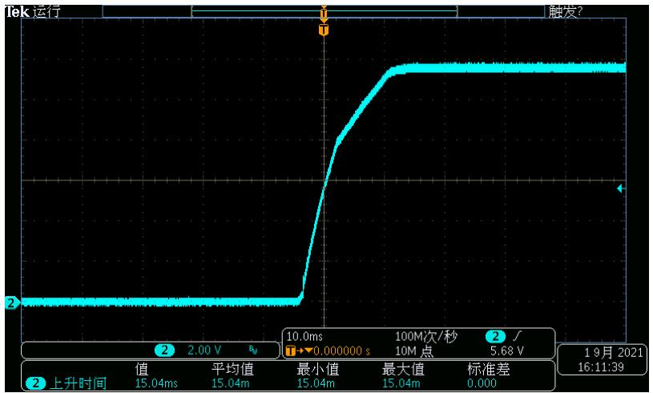

CH2 V $_{OUT}$

$t_{rise}=15.04ms$

## 测试条件:

230 V $_{AC}$  
满载

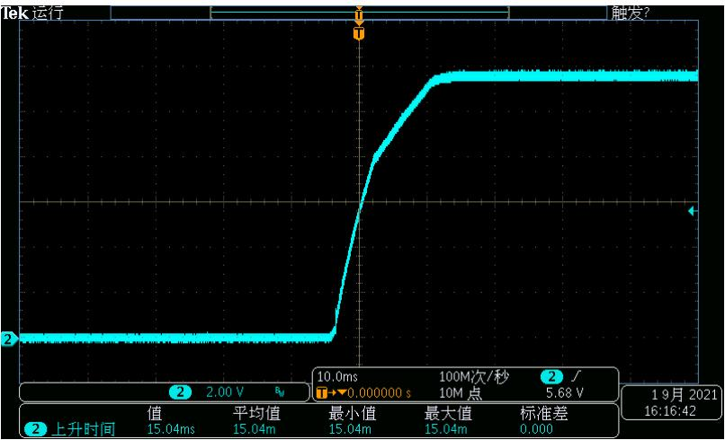

CH2 VOUT

$t_{rise}=15.04ms$

## 测试条件:

264 V $_{AC}$  
满载

## 容性负载

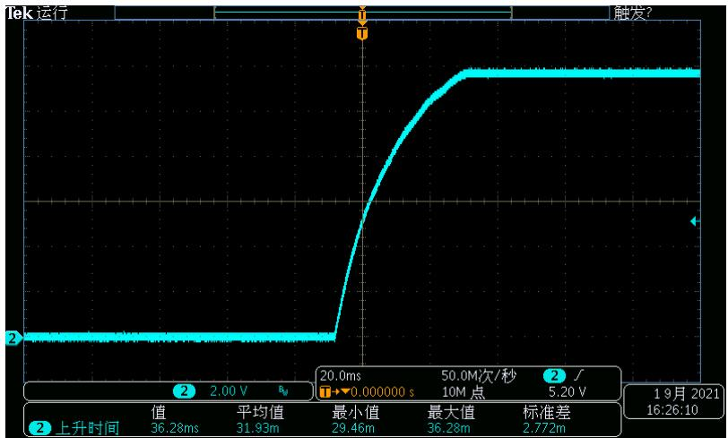

CH2 V $_{OUT}$

PASS

## 测试条件:

90 V $_{AC}$  
CR模式12R  
Co=2200uF

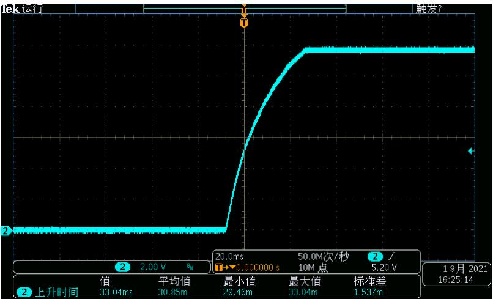

CH2 VOUT

$t_{rise}=38.7ms$

## 测试条件:

115V $_{AC}$  
CR模式12R  
Co=2200uF

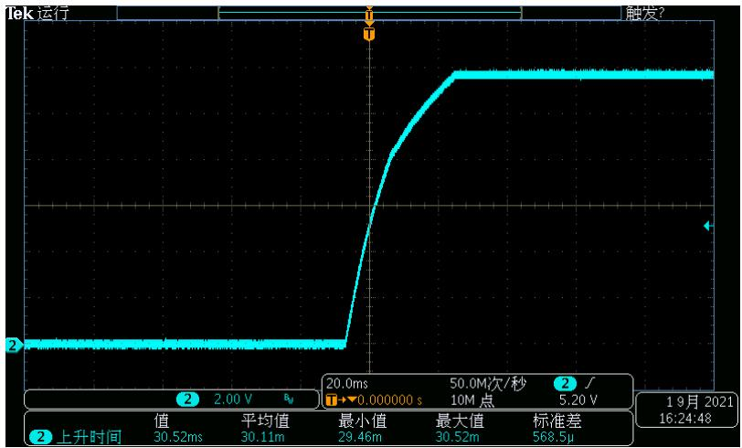

CH2 VOUT

PASS

## 测试条件:

230 V $_{AC}$  
CR模式12R  
Co=2200uF

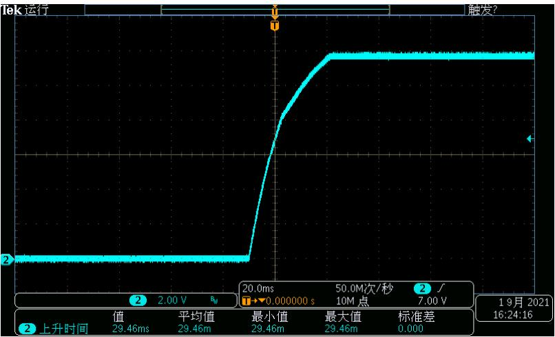

CH2 VOUT

PASS

## 测试条件:

264 V $_{AC}$  
CR模式12R  
Co=2200uF

## 输出短路保护

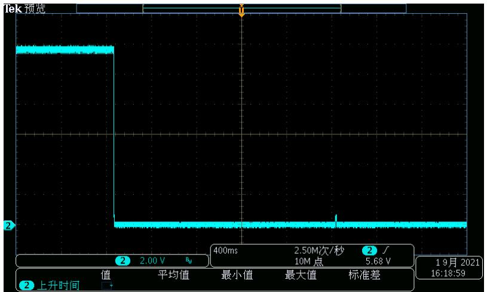

CH2 V $_{OUT}$

PASS

## 测试条件:

90 V $_{AC}$  
输出短路

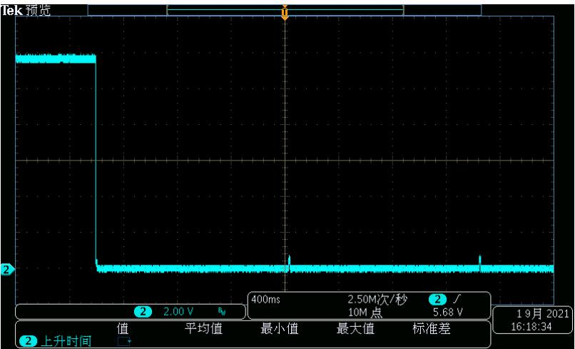

CH2 V $_{OUT}$

PASS

## 测试条件:

115 V $_{AC}$  
输出短路

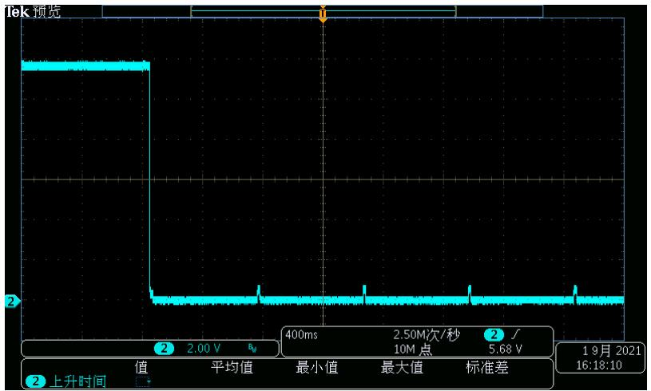

CH2 V $_{OUT}$

PASS

## 测试条件:

230 V $_{AC}$  
输出短路

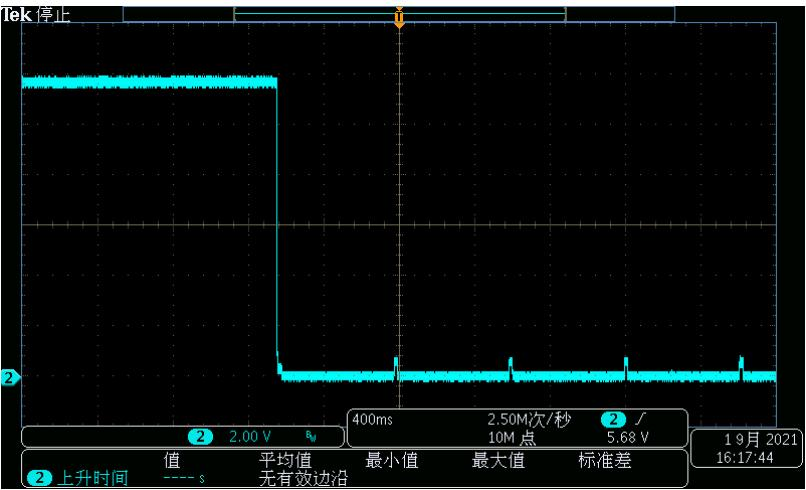

CH2 VOUT

PASS

## 测试条件:

264 V $_{AC}$  
输出短路

## 温升测试

<table><tr><td> $V_{IN}(VAC)$ </td><td>90</td><td>115</td><td>230</td><td>265</td></tr><tr><td>IC</td><td>123.3</td><td>110.8</td><td>95.2</td><td>103.7</td></tr><tr><td>续流二极管</td><td>103.3</td><td>102.4</td><td>96</td><td>102.9</td></tr><tr><td>变压器磁芯</td><td>96.2</td><td>92.7</td><td>84.2</td><td>93</td></tr><tr><td>变压器线圈</td><td>102.1</td><td>98.9</td><td>89.9</td><td>98.5</td></tr><tr><td>输出电容</td><td>81.1</td><td>80.5</td><td>73.8</td><td>80.5</td></tr><tr><td>输入电容</td><td>90.5</td><td>85.4</td><td>73.2</td><td>81</td></tr><tr><td>外壳温度</td><td>63.7</td><td>62.7</td><td>54.6</td><td>61.8</td></tr><tr><td>环温</td><td>45.5</td><td>46.7</td><td>44.3</td><td>46.6</td></tr></table>

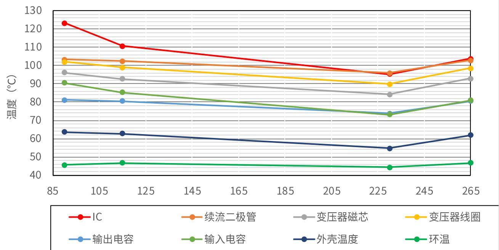

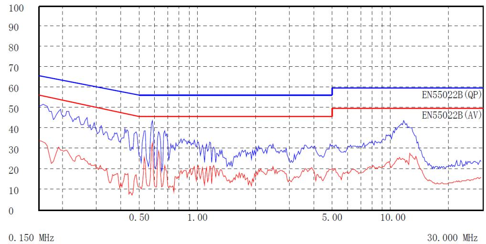

230VAC CE Line

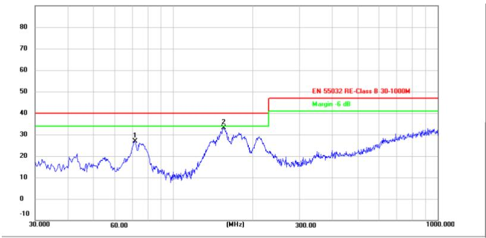

<table><tr><td>No.</td><td>Frequency (MHz)</td><td>Reading (dBuV)</td><td>Factor (dB/m)</td><td>Level (dBuV/m)</td><td>Limit (dBuV/m)</td><td>Margin (dB)</td><td>Detector</td><td>Height (cm)</td><td>Azimuth (deg.)</td><td>P/F</td><td>Remark</td></tr><tr><td>1</td><td>71.3867</td><td>44.88</td><td>-17.99</td><td>26.89</td><td>40.00</td><td>-13.11</td><td>peak</td><td>200</td><td>1</td><td>P</td><td></td></tr><tr><td>2 *</td><td>155.1300</td><td>47.46</td><td>-14.35</td><td>33.11</td><td>40.00</td><td>-6.89</td><td>peak</td><td>200</td><td>1</td><td>P</td><td></td></tr></table>

230VAC RE Horizontal

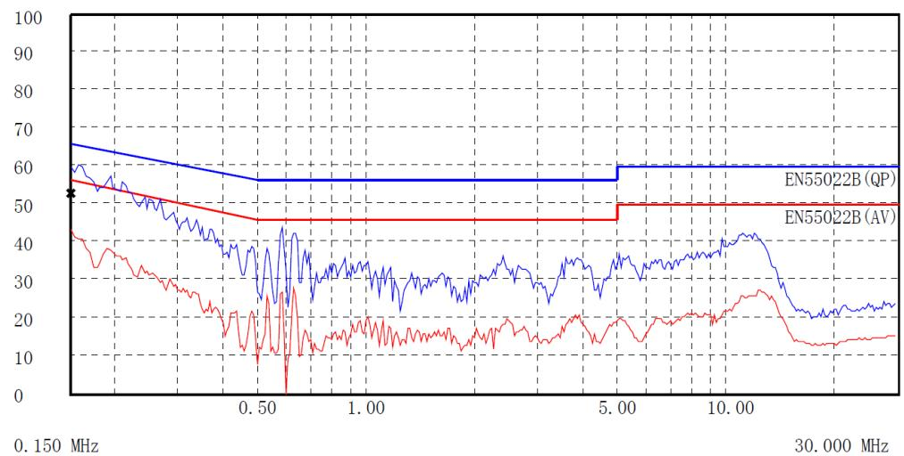

230VAC CE Neutral

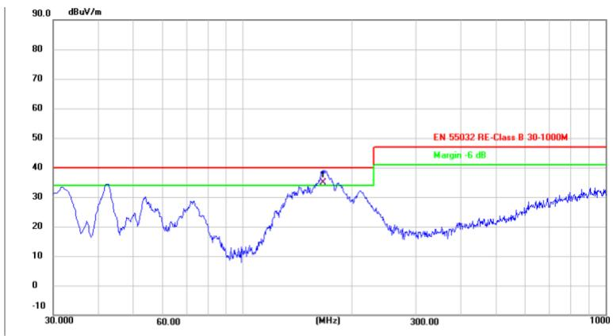

<table><tr><td>No.</td><td>Frequency (MHz)</td><td>Reading (dBuV)</td><td>Factor (dB/m)</td><td>Level (dBuV/m)</td><td>Limit (dBuV/m)</td><td>Margin (dB)</td><td>Detector</td><td>Height (cm)</td><td>Azimuth (deg.)</td><td>P/F</td><td>Rema</td></tr><tr><td>1 *</td><td>167.0932</td><td>49.43</td><td>-14.55</td><td>34.88</td><td>40.00</td><td>-5.12</td><td>QP</td><td>100</td><td>359</td><td>P</td><td></td></tr></table>

230VAC RE Vertical

<table><tr><td>测试点</td><td>电压(V)</td><td>放电类型</td><td>放电次数</td><td>测试结果</td></tr><tr><td>Vo</td><td>+12kV</td><td>空气放电</td><td>10</td><td>Pass</td></tr><tr><td>Vo</td><td>-12kV</td><td>空气放电</td><td>10</td><td>Pass</td></tr><tr><td>GND</td><td>+12kV</td><td>空气放电</td><td>10</td><td>Pass</td></tr><tr><td>GND</td><td>-12kV</td><td>空气放电</td><td>10</td><td>Pass</td></tr><tr><td>Vo</td><td>+15kV</td><td>空气放电</td><td>10</td><td>Pass</td></tr><tr><td>Vo</td><td>-15kV</td><td>空气放电</td><td>10</td><td>Pass</td></tr><tr><td>GND</td><td>+15kV</td><td>空气放电</td><td>10</td><td>Pass</td></tr><tr><td>GND</td><td>-15kV</td><td>空气放电</td><td>10</td><td>Pass</td></tr></table>

## ■ 测试说明

按照GB/T17626.2和IEC61000-4-2的最新版本要求进行测试  
室温环境，230VAC输入满载条件  
每个测试点重复10次  
分别对输出正端和地进行空气放电  
➢ 试验时样机输出正常（符合A类标准）视为Pass

## THANK YOU FOR WATCHING
