# S7141S 参考设计

# (5V/0.5A)

上海晶丰明源半导体股份有限公司

Shanghai Bright Power Semiconductor Co., Ltd.

陈耀兵

2022 7 1

S7141S  
电源规格  
电路图  
◼BOM  
◼PCB Layout  
电路实物图  
变压器规格书  
性能测试数据

## 产品特点:

➢ 850V  
➢ PSR CC/CV  
》集成高压启动、自供电电路  
》内部固定峰值电流  
》内置FB下偏置电阻  
》低待机功耗  
》输出线损补偿可调  
》内置软启动

## 应用领域:

➢ PDA MP3式设备等  
➢ LED  
》线性电源和RCC开关电源升级换代  
》其他辅助电源

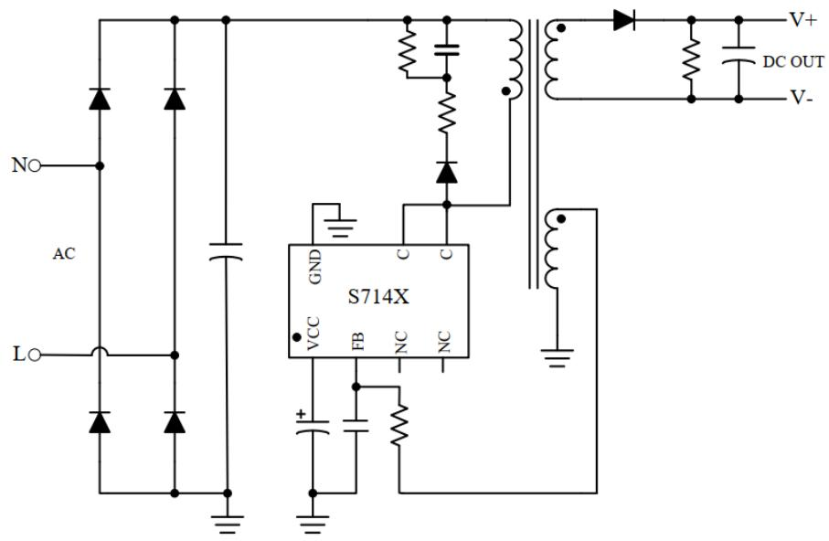

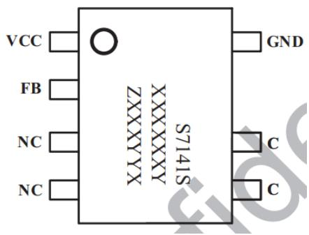

SOP-7

## 电源规格

<table><tr><td>项目描述</td><td>符号</td><td>最小</td><td>典型</td><td>最大</td><td>单位</td><td>备注</td></tr><tr><td colspan="7">输入</td></tr><tr><td>电压</td><td> $V_{IN}$ </td><td>90</td><td>115/230</td><td>264</td><td> $V_{AC}$ </td><td></td></tr><tr><td>频率</td><td> $f_{LINE}$ </td><td>47</td><td>50/60</td><td>63</td><td>Hz</td><td></td></tr><tr><td colspan="7">输出</td></tr><tr><td>输出电压</td><td> $V_{OUT}$ </td><td></td><td>5</td><td></td><td>V</td><td>±3%</td></tr><tr><td>输出电流</td><td> $I_{OUT}$ </td><td></td><td>0.5</td><td></td><td>A</td><td></td></tr><tr><td>输出电压纹波</td><td> $V_{RIPPLE}$ </td><td></td><td></td><td>100</td><td>mV</td><td>20MHz带宽</td></tr><tr><td>连续输出功率</td><td> $P_{OUT}$ </td><td></td><td>2.5</td><td></td><td>W</td><td></td></tr><tr><td colspan="7">效率</td></tr><tr><td>待机功耗</td><td> $P_{STDBY}$ </td><td></td><td></td><td>60</td><td>mW</td><td>230VAC</td></tr><tr><td>满载效率</td><td>η</td><td>74</td><td></td><td></td><td>%</td><td>115VAC/230VAC</td></tr><tr><td colspan="7">环境</td></tr><tr><td>传导EMI</td><td></td><td colspan="4">满足CISPR22/EN55022 Class B,至少6dB 裕量</td><td></td></tr><tr><td>Surge</td><td></td><td></td><td>1</td><td></td><td>kV</td><td>差模</td></tr><tr><td>EFT</td><td></td><td></td><td>4</td><td></td><td>kV</td><td>5kHz/100kHz/38kHz</td></tr><tr><td>ESD</td><td></td><td></td><td>15</td><td></td><td>kV</td><td>接触8kV,空气15kV</td></tr><tr><td>工作环境温度</td><td> $T_{AMP}$ </td><td>0</td><td></td><td>40</td><td>°C</td><td></td></tr></table>

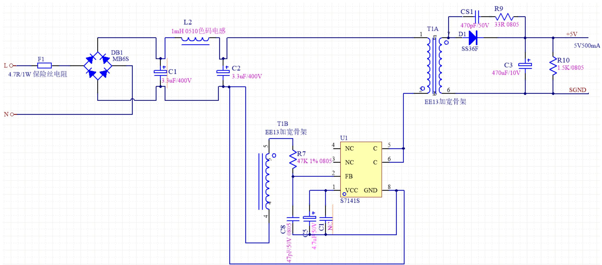

<table><tr><td>序号</td><td>元件标号</td><td>参数描述</td><td>封装尺寸</td><td>数量</td></tr><tr><td>1</td><td>C1, C2</td><td>3.3uF/400V</td><td>EC8.3*17</td><td>2</td></tr><tr><td>2</td><td>C3</td><td>470uF/10V</td><td>CD6.3/P2.5X_1</td><td>1</td></tr><tr><td>3</td><td>C5</td><td>4.7uF/50V</td><td>CD5</td><td>1</td></tr><tr><td>4</td><td>C8</td><td>47pF/50V 0805</td><td>0805</td><td>1</td></tr><tr><td>5</td><td>CS1</td><td>470pF/50V</td><td>0805</td><td>1</td></tr><tr><td>6</td><td>D1</td><td>SS36F</td><td>SMA</td><td>1</td></tr><tr><td>7</td><td>DB1</td><td>MB6S</td><td>MB10F</td><td>1</td></tr><tr><td>8</td><td>F1</td><td>Res2</td><td>R/S-0805(B)</td><td>1</td></tr><tr><td>9</td><td>L2</td><td>1mH 0510色码电感</td><td>L5*11</td><td>1</td></tr><tr><td>10</td><td>R7</td><td>47K 1% 0805</td><td>0805</td><td>1</td></tr><tr><td>11</td><td>R9</td><td>33R 0805</td><td>0805</td><td>1</td></tr><tr><td>12</td><td>R10</td><td>1.5K/0805</td><td>0805</td><td>1</td></tr><tr><td>13</td><td>T1</td><td>EE13加宽骨架</td><td>EE13 5+2 卧式</td><td>1</td></tr><tr><td>14</td><td>U1</td><td>S7141S</td><td>USOP-7(S7133)</td><td>1</td></tr></table>

## 电路实物图

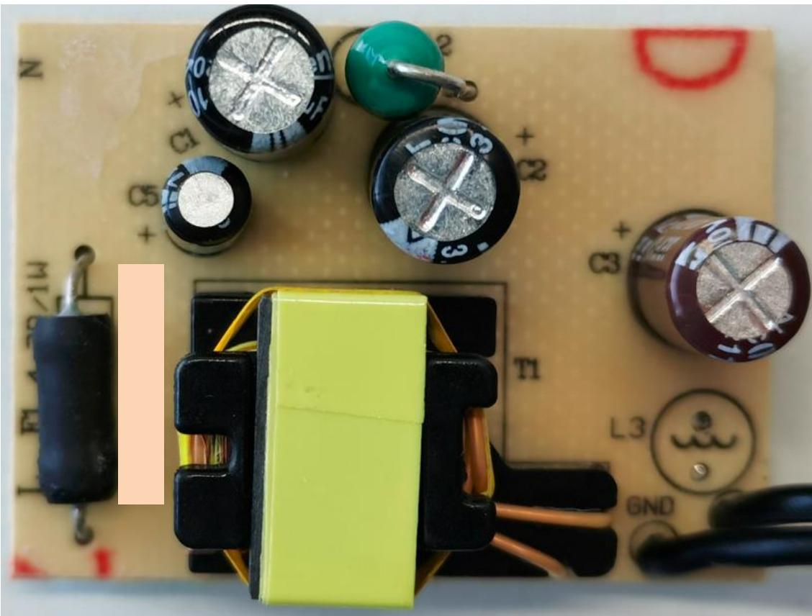

TOP SIDE

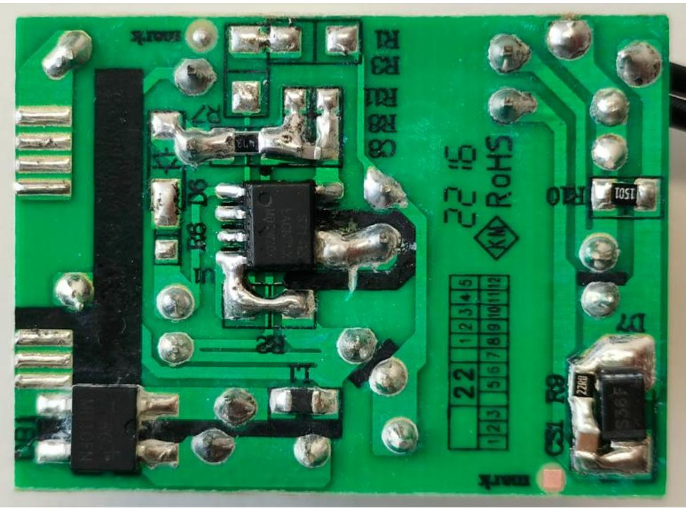

BOTTOM SIDE

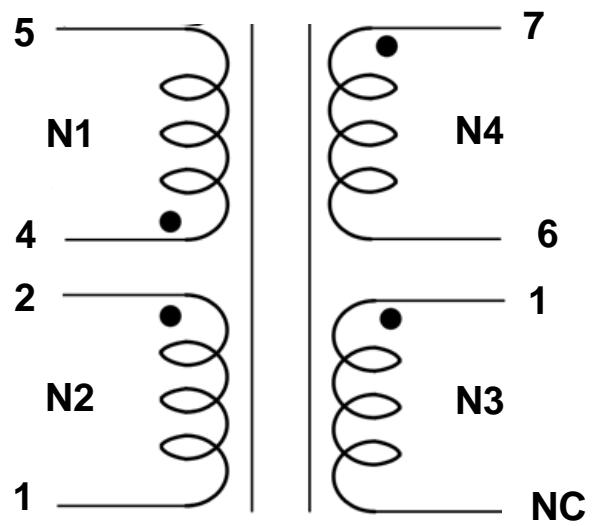

## 规格与材料

➢ 初级绕组感量L=4mH±5% (测试条件：0.3V，50kHz)  
漏感量 $L _ { | k } < 4 \% ^ { \frac { 1 } { x } } L _ { P }$  
➢ EE13加宽（3+2+2PIN），  
➢ EE13 PC40 或同等材质 ， $\mathsf { A } \mathsf { e } = 2 0 \mathsf { m } \mathsf { m } ^ { 2 }$  
➢ N1、N2、N3:2UEW漆包线  
➢ N54:三层绝缘线  
➢ 绝缘胶带:3M900或同等材质  
➢ 耐压测试:3KV,50/60Hz,1Min  
➢ 成品要求：浸凡立水

<table><tr><td>序号</td><td>起始脚</td><td>终止脚</td><td>绕制规则</td><td>匝数</td><td>绕线方式</td></tr><tr><td>N1</td><td>4</td><td>5</td><td>2UEW φ0.13*1P</td><td>130Ts</td><td>密绕四层(PIN脚朝外)</td></tr><tr><td>胶带</td><td></td><td></td><td></td><td>2Ts</td><td></td></tr><tr><td>N2</td><td>2</td><td>1</td><td>2UEW φ0.13*1P</td><td>8Ts</td><td>均匀绕一层(PIN脚朝外)</td></tr><tr><td>胶带</td><td></td><td></td><td></td><td>2Ts</td><td></td></tr><tr><td>N3</td><td>1</td><td>NC</td><td>2UEW φ0.13*1P</td><td>17Ts</td><td>均匀绕一层(PIN脚朝外)</td></tr><tr><td>胶带</td><td></td><td></td><td></td><td>3Ts</td><td></td></tr><tr><td>N4</td><td>7</td><td>6</td><td>TEX-E φ0.45*1P</td><td>8Ts</td><td>密绕一层(PIN脚朝外)</td></tr><tr><td>胶带</td><td></td><td></td><td></td><td>3Ts</td><td></td></tr></table>

磁芯接地(PIN1)

## 底视图

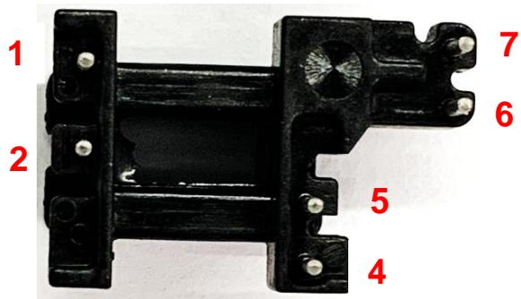

待机功耗  
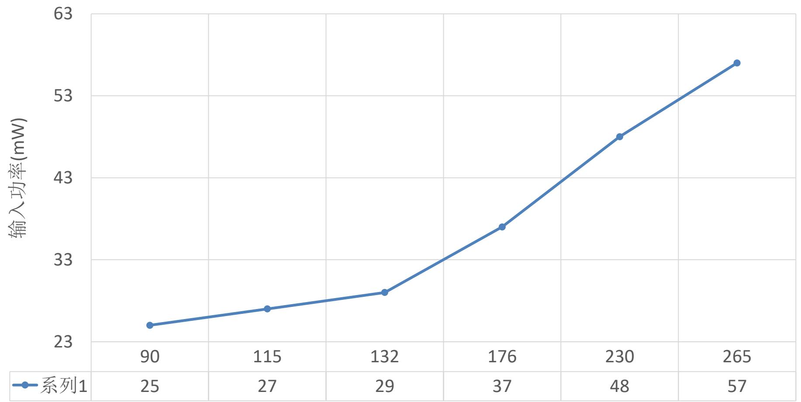

输入电压(Vac)

效率曲线  
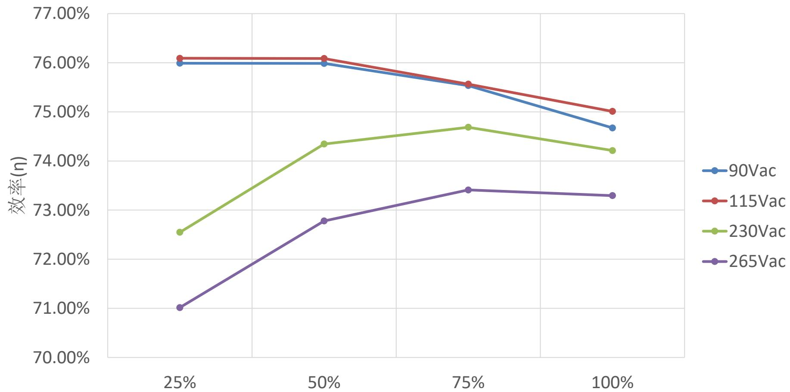

负载比例

<table><tr><td> $V_{IN}(VAC)$ </td><td>Load(%)</td><td> $P_{IN}(W)$ </td><td> $V_{OUT}(V)$ </td><td>板端</td><td> $I_{OUT}(A)$ </td><td> $P_{OUT}(W)$ </td><td>Eff(%)</td><td>AVG Eff(%)</td></tr><tr><td rowspan="6">90</td><td>空载</td><td></td><td></td><td></td><td></td><td>0</td><td></td><td></td></tr><tr><td>10%</td><td>0.342</td><td>5.0055</td><td>5.006</td><td>0.05</td><td>0.250275</td><td>73.18%</td><td></td></tr><tr><td>25%</td><td>0.821</td><td>4.991</td><td>5.012</td><td>0.125</td><td>0.623875</td><td>75.99%</td><td rowspan="4">75.55%</td></tr><tr><td>50%</td><td>1.633</td><td>4.9634</td><td>5.0183</td><td>0.25</td><td>1.24085</td><td>75.99%</td></tr><tr><td>75%</td><td>2.466</td><td>4.9672</td><td>5.0543</td><td>0.375</td><td>1.8627</td><td>75.54%</td></tr><tr><td>100%</td><td>3.33</td><td>4.9732</td><td>5.0935</td><td>0.5</td><td>2.4866</td><td>74.67%</td></tr><tr><td rowspan="6">115</td><td>空载</td><td></td><td></td><td></td><td></td><td>0</td><td></td><td></td></tr><tr><td>10%</td><td>0.344</td><td>5.0035</td><td>5.0062</td><td>0.05</td><td>0.250175</td><td>72.73%</td><td></td></tr><tr><td>25%</td><td>0.819</td><td>4.9854</td><td>5.0074</td><td>0.125</td><td>0.623175</td><td>76.09%</td><td rowspan="4">75.69%</td></tr><tr><td>50%</td><td>1.629</td><td>4.9578</td><td>5.0141</td><td>0.25</td><td>1.23945</td><td>76.09%</td></tr><tr><td>75%</td><td>2.462</td><td>4.961</td><td>5.0496</td><td>0.375</td><td>1.860375</td><td>75.56%</td></tr><tr><td>100%</td><td>3.312</td><td>4.9687</td><td>5.0913</td><td>0.5</td><td>2.48435</td><td>75.01%</td></tr><tr><td rowspan="6">230</td><td>空载</td><td></td><td></td><td></td><td></td><td>0</td><td></td><td></td></tr><tr><td>10%</td><td>0.37</td><td>4.9978</td><td>5</td><td>0.05</td><td>0.24989</td><td>67.54%</td><td></td></tr><tr><td>25%</td><td>0.861</td><td>4.9971</td><td>5.0196</td><td>0.125</td><td>0.624638</td><td>72.55%</td><td rowspan="4">73.95%</td></tr><tr><td>50%</td><td>1.673</td><td>4.9752</td><td>5.03</td><td>0.25</td><td>1.2438</td><td>74.35%</td></tr><tr><td>75%</td><td>2.502</td><td>4.9831</td><td>5.0697</td><td>0.375</td><td>1.868663</td><td>74.69%</td></tr><tr><td>100%</td><td>3.362</td><td>4.99</td><td>5.1102</td><td>0.5</td><td>2.495</td><td>74.21%</td></tr><tr><td rowspan="6">265</td><td>空载</td><td></td><td></td><td></td><td></td><td>0</td><td></td><td></td></tr><tr><td>10%</td><td>0.381</td><td>4.9941</td><td>4.9963</td><td>0.05</td><td>0.249705</td><td>65.54%</td><td></td></tr><tr><td>25%</td><td>0.878</td><td>4.9882</td><td>5.011</td><td>0.125</td><td>0.623525</td><td>71.02%</td><td rowspan="4">72.63%</td></tr><tr><td>50%</td><td>1.705</td><td>4.9635</td><td>5.0194</td><td>0.25</td><td>1.240875</td><td>72.78%</td></tr><tr><td>75%</td><td>2.537</td><td>4.9665</td><td>5.0562</td><td>0.375</td><td>1.862438</td><td>73.41%</td></tr><tr><td>100%</td><td>3.4</td><td>4.9841</td><td>5.1052</td><td>0.5</td><td>2.49205</td><td>73.30%</td></tr></table>

◼ 注：Vout为1m长26AWG线端测试电压，效率也为线端效率

## 输出电压调整率

<table><tr><td> $V_{IN}(VAC)$  $I_{OUT}(A)$ </td><td>90</td><td>115</td><td>132</td><td>176</td><td>230</td><td>265</td><td>平均值</td><td>线调整率</td></tr><tr><td>0</td><td>5.071</td><td>5.0563</td><td>5.0554</td><td>5.0538</td><td>5.0523</td><td>5.0511</td><td>5.057</td><td>0.39%</td></tr><tr><td>20%</td><td>4.9753</td><td>4.9786</td><td>4.9793</td><td>4.9811</td><td>4.9788</td><td>4.976</td><td>4.978</td><td>0.12%</td></tr><tr><td>40%</td><td>4.9441</td><td>4.9528</td><td>4.9554</td><td>4.9603</td><td>4.9627</td><td>4.9637</td><td>4.957</td><td>0.40%</td></tr><tr><td>60%</td><td>4.9484</td><td>4.953</td><td>4.9553</td><td>4.96</td><td>4.9608</td><td>4.9591</td><td>4.956</td><td>0.25%</td></tr><tr><td>80%</td><td>4.9532</td><td>4.9613</td><td>4.9654</td><td>4.9714</td><td>4.9728</td><td>4.9738</td><td>4.966</td><td>0.41%</td></tr><tr><td>100%</td><td>4.9691</td><td>4.973</td><td>4.9766</td><td>4.9834</td><td>4.9862</td><td>4.9852</td><td>4.979</td><td>0.34%</td></tr><tr><td>平均值</td><td>4.977</td><td>4.979</td><td>4.981</td><td>4.985</td><td>4.986</td><td>4.985</td><td></td><td></td></tr><tr><td>负载调整率</td><td>2.55%</td><td>2.08%</td><td>2.01%</td><td>1.88%</td><td>1.84%</td><td>1.85%</td><td></td><td></td></tr></table>

◼ 计算方法：调整率=100%\*(最大值-最小值)/平均值  
电压为1m长26AWG线端测试电压

## 输出电压纹波

20MHz带宽，去掉示波器探头正端夹子和地线环，10uF/50V 0.1uF/50V

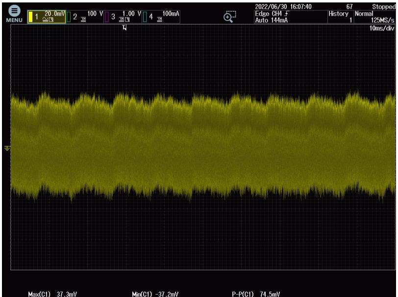

90 VAC

$\begin{array} { l } { \mathsf { C H 1 V _ { o u \intercal } } } \\ { \mathsf { R i p p l e } } \end{array}$ CH1 VOUT $V _ { P K - P K } = 7 4 . 5$ VPK-PK=74.5 mV

Test Condition:

➢ Full Load

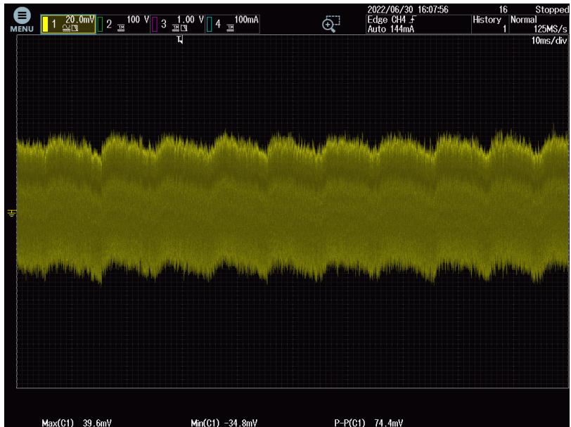

115 VAC

CH1 VOUT $\begin{array} { l } { \mathsf { C H 1 V _ { o u \intercal } } } \\ { \mathsf { R i p p l e } } \end{array}$ $V _ { P K - P K } = 7 4 . 4$ mV

Test Condition:

➢ Full Load

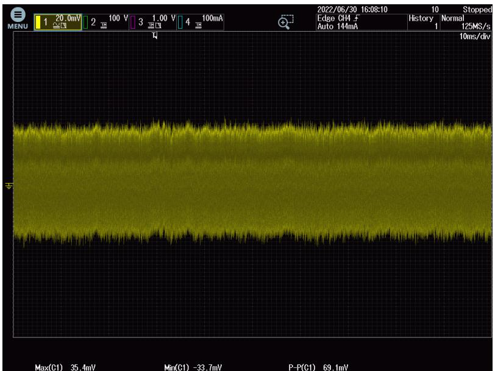

230 VAC

CH1 VOUT Ripple $\begin{array} { l } { { \tt V } _ { \sf P K - P K } { = } 6 9 . 1 } \\ { { \sf m V } ^ { { } } } \end{array}$ VPK-PK=69.1

Test Condition:

➢ Full Load

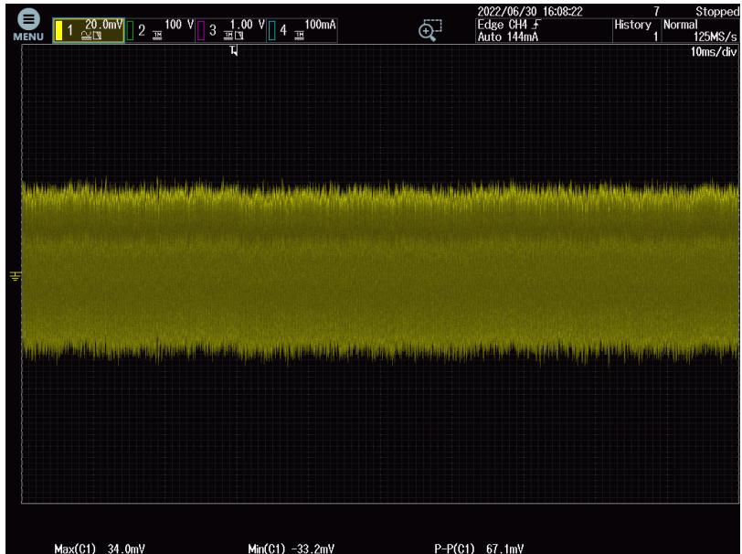

265 VAC

CH1 VOUT Ripple $\begin{array} { l } { { \tt V } _ { \sf P K - P K } { = } 6 7 . 1 } \\ { { \sf m V } ^ { - 1 } } \end{array}$

Test Condition:

➢ Full Load

## (50%-100%)

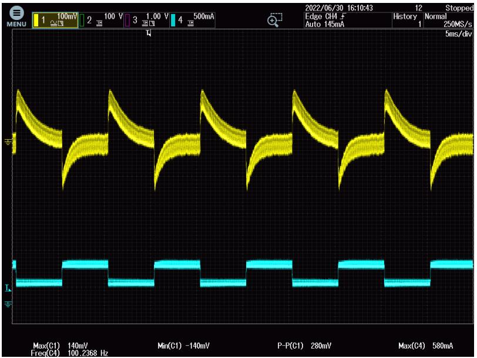

90 VAC

CH1 VOUT ${ \mathsf { C H 1 } } { \mathsf { V } } _ { \mathsf { O U T } }$ $V _ { \mathsf { P K - P K } } { = } 2 8 0 \mathsf { m V }$  
$\mathsf { C H 4 } \mathsf { I } _ { \mathsf { O U T } }$

## Test Condition:

➢ $0 . 2 5 \ : \mathsf { A } – 0 . 5 \ : \mathsf { A } – 0 . 2 5 \ : \mathsf { A }$  
➢ Slew Rate: 0.5 A/μS  
➢ Frequency: 100 Hz

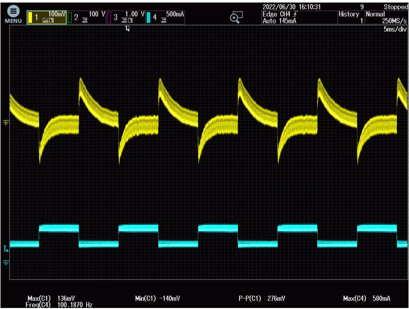

115 VAC

CH1 VOUT ${ \mathsf { C H 1 } } { \mathsf { V } } _ { \mathsf { O U T } }$ $V _ { P K - P K } = 2 7 6 m v$  
$\mathsf { C H 4 } \mathsf { I } _ { \mathsf { O U T } }$

## Test Condition:

➢ 0.25 A-0.5 A-0.25 A  
➢ Slew Rate: 0.5 A/μS  
➢ Frequency: 100 Hz

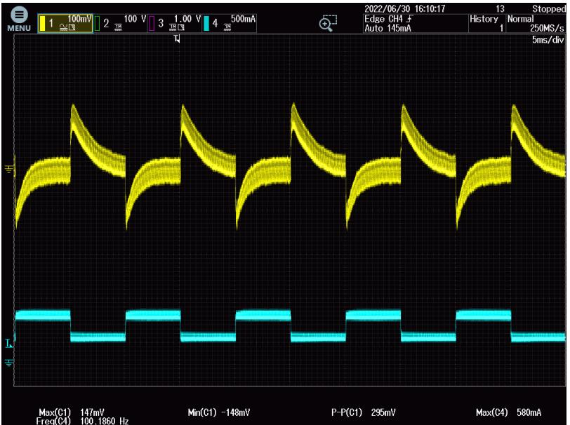

230 VAC

CH1 VOUT $\mathsf { V } _ { \mathsf { O U T } }$ $V _ { P K - P K } = 2 9 5 ~ \mathsf { m V }$  
$\mathsf { C H 4 } \mathsf { l } _ { \mathsf { O U T } }$

## Test Condition:

➢ 0.25 A-0.5 A-0.25 A  
➢ Slew Rate: 0.5 $\mathsf { A } / \mu \mathsf { S }$  
➢ Frequency: 100 Hz

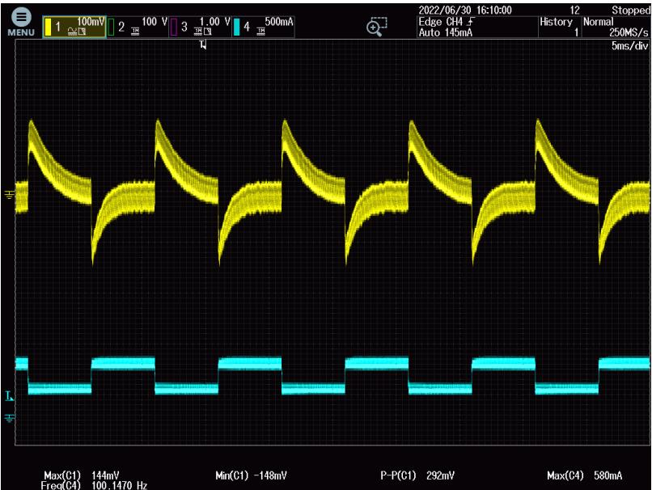

265 VAC

CH1 VOUT ${ \mathsf { C H 1 } } { \mathsf { V } } _ { \mathsf { O U T } }$ $V _ { P K - P K } = 2 9 2 m v$  
$\mathsf { C H 4 } \mathsf { I } _ { \mathsf { O U T } }$

## Test Condition:

➢ 0.25 A-0.5 A-0.25 A  
➢ Slew Rate: 0.5 A/μS  
➢ Frequency: 100 Hz

## (10%-90%)

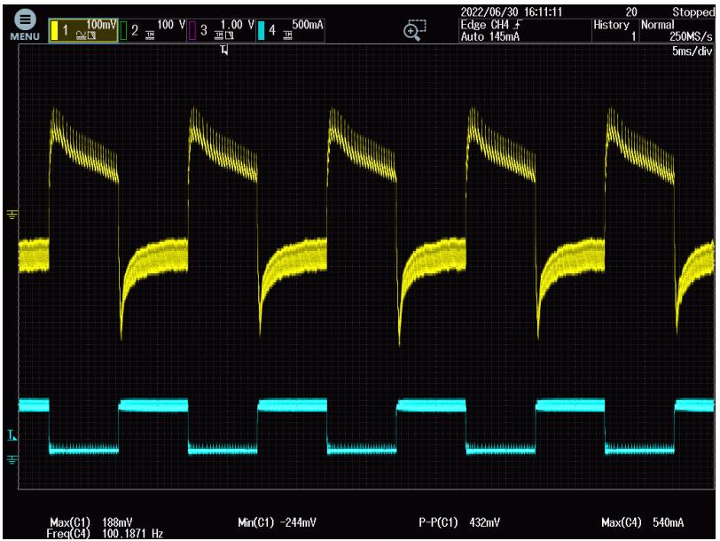

90 VAC

CH1 VOUT ${ \mathsf { C H 1 } } { \mathsf { V } } _ { \mathsf { O U T } }$ $V _ { P K - P K } = 4 3 2 m v$  
$\mathsf { C H 4 } \mathsf { I } _ { \mathsf { O U T } }$

## Test Condition:

➢ $0 . 0 5 \ : \mathsf { A } – 0 . 4 5 \mathsf { A } – 0 . 0 5 \ : \mathsf { A }$  
➢ Slew Rate: 0.5 A/μS  
➢ Frequency: 100 Hz

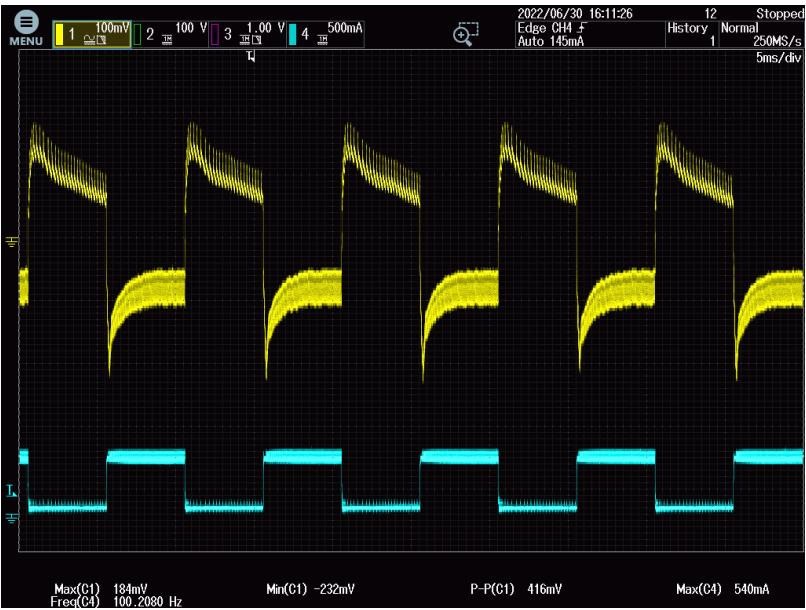

115 VAC

CH1 VOUT ${ \mathsf { C H 1 } } { \mathsf { V } } _ { \mathsf { O U T } }$ $V _ { P K - P K } = 4 1 6 ~ \mathsf { m V }$  
$\mathsf { C H 4 } \mathsf { I } _ { \mathsf { O U T } }$

## Test Condition:

➢ 0.05 A-0.45A-0.05 A  
➢ Slew Rate: 0.5 A/μS  
➢ Frequency: 100 Hz

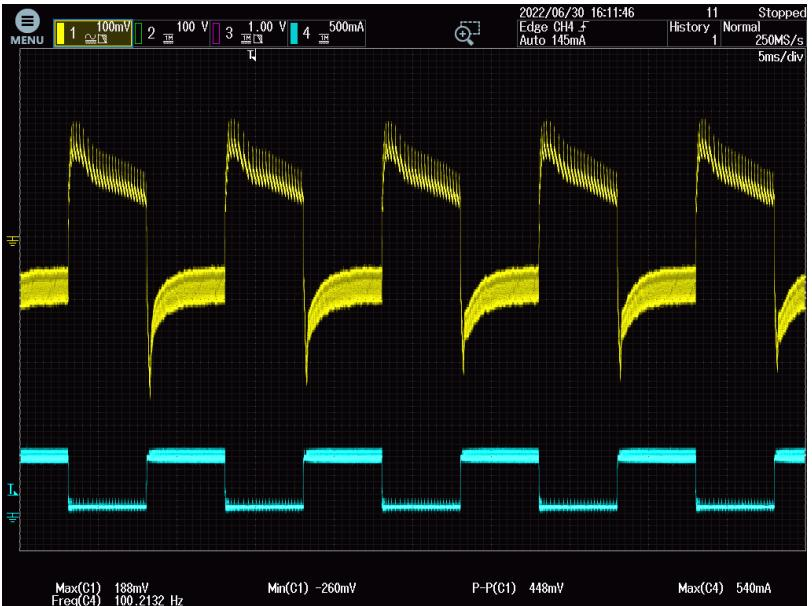

230 VAC

CH1 VOUT $\mathsf { V } _ { \mathsf { O U T } }$ $V _ { P K - P K } = 4 4 8 m V$  
$\mathsf { C H 4 } \mathsf { l } _ { \mathsf { O U T } }$

## Test Condition:

➢ 0.05 A-0.45A-0.05 A  
➢ Slew Rate: 0.5 $\mathsf { A } / \mu \mathsf { S }$  
➢ Frequency: 100 Hz

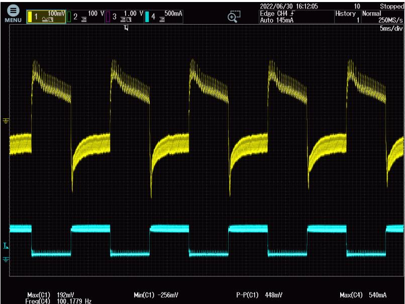

265 VAC

CH1 VOUT ${ \mathsf { C H 1 } } { \mathsf { V } } _ { \mathsf { O U T } }$ $V _ { P K - P K } = 4 4 8 m V$  
$\mathsf { C H 4 } \mathsf { I } _ { \mathsf { O U T } }$

## Test Condition:

➢ 0.05 A-0.45A-0.05 A  
➢ Slew Rate: 0.5 A/μS  
➢ Frequency: 100 Hz

## 输出电压开机波形

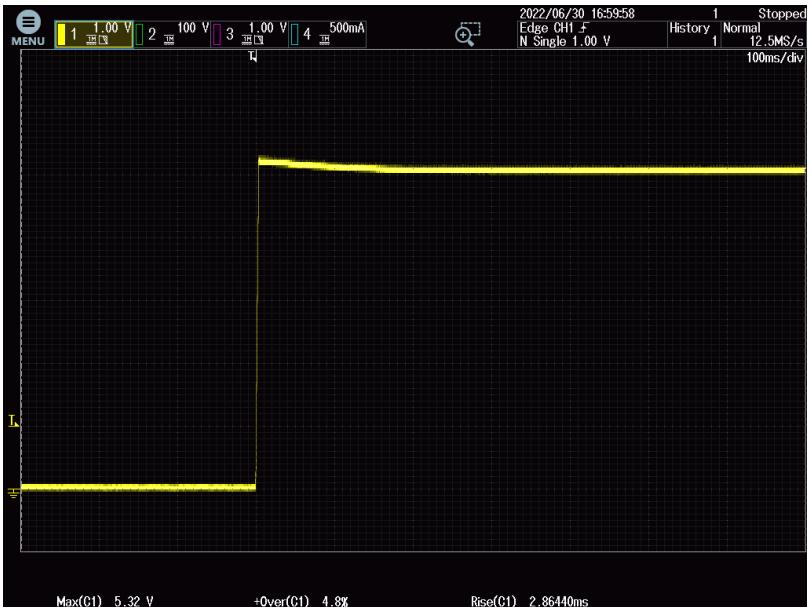

90 VAC

CH1 VOUT TRISE: 2.9 mS

## Test Condition:

➢ No Load

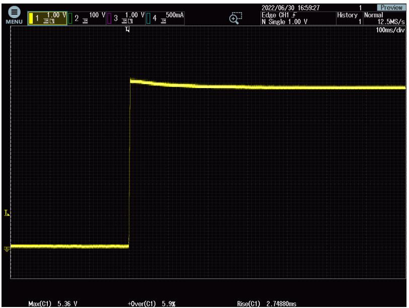

265 VAC

CH1 VOUT TRISE: 2.7 mS

## Test Condition:

➢ No Load

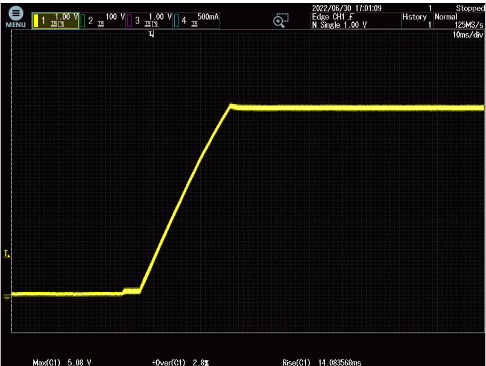

90 VAC

CH1 VOUT TRISE: 14.1 mS

## Test Condition:

➢ Full Load

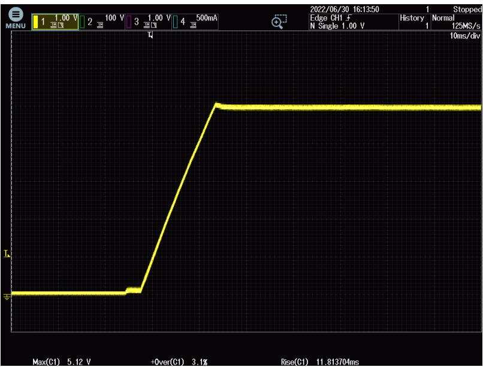

265 VAC

CH1 VOUT TRISE: 11.8 mS

## Test Condition:

➢ Full Load

## 开机延迟时间波形

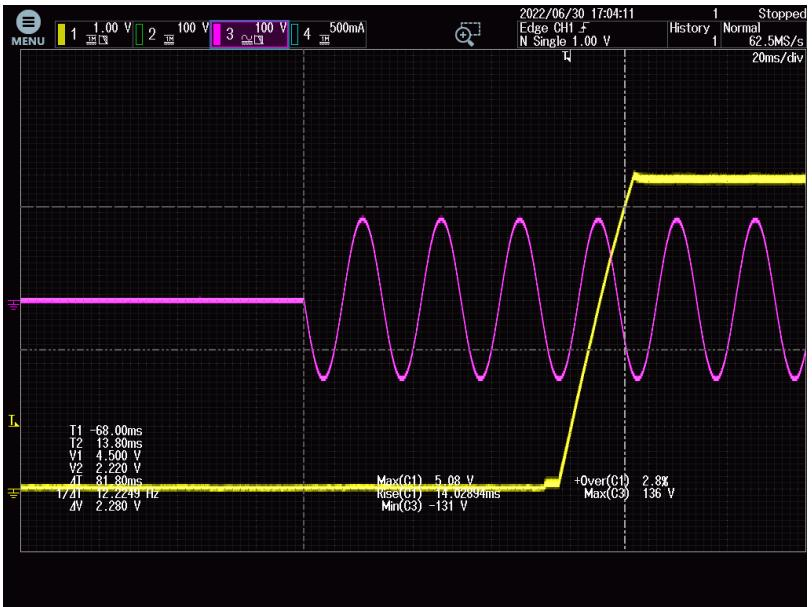

90 VAC

CH1 VOUT TDelay: 81.8 mS

## Test Condition:

➢ Full Load

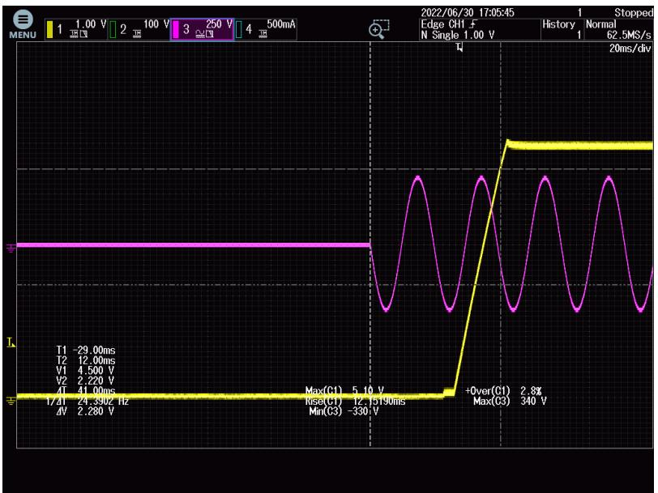

230 VAC

CH1 VOUT TDelay: 41 mS

## Test Condition:

➢ Full Load

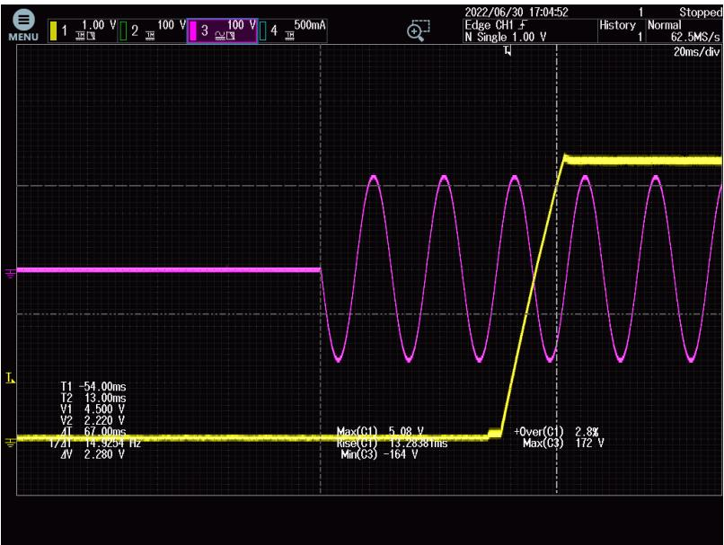

115 VAC

CH1 VOUT TDelay: 67 mS

## Test Condition:

➢ Full Load

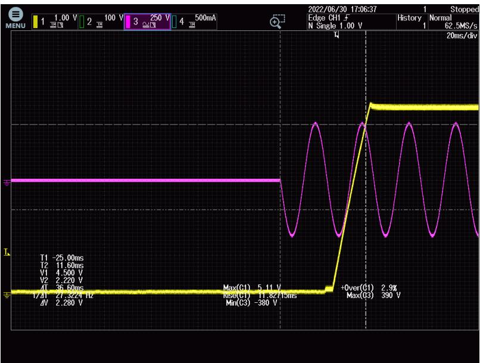

265 VAC

CH1 VOUT TDelay: 36.6 mS

## Test Condition:

➢ Full Load

## 开关管电压电流波形 (启机)

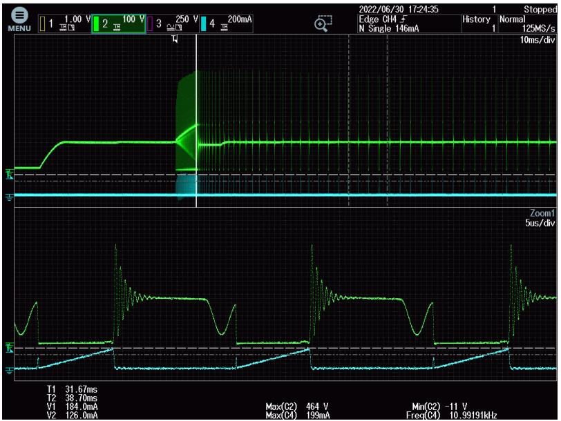

$90 v _ { \mathsf { A C } }$

${ \mathsf { C H } } 2 { \mathsf { V } } _ { \mathsf { D S } }$  
$C H 4 1 _ { \mathsf { D } }$ $V _ { \mathsf { D } \mathsf { S } } { = } 4 6 4 \mathsf { V }$ IMAX= 199 mA $\mathsf { I } _ { \mathsf { M A X } } { = } 1 9 9 \mathsf { m } \mathsf { A }$

Test Condition:  
➢ No Load  
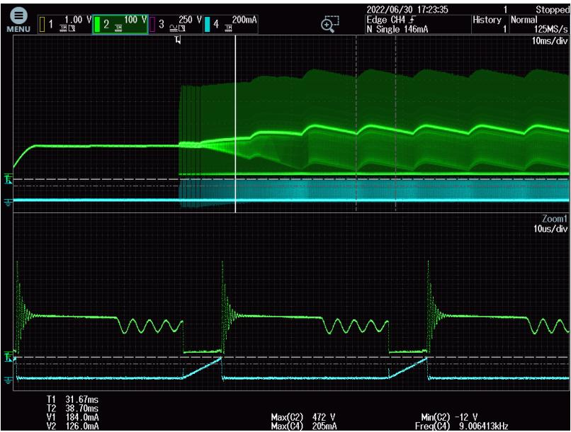

90 VAC

${ \mathsf { C H } } 2 { \mathsf { V } } _ { \mathsf { D S } }$  
$C H 4 1 _ { \mathsf { D } }$ $\mathtt { V } _ { \mathsf { D } \mathsf { S } } mathtt { = } 4 7 2 \mathtt { V }$ IMAX= 205 $\mathsf { I } _ { \mathsf { M A X } } = 2 0 5 ~ \mathsf { m A }$

Test Condition:  
➢ Full Load  
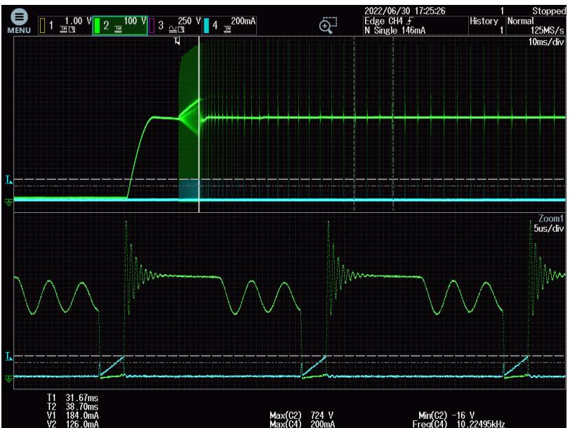

$2 6 5 \ : \mathsf { V } _ { \mathsf { A C } }$

${ \mathsf { C H } } 2 \ { \mathsf { V } } _ { \mathsf { D S } }$  
$C H 4 1 _ { \mathsf { D } }$ $\mathtt { V _ { D S } } \mathtt { = } 7 2 4 \mathtt { V }$ IMAX=200 mA $\mathsf { I } _ { \mathsf { M A X } } { = } 2 0 0 \mathsf { m } \mathsf { A }$

Test Condition:  
➢ No Load  
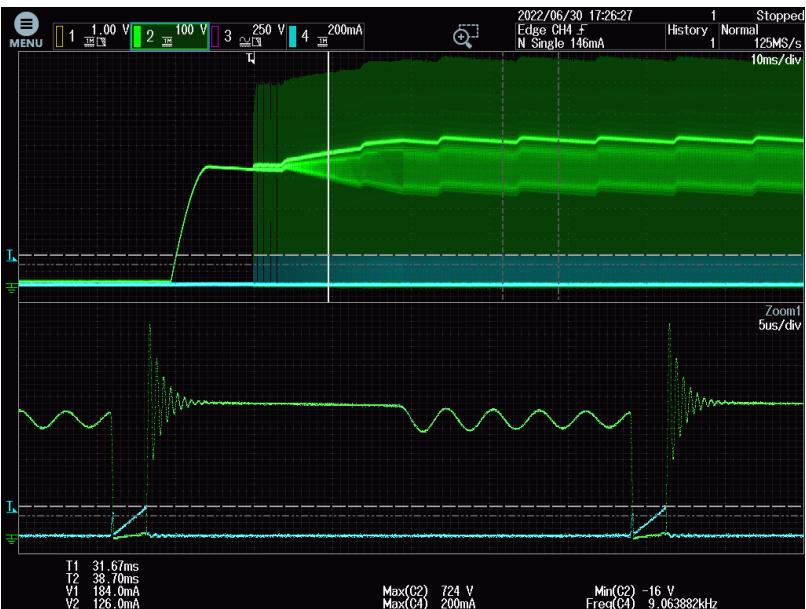

$2 6 5 \ : \mathsf { V } _ { \mathsf { A C } }$

${ \mathsf { C H } } 2 { \mathsf { V } } _ { \mathsf { D S } }$  
$C H 4 1 _ { \mathsf { D } }$ $\mathtt { V _ { D S } } \mathtt { = } 7 2 4 \mathtt { V }$ $\mathsf { I } _ { \mathsf { M A X } } { = } 2 0 0 \mathsf { m } \mathsf { A }$

Test Condition:

➢ Full Load

## 开关管电压电流波形 (正常工作)

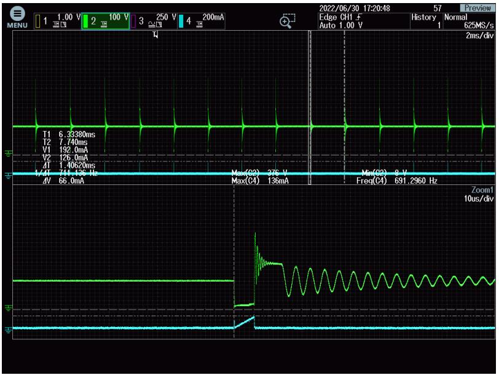

90 VAC

${ \mathsf { C H } } 2 { \mathsf { V } } _ { \mathsf { D S } }$  
$C H 4 1 _ { \mathsf { D } }$ $V _ { \mathsf { D } \mathsf { S } } \mathsf { = } 3 7 6 \mathsf { V }$ $\mathsf { I } _ { \mathsf { M A X } } { = } 1 3 6 \mathsf { m } \mathsf { A }$

Test Condition:  
➢ No Load  
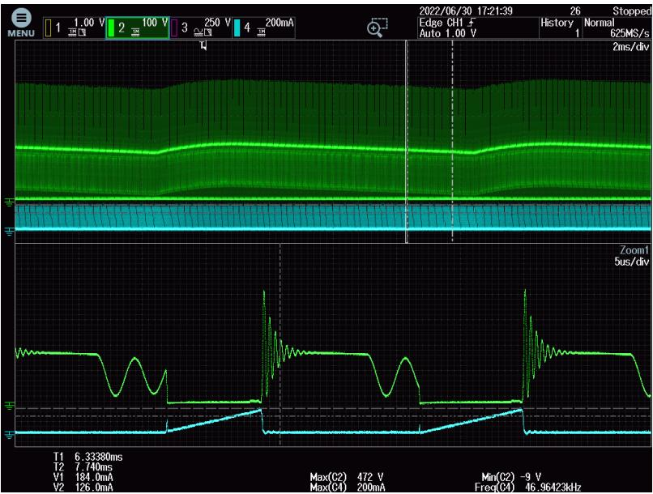

90 VAC

${ \mathsf { C H } } 2 { \mathsf { V } } _ { \mathsf { D S } }$  
$C H 4 1 _ { \mathsf { D } }$ $\mathtt { V } _ { \mathsf { D } \mathsf { S } } mathtt { = } 4 7 2 \mathtt { V }$ IMAX= 200 mA $\mathsf { I } _ { \mathsf { M A X } } = 2 0 0 \mathsf { m A }$

Test Condition:  
➢ Full Load  
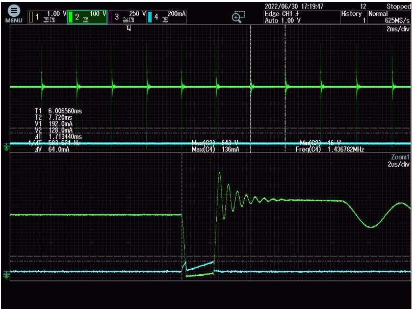

265 VAC

${ \mathsf { C H } } 2 \ { \mathsf { V } } _ { \mathsf { D S } }$  
$C H 4 1 _ { \mathsf { D } }$ $V _ { \mathsf { D } \mathsf { S } } { = } 6 4 3 \ \mathsf { V }$ $\mathsf { I } _ { \mathsf { M A X } } { = } \pmb { 1 } 3 6 \mathsf { m } \mathsf { A }$

Test Condition:  
➢ No Load  
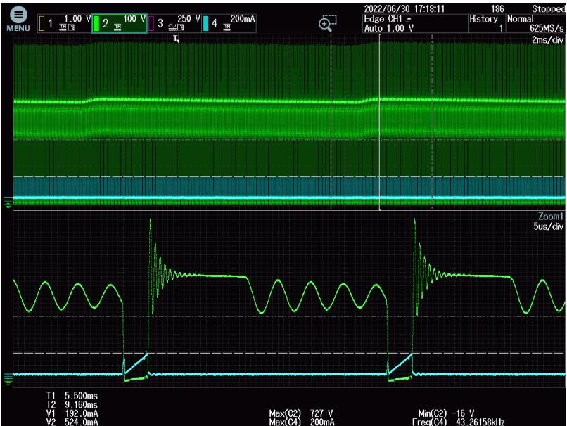

$2 6 5 \ : \mathsf { V } _ { \mathsf { A C } }$

${ \mathsf { C H } } 2 { \mathsf { V } } _ { \mathsf { D S } }$  
CH4 ID $C H 4 1 _ { \mathsf { D } }$ $\mathtt { V _ { D S } } \mathtt { = } 7 2 7 \mathtt { V }$ $\mathsf { I } _ { \mathsf { M A X } } { = } 2 0 0 \mathsf { m } \mathsf { A }$

Test Condition:

➢ Full Load

## 输出二极管电压波形

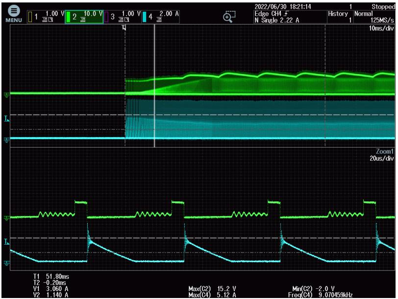

90 VAC

$C H 2 V _ { \mathsf { D } }$  
$C H 4 1 _ { \mathsf { D } }$ $\mathtt { V } _ { \mathtt { D } } mathtt { = } 1 5 . 2 \mathtt { V }$ $\mathsf { I } _ { \mathsf { D m a x } } { = } 5 . 1 2 \ \mathsf { A }$ IDmax

## Test Condition:

➢ Full Load  
➢ 开机

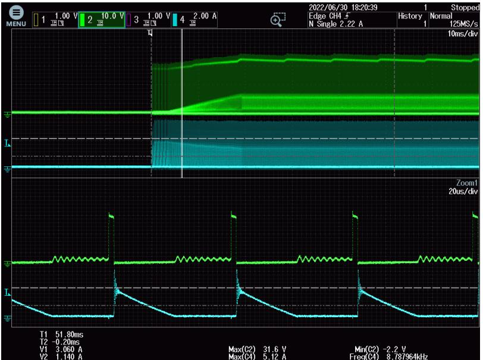

265 VAC

CH2 VD  
$C H 4 1 _ { \mathsf { D } }$ $\mathtt { V } _ { \mathtt { D } } { = } 3 1 . 6 \mathtt { V }$ $\mathsf { I } _ { \mathsf { D m a x } } { = } 5 . 1 2 \ \mathsf { A }$ IDmax

## Test Condition:

➢ Full Load  
➢ 开机

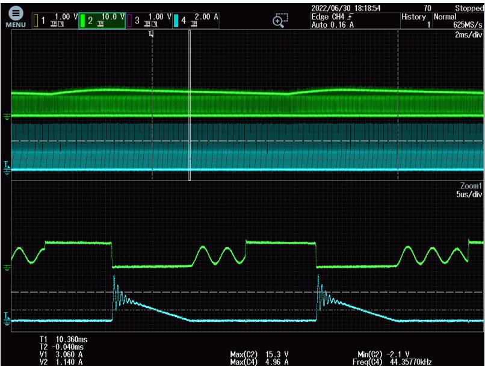

90 VAC

$C H 2 V _ { \mathsf { D } }$  
$C H 4 1 _ { \mathsf { D } }$ $\mathtt { V } _ { \mathtt { D } } mathtt { = } 1 5 . 3 \mathtt { V }$ $\mathsf { I } _ { \mathsf { D m a x } } { = } 4 . 9 6 \mathsf { A }$ Dmax

## Test Condition:

➢ Full Load

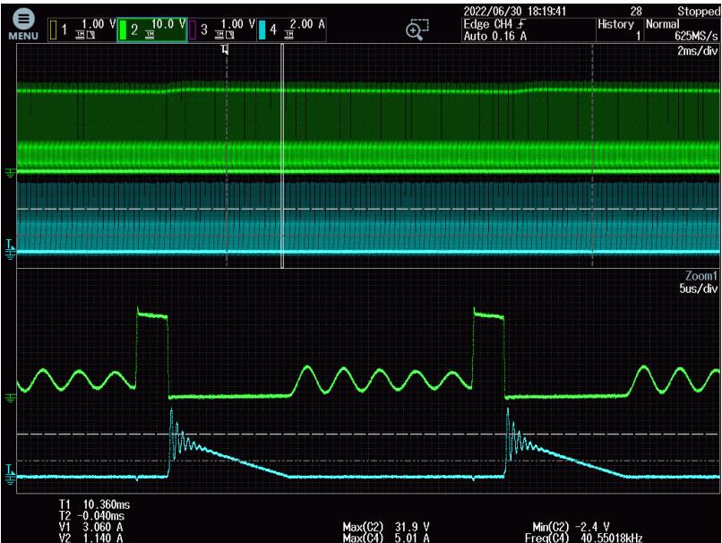

265 VAC

$C H 2 V _ { \mathsf { D } }$  
$C H 4 1 _ { \mathsf { D } }$ $\mathtt { V } _ { \mathtt { D } } { = } 3 1 . 9 \ \mathtt { V }$ $\mathsf { I } _ { \mathsf { D m a x } } = 5 . 0 1 \mathsf { A }$

## Test Condition:

➢ Full Load

## 输出短路时开关管和二极管波形

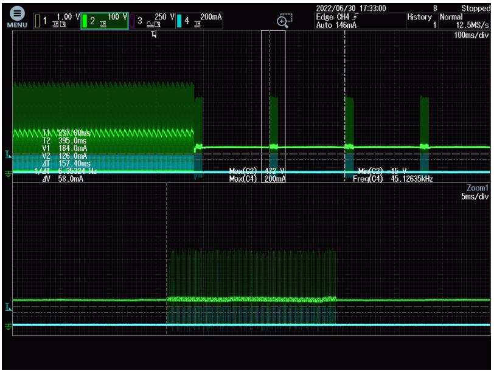

90 VAC

${ \mathsf { C H } } 2 { \mathsf { V } } _ { \mathsf { D S } }$  
$C H 4 1 _ { \mathsf { D } }$ $\mathsf { V } _ { \mathsf { D S \_ m a x } } = 4 7 2 \mathsf { V }$ $\mathsf { I } _ { \mathsf { D } \mathsf { S } \_ \mathsf { m a x } } = 2 0 0 \mathsf { m } \mathsf { A }$

## 开关管

## Test Condition:

➢ Full Load

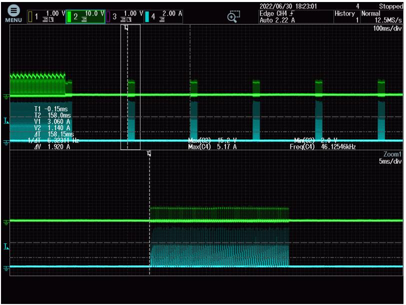

90 VAC

$C H 2 V _ { \mathsf { D } }$  
$C H 4 1 _ { \mathsf { D } }$ $\mathtt { V } _ { \mathtt { D } } mathtt { = } 1 5 . 2 \mathtt { V }$ $\mathsf { I } _ { \mathsf { D m a x } } { = } 5 . 1 7 \mathsf { A }$ IDmax

## Test Condition:

➢ Full Load

## 二极管

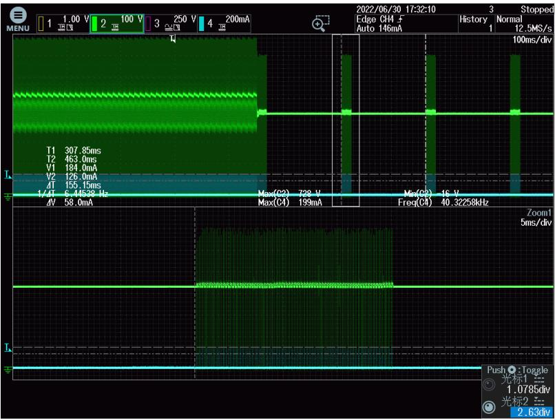

$2 6 5 \ : \mathsf { V } _ { \mathsf { A C } }$

${ \mathsf { C H } } 2 { \mathsf { V } } _ { \mathsf { D S } }$  
CH4 I $C H 4 1 _ { \mathsf { D } }$ $\mathsf { V } _ { \mathsf { D } \mathsf { S } \_ \mathsf { m a x } } { = } 7 2 8 \mathsf { V }$ $\mathsf { I } _ { \mathsf { D } \mathsf { S } \_ \mathsf { m a x } } = \pmb { 1 9 9 } \mathsf { m } \mathsf { A }$

## 开关管

## Test Condition:

➢ Full Load

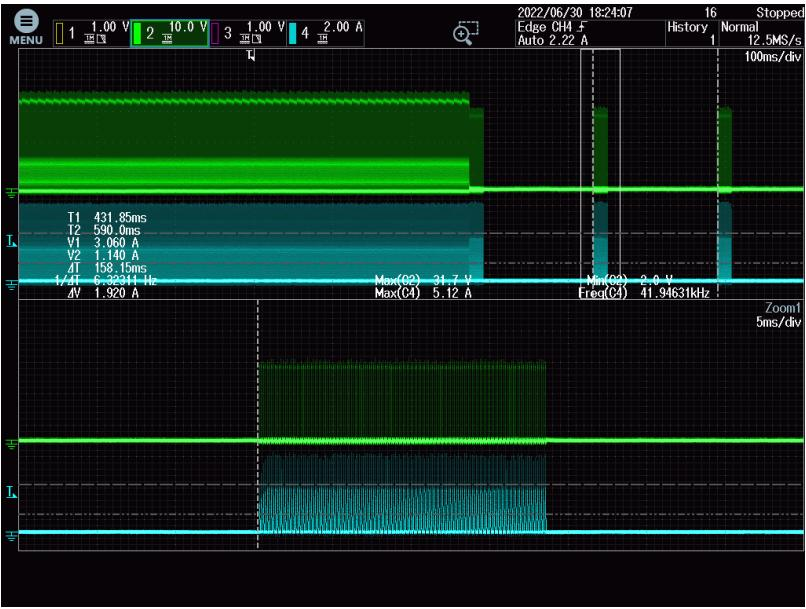

265 VAC

$C H 2 V _ { \mathsf { D } }$  
$C H 4 1 _ { \mathsf { D } }$ $\mathsf { V } _ { \mathsf { D } } { = } 3 1 . 7 \mathsf { V }$ IDmax=5.12 A $\mathsf { I } _ { \mathsf { D m a x } } = 5 . 1 2 \ \mathsf { A }$

## Test Condition:

➢ Full Load

## 二极管

## 温升测试

<table><tr><td rowspan="2">项目</td><td colspan="4">温度(°C)</td></tr><tr><td>90VAC</td><td>115VAC</td><td>230VAC</td><td>265VAC</td></tr><tr><td>环境温度</td><td>39.6</td><td>38.9</td><td>39.9</td><td>38.2</td></tr><tr><td>S7141S (U1)</td><td>64.9</td><td>65.6</td><td>70.8</td><td>74.4</td></tr><tr><td>S36F (D1)</td><td>83.4</td><td>83.8</td><td>84.5</td><td>85</td></tr><tr><td>变压器绕组(T1)</td><td>63.1</td><td>63.5</td><td>65.3</td><td>66.7</td></tr><tr><td>变压器磁芯(T1)</td><td>61.9</td><td>62.5</td><td>64.1</td><td>65.6</td></tr><tr><td>输入电解电容(C2)</td><td>57.5</td><td>57.5</td><td>58.3</td><td>59.6</td></tr><tr><td>输出电解电容(C3)</td><td>69.7</td><td>70.2</td><td>71</td><td>71.9</td></tr></table>

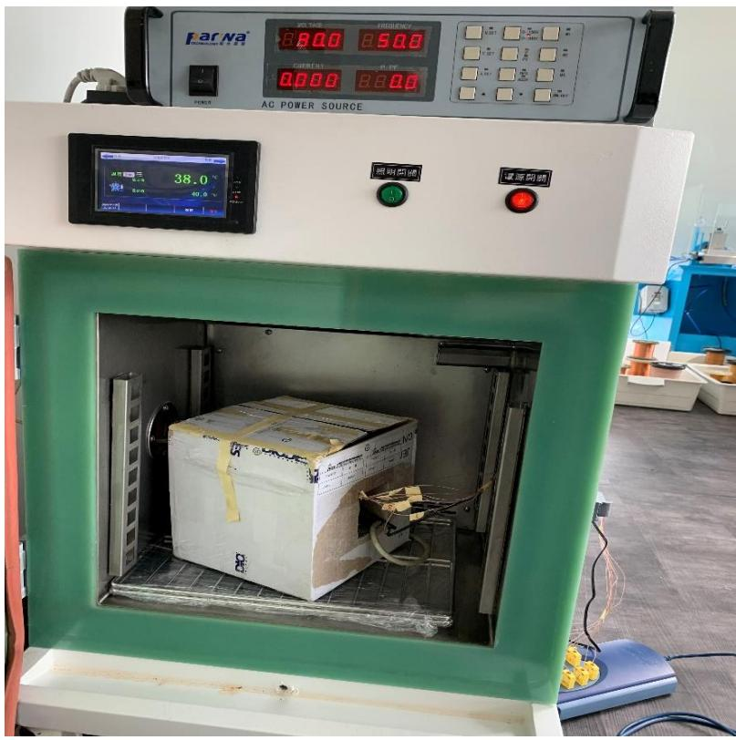

## 测试说明

➢ 在温箱中进行测试  
电路板放在适配器外壳(尺寸42mm\*30mm\*21mm)中测试  
➢ 热电偶连接到各个测量点  
➢ 等测量点温度达到稳定后记录数据

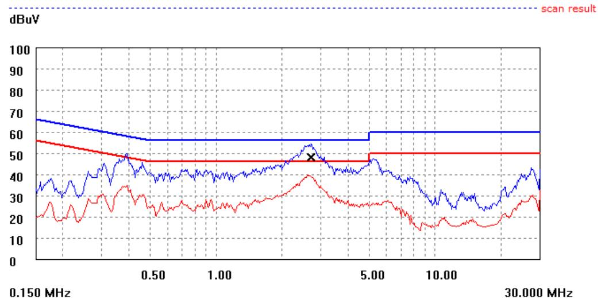

115VAC Line

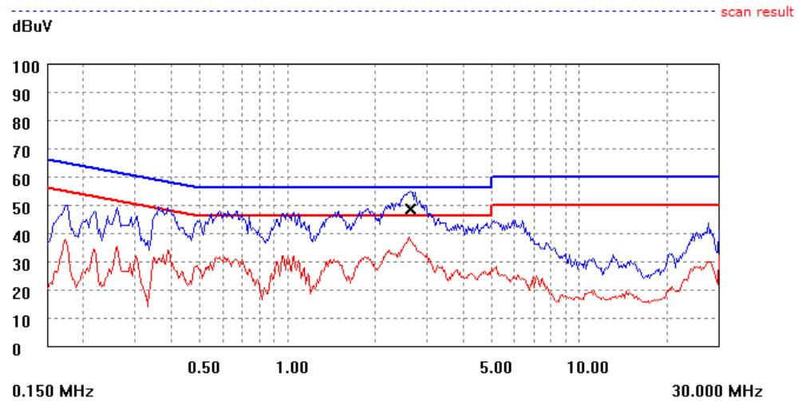

230VAC Line

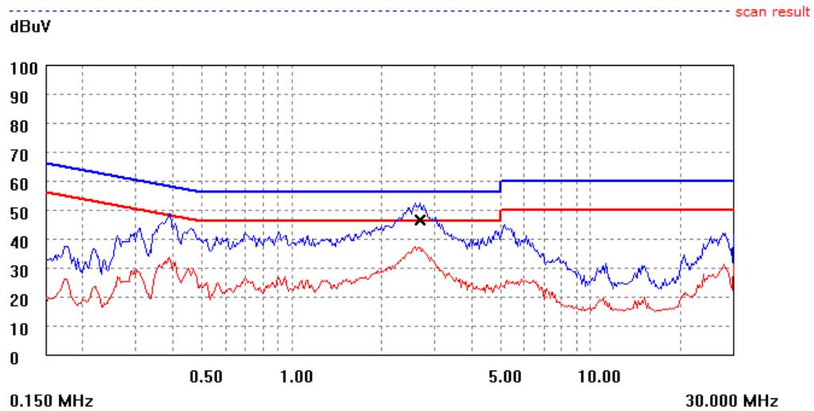

115VAC Neutral

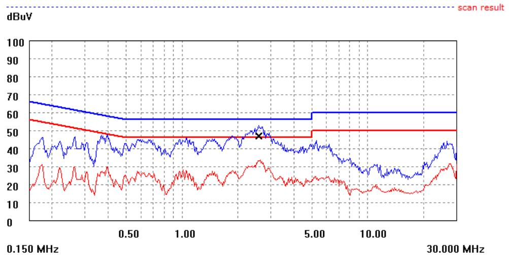

230VAC Neutral

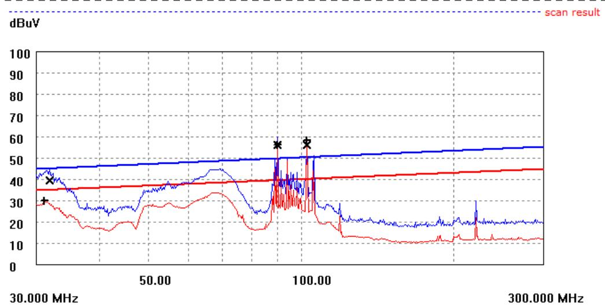

115VAC Neutral

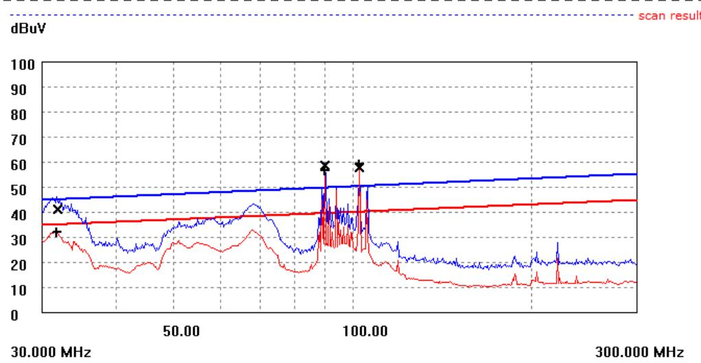

230VAC Neutral

## THANK YOU FOR WATCHING
