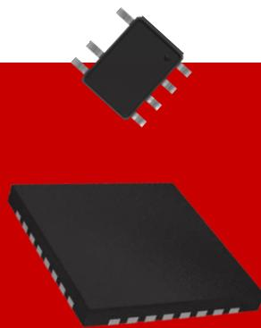

## S7142S\_12V400mA参考设计\_V1.0

上海晶丰明源半导体股份有限公司

Shanghai Bright Power Semiconductor Co., Ltd.

刁文学

时间：2021年6月

## 内容

■ S7142S简介  
■ 电源规格  
■ 电路及实物图  
BOM  
■ PCB Layout图  
■ 性能测试数据

## ■ 产品特点:

集成高压启动器件  
无需供电二极管  
内置固定峰值电流  
内置FB下偏电阻  
内置功率三极管  
输出线损补偿可调  
内置输入线电压补偿  
输出短路保护

## ■ 应用领域：

电源适配器、充电器  
LED驱动电源  
其他辅助电源

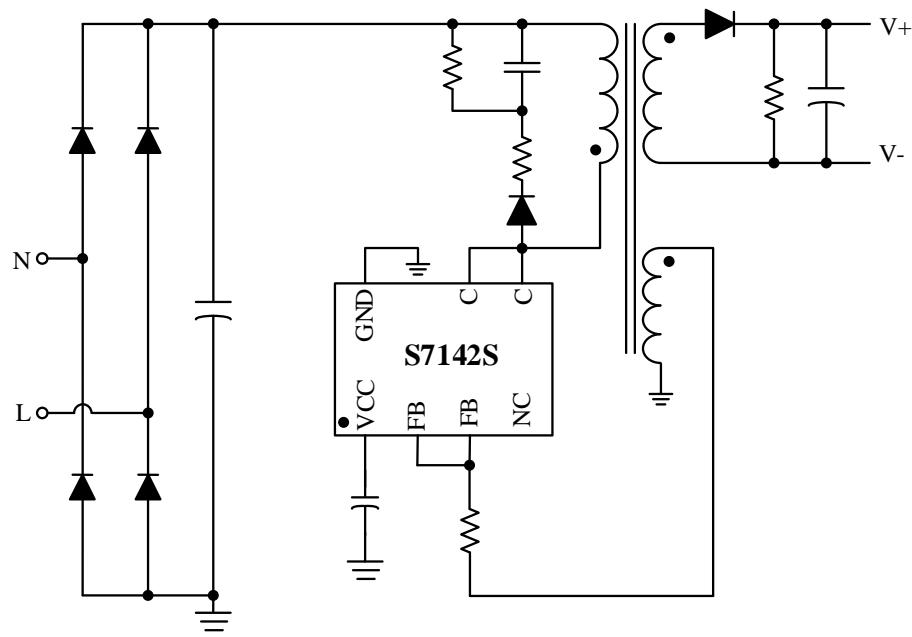

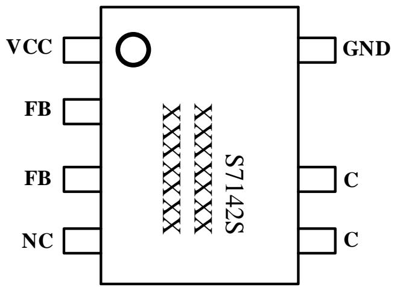

## 电源规格

<table><tr><td>项目描述</td><td>符号</td><td>最小</td><td>典型</td><td>最大</td><td>单位</td><td>备注</td></tr><tr><td colspan="7">输入</td></tr><tr><td>电压</td><td> $V_{IN}$ </td><td>85</td><td>115/230</td><td>264</td><td> $V_{AC}$ </td><td></td></tr><tr><td>功率</td><td>Pin</td><td></td><td>5</td><td></td><td>W</td><td></td></tr><tr><td>频率</td><td> $f_{LINE}$ </td><td>47</td><td>50/60</td><td>63</td><td>Hz</td><td></td></tr><tr><td colspan="7">输出</td></tr><tr><td>输出电压</td><td> $V_{OUT}$ </td><td>11.4</td><td>12</td><td>12.6</td><td>V</td><td>线端测试</td></tr><tr><td>输出电流</td><td> $I_{OUT}$ </td><td></td><td>0.4</td><td></td><td>A</td><td></td></tr><tr><td>输出电压纹波</td><td> $V_{RIPPLE}$ </td><td></td><td></td><td>200</td><td>mV</td><td>20MHz带宽</td></tr><tr><td colspan="7">效率</td></tr><tr><td>待机功耗</td><td> $P_{STDBY}$ </td><td></td><td></td><td>76.2</td><td>mW</td><td>230VAC,包含假负载</td></tr><tr><td>平均效率</td><td>η</td><td>77.3</td><td></td><td></td><td>%</td><td></td></tr><tr><td colspan="7">环境</td></tr><tr><td>传导辐射EMI</td><td></td><td colspan="4">满足CISPR22/EN55022 CLASS B</td><td></td></tr><tr><td>EFT</td><td></td><td></td><td>2</td><td></td><td>KV</td><td>38KHz/100KHz</td></tr><tr><td>ESD</td><td></td><td></td><td>12</td><td></td><td>KV</td><td>接触8KV,空气12KV</td></tr><tr><td>Surge</td><td></td><td></td><td>1</td><td></td><td>KV</td><td>差模2Ω</td></tr><tr><td>工作环境温度</td><td> $T_{AMP}$ </td><td>-20</td><td></td><td>45</td><td>°C</td><td></td></tr></table>

备注: 1 纹波是在 1 米的线端测试, 示波器设置为 20 MHz 带宽

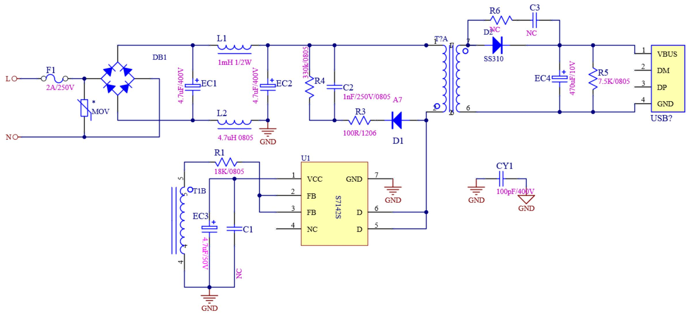

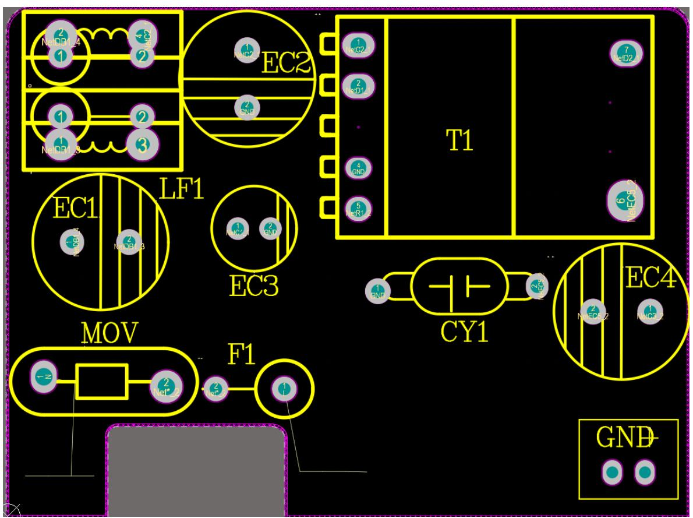

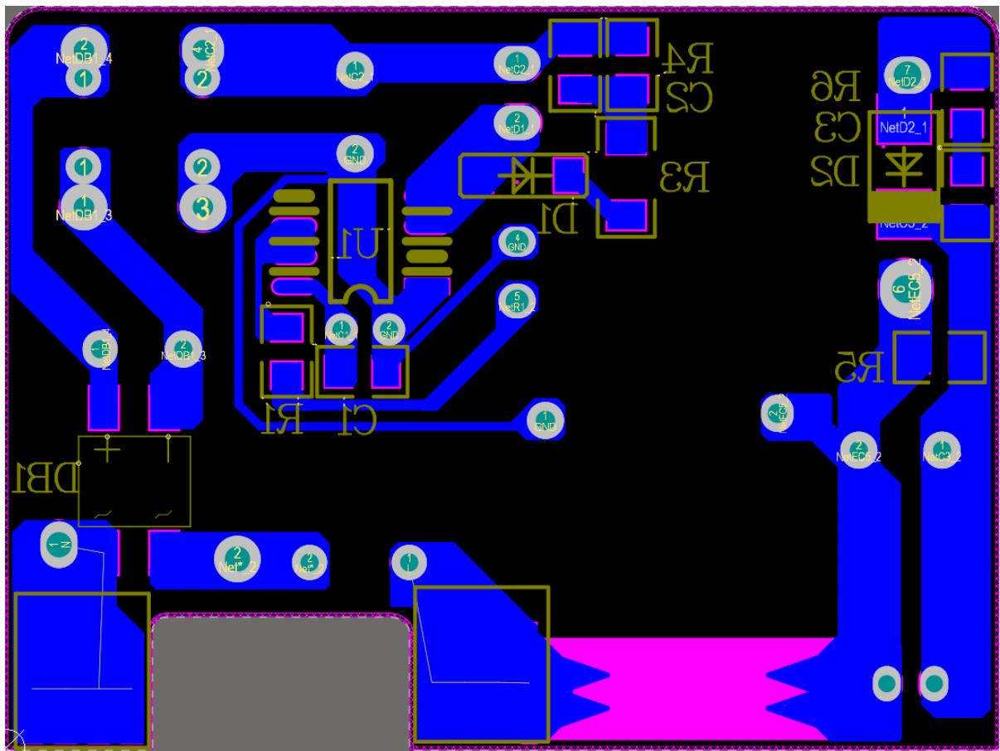

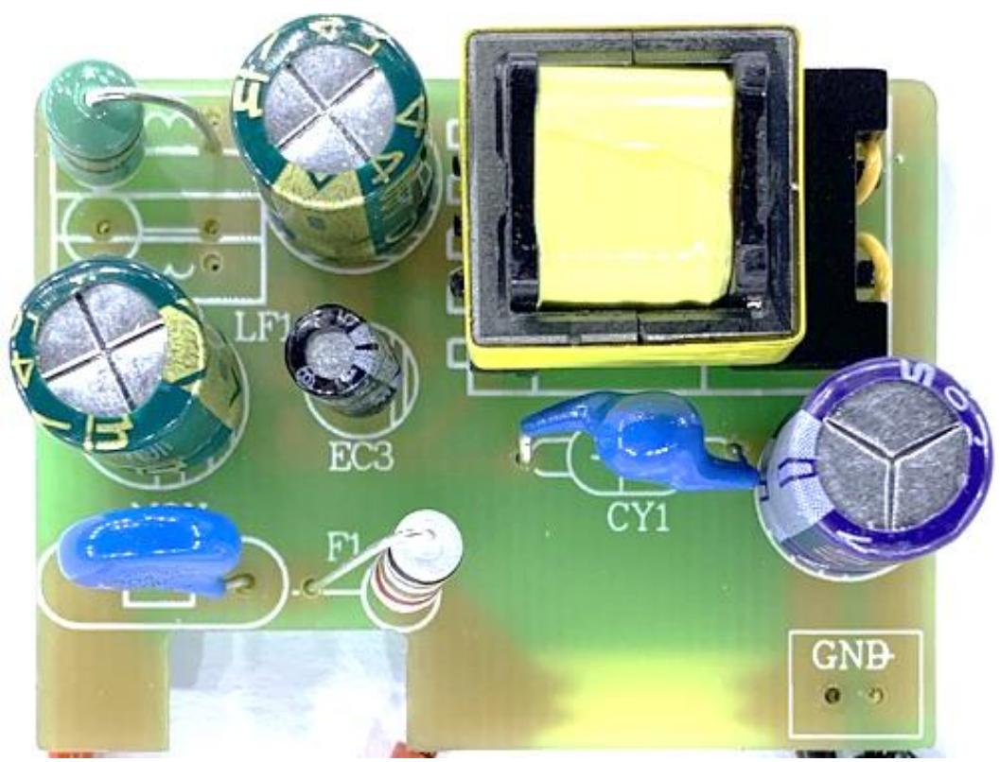

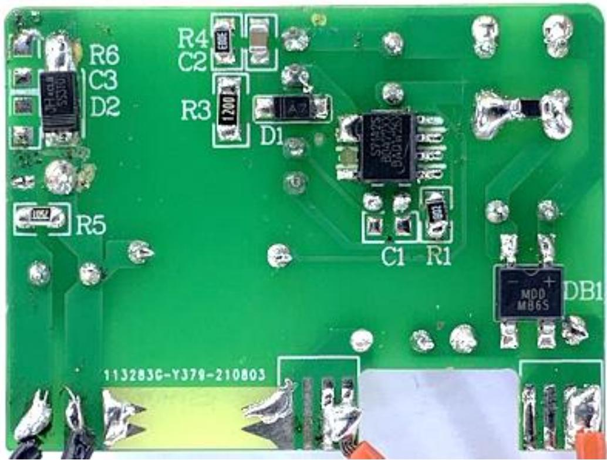

<table><tr><td>序号</td><td>物料名称</td><td>型号规格</td><td>用量</td><td>工位</td><td>备注</td></tr><tr><td colspan="6">SMD类</td></tr><tr><td>1</td><td>贴片电阻</td><td>18K 0805 ±1%</td><td>1</td><td>R1</td><td></td></tr><tr><td>2</td><td>贴片电阻</td><td>NG</td><td>0</td><td>R2</td><td></td></tr><tr><td>3</td><td>贴片电阻</td><td>100R 0805 ±5%</td><td>1</td><td>R3</td><td></td></tr><tr><td>4</td><td>贴片电阻</td><td>330K 0805 ±5%</td><td>1</td><td>R4</td><td></td></tr><tr><td>5</td><td>贴片电阻</td><td>7.5K 0805 ±5%</td><td>1</td><td>R5</td><td></td></tr><tr><td>6</td><td>贴片电容</td><td>1uF/25V 0805 ±10%</td><td>1</td><td>C1</td><td></td></tr><tr><td>7</td><td>贴片电容</td><td>1nF/500V 0805 ±10%</td><td>1</td><td>C2</td><td></td></tr><tr><td>8</td><td>贴片电感</td><td>4.7uH 0805 SRF&gt;30MHz</td><td>1</td><td>L2</td><td></td></tr><tr><td>9</td><td>IC</td><td>S7142S SOP7</td><td>1</td><td>U1</td><td></td></tr><tr><td>10</td><td>整流桥</td><td>MB10F 0.8A 1000V MBF</td><td>1</td><td>DB1</td><td></td></tr><tr><td>11</td><td>整流二极管</td><td>A7 1A/1000V SOD123FL</td><td>1</td><td>D1</td><td></td></tr><tr><td>12</td><td>整流二极管</td><td>SS310 3A/100V SMA</td><td>1</td><td>D2</td><td></td></tr><tr><td colspan="6">DIP类</td></tr><tr><td>13</td><td>电解电容</td><td>4.7uF/400V 105°C Φ8.3*13mm</td><td>2</td><td>EC1、EC2</td><td></td></tr><tr><td>14</td><td>电解电容</td><td>4.7uF/50V 105°C Φ4*10mm</td><td>1</td><td>EC3</td><td></td></tr><tr><td>15</td><td>电解电容</td><td>470uF /16V 105°C LESR Φ8.3*13mm</td><td>1</td><td>EC4</td><td></td></tr><tr><td>16</td><td>Y电容</td><td>100pF/400V</td><td>1</td><td>CY1</td><td></td></tr><tr><td>17</td><td>变压器</td><td>EF13卧式 5+2 AE=17.2mm^2 Lm=2mH</td><td>1</td><td>T1</td><td></td></tr><tr><td>18</td><td>色环电感</td><td>1mH 1/2W</td><td>1</td><td>L1</td><td></td></tr><tr><td>19</td><td>压敏电阻</td><td>7D471</td><td>1</td><td>MOV</td><td></td></tr><tr><td>20</td><td>保险丝</td><td>2.2R 1/2W</td><td>1</td><td>F1</td><td></td></tr></table>

元器件总数 20

## 原理图

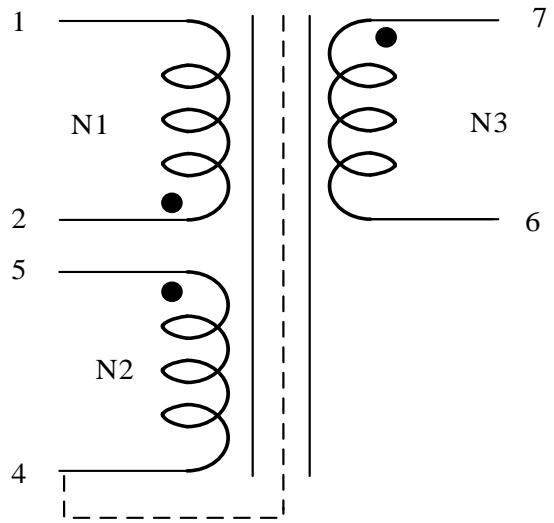

■ 绕线方式

<table><tr><td>绕组</td><td>起始脚</td><td>终止脚</td><td>材料</td><td>匝数</td><td>绕线方式</td></tr><tr><td>N1</td><td>2</td><td>1</td><td> $\phi 0.15*1P$ </td><td>130Ts</td><td>密绕3层(PIN脚朝外)</td></tr><tr><td colspan="4">胶带</td><td>2Ts</td><td></td></tr><tr><td>N2</td><td>5</td><td>4</td><td> $\phi 0.15*1P$ </td><td>4Ts</td><td>疏绕1层(PIN脚朝外)</td></tr><tr><td colspan="4">胶带</td><td>2Ts</td><td></td></tr><tr><td>N3</td><td>7</td><td>6</td><td>三层绝缘线 $\phi 0.5*1P$ </td><td>18Ts</td><td>密绕2层(PIN脚朝外)</td></tr><tr><td colspan="4">胶带</td><td>2Ts</td><td></td></tr></table>

## ■ 规格与材料

➢ 初级绕组感量 $L_{p}=2mH\pm5\%$ （测试条件：1V，10kHz）  
漏感量 $L_{lk}<100uH$  
骨架：EE13卧式（5+2PIN）  
磁芯：EE13 PC40 或同等材质，Ae=17.2mm $^{4}$  
N1、N2、N4: 2UEW 漆包线  
N3: 三层绝缘线  
绝缘胶带:3M900 或同等材质  
➢ 耐压测试: 3KV, 50/60Hz, 1Min  
成品要求：浸凡立水  
磁芯接PIN2

## ■ 脚位图

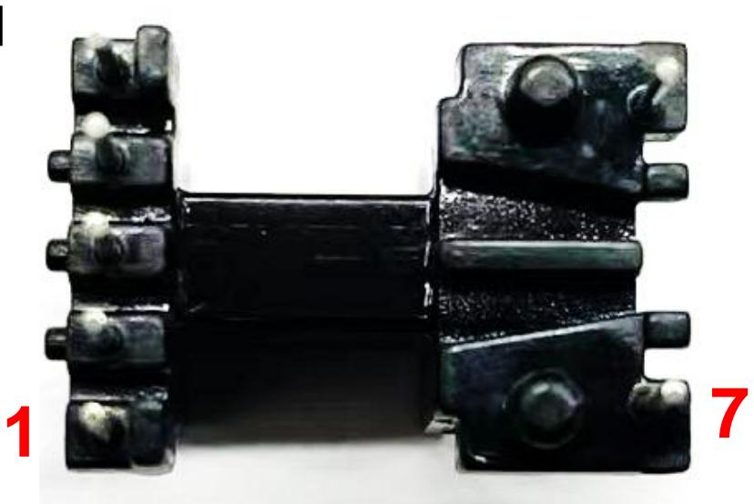

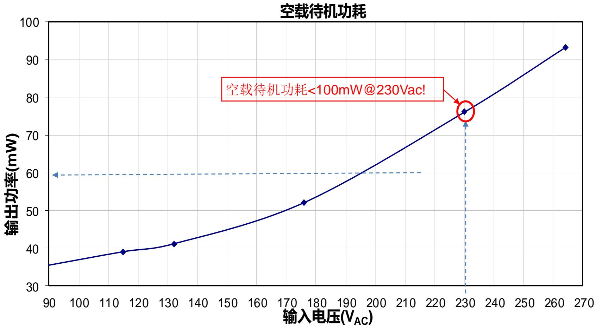

## 效率测试

<table><tr><td> $V_{IN}(VAC)$ </td><td>Load(%)</td><td> $P_{IN}(W)$ </td><td> $V_{OUT}(V)$ </td><td> $I_{OUT}(A)$ </td><td> $P_{OUT}(W)$ </td><td>Eff(%)</td><td>AVG Eff(%)</td><td>DoE VI</td><td>COC V5.0 Tier 2</td></tr><tr><td rowspan="6">85</td><td>空载</td><td>0.0347</td><td>12.380</td><td>0</td><td>0.000</td><td></td><td></td><td></td><td></td></tr><tr><td>10%</td><td>0.6591</td><td>12.131</td><td>0.04</td><td>0.485</td><td>73.62%</td><td></td><td></td><td></td></tr><tr><td>25%</td><td>1.5524</td><td>12.097</td><td>0.1</td><td>1.210</td><td>77.92%</td><td rowspan="4">79.00%</td><td rowspan="4"></td><td rowspan="4"></td></tr><tr><td>50%</td><td>3.0543</td><td>12.115</td><td>0.2</td><td>2.423</td><td>79.33%</td></tr><tr><td>75%</td><td>4.5926</td><td>12.173</td><td>0.3</td><td>3.652</td><td>79.52%</td></tr><tr><td>100%</td><td>6.1801</td><td>12.245</td><td>0.4</td><td>4.898</td><td>79.25%</td></tr><tr><td rowspan="6">115</td><td>空载</td><td>0.0390</td><td>12.403</td><td>0</td><td>0.000</td><td></td><td></td><td>0.1</td><td>0.075</td></tr><tr><td>10%</td><td>0.6611</td><td>12.156</td><td>0.04</td><td>0.486</td><td>73.55%</td><td></td><td></td><td>67.47%</td></tr><tr><td>25%</td><td>1.5484</td><td>12.122</td><td>0.1</td><td>1.212</td><td>78.28%</td><td rowspan="4">79.71%</td><td rowspan="4">77.47%</td><td rowspan="4">77.59%</td></tr><tr><td>50%</td><td>3.0347</td><td>12.136</td><td>0.2</td><td>2.427</td><td>79.98%</td></tr><tr><td>75%</td><td>4.5539</td><td>12.195</td><td>0.3</td><td>3.658</td><td>80.33%</td></tr><tr><td>100%</td><td>6.1149</td><td>12.265</td><td>0.4</td><td>4.906</td><td>80.23%</td></tr><tr><td rowspan="6">230</td><td>空载</td><td>0.0762</td><td>12.354</td><td>0</td><td>0.000</td><td></td><td></td><td>0.1</td><td>0.075</td></tr><tr><td>10%</td><td>0.7081</td><td>12.176</td><td>0.04</td><td>0.487</td><td>68.78%</td><td></td><td></td><td>67.47%</td></tr><tr><td>25%</td><td>1.6064</td><td>12.151</td><td>0.1</td><td>1.215</td><td>75.64%</td><td rowspan="4">78.65%</td><td rowspan="4">77.47%</td><td rowspan="4">77.59%</td></tr><tr><td>50%</td><td>3.0846</td><td>12.155</td><td>0.2</td><td>2.431</td><td>78.81%</td></tr><tr><td>75%</td><td>4.5850</td><td>12.215</td><td>0.3</td><td>3.665</td><td>79.92%</td></tr><tr><td>100%</td><td>6.1290</td><td>12.294</td><td>0.4</td><td>4.918</td><td>80.23%</td></tr><tr><td rowspan="6">265</td><td>空载</td><td>0.0934</td><td>12.3716</td><td>0</td><td>0.000</td><td></td><td></td><td></td><td></td></tr><tr><td>10%</td><td>0.7330</td><td>12.193</td><td>0.04</td><td>0.488</td><td>66.54%</td><td></td><td></td><td></td></tr><tr><td>25%</td><td>1.6440</td><td>12.174</td><td>0.1</td><td>1.217</td><td>74.05%</td><td rowspan="4">77.33%</td><td rowspan="4"></td><td rowspan="4"></td></tr><tr><td>50%</td><td>3.1480</td><td>12.171</td><td>0.2</td><td>2.434</td><td>77.33%</td></tr><tr><td>75%</td><td>4.6640</td><td>12.23</td><td>0.3</td><td>3.669</td><td>78.67%</td></tr><tr><td>100%</td><td>6.2049</td><td>12.3</td><td>0.4</td><td>4.920</td><td>79.29%</td></tr></table>

■ 注：以上测试均为板端效率

效率对比  
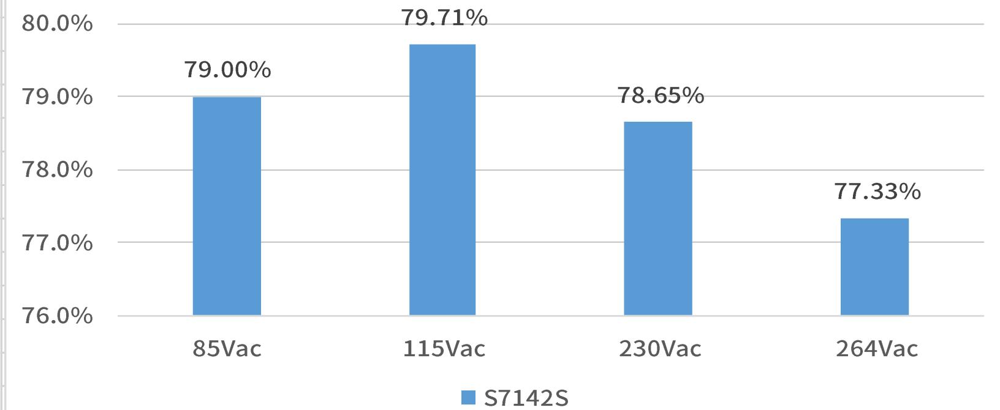

■ 注：以上测试均为板端效率

## 调整率

电压调整率

<table><tr><td>lout (A)</td><td>85Vac</td><td>115Vac</td><td>230Vac</td><td>265Vac</td><td>线调整率</td></tr><tr><td>0</td><td>12.370</td><td>12.402</td><td>12.358</td><td>12.385</td><td>0.53%</td></tr><tr><td>20%</td><td>12.103</td><td>12.145</td><td>12.166</td><td>12.180</td><td>0.96%</td></tr><tr><td>40%</td><td>12.100</td><td>12.135</td><td>12.147</td><td>12.166</td><td>0.81%</td></tr><tr><td>60%</td><td>12.132</td><td>12.162</td><td>12.179</td><td>12.189</td><td>0.70%</td></tr><tr><td>80%</td><td>12.189</td><td>12.211</td><td>12.227</td><td>12.244</td><td>0.67%</td></tr><tr><td>100%</td><td>12.243</td><td>12.263</td><td>12.292</td><td>12.300</td><td>0.71%</td></tr><tr><td>负载调整率</td><td>2.21%</td><td>2.18%</td><td>1.73%</td><td>1.79%</td><td></td></tr></table>

电流调整率

<table><tr><td></td><td>85Vac</td><td>115Vac</td><td>230Vac</td><td>265Vac</td><td>线调整率</td></tr><tr><td>40%</td><td>0.541</td><td>0.545</td><td>0.548</td><td>0.549</td><td>2.20%</td></tr><tr><td>50%</td><td>0.542</td><td>0.549</td><td>0.552</td><td>0.553</td><td>3.01%</td></tr><tr><td>60%</td><td>0.541</td><td>0.550</td><td>0.554</td><td>0.554</td><td>3.55%</td></tr><tr><td>70%</td><td>0.541</td><td>0.547</td><td>0.551</td><td>0.554</td><td>3.56%</td></tr><tr><td>80%</td><td>0.541</td><td>0.546</td><td>0.560</td><td>0.562</td><td>5.70%</td></tr><tr><td>90%</td><td>0.527</td><td>0.545</td><td>0.550</td><td>0.555</td><td>7.72%</td></tr><tr><td>100%</td><td>0.506</td><td>0.549</td><td>0.559</td><td>0.556</td><td>14.65%</td></tr><tr><td>负载调整率</td><td>6.74%</td><td>0.91%</td><td>2.17%</td><td>2.34%</td><td></td></tr></table>

## 输出电压纹波

85 V $_{AC}$

■ CH2 V $_{OUT}$ Ripple
V $_{PK-PK}$ =124mV

## 测试条件:

Full Load

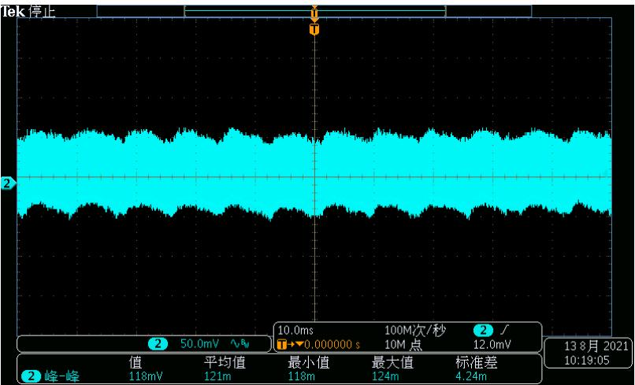

115 V $_{AC}$

■ CH2 V $_{OUT}$ Ripple
V $_{PK-PK}$ =118mV

## 测试条件:

Full Load

230 V $_{AC}$

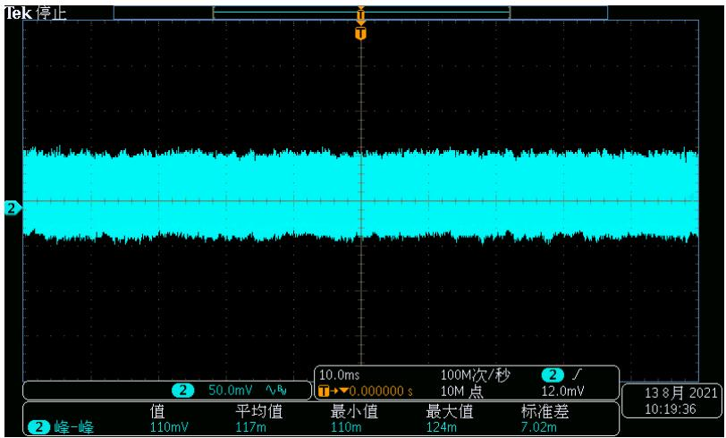

■ CH2 V $_{OUT}$ Ripple
V $_{PK-PK}$ =110mV

## 测试条件:

Full Load

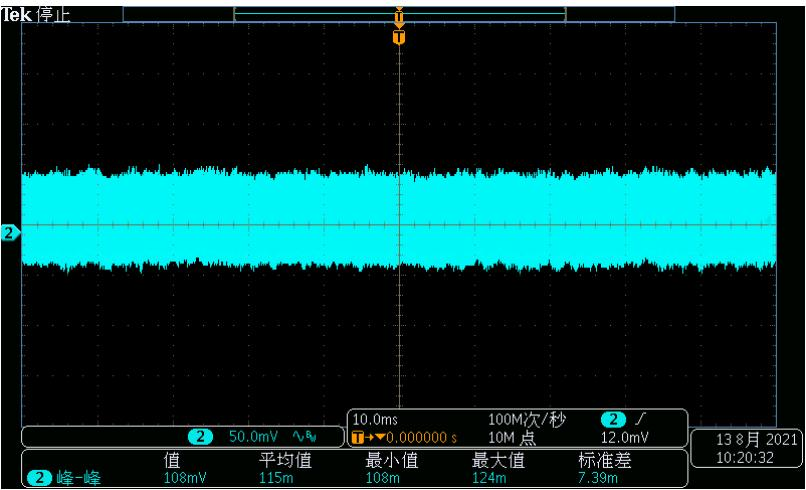

备注：以上纹波为线端测试，1.2m线

265 V $_{AC}$

■ CH2 V $_{OUT}$ Ripple
V $_{PK-PK}$ =108mV

## 测试条件:

Full Load

## 动态负载

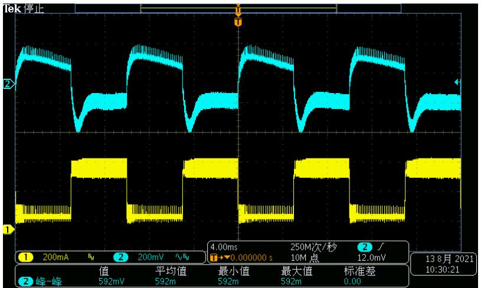

CH2 VOUT
CH1 IOUT

Vpk-pk=592V

## 测试条件:

85 V $_{AC}$  
10%\~90% 负载  
翻转速度:  
0.08A/μs  
频率: 100 Hz

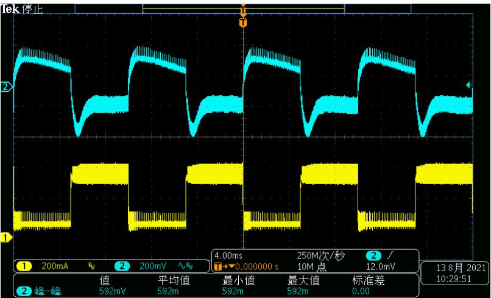

CH2 VOUT
CH1 IOUT

Vpk-pk=592V

## 测试条件:

115 V $_{AC}$  
10%\~90% 负载  
翻转速度:  
0.08A/μs  
频率: 100 Hz

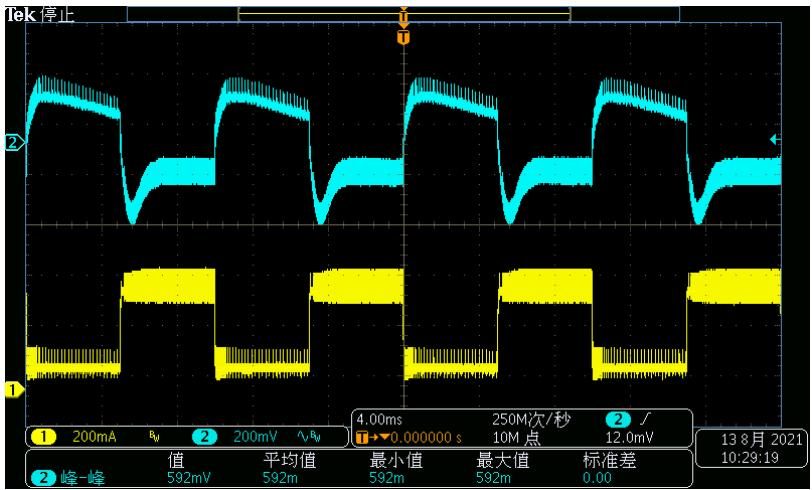

CH2 VOUT
CH1 IOUT

Vpk-pk=592V

## 测试条件:

230 V $_{AC}$  
10%\~90% 负载  
翻转速度:  
0.08A/μs  
频率: 100 Hz

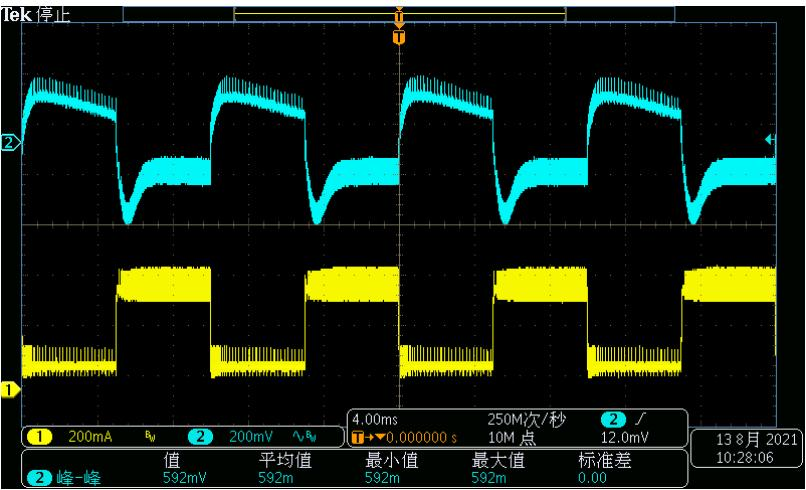

CH2 VOUT
CH1 IOUT

Vpk-pk=582V

## 测试条件:

265 V $_{AC}$  
10%\~90% 负载  
翻转速度:  
0.08A/μs  
频率: 100 Hz

## 启动及关机延迟时间

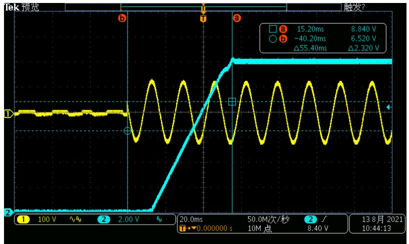

CH1 V $_{IN}$

CH2 V $_{OUT}$

$t_{delay}=55.4ms$

## 测试条件:

85 V $_{AC}$  
满载

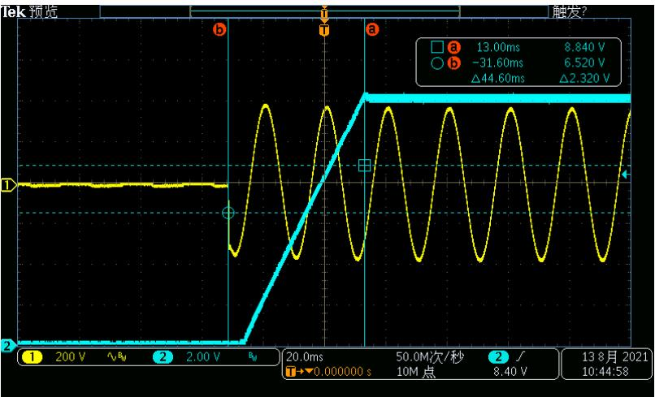

CH2 VOUT

CH1 V $_{IN}$

$t_{delay}=44.6ms$

## 测试条件:

264V $_{AC}$  
5V满载

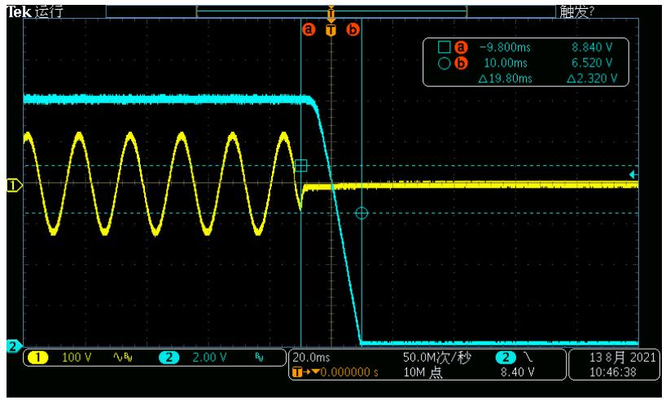

CH1 V $_{IN}$

CH2 VOUT

$t_{delay}=19.8ms$

## 测试条件:

85 V $_{AC}$  
满载

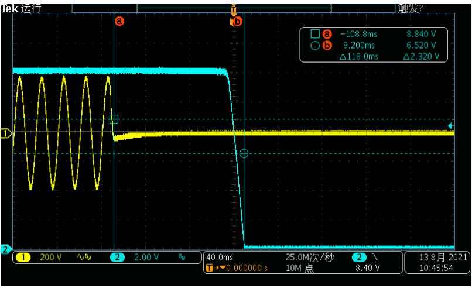

CH2 VOUT

CH1 V $_{IN}$

$t_{delay}=118ms$

## 测试条件:

264 V $_{AC}$  
满载

## VCC工作电压

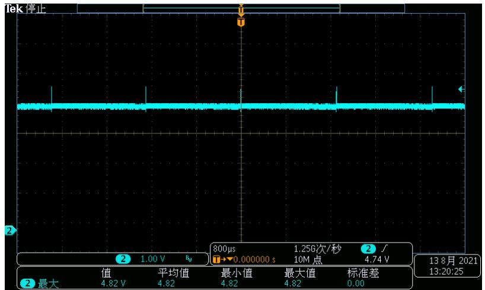

CH2 Vcc

$$
V _ {c c \_ m i n} = 4. 8 2 V
$$

## 测试条件:

No Load  
85Vac

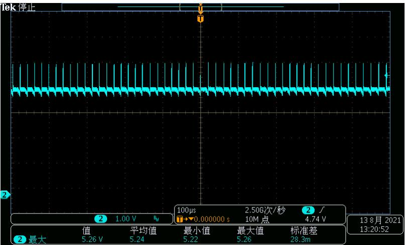

■ CH2 V $_{cc}$ V $_{cc\_min}$ =5.26V

## 测试条件:

Full Load  
85Vac

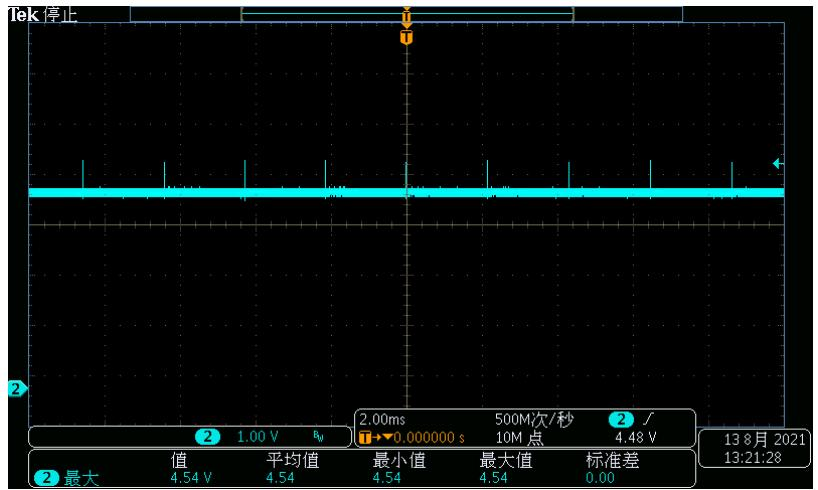

CH2 Vcc

$$
V _ {c c \_ m i n} = 4. 5 4 V
$$

## 测试条件:

No Load  
264Vac

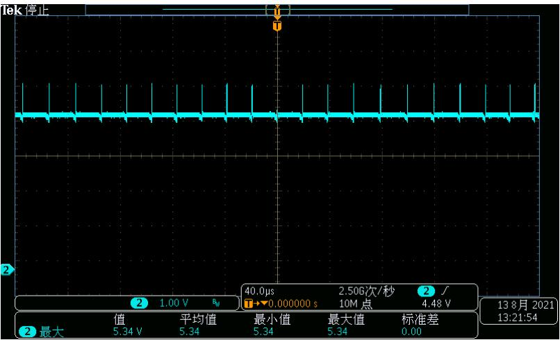

■ CH2 V $_{cc}$ V $_{cc\_min}$ =5.34V

## 测试条件:

Full Load  
264Vac

## C-E电压波形

265 V $_{AC}$

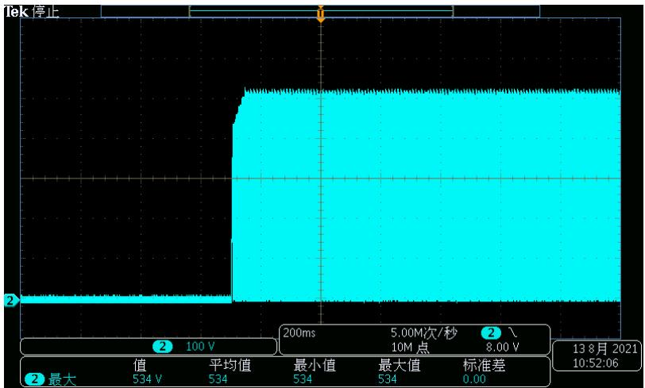

■ CH2 V $_{DS}$ VCE $_{MAX}$ : 534 V

## 测试条件:

满载开机

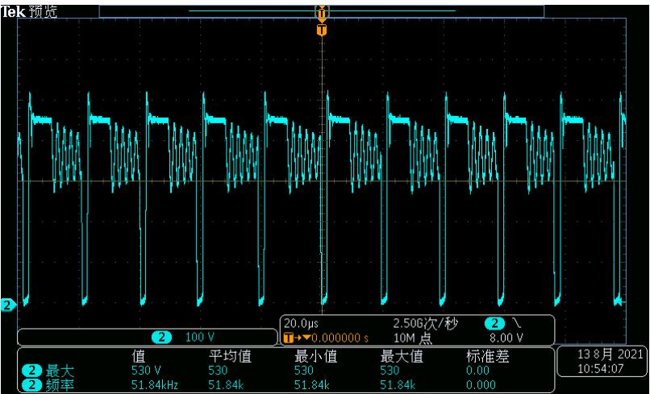

265 V $_{AC}$

■ CH2 V $_{DS}$ VCE $_{MAX}$ : 530V

## 测试条件:

满载  
正常工作

极限参数(注1)

<table><tr><td>符号</td><td>参数</td><td>参数范围</td><td>单位</td></tr><tr><td>VCC</td><td>芯片供电脚电压范围</td><td>-0.3~8</td><td>V</td></tr><tr><td>FB</td><td>输入反馈脚电压范围</td><td>-0.3~8</td><td>V</td></tr><tr><td>C</td><td>功率管耐压范围</td><td>-0.3~850</td><td>V</td></tr><tr><td> $P_{DMAX}$ </td><td>功耗(注2)</td><td>0.45</td><td>W</td></tr><tr><td> $\theta_{JA}$ </td><td>PN结到环境BVN的热阻</td><td>145</td><td>°C/W</td></tr><tr><td> $T_J$ </td><td>工作结温范围</td><td>-40~150</td><td>°C</td></tr><tr><td> $T_{STG}$ </td><td>储存温度范围</td><td>-60~150</td><td>°C</td></tr></table>

## 满载开机

Derating= 534V / 850 V = 62.8 %

## 满载正常工作

Derating = 536 V / 650 V = 62.4%

## 续流二极管反向电压

265 V $_{AC}$

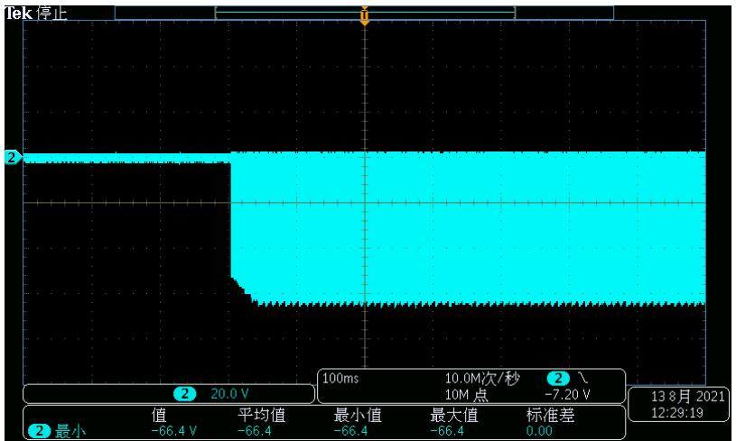

■ CH2 V $_{DIODE}$ VDS $_{MAX}$ : 66.4V

## 测试条件:

满载启动

<table><tr><td>Symbol</td><td>SS32</td><td>SS33</td><td>SS34</td><td>SS35</td><td>SS36</td><td>SS39</td><td>SS310</td><td>SS315</td><td>Units</td></tr><tr><td> $e$   $V_{RRM}$ </td><td>20</td><td>30</td><td>40</td><td>50</td><td>60</td><td>90</td><td></td><td>100</td><td>150</td></tr><tr><td> $V_{RMS}$ </td><td>14</td><td>21</td><td>28</td><td>35</td><td>42</td><td>63</td><td></td><td>70</td><td>105</td></tr><tr><td> $V_{DC}$ </td><td>20</td><td>30</td><td>40</td><td>50</td><td>60</td><td>90</td><td></td><td>100</td><td>150</td></tr><tr><td> $I_{(AV)}$ </td><td colspan="8">3.0 A</td><td></td></tr><tr><td> $I_{FSM}$ </td><td colspan="3">100 70</td><td colspan="5"></td><td>A</td></tr></table>

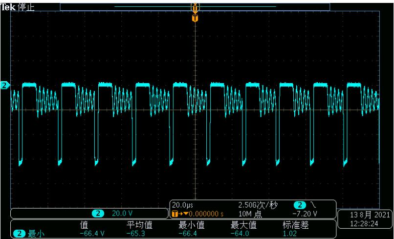

265 V $_{AC}$

■ CH2 V $_{DDIODE}$ V $_{MAX}$ : 66.4 V

## 测试条件:

满载  
正常工作

## 满载开机

$$
\text{Derating} = 66.4 \mathrm{V} / 100 \mathrm{V} = 66.4 \%
$$

## 满载正常工作

$$
\text{Derating} = 66.4 \mathrm{V} / 100 \mathrm{V} = 66.4 \%
$$

## 输出电压上升时间

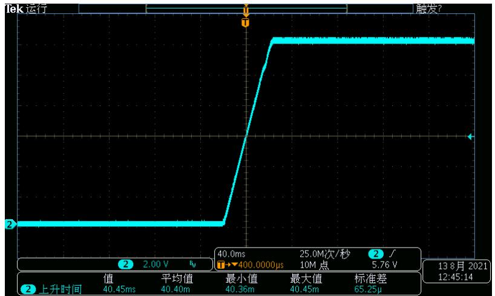

CH2 V $_{OUT}$

$t_{rise}=40.45ms$

## 测试条件:

85 V $_{AC}$  
满载

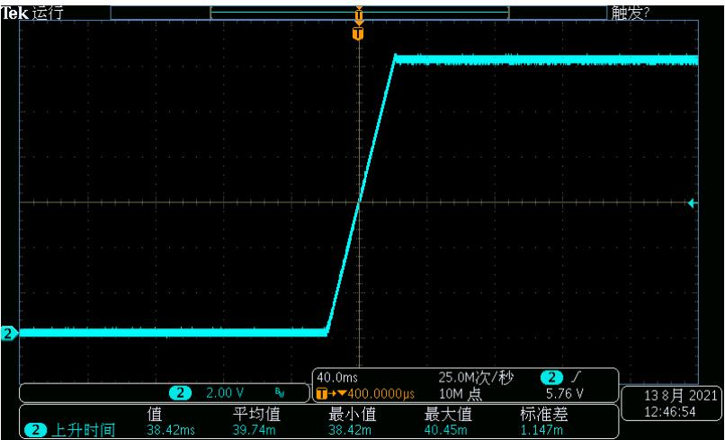

CH2 V $_{OUT}$

$t_{rise}=38.7ms$

## 测试条件:

115V $_{AC}$  
满载

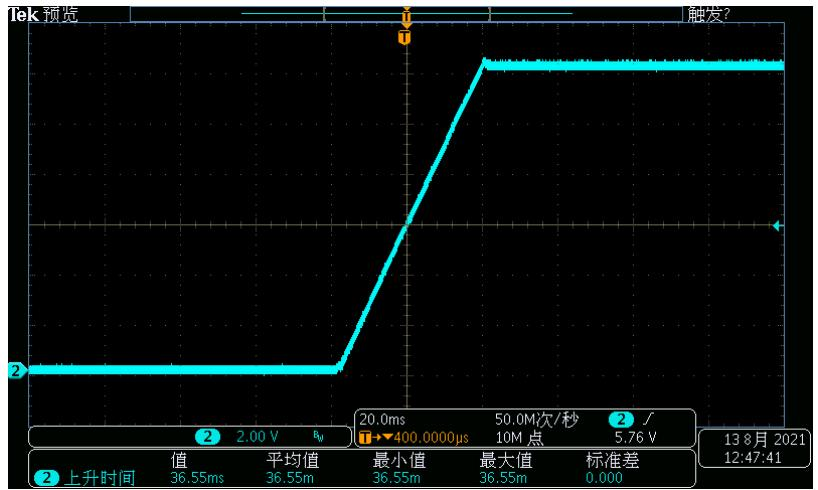

CH2 V $_{OUT}$

$t_{rise}=36.55ms$

## 测试条件:

230 V $_{AC}$  
满载

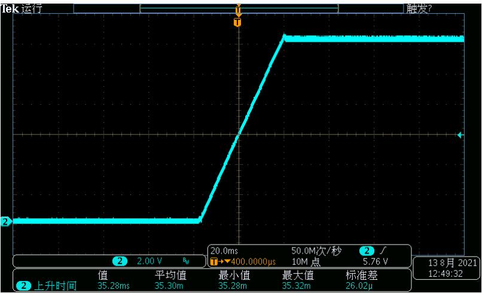

CH2 VOUT

$t_{rise}=35.28ms$

## 测试条件:

264 V $_{AC}$  
满载

## 容性负载

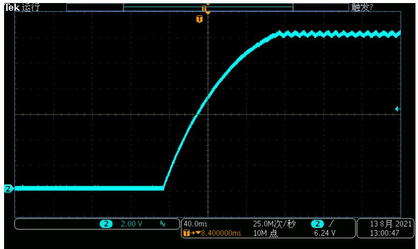

CH2 VOUT

PASS

## 测试条件:

85 V $_{AC}$  
满载  
Co=2200uF

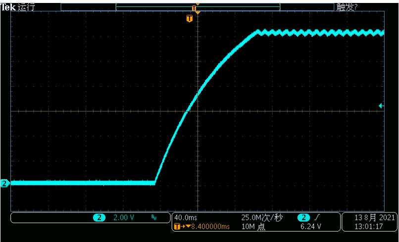

CH2 VOUT

$t_{rise}=38.7ms$

## 测试条件:

115V $_{AC}$  
满载  
Co=2200uF

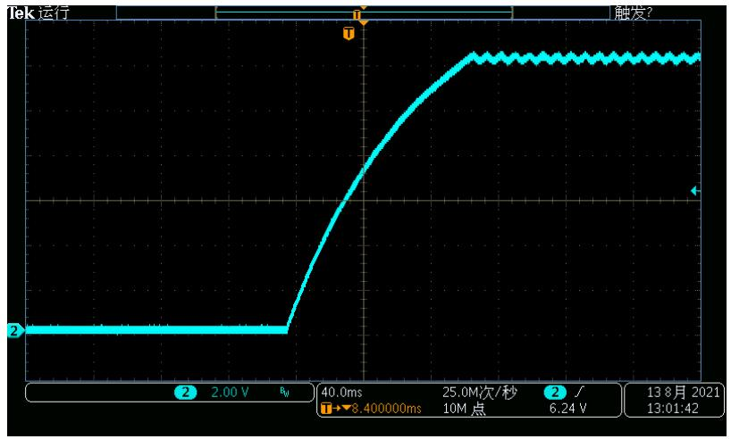

CH2 V $_{OUT}$

PASS

## 测试条件:

230 V $_{AC}$  
满载  
Co=2200uF

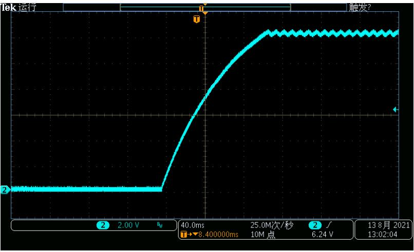

CH2 VOUT

PASS

## 测试条件:

264 V $_{AC}$  
满载  
Co=2200uF

## 输出过载保护

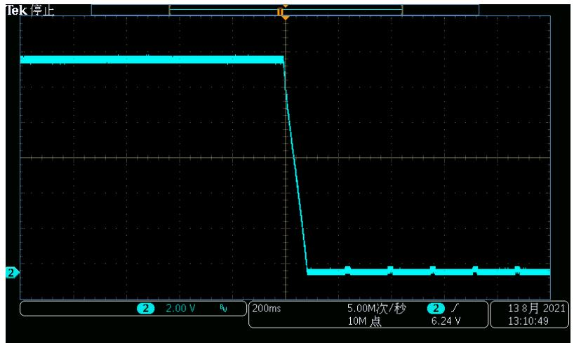

CH2 V $_{OUT}$

PASS

## 测试条件:

85 V $_{AC}$  
▶ 带载0.6A

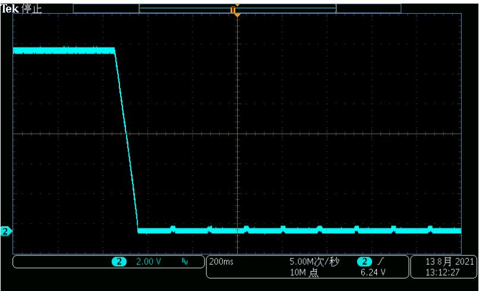

CH2 VOUT

PASS

## 测试条件:

115 V $_{AC}$  
▶ 带载0.6A

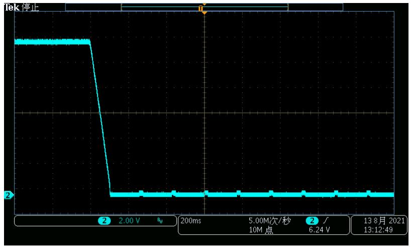

CH2 V $_{OUT}$

PASS

## 测试条件:

230 V $_{AC}$  
▶ 带载0.6A

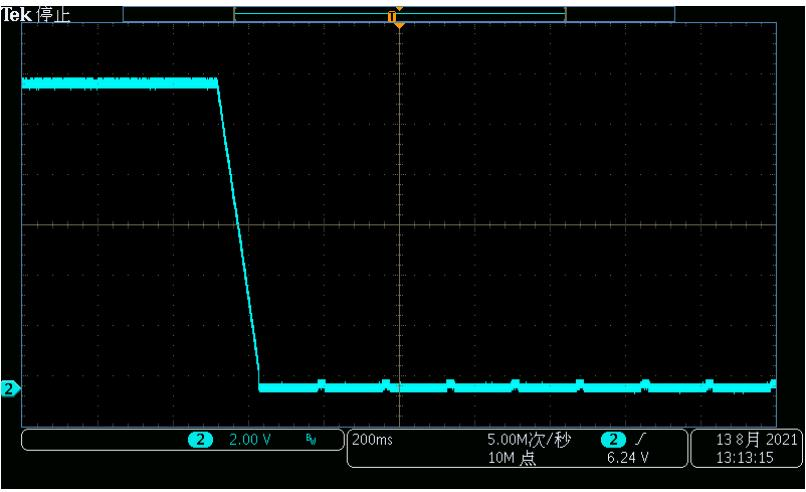

CH2 VOUT

PASS

## 测试条件:

264 V $_{AC}$  
▶ 带载0.6A

## 输出短路保护

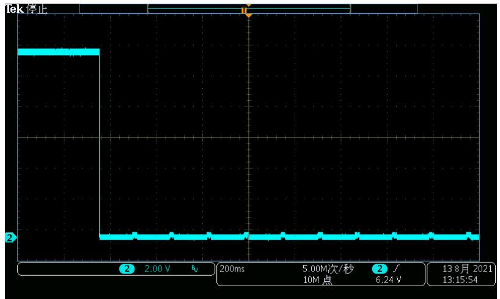

CH2 V $_{OUT}$

PASS

## 测试条件:

85 V $_{AC}$  
输出短路

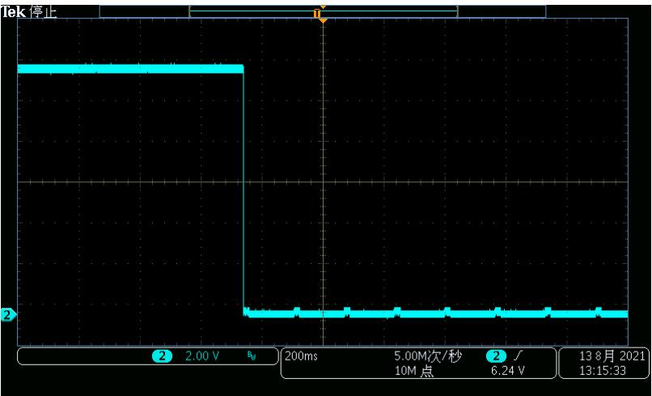

CH2 VOUT

PASS

## 测试条件:

115 V $_{AC}$  
输出短路

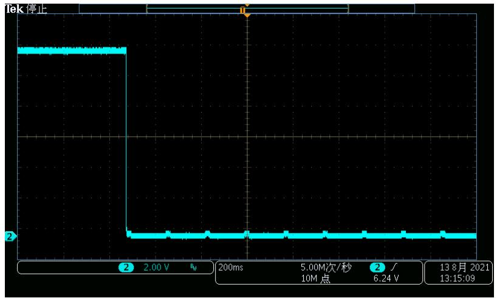

CH2 V $_{OUT}$

PASS

## 测试条件:

230 V $_{AC}$  
输出短路

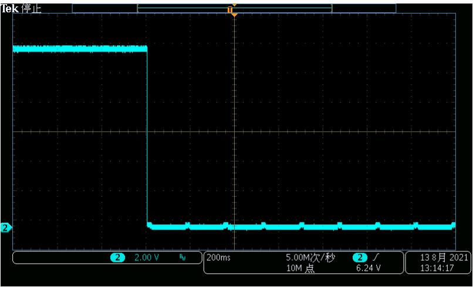

CH2 VOUT

PASS

## 测试条件:

264 V $_{AC}$  
输出短路

<table><tr><td> $V_{IN}(VAC)$ </td><td>85</td><td>115</td><td>230</td><td>265</td></tr><tr><td>IC</td><td>119.6</td><td>118</td><td>114</td><td>120.6</td></tr><tr><td>续流二极管</td><td>95.8</td><td>95</td><td>93.5</td><td>95.5</td></tr><tr><td>变压器磁芯</td><td>88.6</td><td>87.6</td><td>86</td><td>89.3</td></tr><tr><td>变压器线圈</td><td>88.8</td><td>87.3</td><td>85.5</td><td>88.5</td></tr><tr><td>输出电容</td><td>67</td><td>64</td><td>64</td><td>66.1</td></tr><tr><td>输入电容</td><td>90.9</td><td>88.9</td><td>85.7</td><td>89.3</td></tr><tr><td>外壳温度</td><td>52.9</td><td>52.4</td><td>51</td><td>52.1</td></tr></table>

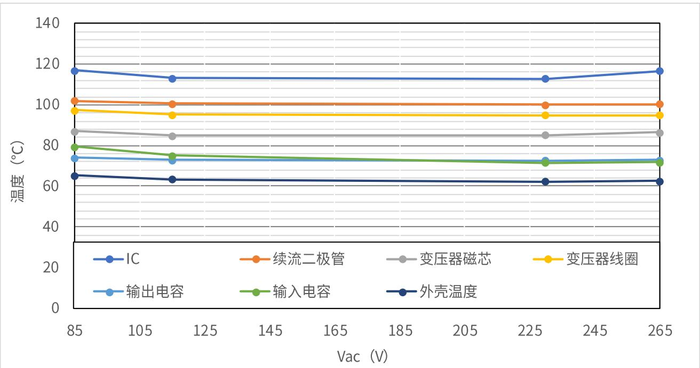

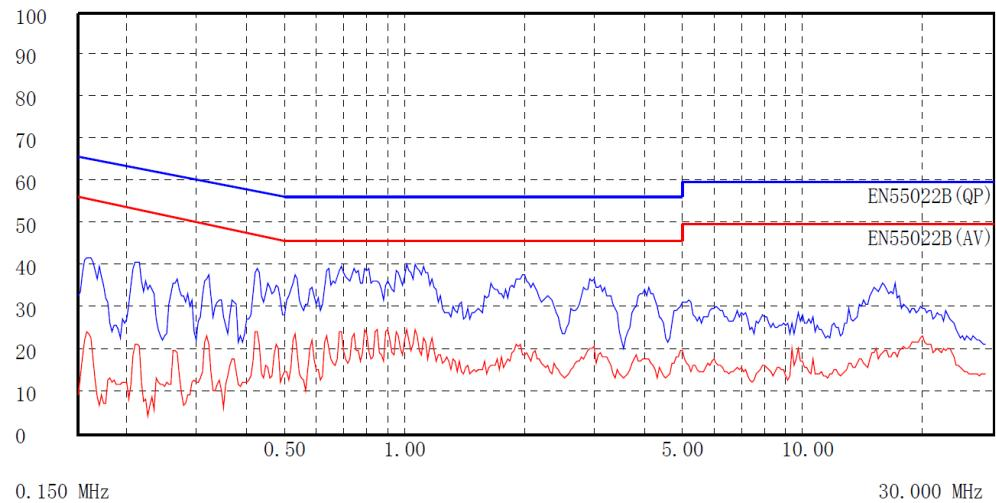

230VAC CE Line

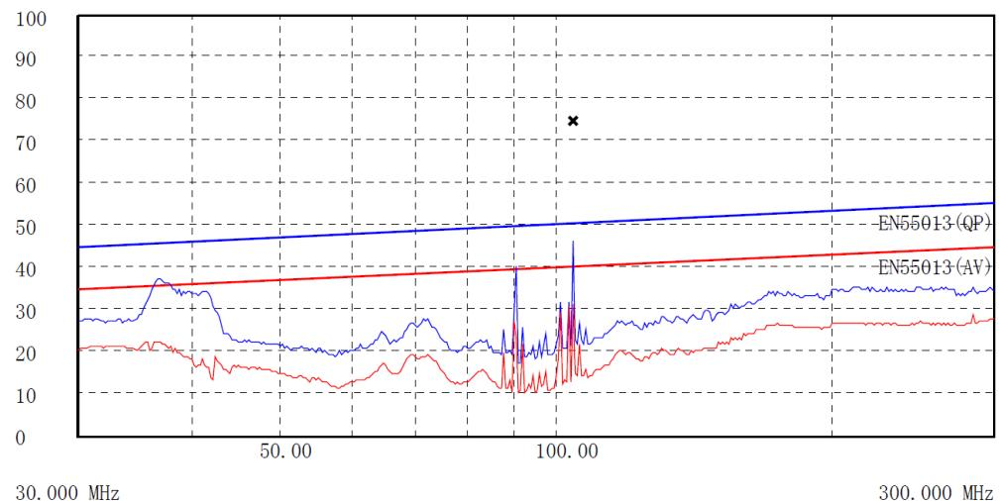

230VAC RE Line

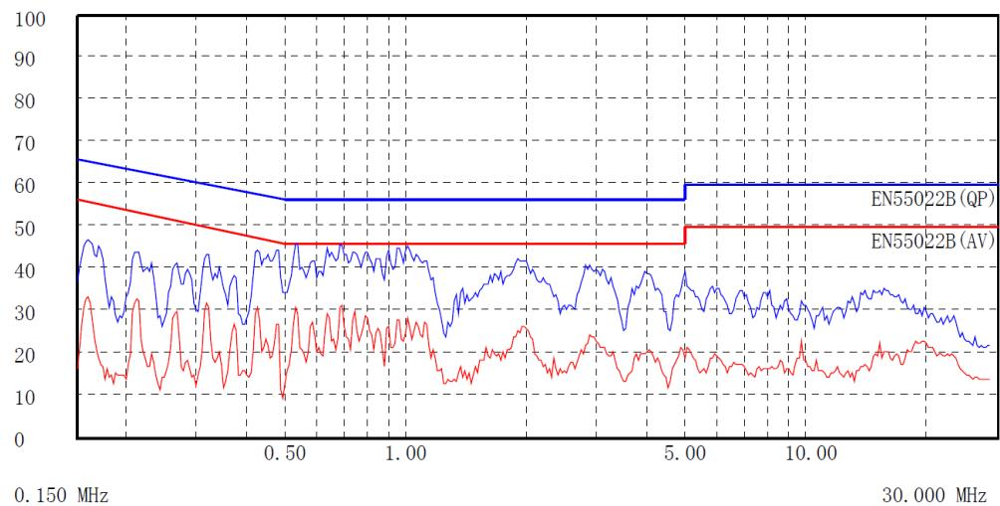

230VAC CE Neutral

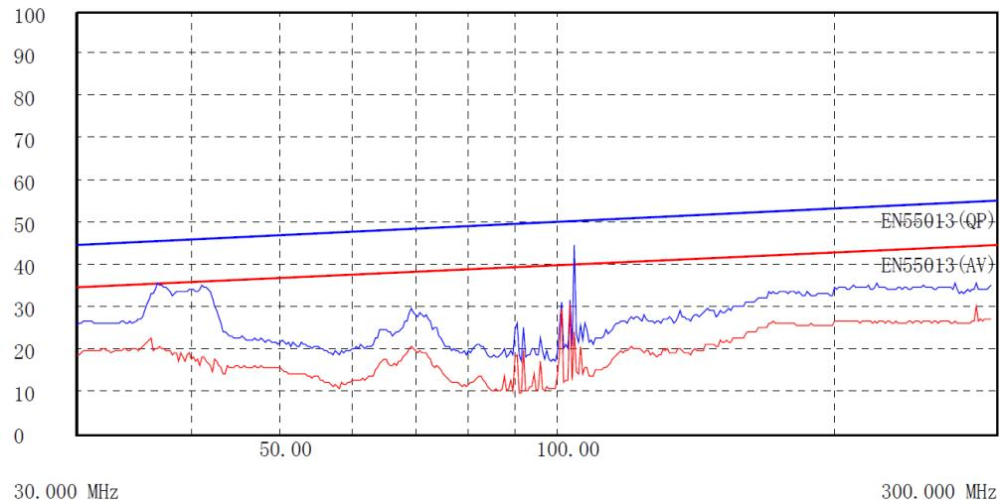

230VAC RE Neutral

<table><tr><td>测试点</td><td>电压(V)</td><td>放电类型</td><td>放电次数</td><td>测试结果</td></tr><tr><td>Vo</td><td>+12kV</td><td>空气放电</td><td>10</td><td>Pass</td></tr><tr><td>Vo</td><td>-12kV</td><td>空气放电</td><td>10</td><td>Pass</td></tr><tr><td>GND</td><td>+12kV</td><td>空气放电</td><td>10</td><td>Pass</td></tr><tr><td>GND</td><td>-12kV</td><td>空气放电</td><td>10</td><td>Pass</td></tr><tr><td>Vo</td><td>+15kV</td><td>空气放电</td><td>10</td><td>Pass</td></tr><tr><td>Vo</td><td>-15kV</td><td>空气放电</td><td>10</td><td>Pass</td></tr><tr><td>GND</td><td>+15kV</td><td>空气放电</td><td>10</td><td>Pass</td></tr><tr><td>GND</td><td>-15kV</td><td>空气放电</td><td>10</td><td>Pass</td></tr></table>

## ■ 测试说明

按照GB/T17626.2和IEC61000-4-2的最新版本要求进行测试  
室温环境，230VAC输入满载条件  
每个测试点重复10次  
分别对输出正端和地进行空气放电  
➢ 试验时样机输出正常（符合A类标准）视为Pass

## THANK YOU FOR WATCHING
