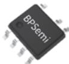
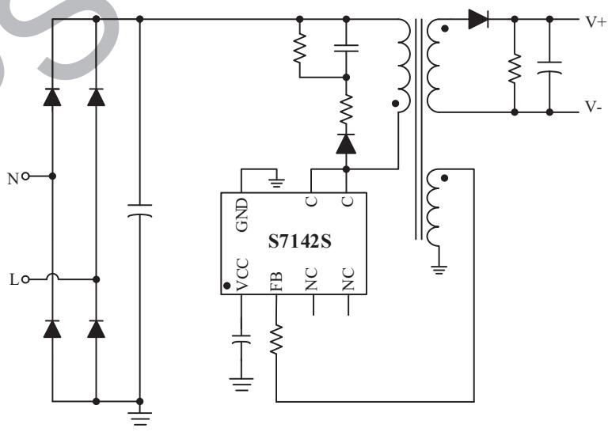
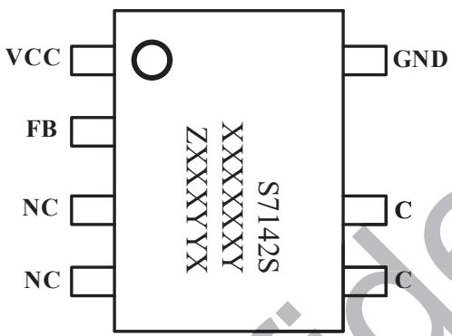
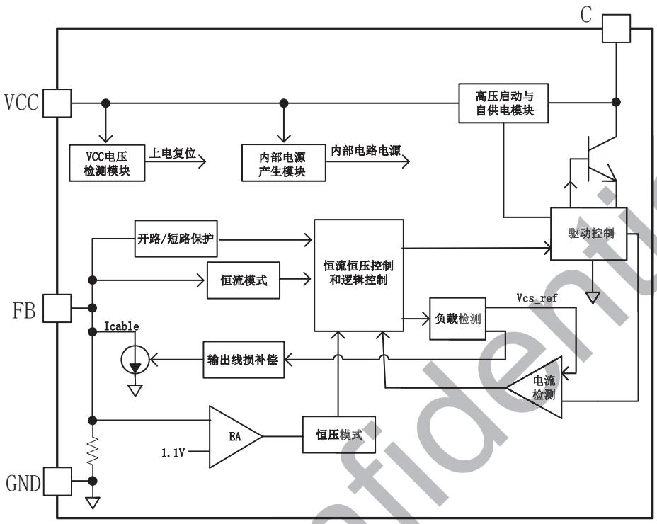
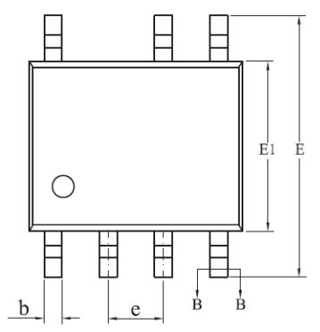
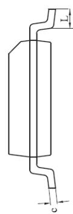
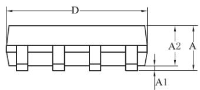
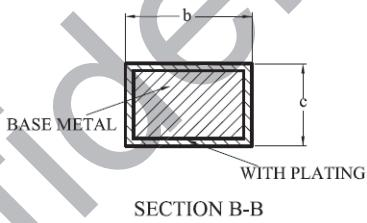

## 概述

S7142S是一款高集成度恒流、恒压的原边反馈控制器，集成高压启动器件并使用了自供电技术，使得系统无需启动电阻和供电二极管。同时芯片内置固定的峰值电流检测电路，省去了CS电阻；内置FB下偏电阻，极大降低了生产成本。适用于各种低功耗AC/DC充电器和适配器应用场合。

在恒压控制模式下，S7142S使用了多种工作模式以得到高转换效率和小的音频异响。S7142S内置输出线损补偿，并可以通过修改反馈电阻阻值调整补偿比例，以达到适应各种不同输出导线线损要求，可以有效的补偿输出电流在输出线上引起的线损压降。在恒流模式和重负载下S7142S工作于PFM，而在轻载和中度负载下同时减小Ipeak和工作频率，以优化转换效率，避免音频异响。

S7142S具有多重的保护功能，包括输出开路、短路保护，过温保护等；S7142S采用SOP-7封装。

## 特点

■ 集成高压启动器件  
■ 无需供电二极管  
内置固定峰值电流  
内置 FB 下偏电阻  
内置功率三极管  
- 输出线损补偿可调  
内置输入线电压补偿  
输出短路保护  
■ 过温保护

## 应用领域

■ 手机、无绳电话、PDA、MP3 和其它便携式设备等的适配器、充电器  
LED 驱动电源  
线性电压和 RCC 开关电源升级换代  
其他辅助电源

  
SOP-7 封装

## 典型应用

图 1 S7142S 典型应用电路

定购信息

<table><tr><td>定购型号</td><td>封装</td><td>包装形式</td><td>打印</td></tr><tr><td>S7142S</td><td>SOP7</td><td>卷盘4,000/盘</td><td>S7142SXXXXXXXXYZXXXXYX</td></tr></table>

管脚封装

S7142S: 产品型号  
XXXXXXY: 批次  
ZXXX: 标识  
YY: 周号  
X: 预留

图 2 管脚封装图  
管脚描述

<table><tr><td>管脚号</td><td>管脚名称</td><td>描述</td></tr><tr><td>1</td><td>VCC</td><td>芯片供电脚</td></tr><tr><td>2</td><td>FB</td><td>反馈输入端</td></tr><tr><td>3/4</td><td>NC</td><td>悬空脚</td></tr><tr><td>5/6</td><td>C</td><td>内置三极管集电极</td></tr><tr><td>7</td><td>GND</td><td>芯片地</td></tr></table>

极限参数(注1)

<table><tr><td>符号</td><td>参数</td><td>参数范围</td><td>单位</td></tr><tr><td>VCC</td><td>芯片供电脚电压范围</td><td>-0.3~8</td><td>V</td></tr><tr><td>FB</td><td>输入反馈脚电压范围</td><td>-0.3~8</td><td>V</td></tr><tr><td>C</td><td>功率管耐压范围</td><td>-0.3~850</td><td>V</td></tr><tr><td> $P_{DMAX}$ </td><td>功耗(注2)</td><td>0.45</td><td>W</td></tr><tr><td> $\theta_{JA}$ </td><td>PN结到环境的热阻</td><td>145</td><td>°C/W</td></tr><tr><td> $T_J$ </td><td>工作结温范围</td><td>-40~150</td><td>°C</td></tr><tr><td> $T_{STG}$ </td><td>储存温度范围</td><td>-60~150</td><td>°C</td></tr><tr><td>ESD</td><td>人体模型ESD(注4)</td><td>2.0</td><td>KV</td></tr></table>

注1：最大极限值是指超出该工作范围，芯片有可能损坏。推荐工作范围是指在该范围内，器件功能正常，但并不完全保证满足个别性能指标。电气参数定义了器件在工作范围内并且在保证特定性能指标的测试条件下的直流和交流电参数规范。对于未给定上下限值的参数，该规范不予保证其精度，但其典型值合理反映了器件性能。  
注2：温度升高最大功耗一定会减小，这也是由 $T_{JMAX}, \theta_{JA}$ 和环境温度 $T_A$ 所决定的。最大允许功耗为 $P_{DMAX} = (T_{JMAX} - T_A) / \theta_{JA}$ 或是极限范围给出的数字中比较低的那个值。  
注3：1平方英寸双层PCB板，按照JEDEC标准测试。  
注4：按照JEDEC标准测试，100pF电容通过 $1.5\mathrm{K}\Omega$ 电阻放电。

推荐输出功率范围

<table><tr><td>产品</td><td>输出功率(85~264Vac)</td></tr><tr><td>S7142S</td><td>5 W</td></tr></table>

电气参数(注 5,6)（无特别说明情况下， $V_{CC}=4.5V, T_{A}=25^{\circ}C$ ）

<table><tr><td>描述</td><td>符号</td><td>条件</td><td>最小值</td><td>典型值</td><td>最大值</td><td>单位</td></tr><tr><td colspan="7">电源部分</td></tr><tr><td>VCC启动电压</td><td> $V_{CCON}$ </td><td></td><td>4.7</td><td>5.2</td><td>5.7</td><td>V</td></tr><tr><td>VCC欠压保护</td><td> $V_{CCOFF}$ </td><td></td><td>2.6</td><td>2.9</td><td>3.3</td><td>V</td></tr><tr><td>VCC启动电流</td><td> $I_{START}$ </td><td> $V_{CC_ON}-0.5V$ </td><td>0</td><td>0.14</td><td>2.0</td><td>μA</td></tr><tr><td>工作电流</td><td> $I_{CC}$ </td><td> $V_{CC_ON}+0.2V,C极悬空$ </td><td>0.8</td><td>1.0</td><td>1.4</td><td>mA</td></tr><tr><td colspan="7">恒流控制部分</td></tr><tr><td>内置峰值电流阈值</td><td> $I_{pk}$ </td><td></td><td></td><td>330</td><td></td><td>mA</td></tr><tr><td>前沿消隐时间</td><td> $T_{LEB}$ </td><td></td><td></td><td>450</td><td></td><td>ns</td></tr><tr><td>副边电流退磁比例</td><td>K</td><td> $t_{ONS}/t_{SW}$ </td><td></td><td>50</td><td></td><td>%</td></tr><tr><td colspan="7">FB反馈部分</td></tr><tr><td>FB反馈基准电压</td><td> $V_{FB_REF}$ </td><td></td><td>1.0</td><td>1.1</td><td>1.2</td><td>V</td></tr><tr><td>FB反馈基准电流</td><td> $I_{FB}$ </td><td></td><td>90</td><td>92</td><td>94</td><td>μA</td></tr><tr><td>最大线损补偿电流</td><td> $I_{CABLE_max}$ </td><td>FULL load</td><td></td><td>7.2</td><td></td><td>μA</td></tr><tr><td>退磁比较电压阈值</td><td> $V_{FB_DEM}$ </td><td></td><td></td><td>50</td><td></td><td>mV</td></tr><tr><td colspan="7">工作频率部分</td></tr><tr><td>最低工作频率</td><td> $F_{MIN}$ </td><td></td><td></td><td>100</td><td></td><td>Hz</td></tr><tr><td>次级整流管最小导通时间</td><td> $t_{ONS-MIN}$ </td><td></td><td>2</td><td></td><td></td><td>μs</td></tr><tr><td colspan="7">保护功能部分</td></tr><tr><td>FB短路保护电压</td><td> $V_{FB_SCP}$ </td><td></td><td></td><td>0.3</td><td></td><td>V</td></tr><tr><td>过热保护温度</td><td> $T_{SD}$ </td><td></td><td></td><td>150</td><td></td><td>°C</td></tr><tr><td>过温保护迟滞</td><td> $T_{HYS}$ </td><td></td><td></td><td>15</td><td></td><td>°C</td></tr><tr><td>最小退磁时间</td><td> $T_{dem_min}$ </td><td></td><td></td><td>3.5</td><td></td><td>μS</td></tr><tr><td colspan="7">功率管三极管部分</td></tr><tr><td>三极管击穿电压</td><td> $V_{CBO}$ </td><td> $V_{CC}=3.8V, Ic=1mA$ </td><td>850</td><td></td><td></td><td>V</td></tr></table>

注5：典型参数值为 $25^{\circ} \mathrm{C}$ 下测得的参数标准。  
注6：规格书的最小、最大规范范围由测试保证，典型值由设计、测试或统计分析保证。

## 内部结构框图

图 3 S7142S 内部框图

## 功能描述

S7142S 是一款高集成度的恒压恒流的原边反馈控制芯片，系统工作于断续模式，只需很少外围元器件即可以实现高精度的电压、电流输出，适用于充电器和适配器以及其它辅助类电源。在恒流模式和重负载下 S7142S 工作于 PFM，而在轻载和中度负载下同时减小峰值电流和工作频率，以优化转换效率，避免音频异响。

## 启动

芯片自带高压启动功能，系统上电后高压脚对 VCC 的电容进行充电，当 VCC 电压达到芯片的启动电压，芯片内部控制电路开始工作。为保证给芯片提供稳定的工作电压，建议 VCC 引脚的旁路电容应选择低 ESR 电容，以保证芯片可靠稳定工作和 VCC 电源纹波小，推荐使用 22μF 温度特性好的电解电容。由于低温时电容的 ESR 成倍增加，为避免低温启动困难，需要在 VCC 引脚多并联一个约 1uF 的 X7R 材质的瓷片电容。

## 输出恒流设置

芯片内部采用逐周期检测电感峰值电流，当原边电感电流增大到芯片内部设定的峰值电流阈值lpk时，功率管关断。芯片内置输入线电压补偿功能，使得输出电流基本不随输入电压变化。输出电流由下式决定

$$
I _ {O} = 0. 2 5 * I _ {p k} * \frac {N _ {P}}{N _ {S}}
$$

其中，Np 时变压器原边绕组匝数，Ns 为变压器输出绕组匝数，Ipk 为原边电感的峰值电流，应用时可以通过设定变压器的匝数比设定输出电流。

## 输出恒压设置

芯片通过采样辅助绕组平台电压，经分压电阻分压后与内部基准比较形成闭环，以调整板端输出电压 $V_{OUT}$ 。轻载输出电压计算公式：

$$
V _ {O U T \_ M I N} = (V _ {F B} + I _ {F B} \times R _ {F B H}) \times \frac {N _ {S}}{N _ {a u x}} - V _ {D}
$$

其中，VFB 为内部参考电压按 1.1V 计算， $I_{FB}$ 为反馈基准电流， $R_{FBH}$ 是 FB 上拉电阻，VD 为输出续流二极管压降，Ns 和 Naux 分别是变压器副边绕组和辅助绕组的匝数。

为了得到好的负载调整率，S7142S 内置输出导线线损补偿功能。一路与负载电流成正比的电流 Icable 从 FB 脚流进芯片内部，在 FB 分压电阻上产生一个与负载电流成正比的偏置电压用于补偿输出电流在输出线上引起的线损压降。

满载输出电压计算公式：

$$
V _ {O U T \_ M A X} = \left[ V _ {F B} + \left(I _ {F B} + I _ {\text { c   a   b   l   e } \_ \max}\right) \times R _ {F B H} \right] \times \frac {N _ {S}}{N _ {\text { a   u   x }}} - V _ {D}
$$

其中，lcable\_max 为的最大线损补偿电流。

## 电感计算

本芯片开关频率会随工作模式和负载情况而改变。对于一个工作于 DCM 的 flyback 系统，其最大工作频率由下式决定

$$
F _ {\max} = \frac {2 \times P _ {O \_ M A X}}{\eta \times L _ {P} \times I _ {p k} ^ {2}}
$$

其中： $P_{O\_MAX}$ 是系统最大输出功率

$\eta$ 为系统转换效率

$L_{P}$ 为原边电感

Ipk 为原边电感的峰值电流

在确定好系统的工作频率 Fmax 之后，即可确定电感的计算公式为：

$$
L _ {P} = \frac {2 \times P _ {O \_ M A X}}{\eta \times F _ {\max} \times I _ {p k} ^ {2}}
$$

一般来讲，开关频率建议设置在 60kHz 左右，提高开关频率可以减小变压器体积，需要注意的是升高频率会增加开关损耗，降低效率。如果温升允许的话，可以将频率进一步提高。计算变压器感量的时候需要保证次级整流管最小导通时间 $t_{ONS\_MIN} > 2 \mu s$ 。

## 保护功能

S7142S 还内置多种保护功能,包括 VCC 欠压、过温保护、输出二极管开路保护等。

输出短路保护：当检测到 FB 平台电压电压持续 18ms 低于短路保护阈值电压 $V_{FB\_SCP}$ ，则触发输出短路保护。

VCC 欠压保护: 当 VCC 电压低于 Vcc 欠压保护电压 $V_{CC\_OFF}$ 时，芯片发生 VCC 欠压保护，芯片停止工作；当 VCC 电压高于 VCC 启动电压 $V_{CC\_ON}$ 时，芯片开始工作。

过温保护：当芯片结温超过过热保护温度 Tsd，芯片发生过温保护，芯片停止工作；当芯片结温降低至 $T_{SD-THYS}$ ，芯片开始工作。

输出二极管开路保护：当输出二极管开路时，工作第一个周期，检测到第一个周期的退磁时间小于 $T_{deg\_min}$ ，进入输出二极管开路保护状态，内部寄存器会记录该状态，并停止工作。

## PCB Layout 指南

在设计 S7142S PCB 时，需要遵循以下原则：

1) 芯片的自供电电路会在充电阶段通过芯片的 VCC 脚对 VCC 电容充电，过长或过细的引线将会导致芯片工作异常，所以要求外接 VCC 电容的正端和负端必须分别靠近芯片的 VCC 和 GND 脚，并增大引线的面积。  
2）缩小功率环路的面积，如变压器主级、功率管以及反馈电阻间的环路面积可以有效减小 EMI 辐射。  
3）可以增加 C 脚的铺铜面积进而提高芯片的散热能力。  
4) 接到 FB 的分压电阻必须靠近 FB 引脚，且节点要远离变压器原边绕组的动点。

封装信息  

<table><tr><td rowspan="2">SYMBOL</td><td colspan="3">MILLIMETER</td></tr><tr><td>MIN</td><td>NOM</td><td>MAX</td></tr><tr><td>A</td><td>1.30</td><td>—</td><td>1.80</td></tr><tr><td>A1</td><td>0.10</td><td>—</td><td>0.25</td></tr><tr><td>A2</td><td>1.25</td><td>—</td><td>1.65</td></tr><tr><td>b</td><td>0.33</td><td>—</td><td>0.51</td></tr><tr><td>c</td><td>0.17</td><td>—</td><td>0.25</td></tr><tr><td>D</td><td>4.70</td><td>4.90</td><td>5.10</td></tr><tr><td>E</td><td>5.80</td><td>6.00</td><td>6.20</td></tr><tr><td>E1</td><td>3.70</td><td>3.90</td><td>4.10</td></tr><tr><td>e</td><td colspan="3">1.27BSC</td></tr><tr><td>L</td><td>0.40</td><td>—</td><td>1.00</td></tr></table>

版本信息

<table><tr><td>版本</td><td>日期</td><td>记录</td></tr><tr><td>Rev. 1.0</td><td>2022/6</td><td>首次发行</td></tr><tr><td></td><td></td><td></td></tr></table>

## 免责声明

晶丰明源尽力确保本产品规格书内容的准确和可靠，但是保留在没有通知的情况下，修改规格书内容的权利。

本产品规格书未包含任何针对晶丰明源或第三方所有的知识产权的授权。针对本产品规格书所记载的信息，晶丰明源不做任何明示或暗示的保证，包括但不限于对规格书内容的准确性、商业上的适销性、特定目的的适用性或者不侵犯晶丰明源或任何第三人知识产权做任何明示或暗示保证，晶丰明源也不就因本规格书本身及其使用有关的偶然或必然损失承担任何责任。
