## S7142S隔离参考设计

## (12V0.4A)

上海晶丰明源半导体股份有限公司

Shanghai Bright Power Semiconductor Co., Ltd.

梁 惠

时间： 2022年9月

## 内容

S7142S简介  
电源规格  
电路及实物图  
◼ BOM  
PCB Layout图  
变压器  
性能测试数据

## 产品特点：

➢ 集成 高压 启动器件  
➢ 无需供电二极管  
➢ 内置固定峰值电流  
➢ 内置FB下偏电阻  
➢ 内置功率三极管  
➢ 输出线损补偿可调  
➢ 内置输入线电压补偿  
➢ 输出短路保护

## 应用领域：

➢ 电源适配器、充电器  
➢ LED驱动电源  
➢ 其他辅助电源

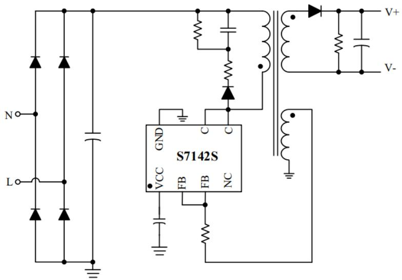

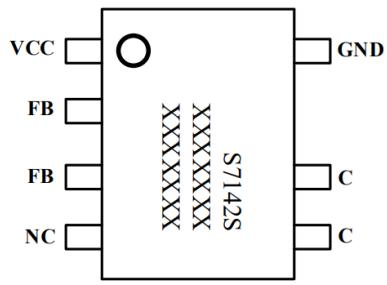

<table><tr><td>项目描述</td><td>符号</td><td>最小</td><td>典型</td><td>最大</td><td>单位</td><td>备注</td></tr><tr><td colspan="7">输入</td></tr><tr><td>电压</td><td> $V_{IN}$ </td><td>85</td><td>115/230</td><td>264</td><td> $V_{AC}$ </td><td></td></tr><tr><td>频率</td><td> $f_{LINE}$ </td><td>47</td><td>50/60</td><td>63</td><td>Hz</td><td></td></tr><tr><td colspan="7">输出</td></tr><tr><td>输出电压1</td><td> $V_{OUT1}$ </td><td>11.4</td><td>12</td><td>12.6</td><td>V</td><td>±5%</td></tr><tr><td>输出电流1</td><td> $I_{OUT1}$ </td><td>0</td><td>400</td><td></td><td>mA</td><td></td></tr><tr><td>输出电压纹波1</td><td> $V_{RIPPLE}$ </td><td></td><td></td><td>230</td><td>mV</td><td>20MHz带宽</td></tr><tr><td>连续输出功率</td><td> $P_{OUT}$ </td><td></td><td>4.8</td><td></td><td>W</td><td></td></tr><tr><td colspan="7">效率</td></tr><tr><td>待机功耗</td><td> $P_{STDBY}$ </td><td></td><td></td><td>95</td><td>mW</td><td>230VAC,包含假负载</td></tr><tr><td>满载效率</td><td>η</td><td></td><td></td><td>72</td><td>%</td><td></td></tr><tr><td colspan="7">环境</td></tr><tr><td>传导EMI</td><td></td><td colspan="4">满足CISPR22/EN55022 Class B,至少6dB 裕量</td><td></td></tr><tr><td>Surge</td><td></td><td></td><td>2</td><td></td><td>kV</td><td>差模</td></tr><tr><td>EFT</td><td></td><td></td><td>4</td><td></td><td>kV</td><td>5kHz/100kHz/38kHz</td></tr><tr><td>ESD</td><td></td><td></td><td>15</td><td>20</td><td>kV</td><td>空气放电</td></tr><tr><td>工作环境温度</td><td> $T_{AMP}$ </td><td>0</td><td></td><td>50</td><td>°C</td><td></td></tr></table>

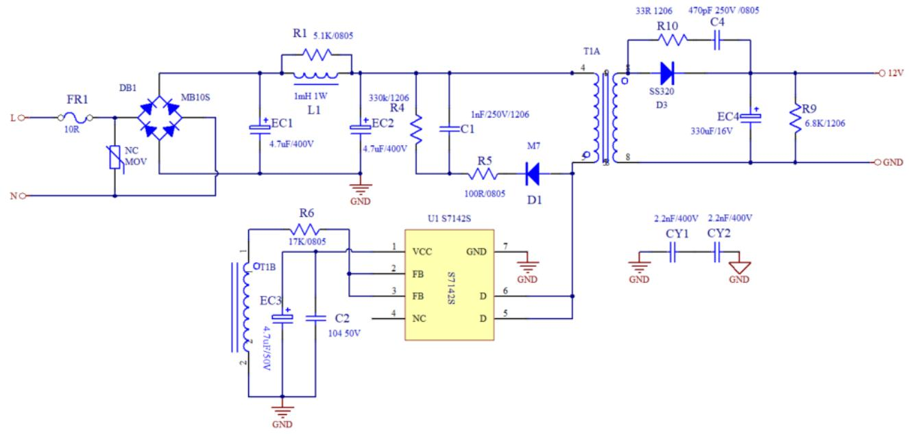

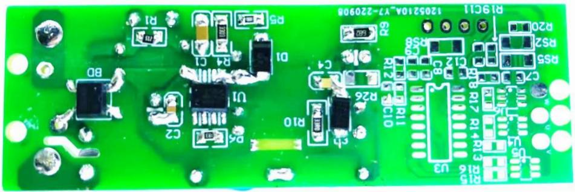

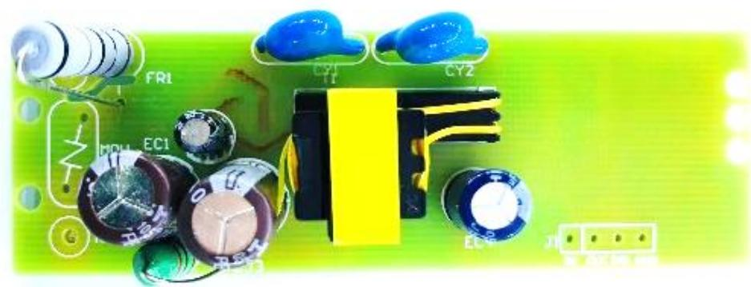

<table><tr><td>元件标号</td><td>参数描述</td><td>封装尺寸</td><td>数量</td></tr><tr><td>PCB</td><td>CEM-1, 单面板</td><td>77mm*25mm</td><td>1</td></tr><tr><td>FR1</td><td>10R 绕线保险丝电阻</td><td>DIP</td><td>1</td></tr><tr><td>EC1、EC2</td><td>400V4.7uF电解电容</td><td> $\phi 3.5*8.5$ </td><td>2</td></tr><tr><td>L1</td><td>1mH 色环电感</td><td>510</td><td>1</td></tr><tr><td>EC3</td><td>16V 330uF 高频低阻</td><td> $\phi 2.5*6$ </td><td>1</td></tr><tr><td>EC4</td><td>50V 4.7uF</td><td> $\phi 2.5*5$ </td><td>1</td></tr><tr><td>CY1、CY2</td><td>2.2nF/1kv</td><td>DIP</td><td>2</td></tr><tr><td>T1</td><td>EE13 次级加宽(5+2)2mH</td><td>DIP</td><td>1</td></tr><tr><td>U1</td><td>S7142S</td><td>SOP8</td><td>1</td></tr><tr><td>BD1</td><td>MB10S</td><td>SMD(210S)</td><td>1</td></tr><tr><td>R1</td><td>5.1K, $\pm 5\%$ ,X7R</td><td>SMD0805</td><td>1</td></tr><tr><td>D1</td><td>M7</td><td>SMA</td><td>1</td></tr><tr><td>R5</td><td>100R , $\pm 5\%$ ,X7R</td><td>SMD0805</td><td>1</td></tr><tr><td>R4</td><td>330K, $\pm 5\%$ ,X7R</td><td>SMD1206</td><td>1</td></tr><tr><td>C1</td><td>1nF/1kv</td><td>SMD1206</td><td>1</td></tr><tr><td>C2</td><td>100nF/50V</td><td>SMD0805</td><td>1</td></tr><tr><td>R6</td><td>17K, $\pm 5\%$ ,X7R</td><td>SMD0805</td><td>1</td></tr><tr><td>R10</td><td>33R, $\pm 5\%$ ,X7R</td><td>SMD1206</td><td>1</td></tr><tr><td>C4</td><td>470pF/250V</td><td>SMD0805</td><td>1</td></tr><tr><td>D3</td><td>SS320</td><td>SMA</td><td>1</td></tr><tr><td>R9</td><td>6.8K , $\pm 5\%$ ,X7R</td><td>SMD1206</td><td>1</td></tr><tr><td></td><td></td><td>Total</td><td>23</td></tr></table>

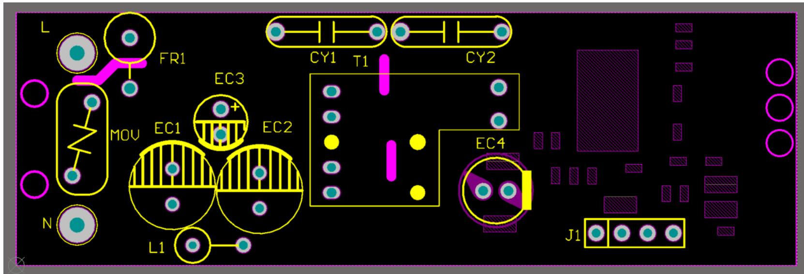

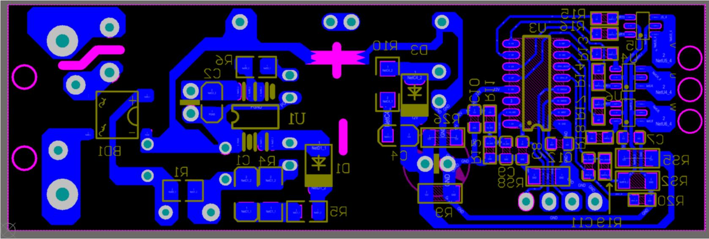

## 原理图

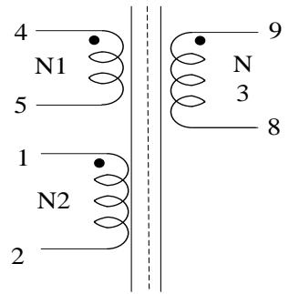

## 绕线方式

<table><tr><td>绕组</td><td>起始脚</td><td>终止脚</td><td>材料</td><td>匝数</td><td>绕线方式</td></tr><tr><td>N1</td><td>4</td><td>5</td><td> $\phi 0.15*1P$ </td><td>130Ts</td><td>密绕三层(PIN脚朝外)</td></tr><tr><td colspan="4">胶带</td><td>2Ts</td><td></td></tr><tr><td>N2</td><td>1</td><td>2</td><td> $\phi 0.15*1P$ </td><td>4Ts</td><td>均绕一层(PIN脚朝外)</td></tr><tr><td colspan="4">胶带</td><td>2Ts</td><td></td></tr><tr><td>N3</td><td>9</td><td>8</td><td> $\phi 0.5*1P(三层绝缘线)$ </td><td>18Ts</td><td>密绕二层(PIN脚朝外)</td></tr><tr><td colspan="4">胶带</td><td>3Ts</td><td></td></tr></table>

## 规格与材料

➢ 初级绕组感量 $L _ { p } { = } 2 m H { \pm } 5 \%$ （测试条件： 0.3V，100kHz）  
➢ 漏感量 $\cdot L _ { | \mathrm { k } } < 1 0 0 \mathsf { u H }$  
➢ 骨架：EE13立式（5+2PIN）  
➢ 磁芯： EE13 PC40 或同等材质 ， $\mathsf { A } \mathsf { e } = 1 7 . 2 \mathsf { m } \mathsf { m } ^ { 2 }$  
➢ N1、N2: 2UEW 漆包线  
➢ N3 : 三层绝缘线  
➢ 绝缘胶带:3M900 或同等材质  
➢ 耐压测试: 3KV, 50/60Hz, 1Min  
➢ 成品要求：浸凡立水

## 脚位图

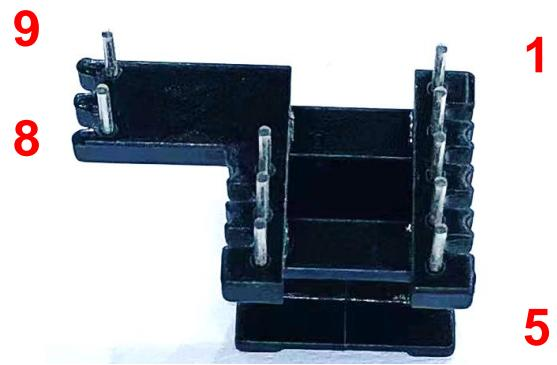

待机功耗（包含19.2mW假负载）  
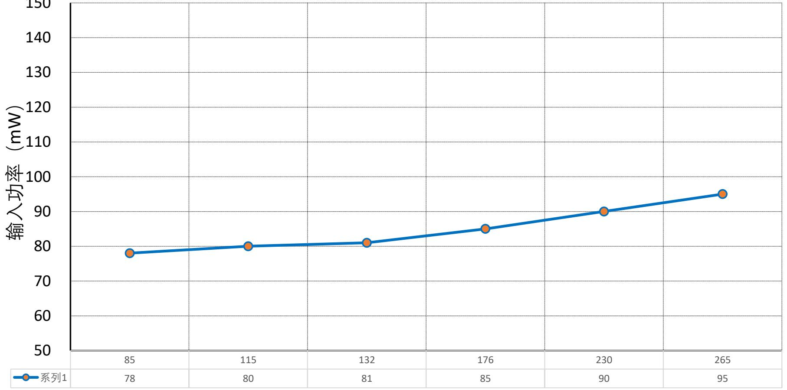

输入电压(VAC)

效率测试  
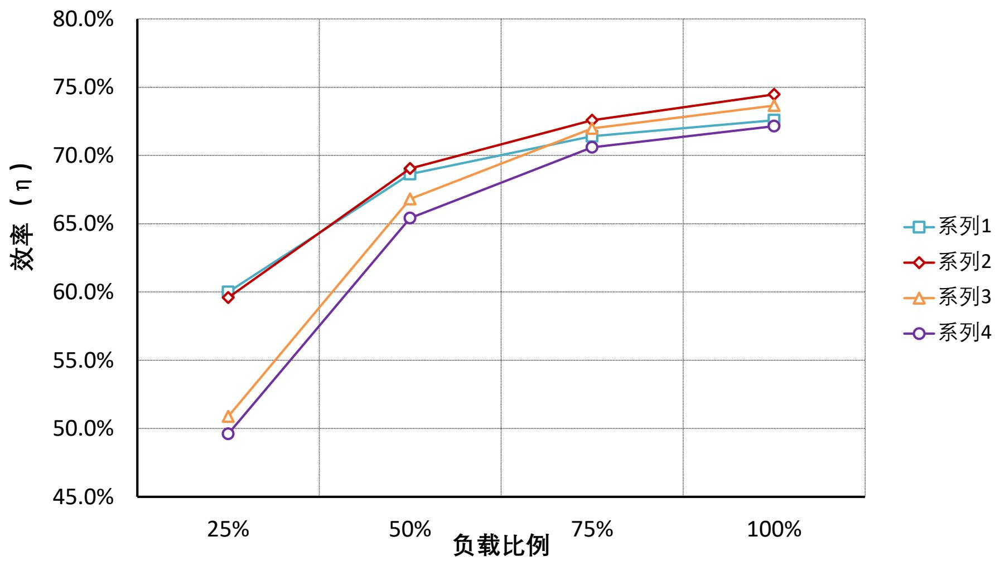

## 输出电压调整率

<table><tr><td> $V_{IN}(VAC)$ Load(%)</td><td>85</td><td>115</td><td>132</td><td>176</td><td>230</td><td>265</td><td>平均值</td><td>线调整率</td></tr><tr><td>0</td><td>12.13</td><td>12.13</td><td>12.13</td><td>12.08</td><td>12.09</td><td>12.09</td><td>12.11</td><td>0.41%</td></tr><tr><td>20%</td><td>11.99</td><td>11.95</td><td>11.95</td><td>11.97</td><td>11.98</td><td>11.99</td><td>11.97</td><td>0.33%</td></tr><tr><td>40%</td><td>11.98</td><td>12</td><td>12.01</td><td>12.02</td><td>12.03</td><td>12.04</td><td>12.01</td><td>0.50%</td></tr><tr><td>60%</td><td>12.08</td><td>12.1</td><td>12.11</td><td>12.12</td><td>12.13</td><td>12.13</td><td>12.11</td><td>0.41%</td></tr><tr><td>80%</td><td>12.20</td><td>12.22</td><td>12.24</td><td>12.25</td><td>12.26</td><td>12.26</td><td>12.24</td><td>0.49%</td></tr><tr><td>100%</td><td>12.34</td><td>12.36</td><td>12.37</td><td>12.38</td><td>12.39</td><td>12.4</td><td>12.37</td><td>0.48%</td></tr><tr><td>平均值</td><td>12.12</td><td>12.13</td><td>12.14</td><td>12.14</td><td>12.15</td><td>12.15</td><td rowspan="2" colspan="2"></td></tr><tr><td>负载调整率</td><td>2.97%</td><td>3.38%</td><td>3.46%</td><td>3.38%</td><td>3.38%</td><td>3.37%</td></tr></table>

◼ 计算方法：调整率=100%\*(最大值-最小值)/平均值  
测试条件：

## 输出电压纹波

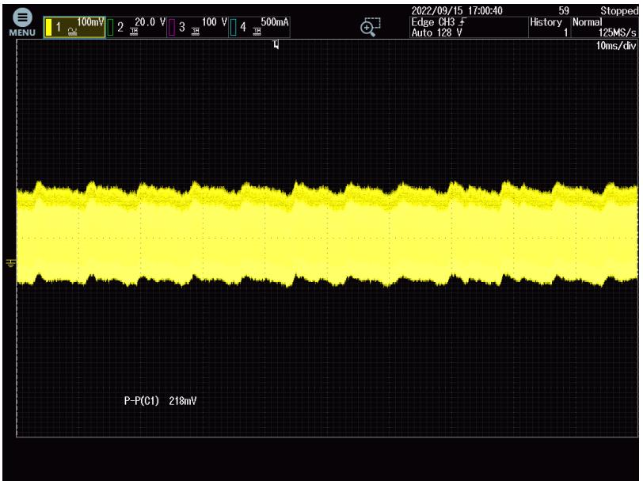

85 VAC

CH1 $\mathsf { V } _ { \mathsf { O U T } }$ Ripple $\mathsf { V } _ { \mathsf { P K - P K } } { = } 2 1 8 \mathsf { m V }$

## Test Condition:

➢ Full Load

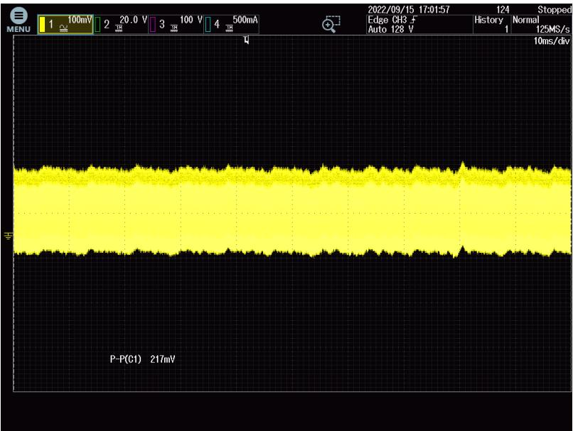

115 VAC

CH1 $\mathsf { V } _ { \mathsf { O U T } }$ Ripple $\mathsf { V } _ { \mathsf { P K - P K } } { = } 2 1 7 \mathsf { m V }$

## Test Condition:

➢ Full Load

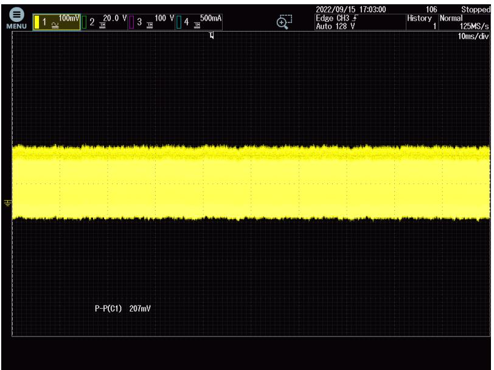

230 VAC

$\begin{array} { r l } { \mathbf { \Pi } } & { \mathsf { C H 1 } \mathbf { V } _ { \mathsf { O U T } } \mathsf { R i p p l e } } \\ & { \mathsf { V _ { P K - P K } } { = } 2 0 7 \mathsf { m V } } \end{array}$

## Test Condition:

➢ Full Load

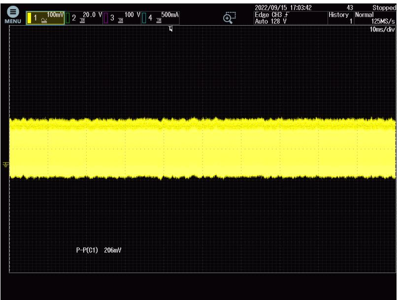

265 VAC

CH1 $\mathsf { V } _ { \mathsf { O U T } }$ Ripple $\mathsf { V } _ { \mathsf { P K - P K } } { = } 2 0 6 \mathsf { m V }$

## Test Condition:

➢ Full Load

## 动态负载(50%-100%)

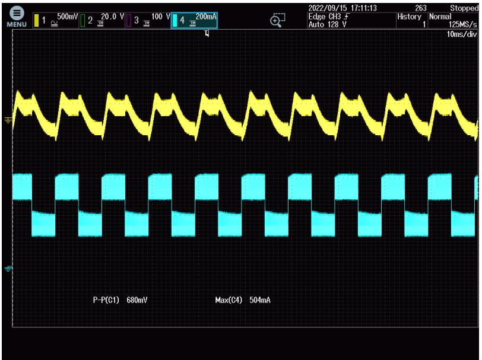

85 VAC

$\begin{array} { r l } { \mathbf { \Pi } } & { { } \mathsf { C H 1 } \mathsf { V _ { O U T } } } \\ { \mathbf { \Pi } } & { { } \mathsf { V _ { P K - P K } } \mathbf { = } 6 8 0 \mathsf { m v } } \end{array}$ CH1 VOUT

## Test Condition:

➢ 0.2 A-0.4 A-0.2 A  
➢ Slew Rate: 0.5 A/μS  
➢ Frequency: 100 Hz

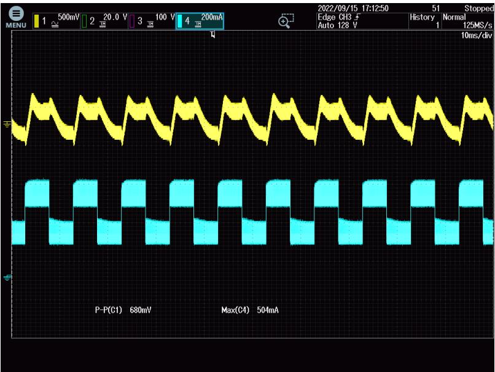

115 VAC

CH1 VOUT $\mathsf { V } _ { \mathsf { O U T } }$ VPK-PK=680 mV

## Test Condition:

➢ 0.2 A-0.4A-0.2A  
➢ Slew Rate: 0.5 A/μS  
➢ Frequency: 100 Hz

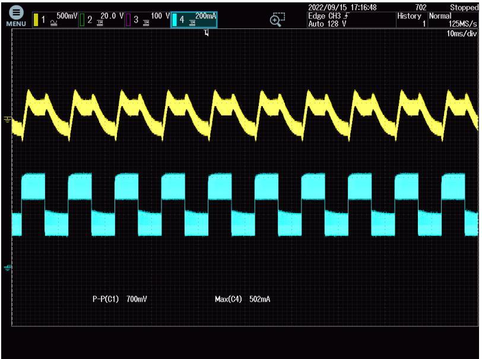

230 VAC

CH1 VOUT $\mathsf { V } _ { \mathsf { O U T } }$ VPK-PK=700 mV

## Test Condition:

➢ 0.2 A-0.4A-0.2 A  
➢ Slew Rate: 0.5 A/μS  
➢ Frequency: 100 Hz

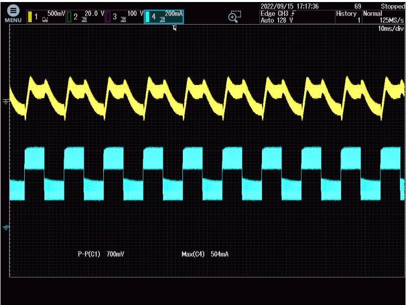

265 VAC

CH1 VOUTVPK-PK=700mV

## Test Condition:

➢ 0.2 A-0.4A-0.2 A  
➢ Slew Rate: 0.5 A/μS  
➢ Frequency: 100 Hz

## 动态负载(10%-90%)

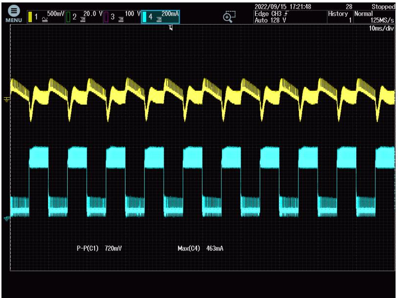

85 VAC

CH1 VOUT $\mathsf { V } _ { \mathsf { O U T } }$ VPK-PK=720mV

## Test Condition:

➢ 0.04 A-0. 36A-0.36A  
➢ Slew Rate: 0.5 A/μS  
➢ Frequency: 100 Hz

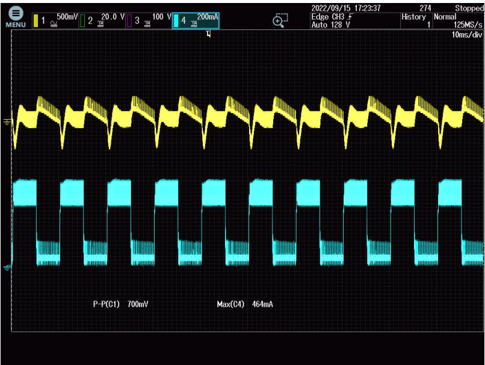

115 VAC

CH1 VOUT $\mathsf { V } _ { \mathsf { O U T } }$ $v _ { p _ { k - P K } } { = } 7 0 0 m v$

## Test Condition:

➢ 0.04 A-0. 36A-0.36A  
➢ Slew Rate: 0.5 A/μS  
➢ Frequency: 100 Hz

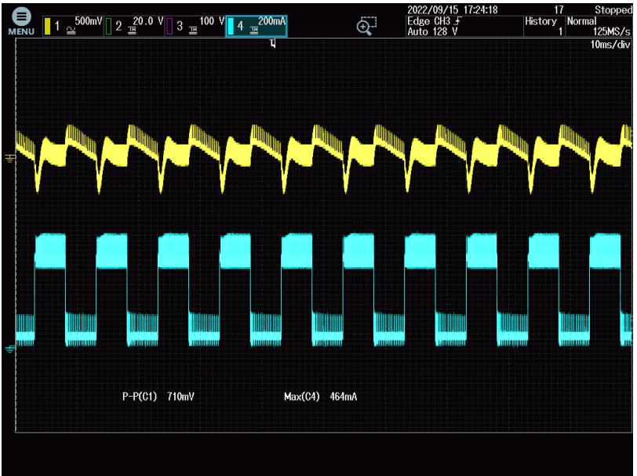

230 VAC

CH1 VOUT $\mathsf { V } _ { \mathsf { O U T } }$ VPK-PK=710 mV

## Test Condition:

➢ 0.04 A-0. 36A-0.36A  
➢ Slew Rate: 0.5 A/μS  
➢ Frequency: 100 Hz

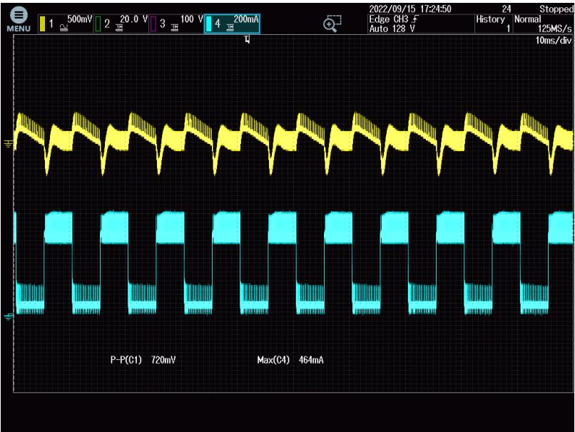

265 VAC

CH1 VOUT $\mathsf { V } _ { \mathsf { O U T } }$ VPK-PK=720 mV

## Test Condition:

➢ 0.04 A-0. 36A-0.36A  
➢ Slew Rate: 0.5 A/μS  
➢ Frequency: 100 Hz

## 输出电压开机波形

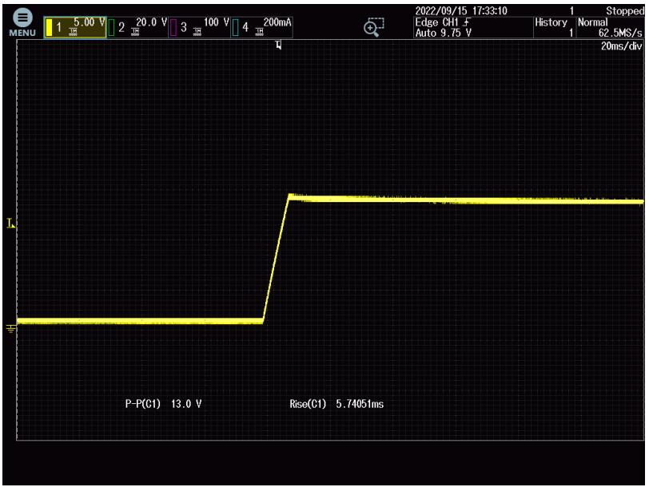

85 VAC

CH1 VOUT TRISE: 5.74mS

## Test Condition:

➢ No Load

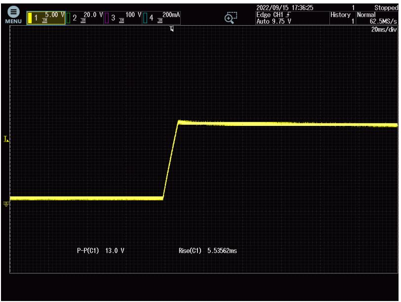

265 VAC

CH1 VOUT TRISE: 5.53 mS

## Test Condition:

➢ No Load

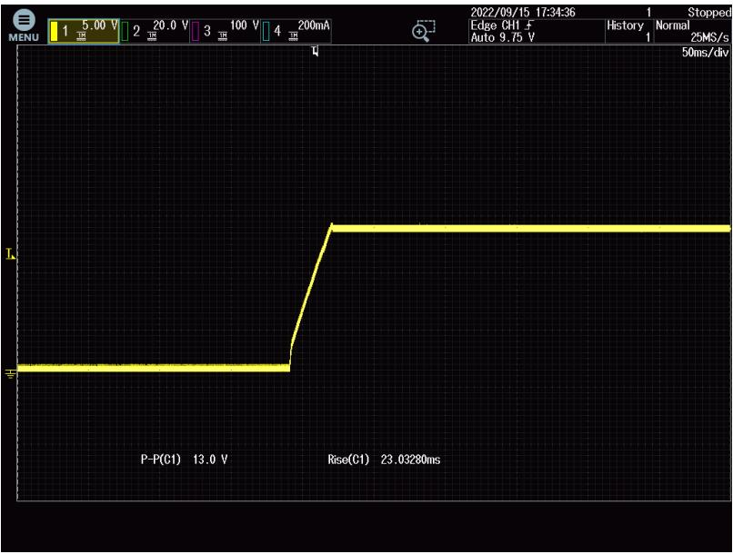

85 VAC

CH1 VOUT TRISE: 23.03mS

## Test Condition:

➢ Full Load

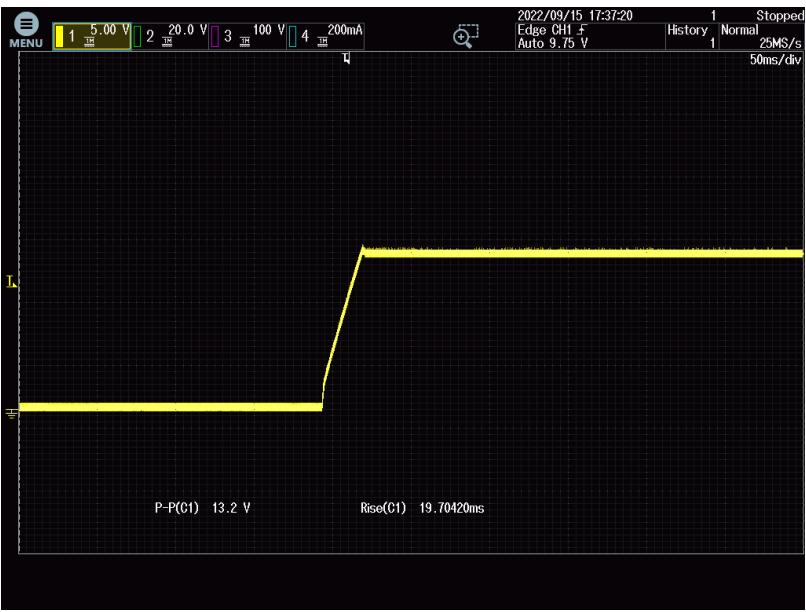

265 VAC

CH1 VOUT TRISE: 19.7 mS

## Test Condition:

➢ Full Load

## 启动延迟时间

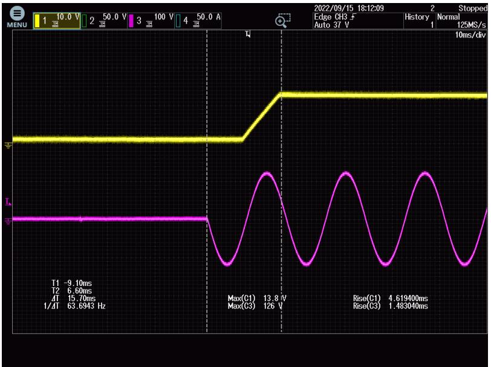

85 VAC

CH1 VOUT  
CH3 VINNAC TDELAY:15.7mS

Test Condition:

➢ No Load

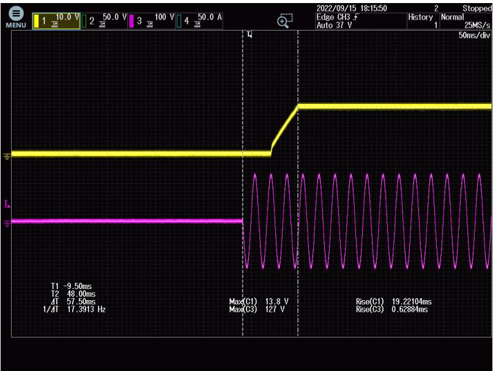

85 VAC

CH1 VOUT  
CH3 VINNAC TDELAY: 57.7 mS

Test Condition:

➢ Full Load

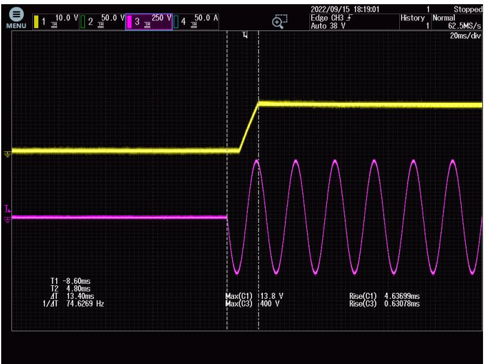

265 VAC

CH1 $\mathsf { V } _ { \mathsf { O U T } }$  
CH3 VINNAC TDELAY: 13.4mS

Test Condition:

➢ No Load

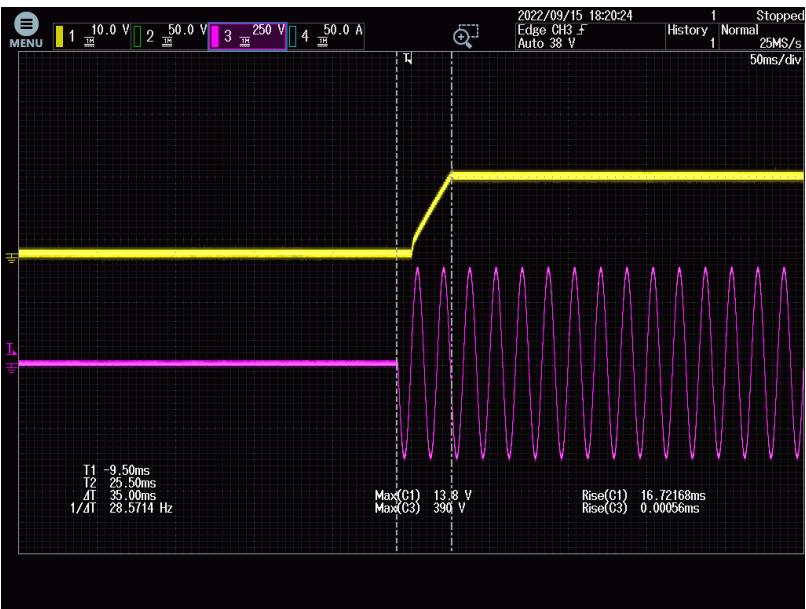

265 VAC

CH1 VOUT  
CH3 VINNAC TDELAY: 35mS

Test Condition:

➢ Full Load

## 短路保护 （MOSFET波形）

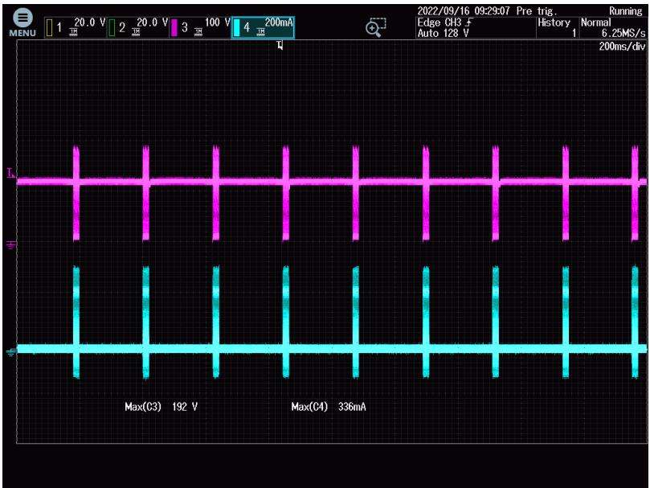

85 VAC

CH3 VDS：  
CH4 ID：

$$
\begin{array}{l} I _ {D S \_ M A X} = 0. 3 3 6 A \\ V _ {D S \_ M A X} = 1 9 2 V \end{array}
$$

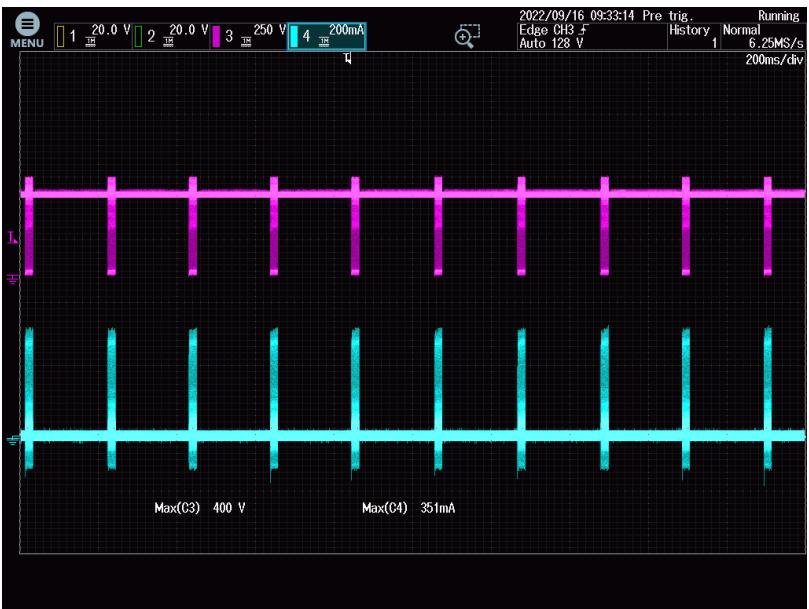

230 VAC

CH3 $\mathsf { V } _ { \mathsf { D S } } .$  
CH4 ID：

$$
\begin{array}{l} I _ {D S \_ M A X} = 0. 3 5 1 A \\ V _ {D S \_ M A X} = 4 0 0 V \end{array}
$$

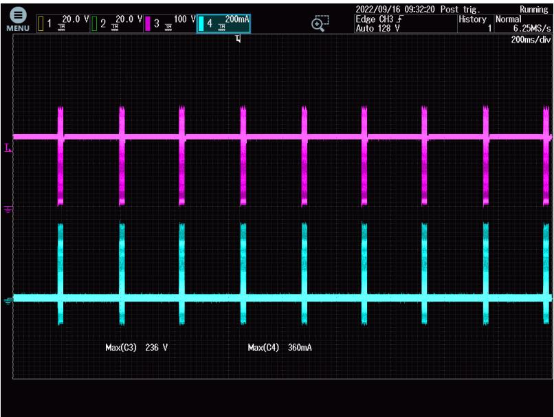

115 VAC

CH3 VDS：  
CH4 ID：

$$
\begin{array}{l} I _ {D S \_ M A X} = 0. 3 6 A \\ V _ {D S \_ M A X} = 2 3 6 V \end{array}
$$

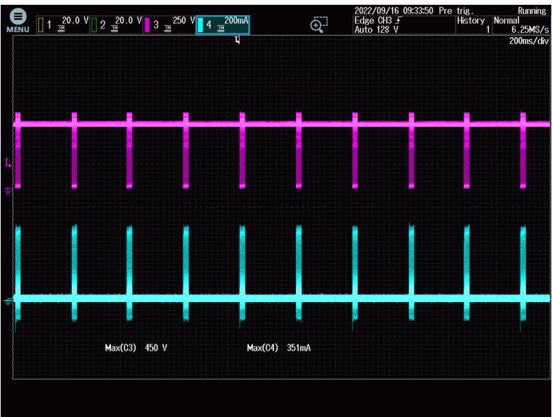

265 VAC

CH3 VDS：  
CH4 ID：

$$
\begin{array}{l} I _ {D S \_ M A X} = 0. 3 5 1 A \\ V _ {D S \_ M A X} = 4 5 0 V \end{array}
$$

## MOSFET稳态波形

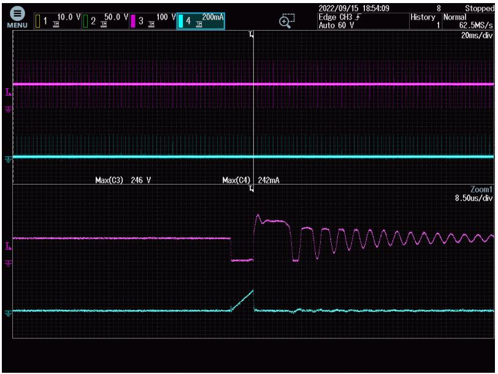

85 VAC  
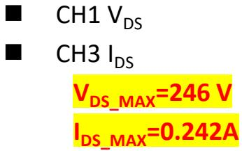

Test Condition:

➢ No Load

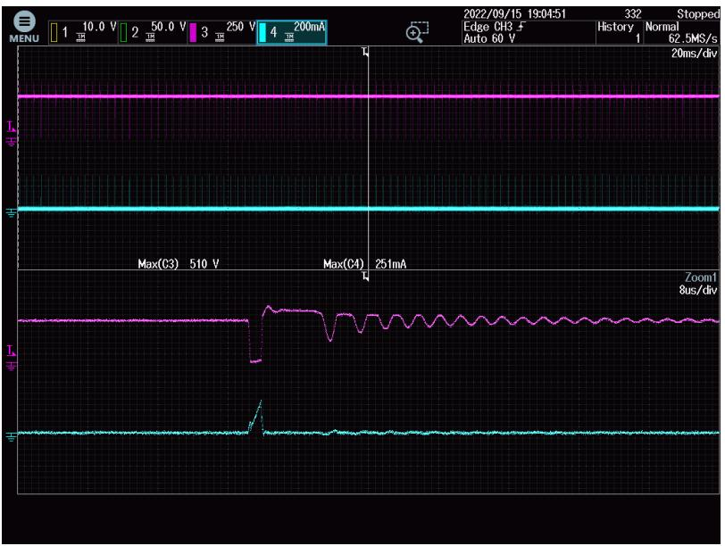

265 VAC  
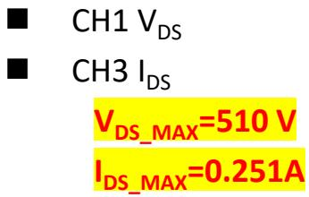

Test Condition:

➢ No Load

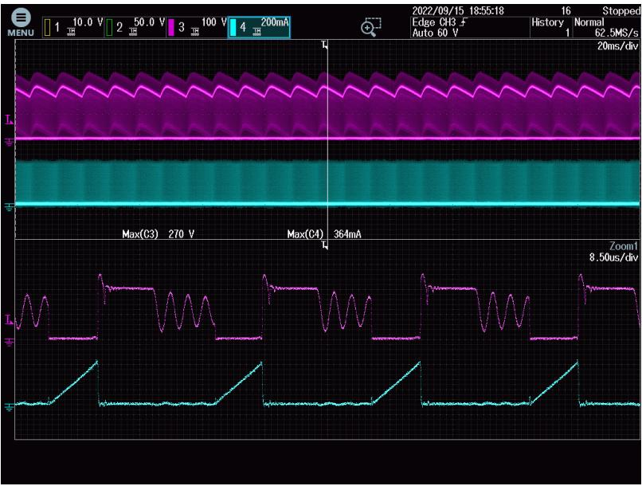

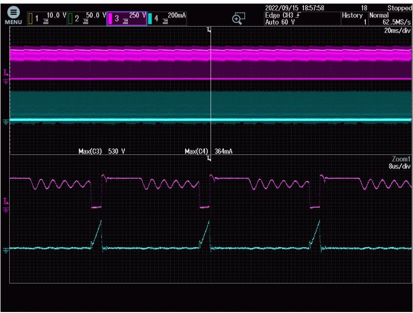

85 VAC  
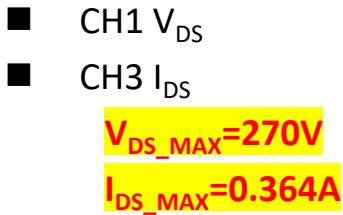

Test Condition:

➢ Full Load

265 VAC  

Test Condition:

➢ Full Load

## 漏极电流波形

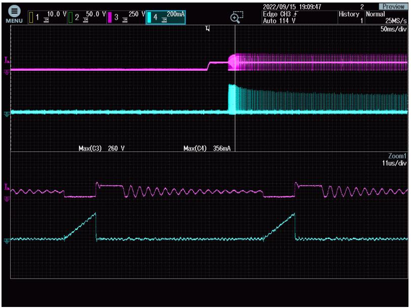

${ \otimes 5 } \mathsf { V } _ { \mathsf { A C } }$

CH1 VOUTPUT $\mathsf { V } _ { \mathsf { O U T P U T } }$  
CH4 IDRAIN $\mathsf { I } _ { \mathsf { D R A I N } }$ $\mathsf { I } _ { \mathsf { D S \_ M A X } } { = } 0 . 3 5 6 \mathsf { A }$ $V _ { \mathsf { D S \_ M A X } } = 2 6 0 \mathsf { V }$

## Test Condition:

➢ 空载启动

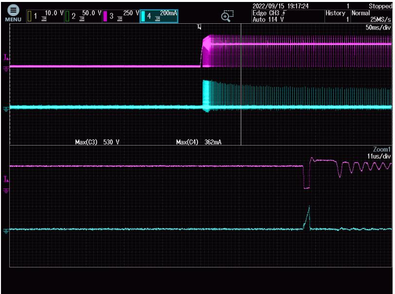

265 $\mathsf { v } _ { \mathsf { A C } }$

${ \mathsf { C H 1 V _ { \mathsf { 0 U T P U T } } } }$  
$\begin{array} { r l } { \mathsf { \Gamma } } & { \mathsf { C H 4 ~ } \mathsf { I } _ { \mathsf { D R A I N } } } \\ & { \mathsf { I } _ { \mathsf { D S \_ M A X } } \mathsf { = } 0 . 3 6 2 \mathsf { A } } \\ & { \mathsf { V } _ { \mathsf { D S \_ M A X } } \mathsf { = } 5 3 0 \mathsf { V } } \end{array}$ CH4 IDRAIN IDS\_MAX=0.362A

## Test Condition:

➢ 空载启动

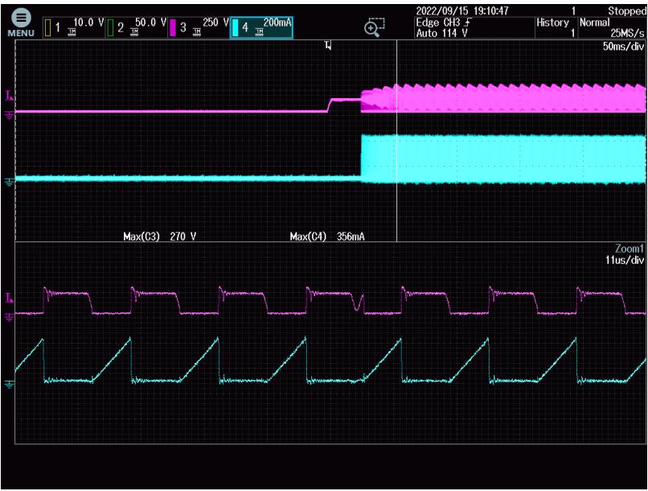

${ \tt S 5 V } _ { \sf A C }$

CH1 $\mathsf { V } _ { \mathsf { O U T P U T } }$  
$\mathsf { C H 4 } \mathsf { I } _ { \mathsf { D R A I N } }$ CH4 IDRAIN IDS\_MAX=0.356A $\mathsf { I } _ { \mathsf { D S \_ M A X } } { = } 0 . 3 5 6 \mathsf { A }$ $V _ { \mathsf { D S \_ M A X } } = 2 7 0 \mathsf { V }$

## Test Condition:

➢ 满载启动

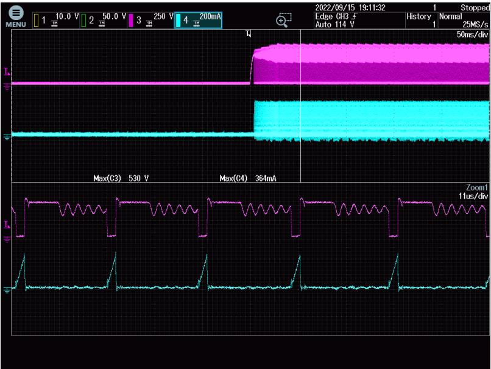

$2 6 5 \ : \mathsf { V } _ { \mathsf { A C } }$

${ \mathsf { C H 1 } } { \mathsf { V } } _ { { \mathsf { 0 U T P U T } } }$  
$\mathsf { C H 4 } \mathsf { I } _ { \mathsf { D R A I N } }$ CH4 IDRAIN IDS\_MAX=0.364A $\mathsf { I } _ { \mathsf { D S \_ M A X } } { = } 0 . 3 6 4 \mathsf { A }$ $V _ { \mathsf { D S \_ M A X } } \equiv 5 2 0 \mathsf { V }$

## Test Condition:

➢ 满载启动

## D-S电压波形

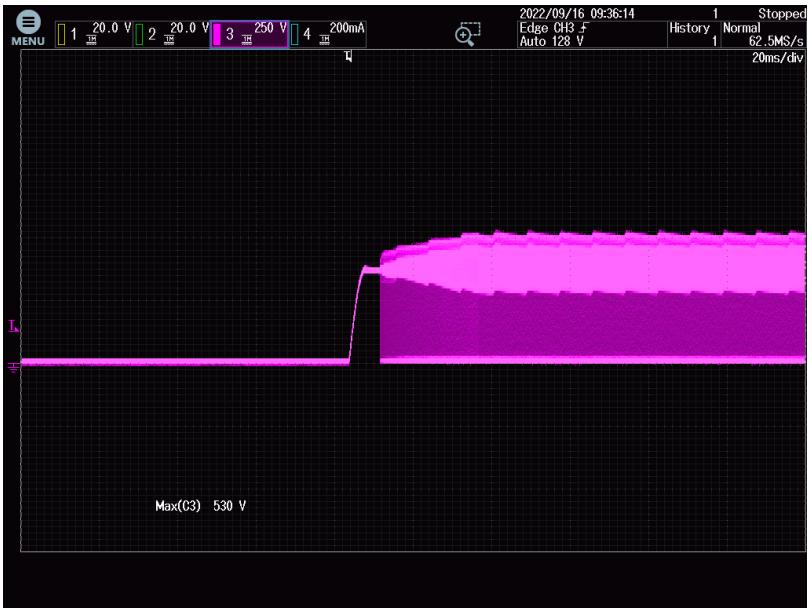

265 VAC

CH2 VDS VDSMAX: 530 V

## Test Condition:

➢ 满载开机

极限参数(注1)

<table><tr><td>符号</td><td>参数</td><td>参数范围</td><td>单位</td></tr><tr><td>VCC</td><td>芯片供电脚电压范围</td><td>-0.3~8</td><td>V</td></tr><tr><td>FB</td><td>输入反馈脚电压范围</td><td>-0.3~8</td><td>V</td></tr><tr><td>C</td><td>功率管耐压范围</td><td>-0.3~850</td><td>V</td></tr><tr><td> $P_{DMAX}$ </td><td>功耗(注2)</td><td>0.45</td><td>W</td></tr><tr><td> $\theta_{JA}$ </td><td>PN结到环境的热阻</td><td>145</td><td>°C/W</td></tr><tr><td> $T_J$ </td><td>工作结温范围</td><td>-40~150</td><td>°C</td></tr><tr><td> $T_{STG}$ </td><td>储存温度范围</td><td>-60~150</td><td>°C</td></tr></table>

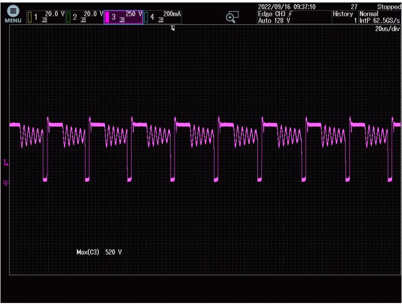

265 VAC

CH2 VDS VDSMAX: 520 V

Test Condition:满载正常工作

## 满载开机

$0 e r a t i n g { = } 5 3 0 \vee / 8 5 0 \vee = 6 2 . 3 5 \ \%$

## 满载正常工作

Derating = 520V / 850 V = 61.17%

## 12V输出肖特基反压波形

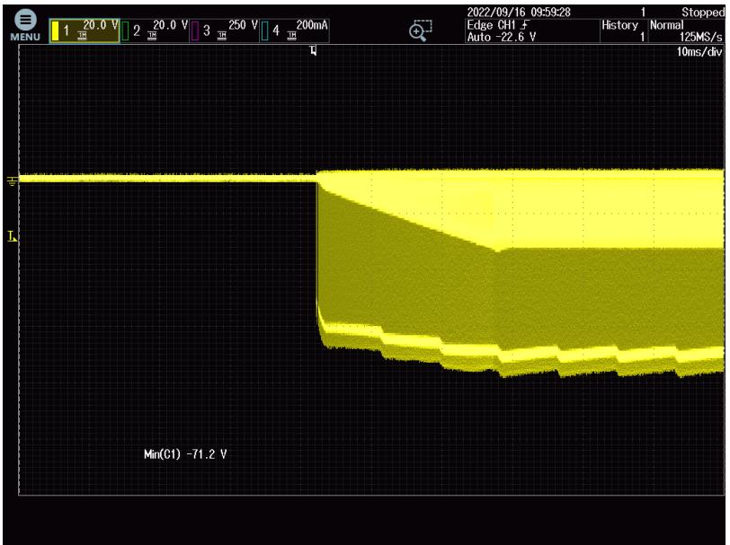

265 VAC

CH1 VDIODE VDSMAX:71.2V

Test Condition:

➢ 满载启动

<table><tr><td>PARAMETER</td><td>SYMBOL</td><td>MB54</td><td>MB54A</td><td>MB55</td><td>MB56</td><td>MB58</td><td>MB59</td><td>MB510</td><td>MB515</td><td>MB520</td><td>UNITS</td></tr><tr><td>Maximum Recurrent Peak Reverse Voltage</td><td> $V_{RRM}$ </td><td>40</td><td>45</td><td>50</td><td>60</td><td>80</td><td>90</td><td>100</td><td>150</td><td>200</td><td>V</td></tr><tr><td>Maximum RMS Voltage</td><td> $V_{RMS}$ </td><td>28</td><td>31.5</td><td>35</td><td>42</td><td>56</td><td>63</td><td>70</td><td>105</td><td>140</td><td>V</td></tr><tr><td>Maximum DC Blocking Voltage</td><td> $V_{DC}$ </td><td>40</td><td>45</td><td>50</td><td>60</td><td>80</td><td>90</td><td>100</td><td>150</td><td>200</td><td>V</td></tr><tr><td>Average Rectified Output Current (See Figure 1)</td><td> $I_{F(AV)}$ </td><td colspan="9">5</td><td>A</td></tr><tr><td>Non-Repetitive Peak Forward Surge Current : 8.3ms single half sine-wave superimposed on rated load</td><td> $I_{FSM}$ </td><td colspan="9">100</td><td>A</td></tr><tr><td>Forward Voltage at 5A (Note 1)</td><td> $V_F$ </td><td colspan="2">0.7</td><td colspan="2">0.74</td><td colspan="3">0.8</td><td colspan="2">0.9</td><td>V</td></tr><tr><td>Peak Reverse Current at Rated DC Blocking Voltage  $T_J=25°C$  $T_J=100°C$ </td><td> $I_R$ </td><td colspan="9">0.0510</td><td>mA</td></tr><tr><td>Typical Thermal Resistance (Note 2)</td><td> $R_{BJA}$  $R_{BJL}$ </td><td colspan="9">5517</td><td>°C /W</td></tr><tr><td>Operating Junction and Storage Temperature Range</td><td> $T_J,T_{STG}$ </td><td>-55 to +150</td><td colspan="8">-65 to +175</td><td>°C</td></tr></table>

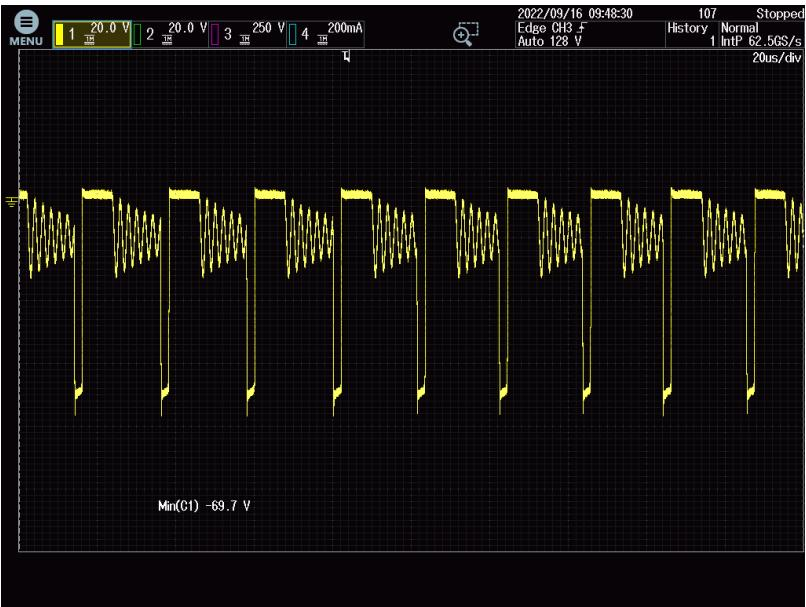

265 VAC

CH1 VDDIODE VMAX: 69.7V

Test Condition:

满载正常工作

## 满载开机

Derating = 71.2V / 200 V = 35.6 %

## 满载正常工作

Derating = 69.7 V / 200V = 34.85 %

<table><tr><td rowspan="2">项目</td><td colspan="2">85VAC</td><td colspan="2">265VAC</td></tr><tr><td>温度(°C)</td><td>温升(°C)</td><td>温度(°C)</td><td>温升(°C)</td></tr><tr><td>环境温度</td><td colspan="2">28</td><td colspan="2">28</td></tr><tr><td>S7142S (U1)</td><td>62</td><td>34</td><td>62</td><td>34</td></tr><tr><td>变压器绕组(T1)</td><td>57</td><td>29</td><td>57</td><td>29</td></tr><tr><td>变压器磁芯(T1)</td><td>55</td><td>27</td><td>56</td><td>28</td></tr><tr><td>整流桥(BD1)</td><td>47</td><td>19</td><td>47</td><td>19</td></tr><tr><td>输出肖特基(D3)</td><td>59</td><td>31</td><td>57</td><td>29</td></tr><tr><td>输入电解电容(EC2)</td><td>49</td><td>21</td><td>49</td><td>21</td></tr><tr><td>输出电解电容(EC4)</td><td>44</td><td>16</td><td>45</td><td>17</td></tr></table>

## 测试说明

➢ 在温箱中进行测试  
➢ 电路板放在一个封闭的盒子内  
➢ 热电偶连接到各个测量点  
➢ 等测量点温度达到稳定后记录数据

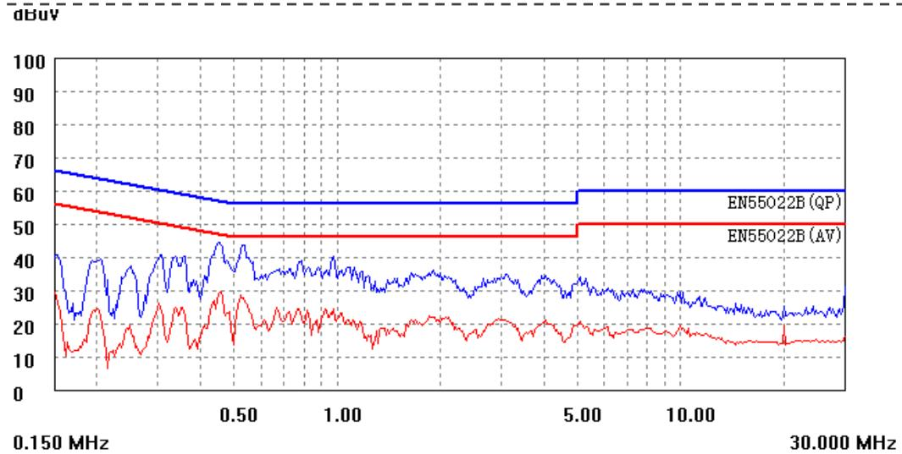

115VAC Line  
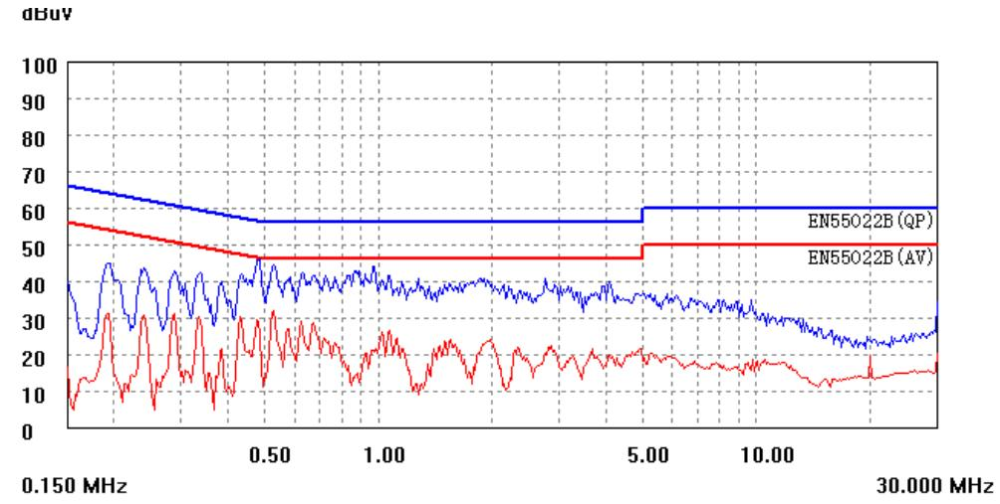

230VAC Line

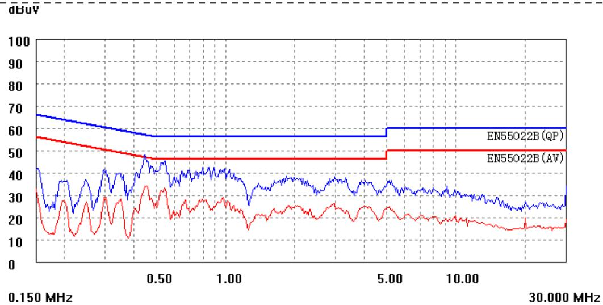

115VAC Neutral

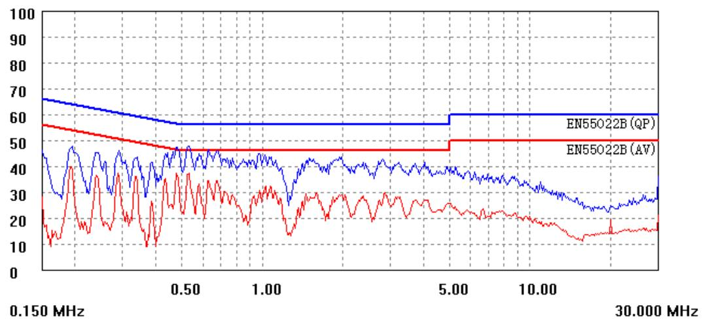

230VAC Neutral

1nf Y电容  
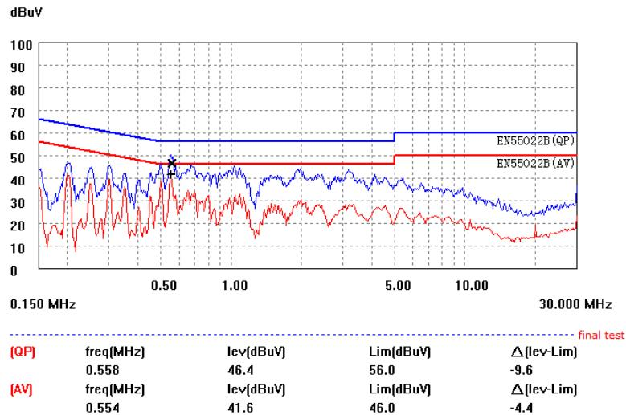

230VAC Neutral

2.2nf Y电容  
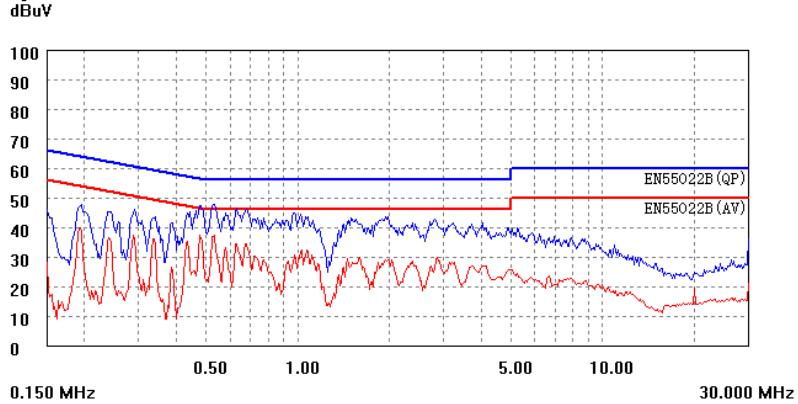

230VAC Neutral

## 骚扰功率

115VAC 空载

230VAC 空载

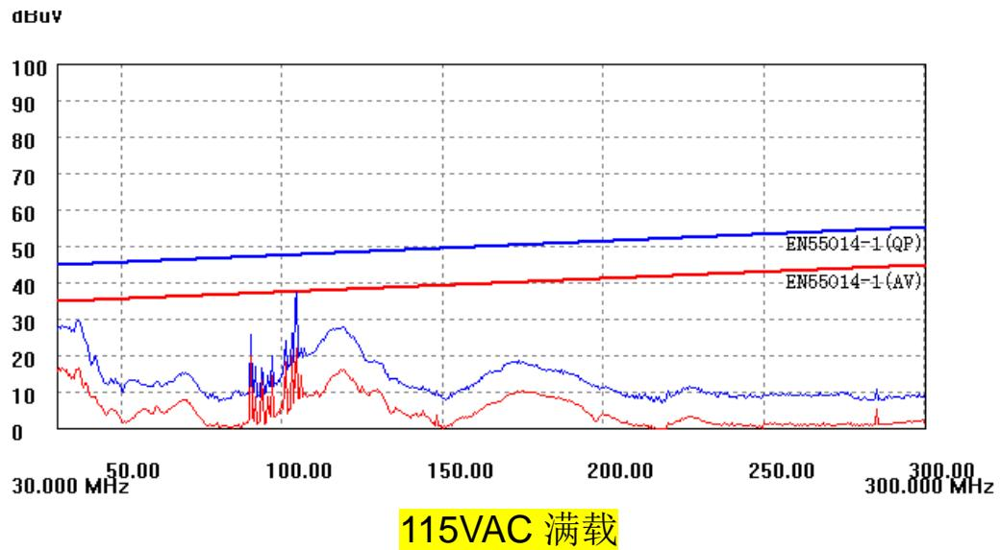

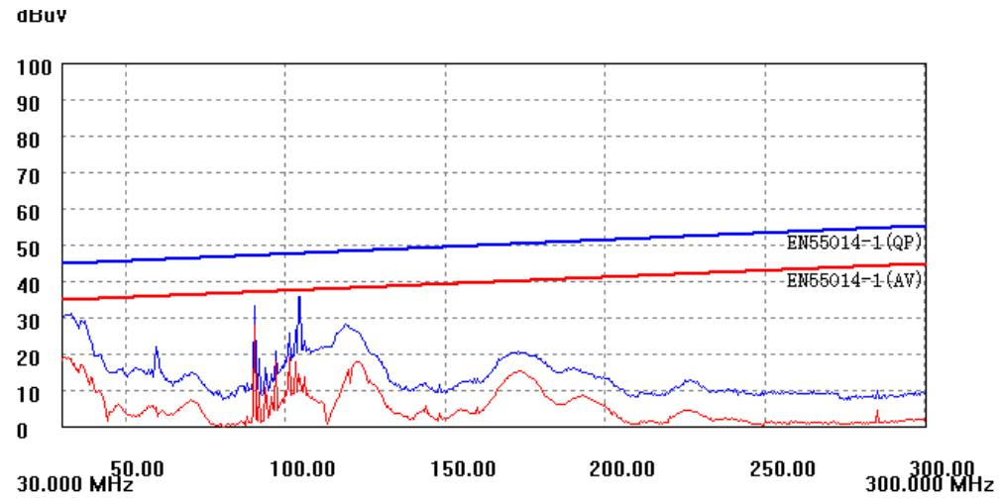

230VAC 满载

<table><tr><td>差模</td><td>电压</td><td>相位角</td><td>发生器阻抗</td><td>测试次数</td><td>测试结果</td></tr><tr><td>L to N</td><td>+2kV</td><td>0</td><td>2</td><td>10</td><td>Pass</td></tr><tr><td>L to N</td><td>-2kV</td><td>0</td><td>2</td><td>10</td><td>Pass</td></tr><tr><td>L to N</td><td>+2kV</td><td>90</td><td>2</td><td>10</td><td>Pass</td></tr><tr><td>L to N</td><td>-2kV</td><td>90</td><td>2</td><td>10</td><td>Pass</td></tr><tr><td>L to N</td><td>+2kV</td><td>180</td><td>2</td><td>10</td><td>Pass</td></tr><tr><td>L to N</td><td>-2kV</td><td>180</td><td>2</td><td>10</td><td>Pass</td></tr><tr><td>L to N</td><td>+2kV</td><td>270</td><td>2</td><td>10</td><td>Pass</td></tr><tr><td>L to N</td><td>-2kV</td><td>270</td><td>2</td><td>10</td><td>Pass</td></tr></table>

## 测试说明

➢ 按照GB/T17626.5和IEC61000-4-5的最新版本要求进行测试  
➢ 室温环境，230VAC输入，满载条件  
➢ 输入1.2/50us组合波浪涌电压  
➢ 每个测试点重复10次  
➢ 每次间隔时间1分钟  
➢ 试验时样机输出正常（符合A类标准）视为Pass

<table><tr><td>差模</td><td>电压</td><td>脉冲群持续时间</td><td>脉冲频率</td><td>测试时间</td><td>测试结果</td></tr><tr><td>L to N</td><td>+4kV</td><td>15ms</td><td>5kHz</td><td>120s</td><td>Pass</td></tr><tr><td>L to N</td><td>-4kV</td><td>15ms</td><td>5kHz</td><td>120s</td><td>Pass</td></tr><tr><td>L to N</td><td>+4kV</td><td>0.75ms</td><td>100kHz</td><td>120s</td><td>Pass</td></tr><tr><td>L to N</td><td>-4kV</td><td>0.75ms</td><td>100kHz</td><td>120s</td><td>Pass</td></tr><tr><td>L to N</td><td>+2kV</td><td>2ms</td><td>38kHz</td><td>120s</td><td>Pass</td></tr><tr><td>L to N</td><td>-2kV</td><td>2ms</td><td>38kHz</td><td>120s</td><td>Pass</td></tr><tr><td>L to N</td><td>+4kV</td><td>2ms</td><td>38kHz</td><td>120s</td><td>Pass</td></tr><tr><td>L to N</td><td>-4kV</td><td>2ms</td><td>38kHz</td><td>120s</td><td>Pass</td></tr></table>

## 测试说明

➢ 按照GB/T17626.4和IEC61000-4-4的最新版本要求进行测试  
➢ 室温环境，230VAC输入满载条件  
➢ 分别测试5kHz/100kHz/38kHz脉冲频率  
➢ 脉冲群周期为300ms  
➢ 每个测试条件测试时间120s  
➢ 试验时样机输出正常（符合A类标准）视为Pass

<table><tr><td>测试</td><td>电压(V)</td><td>放电类型</td><td>放电次数</td><td>测试结果</td></tr><tr><td>Vo</td><td>+15kV</td><td>空气放电</td><td>10</td><td>Pass</td></tr><tr><td>Vo</td><td>-15kV</td><td>空气放电</td><td>10</td><td>Pass</td></tr><tr><td>GND</td><td>+15kV</td><td>空气放电</td><td>10</td><td>Pass</td></tr><tr><td>GND</td><td>-15kV</td><td>空气放电</td><td>10</td><td>Pass</td></tr><tr><td>Vo</td><td>+20kV</td><td>空气放电</td><td>10</td><td>Pass</td></tr><tr><td>Vo</td><td>-20kV</td><td>空气放电</td><td>10</td><td>Pass</td></tr><tr><td>GND</td><td>+20kV</td><td>空气放电</td><td>10</td><td>Pass</td></tr><tr><td>GND</td><td>-20kV</td><td>空气放电</td><td>10</td><td>Pass</td></tr></table>

## 测试说明

➢ 按照GB/T17626.2和IEC61000-4-2的最新版本要求进行测试  
➢ 室温环境，230VAC输入满载条件  
➢ 每个测试点重复10次  
➢ 分别对输出正端和地进行空气放电  
➢ 试验时样机输出正常（符合A类标准）视为Pass

## THANK YOU FOR WATCHING
