## 输入85‐264Vac隔离输出5V1A 洗衣机辅助电源 （变压器EE13)

舒坚富

时间 ： 2023年04月 14 日

BPS

晶丰明源

## 1 .原理图

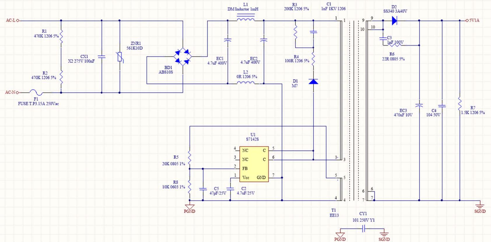

## 2 . 照片

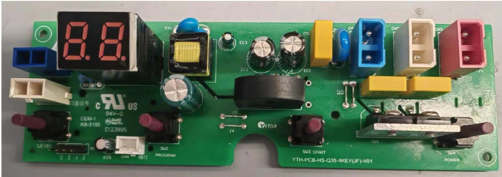

## 'BPS

晶丰明源

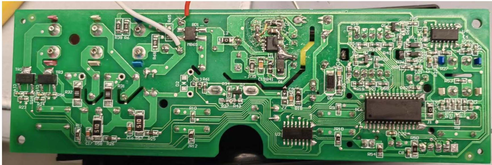

## 3.变压器

示 意 图 :  
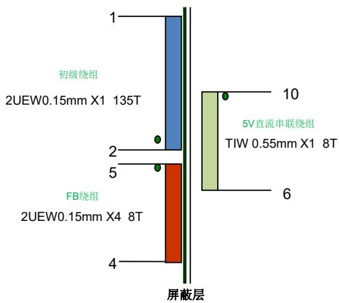

## 电气参数：

1 .初级 电感量2000uH +/-5% @ 100KHz  
2漏感小于60uH  
3.磁芯 EE 1 3 (PC40材质 以 上)  
4.骨架 EE 1 3 5+5槽 宽 =8. 1 mm  
5.初级&5V、 1 5V绕组线 圈 2UEW材质  
6次级12V 绕组TIW材质  
7 绕组间胶带3M1298同等材质  
8初级对次级耐压3KV Hi-Pot  
9.含浸凡立水烘干固化。

绕组结构  
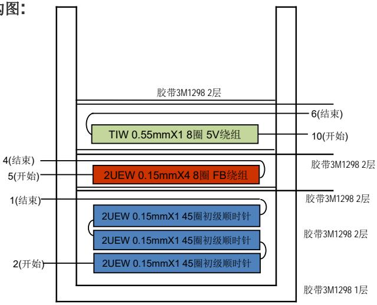

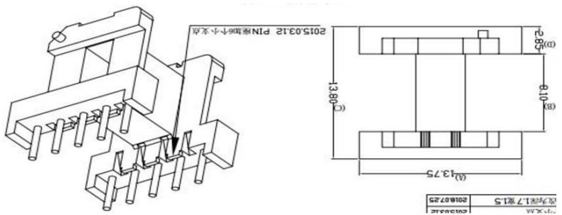

设计参数应力表

<table><tr><td></td><td>INPUT</td><td>INFO</td><td>OUTPUT</td><td>UNIT</td><td></td></tr><tr><td>ENTER APPLICATION VARIABLES</td><td></td><td></td><td></td><td></td><td>Design title</td></tr><tr><td>VACMIN</td><td>85</td><td></td><td></td><td>Volts</td><td>Minimum AC Input Voltage</td></tr><tr><td>VACMAX</td><td>264</td><td></td><td></td><td>Volts</td><td>Maximum AC Input Voltage</td></tr><tr><td>fL</td><td>60</td><td></td><td></td><td>Hertz</td><td>AC Mains Frequency</td></tr><tr><td>VO</td><td>5</td><td></td><td></td><td>Volts</td><td>Output Voltage</td></tr><tr><td>PO</td><td>5</td><td></td><td>5</td><td>Watts</td><td>Output Power</td></tr><tr><td>n</td><td>0.75</td><td></td><td></td><td>%/100</td><td>Efficiency Estimate</td></tr><tr><td>Z</td><td>0.5</td><td></td><td></td><td></td><td>Loss allocation factor</td></tr><tr><td>VB</td><td>5.2</td><td></td><td></td><td>Volts</td><td>Bias Voltage</td></tr><tr><td>tC</td><td>3</td><td></td><td></td><td>ms</td><td>Bridge Rectifier Conduction Time Estimate</td></tr><tr><td>CIN</td><td>7.802</td><td></td><td></td><td>uFarads</td><td>Input Filter Capacitor</td></tr><tr><td></td><td></td><td></td><td></td><td></td><td></td></tr><tr><td>ENTER MOS IPD PARAMEFERS VARIABLES</td><td></td><td></td><td></td><td></td><td></td></tr><tr><td>Chosen Device</td><td>S7142S</td><td></td><td></td><td></td><td></td></tr><tr><td>Absolute Maximum Voltage</td><td>850</td><td></td><td></td><td>Volts</td><td>Collector and base Voltage</td></tr><tr><td>Minimum duty cycle</td><td>0.066280349</td><td></td><td></td><td></td><td></td></tr><tr><td>Minimum on-time</td><td>1.123395751</td><td></td><td></td><td>us</td><td></td></tr><tr><td>ILIMIT MIN</td><td></td><td></td><td></td><td>Amps</td><td>Minimum Current Limit</td></tr><tr><td>ILIMIT TYPE</td><td>0.33</td><td></td><td></td><td>Amps</td><td>Typical Current Limit</td></tr><tr><td>ILIMIT MAX</td><td>0.3531</td><td></td><td></td><td>Amps</td><td>Maximum Current Limit</td></tr><tr><td>Frequency</td><td>59000</td><td></td><td></td><td>Hz</td><td>Minimum Device Switching Frequency</td></tr><tr><td>VOR</td><td>93</td><td></td><td></td><td>Volts</td><td>Reflected Output Voltage</td></tr><tr><td>VDS</td><td>10</td><td></td><td></td><td>Volts</td><td>On-state Drain to Source Voltage</td></tr><tr><td>VD</td><td>0.5</td><td></td><td></td><td>Volts</td><td>Output Winding Diode Forward Voltage Drop</td></tr><tr><td>VDB</td><td>0.7</td><td></td><td></td><td>Volts</td><td>Bias Winding Diode Forward Voltage Drop</td></tr><tr><td>KP</td><td>1.065</td><td></td><td></td><td></td><td>Ripple to Peak Current Ratio (0.3 &lt; KRP &lt; 1.0 : 1.0&lt; KDP&lt;6.0)</td></tr><tr><td></td><td></td><td></td><td></td><td></td><td></td></tr><tr><td>ENTER TRANSFORMER CORE/CONSTRUCTION VARIABLES</td><td></td><td></td><td></td><td></td><td></td></tr><tr><td>Core Type</td><td>EE13</td><td></td><td></td><td></td><td>Core Type</td></tr><tr><td>Bobbin</td><td></td><td></td><td></td><td>P/N:</td><td></td></tr><tr><td>AE</td><td>0.17</td><td></td><td></td><td>cm^2</td><td>Core Effective Cross Sectional Area</td></tr><tr><td>LE</td><td>3.02</td><td></td><td></td><td>cm</td><td>Core Effective Path Length</td></tr><tr><td>AL</td><td>1130</td><td></td><td></td><td>nH/T^2</td><td>Ungapped Core Effective Inductance</td></tr><tr><td>BW</td><td>7.6</td><td></td><td></td><td>mm</td><td>Bobbin Physical Winding Width</td></tr><tr><td>M</td><td>0</td><td></td><td></td><td>mm</td><td>Safety Margin Width (Half the Primary to Secondary Creepage Distance)</td></tr><tr><td>L</td><td>3</td><td></td><td></td><td></td><td>Number of Primary Layers</td></tr><tr><td>NS</td><td>8</td><td></td><td></td><td></td><td>Number of Secondary Turns</td></tr><tr><td></td><td></td><td></td><td></td><td></td><td></td></tr><tr><td>DC INPUT VOLTAGE PARAMETERS</td><td></td><td></td><td></td><td></td><td></td></tr><tr><td>VMIN</td><td></td><td></td><td>73.04</td><td>Volts</td><td>Minimum DC Input Voltage</td></tr><tr><td>VMAX</td><td>640.00</td><td>Warning</td><td>640.00</td><td>Volts</td><td>Maximum DC Input Voltage(Bulk Cap Voltage)</td></tr><tr><td>CURRENT WAVEFORM SHAPE PARAMETERS</td><td></td><td></td><td></td><td></td><td></td></tr><tr><td>DMAX</td><td>0.58</td><td></td><td></td><td></td><td>Maximum Duty Cycle (calculated at PO_PEAK)</td></tr><tr><td>AVG</td><td>0.09</td><td></td><td></td><td>Amps</td><td>Average Primary Current (calculated at average output power)</td></tr><tr><td>IP</td><td>0.31</td><td>Warning</td><td></td><td>Amps</td><td>Peak Primary Current (calculated at Peak output power)</td></tr><tr><td>IR</td><td>0.31</td><td></td><td></td><td>Amps</td><td>Primary Ripple Current (calculated at average output power)</td></tr><tr><td>IRMS</td><td>0.14</td><td></td><td></td><td>Amps</td><td>Primary RMS Current (calculated at average output power)</td></tr><tr><td></td><td></td><td></td><td></td><td></td><td></td></tr><tr><td>TRANSFORMER PRIMARY DESIGN PARAMETERS</td><td></td><td></td><td></td><td></td><td></td></tr><tr><td>LP</td><td>2001</td><td></td><td></td><td>uHenries</td><td>Primary Inductance</td></tr><tr><td>NP</td><td>135</td><td></td><td></td><td></td><td>Primary Winding Number of Turns</td></tr><tr><td>NB</td><td>8</td><td></td><td></td><td></td><td>Bias Winding Number of Turns</td></tr><tr><td>ALG</td><td>109</td><td></td><td></td><td>nH/T^2</td><td>Gapped Core Effective Inductance</td></tr><tr><td>BM</td><td>2720</td><td></td><td></td><td>Gauss</td><td>Maximum Flux Density at PO, VMIN (BM&lt;3000)</td></tr><tr><td>BP</td><td>3055</td><td></td><td></td><td>Gauss</td><td>!!! REDUCE BP&lt;3500</td></tr><tr><td>BAC</td><td>1360</td><td></td><td></td><td>Gauss</td><td>AC Flux Density for Core Loss Curves (0.5 X Peak to Peak)</td></tr><tr><td>ur</td><td>1597</td><td></td><td></td><td></td><td>Relative Permeability of Ungapped Core</td></tr><tr><td>LG</td><td>0.18</td><td></td><td></td><td>mm</td><td>Gap Length (Lg &gt; 0.1 mm)</td></tr><tr><td>BWE</td><td>22.8</td><td></td><td></td><td>mm</td><td>Effective Bobbin Width</td></tr><tr><td>OD</td><td>0.17</td><td></td><td>0.17</td><td>mm</td><td>Maximum Primary Wire Diameter including insulation</td></tr><tr><td>INS</td><td>0.04</td><td></td><td></td><td>mm</td><td>Estimated Total Insulation Thickness (= 2 * film thickness)</td></tr><tr><td>DIA</td><td>0.13</td><td></td><td></td><td>mm</td><td>Bare conductor diameter</td></tr><tr><td>AWG</td><td>36</td><td></td><td></td><td>AWG</td><td>Primary Wire Gauge (Rounded to next smaller standard AWG value)</td></tr><tr><td>CM</td><td>25</td><td></td><td></td><td>Cmils</td><td>Bare conductor effective area in circular mils</td></tr><tr><td>CMA</td><td>180</td><td>Warning</td><td></td><td>Cmils/Amp</td><td>!!! INCREASE CMA&gt;200 (increase L(primary layers),decrease NS,larger Core)</td></tr><tr><td>Primary Current Density (J)</td><td>10.20</td><td>Warning</td><td></td><td>Amps/mm^2</td><td>!!! Decrease current density Use larger wire diameter, increase L or increase core size.</td></tr><tr><td></td><td></td><td></td><td></td><td></td><td></td></tr><tr><td>TRANSFORMER SECONDARY DESIGN PARAMETERS (SINGLE OUTPUT EQUIVALENT)</td><td></td><td></td><td></td><td></td><td></td></tr><tr><td>Lumped parameters</td><td></td><td></td><td></td><td></td><td></td></tr><tr><td>ISP</td><td>5.30</td><td></td><td></td><td>Amps</td><td>Peak Secondary Current</td></tr><tr><td>ISRMS</td><td>1.92</td><td></td><td></td><td>Amps</td><td>Secondary RMS Current</td></tr><tr><td>IO</td><td>1.00</td><td></td><td></td><td>Amps</td><td>Average Power Supply Output Current</td></tr><tr><td>IRIPPLE</td><td>1.64</td><td></td><td></td><td>Amps</td><td>Output Capacitor RMS Ripple Current</td></tr><tr><td>d</td><td>384</td><td></td><td></td><td>Cmils</td><td>Secondary Bare Conductor minimum circular mils</td></tr><tr><td>AWGS</td><td>24</td><td></td><td></td><td>AWG</td><td>Secondary Wire Gauge (Rounded up to next larger standard AWG value)</td></tr><tr><td>Ls</td><td>0.83</td><td></td><td>0.83</td><td></td><td>Number of Secondary Layers</td></tr><tr><td>DIAS</td><td>0.55</td><td></td><td></td><td>mm</td><td>Secondary Minimum Bare Conductor Diameter</td></tr><tr><td>ODS</td><td>0.53</td><td>Warning</td><td></td><td>mm</td><td>Secondary Maximum Outside Diameter for Triple Insulated Wire</td></tr><tr><td>INSS</td><td>0.07</td><td></td><td></td><td>mm</td><td>Maximum Secondary Insulation Wall Thickness</td></tr><tr><td>ACT CMS</td><td>8.69</td><td>Warning</td><td></td><td>Cmils</td><td>Secondary Bare Conductor circular mils</td></tr><tr><td></td><td></td><td></td><td></td><td></td><td></td></tr><tr><td>VOLTAGE STRESS PARAMETERS</td><td></td><td></td><td></td><td></td><td></td></tr><tr><td>VDRAIN Platform voltage</td><td>733</td><td>Warning</td><td></td><td>Volts</td><td>Maximum Drain Platform voltage</td></tr><tr><td>Actual leakage inductance spike voltage</td><td>50</td><td></td><td></td><td>Volts</td><td>Includes Effect of Leakage Inductance</td></tr><tr><td>VDRAIN Estimate voltage</td><td>783</td><td>Warning</td><td></td><td>Volts</td><td>Maximum Drain Voltage Estimate</td></tr><tr><td>PIVS</td><td>43</td><td></td><td></td><td>Volts</td><td>Output Rectifier Maximum Peak Inverse Voltage</td></tr><tr><td>PIVB</td><td>43</td><td></td><td></td><td>Volts</td><td>Bias Rectifier Maximum Peak Inverse Voltage</td></tr><tr><td></td><td></td><td></td><td></td><td></td><td></td></tr><tr><td></td><td></td><td></td><td></td><td></td><td></td></tr></table>

  
4. 待机&效率测试

<table><tr><td>Vin(Vac)</td><td>Load(%)</td><td>Pin(W)</td><td>Vout(V)</td><td>Iout(A)</td><td>Pout(W)</td><td>Eff(%)</td><td>Ave Eff(%)</td></tr><tr><td rowspan="6">85Vac/60Hz</td><td>100</td><td>6.506</td><td>4.9557</td><td>0.9994</td><td>4.952727</td><td>76.12552</td><td rowspan="4">75.8071</td></tr><tr><td>75</td><td>4.797</td><td>4.9102</td><td>0.7494</td><td>3.679704</td><td>76.70844</td></tr><tr><td>50</td><td>3.196</td><td>4.8716</td><td>0.4994</td><td>2.432877</td><td>76.12256</td></tr><tr><td>25</td><td>1.633</td><td>4.8631</td><td>0.2494</td><td>1.212857</td><td>74.27172</td></tr><tr><td>10</td><td>0.7012</td><td>4.8802</td><td>0.0991</td><td>0.483628</td><td>68.97145</td><td>68.9715</td></tr><tr><td>0</td><td>0.1136</td><td>4.9923</td><td>0</td><td>0</td><td></td><td></td></tr><tr><td rowspan="6">115Vac/60Hz</td><td>100</td><td>6.418</td><td>4.9646</td><td>0.9994</td><td>4.961621</td><td>77.3079</td><td rowspan="4">76.9878</td></tr><tr><td>75</td><td>4.745</td><td>4.9182</td><td>0.7494</td><td>3.685699</td><td>77.67543</td></tr><tr><td>50</td><td>3.085</td><td>4.8786</td><td>0.4994</td><td>2.436373</td><td>78.97481</td></tr><tr><td>25</td><td>1.639</td><td>4.8685</td><td>0.2491</td><td>1.212743</td><td>73.99288</td></tr><tr><td>10</td><td>0.714</td><td>4.8867</td><td>0.0991</td><td>0.484272</td><td>67.82521</td><td>67.8252</td></tr><tr><td>0</td><td>0.1219</td><td>4.9913</td><td>0</td><td>0</td><td></td><td></td></tr><tr><td rowspan="6">220Vac/50Hz</td><td>100</td><td>6.557</td><td>4.9773</td><td>0.9994</td><td>4.974314</td><td>75.86264</td><td rowspan="4">73.3864</td></tr><tr><td>75</td><td>4.923</td><td>4.9263</td><td>0.7494</td><td>3.691769</td><td>74.99023</td></tr><tr><td>50</td><td>3.327</td><td>4.8848</td><td>0.4994</td><td>2.439469</td><td>73.32339</td></tr><tr><td>25</td><td>1.75</td><td>4.8734</td><td>0.2491</td><td>1.213964</td><td>69.36937</td></tr><tr><td>10</td><td>0.814</td><td>4.8935</td><td>0.0991</td><td>0.484946</td><td>59.57566</td><td>59.5757</td></tr><tr><td>0</td><td>0.1463</td><td>4.9687</td><td>0</td><td>0</td><td></td><td></td></tr><tr><td rowspan="6">264Vac/50Hz</td><td>100</td><td>6.685</td><td>4.9781</td><td>0.9994</td><td>4.975113</td><td>74.42204</td><td rowspan="4">71.0237</td></tr><tr><td>75</td><td>5.038</td><td>4.9285</td><td>0.7494</td><td>3.693418</td><td>73.31119</td></tr><tr><td>50</td><td>3.429</td><td>4.8831</td><td>0.4994</td><td>2.43862</td><td>71.11753</td></tr><tr><td>25</td><td>1.86</td><td>4.8717</td><td>0.2491</td><td>1.21354</td><td>65.24411</td></tr><tr><td>10</td><td>0.873</td><td>4.8941</td><td>0.0991</td><td>0.485005</td><td>55.55616</td><td>55.5562</td></tr><tr><td>0</td><td>0.2011</td><td>4.9666</td><td>0</td><td>0</td><td></td><td></td></tr></table>

\*因 系统中X电容泄放电阻为470K\*2

## 5.功率管电压/电流启动波形

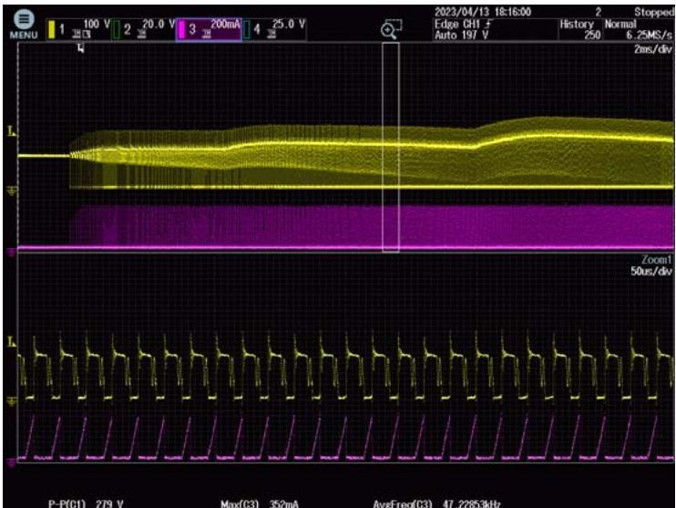

##

C H 3 : I c

Max 352mA

C H4 : Vce

Max 279V

Test co n d it i o n

F u l l Load

 I n put 85Vac 60 Hz

 O u tp u t

5V 1 A

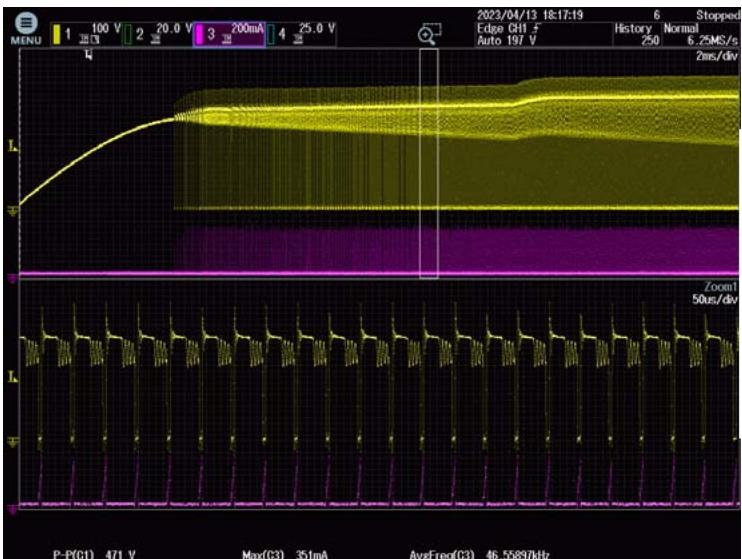

## 220Vac

C H 3 : I c

Max 35 1 mA

C H4 : Vce

Max 47 1 V

Test co n d it i o n

F u l l Load

 I n put 220Vac 50 Hz

 O u tp u t

5V 1 A

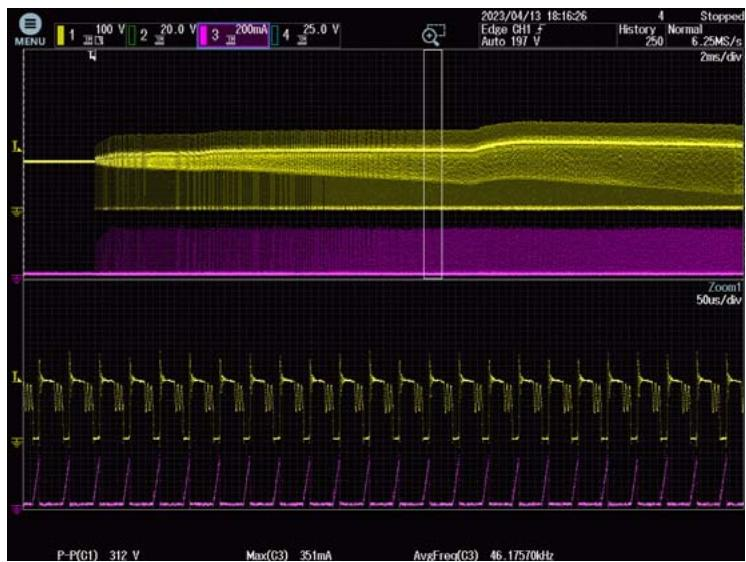

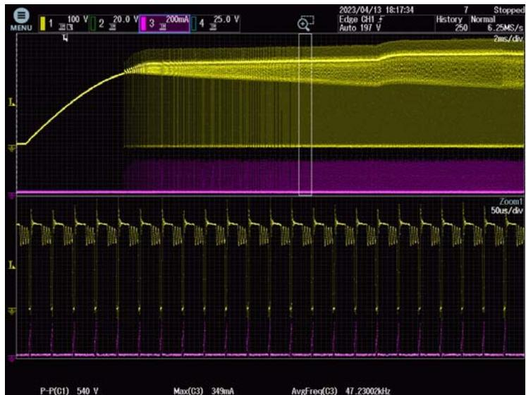

## 'BPS

## 晶丰明源

## 1 1 5Vac

C H 3 : I c

Max 35 1 mA

CH4 : Vce

Max 3 1 2V

Test co n d it i o n

F u l l Load

 I n put 1 1 5Vac 60 Hz

 O u tp u t

5V 1 A

## 264Vac

C H 3 : I c

Max 349mA

C H4 : Vce

Max 540V

Test co n d it i o n

F u l l Load

 I n put 264Vac 50 Hz

 O u tp u t

5V 1 A

## 6.功率管电压/电流稳态波形

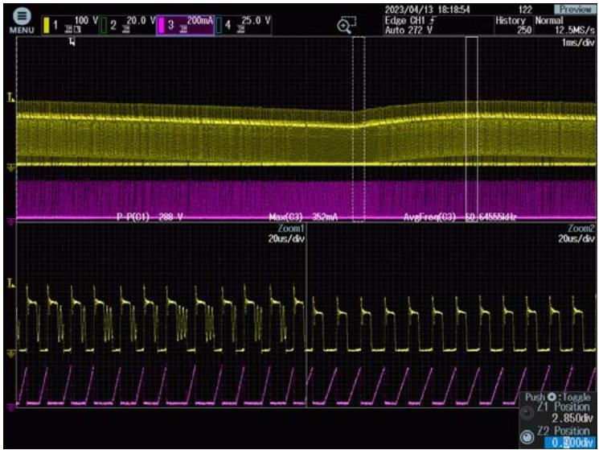

##

C H 3 : I c

Max 352mA

C H4 : Vce

Max 288V

Test co n d it i o n

F u l l Load

 I n put 85Vac 60 Hz

 O u tp u t

5V 1 A

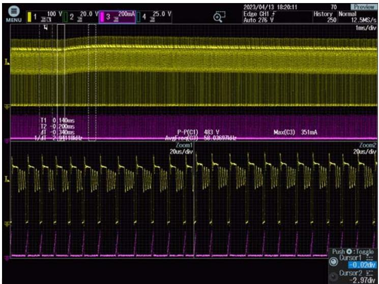

## 220Vac

C H 3 : I c

Max 35 1 mA

C H4 : Vce

Max 483V

Test co n d it i o n

F u l l Load

 I n put 220Vac 50 Hz

 O u tp u t

5V 1 A

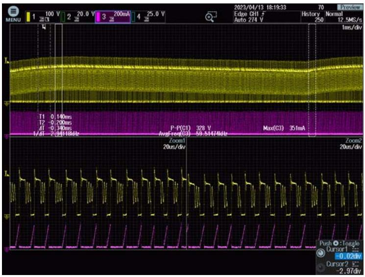

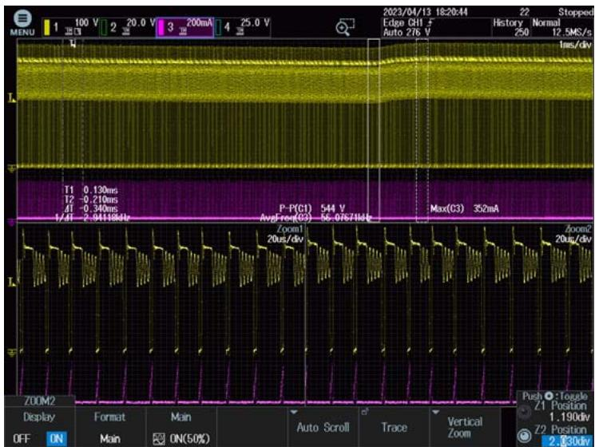

B

## 1 1 5Vac

C H 3 : I c

Max 35 1 mA

CH4 : Vce

Max 328V

Test co n d it i o n

F u l l Load

 I n put 1 1 5Vac 60 Hz

 O u tp u t

5V 1 A

## 264Vac

C H 3 : I c

Max 352mA

C H4 : Vce

Max 544V

Test co n d it i o n

F u l l Load

 I n put 264Vac 50 Hz

 O u tp u t

5V 1 A

## 7.5V整流管电压应力波形

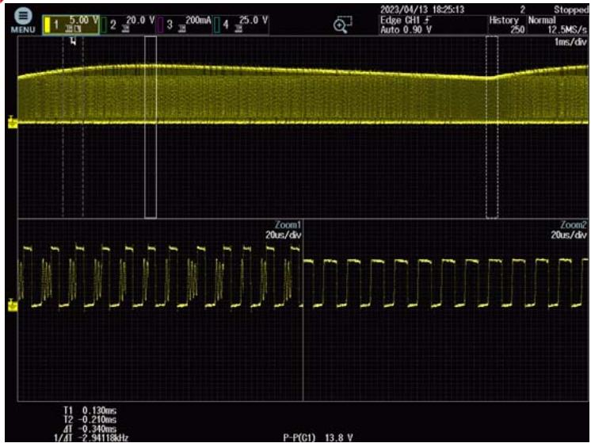

85Vac

CH 1 : 5V整流管SS340

P - P 1 3 . 8V

Test co n d it i o n

F u l l Load

 I n put 85Vac 60 Hz  
 O u tp u t 5V 1 A

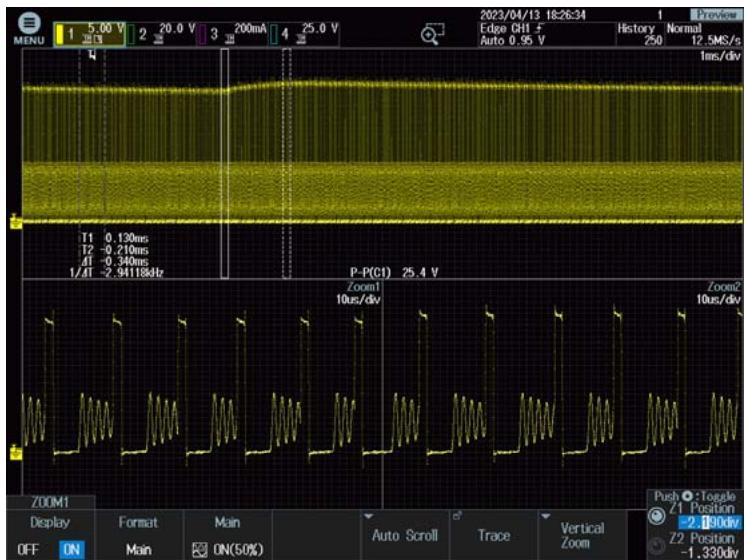

220Vac

CH 1 : 5V整流管SS340

P-P 25 .4V

Test co n d it i o n

F u l l Load

 I n put 220Vac 50 Hz  
 O u tp u t 5V 1 A

B PS Co nfi d e nti a l

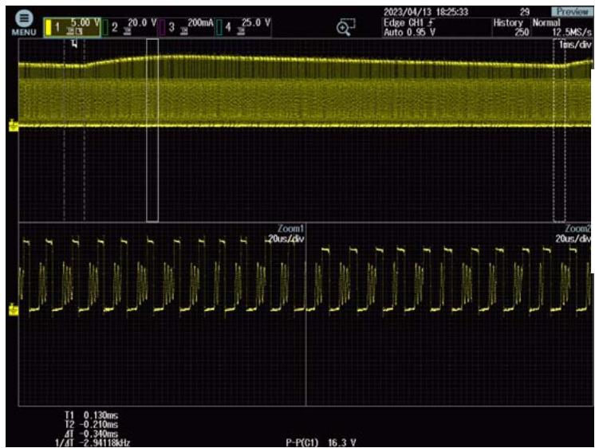

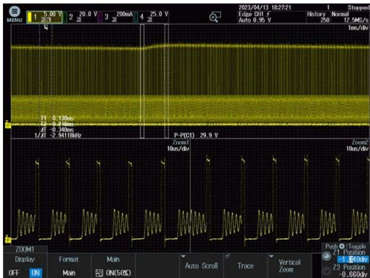

1 1 5Vac

CH 1 : 5V整流管SS340

P - P 1 6 . 3V

Test co n d it i o n

F u l l Load

 I n put 1 1 5Vac 60 Hz  
 O u tp u t 5V 1 A

264Vac

CH 1 : 5V整流管SS340

P-P 29 . 9V

Test co n d it i o n

F u l l Load

 I n put 264Vac 50 Hz  
 O utput 5V 1 A

## 8. 5V电压纹波

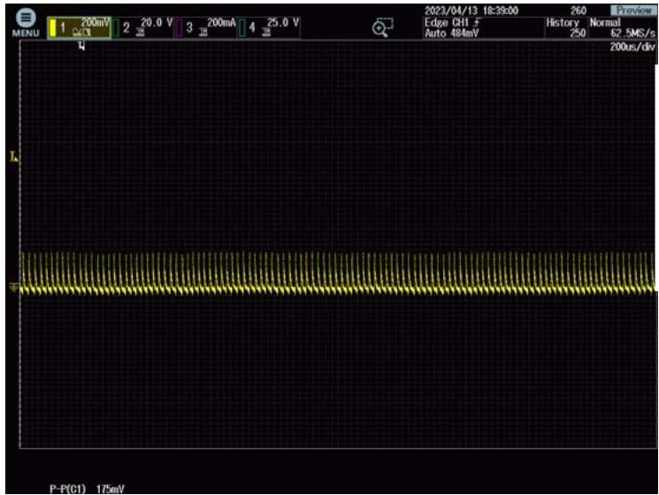

## 85Vac

C H 1 : 5VRi pple N oise

P-P 1 75mV

Test co n d it i o n

F u l l Load

 I n put 85Vac 60 Hz  
 O u tp u t  
5V 1 A

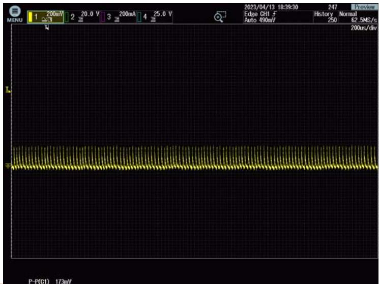

## 220Vac

C H 1 : 5VRi pple N oise

P-P 1 73mV

Test co n d it i o n

F u l l Load

 I n put 220Vac 50 Hz  
 O u tp u t 5V 1 A

B PS Co nfi d e nti a l

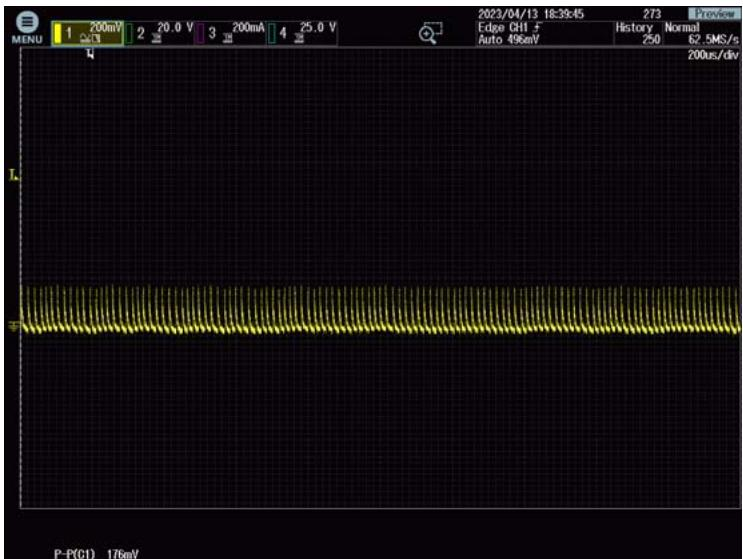

## 1 1 5Vac

C H 1 : 5VRi pple N oise

P-P 1 76mV

Test co n d it i o n

F u l l Load

 I n put 1 1 5Vac 60 Hz  
 O u tp u t  
5V 1 A

## 264Vac

C H 1 : 5VRi pple N oise

P-P 1 76mV

Test co n d it i o n

F u l l Load

 I n put 264Vac 50 Hz  
 O u tp u t 5V 1 A

## 9. 1 5V电压10%‐90%动态纹波

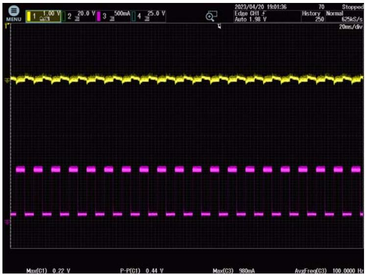

## 85Vac

C H 1 ： 5V Ri pple NoisePK-Pk 440mV

Test co n d it i o n

F u l l Load

 I n put 85Vac 60 Hz  
 O u tp u t  
5V 0 . 1 A-0 . 9A S lew rate 0 . 5A/us F req uency 1 00 Hz

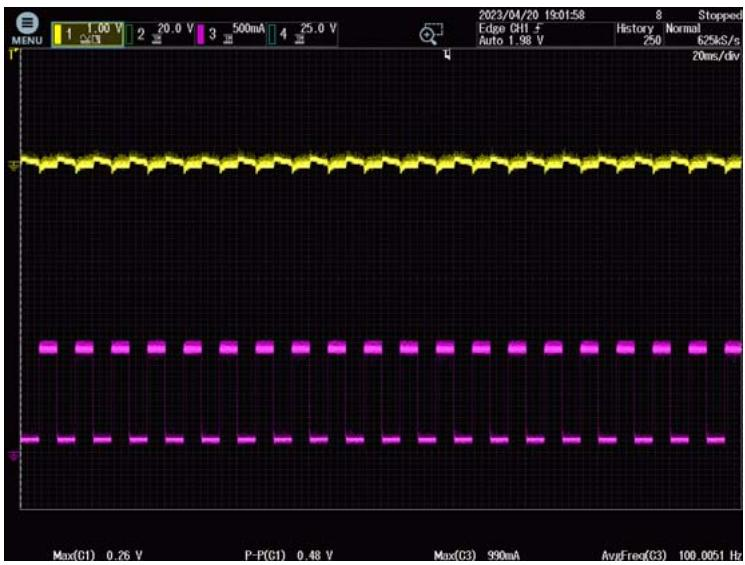

## 220Vac

CH 1 ： 5V Ri pple NoisePK-Pk 480mV

Test co n d it i o n

F u l l Load

 I n put 220Vac 50 Hz  
 O u tp u t 5V 0 . 1 A-0 . 9A S lew rate 0 . 5A/us Freq uency 1 00 Hz

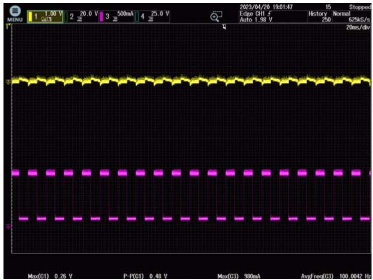

## 1 1 5Vac

C H 1 ： 5V Ri pple Noise

PK-Pk 480mV

Test co n d it i o n

F u l l Load

 I n put 1 1 5Vac 60 Hz  
 O u tp u t  
5V 0 . 1 A-0 . 9A  
Slew rate 0 . 5A/us  
F req uency 1 00 Hz

## 264Vac

C H 1 ： 5V Ri pple Noise

PK-Pk 470mV

Test co n d it i o n

F u l l Load

 I n put 264Vac 50 Hz  
 O u tp u t  
5V 0 . 1 A-0 . 9A  
Slew rate 0 5A/us  
Freq uency 1 00 Hz

## 9.2 5V电压10%‐50%动态纹波

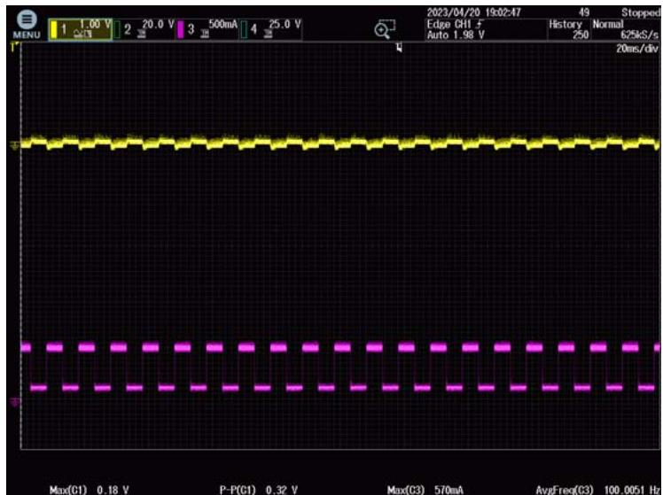

## 85Vac

C H 1 ： 5V Ri pple NoisePK-Pk 320mV

Test co n d it i o n

F u l l Load

 I n put 85Vac 60 Hz  
 O u tp u t  
5V 0 . 1 A-0 . 5A  
Slew rate 0 . 5A/us  
F req uency 1 00 Hz

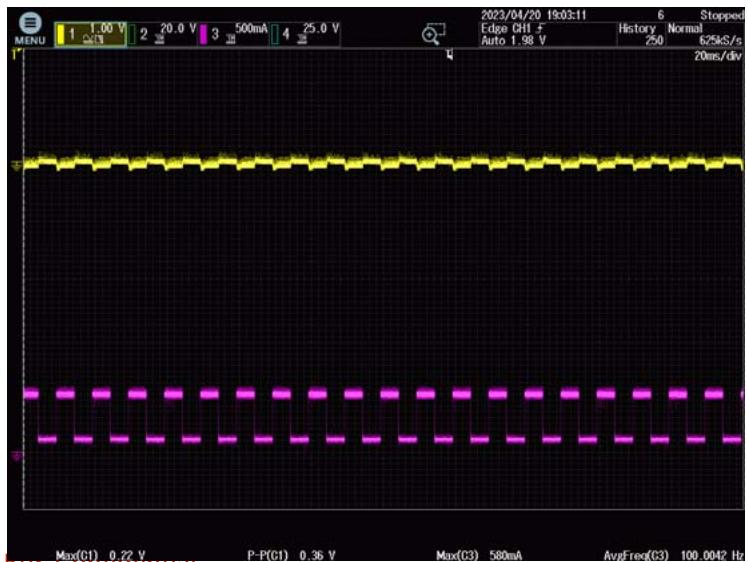

## 220Vac

CH 1 ： 5V Ri pple NoisePK-Pk 360mV

Test co n d it i o n

F u l l Load

 I n put 220Vac 50 Hz  
 O utput  
5V 0 . 1 A-0 . 5A  
S lew rate 0 . 5A/us  
Freq uency 1 00 Hz

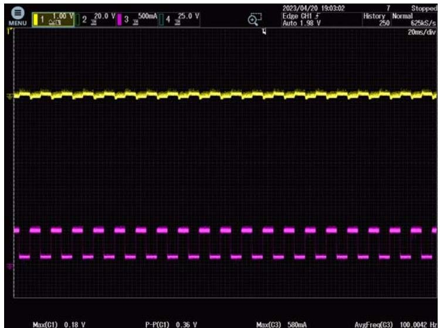

## 1 1 5Vac

C H 1 ： 5V Ri pple Noise

PK-Pk 360mV

Test co n d it i o n

F u l l Load

 I n put 1 1 5Vac 60 Hz  
 O u tp u t  
5V 0 . 1 A-0 . 5A  
Slew rate 0 . 5A/us  
Freq uency 1 00 Hz

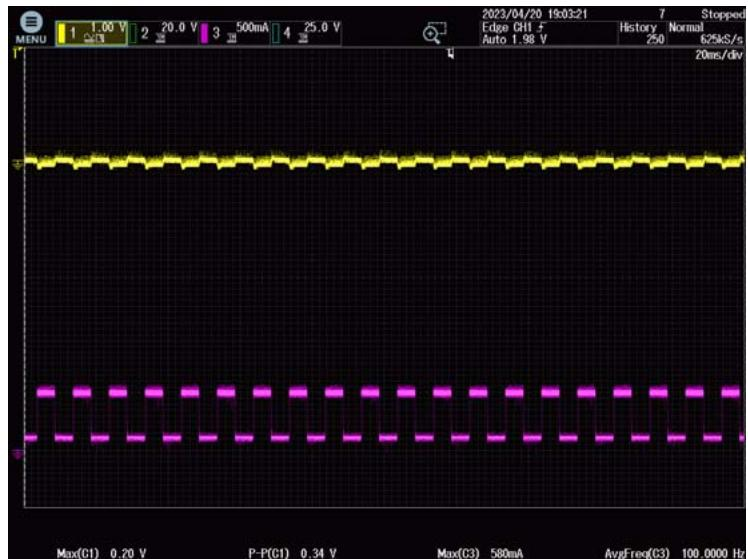

## 264Vac

C H 1 ： 5V Ri pple Noise

PK-Pk 340mV

Test co n d it i o n

F u l l Load

 I n put 264Vac 50 Hz  
 O u tp u t  
5V 0 . 1 A-0 . 5A  
Slew rate 0 5A/us  
Freq uency 1 00 Hz

## 9.3 5V电压50%‐90%动态纹波

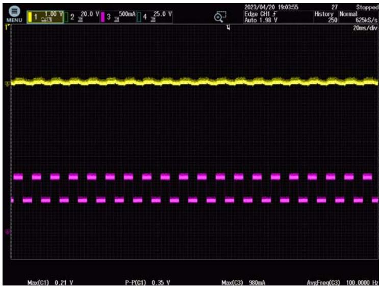

## 85Vac

CH 1 ： 5V Ri pple NoisePK-Pk 350mV

Test co n d it i o n

F u l l Load

 I n put 85Vac 60 Hz  
 O u tp u t  
5V 0 . 5A-0 . 9A S lew rate 0 . 5A/us F req uency 1 00 Hz

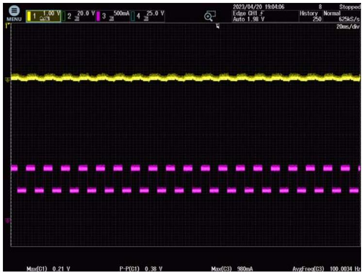

## 1 1 5Vac

C H 1 ： 5V Ri pple Noise

PK-Pk 380mV

Test co n d it i o n

F u l l Load

 I n put 1 1 5Vac 60 Hz  
 O u tp u t  
5V 0 . 5A-0 . 9A  
Slew rate 0 . 5A/us  
Freq uency 1 00 Hz

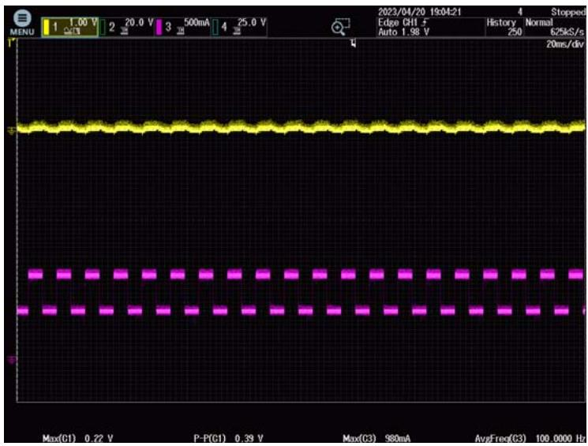

## 220Vac

CH 1 ： 5V Ri pple NoisePK-Pk 390mV

Test co n d it i o n

F u l l Load

 I n put 220Vac 50 Hz  
 O utput  
5V 0 5A-0 9A S lew rate 0 . 5A/us F req uency 1 00 Hz

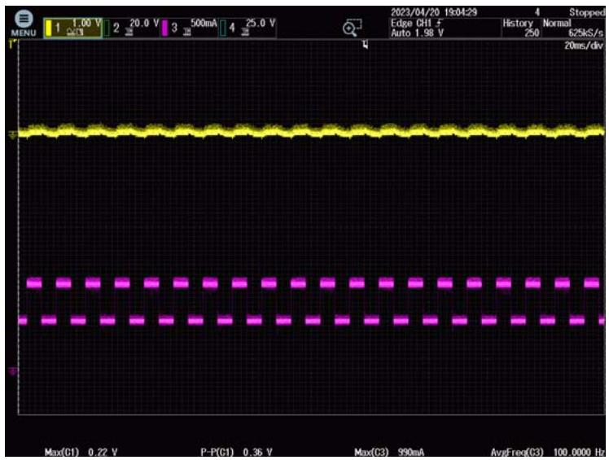

## 264Vac

C H 1 ： 5V Ri pple Noise

PK-Pk 360mV

Test co n d it i o n

F u l l Load

 I n put 264Vac 50 Hz  
 O u tp u t  
5V 0 . 5A-0 . 9A  
Slew rate 0 5A/us  
Freq uency 1 00 Hz

## 10.开机过冲

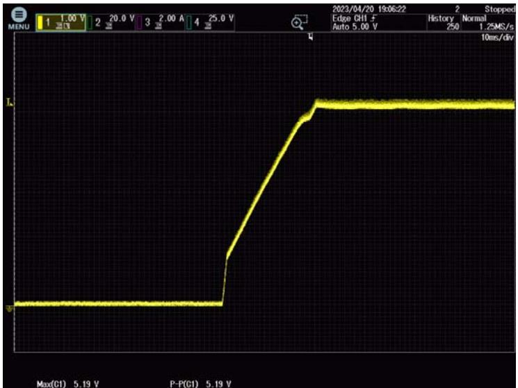

85Vac  
CH 1 ： 5V  
Overshoot 5 . 1 9Vmax  
F u l l Load  
 I n put 85Vac 60 Hz  
 O u tp u t 5V 1 A

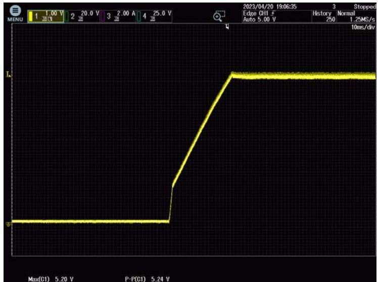

## 1 1 5Vac

C H 1 ： 5V

Overshoot 5 . 2Vmax

F u l l Load

 I n put 1 1 5Vac 60 Hz 》Input 115Vac 60Hz  
 O u tp u t Output 5V 1 A 5V1A

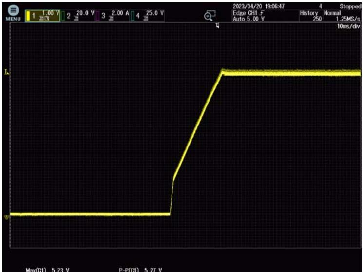

220Vac  
C H 1 ： 5V  
Overshoot 5 . 23Vmax  
F u l l Load  
 I n put 220Vac 50 Hz  
 O u tp u t 5V 1 A

## 264Vac

C H 1 ： 5V

Overshoot 5 . 24Vmax

F u l l Load

 I n put 264Vac 50 Hz 》 Input 264Vac 50Hz  
 O u tp u t Output 5V 1 A 5V1A

## 1 1 . 1室温下温升@85Vac

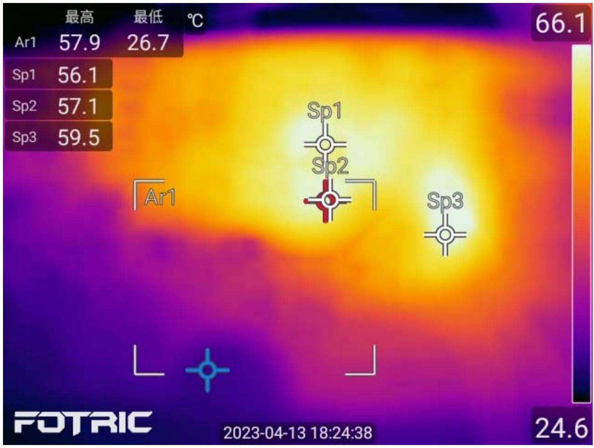

## 85Vac SM D

S P 1 ： I C S7 1 42S 56 . 1 度

S P2 : RCD D 1 M7 5 7 . 1 度

S P3 : D6 SS340 59 . 5度

 I n put 85Vac 60 Hz  
 O u tp u t 5V 1 A

I C温升56 1 -24 6=3 1 5度

## 1 1 .2室温下温升@264Vac

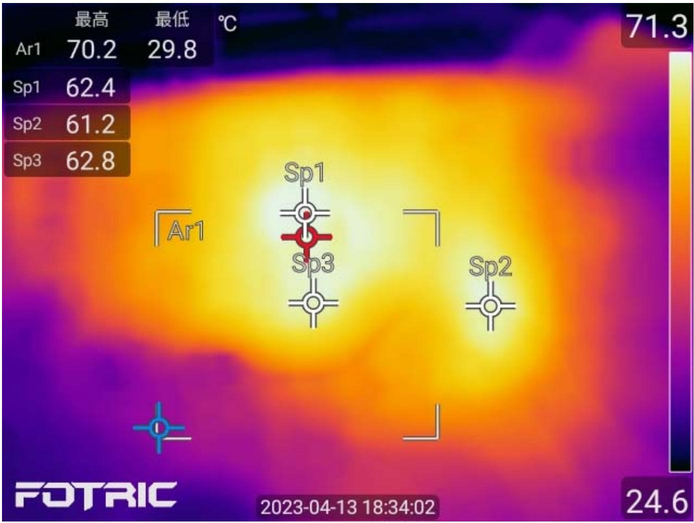

## 264Vac SM D

S P 1 ： I C S7 1 42S 62 .4度

S P2 : RCD D 1 M7 6 1 . 2 度

S P3 : D6 SS340 62 . 8度

 I n put 264Vac 50 Hz  
 O u tp u t 5V 1 A

I C温升62 .4-24 . 6=37 . 8度

## 12 . 1 1 15Vac传导

EMITESTREPORT

<table><tr><td colspan="2">Organization:</td><td colspan="2">Operator:</td><td>EUT:</td><td>parameter</td></tr><tr><td colspan="2">Place:</td><td>Time:</td><td>2023/4/21/10:30</td><td colspan="2">Test equipment:KH3939</td></tr><tr><td>Detector:</td><td>PK+AV</td><td>Test-time(ms):</td><td>30</td><td>SN:</td><td>390517</td></tr><tr><td>Limit:</td><td>EN55022B</td><td>Transductor(PK/AV):</td><td>PK / AV</td><td>JZ:</td><td>2,14,1685</td></tr><tr><td colspan="6">Remark:</td></tr><tr><td colspan="2">Start(MHz)</td><td colspan="2">End(MHz)</td><td>Step(MHz)</td><td>freq, step</td></tr><tr><td colspan="2">0.150</td><td colspan="2">2.000</td><td>0.002</td><td></td></tr><tr><td colspan="2">2.000</td><td colspan="2">10.000</td><td>0.010</td><td></td></tr><tr><td colspan="2">10.000</td><td colspan="2">30.000</td><td>0.025</td><td></td></tr><tr><td colspan="5">dBuV</td><td>scan result</td></tr></table>

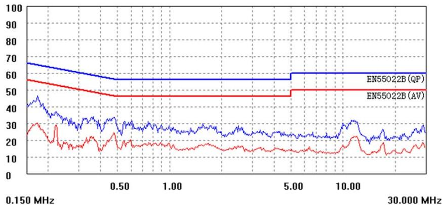

1 1 5V L 满载

EMI TEST REPORT

<table><tr><td colspan="2">Organization:</td><td colspan="2">Operator:</td><td colspan="2">EUT:</td></tr><tr><td colspan="2">Place:</td><td>Time:</td><td>2023/4/21/10:32</td><td colspan="2">Test equipment:KH3939</td></tr><tr><td>Detector:</td><td>PK+AV</td><td>Test-time[ms]:</td><td>30</td><td>SN:</td><td>390517</td></tr><tr><td>Limit:</td><td>EN55022B</td><td>Transductor(PK/AV):</td><td>PK / AV</td><td>JZ:</td><td>2,14,1686</td></tr><tr><td colspan="2">Remark:</td><td></td><td></td><td></td><td></td></tr><tr><td colspan="2">Start(MHz)</td><td colspan="2">End(MHz)</td><td colspan="2">Step(MHz)</td></tr><tr><td colspan="2">0.150</td><td colspan="2">2.000</td><td colspan="2">0.002</td></tr><tr><td colspan="2">2.000</td><td colspan="2">10.000</td><td colspan="2">0.010</td></tr><tr><td colspan="2">10.000</td><td colspan="2">30.000</td><td colspan="2">0.025</td></tr><tr><td colspan="2">dBuV</td><td></td><td></td><td></td><td>scan result</td></tr></table>

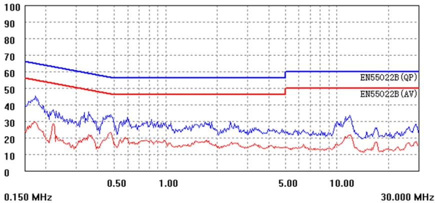

1 1 5V N 满载

## 12.2 220Vac传导

EMITESTREPORT

<table><tr><td colspan="2">Organization:</td><td colspan="2">Operator:</td><td colspan="2">EUT:</td></tr><tr><td colspan="2">Place:</td><td>Time:</td><td>2023/4/21/10:25</td><td colspan="2">Test equipment:KH3939</td></tr><tr><td>Detector:</td><td>PK+AV</td><td>Test-time(ms):</td><td>30</td><td>SN:</td><td>390517</td></tr><tr><td>Limit:</td><td>EN55022B</td><td>Transductor(PK/AV):</td><td>PK / AV</td><td>JZ:</td><td>2,14,1692</td></tr><tr><td colspan="2">Remark:</td><td></td><td></td><td></td><td></td></tr><tr><td colspan="2">Start(MHz)</td><td colspan="2">End(MHz)</td><td colspan="2">Step(MHz)</td></tr><tr><td colspan="2">0.150</td><td colspan="2">2.000</td><td colspan="2">0.002</td></tr><tr><td colspan="2">2.000</td><td colspan="2">10.000</td><td colspan="2">0.010</td></tr><tr><td colspan="2">10.000</td><td colspan="2">30.000</td><td colspan="2">0.025</td></tr><tr><td colspan="2">dBuV</td><td></td><td></td><td></td><td>scan result</td></tr></table>

220V L 满载

EMI TEST REPORT

<table><tr><td colspan="2">Organization:</td><td>Operator:</td><td>EUT:</td></tr><tr><td colspan="2">Place:</td><td>Time: 2023/4/21/10:27</td><td>Test equipment:KH3939</td></tr><tr><td>Detector:</td><td>PK+AV</td><td>Test-time[ms]: 30</td><td>SN: 390517</td></tr><tr><td>Limit:</td><td>EN55022B</td><td>Transductor(PK/AV): PK / AV</td><td>JZ: 2,14,1689</td></tr><tr><td colspan="4">Remark:</td></tr><tr><td colspan="2">Start(MHz)</td><td>End(MHz)</td><td>Step(MHz)</td></tr><tr><td colspan="2">0.150</td><td>2.000</td><td>0.002</td></tr><tr><td colspan="2">2.000</td><td>10.000</td><td>0.010</td></tr><tr><td colspan="2">10.000</td><td>30.000</td><td>0.025</td></tr><tr><td colspan="3">dBuV</td><td>scan result</td></tr></table>

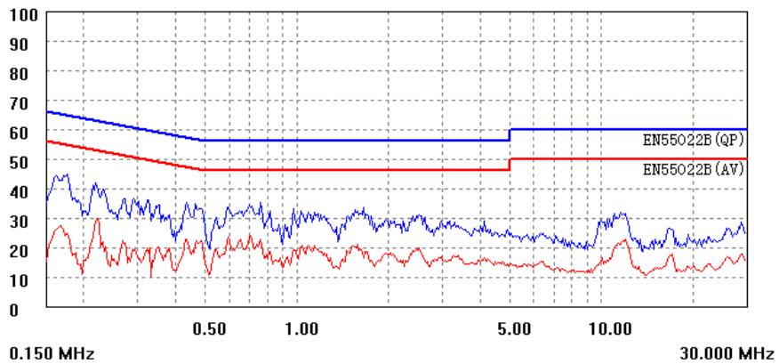

220V N 满载

## 13 . 骚扰功率

EMI TEST REPORT

<table><tr><td colspan="2">Organization:</td><td colspan="2">Operator:</td><td colspan="2">EUT:</td></tr><tr><td colspan="2">Place:</td><td>Time:</td><td>2023/4/21/10:45</td><td colspan="2">Test equipment:KH3932</td></tr><tr><td>Detector:</td><td>PK+AV</td><td>Test-time[ms]:</td><td>30</td><td>SN:</td><td>320630</td></tr><tr><td>Limit:</td><td>30-300M</td><td>Transductor(PK/AV):</td><td>PK / AV</td><td>JZ:</td><td>2,13,1686</td></tr><tr><td colspan="2">Remark:</td><td></td><td></td><td></td><td></td></tr><tr><td colspan="2">Start(MHz)</td><td colspan="2">End(MHz)</td><td colspan="2">Step(MHz)</td></tr><tr><td colspan="2">30.000</td><td colspan="2">50.000</td><td colspan="2">0.030</td></tr><tr><td colspan="2">50.000</td><td colspan="2">100.000</td><td colspan="2">0.050</td></tr><tr><td colspan="2">100.000</td><td colspan="2">200.000</td><td colspan="2">0.100</td></tr><tr><td colspan="2">200.000</td><td colspan="2">300.000</td><td colspan="2">0.200</td></tr><tr><td colspan="2">dBuV</td><td></td><td></td><td></td><td>scan result</td></tr></table>

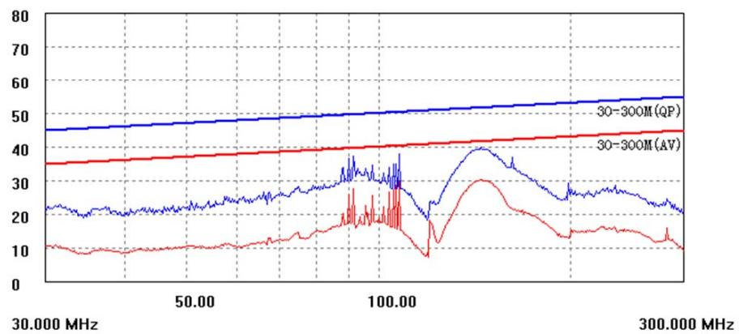

1 1 5V 满载

EMI TEST REPORT

<table><tr><td colspan="2">Organization:</td><td colspan="2">Operator:</td><td colspan="2">EUT:</td></tr><tr><td colspan="2">Place:</td><td>Time:</td><td>2023/4/21/10:39</td><td colspan="2">Test equipment:KH3932</td></tr><tr><td>Detector:</td><td>PK+AV</td><td>Test-time(ms):</td><td>30</td><td>SN:</td><td>320630</td></tr><tr><td>Limit:</td><td>30-300M</td><td>Transductor(PK/AV):</td><td>PK / AV</td><td>JZ:</td><td>2,13,1689</td></tr><tr><td colspan="2">Remark:</td><td></td><td></td><td></td><td></td></tr><tr><td colspan="2">Start(MHz)</td><td colspan="2">End(MHz)</td><td colspan="2">Step(MHz)</td></tr><tr><td colspan="2">30.000</td><td colspan="2">50.000</td><td colspan="2">0.030</td></tr><tr><td colspan="2">50.000</td><td colspan="2">100.000</td><td colspan="2">0.050</td></tr><tr><td colspan="2">100.000</td><td colspan="2">200.000</td><td colspan="2">0.100</td></tr><tr><td colspan="2">200.000</td><td colspan="2">300.000</td><td colspan="2">0.200</td></tr><tr><td colspan="2">dBuV</td><td></td><td></td><td></td><td>scan result</td></tr></table>

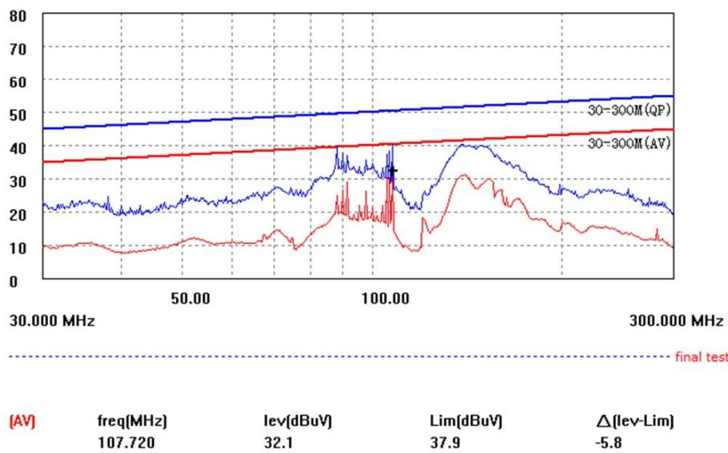

220V 满载

## 14. 1 KV雷击测试EC1&EC2电压

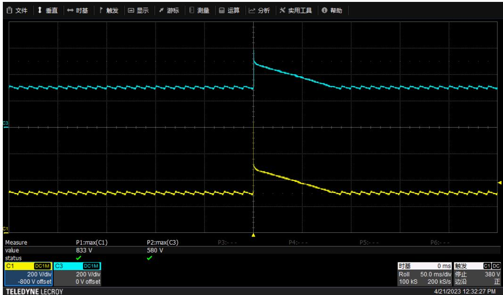

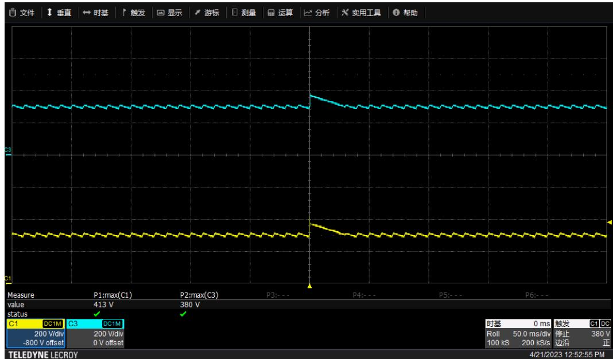

C H 1 : E C 1 Vo l t 833V max

C H2 : EC2 Volt 580Vmax

U 1 极限850V工作ABS 电压 内

测试工作正常

C H 1 : EC 1 Volt 4 1 3Vmax

C H2 : EC2 Volt 380Vmax

U 1 极限850V工作ABS 电压 内

15 . 1 . 5 KV雷击测试EC1& EC2电压  
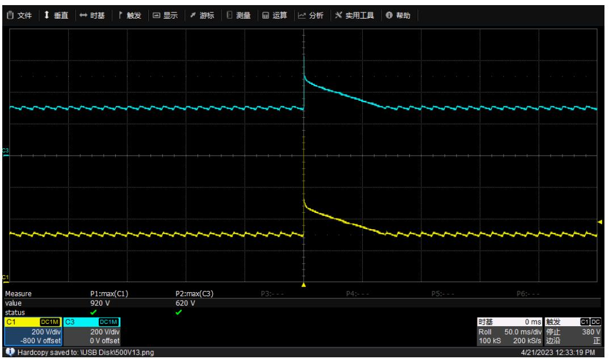

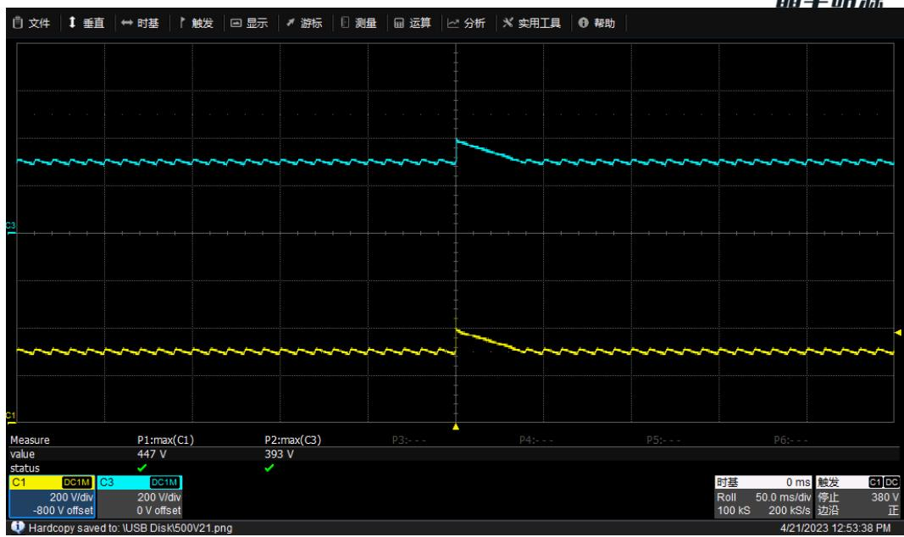

C H 1 : E C 1 Vo l t 920V max

C H2 : EC2 Volt 620Vmax

U 1 极限850V工作ABS 电压 内

测试工作正常

CH 1 : EC 1 Volt 447Vmax

C H2 : EC2 Volt 393Vmax

U 1 极限850V工作ABS 电压 内

16. 2KV雷击测试EC1&EC2电压  
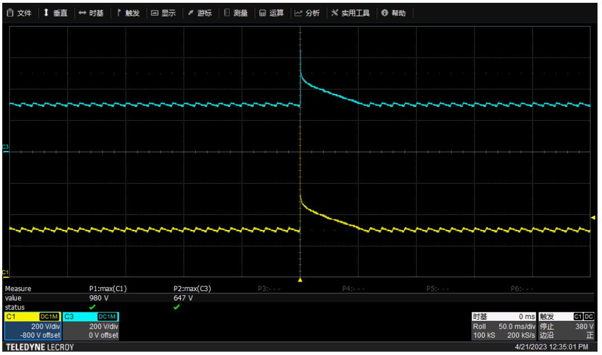

C H 1 : E C 1 Vo l t 980V max  
C H2 : EC2 Volt 647Vmax  
U 1 极限850V工作ABS 电压 内  
测试工作正常

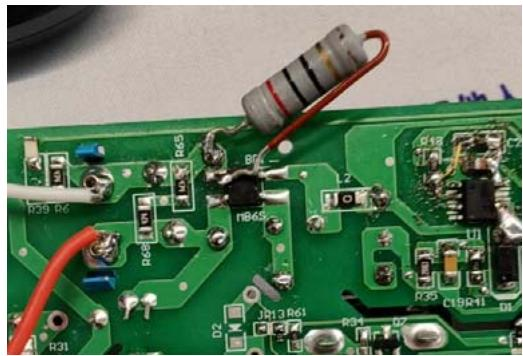

整流桥前与X电容间 串20R绕线 电阻

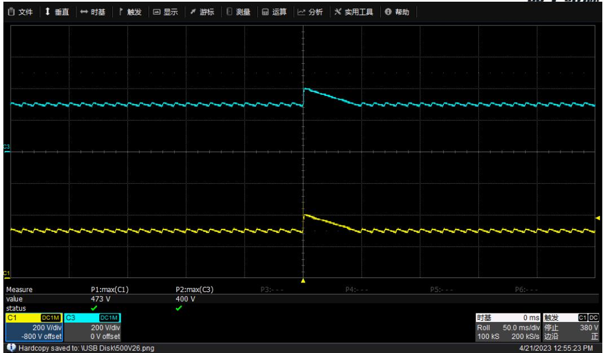

C H 1 : EC 1 Volt 473Vmax  
C H2 : EC2 Volt 400Vmax  
U 1 极限850V工作ABS 电压 内

## 17 .注意事项 ：

1 .因反馈FB电流为92uA， 避免双85高温高湿情况下PCB板、 助焊剂、 洗板水、 红胶等生产工艺过程中杂质与吸水率产生绝缘阻抗下降导致漏电流注入FB引脚， 影响反馈导致输出 电压漂移， 故要求FB加上下拉电阻1 0K及旁路47pF电容同时上拉电阻原43K变更为20K电阻， 并对PCB进行调整。  
2.原EC3 4.7uF/25V电解电容为方便作业与防止低温下ESR变化产生漏 电流影响启动时间 改成0805 4 . 7u F/25V贴片 电容 。  
3.通过 以上测试RCD吸收 电 阻R35 330K实测Vce波形尖峰有轻微振荡改成200K 1 206对电压有20V左右的压制 。  
4 考量大家电雷击差模2KV以上标准实际测试2KV差模时EC1 电解电容电压尖峰较高达980V ， EC2(Vbus) 电压也会冲到647V评估Vce 电压也在800V左右实际测试虽然通过，但余量不大， 建议将X电容至整流桥之间加一颗绕线 电阻提高可靠性， 实测见报告参数。

## THANK YOU FOR WATCHING
