## TNY176D& BPA8616D comparison report (5V/0.3A 12V0.35A)

上海晶丰明源半导体股份有限公司

Shanghai Bright Power Semiconductor Co., Ltd.

Yaobing.Chen

Date 2022.9.21

Comparison  
Test data comparison  
Picture  
Performance test data  
Testing summary

<table><tr><td></td><td>BPA8616D</td><td>TNY176D</td></tr><tr><td>Frequency</td><td>132KHz</td><td>132KHz</td></tr><tr><td>Mosfet BV</td><td>700V</td><td>700V</td></tr><tr><td> $R_{DS\_ON}$ </td><td>11Ω</td><td>14Ω</td></tr><tr><td>Current Limit</td><td>350mA</td><td>350mA</td></tr><tr><td>Soft start</td><td>Yes</td><td>No</td></tr><tr><td>Input UVP</td><td>Yes (Built-in)</td><td>Yes (Need External Resistance)</td></tr><tr><td>Output Overload Protect</td><td>Yes</td><td>Yes</td></tr><tr><td>Output Short-circuit Protect</td><td>Yes</td><td>Yes</td></tr><tr><td>OTP</td><td>Yes</td><td>Yes</td></tr><tr><td>Package</td><td>SOP7</td><td>SOP7</td></tr></table>

Specification: Input 85\~132Vac， Output 5V/0.3A 12V/0.35A

<table><tr><td colspan="2"></td><td>BPA8616D</td><td>TNY176D</td><td></td></tr><tr><td colspan="2">Standby power consumption</td><td>390mW</td><td>368mW</td><td>115VAC</td></tr><tr><td colspan="2">Efficiency</td><td>74.7%</td><td>74%</td><td>115VAC,Full load</td></tr><tr><td rowspan="2">Output Ripple Voltage</td><td>85Vac</td><td>5V-132mV/12V-272mV</td><td>5V-100mV/12V-228mV</td><td>Full load</td></tr><tr><td>132Vac</td><td>5V-96mV/12V-220mV</td><td>5V-86mV/12V-220mV</td><td>Full load</td></tr><tr><td rowspan="2">Load Transient Response(5V)</td><td>50%-100%</td><td> $156mV_{PK\_PK}$ </td><td> $108mV_{PK\_PK}$ </td><td>85VAC, 12V-0.35A</td></tr><tr><td>10%-90%</td><td> $280mV_{PK\_PK}$ </td><td> $1720mV_{PK\_PK}$ </td><td>85VAC, 12V-0.35A</td></tr><tr><td rowspan="2">MOSFET Drain Voltage and Current</td><td> $V_{DS}$ </td><td>324V</td><td>332V</td><td>132VAC, start-up</td></tr><tr><td> $I_{DS}$ </td><td>0.46A</td><td>0.54A</td><td>132VAC, start-up</td></tr><tr><td>Diode Voltage (5V)</td><td>VRR</td><td>18.6V</td><td>21.9V</td><td>132VAC, start-up</td></tr><tr><td>Diode Voltage (12V)</td><td>VRR</td><td>50V</td><td>56V</td><td>132VAC, start-up</td></tr><tr><td colspan="2">Temperature Rise</td><td>67.6°C (ambient 39.3°C)</td><td>67.6°C (ambient 39.1°C)</td><td>85VACBPA8616D: 5V-0.3A, 12V-0.35ATNY176D: 5V-0.3A, 12V-0.25A</td></tr><tr><td colspan="2">Conducted EMI</td><td>Margin&gt;6dB</td><td>Margin&gt;6dB</td><td>115VAC, 5V-0.3A, 12V-0.35A</td></tr></table>

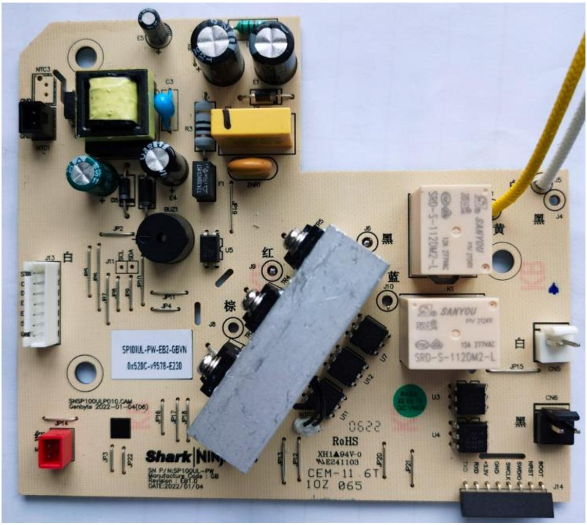

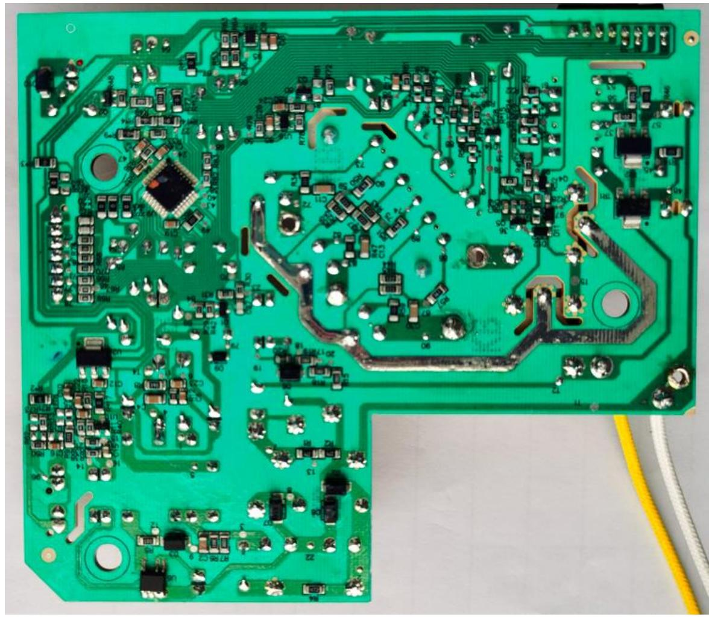

Standby Power consumption  
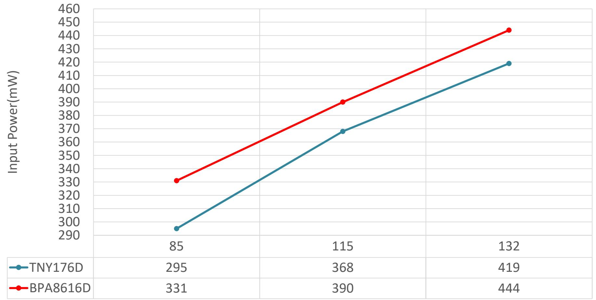

Input Voltage(Vac)  
◼ Load on board not disconnected

Efficiency Curve  
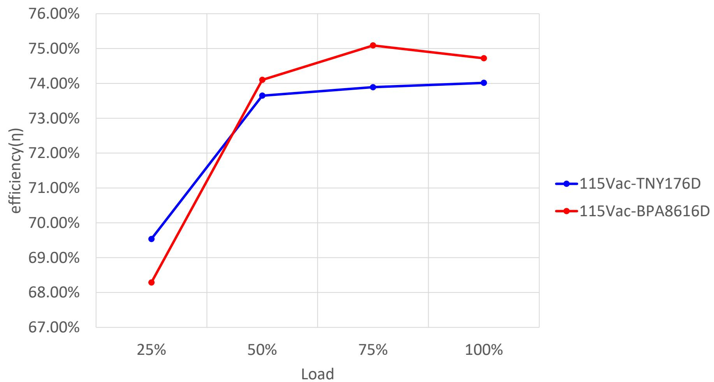

◼ Load on board not disconnected

## Output voltage regulation

BPA8616D

<table><tr><td> $V_{OUT}(V)$  $I_{OUT}(A)$ </td><td></td><td>5V</td><td>12V</td></tr><tr><td rowspan="3"> $I_{O\_5V}=0A$  $I_{O\_12V}=0A$ </td><td>85VAC</td><td>5.0062</td><td>12.745</td></tr><tr><td>115VAC</td><td>5.0062</td><td>12.794</td></tr><tr><td>132VAC</td><td>5.0062</td><td>12.813</td></tr><tr><td rowspan="3"> $I_{O\_5V}=0.3A$  $I_{O\_12V}=0A$ </td><td>85VAC</td><td>5.0017</td><td>15.186</td></tr><tr><td>115VAC</td><td>5.0017</td><td>15.219</td></tr><tr><td>132VAC</td><td>5.0017</td><td>15.243</td></tr><tr><td rowspan="3"> $I_{O\_5V}=0A$  $I_{O\_12V}=0.35A$ </td><td>85VAC</td><td>5.0062</td><td>11.222</td></tr><tr><td>115VAC</td><td>5.0062</td><td>11.259</td></tr><tr><td>132VAC</td><td>5.0061</td><td>11.218</td></tr><tr><td rowspan="3"> $I_{O\_5V}=0.3A$  $I_{O\_12V}=0.35A$ </td><td>85VAC</td><td>5.0022</td><td>12.651</td></tr><tr><td>115VAC</td><td>5.0023</td><td>12.657</td></tr><tr><td>132VAC</td><td>5.0022</td><td>12.661</td></tr></table>

◼ Calculation method：regulation=100%\*(Max-Min)/Avg  
◼ Test condition： Load on board not disconnected

TNY176D

<table><tr><td> $V_{OUT}(V)$  $I_{OUT}(A)$ </td><td></td><td>5V</td><td>12V</td></tr><tr><td rowspan="3"> $I_{O\_5V}=0A$  $I_{O\_12V}=0A$ </td><td>85VAC</td><td>5.0072</td><td>12.86</td></tr><tr><td>115VAC</td><td>5.0072</td><td>12.901</td></tr><tr><td>132VAC</td><td>5.0072</td><td>12.93</td></tr><tr><td rowspan="3"> $I_{O\_5V}=0.3A$  $I_{O\_12V}=0A$ </td><td>85VAC</td><td>5.0029</td><td>14.874</td></tr><tr><td>115VAC</td><td>5.0028</td><td>14.94</td></tr><tr><td>132VAC</td><td>5.0027</td><td>14.941</td></tr><tr><td rowspan="3"> $I_{O\_5V}=0A$  $I_{O\_12V}=0.35A$ </td><td>85VAC</td><td>5.0072</td><td>11.192</td></tr><tr><td>115VAC</td><td>5.0073</td><td>11.186</td></tr><tr><td>132VAC</td><td>5.0073</td><td>11.185</td></tr><tr><td rowspan="3"> $I_{O\_5V}=0.3A$  $I_{O\_12V}=0.35A$ </td><td>85VAC</td><td>5.0032</td><td>12.755</td></tr><tr><td>115VAC</td><td>5.0032</td><td>12.757</td></tr><tr><td>132VAC</td><td>5.0032</td><td>12.764</td></tr></table>

BPA8616D

<table><tr><td>Input Voltage</td><td>85VAC</td><td>115VAC</td><td>132VAC</td></tr><tr><td>OLP (5V)</td><td>0.6A</td><td>0.7A</td><td>0.8A</td></tr></table>

Load of 12V is 0.35A

TNY176D

<table><tr><td>Input Voltage</td><td>85VAC</td><td>115VAC</td><td>132VAC</td></tr><tr><td>OLP (5V)</td><td>1A</td><td>1.2A</td><td>1.4A</td></tr></table>

Load of 12V is 0.35A

## Output Ripple

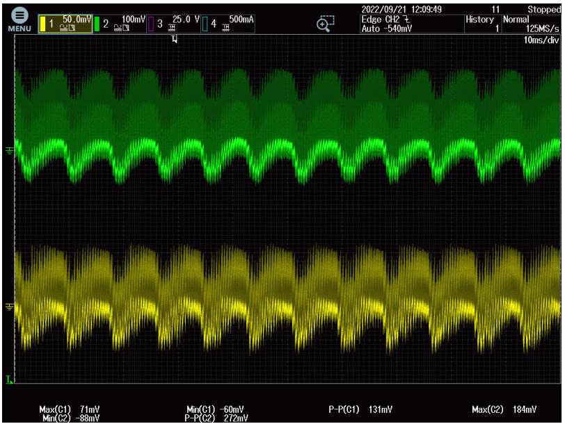

85 VAC

CH1 $5 \mathsf { V } _ { \mathsf { O U T } }$ $\mathsf { R i p p } | \mathsf { e }$ $V _ { P K - P K \_ 5 \vee } = 1 3 2 \mathsf { m V }$  
CH2 12VOUT $1 2 \mathsf { V } _ { \mathsf { o u r } }$ Ripple $V _ { P K - P K \_ 1 2 V } = 2 7 2 m v$

Test Condition:  
➢ Full Load  

85 VAC

CH1 $5 \mathsf { V } _ { \mathsf { O U T } }$ Ripple $V _ { \mathsf { P K - P K \_ 5 V } } { = } 1 0 0 \mathsf { m V }$  
CH2 $1 2 \mathsf { V } _ { \mathsf { O U T } }$ Ripple $V _ { P K - P K \_ 1 2 V } = 2 2 8 \mathsf { m V }$

Test Condition:  
➢ Full Load  
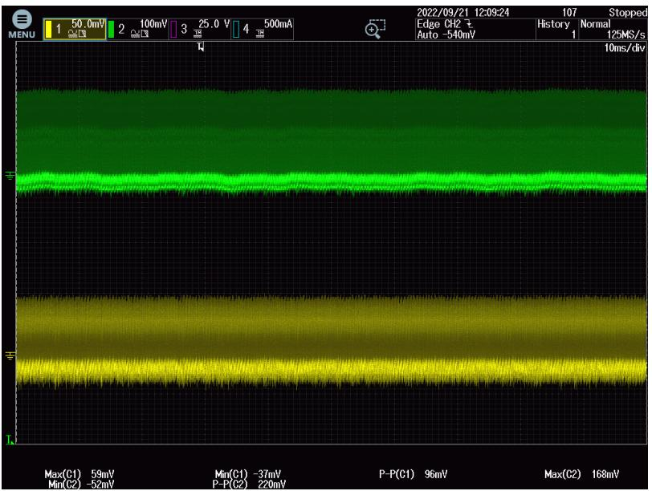

132 VAC

CH1 $5 \mathsf { V } _ { \mathsf { O U T } }$ Ripple $V _ { P K - P K \_ 5 V } = 9 6 m V$  
CH2 $1 2 \mathsf { V } _ { \mathsf { o u r } } \mathsf { R i p p l e }$ $V _ { P K - P K \_ 1 2 V } = 2 2 0 \_ m V$

Test Condition:  
➢ Full Load  
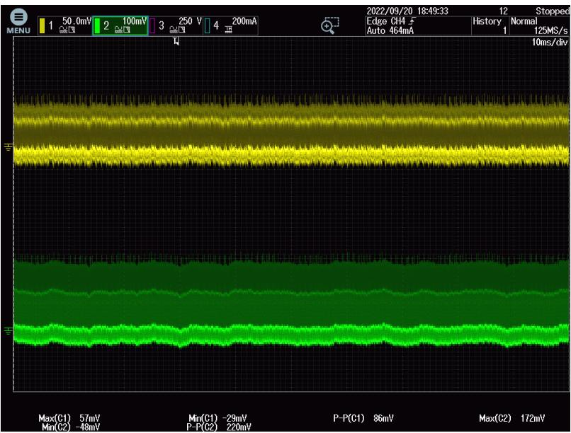

132 VAC

CH1 $5 \mathsf { V } _ { \mathsf { o u r } }$ Ripple $V _ { P K - P K \_ 5 \vee } = 8 6 \mathsf { m v }$  
CH2 $1 2 \mathsf { V } _ { \mathsf { o u r } }$ Ripple $V _ { P K - P K \_ 1 2 V } = 2 2 0 \_ w$

Test Condition:

➢ Full Load

## 5V Dynamic Load Response(50%-100%)

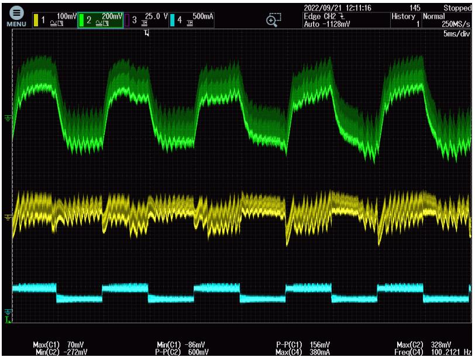

85 VAC

CH1 $5 \mathsf { V } _ { \mathsf { o u r } }$ Ripple VPK-PK\_5V=156mV $V _ { \mathsf { P K - P K \_ 5 V } } { = } 1 5 6 \mathsf { m V }$  
CH2 $1 2 \mathsf { V } _ { \mathsf { o u r } }$ RippleVPK-PK\_12V=600mV V

## Test Condition:

➢ $\mathsf { S V } { : 0 . 1 5 \mathsf { A } { - 0 . 3 \mathsf { A } { - 0 . 1 5 \mathsf { A } } } }$  
➢ 12V:0.35A  
➢ Slew Rate: 0.5 A/μS  
➢ Frequency: 100 Hz

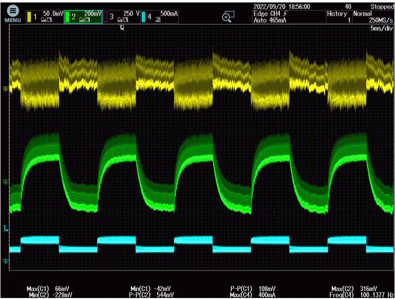

85 VAC

CH1 $5 \mathsf { V } _ { \mathsf { o u r } }$ $\mathsf { R i p p l e }$  
C $\cdot \mathsf { H } 2 \ 1 2 \mathsf { V } _ { \mathsf { O U T } }$ Ripple

$$
V _ {P K - P K \_ 5 V} = 1 0 8 m V
$$

$$
V _ {P K - P K \_ 1 2 V} = 5 4 4 m V
$$

## Test Condition:

➢ $5 \mathsf { V } { : 0 . 1 5 \mathsf { A } { - 0 . 3 \mathsf { A } { - 0 . 1 5 \mathsf { A } } } }$  
➢ 12V:0.35A  
➢ Slew Rate: 0.5 A/μS  
➢ Frequency: 100 Hz

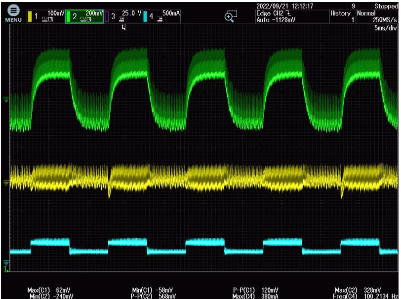

132 VAC

CH1 $5 \mathsf { V } _ { \mathsf { o u r } }$ Ripple VPK-PK\_5V=120mV $V _ { P K - P K \_ 5 V }$  
CH2 12VOUT $1 2 \mathsf { V } _ { \mathsf { o U T } }$ Ripple $V _ { P K - P K \_ 1 2 V } = 5 6 8 \mathsf { m V }$

## Test Condition:

➢ 5V:0.15A-0.3A-0.15 A  
➢ 12V:0.35A  
➢ Slew Rate: 0.5 A/μS  
➢ Frequency: 100 Hz

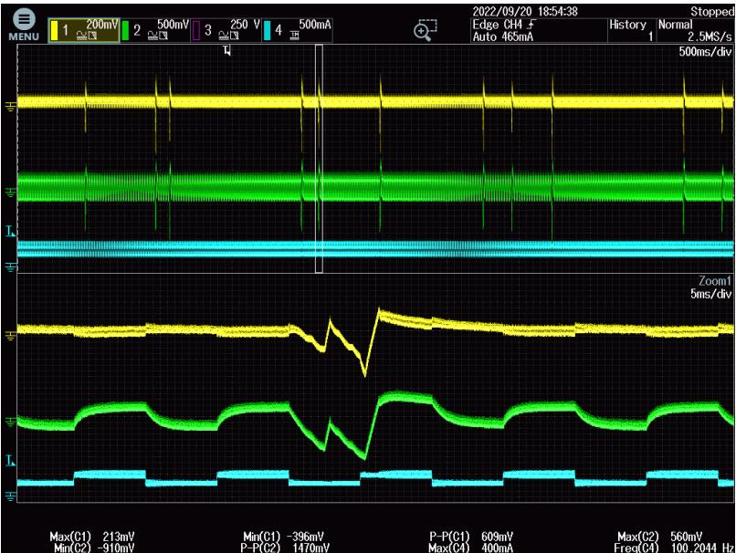

132 VAC

CH1 $5 \mathsf { V } _ { \mathsf { O U T } }$ Ripple $V _ { P K - P K \_ 5 V } { = } 6 0 9 m V$  
CH2 12VOUT $1 2 \mathsf { V } _ { \mathsf { o u r } }$ Ripple $\mathsf { V } _ { \mathsf { P K - P K \_ 1 2 V } } { = } 1 4 7 0 \mathsf { m V }$

## Test Condition:

➢ 5V:0.15A-0.3A-0.15 A  
➢ $1 2 \mathsf { V } . 0 . 3 5 \mathsf { A }$  
➢ Slew Rate: 0.5 A/μS  
➢ Frequency: 100 Hz

## 12V Dynamic Load Response(50%-100%)

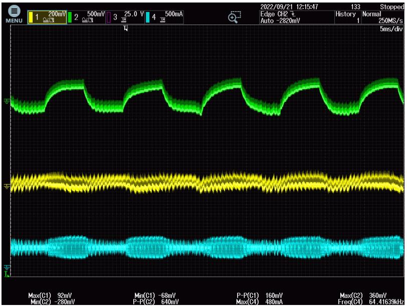

85 VAC

CH1 $5 \mathsf { V } _ { \mathsf { o u r } }$ Ripple VPK-PK\_5V=160mV $V _ { P K \mathrm { - } P K \_ 5 V } = 1 6 0 m v$  
CH2 12VOUT $\bar { 1 2 } \mathsf { V } _ { \mathsf { o u r } } \mathsf { R i p p l e }$ $V _ { P K - P K \_ 1 2 V } = 6 4 0 m v$

## Test Condition:

➢ 5V:0.3 A  
➢ 12V: 0.175A-0.35A-0.175 A  
➢ Slew Rate: 0.5 A/μS  
➢ Frequency: 100 Hz

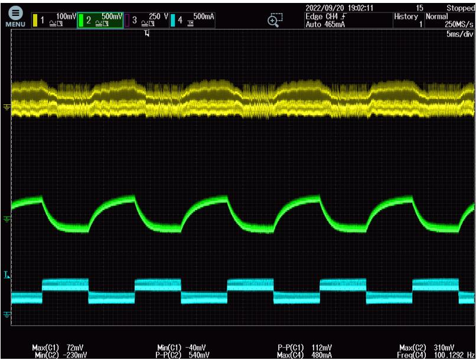

85 VAC

CH1 $5 \mathsf { V } _ { \mathsf { o u } }$ Ripple VPK-PK\_5V=112mV $V _ { P K - P K } \mathsf { \Pi } _ { 5 \mathsf { V } } \mathsf { \bar { = } } \mathsf { 1 } \mathsf { 1 } 2 \mathsf { m } \mathsf { v }$  
CH2 12VOUT $\mathsf { C H } 2 \mathsf { 1 } 2 \mathsf { V } _ { \mathsf { 0 } \mathsf { U } \mathsf { T } }$ Ripple $V _ { P K - P K \_ 1 2 V } = 5 4 0 m v$

## Test Condition:

➢ $5 \mathsf { V } { : } 0 . 3 \mathsf { A }$  
➢ $\begin{array} { r l } & { 1 2 \mathsf { V } \colon 0 . 1 7 5 \mathsf { A } – 0 . 3 5 \mathsf { A } – } \\ & { 0 . 1 7 5 \mathsf { A } } \end{array}$  
➢ Slew Rate: 0.5 A/μS  
➢ Frequency: 100 Hz

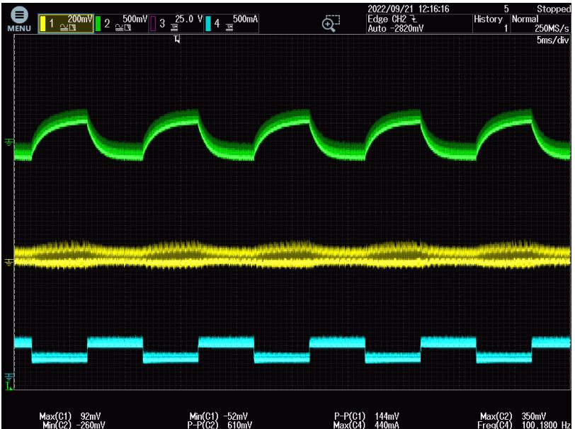

132 VAC

CH1 $5 \mathsf { V } _ { \mathsf { o u r } }$ Ripple VPK-PK\_5V=144mV $V _ { p \ k \mathrm { - } P K \_ 5 \vee } = 1 4 4 \mathrm { { m v } }$  
CH2 12VOUT $1 2 \mathsf { V } _ { \mathsf { o U T } }$ RippleVPK-PK\_12V=610mV

## Test Condition:

➢ 5V:0.3 A  
➢ 12V: 0.175A-0.35A-0.175 A  
➢ Slew Rate: 0.5 A/μS  
➢ Frequency: 100 Hz

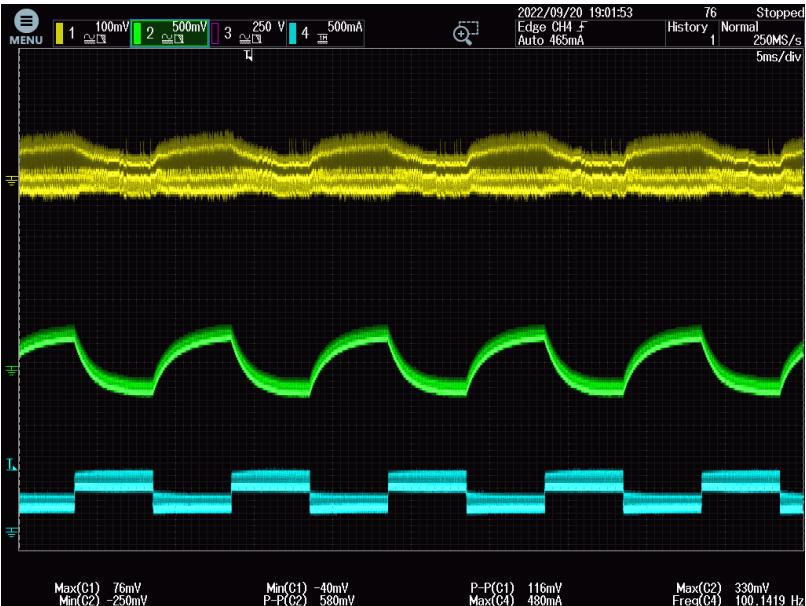

132 VAC

CH1 $5 \mathsf { V } _ { \mathsf { o u r } }$ Ripple VPK-PK\_5V=116mV $V _ { P K - P K \_ 5 V } = 1 1 6 m v$  
CH2 $1 2 \mathsf { V } _ { \mathsf { O U T } }$ RippleVPK-PK\_12V=580mV

## Test Condition:

➢ $5 \mathsf { V } { : } 0 . 3 \mathsf { A }$  
➢ $\begin{array} { r l } & { 1 2 \mathsf { V } \colon 0 . 1 7 5 \mathsf { A } – 0 . 3 5 \mathsf { A } – } \\ & { 0 . 1 7 5 \mathsf { A } } \end{array}$  
➢ Slew Rate: 0.5 A/μS  
➢ Frequency: 100 Hz

## 5V Dynamic Load Response(10%-90%)

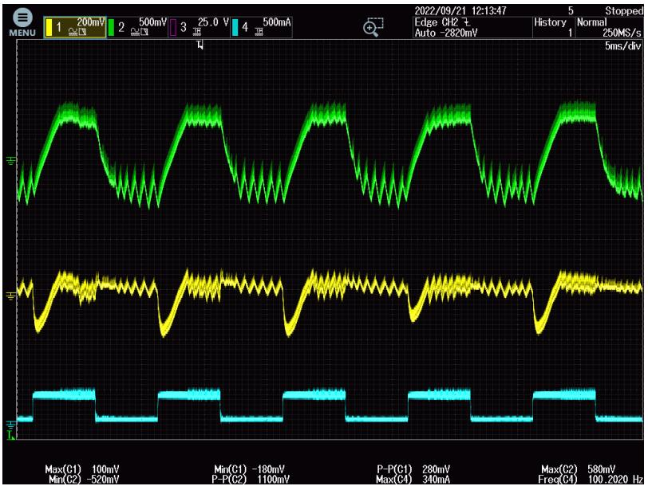

CH1 $5 \mathsf { V } _ { \mathsf { o u r } }$ Ripple VPK-PK\_5V=280mV $V _ { p \vert \mathsf { X } \mathsf { - P K } \_ { 5 } \mathsf { v } } \mathsf { = } 2 8 0 \mathsf { m v }$  
CH2 $1 2 \mathsf { V } _ { \mathsf { o u r } }$ Ripple$\mathsf { V } _ { \mathsf { P K - P K \_ 1 2 V } } \mathsf { = } \mathsf { 1 } \mathsf { 1 0 0 m V }$ VPK-PK\_12V=1100mV

## Test Condition:

➢ $\mathsf { S V } { : 0 . 0 3 \mathsf { A } { - 0 . 2 7 \mathsf { A } { - 0 . 0 3 \mathsf { A } } } }$  
➢ 12V:0.35A  
➢ Slew Rate: 0.5 A/μS  
➢ Frequency: 100 Hz

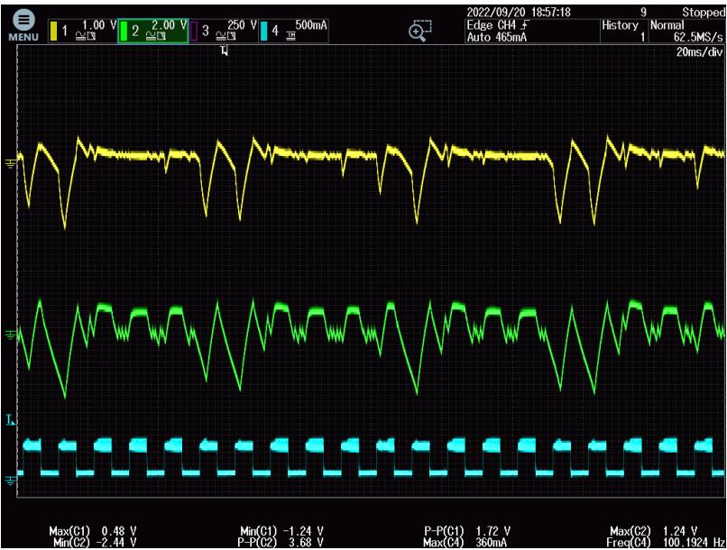

CH1 $5 \mathsf { V } _ { \mathsf { o u r } }$ Ripple VPK-PK\_5V=1720mV $\mathsf { V } _ { \mathsf { P K - P K \_ 5 V } } { = } 1 7 2 0 \mathsf { m V }$

CH2 12V $\mathsf { C H } 2 \mathsf { 1 } 2 \mathsf { V } _ { \mathsf { O U T } }$ Ripple$\mathsf { V } _ { \mathsf { P K - P K \_ 1 2 V } } { = } 3 6 8 0 \mathsf { m V }$ VPK-PK\_12V=3680mV

## Test Condition:

➢ $\mathsf { S V } { : 0 . 0 3 \mathsf { A } { - 0 . 2 7 \mathsf { A } { - 0 . 0 3 \mathsf { A } } } }$  
➢ $1 2 \mathsf { V } . 0 . 3 5 \mathsf { A }$  
➢ Slew Rate: 0.5 A/μS  
➢ Frequency: 100 Hz

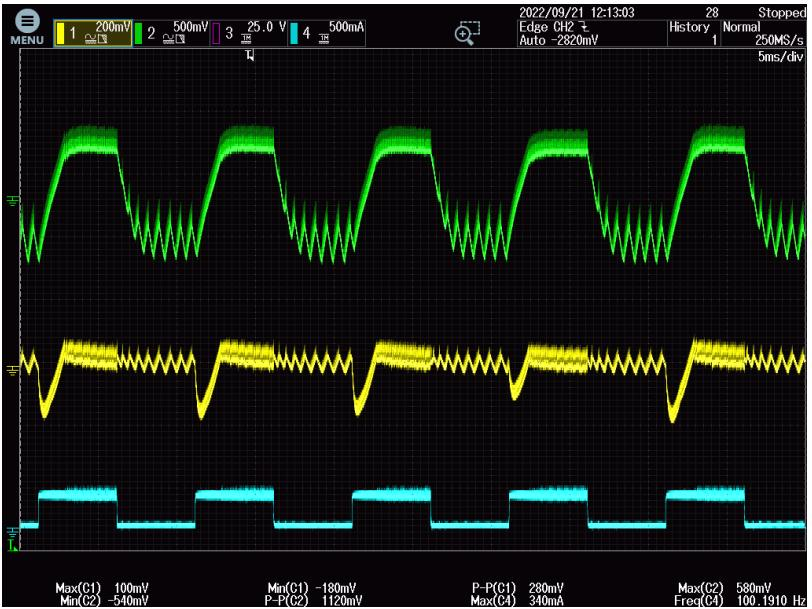

CH1 $5 \mathsf { V } _ { \mathsf { o u r } }$ Ripple VPK-PK\_5V=280mV $V _ { p \vert k - P K \_ 5 \vee } = 2 8 0 \mathsf { m v }$  
CH2 $1 2 \mathsf { V } _ { \mathsf { o U T } }$ Ripple $\mathsf { V } _ { \mathsf { P K - P K \_ 1 2 V } } \mathsf { = } \mathsf { 1 } \mathsf { 1 } 2 0 \mathsf { m V }$

## Test Condition:

➢ $\mathsf { S V } { : 0 . 0 3 \mathsf { A } { - 0 . 2 7 \mathsf { A } { - 0 . 0 3 \mathsf { A } } } }$  
➢ 12V:0.35A  
➢ Slew Rate: 0.5 A/μS  
➢ Frequency: 100 Hz

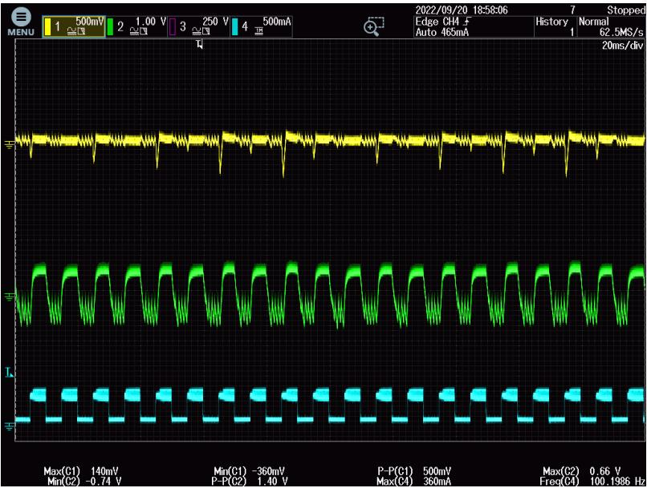

CH1 $5 \mathsf { V } _ { \mathsf { O U T } }$ Ripple $V _ { P K \mathrm { - } P K \_ 5 \vee } = 5 0 0 \mathrm { m V }$  
CH2 12V $1 2 \mathsf { V } _ { \mathsf { o u r } }$ Ripple $V _ { p | \mathrm { K - P K } \_ 1 2 \mathrm { V } } = 1 4 0 0 \mathrm { m V }$

## Test Condition:

➢ $\mathsf { S V } { : 0 . 0 3 \mathsf { A } { - 0 . 2 7 \mathsf { A } { - 0 . 0 3 \mathsf { A } } } }$  
➢ $1 2 \mathsf { V } . 0 . 3 5 \mathsf { A }$  
➢ Slew Rate: 0.5 A/μS  
➢ Frequency: 100 Hz

## 12V Dynamic Load Response(10%-90%)

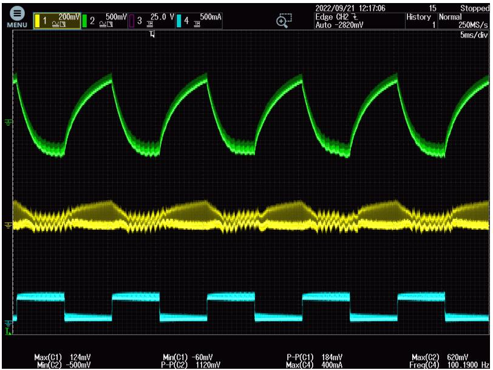

85 VAC

CH1 $5 \mathsf { V } _ { \mathsf { o u r } }$ Ripple VPK-PK\_5V=184mV $V _ { p \ k \mathrm { - } P K \_ 5 V } = 1 8 4 m v$  
CH2 $1 2 \mathsf { V } _ { \mathsf { o U T } }$ Ripple $V _ { P K - P K \_ 1 2 V } =$ 1120mV

## Test Condition:

➢ 5V:0.3A  
➢ 12V: 0.03A-0.27A-0.03A  
➢ Slew Rate: 0.5 A/μS  
➢ Frequency: 100 Hz

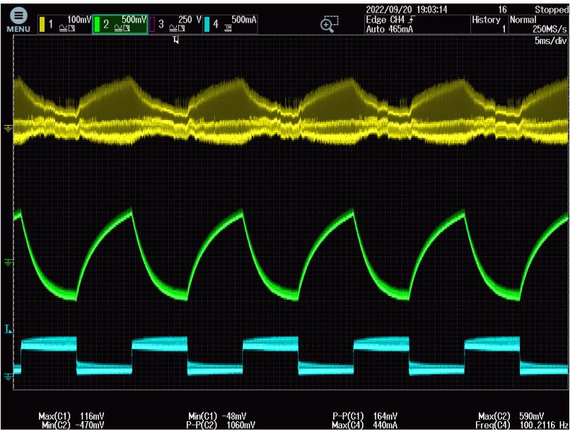

85 VAC

CH1 $5 \mathsf { V } _ { \mathsf { o u r } }$ Ripple VPK-PK\_5V=164mV $V _ { p \vert k - P K \_ 5 \vee } = 1 6 4 \mathsf { m v }$  
CH2 12VOUT $\mathsf { C H } 2 \mathsf { 1 } 2 \mathsf { V } _ { \mathsf { 0 } \mathsf { U } \mathsf { T } }$ Ripple $v _ { p \kappa \mathrm { - } P \kappa \_ 1 2 V } \overline { { = } } 1 0 6 0 \mathsf { m v }$

## Test Condition:

➢ 5V:0.3A  
➢ 12V: 0.03A-0.27A-0.03A  
➢ Slew Rate: 0.5 A/μS  
➢ Frequency: 100 Hz

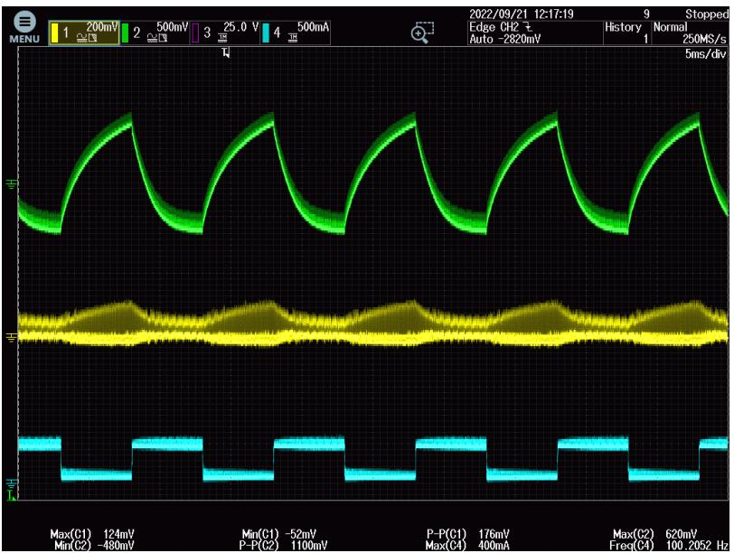

132 VAC

CH1 $5 \mathsf { V } _ { \mathsf { o u r } }$ Ripple VPK-PK\_5V=176mV $V _ { P K - P K \_ 5 V }$  
CH2 $1 2 \mathsf { V } _ { \mathsf { o U I } }$ Ripple $v _ { p \kappa - P \ l k \_ 1 2 \vee 2 } =$ 1100mV

## Test Condition:

➢ 5V:0.3A  
➢ 12V: 0.03A-0.27A-0.03A  
➢ Slew Rate: 0.5 A/μS  
➢ Frequency: 100 Hz

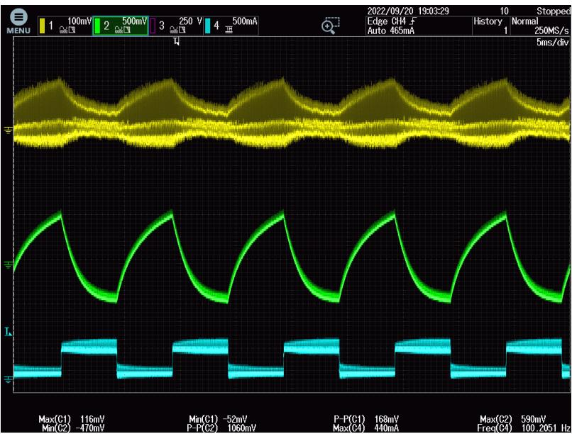

132 VAC

CH1 $5 \mathsf { V } _ { \mathsf { O U T } }$ Ripple VPK-PK\_5V=168mV $V _ { P K - P K \_ 5 V } = 1 6 8 m v$  
CH2 $1 2 \mathsf { V } _ { \mathsf { O U T } }$ RippleVPK-PK\_12V=1060mV

## Test Condition:

➢ 5V:0.3A  
➢ 12V: 0.03A-0.27A-0.03A  
➢ Slew Rate: 0.5 A/μS  
➢ Frequency: 100 Hz

## Output Voltage Start-up Profile

85 VAC

$\begin{array} { r } { \mathsf { C H 1 V _ { 0 \cup \mathsf { T } \_ 5 \vee } } } \\ { \mathsf { t } _ { \mathrm { r i s e } } = 9 . 9 ~ \mathsf { m S } } \end{array}$ CH1 VOUT\_5V  
$\begin{array} { l l } { { \mathsf { C H 2 } } { \mathsf { V } } _ { 0 \cup \mathsf { T } _ { - } 1 2 \vee } } \\ { { \mathsf { t } } _ { \mathsf { r i s e } } { = } 1 0 \mathsf { m } { \mathsf { S } } } \end{array}$ CH2 VOUT\_12V

Test Condition:  
➢ Full Load  
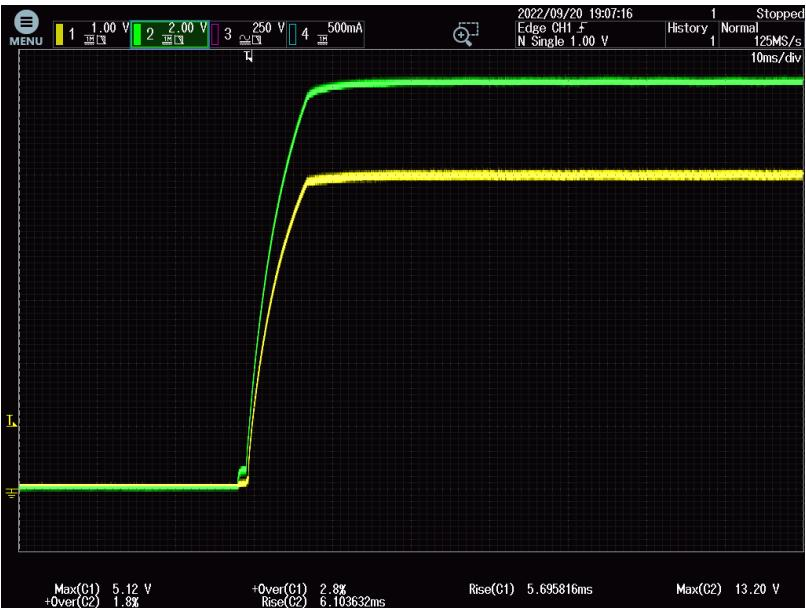

85 VAC

$\begin{array} { c } { \mathsf { C H 1 V _ { 0 \downarrow \uparrow \mathrm { \Sigma } _ { - \downarrow \downarrow \mathrm { e } } } } } \\ { \mathsf { t } _ { \mathrm { r i s e } } \mathrm { = } 5 . 7 \mathrm { \ m s } } \end{array}$ CH1 VOUT\_5V  
$\begin{array} { l l } { { \mathsf { C H 2 } } { \mathsf { V } } _ { 0 \cup \mathsf { T } _ { - } 1 2 \vee } } \\ { { \mathsf { t } } _ { \mathsf { r i s e } } { = } 6 . 1 \mathsf { m s } } \end{array}$ CH2 VOUT\_12V

Test Condition:  
➢ Full Load  
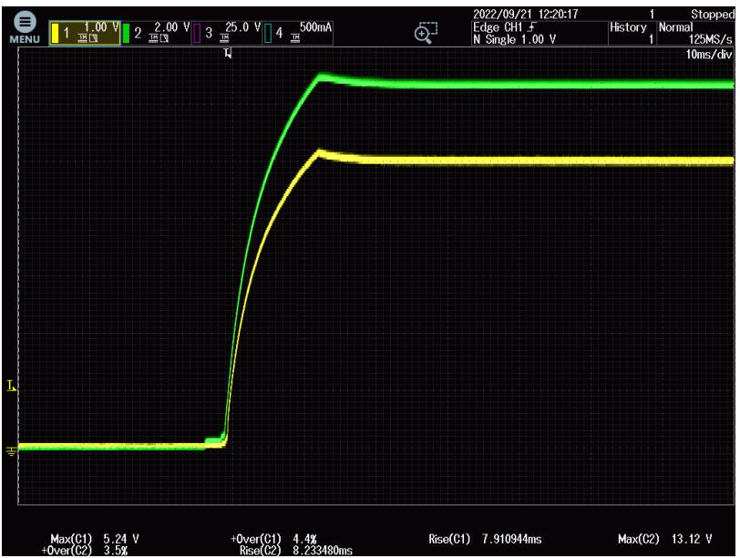

132 VAC

$\begin{array} { r } { \mathsf { C H 1 V _ { 0 \cup \mathsf { T } \_ 5 \vee } } } \\ { \mathsf { t } _ { \mathrm { r i s e } } \equiv 7 . 9 ~ \mathsf { m S } } \end{array}$ CH1 V  
$\begin{array} { l l } { { \mathbb { C } } { \mathbb { H } } 2 { \mathbb { V } } _ { 0 \cup { \mathbb { T } } _ { - } 1 2 \vee } } \\ { { \mathbb { t } } _ { \mathrm { r i s e } } { = } 8 . 2 ~ \mathrm { m } 5 } \end{array}$ CH2 VOUT\_12V

Test Condition:  
➢ Full Load  
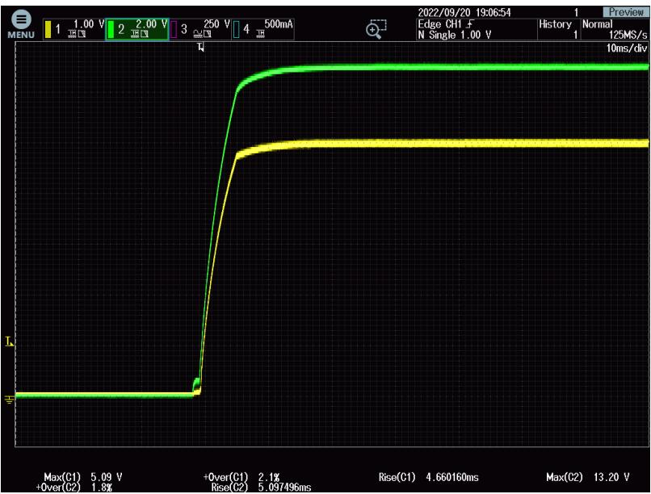

132 VAC

$\begin{array} { r } { \mathsf { C H 1 V _ { O U T \_ 5 V } } } \\ { \mathsf { t } _ { \mathrm { r i s e } } \equiv 4 . 6 \mathsf { m s } } \end{array}$ CH1 V  
$\begin{array} { l l } { { \sf C H 2 \ : V _ { 0 \cup \sf T _ { - } 1 2 V } } } \\ { { \sf t _ { r i s e } = 5 . 1 \ : m S } } \end{array}$ CH2 VOUT\_12V

Test Condition:

➢ Full Load

## MOSFET Start up waveform

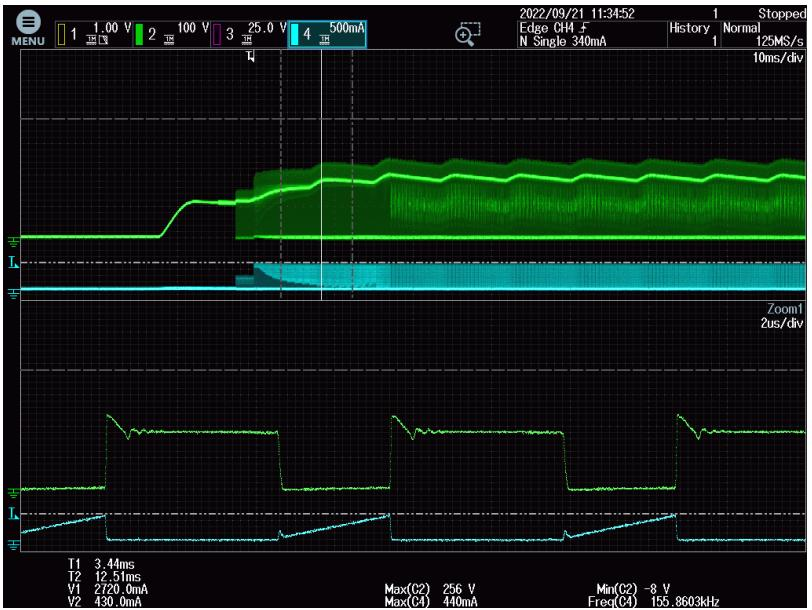

85 VAC

CH1 VDS  
CH4 IDS

$$
\begin{array}{l} \mathrm {V_ {DS\_MAX}} = 2 5 6 \mathrm{V} \\ \mathrm {I_ {DS\_MAX}} = 0. 4 4 \mathrm{A} \end{array}
$$

## Test Condition:

➢ Full Load

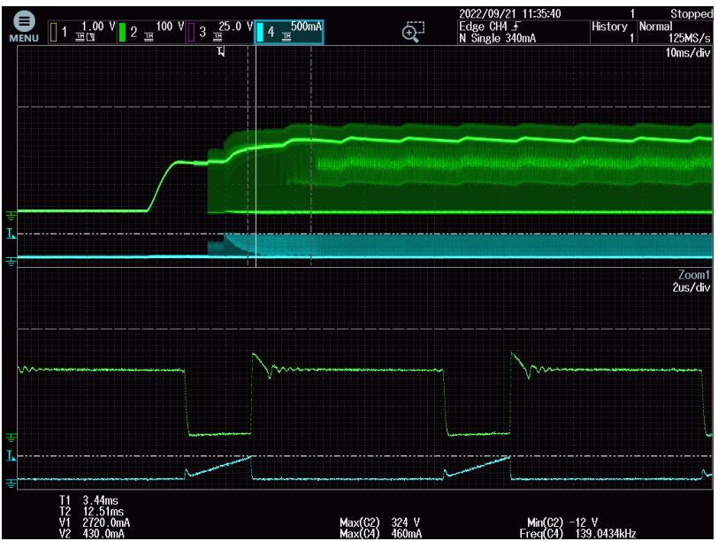

132 VAC

CH1 VDS  
CH4 IDS

$$
V _ {D S \_ M A X} = 3 2 4 V
$$

$$
I _ {D S \_ M A X} = 0. 4 6 A
$$

## Test Condition:

➢ Full Load

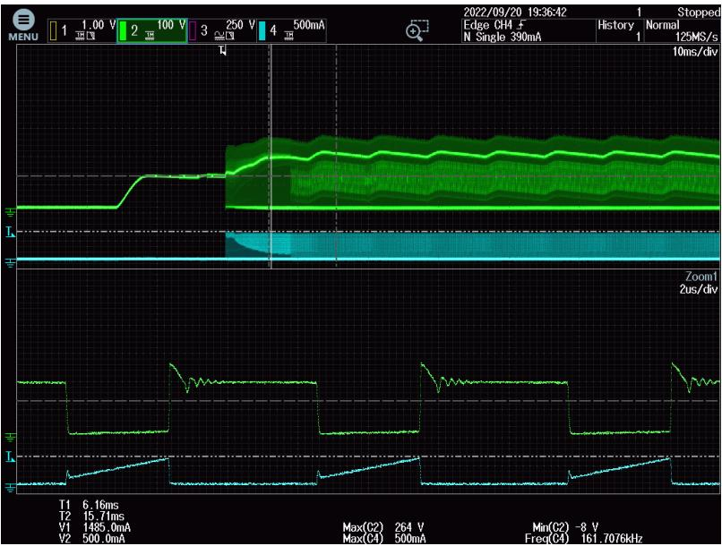

85 VAC

CH1 VDS  
CH4 IDS

$$
V _ {D S \_ M A X} = 2 6 4 V
$$

$$
I _ {D S \_ M A X} = 0. 5 A
$$

## Test Condition:

➢ Full Load

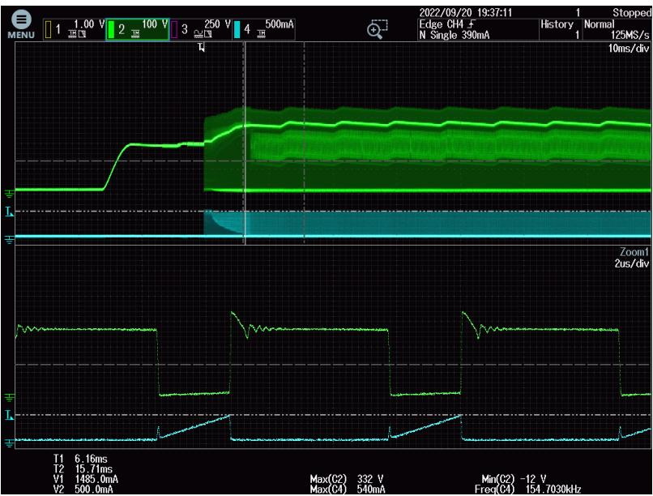

132 VAC

CH1 VDS  
CH4 IDS

$$
V _ {D S \_ M A X} = 3 3 2 V
$$

$$
I _ {D S \_ M A X} = 0. 5 4 A
$$

## Test Condition:

➢ Full Load

## MOSFET Normal Waveform

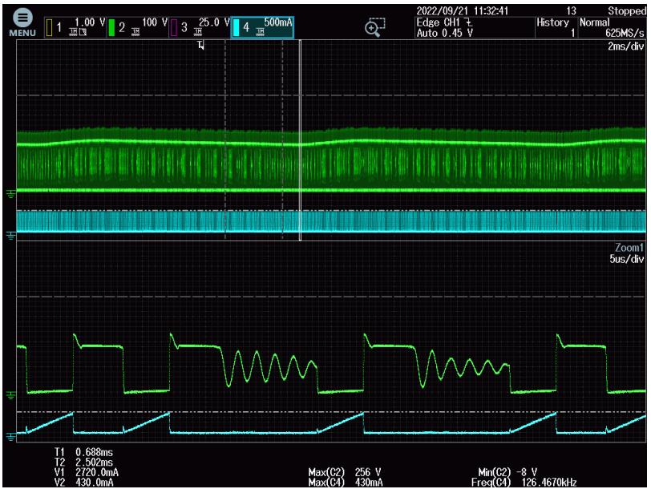

85 VAC

CH1 VDS  
CH4 IDS

$$
\begin{array}{l} \mathrm {V_ {DS\_MAX}} = 2 5 6 \mathrm{V} \\ \mathrm {I_ {DS\_MAX}} = 0. 4 3 \mathrm{A} \end{array}
$$

## Test Condition:

➢ Full Load

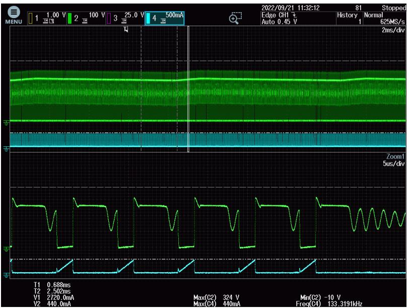

132 VAC

CH1 VDS  
CH4 IDS

$$
V _ {D S \_ M A X} = 3 2 4 V
$$

$$
I _ {D S \_ M A X} = 0. 4 4 \mathrm{A}
$$

## Test Condition:

➢ Full Load

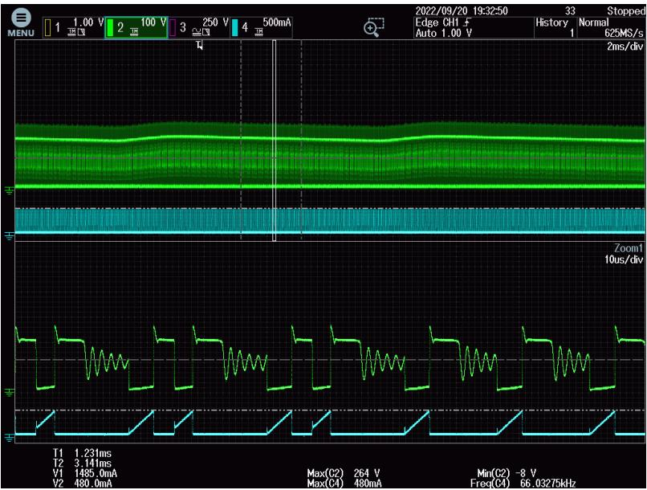

85 VAC

CH1 VDS  
CH4 IDS

$$
\begin{array}{l} \mathrm {V_ {DS\_MAX}} = 2 6 4 \mathrm{V} \\ \mathrm {I_ {DS\_MAX}} = 0. 4 8 \mathrm{A} \end{array}
$$

## Test Condition:

➢ Full Load

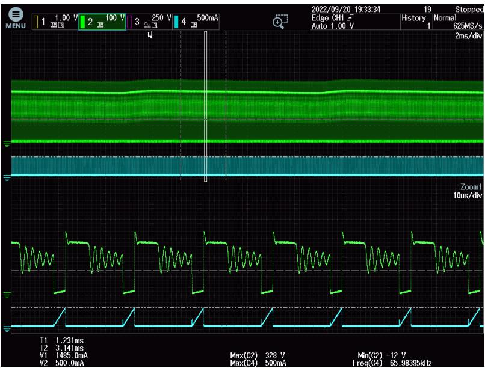

132 VAC

CH1 VDS  
CH4 IDS

$$
V _ {D S \_ M A X} = 3 2 8 V
$$

$$
I _ {D S \_ M A X} = 0. 5 \mathrm{A}
$$

## Test Condition:

➢ Full Load

## Output Diode Voltage @ start up

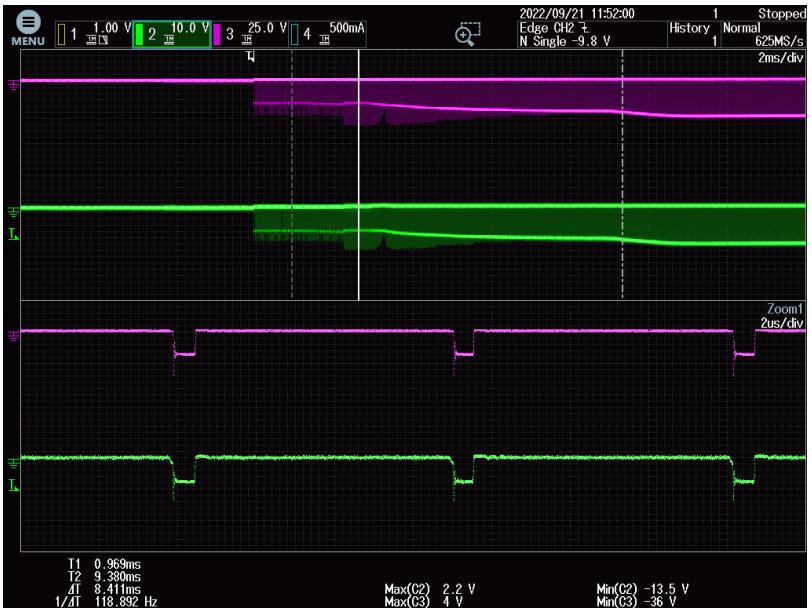

85 VAC

CH1 5V  
CH2 12V

CH1=13.5 V

CH2=36 V

## Test Condition:

➢ Full Load

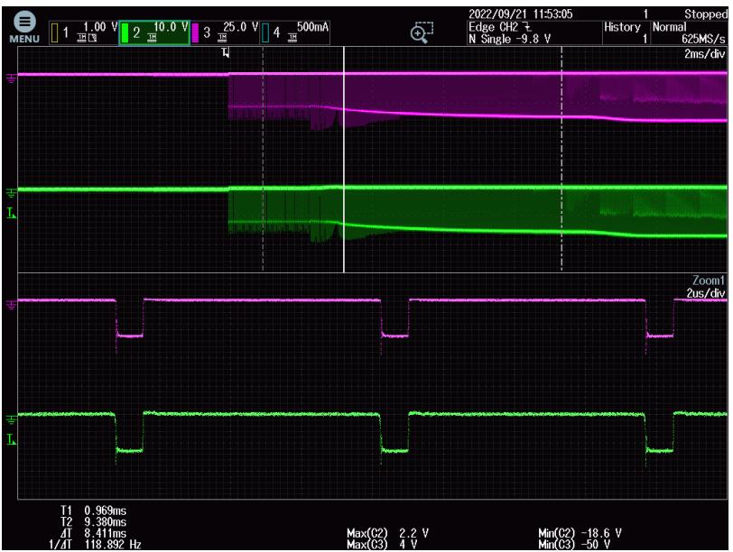

132VAC

CH1 5V  
CH2 12V

CH1=18.6 V

CH2=50 V

## Test Condition:

➢ Full Load

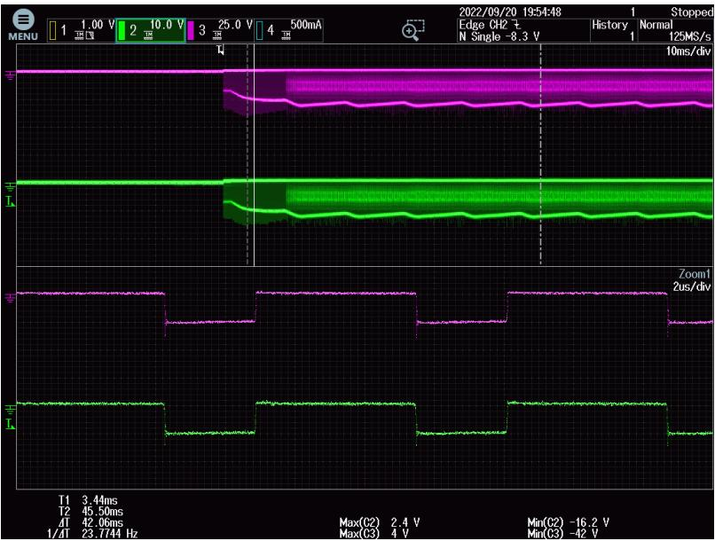

85 VAC

CH1 5V  
CH2 12V

CH1=16.2 V

CH2=42 V

## Test Condition:

➢ Full Load

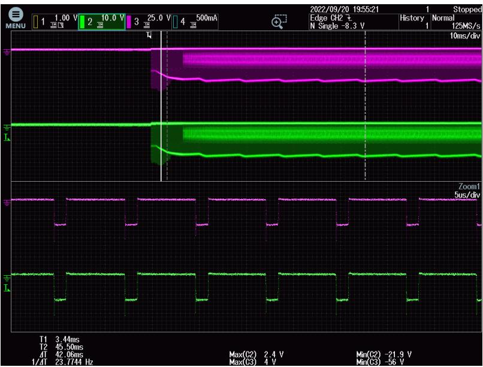

132 VAC

CH1 5V  
CH2 12V

CH1=21.9 V

CH2=56 V

## Test Condition:

➢ Full Load

## Output Diode Voltage @ normal working

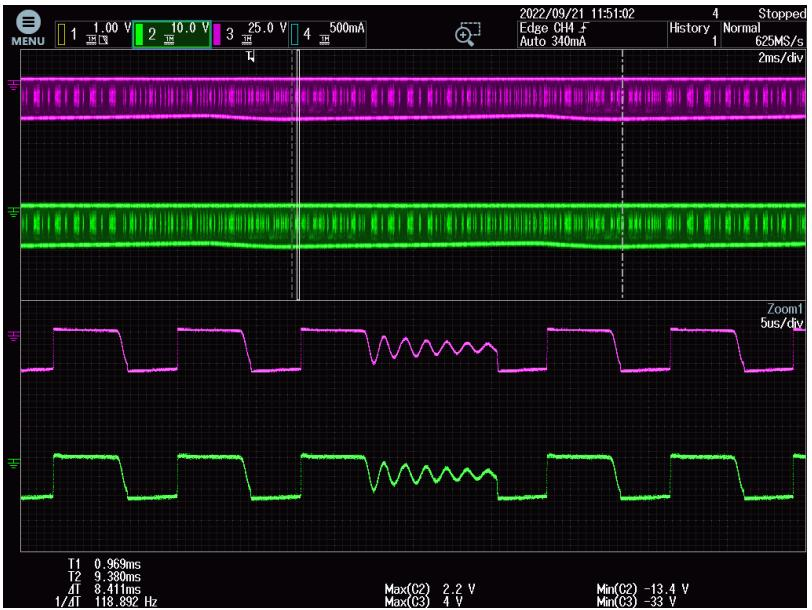

85 VAC

CH1 5V  
CH2 12V

CH1=13.4 V

CH2=33 V

## Test Condition:

➢ Full Load

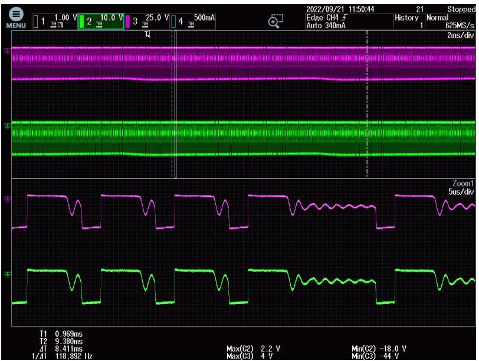

132VAC

CH1 5V  
CH2 12V

CH1=18 V

CH2=44 V

## Test Condition:

➢ Full Load

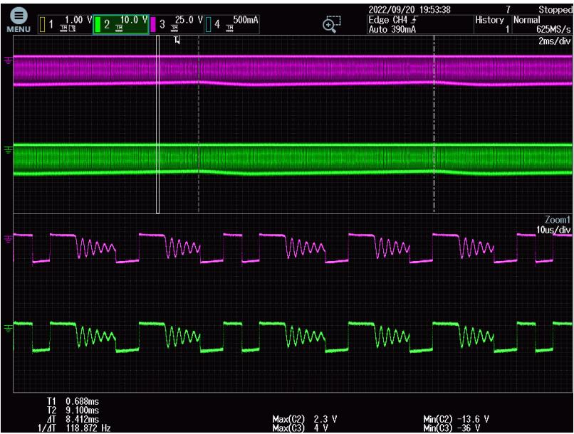

85 VAC

CH1 5V  
CH2 12V

CH1=13.6 V

CH2=36 V

## Test Condition:

➢ Full Load

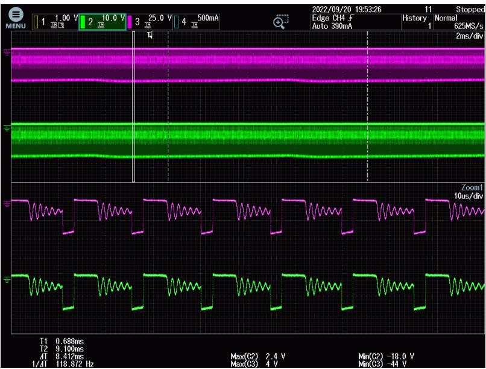

132 VAC

CH1 5V  
CH2 12V

CH1=18 V

CH2=44 V

## Test Condition:

➢ Full Load

## Output SCP MOSFET waveform

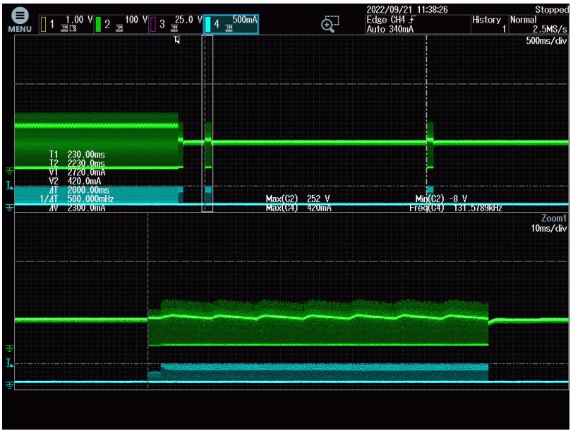

85 VAC

CH1 VDS  
CH4 IDS

$$
V _ {D S \_ M A X} = 2 5 2 \mathrm{V}
$$

$$
I _ {D S \_ M A X} = 0. 4 2 A
$$

## Test Condition:

➢ 5V Output Short circuit

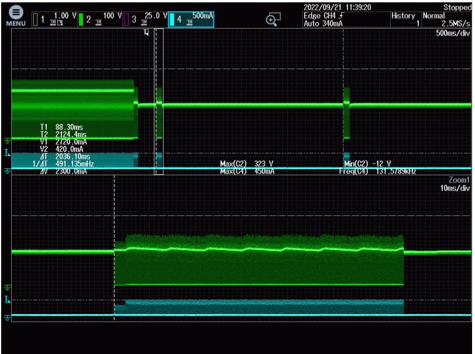

132 VAC

CH1 VDS  
CH4 IDS

$$
V _ {D S \_ M A X} = 3 2 3 \mathrm{V}
$$

$$
I _ {D S \_ M A X} = 0. 4 5 \mathrm{A}
$$

## Test Condition:

➢ 5V Output Short circuit

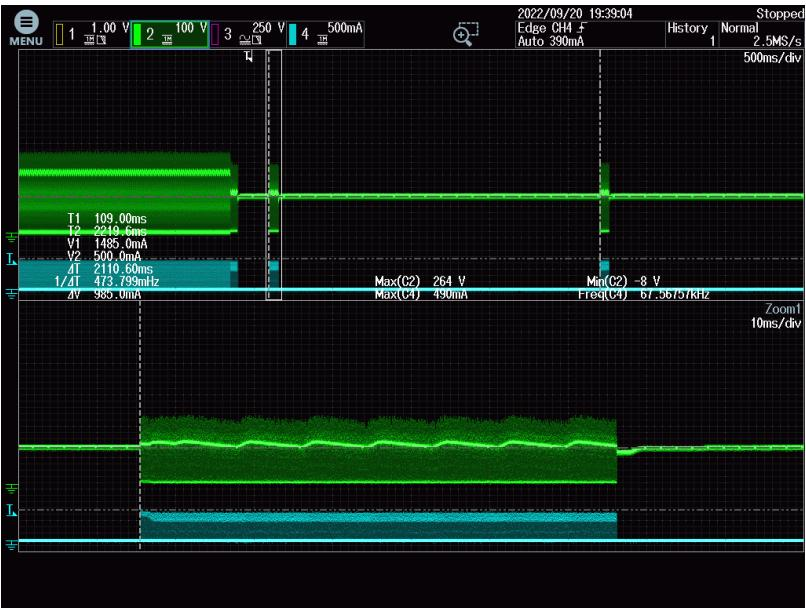

85 VAC

CH1 VDS  
CH4 IDS

$$
V _ {D S \_ M A X} = 2 6 4 V
$$

$$
I _ {D S \_ M A X} = 0. 4 9 A
$$

## Test Condition:

➢ 5V Output Short circuit

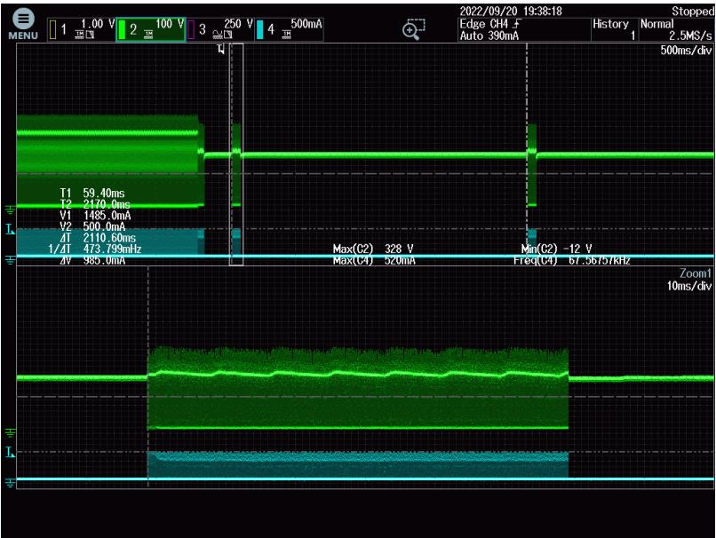

132 VAC

CH1 VDS  
CH4 IDS

$$
V _ {D S \_ M A X} = 3 2 8 \mathrm{V}
$$

$$
I _ {D S \_ M A X} = 0. 5 2 \mathrm{A}
$$

## Test Condition:

➢ 5V Output Short circuit

## Output SCP Diode Voltage waveform

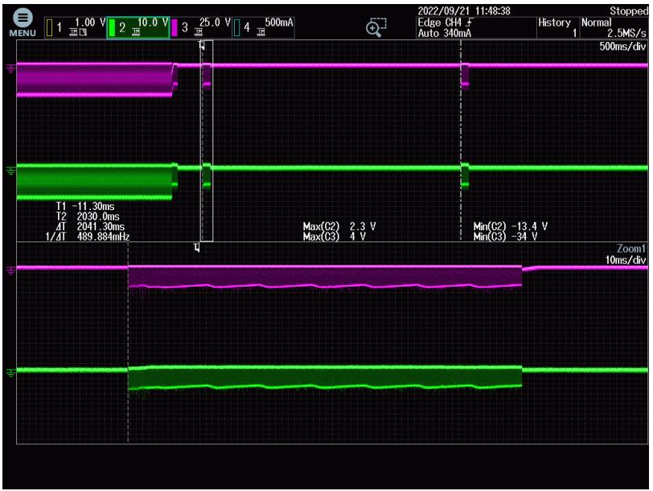

85 VAC

CH1 5V  
CH2 12V

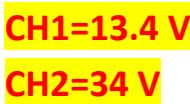

## Test Condition:

➢ 5V Output Short circuit

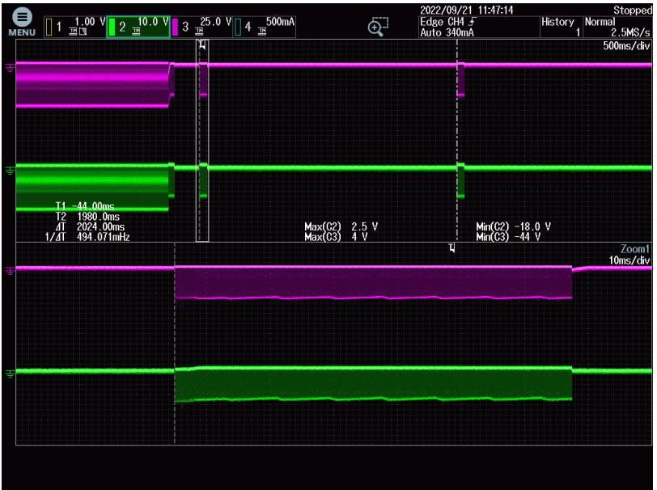

132 VAC

CH1 5V  
CH2 12V

## Test Condition:

➢ 5V Output Short circuit

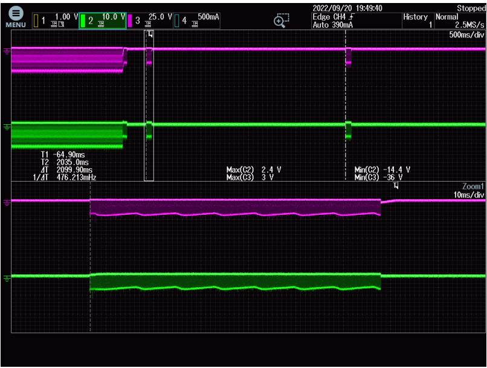


85 VAC

CH1 5V  
CH2 12V


## Test Condition:

➢ 5V Output Short circuit

132 VAC

CH1 5V  
CH2 12V


## Test Condition:

➢ 5V Output Short circuit

## Output SCP Diode Voltage waveform


85 VAC

CH1 5V  
CH2 12V


## Test Condition:

12V Output Short circuit


132 VAC

CH1 5V  
CH2 12V


## Test Condition:

12V Output Short circuit


85 VAC

CH1 5V  
CH2 12V


## Test Condition:

12V Output Short circuit


132 VAC

CH1 5V  
CH2 12V

## Test Condition:

12V Output Short circuit

BPA8616D

<table><tr><td rowspan="2">Test Component</td><td colspan="2">85VAC</td><td colspan="2">132VAC</td></tr><tr><td>T (°C)</td><td>ΔT (°C)</td><td>T (°C)</td><td>ΔT (°C)</td></tr><tr><td>Ambient Temperature</td><td colspan="2">39.3</td><td colspan="2">39.9</td></tr><tr><td>BPA8616D</td><td>106.9</td><td>67.6</td><td>89.3</td><td>49.4</td></tr><tr><td>Winding(transf)</td><td>62.9</td><td>23.6</td><td>62.2</td><td>22.3</td></tr><tr><td>Core(transf)</td><td>66.3</td><td>27</td><td>65.5</td><td>25.6</td></tr><tr><td>Output Diode (5v)</td><td>65.4</td><td>26.1</td><td>65.6</td><td>25.7</td></tr><tr><td>Output Diode (12v)</td><td>69.4</td><td>30.1</td><td>69.6</td><td>29.7</td></tr><tr><td>Input Electrolytic capacitor</td><td>56.8</td><td>17.5</td><td>51.7</td><td>11.8</td></tr><tr><td>Output Electrolytic capacitor (5v)</td><td>53.2</td><td>13.9</td><td>53.1</td><td>13.2</td></tr></table>

Test condition: 5V/0.3A 12V/0.35A

TNY176D

<table><tr><td rowspan="2">Test Component</td><td colspan="2">85VAC</td><td colspan="2">132VAC</td></tr><tr><td>T (°C)</td><td>ΔT (°C)</td><td>T (°C)</td><td>ΔT (°C)</td></tr><tr><td>Ambient Temperature</td><td colspan="2">39.1</td><td colspan="2">39</td></tr><tr><td>TNY176D</td><td>106.7</td><td>67.6</td><td>90</td><td>51</td></tr><tr><td>Winding(transf)</td><td>60.2</td><td>21.1</td><td>59.7</td><td>20.7</td></tr><tr><td>Core(transf)</td><td>63.8</td><td>24.7</td><td>62.9</td><td>23.9</td></tr><tr><td>Output Diode (5v)</td><td>66.7</td><td>27.6</td><td>67.5</td><td>28.5</td></tr><tr><td>Output Diode (12v)</td><td>65.3</td><td>26.2</td><td>65.4</td><td>26.4</td></tr><tr><td>Input Electrolytic capacitor</td><td>53.5</td><td>14.4</td><td>49.5</td><td>10.5</td></tr><tr><td>Output Electrolytic capacitor (5v)</td><td>52.3</td><td>13.2</td><td>52.9</td><td>13.9</td></tr></table>

Test condition: 5V/0.3A 12V/0.25A  
■Load at 5V0.3A 12V/0.35A,TNY176D is OTP

BPA8616D  


115Vac Line


115Vac Line

BPA8616D  


115Vac Neutral


115Vac Neutral

BPA8616D

<table><tr><td>Different-mode</td><td>Volt</td><td>Pulse duration</td><td>Pulse frequency</td><td>Test time</td><td>Test result</td></tr><tr><td>L to N</td><td>+4kV</td><td>15ms</td><td>5kHz</td><td>120s</td><td>Pass</td></tr><tr><td>L to N</td><td>-4kV</td><td>15ms</td><td>5kHz</td><td>120s</td><td>Pass</td></tr><tr><td>L to N</td><td>+4kV</td><td>0.75ms</td><td>100kHz</td><td>120s</td><td>Pass</td></tr><tr><td>L to N</td><td>-4kV</td><td>0.75ms</td><td>100kHz</td><td>120s</td><td>Pass</td></tr><tr><td>L to N</td><td>+2kV</td><td>2ms</td><td>38kHz</td><td>120s</td><td>Pass</td></tr><tr><td>L to N</td><td>-2kV</td><td>2ms</td><td>38kHz</td><td>120s</td><td>Pass</td></tr><tr><td>L to N</td><td>+4kV</td><td>2ms</td><td>38kHz</td><td>120s</td><td>Pass</td></tr><tr><td>L to N</td><td>-4kV</td><td>2ms</td><td>38kHz</td><td>120s</td><td>Pass</td></tr></table>

TNY176D

<table><tr><td>Different-mode</td><td>Volt</td><td>Pulse duration</td><td>Pulse frequency</td><td>Test time</td><td>Test result</td></tr><tr><td>L to N</td><td>+4kV</td><td>15ms</td><td>5kHz</td><td>120s</td><td>Pass</td></tr><tr><td>L to N</td><td>-4kV</td><td>15ms</td><td>5kHz</td><td>120s</td><td>Pass</td></tr><tr><td>L to N</td><td>+4kV</td><td>0.75ms</td><td>100kHz</td><td>120s</td><td>Pass</td></tr><tr><td>L to N</td><td>-4kV</td><td>0.75ms</td><td>100kHz</td><td>120s</td><td>Pass</td></tr><tr><td>L to N</td><td>+2kV</td><td>2ms</td><td>38kHz</td><td>120s</td><td>Pass</td></tr><tr><td>L to N</td><td>-2kV</td><td>2ms</td><td>38kHz</td><td>120s</td><td>Pass</td></tr><tr><td>L to N</td><td>+4kV</td><td>2ms</td><td>38kHz</td><td>120s</td><td>Pass</td></tr><tr><td>L to N</td><td>-4kV</td><td>2ms</td><td>38kHz</td><td>120s</td><td>Pass</td></tr></table>

◼ BPA8616D can replace TNY176D without changing PCB and transformer

## THANK YOU FOR WATCHING
