# BPA8620P & TNY180P 对比测试（12V0.3A&5V1A）

上海晶丰明源半导体股份有限公司

Shanghai Bright Power Semiconductor Co., Ltd.

王岩

时间：03/15/2022

## 内容

参考电路  
特性参数对比  
电路及实物图  
性能测试对比  
结论和建议

TNY180P  
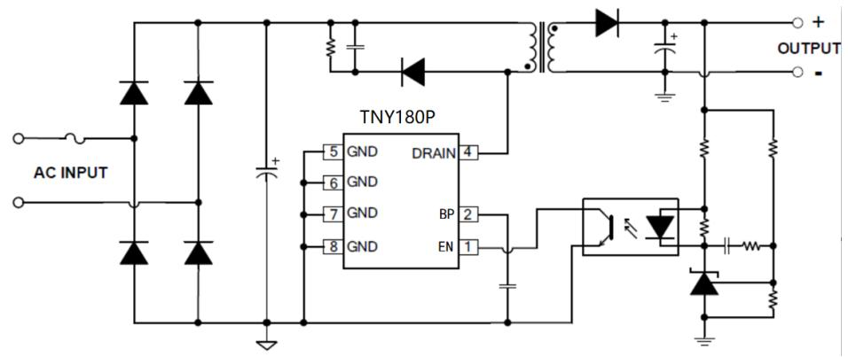

◼ 开关式控制技术，IC集成650V高压MOSFET、高压启动电路和自供电电路，开关频率132KHz；  
◼ 输入欠压保护：通过Vbus串电阻到EN脚实现欠压保护；  
◼ 输出过压保护：当流入BP脚电流大于Isd时，IC停止MOSFET开关动作，并锁住，直到BP电压低于4.9V或者AC掉电，才可重启；

BPA8620P  

◼ 开关式控制技术，IC集成700V高压MOSFET、高压启动电路和自供电电路，开关频率132KHz；  
◼ 输入过/欠压保护：Drain脚内置输入过/欠压保护功能，无需上拉电阻；  
输出过压保护：当流入Vcc脚电流大于Isd时，IC停止MOSFET开关动作，等待TAR-OFF时间后自动重启，直到故障消除；  
◼ 输出软起动功能：IC内置软起动功能，降低输出二极管在起机时刻的电压电流应力；

## 电气特性对比

<table><tr><td></td><td>TNY180P</td><td>BPA8620P</td></tr><tr><td>开关频率</td><td>132KHz</td><td>132KHz</td></tr><tr><td>Mosfet BV</td><td>650V</td><td>700V</td></tr><tr><td> $R_{DS\_ON}$ </td><td>2.6Ω</td><td>2.4Ω</td></tr><tr><td>限流点</td><td>650mA/750mA/850mA</td><td>750mA</td></tr><tr><td>软启动</td><td>无</td><td>有(降低限流点,40%限流点)</td></tr><tr><td>输出过压保护</td><td>有</td><td>有</td></tr><tr><td>输出短路保护</td><td>有</td><td>有</td></tr><tr><td>输出过载保护</td><td>有</td><td>有</td></tr><tr><td>反馈开路保护</td><td>有</td><td>有</td></tr><tr><td>输入过压保护</td><td>无</td><td>有</td></tr><tr><td>输入欠压保护</td><td>外置</td><td>内置</td></tr><tr><td>输出过压保护模式</td><td>锁住</td><td>自动重启</td></tr><tr><td>过温保护</td><td>有</td><td>有</td></tr></table>

## TNY180P

◼ 开关式控制方式：使用简单的脉冲数调整输出电压，具有较高的环路带宽和快速动态响应，无需外部环路补偿电路，该方式可以实现低待机功耗、高轻载效率以及优异EMI性能；

## BPA8620P

◼ 开关式控制方式：使用简单的脉冲数调整输出电压，具有较高的环路带宽和快速动态响应，无需外部环路补偿电路，该方式可以实现低待机功耗、高轻载效率以及优异EMI性能；◼ 软启动： $0 . 4 ^ { * } \vert _ { \mathrm { \vert i m i t } }$ 限流点启动，256个开关周期后增加到最大限流点，以降低启动过程中MOSFET和整流二极管电流应力。

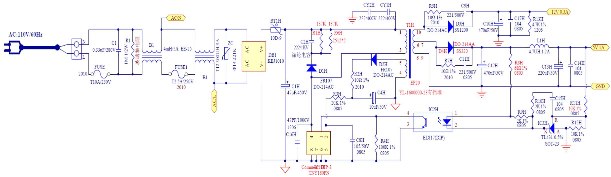

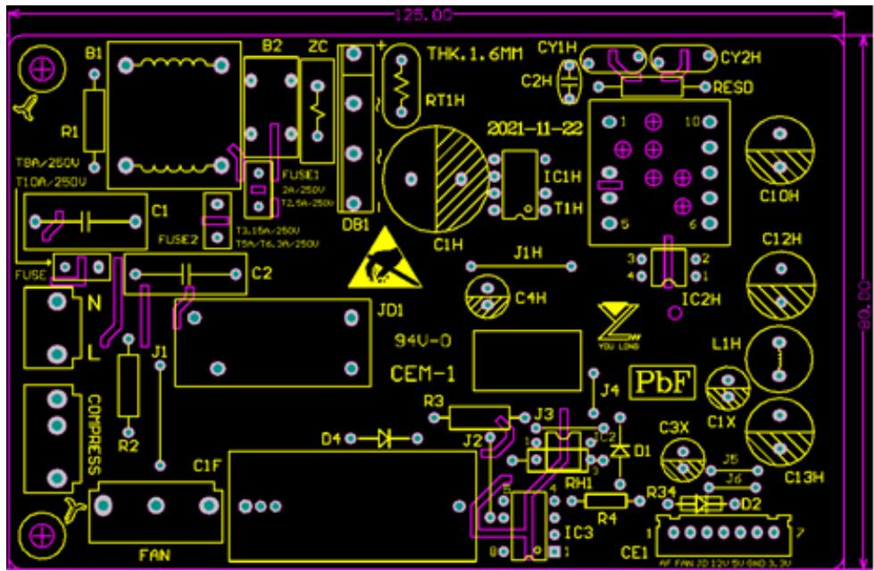

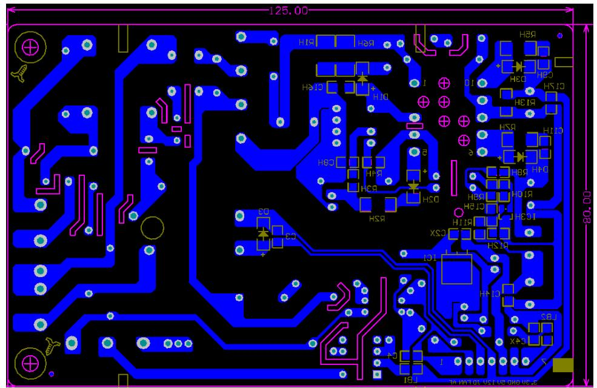

## 待机功耗对比

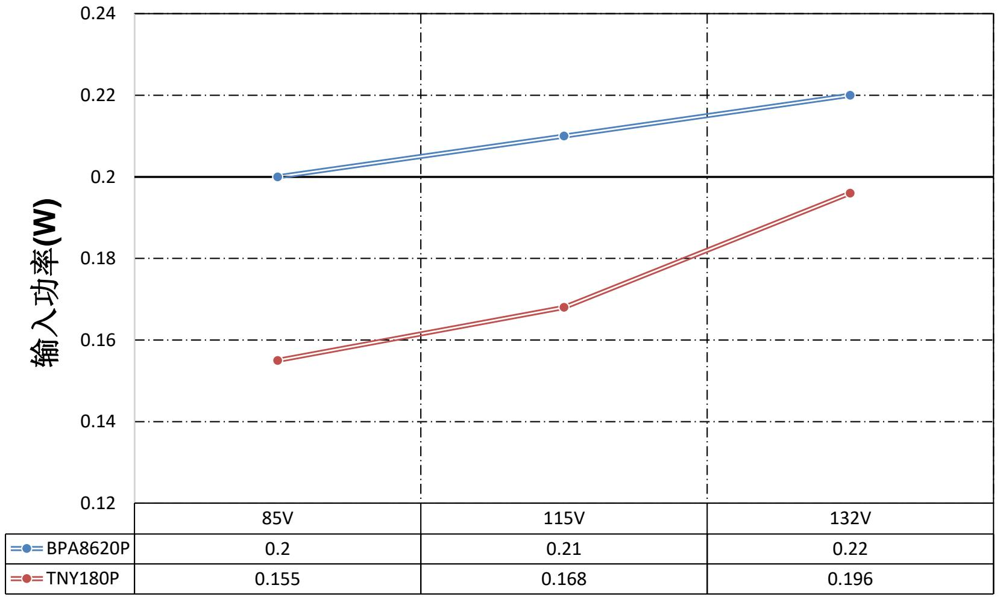

## 输入电压(VAC)

基于整机AC输入电路和部分输出侧小信号电路；  
BPA8620P内置了输入欠压保护功能，所以功耗相对高；

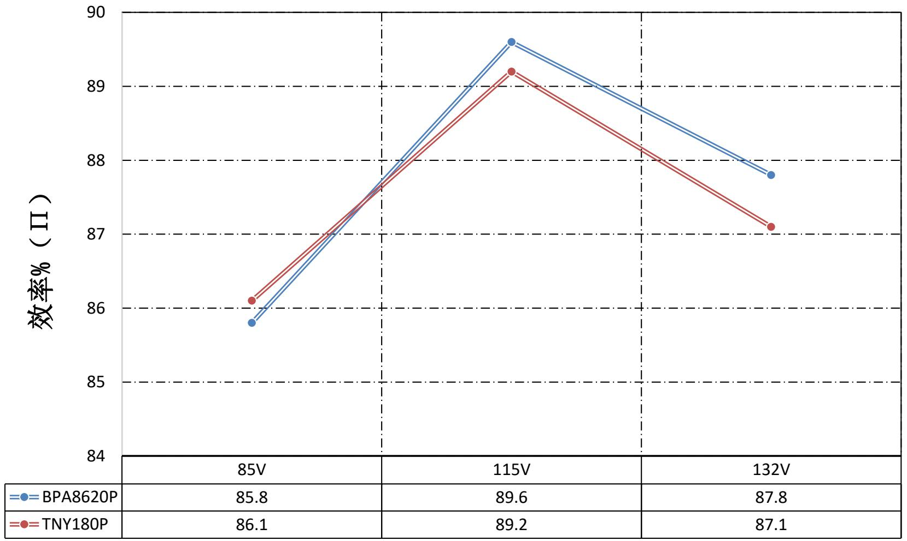

输入电压(VAC)  
基于整机AC输入电路和部分输出侧小信号电路

## 输出电压交叉调整率

TNY180P

<table><tr><td rowspan="2" colspan="2">Vin(vac)OPV (V)Load(A)</td><td colspan="2">85</td><td colspan="2">115</td><td colspan="2">132</td></tr><tr><td>12V</td><td>5V</td><td>12V</td><td>5V</td><td>12V</td><td>5V</td></tr><tr><td rowspan="2">空载</td><td>12V0A</td><td rowspan="2">12.149</td><td rowspan="2">4.984</td><td rowspan="2">12.228</td><td rowspan="2">4.983</td><td rowspan="2">12.169</td><td rowspan="2">4.985</td></tr><tr><td>5V0A</td></tr><tr><td rowspan="2">交叉负载</td><td>12V0.3A</td><td rowspan="2">不稳定</td><td rowspan="2">不稳定</td><td rowspan="2">不稳定</td><td rowspan="2">不稳定</td><td rowspan="2">不稳定</td><td rowspan="2">不稳定</td></tr><tr><td>5V0A</td></tr><tr><td rowspan="2">交叉负载</td><td>12V0A</td><td rowspan="2">18.043</td><td rowspan="2">4.964</td><td rowspan="2">18.154</td><td rowspan="2">4.962</td><td rowspan="2">18.320</td><td rowspan="2">4.964</td></tr><tr><td>5V1A</td></tr><tr><td rowspan="2">满载</td><td>12V0.3A</td><td rowspan="2">13.018</td><td rowspan="2">4.956</td><td rowspan="2">12.928</td><td rowspan="2">4.953</td><td rowspan="2">12.908</td><td rowspan="2">4.955</td></tr><tr><td>5V1A</td></tr></table>

TNY180P电源12V输出带载0.3A，5V空载。电源输出电压不稳定；

BPA8620P

<table><tr><td rowspan="2" colspan="2">Vin(vac)OPV (V)Load(A)</td><td colspan="2">85</td><td colspan="2">115</td><td colspan="2">132</td></tr><tr><td>12V</td><td>5V</td><td>12V</td><td>5V</td><td>12V</td><td>5V</td></tr><tr><td rowspan="2">空载</td><td>12V0A</td><td rowspan="2">12.235</td><td rowspan="2">4.977</td><td rowspan="2">12.236</td><td rowspan="2">4.980</td><td rowspan="2">12.258</td><td rowspan="2">4.978</td></tr><tr><td>5V0A</td></tr><tr><td rowspan="2">交叉负载</td><td>12V0.3A</td><td rowspan="2">10.758</td><td rowspan="2">4.972</td><td rowspan="2">10.759</td><td rowspan="2">4.972</td><td rowspan="2">10.762</td><td rowspan="2">4.971</td></tr><tr><td>5V0A</td></tr><tr><td rowspan="2">交叉负载</td><td>12V0A</td><td rowspan="2">18.394</td><td rowspan="2">4.958</td><td rowspan="2">19.013</td><td rowspan="2">4.960</td><td rowspan="2">19.105</td><td rowspan="2">4.958</td></tr><tr><td>5V1A</td></tr><tr><td rowspan="2">满载</td><td>12V0.3A</td><td rowspan="2">13.165</td><td rowspan="2">4.952</td><td rowspan="2">13.016</td><td rowspan="2">4.953</td><td rowspan="2">12.901</td><td rowspan="2">4.952</td></tr><tr><td>5V1A</td></tr></table>

## 输出电压纹波

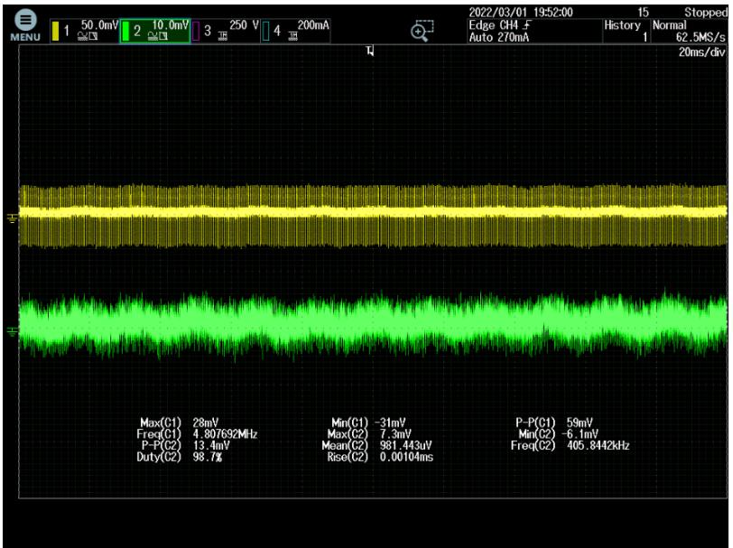

## TNY180P

## 85 VAC

CH1 $\mathsf { V } _ { \mathsf { O U T } \_ 1 2 \mathsf { V } }$ Ripple$\mathbf { V } _ { \mathsf { P K - P K } } { = } 5 9 \mathsf { m V }$ ！  
$\begin{array} { r l } & { \mathsf { C H 2 } \mathsf { V _ { \mathrm { 0 } \cup \mathsf { T } \_ 5 \vee } } \mathsf { R i p p l e } } \\ & { \mathsf { V _ { P K - P K } } \mathsf { = } 1 3 . 4 \mathsf { m v } } \end{array}$

Test Condition:

➢ No Load

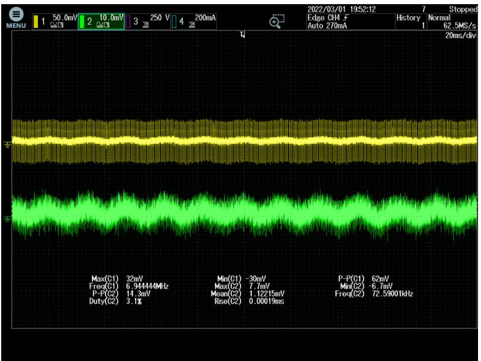

## TNY180P

## 132 VAC

CH1 $\mathsf { V } _ { \mathsf { O U T } \_ 1 2 \mathsf { V } }$ Ripple $\mathsf { V } _ { \mathsf { P K - P K } } { = } 6 2 \mathsf { m V }$  
$\begin{array} { r l } & { \mathsf { C H 2 V _ { O U T \_ 5 v } R i p p l e } } \\ & { \mathsf { V _ { P K - P K } } \mathtt { = } 1 4 . 3 \mathsf { m V } } \end{array}$

➢ No Load

Test Condition:  
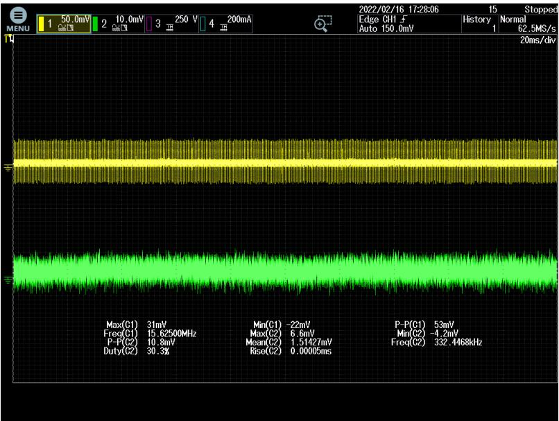

## BPA8620P

## 85 VAC

$\begin{array} { r } { \mathsf { C H 1 V } _ { \mathsf { O U T } \_ 1 2 \vee } } \\ { \mathsf { V } _ { \mathsf { P K - P K } } = 5 3 \mathsf { m V } } \end{array}$ Ripple  
$\begin{array} { r l } & { \mathsf { C H 2 } \mathsf { V _ { \mathrm { 0 } \cup \mathsf { T } \_ 5 \vee } } \mathsf { R i p p l e } } \\ & { \mathsf { V _ { P K - P K } } \mathsf { = } \mathsf { 1 0 } \mathsf { . 8 m v } } \end{array}$

Test Condition:

➢ No Load

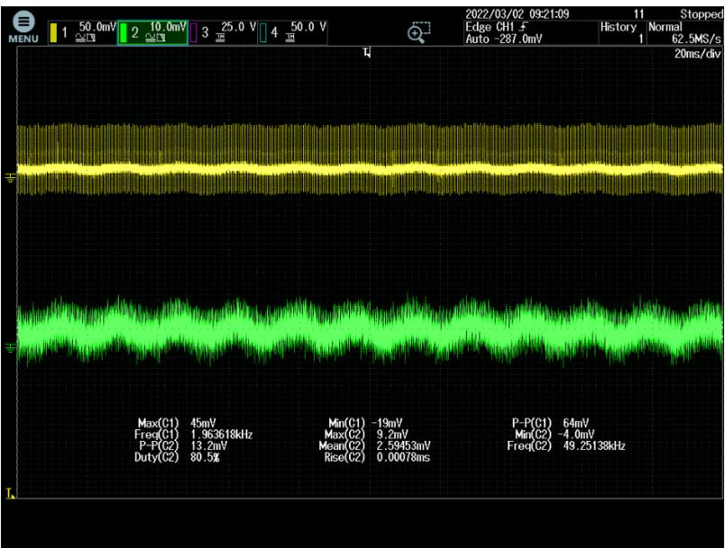

## BPA8620P

## 132 VAC

$\begin{array} { r } { \mathsf { C H 1 V _ { o u T \_ 1 2vee } } } \\ { \mathsf { V _ { P K \_ P K } = 6 4 m V } } \end{array}$ Ripple  
$\begin{array} { r l } & { \mathsf { C H 2 V _ { O U T \_ 5 v } R i p p l e } } \\ & { \mathsf { V _ { P K - P K } } \mathtt { = 1 3 . 2 m v } } \end{array}$

Test Condition:

➢ No Load

## 输出电压纹波

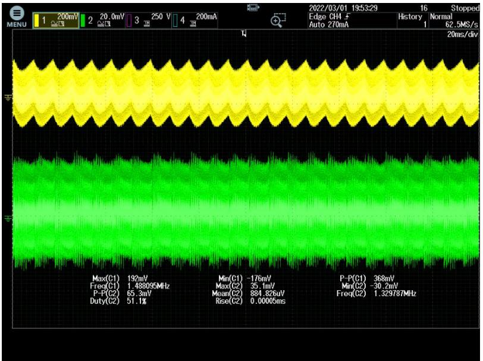

## TNY180P

## 85 VAC

CH1 $\mathsf { V } _ { \mathsf { O U T } \_ 1 2 \mathsf { V } }$ Ripple $\mathsf { V } _ { \mathsf { P K - P K } } { = } 3 6 8 \mathsf { m V }$  
$\begin{array} { r l } & { \mathsf { C H 2 } \mathsf { V _ { \mathrm { 0 } \cup \mathsf { T } \_ 5 \vee } } \mathsf { R i p p l e } } \\ & { \mathsf { V _ { P K - P K } } \mathsf { = } 6 5 . 3 \mathsf { m V } } \end{array}$

## Test Condition:

➢ Full Load

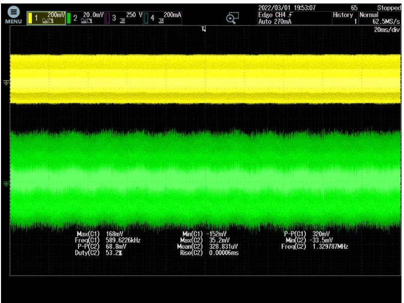

## TNY180P

## 132 VAC

CH1 $\mathsf { V } _ { \mathsf { O U T } \_ 1 2 \mathsf { V } }$ Ripple $\mathsf { V } _ { \mathsf { P K - P K } } { = } 3 2 0 \mathsf { m V }$  
CH2 $\mathsf { V } _ { \mathsf { O U T } \_ 5 \mathsf { V } }$ Ripple $V _ { \mathsf { P K - P K } } { = } 6 8 . 8 \mathsf { m V }$

## Test Condition:

➢ Full Load

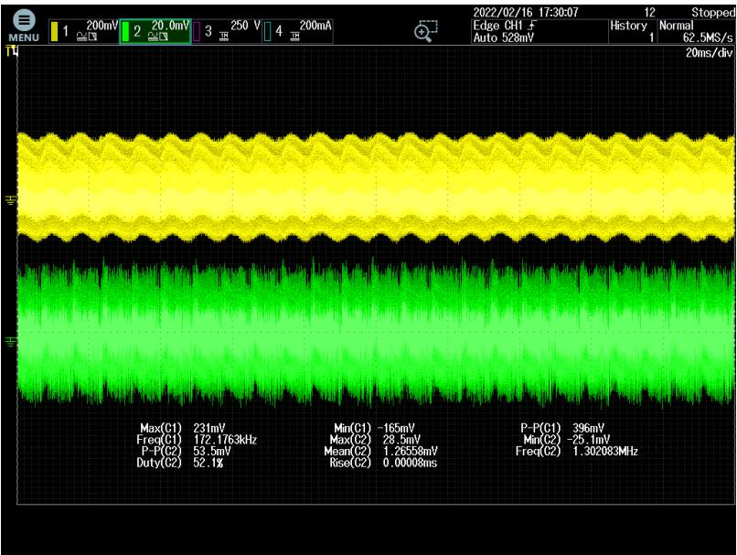

## BPA8620P

## 85 VAC

$\begin{array} { r } { \mathsf { C H 1 V _ { O U T \_ 1 2 V } } \mathsf { F } } \\ { \mathsf { V _ { P K - P K } } \equiv 3 9 6 \mathsf { m V } } \end{array}$ ipple

$\begin{array} { r l } & { \mathsf { C H 2 } \mathsf { V _ { \mathrm { 0 } \cup \mathsf { T } \_ 5 \vee } } \mathsf { R i p p l e } } \\ & { \mathsf { V _ { P K - P K } } \mathsf { = } 5 3 . 5 \mathsf { m V } } \end{array}$

## Test Condition:

➢ Full Load

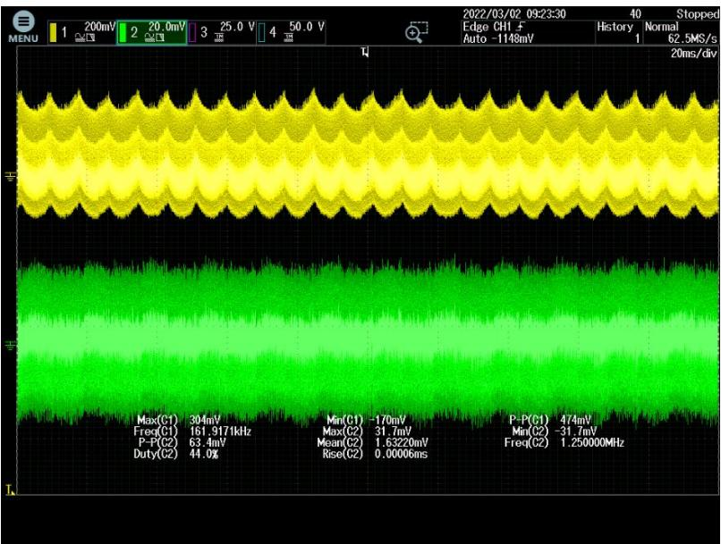

## BPA8620P

## 132 VAC

$\begin{array} { r } { \mathsf { C H 1 V _ { o u r \_ 1 2 v } } \mathsf { R } } \\ { \mathsf { V _ { P K \_ P K } } \mathsf { = } 4 7 4 \mathsf { m v } } \end{array}$ ipple  
CH2 $\mathsf { V } _ { 0 \mathsf { U T } \_ 5 \vee } \mathsf { R i p p l e }$ $V _ { p | c - P K } = 6 3 . 4 m v$

## Test Condition:

➢ Full Load

## 动态负载(50%-100%)

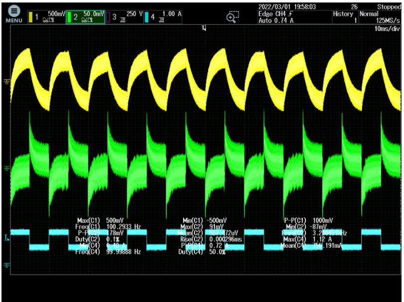

## TNY180P

## 85 VAC

$\begin{array} { l } { \mathsf { C H 1 V _ { O U T \_ 1 2 V } R i p p l e } } \\ { \mathsf { V _ { P K - P K } } { = } 1 0 0 0 \mathsf { m V } } \end{array}$  
$\begin{array} { r l } & { \mathsf { C H } 2 \mathsf { V } _ { \mathsf { O U T } \mathsf { \Pi } _ { 5 \mathsf { W } } } \mathsf { R i p p l e } } \\ & { \mathsf { V } _ { \mathsf { P K - P K } } \mathsf { = } 1 7 8 \mathsf { m V } } \end{array}$  
CH4 IOUT\_5V $\mathsf { I } _ { \mathsf { O U T } \_ 5 \mathsf { V } }$

## Test Condition:

➢ CH1 0.3A  
➢ CH2 0.5 A-1 A-0.5 A  
➢ Slew Rate: 0.5 A/μS  
➢ Frequency: 100 Hz

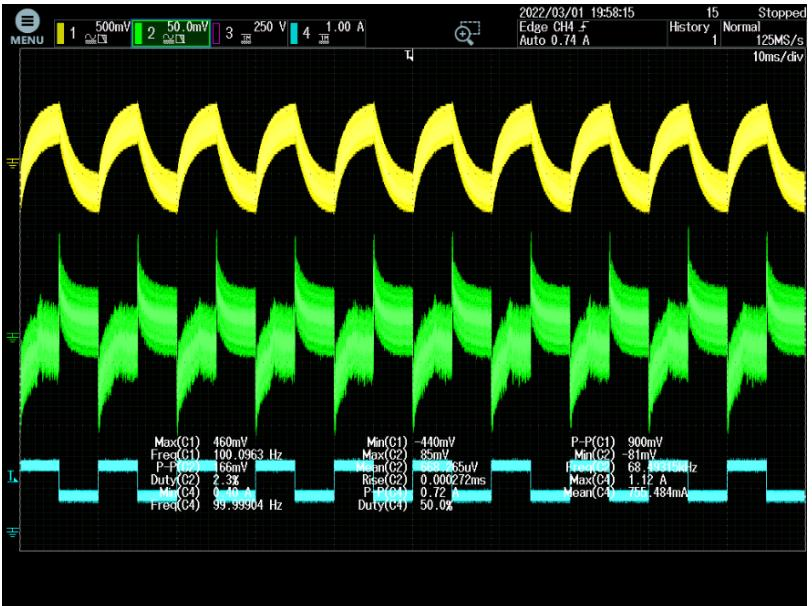

## TNY180P

## 132 VAC

CH1 V Ripple VPK-PK=900mV  
CH2 V Ripple VPK-PK=166mV  
CH4 IOUT\_5V $\mathsf { I } _ { 0 \cup \mathsf { T } _ { - } 5 \mathsf { V } }$

## Test Condition:

➢ CH1 0.3A  
➢ CH2 0.5 A-1 A-0.5 A  
➢ Slew Rate: 0.5 A/μS  
➢ Frequency: 100 Hz

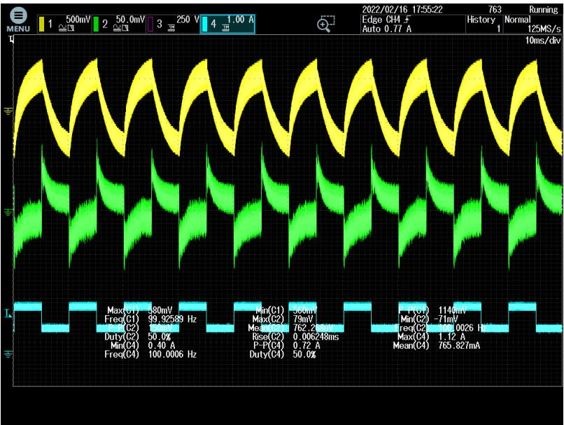

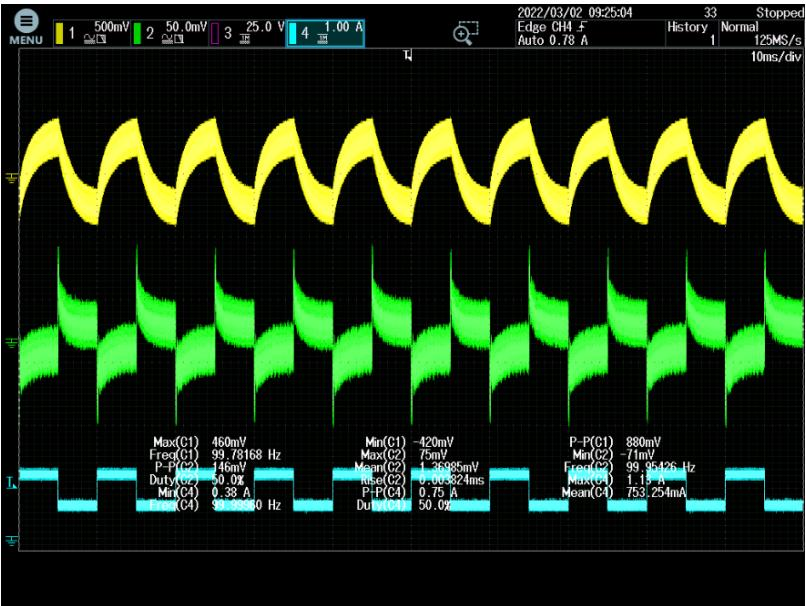

## BPA8620P

## 85 VAC

$\begin{array} { r } { \mathsf { C H 1 } \mathsf { V _ { 0 \cup T _ { 1 } \underline { { 1 } } 2 \mathsf { V } } } \mathsf { R } } \\ { \mathsf { V _ { P K - P K } } \mathsf { = 1 } \mathsf { 1 } \mathsf { 4 } 0 \mathsf { m } \mathsf { 1 } } \end{array}$ ipple V  
$\begin{array} { r } { \mathsf { C H 2 \mathsf { V _ { 0 u T \_ 5 v } R i p p l e } } } \\ { \mathsf { V _ { P K - P K } } \equiv \mathbf { 1 5 0 m v } } \end{array}$  
CH4 IOUT\_5V $\mathsf { C H } 4 \mathsf { I } _ { 0 \mathsf { U T } \_ 5 \mathsf { V } }$

## Test Condition:

➢ CH1 0.3A  
➢ CH2 0.5 A-1 A-0.5 A  
➢ Slew Rate: 0.5 A/μS  
➢ Frequency: 100 Hz

## BPA8620P

## 132 VAC

$\begin{array} { r } { \mathsf { C H 1 V } _ { \mathsf { O U T } \ 1 2 \mathsf { V } } \mathsf { F } } \\ { \mathsf { V } _ { \mathsf { P K - P K } } { = } 8 8 0 \mathsf { m V } } \end{array}$ ipple  
$\begin{array} { r } { \mathsf { C H 2 } \mathsf { V _ { O U T \_ 5 v } } \mathsf { R i } } \\ { \mathsf { V _ { P K - P K } } \mathsf { = } \mathsf { 1 } 4 6 \mathsf { m v } } \end{array}$ pple （2  
CH4 IOUT\_5V

## Test Condition:

➢ CH1 0.3A  
➢ $\mathsf { C H 2 0 . 5 A - 1 A - 0 . 5 A }$  
➢ Slew Rate: 0.5 A/μS  
➢ Frequency: 100 Hz

## 动态负载(10%-90%)

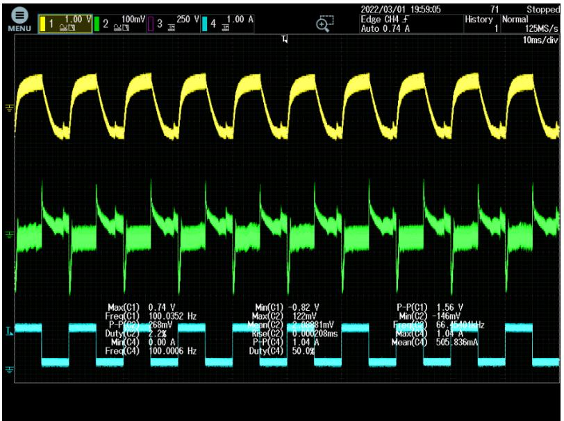

## TNY180P

## 85 VAC

$\begin{array} { r } { \mathsf { C H 1 V } _ { \mathsf { O U T } } \mathsf { 1 2 V } } \\ { \mathsf { V _ { P K - P K } } \mathsf { = 1 . 5 6 V } } \end{array}$ Ripple  
$\begin{array} { r l } & { \mathsf { C H 2 } \mathsf { V _ { \mathsf { 0 u T } \mathsf { \Pi 5 8 } } } \mathsf { R i p p l e } } \\ & { \mathsf { V _ { P K - P K } } \mathsf { = } 2 6 8 \mathsf { m V } } \end{array}$  
CH4 IOUT\_5V $\mathsf { I } _ { \mathsf { O U T } \_ 5 \mathsf { V } }$

## Test Condition:

➢ CH1 0.3A  
➢ CH2 0.1 A-0.9 A-0.1 A  
➢ Slew Rate: 0.5 A/μS  
➢ Frequency: 100 Hz

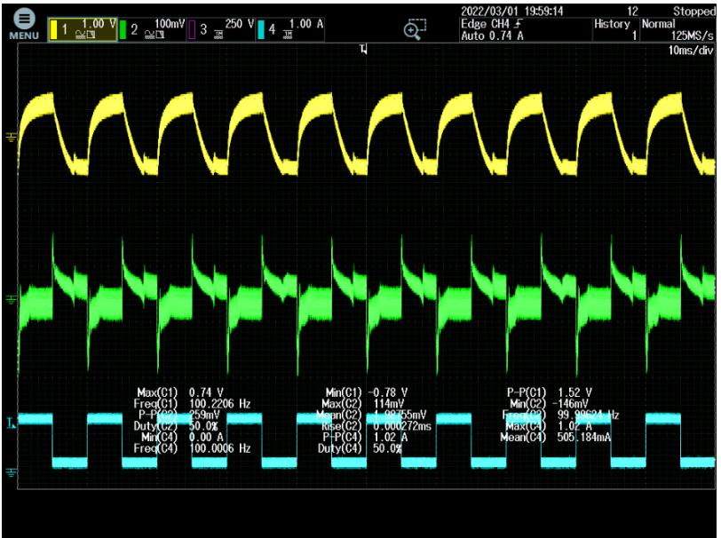

## TNY180P

## 132 VAC

$\begin{array} { r } { \mathsf { C H 1 V } _ { \tt O \cup \tt T _ { P } } \mathsf { 1 } 2 \mathsf { v } } \\ { \mathsf { V } _ { \tt P K \mathrm { - } P K } \mathsf { = } \tt 1 . 5 2 V } \end{array}$ Ripple  
CH2 V Ripple VPK-PK=259mV  
CH4 IOUT\_5V $\mathsf { I } _ { 0 \cup \mathsf { T } _ { - } 5 \mathsf { V } }$

## Test Condition:

➢ CH1 0.3A  
➢ CH2 0.1 A-0.9 A-0.1 A  
➢ Slew Rate: 0.5 A/μS  
➢ Frequency: 100 Hz

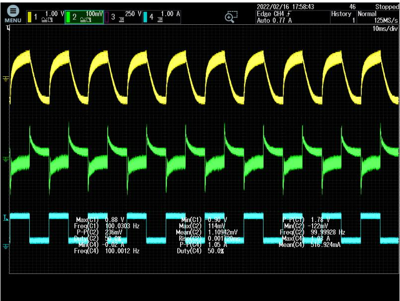

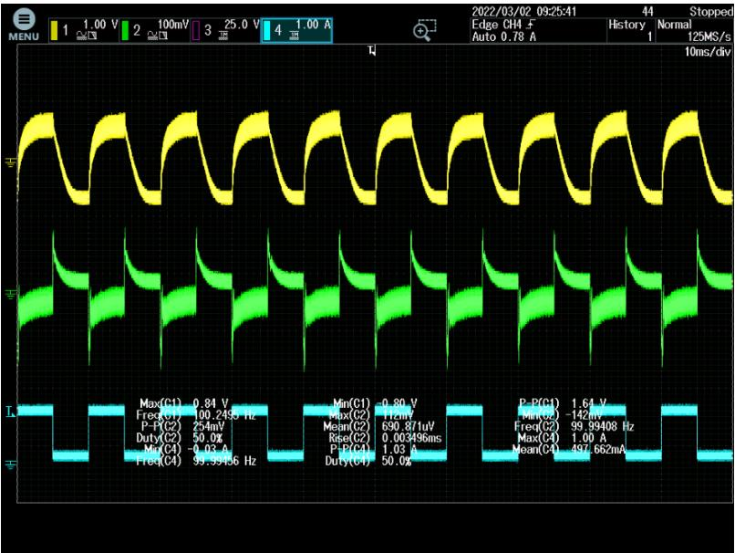

## BPA8620P

## 85 VAC

$\begin{array} { r } { \mathsf { C H 1 V _ { 0 \sqcup \mathsf { T } _ { \mathsf { B V } } } } } \\ { \mathsf { V _ { P K \ J \times \mathsf { P K } } } } \end{array}$ Ripple  
$\begin{array} { r l } & { \mathsf { C H 2 } \mathsf { V _ { 0 u T \_ 5 v } } \mathsf { R i p p l e } } \\ & { \mathsf { V _ { P K - P K } } \mathsf { = } 2 3 6 \mathsf { m v } } \end{array}$  
CH4 IOUT\_5V

## Test Condition:

➢ CH1 0.3A  
➢ CH2 0.1 A-0.9 A-0.1 A  
➢ Slew Rate: 0.5 A/μS  
➢ Frequency: 100 Hz

## BPA8620P

## 132 VAC

$\begin{array} { r } { \mathsf { C H 1 V } _ { \tt O \cup \mathsf { T } _ { P } 1 2 \vee } } \\ { \mathsf { V } _ { \tt P K \mathrm { - } P K } { = } 1 . 6 4 \vee } \end{array}$ CH1 V Ripple  
$\begin{array} { r } { \mathsf { C H 2 \Delta V _ { \mathsf { O U T \_ 5 V } } R i p p l e } } \\ { \mathsf { V _ { P K - P K } } = 2 5 4 \mathsf { m V } } \end{array}$  
CH4 IOUT\_5V

## Test Condition:

➢ CH1 0.3A  
➢ CH2 0.1 A-0.9 A-0.1 A  
➢ Slew Rate: 0.5 A/μS  
➢ Frequency: 100 Hz

## 输出电压开机波形

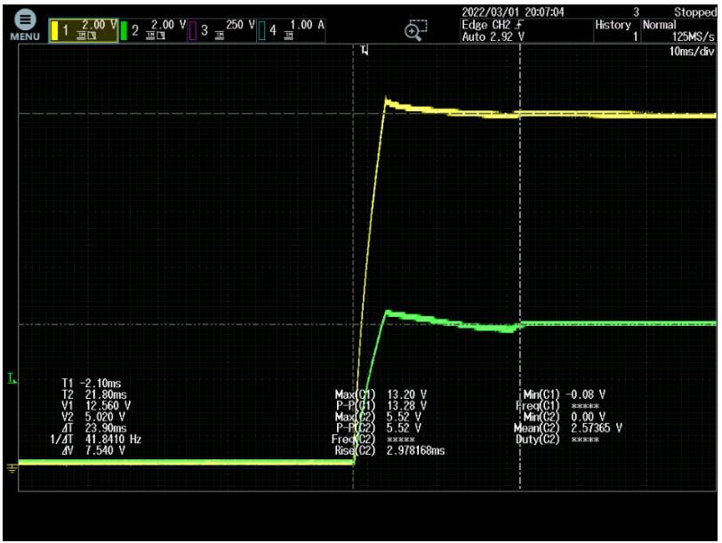

TNY180P  
85 VAC

CH1 VOUT\_12V $\mathsf { V } _ { \mathsf { O U T } \_ 1 2 \mathsf { V } }$  
CH2 VOUT\_5V $\mathsf { V } _ { \mathsf { O U T } \_ 5 \mathsf { V } }$ trise= 2.98 mS

Test Condition:  
➢ No Load  
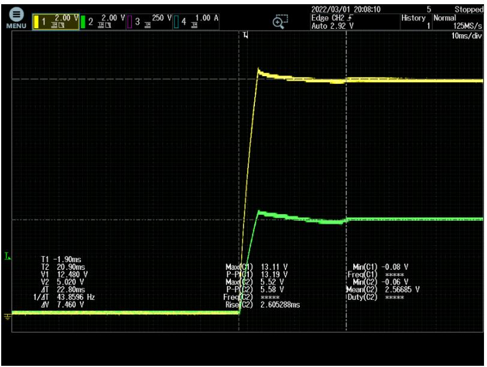

TNY180P  
132 VAC

CH1 VOUT\_12V $\mathsf { V } _ { \mathsf { O U T } \_ 1 2 \mathsf { V } }$  
CH2 VOUT\_5V $\mathsf { V } _ { \mathsf { O U T } \_ 5 \mathsf { V } }$ trise= 2.6 mS

Test Condition:  
➢ No Load  
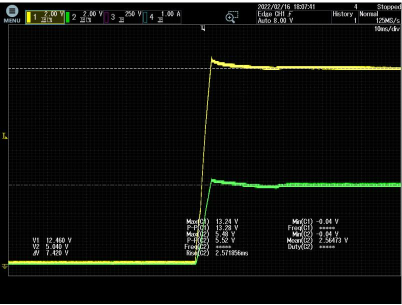

## BPA8620P

## 85 VAC

CH1 VOUT\_12V $\mathsf { V } _ { \mathsf { O U T } \_ 1 2 \mathsf { V } }$  
CH2 V $\mathsf { C H 2 V } _ { \mathsf { O U T } , \mathsf { 5 V } }$ $\mathtt { t } _ { \mathrm { r i s e } } = 2 . 5 ~ \mathsf { m s }$

Test Condition:  
➢ No Load  
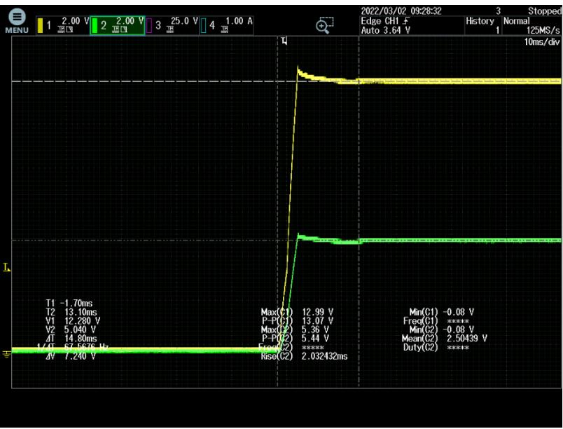

## BPA8620P

## 132 VAC

CH1 VOUT\_12V $\mathsf { V } _ { \mathsf { 0 } \mathsf { U T } _ { - } \mathsf { 1 } 2 \mathsf { V } }$  
$\begin{array} { l } { \mathsf { C H 2 } \mathsf { V _ { 0 \cup \mathsf { T } \_ 5 \vee } } } \\ { \mathsf { t _ { r i s e } } \equiv 2 \mathsf { m } \overline { { \mathsf { S } } } } \end{array}$ CH2 VOUT\_5V

Test Condition:

➢ No Load

## 输出电压开机波形

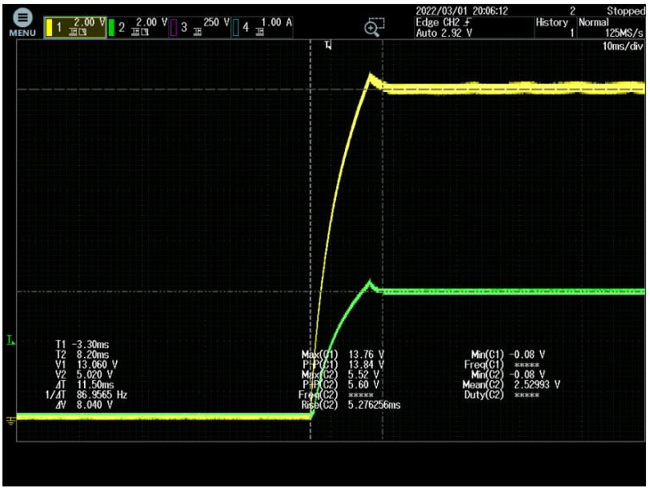

## TNY180P

## 85 VAC

CH1 VOUT\_12V $\mathsf { V } _ { \mathsf { O U T } \_ 1 2 \mathsf { V } }$  
CH2 VOUT\_5V $\mathsf { V } _ { \mathsf { O U T } \_ 5 \mathsf { V } }$ t = 5.2 mS

## Test Condition:

➢ Full Load

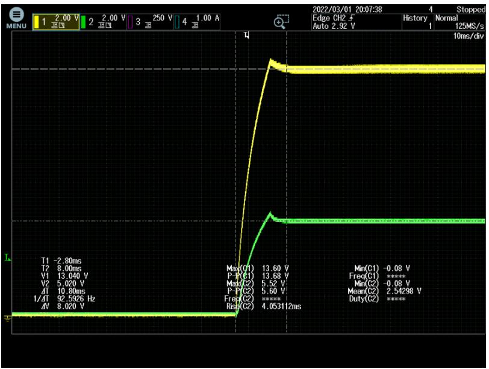

## TNY180P

## 132 VAC

CH1 VOUT\_12V $\mathsf { V } _ { \mathsf { O U T } \_ 1 2 \mathsf { V } }$  
CH2 VOUT\_5V trise= 4 mS

## Test Condition:

➢ Full Load

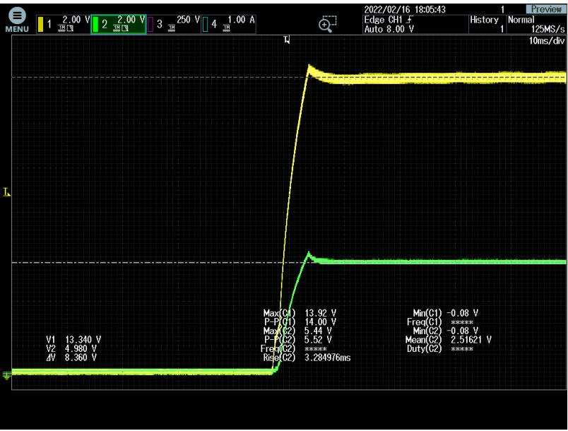

## BPA8620P

## 85 VAC

CH1 VOUT\_12V $\mathsf { V } _ { \mathsf { O U T } \_ 1 2 \mathsf { V } }$  
$\begin{array} { l } { { \mathsf { C H } } { 2 } \ { \mathsf { V } } _ { 0 \cup \mathsf { T } \_ { 5 \vee } } } \\ { { \mathsf { t } } _ { \mathsf { r i s e } } { = } \ 3 . 2 8 \ \mathsf { m s } } \end{array}$ CH2 V

## Test Condition:

➢ Full Load

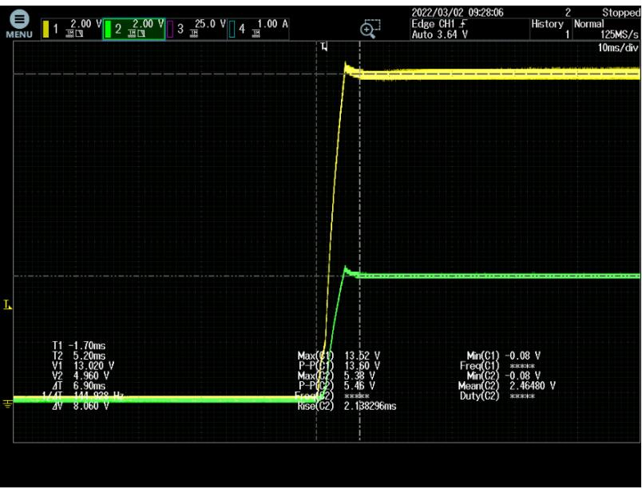

## BPA8620P

## 132 VAC

CH1 VOUT\_12V $\mathsf { V } _ { \mathsf { 0 } \mathsf { U T } _ { - } \mathsf { 1 } 2 \mathsf { V } }$  
$\begin{array} { l } { { \mathsf { C H } } { 2 } \ { \mathsf { V } } _ { 0 \cup \mathsf { T } \_ { 5 \vee } } } \\ { { \mathsf { t } } _ { \mathrm { r i s e } } { = } { 2 } . 1 3 \ \mathsf { m s } } \end{array}$ CH2 VOUT\_5V

## Test Condition:

➢ Full Load

## MOSFET开机波形—空载

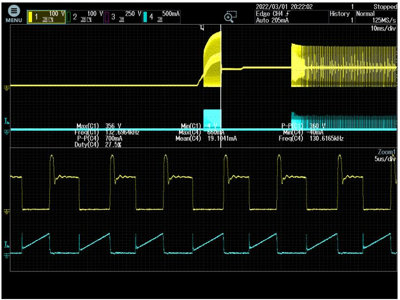

TNY180P

85 VAC  
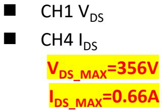

Test Condition:

➢ No Load

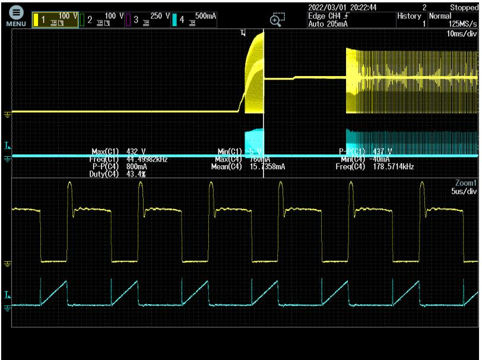

TNY180P

132 VAC  

Test Condition:

➢ No Load

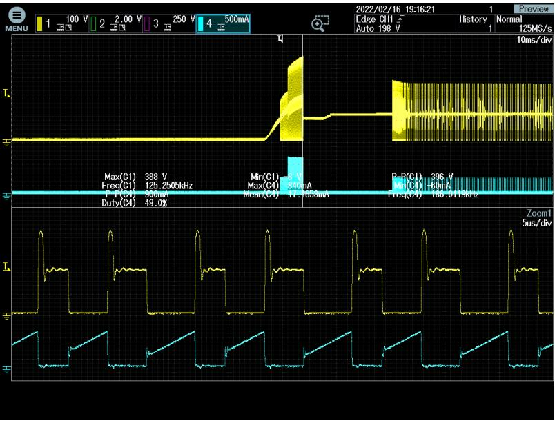

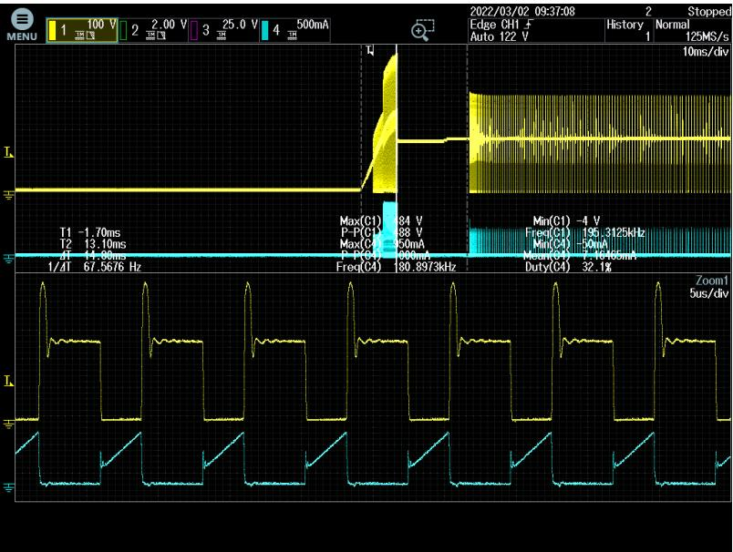

## BPA8620P

## 85 VAC

CH1 VDS  
CH4 IDS

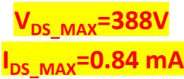  
Test Condition:

➢ No Load

## BPA8620P

## 132 VAC

CH1 VDS  
CH4 IDS

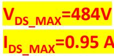  
Test Condition:

➢ No Load

## MOSFET开机波形—满载

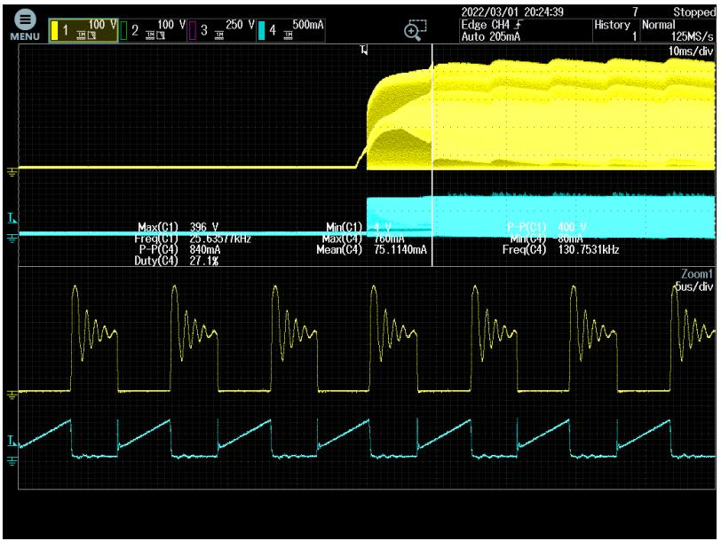

TNY180P

85 VAC  

Test Condition:

➢ Full Load

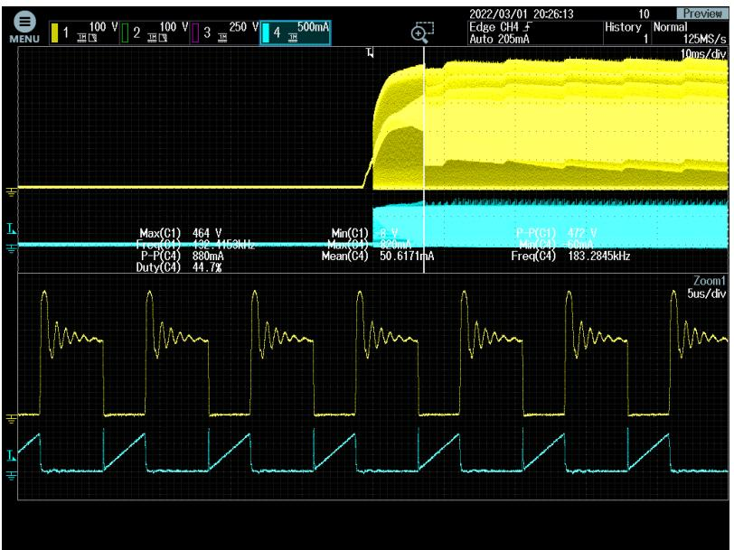

TNY180P

132 VAC  

Test Condition:

➢ Full Load

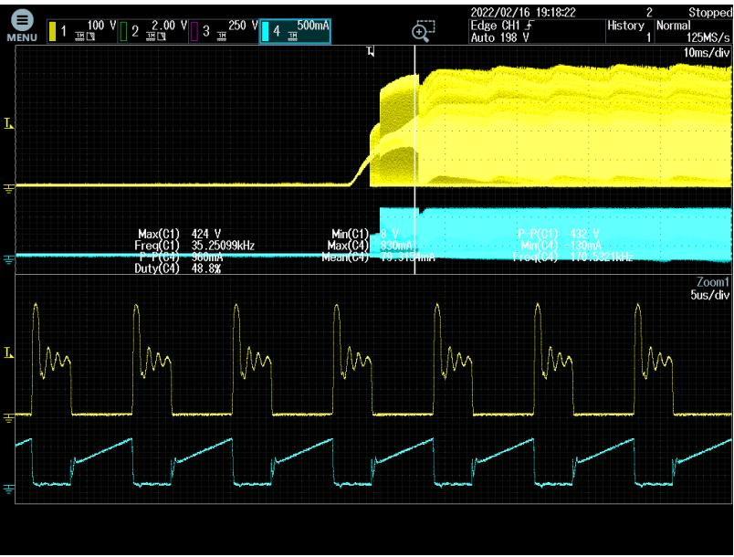

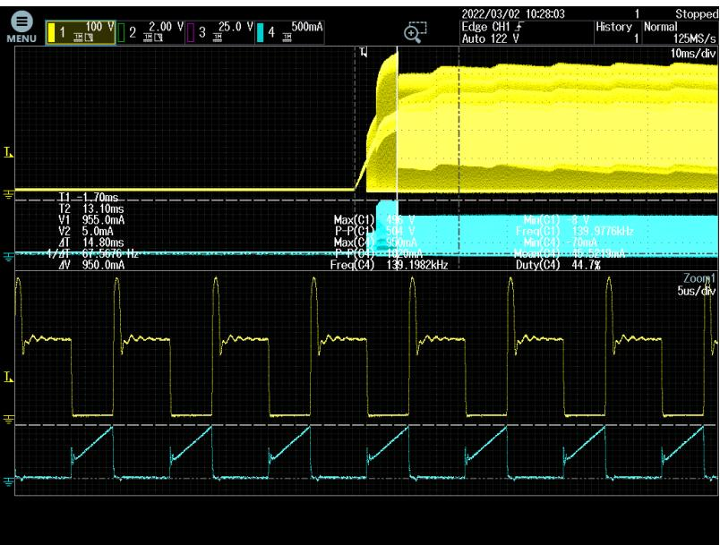

## BPA8620P

## 85 VAC

Test Condition:

➢ Full Load

## BPA8620P

## 132 VAC

Test Condition:

➢ Full Load

## MOSFET开机波形—空载

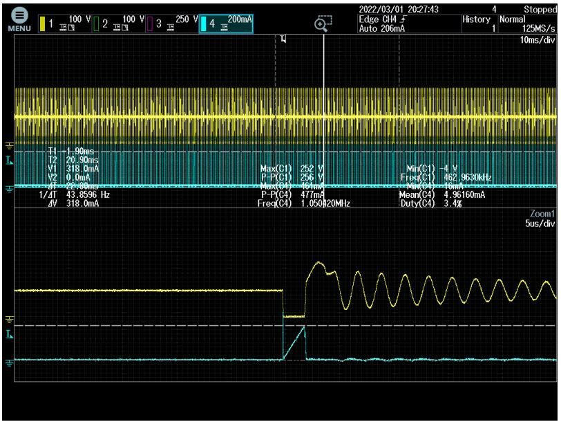

TNY180P

85 VAC  
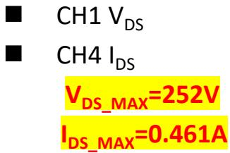

Test Condition:  
➢ No Load

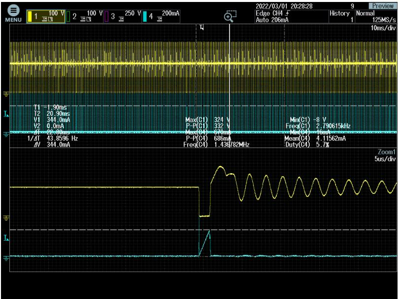

TNY180P

132 VAC  
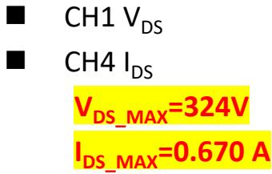

Test Condition:  
➢ No Load

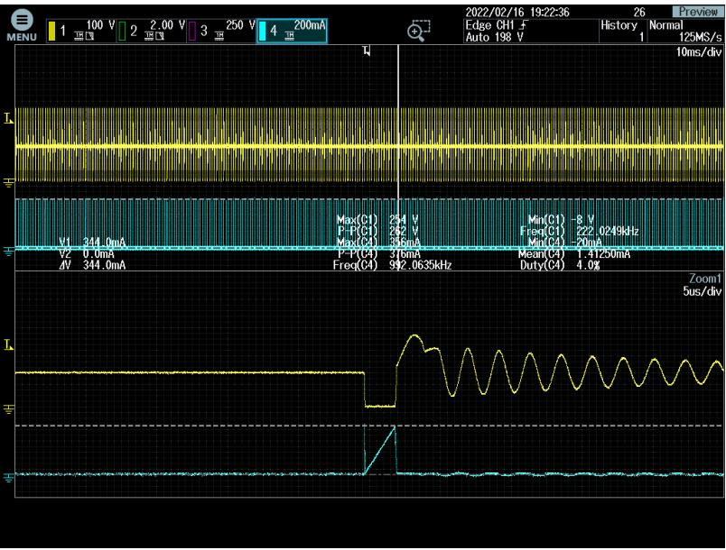

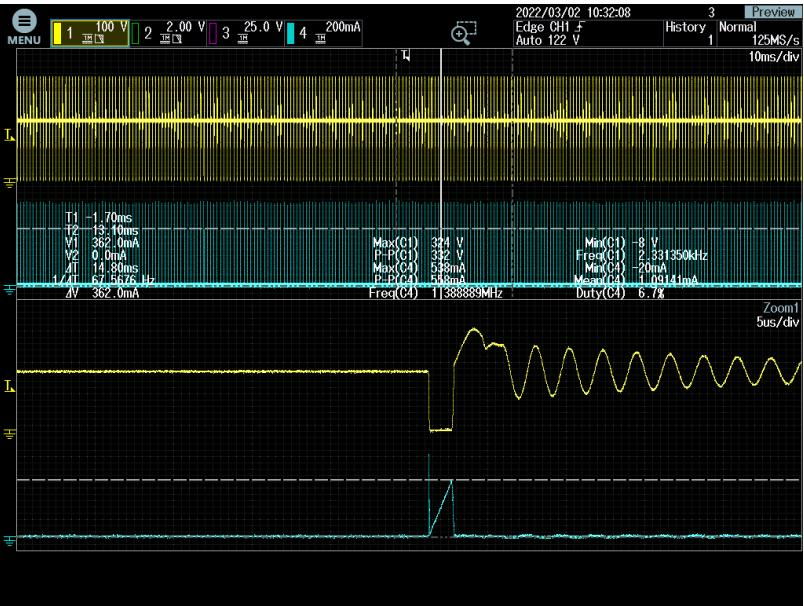

## BPA8620P

## 85 VAC

CH1 VDS  
CH4 IDS

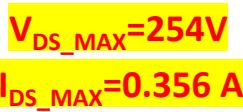  
Test Condition:  
➢ No Load

## BPA8620P

## 132 VAC

CH1 VDS  
CH4 IDS

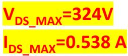  
Test Condition:  
➢ No Load

## MOSFET稳态波形—稳态

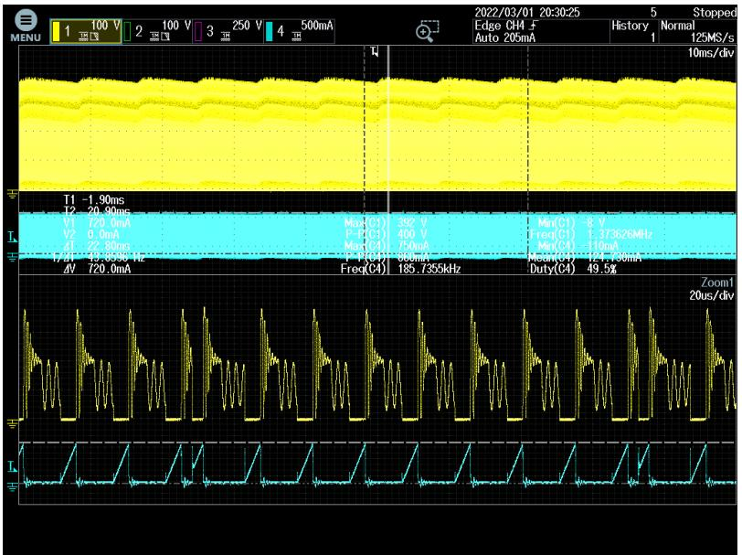

TNY180P

85 VAC  


Test Condition:

➢ Full Load


TNY180P

132 VAC  


Test Condition:

➢ Full Load


## BPA8620P

## 85 VAC


Test Condition:

➢ Full Load

## BPA8620P

## 132 VAC


Test Condition:

➢ Full Load

## MOSFET稳态波形—稳态\_12V No Load


TNY180P

85 VAC  


## Test Condition:

➢ 5V Full Load  
➢ 12V No Load


TNY180P

132 VAC  


## Test Condition:

➢ 5V Full Load  
➢ 12V No Load


## BPA8620P

## 85 VAC


## Test Condition:

➢ 5V Full Load  
➢ 12V No Load

## BPA8620P

## 132 VAC


## Test Condition:

➢ 5V Full Load  
➢ 12V No Load

## 短路保护(短路5V绕组)


TNY180P

85 VAC  


Test Condition:

➢ Output Short 5V

TNY180P

132 VAC  

Test Condition:

➢ Output Short 5V


## BPA8620P

## 85 VAC


Test Condition:

➢ Output Short 5V

## BPA8620P

## 132 VAC


Test Condition:

➢ Output Short 5V

## 短路保护(短路12V绕组)


TNY180P

85 VAC  

Test Condition:

➢ Output Short 12V


TNY180P

132 VAC  


Test Condition:

➢ Output Short 12V


## BPA8620P

## 85 VAC

CH1 VDS  
CH4 IDS

  
Test Condition:

➢ Output Short 12V

## BPA8620P

## 132 VAC

CH1 VDS  
CH4 IDS

  
Test Condition:

➢ Output Short 12V

## 短路保护(短路双绕组)


TNY180P

85 VAC  


## Test Condition:

➢ Output Short 5V/12V

TNY180P

132 VAC  

## Test Condition:

➢ Output Short 5V/12V


## BPA8620P

## 85 VAC


## Test Condition:

➢ Output Short 5V/12V

## BPA8620P

## 132 VAC


## Test Condition:

➢ Output Short 5V/12V

## 输出二极管反向电压—空载


## TNY180P

85 VAC

CH1 VR\_5V ${ \mathsf { C H 1 V } } _ { \mathsf { R } { \mathsf { \_ { 5 V } } } }$  
CH2 VR\_12V $V _ { R \_ 1 2 \vee }$

$$
V _ {R \_ 1 2 V \_ M A X} = 1 8. 2 V
$$

$$
V _ {R \_ 5 V \_ M A X} = 4 0 V
$$

## Test Condition:

➢ No Load


## TNY180P

132 VAC

CH1 VR\_5V $V _ { R \_ 5 \vee }$  
CH2 VR\_12V

$$
V _ {R \_ 1 2 V \_ M A X} = 2 2. 6 V
$$

$$
V _ {R \_ 5 V \_ M A X} = 4 9 V
$$

## Test Condition:

➢ No Load


## BPA8620P

85 VAC

CH1 VR\_5V $V _ { R \_ 5 \vee }$  
CH2 VR\_12V $V _ { R \_ 1 2 \vee }$ $\mathsf { V } _ { \mathbb { R } \_ 1 2 \mathsf { V } \_ \mathsf { M A X } } = \pmb { 1 7 . 8 V }$ $V _ { \ R \_ 5 \vee \_ { \mathsf { M A X } } = 3 8 \vee }$

## Test Condition:

➢ No Load


## BPA8620P

132 VAC

CH1 VR\_5V ${ \mathsf { C H 1 V } } _ { \mathsf { R } { \mathsf { \_ { 5 V } } } }$  
CH2 VR\_12V $V _ { \mathrm { R } \_ 1 2 \vee \_ \mathrm { M A X } } = 2 3 . 9 V$ $V _ { R \_ 5 V \_ M A X } = 5 2 V$

## Test Condition:

➢ No Load

## 输出二极管反向电压—满载


## TNY180P

85 VAC

CH1 VR\_5V $V _ { R \_ 5 \vee }$  
CH2 VR\_12V $\mathsf { C H 2 } \mathsf { V } _ { \mathsf { R } _ { \mathsf { - } } 1 2 \mathsf { V } }$

$$
V _ {R \_ 1 2 V \_ M A X} = 1 9. 8 V
$$

$$
V _ {R \_ 5 V \_ M A X} = 4 3 V
$$

## Test Condition:

➢ Full Load


## TNY180P

132 VAC

CH1 VR\_5V $V _ { R \_ 5 \vee }$  
CH2 VR\_12V $V _ { R \_ 1 2 \vee }$

$$
V _ {R \_ 1 2 V \_ M A X} = 2 3. 8 V
$$

$$
V _ {R \_ 5 V \_ M A X} = 5 3 V
$$

## Test Condition:

➢ Full Load


## BPA8620P

85 VAC

CH1 VR\_5V $V _ { R \_ 5 \vee }$  
CH2 VR\_12V $V _ { R \_ 1 2 \vee }$ $\mathsf { V } _ { \mathbb { R } \_ 1 2 \mathsf { V } \_ \mathsf { M A X } } = \pm 1 8 . 8 \mathsf { V }$ $V _ { R \_ 5 \vee \_ { \mathsf { M A X } } = 4 2 \vee }$

## Test Condition:

➢ Full Load


## BPA8620P

132 VAC

CH1 VR\_5V ${ \mathsf { C H 1 V } } _ { \mathsf { R } { \mathsf { \_ { 5 V } } } }$  
CH2 VR\_12V $V _ { R \_ 1 2 \vee }$ $V _ { \mathrm { R } \_ 1 2 \vee \_ \mathrm { M A X } } = 2 4 . 7 V$ $V _ { \ R \_ 5 \vee \_ { \mathsf { M A X } } = 5 3 \vee \_ { \mathsf { M A X } } }$

## Test Condition:

➢ Full Load

## 输出二极管反向电压--启机波形


## TNY180P

## 85 VAC

CH1 VR\_5V $V _ { R \_ 5 \vee }$  
CH2 VR\_12V $\mathsf { C H 2 } \mathsf { V } _ { \mathsf { R } _ { \mathsf { - } } 1 2 \mathsf { V } }$

$$
V _ {R \_ 1 2 V \_ M A X} = 1 7. 8 V
$$

$$
V _ {R \_ 5 V \_ M A X} = 4 0 V
$$

## Test Condition:

➢ 5V Full Load  
➢ 12V No Load


## BPA8620P

## 85 VAC

CH1 VR\_5V $V _ { R \_ 5 \vee }$  
CH2 VR\_12V $V _ { R \_ 1 2 \vee }$ $\mathsf { V } _ { \mathbb { R } \_ 1 2 \mathsf { V } \_ \mathsf { M A X } } = 2 0 . 1 \mathsf { V }$ $V _ { R \_ 5 V \_ M A X } = 4 6 V$

## Test Condition:

➢ 5V Full Load  
➢ 12V No Load


## TNY180P

## 132 VAC

CH1 VR\_5V $V _ { R \_ 5 \vee }$  
CH2 VR\_12V $V _ { R \_ 1 2 \vee }$

$$
V _ {R \_ 1 2 V \_ M A X} = 2 2. 2 V
$$

$$
V _ {R \_ 5 V \_ M A X} = 4 9 V
$$

## Test Condition:

➢ 5V Full Load  
➢ 12V No Load


## BPA8620P

## 132 VAC

CH1 VR\_5V ${ \mathsf { C H 1 V } } _ { \mathsf { R } { \mathsf { \_ { 5 V } } } }$  
CH2 VR\_12V $V _ { R \_ 1 2 \vee }$

$$
V _ {R \_ 1 2 V \_ M A X} = 2 5. 1 V
$$

$$
V _ {R \_ 5 V \_ M A X} = 5 4 V
$$

## Test Condition:

➢ 5V Full Load  
➢ 12V No Load

## 输出二极管反向电压--启机波形


TNY180P

85 VAC  


Test Condition:

➢ 5V No Load  
➢ 12V Full Load


TNY180P

132 VAC  


Test Condition:

➢ 5V No Load  
➢ 12V Full Load


Test Condition:

## BPA8620P

## 85 VAC

CH1 VR\_5V  
CH2 VR\_12V $\mathsf { V } _ { \mathrm { R } \_ 1 2 \mathsf { V } \_ \mathrm { M A X } } = 2 6 . 3 \mathsf { V }$ $V _ { R \_ 5 V \_ M A X } = 5 7 V$

➢ 5V No Load  
➢ 12V Full Load

## BPA8620P

## 132 VAC

CH1 VR\_5V  
CH2 VR\_12V $V _ { \mathrm { R } \_ 1 2 \vee \_ \mathrm { M A X } } = 3 4 . 4 V$ $V _ { R \_ 5 V \_ M A X } = 7 7 V$

Test Condition:

➢ 5V No Load  
➢ 12V Full Load

## 输出二极管反向电压稳态波形—空载


## TNY180P

85 VAC

CH1 VR\_5V  
CH2 VR\_12V

$$
V _ {R \_ 1 2 V \_ M A X} = 1 6 V
$$

$$
V _ {R \_ 5 V \_ M A X} = 3 7 V
$$

## Test Condition:

➢ No Load


## BPA8620P

85 VAC

CH1 VR\_5V  
CH2 VR\_12V

$$
V _ {R \_ 1 2 V \_ M A X} = 1 4 V
$$

$$
V _ {R \_ 5 V \_ M A X} = 3 2 V
$$

## Test Condition:

➢ No Load


## TNY180P

132 VAC

CH1 VR\_5V  
CH2 VR\_12V

$$
V _ {R \_ 1 2 V \_ M A X} = 1 9. 5 V
$$

$$
V _ {R \_ 5 V \_ M A X} = 4 4 V
$$

## Test Condition:

➢ No Load


## BPA8620P

132 VAC

CH1 VR\_5V  
CH2 VR\_12V

$$
V _ {R \_ 1 2 V \_ M A X} = 1 8. 4 V
$$

$$
V _ {R \_ 5 V \_ M A X} = 4 1 V
$$

## Test Condition:

➢ No Load

## 输出二极管反向电压稳态波形—满载


## TNY180P

85 VAC

CH1 VR\_5V ${ \mathsf { C H 1 V } } _ { \mathsf { R } { \mathsf { \_ { 5 V } } } }$  
CH2 VR\_12V $\mathsf { C H 2 } \mathsf { V } _ { \mathsf { R } _ { \mathsf { - } } 1 2 \mathsf { V } }$

$$
V _ {R \_ 1 2 V \_ M A X} = 1 9. 6 V
$$

$$
V _ {R \_ 5 V \_ M A X} = 4 3 V
$$

Test Condition:

➢ Full Load


## TNY180P

132 VAC

CH1 VR\_5V $V _ { R \_ 5 \vee }$  
CH2 VR\_12V

$$
V _ {R \_ 1 2 V \_ M A X} = 2 0 V
$$

$$
V _ {R \_ 5 V \_ M A X} = 4 6 V
$$

Test Condition:

➢ Full Load


## BPA8620P

85 VAC

CH1 VR\_5V $V _ { R \_ 5 \vee }$  
CH2 VR\_12V $V _ { R \_ 1 2 \vee }$ $V _ { \mathrm { R } \_ 1 2 \vee \_ \mathrm { M A X } } = 2 0 . 2 \vee$ $V _ { \Rphantom { - } 5 \vee \_ M A X } = 4 3 V$

Test Condition:

➢ Full Load


## BPA8620P

132 VAC

CH1 $V _ { R \_ 5 \vee }$  
CH2 VR\_12V $\mathsf { V } _ { \mathrm { R } \_ 1 2 \mathsf { V } \_ \mathrm { M A X } } = 2 5 . 7 \mathsf { V }$ $V _  \ R \_ 5 \vee \_ { \mathsf { M A X } } = 5 5 \vee $

Test Condition:

➢ Full Load

## 输出二极管反向电压稳态波形


## TNY180P

85 VAC

CH1 VR\_5V $V _ { R \_ 5 \vee }$  
CH2 VR\_12V $V _ { R \_ 1 2 \vee }$

$$
V _ {R \_ 1 2 V \_ M A X} = 2 4. 4 V
$$

$$
V _ {R \_ 5 V \_ M A X} = 4 3 V
$$

## Test Condition:

➢ 5V No Load  
➢ 12V Full Load


## TNY180P

132 VAC

CH1 VR\_5V $V _ { R \_ 5 \vee }$  
CH2 VR\_12V $V _ { R \_ 1 2 \vee }$

$$
V _ {R \_ 1 2 V \_ M A X} = 3 2. 6 V
$$

$$
V _ {R \_ 5 V \_ M A X} = 7 0 V
$$

## Test Condition:

➢ 5V No Load  
➢ 12V Full Load


## BPA8620P

85 VAC

CH1 VR\_5V $V _ { R \_ 5 \vee }$  
CH2 VR\_12V $V _ { R \_ 1 2 \vee }$ $V _ { \mathrm { R } \_ 1 2 \vee \_ \mathrm { M A X } } = 2 4 . 2 \vee$ $V _ { \ R \_ 5 \vee \_ { \mathsf { M A X } } = 5 3 \vee \_ { \mathsf { M A X } } }$

## Test Condition:

➢ 5V No Load  
➢ 12V Full Load

## BPA8620P

132 VAC

CH1 $V _ { R \_ 5 \vee }$  
CH2 VR\_12V $V _ { R \_ 1 2 \vee }$ $\mathsf { V } _ { \mathrm { R } \_ 1 2 \mathsf { V } \_ \mathrm { M A X } } = \mathsf { 1 9 } . 2 \mathsf { V }$ $V _ { \Rphantom { - } 5 \vee \_ M A X } = 4 1 V$

## Test Condition:

➢ 5V No Load  
➢ 12V Full Load

## 短路保护（输出二极管反向电压）


## TNY180P

85 VAC

CH1 VR\_5V ${ \mathsf { C H 1 V } } _ { \mathsf { R } { \mathsf { \_ { 5 V } } } }$  
CH2 VR\_12V $\mathsf { C H 2 } \mathsf { V } _ { \mathsf { R } _ { \mathsf { - } } 1 2 \mathsf { V } }$

$$
V _ {R \_ 1 2 V \_ M A X} = 1 9. 6 V
$$

$$
V _ {R \_ 5 V \_ M A X} = 4 3 V
$$

## Test Condition:

5V Short


## TNY180P

132 VAC

CH1 VR\_5V $V _ { R \_ 5 \vee }$  
CH2 VR\_12V $V _ { R \_ 1 2 \vee }$

$$
V _ {R \_ 1 2 V \_ M A X} = 2 0 V
$$

$$
V _ {R \_ 5 V \_ M A X} = 4 8 V
$$

## Test Condition:

5V Short


## BPA8620P

85 VAC

CH1 VR\_5V $V _ { R \_ 5 \vee }$  
CH2 VR\_12V $V _ { R \_ 1 2 \vee }$ $\mathsf { V } _ { \mathsf { R } \_ 1 2 \mathsf { V } \_ \mathsf { M A X } } = 2 0 . 4 \mathsf { V }$ $V _ { R \_ 5 V \_ M A X } = 4 4 V$

## Test Condition:

5V Short


## BPA8620P

132 VAC

CH1 VR\_5V ${ \mathsf { C H 1 V } } _ { \mathsf { R } { \mathsf { \_ { 5 V } } } }$  
CH2 VR\_12V $\mathsf { V } _ { \mathrm { R } \_ 1 2 \mathsf { V } \_ \mathrm { M A X } } = 2 5 . 2 \mathsf { V }$ $V _ { \Rphantom { - } 5 \vee \_ M A X } = 5 4 \vee$

## Test Condition:

5V Short

## 短路保护（输出二极管反向电压）


## TNY180P

85 VAC

CH1 VR\_5V $V _ { R \_ 5 \vee }$  
CH2 VR\_12V $\mathsf { C H 2 } \mathsf { V } _ { \mathsf { R } _ { \mathsf { - } } 1 2 \mathsf { V } }$

$$
V _ {R \_ 1 2 V \_ M A X} = 2 2. 8 V
$$

$$
V _ {R \_ 5 V \_ M A X} = 5 0 V
$$

Test Condition:

12V Short


## BPA8620P

85 VAC

CH1 VR\_5V $V _ { R \_ 5 \vee }$  
CH2 VR\_12V $V _ { R \_ 1 2 \vee }$ $\mathsf { V } _ { \mathsf { R } \_ 1 2 \mathsf { V } \_ \mathsf { M A X } } = 2 0 . 4 \mathsf { V }$ $V _ { \Rphantom { - } 5 \vee \_ M A X } = 4 5 V$

Test Condition:

12V Short


## TNY180P

132 VAC

CH1 VR\_5V $V _ { R \_ 5 \vee }$  
CH2 VR\_12V $V _ { R \_ 1 2 \vee }$

$$
V _ {R \_ 1 2 V \_ M A X} = 2 9. 4 V
$$

$$
V _ {R \_ 5 V \_ M A X} = 6 1 V
$$

Test Condition:

12V Short


## BPA8620P

132 VAC

CH1 VR\_5V ${ \mathsf { C H 1 V } } _ { \mathsf { R } { \mathsf { \_ { 5 V } } } }$  
CH2 VR\_12V $V _ { \mathrm { R } \_ 1 2 \vee \_ \mathrm { M A X } } = 3 2 . 2 \vee$ $V _ { \Rphantom { - } 5 \vee \_ M A X } = 7 1 V$

Test Condition:

12V Short

## 短路保护（输出二极管反向电压）


## TNY180P

85 VAC

CH1 VR\_5V $V _ { R \_ 5 \vee }$  
CH2 VR\_12V $V _ { R \_ 1 2 \vee }$

$$
V _ {R \_ 1 2 V \_ M A X} = 2 1. 5 V
$$

$$
V _ {R \_ 5 V \_ M A X} = 4 4 V
$$

## Test Condition:

5V/12V Short


## TNY180P

132 VAC

CH1 VR\_5V $V _ { R \_ 5 \vee }$  
CH2 VR\_12V

$$
V _ {R \_ 1 2 V \_ M A X} = 2 8. 2 V
$$

$$
V _ {R \_ 5 V \_ M A X} = 6 0 V
$$

## Test Condition:

5V/12V Short


## BPA8620P

85 VAC

CH1 VR\_5V $V _ { R \_ 5 \vee }$  
CH2 VR\_12V $V _ { R \_ 1 2 \vee }$

$$
V _ {R \_ 1 2 V \_ M A X} = 2 2. 3 V
$$

$$
V _ {R \_ 5 V \_ M A X} = 4 5 V
$$

## Test Condition:

5V/12V Short

## BPA8620P

132 VAC

CH1 VR\_5V $V _ { R \_ 5 \vee }$  
CH2 VR\_12V $V _ { R \_ 1 2 \vee }$

$$
V _ {R \_ 1 2 V \_ M A X} = 3 3. 4 V
$$

$$
V _ {R \_ 5 V \_ M A X} = 7 2 V
$$

## Test Condition:

5V/12V Short

TNY180P  


BPA8620P  


CH1 VO\_12V  
CH2 VO\_5V  
CH4 VDC\_IN  
VDC\_IN\_STARTUP=87 V  
➢ No Load

Test Condition:

备注：BPA8620P输入欠压功能无需外接采样电阻

115VAC Line TNY180P  


115VAC Neutral TNY180P


115VAC Line BPA8620P  


115VAC Neutral BPA8620P


115VAC Line TNY180P  


115VAC Neutral TNY180P


115VAC Line BPA8620P  


115VAC Neutral BPA8620P

## 温度测试（12V/0.3A+5V1A）


## 测试说明

➢常温下密闭纸箱中进行测试；  
➢电路板放在一个封闭的盒子内；  
➢热电偶连接到各个测量点；  
➢等测量点温度达到稳定后记录数据；

<table><tr><td rowspan="2">项目\输入电压</td><td colspan="2">115VAC</td></tr><tr><td>温度</td><td>温升</td></tr><tr><td>环境温度</td><td colspan="2">29.7</td></tr><tr><td>TNY180P</td><td>66.3</td><td>36.6</td></tr><tr><td>变压器Core</td><td>76.4</td><td>46.7</td></tr><tr><td>变压器Wire</td><td>80.2</td><td>50.5</td></tr><tr><td>5V输出二极管D4H</td><td>93</td><td>63.3</td></tr><tr><td>12V输出二极管D3H</td><td>71.3</td><td>41.6</td></tr><tr><td>12V输出电解电容C10</td><td>55.1</td><td>25.4</td></tr><tr><td>5V输出电解电容C12H</td><td>56</td><td>26.3</td></tr></table>

<table><tr><td rowspan="2">项目\输入电压</td><td colspan="2">115VAC</td></tr><tr><td>温度</td><td>温升</td></tr><tr><td>环境温度</td><td colspan="2">27.8</td></tr><tr><td>BPA8620P</td><td>74.1</td><td>46.3</td></tr><tr><td>变压器Core</td><td>80.5</td><td>52.7</td></tr><tr><td>变压器Wire</td><td>84.7</td><td>56.9</td></tr><tr><td>5V输出二极管D4H</td><td>99.4</td><td>71.6</td></tr><tr><td>12V输出二极管D3H</td><td>72.5</td><td>44.7</td></tr><tr><td>12V输出电解电容C10H</td><td>56.2</td><td>28.4</td></tr><tr><td>5V输出电解电容C12H</td><td>57.9</td><td>30.1</td></tr></table>

## 空载功耗

待机状态两款芯片输入功耗基本一样；

## 启动波形

TNY180P和BPA8620P开机过冲中，输出电压都存在过冲现象；

## ❑ VDS电压尖峰

TNY180P和BPA8620P工作过程中，变压器漏感引起的电压尖峰在200V左右。在85VAC-132VAC输入范围内，虽然VDS电压最大值在530V以内，但需要优化变压器设计，降低漏感引起的电压尖峰，提高产品可靠性；

## 输入过欠压保护

➢ BPA861X系列芯片内置输入欠压保护(UV)功能，因此无需外部上拉检测电阻；

<table><tr><td> $V_{IN\_BR}$ </td><td>Brown-in 电压</td><td></td><td>80</td><td>85</td><td>90</td><td>V</td></tr><tr><td> $t_{BR}$ </td><td>Brown-in 持续检测时间</td><td></td><td></td><td>30</td><td></td><td>us</td></tr></table>

BPA861X系列内置输入OVP(过压保护)功能；

<table><tr><td> $V_{DRAIN\_OV}$ </td><td>MOSFET 漏极过压保护的电压阈值</td><td></td><td>570</td><td>600</td><td>630</td><td>V</td></tr><tr><td> $t_{D\_OV}$ </td><td>漏极电压检测延时,MOSFET 关断开始计时</td><td></td><td></td><td>1.2</td><td></td><td>us</td></tr><tr><td> $V_{HYS\_OV}$ </td><td>漏极过压保护迟滞</td><td></td><td>142</td><td>150</td><td>158</td><td>V</td></tr></table>

## PCBlayout建议：

➢ 辅助绕组经整流后滤波电容的地直接回到Vbus电容地；  
➢ 光耦以及VCC电容地紧贴IC的地放置，然后通过IC的地回到Vbus电容地；  
➢ FB/UV、VCC引脚连线远离输入AC侧、Drain脚、主/辅助绕组变压器引脚等干扰源；布线如下示意图，以上布局优化可以降低ESD、雷击等干扰，增强产品可靠性；


## THANK YOU FOR WATCHING
