# BPA8616P & TNY276P 对比测试 15V0.1A+12V0.2A+15VPFC0.07A

上海晶丰明源半导体股份有限公司

Shanghai Bright Power Semiconductor Co., Ltd.

王岩

时间：10/29/2021

## 内容

参考电路  
特性参数对比  
电路及实物图  
性能测试对比  
结论和建议

TNY276P  

◼ 开关式控制技术，IC集成700V高压MOSFET、高压启动电路和自供电电路，开关频率132KHz；  
◼ 输入欠压保护：通过Vbus串电阻到EN脚实现欠压保护；  
输出过压保护：当流入BP脚电流大于Isd时，IC停止MOSFET开关动作，并锁住，直到BP电压低于4.9V或者AC掉电，才可重启；

BPA8616P  

◼ 开关式控制技术，IC集成700V高压MOSFET、高压启动电路和自供电电路，开关频率132KHz；  
◼ 输入过/欠压保护：Drain脚内置输入过/欠压保护功能，无需上拉电阻；  
输出过压保护：当流入Vcc脚电流大于Isd时，IC停止MOSFET开关动作，等待TAR-OFF时间后自动重启，直到故障消除；  
◼ 输出软起动功能：IC内置软起动功能，降低输出二极管在起机时刻的电压电流应力；

## 电气特性对比

<table><tr><td></td><td>TNY276P</td><td>BPA8616P</td></tr><tr><td>开关频率</td><td>132KHz</td><td>132KHz</td></tr><tr><td>Mosfet BV</td><td>700V</td><td>700V</td></tr><tr><td> $R_{DS\_ON}$ </td><td>14Ω</td><td>11Ω</td></tr><tr><td>限流点</td><td>275mA/350mA/450mA</td><td>350mA</td></tr><tr><td>软启动</td><td>无</td><td>有(降低限流点,40%限流点)</td></tr><tr><td>输出过压保护</td><td>有</td><td>有</td></tr><tr><td>输出短路保护</td><td>有</td><td>有</td></tr><tr><td>输出过载保护</td><td>有</td><td>有</td></tr><tr><td>反馈开路保护</td><td>有</td><td>有</td></tr><tr><td>输入过压保护</td><td>无</td><td>有</td></tr><tr><td>输出软启动功能</td><td>无</td><td>有</td></tr><tr><td>输出过压保护模式</td><td>锁住</td><td>自动重启</td></tr><tr><td>过温保护</td><td>有</td><td>有</td></tr></table>

## TNY276P

◼ 开关式控制方式：使用简单的脉冲数调整输出电压，具有较高的环路带宽和快速动态响应，无需外部环路补偿电路，该方式可以实现低待机功耗、高轻载效率以及优异EMI性能；

## BPA8616P

◼ 开关式控制方式：使用简单的脉冲数调整输出电压，具有较高的环路带宽和快速动态响应，无需外部环路补偿电路，该方式可以实现低待机功耗、高轻载效率以及优异EMI性能；◼ 软启动： $0 . 4 ^ { * } \vert _ { \mathrm { \vert i m i t } }$ 限流点启动，256个开关周期后增加到最大限流点，以降低启动过程中MOSFET和整流二极管电流应力。

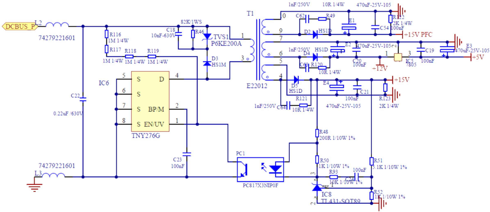

## 待机功耗对比

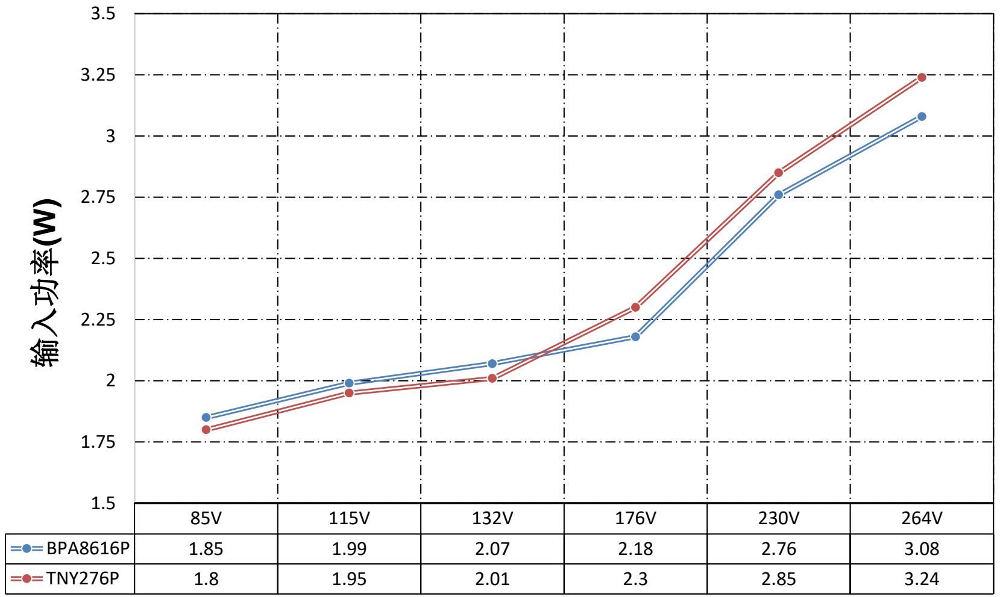

## 输入电压(VAC)

基于整机AC输入电路和后级完整小信号电路测试结果  
TNY276P电路上通过电阻串实现输入欠压功能，而BPA8616P内置了输入过/欠压保护功能

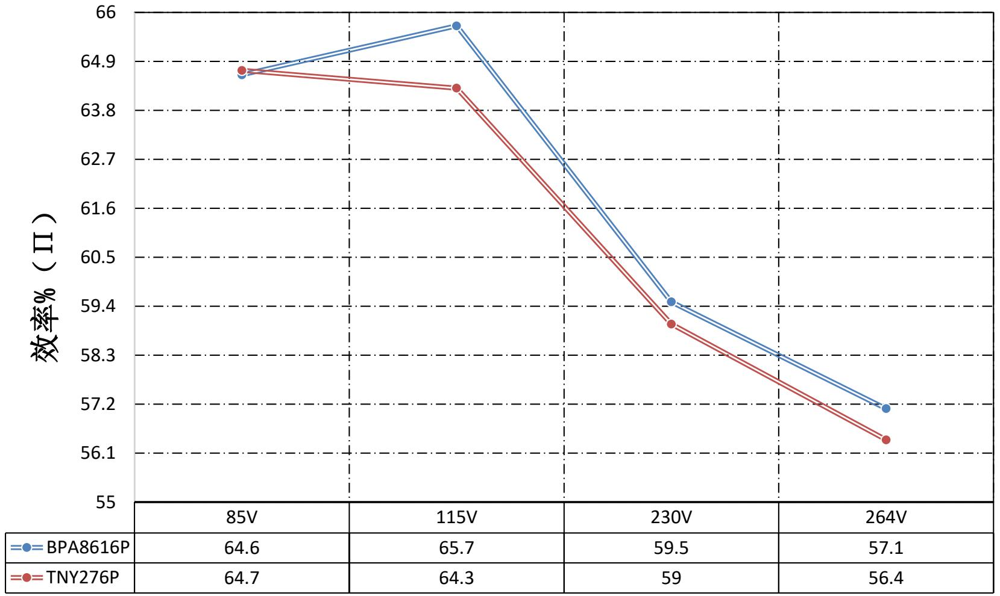

## 输入电压(VAC)

基于整机AC输入电路和输出侧完整小信号电路

## 输出电压交叉调整率

TNY276P

<table><tr><td colspan="2"> $V_{IN} (VAC)$ Load(%)</td><td colspan="3">85</td><td colspan="3">115</td><td colspan="3">230</td><td colspan="3">265</td></tr><tr><td colspan="2"></td><td>15PV</td><td>15V</td><td>12V</td><td>15PV</td><td>15V</td><td>12V</td><td>15PV</td><td>15V</td><td>12V</td><td>15PV</td><td>15V</td><td>12V</td></tr><tr><td rowspan="3">空载</td><td>15PV0A</td><td rowspan="3">17.76</td><td rowspan="3">15.175</td><td rowspan="3">15.015</td><td rowspan="3">17.175</td><td rowspan="3">15.174</td><td rowspan="3">14.82</td><td rowspan="3">17.285</td><td rowspan="3">15.171</td><td rowspan="3">14.84</td><td rowspan="3">17.534</td><td rowspan="3">15.171</td><td rowspan="3">14.96</td></tr><tr><td>15V0A</td></tr><tr><td>12V0A</td></tr><tr><td rowspan="3">交叉负载</td><td>15PV0A</td><td rowspan="3">18.813</td><td rowspan="3">15.175</td><td rowspan="3">15.052</td><td rowspan="3">19.19</td><td rowspan="3">15.175</td><td rowspan="3">15.11</td><td rowspan="3">20.531</td><td rowspan="3">15.175</td><td rowspan="3">15.241</td><td rowspan="3">20.72</td><td rowspan="3">15.175</td><td rowspan="3">15.195</td></tr><tr><td>15V0.1A</td></tr><tr><td>12V0.2A</td></tr><tr><td rowspan="3">交叉负载</td><td>15PV0.07A</td><td rowspan="3">15.68</td><td rowspan="3">15.171</td><td rowspan="3">13.51</td><td rowspan="3">16.11</td><td rowspan="3">15.175</td><td rowspan="3">13.86</td><td rowspan="3">17.034</td><td rowspan="3">15.175</td><td rowspan="3">14.545</td><td rowspan="3">16.924</td><td rowspan="3">15.175</td><td rowspan="3">14.42</td></tr><tr><td>15V0A</td></tr><tr><td>12V0.2A</td></tr><tr><td rowspan="3">交叉负载</td><td>15PV0.07A</td><td rowspan="3">17.496</td><td rowspan="3">15.175</td><td rowspan="3">15.389</td><td rowspan="3">17.581</td><td rowspan="3">15.175</td><td rowspan="3">15.43</td><td rowspan="3">17.864</td><td rowspan="3">15.175</td><td rowspan="3">15.59</td><td rowspan="3">17.853</td><td rowspan="3">15.175</td><td rowspan="3">15.558</td></tr><tr><td>15V0.1A</td></tr><tr><td>12V0A</td></tr><tr><td rowspan="3">交叉负载</td><td>15PV0A</td><td rowspan="3">17.036</td><td rowspan="3">15.175</td><td rowspan="3">13.809</td><td rowspan="3">17.539</td><td rowspan="3">15.175</td><td rowspan="3">14.033</td><td rowspan="3">19.024</td><td rowspan="3">15.175</td><td rowspan="3">14.518</td><td rowspan="3">19.061</td><td rowspan="3">15.171</td><td rowspan="3">14.41</td></tr><tr><td>15V0A</td></tr><tr><td>12V0.2A</td></tr><tr><td rowspan="3">交叉负载</td><td>15PV0A</td><td rowspan="3">18.492</td><td rowspan="3">15.175</td><td rowspan="3">15.52</td><td rowspan="3">18.739</td><td rowspan="3">15.175</td><td rowspan="3">15.563</td><td rowspan="3">19.6</td><td rowspan="3">15.175</td><td rowspan="3">15.75</td><td rowspan="3">19.669</td><td rowspan="3">15.175</td><td rowspan="3">15.72</td></tr><tr><td>15V0.1A</td></tr><tr><td>12V0A</td></tr><tr><td rowspan="3">交叉负载</td><td>15PV0.07A</td><td rowspan="3">16.84</td><td rowspan="3">15.175</td><td rowspan="3">14.855</td><td rowspan="3">16.433</td><td rowspan="3">15.175</td><td rowspan="3">14.56</td><td rowspan="3">16.069</td><td rowspan="3">15.175</td><td rowspan="3">14.324</td><td rowspan="3">16.723</td><td rowspan="3">15.175</td><td rowspan="3">14.782</td></tr><tr><td>15V0A</td></tr><tr><td>12V0A</td></tr><tr><td rowspan="3">满载</td><td>15PV0.07A</td><td rowspan="3">17.408</td><td rowspan="3">15.175</td><td rowspan="3">15.04</td><td rowspan="3">17.526</td><td rowspan="3">15.175</td><td rowspan="3">15.113</td><td rowspan="3">17.89</td><td rowspan="3">15.175</td><td rowspan="3">15.255</td><td rowspan="3">17.872</td><td rowspan="3">15.175</td><td rowspan="3">15.215</td></tr><tr><td>15V0.1A</td></tr><tr><td>12V0.2A</td></tr></table>

BPA8616P

<table><tr><td colspan="2"> $V_{IN}(VAC)$ Load(%)</td><td colspan="3">85</td><td colspan="3">115</td><td colspan="3">230</td><td colspan="3">265</td></tr><tr><td colspan="2"></td><td>15PV</td><td>15V</td><td>12V</td><td>15PV</td><td>15V</td><td>12V</td><td>15PV</td><td>15V</td><td>12V</td><td>15PV</td><td>15V</td><td>12V</td></tr><tr><td rowspan="3">空载</td><td>15PV0A</td><td rowspan="3">18.003</td><td rowspan="3">15.174</td><td rowspan="3">15.128</td><td rowspan="3">17.931</td><td rowspan="3">15.174</td><td rowspan="3">15.033</td><td rowspan="3">17.494</td><td rowspan="3">15.175</td><td rowspan="3">14.97</td><td rowspan="3">17.544</td><td rowspan="3">15.175</td><td rowspan="3">14.98</td></tr><tr><td>15V0A</td></tr><tr><td>12V0A</td></tr><tr><td rowspan="3">交叉负载</td><td>15PV0A</td><td rowspan="3">18.71</td><td rowspan="3">15.175</td><td rowspan="3">14.989</td><td rowspan="3">18.99</td><td rowspan="3">15.175</td><td rowspan="3">15.09</td><td rowspan="3">20.3</td><td rowspan="3">15.175</td><td rowspan="3">15.231</td><td rowspan="3">20.7</td><td rowspan="3">15.175</td><td rowspan="3">15.23</td></tr><tr><td>15V0.1A</td></tr><tr><td>12V0.2A</td></tr><tr><td rowspan="3">交叉负载</td><td>15PV0.07A</td><td rowspan="3">15.401</td><td rowspan="3">15.175</td><td rowspan="3">13.275</td><td rowspan="3">15.84</td><td rowspan="3">15.175</td><td rowspan="3">13.625</td><td rowspan="3">17.04</td><td rowspan="3">15.175</td><td rowspan="3">14.552</td><td rowspan="3">17.018</td><td rowspan="3">15.175</td><td rowspan="3">14.516</td></tr><tr><td>15V0A</td></tr><tr><td>12V0.2A</td></tr><tr><td rowspan="3">交叉负载</td><td>15PV0.07A</td><td rowspan="3">17.439</td><td rowspan="3">15.175</td><td rowspan="3">15.374</td><td rowspan="3">17.544</td><td rowspan="3">15.175</td><td rowspan="3">15.427</td><td rowspan="3">17.838</td><td rowspan="3">15.175</td><td rowspan="3">15.574</td><td rowspan="3">17.868</td><td rowspan="3">15.175</td><td rowspan="3">15.576</td></tr><tr><td>15V0.1A</td></tr><tr><td>12V0A</td></tr><tr><td rowspan="3">交叉负载</td><td>15PV0A</td><td rowspan="3">16.72</td><td rowspan="3">15.175</td><td rowspan="3">13.601</td><td rowspan="3">17.229</td><td rowspan="3">15.175</td><td rowspan="3">13.866</td><td rowspan="3">18.9</td><td rowspan="3">15.175</td><td rowspan="3">14.53</td><td rowspan="3">19.08</td><td rowspan="3">15.171</td><td rowspan="3">14.84</td></tr><tr><td>15V0A</td></tr><tr><td>12V0.2A</td></tr><tr><td rowspan="3">交叉负载</td><td>15PV0A</td><td rowspan="3">18.819</td><td rowspan="3">15.175</td><td rowspan="3">15.585</td><td rowspan="3">18.623</td><td rowspan="3">15.175</td><td rowspan="3">15.57</td><td rowspan="3">19.479</td><td rowspan="3">15.175</td><td rowspan="3">15.75</td><td rowspan="3">19.674</td><td rowspan="3">15.175</td><td rowspan="3">15.755</td></tr><tr><td>15V0.1A</td></tr><tr><td>12V0A</td></tr><tr><td rowspan="3">交叉负载</td><td>15PV0.07A</td><td rowspan="3">16.62</td><td rowspan="3">15.175</td><td rowspan="3">14.706</td><td rowspan="3">16.883</td><td rowspan="3">15.175</td><td rowspan="3">14.88</td><td rowspan="3">16.34</td><td rowspan="3">15.175</td><td rowspan="3">14.47</td><td rowspan="3">16.639</td><td rowspan="3">15.175</td><td rowspan="3">14.725</td></tr><tr><td>15V0A</td></tr><tr><td>12V0A</td></tr><tr><td rowspan="3">满载</td><td>15PV0.07A</td><td rowspan="3">17.319</td><td rowspan="3">15.177</td><td rowspan="3">14.955</td><td rowspan="3">17.466</td><td rowspan="3">15.175</td><td rowspan="3">15.066</td><td rowspan="3">17.835</td><td rowspan="3">15.175</td><td rowspan="3">15.235</td><td rowspan="3">17.896</td><td rowspan="3">15.175</td><td rowspan="3">15.24</td></tr><tr><td>15V0.1A</td></tr><tr><td>12V0.2A</td></tr></table>

## 输出电压纹波

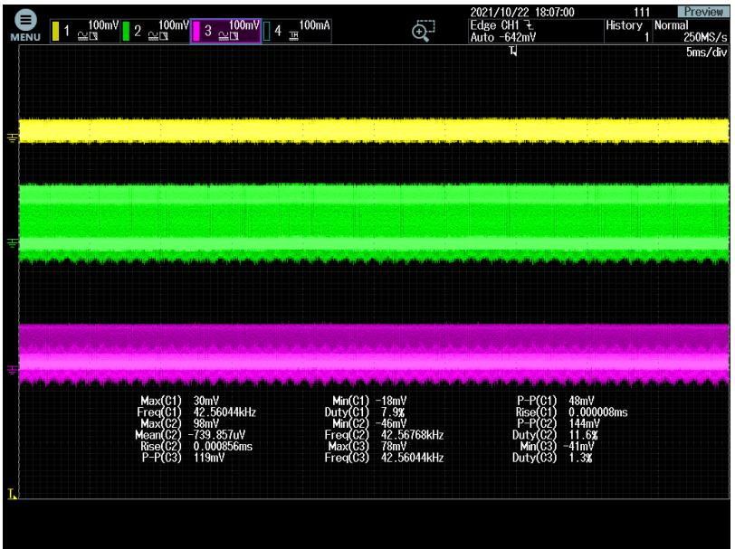

## TNY276P

## 85 VAC

CH1 $\mathsf { V } _ { \mathsf { O U T } \_ 1 5 \mathsf { V } }$ Ripple  
CH2 $\mathsf { V } _ { \mathsf { O U T } \_ 1 2 \mathsf { V } }$ Ripple  
CH4 $\mathsf { V } _ { \mathsf { O U T } } \mathsf { \_ { 1 5 P V } }$ Ripple  
$V _ { P K - P K \_ 1 5 V } = 4 8 m V$  
VPK-PK\_ $\scriptstyle 1 2 v = 1 4 4 \mathsf { m v }$  
$\mathsf { V } _ { \mathsf { P K - P K \_ 1 5 P V } } { = } 1 1 9 \mathsf { m V }$

Test Condition:  
➢ No Load  
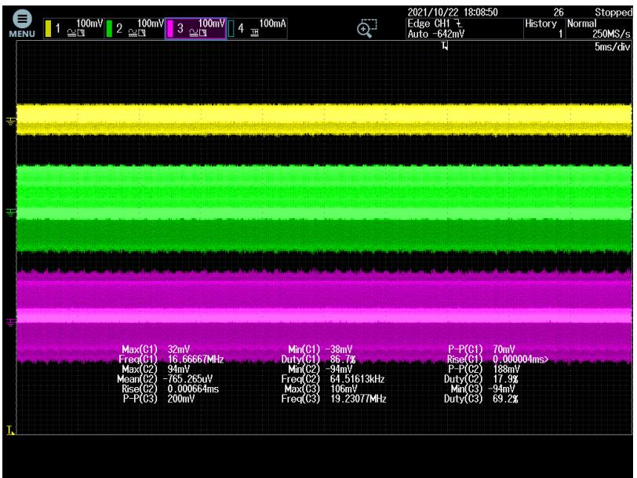

## TNY276P

## 265 $\mathsf { v } _ { \mathsf { A C } }$

CH1 $\mathsf { V } _ { \mathsf { O U T } \_ 1 5 \mathsf { V } }$ Ripple  
CH2 $\mathsf { V } _ { \mathsf { O U T } \_ 1 2 \mathsf { V } }$ Ripple  
CH4 $\mathsf { V } _ { \mathsf { O U T } _ { \mathsf { - } } \mathsf { 1 5 P V } }$ Ripple  
$V _ { P K - P K \_ 1 5 V } = 7 0 m V$  
$V _ { \mathsf { P K - P K \_ 1 2 V } } { = } 1 8 8 \mathsf { m V }$  
$V _ { P K - P K \_ 1 5 P V } = 2 0 0 \mathsf { m V }$

Test Condition:  
➢ No Load  
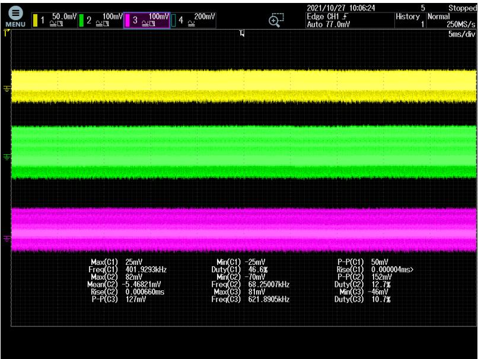

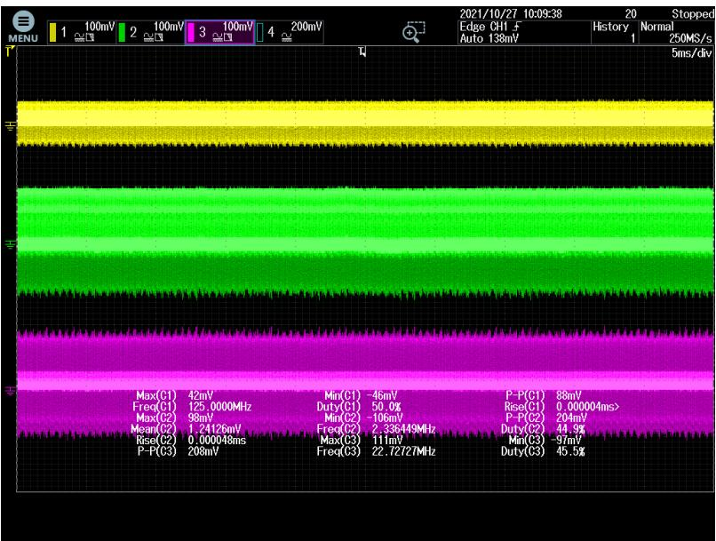

Test Condition:  
➢ No Load

## BPA8616P

## 85 VAC

CH1 $\mathsf { V } _ { \mathsf { O U T } \_ 1 5 \mathsf { V } }$ Ripple  
CH2 $\mathsf { V } _ { \mathsf { O U T } \_ 1 2 \mathsf { V } }$ Ripple  
CH4 $\mathsf { V } _ { \mathsf { O U T } _ { \mathsf { - } } \mathsf { 1 5 P V } }$ Ripple  
$V _ { P K - P K \_ 1 5 V } = 5 0 m V$  
$\mathsf { V } _ { \mathsf { P K - P K \_ 1 2 V } } { = } 1 5 2 \mathsf { m V }$  
VPK-PK $\scriptstyle 1 5 \mathsf { P V } = 1 2 7 \mathsf { m V }$

## BPA8616P

## 265 VAC

CH1 $\mathsf { V } _ { \mathsf { O U T } \_ 1 5 \mathsf { V } }$ Ripple  
CH2 $\mathsf { V } _ { \mathsf { O U T } \_ 1 2 \mathsf { V } }$ Ripple  
CH4 $\mathsf { V } _ { \mathsf { O U T } }$ \_15PV Ripple  
◼ $V _ { \mathsf { P K - P K \_ 1 5 V } } { = } 8 8 \mathsf { m V }$  
$V _ { P K - P K \_ 1 2 V } = 2 0 4 \mathsf { m V }$  
$\mathsf { V } _ { \mathsf { P K - P K \_ 1 5 P V } } { = } 2 0 8 \mathsf { m V }$

Test Condition:

➢ No Load

## 输出电压纹波

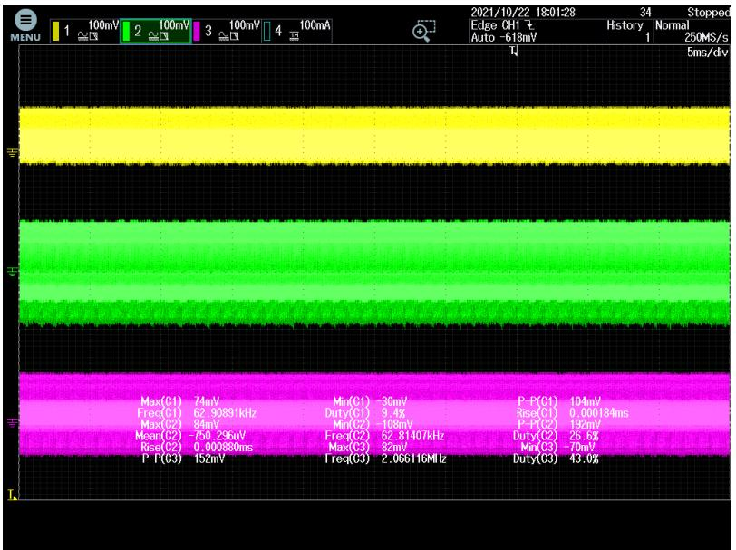

## TNY276P

## 85 VAC

CH1 $\mathsf { V } _ { \mathsf { O U T } \_ 1 5 \mathsf { V } }$ Ripple  
CH2 $\mathsf { V } _ { \mathsf { O U T } \_ 1 2 \mathsf { V } }$ Ripple  
CH4 $\mathsf { V } _ { \mathsf { O U T } _ { - } 1 5 \mathsf { P V } }$ Ripple  
$V _ { \mathsf { P K - P K \_ 1 5 V } } { = } 1 0 4 \mathsf { m V }$  
$V _ { \mathsf { P K - P K \_ 1 2 V } } { = } 1 9 2 \mathsf { m V }$  
VPK-PK\_15PV $= 2 5 2 \mathsf { m V }$

Test Condition:

➢ Full Load

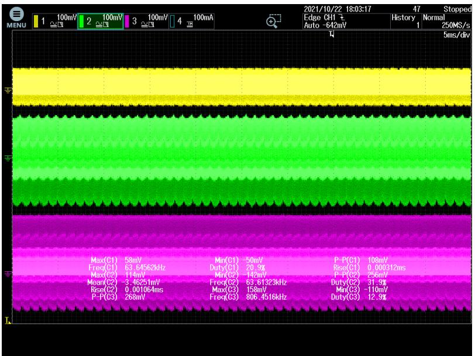

## TNY276P

## 265 VAC

CH1 $\mathsf { V } _ { \mathsf { O U T } \_ 1 5 \mathsf { V } }$ Ripple  
CH2 $\mathsf { V } _ { \mathsf { O U T } \_ 1 2 \mathsf { V } }$ Ripple  
CH4 $\mathsf { V } _ { \mathsf { O U T } _ { \mathsf { - } } \mathsf { 1 5 P V } }$ Ripple  
$V _ { \mathsf { P K - P K \_ 1 5 V } } { = } 1 0 8 \mathsf { m V }$  
◼ $V _ { P K - P K \_ 1 2 V } = 2 5 6 m V$  
◼ $V _ { P K - P K \_ 1 5 P V } = 2 6 8 \mathsf { m V }$

➢ Full Load

Test Condition:  
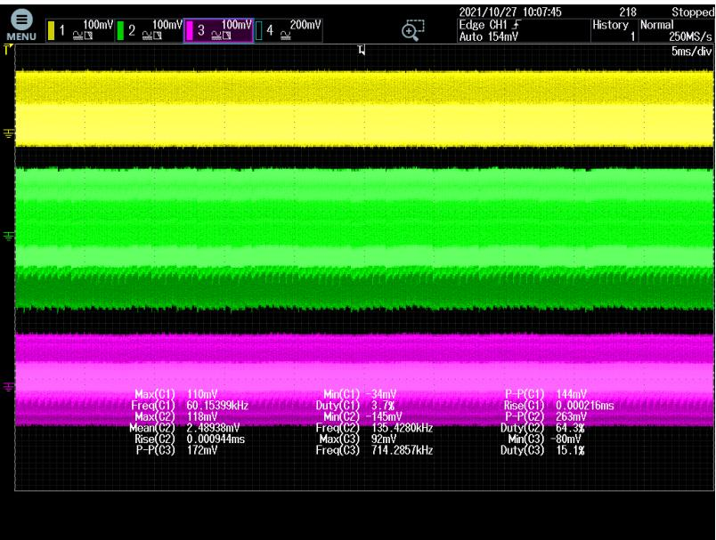

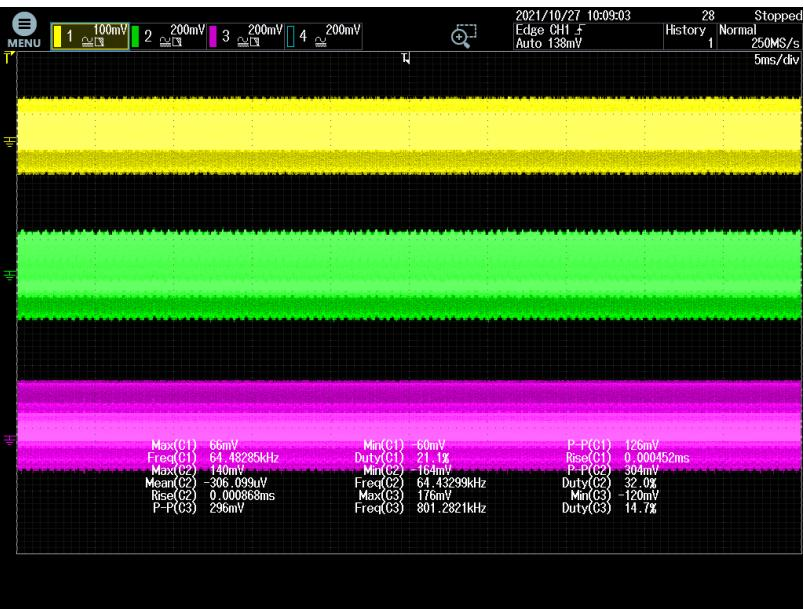

Test Condition:

## BPA8616P

## 85 VAC

CH1 $\mathsf { V } _ { \mathsf { O U T } \_ 1 5 \mathsf { V } }$ Ripple  
CH2 $\mathsf { V } _ { \mathsf { O U T } \_ 1 2 \mathsf { V } }$ Ripple  
CH4 $\mathsf { V } _ { \mathsf { O U T } }$ \_15PV Ripple  
$V _ { \mathsf { P K - P K \_ 1 5 V } } { = } 1 4 4 \mathsf { m V }$  
$V _ { P K - P K }$ $\scriptstyle 1 2 v = 2 6 3 m v$  
$\mathsf { V } _ { \mathsf { P K - P K } }$ $\scriptstyle 1 5 \mathsf { P V } = 1 7 2 \mathsf { m V }$

➢ Full Load

## BPA8616P

## 265 VAC

CH1 $\mathsf { V } _ { \mathsf { O U T } \_ 1 5 \mathsf { V } }$ Ripple  
CH2 $\mathsf { V } _ { \mathsf { O U T } \_ 1 2 \mathsf { V } }$ Ripple  
CH4 $\mathsf { V } _ { \mathsf { O U T } }$ \_15PV Ripple  
$V _ { \mathsf { P K - P K \_ 1 5 V } } { = } 1 2 6 \mathsf { m V }$  
$V _ { P K - P K \_ 1 2 V } = 3 0 4 \mathsf { m V }$  
$V _ { P K - P K \_ 1 5 P V } = 2 9 6 m V$

Test Condition:

➢ Full Load

## 动态负载(50%-100%)

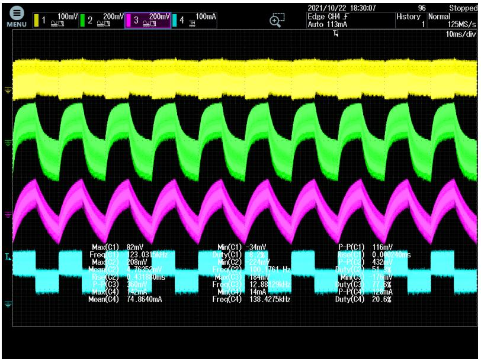

## TNY276P

## 85 VAC

CH1 $\mathsf { V } _ { \mathsf { O U T } \_ 1 5 \mathsf { V } }$ Ripple  
CH2 $\mathsf { V } _ { \mathsf { O U T } \_ 1 2 \mathsf { V } }$ Ripple  
CH4 $\mathsf { V } _ { \mathsf { O U T } \_ 1 5 \mathsf { P V } }$ Ripple  
$V _ { \mathsf { P K - P K \_ 1 5 V } } { = } 1 1 6 \mathsf { m V }$  
$V _ { P K - P K \_ 1 2 V } = 4 3 2 m V$  
VPK-PK\_15PV $\scriptstyle = 3 6 0 { \mathsf { m v } }$

## Test Condition:

➢ CH1 0.05 A-0.1 A-0.05A  
➢ Slew Rate: 0.5 A/μS  
➢ Frequency: 100 Hz

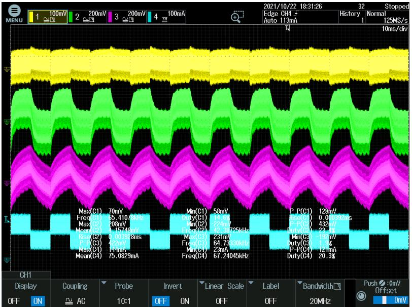

## TNY276P

## 265 VAC

CH1 $\mathsf { V } _ { \mathsf { O U T } \_ 1 5 \mathsf { V } }$ Ripple  
CH2 $\mathsf { V } _ { \mathsf { O U T } _ { - } 1 2 \mathsf { V } }$ Ripple  
CH4 $\mathsf { V } _ { \mathsf { O U T } _ { - } 1 5 \mathsf { P V } }$ Ripple  
$V _ { \mathsf { P K - P K \_ 1 5 V } } { = } 1 2 8 \mathsf { m V }$  
$V _ { P K - P K \_ 1 2 V } = 4 3 2 m V$  
VPK-PK\_15PV $= 4 2 2 m v$

## Test Condition:

➢ CH1 0.05 A-0.1 A-0.05A  
➢ Slew Rate: 0.5 A/μS  
➢ Frequency: 100 Hz

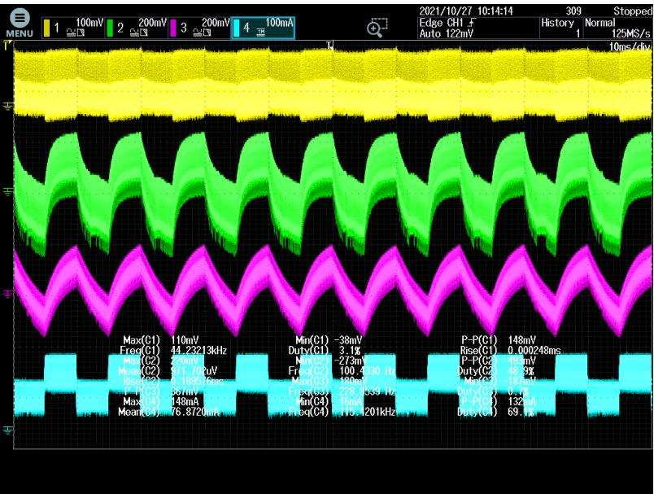

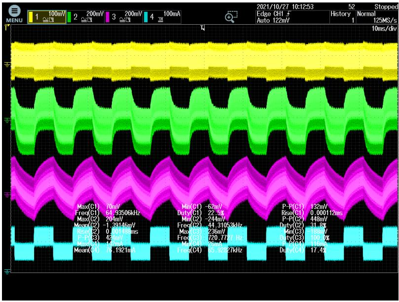

## BPA8616P

## 85 VAC

$\mathsf { C H 1 V _ { o u r \_ 1 5 \vee } }$ Ripple  
$\mathsf { C H 2 V } _ { \mathsf { O U T } \perp 2 \mathsf { V } }$ Ripple  
$\mathsf { C H 4 V _ { o u r \_ 1 5 \mathsf { P V } } }$ Ripple  
$V _ { \mathsf { P K - P K \_ 1 5 V } } { = } 1 4 8 \mathsf { m V }$ VPK-PK\_12V=493mV $V _ { P K - P K \_ 1 2 V } = 4 9 3 m V$ V $\scriptstyle 1 5 \mathsf { P V } = 3 6 7 \mathsf { m V }$

## Test Condition:

➢ CH1 0.05 A-0.1 A-0.05A  
➢ Slew Rate: 0.5 A/μS  
➢ Frequency: 100 Hz

## BPA8616P

## 265 VAC

$\mathsf { C H 1 V _ { o u r \_ 1 5 \vee } }$ Ripple  
$\mathsf { C H } 2 \mathsf { V } _ { \mathsf { O U T } _ { - } 1 2 \mathsf { V } }$ Ripple  
$\mathsf { C H 4 V _ { o u r \_ 1 5 \mathsf { P V } } }$ Ripple  
$V _ { \mathsf { P K - P K \_ 1 5 V } } { = } 1 3 2 \mathsf { m V }$ $V _ { P K - P K \_ 1 2 V } = 4 4 8 \mathsf { m V }$ VPK-PK 15PV $= 4 2 4 \mathsf { m V }$

## Test Condition:

➢ CH1 0.05 A-0.1 A-0.05A  
➢ Slew Rate: 0.5 A/μS  
➢ Frequency: 100 Hz

## 输出电压开机波形

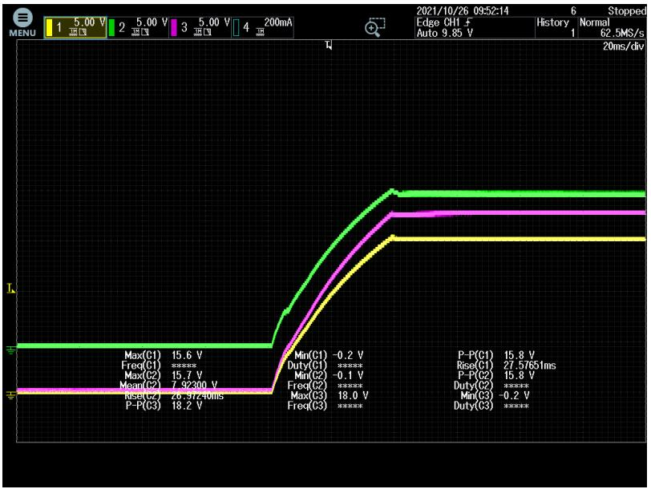

TNY276P  
85 VAC

CH1 VOUT\_15V $\mathsf { V } _ { \mathsf { O U T } \_ 1 5 \mathsf { V } }$  
CH2 VOUT\_12V $\mathsf { V } _ { \mathsf { O U T } \_ 1 2 \mathsf { V } }$  
CH4 VOUT\_15PV $\mathsf { V } _ { \mathsf { O U T } } \mathsf { \_ { 1 5 P V } }$  
$\mathrm { t } _ { \mathrm { r i s e } } { = } 2 7 . 5 \mathrm { m } S$

Test Condition:  
➢ No Load  
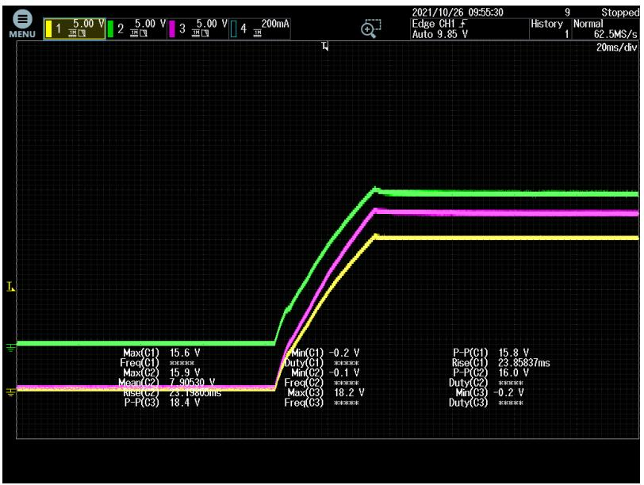

TNY276P  
265 VAC

CH1 VOUT\_15V $\mathsf { V } _ { \mathsf { O U T } \_ 1 5 \mathsf { V } }$  
CH2 VOUT\_12V $\mathsf { V } _ { \mathsf { O U T } \_ 1 2 \mathsf { V } }$  
CH4 VOUT\_15PV $\mathsf { V } _ { \mathsf { O U T } _ { \mathsf { - } } \mathsf { 1 5 P V } }$  
t =23.8mS

Test Condition:  
➢ No Load  
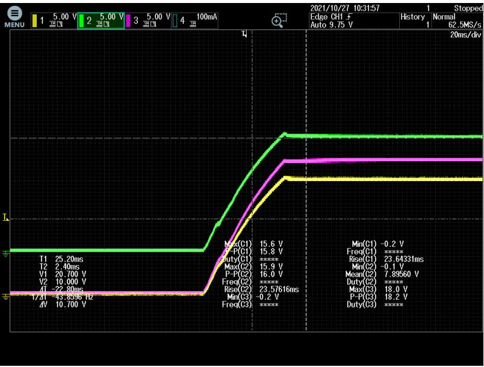

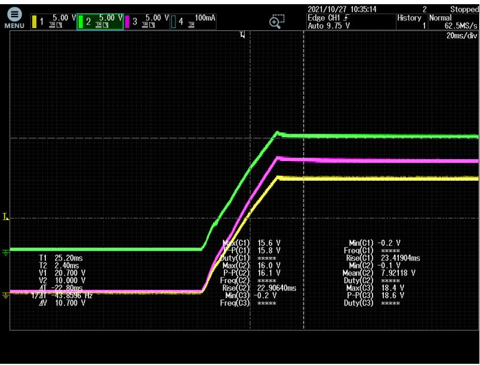

Test Condition:  
➢ No Load

## BPA8616P

## 85 VAC

CH1 VOUT\_15V $\mathsf { V } _ { \mathsf { O U T } \_ 1 5 \mathsf { V } }$  
CH2 VOUT\_12V $\mathsf { V } _ { \mathsf { O U T } \_ 1 2 \mathsf { V } }$  
CH4 VOUT\_15PV $\mathsf { V } _ { \mathsf { O U T } _ { \mathsf { - } } \mathsf { 1 5 P V } }$  
$\pm _ { \mathrm { r i s e } } = 2 3 . 6  { \mathrm { m s } }$

## BPA8616P

## 265 VAC

CH1 VOUT\_15V $\mathsf { C H 1 V _ { o u r \_ 1 5 \vee } }$  
CH2 VOUT\_12V $\mathsf { V } _ { \mathsf { 0 } \mathsf { U T } _ { - } \mathsf { 1 } 2 \mathsf { V } }$  
CH4 VOUT\_15PV  
$\mathtt { t } _ { \mathrm { r i s e } } = 2 3 . 4 \mathrm { m } s$

Test Condition:

➢ No Load

## 输出电压开机波形

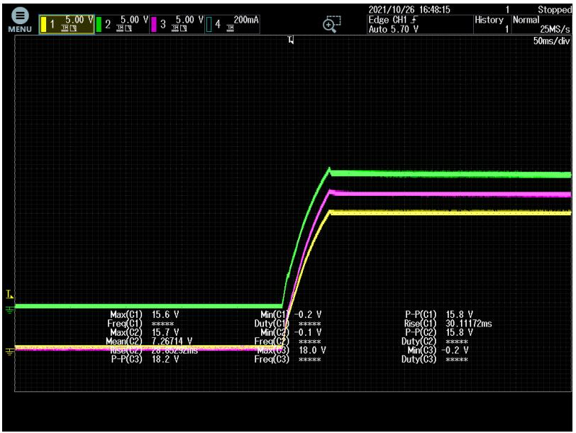

## TNY276P

85 VAC

CH1 VOUT\_15V $\mathsf { V } _ { \mathsf { O U T } \_ 1 5 \mathsf { V } }$  
CH2 VOUT\_12V $\mathsf { V } _ { \mathsf { O U T } \_ 1 2 \mathsf { V } }$  
CH4 VOUT\_15PV $\mathsf { V } _ { \mathsf { O U T } _ { - } 1 5 \mathsf { P V } }$  
$\mathtt { t } _ { \mathrm { r i s e } } = 2 7 . 5 \mathrm { m } 5$

## Test Condition:

➢ Light Load  
轻载启机，满载无法正常启机，电源进入OLP保护模式

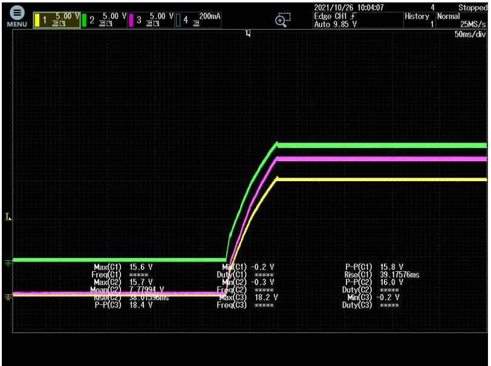

## TNY276P

265 VAC

CH1 VOUT\_15V $\mathsf { V } _ { \mathsf { O U T } \_ 1 5 \mathsf { V } }$  
CH2 VOUT\_12V $\mathsf { V } _ { \mathsf { O U T } \_ 1 2 \mathsf { V } }$  
CH4 VOUT\_15PV $\mathsf { V } _ { \mathsf { O U T } _ { \mathsf { - } } \mathsf { 1 5 P V } }$  
trise=39.1mS

## Test Condition:

➢ Full Load

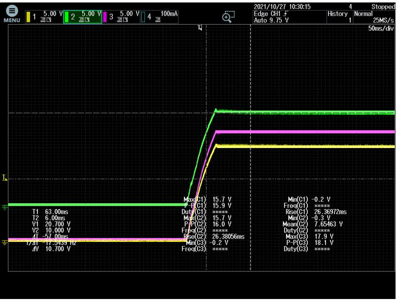

## BPA8616P

85 VAC

$\begin{array} { r l } & { \mathsf { C H 2 } \mathsf { V } _ { \mathrm { 0 U T } } } \\ & { \mathsf { t } _ { \mathrm { r i s e } } \mathrm { = } 5 \mathsf { m s } } \end{array}$

## Test Condition:

➢ Light Load  
轻载启机，满载无法正常启机，电源进入OLP保护模式

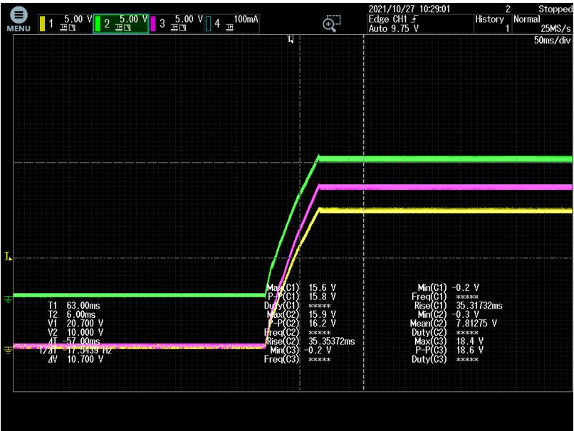

## BPA8616P

265 VAC

CH1 VOUT\_15V $\mathsf { V } _ { \mathsf { O U T } \_ 1 5 \mathsf { V } }$  
CH2 VOUT\_12V $\mathsf { V } _ { \mathsf { 0 } \mathsf { U T } _ { - } \mathsf { 1 } 2 \mathsf { V } }$  
CH4 VOUT\_15PV $\mathsf { V } _ { \mathsf { O U T } _ { \mathsf { - } } \mathsf { 1 5 P V } }$  
trise=35.3mS

## Test Condition:

➢ Full Load

## MOSFET开机电压波形

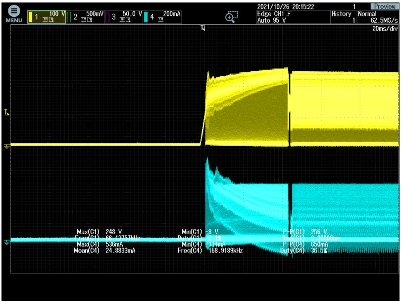

TNY276P  
85 VAC

CH1 VDS  
CH4 IDS

$$
V _ {D S \_ M A X} = 2 4 8 V
$$

$$
I _ {D S \_ M A X} = 0. 5 3 6 A
$$

Test Condition:

➢ Full Load

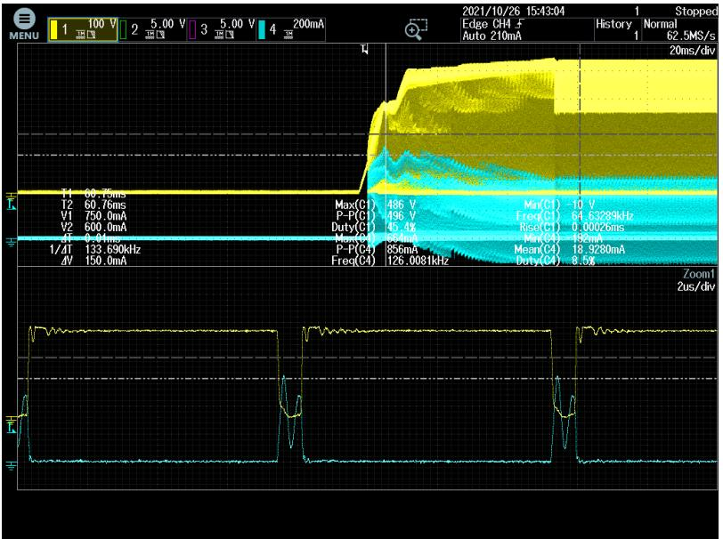

TNY276P  
265 VAC

CH1 VDS  
CH4 IDS

$$
V _ {D S \_ M A X} = 4 8 6 V
$$

$$
I _ {D S \_ M A X} = 0. 6 6 4 A
$$

➢ Full Load

Test Condition:  
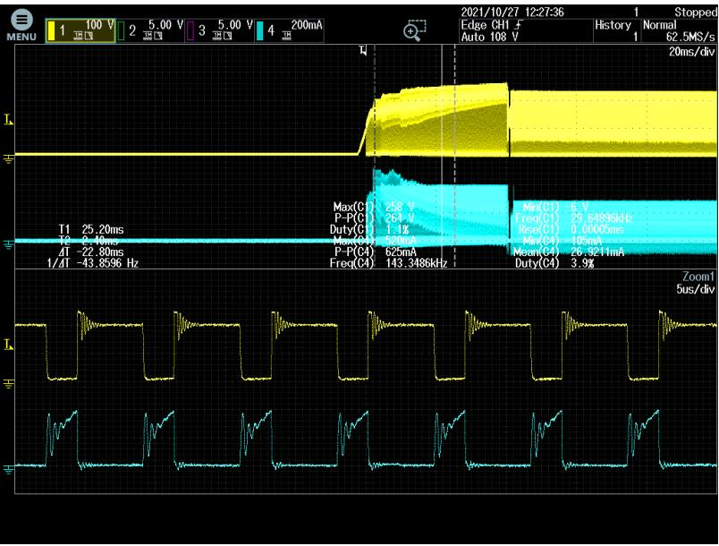

BPA8616P

265 VAC

CH1 VDS  
CH4 IDS

$$
V _ {D S \_ M A X} = 2 5 8 V
$$

$$
I _ {D S \_ M A X} = 0. 5 2 A
$$

Test Condition:

➢ Full Load

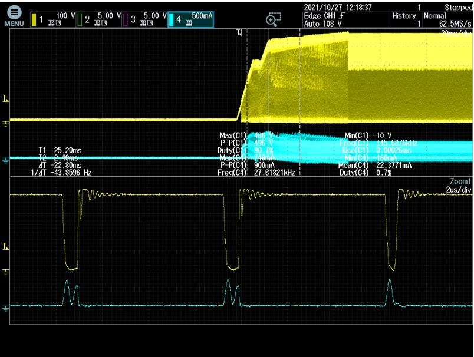

BPA8616P  
265 VAC

CH1 VDS  
CH4 IDS

$$
V _ {D S M A X} = 4 8 6 V
$$

$$
I _ {D S \_ M A X} = 0. 7 4 A
$$

Test Condition:

➢ Full Load

## MOSFET稳态电压波形

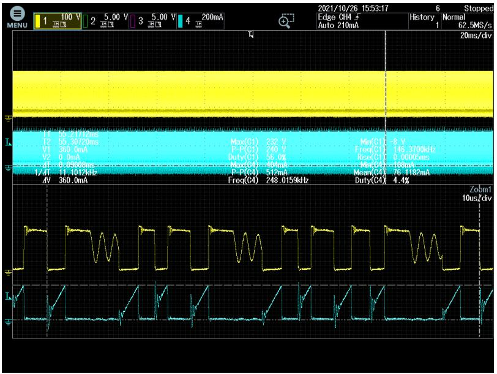

TNY276P

85 VAC  

Test Condition:

➢ Full Load

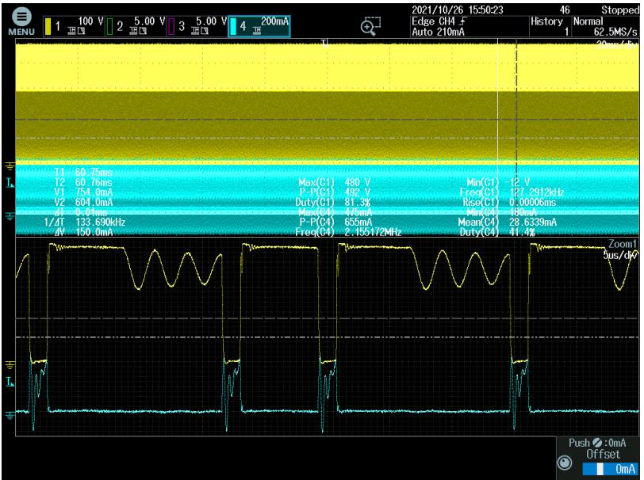

TNY276P

265 VAC  

Test Condition:

➢ Full Load

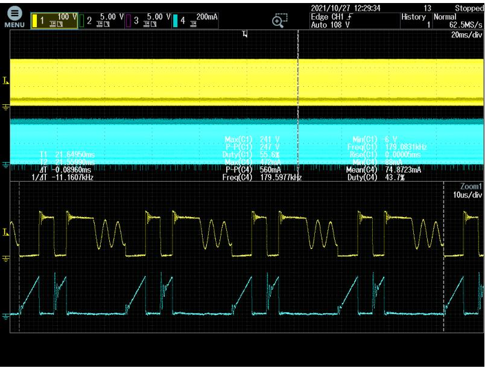

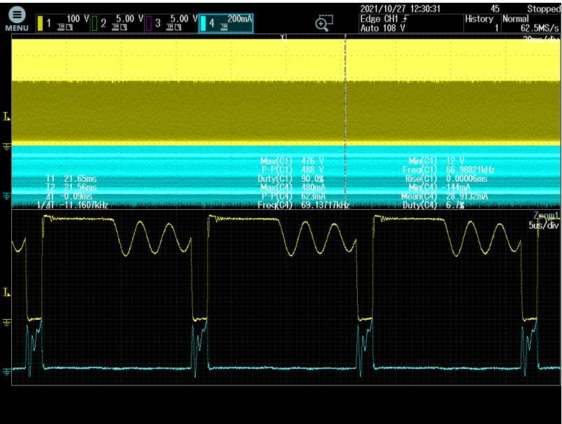

## BPA8616P

## 85 VAC

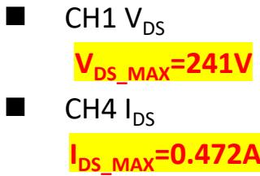

Test Condition:

➢ Full Load

## BPA8616P

265 VAC  
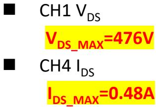

Test Condition:

➢ Full Load

## 输出二极管开机波形—满载

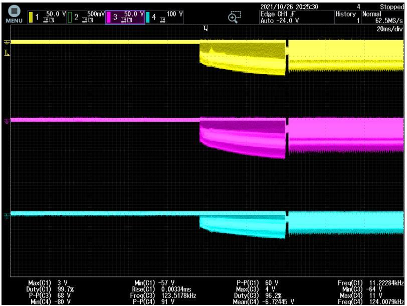

## TNY276P

## 85 VAC

CH1 $\mathsf { V } _ { \mathsf { O U T } \_ 1 5 \mathsf { V } }$  
CH3 VOUT\_12V $\mathsf { V } _ { \mathsf { O U T } \_ 1 2 \mathsf { V } }$  
CH4 VOUT\_15PV $\mathsf { V } _ { \mathsf { O U T } _ { - } 1 5 \mathsf { P V } }$

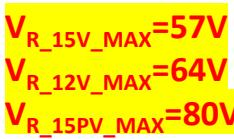  
Test Condition:

➢ Full Load

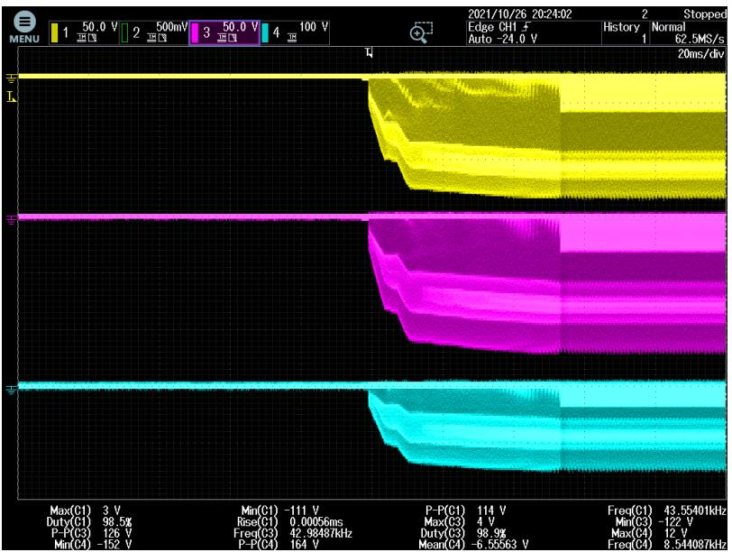

## TNY276P

## 265 VAC

CH1 VOUT\_15V $\mathsf { V } _ { \mathsf { O U T } \_ 1 5 \mathsf { V } }$  
CH3 VOUT\_12V $\mathsf { V } _ { \mathsf { O U T } _ { - } 1 2 \mathsf { V } }$  
CH4 VOUT\_15PV $\mathsf { V } _ { \mathsf { O U T } _ { - } 1 5 \mathsf { P V } }$

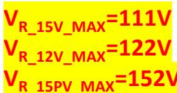  
Test Condition:

➢ Full Load

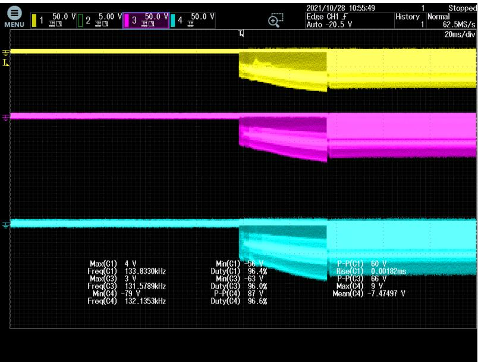

## BPA8616P

## 85 VAC

$\mathsf { C H 1 V _ { O U T \_ 1 5 \vee } }$  
CH3 VOUT\_12V $\mathsf { C H 3 } \mathsf { V _ { o u r \_ 1 2 \vee } }$  
CH4 VOUT\_15PV $\mathsf { V } _ { \mathsf { O U T } _ { - } 1 5 \mathsf { P V } }$

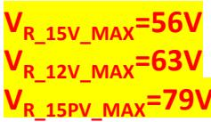  
Test Condition:

➢ Full Load

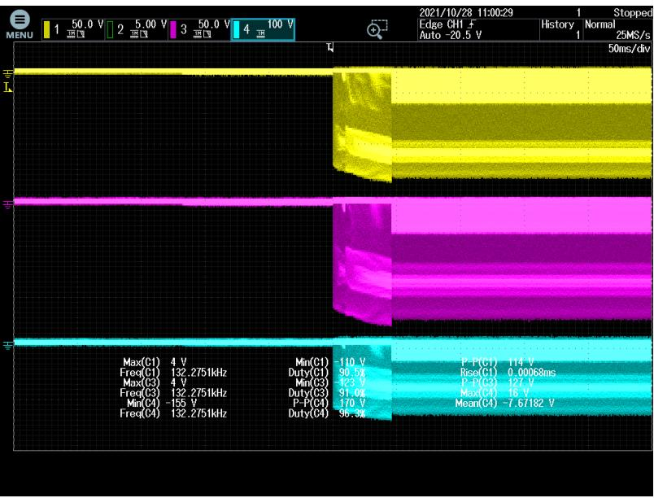

## BPA8616P

## 265 VAC

CH1 VOUT\_15V $\mathsf { C H 1 V _ { o u r \_ 1 5 \vee } }$  
$\mathsf { C H 3 } \mathsf { V _ { O U T \_ 1 2 \vee } }$  
CH4 VOUT\_15PV $\mathsf { V } _ { \mathsf { O U T } _ { - } 1 5 \mathsf { P V } }$

  
Test Condition:

➢ Full Load

## 输出二极管稳态波形—待机

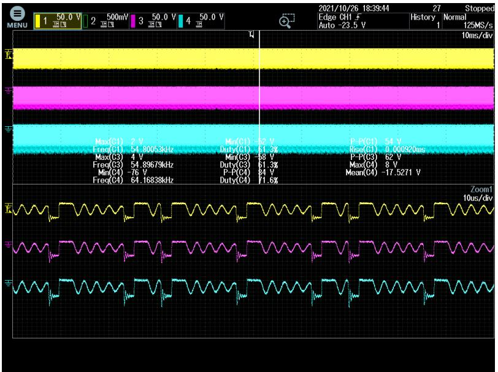

TNY276P  
85 VAC

CH1 $\mathsf { V } _ { \mathsf { O U T } \_ 1 5 \mathsf { V } }$  
CH3 VOUT\_12V $\mathsf { V } _ { \mathsf { O U T } \_ 1 2 \mathsf { V } }$  
CH4 VOUT\_15PV $\mathsf { V } _ { \mathsf { O U T } _ { - } 1 5 \mathsf { P V } }$

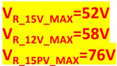  
Test Condition:

➢ Standby Load

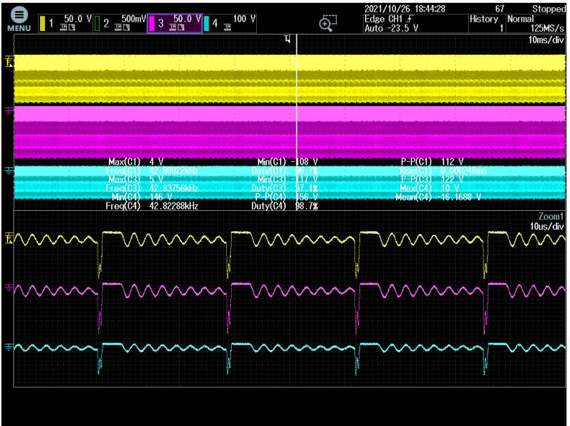

TNY276P  
265 VAC

CH1 VOUT\_15V $\mathsf { V } _ { \mathsf { O U T } \_ 1 5 \mathsf { V } }$  
CH3 VOUT\_12V $\mathsf { V } _ { \mathsf { O U T } _ { - } 1 2 \mathsf { V } }$  
CH4 VOUT\_15PV $\mathsf { V } _ { \mathsf { O U T } _ { - } 1 5 \mathsf { P V } }$

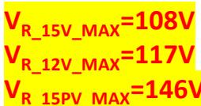  
Test Condition:

➢ Standby Load

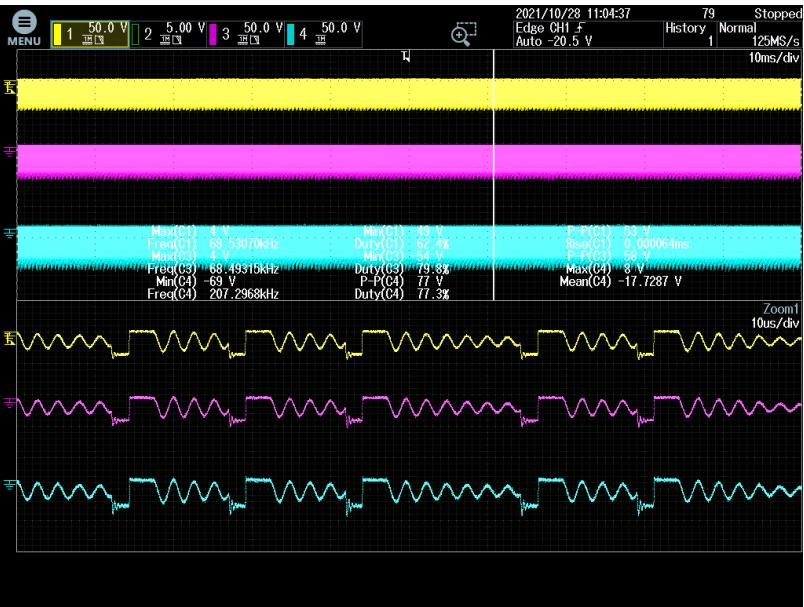

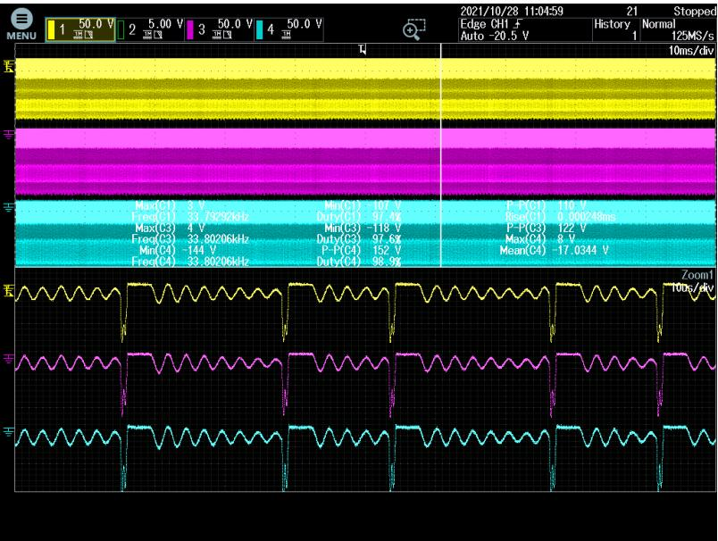

## BPA8616P

## 85 VAC

CH1 $\mathsf { V } _ { \mathsf { O U T } \_ 1 5 \mathsf { V } }$  
CH3 VOUT\_12V $\mathsf { V } _ { \mathsf { O U T } _ { - } 1 2 \mathsf { V } }$  
CH4 VOUT\_15PV $\mathsf { V } _ { \mathsf { O U T } _ { - } 1 5 \mathsf { P V } }$

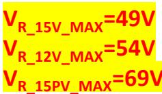  
Test Condition:

➢ Standby Load

BPA8616P

265 VAC

CH1 VOUT\_15V $\mathsf { V } _ { \mathsf { O U T } \_ 1 5 \mathsf { V } }$  
CH3 $\mathsf { V } _ { \mathsf { O U T } _ { - } 1 2 \mathsf { V } }$  
CH4 VOUT\_15PV $\mathsf { V } _ { \mathsf { O U T } _ { - } 1 5 \mathsf { P V } }$

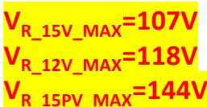  
Test Condition:

➢ Standby Load

## 输出二极管稳态波形—满载

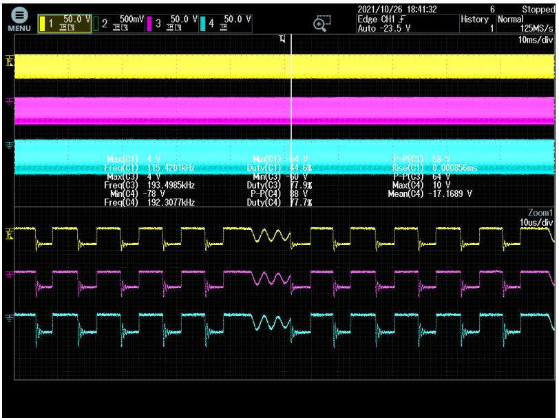

TNY276P  
85 VAC

CH1 $\mathsf { V } _ { \mathsf { O U T } \_ 1 5 \mathsf { V } }$  
CH3 VOUT\_12V $\mathsf { V } _ { \mathsf { O U T } \_ 1 2 \mathsf { V } }$  
CH4 VOUT\_15PV $\mathsf { V } _ { \mathsf { O U T } _ { - } 1 5 \mathsf { P V } }$

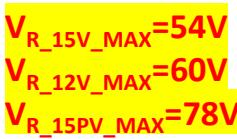  
Test Condition:

➢ Full Load  
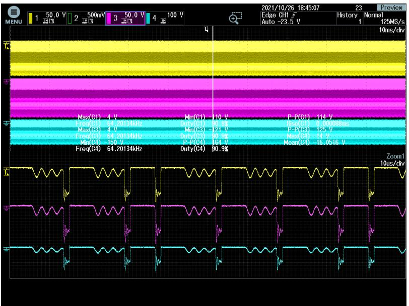

TNY276P  
265 VAC

CH1 VOUT\_15V $\mathsf { V } _ { \mathsf { O U T } \_ 1 5 \mathsf { V } }$  
CH3 VOUT\_12V $\mathsf { V } _ { \mathsf { O U T } _ { - } 1 2 \mathsf { V } }$  
CH4 VOUT\_15PV $\mathsf { V } _ { \mathsf { O U T } _ { - } 1 5 \mathsf { P V } }$

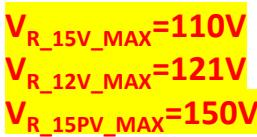  
Test Condition:  
➢ Full Load

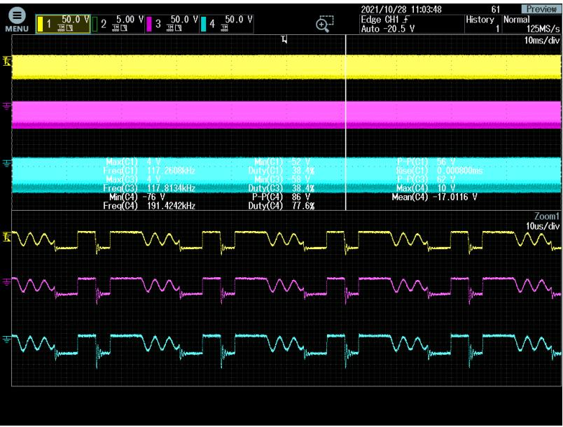

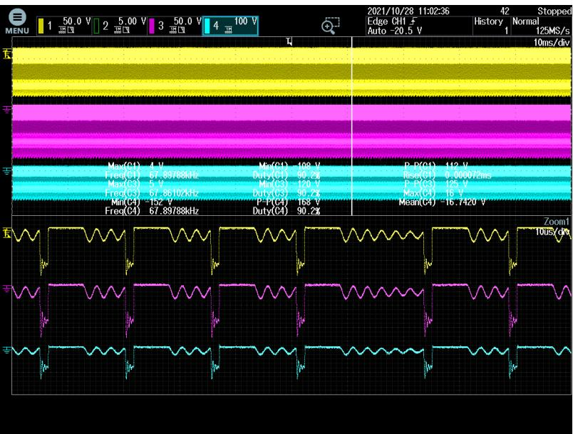

## BPA8616P

## 85 VAC

CH1 $\mathsf { V } _ { \mathsf { O U T } \_ 1 5 \mathsf { V } }$  
CH3 VOUT\_12V $\mathsf { V } _ { \mathsf { O U T } _ { - } 1 2 \mathsf { V } }$  
CH4 VOUT\_15PV $\mathsf { V } _ { \mathsf { O U T } _ { - } 1 5 \mathsf { P V } }$

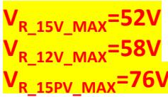  
Test Condition:  
➢ Full Load  
BPA8616P  
265 VAC

CH1 VOUT\_15V $\mathsf { V } _ { \mathsf { O U T } \_ 1 5 \mathsf { V } }$  
CH3 $\mathsf { V } _ { \mathsf { O U T } _ { - } 1 2 \mathsf { V } }$  
CH4 VOUT\_15PV $\mathsf { V } _ { \mathsf { O U T } _ { - } 1 5 \mathsf { P V } }$

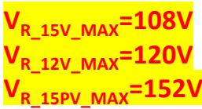  
Test Condition:  
➢ Full Load

## 短路保护（初级侧MOSFET电压电流波形）

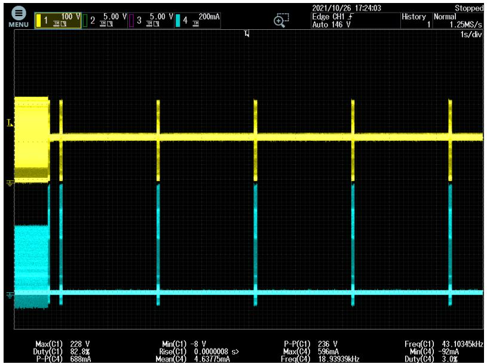

TNY276P

85 VAC  
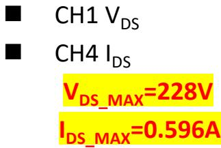

Test Condition:

➢ 15V Output Short

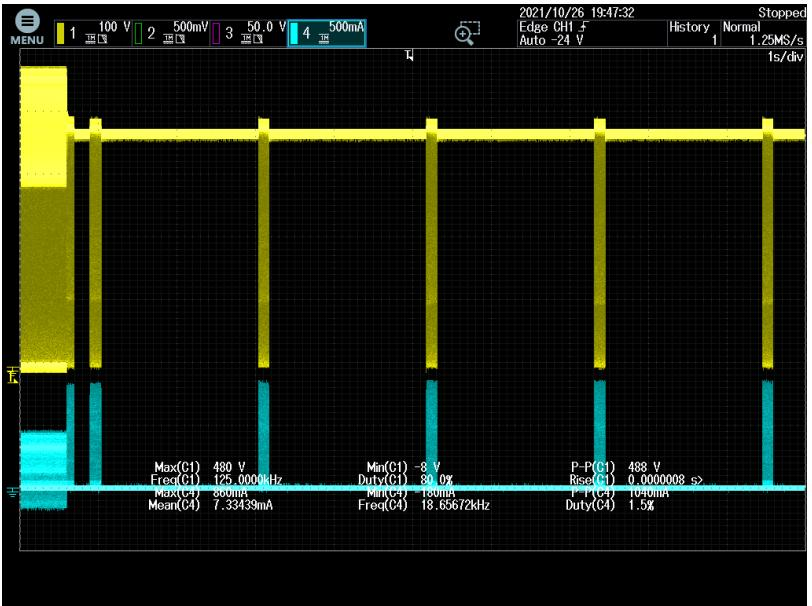

TNY276P

265 VAC  
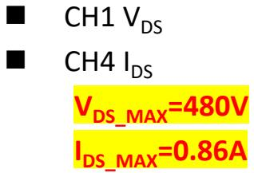

Test Condition:

➢ 15V Output Short

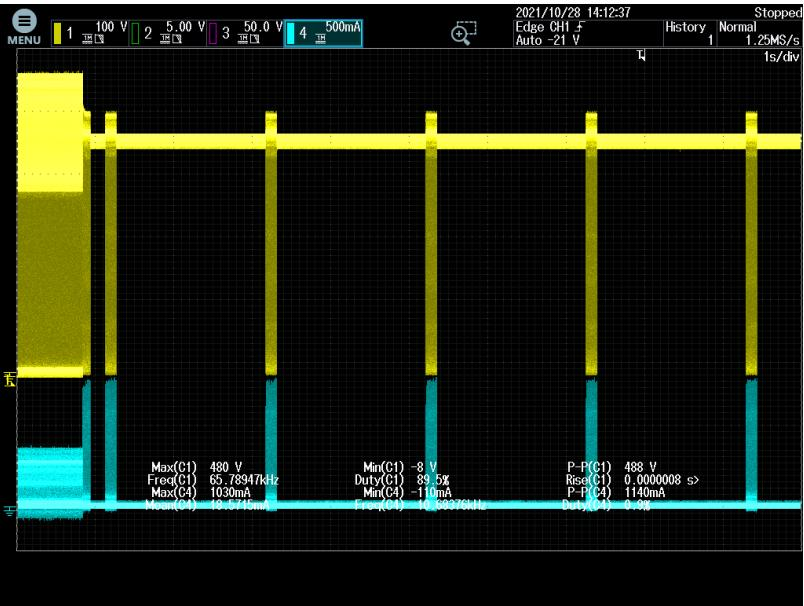

## BPA8616P

## 85 VAC

CH1 VDS  
CH4 IDS

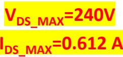  
Test Condition:

➢ 15V Output Short

## BPA8616P

265 VAC

CH1 VDS  
CH4 IDS

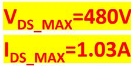  
Test Condition:

➢ 15V Output Short

## 短路保护（初级侧MOSFET电压电流波形）

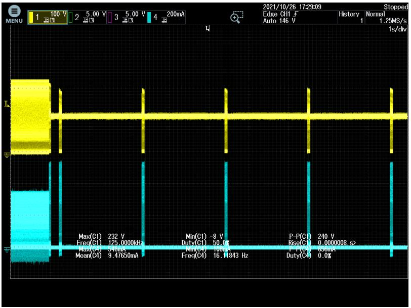

TNY276P

85 VAC  
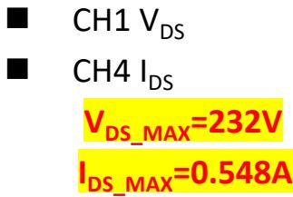

Test Condition:

➢ 12V Output Short

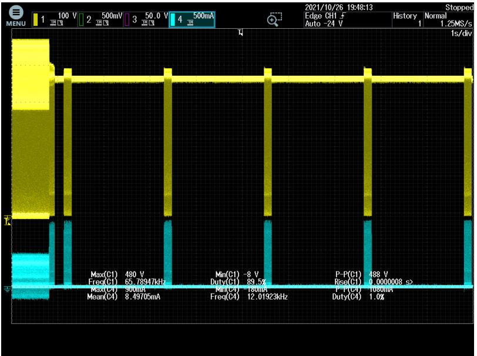

TNY276P

265 VAC  

Test Condition:

➢ 12V Output Short

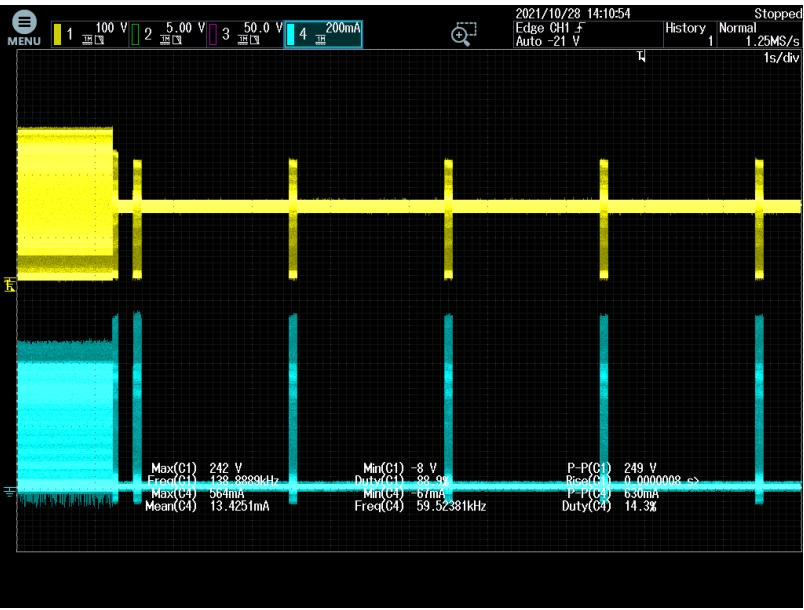

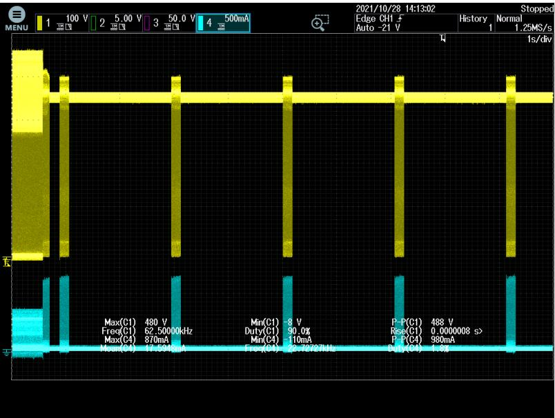

## BPA8616P

## 85 VAC

CH1 VDS  
CH4 IDS

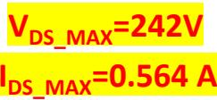  
Test Condition:

➢ 12V Output Short

## BPA8616P

265 VAC

CH1 VDS  
CH4 IDS

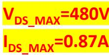  
Test Condition:

➢ 12V Output Short

## 短路保护（初级侧MOSFET电压电流波形）

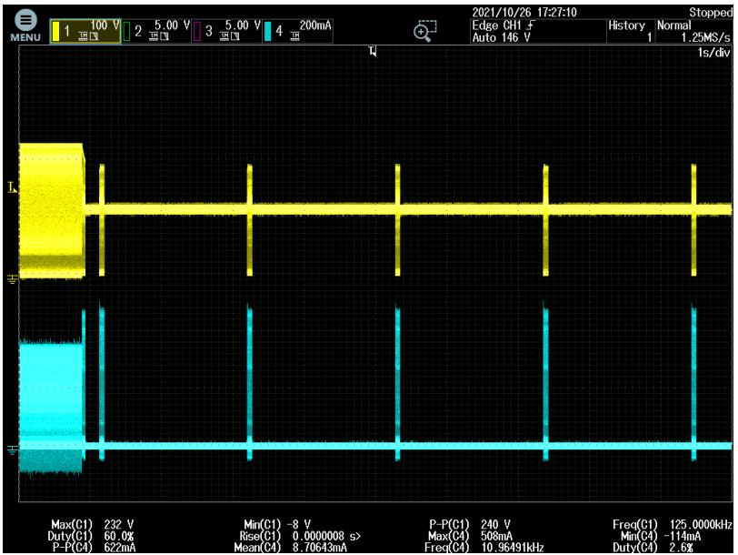

TNY276P

85 VAC  
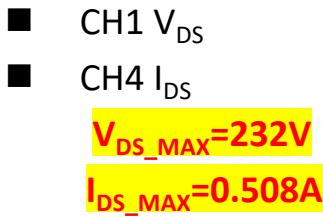

Test Condition:

➢ 15PV Output Short

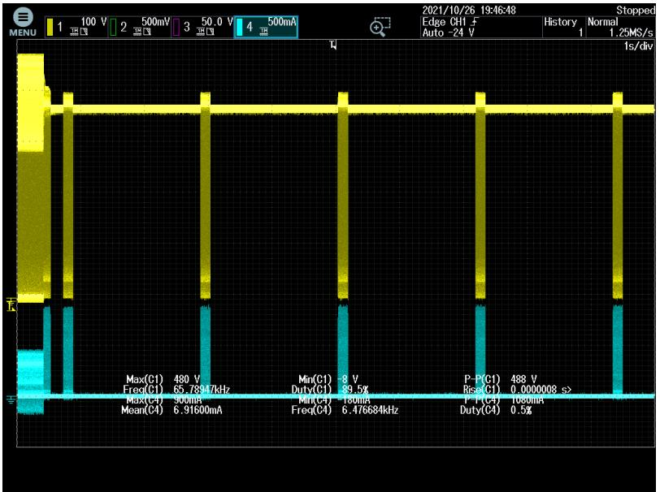

TNY276P

265 VAC  
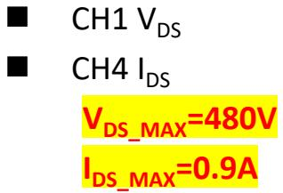

Test Condition:

➢ 15PV Output Short

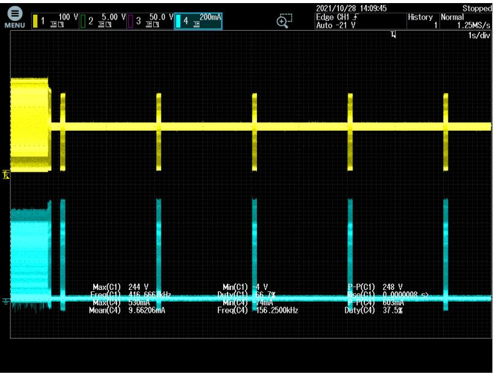

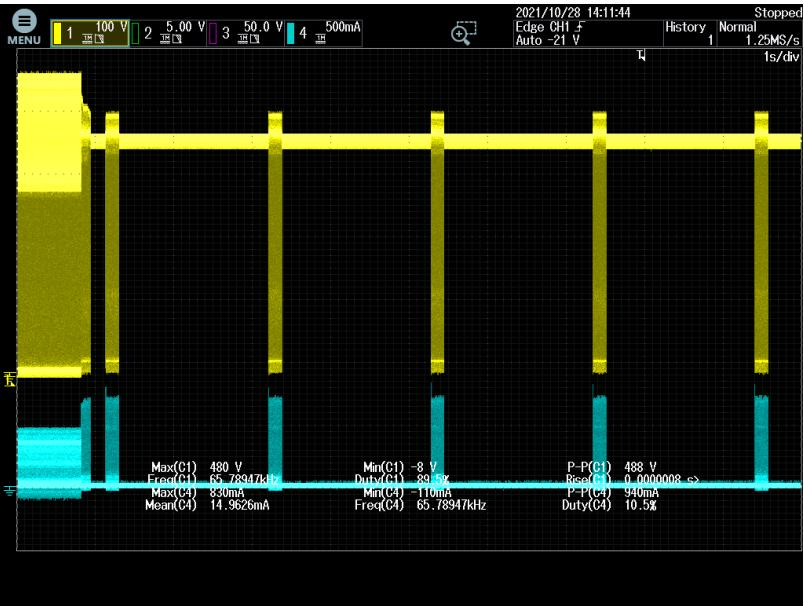

## BPA8616P

## 85 VAC

CH1 VDS  
CH4 IDS

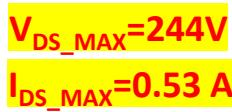  
Test Condition:

➢ 15PV Output Short

## BPA8616P

265 VAC

CH1 VDS  
CH4 IDS

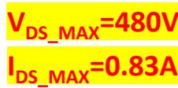  
Test Condition:

➢ 15PV Output Short

## 短路保护（输出二极管电压波形）

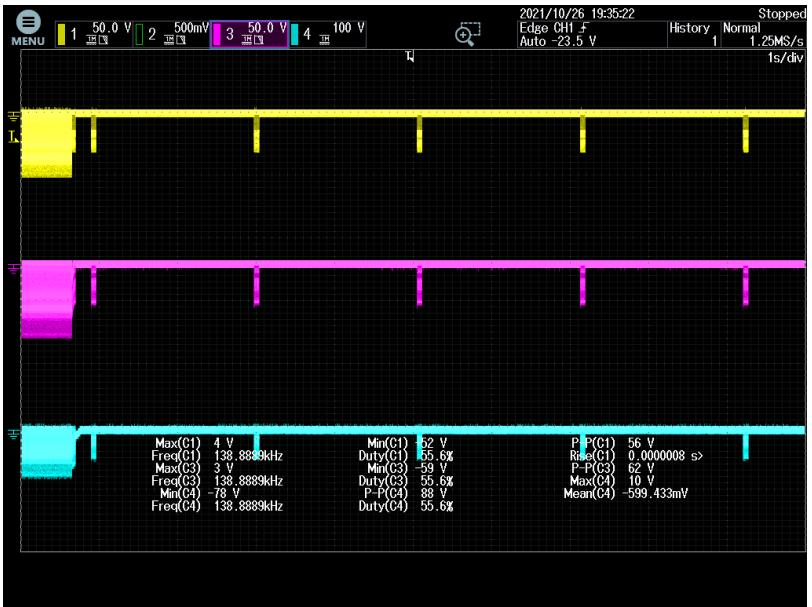

## TNY276P

## 85 VAC

CH1 VOUT\_15V $\mathsf { V } _ { \mathsf { O U T } \_ 1 5 \mathsf { V } }$  
CH3 VOUT\_12V $\mathsf { V } _ { \mathsf { O U T } \_ 1 2 \mathsf { V } }$  
CH4 VOUT\_15PV $\mathsf { V } _ { \mathsf { O U T } } \mathsf { \_ { 1 5 P V } }$

## Test Condition:

➢ 15V Output Short

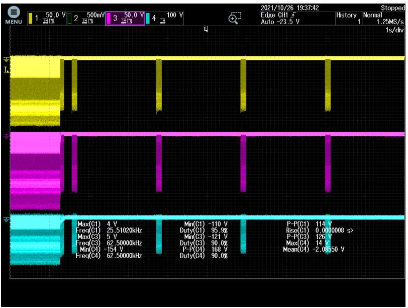

## TNY276P

## 265 $\mathsf { v } _ { \mathsf { A C } }$

CH1 VOUT\_15V $\mathsf { V } _ { \mathsf { O U T } \_ 1 5 \mathsf { V } }$  
CH3 VOUT\_12V $\mathsf { V } _ { \mathsf { O U T } \_ 1 2 \mathsf { V } }$  
CH4 VOUT\_15PV $\mathsf { V } _ { \mathsf { O U T } _ { \mathsf { - } } \mathsf { 1 5 P V } }$

## Test Condition:

➢ 15V Output Short

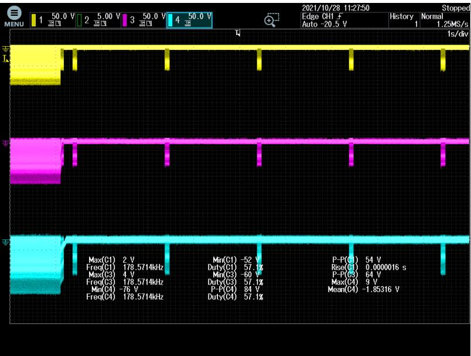

## BPA8616P

## 85 VAC

CH1 VOUT\_15V $\mathsf { V } _ { \mathsf { O U T } \_ 1 5 \mathsf { V } }$  
CH3 VOUT\_12V $\mathsf { V } _ { \mathsf { O U T } \_ 1 2 \mathsf { V } }$  
CH4 VOUT\_15PV $\mathsf { V } _ { \mathsf { O U T } _ { \mathsf { - } } \mathsf { 1 5 P V } }$

## Test Condition:

➢ 15V Output Short

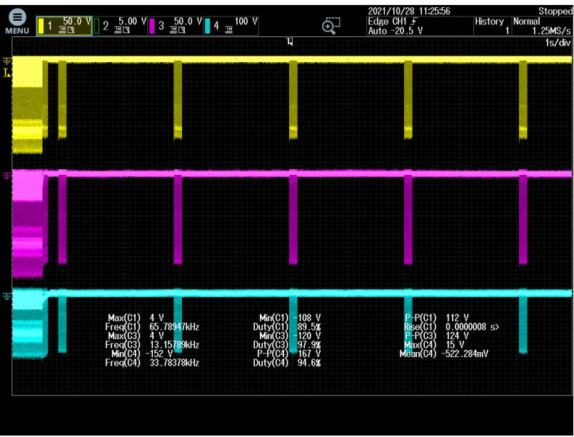

## BPA8616P

## 265 VAC

CH1 VOUT\_15V $\mathsf { V } _ { \mathsf { O U T } \_ 1 5 \mathsf { V } }$  
CH3 VOUT\_12V $\mathsf { V } _ { \mathsf { 0 } \mathsf { U T } _ { - } \mathsf { 1 } 2 \mathsf { V } }$  
CH4 VOUT\_15PV $\mathsf { V } _ { \mathsf { O U T } _ { \mathsf { - } } \mathsf { 1 5 P V } }$

## Test Condition:

➢ 15V Output Short

## 短路保护（输出二极管电压波形）

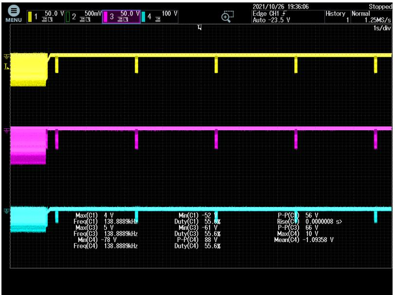

## TNY276P

## 85 VAC

CH1 VOUT\_15V $\mathsf { V } _ { \mathsf { O U T } \_ 1 5 \mathsf { V } }$  
CH3 VOUT\_12V $\mathsf { V } _ { \mathsf { O U T } \_ 1 2 \mathsf { V } }$  
CH4 VOUT\_15PV $\mathsf { V } _ { \mathsf { O U T } } \mathsf { \_ { 1 5 P V } }$

## Test Condition:

➢ 12V Output Short

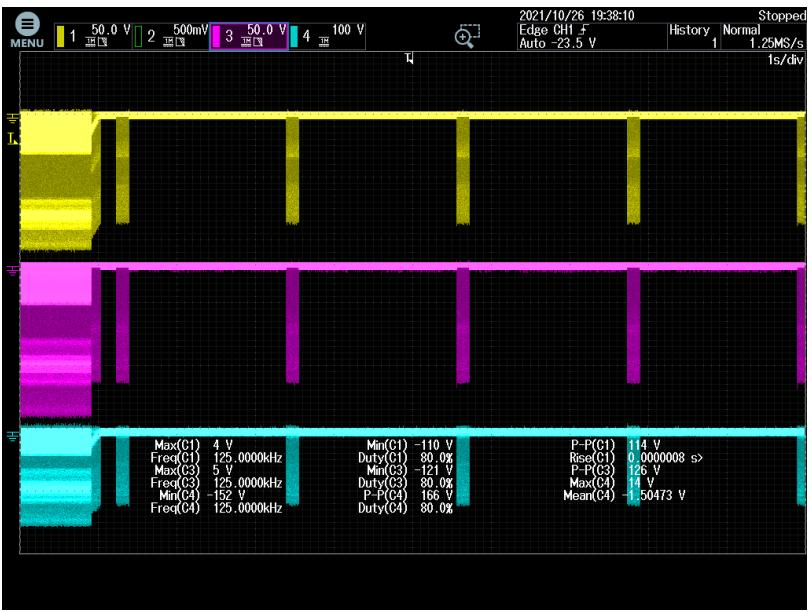

## TNY276P

## 265 $\mathsf { v } _ { \mathsf { A C } }$

CH1 VOUT\_15V $\mathsf { V } _ { \mathsf { O U T } \_ 1 5 \mathsf { V } }$  
CH3 VOUT\_12V $\mathsf { V } _ { \mathsf { O U T } \_ 1 2 \mathsf { V } }$  
CH4 VOUT\_15PV $\mathsf { V } _ { \mathsf { O U T } _ { \mathsf { - } } \mathsf { 1 5 P V } }$

## Test Condition:

➢ 12V Output Short

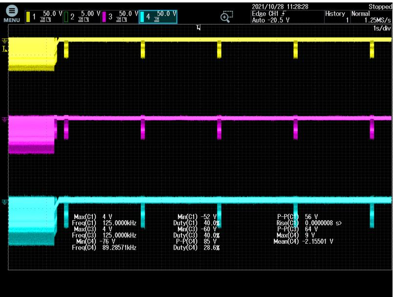

## BPA8616P

## 85 VAC

CH1 VOUT\_15V $\mathsf { V } _ { \mathsf { O U T } \_ 1 5 \mathsf { V } }$  
CH3 VOUT\_12V $\mathsf { V } _ { \mathsf { O U T } \_ 1 2 \mathsf { V } }$  
CH4 VOUT\_15PV $\mathsf { V } _ { \mathsf { O U T } _ { \mathsf { - } } \mathsf { 1 5 P V } }$

## Test Condition:

➢ 12V Output Short

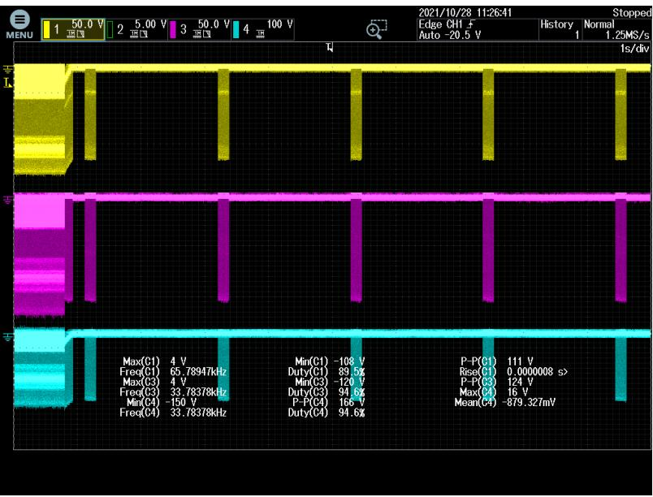

## BPA8616P

## 265 VAC

CH1 VOUT\_15V $\mathsf { V } _ { \mathsf { O U T } \_ 1 5 \mathsf { V } }$  
CH3 VOUT\_12V $\mathsf { V } _ { \mathsf { 0 } \mathsf { U T } _ { - } \mathsf { 1 } 2 \mathsf { V } }$  
CH4 VOUT\_15PV $\mathsf { V } _ { \mathsf { O U T } _ { \mathsf { - } } \mathsf { 1 5 P V } }$

## Test Condition:

➢ 12V Output Short

## 短路保护（输出二极管电压波形）

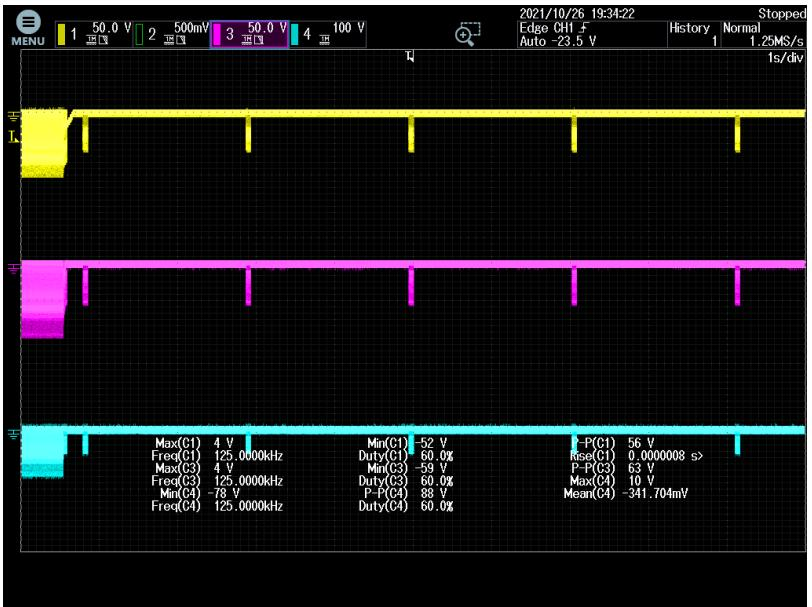

## TNY276P

## 85 VAC

CH1 VOUT\_15V $\mathsf { V } _ { \mathsf { O U T } \_ 1 5 \mathsf { V } }$  
CH3 VOUT\_12V $\mathsf { V } _ { \mathsf { O U T } \_ 1 2 \mathsf { V } }$  
CH4 VOUT\_15PV $\mathsf { V } _ { \mathsf { O U T } } \mathsf { \_ { 1 5 P V } }$

## Test Condition:

➢ 15PV Output Short

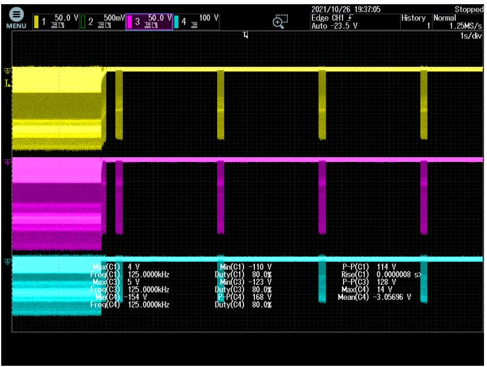

## TNY276P

## 265 $\mathsf { v } _ { \mathsf { A C } }$

CH1 VOUT\_15V $\mathsf { V } _ { \mathsf { O U T } \_ 1 5 \mathsf { V } }$  
CH3 VOUT\_12V $\mathsf { V } _ { \mathsf { O U T } \_ 1 2 \mathsf { V } }$  
CH4 VOUT\_15PV $\mathsf { V } _ { \mathsf { O U T } _ { \mathsf { - } } \mathsf { 1 5 P V } }$

## Test Condition:

➢ 15PV Output Short

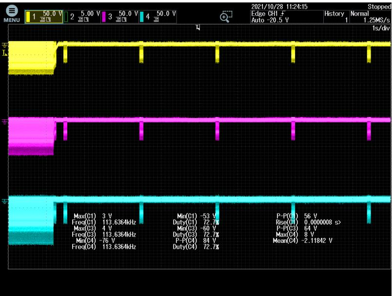

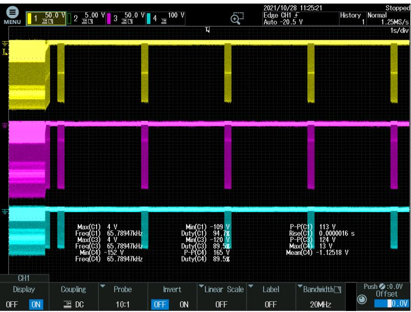

## BPA8616P

## 85 VAC

CH1 VOUT\_15V $\mathsf { V } _ { \mathsf { O U T } \_ 1 5 \mathsf { V } }$  
CH3 VOUT\_12V $\mathsf { V } _ { \mathsf { O U T } \_ 1 2 \mathsf { V } }$  
CH4 VOUT\_15PV $\mathsf { V } _ { \mathsf { O U T } _ { \mathsf { - } } \mathsf { 1 5 P V } }$

## Test Condition:

➢ 15PV Output Short

## BPA8616P

## 265 VAC

CH1 VOUT\_15V $\mathsf { C H 1 V _ { o u r \_ 1 5 \vee } }$  
CH3 VOUT\_12V $\mathsf { V } _ { \mathsf { 0 } \mathsf { U T } _ { - } \mathsf { 1 } 2 \mathsf { V } }$  
CH4 VOUT\_15PV $\mathsf { V } _ { \mathsf { O U T } _ { \mathsf { - } } \mathsf { 1 5 P V } }$

## Test Condition:

➢ 15PV Output Short

## 电源最大带载能力测试

TNY276P

<table><tr><td>输入电压85VAC</td><td>带载电流点(A)</td></tr><tr><td>15V</td><td>0.1</td></tr><tr><td>12V</td><td>0.3</td></tr><tr><td>15PV</td><td>0.07</td></tr></table>

<table><tr><td>输入电压265VAC</td><td>带载电流点(A)</td></tr><tr><td>15V</td><td>0.3</td></tr><tr><td>12V</td><td>0.2</td></tr><tr><td>15PV</td><td>0.2</td></tr></table>

在完整保留输出电路下，TNY276P的带载能力略低于BPA8616P，但都不能满足15V0.3A+12V0.6A+15PV0.2A

BPA8616P

<table><tr><td>输入电压85VAC</td><td>带载电流点(A)</td></tr><tr><td>15V</td><td>0.1</td></tr><tr><td>12V</td><td>0.4</td></tr><tr><td>15PV</td><td>0.07</td></tr></table>

<table><tr><td>输入电压265VAC</td><td>带载电流点(A)</td></tr><tr><td>15V</td><td>0.3</td></tr><tr><td>12V</td><td>0.3</td></tr><tr><td>15PV</td><td>0.2</td></tr></table>

TNY276P  
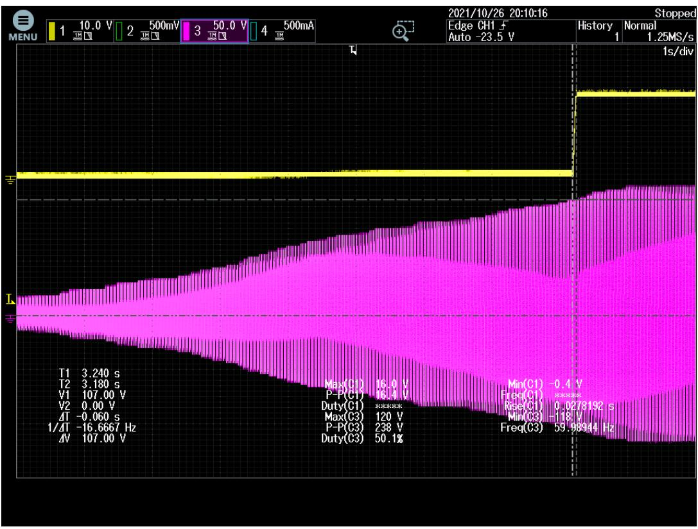

CH1 VOUT\_15V  
CH3 VAC\_IN

VAC\_IN\_STARTUP=75 VAC

Test Condition:

➢ No Load

备注：BPA8616P输入过/欠压功能无需外接采样电阻

BPA8616P  
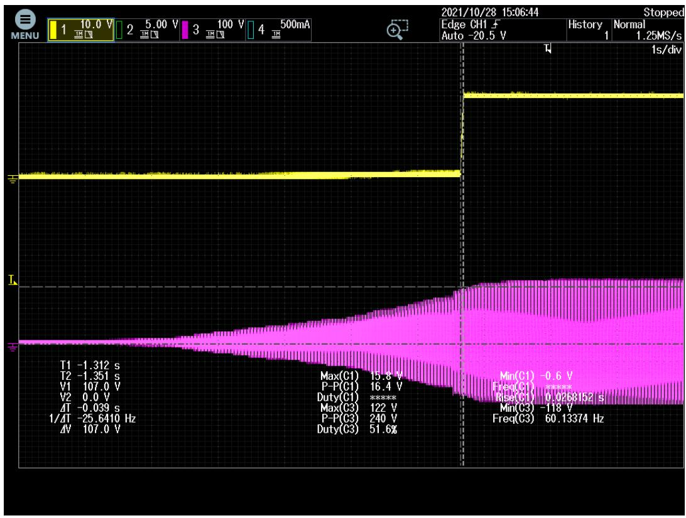

CH1 VOUT\_15V  
CH3 VAC\_IN

VAC\_IN\_STARTUP=75 VAC

Test Condition:

➢ No Load

TNY276P  
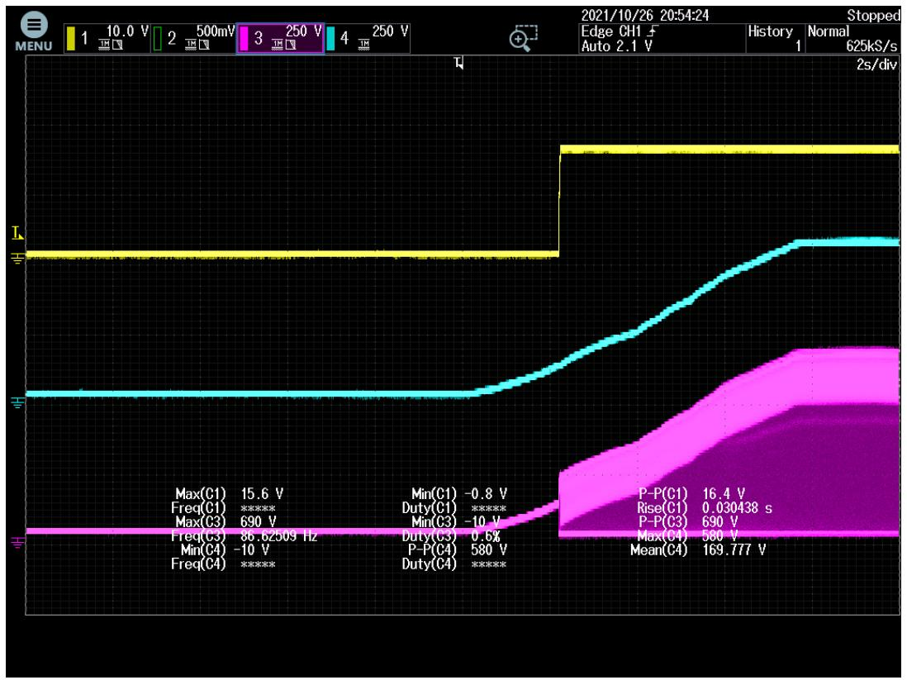

CH1 VOUT\_15V  
CH3 VDS  
CH4 VDC\_IN

$$
V _ {D S \_ M A X} = 6 9 0 \mathrm{V}
$$

$$
V _ {D C I N} = 5 8 0 \mathrm{V}
$$

Test Condition:

➢ Full Load

备注：BPA8616P输入过/欠压功能无需外接采样电阻

BPA8616P  
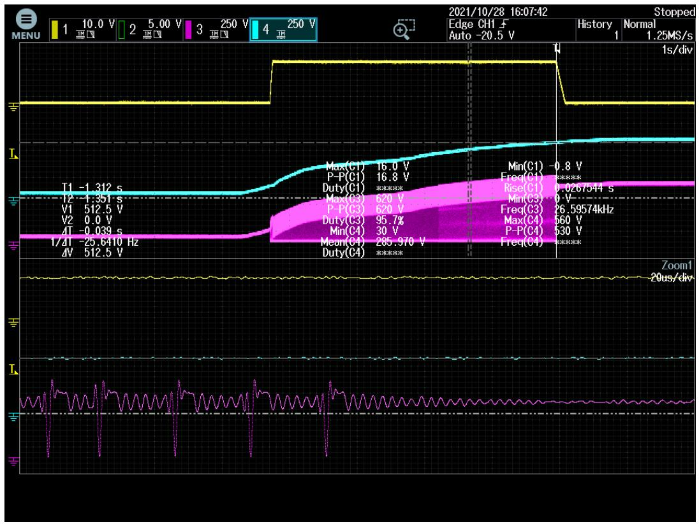

CH1 VOUT\_15V  
CH3 VDS  
CH4 VDC\_IN

$$
V _ {D S \_ M A X} = 6 2 0 \mathrm{V}
$$

VDC\_IN=512 V 此时BPA8616P进入输入过压保护功能，IC停止开关动作

Test Condition:

➢ Full Load

<table><tr><td rowspan="2">项目</td><td colspan="2">85VAC</td><td colspan="2">265VAC</td></tr><tr><td>温度</td><td>温升</td><td>温度</td><td>温升</td></tr><tr><td>环境温度</td><td colspan="2">29.8</td><td colspan="2">30</td></tr><tr><td>TNY276P</td><td>74.7</td><td>44.9</td><td>90</td><td>60</td></tr><tr><td>变压器Wire</td><td>53.5</td><td>23.7</td><td>62</td><td>32</td></tr><tr><td>变压器Core</td><td>51.1</td><td>21.3</td><td>58.8</td><td>28.8</td></tr><tr><td>15V输出二极管D6</td><td>53.6</td><td>23.8</td><td>59.4</td><td>29.4</td></tr><tr><td>12V输出二极管D4</td><td>59.2</td><td>29.4</td><td>64.2</td><td>34.2</td></tr><tr><td>15PV输出二极管D2</td><td>48.1</td><td>18.3</td><td>53.1</td><td>23.1</td></tr><tr><td>TVS管</td><td>46.5</td><td>16.7</td><td>51.7</td><td>21.7</td></tr></table>

<table><tr><td rowspan="2">项目</td><td colspan="2">85VAC</td><td colspan="2">265VAC</td></tr><tr><td>温度</td><td>温升</td><td>温度</td><td>温升</td></tr><tr><td>环境温度</td><td colspan="2">30</td><td colspan="2">30.6</td></tr><tr><td>BPA8616P</td><td>76</td><td>46</td><td>86.3</td><td>55.7</td></tr><tr><td>变压器Wire</td><td>53.4</td><td>23.4</td><td>62.2</td><td>31.6</td></tr><tr><td>变压器Core</td><td>51.3</td><td>21.3</td><td>59.6</td><td>29</td></tr><tr><td>15V输出二极管D6</td><td>54.3</td><td>24.3</td><td>59.8</td><td>29.2</td></tr><tr><td>12V输出二极管D4</td><td>58.9</td><td>28.9</td><td>64.5</td><td>33.9</td></tr><tr><td>15PV输出二极管D2</td><td>47.1</td><td>17.1</td><td>54.2</td><td>23.6</td></tr><tr><td>TVS管</td><td>47.7</td><td>17.7</td><td>51.7</td><td>21.1</td></tr></table>

## 测试说明

➢常温下密闭纸箱中进行测试；  
➢电路板放在一个封闭的盒子内；  
➢热电偶连接到各个测量点；  
➢等测量点温度达到稳定后记录数据；

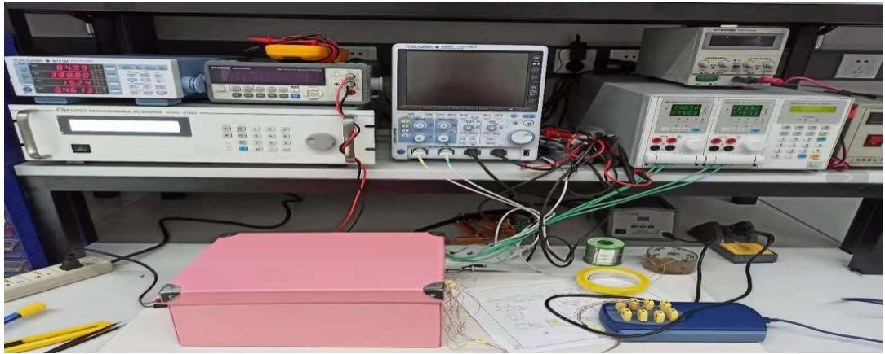

## ❑ 空载功耗以及满载时关键元件温度对比

待机状态两款芯片输入功耗基本一致；  
在85V和265V输入，满载输出下测试关键元件温度，各元件温升基本一致；

## ❑ 电源带载能力测试

➢ 85VAC输入，两方案电源都无法额定负载条件下启机。BPA8616P电源比TNY276P电源带载能力略强，但两者都不能满足“重载”要求（注意：电源后级负载电路在整机上，没有断开）；

## ❑ 输入过/欠压保护

BPA861X系列芯片内置输入欠压保护(UV)功能，因此无需外部上拉检测电阻；

<table><tr><td> $V_{IN\_BR}$ </td><td>Brown-in 电压</td><td></td><td>80</td><td>85</td><td>90</td><td>V</td></tr><tr><td> $t_{BR}$ </td><td>Brown-in 持续检测时间</td><td></td><td></td><td>30</td><td></td><td>us</td></tr></table>

BPA861X系列内置输入OVP(过压保护)功能；

<table><tr><td> $V_{DRAIN\_OV}$ </td><td>MOSFET 漏极过压保护的电压阈值</td><td></td><td>570</td><td>600</td><td>630</td><td>V</td></tr><tr><td> $t_{D\_OV}$ </td><td>漏极电压检测延时,MOSFET 关断开始计时</td><td></td><td></td><td>1.2</td><td></td><td>us</td></tr><tr><td> $V_{HYS\_OV}$ </td><td>漏极过压保护迟滞</td><td></td><td>142</td><td>150</td><td>158</td><td>V</td></tr></table>

## THANK YOU FOR WATCHING
