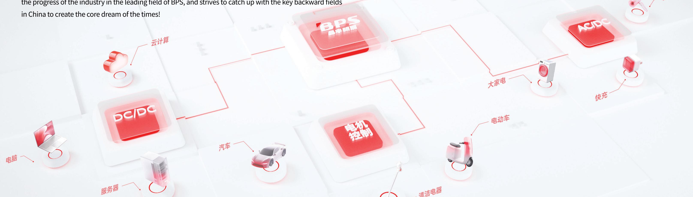
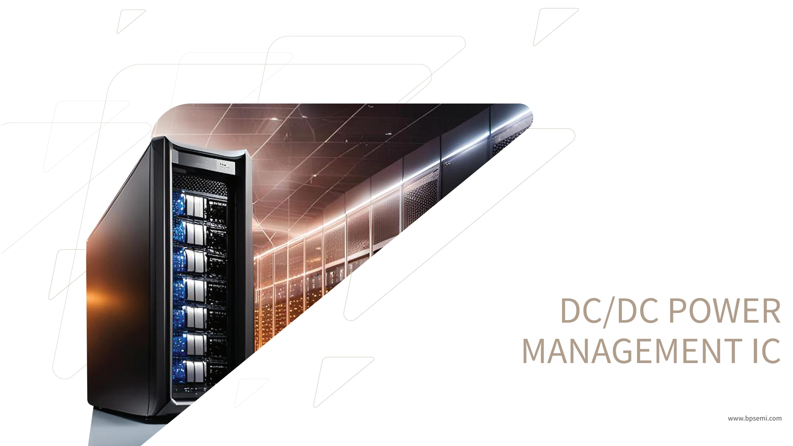

# PRODUCT CATALOG

2025Q4

BPS focuses on the R & D and sales of power management and motor control chips, insists on independent innovation, and its products cover LED lighting driver chips, AC/DC power management chips, DC/DC power management chips, motor control driver chips, etc., which are widely used in LED lighting, home appliances and mobile phones, personal computers, servers, base stations, Netcom, industrial control and other fields.

BPS adheres to the mission of “creating core to assist intelligent manufacturing and achieving partners with heart,” strives for the development of the industry, aspires to the prosperity of the country, promotes the progress of the industry in the leading field of BPS, and strives to catch up with the key backward fields in China to create the core dream of the times!

PROFESSIONAL PMIC AND MCU SUPPLIER

## INDEX

## AC/DC Power MGMT

## DC/DC Power MGMT

## LED Lighting Driver

## Motor & MCU Control

• Non-isolated Power supply 2
• SSR Feedback by Opto-isolator 2
• SSR Feedback by Magnetic 3
Coupling
Primary Side 3
Secondary Side 3
Magnetic Coupling 3
• SR Snchronous Rectifier 3
• PSR 3
• Controller 5
• DrMOS 6
• Converter 6
• eFuse/Hotswap 6
• Non-dimmable
AC/DC Non-isolated Low PF 8
AC/DC Non-isolated High PF 8
AC/DC Non-isolated Low PF 8
(Integrated MOSFET)
AC/DC Non-isolated Low PF 8
(Integrated BJT)
AC/DC Isolated High PF 8
Linear Driver 9
Current Rippler Remover 9
Buck/Flyback CC/CV 9
BOOST CC/CV 10
Standby Power Supply 10
• Dimmable
Non-isolated PWM Dimming 11
Linear PWM Dimming 11
DC-DC PWM Dimming 11
Switch ON/OFF Dimming 12
PWM CCT 12
0-10V/DALI Dimming 12
Linear TRIAC Dimming 12
SMPS TRIAC Dimming 13
• Smart Panel
Two-Wire (No Neutral) 13
• Smart Panel
• Smart Panel
• Smart Panel
• Smart Panel
• Smart Panel
• Smart Panel
• Smart Panel
• Smart Panel

## AC/DC POWER MANAGEMENT IC

<table><tr><td colspan="6">Non-isolated Power Supply</td><td colspan="3">Application: Home Appliances</td></tr><tr><td>P/N</td><td>Topology</td><td>Vin (V)</td><td>Vout (V)</td><td>Lout(mA)</td><td>MOSFET BV(V)</td><td>Freewheeling Diode</td><td>VCC</td><td>Standby Power (mW)</td></tr><tr><td>BPA8504D</td><td>BUCK/BUCK-BOOST</td><td>85~265</td><td>Adjustable</td><td>200</td><td>650</td><td>External</td><td>Y</td><td>100</td></tr><tr><td>BPA8505D</td><td>BUCK/BUCK-BOOST</td><td>85~265</td><td>Adjustable</td><td>300</td><td>650</td><td>External</td><td>Y</td><td>100</td></tr><tr><td>BPA8505P</td><td>BUCK/BUCK-BOOST</td><td>85~265</td><td>Adjustable</td><td>300</td><td>650</td><td>External</td><td>Y</td><td>100</td></tr><tr><td>BPA8506D</td><td>BUCK/BUCK-BOOST</td><td>85~265</td><td>Adjustable</td><td>400</td><td>650</td><td>External</td><td>Y</td><td>100</td></tr><tr><td>BP85221AL</td><td>BUCK/BUCK-BOOST</td><td>85~265</td><td>5</td><td>50</td><td>550</td><td>Internal</td><td>N</td><td>70</td></tr><tr><td>BP85223AL</td><td>BUCK/BUCK-BOOST</td><td>85~265</td><td>5</td><td>150</td><td>550</td><td>Internal</td><td>N</td><td>50</td></tr><tr><td>BP85323AL</td><td>BUCK/BUCK-BOOST</td><td>85~265</td><td>5</td><td>150</td><td>550</td><td>Internal</td><td>N</td><td>50</td></tr><tr><td>BP8523D</td><td>BUCK/BUCK-BOOST</td><td>85~265</td><td>5</td><td>100</td><td>650</td><td>Internal</td><td>N</td><td>50</td></tr><tr><td>BP8522D</td><td>BUCK/BUCK-BOOST</td><td>85~265</td><td>5</td><td>150</td><td>550</td><td>Internal</td><td>N</td><td>50</td></tr><tr><td>BP85224A</td><td>BUCK/BUCK-BOOST</td><td>85~265</td><td>5</td><td>200</td><td>650</td><td>Internal</td><td>N</td><td>50</td></tr><tr><td>BP85224D</td><td>BUCK/BUCK-BOOST</td><td>85~265</td><td>5</td><td>200</td><td>650</td><td>Internal</td><td>N</td><td>50</td></tr><tr><td>BP85226D</td><td>BUCK/BUCK-BOOST</td><td>85~265</td><td>5</td><td>300</td><td>650</td><td>Internal</td><td>N</td><td>50</td></tr><tr><td>BP85928D</td><td>BUCK/BUCK-BOOST</td><td>85~265</td><td>5</td><td>450</td><td>650</td><td>Internal</td><td>N</td><td>150</td></tr><tr><td>BP85256D</td><td>BUCK/BUCK-BOOST</td><td>85~265</td><td>12</td><td>300</td><td>650</td><td>Internal</td><td>N</td><td>50</td></tr><tr><td>BP85956D</td><td>BUCK/BUCK-BOOST</td><td>85~265</td><td>12</td><td>300</td><td>650</td><td>External</td><td>N</td><td>50</td></tr><tr><td>BP85956P</td><td>BUCK/BUCK-BOOST</td><td>85~265</td><td>12</td><td>300</td><td>650</td><td>External</td><td>N</td><td>50</td></tr><tr><td>BP85957DL</td><td>BUCK/BUCK-BOOST</td><td>85~265</td><td>12</td><td>350</td><td>500</td><td>External</td><td>Y</td><td>80</td></tr><tr><td>BP85958DL</td><td>BUCK/BUCK-BOOST</td><td>85~265</td><td>12</td><td>400</td><td>500</td><td>External</td><td>Y</td><td>80</td></tr><tr><td>BPA85968D</td><td>BUCK/BUCK-BOOST</td><td>85~265</td><td>15</td><td>400</td><td>650</td><td>External</td><td>Y</td><td>80</td></tr><tr><td>BP85976P</td><td>BUCK/BUCK-BOOST</td><td>85~265</td><td>18</td><td>300</td><td>650</td><td>External</td><td>Y</td><td>50</td></tr><tr><td>BP85977D</td><td>BUCK/BUCK-BOOST</td><td>85~265</td><td>18</td><td>400</td><td>650</td><td>External</td><td>Y</td><td>100</td></tr><tr><td>BP85924DA</td><td>BUCK/BUCK-BOOST</td><td>85~265</td><td>5</td><td>200</td><td>650</td><td>External</td><td>N</td><td>50</td></tr><tr><td>BP85221SL</td><td>BUCK/BUCK-BOOST</td><td>85~265</td><td>5</td><td>30</td><td>550</td><td>Internal</td><td>N</td><td>70</td></tr><tr><td>BP85958P</td><td>BUCK/BUCK-BOOST</td><td>85~265</td><td>12</td><td>400</td><td>650</td><td>External</td><td>Y</td><td>100</td></tr><tr><td>BP85958D</td><td>BUCK/BUCK-BOOST</td><td>85~265</td><td>12</td><td>400</td><td>650</td><td>External</td><td>Y</td><td>80</td></tr></table>

<table><tr><td colspan="9">SSR Feedback By Opto-Isolator</td></tr><tr><td>P/N</td><td>Vcc Scope (V)</td><td>Pout (W)</td><td>Switching Frequency (kHz)</td><td>MOSFET Rdson (Ω)</td><td>MOSFET Bvdss (V)</td><td>Standby Power (mW)</td><td>Others</td><td>Application</td></tr><tr><td>BPA8604D</td><td>5.9 ~ 6.3</td><td>6</td><td>132</td><td>20</td><td>700</td><td>50</td><td>-</td><td>Home Appliances</td></tr><tr><td>BPA8604P</td><td>5.9 ~ 6.3</td><td>6</td><td>132</td><td>20</td><td>700</td><td>50</td><td>AC voltage zero crossing detection</td><td>Home Appliances</td></tr><tr><td>BPA8616D</td><td>5.8 ~ 6.3</td><td>12</td><td>132</td><td>11</td><td>700</td><td>50</td><td>Input undervoltage protection</td><td>Home Appliances</td></tr><tr><td>BPA8616PD</td><td>5.8 ~ 6.3</td><td>12</td><td>132</td><td>11</td><td>750</td><td>50</td><td>Input undervoltage protection</td><td>Home Appliances</td></tr><tr><td>BPA8618D</td><td>5.8 ~ 6.3</td><td>16</td><td>132</td><td>4.5</td><td>700</td><td>50</td><td>Input undervoltage protection</td><td>Home Appliances</td></tr><tr><td>BPA8618PD</td><td>5.8 ~ 6.3</td><td>18</td><td>132</td><td>4.5</td><td>750</td><td>50</td><td>Input undervoltage protection</td><td>Home Appliances</td></tr><tr><td>BPA8618G</td><td>5.8 ~ 6.3</td><td>18</td><td>132</td><td>4.5</td><td>750</td><td>50</td><td>Input undervoltage protection</td><td>Home Appliances</td></tr><tr><td>BPA8619P</td><td>5.8 ~ 6.3</td><td>22</td><td>132</td><td>3</td><td>700</td><td>50</td><td>Input undervoltage protection</td><td>Home Appliances</td></tr><tr><td>BPA8620PD</td><td>5.8 ~ 6.3</td><td>25</td><td>132</td><td>2.4</td><td>750</td><td>50</td><td>Input undervoltage protection</td><td>Home Appliances</td></tr><tr><td>BPA86525PC</td><td>10 ~ 30</td><td>21</td><td>100</td><td>3.9</td><td>800</td><td>100</td><td>Input undervoltage protection</td><td>Home Appliances</td></tr><tr><td>BPA86516P</td><td>10 ~ 30</td><td>24</td><td>100</td><td>3</td><td>800</td><td>100</td><td>-</td><td>Home Appliances</td></tr><tr><td>BPA86525G</td><td>10 ~ 30</td><td>21</td><td>100</td><td>3.9</td><td>800</td><td>100</td><td>Input undervoltage protection</td><td>Home Appliances</td></tr><tr><td>BPA86526PC</td><td>10 ~ 30</td><td>24</td><td>100</td><td>3</td><td>800</td><td>100</td><td>Input undervoltage protection</td><td>Home Appliances</td></tr><tr><td>BPA86526P</td><td>10 ~ 30</td><td>26</td><td>100</td><td>2.1</td><td>800</td><td>100</td><td>Input undervoltage protection</td><td>Home Appliances</td></tr><tr><td>BPA86528D</td><td>10 ~ 30</td><td>52</td><td>100</td><td>0.85</td><td>800</td><td>100</td><td>Input undervoltage protection</td><td>Home Appliances</td></tr><tr><td>BP8708D</td><td>8.2 ~ 34</td><td>25</td><td>65</td><td>0.67</td><td>650</td><td>75</td><td>DCM/CCM</td><td>PD</td></tr><tr><td>BP8705D</td><td>8.2 ~ 34</td><td>18</td><td>65</td><td>1.8</td><td>650</td><td>75</td><td>DCM/CCM</td><td>PD</td></tr><tr><td>BP87112</td><td>8.2 ~ 36</td><td>20</td><td>65</td><td>Equivalent 1.8</td><td>650</td><td>75</td><td>DCM/CCM</td><td>PD</td></tr><tr><td>BP87122</td><td>8.2 ~ 36</td><td>20</td><td>65</td><td>Equivalent 1.8</td><td>750</td><td>75</td><td>DCM/CCM</td><td>PD</td></tr><tr><td>BP87122A</td><td>6.5 ~ 36</td><td>20</td><td>65</td><td>Equivalent 1.8</td><td>750</td><td>75</td><td>DCM/CCM</td><td>PD</td></tr><tr><td>BP87213</td><td>7.4 ~ 36</td><td>25</td><td>65</td><td>0.67</td><td>650</td><td>75</td><td>DCM/CCM</td><td>PD</td></tr><tr><td>BP87216</td><td>7.4 ~ 36</td><td>35</td><td>65</td><td>0.67</td><td>650</td><td>75</td><td>DCM/CCM</td><td>PD</td></tr><tr><td colspan="9">SSR - No Optocoupler</td></tr><tr><td>P/N</td><td>Vcc Scope (V)</td><td>Pout (W)</td><td>Switching Frequency (kHz)</td><td>MOSFET Rdson (Ω)</td><td>MOSFET Bvdss (V)</td><td>Standby Power (mW)</td><td>Others</td><td>Application</td></tr><tr><td>BPA86015G</td><td>10 ~ 30</td><td>21</td><td>100</td><td>4</td><td>800</td><td>100</td><td>Input undervoltage protection</td><td>Home Appliances</td></tr></table>

<table><tr><td colspan="9">High Speed Hair Dryer</td></tr><tr><td>P/N</td><td>Topology</td><td>Vin (V)</td><td>Vout (V)</td><td>Lout (mA)</td><td>MOS-FET BV(V)</td><td>Freewheeling Diode</td><td>VCC</td><td>Standby Power (mW)</td></tr><tr><td>BP8521DF</td><td>BUCK/BUCK-BOOST</td><td>85~265</td><td>5</td><td>50</td><td>550</td><td>Interal</td><td>N</td><td>50</td></tr><tr><td>BP85226DF</td><td>BUCK/BUCK-BOOST</td><td>85~265</td><td>5</td><td>300</td><td>650</td><td>Interal</td><td>N</td><td>50</td></tr><tr><td>BP8522DF</td><td>BUCK/BUCK-BOOST</td><td>85~265</td><td>13.5</td><td>70</td><td>550</td><td>Interal</td><td>N</td><td>50</td></tr></table>

<table><tr><td colspan="6">SSR Feedback By Magnetic Coupling-Primary Side</td><td colspan="2">Application: PD</td></tr><tr><td>P/N</td><td>Vcc Scope (V)</td><td>Pout (W)</td><td>Switching Frequency (kHz)</td><td>MOSFET Rdson (Ω)</td><td>MOSFET Bvdss(V)</td><td>Standby Power (mW)</td><td>Operation Mode</td></tr><tr><td>BP87625</td><td>Self-powered</td><td>35</td><td>90</td><td>0.47</td><td>650</td><td>50</td><td>DCM/CCM</td></tr><tr><td>BP87526</td><td>8.5 ~ 95</td><td>35</td><td>100</td><td>0.67</td><td>650</td><td>30</td><td>QR</td></tr><tr><td>BP87526H</td><td>8.5 ~ 95</td><td>35</td><td>100</td><td>1.2</td><td>800</td><td>30</td><td>QR</td></tr></table>

<table><tr><td colspan="7">SSR Feedback By Magnetic Coupling-Secondary Side</td><td colspan="2">Application: PD</td></tr><tr><td>P/N</td><td>Package</td><td>Operation Mode</td><td>Maximum Working Frequency (K)</td><td>OVP (V)</td><td>CV/CV/CP</td><td>Capacitor Discharge</td><td>VBUS MOS Drive</td><td>Sample Mode</td></tr><tr><td>BP433BD</td><td>SOT23-6</td><td>DCM/CCM</td><td>70</td><td>23</td><td>CV</td><td>Y</td><td>N</td><td>FB</td></tr><tr><td>BP62620</td><td>SSOP10</td><td>QR</td><td>140</td><td>14</td><td>CC/CV/CP</td><td>Y</td><td>Y</td><td>FB</td></tr><tr><td>BP62620E</td><td>SSOP10</td><td>QR</td><td>140</td><td>14</td><td>CC/CV/CP</td><td>Y</td><td>Y</td><td>FB</td></tr></table>

<table><tr><td colspan="4">SSR Feedback By Magnetic Coupling-Magnetic Coupling</td><td>Application: PD</td></tr><tr><td>P/N</td><td>Package</td><td>Creepage (mm)</td><td>Voltage Withstandatility (KVrms)</td><td>Safety Certificate</td></tr><tr><td>BP818</td><td>LSOP-4</td><td>8</td><td>5</td><td>Y</td></tr></table>

<table><tr><td colspan="10">SR Snchronous Rectifier</td></tr><tr><td>P/N</td><td>Topology</td><td>Operation Mode</td><td>Vcc Scope</td><td>Max Voltage of detecting Pin (V)</td><td>Max Working Frequency (K)</td><td>Internal MOS Rdson(mΩ)</td><td>Internal MOS Bvdss(V)</td><td>Pout (W)</td><td>Application</td></tr><tr><td>BP6211B</td><td>High-side/Low-side</td><td>DCM/CCM/QR</td><td>4~9</td><td>120</td><td>&lt;350</td><td>14</td><td>60</td><td>≤ 20</td><td>PD</td></tr><tr><td>BP6211BS</td><td>High-side/Low-side</td><td>DCM/CCM/QR</td><td>3.5~9</td><td>150</td><td>&lt;350</td><td>14</td><td>60</td><td>≤ 20</td><td>PD</td></tr><tr><td>BP6211C</td><td>High-side/Low-side</td><td>DCM/CCM/QR</td><td>4~9</td><td>120</td><td>&lt;350</td><td>8.3</td><td>60</td><td>≤ 25</td><td>PD</td></tr><tr><td>BP6211CS</td><td>High-side/Low-side</td><td>DCM/CCM/QR</td><td>3.5V~9V</td><td>150</td><td>&lt;350K</td><td>8.3</td><td>60</td><td>≤ 25</td><td>PD</td></tr><tr><td>BP6211MS</td><td>High-side/Low-side</td><td>DCM/CCM/QR</td><td>3.5~9</td><td>150</td><td>&lt;350</td><td>10</td><td>100</td><td>≤ 35</td><td>PD</td></tr><tr><td>BP62110</td><td>High-side/Low-side</td><td>DCM/CCM/QR</td><td>4~9</td><td>120</td><td>&lt;350</td><td>-</td><td>-</td><td>-</td><td>PD</td></tr><tr><td>BP62110S</td><td>High-side/Low-side</td><td>DCM/QR</td><td>3.5~9</td><td>150</td><td>&lt;350</td><td>-</td><td>-</td><td>-</td><td>PD</td></tr><tr><td>S7302SL</td><td>Low-side</td><td>DCM/QR</td><td>3.3~5.5</td><td>40</td><td>&lt;100</td><td>22</td><td>40</td><td>≤ 10</td><td>Charger &amp; Adapter</td></tr><tr><td>S7302S</td><td>Low-side</td><td>DCM/QR</td><td>3.3~5.5</td><td>40</td><td>&lt;100</td><td>20</td><td>40</td><td>≤ 12</td><td>Charger &amp; Adapter</td></tr><tr><td>S7303S</td><td>Low-side</td><td>DCM/QR</td><td>3.3~5.5</td><td>40</td><td>&lt;100</td><td>15</td><td>40</td><td>≤ 12</td><td>Charger &amp; Adapter</td></tr><tr><td>S7304S</td><td>Low-side</td><td>DCM/QR</td><td>3.3~5.5</td><td>40</td><td>&lt;100</td><td>8</td><td>40</td><td>≤ 15</td><td>Charger &amp; Adapter</td></tr><tr><td>BP6221F</td><td>Low-side</td><td>DCM/QR</td><td>3.6~6.8</td><td>85</td><td>&lt;100</td><td>16</td><td>85</td><td>≤ 18</td><td>Charger &amp; Adapter</td></tr></table>

<table><tr><td colspan="10">PSR</td></tr><tr><td>P/N</td><td>Operation Mode</td><td>Vcc Scope (V)</td><td>Standby Power (mW)</td><td>Max Working Frequency(K)</td><td>Energy Efficiency Requirement</td><td>Build-in BJT/MOS Collector Current Ic/Rds_on (A)</td><td>Build-in BJT/MOS-FET Bvdss/BVCBO (V)</td><td>Pout (W)</td><td>Application</td></tr><tr><td>S7141S</td><td>DCM</td><td>Self-powered</td><td>&lt;75</td><td>&lt;75</td><td>DoE VI</td><td>0.3</td><td>850</td><td> $\leqslant 3$ </td><td>Charger &amp; Adapter</td></tr><tr><td>S7142S</td><td>DCM</td><td>Self-powered</td><td>&lt;75</td><td>&lt;75</td><td>DoE VI</td><td>1</td><td>850</td><td> $\leqslant 5$ </td><td>Charger &amp; Adapter</td></tr><tr><td>S7132S</td><td>DCM</td><td>5~22</td><td>&lt;75</td><td>&lt;75</td><td>DoE VI</td><td>0.8</td><td>850</td><td> $\leqslant 5$ </td><td>Charger &amp; Adapter</td></tr><tr><td>S7133B</td><td>DCM</td><td>5~22</td><td>&lt;75</td><td>&lt;75</td><td>DoE VI</td><td>2</td><td>750</td><td> $\leqslant 10$ </td><td>Charger &amp; Adapter</td></tr><tr><td>S7133S</td><td>DCM</td><td>5~22</td><td>&lt;75</td><td>&lt;75</td><td>DoE VI</td><td>2</td><td>750</td><td> $\leqslant 10$ </td><td>Charger &amp; Adapter</td></tr><tr><td>S7134B</td><td>DCM</td><td>5~22</td><td>&lt;75</td><td>&lt;75</td><td>DoE VI</td><td>4</td><td>750</td><td> $\leqslant 12$ </td><td>Charger &amp; Adapter</td></tr><tr><td>S7134C</td><td>DCM</td><td>5~22</td><td>&lt;75</td><td>&lt;75</td><td>DoE VI</td><td>4</td><td>800</td><td> $\leqslant 12$ </td><td>Charger &amp; Adapter</td></tr><tr><td>BP84136</td><td>DCM</td><td>4~18</td><td>&lt;75</td><td>&lt;75</td><td>DoE VI</td><td>4</td><td>750</td><td> $\leqslant 16.5$ </td><td>Charger &amp; Adapter</td></tr><tr><td>BP84145</td><td>DCM</td><td>Self-powered</td><td>&lt;75</td><td>&lt;75</td><td>DoE VI</td><td>3</td><td>800</td><td> $\leqslant 10$ </td><td>Charger &amp; Adapter</td></tr><tr><td>BP84147</td><td>DCM</td><td>Self-powered</td><td>&lt;75</td><td>&lt;75</td><td>DoE VI</td><td>4</td><td>800</td><td> $\leqslant 18$ </td><td>Charger &amp; Adapter</td></tr><tr><td>BP86113D</td><td>DCM</td><td>Self-powered</td><td>&lt;75</td><td>&lt;75</td><td>/</td><td>3</td><td>800</td><td> $\leqslant 12$ </td><td>Home Appliance</td></tr><tr><td>BP86213D</td><td>DCM/BCM</td><td>5~22</td><td>&lt;75</td><td>&lt;75</td><td>DoE VI</td><td>3.8 Ω</td><td>650</td><td> $\leqslant 12$ </td><td>Home Appliance</td></tr><tr><td>BP86226P</td><td>DCM/CMM</td><td>8~30</td><td>&lt;100</td><td>&lt;80</td><td>/</td><td>2 Ω</td><td>650</td><td> $\leqslant 24$ </td><td>Home Appliance</td></tr><tr><td>BP86226E</td><td>DCM/CMM</td><td>8~30</td><td>&lt;100</td><td>&lt;80</td><td>/</td><td>1.6 Ω</td><td>650</td><td> $\leqslant 24$ </td><td>Home Appliance</td></tr><tr><td>BP83223</td><td>BCM/DCM</td><td>8~30</td><td>&lt;100</td><td>&lt;120K</td><td>DoE VI</td><td>0.14 Ω</td><td>700</td><td> $\leqslant 120$ </td><td>Home Appliance</td></tr></table>

## DC/DC POWER MANAGEMENT IC

<table><tr><td>P/N</td><td>Output Rail</td><td>Phases</td><td>VCC (min) (V)</td><td>VCC (max) (V)</td><td>Ishutdown (mA)</td><td>FSW(min) (kHz)</td><td>FSW(max) (kHz)</td><td>CS Mode support</td><td>Interface</td><td>PWM Logic (V)</td><td>Package</td></tr><tr><td>BPD93004E</td><td>1</td><td>4</td><td>4.5</td><td>5.5</td><td>0.36</td><td>300</td><td>2000</td><td>DCR, DrMOS IMON</td><td>PMBUS, PWMVID</td><td>5</td><td>TQFN-40( 5x5)</td></tr><tr><td>BPD93010E</td><td>1</td><td>10</td><td>4.5</td><td>5.5</td><td>0.36</td><td>300</td><td>2000</td><td>DCR, DrMOS IMON</td><td>PMBUS, PWMVID</td><td>5</td><td>TQFN-40 ( 5x5)</td></tr><tr><td>BPD92028</td><td>2</td><td>R1+R2 ≤ 8 R1 ≤ 8 R2 ≤ 8</td><td>3.15</td><td>3.45</td><td>0.3</td><td>250</td><td>2000</td><td>DrMOS IMON</td><td>PMBUS, HSVI</td><td>3.3</td><td>TQFN-40 ( 5x5)</td></tr><tr><td>BPD92028A</td><td>2</td><td>R1+R2 ≤ 8 R1 ≤ 8 R2 ≤ 8</td><td>3.15</td><td>3.45</td><td>0.3</td><td>250</td><td>2000</td><td>DrMOS IMON</td><td>PMBUS</td><td>3.3</td><td>TQFN-40 ( 5x5)</td></tr><tr><td>BPD92032</td><td>2</td><td>R1+R2 ≤ 12 R1 ≤ 12 R2 ≤ 12</td><td>3.15</td><td>3.45</td><td>0.3</td><td>250</td><td>2000</td><td>DrMOS IMON</td><td>PMBUS, HSVI</td><td>3.3</td><td>QFN-48 ( 6x6)</td></tr><tr><td>BPD92032A</td><td>2</td><td>R1+R2 ≤ 12 R1 ≤ 12 R2 ≤ 12</td><td>3.15</td><td>3.45</td><td>0.3</td><td>250</td><td>2000</td><td>DrMOS IMON</td><td>PMBUS</td><td>3.3</td><td>QFN-48 ( 6x6)</td></tr><tr><td>BPD95036A</td><td>2</td><td>R1+R2 ≤ 16 R1 ≤ 16 R2 ≤ 16</td><td>3.15</td><td>3.45</td><td>0.85</td><td>250</td><td>2000</td><td>DrMOS IMON</td><td>PMBUS, AVSBus</td><td>3.3</td><td>QFN-56 ( 7x7)</td></tr><tr><td>BPD95025</td><td>2</td><td>R1 ≤ 4 R2 ≤ 1</td><td>3.15</td><td>3.45</td><td>0.9</td><td>250</td><td>2000</td><td>DrMOS IMON</td><td>PMBUS, AVSBus</td><td>3.3</td><td>TLGA-40 ( 5x5)</td></tr><tr><td>BPD93136</td><td>2</td><td>R1+R2 ≤ 16 R1 ≤ 16 R2 ≤ 16</td><td>3.15</td><td>3.45</td><td>1</td><td>250</td><td>2000</td><td>DCR, LS Ron, DrMOS, IMON</td><td>PWMVID, PMBUS, AVSBus</td><td>3.3</td><td>QFN-56 ( 7x7)</td></tr><tr><td>BPD93204</td><td>1</td><td>4</td><td>3.15</td><td>3.45</td><td>0.006</td><td>300</td><td>1000</td><td>DCR, LS Ron, DrMOS, IMON</td><td>PWMVID, PMBUS</td><td>3.3</td><td>TQFN-32Ld (4 x 4)</td></tr><tr><td>BPD95028</td><td>2</td><td>R1+R2 ≤ 8 R1 ≤ 8 R2 ≤ 8</td><td>3.15</td><td>3.45</td><td>0.85</td><td>250</td><td>2000</td><td>DrMOS IMON</td><td>PMBUS, AVSBus</td><td>3.3</td><td>TQFN-40 ( 5x5)</td></tr><tr><td>BPD95032</td><td>2</td><td>R1+R2 ≤ 12 R1 ≤ 12 R2 ≤ 12</td><td>3.15</td><td>3.45</td><td>0.85</td><td>250</td><td>2000</td><td>DrMOS IMON</td><td>PMBUS, AVSBus</td><td>3.3</td><td>QFN-48 ( 6x6)</td></tr><tr><td>BPD96028</td><td>2</td><td>R1+R2 ≤ 8 R1 ≤ 8 R2 ≤ 8</td><td>3.15</td><td>3.45</td><td>0.4</td><td>250</td><td>2000</td><td>DrMOS IMON</td><td>PMBUS, SVI3</td><td>3.3</td><td>TQFN-40 ( 5x5)</td></tr><tr><td>BPD96032</td><td>2</td><td>R1+R2 ≤ 12 R1 ≤ 12 R2 ≤ 12</td><td>3.15</td><td>3.45</td><td>0.4</td><td>250</td><td>2000</td><td>DrMOS IMON</td><td>PMBUS, SVI3</td><td>3.3</td><td>QFN-48 ( 6x6)</td></tr><tr><td>BPD96058</td><td>3</td><td>R1+R2+R3 ≤ 8 R1 ≤ 8 R2 ≤ 3 R3 ≤ 2</td><td>3.15</td><td>3.45</td><td>0.45</td><td>250</td><td>2000</td><td>DrMOS IMON</td><td>PMBUS, SVI3</td><td>3.3</td><td>TQFN-52 ( 6x6)</td></tr></table>

<table><tr><td colspan="9">DrMOS</td></tr><tr><td>P/N</td><td>VCC/VDRV Operating Range(V)</td><td>Vin Operating Range(V)</td><td>Iout (max)(A)</td><td>Ishut-down(uA)</td><td>PWM logic(V)</td><td>Imon</td><td>Tmon</td><td>Package</td></tr><tr><td>BPD3010</td><td>4.5~5.5</td><td>/</td><td>/</td><td>0.1</td><td>3.3/5</td><td>/</td><td>/</td><td>WDFN 2x2-8</td></tr><tr><td>BPD3011</td><td>4.5~5.5</td><td>/</td><td>/</td><td>0.1</td><td>3.3/5</td><td>/</td><td>/</td><td>WDFN 2x2-8</td></tr><tr><td>BPD80350E</td><td>4.5~5.5</td><td>4.5~16</td><td>50</td><td>7</td><td>3.3/5</td><td>/</td><td>Y</td><td>TLGA 5x5</td></tr><tr><td>BPD80370E</td><td>4.5~5.5</td><td>4.5~16</td><td>70</td><td>10</td><td>3.3/5</td><td>Y</td><td>Y</td><td>TLGA 5x5</td></tr><tr><td>BPD80590</td><td>4.5~5.5</td><td>4.5~16</td><td>90</td><td>30</td><td>3.3/5</td><td>Y</td><td>Y</td><td>TLGA 4x6</td></tr><tr><td>BPD80690E</td><td>4.5~5.5</td><td>4.5~16</td><td>90</td><td>30</td><td>3.3/5</td><td>Y</td><td>Y</td><td>TLGA 5x6</td></tr><tr><td>BPD80750E</td><td>4.5~5.5</td><td>4.5~24</td><td>50</td><td>5</td><td>3.3/5</td><td>Y</td><td>N</td><td>TLGA 5x5</td></tr></table>

<table><tr><td colspan="9">eFuse/Hotswap</td></tr><tr><td>P/N</td><td>VDD operating range(V)</td><td>VIN operating range (V)</td><td>Iout (max) (A)</td><td>Ishut-down(uA)</td><td>Rdson (m Ω )</td><td>Protection</td><td>PMBUS</td><td>Package</td></tr><tr><td>BPD20350A</td><td>4.5~5.5</td><td>4.5~16</td><td>50</td><td>1.7</td><td>0.85</td><td>VIN OVLO、OCP、FOCP、OTP</td><td>/</td><td>TLGA-32Ld(5x5)</td></tr><tr><td>BPD20550</td><td>4.5~5.5</td><td>4.5~16</td><td>50</td><td>1.7</td><td>0.85</td><td>VIN OVLO、OCP、FOCP、OTP</td><td>I2C/PMBus</td><td>TLGA-32Ld(5x5)</td></tr></table>

<table><tr><td colspan="12">Converter</td></tr><tr><td>P/N</td><td>Vin min (V)</td><td>Vin max (V)</td><td>Vout (V)</td><td>Iout (max)(A)</td><td>Ishut-down(uA)</td><td>Bias Voltage</td><td>Switching Frequency(kHz)</td><td>Power Good</td><td>External Soft Start</td><td>COT</td><td>Package</td></tr><tr><td>BPD60312</td><td>3</td><td>16</td><td>0.6~5.5</td><td>12</td><td>5</td><td>Internal(4.65V) External</td><td>600/800/1000</td><td>Y</td><td>Y</td><td>Y</td><td>QFN-21 (3x4)</td></tr><tr><td>BPD60312A</td><td>3</td><td>16</td><td>0.6~5.5</td><td>12</td><td>5</td><td>Internal 3.3V/ External</td><td>600/800/1000</td><td>Y</td><td>Y</td><td>Y</td><td>TQFN-21 (3x4)</td></tr><tr><td>BPD60306</td><td>3</td><td>16</td><td>0.6~5.5</td><td>6</td><td>5</td><td>Internal 4.65V External</td><td>600/1100/2000</td><td>Y</td><td>Y</td><td>Y</td><td>TQFN-14 (2x3)</td></tr><tr><td>BPD60306A</td><td>3</td><td>16</td><td>0.6~5.5</td><td>6</td><td>5</td><td>Internal 3.3V External</td><td>600/1100/2000</td><td>Y</td><td>Y</td><td>Y</td><td>TQFN-14 (2x3)</td></tr><tr><td>BPD60320</td><td>3</td><td>16</td><td>0.6~5.5</td><td>20</td><td>5</td><td>Internal 4.65V External</td><td>600/800/1000</td><td>Y</td><td>Y</td><td>Y</td><td>TQFN-21 (3x4)</td></tr><tr><td>BPD60320A</td><td>3</td><td>16</td><td>0.6~5.5</td><td>20</td><td>5</td><td>Internal 3.3V External</td><td>600/800/1000</td><td>Y</td><td>Y</td><td>Y</td><td>TQFN-21 (3x4)</td></tr><tr><td>BPD50338</td><td>4.5</td><td>18</td><td>0.807-5.5</td><td>3</td><td>1</td><td>Internal 4.5V/ External</td><td>500/1200</td><td>Y</td><td>N</td><td>Y</td><td>TSOT23-8Ld (1.6 x 2.9)</td></tr></table>

## LED LIGHTING DRIVER IC

AC/DC Isolated High PF

<table><tr><td colspan="8">AC/DC Non-isolated Low PF</td></tr><tr><td>P/N</td><td>Package</td><td>MOSFET RDS-ON (Ω)</td><td>MOSFET Vds (V)</td><td>OTP (°C)</td><td>OVP</td><td>Iout max (mA) (Vin=176V-265V) Pout max (W)</td><td>Pout max (W) (Vin=176V-265V)</td></tr><tr><td>BP2863X</td><td>ASOP-7</td><td>22-12</td><td>500</td><td>140</td><td>-</td><td>120-190</td><td>12-17</td></tr><tr><td>BP2863XJ</td><td>ASOP-7</td><td>22-12</td><td>500</td><td>140</td><td>Y</td><td>120-190</td><td>12-17</td></tr><tr><td>BP2863XK</td><td>ASOP-7</td><td>22-12</td><td>500</td><td>120</td><td>-</td><td>120-190</td><td>12-17</td></tr><tr><td>BP2861X</td><td>SOP-7T</td><td>22-4.8</td><td>500</td><td>140</td><td>-</td><td>120-380</td><td>12-30</td></tr><tr><td>BP2861XJ</td><td>SOP-7T</td><td>22-4.8</td><td>500V</td><td>140</td><td>Y</td><td>120-380</td><td>120-380</td></tr><tr><td>BP2821XK</td><td>ESSOP6</td><td>16-8.5</td><td>500</td><td>120</td><td>-</td><td>180-380</td><td>17-30</td></tr><tr><td>BP2866XJ</td><td>SOP-7D</td><td>12-2.0</td><td>500</td><td>140</td><td>Y</td><td>220-550</td><td>17-40</td></tr><tr><td>BP2868FN</td><td>HSOP-7</td><td>4.8-3</td><td>500</td><td>140</td><td>Y</td><td>450-500</td><td>30-43</td></tr><tr><td>BP2826FK</td><td>ESSOP6</td><td>3</td><td>500</td><td>120</td><td>-</td><td>500</td><td>43</td></tr><tr><td>BP2867XJ</td><td>DIP-7D</td><td>5.8-2.0</td><td>500</td><td>140</td><td>Y</td><td>380-550</td><td>22-50</td></tr><tr><td>BP2862XS</td><td>BPSOP10</td><td>2-3.8</td><td>500</td><td>140</td><td>Y</td><td>380-550</td><td>22-50</td></tr><tr><td>BP2872XS</td><td>BPSOP10</td><td>2-3.8</td><td>500</td><td>140</td><td>Four Fixed Thresholds OVP (135V/225V/320V/no)</td><td>200-350</td><td>30-200</td></tr><tr><td>BP2870AS</td><td>SOP-8</td><td>-</td><td>-</td><td>140</td><td>Four Fixed Thresholds OVP (135V/225V/320V/no)</td><td>200-500</td><td>30-200</td></tr><tr><td>BP2872XD</td><td>BPSOP10</td><td>2-3.8</td><td>500</td><td>140</td><td>Y</td><td>200-350</td><td>30-200</td></tr><tr><td>BP2870D</td><td>SOP-8</td><td>-</td><td>-</td><td>Y</td><td></td><td>200-750</td><td>30-200</td></tr></table>

<table><tr><td colspan="9">AC/DC Non-isolated High PF</td></tr><tr><td>P/N</td><td>Package</td><td>No VCC No COMP</td><td>MOSFET RDS-ON(Ω)</td><td>MOSFET Vds (V)</td><td>OVP</td><td>Internal CS</td><td>rectified bridge integrated</td><td>Iout@Vout=72V (mA) (Vin=176V-265V)</td></tr><tr><td>BP2364DN</td><td>ASOP-8</td><td>Y</td><td>6.8</td><td>600</td><td>External</td><td>-</td><td>-</td><td>&lt;220</td></tr><tr><td>BP2366DN</td><td>SOP7</td><td>Y</td><td>4.5</td><td>600</td><td>External</td><td>-</td><td>-</td><td>&lt;220</td></tr><tr><td>BP2366EN</td><td>SOP7</td><td>Y</td><td>2.7</td><td>600</td><td>External</td><td>-</td><td>-</td><td>&lt;240</td></tr><tr><td>BP2367EN</td><td>DIP7</td><td>Y</td><td>2.7</td><td>600</td><td>External</td><td>-</td><td>-</td><td>&lt;260</td></tr><tr><td>BP2329AJ</td><td>SOT23-6</td><td>/</td><td>/</td><td>/</td><td>External</td><td>-</td><td>-</td><td>-</td></tr><tr><td>BP2362BH</td><td>SOP7</td><td>Y</td><td>9</td><td>500</td><td>External</td><td>-</td><td>-</td><td>&lt;150</td></tr><tr><td>BP2362CH</td><td>SOP7</td><td>Y</td><td>5</td><td>500</td><td>External</td><td>-</td><td>-</td><td>&lt;180</td></tr><tr><td>BP2362EH</td><td>SOP7</td><td>Y</td><td>3</td><td>500</td><td>External</td><td>-</td><td>-</td><td>&lt;240</td></tr><tr><td>BP2362GH</td><td>SOP7</td><td>Y</td><td>1.9</td><td>500</td><td>External</td><td>-</td><td>-</td><td>&lt;270</td></tr><tr><td>BP2362JHL</td><td>SOP-7D</td><td>Y</td><td>1.9</td><td>600</td><td>External</td><td>-</td><td>-</td><td>10W</td></tr><tr><td>BP2373B</td><td>ASOP-7</td><td>Y</td><td>8</td><td>500</td><td>-</td><td>Y</td><td>Y</td><td>&lt;150</td></tr><tr><td>BP2373CR</td><td>ASOP-7</td><td>Y</td><td>5.8</td><td>500</td><td>-</td><td>Y</td><td>Y</td><td>&lt;180</td></tr></table>

<table><tr><td colspan="9">AC/DC Non-isolated Low PF (integrated MOSFETFET)</td></tr><tr><td>P/N</td><td>Package</td><td>MOSFET RDS-ON (Ω)</td><td>MOSFET Vds (V)</td><td>OTP</td><td>Flicker free</td><td>OVP</td><td>Pout(W) @Vin:85V-265V</td><td>Pout(W) @Vin:176V-265V</td></tr><tr><td>BP3166XS</td><td>SOP7</td><td>25-14</td><td>650</td><td>Y</td><td>Y</td><td>Internal</td><td>3-5</td><td>5-7</td></tr><tr><td>BP3166XH</td><td>SOP7</td><td>9-3</td><td>650-600</td><td>Y</td><td>Y</td><td>Internal</td><td>7-12</td><td>9-15</td></tr><tr><td>BP3167XH</td><td>DIP7</td><td>4.7-2</td><td>650-600</td><td>Y</td><td>Y</td><td>Internal</td><td>12-24</td><td>15-24</td></tr><tr><td>BP3336DBL</td><td>SOP8</td><td>2.4</td><td>650</td><td>Y</td><td>Y</td><td>External</td><td>-</td><td>30</td></tr><tr><td>BP3186CB</td><td>SOP8</td><td>5.7</td><td>650</td><td>Y</td><td>Y</td><td>External</td><td>-</td><td>20</td></tr><tr><td>BP3186DB</td><td>SOP8</td><td>3</td><td>650</td><td>Y</td><td>Y</td><td>External</td><td>-</td><td>25</td></tr><tr><td>BP3187DB</td><td>DIP7</td><td>2</td><td>650</td><td>Y</td><td>Y</td><td>External</td><td>-</td><td>40</td></tr><tr><td>BP3187ED</td><td>DIP7</td><td>2.5</td><td>700</td><td>Y</td><td>Y</td><td>External</td><td>-</td><td>45</td></tr><tr><td>BP3332EB</td><td>BPSOP10</td><td>2</td><td>700</td><td>Y</td><td>Y</td><td>External</td><td>-</td><td>40</td></tr><tr><td>BP3182EB</td><td>BPSOP10</td><td>1.8</td><td>650</td><td>Y</td><td>Y</td><td>External</td><td>-</td><td>40</td></tr><tr><td>BP3182ED</td><td>BPSOP10</td><td>2</td><td>700</td><td>Y</td><td>Y</td><td>External</td><td>-</td><td>40</td></tr><tr><td>BP3187EB</td><td>DIP7</td><td>1.8</td><td>650</td><td>Y</td><td>Y</td><td>External</td><td>-</td><td>50</td></tr><tr><td>BP3337DB</td><td>DIP7</td><td>2</td><td>650</td><td>Y</td><td>Y</td><td>External</td><td>-</td><td>40</td></tr><tr><td>BP3337EB</td><td>DIP7</td><td>1.8</td><td>650</td><td>Y</td><td>Y</td><td>External</td><td>-</td><td>50</td></tr><tr><td>BP3189B</td><td>SOP8</td><td>External</td><td>External</td><td>Y</td><td>Y</td><td>External</td><td>-</td><td>100</td></tr></table>

<table><tr><td colspan="8">AC/DC Non-isolated Low PF (Integrated BJT)</td></tr><tr><td>P/N</td><td>Package</td><td>Winding</td><td>InternalNPN Vce max</td><td>OTP</td><td>Flicker free w/ multiple lamps parallel</td><td>OVP</td><td>Pout(W) @Vin:85V-265V</td></tr><tr><td>S6613SA</td><td>SOP7</td><td>2</td><td>780V</td><td>Y</td><td>Y</td><td>Internal</td><td>8~12</td></tr><tr><td>S6613D</td><td>DIP7</td><td>2</td><td>780V</td><td>Y</td><td>Y</td><td>Internal</td><td>12~18</td></tr><tr><td>S6614D</td><td>DIP7</td><td>2</td><td>780V</td><td>Y</td><td>Y</td><td>Internal</td><td>18~24</td></tr></table>

<table><tr><td>P/N</td><td>Package</td><td>MOSFET RDS-ON (Ω)</td><td>MOSFET Vds (V)</td><td>Flyback/ Buck-boost</td><td>Protection</td><td>Pout(W) @Vin:85V-265V</td><td>Pout(W) @Vin:176V-265V</td></tr><tr><td>BP3336B</td><td>SOP8</td><td>4.8</td><td>650</td><td>Y</td><td>OTP/OVP</td><td>&lt;10</td><td>&lt;16</td></tr><tr><td>BP3336D</td><td>SOP8</td><td>2.2</td><td>650</td><td>Y</td><td>OTP/OVP</td><td>&lt;13</td><td>&lt;18</td></tr><tr><td>BP3339</td><td>SOP8</td><td>/</td><td>/</td><td>Y</td><td>OTP/OVP</td><td>&lt;50</td><td>&lt;100</td></tr><tr><td colspan="8">Linear Driver</td></tr><tr><td>P/N</td><td>Package</td><td>Line Compensation</td><td>Overheat Regulation (°C)</td><td>Withstand Voltage(V)</td><td>Application</td><td>Single Power (W)</td><td>Lout(max) (mA)</td></tr><tr><td>BP5356HA</td><td>ESOP8</td><td>Y</td><td>programmable RTH</td><td>700/650/650</td><td>Three Segments</td><td>12</td><td>-</td></tr><tr><td>BP5356HB</td><td>ESOP8</td><td>Y</td><td>TREG: 140</td><td>700/650/650</td><td>Three Segments</td><td>9</td><td>-</td></tr><tr><td>BP5336HC</td><td>ESOP8</td><td>Y</td><td>TREG: 140</td><td>700/650/650</td><td>Three Segments</td><td>9</td><td>-</td></tr><tr><td>BP5336HD</td><td>ESOP8</td><td>Y</td><td>TREG: 140</td><td>700/650/650</td><td>Three Segments</td><td>9</td><td>-</td></tr><tr><td>BP5336H</td><td>ESOP8</td><td>Y</td><td>TREG: 140</td><td>700/700/700</td><td>Three Segments</td><td>10</td><td>80</td></tr><tr><td>BP5358H</td><td>ESOP8</td><td>Y</td><td>programmable RTH</td><td>700/700/700</td><td>Three Segments</td><td>10</td><td>80</td></tr><tr><td>BP5218AS</td><td>ESSOP6</td><td>Y</td><td>TREG: 150</td><td>650/650</td><td>Two Segments</td><td>10</td><td>200/80</td></tr><tr><td>BP5212AS</td><td>HSOP7</td><td>Y</td><td>TREG: 150</td><td>650/650</td><td>Two Segments</td><td>15</td><td>200/80</td></tr><tr><td>BP5218E</td><td>ESOP8</td><td>Y</td><td>TREG: 150</td><td>700/500</td><td>Single Segment external constant power compensation</td><td>9</td><td>80/80</td></tr><tr><td>BP5218EC</td><td>ESSOP6</td><td>Y</td><td>TREG: 150</td><td>500/500</td><td>Single Segment external constant power compensation</td><td>9</td><td>-</td></tr><tr><td>BP5218FCL</td><td>HSOP7</td><td>Y</td><td>TREG: 150</td><td>500/500</td><td>Single Segment external constant power compensation</td><td>15</td><td>-</td></tr><tr><td>BP5218ECL</td><td>ESSOP6</td><td>N</td><td>TREG: 150</td><td>500</td><td>Single Segment with integrated rectifier bridge</td><td>9</td><td>-</td></tr><tr><td>BP5228DS</td><td>ESOP8</td><td>Y</td><td>TREG: 140</td><td>500</td><td>Two Segments</td><td>9</td><td>-</td></tr><tr><td>BP5228FE</td><td>ESOP8</td><td>Y</td><td>TREG: 150</td><td>500</td><td>Single Segment external constant power compensation</td><td>10</td><td>-</td></tr><tr><td>BP5151DK</td><td>ESOP8</td><td>Y</td><td>TREG: 150</td><td>650</td><td>Single Segment external constant power compensation</td><td>10</td><td>80</td></tr><tr><td>BP5131JA</td><td>SOT89-3</td><td>N</td><td>TREG: 150</td><td>500</td><td>Single Segment constant current</td><td>7</td><td>60</td></tr><tr><td>BP5116AJ</td><td>ESOP8</td><td>N</td><td>TREG: 150</td><td>500</td><td>Single Segment constant current</td><td>7</td><td>60</td></tr><tr><td>BP5116DL</td><td>ESOP-8</td><td>N</td><td>TREG: 130</td><td>500</td><td>Single Segment constant current</td><td>10</td><td>80</td></tr><tr><td>BP5131HC</td><td>ESOP8</td><td>N</td><td>TREG: 150</td><td>500</td><td>Single Segment constant current</td><td>10</td><td>80</td></tr><tr><td>BP5118GH</td><td>ESOP8</td><td>Y</td><td>135°C /150°C</td><td>500</td><td>High PF High Efficiency Single Segment</td><td>15</td><td>280</td></tr><tr><td>BP5133HC</td><td>HSOP-7</td><td>N</td><td>TREG: 150</td><td>500</td><td>Single Segment constant current</td><td>10</td><td>80</td></tr><tr><td>BP5138XJ</td><td>ESSOP6</td><td>N</td><td>TREG: 150</td><td>500</td><td>Single Segment constant current</td><td>7-10</td><td>60-80</td></tr><tr><td>BP5151DH</td><td>ESOP8</td><td>Y</td><td>TREG: 130</td><td>650</td><td>Single Segment external constant power compensation</td><td>10</td><td>80</td></tr></table>

<table><tr><td colspan="6">Current Rippler Remover</td></tr><tr><td>P/N</td><td>Package</td><td>OVP</td><td>MOS (V)</td><td>Flick-Free</td><td>Iout (mA)</td></tr><tr><td>BP5659B</td><td>SOT33-3</td><td>22V</td><td>40</td><td>Dimming Ripple Free Controller</td><td>90</td></tr><tr><td>BP5628C</td><td>SOP8</td><td>10V</td><td>40</td><td>Dimming Ripple Free Controller</td><td>200</td></tr><tr><td>BP5659A</td><td>SOT23-6</td><td>External</td><td>External</td><td>For PWM/Analog Dimming</td><td>&lt; 1500</td></tr></table>

<table><tr><td colspan="8">Buck/Flyback CC/CV</td></tr><tr><td>P/N</td><td>Package</td><td>PF</td><td>Max Current(mA)</td><td>Max Power (W)</td><td>MOS</td><td>Topology</td><td>Application</td></tr><tr><td>BP2506B</td><td>SOP8</td><td>&gt;0.5</td><td>&lt;300</td><td>-</td><td>500V/9Ω</td><td>Buck</td><td>CC/CV</td></tr><tr><td>BP2506D</td><td>SOP8</td><td>&gt;0.5</td><td>&lt;400</td><td>-</td><td>500V/4.7Ω</td><td>Buck</td><td>CC/CV</td></tr><tr><td>BP2506F</td><td>SOP8</td><td>&gt;0.5</td><td>&lt;500</td><td>-</td><td>500V/3Ω</td><td>Buck</td><td>CC/CV</td></tr><tr><td>BP2509</td><td>SOP8</td><td>&gt;0.5</td><td>-</td><td>-</td><td>External</td><td>Buck</td><td>CC/CV</td></tr><tr><td>BP2513DP</td><td>SOP8</td><td>&gt;0.5</td><td>&lt;350</td><td>-</td><td>500V/9Ω</td><td>Buck</td><td>CC/CV</td></tr><tr><td>BP2516FP</td><td>SOP8</td><td>&gt;0.5</td><td>&lt;600</td><td>-</td><td>650V/4.7Ω</td><td>Buck</td><td>CC/CV</td></tr><tr><td>BP2519</td><td>SOT23-5</td><td>&gt;0.5</td><td>&lt;2000</td><td>-</td><td>External</td><td>Buck</td><td>CC/CV</td></tr><tr><td>BP3519</td><td>SOT23-5</td><td>&gt;0.5</td><td>-</td><td>&lt;50</td><td>External</td><td>PSR Flyback</td><td>CC/CV</td></tr><tr><td>BP3526GB</td><td>EHSOP12</td><td>&gt;0.5</td><td>-</td><td>&lt;65</td><td>650V/1.2 Ω</td><td>PSR Flyback</td><td>CC/CV</td></tr><tr><td>BP3529B</td><td>SOP8</td><td>&gt;0.5</td><td>-</td><td>&lt;100</td><td>External</td><td>PSR Flyback</td><td>CC/CV</td></tr><tr><td>BP3527E</td><td>DIP7</td><td>&gt;0.5</td><td>-</td><td>&lt;40</td><td>650V/2.0Ω</td><td>PSR Flyback</td><td>CC/CV</td></tr><tr><td>BP3537E</td><td>DIP7</td><td>&gt;0.5</td><td>-</td><td>&lt;45</td><td>700V/2.0Ω</td><td>SSR Flyback</td><td>CC/CV</td></tr><tr><td>BP3536D</td><td>EHSOP12</td><td>&gt;0.5</td><td>-</td><td>&lt;45</td><td>700V/2Ω</td><td>SSR Flyback</td><td>CC/CV</td></tr><tr><td>BP3536G</td><td>EHSOP12</td><td>&gt;0.5</td><td>-</td><td>&lt;65</td><td>700V/0.8Ω</td><td>SSR Flyback</td><td>CC/CV</td></tr><tr><td>BP3539</td><td>SOP8</td><td>&gt;0.5</td><td>-</td><td>&lt;150</td><td>External</td><td>SSR Flyback</td><td>CC/CV</td></tr><tr><td>BP3599</td><td>SOP16</td><td>&gt;0.5</td><td>-</td><td>&lt;500</td><td>External</td><td>SSR LLC</td><td>CC/CV</td></tr><tr><td>BP3619</td><td>SOP8</td><td>&gt;0.9</td><td>-</td><td>&lt;150</td><td>External</td><td>PSR Flyback/Buck</td><td>CC</td></tr></table>

<table><tr><td colspan="6">BOOST CC/CV</td></tr><tr><td>P/N</td><td>Package</td><td>PF</td><td>Pout(W) @176-265Vac</td><td>MOS</td><td>Application</td></tr><tr><td>BP2636B</td><td>SOP8</td><td>BOOST</td><td>&lt; 20</td><td>500V/7Ω</td><td>CV</td></tr><tr><td>BP2636CL</td><td>SOP8</td><td>BOOST</td><td>&lt; 30</td><td>500V/4.8Ω</td><td>CV</td></tr><tr><td>BP2636CGL</td><td>SOP8</td><td>BOOST</td><td>&lt; 30</td><td>500V/4.8Ω</td><td>CV</td></tr><tr><td>BP2636CN</td><td>SOP8</td><td>BOOST</td><td>&lt; 30</td><td>500V/4.8Ω</td><td>CV</td></tr><tr><td>BP2636C</td><td>SOP8</td><td>BOOST</td><td>&lt; 40</td><td>500V/3Ω</td><td>CV</td></tr><tr><td>BP2636CG</td><td>SOP8</td><td>BOOST</td><td>&lt; 40</td><td>500V/3Ω</td><td>CV</td></tr><tr><td>BP2636D</td><td>SOP8</td><td>BOOST</td><td>&lt; 55</td><td>500V/2.1Ω</td><td>CV</td></tr><tr><td>BP2636DG</td><td>SOP8</td><td>BOOST</td><td>&lt; 55</td><td>500V/2.1Ω</td><td>CV</td></tr><tr><td>BP2639A</td><td>SOP8</td><td>BOOST</td><td>&lt; 100</td><td>External</td><td>CV</td></tr><tr><td>BP2630G</td><td>SOP8</td><td>BOOST</td><td>&lt; 100</td><td>External</td><td>CV</td></tr><tr><td>BP2628</td><td>SOP8</td><td>BOOST</td><td>&lt; 250</td><td>External</td><td>CV</td></tr><tr><td>BP2628A</td><td>SOP8</td><td>BOOST</td><td>&lt; 350</td><td>External</td><td>CV</td></tr><tr><td>BP2628D</td><td>SOP8</td><td>BOOST</td><td>&lt; 400</td><td>External</td><td>CV</td></tr><tr><td>BP2638</td><td>SOP8</td><td>BOOST</td><td>&lt; 400</td><td>External</td><td>CV</td></tr><tr><td>BP2616B</td><td>SOP8</td><td>BOOST</td><td>&lt; 20</td><td>500V/6Ω</td><td>CC</td></tr><tr><td>BP2616C</td><td>SOP8</td><td>BOOST</td><td>&lt; 40</td><td>500V/3Ω</td><td>CC</td></tr><tr><td>BP2616CL</td><td>SOP8</td><td>BOOST</td><td>&lt; 40</td><td>500V/5Ω</td><td>CC</td></tr><tr><td>BP2616E</td><td>SOP8</td><td>BOOST</td><td>&lt; 50</td><td>600V/2Ω</td><td>CC</td></tr><tr><td>BP2618</td><td>SOP8</td><td>BOOST</td><td>&lt; 100</td><td>External</td><td>CC</td></tr></table>

<table><tr><td colspan="7">Standby Power Supply</td></tr><tr><td>P/N</td><td>Package</td><td>PF</td><td>TP</td><td>Iout (mA)</td><td>MOS (V/Ω)</td><td>Application</td></tr><tr><td>BP6526B</td><td>ESOT-26</td><td>0.5</td><td>Efficient and Intelligent Converter</td><td>&lt;150 (constant)</td><td>/</td><td>5VCV Ultralow standby power - Low-voltage input</td></tr><tr><td>BP2571BC</td><td>SOP8</td><td>0.5</td><td>BUCK</td><td>&lt;200 (constant)</td><td>500/200</td><td>3.3V/5V CV Ultralow standby power</td></tr><tr><td>BP2571DC</td><td>SOP8</td><td>0.5</td><td>BUCK</td><td>&lt;300 (constant)</td><td>500/12</td><td>3.3V/5V CV Ultralow standby power</td></tr><tr><td>BP8521C</td><td>SOP8</td><td>0.5</td><td>BUCK</td><td>&lt;60(constant)</td><td>550/30</td><td>3.3V CV no Vcc ultralow Standby Power</td></tr><tr><td>BP8522D</td><td>SOP7</td><td>0.5</td><td>BUCK/buck-boost</td><td>&lt;150(constant)</td><td>550/30</td><td>5V CV no Vcc ultralow Standby Power</td></tr><tr><td>BP8501CH</td><td>SOP8</td><td>0.5</td><td>BUCK</td><td>&lt;60(constant)</td><td>650/25</td><td>3.3V/5V CV ultralow Standby Power</td></tr><tr><td>BP2525AHL</td><td>SOT33-5</td><td>0.5</td><td>BUCK</td><td>&lt;150(constant)</td><td>650/35</td><td>3.3V/5V CV ultralow Standby Power</td></tr><tr><td>BP2525B</td><td>SOT33-5</td><td>0.5</td><td>BUCK</td><td>&lt;200(constant)</td><td>500/17</td><td>3.3V/5V CV ultralow Standby Power</td></tr><tr><td>BP2525CH</td><td>SOT33-5</td><td>0.5</td><td>BUCK</td><td>&lt;280(constant)</td><td>650/16</td><td>3.3V/5V CV ultralow Standby Power</td></tr><tr><td>BP2525D</td><td>SOT33-5</td><td>0.5</td><td>BUCK</td><td>&lt;300(constant)</td><td>500/9</td><td>3.3V/5V CV ultralow Standby Power</td></tr><tr><td>BP2525F</td><td>SOT33-5</td><td>0.5</td><td>BUCK</td><td>&lt;500(constant)</td><td>500/5.6</td><td>3.3V/5V CV ultralow Standby Power</td></tr><tr><td>BP2522B</td><td>SOT33-5</td><td>0.5</td><td>BUCK</td><td>&lt;150(constant)</td><td>500/17</td><td>12V/24V CV ultralow Standby Power</td></tr><tr><td>BP2522D</td><td>SOT33-5</td><td>0.5</td><td>BUCK</td><td>&lt;240(constant)</td><td>500/9</td><td>12V/24V CV ultralow Standby Power</td></tr><tr><td>BP2522F</td><td>SOT33-5</td><td>0.5</td><td>BUCK</td><td>&lt;320(constant)</td><td>500/5.6</td><td>12V/24V CV ultralow Standby Power</td></tr><tr><td>BP2523B</td><td>SOT33-5</td><td>0.5</td><td>BUCK</td><td>&lt;150(constant)</td><td>500/17</td><td>15V/18V CV ultralow Standby Power</td></tr><tr><td>BP2523CH</td><td>SOT33-5</td><td>0.5</td><td>BUCK</td><td>&lt;190(constant)</td><td>650/16</td><td>15V/18V CV ultralow Standby Power</td></tr><tr><td>BP8519C</td><td>SOT23-5</td><td>0.5</td><td>BUCK</td><td>&lt;50</td><td>700/40</td><td>Low Standby Power</td></tr><tr><td>BP8516F</td><td>SOP8</td><td>0.5</td><td>BUCK</td><td>&lt;300</td><td>650/8.5</td><td>Low Standby Power CV</td></tr><tr><td>BP2506B</td><td>SOP8</td><td>0.5</td><td>BUCK</td><td>/</td><td>500/10</td><td>CC CV Low Standby Power CV</td></tr><tr><td>BP2506</td><td>DSOP8</td><td>0.5</td><td>BUCK</td><td>/</td><td>500/4.8</td><td>CC CV Low Standby Power CV</td></tr><tr><td>BP2506F</td><td>SOP8</td><td>0.5</td><td>BUCK</td><td>/</td><td>500/3</td><td>CC CV Low Standby Power CV</td></tr></table>

<table><tr><td colspan="8">Non-isolated PWM Dimming</td></tr><tr><td>P/N</td><td>Package</td><td>PF</td><td>TP</td><td>Power (W)</td><td>MOS</td><td>OVP</td><td>Dimming</td></tr><tr><td>BP2881B</td><td>SOP8</td><td>0.5</td><td>Buck</td><td>&lt;19</td><td>500V/8.5Ω</td><td>Y</td><td>PWM</td></tr><tr><td>BP2881D</td><td>SOP8</td><td>0.5</td><td>Buck</td><td>&lt;24</td><td>500V/4.8Ω</td><td>Y</td><td>PWM</td></tr><tr><td>BP2886B</td><td>SOP8</td><td>0.5</td><td>Buck</td><td>&lt;19</td><td>500V/8.5Ω</td><td>Y</td><td>PWM</td></tr><tr><td>BP2886D</td><td>SOP8</td><td>0.5</td><td>BUCK</td><td>&lt;24</td><td>500V/4.8Ω</td><td>Y</td><td>PWM</td></tr><tr><td>BP2886F</td><td>SOP8</td><td>0.5</td><td>BUCK</td><td>&lt;35</td><td>500V/3Ω</td><td>Y</td><td>PWM</td></tr><tr><td>BP2887F</td><td>DIP7</td><td>0.5</td><td>BUCK</td><td>&lt;40</td><td>500V/3Ω</td><td>Y</td><td>PWM</td></tr><tr><td>BP2887G</td><td>DIP7</td><td>0.5</td><td>BUCK</td><td>&lt;50</td><td>500V/2Ω</td><td>Y</td><td>PWM</td></tr><tr><td>BP2878K</td><td>SOP8</td><td>0.5</td><td>Buck</td><td>&lt;100</td><td>External</td><td>Y</td><td>PWM</td></tr><tr><td>BP2956XS</td><td>SOP8</td><td>0.5</td><td>Buck</td><td>&lt;35</td><td>500V/4.8Ω/3Ω</td><td>Y</td><td>PWM</td></tr><tr><td>BP2958XE</td><td>HSOP7</td><td>0.5</td><td>Buck</td><td>&lt;40</td><td>500V/4.8Ω/3Ω</td><td>Y</td><td>PWM</td></tr><tr><td>BP2958X</td><td>DIP7</td><td>0.5</td><td>Buck</td><td>&lt;60</td><td>500V/4.8Ω/3Ω/2Ω</td><td>Y</td><td>PWM</td></tr><tr><td>BP2316CK</td><td>SOP8</td><td>0.7</td><td>Buck</td><td>&lt;10</td><td>500V/5.2Ω</td><td>Y</td><td>PWM/Analog</td></tr><tr><td>BP2306CK</td><td>SOP8</td><td>0.9</td><td>Buck</td><td>&lt;10</td><td>550V/5.2Ω</td><td>Y</td><td>PWM/Analog</td></tr><tr><td>BP2306HK</td><td>SOP8</td><td>0.9</td><td>Buck</td><td>&lt;18</td><td>600V/2Ω</td><td>Y</td><td>PWM/Analog</td></tr><tr><td>BP2308</td><td>SOP8</td><td>0.9</td><td>BUCK</td><td>&lt;100</td><td>External</td><td>Y</td><td>PWM/Analog</td></tr></table>

<table><tr><td colspan="10">Linear PWM Dimming</td></tr><tr><td>P/N</td><td>Package</td><td>Line Compensation</td><td>Power</td><td>Iout max (mA)</td><td>Channel</td><td>MOS BV (V)</td><td>Dimming</td><td>DIM Mode</td><td>Application (-LD: linear driver)</td></tr><tr><td>BP5712E</td><td>ESOP8</td><td>Y</td><td>10</td><td>80</td><td>1</td><td>500</td><td>PWM</td><td>Analog</td><td>ErP dimmable LED LD</td></tr><tr><td>BP5711EJ</td><td>ESOP8</td><td>Y</td><td>10</td><td>120</td><td>1</td><td>500</td><td>PWM/Analog</td><td>Chopping</td><td>Dimmable LED LD</td></tr><tr><td>BP5711FJ</td><td>ESOP8</td><td>Y</td><td>10</td><td>180</td><td>1</td><td>500</td><td>PWM</td><td>Analog</td><td>Dimmable LED LD</td></tr><tr><td>BP5772D</td><td>ESOP8</td><td>Y</td><td>10</td><td>80</td><td>2</td><td>500/500</td><td>PWM</td><td>Analog</td><td>ErP dual channel dimmable LED LD</td></tr><tr><td>BP5778EK</td><td>ESOP8</td><td>Y</td><td>10</td><td>100</td><td>2</td><td>500/500</td><td>PWM</td><td>Analog</td><td>Dual channel dimmable LED LD</td></tr><tr><td>BP5778EJ</td><td>ESOP8</td><td>N</td><td>10</td><td>120</td><td>2</td><td>500/500</td><td>PWM/Analog</td><td>Chopping</td><td>Dual channel dimmable LED LD</td></tr><tr><td>BP1638CJ</td><td>ESOP8</td><td>N</td><td>10</td><td>200</td><td>3</td><td>40V / 6Ω</td><td>PWM</td><td>Chopping</td><td>3-channel dimmable LED LD</td></tr><tr><td>BP1658CJ</td><td>ESOP8</td><td>N</td><td>10</td><td>CW:&lt;75 RGB:&lt;150</td><td>5</td><td>CW:500 RGB:40</td><td>I2C</td><td>Analog</td><td>I2C 5-channel dimmable LED LD</td></tr><tr><td>BP5758D</td><td>ESOP8</td><td>N</td><td>10</td><td>90</td><td>5</td><td>500</td><td>I2C</td><td>Analog</td><td>I2C 5-channel dimmable LED LD</td></tr><tr><td>BP5768D</td><td>ESOP10</td><td>Y</td><td>10</td><td>90</td><td>5</td><td>500</td><td>I2C</td><td>Analog</td><td>new ErP, I2C 5-channel dimmable LED LD</td></tr></table>

<table><tr><td colspan="8">DC-DC PWM Dimming</td></tr><tr><td>P/N</td><td>Package</td><td>MOSFET RDS-ON</td><td>TP</td><td>Vin max (V)</td><td>Vout max (V)</td><td>Analog Dimming</td><td>PWM Dimming</td></tr><tr><td>BP1618</td><td>ESOP16</td><td>0.13Ω</td><td>BOOST+LINEAR</td><td>3-24</td><td>&lt; 30</td><td>-</td><td>Y</td></tr><tr><td>BP1386</td><td>SOP8</td><td>External</td><td>BUCK</td><td>&lt;80</td><td>&lt; 60</td><td>Y</td><td>Y</td></tr><tr><td>BP1389</td><td>TSSOP16</td><td>External</td><td>BUCK</td><td>&lt;80</td><td>&lt; 60</td><td>Y</td><td>Y</td></tr><tr><td>BP1808A</td><td>ESOP-8</td><td>0.3Ω</td><td>BUCK-BOOST /BOOST/BUCK</td><td>3-60</td><td>&lt; 60</td><td>Y</td><td>Y</td></tr><tr><td>BP1808</td><td>ESOP-8</td><td>0.3Ω</td><td>BUCK-BOOST /BOOST/BUCK</td><td>3-60</td><td>&lt; 60</td><td>Y</td><td>Y</td></tr><tr><td>BP1371</td><td>SOT89-5</td><td>0.3Ω</td><td>BUCK</td><td>5-40</td><td>&lt; 40</td><td>Y</td><td>Y</td></tr><tr><td>BP1360</td><td>SOT23-5</td><td>0.3Ω</td><td>BUCK</td><td>5-40</td><td>&lt; 40</td><td>Y</td><td>Y</td></tr><tr><td>BP1362</td><td>SOP7</td><td>0.5Ω</td><td>BUCK</td><td>10-80</td><td>-</td><td>N</td><td>N</td></tr></table>

<table><tr><td colspan="7">Switch ON/OFF Dimming</td></tr><tr><td>P/N</td><td>Package</td><td>MOSFET</td><td>lout max/Power</td><td>Reset Time</td><td>Dimming logic</td><td>Application</td></tr><tr><td>S4422B</td><td>SOT23-5</td><td>3Ω / 40V</td><td>260mA/3~7W</td><td>Internal12S</td><td>A-&gt;B-&gt;(A+B)/2</td><td>non-isolated CCT controller</td></tr><tr><td>S4525S</td><td>SOP8</td><td>0.6A 400V SCR</td><td>260mA/50W</td><td>Internal11S</td><td>non-isolated CCT controller</td><td>non-isolated CCT controller</td></tr><tr><td>S4523B</td><td>SOT23-5</td><td>/</td><td>No limit</td><td>Internal12S</td><td>A-&gt;B-&gt;A+B</td><td>non-isolated CCT controller</td></tr><tr><td>S4523RB</td><td>SOT23-5</td><td>/</td><td>No limit</td><td>Internal6S</td><td>A+B-&gt;A-&gt;B</td><td>non-isolated CCT controller</td></tr><tr><td>BP5828CJ</td><td>ESOP-8</td><td>/</td><td>3~9W</td><td>Internal7S</td><td>A-&gt;B-&gt;(A+B)/2</td><td>CCT controller with LED linear driver</td></tr><tr><td>BP5828CH</td><td>ESOP-8</td><td>/</td><td>379W</td><td>Internal7S</td><td>A-&gt;B-&gt;(A+B)/2</td><td>CCT controller with LED linear driver</td></tr><tr><td>S4120MB</td><td>SOT23-6</td><td>External MOS/SCR</td><td>No limit</td><td>1S ON/OFF twice</td><td>A-&gt;B-&gt;(A+B)/2</td><td>non-isolated CCT controller with memory</td></tr><tr><td>S4225MB</td><td>SOP8</td><td>1A 400V SCR</td><td>300mA</td><td>1S ON/OFF twice</td><td>A-&gt;B-&gt;(A+B)/2</td><td>non-isolated CCT controller with memory</td></tr><tr><td>S4226MB</td><td>SOP8</td><td>1A 400V SCR</td><td>300mA</td><td>10S ON/OFF 7times</td><td>A-&gt;(A+B)/2-&gt;B</td><td>non-isolated CCT controller with memory</td></tr><tr><td>S4512MB</td><td>SOP8</td><td>0.8A 400V SCR</td><td>260mA</td><td>10S ON/OFF 7times</td><td>A-&gt;B-&gt;(A+B)/2</td><td>non-isolated CCT controller with memory (for LED linear driver)</td></tr><tr><td>S4165M</td><td>SOT23-6</td><td>/</td><td>/</td><td>1S ON/OFF twice</td><td>100%-&gt;50%-&gt;12%</td><td>3-stage CCT controller with memory</td></tr><tr><td>S4723MB</td><td>SOP8</td><td>External MOS/SCR</td><td>/</td><td>1S ON/OFF twice</td><td>A-&gt;B-&gt;C</td><td>3-stage CCT controller with memory</td></tr><tr><td>S4223MD</td><td>SOT23-6</td><td>/</td><td>/</td><td>1S ON/OFF twice</td><td>A-&gt;B-&gt;A+B</td><td>controller with memory</td></tr></table>

<table><tr><td colspan="6">PWM CCT</td></tr><tr><td>P/N</td><td>Package</td><td>MOS (V/Ω)</td><td>MOSFET (mA)</td><td>Application</td><td>Status</td></tr><tr><td>BP5926A</td><td>SOP8</td><td>100 / 0.6</td><td>&lt;700</td><td>PWM CCT</td><td>0-100%</td></tr><tr><td>BP5926D</td><td>SOP8</td><td>300 / 5</td><td>&lt;300</td><td>PWM CCT</td><td>0-100%</td></tr><tr><td>BP5936D</td><td>SOP8</td><td>250/6</td><td>&lt;200</td><td>PWM OR ANALOG/CCT</td><td>0-100%</td></tr><tr><td>BP5929</td><td>SOP8</td><td>External</td><td>-</td><td>PWM CCT</td><td>0-100%</td></tr></table>

<table><tr><td colspan="7">0-10V/DALI Dimming</td></tr><tr><td>P/N</td><td>Package</td><td>PF</td><td>TP</td><td>Power(W) @85-265Vac</td><td>MOS</td><td>Application</td></tr><tr><td>BP3378AD</td><td>SOP8</td><td>&gt;0.9</td><td>FLYBACK/ BUCK-BOOST</td><td>&lt;80</td><td>External</td><td>0-10V dimming</td></tr><tr><td>BP3176BF</td><td>SOP8</td><td>0.5</td><td>FLYBACK/ BUCK-BOOST</td><td>&lt;25</td><td>650V/3 Ω</td><td>DALI dimming</td></tr><tr><td>BP3177DG</td><td>DIP-7</td><td>0.5</td><td>FLYBACK/ BUCK-BOOST</td><td>&lt;45</td><td>700V/2Ω</td><td>DALI dimming</td></tr><tr><td>BP3179E</td><td>SOP8</td><td>0.5</td><td>FLYBACK/ BUCK-BOOST</td><td>&lt;100</td><td>External</td><td>Analog/ PWM</td></tr><tr><td>BP3179D</td><td>SOP8</td><td>0.5</td><td>FLYBACK/ BUCK-BOOST</td><td>&lt;150</td><td>External</td><td>0-10V dimming</td></tr><tr><td>BP2879DB</td><td>SOP8</td><td>0.5</td><td>BUCK</td><td>&lt;400</td><td>External</td><td>0-10V dimming</td></tr><tr><td>BP2879E</td><td>SOP8</td><td>0.5</td><td>BUCK</td><td>&lt;401</td><td>External</td><td>DALI dimming</td></tr><tr><td>BP5011</td><td>SOP8</td><td>-</td><td>-</td><td>-</td><td>-</td><td>0-10V/RSET/ PWM</td></tr><tr><td>BP5001</td><td>SOP8</td><td>-</td><td>-</td><td>-</td><td>-</td><td>1-10V/RSET</td></tr><tr><td>BP5001D</td><td>SOP8</td><td>-</td><td>-</td><td>-</td><td>-</td><td>0-10V/RSET</td></tr><tr><td>BP5016</td><td>SOP8</td><td>-</td><td>-</td><td>-</td><td>650V/4.7Ω</td><td>DALI dimming</td></tr></table>

<table><tr><td colspan="6">Linear TRIAC Dimming</td></tr><tr><td>P/N</td><td>Package</td><td>Line Compensation</td><td>Overheat Regulation</td><td>MOS BV (V)</td><td>Application (-LD: Linear Driver)</td></tr><tr><td>BP5176GB+GC</td><td>ESSOP6</td><td>Y</td><td>N</td><td>500</td><td>Erp TRIAC dimmable LED LD</td></tr><tr><td>BP5177GB+GC</td><td>ESSOP6</td><td>Y</td><td>N</td><td>500</td><td>Erp TRIAC dimmable LED LD</td></tr><tr><td>BP5188GC</td><td>ESOP8</td><td>Y</td><td>external</td><td>350</td><td>high efficiency TRIAC dimmable LED LD</td></tr><tr><td>BP5178GC</td><td>ESOP8</td><td>Y</td><td>external</td><td>350</td><td>high efficiency TRIAC dimmable LED LD</td></tr><tr><td>BP5188GCL</td><td>ESOP8</td><td>Y</td><td>external</td><td>350</td><td>high efficiency TRIAC dimmable LED LD</td></tr><tr><td>BP5178GCL</td><td>ESOP8</td><td>Y</td><td>external</td><td>350</td><td>high efficiency TRIAC dimmable LED LD</td></tr><tr><td>BP5188GL</td><td>ESOP8</td><td>Y</td><td>external</td><td>350</td><td>high efficiency TRIAC dimmable LED LD with integrated di-ode</td></tr><tr><td>BP5188GSN</td><td>ESOP8</td><td>Y</td><td>external</td><td>350</td><td>high efficiency TRIAC dimmable LED LD</td></tr><tr><td>BP5178GS</td><td>ESOP8</td><td>Y</td><td>external</td><td>350</td><td>high efficiency TRIAC dimmable LED LD</td></tr><tr><td>BP5178BC</td><td>ESOP8</td><td>Y</td><td>external</td><td>350</td><td>high efficiency TRIAC dimmable LED LDwith integrated De-Ripple</td></tr><tr><td>BP5178BCH</td><td>ESOP8</td><td>Y</td><td>external</td><td>350</td><td>high efficiency TRIAC dimmable LED LDwith integrated De-Ripple</td></tr><tr><td>BP5178BCL</td><td>ESOP8</td><td>Y</td><td>external</td><td>350</td><td>high efficiency TRIAC dimmable LED LDwith integrated De-Ripple</td></tr><tr><td>BP5132HC</td><td>ESOP8</td><td>N</td><td>TREG: 150°C</td><td>500</td><td>dual channel LED LD</td></tr></table>

<table><tr><td colspan="9">SMPS TRIAC Dimming</td></tr><tr><td>P/N</td><td>Package</td><td>PF</td><td>MOSFET RDS-ON(Ω)</td><td>MOSFET Vds(V)</td><td>TP</td><td>OTP</td><td>Pout(W) Vin=120Vac</td><td>Pout(W) Vin=220Vac</td></tr><tr><td>BP3276AML</td><td>SOP8</td><td>0.9</td><td>22</td><td>500</td><td>Boost</td><td>Y</td><td>-</td><td>&lt;8</td></tr><tr><td>BP3276AHL</td><td>SOP8</td><td>0.9</td><td>4.8</td><td>500</td><td>Boost</td><td>Y</td><td>-</td><td>&lt;15</td></tr><tr><td>BP3276CL</td><td>SOP8</td><td>0.9</td><td>3</td><td>500</td><td>Boost</td><td>Y</td><td>&lt;15</td><td>&lt;22</td></tr><tr><td>BP3278L</td><td>SOP8</td><td>0.9</td><td>/</td><td>/</td><td>Boost</td><td>Y</td><td>&lt;50</td><td>&lt;80</td></tr><tr><td>BP3296B</td><td>SOP8</td><td>0.9</td><td>10</td><td>500</td><td>High efficiency Boost</td><td>Y</td><td>-</td><td>&lt;8</td></tr><tr><td>BP3286HL</td><td>SOP8</td><td>0.9</td><td>4.7</td><td>650</td><td>Buckboost/Flyback</td><td>Y</td><td>&lt;10</td><td>&lt;12</td></tr><tr><td>BP3287HL</td><td>SOP8</td><td>0.9</td><td>4.7</td><td>650</td><td>Buckboost/Flyback</td><td>Y</td><td>&lt;10</td><td>&lt;12</td></tr><tr><td>BP3296H</td><td>SOP8</td><td>0.9</td><td>8</td><td>650</td><td>High efficiency Buckboost</td><td>Y</td><td>-</td><td>&lt;8</td></tr><tr><td>BP3286CL</td><td>SOP8</td><td>0.9</td><td>3</td><td>500</td><td>Buckboost/Flyback</td><td>Y</td><td>&lt;12</td><td>&lt;15</td></tr><tr><td>BP3286JL</td><td>SOP8</td><td>0.9</td><td>2.2</td><td>650</td><td>Buckboost/Flyback</td><td>Y</td><td>&lt;18</td><td>&lt;24</td></tr><tr><td>BP3288L</td><td>SOP8</td><td>0.9</td><td>/</td><td>/</td><td>Buckboost/Flyback</td><td>Y</td><td>&lt;30</td><td>&lt;35</td></tr></table>

<table><tr><td colspan="9">Two-Wire (No Neutral)</td></tr><tr><td>P/N</td><td>Package</td><td>MOSFET BV</td><td>TP</td><td>Zero Crossing Detection</td><td>Minimum Workable Load</td><td>Maximum Load (kW)</td><td>Standby Power(mW)</td><td>Application</td></tr><tr><td>BP2535C</td><td>SOT33-5A</td><td>700V</td><td>FLYBACK</td><td>-</td><td>-</td><td>-</td><td>&lt;1.5</td><td>Utralow Standby Power AC-DC Flyback Switcher</td></tr><tr><td>BP8005</td><td>SOT33-5B</td><td>-</td><td>-</td><td>-</td><td>12V3mA</td><td>2</td><td>-</td><td>Asic for None-neutral Smart Switch</td></tr><tr><td>BP8009</td><td>SOP8</td><td>-</td><td>-</td><td>Y</td><td>12V3mA</td><td>2</td><td>-</td><td>Asic for None-neutral Smart Switch</td></tr></table>

## MOTOR CONTROL AND DRIVE IC

<table><tr><td>Device</td><td>Freq (MH)</td><td>FLASH (KB)</td><td>RAM (KB)</td><td>Package</td><td>GPIO</td><td>MCUPow-er Supply (V)</td><td>16BIT Timer (Ch.)</td><td>32BIT Timer (Ch.)</td><td>MCPWM (way/pairs)</td><td>ADC</td><td>ADC Channel (Ch.)</td><td>DAC</td><td>OPA</td><td>CMP</td><td>SPI</td><td>IIC</td><td>UART</td><td>HALL (way)</td><td>QEP</td><td>Temp. Sensor</td><td>PLL</td><td>Gate Driver</td><td>Driver Current (A)</td><td>Operating Temp(°C)</td><td>CMP (Ch.)</td><td>LIN</td><td>Driver Supply(V)</td><td>Floating Gate Voltage (V)</td><td>LDO (V)</td><td>ART Accelerator</td></tr><tr><td>LKS32HD303M6S8C</td><td>48</td><td>32</td><td>4</td><td>SSOP24L</td><td>22</td><td>2.5~5.5</td><td>1</td><td>1</td><td>6/3</td><td>12BITx1</td><td>9</td><td>8BITx1</td><td>3</td><td>2</td><td>1</td><td>1</td><td>1</td><td>3</td><td>-</td><td>Yes</td><td>Yes</td><td>-</td><td>-</td><td>-40~105</td><td>8</td><td>-</td><td>-</td><td>-</td><td>-</td><td>Yes</td></tr><tr><td>LKS32MC031KLC6T8B</td><td>48</td><td>32</td><td>4</td><td>LQFP48L</td><td>18</td><td>2.5~5.5</td><td>1</td><td>1</td><td>6/3</td><td>12BITx1</td><td>9</td><td>8BITx1</td><td>3</td><td>2</td><td>1</td><td>1</td><td>1</td><td>3</td><td>-</td><td>Yes</td><td>Yes</td><td>6N</td><td>+0.2/-0.35</td><td>-40~105</td><td>8</td><td>-</td><td>13~20</td><td>600</td><td>5</td><td>Yes</td></tr><tr><td>LKS32MC031PC6Q8C</td><td>48</td><td>32</td><td>4</td><td>DFN5.0*6.0 48L</td><td>14</td><td>2.5~5.5</td><td>1</td><td>1</td><td>6/3</td><td>12BITx1</td><td>1</td><td>8BITx1</td><td>2</td><td>2</td><td>6</td><td>1</td><td>1</td><td>3</td><td>-</td><td>Yes</td><td>Yes</td><td>3P3N</td><td>+0.05/-0.3</td><td>-40~105</td><td>6</td><td>-</td><td>3P3N</td><td>-</td><td>5V LDO</td><td>Yes</td></tr><tr><td>KS32MC032LK6T8C</td><td>48</td><td>32</td><td>4</td><td>LQFP32</td><td>25</td><td>2.5~5.5</td><td>1</td><td>1</td><td>6/3</td><td>12BITx1</td><td>9</td><td>8BITx1</td><td>2</td><td>2</td><td>6</td><td>1</td><td>1</td><td>3</td><td>-</td><td>Yes</td><td>Yes</td><td>-</td><td>-</td><td>-40~105</td><td>8</td><td>-</td><td>-</td><td>-</td><td>-</td><td>Yes</td></tr><tr><td>LKS32MC033H6P8B</td><td>48</td><td>32</td><td>4</td><td>TSSOP20L</td><td>17</td><td>2.5~5.5</td><td>1</td><td>1</td><td>6/3</td><td>12BITx1</td><td>1</td><td>8BITx1</td><td>2</td><td>2</td><td>1</td><td>1</td><td>1</td><td>3</td><td>-</td><td>Yes</td><td>Yes</td><td>-</td><td>-</td><td>-40~105</td><td>5</td><td>-</td><td>-</td><td>-</td><td>-</td><td>Yes</td></tr><tr><td>LKS32MC033H6Q8B</td><td>48</td><td>32</td><td>4</td><td>QFN20L</td><td>17</td><td>2.5~5.5</td><td>1</td><td>1</td><td>6/3</td><td>12BITx1</td><td>7</td><td>8BITx1</td><td>1</td><td>2</td><td>1</td><td>1</td><td>1</td><td>3</td><td>-</td><td>Yes</td><td>Yes</td><td>-</td><td>-</td><td>-40~105</td><td>5</td><td>-</td><td>-</td><td>-</td><td>-</td><td>Yes</td></tr><tr><td>LKS32MC034DF6Q8B</td><td>48</td><td>32</td><td>4</td><td>QFN40L</td><td>19</td><td>2.5~5.5</td><td>1</td><td>1</td><td>6/3</td><td>12BITx1</td><td>10</td><td>8BITx1</td><td>2</td><td>2</td><td>1</td><td>1</td><td>1</td><td>3</td><td>-</td><td>Yes</td><td>Yes</td><td>6N</td><td>+1.0/-1.0</td><td>-40~105</td><td>8</td><td>-</td><td>7~20</td><td>200</td><td>5</td><td>Yes</td></tr><tr><td>LKS32MC034DOF6Q8B</td><td>48</td><td>32</td><td>4</td><td>QFN40L</td><td>19</td><td>2.5~5.5</td><td>1</td><td>1</td><td>6/3</td><td>12BITx1</td><td>10</td><td>8BITx1</td><td>2</td><td>2</td><td>1</td><td>1</td><td>1</td><td>3</td><td>-</td><td>Yes</td><td>Yes</td><td>6N</td><td>+1.0/-1.0</td><td>-40~105</td><td>8</td><td>-</td><td>7~20</td><td>5</td><td>Yes</td><td></td></tr><tr><td>LKS32MC034FLF6Q8B</td><td>48</td><td>32</td><td>4</td><td>QFN40L</td><td>19</td><td>2.5~5.5</td><td>1</td><td>1</td><td>6/3</td><td>12BITx1</td><td>10</td><td>8BITx1</td><td>2</td><td>2</td><td>1</td><td>1</td><td>1</td><td>3</td><td>-</td><td>Yes</td><td>Yes</td><td>6N</td><td>+1.0/-1.0</td><td>-40~105</td><td>8</td><td>-</td><td>7~20</td><td></td><td></td><td></td></tr><tr><td>LKS32MC034FLK6Q8C</td><td>48</td><td>32</td><td>4</td><td>QFN40L</td><td>19</td><td>2.5~5.5</td><td>1</td><td>1</td><td>6/3</td><td>12BITx1</td><td>10</td><td>8BITx1</td><td>2</td><td>2</td><td>1</td><td>1</td><td>1</td><td>3</td><td>-</td><td>Yes</td><td>Yes</td><td>6N</td><td>+1/-1.2</td><td>-40~105</td><td>8</td><td>-</td><td>4.5~20</td><td>200</td><td>5</td><td>Yes</td></tr><tr><td>LKS32MC034FLNK6Q8C</td><td>48</td><td>32</td><td>4</td><td>QFN32L</td><td>19</td><td>2.5~5.5</td><td>1</td><td>1</td><td>6/3</td><td>12BITx1</td><td>10</td><td>8BITx1</td><td>2</td><td>2</td><td>1</td><td>1</td><td>1</td><td>3</td><td>-</td><td>Yes</td><td>Yes</td><td>6N</td><td>+1/-1.2</td><td>-40~105</td><td>8</td><td>-</td><td>4.5~20</td><td>200</td><td>5</td><td>Yes</td></tr><tr><td>LKS32MC033F2LF6Q8C</td><td>48</td><td>32</td><td>4</td><td>QFN40L</td><td>19</td><td>2.5~5.5</td><td>1</td><td>1</td><td>6/3</td><td>12BITx1</td><td>10</td><td>8BITx1</td><td>2</td><td>2</td><td>1</td><td>1</td><td>1</td><td>3</td><td>-</td><td>Yes</td><td>Yes</td><td>6N</td><td>+1/-1</td><td>-40~105</td><td>8</td><td>-</td><td>-0.3~48</td><td>90</td><td>5</td><td>Yes</td></tr><tr><td>LKS32MC034F2LNK6Q8C</td><td>48</td><td>32</td><td>4</td><td>QFN32L</td><td>19</td><td>2.5~5.5</td><td>1</td><td>1</td><td>6/3</td><td>12BITx1</td><td>10</td><td>8BITx1</td><td>2</td><td>2</td><td>1</td><td>1</td><td>1</td><td>3</td><td>-</td><td>Yes</td><td>Yes</td><td>6N</td><td>+1/-1.2</td><td>-40~105</td><td>8</td><td>-</td><td>-0.3~48</td><td>90</td><td>5</td><td>Yes</td></tr><tr><td>LKS32MC034F2LM6Q8C</td><td>48</td><td>32</td><td>4</td><td>QFN24L</td><td>19</td><td>2.5~5.5</td><td>1</td><td>1</td><td>6/3</td><td>12BITx1</td><td>10</td><td>8BITx1</td><td>2</td><td>2</td><td>1</td><td>1</td><td>1</td><td>3</td><td>-</td><td>Yes</td><td>Yes</td><td>6N</td><td>+1/-1</td><td>-40~105</td><td>8</td><td>-</td><td>-0.3~48</td><td>90</td><td>5</td><td>Yes</td></tr><tr><td>LKS32MC034SF6Q8B</td><td>48</td><td>32</td><td>4</td><td>QFN40L</td><td>19</td><td>2.5~5.5</td><td>1</td><td>1</td><td>6/3</td><td>12BITx1</td><td>10</td><td>8BITx1</td><td>2</td><td>2</td><td>1</td><td>1</td><td>1</td><td>3</td><td>-</td><td>Yes</td><td>Yes</td><td>6N</td><td>+1.2/-1.5</td><td>-40~105</td><td>8</td><td>-</td><td>4.5~20</td><td>200</td><td>5</td><td>Yes</td></tr><tr><td>LKS32MC034S2F6Q8B</td><td>48</td><td>32</td><td>4</td><td>QFN41L</td><td>19</td><td>2.5~5.5</td><td>1</td><td>1</td><td>6/3</td><td>12BITx1</td><td>10</td><td>8BITx1</td><td>2</td><td>2</td><td>1</td><td>1</td><td>1</td><td>3</td><td>-</td><td>Yes</td><td>Yes</td><td>6N</td><td>+1/-1</td><td>-40~105</td><td>8</td><td>-</td><td>4.5~20</td><td>200</td><td>5</td><td>Yes</td></tr><tr><td>LKS32MC035DL6S8B</td><td>48</td><td>32</td><td>4</td><td>SOP16L</td><td>7</td><td>2.5~5.5</td><td>1</td><td>1</td><td>6/3</td><td>12BITx1</td><td>5</td><td>8BITx1</td><td>1</td><td>2</td><td>1</td><td>1</td><td>1</td><td>1</td><td>-</td><td>Yes</td><td>Yes</td><td>3P3N</td><td>+0.05/-0.3</td><td>-40~105</td><td>4</td><td>-</td><td>7.5~28</td><td>-</td><td>5</td><td>Yes</td></tr><tr><td>LKS32MC035EL6S8B</td><td>48</td><td>32</td><td>4</td><td>SOP16L</td><td>7</td><td>2.5~5.5</td><td>1</td><td>1</td><td>6/3</td><td>12BITx1</td><td>4</td><td>8BITx1</td><td>1</td><td>2</td><td>1</td><td>1</td><td>1</td><td>1</td><td>-</td><td>Yes</td><td>Yes</td><td>3P3N</td><td>+0.05/-0.3</td><td>-40~105</td><td>3</td><td>-</td><td>7.5~28</td><td>-</td><td>5</td><td>Yes</td></tr><tr><td>LKS32MC037M6S8B</td><td>48</td><td>32</td><td>4</td><td>SSOP24L</td><td>21</td><td>2.5~5.5</td><td>1</td><td>1</td><td>6/3</td><td>12BITx1</td><td>10</td><td>8BITx1</td><td>2</td><td>2</td><td>1</td><td>1</td><td>1</td><td>3</td><td>-</td><td>Yes</td><td>Yes</td><td>-</td><td>-</td><td>-40~105</td><td>8</td><td>-</td><td>-</td><td>-</td><td>-</td><td>Yes</td></tr><tr><td>LKS32MC037LM6S8B</td><td>48</td><td>32</td><td>4</td><td>SSOP24L</td><td>21</td><td>2.5~5.5</td><td>1</td><td>1</td><td>6/3</td><td>12BITx1</td><td>10</td><td>8BITx1</td><td>2</td><td>2</td><td>1</td><td>1</td><td>1</td><td>3</td><td>-</td><td>Yes</td><td>Yes</td><td>-</td><td>-</td><td>-40~105</td><td>8</td><td>-</td><td>-</td><td>-</td><td>5</td><td>Yes</td></tr><tr><td>LKS32MC037EM6S8B</td><td>48</td><td>32</td><td>4</td><td>SSOP24L</td><td>20</td><td>2.5~5.5</td><td>1</td><td>1</td><td>6/3</td><td>12BITx1</td><td>9</td><td>8BITx1</td><td>2</td><td>2</td><td>1</td><td>1</td><td>1</td><td>3</td><td>-</td><td>Yes</td><td>Yes</td><td>3P3N</td><td>+0.05/-0.3</td><td>-40~105</td><td>7</td><td>-</td><td>7.5~28</td><td>-</td><td>5</td><td>Yes</td></tr><tr><td>LKS32MC037FM6S8B</td><td>48</td><td>32</td><td>4</td><td>SSOP24L</td><td>20</td><td>2.5~5.5</td><td>1</td><td>1</td><td>6/3</td><td>12BITx1</td><td>9</td><td>8BITx1</td><td>2</td><td>2</td><td>1</td><td>1</td><td>1</td><td>3</td><td>-</td><td>Yes</td><td>Yes</td><td>3P3N</td><td>+0.05/-0.3</td><td>-40~105</td><td>7</td><td>-</td><td>7.5-28</td><td>-</td><td>5</td><td>Yes</td></tr><tr><td>LKS32MC037QM6Q8B</td><td>48</td><td>32</td><td>4</td><td>QFN24L</td><td>20</td><td>2.5~5.5</td><td>1</td><td>1</td><td>6/3</td><td>12BITx1</td><td>9</td><td>8BITx1</td><td>2</td><td>2</td><td>1</td><td>1</td><td>1</td><td>3</td><td>-</td><td>Yes</td><td>Yes</td><td>3P3N</td><td>+0.05/-0.3</td><td>-40~105</td><td>7</td><td>-</td><td>7.5~28</td><td>-</td><td>5</td><td>Yes</td></tr><tr><td>LKS30MC038KU6Q8B</td><td>48</td><td>32</td><td>4</td><td>QFN43L</td><td>18</td><td>2.5~5.5</td><td>1</td><td>1</td><td>6/3</td><td>12BITx1</td><td>10</td><td>8BITx1</td><td>2</td><td>2</td><td>1</td><td>1</td><td>1</td><td>3</td><td>-</td><td>Yes</td><td>Yes</td><td>6N</td><td>+0.2/-0.35</td><td>-40~105</td><td>8</td><td>-</td><td>13~20</td><td>600</td><td>55</td><td>Yes</td></tr><tr><td>LKS32MC038LY6Q8B</td><td>48</td><td>32</td><td>4</td><td>QFN28L</td><td></td><td>2.5~5.5</td><td>1</td><td>1</td><td>6/3</td><td>12BITx1</td><td>10</td><td>8BITx1</td><td>2</td><td>2</td><td>1</td><td>1</td><td>1</td><td>3</td><td>-</td><td>Yes</td><td>Yes</td><td>-</td><td>-</td><td>-40~105</td><td>8</td><td>-</td><td>-</td><td>-</td><td>5</td><td>Yes</td></tr><tr><td>LKS32MC038LYGP8B</td><td>48</td><td>32</td><td>4</td><td>TSSOP28L</td><td>25</td><td>2.5~5.5</td><td>1</td><td>1</td><td>6/3</td><td>12BITx1</td><td>10</td><td>8BITx1</td><td>2</td><td>2</td><td>1</td><td>1</td><td>1</td><td>3</td><td>-</td><td>Yes</td><td>Yes</td><td>-</td><td>-</td><td>-40~105</td><td>8</td><td>-</td><td>-</td><td>-</td><td>5</td><td>Yes</td></tr><tr><td>LKS32MC038Y6P8B</td><td>48</td><td>32</td><td>4</td><td>TSSOP28L</td><td>25</td><td>2.5~5.5</td><td>1</td><td>1</td><td>6/3</td><td>12BITx1</td><td>10</td><td>8BITx1</td><td>2</td><td>2</td><td>1</td><td>1</td><td>1</td><td>3</td><td>-</td><td>Yes</td><td>Yes</td><td>-</td><td>-</td><td>-40~105</td><td>8</td><td>-</td><td>-</td><td>-</td><td>-</td><td>Yes</td></tr><tr><td>LKS32MC039DK6Q8B</td><td>48</td><td>32</td><td>4</td><td>QFN32L</td><td>20</td><td>2.5~5.5</td><td>1</td><td>1</td><td>6/3</td><td>12BITx1</td><td>9</td><td>8BITx1</td><td>2</td><td>2</td><td>1</td><td>1</td><td>1</td><td>3</td><td>-</td><td>Yes</td><td>Yes</td><td>3P3N</td><td>+0.05/-0.3</td><td>-40~105</td><td>8</td><td>-</td><td>7.5~28</td><td>-</td><td>5</td><td>Yes</td></tr><tr><td>LKS32MC039PL5K6Q8B</td><td>48</td><td>32</td><td>4</td><td>QFN32L</td><td>20</td><td>2.5~5.5</td><td>1</td><td>1</td><td>6/3</td><td>12BITx1</td><td>9</td><td>8BITx1</td><td>2</td><td>2</td><td>1</td><td>1</td><td>1</td><td>3</td><td>-</td><td>Yes</td><td>Yes</td><td>-</td><td>-</td><td>-40~105</td><td>8</td><td>-</td><td>-</td><td>-</td><td>5</td><td>Yes</td></tr><tr><td>LKS32MC039PL3K6Q8B</td><td>48</td><td>32</td><td>4</td><td>QFN32L</td><td>20</td><td>2.5~5.5</td><td>1</td><td>1</td><td>6/3</td><td>12BITx1</td><td>9</td><td>8BITx1</td><td>2</td><td>2</td><td>1</td><td>1</td><td>1</td><td>3</td><td>-</td><td>Yes</td><td>Yes</td><td>-</td><td>-</td><td>-40~105</td><td>8</td><td>-</td><td>-</td><td>-</td><td>3.3</td><td>Yes</td></tr></table>

<table><tr><td>Device</td><td>Freq (MH)</td><td>FLASH (KB)</td><td>RAM (KB)</td><td>Package</td><td>GPIO</td><td>MCUPower Supply (V)</td><td>16BIT Timer (Ch).</td><td>32BIT Timer (Ch.)</td><td>MCPWM (way/pairs)</td><td>ADC</td><td>ADC Channel (Ch.)</td><td>DAC</td><td>OPA</td><td>CMP</td><td>SPI</td><td>IIC</td><td>UART</td><td>HALL (way)</td><td>Temp. Sensor</td><td>PLL</td><td>Gate Driver</td><td>Driver Current (A)</td><td>Operating Temp (°C)</td><td>CMP (Ch.)</td><td>Driver Supply (V)</td><td>Floating Gate Voltag (V)</td><td>LDO (V)</td><td>ART Accelerator</td></tr><tr><td>LKS32MC051C6T8</td><td>96</td><td>32</td><td>2.56</td><td>TQFP48</td><td>46</td><td>2.5~5.5</td><td>2</td><td>2</td><td>8/4</td><td>12BITx1</td><td>12</td><td>12BITx1</td><td>2</td><td>2</td><td>1</td><td>1</td><td>2</td><td>3</td><td>Yes</td><td>Yes</td><td>-</td><td>-</td><td>-40~105</td><td>8</td><td>-</td><td>-</td><td>-</td><td>Yes</td></tr><tr><td>LKS32MC051DC6T8</td><td>96</td><td>32</td><td>2.56</td><td>TQFP48</td><td>30</td><td>2.5~5.5</td><td>2</td><td>2</td><td>8/4</td><td>12BITx1</td><td>11</td><td>12BITx1</td><td>2</td><td>2</td><td>1</td><td>1</td><td>2</td><td>3</td><td>Yes</td><td>Yes</td><td>6N</td><td>+1.2/-1.5</td><td>-40~105</td><td>8</td><td>4.5~20</td><td>200</td><td>-</td><td>Yes</td></tr><tr><td>LKS32MC052K6Q8</td><td>96</td><td>32</td><td>2.56</td><td>QFN32L</td><td>31</td><td>2.5~5.5</td><td>2</td><td>2</td><td>6/3</td><td>12BITx1</td><td>8</td><td>12BITx1</td><td>2</td><td>2</td><td>1</td><td>1</td><td>2</td><td>3</td><td>Yes</td><td>Yes</td><td>-</td><td>-</td><td>-40~105</td><td>6</td><td>-</td><td>-</td><td>-</td><td>Yes</td></tr><tr><td>LKS32MC054DF6Q8</td><td>96</td><td>32</td><td>2.56</td><td>QFN40L</td><td>25</td><td>2.5~5.5</td><td>2</td><td>2</td><td>6/3</td><td>12BITx1</td><td>9</td><td>12BITx1</td><td>2</td><td>2</td><td>1</td><td>1</td><td>2</td><td>3</td><td>Yes</td><td>Yes</td><td>6N</td><td>+1.2/-1.5</td><td>-40~105</td><td>8</td><td>4.5~20</td><td>200</td><td>-</td><td>Yes</td></tr><tr><td>LKS32MC054DOF6Q8</td><td>96</td><td>32</td><td>2.56</td><td>QFN40L</td><td>24</td><td>2.5~5.5</td><td>2</td><td>2</td><td>6/3</td><td>12BITx1</td><td>9</td><td>12BITx1</td><td>2</td><td>2</td><td>1</td><td>1</td><td>2</td><td>3</td><td>Yes</td><td>Yes</td><td>6N</td><td>+1.2/-1.5</td><td>-40~105</td><td>8</td><td>4.5~20</td><td>200</td><td>5</td><td>Yes</td></tr><tr><td>LKS32MC055DL6S8</td><td>96</td><td>32</td><td>2.56</td><td>SOP16L</td><td>6</td><td>2.5~5.5</td><td>2</td><td>2</td><td>6/3</td><td>12BITx1</td><td>3</td><td>12BITx1</td><td>1</td><td>2</td><td>1</td><td>1</td><td>2</td><td>1</td><td>Yes</td><td>Yes</td><td>3P3N</td><td>+0.05/-0.3</td><td>-40~105</td><td>4</td><td>7.5~28</td><td>-</td><td>5</td><td>Yes</td></tr><tr><td>LKS32MC055EL6S8</td><td>96</td><td>32</td><td>2.56</td><td>SOP16L</td><td>8</td><td>2.5~5.5</td><td>2</td><td>2</td><td>6/3</td><td>12BITx1</td><td>4</td><td>12BITx1</td><td>1</td><td>2</td><td>1</td><td>1</td><td>2</td><td>3</td><td>Yes</td><td>Yes</td><td>3P3N</td><td>+0.05/-0.3</td><td>-40~105</td><td>6</td><td>7.5~28</td><td>-</td><td>5</td><td>Yes</td></tr><tr><td>LKS32MC057M6S8</td><td>96</td><td>32</td><td>2.56</td><td>SSOP24L</td><td>22</td><td>2.5~5.5</td><td>2</td><td>2</td><td>6/3</td><td>12BITx1</td><td>6</td><td>12BITx1</td><td>2</td><td>2</td><td>1</td><td>1</td><td>2</td><td>3</td><td>Yes</td><td>Yes</td><td>-</td><td>-</td><td>-40~105</td><td>6</td><td>-</td><td>-</td><td>-</td><td>Yes</td></tr><tr><td>LKS32MC057EM6S8</td><td>96</td><td>32</td><td>2.56</td><td>SSOP24L</td><td>15</td><td>2.5~5.5</td><td>2</td><td>2</td><td>6/3</td><td>12BITx1</td><td>6</td><td>12BITx1</td><td>2</td><td>2</td><td>1</td><td>1</td><td>2</td><td>3</td><td>Yes</td><td>Yes</td><td>3P3N</td><td>+0.05/-0.3</td><td>-40~105</td><td>6</td><td>7.5~28</td><td>-</td><td>5</td><td>Yes</td></tr></table>

<table><tr><td>Device</td><td>Freq (MH)</td><td>FLASH (KB)</td><td>RAM (KB)</td><td>Package</td><td>GPIO</td><td>DSP</td><td>MCUPower Supply (V)</td><td>16BIT Timer (Ch).</td><td>32BIT Timer (Ch.)</td><td>MCPWM (way/pairs)</td><td>ADC</td><td>ADC Channel (Ch.)</td><td>DAC</td><td>OPA</td><td>CMP</td><td>SPI</td><td>IIC</td><td>UART</td><td>CAN</td><td>HALL (way)</td><td>QEP</td><td>Temp. Sensor</td><td>PLL</td><td>Gate Driver</td><td>Driver Current (A)</td><td>Operating Temp (°C)</td><td>CMP (Ch.)</td><td>LIN</td><td>Driver Sup-ply(V)</td><td>Floating Gate Vol-tage(V)</td><td>LDO (V)</td><td>ART Accelerator</td></tr><tr><td>LKS32MC080R8T8</td><td>96</td><td>64</td><td>8</td><td>LQFP64</td><td>60</td><td>Yes</td><td>3.0~5.5</td><td>2</td><td>2</td><td>8/4</td><td>12BITx1</td><td>13</td><td>12BITx1</td><td>4</td><td>2</td><td>1</td><td>1</td><td>2</td><td>Yes</td><td>3</td><td>Yes</td><td>Yes</td><td>Yes</td><td>-</td><td>-</td><td>-40~105</td><td>9</td><td>-</td><td>-</td><td>-</td><td>-</td><td>Yes</td></tr><tr><td>LKS32MC081C8T8</td><td>96</td><td>64</td><td>8</td><td>TQFP48</td><td>44</td><td>Yes</td><td>3.0~5.5</td><td>2</td><td>2</td><td>8/4</td><td>12BITx1</td><td>12</td><td>12BITx1</td><td>4</td><td>2</td><td>1</td><td>1</td><td>2</td><td>-</td><td>3</td><td>-</td><td>Yes</td><td>Yes</td><td>-</td><td>-</td><td>-40~105</td><td>9</td><td>-</td><td>-</td><td>-</td><td>-</td><td>Yes</td></tr><tr><td>LKS32MC082K6Q8</td><td>96</td><td>64</td><td>8</td><td>QFN32</td><td>29</td><td>Yes</td><td>3.0~5.5</td><td>2</td><td>2</td><td>8/4</td><td>12BITx1</td><td>8</td><td>12BITx1</td><td>3</td><td>2</td><td>1</td><td>1</td><td>2</td><td>-</td><td>3</td><td>-</td><td>Yes</td><td>Yes</td><td>-</td><td>-</td><td>-40~105</td><td>6</td><td>-</td><td>-</td><td>-</td><td>-</td><td>Yes</td></tr><tr><td>LKS32MC083C8T8</td><td>96</td><td>64</td><td>8</td><td>TQFP48</td><td>44</td><td>Yes</td><td>3.0~5.5</td><td>2</td><td>2</td><td>8/4</td><td>12BITx1</td><td>12</td><td>12BITx1</td><td>4</td><td>2</td><td>1</td><td>1</td><td>2</td><td>Yes</td><td>3</td><td>Yes</td><td>Yes</td><td>Yes</td><td>-</td><td>-</td><td>-40~105</td><td>9</td><td>-</td><td>-</td><td>-</td><td>-</td><td>Yes</td></tr><tr><td>LKS32MC084DF6Q8</td><td>96</td><td>32</td><td>8</td><td>QFN40</td><td>24</td><td>Yes</td><td>3.0~5.5</td><td>2</td><td>2</td><td>8/4</td><td>12BITx1</td><td>11</td><td>12BITx1</td><td>4</td><td>2</td><td>1</td><td>1</td><td>2</td><td>-</td><td>3</td><td>-</td><td>Yes</td><td>Yes</td><td>6N</td><td>+1.2/-1.5</td><td>-40~105</td><td>7</td><td>-</td><td>4.5~20</td><td>200</td><td>-</td><td>Yes</td></tr><tr><td>LKS32MC086N8Q8</td><td>96</td><td>64</td><td>8</td><td>QFN52</td><td>36</td><td>Yes</td><td>3.0~5.5</td><td>2</td><td>2</td><td>8/4</td><td>12BITx1</td><td>11</td><td>12BITx1</td><td>4</td><td>2</td><td>1</td><td>1</td><td>2</td><td>Yes</td><td>3</td><td>-</td><td>Yes</td><td>Yes</td><td>6N</td><td>+1.2/-1.5</td><td>-40~105</td><td>9</td><td>-</td><td>4.5~20</td><td>200</td><td>-</td><td>Yes</td></tr><tr><td>LKS32MC087M6S8</td><td>96</td><td>32</td><td>8</td><td>SSOP24</td><td>21</td><td>Yes</td><td>3.0~5.5</td><td>2</td><td>2</td><td>6/3</td><td>12BITx1</td><td>5</td><td>12BITx1</td><td>2</td><td>2</td><td>-</td><td>-</td><td>1</td><td>-</td><td>3</td><td>-</td><td>Yes</td><td>Yes</td><td>-</td><td>-</td><td>-40~105</td><td>6</td><td>-</td><td>-</td><td>-</td><td>-</td><td>Yes</td></tr><tr><td>LKS32MC087AM6S8</td><td>96</td><td>32</td><td>8</td><td>SSOP24</td><td>21</td><td>-</td><td>3.0~5.5</td><td>2</td><td>2</td><td>6/3</td><td>12BITx1</td><td>5</td><td>12BITx1</td><td>2</td><td>2</td><td>-</td><td>-</td><td>1</td><td>-</td><td>3</td><td>-</td><td>Yes</td><td>Yes</td><td>-</td><td>-</td><td>-40~105</td><td>6</td><td>-</td><td>-</td><td>-</td><td>-</td><td>Yes</td></tr><tr><td>LKS32MC087CM6S8</td><td>96</td><td>64</td><td>8</td><td>SSOP24</td><td>20</td><td>-</td><td>3.0~5.5</td><td>2</td><td>2</td><td>6/3</td><td>12BITx1</td><td>5</td><td>12BITx1</td><td>2</td><td>2</td><td>-</td><td>-</td><td>1</td><td>Yes</td><td>3</td><td>-</td><td>Yes</td><td>Yes</td><td>-</td><td>-</td><td>-40~105</td><td>6</td><td>-</td><td>-</td><td>-</td><td>-</td><td>Yes</td></tr><tr><td>LKS32MC087DM6S8</td><td>96</td><td>32</td><td>8</td><td>SSOP24</td><td>21</td><td>-</td><td>3.0~5.5</td><td>2</td><td>2</td><td>6/3</td><td>12BITx1</td><td>5</td><td>12BITx1</td><td>2</td><td>2</td><td>-</td><td>-</td><td>1</td><td>-</td><td>3</td><td>-</td><td>Yes</td><td>Yes</td><td>3P3N</td><td>+0.05/-0.3</td><td>-40~105</td><td>6</td><td>-</td><td>7~28</td><td>-</td><td>5</td><td>Yes</td></tr><tr><td>LKS32MC087EM6S8</td><td>96</td><td>32</td><td>8</td><td>SSOP24</td><td>20</td><td>-</td><td>3.0~5.5</td><td>2</td><td>2</td><td>6/3</td><td>12BITx1</td><td>5</td><td>12BITx1</td><td>2</td><td>2</td><td>-</td><td>-</td><td>1</td><td>-</td><td>3</td><td>-</td><td>Yes</td><td>Yes</td><td>3P3N</td><td>+0.05/-0.3</td><td>-40~105</td><td>7</td><td>-</td><td>7~28</td><td>-</td><td>5</td><td>Yes</td></tr><tr><td>LKS32MC088C6T8</td><td>96</td><td>32</td><td>8</td><td>TQFP48</td><td>44</td><td>Yes</td><td>3.0~5.5</td><td>2</td><td>2</td><td>8/4</td><td>12BITx1</td><td>12</td><td>12BITx1</td><td>4</td><td>2</td><td>1</td><td>1</td><td>2</td><td>-</td><td>3</td><td>-</td><td>Yes</td><td>Yes</td><td>-</td><td>-</td><td>-40~105</td><td>9</td><td>-</td><td>-</td><td>-</td><td>-</td><td>Yes</td></tr><tr><td>LKS32MC088KU8Q8</td><td>96</td><td>64</td><td>8</td><td>QFN43L</td><td>27</td><td>Yes</td><td>3.0~5.5</td><td>2</td><td>2</td><td>8/4</td><td>12BITx1</td><td>8</td><td>12BITx1</td><td>3</td><td>2</td><td>1</td><td>1</td><td>2</td><td>Yes</td><td>3</td><td>Yes</td><td>Yes</td><td>Yes</td><td>6N</td><td>+0.45/-1.0</td><td>-40~105</td><td>7</td><td>-</td><td>4.5~20</td><td>600</td><td>5</td><td>Yes</td></tr><tr><td>LKS32MC088K2U8Q8</td><td>96</td><td>64</td><td>8</td><td>QFN43L</td><td>27</td><td>Yes</td><td>3.0~5.5</td><td>2</td><td>2</td><td>8/4</td><td>12BITx1</td><td>8</td><td>12BITx1</td><td>3</td><td>2</td><td>1</td><td>1</td><td>2</td><td>Yes</td><td>3</td><td>-</td><td>Yes</td><td>Yes</td><td>6N</td><td>+0.2/-0.35</td><td>-40~105</td><td>7</td><td>-</td><td>13~20</td><td>650</td><td>5</td><td>Yes</td></tr></table>

<table><tr><td>Device</td><td>Freq (MH)</td><td>FLASH (KB)</td><td>RAM (KB)</td><td>Package</td><td>GPIO</td><td>DSP</td><td>MCUPow-er Supply (V)</td><td>16BIT Timer (Ch).</td><td>32BIT Timer (Ch.)</td><td>MCPWM (way/pairs)</td><td>ADC</td><td>ADC Channel (Ch.)</td><td>DAC</td><td>OPA</td><td>CMP</td><td>SPI</td><td>IIC</td><td>UART</td><td>CAN</td><td>HALL (way)</td><td>QEP</td><td>Temp. Sensor</td><td>PLL</td><td>Gate Driv-er</td><td>Driver Cur-rent(A)</td><td>Operating Temp (°C)</td><td>CMP (Ch.)</td><td>Driver Sup-ply(V)</td><td>Floating Gate Vol-t-age(V)</td><td>LDO (V)</td><td>ART Accelerator</td></tr><tr><td>LKS32MC070FLRBT8</td><td>96</td><td>128</td><td>12</td><td>LQFP64</td><td>43</td><td>Yes</td><td>2.5~5.5</td><td>2</td><td>2</td><td>12 /6</td><td>12BITx2</td><td>14</td><td>12BITx2</td><td>4</td><td>3</td><td>1</td><td>1</td><td>2</td><td>Yes</td><td>3</td><td>Yes</td><td>Yes</td><td>Yes</td><td>6N</td><td>+1/-1</td><td>-40~105</td><td>10</td><td>4.5~20</td><td>250</td><td>5</td><td>Yes</td></tr><tr><td>LKS32MC070RBT8</td><td>96</td><td>128</td><td>12</td><td>LQFP64</td><td>62</td><td>Yes</td><td>2.5~5.5</td><td>2</td><td>2</td><td>12 /6</td><td>12BITx2</td><td>14</td><td>12BITx2</td><td>4</td><td>3</td><td>1</td><td>1</td><td>2</td><td>Yes</td><td>3</td><td>Yes</td><td>Yes</td><td>Yes</td><td>-</td><td>-</td><td>-40~105</td><td>11</td><td>-</td><td>-</td><td>-</td><td>Yes</td></tr><tr><td>LKS32MC071C8T8</td><td>96</td><td>64</td><td>12</td><td>TQFP48</td><td>46</td><td>Yes</td><td>2.5~5.5</td><td>2</td><td>2</td><td>12 /6</td><td>12BITx2</td><td>13</td><td>12BITx2</td><td>4</td><td>3</td><td>1</td><td>1</td><td>2</td><td>-</td><td>3</td><td>Yes</td><td>Yes</td><td>Yes</td><td>-</td><td>-</td><td>-40~105</td><td>11</td><td>-</td><td>-</td><td>-</td><td>Yes</td></tr><tr><td>LKS32MC071CBT8</td><td>96</td><td>128</td><td>12</td><td>TQFP48</td><td>46</td><td>Yes</td><td>2.5~5.5</td><td>2</td><td>2</td><td>12 /6</td><td>12BITx2</td><td>13</td><td>12BITx2</td><td>4</td><td>3</td><td>1</td><td>1</td><td>2</td><td>Yes</td><td>3</td><td>Yes</td><td>Yes</td><td>Yes</td><td>-</td><td>-</td><td>-40~105</td><td>11</td><td>-</td><td>-</td><td>-</td><td>Yes</td></tr><tr><td>LKS32MC071DOC8T8</td><td>96</td><td>64</td><td>12</td><td>TQFP48</td><td>28</td><td>Yes</td><td>2.5~5.5</td><td>2</td><td>2</td><td>12 /6</td><td>12BITx2</td><td>13</td><td>12BITx2</td><td>3</td><td>3</td><td>1</td><td>1</td><td>2</td><td>Yes</td><td>3</td><td>Yes</td><td>Yes</td><td>Yes</td><td>6N</td><td>+1/-1</td><td>-40~105</td><td>10</td><td>4.5~20</td><td>250</td><td>5</td><td>Yes</td></tr><tr><td>LKS32MC072K8Q8</td><td>96</td><td>64</td><td>12</td><td>QFN32</td><td>31</td><td>Yes</td><td>2.5~5.5</td><td>2</td><td>2</td><td>12 /6</td><td>12BITx2</td><td>8</td><td>12BITx2</td><td>3</td><td>3</td><td>1</td><td>1</td><td>2</td><td>-</td><td>3</td><td>Yes</td><td>Yes</td><td>Yes</td><td>-</td><td>-</td><td>-40~105</td><td>7</td><td>-</td><td>-</td><td>-</td><td>Yes</td></tr><tr><td>LKS32MC072KBT8</td><td>96</td><td>128</td><td>12</td><td>LQFP32</td><td>28</td><td>Yes</td><td>2.5~5.5</td><td>2</td><td>2</td><td>12 /6</td><td>12BITx1</td><td>11</td><td>12BITx1</td><td>0</td><td>2</td><td>1</td><td>1</td><td>2</td><td>Yes</td><td>3</td><td>Yes</td><td>Yes</td><td>Yes</td><td></td><td></td><td>-40~105</td><td>8</td><td>-</td><td>-</td><td>-</td><td>Yes</td></tr><tr><td>LKS32MC073HBQ8</td><td>96</td><td>128</td><td>12</td><td>QFN20L</td><td>18</td><td>Yes</td><td>2.5~5.5</td><td>2</td><td>2</td><td>12 /6</td><td>12BITx2</td><td>4</td><td>12BITx2</td><td>1</td><td>2</td><td>0</td><td>1</td><td>2</td><td>-</td><td>3</td><td>Yes</td><td>Yes</td><td>Yes</td><td>-</td><td>-</td><td>-40~105</td><td>4</td><td>-</td><td>-</td><td>-</td><td>Yes</td></tr><tr><td>LKS32MC074DF8Q8</td><td>96</td><td>64</td><td>12</td><td>QFN40</td><td>25</td><td>Yes</td><td>2.5~5.5</td><td>2</td><td>2</td><td>12 /6</td><td>12BITx2</td><td>13</td><td>12BITx2</td><td>3</td><td>3</td><td>1</td><td>1</td><td>2</td><td>-</td><td>3</td><td>Yes</td><td>Yes</td><td>Yes</td><td>6N</td><td>+1.2/-1.5</td><td>-40~105</td><td>9</td><td>7~20</td><td>200</td><td>-</td><td>Yes</td></tr><tr><td>LKS32MC074DOF8Q8</td><td>96</td><td>64</td><td>12</td><td>QFN40</td><td>25</td><td>Yes</td><td>2.5~5.5</td><td>2</td><td>2</td><td>12 /6</td><td>12BITx2</td><td>12</td><td>12BITx2</td><td>3</td><td>3</td><td>1</td><td>1</td><td>2</td><td>-</td><td>3</td><td>Yes</td><td>Yes</td><td>Yes</td><td>6N</td><td>+1/-1</td><td>-40~105</td><td>9</td><td>4.5~20</td><td>250</td><td>5</td><td>Yes</td></tr><tr><td>LKS32MC076FNBQ8</td><td>96</td><td>128</td><td>12</td><td>QFN52</td><td>37</td><td>Yes</td><td>2.5~5.5</td><td>2</td><td>2</td><td>12 /6</td><td>12BITx2</td><td>12</td><td>12BITx2</td><td>4</td><td>3</td><td>1</td><td>1</td><td>2</td><td>Yes</td><td>3</td><td>Yes</td><td>Yes</td><td>Yes</td><td>6N</td><td>+1.2/-1.5</td><td>-40~105</td><td>11</td><td>7~20</td><td>200</td><td>-</td><td>Yes</td></tr><tr><td>LKS32MC077EM8S8</td><td>96</td><td>64</td><td>12</td><td>SSOP24</td><td>14</td><td>Yes</td><td>2.5~5.5</td><td>2</td><td>2</td><td>12 /6</td><td>12BITx2</td><td>6</td><td>12BITx2</td><td>2</td><td>3</td><td>1</td><td>1</td><td>2</td><td>-</td><td>3</td><td>Yes</td><td>Yes</td><td>Yes</td><td>3P3N</td><td>+0.05/-0.3</td><td>-40~105</td><td>7</td><td>7~28</td><td>-</td><td>5</td><td>Yes</td></tr><tr><td>LKS32MC077M8S8</td><td>96</td><td>64</td><td>12</td><td>SSOP24</td><td>22</td><td>Yes</td><td>2.5~5.5</td><td>2</td><td>2</td><td>12 /6</td><td>12BITx2</td><td>6</td><td>12BITx2</td><td>2</td><td>3</td><td>1</td><td>1</td><td>2</td><td>-</td><td>3</td><td>Yes</td><td>Yes</td><td>Yes</td><td>-</td><td>-</td><td>-40~105</td><td>6</td><td>-</td><td>-</td><td>-</td><td>Yes</td></tr><tr><td>LKS32MC078KUBQ8</td><td>96</td><td>128</td><td>12</td><td>QFN52</td><td>29</td><td>Yes</td><td>2.5~5.5</td><td>2</td><td>2</td><td>12 /6</td><td>12BITx2</td><td>10</td><td>12BITx2</td><td>3</td><td>3</td><td>1</td><td>1</td><td>2</td><td>-</td><td>3</td><td>Yes</td><td>Yes</td><td>Yes</td><td>6N</td><td>+0.45/-1</td><td>-40~105</td><td>9</td><td>4.5~20</td><td>600</td><td>-</td><td>Yes</td></tr></table>

<table><tr><td colspan="29">Industrial Grade MCU - 09Series</td><td></td><td></td><td></td></tr><tr><td>Device</td><td>Freq (MH)</td><td>FLASH (KB)</td><td>RAM (KB)</td><td>Package</td><td>GPIO</td><td>DSP</td><td>MCUPow-er Supply (V)</td><td>16BIT Timer (Ch).</td><td>32BIT Timer (Ch.)</td><td>MCPWM (way/pairs)</td><td>ADC</td><td>ADC Channel (Ch.)</td><td>DAC</td><td>OPA</td><td>CMP</td><td>SPI</td><td>IIC</td><td>UART</td><td>CAN</td><td>HALL (way)</td><td>QEP</td><td>Temp. Sensor</td><td>PLL</td><td>Gate Driver</td><td>Driver Current(A)</td><td>Operating Temp (°C)</td><td>CMP (Ch.)</td><td>Driver Sup-ply(V)</td><td>Floating Gate Vol-tage(V)</td><td>LDO (V)</td><td>ART Accelerator</td></tr><tr><td>LKS32MC091CBT8</td><td>96</td><td>128</td><td>8</td><td>TQFP48</td><td>-</td><td>Yes</td><td>2.5~5.5</td><td>4</td><td>2</td><td>12/6</td><td>12BITx2</td><td>12</td><td>12BITx1、8BITx1</td><td>4</td><td>2</td><td>1</td><td>1</td><td>3</td><td>-</td><td>3路</td><td>Yes</td><td>Yes</td><td>Yes</td><td>-</td><td>-</td><td>-40~105</td><td>9</td><td>-</td><td>-</td><td>-</td><td>Yes</td></tr><tr><td>Device</td><td>Freq (MH)</td><td>FLASH (KB)</td><td>RAM (KB)</td><td>Package</td><td>GPIO</td><td>DSP</td><td>MCUPow-er Supply (V)</td><td>16BIT Timer (Ch).</td><td>32BIT Timer (Ch.)</td><td>MCPWM (way/pairs)</td><td>ADC</td><td>ADC Channel (Ch.)</td><td>DAC</td><td>OPA</td><td>CMP</td><td>SPI</td><td>IIC</td><td>UART</td><td>CAN</td><td>HALL (way)</td><td>QEP</td><td>Temp. Sensor</td><td>PLL</td><td>Gate Driv-er</td><td>Driver Cur-rent (A)</td><td>Operating Temp (°C)</td><td>CMP (Ch.)</td><td>Driver Supply (V)</td><td>Floating Gate Vol-t-age (V)</td><td>Supply (V)</td><td>ART Accelerator</td></tr><tr><td>LKS32MC451VCT8</td><td>192</td><td>256</td><td>40</td><td>LQFP100</td><td>84</td><td>Yes</td><td>3.0~3.6</td><td>3</td><td>2</td><td>16 /8</td><td>14BITx3</td><td>27</td><td>12BITx2</td><td>6</td><td>6</td><td>2</td><td>2</td><td>3</td><td>FD</td><td>6</td><td>4</td><td>Yes</td><td>Yes</td><td>-</td><td>-</td><td>-40~105</td><td>24</td><td>-</td><td>-</td><td>-</td><td>Yes</td></tr><tr><td>LKS32MC451LVCT8</td><td>192</td><td>256</td><td>40</td><td>LQFP100</td><td>84</td><td>Yes</td><td>4.5~5.5</td><td>3</td><td>2</td><td>16 /8</td><td>14BITx3</td><td>27</td><td>12BITx2</td><td>6</td><td>6</td><td>2</td><td>2</td><td>3</td><td>FD</td><td>6</td><td>4</td><td>Yes</td><td>Yes</td><td>-</td><td>-</td><td>-40~105</td><td>24</td><td>-</td><td>-</td><td>5</td><td>Yes</td></tr><tr><td>LKS32MC452FPCT8</td><td>192</td><td>256</td><td>40</td><td>LQFP80</td><td>45</td><td>Yes</td><td>3.0~3.6</td><td>3</td><td>2</td><td>16 /8</td><td>14BITx3</td><td>21</td><td>12BITx2</td><td>5</td><td>6</td><td>2</td><td>2</td><td>3</td><td>FD</td><td>6</td><td>2</td><td>Yes</td><td>Yes</td><td>6N</td><td>+1.2/-1.5</td><td>-40~105</td><td>16</td><td>4.5~20</td><td>200</td><td>-</td><td>Yes</td></tr><tr><td>LKS32MC453RCT8</td><td>192</td><td>256</td><td>40</td><td>LQFP64</td><td>61</td><td>Yes</td><td>3.0~3.6</td><td>3</td><td>2</td><td>16 /8</td><td>14BITx3</td><td>18</td><td>12BITx2</td><td>6</td><td>6</td><td>2</td><td>2</td><td>3</td><td>FD</td><td>6</td><td>4</td><td>Yes</td><td>Yes</td><td>-</td><td>-</td><td>-40~105</td><td>20</td><td>-</td><td>-</td><td>-</td><td>Yes</td></tr><tr><td>LKS32MC454CCT8</td><td>192</td><td>256</td><td>40</td><td>TQFP48</td><td>44</td><td>Yes</td><td>3.0~3.6</td><td>3</td><td>2</td><td>16 /8</td><td>14BITx3</td><td>20</td><td>12BITx2</td><td>4</td><td>6</td><td>2</td><td>2</td><td>3</td><td>FD</td><td>6</td><td>4</td><td>Yes</td><td>Yes</td><td>-</td><td>-</td><td>-40~105</td><td>15</td><td>-</td><td>-</td><td>-</td><td>Yes</td></tr><tr><td>LKS32MC454NCQ8</td><td>192</td><td>256</td><td>40</td><td>QFN52</td><td>49</td><td>Yes</td><td>3.0~3.6</td><td>3</td><td>2</td><td>16 /8</td><td>14BITx3</td><td>15</td><td>12BITx2</td><td>4</td><td>6</td><td>2</td><td>2</td><td>3</td><td>FD</td><td>6</td><td>4</td><td>Yes</td><td>Yes</td><td>-</td><td>-</td><td>-40~105</td><td>15</td><td>-</td><td>-</td><td>-</td><td>Yes</td></tr><tr><td>LKS32MC455RCT8</td><td>192</td><td>256</td><td>40</td><td>LQFP64</td><td>55</td><td>Yes</td><td>3.0~3.6</td><td>3</td><td>2</td><td>16 /8</td><td>14BITx3</td><td>21</td><td>12BITx2</td><td>4</td><td>6</td><td>2</td><td>2</td><td>3</td><td>FD</td><td>6</td><td>4</td><td>Yes</td><td>Yes</td><td>-</td><td>-</td><td>-40~105</td><td>18</td><td>-</td><td>-</td><td>-</td><td>Yes</td></tr><tr><td>LKS32MC455LRCT8</td><td>192</td><td>256</td><td>40</td><td>LQFP64</td><td>55</td><td>Yes</td><td>4.5~5.5</td><td>3</td><td>2</td><td>16 /8</td><td>14BITx3</td><td>21</td><td>12BITx2</td><td>4</td><td>6</td><td>2</td><td>2</td><td>3</td><td>FD</td><td>6</td><td>4</td><td>Yes</td><td>Yes</td><td>-</td><td>-</td><td>-40~105</td><td>18</td><td>-</td><td>-</td><td>5</td><td>Yes</td></tr><tr><td>LKS32AT455FXLRCQ9</td><td>192</td><td>256</td><td>40</td><td>QFN64</td><td>46</td><td>Yes</td><td>3.0~3.6</td><td>3</td><td>2</td><td>16 /8</td><td>14BITx3</td><td>19</td><td>12BITx2</td><td>6</td><td>6</td><td>2</td><td>2</td><td>3</td><td>FD</td><td>6</td><td>4</td><td>Yes</td><td>Yes</td><td>-</td><td>-</td><td>-40~105</td><td>19</td><td>-</td><td>-</td><td>5</td><td>Yes</td></tr><tr><td>LKS32MC457RCT8</td><td>192</td><td>256</td><td>40</td><td>LQFP64</td><td>53</td><td>Yes</td><td>4.5~5.5</td><td>3</td><td>2</td><td>16 /8</td><td>14BITx3</td><td>19</td><td>12BITx2</td><td>1</td><td>6</td><td>2</td><td>2</td><td>3</td><td>FD</td><td>6</td><td>4</td><td>Yes</td><td>Yes</td><td>-</td><td>-</td><td>-40~105</td><td>16</td><td>-</td><td>-</td><td>-</td><td>Yes</td></tr><tr><td>LKS32MC457LRCT8</td><td>192</td><td>256</td><td>40</td><td>LQFP64</td><td>54</td><td>Yes</td><td>4.5~5.5</td><td>3</td><td>2</td><td>16 /8</td><td>14BITx3</td><td>21</td><td>12BITx2</td><td>2</td><td>6</td><td>2</td><td>2</td><td>3</td><td>FD</td><td>6</td><td>4</td><td>Yes</td><td>Yes</td><td>-</td><td>-</td><td>-40~105</td><td>18</td><td>-</td><td>-</td><td>-</td><td>Yes</td></tr></table>

<table><tr><td colspan="29">The Auto GradeMCU</td><td></td><td></td><td></td><td></td></tr><tr><td>Device</td><td>Freq (MH)</td><td>FLASH (KB)</td><td>RAM (KB)</td><td>Package</td><td>GPIO</td><td>DSP</td><td>MCUPow-er Supply (V)</td><td>16BIT Timer (Ch).</td><td>32BIT Timer (Ch.)</td><td>MCPWM (way/pairs)</td><td>ADC</td><td>ADC Channel (Ch.)</td><td>DAC</td><td>OPA</td><td>CMP</td><td>SPI</td><td>IIC</td><td>UART</td><td>CAN</td><td>HALL (way)</td><td>QEP</td><td>Temp. Sensor</td><td>PLL</td><td>Gate Driv-er</td><td>Driver Current(A)</td><td>Operating Temp (°C)</td><td>CMP (Ch.)</td><td>LIN</td><td>Driver Supply (V)</td><td>Floating Gate Volt-age (V)</td><td>LDO (V)</td><td>ART Accelerator</td></tr><tr><td>LKS32AT037PXL5M6Q9</td><td>48</td><td>32</td><td>4</td><td>QFN24L</td><td>17</td><td>-</td><td>2.5~5.5</td><td>1</td><td>1</td><td>6/3</td><td>12BITx1</td><td>10</td><td>8BITx1</td><td>2</td><td>2</td><td>1</td><td>1</td><td>1</td><td>-</td><td>3</td><td>-</td><td>Yes</td><td>Yes</td><td>-</td><td>-</td><td>-</td><td>-</td><td>-</td><td>-</td><td>5</td><td>-</td><td></td></tr><tr><td>LKS32AT039PXL5G6Q9B</td><td>48</td><td>32</td><td>4</td><td>QFN42L</td><td>16</td><td>-</td><td>2.5~5.5</td><td>1</td><td>1</td><td>6/3</td><td>12BITx1</td><td>9</td><td>8BITx1</td><td>2</td><td>2</td><td>1</td><td>1</td><td>1</td><td>-</td><td>3</td><td>-</td><td>Yes</td><td>Yes</td><td>-</td><td>-</td><td>-40~125</td><td>8</td><td>Yes</td><td>-</td><td>-</td><td>5</td><td>Yes</td></tr><tr><td>LKS32AT039PXL5G6Q9BM</td><td>48</td><td>32</td><td>4</td><td>QFN42L</td><td>16</td><td>-</td><td>2.5~5.5</td><td>1</td><td>1</td><td>6/3</td><td>12BITx1</td><td>9</td><td>8BITx1</td><td>2</td><td>2</td><td>1</td><td>1</td><td>1</td><td>-</td><td>3</td><td>-</td><td>Yes</td><td>Yes</td><td>-</td><td>-</td><td>-40~125</td><td>8</td><td>Yes</td><td>-</td><td>-</td><td>5</td><td>Yes</td></tr><tr><td>LKS32 AT075CBQ9</td><td>96</td><td>128</td><td>12</td><td>LQFN48</td><td>46</td><td>Yes</td><td>2.5~5.5</td><td>2</td><td>2</td><td>12/6</td><td>12BITx2</td><td>13</td><td>12BITx2</td><td>4</td><td>3</td><td>1</td><td>1</td><td>2</td><td>Yes</td><td>3</td><td>Yes</td><td>Yes</td><td>Yes</td><td>-</td><td>-</td><td>-40~125</td><td>11</td><td>-</td><td>-</td><td>-</td><td>-</td><td>Yes</td></tr><tr><td>LKS32AT077PXL5MBQ9</td><td>96</td><td>128</td><td>4</td><td>LQFP48</td><td>7</td><td>Yes</td><td>2.5~5.5</td><td>2</td><td>2</td><td>12/6</td><td>12BITx2</td><td>2</td><td>12BITx1</td><td>2</td><td>2</td><td>1</td><td>1</td><td>1</td><td>-</td><td>3</td><td>Yes</td><td>Yes</td><td>Yes</td><td>-</td><td>-</td><td>-40~125</td><td>8</td><td>-</td><td>-</td><td>-</td><td>-</td><td>Yes</td></tr><tr><td>LKS32AT085C8Q9</td><td>96</td><td>64</td><td>8</td><td>QFN48</td><td>44</td><td>Yes</td><td>3.0~5.5</td><td>2</td><td>2</td><td>8/4</td><td>12BITx1</td><td>12</td><td>12BITx1</td><td>4</td><td>2</td><td>1</td><td>1</td><td>2</td><td>Yes</td><td>3</td><td>Yes</td><td>Yes</td><td>Yes</td><td>-</td><td>-</td><td>-40~125</td><td>9</td><td>-</td><td>-</td><td>-</td><td>-</td><td>Yes</td></tr><tr><td>LKS32AT086N8Q9</td><td>96</td><td>64</td><td>8</td><td>QFN52</td><td>36</td><td>Yes</td><td>3.0~5.5</td><td>2</td><td>2</td><td>8/4</td><td>12BITx1</td><td>11</td><td>12BITx1</td><td>4</td><td>2</td><td>1</td><td>1</td><td>2</td><td>Yes</td><td>3</td><td>-</td><td>Yes</td><td>Yes</td><td>6N</td><td>+1.2/-1.5</td><td>-40~125</td><td>9</td><td>-</td><td>4.5~20</td><td>200</td><td>-</td><td>Yes</td></tr><tr><td>LKS32AT089XLN8Q9</td><td>96</td><td>64</td><td>8</td><td>QFN52L</td><td>32</td><td>Yes</td><td>3.0~5.5</td><td>2</td><td>2</td><td>8/4</td><td>12BITx1</td><td>12</td><td>12BITx1</td><td>4</td><td>2</td><td>1</td><td>1</td><td>2</td><td>Yes</td><td>3</td><td>-</td><td>Yes</td><td>Yes</td><td>6N</td><td>+1.2/-1.5</td><td>-40~125</td><td>9</td><td>Yes</td><td>4.5~20</td><td>200</td><td>5</td><td>Yes</td></tr><tr><td>LKS32AT453RCT8</td><td>192</td><td>256</td><td>40</td><td>LQFP64</td><td>61</td><td>Yes</td><td>3.0~3.6</td><td>3</td><td>2</td><td>16/8</td><td>14BITx3</td><td>18</td><td>12BITx1</td><td>6</td><td>6</td><td>2</td><td>2</td><td>3</td><td>FD</td><td>6</td><td>4</td><td>Yes</td><td>Yes</td><td>-</td><td>-</td><td>-10~125</td><td>-</td><td>-</td><td>-</td><td>-</td><td>-</td><td>Yes</td></tr><tr><td>LKS32AT455FXLRCQ9</td><td>192</td><td>256</td><td>40</td><td>QFN64</td><td>46</td><td>Yes</td><td>3.0~3.6</td><td>3</td><td>2</td><td>16/8</td><td>14BITx3</td><td>19</td><td>12BITx2</td><td>6</td><td>6</td><td>2</td><td>2</td><td>3</td><td>FD</td><td>6</td><td>4</td><td>Yes</td><td>Yes</td><td>-</td><td>-</td><td>-40~105</td><td>19</td><td>-</td><td>-</td><td>-</td><td>5</td><td>Yes</td></tr></table>

<table><tr><td colspan="13">Gatedriver</td></tr><tr><td>P/N</td><td>Package</td><td>IO+</td><td>IO-</td><td>Floating Voltage (V)</td><td>Control Logic</td><td>UVLO (V)</td><td>Turnon Delay (ns)</td><td>Turn-off Delay (ns)</td><td>Dead Time (ns)</td><td>Operating Temp(°C)</td><td>Power Supply (V)</td><td>Input Level (V)</td></tr><tr><td>LKS513</td><td>ESOP16</td><td>0.05</td><td>0.3</td><td>40</td><td>3P3N</td><td>6</td><td>80</td><td>30</td><td>100</td><td>-40~105</td><td>6~40V</td><td>3.3/5/15</td></tr><tr><td>LKS520</td><td>SOP8</td><td>0.45</td><td>1</td><td>600(max)</td><td>HIN &amp; LIN*</td><td>7.6</td><td>270</td><td>180</td><td>100</td><td>-40~105</td><td>10~20V</td><td>3.3/5/15</td></tr><tr><td>LKS563*</td><td>TSSOP20/QFN24</td><td>1.2</td><td>1.5</td><td>300(max)</td><td>HIN &amp; LIN</td><td>4.9</td><td>600</td><td>270</td><td>200</td><td>-40~150</td><td>10~25V</td><td>3.3/5/15</td></tr><tr><td>LKS523</td><td>SOP8</td><td>0.8</td><td>1.2</td><td>600(max)</td><td>HIN &amp; LIN</td><td>7.6</td><td>250</td><td>160</td><td>100</td><td>-40~150</td><td>10~20V</td><td>3.3/5/15</td></tr><tr><td>LKS570</td><td>SOP8</td><td>1.2A</td><td>1.5A</td><td>200(max)</td><td>HIN&amp;LIN*</td><td>7</td><td>100</td><td>100</td><td>250</td><td>-40~150</td><td>10~20V</td><td>3.3/5/15</td></tr><tr><td>LKS571</td><td>SOP8</td><td>1.2A</td><td>1.5A</td><td>200(max)</td><td>HIN&amp;LIN</td><td>7</td><td>100</td><td>100</td><td>250</td><td>-40~150</td><td>10~20V</td><td>3.3/5/15</td></tr><tr><td>BP6901A</td><td>SOP8</td><td>0.21A</td><td>0.32A</td><td>600V(max)</td><td>HIN &amp; LIN</td><td>8.0V</td><td>250ns</td><td>150ns</td><td>100ns</td><td>-40~105°C</td><td>10~20V</td><td>3.3V/5V/15V</td></tr><tr><td>BP6903A</td><td>SOP8</td><td>0.21A</td><td>0.32A</td><td>600V(max)</td><td>HIN &amp; LIN*</td><td>8.0V</td><td>250ns</td><td>150ns</td><td>100ns</td><td>-40~105°C</td><td>10~20V</td><td>3.3V/5V/15V</td></tr><tr><td>BP6904A</td><td>SOP8</td><td>0.21A</td><td>0.32A</td><td>600V(max)</td><td>IN &amp; SDb</td><td>8.0V</td><td>250ns</td><td>150ns</td><td>100ns</td><td>-40~105°C</td><td>10~20V</td><td>3.3V/5V/15V</td></tr><tr><td>BP6911</td><td>SOP8</td><td>0.45A</td><td>1A</td><td>600V(max)</td><td>HIN &amp; LIN</td><td>7.6V</td><td>270ns</td><td>160ns</td><td>100ns</td><td>-40~105°C</td><td>10~20V</td><td>3.3V/5V/15V</td></tr><tr><td>BP6914</td><td>SOP8</td><td>0.45A</td><td>1A</td><td>600V(max)</td><td>IN &amp; EN</td><td>7.6V</td><td>270ns</td><td>160ns</td><td>100ns</td><td>-40~105°C</td><td>10~20V</td><td>3.3V/5V/15V</td></tr></table>

<table><tr><td colspan="10">IPM</td></tr><tr><td>P/N</td><td>Package</td><td>Integrated Bootstrap Diode</td><td>Temp. Sampling Function</td><td>Breakdown voltage of MOSFET</td><td>RDSon-TYP</td><td>OTP Function</td><td>DESAT Function</td><td>BUS Voltage Detection</td><td>FO/SD Function</td></tr><tr><td>LKS1D5007DT</td><td>ESOP13</td><td>Yes</td><td>Yes</td><td>500</td><td>1.1</td><td>NO</td><td>NO</td><td>NO</td><td>NO</td></tr><tr><td>LKS1D5005DT</td><td>ESOP13</td><td>Yes</td><td>Yes</td><td>500</td><td>1.4</td><td>NO</td><td>NO</td><td>NO</td><td>NO</td></tr><tr><td>LKS1D5005D</td><td>ESOP13</td><td>Yes</td><td>NO</td><td>500</td><td>1.4</td><td>NO</td><td>NO</td><td>NO</td><td>NO</td></tr><tr><td>LKS1D5005C</td><td>ESOP13</td><td>Yes</td><td>NO</td><td>500</td><td>1.5</td><td>NO</td><td>NO</td><td>NO</td><td>NO</td></tr><tr><td>LKS1D5004D</td><td>ESOP13</td><td>Yes</td><td>NO</td><td>500</td><td>2.4</td><td>NO</td><td>NO</td><td>NO</td><td>NO</td></tr><tr><td>LKS1D5003D</td><td>ESOP13</td><td>Yes</td><td>NO</td><td>500</td><td>3.3</td><td>NO</td><td>NO</td><td>NO</td><td>NO</td></tr><tr><td>LKS1D3007D</td><td>ESOP13</td><td>Yes</td><td>NO</td><td>300</td><td>0.75</td><td>NO</td><td>NO</td><td>NO</td><td>NO</td></tr><tr><td>LKS1M25003L</td><td>EHSOP12</td><td>Self-powered</td><td>Yes</td><td>500</td><td>3.3</td><td>Yes</td><td>Yes</td><td>Yes</td><td>Yes</td></tr><tr><td>LKS1M25003U</td><td>EHSOP12</td><td>Self-powered</td><td>Yes</td><td>500</td><td>3</td><td>Yes</td><td>Yes</td><td>Yes</td><td>Yes</td></tr><tr><td>LKS1M25004U</td><td>EHSOP12</td><td>Self-powered</td><td>Yes</td><td>500</td><td>2.4</td><td>Yes</td><td>Yes</td><td>Yes</td><td>Yes</td></tr><tr><td>LKS1M25005</td><td>EHSOP12</td><td>Self-powered</td><td>Yes</td><td>500</td><td>1.95</td><td>Yes</td><td>Yes</td><td>Yes</td><td>Yes</td></tr><tr><td>LKS1M23007</td><td>EHSOP12</td><td>Self-powered</td><td>Yes</td><td>300</td><td>0.75</td><td>Yes</td><td>Yes</td><td>Yes</td><td>Yes</td></tr></table>

<table><tr><td colspan="4">Power Device</td></tr><tr><td>Device</td><td>Package</td><td>MOSFET(V)</td><td>RDSonTYP(m Ω )</td></tr><tr><td>LKS0405CG</td><td>SOP8</td><td>40/-40</td><td>22/58</td></tr><tr><td>LKSI65015A</td><td>TO263</td><td>650</td><td>Vce(sat)=1.79V</td></tr></table>

<table><tr><td colspan="10">Power</td></tr><tr><td>P/N</td><td>Package</td><td>Type</td><td>Vin (V)</td><td>Vout (V)</td><td>Iout (mA)</td><td>Quiescent Current (uA)</td><td>Output Current Limiting (mA)</td><td>Operating Temp (°C)</td><td>Reference Accuracy</td></tr><tr><td>LKS610</td><td>SOP8</td><td>DC/DC</td><td>DC20~200</td><td>15</td><td>300</td><td>15</td><td>650</td><td>-40~140</td><td>2%</td></tr><tr><td>LKS611</td><td>SOP7</td><td>DC/DC</td><td>DC15~150</td><td>12</td><td>300</td><td>15</td><td>650</td><td>-40~140</td><td>2%</td></tr><tr><td>LKS620</td><td>SOP8</td><td>AC/DC</td><td>DC20~AC265</td><td>15</td><td>350</td><td>30</td><td>750</td><td>-40~150</td><td>± 5%</td></tr><tr><td>LKS660</td><td>SOT33-5A</td><td>AC/DC</td><td>AC85~265</td><td>12</td><td>350</td><td>20</td><td>650</td><td>-40~140</td><td>2%</td></tr><tr><td>LKS621</td><td>SOP8</td><td>DC/DC</td><td>DC20~200</td><td>15</td><td>240</td><td>30</td><td>800</td><td>-40~140</td><td>± 5%</td></tr><tr><td>LKS66324</td><td>TSOT23-6</td><td>DC/DC</td><td>DC4.5~30</td><td>输出可调</td><td>2000</td><td>140</td><td>COT</td><td>-40~125</td><td>± 2%</td></tr><tr><td>LKS66334</td><td>TSOT23-6</td><td>DC/DC</td><td>DC4.5~30</td><td>输出可调</td><td>3000</td><td>140</td><td>COT</td><td>-40~125</td><td>± 2%</td></tr><tr><td>LKS6670X</td><td>DFN3*3/ESOP-8</td><td>DC/DC</td><td>DC4.5~100</td><td>输出可调</td><td>600</td><td>100</td><td>800</td><td>-40~125</td><td>± 1%</td></tr><tr><td>LKS63724</td><td>SOT23-6</td><td>DC/DC</td><td>DC5.5~100</td><td>输出可调</td><td>300</td><td>50</td><td>1800</td><td>-40~150</td><td>± 2%</td></tr></table>

## 'BPS晶丰明源

创芯助力智造用心成就伙伴