## 概述

BP6901A 是用于功率 MOSFET 和 IGBT 的半桥栅极驱动芯片。它具有一个高侧和一个低侧输入通道，以及两个具有内部死区时间的输出通道，以避免直通。

输入逻辑电平兼容 3.3V/5V/15V 信号。浮动高侧通道可以驱动 600V N 沟道功率 MOSFET 或 IGBT.

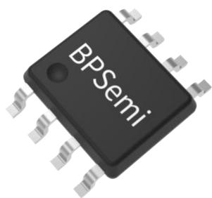

## 特点

◼ 高侧驱动浮动电源设计，最高耐压 600V

◼ 对于负的瞬态电压具有高鲁棒性

◼ 10V \~ 20V 栅极驱动电源电压

◼ 支持 3.3V/5V/15V 输入逻辑

◼ 高低侧欠压保护功能

◼ 内置 100ns 死区时间

◼ 支持 SOP8 封装

## 典型应用

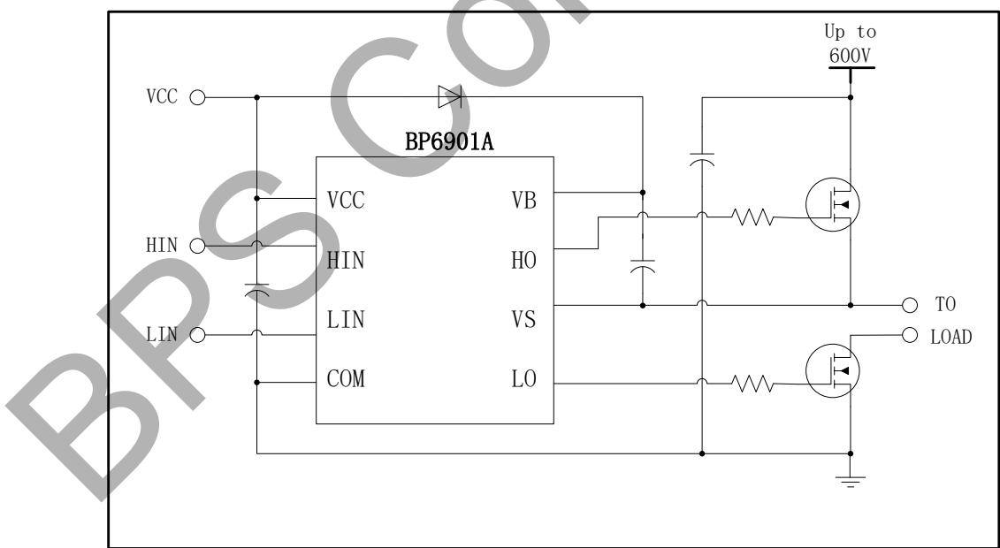  
图 1 BP6901A 典型应用电路

定购信息

<table><tr><td>定购型号</td><td>封装</td><td>包装形式</td><td>打印</td></tr><tr><td>BP6901A</td><td>SOP8</td><td>卷盘4,000 只/盘</td><td>BP6901XXXXYAXXWWX</td></tr></table>

## 管脚封装

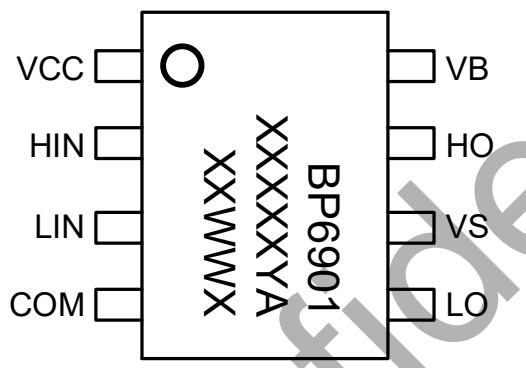  
图 2 管脚封装图

BP6901A：产品型号

XXXXXYX: 批次号

XX: 工厂代码

WW：周号

X：特殊代码

## 管脚描述

<table><tr><td>管脚号</td><td>管脚名称</td><td>描述</td></tr><tr><td>1</td><td>VCC</td><td>芯片工作电源输入端</td></tr><tr><td>2</td><td>HIN</td><td>高侧逻辑输入</td></tr><tr><td>3</td><td>LIN</td><td>低侧逻辑输入</td></tr><tr><td>4</td><td>COM</td><td>低侧驱动地</td></tr><tr><td>5</td><td>LO</td><td>低侧输出,控制低侧 MOS 的开通与截止</td></tr><tr><td>6</td><td>VS</td><td>高侧悬浮地</td></tr><tr><td>7</td><td>HO</td><td>高侧输出,控制高侧 MOS 的开通与截止</td></tr><tr><td>8</td><td>VB</td><td>高侧悬浮电源</td></tr></table>

极限参数(注 1)

<table><tr><td>符号</td><td>参数</td><td>参数范围</td><td>单位</td></tr><tr><td> $V_B$ </td><td>高侧浮动电源电压</td><td>-0.3 ~ 625</td><td>V</td></tr><tr><td> $V_S$ </td><td>高侧电源基准电压</td><td> $V_B - 25 ~ V_B + 0.3$ </td><td>V</td></tr><tr><td> $V_{HO}$ </td><td>高侧驱动输出电压</td><td> $V_S - 0.3 ~ V_B + 0.3$ </td><td>V</td></tr><tr><td> $V_{CC}$ </td><td>低侧驱动及逻辑电源电压</td><td>-0.3 ~ 25</td><td>V</td></tr><tr><td> $V_{LO}$ </td><td>低侧驱动输出电压</td><td>-0.3 ~  $V_{CC} + 0.3$ </td><td>V</td></tr><tr><td> $V_{IN}$ </td><td>逻辑输入电压(HIN/ LIN)</td><td>-0.3 ~  $V_{CC} + 0.3$ </td><td>V</td></tr><tr><td> $dV_s/dt$ </td><td>开关电压摆率</td><td>50</td><td>V/ns</td></tr><tr><td> $P_{DMAX}$ </td><td>封装功率耗散(注 2)</td><td>0.625</td><td>W</td></tr><tr><td> $θ_{JA}$ </td><td>结对环境热阻</td><td>200</td><td>°C/W</td></tr><tr><td> $T_J$ </td><td>结温范围</td><td>-40 ~ 150</td><td>°C</td></tr><tr><td> $T_{STG}$ </td><td>存储温度范围</td><td>-55 ~ 150</td><td>°C</td></tr><tr><td>ESD</td><td>静电放电(注 3)</td><td>2</td><td>KV</td></tr></table>

注 1：超过“绝对最大额定值”的压力可能会对设备造成永久性损坏。在“推荐操作条件”下，设备运行是有保证的，但某些特定参数可能无法实现。电气特性表规定了设备的工作范围，通过测试程序确定了设备在直流和交流电压下的电气特性。对于EC 表中没有最小值和最大值的参数，以典型值定义操作范围，其精度不受规格的保证。  
注 2：最大功耗随温度升高而降低，由 TJMAX、θJA和环境温度（TA）决定。最大功率耗散为PDMAX = (TJMAX - TA) /θJA与最大值表中所列数值之间的较低者  
注 3：人体放电模式，100pF电容在1.5kΩ电阻上放电

推荐工作范围（无特别说明情况下， ${ \bar { \mathsf { T } } } _ { \mathsf { A } } = 2 5 ^ { \circ } { \mathsf { C } } )$

<table><tr><td>符号</td><td>参数</td><td>参数范围</td><td>单位</td></tr><tr><td> $V_B$ </td><td>高侧浮动电源电压</td><td> $V_S + 10 \sim V_S + 20$ </td><td>V</td></tr><tr><td> $V_S$ </td><td>高侧电源基准电压</td><td>-5 ~ 600</td><td>V</td></tr><tr><td> $V_{HO}$ </td><td>高侧驱动输出电压</td><td> $V_S \sim V_B$ </td><td>V</td></tr><tr><td> $V_{CC}$ </td><td>低侧驱动及逻辑电源电压</td><td>10 ~ 20</td><td>V</td></tr><tr><td> $V_{LO}$ </td><td>低侧驱动输出电压</td><td>0 ~  $V_{CC}$ </td><td>V</td></tr><tr><td> $V_{IN}$ </td><td>逻辑输入电压(HIN/ LIN)</td><td>0 ~  $V_{CC}$ </td><td>V</td></tr></table>

电气参数(注 4)（无特别说明情况下， $\mathsf { V } _ { C C } = \mathsf { V } _ { 8 5 } = 1 5 \mathsf { V } , \mathsf { T } _ { \mathsf { A } } = 2 5 ^ { \circ } \mathsf { C } )$

<table><tr><td>符号</td><td>描述</td><td>条件</td><td>最小值</td><td>典型值</td><td>最大值</td><td>单位</td></tr><tr><td colspan="7">静态电气参数</td></tr><tr><td> $V_{CC\_ON}$ </td><td rowspan="2"> $V_{CC}$ 和 $V_{BS}$ 欠压保护释放电压</td><td rowspan="2"></td><td rowspan="2">8</td><td rowspan="2">8.8</td><td rowspan="2">9.8</td><td rowspan="2">V</td></tr><tr><td> $V_{BS\_ON}$ </td></tr><tr><td> $V_{CC\_UVLO}$ </td><td rowspan="2"> $V_{CC}$ 和 $V_{BS}$ 欠压保护电压</td><td rowspan="2"></td><td rowspan="2">7.2</td><td rowspan="2">8.0</td><td rowspan="2">8.8</td><td rowspan="2">V</td></tr><tr><td> $V_{BS\_UVLO}$ </td></tr><tr><td> $V_{CC\_HYS}$ </td><td rowspan="2"> $V_{CC}$ 和 $V_{BS}$ 欠压保护迟滞电压</td><td rowspan="2"></td><td rowspan="2">0.5</td><td rowspan="2">0.8</td><td rowspan="2">1.2</td><td rowspan="2">V</td></tr><tr><td> $V_{BS\_HYS}$ </td></tr><tr><td> $I_{QCC}$ </td><td> $V_{CC}$ 静态电流</td><td>HIN=LIN=0V</td><td></td><td>200</td><td>300</td><td>uA</td></tr><tr><td> $I_{QBS}$ </td><td> $V_{BS}$ 静态电流</td><td>HIN=LIN=0V</td><td></td><td>50</td><td>100</td><td>uA</td></tr><tr><td> $I_{LK}$ </td><td>浮动电源漏电流</td><td> $V_{HO}=V_{B}=V_{S}=620V$ </td><td></td><td></td><td>50</td><td>uA</td></tr><tr><td> $V_{IH}$ </td><td>逻辑“1”输入电平</td><td></td><td>2.8</td><td></td><td></td><td>V</td></tr><tr><td> $V_{IL}$ </td><td>逻辑“0”输入电平</td><td></td><td></td><td></td><td>0.45</td><td>V</td></tr><tr><td> $I_{ISOURCE}$ </td><td>逻辑“1”输入偏置电流</td><td>HIN, LIN=5V</td><td></td><td>5</td><td>10</td><td>uA</td></tr><tr><td> $I_{ISINK}$ </td><td>逻辑“0”输入偏置电流</td><td>HIN, LIN=0V</td><td></td><td></td><td>1.0</td><td>uA</td></tr><tr><td> $V_{OH}$ </td><td>高电平输出电压</td><td> $I_{O}=20mA$ </td><td></td><td></td><td>1.0</td><td>V</td></tr><tr><td> $V_{OL}$ </td><td>低电平输出电压</td><td> $I_{O}=20mA$ </td><td></td><td></td><td>1.0</td><td>V</td></tr><tr><td> $I_{O+}$ </td><td>高电平输出短路脉冲电流</td><td> $V_{O}=0V (V_{IN}=5V,V_{O}短路脉宽<10us)$ </td><td>130</td><td>210</td><td></td><td>mA</td></tr><tr><td> $I_{O-}$ </td><td>低电平输出短路脉冲电流</td><td> $V_{O}=15V (V_{IN}=0V,V_{O}短路脉宽<10us)$ </td><td>240</td><td>320</td><td></td><td>mA</td></tr><tr><td colspan="7">动态电气参数( $C_L$ =1nF)</td></tr><tr><td> $t_{on}$ </td><td>导通传输延迟</td><td> $V_S$ =0V</td><td></td><td>250</td><td>350</td><td rowspan="6">ns</td></tr><tr><td> $t_{off}$ </td><td>关断传输延迟</td><td> $V_S$ =0V or 600V</td><td></td><td>150</td><td>250</td></tr><tr><td> $t_r$ </td><td>输出上升时间</td><td></td><td></td><td>100</td><td>170</td></tr><tr><td> $t_f$ </td><td>输出下降时间</td><td></td><td></td><td>50</td><td>90</td></tr><tr><td>DT</td><td>死区时间</td><td></td><td>50</td><td>100</td><td>150</td></tr><tr><td>MT</td><td>高低侧传输延迟匹配</td><td> $t_{on}$ &amp; $t_{off}$ for(HS-LS)</td><td></td><td></td><td>60</td></tr></table>

注 4：所规定的最大和最小参数由试验保证，典型值由设计、表征和统计分析保证。

## 内部结构框图

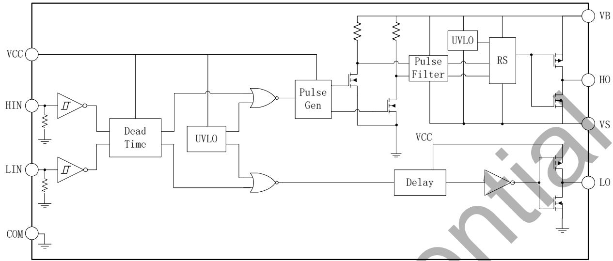

## 时序图

图 3 内部框图  
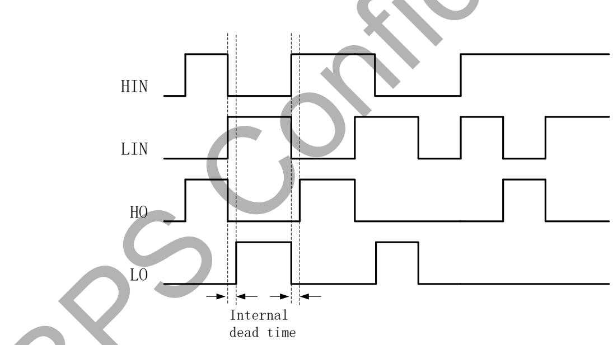  
图 4 输入/输出时序

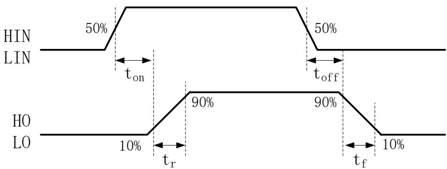  
图 5 开关时序

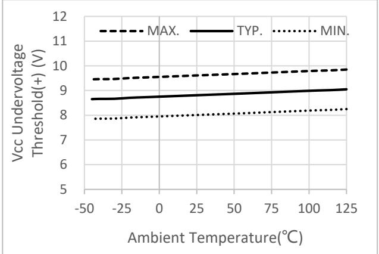

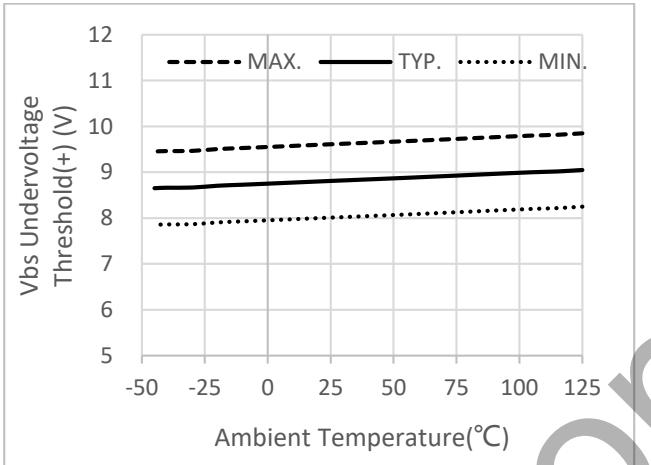

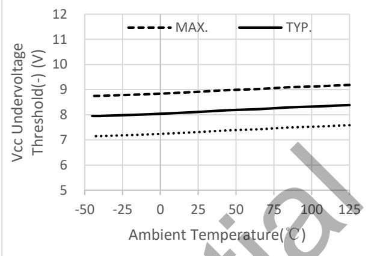

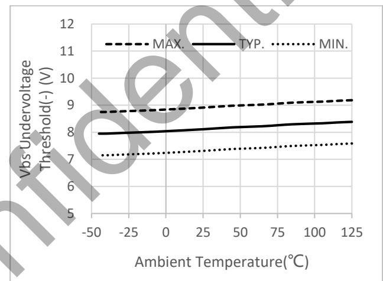

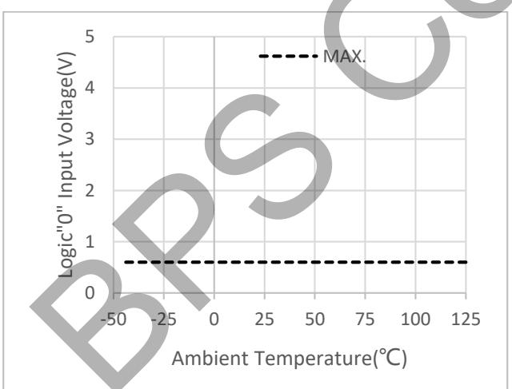

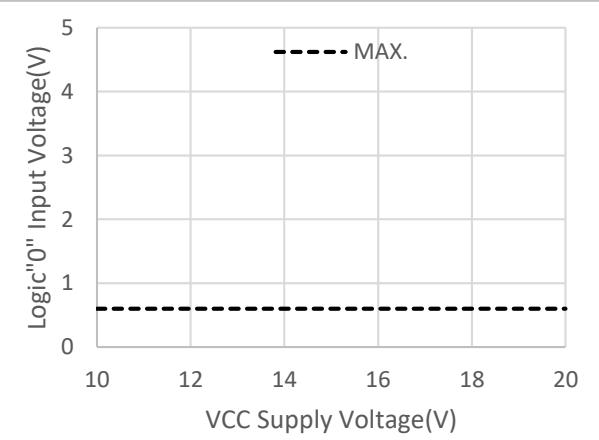

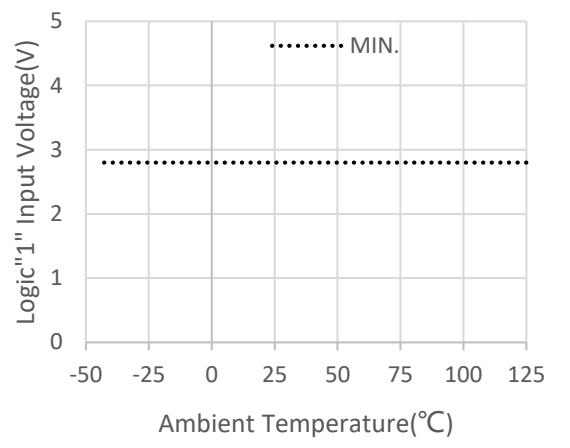

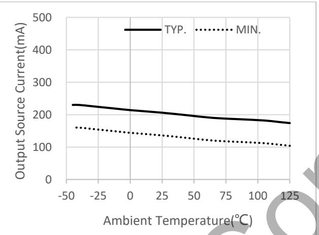

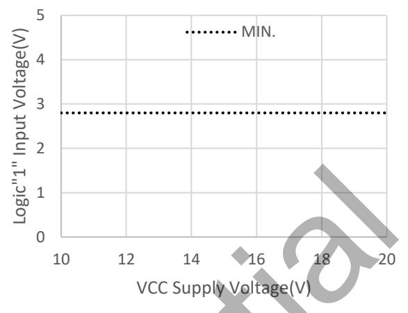

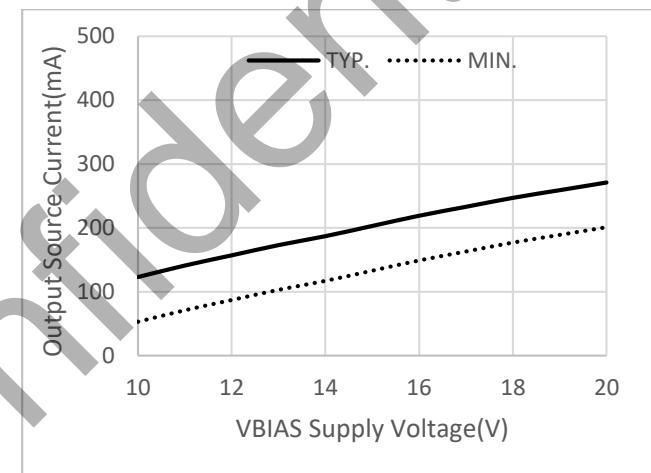

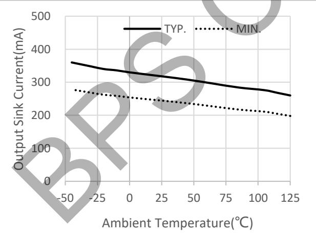

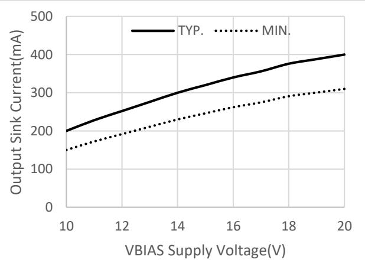

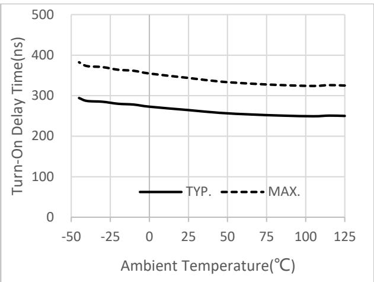

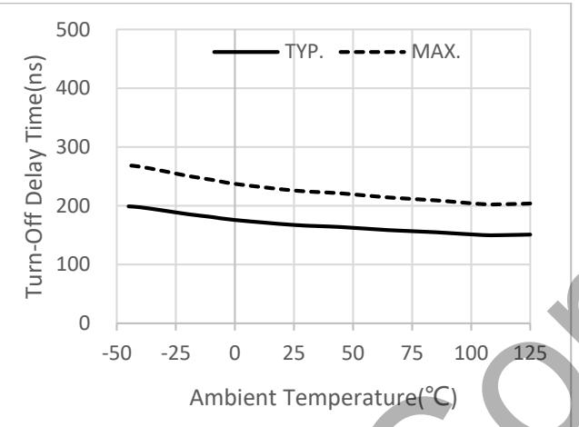

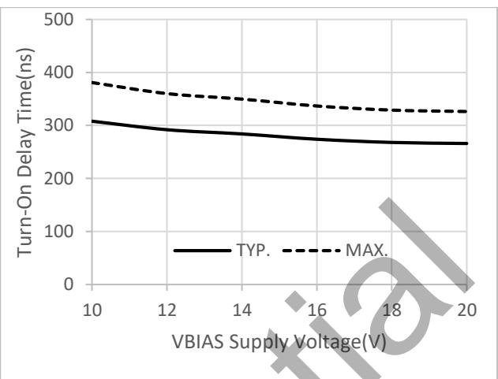

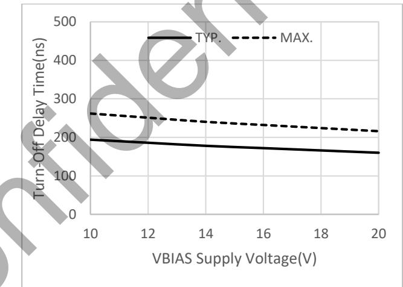

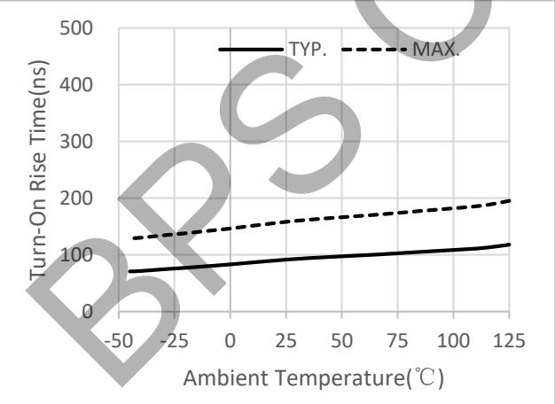

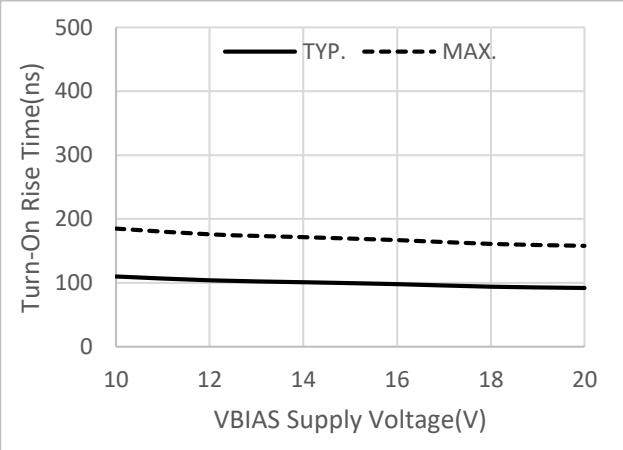

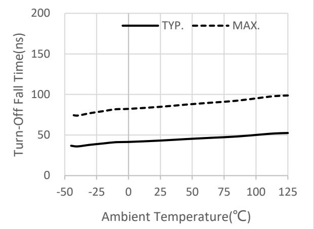

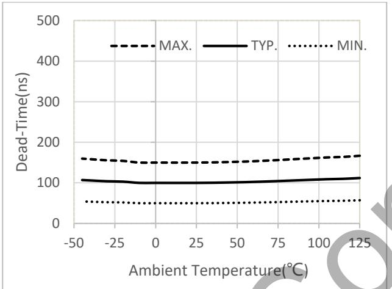

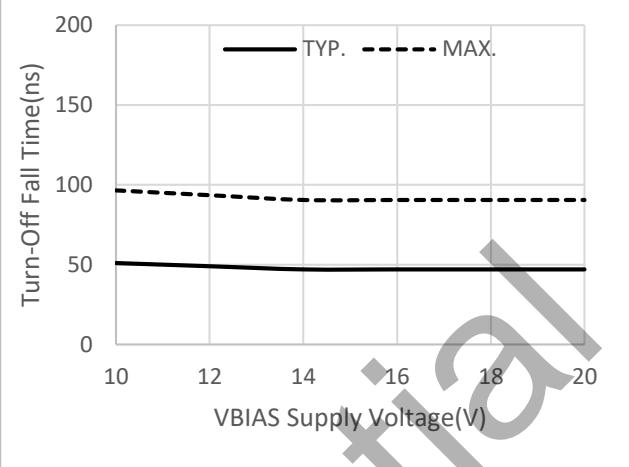

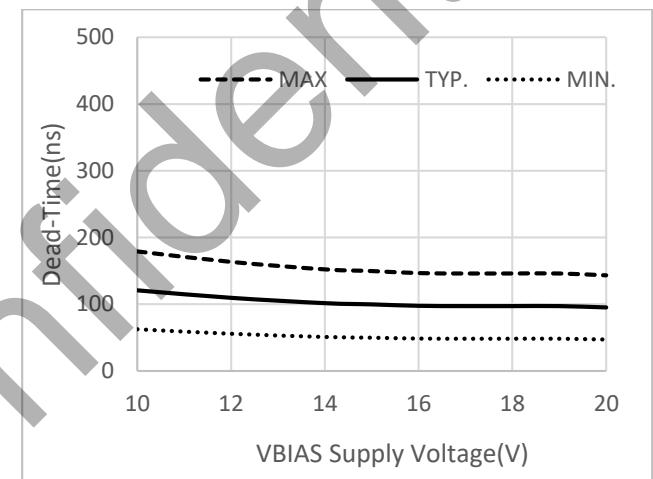

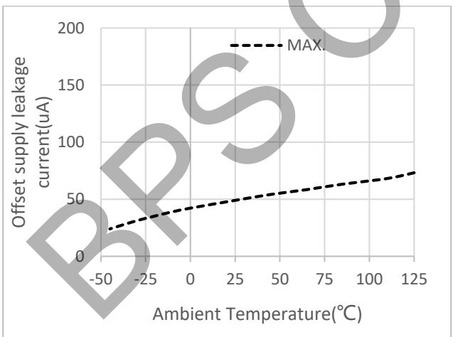

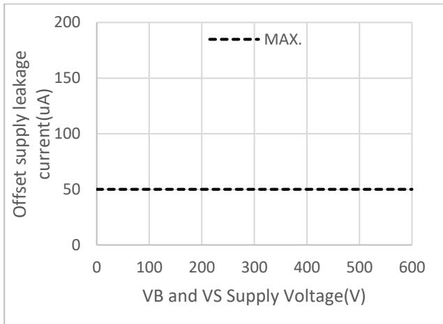

## 封装信息

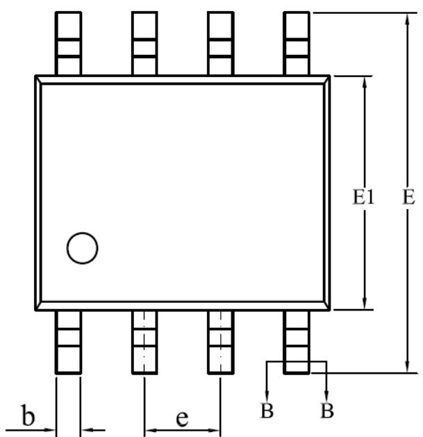

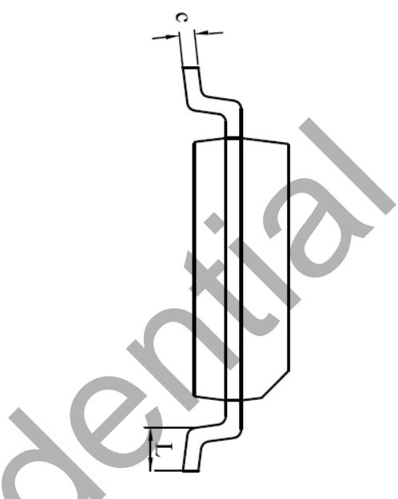

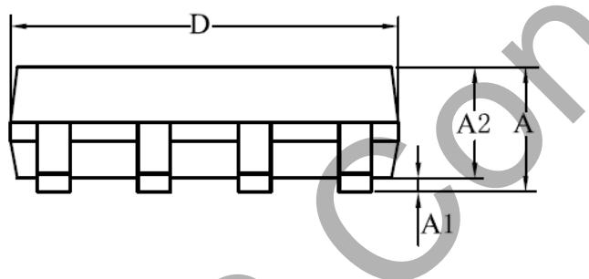

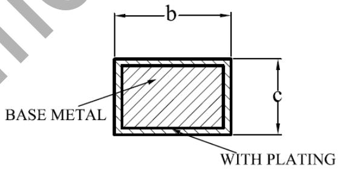  
SECTION B-B

<table><tr><td rowspan="2">SYMBOL</td><td colspan="3">MILLIMETER</td></tr><tr><td>MIN</td><td>NOM</td><td>MAX</td></tr><tr><td>A</td><td>1.30</td><td>-</td><td>1.80</td></tr><tr><td>A1</td><td>0.05</td><td>-</td><td>0.25</td></tr><tr><td>A2</td><td>1.25</td><td>1.40</td><td>1.65</td></tr><tr><td>b</td><td>0.33</td><td>-</td><td>0.51</td></tr><tr><td>c</td><td>0.17</td><td>-</td><td>0.25</td></tr><tr><td>D</td><td>4.70</td><td>4.90</td><td>5.10</td></tr><tr><td>E</td><td>5.80</td><td>6.00</td><td>6.20</td></tr><tr><td>E1</td><td>3.70</td><td>3.90</td><td>4.10</td></tr><tr><td>e</td><td colspan="3">1.27BSC</td></tr><tr><td>L</td><td>0.40</td><td>-</td><td>1.00</td></tr></table>

## 版本信息

<table><tr><td>版本</td><td>日期</td><td>记录</td></tr><tr><td>Rev. 1.0</td><td>2024/11</td><td>首次发行</td></tr></table>

## 免责声明

晶丰明源尽力确保本产品规格书内容的准确和可靠，但是保留在没有通知的情况下，修改规格书内容的权利。

本产品规格书未包含任何针对晶丰明源或第三方所有的知识产权的授权。针对本产品规格书所记载的信息，晶丰明源不做任何明示或暗示的保证，包括但不限于对规格书内容的准确性、商业上的适销性、特定目的的适用性或者不侵犯晶丰明源或任何第三人知识产权做任何明示或暗示保证，晶丰明源也不就因本规格书本身及其使用有关的偶然或必然损失承担任何责任。

## 电子器件报废说明

该产品在生命周期结束后，由客户按照一般电子产品的报废流程进行处理。