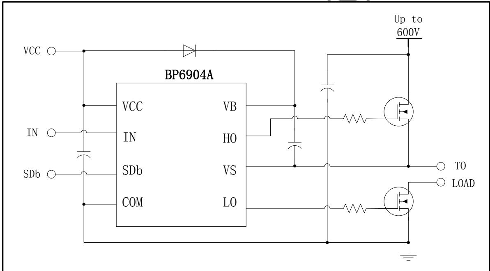
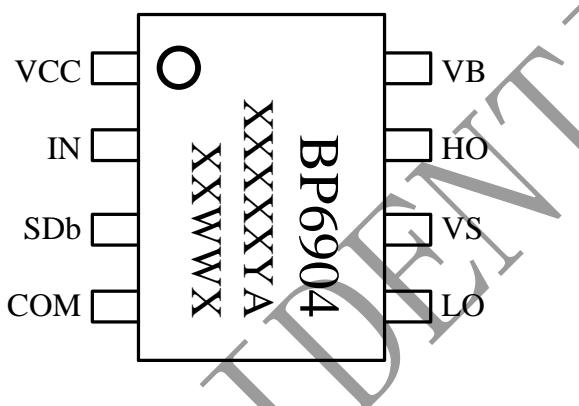
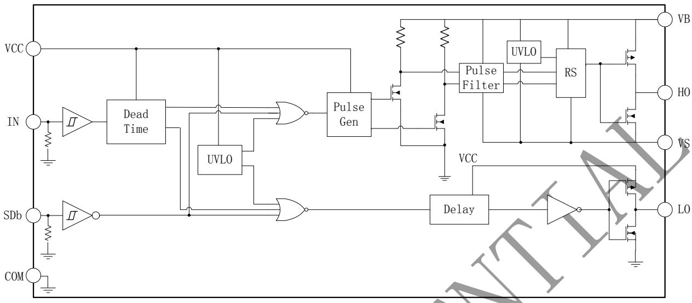
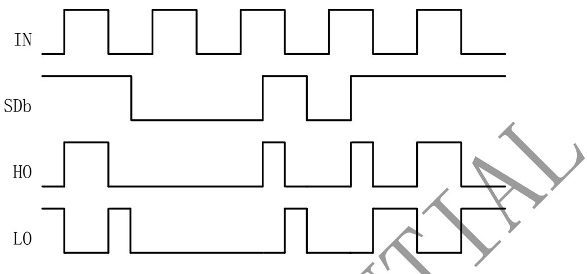
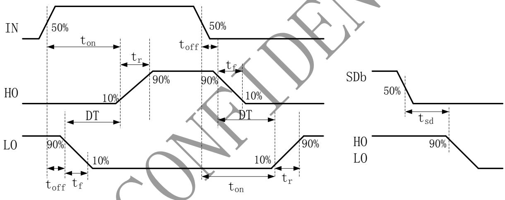
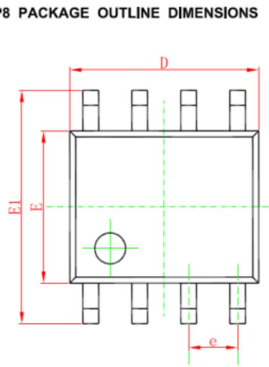
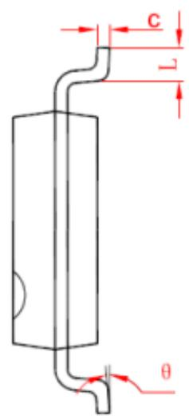
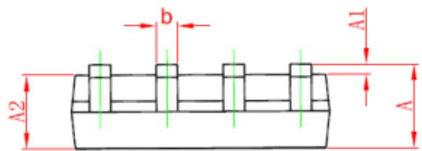

## Description

The BP6904A is a high voltage, high speed halfbridge pre-driver for power MOSFET and IGBT. It has one input for high side and low side, and two output channels with internal dead time to avoid cross-conduction.

The input logic level is compatible with 3.3V/5V/15V signal. The floating high side channel can drive a Nchannel power MOSFET or IGBT up to 600V.

## Features

◼ Floating channel operation up to 600V

◼ Single input for high side and low side

◼ Shut down input turns off both channels

◼ Robust at negative transient voltage

◼ Gate drive supply range from 10V to 20V

◼ 3.3V, 5V and 15V input logic compatible

◼ UVLO for both high side and low side

◼ Built-in dead time

◼ Available in SOP8 package

## Typical Application

  
Figure 1. Typical application circuit

## Ordering Information

<table><tr><td>Part Number</td><td>Package</td><td>Operation Temperature</td><td>Package Method</td><td>Marking</td></tr><tr><td>BP6904A</td><td>SOP8</td><td>-40 °C to 105 °C</td><td>Tape4,000 Piece/Roll</td><td>BP6904XXXXYAXXWWX</td></tr></table>

## Pin Configuration and Marking Information

XXXXXYA: lot code XX: Fab code WW：Week X: Special code

Figure 2. Pin configuration

## Pin Definition

<table><tr><td>Pin No.</td><td>Name</td><td>Description</td></tr><tr><td>1</td><td>VCC</td><td>Low side and logic supply voltage</td></tr><tr><td>2</td><td>IN</td><td>Logic input for high side and low side, in phase with HO</td></tr><tr><td>3</td><td>SDb</td><td>Logic input for shut down</td></tr><tr><td>4</td><td>COM</td><td>Logic ground and low side driver return</td></tr><tr><td>5</td><td>LO</td><td>Low side driver output</td></tr><tr><td>6</td><td>VS</td><td>High side driver return</td></tr><tr><td>7</td><td>HO</td><td>High side driver output</td></tr><tr><td>8</td><td>VB</td><td>High side floating supply</td></tr></table>

Absolute Maximum Ratings (note 1)

<table><tr><td>Symbol</td><td>Parameters</td><td>Min.</td><td>Max.</td><td>Unit</td></tr><tr><td> $V_B$ </td><td>High side floating supply voltage</td><td>-0.3</td><td>625</td><td>V</td></tr><tr><td> $V_S$ </td><td>High side offset voltage</td><td> $V_B - 25$ </td><td> $V_B + 0.3$ </td><td>V</td></tr><tr><td> $V_{HO}$ </td><td>High side driver output voltage</td><td> $V_S - 0.3$ </td><td> $V_B + 0.3$ </td><td>V</td></tr><tr><td> $V_{CC}$ </td><td>Low side and logic supply voltage</td><td>-0.3</td><td>25</td><td>V</td></tr><tr><td> $V_{LO}$ </td><td>Low side driver output voltage</td><td>-0.3</td><td> $V_{CC} + 0.3$ </td><td>V</td></tr><tr><td> $V_{IN}$ </td><td>Logic input voltage (IN/ SDb)</td><td>-0.3</td><td> $V_{CC} + 0.3$ </td><td>V</td></tr><tr><td> $dV_s/dt$ </td><td>Allowable offset voltage slew rate</td><td>--</td><td>50</td><td>V/ns</td></tr><tr><td> $P_{DMAX}$ </td><td>Package power dissipation (note 2)</td><td>--</td><td>0.625</td><td>W</td></tr><tr><td> $θ_{JA}$ </td><td>Thermal resistance, junction to ambient</td><td>--</td><td>200</td><td>°C/W</td></tr><tr><td> $T_J$ </td><td>Junction temperature</td><td>-40</td><td>150</td><td>°C</td></tr><tr><td> $T_{STG}$ </td><td>Storage temperature</td><td>-55</td><td>150</td><td>°C</td></tr><tr><td></td><td>ESD (note 3)</td><td colspan="2">2</td><td>KV</td></tr></table>

Note 1: Stresses beyond those listed under “absolute maximum ratings” may cause permanent damage to the device. Under “recommended operating conditions” the device operation is assured, but some particular parameter may not be achieved. The electrical characteristics table defines the operation range of the device, the electrical characteristics is assured on DC and AC voltage by test program. For the parameters without minimum and maximum value in the EC table, the typical value defines the operation range, the accuracy is not guaranteed by spec

Note 2: The maximum power dissipation decrease if temperature rise, it is decided by TJMAX, θJA, and environment temperature (TA). The maximum power dissipation is the lower one between PDMAX = (TJMAX – TA) /θJA and the number listed in the maximum table. Note 3: Human Body mode, 100pF capacitor discharge on 1.5k Ω resistor.

Recommended Operation Conditions

<table><tr><td>Symbol</td><td>Parameters</td><td>Min.</td><td>Max.</td><td>Unit</td></tr><tr><td> $V_B$ </td><td>High side floating supply voltage</td><td> $V_S + 10$ </td><td> $V_S + 20$ </td><td>V</td></tr><tr><td> $V_S$ </td><td>High side offset voltage</td><td>-5</td><td>600</td><td>V</td></tr><tr><td> $V_{HO}$ </td><td>High side driver output voltage</td><td> $V_S$ </td><td> $V_B$ </td><td>V</td></tr><tr><td> $V_{CC}$ </td><td>Low side and logic supply voltage</td><td>10</td><td>20</td><td>V</td></tr><tr><td> $V_{LO}$ </td><td>Low side driver output voltage</td><td>0</td><td> $V_{CC}$ </td><td>V</td></tr><tr><td> $V_{IN}$ </td><td>Logic input voltage (IN/ SDb)</td><td>0</td><td> $V_{CC}$ </td><td>V</td></tr></table>

Electrical Characteristics (note 4) (Unless otherwise specified, $\mathrm { V _ { C C } = V _ { B S } = } 1 5 \mathrm { V }$ and $\mathrm { T } _ { \mathrm { A } } { = } 2 5$ ℃)

<table><tr><td>Symbol</td><td>Parameter</td><td>Condition</td><td>Min.</td><td>Typ.</td><td>Max.</td><td>Unit</td></tr><tr><td colspan="7">Static Electrical Characteristics</td></tr><tr><td> $V_{CC\_ON}$ </td><td rowspan="2"> $V_{CC}$  and  $V_{BS}$  under voltage rising threshold</td><td rowspan="2"></td><td rowspan="2">8</td><td rowspan="2">8.8</td><td rowspan="2">9.8</td><td rowspan="2">V</td></tr><tr><td> $V_{BS\_ON}$ </td></tr><tr><td> $V_{CC\_UVLO}$ </td><td rowspan="2"> $V_{CC}$  and  $V_{BS}$  under voltage falling threshold</td><td rowspan="2"></td><td rowspan="2">7.2</td><td rowspan="2">8.0</td><td rowspan="2">8.8</td><td rowspan="2">V</td></tr><tr><td> $V_{BS\_UVLO}$ </td></tr><tr><td> $V_{CC\_HYS}$ </td><td rowspan="2"> $V_{CC}$  and  $V_{BS}$  under voltage hysteresis voltage</td><td rowspan="2"></td><td rowspan="2">0.5</td><td rowspan="2">0.8</td><td rowspan="2">1.2</td><td rowspan="2">V</td></tr><tr><td> $V_{BS\_HYS}$ </td></tr><tr><td> $I_{QCC}$ </td><td>Quiescent  $V_{CC}$  supply current</td><td> $V_{IN}=0V$ </td><td>-</td><td>200</td><td>300</td><td>uA</td></tr><tr><td> $I_{QBS}$ </td><td>Quiescent  $V_{BS}$  supply current</td><td> $V_{IN}=0V$ </td><td>-</td><td>50</td><td>100</td><td>uA</td></tr><tr><td> $I_{LK}$ </td><td>Offset supply leakage current</td><td> $V_{B}=V_{S}=620V$ </td><td>-</td><td>-</td><td>50</td><td>uA</td></tr><tr><td> $V_{IH}$ </td><td>Logic “1” input voltage</td><td></td><td>2.8</td><td>-</td><td>-</td><td>V</td></tr><tr><td> $V_{IL}$ </td><td>Logic “0” input voltage</td><td></td><td>-</td><td>-</td><td>0.45</td><td>V</td></tr><tr><td> $I_{ISOURCE}$ </td><td>Logic “1” input bias current</td><td> $V_{IN}=5V$ </td><td>-</td><td>5</td><td>10</td><td>uA</td></tr><tr><td> $I_{ISINK}$ </td><td>Logic “0” input bias current</td><td> $V_{IN}=0V$ </td><td>-</td><td>-</td><td>1</td><td>uA</td></tr><tr><td> $V_{OH}$ </td><td>High level output voltage</td><td> $I_{O}=20mA$ </td><td>-</td><td>-</td><td>1.0</td><td>V</td></tr><tr><td> $V_{OL}$ </td><td>Low level output voltage</td><td> $I_{O}=20mA$ </td><td>-</td><td>-</td><td>1.0</td><td>V</td></tr><tr><td> $I_{O+}$ </td><td>Output high short circuit pulse current</td><td> $V_{O}=0V, V_{IN}=5V$ , Pulse Width &lt; 10uS</td><td>130</td><td>210</td><td>-</td><td>mA</td></tr><tr><td> $I_{O-}$ </td><td>Output low short circuit pulse current</td><td> $V_{O}=15V, V_{IN}=0V$ , Pulse Width &lt; 10uS</td><td>240</td><td>320</td><td>-</td><td>mA</td></tr><tr><td colspan="7">Dynamic Electrical Characteristics ( $C_L=1nF$ )</td></tr><tr><td> $t_{on}$ </td><td>Turn-on propagation delay</td><td> $V_{S}=0V$ </td><td>-</td><td>680</td><td>820</td><td rowspan="7">ns</td></tr><tr><td> $t_{off}$ </td><td>Turn-off propagation delay</td><td> $V_{S}=0V or 600V$ </td><td>-</td><td>160</td><td>250</td></tr><tr><td> $t_{sd}$ </td><td>Shut down propagation delay</td><td></td><td>-</td><td>160</td><td>250</td></tr><tr><td> $t_r$ </td><td>Turn-on rise time</td><td></td><td>-</td><td>100</td><td>170</td></tr><tr><td> $t_f$ </td><td>Turn-off fall time</td><td></td><td>-</td><td>50</td><td>90</td></tr><tr><td>DT</td><td>Dead time</td><td></td><td>400</td><td>520</td><td>650</td></tr><tr><td>MT</td><td>Delay match</td><td>HS-LS  $t_{on} \& t_{off}$ </td><td>-</td><td>-</td><td>60</td></tr></table>

Note 4: The maximum and minimum parameters specified are guaranteed by test, the typical value are guaranteed by design, characterization and statistical analysis.

## Internal Block Diagram

  
Figure 3. Internal block diagram

## Waveforms

  
Figure 4. Input/ Output Timing Diagram

  
Figure 5. Switching Timing Definition

Physical Dimensions

<table><tr><td rowspan="2">Symbol</td><td colspan="2">Dimensions In Millimeters</td><td colspan="2">Dimensions In Inches</td></tr><tr><td>Min</td><td>Max</td><td>Min</td><td>Max</td></tr><tr><td>A</td><td>1.350</td><td>1.750</td><td>0.053</td><td>0.069</td></tr><tr><td>A1</td><td>0.100</td><td>0.250</td><td>0.004</td><td>0.010</td></tr><tr><td>A2</td><td>1.350</td><td>1.550</td><td>0.053</td><td>0.061</td></tr><tr><td>b</td><td>0.330</td><td>0.510</td><td>0.013</td><td>0.020</td></tr><tr><td>c</td><td>0.170</td><td>0.250</td><td>0.006</td><td>0.010</td></tr><tr><td>D</td><td>4.700</td><td>5.100</td><td>0.185</td><td>0.200</td></tr><tr><td>E</td><td>3.800</td><td>4.000</td><td>0.150</td><td>0.157</td></tr><tr><td>E1</td><td>5.800</td><td>6.200</td><td>0.228</td><td>0.244</td></tr><tr><td>e</td><td colspan="2">1.270 (BSC)</td><td colspan="2">0.050 (BSC)</td></tr><tr><td>L</td><td>0.400</td><td>1.270</td><td>0.016</td><td>0.050</td></tr><tr><td>θ</td><td> $0^{\circ}$ </td><td> $8^{\circ}$ </td><td> $0^{\circ}$ </td><td> $8^{\circ}$ </td></tr></table>