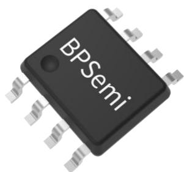
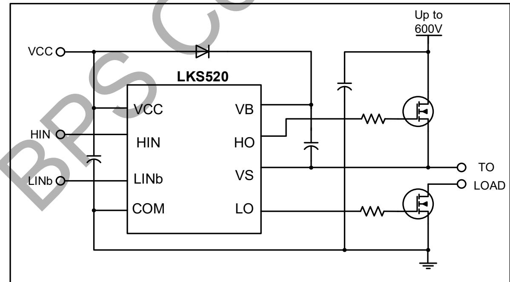
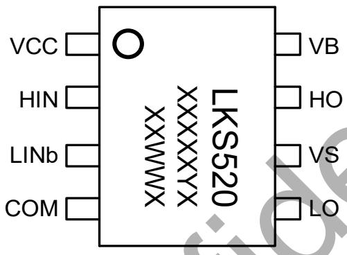
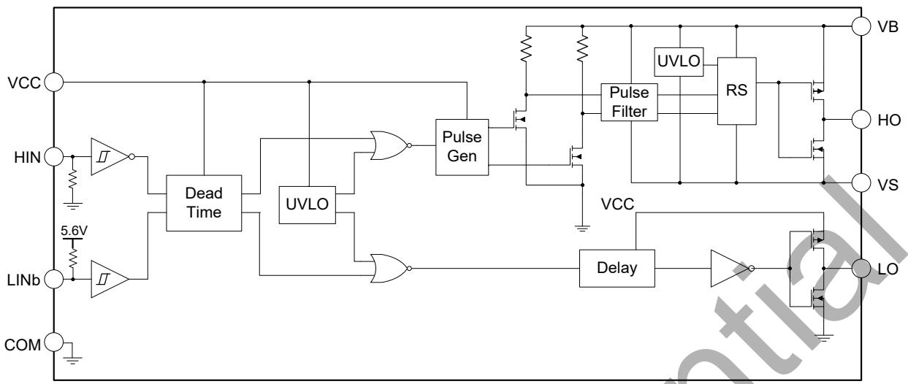
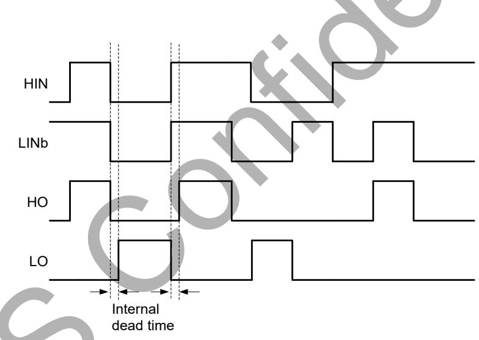
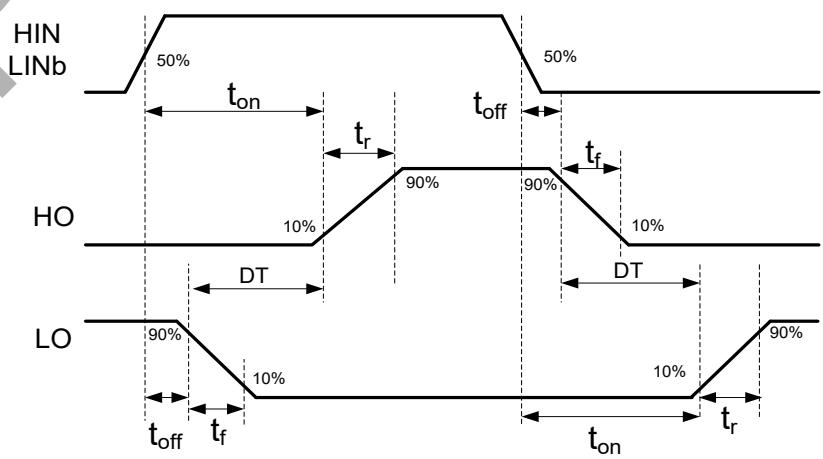
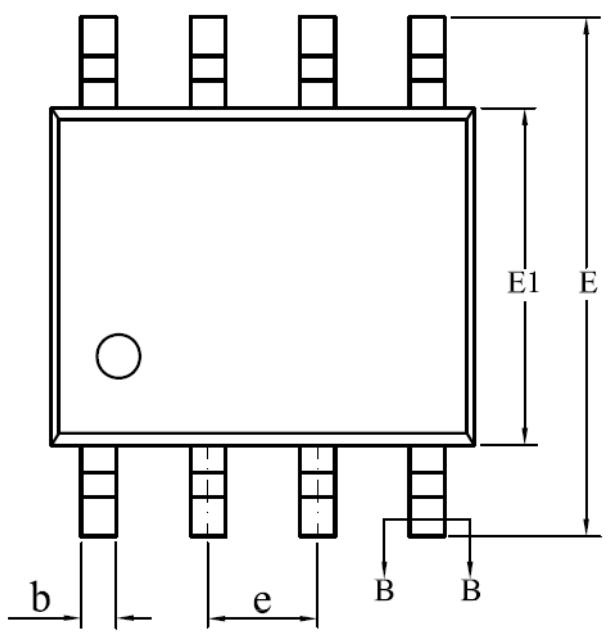
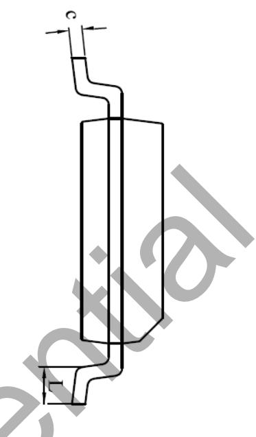
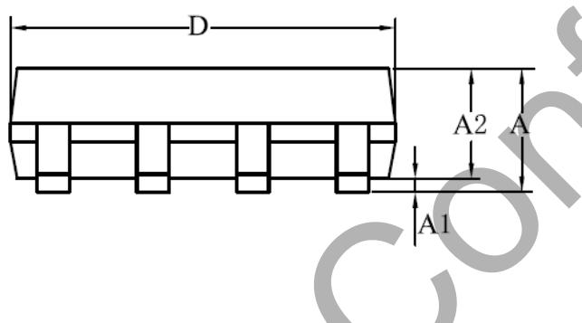
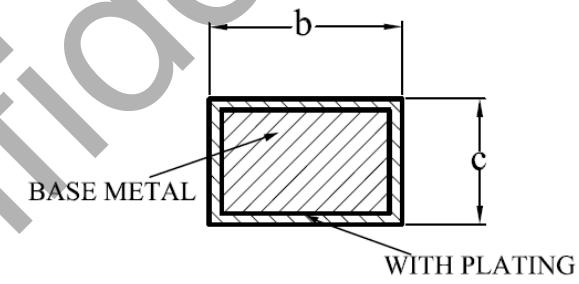

## Description

The LKS520 is a high voltage, high speed half-bridge pre-driver for power MOSFET and IGBT. It has inputs for both high side and low side, and two output channels with internal dead time to avoid crossconduction.

The input logic level is compatible with 3.3V/5V/15V signal. The floating high side channel can drive a Nchannel power MOSFET or IGBT up to 600V.

## Features

◼ Floating channel operation up to 600V

◼ Robust at negative transient voltage

◼ Gate drive supply range from 10V to 20V

◼ 3.3V, 5V and 15V input logic compatible

◼ Reverse input for low side

◼ UVLO for both high side and low side

◼ Built-in 100ns dead time

◼ Available in SOP8 package

## Applications

◼ H-bridge

◼ Inverters

## Typical Application

  
Figure 1. Typical application circuit

## Ordering Information

<table><tr><td>Part Number</td><td>Package</td><td>Package Method</td><td>Marking</td></tr><tr><td>LKS520</td><td>SOP8</td><td>Tape4,000 Piece/Roll</td><td>LKS520XXXXXYXXWWX</td></tr></table>

## Pin Configuration and Marking Information

  
Figure 2. Pin configuration

XXXXXYX: lot code XX: Fab code WW: Week X: Special code

## Pin Definition

<table><tr><td>Pin No.</td><td>Name</td><td>Description</td></tr><tr><td>1</td><td>VCC</td><td>Low side and logic supply voltage</td></tr><tr><td>2</td><td>HIN</td><td>Logic input for high side, in phase with HO</td></tr><tr><td>3</td><td>LINb</td><td>Logic input for low side, out of phase with LO</td></tr><tr><td>4</td><td>COM</td><td>Logic ground and low side driver return</td></tr><tr><td>5</td><td>LO</td><td>Low side driver output</td></tr><tr><td>6</td><td>VS</td><td>High side driver return</td></tr><tr><td>7</td><td>HO</td><td>High side driver output</td></tr><tr><td>8</td><td>VB</td><td>High side floating supply</td></tr></table>

Absolute Maximum Ratings (note 1)

<table><tr><td>Symbol</td><td>Parameters</td><td>Min.</td><td>Max.</td><td>Unit</td></tr><tr><td> $V_B$ </td><td>High side floating supply voltage</td><td>-0.3</td><td>625</td><td>V</td></tr><tr><td> $V_S$ </td><td>High side offset voltage</td><td> $V_B - 25$ </td><td> $V_B + 0.3$ </td><td>V</td></tr><tr><td> $V_{HO}$ </td><td>High side driver output voltage</td><td> $V_S - 0.3$ </td><td> $V_B + 0.3$ </td><td>V</td></tr><tr><td> $V_{CC}$ </td><td>Low side and logic supply voltage</td><td>-0.3</td><td>25</td><td>V</td></tr><tr><td> $V_{LO}$ </td><td>Low side driver output voltage</td><td>-0.3</td><td> $V_{CC} + 0.3$ </td><td>V</td></tr><tr><td> $V_{IN}$ </td><td>Logic input voltage (HIN/ LINb)</td><td>-0.3</td><td> $V_{CC} + 0.3$ </td><td>V</td></tr><tr><td> $dV_s/dt$ </td><td>Allowable offset voltage slew rate</td><td>-</td><td>50</td><td>V/ns</td></tr><tr><td> $P_{DMAX}$ </td><td>Package power dissipation (note 2)</td><td>-</td><td>0.625</td><td>W</td></tr><tr><td> $θ_{JA}$ </td><td>Thermal resistance, junction to ambient</td><td>-</td><td>200</td><td>°C/W</td></tr><tr><td> $T_J$ </td><td>Junction temperature</td><td>-40</td><td>150</td><td>°C</td></tr><tr><td> $T_{STG}$ </td><td>Storage temperature</td><td>-55</td><td>150</td><td>°C</td></tr></table>

Note 1: Stresses beyond those listed under“absolute maximum ra $\tan 8 5 ^ { \circ }$ may cause permanent damage to the device. Under “recommended achieved. The electrical characteristics table defines the operation range of the device, the electrical characteristics is assured on DC and AC voltage by test program. For the parameters without minimum and maximum value in the EC table, the typical value defines the operation range, the accuracy is not guaranteed by spec. Note 2: The maximum power dissipation decrease if temperature rise, it is decided by TJMAX $\theta _ { \mathsf { J A } , }$ and environment temperature $( \mathsf { T } _ { \mathsf { A } } ) .$ The maximum power dissipation is the lower one between $\mathsf { P } _ { \mathsf { D M A X } } = \left( \mathsf { T } _ { \mathsf { J M A X } } - \mathsf { T } _ { \mathsf { A } } \right) / \theta .$ and the number listed in the maximum table.

Recommended Operation Conditions

<table><tr><td>Symbol</td><td>Parameters</td><td>Min.</td><td>Max.</td><td>Unit</td></tr><tr><td> $V_B$ </td><td>High side floating supply voltage</td><td> $V_S + 10$ </td><td> $V_S + 20$ </td><td>V</td></tr><tr><td> $V_S$ </td><td>High side offset voltage</td><td>-5</td><td>600</td><td>V</td></tr><tr><td> $V_{HO}$ </td><td>High side driver output voltage</td><td> $V_S$ </td><td> $V_B$ </td><td>V</td></tr><tr><td> $V_{CC}$ </td><td>Low side and logic supply voltage</td><td>10</td><td>20</td><td>V</td></tr><tr><td> $V_{LO}$ </td><td>Low side driver output voltage</td><td>0</td><td> $V_{CC}$ </td><td>V</td></tr><tr><td> $V_{IN}$ </td><td>Logic input voltage (HIN/ LINb)</td><td>0</td><td> $V_{CC}$ </td><td>V</td></tr></table>

Electrical Characteristics (note 3) (Unless otherwise specified, $V _ { \mathsf { C C } } { = } \mathsf { V } _ { \mathsf { B S } } { = } 1 5 \mathsf { V }$ and ${ \sf T } _ { \sf A } { = } 2 5 ~ ^ { \circ } { \sf C } )$

<table><tr><td>Symbol</td><td>Parameter</td><td>Conditions</td><td>Min.</td><td>Typ.</td><td>Max.</td><td>Unit</td></tr><tr><td colspan="7">Static Electrical Characteristics</td></tr><tr><td> $V_{CC\_ON}$ </td><td rowspan="2"> $V_{CC}$  and  $V_{BS}$  under voltage rising threshold</td><td rowspan="2"></td><td>8.0</td><td>8.5</td><td>9.8</td><td rowspan="2">V</td></tr><tr><td> $V_{BS\_ON}$ </td><td>-</td><td>8.7</td><td>10</td></tr><tr><td> $V_{CC\_UVLO}$ </td><td rowspan="2"> $V_{CC}$  and  $V_{BS}$  under voltage falling threshold</td><td rowspan="2"></td><td>7.2</td><td>7.6</td><td>8.8</td><td rowspan="2">V</td></tr><tr><td> $V_{BS\_UVLO}$ </td><td>6.5</td><td>7.8</td><td>-</td></tr><tr><td> $V_{CC\_HYS}$ </td><td rowspan="2"> $V_{CC}$  and  $V_{BS}$  under voltage hysteresis voltage</td><td rowspan="2"></td><td>0.6</td><td>0.9</td><td>1.2</td><td rowspan="2">V</td></tr><tr><td> $V_{BS\_HYS}$ </td><td>-</td><td>0.9</td><td>-</td></tr><tr><td> $I_{QCC}$ </td><td>Quiescent  $V_{CC}$  supply current</td><td>HIN=0V, LINb=5V</td><td>-</td><td>50</td><td>150</td><td>uA</td></tr><tr><td> $I_{QBS}$ </td><td>Quiescent  $V_{BS}$  supply current</td><td>HIN=0V, LINb=5V</td><td>-</td><td>35</td><td>80</td><td>uA</td></tr><tr><td> $I_{LK}$ </td><td>Offset supply leakage current</td><td> $V_{HO}=V_{B}=V_{S}=620V$ </td><td>-</td><td>-</td><td>10</td><td>uA</td></tr><tr><td> $V_{IH}$ </td><td>Logic “1” input trigger voltage</td><td></td><td>2.4</td><td>-</td><td>-</td><td>V</td></tr><tr><td> $V_{IL}$ </td><td>Logic “0” input trigger voltage</td><td></td><td>-</td><td>-</td><td>0.6</td><td>V</td></tr><tr><td> $I_{ISOURCE\_HS}$ </td><td>Logic “1” input bias current</td><td>HIN =5V</td><td>-</td><td>32</td><td>100</td><td>uA</td></tr><tr><td> $I_{ISINK\_HS}$ </td><td>Logic “0” input bias current</td><td>HIN=0V</td><td>-</td><td>-</td><td>1.0</td><td>uA</td></tr><tr><td> $I_{ISOURCE\_LS}$ </td><td>Logic “1” input bias current</td><td>LINb=5V</td><td>-2.0</td><td>-</td><td>2.0</td><td>uA</td></tr><tr><td> $I_{ISINK\_LS}$ </td><td>Logic “0” input bias current</td><td>LINb=0V</td><td>-</td><td>50</td><td>100</td><td>uA</td></tr><tr><td> $V_{OH}$ </td><td>High level output voltage</td><td> $I_{O}=20mA$ </td><td>-</td><td>-</td><td>1.0</td><td>V</td></tr><tr><td> $V_{OL}$ </td><td>Low level output voltage</td><td> $I_{O}=20mA$ </td><td>-</td><td>-</td><td>1.0</td><td>V</td></tr><tr><td> $I_{O+}$ </td><td>Output high short circuit pulse current</td><td> $V_{O}=0V,V_{IN}=5V,Pulse Width < 10uS$ </td><td>300</td><td>450</td><td>-</td><td>mA</td></tr><tr><td> $I_{O-}$ </td><td>Output low short circuit pulse current</td><td> $V_{O}=15V,V_{IN}=0V,Pulse Width < 10uS$ </td><td>650</td><td>1000</td><td>-</td><td>mA</td></tr><tr><td colspan="7">Dynamic Electrical Characteristics ( $C_L$ =1nF)</td></tr><tr><td> $t_{on}$ </td><td>Turn-on propagation delay</td><td> $V_S$ =0V</td><td>100</td><td>270</td><td>450</td><td rowspan="6">ns</td></tr><tr><td> $t_{off}$ </td><td>Turn-off propagation delay</td><td> $V_S$ =0V or 600V</td><td>80</td><td>180</td><td>300</td></tr><tr><td> $t_r$ </td><td>Turn-on rise time</td><td></td><td>-</td><td>40</td><td>100</td></tr><tr><td> $t_f$ </td><td>Turn-off fall time</td><td></td><td>-</td><td>12</td><td>50</td></tr><tr><td>DT</td><td>Dead time</td><td></td><td>40</td><td>100</td><td>250</td></tr><tr><td>MT</td><td>Delay match</td><td> $t_{on}$ &amp; $t_{off}$ for (HS-LS)</td><td>-</td><td>-</td><td>80</td></tr></table>

Note 3: The maximum and minimum parameters specified are guaranteed by test, the typical value are guaranteed by design, characterization and statistical analysis.

## Internal Block Diagram

  
Figure 3. Internal block diagram

## Waveforms

  
Figure 4. Input/ Output Timing Diagram

  
Figure 5. Switching Timing Waveforms

## Physical Dimensions

  
SECTION B-B

<table><tr><td rowspan="2">SYMBOL</td><td colspan="3">MILLIMETER</td></tr><tr><td>MIN</td><td>NOM</td><td>MAX</td></tr><tr><td>A</td><td>1.30</td><td>-</td><td>1.80</td></tr><tr><td>A1</td><td>0.05</td><td>-</td><td>0.25</td></tr><tr><td>A2</td><td>1.25</td><td>1.40</td><td>1.65</td></tr><tr><td>b</td><td>0.33</td><td>-</td><td>0.51</td></tr><tr><td>c</td><td>0.17</td><td>-</td><td>0.25</td></tr><tr><td>D</td><td>4.70</td><td>4.90</td><td>5.10</td></tr><tr><td>E</td><td>5.80</td><td>6.00</td><td>6.20</td></tr><tr><td>E1</td><td>3.70</td><td>3.90</td><td>4.10</td></tr><tr><td>e</td><td colspan="3">1.27BSC</td></tr><tr><td>L</td><td>0.40</td><td>-</td><td>1.00</td></tr></table>

Revision Information

<table><tr><td>Revision</td><td>Date</td><td>Notes</td></tr><tr><td>Rev.1.0</td><td>2024/11</td><td>Initial Release</td></tr></table>

## Disclaimer

The information provided in this datasheet is believed to be accurate and reliable. However, Bright Power Semiconductor (BPS) reserves the right to make changes at any time without prior notice.

No license, to any intellectual property right owned by BPS or any other third party, is granted under this document. BPS provides information in this datasheet “AS IS” and with all faults, and makes no warranty, express or implied, including but not limited to, the accuracy of the information provided in this datasheet, merchantability, fitness of a specific purpose or non-infringement of intellectual property rights of BPS or any other third party. BPS disclaims any and all liabilitie arising out of this datasheet or use of this datasheet, including without limitation consequential or incidental damages.

## Electronic device scrap description

After the end of its life cycle, the product is processed by the customer in accordance with the scrap process of general electronic products.

