南京凌鸥创芯电子有限公司

# LKS563(Q)数据手册

@ 2019, 版权归凌鸥创芯所有

机密文件，未经许可不得扩散

## 目 录

1 概述....1
1.1 功能简述....1
1.2 主要指标....1
1.3 控制逻辑....2
2 管脚分布....3
2.1 管脚分布图....3
2.2 管脚说明....4
3 封装尺寸....5
4 应用示例....7
5 电气性能参数....8
5.1 极限参数....8
5.2 建议工况....8
5.3 动态电气参数....8
5.4 静态电气参数....10
6 订购包装信息....11
7 版本历史....12

## 表格目录

表 1-1 主要指标参数....2
表 2-1 LKS563(Q)管脚说明....4
表 3-1 LKS563 封装尺寸....5
表 3-2 LKS563Q 封装尺寸....6
表 5-1 LKS563(Q)极限参数表....8
表 5-2 LKS563(Q)建议工作参数表....8
表 5-3 LKS563(Q)动态电气参数表....9
表 5-4 LKS563(Q)静态电气参数表....10
表 7-1 文档版本历史....12

## 图片目录

图 1-1 LKS563(Q)内部结构框图....1
图 1-2 LKS563(Q)控制逻辑时序图....2
图 2-1 LKS563 管脚分布图....3
图 2-2 LKS563Q 管脚分布图....3
图 3-1 LKS563 封装图示....5
图 3-2 LKS563 丝印示例....5
图 3-3 LKS563Q 封装图示....6
图 4-1 典型应用图示....7
图 4-2 大电流负载应用图示....7
图 5-1 时序参数 $t_{\mathrm{on}} / t_{\mathrm{off}} / t_{\mathrm{r}} / t_{\mathrm{f}}$ 定义....9
图 5-2 时序参数 MT 定义....9
图 5-3 死区时序定义....9

## 1 概述

## 1.1 功能简述

LKS563(Q)是一款用于驱动 MOS/IGBT 栅极的集成式全桥驱动芯片，芯片具有高侧驱动输出和低侧驱动输出各三组，可同时驱动六个 MOS/IGBT 器件，其中高侧器件通过浮动管脚实现电压抬升，最高耐压达+300V。

输入信号可兼容 CMOS 和LSTTL 电平。最低输入电平可到 3.3V

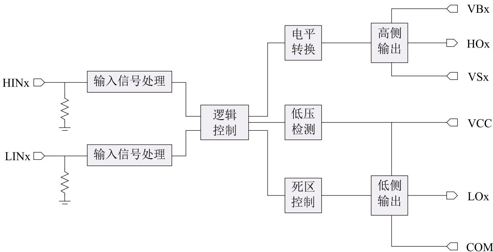  
图 1-1 LKS563(Q)内部结构框图  
上图中 x=1,2,3

## 1.2 主要指标

 高侧驱动采用浮动电源设计，最高耐压+300V

 可承受瞬时负压

 芯片推荐电源供电范围 8\~20V

 三组输出信号

 欠压保护功能

 输入电平 3.3/5/15V 兼容

 双通道延时匹配

表 1-1 主要指标参数

<table><tr><td>参数名称</td><td>参数值</td></tr><tr><td>浮动电压</td><td>300V(max)</td></tr><tr><td>驱动电流</td><td>±1.1A</td></tr><tr><td>欠压保护</td><td>6.7V</td></tr><tr><td>导通延时</td><td>270ns</td></tr><tr><td>关断延时</td><td>120ns</td></tr><tr><td>死区时间</td><td>200ns</td></tr><tr><td>工作温度</td><td>-40°C~150°C</td></tr></table>

## 1.3 控制逻辑

控制逻辑如图 1.2 所示：高侧控制端 HIN高电平有效，低侧控制端 LIN 同样高电平有效，当高侧低侧同时有效时，输出禁止。

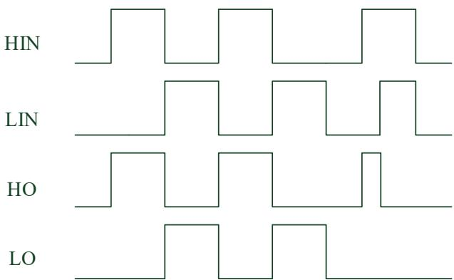  
图 1-2 LKS563(Q)控制逻辑时序图

## 2 管脚分布

## 2.1 管脚分布图

<table><tr><td>1</td><td>HIN1</td><td>VB1</td><td>20</td></tr><tr><td>2</td><td>HIN2</td><td>HO1</td><td>19</td></tr><tr><td>3</td><td>HIN3</td><td>VS1</td><td>18</td></tr><tr><td>4</td><td>LIN1</td><td>VB2</td><td>17</td></tr><tr><td>5</td><td>LIN2</td><td>HO2</td><td>16</td></tr><tr><td>6</td><td>LIN3</td><td>VS2</td><td>15</td></tr><tr><td>7</td><td>VCC</td><td>VB3</td><td>14</td></tr><tr><td>8</td><td>COM</td><td>HO3</td><td>13</td></tr><tr><td>9</td><td>LO3</td><td>VS3</td><td>12</td></tr><tr><td>10</td><td>LO2</td><td>LO1</td><td>11</td></tr></table>

图 2-1 LKS563 管脚分布图

HIN3 HIN2 HIN1 VB1 HO1NC  
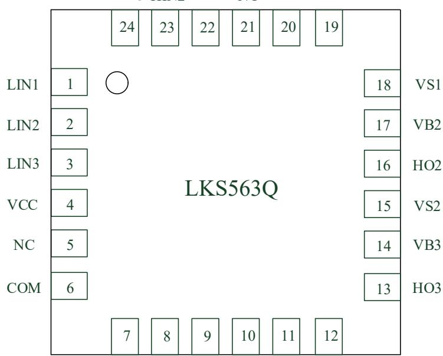  
NC LO3NC LO2 LO1 VS3  
图 2-2 LKS563Q 管脚分布图

## 2.2 管脚说明

表 2-1 LKS563(Q)管脚说明

<table><tr><td>名称</td><td>类型</td><td>功能说明</td></tr><tr><td>HIN1</td><td>输入</td><td>通道1高侧输入信号,逻辑&#x27;1&#x27;代表高侧导通</td></tr><tr><td>HIN2</td><td>输入</td><td>通道2高侧输入信号,逻辑&#x27;1&#x27;代表高侧导通</td></tr><tr><td>HIN3</td><td>输入</td><td>通道3高侧输入信号,逻辑&#x27;1&#x27;代表高侧导通</td></tr><tr><td>LIN1</td><td>输入</td><td>通道1低侧输入信号,逻辑&#x27;1&#x27;代表低侧导通</td></tr><tr><td>LIN2</td><td>输入</td><td>通道2低侧输入信号,逻辑&#x27;1&#x27;代表低侧导通</td></tr><tr><td>LIN3</td><td>输入</td><td>通道3低侧输入信号,逻辑&#x27;1&#x27;代表低侧导通</td></tr><tr><td>VCC</td><td>电源</td><td>芯片供电电压</td></tr><tr><td>COM</td><td>地</td><td>芯片地</td></tr><tr><td>L03</td><td>输出</td><td>通道3低侧栅极驱动信号输出</td></tr><tr><td>L02</td><td>输出</td><td>通道2低侧栅极驱动信号输出</td></tr><tr><td>L01</td><td>输出</td><td>通道1低侧栅极驱动信号输出</td></tr><tr><td>VS3</td><td>输入/输出</td><td>通道3高侧浮动偏置电压</td></tr><tr><td>H03</td><td>输出</td><td>通道3高侧栅极驱动信号输出</td></tr><tr><td>VB3</td><td>输入/输出</td><td>通道3高侧浮动输入电源电压</td></tr><tr><td>VS2</td><td>输入/输出</td><td>通道2高侧浮动偏置电压</td></tr><tr><td>H02</td><td>输出</td><td>通道2高侧栅极驱动信号输出</td></tr><tr><td>VB2</td><td>输入/输出</td><td>通道2高侧浮动输入电源电压</td></tr><tr><td>VS1</td><td>输入/输出</td><td>通道1高侧浮动偏置电压</td></tr><tr><td>H01</td><td>输出</td><td>通道1高侧栅极驱动信号输出</td></tr><tr><td>VB1</td><td>输入/输出</td><td>通道1高侧浮动输入电源电压</td></tr></table>

## 3 封装尺寸

TSSOP20：

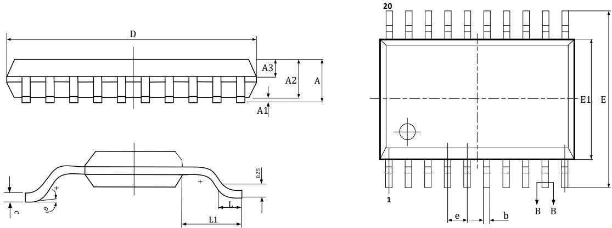  
图 3-1 LKS563 封装图示

表 3-1 LKS563 封装尺寸

<table><tr><td rowspan="2">Symbol</td><td colspan="3">TSSOP20</td></tr><tr><td>Min</td><td>Nom</td><td>Max</td></tr><tr><td>A</td><td>--</td><td>--</td><td>1.20</td></tr><tr><td>A1</td><td>0.05</td><td>--</td><td>0.15</td></tr><tr><td>A2</td><td>0.80</td><td>1.00</td><td>1.05</td></tr><tr><td>A3</td><td>0.39</td><td>0.44</td><td>0.49</td></tr><tr><td>b</td><td>0.20</td><td>--</td><td>0.25</td></tr><tr><td>b1</td><td>0.19</td><td>0.22</td><td>0.25</td></tr><tr><td>c</td><td>0.13</td><td>--</td><td>0.18</td></tr><tr><td>c1</td><td>0.12</td><td>0.13</td><td>0.14</td></tr><tr><td>D</td><td>6.40</td><td>6.50</td><td>6.50</td></tr><tr><td>E</td><td>6.20</td><td>6.40</td><td>6.60</td></tr><tr><td>E1</td><td>4.30</td><td>4.40</td><td>4.50</td></tr><tr><td>e</td><td colspan="3">0.65BSC</td></tr><tr><td>L</td><td>0.45</td><td>0.60</td><td>0.75</td></tr><tr><td>L1</td><td colspan="3">1.00BSC</td></tr><tr><td>θ</td><td>0</td><td>--</td><td>8°</td></tr></table>

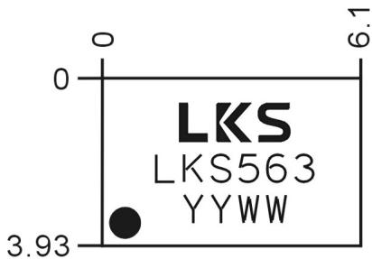  
图 3-2 LKS563 丝印示例

QFN4\*4 24L：

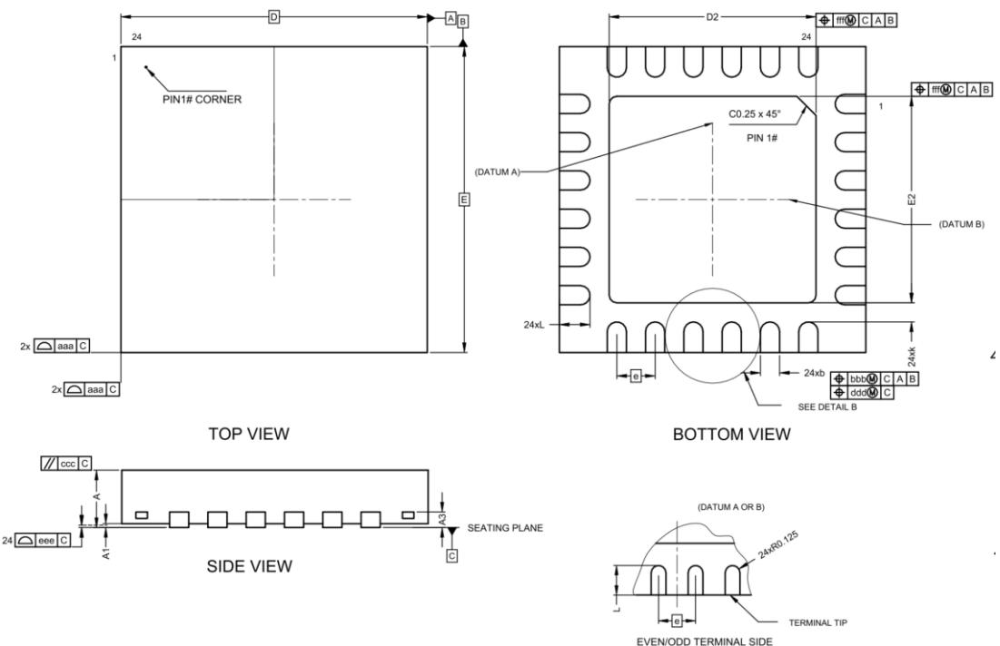  
图 3-3 LKS563Q 封装图示

表 3-2 LKS563Q 封装尺寸

<table><tr><td rowspan="2">SYMBOL</td><td colspan="3">MLLMETER</td></tr><tr><td>MIN</td><td>NOM</td><td>MAX</td></tr><tr><td rowspan="2">A</td><td>0.70</td><td>0.75</td><td>0.80</td></tr><tr><td>0.85</td><td>0.90</td><td>0.95</td></tr><tr><td>A1</td><td>0</td><td>0.02</td><td>0.05</td></tr><tr><td>A3</td><td>-</td><td>0.20 REF</td><td>-</td></tr><tr><td>b</td><td>0.18</td><td>0.25</td><td>0.30</td></tr><tr><td>D</td><td colspan="3">4.00BSC</td></tr><tr><td>E</td><td colspan="3">4.00BSC</td></tr><tr><td>D2</td><td>2.60</td><td>2.70</td><td>2.80</td></tr><tr><td>E2</td><td>2.60</td><td>2.70</td><td>2.80</td></tr><tr><td>e</td><td colspan="3">0.50BSC</td></tr><tr><td>L</td><td>0.35</td><td>0.40</td><td>0.45</td></tr><tr><td>K</td><td>0.20</td><td>-</td><td>-</td></tr><tr><td>aaa</td><td colspan="3">0.10</td></tr><tr><td>bbb</td><td colspan="3">0.10</td></tr><tr><td>ccc</td><td colspan="3">0.10</td></tr><tr><td>ddd</td><td colspan="3">0.05</td></tr><tr><td>eee</td><td colspan="3">0.08</td></tr><tr><td>fff</td><td colspan="3">0.10</td></tr></table>

## 4 应用示例

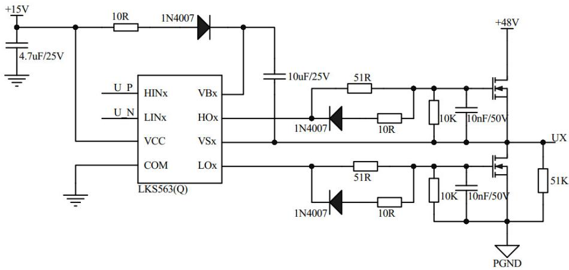  
图 4-1 典型应用图示  
说明：上图中 x=1,2,3

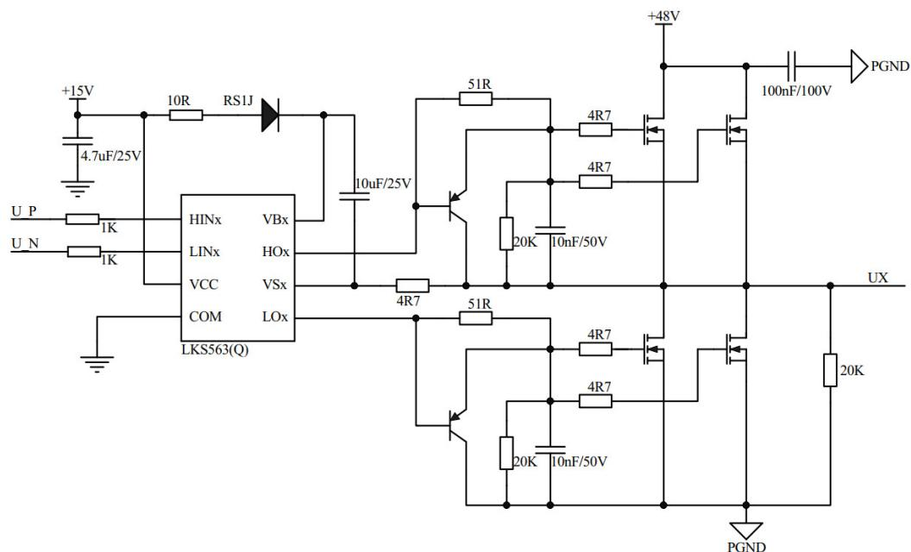  
图 4-2 大电流负载应用图示  
说明：上图中 x=1,2,3

## 5 电气性能参数

## 5.1 极限参数

表 5-1 LKS563(Q)极限参数表

<table><tr><td>参数</td><td>最小</td><td>典型</td><td>最大</td><td>单位</td><td>说明</td></tr><tr><td>电源电压 VCC</td><td>-0.3</td><td></td><td>+25.0</td><td>V</td><td>相对于地</td></tr><tr><td>浮动电压  $VB_{1,2,3}$ </td><td>-0.3</td><td></td><td>+300</td><td>V</td><td></td></tr><tr><td>浮动偏置  $VS_{1,2,3}$ </td><td>VB-25</td><td></td><td>VB+0.3</td><td>V</td><td></td></tr><tr><td>高侧输出电压  $HO_{1,2,3}$ </td><td>VS-0.3</td><td></td><td>VB+0.3</td><td>V</td><td></td></tr><tr><td>低侧输出电压  $LO_{1,2,3}$ </td><td>-0.3</td><td></td><td>VCC+0.3</td><td>V</td><td></td></tr><tr><td>逻辑输入  $HIN/LIN_{1,2,3}$ </td><td>-0.3</td><td></td><td>VCC+0.3</td><td>V</td><td></td></tr><tr><td>开关电压摆率 dVs/dt</td><td></td><td></td><td>50</td><td>V/ns</td><td></td></tr><tr><td>结温  $T_J$ </td><td>-40</td><td></td><td>150</td><td>°C</td><td></td></tr><tr><td>存储温度 Ts</td><td>-55</td><td></td><td>150</td><td>°C</td><td></td></tr><tr><td>焊接温度</td><td></td><td></td><td>260</td><td>°C</td><td>焊接 10s</td></tr></table>

## 5.2 建议工况

表 5-2 LKS563(Q)建议工作参数表

<table><tr><td>参数</td><td>最小</td><td>典型</td><td>最大</td><td>单位</td><td>说明</td></tr><tr><td>电源电压 VCC</td><td>+8</td><td></td><td>+20.0</td><td>V</td><td>相对于地</td></tr><tr><td>浮动电压  $VB_{1,2,3}$ </td><td>VS+8</td><td></td><td>VS+20</td><td>V</td><td></td></tr><tr><td>浮动偏置  $VS_{1,2,3}$ </td><td>-5</td><td></td><td>200</td><td>V</td><td></td></tr><tr><td>高侧输出电压  $HO_{1,2,3}$ </td><td>VS</td><td></td><td>VB</td><td>V</td><td></td></tr><tr><td>低侧输出电压  $LO_{1,2,3}$ </td><td>0</td><td></td><td>VCC</td><td>V</td><td></td></tr><tr><td>逻辑输入 HIN/LIN $_{1,2,3}$ </td><td>0</td><td></td><td>VCC</td><td>V</td><td></td></tr><tr><td>工作温度  $T_A$ </td><td>-40</td><td></td><td>125</td><td>°C</td><td></td></tr></table>

## 5.3 动态电气参数

如非特殊说明， $\mathrm { V _ { B I A S } \ ( V _ { C C } , V _ { B S } ) } = 1 5 \mathrm { V }$ $\mathrm { C _ { L } } = 1 0 0 0 \mathrm { p F }$ $\mathrm { T } _ { \mathrm { A } } { = } 2 5 ^ { \circ } \mathrm { C } _ { \mathrm { c } }$

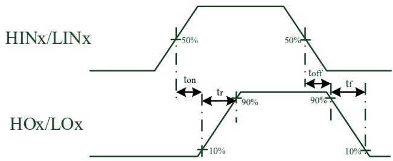  
图 5-1 时序参数 $\mathrm { t _ { o n } / t _ { o f f } / t _ { r } / t _ { f } }$ 定义

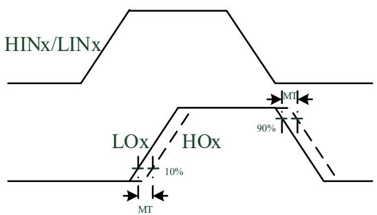  
图 5-2 时序参数 MT 定义

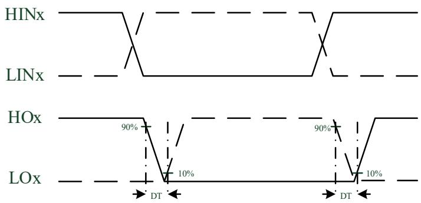  
图 5-3 死区时序定义

表 5-3 LKS563(Q)动态电气参数表

<table><tr><td>参数</td><td>最小</td><td>典型</td><td>最大</td><td>单位</td><td>说明</td></tr><tr><td>输出上升时间  $t_r$ </td><td>-</td><td>20</td><td>30</td><td>ns</td><td rowspan="2"> $C_L=1nF$ </td></tr><tr><td>输出下降时间  $t_f$ </td><td>-</td><td>12</td><td>30</td><td>ns</td></tr><tr><td>导通延迟时间  $t_{on}$ </td><td>-</td><td>270</td><td>500</td><td>ns</td><td></td></tr><tr><td>关断延迟时间  $t_{off}$ </td><td>-</td><td>120</td><td>200</td><td>ns</td><td></td></tr><tr><td>死区  $D_T$ </td><td>100</td><td>200</td><td>400</td><td>ns</td><td></td></tr><tr><td>延时匹配度  $M_T$ </td><td>-</td><td>-</td><td>80</td><td>ns</td><td> $T_{on} \& T_{off} for (HS-LS)$ </td></tr></table>

## 5.4 静态电气参数

如非特殊说明， $\mathrm { V _ { B I A S } \ ( V _ { C C } , V _ { B S } ) } = 1 5 \mathrm { V }$ $\mathrm { T } _ { \mathrm { A } } = 2 5 ^ { \circ } \mathrm { C } .$ 。

表 5-4 LKS563(Q)静态电气参数表

<table><tr><td>参数</td><td>最小</td><td>典型</td><td>最大</td><td>单位</td><td>说明</td></tr><tr><td>VCC 静态电流  $I_{QCC}$ </td><td>—</td><td>43</td><td>100</td><td>uA</td><td>HIN=LIN=0V, 三路</td></tr><tr><td>VBS 静态电流  $I_{QBS}$ </td><td>—</td><td>18</td><td>40</td><td>uA</td><td>HIN=LIN=0V, 单路</td></tr><tr><td>浮动电压漏电流  $I_{LK}$ </td><td>—</td><td>—</td><td>10</td><td>uA</td><td>VB=VS=220V</td></tr><tr><td>VCC 欠压保护释放电压</td><td>4.0</td><td>4.7</td><td>6.7</td><td>V</td><td></td></tr><tr><td>VCC 欠压保护电压</td><td>3.6</td><td>4.4</td><td>6.4</td><td>V</td><td></td></tr><tr><td>VCC 欠压保护迟滞电压</td><td>0.25</td><td>0.3</td><td>0.8</td><td>V</td><td></td></tr><tr><td>VBS 欠压保护释放电压</td><td>3.9</td><td>5.6</td><td>6.9</td><td>V</td><td></td></tr><tr><td>VBS 欠压保护电压</td><td>3.5</td><td>5.0</td><td>6.2</td><td>V</td><td></td></tr><tr><td>VBS 欠压保护迟滞电压</td><td>0.25</td><td>0.6</td><td>0.8</td><td>V</td><td></td></tr><tr><td>高输入阈值  $V_{IH}$ </td><td>2.8</td><td>—</td><td>—</td><td>V</td><td></td></tr><tr><td>低输入阈值  $V_{IL}$ </td><td>—</td><td>—</td><td>0.8</td><td>V</td><td></td></tr><tr><td>LO/HO 输出高电压短路脉冲拉电流</td><td>650</td><td>1100</td><td>—</td><td>mA</td><td>VO = 0V, VIN = VIHPW 10 us</td></tr><tr><td>LO/HO 输出低电压短路脉冲灌电流</td><td>650</td><td>1100</td><td>—</td><td>mA</td><td>VO = 15V, VIN = VILPW 10 us</td></tr><tr><td>输入偏置电流  $I_{source}$ </td><td>—</td><td>33</td><td>120</td><td>uA</td><td>HIN=LIN=5V</td></tr><tr><td>输入偏置电流  $I_{sink}$ </td><td>—</td><td>—</td><td>1</td><td>uA</td><td>HIN=LIN=0V</td></tr></table>

## 6 订购包装信息

<table><tr><td>型号</td><td>封装形式</td><td>每盘/管数量</td><td>每盒数量</td><td>每盒箱数</td><td>外箱数量</td></tr><tr><td>LKS563</td><td>TSSOP20</td><td>4000</td><td>8000PCS</td><td>8</td><td>64000PCS</td></tr><tr><td>LKS563Q</td><td>QFN 4*4</td><td>490</td><td>4900PCS</td><td>6</td><td>29400PCS</td></tr></table>

## 7 版本历史

表 7-1 文档版本历史

<table><tr><td>时间</td><td>版本号</td><td>说明</td></tr><tr><td>2024.12.30</td><td>1.54</td><td>增加 QFN24 封装说明</td></tr><tr><td>2024.06.07</td><td>1.53</td><td>修订静态电气参数表、修订应用示例图</td></tr><tr><td>2023.10.25</td><td>1.52</td><td>增加丝印示例</td></tr><tr><td>2022.12.06</td><td>1.51</td><td>增加封装形式说明</td></tr><tr><td>2022.12.05</td><td>1.5</td><td>修订驱动电流、上升下降时间等参数</td></tr><tr><td>2022.09.20</td><td>1.4</td><td>修订应用示例图</td></tr><tr><td>2022.02.22</td><td>1.3</td><td>修订欠压等参数</td></tr><tr><td>2019.11.20</td><td>1.2</td><td>修订应用图格式</td></tr><tr><td>2019.03.29</td><td>1.1</td><td>修订部分参数</td></tr><tr><td>2019.03.18</td><td>1.0</td><td>针对发布的修订</td></tr></table>

## 免责声明

LKS 和 LKO 为凌鸥创芯注册商标。

南京凌鸥创芯电子有限公司（以下简称：“Linko” ）尽力确保本文档内容的准确和可靠，但是保留随 时更改、更正、增强、修改产品和/或 文档的权利，恕不另行通知。用户可在下单前获取最新相关信息。

客户应针对应用需求选择合适的 Linko 产品，详细设计、验证和测试您的应用，以确保满足相应标准以及任何安全、安保或其它要求。客户应对此独自承担全部责任。

Linko 在此确认未以明示或暗示方式授予 Linko 或第三方的任何知识产权许可。

Linko 产品的转售，若其条款与此处规定不同，Linko 对此类产品的任何保修承诺无效。

Linko 产品禁止用于军事用途或生命监护、维持系统。

如有更早期版本文档，一切信息以此文档为准。