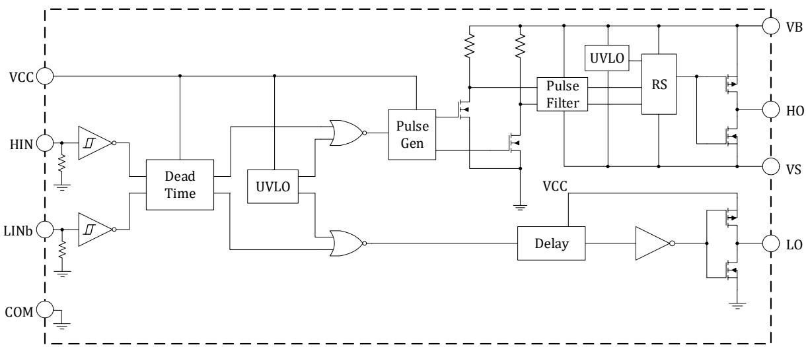
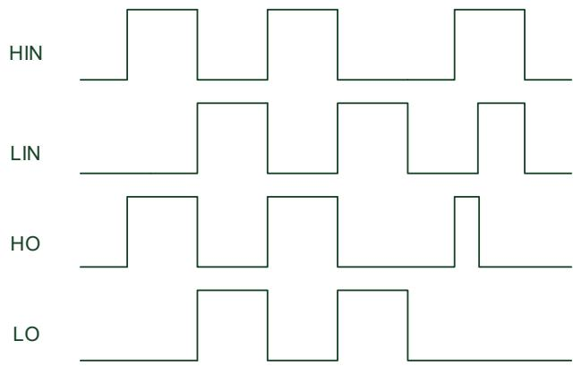
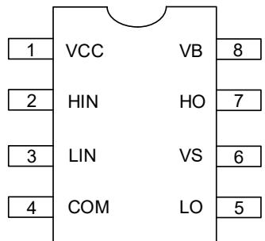
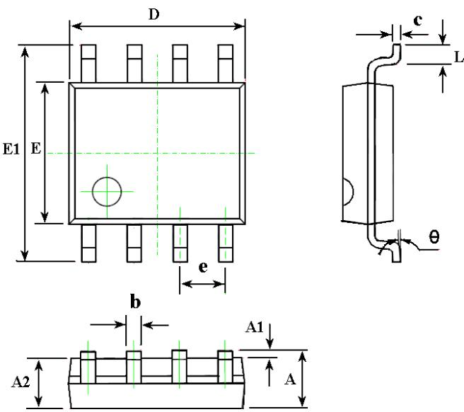
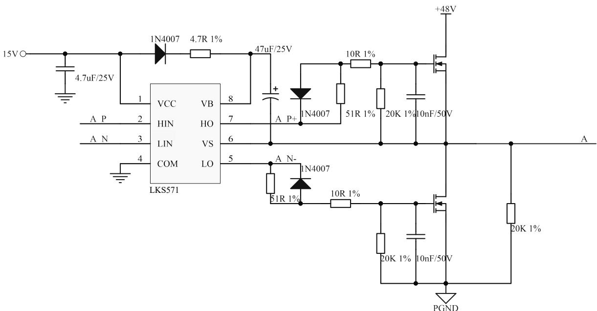
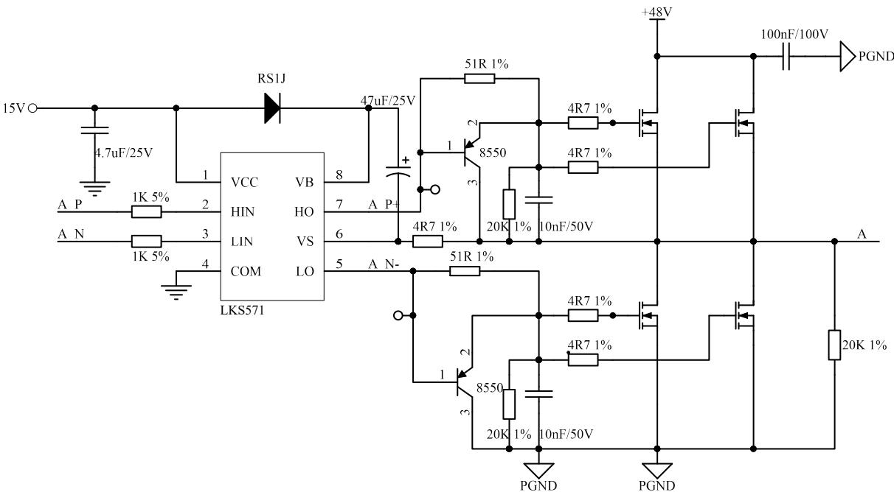
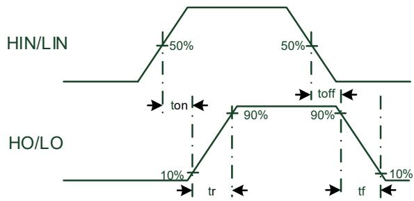
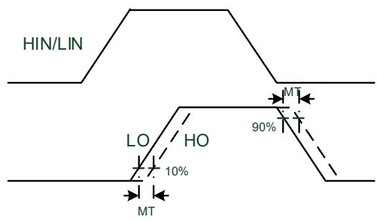
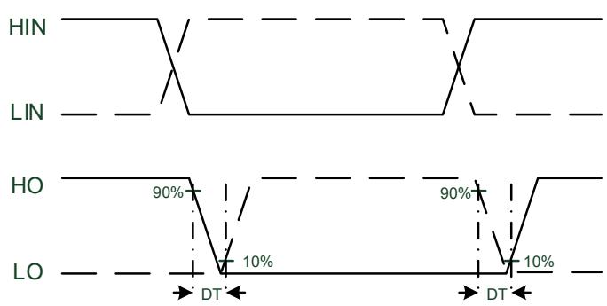

  
南京凌鸥创芯电子有限公司

# LKS571 数据手册

@ 2019, 版权归凌鸥创芯所有

机密文件，未经许可不得扩散

## 目 录

1 概述....1
1.1 功能简述....1
1.2 主要指标....1
1.3 控制逻辑....2
2 管脚分布....3
2.1 管脚分布图....3
2.2 管脚说明....3
3 封装尺寸....4
4 应用示例....5
5 电气性能参数....6
5.1 极限参数....6
5.2 建议工况....6
5.3 动态电气参数....6
5.4 静态电气参数....8
6 订购包装信息....9
7 版本历史....10

## 表格目录

表 1-1 主要指标参数....1
表 2-1 LKS571 管脚说明....3
表 3-1 LKS571 封装尺寸....4
表 5-1 LKS571 极限参数表....6
表 5-2 LKS571 建议工作参数表....6
表 5-3 LKS571 动态电气参数表....7
表 5-4 LKS571 静态电气参数....8
表 7-1 文档版本历史....10

## 图片目录

图 1-1 LKS571 内部结构框图 ..... 1
图 1-2 LKS571 控制逻辑时序图 ..... 2
图 2-1 LKS571 管脚分布图 ..... 3
图 3-1 LKS571 封装图示 ..... 4
图 4-1 典型应用图示 ..... 5
图 4-2 大电流负载应用图示 ..... 5
图 5-1 时序参数 $t_{\text{on}} / t_{\text{off}} / t_r / t_f$ 定义 ..... 7
图 5-2 时序参数 MT 定义 ..... 7
图 5-3 死区时序定义 ..... 7

## 1 概述

## 1.1 功能简述

LKS571 是一款用于驱动 MOS/IGBT 栅极的集成电路，芯片有高侧驱动输出和低侧驱动输出两组，可同时驱动两个 MOS/IGBT 器件，其中高侧器件通过浮动管脚实现电压抬升，最高耐压达+250V。

输入信号可兼容 CMOS 和 LSTTL 电平。

  
图 1-1 LKS571 内部结构框图

## 1.2 主要指标

 高侧驱动采用浮动电源设计，最高耐压+250V

 驱动电流+1.2A/-1.5A

 可承受瞬时负压

 芯片电源供电范围 8\~20V

 高低侧欠压保护功能

 输入电平 3.3/5/15V 兼容

 内置 250ns 死区时间

表 1-1 主要指标参数

<table><tr><td>参数名称</td><td>参数值</td></tr><tr><td>浮动电压</td><td>250V(max)</td></tr><tr><td>驱动电流</td><td>+1.2A/-1.5A</td></tr><tr><td>欠压保护</td><td>7V</td></tr><tr><td>导通延时</td><td>140ns</td></tr><tr><td>关断延时</td><td>140ns</td></tr><tr><td>死区时间</td><td>250ns</td></tr><tr><td>工作温度</td><td>-40°C ~150°C</td></tr></table>

## 1.3 控制逻辑

控制逻辑如图 1.2 所示：高侧控制端 HIN 高电平有效，低侧控制端 LIN 高电平有效，当高侧低侧同时有效时，输出禁止。

  
图 1-2 LKS571 控制逻辑时序图

## 2 管脚分布

## 2.1 管脚分布图

  
图 2-1 LKS571 管脚分布图

## 2.2 管脚说明

表 2-1 LKS571 管脚说明

<table><tr><td>编号</td><td>名称</td><td>类型</td><td>功能说明</td></tr><tr><td>1</td><td>VCC</td><td>电源</td><td>芯片供电电压</td></tr><tr><td>2</td><td>HIN</td><td>输入</td><td>高侧输入信号,逻辑&#x27;1&#x27;代表高侧导通</td></tr><tr><td>3</td><td>LIN</td><td>输入</td><td>低侧输入信号,逻辑&#x27;1&#x27;代表低侧导通</td></tr><tr><td>4</td><td>COM</td><td>地</td><td>芯片地</td></tr><tr><td>5</td><td>LO</td><td>输出</td><td>低侧栅极驱动信号输出</td></tr><tr><td>6</td><td>VS</td><td>输入/输出</td><td>高侧浮动偏置电压</td></tr><tr><td>7</td><td>HO</td><td>输出</td><td>高侧栅极驱动信号输出</td></tr><tr><td>8</td><td>VB</td><td>输入/输出</td><td>高侧浮动输入电源电压</td></tr></table>

## 3 封装尺寸

SOP8 Package:

  
图 3-1 LKS571 封装图示

表 3-1 LKS571 封装尺寸

<table><tr><td rowspan="2">SYMBOL</td><td colspan="2">MILLIMETER</td></tr><tr><td>MIN</td><td>MAX</td></tr><tr><td>A</td><td>1.350</td><td>1.750</td></tr><tr><td>A1</td><td>0.100</td><td>0.250</td></tr><tr><td>A2</td><td>1.350</td><td>1.550</td></tr><tr><td>b</td><td>0.330</td><td>0.510</td></tr><tr><td>c</td><td>0.170</td><td>0.250</td></tr><tr><td>D</td><td>4.700</td><td>5.100</td></tr><tr><td>E</td><td>3.800</td><td>4.000</td></tr><tr><td>E1</td><td>5.800</td><td>6.200</td></tr><tr><td>e</td><td colspan="2">1.270BSC</td></tr><tr><td>L</td><td>0.400</td><td>1.270</td></tr><tr><td>θ</td><td>0°</td><td>8°</td></tr></table>

## 4 应用示例

  
图 4-1 典型应用图示

  
图 4-2 大电流负载应用图示

## 5 电气性能参数

## 5.1 极限参数

表 5-1 LKS571 极限参数表

<table><tr><td>参数</td><td>定义</td><td>Min.</td><td>Max.</td><td>单位</td></tr><tr><td>VB</td><td>高侧浮动输入电源电压</td><td>-0.3</td><td>250</td><td rowspan="6">V</td></tr><tr><td>VS</td><td>高侧浮动偏置电压</td><td>VB-25</td><td>VB+0.3</td></tr><tr><td>VHO</td><td>高侧栅极驱动信号输出电压</td><td>VS-0.3</td><td>VB+0.3</td></tr><tr><td>VLO</td><td>低侧栅极驱动信号输出电压</td><td>-0.3</td><td>VCC+0.3</td></tr><tr><td>VCC</td><td>芯片供电电压</td><td>-0.3</td><td>25</td></tr><tr><td>VIN</td><td>芯片输入逻辑信号电压 (HIN &amp; LIN)</td><td>-0.3</td><td>VCC+0.3</td></tr><tr><td>dVS/dt</td><td>高侧浮动偏置电压变化率</td><td>—</td><td>50</td><td>V/ns</td></tr><tr><td> $P_D$ </td><td>功率耗散 @ TA +25°C, SOIC-8</td><td></td><td>0.625</td><td>W</td></tr><tr><td> $Rth_{JA}$ </td><td>结对环境的热阻, SOIC-8</td><td></td><td>200</td><td>°C/W</td></tr><tr><td>TJ</td><td>结温</td><td>-40</td><td>150</td><td rowspan="3">°C</td></tr><tr><td>TS</td><td>储存温度</td><td>-55</td><td>150</td></tr><tr><td>TL</td><td>引脚温度 (10秒焊接条件下)</td><td></td><td>260</td></tr></table>

## 5.2 建议工况

表 5-2 LKS571 建议工作参数表

<table><tr><td>参数</td><td>定义</td><td>Min.</td><td>Max.</td><td>单位</td></tr><tr><td>VB</td><td>高侧浮动输入电源电压</td><td>VS + 10</td><td>VS + 20</td><td rowspan="6">V</td></tr><tr><td>VS</td><td>高侧浮动偏置电压</td><td>-5</td><td>200</td></tr><tr><td>VHO</td><td>高侧栅极驱动信号输出电压</td><td>VS</td><td>VB</td></tr><tr><td>VLO</td><td>低侧栅极驱动信号输出电压</td><td>0</td><td>VCC</td></tr><tr><td>VCC</td><td>芯片供电电压</td><td>10</td><td>20</td></tr><tr><td>VIN</td><td>芯片输入逻辑信号电压 (HIN &amp; LIN)</td><td>0</td><td>VCC</td></tr><tr><td>TA</td><td>工作温度</td><td>-40</td><td>150</td><td>°C</td></tr></table>

## 5.3 动态电气参数

如非特殊说明， $\mathrm { V _ { B I A S } \ ( V _ { C C } , V _ { B S } ) } = 1 2 \mathrm { V }$ • $\mathrm { C _ { L } } = 1 0 0 0 \mathrm { p F }$ ， $\mathrm { T } _ { \mathrm { A } } = 2 5 ^ { \circ } \mathrm { C } .$ 0

  
图 5-1 时序参数 ton/toff/tr/tf 定义

  
图 5-2 时序参数 MT 定义

  
图 5-3 死区时序定义

表 5-3 LKS571 动态电气参数表

<table><tr><td>参数</td><td>定义</td><td>最小</td><td>典型</td><td>最大</td><td>单位</td><td>测试条件</td></tr><tr><td>ton</td><td>导通延时</td><td>—</td><td>140</td><td>220</td><td rowspan="6">ns</td><td>VS = 0V</td></tr><tr><td>toff</td><td>关断延时</td><td>—</td><td>140</td><td>220</td><td>VS = 0V or 200V</td></tr><tr><td>tr</td><td>导通上升沿</td><td>10</td><td>22</td><td>50</td><td></td></tr><tr><td>tf</td><td>关断下升沿</td><td>8</td><td>14</td><td>35</td><td></td></tr><tr><td>DT</td><td>死区时间</td><td>—</td><td>250</td><td>—</td><td></td></tr><tr><td>MT</td><td>延时匹配度</td><td>—</td><td>60</td><td>120</td><td></td></tr></table>

## 5.4 静态电气参数

如非特殊说明， $\mathrm { V _ { B I A S } \left( V _ { C C } , V _ { B S } \right) = 1 2 V }$ • $\mathrm { T } _ { \mathrm { A } } = 2 5 ^ { \circ } ~ \mathrm { C } _ { \mathrm { \Omega } }$

表 5-4 LKS571 静态电气参数

<table><tr><td>参数</td><td>定义</td><td>最小</td><td>典型</td><td>最大</td><td>单位</td><td>测试条件</td></tr><tr><td>VCCUV+</td><td>VCC欠压保护电压上阈值</td><td>6.5</td><td>7.5</td><td>8.5</td><td rowspan="3">V</td><td></td></tr><tr><td>VCCUV-</td><td>VCC欠压保护电压下阈值</td><td>6</td><td>7</td><td>8</td><td></td></tr><tr><td>VCCHYS</td><td>VCC欠压保护迟滞电压</td><td>0.2</td><td>0.5</td><td>0.8</td><td></td></tr><tr><td>VBSUV+</td><td>VBS欠压保护电压上阈值</td><td>6.5</td><td>7.5</td><td>8.5</td><td rowspan="3">V</td><td></td></tr><tr><td>VBSUV-</td><td>VBS欠压保护电压下阈值</td><td>6</td><td>7</td><td>8</td><td></td></tr><tr><td>VBSHYS</td><td>VBS欠压保护迟滞电压</td><td>0.2</td><td>0.5</td><td>0.8</td><td></td></tr><tr><td>IQCC</td><td>VCC静态电流</td><td>-</td><td>70</td><td>150</td><td rowspan="2">uA</td><td>VIN=0V</td></tr><tr><td>IQBS</td><td>VBS静态电流</td><td>-</td><td>20</td><td>30</td><td>VIN=0V</td></tr><tr><td>ILK</td><td>高侧偏置电源漏电流</td><td>-</td><td>-</td><td>10</td><td>uA</td><td>VB=VS=250V</td></tr><tr><td>VIH</td><td>输入信号逻辑1的电压范围</td><td>1.95</td><td>-</td><td>-</td><td rowspan="2">V</td><td>VCC=10~20V</td></tr><tr><td>VIL</td><td>输入信号逻辑0的电压范围</td><td>-</td><td>-</td><td>1.25</td><td>VCC=10~20V</td></tr><tr><td>IIN+</td><td>输入信号逻辑1的偏置电流</td><td>-</td><td>50</td><td>120</td><td rowspan="2">uA</td><td>VIN=5V</td></tr><tr><td>IIN-</td><td>输入信号逻辑0的偏置电流</td><td>-</td><td>-</td><td>1</td><td>VIN=0V</td></tr><tr><td>IO+</td><td>LO/HO输出高电压短路脉冲拉电流</td><td>-</td><td>1200</td><td>-</td><td rowspan="2">mA</td><td>VO=0V, VIN=VIH, PW 10 us</td></tr><tr><td>IO-</td><td>LO/HO输出低电压短路脉冲灌电流</td><td>-</td><td>1500</td><td>-</td><td>VO=15V, VIN=VIL PW 10 us</td></tr></table>

## 6 订购包装信息

<table><tr><td>型号</td><td>封装形式</td><td>每盘/管数量</td><td>每盒数量</td><td>每盒箱数</td><td>外箱数量</td></tr><tr><td>LKS571</td><td>SOP8</td><td>4000/盘</td><td>8000PCS</td><td>8</td><td>64000PCS</td></tr></table>

## 7 版本历史

表 7-1 文档版本历史

<table><tr><td>时间</td><td>版本号</td><td>说明</td></tr><tr><td>2024.08.12</td><td>0.92</td><td>更新内部结构框图</td></tr><tr><td>2024.07.30</td><td>0.91</td><td>增加订购包装信息、增加免责声明</td></tr><tr><td>2024.07.16</td><td>0.9</td><td>更新 EC table 数据</td></tr><tr><td>2024.07.04</td><td>0.1</td><td>Preliminary</td></tr></table>

## 免责声明

LKS 和 LKO 为凌鸥创芯注册商标。

南京凌鸥创芯电子有限公司（以下简称：“Linko” ）尽力确保本文档内容的准确和可靠，但是保留随 时更改、更正、增强、修改产品和/或 文档的权利，恕不另行通知。用户可在下单前获取最新相关信息。

客户应针对应用需求选择合适的 Linko 产品，详细设计、验证和测试您的应用，以确保满足相应标准以及任何安全、安保或其它要求。客户应对此独自承担全部责任。

Linko 在此确认未以明示或暗示方式授予 Linko 或第三方的任何知识产权许可。

Linko 产品的转售，若其条款与此处规定不同，Linko 对此类产品的任何保修承诺无效。

Linko 产品禁止用于军事用途或生命监护、维持系统。

如有更早期版本文档，一切信息以此文档为准。