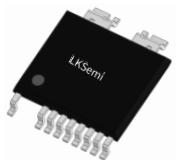
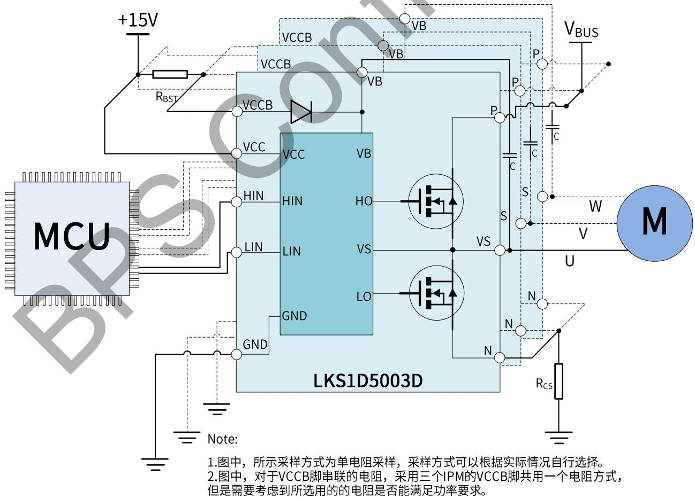
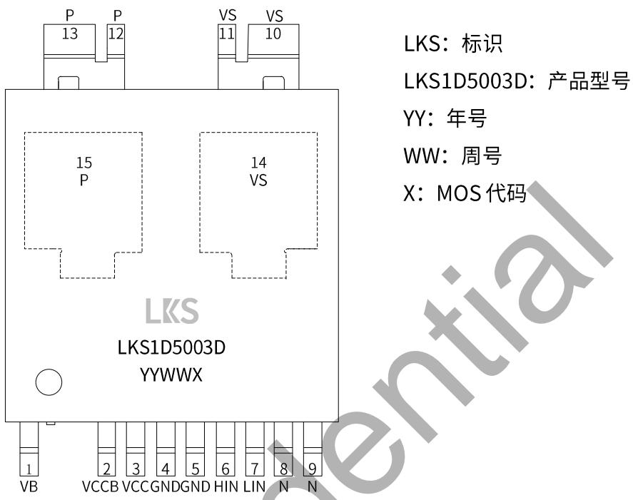
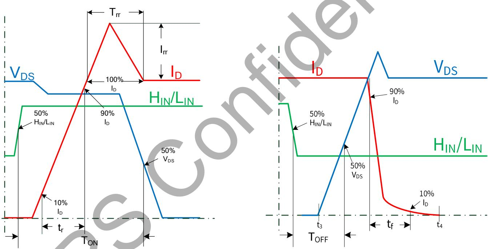
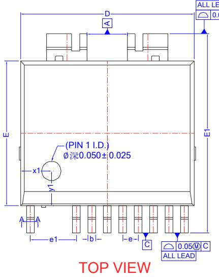
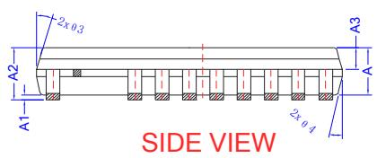
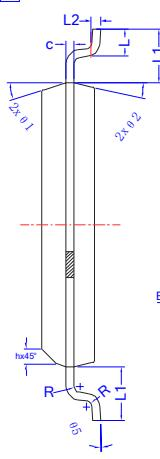
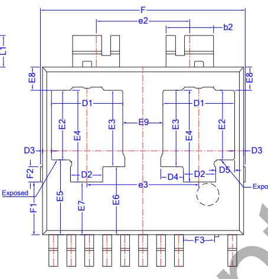

## 概述

LKS1D5003D是高压单相IPM（智能功率模块）,内部集成高压 IC 以及高性能 MOSFET 适用于直流无刷BLDC和永磁同步 PMSM电机。低侧MOSFET的源极可以用于电流采样。

输入端包含史密斯触发器并且逻辑电平兼容3.3V/5V/15V。

LKS1D5003D 采用 ESOP13 封装

  
ESOP13 封装

## 特点

内置高性能 500V/3A MOSFET

内置自举二极管

对于负的瞬态电压具有高鲁棒性

门极驱动电压范围支持10V\~20V

输入逻辑电平兼容 3.3V,5V 以及15V

高侧和低侧均支持UVLO

内置死区避免上下管直通

## 应用

高速风筒

风扇

电动工具

## 典型应用

  
图 1.LKS1D5003D 典型应用图

## 定购信息

<table><tr><td>定购型号</td><td>封装</td><td>包装形式</td><td>印章</td></tr><tr><td>LKS1D5003D</td><td>ESOP13</td><td>编带2500 PCS/盘</td><td>LKS LKS1D5003D YYWWX</td></tr></table>

## 管脚封装

LKS：标识

LKS1D5003D：产品型号

YY：年号

WW：周号

X：MOS代码

图 2. LKS1D5003D 管腳封装图

## 管脚描述

<table><tr><td>管脚号</td><td>管脚名称</td><td>描述</td></tr><tr><td>1</td><td>VB</td><td>高侧驱动供电端</td></tr><tr><td>2</td><td>VCCB</td><td>内置二极管输入端</td></tr><tr><td>3</td><td>VCC</td><td>逻辑和低侧驱动供电端</td></tr><tr><td>4~5</td><td>GND</td><td>逻辑信号参考地</td></tr><tr><td>6</td><td>HIN</td><td>高侧逻辑信号输入端</td></tr><tr><td>7</td><td>LIN</td><td>低侧逻辑信号输入端</td></tr><tr><td>8~9</td><td>N</td><td>负端参考和低侧 MOSFET 返回脚</td></tr><tr><td>10~11</td><td>VS</td><td>输出端和高侧 MOSFET 返回脚</td></tr><tr><td>12~13</td><td>P</td><td>直流电压输入端</td></tr><tr><td>14</td><td>VS</td><td>输出端和高侧 MOSFET 返回脚</td></tr><tr><td>15</td><td>P</td><td>直流电压输入端</td></tr></table>

## 极限参数(注1)(无特别说明情况下， $T _ { A } = 2 5 ^ { \circ } C )$

## 逆变部分

<table><tr><td>符号</td><td>参数</td><td>条件</td><td>参数范围</td><td>单位</td></tr><tr><td> $V_{DSS}$ </td><td>MOSFET的漏源电压</td><td> $I_{DSS}=250uA$ </td><td>500</td><td>V</td></tr><tr><td rowspan="2"> $I_D$ </td><td rowspan="2">MOSFET连续工作电流(注2)</td><td> $T_C=25°C$ </td><td>3</td><td>A</td></tr><tr><td> $T_C=100°C$ </td><td>1.89</td><td>A</td></tr><tr><td> $P_D$ </td><td>最大功耗</td><td>单颗MOSFET( $T_C=100°C$ )</td><td>50</td><td>W</td></tr></table>

控制部分

<table><tr><td>符号</td><td>参数</td><td>条件</td><td>参数范围</td><td>单位</td></tr><tr><td> $V_{CC}$ </td><td>控制侧供电</td><td>VCC和GND两端电压</td><td>-0.3~20</td><td>V</td></tr><tr><td> $V_{BS}$ </td><td>高侧偏置电压</td><td>VB和VS两端电压</td><td>-0.3~20</td><td>V</td></tr><tr><td> $V_{LIN/HIN}$ </td><td>输入信号电压</td><td>LIN/HIN和GND两端电压</td><td>-0.3~ $V_{CC}$ +0.3</td><td>V</td></tr></table>

热阻

<table><tr><td>符号</td><td>参数</td><td>条件</td><td>参数范围</td><td>单位</td></tr><tr><td> $R_{th(j-c)T}$ </td><td>结到顶部壳的热阻</td><td>同逆变部分操作条件</td><td>20</td><td>°C/W</td></tr><tr><td> $R_{th(j-c)B}$ </td><td>结到底部壳的热阻</td><td>同逆变部分操作条件</td><td>1</td><td>°C/W</td></tr></table>

系统

<table><tr><td>符号</td><td>参数</td><td>条件</td><td>参数范围</td><td>单位</td></tr><tr><td> $T_{J}$ </td><td>工作结温</td><td></td><td>-40~150</td><td>°C</td></tr><tr><td> $T_{STG}$ </td><td>储存温度</td><td></td><td>-40~125</td><td>°C</td></tr></table>

注1：极限参数是指超出该范围，有可能导致器件永久性损坏  
注2：受最大结温限制。

推荐工作条件(注3)(无特别说明情况下， $T _ { A } = 2 5 ^ { \circ } C )$

<table><tr><td>符号</td><td>描述</td><td>条件</td><td>最小值</td><td>典型值</td><td>最大值</td><td>单位</td></tr><tr><td> $V_{PN}$ </td><td>功率部分供电电压</td><td>PN脚之间</td><td>-</td><td>300</td><td>400</td><td>V</td></tr><tr><td> $V_{CC}$ </td><td>控制部分供电电压</td><td>VCC和GND脚之间</td><td>12.0</td><td>15.0</td><td>18.0</td><td>V</td></tr><tr><td> $V_{BS}$ </td><td>高侧偏置电压</td><td>VB和VS脚之间</td><td>12.0</td><td>15.0</td><td>18.0</td><td>V</td></tr><tr><td> $V_{LIN/HIN(ON)}$ </td><td>输入开通电压阈值</td><td>LIN/HIN和GND脚之间</td><td>3.0</td><td>-</td><td> $V_{CC}$ </td><td>V</td></tr><tr><td> $V_{LIN/HIN(OFF)}$ </td><td>输入关断电压阈值</td><td>LIN/HIN和GND脚之间</td><td>0</td><td>-</td><td>0.4</td><td>V</td></tr><tr><td> $T_{DEAD}$ </td><td>防止桥臂直通的死区时间(注4)</td><td> $V_{CC}=V_{BS}=12.0\sim18.0V,T_{J}<150°C$ </td><td>1.0</td><td>-</td><td>-</td><td>μs</td></tr><tr><td> $F_{PWM}$ </td><td>PWM开关频率</td><td> $T_{J}<150°C$ </td><td>-</td><td>20</td><td>-</td><td>kHz</td></tr><tr><td> $T_{C(MAX)}$ </td><td>工作时的最大壳温</td><td> $T_{J}<150°C$ </td><td></td><td>120</td><td></td><td>°C</td></tr></table>

注3：在推荐的工作条件下，可以保证器件的正常工作，但是某些特殊的参数可能无法实现。  
注4：IPM内置预驱包含内置死区时间(典型值参考电气参数表格中的数据)，控制算法在设置死区时间时，需要考虑这段内置的死区时间。

电气参数(注 5)(无特别说明情况下， $T _ { A } = 2 5 ^ { \circ } C )$

<table><tr><td>符号</td><td>描述</td><td>条件</td><td>最小值</td><td>典型值</td><td>最大值</td><td>单位</td></tr><tr><td colspan="7">逆变部分</td></tr><tr><td> $BV_{DSS}$ </td><td>MOS管漏源极击穿电压</td><td> $V_{LIN/HIN}=0V, I_D=250uA$ </td><td>500</td><td></td><td></td><td>V</td></tr><tr><td> $I_{DSS}$ </td><td>MOS管截止时的漏电流</td><td> $V_{LIN/HIN}=0V, V_{DS}=500V$ </td><td></td><td></td><td>10</td><td>μA</td></tr><tr><td> $V_{SD}$ </td><td>体二极管正向导通电压</td><td> $V_{CC}=V_{BS}=15V, V_{LIN/HIN}=0V, I_D=-3A$ </td><td></td><td></td><td>1.4</td><td>V</td></tr><tr><td> $R_{DS(ON)}$ </td><td>MOS管导通阻抗</td><td> $V_{CC}=V_{BS}=15V, V_{LIN/HIN}=5V, I_D=0.5A$ </td><td></td><td>3.3</td><td>4.2</td><td>Ω</td></tr><tr><td> $T_{ON}$ </td><td rowspan="8">开关过程</td><td rowspan="8"> $V_{PN}=400V, V_{CC}=V_{BS}=15V, I_D=3A, V_{LIN/HIN}=0~5V, \text{感性负载} L=2.8mH \text{高侧和低侧 MOSFET 开关}$ </td><td></td><td>560</td><td></td><td>ns</td></tr><tr><td> $T_{OFF}$ </td><td></td><td>205</td><td></td><td>ns</td></tr><tr><td> $Irr$ </td><td></td><td>4</td><td></td><td>A</td></tr><tr><td> $T_{rr}$ </td><td></td><td>65</td><td></td><td>ns</td></tr><tr><td> $T_r$ </td><td></td><td>19</td><td></td><td>ns</td></tr><tr><td> $T_f$ </td><td></td><td>11</td><td></td><td>ns</td></tr><tr><td> $E_{ON}$ </td><td></td><td>85</td><td></td><td>μJ</td></tr><tr><td> $E_{OFF}$ </td><td></td><td>8</td><td></td><td>μJ</td></tr><tr><td colspan="7">控制部分</td></tr><tr><td> $I_{QCC}$ </td><td>静态 $V_{CC}$ 供电电流</td><td> $V_{CC}=15V, V_{LIN/HIN}=0V$ </td><td>15</td><td>50</td><td>80</td><td>μA</td></tr><tr><td> $I_{SW}$ </td><td>正常开关时, $V_{CC}$ 提供的电流</td><td> $V_{CC}=15V, F_{LIN/HIN}=15kHz$ </td><td></td><td>0.25</td><td></td><td>mA</td></tr><tr><td> $I_{QB}$ </td><td>静态 $V_{BS}$ 供电电流</td><td> $V_{BS}=15V, V_{LIN/HIN}=0V$ </td><td>15</td><td>40</td><td>70</td><td>μA</td></tr><tr><td> $V_{CC_ON}$ </td><td rowspan="2"> $V_{CC}$ 和 $V_{BS}$ 正常工作电压阈值</td><td rowspan="2"></td><td>8.0</td><td>8.6</td><td>9.8</td><td>V</td></tr><tr><td> $V_{BS_ON}$ </td><td>8.0</td><td>8.8</td><td>9.8</td><td>V</td></tr><tr><td> $V_{CC_UVLO}$ </td><td rowspan="2"> $V_{CC}$ 和 $V_{BS}$ 欠压保护电压阈值</td><td rowspan="2"></td><td>7.0</td><td>7.6</td><td>8.6</td><td>V</td></tr><tr><td> $V_{BS_UVLO}$ </td><td>7.2</td><td>7.8</td><td>8.8</td><td>V</td></tr><tr><td> $V_{CC_HYS}$ </td><td rowspan="2"> $V_{CC}$ 和 $V_{BS}$ 电压滞环</td><td rowspan="2"></td><td>0.5</td><td>1.0</td><td>1.5</td><td>V</td></tr><tr><td> $V_{BS_HYS}$ </td><td>0.5</td><td>1.0</td><td>1.5</td><td>V</td></tr><tr><td> $V_{IH}$ </td><td>开通电压阈值</td><td>逻辑高电平</td><td>2.4</td><td>-</td><td></td><td>V</td></tr><tr><td> $V_{IL}$ </td><td>关断电压阈值</td><td>逻辑低电平</td><td></td><td>-</td><td>0.6</td><td>V</td></tr><tr><td>DT</td><td>为了防止桥臂直通,预驱内置的死区时间</td><td></td><td></td><td>300</td><td></td><td>ns</td></tr><tr><td colspan="7">自举二极管</td></tr><tr><td> $V_{FB}$ </td><td>前向导通电压</td><td> $I_F=0.2A$ </td><td></td><td></td><td>1.4</td><td>V</td></tr><tr><td> $T_{RRB}$ </td><td>反向恢复时间</td><td> $I_F=0.5A$ </td><td></td><td>40</td><td></td><td>ns</td></tr></table>

注5:电气特性表定义器件的工作范围，并且由测试程序保证。对于电气特性表中未定义的最大值和最小值的情况，其典型值仅用于定义器件的工作范围规格书不保证其精度。

## 真值表

<table><tr><td>HIN</td><td>LIN</td><td>输出(U/V/W)</td><td>描述</td></tr><tr><td>0</td><td>0</td><td>Hi-Z</td><td>高阻态</td></tr><tr><td>0</td><td>1</td><td>0</td><td>低侧 MOS 导通,高侧 MOS 关断</td></tr><tr><td>1</td><td>0</td><td> $V_P$ </td><td>高侧 MOS 导通,低侧 MOS 关断</td></tr><tr><td>1</td><td>1</td><td>Hi-Z</td><td>禁止输入,高阻态</td></tr><tr><td>开路</td><td>开路</td><td>Hi-Z</td><td>内部下拉电阻 100KΩ</td></tr></table>

## 开关过程定义

  
图3.开关过程时间定义

SIDE VIEW

## 封装信息

ESOP13封装外形尺寸  

COMMON DIMENSIONS (UNITS OF MEASURE=MILLIMETER)

<table><tr><td>SYMBOL</td><td>MIN</td><td>NOM</td><td>MAX</td></tr><tr><td>A</td><td>1.3</td><td>1.4</td><td>1.50</td></tr><tr><td>A1</td><td>0.00</td><td>-</td><td>0.12</td></tr><tr><td>A2</td><td>1.40</td><td>1.55</td><td>1.70</td></tr><tr><td>A3</td><td>0.60</td><td>-</td><td>0.70</td></tr><tr><td>b</td><td>0.37</td><td>-</td><td>0.47</td></tr><tr><td>b1</td><td>0.35</td><td>-</td><td>0.45</td></tr><tr><td>b2</td><td>2.05</td><td>2.10</td><td>2.15</td></tr><tr><td>c</td><td>0.17</td><td>-</td><td>0.27</td></tr><tr><td>c1</td><td>0.15</td><td>-</td><td>0.25</td></tr><tr><td>D</td><td>8.8</td><td>9.0</td><td>9.2</td></tr><tr><td>D1</td><td>3.0</td><td>-</td><td>3.3</td></tr><tr><td>D2</td><td>1.3</td><td>-</td><td>1.6</td></tr><tr><td>D3</td><td>0.3</td><td>-</td><td>0.5</td></tr><tr><td>D4</td><td>0.9</td><td>-</td><td>1.1</td></tr><tr><td>D5</td><td>0.7</td><td>-</td><td>1.0</td></tr><tr><td>E</td><td>7.4</td><td>7.5</td><td>7.7</td></tr><tr><td>E1</td><td>10.1</td><td>10.3</td><td>10.6</td></tr><tr><td>E2</td><td>3.0</td><td>-</td><td>3.3</td></tr><tr><td>E3</td><td>3.3</td><td>-</td><td>3.6</td></tr><tr><td>E4</td><td>4.0</td><td>-</td><td>4.3</td></tr><tr><td>E5</td><td>3.2</td><td>-</td><td>3.5</td></tr><tr><td>E6</td><td>2.9</td><td>-</td><td>3.2</td></tr><tr><td>E7</td><td>2.2</td><td>-</td><td>2.5</td></tr><tr><td>E8</td><td>0.9</td><td>-</td><td>1.2</td></tr><tr><td>E9</td><td>1.7</td><td>1.8</td><td>1.9</td></tr><tr><td>e</td><td colspan="3">0.80 BSC</td></tr><tr><td>e1</td><td colspan="3">2.40 BSC</td></tr><tr><td>e2</td><td colspan="3">4.19 BSC</td></tr><tr><td>e3</td><td>4.89</td><td>4.99</td><td>5.09</td></tr><tr><td>F</td><td>9.0</td><td>-</td><td>9.4</td></tr><tr><td>F1</td><td>2.25</td><td>2.35</td><td>2.40</td></tr><tr><td>F2</td><td>0.6</td><td>0.7</td><td>0.8</td></tr><tr><td>F3</td><td>1.35</td><td>1.40</td><td>1.45</td></tr><tr><td>L</td><td>0.62</td><td>0.72</td><td>0.82</td></tr><tr><td>L1</td><td>1.32</td><td>1.42</td><td>1.52</td></tr><tr><td>L2</td><td colspan="3">0.25 BSC</td></tr><tr><td>R</td><td>0.07</td><td>/</td><td>/</td></tr><tr><td>h</td><td>0.25</td><td>0.35</td><td>0.45</td></tr><tr><td> $\theta 1$ </td><td>15°</td><td>17°</td><td>19°</td></tr><tr><td> $\theta 2$ </td><td>11°</td><td>13°</td><td>15°</td></tr><tr><td> $\theta 3$ </td><td>15°</td><td>17°</td><td>19°</td></tr><tr><td> $\theta 4$ </td><td>11°</td><td>13°</td><td>15°</td></tr><tr><td> $\theta 5$ </td><td>0°</td><td>3°</td><td>6°</td></tr><tr><td>Pin1 $\emptyset$ </td><td>0.9</td><td>1.0</td><td>1.1</td></tr><tr><td>x1</td><td>1.5</td><td>1.6</td><td>1.7</td></tr><tr><td>y1</td><td>1.7</td><td>1.8</td><td>1.9</td></tr></table>

## 版本信息

<table><tr><td>版本</td><td>日期</td><td>记录</td></tr><tr><td>Rev.1.0</td><td>2024/04</td><td>首次发行</td></tr><tr><td>Rev.1.1</td><td>2024/11</td><td>更新印章内容</td></tr></table>

## 免责声明

晶丰明源尽力确保本产品规格书内容的准确和可靠，但是保留在没有通知的情况下，修改规格书内容的权利。

本产品规格书未包含任何针对晶丰明源或第三方所有的知识产权的授权。针对本产品规格书所记载的信息，晶丰明源不做任何明示或暗示的保证，包括但不限于对规格书内容的准确性，商业上的适销性，特定目的的适用性或者不侵犯晶丰明源或任何第三人知识产权做任何明示或暗示保证，晶丰明源也不就因本规格书本身及其使用有关的偶然或必然损失承担任何责任 。

## 电子器件报废说明

该产品在生命周期结束后，由客户按照一般电子产品的报废流程进行处理。