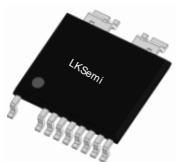
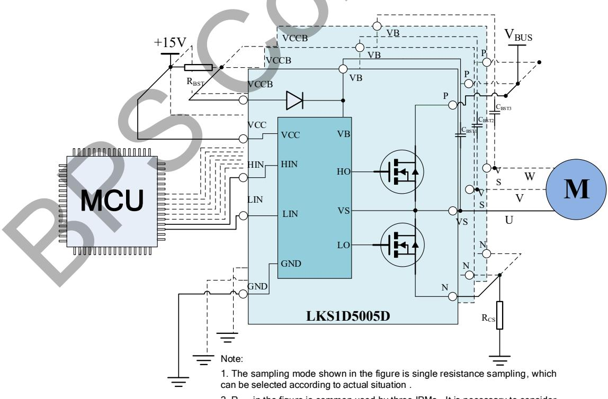
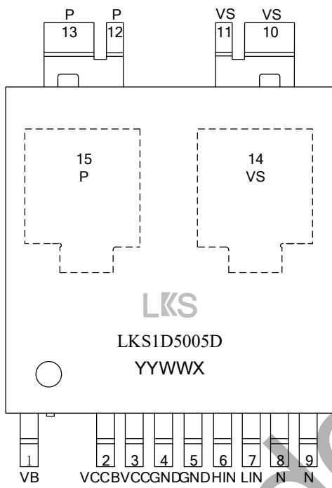
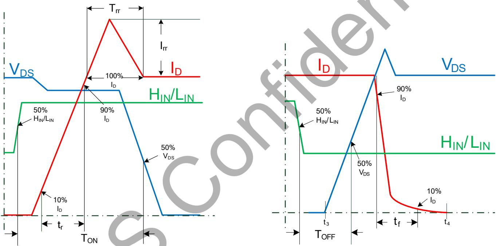
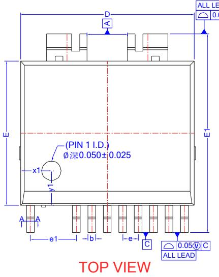
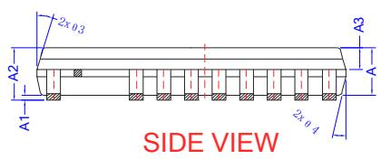
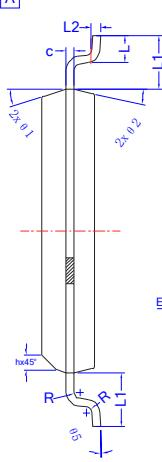
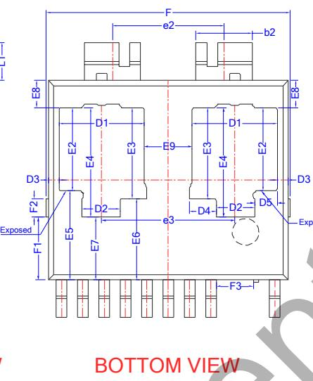

## Description

The LKS1D5005D is a high voltage 1-Phase IPM (Intelligent Power Module). It integrates HVIC and high-performance MOSFET for BLDC and PMSM motors. Separate Open-Source Pins from Low-Side MOSFETs are for Current-Sensing.

The input works with Schmitt-trigger and the logic voltage level is compatible with 3.3V/5V /15V signal.

The LKS1D5005D is available in ESOP13 package.

  
ESOP13 Package

## Features

◼ Built-in high-performance 500V/5A MOSFET

◼ Built-in bootstrap diode

◼ Robust at negative transient voltage

◼ Gate drive supply range from 10V to 20V

◼ 3.3V, 5V and 15V input logic compatible

◼ UVLO for both high side and low side

◼ Built-in dead time to avoid cross-conduction

## Applications

◼ High-speed hair dryer

◼ Fan

◼ Electric tools

## Typical Application

  
1. The sampling mode shown in the figure is single resistance sampling, which can be selected according to actual situation .  
2. R in the figure is common used by three IPMs . It is necessary to consider whether $\mathsf { R } _ { \mathsf { B S T } }$ can meet the power requirement

Figure 1. Typical application circuit for LKS1D5005D

Ordering Information

<table><tr><td>Part Number</td><td>Package</td><td>Packing</td><td>Marking</td></tr><tr><td>LKS1D5005D</td><td>ESOP13</td><td>Tape &amp; Reel2500 PCS/ Reel</td><td>LKS LKS1D5005D YYWWX</td></tr></table>

## Pin Configuration and Marking Information

  
LKS: Logo  
LKS1D5005D: Part number  
YY: Year  
WW: Week  
Figure 2. Pin configuration

X: Special code of power device

## Pin Definition

<table><tr><td>Pin No.</td><td>Name</td><td>Description</td></tr><tr><td>1</td><td>VB</td><td>High side MOSFET driving supply</td></tr><tr><td>2</td><td>VCCB</td><td>Input for built-in bootstrap diode</td></tr><tr><td>3</td><td>VCC</td><td>Logic and low side MOSFET driving supply</td></tr><tr><td>4~5</td><td>GND</td><td>Logic common ground</td></tr><tr><td>6</td><td>HIN</td><td>Logic input for high side</td></tr><tr><td>7</td><td>LIN</td><td>Logic input for low side</td></tr><tr><td>8~9</td><td>N</td><td>Negative reference and low side MOSFET return</td></tr><tr><td>10~11</td><td>VS</td><td>Output and high side MOSFET return</td></tr><tr><td>12~13</td><td>P</td><td>Positive high voltage DC Power supply</td></tr><tr><td>14</td><td>VS</td><td>Output and high side MOSFET return</td></tr><tr><td>15</td><td>P</td><td>Positive high voltage DC Power supply</td></tr></table>

## Absolute Maximum Ratings (note 1) (Unless otherwise specified, ${ \mathsf { T } } { \mathsf { A } } { = } 2 5 { \mathsf { \Omega } } ^ { \circ } { \mathsf { C } } { \mathsf { ) } }$

Inverter Part

<table><tr><td>Symbol</td><td>Parameter</td><td>Conditions</td><td>Ratings</td><td>Unit</td></tr><tr><td> $V_{DSS}$ </td><td>Drain-Source Voltage of Each MOSFET</td><td> $I_{DSS}=250uA$ </td><td>500</td><td>V</td></tr><tr><td rowspan="2"> $I_D$ </td><td rowspan="2">Each MOSFET Current, Continuous (note 2)</td><td> $T_C=25°C$ </td><td>5</td><td>A</td></tr><tr><td> $T_C=100°C$ </td><td>3.16</td><td>A</td></tr><tr><td> $P_D$ </td><td>Maximum Power Dissipation</td><td>Each MOSFET( $T_C=100°C$ )</td><td>50</td><td>W</td></tr></table>

Control Part

<table><tr><td>Symbol</td><td>Parameter</td><td>Conditions</td><td>Ratings</td><td>Unit</td></tr><tr><td> $V_{CC}$ </td><td>Control Supply Voltage</td><td>Applied between VCC and GND</td><td>20</td><td>V</td></tr><tr><td> $V_{BS}$ </td><td>High-side Bias Voltage</td><td>Applied between VB and VS</td><td>20</td><td>V</td></tr><tr><td> $V_{LIN/HIN}$ </td><td>Input Signal Voltage</td><td>Applied between LIN/HIN and GND</td><td>-0.3 ~VCC+0.3</td><td>V</td></tr></table>

## Thermal Resistance

<table><tr><td>Symbol</td><td>Parameter</td><td>Conditions</td><td>Ratings</td><td>Unit</td></tr><tr><td> $R_{th(j-c)T}$ </td><td>Junction to Top case Thermal resistance</td><td>Same as Inverter part</td><td>20</td><td>°C/W</td></tr><tr><td> $R_{th(j-c)B}$ </td><td>Junction to Bottom case Thermal resistance</td><td>Same as Inverter part</td><td>1</td><td>°C/W</td></tr></table>

Total system

<table><tr><td>Symbol</td><td>Parameter</td><td>Conditions</td><td>Ratings</td><td>Unit</td></tr><tr><td> $T_{J}$ </td><td>Operating Junction Temperature</td><td></td><td>-40~150</td><td>°C</td></tr><tr><td> $T_{STG}$ </td><td>Storage Temperature</td><td></td><td>-40~125</td><td>°C</td></tr></table>

Note 1: Stresses beyond those listed under “absolute maximum ratings” may cause permanent damage to the device.

Note 2: Limited by the maximum junction temperature.

Recommended Operation Conditions (note3) (Unless otherwise specified, TA=25 ℃)

<table><tr><td>Symbol</td><td>Parameter</td><td>Conditions</td><td>Min.</td><td>Typ.</td><td>Max.</td><td>Unit</td></tr><tr><td> $V_{PN}$ </td><td>Supply Voltage</td><td>Applied between P and N</td><td>-</td><td>300</td><td>400</td><td>V</td></tr><tr><td> $V_{CC}$ </td><td>Control Supply Voltage</td><td>Applied between VCC and GND</td><td>12.0</td><td>15.0</td><td>18.0</td><td>V</td></tr><tr><td> $V_{BS}$ </td><td>High-Side Bias Voltage</td><td>Applied between VB and VS</td><td>12.0</td><td>15.0</td><td>18.0</td><td>V</td></tr><tr><td> $V_{LIN/HIN(ON)}$ </td><td>Input ON Threshold Voltage</td><td>Applied between  $V_{LIN/HIN}$  and GND</td><td>3.0</td><td>-</td><td>VCC</td><td>V</td></tr><tr><td> $V_{LIN/HIN(OFF)}$ </td><td>Input OFF Threshold Voltage</td><td>Applied between  $V_{LIN/HIN}$  and GND</td><td>0</td><td>-</td><td>0.4</td><td>V</td></tr><tr><td> $T_{DEAD}$ </td><td>Blanking Time for Preventing Arm-Short (note 4)</td><td>VCC = VBS = 12.0 ~ 18.0V,  $T_J < 150°C$ </td><td>1.0</td><td>-</td><td>-</td><td>us</td></tr><tr><td> $F_{PWM}$ </td><td>PWM Switching Frequency</td><td> $T_J < 150°C$ </td><td>-</td><td>20</td><td>-</td><td>KHz</td></tr><tr><td> $T_{C(MAX)}$ </td><td>Maximum Case Temperature Under-operating</td><td> $T_J < 150°C$ </td><td></td><td>120</td><td></td><td>°C</td></tr></table>

Note 3: Under “recommended operating conditions” the device operation is assured, but some particular parameter may not be achieved. Note4: The gate-drive built-in deadtime may need to be taken into consideration. (the typical value as shown in the table below).

Electrical Characteristics (note 5) (Unless otherwise specified, $\mathsf { T } _ { \mathsf { A } } = 2 5 \ ^ { \circ } { \mathsf { C } } )$

<table><tr><td>Symbol</td><td>Parameter</td><td>Conditions</td><td>Min.</td><td>Typ.</td><td>Max.</td><td>Unit</td></tr><tr><td colspan="7">Inverter Part</td></tr><tr><td> $BV_{DSS}$ </td><td>Drain-Source Breakdown Voltage</td><td> $V_{LIN/HIN}=0V, I_D=250uA$ </td><td>500</td><td></td><td></td><td>V</td></tr><tr><td> $I_{DSS}$ </td><td>Zero Gate Voltage Drain Current</td><td> $V_{LIN/HIN}=0V, V_{DS}=500V$ </td><td></td><td></td><td>10</td><td>μA</td></tr><tr><td> $V_{SD}$ </td><td>Drain-Source Diode Forward Voltage</td><td> $V_{CC}=V_{BS}=15V, V_{LIN/HIN}=0V, I_D=-5A$ </td><td></td><td></td><td>1.5</td><td>V</td></tr><tr><td> $R_{DS(ON)}$ </td><td>Drain-Source Turn-On Resistance</td><td> $V_{CC}=V_{BS}=15V, V_{LIN/HIN}=5V, I_D=0.5A$ </td><td></td><td>1.4</td><td>1.8</td><td>ohm</td></tr><tr><td> $T_{ON}$ </td><td rowspan="8">Switching Times</td><td rowspan="2"> $V_{PN}=400V, V_{CC}=V_{BS}=15V, I_D=5A$ </td><td></td><td>780</td><td></td><td>ns</td></tr><tr><td> $T_{OFF}$ </td><td></td><td>250</td><td></td><td>ns</td></tr><tr><td>Irr</td><td rowspan="3"> $V_{LIN/HIN}=0~5V, Inductive Load L=2.8mH$ </td><td></td><td>3.6</td><td></td><td>A</td></tr><tr><td>Trr</td><td></td><td>100</td><td></td><td>ns</td></tr><tr><td> $T_r$ </td><td></td><td>75</td><td></td><td>ns</td></tr><tr><td> $T_f$ </td><td rowspan="3">High-Side and Low-Side MOSFET Switching</td><td></td><td>13</td><td></td><td>ns</td></tr><tr><td> $E_{ON}$ </td><td></td><td>320</td><td></td><td>μJ</td></tr><tr><td> $E_{OFF}$ </td><td></td><td>10</td><td></td><td>μJ</td></tr><tr><td colspan="7">Control Part</td></tr><tr><td> $I_{QCC}$ </td><td>Quiescent VCC Supply Current</td><td> $V_{CC}=15V, V_{LIN/HIN}=0V$ </td><td>15</td><td>50</td><td>80</td><td>μA</td></tr><tr><td> $I_{SW}$ </td><td>Total VCC switching current</td><td> $V_{CC}=15V, F_{LIN/HIN}=15KHz$ </td><td></td><td>0.6</td><td></td><td>mA</td></tr><tr><td> $I_{QB}$ </td><td>Quiescent VBS Supply Current</td><td> $V_{BS}=15V, V_{LIN/HIN}=0V$ </td><td>15</td><td>40</td><td>70</td><td>μA</td></tr><tr><td> $V_{CC_ON}$ </td><td rowspan="2">VCC and VBS under voltage rising threshold</td><td rowspan="2"></td><td>8.0</td><td>8.6</td><td>9.8</td><td>V</td></tr><tr><td> $V_{BS_ON}$ </td><td>8.0</td><td>8.8</td><td>9.8</td><td>V</td></tr><tr><td> $V_{CC_UVLO}$ </td><td rowspan="2">VCC and VBS under voltage falling threshold</td><td rowspan="2"></td><td>7.0</td><td>7.6</td><td>8.6</td><td>V</td></tr><tr><td> $V_{BS_UVLO}$ </td><td>7.2</td><td>7.8</td><td>8.8</td><td>V</td></tr><tr><td> $V_{CC_HYS}$ </td><td rowspan="2">VCC and VBS under voltage hysteresis voltage</td><td rowspan="2"></td><td>0.5</td><td>1.0</td><td>1.5</td><td>V</td></tr><tr><td> $V_{BS_HYS}$ </td><td>0.5</td><td>1.0</td><td>1.5</td><td>V</td></tr><tr><td> $V_{IH}$ </td><td>ON Threshold Voltage</td><td>Logic High Level</td><td>2.4</td><td>-</td><td></td><td>V</td></tr><tr><td> $V_{IL}$ </td><td>OFF Threshold Voltage</td><td>Logic Low Level</td><td></td><td>-</td><td>0.6</td><td>V</td></tr><tr><td>Deadtime</td><td>Gate-drive built-in blanking Time for Preventing Arm-Short</td><td></td><td></td><td>300</td><td></td><td>ns</td></tr><tr><td colspan="7">Bootstrap Diode</td></tr><tr><td> $V_{FB}$ </td><td>Forward voltage</td><td> $I_F=0.2A$ </td><td></td><td></td><td>1.4</td><td>V</td></tr><tr><td> $T_{RRB}$ </td><td>Reverse recovery time</td><td> $I_F=0.5A$ </td><td></td><td>40</td><td></td><td>ns</td></tr></table>

Note5: The electrical characteristics table defines the operation range of the device, the electrical characteristics is assured on DC and AC voltage by test program. For the parameters without minimum and maximum value in the EC table, the typical value defines the operation range, the accuracy is not guaranteed by spec.

True Table

<table><tr><td>HIN</td><td>LIN</td><td>OUTPUT(U/V/W)</td><td>Description</td></tr><tr><td>0</td><td>0</td><td>Hi-Z</td><td>High side and Low side OFF</td></tr><tr><td>0</td><td>1</td><td>0</td><td>Low side ON, High side OFF</td></tr><tr><td>1</td><td>0</td><td> $V_P$ </td><td>High side ON, Low side OFF</td></tr><tr><td>1</td><td>1</td><td>Hi-Z</td><td>Forbidden input, High side and Low side OFF</td></tr><tr><td>Open</td><td>Open</td><td>Hi-Z</td><td>Input internal pull-down resistor 100K ohm</td></tr></table>

Switching time definition

  
Figure 3. Switching time definition

SIDE VIEW

## Package Information

ESOP13 Package Outline  

COMMON DIMENSIONS (UNITS OF MEASURE=MILLIMETER)

<table><tr><td>SYMBOL</td><td>MIN</td><td>NOM</td><td>MAX</td></tr><tr><td>A</td><td>1.3</td><td>1.4</td><td>1.50</td></tr><tr><td>A1</td><td>0.00</td><td>-</td><td>0.12</td></tr><tr><td>A2</td><td>1.40</td><td>1.55</td><td>1.70</td></tr><tr><td>A3</td><td>0.60</td><td>-</td><td>0.70</td></tr><tr><td>b</td><td>0.37</td><td>-</td><td>0.47</td></tr><tr><td>b1</td><td>0.35</td><td>-</td><td>0.45</td></tr><tr><td>b2</td><td>2.05</td><td>2.10</td><td>2.15</td></tr><tr><td>c</td><td>0.17</td><td>-</td><td>0.27</td></tr><tr><td>c1</td><td>0.15</td><td>-</td><td>0.25</td></tr><tr><td>D</td><td>8.8</td><td>9.0</td><td>9.2</td></tr><tr><td>D1</td><td>3.0</td><td>-</td><td>3.3</td></tr><tr><td>D2</td><td>1.3</td><td>-</td><td>1.6</td></tr><tr><td>D3</td><td>0.3</td><td>-</td><td>0.5</td></tr><tr><td>D4</td><td>0.9</td><td>-</td><td>1.1</td></tr><tr><td>D5</td><td>0.7</td><td>-</td><td>1.0</td></tr><tr><td>E</td><td>7.4</td><td>7.5</td><td>7.7</td></tr><tr><td>E1</td><td>10.1</td><td>10.3</td><td>10.6</td></tr><tr><td>E2</td><td>3.0</td><td>-</td><td>3.3</td></tr><tr><td>E3</td><td>3.3</td><td>-</td><td>3.6</td></tr><tr><td>E4</td><td>4.0</td><td>-</td><td>4.3</td></tr><tr><td>E5</td><td>3.2</td><td>-</td><td>3.5</td></tr><tr><td>E6</td><td>2.9</td><td>-</td><td>3.2</td></tr><tr><td>E7</td><td>2.2</td><td>-</td><td>2.5</td></tr><tr><td>E8</td><td>0.9</td><td>-</td><td>1.2</td></tr><tr><td>E9</td><td>1.7</td><td>1.8</td><td>1.9</td></tr><tr><td>e</td><td colspan="3">0.80 BSC</td></tr><tr><td>e1</td><td colspan="3">2.40 BSC</td></tr><tr><td>e2</td><td colspan="3">4.19 BSC</td></tr><tr><td>e3</td><td>4.89</td><td>4.99</td><td>5.09</td></tr><tr><td>F</td><td>9.0</td><td>-</td><td>9.4</td></tr><tr><td>F1</td><td>2.25</td><td>2.35</td><td>2.40</td></tr><tr><td>F2</td><td>0.6</td><td>0.7</td><td>0.8</td></tr><tr><td>F3</td><td>1.35</td><td>1.40</td><td>1.45</td></tr><tr><td>L</td><td>0.62</td><td>0.72</td><td>0.82</td></tr><tr><td>L1</td><td>1.32</td><td>1.42</td><td>1.52</td></tr><tr><td>L2</td><td colspan="3">0.25 BSC</td></tr><tr><td>R</td><td>0.07</td><td>/</td><td>/</td></tr><tr><td>h</td><td>0.25</td><td>0.35</td><td>0.45</td></tr><tr><td>θ1</td><td>15°</td><td>17°</td><td>19°</td></tr><tr><td>θ2</td><td>11°</td><td>13°</td><td>15°</td></tr><tr><td>θ3</td><td>15°</td><td>17°</td><td>19°</td></tr><tr><td>θ4</td><td>11°</td><td>13°</td><td>15°</td></tr><tr><td>θ5</td><td>0°</td><td>3°</td><td>6°</td></tr><tr><td>Pin1ø</td><td>0.9</td><td>1.0</td><td>1.1</td></tr><tr><td>x1</td><td>1.5</td><td>1.6</td><td>1.7</td></tr><tr><td>y1</td><td>1.7</td><td>1.8</td><td>1.9</td></tr></table>

Revision Information

<table><tr><td>Revision</td><td>Date</td><td>Notes</td></tr><tr><td>Rev.1.0</td><td>2025/02</td><td>Initial Release</td></tr></table>

## Disclaimer

The information provided in this datasheet is believed to be accurate and reliable. However, Bright Power Semiconductor (BPS) reserves the right to make changes at any time without prior notice.

No license, to any intellectual property right owned by BPS or any other third party, is granted under this document BPS provides information in this datasheet “AS IS” and with all faults, and makes no warranty, express or implied, including but not limited to, the accuracy of the information provided in this datasheet, merchantability, fitness of a specific purpose, or non-infringement of intellectual property rights of BPS or any other third party. BPS disclaims any and all liabilities arising out of this datasheet or use of this datasheet, including without limitation consequential or incidental damages.

## Electronic device scrap description

After the end of its life cycle, the product is processed by the customer in accordance with the scrap process of general electronic products.